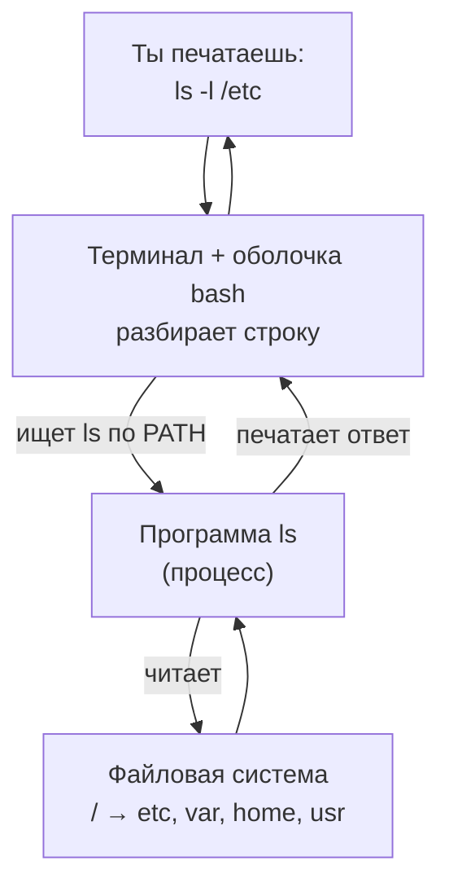
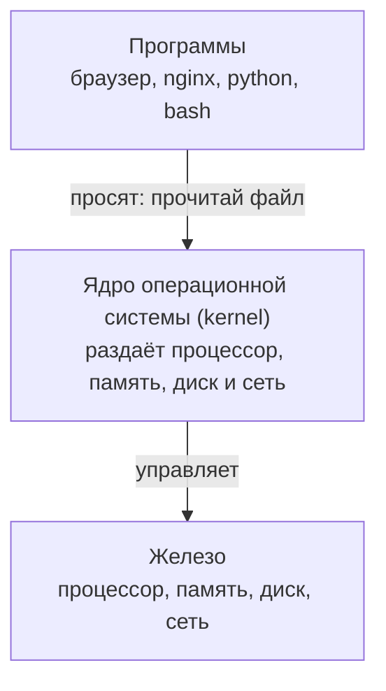
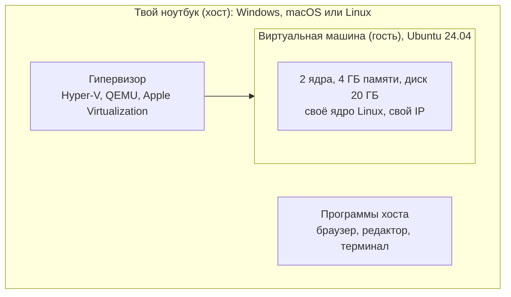
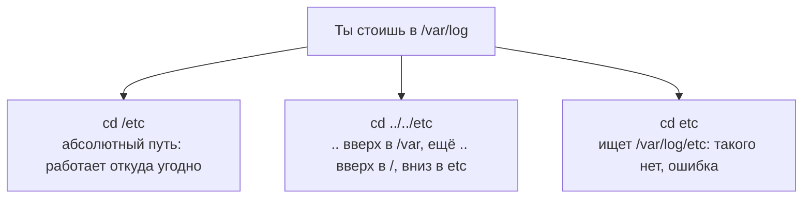
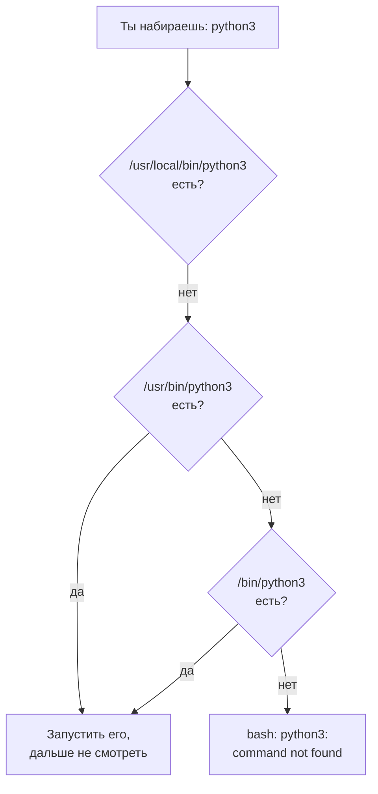
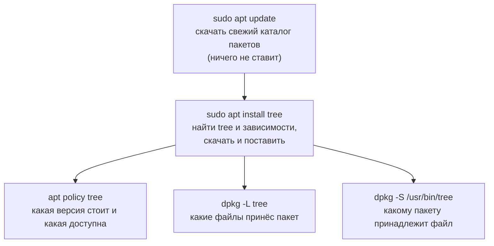
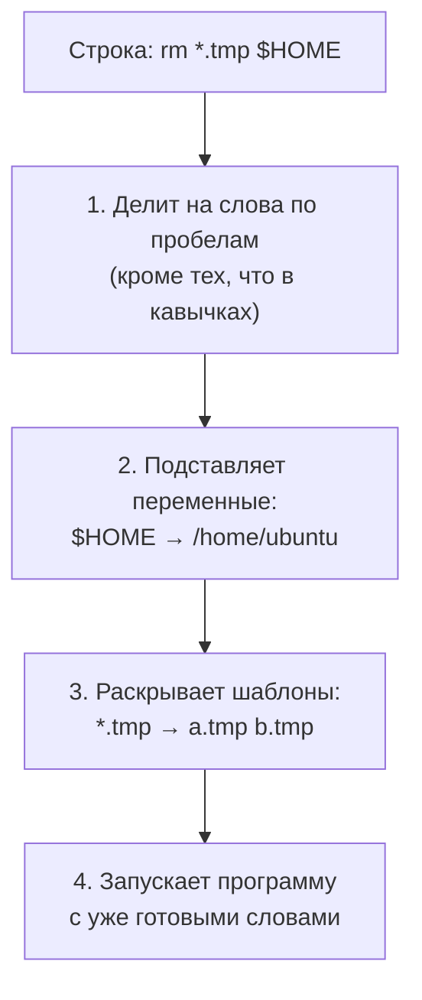
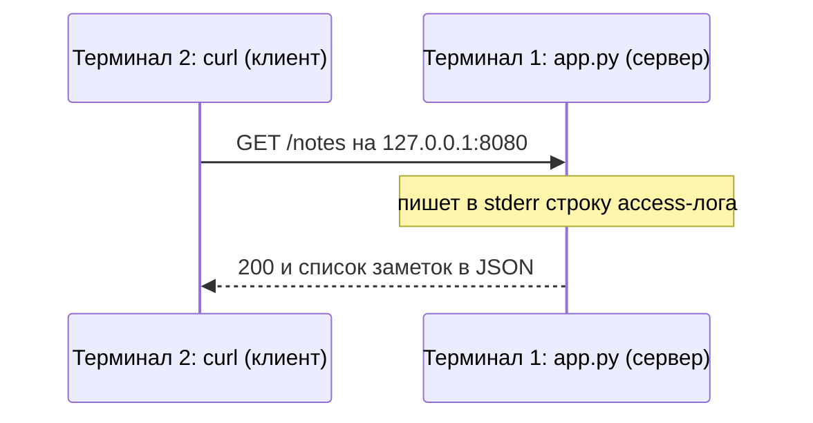

## Зачем это нужно

Представь первую рабочую задачу: «Зайди на сервер и глянь, почему сайт тормозит». Открываешь чёрное окно с мигающим курсором, а там ни кнопок, ни меню, ни подсказок. Новички в этот момент часто сидят минут десять, не зная, с чего начать. Этот урок про то, что нужно в первую минуту.

Почти любой сервер, на который ты попадёшь на работе, это Linux без графики: ни окон, ни кнопок, только текст, и подключён он по сети. Когда «прод лежит» (прод, или production, это боевая версия сервиса, которой пользуются настоящие люди), искать кнопки некогда. За минуту нужно понять, где ты находишься, что лежит вокруг, как прочитать **конфиг** (файл с настройками программы) или **лог** (файл, куда программа записывает, что с ней происходило), и как узнать флаги незнакомой команды без интернета. **Флаг** (flag) это добавка к команде, которая меняет её поведение: `ls -l` покажет не просто названия файлов, а подробный список. Без флагов у каждой команды был бы один режим, и под каждый случай пришлось бы искать отдельную команду.

Ещё одна типичная ситуация: «команда не найдена» (`command not found`), хотя программа точно установлена. Причина почти всегда в переменной `PATH` или в том, что пакета нет. **Переменная** (variable) это именованная ячейка с текстом, как подписанная коробка: на коробке написано `PATH`, а внутри лежит список папок, где система ищет программы. **Пакет** (package) это программа, упакованная для установки, как приложение в магазине: внутри сама программа и инструкция, куда её разложить. Про переменные подробно в [уроке 1.6](06-bash-basics.md), а про пакеты ты узнаешь ниже. Это разбирается за пять минут, если знать порядок проверки.

Это первый урок курса, поэтому в нём есть то, чего в следующих не будет: мы вместе получим рабочую машину с Linux (раздел «Подготовка рабочего места») и объясним, что такое сервер, виртуальная машина, терминал и приглашение. **Приглашение** (prompt) это короткая строка перед местом, где ты печатаешь, вроде `ubuntu@server:~$`: она говорит, что система готова принять команду, и заодно показывает, кто ты и где находишься. **Терминал** (terminal) это окно с текстом, куда ты печатаешь команды и где видишь ответы. Все три слова разберём ниже подробно. Знаний сверх умения пользоваться компьютером не нужно.

Шаг проекта: ты создаёшь каталог (папку; в Linux так называют папки, подробно в [уроке 1.5](05-disk-memory-cpu.md)) `~/notes` и руками пишешь первую версию сервиса «Заметки» (`app.py`, версия v1), запускаешь его и отправляешь ему запрос. Этот сервис будет расти через весь курс: в темах про Docker, Kubernetes и мониторинг ты будешь упаковывать, выкатывать и чинить именно его. Docker это инструмент, который запаковывает программу вместе со всем, что ей нужно, в одну «коробку» (контейнер), чтобы она одинаково запускалась на любой машине ([тема 4](../04-docker/index.md)). Kubernetes это система, которая запускает много таких коробок на многих серверах и сама перезапускает упавшие ([тема 5](../05-kubernetes/index.md)). Мониторинг это постоянное наблюдение за работой сервиса: графики и оповещения, чтобы узнать о поломке раньше пользователей ([тема 8](../08-observability/index.md)). Пока запоминать не нужно, всё объясним на месте.

## Что нужно знать

Ничего: это первый урок, предыдущих нет. Нужен только компьютер с Windows, macOS или Linux, 8 ГБ памяти или больше, около 25 ГБ свободного места и доступ в интернет.

Курсу нужна машина с Ubuntu 24.04 LTS или 26.04 LTS. Ubuntu это одна из версий (дистрибутивов) Linux, самая популярная на серверах. LTS (Long Term Support) значит «долгая поддержка»: такая версия получает исправления безопасности пять лет, поэтому на серверах ставят именно её. Если у тебя такой машины нет (а у новичка её нет), раздел «Подготовка рабочего места» ниже покажет, как получить её за 15 минут на Windows, macOS или Linux. Все команды урока прогнаны на Ubuntu 24.04 и частично на 26.04. На macOS без виртуальной машины часть команд (`apt` (установщик программ), `/proc` (служебный каталог, через который Linux показывает своё состояние), `free` (показывает память)) не сработает, поэтому не пропускай подготовку.

## Картина целиком

Представь, что ты приехал в незнакомый город. Чтобы добраться куда нужно, тебе надо узнать, где ты (адрес), уметь читать карту (структуру города), знать, как спросить дорогу (справка), и как позвать нужный транспорт по названию (программы).

С сервером так же:

- **Терминал** и **оболочка** это твой способ «говорить» с машиной: ты пишешь строку, она отвечает текстом. Терминал это окно, а оболочка (shell, у нас `bash`) это программа внутри окна, которая читает строку и запускает нужное.
- **Файловая система** это карта города: одно дерево каталогов, где у каждого файла есть адрес (путь, например `/etc/hostname`: от корня дерева через папки к файлу).
- **Справка** (`--help` даёт краткую подсказку, `man` открывает полное руководство) это разговорник: наизусть знать не нужно, нужно быстро найти.
- **`PATH`** это список улиц (папок), по которым оболочка ищет программу, когда ты называешь её по имени.
- **`apt`** это магазин приложений: он ставит программы (пакеты) и знает, какие файлы они принесли, поэтому их можно чисто удалить.



Схема читается по кругу: строка уходит в оболочку, оболочка находит программу по `PATH`, программа читает файлы и возвращает текст, оболочка показывает его тебе. Все четыре части ты разберёшь по очереди.

Всё это работает на **виртуальной машине** (ВМ): компьютере внутри твоего настоящего компьютера. Специальная программа выделяет ей часть процессора, памяти и диска, и внутри запускается отдельная система со своим экраном. Как квартира в доме: у неё свои стены, и мебель там ломать можно, соседей это не затронет. ВМ нужна, чтобы ты мог экспериментировать и ломать, не рискуя своей системой. За урок ты получишь такую машину, разберёшь каждую часть схемы и в конце напишешь и запустишь первый сервис.

## Теория

### Сервер, Linux и зачем они друг другу

Сайт банка работает круглосуточно, а ведь никто не сидит за его компьютером и не нажимает кнопки. Где он вообще работает и почему почти всегда на Linux?

Представь кухню ресторана. Гости не заходят на кухню и не нажимают кнопки на плите: они делают заказ, а кухня работает без них. Поэтому там не нужны красивые залы, нужны надёжность и порядок. Такой «кухней» для сайта, приложения банка или почты служит **сервер** (server): компьютер, который круглосуточно ждёт запросов по сети и отвечает на них. Физически это обычный компьютер, часто без экрана, в стойке в дата-центре (здании, набитом такими компьютерами). Слово «сервер» означает ещё и программу, которая отвечает на запросы: «сервер Заметок» это программа `app.py`. Из контекста обычно понятно, о чём речь. Аналогия ломается в одном: у кухни один шеф, а на сервере одновременно работают сотни программ, которые не мешают друг другу.

Любой компьютер состоит из трёх слоёв:



**Ядро** (kernel) это главная программа системы: она одна умеет напрямую работать с железом. Обычные программы не трогают диск сами, а просят ядро: «прочитай мне вот этот файл». Ядро плюс набор стандартных программ вокруг него называют **операционной системой** (ОС, operating system). Windows, macOS и Linux это три разные операционные системы.

Строго говоря, Linux это только ядро. Его написал Линус Торвальдс в 1991 году, а вокруг разные группы людей собрали наборы программ. Готовый набор «ядро Linux плюс программы плюс установщик» называется **дистрибутивом** (distribution). Самые известные: Ubuntu, Debian, Red Hat Enterprise Linux (RHEL), Alpine. В курсе используется Ubuntu: самый популярный дистрибутив для серверов у новичков и у многих компаний. Номер `Ubuntu 24.04 LTS` читается так: `24.04` это год и месяц выпуска (апрель 2024), `LTS` значит «долгая поддержка», исправления безопасности выходят пять лет. Новые LTS появляются раз в два года, в апреле: после 24.04 идёт 26.04. Серверы почти всегда ставят на LTS, потому что переустанавливать систему каждые полгода никто не хочет.

Почему серверам нужен именно Linux? Причины связаны между собой:

1. Он бесплатный и открытый: его можно поставить на тысячу серверов без лицензий, а ошибки в открытом коде находят тысячи людей.
2. Графика ему необязательна: экран, окна и рабочий стол на сервере только расходуют память и добавляют места для сбоев.
3. Им управляют текстом по сети: по плохой связи легко передать строки, а картинку экрана нельзя.
4. Всё делается командами, значит, любое действие можно записать в файл-скрипт и повторить на ста серверах. Автоматизация это и есть суть DevOps.
5. Он работает годами без перезагрузки, а облака, контейнеры и Kubernetes построены вокруг него. Вакансии DevOps почти всегда про Linux.

Возьмём фразу из вакансии: «Сопровождение сервисов на Ubuntu 24.04 LTS». Расшифровка: сервисы (программы, которые работают постоянно и отвечают на запросы) запущены на серверах с Ubuntu, выпуск апреля 2024 года, поддержка до 2029-го. Тебя будут просить подключаться к этим серверам и искать, почему сервис не отвечает.

> **Прикинь сам:** тебе встретилась запись `Ubuntu 22.04 LTS`. Когда вышел этот выпуск и пять лет поддержки заканчиваются в каком году?
{: .predict}

22.04 это апрель 2022 года, поддержка идёт пять лет, до 2027-го. Так по номеру версии сразу видно, пора ли планировать обновление.

Осторожно: «Linux и Ubuntu это одно и то же» неверно, Ubuntu лишь один из сотен дистрибутивов на ядре Linux. И сервер определяется ролью (отвечает по сети), а не мощностью железа: твоя ВМ с двумя ядрами процессора будет полноценным сервером для учёбы.

Linux встречается не только на серверах. Внутри Android лежит ядро Linux, он есть в роутерах и телевизорах, в облачных виртуальных машинах (Yandex Cloud, AWS), внутри контейнеров Docker и кластеров Kubernetes. Навык один, применений много: один раз научился читать приглашение, пути и справку, и работаешь так же везде. Учебная ВМ отличается от настоящего сервера только окружением: настоящий стоит в дата-центре, у него много пользователей и ошибка стоит денег. Тут внутри всё одинаково: тот же bash, те же каталоги, те же команды. Поэтому ты будешь «ломать» ВМ осознанно и чинить: так привыкаешь не паниковать.

> **Главное:** сервер это компьютер, который отвечает на запросы по сети, а Linux это ядро, вокруг которого собраны дистрибутивы вроде Ubuntu; на серверах он потому, что бесплатный, без графики и управляется командами.
{: .key}

> **Проверь понимание:** чем ядро отличается от дистрибутива и что значит `26.04 LTS`?

<details markdown="1">
<summary>Ответ</summary>

Ядро это главная программа, которая управляет железом. Дистрибутив это ядро плюс набор программ и установщик, например Ubuntu. `26.04` это апрель 2026 года, `LTS` означает долгую (пять лет) поддержку с исправлениями безопасности.

</details>

Учиться на настоящем сервере страшно: один неверный шаг, и пострадает чужая работа. Нужна тренировочная площадка.

### Виртуальная машина, WSL и почему они нужны на этом курсе

Тебе нужен Linux, чтобы учиться, но ставить его вместо Windows или macOS не хочется, а ломать рабочий ноутбук страшно. Что делать?

Лётчики тренируются на тренажёре: приборы, кнопки и реакции самолёта настоящие, но если «разбил» самолёт, встал и пошёл пить чай. Такой тренажёр для сервера это **виртуальная машина**: второй, «понарошку» компьютер внутри настоящего. Он медленнее настоящего, но ломать его можно сколько угодно.

Специальная программа, **гипервизор** (hypervisor), выделяет часть твоего процессора, памяти и диска и запускает на них отдельную операционную систему. Твой настоящий компьютер называют **хостом** (host, «хозяин»), виртуальный **гостем** (guest). Гость уверен, что у него настоящее железо, но его диск это просто большой файл у хоста.



Видно, что ВМ живёт внутри хоста и пользуется выделенной ей долей железа, а хост по-прежнему занимается своими программами. Для гипервизора процессор должен поддерживать виртуализацию. Она есть почти у всех компьютеров после 2012 года, но на некоторых Windows-ноутбуках выключена в BIOS (программе настройки железа, которая запускается до операционной системы). Это самая частая причина ошибок установки, ниже есть раздел про неё.

Новички путают три близких понятия:

- **Виртуальная машина**: целая операционная система со своим ядром. Тяжелее, но полностью изолирована и ведёт себя как настоящий сервер.
- **WSL2** (Windows Subsystem for Linux): встроенный в Windows способ запустить Linux. Внутри это тоже лёгкая ВМ, но Microsoft управляет ей сама, и ты открываешь Ubuntu как обычную программу.
- **Контейнер**: не отдельная ОС, а изолированный «ящик» внутри одного ядра. Контейнерам посвящена [тема 4](../04-docker/index.md), пока не путай их с ВМ.

В курсе ты используешь **Multipass**: бесплатную программу от Canonical (компании-создателя Ubuntu), которая одной командой создаёт ВМ с Ubuntu на Windows, macOS и Linux. Команды везде одинаковые, а внутри всегда чистый Ubuntu.

Команда, которую ты выполнишь ниже: `multipass launch 24.04 --name devops --cpus 2 --memory 4G --disk 20G`. Расшифровка: создай ВМ (`launch`) на основе Ubuntu 24.04, назови её `devops`, дай ей 2 ядра, 4 гигабайта памяти и 20 гигабайт диска.

> **Прикинь сам:** у ноутбука 8 ГБ памяти, ВМ получила 4 ГБ. Сколько останется хосту, пока ВМ включена, и сколько после `multipass stop`?
{: .predict}

Пока ВМ работает, хосту достаются оставшиеся 4 ГБ из 8, а после `multipass stop` память возвращается: снова все 8. Поэтому ВМ на слабом ноутбуке лучше выключать, когда не учишься.

Осторожно: закрыть окно терминала не значит выключить ВМ, она продолжает работать и занимать память. И наоборот: команда `multipass delete` стирает ВМ вместе со всем внутри, потому что диск ВМ это файл у хоста. Сам ноутбук от этого не пострадает: гость изолирован.

> **Главное:** виртуальная машина это изолированный компьютер внутри твоего, на нём можно ломать что угодно, а в курсе её создаёт Multipass.
{: .key}

> **Проверь понимание:** ты установил в ВМ программу и «сломал» систему. Пострадает ли твой ноутбук? Что придётся сделать, чтобы начать заново?

<details markdown="1">
<summary>Ответ</summary>

Ноутбук не пострадает: ВМ изолирована, её диск это файл у хоста. Чтобы начать заново, удаляют ВМ (`multipass delete --purge devops`) и создают новую той же командой `launch`.

</details>

Машина будет, но как с ней разговаривать? Откроем окно, в которое надо печатать.

### Терминал, командная строка, оболочка и приглашение

У сервера нет окон и кнопок. Как вообще сказать ему, что делать?

Представь окошко в банке. Ты просовываешь бумажку с просьбой, операционист за окошком читает её, идёт в нужный отдел, приносит результат и кладёт в окошко. Окошко это **терминал** (terminal): окно, в котором ты печатаешь и видишь ответ, само оно ничего не выполняет. Операционист это **оболочка** (shell): программа внутри терминала, которая читает твою строку, разбирает её и запускает нужные программы. В Ubuntu по умолчанию она называется `bash`. А сам способ управления через строки текста, в отличие от кнопок, называют **командной строкой** (command line, CLI). Аналогия ломается тем, что операционист банка переспросит, а оболочка выполнит ровно то, что написано, даже если это удаление всех файлов.

Перед местом ввода оболочка печатает **приглашение** (prompt): «я готова, вводи». Разберём его на примере из Multipass:

```text
ubuntu@devops:~$
|      |      | |
|      |      | +-- $ : ты обычный пользователь (у администратора здесь #)
|      |      +---- ~ : текущий каталог; ~ значит «мой домашний каталог»
|      +----------- devops : имя машины (hostname), ты его задал при создании
+------------------ ubuntu : имя пользователя, под которым ты вошёл
```

Значит, `ubuntu@devops:~$` читается: «ты пользователь `ubuntu` на машине `devops`, стоишь в домашнем каталоге, права обычные». Приглашение это приборная панель: по нему всегда видно, кто ты, где ты и на какой машине. Последнее важно на работе, когда открыто три окна с тремя серверами и легко перепутать, в каком ты сейчас. В примерах курса `$` пишется только в пояснениях, а в блоках кода перед командами не ставится, чтобы можно было копировать целиком.

Сама строка выглядит так: `команда -флаги аргументы`, слова разделены пробелами.

```text
ls   -l   /etc
|    |    |
|    |    +-- аргумент: с чем работать (каталог /etc)
|    +------- флаг (flag, ещё «опция»): меняет поведение; -l значит «подробный список»
+------------ команда: имя программы
```

Оболочка делит строку по пробелам на слова, первое слово считает именем программы, остальные передаёт ей. Найдя программу, запускает её, ждёт завершения, показывает вывод и печатает новое приглашение. Ты набираешь `ls -l /etc`: оболочка передаёт программе `ls` флаг `-l` и аргумент `/etc`, программа печатает подробный список файлов каталога (колонки разберёшь в задании 1) и завершается.

У любой программы два выходных «канала»: **стандартный вывод** (stdout), куда она пишет результат, и **стандартный поток ошибок** (stderr), куда пишет ошибки и служебные сообщения. Оба по умолчанию показываются на экране, поэтому ты их не различаешь. Различать научишься в [уроке 1.2](02-text-pipes.md), а в задании 5 увидишь, что лог сервера идёт именно в stderr.

Права администратора берут через `sudo` (от «superuser do»): приставка к команде, которая выполняет её от имени главного пользователя системы `root`. Он может всё, в том числе сломать систему одной опечаткой, поэтому обычная работа идёт без `sudo`, он нужен только там, где иначе нельзя (например, установка программ). В Multipass пользователь `ubuntu` использует `sudo` без пароля, в WSL с паролем, который ты придумал при установке. Подробно в [уроке 1.3](03-users-permissions.md).

Три привычки экономят часы:

- клавиша **Tab** дополняет имена: набери `cd Doc`, нажми Tab, и оболочка допишет `Documents`; два нажатия покажут варианты. Если не дописала, такого имени нет;
- **стрелка вверх** возвращает предыдущую команду, `Ctrl+R` ищет по истории введённых команд;
- **`Ctrl+C`** прерывает зависшую команду, **`Ctrl+D`** (или `exit`) завершает сессию.

> **Прикинь сам:** прочитай приглашение `deploy@web-01:/var/log#`. Кто ты, где и что тут настораживает?
{: .predict}

Ты пользователь `deploy` на машине `web-01`, стоишь в `/var/log`. Символ `#` вместо `$` значит права администратора: любая команда выполнится без ограничений, и опечатка дорого стоит. По приглашению же видно, что это не твой ноутбук.

Осторожно: в терминале `Ctrl+C` это не «копировать», а «прервать». Копирование обычно `Ctrl+Shift+C`, вставка `Ctrl+Shift+V` (в Windows Terminal ещё работает `Ctrl+V`, на macOS `Cmd+C` и `Cmd+V`). Ещё путают терминал и bash: в одном окне можно запустить другую оболочку (например, `zsh` на macOS), а одну и ту же оболочку открывают и в разных окнах, и по SSH (защищённому подключению к удалённой машине, о нём в [теме 2](../02-network/index.md)). И путают флаг с аргументом: в `ls -l /etc` слово `-l` меняет поведение, а `/etc` это то, над чем работают.

> **Главное:** терминал это окно, оболочка (bash) это программа внутри, а приглашение сообщает, кто ты, где и с какими правами; строка команды это «программа, флаги, аргументы».
{: .key}

Теперь мы умеем набрать команду. Где она будет искать файлы?

### Файловая система: одно дерево

На компьютере тысячи файлов. Как не потерять нужный и не перепутать два файла с одним именем?

Люди складывают файлы в папки (в Linux их называют каталогами, directory), а папки в другие папки. Получается дерево, и адрес файла читается как адрес в городе: страна, город, улица, дом, от общего к частному. В Windows несколько «стран»: диски `C:` и `D:`. В Linux страна одна: нет никаких `C:` и `D:`, а есть одно дерево с корнем `/` (**корневой каталог**, root directory, не путай с пользователем `root`), и всё остальное растёт из него. Диски и флешки подключаются (монтируются, mount) в его ветки: вместо отдельной буквы диска это просто каталог.

```text
/
├── etc/                конфигурация системы и сервисов
├── home/
│   └── ubuntu/         домашний каталог пользователя ubuntu  (это и есть ~)
│       └── notes/      сюда ты положишь app.py
├── opt/                программы, установленные вручную
├── proc/               «окно в ядро»: данных на диске нет
├── tmp/                временные файлы
├── usr/
│   └── bin/            основные программы: ls, python3, curl
└── var/
    ├── lib/            данные сервисов
    └── log/            логи
```

**Путь** (path) это адрес файла. Он бывает двух видов:

- **абсолютный** (absolute) начинается с `/` и считается от корня: `/var/log/syslog`. Он одинаков, где бы ты ни стоял;
- **относительный** (relative) не начинается с `/` и считается от текущего каталога: `log/syslog`. Он зависит от того, где ты сейчас.

Три особые записи: `.` текущий каталог, `..` родительский (на уровень выше), `~` твой домашний каталог. Регистр важен: `Notes` и `notes` разные имена, в отличие от Windows. Скрытые файлы начинаются с точки (`.bashrc`), обычный `ls` их не показывает, нужен флаг `-a` (all).

| Каталог | Что там |
|---|---|
| `/etc` | конфигурация системы и сервисов |
| `/var/log` | логи; `/var/lib` данные сервисов |
| `/home/имя` | домашний каталог пользователя (`~`) |
| `/usr/bin` | основные программы; `/usr/local/bin` то, что поставил админ |
| `/opt` | программы, установленные вручную |
| `/tmp` | временное, чистится при перезагрузке |
| `/proc` | не файлы, а окно ядра: данные придумываются в момент чтения |

По этой раскладке будет жить «Заметки»: код в `/opt/notes`, данные в `/var/lib/notes`, конфиг в `/etc/notes`. Сейчас, в первой версии, всё проще: файл лежит в `~/notes`. Раскладку по `/opt`, `/var` и `/etc` ты сделаешь в [уроке 1.3](03-users-permissions.md).

Ты стоишь в `/var/log` и хочешь попасть в `/etc`. Есть два пути:



Первые два приводят в `/etc`, третий ищет `etc` внутри текущего каталога и терпит неудачу.

> **Прикинь сам:** ты в `/home/ubuntu/notes`. Куда приведёт `cd ../..`?
{: .predict}

Один `..` поднимает в `/home/ubuntu`, второй в `/home`. Значит, `cd ../..` ведёт в `/home`.

Всё есть файл: обычный файл, каталог, устройство (`/dev/null`), даже состояние процесса (`/proc/1/status`). Поэтому одни и те же инструменты (`cat`, `ls`, `grep`) работают везде. `/proc` особенный: настоящих файлов на диске там нет, ядро составляет содержимое в момент чтения. Например, `/proc/cpuinfo` это ответ ядра на вопрос «что у тебя за процессор».

Осторожно: главная ошибка новичка это путь без слэша в начале. `cd var/log` работает только если ты стоишь в `/`. И тильда `~` не равна слэшу `/`: тильда это твой дом (`/home/ubuntu`), слэш это корень всего дерева.

> **Главное:** в Linux одно дерево с корнем `/`; абсолютный путь начинается с `/` и работает откуда угодно, относительный считается от текущего каталога.
{: .key}

> **Проверь понимание:** ты в `/var/log`. Куда приведёт `cd ../../etc` и куда `cd etc`?

<details markdown="1">
<summary>Ответ</summary>

`cd ../../etc` поднимется на два уровня (`/var/log` -> `/var` -> `/`) и спустится в `/etc`. `cd etc` ищет `etc` относительно текущего каталога, то есть `/var/log/etc`; такого нет, будет `No such file or directory`.

</details>

Мы знаем, где что лежит. Теперь научимся двигать файлы, и сразу про главную опасность.

### Работа с файлами: создать, переместить, удалить

Всё, что ты делаешь на сервере, сводится к файлам: прочитать конфиг, записать лог, скопировать, переместить. Десять команд ниже ты будешь печатать каждый день.

Это офисная работа с бумагами: положить в шкаф (`mv`), сделать ксерокопию (`cp`), выбросить в шредер (`rm`). Принципиальная разница с офисом: у шредера нет корзины и нет «отмены».

| Команда | Что делает |
|---|---|
| `pwd` (print working directory) | показать, где ты сейчас |
| `ls` (list) | список файлов; `-l` подробно, `-a` со скрытыми, `-R` вглубь каталогов |
| `cd` (change directory) | перейти в каталог; без аргумента ведёт домой |
| `mkdir` (make directory) | создать каталог; `-p` создаёт всю цепочку |
| `touch` | создать пустой файл или обновить его время |
| `cp` (copy) | копировать; оригинал остаётся |
| `mv` (move) | переместить или переименовать; оригинал исчезает с прежнего места |
| `rm` (remove) | удалить; `-r` для каталога вместе с содержимым |
| `cat` | вывести файл целиком |
| `less` | листать файл постранично |
| `head`, `tail` | начало и конец файла |

Ты в каталоге `~/lab`, в нём файлы `one.txt`, `two.txt` и каталог `a/`. `cp one.txt a/copy.txt` создаёт копию: `one.txt` остался в `~/lab`, и появился `copy.txt` в `~/lab/a`. `mv two.txt a/` переносит файл: в `~/lab` его больше нет, он лежит в `~/lab/a`. Слова отличаются не звуком, а последствием: после `cp` файлов стало больше, после `mv` столько же, сколько было.

Для этого урока хватит двух способов записать текст в файл: редактором `nano` (программа для правки файлов в терминале, ты используешь её в задании 5) и командой `echo "текст" > файл`. Знак `>` значит «направь вывод в файл вместо экрана» (полностью про него в [уроке 1.2](02-text-pipes.md)); файл будет перезаписан. Для чтения: `less` открывает файл постранично (пробел вниз, `b` вверх, `/слово` поиск, `n` следующее совпадение, `q` выход), `tail -n 20 файл` показывает последние 20 строк, а `tail -f файл` следит, пока файл растёт (выход `Ctrl+C`).

Теперь про шредер. Корзины в терминале нет: `rm` удаляет сразу и безвозвратно. Файл не переезжает в особое место, его место на диске просто помечается свободным и скоро перезапишется новыми данными. `rm -r` делает то же с каталогом рекурсивно (вглубь, со всем содержимым) и не спрашивает «вы уверены?».

Самая частая авария новичка выглядит так. Ты хочешь удалить временные файлы и пишешь `rm *.tmp`. Символ `*` это **шаблон** (wildcard, «маска»): оболочка сама подставляет вместо него все подходящие имена. Если случайно поставить лишний пробел, `rm * .tmp`, оболочка передаст `rm` два аргумента: «все файлы» и «файл с именем `.tmp`». Результат: удалено всё.

```text
что ты хотел:        rm *.tmp      -> удалит только файлы, заканчивающиеся на .tmp
что напечатал:       rm * .tmp     -> * раскроется во ВСЕ файлы каталога, rm удалит их все
```

Поэтому «сначала `ls` с той же маской, потом `rm`» это не осторожность, а обязательный порядок: `ls *.tmp` покажет, что попадёт под удаление, и только после этого заменяешь `ls` на `rm`. Я сам не печатаю `rm -r` «на автомате» ни разу за много лет.

> **Прикинь сам:** в каталоге лежат `a.tmp`, `b.tmp` и `report.txt`. Что останется после `rm * .tmp`?
{: .predict}

Ничего: оболочка раскроет `*` в `a.tmp b.tmp report.txt`, добавит `.tmp`, и `rm` удалит все три файла (про `.tmp` скажет «нет такого файла»).

Осторожно: `mv` и переименует тоже: `mv old.txt new.txt` это перенос на то же место под другим именем. `cp` и `rm` без `-r` откажутся работать с каталогом: каталог, в отличие от файла, нужно «открыть» и обойти вглубь, поэтому команда требует `-r` (recursive).

> **Главное:** `cp` оставляет оригинал, `mv` переносит его, `rm` стирает без корзины; перед `rm` с маской всегда запускай `ls` с той же маской.
{: .key}

> **Проверь понимание:** что сделает `rm -r lab /`, если лишний пробел попал не туда?

<details markdown="1">
<summary>Ответ</summary>

Команда получит два аргумента: `lab` и `/`, и попытается удалить каталог `lab` и корень всей системы. Современные `rm` откажут без специального флага `--no-preserve-root`, но с опечаткой в другом каталоге результата не остановит ничего. Поэтому команду с `rm -r` не печатают «на автомате»: сначала проверь `pwd` и `ls`.

</details>

Мы умеем двигать файлы. Какие файлы чаще всего придётся читать?

### Конфиг и лог: два вида файлов, которые ты будешь читать чаще всего

Программа на сервере работает без окон и кнопок. Откуда она знает, как себя вести, и как рассказывает, что с ней случилось?

Возьми кухню. На стене висит инструкция: «суп солить в конце, подавать горячим», повар читает её перед работой. Рядом журнал, куда он записывает «10:05 сварил суп, 10:40 закончился лук». Инструкция это **конфиг** (config, файл конфигурации): текстовый файл с настройками (на каком порту слушать, куда складывать данные). Журнал это **лог** (log): текстовый файл, куда программа дописывает по строке на каждое событие. Без конфига пришлось бы пересобирать программу ради смены одной цифры, без лога ты не узнал бы, почему она упала: спросить её некого. Аналогия перестаёт работать в одном: повар читает инструкцию сам, а программа обычно только при запуске. Поправил файл, а программа об этом не знает, пока её не перезапустят.

Системные конфиги лежат в `/etc` (от etcetera, читай как «настройки»), логи в `/var/log`. Оба вида это обычные текстовые файлы, к ним подходят `cat`, `less`, `head`, `tail`. Лог растёт вниз: новые строки дописываются в конец, свежее всегда внизу.

```bash
cat /etc/hostname
tail -n 3 /var/log/syslog
```

Первая команда выведет имя машины: это содержимое конфига, одна строка, например `devops`. Вторая покажет три последние строки системного лога. Строка лога выглядит примерно так: `2026-09-29T10:00:06 devops systemd[1]: Started Daily apt download.` Слева время, потом имя машины, потом программа, которая написала строку (`systemd`, в квадратных скобках номер её процесса), потом сообщение. Если файла `/var/log/syslog` нет, попробуй `sudo journalctl -n 3`: на части систем логи хранятся не файлом, а в журнале systemd, который читают этой командой.

> **Прикинь сам:** ты поменял порт в конфиге, а программа по-прежнему отвечает на старом. Что проверишь первым?
{: .predict}

Перезапускали ли программу после правки: конфиг читается при старте, поэтому до перезапуска работают старые настройки. Заодно загляни в конец её лога: если после перезапуска она не поднялась из-за ошибки в конфиге, причина записана там.

Осторожно: «поменял конфиг, значит, программа уже работает по-новому» неверно, нужен перезапуск или команда «перечитай настройки». И «лог можно править, чтобы убрать ошибку» тоже неверно: лог это история, а не настройка, стереть строку не значит исправить поломку. Про разбор логов в [уроке 1.2](02-text-pipes.md).

> **Главное:** конфиг говорит программе, как работать (лежит в `/etc`, читается при старте), лог рассказывает, что случилось (лежит в `/var/log`, свежее внизу).
{: .key}

Мы знаем, что читать. А если команда незнакома, где искать подсказку?

### Справка: man, ключ help и type

У Linux сотни команд и тысячи флагов. Как с этим жить?

Не заучивать. Профессионал отличается не знанием флагов, а умением быстро их найти, причём без интернета: на сервере в закрытой сети его может не быть. Это как оглавление и словарь в конце учебника: ты не учишь книгу наизусть, ты находишь нужную страницу.

Порядок поиска от быстрого к подробному:

1. `команда --help`: короткая справка прямо в терминале, обычно один экран;
2. `man команда` (manual, «руководство»): полная документация постранично. Выход `q`, поиск `/слово`, следующее совпадение `n`;
3. `type команда`: что это вообще (программа, встроенная команда оболочки или псевдоним);
4. `apropos слово`: поиск по описаниям всех man-страниц, если не знаешь имя команды.

`type` показывает одно из трёх:

- **программа** (файл на диске): `python3 is /usr/bin/python3`;
- **встроенная команда** (builtin): часть самой оболочки, например `cd`. Она обязана быть встроенной: менять текущий каталог оболочки может только сама оболочка, отдельная программа изменила бы каталог самой себе и исчезла;
- **псевдоним** (alias): короткое имя-замена, например `ls` на `ls --color=auto` (та же команда, но с цветами).

У man есть разделы: 1 это команды, 5 форматы файлов, 8 администрирование. Запись `passwd(5)` значит «страница `passwd` из раздела 5»: `man 5 passwd`. Без номера показывается первая найденная: `man passwd` про команду смены пароля, `man 5 passwd` про файл `/etc/passwd`.

В man-странице обычно есть разделы `NAME` (название и одна строка описания), `SYNOPSIS` (как вызывать), `DESCRIPTION` (подробно, все флаги) и в конце часто `EXAMPLES`. В `SYNOPSIS` квадратные скобки значат «необязательно», а многоточие «можно повторять». `ls [OPTION]... [FILE]...` читается: «`ls`, потом любое количество флагов, потом любое количество файлов, всё необязательно». Поэтому `ls` без аргументов работает.

Пример: нужно отсортировать файлы по размеру. Набираешь `man ls`, нажимаешь `/`, вводишь `size`, Enter. Курсор прыгает на строку `-S  sort by file size, largest first`. Значит, `ls -S` сортирует по размеру, большие первыми. Понадобилось только имя команды и одно английское слово для поиска.

> **Прикинь сам:** `type cd` отвечает `cd is a shell builtin`. Почему нельзя найти файл `/usr/bin/cd`?
{: .predict}

Потому что `cd` должна менять каталог самой оболочки, а отдельная программа запускается как отдельный процесс, сменила бы каталог только себе и сразу завершилась. Файла `cd` для этой цели не существует.

Осторожно: `which` и `type` не одно и то же: `which` ищет только программы на диске, а `type` знает и про встроенные команды, и про псевдонимы, поэтому надёжнее. И «нет man-страницы» не значит «нет команды»: на минимальных образах пакеты `man-db` и `manpages` могут быть не установлены, справка недоступна, а команда работает.

> **Главное:** сначала `--help`, потом `man`, а `type` скажет, что вообще перед тобой; без интернета этого хватает.
{: .key}

Справка отвечает на вопрос «что делает команда». Но как оболочка находит саму программу?

### Программа, процесс, PATH и переменные окружения

Ты набираешь `python3`, и оболочка запускает нужную программу. Но на диске десятки тысяч файлов. Как она понимает, какой из них имеется в виду?

У курьера есть список адресов: сначала он заходит по первому, потом по второму, потом по третьему. Нашёл фирму на первом, дальше не идёт. Переменная `PATH` это именно такой список, только для программ. Но сначала два слова. **Программа** (program) это файл на диске с кодом, например `/usr/bin/python3`: пока он просто лежит, ничего не происходит. **Процесс** (process) это запущенная программа: она загружена в память, занимает процессор и имеет номер PID. Одну программу можно запустить несколько раз, тогда будет несколько процессов.

Теперь **переменная окружения** (environment variable). Это пара «имя = значение», которая хранится в процессе (например, в оболочке) и передаётся всем программам, которые он запускает. Так программам передают настройки, не меняя их код: `HOME=/home/ubuntu`, `PATH=...`, а в задании 5 `APP_VERSION=1.0.0`. Посмотреть значение: `echo "$HOME"` (знак `$` перед именем значит «подставь значение переменной»).

Самая важная переменная это **`PATH`**: список каталогов через двоеточие. Оболочка идёт по ним слева направо и запускает первый найденный файл с нужным именем.



На схеме `PATH=/usr/local/bin:/usr/bin:/bin`. Оболочка проверила три каталога по порядку, и в нашем случае нашла программу во втором. Если бы файл лежал в `~/bin`, которого нет в `PATH`, она дошла бы до конца и напечатала `command not found`, хотя программа на диске есть. Тогда её можно запустить по полному пути: `/usr/bin/python3`.

Команда без слэша ищется в `PATH`. Команда со слэшем (`./app.py`, `/opt/notes/app.py`) запускается по этому пути, `PATH` не участвует. Поэтому свой скрипт из текущего каталога запускают как `./скрипт`. Текущий каталог (`.`) в `PATH` не кладут: иначе злоумышленник подложит в каталог файл с именем `ls`, и ты запустишь его вместо настоящего. Чтобы файл вообще можно было запустить, ему нужно **право на выполнение** (executable bit), его выдаёт `chmod +x файл` (подробно в [уроке 1.3](03-users-permissions.md)).

`export PATH="$PATH:/opt/tool/bin"` дописывает каталог, но только до конца текущей сессии. Разбор: `$PATH` подставляется старым значением, к нему через двоеточие добавляется новый каталог, `export` передаёт результат программам, которые запустит эта оболочка. Кавычки нужны на случай пробелов. Постоянная настройка живёт в `~/.bashrc`: этот файл оболочка читает при каждом открытии нового окна терминала.

У Ubuntu в файле `~/.profile` есть блок: «если существует каталог `~/bin`, добавь его в `PATH`». Но `~/.profile` читается только при входе (login), в момент открытия сессии. Если ты создал `~/bin` уже после входа, в текущем окне его в `PATH` нет, а после выхода и повторного входа появится. Это частая загадка «вчера работало, сегодня нет».

> **Прикинь сам:** в `PATH` два каталога, и `python3` есть в обоих, в разных версиях. Какой запустится и как увидеть все?
{: .predict}

Запустится тот, что левее в `PATH`. Увидеть все найденные можно через `type -a python3`, а `which python3` покажет первый.

Осторожно: `export` без записи в `.bashrc` кажется сломанным: в новой вкладке всё «пропало». Это не баг, у каждой оболочки свои переменные. И «команда не найдена» не всегда значит «программа не установлена»: возможно, она есть, но `PATH` не содержит её каталога.

> **Главное:** оболочка ищет программу по каталогам из `PATH` слева направо; команда со слэшем запускается по этому пути, а `export` без `.bashrc` действует только в текущей сессии.
{: .key}

> **Проверь понимание:** ты запустил `deploy.sh`, лежащий в текущем каталоге, и получил `command not found`. Как запустить правильно и что ещё может помешать?

<details markdown="1">
<summary>Ответ</summary>

Нужно `./deploy.sh`: команда со слэшем не ищется в `PATH`. Если после этого ответ `Permission denied`, у файла нет права на выполнение, нужен `chmod +x deploy.sh`.

</details>

Откуда берутся программы в этих каталогах? Их кладёт туда пакетный менеджер.

### Пакеты и apt: откуда берутся программы

Программу можно скачать с сайта и поставить руками. Но кто потом будет следить, чтобы она обновлялась и ничего не ломала?

Для этого есть магазин приложений в телефоне: ты называешь программу, он находит её в каталоге, скачивает вместе с нужными зависимостями и ставит, а потом умеет обновить и удалить. В Ubuntu такой магазин называется `apt` (Advanced Package Tool). Программы там поставляются **пакетами** (package): архивами с файлами и описанием. Пакеты лежат в **репозиториях** (repository): хранилищах на серверах Ubuntu, список которых записан в `/etc/apt`. **Зависимости** (dependencies) это другие программы и библиотеки, без которых пакет не работает: `apt` докачивает их сам. Установку файлов на диск делает низкоуровневый `dpkg`, а `apt` лишь ходит в репозитории и решает, что скачать.



Разница шагов 1 и 2: `update` обновляет только список «что есть в магазине», а ставит программы `install`. Без `update` свежая система может не знать о пакете или взять устаревшую версию. Ставить и удалять пакеты может только администратор, поэтому нужен `sudo`. Ставь только из штатных репозиториев или по документации проекта, а команды вида `curl ... | bash` без проверки не запускай: это чужой код с правами root.

`apt policy tree` на Ubuntu 24.04 напечатал:

```text
tree:
  Installed: 2.1.1-2ubuntu3.24.04.2
  Candidate: 2.1.1-2ubuntu3.24.04.2
```

`Installed` это версия, которая стоит сейчас (или `(none)`, если не установлен), `Candidate` это версия, которую поставит `apt install`. Если они разные, есть обновление. В строке версии `2.1.1` это версия самой программы `tree`, а `2ubuntu3.24.04.2` ревизия пакета от Ubuntu.

> **Прикинь сам:** `apt policy` показывает `Installed: 2.1.1`, `Candidate: 2.2.0`. Что это значит и какая команда поставит новую версию?
{: .predict}

Установлена старая версия, а в каталоге есть более свежая, то есть доступно обновление. Поставит её `sudo apt install tree` или общий `sudo apt upgrade`.

Осторожно: «`apt update` обновит все программы» неверно: он обновляет только список, а сами программы обновляет `apt upgrade`. И `apt` с `apt-get` не разные системы, а два интерфейса к одному механизму: в скриптах старше `apt-get`, для ручной работы удобнее `apt`.

> **Главное:** `apt update` обновляет список пакетов, `apt install` ставит программу с зависимостями, а `dpkg -L` и `dpkg -S` связывают пакет с файлами.
{: .key}

> **Проверь понимание:** ты запустил `sudo apt install tree` на свежей ВМ и получил `Unable to locate package tree`. Что вероятнее всего пропущено?

<details markdown="1">
<summary>Ответ</summary>

Не сделан `sudo apt update`: у свежей системы может не быть скачанного списка пакетов, и `apt` не знает, что такой пакет существует. Второй вариант: опечатка в имени.

</details>

Мы научились ставить программы и запускать их. Теперь разберёмся, что именно оболочка делает со строкой, прежде чем программа её увидит.

### Кавычки, подстановки и специальные символы

Файл называется `my notes.txt`. Почему `cat my notes.txt` ругается на два несуществующих файла?

Оболочка похожа на секретаря, который правит твои письма перед отправкой: заменяет «мой адрес» на настоящий адрес, разворачивает сокращения. Это удобно, пока не нужно передать текст буквально, например имя файла с пробелом или фразу со знаком `$`. Для этого есть пометка «отправить как есть»: **кавычки**. Аналогия ломается тем, что у секретаря одна такая пометка, а у оболочки две, одинарные и двойные кавычки, с разной строгостью.

Оболочка обрабатывает строку в таком порядке:



Программа никогда не видит `$HOME` или `*`: к ней приходит результат подстановки. Это объясняет историю с `rm * .tmp` выше.

Три вида кавычек:

- **без кавычек**: подстановки работают, пробелы разделяют слова;
- **двойные** `"..."`: пробелы внутри не разделяют слова, `$переменная` подставляется, а `*` не раскрывается;
- **одинарные** `'...'`: внутри всё буквально, ничего не подставляется.

Символ `\` (обратная косая черта) снимает особый смысл с одного следующего символа: `\$` печатает знак доллара.

```text
Пусть USER_NAME=ubuntu

echo $USER_NAME      ->  ubuntu
echo "$USER_NAME"    ->  ubuntu          (подстановка работает)
echo '$USER_NAME'    ->  $USER_NAME      (буквально)
echo \$USER_NAME     ->  $USER_NAME      (символ экранирован)
```

Вернёмся к файлу `my notes.txt`. Команда `cat my notes.txt` получит два аргумента, `my` и `notes.txt`, и ответит `cat: my: No such file or directory` и `cat: notes.txt: No such file or directory`. Правильно: `cat "my notes.txt"`, одно слово с пробелом внутри. Поэтому в курсе имена файлов без пробелов, а `$PATH` при подстановке в команды берётся в кавычки: путь тоже может содержать пробел. Тот же принцип в задании 5: `-d '{"text":"первая заметка"}'` в одинарных кавычках, потому что внутри двойные кавычки JSON, и оболочка не должна их трогать.

> **Прикинь сам:** что напечатают `echo '$HOME'` и `echo "$HOME"`?
{: .predict}

Первая команда напечатает буквально `$HOME`, потому что одинарные кавычки ничего не подставляют. Вторая напечатает значение переменной, например `/home/ubuntu`.

Осторожно: двойные и одинарные кавычки не одно и то же, разница видна там, где есть `$`. Сами кавычки оболочка убирает при разборе, программа получает слово без них. И знак `#` начинает комментарий: всё после него оболочка игнорирует, поэтому `echo привет # тест` напечатает только `привет`.

> **Главное:** оболочка сначала делит строку на слова и подставляет переменные и шаблоны, и лишь потом запускает программу; одинарные кавычки защищают текст целиком, двойные оставляют подстановку `$`.
{: .key}

Строку мы разобрали. Что оболочка ответит, если файл попытаться запустить без разрешения? Для этого нужны права.

### Как читать права и владельца в `ls -l`

На одном сервере работают десятки людей и программ. Что мешает любой из них прочитать или удалить чужие файлы?

В офисе у каждого кабинета есть ключи: у одного ключ и для чтения бумаг, и для правки, у отдела только для чтения, у посторонних никакого. Так и в Linux: у каждого файла есть владелец и правила, кто что с ним может. Аналогия ломается в том, что «ключей» ровно три вида и они одинаковы для всех файлов: читать, писать, выполнять.

Первая колонка `ls -l` состоит из десяти символов:

```text
-rw-r--r--  1 ubuntu ubuntu  3771 Mar 31  2024 .bashrc
drwxr-x---  2 ubuntu ubuntu  4096 Sep 30 11:34 .
|\_/\_/\_/    |      |       |     |            |
| |  |  |    |      |       |     |            +-- имя
| |  |  |    |      |       |     +----------------- дата последнего изменения
| |  |  |    |      |       +----------------------- размер в байтах
| |  |  |    |      +------------------------------- группа-владелец
| |  |  |    +-------------------------------------- пользователь-владелец
| |  |  +------------------------------------------- права остальных
| |  +---------------------------------------------- права группы
| +------------------------------------------------- права владельца
+--------------------------------------------------- тип: - файл, d каталог, l ссылка
```

Три буквы в каждой тройке: `r` (read, читать), `w` (write, менять), `x` (execute, выполнять; для каталога это «входить в него»). Прочерк `-` значит «нельзя». **Группа** это набор пользователей, которым можно выдать права разом.

Разберём на примере: `-rw-r--r--` читается как «обычный файл; владелец может читать и писать; группа только читать; остальные только читать». А `drwxr-x---` это «каталог; владелец может всё; группа читает и заходит, но не меняет; остальные ничего».

В задании 4 файл `~/bin/hello` создаётся командой `printf ... > ~/bin/hello`, и у нового файла нет права `x`: `ls -l ~/bin/hello` покажет `-rw-r--r--`. После `chmod +x` строка станет `-rwxr-xr-x`: в каждой тройке появилась `x`. Только теперь файл можно запустить.

> **Прикинь сам:** что значит `-rwxr-x---` и сможет ли пользователь, не входящий в группу, прочитать такой файл?
{: .predict}

Это обычный файл: владелец читает, пишет и запускает, группа читает и запускает, остальные не могут ничего. Пользователь вне группы получит `Permission denied`.

Из этого два следствия. Файл без `x` нельзя запустить, даже если он содержит рабочий скрипт: получишь `Permission denied`. А у чужих файлов без права чтения `cat` ответит `cat: файл: Permission denied`, и это защита, а не поломка. Менять права и владельца ты научишься в [уроке 1.3](03-users-permissions.md), сейчас достаточно уметь их читать.

Осторожно: `x` у каталога не значит «внутри лежат программы», а значит «можно зайти» (`cd`). И владелец не обязательно тот, кто файл создал: его можно сменить.

> **Главное:** первая колонка `ls -l` это тип файла и три тройки `rwx` для владельца, группы и остальных; без `x` файл не запустить.
{: .key}

Права читать научились. Остался инструмент, которым правят файлы на сервере.

### Текстовый редактор nano: как править файл без мыши

На сервере нет привычного «Блокнота» с мышью. Как поправить конфиг или скрипт?

Для новичка самый простой редактор в терминале это `nano`: блокнот, у которого подсказка, что нажимать, напечатана внизу прямо на «бумаге». Сложнее `vim` похож на пульт с сотней кнопок без надписей: мощнее, но без привычки застрянешь (про него в [уроке 1.8](08-systemd-editors.md)).

Команда `nano файл` открывает файл (или создаёт, если его нет). Внизу две строки подсказок: `^O Write Out`, `^X Exit`. Знак `^` означает `Ctrl`: `^O` это `Ctrl+O`. Основные действия:

| Клавиши | Что делают |
|---|---|
| печатай как обычно | текст вставляется в позицию курсора |
| стрелки, `Home`, `End` | перемещение |
| `Ctrl+O`, затем `Enter` | сохранить (nano спросит имя файла, `Enter` подтверждает предложенное) |
| `Ctrl+X` | выйти (если есть несохранённые правки, спросит: `y` сохранить, `n` отбросить) |
| `Ctrl+K` | вырезать строку целиком |
| `Ctrl+U` | вставить вырезанное |
| `Ctrl+W` | искать по файлу |

Вставка из буфера обмена зависит от терминала: `Ctrl+Shift+V` в большинстве Linux-терминалов и Windows Terminal, `Cmd+V` на macOS.

Ты вводишь `nano app.py`, вставляешь код и нажимаешь `Ctrl+O`. Внизу появляется `File Name to Write: app.py`, ты нажимаешь `Enter`, и видишь сообщение вида `Wrote N lines` (число строк у тебя своё). Затем `Ctrl+X`, и ты снова в оболочке. Проверка: `ls -l app.py` показывает файл ненулевого размера, `head -n 3 app.py` первые три строки.

> **Прикинь сам:** ты нажал `Ctrl+X`, а nano спросил `Save modified buffer?`. Что это значит и что ответить, если правки нужны?
{: .predict}

В файле есть несохранённые изменения. Ответь `y` (yes), затем `Enter`, чтобы подтвердить имя файла. Ответ `n` выйдет без сохранения, `Ctrl+C` отменит выход.

Осторожно: главная ошибка это закрыть окно терминала, не сохранив: правки пропали. Вторая: вставить код и не заметить, что часть строк «съехала» из-за автоотступов (Python чувствителен к отступам). Тогда помогает пересоздать файл и вставить снова.

> **Главное:** в `nano` сохраняют через `Ctrl+O` и `Enter`, выходят через `Ctrl+X`, а подсказки всегда написаны внизу экрана.
{: .key}

Теперь у нас есть всё, чтобы написать и запустить первый сервис. Остаётся понять, что вообще происходит, когда один процесс обращается к другому.

### Клиент, сервер и порт: что происходит в задании 5

В последнем задании ты запустишь программу, которая ждёт запросов, и обратишься к ней из другого окна. Что происходит между ними?

Представь дом с несколькими окошками, у каждого свой номер. Ты подходишь к дому (адрес), встаёшь у окошка номер 8080 (порт), протягиваешь записку (запрос) и получаешь ответ. В соседнем окошке 22 сидит другой сотрудник с другой работой. Теперь названия:

- **Клиент** (client) это тот, кто просит, **сервер** тот, кто отвечает. В задании клиент это `curl` (программа-«браузер без окна» для запросов из терминала), сервер это `app.py`.
- **IP-адрес** указывает на машину. `127.0.0.1` особенный: он всегда значит «эта же машина» (localhost). Пакеты на него не уходят в сеть, поэтому подключиться к такому адресу можно только изнутри. Об адресах подробно в [теме 2](../02-network/01-addresses-routes.md).
- **Порт** (port) это число от 1 до 65535, номер «окошка» на машине. Программа занимает свой порт и слушает его (listen). Занять один порт двум программам нельзя, этим объясняется ошибка `Address already in use`.
- **HTTP** это договорённость о том, как выглядят запрос и ответ в вебе. Запрос состоит из метода (`GET` «дай», `POST` «прими и сохрани»), пути (`/notes`) и необязательного тела. Ответ начинается с кода: `200` всё хорошо, `201` создано, `404` такого пути нет, `400` запрос неправильный.
- **JSON** это способ записать данные текстом: `{"text": "первая заметка"}`, пары «имя: значение» в фигурных скобках.



Две стрелки: запрос уходит на адрес `127.0.0.1` и порт `8080`, ответ с кодом возвращается обратно. Пока сервер молчит, `curl` получит отказ соединения.

Ещё два слова из кода. **Стандартная библиотека** (standard library, stdlib) это набор готовых модулей, которые идут вместе с Python: ничего ставить не нужно. **Access-лог** это строка на каждый запрос: кто, что просил, чем закончилось. Наш сервер печатает их сам.

Код `app.py` понимать целиком не нужно, к нему вернёмся. Важны три вещи: он слушает `127.0.0.1:8080`, читает настройки из переменных окружения (`HOST`, `PORT`, `APP_VERSION`, `LOG_LEVEL`) и хранит заметки в списке в памяти процесса. Из третьего следует важное: остановил сервер, и заметки пропали. Хранить в файле научишься в [уроке 1.3](03-users-permissions.md).

Запрос `curl -s -X POST -d '{"text":"первая заметка"}' http://127.0.0.1:8080/notes` означает: «отправь методом POST на адрес `127.0.0.1`, порт `8080`, путь `/notes` тело `{"text":"первая заметка"}`». Сервер разберёт JSON, положит заметку в список и ответит `{"id": 1}` с кодом 201: «создано, номер 1».

> **Прикинь сам:** что получит `curl`, если сервер не запущен, и что сообщит сервер о каждом запросе, когда он запущен?
{: .predict}

Клиент получит отказ соединения: на порту 8080 никто не слушает. Когда сервер запущен, на каждый запрос он печатает в своё окно (в stderr) одну строку access-лога с методом, путём, статусом и временем.

Осторожно: «порт 8080 занят, значит, что-то сломано» неверно, часто это твой же старый запуск сервиса, который не остановили. И `localhost` это не «интернет»: сервер на `127.0.0.1` из другого компьютера недоступен, и это правильно, так безопаснее.

> **Главное:** клиент обращается к серверу по адресу и порту; `127.0.0.1` значит «эта же машина», а на один порт может слушать только одна программа.
{: .key}

## Подготовка рабочего места

Цель: получить терминал Ubuntu 24.04 с 2 ядрами процессора, 4 ГБ памяти и 20 ГБ диска. Выбери свою систему. Пути установки могут меняться со временем, поэтому если что-то не совпадает, сверяйся с официальной документацией: [Multipass](https://canonical.com/multipass/docs/), [WSL](https://learn.microsoft.com/en-us/windows/wsl/install).

Как получить терминал на самом компьютере:

- **Windows:** Windows Terminal или PowerShell (пункт «Windows PowerShell» в меню «Пуск»);
- **macOS:** программа «Терминал» (Terminal), Cmd+Пробел и набери «Терминал»;
- **Linux:** сочетание `Ctrl+Alt+T` или программа «Терминал».

Это терминал хоста: здесь ты устанавливаешь и включаешь ВМ, но уроки курса выполняешь внутри ВМ.

### Windows: Multipass (рекомендуется) или WSL2

**Проверка компьютера.** Нужна Windows 10 или 11 (Home, Pro, Enterprise). Открой «Диспетчер задач» (`Ctrl+Shift+Esc`) - вкладка «Производительность» - «ЦП»: внизу должна стоять строка «Виртуализация: Включено». Если написано «Отключено», сначала прочитай подраздел про BIOS ниже.

**Вариант А: Multipass.**

1. Скачай установщик `.msi` со страницы [canonical.com/multipass/download/windows](https://canonical.com/multipass/download/windows), запусти его от имени администратора и пройди мастер. Документация требует Windows 1809 или новее и включённую функцию «Платформа виртуальной машины» (Virtual Machine Platform). Если установщик предложит включить её или перезагрузиться, соглашайся.
2. Открой новый PowerShell и проверь, что программа работает:

```powershell
multipass version
```

3. Создай ВМ (первый раз скачивается образ Ubuntu, это занимает несколько минут):

```powershell
multipass launch 24.04 --name devops --cpus 2 --memory 4G --disk 20G
```

4. Войди в неё:

```powershell
multipass shell devops
```

**Вариант Б: WSL2 (быстрее, но с оговорками).** Открой PowerShell от имени администратора (правый клик - «Запуск от имени администратора») и выполни:

```powershell
wsl --install -d Ubuntu-24.04
```

Затем перезагрузи компьютер, если система попросит. При первом запуске Ubuntu спросит имя пользователя и пароль: пароль при вводе не отображается вообще (ни точек, ни звёздочек), это нормально. Точное имя дистрибутива проверь командой `wsl --list --online`, оно может отличаться. Команды `wsl` можно выполнять из PowerShell. Ограничения WSL для этого курса: сетевые и системные уроки курса (про службы, файрвол, сеть) (например, [урок 2.7 про файрвол](../02-network/07-firewall.md)) писались и проверялись на Multipass и на Docker-стенде, на WSL не прогонялись. Если ты идёшь по всему курсу, бери Multipass.

### macOS: Multipass

Нужна macOS 14 (Sonoma) или новее и права администратора. Два способа установки, выбери один:

```bash
brew install --cask multipass
```

Это способ через Homebrew (менеджер программ для macOS, если он уже стоит). Или скачай `.pkg` со страницы [canonical.com/multipass/download/macos](https://canonical.com/multipass/download/macos), открой и пройди мастер. Дальше команды те же:

```bash
multipass version
multipass launch 24.04 --name devops --cpus 2 --memory 4G --disk 20G
multipass shell devops
```

### Linux: Multipass через snap

На Ubuntu менеджер snap уже стоит. На других дистрибутивах сначала установи `snapd` по документации своего дистрибутива. Затем:

```bash
sudo snap install multipass
multipass version
multipass launch 24.04 --name devops --cpus 2 --memory 4G --disk 20G
multipass shell devops
```

Если ты работаешь на Ubuntu, тебе, строго говоря, ВМ не нужна: команды урока работают и на твоей системе. Но ставить `apt`-пакеты и экспериментировать с `PATH` лучше в отдельной ВМ, чтобы не испортить рабочую систему.

### Что делают команды Multipass

Разберём созданную команду по частям (она одна и та же на всех системах):

```text
multipass launch 24.04 --name devops --cpus 2 --memory 4G --disk 20G
|         |      |     |             |        |          |
|         |      |     |             |        |          +-- размер диска: 20 гигабайт
|         |      |     |             |        +------------- память: 4 гигабайта (G)
|         |      |     |             +---------------------- число ядер процессора
|         |      |     +------------------------------------ имя ВМ (будет и в приглашении)
|         |      +------------------------------------------ версия Ubuntu (24.04 = LTS 2024 года)
|         +------------------------------------------------- подкоманда: создать и запустить
+----------------------------------------------------------- программа Multipass
```

Значения по умолчанию в Multipass скромнее (1 ядро, 1 ГБ памяти, 5 ГБ диска), поэтому мы задаём свои. После `launch` он скачивает образ, создаёт ВМ и запускает её. Когда закончил, выполни `multipass shell devops`: откроется терминал внутри ВМ, и приглашение изменится на такое:

```text
ubuntu@devops:~$
```

Пользователь называется `ubuntu`, машина `devops`, как ты и задал. Всё, что ты вводишь после этого, выполняется внутри ВМ. Проверь, что ты в нужной системе:

```bash
cat /etc/os-release | head -n 3   # название и версия дистрибутива
```

`cat` выводит файл, `|` (конвейер, подробно в [уроке 1.2](02-text-pipes.md)) передаёт вывод в `head -n 3`, которая оставляет первые 3 строки. Файл `/etc/os-release` есть в каждом Linux и описывает дистрибутив. Ожидаемый вывод на Ubuntu 24.04:

```text
PRETTY_NAME="Ubuntu 24.04.5 LTS"
NAME="Ubuntu"
VERSION_ID="24.04"
```

**Как читать вывод:** `PRETTY_NAME` это название для человека, в нём последняя цифра (`.5`) номер обновления выпуска, у тебя может быть другая. Важно `VERSION_ID="24.04"`. Ubuntu 26.04 покажет `26.04`, и урок работает на ней так же.

### Управление ВМ: выход, остановка, запуск, удаление

Внутри ВМ выйти в терминал хоста можно командой `exit` или `Ctrl+D`. **ВМ при этом продолжает работать.** Дальше все команды выполняются в терминале хоста:

```bash
multipass list                     # какие ВМ есть и в каком они состоянии
multipass stop devops              # выключить ВМ (освободит память)
multipass start devops             # включить обратно
multipass shell devops             # войти (если ВМ выключена, Multipass включит её сам)
multipass info devops              # подробности: адрес, версия, занятость
```

Команда `multipass list` печатает таблицу примерно такого вида (адрес и версия у тебя будут свои; вывод взят из документации Multipass, а не из прогона: на этом стенде Multipass не запускался):

```text
Name                    State             IPv4             Release
devops                  Running           192.168.64.5     Ubuntu 24.04 LTS
```

**Как читать вывод:** `State` значит `Running` (работает) или `Stopped` (выключена), `IPv4` это адрес ВМ во внутренней сети, `Release` версия Ubuntu. В старых версиях Multipass последняя колонка называлась `Image`.

Если ВМ нужно убрать совсем (это стирает всё, что в ней есть):

```bash
multipass delete --purge devops    # удалить ВМ и освободить диск
```

Без `--purge` ВМ только помечается удалённой и её можно вернуть командой `multipass recover devops`, а место на диске освободит `multipass purge`.

Для WSL те же действия делаются так (в PowerShell):

```powershell
wsl -l -v                          # список установленных Linux и их состояние
wsl -d Ubuntu-24.04                # войти в Ubuntu (запустит, если выключена)
wsl --terminate Ubuntu-24.04       # остановить одну систему
wsl --shutdown                     # остановить весь WSL, освободит память
wsl --unregister Ubuntu-24.04      # удалить совсем, вместе со всеми данными
```

### Если что-то не получилось

Ошибки в этом разделе самые частые, и почти все они про виртуализацию.

**Виртуализация выключена в BIOS.** Симптомы: WSL печатает `Error: 0x80370102 The virtual machine could not be started because a required feature is not installed` и просит `enable the Virtual Machine Platform Windows feature and ensure virtualization is enabled in the BIOS`, Multipass не может запустить ВМ, в Диспетчере задач «Виртуализация: Отключено». Что делать:

1. Перезагрузи компьютер и на самом раннем экране зайди в BIOS: обычно клавиша `Del`, `F2`, `F10` или `Esc` (зависит от производителя, ищи надпись внизу экрана).
2. Найди пункт про виртуализацию. Он называется `Intel Virtualization Technology`, `Intel VT-x`, `SVM Mode` или `AMD-V`, обычно в разделах `Advanced`, `CPU Configuration` или `Security`.
3. Переключи в `Enabled`, сохрани (`F10`) и перезагрузись.

Процессор должен поддерживать SLAT: это свойство есть у Intel Core первого поколения и новее, старые Core 2 Duo не подойдут.

**Не включена «Платформа виртуальной машины» (Windows).** Открой «Включение или отключение компонентов Windows» (`optionalfeatures`), отметь `Virtual Machine Platform` (для WSL ещё `Windows Subsystem for Linux`), нажми OK и перезагрузись. Или в PowerShell от администратора: `wsl --install --no-distribution`.

**Конфликт с другой виртуализацией, Hyper-V и VirtualBox.** Две программы, которые используют виртуализацию, иногда мешают друг другу: VirtualBox старых версий, Docker Desktop, эмуляторы Android. Симптом: ВМ не стартует или зависает при запуске. Закрой другие программы с ВМ, перезагрузись и попробуй ещё раз. Драйвер Multipass на Windows можно переключить командой `multipass set local.driver=<драйвер>`, но это редкий случай, смотри документацию Multipass про драйверы.

**`launch failed` по таймауту.** Multipass ждёт запуска ВМ 5 минут. На медленном интернете скачивание образа Ubuntu (сотни мегабайт) может не уложиться. Повтори команду: скачанное сохраняется. Если ВМ создалась, но не отвечает, выполни `multipass list`: часто она стартует в фоне и через минуту появится в списке как `Running`.

**Linux: не работает KVM или нет доступа к сокету.** Multipass на Linux использует QEMU и аппаратную виртуализацию KVM. Проверь `ls -l /dev/kvm`: если файла нет, виртуализация выключена в BIOS. Ошибка про сокет Multipass (`cannot connect to the multipass socket`) означает, что твой пользователь не в нужной группе: в документации Multipass это группа `sudo`, проверь через `groups`.

**macOS: не запускается или нет сети.** Убедись, что macOS 14 или новее. Если ВМ создалась, но не получает адрес, проверь, не блокирует ли DHCP файрвол или сторонний антивирус (в документации Multipass это разбирается в разделе про запуск и старт).

**Мало памяти на хосте.** Если у ноутбука 8 ГБ, а браузер занимает 4, ВМ на 4 ГБ будет тормозить. Закрой лишнее или создай ВМ с `--memory 3G`. Курс это выдержит.

## Практика

Записывай вывод в заметки: пригодится для «Объясни себе» и на собеседовании. Все задания выполняй в терминале ВМ (`multipass shell devops`), приглашение должно быть таким: `ubuntu@devops:~$`. В примерах вывода пользователь `ubuntu` и домашний каталог `/home/ubuntu`, как в Multipass. В WSL вместо `ubuntu` будет имя, которое ты задал при установке.

### Задание 1. Ориентируйся в дереве

**Цель:** всегда знать, где ты, и ходить по абсолютным и относительным путям.

**Предскажи:** что напечатает `pwd` сразу после открытия терминала и после `cd /var/log && cd ..`?

<details markdown="1">
<summary>Ответ</summary>

Первое: домашний каталог `/home/<твой_пользователь>`. Второе: `/var`.

</details>

**Разбор команд.** `&&` соединяет две команды: вторая выполнится, только если первая закончилась успешно. `cd -` возвращает в предыдущий каталог и печатает его. `head -n 3 файл` показывает первые 3 строки, флаг `-n` задаёт их число. Флаги `ls -la` это два флага сразу: `-l` (long, подробный список) и `-a` (all, со скрытыми файлами).

**Шаги:**

1. Выполни:

```bash
pwd                      # где я
ls -la                   # всё, включая скрытые файлы, подробно
cd /var/log && pwd       # абсолютный путь
cd .. && pwd             # на уровень выше
cd -                     # вернуться туда, где был до этого
cd && pwd                # cd без аргументов ведёт домой
ls /                     # верхний уровень дерева
head -n 3 /proc/cpuinfo  # файл, которого нет на диске
```

**Что должно получиться** (реальный вывод на Ubuntu 24.04, `ls /` сокращён, в терминале имена идут колонками):

```text
/home/ubuntu
total 20
drwxr-x--- 2 ubuntu  ubuntu  4096 Sep 30 11:34 .
drwxr-xr-x 1 root    root    4096 Sep 30 11:34 ..
-rw-r--r-- 1 ubuntu  ubuntu   220 Mar 31  2024 .bash_logout
-rw-r--r-- 1 ubuntu  ubuntu  3771 Mar 31  2024 .bashrc
-rw-r--r-- 1 ubuntu  ubuntu   807 Mar 31  2024 .profile
/var/log
/var
/var/log
/home/ubuntu
bin  bin.usr-is-merged  boot  dev  etc  home  lib  ...
processor	: 0
BogoMIPS	: 48.00
Features	: fp asimd evtstrm aes pmull sha1 sha2 crc32 atomics fphp ...
```

Имя пользователя, даты и процессор у тебя будут свои: на компьютерах с Intel или AMD вместо `BogoMIPS` и `Features` увидишь `vendor_id : GenuineIntel` и `model name`. У Multipass в `ls -la` появятся ещё файлы вроде `.cache` и `.ssh`. Важно, что `cd -` печатает каталог, в который вернул.

**Как читать вывод:** в `ls -la` первый столбец `drwxr-x---` это тип и права: первая буква `d` значит каталог, `-` обычный файл, остальное права на чтение (`r`), запись (`w`) и выполнение (`x`) для владельца, группы и остальных (в [уроке 1.3](03-users-permissions.md)). Дальше идут владелец, группа, размер в байтах, дата изменения и имя. Строка с точкой `.` это сам каталог, с `..` его родитель. Строка `total 20` служебная, это сумма блоков диска. Имена с точкой в начале (`.bashrc`) скрытые, ты видишь их из-за `-a`.

**Объясни себе:**

- Чем `cd /var/log` отличается от `cd var/log` и когда второй вариант сработает?
- Почему `/proc/cpuinfo` читается, хотя на диске такого файла нет?

**Типичные ошибки:**

- `bash: cd: var/log: No such file or directory`: относительный путь ищется от текущего каталога, а там `var` нет. Добавь слэш в начало или перейди в `/`.
- `bash: cd: Documents: No such file or directory`: в Linux регистр важен, проверь `ls`.

### Задание 2. Файлы и каталоги

**Цель:** создавать, копировать, перемещать и удалять безопасно.

**Предскажи:** что покажет `ls -R lab` после шагов ниже и сработает ли `mkdir lab/a/b` без `-p`?

<details markdown="1">
<summary>Ответ</summary>

Без `-p` не сработает: `mkdir: cannot create directory 'lab/a/b': No such file or directory`, потому что промежуточного `lab/a` ещё нет. С `-p` создастся вся цепочка.

</details>

**Разбор команд.** `mkdir -p lab/a/b` создаёт каталог и все недостающие родительские. `touch lab/one.txt lab/two.txt` создаёт два пустых файла (можно перечислять несколько имён). `echo "привет" > lab/one.txt` записывает слово в файл (`>` перезаписывает содержимое). `cp lab/one.txt lab/a/copy.txt` копирует под новым именем. `mv lab/two.txt lab/a/b/` переносит файл в каталог (слэш в конце подчёркивает, что `b` каталог). `ls -R lab` показывает содержимое рекурсивно, то есть и вложенных каталогов.

**Шаги:**

1. Создай песочницу и наполни её:

```bash
cd ~
mkdir -p lab/a/b          # -p создаёт всю цепочку каталогов
touch lab/one.txt lab/two.txt
echo "привет" > lab/one.txt   # запись текста в файл (подробно в уроке 1.2)
cp lab/one.txt lab/a/copy.txt
mv lab/two.txt lab/a/b/
ls -R lab
```

2. Удали безопасно: сначала смотри, потом удаляй.

```bash
ls lab/a/b                # убедись, что тут только то, что собираешься убрать
rm lab/a/b/two.txt
rm -r lab                 # каталог целиком; ответа "вы уверены" не будет
ls lab
```

**Что должно получиться** (реальный вывод; шаг 1 печатает три блока, шаг 2 печатает `two.txt` от первого `ls` и ошибку от последнего):

```text
lab:
a  one.txt

lab/a:
b  copy.txt

lab/a/b:
two.txt
two.txt
ls: cannot access 'lab': No such file or directory
```

Последняя строка это правильный финал: каталога больше нет.

**Как читать вывод:** `ls -R` печатает каждый каталог отдельным блоком с заголовком `путь:`. В блоке `lab:` два имени: каталог `a` и файл `one.txt` (файла `two.txt` уже нет, его переместили). Первый `two.txt` перед последней строкой это результат `ls lab/a/b` перед удалением, он подтверждает, что здесь только то, что ты собираешься убрать. Последняя строка это ошибка `ls`: значит, `rm -r` сработала.

**Объясни себе:**

- Почему после `mv lab/two.txt lab/a/b/` файла в `lab` нет, а после `cp` оригинал остался?
- Что было бы, если поставить лишний пробел: `rm -r lab /`? Почему команду нельзя печатать «на автомате»?

**Типичные ошибки:**

- `rm: cannot remove 'lab/a': Is a directory`: у `rm` нет `-r`, для каталога он обязателен.
- `mkdir: cannot create directory 'lab/x/y': No such file or directory`: не хватает `-p`, промежуточного каталога `lab/x` нет.
- `mv: target 'b/': No such file or directory`: каталога назначения нет, создай его через `mkdir -p`.
- Файл удалён «не тот»: корзины нет. Отсюда правило: `ls` с той же маской перед `rm`.

### Задание 3. Читай справку, а не гугли

**Цель:** находить флаги и понимать, что за команда перед тобой.

**Предскажи:** является ли `cd` программой в `/usr/bin`? А `ls`?

<details markdown="1">
<summary>Ответ</summary>

`cd` это встроенная команда оболочки (builtin): она должна менять текущий каталог самой оболочки, отдельный процесс этого не может. `ls` программа, обычно с псевдонимом (alias) `ls --color=auto`, за которым лежит `/usr/bin/ls`.

</details>

**Разбор команд.** `type cd ls python3` спрашивает у оболочки, что скрывается за тремя именами. `type -a` показывает все совпадения, а не только первое. `ls --help | head -n 15` берёт справку `ls` и оставляет первые 15 строк (справка длинная). `apropos "copy files"` ищет команды по фразе, кавычки нужны, чтобы две слова считались одним аргументом. `echo "$PATH"` печатает значение переменной. `man 5 passwd` открывает страницу из раздела 5.

**Шаги:**

```bash
type cd ls python3        # что это: builtin, alias или файл
type -a python3           # все совпадения по PATH
ls --help | head -n 15    # краткая справка
man ls                    # найди флаг сортировки по размеру: набери /size, Enter; выход q
apropos "copy files" | head -n 5   # поиск команды по описанию
echo "$PATH"              # каталоги поиска программ
man 5 passwd | head -n 5  # раздел 5: формат файла, а не команда
```

**Что должно получиться** (реальный вывод на Ubuntu 24.04):

```text
cd is a shell builtin
ls is aliased to `ls --color=auto'
python3 is /usr/bin/python3
python3 is /usr/bin/python3
python3 is /bin/python3
Usage: ls [OPTION]... [FILE]...
List information about the FILEs (the current directory by default).
...
cp (1)               - copy files and directories
git-checkout-index (1) - Copy files from the index to the working tree
install (1)          - copy files and set attributes
/usr/local/sbin:/usr/local/bin:/usr/sbin:/usr/bin:/sbin:/bin
PASSWD(5)               File Formats and Configuration               PASSWD(5)

NAME
       passwd - the password file
```

В `man ls` внутри страницы: `-S  sort by file size, largest first`, флаг `-h` печатает размеры читаемо (1K, 234M), `-t` сортирует по времени. В `apropos` на другой системе список команд может отличаться.

**Как читать вывод:** первые три строки это ответы `type` по одной на имя: встроенная команда, псевдоним, файл. Вторая тройка (`type -a python3`) показывает два пути на один файл: `/usr/bin/python3` и `/bin/python3`. Это не две программы: в современной Ubuntu `/bin` это ссылка на `/usr/bin`, поэтому файл виден из двух мест. Строки `cp (1) - ...` это результат `apropos`: имя команды, в скобках раздел man, после дефиса описание. Двоеточия в `PATH` разделяют каталоги, их порядок это порядок поиска. Последние строки это заголовок man-страницы: `PASSWD(5)` подтверждает, что открыт раздел 5, а `NAME` название и описание.

**Объясни себе:**

- Чем `man passwd` отличается от `man 5 passwd`?
- Почему `type` надёжнее, чем `which`, для встроенных команд?

**Типичные ошибки:**

- `No manual entry for xyz`: такой страницы нет, проверь имя через `apropos` или поставь пакеты `man-db` и `manpages`.
- Вместо справки печатается «This system has been minimized ...»: у тебя урезанный образ (например, Docker-контейнер Ubuntu), в котором убраны man-страницы. На обычной ВМ Multipass такого нет, а на урезанном образе выполни `sudo unminimize` и ответь `y`.
- `bash: xyz: command not found`: не найдено ни в одном каталоге `PATH`. Проверь `type xyz`, опечатку и установлен ли пакет.

> Не понимаешь флаг в `man`? Скопируй абзац справки и спроси нейросеть: «объясни простыми словами и дай пример на моём файле». Потом проверь пример в ВМ: хороший ответ ты можешь повторить руками.
{: .ai}

### Задание 4. Пакеты и PATH руками

**Цель:** установить программу через apt, найти её файлы и увидеть, как `PATH` решает, что запустится.

**Предскажи:** если положить свой скрипт в `~/bin` и не менять `PATH`, запустится ли он командой `hello` без `./`?

<details markdown="1">
<summary>Ответ</summary>

Нет: `bash: hello: command not found`. Без слэша оболочка ищет только в каталогах `PATH`. Если `~/bin` в `PATH` нет (или сессия открыта до его создания), нужен `export PATH` или полный путь.

</details>

**Разбор команд.** `sudo apt update` обновляет каталог пакетов, `sudo apt install -y tree` ставит пакет `tree` (утилита для вывода дерева каталогов), флаг `-y` заранее отвечает «да» на вопрос установки. `apt policy tree | head -n 3` показывает версии, `dpkg -L tree | head -n 5` перечисляет первые файлы пакета, `dpkg -S /usr/bin/tree` находит пакет по файлу, `tree -L 2 /etc/apt` рисует дерево на 2 уровня (`-L` level, глубина).

В шаге 2: `printf '#!/bin/sh\necho "hello from PATH"\n' > ~/bin/hello` записывает в файл две строки. Первая `#!/bin/sh` называется **шебанг** (shebang): она говорит системе, какой программой выполнять файл. `\n` это перевод строки. `chmod +x` даёт право на выполнение, `export PATH="$PATH:$HOME/bin"` добавляет каталог в поиск (только для этого окна).

**Шаги:**

1. Установи `tree` и посмотри, что положил пакет:

```bash
sudo apt update                    # обновить список пакетов (нужен sudo, подробнее в 1.3)
sudo apt install -y tree           # -y отвечает "да" на вопрос
apt policy tree | head -n 3        # установленная и доступная версия
dpkg -L tree | head -n 5           # какие файлы принёс пакет
dpkg -S /usr/bin/tree              # какому пакету принадлежит файл
tree -L 2 /etc/apt                 # дерево каталога настроек apt на 2 уровня
```

2. Добавь свой каталог в `PATH`:

```bash
mkdir -p ~/bin
printf '#!/bin/sh\necho "hello from PATH"\n' > ~/bin/hello
hello                              # не найдено: каталога нет в PATH и нет права запуска
chmod +x ~/bin/hello               # разрешить запуск (подробно в уроке 1.3)
hello                              # всё ещё не найдено: каталога нет в PATH
export PATH="$PATH:$HOME/bin"      # только для этой сессии
hello
```

**Что должно получиться** (реальный вывод на Ubuntu 24.04; у `apt update` и `apt install` вывод длинный, показаны последние строки):

```text
2 packages can be upgraded. Run 'apt list --upgradable' to see them.
Setting up tree (2.1.1-2ubuntu3.24.04.2) ...
tree:
  Installed: 2.1.1-2ubuntu3.24.04.2
  Candidate: 2.1.1-2ubuntu3.24.04.2
/.
/usr
/usr/bin
/usr/bin/tree
/usr/share
tree: /usr/bin/tree
/etc/apt
├── apt.conf.d
├── auth.conf.d
├── keyrings
├── preferences.d
├── sources.list
├── sources.list.d
└── trusted.gpg.d

7 directories, 1 file
bash: hello: command not found
bash: hello: command not found
hello from PATH
```

Версия `tree` и число обновляемых пакетов у тебя могут отличаться (на Ubuntu 26.04 версия `2.3.1-1`), а строки `apt update` до последней у тебя будут длиннее: там `Hit:`/`Get:` для каждого репозитория. Если в терминале не UTF-8, линии дерева нарисуются символами `|--` вместо `├──`.

**Как читать вывод:** `N packages can be upgraded` это итог `apt update`: сколько установленных пакетов имеют новую версию (сам `update` их не обновляет). Строка `Setting up tree` означает, что установка дошла до конца. `Installed` и `Candidate` описаны выше в разборе. `dpkg -L` выводит список файлов, где `/usr/bin/tree` это сама программа (потому она находится по `PATH`), а `dpkg -S` возвращает обратную связь «файл - пакет». `tree` в конце показал, что в `/etc/apt` есть подкаталоги и один файл `sources.list`. Два `command not found` подряд это не ошибка: `hello` не нашёлся ни до, ни после `chmod`, потому что дело в `PATH`, а не в правах. И только после `export` заработало.

**Объясни себе:**

- Почему `apt update` ничего не устанавливает, а нужен перед `install`?
- Что случится с `hello` в новой вкладке терминала и что надо добавить в `~/.bashrc`, чтобы работало всегда? (Подсказка: на Ubuntu после повторного входа `~/bin` в `PATH` может появиться сам благодаря `~/.profile`.)

**Типичные ошибки:**

- `E: Could not open lock file /var/lib/dpkg/lock-frontend - open (13: Permission denied)`: забыт `sudo`.
- `E: Unable to locate package tree`: не сделан `sudo apt update` или опечатка в имени.
- `bash: /home/ubuntu/bin/hello: Permission denied`: файлу не дали право на запуск, нужен `chmod +x`. Эта ошибка появляется, только если запускать по полному пути: по имени файл без права `x` оболочка не найдёт вовсе.
- `sudo: apt: command not found` или пустой вывод `apt update`: ты в другой системе (например, на macOS), а не в ВМ. Посмотри приглашение.

> Команда упала с `command not found` или `Permission denied`? Дай нейросети точный текст ошибки и вывод `type`, `echo $PATH`, `ls -l`. Без этих трёх выводов она будет гадать.
{: .ai}

### Задание 5. Шаг проекта: первая версия «Заметок» (v1)

**Цель:** создать `~/notes/app.py` v1 и получить ответ на запрос. Сервис на стандартной библиотеке Python, без установки пакетов.

**Предскажи:** что произойдёт с `curl` в другом терминале, пока сервер не запущен, и что напечатает сервер в своём терминале на каждый запрос?

<details markdown="1">
<summary>Ответ</summary>

Без сервера: `curl: (7) Failed to connect to 127.0.0.1 port 8080 ...: Couldn't connect to server`: никто не слушает порт. С сервером: на каждый запрос в терминал сервера (в stderr) падает одна строка access-лога с методом, путём, статусом и временем.

</details>

**Два окна.** Сервер занимает терминал, пока работает, поэтому нужны два окна. В Multipass открой второе окно терминала на хосте и введи ещё раз `multipass shell devops`: обе сессии работают в одной ВМ. В WSL открой вторую вкладку в Windows Terminal или второе окно Ubuntu.

**Разбор команд.** `python3 --version` печатает версию интерпретатора (программы, которая запускает код на Python; нужна 3.12 или новее). `mkdir -p ~/notes && cd ~/notes` создаёт каталог и переходит в него. `nano app.py` открывает редактор: вставь код, сохрани `Ctrl+O` и Enter, выйди `Ctrl+X`.

Запуск: `APP_VERSION=1.0.0 python3 app.py`. Запись `ИМЯ=значение` перед командой задаёт переменную окружения только для этого запуска: программа увидит `APP_VERSION=1.0.0`, а в оболочке эта переменная не появится.

Запросы: `curl -s http://127.0.0.1:8080/` отправляет GET. Флаг `-s` (silent) убирает индикатор загрузки, но заодно прячет и сообщения об ошибках: при отказе соединения ты не увидишь ничего. Поэтому, когда что-то не работает, добавь `-S` (`curl -sS`): тогда ошибки печатаются. Флаг `-X POST` задаёт метод, `-d '...'` это тело запроса, `-o /dev/null` выбрасывает ответ, а `-w '%{http_code}\n'` печатает только код ответа.

**Шаги:**

1. Проверь Python и создай каталог:

```bash
python3 --version          # нужен 3.12 или новее
mkdir -p ~/notes && cd ~/notes
nano app.py                # вставь код ниже; сохранить: Ctrl+O, Enter; выйти: Ctrl+X
```

Код целиком (это версия v1, [эталон на GitHub](https://github.com/distinguished-sre/learning/tree/main/devops/project/notes/versions)). Комментарии в коде объясняют, зачем строка нужна:

```python
#!/usr/bin/env python3
"""Заметки v1: маленький HTTP-сервис на стандартной библиотеке."""
import json
import logging
import os
import sys
import threading
import time
from datetime import datetime, timezone
from http.server import BaseHTTPRequestHandler, ThreadingHTTPServer
from urllib.parse import urlparse

# Настройки берём из переменных окружения, значения по умолчанию безопасные
HOST = os.environ.get("HOST", "127.0.0.1")
PORT = int(os.environ.get("PORT", "8080"))
APP_VERSION = os.environ.get("APP_VERSION", "dev")
LOG_LEVEL = os.environ.get("LOG_LEVEL", "info").upper()

logging.basicConfig(
    stream=sys.stderr,
    level=getattr(logging, LOG_LEVEL, logging.INFO),
    format="%(asctime)s %(levelname)s %(message)s",
)
log = logging.getLogger("notes")

# Хранилище v1: список в памяти процесса, после перезапуска пусто
NOTES = []
LOCK = threading.Lock()

class Handler(BaseHTTPRequestHandler):
    def _send(self, status, body, ctype="application/json; charset=utf-8"):
        data = body.encode("utf-8")
        self.send_response(status)
        self.send_header("Content-Type", ctype)
        self.send_header("Content-Length", str(len(data)))
        self.end_headers()
        self.wfile.write(data)
        self.status = status

    def _json(self, status, obj):
        self._send(status, json.dumps(obj, ensure_ascii=False))

    def _handle(self, method):
        start = time.monotonic()
        path = urlparse(self.path).path
        if path == "/" and method == "GET":
            self._send(200, "Notes service v%s\n" % APP_VERSION,
                       "text/plain; charset=utf-8")
        elif path == "/notes" and method == "GET":
            with LOCK:
                self._json(200, list(NOTES))
        elif path == "/notes" and method == "POST":
            self._create_note()
        else:
            self._json(404, {"error": "not found"})
        dur = int((time.monotonic() - start) * 1000)
        log.info("method=%s path=%s status=%s dur_ms=%d",
                 method, path, self.status, dur)

    def _create_note(self):
        length = int(self.headers.get("Content-Length") or 0)
        raw = self.rfile.read(length)
        try:
            text = json.loads(raw)["text"]
        except (ValueError, KeyError, TypeError):
            return self._json(400, {"error": "need JSON {\"text\": \"...\"}"})
        if not isinstance(text, str) or not 1 <= len(text) <= 1000:
            return self._json(400, {"error": "text must be 1..1000 chars"})
        with LOCK:
            note = {
                "id": len(NOTES) + 1,
                "text": text,
                "created_at": datetime.now(timezone.utc).isoformat(timespec="seconds"),
            }
            NOTES.append(note)
        self._json(201, {"id": note["id"]})

    def do_GET(self):
        self._handle("GET")

    def do_POST(self):
        self._handle("POST")

    def log_message(self, *args):
        pass  # штатный лог отключаем, пишем свой

if __name__ == "__main__":
    server = ThreadingHTTPServer((HOST, PORT), Handler)
    log.info("started host=%s port=%s version=%s", HOST, PORT, APP_VERSION)
    try:
        server.serve_forever()
    except KeyboardInterrupt:
        log.info("stopped")
```

Как читать этот код без знания Python, сверху вниз:

- строки `import ...` подключают готовые модули стандартной библиотеки;
- `HOST`, `PORT`, `APP_VERSION`, `LOG_LEVEL` это настройки: `os.environ.get("HOST", "127.0.0.1")` значит «возьми переменную окружения `HOST`, а если её нет, используй `127.0.0.1`». Поэтому сервис запускается без всякой настройки;
- `NOTES = []` это пустой список, хранилище заметок в памяти процесса;
- класс `Handler` описывает, что делать на запрос. `_handle` смотрит на метод и путь: `GET /` отвечает названием, `GET /notes` списком, `POST /notes` создаёт заметку, всё остальное получает `404`. После ответа записывает в лог строку с методом, путём, кодом и временем в миллисекундах;
- `_create_note` читает тело запроса, достаёт из JSON поле `text`, проверяет длину (от 1 до 1000 символов), добавляет заметку в список и отвечает `201`;
- нижний блок `if __name__ == "__main__"` запускает сервер на `HOST:PORT` и держит его, пока не нажмёшь `Ctrl+C` (`KeyboardInterrupt`).

2. Запусти в первом терминале и проверь из второго:

```bash
# терминал 1
cd ~/notes && APP_VERSION=1.0.0 python3 app.py
```

```bash
# терминал 2
curl -s http://127.0.0.1:8080/
curl -s -X POST -d '{"text":"первая заметка"}' http://127.0.0.1:8080/notes
curl -s http://127.0.0.1:8080/notes
curl -s -o /dev/null -w '%{http_code}\n' http://127.0.0.1:8080/nope
```

3. Останови сервер в первом терминале через `Ctrl+C`.

**Что должно получиться** (реальный прогон на Ubuntu 24.04; в одном ответе заметки после `POST` нет разрыва строки, поэтому вывод `curl -s` слипается со следующим приглашением, у тебя приглашение может оказаться в конце строки):

```text
Notes service v1.0.0
{"id": 1}
[{"id": 1, "text": "первая заметка", "created_at": "2026-09-30T11:54:26+00:00"}]
404
```

В терминале сервера (время у тебя будет своё):

```text
2026-09-30 11:54:25,424 INFO started host=127.0.0.1 port=8080 version=1.0.0
2026-09-30 11:54:26,339 INFO method=GET path=/ status=200 dur_ms=0
2026-09-30 11:54:26,342 INFO method=POST path=/notes status=201 dur_ms=0
2026-09-30 11:54:26,344 INFO method=GET path=/notes status=200 dur_ms=0
2026-09-30 11:54:26,347 INFO method=GET path=/nope status=404 dur_ms=0
2026-09-30 11:54:38,876 INFO stopped
```

**Как читать вывод:** в терминале 2 четыре ответа подряд. Первый это текст `Notes service v1.0.0` (версию мы передали через `APP_VERSION`). Второй `{"id": 1}`: заметка создана, её номер 1. Третий список заметок, где `created_at` время создания в UTC (всемирное время). Четвёртый `404`: пути `/nope` нет. Терминал 1 показывает, что сервер видел: каждая строка это одна заметка в access-логе, а `dur_ms=0` значит, что запрос обработан быстрее миллисекунды. Слово `INFO` это уровень важности записи. Последняя строка `stopped` появилась после `Ctrl+C`, это штатная остановка.

**Объясни себе:**

- Почему сервер слушает `127.0.0.1`, а не `0.0.0.0`, и кто сможет к нему подключиться с другой машины? (Про адреса подробно в теме 2.)
- Куда пропадут заметки после `Ctrl+C` и запуска заново? Что придётся изменить, чтобы они сохранялись? (Урок 1.3.)
- Что означает `APP_VERSION=1.0.0 python3 app.py` перед командой?

**Типичные ошибки:**

- `OSError: [Errno 98] Address already in use`: порт 8080 занят (старый экземпляр или другая программа). Найди через `ss -tlnp | grep 8080` (`ss` показывает открытые порты, `-tlnp`: TCP, слушающие, числами, с процессом), останови, либо запусти с `PORT=8081`.
- `python3: can't open file '/home/ubuntu/notes/app.py': [Errno 2] No such file or directory`: ты не в каталоге `~/notes` или файл назван иначе. Проверь `pwd` и `ls`.
- `curl: (7) Failed to connect to 127.0.0.1 port 8080 after 0 ms: Couldn't connect to server`: сервер не запущен или упал, посмотри терминал 1. Это текст curl 8.5 из Ubuntu 24.04; в Ubuntu 26.04 (curl 8.18) последняя часть звучит `Could not connect to server`. Без флага `-S` (только `-s`) не увидишь ничего.
- `IndentationError: unexpected indent`: при вставке в nano съехали отступы (в Python отступы часть синтаксиса). Выдели лишнее, перевставь код целиком. Про vim и nano глубже в [уроке 1.8](08-systemd-editors.md).

## Сломай и почини

Скрипт поломки лежит в репозитории курса, читать его не надо: диагностика и есть упражнение. Перед началом убедись, что задание 5 выполнено и `~/notes/app.py` есть. Скачай скрипт (в ВМ, до поломки: сценарий 3 сломает поиск программ, и тогда `curl` не запустится по имени):

```bash
curl -fsSL -o /tmp/break-1.1.sh https://raw.githubusercontent.com/distinguished-sre/learning/main/devops/project/notes/break/1.1/break.sh
```

Разбор: `curl` скачивает файл, `-f` сообщает ошибку при кодах 4xx и 5xx, `-s` тихий режим, `-S` показывать ошибки, `-L` идти по перенаправлениям, `-o /tmp/break-1.1.sh` куда сохранить (каталог `/tmp` временный, чистится при перезагрузке). Запуск: `bash /tmp/break-1.1.sh 1` (сценарий 1, 2 или 3). Скрипту не нужен `sudo`: он меняет только твой домашний каталог, а то, что «пропало», прячет в `~/.break-1.1`, поэтому ничего не теряется. Скрипт откажется работать от root.

После каждого сценария сначала выполни диагностику сам, потом открывай разбор. Возвращай рабочее состояние командой `bash /tmp/break-1.1.sh fix`, её можно запускать повторно.

### Симптом

Сценарии по номерам:

1. Ты пытаешься запустить сервис, и Python сообщает, что файла нет.
2. Инструкция говорит перейти в каталог проекта, а `cd` отвечает ошибкой.
3. Ты открыл новое окно оболочки (сценарий предложит выполнить `exec bash`), а в нём почти любая команда «не найдена», даже `python3` и `ls`.

### Гипотезы

Выпиши по две гипотезы на сценарий: файл удалён или ты в другом каталоге; опечатка, регистр или каталога нет; пакет не установлен или каталог выпал из `PATH`.

### Проверки

Проверяй по одной гипотезе за раз, от дешёвой к дорогой:

```bash
pwd; ls -la                       # где я и что здесь лежит
ls -la ~/notes                    # на месте ли проект и файлы
ls -d ~/n*                        # как на самом деле называется каталог
echo "$PATH"                      # что оболочка вообще ищет
type python3; ls -l /usr/bin/python3   # есть ли файл и что о нём знает оболочка
```

Если в сценарии 3 `ls` тоже не находится, вызывай программы по полному пути: `/usr/bin/ls -l /usr/bin/python3`. Встроенные команды (`echo`, `cd`, `type`) работают всегда.

### Исправление

<details markdown="1">
<summary>Разбор сценариев</summary>

**Сценарий 1, пропал `app.py`.** Проверка `ls -la ~/notes` показывает: `app.py` нет. Корзины нет, восстановить из системы нельзя. Пока у проекта нет git (он появится в теме 3), спасает копия: заново создай файл из задания 5 или запусти `bash /tmp/break-1.1.sh fix` (скрипт заранее спрятал файл в `~/.break-1.1`, в жизни такой копии у тебя не было бы). Вывод для практики: перед массовым `rm` делай `ls` с той же маской, а перед правкой важного файла копию `cp app.py app.py.orig`.

**Сценарий 2, `cd` в несуществующий путь.** Ошибка вида `bash: cd: /home/ubuntu/notes: No such file or directory`. Смотри родителя: `ls -la ~` или `ls -d ~/n*`: увидишь `note` вместо `notes`. Сверяй имя посимвольно: `note` и `notes`, `Notes` и `notes`. Помогает Tab: он допишет только существующее имя, и если не дописал, значит, такого пути нет. Исправление: `mv ~/note ~/notes` (или скриптом `fix`), затем `cd ~/notes`.

**Сценарий 3, `PATH` без нужного каталога.** Ошибка `bash: python3: command not found`, `ls: command not found`, при этом `/usr/bin/ls -l /usr/bin/python3` показывает файл. Значит, дело не в пакете, а в `PATH`: `echo "$PATH"` покажет только `/opt/tool/bin`, в нём нет `/usr/bin`. Исправление на сессию: `export PATH="/usr/local/bin:/usr/bin:/bin:$PATH"`. Причину ищи в `~/.bashrc` и `~/.profile` (`/usr/bin/grep -n PATH ~/.bashrc`, полный путь нужен, пока `PATH` сломан): в конце файла кто-то присвоил `PATH=...` вместо `PATH="$PATH:..."`, то есть затёр весь список вместо дописывания. Удали эту строку (например, `/usr/bin/nano ~/.bashrc`) и открой новое окно или выполни `exec bash` (заменить текущую оболочку новой, она заново прочитает `~/.bashrc`). Проверка: `python3 --version` работает.

Общий урок: по тексту ошибки понять, какой уровень сломан (файл, путь, окружение, пакет), и проверять по одному уровню за раз.

</details>

## ИИ в помощь

Нейросеть хорошо объясняет незнакомые команды и ошибки терминала, но не видит твою машину: что у тебя в `PATH` и какие права у файла, она не знает, пока ты не покажешь. Общие правила работы с ней: [ИИ-помощник](../../load-tester/ai.md).

**Задача:** разобрать непонятную команду из чужой инструкции.

```text
Я учу Linux, работаю в Ubuntu 24.04 на виртуальной машине. Разбери по частям команду:
<вставь команду, например: find /var/log -name "*.log" -mtime -1 | head>.
Для каждого слова и флага объясни, что оно делает, и скажи, может ли команда что-то
изменить или удалить. Если да, предложи безопасный способ сначала посмотреть результат.
```
{: .wrap}

**Проверь ответ:** прогони флаги через `команда --help` или `man команда` и сверь. Типичная ошибка нейросетей: придумывают флаги, которых у команды нет, или путают GNU-версию (Ubuntu) с версией на macOS.

**Задача:** найти причину `command not found` или `Permission denied`.

```text
Я на Ubuntu 24.04. Команда <команда> пишет: <точный текст ошибки>.
Вот вывод проверок: type <команда>: <вывод>; echo $PATH: <вывод>; ls -l <файл>: <вывод>.
Объясни по шагам, в чём причина и как исправить. Сначала предложи только проверки,
которые ничего не меняют.
```
{: .wrap}

**Проверь ответ:** убедись, что объяснение опирается на твой вывод `type`, `echo $PATH` и `ls -l`, а не на общие слова. Типичная ошибка: совет «поставь `chmod 777`» или «запусти через `sudo`», хотя причина в `PATH` или в одном недостающем `x`.

**Задача:** составить шпаргалку по прочитанному уроку.

```text
Составь шпаргалку из 10 строк по теме «первый сервер в Linux»: команды для ориентации
(pwd, ls, cd), работа с файлами, поиск справки и проверка PATH. Формат: команда и одна
фраза «что делает». Не добавляй команд, которых нет в списке.
```
{: .wrap}

**Проверь ответ:** сверь каждую строку с уроком и выполни команды в ВМ. Типичная ошибка: в шпаргалку попадают опасные команды вроде `rm -rf` без предупреждения.

## Словарик урока

| Термин | Простыми словами |
|---|---|
| сервер (server) | компьютер или программа, которая ждёт запросов по сети и отвечает |
| ядро (kernel) | главная программа ОС, единственная, кто напрямую работает с железом |
| дистрибутив (distribution) | ядро Linux плюс набор программ и установщик, например Ubuntu |
| LTS | выпуск с долгой поддержкой (для Ubuntu пять лет) |
| виртуальная машина (ВМ) | компьютер внутри компьютера, изолированный от настоящего |
| хост, гость (host, guest) | настоящий компьютер и виртуальный внутри него |
| гипервизор (hypervisor) | программа, которая запускает ВМ |
| WSL2 | способ запустить Linux внутри Windows |
| Multipass | программа, которая создаёт ВМ с Ubuntu одной командой |
| терминал (terminal) | окно, в которое печатаешь команды |
| командная строка (CLI) | управление программой строками текста, а не кнопками |
| оболочка (shell, bash) | программа в терминале, которая разбирает строку и запускает программы |
| приглашение (prompt) | `ubuntu@devops:~$`: кто ты, на какой машине и в каком каталоге |
| флаг (flag, опция) | часть команды, меняющая поведение: `-l` |
| аргумент | часть команды, говорящая, с чем работать: `/etc` |
| stdout, stderr | два канала вывода: результат и ошибки/служебные сообщения |
| `sudo`, `root` | выполнить от имени главного пользователя `root`, у которого нет ограничений |
| путь (path) | адрес файла; абсолютный от `/`, относительный от текущего каталога |
| корневой каталог `/` | вершина дерева файлов Linux |
| домашний каталог `~` | твой личный каталог, `/home/имя` |
| монтирование (mount) | подключение диска к каталогу дерева |
| `/proc` | «файлы», которые ядро придумывает в момент чтения |
| шаблон (wildcard) `*` | символ, вместо которого оболочка подставляет подходящие имена |
| `man`, `--help`, `type` | встроенная справка: полная, краткая и «что это за команда» |
| программа и процесс | файл с кодом и запущенная копия этого кода в памяти |
| переменная окружения | пара «имя=значение», которую процесс передаёт запущенным программам |
| `PATH` | список каталогов, где оболочка ищет программы |
| право на выполнение | признак `x`, без которого файл нельзя запустить (`chmod +x`) |
| пакет, репозиторий, `apt` | архив с программой, хранилище пакетов и менеджер, который их ставит |
| зависимость | другая программа или библиотека, без которой пакет не работает |
| клиент, сервер | тот, кто просит, и тот, кто отвечает |
| порт (port) | номер «окошка» программы на машине, число от 1 до 65535 |
| `127.0.0.1` (localhost) | адрес «эта же машина», снаружи недоступен |
| HTTP, GET, POST | правила веба: `GET` получить, `POST` отправить данные |
| JSON | способ записи данных текстом: `{"text": "..."}` |
| access-лог | строка на каждый запрос: метод, путь, статус, время |
| переменная (variable) | именованная ячейка с текстом, например `PATH` |
| конфиг, лог | файл с настройками программы; файл, куда программа пишет, что с ней происходило |
| Docker, Kubernetes, мониторинг | упаковка программы в «коробку»; запуск многих коробок на многих серверах; наблюдение за работой сервиса (темы 4, 5, 8) |
| Ubuntu | популярный дистрибутив Linux; в курсе 24.04 LTS |

## Вопросы с собеседований

Раздел для повторения: ответь вслух, потом открой ответ. Короткие вопросы с пометкой `[на скорость]` тренируй на время: ответ за 30 секунд.



## Проверено на версиях

Стенд: Docker на Mac (arm64), образ `devops-lab:24.04`, 2026-09-30.

- Ubuntu 24.04.5 LTS: задания 1-5 и сценарии скрипта поломок прогнаны целиком; вывод в уроке взят из этого прогона (время, размеры и процессор у тебя будут другие). man-страницы проверены после `unminimize`.
- Ubuntu 26.04.1 LTS (контейнер `ubuntu:26.04` без systemd): проверены `os-release`, `apt policy tree` (2.3.1-1), Python 3.14.4, curl 8.18.0 (`Could not connect to server`), состав `ls /`.
- bash: 5.2.21 в 24.04, 5.3.9 в 26.04.
- Python: 3.12.3 в 24.04, 3.14.4 в 26.04. `app.py` v1 дословно совпадает с `project/notes/versions/v1.py` (сверено `diff`).
- tree: 2.1.1-2ubuntu3.24.04.2 в 24.04; curl 8.5 в 24.04 (текст ошибки `Couldn't connect to server`).
- Multipass и WSL: команды сверены с официальной документацией (Multipass: установка, `launch`, `shell`, `list`, `delete`; Microsoft Learn: `wsl --install`, `--list --online`, `--terminate`, `--shutdown`, `--unregister`, текст ошибки 0x80370102), `brew install --cask multipass` найден в каталоге Homebrew (1.16.4). Сами установки и `multipass launch` на этом стенде не прогонялись (нет Windows и Multipass), формат вывода `multipass list` взят из документации. Имя `Ubuntu-24.04` в WSL проверь через `wsl --list --online`.
- Проверка на Linux (`/dev/kvm`, группа `sudo`) и рекомендации по BIOS не прогонялись, они основаны на документации и общей практике.

## Итог урока: ты умеешь

- [ ] умею получить ВМ с Ubuntu 24.04 (Multipass или WSL2), войти в неё, остановить и запустить
- [ ] умею читать приглашение `user@host:~$` и объяснить, чем терминал отличается от оболочки
- [ ] умею определить, где я и что вокруг, через `pwd`, `ls -la`, `cd -`
- [ ] умею отличать абсолютный путь от относительного и переходить по `..` и `~`
- [ ] умею безопасно создавать, копировать, переносить и удалять файлы
- [ ] умею найти флаги команды через `--help`, `man` и `apropos`
- [ ] умею объяснить, как оболочка ищет программы, и диагностировать `command not found`
- [ ] умею установить пакет через `apt` и узнать, какие файлы он принёс
- [ ] умею создать и запустить `~/notes/app.py` v1 и проверить его через `curl`

**Дальше:** [Урок 1.2: Текст, потоки и конвейеры: grep, sed, awk](02-text-pipes.md)
