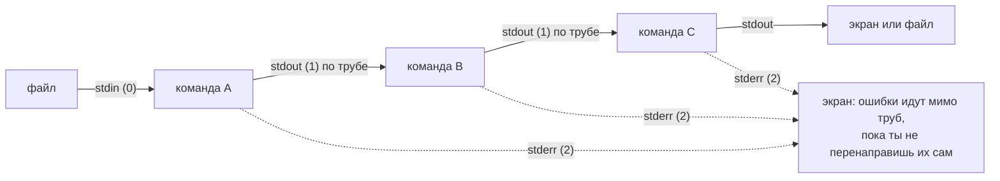
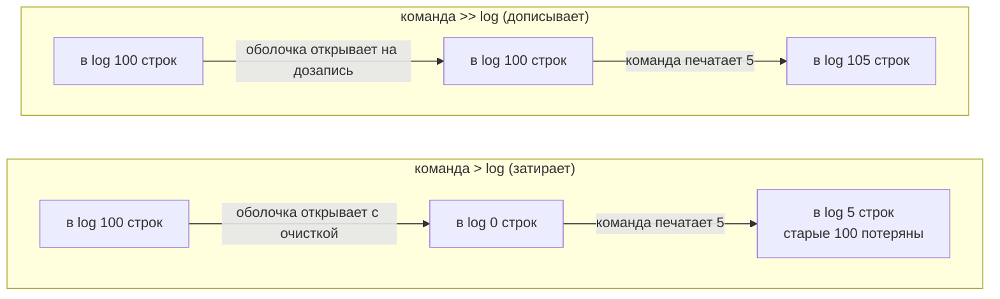

## Зачем это нужно

Разбирать чужие логи ночью тяжело: легко пропустить ошибку в тысячах строк или случайно затереть нужный файл. Давай разберём, как это делают без нервов.

Почти всё, что происходит на сервере, оставляет текстовый след: **логи** (журналы, куда программа по строке записывает, что она делает), конфиги (файлы с настройками), вывод команд. Когда прод (рабочая система, которой пользуются настоящие люди) отвечает ошибкой 502, никто не открывает лог в редакторе: в нём сотни тысяч строк. Его режут, фильтруют и считают цепочкой маленьких команд: каждая делает одну простую работу и передаёт результат следующей, как станки на конвейере (подробно в разделе «Картина целиком» ниже). Строку, в которой нужное слово, находит `grep`, колонки вырезает `cut` и `awk`, считает `wc` и `sort`, а править текст на лету умеет `sed`. Всё это мы разберём по очереди, запоминать сейчас не нужно. Так на работе находят, какой клиент шлёт слишком много запросов, считают долю ошибок за час и правят сотню конфигов одной строкой.

Второй частый источник боли: не понимать, куда именно программа пишет результат и куда ошибки. У каждой программы два отдельных «выхода»: **stdout** (обычный результат) и **stderr** (ошибки и служебные сообщения). Оба по умолчанию показываются на экране, поэтому выглядят одинаково, но внутри это разные каналы, и с ними можно поступать по-разному: результат сохранить в файл, а ошибки оставить на экране. Без этого понимания легко потерять ошибку или затереть нужный файл. Из-за этого теряют ошибки или случайно затирают файл, который был нужен.

Шаг проекта: «Заметки» уже пишут журнал запросов (его называют access-лог: по одной строке на каждое обращение к сервису) в канал stderr. Ты сохранишь его в `~/notes/app.log` перенаправлением (redirection: приказ оболочке отправить выход программы не на экран, а в файл) `2>> app.log` и разберёшь цепочкой команд. Код `app.py` не меняется (версия v1).

## Что нужно знать

- [Урок 1.1: первый сервер](01-first-server-shell.md): терминал и оболочка (окно и программа, которая разбирает твои строки), команды `ls` (список файлов), `cd` (сменить каталог), `cat` (вывести файл), `head` и `tail` (первые и последние строки), `less` (листать файл), `echo` (напечатать текст), `man` и `--help` (справка), установка пакета через `apt`, запуск `python3 app.py` в `~/notes` и запрос к нему через `curl`.

Больше ничего. Слова «процесс» (запущенная программа, подробно в [уроке 1.4](04-processes-signals.md)), «лог», «HTTP-статус» (число в ответе сервера, которое говорит, чем кончился запрос: 200 успех, 404 не найдено, 500 сломался), «регулярное выражение» (шаблон для поиска в тексте вроде «строка, начинающаяся с цифры») и «код возврата» (число, которое команда отдаёт после завершения: 0 значит успех, любое другое ошибку) объясняются ниже подробно, когда впервые понадобятся. Скрипты `.sh`, cron и права доступа тут не нужны: они в следующих уроках.

## Картина целиком

Представь конвейер на заводе. Сырьё едет по ленте. Возле ленты стоят станки, и у каждого одна простая работа: один отбирает нужные детали, другой отрезает лишнее, третий раскладывает по порядку, четвёртый считает. Ни один станок не умеет всего, но лента передаёт деталь от станка к станку, и вместе они делают сложную работу.

В Linux станки это маленькие команды, а деталь это текст: `grep` отбирает строки по слову, `cut` вырезает колонки, `sort` сортирует, `uniq` убирает повторы, `wc` считает строки и слова, `sed` заменяет текст, `awk` работает с колонками и считает. Лента между двумя станками называется **конвейер** (pipe), на письме это символ `|`. У каждого станка есть три «жёлоба» (их называют потоками, stream): входной (stdin, то, что станок получает), выходной (stdout, результат) и отдельный жёлоб для брака (stderr, ошибки). Брак по умолчанию падает на пол, то есть на экран, а не едет дальше по ленте. К любому жёлобу можно подставить ящик, то есть перенаправить его в файл.



За урок ты разберёшь: что такое три потока и как их перенаправлять, что делает `|`, как оболочка обращается с кавычками (символы `"` и `'`, которые говорят оболочке, где кончается один аргумент и какие символы трогать нельзя), как искать строки (`grep`), считать (`sort`, `uniq`, `wc`), править (`sed`) и работать с колонками (`awk`). В практике всё это применяется к настоящему логу «Заметок».

## Теория

### Лог: текстовый след программы

Программа работает без экрана, и человек не видит, что в ней происходит. Поэтому она записывает свои действия в файл: время, что случилось, чем кончилось. Это и есть лог. Когда что-то ломается, лог единственный свидетель.

Вахтенный журнал на проходной: каждый вошедший записан отдельной строкой с временем. Журнал не объясняет, «что происходит в здании», но по нему можно восстановить, кто и когда приходил.

Одна строка лога описывает одно событие. Строки идут одна за другой, новые дописываются в конец. Для веб-сервисов главный лог это **access-лог**: одна строка на один запрос. В нём есть IP-адрес клиента (адрес машины, с которой пришёл запрос, подробно в [уроке 2.1](../02-network/01-addresses-routes.md)), метод и путь запроса, число-статус ответа и время обработки.

Так выглядит строка в формате, похожем на лог веб-сервера nginx (nginx это программа, которая принимает запросы из интернета, мы поставим её в [уроке 2.5](../02-network/05-nginx.md)):

```text
10.0.0.7 - - [29/Sep/2026:10:00:06 +0300] "GET /slow?sec=2 HTTP/1.1" 200 15 2.003
```

Читаем слева направо. `10.0.0.7` это адрес клиента. Два дефиса это поля, которые обычно пусты. В квадратных скобках дата, время и часовой пояс (`+0300` значит на три часа впереди UTC, то есть Москва). В кавычках сам запрос: метод `GET` («дай»), путь `/slow?sec=2` и версия протокола HTTP/1.1 (протокол, то есть набор правил, по которому клиент и сервер обмениваются запросами, подробно в [уроке 2.4](../02-network/04-http.md)). Дальше `200` это **HTTP-статус** ответа: число, которым сервер сообщает, чем кончился запрос. Группы такие: `2xx` успех (200 «всё хорошо», 201 «создано»), `4xx` ошибка клиента (404 «такой страницы нет», 400 «запрос составлен неверно»), `5xx` ошибка сервера (500 «сервер сломался», 502 и 503 «сервер за посредником не отвечает или перегружен»). Затем `15` размер ответа в байтах и `2.003` время ответа в секундах.

Ключевое для этого урока: команды режут строку на **поля** (колонки) по пробелам и обращаются к ним по номерам. Та же строка, пронумерованная так, как её увидит `awk`:

```text
$1=10.0.0.7   $2=-   $3=-   $4=[29/Sep/2026:10:00:06   $5=+0300]
$6="GET   $7=/slow?sec=2   $8=HTTP/1.1"   $9=200   $10=15   $11=2.003
```

Дата разъехалась на два поля (`$4` и `$5`), потому что внутри неё есть пробел. Кавычки для нас не значат «одно поле»: `"GET` это `$6`, а путь это `$7`. Так что статус всегда `$9`, а время ответа `$11`.

Лог «Заметок» (`app.py` v1) устроен проще:

```text
2026-09-30 11:56:38,359 INFO method=POST path=/notes status=201 dur_ms=0
```

Тут `$1` дата, `$2` время, `$3` уровень важности (`INFO` «просто информация»), `$4` метод (`method=POST`), `$5` путь, `$6` статус (`status=201`), `$7` время обработки в миллисекундах (`dur_ms=0`).

> **Прикинь сам:** сервис получает 5 запросов в секунду. Сколько строк access-лога появится за минуту и за час?
{: .predict}

За минуту 5 × 60 = 300 строк, за час 300 × 60 = 18 000. Читать такое глазами никто не будет, поэтому лог режут командами.

Осторожно: Кажется, что лог это «список ошибок». Нет: в access-логе строка есть про каждый запрос, и успешные тоже. Поэтому в логе на миллион строк ошибок может быть всего сотня, и искать их надо фильтром.

> **Главное:** лог это по строке на событие, новые строки дописываются в конец, а команды режут строку на поля по пробелам и достают нужное по номеру.
{: .key}

> **Проверь понимание:** в какой колонке `awk` увидит статус ответа в строке `10.0.0.5 - - [29/Sep/2026:10:00:01 +0300] "GET / HTTP/1.1" 200 512 0.004`, и что лежит в `$10`?

<details markdown="1">
<summary>Ответ</summary>

Статус в `$9` (значение `200`). В `$10` лежит `512`: размер ответа в байтах. Считай поля слева направо, помня, что дата занимает два поля (`$4` и `$5`), а запрос в кавычках три (`$6`, `$7`, `$8`).

</details>

Мы знаем, как выглядит строка лога. Теперь вопрос: каким путём текст попадает от программы к экрану и как им управлять?

### Процесс и три потока: stdin, stdout, stderr

Программе нужно откуда-то брать данные и куда-то выдавать результат. Если бы каждая программа сама решала, «читаю из этого файла, пишу на этот экран», их нельзя было бы соединять друг с другом. Единые каналы ввода и вывода делают из маленьких команд детали конструктора.

У станка на конвейере три отверстия: вход (сюда ложится сырьё), выход (отсюда выезжает готовая деталь) и жёлоб для брака. Станок не знает, что стоит за отверстиями: другой станок, ящик или пол. Поэтому их можно переставлять. Оговорка: у станка на заводе жёлоб для брака обычно ведёт в ящик, а у программы по умолчанию ошибки падают на тот же экран, куда идёт и результат.

**Процесс** (process) это запущенная программа: файл `python3` лежит на диске, а когда ты его запустил, в памяти появился процесс. При старте система открывает процессу три канала. Их номера называются **файловыми дескрипторами** (file descriptor): просто номер в списке открытых каналов этого процесса.

| Номер | Имя | Куда по умолчанию | Для чего |
|---|---|---|---|
| 0 | stdin (standard input) | клавиатура | ввод |
| 1 | stdout (standard output) | экран терминала | результат работы |
| 2 | stderr (standard error) | экран терминала | ошибки и диагностика |

Терминал показывает stdout и stderr вперемешку в одном окне, поэтому кажется, что это одно и то же. Но это два разных канала, и их можно развести по разным файлам. Программы вроде «Заметок» пишут журнал запросов именно в stderr: stdout остаётся для результата, а диагностика не смешивается с ним.

Команда `ls` с двумя аргументами, из которых один файл существует, а другой нет:

```bash
ls /etc/hostname /nonexistent
```

```text
ls: cannot access '/nonexistent': No such file or directory
/etc/hostname
```

Сообщение об ошибке отправлено в stderr (канал 2), а имя найденного файла в stdout (канал 1). На экране обе строки выглядят одинаково, но пришли по разным каналам. Ещё одно: каждый процесс, закончив работу, отдаёт системе **код возврата** (exit code), число: `0` значит «всё хорошо», любое другое значит «что-то не так». Оболочка хранит код последней команды в переменной `$?`. У `ls` из примера будет `2` («не нашёл»). Скрипты и автоматика принимают решения именно по этому числу, а не по тексту.

> **Прикинь сам:** команда напечатала в stdout 3 строки и в stderr 2. Сколько строк останется на экране после `команда > /dev/null`?
{: .predict}

Две: `> /dev/null` выбрасывает только stdout, а stderr по-прежнему идёт на экран.

Осторожно: «Ошибка это то, что напечатано красным» или «то, что написано словом error». Нет: stderr это канал, а не содержание. Программа может напечатать в stderr обычное информационное сообщение (как «Заметки» печатают журнал), а в stdout слово `error`. Канал определяет программист, поэтому и нужно уметь перенаправлять оба.

> **Главное:** у каждого процесса три канала: stdin (0), stdout (1) и stderr (2); на экране они выглядят одинаково, но это разные каналы.
{: .key}

> **Проверь понимание:** команда напечатала на экран две строки. Как узнать, какая из них пришла из stdout, а какая из stderr?

<details markdown="1">
<summary>Ответ</summary>

По экрану никак: терминал их смешивает. Нужно перенаправить один канал в файл или в `/dev/null` (это разберём в следующем разделе) и посмотреть, какая строка осталась на экране. Например, `команда > /dev/null`: на экране останется только stderr.

</details>

Раз каналы раздельные, их можно направить куда угодно. Как именно, посмотрим дальше.

### Перенаправление потоков и /dev/null

Результат, который мелькнул на экране, пропал. Чтобы сохранить его, передать другой программе или спрятать шум, нужно уметь сказать оболочке: «канал номер такой-то направь не на экран, а вот сюда».

Переставить ящик под жёлоб станка. Станок работает так же, но детали падают в другое место.

Оболочка (shell, программа в терминале, которая читает твои команды, [урок 1.1](01-first-server-shell.md)) до запуска команды разбирает перенаправления, открывает нужные файлы и подставляет их вместо каналов. Сама команда ничего об этом не знает. Для перенаправлений используют такие записи:

| Запись | Что делает |
|---|---|
| `команда > файл` | пишет stdout в файл; если файл был, **затирает** его |
| `команда >> файл` | дописывает stdout в конец файла; если файла нет, создаёт |
| `команда 2> файл` | пишет только stderr в файл (цифра 2 это номер канала) |
| `команда 2>> файл` | дописывает stderr в конец файла |
| `команда < файл` | берёт stdin не с клавиатуры, а из файла |
| `команда > /dev/null` | выбрасывает stdout |
| `команда 2> /dev/null` | выбрасывает stderr |

`/dev/null` это специальный «файл-чёрная дыра»: всё, что в него записано, бесследно исчезает. Он нужен, чтобы заглушить то, что не хочется видеть.

Важная тонкость: слово «затирает» значит, что файл **обнуляется в момент запуска**, ещё до того, как команда что-то напечатала. Оболочка открывает файл на запись с очисткой, а потом уже запускает команду. Если команда упадёт через секунду, старого содержимого всё равно уже нет.

У файла `log` уже есть 100 строк.



Именно из-за этого в шаге проекта мы используем `2>> app.log`, а не `2> app.log`: при перезапуске сервиса лог за прошлые сутки не должен исчезнуть. В практике ты это проверишь на настоящем файле.

Защита от случайной потери: в оболочке есть режим `set -o noclobber` (буквально «не затирай»). С ним `>` откажется писать в существующий файл (`cannot overwrite existing file`), а обойти запрет можно записью `>|`. По умолчанию режим выключен.

**Heredoc.** В практике ты увидишь запись `cat > файл <<'EOF'`, за которой идёт текст и строка `EOF`. Это heredoc («документ здесь»): всё, что написано до строки `EOF`, оболочка подаёт команде на stdin. Команда `cat` без аргументов просто копирует свой stdin на stdout, а `>` уводит его в файл. Так можно создать файл с готовым текстом прямо из командной строки. Кавычки вокруг `EOF` (`'EOF'`) говорят оболочке не трогать внутри текста знаки `$` и обратные кавычки: без кавычек `$HOME` в тексте превратился бы в `/home/ubuntu`.

> **Прикинь сам:** в файле `log` 100 строк, команда печатает 5. Сколько строк будет в файле после `>` и после `>>`?
{: .predict}

После `>` пять строк: файл обнулён до запуска. После `>>` сто пять: старое осталось, новое дописано.

Осторожно: Что `>` это «сохранить результат». Это «сохранить и уничтожить всё, что было», и разница видна только тогда, когда файл уже существует. Второе заблуждение: что `>` сохранит ошибки. Нет, `>` берёт только stdout. Ошибки останутся на экране, пока не добавить `2>`.

> **Главное:** `>` затирает файл, `>>` дописывает, `2>` и `2>>` делают то же для ошибок, а `/dev/null` выбрасывает всё, что в него записали.
{: .key}

> **Проверь понимание:** чем `cmd > log` отличается от `cmd >> log`, если файл `log` уже существует и в нём 100 строк?

<details markdown="1">
<summary>Ответ</summary>

`>` сначала обнуляет файл (открывает с усечением), и 100 старых строк пропадают до запуска команды, даже если команда потом упадёт. `>>` открывает файл на дозапись и сохраняет старое содержимое.

</details>

Одну запись разобрали. Что будет, если нужно перенаправить сразу два канала и порядок записей поменять?

### Порядок перенаправлений: что значит 2>&1

Часто нужно, чтобы и результат, и ошибки попали в один файл или в одну трубу, чтобы не потерять ни того ни другого. Для этого есть запись `2>&1`.

Ты говоришь: «жёлоб брака направь туда же, куда сейчас смотрит жёлоб готовых деталей». Слово «сейчас» здесь главное: если потом переставить ящик у жёлоба деталей, жёлоб брака за ним не поедет.

Запись `2>&1` читается дословно: «сделай канал 2 копией канала 1, такой, каким канал 1 является в этот момент». Оболочка обрабатывает перенаправления **слева направо**, одно за другим. Отсюда порядок важен.

Возьмём команду `ls /etc/hostname /nonexistent` (один файл есть, второго нет) и запишем её результат в файл двумя способами. Вести счёт будем по таблице «куда сейчас смотрят каналы».

```text
Вариант А:  ls /etc/hostname /nonexistent  > all.txt  2>&1

старт:                 1 -> экран      2 -> экран
после  > all.txt:      1 -> all.txt    2 -> экран
после  2>&1:           1 -> all.txt    2 -> all.txt      (2 копирует 1, а 1 уже смотрит в файл)
итог: оба потока в файле, на экране пусто.

Вариант Б:  ls /etc/hostname /nonexistent  2>&1  > all2.txt

старт:                 1 -> экран      2 -> экран
после  2>&1:           1 -> экран      2 -> экран        (2 копирует 1, а 1 ещё смотрит на экран)
после  > all2.txt:     1 -> all2.txt   2 -> экран
итог: в файле только stdout, ошибка осталась на экране.
```

В практике ты запустишь оба варианта и увидишь это своими глазами. В современном bash есть короткая запись `&> файл`, она делает то же, что вариант А. В курсе используем полную форму `> файл 2>&1`, она работает и в других оболочках.

> **Прикинь сам:** что окажется в `all.txt` и на экране после `ls /etc/hostname /nonexistent > all.txt 2>&1`?
{: .predict}

В файле две строки: имя файла из stdout и сообщение об ошибке из stderr. Экран пуст, потому что оба канала смотрят в файл.

Осторожно: Запись `2>&1` часто читают как «2 перенаправить в 1 навсегда», в смысле что оба канала «склеены». На деле это копирование текущего адреса на момент выполнения. Отсюда и ловушка с неверным порядком: переставил слова местами, и результат другой.

> **Главное:** `2>&1` копирует адрес канала 1 в момент выполнения, а перенаправления обрабатываются слева направо, поэтому порядок записей важен.
{: .key}

> **Проверь понимание:** ты хочешь, чтобы всё, что печатает `./job`, попало в `job.log`. Какая запись верная: `./job 2>&1 > job.log` или `./job > job.log 2>&1`? Что окажется на экране при неверной?

<details markdown="1">
<summary>Ответ</summary>

Верная вторая: `./job > job.log 2>&1`. При первой записи канал 2 скопирует канал 1, пока тот ещё смотрит на экран, и только потом stdout уйдёт в файл. Сообщения об ошибках останутся на экране, а в `job.log` попадёт только stdout.

</details>

Теперь, когда результат и ошибки управляемы, их можно соединять между командами. Для этого и нужен конвейер.

### Конвейер: символ |

Хочется решить задачу из нескольких шагов («взять колонку, отсортировать, посчитать повторы») без промежуточных файлов. Без конвейера пришлось бы записывать результат каждого шага в файл, читать его следующей командой и потом удалять мусор.

Лента между станками: деталь, сошедшая с первого станка, сразу едет ко второму. Оговорка: лента это не склад. Она вмещает совсем немного деталей. Если второй станок не успевает, первый останавливается и ждёт.

Символ `|` берёт stdout левой команды и подаёт его на stdin правой. Оболочка запускает обе команды одновременно, а между ними создаёт небольшой буфер (область памяти, которая держит данные в пути). Данные идут потоком: первая команда пишет, вторая читает, файл целиком в память не грузится. Поэтому конвейер обрабатывает лог в десятки гигабайт так же, как лог в десять строк.

Третий факт объясняет, почему `head` можно ставить в конце цепочки: когда `head -n 3` получил три строки, он завершается, а левая команда при следующей записи в закрытую трубу получает сигнал и тоже останавливается. Читать всё до конца незачем.


```bash
ls /etc | wc -l
```

`ls /etc` выводит имена файлов каталога `/etc`, по одному в строке. Команда `wc -l` (word count, режим `-l` значит lines) считает строки на своём stdin. Результат на стенде курса: `121`. У тебя число будет другим, оно зависит от системы. Единственное, что прошло через трубу: текст «имя файла, перевод строки» много раз.

Обрати внимание: **через `|` проходит только stdout**. Ошибки левой команды идут на экран мимо трубы:

```bash
ls /nonexistent | wc -l
```

```text
ls: cannot access '/nonexistent': No such file or directory
0
```

`wc` посчитал ноль строк, потому что в трубу ничего не попало, а сообщение об ошибке пролетело мимо и осело на экране. Если ошибки тоже нужно передать дальше, пишут `2>&1 |`: `ls /nonexistent 2>&1 | wc -l` даёт `1`.

> **Прикинь сам:** команда `seq 1000000 | head -n 3` вроде бы должна сгенерировать миллион чисел. Сколько из них реально обработает `seq`?
{: .predict}

Лишь несколько: `head` выходит после трёх строк, и `seq` при следующей записи в закрытую трубу получает сигнал и останавливается. Поэтому `head` в конце цепочки экономит работу.

Осторожно: Что труба и перенаправление это одно и то же. Разница в том, куда идёт поток: `>` уводит его в файл, `|` отдаёт его следующей программе. Между командой и командой ставят `|`, между командой и файлом `>`.

> **Главное:** `|` соединяет stdout левой команды со stdin правой; данные текут потоком, а stderr идёт на экран мимо трубы.
{: .key}

> **Проверь понимание:** что покажет `ls /nonexistent | wc -l` и почему сообщение об ошибке при этом всё равно появится на экране?

<details markdown="1">
<summary>Ответ</summary>

`0`: в трубу попадает только stdout, а `ls` ничего в stdout не напечатал. Сообщение пришло из stderr, который по умолчанию идёт на экран мимо трубы.

</details>

Конвейер умеет передавать только stdin. А что делать, когда команде данные нужны в аргументах или надо сохранить копию по пути?

### tee, xargs и подстановка $(...)

Три инструмента закрывают три ситуации, которые в простой цепочке не решаются: «и посмотреть, и сохранить», «превратить строки в аргументы команды» и «подставить результат одной команды в другую».

**tee.** Название от тройника в трубе. Команда `tee файл` читает stdin и пишет его **и** в файл, **и** дальше на stdout. Пример: `ls /etc | head -3 | tee top3.txt` покажет три строки на экране и сохранит их в `top3.txt`. Ключ `-a` дописывает в файл, а не затирает. Полезно там, где хочется видеть вывод и оставить копию.

**xargs.** Некоторые команды берут данные из аргументов, а не из stdin: например `wc -l a.log b.log`. Если список имён приходит по трубе, `wc` его не увидит. `xargs` читает строки со stdin и запускает команду, подставляя их как аргументы. Ключ `-I{}` запускает команду по разу на каждую строку, а `{}` заменяется этой строкой: `seq 3 | xargs -I{} echo "запрос номер {}"` напечатает три строки `запрос номер 1`, `запрос номер 2`, `запрос номер 3`. Здесь `seq 3` печатает числа от 1 до 3, по одному в строке.

Подвох `xargs`: он режет ввод по пробелам и переводам строк. Файл `my app.log` (в имени пробел) превратится в два аргумента, `my` и `app.log`:

```text
find . -maxdepth 1 -name '*.log' | xargs -n1 printf '[%s]\n'
[./a.log]
[./my]
[app.log]
[./access.log]
```

Здесь `find . -maxdepth 1 -name '*.log'` ищет файлы с именем на `.log` только в текущем каталоге и печатает их пути, `-n1` велит `xargs` брать по одному аргументу за раз, а `printf '[%s]\n'` печатает каждый в квадратных скобках, чтобы границы были видны. Безопасный вариант: `find ... -print0 | xargs -0 ...`. Ключ `-print0` заставляет `find` разделять имена не переводом строки, а нулевым символом (которого в именах файлов не бывает), а `xargs -0` читает именно так. Тогда `[./my app.log]` остаётся одним аргументом.

**Подстановка $(...).** Оболочка запускает команду внутри `$( ... )`, забирает её stdout и подставляет на место записи. `echo "строк: $(wc -l < access.log)"` сначала выполнит `wc -l < access.log` (получит `20`), затем выполнит `echo "строк: 20"`. Так можно, например, дописать дату к имени файла: `cp app.log app.log.$(date +%F)` создаст копию `app.log.2026-09-30` (`date +%F` печатает сегодняшнюю дату в виде `год-месяц-день`).

> **Прикинь сам:** сколько строк напечатает `seq 3 | xargs -I{} echo n={}` и какие?
{: .predict}

Три: `n=1`, `n=2`, `n=3`. `xargs -I{}` запускает `echo` по разу на каждую входную строку и подставляет её вместо `{}`.

Осторожно: `xargs` часто воспринимают как «просто ещё один пайп». Разница принципиальная: труба подаёт данные на **stdin** команды, `xargs` превращает их в **аргументы**. Проверка простая: `echo файл | cat` печатает слово «файл» (это данные), а `echo файл | xargs cat` попытается открыть файл с именем «файл».

> **Главное:** `tee` пишет поток и в файл, и дальше, `xargs` превращает строки stdin в аргументы, а `$(...)` подставляет вывод команды в другую команду.
{: .key}

> **Проверь понимание:** зачем в `find . -name '*.log' | xargs rm` могут пропасть не те файлы, если в каталоге есть файл `my app.log`?

<details markdown="1">
<summary>Ответ</summary>

`xargs` без `-0` делит ввод по пробелам, поэтому `my app.log` станет двумя аргументами `my` и `app.log`. `rm` попытается удалить файлы с такими именами: одни не найдёт, другие, если они случайно существуют, удалит. Правильно `find . -name '*.log' -print0 | xargs -0 rm`.

</details>

Мы всё время писали кавычки в примерах, не объясняя. Пора выяснить, что оболочка делает с твоей строкой до запуска команды.

### Кавычки: что оболочка делает с твоей строкой

Оболочка не передаёт команде твою строку как есть. Сначала она её перерабатывает: раскрывает `*`, подставляет `$переменные`, воспринимает `|` как границу команд. Если не понимать, что оболочка съедает до запуска команды, шаблоны для `grep` и `awk` ведут себя необъяснимо.

Секретарь, который читает твою записку перед тем, как передать её начальнику. Если в записке слово «все», секретарь может заменить его списком имён. Одинарные кавычки означают «передай дословно, не редактируй».

Три вида записи:

- без кавычек: оболочка раскрывает всё. `*.log` заменится на список подходящих файлов (это называют **glob**, шаблон имён файлов), `$X` на значение переменной, `|` начнёт новую команду, пробел разделит аргументы;
- двойные кавычки `"..."`: пробелы больше не разделяют, но `$X` и `$(...)` по-прежнему раскрываются;
- одинарные кавычки `'...'`: внутри всё передаётся дословно, ничего не раскрывается.

В каталоге лежат `a.log` и `access.log`:

```bash
echo *.log
echo '*.log'
X=abc
echo "$X" '$X'
```

```text
a.log access.log
*.log
abc $X
```

В первой строке оболочка раскрыла `*.log` до запуска `echo`, и `echo` получил уже два аргумента. Во второй кавычки защитили звёздочку. В четвёртой двойные кавычки подставили `abc`, одинарные оставили `$X` как есть.

Для `grep` и `awk` из этого следует правило: **шаблон и программу берут в одинарные кавычки**, чтобы оболочка ничего в них не тронула. Проверь на `awk`: в программе `'{print $9}'` знак `$9` принадлежит awk («девятое поле»). Если же написать `"{print $9}"` в двойных кавычках, оболочка увидит `$9`, посчитает его своей переменной (аргумент скрипта номер 9, а у тебя его нет) и подставит пустоту. Программа превращается в `{print }`, а это значит «напечатай всю строку». Ошибки нет, но и результат неверный.

Ещё пример: `grep 404|502 access.log` без кавычек. Оболочка видит `|` и решает, что это труба между командой `grep 404` и командой `502 access.log`. Результат: `502: command not found`, а `grep 404` в это время ждёт данные с клавиатуры (выйти можно через `Ctrl+C`).

> **Прикинь сам:** `X=5` и команда `echo "$X" '$X' $X`. Что она напечатает?
{: .predict}

`5 $X 5`: двойные кавычки и запись без кавычек подставляют значение, одинарные оставляют `$X` как текст.

Осторожно: Что двойные и одинарные кавычки взаимозаменяемы. В простых случаях так и выглядит, но стоит появиться `$` или `!`, и поведение разное. Привычка «шаблон всегда в одинарных кавычках» избавляет от целого класса загадок.

> **Главное:** шаблон для `grep` и программу для `awk` берут в одинарные кавычки, чтобы оболочка ничего в них не раскрыла.
{: .key}

> **Проверь понимание:** что напечатает `echo "$HOME"` и `echo '$HOME'`?

<details markdown="1">
<summary>Ответ</summary>

Первая команда подставит значение переменной, например `/home/ubuntu`. Вторая напечатает буквально `$HOME`: одинарные кавычки ничего не раскрывают.

</details>

Теперь строка дошла до команды целой. Начнём с самой частой: как найти нужные строки?

### grep: найти строки

В логе сотни тысяч строк, а нужны три: те, где есть ошибка, или те, что относятся к одному клиенту. Глазами их не найти, значит, нужна команда «покажи только подходящие строки».

Поисковая строка по тексту, только работающая построчно: «покажи все строки, где встречается вот это».

`grep шаблон файл` читает файл построчно и печатает те строки, в которых нашёлся шаблон. Если файл не указан, читает stdin: поэтому `grep` ставят в середину конвейера. Код возврата: `0`, если хотя бы одна строка нашлась, `1`, если нет. Так что «ничего не найдено» это не ошибка, а нормальный ответ.

Ключи, которые нужны каждый день:

| Ключ | Смысл |
|---|---|
| `-i` | не различать большие и маленькие буквы |
| `-v` | инвертировать: печатать строки, где шаблона **нет** |
| `-c` | не печатать строки, а только их количество |
| `-n` | добавить в начало каждой строки её номер |
| `-o` | печатать только совпавший кусок, а не всю строку |
| `-E` | расширенные регулярные выражения (`+`, `?`, `\|`, `{3}` работают без backslash) |
| `-F` | шаблон это обычная строка, без специальных символов |
| `-r` | искать рекурсивно во всех файлах каталога |
| `-l` | печатать только имена файлов, в которых нашлось |
| `-A 3`, `-B 3` | добавить 3 строки после совпадения или до |

`egrep` это устаревший псевдоним для `grep -E`, пиши `grep -E`.

Лог из практики (20 строк), ищем строки с ошибками сервера, то есть со статусами 5xx.

```bash
grep -c ' 5[0-9][0-9] ' access.log
```

Получаем `6`. Хотя настоящих 5xx в логе четыре. Посмотрим, что нашёл `grep`:

```text
10.0.0.5 - - [29/Sep/2026:10:00:01 +0300] "GET / HTTP/1.1" 200 512 0.004
10.0.0.3 - - [29/Sep/2026:10:00:09 +0300] "GET /error HTTP/1.1" 500 21 0.006
...
```

В первой строке статус `200`, но шаблон `пробел, 5, две цифры, пробел` совпал с размером ответа `512`. Так выходит, когда шаблон не привязан к позиции. Привязка к позиции: статус идёт сразу после закрывающей кавычки запроса, то есть `" 500 `.

```bash
grep -cE '" 5[0-9]{2} ' access.log
```

Получаем `4`. Ошибка «6 вместо 4» не косметика: если посчитать долю ошибок для отчёта об уровне сервиса, разница между 20% и 30% выглядит как совсем другой инцидент.

> **Прикинь сам:** в логе 20 строк, ровно 4 со статусом 5xx. Что напечатает `grep -vcE '" 5[0-9]{2} ' access.log`?
{: .predict}

`16`: `-v` инвертирует выбор, а `-c` считает строки, то есть 20 минус 4.

Осторожно: Что шаблон это «слово». На деле это регулярное выражение (см. ниже), и обычные слова в нём просто совпадают сами с собой. Второе: что `grep '404|502'` найдёт оба статуса. Без `-E` знак `|` понимается буквально, и такой шаблон ищет текст «404|502». Нужно `grep -E '404|502'`.

> **Главное:** `grep` печатает строки с совпадением и возвращает 0, если нашёл хоть одну; шаблон привязывай к позиции, иначе он совпадёт с лишним.
{: .key}

> **Проверь понимание:** ты ищешь ошибки 5xx командой `grep ' 5[0-9][0-9] ' access.log`, а в ответ приходят и успешные запросы. Почему?

<details markdown="1">
<summary>Ответ</summary>

Шаблон ловит любое трёхзначное число на 5 между пробелами, в том числе размер ответа в байтах (например, `512`). Нужно привязаться к позиции статуса: `grep -E '" 5[0-9]{2} '` (статус идёт сразу после закрывающей кавычки запроса) или `awk '$9 >= 500'`.

</details>

В шаблонах мы уже писали `[0-9]{2}`. Разберём этот мини-язык по частям.

### Регулярные выражения: шаблоны с «джокерами»

Часто ищем не точное слово, а «любое трёхзначное число на 5» или «строка, которая начинается с адреса». Для этого шаблон должен уметь описывать классы символов и повторы. Такое описание называют **регулярным выражением** (regular expression, в разговоре «регулярка»).

Маска для поиска в анкете: «начинается на К, потом любые буквы, заканчивается цифрой». Обычные символы совпадают сами с собой, специальные значат «любой», «повтор», «начало».

Минимальный набор:

| Запись | Значит |
|---|---|
| `.` | любой один символ |
| `*` | предыдущий символ повторён 0 или больше раз |
| `^` | начало строки |
| `$` | конец строки |
| `[0-9]` | один символ из набора (здесь любая цифра) |
| `[^0-9]` | один символ, которого нет в наборе |
| `\.` | буквальная точка (backslash отменяет особый смысл) |

В режиме `-E` добавляются `+` (один или больше), `?` (ноль или один), `{3}` (ровно три), `a|b` (a или b), скобки для группировки.

Разберём `'" 5[0-9]{2} '` по кускам: `"` закрывающая кавычка запроса, пробел, `5` цифра пять, `[0-9]{2}` ещё ровно две цифры, пробел. Итого: кавычка, пробел, трёхзначное число на 5, пробел. Ещё пара:

```text
grep -oE '[0-9]+' <<< 'id=42 x'       -> 42          (одна или больше цифр подряд)
grep '^10.0.0.3' access.log | wc -l   -> 4           (строки, начинающиеся с 10.0.0.3)
grep 'a\.b'  и  grep 'a.b'            -> 'a\.b' находит только a.b, 'a.b' найдёт и axb
```

Кстати, точка в `10.0.0.3` тоже значит «любой символ», так что шаблон найдёт и `10x0y0z3`. В логах это редко мешает, но полезно помнить.

> **Прикинь сам:** совпадёт ли шаблон `^ab*c$` со строками `ac` и `abbbc`?
{: .predict}

Да, с обеими: `b*` значит «ноль или больше букв `b`», а `^` и `$` привязывают шаблон к началу и концу строки.

Осторожно: Путают регулярки и шаблоны имён файлов (glob): в `ls *.log` звёздочка значит «что угодно», а в регулярке `*` значит «повтор предыдущего символа». Это разные языки, хоть и похожие знаки. Поэтому `grep '*.log'` работает не так, как `ls *.log`.

> **Главное:** регулярка описывает текст классами символов и повторами; `^` и `$` привязывают к краям строки, а `\.` значит буквальную точку.
{: .key}

> **Проверь понимание:** что найдёт `grep -E '^10\.0\.0\.[35] '` в access.log?

<details markdown="1">
<summary>Ответ</summary>

Строки, которые начинаются с адреса `10.0.0.3 ` или `10.0.0.5 ` (пробел после адреса нужен, чтобы не поймать, например, `10.0.0.35`). Точки экранированы, поэтому каждая значит именно точку, а `[35]` значит «цифра три или пять».

</details>

`grep` умеет выбирать строки. Для отчёта их ещё нужно сортировать и считать, и тут помогают маленькие команды.

### sort, uniq, cut, tr, wc, head, tail: кирпичики

Ни `grep`, ни `awk` в одиночку не делают всю работу. Их дополняют маленькие команды, каждая из которых делает одно дело. Из них собирают любой отчёт по логу.

Набор инструментов на верстаке: у каждого одна функция, но в сочетании они делают любую сборку.

Что делает каждая:

- `sort` сортирует строки. Ключи: `-n` числовая сортировка, `-r` в обратном порядке, `-u` убрать дубликаты;
- `uniq` схлопывает **соседние** одинаковые строки в одну; `-c` добавляет перед строкой счётчик;
- `cut -d' ' -f1` берёт поле: `-d` задаёт разделитель, `-f` номер поля;
- `tr 'a-z' 'A-Z'` заменяет символы; `tr -d '\r'` удаляет символ возврата каретки; `tr '\n' ' '` склеивает строки в одну;
- `wc -l` считает строки, `-w` слова, `-c` байты;
- `head -n 5` первые пять строк, `tail -n 5` последние пять, `tail -f` следит за файлом и печатает новые строки по мере появления (выход `Ctrl+C`).

Две ловушки, которые нужно увидеть один раз.

Первая: `sort` без `-n` сортирует как текст, а не как число. Сравнивая текст, `10` идёт раньше `9`, потому что первый символ `1` меньше `9`:

```text
printf '10\n9\n100\n2\n' | sort        printf '10\n9\n100\n2\n' | sort -n
10                                     2
100                                    9
2                                      10
9                                      100
```

Здесь `printf '10\n9\n100\n2\n'` печатает четыре числа по строкам (`\n` это перевод строки).

Вторая: `uniq` считает только **соседей**. На входе `a b a a b`:

```text
printf 'a\nb\na\na\nb\n' | uniq -c         printf 'a\nb\na\na\nb\n' | sort | uniq -c
      1 a                                        3 a
      1 b                                        2 b
      2 a
      1 b
```

Без `sort` буква `a` посчиталась дважды в разных группах, потому что между её вхождениями стоит `b`. Поэтому `sort` перед `uniq` почти всегда обязателен.

> **Прикинь сам:** на входе `b a b a b`, по строке на значение. Что напечатает `sort | uniq -c`?
{: .predict}

`2 a` и `3 b`: `sort` собрал одинаковые строки рядом, `uniq -c` посчитал каждую группу.

Осторожно: Что `uniq` «убирает дубликаты по всему файлу». Нет, только подряд идущие. Чтобы убрать дубликаты везде, нужно `sort | uniq` или `sort -u`.

> **Главное:** `sort` группирует, `uniq -c` считает соседей, `cut` берёт колонку, `wc -l` считает строки, `head` и `tail` берут края.
{: .key}

> **Проверь понимание:** у тебя список из 10 строк, где одно и то же значение встречается на позициях 1, 5 и 9. Что покажет `uniq -c` без `sort`?

<details markdown="1">
<summary>Ответ</summary>

Три отдельные группы со счётчиком 1 для этого значения: между вхождениями стоят другие строки, и `uniq` не считает их соседями.

</details>

Все кирпичики у нас есть. Соберём из них самый частый отчёт: «кто чаще всех».

### Собираем «топ значений» по шагам

Самая частая задача с логами: «кто чаще всех?». Топ IP-адресов, топ путей, топ статусов. Все они решаются одним рецептом из пяти станков.

Подсчёт голосов: сначала разложить бюллетени по кучкам одинаковых (сортировка), затем посчитать каждую кучку (uniq -c), затем выложить кучки по размеру (sort -rn), затем показать победителей (head).


Возьмём лог из 20 строк из практики и посмотрим результат после каждого станка:

```text
после cut (первые 5 строк):   после sort (первые 5):   после uniq -c:        после sort -rn:
10.0.0.5                      10.0.0.3                        4 10.0.0.3          8 10.0.0.5
10.0.0.5                      10.0.0.3                        8 10.0.0.5          4 10.0.0.9
10.0.0.7                      10.0.0.3                        4 10.0.0.7          4 10.0.0.7
10.0.0.9                      10.0.0.3                        4 10.0.0.9          4 10.0.0.3
10.0.0.5                      10.0.0.5
```

Первый `sort` собрал одинаковые адреса рядом. `uniq -c` превратил каждую группу в одну строку со счётчиком. Второй `sort -rn` расставил их по числу: `-n` числовая сортировка, `-r` от большего к меньшему. Итог: лидер `10.0.0.5` с 8 запросами. Равенство у трёх других (по 4): порядок между ними определяет `sort`, у тебя может оказаться другой.

Два `sort` в цепочке нужны для двух разных целей: первый группирует, второй ранжирует. Убрать любой нельзя.

> **Прикинь сам:** лог «Заметок» хранит путь в пятом поле. Как собрать топ-3 путей?
{: .predict}

`awk '{print $5}' app.log | sort | uniq -c | sort -rn | head -3`: меняется только первый станок, остальные те же.

Осторожно: Что счётчик стоит после значения. `uniq -c` пишет число **перед** значением. Второе: забывают `-n` во втором `sort`. Тогда `10` окажется раньше `9`, и топ выглядит странно.

> **Главное:** топ значений это `колонка | sort | uniq -c | sort -rn | head`: первый `sort` группирует, второй ранжирует.
{: .key}

> **Проверь понимание:** как получить топ-5 статусов ответов из `access.log`?

<details markdown="1">
<summary>Ответ</summary>

`awk '{print $9}' access.log | sort | uniq -c | sort -rn | head -5`. Меняется только первый станок: вместо `cut` колонку берёт `awk` (в этом логе статус в девятом поле, а `cut` режет по одному пробелу и подходит для простых колонок).

</details>

Мы только читали. Иногда текст надо менять, и для этого есть sed.

### sed: поток-редактор

Иногда нужно не найти, а **заменить**: поменять порт в конфиге, убрать лишнее слово, поправить сотню файлов одной командой. Открывать каждый в редакторе слишком долго.

«Найти и заменить» в текстовом редакторе, но работающее командой, без окна, на любом количестве строк.

`sed` (stream editor, «потоковый редактор») читает текст построчно, применяет к каждой строке команду и выводит результат. Главная команда это подстановка `s` (substitute):

```text
sed 's/что/на_что/флаги' файл
```

Слово `что` это шаблон (та же регулярка), `на_что` замена. Флаг `g` заменяет все вхождения в строке, а не только первое. Разделитель может быть любым символом: `s#/var/log#/tmp#` удобнее, когда в шаблоне есть `/`. Другие ключи:

- `-n` выключает автоматический вывод всех строк, а команда `p` печатает нужные: `sed -n '2,3p' файл` покажет строки 2 и 3;
- `d` удаляет строки: `sed '2d' файл` печатает всё, кроме второй строки;
- `-E` включает расширенные регулярки, а `\1` в замене подставляет то, что поймала первая скобка;
- `-i` правит файл **на месте**, а `-i.bak` сначала сохраняет копию `файл.bak`.

Главное: без `-i` файл **не меняется**. `sed` только печатает результат на экран. Это даёт безопасную привычку: сначала пробный прогон без `-i`, потом настоящий.

Файл `demo.yml` (формат YAML: конфиги в виде «ключ: значение», где вложенность задаётся пробелами в начале строки):

```text
app:
  port: 8080
  host: 127.0.0.1
  debug: false
```

`sed 's/8080/9090/' demo.yml` напечатает ту же четвёрку строк, но с `port: 9090`. Сам `demo.yml` остался прежним. Команда `sed -i.bak 's/8080/9090/; s/debug: false/debug: true/' demo.yml` (две подстановки через `;`) правит файл и оставляет `demo.yml.bak`. Сравнить до и после помогает `diff -u demo.yml.bak demo.yml`: строки с `-` были, с `+` стали.

Пример с разделителем: чтобы заменить `/var/log` на `/tmp`, вместо `s/\/var\/log/\/tmp/` (с экранированием каждого слеша) пишут `s#/var/log#/tmp#`. Результат тот же, читать легче.

**Про macOS.** В BSD-варианте `sed` на Mac ключ `-i` требует аргумент, поэтому там пишут `sed -i '' 's/a/b/' файл`. В курсе везде GNU sed из Ubuntu: `sed -i`.

> **Прикинь сам:** в `demo.yml` четыре строки. Что напечатает `sed -n '2,3p' demo.yml` и изменится ли файл?
{: .predict}

Только строки 2 и 3 (`port` и `host`), файл не изменится: без `-i` `sed` ничего на диск не пишет.

Осторожно: Что `sed -i` можно запустить «на пробу». Нет: с `-i` файл изменён сразу. Проба это запуск **без** `-i`. Второе: что `sed` понимает всё те же регулярки, что и `grep -E`. В обычном режиме `sed` использует «простые» регулярки, где `+` и `|` надо писать с backslash. Проще включить `-E`.

> **Главное:** `sed 's/что/на_что/g'` заменяет текст в потоке, а на диск пишет только с ключом `-i`; пробуй всегда без него.
{: .key}

> **Проверь понимание:** что напечатает `sed 's/8080/9090/' demo.yml` и изменится ли файл на диске?

<details markdown="1">
<summary>Ответ</summary>

На экране будет версия с заменой, а сам файл не изменится: без `-i` sed только печатает результат в stdout.

</details>

`sed` правит текст, а когда нужны колонки и арифметика, берут awk.

### awk: поля и вычисления

`grep` находит строки, `sed` переписывает, а если нужно «взять девятую колонку, сравнить с числом и посчитать, сколько таких строк», нужен инструмент, который знает про колонки и умеет считать. Это `awk` (по фамилиям создателей: Aho, Weinberger, Kernighan).

Табличный процессор без окна: каждая строка это ряд, слова в ней колонки, а формулы записываются в одну строку.

`awk` читает текст построчно, режет каждую строку на поля по пробелам и запускает программу. Программа состоит из пар `условие { действие }`:

```text
awk 'условие { действие }' файл
```

- `$1` первое поле, `$2` второе, `$NF` последнее, `$0` вся строка;
- `NR` номер текущей строки (Number of Records), `NF` число полей в ней;
- без условия действие выполняется для каждой строки; без действия печатается строка целиком (`awk '$9 == 404' файл` покажет строки со статусом 404);
- `BEGIN { }` выполняется до чтения, `END { }` после последней строки;
- ассоциативный массив (в нём ключами служат любые значения) считает по группам: `n[$9]++` заведёт счётчик для каждого статуса;
- `-F` меняет разделитель: `awk -F'"' '{print $2}'` берёт текст между кавычками;
- `printf` печатает по формату: `%d` целое, `%.1f` число с одним знаком после запятой, `%s` строка, `%%` знак процента;
- оператор `~` проверяет по регулярке: `$7 ~ /^\/notes/` значит «путь начинается с /notes».

Если поле выглядит как число, `awk` сравнивает его как число: `$9 >= 500` работает без всяких преобразований. Если нет, сравнивает как текст.

Доля 5xx в логе:

```bash
awk '$9 >= 500 { c++ } END { printf "%d из %d, %.1f%%\n", c, NR, c * 100 / NR }' access.log
```

Разбираем. Условие `$9 >= 500` берёт строки, где девятое поле (статус) не меньше 500. Действие `{ c++ }` увеличивает счётчик `c` (в `awk` неопределённая переменная стартует нулём). После последней строки срабатывает `END`: `NR` содержит число прочитанных строк, то есть 20. Формат печатает `4 из 20, 20.0%`. Вычисление: `4 * 100 / 20 = 20`. Знак `%` в формате удваивается (`%%`), иначе `printf` решит, что это спецсимвол.

Подсчёт по группам:

```bash
awk '{ n[$9]++ } END { for (s in n) print s, n[s] }' access.log
```

Для каждой строки `n[$9]++` увеличивает счётчик под ключом «значение девятого поля». В конце цикл `for (s in n)` печатает ключи и значения. Порядок обхода массива в `awk` не определён (на стенде вышло `201, 502, 400, 200, 404, 503, 500`), поэтому результат обычно сортируют: `| sort`.

> **Прикинь сам:** в 20-строчном логе 5 строк со статусом 404. Что напечатает `awk '$9==404{c++} END{print c, NR}' access.log`?
{: .predict}

`5 20`: `c` посчитал строки с 404, а `NR` после последней строки равен числу всех строк.

Осторожно: Программу `awk` берут в двойные кавычки: получается не то, что задумано (см. раздел про кавычки). Вторая ловушка: `awk` режет по пробелам, а в логе пробелы есть и внутри дат, и внутри запроса. Поэтому колонки надо считать по факту (`$9`, а не «третья по смыслу»).

> **Главное:** `awk` режет строку на поля `$1`, `$2`, ..., сравнивает числа, считает и группирует массивами; программу берут в одинарные кавычки.
{: .key}

> **Проверь понимание:** что напечатает `awk '{ s += $10 } END { print s }' access.log`?

<details markdown="1">
<summary>Ответ</summary>

Сумму десятой колонки (размер ответа в байтах) по всем строкам: общий объём отданных данных. Для лога из практики это `8032`.

</details>

Инструментов теперь много. Как не растеряться при выборе?

### Что чем: grep, sed, awk и jq

Простое правило выбора:

| Задача | Инструмент |
|---|---|
| выбрать строки по слову или шаблону | `grep` |
| заменить одно на другое, удалить или показать диапазон строк | `sed` |
| взять колонку, сравнить, посчитать, сгруппировать | `awk` |
| посчитать «сколько раз повторяется» | `sort \| uniq -c` или `awk` с массивом |

В Ubuntu `awk` по умолчанию это `mawk`: быстрый и достаточный. Всё, что в этом уроке, работает и в другой реализации, `gawk`.

Отдельный случай: JSON. Многие программы и API отдают данные в формате JSON: `{"status":"ok"}`. Искать в нём `grep`ом хрупко, потому что структура важнее текста. Для этого есть `jq`, который разбирает структуру: `echo '{"status":"ok"}' | jq -r '.status'` напечатает `ok` (`-r` убирает кавычки вокруг строки). Ставится он так же, как ты ставил пакеты в [уроке 1.1](01-first-server-shell.md): `sudo apt install -y jq`. Подробно `jq` понадобится в темах про API и Kubernetes.

> **Прикинь сам:** нужно посчитать запросы дольше 2 секунд, время в `$11`. Какой инструмент возьмёшь?
{: .predict}

`awk '$11 > 2 { c++ } END { print c+0 }' access.log`: нужно сравнение числа и подсчёт, а это задача `awk`. Добавка `+0` печатает 0, если таких строк нет.

> **Главное:** `grep` выбирает строки, `sed` заменяет, `awk` считает по колонкам, а JSON читают `jq`.
{: .key}

Остался случай, когда всё сделано верно, а результата нет.

### Невидимые символы: почему grep не находит очевидное

Иногда текст выглядит правильно, а команда ничего не находит. Причина часто в символах, которые не видны на экране.

Самый частый случай: **конец строки в стиле Windows**. В Linux строка кончается одним символом «перевод строки» (`\n`). В Windows двумя: «возврат каретки» и перевод строки (`\r\n`). Файл, побывавший в Windows-редакторе, хранит лишний `\r` в конце каждой строки. Экран его не показывает, а `grep` видит. Так `grep 'timeout$'` не находит строку, оканчивающуюся на `timeout`: после последней буквы стоит `\r`.

`cat -A` показывает невидимое: конец строки как `$`, символ `\r` как `^M`.

```text
grep 'error' service.log                  ->  (пусто, код 1: в файле ERROR большими буквами)
grep -i 'error' service.log | cat -A      ->  2026-09-29 10:15:03,120 ERROR db timeout^M$
grep -ic 'timeout$' service.log           ->  0   (перед концом строки стоит ^M)
tr -d '\r' < service.log | grep -ic 'timeout$'   ->  1   (после удаления \r шаблон сработал)
```

Здесь два слоя: сначала не совпал регистр (лечит `-i`), а затем всплыл `\r` (лечит `tr -d '\r'`). Как искать такие случаи, ты потренируешь в разделе «Сломай и почини».

> **Прикинь сам:** файл из Windows содержит 3 строки. На сколько байт `wc -c` покажет больше, чем у такого же файла из Linux?
{: .predict}

На три: в конце каждой строки лишний символ `\r`, по байту на строку.

Осторожно: Что «если в `less` строка есть, то `grep` обязан её найти». `less` и `grep` видят один файл, но шаблон описывает именно символы, а не картинку. Регистр, лишний пробел, `\r`, похожая по виду русская буква вместо латинской: всё это меняет результат.

> **Главное:** если `grep` не находит очевидного, проверь регистр, пробелы и скрытые `\r` через `cat -A`, а убирай их через `tr -d '\r'`.
{: .key}

> **Проверь понимание:** что покажет `cat -A` в конце строки файла, сохранённого в Windows-редакторе?

<details markdown="1">
<summary>Ответ</summary>

`^M$`: символ возврата каретки, за ним символ конца строки. В нормальном Linux-файле будет только `$`.

</details>

Теория закончена. В практике ты применишь всё к настоящему логу «Заметок».

## Практика

Работаем в отдельном каталоге, чтобы не задеть проект. Напоминание про команды: `mkdir -p` создаёт каталог (`-p` значит «не ругайся, если он уже есть»), `&&` запускает вторую команду только если первая прошла успешно, `cd` переходит в каталог, а `~` это твой домашний каталог.

```bash
mkdir -p ~/lab12 && cd ~/lab12
```

### Задание 1. Топ клиентов в access-логе

**Цель:** из готового лога nginx-подобного формата получить топ IP, топ путей и увидеть, зачем нужен `sort`.

**Предскажи:** сколько строк в логе, если ниже 20 записей? Какой IP окажется первым в топе: по количеству строк в примере он один явно лидирует.

<details markdown="1">
<summary>Ответ</summary>

Строк 20. Лидер `10.0.0.5` (8 запросов): он чаще всех дёргает `/healthz` и `/notes`.

</details>

**Шаги:**

1. Создай лог. Формат строки: `IP - - [время] "МЕТОД путь HTTP/1.1" статус байты секунды` (разбор полей в теории). Разбор команды: `cat > access.log <<'EOF'` создаёт файл `access.log` из текста, который идёт ниже до строки `EOF` (heredoc, см. теорию). `wc -l access.log` считает в нём строки.

```bash
cat > access.log <<'EOF'
10.0.0.5 - - [29/Sep/2026:10:00:01 +0300] "GET / HTTP/1.1" 200 512 0.004
10.0.0.5 - - [29/Sep/2026:10:00:02 +0300] "GET /notes HTTP/1.1" 200 1204 0.012
10.0.0.7 - - [29/Sep/2026:10:00:03 +0300] "POST /notes HTTP/1.1" 201 88 0.031
10.0.0.9 - - [29/Sep/2026:10:00:04 +0300] "GET /notes HTTP/1.1" 200 1290 0.015
10.0.0.5 - - [29/Sep/2026:10:00:05 +0300] "GET /healthz HTTP/1.1" 200 2 0.001
10.0.0.7 - - [29/Sep/2026:10:00:06 +0300] "GET /slow?sec=2 HTTP/1.1" 200 15 2.003
10.0.0.9 - - [29/Sep/2026:10:00:07 +0300] "GET /missing HTTP/1.1" 404 19 0.002
10.0.0.5 - - [29/Sep/2026:10:00:08 +0300] "GET /notes HTTP/1.1" 200 1290 0.011
10.0.0.3 - - [29/Sep/2026:10:00:09 +0300] "GET /error HTTP/1.1" 500 21 0.006
10.0.0.3 - - [29/Sep/2026:10:00:10 +0300] "GET /error HTTP/1.1" 500 21 0.005
10.0.0.7 - - [29/Sep/2026:10:00:11 +0300] "POST /notes HTTP/1.1" 400 30 0.003
10.0.0.5 - - [29/Sep/2026:10:00:12 +0300] "GET /notes HTTP/1.1" 200 1330 0.013
10.0.0.9 - - [29/Sep/2026:10:00:13 +0300] "GET /slow?sec=1 HTTP/1.1" 200 15 1.004
10.0.0.5 - - [29/Sep/2026:10:00:14 +0300] "GET /healthz HTTP/1.1" 200 2 0.001
10.0.0.3 - - [29/Sep/2026:10:00:15 +0300] "GET /notes HTTP/1.1" 502 157 0.001
10.0.0.5 - - [29/Sep/2026:10:00:16 +0300] "GET /healthz HTTP/1.1" 200 2 0.001
10.0.0.7 - - [29/Sep/2026:10:00:17 +0300] "GET / HTTP/1.1" 200 512 0.004
10.0.0.9 - - [29/Sep/2026:10:00:18 +0300] "GET /notes HTTP/1.1" 200 1330 0.014
10.0.0.5 - - [29/Sep/2026:10:00:19 +0300] "GET /healthz HTTP/1.1" 200 2 0.001
10.0.0.3 - - [29/Sep/2026:10:00:20 +0300] "GET /notes HTTP/1.1" 503 190 0.001
EOF
wc -l access.log
```

2. Топ IP. Разбор: `cut -d' ' -f1` берёт первое поле (разделитель пробел), `sort` группирует одинаковые, `uniq -c` считает группы, `sort -rn` расставляет по числу от большего, `head -3` оставляет три первые строки:

```bash
cut -d' ' -f1 access.log | sort | uniq -c | sort -rn | head -3
```

3. Топ путей. Путь стоит в седьмом поле (`$7`), его берёт `awk`, а дальше та же цепочка:

```bash
awk '{print $7}' access.log | sort | uniq -c | sort -rn | head -3
```

4. Убери `sort` из первой цепочки и посмотри, что изменится:

```bash
cut -d' ' -f1 access.log | uniq -c | head -5
```

**Что должно получиться:**

```text
20 access.log
      8 10.0.0.5
      4 10.0.0.9
      4 10.0.0.7
      9 /notes
      4 /healthz
      2 /error
      2 10.0.0.5
      1 10.0.0.7
      1 10.0.0.9
      1 10.0.0.5
      1 10.0.0.7
```

**Как читать вывод:**

- `20 access.log`: `wc -l` печатает число строк и имя файла.
- В строках топа число слева это количество запросов, а справа значение. Адрес `10.0.0.5` пришёл 8 раз, путь `/notes` запрашивали 9 раз.
- Адреса `10.0.0.9`, `10.0.0.7` и `10.0.0.3` пришли по 4 раза. В топ из трёх строк попали два из них. Порядок между равными определяет `sort`: у тебя на другой системе он может отличаться.
- В путях `/error` и `/` тоже по 2 запроса, и в топ-3 попал `/error`.
- Последние пять строк это цепочка без `sort`. Адрес `10.0.0.5` посчитан отдельными группами: `uniq` считает только соседей, а в логе одинаковые адреса стоят вразнобой. Так выглядят «странные счётчики», о которых ты прочтёшь в разделе «Сломай и почини».

**Объясни себе:**

- Почему в цепочке два `sort` и они разные (`sort` и `sort -rn`)?
- Что изменится, если убрать `-n` из второго `sort`? Подсказка: строки `10` и `9` сравниваются как текст.
- Почему `head` можно поставить в конец, а не читать весь файл заранее?

**Типичные ошибки:**

- `grep: access.log: No such file or directory` или `cut: access.log: No such file or directory`: ты не в `~/lab12` или файл не создан. Проверь `pwd` и `ls`.
- Счётчики не сходятся с эталоном: в heredoc потерялась строка или добавился пробел. Проверь `wc -l access.log`, должно быть 20.
- Команда «зависла» и ничего не печатает: ты забыл имя файла, и `cut` или `awk` ждёт ввода с клавиатуры. Нажми `Ctrl+C` и допиши `access.log`.

### Задание 2. Доля 5xx и медленные запросы

**Цель:** посчитать долю ответов 5xx двумя способами, увидеть ловушку неточного шаблона и найти самые долгие запросы.

**Предскажи:** сколько в логе ответов 5xx? Сколько из них вернёт команда `grep -c ' 5[0-9][0-9] ' access.log`? Совпадут ли числа?

<details markdown="1">
<summary>Ответ</summary>

Настоящих 5xx четыре: два 500, один 502, один 503. Но `grep` с таким шаблоном ловит и запросы, где размер ответа выглядит как `5xx` (например, `512` байт у двух запросов `GET /`), и покажет 6. Число из `grep` неверно: шаблон не привязан к колонке статуса.

</details>

**Шаги.** Разбор `awk`-команд: `$9 >= 500` условие («статус не меньше 500»), `{ c++ }` действие («увеличь счётчик»), `END { ... }` выполняется после последней строки, `NR` число прочитанных строк, `printf` печатает по формату. Во втором пункте условие `$11 > 1.0` берёт строки, где время ответа больше секунды.

```bash
# 1. Наивный grep: смотрим, что он ловит на самом деле
grep -c ' 5[0-9][0-9] ' access.log
grep ' 5[0-9][0-9] ' access.log

# 2. Точный вариант: статус только после закрывающей кавычки запроса
grep -cE '" 5[0-9]{2} ' access.log

# 3. То же через поле awk и заодно доля от общего числа
awk '$9 >= 500 { c++ } END { printf "%d из %d, %.1f%%\n", c, NR, c * 100 / NR }' access.log

# 4. Медленные запросы: время в 11-м поле больше секунды
awk '$11 > 1.0 { print $7, $11 }' access.log

# 5. Три самых долгих запроса: время и путь, сортировка по числу
awk '{ print $11, $7 }' access.log | sort -rn | head -3
```

**Что должно получиться:**

```text
6
10.0.0.5 - - [29/Sep/2026:10:00:01 +0300] "GET / HTTP/1.1" 200 512 0.004
10.0.0.3 - - [29/Sep/2026:10:00:09 +0300] "GET /error HTTP/1.1" 500 21 0.006
10.0.0.3 - - [29/Sep/2026:10:00:10 +0300] "GET /error HTTP/1.1" 500 21 0.005
10.0.0.3 - - [29/Sep/2026:10:00:15 +0300] "GET /notes HTTP/1.1" 502 157 0.001
10.0.0.7 - - [29/Sep/2026:10:00:17 +0300] "GET / HTTP/1.1" 200 512 0.004
10.0.0.3 - - [29/Sep/2026:10:00:20 +0300] "GET /notes HTTP/1.1" 503 190 0.001
4
4 из 20, 20.0%
/slow?sec=2 2.003
/slow?sec=1 1.004
2.003 /slow?sec=2
1.004 /slow?sec=1
0.031 /notes
```

**Как читать вывод:**

- `6`: наивный `grep` насчитал шесть «ошибок». Список ниже показывает почему: две строки со статусом `200` и размером `512` попали случайно (первая и предпоследняя из показанных).
- `4`: точный шаблон нашёл четыре настоящих 5xx (два `500`, `502`, `503`).
- `4 из 20, 20.0%`: `awk` берёт статус из колонки, поэтому сразу верный. Число `20` это `NR`, общее число строк.
- Медленные запросы: только два (`/slow?sec=2` с 2.003 секунды и `/slow?sec=1` с 1.004). Остальные быстрее 0,05 секунды.
- Последний блок: ты положил время в начало строки, поэтому `sort -rn` (числовой, по убыванию) расставил запросы от самых долгих.

**Объясни себе:**

- Почему `$9 >= 500` работает без кавычек и `-F`, а в `grep` пришлось придумывать шаблон?
- Что означает `NR` в блоке `END`?
- Чем в разговоре об уровне сервиса (SLA, обещанная доля успешных ответов) опасно число «6 ошибок» вместо «4»?

**Типичные ошибки:**

- `awk: line 1: missing } near END`: забыта закрывающая скобка в программе `awk` (тут потеряна `}` после `c++`). Пересчитай `{` и `}`.
- Вместо результата в выводе целиком все строки лога: программа `awk` взята в двойные кавычки, оболочка подставила `$9` как пустое значение, и программа превратилась в `{print }`. Программу `awk` всегда берут в одинарные кавычки.
- Пустой вывод там, где ждёшь строки: неверный номер колонки. Проверь себя: `awk '{print $9}' access.log | head -3` должен показать статусы.

> Не уверен, в каком порядке читать `2>&1`? Опиши нейросети строку и попроси разобрать по шагам, куда смотрит каждый канал после каждого перенаправления. Потом проверь ответ запуском на `ls /etc/hostname /nonexistent`.
{: .ai}

### Задание 3. Потоки: разводим stdout и stderr

**Цель:** увидеть на живом примере, что stdout и stderr это разные каналы, освоить порядок `2>&1` и ловушку с `|`.

**Предскажи:** команда `ls /etc/hostname /nonexistent > out.txt`. Что окажется на экране, а что в `out.txt`?

<details markdown="1">
<summary>Ответ</summary>

В `out.txt` попадёт `/etc/hostname` (stdout). Сообщение об ошибке для `/nonexistent` останется на экране: это stderr, а `>` перенаправляет только поток 1.

</details>

**Шаги.** Все пять пунктов подряд, в конце каждого печатаются файлы командой `cat`. Напоминание: `;` разделяет команды в одной строке, `$?` хранит код возврата последней команды.

```bash
# 1. Один успешный и один несуществующий файл: > берёт только stdout
ls /etc/hostname /nonexistent > out.txt
cat out.txt

# 2. Отдельные файлы для результата и ошибок
ls /etc/hostname /nonexistent > out.txt 2> err.txt
echo "--- out"; cat out.txt; echo "--- err"; cat err.txt

# 3. Всё в один файл: правильный порядок
ls /etc/hostname /nonexistent > all.txt 2>&1
cat all.txt

# 4. Неправильный порядок: ошибка остаётся на экране
ls /etc/hostname /nonexistent 2>&1 > all2.txt
cat all2.txt

# 5. Заглушить ошибки, показать код возврата, раздвоить поток через tee
ls /nonexistent 2>/dev/null; echo "код: $?"
ls /etc | head -3 | tee top3.txt

# 6. Труба не переносит stderr
ls /nonexistent | wc -l
ls /nonexistent 2>&1 | wc -l
```

**Что должно получиться** (после каждой строки-заголовка `#` идёт вывод соответствующего шага):

```text
ls: cannot access '/nonexistent': No such file or directory
/etc/hostname
--- out
/etc/hostname
--- err
ls: cannot access '/nonexistent': No such file or directory
ls: cannot access '/nonexistent': No such file or directory
/etc/hostname
ls: cannot access '/nonexistent': No such file or directory
/etc/hostname
код: 2
adduser.conf
alternatives
apparmor.d
ls: cannot access '/nonexistent': No such file or directory
0
1
```

**Как читать вывод:**

- Первые две строки: шаг 1. Ошибка появилась на экране сразу, потому что `>` не трогает stderr, а `cat out.txt` затем показал `/etc/hostname` из файла.
- `--- out` и `--- err`: шаг 2. В `out.txt` только результат, в `err.txt` только сообщение об ошибке.
- Следующие две строки: шаг 3, `cat all.txt`. Оба потока в одном файле; ошибка стоит раньше, потому что `ls` сначала жалуется на несуществующее, а потом печатает найденное.
- Ещё две строки: шаг 4. Ошибка **на экране**, где она была бы и без файла. Файл `all2.txt` содержит только `/etc/hostname`: печатает его `cat all2.txt`. Экран показывает обе строки, поэтому понять, где что, можно только зная порядок.
- `код: 2`: шаг 5. Сообщения нет (`2>/dev/null`), а код возврата остался. Скрытие текста не меняет результат работы.
- `adduser.conf`, `alternatives`, `apparmor.d`: три первые строки `/etc`, их же сохранил `top3.txt` (`tee` показал и записал). Файлы в `/etc` у тебя могут быть другие.
- Последние три строки: шаг 6. Без `2>&1` сообщение об ошибке пролетело мимо трубы, `wc` получил пустоту и показал `0`. С `2>&1` в трубу попала одна строка (сообщение об ошибке), и `wc` насчитал `1`.

**Объясни себе:**

- Почему код возврата `2` остаётся, хотя сообщение скрыто?
- Что значит `2>&1` дословно и почему его позиция важна?
- Где в реальной жизни удобнее `tee`, чем `>`?

**Типичные ошибки:**

- `ls: cannot access '/nonexistent': No such file or directory` на экране, когда ты ждал тишины: ты поставил `2>&1` до `>`. Переставь: `> файл 2>&1`.
- Файл `out.txt` неожиданно пуст: ты запустил команду с `>` повторно, и он затёрт. Для накопления используй `>>`.
- `bash: out.txt: cannot overwrite existing file`: в твоей оболочке включён `noclobber` (защита от затирания). Обойти можно записью `>|`, а выключить режим командой `set +o noclobber`.

> Нужна цепочка для отчёта? Дай нейросети две-три настоящие строки лога и опиши, что посчитать. Проверяй цепочку по шагам, добавляя по одной команде: так видно, на каком шаге она ошибается.
{: .ai}

### Задание 4. sed: правка конфига

**Цель:** безопасно править конфиг через `sed`, с проверкой до и после.

**Предскажи:** что напечатает `sed 's/8080/9090/' demo.yml`: изменится ли файл на диске?

<details markdown="1">
<summary>Ответ</summary>

На экране будет версия с заменой, а сам файл не изменится: без `-i` sed только печатает результат в stdout.

</details>

**Шаги.** Разбор: `s/8080/9090/` заменить первое `8080` в каждой строке на `9090`; `-i.bak` править файл на месте и сохранить копию с суффиксом `.bak`; `;` между подстановками выполняет обе; `diff -u` показывает различия двух файлов в объединённом формате (строки с `-` были, с `+` стали, остальные для контекста).

```bash
# 1. YAML вводим heredoc: отступы в два пробела значимы, табуляции нельзя
cat > demo.yml <<'EOF'
app:
  port: 8080
  host: 127.0.0.1
  debug: false
EOF

# 2. Пробный прогон без -i
sed 's/8080/9090/' demo.yml
cat demo.yml

# 3. Правка на месте с копией оригинала (GNU sed; на macOS: sed -i '' ...)
sed -i.bak 's/8080/9090/; s/debug: false/debug: true/' demo.yml

# 4. Что изменилось: сравнение копии и результата
diff -u demo.yml.bak demo.yml

# 5. Другой разделитель: путь со слешами без экранирования
echo 'LOG_DIR=/var/log/notes' | sed 's#/var/log#/tmp#'
```

**Что должно получиться:**

```text
app:
  port: 9090
  host: 127.0.0.1
  debug: false
app:
  port: 8080
  host: 127.0.0.1
  debug: false
--- demo.yml.bak	2026-09-30 11:52:41.624024009 +0000
+++ demo.yml	2026-09-30 11:52:41.625024009 +0000
@@ -1,4 +1,4 @@
 app:
-  port: 8080
+  port: 9090
   host: 127.0.0.1
-  debug: false
+  debug: true
LOG_DIR=/tmp/notes
```

**Как читать вывод:**

- Первые четыре строки: пробный прогон. Порт уже `9090`, а `debug` остался `false`, потому что вторая подстановка ещё не запускалась.
- Следующие четыре строки: `cat demo.yml` показал, что сам файл всё ещё `8080`. Пробный прогон ничего не менял.
- `--- demo.yml.bak` и `+++ demo.yml`: заголовок `diff -u`, слева «было», справа «стало». Рядом печатается время изменения файлов: у тебя оно своё.
- `@@ -1,4 +1,4 @@`: «показан кусок с 1-й строки, 4 строки в обоих файлах».
- Строки с `-` исчезли, с `+` появились. Строки с пробелом в начале это неизменившийся контекст.
- `LOG_DIR=/tmp/notes`: замена пути с разделителем `#`.

**Объясни себе:**

- Зачем `-i.bak` и `diff` перед и после правки боевого конфига?
- Почему разделитель `#` удобнее `/`, если правишь путь `/etc/notes/notes.env`?
- Какой риск у `sed -i` на большом количестве файлов через `xargs`?

**Типичные ошибки:**

- `sed: -e expression #1, char 11: unterminated `s' command`: подстановка не закрыта (не хватает третьего `/`). Например, `sed 's/8080/9090' demo.yml`.
- `sed: -e expression #1, char 13: unknown option to `s'`: в шаблоне есть `/` (путь), и `sed` принял его за разделитель. Смени разделитель на `#`.
- `sed: can't read demo.yml: No such file or directory`: ты не в `~/lab12` или файл не создан.

### Задание 5. Шаг проекта: access-лог «Заметок» в app.log

**Цель:** сохранить stderr сервера в файл, сгенерировать трафик и посчитать по логу. Заодно проверить разницу `2>>` и `2>` на настоящем файле.

**Предскажи:** сервер запущен как `python3 app.py 2>> app.log`. Что появится в терминале, где он запущен, при запросе `curl`?

<details markdown="1">
<summary>Ответ</summary>

Ничего: журнал запросов идёт в stderr, а stderr переправлен в `app.log`. Терминал молчит, строки накапливаются в файле. Если бы ты написал `>` вместо `>>` (то есть `2>` вместо `2>>`), лог обнулялся бы при каждом перезапуске.

</details>

**Шаги.** Нужны два терминала (или две вкладки). Разбор команд: `2>> app.log` дописывает stderr сервера в `app.log`; `seq 20` печатает числа от 1 до 20; `xargs -I{} curl ...` запускает `curl` 20 раз (по разу на число, само число нам не нужно); у `curl` флаг `-s` убирает индикатор загрузки, `-o /dev/null` выбрасывает ответ, `-X POST` задаёт метод, `-d '...'` передаёт тело запроса.

1. Терминал 1. Запусти сервер из урока 1.1 (версия v1, порт 8080), дописывая stderr в файл. Терминал после запуска молчит: это нормально.

```bash
cd ~/notes
rm -f app.log
APP_VERSION=1.0.0 python3 app.py 2>> app.log
```

2. Терминал 2. Отправь 20 запросов на `/notes`, запиши одну заметку, потом отправь запрос с неверным телом (сервис ждёт JSON, а тут просто текст: получится статус 400) и запрос на несуществующий путь:

```bash
cd ~/notes
seq 20 | xargs -I{} curl -s -o /dev/null http://127.0.0.1:8080/notes
curl -s -X POST -d '{"text":"первая заметка"}' http://127.0.0.1:8080/notes
curl -s -X POST -d 'первая заметка' http://127.0.0.1:8080/notes
curl -s -o /dev/null http://127.0.0.1:8080/nope
```

3. Там же посмотри, что накопилось, и посчитай. Первая строка `grep status= app.log` отбрасывает стартовую строку сервера, в которой нет `status=`:

```bash
tail -n 3 app.log
wc -l app.log
grep -c 'path=/notes ' app.log
grep status= app.log | awk '{ print $6 }' | sort | uniq -c | sort -rn
grep -c 'status=5' app.log
```

4. В терминале 2 запусти `tail -f app.log` (следить за файлом), а из терминала 3 (или после `Ctrl+C` в этом, затем ещё один `curl` и снова `tail -f`) отправь `curl -s http://127.0.0.1:8080/ > /dev/null`. Новая строка появляется в `tail -f` сразу. Выход `Ctrl+C`.

5. Остановка и перезапуск. В терминале 1 нажми `Ctrl+C`: сервер запишет строку `stopped`. Сделай копию лога и запусти сервер снова, теперь остановив его через пару секунд `Ctrl+C`. Затем проверь, что было бы с `2>` вместо `2>>`:

```bash
# терминал 2, после Ctrl+C в терминале 1
tail -n 2 app.log
wc -l app.log
cp app.log app.log.keep
```

```bash
# терминал 1: запусти как раньше, подожди пару секунд, нажми Ctrl+C
APP_VERSION=1.0.0 python3 app.py 2>> app.log
```

```bash
# терминал 2
wc -l app.log
```

```bash
# терминал 1: та же команда, но с 2> вместо 2>>; Ctrl+C через пару секунд
APP_VERSION=1.0.0 python3 app.py 2> app.log
```

```bash
# терминал 2
wc -l app.log
cat app.log
cp app.log.keep app.log     # вернуть лог на место
```

**Что должно получиться:**

```text
2026-09-30 11:56:38,359 INFO method=POST path=/notes status=201 dur_ms=0
2026-09-30 11:56:38,361 INFO method=POST path=/notes status=400 dur_ms=0
2026-09-30 11:56:38,363 INFO method=GET path=/nope status=404 dur_ms=0
24 app.log
22
     20 status=200
      1 status=404
      1 status=400
      1 status=201
0
2026-09-30 11:56:38,363 INFO method=GET path=/nope status=404 dur_ms=0
2026-09-30 11:56:43,324 INFO stopped
25 app.log
27 app.log
2 app.log
2026-09-30 11:56:45,395 INFO started host=127.0.0.1 port=8080 version=1.0.0
2026-09-30 11:56:47,382 INFO stopped
```

Время и `dur_ms` у тебя будут другие (у нас все запросы уложились в 0 миллисекунд: сервис локальный и быстрый). Ответы `curl` из терминала 2 при этом видны: `{"id": 1}` на верное тело и `{"error": "need JSON {\"text\": \"...\"}"}` на неверное.

**Как читать вывод:**

- Три строки после запросов: формат журнала «Заметок»: дата и время, уровень `INFO`, метод, путь, статус, время обработки. Это тот лог, поля которого мы нумеровали в теории (`$6` статус).
- `24 app.log`: одна строка запуска сервера, 20 запросов `GET /notes`, два `POST /notes` и один `GET /nope`: 1 + 20 + 2 + 1 = 24.
- `22`: запросов на путь `/notes ` (с пробелом после, чтобы не ловить путь вроде `/notesx`): 20 GET и 2 POST.
- Группы статусов: 20 успешных чтений, `201` (запись прошла), `400` (неверное тело), `404` (нет такого пути). Ошибок сервера нет: `grep -c 'status=5'` дал `0`, код возврата `grep` при этом `1`, но это не поломка.
- После `Ctrl+C` последняя строка `stopped`: сервер перехватил прерывание и записал, что остановился. Всего стало 25 строк.
- `27 app.log`: второй запуск с `2>>` **дописал** ещё две строки (`started` и `stopped`) к 25.
- `2 app.log` и содержимое: запуск с `2>` **стёр** всё, что было. Остались только две новые строки. Вот почему для логов пишут `2>>`. Копия `app.log.keep` спасла нас.

Если вместо `grep status= ... | awk` запустить `awk '{ print $6 }' app.log | sort | uniq -c | sort -rn` без фильтра, появится ещё одна группа: `1 port=8080`. Это шестое поле стартовой строки, в которой нет `status=`.

**Объясни себе:**

- Почему журнал идёт в stderr, а не в stdout?
- Что произойдёт с `app.log` после перезапуска сервера с `2>>` и с `2>`? (Ты только что это увидел.)
- Как найти самый долгий запрос в `app.log`? Подсказка: `grep -o 'dur_ms=[0-9]*' app.log | cut -d= -f2 | sort -n | tail -1`. У нас все значения равны нулю, но так это работает, когда появятся медленные запросы (`/slow` появится в v3).

**Типичные ошибки:**

- `curl: (7) Failed to connect to 127.0.0.1 port 8080 after 0 ms: Couldn't connect to server`: сервер не запущен. Проверь первый терминал. (На Ubuntu 26.04 curl 8.18 пишет `Could not connect to server`: смысл тот же, ничего не слушает.)
- Терминал 1 молчит, а `curl` отвечает ошибкой, хотя команда запуска выглядела нормально: порт 8080 занят прежним запуском, и сообщение `OSError: [Errno 98] Address already in use` попало не на экран, а в `app.log` (там же весь traceback). Смотри `tail -n 5 app.log`. Останови прежний экземпляр через `Ctrl+C` в его терминале.
- `app.log` пустой: сервер запущен без `2>> app.log` или перенаправление стоит не с той стороны команды.
- В `app.log` после «починки» шаблона осталась только одна строка: ты запустил сервер с `2>`. Для накопления нужен `2>>`.

## Сломай и почини

Проверь себя на реальных поломках. Скрипт создаёт в каталоге `~/lab12/break` файлы с типичными проблемами. Прежде чем запускать, убедись, что выполнено задание 1 (нужен `~/lab12/access.log`). Скрипт сам не читай: диагностика и есть упражнение. Sudo не нужен: скрипт работает только с твоими файлами и отказывается запускаться от root.

Скачай скрипт. У `curl` флаг `-f` означает «при ошибке сервера не сохраняй страницу с ошибкой», `-s` убирает индикатор, `-S` всё же показывает ошибки, `-L` разрешает переходить по перенаправлениям, `-o` задаёт имя файла:

```bash
curl -fsSL -o /tmp/break-1.2.sh https://raw.githubusercontent.com/distinguished-sre/learning/main/devops/project/notes/break/1.2/break.sh
bash /tmp/break-1.2.sh 1
```

Сценарии: `1`, `2` и `3`. Проходи по одному: запусти, найди причину, почини сам или командой `bash /tmp/break-1.2.sh fix`, потом бери следующий. В конце выполни `fix` и удали скрипт: `rm /tmp/break-1.2.sh`.

### Симптом

- **Сценарий 1.** В `~/lab12/break/app.log` вчера было триста строк (в том числе ошибки `status=500`), а теперь там одна свежая строка о запуске. Вчерашние ошибки пропали.
- **Сценарий 2.** Скрипт `~/lab12/break/top-ip.sh` должен печатать топ клиентов из `clients.log`, но в его выводе один и тот же IP встречается несколько раз, а суммы не сходятся с общим числом строк (`wc -l`).
- **Сценарий 3.** `grep error service.log` в `~/lab12/break` возвращает пустой результат, хотя ты видишь нужные строки глазами (`less service.log`).

### Гипотезы

Запиши до проверки, что вероятнее всего:

1. Перенаправление `>` вместо `>>` затёрло файл.
2. В цепочке нет `sort` перед `uniq -c`.
3. Шаблон не совпадает из-за регистра, пробелов, кавычек, лишних невидимых символов; либо строка в другой колонке.

### Проверки

Иди от простого к сложному, одна проверка на гипотезу. Все команды выполняй из `~/lab12/break`.

```bash
cd ~/lab12/break
ls -l app.log                                # 1: размер и время изменения; wc -l app.log число строк
cat start-log.sh                             # 1: как именно пишется в журнал (ищи > или >>)
cat top-ip.sh                                # 2: какие команды в цепочке
wc -l clients.log                            # 2: сколько строк на самом деле
awk '{print $1}' clients.log | sort | uniq -c | sort -rn   # 2: независимый подсчёт
grep -ci 'error' service.log                 # 3: шаблон без учёта регистра
grep -i 'error' service.log | cat -A         # 3: покажет скрытые символы (^M)
```

<details markdown="1">
<summary>Разбор всех трёх сценариев</summary>

**Сценарий 1: затёрт файл через `>`.** `ls -l app.log` показывает размер около 74 байт, `wc -l` даёт `1`. В `start-log.sh` последняя строка заканчивается на `> app.log`: она записывает строку о запуске с очисткой файла. Открытие с усечением обнуляет файл сразу, и вернуть данные нельзя (если нет бэкапа или логов вышестоящей системы). Что делать: перейти на `>> app.log` (в реальном сервисе `2>> app.log`); для важных файлов делать копию перед правкой, например `cp app.log app.log.$(date +%F)`; включить `set -o noclobber` в интерактивной оболочке (обход через `>|`). Урок: перед любым `>` спроси себя «а если файл уже есть?». Команда `fix` пересоздаёт журнал и правит скрипт запуска.

**Сценарий 2: `uniq` без `sort`.** В `top-ip.sh` цепочка `cut ... | uniq -c | sort -rn | head -5`: между `cut` и `uniq` нет `sort`. `uniq` считает только соседей, а IP в `clients.log` идут вперемешку, поэтому каждое вхождение превращается в отдельную группу. Независимый подсчёт через `sort | uniq -c` показывает настоящие числа: у нас `19` для `10.0.0.5` и `19` для `10.0.0.3` при 60 строках. Исправление: `cut -d' ' -f1 clients.log | sort | uniq -c | sort -rn | head -5`. Сверять цифру со вторым способом стоит каждый раз, когда она идёт в отчёт.

**Сценарий 3: `grep` пусто из-за регистра и `\r`.** `grep -ci 'error' service.log` даёт `2`: строки есть, но в файле `ERROR` большими буквами, а шаблон был с маленькими. Значит, дело в регистре, лечится `-i`. Но `grep -i 'error' service.log | cat -A` показывает в конце строк `^M$`: файл сохранён с концами строк Windows. Из-за `\r` шаблон вроде `'timeout$'` (конец строки сразу после слова) тоже не сработает. Исправление: `tr -d '\r' < service.log > service.fixed`, затем работать с чистым файлом. Другие типичные причины пустого `grep`: двойные кавычки, из-за которых оболочка раскрыла `$` или `!` до запуска; шаблон с `|` без `-E`; лишний пробел; путь не к тому файлу. Команда `fix` пересоздаёт `service.log` без `\r`.

</details>

## ИИ в помощь

Нейросеть быстро собирает цепочки из `grep`, `sed` и `awk`, но не видит твой лог: формат строки и номера колонок она угадывает. Дай ей две-три настоящие строки, и ответ станет точнее. Общие правила работы с ней: [ИИ-помощник](../../load-tester/ai.md).

**Задача:** составить цепочку для отчёта по логу.

```text
У меня access-лог nginx, строка выглядит так:
<вставь 2-3 настоящие строки, адрес и логин замени на выдуманные>.
Составь одну команду (grep, awk, sort, uniq), которая покажет топ-5 IP по числу запросов
со статусом 5xx. Объясни каждый шаг цепочки и скажи, в какой колонке у тебя статус.
```
{: .wrap}

**Проверь ответ:** прогони цепочку на своём логе по шагам, добавляя по одной команде, и сверь число с `grep -c`. Типичная ошибка: нейросеть берёт неверный номер колонки или ищет `5[0-9][0-9]` без привязки к позиции, и в счёт попадает размер ответа.

**Задача:** понять чужую длинную команду.

```text
Разбери по частям команду: <вставь команду из чужой инструкции>.
Для каждого куска напиши, что он делает, какие каналы затронуты (stdout, stderr) и
меняет ли команда файлы. Если меняет, предложи безопасный пробный запуск.
```
{: .wrap}

**Проверь ответ:** сверь флаги с `man` или `--help`. Типичная ошибка: пропущенный `-i` у `sed` в описании («заменит в файле», хотя он только печатает) или порядок `2>&1`.

**Задача:** безопасно переписать конфиги через `sed`.

```text
Мне нужно заменить порт 8080 на 9090 в 200 конфигах в /etc/app/*.conf.
Предложи команду sed с резервной копией и способ сначала посмотреть diff.
Не используй -i без копии.
```
{: .wrap}

**Проверь ответ:** сначала запусти на копии каталога и посмотри `diff -u`. Типичная ошибка: шаблон `8080` заденет и строки вроде `18080`, нужно уточнить шаблон.

## Словарик урока

| Термин | Простыми словами |
|---|---|
| Лог | Файл, в который программа по строке записывает, что делает |
| Access-лог | Лог веб-сервиса: одна строка на один запрос |
| HTTP-статус | Число в ответе сервера: 2xx успех, 4xx ошибка клиента, 5xx ошибка сервера |
| Процесс | Запущенная программа |
| Файловый дескриптор | Номер канала у процесса: 0 ввод, 1 вывод, 2 ошибки |
| stdin, stdout, stderr | Каналы ввода, результата и ошибок |
| Код возврата (`$?`) | Число, которое команда отдаёт при завершении: 0 успех, иначе ошибка |
| Перенаправление | Запись `>`, `>>`, `2>`, `<`, которая уводит канал в файл или берёт ввод из файла |
| `/dev/null` | «Чёрная дыра»: всё записанное в неё исчезает |
| `2>&1` | Направить канал ошибок туда же, куда сейчас смотрит канал результата |
| Heredoc | Запись `<<'EOF'`: текст до строки `EOF` подаётся команде на ввод |
| Конвейер (pipe) | Символ `\|`: вывод левой команды идёт на ввод правой |
| `tee` | Пишет ввод и в файл, и дальше на экран |
| `xargs` | Превращает строки со входа в аргументы команды |
| `$(...)` | Подставляет результат команды на место записи |
| Glob | Шаблон имён файлов: `*.log` раскрывает оболочка |
| Кавычки | Одинарные передают текст дословно, двойные раскрывают `$` |
| Регулярное выражение | Шаблон для поиска: `.`, `*`, `^`, `$`, `[0-9]`, `+` |
| `grep` | Печатает строки, где нашёлся шаблон |
| `sort`, `uniq -c` | Сортировка строк; счёт подряд идущих одинаковых (нужен `sort` перед ним) |
| `cut`, `tr`, `wc`, `head`, `tail` | Взять поле; заменить символы; посчитать; начало и конец файла |
| `sed` | Потоковый редактор, главная команда `s/что/на_что/` |
| `awk` | Язык для работы с колонками: `$1`, `$NF`, `NR`, массивы |
| Поле, колонка | Кусок строки между разделителями (по умолчанию пробелами) |
| YAML | Формат конфигов «ключ: значение», вложенность задают отступы |
| `jq` | Разбирает JSON и достаёт из него поля |
| `noclobber` | Режим оболочки, при котором `>` не затирает существующий файл |
| CRLF (`\r\n`) | Конец строки в Windows; в Linux лишний `\r` ломает шаблоны с `$` |

## Вопросы с собеседований

Раздел для повторения: ответь вслух, потом открой ответ. Короткие вопросы с пометкой `[на скорость]` тренируй на время: ответ за 30 секунд.



## Проверено на версиях

Прогонялось на стенде курса (Docker-контейнер с Ubuntu 24.04.5 LTS, образ `devops-lab:24.04`, пользователь `ubuntu`), всё из заданий 1-5 и `break.sh`:

- grep 3.11, sed 4.9, mawk 1.3.4 (`awk` по умолчанию), coreutils 9.4 (sort, uniq, cut, tr, wc, tee, ls, seq), findutils 4.9.0 (xargs), curl 8.5.0, Python 3.12.3 (`app.py` v1 из `project/notes/versions/v1.py`), jq 1.7 (`sudo apt install -y jq`).
- Ubuntu 26.04.1 LTS (контейнер `ubuntu:26.04` без systemd): grep 3.12, sed 4.9, mawk 1.3.4 (версия 20260129), findutils 4.10.0, а `sort`, `ls`, `uniq` и другие утилиты coreutils заменены на uutils coreutils 0.8.0 (переписаны на Rust). Задания 1-4 и остальные команды теории прогонялись и дали тот же вывод, кроме числа записей в `/etc` (72 вместо 121). Задание 5 (нужен Python и `curl`) на 26.04 не прогонялось.
- `curl` 8.18 в Ubuntu 26.04 при отказе соединения пишет `Could not connect to server` (в 24.04 `Couldn't connect to server`), это указано в задании 5. Отдельно на 26.04 не прогонялось.
- macOS: не прогонялось. Команды с `-i` даны в GNU-варианте со сноской про BSD.
- Скрипт `project/notes/break/1.2/break.sh`: сценарии 1, 2, 3 и `fix` (в том числе повторный `fix`) прогнаны на 24.04, `shellcheck` без замечаний.

## Итог урока: ты умеешь

- [ ] умею объяснить разницу между stdout и stderr и разводить их по файлам
- [ ] умею выбирать между `>`, `>>`, `2>&1`, `tee` и `/dev/null` и знаю порядок перенаправлений
- [ ] умею собрать конвейер «топ значений»: `sort | uniq -c | sort -rn | head`
- [ ] умею искать в логе через `grep -E -i -v -c -n` и не ловить лишнее из-за неточного шаблона
- [ ] умею считать доли и суммы в `awk` по полям и по группам
- [ ] умею безопасно править файл через `sed -i.bak` с `diff` до и после
- [ ] умею сохранить access-лог «Заметок» в `app.log` через `2>> app.log` и разобрать его
- [ ] знаю, почему шаблон и программу `awk` берут в одинарные кавычки
- [ ] умею находить невидимые символы (`\r`) командой `cat -A`

**Дальше:** [Урок 1.3: Пользователи, права и sudo](03-users-permissions.md)
