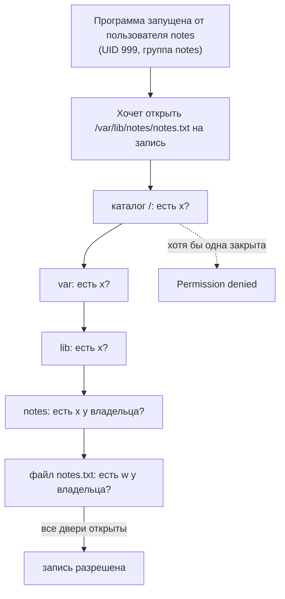
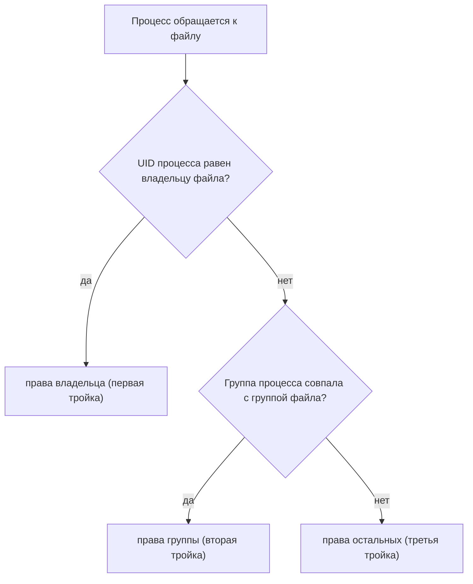
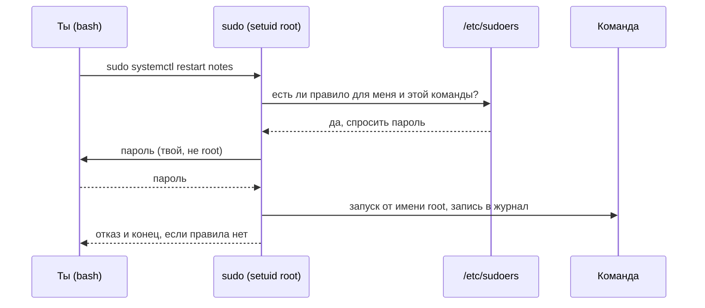
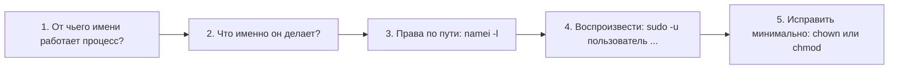

## Зачем это нужно

`chmod -R 777` на проде встречается чаще, чем хотелось бы: обычно за ним стоит человек, которому просто нужно было, чтобы «заработало». Давай научимся лечить отказы по-другому.

Половина инцидентов (инцидент это сбой, из-за которого сервис работает плохо или не работает, и людям приходится срочно разбираться) на новых серверах звучит одинаково: `Permission denied` («в доступе отказано»). Сервис не может записать файл, не может прочитать конфиг, не может открыть порт. Самое частое «лечение» со Stack Overflow (сайт вопросов и ответов для программистов): `chmod -R 777` (команда `chmod` меняет права на файл, `-R` значит «и на всё внутри», а `777` это «всем можно всё») или запуск от root (пользователя с неограниченными правами, как у владельца здания со всеми ключами). Оно работает и ломает безопасность: любая программа на машине получает право читать и портить твои данные.

Правильный подход короткий: у сервиса свой пользователь, у пользователя ровно те права, которые нужны, а админские действия (то, что меняет саму систему: установка программ, правка системных файлов) идут через `sudo` («выполни эту команду с правами администратора») с узким списком разрешённого. На собеседованиях про это спрашивают почти всегда: «что значит 755» (число, которым записывают права, разберём в теории), «зачем запускать сервис не от root», «чем sudo отличается от su» (`su` переключает тебя целиком на другого пользователя, а `sudo` выполняет одну команду от его имени).

Шаг проекта: «Заметки» переезжают на сервер. Появляется системный пользователь `notes` (служебная учётная запись для программы: в неё никто не входит с паролем, она нужна, чтобы у сервиса были свои, ограниченные права), данные лежат в `/var/lib/notes` (режим 750: «владельцу всё, группе читать, остальным ничего», разберём ниже), код в `/opt/notes/` (владелец root), а `app.py` получает файловое хранилище и две служебные страницы `/healthz` и `/readyz` (по ним можно спросить сервис «ты жив?» и «ты готов принимать запросы?»; версия v2).

## Что нужно знать

- [Урок 1.1: первый сервер, терминал, файловая система](01-first-server-shell.md) - файловая система это дерево каталогов, в котором лежат все файлы (подробно в [уроке 1.5](05-disk-memory-cpu.md)). Ты умеешь открыть терминал, ходить по каталогам (`cd`, `ls`), знаешь, что `~` это домашний каталог, и пользоваться `man` и `--help`. Файл `~/notes/app.py` (версия v1) уже создан.
- [Урок 1.2: текст, потоки и конвейеры](02-text-pipes.md) - `grep` ищет строки в тексте, `cut` режет строку на поля, `|` (конвейер) передаёт вывод одной команды другой. Ими мы прочитаем файл `/etc/passwd` (системный список всех пользователей, по строке на каждого; подробно разберём в теории).

Всё остальное (что такое пользователь, права, `sudo`, `rwx`, UID) объясняется ниже с нуля.

## Картина целиком

Представь офис с электронными пропусками. У каждого сотрудника свой пропуск, на нём его номер. На дверях кабинетов не написаны имена: там сказано «открывает владелец, отдел бухгалтерии, остальным нельзя». Вахтёр не знает людей в лицо, он сверяет номер пропуска со списком на двери. Есть ещё «мастер-ключ» у коменданта: он открывает всё (в компьютерах так бывает у главного администратора системы).

Linux устроен так же:

- **пользователь** это пропуск с номером (UID, user id: число, по которому система узнаёт пользователя; имя нужно только людям);
- **группа** это отдел: набор пользователей, которым можно выдать право сразу всем;
- **права** на файле или каталоге это табличка на двери: что может владелец, что может группа, что могут остальные. Записываются тремя буквами `rwx` (r read, читать; w write, писать; x execute, запускать файл или входить в каталог);
- **root** это мастер-ключ: ему можно всё;
- **sudo** это выдача мастер-ключа под расписку, на одну операцию и с записью в журнал.



За урок ты разберёшь каждый кусок схемы: что такое пользователь и где он записан, как читать табличку прав (`rwx` и числа вроде `750`), почему для каталога она значит другое, как задаются права новых файлов, как работает `sudo` и почему сервису нужен свой пользователь. Потом соберёшь по этой схеме настоящий сервер «Заметок».

## Теория

### Пользователь и его номер (UID)

На одном сервере одновременно работают люди и программы: администратор, разработчик, веб-сервер, база данных. Если все они действуют «от одного лица», то любая ошибка или взлом одной программы даёт доступ ко всему: к паролям, данным других программ, системным файлам. Поэтому у каждого действующего лица в системе есть отдельная учётная запись, **пользователь** (user), и права выдаются ему, а не «вообще».

Пропуск в офисе. Вахтёр (ядро) не спрашивает, как тебя зовут, он смотрит на номер пропуска. Оговорка: в Linux «сотрудник» не обязательно человек. Пользователем бывает и программа: у веб-сервера свой пропуск, как у охранника-подрядчика.

Сначала два слова про то, что здесь происходит «за кулисами».

- **Ядро** (kernel) это главная часть операционной системы. Оно управляет памятью, диском, сетью и решает, что разрешено, а что нет. Все программы просят ядро о помощи, и ядро проверяет права.
- **Процесс** (process) это запущенная программа. Пока `app.py` лежит на диске, это просто файл. Когда ты его запустил, появился процесс. Подробно процессы разберём в [уроке 1.4](04-processes-signals.md), сейчас достаточно этого.

У каждого пользователя есть имя (`ubuntu`, `notes`, `root`) и число, **идентификатор пользователя** (UID, user id). Имя нужно людям, а ядро работает только с числами. Когда ты запускаешь программу, её процесс получает твой UID и «действует от твоего имени»: всё, что он делает с файлами, ядро проверяет по этому числу. Такие же числа есть у групп: GID (group id).

Команда `id` печатает, кто ты для системы:

```bash
id
```

```text
uid=1000(ubuntu) gid=1000(ubuntu) groups=1000(ubuntu),27(sudo)
```

Разбор по кускам:

- `uid=1000(ubuntu)`: твой номер 1000, имя `ubuntu`;
- `gid=1000(ubuntu)`: **основная группа** (primary group), в неё попадают новые файлы, которые ты создаёшь. Номер 1000, имя `ubuntu`. В Ubuntu у каждого человека по умолчанию своя личная группа с тем же именем;
- `groups=1000(ubuntu),27(sudo)`: все группы, где ты состоишь. Группа `sudo` (номер 27) даёт право пользоваться командой `sudo`.

Особый пользователь: `root`, UID **0**. Ядро не проверяет права процессов с UID 0: им можно читать, изменять и удалять что угодно. Суперправа даёт не имя «root», а число 0. Если создать пользователя с UID 0 и любым именем, он станет вторым root.

Пользователи делятся на два вида:

- **человеческие**: UID от 1000. Для них есть домашний каталог и оболочка (shell, программа, которая читает твои команды в терминале; у нас это `bash`);
- **системные** (для сервисов и служб): UID меньше 1000. Так устроен, например, `sshd`, программа, которая принимает вход по SSH. Системному пользователю не нужен интерактивный вход, поэтому вместо оболочки ему ставят `/usr/sbin/nologin`: это «программа», которая при попытке войти отвечает «эта учётная запись недоступна» и завершается.

> **Прикинь сам:** кто-то создал пользователя `admin2` с UID 0. Станет ли он суперпользователем?
{: .predict}

Да. Права даёт число 0, а не имя `root`: ядро не проверяет права процессов с UID 0, как бы он ни назывался.

Осторожно: Думают, что права даёт имя «root». Нет, число 0. И думают, что пользователь это всегда человек: в проде большинство пользователей на сервере это сервисы.

> **Главное:** для ядра пользователь это число (UID), а имя нужно людям; UID 0 это root, а сервисам выдают системных пользователей с UID меньше 1000.
{: .key}

> **Проверь понимание:** в выводе `id` у тебя `uid=1000`, а у коллеги на другой машине `uid=1001`, и оба зовутся `ubuntu`. Один и тот же ли это пользователь для ядра?

<details markdown="1">
<summary>Ответ</summary>

Нет. Для ядра пользователь это число. На разных машинах одно имя может стоять за разными числами. Это важно, когда файлы копируют между серверами (например, архивом): владельцем запомнится число, и на другой машине оно может оказаться чужим пользователем.

</details>

Мы знаем, что пользователь это номер. Где система хранит списки пользователей и групп?

### Где хранятся пользователи: passwd, shadow, group

Ядру и программам нужно место, откуда узнать, какие пользователи есть, какой у них домашний каталог и в каких группах они состоят. В Linux это не база данных, а три обычных текстовых файла в каталоге `/etc` (там лежат настройки системы). Их можно прочитать и `grep`-ом, и глазами.

Отдел кадров. В общем списке сотрудников (`/etc/passwd`) записаны имя, номер, кабинет и должность, его может посмотреть любой. Образцы подписей и пароли лежат отдельно в сейфе (`/etc/shadow`), доступ только у директора. Список отделов и их состава (`/etc/group`) ещё один документ. Оговорка: в отличие от кадровика, Linux ничего не «перепроверяет»: файл и есть истина, поправил файл, поменялась система (поэтому руками их правят редко, для этого есть команды `useradd` и `usermod`).

Файл `/etc/passwd`: одна строка на пользователя, семь полей через двоеточие. Возьмём реальную строку:

```text
ubuntu:x:1000:1000::/home/ubuntu:/bin/bash
  |    | |    |    |     |           |
  |    | |    |    |     |           +---- 7. оболочка (что запустить при входе)
  |    | |    |    |     +---------------- 6. домашний каталог
  |    | |    |    +---------------------- 5. комментарий (полное имя, тут пусто)
  |    | |    +--------------------------- 4. GID основной группы
  |    | +-------------------------------- 3. UID
  |    +---------------------------------- 2. пароль: x значит «лежит в /etc/shadow»
  +--------------------------------------- 1. имя
```

Файл `/etc/shadow` («тень»): хэши паролей. **Хэш пароля** (password hash) это результат необратимого превращения пароля в строку символов: по хэшу можно проверить, тот ли пароль ввели, но восстановить сам пароль нельзя. Читать `/etc/shadow` может только root и группа `shadow`. Раньше хэши лежали прямо в `passwd`, но файл `passwd` должны читать все программы (чтобы, например, `ls -l` мог показать имя вместо числа), и хэши вынесли отдельно, чтобы их нельзя было подсмотреть и подобрать пароль.

Файл `/etc/group`: одна строка на группу, четыре поля: имя, `x`, GID, участники через запятую. Например:

```text
sudo:x:27:ubuntu
```

Это группа `sudo`, номер 27, в ней состоит `ubuntu`.

Посмотрим права на эти три файла (`ls -l` разберём подробно в следующем разделе, пока смотри на суть):

```text
-rw-r--r-- 1 root root    533 Sep 30 11:34 /etc/group
-rw-r--r-- 1 root root   1056 Sep 30 11:34 /etc/passwd
-rw-r----- 1 root shadow  578 Sep 30 11:34 /etc/shadow
```

`passwd` и `group` читают все (`r--` в конце), а `shadow` для «остальных» полностью закрыт (`---`). Попытка `cat /etc/shadow` от обычного пользователя даст `Permission denied`, а через `sudo` файл откроется.

**Группы: основная и дополнительные.** У пользователя одна основная группа (четвёртое поле `passwd`) и сколько угодно дополнительных (**supplementary groups**, те, где его имя указано в `/etc/group`). Права проверяются по всем группам сразу. Чтобы добавить пользователя в группу, используют `usermod -aG группа пользователь`: `-G` задаёт список дополнительных групп, `-a` (append, «добавить») говорит «не стирай прежние».

> **Прикинь сам:** ты добавил себя в группу `docker` и сразу набрал `id` в том же терминале. Увидишь ли новую группу?
{: .predict}

Нет. Список групп процесс получает при запуске, поэтому `id` в старом терминале покажет прежние группы. `id <имя>` читает файлы заново и покажет новую, а в терминале поможет новый вход.

Осторожно, тут часто путают:

- **Забыли `-a`.** `usermod -G docker alice` без `-a` не добавит `alice` в `docker`, а заменит весь список её дополнительных групп на одну `docker`. Она потеряет, например, `sudo`.
- **Ждут, что группа появится сразу.** Список групп процесс получает при запуске. Ты добавил себя в группу, но уже открытый терминал живёт со старым списком. Проверь сам в задании 1: `id` покажет старые группы, а `id <имя>` (читает файл заново) уже новые. Новая группа появится только в новой сессии: выйди и войди, или открой новый терминал.
- **Считают, что `x` в `passwd` это пароль из одного символа.** Нет, это пометка «хэш смотри в shadow».

> **Главное:** пользователи и группы лежат в `/etc/passwd`, `/etc/group` и `/etc/shadow`; пароли только в `shadow`, который читает один root.
{: .key}

> **Проверь понимание:** в `/etc/passwd` у пользователя `nginx` стоит оболочка `/usr/sbin/nologin`. Сможет ли веб-сервер `nginx`, запущенный от этого пользователя, читать файлы? Сможет ли администратор зайти в SSH под этим пользователем?

<details markdown="1">
<summary>Ответ</summary>

Веб-сервер читать файлы сможет: оболочка нужна только для интерактивного входа, а процесс работает от UID пользователя и без неё. Зайти в SSH под этим пользователем нельзя: вместо оболочки запустится `nologin` и отвергнет вход. Так и задумано: сервису вход не нужен, а значит, украденным паролем или ключом им не воспользоваться.

</details>

Теперь, когда у каждого есть номер и группа, посмотрим, как файл решает, кого пускать.

### Права rwx: читаем табличку на двери

Раз на машине много пользователей, нужно правило, кто что может делать с каждым файлом. Без него любая программа могла бы стереть чужие данные или прочитать пароли. Это правило записано прямо на файле и называется **правами доступа** (permissions).

Папка с документами в шкафу. К ней прикреплён листок: «автор может читать и править, отдел бухгалтерии только читать, остальным нельзя». Вахтёр выдаёт документ по листку. Оговорка: листок проверяется по принципу «первое подходящее», а не «сложить все права». Если ты автор, то смотрят только графу «автор», даже когда для «остальных» права шире.

Над файлом можно делать три действия. Для обычного файла:

- `r` (read): прочитать содержимое;
- `w` (write): изменить содержимое;
- `x` (execute): запустить файл как программу.

Эти три права выдаются отдельно трём **классам** людей:

- **владелец** (user, `u`): пользователь, которому файл принадлежит. Обычно создатель;
- **группа** (group, `g`): любой участник группы, назначенной файлу;
- **остальные** (other, `o`): все, кто не подошёл под первые два класса.

Права и владельцев показывает `ls -l` (long, «подробно»). Возьмём настоящую строку про файл с заметками, который мы создадим в задании 4:

```text
-rw-r----- 1 notes notes 92 Sep 30 11:55 notes.txt
```

```text
-rw-r-----  1  notes  notes   92   Sep 30 11:55   notes.txt
|\_/\_/\_/  |    |      |     |          |           |
| |  |  |  |    |      |     |          |           +-- имя
| |  |  |  |    |      |     |          +-------------- дата изменения
| |  |  |  |    |      |     +------------------------- размер в байтах
| |  |  |  |    |      +------------------------------- группа-владелец
| |  |  |  |    +-------------------------------------- пользователь-владелец
| |  |  |  +------------------------------------------- число имён у файла (пока не важно)
| |  |  +---------------------------------------------- права остальных: ---
| |  +------------------------------------------------- права группы: r--
| +---------------------------------------------------- права владельца: rw-
+------------------------------------------------------ тип: - файл, d каталог, l ссылка
```

Читаем: файл принадлежит пользователю `notes` и группе `notes`. Владелец может читать и писать (`rw-`, прочерк на месте `x` значит «нельзя запускать»), группа только читать (`r--`), остальным ничего (`---`).

**Как ядро выбирает класс.** Это главное правило, на нём построены почти все «загадки» с правами. Когда процесс обращается к файлу, ядро идёт по шагам и останавливается на первом подходящем:

1. UID процесса равен владельцу файла? Тогда применяются права **владельца**, остальные графы не смотрят.
2. Иначе: основная или любая дополнительная группа процесса равна группе файла? Тогда права **группы**.
3. Иначе права **остальных**.



Для `-rw-r----- notes notes` это значит: процесс `notes` пишет и читает; процесс пользователя `deploy` (не владелец, не в группе `notes`) попадает в «остальные» и получает `---`, то есть ничего. Побочный эффект первого шага: владелец с правами `---` не может открыть даже собственный файл (но `chmod` он выполнить сможет, чтобы вернуть права). Процессы root (UID 0) в проверке не участвуют, для них всё разрешено.

**Права числами.** Каждую тройку записывают одной цифрой: `r` весит 4, `w` весит 2, `x` весит 1, вес прав складывают. Зачем числа: `rwxr-x---` длинно писать в команде, а `750` коротко.

```text
rwx r-x ---
421 4-1 ---      суммы по тройкам:
 7   5   0       4+2+1 = 7,   4+1 = 5,   0
              => 750

rw- r-- ---      4+2 = 6,   4,   0    => 640
rw- r-- r--                           => 644
rwx r-x r-x      7,  5,  5            => 755
```

В обратную сторону: `640` это `6`=4+2=`rw-`, `4`=`r--`, `0`=`---`. Запомни четыре числа, они встречаются везде:

| Режим | Кому что | Где встретишь |
|---|---|---|
| `600` (`rw-------`) | только владелец читает и пишет | закрытые SSH-ключи (файл-«отмычка» для входа на сервер без пароля, разберём в [уроке 2.2](../02-network/02-ports-tcp-ssh.md)), токены (длинный секретный пароль для программ), пароли |
| `640` (`rw-r-----`) | владелец пишет, группа читает | конфиги (`640 root:notes`: правит root, читает сервис `notes`) |
| `644` (`rw-r--r--`) | все читают, пишет владелец | обычные файлы и код |
| `755` (`rwxr-xr-x`) | все читают и запускают, пишет владелец | программы и каталоги |

> **Прикинь сам:** расшифруй `640` и `750` в виде `rwx`.
{: .predict}

`640` это `rw-r-----`: владелец читает и пишет, группа читает, остальным ничего. `750` это `rwxr-x---`: владелец всё, группа читает и входит, остальным ничего.

Осторожно, тут часто путают:

- Что `777` «просто чтобы заработало»: это право писать и запускать любому пользователю и любой программе на машине. Это не решение, а отказ от защиты.
- Что права суммируются: «я и владелец, и в группе, значит у меня права и владельца, и группы». Нет, применяется первый подходящий класс.
- Что `x` на файле нужен, чтобы его прочитать. Нет, для чтения хватит `r`. `x` нужен, чтобы запустить файл как программу.

> **Главное:** права `rwx` выдаются трём классам (владелец, группа, остальные), ядро применяет первый подходящий класс, а числа считаются как r=4, w=2, x=1.
{: .key}

> **Проверь понимание:** файл `-rw-rw-r-- deploy devs`, ты пользователь `alice` и состоишь в группе `devs`. Можешь ли ты его изменить? А пользователь `bob`, не состоящий в `devs`?

<details markdown="1">
<summary>Ответ</summary>

`alice` не владелец, но в группе `devs`: применяются права группы `rw-`, значит она может читать и изменять. `bob` попадает в «остальные» с правами `r--`: читать может, изменять нет.

</details>

С файлами ясно. А почему при файле `644` бывает отказ при чтении? Всё дело в каталогах.

### Права на каталоги и путь до файла

Каталог (папка) тоже защищён правами, и они значат другое, чем у файла. Из-за этого возникает самая коварная ошибка новичка: файл `644`, читать должны все, а получаешь `Permission denied`.

Каталог это шкаф с выдвижными ящиками, а файлы это папки внутри. Список содержимого написан на дверце шкафа. Право `r` это «можно прочитать надпись на дверце», `x` это «можно открыть дверцу и достать папку, если знаешь её название», `w` это «можно класть и выбрасывать папки». Оговорка: с точки зрения прав шкаф и его содержимое это разные объекты, и право на папку не даёт права на шкаф, и наоборот.

Для каталога те же три бита значат:

- `r`: увидеть список имён внутри (`ls`);
- `w`: создавать, удалять и переименовывать файлы внутри. Права самого файла при этом не важны: удалить файл можно, если есть `w` на его каталоге, даже когда сам файл тебе не принадлежит;
- `x`: «проходить» через каталог: заходить (`cd`) и обращаться к файлам внутри по имени. Пример: у каталога только `x` без `r`. Списка файлов ты не увидишь (`ls` откажет), но `cat каталог/secret.txt` сработает, если ты заранее знаешь имя. Как комната с выключенным светом: всё на месте, но ты идёшь на ощупь и берёшь только то, о чём знаешь.

Чтобы открыть файл по пути `/var/lib/notes/notes.txt`, ядро проходит путь целиком: нужен `x` на каждом каталоге (`/`, `var`, `lib`, `notes`), и только потом смотрится право `r` на самом файле. Если хоть один каталог закрыт, права файла даже не проверяются.

Права по всему пути показывает `namei -l` (name and inode, флаг `-l` значит «с подробными правами»).

На настоящем сервере Ubuntu домашний каталог закрыт для чужих: у него режим `750` (`drwxr-x---`). В нём лежит файл `a.txt` с режимом `644`, который «читают все». Пробуем прочитать его от имени системного пользователя `nobody` (у него нет ни прав владельца, ни группы файла).

Сначала о командах. `sudo -u nobody команда` запускает команду от имени пользователя `nobody` (служебная учётная запись без особых прав, удобна для проверки «что видит чужой»); подробнее про `sudo` ниже. `~` это твой домашний каталог ([урок 1.1](01-first-server-shell.md)). `namei -l` печатает права каждого звена пути по очереди.

```bash
sudo -u nobody cat ~/perm-lab/a.txt
namei -l ~/perm-lab/a.txt
```

```text
cat: /home/ubuntu/perm-lab/a.txt: Permission denied
f: /home/ubuntu/perm-lab/a.txt
drwxr-xr-x root    root    /
drwxr-xr-x root    root    home
drwxr-x--- ubuntu ubuntu ubuntu
drwxr-xr-x ubuntu ubuntu perm-lab
-rw-r--r-- ubuntu ubuntu a.txt
```

Идём по строкам `namei`. `/` и `home`: `x` есть у всех. `ubuntu` (домашний каталог): права `rwxr-x---`, для «остальных» три прочерка, нет `x`. Здесь ядро останавливает `nobody`. До `a.txt` он не дошёл, и права `644` на файле не сыграли роли.

> **Прикинь сам:** у каталога `/srv/data` режим `711`, внутри файл `report.txt` с `644`. Что получится у обычного пользователя: `ls /srv/data` и `cat /srv/data/report.txt`?
{: .predict}

`ls` откажет: для списка нужен `r`, а у остальных только `x`. `cat` по известному имени сработает: `x` пускает внутрь, а у файла `r` есть.

Осторожно, тут часто путают:

- «У файла 644, значит читают все». Нет, читают все, кто дошёл до файла по пути.
- «Чтобы удалить файл, нужно право на файл». Нет, нужно `w` на каталоге. Поэтому на общих каталогах вроде `/tmp` ставят особый бит (ниже), иначе любой удалял бы чужие файлы.
- «`x` на каталоге значит, что в нём что-то запускается». Нет, это «можно войти».

> **Главное:** для каталога `r` значит «увидеть список», `w` «создавать и удалять», `x` «проходить»; чтобы дойти до файла, нужен `x` на каждом каталоге пути.
{: .key}

> **Проверь понимание:** у файла `/srv/data/report.txt` права `644`, но `Permission denied` при чтении. Каталог `/srv/data` имеет `700` и владельца root. Ты обычный пользователь. Почему?

<details markdown="1">
<summary>Ответ</summary>

Чтобы добраться до файла, нужен бит `x` на каждом каталоге пути. У `/srv/data` для остальных нет ничего, до файла ты не доходишь, права самого файла не проверяются. Быстрая проверка: `namei -l /srv/data/report.txt` показывает права по всему пути.

</details>

Права мы читаем. Как их менять и как передать файл другому владельцу?

### chmod и chown: как менять права и владельца

Права при создании файла выдаются по умолчанию (о них следующий раздел), и почти всегда их приходится менять: закрыть ключ, открыть скрипт для запуска, передать каталог сервису.

Заменить листок с надписью на папке (`chmod`) или сменить «автора» в шапке документа (`chown`). Оговорка: листок вправе менять только автор, а автора менять может только комендант, то есть root.


- **`chmod`** (change mode, «изменить режим») меняет права. Два способа записи:
  - числом: `chmod 640 файл` выставляет режим целиком;
  - символами: `chmod кто оператор права файл`. **Кто**: `u` владелец, `g` группа, `o` остальные, `a` все. **Оператор**: `+` добавить, `-` убрать, `=` выставить точно. **Права**: `r`, `w`, `x`. Части можно перечислять через запятую: `u+x,g-r`.
- **`chown`** (change owner) меняет владельца: `chown notes:notes файл` ставит пользователя `notes` и группу `notes` (формат `пользователь:группа`). Менять владельца может только root, поэтому обычно `sudo chown`. Ключ `-R` (recursive) применяет команду ко всему содержимому каталога, будь с ним внимателен.

Число удобно, когда знаешь итог, символы удобны, когда нужно поменять один бит и не помнить остальные.

У файла `640`, выполняем `chmod u+x,g-r`. Считаем по битам:

```text
было:        rw- r-- ---   = 640
u+x          rwx r-- ---   = 740   (владельцу добавили x)
g-r          rwx --- ---   = 700   (у группы убрали r)
```

Ещё частый случай: скрипт, который скачали или создали, обычно запуститься не даёт, потому что при создании `x` не выдают. Команда `chmod +x скрипт` (без «кто» означает «всем, кому позволяет маска создания») добавляет запуск.

> **Прикинь сам:** у файла `755`. Какой режим станет после `chmod go-x`?
{: .predict}

`755` это `rwxr-xr-x`. Убираем `x` у группы и остальных: `rwxr--r--`, то есть `744`.

Осторожно, тут часто путают:

- `chmod o` без оператора: ошибка, после `o` нужен `+`, `-` или `=`. Чтобы очистить права остальных, пиши `o=`.
- «Я обычный пользователь и владелец, значит могу сменить владельца на другого». Нет, `chown` доступен только root (иначе можно было бы подсовывать другим свои файлы).
- `chmod -R 777`. Не делай так никогда. Ты одновременно открываешь запись всем и делаешь исполняемыми файлы, которые не должны запускаться.

> **Главное:** `chmod` меняет права числом или символами (`u+x`, `g-w`, `o=`), `chown` меняет владельца и доступен только root.
{: .key}

> **Проверь понимание:** какой режим будет у файла `644` после `chmod g+w,o-r`?

<details markdown="1">
<summary>Ответ</summary>

`644` это `rw- r-- r--`. `g+w` даёт группе запись: `rw- rw- r--`. `o-r` убирает чтение у остальных: `rw- rw- ---`. Итог `660`.

</details>

А какие права получит файл при создании? Это решает не `chmod`.

### umask: какие права получает новый файл

Когда программа создаёт файл, она обычно не указывает права. Кто-то должен решить за неё. Чтобы каждый файл не получал `666` (все пишут), в системе есть «фильтр» на выдаваемые права, **маска создания** (umask). Он работает без твоего участия и объясняет, почему файл, созданный сервисом, получается не с такими правами, как файл, созданный тобой.

Трафарет: программа закрашивает всё, что хочет, а трафарет закрывает те места, которые закрашивать нельзя. Оговорка: трафарет только закрывает, добавить права он не может.


1. Программа создаёт файл и просит максимум: для обычного файла `666` (`rw-rw-rw-`, исполняемым файл сам никогда не создаётся, это защита), для каталога `777`.
2. Ядро берёт маску создания процесса и **отбрасывает** те права, которые в ней записаны: цифра `2` в маске означает «убрать `w`» (напомним веса: `r`=4, `w`=2, `x`=1), цифра `7` означает «убрать всё». Строго говоря, ядро не вычитает числа, а выключает переключатели (биты), но для типичных масок результат совпадает с вычитанием, поэтому считать так проще.
3. Что осталось, то и есть права нового файла.

Маска относится к **процессу**: у каждого процесса своя. Поэтому у файла, созданного твоей командой, и у файла, созданного сервисом, права могут отличаться.

Маска `022`, создаём файл и каталог:

```text
файл:     666  rw- rw- rw-
маска:    022  --- -w- -w-   (эти биты отбрасываем)
итог:     644  rw- r-- r--

каталог:  777  rwx rwx rwx
маска:    022  --- -w- -w-
итог:     755  rwx r-x r-x
```

Маска `077` даёт `600` и `700` (всё только владельцу), маска `027` даёт `640` и `750`. Текущую маску показывает команда `umask`. Меняет `umask 077` (только в текущем терминале и его дочерних процессах).

**Настоящая особенность Ubuntu.** У пользователей, у которых есть личная группа с тем же именем (`ubuntu:ubuntu`, `notes:notes`), Ubuntu ставит маску `002`, а не `022`: участникам своей личной группы писать безопасно, кроме тебя в ней никого нет. Поэтому файл, который создал сервис `notes`, на Ubuntu 24.04 получит `664` (`rw-rw-r--`), а не `644`. Ты увидишь это своими глазами в задании 4.

> **Прикинь сам:** процесс с `umask 077` создаёт файл и каталог. Какие права у каждого?
{: .predict}

Файл: `666` минус `077` даёт `600`. Каталог: `777` минус `077` даёт `700`. Всё достаётся только владельцу.

Осторожно, тут часто путают:

- «umask это права по умолчанию для всех файлов системы». Нет, это настройка процесса.
- «umask 022 значит `022` на файле». Нет, это то, что **отнимают**: файл получит `644`.
- «Права нового файла копируются с каталога». Нет, только от маски процесса (исключение, setgid, ниже).

> **Главное:** `umask` отнимает права у максимума (`666` для файлов, `777` для каталогов) и действует на процесс, а не на систему.
{: .key}

> **Проверь понимание:** процесс с `umask 027` создаёт файл и каталог. Какие получатся права?

<details markdown="1">
<summary>Ответ</summary>

Файл: `666` минус `027` даёт `640` (`rw-r-----`). Каталог: `777` минус `027` даёт `750` (`rwxr-x---`).

</details>

Обычных `rwx` иногда не хватает. Для таких случаев есть особые биты.

### Особые биты: setuid, setgid и sticky

Обычных `rwx` иногда не хватает. Пример: команда `passwd` меняет твой пароль, то есть записывает в `/etc/shadow`, а этот файл может изменять только root. Как обычный пользователь ухитряется его изменить? Через особый бит.

Выездная доверенность: сотрудник действует от имени директора, но только в пределах одного поручения. Оговорка: доверенность даёт программе, а не человеку, и любая дыра в программе превращается в дыру с правами директора.

**Бит** (bit) это один переключатель с двумя положениями: включено или выключено. Каждая буква в `rwx` это один такой переключатель: `r` включён, если буква на месте, и выключен, если вместо неё прочерк. Три дополнительных переключателя стоят перед обычными тремя цифрами:

- **setuid** (`4000`, буква `s` на месте `x` владельца): программа запускается с правами **владельца файла**, а не того, кто её запустил;
- **setgid** (`2000`, `s` на месте `x` группы): для программы то же самое с группой, а на каталоге новые файлы внутри наследуют группу этого каталога (полезно для общих папок команды);
- **sticky bit** («липкий», `1000`, буква `t` в конце): на каталоге запрещает удалять и переименовывать чужие файлы, даже если у каталога есть `w` для всех.

Реальные строки:

```text
-rwsr-xr-x 1 root root 72056 May 30  2024 /usr/bin/passwd
drwxrwxrwt 1 root root  4096 Sep 30 12:00 /tmp
drwxrwsr-x 2 ubuntu ubuntu 4096 Sep 30 12:00 team
```

- `/usr/bin/passwd`: `s` вместо `x` у владельца, значит setuid. Владелец root, поэтому программа работает как root и может изменить `/etc/shadow`. Режим этого файла числом: `4755`.
- `/tmp`: `drwxrwxrwt`. Писать в каталог может любой (`rwx` для всех), но `t` в конце (режим `1777`) не даёт удалять чужое. Так устроены общие временные каталоги.
- `team`: `s` в группе, режим `2775`. Файлы в нём получают группу каталога.

Все программы с setuid на машине найдёт `sudo find /usr/bin /usr/sbin -perm -4000 -type f`. У нас их девять: `chfn`, `chsh`, `gpasswd`, `mount`, `newgrp`, `passwd`, `su`, `sudo`, `umount`. Каждая из них должна быть там осознанно, лишние это повод для аудита безопасности.

> **Прикинь сам:** какой числовой режим у `/tmp`, если `ls -ld` показывает `drwxrwxrwt`?
{: .predict}

`1777`: `rwx` для всех это `777`, а `t` на конце даёт sticky bit, то есть `1000` в начале.

Осторожно: «setuid на скрипте даст ему права владельца». Нет, ядро Linux игнорирует setuid на скриптах, работает только на скомпилированных программах. И «`s` и `t` это отдельные права». Нет, это отметки поверх `x`: заглавная `S` или `T` значит, что бита `x` под ней нет.

> **Главное:** setuid запускает программу от владельца файла, setgid наследует группу каталога, sticky bit не даёт удалять чужое в общем каталоге.
{: .key}

> **Проверь понимание:** почему в общем каталоге `/tmp` каждый может создавать файлы, но не может удалить файл соседа, хотя на каталоге у всех `w`?

<details markdown="1">
<summary>Ответ</summary>

Потому что на `/tmp` стоит sticky bit (`t`). Он добавляет правило: удалить или переименовать файл в таком каталоге может только владелец файла, владелец каталога или root, а обычное `w` на каталоге этого уже не даёт.

</details>

Одна из программ с setuid, `sudo`, нужна тебе каждый день. Разберёмся, как она устроена.

### root, su и sudo

Часть действий требует прав администратора: установить пакет (программу из системного каталога программ, командой `apt install`), создать пользователя, править системные файлы. Работать постоянно под root опасно: одна опечатка (`rm -rf /`) уничтожает систему, а любая запущенная программа получает все права. Нужен способ получать права **на одну команду**, с записью, кто и что сделал.

Мастер-ключ хранится у коменданта. Сотрудник не берёт его насовсем, а приходит и просит: «открой мне кабинет 5». Комендант смотрит в список разрешений и записывает выдачу в журнал. Оговорка: у `sudo` нет коменданта-человека, роль выполняет файл со списком правил.


- **`su`** (switch user) переключает тебя на другого пользователя целиком, нужен **его** пароль. Сессия открыта до выхода, вся работа идёт от чужого имени, а пароль root приходится знать нескольким людям.
- **`sudo`** (substitute user do) выполняет **одну команду** от имени другого пользователя (по умолчанию root). Просит **твой** пароль, а не пароль root, и пишет факт запуска в журнал (текстовый файл-дневник событий, для `sudo` это `/var/log/auth.log`, там видно, кто, когда и что запускал). Что кому можно, описано в `/etc/sudoers` и файлах каталога `/etc/sudoers.d/`.

Как работает `sudo systemctl restart notes` по шагам:

1. Ты запускаешь `sudo` (это программа с setuid, поэтому у неё сразу права root).
2. `sudo` читает `sudoers` и ищет правило про тебя и команду.
3. Правило нашлось: при необходимости спрашивает твой пароль, затем запускает команду от имени root.
4. Правила нет: `sudo` печатает отказ и ничего не запускает.



Чтобы выполнить команду от имени **другого пользователя** (не root), добавляют `-u`: `sudo -u notes id` выполнит `id` от имени `notes`. Так мы в уроке будем запускать «Заметки» под их собственным пользователем и проверять, что доступно ему.

Реальная строка из `/etc/sudoers` Ubuntu:

```text
%sudo	ALL=(ALL:ALL) ALL
```

Читается по полям: `%sudo` группа `sudo` (знак `%` значит «группа»); `ALL=` на любых машинах; `(ALL:ALL)` от имени любого пользователя и любой группы; `ALL` любые команды. Поэтому участнику группы `sudo` разрешено всё, но с вводом его пароля. Именно из-за этой строки в `id` у тебя есть `27(sudo)`.

> **Прикинь сам:** почему `sudo echo hi > /etc/test.txt` отвечает `Permission denied`, хотя `sudo` перед `echo` есть?
{: .predict}

Перенаправление `>` выполняет твоя оболочка до запуска `sudo`, то есть с твоими правами. Верно так: `echo hi | sudo tee /etc/test.txt`.

Осторожно, тут часто путают:

- «`sudo` это сокращённо `su`». Нет: sudo просит твой пароль, выполняет одну команду и оставляет след в журнале.
- «`sudo` даёт права, значит с ним можно делать всё». Права выдаёт список правил, и правильно этот список делать узким.
- «`sudo cd /root` или `sudo echo > файл` сработают». Оба не сработают, как ждёшь: `cd` это команда самой оболочки, а перенаправление `>` выполняет твоя оболочка, а не `sudo`. Для записи в защищённый файл используют `... | sudo tee файл`: `tee` ([урок 1.2](02-text-pipes.md)) сама открывает файл и пишет в него, а запускается она уже с `sudo`, поэтому права у неё есть. Почему первый вариант не работает: оболочка сначала открывает файл для `>` от твоего имени, получает отказ, и до запуска `sudo` дело не доходит.

> **Главное:** `su` переключает на другого пользователя целиком по его паролю, а `sudo` выполняет одну команду по твоему паролю и пишет её в журнал.
{: .key}

> **Проверь понимание:** зачем `sudo` спрашивает твой пароль, а не пароль root?

<details markdown="1">
<summary>Ответ</summary>

Чтобы root-пароль не знал никто, кроме отдельных случаев, а любой запуск был привязан к конкретному человеку и попал в журнал. Твой пароль подтверждает, что за клавиатурой именно ты, а не тот, кто присел за незаблокированный ноутбук.

</details>

`sudo` работает по правилам. Как выдать человеку одну команду, а не весь root?

### Правила sudoers и безопасная правка

Иногда нужно разрешить человеку или программе **только одну** административную команду: разработчику перезапускать один сервис, скрипту деплоя выполнять одну операцию. Полный `sudo` для этого избыточен, а файл правил легко испортить.

Список допусков на проходной. Опечатка в списке может привести к тому, что вахтёр откажет всем или, что хуже, пропустит лишних. Поэтому список сначала проверяют на копии, и только потом кладут на проходную.

Правило состоит из полей `кто где=(от_имени) что_можно`:

```text
deploy ALL=(root) NOPASSWD: /usr/bin/du -sh /var/log
  |    |     |       |              |
  |    |     |       |              +-- команда с аргументами: ровно эта и никакая другая
  |    |     |       +----------------- NOPASSWD: пароль не спрашивать
  |    |     +------------------------- от имени root
  |    +------------------------------- на любых хостах (машинах)
  +------------------------------------ пользователь deploy
```

Поле «где» (`ALL`) нужно потому, что один файл правил можно раздать на много серверов (хост, host, это просто компьютер в сети), и правило может действовать не на всех. На одиночной машине всегда пиши `ALL`.

Путь команды всегда абсолютный (от корня, `/usr/bin/du`, а не `du`). Если написать просто `du`, sudo найдёт её по `PATH` (список каталогов, где оболочка ищет программы, [урок 1.1](01-first-server-shell.md)), и злоумышленник, подложив свою `du` в каталог из `PATH`, получит root. Все аргументы в правиле обязательны: `du -sh /var/log` разрешено, `du -sh /etc` нет.

Правила кладут отдельным файлом в `/etc/sudoers.d/`, а не правят главный `/etc/sudoers`. Причины: пакетные обновления не затрут твою правку, каждое правило можно удалить целым файлом, а ошибка в одном файле не трогает остальные. Имя файла не должно содержать точку (иначе sudo его пропустит).

Три правила безопасной правки:

1. Файл сначала пишется в обычное место и проверяется командой `visudo -cf файл` (`visudo` это проверяющий редактор sudoers, `-c` только проверить, `-f` указывает файл). Она должна ответить `parsed OK`.
2. Только потом файл ставится в `/etc/sudoers.d/` с владельцем root и режимом `440` (читать могут root и группа, писать никто).
3. Пока не проверил, держи открытой вторую сессию с root-доступом (например, второй терминал с `sudo -i`). Если что-то сломается, ты сможешь исправить.

**Разобранный пример: что произойдёт при опечатке.** В правиле выше потеряем знак `=`: `deploy ALL(root) NOPASSWD: ...`. Реальная реакция `visudo -cf` на Ubuntu 24.04 (sudo 1.9.15):

```text
/home/ubuntu/bad.tmp:1:11: syntax error
deploy ALL(root) NOPASSWD: /usr/bin/du -sh /var/log
          ^
```

Файл, строка 1, символ 11 (под стрелкой), сказано, где именно опечатка. Если положить такой файл в `sudoers.d`, что случится? Мы проверили это на Ubuntu 24.04 и 26.04. В современном sudo ошибка в одном файле не отключает `sudo` целиком: **пропадают только сломанные строки**, а каждая команда `sudo` печатает сообщение о синтаксической ошибке. Это значит: правило, которое ты хотел выдать, не работает, все остальные работают. Настоящая беда в другом:

- сломанное правило было **единственным**, дающим тебе `sudo` (например, ты правил свою же строку): ты остаёшься без прав;
- на старых системах (sudo 1.8) любая ошибка в любом файле отключает `sudo` целиком;
- у файла в `sudoers.d` неверный владелец или он доступен всем на запись: sudo такой файл **отвергает** с сообщением вроде `is world writable` или `is owned by uid 1000, should be 0`;
- главный `/etc/sudoers` с правом записи для всех: sudo отказывается работать для всех.

Отсюда и совет держать вторую сессию с root: без неё после такой ошибки ты остаёшься без администратора.

> **Прикинь сам:** правило `deploy ALL=(root) NOPASSWD: /usr/bin/systemctl restart notes`. Сможет ли `deploy` выполнить `sudo systemctl stop notes`?
{: .predict}

Нет: правило разрешает команду только с этими аргументами. Поэтому узкие правила безопаснее, чем `NOPASSWD: ALL`.

Осторожно, тут часто путают:

- «Если `visudo -cf` сказал `parsed OK`, правило работает как я хотел». Нет, он проверяет только синтаксис. Что правило даёт именно то, что нужно, проверяют командой `sudo -l -U пользователь` и пробным запуском.
- «`NOPASSWD: ALL` безопасно, я же доверяю разработчику». Это полный root без пароля: кража ноутбука разработчика или его ключа даёт root на сервере.
- «Правило `deploy ALL=(root) NOPASSWD: /usr/bin/du *` с шаблоном `*` удобнее». `*` разрешает любые аргументы, и `du` (или любая другая команда с шаблоном) может быть использована для чтения чужих данных или обхода ограничения. Пиши точные аргументы.

> **Главное:** правила `sudo` кладут файлом в `/etc/sudoers.d/`, проверяют `visudo -cf` и ставят с владельцем root и режимом `440`, а команды пишут абсолютными путями.
{: .key}

> **Проверь понимание:** почему правило пишут `/usr/bin/du`, а не просто `du`?

<details markdown="1">
<summary>Ответ</summary>

Просто `du` sudo ищет по `PATH`. Если в `PATH` окажется каталог, куда может писать посторонний, он подложит свою программу с именем `du`, и она выполнится с правами root. Абсолютный путь указывает одну конкретную программу.

</details>

Теперь соберём всё это для настоящего сервиса: каким пользователем и с какими правами его запускать?

### Сервис под своим пользователем: принцип наименьших привилегий

«Заметки» это программа, к которой обращаются по сети. Любая такая программа может содержать ошибку, через которую её взломают. Вопрос не «взломают ли», а «что получит взломщик». Если сервис работает от root, взломщик получает всю машину. Если от отдельного пользователя с минимальными правами, он получает только то, что доступно этому пользователю. Это называется **принцип наименьших привилегий** (least privilege): дай ровно то, что нужно для работы, и не больше.

Курьер получает пропуск только на склад, а не в бухгалтерию и не в серверную. Потеряет пропуск, вред ограничен складом. Оговорка: принцип не гарантирует безопасность, а только уменьшает последствия.

Определи, что сервису действительно нужно, и разложи по правам:

| Что | Нужно сервису | Как выдаём |
|---|---|---|
| Читать свой код `/opt/notes/app.py` | читать | владелец root, режим `644`: читать могут все, менять только root |
| Писать данные в `/var/lib/notes/` | читать, писать, входить | владелец `notes`, режим `750` |
| Менять свой код | нет, и это плюс | у пользователя `notes` нет `w` на код |
| Читать чужие данные, входить в SSH | нет | системный пользователь, оболочка `nologin`, права `750` закрывают остальных |

Так делят каталоги по Linux-традиции: код программы в `/opt` (или `/usr`), изменяемые данные в `/var/lib/<имя>`, настройки в `/etc/<имя>`. Так сделано и у «Заметок» (`/opt/notes`, `/var/lib/notes`, `/etc/notes`).

```text
   root (владелец кода)                     notes (пользователь сервиса)
          |                                            |
   /opt/notes/app.py   644 root:root         /var/lib/notes/     750 notes:notes
   (сервис читает,                                 |
    изменить не может)                       notes.txt  (сервис пишет)
                                                     ^
   deploy, ubuntu и другие   ---- x закрыт --------- +   (750: остальным нельзя)
```

Допустим, в `app.py` нашли ошибку, и взломщик заставил его выполнить `rm -rf /opt/notes`. От `notes` эта команда не сработает: у пользователя нет `w` на `/opt/notes`, и ядро скажет `Permission denied`. От root она бы удалила всё. Другой случай: сервис пишет в лог файл, которого не существует, в каталоге, куда пользователь `notes` писать не может. Ошибка `Permission denied` в логе сервиса здесь правильная реакция системы, а не «баг», и лечить её надо правами, а не запуском от root.

> **Прикинь сам:** взломщик заставил `app.py` выполнить `rm -rf /opt/notes`, а сервис работает от `notes` без права `w` на этот каталог. Что произойдёт?
{: .predict}

Ядро откажет с `Permission denied`: у `notes` нет права удалять в `/opt/notes`. Пострадать могут только его данные в `/var/lib/notes`.

Осторожно, тут часто путают:

- «Запущу от root, чтобы не возиться с правами». Так делают чаще всего, и так получаются взломы.
- «Системному пользователю нужен пароль». Нет, вход ему вообще не нужен (`nologin`), сервис запускают командой или менеджером сервисов, а не логином.
- «Раз код принадлежит root, сервис не сможет его прочитать». Сможет, `644` даёт чтение всем.

> **Главное:** сервис запускают от отдельного системного пользователя с минимумом прав: код только для чтения, запись только в свои данные.
{: .key}

> **Проверь понимание:** зачем выдавать каталогу данных режим `750`, а не `755`? Ведь сервис в обоих случаях работает.

<details markdown="1">
<summary>Ответ</summary>

`750` закрывает каталог для «остальных» полностью (нет ни `r`, ни `x`), а `755` разрешает им войти и читать файлы, если у самих файлов права позволяют. Данные приложения обычно не для чужих глаз, а закрытая дверь защищает и тогда, когда у файла внутри по ошибке окажутся слишком широкие права.

</details>

Одному пользователю права понятны. А если доступ нужен нескольким людям, на помощь приходят группы.

### Группы как способ делиться доступом

Часто файл должен быть доступен не одному пользователю и не всем, а нескольким конкретным: например, конфиг читает сервис, а правит администратор. Без групп пришлось бы выбирать между «только владелец» и «все остальные», то есть между закрытым и слишком открытым. Группа даёт третий вариант: доступ по списку.

Бейдж «бухгалтерия» на пропуске. Дверь кабинета бухгалтерии открывается любому, у кого такой бейдж, и не важно, сколько человек его носят. Оговорка: бейдж выдаётся администратором, а не берётся самим, и вступить в группу без него нельзя.

Файлу назначаются владелец и группа (`chown пользователь:группа`), в правах используется средняя тройка. Схема, которую ты будешь применять всё время, называется «шаблон `640 root:сервис`»:

1. Владелец файла root: только он может его менять.
2. Группа файла равна группе сервиса (`notes`): все участники группы могут читать.
3. Режим `640`: владелец читает и пишет, группа читает, остальные не видят.

Так лежат конфиги с паролями и ключами: сервис читает свой файл, посторонние пользователи не читают, изменить его может только администратор. Точно так же в [уроке 1.8](08-systemd-editors.md) будет устроен `/etc/notes/notes.env` (`640 root:notes`).

Файл `/etc/notes/notes.env` с режимом `640 root:notes` и три пользователя:

```text
-rw-r----- 1 root notes 27 Sep 30 12:00 /etc/notes/notes.env

root    (UID 0)           суперправа, проверка не нужна        читает и пишет
notes   (группа notes)    не владелец, но группа совпала       r--  читает
deploy  (нет в группе)    не владелец, группа не совпала       ---  Permission denied
```

Первому шагу ядра («я владелец?») соответствует только root, второму («моя группа совпадает?») пользователь `notes` через свою личную группу, все остальные падают на третий шаг и получают три прочерка.

> **Прикинь сам:** файл `640 root:notes`, пользователи `root`, `notes` и `alice` (в группе `alice`). Кто что получит?
{: .predict}

`root` читает и пишет, `notes` только читает (группа), `alice` ничего: она попадает в «остальные» с `---`.

Осторожно, тут часто путают:

- «Добавлю пользователя в группу, и всё сразу заработает»: нужен новый вход в систему (см. раздел про `passwd`, `shadow`, `group`).
- «Группа файла и группа пользователя это одно и то же». Нет: у файла своя группа-владелец, у пользователя своя основная и дополнительные. Права сработают, когда они совпадут.
- «Раздам группе `docker` или `sudo` всем подряд». Эти группы дают фактически права root (членам `docker` разрешено запускать контейнеры с доступом к файлам хоста), поэтому их выдают так же осторожно, как `sudo`.

> **Главное:** группы делят доступ между несколькими пользователями: шаблон `640 root:сервис` даёт сервису чтение, а правку оставляет администратору.
{: .key}

> **Проверь понимание:** файл `-rw-r----- root notes`. Пользователь `alice` состоит только в группе `alice`. Может ли она его прочитать? Что нужно сделать, чтобы могла, не открывая файл всем?

<details markdown="1">
<summary>Ответ</summary>

Не может: она не владелец, её группы не совпадают с `notes`, применяются права «остальных» (`---`). Чтобы дать доступ только ей, добавь её в группу `notes` (`sudo usermod -aG notes alice`) и попроси перезайти в систему. Права файла менять не нужно.

</details>

Мы научились выдавать доступ. Что делать, когда он не работает, а в голову лезет `777`?

### Почему `chmod 777` не лечит, а прячет проблему

Увидев `Permission denied`, почти каждый новичок хочет одного: чтобы заработало. Советы из интернета предлагают самый короткий путь, `chmod -R 777`. Он действительно убирает ошибку, поэтому важно понять, что именно ты при этом разрешаешь.

В офис не пускают, потому что на твоём пропуске нет нужного кабинета. Можно попросить выдать доступ именно в этот кабинет. А можно снять замки со всех дверей здания: ты войдёшь, но теперь войдёт и любой посторонний. Оговорка: в отличие от здания, на сервере «посторонним» бывает не человек, а любая запущенная программа, в том числе взломанная.

`777` значит `rwx` для владельца, группы и всех остальных (чтение 4 + запись 2 + запуск 1 = 7 в каждой позиции). Опция `-R` распространяет это на каждый файл внутри. Теперь любой пользователь машины, включая системного пользователя чужого сервиса, может прочитать конфиги с паролями и переписать твой код.

Сервису `notes` отказано в записи в `/var/lib/notes`. Плохое лечение: `sudo chmod -R 777 /var/lib/notes`. Правильное: посмотреть `ls -ld /var/lib/notes` (`-d` показывает права самого каталога, а не его содержимого), увидеть, что владелец `root`, и передать каталог сервису: `sudo chown notes:notes /var/lib/notes`. Ошибка исчезает в обоих случаях, но во втором доступ получил только тот, кому он нужен.

> **Прикинь сам:** сервис получил отказ в записи в `/var/lib/notes`. Сравни `chmod -R 777` и `chown notes:notes`: кому открыт доступ в каждом случае?
{: .predict}

С `777` всем пользователям и всем программам машины. С `chown notes:notes` только сервису `notes`. Ошибка пропадёт в обоих случаях, но второй вариант не создаёт дыры.

Осторожно: «Раз заработало, значит, починил». Заработало, но дыра осталась, и её найдут позже, уже в инциденте. Признак верного лечения: ты можешь сказать, *кому* и *что именно* ты разрешил.

> **Главное:** `chmod 777` не чинит, а раздаёт доступ всем; верное лечение называет, кому и что именно разрешено.
{: .key}

> **Проверь понимание:** что изменится в правах, если вместо `777` выставить `750`?

<details markdown="1">
<summary>Ответ</summary>

Владелец сохранит все права (`7` = `rwx`), группа сможет читать и входить (`5` = `r-x`), остальные потеряют доступ совсем (`0`). Это и есть режим каталога данных «Заметок».

</details>

Чтобы не искать вслепую, нужен порядок разбора. Вот он.

### Как разбирать Permission denied

Отказ в доступе, самая частая ошибка в этой теме. Если действовать по порядку, у неё почти всегда находится причина за минуту, без `chmod 777`.

Как разбираться, почему не открывается дверь: сначала убедись, чей это пропуск у тебя в руке, потом иди от входа к нужной двери и проверяй каждую по очереди.

Порядок из пяти вопросов:

1. **От чьего имени работает процесс?** `ps -o user,pid,args -C python3` покажет пользователя процесса: `ps` выводит список процессов, `-o` выбирает колонки (пользователь, номер процесса, команда запуска), `-C python3` оставляет только процессы с именем программы `python3`. Или `id` (для своей сессии).
2. **Что именно он пытается сделать?** Читать, писать, создавать файл, войти в каталог? Точный путь виден в сообщении об ошибке.
3. **Права по всему пути.** `namei -l /полный/путь`. Ищи первый каталог без `x` для нужного класса и файл без нужного `r` или `w`.
4. **Воспроизведи от имени этого пользователя.** `sudo -u notes cat /путь` или `sudo -u notes touch /путь`. Ошибка повторилась, значит ты нашёл её.
5. **Исправь минимально.** Владелец (`chown`) или режим (`chmod`) на конкретном месте. Не `777`, не root.



POST к «Заметкам» отвечает 500 `{"error": "storage"}`, в логе сервиса `PermissionError: [Errno 13] Permission denied: '/var/lib/notes/notes.txt'`. По шагам: процесс работает от `notes` (шаг 1); он открывает `notes.txt` на дозапись (шаг 2); `namei -l` показывает, что каталог `notes` и файл принадлежат `root` и у остальных только `r` (шаг 3); `sudo -u notes touch /var/lib/notes/probe` даёт `Permission denied` (шаг 4); значит `chown -R notes:notes /var/lib/notes` (шаг 5). Именно так ты разберёшь поломку в разделе «Сломай и почини».

> **Прикинь сам:** сервис падает с `Permission denied: /var/lib/app/data.db`. Какую проверку сделаешь первой?
{: .predict}

Выяснишь, от чьего имени работает процесс (`ps -o user,pid,args -C python3` или `id`), потому что все остальные шаги зависят от пользователя.

Осторожно: Что есть «волшебная» команда, которая чинит доступ всем и всегда. Такой нет. И что после `chmod` нужно перезапускать сервис: права проверяются при каждом обращении к файлу, перезапуск нужен, только если сервис уже упал.

> **Главное:** разбор `Permission denied`: чей процесс, что делает, права по пути (`namei -l`), воспроизвести от его имени, исправить минимально.
{: .key}

> **Проверь понимание:** сервис от пользователя `app` не может записать `/var/lib/app/data.db`. `ls -l` показывает `-rw-rw-rw- root root`. Что не так и как исправить?

<details markdown="1">
<summary>Ответ</summary>

Файл принадлежит root, а `app` попадает в «остальные» и, судя по `rw-rw-rw-`, мог бы писать, значит смотрим дальше по пути: скорее всего закрыт каталог `/var/lib/app` (нет `x` для `app`) или он принадлежит root с режимом `750`. Проверяем `namei -l /var/lib/app/data.db`. Исправление: владелец каталога и файла `app:app`, режим каталога `750`, файла `640`. Режим `666` на файле снимаем: писать в него не должен никто, кроме сервиса.

</details>

Теория закончена. В практике ты соберёшь сервер «Заметок» под отдельным пользователем.

## Практика

Нужна Ubuntu Server 24.04 или 26.04 (ВМ из [урока 1.1](01-first-server-shell.md)) и пользователь с `sudo`. Во всех выводах ниже пользователь называется `ubuntu`, а домашний каталог `/home/ubuntu`. У тебя имя и путь могут быть другими: подставляй свои. Числа UID, время, размеры и хэши у тебя будут отличаться, ориентируйся на структуру.

### Задание 1. Кто ты и где записаны пользователи

**Цель:** найти в системе то, о чём говорилось в теории: свой UID, группы, файлы `passwd`, `shadow`, `group`, и увидеть, что новая группа появляется не сразу.

**Предскажи:** сможешь ли ты прочитать `/etc/shadow` без `sudo`? А `/etc/passwd`?

<details markdown="1">
<summary>Ответ</summary>

`/etc/passwd` сможешь (`-rw-r--r--`, читают все), `/etc/shadow` нет (`-rw-r-----`, читает root и группа `shadow`): будет `Permission denied`.

</details>

**Шаги**

1. Твоя личность. `id` мы разобрали в теории; `whoami` печатает только имя. Строка `grep "^$(whoami):" /etc/passwd` работает так: `$(whoami)` подставляет твоё имя, `^` в регулярном выражении значит «начало строки», `grep` показывает строку `passwd`, которая начинается с твоего имени:

```bash
id
whoami
grep "^$(whoami):" /etc/passwd
getent group sudo
```

`getent` (get entries) спрашивает у системы записи о пользователях и группах. Это надёжнее, чем читать файл: на серверах с общей учётной базой (LDAP) пользователи лежат не только в `/etc/passwd`, а `getent` найдёт всех.

2. Права на файлы учётных записей и попытка прочитать `shadow`:

```bash
ls -l /etc/passwd /etc/shadow /etc/group
head -n 1 /etc/shadow
sudo head -n 1 /etc/shadow
```

3. Разберём `passwd` конвейером из урока 1.2: сколько всего записей, кто из них живой (не `nologin`) и какие системные. Здесь `grep -v` (invert) выводит строки, **не** содержащие образец, `cut -d: -f1,3,7` режет каждую строку по двоеточию (`-d:`) и оставляет поля 1, 3 и 7 (имя, UID, оболочка), а `awk -F: '$3<1000 {n++} END{print n}'` считает строки, у которых третье поле (UID) меньше 1000:

```bash
wc -l < /etc/passwd
grep -v nologin /etc/passwd | cut -d: -f1,3,7
awk -F: '$3<1000 {n++} END{print n}' /etc/passwd
```

4. Ловушка с группами. Создай тестовую группу, добавь себя и сравни `id` со старым процессом с `id <имя>`. `groupadd` создаёт группу, `usermod -aG` добавляет тебя в неё, `gpasswd -d` и `groupdel` в конце всё возвращают:

```bash
sudo groupadd demo
sudo usermod -aG demo "$(whoami)"
id
id "$(whoami)"
getent group demo
sudo gpasswd -d "$(whoami)" demo
sudo groupdel demo
```

**Что должно получиться** (у тебя на Ubuntu 24.04 то же по структуре)

```text
uid=1000(ubuntu) gid=1000(ubuntu) groups=1000(ubuntu),27(sudo)
ubuntu
ubuntu:x:1000:1000::/home/ubuntu:/bin/bash
sudo:x:27:ubuntu
-rw-r--r-- 1 root root    533 Sep 30 11:34 /etc/group
-rw-r--r-- 1 root root   1056 Sep 30 11:34 /etc/passwd
-rw-r----- 1 root shadow  578 Sep 30 11:34 /etc/shadow
head: cannot open '/etc/shadow' for reading: Permission denied
root:*:20707:0:99999:7:::
22
root:0:/bin/bash
sync:4:/bin/sync
ubuntu:1000:/bin/bash
20
uid=1000(ubuntu) gid=1000(ubuntu) groups=1000(ubuntu),27(sudo)
uid=1000(ubuntu) gid=1000(ubuntu) groups=1000(ubuntu),27(sudo),1002(demo)
demo:x:1002:ubuntu
Removing user ubuntu from group demo
```

Точные тексты: сообщение `head: cannot open ...` в старых версиях coreutils выглядит как `cat: /etc/shadow: Permission denied`, смысл тот же. Строка `Removing user ubuntu from group demo` может быть на русском или иначе, если у тебя другая локаль.

**Как читать вывод:**

- Первые четыре строки: твои `id`, имя, запись из `passwd` (семь полей, как разобрали в теории) и группа `sudo`, в которой ты числишься.
- `ls -l` подтверждает теорию: `passwd` и `group` открыты всем (`r--` в конце), `shadow` для остальных закрыт (`---`), его группа `shadow`.
- В `shadow` у `root` вместо хэша стоит `*`: это «пароля нет, войти паролем нельзя». Остальные поля про срок жизни пароля, сейчас не важны.
- Записей всего 22 (у тебя число другое), из них 20 системных с UID меньше 1000. Живых оболочек только у `root`, `sync` (служебная), тебя.
- Последние строки: первая `id` (процесс, который живёт с момента твоего входа) **не знает** о `demo`, а `id ubuntu` читает файл заново и показывает `1002(demo)`. Поэтому «добавил в группу, а доступа нет» лечится новым входом в систему.

**Объясни себе:**

- Почему у `/etc/passwd` права `644`, если это «список пользователей», а у `/etc/shadow` закрыт от всех?
- Что случилось бы, если бы в команде `usermod` не было `-a`?

**Типичные ошибки:**

- `usermod: group 'demo' does not exist`: группа не создана (шаг `groupadd` пропущен или упал).
- `groupadd: group 'demo' already exists`: остался хвост от прошлого запуска. Удали: `sudo groupdel demo` и повтори.
- `usermod: user '' does not exist`: пустое имя (ты написал `$USER`, а переменная не задана). Возьми `"$(whoami)"`, как в примере.

### Задание 2. Права числами, каталоги и umask

**Цель:** научиться предсказывать права результата, понять, что делает `x` на каталоге, и прочитать `namei -l`.

**Предскажи:** какие права получит новый файл при `umask 022`? А новый каталог? Что станет с файлом `640` после `chmod u+x,g-r`?

<details markdown="1">
<summary>Ответ</summary>

Файл `644` (`-rw-r--r--`), каталог `755`. Файл `640` после `u+x` станет `740`, после `g-r` станет `700`.

</details>

**Шаги**

1. Подготовь песочницу и создай файл и каталог. `mkdir -p` создаёт каталог и не ругается, если он уже есть, `&&` запускает следующую команду только при успехе предыдущей. Маска `umask 022` сделана явно: на Ubuntu у обычного пользователя часто `0002`, и тогда результаты были бы другими (см. теорию). Команда `stat -c '%a %A %n'` печатает права числом (`%a`), права буквами (`%A`) и имя (`%n`):

```bash
mkdir -p ~/perm-lab && cd ~/perm-lab
umask 022
umask
touch a.txt && mkdir d
stat -c '%a %A %n' a.txt d
```

2. Меняй права и сверяй с предсказанием. Вторую команду мы разбирали в теории: `u+x,g-r`:

```bash
chmod 640 a.txt && stat -c '%a %A' a.txt
chmod u+x,g-r a.txt && stat -c '%a %A' a.txt
```

3. Каталог: сначала `r` без `x`, потом `x` без `r`. Строка `echo hello > d/f.txt` создаёт файл `f.txt` внутри `d` с текстом `hello` (перенаправление `>` из урока 1.2). Владельцу (тебе) дадим только нужные биты, чтобы твои права «владельца» не мешали проверке:

```bash
echo hello > d/f.txt
chmod 644 d
ls d
cat d/f.txt
chmod 100 d
ls d
cat d/f.txt
chmod 755 d
```

`chmod 644 d`: у владельца `rw-`, то есть есть `r` (видеть имена), но нет `x` (заходить). `chmod 100 d`: у владельца только `x`. Обрати внимание: тебе нужны именно права **владельца**, потому что ты владелец каталога и ядро применяет к тебе только их (правило «первый подходящий класс»).

4. Чужой пользователь и путь. Системный пользователь `nobody` не владелец и не в твоей группе, он попадает в «остальные». `namei -l` покажет, где его останавливает система:

```bash
sudo -u nobody cat ~/perm-lab/a.txt
namei -l ~/perm-lab/a.txt
```

5. Маска для новых файлов. Скобки `( ... )` запускают команды в подоболочке, поэтому `umask` меняется только внутри и не влияет на твой терминал:

```bash
( umask 077; touch b.txt; mkdir e; stat -c '%a %A %n' b.txt e )
( umask 027; touch c.txt; mkdir g; stat -c '%a %A %n' c.txt g )
```

6. Права на запуск. Создадим скрипт (`printf` печатает строку с `\n` как переводом строки), попробуем запустить, потом добавим `x`. Первая строка скрипта `#!/bin/sh` говорит системе, какой программой его выполнять:

```bash
printf '#!/bin/sh\necho "привет из скрипта"\n' > hello.sh
ls -l hello.sh
./hello.sh
chmod +x hello.sh
ls -l hello.sh
./hello.sh
```

7. Частые ошибки, чтобы узнать их в лицо. Первая: ты не владелец, `chmod` запрещён. Вторая: `o` без оператора. Обе команды должны упасть:

```bash
chmod 600 /etc/hosts
chmod u+rwx,g-w,o hello.sh
```

**Что должно получиться** (Ubuntu 24.04)

```text
0022
644 -rw-r--r-- a.txt
755 drwxr-xr-x d
640 -rw-r-----
700 -rwx------
f.txt
cat: d/f.txt: Permission denied
ls: cannot open directory 'd': Permission denied
hello
cat: /home/ubuntu/perm-lab/a.txt: Permission denied
f: /home/ubuntu/perm-lab/a.txt
drwxr-xr-x root    root    /
drwxr-xr-x root    root    home
drwxr-x--- ubuntu ubuntu ubuntu
drwxr-xr-x ubuntu ubuntu perm-lab
-rw-r--r-- ubuntu ubuntu a.txt
600 -rw------- b.txt
700 drwx------ e
640 -rw-r----- c.txt
750 drwxr-x--- g
-rw-r--r-- 1 ubuntu ubuntu 50 Sep 30 11:57 hello.sh
bash: ./hello.sh: Permission denied
-rwxr-xr-x 1 ubuntu ubuntu 50 Sep 30 11:57 hello.sh
привет из скрипта
chmod: changing permissions of '/etc/hosts': Operation not permitted
chmod: invalid mode: 'u+rwx,g-w,o'
Try 'chmod --help' for more information.
```

На Ubuntu 26.04 сообщения от `chmod` и `chown` короче и с другим хвостом: `chmod: Operation not permitted (os error 1)` и `chmod: invalid mode (o)`. Причина: в 26.04 часть базовых утилит (`chmod`, `chown`, `ls`) переписана на Rust (пакет uutils coreutils), а текст ошибок они формулируют по-своему. Смысл тот же. Остальной вывод у меня на 26.04 совпал, кроме этих строк.

**Как читать вывод:**

- `0022` и первые две строки `stat`: права `644` и `755`, ровно как считали по маске в теории (`666-022`, `777-022`).
- `640 -rw-r-----` и `700 -rwx------`: после `chmod 640`, затем после `u+x,g-r`. Совпадает с расчётом по битам.
- Каталог `644`: `ls d` работает (есть `r`, видно имена), но `cat d/f.txt` отказывает, потому что нет `x`, чтобы дойти до файла. Каталог `100`: наоборот, `ls` отказывает (нет `r`, нельзя прочитать список), а если знаешь имя, то файл читается (`cat d/f.txt` печатает `hello`).
- `namei -l`: первая строка `f:` это то, что мы проверяем, ниже права каждого звена пути. Виден `drwxr-x---` на `ubuntu` (это домашний каталог), и именно там ядро останавливает `nobody`, хотя у самого `a.txt` права `644`.
- Маски: `077` дала `600` и `700`, `027` дала `640` и `750`. Значит, маска действительно определяет права новых файлов.
- `./hello.sh` до `chmod +x` отказывает (`Permission denied` при запуске, хотя читать файл можно), после выдачи `x` работает.

**Объясни себе:**

- Почему при `644` на каталоге имена видны, а файл не прочитать, а при `100` наоборот?
- Почему `nobody` не смог прочитать `a.txt` с правами `644`? Какое звено пути его остановило?
- Что изменилось бы, если бы я не поставил `umask 022` в шаге 1, а у тебя была бы маска `0002`?

**Типичные ошибки:**

- `chmod: invalid mode: 'u+rwx,g-w,o'`: после `o` не хватило `=`, `+` или `-`. Пиши `o=`, чтобы очистить.
- `chmod: changing permissions of '/etc/hosts': Operation not permitted`: ты не владелец файла, нужен `sudo`. (Но менять права на `/etc/hosts` без причины не надо.)
- `-bash: ./hello.sh: Permission denied` (или `bash: ./hello.sh: ...`): у файла нет бита `x`. Выдай `chmod +x hello.sh`.
- `mkdir: cannot create directory 'd': File exists`: каталог остался от прошлого запуска, это не ошибка, продолжай.

> Нейросеть любит предлагать `chmod 777` и `NOPASSWD: ALL`. Спроси у неё, кому именно открывает доступ каждое предложение, и проси вариант с минимальными правами. Правило sudoers всё равно проверь `visudo -cf` и `sudo -l -U`.
{: .ai}

### Задание 3. sudo на одну команду без риска

**Цель:** выдать пользователю право на одну команду, проверить файл до применения и убедиться, что остальное запрещено.

**Предскажи:** что произойдёт, если положить в `/etc/sudoers.d/` файл с опечаткой и не проверять его `visudo -cf`?

<details markdown="1">
<summary>Ответ</summary>

Правило с опечаткой не будет работать, а `sudo` будет печатать `syntax error` при каждом запуске. Если это правило было единственным, дающим тебе доступ (или у тебя старый sudo 1.8), ты потеряешь `sudo` целиком. Поэтому файл сначала проверяют в другом месте.

</details>

**Шаги**

1. Создай пользователя без пароля (входить под ним не будем, только запускать команды через `sudo -u`). `adduser` создаёт пользователя вместе с домашним каталогом и группой, `--disabled-password` не задаёт пароль (по паролю войти нельзя), `--gecos ""` оставляет пустым поле «полное имя», чтобы `adduser` не задавал вопросов:

```bash
sudo adduser --disabled-password --gecos "" deploy
id deploy
```

2. Открой **вторую** сессию терминала и выполни в ней `sudo -i` (откроет оболочку root и оставит её). Если что-то сломаешь в первой, вторая это подстраховка. В первой сформируй правило в обычном файле и проверь. Здесь `printf '...\n' > файл` записывает одну строку, а `~/` это домашний каталог. `sudo visudo -cf файл` проверяет файл и ничего не устанавливает:

```bash
printf 'deploy ALL=(root) NOPASSWD: /usr/bin/du -sh /var/log\n' > ~/deploy-du.tmp
sudo visudo -cf ~/deploy-du.tmp
```

3. Только после `parsed OK` установи файл. `sudo install -m 440 -o root -g root источник цель` копирует файл и сразу задаёт режим (`-m`), владельца (`-o`) и группу (`-g`). Дальше проверим правила целиком и попробуем разрешённую и запрещённую команду. Строка `sudo -u deploy sudo -n команда` означает: от имени `deploy` запустить `sudo -n команда`, а флаг `-n` (non-interactive) запрещает спрашивать пароль: если правила не хватает, команда сразу упадёт с отказом. `du -sh /var/log` (disk usage, `-s` итог, `-h` человекочитаемо) показывает размер каталога:

```bash
sudo install -m 440 -o root -g root ~/deploy-du.tmp /etc/sudoers.d/deploy-du
rm ~/deploy-du.tmp
ls -l /etc/sudoers.d/
sudo visudo -c
sudo -u deploy sudo -n /usr/bin/du -sh /var/log
sudo -u deploy sudo -n cat /etc/shadow
sudo -l -U deploy
```

4. Убедись, что опечатка ловится. Файл заведомо неверный, поэтому мы его **не устанавливаем**:

```bash
printf 'deploy ALL(root) NOPASSWD: /usr/bin/du -sh /var/log\n' > ~/bad.tmp
sudo visudo -cf ~/bad.tmp
rm ~/bad.tmp
```

**Что должно получиться** (Ubuntu 24.04, sudo 1.9.15)

```text
info: Adding user `deploy' ...
info: Selecting UID/GID from range 1000 to 59999 ...
info: Adding new group `deploy' (1001) ...
info: Adding new user `deploy' (1001) with group `deploy (1001)' ...
info: Creating home directory `/home/deploy' ...
info: Copying files from `/etc/skel' ...
info: Adding new user `deploy' to supplemental / extra groups `users' ...
info: Adding user `deploy' to group `users' ...
uid=1001(deploy) gid=1001(deploy) groups=1001(deploy),100(users)
/home/ubuntu/deploy-du.tmp: parsed OK
total 12
-r--r----- 1 root root 1068 Jan 29  2024 README
-r--r----- 1 root root   53 Sep 30 11:52 deploy-du
-r--r----- 1 root root   31 Sep 30 11:34 ubuntu
/etc/sudoers: parsed OK
/etc/sudoers.d/README: parsed OK
/etc/sudoers.d/deploy-du: parsed OK
/etc/sudoers.d/ubuntu: parsed OK
17M	/var/log
sudo: a password is required
Matching Defaults entries for deploy on b04c0542541c:
    env_reset, mail_badpass, secure_path=/usr/local/sbin\:/usr/local/bin\:/usr/sbin\:/usr/bin\:/sbin\:/bin\:/snap/bin, use_pty

User deploy may run the following commands on b04c0542541c:
    (root) NOPASSWD: /usr/bin/du -sh /var/log
/home/ubuntu/bad.tmp:1:11: syntax error
deploy ALL(root) NOPASSWD: /usr/bin/du -sh /var/log
          ^
```

Размер `/var/log`, имя машины и список файлов в `/etc/sudoers.d/` у тебя свои. Лишние строки `parsed OK` про файлы вроде `90-cloud-init-users` это нормально. Первый `sudo` в конвейере `sudo -u deploy sudo ...` может один раз спросить **твой** пароль.

На Ubuntu 26.04 вместо классического sudo стоит его переписанная на Rust версия **sudo-rs** 0.2.13, и тексты другие:

```text
/home/ubuntu/bad.tmp:1:11: syntax error: expecting '=' but found '('
deploy ALL(root) NOPASSWD: /usr/bin/du -sh /var/log
          ^
visudo: invalid sudoers file
```

`visudo -c` там печатает одну строку `/etc/sudoers: parsed OK`, а отказ на запрещённой команде звучит как `sudo: I'm sorry deploy. I'm afraid I can't do that`. Смысл тот же: разрешена только одна команда.

**Как читать вывод:**

- `info: ...` строки: что делает `adduser`. Ему нужно создать пользователя `deploy` (номер 1001), личную группу с тем же именем, домашний каталог, скопировать в него шаблоны из `/etc/skel`. Затем `id deploy` подтверждает результат.
- `parsed OK` про временный файл: синтаксис верный, можно ставить.
- `ls -l /etc/sudoers.d/`: наш файл `deploy-du` с режимом `-r--r-----` (это и есть `440`), владелец root. Файл `README` идёт с пакетом.
- `visudo -c` перечисляет главный файл и все файлы каталога, у каждого `parsed OK`.
- `17M /var/log`: разрешённая команда сработала от имени root, хотя `deploy` обычный пользователь.
- `sudo: a password is required`: запрещённая команда `cat /etc/shadow` отвергнута. Мы использовали `-n`, поэтому sudo не спросил пароль, а сразу отказал.
- `sudo -l -U deploy` (list, «покажи разрешённое» для пользователя) выводит, что можно `deploy`. Это лучший способ проверить, что правило даёт именно то, что ты хотел.
- Последний блок: `visudo -cf` на файле с опечаткой показал строку, позицию и стрелку `^` на месте ошибки.

**Объясни себе:**

- Почему файл лежит в `sudoers.d`, а не в `/etc/sudoers`?
- Чем правило `deploy ALL=(root) NOPASSWD: /usr/bin/du -sh /var/log` отличается от `deploy ALL=(ALL) NOPASSWD: ALL`? Какое из них ты выдашь разработчику?
- Почему в правиле путь `/usr/bin/du`, а не просто `du`?

**Типичные ошибки:**

- `fatal: The user `deploy' already exists.`: пользователь уже есть, пропусти шаг создания и иди дальше (в `adduser` на Ubuntu 24.04 и 26.04 это `fatal:`, код возврата 11).
- `/home/ubuntu/deploy-du.tmp:1:11: syntax error`: опечатка в правиле, например пропущен `=`. Исправь файл, не устанавливая его. Стрелка `^` показывает, где смотреть.
- `sudo: a password is required` на **разрешённой** команде: не совпали аргументы (правило разрешает ровно `du -sh /var/log`, а ты набрал `du -h /var/log`) или в пути стоит `du` вместо `/usr/bin/du`.
- `visudo: /etc/sudoers.d/deploy-du: bad permissions, should be mode 0440`: ты положил файл через `cp` с режимом `644`. Исправь `sudo chmod 440 /etc/sudoers.d/deploy-du`.

> Получил `Permission denied` в логе сервиса? Дай нейросети текст ошибки, вывод `namei -l /путь` и `ps -o user,pid,args`. По этим трём выводам она сможет назвать причину, а без них будет гадать.
{: .ai}

### Задание 4. Проект: сервис живёт под пользователем notes

**Цель:** установить «Заметки» как на сервере: свой пользователь, каталог данных `750`, код в `/opt/notes/` под root, запуск через `sudo -u notes`. Это шаг сквозного проекта, после него `app.py` версии v2.

**Предскажи:** запустим сервис от `notes`, а код принадлежит root с `644`. Сможет ли сервис читать код? Сможет ли он его изменить?

<details markdown="1">
<summary>Ответ</summary>

Читать сможет (`644`, «остальным» чтение разрешено), изменить нет: писать может только root. Даже при взломе сервиса код не подменить.

</details>

**Шаги**

1. Обнови `~/notes/app.py` до v2 (замени файл целиком). Версия из эталона: [`project/notes/versions/v2.py`](https://github.com/distinguished-sre/learning/tree/main/devops/project/notes/versions/v2.py). Скопируй код ниже в редактор, который использовал в уроке 1.1, или скачай файл командой `curl -fsSL -o ~/notes/app.py https://raw.githubusercontent.com/distinguished-sre/learning/main/devops/project/notes/versions/v2.py`.

```python
#!/usr/bin/env python3
"""Заметки v2: файловое хранилище и /healthz."""
import json
import os
import sys
import threading
from datetime import datetime, timezone
from http.server import BaseHTTPRequestHandler, ThreadingHTTPServer
from urllib.parse import urlparse

VERSION = os.environ.get("APP_VERSION", "dev")
HOST = os.environ.get("HOST", "127.0.0.1")
DATA = os.environ.get("NOTES_DATA", "/var/lib/notes/notes.txt")
try:
    PORT = int(os.environ.get("PORT", "8080"))
except ValueError:
    print("ошибка: PORT должен быть числом", file=sys.stderr)
    sys.exit(2)

LOCK = threading.Lock()  # записи в файл идут по одной


def read_notes():
    """Одна заметка на строку, формат JSON. Нет файла: заметок нет."""
    try:
        with open(DATA, encoding="utf-8") as f:
            return [json.loads(line) for line in f if line.strip()]
    except FileNotFoundError:
        return []


def add_note(text):
    with LOCK:
        note = {
            "id": len(read_notes()) + 1,
            "text": text,
            "created_at": datetime.now(timezone.utc).isoformat(timespec="seconds"),
        }
        with open(DATA, "a", encoding="utf-8") as f:
            f.write(json.dumps(note, ensure_ascii=False) + "\n")
        return note["id"]


class Handler(BaseHTTPRequestHandler):
    def send(self, code, body, ctype="application/json; charset=utf-8"):
        data = body.encode("utf-8")
        self.send_response(code)
        self.send_header("Content-Type", ctype)
        self.send_header("Content-Length", str(len(data)))
        self.end_headers()
        self.wfile.write(data)

    def json(self, code, obj):
        self.send(code, json.dumps(obj, ensure_ascii=False))

    def do_GET(self):
        path = urlparse(self.path).path
        if path == "/":
            self.send(200, f"Notes service v{VERSION}\n", "text/plain; charset=utf-8")
        elif path == "/healthz":
            self.send(200, "ok", "text/plain; charset=utf-8")
        elif path == "/readyz":
            ok = os.access(os.path.dirname(DATA), os.W_OK)
            self.send(200 if ok else 503, "ready" if ok else "not ready",
                      "text/plain; charset=utf-8")
        elif path == "/notes":
            try:
                self.json(200, read_notes())
            except OSError as e:
                print(f"ошибка хранилища: {e}", file=sys.stderr)
                self.json(500, {"error": "storage"})
        else:
            self.json(404, {"error": "not found"})

    def do_POST(self):
        if urlparse(self.path).path != "/notes":
            self.json(404, {"error": "not found"})
            return
        try:
            length = int(self.headers.get("Content-Length", "0"))
            text = json.loads(self.rfile.read(length))["text"]
        except (ValueError, KeyError, TypeError):
            self.json(400, {"error": "нужен JSON {\"text\": \"...\"}"})
            return
        if not isinstance(text, str) or not text.strip() or len(text) > 1000:
            self.json(400, {"error": "text: от 1 до 1000 символов"})
            return
        try:
            self.json(201, {"id": add_note(text)})
        except OSError as e:
            print(f"ошибка хранилища: {e}", file=sys.stderr)
            self.json(500, {"error": "storage"})

    def log_message(self, fmt, *args):
        if self.path not in ("/healthz", "/readyz"):
            print(f"{self.address_string()} {fmt % args}", file=sys.stderr)


if __name__ == "__main__":
    print(f"Notes v{VERSION} слушает {HOST}:{PORT}, данные {DATA}", file=sys.stderr)
    ThreadingHTTPServer((HOST, PORT), Handler).serve_forever()
```

Что нового в v2 по сравнению с v1, чтобы не читать код вслепую:

- **Файловое хранилище.** Заметки не теряются при перезапуске: `add_note` дописывает по одной заметке в строку файла (`NOTES_DATA`, по умолчанию `/var/lib/notes/notes.txt`), `read_notes` читает файл обратно. Формат JSON: каждая строка отдельный объект `{"id": ..., "text": ..., "created_at": ...}`. Пока файла нет (первый запуск), заметок просто нет.
- **`LOCK`.** Сервер обслуживает несколько запросов одновременно (потоками). Замок гарантирует, что две записи не смешаются в файле: пока пишет один, второй ждёт.
- **`/healthz`** отвечает `ok`, если процесс жив. **`/readyz`** отвечает `ready`, если каталог данных доступен на запись (`os.access(..., os.W_OK)`), иначе `503 not ready`. Разница: `healthz` это «процесс работает», `readyz` это «он готов принимать работу». Подробнее про такие проверки в теме Kubernetes.
- **Ошибки хранилища.** Если файл не открыть (нет прав, нет места), сервер печатает причину в stderr и отвечает клиенту `500 {"error": "storage"}`. Именно такой ответ мы будем провоцировать в «Сломай и почини».

2. Создай системного пользователя и каталоги. Разбор команд:
   - `useradd --system --no-create-home --shell /usr/sbin/nologin notes`: `--system` создаёт системного пользователя (UID меньше 1000, без срока жизни пароля), `--no-create-home` не создаёт домашний каталог, `--shell /usr/sbin/nologin` запрещает вход. Личную группу `notes` `useradd --system` создаёт сам;
   - `install -d -m 750 -o notes -g notes /var/lib/notes`: `-d` значит «создать каталог», `-m 750` режим, `-o` и `-g` владелец и группа. Одной командой создаётся каталог с нужными правами, без отдельных `mkdir`, `chown`, `chmod`;
   - `install -m 644 -o root -g root ... /opt/notes/app.py`: копирует код с владельцем root;
   - `stat -c '%a %U:%G %n'`: режим числом, владелец `пользователь:группа`, имя.

```bash
# системный пользователь: без домашнего каталога и без входа
sudo useradd --system --no-create-home --shell /usr/sbin/nologin notes
sudo install -d -m 750 -o notes -g notes /var/lib/notes
sudo install -d -m 755 -o root -g root /opt/notes
sudo install -m 644 -o root -g root ~/notes/app.py /opt/notes/app.py
stat -c '%a %U:%G %n' /var/lib/notes /opt/notes /opt/notes/app.py
getent passwd notes
sudo su - notes
```

Последняя команда должна не пустить: `su - notes` пытается «войти» пользователем `notes`, а у него оболочка `nologin`.

3. В первом терминале запусти сервис от `notes`. Команда `sudo -u notes python3 /opt/notes/app.py` запустит `python3` от имени `notes` и передаст ему путь к программе. Терминал будет занят: сервис работает «на переднем плане», логи печатаются в него же:

```bash
sudo -u notes python3 /opt/notes/app.py
```

4. Во втором терминале проверь работу и файл данных. `curl -s` тихий режим (без полосы загрузки), `-X POST` метод POST, `-d '...'` тело запроса, `echo` в конце нужен только чтобы следующий вывод начался с новой строки. `ps -o user,pid,args -C python3` показывает пользователя, номер процесса и командную строку процессов с именем `python3`. `sudo ls -l /var/lib/notes` нужен с `sudo`, потому что каталог закрыт для остальных (`750`):

```bash
ps -o user,pid,args -C python3
curl -s localhost:8080/healthz; echo
curl -s localhost:8080/readyz; echo
curl -s -X POST localhost:8080/notes -d '{"text":"первая заметка"}'; echo
curl -s localhost:8080/notes; echo
sudo ls -l /var/lib/notes
sudo -u deploy cat /var/lib/notes/notes.txt
sudo -u notes sh -c 'echo x >> /opt/notes/app.py'
```

5. Останови сервис `Ctrl+C` в первом терминале.

**Что должно получиться** (Ubuntu 24.04)

```text
750 notes:notes /var/lib/notes
755 root:root /opt/notes
644 root:root /opt/notes/app.py
notes:x:999:997::/home/notes:/usr/sbin/nologin
su: warning: cannot change directory to /home/notes: No such file or directory
This account is currently not available.
```

В первом терминале при запуске сервис пишет в stderr:

```text
Notes vdev слушает 127.0.0.1:8080, данные /var/lib/notes/notes.txt
```

Во втором терминале:

```text
USER         PID COMMAND
notes        396 python3 /opt/notes/app.py
ok
ready
{"id": 1}
[{"id": 1, "text": "первая заметка", "created_at": "2026-09-30T11:54:25+00:00"}]
total 4
-rw-rw-r-- 1 notes notes 92 Sep 30 11:55 notes.txt
cat: /var/lib/notes/notes.txt: Permission denied
sh: 1: cannot create /opt/notes/app.py: Permission denied
```

В логе первого терминала после запросов появятся строки вида `127.0.0.1 "POST /notes HTTP/1.1" 201 -` (запросы к `/healthz` и `/readyz` сервис не логирует намеренно, чтобы проверки не засоряли журнал). UID `notes` (999), PID (396) и время у тебя свои. Права `notes.txt` зависят от версии: на 24.04 `664` (`-rw-rw-r--`), на 26.04 `644` (`-rw-r--r--`), причина в маске (см. теорию про umask). Сам вывод сервиса версии называет `vdev`: переменная `APP_VERSION` не задана, поэтому версия `dev`. Из юнит-файла в [уроке 1.8](08-systemd-editors.md) она будет приходить в нормальном виде.

**Как читать вывод:**

- Первые три строки: каталог данных `750 notes:notes`, каталог кода `755 root:root` и файл кода `644 root:root`, ровно то, что мы хотели по схеме «принципа наименьших привилегий».
- `getent passwd notes`: UID 999 (меньше 1000, системный), основная группа 997 (личная группа `notes`), домашний каталог `/home/notes` записан, но не создан, оболочка `nologin`. `su - notes` не пускает: `This account is currently not available.`
- `ps`: процесс `python3` работает от пользователя **notes**, а не root. Проверь это всегда, когда сомневаешься, кто владелец процесса.
- `ok` и `ready`: сервис жив и каталог данных доступен на запись.
- `{"id": 1}` и следом список: заметка записана и читается обратно. Поле `created_at` время создания в формате UTC (всемирное время).
- `sudo ls -l`: файл создал сам сервис, поэтому владелец `notes:notes`. Права у файла определил **umask процесса**: сервис создал файл с максимумом `666`, минус маска `002` (ответ на вопрос «кто определяет права файла»).
- `Permission denied` для `deploy`: файл читаем даже «остальным» (`r--` в конце), но `deploy` до него не дошёл: каталог `/var/lib/notes` закрыт (`750`), а мы помним, что права файла проверяются только после прохода по всему пути.
- Последняя строка: даже под `notes` нельзя изменить свой собственный код. Взломщик сервиса не сможет подменить программу.

Состояние проекта: `app.py` v2, пользователь `notes`, `/var/lib/notes` (750 notes:notes), код в `/opt/notes/`, запуск руками. Сервис пока не переживает закрытие терминала, это тема [урока 1.8](08-systemd-editors.md).

**Объясни себе:**

- Почему процесс `notes` может писать в `/var/lib/notes`, а `deploy` не может даже читать?
- Почему файл `notes.txt` получил `664` (или `644`), хотя каталог `750`? Кто определяет права файла: каталог или создающий процесс?
- Что произойдёт с новой заметкой, если запустить сервис не от `notes`, а от `ubuntu`, и почему это плохо?

**Типичные ошибки:**

- `useradd: user 'notes' already exists`: пользователь уже создан, пропусти этот шаг.
- `PermissionError: [Errno 13] Permission denied: '/var/lib/notes/notes.txt'` (в логе сервиса, клиент видит 500 `{"error": "storage"}`): каталог принадлежит не `notes` или режим не тот. Проверь `stat -c '%a %U:%G' /var/lib/notes`.
- `OSError: [Errno 98] Address already in use`: порт 8080 уже занят прежним запуском сервиса. Найди процесс `sudo ss -tlnp | grep 8080` (подробно про `ss` в [уроке 2.1](../02-network/01-addresses-routes.md)) и останови его (`sudo pkill -f /opt/notes/app.py`).
- `curl: (7) Failed to connect to localhost port 8080 after 0 ms: Couldn't connect to server`: сервис не запущен (не выполнен шаг 3 или он упал). Посмотри вывод первого терминала.
- `python3: can't open file '/opt/notes/app.py': [Errno 2] No such file or directory`: шаг с `install` пропущен или путь неверный.
- `ls: cannot open directory '/var/lib/notes': Permission denied`: ты запустил `ls` без `sudo`. Каталог закрыт для остальных, это ожидаемо.

## Сломай и почини

Скачай скрипт и запусти нужный сценарий. Читать скрипт не нужно, это часть упражнения. У `curl` флаг `-f` значит «при ошибке сервера не сохраняй страницу с ошибкой», `-s` тихий режим, `-S` показывать ошибки, `-L` идти по перенаправлениям, `-o` задаёт имя файла:

```bash
curl -fsSL -o /tmp/break-1.3.sh https://raw.githubusercontent.com/distinguished-sre/learning/main/devops/project/notes/break/1.3/break.sh
sudo bash /tmp/break-1.3.sh 1
```

Сценарии `1`, `2` и `3`. Проходи по одному: запусти, найди причину, почини сам или командой `sudo bash /tmp/break-1.3.sh fix`, потом бери следующий. Каждый начинай с чистого состояния из заданий 3 и 4 (пользователь `deploy`, сервис под `notes`). Для сценариев 1 и 3 сервис должен быть запущен, как в задании 4 (`sudo -u notes python3 /opt/notes/app.py` в отдельном терминале). В конце выполни `fix` и удали скрипт: `rm /tmp/break-1.3.sh`. Скрипт меняет права каталога данных и файл `/etc/sudoers.d/deploy-du`: запускай его только на учебной машине.

### Симптом

- **Сценарий 1.** Сервис стартует, `/healthz` отвечает `ok`, `GET /notes` показывает заметки, но `POST /notes` возвращает 500 `{"error": "storage"}`, а в логе сервиса `Permission denied`.
- **Сценарий 2.** Каждая команда с `sudo` начинает печатать `syntax error` про файл в `/etc/sudoers.d/`, а `sudo -u deploy sudo -n /usr/bin/du -sh /var/log` перестаёт работать (просит пароль или отказывает).
- **Сценарий 3.** Сервис работает, но ты вдруг видишь `drwxrwxrwx` на `/var/lib/notes`, и `deploy` спокойно читает заметки.

### Гипотезы

Прежде чем проверять, выпиши возможные причины. Для этих симптомов подходят:

1. Сценарий 1: не тот владелец или режим каталога или файла (например, файл создали `sudo` при отладке).
2. Сценарий 2: опечатка в правиле `sudoers`, неверный режим или владелец файла.
3. Сценарий 3: кто-то «починил» права через `chmod -R 777`.

Подумай, какие из этих гипотез подтвердит `stat`, какие `visudo -c`. Порядок из последнего раздела теории («как разбирать Permission denied») тебе поможет.

### Проверки

```bash
stat -c '%a %U:%G %n' /var/lib/notes /var/lib/notes/notes.txt   # 1 и 3: владелец и режим
namei -l /var/lib/notes/notes.txt                                # 1: где ломается путь
sudo -u notes touch /var/lib/notes/probe                         # 1: воспроизвести от имени notes
sudo visudo -c                                                   # 2: какой файл и какая строка сломаны
ls -l /etc/sudoers.d/                                            # 2: владелец и режим файлов
sudo find /var/lib/notes -perm -o+w                              # 3: что доступно на запись всем
```

Если в первой строке `stat` показывает `stat: cannot statx ...: Permission denied`, запусти её с `sudo`: каталог `750` закрыт и для тебя.

<details markdown="1">
<summary>Разбор всех сценариев</summary>

**Сценарий 1.** `stat` показывает `755 root:root /var/lib/notes` и `644 root:root .../notes.txt`, а `namei -l` выводит те же `root root` у каталога `notes` и файла. Пробный `sudo -u notes touch /var/lib/notes/probe` даёт `Permission denied`. Каталог и файл принадлежат root (например, их создали `sudo` при отладке), у `notes` нет права записи. Читать он может (`r` для остальных), поэтому `GET /notes` работает, а `POST` нет. В логе сервиса появляется `ошибка хранилища: [Errno 13] Permission denied: '/var/lib/notes/notes.txt'`. Заодно `/readyz` отвечает `not ready`. Исправление минимально нужным:

```bash
sudo chown -R notes:notes /var/lib/notes
sudo chmod 750 /var/lib/notes
sudo chmod 640 /var/lib/notes/notes.txt
```

После этого POST снова возвращает `{"id": ...}`. Перезапуск сервиса не нужен: права проверяются при каждом обращении к файлу.

**Сценарий 2.** `sudo visudo -c` печатает файл, строку и стрелку:

```text
/etc/sudoers.d/deploy-du:1:11: syntax error
deploy ALL(root) NOPASSWD: /usr/bin/du -sh /var/log
          ^
```

Ты видишь, что после `ALL` пропущено `=`. Такая ошибка не отключает `sudo` целиком (в sudo 1.9 пропадает только сломанная строка), но правило для `deploy` не работает, а шум появляется при каждой команде. `sudo -l -U deploy` печатает `User deploy is not allowed to run sudo on ...`. Исправление: либо поправь файл через безопасный путь (временный файл, `visudo -cf`, `install`), либо удали его и создай заново:

```bash
printf 'deploy ALL=(root) NOPASSWD: /usr/bin/du -sh /var/log\n' > ~/deploy-du.tmp
sudo visudo -cf ~/deploy-du.tmp
sudo install -m 440 -o root -g root ~/deploy-du.tmp /etc/sudoers.d/deploy-du
rm ~/deploy-du.tmp
```

Это лёгкий вариант поломки. Настоящая авария случается, когда сломано единственное правило, которое давало тебе `sudo`, или неверны права `/etc/sudoers`: тогда `sudo` не запустится совсем. Спасает вторая сессия, где ты уже стал root командой `sudo -i` (из неё можно исправить или удалить файл), либо консоль ВМ у провайдера или режим восстановления. Урок: правило не попадает в `sudoers.d`, пока `visudo -cf` не сказал `parsed OK`, режим у файла `440`, а вторая root-сессия открыта заранее.

**Сценарий 3.** `ls -ld /var/lib/notes` показывает `drwxrwxrwx`, файл тоже `-rwxrwxrwx`, `sudo find /var/lib/notes -perm -o+w` перечисляет оба, а `sudo -u deploy cat /var/lib/notes/notes.txt` печатает заметки. Ошибку прав `777` скрыл (сервис пишет), но открыл данные всем и сделал файл данных исполняемым. Верни правильные права:

```bash
sudo chown -R notes:notes /var/lib/notes
sudo chmod 750 /var/lib/notes
sudo find /var/lib/notes -type f -exec chmod 640 {} +
```

Разбор `find`: `-type f` выбирает только файлы, `-exec chmod 640 {} +` запускает `chmod 640` для найденных (`{}` подставляет их пути, `+` передаёт сразу пачкой). Каталог и файлы получают разные режимы, поэтому одним `chmod -R` это не сделать.

**Правило для дежурного:** увидел `Permission denied`, иди по порядку: чей процесс, какой путь, права по пути (`namei -l`), проверка от имени пользователя сервиса (`sudo -u`), минимальная правка владельца или режима. `777` и root не решения.

</details>

## ИИ в помощь

Нейросеть хорошо объясняет права и правила `sudo`, но не видит твой сервер: кто владелец файла и какие права у каталога по пути, она знает только по тому, что ты ей покажешь. Общие правила работы с ней: [ИИ-помощник](../../load-tester/ai.md).

**Задача:** найти причину `Permission denied` по выводам команд.

```text
Сервис работает от пользователя <имя> и пишет в лог: <точный текст ошибки>.
Вот вывод проверок: namei -l <путь>: <вывод>; id <имя>: <вывод>; ls -ld <каталог>: <вывод>.
Объясни по шагам, где отказ и какое минимальное исправление нужно. Не предлагай chmod 777
и запуск от root. Для каждого шага скажи, кому именно открывается доступ.
```
{: .wrap}

**Проверь ответ:** воспроизведи отказ от имени сервиса: `sudo -u <имя> cat <путь>`, а после исправления проверь, что отказ исчез и что чужой пользователь по-прежнему не имеет доступа. Типичная ошибка: нейросеть советует `chmod -R 777` или `chown` на весь каталог вместо одного файла.

**Задача:** составить правило sudoers для одной команды.

```text
Нужно разрешить пользователю deploy перезапускать сервис notes через sudo без пароля
и ничего больше. Напиши файл для /etc/sudoers.d/ и команды проверки (visudo -cf)
и установки с правильными владельцем и режимом. Используй абсолютные пути и точные аргументы.
```
{: .wrap}

**Проверь ответ:** прогони `visudo -cf файл`, потом `sudo -l -U deploy` и проверь, что `stop` и `status` не разрешены. Типичная ошибка: `NOPASSWD: ALL` или шаблон `*` в аргументах, который открывает больше, чем нужно.

**Задача:** объяснить права числом и символами.

```text
Объясни по цифрам и по буквам режимы 640, 750, 2775 и 1777: кто что может,
и приведи по одному примеру, где такой режим уместен. Скажи, как получить каждый из них через chmod.
```
{: .wrap}

**Проверь ответ:** выставь режимы на тестовых файлах и сверь строку `ls -l` с ответом. Типичная ошибка: путают позицию `s` и `t` или забывают, что `setuid` на скриптах игнорируется.

## Словарик урока

| Термин | Простыми словами |
|---|---|
| Пользователь (user) | Учётная запись, от имени которой работают программы и люди; ядро видит её как число |
| UID, GID | Номер пользователя и номер группы; ядро работает с числами, а не с именами |
| root | Пользователь с UID 0, которому разрешено всё; суперправа дают число 0, а не имя |
| Ядро (kernel) | Главная часть системы: управляет памятью, диском, сетью и проверяет права |
| Процесс | Запущенная программа; действует от имени пользователя, который её запустил |
| Оболочка (shell) | Программа, которая читает команды в терминале, у людей `bash`, у сервисов `nologin` |
| Системный пользователь | Пользователь для сервиса: UID меньше 1000, без входа в систему |
| `/etc/passwd`, `/etc/shadow`, `/etc/group` | Файлы пользователей, хэшей паролей и групп; `shadow` читает только root |
| Хэш пароля | Необратимое превращение пароля в строку: можно проверить пароль, нельзя восстановить |
| Основная и дополнительные группы | Группа новых файлов пользователя и остальные группы, где он состоит; права проверяются по всем |
| Права (permissions) | Кто (владелец, группа, остальные) что (`r`, `w`, `x`) может делать с файлом или каталогом |
| `rwx` | Читать (4), писать (2), запускать или «проходить» через каталог (1) |
| Режим `750` | Числовая запись прав: владелец `rwx`, группа `r-x`, остальные ничего |
| `x` на каталоге | Право войти в каталог и обращаться к файлам по имени; нужно на каждом звене пути |
| `chmod`, `chown` | Изменить права и изменить владельца (владельца меняет только root) |
| umask | Маска процесса: какие права отбросить у новых файлов (`022` даёт файлам `644`) |
| setuid, setgid, sticky | Особые биты: запуск с правами владельца, наследование группы, запрет удалять чужие файлы |
| `su` | Переключение на другого пользователя целиком с его паролем |
| `sudo` | Выполнить одну команду от имени другого пользователя (по умолчанию root) с твоим паролем и записью в журнал |
| `sudoers`, `/etc/sudoers.d/` | Правила: кто и какие команды может выполнять через sudo |
| `visudo -cf` | Проверка синтаксиса файла правил до установки |
| Принцип наименьших привилегий | Выдавай ровно те права, что нужны для работы, и не больше |
| `namei -l` | Показывает владельцев и права каждого звена пути до файла |

## Вопросы с собеседований

Раздел для повторения: ответь вслух, потом открой ответ. Короткие вопросы с пометкой `[на скорость]` тренируй на время: ответ за 30 секунд.



## Проверено на версиях

Проверено на стенде (Docker, образ `devops-lab:24.04`, без запуска systemd, 30 сентября 2026):

- Ubuntu 24.04.5 LTS: все команды заданий 1, 2, 3 и 4 и три сценария `break.sh` (включая повторный `fix`), выводы в уроке настоящие.
- coreutils 9.4 (`chmod`, `stat`, `ls`), util-linux 2.39.3 (`namei`), shadow 4.13 (`useradd`, `usermod`), adduser 3.137, sudo 1.9.15p5, iproute2 6.1.0 (`ss`), curl 8.5.0, Python 3.12.3.
- Ubuntu 26.04.1 LTS (контейнер без systemd): задания 2, 3 и 4 и сценарии `break.sh` проверены. Отличаются тексты ошибок (coreutils заменён на uutils 0.8.0, sudo на sudo-rs 0.2.13), права `notes.txt` (`644` вместо `664`, маска `022`), Python 3.14.4, curl 8.18.0. Задание 1 на 26.04 не гонялось: оно читает те же файлы, отличий не ожидается.
- Сценарий 2 намеренно не запускается на sudo 1.8 (там одна ошибка отключает `sudo` целиком).

## Итог урока: ты умеешь

- [ ] найти пользователя и его группы (`id`, `getent`, `/etc/passwd`) и объяснить, где лежат хэши паролей
- [ ] читать `ls -l` и переводить права в числа и обратно
- [ ] предсказать результат `chmod` и umask и проверить его `stat`
- [ ] объяснить, зачем нужен `x` на каталоге, и найти отказ по пути через `namei -l`
- [ ] создать системного пользователя и каталог данных `750` для сервиса
- [ ] выдать `sudo` на одну команду через `sudoers.d` с проверкой `visudo -cf`
- [ ] починить `Permission denied`, не доходя до `chmod -R 777`

**Дальше:** [Урок 1.4: Процессы и сигналы](04-processes-signals.md)
