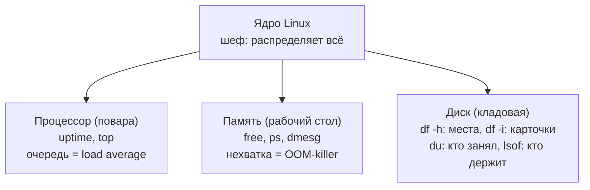
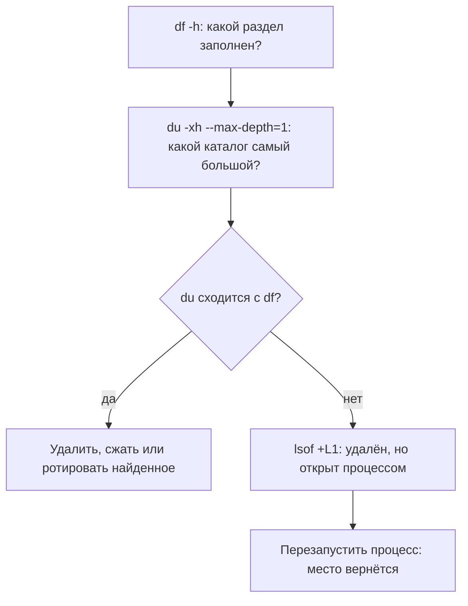
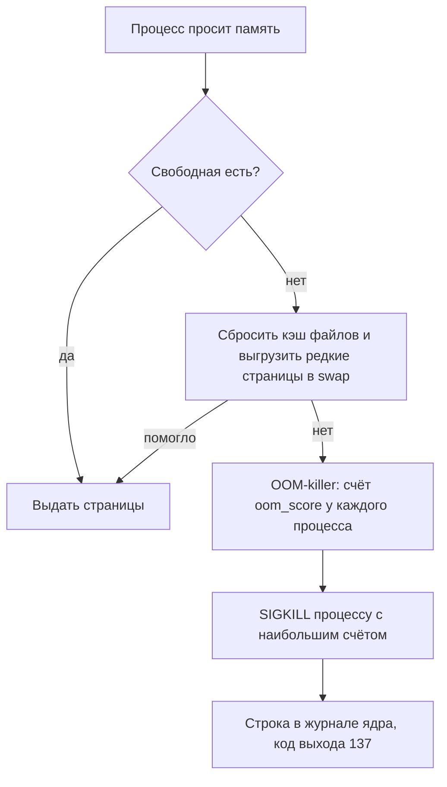
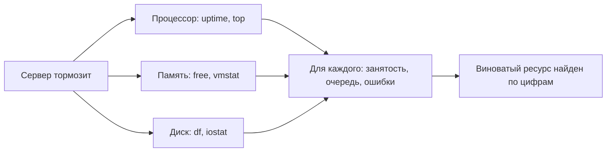

## Зачем это нужно

Типичная ночная история: сервис перезапускают «на удачу», а причиной оказывается переполненный диск. Этот урок про то, как не гадать.

Три из четырёх ночных инцидентов на Linux-сервере это нехватка ресурса. Инцидент (incident) это сбой, из-за которого сервис у пользователей не работает или работает плохо; дежурному инженеру звонят ночью, и ему нужно быстро понять причину (подробно про инциденты будет в [теме 10](../10-capstone/index.md)). Типичные причины такие: кончился диск, ядро (главная программа операционной системы, про неё ниже) убило процесс за память, процессор занят так, что всё тормозит. Ресурс (resource) это то, чего у сервера ограниченное количество и что делят между собой все программы: место на диске, оперативная память (RAM: быстрая временная память, где программа держит данные, пока работает; выключили питание, и всё пропало, в отличие от диска) и время процессора (сколько работы он успевает сделать в секунду). Каждый ресурс кончается по-своему, и видно это в разных командах: диск в `df` и `du`, память в `free`, процессор в `uptime` и `top`. Кто не отличает «диск заполнен» от «кончились inodes» (inode это «карточка» файла в журнале учёта файловой системы, разберём ниже), а «памяти мало» от «памяти хватает, это кэш», тратит на разбор часы. Все эти вопросы задают и на собеседованиях.

В этом уроке ты научишься по короткому чек-листу (метод USE: Utilization, Saturation, Errors, то есть «занятость, очередь, ошибки»; очередь здесь значит, что работа уже ждёт, потому что ресурса не хватает, как очередь в кассу)  понимать, какой ресурс подводит, и воспроизведёшь каждую поломку сам, безопасно: на тестовом «диске» размером 64 МБ и на своём процессе с лимитом памяти (лимит это потолок: больше этого объёма процессу брать не разрешено; в контейнерах он встретится в [уроке 4.1](../04-docker/01-containers-idea.md)).

Шаг проекта: в `app.py` появляются демонстрационные эндпоинты `/leak` и `/burn` (версия v2.2). Эндпоинт (endpoint) это адрес, по которому сервис отвечает на запрос: `/healthz` уже есть, теперь добавятся ещё два. Ими мы будем «съедать» память и процессор «Заметок» без сторонних нагрузчиков.

## Что нужно знать

- [Урок 1.1: терминал и файловая система](01-first-server-shell.md): `ls`, `cd`, пути, `--help`, файловая система как одно дерево, в которое «подключают» диски.
- [Урок 1.2: текст и конвейеры](02-text-pipes.md): `grep`, `sort`, `head`, `awk`, `|` и перенаправление вывода (`2>/dev/null`) понадобятся для разбора вывода.
- [Урок 1.3: пользователи, права и sudo](03-users-permissions.md): `sudo`, владельцы файлов, каталог `/var/lib/notes`.
- [Урок 1.4: процессы и сигналы](04-processes-signals.md): PID, `ps`, `kill`, SIGKILL, код выхода 137, файловые дескрипторы, фоновые задания (`&`, `jobs`).

Сервис «Заметки» у тебя на этом этапе запускается руками: `cd ~/notes && python3 app.py`. Под управлением systemd (программа, которая запускает сервисы при старте сервера и перезапускает их после сбоя) он окажется только в [уроке 1.8](08-systemd-editors.md).

## Картина целиком

Представь кухню ресторана.

- **Кладовая** это диск. Она большая, но полки в ней делятся на места (сколько влезет) и на карточки в журнале учёта (каждой коробке нужна своя карточка). Можно исчерпать полки, а можно исчерпать пустые карточки, хотя полки полупустые.
- **Рабочий стол повара** это оперативная память (RAM, random access memory). Работать можно только с тем, что лежит на столе. Стол быстрый, но маленький. Пока на столе есть место, повар оставляет там продукты «на всякий случай»: вдруг понадобятся снова. Это кэш.
- **Повара** это процессор. Каждый повар (ядро процессора) готовит одно блюдо за раз. Если заказов больше, чем поваров, заказы стоят в очереди.
- **Шеф-администратор** это ядро Linux. Он раздаёт места на столе, распределяет заказы между поварами и, если стол переполнился окончательно, выбрасывает одно блюдо, чтобы кухня не встала.

Слово «ядро» в этом уроке встретится в двух значениях, не путай. **Ядро Linux** (kernel) это главная часть операционной системы, «шеф-администратор». **Ядро процессора** (CPU core) это один «повар», физический или виртуальный исполнитель. Когда речь о процессоре, мы будем писать «ядро процессора» или «ядро CPU».



За урок ты разберёшь каждый из трёх ресурсов: из чего он состоит, чем измеряется, как выглядит его нехватка и какими командами это увидеть. Потом соединишь всё в один порядок проверки (метод USE) и потренируешься на поломках «Заметок».

## Теория

### Диск: блоки, inodes и почему их два лимита

Диск сам по себе это просто длинный ряд одинаковых ячеек, в которые можно записывать байты. Без «оглавления» невозможно понять, где начинается и заканчивается твой файл, как он называется и кому принадлежит. Поэтому поверх диска (или его раздела, то есть выделенного куска) создают **файловую систему** (file system): набор правил и служебных таблиц, по которым ядро Linux записывает и находит файлы. На серверах Linux чаще всего используют файловую систему `ext4`.

Книги (содержимое файлов) стоят на полках. Полки разбиты на одинаковые места по одной книге, это **блоки** (block). В ext4 блок обычно 4 КБ: даже файл в один байт занимает целый блок. Но найти книгу по полкам невозможно, поэтому есть каталожные карточки: на карточке написано, чья книга, когда поступила, какой толщины и на каких местах лежат её страницы. Такая карточка называется **inode** (index node, «индексный узел»). Названия книги на карточке нет: название написано в отдельном алфавитном указателе, это каталог (directory). Указатель хранит пары «имя, номер карточки». Где аналогия перестаёт работать: в библиотеке карточек обычно больше, чем нужно, а на файловой системе их число зафиксировано при создании и не растёт.


1. Когда ты создаёшь файловую систему командой `mkfs` (make filesystem), она делит раздел на блоки и заводит таблицу inodes заданного размера. Число inodes считается заранее: по умолчанию одна карточка на каждые несколько килобайтов раздела (для маленьких разделов около 4 КБ, для больших около 16 КБ).
2. Ты создаёшь файл `note.txt`. Ядро берёт свободный inode, записывает в него владельца, права, размер, время и список блоков, потом берёт свободные блоки под данные и, наконец, дописывает в каталог строку «`note.txt` = inode 12».
3. Ты читаешь файл: ядро смотрит в каталог, находит номер 12, открывает карточку и идёт по списку блоков.
4. Ты удаляешь файл командой `rm`: ядро стирает строку из каталога и уменьшает в карточке счётчик **ссылок** (number of links): сколько имён в каталогах указывают на эту карточку. Когда ссылок ноль (и файл никто не открыл, об этом дальше), карточка и блоки освобождаются.

**Разобранный пример с настоящими числами.** Мы создадим образ размером 64 МБ и попросим `mkfs.ext4 -N 2000`, то есть всего 2000 inodes. Сразу после создания `df` покажет (это настоящий вывод):

```text
Filesystem      Size  Used Avail Use% Mounted on
/dev/loop0       60M   24K   55M   1% /mnt/small
Filesystem     Inodes IUsed IFree IUse% Mounted on
/dev/loop0       2000    11  1989    1% /mnt/small
```

Читаем: образ 64 МБ, но `Size` только 60M: часть места ушла на служебные структуры (журнал и сами таблицы). `Avail` 55M, а не 60M: ext4 оставляет около 5% блоков в резерве только для суперпользователя `root`, чтобы администратор мог зайти и прибраться, даже когда обычные пользователи заполнили всё. Из 2000 inodes уже занято 11: ими файловая система пользуется сама (каталог `lost+found` и служебные записи). Значит, можно создать не более 1989 файлов, вне зависимости от их размера.

Отсюда видно два независимых способа исчерпать диск:

- **кончились блоки**: `df -h` показывает `Use% 100%`, файл записать нельзя;
- **кончились inodes**: `df -h` показывает свободное место, а `df -i` показывает `IUse% 100%`. Создать новый файл нельзя, хотя места полно. Пустой файл занимает 0 блоков, но всё равно одну карточку. Типичная причина: миллионы крошечных файлов (сессии пользователей, кэш, письма в очереди).

В обоих случаях ошибка одинаковая: `No space left on device` («на устройстве не осталось места»). По тексту ошибки не отличить, поэтому первое, что делают, это `df -h` и `df -i`.

> **Прикинь сам:** раздел с 100000 inodes, из них занято все 100000, а блоков занято 10%. Можно ли создать новый пустой файл?
{: .predict}

Нельзя: для файла нужна карточка (inode), а они кончились. Будет `No space left on device`, хотя `df -h` показывает 90% свободно.

Осторожно: Думают, что «диск свободен на 40%» гарантирует возможность записи. Нет: нужны и свободные блоки, и свободные inodes (и ещё права на запись в каталог, урок 1.3). Второе заблуждение: «пустые файлы ничего не занимают». Они занимают inode, а inodes конечны.

**Что такое «смонтировать» и loop-устройство.** В уроке 1.1 ты видел, что в Linux одно дерево каталогов и диски «подключаются» к его веткам. Подключение раздела к каталогу называется монтированием (mount), а каталог, куда он подключён, точкой монтирования (mount point). В практике мы сделаем это без настоящего второго диска: обычный файл `small.img` объявим «диском» через loop-устройство (loop device). Это возможность ядра притвориться, что файл это блочное устройство (диск): `mount -o loop` создаёт такое устройство, `/dev/loop0`, и подключает его. Так мы можем безопасно забить «диск» до отказа: системный раздел не пострадает.

> **Главное:** у диска два лимита: блоки (сколько данных) и inodes (сколько файлов), и кончиться может любой; смотрят их `df -h` и `df -i`.
{: .key}

> **Проверь понимание:** `df -h` показывает на `/var` 40% занято, но `touch /var/x` отвечает `No space left on device`. Что проверишь первым и что найдёшь?

<details markdown="1">
<summary>Ответ</summary>

`df -i /var`. Скорее всего, `IUse%` равен 100%: блоков хватает, а карточек для новых файлов нет. Затем ищешь каталог с огромным числом мелких файлов (команда есть в практике) и убираешь лишнее.

</details>

Мы знаем, из чего состоит диск. Теперь разберём, почему `df` и `du` показывают разное.

### df и du: два способа посмотреть на диск, которые расходятся

Есть два разных вопроса. «Сколько места занято на разделе в целом?» и «какие файлы и каталоги его занимают?». На них отвечают две разные команды, потому что отвечают они с разных сторон.

Ты стоишь у входа в кладовую. `df` это взгляд на счётчик на двери: «занято 41 полка из 60», не заходя внутрь. `du` это ревизор, который идёт вдоль полок и складывает размеры коробок. Обычно числа совпадают. Расходятся они, когда на счётчике полки занимает то, чего ревизор не видит.


- `df` (disk free) спрашивает у самой файловой системы: «сколько блоков и inodes занято?». Это быстрый вызов ядра, файлы не перебираются.
- `du` (disk usage) обходит каталоги, для каждого файла читает размер и суммирует. На большом разделе он медленный.

Поэтому они расходятся, когда происходит одно из двух:

1. **Файл удалён, но открыт процессом.** Вспомни шаг 4 из предыдущего раздела: карточка и блоки освобождаются, когда ссылок ноль **и** файл никто не открыл. Процесс, который открыл файл (у него есть файловый дескриптор, урок 1.4), продолжает им пользоваться. Ты удалил имя, `du` файл больше не находит, потому что его нет ни в одном каталоге. А `df` продолжает считать блоки занятыми, пока процесс не закроет файл или не завершится. Классический случай: огромный лог, который удалили, а программа продолжает в него писать.
2. **Поверх каталога смонтирован другой раздел.** Файлы, которые лежали в каталоге до монтирования, никуда не делись, но «закрыты» подключённым разделом: `du` их не видит, `df` их считает.

Есть и третья причина расхождения в цифрах, безобидная: `du` считает занятые блоки файлов, а не только размер данных, поэтому крошечный файл в 3 байта он покажет как 4K.

**Как искать, что съело место.** Идут сверху вниз: сначала `df -h` (какой раздел заполнен), потом `sudo du -xh --max-depth=1 /var | sort -h | tail` (какой каталог самый большой), потом то же самое внутри найденного каталога, и так до файла. Ключ `-x` не даёт `du` выходить за границы одного раздела: иначе в подсчёт попадёт всё, что подключено внутри (например, чужие тестовые разделы). `sudo` нужен, потому что часть каталогов закрыта для обычного пользователя (в прошлом уроке ты закрыл `/var/lib/notes` режимом 750).



**Разобранный пример: почему в практике `du` покажет 52K, а `df` 41M.** Мы создадим файл 40 МБ, запустим `tail -f` (он открывает файл и держит его), а потом удалим файл. Настоящие цифры такого опыта: до удаления `df` показывает 41M занято. После `rm` `df` показывает всё те же 41M, а `du -sh` показывает 52K: это несколько служебных файлов ext4. Через `lsof +L1` (список открытых файлов, у которых ссылок меньше одной, то есть удалённых) видим строку с `NLINK 0` и пометкой `(deleted)`: файл без имени, но живой. Освободить место можно тремя способами: закрыть файл (завершить процесс), перезапустить процесс или обнулить файл через `/proc`: `truncate -s 0 /proc/<PID>/fd/<номер>`. Последний способ не требует остановки процесса. Ты делал похожий шаг в уроке 1.4, когда смотрел `/proc/<PID>/fd`.

> **Прикинь сам:** ты удалил лог на 5 ГБ, а `df` не изменился. Что это может быть и чем проверишь?
{: .predict}

Файл удалён из каталога, но его держит открытым процесс, поэтому блоки не освобождены. Проверка: `sudo lsof +L1` покажет такие файлы.

Осторожно: «Я удалил файл, значит место освободилось». Не всегда: если файл держит процесс, место вернётся только после закрытия. Второе: «`du` и `df` должны показывать одно и то же». Не должны, и расхождение само по себе является диагностикой.

> **Главное:** `df` считает занятое разделом, `du` сумму файлов в каталогах; расходятся из-за удалённых, но открытых файлов и из-за монтирования поверх каталога.
{: .key}

> **Проверь понимание:** ты удалил лог на 5 ГБ, `df` не изменился. Какая команда покажет виновника и что она выведет?

<details markdown="1">
<summary>Ответ</summary>

`sudo lsof +L1`. Она покажет строки, где `NLINK` равно 0 и в конце имени написано `(deleted)`, с именем команды и PID процесса, который держит файл. Дальше либо перезапуск этого процесса, либо `truncate -s 0 /proc/<PID>/fd/<FD>`.

</details>

С диском разобрались. Теперь о второй сущности, которая заканчивается чаще всего: о памяти.

### Память: free, available, кэш и swap

Диск в тысячи раз медленнее оперативной памяти. Поэтому программы работают с данными в памяти, а диск нужен для долгого хранения. Оперативная память (RAM) быстрая и небольшая, и её нужно делить между десятками процессов.

Ты работаешь за столом (память) и достаёшь бумаги из шкафа (диск). Пока стол не забит, ты не убираешь бумаги обратно: вдруг они понадобятся ещё раз. Так же ведёт себя ядро: прочитанные с диска файлы оно оставляет в свободной памяти. Это **кэш файлов** (page cache): в следующий раз файл прочитается из памяти, а не с диска. Как только программе нужно место, ядро мгновенно освобождает часть кэша. Где аналогия перестаёт работать: бумагу со стола можно только выбросить или унести в шкаф, а страницу кэша, которую не меняли, можно просто забыть, потому что копия уже есть на диске.

**Как устроено: что показывает `free -h`.** Ключ `-h` (human) печатает размеры в удобных единицах (Ки, Ми, Ги). Вот настоящий вывод:

```text
               total        used        free      shared  buff/cache   available
Mem:           7.7Gi       972Mi       5.2Gi       1.6Mi       1.8Gi       6.8Gi
Swap:          1.0Gi          0B       1.0Gi
```

- `total`: сколько всего памяти видит система (7,7 ГиБ).
- `used`: занято программами (972 МиБ). Сюда не входит кэш.
- `free`: совсем никем не занято (5,2 ГиБ). У нагруженного сервера эта колонка почти всегда маленькая, и это нормально: свободная память простаивает зря, поэтому ядро заполняет её кэшем.
- `shared`: память, которую делят между собой процессы, для нас не важна.
- `buff/cache`: кэш файлов (1,8 ГиБ). Его можно отдать программам при необходимости.
- `available`: **главная колонка**. Оценка того, сколько памяти можно выделить программам без выгрузки на диск: примерно `free` плюс та часть кэша, которую можно сбросить. Здесь 5,2 + 1,8 = 7,0, а показано 6,8, потому что часть кэша сбросить нельзя. Тревожиться надо, когда `available` мала, а не когда мала `free`.

Строка `Swap` это область подкачки. **Swap** это место на диске (раздел или файл), куда ядро выгружает редко нужные страницы памяти, чтобы освободить RAM. Программа, страницу которой выгрузили, при обращении вынуждена ждать чтения с диска. Если swap активно используется, а `available` мала, сервер тормозит: это насыщение (saturation) памяти. Небольшой объём swap «в простое» не проблема.

**Сколько памяти занял процесс.** У процесса есть два размера. **VSZ** или `VIRT` (virtual size) это всё адресное пространство, которое он попросил у ядра: ядро может пообещать больше, чем есть. **RSS** или `RES` (resident set size) это часть, которая реально лежит в физической памяти сейчас. Настоящее потребление показывает RSS. Пример из практики: свежий `python3 app.py` показывает `RSS 19412` (килобайт), после `/leak?mb=80` показывает `RSS 101336`. Разница: 101336 - 19412 = 81924 КБ, то есть 80 МБ (80 × 1024 = 81920 КБ) плюс несколько КБ служебных. Это подтверждает, что `/leak` занимает реальную память.

> **Прикинь сам:** `free -h` показывает `free 200Mi`, `available 6.1Gi` при 8 ГБ. Паниковать?
{: .predict}

Нет. Кэш занял «свободное» место, но ядро вернёт его по первому требованию, а это число и показывает `available`.

Осторожно: «`free` 150 МБ из 8 ГБ: авария». Нет, смотри `available`. И «swap увеличивает память»: он подменяет быструю память медленной и только оттягивает беду.

> **Главное:** о нехватке памяти говорит `available`, а не `free`; swap это медленное продолжение памяти, а не её увеличение.
{: .key}

> **Проверь понимание:** `free -h` показывает `free 200Mi`, `available 6.1Gi` при 8 ГБ памяти. Нужно ли срочно что-то делать?

<details markdown="1">
<summary>Ответ</summary>

Нет. Большая часть памяти занята кэшем и отдаётся по требованию. Тревожные признаки: маленькая `available`, растущее использование swap и строки про OOM в журнале ядра (об этом в следующем разделе).

</details>

А что делает ядро, когда `available` кончился совсем? Тут появляется OOM-killer.

### OOM-killer и cgroup: что происходит, когда память кончилась

Ядро Linux не может «отказать» программе в памяти так, как отказывает диск: `malloc` (запрос памяти) почти всегда «успешен», ядро обещает, а физически выдаёт память только когда программа реально пишет в неё. Если обещаний накопилось больше, чем есть памяти, в какой-то момент выдавать нечего. Система либо зависнет, либо ядро выберет жертву. Второй вариант называется **OOM-killer** (Out Of Memory killer, «убийца при нехватке памяти»).

У лифта есть предел по весу. Когда зашли лишние, кто-то должен выйти, иначе лифт не поедет. Ядро выбирает того, кто «весит больше всех» и менее важен, и выводит из лифта принудительно. Где аналогия слабая: выведенный процесс не может возразить или собрать вещи, он просто исчезает.


1. Процесс просит память и получает её, пока хватает.
2. Когда свободной памяти нет и кэш сбросить уже нечем, ядро включает OOM-killer.
3. Ядро для каждого процесса считает «счёт» (`oom_score`, его видно в `/proc/<PID>/oom_score`): чем больше памяти занял процесс, тем счёт выше.
4. Процесс с наибольшим счётом получает **SIGKILL** (сигнал 9, урок 1.4): его нельзя перехватить, он не успевает ничего сохранить и не может корректно завершиться.
5. Ядро пишет в свой журнал строку про убийство. Код выхода убитого процесса 137 (128 + 9, урок 1.4).



Журнал ядра читают командой `dmesg` (`-T` печатает понятное время). Ubuntu запрещает обычному пользователю читать его, поэтому нужен `sudo`.

**Ограничение внутри группы: cgroup.** Бывает, что ядру не нужно ждать, пока кончится память всего сервера: для группы процессов задан свой лимит. Такая группа называется **cgroup** (control group, «контрольная группа»): механизм ядра Linux, который ограничивает и учитывает ресурсы группы процессов. Именно так работают лимиты памяти у контейнеров Docker и у подов Kubernetes (темы 4 и 5). Если процессы группы вышли за лимит, OOM-killer убивает процесс внутри неё, остальной сервер не страдает. Проще всего создать такую группу командой `systemd-run` (её подробнее разберём в уроке 1.8): она запускает команду в новой группе с заданными ограничениями. Для нас важны два свойства: `MemoryMax=200M` (лимит 200 МБ) и `MemorySwapMax=0` (запрет swap для группы, иначе ядро начнёт выгружать память на диск, а не убивать процесс).

**Разобранный пример: строка из журнала ядра.** Настоящая строка, которую ты получишь в практике:

```text
[Wed Sep 30 12:01:13 2026] Memory cgroup out of memory: Killed process 105959 (python3) total-vm:346976kB, anon-rss:203564kB, file-rss:9408kB, shmem-rss:0kB, UID:1000 pgtables:476kB oom_score_adj:0
```

- `Memory cgroup out of memory`: OOM внутри группы с лимитом. Если бы кончилась память всей машины, было бы `Out of memory: Killed process ...` без слова cgroup.
- `Killed process 105959 (python3)`: кого убили, номер и имя. (На обычной ВМ этот PID совпадает с PID в `ps`. У автора урока стенд в контейнере, поэтому номер в журнале ядра другой.)
- `total-vm:346976kB`: виртуальный размер (VSZ), около 339 МБ.
- `anon-rss:203564kB`: «анонимная» память, которую программа выделила сама (куча, наш `bytearray`), около 199 МБ. Это почти весь лимит 200 МБ, то есть причина убийства видна.
- `file-rss:9408kB`: память под файлы (библиотеки Python).
- `UID:1000`: чей процесс.

> **Прикинь сам:** процесс в контейнере с лимитом 512 МБ исчез, а на сервере свободно 20 ГБ. Как так?
{: .predict}

Лимит cgroup сработал раньше, чем кончилась память сервера: OOM-killer убил процесс внутри группы. Подтверждение: строка в `dmesg` или `journalctl -k`.

Осторожно: «Код 137 значит OOM, и точка». Нет: 137 значит только «убит SIGKILL». Так мог убить и человек командой `kill -9`, и менеджер сервисов по таймауту. Что это именно OOM, доказывает строка в `dmesg`. Второе заблуждение: «в логах приложения тишина, значит не OOM». Убитый процесс не успевает написать в лог: следы надо искать в журнале ядра.

> **Главное:** OOM-killer шлёт SIGKILL процессу с наибольшим счётом, а код 137 говорит только об убийстве сигналом, а не о причине.
{: .key}

> **Проверь понимание:** сервис в контейнере с лимитом 512 МБ исчезает, а на сервере свободно 20 ГБ памяти. Как такое возможно и что искать?

<details markdown="1">
<summary>Ответ</summary>

Лимит действует на группу (cgroup), а не на весь сервер: процесс вышел за свои 512 МБ, и OOM-killer убил его, хотя на машине памяти вдоволь. В `dmesg` будет строка `Memory cgroup out of memory: Killed process ...`, у контейнера код выхода 137.

</details>

С памятью ясно. Теперь процессор: как понять, что ему не хватает?

### Процессор: ядра, очередь и load average

Программ запущено больше, чем в процессоре ядер, но каждое ядро процессора в каждый момент выполняет одну программу. Чтобы всем хватало, ядро Linux нарезает время на очень короткие кусочки (миллисекунды) и по очереди выдаёт их процессам. Пользователю кажется, что всё работает одновременно.

Ядра процессора это кассы, процессы это покупатели. Каждая касса обслуживает одного человека за раз. Если покупателей меньше, чем касс, очередей нет. Если больше, образуется очередь, и каждый ждёт дольше. Число касс узнают командой `nproc`. Где аналогия слабее: покупатель стоит в очереди целиком, а процесс ядро постоянно «отзывает от кассы» на другой кусочек.

**Как устроено: load average.** Команда `uptime` печатает, кроме времени работы, три числа: **load average** («средняя загрузка») за последние 1, 5 и 15 минут. Реальный вывод:

```text
 11:52:13 up 23 min,  0 user,  load average: 0.81, 0.19, 0.06
```

Load это среднее число процессов, которые сейчас либо выполняются на ядре процессора, либо готовы выполняться и ждут очереди. Кроме них в Linux в это число входят процессы в состоянии `D` (uninterruptible sleep, урок 1.4): они ждут ответа от диска и ничего не считают. Значит, высокий load бывает и при свободном процессоре, если виноват диск.

Само число ничего не значит без числа ядер. Правило: **load, делённый на `nproc`**.

- load 4,0 на 4 ядрах CPU: все ядра заняты, очереди нет, загрузка «ровно 100%»;
- load 4,0 на 2 ядрах: в очереди столько же процессов, сколько обслуживается, ядра перегружены вдвое;
- load 0,5 на 4 ядрах: 1/8 мощности, всё свободно.

Три числа читают вместе как тренд. Если 1 минута больше 15 минут (например, `3.1, 1.0, 0.4`), нагрузка растёт, проблема свежая. Если 1 минута меньше 15 (`0.2, 1.5, 2.0`), пик уже прошёл. Это среднее скользящее, оно сглажено: свежие секунды весят больше, старые всё меньше. Поэтому после запуска тяжёлой задачи число за 1 минуту растёт постепенно, а не прыгает. В практике мы увидим это вживую: за 20 секунд работы `/burn` у автора значения стали `2.04, 0.82, 0.32` при исходных `1.33, 0.62, 0.24`, то есть за 1 минуту выросло больше всего.

> **Прикинь сам:** `uptime` показывает `load average: 6.0, 5.8, 1.1` на 4 ядрах. Что это значит?
{: .predict}

Нагрузка растёт уже минут 5: она выше числа ядер, а 15 минут назад была почти нулевой. Очередь есть, надо смотреть, кто её создаёт.

Осторожно: «Load 12 значит процессор перегружен». Не обязательно: если процессы висят в состоянии `D`, процессор свободен, а виноват диск. Об этом следующий раздел.

> **Главное:** load average это длина очереди за 1, 5 и 15 минут; делят на число ядер, а процессы в состоянии D тоже в неё входят.
{: .key}

> **Проверь понимание:** `uptime` показывает `load average: 6.0, 5.8, 1.1` на сервере с 4 ядрами процессора. Что это значит?

<details markdown="1">
<summary>Ответ</summary>

Сейчас нагрузка 6 на 4 ядра: очередь примерно из двух процессов. Значения за 1 и 5 минут почти равны, а за 15 минут мал: перегрузка началась минут пять-десять назад и держится. Дальше смотрят `top`, чтобы понять, кто её создаёт и не диск ли это.

</details>

Load говорит «очередь есть», но не кто виноват. Для этого нужен `top`.

### top: на что тратится время процессора

Load говорит «очередь есть», но не говорит, кто и на что тратит время. Для этого есть `top`: список процессов, отсортированный по нагрузке, с шапкой про общее состояние. Ключи `-b -n 2 -d 1` включают пакетный режим (вывод в терминал без интерактива) и два замера с паузой 1 секунду: первый замер в `top` всегда усреднён за всё время работы системы и потому не годится для диагностики.

Управляющий магазином смотрит на экран: сколько касс работает (`us`, `sy`), сколько простаивает (`id`), сколько стоит и ждёт поставщика (`wa`).

**Как устроено: шапка.** Настоящая шапка `top` во время работы `/burn`:

```text
%Cpu(s): 14.0 us,  0.2 sy,  0.0 ni, 85.7 id,  0.0 wa,  0.0 hi,  0.0 si,  0.0 st
```

Все значения это проценты времени за последний интервал, от суммарной мощности всех ядер CPU:

- `us` (user): время в коде самих программ, то есть вычисления;
- `sy` (system): время в ядре Linux по просьбе программ (чтение файлов, сеть);
- `ni` (nice): то же, что `us`, но для процессов с пониженным приоритетом (`nice`, урок 1.4);
- `id` (idle): простой, процессор свободен;
- `wa` (iowait): процессор простаивает, потому что все, кому он нужен, ждут диск или сеть. Высокое `wa` при высоком load указывает на диск;
- `hi`, `si`: обработка прерываний (сигналов от железа), на серверах в норме около нуля;
- `st` (steal): у виртуальных машин: гипервизор (программа, на которой работает ВМ) отдал ядра CPU другой машине. Это чужая нагрузка на том же железе, помочь изнутри ВМ нельзя.

Ниже идёт таблица процессов. Главные колонки: `PID`, `USER`, `S` (состояние, урок 1.4), `RES` (RSS, память), `%CPU`, `COMMAND`. **Важный нюанс:** `%CPU` процесса считается от одного ядра, поэтому может быть больше 100% (у процесса с несколькими потоками на нескольких ядрах). А `us` в шапке считается от всех ядер сразу.

Во время `/burn` в `top` у автора видно:

```text
    PID USER      PR  NI    VIRT    RES    SHR S  %CPU  %MEM     TIME+ COMMAND
    456 ubuntu    20   0  101200  19412   9468 S 100.0   0.2   0:16.22 python3
```

`python3` занимает 100% одного ядра CPU. Но в шапке `us` не 100%, а 14%. Почему: на стенде автора 15 ядер CPU, и одно ядро это 100 / 15, около 6,7% общей мощности. Остальное до 14% принесла чужая нагрузка: стенд автора это контейнер, ядро Linux у него общее с другими контейнерами. На твоей двухъядерной ВМ картина будет проще: одно ядро из двух, это около 50% в `us`.

**Почему три одновременных `/burn` не займут три ядра.** У Python есть GIL (Global Interpreter Lock, «глобальная блокировка интерпретатора»): в каждый момент Python-код исполняет только один поток, остальные ждут. Наш сервер создаёт по потоку на запрос, но все потоки делят одну «кассу». Поэтому сколько бы запросов `/burn` ни шло параллельно, `python3` не превысит примерно 100% одного ядра. Мы это увидим в сценарии «Сломай и почини». Вывод для диагностики: сервис может быть «перегружен» при том, что load небольшой, если он упёрся в своё одно ядро. Поэтому смотри не только `uptime`, но и `%CPU` процесса в `top`.

> **Прикинь сам:** в `top` процесс показывает `%CPU` 350, а на сервере 8 ядер. Согласуется ли это с `us` 44% в шапке?
{: .predict}

Да: `%CPU` процесса считают от одного ядра, 350% это 3,5 ядра, а 44% от 8 ядер это тоже около 3,5 ядра.

Осторожно: Читают `%Cpu(s)` и `%CPU` процесса как одно и то же. Первое считается от суммы всех ядер, второе от одного. Второе заблуждение: смотрят только на `us` и не замечают `wa` или `st`.

**Пример с высоким `wa` (гипотетический, для понимания).** Load 8 на 4 ядрах, но `us` + `sy` вместе всего 10%, а `wa` 85%. Процессы стоят в очереди не за процессором, а за диском. Искать надо медленный или забитый диск (например, инструментами `iostat` или `iotop`), а не процесс, который «жрёт CPU».

> **Главное:** в шапке `top` процент от всех ядер, у процесса от одного ядра; смотри `us`, `sy`, `wa`, `st` и сравнивай с load.
{: .key}

> **Проверь понимание:** в `top` процесс `java` показывает `%CPU` 350, а `us` в шапке 44%. На сервере 8 ядер. Согласуются ли числа?

<details markdown="1">
<summary>Ответ</summary>

Да. 350% процесса это три с половиной ядра CPU, а 3,5 / 8 = 43,75%, то есть около 44% общей мощности. Первое считают от одного ядра, второе от всех.

</details>

Теперь про память подробнее: как она «утекает» и как это отличить от нормы.

### Утечка памяти: как процесс занимает память и не отдаёт её

Программа получает память у ядра порциями и обязана вернуть ненужное. Возвращает её либо сама (явно), либо специальный «уборщик» языка (в Python это сборщик мусора, garbage collector: он находит объекты, на которые больше никто не ссылается, и освобождает их). Если программа продолжает держать ссылку на данные, которые ей давно не нужны, уборщик не имеет права их забрать. Память занята, польза нулевая. Это **утечка памяти** (memory leak). Понимать её нужно, потому что в нашем уроке мы вызовем утечку специально, а на работе будем отличать её от честного роста потребления.

Повар достаёт со склада коробки и ставит на стол. Готовое блюдо ушло, а пустые коробки он не выносит: «вдруг пригодятся». За смену стол забит коробками, и класть новые продукты некуда. Где аналогия слабее: коробки повар может вынести в любой момент, а программа без своего решения освободить память не может, если сама держит на неё ссылку.


1. Программа создаёт объект (список, строку, массив байтов), и интерпретатор просит у ядра страницы памяти под него.
2. Пока на объект есть хотя бы одна ссылка (переменная, элемент списка, запись в глобальном хранилище), он «живой».
3. Когда ссылок не остаётся, объект освобождается, и память возвращается интерпретатору. Интерпретатор не всегда отдаёт её обратно ядру сразу, поэтому `RSS` процесса после освобождения падает не всегда.
4. Утечка это когда ссылки копятся: например, список, в который каждый запрос добавляет данные и который никто не чистит.

**Разобранный пример из нашего кода.** В `app.py` (задание 4) есть глобальный список `LEAK = []`. Запрос `/leak?mb=80` делает `LEAK.append(bytearray(80 * 1048576))`. Считаем: `1048576` это 1024 × 1024 байт, то есть один мегабайт. `80 × 1048576 = 83 886 080` байт, это и есть 80 МБ. Массив лежит в `LEAK`, ссылка на него хранится до конца жизни процесса, поэтому память не освобождается никогда. Два запроса дают 160 МБ, три 240 МБ, и так до отказа. Именно так выглядит утечка на графике: память растёт ступеньками и не спадает даже ночью, когда запросов нет.

**Как отличить утечку от нормы.** Нормальное потребление растёт с нагрузкой и падает вместе с ней. Утечка растёт независимо от нагрузки и падает только после перезапуска процесса. Поэтому смотрят тренд за сутки, а не один снимок.

> **Прикинь сам:** `RSS` сервиса растёт на 30 МБ в час и не спадает, хотя ночью запросов нет. Это норма?
{: .predict}

Нет, это похоже на утечку: нормальная память растёт с нагрузкой и падает вместе с ней. Надо снять рост по времени и найти, что копится.

Осторожно: «Память процесса выросла, значит утечка». Нет: кэш в самом приложении, пул соединений и буферы тоже растут и потом стабилизируются. Утечка это рост без остановки.

> **Главное:** утечка это память, которая растёт независимо от нагрузки, потому что ссылки на ненужные данные копятся и объекты не освобождаются.
{: .key}

> **Проверь понимание:** `RSS` сервиса каждый час растёт на 30 МБ и не спадает, хотя запросов ночью нет. Что это и что сделаешь до того, как найдёшь ошибку в коде?

<details markdown="1">
<summary>Ответ</summary>

Похоже на утечку: рост не связан с нагрузкой. До правки кода ставят лимит памяти на группу (`MemoryMax`, как в задании 5), чтобы сервис умер один, а не потянул за собой всю машину, и включают автоматический перезапуск.

</details>

Вернёмся к процессору: как ядро решает, кому дать время, и что делает `nice`.

### Процессор: как ядро Linux раздаёт время и что такое nice

Процессов больше, чем ядер процессора, а каждому нужно время. Кто-то должен решать, кому сейчас работать. Эту задачу решает **планировщик** (scheduler) ядра Linux: он в каждый момент выбирает, какому из готовых процессов отдать освободившееся ядро процессора.

Врач принимает пациента несколько минут (квант времени), потом просит выйти и приглашает следующего. Срочным пациентам можно дать приоритет. Где аналогия слабее: у планировщика кванты измеряются миллисекундами, поэтому со стороны всё выглядит параллельным.


1. Процесс в состоянии **R** (running/runnable, «работает или готов работать») стоит в очереди на ядро процессора.
2. Планировщик даёт ему квант времени и запускает на свободном ядре.
3. Когда квант закончился или процесс сам ждёт (читает диск, ждёт сеть), он возвращается в очередь или засыпает (**S**, sleeping). Спящий процессор не занимает.
4. Если процесс ждёт ответа диска и его нельзя разбудить сигналом, он в состоянии **D** (uninterruptible sleep): CPU не тратит, но в load входит (см. выше).
5. Приоритет процесса задаёт число **nice** (урок 1.4): от -20 (самый важный) до 19 (самый вежливый). Чем больше nice, тем реже процесс получает квант, когда кто-то ещё хочет работать. Если ядер хватает всем, nice ничего не меняет.

Два процесса, оба хотят CPU, ядро одно. Оба с nice 0: каждый получает около 50% времени. Запускаем один как `nice -n 19`: он получит примерно 1-2%, остальное достанется первому. А если на машине четыре ядра, а процессов два, каждый получит по целому ядру независимо от nice.

> **Прикинь сам:** на 2-ядерной ВМ два процесса с `nice 0` и один с `nice 19`, все считают без остановки. Кто получит меньше?
{: .predict}

Процесс с `nice 19`: два «обычных» займут оба ядра, а ему достанутся остатки. Но если бы ядер хватало на всех, `nice` ничего не изменил бы.

Осторожно: «`nice` ускоряет процесс». Он не добавляет скорость, а только перераспределяет очередь при нехватке ядер. Второе заблуждение: путают «загрузку» процессора (занят или нет) с очередью (кто ждёт). Процессор загружен на 100% при нулевой очереди, и это хорошо; вредна очередь.

> **Главное:** планировщик делит время по квантам, `nice` (от -20 до 19) меняет очередь только при нехватке ядер и не ускоряет процесс.
{: .key}

> **Проверь понимание:** на 2-ядерной ВМ два процесса `nice 0` и один `nice 19`, все считают без остановки. Кто получит меньше всего времени?

<details markdown="1">
<summary>Ответ</summary>

Процесс с `nice 19`: два обычных процесса займут оба ядра, а вежливому достанется лишь малая доля.

</details>

Теперь вернёмся к диску: три самые частые причины, из-за которых он кончается.

### Логи, tmpfs и запросы: три частые причины «диск кончился»

В реальных авариях диск заполняют не таинственные файлы, а логи, временные данные и забытые выгрузки. Знать типичных виновников полезно, потому что они определяют, где искать в первую очередь.

Пока вывозят мусор по расписанию, всё в порядке. Расписание сломалось, и бак переполнен.


1. **Логи.** Программа дописывает строки в файл лога (`/var/log/...`). Файл только растёт. Чтобы он не разрастался бесконечно, есть **ротация логов** (log rotation): по расписанию старый файл переименовывают, сжимают и удаляют самые старые копии. В Linux это делает `logrotate`. Если ротация сломана или лог пишется слишком бурно (например, включён режим отладки), диск заполняется за часы.
2. **tmpfs.** Каталоги вроде `/run` и `/dev/shm` лежат в **tmpfs**: это файловая система, целиком живущая в оперативной памяти. Запись туда занимает не диск, а RAM, и исчезает после перезагрузки. В `df -h` такие разделы видны отдельными строками (`tmpfs`), и заполнить их можно, тогда `No space left on device` появится при свободном диске.
3. **Выгрузки и бэкапы.** Файл вроде `export/dump-2026-09.bin`, который кто-то положил «на минуточку» и забыл. В сценарии 3 «Сломай и почини» именно так.

Сервис пишет 200 байт на каждый запрос и получает 100 запросов в секунду. В сутки это 200 × 100 × 86400 = 1 728 000 000 байт, то есть около 1,6 ГиБ. Без ротации диск на 50 ГиБ заполнится за 31 день, а с включённым отладочным логом, который пишет в десять раз больше, за три дня.

> **Прикинь сам:** `df -h` показывает 100% на `/run`, а основной диск свободен на 70%. Что это значит?
{: .predict}

`/run` это tmpfs, он живёт в оперативной памяти. Заполнен именно этот раздел, значит, надо искать, что пишет туда данные, и смотреть память.

Осторожно: Что каждый `No space left on device` связан с диском: на tmpfs это память, а на маленьком разделе `/boot` это забытые старые ядра.

**Как это видно у «Заметок».** Запрос записи `POST /notes` возвращает 500 `{"error": "storage"}`, если код при записи получил ошибку операционной системы `OSError`. Чтение и `/healthz` продолжают работать, поэтому в одном мониторинге по коду 200 такую поломку не увидеть.

> **Главное:** диск заполняют обычно логи без ротации, tmpfs и забытые выгрузки; ошибка `No space left` бывает и про память (tmpfs), и про inodes.
{: .key}

> **Проверь понимание:** `df -h` показывает 100% на `/run`, хотя основной диск свободен на 70%. Что это значит и что проверишь?

<details markdown="1">
<summary>Ответ</summary>

`/run` это tmpfs, он живёт в памяти, и его размер ограничен долей RAM. Ищут, кто пишет туда (`sudo du -xh /run | sort -h | tail`) и не растёт ли какой-то процесс без остановки.

</details>

Откуда `free`, `top` и `df` вообще берут свои числа? Из `/proc`.

### Откуда команды берут числа: /proc и журнал файловой системы

`free`, `top`, `uptime`, `ps` показывают состояние ядра Linux, но сами ничего не измеряют: ядро должно как-то отдавать свои данные. Для этого придумано «виртуальное» дерево файлов `/proc` (в уроке 1.4 ты уже заглядывал в `/proc/<PID>`). Файлов на диске там нет: когда ты читаешь такой файл, ядро на лету собирает текст из своих внутренних счётчиков.

Стрелка спидометра не измеряет скорость сама, она показывает то, что считает машина. `/proc` это приборная панель ядра, а `free` и `top` только красиво выводят её показания.


1. Ядро постоянно ведёт счётчики: сколько страниц памяти занято, сколько процессорного времени потрачено, сколько процессов в очереди.
2. Они доступны как файлы: `/proc/meminfo` (память), `/proc/loadavg` (load average), `/proc/<PID>/status` и `/proc/<PID>/fd/` (данные процесса и его открытые файлы), `/proc/<PID>/oom_score` (счёт для OOM-killer).
3. Команды читают эти файлы и форматируют вывод. Поэтому `free` и `cat /proc/meminfo` показывают одни и те же числа.

`cat /proc/loadavg` выведет строку вида `0.81 0.19 0.06 1/93 4218`: первые три числа это load average за 1, 5 и 15 минут (те же, что в `uptime`), `1/93` означает один процесс готов работать из 93 всего, а последнее число это PID последнего созданного процесса. Именно через `/proc/<PID>/fd/3` мы освободим место в задании 3: ядро даёт доступ к файлу, у которого больше нет имени.

**Журнал ext4 и резерв 5%.** Файловой системе нужна защита от сбоя питания посреди записи. Поэтому ext4 ведёт **журнал** (journal): сначала коротко записывает намерение («сейчас изменю эти блоки»), потом делает изменение. После аварии система по журналу либо доделывает, либо отменяет начатое, и файловая система остаётся целой. Журнал занимает место в самой файловой системе, поэтому `Size` у `df` чуть меньше размера раздела. Резерв 5% блоков для root нужен, чтобы администратор мог зайти и навести порядок, когда обычные пользователи забили диск.

> **Прикинь сам:** откуда `free` знает, сколько памяти доступно?
{: .predict}

Из файла `/proc/meminfo`: ядро ведёт счётчики и показывает их как файл. `free` просто форматирует его, и `cat /proc/meminfo` даст те же числа.

Осторожно: «`/proc` занимает место на диске». Нет: это окно в память ядра, размер файлов там показывается нулевым.

> **Главное:** `/proc` это окно в память ядра, а не файлы на диске; команды `free`, `uptime` и `ps` читают из него и ничего не измеряют сами.
{: .key}

> **Проверь понимание:** откуда `free` знает, сколько памяти доступно?

<details markdown="1">
<summary>Ответ</summary>

Читает `/proc/meminfo`, куда ядро само пишет свои счётчики. `free` только форматирует.

</details>

Одна из цифр из `/proc` часто пугает: VSZ. Разберёмся, почему она не равна занятой памяти.

### Виртуальная память: почему «выделить» не значит «занять»

Если бы ядро выдавало физическую память сразу, как только программа попросила, память кончалась бы намного раньше: многие программы просят с запасом и не используют. Поэтому ядро разделяет «обещание» и «реальную выдачу».

Билетов можно продать больше, чем людей придёт, потому что не все придут. Плохо становится, если пришли все сразу.


1. Программа просит память, ядро записывает обещание и увеличивает **VSZ** (виртуальный размер).
2. Реальные страницы (обычно по 4 КБ) выдаются, когда программа впервые пишет в них. Тогда растёт **RSS**.
3. Если реальные страницы кончились, ядро сначала сбрасывает кэш файлов, затем выгружает редкие страницы в swap, а если и это не помогает, включает OOM-killer.

`bytearray(80 * 1048576)` в Python сразу заполняет массив нулями, то есть пишет в каждую страницу. Поэтому RSS вырос на все 80 МБ (задание 5). Если бы память только «зарезервировали» и не писали, VSZ вырос бы, а RSS нет.

> **Прикинь сам:** VSZ процесса 2 ГБ, а RSS 150 МБ. Сколько памяти он занимает на самом деле?
{: .predict}

Около 150 МБ: RSS это реально выданные страницы. VSZ это обещание, у Java или Go он бывает в разы больше без всякой проблемы.

Осторожно: Смотрят на `VIRT`/VSZ и паникуют: у Java или Go он бывает в разы больше реальной памяти, и это нормально. Опасен рост RSS.

> **Главное:** выделить не значит занять: ядро записывает обещание (VSZ), а реальные страницы (RSS) выдаёт при первой записи.
{: .key}

> **Проверь понимание:** VSZ процесса 2 ГБ, RSS 150 МБ. Сколько он занимает на самом деле?

<details markdown="1">
<summary>Ответ</summary>

Около 150 МБ. VSZ показывает лишь объём обещанного адресного пространства.

</details>

Теперь о маленькой детали проекта, без которой практика не сработает: адрес запроса.

### Адрес запроса: путь и строка запроса

Одному сервису нужно отвечать на разные вопросы, и часто с параметрами: сколько памяти занять, сколько секунд считать. Для этого в адрес добавляют параметры.

«Кофе» это что нужно, «с двумя сахарами» это параметр.

Когда ты открываешь `http://localhost:8080/leak?mb=80`, адрес состоит из двух частей: **путь** (path) `/leak` (что нужно) и **строка запроса** (query string) `mb=80` после знака `?` (параметры: `имя=значение`, несколько через `&`). В Python `urlparse(self.path)` разбирает адрес на части, а `parse_qs(...)` превращает строку запроса в словарь вида `{"mb": ["80"]}` (значение это список, потому что один параметр можно передать несколько раз). `qs.get("mb", ["0"])[0]` означает: возьми список значений `mb`, а если параметра нет, используй `["0"]`, и достань первый элемент.

Адрес `/leak?mb=80` разбирается на путь `/leak` и словарь `{"mb": ["80"]}`. Выражение `qs.get("mb", ["0"])[0]` вернёт строку `"80"`, а `int("80")` превратит её в число 80. Для `mb=abc` `int` выдаст ошибку `ValueError`, и сервис ответит 400 (плохой запрос).

> **Прикинь сам:** что вернёт `qs.get("sec", ["0"])[0]` для адреса `/burn` без параметров?
{: .predict}

Строку `"0"`: это значение по умолчанию, и по виду она строка, а не число. В число её нужно превратить самому.

Осторожно: Что параметр приходит числом: он всегда приходит строкой, и преобразование с проверкой нужно писать самому.

> **Главное:** адрес состоит из пути (`/leak`) и строки запроса (`?mb=80`); параметр всегда приходит строкой, и проверка на нас.
{: .key}

> **Проверь понимание:** что вернёт `qs.get("sec", ["0"])[0]` для адреса `/burn` без параметров?

<details markdown="1">
<summary>Ответ</summary>

Строку `"0"`: параметра нет, сработало значение по умолчанию.

</details>

Остался последний шаг: собрать всё в один чек-лист, чтобы не гадать, когда сервер тормозит.

### USE: один чек-лист на любой ресурс

Когда сервер тормозит, есть соблазн «попробовать что-нибудь»: перезапустить, добавить памяти. Инженер Брендан Грегг (Brendan Gregg) предложил метод USE: для каждого ресурса по очереди задать три одинаковых вопроса и не пропускать ни один ресурс. Так диагностика не зависит от вдохновения.

На приёме не начинают с операции, а меряют пульс, давление, температуру. Три вопроса USE это «стандартные замеры» для сервера.

Для каждого ресурса:

- **U** (Utilization, занятость): насколько ресурс занят, в процентах;
- **S** (Saturation, насыщение): есть ли очередь или ожидание, то есть что-то хочет ресурс и не может получить;
- **E** (Errors, ошибки): есть ли отказы и сбои.

Для наших ресурсов:

| Ресурс | Занятость (U) | Насыщение (S) | Ошибки (E) |
|---|---|---|---|
| Процессор | `top`: `us` + `sy` | load выше `nproc`; `vmstat`, колонка `r` | редко |
| Память | `free -h`: `available` | swap in/out (`vmstat`, колонки `si`, `so`) | OOM-killer в `dmesg` |
| Диск (место) | `df -h`: `Use%` | нет | `No space left on device` |
| Диск (inodes) | `df -i`: `IUse%` | нет | тот же `No space left on device` |

`vmstat` (virtual memory statistics) печатает сводку раз в секунду. Настоящий вывод `vmstat 1 3` (три замера с шагом 1 секунда, первая строка это среднее с момента запуска, смотри следующие):

```text
procs -----------memory---------- ---swap-- -----io---- -system-- -------cpu-------
 r  b   swpd   free   buff  cache   si   so    bi    bo   in   cs us sy id wa st gu
 1  0      0 3629156 322648 3167832    0    0   227  3974 2279    2  1  0 99  0  0  0
 1  0      0 3632352 322648 3167828    0    0     0     8 3682 4238  7  0 92  0  0  0
 1  0      0 3646800 322648 3167828    0    0     0    12 3271 3340  8  0 92  0  0  0
```

`r` это число процессов, которые готовы выполняться или выполняются (очередь на CPU), `b` число процессов в состоянии `D` (ждут диск). `swpd` сколько swap занято, `si` и `so` сколько страниц в секунду читается из swap и записывается в него (ненулевые постоянно значит, что идёт обмен с диском: память кончается). Колонки `us sy id wa st` те же, что в `top`. Колонка `gu` (время гостя, если на машине запущены виртуальные машины) нам не нужна.

**Как «Заметки» показывают нехватку ресурса.** Для нашего сервиса из `app.py`:

| Что случилось | Что увидит клиент |
|---|---|
| Кончилось место или inodes | `POST /notes` возвращает 500 `{"error": "storage"}` (код `add_note` ловит `OSError`), а `GET /healthz` по-прежнему 200 |
| OOM-killer убил процесс | обрыв соединения, потом `Failed to connect ... Couldn't connect to server`: слушателя больше нет |
| Процесс упёрся в CPU | ответы медленные, `top` показывает `python3` около 100% |

Обрати внимание на первую строку: «сервис жив, но не может записывать». Проба `/healthz` такое не ловит. Поэтому `/readyz` в `app.py` проверяет право записи в каталог данных, а мониторинг проверяет и место на диске.

> **Прикинь сам:** сервер тормозит. С чего начнёшь по методу USE?
{: .predict}

С полного прохода по ресурсам (процессор, память, диск, сеть): для каждого проверить занятость, очередь и ошибки. Только так можно ответить на вопрос «не диск ли виноват».

Осторожно: Диагностируют «по ощущению» одним ресурсом. Метод USE заставляет пройти все и отвечает на вопрос «а не диск ли?» до того, как ты полез искать утечку в коде.



> **Главное:** USE: для каждого ресурса проверяем Utilization (занятость), Saturation (очередь), Errors (ошибки) и не лечим «по ощущению».
{: .key}

> **Проверь понимание:** какой ресурс из таблицы даёт одну и ту же ошибку `No space left on device` в двух вариантах и чем они различаются в диагностике?

<details markdown="1">
<summary>Ответ</summary>

Диск: место (блоки) и inodes. Различаются командами: `df -h` показывает заполненность блоков, `df -i` заполненность inodes.

</details>

Теория закончена. В практике ты сам увидишь `df`, `free` и `top`, а потом сломаешь «Заметки» утечкой и нагрузкой.

## Практика

Все задания выполняются на твоей ВМ с Ubuntu из [урока 1.1](01-first-server-shell.md). Нужны пакеты `lsof` и `e2fsprogs` (утилита `mkfs.ext4`): в Ubuntu Server они обычно уже есть, если нет, поставь:

```bash
sudo apt install -y lsof e2fsprogs   # -y: сразу отвечать «да» на вопрос об установке
```

Выводы в уроке настоящие, снятые на стенде автора (Ubuntu 24.04). Имена разделов, PID, время и размеры у тебя будут другие: важна структура.

### Задание 1. Осмотр: df, du, free, uptime, vmstat

**Цель:** за минуту собрать картину USE по трём ресурсам.

**Предскажи:** сколько процентов занимает `/` на твоём сервере, и что будет больше: `free` или `available`? Запиши до запуска.

<details markdown="1">
<summary>Ответ</summary>

`available` всегда не меньше `free`, потому что включает кэш, который можно освободить. Процент `/` у каждого свой; для чистой ВМ обычно 10-30%.

</details>

**Разбор команд перед запуском:**

- `df -h /`: `df` (disk free) печатает занятость разделов, `-h` (human) выводит размеры в МБ и ГБ, `/` ограничивает вывод разделом, на котором лежит корень. `df -i /` то же для inodes.
- `free -h`: память и swap, разобрана в теории.
- `nproc`: число ядер процессора.
- `uptime`: время работы и load average.
- `sudo du -xh --max-depth=1 /var 2>/dev/null | sort -h | tail -4`: `du` считает размеры, `-x` не выходит за границы раздела, `-h` в удобных единицах, `--max-depth=1` печатает только сам `/var` и его каталоги первого уровня, а не все вложенные. Дальше конвейер (урок 1.2): `sort -h` сортирует по размеру с учётом суффиксов K, M, G (без `-h` «10M» встанет перед «9M»), `tail -4` оставляет четыре последние строки, то есть самые большие. `2>/dev/null` выбрасывает сообщения об ошибках: ты помнишь, что ошибки идут в поток stderr, и здесь мы прячем шум про закрытые каталоги.
- `vmstat 1 3`: три замера памяти и процессора с шагом секунда.

**Шаги:**

1. Посмотри диск, inodes, память, число ядер и load:

```bash
df -h /             # место на корневом разделе
df -i /             # inodes на корневом разделе
free -h             # память и swap
nproc               # число ядер
uptime              # load average за 1, 5, 15 минут
```

2. Найди самые большие каталоги в `/var` и посмотри сводку `vmstat`:

```bash
sudo du -xh --max-depth=1 /var 2>/dev/null | sort -h | tail -4
vmstat 1 3
```

**Что должно получиться** (у тебя числа другие):

```text
Filesystem      Size  Used Avail Use% Mounted on
overlay         911G  8.5G  856G   1% /
Filesystem       Inodes  IUsed    IFree IUse% Mounted on
overlay        60710912 125038 60585874    1% /
               total        used        free      shared  buff/cache   available
Mem:           7.7Gi       972Mi       5.2Gi       1.6Mi       1.8Gi       6.8Gi
Swap:          1.0Gi          0B       1.0Gi
15
 11:52:13 up 23 min,  0 user,  load average: 0.81, 0.19, 0.06
2.4M	/var/cache
8.2M	/var/lib
17M	/var/log
27M	/var
procs -----------memory---------- ---swap-- -----io---- -system-- -------cpu-------
 r  b   swpd   free   buff  cache   si   so    bi    bo   in   cs us sy id wa st gu
 1  0      0 3629156 322648 3167832    0    0   227  3974 2279    2  1  0 99  0  0  0
 1  0      0 3632352 322648 3167828    0    0     0     8 3682 4238  7  0 92  0  0  0
 1  0      0 3646800 322648 3167828    0    0     0    12 3271 3340  8  0 92  0  0  0
```

**Как читать вывод:**

- Первая пара строк это `df`: `Filesystem` (имя раздела; у тебя, скорее всего, `/dev/vda1` или `/dev/sda1`, у автора `overlay`, потому что стенд это контейнер), `Size` размер, `Used` занято, `Avail` доступно, `Use%` процент, `Mounted on` куда подключён. Вторая пара это те же колонки, но для inodes: `IUsed` занято карточек, `IFree` свободно.
- `free`: колонки разобраны в теории. Главное: `available` 6,8 Ги много, `Swap` использован на 0.
- `15` это `nproc`: у автора 15 ядер CPU. У твоей ВМ, скорее всего, 2 или 4.
- `uptime`: время `11:52:13`, работает 23 минуты, `0 user` (сеансов пользователей), три числа load average: 0,81 за минуту, 0,19 за 5, 0,06 за 15. Они меньше `nproc`, значит, очереди нет. Первое число больше остальных: недавно что-то нагружало сервер, сейчас затихает.
- Четыре строки `du` это `/var/cache`, `/var/lib`, `/var/log` и итог по `/var`: в этом порядке, самый большой внизу.
- `vmstat`: `r` 1 (один процесс в очереди), `b` 0, `si` и `so` нули (swap не работает), `id` 92 (процессор простаивает), `wa` 0. Первая строка `vmstat` это среднее с момента запуска, её игнорируют.

**Типичные ошибки:**

- `du: cannot read directory '/var/lib/notes': Permission denied`: `du` запущен без `sudo` и не видит чужие каталоги, итог занижен. Запускай с `sudo` (права, урок 1.3): каталог `/var/lib/notes` принадлежит пользователю `notes` с режимом 750.

### Задание 2. Диск: место и inodes на тестовом разделе

**Цель:** воспроизвести оба вида «диск закончился» на изолированном образе, не рискуя системным диском.

**Предскажи:** в образе 64 МБ мы создадим файл 100 МБ, потом отдельно много пустых файлов. Какая ошибка будет в каждом случае, и что покажет `df -h` во втором случае?

<details markdown="1">
<summary>Ответ</summary>

Обе ошибки `No space left on device`. В первом `df -h` покажет 100% места, во втором места почти не занято (пустые файлы весят 0 блоков), зато `df -i` покажет `IUse% 100%`.

</details>

**Разбор команд перед запуском:**

- `truncate -s 64M small.img`: создаёт файл размером ровно 64 МБ (`-s` size). Файл «разреженный»: сначала он почти не занимает места на диске, потому что состоит из нулей, которых физически нет.
- `mkfs.ext4 -q -N 2000 small.img`: создаёт в файле файловую систему ext4. `-q` (quiet) убирает болтливый вывод, `-N 2000` задаёт число inodes: нам нужно маленькое число, чтобы исчерпать его быстро.
- `sudo mount -o loop small.img /mnt/small`: подключает образ к каталогу `/mnt/small`. `-o loop` (option) включает loop-устройство из теории. `sudo` нужен, потому что монтировать может только root.
- `sudo chown "$USER": /mnt/small`: делает тебя владельцем точки монтирования, иначе писать в неё сможет только root. Переменная `$USER` это твоё имя, а двоеточие после неё значит «и группу поставить твою же». Кавычки защищают от пробелов в имени.
- `dd if=/dev/zero of=/mnt/small/big.bin bs=1M count=100 status=none`: `dd` копирует данные. `if` (input file) это источник, `/dev/zero` специальный «файл», который выдаёт бесконечные нули; `of` (output file) куда писать; `bs=1M` блоками по 1 МБ; `count=100` сто блоков, то есть 100 МБ; `status=none` убирает итоговую статистику.
- `for i in $(seq 1 2100); do : > /mnt/small/f$i; done 2>&1 | tail -2`: цикл (подробнее в уроке 1.6). `seq 1 2100` печатает числа от 1 до 2100, `$(...)` подставляет результат на место. Для каждого числа `i` команда `: > /mnt/small/f$i` создаёт пустой файл: `:` встроенная команда «ничего не делать», а `>` перенаправляет её (пустой) вывод в файл, создавая его. `2>&1` направляет сообщения об ошибках (stderr) в тот же поток, что и вывод, а `| tail -2` показывает последние две строки, то есть последние ошибки.
- `ls /mnt/small | wc -l`: `wc -l` (word count, lines) считает строки, то есть файлы в каталоге.

**Шаги:**

1. Создай образ 64 МБ и файловую систему с малым числом inodes, смонтируй:

```bash
mkdir -p ~/lab && cd ~/lab
truncate -s 64M small.img                     # файл-«диск» размером 64 МБ
mkfs.ext4 -q -N 2000 small.img                # ext4, всего 2000 inodes
sudo mkdir -p /mnt/small
sudo mount -o loop small.img /mnt/small       # подключаем образ как раздел
sudo chown "$USER": /mnt/small
df -h /mnt/small && df -i /mnt/small
```

2. Заполни место:

```bash
dd if=/dev/zero of=/mnt/small/big.bin bs=1M count=100 status=none
df -h /mnt/small
```

3. Освободи и исчерпай inodes:

```bash
rm /mnt/small/big.bin
for i in $(seq 1 2100); do : > /mnt/small/f$i; done 2>&1 | tail -2
df -h /mnt/small && df -i /mnt/small
```

4. Найди, где лежит куча файлов, попробуй создать ещё один и убери всё:

```bash
ls /mnt/small | wc -l
touch /mnt/small/new
rm -f /mnt/small/f*
df -i /mnt/small
```

**Что должно получиться** (по шагам 1-4):

```text
Filesystem      Size  Used Avail Use% Mounted on
/dev/loop0       60M   24K   55M   1% /mnt/small
Filesystem     Inodes IUsed IFree IUse% Mounted on
/dev/loop0       2000    11  1989    1% /mnt/small
dd: error writing '/mnt/small/big.bin': No space left on device
Filesystem      Size  Used Avail Use% Mounted on
/dev/loop0       60M   55M     0 100% /mnt/small
bash: line 9: /mnt/small/f2099: No space left on device
bash: line 9: /mnt/small/f2100: No space left on device
Filesystem      Size  Used Avail Use% Mounted on
/dev/loop0       60M   56K   55M   1% /mnt/small
Filesystem     Inodes IUsed IFree IUse% Mounted on
/dev/loop0       2000  2000     0  100% /mnt/small
1990
touch: cannot touch '/mnt/small/new': No space left on device
Filesystem     Inodes IUsed IFree IUse% Mounted on
/dev/loop0       2000    11  1989    1% /mnt/small
```

**Как читать вывод:**

- Начало: пустой «диск». `Size` 60M (не 64: служебные структуры), `Avail` 55M (минус резерв root), inodes: 2000 всего, 11 занято самой файловой системой.
- `dd: error writing ... No space left on device`: `dd` записал всё, что смог, и упёрся в предел. Ты обычный пользователь, поэтому резерв root тебе недоступен: `Used` 55M, `Avail` 0, `Use%` 100%.
- После удаления `big.bin` место вернулось. Дальше цикл создаёт файлы, пока не кончатся inodes. Сообщения показывают только последние две ошибки (`f2099`, `f2100`). 
- Главная пара: `df -h` показывает `Use% 1%`, места 55M, а `df -i` показывает `IUse% 100%`. Ошибка одна и та же, а причина другая. Это самая важная строка задания.
- `ls | wc -l` дал 1990: 1989 файлов плюс каталог `lost+found`. Совпадает с расчётом: 1989 свободных inodes на старте.
- После `rm -f /mnt/small/f*` inodes вернулись: `IUsed` снова 11.


**Типичные ошибки:**

- `umount: /mnt/small: target is busy`: твой терминал стоит внутри `/mnt/small`, выйди командой `cd ~` и повтори.


> Не знаешь, что значит строка из `lsof`, `df` или `free`? Дай нейросети вывод вместе с командой и спроси, что означает каждая колонка. Потом проверь: колонки в `man`, числа через `/proc`.
{: .ai}

### Задание 3. Удалённый файл, который держит процесс

**Цель:** увидеть случай, когда `df` и `du` расходятся, и вернуть место без перезапуска процесса.

**Предскажи:** ты удаляешь файл, который читает запущенная программа. Освободится ли место на `df`? Что покажет `du`?

<details markdown="1">
<summary>Ответ</summary>

Место не освободится: пока есть открытый дескриптор (file descriptor), inode и блоки живут. `du` файла не найдёт (имени нет), `df` продолжит показывать занятое место.

</details>

**Разбор команд перед запуском:**

- `tail -f /mnt/small/log.big > /dev/null &`: `tail -f` (follow) открывает файл и «следит» за ним, ожидая новых строк. Вывод мы выбрасываем в `/dev/null`, `&` отправляет процесс в фон (урок 1.4). Пока он жив, файл открыт.
- `TAILPID=$!`: `$!` это PID последнего фонового процесса (урок 1.4). Мы кладём его в переменную `TAILPID`, чтобы позже обратиться к нему.
- `sudo lsof +L1 /mnt/small`: `lsof` (list open files) показывает открытые файлы. `+L1` оставляет только те, у которых число ссылок меньше 1, то есть удалённые, но ещё открытые. `/mnt/small` ограничивает поиск нашим разделом.
- `sudo du -sh /mnt/small`: `-s` (summary) выводит одну итоговую строку.
- `truncate -s 0 /proc/<PID>/fd/<FD>`: сделать файл нулевой длины. Путь `/proc/<PID>/fd/<номер>` это ссылка на открытый дескриптор процесса, через неё можно добраться до файла, у которого нет имени.

**Шаги:**

1. Создай файл 40 МБ на тестовом разделе и держи его открытым:

```bash
cd ~/lab
dd if=/dev/zero of=/mnt/small/log.big bs=1M count=40 status=none
tail -f /mnt/small/log.big > /dev/null &      # процесс держит файл открытым
TAILPID=$!                                    # запоминаем PID
echo "$TAILPID"
df -h /mnt/small | tail -1
```

2. Удали файл и сравни `df` с `du`:

```bash
rm /mnt/small/log.big
df -h /mnt/small | tail -1
sudo du -sh /mnt/small
```

3. Найди виновника и освободи место без остановки процесса:

```bash
sudo lsof +L1 /mnt/small                       # открытые файлы с числом ссылок 0
sudo truncate -s 0 /proc/$TAILPID/fd/3         # обнуляем файл через дескриптор 3
df -h /mnt/small | tail -1
```

4. Теперь заверши процесс и убери тестовый раздел:

```bash
kill "$TAILPID"                                # SIGTERM процессу tail
sleep 1
cd ~
sudo umount /mnt/small
rm -f ~/lab/small.img
sudo rmdir /mnt/small
```

**Что должно получиться:**

```text
238
/dev/loop0       60M   41M   15M  73% /mnt/small
/dev/loop0       60M   41M   15M  73% /mnt/small
52K	/mnt/small
tail: cannot watch '/mnt/small/log.big': No such file or directory
tail: inotify cannot be used, reverting to polling
COMMAND PID    USER   FD   TYPE DEVICE SIZE/OFF NLINK NODE NAME
tail    238 ubuntu     3r   REG    7,0 41943040     0   12 /mnt/small/log.big (deleted)
/dev/loop0       60M   56K   55M   1% /mnt/small
```

PID `238` у тебя будет другой, подставь свой.

**Как читать вывод:**

- Первая строка: PID фонового `tail`.
- Две одинаковые строки `df`: 41M занято до удаления файла и **после** удаления. Место не освободилось.
- `52K /mnt/small`: `du` не видит файл, потому что его имени нет ни в одном каталоге. 52K это служебные данные файловой системы.
- Две строки `tail: cannot watch ... inotify cannot be used, reverting to polling`: `tail` заметил, что файл исчез, и пишет об этом в терминал. Они могут появиться в другом месте вывода: процесс работает параллельно.
- Таблица `lsof`: `COMMAND` команда, `PID` процесс, `FD` номер дескриптора (`3r`: дескриптор 3, открыт на чтение), `SIZE/OFF` размер в байтах, `41943040` (это 40 × 1048576, то есть 40 МБ), `NLINK` 0: имён у файла не осталось, `NODE` номер inode, `NAME` путь и пометка `(deleted)`.
- После `truncate` `df` показывает `56K` занято и 55M доступно: место вернулось, а `tail` продолжает работать.

**Типичные ошибки:**

- `truncate: cannot open '/proc/238/fd/3' for writing: No such file or directory`: PID или номер дескриптора не тот. Посмотри `FD` в выводе `lsof` (цифра без буквы) и PID в его втором столбце.

### Задание 4. Шаг проекта: /leak и /burn в app.py

**Цель:** добавить в «Заметки» два демонстрационных эндпоинта (в реальном сервисе их бы не было) и проверить, что они отвечают.

Про адрес запроса и строку `?mb=80` смотри в теории выше: раздел «Адрес запроса».

**Что делают новые эндпоинты:**

- `/leak?mb=N` выделяет N мегабайт и **не отпускает** их: складывает в список `LEAK`. Так имитируется утечка памяти (memory leak): программа занимает память и не возвращает. `bytearray(N * 1048576)` создаёт массив из N × 1 048 576 нулевых байтов (1 048 576 это 1024 × 1024, число байтов в мегабайте). Лимит на один запрос 256 МБ, и общий потолок `LEAK_MAX_MB` (по умолчанию 1024 МБ), чтобы случайно не положить весь сервер.
- `/burn?sec=N` в течение N секунд крутит пустой цикл `while ... pass`: процессор занят, и полезной работы нет. Так имитируется зависшая или «жадная» программа.

**Предскажи:** `/burn?sec=20` жжёт один поток. Какой процент CPU покажет `top` для процесса, пока идёт запрос?

<details markdown="1">
<summary>Ответ</summary>

Около 100%: один поток занимает одно ядро процессора целиком (для процесса `%CPU` считается от одного ядра, см. теорию). Общий `us` в шапке зависит от числа ядер: на двух ядрах около 50%.

</details>

**Шаги:**

1. Открой `~/notes/app.py` (`nano app.py`, урок 1.1). Добавь `import time` к остальным импортам (после `import threading`), а в строке `from urllib.parse import urlparse` добавь `parse_qs`, чтобы получилось `from urllib.parse import parse_qs, urlparse`:

```python
import time                                  # для busy-цикла в /burn
```

2. Перед строкой `class Handler(BaseHTTPRequestHandler):` (после функции `add_note`, с двумя пустыми строками до и после) вставь хранилище «утечки»:

```python
LEAK = []                                    # сюда складываем занятую память
LEAK_MAX_MB = int(os.environ.get("LEAK_MAX_MB", "1024"))   # потолок суммарной утечки
```

3. Внутри класса `Handler`, после метода `json` и перед `do_GET`, добавь два вспомогательных метода (они нужны новым веткам: `_json` отвечает JSON, `_text` отвечает простым текстом):

```python
    def _json(self, code, obj):
        self.json(code, obj)

    def _text(self, code, body):
        self.send(code, body, "text/plain; charset=utf-8")
```

4. Начало метода `do_GET` заменяется. Строку `path = urlparse(self.path).path` замени на блок ниже, а дальше цепочка `if path == "/": ...` остаётся как была:

```python
    def do_GET(self):
        parsed = urlparse(self.path)
        qs = parse_qs(parsed.query)
        # демонстрационные эндпоинты: в реальном сервисе их бы не было
        if parsed.path == "/leak":
            try:
                mb = int(qs.get("mb", ["0"])[0])
            except ValueError:                        # mb=abc: не число
                return self._json(400, {"error": "limit"})
            # допустимо от 1 до 256 МБ за раз и не больше LEAK_MAX_MB суммарно
            if not 1 <= mb <= 256 or sum(len(b) for b in LEAK) // 1048576 + mb > LEAK_MAX_MB:
                return self._json(400, {"error": "limit"})
            LEAK.append(bytearray(mb * 1048576))     # bytearray занимает реальную память
            total = sum(len(b) for b in LEAK) // 1048576
            return self._text(200, "leaked total %d MB\n" % total)
        if parsed.path == "/burn":
            try:
                sec = int(qs.get("sec", ["0"])[0])
            except ValueError:
                return self._json(400, {"error": "sec 0-60"})
            if not 0 <= sec <= 60:
                return self._json(400, {"error": "sec 0-60"})
            end = time.monotonic() + sec
            while time.monotonic() < end:            # активное ожидание грузит одно ядро
                pass
            return self._text(200, "burned %d\n" % sec)
        path = parsed.path
        # ... дальше без изменений: if path == "/": ... elif path == "/healthz": ...
```

5. Последняя правка: сервису в этой версии уже понадобится отвечать на чужие методы. Уроки следующих тем проверяют, что `PUT` возвращает 405 Method Not Allowed («метод не разрешён»). Добавь в конец класса `Handler` (перед `log_message`) четыре строки:

```python
    def do_PUT(self):
        # Контракт тестов урока 1.6: неподдерживаемый метод даёт 405.
        self.json(405, {"error": "method not allowed"})

    do_DELETE = do_PATCH = do_OPTIONS = do_PUT
```

Последняя строка присваивает тот же обработчик ещё трём методам. Полный файл версии v2.2 можно сверить с эталоном: [project/notes/versions/v2.2.py](https://github.com/distinguished-sre/learning/tree/main/devops/project/notes/versions/v2.2.py). Скачай эталон в `/tmp` и сравни командой `diff` (она печатает только различия; пустой вывод значит, что файлы совпали):

```bash
curl -fsSL -o /tmp/v2.2.py https://raw.githubusercontent.com/distinguished-sre/learning/main/devops/project/notes/versions/v2.2.py
diff ~/notes/app.py /tmp/v2.2.py
```

Отличия только в пустых строках или в тексте комментариев безвредны. Если `diff` показывает другие строки, поправь свой файл.

6. Проверь синтаксис, запусти сервис и проверь ветки:

```bash
cd ~/notes
python3 -m py_compile app.py && echo "синтаксис ok"
python3 app.py 2>> app.log &
sleep 1
curl -s "localhost:8080/leak?mb=10"
curl -s "localhost:8080/leak?mb=999"
curl -s "localhost:8080/burn?sec=1"
curl -s "localhost:8080/burn?sec=abc"
curl -s -i -X PUT localhost:8080/notes | head -1
```

7. Останови сервис:

```bash
pkill -f "python3 app.py"
```

**Что должно получиться:**

```text
синтаксис ok
leaked total 10 MB
{"error": "limit"}
burned 1
{"error": "sec 0-60"}
HTTP/1.0 405 Method Not Allowed
```

**Как читать вывод:**

- `синтаксис ok`: `py_compile` проверяет файл, не запуская сервис. Если есть ошибка, будет `SyntaxError` со строкой.
- `leaked total 10 MB`: `/leak` выделил 10 МБ. Тело ответа заканчивается переводом строки, поэтому следующая строка начинается с новой.
- `{"error": "limit"}`: `mb=999` больше 256, запрос отклонён с кодом 400 (плохой запрос). Обрати внимание на пробел после двоеточия: так `json.dumps` в Python печатает JSON по умолчанию.
- `burned 1`: цикл отработал секунду и вернул ответ.
- `{"error": "sec 0-60"}`: параметр `abc` не число, ответ 400.
- `HTTP/1.0 405 Method Not Allowed`: `-X PUT` отправил запрос методом PUT, `-i` включил вывод заголовков, `head -1` оставил первую строку (статус).

**Типичные ошибки:**

- `NameError: name 'time' is not defined`: не добавлен `import time` (шаг 1).
- `AttributeError: 'Handler' object has no attribute '_json'`: не добавлены методы `_json` и `_text` (шаг 3) или они оказались вне класса (нет отступа в четыре пробела).

> Прочитай строку про OOM из `dmesg` вместе с нейросетью: попроси разобрать каждое поле (`total-vm`, `rss`, `oom_score_adj`). Потом сверь с тем, что показывает `ps` для того же процесса.
{: .ai}

### Задание 5. Память и OOM-killer на своём процессе

**Цель:** увидеть, как растёт потребление памяти процессом и как выглядит OOM-убийство, без риска для всей ВМ.

**Предскажи:** сервис запущен с лимитом памяти 200 МБ. Ты просишь `/leak?mb=80` три раза подряд. Что ответит каждый запрос и что покажет `curl` на третьем?

<details markdown="1">
<summary>Ответ</summary>

Первые два вернут `leaked total 80 MB` и `leaked total 160 MB`. Третий запрос требует ещё 80 МБ, вместе с самим интерпретатором Python (около 19 МБ) выходит больше 200 МБ. Ядро убьёт процесс на середине запроса, ответа не будет, `curl` напечатает `curl: (52) Empty reply from server` («пустой ответ»).

</details>

**Разбор команды запуска:**

```bash
sudo systemd-run --scope --unit=notes-leak -p MemoryMax=200M -p MemorySwapMax=0 \
    runuser -u "$USER" -- env NOTES_DATA=/tmp/notes.txt python3 app.py 2>> app.log &
```

- `sudo`: создавать cgroup с лимитами может только root.
- `systemd-run --scope`: запускает команду в новой cgroup (в теории). `--scope` значит, что процесс остаётся твоим дочерним, а не уходит в фон под управление systemd (это будет в уроке 1.8). `--unit=notes-leak` даёт группе понятное имя вместо случайного.
- `-p MemoryMax=200M -p MemorySwapMax=0`: свойства (`-p` property) группы: лимит памяти 200 МБ, swap запрещён.
- `runuser -u "$USER" --`: запустить дальнейшую команду от имени тебя, а не root. Мы уже в root из-за `sudo`, а запускать сервис от root незачем. `--` отделяет ключи `runuser` от команды.
- `env NOTES_DATA=/tmp/notes.txt python3 app.py`: `env` задаёт переменную окружения для этого запуска (файл данных кладём во временный каталог, чтобы не трогать настоящие данные), и запускает сервис.
- `2>> app.log`: ошибки и access-лог сервиса дописываются в `app.log` (урок 1.2), терминал остаётся чистым. `&` уводит всё в фон.
- `systemctl show notes-leak.scope -p MemoryMax -p MemoryCurrent`: `systemctl show` печатает свойства группы. `MemoryMax` лимит в байтах, `MemoryCurrent` сколько группа занимает сейчас.
- `ps -o pid,rss,comm -C python3`: `ps` (урок 1.4) со столбцами PID, RSS (в килобайтах) и имя команды; `-C python3` выбирает процессы по имени.
- `sudo dmesg -T | grep -i 'killed process' | tail -1`: `dmesg -T` читает журнал ядра с понятным временем, `grep -i` ищет строку без учёта регистра.

**Шаги:**

1. Запусти сервис в группе с лимитом 200 МБ. Сначала выполни `sudo true`: если `sudo` спросит пароль, введи его сейчас, иначе запрос пароля появится у процесса в фоне и всё сломается:

```bash
cd ~/notes
sudo true
sudo systemd-run --scope --unit=notes-leak -p MemoryMax=200M -p MemorySwapMax=0 \
    runuser -u "$USER" -- env NOTES_DATA=/tmp/notes.txt python3 app.py 2>> app.log &
sleep 2
curl -s localhost:8080/healthz; echo
systemctl show notes-leak.scope -p MemoryMax -p MemoryCurrent
```

2. Наблюдай память процесса и «утекай»:

```bash
ps -o pid,rss,comm -C python3          # rss в килобайтах
curl -s "localhost:8080/leak?mb=80"
ps -o pid,rss,comm -C python3
systemctl show notes-leak.scope -p MemoryCurrent
curl -s "localhost:8080/leak?mb=80"
curl -sS "localhost:8080/leak?mb=80"
```

3. Найди след убийства и код выхода:

```bash
sudo dmesg -T | grep -i 'killed process' | tail -1
jobs                                   # покажет, что задание завершилось с кодом 137
curl -sS localhost:8080/healthz
```

4. Убери за собой. После OOM группа остаётся в состоянии «упала», и следующий запуск с тем же именем не пройдёт, пока её не сбросить:

```bash
sudo systemctl reset-failed notes-leak.scope
```

**Что должно получиться:**

```text
Running as unit: notes-leak.scope; invocation ID: 09b6ef5dde5d4bba9d3655d22c968948
ok
MemoryCurrent=10977280
MemoryMax=209715200
    PID   RSS COMMAND
   1625 19412 python3
leaked total 80 MB
    PID   RSS COMMAND
   1625 101336 python3
MemoryCurrent=95027200
leaked total 160 MB
Killed
curl: (52) Empty reply from server
[Wed Sep 30 12:01:13 2026] Memory cgroup out of memory: Killed process 105959 (python3) total-vm:346976kB, anon-rss:203564kB, file-rss:9408kB, shmem-rss:0kB, UID:1000 pgtables:476kB oom_score_adj:0
[1]+  Exit 137                sudo systemd-run --scope --unit=notes-leak -p MemoryMax=200M -p MemorySwapMax=0 runuser -u "$USER" -- env NOTES_DATA=/tmp/notes.txt python3 app.py
curl: (7) Failed to connect to localhost port 8080 after 0 ms: Couldn't connect to server
```

**Как читать вывод:**

- `Running as unit: notes-leak.scope`: группа создана. `invocation ID` уникален у каждого запуска, у тебя другой.
- `ok`: `/healthz` отвечает. `MemoryMax=209715200` это 200 × 1048576 байт: лимит из `-p MemoryMax=200M`. `MemoryCurrent=10977280` (около 10,5 МБ): группа только что стартовала и занимает мало.
- `RSS 19412` (килобайт, около 19 МБ) это чистый интерпретатор Python. После `/leak?mb=80` RSS стал 101336, разница 81924 КБ, то есть те самые 80 МБ. `MemoryCurrent` вырос до 95027200 (около 90 МБ): группа считает то же самое.
- `leaked total 160 MB` после второго запроса: процесс занимает около 180 МБ, под лимит 200 МБ ещё влезает.
- `Killed` и `curl: (52) Empty reply from server`: третий запрос попросил ещё 80 МБ, 19 + 160 + 80 больше 200, ядро убило процесс во время обработки. `curl` отправил запрос, а ответа не дождался: соединение оборвано без единого байта.
- Строка `dmesg`: `Memory cgroup out of memory` (OOM в группе, не на всей машине), `Killed process ... (python3)`, `anon-rss:203564kB` это почти весь лимит 200 МБ. Строку разбирали в теории. На обычной ВМ PID в журнале совпадёт с PID из `ps`.
- `jobs`: `Exit 137`. 137 = 128 + 9 (урок 1.4): SIGKILL. Нужен именно `dmesg`, чтобы отличить OOM от ручного `kill -9`.
- Последний `curl`: `Failed to connect ... Couldn't connect to server`: порт больше никто не слушает, процесса нет. Это то, что увидит клиент.

**Типичные ошибки:**

- `Failed to start transient scope unit: Unit notes-leak.scope was already loaded or has a fragment file`: остатки прошлого запуска. `sudo systemctl reset-failed notes-leak.scope` (шаг 4) и повтори.
- `dmesg: read kernel buffer failed: Operation not permitted`: забыл `sudo` (Ubuntu запрещает обычным пользователям читать журнал ядра).
- `OSError: [Errno 98] Address already in use`: предыдущий запуск ещё жив: `pkill -f "python3 app.py"` (урок 1.4).

### Задание 6. Нагрузка на CPU: /burn и top

**Цель:** нагрузить процессор «Заметок» и увидеть это в `top`, `uptime` и `vmstat`.

**Предскажи:** пока идёт `/burn?sec=30`, как изменится load average и что покажет `top` в колонке `%CPU` у `python3`?

<details markdown="1">
<summary>Ответ</summary>

`%CPU` у `python3` около 100 (одно ядро). Load average за 1 минуту начнёт расти плавно к значению около 1, потому что считается скользящее среднее. Числа за 5 и 15 минут вырастут меньше.

</details>

**Разбор команд перед запуском:**

- `curl -s "localhost:8080/burn?sec=30" &`: запрос висит 30 секунд, `&` отправляет его в фон, чтобы терминал остался свободным. (В прошлом задании мы делали так с сервисом, здесь в фон уходит клиент.)
- `top -b -n 2 -d 1 | awk '/^top/{n++} n==2' | head -12`: `top` в пакетном режиме (`-b`) делает 2 замера (`-n 2`) с паузой 1 секунда (`-d 1`); `awk '/^top/{n++} n==2'` пропускает всё до второго блока (строка, начинающаяся с `top`, увеличивает счётчик, и печатаются строки, пока счётчик равен 2); `head -12` оставляет первые 12 строк.
- `wait %2`: ждёт завершения фонового задания №2 (`%2` это номер из `jobs`).

**Шаги:**

1. Запусти сервис и нагрузи процессор:

```bash
cd ~/notes
python3 app.py 2>> app.log &
sleep 1
uptime
curl -s "localhost:8080/burn?sec=30" &
sleep 15
```

2. Пока идёт `/burn` (у тебя остаётся примерно 15 секунд), сними показания:

```bash
top -b -n 2 -d 1 | awk '/^top/{n++} n==2' | head -12
uptime
```

3. Дождись конца запроса и останови сервис:

```bash
wait %2
pkill -f "python3 app.py"
```

**Что должно получиться:**

```text
 11:56:40 up 28 min,  0 user,  load average: 1.33, 0.62, 0.24
top - 11:56:55 up 28 min,  0 user,  load average: 1.85, 1.06, 0.46
Tasks:   9 total,   1 running,   8 sleeping,   0 stopped,   0 zombie
%Cpu(s): 14.0 us,  0.2 sy,  0.0 ni, 85.7 id,  0.0 wa,  0.0 hi,  0.0 si,  0.0 st
MiB Mem :   7935.3 total,   3500.7 free,   1212.5 used,   3422.9 buff/cache
MiB Swap:   1024.0 total,   1024.0 free,      0.0 used.   6722.8 avail Mem

    PID USER      PR  NI    VIRT    RES    SHR S  %CPU  %MEM     TIME+ COMMAND
    456 ubuntu    20   0  101200  19412   9468 S 100.0   0.2   0:16.22 python3
      1 root      20   0   20880  11548   8880 S   0.0   0.1   0:00.05 systemd
 11:56:55 up 28 min,  0 user,  load average: 1.85, 1.06, 0.46
burned 30
```

**Как читать вывод:**

- Первая строка `uptime` до нагрузки: load 1,33 за минуту (на стенде автора остались следы прошлых заданий).
- Шапка `top`: `Tasks 9 total, 1 running` (один процесс реально выполняется), `%Cpu(s): 14.0 us ... 85.7 id`: процессор занят на 14% от всех ядер. `MiB Mem` и `MiB Swap` это `free -m` в другой раскладке, `avail Mem` то же, что `available`.
- Строка `python3`: `%CPU 100.0`: одно ядро процессора занято этим процессом целиком. `RES 19412` (КБ): памяти он почти не занимает, это чистый процессор, а не память. `S` показывает `S` (sleeping), потому что в момент снимка процесс был между квантами времени. У процесса, занятого счётом, чаще бывает `R`.
- `load average: 1.85, 1.06, 0.46`: 1 минута выросла сильнее всего (с 1,33 до 1,85), 5 минут и 15 минут отстают. Так и выглядит «свежая» нагрузка.
- `burned 30`: клиент дождался ответа. Обрати внимание: `us` не 50% и не 100%, потому что у автора 15 ядер (см. теорию про `top`). На двухъядерной ВМ ты увидишь около 50%.

**Типичные ошибки:**


## Сломай и почини

Проверим себя как дежурный: без подсказки, по USE.

Скрипт сам запускает свою копию «Заметок» на порту 8080 и ломает её или тестовый диск. Твой собственный сервис на 8080 перед этим останови: `pkill -f "python3 app.py"`. Скачай сценарии и запусти один (файл не читай, разбор ниже в скрытых блоках):

```bash
curl -fsSL -o /tmp/break-1.5.sh https://raw.githubusercontent.com/distinguished-sre/learning/main/devops/project/notes/break/1.5/break.sh
sudo bash /tmp/break-1.5.sh random    # выберет один из четырёх сценариев; номер не смотри
```

Скрипт печатает только «сломано, сервис Заметок не в порядке». Сценарии: 1 `/leak` до OOM-killer, 2 `/burn` грузит CPU, 3 заполненный диск (loop-файл), 4 исчерпание inodes (loop-файл). Скрипт работает только с папкой `/var/lib/break-1.5`, каталогом `/mnt/break-1.5` и своим процессом сервиса: твой системный диск и данные он не трогает. Требования: сделано задание 4 (в `~/notes/app.py` есть `/leak`).

### Симптом

Сервис отвечает медленно, или обрывает соединение, или не может записать заметку. Ты видишь только это, причины не знаешь.

Проверь, как ведёт себя сервис:

```bash
curl -sS -m 3 http://127.0.0.1:8080/healthz
curl -sS -m 3 -X POST -d '{"text":"проверка"}' http://127.0.0.1:8080/notes
```

### Гипотезы

Составь список из трёх гипотез до запуска любой команды. Например: «кончился диск», «кончились inodes», «убит процесс за память», «процессор занят одним процессом», «диск тормозит (iowait)». Для каждой запиши, какая команда её проверит.

### Проверки

Пройди USE по порядку, по одной команде на ресурс:

```bash
uptime; nproc                       # CPU: load против числа ядер
top -b -n 2 -d 1 | awk '/^top/{n++} n==2' | head -12   # кто занимает CPU и сколько wa
free -h                             # память: available, swap
sudo dmesg -T | tail -20            # следы OOM
df -h; df -i                        # место и inodes на всех разделах
```

<details markdown="1">
<summary>Исправление</summary>

- **Сценарий 1 (память):** в `dmesg` строка `Memory cgroup out of memory: Killed process ... (python3)`, а на порту 8080 никого нет: `curl` пишет `Couldn't connect to server`. Причина: `/leak` занял память до лимита группы, и ядро убило процесс. Исправление: запустить сервис заново (`cd ~/notes && python3 app.py`). Память при этом не освобождается сама, только рестартом. В реальной жизни ограничивают процесс `MemoryMax` (урок 1.8), ищут утечку в коде и настраивают автоперезапуск.
- **Сценарий 2 (CPU):** сервис жив, но отвечает медленно. В `top` один `python3` около 100% и в нём почти всё время `us`, `wa` около нуля. Load при этом может быть небольшим (меньше `nproc`): три одновременных `/burn` упираются в GIL и занимают лишь одно ядро (теория про `top`). Ориентироваться нужно на `%CPU` процесса, а не только на load. Исправление: найти PID (`top` или `ps aux --sort=-%cpu | head`), `kill <PID>` (SIGTERM, урок 1.4). Процесс завершится не сразу, а через несколько секунд (до 10 секунд `STOP_TIMEOUT` на обработку запросов), при необходимости SIGKILL: `kill -9 <PID>`.
- **Сценарий 3 (место):** `df -h` показывает 100% на `/mnt/break-1.5`, `sudo du -xh --max-depth=1 /mnt/break-1.5 | sort -h | tail` находит каталог `export`, в нём большой файл. `POST /notes` возвращает 500 `{"error": "storage"}`, а `/healthz` отвечает `ok`. Исправление: удалить или сжать файл (`rm /mnt/break-1.5/export/dump-2026-09.bin`) и убедиться через `lsof +L1`, что его не держит процесс. После этого запись заработает.
- **Сценарий 4 (inodes):** `df -h` показывает свободное место, `df -i` показывает `IUse% 100%` на `/mnt/break-1.5`. Ищем каталог с огромным числом файлов: `sudo find /mnt/break-1.5 -xdev | cut -d/ -f1-4 | sort | uniq -c | sort -rn | head -3` покажет около 1989 записей в `/mnt/break-1.5/spool`. Исправление: удалить лишнее (`rm -f /mnt/break-1.5/spool/m*`) и разобраться, что их плодит.

Разбор команды из сценария 4: `find ... -xdev` печатает все пути на этом разделе, `cut -d/ -f1-4` оставляет первые четыре части пути, разделённого `/` (то есть `/mnt/break-1.5/spool`), `sort | uniq -c` считает одинаковые строки, `sort -rn | head -3` показывает три самых частых.

Отработай каждый сценарий отдельно: `sudo bash /tmp/break-1.5.sh 1` ... `sudo bash /tmp/break-1.5.sh 4`, и после каждого `sudo bash /tmp/break-1.5.sh fix` (он останавливает сервис скрипта, размонтирует и удаляет тестовый диск; безопасно запускать повторно). Потом запусти свой сервис как раньше.

</details>

## ИИ в помощь

Нейросеть хорошо объясняет колонки `free`, `top` и `df`, но не видит твой сервер: что у тебя занимает диск и кто съел память, она узнает только из того, что ты покажешь. Общие правила работы с ней: [ИИ-помощник](../../load-tester/ai.md).

**Задача:** разобрать «диск кончился».

```text
Ubuntu 24.04. df -h: <вывод>; df -i: <вывод>; du -xh --max-depth=1 /var | sort -h | tail: <вывод>.
Скажи, что именно кончилось (блоки или inodes), что занимает место и какие проверки сделать,
прежде чем что-то удалять.
```
{: .wrap}

**Проверь ответ:** убедись, что вывод совпадает с твоим `df`, и проверь `lsof +L1` на удалённые открытые файлы. Типичная ошибка: совет `rm -rf` по каталогу, который держит работающий сервис.

**Задача:** понять, убил ли процесс OOM-killer.

```text
Сервис <имя> исчез, код выхода 137. Вот journalctl -k | grep -i oom: <вывод>; free -h: <вывод>.
Объясни, что произошло, сработал лимит cgroup или кончилась память сервера, и что исправить
сначала: лимит, утечку или объём памяти.
```
{: .wrap}

**Проверь ответ:** сверь строки журнала с `/proc/<PID>/status` и лимитом контейнера. Типичная ошибка: вывод «код 137 значит OOM» без проверки журнала ядра.

**Задача:** разобрать load average.

```text
uptime: <вывод>; nproc: <число>; top -bn1 | head -15: <вывод>.
Это нехватка процессора или процессы ждут диск? Объясни по us, sy, wa, st и по состояниям D.
Какие команды запустить дальше?
```
{: .wrap}

**Проверь ответ:** сравни load с числом ядер и посмотри колонку `wa` сам. Типичная ошибка: «добавь ядер», хотя причина в диске.

## Словарик урока

| Термин | Простыми словами |
|---|---|
| Ресурс (resource) | то, чего у сервера ограниченное количество: место на диске, память, время процессора |
| Файловая система (file system) | правила и служебные таблицы, по которым ядро записывает и находит файлы на диске (например, ext4) |
| Блок (block) | минимальный кусок диска под данные файла, обычно 4 КБ |
| inode | «карточка» файла: владелец, права, размер, где лежат блоки; имени в ней нет |
| Каталог (directory) | таблица «имя файла, номер inode» |
| Ссылка (link) | одно имя файла в каталоге; когда ссылок 0 и файл никто не держит, он удаляется |
| Монтирование (mount) | подключение раздела диска к каталогу дерева файлов |
| Loop-устройство (loop device) | возможность ядра показать обычный файл как диск |
| `df` / `du` | сколько занято на разделе в целом / сколько занимают файлы, найденные обходом |
| Файловый дескриптор (fd) | номер, под которым процесс держит открытый файл |
| Оперативная память (RAM) | быстрая память, с которой работают программы |
| Кэш файлов (page cache) | свободная память, в которой ядро хранит недавно прочитанные файлы; отдаётся по требованию |
| `available` | сколько памяти можно выдать программам без выгрузки на диск: главная колонка `free` |
| Swap (подкачка) | место на диске для выгрузки редко нужной памяти; медленнее RAM |
| VSZ / RSS | сколько памяти процесс запросил (виртуально) / сколько реально занимает в RAM сейчас |
| OOM-killer | механизм ядра, который при нехватке памяти убивает процесс сигналом SIGKILL |
| cgroup | группа процессов в ядре с общими лимитами и учётом ресурсов; так работают лимиты в контейнерах |
| `dmesg` | журнал сообщений ядра, там пишут про OOM |
| Ядро Linux (kernel) | главная часть ОС, распределяет ресурсы; не путать с ядром процессора |
| Ядро процессора (CPU core) | один исполнитель, выполняет одну программу за раз |
| `nproc` | число ядер процессора |
| Load average | среднее число процессов, которые работают или ждут очереди (и диска), за 1, 5 и 15 минут |
| `us`, `sy`, `id`, `wa`, `st` | доли времени процессора: программа, ядро, простой, ожидание диска, отнято гипервизором |
| GIL | блокировка в Python: код исполняется одним потоком за раз, поэтому процесс занимает не больше одного ядра |
| USE | метод диагностики: занятость (Utilization), насыщение (Saturation), ошибки (Errors) для каждого ресурса |
| Эндпоинт (endpoint) | адрес, по которому сервис отвечает на запрос, например `/leak` |
| Строка запроса (query string) | часть адреса после `?`: параметры `имя=значение` |

## Вопросы с собеседований

Раздел для повторения: ответь вслух, потом открой ответ. Короткие вопросы с пометкой `[на скорость]` тренируй на время: ответ за 30 секунд.



## Проверено на версиях

Прогонялось на стенде автора 2026-09-30, Docker-контейнер с systemd (`devops-lab:24.04`) на ядре Linux 6.12.76:

- Ubuntu 24.04.5 LTS; Python 3.12.3; curl 8.5.0; systemd 255.4
- procps-ng 4.0.4 (`free`, `top`, `ps`, `vmstat`), util-linux 2.39.3 (`mount`, `runuser`, `setpriv`), e2fsprogs 1.47.0 (`mke2fs`), coreutils 9.4 (`df`, `du`, `dd`, `truncate`), lsof 4.95.0
- задания 1-6 и все четыре сценария скрипта `break/1.5/break.sh` выполнены на этом стенде, выводы в уроке настоящие; `app.py` v2.2 совпадает с эталоном `project/notes/versions/v2.2.py`; `shellcheck` на скрипте без замечаний
- Ubuntu 26.04.1 LTS (образ без systemd): проверены только `df`, `free`, `top`, `ps`, `mount`, `mkfs.ext4`, заполнение loop-образа по месту и inodes; формат вывода тот же, отличие одно: `dd` на 26.04 это uutils coreutils 0.8.0 с другим текстом ошибки. Задания 4-6 и скрипт поломок на 26.04 не прогонялись: нет systemd и Python в образе
- Особенности стенда: контейнер делит ядро Linux с другими контейнерами, поэтому `load average` и `us` включают чужую нагрузку, а `df /` показывает `overlay`

## Итог урока: ты умеешь

- [ ] отличить нехватку места от нехватки inodes по `df -h` и `df -i`
- [ ] найти самый большой каталог сверху вниз через `du -x --max-depth=1 | sort -h`
- [ ] объяснить, почему `df` и `du` расходятся, и найти удалённый файл через `lsof +L1`
- [ ] читать `free -h`: `available`, кэш, swap
- [ ] найти следы OOM-killer в `dmesg` и связать их с кодом выхода 137
- [ ] читать load average относительно `nproc` и отличать CPU от iowait
- [ ] прочитать шапку и строки `top` и `vmstat`
- [ ] пройти USE по CPU, памяти и диску за две минуты
- [ ] воспроизвести нехватку памяти и процессора у «Заметок» через `/leak` и `/burn`

**Дальше:** [Урок 1.6: Основы bash и Make: переменные, условия, циклы](06-bash-basics.md)
