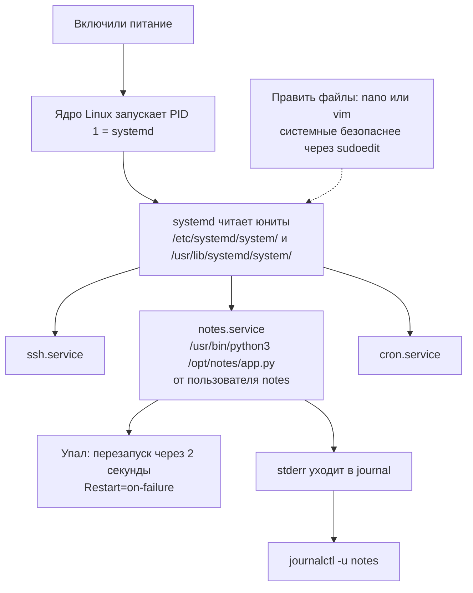
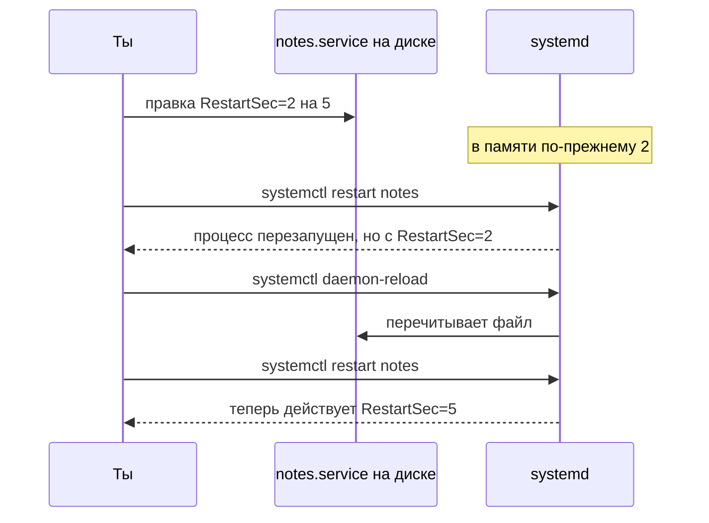
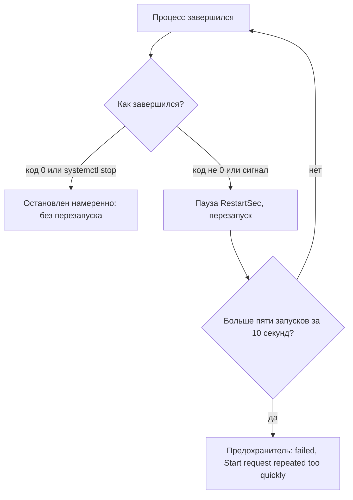
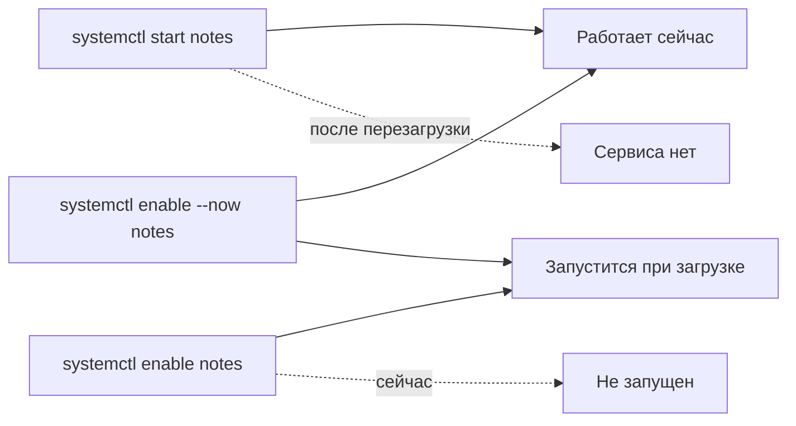
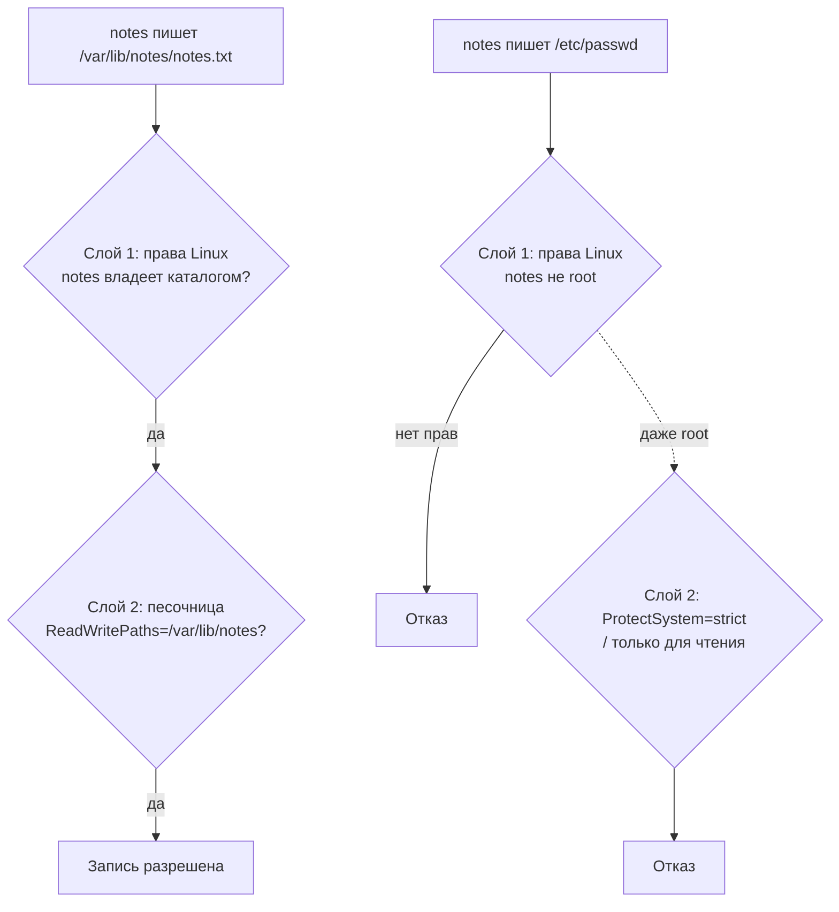

## Зачем это нужно

Никому не хочется ночью заходить на сервер, чтобы руками поднять упавший сервис. Для этого и существует systemd, и в этом уроке ты научишься на него полагаться.

Пока «Заметки» запущены руками в терминале (`sudo -u notes python3 /opt/notes/app.py`, [урок 1.3](03-users-permissions.md)), любое закрытое окно, перезагрузка сервера или падение процесса означают простой. Ночью никто не сидит перед терминалом и не нажимает Enter. На работе такое не допускается: сервис должен стартовать сам, подниматься после падения и писать логи в одно место, где их можно найти.

Всё это делает **systemd** (произносится «систем-ди»): программа, которая управляет запуском всех остальных программ на сервере. Ты будешь каждый день писать `systemctl status` (показать, жив ли сервис), `systemctl restart` (перезапустить) и `journalctl -u` (прочитать журнал сервиса), а конфиги придётся править прямо на сервере, в терминале. Графического интерфейса там нет, и единственные инструменты правки текста, которые под рукой, это **nano** и **vim**: текстовые редакторы, которые работают прямо в терминале, без мыши и окон (nano проще, vim есть почти на любом сервере). Поэтому в урок входят и они: без умения открыть, изменить и сохранить файл в редакторе все остальное не пригодится.

Шаг проекта: `deploy/systemd/notes.service` ставится в `/etc/systemd/system/`, конфиг выносится в `/etc/notes/notes.env` (права 640, `root:notes`), сервис работает под пользователем `notes` на `127.0.0.1:8080` и переживает `kill -9` и перезагрузку. Версия `app.py` не меняется (v2.2).

## Что нужно знать

- [Урок 1.1: первый сервер](01-first-server-shell.md): терминал, `apt`, первое знакомство с редактором.
- [Урок 1.2: текст и конвейеры](02-text-pipes.md): `grep`, `wc` и `|` нужны для фильтрации вывода `journalctl`; там же объяснено, что такое stdout и stderr (два потока вывода программы).
- [Урок 1.3: пользователи и права](03-users-permissions.md): пользователь `notes`, каталоги `/var/lib/notes` и `/opt/notes`, права 640 и 750, `sudo`.
- [Урок 1.4: процессы и сигналы](04-processes-signals.md): PID, SIGTERM и SIGKILL (systemd шлёт именно их), коды выхода (0 значит «всё хорошо»).
- [Урок 1.5: диск, память, процессор](05-disk-memory-cpu.md): память процесса и OOM-killer (механизм, который убивает процесс при нехватке памяти), понадобятся для понимания лимитов сервиса.
- [Урок 1.7: bash в эксплуатации](07-bash-in-ops.md): скрипты и cron, которые теперь будут ходить в сервис под systemd.

Сервис `notes` должен быть готов к установке: пользователь `notes`, `/opt/notes/app.py` версии v2.2 и каталог `/var/lib/notes` (создаются в уроке 1.3, версия кода приходит из уроков 1.4 и 1.5). Быстрая проверка того, что всё на месте, есть в начале практики.

## Картина целиком

Представь большой офис, где работает много сотрудников. Кто-то должен открыть двери утром, посадить каждого на своё место, следить, чтобы никто не ушёл посреди рабочего дня, и вызвать замену, если человек заболел. Такой человек есть в офисе: **администратор**. Он не выполняет работу сам, он организует людей. Ещё он ведёт **журнал происшествий**, куда записывает всё, что случилось: кто пришёл, кто ушёл, что сломалось.

На Linux-сервере роль администратора играет systemd. «Сотрудники» это сервисы (service: программа, которая работает в фоне постоянно и ждёт запросов, например веб-сервер): `notes`, ssh, cron. Файл-«должностная инструкция» для каждого называется **юнитом** (unit). В нём написано, кто запускает сервис, какой командой, что делать, если он упал, и что ему разрешено трогать. Журнал происшествий это **journal**, а читают его командой `journalctl`.



За урок ты разберёшь каждую стрелку: что такое юнит и как systemd его читает, как запускается процесс и что означают коды ошибок, как работает перезапуск и его предохранитель, как читать журнал, как ограничить права сервиса и как править файлы в vim и nano, не теряя рассудка.

## Теория

### Зачем нужен менеджер сервисов

**Сервис** (service, ещё говорят «демон», daemon) - это программа, которая должна работать постоянно и без участия человека: веб-сервер, база данных, наши «Заметки». В уроке 1.3 ты запускал «Заметки» вручную командой в терминале. У такого запуска есть проблемы, и каждая из них рано или поздно случается:

1. Закрыл окно терминала, и программа умерла (ей отправили сигнал SIGHUP, [урок 1.4](04-processes-signals.md)).
2. Сервер перезагрузился (обновление, авария питания), и программа не запустилась: некому нажать Enter.
3. Программа упала из-за ошибки, и никто не заметил, пока не позвонили пользователи.
4. Вывод программы уходит в окно терминала или в файл, который ты сам создал, и где он лежит, не знает никто, кроме тебя.
5. Программа работает от твоего пользователя и может всё, что можешь ты.

Менеджер сервисов решает все пять проблем. В Linux он называется **systemd**, а в Ubuntu он стоит по умолчанию. Это не отдельная программа, которую ты запускаешь, а **первый процесс системы**: ядро (главная часть операционной системы) после загрузки запускает ровно одну программу, а всё остальное запускает уже она. Поэтому у systemd номер процесса (PID) равен 1, и это можно увидеть:

```text
$ ps -p 1 -o pid,ppid,user,cmd
    PID    PPID USER     CMD
      1       0 root     /sbin/init
```

`ps` показывает процессы (урок 1.4). Флаг `-p 1` выбирает процесс с PID 1, `-o pid,ppid,user,cmd` задаёт колонки: номер, номер родителя, владелец и команда. У PID 1 родителя нет (`PPID` равен 0), это корень дерева процессов. `/sbin/init` это ссылка на systemd; на твоём сервере в колонке `CMD` может быть написано `/usr/lib/systemd/systemd`, это то же самое.

Аналогия: systemd это администратор офиса. Оговорка: обычный администратор не пускает в офис самого себя, а systemd сам запускается ядром первым и без него система не работает вообще. Именно поэтому его нельзя «выключить», как обычный сервис.

> **Прикинь сам:** ты запустил «Заметки» руками командой в терминале и закрыл окно. Что будет с сервисом?
{: .predict}

Он завершится: процесс привязан к терминалу и получит SIGHUP. Без менеджера сервисов некому поднять его заново после падения или перезагрузки.

Осторожно: Думают, что `systemd` это команда, которую вводят руками. Нет: команды для общения с ним называются `systemctl` («управлять systemd») и `journalctl` (читать журнал). `systemd` в их именах это просто «с кем разговариваем».

> **Главное:** systemd запускает сервисы, перезапускает упавшие, ведёт журнал и ограничивает права; команды для общения с ним это `systemctl` и `journalctl`.
{: .key}

> **Проверь понимание:** чем systemd лучше запуска через `nohup python3 app.py &` из [урока 1.4](04-processes-signals.md)?

<details markdown="1">
<summary>Ответ</summary>

`nohup` переживёт закрытие терминала, но не переживёт перезагрузку сервера и не поднимет программу после падения. Логи будут лежать там, куда ты сам их направил. systemd запускает сервис при загрузке, перезапускает по правилам, собирает вывод в единый журнал и умеет ограничить права. Кроме того, у него один интерфейс управления для всех сервисов сервера.

</details>

Менеджер есть. Теперь посмотрим, как ему объясняют, что именно запускать: это юнит.

### Юнит: файл, в котором описан сервис

**Юнит** (unit) - это единица, которой управляет systemd: сервис, цель загрузки, таймер, точка монтирования диска. У каждого вида своё расширение: `notes.service`, `multi-user.target`, `apt-daily.timer`. Мы работаем только с `.service` (сервисами) и упоминаем `.target` (цели, объясним ниже). Юнит это **текстовый файл** с настройками, и никакого кода в нём нет.

Файлы юнитов лежат в двух местах, и различие важно:

- `/usr/lib/systemd/system/`: юниты, которые принесли с собой пакеты (`apt install nginx` положит сюда `nginx.service`). Их не правят: при обновлении пакета файл будет перезаписан. В Ubuntu 24.04 там 255 файлов.
- `/etc/systemd/system/`: твои собственные юниты и переопределения. Если в обоих местах есть файл с одним именем, побеждает `/etc`. Обновления пакетов сюда не лезут.

Формат файла тот же, что у старых ini-файлов Windows: **секции** в квадратных скобках, а внутри строки `Ключ=значение`. Ключ - это имя настройки, значение - то, чему она равна. Строки, начинающиеся с `#`, это комментарии: systemd их пропускает.

В юните сервиса три секции:

- `[Unit]`: описание и порядок запуска. `Description=` - подпись, которую увидишь в `status`. `After=network.target` значит «запускай меня после того, как поднята сеть».
- `[Service]`: как запускать. Пользователь, команда, правила перезапуска, ограничения.
- `[Install]`: что делать при `enable` (включении автозапуска): к какой **цели** (target) подключить сервис. Цель - это точка на пути загрузки: «сеть готова», «система дошла до рабочего состояния». `multi-user.target` это обычное рабочее состояние сервера без графики. `WantedBy=multi-user.target` значит «когда система доберётся до рабочего состояния, запусти и меня».

Вот весь юнит «Заметок», который ты напишешь в практике. Разберём его построчно:

```ini
[Unit]
Description=Сервис Заметки              # подпись в systemctl status
After=network.target                    # стартовать после сети

[Service]
User=notes                              # от чьего имени работает процесс
Group=notes                             # и с какой группой
EnvironmentFile=/etc/notes/notes.env    # файл с настройками для программы
ExecStart=/usr/bin/python3 /opt/notes/app.py   # какую команду запустить
Restart=on-failure                      # поднять снова, если упала
RestartSec=2                            # пауза перед перезапуском, секунды
ReadWritePaths=/var/lib/notes           # сюда писать можно
ProtectSystem=strict                    # всё остальное только для чтения
NoNewPrivileges=true                    # нельзя получить больше прав

[Install]
WantedBy=multi-user.target              # подключить к обычной загрузке
```

Комментарии справа здесь только для чтения урока: в настоящем юнит-файле `#` ставят в начале строки, а не после значения (иначе systemd прочтёт комментарий как часть значения). Про каждую из строк `[Service]` ниже отдельный раздел.

**Главное правило про изменения.** systemd читает файлы юнитов **один раз** и хранит их в памяти. Изменил файл на диске, а systemd об этом не знает, пока ты не скажешь: `sudo systemctl daemon-reload` («перечитай конфигурацию»). Аналогия: ты поправил рецепт в бумажной поваренной книге, а повар готовит по копии, которую переписал вчера. Пока не отдашь ему новую копию, он будет готовить по старой. Оговорка: повар не заметит расхождения, а systemd заметит и подскажет.

Вот что происходит на самом деле. Если поменять `RestartSec=2` на 5 прямо в `/etc/systemd/system/notes.service` и не выполнить `daemon-reload`:

```text
$ systemctl status notes --no-pager | head -2
Warning: The unit file, source configuration file or drop-ins of notes.service changed on disk. Run 'systemctl daemon-reload' to reload units.
● notes.service - Сервис Заметки

$ systemctl show notes -p RestartUSec
RestartUSec=2s
$ sudo systemctl daemon-reload
$ systemctl show notes -p RestartUSec
RestartUSec=5s
```

`systemctl show notes -p RestartUSec` печатает значение одной настройки так, как её сейчас **знает systemd**, а не как она записана в файле. До `daemon-reload` там было старое `2s`, после стало `5s`. Ещё `status` печатает предупреждение сверху: `Warning: ... changed on disk`. Это единственная защита от забывчивости.

**Drop-in.** Иногда нужно не переписать чужой юнит, а поправить пару строк. Для этого существует каталог `имя.service.d/` с файлами `*.conf` внутри: systemd читает основной файл, потом все файлы из этого каталога, и строки из них дополняют или заменяют основные. Так делает команда `sudo systemctl edit notes`. Посмотреть итог со всеми дополнениями можно так: `systemctl cat notes` печатает все файлы, из которых сложен юнит, каждый под своим заголовком-комментарием с путём. Мы используем это в разделе «Сломай и почини».

> **Прикинь сам:** ты поправил `RestartSec=2` на 5 в `/etc/systemd/system/notes.service` и сделал `systemctl restart notes`. Применится ли новое значение?
{: .predict}

Нет: `restart` перезапускает процесс, а описание юнита systemd берёт то, что уже лежит в памяти. Сначала нужен `systemctl daemon-reload`, потом `restart`.

Осторожно: Думают, что `restart` перечитывает юнит-файл. Нет: `restart` перезапускает **процесс**, а описание юнита берёт то, что уже лежит в памяти. Для нового файла нужны оба действия: сначала `daemon-reload`, потом `restart`.



> **Главное:** юнит это файл с описанием сервиса (`[Unit]`, `[Service]`, `[Install]`); после правки файла выполняют `daemon-reload`, потом `restart`.
{: .key}

> **Проверь понимание:** ты поправил `/etc/systemd/system/notes.service`, выполнил `sudo systemctl restart notes`, а поведение не изменилось. Что забыл?

<details markdown="1">
<summary>Ответ</summary>

`sudo systemctl daemon-reload`. Пока systemd не перечитал файл, он запускает процесс по старому описанию из памяти. `systemctl status` при этом пишет предупреждение `changed on disk`.

</details>

Файл описан. Теперь разберём, что именно systemd делает, когда запускает процесс.

### Как systemd запускает процесс

Ключевая строка юнита это `ExecStart=`: полная команда запуска. `Type=` по умолчанию `simple`, и это значит: процесс, который стартует из `ExecStart`, и есть сервис, он остаётся на «переднем плане» и не уходит в фон. Раньше программы-демоны при старте сами делали `fork` (создавали копию себя и завершали исходный процесс), чтобы отвязаться от терминала. systemd такое не нужно: он сам держит процесс и сам следит за ним. Наши «Заметки» ведут себя именно так: запустились и работают.

Вывод программы systemd подключает к журналу. Python пишет логи в stderr, поэтому `2>> app.log` из урока 1.2 больше не нужен: всё, что программа напишет в stdout или stderr, окажется в journal.

**Пользователь и группа.** `User=notes` и `Group=notes` значат, что процесс работает не от root, а от пользователя `notes` (из [урока 1.3](03-users-permissions.md)). systemd сам переключается на этого пользователя перед запуском команды. Поэтому в `ExecStart` не нужен `sudo -u notes`: `sudo` и есть то, что делал за тебя переключение, а теперь это делает systemd.

**Разбор ошибок запуска по кодам.** Когда сервис не стартовал, `systemctl status` показывает строку `Process: ... (code=exited, status=NNN/ИМЯ)`. Число это **код выхода** ([урок 1.4](04-processes-signals.md)), и для запуска systemd придумал свои коды, которые начинаются с 200. По ним видно, **на каком шаге** остановился запуск:

| Код | Что значит | Типичная причина |
|---|---|---|
| `203/EXEC` | systemd не смог запустить команду из `ExecStart` | путь неверный, файла нет, нет права на выполнение |
| `217/USER` | не удалось переключиться на пользователя из `User=` | пользователя нет (опечатка или его не создали) |
| `2/INVALIDARGUMENT` | программа стартовала и сама завершилась с кодом 2 | ошибка в настройках, которую увидела программа |

Настоящий вывод при пользователе, которого нет:

```text
     Active: activating (auto-restart) (Result: exit-code) since Wed 2026-09-30 11:56:45 UTC; 539ms ago
    Process: 1372 ExecStart=/usr/bin/python3 /opt/notes/app.py (code=exited, status=217/USER)
```

а в журнале причина расшифрована: `notes.service: Failed to determine user credentials: No such process`. То есть 203 и 217 это ошибки **до** запуска программы: сама программа даже не успела стартовать, значит смотреть нужно в юнит, а не в код приложения. Код 2, наоборот, приходит **из программы**: её собственная ошибка (например, `PORT должен быть числом`), и объяснение лежит в журнале строкой выше.

**Путь к программе и отсутствие shell.** В `ExecStart` лучше писать абсолютный путь: `/usr/bin/python3`, а не `python3`. Современный systemd умеет искать простое имя в своём фиксированном списке каталогов (`/usr/local/bin`, `/usr/bin` и других), не в твоём `PATH`, и на Ubuntu 24.04 запись `ExecStart=python3 /opt/notes/app.py` работает. Но такое поведение зависит от версии, и когда в системе несколько питонов, непонятно, какой запустится. Поэтому пиши полный путь и проверяй его командой `command -v python3` (она печатает, где лежит программа).

Важнее другое: `ExecStart` это **не shell**. Символы `>`, `|`, `&&` и `$VAR` bash понимает, а systemd нет. Если написать `ExecStart=/usr/bin/python3 /opt/notes/app.py > /tmp/x.log`, systemd просто передаст `>` и `/tmp/x.log` программе как обычные аргументы, а перенаправления не будет. Мы проверили это на стенде: сервис запустился, файл `/tmp/x.log` не появился. Если нужен shell, пишут `ExecStart=/bin/bash -c '...'`, но лучше без него: вывод и так идёт в журнал.

**Настройки программы: EnvironmentFile.** «Заметки» читают свои настройки из **переменных окружения** (environment variables). Это пары «имя = значение», которые процесс получает вместе с запуском: `HOST=127.0.0.1`, `PORT=8080`. В коде на Python это строка `os.environ.get("PORT", "8080")`: «возьми переменную PORT, а если её нет, используй 8080». systemd умеет передать такие переменные из файла. `EnvironmentFile=/etc/notes/notes.env` значит: «прочитай этот файл и передай программе всё, что в нём написано».

Формат файла строгий: одна пара `КЛЮЧ=значение` на строке, без `export` и без пробелов вокруг `=`. Кавычки тоже не нужны. Наш файл:

```text
HOST=127.0.0.1
PORT=8080
NOTES_DATA=/var/lib/notes/notes.txt
APP_VERSION=dev
```

Программа при старте видит: слушать на `127.0.0.1`, порт `8080`, хранить заметки в `/var/lib/notes/notes.txt`, версия называется `dev`.

**Права на файл настроек.** Мы задаём 640 и владельца `root:notes`. Расшифруем по правилам [урока 1.3](03-users-permissions.md): владелец `root` читает и пишет (6), группа `notes` только читает (4), остальные не могут ничего (0). Сейчас в файле нет секретов, но в будущем появятся пароли, и лучше сразу привыкнуть к правильной модели.

Есть тонкость. Файл читает не сам процесс `notes`, а systemd, который работает от root. Поэтому сервис запустится, даже если у пользователя `notes` вообще нет права на чтение. Право группы `notes` нужно только для того, чтобы человек из группы мог посмотреть файл. Пользователь `ubuntu` без `sudo` файл не прочитает: `cat: /etc/notes/notes.env: Permission denied`, и это нормально.

**Почему секреты нельзя класть в `Environment=`.** В юните есть и ключ `Environment=КЛЮЧ=значение`, который задаёт переменную прямо в файле юнита. Но юнит-файлы не секретны: любой пользователь сервера может выполнить `systemctl show notes -p Environment` и увидеть значение. Проверено на стенде:

```text
$ systemctl show notes -p Environment
Environment=DB_PASSWORD=hunter2
```

А `EnvironmentFile` показывает пользователю только **путь** к файлу (`EnvironmentFiles=/etc/notes/notes.env (ignore_errors=no)`), содержимое остаётся под правами 640. Поэтому пароли и токены кладут в файл с закрытыми правами, а не в юнит.

> **Прикинь сам:** сервис в статусе `failed`, `status=203/EXEC`. В какую сторону смотреть?
{: .predict}

203 значит, что systemd не смог выполнить программу: неверный путь в `ExecStart`, нет бита исполнения или не найден интерпретатор. Саму программу смотреть рано.

Осторожно: Кажется, что `User=notes` даёт сервису права `notes` на всё, что читает systemd. Не так: systemd читает `EnvironmentFile` и юнит-файл как root, а процесс `notes` получает уже готовые значения. Права пользователя `notes` действуют только на то, что делает сама программа.

> **Главное:** systemd запускает процесс от `User=`, читает `EnvironmentFile` как root и передаёт программе готовые значения; коды вроде 203 это ошибка запуска, а не работы программы.
{: .key}

> **Проверь понимание:** в юните написано `ExecStart=/usr/bin/python3 /opt/notes/app.py > /var/log/notes.log`. Что произойдёт?

<details markdown="1">
<summary>Ответ</summary>

Сервис запустится, но лог в файл не пойдёт: `>` это синтаксис bash, а systemd его не понимает и передаст `>` и `/var/log/notes.log` программе как два лишних аргумента. Вывод при этом всё равно окажется в journal. Если нужен именно файл, для этого в юните есть `StandardOutput=append:/путь`, но чаще журнала достаточно.

</details>

Процесс запущен. Что делает systemd, если тот упадёт?

### Перезапуск и защита от бесконечных перезапусков

Ради этого ты и пришёл к systemd: сервис упал, и его нужно поднять без человека. За это отвечает `Restart=`. Слова в значении описывают, **как завершился процесс**:

| `Restart=` | Когда systemd поднимает процесс снова |
|---|---|
| `no` | никогда (значение по умолчанию) |
| `on-failure` | если код выхода не 0, процесс убит сигналом или завис (наш выбор) |
| `always` | всегда, даже после чистой остановки процесса с кодом 0 |

**Штатная остановка перезапуска не вызывает.** Когда ты сам выполняешь `systemctl stop notes`, systemd посылает процессу SIGTERM ([урок 1.4](04-processes-signals.md)). Наш `app.py` v2.1+ умеет корректно завершаться по SIGTERM и выходит с кодом 0. Для systemd это «остановили нарочно» и «завершился успешно»: перезапускать не нужно. Если процесс убили сигналом (`kill -9` шлёт SIGKILL), это «упал»: пора вставать.

Разобранный пример, как это выглядит в журнале. Мы выполнили `sudo kill -9 <PID>`, вот что записал systemd (время и PID у тебя будут другими):

```text
11:54:09 systemd[1]: notes.service: Main process exited, code=killed, status=9/KILL
11:54:09 systemd[1]: notes.service: Failed with result 'signal'.
11:54:11 systemd[1]: notes.service: Scheduled restart job, restart counter is at 1.
11:54:11 systemd[1]: Started notes.service - Сервис Заметки.
11:54:11 python3[727]: 2026-09-30 11:54:11,957 INFO started host=127.0.0.1 port=8080
```

Читаем сверху вниз. Первая строка: главный процесс завершился, `code=killed` (убит сигналом), `status=9/KILL` (сигнал номер 9, SIGKILL). Вторая: сервис закончил работу неудачей, причина «сигнал». Третья, через ровно две секунды (`RestartSec=2`): systemd планирует перезапуск, `restart counter is at 1` считает, сколько раз он уже перезапускал. Четвёртая и пятая: запущен новый процесс с новым PID (был 717, стал 727), и программа сообщила `started`.

А после `sudo systemctl stop notes` в журнале другая картина: `Stopping notes.service`, потом строки самого приложения `INFO shutting down` и `INFO stopped` (из [урока 1.4](04-processes-signals.md)), затем `Deactivated successfully`. Перезапуска нет.

**Предохранитель.** Представь сервис, который падает сразу при старте. Если systemd будет бесконечно перезапускать его, получится цикл, который молотит процессор и забивает журнал. Поэтому у systemd есть ограничитель: если за `StartLimitIntervalSec` (по умолчанию 10 секунд) было больше `StartLimitBurst` (по умолчанию 5) запусков, он сдаётся. Юнит переходит в состояние `failed`, а в журнале пишет `Start request repeated too quickly`. После этого сам он больше не пытается, пока ты не выполнишь `sudo systemctl reset-failed <юнит>` (сбросить отметку «сломан», а счётчик попыток обнулить).

Настоящий вывод. Мы создали игрушечный сервис `crashy.service` с командой `/bin/false` (она сразу завершается с кодом 1) и `RestartSec=1`:

```text
$ systemctl status crashy --no-pager
× crashy.service
     Loaded: loaded (/etc/systemd/system/crashy.service; static)
     Active: failed (Result: exit-code) since Wed 2026-09-30 11:57:09 UTC; 1s ago
    Process: 1443 ExecStart=/bin/false (code=exited, status=1/FAILURE)

crashy.service: Scheduled restart job, restart counter is at 5.
crashy.service: Start request repeated too quickly.
crashy.service: Failed with result 'exit-code'.
Failed to start crashy.service.
```

Пять запусков за пять секунд, и systemd остановился.

**Важная тонкость.** У наших «Заметок» `RestartSec=2`: запуски идут раз в две-три секунды, и за 10 секунд набирается меньше пяти. Предохранитель не срабатывает, и сломанный сервис не переходит в `failed`, а годами висит в состоянии `activating (auto-restart)`, то есть постоянно пытается запуститься. В сценарии 2 раздела «Сломай и почини» ты увидишь это своими глазами: счётчик `restart counter` дойдёт до десятков. Значит, отсутствие слова `failed` в `status` не доказывает, что сервис работает: смотри на `Active:` целиком.

> **Прикинь сам:** ты убил сервис командой `kill -9`, у него `Restart=on-failure`. Что произойдёт? А после `systemctl stop`?
{: .predict}

После `kill -9` это сбой, и systemd поднимет сервис через `RestartSec` секунд с новым PID. После `systemctl stop` сервис остановлен намеренно, и перезапуска не будет.

Осторожно: Думают, что `Restart=always` «чинит» всё. Он лишь скрывает падения: сервис, который валится каждые две секунды, выглядит «почти живым». Причину нужно искать в журнале, а не ослаблять лимит.



> **Главное:** `Restart=on-failure` поднимает упавшее, а предохранитель (`StartLimit`) останавливает сервис, который падает слишком часто; причину ищут в журнале.
{: .key}

> **Проверь понимание:** ты убил сервис командой `kill -9`, у него `Restart=on-failure`. Что произойдёт? А после `systemctl stop`?

<details markdown="1">
<summary>Ответ</summary>

После `kill -9` процесс завершён сигналом, это failure, и systemd поднимет его через `RestartSec` секунд (у процесса будет новый PID). После `systemctl stop` сервис остановлен намеренно, программа вышла с кодом 0, и он останется остановленным.

</details>

Перезапуск настроен. Теперь о двух разных вещах: запустить сейчас и запускать при загрузке.

### Запустить сейчас и запускать при загрузке: start и enable

У сервиса два независимых свойства: **работает ли он прямо сейчас** и **поднимется ли сам при загрузке сервера**. Команды для них разные:

| Команда | Работает сейчас | Стартует при загрузке |
|---|---|---|
| `systemctl start notes` | да | не меняется |
| `systemctl stop notes` | нет | не меняется |
| `systemctl enable notes` | не меняется | да |
| `systemctl disable notes` | не меняется | нет |
| `systemctl enable --now notes` | да | да |

Аналогия: `start` это включить свет в комнате сейчас, а `enable` это поставить выключатель на автоматическое включение по расписанию. Можно сделать одно без другого. Оговорка: свет включается один раз, а `enable` действует при каждой загрузке.

Как работает `enable`, никакой магии: он создаёт **символическую ссылку** (symlink, файл-указатель на другой файл) в каталоге цели. При загрузке systemd доходит до `multi-user.target` и запускает всё, что лежит в его каталоге `multi-user.target.wants/`. Настоящий вывод:

```text
$ sudo systemctl enable --now notes
Created symlink /etc/systemd/system/multi-user.target.wants/notes.service → /etc/systemd/system/notes.service.
```

Вот и вся суть: ссылка `multi-user.target.wants/notes.service` указывает на юнит. `disable` удаляет эту ссылку.

Как узнать текущее состояние? Полный `systemctl status` красивый, но неудобен в скриптах. Для скриптов есть короткие команды, которые печатают одно слово и возвращают **код выхода** ([урок 1.4](04-processes-signals.md)): `systemctl is-active notes` печатает `active` (код 0) или `inactive`/`failed`/`activating` (код не 0), `systemctl is-enabled notes` печатает `enabled` или `disabled`. Проверено: при остановленном сервисе `is-active` выводит `inactive` и возвращает код 3, поэтому в скриптах пишут `if systemctl is-active --quiet notes; then ...`.

Ещё одна тонкость, на которой все спотыкаются. Команда `systemctl start` возвращается, как только процесс **запущен**, а не когда программа готова принимать запросы. Python стартует за десятки миллисекунд, и если сразу после `enable --now` выполнить `curl`, он может получить отказ, потому что порт ещё не открыт. Мы наблюдали это на стенде: `curl` сразу после старта закончился кодом 7 (`Couldn't connect to server`). Подожди секунду и повтори.

> **Прикинь сам:** ты сделал `systemctl enable notes` и не запускал сервис. Будет ли он работать сейчас? А после перезагрузки?
{: .predict}

Сейчас нет: `enable` только включает автозапуск. После перезагрузки да, сервис стартует при загрузке.

Осторожно: `enable` не запускает сервис, а `start` не включает автозапуск. Если сделал только `start`, после перезагрузки сервиса не будет. Если сделал только `enable`, сервис заработает лишь при следующей загрузке.



> **Главное:** `start` запускает сейчас, `enable` включает запуск при загрузке; нужны оба действия, а `enable --now` делает их вместе.
{: .key}

> **Проверь понимание:** ты выполнил `sudo systemctl enable notes` и сразу `curl http://127.0.0.1:8080/healthz`. Что получишь?

<details markdown="1">
<summary>Ответ</summary>

Отказ соединения (`Couldn't connect to server`): `enable` только ставит ссылку для будущей загрузки, но не запускает процесс. Чтобы сделать и то и другое, нужен `enable --now`.

</details>

Сервис работает. Где посмотреть, что он делает? В журнале.

### Журнал: journald и journalctl

До systemd каждая программа писала свой текстовый лог в свой файл: `/var/log/nginx/error.log`, `/var/log/syslog`. Чтобы разобраться в аварии, нужно было открывать пять файлов и сопоставлять время вручную. В systemd вывод всех сервисов собирает одна служба, **journald**, и складывает в единое хранилище, **журнал** (journal). Записи хранятся в бинарном формате, поэтому просто `cat` файла не поможет: читать их нужно командой `journalctl`. Зато каждая запись хранит метки: имя сервиса, время, PID, важность. По меткам можно искать быстро.

Как вывод программы попадает в журнал: процесс пишет в stdout или stderr, systemd подключил их к journald, тот превращает каждую строку в запись с метками. Мы ничего не настраиваем, всё работает само.

Разберём настоящую строку из журнала «Заметок»:

```text
Sep 30 11:54:31 235dac9eaa5a python3[744]: 127.0.0.1 "GET /net-takoj-stranicy HTTP/1.1" 404 -
```

- `Sep 30 11:54:31` - когда записано (по локальному времени сервера);
- `235dac9eaa5a` - имя машины (hostname), на твоём сервере другое;
- `python3[744]` - имя программы и её PID: по PID видно, какой именно запуск это написал;
- `127.0.0.1 "GET /net-takoj-stranicy HTTP/1.1" 404 -` - сообщение самого приложения: кто обратился, метод и путь запроса, код ответа (404 «не найдено»), а `-` значит, что размер ответа не указан.

Ходовые ключи `journalctl`:

| Ключ | Что делает |
|---|---|
| `-u notes` | только записи юнита `notes` (unit) |
| `-n 20` | только последние 20 записей |
| `-f` | следить в реальном времени (follow), выход `Ctrl+C` |
| `--since "10 min ago"` | записи за последние 10 минут; работают `yesterday`, `"2026-09-30 03:00"` |
| `--until "..."` | до указанного момента |
| `-p warning` | только важность warning и выше (priority) |
| `-b` | только с текущей загрузки (boot); `-b -1` - с предыдущей |
| `--no-pager` | не открывать `less`, печатать всё подряд (нужно в конвейере) |
| `-x` | добавить пояснения к сообщениям systemd (`-xe` листает к концу) |

**Что такое pager.** Когда вывод длинный, `journalctl` открывает его в программе-просмотрщике `less`: листаешь стрелками, выходишь клавишей `q`. В конвейере с `grep` или в скрипте это мешает, поэтому добавляют `--no-pager`.

**Важность сообщений** (priority) это число от 0 до 7: 0 emerg, 1 alert, 2 crit, 3 err, 4 warning, 5 notice, 6 info, 7 debug. `-p err` показывает записи важности 3 и **выше**, то есть 0-3. Есть подвох. Программа пишет в stderr, а journald ставит всем таким строкам важность 6 (info), даже если это ошибка приложения. Поэтому `journalctl -u notes -p err` не покажет ошибок самого приложения, только ошибки systemd (например, `Failed to determine user credentials` при отсутствующем пользователе). Мы проверили: на нашем стенде `-p err` вывел `-- No entries --`, хотя сервис падал и перезапускался, а `-p warning` показал строки `Main process exited, code=killed`. Для ошибок приложения лучше искать слова в тексте (`grep`) или по коду ответа.

**Кто может читать журнал.** Обычный пользователь видит только свои записи. Чтобы читать записи системных сервисов, нужно быть в группе `adm` или `systemd-journal`, либо запускать `sudo journalctl`. В Ubuntu первый пользователь, созданный при установке, уже в группе `adm`. Проверь: `id`. Если не в группе, `journalctl` напишет `Hint: You are currently not seeing messages from other users and the system.`

**Журнал на диске и после перезагрузки.** Записи не хранятся вечно: journald обрезает старые, когда журнал занимает слишком много места (по умолчанию примерно десятую часть диска, но не больше 4 ГБ). Сколько занимает сейчас: `journalctl --disk-usage`. Каталог `/var/log/journal/` на Ubuntu существует, поэтому журнал переживает перезагрузку. В системах без этого каталога записи теряются при каждой перезагрузке, тогда нужно создать каталог или поставить `Storage=persistent` в `/etc/systemd/journald.conf`.

> **Прикинь сам:** нужно понять, что случилось с сервисом вчера в 03:00. Какая команда?
{: .predict}

`journalctl -u notes --since "yesterday 02:55" --until "yesterday 03:10"`: журнал юнита за окно времени. В нём и вывод приложения, и записи самого systemd (`Stopped`, `Scheduled restart job`).

Осторожно: Думают, что `journalctl -u notes` показывает только логи приложения. Он показывает и записи самого systemd о юните (`Started`, `Stopped`, `Scheduled restart job`), и это удобно: причина падения и вывод приложения лежат рядом.

> **Главное:** `journalctl -u имя` показывает вывод сервиса вместе с записями systemd; сужают его по времени (`--since`), уровню (`-p err`) и свежим строкам (`-f`, `-n`).
{: .key}

> **Проверь понимание:** как показать записи сервиса `notes` за последний час, в которых встречается `404`?

<details markdown="1">
<summary>Ответ</summary>

`journalctl -u notes --since "1 hour ago" --no-pager | grep ' 404 '`. Ключ `-p err` не подойдёт: приложение пишет `404` со строкой важности info, а не err.

</details>

Диагностика готова. Остался вопрос безопасности: как ограничить сервис, чтобы взлом одного не открыл сервер.

### Песочница для сервиса: hardening

Сервис, слушающий сеть, это потенциальная цель. Если в приложении найдут уязвимость, атакующий получит права процесса. Чем меньше прав у процесса, тем меньше вреда. Для этого в systemd есть набор настроек, которые ограничивают процесс сильнее, чем обычные права Linux. Английское слово **hardening** (укрепление) обозначает именно это.

Аналогия: сотрудник склада работает в отдельной комнате, где ему выдан только нужный инструмент. Даже если он захочет пройти в кабинет директора, дверь просто закрыта. Оговорка: дверь закрывает systemd, и это не то же самое, что запрет на уровне пользователя, о котором мы говорили в уроке 1.3.

Два слоя защиты работают вместе:



Базовый набор для «Заметок»:

- `NoNewPrivileges=true`: процесс и его потомки не могут получить больше прав, чем у них есть. Закрывает трюк с программами, которые запускаются от имени владельца (setuid, например `sudo`).
- `ProtectSystem=strict`: вся файловая система смонтирована для процесса **только для чтения** (кроме `/dev`, `/proc`, `/sys`). Он не может изменить `/etc`, `/usr`, `/var`.
- `ReadWritePaths=/var/lib/notes`: исключение из предыдущего правила. Сюда писать можно, потому что «Заметки» хранят тут данные.
- `ProtectHome=true`: каталоги `/home`, `/root` и `/run/user` для процесса пусты и недоступны.
- `PrivateTmp=true`: у сервиса **свой** `/tmp`, чужие файлы из общего `/tmp` он не видит, а его файлы не видят другие.

Все эти настройки работают не в приложении, а вокруг него: systemd строит для процесса особый вид файловой системы (для этого используется механизм ядра, называемый пространством имён, mount namespace), и приложению всё равно, что часть каталогов стала «невидимой» или «только для чтения».

Настоящий эксперимент, который показывает два слоя. Мы запустили одну команду `touch` (создать пустой файл) от пользователя `notes` тремя способами:

```text
$ sudo -u notes touch /var/lib/notes/x
(файл создан: обычные права Linux пускают)

$ sudo systemd-run --quiet --wait --collect --pipe -p User=notes -p ProtectSystem=strict touch /var/lib/notes/x
/usr/bin/touch: cannot touch '/var/lib/notes/x': Read-only file system

$ sudo systemd-run --quiet --wait --collect --pipe -p User=notes -p ProtectSystem=strict -p ReadWritePaths=/var/lib/notes touch /var/lib/notes/x
(файл создан: исключение открыло каталог)
```

`Read-only file system` (файловая система только для чтения) это ошибка песочницы. Права Linux при этом в порядке: пользователю `notes` разрешено писать, но systemd закрыл запись сверху. Именно поэтому такую ошибку трудно искать: `ls -l` покажет, что права правильные.

**Как оценить результат.** Команда `systemd-analyze security notes` проверяет юнит по списку из десятков возможных ограничений и печатает итоговую оценку **экспозиции**: число от 0 (максимально закрыт) до 10 (максимально открыт) и слово: `OK`, `MEDIUM`, `EXPOSED`, `UNSAFE`. Гнаться за нулём не стоит: сервису, который слушает сеть и пишет на диск, часть возможностей нужна, и полностью закрыть его нельзя. Полезно другое: сравнивать оценку до и после правки и понимать, за что сняты баллы. На нашем юните оценка была `8.7 EXPOSED`, а после добавления `ProtectHome` и `PrivateTmp` стала `8.3 EXPOSED`. Проверка такая же, как любая проверка: число не самоцель, а способ увидеть, какие двери ещё открыты. У тебя число может отличаться: оно зависит от версии systemd.

**Лимиты ресурсов.** В юнит можно добавить и потолок по памяти (`MemoryMax=256M`) и по числу процессов (`TasksMax=`). systemd использует для этого **cgroups** (control groups): механизм ядра, который объединяет процессы сервиса в группу и считает, сколько ресурсов группа занимает. Если сервис превысил `MemoryMax` (и вытеснить память нельзя), ядро убивает процессы только этой группы, а не случайный процесс на сервере. Так утечка памяти в одном сервисе (вспомни `/leak` из [урока 1.5](05-disk-memory-cpu.md)) не роняет соседей. В нашем юните лимитов нет: мы их не проверяли на стенде и разбираем только идею.

> **Прикинь сам:** сервис с `ProtectSystem=strict` и `ReadWritePaths=/var/lib/notes` пытается записать `/etc/passwd`. Что произойдёт?
{: .predict}

Запись не пройдёт: `/` смонтирован только для чтения, исключение сделано лишь для `/var/lib/notes`. Это не сработает и у root, так как закрывает дверь сам systemd.

Осторожно: Думают, что `ProtectSystem=strict` защищает от всех атак. Он защищает от записи в системные каталоги, но не от кражи данных, которые сервис имеет право читать.

> **Главное:** hardening это второй слой защиты поверх прав Linux: `ProtectSystem`, `ReadWritePaths`, `NoNewPrivileges` и лимиты памяти ограничивают то, что может сделать сам процесс.
{: .key}

> **Проверь понимание:** сервису понадобилось писать логи в отдельный каталог `/var/log/notes`. Что добавить в юнит?

<details markdown="1">
<summary>Ответ</summary>

Добавить каталог в `ReadWritePaths=`: `ReadWritePaths=/var/lib/notes /var/log/notes` (значения через пробел), выполнить `daemon-reload` и `restart`. Без этого запись вернёт `Read-only file system`, даже если владелец каталога правильный. Убедись также, что каталог существует и принадлежит пользователю `notes`.

</details>

Юнит и защита описаны. Но файлы приходится править руками, и здесь нужны редакторы.

### Редакторы vim и nano: править файлы в терминале

На сервере нет окна с мышью и курсором, есть только терминал ([урок 1.1](01-first-server-shell.md)). Конфиги правят прямо в нём с помощью **консольных редакторов** (text editors). Два самых распространённых:

**nano** - простой. Открывается, ты печатаешь, внизу экрана подсказки. Знак `^` означает клавишу `Ctrl`, поэтому `^O` это `Ctrl+O`. Настоящий экран nano выглядит так:

```text
  GNU nano 7.2          /var/tmp/notesCQWsdy7O.env
HOST=127.0.0.1
PORT=8080
NOTES_DATA=/var/lib/notes/notes.txt
APP_VERSION=dev

                           [ Read 4 lines ]
^G Help       ^O Write Out  ^W Where Is   ^K Cut        ^T Execute
^X Exit       ^R Read File  ^\ Replace    ^U Paste      ^J Justify
```

Сохранить: `Ctrl+O`, затем `Enter` (подтвердить имя файла). Выйти: `Ctrl+X`. Если вышел с несохранёнными правками, nano спросит `Save modified buffer?`: `Y` (сохранить), `N` (нет).

**vim** - мощный и непривычный. Он есть практически на любом сервере (в самых минимальных системах вместо него `vi`, его упрощённая версия), поэтому уметь им пользоваться нужно. Его особенность в том, что у него есть **режимы** (modes). Одни и те же клавиши делают разное в зависимости от режима:

```text
                       i, a, o, A
   +----------------------------------------->  +-------------------+
   |  обычный режим                             |  режим вставки    |
   |  (normal): клавиши это команды             |  (insert): клавиши |
   |  dd, p, u, /, :                            |  вводят текст      |
   |  <-----------------------------------------|                   |
   +----------------------------------------    +-------------------+
            Esc
        :  (двоеточие)
         |
         v
   командная строка внизу: :wq  :q!  :%s/а/б/g   ,  выполнить  Enter
```

Почему так? Когда vim создавали, на клавиатурах не было привычных сегодня стрелок, а мыши не было тем более, поэтому все действия «повесили» на буквы, а вводить текст стали отдельным режимом. Аналогия: у радиотелефона две кнопки: «говорю» и «слушаю»; пока не нажал нужную, всё, что ты произносишь, слышит только комната. Оговорка: в vim переключатель «слушаю» включён по умолчанию, и ты сам должен нажать «говорю» (`i`).

Всегда начинаешь в **обычном режиме**. Из него `i` переводит в режим вставки (`insert`: текст вводится перед курсором), `A` (заглавная) в режим вставки в конце строки, а `Esc` возвращает обратно. Если ты не уверен, в каком режиме, нажми `Esc` пару раз: в обычном режиме это ничего не ломает.

Основные команды обычного режима:

| Клавиши | Действие |
|---|---|
| `i` | войти в режим вставки перед курсором |
| `A` | вставка в конце строки |
| `Esc` | вернуться в обычный режим |
| `dd` | вырезать строку (в буфер) |
| `yy` | скопировать строку (в буфер) |
| `p` | вставить из буфера после текущей строки |
| `u` | отменить последнее действие |
| `Ctrl+r` | повторить отменённое |
| `gg`, `G` | в начало файла, в конец |
| `/слово` + `Enter`, `n` | искать вперёд, перейти к следующему |
| `:w` | сохранить |
| `:wq` или `:x` | сохранить и выйти |
| `:q` | выйти (если нет несохранённых правок) |
| `:q!` | выйти без сохранения |
| `:%s/старое/новое/g` | заменить во всём файле |

Разбор двух непонятных вещей.

**«Вырезать» и «буфер».** `dd` не стирает строку навсегда: она удаляется из файла, но попадает в **регистр** (buffer, временное хранилище vim). Поэтому `dd` + `p` работает как «вырезать и вставить». Регистр хранит последнее вырезанное или скопированное. Поэтому, чтобы переместить строку в конец файла, делают `dd`, `G`, `p`.

**Команда `:%s/старое/новое/g`.** Разберём по частям: `:` вход в командную строку, `%` «во всём файле», `s` (substitute) «заменить», `/старое/новое/` что на что, `g` (global) «во всех местах строки, а не только в первом». Мы проверили: `:%s/строка/пункт/g` на файле из пяти строк ответил `5 substitutions on 5 lines`.

**Разница между `:wq` и `:x`.** `:wq` всегда записывает файл, `:x` записывает, только если были изменения. На практике разница видна в дате изменения файла: `:wq` обновит её, `:x` без правок оставит прежней. Проверено на стенде: после `:x` без изменений время файла не изменилось, после `:wq` изменилось.

**Vim запоминает, где ты остановился.** Если открыть тот же файл снова, курсор окажется там, где был при прошлом закрытии (эту память vim хранит в файле `~/.viminfo`). Это удобно, но сбивает: `dd` на «первой» строке может удалить строку, которая на самом деле пятая. Перед правкой всегда смотри на номер строки в правом нижнем углу (`4,1` значит «строка 4, столбец 1») и нажимай `gg`, если нужно начать с начала.

**Правка системных файлов: `sudoedit`.** Файлы вроде `/etc/notes/notes.env` принадлежат root. Обычная команда `sudo vim файл` запускает **весь редактор** от root, со всеми плагинами и возможностью открыть оболочку из редактора (`:!bash`): рискованно. Безопаснее `sudoedit файл` (то же, что `sudo -e файл`): редактор запускается от **твоего** пользователя над временной копией, а sudo подменяет оригинал только при сохранении. На стенде это выглядит так: nano открыл не `/etc/notes/notes.env`, а временный файл `/var/tmp/notesCQWsdy7O.env`, а после сохранения права остались `root:notes 640`.

Какой редактор откроет `sudoedit`, задаёт **переменная окружения** `EDITOR` (то же понятие, что переменные для программы выше, только для оболочки): `export EDITOR=nano` действует в этом терминале, чтобы сделать постоянным, добавь ту же строку в `~/.bashrc`. Если `EDITOR` не задан, в Ubuntu откроется nano.

**Что делать, если открыл системный файл без прав.** Если открыть файл, на который нет прав записи, vim пустит тебя внутрь, но при сохранении `:wq` откажет: `E45: 'readonly' option is set (add ! to override)`. Если ты уже набрал изменения, спасёт трюк `:w !sudo tee %`: `:w !команда` передаёт содержимое буфера на вход команды, `sudo tee %` записывает его в текущий файл (`%` это имя файла). Vim затем ругнётся `W12: Warning: File ... has changed and the buffer was changed in Vim as well`: это нормально, выйди `:q!`. Проверено на стенде.

**Swap-файл.** Пока ты редактируешь `файл`, vim держит рядом скрытый файл `.файл.swp` с копией правок. Если сеанс упал (оборвалась связь), файл остаётся, и при следующем открытии vim спросит:

```text
E325: ATTENTION
Found a swap file by the name "~/.vim-drill.txt.swp"
          owned by: ubuntu    dated: Wed Sep 30 11:53:32 2026
         file name: ~ubuntu/vim-drill.txt
          modified: no
        process ID: 609 (STILL RUNNING)
```

Смотри на `process ID`: если написано `STILL RUNNING`, файл сейчас открыт в другом окне, закрывай второе. Если процесса нет, сеанс упал, можно восстановить (`R`) или удалить swap-файл и открыть заново.

> **Прикинь сам:** ты набираешь текст в vim, а он выполняет какие-то команды. Что случилось и как выйти без сохранения?
{: .predict}

Ты в обычном режиме, а не в режиме вставки. Нажми `Esc`, затем `:q!` и `Enter`: выход без сохранения. Для вставки нужна `i`.

Осторожно: Главная паника новичка: «я печатаю, а vim выполняет какие-то команды». Причина всегда одна: он в обычном режиме, а не в режиме вставки. Нажми `Esc`, затем `i`.

> **Главное:** в vim два режима: обычный (команды) и вставки (текст); `Esc` возвращает в обычный, `:wq` сохраняет и выходит, `:q!` выходит без сохранения, а в nano подсказки внизу экрана.
{: .key}

> **Проверь понимание:** ты открыл vim, нажал `i`, набрал текст, потом нажал `dd` и вместо удаления строки появилось слово `dd`. Почему?

<details markdown="1">
<summary>Ответ</summary>

Ты остался в режиме вставки: в нём `dd` это просто две буквы. Нужно сначала нажать `Esc` (перейти в обычный режим), потом `dd`.

</details>

Редакторы освоены. Посмотрим, где эти знания встретятся дальше.

### Где это встретится дальше

- **Ты сам пишешь юниты** и правишь их через `systemctl edit`: в [теме 2](../02-network/index.md) сервис `nginx` получит drop-in, а `HOST=127.0.0.1` из `notes.env` понадобится, когда перед «Заметками» встанет nginx.
- **Docker и Kubernetes** ([темы 4](../04-docker/index.md) и [5](../05-kubernetes/index.md)) делают ту же работу, что systemd: запускают, перезапускают, ограничивают ресурсы. Понятия те же: `Restart` превращается в политику перезапуска контейнера, `ReadWritePaths` в read-only файловую систему, лимиты cgroups в `resources.limits`.
- **Журнал** превратится в централизованные логи ([тема 8](../08-observability/index.md)).

> **Прикинь сам:** какие понятия systemd повторятся в Docker и Kubernetes?
{: .predict}

`Restart` станет политикой перезапуска контейнера, `ReadWritePaths` read-only файловой системой, а лимиты cgroups `resources.limits`.

> **Главное:** systemd, Docker и Kubernetes решают одну задачу (запустить, перезапустить, ограничить), поэтому знания переносятся.
{: .key}

Теория закончена. В практике ты напишешь unit-файл «Заметок», проверишь перезапуск и границы песочницы.

## Практика

Все задания выполняются на твоём сервере (Ubuntu 26.04 или 24.04). Если ты на WSL2, systemd там нужно включить. Проверка: `systemctl is-system-running`. Если пишет `offline`, добавь в `/etc/wsl.conf` секцию `[boot]` со строкой `systemd=true` и выполни в PowerShell `wsl --shutdown`.

Перед началом проверь, что предыдущие уроки оставили всё на месте:

```bash
id notes
ls -l /opt/notes/app.py
stat -c '%a %U:%G %n' /var/lib/notes
command -v python3
```

`id notes` печатает данные пользователя `notes`, `ls -l` показывает файл `app.py`, `stat -c '%a %U:%G %n'` печатает права (`%a`), владельца и группу (`%U:%G`) и имя (`%n`) каталога данных, а `command -v python3` покажет, где лежит интерпретатор.

```text
uid=999(notes) gid=987(notes) groups=987(notes)
-rw-r--r-- 1 root root 5867 Sep 30 11:34 /opt/notes/app.py
750 notes:notes /var/lib/notes
/usr/bin/python3
```

Числа `uid`, `gid` и размер файла у тебя другие, важны сами строки: пользователь есть, `app.py` принадлежит root, каталог данных 750 `notes:notes`, а `python3` лежит в `/usr/bin/`. Если `id notes` пишет `no such user`, вернись к [уроку 1.3](03-users-permissions.md). Если у `app.py` не v2.2, скачай эталон: `curl -fsSL -o ~/notes/app.py https://raw.githubusercontent.com/distinguished-sre/learning/main/devops/project/notes/versions/v2.2.py` и скопируй в `/opt/notes/` (`sudo install -m 644 -o root -g root ~/notes/app.py /opt/notes/app.py`).

### Задание 1. Vim без паники

**Цель:** уверенно править файл в vim и выходить из него в любом состоянии.

**Предскажи:** ты открыл файл из пяти строк, нажал `dd` три раза, затем `u`. Сколько строк останется удалено? Что произойдёт, если набрать `:q` после изменения?

<details markdown="1">
<summary>Ответ</summary>

`u` отменяет одно последнее удаление, значит, удалены две строки (первая и вторая), а третья вернулась. `:q` при несохранённых правках откажет: `E37: No write since last change (add ! to override)`.

</details>

**Шаги:**

1. Подготовь тренировочный файл. `printf` печатает текст по шаблону: `'строка %s\n'` это шаблон (`%s` место для подстановки, `\n` перевод строки), а `1 2 3 4 5` значения. Шаблон применяется к каждому значению по очереди, получается пять строк. `>` записывает вывод в файл ([урок 1.2](02-text-pipes.md)).

   ```bash
   printf 'строка %s\n' 1 2 3 4 5 > ~/vim-drill.txt
   cat ~/vim-drill.txt
   vim ~/vim-drill.txt
   ```

2. Внутри vim нажимай по порядку (регистр букв важен; после каждой команды смотри на экран):

   | Что нажать | Что произойдёт |
   |---|---|
   | `dd` | строка 1 пропадает из файла (лежит в регистре) |
   | `G` | курсор в конец файла |
   | `p` | вырезанная строка вставлена после последней: 2, 3, 4, 5, 1 |
   | `u` | вставка отменена: снова 2, 3, 4, 5 |
   | `Ctrl+r` | вставка возвращена: 2, 3, 4, 5, 1 |
   | `/строка 3`, потом `Enter` | курсор прыгнул на «строка 3» |
   | `A`, затем ` (проверено)` | ты в режиме вставки, в конце строки набран текст |
   | `Esc` | вернулся в обычный режим |

   Команды с двоеточием и `/` вводятся в командной строке внизу экрана. Пока набираешь `/строка 3`, текст виден внизу.

3. Сохрани и выйди: `:wq` и `Enter`. Проверь результат:

   ```bash
   cat ~/vim-drill.txt
   ```

4. Испорти файл и выйди без сохранения. Открой файл снова: `vim ~/vim-drill.txt`. Курсор окажется на той строке, где ты закончил (не на первой). Нажми `dd`, затем `:q` и `Enter`: vim откажет. Теперь `:q!` и `Enter`. Убедись, что файл не изменился:

   ```bash
   cat ~/vim-drill.txt
   ```

5. Необязательно. Открой файл ещё раз, набери `:%s/строка/пункт/g` и `Enter`, посмотри, что получилось, и выйди без сохранения `:q!`.

**Что должно получиться:** после шага 3 и после шага 4 одно и то же.

```text
строка 2
строка 3 (проверено)
строка 4
строка 5
строка 1
```

**Как читать вывод:**

- Строки идут не по порядку: «строка 1» переехала в конец (`dd`, `G`, `p`), а к «строке 3» дописано слово из режима вставки.
- Сообщение внизу vim после `:q` при несохранённых правках: `E37: No write since last change (add ! to override)`. Слово `add !` подсказывает выход: `:q!`.
- В правом нижнем углу vim показывает `строка,столбец` курсора: `2,1` значит вторая строка, первый символ.
- После шага 5 внизу будет `5 substitutions on 5 lines`: заменено пять вхождений в пяти строках.

**Объясни себе:** почему `dd` не удалил строку «навсегда»? В каком регистре она лежит до `p`? Чем `:wq` отличается от `:x`? Почему в шаге 4 `dd` оказался не на первой строке?

**Типичные ошибки:**

- `E37: No write since last change (add ! to override)`: пытаешься выйти `:q` с несохранёнными правками. Либо `:wq`, либо `:q!`.
- `E45: 'readonly' option is set (add ! to override)`: файл без прав на запись. Выйди `:q!` и открой через `sudoedit`.
- `E325: ATTENTION` и `Found a swap file by the name`: файл уже открыт в другом vim или прошлый сеанс упал. Смотри строку `process ID`: если `STILL RUNNING`, закрой второй сеанс, иначе восстанови или удали `.swp`-файл.
- `E486: Pattern not found: строка 3`: ты искал текст, которого в файле нет. Проверь, что не удалил нужную строку.
- Набираемый текст превращается в команды (`d`, `p`, `u` делают что-то странное): ты в обычном режиме. Нажми `Esc`, затем `i`.

> Пишешь unit-файл? Попроси нейросеть объяснить каждую строку и найти опасные настройки. Потом проверь `systemd-analyze verify /etc/systemd/system/notes.service` и посмотри `systemctl cat notes`.
{: .ai}

### Задание 2. Конфиг и unit-файл «Заметок»

**Цель:** создать конфиг `/etc/notes/notes.env` с нужными правами и unit-файл в каталоге проекта `~/notes`.

**Предскажи:** какие права получит файл, созданный `sudo tee`, и сможет ли его прочитать пользователь `notes` без `chgrp`?

<details markdown="1">
<summary>Ответ</summary>

По умолчанию 644 `root:root` (это `umask 022` из [урока 1.3](03-users-permissions.md)): читать смогут все, а пользователь `notes` попадает в «остальные». Это неверная модель для конфига (в будущем в нём появятся секреты). Поэтому явно задаём 640 `root:notes`: читает только группа `notes`.

</details>

**Шаги:**

1. Останови ручной запуск из урока 1.3, если он ещё работает (`Ctrl+C` в его терминале), иначе порт 8080 будет занят.
2. Создай конфиг и права. Разбор команды: `sudo mkdir -p /etc/notes` создаёт каталог (`-p` не ругается, если он уже есть). `sudo tee /etc/notes/notes.env >/dev/null` записывает в файл то, что приходит на вход (`tee` читает stdin и пишет в файл; нужен, потому что `sudo cat > файл` не сработал бы: перенаправление `>` выполняет твой shell, без прав root). `>/dev/null` прячет копию вывода, которую `tee` печатает на экран. `<<'CFG'` (heredoc) подаёт следующие строки до слова `CFG` как ввод команды; кавычки вокруг `CFG` отключают подстановку `$` внутри. Права: `chown root:notes` (владелец и группа) и `chmod 640`.

   ```bash
   sudo mkdir -p /etc/notes
   sudo tee /etc/notes/notes.env >/dev/null <<'CFG'
   HOST=127.0.0.1
   PORT=8080
   NOTES_DATA=/var/lib/notes/notes.txt
   APP_VERSION=dev
   CFG
   ls -l /etc/notes/notes.env
   sudo chown root:notes /etc/notes/notes.env
   sudo chmod 640 /etc/notes/notes.env
   ls -l /etc/notes/notes.env
   cat /etc/notes/notes.env
   ```

3. В каталоге проекта `~/notes` создай unit-файл в редакторе (vim или nano). Первая команда `mkdir -p` создаёт каталоги по всей цепочке.

   ```bash
   mkdir -p ~/notes/deploy/systemd
   vim ~/notes/deploy/systemd/notes.service
   ```

   Открыв vim, нажми `i`, вставь (или набери) содержимое файла целиком, затем `Esc`, `:wq`. Комментарии в файле на русском объясняют каждую группу строк:

   ```ini
   [Unit]
   Description=Сервис Заметки
   After=network.target

   [Service]
   User=notes
   Group=notes
   EnvironmentFile=/etc/notes/notes.env
   ExecStart=/usr/bin/python3 /opt/notes/app.py
   # Перезапуск после падения, пауза 2 секунды
   Restart=on-failure
   RestartSec=2
   # Ограничения: файловая система только для чтения, писать можно в данные
   ReadWritePaths=/var/lib/notes
   ProtectSystem=strict
   NoNewPrivileges=true

   [Install]
   WantedBy=multi-user.target
   ```

   Построчно: `Description` подпись, `After` порядок запуска, `User` и `Group` учётная запись сервиса (без `sudo -u`), `EnvironmentFile` откуда брать настройки, `ExecStart` команда с абсолютным путём, `Restart` и `RestartSec` правило перезапуска, `ReadWritePaths` и `ProtectSystem` песочница (запись только в `/var/lib/notes`), `NoNewPrivileges` запрет повышения прав, `WantedBy` подключение к обычной загрузке.

4. Проверь синтаксис до установки. `systemd-analyze verify` читает файл юнита и сообщает о проблемах, ничего не запуская:

   ```bash
   systemd-analyze verify ~/notes/deploy/systemd/notes.service
   echo "код выхода: $?"
   ```

**Что должно получиться:**

```text
-rw-r--r-- 1 root root 77 Sep 30 11:53 /etc/notes/notes.env
-rw-r----- 1 root notes 77 Sep 30 11:53 /etc/notes/notes.env
cat: /etc/notes/notes.env: Permission denied
код выхода: 0
```

Строк `HOST=...` в выводе нет: `cat` под обычным пользователем отказывает (это правильно). Прочитать файл можно через `sudo cat /etc/notes/notes.env`. Размер (77 байт), время и владельцы у тебя такие же или немного другие; важны права.

**Как читать вывод:**

- `-rw-r--r-- 1 root root`: первый `ls` до правки, 644 и `root:root`, как мы и предсказали.
- `-rw-r----- 1 root notes`: после `chown` и `chmod` права 640. Расшифровка: `rw-` владельцу (root), `r--` группе `notes`, `---` остальным.
- `Permission denied` от `cat`: ты не root и не в группе `notes`. Так и задумано.
- `systemd-analyze verify` при исправном юните **ничего не печатает**, а `$?` (код выхода прошлой команды) равен 0. Любая строка вывода это замечание.

**Объясни себе:** зачем разделять `notes.service` (его потом положат в git, [урок 3.1](../03-git-ci/01-git-basics.md)) и `notes.env` (только на сервере)? Почему `ExecStart` не содержит `sudo -u notes`? Почему `cat` отказал, а сервис файл прочитает?

**Типичные ошибки:**

- Опечатка в имени ключа. Например, `ExecStar` вместо `ExecStart`. На Ubuntu 24.04 `verify` пишет:

  ```text
  /tmp/t.service:9: Unknown key name 'ExecStar' in section 'Service', ignoring.
  t.service: Service has no ExecStart=, ExecStop=, or SuccessAction=. Refusing.
  Unit t.service has a bad unit file setting.
  ```

  На Ubuntu 26.04 первая строка чуть другая: `Unknown key 'ExecStar' in section [Service], ignoring.` Смысл тот же: исправь ключ и повтори `verify`.
- `Assignment outside of section. Ignoring.`: строки стоят до первого заголовка `[...]`, потерян `[Unit]` в начале файла. Если потерян заголовок `[Service]` в середине, будет другое: `Unknown key name 'User' in section 'Unit', ignoring.` (systemd считает эти строки продолжением предыдущей секции).
- `Command /usr/bin/python4 is not executable: No such file or directory`: неверный путь в `ExecStart`, проверь `command -v python3`.
- Важно: `verify` **не проверяет**, существует ли пользователь из `User=` и файл `app.py`. Мы проверили: с несуществующим пользователем и с неверным именем скрипта `verify` молчит. Эти ошибки проявятся только при запуске.
- В файле `notes.service` при вставке в vim съехали отступы (лесенка): в vim перед вставкой включи режим `:set paste`, или набирай текст руками.

### Задание 3. Запуск, автозапуск, самовосстановление

**Цель:** установить сервис, проверить его состояние, убить и убедиться, что systemd его поднимает.

**Предскажи:** после `kill -9` у сервиса изменится PID или нет? Что покажет `systemctl status` в строке `Active:`?

<details markdown="1">
<summary>Ответ</summary>

PID станет другим: это новый процесс. Сервис будет `active (running)`, но время в `since` свежее. В журнале появится строка про `code=killed, status=9/KILL` и `Scheduled restart job`.

</details>

**Шаги:**

1. Установи юнит и запусти. `sudo install -m 644` копирует файл в нужное место с правами 644 (`install` это копирование с заданием прав). `daemon-reload` сообщает systemd о новом файле. `enable --now` включает автозапуск и запускает сервис сразу. Пауза `sleep 1` нужна из-за гонки: `curl` может опередить открытие порта.

   ```bash
   sudo install -m 644 ~/notes/deploy/systemd/notes.service /etc/systemd/system/notes.service
   sudo systemctl daemon-reload
   sudo systemctl enable --now notes
   sleep 1
   systemctl status notes --no-pager
   curl -s http://127.0.0.1:8080/healthz
   ```

2. Убей процесс жёстко и проверь. `systemctl show notes -p MainPID --value` печатает только номер главного процесса (без имени `MainPID=`). `$(...)` подставляет результат в `kill`, а `-9` это SIGKILL ([урок 1.4](04-processes-signals.md)).

   ```bash
   systemctl show notes -p MainPID
   sudo kill -9 "$(systemctl show notes -p MainPID --value)"
   sleep 3
   systemctl show notes -p MainPID
   systemctl is-active notes
   ```

3. Посмотри, что записал журнал, и проверь, что остановка не перезапускает:

   ```bash
   sudo journalctl -u notes --no-pager | tail -n 6
   sudo systemctl stop notes
   systemctl is-active notes
   sudo systemctl start notes
   systemctl is-active notes
   ```

4. Проверь автозапуск перезагрузкой: `sudo reboot`, после входа `systemctl is-active notes` и `curl -s http://127.0.0.1:8080/healthz`.

**Что должно получиться:** шаг 1.

```text
Created symlink /etc/systemd/system/multi-user.target.wants/notes.service → /etc/systemd/system/notes.service.
● notes.service - Сервис Заметки
     Loaded: loaded (/etc/systemd/system/notes.service; enabled; preset: enabled)
     Active: active (running) since Wed 2026-09-30 11:54:09 UTC; 1s ago
   Main PID: 717 (python3)
      Tasks: 1 (limit: 9519)
     Memory: 9.8M (peak: 10.1M)
        CPU: 37ms
     CGroup: /docker/235dac9e.../system.slice/notes.service
             └─717 /usr/bin/python3 /opt/notes/app.py
ok
```

Шаги 2 и 3:

```text
MainPID=717
MainPID=727
active
Sep 30 11:54:09 235dac9eaa5a systemd[1]: notes.service: Main process exited, code=killed, status=9/KILL
Sep 30 11:54:09 235dac9eaa5a systemd[1]: notes.service: Failed with result 'signal'.
Sep 30 11:54:11 235dac9eaa5a systemd[1]: notes.service: Scheduled restart job, restart counter is at 1.
Sep 30 11:54:11 235dac9eaa5a systemd[1]: Started notes.service - Сервис Заметки.
Sep 30 11:54:11 235dac9eaa5a python3[727]: 2026-09-30 11:54:11,957 INFO started host=127.0.0.1 port=8080
inactive
active
```

PID, время, имя хоста и размер памяти у тебя будут другими. Важно: второй `MainPID` отличается от первого, а после `stop` статус `inactive`. Строка `CGroup:` у тебя будет короче, без слова `docker`: оно у нас потому, что стенд запущен в контейнере. После `reboot` `is-active` печатает `active`, а `curl` возвращает `ok`.

**Как читать вывод:**

- `Loaded: ... enabled; preset: enabled`: юнит прочитан из `/etc/systemd/system/notes.service`, автозапуск включён. `preset` это рекомендация дистрибутива, сейчас не важна.
- `Active: active (running) since ...; 1s ago`: сервис работает, время старта. Если после `kill -9` смотреть `since`, время свежее.
- `Main PID: 717 (python3)`: номер и имя главного процесса.
- `Tasks`, `Memory`, `CPU`: сколько процессов, памяти и процессорного времени использует группа сервиса (это данные cgroup).
- `CGroup` и дерево: какие процессы входят в сервис. У нас один: `/usr/bin/python3 /opt/notes/app.py`.
- `ok` это ответ `/healthz`.
- `Created symlink ... →` подтверждает, что `enable` создал ссылку.
- Журнал: сначала `killed, status=9/KILL`, ровно через две секунды `Scheduled restart job`, затем старт нового процесса с новым PID.
- `inactive` после `stop` и снова `active` после `start`: остановка не вызвала перезапуск.

**Объясни себе:** почему после `stop` сервис не поднялся, а после `kill -9` поднялся? Чем `is-active` удобнее `status` в скрипте?

**Типичные ошибки:**

- `curl: (7) Failed to connect ... Couldn't connect to server` сразу после `enable --now`: процесс ещё не открыл порт. Подожди секунду и повтори. (Ubuntu 26.04 напишет `Could not connect to server`: смысл тот же.)
- `OSError: [Errno 98] Address already in use` в журнале: порт 8080 занят ручным запуском из урока 1.3. Найди: `sudo ss -ltnp | grep 8080` и останови процесс (`ss` разберём в [уроке 2.1](../02-network/01-addresses-routes.md)).
- `Failed to enable unit: Unit notes.service does not exist.` (в 26.04 может быть `Unit file notes.service does not exist.`): файл не в `/etc/systemd/system/` или имя неверное.
- `System has not been booted with systemd as init system (PID 1). Can't operate.`: это WSL2 без systemd, см. начало практики.
- `Job for notes.service failed because the control process exited with error code.`: сервис не стартовал. Причина в `systemctl status notes` и `journalctl -xeu notes`.

> Не понимаешь строку из `journalctl`? Дай нейросети 20 строк вокруг события и спроси, что произошло и в каком порядке. Потом проверь время и PID в `systemctl status` и `journalctl -u notes -o verbose`.
{: .ai}

### Задание 4. Журнал: читать и искать

**Цель:** научиться доставать из журнала нужное за секунды.

**Предскажи:** сколько строк на один запрос `curl /healthz` появится в журнале? Попадёт ли туда что-то из `/healthz`?

<details markdown="1">
<summary>Ответ</summary>

Ни одной. Код `app.py` v2.2 не пишет в лог запросы на служебные пути `/healthz` и `/readyz` (иначе журнал заполнялся бы проверками), поэтому запрос `/healthz` строки не даст, а запрос `/notes` даст.

</details>

**Шаги:**

1. Сгенерируй события и посмотри последние записи. `curl -s` не печатает полосу загрузки, `>/dev/null` выбрасывает ответ: нам нужен только след в журнале.

   ```bash
   curl -s http://127.0.0.1:8080/healthz
   curl -s http://127.0.0.1:8080/notes >/dev/null
   curl -s http://127.0.0.1:8080/net-takoj-stranicy >/dev/null
   journalctl -u notes -n 10 --no-pager
   ```

2. Отфильтруй. Разбор: `grep ' 404 '` оставляет строки с кодом ответа 404 (пробелы вокруг важны, иначе поймаешь и другие числа), `wc -l` считает строки (урок 1.2), `-p warning` оставляет важность warning и выше.

   ```bash
   journalctl -u notes --since "5 min ago" --no-pager | grep ' 404 '
   journalctl -u notes -b --no-pager | wc -l
   journalctl -u notes -p warning --no-pager
   journalctl -u notes -p err --no-pager
   ```

3. Посмотри, сколько занимает журнал, и какие юниты есть:

   ```bash
   journalctl --disk-usage
   systemctl list-units 'notes*' --no-pager
   ```

4. Открой второе окно терминала, выполни там `journalctl -u notes -f`, а в первом окне сделай `curl -s http://127.0.0.1:8080/notes >/dev/null`. Новая строка появится во втором окне сразу. Выйди из `-f` по `Ctrl+C`.

**Что должно получиться:** шаг 1 (у тебя выше будут строки про старт, остановку и перезапуск из задания 3).

```text
Sep 30 11:54:12 235dac9eaa5a python3[744]: 2026-09-30 11:54:12,998 INFO started host=127.0.0.1 port=8080
Sep 30 11:54:31 235dac9eaa5a python3[744]: 127.0.0.1 "GET /notes HTTP/1.1" 200 -
Sep 30 11:54:31 235dac9eaa5a python3[744]: 127.0.0.1 "GET /net-takoj-stranicy HTTP/1.1" 404 -
```

Шаги 2 и 3:

```text
Sep 30 11:54:31 235dac9eaa5a python3[744]: 127.0.0.1 "GET /net-takoj-stranicy HTTP/1.1" 404 -
15
Sep 30 11:54:09 235dac9eaa5a systemd[1]: notes.service: Main process exited, code=killed, status=9/KILL
Sep 30 11:54:09 235dac9eaa5a systemd[1]: notes.service: Failed with result 'signal'.
-- No entries --
Archived and active journals take up 16.0M in the file system.
  UNIT          LOAD   ACTIVE SUB     DESCRIPTION
  notes.service loaded active running Сервис Заметки
```

Имя хоста, время, PID, число строк (`15`), размер журнала у тебя отличаются.

**Как читать вывод:**

- Каждая строка журнала: время, хост, `программа[PID]`, сообщение. Значение колонок разобрано в теории.
- Запроса `/healthz` в выводе нет: приложение его не логирует.
- Строка с `404`: приложение записало, что отдало 404 на несуществующий путь.
- `wc -l` считает записи текущей загрузки для юнита. Число растёт с каждым запросом.
- `-p warning` показал только записи systemd о том, что процесс был убит: это предупреждения. `-p err` пуст: приложение пишет всё в info, а ошибок уровня err нет. Значит, пустой вывод не означает, что проблем не было.
- `journalctl --disk-usage` показывает, сколько места занимает журнал: смотри на него, когда на диске заканчивается место ([урок 1.5](05-disk-memory-cpu.md)).
- `LOAD active running`: юнит загружен, активен, процесс работает.

**Объясни себе:** зачем `--no-pager` в конвейерах? Почему `-p err` ничего не нашёл, хотя сервис падал? Почему журнал важно контролировать после урока 1.5?

**Типичные ошибки:**

- `-- No entries --`: неверное имя юнита (`notez`) или за выбранное время записей нет. Проверь `systemctl list-units 'notes*'` и ключ `--since`.
- `Hint: You are currently not seeing messages from other users and the system.`: пользователь не в группе `adm` или `systemd-journal`. Используй `sudo journalctl` или добавь себя: `sudo usermod -aG systemd-journal $USER` и зайди заново.
- `journalctl` открыл `less` и «завис»: это pager. Выйди клавишей `q` и добавь `--no-pager`.
- `grep '404'` находит лишнее (например, время `11:54:04`): ищи с пробелами вокруг кода, `' 404 '`.

### Задание 5. Шаг проекта: hardening и проверка границ

**Цель:** убедиться, что ограничения из unit-файла действительно работают, и зафиксировать состояние проекта.

**Предскажи:** сможет ли сервис после `ProtectSystem=strict` записывать заметки в `/var/lib/notes/notes.txt`? А если убрать `ReadWritePaths`?

<details markdown="1">
<summary>Ответ</summary>

С `ReadWritePaths=/var/lib/notes` сможет. Без него запись даст `Read-only file system`, `POST /notes` вернёт 500 (`{"error": "storage"}`), а `/readyz` станет 503 (`not ready`): приложение проверяет, можно ли писать в каталог данных.

</details>

**Шаги:**

1. Запиши заметку и убедись, что она лежит в файле данных. `-X POST` задаёт метод, `-d` тело запроса (JSON, [урок 1.1](01-first-server-shell.md)). `sudo tail -n 1` печатает последнюю строку файла: нужен `sudo`, потому что каталог `/var/lib/notes` закрыт правами 750.

   ```bash
   curl -s -X POST http://127.0.0.1:8080/notes -d '{"text":"Заметка из-под systemd"}'
   sudo tail -n 1 /var/lib/notes/notes.txt
   ```

2. Оцени защиту и посмотри, каким пользователем идёт процесс. `tail -n 1` оставляет итоговую строку, `ps -o user,group,cmd -p <PID>` печатает владельца, группу и команду процесса.

   ```bash
   systemd-analyze security notes --no-pager | tail -n 1
   ps -o user,group,cmd -p "$(systemctl show notes -p MainPID --value)"
   ```

3. Проверь границы песочницы отдельным экспериментом. `systemd-run` запускает одну команду как временный юнит с заданными свойствами `-p`: `--quiet` (без служебных сообщений), `--wait` (дождаться конца), `--collect` (убрать юнит после), `--pipe` (подключить вывод к твоему терминалу).

   ```bash
   sudo -u notes touch /var/lib/notes/x && echo "обычные права пускают"; sudo rm -f /var/lib/notes/x
   sudo systemd-run --quiet --wait --collect --pipe -p User=notes -p ProtectSystem=strict touch /var/lib/notes/x
   sudo systemd-run --quiet --wait --collect --pipe -p User=notes -p ProtectSystem=strict -p ReadWritePaths=/var/lib/notes touch /var/lib/notes/x
   sudo ls -l /var/lib/notes/x; sudo rm -f /var/lib/notes/x
   ```

4. Ужесточи юнит: открой unit-файл в `~/notes/deploy/systemd/` (`vim` или `nano`), добавь в секцию `[Service]` две строки `ProtectHome=true` и `PrivateTmp=true` (порядок любой, я ставлю после `NoNewPrivileges`), затем переустанови и перезапусти. Так это выглядит из командной строки, если не хочется открывать редактор (`sed` дописывает строки после совпадения, `a` значит append, [урок 1.2](02-text-pipes.md)):

   ```bash
   sed -i '/^NoNewPrivileges=true/a ProtectHome=true\nPrivateTmp=true' ~/notes/deploy/systemd/notes.service
   sudo install -m 644 ~/notes/deploy/systemd/notes.service /etc/systemd/system/notes.service
   sudo systemctl daemon-reload
   sudo systemctl restart notes
   sleep 1
   systemd-analyze security notes --no-pager | tail -n 1
   curl -s http://127.0.0.1:8080/healthz
   ```

   Убедись, что после правки `curl` по-прежнему отвечает `ok`, а оценка экспозиции стала меньше.
5. Пока ничего не коммить. Unit-файл лежит в `~/notes/deploy/systemd/`, но это обычная папка: git (система контроля версий, она запоминает историю изменений файлов) ты поставишь на «Заметки» в [уроке 3.1](../03-git-ci/01-git-basics.md), и файл `deploy/systemd/notes.service` попадёт в первый коммит вместе с остальным проектом. Сейчас достаточно, что он лежит в `~/notes` и установлен в `/etc/systemd/system/`. Файл `/etc/notes/notes.env` в git не попадёт и тогда: он живёт только на сервере (пример `notes.env.example` появится позже, в уроках про конфигурацию).

**Что должно получиться:**

```text
{"id": 1}
{"id": 1, "text": "Заметка из-под systemd", "created_at": "2026-09-30T11:54:31+00:00"}
→ Overall exposure level for notes.service: 8.7 EXPOSED :-(
notes    notes    /usr/bin/python3 /opt/notes/app.py
```

Шаг 3:

```text
обычные права пускают
/usr/bin/touch: cannot touch '/var/lib/notes/x': Read-only file system
-rw-r--r-- 1 notes notes 0 Sep 30 12:00 /var/lib/notes/x
```

Шаг 4:

```text
→ Overall exposure level for notes.service: 8.3 EXPOSED :-(
ok
```

Оценка (число и слово), время и `id` у тебя могут отличаться: важно, что после добавления `ProtectHome` и `PrivateTmp` число уменьшилось. Если у тебя в файле данных уже есть заметки, `id` будет больше.

**Состояние проекта после урока:** сервис `notes` управляется systemd, слушает 127.0.0.1:8080, данные в файле `/var/lib/notes/notes.txt`, приложение версии v2.2. Долги: нет HTTPS, нет прокси.

**Как читать вывод:**

- `{"id": 1}`: ответ на POST, номер новой заметки.
- Строка из `notes.txt`: одна заметка это одна строка в формате JSON с полями `id`, `text` и `created_at` (время создания в UTC).
- `Overall exposure level ... 8.7 EXPOSED`: итоговая оценка экспозиции, «чем меньше число, тем закрытее». После правки `8.3`.
- `notes notes /usr/bin/python3 ...`: процесс работает от пользователя `notes` и группы `notes`, не от root.
- `Read-only file system` во втором эксперименте: песочница закрыла запись, хотя права Linux пускали (первая строка). Третья команда показывает, что исключение `ReadWritePaths` возвращает запись.

**Объясни себе:** почему числовая оценка не должна доходить до 0? Что бы ты сделал, если бы сервису понадобилось писать логи в отдельный каталог? Чем два слоя (права Linux и песочница) отличаются?

**Типичные ошибки:**

- `Failed to restart notes.service: Unit notes.service has a bad unit file setting.`: опечатка в ключе. Смотри `journalctl -xeu notes` и `systemd-analyze verify /etc/systemd/system/notes.service`.
- `ProtectHome=true` не подействовал: забыт `daemon-reload` (в `status` предупреждение `changed on disk`).

## Сломай и почини

Скачай и запусти сценарий поломки. Файл `break.sh` не читай: цель в том, чтобы найти причину диагностикой. Скрипт создаёт файл-дополнение (drop-in, см. теорию) и правит настройку `PORT` в `/etc/notes/notes.env`, поэтому запускай его только на своём учебном сервере. Флаг `-f` у `curl` значит «при ошибке сервера не сохраняй страницу ошибки», `-L` разрешает переходить по перенаправлениям, `-o` задаёт имя файла:

```bash
curl -fsSL -o /tmp/break-1.8.sh https://raw.githubusercontent.com/distinguished-sre/learning/main/devops/project/notes/break/1.8/break.sh
sudo bash /tmp/break-1.8.sh 1
```

Сценарии: `1`, `2` и `3`. Проходи по одному: запусти, найди причину, почини сам или командой `sudo bash /tmp/break-1.8.sh fix`, потом бери следующий. В конце выполни `fix` и удали скрипт: `rm /tmp/break-1.8.sh`.

### Симптом

- **Сценарий 1.** Через 10 секунд после запуска `systemctl is-active notes` пишет `activating`, а `curl -sS --max-time 3 http://127.0.0.1:8080/healthz` заканчивается `Couldn't connect to server`.
- **Сценарий 2.** Внешне то же самое: `activating`, `curl` не отвечает. Причина другая.
- **Сценарий 3.** `systemctl is-active notes` пишет `active`, `curl /healthz` отвечает `ok`, но `POST /notes` возвращает `{"error": "storage"}`, а `/readyz` отвечает 503.

Сценарии 1 и 2 специально дают одинаковый симптом: отличить их можно только диагностикой.

### Гипотезы

Прежде чем проверять, выпиши возможные причины. Для этих симптомов подходят:

1. Неверный путь в `ExecStart` (status `203/EXEC`).
2. Пользователь из `User=` не существует (status `217/USER`).
3. Программа стартует и сама завершается с ошибкой (код выхода из её кода, например 2), а systemd перезапускает её по кругу.
4. Правки в файле юнита есть, но `daemon-reload` не сделан: действует старая версия.
5. Приложение не может писать вне `ReadWritePaths`: запись падает, а сервис при этом «жив».
6. Сервис упал слишком много раз за короткое время, и systemd сдался (`Start request repeated too quickly`).

### Проверки

```bash
systemctl status notes --no-pager          # строка Process: и Active:, код в status=
journalctl -xeu notes --no-pager | tail -n 30
systemd-analyze verify /etc/systemd/system/notes.service
systemctl cat notes --no-pager             # какие файлы реально применены, есть ли drop-in
systemctl show notes -p ReadWritePaths,ExecStart --no-pager
id notes                                   # существует ли пользователь
sudo cat /etc/notes/notes.env              # что программа получила из файла
ls -ld /var/lib/notes /opt/notes/app.py
```

Обрати внимание на строку `Drop-In:` в `systemctl status` и на последние блоки вывода `systemctl cat`: там появится файл `break.conf`, которого в твоём юните не было.

<details markdown="1">
<summary>Разбор сценариев</summary>

**Сценарий 1: `status=203/EXEC`.** В `systemctl status`:

```text
     Drop-In: /etc/systemd/system/notes.service.d
             └─break.conf
     Active: activating (auto-restart) (Result: exit-code) since ...
    Process: 924 ExecStart=/usr/local/bin/python3 /opt/notes/app.py (code=exited, status=203/EXEC)
```

`systemctl cat notes` в конце показывает файл `break.conf` с двумя строками `ExecStart=`: пустая сбрасывает прежнее значение, вторая задаёт неверный путь. `systemd-analyze verify` подтверждает: `Command /usr/local/bin/python3 is not executable: No such file or directory`. Проверка `command -v python3` даёт `/usr/bin/python3`. Исправление: удалить дополнение (`sudo rm /etc/systemd/system/notes.service.d/break.conf`) или поправить путь в нём, затем **обязательно** `sudo systemctl daemon-reload && sudo systemctl restart notes`. Если ты исправил файл, но забыл `daemon-reload`, `status` напишет `Warning: ... changed on disk`, а сервис останется сломанным: это гипотеза 4 в действии.

**Сценарий 2: программа завершается с кодом 2.** В `status`: `Process: ... (code=exited, status=2)`, а в журнале причина словами приложения:

```text
python3[1085]: ошибка: PORT должен быть числом
systemd[1]: notes.service: Main process exited, code=exited, status=2/INVALIDARGUMENT
```

Раз ошибку выдала сама программа, смотри её настройки: `sudo cat /etc/notes/notes.env` показывает `PORT=8080a`. Исправление: `sudo sed -i 's/^PORT=.*/PORT=8080/' /etc/notes/notes.env`, затем `sudo systemctl restart notes` (`daemon-reload` не нужен: изменился файл настроек, а не юнит). Нюанс: при `RestartSec=2` предохранитель `Start request repeated too quickly` не срабатывает, `restart counter` растёт (у нас дошёл до 10 за 30 секунд), а статус так и остаётся `activating (auto-restart)`. Если бы юнит всё же дошёл до `failed`, после починки причины потребовался бы `sudo systemctl reset-failed notes`.

**Сценарий 3: сервис жив, запись падает.** `systemctl show notes -p ReadWritePaths` печатает пустое `ReadWritePaths=`, а `systemctl cat notes` показывает drop-in `break.conf` с пустой строкой `ReadWritePaths=`: пустое значение сбрасывает список исключений. Журнал говорит прямо:

```text
python3[1174]: ошибка хранилища: [Errno 30] Read-only file system: '/var/lib/notes/notes.txt'
python3[1174]: 127.0.0.1 "POST /notes HTTP/1.1" 500 -
```

Обычные права при этом в порядке: `sudo -u notes touch /var/lib/notes/x` проходит. Значит, запись блокирует не Linux, а песочница systemd. Исправление: убрать дополнение, `daemon-reload`, `restart`. Проверь `systemctl show notes -p ReadWritePaths` (должно быть `/var/lib/notes`) и повтори `POST`.

**Остальные гипотезы из списка** проверь в своём воображении, они встречаются в реальных инцидентах:

- `217/USER`: в `status` `Process: ... (code=exited, status=217/USER)`, в журнале `Failed to determine user credentials: No such process`. Причина: в `User=` имя пользователя, которого нет. Исправление: создай пользователя (`sudo useradd --system --no-create-home --shell /usr/sbin/nologin notes`, как в уроке 1.3), проверь владельца `/var/lib/notes`, перезапусти.
- `Start request repeated too quickly`: это следствие, а не причина. Сначала найди реальную ошибку в `journalctl -u notes`, почини, затем `sudo systemctl reset-failed notes && sudo systemctl start notes`.
- Забыт `daemon-reload`: `systemctl status` предупреждает `Warning: The unit file, source configuration file or drop-ins of notes.service changed on disk`. Выполни `sudo systemctl daemon-reload && sudo systemctl restart notes`.

После починки проверь: `systemctl is-active notes`, `curl -s http://127.0.0.1:8080/healthz` и запись `POST /notes`.

</details>

## ИИ в помощь

Нейросеть хорошо объясняет unit-файлы и строки журнала, но не видит твой сервер: что реально записано в юните и что лежит в журнале, она знает только из того, что ты покажешь. Общие правила работы с ней: [ИИ-помощник](../../load-tester/ai.md).

**Задача:** разобрать unit-файл.

```text
Вот unit-файл systemd: <вывод systemctl cat notes>. Объясни каждую строку. Что произойдёт при падении
процесса, при перезагрузке и при записи в /etc? Какие настройки безопасности стоят, а каких не хватает?
Предложи изменения, не применяя их.
```
{: .wrap}

**Проверь ответ:** прогони `systemd-analyze verify` и найди каждую настройку в `man systemd.exec` и `man systemd.service`. Типичная ошибка: нейросеть придумывает несуществующую настройку или советует `Restart=always` как лекарство от падений.

**Задача:** найти причину падения сервиса.

```text
Сервис notes в статусе failed. systemctl status: <вывод>; journalctl -u notes -n 30: <вывод>.
Назови причину по строкам журнала, код выхода и что проверить дальше. Сначала только проверки,
ничего не меняющие.
```
{: .wrap}

**Проверь ответ:** убедись, что названные строки есть в твоём выводе, и проверь путь, права и пользователя из `ExecStart`. Типичная ошибка: советует перезапускать сервис вместо поиска причины.

**Задача:** выбрать команды vim для правки.

```text
Мне нужно в vim: найти строку Restart=, заменить значение, сохранить и выйти, а при ошибке выйти
без сохранения. Напиши последовательность клавиш по шагам и скажи, в каком режиме я нахожусь.
```
{: .wrap}

**Проверь ответ:** проверь последовательность на копии файла. Типичная ошибка: пропущен `Esc` перед `:wq`.

## Словарик урока

| Термин | Простыми словами |
|---|---|
| systemd | первая программа системы (PID 1): запускает сервисы, следит за ними, собирает логи |
| сервис (service), демон | программа, которая должна работать постоянно без участия человека |
| юнит (unit) | описание того, чем управляет systemd; для сервиса это файл `*.service` |
| секция, ключ | `[Service]` - раздел файла юнита; `Restart=on-failure` - настройка в разделе |
| цель (target) | точка на пути загрузки; `multi-user.target` это обычное рабочее состояние сервера |
| `daemon-reload` | «systemd, перечитай файлы юнитов»: без него правки на диске не действуют |
| drop-in | каталог `имя.service.d/` с файлами `*.conf`, которые дополняют или заменяют строки юнита |
| `enable` и `start` | `start` запускает сейчас, `enable` включает автозапуск при загрузке |
| символическая ссылка (symlink) | файл-указатель на другой файл; так `enable` подключает юнит к цели |
| переменная окружения | пара «имя = значение», которую процесс получает при запуске (`PORT=8080`) |
| `EnvironmentFile` | файл, из которого systemd берёт переменные окружения для сервиса |
| код `203/EXEC`, `217/USER` | ошибки запуска: не удалось выполнить команду; не удалось переключиться на пользователя |
| `Restart=on-failure` | поднимать сервис снова, если он завершился с ошибкой или был убит |
| предохранитель (start limit) | защита: больше 5 запусков за 10 секунд, и systemd перестаёт запускать |
| `reset-failed` | сбросить отметку «сломан» и счётчик перезапусков |
| journal, journald | единое хранилище логов всех сервисов и служба, которая его ведёт |
| `journalctl` | команда для чтения журнала, с фильтрами по юниту, времени, важности |
| pager | просмотрщик длинного вывода (`less`): листается стрелками, выход `q` |
| приоритет (priority) | важность записи от 0 (emerg) до 7 (debug); `-p err` берёт 0-3 |
| hardening | ограничение прав сервиса: только чтение файловой системы, нет прав повышаться и так далее |
| `ProtectSystem=strict` | вся файловая система для сервиса только для чтения |
| `ReadWritePaths` | исключение: каталоги, куда писать всё-таки можно |
| cgroup | механизм ядра: объединяет процессы в группу и считает или ограничивает их ресурсы |
| `systemd-analyze security` | оценка «открытости» юнита от 0 до 10 |
| vim | консольный редактор с режимами (обычный и вставки) |
| nano | простой консольный редактор с подсказками внизу |
| режим (mode) | состояние vim: в обычном клавиши это команды, в режиме вставки это текст |
| регистр vim | временное хранилище: `dd` кладёт туда строку, `p` вставляет |
| `sudoedit` | безопасный способ править системный файл: редактор работает от твоего пользователя над копией |
| swap-файл | скрытый файл `.имя.swp` с копией несохранённых правок vim |

## Вопросы с собеседований

Раздел для повторения: ответь вслух, потом открой ответ. Короткие вопросы с пометкой `[на скорость]` тренируй на время: ответ за 30 секунд.



## Проверено на версиях

- Ubuntu 24.04.5 LTS (контейнер Docker с systemd, ядро 6.12): вся практика заданий 1-5, сценарии 1-3 и `fix` из «Сломай и почини» прогнаны целиком. systemd 255 (255.4-1ubuntu8.17), Python 3.12.3, vim 9.1 (2024 Jan 02), nano 7.2, git 2.43.0, приложение «Заметки» v2.2 (эталон `project/notes/versions/v2.2.py`).
- Vim прогонялся в настоящем терминальном сеансе (tmux), сообщения `E37`, `E45`, `E325`, `E486`, `W10`, `W12` скопированы с экрана.
- Перезагрузка проверена перезапуском контейнера (`docker restart`): после неё сервис `active`, `enabled`, `curl /healthz` вернул `ok`. Команда `journalctl -b -1` (предыдущая загрузка) не проверялась: в контейнере журнал не разделяет загрузки.
- Ubuntu 26.04.1 LTS: полный прогон не выполнялся, так как обычный образ без systemd. Проверено только: `systemd-analyze verify` (systemd 259.5-0ubuntu3.4) и его сообщение об опечатке в ключе (`Unknown key 'ExecStar' in section [Service], ignoring.`, отличается от 24.04), запуск `app.py` v2.2 на Python 3.14.4 и вид access-лога, версии vim 9.1.2141 и nano 8.7.1, curl 8.18 (`Could not connect to server`). Не прогонялось: `systemctl status`, `journalctl`, `systemd-analyze security` на 26.04.
- Не проверялось: лимиты `MemoryMax` (эксперимент на стенде не дал предсказуемого результата, в уроке описана только идея), `LoadCredential`, `Storage=persistent`, работа под WSL2.
- Оценка `systemd-analyze security` (8.7 и 8.3) снята на стенде в контейнере, на обычной ВМ может отличаться.

## Итог урока: ты умеешь

- [ ] умею написать unit-файл с `User`, `EnvironmentFile`, `Restart=on-failure` и установить его в `/etc/systemd/system/`
- [ ] умею выполнить `daemon-reload`, `enable --now` и проверить состояние `status` и `is-active`
- [ ] умею убить сервис и показать, что systemd его поднял, а после `stop` не поднял
- [ ] умею читать журнал: `journalctl -u`, `-f`, `--since`, `-p`, `-b`
- [ ] умею по коду `203/EXEC`, `217/USER` и `Start request repeated too quickly` найти причину
- [ ] умею ограничить сервис: `ProtectSystem=strict`, `ReadWritePaths`, `NoNewPrivileges`, проверить `systemd-analyze security`
- [ ] умею править файлы в vim и nano, выходить с сохранением и без, использовать `sudoedit`

**Дальше:** [Тема 2: Сеть, HTTP, DNS, nginx и TLS](../02-network/index.md)
