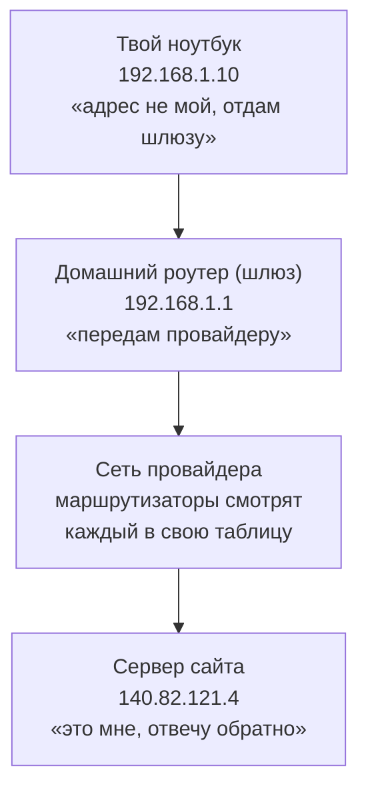
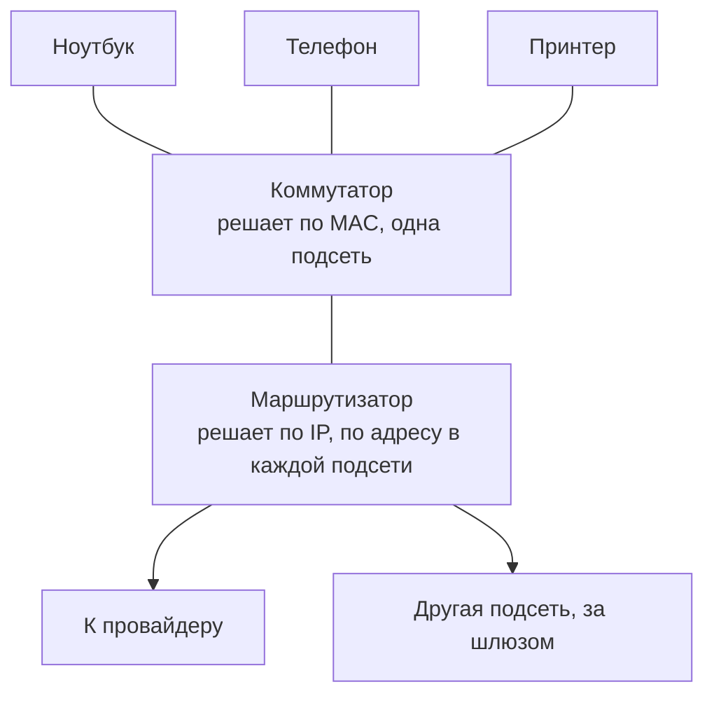
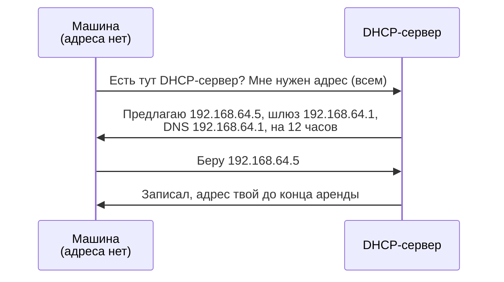
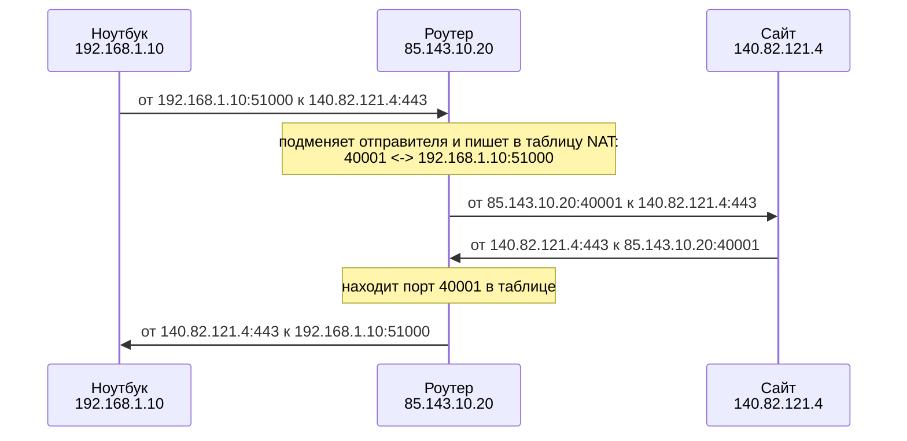

## Зачем это нужно

Половина ночных **инцидентов** (внезапных поломок, из-за которых сервис перестаёт работать для пользователей; подробно в [уроке 10.1](../10-capstone/01-oncall-drill.md)) начинается словами «сервис недоступен», а причина лежит в сети: не тот адрес, нет маршрута, сервис слушает не там. «Слушает» значит, что программа заняла у системы определённый адрес и **порт** (номер «окошка» программы на машине, как номер квартиры в доме) и ждёт, когда к ней придут. Подробно про порты и прослушивание будет в [уроке 2.2](02-ports-tcp-ssh.md), здесь нужна только эта картинка. Чтобы искать причину, а не гадать, нужно понимать, как данные находят путь от твоей машины до сервера и обратно.

На работе ты будешь каждый день читать вывод `ip a` и `ip r` (команды, которые показывают адреса машины и её таблицу маршрутов; разберём в практике), считать **подсети** (группы соседних адресов, о них в теории), объяснять, почему у пода в Kubernetes адрес `10.244.x.x`, и отличать «нет маршрута» от «порт закрыт». Kubernetes это система, которая запускает и следит за множеством программ-контейнеров на многих серверах, а под (pod) это её минимальная единица: один или несколько контейнеров, у которых общий сетевой адрес. До неё ты дойдёшь в [теме 5](../05-kubernetes/01-why-k8s-cluster.md), сейчас достаточно знать: у пода есть свой IP-адрес, как у обычной машины. Все эти вопросы задают и на собеседованиях.

Шаг проекта: код «Заметок» не меняется. Ты проверишь, на каком адресе слушает сервис, откроешь его на всех сетевых картах экспериментом `HOST=0.0.0.0` и вернёшь обратно на `127.0.0.1`. Адрес `127.0.0.1` это «сам к себе»: особый адрес, по которому машина обращается к самой себе, и из другой машины по нему не достучаться. `0.0.0.0` значит «принимать подключения на любом адресе этой машины». Оба подробно разберём в теории.

## Что нужно знать

- [Урок 1.1: терминал и справка](../01-linux/01-first-server-shell.md): ты уверенно запускаешь команды и читаешь `man` и `--help`.
- [Урок 1.2: текст и пайпы](../01-linux/02-text-pipes.md): `grep`, `awk` и `sed` пригодятся для разбора вывода и правки конфига.
- [Урок 1.3: пользователи и права](../01-linux/03-users-permissions.md): `sudo` для команд, которые меняют настройки сети.
- [Урок 1.8: systemd](../01-linux/08-systemd-editors.md): «Заметки» работают как сервис `notes`, ими управляет `systemctl`, а адрес `HOST` лежит в файле `/etc/notes/notes.env`.

Сеть в этом уроке разбирается с нуля. Если ты раньше не сталкивался с IP-адресами, это нормально: всё нужное объясняется ниже.

## Картина целиком

Компьютерная сеть очень похожа на почту.

- У каждого дома есть **адрес**. У каждого компьютера в сети тоже есть адрес: **IP-адрес** (четыре числа через точку, например `192.168.1.10`).
- Письмо не везут от двери к двери одной машиной. Его отдают в **ближайшее почтовое отделение**, а оттуда оно едет через сортировочные центры. У компьютера роль отделения играет **шлюз** (gateway): устройство, через которое машина отправляет всё, что адресовано не соседям (соседи это машины в той же **подсети**, то есть в группе адресов, которые считаются «одной улицей»).
- Каждый сортировочный центр смотрит на адрес и решает, куда отправить письмо дальше. В сети это делают **маршрутизаторы** (router) по своим **таблицам маршрутов**.
- Данные передаются не одним огромным куском, а маленькими порциями, **пакетами** (packet). У каждого пакета, как у конверта, написан адрес отправителя и адрес получателя.

Вот путь одного пакета от твоего ноутбука до сайта:



На схеме видно, что ноутбук не знает всего пути: он отдаёт пакет шлюзу, а дальше каждый маршрутизатор решает сам.

**Провайдер** (интернет-провайдер) это компания, которая продаёт тебе подключение к интернету и владеет сетью между твоим домом и остальным миром.

За урок ты разберёшь каждый кусок этой схемы: что такое IP-адрес и из чего он состоит, как машина понимает, кто ей сосед, а кто нет, куда она отправляет остальное, как домашний роутер выпускает в интернет десятки устройств с одним внешним адресом и как проверить путь пакета командами.

## Теория

### Биты и байты: минимум, без которого не понять адреса

Компьютер хранит всё в виде нулей и единиц. Одна такая цифра называется **бит** (bit). Восемь бит подряд называются **байт** (byte).

Сколько разных чисел можно записать восемью битами? Каждый бит может быть 0 или 1, битов восемь, значит вариантов 2 × 2 × 2 × 2 × 2 × 2 × 2 × 2 = 2⁸ = 256. Это числа от 0 до 255. Запомни это число: именно поэтому в IP-адресах не бывает чисел больше 255.

Как перевести число из двоичной записи в обычную? У каждой позиции в байте свой «вес», слева направо: 128, 64, 32, 16, 8, 4, 2, 1. Складываешь веса там, где стоит единица.

```text
вес позиции:   128  64  32  16   8   4   2   1
биты:            1   1   0   0   0   0   0   0
                 |   |
                128 + 64                          = 192

биты:            1   1   1   1   1   1   1   1
                128+64+32+16+8+4+2+1              = 255

биты:            0   1   0   0   1   1   0   1
                     64 +        8 + 4 +     1    = 77
```

Обратный перевод, из обычного числа в двоичное: иди по весам слева направо. Если вес помещается в остаток, ставь 1 и вычитай, иначе ставь 0. Для 130: 128 помещается (1, остаток 2), 64 нет (0), 32 нет, 16 нет, 8 нет, 4 нет, 2 помещается (1, остаток 0), 1 нет. Получается `10000010`.

Руками переводить придётся редко, для этого есть калькуляторы. Но без этой картинки непонятно, откуда берутся маски подсети, а они тебе нужны каждый день.

> **Прикинь сам:** Какое самое большое число поместится в 4 бита?
{: .predict}

Все четыре бита в единицах: 8 + 4 + 2 + 1 = 15. С восемью битами так же: сумма всех весов даёт 255, на единицу меньше, чем 2⁸ = 256 вариантов.

> **Главное:** байт это 8 бит и числа от 0 до 255, поэтому в IPv4 четыре числа до 255, а маски читаются по двоичной записи.
{: .key}

> **Проверь понимание:** переведи `11100000` в обычное число.

<details markdown="1">
<summary>Ответ</summary>

128 + 64 + 32 = 224. Это число ты ещё встретишь в маске `255.255.255.224`.

</details>

Двоичный язык у нас есть. Теперь посмотрим, к чему вообще привязаны адреса: к сетевому интерфейсу.

### Сетевой интерфейс: через что машина подключена к сети

Чтобы компьютер мог общаться с другими, у него должна быть «розетка» в сеть. Такую розетку называют **сетевым интерфейсом** (network interface). Это может быть:

- сетевая карта с кабелем (в Linux обычно называется `eth0`, `ens3`, `enp0s1`);
- Wi-Fi-адаптер (`wlan0`, `wlp2s0`);
- виртуальная сетевая карта. У виртуальной машины и у контейнера нет настоящего железа, но система создаёт для них программную «розетку», которая ведёт себя так же.

Имена отличаются от системы к системе, поэтому не заучивай их: всегда смотри свои командой `ip -br a` (разберём в практике).

У интерфейса есть два вида адресов, и их важно не путать:

- **MAC-адрес** зашит в сетевую карту (или выдан виртуальной). Он выглядит так: `52:54:00:12:34:56`. Его используют только внутри одной локальной сети, чтобы доставить данные «от соседа к соседу». За пределы твоей сети он не уходит.
- **IP-адрес** выдаётся машине в сети: `192.168.64.5`. По нему данные находят машину где угодно в мире.

Аналогия: MAC похож на имя человека в квартире, а IP на почтовый адрес дома. Почтальон на твоей улице может позвать тебя по имени, но чтобы письмо дошло из другого города, нужен адрес.

Особый интерфейс есть на любой машине: **`lo`**, loopback (петля). Это ненастоящая сеть внутри самой машины. Всё, что отправлено в `lo`, никогда не покидает компьютер и тут же возвращается к нему же. У `lo` адрес `127.0.0.1`, а ещё у него есть имя `localhost`. Через `lo` программы на одной машине разговаривают друг с другом.

> **Прикинь сам:** У виртуальной машины одна сетевая карта. Сколько интерфейсов покажет `ip -br a`?
{: .predict}

Минимум два: сама карта (например, `enp0s1`) и `lo`, петля внутри машины. Про `lo` легко забыть, но он есть всегда.

> **Главное:** интерфейс это «розетка» машины в сеть, у него есть MAC (для соседей) и IP (для всего мира), а `lo` это интерфейс внутри самой машины.
{: .key}

Интерфейс есть. Теперь посмотрим, из чего состоит адрес, который на нём висит.

### IP-адрес: из чего он состоит

IP-адрес версии 4 (IPv4) это 32 бита, то есть 4 байта. Чтобы людям было удобно, каждый байт записывают обычным числом от 0 до 255 и разделяют точками. Каждое из четырёх чисел называют **октетом** (octet, «восьмёрка», потому что в нём 8 бит).

```text
IP-адрес:     192     .  168     .  64      .  5
в битах:   11000000 . 10101000 . 01000000 . 00000101
           \______/   \______/   \______/   \______/
           1-й октет  2-й октет  3-й октет  4-й октет
```

Поэтому адрес `10.0.5.300` не существует: 300 не помещается в 8 бит.

Всего адресов IPv4 около 4,3 миллиарда (2³²). Устройств в мире больше, и адресов давно не хватает всем. Эту проблему решают двумя способами: приватными адресами с NAT (о них ниже) и новой версией протокола IPv6. **Протокол** (protocol) это набор общих правил, по которым устройства договариваются о формате и порядке обмена данными, как правила дорожного движения для всех машин. IPv4 и IPv6 это две версии протокола IP, то есть двое разных «правил адресации». Другие протоколы встретятся в следующих уроках.

**IPv6** в выводе команд ты тоже увидишь: это длинные адреса вида `fe80::5054:ff:fe12:3456` и `::1` (IPv6-версия `127.0.0.1`). В IPv6 адресов хватит на всё, но в работе ты чаще встретишь IPv4. В этом уроке IPv6-строки в выводе можно пропускать.

> **Прикинь сам:** Бывает ли адрес `192.168.1.256`?
{: .predict}

Нет: каждое число занимает один байт, а наибольшее значение байта 255. Такой адрес не примет ни система, ни калькулятор подсетей.

> **Главное:** IPv4 это 32 бита в виде четырёх чисел от 0 до 255; адресов около 4,3 миллиарда, поэтому их и не хватает.
{: .key}

Но по одному адресу не понять, кто тебе сосед. Для этого нужна маска.

### Адрес сети и адрес хоста: маска подсети

Посмотри на телефонный номер `+7 383 123-45-67`. В нём есть код города (`383`, Новосибирск) и номер абонента внутри города. Все номера с одинаковым кодом «живут в одном городе». IP-адрес устроен так же: его левая часть это **номер сети**, правая часть это **номер хоста** внутри этой сети. **Хост** (host) это любое устройство с IP-адресом: сервер, ноутбук, телефон, принтер.

Машины с одинаковым номером сети находятся в одной **подсети** (subnet) и общаются друг с другом напрямую, как соседи по улице. Машина в другой подсети для них «иногородняя»: к ней пакеты идут через шлюз.

Но в телефонном номере граница видна по скобкам, а в IP-адресе её не видно. Где кончается сеть и начинается хост, говорит **маска подсети** (netmask). Маска тоже 32 бита: сначала идут единицы, потом нули. Единицы отмечают биты сети, нули отмечают биты хоста.

Маску записывают двумя способами:

- по-старому, как адрес: `255.255.255.0`;
- по-новому, в записи **CIDR** (Classless Inter-Domain Routing): просто число единиц после косой черты. `/24` значит «первые 24 бита это сеть».

Это одно и то же: в `255.255.255.0` три октета по 255 (все биты единицы, 3 × 8 = 24) и один октет 0.

```text
адрес:   192.168.64.5/24
         11000000.10101000.01000000 . 00000101
маска:   11111111.11111111.11111111 . 00000000     = 255.255.255.0 = /24
         \_______ сеть: 24 бита ___/   \хост: 8/
```

Итак, `192.168.64.5/24` читается так: «машина с адресом `192.168.64.5`, её сеть это `192.168.64.x`, соседи это все адреса от `192.168.64.1` до `192.168.64.254`».

Почему не до `.255` и не с `.0`? Потому что в каждой подсети два адреса служебные:

- **первый** (все биты хоста нули) это **адрес самой сети**, её «название»: `192.168.64.0/24`. Машине его не выдают;
- **последний** (все биты хоста единицы) это **широковещательный адрес** (broadcast): `192.168.64.255`. Пакет на него получают сразу все машины подсети, как объявление по громкой связи в подъезде. Машине его тоже не выдают.

Отсюда формула. Если маска `/N`, на хост остаётся `32 - N` бит. Всего адресов `2^(32-N)`, рабочих на два меньше: `2^(32-N) - 2`.

| CIDR | Маска | Бит на хост | Адресов | Рабочих хостов |
|---|---|---|---|---|
| /16 | 255.255.0.0 | 16 | 65 536 | 65 534 |
| /24 | 255.255.255.0 | 8 | 256 | 254 |
| /25 | 255.255.255.128 | 7 | 128 | 126 |
| /26 | 255.255.255.192 | 6 | 64 | 62 |
| /27 | 255.255.255.224 | 5 | 32 | 30 |
| /28 | 255.255.255.240 | 4 | 16 | 14 |

Чем больше число после слэша, тем меньше подсеть: больше бит ушло на номер сети, меньше осталось на хосты.

> **Прикинь сам:** Сколько рабочих адресов в подсети `/29`?
{: .predict}

На хост остаётся 32 - 29 = 3 бита, всего 2³ = 8 адресов. Рабочих 8 - 2 = 6: один адрес уходит на название сети, другой на broadcast.

> **Главное:** маска `/N` делит адрес на сеть (первые N бит) и хост (остальные), а рабочих адресов в подсети `2^(32-N) - 2`.
{: .key}

С `/24` граница видна на глаз. А как быть, когда она проходит внутри октета?

### Разбор примера: в какой подсети адрес 192.168.64.130/26

Маска `/24` удобна: граница проходит ровно между октетами. С `/26` граница проходит внутри последнего октета, и «на глаз» уже не видно. Посчитаем двумя способами.

**Способ 1, через биты.** Сеть это первые 26 бит. Первые три октета (24 бита) целиком принадлежат сети, из четвёртого октета сети достаются ещё 2 бита. Переводим 130 в двоичный вид:

```text
130      = 10 000010      (128 + 2)
           ^^ ^^^^^^
           |  хост: 6 бит
           сеть: 2 бита

адрес сети:   биты хоста обнуляем     10 000000 = 128   -> 192.168.64.128
broadcast:    биты хоста в единицы     10 111111 = 191   -> 192.168.64.191
```

Сеть `192.168.64.128/26`, рабочие адреса с `.129` по `.190`, broadcast `.191`.

**Способ 2, быстрый, через блоки.** Подсеть `/26` содержит 64 адреса (2⁶). Значит, последний октет режется на блоки по 64: 0–63, 64–127, 128–191, 192–255. Число 130 попадает в блок 128–191. Начало блока это адрес сети (`.128`), конец блока это broadcast (`.191`). Ответ тот же, а считать быстрее.

Два адреса в одной подсети тогда и только тогда, когда у них совпадает номер сети. Например, `192.168.64.130/26` и `192.168.64.200/26` похожи, но 200 попадает в блок 192–255. Это разные подсети, и напрямую эти машины друг с другом не общаются.

> **Прикинь сам:** Найди адрес сети и broadcast для `10.0.0.77/27`.
{: .predict}

`/27` это 32 адреса, блоки по 32: 0–31, 32–63, 64–95. Число 77 в блоке 64–95, значит сеть `10.0.0.64`, broadcast `10.0.0.95`, рабочие адреса с `.65` по `.94`.

> **Главное:** если граница внутри октета, считай блоками: размер блока равен `2^(бит хоста)`, адрес лежит в своём блоке, начало блока это сеть, конец это broadcast.
{: .key}

> **Проверь понимание:** хватит ли подсети `/28` для 20 серверов?

<details markdown="1">
<summary>Ответ</summary>

Нет. В `/28` всего 16 адресов, рабочих 14. Нужна хотя бы `/27`: 32 адреса, 30 рабочих. В облаке провайдер обычно забирает себе ещё несколько адресов в каждой подсети (под шлюз, DNS и резерв), поэтому подсети берут с запасом.

</details>

Подсети считать научились. Теперь выучим адреса, которые узнаются с первого взгляда.

### Особые адреса, которые нужно узнавать с первого взгляда

**Приватные диапазоны.** Адресов IPv4 мало, поэтому часть из них отдали под внутренние сети. Эти диапазоны описаны в стандарте RFC 1918, и в интернете они не маршрутизируются: ни один маршрутизатор интернета не повезёт пакет на такой адрес. Зато внутри своей сети их может использовать кто угодно, и дома, и в офисе, и в облаке. Поэтому у миллионов домашних роутеров одинаковый адрес `192.168.1.1`, и это никому не мешает.

| Диапазон | От и до | Где встретишь |
|---|---|---|
| `10.0.0.0/8` | 10.0.0.0 – 10.255.255.255 | офисы, облака, Kubernetes |
| `172.16.0.0/12` | 172.16.0.0 – 172.31.255.255 | Docker (`172.17.0.x`), облака |
| `192.168.0.0/16` | 192.168.0.0 – 192.168.255.255 | дома, виртуальные машины |

Все остальные адреса (кроме служебных) **публичные** (public): они уникальны на весь мир, и до них можно дойти из интернета. Например, `8.8.8.8` это публичный DNS-сервер Google.

**`127.0.0.0/8`: вся эта сеть это loopback.** Чаще всего используют `127.0.0.1`, но и `127.0.0.2`, и `127.5.5.5` тоже ведут внутрь той же машины. Сервис, который слушает на `127.0.0.1`, недоступен с других машин: пакеты на этот адрес просто не могут прийти снаружи. Именно так сейчас настроены «Заметки», и это сделано специально, для безопасности.

**`0.0.0.0` в настройках сервиса значит «все мои адреса сразу».** Когда программа начинает принимать подключения, она выбирает, на каком адресе слушать. Это называется **привязка** (bind). Привязка к `127.0.0.1` значит «принимаю только подключения изнутри машины». Привязка к `192.168.64.5` значит «принимаю только те, что пришли на этот адрес». Привязка к `0.0.0.0` значит «принимаю на любом адресе этой машины: и на `lo`, и на всех сетевых картах». Как адрес получателя `0.0.0.0` не используется, это именно пометка «на всех».

> **Прикинь сам:** Приватный ли адрес `192.169.1.1`?
{: .predict}

Нет, публичный: приватный диапазон `192.168.0.0/16` кончается на `192.168.255.255`, а `192.169` уже за его границей. Адреса похожи, и тут часто ошибаются.

> **Главное:** приватные диапазоны: `10.0.0.0/8`, `172.16.0.0/12`, `192.168.0.0/16`; `127.0.0.1` значит «я сам», а `0.0.0.0` в настройках сервиса значит «все мои адреса».
{: .key}

> **Проверь понимание:** у сервера адрес `172.20.5.9`. Он приватный или публичный? А `172.32.0.1`?

<details markdown="1">
<summary>Ответ</summary>

`172.20.5.9` приватный: диапазон `172.16.0.0/12` тянется от `172.16.0.0` до `172.31.255.255`, и `172.20` в него попадает. А `172.32.0.1` уже публичный, хотя выглядит похоже. На этом часто ошибаются.

</details>

Адреса разобрали. Теперь посмотрим, как машина решает, куда отправить пакет.

### Таблица маршрутов и шлюз: куда отправить пакет

Каждый раз, когда программа отправляет пакет, ядро Linux (главная часть операционной системы, которая управляет железом и сетью) должно решить: кому его передать? Для этого у него есть **таблица маршрутов** (routing table). Это список правил вида «пакеты для такой-то сети отправляй туда-то».

У обычной машины таблица совсем маленькая, обычно две строки:

```text
default via 192.168.64.1 dev enp0s1          <- всё остальное отдай шлюзу 192.168.64.1
192.168.64.0/24 dev enp0s1                   <- свою подсеть доставляй сам, напрямую
```

Первая строка это **маршрут по умолчанию** (default route). Слово `default` означает «любой адрес, для которого нет правила точнее». Слово `via` («через») говорит, кому отдать пакет: **шлюзу** (gateway). Шлюз это маршрутизатор в твоей подсети, который знает дорогу дальше. Дома это твой Wi-Fi-роутер, в облаке это виртуальный маршрутизатор провайдера.

Вторая строка говорит: «сеть `192.168.64.0/24` подключена прямо к интерфейсу `enp0s1`». Слова `via` здесь нет, потому что посредник не нужен: получатель сосед, ему можно отправить пакет напрямую.

Как ядро выбирает строку, если подходят несколько? Правило одно: **побеждает самое точное совпадение**, то есть строка с самой длинной маской (longest prefix match, «самый длинный префикс»). `default` на самом деле означает сеть `0.0.0.0/0`, «все адреса» с маской длиной 0. Она подходит к любому адресу, но она самая неточная, поэтому срабатывает, только когда ничего другого не подошло.

Разберём два пакета:

```text
пакет для 192.168.64.77:
  192.168.64.0/24  подходит (маска 24)   <- самая длинная, выбрана
  default (/0)     подходит (маска 0)
  => отправить напрямую через enp0s1

пакет для 8.8.8.8:
  192.168.64.0/24  не подходит (8.8.8.8 не в 192.168.64.x)
  default (/0)     подходит              <- единственная, выбрана
  => отдать шлюзу 192.168.64.1
```

Дальше шлюз делает то же самое: смотрит в свою таблицу, выбирает, кому передать пакет, и передаёт. Каждый такой переход от одного маршрутизатора к следующему называется **хоп** (hop, «прыжок»). До сайта на другом конце страны обычно 10–20 хопов.

Если подходящей строки нет совсем (например, маршрут по умолчанию пропал), ядро даже не пытается отправить пакет и сразу возвращает ошибку `Network is unreachable` («сеть недостижима»).

> **Прикинь сам:** В таблице были `192.168.64.0/24` и `default via 192.168.64.1`, но строка `default` пропала. Что ответит ядро на `ping 8.8.8.8`?
{: .predict}

Подходящей строки нет, и ядро сразу ответит `Network is unreachable`, не отправляя пакет. Соседи по `/24` при этом продолжают отвечать.

> **Главное:** ядро выбирает строку с самой длинной маской, `default` (`0.0.0.0/0`) срабатывает последним, а если подходящей строки нет, будет `Network is unreachable`.
{: .key}

> **Проверь понимание:** в таблице есть `192.168.64.0/24` и `default`. Куда уйдёт пакет на `192.168.64.77`, а куда на `8.8.8.8`? А что, если добавить строку `8.8.8.0/24 via 192.168.64.2`?

<details markdown="1">
<summary>Ответ</summary>

На `192.168.64.77` напрямую через интерфейс, на `8.8.8.8` через шлюз `192.168.64.1`. После добавления строки пакет на `8.8.8.8` уйдёт через `192.168.64.2`: маска `/24` длиннее, чем `/0` у default, значит строка точнее.

</details>

Мы знаем, кому отдать пакет. Но внутри подсети доставка идёт по MAC: как его узнать?

### ARP: как найти соседа внутри подсети

Внутри одной подсети пакеты доставляются по MAC-адресам, а программа знает только IP получателя. Нужно узнать MAC по IP. Этим занимается протокол **ARP** (Address Resolution Protocol, «протокол определения адреса»):

1. Машина кричит на всю подсеть (через broadcast): «У кого IP `192.168.64.1`? Сообщите MAC».
2. Хозяин этого адреса отвечает: «Это я, мой MAC `52:54:00:ab:cd:ef`».
3. Машина запоминает ответ на несколько минут в **ARP-таблице** (посмотреть её можно командой `ip neigh`) и отправляет пакет на этот MAC.

Когда пакет идёт через шлюз, IP-адрес получателя в нём остаётся конечным (например, `8.8.8.8`), а MAC-адрес получателя ставится шлюзовой. На каждом хопе MAC-адреса меняются, а IP-адреса отправителя и получателя остаются прежними. Это как письмо: адрес на конверте один на весь путь, а грузовик между сортировочными центрами каждый раз свой.

```text
ноутбук ---------------> роутер ---------------> маршрутизатор провайдера ---> ...
  IP: от 192.168.1.10 к 8.8.8.8 (не меняется всю дорогу, если нет NAT)
  MAC: ноутбук -> роутер     MAC: роутер -> провайдер     MAC: меняется на каждом хопе
```

Про ARP полезно помнить одно: если в подсети два устройства получили одинаковый IP-адрес, ARP начинает отвечать то одним MAC, то другим, и связь «мигает». Это классическая поломка, которую ищут командой `ip neigh`.

> **Прикинь сам:** В подсети два устройства получили один и тот же IP. Что увидит остальная сеть?
{: .predict}

ARP-ответы приходят то с одним MAC, то с другим, и связь «мигает». В `ip neigh` видно, что MAC для этого IP меняется.

> **Главное:** ARP по IP находит MAC соседа в своей подсети; на каждом хопе MAC новый, а IP отправителя и получателя остаются прежними.
{: .key}

Кто передаёт кадры и пакеты по этим MAC и IP? Разберём устройства сети.

### Коммутатор, маршрутизатор, роутер: кто что делает

Если открыть коробку от домашнего «роутера», внутри окажется сразу несколько устройств в одном корпусе. Новичок путает их, потому что слова в разговоре используют как синонимы. А в работе различие важно: «не ходит трафик внутри подсети» и «не ходит трафик между подсетями» чинят в разных местах.

**Коммутатор** (switch) соединяет машины **внутри одной подсети**. Он работает только с MAC-адресами: запоминает, за каким из его разъёмов сидит какой MAC, и передаёт кадр именно туда. IP-адресов он не читает и про подсети ничего не знает. Аналогия: это внутренняя почта одного офисного здания, курьер разносит конверты по кабинетам по табличкам на дверях. Без коммутатора машины пришлось бы соединять каждую с каждой отдельным проводом.

**Маршрутизатор** (router) соединяет **разные подсети** и смотрит на IP-адреса. Он получает пакет, открывает свою таблицу маршрутов (ту самую, что мы разобрали выше) и решает, в какую сторону передать. У него по одному интерфейсу в каждой подсети, и в каждой из них у него есть свой адрес. Тот адрес, который машины этой подсети называют шлюзом, это как раз адрес маршрутизатора на его «ноге» в их подсети. Аналогия: это почтовое отделение между двумя зданиями, которое знает оба адреса и перекладывает конверты из одного здания в другое. Оговорка: в отличие от курьера, маршрутизатор не знает всего пути до получателя, он знает только следующий хоп.

**Домашний роутер** это коробка, где собрано всё сразу: коммутатор (его жёлтые порты и Wi-Fi), маршрутизатор (выход в интернет), NAT, DHCP-сервер (раздаёт адреса, о нём в следующем разделе) и иногда файрвол. В облаке и в дата-центре эти роли разнесены по отдельным устройствам или виртуальным сервисам, и админ настраивает каждую отдельно.



Всё, что ниже коммутатора, живёт в одной подсети и общается напрямую; всё, что выше маршрутизатора, это уже другие сети.

Как проверить на практике: если машина видит соседей по подсети, но не видит ничего за её пределами, смотри на шлюз и таблицу маршрутов (`ip r`). Если не видно даже соседа, смотри на сам интерфейс, кабель и коммутатор (`ip -br a`, `ip neigh`).

> **Прикинь сам:** Сколько адресов у маршрутизатора, который соединяет три подсети?
{: .predict}

По одному в каждой подсети, то есть минимум три: у него по «ноге» в каждую. Тот адрес, который видят машины подсети, они и называют шлюзом.

> **Главное:** коммутатор соединяет машины одной подсети по MAC, маршрутизатор соединяет разные подсети по IP, а домашний роутер это обе роли плюс NAT и DHCP в одной коробке.
{: .key}

> **Проверь понимание:** два ноутбука подключены к одному коммутатору и имеют адреса `192.168.1.10/24` и `192.168.1.20/24`. Нужен ли им маршрутизатор, чтобы пинговать друг друга? А чтобы один из них открыл сайт в интернете?

<details markdown="1">
<summary>Ответ</summary>

Друг друга они видят без маршрутизатора: оба в одной подсети, пакеты идут напрямую, коммутатор переправит их по MAC (адрес соседа ноутбук узнает через ARP). Для сайта в интернете маршрутизатор нужен: адрес сайта не из этой подсети, значит, пакет уйдёт на шлюз, а шлюз это и есть маршрутизатор.

</details>

Адрес машине кто-то должен выдать. Как это происходит без ручной настройки?

### DHCP: откуда у машины берётся адрес

Представь, что в офис пришёл новый сотрудник. Ему нужны три вещи: свободное рабочее место (адрес), номер вахты, через которую выходят в город (шлюз), и телефонный справочник (адрес DNS-сервера, о нём в [уроке 2.3](03-dns.md)). Если всё это вписывать на каждом компьютере вручную, то на сто машин уйдёт день, а две машины с одним адресом гарантированно появятся: кто-то ошибётся цифрой. Поэтому в сети есть **DHCP** (Dynamic Host Configuration Protocol, «протокол динамической настройки узла»): служба, которая раздаёт эти настройки автоматически. Аналогия: администратор на ресепшене, который выдаёт пропуск с номером места и памяткой. Оговорка: пропуск выдаётся не навсегда, а на время.

Как это происходит, по шагам. У новой машины ещё нет адреса, и она не знает, где сервер, поэтому обращается ко всей подсети сразу (через broadcast, как в ARP):



Первый запрос идёт «всем» и без адреса отправителя, а дальше машина и сервер уже говорят друг с другом напрямую.

Срок, на который выдан адрес, называется **арендой** (lease). Когда половина срока прошла, машина просит продлить аренду. Если машина выключена и не продлевает, адрес освобождается, и сервер может отдать его другому. Дома DHCP-сервер это тот самый роутер, в облаке это встроенная служба сети: ты создаёшь виртуальную машину и адрес появляется сам, хотя ты его нигде не вводил. Именно это значит `proto dhcp` в выводе `ip r` из практики ниже.

Следствия, которые стоит запомнить:

- **адрес от DHCP может смениться.** Перезагрузил ноутбук или просрочил аренду, и получил другой адрес. Поэтому серверам, к которым обращаются по адресу (база данных, шлюз, DNS), выдают **статические** (static) адреса: прописанные вручную или закреплённые за MAC-адресом в настройках DHCP-сервера;
- **два DHCP-сервера в одной подсети** (например, кто-то включил второй домашний роутер в офисную сеть) начнут выдавать машинам разные шлюзы и адреса, и связь у части машин пропадёт. Симптом: у пары коллег «не работает интернет», а у остальных всё хорошо;
- **адрес `169.254.x.x`** означает, что DHCP-сервер не ответил. Машина не осталась совсем без адреса и назначила себе сама один из резервных (link-local). В другую подсеть с ним не выйти. Увидел такое в `ip a`: ищи проблему с DHCP или с кабелем, а не с маршрутами.

> **Прикинь сам:** Ноутбук включили в новую сеть, адреса у него ещё нет. К кому он обращается с первым запросом?
{: .predict}

Ко всем сразу, через broadcast: он не знает, где DHCP-сервер, и не может писать на конкретный адрес, ведь своего адреса у него тоже пока нет.

> **Главное:** DHCP выдаёт адрес, шлюз и DNS на время (аренда), а адрес `169.254.x.x` значит, что DHCP-сервер не ответил.
{: .key}

> **Проверь понимание:** у коллеги в `ip a` адрес `169.254.17.3`. Интернет не работает. Что это значит и куда смотреть?

<details markdown="1">
<summary>Ответ</summary>

Это резервный адрес, который машина выдала себе сама, потому что DHCP-сервер не ответил. Маршруты тут ни при чём: смотри, есть ли связь с подсетью (кабель, Wi-Fi, порт коммутатора) и работает ли DHCP-сервер.

</details>

Адрес у машины приватный, но сайты она открывает. Как это получается?

### NAT: как приватные адреса выходят в интернет

Мы выяснили, что приватный адрес вроде `192.168.1.10` в интернете не маршрутизируется. Но твой ноутбук с таким адресом спокойно открывает сайты. Как?

Работает **NAT** (Network Address Translation, «трансляция адресов») на домашнем роутере. У роутера есть два адреса: приватный внутри (`192.168.1.1`) и один публичный снаружи (например, `85.143.10.20`), который выдал провайдер. Роутер подменяет адреса в пакетах на ходу.

Чтобы различать разговоры, NAT использует **порты**. Порт это число от 0 до 65535, которое указывает, какой программе на машине предназначен пакет. Если IP-адрес это адрес дома, то порт это номер квартиры. Подробно порты разберём в [уроке 2.2](02-ports-tcp-ssh.md), здесь достаточно знать, что у каждого соединения есть порт на стороне отправителя и порт на стороне получателя.

Вот что происходит по шагам, когда ноутбук открывает сайт:



Сайт ни разу не видит приватный адрес ноутбука: он разговаривает с роутером, а возвращать ответ ноутбуку помогает запись в таблице NAT.

Такую подмену адреса отправителя называют **SNAT** (Source NAT) или masquerade («маскировка»).

Следствия, которые важно помнить:

- снаружи все машины за роутером выглядят как один адрес. В логах сайта десять твоих ноутбуков будут одним IP;
- **начать соединение снаружи внутрь нельзя**. Если кто-то из интернета постучится на `85.143.10.20:8080`, роутер не найдёт запись в таблице и не поймёт, какой из внутренних машин отдать пакет. Чтобы это заработало, нужен **проброс порта** (port forwarding, он же DNAT, Destination NAT): явное правило «всё, что пришло на порт 8080 роутера, отдавай `192.168.1.10:8080`».

NAT ты встретишь постоянно: в облаке (NAT-шлюз выпускает в интернет машины без публичного адреса), в Docker (контейнеры с адресами `172.17.0.x` выходят наружу через NAT хоста) и в Kubernetes.

> **Прикинь сам:** За роутером пять ноутбуков, и каждый держит одно соединение с одним сайтом. Сколько записей будет в таблице NAT?
{: .predict}

Пять, по одной на соединение: у каждого свой внешний порт, по нему роутер понимает, кому вернуть ответ. С десятью вкладками на ноутбук записей стало бы пятьдесят.

> **Главное:** NAT подменяет приватный адрес отправителя на публичный и помнит подмену по портам; изнутри наружу он работает сам, а снаружи внутрь только через проброс порта.
{: .key}

> **Проверь понимание:** внутри домашней сети три ноутбука открывают один сайт. Какой IP отправителя увидит сайт? Как роутер поймёт, какому ноутбуку вернуть ответ?

<details markdown="1">
<summary>Ответ</summary>

Сайт увидит один и тот же публичный адрес роутера. Ответы роутер разбирает по портам: каждому соединению он выдал свой внешний порт и записал в таблицу NAT, какому ноутбуку этот порт соответствует.

</details>

Когда что-то не работает, нужно проверить путь. Для этого есть ping и traceroute.

### ICMP, ping и traceroute: как проверить путь

Кроме «полезных» данных по сети ходят служебные сообщения. Их передаёт протокол **ICMP** (Internet Control Message Protocol). Через ICMP маршрутизатор может сообщить «адресат недоступен» или «время жизни пакета вышло», а машина может ответить на проверку «ты жив?».

**`ping`** отправляет ICMP-сообщение «эхо-запрос» (echo request) и ждёт «эхо-ответ» (echo reply). Если ответ пришёл, значит маршрут работает в обе стороны: туда и обратно. `ping` также показывает **RTT** (round-trip time): сколько миллисекунд прошло от отправки до ответа.

Важная оговорка: многие серверы и файрволы (программы, которые фильтруют трафик, о них [урок 2.7](07-firewall.md)) специально не отвечают на ping. Поэтому «ping не проходит» **не доказывает**, что сервер лежит. Сайт на нём может отлично работать.

**`traceroute`** показывает все хопы по пути к адресу. Для этого используется поле **TTL** (Time To Live, «время жизни») в каждом пакете. TTL это счётчик: каждый маршрутизатор уменьшает его на 1, а тот, у кого он дошёл до 0, выбрасывает пакет и сообщает отправителю по ICMP «время вышло». TTL нужен, чтобы пакет, попавший в петлю из-за ошибки в маршрутах, не кружил по сети вечно.

`traceroute` использует это хитро:

```text
пакет с TTL=1:  роутер 1 уменьшает до 0 -> выбрасывает, отвечает «время вышло»  -> узнали хоп 1
пакет с TTL=2:  роутер 1 -> 1, роутер 2 -> 0 -> отвечает                        -> узнали хоп 2
пакет с TTL=3:  ... и так далее, пока не ответит сам адресат
```

Если какой-то маршрутизатор не отвечает на служебные сообщения, в выводе будет строка `* * *`. Это не обязательно обрыв: если следующие хопы отвечают, путь жив, просто этот узел молчалив.

> **Прикинь сам:** `ping` до сервера не проходит. Значит ли это, что сайт на нём лежит?
{: .predict}

Нет. Файрвол может молча выбрасывать ICMP, а порт сайта быть открытым. Ping проверяет только ответ на эхо-запрос, а не работу приложения.

> **Главное:** ping показывает, отвечает ли адрес на ICMP и за сколько миллисекунд, а traceroute строит список хопов через TTL; молчание ping или строка `* * *` ещё ничего не доказывают.
{: .key}

Ping молчит или отвечает, но ошибки подключения бывают разные. Три из них стоит различать с первого взгляда.

### Три ответа сети: refused, timed out, unreachable

Когда подключение не получается, система сообщает причину. Три ответа нужно различать, потому что каждый указывает на своё место поломки:

| Что видишь | Что произошло | Где искать |
|---|---|---|
| `Connection refused` (curl пишет `Couldn't connect to server`) | Пакет **дошёл** до машины, но на этом адресе и порту никто не слушает, и машина сразу ответила отказом. Реже отказ присылает файрвол по пути, если он настроен не молча выбрасывать пакеты, а отклонять их (правило REJECT). | Сначала на самом сервере: запущен ли процесс, на каком адресе и порту он слушает. Если там всё в порядке, смотри правила файрволов. |
| `Connection timed out` | Ответа **нет вообще**. Пакет пропал по дороге или ответ не вернулся. Клиент ждал и сдался. | По пути: файрвол, который молча выбрасывает пакеты, неверный маршрут, выключенная машина. |
| `Network is unreachable`, `No route to host` | Твоя машина **не знает, куда отправить** пакет, или ей сообщили, что адресат недостижим. | Таблица маршрутов: `ip r`. |

Отказ приходит быстро (за миллисекунды), а таймаут всегда долгий: клиент ждёт столько, сколько ему разрешено. Уже по времени ответа можно понять, в какую сторону копать. Как именно выглядит «отказ» на уровне TCP (пакет RST), разберём в [уроке 2.2](02-ports-tcp-ssh.md).

> **Прикинь сам:** `curl` ответил за долю секунды: `Connection refused`. Куда смотреть сначала?
{: .predict}

Сначала на сам сервер: быстрый отказ значит, что пакет дошёл, а на этом адресе и порту никто не слушает. Таймаут отправил бы тебя искать файрвол и маршрут.

> **Главное:** `refused` значит «дошёл, но никто не слушает», `timed out` значит «ответа нет совсем», `unreachable` значит «машина не знает, куда слать»; по времени ответа видно, куда копать.
{: .key}

> **Проверь понимание:** `ping` до сервера не проходит, но сайт на нём открывается. Как такое возможно?

<details markdown="1">
<summary>Ответ</summary>

Файрвол на пути или на сервере выбрасывает ICMP, а TCP-порт сайта (обычно 443) открыт. Поэтому ping не доказательство недоступности: проверяй именно то, что нужно, то есть порт и протокол приложения.

</details>

Среди отказов есть самый частый: обращение к самому себе. Разберём его отдельно.

### Loopback и localhost: почему «сам к себе» не выходит наружу

Казалось бы, зачем машине адрес, по которому она обращается к самой себе? Затем, что программы на одной машине тоже общаются по сети. Веб-приложение ходит в базу данных, которая стоит на том же сервере, `curl` проверяет сервис рядом. Если бы для этого нужно было выходить в настоящую сеть, всё зависело бы от кабеля и роутера. Loopback (петля) даёт программам закрытый внутренний канал, который работает даже на машине без сетевой карты. Аналогия: внутренний телефон между кабинетами одного офиса. Позвонить по нему можно только своим, а с улицы на этот номер не дозвониться. Оговорка: в реальности внутренний телефон это отдельная линия, а loopback это просто путь внутри ядра, провода нет вообще.

Как устроено. Когда программа отправляет пакет на `127.0.0.1`, ядро смотрит в таблицу маршрутов и видит: этот адрес принадлежит мне. Пакет никуда не выходит, он разворачивается внутри ядра через интерфейс `lo` и тут же приходит обратно как входящий. Имя `localhost` это просто имя для этого адреса: `http://localhost:8080` и `http://127.0.0.1:8080` ведут в одно и то же место. Сопоставление имени и адреса берётся из файла `/etc/hosts` (об именах и DNS в [уроке 2.3](03-dns.md)).

Теперь частая путаница. У машины может быть несколько адресов: `127.0.0.1` на `lo` и `192.168.64.5` на сетевой карте. Если с самой машины обратиться к её же адресу `192.168.64.5`, пакет тоже не выйдет в кабель: ядро знает, что это его адрес, и развернёт пакет внутри. Но различие есть **в том, на каком адресе слушает программа**:

```text
сервис слушает 127.0.0.1:8080            сервис слушает 0.0.0.0:8080
  с самой машины на 127.0.0.1    OK        с самой машины на 127.0.0.1    OK
  с самой машины на 192.168.64.5 REFUSED   с самой машины на 192.168.64.5 OK
  с другой машины на 192.168.64.5 REFUSED  с другой машины на 192.168.64.5 OK
```

Слева сервис подписан только на loopback: на любой другой свой адрес он не отвечает, даже если запрос пришёл с той же машины. Справа он принимает всё. Это как раз ситуация из шага проекта: «Заметки» слушают `127.0.0.1`, поэтому `curl` с самой ВМ работает, а с ноутбука получает `Connection refused`.

Что путают. Думают, что `127.0.0.1` это «адрес моего компьютера в сети». Нет, это адрес «меня самого» **для программ на этой же машине**. У каждой машины он свой и ни о какой другой машине ничего не говорит. Поэтому, если ты скажешь коллеге «открой `http://127.0.0.1:8080`», он откроет свою машину, а не твою. Та же путаница в Docker: внутри контейнера `127.0.0.1` это сам контейнер, а не хост (разберём в [теме 4](../04-docker/index.md)).

> **Прикинь сам:** Сервис слушает `127.0.0.1:8080`. Откроется ли он с той же машины по её адресу `192.168.64.5:8080`?
{: .predict}

Нет, придёт `Connection refused`: пакет развернётся внутри ядра, но сервис подписан только на loopback и на другой свой адрес не отвечает. Нужен `0.0.0.0` или конкретный адрес.

> **Главное:** `127.0.0.1` это «я сам» на любой машине, а адрес привязки решает, кто достучится: `127.0.0.1` только свои программы, `0.0.0.0` любые подключения.
{: .key}

> **Проверь понимание:** коллега зашёл на твой сервер по ssh, выполнил `curl http://127.0.0.1:8080` и получил ответ. Из браузера на своём ноутбуке он открыл `http://127.0.0.1:8080` и получил отказ. Почему?

<details markdown="1">
<summary>Ответ</summary>

В ssh-сессии `127.0.0.1` это сервер, поэтому ответ пришёл. В браузере `127.0.0.1` это ноутбук коллеги, на котором ничего не слушает на порту 8080. Чтобы достучаться до сервера, нужен его настоящий адрес, и сервис должен слушать не только `127.0.0.1`.

</details>

Остался последний вид адресов, которые ты уже видишь в выводе, но пока не читаешь: IPv6.

### IPv6: адреса, которые ты будешь видеть в выводе

IPv4 хватало, пока устройств было мало. Адресов около 4,3 миллиарда, а один человек сегодня держит с десяток устройств. Приватные адреса и NAT отсрочили проблему, но усложнили сеть (снаружи до машины за NAT не достучаться). Поэтому придумали **IPv6**: адреса в четыре раза длиннее по записи и такие многочисленные, что каждому устройству хватает своего публичного адреса без всякого NAT. Аналогия: когда в городе кончились номера телефонов из семи цифр, ввели номера подлиннее. Оговорка: старые и новые «номера» сосуществуют, и сеть, где работают оба, называют **dual stack** («двойной стек»).

Как устроен адрес. Это 128 бит (у IPv4 их 32), записанных в **шестнадцатеричной системе**: цифры `0-9` и буквы `a-f`, так что одна цифра хранит 4 бита. Группы по 16 бит (четыре цифры) разделены двоеточиями, групп восемь. Полная запись громоздкая, поэтому есть два правила сокращения:

1. в каждой группе можно убрать ведущие нули;
2. самую длинную цепочку групп из одних нулей можно заменить на `::`, но **только один раз** на весь адрес.

Разберём на примере:

```text
полная запись:   2001:0db8:0000:0000:0000:0000:0000:0001
убрали ведущие нули в группах:   2001:db8:0:0:0:0:0:1
заменили цепочку нулей на "::":  2001:db8::1
```

Раз `::` можно использовать только один раз, адрес остаётся однозначным: считаешь, сколько групп видно (здесь три: `2001`, `db8`, `1`), и понимаешь, что пропущено 8 - 3 = 5 нулевых групп.

Маска в IPv6 работает так же, как в IPv4: `/64` значит, что первые 64 бита это номер сети, а остальные 64 номер хоста. Стандартная подсеть в IPv6 именно `/64`, то есть считать хосты руками здесь никто не пытается.

Адреса, которые ты встретишь в выводе `ip a`:

| Адрес | Что это | Аналог в IPv4 |
|---|---|---|
| `::1` | loopback, «сам к себе» | `127.0.0.1` |
| `fe80::...` | адрес для связи внутри одной подсети (link-local), каждый интерфейс получает его сам, наружу не выходит | `169.254.x.x` (но есть всегда, не только при сбое DHCP) |
| `fc00::/7` (обычно `fd..`) | приватные адреса внутри организации | `10.x`, `192.168.x` |
| `2000::/3` (начинаются с `2` или `3`) | публичные адреса, доступные из интернета | обычные публичные |

Что путают. Думают, что IPv6 это «IPv4, только длиннее» и можно ничего не учить. Принцип тот же (адрес, маска, шлюз, таблица маршрутов), но нужно помнить три отличия: нет broadcast (вместо него особые групповые адреса), ARP заменён похожим механизмом, а на одном интерфейсе обычно по несколько адресов сразу. И ещё одна ловушка для практики: `localhost` может превратиться и в `127.0.0.1`, и в `::1`. Если сервис слушает только IPv4, а клиент пробует IPv6, получится `Connection refused` на `::1`, хотя на `127.0.0.1` всё работает.

> **Прикинь сам:** Как сократить `fe80:0000:0000:0000:0a00:0027:fe12:3456`?
{: .predict}

Сначала убери ведущие нули в группах: `fe80:0:0:0:a00:27:fe12:3456`. Потом замени цепочку нулевых групп на `::`: `fe80::a00:27:fe12:3456`.

> **Главное:** IPv6 это 128 бит в шестнадцатеричной записи, где `::` сокращает нули (один раз на адрес); `::1` это loopback, а `fe80::` адрес для своей подсети.
{: .key}

> **Проверь понимание:** что означает запись `fe80::5054:ff:fe12:3456/64` в выводе `ip a`? Можно ли по такому адресу открыть машину из другой подсети? И верна ли запись `2001::db8::1`?

<details markdown="1">
<summary>Ответ</summary>

Это link-local адрес: интерфейс получил его сам, он работает только внутри своей подсети, из другой подсети по нему не достучаться. Запись `2001::db8::1` неверна: `::` встречается дважды, и непонятно, сколько нулевых групп на месте каждой.

</details>

### Где это встретится дальше

- **Облако** ([тема 6](../06-cloud/index.md)): ты сам создаёшь сеть (VPC), делишь её на подсети с масками `/24`, настраиваешь маршруты и NAT-шлюз.
- **Docker** ([тема 4](../04-docker/index.md)): контейнеры получают адреса `172.17.0.x`, между ними работает маршрутизация и NAT.
- **Kubernetes** ([тема 5](../05-kubernetes/index.md)): у каждого пода свой адрес из подсети вроде `10.244.0.0/16`.

Везде одни и те же понятия: адрес, маска, маршрут, шлюз, NAT.

## Практика

Все задания выполняются на твоей ВМ с Ubuntu из [урока 1.1](../01-linux/01-first-server-shell.md). Для заданий нужны утилиты:

- `iproute2`: команда `ip`, уже установлена в Ubuntu;
- `iputils-ping`: команда `ping`;
- `traceroute`: одноимённая команда;
- `ipcalc`: калькулятор подсетей;
- `curl`: отправляет запросы к веб-сервисам, ты уже пользовался им в теме 1.

```bash
# Обновить список пакетов и поставить недостающие утилиты.
# -y отвечает «да» на вопрос об установке, чтобы не ждать подтверждения.
sudo apt update
sudo apt install -y traceroute ipcalc iputils-ping curl
```

### Задание 1. Прочитать свои адреса и маршруты

**Цель:** найти на своей машине всё из теории: интерфейсы, адрес, маску, шлюз, и объяснить каждую строку.

**Предскажи:** сколько у тебя интерфейсов и какой адрес у `lo`? Будет ли в таблице маршрутов строка `default` и куда она ведёт?

<details markdown="1">
<summary>Ответ</summary>

Минимум два: `lo` с адресом `127.0.0.1/8` и основной (`eth0`, `ens3` или `enp0s1`, имя зависит от системы). Строка `default via <шлюз> dev <интерфейс>` есть почти всегда, шлюз обычно имеет адрес `.1` в твоей подсети.

</details>

**Шаги:**

1. Покажи интерфейсы в коротком виде. `ip` это главная сетевая команда Linux, `a` сокращение от `address` (показать адреса), флаг `-br` (brief) просит краткий вывод, по строке на интерфейс:

```bash
ip -br a
```

2. Покажи подробный вывод для основного интерфейса. `show dev` значит «только для этого устройства». Подставь своё имя интерфейса из предыдущего шага:

```bash
ip a show dev enp0s1
```

3. Покажи таблицу маршрутов (`r` сокращение от `route`) и спроси у ядра, какой маршрут оно выберет для конкретного адреса (`get`). Команда `ip r get` ничего не отправляет, она только показывает решение:

```bash
ip r
ip r get 8.8.8.8
```

**Что должно получиться:** адреса и имена у тебя будут свои, структура такая.

```text
lo               UNKNOWN        127.0.0.1/8 ::1/128
enp0s1           UP             192.168.64.5/24 fd3c:5e1a::5/64 fe80::5054:ff:fe12:3456/64

default via 192.168.64.1 dev enp0s1 proto dhcp src 192.168.64.5 metric 100
192.168.64.0/24 dev enp0s1 proto kernel scope link src 192.168.64.5 metric 100

8.8.8.8 via 192.168.64.1 dev enp0s1 src 192.168.64.5 uid 1000
    cache
```

**Как читать вывод:**

- `ip -br a`: три колонки. Первая это имя интерфейса. Вторая это состояние: `UP` работает, `DOWN` выключен, у `lo` всегда `UNKNOWN`, это нормально. Третья это адреса с масками. `192.168.64.5/24` это твой IPv4-адрес и маска. Всё, что с двоеточиями, это IPv6, его пока пропускай.
- `default via 192.168.64.1 dev enp0s1`: маршрут по умолчанию, шлюз `192.168.64.1`, пакеты уходят через интерфейс `enp0s1`. `proto dhcp` значит, что эту настройку машина получила автоматически от сети по протоколу DHCP (он раздаёт адреса и шлюзы новым машинам). `src 192.168.64.5` это адрес отправителя, который будет стоять в пакетах. `metric 100` это приоритет маршрута, когда есть несколько одинаково точных: меньше значит важнее.
- `192.168.64.0/24 dev enp0s1 ... scope link`: твоя подсеть. `proto kernel` значит, что эту строку ядро добавило само, как только интерфейсу дали адрес. `scope link` значит «адресаты доступны прямо на этом канале, без шлюза».
- `8.8.8.8 via 192.168.64.1`: ответ на вопрос «как ты отправишь пакет на `8.8.8.8`?». Ядро выбрало default и пойдёт через шлюз. `uid 1000` это номер пользователя, от имени которого задан вопрос, а `cache` служебная пометка, её можно не замечать.

Если ты работаешь в Docker-контейнере или на необычной ВМ, в `ip -br a` могут быть дополнительные выключенные интерфейсы вроде `tunl0@NONE DOWN`. Это заготовки для туннелей, на урок они не влияют.

**Объясни себе:**

- Что значит `/24` у адреса `192.168.64.5/24`, и какие адреса достижимы без шлюза?
- Почему у маршрута в свою подсеть нет слова `via`, а у default есть?
- Ответ на `ip r get 8.8.8.8` содержит `via 192.168.64.1`: что это говорит о пути пакета?

**Типичные ошибки:**

- `bash: ip: command not found`: в очень урезанной системе нет пакета `iproute2`. Поставь: `sudo apt install -y iproute2`.
- `Device "enp0s1" does not exist.`: у тебя интерфейс называется иначе. Возьми имя из первой колонки `ip -br a`.
- В таблице нет строки `default`: машина не знает, куда отправлять пакеты за пределы своей подсети, и интернета не будет (`Network is unreachable`). Проверь, подключена ли ВМ к сети, и перезапусти её.

### Задание 2. Посчитать подсети руками и проверить калькулятором

**Цель:** уверенно находить адрес сети, broadcast и число хостов по записи CIDR.

**Предскажи:** для `10.0.5.77/26` до запуска `ipcalc` найди адрес сети, broadcast и диапазон рабочих адресов. Запиши на бумаге, потом проверь.

<details markdown="1">
<summary>Ответ</summary>

`/26` это блоки по 64 адреса: 0–63, 64–127, 128–191, 192–255. 77 попадает в блок 64–127. Сеть `10.0.5.64/26`, рабочие адреса `10.0.5.65`–`10.0.5.126`, broadcast `10.0.5.127`, всего 62 рабочих адреса.

</details>

**Шаги:**

1. Посчитай на бумаге: сколько рабочих хостов в `/24`, `/26`, `/16`, и в какую сеть `/26` попадает `192.168.64.200`.
2. Проверь себя калькулятором `ipcalc`. Он принимает адрес с маской и печатает всё о его подсети:

```bash
ipcalc 10.0.5.77/26
ipcalc 192.168.64.200/26
```

3. Реши задачу: нужно разделить `10.10.0.0/24` на 4 равные подсети. Выпиши их сам, затем проверь. Флаг `-s` (split, «разделить») просит нарезать сеть на подсети, в которых поместится указанное число хостов, здесь четыре подсети по 62:

```bash
ipcalc 10.10.0.0/24 -s 62 62 62 62
```

**Что должно получиться:** вывод первой команды.

```text
Address:   10.0.5.77            00001010.00000000.00000101.01 001101
Netmask:   255.255.255.192 = 26 11111111.11111111.11111111.11 000000
Wildcard:  0.0.0.63             00000000.00000000.00000000.00 111111
=>
Network:   10.0.5.64/26         00001010.00000000.00000101.01 000000
HostMin:   10.0.5.65            00001010.00000000.00000101.01 000001
HostMax:   10.0.5.126           00001010.00000000.00000101.01 111110
Broadcast: 10.0.5.127           00001010.00000000.00000101.01 111111
Hosts/Net: 62                    Class A, Private Internet
```

Четыре подсети из третьего шага: `10.10.0.0/26`, `10.10.0.64/26`, `10.10.0.128/26`, `10.10.0.192/26`. В выводе `-s` они идут под заголовками `1. Requested size: 62 hosts`, `2. ...` и так далее, перед ними `ipcalc` ещё раз печатает исходную сеть `/24`.

**Как читать вывод:**

- Справа от каждого адреса та же запись в битах. Пробел внутри битов `ipcalc` ставит ровно на границе маски: слева биты сети, справа биты хоста. Сравни с разбором `192.168.64.130/26` в теории: картина та же.
- `Netmask` это маска в обоих видах: `255.255.255.192 = 26`.
- `Wildcard` это маска наоборот, где единицы отмечают биты хоста. Встречается в настройках некоторых сетевых устройств, сейчас можно пропустить.
- `Network` адрес сети, `Broadcast` широковещательный адрес, `HostMin` и `HostMax` первый и последний рабочие адреса, `Hosts/Net` сколько рабочих адресов в подсети.
- `Class A, Private Internet`: `Private Internet` подтверждает, что адрес приватный. «Class A» это устаревшая система деления адресов на классы, которую заменил CIDR, на неё не обращай внимания.

**Объясни себе:**

- Почему рабочих хостов на два меньше, чем адресов?
- Почему `192.168.64.200/26` и `192.168.64.130/26` в разных подсетях, хотя первые три октета совпадают?
- Что случится, если в одной сети две подсети пересекаются (например, `10.10.0.0/24` и `10.10.0.128/25`)? Подсказка: какой маршрут выберет ядро для `10.10.0.200`?

**Типичные ошибки:**

- `ipcalc: command not found`: калькулятор не установлен, `sudo apt install -y ipcalc`.
- `INVALID ADDRESS: 10.0.5.300`: октет больше 255, так не бывает.
- Ответ «в /26 64 хоста»: забыты адрес сети и broadcast, рабочих 62.

> Не понимаешь строку из `ip r` или `ip a`? Вставь её нейросети вместе с соседними и попроси объяснить по словам. Потом найди каждое слово (`via`, `dev`, `proto dhcp`, `scope link`) в разборе под выводом: нейросеть иногда придумывает значения слов.
{: .ai}

### Задание 3. Проследить путь пакета

**Цель:** увидеть хопы до внешнего адреса и научиться читать вывод `ping` и `traceroute`.

**Предскажи:** какой адрес будет первым хопом в `traceroute` до `8.8.8.8`? Появятся ли строки `* * *` и что они значат?

<details markdown="1">
<summary>Ответ</summary>

Первый хоп это твой шлюз из `ip r` (строка `default via ...`). Строки `* * *` почти наверняка появятся: часть маршрутизаторов не отвечает на служебные сообщения. Это не обрыв, если следующие хопы отвечают.

</details>

**Шаги:**

1. Сохрани адрес шлюза в переменную и пингуй шлюз, затем внешний адрес. Разберём первую строку по частям:
   - `ip r` печатает таблицу маршрутов;
   - `|` передаёт этот текст следующей команде ([урок 1.2](../01-linux/02-text-pipes.md));
   - `awk '/^default/ {print $3; exit}'` находит строку, которая начинается со слова `default`, печатает её третье слово (в `default via 192.168.64.1 ...` третье слово это адрес шлюза) и сразу заканчивает;
   - `$( ... )` подставляет результат команды, а `GW=` сохраняет его в переменную `GW`.

   У `ping` флаг `-c 3` (count) значит «отправь три запроса и остановись». Без него ping работает бесконечно, пока не нажмёшь Ctrl+C.

```bash
GW=$(ip r | awk '/^default/ {print $3; exit}')
echo "$GW"
ping -c 3 "$GW"
ping -c 3 8.8.8.8
```

2. Проследи путь. Флаг `-n` просит печатать только адреса и не пытаться узнавать имена маршрутизаторов, так быстрее. `-m 10` ограничивает поиск десятью хопами:

```bash
traceroute -n -m 10 8.8.8.8
```

3. Если вместо хопов одни звёздочки, попробуй другой способ проверки. По умолчанию `traceroute` отправляет пакеты по протоколу UDP, а флаг `-I` заставляет использовать ICMP, как у ping. Для ICMP нужны права администратора, поэтому `sudo`:

```bash
sudo traceroute -n -I -m 10 8.8.8.8
```

**Что должно получиться:**

```text
192.168.64.1
PING 192.168.64.1 (192.168.64.1) 56(84) bytes of data.
64 bytes from 192.168.64.1: icmp_seq=1 ttl=64 time=0.412 ms
64 bytes from 192.168.64.1: icmp_seq=2 ttl=64 time=0.398 ms
64 bytes from 192.168.64.1: icmp_seq=3 ttl=64 time=0.401 ms

--- 192.168.64.1 ping statistics ---
3 packets transmitted, 3 received, 0% packet loss, time 2043ms
rtt min/avg/max/mdev = 0.398/0.404/0.412/0.006 ms

traceroute to 8.8.8.8 (8.8.8.8), 10 hops max, 60 byte packets
 1  192.168.64.1  0.5 ms  0.4 ms  0.4 ms
 2  10.20.0.1  3.1 ms  3.0 ms  3.2 ms
 3  * * *
 4  8.8.8.8  12.4 ms  12.1 ms  12.3 ms
```

Адреса, число хопов и задержки у тебя будут другие.

**Как читать вывод:**

- `64 bytes from 192.168.64.1`: пришёл ответ размером 64 байта от этого адреса.
- `icmp_seq=1`: номер запроса. Если номера идут с пропусками (1, 2, 4), какие-то ответы потерялись.
- `ttl=64`: сколько «жизни» осталось у пакета-ответа, когда он дошёл до тебя. Linux отправляет ответы с TTL 64, и каждый хоп отнимает единицу. У шлюза, до которого ноль промежуточных хопов, ты видишь 64. У далёкого сервера число будет меньше (и начальное значение у разных систем бывает разным: 64, 128, 255).
- `time=0.412 ms`: RTT, время туда и обратно. Внутри своей сети это доли миллисекунды, до сервера в другом городе десятки миллисекунд.
- `3 packets transmitted, 3 received, 0% packet loss`: итог. Потери больше нуля значат, что часть пакетов не вернулась.
- `rtt min/avg/max/mdev`: минимальное, среднее, максимальное время и разброс. Большой разброс значит, что связь нестабильна.
- В `traceroute` каждая строка это хоп: номер, адрес и три замера времени (по умолчанию на каждый хоп отправляется три пакета). `* * *` значит, что на все три пакета этот хоп не ответил.

**Объясни себе:**

- Почему у ответа шлюза `ttl=64`, а у ответа удалённого сервера число меньше?
- Хоп 3 это `* * *`, а хоп 4 отвечает. Есть ли обрыв?
- Как по `traceroute` отличить проблему «у меня» (не отвечает уже первый хоп) от проблемы «где-то дальше»?

**Типичные ошибки:**

- `ping: connect: Network is unreachable`: нет маршрута по умолчанию, смотри `ip r`.
- `ping: 8.8.8.8: Temporary failure in name resolution` или `ping: google.com: Name or service not known`: ты передал не адрес, а имя, и его не удалось превратить в адрес. С цифровым IP такой ошибки не бывает. Как имена превращаются в адреса, разберём в [уроке 2.3](03-dns.md).
- `traceroute: command not found`: `sudo apt install -y traceroute`.
- `100% packet loss`, хотя сайт открывается: ICMP режется файрволом. Проверяй порт приложения, а не ping.
- `ping -c 3 ""` с ошибкой `ping: : Name or service not known`: переменная `GW` пустая, значит в `ip r` нет строки `default`.

### Задание 4. Шаг проекта: на каком адресе слушают «Заметки»

**Цель:** убедиться на практике, что адрес привязки (`HOST`) решает, кто может достучаться до сервиса, и вернуть безопасное значение.

Напомню, как устроены «Заметки» после [урока 1.8](../01-linux/08-systemd-editors.md): это сервис `notes` под управлением systemd, он читает настройки из файла `/etc/notes/notes.env`, где записано `HOST=127.0.0.1` и `PORT=8080`. Значит, сейчас сервис слушает только loopback.

Чтобы увидеть, какие программы на каком адресе ждут подключений, используют команду `ss` (socket statistics). **Сокет** (socket) это «точка подключения», которую программа открывает в системе, чтобы принимать или отправлять данные по сети. Флаги `-tlnp` это четыре флага вместе:

- `-t`: только TCP (протокол, по которому работают веб-сервисы, подробно в [уроке 2.2](02-ports-tcp-ssh.md));
- `-l`: только слушающие (listening) сокеты, то есть те, что ждут клиентов;
- `-n`: показывать числа (`8080`), а не названия сервисов;
- `-p`: показывать, какой процесс держит сокет. Для чужих процессов это требует `sudo`.

**Предскажи:** ты обращаешься к «Заметкам» не на `127.0.0.1`, а на адрес своей сетевой карты (например, `192.168.64.5`), причём с этой же машины. Ответит ли сервис при `HOST=127.0.0.1`? А при `HOST=0.0.0.0`?

<details markdown="1">
<summary>Ответ</summary>

При `127.0.0.1` не ответит: сервис слушает только loopback, а запрос пришёл на другой адрес, и curl получит отказ (`Couldn't connect to server`). При `0.0.0.0` сервис слушает на всех адресах машины, и запрос пройдёт.

</details>

**Шаги:**

1. Найди адрес своей сетевой карты и проверь, где слушает сервис сейчас. Разбор первой строки:
   - `ip -4 -br a show scope global`: краткий список только IPv4-адресов (`-4`), и только «глобальных», то есть не loopback;
   - `awk '{print $3; exit}'` берёт третью колонку первой строки, например `192.168.64.5/24`;
   - `cut -d/ -f1` режет текст по символу `/` и оставляет первую часть: `192.168.64.5`.

   У `curl` флаг `-sS` значит «не показывай полосу загрузки, но ошибки показывай», а `--max-time 3` не даёт ждать ответа дольше трёх секунд.

```bash
IP=$(ip -4 -br a show scope global | awk '{print $3; exit}' | cut -d/ -f1)
echo "$IP"
sudo ss -tlnp | grep 8080
curl -sS --max-time 3 "http://127.0.0.1:8080/healthz"
curl -sS --max-time 3 "http://$IP:8080/healthz"
```

2. Открой сервис на всех адресах. Команда `sed -i` правит файл на месте ([урок 1.2](../01-linux/02-text-pipes.md)): выражение `s/^HOST=.*/HOST=0.0.0.0/` значит «найди строку, которая начинается (`^`) с `HOST=`, и замени её целиком (`.*` это любой остаток строки) на `HOST=0.0.0.0`». Сервис читает файл только при запуске, поэтому после правки его нужно перезапустить:

```bash
sudo sed -i 's/^HOST=.*/HOST=0.0.0.0/' /etc/notes/notes.env
sudo systemctl restart notes
sudo ss -tlnp | grep 8080
curl -sS --max-time 3 "http://$IP:8080/healthz"
```

3. Верни безопасное значение. Пока перед сервисом нет nginx (он появится в [уроке 2.5](05-nginx.md)) и файрвола, открытый наружу порт приложения это лишний риск: любой в сети может обратиться к нему напрямую.

```bash
sudo sed -i 's/^HOST=.*/HOST=127.0.0.1/' /etc/notes/notes.env
sudo systemctl restart notes
sudo ss -tlnp | grep 8080
sudo grep '^HOST=' /etc/notes/notes.env
```

`sudo` перед `grep` нужен, потому что в уроке 1.8 файл настроек получил права `640 root:notes`: читать его могут только root и группа `notes`, а ты в неё не входишь.

**Что должно получиться:**

```text
192.168.64.5
LISTEN 0      5      127.0.0.1:8080      0.0.0.0:*    users:(("python3",pid=1234,fd=3))
ok
curl: (7) Failed to connect to 192.168.64.5 port 8080 after 0 ms: Couldn't connect to server
LISTEN 0      5      0.0.0.0:8080        0.0.0.0:*    users:(("python3",pid=1301,fd=3))
ok
LISTEN 0      5      127.0.0.1:8080      0.0.0.0:*    users:(("python3",pid=1355,fd=3))
HOST=127.0.0.1
```

На Ubuntu 26.04 curl пишет чуть иначе: `Could not connect to server`. Смысл тот же: соединение отвергнуто. Если хочешь увидеть причину явно, добавь к curl флаг `-v` (подробный режим), и в выводе будет строка `connect to 192.168.64.5 port 8080 ... failed: Connection refused`.

**Как читать вывод:**

- Строка `ss` состоит из колонок: `LISTEN` (состояние «слушаю»), две колонки очередей (сколько подключений ждёт обработки, сейчас можно не смотреть), затем **локальный адрес и порт** (где сервис слушает), затем адрес собеседника (`0.0.0.0:*` у слушающего сокета значит «любой»), затем процесс: имя `python3`, его PID (номер процесса, [урок 1.4](../01-linux/04-processes-signals.md)) и номер открытого файла `fd`.
- Главная колонка в этом задании четвёртая: `127.0.0.1:8080` значит «только loopback», `0.0.0.0:8080` значит «на всех адресах».
- `ok` это ответ «Заметок» на `/healthz`: сервис жив.
- PID после каждого перезапуска новый: systemd запустил новый процесс.

Точный текст ответа `/healthz` зависит от версии «Заметок», важны адрес в колонке `ss` и наличие или отсутствие ошибки curl. Проект остаётся на `app.py` v2.2, `HOST=127.0.0.1`.

**Объясни себе:**

- Почему `curl` на `127.0.0.1` работал в обоих режимах, а на `$IP` только во втором?
- Что означает `0.0.0.0` в колонке локального адреса и чем `127.0.0.1` отличается от адреса интерфейса?
- Почему после эксперимента адрес возвращён на `127.0.0.1`, если сервис нужен пользователям? (Ответ даст [урок 2.5](05-nginx.md): снаружи запросы будет принимать nginx и передавать их «Заметкам» через loopback.)

**Типичные ошибки:**

- `curl: (7) Failed to connect to 192.168.64.5 port 8080 after 0 ms: Couldn't connect to server` после правки на `0.0.0.0`: забыт `systemctl restart`, процесс работает со старым значением. Проверь `ss`: там всё ещё `127.0.0.1:8080`.
- `curl: (28) Connection timed out after 3001 milliseconds`: пакет не дошёл до порта или ответ не вернулся, скорее всего его выбрасывает файрвол. Вспомни таблицу «три ответа сети».
- `sed: -e expression #1, char 20: unterminated 's' command`: потерялась кавычка или косая черта в выражении. Скопируй команду заново.
- `Failed to restart notes.service: Unit notes.service not found.`: сервис из урока 1.8 не установлен. Вернись к [уроку 1.8](../01-linux/08-systemd-editors.md).
- `ss` показывает строку без колонки `users:((...))`: ты запустил `ss` без `sudo`, и процесс чужого пользователя не виден.

## Сломай и почини

В этом разделе ты тренируешь главный навык дежурного: по симптому найти причину. Скрипт сам ломает окружение, не заглядывай в него: диагностика и есть упражнение. Скрипт меняет настройки «Заметок», файрвол и маршруты, поэтому запускай его только на своей учебной ВМ.

Скачай скрипт. У curl флаг `-f` означает «при ошибке сервера не сохраняй страницу с ошибкой», `-L` разрешает переходить по перенаправлениям, `-o` задаёт имя файла:

```bash
curl -fsSL -o /tmp/break-2.1.sh https://raw.githubusercontent.com/distinguished-sre/learning/main/devops/project/notes/break/2.1/break.sh
sudo bash /tmp/break-2.1.sh 1
```

Сценарии: `1`, `2` и `3`. Проходи по одному: запусти, найди причину, почини сам или командой `sudo bash /tmp/break-2.1.sh fix`, потом бери следующий. В конце выполни `fix` и удали скрипт: `rm /tmp/break-2.1.sh`.

### Симптом

- **Сценарий 1.** `systemctl is-active notes` отвечает `active`, но `curl http://127.0.0.1:8080/healthz` сразу возвращает `Couldn't connect to server`.
- **Сценарий 2.** Сервис активен, но `curl --max-time 3 http://127.0.0.1:8080/healthz` висит три секунды и заканчивается `Connection timed out`.
- **Сценарий 3.** «Заметки» работают, `ping -c 3 8.8.8.8` проходит, а `ping -c 3 1.1.1.1` сразу пишет `ping: connect: No route to host`.

### Гипотезы

Прежде чем проверять, выпиши возможные причины. Для этих симптомов подходят:

1. Сервис упал или не запустился.
2. Сервис слушает не на том адресе или не на том порту.
3. Пакеты до сервиса не доходят: их выбрасывает файрвол.
4. У машины нет маршрута к адресу, или маршрут ведёт в никуда.

Подумай, какую гипотезу подтверждает быстрый отказ, а какую долгое ожидание. Таблица «три ответа сети» из теории подскажет.

### Проверки

Иди от простого к сложному, одна проверка на гипотезу:

```bash
systemctl is-active notes                            # 1: жив ли сервис
sudo ss -tlnp | grep 8080                            # 2: на каком адресе и порту слушает
sudo grep '^HOST=\|^PORT=' /etc/notes/notes.env      # 2: что записано в настройках
sudo iptables -S INPUT                               # 3: правила файрвола для входящих пакетов
ip r get 1.1.1.1                                     # 4: какой маршрут выберет ядро
ip r                                                 # 4: вся таблица маршрутов
```

`iptables` это инструмент для правил файрвола в Linux. `-S INPUT` печатает правила для входящих пакетов в том виде, в каком их добавляли. Подробно файрвол разберём в [уроке 2.7](07-firewall.md), здесь достаточно найти строку со словом `DROP` («выбросить»).

<details markdown="1">
<summary>Разбор и исправление</summary>

**Сценарий 1.** `ss` показывает `127.0.0.2:8080`, а в `/etc/notes/notes.env` записано `HOST=127.0.0.2`. Сервис жив и слушает, но на другом адресе loopback. Запрос на `127.0.0.1` пришёл на адрес, где никто не слушает, и ядро сразу ответило отказом. Быстрый отказ это признак «пакет дошёл, но не туда». Исправление: вернуть `HOST=127.0.0.1` и перезапустить сервис.

```bash
sudo sed -i 's/^HOST=.*/HOST=127.0.0.1/' /etc/notes/notes.env
sudo systemctl restart notes
```

**Сценарий 2.** `ss` в порядке (`127.0.0.1:8080`), а в `iptables -S INPUT` первой идёт строка `-A INPUT -p tcp -m tcp --dport 8080 -m comment --comment break-2.1 -j DROP`: «все входящие TCP-пакеты на порт 8080 выбрасывать» (`-m comment` это просто подпись к правилу). Выброшенный пакет не вызывает никакого ответа, поэтому curl ждёт до таймаута. Если бы правило было `REJECT` («отклонить»), curl получил бы быстрый отказ. Исправление: удалить правило. Приём, который пригодится всегда: скопируй строку из `iptables -S` и замени `-A` (add, добавить) на `-D` (delete, удалить):

```bash
sudo iptables -D INPUT -p tcp -m tcp --dport 8080 -m comment --comment break-2.1 -j DROP
```

**Сценарий 3.** `ip r get 1.1.1.1` отвечает `RTNETLINK answers: No route to host`, а в `ip r` появилась строка `unreachable 1.1.1.1`. Это маршрут особого типа: «адрес недостижим, даже не пытайся». Для `1.1.1.1` он точнее, чем default (маска `/32` длиннее `/0`), поэтому побеждает. `8.8.8.8` под него не попадает и работает. Исправление:

```bash
sudo ip route del unreachable 1.1.1.1
```

**Правило для дежурного:**

- `Connection refused` (curl: `Couldn't connect to server`): пакет дошёл, но на этом адресе и порту никто не слушает (или отказ прислал файрвол с правилом REJECT). Ищи сначала на самом сервере: процесс, адрес привязки, `ss`.
- `Connection timed out`: пакет не дошёл или ответ не вернулся. Ищи по пути: файрвол, маршрут, правила доступа в облаке, NAT.
- `No route to host`, `Network is unreachable`: машина не знает дороги. Ищи в `ip r`.

</details>

## ИИ в помощь

Нейросеть хорошо объясняет вывод команд и проверяет рассуждение, но сеть твоей машины она не видит и в арифметике подсетей ошибается. Общие правила работы с ней: [ИИ-помощник](../../load-tester/ai.md).

**Задача:** разобрать вывод `ip -br a` и `ip r` своей машины.

```text
Я учу сети. Вот вывод двух команд с моей Ubuntu-машины:
<вставь вывод ip -br a и ip r>.
Объясни по строкам: что такое каждый интерфейс, какой у него адрес и маска,
какой шлюз по умолчанию и почему именно такой маршрут. Скажи, откуда берётся адрес: DHCP или вручную.
```
{: .wrap}

**Проверь ответ:** сверь с разделами про таблицу маршрутов и DHCP: слово `proto dhcp` в строке маршрута значит адрес от DHCP. Типичная ошибка нейросети: путает `via` (шлюз) и `dev` (интерфейс) или называет маску `/24` и `255.255.255.0` разными вещами.

**Задача:** проверить свой расчёт подсети.

```text
Я посчитал вручную: для адреса <например 10.0.5.77/26> сеть <твой ответ>, broadcast <твой ответ>,
рабочих адресов <твой ответ>. Проверь по шагам через размер блока и скажи, где я ошибся, если ошибся.
Не давай ответ сразу: сначала спроси, как я считал.
```
{: .wrap}

**Проверь ответ:** пересчитай блоками (размер блока = `2^(бит хоста)`) и сверь с `ipcalc`. Типичная ошибка нейросетей: забывают вычесть два служебных адреса или считают блок не от того октета.

**Задача:** понять, какая это поломка по тексту ошибки.

```text
curl с моего ноутбука на сервер выдаёт: <вставь точный текст ошибки и время, за которое она пришла>.
С самого сервера тот же адрес отвечает. Перечисли три вероятные причины от самой вероятной
и для каждой команду, которой я это проверю.
```
{: .wrap}

**Проверь ответ:** сравни с таблицей «refused, timed out, unreachable» из теории: отказ за миллисекунды и таймаут ведут в разные места. Типичная ошибка нейросетей: советуют «проверить файрвол» при `Connection refused`, хотя сначала нужно посмотреть, на каком адресе слушает сервис (`ss -tlnp`).

## Словарик урока

| Термин | Простыми словами |
|---|---|
| Бит, байт | Одна двоичная цифра (0 или 1); восемь бит, число от 0 до 255 |
| Сетевой интерфейс | «Розетка» машины в сеть: сетевая карта, Wi-Fi или виртуальный адаптер |
| MAC-адрес | Адрес сетевой карты, работает только внутри одной локальной сети |
| IP-адрес (IPv4) | Адрес машины в сети: 4 числа от 0 до 255 через точку |
| Октет | Одно из четырёх чисел IP-адреса, 8 бит |
| Хост | Любое устройство с IP-адресом |
| Подсеть | Группа адресов с одинаковым номером сети; внутри неё машины общаются напрямую |
| Маска подсети, CIDR | Где в адресе кончается номер сети: `255.255.255.0` или `/24` |
| Адрес сети | Первый адрес подсети, её «название», машинам не выдаётся |
| Broadcast | Последний адрес подсети, пакет на него получают все машины подсети |
| Loopback, `lo`, `127.0.0.1` | Сеть внутри самой машины, наружу не выходит |
| `0.0.0.0` при привязке | «Слушать на всех адресах машины» |
| Привязка (bind) | Выбор адреса и порта, на котором программа принимает подключения |
| Приватные адреса | `10.x`, `172.16–31.x`, `192.168.x`: внутренние, в интернете не маршрутизируются |
| Инцидент | Внезапная поломка, из-за которой сервис недоступен пользователям |
| Провайдер | Компания, которая продаёт подключение к интернету |
| Протокол | Общие правила, по которым устройства обмениваются данными |
| Пакет | Порция данных с адресом отправителя и получателя |
| Таблица маршрутов | Правила ядра: пакеты для такой-то сети отправлять туда-то |
| Шлюз (gateway) | Маршрутизатор в твоей подсети, через который уходит всё «иногороднее» |
| Маршрут по умолчанию | `default`: правило для всех адресов, которым не подошло ничего точнее |
| Longest prefix match | Из подходящих маршрутов выбирается тот, у которого маска длиннее |
| Хоп | Один переход пакета от маршрутизатора к маршрутизатору |
| ARP | Протокол, который по IP соседа узнаёт его MAC |
| NAT, SNAT | Подмена адреса отправителя на роутере, чтобы приватные машины выходили в интернет |
| Проброс порта, DNAT | Правило, которое пускает соединения снаружи к машине за NAT |
| Порт | Номер «квартиры» программы на машине, число от 0 до 65535 |
| ICMP | Служебные сообщения сети: «ты жив?», «адресат недоступен», «время вышло» |
| TTL | Счётчик хопов в пакете, чтобы тот не кружил вечно |
| RTT | Время от отправки запроса до получения ответа |
| Сокет | Точка подключения, которую программа открывает для работы с сетью |
| Коммутатор (switch) | Соединяет машины внутри одной подсети по MAC-адресам, IP не читает |
| Маршрутизатор (router) | Соединяет разные подсети, решает по IP и таблице маршрутов, куда передать пакет |
| DHCP | Служба, которая автоматически выдаёт машине адрес, шлюз и DNS на время |
| Аренда (lease) | Срок, на который DHCP выдал адрес; потом его нужно продлить |
| Статический адрес | Адрес, прописанный вручную или закреплённый за машиной, не меняется |
| `169.254.x.x` | Резервный адрес, который машина назначает себе сама, если DHCP не ответил |
| `localhost` | Имя для `127.0.0.1` (и `::1`): «эта же машина» |
| IPv6 | Новая версия IP: 128-битные адреса в шестнадцатеричной записи, например `2001:db8::1` |
| Dual stack | Сеть, в которой одновременно работают IPv4 и IPv6 |
| Link-local (`fe80::`) | Адрес IPv6, который интерфейс получает сам и который работает только в своей подсети |

## Вопросы с собеседований

Раздел для повторения: ответь вслух, потом открой ответ. Короткие вопросы с пометкой `[на скорость]` тренируй на время: ответ за 30 секунд.



## Проверено на версиях

- Ubuntu: 24.04 LTS и 26.04 LTS
- iproute2, iputils-ping, traceroute: из репозиториев Ubuntu
- ipcalc: 0.51 из репозиториев Ubuntu (одинаковый вывод в 24.04 и 26.04)
- curl: 8.5 в Ubuntu 24.04 (`Couldn't connect to server`), 8.18 в 26.04 (`Could not connect to server`)
- Python: 3.12 в Ubuntu 24.04 и 3.14 в 26.04 (запуск «Заметок» из темы 1)

## Итог урока: ты умеешь

- [ ] переводить байт из двоичного вида в обычный и обратно
- [ ] прочитать `ip -br a` и `ip r` и объяснить адрес, маску и шлюз
- [ ] посчитать сеть, broadcast и число хостов по CIDR без калькулятора
- [ ] отличить приватный адрес от публичного
- [ ] объяснить, как ядро выбирает маршрут и зачем нужен шлюз
- [ ] объяснить, как работает NAT и почему снаружи нельзя подключиться внутрь без проброса порта
- [ ] читать вывод `ping` и `traceroute` и знать, чего они не доказывают
- [ ] отличить `Connection refused` от `timed out` и `No route to host` и назвать, где искать причину
- [ ] проверить, на каком адресе слушает сервис, и осознанно сменить `HOST`

**Дальше:** [Урок 2.2: Порты, TCP и SSH: как программы находят друг друга](02-ports-tcp-ssh.md)
