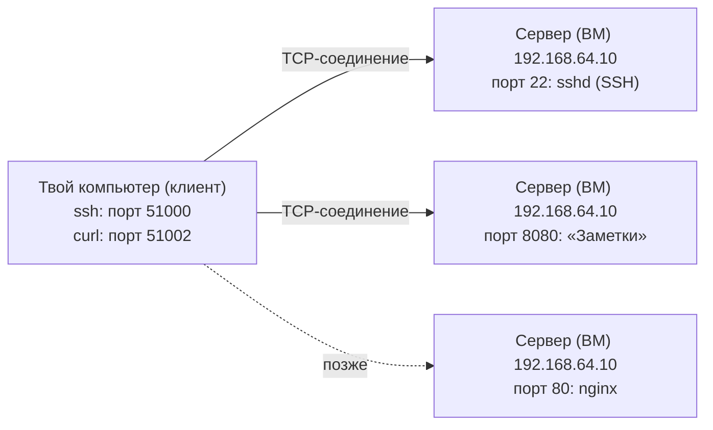
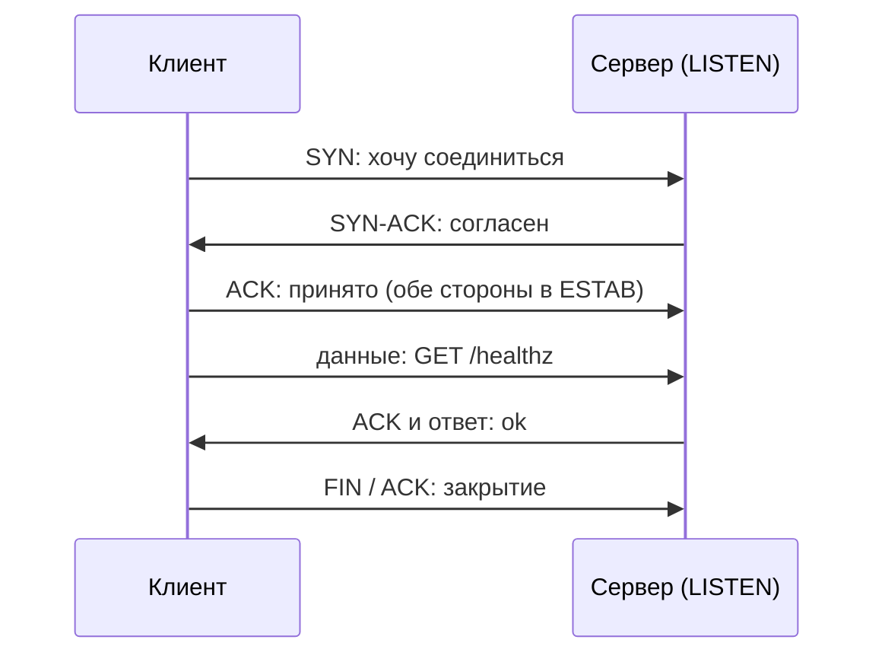
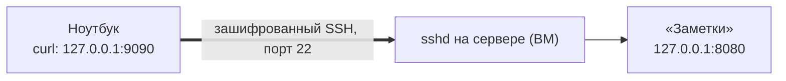

## Зачем это нужно

IP-адрес приводит пакет на нужную машину, но на машине работают десятки программ: sshd (программа, которая пускает на сервер по SSH, то есть по защищённому удалённому входу, о нём ниже), nginx (веб-сервер: программа, которая принимает запросы от браузеров и отдаёт страницы; подробно в [уроке 2.5](05-nginx.md)), база данных, твои «Заметки». Как пакет попадает именно в нужную? Через **порт**. На работе это самые частые вопросы: «сервис не отвечает», «порт занят», «`Connection refused` или `timed out`, в чём разница» (это два разных сообщения об ошибке подключения: «refused» значит «отказано», машина ответила, что здесь никто не ждёт; «timed out» значит «время вышло», ответа нет совсем; подробно разберём в теории), «как зайти на сервер, не вводя пароль».

К концу урока ты будешь читать вывод команды `ss` (она показывает, кто что слушает: программа «слушает» порт, когда заняла его и ждёт входящих подключений, как оператор у телефона), отличать отказ от молчания и ходить на сервер по ключу вместо пароля.

Шаг проекта: на ВМ с «Заметками» ты создаёшь SSH-ключ `~/.ssh/id_ed25519`, кладёшь его открытую часть в `authorized_keys` (обычный текстовый файл на сервере со списком открытых ключей, которым разрешено входить) на сервере и заходишь без пароля. Код проекта не меняется: «Заметки» остаются на `127.0.0.1:8080`, версия `app.py` v2.2.

## Что нужно знать

- [Урок 2.1: адреса и маршруты](01-addresses-routes.md): IP-адрес, шлюз, loopback `127.0.0.1`, `0.0.0.0` при привязке, `ip -br a`, `ping`. Здесь к адресу добавляется порт.
- [Урок 1.3: пользователи, права и sudo](../01-linux/03-users-permissions.md): режимы `chmod 600` и `700`, владелец файла. SSH к ним очень придирчив.
- [Урок 1.4: процессы и сигналы](../01-linux/04-processes-signals.md): PID (номер процесса) и `kill`, чтобы разобраться с процессом, который занял порт.
- [Урок 1.8: systemd](../01-linux/08-systemd-editors.md): «Заметки» работают как сервис `notes`; понадобятся `systemctl status`, `journalctl -u` и файл `/etc/notes/notes.env`.

Про порты, TCP и шифрование ты ничего знать не обязан: всё нужное объясняется ниже. Коротко: TCP это правила надёжной передачи данных, а **шифрование** это превращение данных в нечитаемую мешанину, которую может вернуть в нормальный вид только тот, у кого есть нужный ключ. Перехватчик в сети увидит только мешанину.

## Картина целиком

Представь большой офисный центр. У здания один адрес: «улица Ленина, 5». Это IP-адрес. Но в здании сотни кабинетов, и письмо «на улицу Ленина, 5» ничего не решает: нужно ещё написать «кабинет 22». Кабинет и есть **порт**: номер, по которому на машине находят конкретную программу.

Теперь про то, как разговаривают. Почта присылает конверты, которые могут потеряться или прийти в другом порядке. Поэтому для важных дел люди звонят по телефону: сначала гудки и «алло, вы меня слышите?», потом разговор, в конце «до свидания». Так работает **TCP**: сначала стороны договариваются о соединении, потом обмениваются данными с проверкой, что всё дошло.

Наконец, как безопасно попасть в кабинет на дальнем сервере, не ходя туда физически? Через **SSH**: это зашифрованный «удалённый пульт», а вход в него открывается не паролем, а парой «замок и ключ».



Каждое соединение это пара «адрес:порт» на каждом конце. `ss` показывает эти пары, `nc` и `curl` их проверяют, а `ssh` входит по ключу в порт 22.

Слова, которые мы ещё не раскрыли: **клиент** это программа, которая обращается за услугой (твой `ssh` или `curl`), **сервер** это программа, которая ждёт обращений и отвечает (`sshd`, «Заметки»). Это роли программ, а не особые компьютеры: одна машина может быть и тем и другим. **Сокет** (socket) это «одна конкретная точка подключения»: пара «адрес:порт», которую программа получила от системы; подробно ниже.

Дальше по порядку: что такое порт и сокет, как TCP устанавливает соединение и чем «отказ» отличается от «молчания», как читать `ss`, как устроены SSH-ключи и как через SSH безопасно дотянуться до закрытого порта.

## Теория

### Порт: номер «кабинета» программы

На одной машине одновременно работают много программ, которым нужна сеть. Пакеты приходят на один IP-адрес, и ядру (главной части операционной системы, урок [2.1](01-addresses-routes.md)) нужно решить, какой программе отдать данные. Без портов пришлось бы держать по отдельному IP-адресу на каждую программу. Порт решает это: к адресу добавляется номер, и пара «адрес:порт» указывает на конкретную программу.

Сравни с офисным зданием. IP-адрес это адрес здания, порт это номер кабинета в нём. Курьер приносит письма в здание (IP), а вахтёр раскладывает их по кабинетам (порты). Где аналогия перестаёт работать: кабинет физически существует всегда, а порт «есть», только когда программа его заняла. Если никто не занял порт 9999, то и кабинета 9999 в здании нет.

Чтобы письмо нашло кабинет, нужны три понятия, и каждое стоит запомнить.

1. **Порт** (port) это число от 0 до 65535 в заголовке каждого пакета. Почему именно 65535? Под номер порта отведено 16 бит, то есть два байта, и в 16 битах помещается 2¹⁶ = 65 536 разных значений (счёт битов и байтов был в [уроке 2.1](01-addresses-routes.md)).
2. Программа, которая ждёт обращений, называется **сервером** (server). Она просит у ядра: «отдай мне порт 8080» и начинает **слушать** (listen). Программа, которая обращается, называется **клиентом** (client): `curl`, браузер, `ssh`.
3. Клиенту не нужно занимать заранее известный порт. Ядро выдаёт ему любой свободный порт из «временного» диапазона: его называют **эфемерным** (ephemeral, «недолговечный»). В Linux это 32768–60999 (проверь: `cat /proc/sys/net/ipv4/ip_local_port_range`; каталог `/proc` это не настоящие файлы на диске, а «окно» в настройки и состояние ядра, которое выглядит как файлы, поэтому его читают обычным `cat`). Как только соединение закрыто, номер снова свободен.
4. Порты серверов договорились заранее закреплять за типовыми программами, чтобы клиент знал, куда стучаться. Справочник лежит в файле `/etc/services`.

Посмотреть справочник можно прямо на машине. В `/etc/services` есть строки (это реальные строки из Ubuntu 24.04):

```text
ssh             22/tcp                          # SSH Remote Login Protocol
domain          53/tcp                          # Domain Name Server
http            80/tcp          www             # WorldWideWeb HTTP
https           443/tcp                         # http protocol over TLS/SSL
postgresql      5432/tcp        postgres        # PostgreSQL Database
http-alt        8080/tcp        webcache        # WWW caching service
```

Читать так: имя сервиса, номер порта и протокол (`tcp`, о нём ниже), затем дополнительные имена и комментарий. Запомни порты: **22** SSH, **53** DNS (урок [2.3](03-dns.md)), **80** HTTP, **443** HTTPS (урок [2.6](06-tls.md)), **5432** PostgreSQL, **8080** наши «Заметки». Порт 8080 в справочнике назван `http-alt` («запасной HTTP»), и именно это имя покажет `nc`: `Connection to 127.0.0.1 8080 port [tcp/http-alt] succeeded!`. Но справочник только подсказка: ничто не мешает повесить на 8080 что угодно, а «Заметки» на 22, если порт свободен.

Есть ещё правило про **привилегированные порты**: числа до 1024. Занять такой порт может только root (или программа со специальным правом `CAP_NET_BIND_SERVICE`, «право занимать порты ниже 1024»). Цель правила: на общем сервере обычный пользователь не должен занять порт 22 или 80 и притвориться SSH или сайтом. Поэтому «Заметки» под пользователем `notes` живут на 8080, а на 80 и 443 сядет nginx, который стартует от root (урок [2.5](05-nginx.md)). Проверить границу можно так: `cat /proc/sys/net/ipv4/ip_unprivileged_port_start` (на обычной ВМ это 1024; внутри контейнеров Docker бывает 0).

Осторожно: здесь путаются чаще всего в следующем.

- «Порт это что-то физическое, как разъём». Нет, это просто число в пакете, договорённость между ядром и программами.
- «Порт 80 значит HTTP». Нет: 80 это соглашение. Программа на 80 может отвечать что угодно, а HTTP может работать на любом порту.
- «Порт TCP 8080 и порт UDP 8080 это один порт». Нет, у TCP и UDP отдельные наборы номеров (про UDP ниже).

> **Прикинь сам:** Программа запущена от обычного пользователя. Какие из портов 80, 443, 8080 и 5432 она сможет занять?
{: .predict}

Только 8080 и 5432: порты ниже 1024 привилегированные, их занимает root или программа с правом `CAP_NET_BIND_SERVICE`. Поэтому «Заметки» сидят на 8080.

> **Главное:** порт это число от 0 до 65535, по нему ядро находит программу; серверы занимают известные порты (22, 80, 443, 5432, 8080), а клиенты получают случайные.
{: .key}

> **Проверь понимание:** ты запустил свою программу на порту 443 от обычного пользователя, и она не стартовала с `Permission denied`. Почему, и что делать, если порт нужен именно 443?

<details markdown="1">
<summary>Ответ</summary>

443 меньше 1024, это привилегированный порт, а обычному пользователю занимать его нельзя. Варианты: запустить программу на порту выше 1024 (например, 8443) и поставить перед ней nginx, который сам слушает 443 (урок 2.5), либо выдать программе право `CAP_NET_BIND_SERVICE`. Запускать всё от root ради порта не надо: программа со взломанной логикой получит полный доступ к машине.

</details>

Мы выяснили, что порт это номер программы на машине. Но что именно «занимает» порт и как одному порту хватает на тысячи клиентов? Это объясняет понятие сокета.

### Сокет и пара «адрес:порт»: как одно приложение обслуживает тысячи клиентов

Если порт 8080 занят «Заметками», как к нему одновременно подключаются сто клиентов? И почему второй экземпляр «Заметок» не может занять 8080? Ответ в том, что именно называется соединением.

Представь офисный центр: кабинет 22 принимает сразу многих посетителей. Каждый посетитель отличается от других своим пропуском (кто он и откуда пришёл). Но два кабинета с одним номером в одном здании быть не могут.

Чтобы понять, как один порт обслуживает многих, разберём по шагам, что такое сокет и чем соединение отличается от порта.

1. **Сокет** (socket) это «точка подключения», которую программа открывает у ядра, чтобы обмениваться данными по сети. Ядро хранит список сокетов, и именно его показывает `ss`.
2. Сервер делает три шага. Сначала **привязка** (bind): «этот адрес и этот порт мои» (про адрес привязки говорили в уроке [2.1](01-addresses-routes.md)). Потом `listen`: «начинаю принимать». Потом на каждое подключение `accept`: «беру очередного клиента из очереди».
3. Клиент делает **подключение** (connect): ядро выдаёт ему эфемерный порт и отправляет запрос на адрес и порт сервера.
4. Соединение однозначно определяется пятёркой значений: **протокол, IP клиента, порт клиента, IP сервера, порт сервера**. Два соединения различаются, если различается хотя бы одно значение из пяти.

Допустим, к `127.0.0.1:8080` подключились два клиента (значения для примера):

```text
протокол   IP клиента   порт клиента   IP сервера   порт сервера
tcp        127.0.0.1    39556          127.0.0.1    8080          <- соединение №1
tcp        127.0.0.1    39558          127.0.0.1    8080          <- соединение №2
```

У сервера порт один и тот же, и это не мешает: пятёрки разные (порты клиентов 39556 и 39558). Клиент может быть и на другой машине: тогда отличаться будет IP. Поэтому один сервер держит тысячи клиентов, каждый из которых занимает свой порт **на своей стороне**.

А запретить нужно другое: две программы не могут одновременно занять одну пару «адрес:порт» как сервер, иначе ядро не поймёт, кому отдать входящее. Вторая программа получит ошибку. Вот настоящая ошибка, которую печатает Python, когда «Заметки» запускают вторым экземпляром при занятом 8080:

```text
    self.socket.bind(self.server_address)
OSError: [Errno 98] Address already in use
```

`bind` в трассировке (так называется цепочка вызовов, где упала программа) показывает, что упало именно занятие адреса и порта, а `Address already in use` значит «пара адрес:порт уже занята».

Адрес в паре тоже важен. Вспомни [урок 2.1](01-addresses-routes.md): у машины несколько адресов, и привязка бывает к разным.

| Привязка | Кто достучится |
|---|---|
| `127.0.0.1:8080` | только программы на этой же машине (loopback) |
| `192.168.64.10:8080` | только тот, кто пришёл на этот адрес |
| `0.0.0.0:8080` | кто угодно на любом адресе этой машины |

Странность, которая сбивает людей: `127.0.0.1:8080` и `192.168.64.10:8080` разные пары. Поэтому один экземпляр может слушать первую, а другой вторую, и конфликта не будет. А вот `0.0.0.0:8080` пересекается с обеими: если он занят, ни первую, ни вторую занять нельзя.

Осторожно: что «порт занят» значит «кто-то подключён». Нет: порт занимает **слушающий** сокет, а подключённые клиенты занимают лишь свои пятёрки.

> **Прикинь сам:** К `127.0.0.1:8080` подключились два клиента с портов 39556 и 39558. Сколько программ заняли порт 8080?
{: .predict}

Одна: сервер. Порт занимает слушающий сокет, а клиенты отличаются друг от друга своими портами и занимают только свои пятёрки.

> **Главное:** соединение определяет пятёрка (протокол, IP и порт клиента, IP и порт сервера), поэтому один сервер держит тысячи клиентов, но две программы не могут слушать одну пару «адрес:порт».
{: .key}

> **Проверь понимание:** сервис слушает `127.0.0.1:8080`. Коллега с другой машины в той же подсети открывает `http://<IP-ВМ>:8080`. Что произойдёт и почему?

<details markdown="1">
<summary>Ответ</summary>

Соединение будет отклонено: пакет доходит до ВМ, но на её сетевом адресе порт 8080 никто не слушает (слушает только loopback). Ядро отвечает специальным пакетом-отказом, клиент видит `Connection refused`. Лечится привязкой к `0.0.0.0` или к конкретному адресу, если сервис действительно должен быть виден снаружи. Как ядро формирует этот отказ, разберём в следующем разделе.

</details>

Теперь понятно, чем одно соединение отличается от другого. Осталось разобраться, как оно устанавливается и что даёт гарантию доставки: за это отвечает TCP.

### TCP: соединение с проверкой доставки

Сеть по своей природе ненадёжна: пакеты теряются, дублируются, приходят не в том порядке. Если программа скачивает файл или передаёт заказ, ей нужна гарантия: «либо всё дошло целиком и по порядку, либо я узнаю, что не дошло». Эту работу берёт на себя **TCP** (Transmission Control Protocol, «протокол управления передачей»). **Протокол** это набор правил, о которых договорились две стороны: что отправлять, в каком порядке, как отвечать. TCP, IP из урока 2.1 и HTTP из урока [2.4](04-http.md) это разные протоколы, которые «слоями» работают друг над другом.

Это похоже на телефонный разговор. Сначала набираешь номер и ждёшь, пока снимут трубку («алло»). Потом разговариваешь и время от времени переспрашиваешь: «слышишь меня?». Если связь оборвалась, оба знают, что разговор закончен. Где аналогия не работает: телефон занимает линию, а TCP-соединение существует только в памяти двух машин, между ними нет выделенного провода.

Соединение проходит три этапа.

1. **Установка**, трёхстороннее рукопожатие (three-way handshake). Клиент шлёт пакет `SYN` (от synchronize): «хочу соединиться, мои номера начинаются с такого-то» (TCP нумерует каждый передаваемый байт, чтобы получатель мог собрать данные в правильном порядке и заметить пропажу; каждая сторона сама выбирает, с какого числа начать, зачем нужны номера, видно в шаге 2). Сервер отвечает `SYN-ACK`: «слышу, согласен, мои номера начинаются с такого-то». Клиент шлёт `ACK` (acknowledgment, «подтверждение»): «принято». Теперь соединение установлено.
2. **Передача данных.** Данные режутся на куски, и каждый байт получает порядковый номер. Получатель в ответ сообщает, до какого номера всё принял. Потерянный кусок отправляется повторно.
3. **Закрытие.** Сторона, которая закончила, шлёт `FIN` («закончил»), вторая подтверждает и шлёт свой `FIN`.



Первые три стрелки это рукопожатие, потом идёт обмен данными, а закрытие тоже делается пакетами `FIN`.

Увидеть все три этапа можно на живом трафике. Ниже настоящий захват пакетов утилитой `tcpdump`: она подслушивает сетевой интерфейс (сетевую «розетку» машины) и печатает по строке на каждый проходящий пакет. Так можно увидеть сеть «изнутри», не гадая. Команда `curl` обращается к «Заметкам» на `127.0.0.1:8080`. В каждой строке я заменил длинные `options [...]` на `...` (они нужны ядру для тонкой настройки и нам сейчас не важны).

```text
127.0.0.1.39556 > 127.0.0.1.8080: Flags [S],  seq 1329861386, ..., length 0
127.0.0.1.8080 > 127.0.0.1.39556: Flags [S.], seq 3592971379, ack 1329861387, ..., length 0
127.0.0.1.39556 > 127.0.0.1.8080: Flags [.],  ack 1, ..., length 0
127.0.0.1.39556 > 127.0.0.1.8080: Flags [P.], seq 1:85, ack 1, ..., length 84: HTTP: GET /healthz HTTP/1.1
127.0.0.1.8080 > 127.0.0.1.39556: Flags [.],  ack 85, ..., length 0
127.0.0.1.8080 > 127.0.0.1.39556: Flags [P.], seq 1:153, ack 85, ..., length 152: HTTP: HTTP/1.0 200 OK
127.0.0.1.39556 > 127.0.0.1.8080: Flags [.],  ack 153, ..., length 0
127.0.0.1.8080 > 127.0.0.1.39556: Flags [P.], seq 153:155, ack 85, ..., length 2: HTTP
127.0.0.1.39556 > 127.0.0.1.8080: Flags [.],  ack 155, ..., length 0
127.0.0.1.8080 > 127.0.0.1.39556: Flags [F.], seq 155, ack 85, ..., length 0
127.0.0.1.39556 > 127.0.0.1.8080: Flags [F.], seq 85, ack 156, ..., length 0
127.0.0.1.8080 > 127.0.0.1.39556: Flags [.],  ack 86, ..., length 0
```

Разбор по строкам:

- Запись `127.0.0.1.39556 > 127.0.0.1.8080` читается «от кого (адрес и порт клиента) к кому (адрес и порт сервера)». Порт клиента 39556 это эфемерный, ядро выдало его на время запроса.
- `Flags` это метки пакета: `S` это SYN, `.` это ACK, `P` (push) «данные, отдавай программе сразу», `F` это FIN. Комбинация `[S.]` значит SYN и ACK вместе, то есть SYN-ACK.
- Строки 1-3 это рукопожатие: `[S]`, `[S.]`, `[.]`. Посмотри числа. Клиент выбрал начальный номер 1329861386. Сервер ответил `ack 1329861387`, то есть «жду от тебя номер на единицу больше»: сам SYN считается за один номер.
- Строка 4: клиент отправил 84 байта, это текст запроса `GET /healthz HTTP/1.1` с заголовками. Со строки 3 `tcpdump` показывает номера уже от начала соединения (1, 85), а не огромные исходные, так читать проще.
- Строка 5: сервер подтверждает `ack 85`: «получил всё до 85-го байта», то есть 1 + 84.
- Строка 6: сервер отправил 152 байта: строку `HTTP/1.0 200 OK` и заголовки ответа. Строка 8: ещё 2 байта, это само тело ответа, слово `ok` (два символа). Между 153 и 155 ровно два номера.
- Строки 10-12: закрытие. `[F.]` от сервера, `[F.]` от клиента и последнее подтверждение.

Значения `seq` и порт клиента у тебя будут другими.

**Отказ и молчание.** Что если порт никто не слушает? Ядро сервера не может пропустить `SYN` молча: оно сразу отвечает пакетом `RST` (reset, «сброс»). Вот настоящий захват попытки подключиться к порту 9999, где никто не слушает:

```text
127.0.0.1.47814 > 127.0.0.1.9999: Flags [S],  seq 2558665806, ..., length 0
127.0.0.1.9999 > 127.0.0.1.47814: Flags [R.], seq 0, ack 2558665807, win 0, length 0
```

Пакет `[R.]` это RST: «здесь никто не слушает, соединения не будет». Клиент сразу получает `Connection refused`. Всё заняло доли миллисекунды: у меня `nc -zv` на такой порт вернулся за 0,001 секунды.

Совсем другая картина, если пакет выбрасывает **файрвол** (firewall, программа-фильтр, которая решает, какие пакеты пропускать; ему посвящён урок [2.7](07-firewall.md)). Правило `DROP` («выбросить») удаляет пакет без ответа. Вот захват на том же порту с правилом DROP:

```text
127.0.0.1.37074 > 127.0.0.1.9999: Flags [S], seq 1902387834, ..., length 0
127.0.0.1.37074 > 127.0.0.1.9999: Flags [S], seq 1902387834, ..., length 0
127.0.0.1.37074 > 127.0.0.1.9999: Flags [S], seq 1902387834, ..., length 0
127.0.0.1.37074 > 127.0.0.1.9999: Flags [S], seq 1902387834, ..., length 0
127.0.0.1.37074 > 127.0.0.1.9999: Flags [S], seq 1902387834, ..., length 0
```

Ответов нет, клиент терпеливо повторяет один и тот же `SYN` (обрати внимание на одинаковый `seq`). В этом захвате повторы шли раз в секунду; вообще Linux повторяет `SYN` шесть раз с растущими паузами (параметр `net.ipv4.tcp_syn_retries = 6`), так что полный отказ может занять около двух минут. Поэтому в командах мы всегда ограничиваем ожидание: `nc -w 3`, `curl --max-time 3`. Наконец клиент сдаётся: `Connection timed out`.

Это самый полезный диагностический признак в сети:

| Что видишь | Что произошло | Куда смотреть |
|---|---|---|
| `Connection refused`, быстро | пакет дошёл, ядро ответило RST: порт не слушают | на сервере: запущен ли сервис, на каком адресе слушает |
| `Connection timed out`, долго | ответа нет, пакеты пропадают | по пути: файрвол (DROP), группа безопасности в облаке, маршрут, выключенная машина |
| `No route to host`, `Network is unreachable` | у машины нет пути к адресу | таблица маршрутов, шлюз (урок [2.1](01-addresses-routes.md)) |

**Группа безопасности** (security group) из таблицы выше это тот же файрвол, только не на самой машине, а в облаке: провайдер облака фильтрует пакеты до того, как они дойдут до твоей ВМ. Правила в ней пишешь ты в консоли облака; подробно в [теме 6](../06-cloud/index.md). Снаружи разницы нет: запрещённый пакет тоже молча пропадает и ты видишь `timed out`.

Есть и мягкий вариант файрвола, `REJECT` («отклонить»): он отвечает сам, как будто порт закрыт. Тогда ты видишь быстрый `refused` даже при наличии файрвола, и различить причины по одному сообщению нельзя. Поэтому смотри на оба места: и на клиенте (быстро или долго), и на сервере (`ss`).

**Состояния соединения.** Пока соединение живёт, у каждого его конца есть состояние, и `ss` их показывает:

| Состояние | Что значит |
|---|---|
| `LISTEN` | порт слушают, соединения ждут |
| `SYN-SENT` | мы отправили SYN и ждём ответа. Много таких значит, что сервер молчит |
| `ESTAB` | соединение установлено, идёт обмен |
| `TIME-WAIT` | соединение уже закрыто, но ядро на 60 секунд оставляет запись: вдруг на дорогу «опоздали» потерянные пакеты. Обычная картина, бояться не надо |
| `CLOSE-WAIT` | другая сторона закрыла соединение, а наша программа ещё нет. Много таких значит, что программа забывает закрывать соединения |

**UDP.** Кроме TCP есть **UDP** (User Datagram Protocol). Это «открытка»: отправил и забыл, без рукопожатия, без подтверждений, без повторов. Потерялось так потерялось. Зато быстро и просто. Так работает DNS-запрос (урок [2.3](03-dns.md)), потоковое видео, передача метрик. Важное следствие: отправка на закрытый UDP-порт часто не даёт **никакой** ошибки, отправитель просто ничего не узнаёт.

Осторожно: здесь путаются чаще всего в следующем.

- «`timed out` значит, что сервис упал». Упавший сервис на живой машине даёт быстрый `refused`. Долгое молчание чаще про сеть.
- «Если `ping` идёт, порт работает». Ping (урок [2.1](01-addresses-routes.md)) не знает про порты, он проверяет только доступность машины.
- «UDP ненадёжный, им никто не пользуется». Пользуются много, просто надёжность строят выше (QUIC и HTTP/3 работают поверх UDP).

> **Прикинь сам:** Клиент отправил SYN и не получил ответа. Что сделает его ядро дальше?
{: .predict}

Повторит SYN несколько раз с растущими паузами (Linux шесть раз, около двух минут), а потом вернёт программе `Connection timed out`.

> **Главное:** TCP устанавливает соединение рукопожатием SYN, SYN-ACK, ACK; закрытый порт отвечает RST и даёт быстрый `refused`, а порт за файрволом с DROP молчит и даёт долгий `timed out`.
{: .key}

> **Проверь понимание:** `curl` к серверу висит две минуты и заканчивается `timed out`. Это «сервис упал» или «сеть»?

<details markdown="1">
<summary>Ответ</summary>

Скорее сеть. Упавший сервис на живой машине даёт быстрый `Connection refused` (ядро отвечает RST). Долгое молчание значит, что пакеты не доходят или отбрасываются: правило DROP, группа безопасности, неверный маршрут, выключенная машина. Но проверь и обратное: сервис мог зависнуть уже после установки соединения, тогда таймаут будет не на подключении, а на ожидании ответа (`curl -v` покажет, дошёл ли он до строки `Connected`).

</details>

Теперь у нас есть адреса, порты и TCP. Чтобы не путать, кто за что отвечает и на каком этапе что ломается, их удобно разложить по уровням.

### Уровни сети: L2, L3, L4, L7

Инженеры постоянно говорят «проблема на L4», «балансировщик L7», «политика только на L4». Это номера уровней сети. Если знать, что делает каждый уровень, по симптому сразу понятно, где искать: в кабеле, в маршруте, в порте или в самом HTTP-запросе.

Представь посылку. Курьер везёт её по улице до нужного дома (L2, соседний участок пути). Почта решает, через какие города её отправить (L3, адрес и маршрут). В доме посылку отдают в нужную квартиру (L4, порт). Жилец вскрывает её и читает письмо (L7, содержимое). Каждый участник смотрит только на свою часть надписи на коробке: курьеру всё равно, что внутри письма. Оговорка: в сетях «коробки» вложены друг в друга, каждый уровень оборачивает данные уровня выше в свой конверт.

Номера взяты из модели OSI, где уровней семь: от L1 (сам провод или радиосигнал) до L7. В работе чаще всего говорят о четырёх из них:

```text
L7  приложение   HTTP, SSH, DNS      что просят: GET /notes, заголовки   урок 2.4
L4  транспорт    TCP, UDP            порты, соединение, доставка         этот урок
L3  сеть         IP                  адреса и маршруты между сетями      урок 2.1
L2  канал        Ethernet, Wi-Fi     MAC-адреса внутри одной сети        урок 2.1
```

Пакет, который уходит от `curl`, выглядит как матрёшка: внутри HTTP-запрос (L7), его оборачивает TCP с портами (L4), тот IP с адресами (L3), а снаружи кадр Ethernet (L2). Каждое устройство вскрывает столько слоёв, сколько ему нужно. Коммутатор смотрит только L2, маршрутизатор L3, файрвол обычно L3 и L4 (адрес и порт), а nginx как обратный прокси ([урок 2.5](05-nginx.md)) вскрывает всё до L7 и видит путь запроса.

По ошибкам это хорошо видно. Отказ `Connection refused` рождается на L4: машина по IP нашлась (L3 в порядке), а на порту никто не слушает. Ошибка `404 Not Found` приходит с L7: соединение есть, сервер ответил, но такого пути нет. Таймаут при подключении обычно про L3 или L4: пакеты теряются по дороге или их отбрасывает файрвол. Так по одному тексту ошибки ты понимаешь, на каком этаже искать. Оговорка: быстрый отказ (RST) может прислать и файрвол по дороге, если в нём правило REJECT, поэтому `refused` точнее читать как «кто-то ответил отказом», чаще всего сама машина.

Осторожно: «Балансировщик L4 и L7 это одно и то же». Нет: L4-балансировщик раскидывает соединения по адресам и портам и не знает, что внутри. L7-балансировщик читает HTTP и может отправить `/api` на один сервис, а `/static` на другой. Это различие вернётся в Kubernetes ([урок 5.4](../05-kubernetes/04-ingress-gateway.md)) и в service mesh ([урок 8.10](../08-observability/10-service-mesh-istio.md)).

> **Прикинь сам:** На каком уровне рождаются ошибки `Connection refused` и `404 Not Found`?
{: .predict}

`Connection refused` приходит с L4: машина найдена, а на порту никто не слушает. `404 Not Found` приходит с L7: соединение есть, сервер ответил, но такого пути нет.

> **Главное:** L2 это MAC, L3 это IP, L4 это порты и TCP, L7 это само приложение (HTTP, SSH); по симптому видно, на каком уровне искать поломку.
{: .key}

> **Проверь понимание:** файрвол разрешает порт 443, но блокирует запросы к пути `/admin`. На каком уровне он работает и видит ли его обычный пакетный файрвол вроде `ufw`?

<details markdown="1">
<summary>Ответ</summary>

Путь `/admin` виден только на L7, внутри HTTP. Значит, это L7-фильтр (например, правило в nginx или WAF). Обычный `ufw` смотрит адреса и порты (L3 и L4) и путь запроса не видит, тем более при HTTPS, где содержимое зашифровано.

</details>

Уровни подсказывают, где искать причину. Чтобы проверить уровень портов на своей машине, нужен инструмент, который показывает, кто слушает и кто подключён: это `ss`.

### ss: кто слушает и кто подключён

Когда «сервис не отвечает», первый вопрос: а слушает ли его кто-нибудь, и на каком адресе? Ответ лежит в списке сокетов ядра, и `ss` показывает его. Без неё пришлось бы гадать.

Для вахтёра это был бы список кабинетов: какой номер занят, кем, открыта ли дверь для гостей и кто сейчас внутри. Ограничение аналогии: вахтёр знает только про своё здание, а `ss` показывает только эту машину.

`ss` (socket statistics) читает таблицу сокетов ядра и печатает её. Она заменила устаревшую `netstat`. Обычно её запускают с набором ключей (ключ это флаг вроде `-t`, который меняет поведение команды):

| Ключ | Смысл |
|---|---|
| `-t` | только TCP |
| `-u` | только UDP |
| `-l` | только слушающие (listening) сокеты |
| `-n` | не превращать числа в имена: порт `8080`, а не `http-alt` |
| `-p` | показать процесс, который держит сокет. Для чужих процессов нужен `sudo` |
| `-a` | все сокеты, и слушающие, и подключённые |

Ключи склеивают: `sudo ss -tlnp` значит «TCP, слушающие, числами, с процессами, от имени администратора».

Вот настоящий вывод `sudo ss -tlnp` на ВМ с работающими «Заметками» и sshd (PID и точные ширины колонок у тебя будут другими):

```text
State  Recv-Q Send-Q Local Address:Port Peer Address:PortProcess
LISTEN 0      5          127.0.0.1:8080      0.0.0.0:*    users:(("python3",pid=335,fd=3))
LISTEN 0      4096         0.0.0.0:22        0.0.0.0:*    users:(("systemd",pid=1,fd=51))
LISTEN 0      4096            [::]:22           [::]:*    users:(("systemd",pid=1,fd=55))
```

- `State`: состояние. У всех трёх `LISTEN`.
- `Recv-Q` и `Send-Q`: две очереди. Для слушающего сокета `Recv-Q` это сколько подключений уже приняло ядро, но программа ещё не взяла (`accept`), а `Send-Q` это максимальная длина этой очереди. У «Заметок» `0` и `5`: очередь пуста, а её предел 5 (так задано в Python-модуле, на котором написан `app.py`). Если `Recv-Q` у слушающего сокета растёт и не уменьшается, программа не успевает принимать клиентов.
- `Local Address:Port`: **на каком адресе и порту слушают.** Главная колонка. `127.0.0.1:8080` только локально, `0.0.0.0:22` на всех адресах IPv4, `[::]:22` на всех адресах IPv6 (версия IP из [урока 2.1](01-addresses-routes.md) с длинными адресами).
- `Peer Address:Port`: с кем соединён. У слушающего `0.0.0.0:*` значит «пока ни с кем, принимаю любого».
- `Process`: имя процесса, его PID и номер открытого файла `fd` (сокет для программы это тоже файл).

Обрати внимание на строки с портом 22: процесс называется `systemd`, а не `sshd`. Это нормально. В Ubuntu 24.04 и новее порт 22 слушает не sshd, а сам systemd (программа, которая запускает службы и следит за ними, [урок 1.8](../01-linux/08-systemd-editors.md); юнит `ssh.socket` это её запись «сам слушай порт 22»), и только когда кто-то подключается, запускает sshd. Так экономится память, если на SSH долго никто не заходит. После первого входа в этой же строке будет два процесса: `users:(("sshd",pid=459,fd=3),("systemd",pid=1,fd=51))`.

Фильтры описывают, какие сокеты показать. Вот два самых нужных:

- `sudo ss -tlnp 'sport = :8080'`: только те, у которых порт источника (`sport`, source port) равен 8080. Кавычки нужны, чтобы shell не тронул `=` и `:`. Для слушающего сокета порт источника это его собственный порт.
- `ss -tn 'dport = :8080'`: только соединения, у которых порт **назначения** (`dport`, destination port) равен 8080, то есть клиентские концы соединений к порту 8080.

**Проверить порт без `ss`.** Иногда нужно проверить порт другой машины, где своей `ss` нет. Для этого есть `nc` (netcat, «сетевая кошка»): `nc -zv <хост> <порт>` (хост это имя или IP-адрес машины, например `192.168.64.10`) пробует открыть TCP-соединение и сразу закрывает (`-z` «только проверить», `-v` «сказать, чем закончилось»). Результат один из трёх: успех, `refused` или `timed out`, то есть сразу готовый диагноз из таблицы выше.

Осторожно: здесь путаются чаще всего в следующем.

- Пустая колонка `Process` не значит, что порт ничей: `ss` запущен без `sudo`, а процесс чужой.
- Что `-l` показывает подключения. Нет: `-l` только слушающие. Подключённые (`ESTAB`) видны без `-l`.
- `0.0.0.0` в колонке `Local Address` не адрес назначения, а пометка «на всех адресах».

> **Прикинь сам:** В колонке `Local Address:Port` стоит `0.0.0.0:8080`, а в другой строке `127.0.0.1:9000`. Какой из сервисов виден с другой машины?
{: .predict}

Только первый: `0.0.0.0` значит «на всех адресах машины», а `127.0.0.1` значит «только изнутри самой машины».

> **Главное:** `sudo ss -tlnp` показывает, кто слушает: смотри `Local Address:Port` (на каком адресе и порту) и `Process` (чей процесс, для чужих нужен `sudo`).
{: .key}

> **Проверь понимание:** `ss -tlnp` показывает `127.0.0.1:8080` с процессом `python3`, а новый сервис не стартует с `Address already in use`. Что делаешь?

<details markdown="1">
<summary>Ответ</summary>

Берёшь PID из колонки `users:(("python3",pid=335,fd=3))` и решаешь: это нужный процесс (тогда меняешь порт нового) или зависший старый (тогда `kill 335`, а `kill -9` только если SIGTERM не помог, см. урок 1.4). Убивать всё подряд нельзя: сначала выясни, чей это процесс. Если сервис управляется systemd, останавливай его через `systemctl stop`, а не `kill`.

</details>

Смотреть на порты и соединения мы научились. Теперь посмотрим, как по такому соединению безопасно управлять сервером издалека: для этого нужен SSH.

### SSH: вход по ключу

Серверами управляют издалека: они в стойке в другом городе или в облаке. Нужен удалённый терминал. Раньше для этого был `telnet`, но он гонял всё открытым текстом, включая пароль: любой на пути мог подсмотреть. **SSH** (Secure Shell, «безопасная оболочка») решает это: весь трафик шифруется, а сервер и клиент проверяют, что говорят с тем, с кем надо. SSH работает по TCP на порту 22.

Программ две. **Клиент** `ssh` запускаешь ты. **Сервер** `sshd` (буква d от daemon, «служба, работающая в фоне») работает на машине, куда ты входишь. Клиент подключается к порту 22 сервера, а sshd запускает тебе оболочку (shell) уже на сервере.

**Шифрование в двух словах.** **Шифрование** (encryption) это преобразование данных так, чтобы без секретного ключа они выглядели мусором. Если на пути между тобой и сервером кто-то перехватит пакеты, он увидит бессмыслицу. Договориться о секрете нужно уже после подключения, но не передавая его по сети открыто. SSH делает это математическим приёмом (обмен ключами по протоколу Диффи-Хеллмана): обе стороны получают общий секрет, а по проводу он не идёт. Углубляться в математику не нужно, важно запомнить: после подключения канал зашифрован.

**Но с кем я говорю?** Шифрование не защищает от подмены: можно зашифровано разговаривать с мошенником. Поэтому у SSH две проверки, и обе про ключи.

**Пара ключей.** **Ключ** (key) в SSH это не пароль, а пара связанных файлов, которые создаются вместе:

- **закрытый** (private) ключ `~/.ssh/id_ed25519` остаётся только у тебя, никому не показывается и не копируется;
- **открытый** (public) ключ `~/.ssh/id_ed25519.pub` раздают свободно, его кладут на серверы.

Образно, открытый ключ это навесной замок, закрытый ключ это единственный ключ от него. Замков можно наделать сколько угодно и повесить на все двери, где тебя ждут. Открыть их сможет только один ключ, который никуда не уходит. Ограничение аналогии: в SSH сервер не «запирается», а проверяет цифровую подпись, но смысл тот же.

**Как проходит вход** (порядок важен):

```mermaid
sequenceDiagram
    participant C as Клиент (ты)<br>known_hosts, id_ed25519 (закрытый)
    participant S as Сервер (sshd)<br>ssh_host_ed25519_key, authorized_keys
    C->>S: 1. подключается к порту 22
    S->>C: 2. называет отпечаток своего ключа
    Note over C: сверяю с known_hosts: знаю этот сервер?<br>нет: спрашиваю тебя;<br>да и не совпало: ОСТАНОВКА (защита от подмены)
    Note over C,S: 3. канал зашифрован
    C->>S: 4. «я ubuntu, вот мой открытый ключ»
    Note over S: ищет ключ в authorized_keys
    S->>C: 5. «докажи»: подпиши данные сеанса
    C->>S: 6. подпись ЗАКРЫТЫМ ключом
    Note over S: проверяет подпись ОТКРЫТЫМ
    S->>C: 7. подпись верна: пускает
```

Закрытый ключ по сети не передаётся ни разу: уходит только подпись. Её нельзя подделать, не имея закрытого ключа, но проверить может любой, у кого есть открытый.

**Что такое «подпись» и как она проверяется без закрытого ключа.** Ключи в паре устроены математически так, что то, что сделано закрытым ключом, проверяется только парным открытым, и наоборот не получится. При каждом подключении клиент и сервер вырабатывают новый уникальный номер сеанса (идентификатор сессии): поэтому записать чужую подпись и воспроизвести её позже нельзя. Ты «подписываешь» этот номер вместе со своим запросом на вход закрытым ключом: получается короткая строка. Сервер применяет к ней твой открытый ключ и сверяет результат с исходными данными. Совпало: значит, подписал тот, у кого закрытый ключ. Как с печатью: образец оттиска лежит у всех (открытый ключ), а печать (закрытый ключ) у владельца, и подделать оттиск, не имея печати, нельзя. Подписанные данные каждый раз новые, поэтому пароль, который можно было бы подсмотреть и повторить, здесь не передаётся вообще.

Шаги 2 и 4-7 это два разных доверия, и файлы для них разные:

- **клиент доверяет серверу**: у сервера свой ключ (`host key`, ключ хоста), его отпечаток запоминается на клиенте в `~/.ssh/known_hosts`;
- **сервер доверяет клиенту**: открытый ключ клиента лежит на сервере в `~/.ssh/authorized_keys` нужного пользователя.

Посмотрим, как это выглядит при первом подключении. Вот настоящее сообщение ssh, когда ты подключаешься к серверу впервые:

```text
The authenticity of host 'localhost (::1)' can't be established.
ED25519 key fingerprint is SHA256:zm41DxhmBhawT0SyK8+hD65kBKw5i1jNw41SE7omU3g.
This key is not known by any other names.
Are you sure you want to continue connecting (yes/no/[fingerprint])?
```

Переводится так: «Подлинность сервера не подтверждена: я его ни разу не видел. Вот отпечаток его ключа. Продолжаем?» **Отпечаток** (fingerprint) это короткая «контрольная сумма» ключа: по ней можно убедиться, что это тот ключ. Правильно перед ответом `yes` сверить отпечаток с надёжным источником, например с консолью облака. После `yes` запись попадает в `~/.ssh/known_hosts`, и в следующий раз вопрос не задаётся. Если ключ сервера позже изменится, ssh закричит `WARNING: REMOTE HOST IDENTIFICATION HAS CHANGED!`: либо сервер пересоздали, либо кто-то подменил его. Не чини это вслепую: сначала выясни, пересоздавали ли сервер, и только потом `ssh-keygen -R <хост>` (удалить старую запись).

Теперь о формате `authorized_keys`. Это обычный текстовый файл, по одной строке на ключ. Строка три поля через пробел:

```text
ssh-ed25519 AAAAC3NzaC1lZDI1NTE5AAAAIN3SgUPHvo3TmW03J/HGduNk/cKyc1ccHJIIE95dZxCG notes-ubuntu
```

Первое поле `ssh-ed25519`: тип ключа. Второе: сам открытый ключ в кодировке текста. Третье: комментарий, который ничего не значит для проверки (по нему ты потом узнаешь, чей это ключ, ищи его в файле по имени или почте). Такой же формат у файла `id_ed25519.pub`, поэтому `ssh-copy-id` (команда, которая кладёт ключ на сервер) просто дописывает эту строку в `authorized_keys`. Это безопасно: открытый ключ ничего не открывает без парного закрытого.

**Тип ключа.** `ed25519` современный алгоритм: ключи короткие (открытый ключ выше умещается в одну строку), проверка быстрая. RSA 2048 ещё допустим, но новые ключи делают в ed25519.

**Парольная фраза и агент.** Закрытый ключ лежит на диске файлом. Если файл украдут, вор получит доступ ко всем твоим серверам. Поэтому ключ защищают **парольной фразой** (passphrase): без неё файл бесполезен. Чтобы не вводить фразу при каждом входе, есть `ssh-agent`: программа, которая держит расшифрованный ключ в памяти на время сессии. Ты один раз добавляешь ключ командой `ssh-add`, и дальше ssh берёт его у агента сам.

**Права на файлы.** SSH придирчив. Права (владелец, группа, остальные, числа вроде `700` и `600`: [урок 1.3](../01-linux/03-users-permissions.md)) должны быть такими:

| Файл | Права | Почему |
|---|---|---|
| `~/.ssh` (каталог) | `700` | только владелец заходит в каталог |
| `~/.ssh/id_ed25519` (закрытый ключ) | `600` | только владелец читает; иначе клиент откажется его использовать |
| `~/.ssh/authorized_keys` | `600` | только владелец правит; иначе sshd не доверяет файлу |
| домашний каталог `~` | не шире `755` | иначе чужой может подменить `.ssh` |

Если нарушить, клиент напишет `WARNING: UNPROTECTED PRIVATE KEY FILE!` (закрытый ключ читаем всеми), а sshd молча не примет ключ, и причину найдёшь только в его журнале. Это защита, а не каприз: иначе любой пользователь машины мог бы подложить себе чужой ключ.

**Удобство: `~/.ssh/config`.** Чтобы не писать каждый раз `ssh -i ~/.ssh/id_ed25519 -p 22 ubuntu@192.168.64.10`, описываешь сервер один раз в файле `~/.ssh/config`: имя `Host`, адрес `HostName`, пользователя `User`, порт `Port`, ключ `IdentityFile`. Дальше достаточно `ssh notes-vm`. Запись `ubuntu@192.168.64.10` читается «пользователь `ubuntu` на машине с адресом `192.168.64.10`»: под каким именем входить и куда. Пример файла (блок начинается со строки `Host`; отступы не обязательны, но с ними видно, какие строки относятся к этому серверу):

```text
Host notes-vm
    HostName 192.168.64.10
    User ubuntu
    Port 22
    IdentityFile ~/.ssh/id_ed25519
```

`Host` здесь придуманное тобой короткое имя. После него `ssh notes-vm` сам подставит адрес, пользователя, порт и ключ.

Осторожно: здесь путаются чаще всего в следующем.

- «Открытый ключ надо беречь». Нет, беречь надо закрытый. Открытый копируй куда угодно.
- «Пароль ключа передаётся на сервер». Нет, парольная фраза только расшифровывает файл на твоём компьютере, сервер про неё не знает.
- «Раз есть `ssh-copy-id`, закрытый ключ тоже копируется». Нет, `ssh-copy-id` копирует только `.pub`.

> **Прикинь сам:** Какой из двух ключей кладут на сервер, а какой не покидает твой компьютер?
{: .predict}

На сервер, в `authorized_keys`, кладут открытый ключ (`.pub`). Закрытый остаётся у тебя, и по сети уходит только подпись, сделанная им.

> **Главное:** открытый ключ лежит на сервере, закрытый только у тебя, а `known_hosts` хранит отпечатки серверов, которым ты уже доверяешь.
{: .key}

> **Проверь понимание:** почему нельзя копировать закрытый ключ на сервер «чтобы было удобнее»?

<details markdown="1">
<summary>Ответ</summary>

Закрытый ключ это твоя личность. Копия на сервере значит, что любой, кто получит доступ к серверу или его резервной копии, войдёт везде, куда пускает этот ключ. На сервер кладут только открытый ключ. Чтобы с сервера ходить на другие серверы, заводят отдельные ключи или осознанно используют пересылку агента (`ssh -A`).

</details>

После входа по ключу ты можешь работать на сервере. Но иногда нужный порт снаружи закрыт, и до него приходится дотягиваться через тот же SSH.

### Туннель и бастион: дотянуться до закрытого порта

Ты только что убедился, что порт 8080 «Заметок» слушает `127.0.0.1` и снаружи недоступен. Хорошо для безопасности, но как заглянуть в сервис с ноутбука, ничего не открывая? И как попасть на сервер, у которого нет публичного адреса? Обе задачи решает SSH: он умеет носить чужой трафик внутри своего зашифрованного канала.

Туннель похож на проход через служебный вход. Вход для гостей закрыт (порт 8080 виден только изнутри), а у тебя есть пропуск в охраняемый служебный коридор (SSH), по которому охранник проведёт тебя внутрь к нужному кабинету.

Начнём с туннеля. Ключ `-L` (local) заставляет клиент открыть порт **у тебя на машине** и пересылать всё, что пришло на него, по SSH на сервер, где sshd подключается к указанному адресу уже изнутри.



Команда: `ssh -N -L 9090:127.0.0.1:8080 notes-vm`. Порт 9090 слушает твой ноутбук, а адрес после него читается глазами сервера.

Разбор ключей: `-L 9090:127.0.0.1:8080` значит «открой у меня порт 9090 и пересылай его на `127.0.0.1:8080` **с точки зрения сервера**». Ключ `-N` значит «не запускай оболочку, только держи туннель». Пока команда работает, `curl http://127.0.0.1:9090/healthz` на ноутбуке попадает в «Заметки». В файрволе при этом порт 8080 остаётся закрытым, а наружу открыт только 22.

Второй приём называется бастион. **Бастион** (bastion, jump host, «прыжковый хост») это единственный сервер с публичным адресом, через который заходят во внутреннюю сеть. Ключ `-J` (jump) проводит тебя через него одной командой: `ssh -J бастион внутренний-сервер`. Ты входишь на бастион, а оттуда клиент сам открывает соединение к внутреннему серверу. Ключи при этом остаются у тебя на ноутбуке, на бастион копировать закрытый ключ не нужно.

Осторожно: что туннель «открывает порт наружу». Нет: порт 9090 в примере открыт только у тебя на машине (на `127.0.0.1`), сервер и его файрвол остаются как были.

> **Прикинь сам:** Что нужно открыть на файрволе сервера, чтобы туннель `-L` заработал?
{: .predict}

Ничего нового: туннель идёт через уже открытый порт 22, а до «Заметок» sshd добирается изнутри сервера.

> **Главное:** `-L` пересылает порт твоей машины на адрес, который видит сервер, `-J` проводит через бастион одной командой, и ни один из них ничего не открывает наружу.
{: .key}

> **Проверь понимание:** ты делаешь `ssh -N -L 9090:127.0.0.1:8080 notes-vm`. На каком компьютере теперь слушает порт 9090, а на чьём `127.0.0.1` живёт «Заметки»?

<details markdown="1">
<summary>Ответ</summary>

9090 слушает твой ноутбук (там, где запущена команда), «Заметки» находятся на `127.0.0.1:8080` **сервера**: адрес после двоеточия читается глазами сервера, не твоими. Про безопасность: порт 9090 виден только с твоей машины.

</details>

Туннель решает вопрос, как дойти до закрытого порта. Теперь вернёмся к самому серверу и посмотрим, что происходит с клиентами, когда он не успевает их принимать.

### Очередь подключений: что происходит, пока сервер занят

Сервер принимает клиентов по одному (`accept`), а приходят они пачками. Куда девается клиент, пока программа занята предыдущим? Если не знать ответа, колонки `Recv-Q` и `Send-Q` в `ss` остаются загадкой, а фраза «сервис тормозит под нагрузкой» ничего не значит.

Очередь в поликлинике работает так же: врач принимает одного пациента, остальные сидят в коридоре. Коридор вмещает ограниченное число людей. Где аналогия не работает: в поликлинике переполненный коридор просто выгонит людей, а ядро при переполнении молча выбрасывает лишние SYN, и клиент видит не отказ, а долгое молчание.

Очередь устроена в несколько шагов.

1. Когда программа делает `listen`, она называет ядру размер очереди (по-английски backlog, «отложенное»). Например, у модуля Python, на котором написан `app.py`, он равен 5.
2. Клиент присылает SYN, ядро само отвечает SYN-ACK и получает ACK. Рукопожатие заканчивается **без участия программы**: соединение уже установлено, но программа ещё не знает о нём.
3. Готовое соединение встаёт в очередь. Программа вызывает `accept` и забирает из очереди одно соединение.
4. Если очередь заполнена, новые попытки ядро игнорирует. Клиент повторяет SYN и в итоге получает `timed out`.

Размер очереди виден в уже знакомом выводе. В выводе `ss -tlnp` у «Заметок» стоит `Recv-Q 0`, `Send-Q 5`. `Send-Q` у слушающего сокета это размер очереди (5), а `Recv-Q` это сколько соединений в ней сейчас ждут. Ноль значит, что программа успевает. Для sshd, которым управляет systemd, вместо 5 стоит 4096 или 128: это значения, которые выбрал systemd или сама программа. Если бы у «Заметок» `Recv-Q` стоял на 5 и не уменьшался, следующие клиенты получили бы молчание, хотя процесс жив и порт слушает.

Осторожно: что переполнение даёт `Connection refused`. Нет, `refused` даёт закрытый порт. Переполнение выглядит как `timed out`, а причина при этом на сервере: программа не успевает.

> **Прикинь сам:** У сервиса очередь на 5 подключений, программа зависла, и приходят ещё десять клиентов. Что увидят те, кому не хватило места?
{: .predict}

Ядро игнорирует новые SYN, клиенты повторяют попытки и в итоге получают `timed out`, а не `refused`. Причина на сервере: программа не успевает вызывать `accept`.

> **Главное:** `Send-Q` у слушающего сокета это размер очереди, `Recv-Q` сколько соединений в ней ждёт; переполнение выглядит как `timed out`.
{: .key}

> **Проверь понимание:** `ss -tlnp` показывает у сервиса `Recv-Q 128 Send-Q 128`, а клиенты жалуются на таймауты. Что это значит?

<details markdown="1">
<summary>Ответ</summary>

Очередь слушающего сокета заполнена до предела (128 из 128): программа не успевает вызывать `accept`, новые попытки ядро отбрасывает, отсюда таймауты. Ищи причину в самой программе (зависла, не хватает потоков, ждёт медленную базу), а не в сети.

</details>

Очередь объясняет, почему клиенты иногда ждут у порта. Вернёмся к SSH и посмотрим, как сервер решает, пускать ли тебя.

### Как sshd решает, пускать ли тебя: файл sshd_config и журнал

У SSH много настроек: разрешён ли вход по паролю, по ключу, под каким пользователем. Они хранятся на сервере, и от них зависит, какой текст ошибки ты получишь. Без этого знания `Permission denied (publickey)` и `Permission denied (publickey,password)` кажутся одним и тем же.

Конфиг sshd похож на правила пропускного пункта на бумаге: «пускать по пропуску, по паспорту тоже, по знакомству нет». Охранник (sshd) читает эту бумагу при каждом входе. Ограничение аналогии: правила читаются при старте службы, поэтому после правки файла нужно её перезапустить.

Порядок такой.

1. Настройки лежат в файле `/etc/ssh/sshd_config` (и в каталоге `/etc/ssh/sshd_config.d/`, куда системы кладут дополнения). Что действует на самом деле, показывает `sudo sshd -T`: команда печатает итоговые значения с учётом всех файлов.
2. Ключевые настройки: `PubkeyAuthentication yes` (вход по ключу разрешён), `PasswordAuthentication yes` (вход по паролю разрешён), `StrictModes yes` (проверять права на файлы пользователя, о них выше). Ubuntu по умолчанию разрешает и ключи, и пароли.
3. Когда клиент предлагает ключ, sshd делает проверки по порядку: ключ есть в `~/.ssh/authorized_keys`? права на `~/.ssh` и файл не слишком широкие (`StrictModes`)? подпись верна? Если хоть одна проверка провалилась, ключ отвергается, и sshd переходит к следующему способу из разрешённых.
4. Причина отказа записывается в журнал службы: `sudo journalctl -u ssh` (`journalctl` показывает журнал systemd, `-u ssh` оставляет записи только службы `ssh`, [урок 1.8](../01-linux/08-systemd-editors.md)). Клиенту она **не сообщается**: иначе взломщик узнавал бы, где ошибся.

Посмотрим, что остаётся в журнале. Успешный вход оставляет в журнале строку:

```text
Accepted publickey for ubuntu from ::1 port 40022 ssh2: ED25519 SHA256:bMADwDE08mIDiQxdx+4nu/Trxw1irOpYipGURweYFtk
```

Читай так: принят вход по ключу (`publickey`), для пользователя `ubuntu`, с адреса `::1` (это loopback в записи IPv6, урок [2.1](01-addresses-routes.md)), с порта клиента 40022, ключ типа ED25519 с таким отпечатком. Если права на `~/.ssh` слишком широкие, вместо этого будет:

```text
Authentication refused: bad ownership or modes for directory /home/ubuntu/.ssh
```

Слова `bad ownership or modes` значат «неверный владелец или права». Именно эту строку ты найдёшь в разделе «Сломай и почини».

А почему в ошибке клиента написано `(publickey,password)`? Потому что в скобках сервер перечисляет способы, которые у него ещё остались. Пока разрешён пароль, он есть в списке, и после отказа ключа ssh спросит пароль (`ubuntu@localhost's password:`). Если пароли отключены, будет `Permission denied (publickey).`, и спросить уже нечего.

Осторожно: здесь путаются чаще всего в следующем.

- «Правлю `sshd_config`, а ничего не меняется». Службу надо перезапустить (`sudo systemctl restart ssh`), а перед этим проверить синтаксис командой `sudo sshd -t`: тишина значит «ошибок нет».
- «Причина отказа должна быть в сообщении клиента». Нет, клиент видит общее `Permission denied`, подробности только в журнале сервера.

> **Прикинь сам:** Ты поправил `sshd_config` и сразу перезапустил службу, а в файле опечатка. Что должно было стоять перед перезапуском?
{: .predict}

Проверка синтаксиса `sudo sshd -t`: тишина значит, что ошибок нет. С опечаткой служба может не подняться, и вход на сервер пропадёт.

> **Главное:** настройки лежат в `/etc/ssh/sshd_config`, итоговые значения показывает `sudo sshd -T`, а причину отказа клиенту не сообщают: её ищи в `sudo journalctl -u ssh`.
{: .key}

> **Проверь понимание:** ты вошёл по паролю после отказа ключа. Значит ли это, что с ключом всё в порядке?

<details markdown="1">
<summary>Ответ</summary>

Нет. Пароль это запасной способ, и он сработал именно потому, что ключ не принят. Причину смотри в `ssh -v` (принял ли сервер ключ) и в журнале `journalctl -u ssh` (почему отверг). Вход по паролю не должен маскировать поломку ключей.

</details>

Журнал показывает решение сервера. Но то, что произошло на твоей стороне, видно только клиенту, и для этого нужен ключ `-v`.

### Как читать ssh -v

Когда вход не получается, `ssh -v` рассказывает, что клиент пробовал и как отвечал сервер. Это главный инструмент диагностики, и его вывод выглядит пугающе длинным, хотя в нём нужны три-четыре строки.

Ключ `-v` (verbose, «подробно») печатает шаги клиента строками `debug1:`. Идут они в порядке этапов из схемы входа выше: подключение, сверка ключа сервера, перебор твоих ключей, результат. Ищи строки про свой ключ.

Вот настоящие строки при успешном входе (лишнее убрано):

```text
debug1: Offering public key: /home/ubuntu/.ssh/id_ed25519 ED25519 SHA256:bMADwDE08mIDiQxdx+4nu/Trxw1irOpYipGURweYFtk
debug1: Server accepts key: /home/ubuntu/.ssh/id_ed25519 ED25519 SHA256:bMADwDE08mIDiQxdx+4nu/Trxw1irOpYipGURweYFtk
Authenticated to localhost ([::1]:22) using "publickey".
```

`Offering public key`: клиент предлагает открытый ключ. `Server accepts key`: сервер нашёл его в `authorized_keys` и готов проверить подпись. `Authenticated ... using "publickey"`: вход по ключу состоялся. Если после `Offering` нет `Server accepts`, значит, сервер ключ не принял: смотри `authorized_keys` и права на сервере. Если строки `Offering` нет вообще, клиент ключ не предложил: неверный путь в `IdentityFile`, плохие права на файл ключа (сообщение `bad permissions`) или ключа нет. Так по трём строкам ты понимаешь, на какой стороне искать.

Осторожно: что нужно читать весь вывод подряд. Достаточно найти три строки: `Offering`, `Server accepts` и итоговую `Authenticated` или `Permission denied`.

> **Прикинь сам:** Какая строка `ssh -v` говорит, что сервер признал твой ключ?
{: .predict}

`Server accepts key`. Если после `Offering public key` её нет, сервер ключ не принял: смотри `authorized_keys`, права и журнал сервера.

> **Главное:** в `ssh -v` ищи три строки: `Offering public key` (клиент предложил ключ), `Server accepts key` (сервер признал), `Authenticated ... using "publickey"` (вошли).
{: .key}

> **Проверь понимание:** в `ssh -v` есть `Offering public key`, но нет `Server accepts key`. Где ошибка, на клиенте или на сервере?

<details markdown="1">
<summary>Ответ</summary>

На сервере: клиент ключ предложил, а сервер его не признал. Проверь, что открытая часть лежит в `authorized_keys` нужного пользователя, что права на `~/.ssh` и файл в порядке, и загляни в `journalctl -u ssh`.

</details>

## Практика

Среда: ВМ из уроков темы 1 (Ubuntu 26.04 или 24.04) и твой компьютер. Если ВМ одна, подключайся к ней же: `ssh localhost` проходит весь путь клиент-сервер через порт 22. Везде ниже вместо `<IP-ВМ>` подставь IP из `ip -br a` (урок [2.1](01-addresses-routes.md)) или `localhost`, если работаешь на одной машине. Нужные пакеты: `openssh-server` (программа sshd), `netcat-openbsd` (команда `nc`), `iproute2` (команда `ss`), `iptables` (правила файрвола). В минимальной Ubuntu `nc` может не быть, поставь всё разом:

```bash
# -y отвечает «да» на вопрос об установке (как в уроке 2.1)
sudo apt install -y openssh-server netcat-openbsd iproute2 iptables
```

### Задание 1. Найти, кто слушает порты

**Цель:** читать `ss` и видеть, что порт принадлежит процессу и адресу.

**Предскажи:** какие порты слушает ВМ, если запущены только sshd и «Заметки»? На каком адресе будет 8080? Ответь до запуска.

<details markdown="1">
<summary>Ответ</summary>

22 на `0.0.0.0` и `[::]` (доступен из сети), 8080 на `127.0.0.1` (только локально, это значение `HOST` из `/etc/notes/notes.env`). Ещё на настоящей ВМ ты, скорее всего, увидишь служебный 53 (systemd-resolved на `127.0.0.53`, урок 2.3).

</details>

**Шаги:**

1. Запусти «Заметки», если они не запущены (как в уроке 1.8):

```bash
sudo systemctl start notes
systemctl is-active notes
```

2. Покажи слушающие TCP-порты с процессами. Ключи разобраны в теории: `-t` TCP, `-l` слушающие, `-n` числами, `-p` с процессами:

```bash
sudo ss -tlnp
```

3. Отфильтруй один порт. Фильтр в кавычках, `sport` это порт источника, `:8080` порт с двоеточием:

```bash
sudo ss -tlnp 'sport = :8080'
```

4. Открой соединение и найди его в состоянии `ESTAB`. В первом терминале запусти `nc` без ключей: он подключится к порту и будет держать соединение, ожидая, пока ты что-нибудь напечатаешь:

```bash
nc 127.0.0.1 8080
```

Во втором терминале покажи подключённые (не слушающие) сокеты: без `-l`, ключ `-n` оставляем, фильтр `dport` оставляет соединения к порту 8080:

```bash
ss -tn 'dport = :8080'
```

Закрой `nc` через Ctrl+C. Ещё через секунду посмотри, что осталось от соединения: `ss -tan | grep 8080`.

**Что должно получиться:** вывод шага 2 (пример настоящего запуска на Ubuntu 24.04).

```text
State  Recv-Q Send-Q Local Address:Port Peer Address:PortProcess
LISTEN 0      5          127.0.0.1:8080      0.0.0.0:*    users:(("python3",pid=335,fd=3))
LISTEN 0      4096         0.0.0.0:22        0.0.0.0:*    users:(("systemd",pid=1,fd=51))
LISTEN 0      4096            [::]:22           [::]:*    users:(("systemd",pid=1,fd=55))
```

Шаг 3 оставит только строку с 8080. Шаг 4:

```text
State Recv-Q Send-Q Local Address:Port  Peer Address:PortProcess
ESTAB 0      0          127.0.0.1:46198    127.0.0.1:8080
```

Если после Ctrl+C посмотреть все сокеты, соединение перейдёт в закрытие:

```text
TIME-WAIT 0      0         127.0.0.1:46198     127.0.0.1:8080
```

PID, порт клиента (у меня `46198`) и ширины колонок у тебя будут другими. На настоящей ВМ строк может быть больше (например, `127.0.0.53%lo:53` от systemd-resolved).

**Как читать вывод:**

- Порт 8080: адрес `127.0.0.1`, то есть слушает только loopback, процесс `python3` (это «Заметки»). Очередь `0 5`: пусто, предел 5.
- Порт 22: адрес `0.0.0.0` и `[::]`, то есть доступен из сети. Процесс здесь `systemd`, а не `sshd`: в Ubuntu 24.04 порт держит `ssh.socket`, пока не придёт первое подключение (см. теорию). После первого входа по SSH появится `sshd`.
- В шаге 4 остаётся только клиентский конец соединения: локальный адрес `127.0.0.1:46198` (эфемерный порт клиента `nc`) и соединённый с ним `127.0.0.1:8080`. Состояние `ESTAB`: соединение установлено.
- Без фильтра по `dport` в списке было бы две строки: клиентский и серверный концы одного соединения.
- `TIME-WAIT` после закрытия: ядро ещё 60 секунд хранит запись. Это нормально.

**Объясни себе:**

- Почему 8080 слушает на `127.0.0.1`, а 22 на `0.0.0.0`?
- Откуда взялся порт `46198`? Изменится ли он при следующем подключении?
- Чем `Recv-Q` у `LISTEN` отличается от `Recv-Q` у `ESTAB`?

**Типичные ошибки:**

- Колонка `Process` пуста: `ss` запущен без `sudo`, а процесс чужой. Запусти `sudo ss -tlnp`.
- `nc: connect to 127.0.0.1 port 8080 (tcp) failed: Connection refused`: «Заметки» не запущены, проверь `systemctl status notes`.
- `Cannot open netlink socket: Operation not permitted`: ты в ограниченной среде (контейнер без прав). Работай на ВМ.
- `nc: command not found`: не стоит netcat, `sudo apt install -y netcat-openbsd`.

### Задание 2. Refused против timeout своими руками

**Цель:** воспроизвести оба вида отказа, увидеть их на уровне пакетов и научиться по ним определять причину.

**Предскажи:** что покажет `nc -zv 127.0.0.1 9999`, если порт не слушают? А если поставить правило, отбрасывающее пакеты на этот порт? Сколько будет длиться каждый случай?

<details markdown="1">
<summary>Ответ</summary>

Без правила: мгновенный `Connection refused` (ядро отвечает RST). С правилом DROP: пауза до таймаута (мы ограничим её ключом `-w 3`, то есть три секунды), затем `timed out`. Быстрый отказ и долгое молчание это два разных диагноза.

</details>

**Шаги:**

1. Порт никто не слушает. Ключи `nc`: `-z` («только проверить, данные не слать»), `-v` («сказать, чем закончилось»). Команда `time` перед ней покажет, сколько заняло:

```bash
time nc -zv 127.0.0.1 9999
```

2. Запусти слушателя и проверь снова. `nc -l` (listen) слушает порт, пока его не попросят. В первом терминале:

```bash
nc -l 127.0.0.1 9999
```

Во втором:

```bash
nc -zv 127.0.0.1 9999
```

Слушатель после этого сам завершится: `nc -l` принимает одно соединение и выходит. Если нет, останови его через Ctrl+C.

3. Теперь временно отбросим входящие на порт 9999. Разбор команды `iptables`: `-A INPUT` (append, добавить правило в цепочку входящих пакетов INPUT), `-p tcp` (только TCP), `--dport 9999` (порт назначения 9999), `-j DROP` (jump: что сделать с таким пакетом, выбросить). `-D` с теми же параметрами удаляет это правило. Правило не переживёт перезагрузку, а мы сразу удалим его сами. Ключ `nc -w 3` ограничивает ожидание тремя секундами:

```bash
sudo iptables -A INPUT -p tcp --dport 9999 -j DROP
time nc -zv -w 3 127.0.0.1 9999
sudo iptables -S INPUT
sudo iptables -D INPUT -p tcp --dport 9999 -j DROP
```

`iptables -S INPUT` (S от specification) печатает правила цепочки в том виде, в каком их добавляли, чтобы ты убедился, что правило действительно есть.

4. Посмотри те же события глазами пакетов. Поставь `tcpdump` (утилита, которая печатает пакеты на интерфейсе) и запусти его в первом терминале. `-i lo` слушать loopback, `-n` не превращать адреса в имена, `-c 12` остановиться после 12 пакетов, в кавычках фильтр:

```bash
sudo apt install -y tcpdump
sudo tcpdump -i lo -n -c 12 'tcp port 8080'
```

Во втором терминале отправь один запрос к «Заметкам» и вернись к первому терминалу:

```bash
curl -s http://127.0.0.1:8080/healthz
```

5. UDP: отправка в пустоту не даёт ошибки. `nc -u` включает UDP, `-w 1` ждёт секунду, `$?` это код завершения предыдущей команды (0 значит успех):

```bash
echo "есть кто?" | nc -u -w 1 127.0.0.1 9999; echo "код выхода: $?"
```

Для сравнения, с UDP-слушателем (`nc -u -l 127.0.0.1 9999` в другом терминале) то же сообщение будет получено и напечатано.

**Что должно получиться:**

```text
nc: connect to 127.0.0.1 port 9999 (tcp) failed: Connection refused

real	0m0.001s
```

```text
Connection to 127.0.0.1 9999 port [tcp/*] succeeded!
```

```text
nc: connect to 127.0.0.1 port 9999 (tcp) timed out: Operation now in progress

real	0m3.003s
-P INPUT ACCEPT
-A INPUT -p tcp -m tcp --dport 9999 -j DROP
```

Вывод `tcpdump` в шаге 4 это те же строки, что в теории: `[S]`, `[S.]`, `[.]`, затем данные `GET /healthz` и завершение `[F.]`.

```text
код выхода: 0
```

Время (`real`) и порты у тебя будут чуть другими.

**Как читать вывод:**

- `failed: Connection refused` и `real 0m0.001s`: отказ пришёл мгновенно. Пакет дошёл, порт не слушают, ядро ответило RST.
- `succeeded!` со слушателем: соединение открылось. `[tcp/*]` это имя порта из `/etc/services` (у 9999 имени нет, поэтому звёздочка).
- `timed out: Operation now in progress` и `real 0m3.003s`: ответа не было, `nc` сдался ровно через три секунды, которые мы ему дали. Без `-w 3` он ждал бы минуты.
- `-P INPUT ACCEPT` в выводе `iptables -S`: политика по умолчанию «пропускать»; ниже наше правило `-A INPUT ... -j DROP`.
- `код выхода: 0`: UDP-отправитель не получил ни ошибки, ни подтверждения, и `nc` считает, что всё в порядке. Дошло ли сообщение, он не знает.

**Объясни себе:**

- Почему при DROP ошибка приходит через 3 секунды (мы её ограничили), а refused мгновенно?
- Почему UDP-отправитель считает, что всё хорошо?
- Что ты скажешь коллеге, у которого «сервис недоступен» и в логе `timed out`? А если там `refused`?

**Типичные ошибки:**

- `iptables: command not found`: поставь `sudo apt install -y iptables`. На современных Ubuntu команда работает поверх nftables (новый механизм фильтрации пакетов), для урока это неважно.
- `nc: invalid option -- 'z'`: стоит другой вариант netcat. Поставь `netcat-openbsd`.
- Правило осталось после сбоя: посмотри `sudo iptables -S INPUT` и удали командой `-D` с теми же параметрами.
- `nc: Address already in use` в шаге 2: старый слушатель ещё жив. Найди его: `sudo ss -tlnp 'sport = :9999'`, останови.
- `tcpdump: lo: You don't have permission to capture on that device`: забыт `sudo`.

> Получил длинный вывод `ss` или `ssh -v` и ничего не понял? Вставь его нейросети, но сначала замени свои адреса и имена пользователей. Потом найди каждую названную ею строку в выводе: если строки нет, нейросеть её придумала.
{: .ai}

### Задание 3. Ключи ed25519 и вход без пароля

**Цель:** создать пару ключей, положить открытую часть на сервер и зайти без пароля.

**Предскажи:** какие права у закрытого ключа после `ssh-keygen`? Какой файл из пары можно послать по почте?

<details markdown="1">
<summary>Ответ</summary>

У закрытого `600` (`-rw-------`), у открытого `644`. Отправлять можно только `id_ed25519.pub`.

</details>

**Шаги:**

1. На клиенте создай ключ. Разбор: `ssh-keygen` создаёт пару ключей; `-t ed25519` тип; `-C "notes-$(whoami)"` комментарий (`$(whoami)` подставляет твоё имя пользователя: `whoami` печатает его, а `$( ... )` вставляет результат в команду, как в уроке 2.1); `-f ~/.ssh/id_ed25519` путь к файлу закрытого ключа (`~` это твой домашний каталог). Программа дважды спросит парольную фразу, вводимые символы не отображаются. Придумай фразу (пустая допустима только на учебном стенде):

```bash
ssh-keygen -t ed25519 -C "notes-$(whoami)" -f ~/.ssh/id_ed25519
```

2. Проверь права и отпечаток. `ls -l` покажет права (первая колонка, [урок 1.3](../01-linux/03-users-permissions.md)), `ssh-keygen -lf` (`-l` показать отпечаток, `-f` для файла) напечатает размер, отпечаток, комментарий и тип:

```bash
ls -l ~/.ssh/id_ed25519 ~/.ssh/id_ed25519.pub
ssh-keygen -lf ~/.ssh/id_ed25519.pub
cat ~/.ssh/id_ed25519.pub
```

3. Положи ключ на сервер. `ssh-copy-id` один раз входит по паролю (пароль пользователя ВМ), создаёт на сервере `~/.ssh/authorized_keys` и дописывает туда содержимое `.pub`. `-i` указывает, какой ключ отправлять; `пользователь@адрес` кто и куда. При первом подключении ssh задаст вопрос про отпечаток сервера (см. теорию): ответь `yes`:

```bash
ssh-copy-id -i ~/.ssh/id_ed25519.pub "<пользователь>@<IP-ВМ>"
```

4. Зайди без пароля и посмотри, что лежит на сервере. Если после адреса написать команду в кавычках, ssh не откроет интерактивный терминал, а выполнит эту команду на сервере и вернёт вывод. `hostname` печатает имя машины, `ls -ld` (`-d` значит «покажи сам каталог, а не его содержимое») показывает права:

```bash
ssh <пользователь>@<IP-ВМ> 'hostname; ls -ld ~/.ssh; ls -l ~/.ssh/authorized_keys'
```

5. Пропиши короткое имя в `~/.ssh/config` на клиенте. Разбор: `cat >> файл <<'CFG'` дописывает (`>>`, а не перезаписывает) в конец файла всё, что написано ниже до строки `CFG`; кавычки вокруг `CFG` запрещают shell что-либо подставлять внутри. `chmod 600` даёт нужные права:

```bash
cat >> ~/.ssh/config <<'CFG'
# ВМ с проектом Заметки
Host notes-vm
    HostName <IP-ВМ>
    User <пользователь>
    IdentityFile ~/.ssh/id_ed25519
CFG
chmod 600 ~/.ssh/config
ssh notes-vm 'echo зашёл по ключу'
```

Что значит каждая строка конфига: `Host notes-vm` это короткое имя, которое ты будешь вводить после `ssh`; `HostName` реальный адрес; `User` под каким пользователем входить; `IdentityFile` какой закрытый ключ предлагать. Отступы в четыре пробела не обязательны, но так принято.

**Что должно получиться:** ниже настоящий вывод (Ubuntu 24.04, OpenSSH 9.6, пользователь `ubuntu`, вход на `localhost`).

```text
-rw------- 1 ubuntu ubuntu 399 Sep 30 11:53 /home/ubuntu/.ssh/id_ed25519
-rw-r--r-- 1 ubuntu ubuntu  95 Sep 30 11:53 /home/ubuntu/.ssh/id_ed25519.pub
256 SHA256:bMADwDE08mIDiQxdx+4nu/Trxw1irOpYipGURweYFtk notes-ubuntu (ED25519)
ssh-ed25519 AAAAC3NzaC1lZDI1NTE5AAAAIN3SgUPHvo3TmW03J/HGduNk/cKyc1ccHJIIE95dZxCG notes-ubuntu
```

Вывод `ssh-copy-id`:

```text
/usr/bin/ssh-copy-id: INFO: Source of key(s) to be installed: "/home/ubuntu/.ssh/id_ed25519.pub"
/usr/bin/ssh-copy-id: INFO: attempting to log in with the new key(s), to filter out any that are already installed
/usr/bin/ssh-copy-id: INFO: 1 key(s) remain to be installed -- if you are prompted now it is to install the new keys

Number of key(s) added: 1

Now try logging into the machine, with:   "ssh 'ubuntu@localhost'"
and check to make sure that only the key(s) you wanted were added.
```

Вывод шага 4:

```text
1b20d9f21c72
drwx------ 2 ubuntu ubuntu 4096 Sep 30 11:53 /home/ubuntu/.ssh
-rw------- 1 ubuntu ubuntu 95 Sep 30 11:53 /home/ubuntu/.ssh/authorized_keys
```

Вывод шага 5:

```text
зашёл по ключу
```

Отпечаток, ключ, даты, размеры (они зависят от длины комментария) и имя пользователя у тебя будут своими.

**Как читать вывод:**

- `-rw-------` у закрытого ключа: читать и писать может только владелец. `-rw-r--r--` у открытого: читать могут все, это безопасно. Число `399` и `95` это размер в байтах.
- `256 SHA256:... notes-ubuntu (ED25519)`: 256 это размер ключа в битах, дальше отпечаток, комментарий и тип. Этот отпечаток можно сообщать людям, он не секретный.
- Строка `ssh-ed25519 AAAA... notes-ubuntu`: то, что попадёт в `authorized_keys`. Три поля: тип, ключ, комментарий.
- `Number of key(s) added: 1`: на сервер добавлен один ключ. Если ты запустишь `ssh-copy-id` второй раз, увидишь `Number of key(s) added: 0` и сообщение, что все ключи уже установлены: дублей не будет.
- `1b20d9f21c72` это результат `hostname`: имя машины, на которой выполнилась команда. Так видно, что ты действительно на сервере.
- `drwx------` у `~/.ssh`: `d` каталог, права 700. У `authorized_keys` права 600: `ssh-copy-id` поставил их сам.

**Объясни себе:**

- Что именно попало в `authorized_keys` и почему это безопасно раздавать?
- Что увидит злоумышленник, перехвативший весь сетевой трафик входа?
- Зачем парольная фраза, если ключ и так «крепкий»?

**Типичные ошибки:**

- `Permission denied (publickey).` (если вход по паролю на сервере отключён; иначе ssh после отказа ключа спросит пароль, а при `-o BatchMode=yes` напишет `Permission denied (publickey,password).`): сервер не принял ключ. Проверь `authorized_keys`, права `~/.ssh` (700) на сервере и что ты входишь под тем пользователем, которому положил ключ.
- `WARNING: UNPROTECTED PRIVATE KEY FILE!` и `Permissions 0644 for '/home/ubuntu/.ssh/id_ed25519' are too open.`: закрытый ключ читаем всеми. Исправь `chmod 600 ~/.ssh/id_ed25519`. Ниже в тексте ssh добавит `Load key ...: bad permissions`: ключ проигнорирован.
- `ssh: connect to host 192.168.64.10 port 22: Connection refused`: sshd не запущен или порт другой. `sudo systemctl enable --now ssh` (в Ubuntu сервис называется `ssh`).
- `ssh: connect to host 192.168.64.10 port 22: Connection timed out`: до машины не доходит. Проверь адрес, подсеть, файрвол или группу безопасности (урок [2.1](01-addresses-routes.md)).
- `Host key verification failed.` вместе с `WARNING: REMOTE HOST IDENTIFICATION HAS CHANGED!`: ключ сервера изменился. Не чини вслепую, разберись, пересоздавали ли сервер; потом `ssh-keygen -R <хост>`.

### Задание 4. Шаг проекта: доступ к ВМ с «Заметками» по ключу

**Цель:** зафиксировать состояние проекта после урока: на ВМ открыт SSH :22, «Заметки» по-прежнему слушают только `127.0.0.1:8080`, закрытый ключ не в репозитории.

**Предскажи:** откроется ли с твоего компьютера `http://<IP-ВМ>:8080`? А `ssh notes-vm`?

<details markdown="1">
<summary>Ответ</summary>

`http://<IP-ВМ>:8080` не откроется (`Connection refused`): «Заметки» слушают только `127.0.0.1`. `ssh notes-vm` работает, потому что sshd слушает `0.0.0.0:22`. Проект получает ровно одно новое: SSH :22 и ключи.

</details>

**Шаги:**

1. Приведи права на сервере в порядок и проверь, что в `authorized_keys` ровно твой ключ. `&&` запускает следующую команду, только если предыдущая закончилась успехом. `wc -l` (word count, lines) считает строки: одна строка, один ключ:

```bash
ssh notes-vm 'chmod 700 ~/.ssh && chmod 600 ~/.ssh/authorized_keys && wc -l ~/.ssh/authorized_keys'
```

2. Проверь на сервере, что «Заметки» отвечают и слушают локально. `ssh -t` выделяет удалённой команде терминал: без него `sudo` не сможет спросить пароль. `grep -E ":(22|8080) "` оставляет строки про порты 22 или 8080 (`-E` включает расширенные регулярные выражения, `(22|8080)` значит «22 или 8080»). В кавычках команды нет ни одного `$`, так что ничего лишнего не подставится на клиенте:

```bash
ssh -t notes-vm 'curl -s http://127.0.0.1:8080/healthz; echo; sudo ss -tlnp | grep -E ":(22|8080) "'
```

3. С клиента проверь оба порта снаружи (на одной ВМ подставь адрес её сетевой карты, не `localhost`, иначе проверишь loopback). Адрес можно взять командой из урока 2.1: `IP=$(ip -4 -br a show scope global | awk '{print $3; exit}' | cut -d/ -f1)`:

```bash
nc -zv -w 3 <IP-ВМ> 22
nc -zv -w 3 <IP-ВМ> 8080
```

4. Убедись, что закрытый ключ не попал в репозиторий проекта. `git status --short` печатает изменённые файлы (пусто значит «всё чисто»), `git ls-files` список файлов под контролем git, `grep -c` считает совпадения:

```bash
cd ~/notes && git status --short && git ls-files | grep -c id_ed25519
```

5. Загляни в «Заметки» с клиента, не открывая порт наружу: туннель из теории. В первом терминале (команда будет «висеть», это так и задумано):

```bash
ssh -N -L 9090:127.0.0.1:8080 notes-vm
```

Во втором:

```bash
curl -s http://127.0.0.1:9090/healthz; echo
ss -tlnp | grep 9090
```

Останови туннель в первом терминале через Ctrl+C и повтори `curl`.

**Что должно получиться:**

```text
1 /home/ubuntu/.ssh/authorized_keys
```

```text
ok
LISTEN 0      5          127.0.0.1:8080      0.0.0.0:*    users:(("python3",pid=335,fd=3))
LISTEN 0      4096         0.0.0.0:22        0.0.0.0:*    users:(("sshd",pid=459,fd=3),("systemd",pid=1,fd=51))
LISTEN 0      4096            [::]:22           [::]:*    users:(("sshd",pid=459,fd=4),("systemd",pid=1,fd=55))
```

```text
Connection to 172.17.0.8 22 port [tcp/ssh] succeeded!
nc: connect to 172.17.0.8 port 8080 (tcp) failed: Connection refused
```

```text
0
```

Шаг 5:

```text
ok
LISTEN 0      128        127.0.0.1:9090      0.0.0.0:*    users:(("ssh",pid=659,fd=5))
LISTEN 0      128            [::1]:9090         [::]:*    users:(("ssh",pid=659,fd=4))
```

После Ctrl+C, повторный `curl`:

```text
curl: (7) Failed to connect to 127.0.0.1 port 9090 after 0 ms: Couldn't connect to server
```

На Ubuntu 26.04 curl пишет `Could not connect to server`: смысл тот же. PID, адрес ВМ (у меня `172.17.0.8`, у тебя свой) и очереди у тебя будут другими. Если в выводе шага 2 перед `ok` ssh пишет `Pseudo-terminal will not be allocated because stdin is not a terminal`, это только предупреждение: у меня команда шла не из настоящего терминала.

**Как читать вывод:**

- `1 /home/ubuntu/.ssh/authorized_keys`: одна строка (один ключ) в файле.
- `ok`: ответ «Заметок» на `/healthz` (в v2.2 это текст `ok`, не JSON). Ниже `ss`: 8080 на `127.0.0.1`, 22 на `0.0.0.0` и `[::]`; у 22 два процесса, потому что после первого входа sshd запущен, а слушающий сокет всё ещё держит systemd.
- `succeeded!` на порт 22 и `Connection refused` на 8080: ровно то, что мы предсказали. Порт 8080 «закрыт» без всякого файрвола, потому что на этом адресе его никто не слушает.
- `0` в конце шага 4: ключа среди файлов репозитория нет (`grep -c` печатает 0 и завершается с кодом 1, это нормально).
- В шаге 5 порт 9090 слушает процесс `ssh` на loopback твоей машины (и на IPv4, и на IPv6), а после Ctrl+C туннеля нет: `curl` получает `refused`.

**Объясни себе:**

- Почему 8080 «закрыт» без всякого файрвола?
- Чем туннель `-L` отличается от открытия порта 8080 в файрволе? (Файрвол разберём в [уроке 2.7](07-firewall.md).)
- Что случится, если закрытый ключ попадёт в git?

**Типичные ошибки:**

- `sudo: a terminal is required to read the password; either use the -S option to read from standard input or configure an askpass helper` и следом `sudo: a password is required`: у удалённой команды нет терминала, а sudo хочет пароль. Добавь ключ `ssh -t`.
- `curl: (7) Failed to connect to 127.0.0.1 port 8080 after 0 ms: Couldn't connect to server`: «Заметки» не запущены, `systemctl status notes`.
- `bind [127.0.0.1]:9090: Address already in use` в шаге 5: порт 9090 у тебя занят. Выбери другой (`-L 9091:...`) или найди занявшего через `ss`.

## Сломай и почини

В этом разделе ты тренируешь главный навык дежурного: по симптому найти причину. Скрипт сам ломает вход по SSH, не заглядывай в него: диагностика и есть упражнение. Скрипт правит только твои файлы в `~/.ssh` (права и `~/.ssh/config`), запускать его нужно **без** `sudo` и на той ВМ, где ты делал задание 3. Проверять вход будем с неё же: `ssh localhost`, чтобы клиент и сервер оказались одной машиной.

Скачай скрипт. У curl флаг `-f` означает «при ошибке сервера не сохраняй страницу с ошибкой», `-s` «без полосы загрузки», `-S` «но ошибки покажи», `-L` «ходи по перенаправлениям», `-o` задаёт имя файла:

```bash
curl -fsSL -o /tmp/break-2.2.sh https://raw.githubusercontent.com/distinguished-sre/learning/main/devops/project/notes/break/2.2/break.sh
bash /tmp/break-2.2.sh 1
```

Сценарии: `1`, `2` и `3`. Проходи по одному: запусти, найди причину, почини сам или командой `bash /tmp/break-2.2.sh fix`, потом бери следующий. В конце выполни `fix` и удали скрипт: `rm /tmp/break-2.2.sh`.

Если запустить через `sudo`, скрипт откажется: ему нужны твои файлы, а не root. Если задание 3 не пройдено (нет ключа или он не лежит в `authorized_keys`), скрипт скажет об этом и ничего не сломает.

### Симптом

Проверяй вход командой `ssh -o BatchMode=yes localhost true`. Ключ `BatchMode=yes` запрещает ssh задавать вопросы (например, про пароль): он сразу скажет, чем закончилась попытка. Вход по ключу, который работал, ломается. Ты видишь одно из трёх:

- **Сценарий 1.** `ubuntu@localhost: Permission denied (publickey,password).` (без `BatchMode` ssh ещё дважды спросит пароль и напишет `Permission denied, please try again.`).
- **Сценарий 2.** Сначала `WARNING: UNPROTECTED PRIVATE KEY FILE!` и `Permissions 0644 for '/home/ubuntu/.ssh/id_ed25519' are too open.`, потом `Load key ...: bad permissions`, после чего снова `Permission denied (publickey,password).`
- **Сценарий 3.** `ssh: connect to host localhost port 2222: Connection refused`.

Про текст «publickey,password»: в скобках ssh перечисляет способы входа, которые ещё остались у сервера. Если бы вход по паролю был отключён, было бы `Permission denied (publickey).`

### Гипотезы

Запиши причины до проверок:

1. Сервер не принимает ключ: нет в `authorized_keys`, слишком широкие права, не тот пользователь.
2. Клиент не отдаёт ключ: права на файл, не тот `IdentityFile`.
3. Клиент идёт не туда: порт, адрес; или sshd слушает на другом порту.
4. Порт закрыт файрволом (тогда был бы timeout, а не refused).

Подумай, какие из гипотез подтверждает быстрый `refused` (третья и первая половина четвёртой не подходит), а какие нет.

### Проверки

Иди от клиента к серверу:

```bash
ssh -v -o BatchMode=yes localhost true 2>&1 | tail -n 15   # что предлагает клиент и что отвечает сервер
ls -l ~/.ssh/id_ed25519                                     # права закрытого ключа
ssh -G localhost | grep -iE '^(hostname|port|user) '        # какие настройки ssh применяет на самом деле
nc -zv -w 3 localhost 22                                    # доходит ли до порта
sudo ss -tlnp | grep -E 'sshd|:22 '                         # на каком порту sshd слушает на самом деле
sudo journalctl -u ssh --since "5 min ago" --no-pager       # причина отказа со стороны сервера
ls -ld ~ ~/.ssh; ls -l ~/.ssh/authorized_keys               # права на сервере
```

Разбор новых частей: `ssh -v` печатает подробности входа (`-v` это verbose), `2>&1 | tail -n 15` объединяет сообщения об ошибках с обычным выводом и оставляет последние 15 строк; `ssh -G <хост>` печатает итоговые настройки, которые ssh применит к этому хосту, с учётом `~/.ssh/config`; `journalctl -u ssh` читает журнал службы sshd (урок 1.8), `--since "5 min ago"` ограничивает пять минутами, `--no-pager` печатает всё сразу.

### Исправление

<details markdown="1">
<summary>Разбор трёх сценариев</summary>

**Сценарий 1: `Permission denied (publickey,password)`, а ключ на месте.** В журнале сервера видно причину: `Authentication refused: bad ownership or modes for directory /home/ubuntu/.ssh`. Каталог `~/.ssh` получил права `777` (`drwxrwxrwx`), и sshd перестал доверять всему, что внутри: любой мог бы подложить себе ключ. Клиент об этом ничего не знает, поэтому в `ssh -v` видно только «предложил ключ, отказали». Поэтому журнал сервера первый источник правды. Починка: `chmod 700 ~/.ssh`. Если ключа нет в `authorized_keys`, добавь содержимое `id_ed25519.pub` в файл (через консоль ВМ, если по ключу войти уже нельзя).

**Сценарий 2: права 644 на закрытом ключе.** Клиент отказывается использовать ключ: `WARNING: UNPROTECTED PRIVATE KEY FILE!` и `Load key ...: bad permissions`. Сервер тут вообще не при чём, до него ключ даже не доходит. Починка: `chmod 600 ~/.ssh/id_ed25519`. Вывод: ssh требует, чтобы ключ читал только владелец.

**Сценарий 3: неверный порт.** В начало `~/.ssh/config` добавлен блок `Host notes-vm localhost` с `Port 2222`, клиент идёт на порт 2222 и получает `Connection refused`. Быстрый отказ значит «дошли, но не слушают», то есть файрвол ни при чём. `ssh -G localhost | grep -i '^port'` показывает `port 2222`, а `sudo ss -tlnp | grep sshd` реальный порт 22. Дальше либо `ssh -p 22 localhost`, либо убрать неверный `Port` из `~/.ssh/config` (в блоке есть комментарии `# break-2.2 begin` и `# break-2.2 end`, их тоже можно стереть). Если правишь `/etc/ssh/sshd_config`, проверяй `sudo sshd -t` и держи открытой вторую сессию до конца проверки.

**Правило для дежурного:**

- `Connection refused`: до машины дошли, порт не слушают (или клиент пришёл не на тот порт). Ищи на сервере и в настройках клиента.
- `Connection timed out`: до порта не доходит. Ищи по пути: файрвол, группа безопасности, маршрут.
- `Permission denied (publickey...)`: до sshd дошли, но ключ не принят. Смотри права у клиента и у сервера и журнал `journalctl -u ssh`.

</details>

## ИИ в помощь

Нейросеть умеет объяснять вывод `ss` и `ssh -v` построчно, но состояния твоего сервера не видит и любит советовать «открыть порт» там, где причина в другом. Общие правила работы с ней: [ИИ-помощник](../../load-tester/ai.md).

**Задача:** разобрать вывод `ss`.

```text
Я учу сети. Вот вывод sudo ss -tlnp с моей Ubuntu-машины:
<вставь вывод целиком>.
Объясни по колонкам: что слушает каждая строка, на каком адресе, доступно ли это с другой машины
и какие строки стоит проверить с точки зрения безопасности.
```
{: .wrap}

**Проверь ответ:** сверь с разбором колонок в теме про `ss`: `127.0.0.1` это только локально, `0.0.0.0` и `[::]` на всех адресах. Типичная ошибка нейросети: считает `Recv-Q` и `Send-Q` числом переданных байтов, хотя у слушающего сокета это очередь подключений.

**Задача:** найти причину отказа входа по SSH.

```text
Я вхожу на сервер по SSH и получаю: <вставь точный текст ошибки>.
Вот фрагмент вывода ssh -v: <вставь строки Offering, Server accepts, Authenticated или их отсутствие>.
Перечисли причины от самой вероятной и для каждой команду, которой я это проверю на клиенте или на сервере.
Ничего не меняй сам: только предлагай проверки.
```
{: .wrap}

**Проверь ответ:** сопоставь с порядком проверок из темы про sshd. Типичная ошибка нейросетей: советуют `chmod 777 ~/.ssh` или включить вход по паролю «для проверки»: именно из-за таких прав sshd и отвергает ключи.

**Задача:** проверить свой `~/.ssh/config`.

```text
Вот мой ~/.ssh/config без закрытых ключей и паролей:
<вставь файл>.
Проверь: что подставит команда ssh notes-vm, нет ли лишних опций, и как заходить через бастион одной командой.
```
{: .wrap}

**Проверь ответ:** прогони `ssh -G notes-vm` и сверь итоговые адрес, пользователя, порт и ключ с тем, что назвала нейросеть. Типичная ошибка: придумывает директивы, которых в `ssh_config` нет.

## Словарик урока

| Термин | Простыми словами |
|---|---|
| Уровни сети (L2, L3, L4, L7) | «Этажи» сетевого обмена: канал (MAC), сеть (IP), транспорт (TCP/UDP, порты), приложение (HTTP, SSH) |
| Порт (port) | Число от 0 до 65535, по которому пакет находит программу на машине |
| Слушать (listen) | Занять порт и ждать входящих подключений |
| Клиент, сервер | Клиент обращается (`curl`, `ssh`), сервер ждёт обращений (`sshd`, «Заметки») |
| Эфемерный порт | Временный порт клиента, ядро выдаёт его на время соединения (32768-60999 в Linux) |
| Привилегированные порты | Порты до 1024, занять их может только root |
| Сокет (socket) | Точка подключения, которую программа открывает у ядра; список сокетов показывает `ss` |
| Привязка (bind) | Занять пару «адрес:порт» для приёма подключений |
| Пятёрка соединения | Протокол, IP и порт клиента, IP и порт сервера: по ним соединения различаются |
| Протокол | Набор правил, о которых договорились две стороны для общения |
| TCP | Протокол с рукопожатием и гарантией доставки данных по порядку |
| SYN, SYN-ACK, ACK | Три пакета рукопожатия: «хочу», «согласен», «принято» |
| RST | Пакет-сброс: «здесь никто не слушает», клиент видит `Connection refused` |
| FIN | Пакет «закончил», начало закрытия соединения |
| Connection refused | Быстрый отказ: пакет дошёл, порт не слушают |
| Connection timed out | Долгое молчание: ответа нет, пакеты пропадают по пути |
| Файрвол (firewall) | Фильтр, который решает, какие пакеты пропускать; `DROP` выбрасывает молча, `REJECT` отвечает отказом |
| ESTAB, TIME-WAIT, SYN-SENT | Состояния соединения в `ss`: установлено, недавно закрыто, ждём ответ на SYN |
| UDP | Протокол без соединения и гарантий: отправил и забыл |
| `ss` | Команда, которая показывает сокеты ядра: кто слушает и кто подключён |
| `nc` (netcat) | Утилита, которой открывают TCP или UDP-соединение и проверяют порт |
| `tcpdump` | Утилита, которая печатает пакеты на сетевом интерфейсе |
| SSH, sshd | Зашифрованный удалённый терминал (порт 22); `ssh` клиент, `sshd` сервер |
| Шифрование | Преобразование данных так, чтобы без секрета они выглядели мусором |
| Закрытый и открытый ключ | Пара файлов: закрытый остаётся у тебя, открытый (`.pub`) раздают серверам |
| `authorized_keys` | Файл на сервере со списком открытых ключей тех, кого пускают без пароля |
| `known_hosts` | Файл на клиенте с отпечатками серверов, которым ты уже доверился |
| Отпечаток (fingerprint) | Короткая «контрольная сумма» ключа, по ней проверяют подлинность |
| Парольная фраза (passphrase) | Пароль, которым зашифрован файл закрытого ключа |
| `ssh-agent` | Программа, которая держит расшифрованный ключ в памяти на время сессии |
| `~/.ssh/config` | Файл клиента с короткими именами серверов и настройками входа |
| Туннель `-L` | SSH пересылает порт твоей машины на адрес, видимый серверу |
| Бастион, `-J` | Единственный сервер с публичным адресом, через который заходят внутрь; `-J` проводит через него |

## Вопросы с собеседований

Раздел для повторения: ответь вслух, потом открой ответ. Короткие вопросы с пометкой `[на скорость]` тренируй на время: ответ за 30 секунд.



## Проверено на версиях

Прогонялось на стенде: Docker-контейнер `devops-lab:24.04` (Ubuntu 24.04, systemd), пользователь `ubuntu`, «Заметки» `app.py` v2.2 из `project/notes/versions/` под systemd как в уроке 1.8, вход `ssh localhost`.

- Ubuntu 24.04 LTS: OpenSSH 9.6p1 (`openssh-server 1:9.6p1-3ubuntu13.19`), iproute2 6.1.0, iptables 1.8.10 (nf_tables), netcat-openbsd 1.226, curl 8.5.0, tcpdump 4.99.4, Python 3.12. Прогнаны все задания 1-4 (кроме проверки с настоящего внешнего клиента: адрес `172.17.0.8` это адрес контейнера), туннель `-L`, `-J`, все три сценария `break.sh` и `fix`.
- Ubuntu 26.04 LTS (контейнер без systemd, без прав на iptables): OpenSSH 10.2p1, iproute2 6.19.0, netcat-openbsd 1.234, curl 8.18.0, Python 3.14.4. Проверены сообщения `nc` и `curl` при отказе (`Connection refused`; curl пишет `Could not connect to server`), формат `ss -tlnp`, `ssh-keygen`, вход по ключу и предупреждение о правах ключа. Вид вывода тот же, что на 24.04. Правило DROP и `ssh.socket` на 26.04 не прогонялись.
- Не проверялось: `ip_unprivileged_port_start = 1024` на обычной ВМ (в контейнере Docker значение 0), строка `systemd-resolve` на `127.0.0.53:53`, работа с двумя отдельными машинами (клиент и сервер в стенде были одним контейнером), `ssh-add` с парольной фразой (проверен только запуск агента и добавление ключа без фразы).
- «Заметки» `app.py`: v2.2, эталон в [project/notes/](https://github.com/distinguished-sre/learning/tree/main/devops/project/notes)

## Итог урока: ты умеешь

- [ ] умею объяснить, что соединение задаётся парой «адрес:порт» на каждой стороне
- [ ] умею читать `sudo ss -tlnp` и находить процесс, занявший порт
- [ ] умею по `Connection refused` и `timed out` отличать «порт не слушают» от «пакеты теряются»
- [ ] умею проверить доступность порта командой `nc -zv -w 3`
- [ ] умею создать ключ ed25519 и настроить вход по ключу через `authorized_keys`
- [ ] умею исправить права при `Permission denied (publickey)` и `UNPROTECTED PRIVATE KEY FILE`
- [ ] умею читать `ssh -v` и `journalctl -u ssh` при диагностике входа
- [ ] умею дотянуться до закрытого порта через туннель `ssh -L`

**Дальше:** [Урок 2.3: DNS: как имя становится адресом](03-dns.md)
