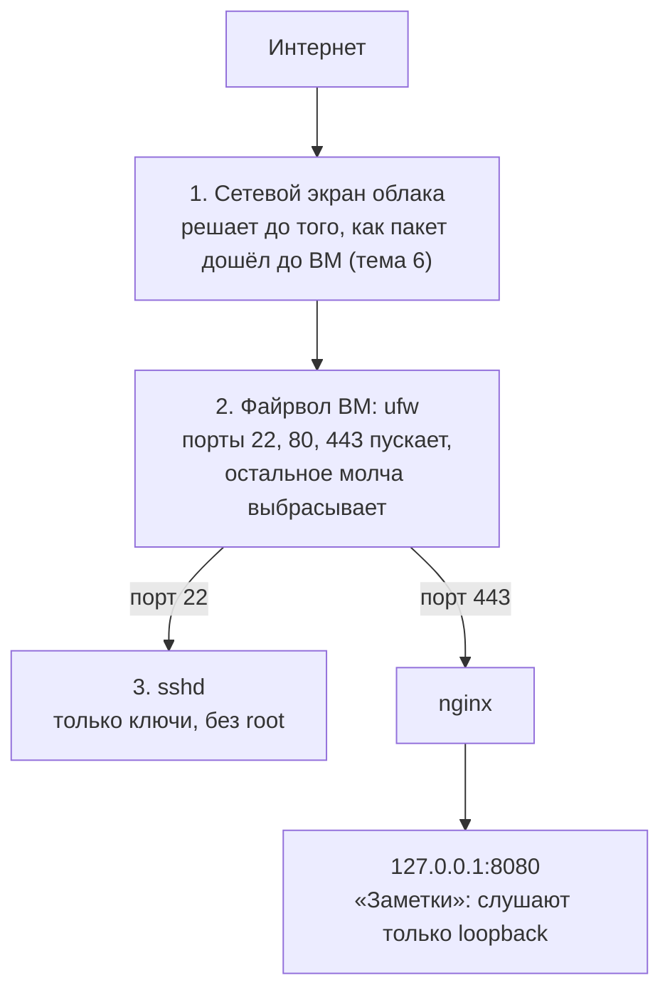
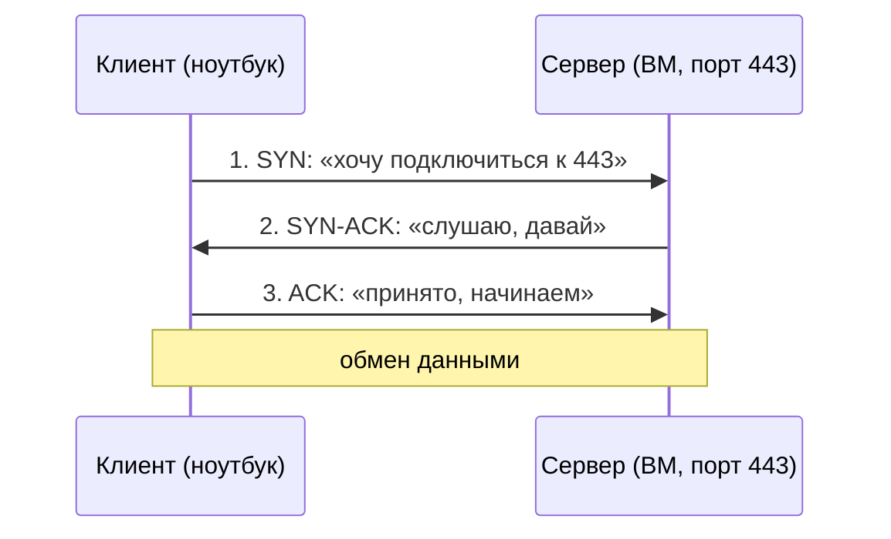
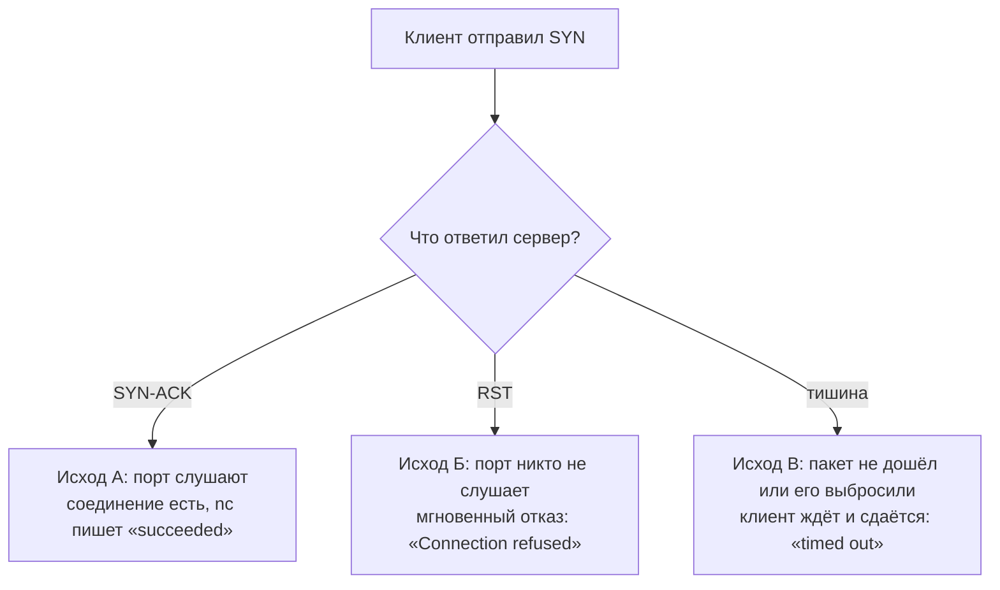
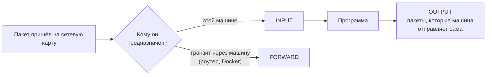

## Зачем это нужно

Сервер с публичным адресом (адресом, по которому до машины можно достучаться из интернета, [урок 2.1](01-addresses-routes.md)) находят сканеры через минуты после запуска. Это программы-боты, которые перебирают адреса по всему интернету и стучатся в каждый порт. **Порт** это номер «двери» на машине, за которой сидит одна программа ([урок 2.2](02-ports-tcp-ssh.md)). SSH (Secure Shell) это способ зайти на сервер по сети и работать в его командной строке; у него порт 22 (тоже из урока 2.2). В журнале SSH (файле, куда сервер записывает, кто и когда пытался войти) сразу появляются сотни попыток войти под именами `root` (главный пользователь системы с полными правами) и `admin`: боты угадывают, какие имена бывают чаще всего. Если порт не нужен всему миру (база данных, отладочный порт, админка: страница управления сервисом), его нельзя оставлять открытым: любой бот сможет попробовать им воспользоваться. Если вход по паролю включён, его рано или поздно подберут: бот пробует тысячи паролей в час, и слабый найдётся. Вход по ключу (длинному секретному файлу, который лежит только у тебя) перебором не взять.

**Файрвол** (firewall) это программа-фильтр на входе в машину: она смотрит на каждый приходящий пакет и решает, пропустить или выбросить. На работе тебя попросят «закрыть всё лишнее», ты будешь разбирать инцидент «после включения файрвола пропал SSH» (администратор закрыл и порт 22, по которому сам подключался, и остался без доступа) и объяснять, почему Docker (программа для запуска приложений в изолированных «коробках», контейнерах, [урок 4.1](../04-docker/01-containers-idea.md)) пробил правила, которые вроде бы всё запрещали. Всё это разберём ниже.

Шаг проекта: снаружи открыты только порты 22, 80 и 443, порт 8080 закрыт, а вход по SSH разрешён только по ключам и не под `root`. Код «Заметок» не меняется (остаётся `app.py` v3 из [урока 2.4](04-http.md)), в репозиторий добавляется файл `deploy/ssh/99-notes.conf`.

## Что нужно знать

- [Урок 1.3: пользователи и права](../01-linux/03-users-permissions.md): `sudo` (выполнить команду с правами администратора), владельцы и права файлов. Пригодится для конфигов sshd (файлов настроек SSH-сервера) и папки `~/.ssh`.
- [Урок 1.4: процессы и сигналы](../01-linux/04-processes-signals.md): сигнал `SIGHUP` («перечитай настройки»). На нём держится команда `reload`.
- [Урок 1.8: systemd](../01-linux/08-systemd-editors.md): `systemctl reload`, `journalctl -u` (читать журнал одного сервиса), юниты и таймеры.
- [Урок 2.1: адреса и маршруты](01-addresses-routes.md): IP-адрес, пакет, порт, `0.0.0.0` и `127.0.0.1`, три ответа сети (`refused`, `timed out`, `unreachable`).
- [Урок 2.2: порты, TCP и SSH](02-ports-tcp-ssh.md): `ss -tlnp`, ключи ed25519, файл `authorized_keys`.
- [Урок 2.5: nginx](05-nginx.md): nginx слушает 80 и проксирует запросы на `127.0.0.1:8080`.
- [Урок 2.6: TLS](06-tls.md): nginx слушает 443 и отдаёт сертификат.

Тебе нужны две машины:

- **Сервер**: виртуальная машина (ВМ) с Ubuntu 26.04 или 24.04 из предыдущих уроков (Multipass, Lima или OrbStack). Ниже я называю её «ВМ» и обозначаю её адрес `VM_IP`, а своё имя пользователя на ней `USER`. Узнать адрес: `ip -4 addr show scope global`. У ВМ должен быть **запасной вход мимо SSH**: `multipass shell` или консоль облака. Это страховка на случай, если ты сам себя запрёшь.
- **Клиент**: твой ноутбук. Проверки «снаружи» делаются с него. Нужны `ssh`, `curl` и `nc` (утилита netcat, проверяет, открыт ли порт). В macOS и Linux они есть. В Windows `ssh` и `curl` есть в PowerShell, а вместо `nc` используй `Test-NetConnection VM_IP -Port 443`.

Оговорка для WSL2: у WSL2 нет своего внешнего адреса, а ядро часто собрано без модулей фильтрации пакетов, поэтому `ufw enable` может выдать ошибку или ничего не фильтровать. Для этого урока бери ВМ.

## Картина целиком

Представь офисное здание. На входе сидит охранник со списком: «в здание пускаем только в дверь 22 (ремонт и администраторы), в дверь 80 и в дверь 443 (посетители)». Всех остальных, кто стучится в другие двери, охранник не пускает. Это **файрвол** (firewall, «противопожарная стена»): он стоит на входе в машину и решает судьбу каждого пакета (порции данных).

Но даже пропущенный посетитель, который пришёл в дверь 22, попадает не в кабинеты, а к вахтёру. Вахтёр (это программа `sshd`, SSH-сервер: та, что на самом сервере принимает подключения по SSH, [урок 2.2](02-ports-tcp-ssh.md)) не пускает по устной просьбе или по паролю, которую можно подслушать, а только по личному ключу, и не пускает под именем директора (`root`). Это вторая линия защиты: **настройки sshd**.

Вот путь пакета извне до «Заметок» и места, где его можно остановить:



Пакет проходит три слоя защиты. Приложение слушает только loopback, поэтому снаружи до него не достать даже без файрвола.

Два слова из схемы. **Сетевой экран облака** это такой же файрвол, но его настраивают не на машине, а в панели облачного провайдера (компании, которая сдаёт виртуальные серверы в аренду): он стоит перед машиной, поэтому пакет, который он выбросил, до ВМ не доходит; подробно в [теме 6](../06-cloud/index.md). **`ufw`** (Uncomplicated Firewall, «несложный файрвол») это программа в Ubuntu, которой ты пишешь правила простыми командами вроде «пускай на порт 443»: сама фильтрация идёт в ядре (главной части операционной системы), а `ufw` лишь удобный пульт к ней. Без файрвола любая программа, которая по ошибке слушает порт на всех адресах, оказывается открытой всему интернету.

За урок ты разберёшь каждый слой: как файрвол принимает решение, чем «молча выбросить» отличается от «ответить отказом», как включить `ufw` и не потерять доступ, почему Docker обходит его, как настроить sshd и как читать журнал, в который стучатся боты.

## Теория

### Как программа принимает соединение: порт, слушающий сокет, RST

Чтобы понять, что делает файрвол, нужно знать, что именно он останавливает. Освежим главное из [урока 2.1](01-addresses-routes.md) и [урока 2.2](02-ports-tcp-ssh.md).

На одной машине работают десятки программ: `sshd`, nginx, «Заметки». IP-адрес приводит данные на машину, но программе нужен свой «номер квартиры». Он называется **порт** (port): число от 0 до 65535. По соглашению `sshd` живёт на 22, HTTP на 80, HTTPS на 443, наши «Заметки» на 8080.

IP-адрес это адрес дома, порт это номер квартиры, а программа это жилец. Чтобы жилец мог принять гостя, он должен быть дома и сидеть у двери. Такое состояние «сижу у двери и жду гостей» называется **слушать порт** (listen). Программа, которая слушает порт, держит **сокет** (socket): точку подключения в системе. Аналогия ломается в одном: в квартиру можно прийти и без звонка, а в порт нельзя, соединение всегда начинается с формального обмена сообщениями.

Большинство сервисов работает по протоколу **TCP** (Transmission Control Protocol): это правила, по которым две программы обмениваются данными надёжно, ничего не теряя. Соединение по TCP начинается с тройного рукопожатия из трёх пакетов:



Соединение рождается за три шага. Если ответа на первый пакет нет, дальше дело не идёт.

Слова SYN и ACK это просто пометки в заголовке пакета (флаги): SYN значит «начинаю соединение», ACK значит «подтверждаю получение». Запоминать их не нужно, важно другое: первый пакет клиента приходит на сервер, и дальше всё зависит от того, что случится с ним.

Есть три исхода, и каждый выглядит для клиента по-разному:



Быстрый отказ и долгое молчание лечатся по-разному: первое про сервис, второе про файрвол или сеть.

**RST** (reset, «сброс») это пакет с флагом «здесь никого нет, разговор невозможен». Его посылает ядро сервера (ядро это главная часть операционной системы, которая управляет железом и сетью), когда пакет пришёл на порт без слушателя.

Вот замеры из лабораторного стенда. Клиент проверяет три порта сервера `172.17.0.2`, замеряя время каждой попытки:

```text
порт 443 (nginx слушает):    Connection to 172.17.0.2 443 port [tcp/https] succeeded!    0.001 c
порт 9001 (слушателя нет):   nc: connect to 172.17.0.2 port 9001 (tcp) failed: Connection refused    0.001 c
порт 9001 при файрволе:      nc: connect to 172.17.0.2 port 9001 (tcp) timed out: Operation now in progress    3.01 c
```

Первая строка это исход А. Вторая это исход Б: ответ пришёл за одну миллисекунду, потому что сервер сразу ответил `RST`. Третья это исход В: клиент ждал ровно столько, сколько ему разрешили (`-w 3`, три секунды), а потом сдался. Самый важный вывод урока: **по времени ответа можно понять, где искать поломку**. Быстрый отказ значит «хост жив, порт не слушают». Долгая тишина значит «по пути пакет теряется, и чаще всего это файрвол».

Осторожно: «порт закрыт» это не одно состояние. На деле их два, и они лечатся по-разному: «никто не слушает» лечится запуском или настройкой сервиса, «пакеты выбрасывает файрвол» лечится правилом. Если перепутать, ты будешь перезапускать сервис, которому файрвол не даёт достучаться.

> **Прикинь сам:** порт никто не слушает. Что увидит клиент: ответ или тишину?
{: .predict}

Мгновенный ответ: ядро отправит RST, `Connection refused`. Тишина значит, что пакет выбросили по дороге.

> **Главное:** три исхода: слушают (SYN-ACK), не слушают (RST, мгновенный отказ), выбросили (тишина, таймаут).
{: .key}

> **Проверь понимание:** `curl` к порту висит 30 секунд и падает по таймауту. Это скорее про файрвол или про остановленный сервис?

<details markdown="1">
<summary>Ответ</summary>

Скорее про файрвол (или сетевой экран облака): пакеты молча теряются. Остановленный сервис на живом хосте дал бы мгновенный `Connection refused`, потому что ядро ответило бы `RST`. Исключения: хост выключен или к нему нет маршрута.

</details>

Мы выяснили, что пакет до сервиса может не дойти по дороге. Кто его останавливает и где именно это происходит, расскажет следующий раздел.

### Файрвол: что это, где стоит и чем управляется

Если на сервере слушает десяток программ, а миру нужны две, остальные восемь надо спрятать. Можно настраивать каждую программу отдельно (кто-то забудет), а можно поставить один фильтр на входе. Ещё причина: программа может слушать порт «на всех адресах» по умолчанию, и ты узнаешь об этом, когда её найдёт сканер. Файрвол делает безопасность **явной**: разрешено только то, что ты назвал.

Файрвол похож на охранника на входе со списком разрешённых дверей. Оговорка: охранник смотрит только на «куда идёшь» и «откуда пришёл», а что ты несёшь в сумке (содержимое пакета) не проверяет. Файрвол хоста не заменяет защиту самой программы.

В Linux пакеты фильтрует ядро с помощью подсистемы **netfilter**. Она встроена в ядро и в нескольких точках на пути пакета спрашивает: «есть ли правила для этого пакета?». Правила записаны в **цепочки** (chain) по этим точкам:



Для защиты сервера главная цепочка INPUT: через неё идёт всё, что адресовано самой машине.

Для нашей задачи важна цепочка `INPUT`: все пакеты, которые пришли на эту машину «для неё самой». Цепочка `OUTPUT` это то, что машина отправляет сама. `FORWARD` это транзит: пакеты, которые лишь проходят через машину дальше (так работает роутер, а ещё так работает Docker, о нём отдельный раздел ниже).

Сами правила в netfilter пишут инструменты:

- `iptables`: старый и всё ещё повсеместный. Его синтаксис вида `-A INPUT -p tcp --dport 22 -j ACCEPT` сложно запомнить.
- `nftables` (команда `nft`): современный, он постепенно заменяет `iptables`. В современных Ubuntu команда `iptables` часто на самом деле работает через nftables (в выводе `iptables -V` это видно: `iptables v1.8.10 (nf_tables)`).
- `ufw` (Uncomplicated Firewall, «несложный файрвол»): надстройка Ubuntu. Ты пишешь `ufw allow 443/tcp`, а он превращает это в правила `iptables`. Это не отдельный файрвол: фильтрует по-прежнему одно и то же ядро. Поэтому итог работы `ufw` можно посмотреть командой `iptables -S`.

**Политика по умолчанию** (default policy) это решение для пакета, к которому не подошло ни одно правило. Здесь два варианта, и от выбора зависит всё:

- «по умолчанию запрещено, разрешено только явно названное» (`default deny incoming`). Забытый сервис на новом порту не станет дырой. Так и делают на серверах;
- «по умолчанию разрешено, запрещено только явно названное». Так работают домашние компьютеры без файрвола: удобно, но забытая дверь остаётся открытой.

Для входящих (`incoming`) мы выбираем запрет, для исходящих (`outgoing`) разрешение: сервер должен сам ходить за обновлениями и в DNS.

Вот как выглядит политика цепочки `INPUT` после включения `ufw` на нашем стенде:

```text
$ sudo iptables -S INPUT
-P INPUT DROP
-A INPUT -j ufw-before-logging-input
-A INPUT -j ufw-before-input
-A INPUT -j ufw-after-input
-A INPUT -j ufw-after-logging-input
-A INPUT -j ufw-reject-input
-A INPUT -j ufw-track-input
```

Разбор: `-P INPUT DROP` (policy) это политика: пакет по умолчанию выбрасывается. Строки `-A INPUT -j ...` (append, jump) это цепочка `INPUT` по очереди отправляет пакет в другие цепочки, которые создал `ufw`. Название говорит само за себя: `ufw-before-input` это правила «до ваших», `ufw-user-input` это правила, которые ты добавил командой `ufw allow`, `ufw-after-input` это правила «после». Разбирать их не нужно, важно знать, что `ufw` это набор цепочек `iptables`, а не отдельная магия.

Осторожно: `ufw` и `iptables` не два конфликтующих файрвола, это один файрвол (netfilter в ядре) и два способа его настроить. Ещё включённый `ufw` не блокирует то, что ты не запретил явно, если политика стоит `allow`. Всегда проверяй `ufw status verbose` и строку `Default:`.

> **Прикинь сам:** какая политика по умолчанию для входящих безопаснее: «запрещено всё» или «разрешено всё»?
{: .predict}

«Запрещено всё»: забытый сервис на новом порту не станет дырой.

> **Главное:** фильтрует ядро (netfilter), а `ufw` лишь удобная надстройка над правилами `iptables`. Входящие по умолчанию запрещены, исходящие разрешены.
{: .key}

> **Проверь понимание:** чем `ufw` отличается от `iptables`?

<details markdown="1">
<summary>Ответ</summary>

`iptables` это интерфейс к netfilter в ядре, `ufw` надстройка над ним с коротким синтаксисом. Правила, которые создаёт `ufw`, можно увидеть командой `iptables -S`. Фильтрует в обоих случаях одно и то же ядро.

</details>

Правило подошло пакету, и теперь нужно решить, что с ним делать. Вариантов три, и клиент видит их по-разному.

### Три вердикта: allow, drop, reject

Когда правило подходит пакету, ему нужно решить: что делать? Вариантов три, и клиент видит их по-разному. Именно это различие позволяет диагностировать проблемы «по симптомам».

Допустим, ты звонишь в дверь, а за ней охранник. Что он сделает, зависит от вердикта:

- `allow` (разрешить): дверь открылась, разговор идёт;
- `drop` (молча выбросить): за дверью никто не шевелится. Ты стоишь и не знаешь, дома ли хозяин, и уйдёшь через минуту;
- `reject` (отклонить с ответом): через дверь тебе сказали «не открою». Ты сразу понял, что вход закрыт, и ушёл.

Для `drop` файрвол просто выбрасывает пакет и ничего не отвечает. Для `reject` файрвол выбрасывает пакет, но при этом отправляет отправителю сообщение об отказе: для TCP это `RST` (то же, что при отсутствии слушателя), для остальных протоколов служебное сообщение ICMP «порт недоступен» (ICMP это протокол служебных сообщений сети, разобран в [уроке 2.1](01-addresses-routes.md)).

В `ufw` команды называются `allow`, `deny` и `reject`. **`deny` это drop**, то есть молчаливое выбрасывание. Это значение по умолчанию для входящих: `default deny incoming`.

Мы прогнали три варианта для порта 9001, на котором никто не слушает, и замерили время:

| Правило ufw для 9001 | Что показал `nc -zv` на клиенте | Время |
|---|---|---|
| правил нет (политика `deny`) | `timed out: Operation now in progress` | 3.01 с (упёрлись в `-w 3`) |
| `ufw allow 9001/tcp` (порт разрешён, слушателя нет) | `failed: Connection refused` | 0.001 с |
| `ufw reject 9001/tcp` | `failed: Connection refused` | мгновенно |

Первая строка это `drop`: клиент ждёт. Вторая это ядро, которое отвечает `RST`, потому что файрвол пакет пропустил, а слушателя нет. Третья это файрвол, который сам отправил отказ. С клиента вторая и третья строки **неотличимы**. Отсюда вывод для диагностики: «быстрый отказ» это не всегда «слушателя нет», иногда это `reject`. Для проверки нужно смотреть на сервере: `sudo ss -tlnp` (слушает ли кто) и `sudo ufw status numbered` (нет ли `REJECT`).

Обрати внимание: **порядок проверки такой**. Пакет сначала попадает в файрвол, и только потом, если его пропустили, ядро решает, есть ли слушатель. Поэтому запрещённый порт даёт таймаут независимо от того, слушает на нём кто-то или нет.

Осторожно: `deny` не даёт `Connection refused`, он молчит. И про ping: файрвол `ufw` по умолчанию **пропускает** ping (ICMP «echo request»), поэтому «ping проходит» ничего не говорит о том, открыты ли порты. На стенде при включённом `ufw` и запрещённых портах `ping` проходил без потерь.

> **Прикинь сам:** клиент ждёт ответ ровно 3 секунды, потом `timed out`. Это `drop` или `reject`?
{: .predict}

`drop`: файрвол молча выбросил пакет. При `reject` отказ пришёл бы сразу.

> **Главное:** `allow` пускает, `drop` молчит, `reject` отвечает отказом. `ufw deny` это drop.
{: .key}

> **Проверь понимание:** ты запустил `nc -zv host 8443` и сразу получил `Connection refused`. Значит ли это, что на сервере точно никто не слушает порт 8443?

<details markdown="1">
<summary>Ответ</summary>

Не обязательно. Либо порт открыт в файрволе и слушателя нет, либо стоит правило `reject`, которое тоже даёт быстрый отказ. Отличить можно только на самом сервере: `ss -tlnp` покажет, слушает ли кто-то порт, а `ufw status numbered` покажет, нет ли там `REJECT`.

</details>

Вердикты понятны, но правил в файрволе обычно много, и они могут противоречить друг другу. Как файрвол выбирает между ними и что он помнит о соединениях, смотрим дальше.

### Правила, их порядок и «память» файрвола о соединениях

Два правила могут противоречить друг другу: «пускать всех на 443» и «не пускать этот адрес на 443». Кто победит? И есть вторая загадка: если ты включил файрвол, который запрещает всё входящее, почему уже открытая SSH-сессия не умирает сразу?

Список правил это как инструкция для охранника, которую он читает сверху вниз и действует по **первой подходящей строке**. Дочитывать до конца не нужно. Аналогия перестаёт работать в одном: у охранника нет памяти, а у файрвола есть, об этом ниже.

Правила хранятся списком по порядку добавления. Пакет сравнивается с правилами сверху вниз, и срабатывает первое подходящее. Поэтому узкий запрет должен стоять выше общего разрешения. Если ничего не подошло, действует политика по умолчанию.

Вторая часть: файрвол **с учётом состояния** (stateful). Ядро запоминает каждое установленное соединение в таблице отслеживания соединений (connection tracking, `conntrack`) и помечает пакеты состояниями: `NEW` (первый пакет нового соединения), `ESTABLISHED` (пакет уже открытого соединения), `RELATED` (связанный, например служебная ошибка). Самое первое правило `ufw` разрешает всё `ESTABLISHED,RELATED`. Благодаря этому не нужно отдельно открывать порты для ответов на твои же исходящие запросы, и уже открытая сессия SSH переживает включение файрвола.

Мы вставили запрет для одного клиента выше общего разрешения:

```text
$ sudo ufw insert 1 deny from 172.17.0.13 to any port 443 proto tcp
Rule inserted
$ sudo ufw status numbered
     To                         Action      From
     --                         ------      ----
[ 1] 443/tcp                    DENY IN     172.17.0.13
[ 2] 22/tcp                     LIMIT IN    Anywhere                   # ssh limit
[ 3] 80/tcp                     ALLOW IN    Anywhere                   # http
[ 4] 443/tcp                    ALLOW IN    Anywhere                   # https
```

Клиент `172.17.0.13` на 443 попал в правило 1 и получил таймаут, хотя строка 4 разрешает 443 «всем». Порт 80 для него остался открыт (правило 3). Если бы `DENY` стоял под `ALLOW`, он не сработал бы никогда: разрешение поймало бы пакет раньше.

Теперь про «память». Вот как первые правила `ufw` выглядят в `iptables`:

```text
$ sudo iptables -S ufw-before-input | head -3
-N ufw-before-input
-A ufw-before-input -i lo -j ACCEPT
-A ufw-before-input -m conntrack --ctstate RELATED,ESTABLISHED -j ACCEPT
```

Разбор: `-i lo -j ACCEPT` это «всё, что пришло на интерфейс `lo` (loopback, [урок 2.1](01-addresses-routes.md)), пропускать». Поэтому «Заметки» на `127.0.0.1:8080` всегда доступны с самой машины и nginx достучится до них при любом файрволе. Вторая строка: `--ctstate RELATED,ESTABLISHED -j ACCEPT` это «пакеты уже установленных соединений пропускать». Она и спасает твою SSH-сессию.

Обратная сторона: соединения с самой машины на собственный внешний адрес тоже идут через `lo`. Поэтому **проверять доступность порта с самого сервера бессмысленно**: файрвол его не увидит. На стенде `nc` с сервера на его же адрес дал `succeeded` для порта, который снаружи был закрыт. Проверяй порты только с другой машины.

Осторожно: правила не «действуют на запущенные сессии», только на новые соединения. Из-за этого удалить правило для 22 и включить файрвол очень опасно: твоя текущая сессия ещё жива, и создаётся ложное ощущение, что всё нормально. Проблема вылезет, когда сессия оборвётся.

> **Прикинь сам:** правило «запретить 443 для одного клиента» стоит ниже общего «разрешить 443». Этот клиент пройдёт?
{: .predict}

Да: срабатывает первое подходящее правило сверху, и разрешение его пропустит. Узкий запрет ставят выше.

> **Главное:** правила читаются сверху вниз до первого совпадения, а уже установленные соединения файрвол помнит (conntrack).
{: .key}

> **Проверь понимание:** ты выполнил `ufw enable` в SSH-сессии без правила для 22. Сессия жива. Почему, и что случится дальше?

<details markdown="1">
<summary>Ответ</summary>

Пакеты установленного соединения относятся к состоянию `ESTABLISHED`, а stateful-файрвол их пропускает. Новые соединения на 22 отбрасываются. Как только эта сессия оборвётся (сеть моргнула, закрыл ноутбук), зайти станет нельзя, только через консоль ВМ.

</details>

Принципы ясны: порядок, вердикты, память о соединениях. Теперь запишем их командами `ufw` и включим файрвол так, чтобы не потерять собственную SSH-сессию.

### ufw: язык правил и безопасное включение

`ufw` уже знаешь как «надстройку над iptables». Теперь его команды по порядку: что каждая делает и чем опасна.

`ufw` это как переводчик: ты говоришь по-человечески «пусти на 443», а он записывает это на языке ядра. Оговорка: переводчик применяет правила мгновенно, без «сохранить и применить», поэтому ошибка бьёт сразу.

Основные команды:

- `ufw default deny incoming` и `ufw default allow outgoing`: политика по умолчанию (что делать со всем, что не названо явно);
- `ufw allow 443/tcp`: открыть порт 443 для TCP. Запись «порт/протокол»; без протокола откроются и TCP, и UDP. К правилу можно добавить `comment 'https'`: пояснение, которое видно в `status`;
- `ufw allow OpenSSH`: открыть по имени профиля. Профили описывают типичные сервисы, список показывает `ufw app list` (на стенде их четыре: `Nginx Full`, `Nginx HTTP`, `Nginx HTTPS`, `OpenSSH`). Мы будем писать порты, так нагляднее;
- `ufw allow from 203.0.113.10 to any port 22 proto tcp`: открыть порт только для одного адреса. Так можно ограничить SSH известными адресами;
- `ufw limit 22/tcp`: разрешить, но отбивать частые подключения с одного адреса (подробнее ниже);
- `ufw status numbered`: список правил с номерами. `ufw status verbose` добавляет политики. `ufw delete <номер>` (или `ufw delete allow 443/tcp`) удаляет правило, при этом `ufw` спросит подтверждение `Proceed with operation (y|n)?`, чтобы обойти вопрос, добавь `--force`;
- `ufw enable`, `ufw disable`, `ufw reload`: включить, выключить, перечитать правила.

Обрати внимание, что каждое правило `ufw` создаёт **дважды**: для IPv4 и для IPv6 (в списке вторая строка с пометкой `(v6)`). IPv6 это новая версия IP-адресов, в выводе `ip a` ты видел их как `fe80::...` ([урок 2.1](01-addresses-routes.md)). Если бы `ufw` открыл порт только для IPv4, сервис оставался бы открытым всему миру по IPv6.

Как `limit` устроен внутри. Вот настоящие правила, которые `ufw` создал для `ufw limit 22/tcp`:

```text
-A ufw-user-input -p tcp --dport 22 -m conntrack --ctstate NEW -m recent --set ...
-A ufw-user-input -p tcp --dport 22 -m conntrack --ctstate NEW -m recent --update --seconds 30 --hitcount 6 ... -j ufw-user-limit
-A ufw-user-input -p tcp --dport 22 -j ufw-user-limit-accept
...
-A ufw-user-limit -j REJECT --reject-with icmp-port-unreachable
```

Читаем по строкам. Первая: для каждого нового соединения на 22 запомнить адрес отправителя и время. Вторая: если с этого адреса за 30 секунд (`--seconds 30`) пришло шесть и больше попыток (`--hitcount 6`), отправить пакет в цепочку `ufw-user-limit`. Третья: иначе принять. Последняя строка показывает важное: цепочка `ufw-user-limit` **отклоняет** (`REJECT`), а не молча выбрасывает. Значит, под `limit` ты получишь не таймаут, а мгновенный `Connection refused` (мы это проверили, ниже в практике).

**Безопасное включение.** `ufw enable` применяется мгновенно, поэтому порядок такой:

1. сначала правило для 22, потом `enable`;
2. на удалённом сервере ещё и **отложенный откат**: ты заранее просишь систему через 5 минут выключить файрвол, и отменяешь просьбу, только убедившись, что вход работает;
3. проверка второй SSH-сессией, первую не закрываем.

Отложенный откат делается через systemd. Помнишь юниты из [урока 1.8](../01-linux/08-systemd-editors.md)? Кроме `.service` бывают `.timer`: юнит-таймер, который запускает другой юнит по расписанию. Команда `systemd-run --on-active=5min --unit=ufw-rollback /usr/sbin/ufw disable` создаёт временный таймер `ufw-rollback.timer`, который через 5 минут запустит `ufw disable`. Отменить: `systemctl stop ufw-rollback.timer`. Если ты запрёшь себя и сессия потеряется, через 5 минут файрвол выключится сам и ты войдёшь.

Осторожно: если открыл порт в `ufw`, это ещё не значит, что сервис доступен. `ufw` только разрешает пакеты. Если сервис не запущен или слушает только `127.0.0.1`, снаружи будет `Connection refused` (а не таймаут). И обратное: «сервис слушает `0.0.0.0`, значит он открыт»: без правила в `ufw` пакеты не дойдут.

> **Прикинь сам:** что страшнее при включении `ufw` по SSH: забыть правило для 80 или для 22?
{: .predict}

Для 22: новые подключения по SSH перестанут проходить, и доступ к серверу потеряется. Сначала `allow 22`, потом `enable`.

> **Главное:** сначала правила и разрешение SSH, затем `ufw enable`. `ufw limit` притормаживает перебор.
{: .key}

> **Проверь понимание:** для чего нужен `ufw limit 22/tcp` и что клиент увидит при превышении лимита?

<details markdown="1">
<summary>Ответ</summary>

Он разрешает SSH, но если с одного адреса за 30 секунд приходит шесть и больше новых подключений, следующие отклоняются. Клиент увидит мгновенный `Connection refused` (правило использует `REJECT`, а не молчаливый `DROP`). Через 30 секунд после последней попытки доступ возвращается. Это притормаживает перебор, но не заменяет ключи.

</details>

Правила введены и работают. Но что с ними станет после перезагрузки сервера, зависит от того, где они хранятся, и об этом следующий раздел.

### Где ufw хранит правила и что происходит после перезагрузки

Правила, которые ты ввёл, живут в памяти ядра, а память после перезагрузки пуста. Если бы `ufw` не сохранял их на диск, каждая перезагрузка возвращала бы сервер без защиты (или, наоборот, отрезала бы тебя от него).

Правила в памяти ядра похожи на список для охранника, который ты пишешь на доске: по утрам доску стирают. Чтобы список пережил ночь, его нужно переписать в журнал, а утром охранник сам перенесёт его на доску. Оговорка: `ufw` переписывает в журнал автоматически при каждой команде, вручную «сохранять» ничего не нужно.

Шаг за шагом это происходит так:

1. Ты выполняешь `ufw allow 443/tcp`.
2. `ufw` дописывает правило в файлы в каталоге `/etc/ufw/` (для IPv4 это `user.rules`, для IPv6 `user6.rules`) и одновременно применяет его к ядру.
3. Команда `ufw enable` включает службу `ufw.service` в автозапуск (в выводе ты видел `Firewall is active and enabled on system startup`, то есть «включён и будет включаться при загрузке»).
4. После перезагрузки systemd запускает `ufw.service`, тот читает файлы из `/etc/ufw/` и заново загружает правила в ядро.

Сам `iptables -S` показывает только текущее состояние ядра и после перезагрузки для правил, поставленных вручную, будет пуст. Поэтому правила «на лету» через голый `iptables` пропадают, а через `ufw` остаются.

Файлы можно открыть глазами: `sudo ls /etc/ufw/` покажет среди прочего `ufw.conf` (там строка `ENABLED=yes`, включён ли файрвол при загрузке), `user.rules` и `user6.rules` (твои правила в формате `iptables`). А в `/etc/default/ufw` лежат политики по умолчанию и строка `IPV6=yes`, которая отвечает за то, создаются ли правила `(v6)`. Если в `ufw.conf` стоит `ENABLED=no`, то `ufw status` покажет `Status: inactive`, и правила есть в файлах, но не загружены. Именно это делает `ufw disable`: правила остаются на диске, файрвол выключается. Поэтому отложенный откат `ufw disable` из этого урока безопасен: включить обратно можно одной командой, ничего не пропадёт.

Что это значит на практике. Если ты перед перезагрузкой проверил `ufw status` и там нужные правила, они переживут перезагрузку. Если сервис зависит от порядка запуска (например, nginx стартует раньше `ufw`), окно в несколько секунд без защиты обычно невелико: `ufw.service` запускается на очень раннем этапе загрузки.

Осторожно: `ufw disable` не стирает правила, а только выключает фильтрацию. Стирает правила `ufw reset` (после него нужно начинать с нуля, поэтому в боевой работе эту команду без необходимости не запускают). И вручную добавленные `iptables`-правила не переживут перезагрузку, если их не сохранили отдельным инструментом.

> **Прикинь сам:** после перезагрузки сервера правила ufw пропадут?
{: .predict}

Нет, `ufw` хранит их в файлах и применяет заново при старте, если он включён.

> **Главное:** правила живут в файлах, `ufw disable` не стирает их, а лишь выключает.
{: .key}

> **Проверь понимание:** ты выполнил `sudo ufw disable`, а через час `sudo ufw enable`. Придётся ли заново вводить все `allow`?

<details markdown="1">
<summary>Ответ</summary>

Нет. `disable` лишь выключает файрвол, а правила остаются в `/etc/ufw/user.rules` и `user6.rules`. `enable` снова загрузит их в ядро. Стирает правила только `ufw reset`.

</details>

С правилами и их хранением разобрались. Теперь о ловушке, из-за которой порт кажется закрытым, а на деле открыт: Docker.

### Docker обходит ufw

Это самая частая причина неприятных инцидентов: администратор закрыл порт базы в `ufw`, проверил `ufw status`, а сканер видит базу открытой.

Охранник стоит у главного входа, а Docker пробивает отдельную дверь прямо в нужную комнату, минуя охранника. Оговорка: Docker делает это не со зла, а чтобы порты контейнеров «просто работали» (тему Docker ты пройдёшь в [теме 4](../04-docker/01-containers-idea.md)).

Когда ты запускаешь контейнер с ключом `-p 5432:5432` («опубликовать порт 5432 хоста на порт 5432 контейнера»), Docker добавляет правило в таблицу трансляции адресов (`nat`, идея NAT из [урока 2.1](01-addresses-routes.md)). Оно перенаправляет пакеты, пришедшие на порт хоста, на внутренний адрес контейнера. Такой пакет **уже не считается пришедшим «для этой машины»**, теперь он транзитный, идёт через цепочку `FORWARD`, а не через `INPUT`. А правила `ufw` стоят в `INPUT`. Поэтому запретительные правила `ufw` до него не доходят.

На хосте с Docker мы запустили `docker run -p 5432:8000 python:3.12-alpine ...` (снаружи порт 5432, внутри контейнера 8000) и посмотрели таблицу `nat`:

```text
$ sudo iptables -t nat -S DOCKER
-N DOCKER
-A DOCKER -p tcp -m tcp --dport 5432 -j DNAT --to-destination 172.17.0.18:8000
```

Разбор: `-t nat` это таблица трансляции, `DNAT` (Destination NAT) подменяет адрес получателя, `--dport 5432` это порт снаружи, `--to-destination 172.17.0.18:8000` это адрес контейнера и его порт. `docker ps` показывает то же самое как `0.0.0.0:5432->8000/tcp`: слева порт хоста на всех адресах. Если у порта стоит `0.0.0.0`, он открыт всем сетевым картам, и `ufw` его не закроет.

Три защиты:

1. публиковать порт только на localhost: `-p 127.0.0.1:5432:5432` (доступен только с самой машины);
2. не публиковать порт вообще: контейнеры общаются между собой во внутренней сети Docker Compose ([тема 4](../04-docker/index.md));
3. ставить жёсткие правила в цепочку `DOCKER-USER`: Docker гарантирует, что её правила проверяются раньше его собственных.

Осторожно: одного `ufw status` недостаточно. Проверять нужно то, что видит внешний мир: `docker ps` (какие порты опубликованы), `sudo iptables -t nat -S DOCKER` и сканирование порта с другой машины.

> **Прикинь сам:** опубликовал порт контейнера `-p 5432:5432`. Остановит ли его `ufw`?
{: .predict}

Нет: Docker добавляет свои правила в обход `ufw`, порт будет виден снаружи.

> **Главное:** Docker обходит `ufw`, поэтому проверяй `iptables` и привязывай порт к `127.0.0.1`.
{: .key}

> **Проверь понимание:** `ufw status` не содержит правила для 5432, но порт отвечает снаружи. Что проверишь первым?

<details markdown="1">
<summary>Ответ</summary>

`docker ps` (какие порты опубликованы и на каком адресе) и `sudo iptables -t nat -S DOCKER`. Скорее всего, порт открыт правилом Docker, а не `ufw`.

</details>

Одна защита может сломаться незаметно, как это случилось с Docker. Поэтому порт закрывают сразу несколькими способами, и об этом следующий раздел.

### Защита слоями: почему порт 8080 закрыт дважды

Одна защита ломается: кто-то ошибся в правиле, забыл про IPv6, поставил Docker. Поэтому важное закрывают несколькими независимыми слоями: если один прорван, второй держит.

Слои работают так же, как замок на подъезде и замок на двери квартиры.

Для «Заметок» слоёв три:

1. **Сетевой экран облака** (группы безопасности, [тема 6](../06-cloud/index.md)): фильтр вне ВМ, пакет до неё вообще не дойдёт. Не заменяет файрвол на самой машине: в облаке правила обычно шире, а ВМ могут пересоздавать.
2. **Файрвол ВМ** (`ufw`): порт 8080 не разрешён, значит закрыт.
3. **Привязка сервиса**: в `/etc/notes/notes.env` записано `HOST=127.0.0.1` ([урок 2.1](01-addresses-routes.md)), и «Заметки» слушают только loopback. Пакет с внешнего адреса не может прийти на `127.0.0.1` в принципе.

Проверим с клиента: `curl http://VM_IP:8080/healthz` завершается ошибкой `curl: (28) Connection timed out after 5003 milliseconds` (порт закрыт файрволом). А `curl -k https://VM_IP/healthz` возвращает `200`: nginx на 443 принимает запрос и передаёт его «Заметкам» изнутри, через loopback, который файрволу не мешает (см. `-i lo -j ACCEPT` выше). Даже если бы файрвол был выключен, ответ на порту 8080 с адреса `VM_IP` был бы `Connection refused` (слушателя на этом адресе нет).

Осторожно: не думай, что «раз слой 3 защищает, файрвол не нужен». Слой 3 работает, пока в `notes.env` стоит `127.0.0.1`. Один неверный `HOST=0.0.0.0` (как в эксперименте [урока 2.1](01-addresses-routes.md)) убирает его. Файрвол держит порт закрытым независимо от настроек сервиса.

> **Прикинь сам:** если один слой защиты порта 8080 даст сбой, останется ли порт закрытым?
{: .predict}

Да, пока работает хотя бы один из остальных слоёв.

> **Главное:** важное закрывают несколькими слоями: сетевой экран облака, файрвол ВМ и привязка сервиса к `127.0.0.1`.
{: .key}

> **Проверь понимание:** какие слои закрывают порт 8080 на нашем сервере?

<details markdown="1">
<summary>Ответ</summary>

Файрвол ВМ (порт 8080 не разрешён) и привязка сервиса к `127.0.0.1`. В облаке добавляется ещё сетевой экран. Каждый слой достаточен сам по себе, вместе они страхуют друг друга от ошибок.

</details>

Порты закрыты в несколько слоёв, но один порт должен оставаться открытым: SSH, главный вход на сервер. Как его настроить так, чтобы он не стал слабым местом, смотрим дальше.

### SSH-сервер: конфигурация и правило «побеждает первое значение»

SSH это главный вход на сервер, поэтому его настройки самые важные. И самая частая проблема: ты правишь конфиг, а поведение не меняется.

Конфигурация sshd читается как правила внутреннего распорядка, сложенные из нескольких листов. Если на первом листе написано «вход по паролю разрешён», а на последнем «запрещён», действует первый, потому что вахтёр читает листы по порядку и останавливается на первом ответе. Оговорка: обычно в документах побеждает последний лист, а sshd делает наоборот.

**SSH** (Secure Shell) это протокол защищённого удалённого входа, ты им пользовался в [уроке 2.2](02-ports-tcp-ssh.md). Программа-сервер называется `sshd` (буква d от daemon, «демон», фоновая служба). Она читает основной файл `/etc/ssh/sshd_config`. В Ubuntu в самом начале этого файла стоит строка `Include /etc/ssh/sshd_config.d/*.conf`, то есть «подключить все файлы `.conf` из этой папки». Файлы подключаются **по алфавиту**, их удобно использовать как «дополнения»: не трогать основной файл, а класть рядом свой.

Правило sshd: для каждой опции действует **первое** найденное значение. Вот что из этого следует, если в `sshd_config.d` два файла:

```text
/etc/ssh/sshd_config.d/50-cloud-init.conf   PasswordAuthentication yes   <- читается первым, побеждает
/etc/ssh/sshd_config.d/99-notes.conf        PasswordAuthentication no    <- проигнорировано
```

`50-cloud-init.conf` идёт раньше `99-notes.conf` (5 меньше 9). Файл `50-cloud-init.conf` создаёт cloud-init: программа, которая настраивает облачную ВМ при первом запуске (у неё бывают и другие имена файлов, например `60-cloudimg-settings.conf`). Поэтому проверять нужно не файл, а **итог**. Для этого две команды, их путают:

- `sshd -t` (test): проверяет только **синтаксис** файлов. Молчит, если всё в порядке, и печатает ошибку, если есть опечатка. Итоговые значения не показывает;
- `sshd -T` (большая T, extended test): печатает **итоговые значения всех опций**, которые sshd реально применит. Нужны права администратора, поэтому `sudo sshd -T`. Вывод в нижнем регистре, по строке на опцию: `passwordauthentication no`.

Обрати внимание на «мотор» sshd в Ubuntu 24.04 и новее. Ubuntu запускает `sshd` не сразу, а по требованию: юнит `ssh.socket` слушает порт 22 сам, а когда приходит первое подключение, запускает `ssh.service`. Поэтому на свежей ВМ, к которой ещё никто не подключался, `sudo sshd -T` может ответить `Missing privilege separation directory: /run/sshd`. Причина в том, что каталог `/run/sshd` sshd создаёт при запуске, а он ещё не запускался. Если ты работаешь по SSH, подключение уже случилось, и всё работает. Заодно это объясняет странность в `ss -tlnp`: порт 22 держат сразу два процесса, `systemd` (сокет) и `sshd`.

Так выглядит расхождение «файл говорит `no`, sshd делает `yes`» на стенде (Ubuntu 24.04, OpenSSH 9.6):

```text
$ sudo sshd -T | grep -Ei '^(passwordauthentication|permitrootlogin|pubkeyauthentication) '
permitrootlogin no
pubkeyauthentication yes
passwordauthentication yes        <- мы положили в 99-notes.conf «no», а итог «yes»
$ grep -rn -i 'PasswordAuthentication' /etc/ssh/sshd_config /etc/ssh/sshd_config.d/
/etc/ssh/sshd_config:66:#PasswordAuthentication yes
/etc/ssh/sshd_config.d/50-cloud-init.conf:3:PasswordAuthentication yes
/etc/ssh/sshd_config.d/99-notes.conf:2:PasswordAuthentication no
```

Как читать: `grep -rn -i` ищет слово во всех файлах (`-r` по папке, `-n` с номером строки, `-i` без учёта регистра). Строки с `#` в начале это комментарии, sshd их не читает. Виновник найден: `50-cloud-init.conf:3`. После того как мы закомментировали его строку, `sshd -T` показал `passwordauthentication no`.

Ещё одна деталь: опция `permitrootlogin` без правок показывает `without-password` (Ubuntu 24.04) или `prohibit-password` (Ubuntu 26.04). Это одно и то же значение под двумя названиями: «root можно пускать, но только по ключу».

Осторожно: после правки конфига недостаточно `sshd -t`, он подтверждает лишь, что опечаток нет. И правка не вступает в силу сама: sshd читает конфигурацию при запуске и по команде перечитать (об этом дальше).

> **Прикинь сам:** в `50-cloud-init.conf` стоит `yes`, в `99-notes.conf` стоит `no`. Какое значение действует?
{: .predict}

`yes`: у sshd побеждает первое найденное значение, а `50-` читается раньше `99-`. Итог видно в `sshd -T`.

> **Главное:** итоговую настройку смотрят через `sshd -T`, а не по одному файлу.
{: .key}

> **Проверь понимание:** ты положил `PasswordAuthentication no` в `99-notes.conf`, но пароль всё равно принимается. Где искать причину и чем проверить?

<details markdown="1">
<summary>Ответ</summary>

Более ранний файл в `sshd_config.d` (например `50-cloud-init.conf`) или основной `sshd_config` уже задал `yes`, а побеждает первое значение. Проверка: `sudo sshd -T | grep -i passwordauthentication` и `grep -ri PasswordAuthentication /etc/ssh/`. Второй возможный виновник: sshd не перечитал конфигурацию после правки.

</details>

Мы знаем, как sshd читает конфиг. Теперь выберем в нём три настройки, которые закрывают почти все типичные атаки.

### Три настройки SSH, которые закрывают почти всё

Пароль можно угадать перебором: боты пробуют тысячи вариантов в час. Ключ угадать нельзя. Поэтому если пароли отключить совсем, подбирать станет нечего.

Пароль это как код от двери на бумажке: его можно подсмотреть или перебрать. Ключ это физический ключ, который есть только у тебя: его нужно украсть, а не угадать. Оговорка: ключ можно потерять или украсть вместе с ноутбуком, поэтому закрытый ключ защищают паролем-фразой и правами `600`.

Вход по ключу ты настроил в [уроке 2.2](02-ports-tcp-ssh.md): пара ключей `id_ed25519` (закрытый остаётся у тебя) и `id_ed25519.pub` (открытый лежит на сервере в `~/.ssh/authorized_keys`). Сервер проверяет, что у клиента есть закрытая часть, не получая её. Минимальный набор для нашего сервера:

- `PasswordAuthentication no`: пароль не принимается вообще, подбирать нечего;
- `PermitRootLogin no`: `root` по SSH не входит. Имя `root` есть на каждой машине, поэтому боты пробуют его первым. Работать нужно под своим пользователем и повышать права через `sudo` ([урок 1.3](../01-linux/03-users-permissions.md));
- `PubkeyAuthentication yes`: вход по ключу включён. Он включён по умолчанию, но мы фиксируем его явно, чтобы случайная строка в другом файле не смогла его выключить незаметно.

**Порядок безопасной правки.** Ошибка в конфиге SSH может отрезать тебя от сервера, поэтому порядок жёсткий:

1. Перед правкой убедись, что вход по ключу работает. Иначе, отключив пароль, ты останешься совсем без входа.
2. Внеси правку и проверь синтаксис: `sudo sshd -t`. Пока он не молчит, дальше нельзя.
3. Примени конфигурацию командой **`reload`** (`sudo systemctl reload ssh`), а не `restart`. `reload` посылает sshd сигнал `SIGHUP` ([урок 1.4](../01-linux/04-processes-signals.md)): «перечитай настройки». Главный процесс не умирает, а уже установленные сессии не рвутся. `restart` остановил бы sshd и запустил заново: при ошибке в конфиге он не поднимется, и ты потеряешь доступ.
4. **Не закрывая первую сессию**, открой вторую и убедись, что вход по ключу работает. Только после этого закрывай первую. Старая сессия это твоя страховка.

После настройки клиент делает три попытки входа:

```text
$ ssh -o PasswordAuthentication=no ubuntu@172.17.0.2 'echo вход по ключу работает'
вход по ключу работает
$ ssh -o PubkeyAuthentication=no -o PreferredAuthentications=password ubuntu@172.17.0.2
ubuntu@172.17.0.2: Permission denied (publickey).
$ ssh -o PasswordAuthentication=no root@172.17.0.2
root@172.17.0.2: Permission denied (publickey).
```

Как читать: в первой строке ключ сработал. Во второй мы заставили клиента пробовать только пароль, а сервер отказал, причём слова в скобках `(publickey)` означают «сервер согласен принимать только ключ». Число в скобках это список способов, которые сервер ещё готов принять. В третьей мы вошли бы под `root` (и ключ прошёл бы, будь он там), но сервер отказывает: `PermitRootLogin no`.

Осторожно: «сменить порт SSH на 2222 и всё» не работает. Смена порта убирает шум ботов, но не защищает от целенаправленного сканирования (сканер найдёт открытые порты за минуты). Настоящая защита это ключи и запрет root. И `Permission denied (publickey)` не проблема сети: это значит, что сервер жив и отвечает, но аутентификация не прошла. Если в скобках пусто (`Permission denied ().`), сервер вообще не предлагает способов входа, и это признак выключенных ключей и паролей одновременно (пример в «Сломай и почини»).

> **Прикинь сам:** отключил пароль, а вход по ключу не проверил. Что может случиться?
{: .predict}

Ты закроешь себе единственный вход на сервер, и вернуть его можно будет только через консоль провайдера.

> **Главное:** три настройки закрывают почти всё: вход по ключу, запрет пароля и запрет входа root. Ключ проверяй до отключения пароля.
{: .key}

> **Проверь понимание:** зачем перед отключением пароля нужно проверить вход по ключу, а не наоборот?

<details markdown="1">
<summary>Ответ</summary>

Если отключить пароль, а ключ не работает, войти станет нельзя (только через консоль ВМ). Проверка ключа заранее стоит секунду, а восстановление доступа минуты или часы. Поэтому сначала убеждаешься, что запасной способ входа есть, и только потом закрываешь основной.

</details>

Настройки закрывают вход паролем, но боты всё равно будут стучаться. Как отличить обычный шум от настоящей угрозы и как его ограничить, смотрим в последнем разделе.

### Шум в журнале: сканеры, fail2ban и `limit`

Даже когда пароли выключены, боты продолжают стучаться, и журнал засоряется тысячами строк. Нужно уметь отличать фоновый шум от настоящей угрозы.

Вспомни: у любого подъезда кто-нибудь подёргает ручку двери. Это шум. Тревожно другое: кто-то вошёл, хотя ключа у него быть не должно.

Журнал sshd читают командой `journalctl -u ssh` (`-u` значит «только этот юнит», [урок 1.8](../01-linux/08-systemd-editors.md)). В нём три вида строк, которые нужно узнавать:

- `Invalid user admin from 203.0.113.7 port 51522`: кто-то пробует **несуществующее** имя. Это шум сканеров, пугаться нечего;
- `Failed password for invalid user admin ...` или `Failed password for root ...`: попытка входа по паролю не удалась. Тоже шум, если пароли выключены (подобрать нечего);
- `Accepted publickey for ubuntu from 198.51.100.9 port 34162 ssh2`: **успешный** вход по ключу. Вот эти строки читай внимательно: тот ли пользователь, тот ли адрес.

Способы снизить шум, ни один не заменяет ключи:

- `ufw limit 22/tcp`: описан выше, режет частые подключения с одного адреса;
- **fail2ban**: отдельная программа, которая читает журнал, считает неудачные входы и на время банит адрес правилом файрвола. Мы его не ставим, для нашего сервера хватит ключей и `limit`, здесь только обзор;
- доступ к 22 только с известных адресов (`ufw allow from ...`) или через **бастион** (bastion): промежуточный сервер, единственная машина, у которой открыт SSH наружу, а с неё уже ходят на остальные (ключ `ssh -J`: «пройди к цели через этот промежуточный сервер»; устройство бастиона и пример разобраны в [уроке 2.2](02-ports-tcp-ssh.md), раздел про ключ `-J`);
- смена порта: убирает шум ботов, но не защищает. Ещё одна особенность Ubuntu 24.04 и новее: раз порт держит `ssh.socket`, то менять его нужно и в юните сокета, а не только в `sshd_config`. Мы порт не меняем.

Мы устроили неудачный вход с клиента под несуществующим именем и нашли его в журнале сервера:

```text
Sep 30 11:54:23 5a4d47f76e01 sshd[1142]: Invalid user nosuchuser from 172.17.0.13 port 54492
Sep 30 11:54:24 5a4d47f76e01 sshd[1142]: Failed password for invalid user nosuchuser from 172.17.0.13 port 54492 ssh2
Sep 30 11:54:26 5a4d47f76e01 sshd[1142]: Connection closed by invalid user nosuchuser 172.17.0.13 port 54492 [preauth]
```

Разбор: в начале строки время, имя машины (`5a4d47f76e01`) и `sshd[1142]`, где 1142 это номер процесса (PID), обслуживающего это подключение. Дальше сообщение. `[preauth]` значит «до завершения аутентификации»: клиент так и не вошёл. Три строки с одним PID это один и тот же неудачный вход.

Осторожно: тысячи `Failed password` не взлом, это обычный шум. Взлом это успешный `Accepted ...` для неизвестного пользователя или источника, либо изменение `authorized_keys`.

> **Прикинь сам:** пароли отключены, а в журнале SSH тысячи неудачных попыток. Это взлом?
{: .predict}

Нет, это шум от сканеров: без пароля перебор бесполезен. Но он засоряет журнал, и с ним помогает `fail2ban` или `ufw limit`.

> **Главное:** сканеры стучатся в любой SSH, шум снижают блокировкой повторных ошибок, а не отключением журнала.
{: .key}

> **Проверь понимание:** зачем `fail2ban`, если пароли отключены?

<details markdown="1">
<summary>Ответ</summary>

Он не защищает от взлома (подбирать нечего), а снижает нагрузку и шум: боты банятся на время, журнал остаётся читаемым. Главная защита остаётся прежней: ключи и запрет root.

</details>

## Практика

Задания выполняются на ВМ (сервер) и на ноутбуке (клиент), в каждом шаге сказано, где. Значения `VM_IP` и `USER` подставь свои. Настоящие выводы ниже сняты на стенде: Ubuntu 24.04 в Docker (сервер `172.17.0.2`, «ноутбук» `172.17.0.13`, пользователь `ubuntu`). У тебя адреса, PID и время будут другими. Тексты `nc` на macOS отличаются от Linux: там вместо `timed out: Operation now in progress` пишется `failed: Operation timed out`, а вместо `connect to` пишется `connectx to`.

### Задание 1. ufw: запретить всё, разрешить нужное, включить безопасно

**Цель:** включить файрвол с правилами «22, 80, 443» и не потерять доступ.

**Предскажи:** что покажет `ufw status` про порт 8080 после `default deny incoming` и `allow` для 22, 80, 443? Что было бы с уже открытой SSH-сессией, если бы ты забыл про 22?

<details markdown="1">
<summary>Ответ</summary>

Порта 8080 в списке не будет (входящие на него запрещены политикой). Без правила для 22 текущая сессия осталась бы, а новые входы нет (см. теорию).

</details>

**Шаги (на ВМ):**

1. Установи `ufw`, если его нет, и посмотри статус. `apt install -y` ставит пакет и отвечает «да» на вопрос об установке. `ufw status verbose` печатает статус с политиками:

   ```bash
   sudo apt install -y ufw
   sudo ufw status verbose
   ```

   Ожидаемый вывод второй команды (файрвол ещё выключен):

   ```text
   Status: inactive
   ```

2. Поставь страховку: через 5 минут файрвол сам выключится. Разбор команды: `systemd-run` создаёт временный юнит, `--on-active=5min` это «запусти через 5 минут после создания», `--unit=ufw-rollback` это его имя, а всё после это команда, которую нужно запустить (`ufw disable`, полный путь обязателен, потому что systemd не ищет команды по `PATH`, [урок 1.8](../01-linux/08-systemd-editors.md)):

   ```bash
   sudo systemd-run --on-active=5min --unit=ufw-rollback /usr/sbin/ufw disable
   ```

   ```text
   Running timer as unit: ufw-rollback.timer
   Will run service as unit: ufw-rollback.service
   ```

3. Задай политику и правила. Правило для SSH идёт первым. `comment` это подпись, которая видна в списке:

   ```bash
   sudo ufw default deny incoming
   sudo ufw default allow outgoing
   sudo ufw allow 22/tcp comment 'ssh'
   sudo ufw allow 80/tcp comment 'http'
   sudo ufw allow 443/tcp comment 'https'
   sudo ufw enable
   ```

   ```text
   Default incoming policy changed to 'deny'
   (be sure to update your rules accordingly)
   Default outgoing policy changed to 'allow'
   (be sure to update your rules accordingly)
   Rules updated
   Rules updated (v6)
   Rules updated
   Rules updated (v6)
   Rules updated
   Rules updated (v6)
   Firewall is active and enabled on system startup
   ```

   Если после `enable` появился вопрос `Command may disrupt existing ssh connections. Proceed with operation (y|n)?`, ответь `y`: правило для 22 уже есть.

4. Открой вторую SSH-сессию с ноутбука: `ssh USER@VM_IP`. Если вход прошёл, отмени откат и посмотри правила:

   ```bash
   sudo systemctl stop ufw-rollback.timer
   sudo ufw status numbered
   ```

**Что должно получиться:**

```text
Status: active

     To                         Action      From
     --                         ------      ----
[ 1] 22/tcp                     ALLOW IN    Anywhere                   # ssh
[ 2] 80/tcp                     ALLOW IN    Anywhere                   # http
[ 3] 443/tcp                    ALLOW IN    Anywhere                   # https
[ 4] 22/tcp (v6)                ALLOW IN    Anywhere (v6)              # ssh
[ 5] 80/tcp (v6)                ALLOW IN    Anywhere (v6)              # http
[ 6] 443/tcp (v6)               ALLOW IN    Anywhere (v6)              # https
```

**Как читать вывод:**

- `Status: active`: файрвол включён.
- `To` это порт назначения, `Action` это вердикт (`ALLOW IN`: пускать входящие), `From` это от кого (`Anywhere`: откуда угодно). Последняя колонка `# ssh` это твой комментарий.
- Номера в квадратных скобках нужны для `ufw delete <номер>`.
- Ты видишь шесть строк: каждое правило записано дважды, для IPv4 и IPv6. Строки с `(v6)` относятся к IPv6.
- Порта 8080 в списке нет, значит, он запрещён политикой `deny`.
- `systemctl stop ufw-rollback.timer` ничего не печатает при успехе. Проверить, что таймера больше нет: `systemctl list-timers ufw-rollback.timer` покажет `0 timers listed.`

**Объясни себе:**

- Зачем правила дублируются с `(v6)`?
- Почему откат ставится ДО изменений, а отменяется ПОСЛЕ проверки второй сессией?
- Что было бы с откатом, если бы ты закрыл ВМ на 6 минут?

**Типичные ошибки:**

- `ERROR: problem running ufw-init` или `ip6tables-restore: line 4 failed`: у ядра нет нужных модулей (часто WSL2) или отключён IPv6, а в `/etc/default/ufw` стоит `IPV6=yes`. Используй ВМ или поставь `IPV6=no` и повтори `sudo ufw reload`.
- `sudo: ufw: command not found`: пакет не установлен: `sudo apt install -y ufw`.
- `Failed to start transient timer unit: Unit ufw-rollback.timer was already loaded or has a fragment file.`: откат уже стоит с прошлой попытки. Выполни `sudo systemctl stop ufw-rollback.timer` и повтори шаг 2.

### Задание 2. Проверить, что видно снаружи

**Цель:** отличить «закрыт файрволом» от «никто не слушает» и убедиться, что 8080 закрыт.

Команда `nc` (netcat) умеет проверять порт. Разбор флагов: `-z` значит «только проверь, что порт открывается, данных не посылай», `-v` (verbose) просит написать результат, `-w 3` (wait) ограничивает ожидание тремя секундами. Без `-w` `nc` ждал бы дольше минуты.

**Предскажи:** на ВМ запущен `python3 -m http.server 9000` (слушает все интерфейсы). Что покажет `nc -zv VM_IP 9000` с ноутбука при включённом `ufw`? Что покажет то же для порта 9001, где никто не слушает? Чем ответы отличаются по времени?

<details markdown="1">
<summary>Ответ</summary>

Оба порта запрещены политикой, поэтому оба дадут таймаут: файрвол роняет пакеты раньше, чем ядро решит, есть ли слушатель. `Connection refused` появился бы, только если бы порт был открыт в `ufw`, а слушателя не было.

</details>

**Шаги:**

1. На ВМ посмотри, кто слушает и на каком адресе (разбор `ss -tlnp` в [уроке 2.1](01-addresses-routes.md)):

   ```bash
   sudo ss -tlnp
   ```

2. На ВМ запусти временный сервер в фоне. `python3 -m http.server 9000` раздаёт файлы текущей папки по HTTP на порту 9000, `--bind 0.0.0.0` значит «слушать на всех адресах», `&` в конце запускает команду в фоне и возвращает тебе приглашение:

   ```bash
   python3 -m http.server 9000 --bind 0.0.0.0 &
   ```

3. С ноутбука проверь порты. Здесь важно и время: замерь его на глаз или добавь перед `nc` слово `time`:

   ```bash
   nc -zv -w 3 VM_IP 22
   nc -zv -w 3 VM_IP 443
   nc -zv -w 3 VM_IP 9000
   nc -zv -w 3 VM_IP 9001
   ```

4. Открой порт 9000, проверь снова с ноутбука, затем убери правило и останови сервер (на ВМ). `kill %1` останавливает задачу номер 1 из фона этого терминала:

   ```bash
   sudo ufw allow 9000/tcp
   # с ноутбука: nc -zv -w 3 VM_IP 9000 и nc -zv -w 3 VM_IP 9001
   sudo ufw status numbered
   sudo ufw delete allow 9000/tcp
   kill %1
   ```

5. С ноутбука проверь «Заметки» и прямой порт приложения. У `curl`: `-sS` тише без полосы прогресса, но с ошибками, `-o /dev/null` выбрасывает тело ответа, `-w '%{http_code}\n'` печатает код ответа, `--max-time 5` ограничивает ожидание, `-k` не проверяет сертификат (наш самоподписанный из [урока 2.6](06-tls.md)):

   ```bash
   curl -sS -o /dev/null -w '%{http_code}\n' --max-time 5 -k https://VM_IP/healthz
   curl -sS -o /dev/null -w '%{http_code}\n' --max-time 5 http://VM_IP:8080/healthz
   ```

**Что должно получиться** (шаг 3, Linux):

```text
Connection to 172.17.0.2 22 port [tcp/ssh] succeeded!
Connection to 172.17.0.2 443 port [tcp/https] succeeded!
nc: connect to 172.17.0.2 port 9000 (tcp) timed out: Operation now in progress
nc: connect to 172.17.0.2 port 9001 (tcp) timed out: Operation now in progress
```

Шаг 4, после `ufw allow 9000/tcp`:

```text
Connection to 172.17.0.2 9000 port [tcp/*] succeeded!
nc: connect to 172.17.0.2 port 9001 (tcp) timed out: Operation now in progress
```

Шаг 5:

```text
200
curl: (28) Connection timed out after 5003 milliseconds
000
```

В `ss -tlnp` (шаг 1) тебе важны такие строки. Имена процессов nginx повторяются много раз, по числу рабочих процессов, у тебя их будет столько, сколько ядер:

```text
State  Recv-Q Send-Q Local Address:Port Peer Address:Port Process
LISTEN 0      4096         0.0.0.0:22        0.0.0.0:*    users:(("sshd",pid=733,fd=3),("systemd",pid=1,fd=50))
LISTEN 0      511          0.0.0.0:80        0.0.0.0:*    users:(("nginx",pid=698,fd=5),...)
LISTEN 0      511          0.0.0.0:443       0.0.0.0:*    users:(("nginx",pid=698,fd=6),...)
LISTEN 0      5          127.0.0.1:8080      0.0.0.0:*    users:(("python3",pid=675,fd=3))
LISTEN 0      4096            [::]:22           [::]:*    users:(("sshd",pid=733,fd=4),("systemd",pid=1,fd=51))
```

**Как читать вывод:**

- `succeeded!` значит, что соединение установилось (пакеты дошли, файрвол пропустил, кто-то слушает). `[tcp/ssh]` это лишь подсказка, какой сервис обычно живёт на этом порту.
- `timed out`: ответа не было ровно три секунды (`-w 3`). Порты 9000 и 9001 закрыты файрволом, причём для файрвола неважно, слушает ли на 9000 Python.
- После `allow 9000/tcp` порт 9000 отвечает, а 9001 по-прежнему молчит: правило открыло только один порт.
- `200` это код HTTP ответа «Заметок» ([урок 2.4](04-http.md)). Он пришёл через nginx на порту 443.
- Вторая команда `curl` не получила ответ за 5 секунд: `Connection timed out after 5003 milliseconds`. `-w` напечатал `000` (кода HTTP нет, ответа не было). Порт 8080 снаружи закрыт: и файрволом, и тем, что «Заметки» слушают только `127.0.0.1`.
- В `ss` смотри на четвёртую колонку. `0.0.0.0:22`, `0.0.0.0:80`, `0.0.0.0:443` это «на всех адресах», `127.0.0.1:8080` это «только loopback». А `[::]:22` это тот же порт 22 по IPv6.
- Порт 22 держат сразу `sshd` и `systemd`: так работает `ssh.socket` (см. теорию).

Дополнительный опыт на пять минут: `sudo ufw allow 9001/tcp`, затем с ноутбука `nc -zv -w 3 VM_IP 9001`. На стенде он ответил мгновенно: `failed: Connection refused` (порт открыт, слушателя нет). Потом замени правило: `sudo ufw delete allow 9001/tcp` и `sudo ufw reject 9001/tcp`, и `nc` снова ответит `Connection refused`: `reject` неотличим по симптому от «нет слушателя». Убери за собой: `sudo ufw delete reject 9001/tcp`.

**Объясни себе:**

- Почему приложение на 127.0.0.1:8080 недоступно снаружи ещё до файрвола, и зачем тогда файрвол?
- Что ты увидел бы вместо таймаута, если бы порт 9001 был открыт в `ufw`, но никто его не слушал?
- Почему `ss -tlnp` не показывает состояние `ufw`?

**Типичные ошибки:**

- `nc: connect to VM_IP port 443 (tcp) failed: Connection refused`: правило открыто, но nginx не запущен. Проверь `systemctl status nginx`.
- `curl: (7) Failed to connect to VM_IP port 443 after 3 ms: Couldn't connect to server`: мгновенный отказ значит «слушателя нет» (или `reject`), а не молчаливый файрвол. (Так пишет curl 8.5 в Ubuntu 24.04. В Ubuntu 26.04 curl 8.18 пишет `Could not connect to server`, а слова `Connection refused` видны только с `-v`.)
- `bash: kill: %1: no such job`: сервер запущен в другой сессии (или уже остановлен). Останови его там через `Ctrl+C`.
- `OSError: [Errno 98] Address already in use` при запуске `http.server`: порт 9000 уже занят предыдущим запуском. Останови его (`kill %1`) или возьми другой порт.

> Нейросеть может предложить правила `ufw` и настройки `sshd_config`, но не знает, откуда ты подключён. Не применяй её правила по SSH, пока не проверишь их в запасной сессии: ошибка отрежет тебя от сервера.
{: .ai}

### Задание 3. Кто стучится в SSH и как это притормозить

**Цель:** прочитать журнал sshd и включить ограничение частоты подключений.

**Предскажи:** сколько неудачных входов ты увидишь на ВМ в домашней сети, и сколько на ВМ в облаке с публичным адресом через час после создания?

<details markdown="1">
<summary>Ответ</summary>

В локальной ВМ обычно ноль. В облаке с публичным IP уже через несколько минут появляются десятки строк `Invalid user ...` и `Failed password`: сканеры обходят диапазоны адресов.

</details>

**Шаги:**

1. На ВМ посмотри последние события sshd. Разбор: `journalctl -u ssh` печатает журнал юнита `ssh` (в Ubuntu он называется именно так), `--since "1 hour ago"` это только за последний час, `--no-pager` выводит всё сразу без постраничного просмотра, `tail -n 15` оставляет 15 последних строк. Вторая команда считает: `grep -c` считает подходящие строки, а `\|` в шаблоне значит «или»:

   ```bash
   sudo journalctl -u ssh --since "1 hour ago" --no-pager | tail -n 15
   sudo journalctl -u ssh --no-pager | grep -c 'Failed password\|Invalid user'
   ```

2. С ноутбука устрой заведомо неудачный вход под несуществующим именем (когда ssh спросит пароль, введи любой) и найди его в журнале на ВМ. Флаги: `PreferredAuthentications=password` заставляет клиента пробовать только пароль, `PubkeyAuthentication=no` отключает ключи:

   ```bash
   ssh -o PreferredAuthentications=password -o PubkeyAuthentication=no nosuchuser@VM_IP
   ```

   ```bash
   sudo journalctl -u ssh --since "2 min ago" --no-pager | grep -i 'nosuchuser'
   ```

3. На ВМ замени простое правило на `limit`. Сначала удаляется старое разрешение, иначе оно стоит выше и пропускает всех, не считая частоту. Обрати внимание: между двумя командами нет правила для 22. Установленные сессии переживут это, но выполняй команды подряд:

   ```bash
   sudo ufw delete allow 22/tcp
   sudo ufw limit 22/tcp comment 'ssh limit'
   sudo ufw status numbered | grep 22
   ```

4. С ноутбука проверь ограничение серией подключений. Цикл `for i in 1 2 ...; do ...; done` повторяет команду для каждого значения, `2>&1` присоединяет сообщения об ошибках к обычному выводу, `tail -n 1` оставляет последнюю строку:

   ```bash
   for i in 1 2 3 4 5 6 7 8; do nc -zv -w 2 VM_IP 22 2>&1 | tail -n 1; done
   ```

**Что должно получиться:**

Шаг 2, на ВМ:

```text
Sep 30 11:54:23 5a4d47f76e01 sshd[1142]: Invalid user nosuchuser from 172.17.0.13 port 54492
Sep 30 11:54:24 5a4d47f76e01 sshd[1142]: Failed password for invalid user nosuchuser from 172.17.0.13 port 54492 ssh2
Sep 30 11:54:26 5a4d47f76e01 sshd[1142]: Connection closed by invalid user nosuchuser 172.17.0.13 port 54492 [preauth]
```

Шаг 3:

```text
Rule deleted
Rule deleted (v6)
Rule added
Rule added (v6)
[ 3] 22/tcp                     LIMIT IN    Anywhere                   # ssh limit
[ 6] 22/tcp (v6)                LIMIT IN    Anywhere (v6)              # ssh limit
```

Шаг 4:

```text
Connection to 172.17.0.2 22 port [tcp/ssh] succeeded!
Connection to 172.17.0.2 22 port [tcp/ssh] succeeded!
Connection to 172.17.0.2 22 port [tcp/ssh] succeeded!
Connection to 172.17.0.2 22 port [tcp/ssh] succeeded!
Connection to 172.17.0.2 22 port [tcp/ssh] succeeded!
nc: connect to 172.17.0.2 port 22 (tcp) failed: Connection refused
nc: connect to 172.17.0.2 port 22 (tcp) failed: Connection refused
nc: connect to 172.17.0.2 port 22 (tcp) failed: Connection refused
```

Через 30 секунд после последней попытки доступ возвращается (`succeeded!`).

**Как читать вывод:**

- Три строки в журнале с одним PID (`1142`) это один неудачный вход. `Invalid user` значит, что такого пользователя на сервере нет. `Failed password for invalid user` значит, что пароль не принят. `[preauth]` значит, что клиент так и не прошёл аутентификацию. Если ты ничего не вводил и оборвал вход через `Ctrl+C`, `Failed password` не будет, только `Invalid user` и `Connection closed`.
- Число из второй команды шага 1 это все такие события за всё время работы журнала.
- `LIMIT IN` в списке: правило `limit` вместо `ALLOW`. Номер `[3]` вместо `[1]`: удалённое правило освободило место, а новое добавилось в конец списка IPv4.
- Первые пять подключений прошли, шестое и дальше получили `Connection refused`. Это неожиданно, если ждёшь таймаут: `limit` работает через `REJECT` (см. теорию). Порог: шесть новых подключений с одного адреса за 30 секунд.

**Объясни себе:**

- Что случится со скриптами деплоя из CI (урок 6.3), которые ходят по SSH часто, если включён `limit`?
- Почему строка `Invalid user` не тревожит, а `Accepted publickey` для неизвестного пользователя тревожит?
- Чем `limit` отличается от fail2ban?

**Типичные ошибки:**

- `Could not delete non-existent rule` (а для IPv6 ещё и `Could not delete non-existent rule (v6)`): правило записано иначе (например `OpenSSH` или уже `limit`). Смотри `sudo ufw status numbered` и удаляй по номеру (`sudo ufw delete 1`, `ufw` спросит `Proceed with operation (y|n)?`, ответь `y`).
- `-- No entries --` у `journalctl -u ssh`: на твоей системе юнит называется иначе. В Debian и Ubuntu он `ssh`, в RHEL и Fedora `sshd`: `sudo journalctl -u sshd`.
- `ssh: connect to host VM_IP port 22: Connection refused` при быстром тестировании: ты сам попал под `limit`. Подожди 30 секунд.

### Задание 4. Шаг проекта: защита SSH в «Заметках»

**Цель:** зафиксировать в репозитории `~/notes` настройки sshd, применить их на сервере и проверить эффективные значения. Вместе с заданием 1 это даёт итог: снаружи 22, 80, 443, порт 8080 закрыт, вход по ключам.

**Предскажи:** в `/etc/ssh/sshd_config.d/` лежит `50-cloud-init.conf` с `PasswordAuthentication yes`. Какое значение покажет `sshd -T` после добавления `99-notes.conf` с `no`?

<details markdown="1">
<summary>Ответ</summary>

`yes`: побеждает первое значение, а `50-...` читается раньше `99-...`. Поэтому проверяем результат через `sshd -T`, а конфликтующую строку правим.

</details>

**Шаги:**

1. Не закрывай текущую SSH-сессию. С ноутбука проверь, что вход по ключу работает: `ssh -o PasswordAuthentication=no USER@VM_IP true` (`true` это команда, которая ничего не делает и завершается успешно, так проверяют сам вход). Если получаешь `Permission denied (publickey)`, вернись к [уроку 2.2](02-ports-tcp-ssh.md) и настрой ключ, иначе ты сам себя запрёшь.

2. На ВМ создай файл в репозитории проекта и установи его. Команда `cat > файл <<'CONF' ... CONF` записывает в файл всё до строки `CONF` (кавычки вокруг `'CONF'` отключают подстановки, [урок 1.6](../01-linux/06-bash-basics.md)). `install -m 644 -o root -g root` копирует файл и сразу задаёт права `644` и владельца `root:root` (sshd не должен читать конфиг, который может править кто угодно):

   ```bash
   mkdir -p ~/notes/deploy/ssh
   cat > ~/notes/deploy/ssh/99-notes.conf <<'CONF'
   # Настройки sshd для сервера «Заметок»
   PasswordAuthentication no
   PermitRootLogin no
   PubkeyAuthentication yes
   CONF
   sudo install -m 644 -o root -g root ~/notes/deploy/ssh/99-notes.conf /etc/ssh/sshd_config.d/99-notes.conf
   ```

3. Проверь синтаксис и эффективные значения. `&&` запускает вторую команду, только если первая завершилась успешно. `grep -Ei '^(...|...) '` это расширенное регулярное выражение (`-E`) без учёта регистра (`-i`): строка должна начинаться (`^`) с одного из трёх слов (`|` значит «или») и дальше пробел:

   ```bash
   sudo sshd -t && echo "синтаксис ок"
   sudo sshd -T | grep -Ei '^(passwordauthentication|permitrootlogin|pubkeyauthentication) '
   ```

   На стенде вторая команда показала:

   ```text
   синтаксис ок
   permitrootlogin no
   pubkeyauthentication yes
   passwordauthentication yes
   ```

   Пароль всё ещё `yes`: сработала ловушка из теории.

4. Найди виновника, закомментируй его строку и проверь снова. `sed -i 's/^PasswordAuthentication yes/#PasswordAuthentication yes/'` (правка файла на месте, [урок 1.2](../01-linux/02-text-pipes.md)): найти строку, которая начинается с `PasswordAuthentication yes`, и поставить перед ней `#`. Так строка становится комментарием, а файл остаётся на месте:

   ```bash
   grep -rn -i 'PasswordAuthentication' /etc/ssh/sshd_config /etc/ssh/sshd_config.d/
   sudo sed -i 's/^PasswordAuthentication yes/#PasswordAuthentication yes/' /etc/ssh/sshd_config.d/50-cloud-init.conf
   sudo sshd -T | grep -i passwordauthentication
   ```

   ```text
   /etc/ssh/sshd_config:66:#PasswordAuthentication yes
   /etc/ssh/sshd_config.d/50-cloud-init.conf:3:PasswordAuthentication yes
   /etc/ssh/sshd_config.d/99-notes.conf:2:PasswordAuthentication no
   passwordauthentication no
   ```

   Форма `sed -i` здесь для GNU sed (Ubuntu). На macOS писали бы `sed -i ''`, но команда выполняется на сервере. Если `grep` не показал в `sshd_config.d` ничего, кроме твоего файла, а `sshd -T` уже показывает `no`, значит, конфликта в твоей системе нет и шаг можно пропустить. (Например, на Ubuntu 24.04 из облачного образа встречается файл `60-cloudimg-settings.conf` с `PasswordAuthentication no`: он ничему не мешает.)

5. Перечитай конфигурацию и проверь новой сессией с ноутбука. Первую сессию не закрывай, пока вторая не заработает:

   ```bash
   sudo systemctl reload ssh
   ```

   ```bash
   ssh -o PasswordAuthentication=no USER@VM_IP 'echo вход по ключу работает'
   ssh -o PubkeyAuthentication=no -o PreferredAuthentications=password USER@VM_IP
   ssh -o PasswordAuthentication=no root@VM_IP
   ```

6. Итоговая проверка: снаружи открыты 22, 80, 443, а приложение слушает только localhost. Затем зафиксируй файл в git ([урок 1.1](../01-linux/01-first-server-shell.md) и репозиторий `~/notes`):

   ```bash
   sudo ufw status numbered
   sudo ss -tlnp | grep -E ':(22|80|443|8080) '
   cd ~/notes && git add deploy/ssh/99-notes.conf && git commit -m "deploy: настройки sshd (ключи, без root)"
   ```

**Что должно получиться:**

```text
синтаксис ок
permitrootlogin no
pubkeyauthentication yes
passwordauthentication no
вход по ключу работает
```

Вторая команда с ноутбука завершается ошибкой `USER@VM_IP: Permission denied (publickey).`, третья (под `root`) тоже `Permission denied (publickey).`. В выводе `ss` порты 22, 80, 443 слушают на `0.0.0.0`, а 8080 только на `127.0.0.1`. После коммита `git` печатает `1 file changed, 4 insertions(+)` и `create mode 100644 deploy/ssh/99-notes.conf`. Состояние проекта: добавлен `deploy/ssh/99-notes.conf`, версия `app.py` прежняя (v3).

**Как читать вывод:**

- `синтаксис ок` напечатала наша `echo`: `sshd -t` сам молчит при успехе.
- Порядок строк `sshd -T` не алфавитный, не удивляйся. Важны значения. На Ubuntu 24.04 `permitrootlogin` после правки равен `no`, а без правки было бы `without-password` (см. теорию).
- `Permission denied (publickey)`: сервер жив, но пароль не принимает (в скобках указаны допустимые способы: только ключ). Это желаемый результат для второй и третьей команд.
- В `ss`: 22, 80 и 443 на `0.0.0.0` доступны с любого адреса (файрвол их пропускает), `127.0.0.1:8080` это loopback.
- Если у тебя на ВМ ещё не было первого подключения по SSH и `sudo sshd -T` пишет `Missing privilege separation directory: /run/sshd`, это ssh.socket (см. теорию). Подключись по SSH один раз или выполни `sudo mkdir -p /run/sshd`.

**Объясни себе:**

- Почему порядок «проверил ключ, потом отключил пароль» обязателен, а не наоборот?
- Чем `systemctl reload ssh` безопаснее `restart` при удалённой правке?
- Почему порт 8080 защищён двумя слоями: `HOST=127.0.0.1` в `notes.env` и правилами файрвола?

**Типичные ошибки:**

- `/etc/ssh/sshd_config.d/99-notes.conf: line 2: Bad configuration option: PasswordAuthenticaton`: опечатка в имени опции. Исправь и снова `sudo sshd -t`. Не перечитывай sshd, пока `-t` не молчит (ниже этой строки будет ещё `terminating, 1 bad configuration options`).
- `Missing privilege separation directory: /run/sshd`: каталог создаёт запущенный sshd, а он ещё не запускался (сокетная активация) или остановлен. `sudo mkdir -p /run/sshd` и повтори `sshd -t`.
- `Permission denied (publickey).` при входе новой сессией: в `~/.ssh/authorized_keys` нет твоего ключа или права на `~/.ssh` шире `700`. Исправь из открытой первой сессии ([урок 2.2](02-ports-tcp-ssh.md)).
- `Failed to reload ssh.service: Unit ssh.service not found.`: на этой системе юнит называется иначе (например `sshd` в RHEL и Fedora).

## Сломай и почини

Скачай скрипт и запусти сценарий. Сам скрипт не читай: диагностика начинается с симптома. Скрипт меняет правила `ufw` и настройки sshd, поэтому запускай его только на учебной ВМ с консольным доступом (`multipass shell`, консоль облака). Сценарии 1 и 3 отрезают новые входы по SSH: уже открытая сессия остаётся, но лечить придётся через консоль. На всякий случай скрипт ставит таймер, который сам выполнит `fix` через 30 минут.

```bash
curl -fsSL -o /tmp/break-2.7.sh https://raw.githubusercontent.com/distinguished-sre/learning/main/devops/project/notes/break/2.7/break.sh
sudo bash /tmp/break-2.7.sh 2
```

У `curl` флаг `-f` значит «при ошибке сервера не сохраняй страницу с ошибкой», `-L` разрешает переходы по перенаправлениям, `-o` задаёт имя файла.

Сценарии: `1`, `2`, `3`. Проходи по одному: запусти, найди причину, почини сам или командой `sudo bash /tmp/break-2.7.sh fix`, потом бери следующий. В конце выполни `fix` и удали скрипт: `rm /tmp/break-2.7.sh`.

### Симптом

- **Сценарий 1.** С ноутбука `ssh USER@VM_IP` заканчивается `ssh: connect to host VM_IP port 22: Connection timed out`. Ранее открытая сессия жива, а порты 80 и 443 отвечают.
- **Сценарий 2.** `curl -sS --max-time 5 -k https://VM_IP/healthz` заканчивается `curl: (28) Connection timed out after 5003 milliseconds`. А `curl -sS -o /dev/null -w '%{http_code}\n' http://VM_IP/` отвечает `301`: порт 80 работает и перенаправляет на HTTPS. SSH тоже работает.
- **Сценарий 3.** `ssh USER@VM_IP` заканчивается `USER@VM_IP: Permission denied ().`, хотя ключ раньше работал (скобки пустые, а не `(publickey)`).

### Гипотезы

Для «порт не отвечает» назови три гипотезы: файрвол, сервис не слушает, не тот адрес. Для `Permission denied` тоже три: ключ не тот, неверные права на файлы, sshd не принимает ключи. Подумай, какую гипотезу подтверждает таймаут, а какую быстрый отказ (таблица «три ответа сети» из [урока 2.1](01-addresses-routes.md) и теория этого урока).

### Проверки

Идём снизу вверх, на самом хосте (через консоль, если SSH недоступен). Помни, что проверять доступность порта с самого сервера бессмысленно, файрвол его не видит:

```bash
sudo ufw status numbered
sudo ss -tlnp | grep -E ':(22|80|443) '
sudo systemctl status nginx --no-pager
sudo sshd -T | grep -Ei '^(pubkeyauthentication|passwordauthentication) '
sudo journalctl -u ssh --since "10 min ago" --no-pager | tail -n 20
grep -rn -i 'PubkeyAuthentication' /etc/ssh/sshd_config /etc/ssh/sshd_config.d/
```

Различай: таймаут значит фильтр, мгновенный отказ значит «никто не слушает», `Permission denied` значит «сервер жив, аутентификация не прошла».

### Исправление

<details markdown="1">
<summary>Разбор сценариев</summary>

**Сценарий 1.** Файрвол включён, правила для 22 нет: `ufw status numbered` показывает только 80 и 443. `ss` при этом показывает, что sshd (и `ssh.socket`) слушает 22: слушатель есть, виноват фильтр. Лечение через консоль ВМ: `sudo ufw allow 22/tcp`. Урок: правило SSH до `enable` и отложенный откат `systemd-run --on-active=5min ... ufw disable`.

**Сценарий 2.** В списке правил нет 443. `ss` показывает, что nginx слушает 443, значит, виноват фильтр (порт слушают, а пакеты не доходят). Лечение: `sudo ufw allow 443/tcp`, затем `curl -k https://VM_IP/healthz` с ноутбука. Проверять с самой ВМ бесполезно: `curl` на её собственный адрес пойдёт через `lo`, и файрвол его пропустит.

**Сценарий 3.** `sshd -T` показывает `pubkeyauthentication no`: вход по ключу отключён, а пароли уже запрещены, значит, сервер не предлагает клиенту ни одного способа, и в скобках пусто. Журнал `journalctl -u ssh` показывает `Connection closed by authenticating user USER ... [preauth]`. `grep -rn -i PubkeyAuthentication /etc/ssh/` находит файл `20-break-2.7.conf`, который читается раньше `99-notes.conf`. Лечение через консоль: удалить этот файл (или строку `PubkeyAuthentication no`), затем `sudo sshd -t` и `sudo systemctl reload ssh`. Урок: после правки проверять вход новой сессией, не закрывая старую, и проверять `sshd -T`.

**Правило для дежурного:**

- `Connection timed out`: пакет пропал по пути. Сначала файрвол (`ufw status numbered`), потом облачный экран, потом маршрут.
- `Connection refused`: пакет дошёл, слушателя нет (или стоит `reject`). Ищи на сервере: `ss -tlnp`.
- `Permission denied`: сервер жив, аутентификация не прошла. Ищи в `sshd -T`, в журнале и в правах `~/.ssh`.

</details>

## ИИ в помощь

Нейросеть хорошо объясняет правила файрвола и параметры SSH, но не видит, какое соединение у тебя открыто сейчас, и любит советовать «включить `ufw` и всё закрыть». Общие правила работы с ней: [ИИ-помощник](../../load-tester/ai.md).

**Задача:** разобрать правила файрвола.

```text
Вот вывод sudo ufw status numbered с моего сервера (адреса я заменил):
<вставь вывод>.
Объясни, что разрешено и что запрещено, в каком порядке срабатывают правила и что увидит клиент при запрещённом порту.
Скажи, чего в списке не хватает для сайта на портах 80 и 443 и SSH на 22.
```
{: .wrap}

**Проверь ответ:** сверь порядок правил по номерам: срабатывает первое подходящее. Типичная ошибка нейросети: путает `deny` и `reject`: `deny` молчит, а `reject` отвечает отказом.

**Задача:** найти причину, по которой настройка SSH не применилась.

```text
Я положил PasswordAuthentication no в /etc/ssh/sshd_config.d/99-notes.conf, но пароль всё равно принимается.
Вот вывод sudo sshd -T | grep -i passwordauthentication: <вставь вывод>
и вывод grep -rn -i PasswordAuthentication /etc/ssh/sshd_config /etc/ssh/sshd_config.d/: <вставь вывод>.
Объясни причину и предложи безопасный порядок правки. Ничего не применяй сам.
```
{: .wrap}

**Проверь ответ:** убедись, что названо правило «побеждает первое значение» и порядок файлов. Типичная ошибка: предлагает `restart` без `sshd -t` и без второй открытой сессии.

**Задача:** проверить, что видно снаружи.

```text
У меня на сервере запущены контейнеры и ufw. Вот вывод docker ps: <вставь вывод> и sudo ss -tlnp: <вставь вывод>.
Какие порты доступны снаружи, несмотря на ufw? Для каждого скажи, как закрыть и как проверить с другой машины.
```
{: .wrap}

**Проверь ответ:** проверь с другой машины через `nc -zv`. Типичная ошибка: забывает, что Docker обходит `ufw`, и считает порт закрытым по `ufw status`.

## Словарик урока

| Термин | Простыми словами |
|---|---|
| Файрвол (firewall) | Фильтр на входе в машину: решает по правилам, какие пакеты пропустить |
| Сетевой экран облака | Файрвол в панели облачного провайдера: стоит перед машиной, пакет до неё не доходит |
| Сканер | Бот, который перебирает адреса и порты в интернете в поисках открытого |
| SSH-сервер (`sshd`) | Программа на сервере, принимающая входящие SSH-подключения |
| Журнал SSH | Файл, куда сервер записывает попытки входа |
| netfilter | Подсистема ядра Linux, которая фильтрует пакеты |
| iptables, nftables | Инструменты записи правил в netfilter; nftables новее |
| ufw | Надстройка Ubuntu над iptables с короткими командами |
| Цепочка (chain) | Список правил для определённой точки на пути пакета: INPUT, FORWARD, OUTPUT |
| INPUT, FORWARD, OUTPUT | Пакеты «для этой машины», транзитные, исходящие от неё |
| Политика по умолчанию | Что делать с пакетом, к которому не подошло ни одно правило |
| allow, drop (deny), reject | Пропустить; молча выбросить; выбросить с ответом-отказом |
| Порт | Число от 0 до 65535, «номер квартиры» программы на машине |
| Слушать порт (listen), сокет | Ждать входящих соединений; точка подключения, которую программа открывает |
| TCP, SYN, RST | Надёжный протокол; первый пакет соединения; пакет-сброс («здесь никого нет») |
| Connection refused | Пришёл RST: хост жив, порт никто не слушает (или стоит reject) |
| Timed out | Ответа нет совсем: пакет потерян или выброшен файрволом |
| Stateful, conntrack, ESTABLISHED | Файрвол помнит соединения; пакеты уже открытых он пропускает |
| `(v6)` в ufw | Копия правила для IPv6; `ufw` создаёт правила для обеих версий |
| `limit` в ufw | Разрешить порт, но отклонять частые подключения (6 за 30 секунд с одного адреса) |
| Отложенный откат | Таймер `systemd-run`, который выключит файрвол, если ты себя запрёшь |
| DOCKER-USER, DNAT | Цепочка для своих правил перед правилами Docker; подмена адреса получателя, на которой держится публикация портов |
| sshd | Программа-сервер SSH |
| `sshd_config.d`, Include | Папка дополнительных файлов настроек sshd, читается по алфавиту |
| `sshd -t`, `sshd -T` | Проверить синтаксис конфигурации; показать итоговые значения опций |
| ssh.socket | Юнит, который слушает порт 22 и запускает sshd по первому подключению (Ubuntu 24.04+) |
| `reload` | Попросить сервис перечитать настройки, не останавливая его и не рвя сессии |
| `PasswordAuthentication`, `PermitRootLogin`, `PubkeyAuthentication` | Опции sshd: вход по паролю, вход под root, вход по ключу |
| `Invalid user`, `Failed password`, `Accepted publickey` | Строки журнала sshd: несуществующее имя, неверный пароль, успешный вход по ключу |
| fail2ban | Программа, которая банит адреса за неудачные входы |
| Бастион | Единственный сервер с открытым наружу SSH, через него ходят на остальные |
| cloud-init | Программа первого запуска облачной ВМ, создаёт часть конфигов, например `50-cloud-init.conf` |

## Вопросы с собеседований

Раздел для повторения: ответь вслух, потом открой ответ. Короткие вопросы с пометкой `[на скорость]` тренируй на время: ответ за 30 секунд.



## Проверено на версиях

Практика прогнана на стенде: Docker, образ Ubuntu 24.04.5 LTS с systemd 255 (ядро хоста 6.12.76-linuxkit), два контейнера: «ВМ» и «ноутбук» в одной сети Docker.

- ufw 0.36.2, iptables v1.8.10 (nf_tables): задания 1-3, порядок правил, `limit`, `reject`, скрипт поломок.
- OpenSSH 9.6p1 (`sshd -t`, `sshd -T`, `reload`, вход по ключу, отказы, журнал), задание 4.
- nginx 1.24.0 и «Заметки» `app.py` v3 (Python 3.12.3) за ним, порты 22, 80, 443, 8080; curl 8.5.0, netcat-openbsd 1.226, git 2.43.0.
- Вывод `iptables -t nat -S DOCKER` снят на Docker Desktop (Mac) с контейнером `python:3.12-alpine`, опубликованным как `-p 5432:8000`. Правила `DOCKER-USER` и запрет на публикацию порта на самом Linux-сервере с `ufw` не прогонялись.
- Ubuntu 26.04: установлены ufw 0.36.2, OpenSSH 10.2p1, nginx 1.28.3 и проверен вывод `sshd -T` (`permitrootlogin prohibit-password`, без ошибки про `/run/sshd`). Остальная практика на 26.04 (systemd, `ufw enable`) не прогонялась.
- macOS: тексты `nc` для таймаута и отказа проверены на macOS 27.0.1, успешное соединение и вывод `nc` при Windows не проверялись.
- Файл `50-cloud-init.conf` на стенде создан вручную, чтобы воспроизвести типичную ловушку. Точное имя такого файла зависит от облака и образа.
- Скрипт `project/notes/break/2.7/break.sh`: `shellcheck` без замечаний, сценарии 1, 2, 3 и `fix` (повторный запуск тоже) прогнаны на стенде.

## Итог урока: ты умеешь

- [ ] включить `ufw` с политикой `deny incoming` и правилами для 22, 80, 443, не потеряв доступ
- [ ] поставить отложенный откат файрвола через `systemd-run`
- [ ] отличить закрытый файрволом порт (таймаут) от порта без слушателя (`Connection refused`), и помнить про `reject`
- [ ] проверить открытые порты снаружи через `nc -zv` и изнутри через `ss -tlnp`
- [ ] настроить sshd без паролей и без root и проверить итог через `sshd -T`
- [ ] безопасно применить конфигурацию sshd: `sshd -t`, `reload`, вторая сессия
- [ ] объяснить, почему Docker обходит `ufw`, и как этого избежать
- [ ] читать журнал `journalctl -u ssh` и ограничивать перебор через `ufw limit`

**Дальше:** [Урок 2.8: Путь запроса и диагностика «сайт не открывается»](08-request-path-troubleshooting.md)
