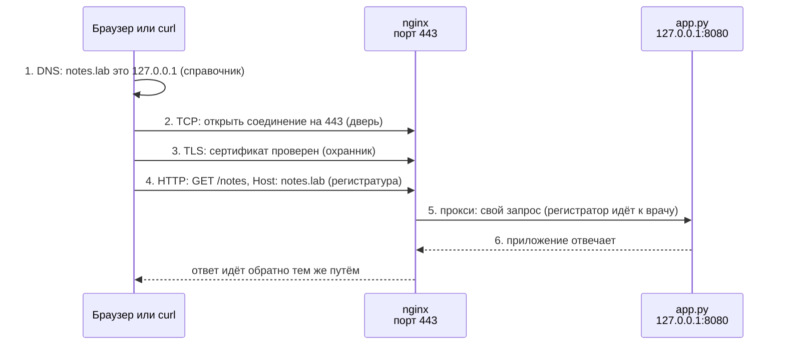
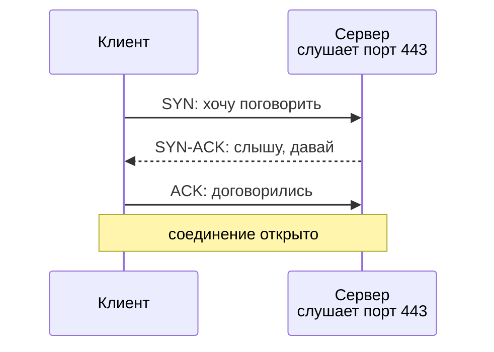
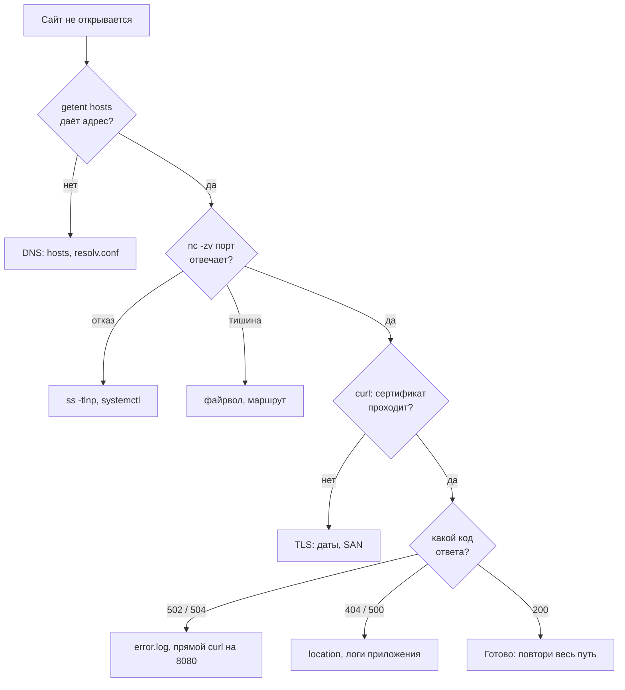

## Зачем это нужно

«Сайт не открывается» это не диагноз, а жалоба. За ней может стоять что угодно: в списке имён (DNS: система, которая превращает имя сайта в адрес, [урок 2.3](03-dns.md)) не тот адрес, на сервере закрыта «дверь» (порт: номер, по которому программа принимает подключения, [урок 2.2](02-ports-tcp-ssh.md)), просрочен сертификат (электронный «паспорт» сайта, по которому клиент проверяет, что говорит с настоящим сервером, [урок 2.6](06-tls.md)), упал nginx (программа-посредник перед приложением, [урок 2.5](05-nginx.md)) или приложение отвечает ошибкой. Клиент здесь тот, кто спрашивает (браузер, `curl`), а сервер тот, кто отвечает. Новичок в такой момент хаотично перезапускает всё подряд и через час не знает, что помогло. Инженер идёт по цепочке от клиента к приложению и на каждом звене задаёт один вопрос одной командой. Без порядка ты теряешь время: перезапустишь приложение, когда виноват просроченный сертификат, и ничего не изменится. Через десять минут он знает не только что сломано, но и на чьей стороне.

Так устроены разборы инцидентов на дежурстве (инцидент это сбой, из-за которого пользователи не могут пользоваться сервисом; дежурный инженер отвечает за то, чтобы его устранить), и такие вопросы задают на собеседованиях: «Что происходит, когда вводишь адрес в браузере? Сайт не открывается, что делаешь?». Этот урок собирает вместе всё, что ты прошёл в теме 2: адреса, порты, DNS, HTTP (правила, по которым клиент просит страницу, а сервер отвечает, [урок 2.4](04-http.md)), nginx, TLS (шифрование и проверка сервера) и файрвол (фильтр, который пропускает или выбрасывает пакеты, [урок 2.7](07-firewall.md)). До сих пор ты изучал их по отдельности, теперь научишься находить, какое из них подвело.

Шаг проекта: в «Заметках» появляется скрипт `scripts/diagnose.sh`. Скрипт это файл с командами, которые запускаются одна за другой. Этот проверяет сайт по слоям (DNS, порт, сертификат, ответ веб-сервера, приложение: слой это одно звено цепочки), печатает состояние каждого слоя и вердикт: где именно сломано.

## Что нужно знать

Нужен стенд из предыдущих уроков: nginx на портах 80 и 443 с сертификатом `notes.lab`, сервис `notes` на `127.0.0.1:8080` и запись `notes.lab` в `/etc/hosts`. Из уроков понадобится вот что:

- [Урок 1.8: systemd](../01-linux/08-systemd-editors.md): сервис `notes`, команды `systemctl` и `journalctl`, файл настроек `/etc/notes/notes.env`.
- [Урок 2.1: адреса и маршруты](01-addresses-routes.md): что такое IP-адрес, `127.0.0.1` (loopback), различие между отказом (порт закрыт, ответ приходит сразу) и таймаутом (пакеты молча теряются, клиент ждёт и сдаётся по истечении времени).
- [Урок 2.2: порты и TCP](02-ports-tcp-ssh.md): порт, соединение, `ss -tlnp`, `nc`.
- [Урок 2.3: DNS](03-dns.md): `/etc/hosts` (локальный файл «имя, адрес», который система читает раньше обращения к DNS-серверу), `getent`, `dig`.
- [Урок 2.4: HTTP](04-http.md): запрос, ответ, коды ответов, `curl -v`.
- [Урок 2.5: nginx](05-nginx.md): reverse proxy (обратный прокси: принимает запросы вместо приложения и передаёт их ему), `nginx -t`, `error.log`, 502 и 504.
- [Урок 2.6: TLS](06-tls.md): сертификат `notes.lab` в `/etc/notes/tls/`, `openssl s_client`.
- [Урок 2.7: файрвол](07-firewall.md): `ufw`, правила DROP и REJECT.

Быстрая проверка, что стенд на месте. Если что-то не так, вернись к уроку из списка выше:

```bash
systemctl is-active notes nginx
curl -sS --cacert /etc/notes/tls/notes.crt https://notes.lab/healthz; echo
```

```text
active
active
ok
```

## Картина целиком

Представь, что тебе нужно попасть на приём к врачу в большой поликлинике.

- Сначала ты узнаёшь адрес: смотришь в справочнике, где находится поликлиника. Ошибся в адресе, приехал не туда, и дальше можно не идти.
- Потом добираешься и дёргаешь дверь. Она либо открыта, либо заперта (тебе сразу отвечают «закрыто»), либо тебя вообще никто не замечает, потому что вход перекрыт.
- На входе охранник проверяет документ: настоящий ли он, твой ли, не просрочен ли.
- В регистратуре тебя спрашивают, к кому ты, и направляют в нужный кабинет.
- В кабинете врач принимает тебя. Если врача нет на месте, регистратура сообщает: «врач недоступен».

В сети ровно такая же цепочка, и на каждом звене свой способ сломаться:



На схеме видно, что у запроса шесть шагов подряд, и каждый зависит от предыдущего: до приложения (справа) дело доходит только после того, как прошли DNS, дверь и сертификат.

Главная идея урока: звенья зависят друг от друга, как звенья цепи. Если сломано звено 2, до звена 3 дело не дойдёт, и смотреть логи приложения бессмысленно. Поэтому проверять нужно строго по порядку и останавливаться на первом звене, которое не отвечает. Дальше по теории каждое звено разбирается отдельно: как оно работает, как ломается и какой командой это видно.

## Теория

### Путь запроса: шесть шагов и шесть мест поломки

Начнём с двух слов. **Клиент** (client) это программа, которая просит: браузер, `curl`. **Сервер** (server) это программа (и машина, на которой она работает), которая отвечает. Ты вводишь `https://notes.lab/notes`, и клиент отправляет **запрос** (request), а сервер возвращает **ответ** (response).

Адрес `https://notes.lab/notes` состоит из трёх частей:

```text
https://notes.lab/notes
|       |         |
|       |         путь: какую страницу (ресурс) просим внутри сайта
|       имя сервера: notes.lab
схема: по какому «языку» (протоколу) разговаривать. https = HTTP внутри шифрованного канала
```

**Протокол** (protocol) это набор правил разговора двух программ: кто что говорит первым и в каком формате. Как два человека договариваются: «здороваемся, потом называем имя, потом задаём вопрос».

Что делает клиент после нажатия Enter, по порядку:

1. **DNS** (Domain Name System, система доменных имён). Компьютеры находят друг друга по числовым адресам (IP-адресам, [урок 2.1](01-addresses-routes.md)), а не по именам. Клиент превращает имя `notes.lab` в адрес: сначала смотрит в файл `/etc/hosts`, потом спрашивает DNS-сервер. У нас в файле написано `127.0.0.1 notes.lab`, значит, ответ: `127.0.0.1`.
2. **TCP** (Transmission Control Protocol). Клиент открывает **соединение** (connection) с адресом `127.0.0.1` на порт 443: серия из трёх коротких сообщений, после которой у двух сторон есть общий «телефонный канал». Порт это номер «двери» на машине ([урок 2.2](02-ports-tcp-ssh.md)), а 443 стандартная дверь для HTTPS. Этот шаг проходит через маршруты и файрвол.
3. **TLS** (Transport Layer Security). Стороны договариваются о шифровании, и сервер показывает **сертификат**: электронный документ, который подтверждает, что это именно `notes.lab`. Клиент проверяет документ. Если проверка не прошла, разговор обрывается.
4. **HTTP** (HyperText Transfer Protocol). Внутри шифрованного канала клиент отправляет текстовый запрос: `GET /notes HTTP/1.1` («дай страницу `/notes`») и строку `Host: notes.lab` («я пришёл к сайту `notes.lab`»). Его принимает nginx.
5. **Прокси**. **nginx** это программа-веб-сервер. Ей нужно передать запрос дальше, поэтому она выбирает нужный блок настроек по строке `Host` и делает свой собственный запрос к приложению на `127.0.0.1:8080`. Такая программа-посредник называется обратным прокси (reverse proxy, [урок 2.5](05-nginx.md)).
6. **Приложение**. `app.py` (наши «Заметки») читает файл с данными и отвечает. Ответ идёт обратно тем же путём: приложение, nginx, шифрованный канал, клиент.

Разберём это на реальных значениях с нашего стенда. Вот как выглядит один успешный запрос, если попросить `curl` рассказать, что он делает (флаг `-v`, verbose, «подробно»). Из длинного вывода оставлены только нужные строки, фильтр объясним в практике:

```text
* Host notes.lab:443 was resolved.
* IPv4: 127.0.0.1
* Connected to notes.lab (127.0.0.1) port 443
* SSL connection using TLSv1.3 / TLS_AES_256_GCM_SHA384 / X25519 / RSASSA-PSS
*  subject: CN=notes.lab
*  subjectAltName: host "notes.lab" matched cert's "notes.lab"
*  SSL certificate verify ok.
> GET /notes HTTP/1.1
> Host: notes.lab
< HTTP/1.1 200 OK
< Server: nginx/1.24.0 (Ubuntu)
```

Каждый шаг пути виден в этом выводе: первые две строки это DNS (`resolved`, адрес `127.0.0.1`), строка `Connected` это TCP, `SSL connection`, `subject` и `verify ok` это TLS, строки со стрелкой `>` это наш запрос, строки со стрелкой `<` это ответ сервера. Строки с `*` `curl` пишет от себя, как комментарии.

Осторожно: «сайт не открывается» не значит «сервер упал». На деле сервер это цепочка из шести звеньев, и сломаться может любое, причём разными способами. Хуже всего, что одна поломка прячет другую: если просрочен сертификат, приложение ты вообще не увидишь, потому что клиент обрывает разговор на третьем шаге и до шестого не доходит.

> **Прикинь сам:** в какой строке вывода `curl -v` ты поймёшь, что сломан именно TLS, а не DNS?
{: .predict}

Строки идут в порядке шагов. Если есть `Connected to`, DNS и TCP позади, а ошибка после неё про сертификат: сломан TLS.

> **Главное:** запрос проходит шесть звеньев подряд, и первое сломанное закрывает всё, что за ним.
{: .key}

Дальше разберём каждое звено отдельно.

> **Проверь понимание:** сертификат просрочен, а приложение при этом остановлено. Какой слой ты увидишь сломанным первым и почему второй поломки пока не видно?

<details markdown="1">
<summary>Ответ</summary>

Первым сломается TLS (шаг 3): клиент не доверяет просроченному сертификату и обрывает разговор до отправки HTTP-запроса. До приложения запрос не доходит, поэтому его остановка не проявляется. Она всплывёт после починки сертификата, уже на шагах 5 и 6. Так бывает часто, поэтому после каждого исправления проверку нужно повторять с самого начала.

</details>

Мы видим цепь из шести звеньев. Идти по ней проще всего с начала, и первое звено это DNS: без адреса запрос вообще не знает, куда идти.

### Слой 1. DNS: как имя становится адресом

Людям удобно запоминать `notes.lab`, а сети нужен числовой адрес. Кто-то должен хранить соответствие «имя, адрес». Без этого пришлось бы помнить `85.143.10.20` вместо `notes.lab`, а при переезде сайта на другую машину сообщать об этом всем.

Подумай о телефонном справочнике: ищешь фамилию, находишь номер. Где аналогия перестаёт работать: у компьютера справочников несколько, и они проверяются по очереди, а первым идёт маленький личный блокнот (`/etc/hosts`), записи из которого важнее общего справочника (DNS-сервера).

Когда любая программа (`curl`, браузер, `ssh`) просит систему превратить имя в адрес, система действует в таком порядке:

1. Смотрит в `/etc/hosts`: текстовый файл на самой машине, в нём строки вида `адрес имя`.
2. Если имени там нет, спрашивает **резолвер** (resolver, «разрешитель»): DNS-сервер, адрес которого записан в файле `/etc/resolv.conf` в строке `nameserver`.
3. Резолвер отвечает адресом или сообщением «такого имени нет» (`NXDOMAIN`, Non-Existent Domain).

Порядок «сначала файл, потом DNS» задан в файле `/etc/nsswitch.conf` ([урок 2.3](03-dns.md)). Имя `notes.lab` мы придумали для учебного стенда, в настоящем DNS его нет. Поэтому оно работает только благодаря записи в `/etc/hosts`.

Посмотрим на стенде:

```text
$ getent hosts notes.lab
127.0.0.1       notes.lab

$ dig notes.lab
;; ->>HEADER<<- opcode: QUERY, status: NXDOMAIN, id: 62089
;; SERVER: 192.168.65.7#53(192.168.65.7) (UDP)
```

`getent hosts` спросил систему тем же способом, что любая программа, и получил `127.0.0.1` из файла `/etc/hosts`. `dig` в файл `/etc/hosts` не заглядывает: он отправил вопрос прямо на DNS-сервер `192.168.65.7` (адрес взят из `/etc/resolv.conf`, у тебя будет другой), и тот ответил `NXDOMAIN`, потому что про `notes.lab` он ничего не знает. Две команды дали противоположные ответы, и обе «правы»: они отвечают на разные вопросы.

**Как ломается.** Три типичных способа: имя записано с опечаткой (`notes.lb`), в файле осталась старая запись со старым адресом, DNS-сервер недоступен или не знает имени. Признак для клиента: `curl` пишет `Could not resolve host` («не могу разрешить имя», код выхода 6).

Осторожно: не проверяй DNS одной командой `dig`, чтобы сделать вывод «имени нет, значит сайт недоступен». Браузер при этом сайт открывает, потому что имя есть в `/etc/hosts`. Для диагностики «что увидит программа» всегда бери `getent hosts`, а `dig` оставь для вопроса «что говорит сам DNS-сервер».

> **Прикинь сам:** какой командой проверить, какой адрес получит программа, а не только что ответит DNS-сервер?
{: .predict}

Командой `getent hosts имя`: она идёт тем же порядком, что любая программа, и сначала читает `/etc/hosts`.

> **Главное:** для вопроса «что увидит программа» бери `getent hosts`, а `dig` показывает только ответ DNS-сервера.
{: .key}

> **Проверь понимание:** в `/etc/hosts` стоит `127.0.0.1 notes.lab`, а на DNS-сервере записи нет. `dig notes.lab` пуст. Значит ли это, что браузер не откроет сайт?

<details markdown="1">
<summary>Ответ</summary>

Нет. Браузер использует системный порядок, где `/etc/hosts` идёт первым, и сайт откроется. `dig` показывает только то, что отвечает DNS-сервер, и для вопроса «что видит программа» не подходит.

</details>

Адрес мы получили. Теперь нужно понять, примет ли машина по этому адресу соединение на нужном порту, и об этом следующий слой.

### Слой 2. TCP и порт: открыта ли дверь

На одной машине работают десятки программ: nginx, приложение, ssh. Когда пакет приходит на машину, надо понять, какой программе его отдать. Для этого у каждой программы-сервера есть **порт**: число от 1 до 65535. Кроме того, интернет сам по себе ненадёжен: пакеты теряются и приходят вперемешку, а нужен надёжный канал. Эту надёжность даёт TCP.

Сервер похож на дом с номером `127.0.0.1`, в нём много дверей с номерами: 22, 80, 443, 8080. За каждой дверью сидит своя программа. Перед разговором ты звонишь в дверь, тебе открывают: только после этого начинается диалог. Где аналогия перестаёт работать: дверь «открыта» только тогда, когда за ней стоит программа, которая **слушает** (listen), то есть специально ждёт подключений. Просто существующей двери не бывает.

Открытие соединения занимает три сообщения (**рукопожатие**, handshake):



На схеме три сообщения: два от клиента и одно от сервера между ними. Если слушателя нет, второго сообщения не будет, вместо него придёт `RST`.

`SYN` (synchronize) это «давай начнём», `ACK` (acknowledge) «подтверждаю». Это и есть тот самый «звонок в дверь». На него может быть три исхода, и различать их нужно с первого взгляда:

- **Соединение открыто.** Все три сообщения прошли. Порт открыт, программа слушает.
- **Отказ (`Connection refused`).** Пакет `SYN` дошёл до машины, ядро посмотрело: на этом порту никто не слушает, и тут же ответило пакетом `RST` (reset, «сброс»: «здесь никого нет»). Ответ приходит мгновенно, за доли миллисекунды. Виноват сервер: программа не запущена или слушает не на том адресе или порту.
- **Молчание (таймаут, timeout).** Ответа нет вообще. Клиент ждёт и через некоторое время сдаётся. Так бывает, когда пакет выбросил **файрвол** (firewall, программа-фильтр, которая решает, какие пакеты пропускать, [урок 2.7](07-firewall.md)) с правилом `DROP` («молча выбросить»), или пакет не нашёл дороги, или машина выключена.

Порт 443 слушает nginx, а порт 81 никто не слушает. Проверяем командой `nc` с флагом `-zv` (`-z` только проверить порт, не отправляя данных, `-v` подробно):

```text
$ nc -zv notes.lab 443
Connection to notes.lab (127.0.0.1) 443 port [tcp/https] succeeded!

$ nc -zv 127.0.0.1 81
nc: connect to 127.0.0.1 port 81 (tcp) failed: Connection refused
```

Первая команда: рукопожатие удалось, `succeeded`. Вторая: ядро сразу ответило `RST`, и `nc` сообщил `Connection refused`. Если добавить на стенд правило файрвола, которое выбрасывает пакеты на порт 443, та же проверка завершится совсем иначе:

```text
$ nc -zv -w 3 notes.lab 443
nc: connect to notes.lab (127.0.0.1) 443 port (tcp) timed out: Operation now in progress
```

Флаг `-w 3` (wait) ограничил ожидание тремя секундами, и ровно три секунды `nc` ждал. Ни отказа, ни успеха: `SYN` ушёл в никуда, ответа нет. Видишь долгое ожидание, ищи преграду на пути, а не остановленный сервис.

Осторожно: «не подключается» не одна проблема. На деле `refused` и таймаут это две разные поломки с разными лечениями: при `refused` идёшь на сервер и смотришь `ss -tlnp`, при таймауте смотришь файрвол, маршруты и облачные правила. Ещё одна ловушка: программа, которая слушает адрес `127.0.0.1`, недоступна снаружи ([урок 2.1](01-addresses-routes.md)). Такой «сервис слушает, но не пускает» с другой машины выглядит как `refused`.

Отдельно про наш стенд. Файрвол `ufw` в Ubuntu по умолчанию пропускает трафик внутри самой машины (loopback), поэтому запрет порта в `ufw` не остановил бы наши проверки с `notes.lab` на `127.0.0.1`. Чтобы воспроизвести таймаут на одной машине, в упражнении «Сломай и почини» правило добавляется напрямую через `iptables` (низкоуровневый инструмент, поверх которого работает `ufw`).

> **Прикинь сам:** `nc -zv 127.0.0.1 81` ответил за долю секунды. Что это за исход, молчание или отказ?
{: .predict}

Отказ (`Connection refused`): ядро ответило `RST`, раз порт никто не слушает. Молчание заняло бы секунды.

> **Главное:** мгновенный отказ значит «никто не слушает», долгая тишина значит «пакет выбросили или потеряли».
{: .key}

> **Проверь понимание:** `curl` на порт зависает на 30 секунд, потом ошибка. Кто виноват вероятнее: остановленный сервис или файрвол?

<details markdown="1">
<summary>Ответ</summary>

Файрвол (DROP) или маршрут. Остановленный сервис на живой машине даёт мгновенный `Connection refused`, потому что ядро отвечает `RST`. Долгое молчание значит, что до порта пакет не дошёл или ответ не вернулся.

</details>

Порт открыт и соединение установлено, но данные по сети идут через чужие устройства. Как их защищают и как проверить, что мы говорим с нужным сервером, смотрим в следующем слое.

### Слой 3. TLS и сертификат: с тем ли сервером ты говоришь

По сети данные проходят через чужие устройства, и без защиты их может прочитать или подменить любой посредник: пароли, заметки, всё. Значит, нужны два свойства: **шифрование** (никто посередине не прочитает) и **проверка личности** сервера (ты говоришь действительно с `notes.lab`, а не с подделкой). За оба отвечает TLS.

Сертификат проверяют так же, как посылку от курьера: он приносит её и предъявляет паспорт. Ты проверяешь три вещи: паспорт выдан организацией, которой ты доверяешь (не нарисован от руки), фамилия в паспорте совпадает с той, что ты ждал, паспорт не просрочен. Где аналогия перестаёт работать: паспорт проверяет человек, а сертификат проверяет программа автоматически, и строго: любое несовпадение обрывает разговор.

После TCP-рукопожатия клиент и сервер обмениваются сообщениями TLS:

1. Клиент говорит: «Я хочу говорить с `notes.lab`» (это имя передаётся в самом начале и называется **SNI**, Server Name Indication: один nginx обслуживает много сайтов, и ему нужно знать, какой сертификат показывать).
2. Сервер отправляет свой **сертификат**: файл с именем сайта, сроком действия и **открытым ключом** (математическая пара к секретному ключу, который знает только сервер).
3. Клиент проверяет сертификат по трём пунктам:
   - **доверие**: кто выпустил сертификат? Обычно его подписывает **удостоверяющий центр** (CA, Certificate Authority), которому доверяют все браузеры. Наш сертификат **самоподписанный** (self-signed): мы выпустили его сами себе в [уроке 2.6](06-tls.md), поэтому у клиента нет причин ему верить, пока мы не скажем: «доверяй этому файлу» (флаг `--cacert`);
   - **имя**: имя сайта, который ты открываешь, должно быть перечислено в сертификате в поле **SAN** (Subject Alternative Name, «альтернативные имена субъекта»). У нас там `DNS:notes.lab`;
   - **срок**: сегодняшняя дата должна попадать между `notBefore` и `notAfter`.
4. Если все три проверки прошли, стороны договариваются о ключе шифрования, и дальше всё идёт зашифрованным.

Посмотрим на сертификат нашего стенда и его проверку:

```text
$ sudo openssl x509 -noout -dates -subject -ext subjectAltName -in /etc/notes/tls/notes.crt
notBefore=Sep 30 11:56:22 2026 GMT
notAfter=Sep 30 11:56:22 2027 GMT
subject=CN = notes.lab
X509v3 Subject Alternative Name: 
    DNS:notes.lab

$ echo | openssl s_client -connect notes.lab:443 -servername notes.lab -CAfile /etc/notes/tls/notes.crt 2>/dev/null | grep 'Verify return code'
Verify return code: 0 (ok)
```

Сертификат действует ровно год (от `notBefore` до `notAfter`), выдан для имени `notes.lab`. Команда `openssl s_client` работает как «браузер без страницы»: открывает TLS-соединение и печатает итог проверки. Код `0 (ok)` значит, что все три пункта пройдены. Если убрать флаг `-CAfile` (не сказать, что нашему сертификату можно верить), итог другой:

```text
Verify return code: 18 (self-signed certificate)
```

Код 18 это «сертификат самоподписанный, доверия нет». Другие коды, которые ты встретишь: `10 (certificate has expired)`, срок вышел, и `62 (hostname mismatch)`, имени сайта нет в сертификате. Каждый код прямо называет, какая из трёх проверок не пройдена.

Осторожно: самоподписанный сертификат не значит, что шифрования нет. Шифрование есть и работает, просто клиент не может убедиться, что ты говоришь с тем, с кем хотел. Не лечи ошибку `curl` флагом `-k` (он отключает проверку сертификата): это как перестать смотреть паспорт, ошибка исчезла, а проблема осталась, и именно эту проблему ты ищешь. И при просроченном сертификате сервер не «лежит», он жив, но клиент честно отказывается с ним говорить.

> **Прикинь сам:** какой код проверки вернёт `openssl s_client` для просроченного сертификата: 0, 10 или 18?
{: .predict}

Код 10 (`certificate has expired`). Ноль значит успех, а 18 значит самоподписанный сертификат без доверия.

> **Главное:** TLS проверяет три вещи: доверие, имя и срок, и код проверки прямо называет, какая не прошла.
{: .key}

> **Проверь понимание:** сертификат выпущен для `notes.lab`, а ты открываешь `https://127.0.0.1/`. Какая из трёх проверок не пройдёт?

<details markdown="1">
<summary>Ответ</summary>

Проверка имени: в SAN стоит `notes.lab`, а ты обратился по адресу `127.0.0.1`, значит, имени в сертификате нет. Доверие и срок при этом могут быть в порядке. Поэтому для сайтов с HTTPS нужно ходить по имени, а не по IP.

</details>

Канал защищён и сервер проверен. Теперь клиент может попросить страницу, а сервер ответить кодом, и именно по коду видно, что случилось дальше.

### Слой 4. HTTP и коды ответов: что ответил веб-сервер

Когда канал готов, клиенту нужно как-то попросить страницу, а серверу как-то сообщить: «вот она» или «такой нет» или «я сломался». Для этого есть единый формат разговора, HTTP ([урок 2.4](04-http.md)).

Запрос и ответ HTTP напоминают заявку в окошке: «Дайте мне документ номер 5» и ответ на бланке с кратким итогом в верхней строке («выдан», «не найден», «окно не работает»). Итог в верхней строке и есть **код ответа** (status code).

Запрос состоит из строки (что просим) и **заголовков** (headers, дополнительные пометки вида `Имя: значение`). Ответ состоит из строки с кодом, заголовков и тела (самой страницы). Код ответа это число из трёх цифр, и первая цифра говорит о классе:

- `2xx`: успех (`200 OK`);
- `3xx`: «иди в другое место» (`301 Moved Permanently`, перенаправление);
- `4xx`: ошибка на стороне клиента: запросил то, чего нет (`404`), или нельзя (`405`);
- `5xx`: ошибка на стороне сервера: `500` (приложение упало на запросе), `502` и `504` (о них ниже).

Особый заголовок `Host` сообщает, к какому сайту ты пришёл. Один nginx на одном IP может обслуживать десять сайтов и по `Host` решает, чей запрос.

Вот реальный ответ nginx на запрос через HTTP (порт 80). Мы настроили в [уроке 2.6](06-tls.md), что порт 80 отправляет клиента на HTTPS:

```text
$ curl -sv -o /dev/null http://notes.lab/notes 2>&1 | grep -E '^(> GET|< HTTP|< Location|< Server)'
> GET /notes HTTP/1.1
< HTTP/1.1 301 Moved Permanently
< Server: nginx/1.24.0 (Ubuntu)
< Location: https://notes.lab/notes
```

Клиент запросил `/notes` по порту 80. Сервер ответил кодом `301`: «страница переехала» и в заголовке `Location` указал новый адрес: `https://notes.lab/notes`. Браузер сам пойдёт по этому адресу. Обрати внимание: `301` это не ошибка, слой 4 здесь в порядке.

Вот запрос уже по HTTPS с ключом `-i` (include, «показать заголовки ответа вместе с телом»):

```text
$ curl -si --cacert /etc/notes/tls/notes.crt https://notes.lab/healthz
HTTP/1.1 200 OK
Server: nginx/1.24.0 (Ubuntu)
Date: Wed, 30 Sep 2026 11:58:36 GMT
Content-Type: text/plain; charset=utf-8
Content-Length: 2
Connection: keep-alive
Strict-Transport-Security: max-age=31536000

ok
```

Первая строка: `200 OK`, успех. Дальше заголовки: кто ответил (`Server: nginx`), когда, какого типа тело (`text/plain`), сколько в нём байт (`Content-Length: 2`, два символа `ok`). После пустой строки идёт тело: `ok`.

Осторожно: если код ответа пришёл, это не значит, что «всё работает». Код `5xx` означает: цепочка до веб-сервера цела (DNS, порт и TLS прошли, иначе ответа бы не было), а сломано что-то внутри. Получив любой код, ты автоматически знаешь, что слои 1-3 в порядке. Это очень сужает поиск.

> **Прикинь сам:** с какой цифры начинается код, если ошибся сам клиент, и с какой, если сервер?
{: .predict}

Клиент: 4 (например, `404`). Сервер: 5 (например, `502`).

> **Главное:** любой код ответа доказывает, что DNS, порт и TLS прошли, иначе ответа бы не было.
{: .key}

> **Проверь понимание:** `curl` вернул `404 Not Found`. Какие слои точно работают?

<details markdown="1">
<summary>Ответ</summary>

Все нижние: DNS, TCP и TLS (иначе ответа бы не было). Работает и веб-сервер. Вопрос уже про путь, который ты запросил: опечатка в URL или такой страницы у приложения нет.

</details>

Среди кодов самые коварные 5xx: они говорят, что сломано что-то внутри. Первым делом проверяют nginx, и в слое 5 разберём, почему именно он выдаёт 502 и 504.

### Слой 5. nginx как прокси: 502 и 504

Приложению не нужно самому разбираться с шифрованием и тысячами клиентов, для этого стоит nginx ([урок 2.5](05-nginx.md)). Но появление посредника значит, что запрос теперь проходит **два** соединения: клиент к nginx и nginx к приложению. Каждое из них может подвести отдельно, и клиент увидит только ответ nginx.

Для nginx подойдёт образ регистратуры поликлиники. Ты говоришь регистратору, к какому врачу, он идёт в кабинет и приносит ответ. Если врач не отвечает, регистратор возвращается и говорит: «У врача никого нет» (это 502) или «Я ждал полчаса, врач ничего не сказал» (это 504). Ты общался только с регистратором и о самом враче знаешь лишь то, что он передал.

Программу, к которой nginx обращается за ответом, называют **апстримом** (upstream, «вышестоящий»). В нашей настройке это `proxy_pass http://127.0.0.1:8080;`. Что nginx делает по шагам:

1. Принимает запрос клиента, выбирает по `Host` нужный блок `server` и по пути блок `location`.
2. Открывает соединение к апстриму `127.0.0.1:8080` (даёт на это `proxy_connect_timeout`, у нас 3 секунды).
3. Отправляет запрос и ждёт ответ (даёт на это `proxy_read_timeout`, у нас 30 секунд).
4. Возвращает ответ клиенту. Если на шаге 2 или 3 что-то пошло не так, nginx сам формирует страницу с ошибкой.

Две ошибки, которые из этого получаются:

- **`502 Bad Gateway`** («плохой шлюз»): на шаге 2 nginx не смог получить нормальный ответ, чаще всего апстрим не слушает порт (`Connection refused`) или оборвал соединение. Это тот же мгновенный `refused`, что в слое 2, только между nginx и приложением.
- **`504 Gateway Timeout`** («шлюз не дождался»): соединение установлено, но за `proxy_read_timeout` ответа нет. Приложение живо, но медленное.

Останавливаем приложение и запрашиваем `/healthz`. Ответ, который видит клиент, и запись, которую nginx оставил в `/var/log/nginx/notes-error.log`:

```text
$ curl -si --cacert /etc/notes/tls/notes.crt https://notes.lab/healthz | head -3
HTTP/1.1 502 Bad Gateway
Server: nginx/1.24.0 (Ubuntu)
Date: Wed, 30 Sep 2026 11:58:36 GMT

$ sudo tail -n 1 /var/log/nginx/notes-error.log
2026/09/30 11:57:06 [error] 2116#2116: *129 connect() failed (111: Connection refused) while connecting to upstream, client: 127.0.0.1, server: notes.lab, request: "GET /healthz HTTP/1.1", upstream: "http://127.0.0.1:8080/healthz", host: "notes.lab"
```

Разбор строки лога: `connect() failed (111: Connection refused)` это тот самый отказ на шаге 2; `while connecting to upstream` подтверждает, что упало именно подключение к апстриму; `upstream: "http://127.0.0.1:8080/healthz"` показывает, куда nginx ходил. Клиент видит только `502`, а причина написана в логе.

Для 504 в логе другая запись. Запрос `/slow?sec=40` (приложение спит 40 секунд, nginx ждёт 30) даёт после 30 секунд ожидания:

```text
[error] 791#791: *22 upstream timed out (110: Connection timed out) while reading response header from upstream, ... request: "GET /slow?sec=40 HTTP/1.1", upstream: "http://127.0.0.1:8080/slow?sec=40"
```

`upstream timed out ... while reading response header` это «дождался только молчания». Разница в тексте лога главная подсказка: `connect() failed` значит 502-ситуацию, `upstream timed out` значит 504.

Осторожно: `502` не означает «nginx сломан». Наоборот, nginx как раз жив и честно сообщает, что за ним что-то не так. И не лечи `504` увеличением `proxy_read_timeout`: это лечит симптом: сайт станет ждать дольше, а приложение так и останется медленным. Сначала надо понять, почему оно медленное.

> **Прикинь сам:** в логе `upstream timed out (110: Connection timed out)`. Какой код увидел клиент, 502 или 504?
{: .predict}

504: соединение с приложением было, но оно не ответило за `proxy_read_timeout`. При `connect() failed (111...)` был бы 502.

> **Главное:** 502 это «приложение не приняло запрос», 504 это «приложение приняло и молчит», причина в `error.log`.
{: .key}

> **Проверь понимание:** ты видишь `502`. Достаточно ли перезапустить nginx?

<details markdown="1">
<summary>Ответ</summary>

Нет. `502` пишет именно живой nginx, а причина в апстриме: приложение остановлено, слушает другой порт или адрес, либо в `proxy_pass` указан неправильный порт. Перезапуск nginx ничего не изменит. Нужно проверить приложение напрямую (`curl http://127.0.0.1:8080/healthz`) и прочитать `error.log`.

</details>

nginx сообщил, что с приложением что-то не так. Значит, пора смотреть на последнее звено цепи: на само приложение.

### Слой 6. Приложение: жив ли сам сервис

Последнее звено цепи: программа, ради которой всё затеяно. Чтобы понять, виновато ли оно, его нужно проверить **в обход** всех предыдущих слоёв, обратившись к нему напрямую. Тогда ты убираешь из уравнения DNS, TCP-порт nginx, TLS и сам nginx и точно знаешь, кто виноват.

Бывает, что ты не уверен, отвечает ли регистратор за врача, и тогда заходишь прямо в кабинет и смотришь: сидит врач или нет.

Приложение работает как сервис systemd ([урок 1.8](../01-linux/08-systemd-editors.md)), и есть три места, где видно его состояние:

1. `systemctl is-active notes` или `systemctl status notes`: запущен ли процесс. Особое состояние `activating (auto-restart)` означает: процесс падает при старте, а systemd (по настройке `Restart=on-failure`) через 2 секунды запускает его снова, и так по кругу.
2. `journalctl -u notes`: журнал, куда попадает всё, что приложение печатает. Причина падения написана там.
3. `curl http://127.0.0.1:8080/healthz`: прямой запрос. `/healthz` это специально созданная страница для проверки жизни («health», здоровье), она отвечает `ok`, когда процесс работает.

Мы написали в `/etc/notes/notes.env` адрес `HOST=192.0.2.10`, которого нет на машине (этот сценарий ты воспроизведёшь в разделе «Сломай и почини»). Вот что показывает система:

```text
$ systemctl status notes --no-pager | head -6
● notes.service - Сервис Заметки
     Loaded: loaded (/etc/systemd/system/notes.service; enabled; preset: enabled)
     Active: activating (auto-restart) (Result: exit-code) since Wed 2026-09-30 11:57:05 UTC; 770ms ago
    Process: 2197 ExecStart=/usr/bin/python3 /opt/notes/app.py (code=exited, status=1/FAILURE)
   Main PID: 2197 (code=exited, status=1/FAILURE)

$ sudo journalctl -u notes -n 3 --no-pager
... python3[2197]:     self.socket.bind(self.server_address)
... python3[2197]: OSError: [Errno 99] Cannot assign requested address
... systemd[1]: notes.service: Main process exited, code=exited, status=1/FAILURE
```

Строка `Active: activating (auto-restart)` означает «процесс упал, скоро запущу снова». Основная подсказка в журнале: `OSError: [Errno 99] Cannot assign requested address`, то есть приложение попыталось занять адрес, которого нет у этой машины ([урок 2.1](01-addresses-routes.md): привязка к адресу). Порт 8080 при этом никто не слушает (`ss -tlnp | grep 8080` пуст), поэтому nginx получает `refused` и отвечает клиенту `502`.

Осторожно: если `/healthz` отвечает `ok`, это не значит, что у приложения всё хорошо. Этот адрес проверяет только то, что процесс жив и умеет отвечать. Если у приложения сломана база данных или диск, `/healthz` может быть зелёным, а пользователи будут получать `500`. Отдельная проверка «готово ли приложение работать» называется readiness, о ней в [уроке 5.7](../05-kubernetes/07-probes-resources-rollouts.md).

> **Прикинь сам:** `systemctl status notes` показывает `activating (auto-restart)`. Слушает ли порт 8080 кто-нибудь?
{: .predict}

Нет: процесс падает при старте и порт занять не успевает. Причину ищи в `journalctl -u notes`.

> **Главное:** приложение проверяют напрямую, в обход nginx: `curl http://127.0.0.1:8080/healthz`.
{: .key}

> **Проверь понимание:** `curl https://notes.lab/healthz` возвращает `502`, а `curl http://127.0.0.1:8080/healthz` возвращает `ok`. Где искать причину?

<details markdown="1">
<summary>Ответ</summary>

Приложение живо, значит виноват путь между nginx и приложением: неверный `proxy_pass` (порт или адрес), ошибка в конфиге nginx. Проверяй `sudo nginx -t`, `grep proxy_pass /etc/nginx/sites-available/notes` и `error.log`.

</details>

Приложение может быть живо и всё равно недоступно: достаточно, чтобы оно слушало не тот адрес. Как это выглядит и как поймать, смотрим дальше.

### Адрес привязки: почему сервис слушает, а достучаться нельзя

У машины может быть несколько IP-адресов: `127.0.0.1` (loopback, «адрес самой себя», доступен только изнутри машины), адрес в локальной сети, адрес в интернете. Программе-серверу нужно решить, на каких из них принимать подключения. Это решение называется **привязкой** (bind): программа говорит ядру «закрепи за мной порт 8080 на таком-то адресе».

У дома тоже бывает несколько входов: парадный с улицы, служебный со двора, внутренняя дверь между комнатами. Консьерж может сидеть у внутренней двери (принимает только жильцов), у парадной (принимает всех с улицы) или у обеих сразу.

Всё решается в момент запуска приложения:

1. Приложение при старте вызывает системную функцию `bind` с парой «адрес и порт».
2. Если адрес принадлежит этой машине, ядро запоминает: пакеты на этот адрес и порт отдавать этому процессу. Так появляется строка в `ss -tlnp`.
3. Если адреса на машине нет, `bind` возвращает ошибку `Cannot assign requested address` (номер 99), процесс падает, а порт никто не слушает.
4. Особый адрес `0.0.0.0` означает «все адреса этой машины сразу».

На стенде приложение слушает только loopback, а nginx на всех адресах. В выводе `ss -tlnp` это видно по колонке `Local Address:Port`:

```text
$ sudo ss -tlnp | grep -E ':(80|443|8080) '
LISTEN 0      511          0.0.0.0:80        0.0.0.0:*    users:(("nginx",pid=784,fd=5),...)
LISTEN 0      511          0.0.0.0:443       0.0.0.0:*    users:(("nginx",pid=784,fd=6),...)
LISTEN 0      5          127.0.0.1:8080      0.0.0.0:*    users:(("python3",pid=2499,fd=3))
```

В строках nginx на самом деле перечислено несколько процессов (мастер и рабочие), здесь список обрезан многоточием, а номера `pid` у тебя будут другими. `0.0.0.0:443` значит, что nginx принимает подключения на любом адресе машины, и с другого компьютера сайт открывается. `127.0.0.1:8080` значит, что приложение доступно только изнутри самой машины, и этого достаточно: к нему ходит только nginx, который стоит рядом. Так задумано намеренно: приложение не должно торчать наружу в обход шифрования и nginx.

Теперь понятно, как ломает сценарий 5: в `notes.env` написан адрес `192.0.2.10`, которого у машины нет. Функция `bind` не может закрепить порт, приложение падает с `Errno 99`, systemd его перезапускает, оно снова падает, и так по кругу. В `ss` строки с `8080` нет вообще.

Осторожно: «сервис запущен» и «сервис слушает нужный адрес» это разные вещи. `systemctl is-active` может показать `active`, а порт при этом слушается только на `127.0.0.1`, и снаружи будет `refused`. Смотри в `ss -tlnp` именно на колонку с адресом, а не только на наличие строки.

> **Прикинь сам:** что означает адрес `0.0.0.0:443` в колонке `Local Address:Port`?
{: .predict}

Программа слушает порт на всех адресах машины, поэтому достучаться можно и с других компьютеров.

> **Главное:** в `ss -tlnp` смотри на колонку с адресом: `active` и наличие строки не значат, что снаружи пустят.
{: .key}

> **Проверь понимание:** `ss -tlnp` показывает `127.0.0.1:443` у nginx. Откроется ли сайт с другого компьютера?

<details markdown="1">
<summary>Ответ</summary>

Нет. Пакет с другого компьютера приходит на внешний адрес машины, а на нём никто не слушает, поэтому клиент получит `Connection refused`. Изнутри машины по `127.0.0.1` всё будет работать, из-за чего поломку легко пропустить, если проверять только на самом сервере.

</details>

Мы научились находить поломку по симптомам. Но причину всегда знает только сам сервер, и узнать её можно из журналов. Начнём с логов nginx.

### Логи nginx: два файла и что в них искать

Клиент видит только код ответа, а причину знает лишь сервер. Единственный способ узнать её после факта это журналы, куда программы записывают, что с ними происходило. Читать логи это основной навык дежурного: он превращает «что-то сломалось» в «сломалось вот это, вот здесь».

Регистратура ведёт два журнала: книгу посетителей (кто пришёл и чем закончился визит) и журнал происшествий (что пошло не так, и почему). В первую записывают всё подряд, во вторую только сбои.

У nginx в нашей настройке ([урок 2.5](05-nginx.md)) два файла в каталоге `/var/log/nginx/`:

1. `notes-access.log` (журнал доступа): одна строка на каждый запрос. Там адрес клиента, время, запрос, код ответа, размер ответа и название программы клиента.
2. `notes-error.log` (журнал ошибок): строка на каждую проблему, с системной причиной в скобках, например `(111: Connection refused)` или `(110: Connection timed out)`.

Числа в скобках это стандартные номера системных ошибок Linux. Для диагностики достаточно запомнить два: `111` это отказ (никто не слушает), `110` это тайм-аут (ничего не ответило).

Один и тот же запрос `/healthz` при остановленном приложении оставляет след в обоих журналах. Строка из журнала доступа:

```text
127.0.0.1 - - [30/Sep/2026:11:58:36 +0000] "GET /healthz HTTP/1.1" 502 166 "-" "curl/8.5.0"
```

Разбор слева направо: `127.0.0.1` кто пришёл, `[30/Sep/2026:11:58:36 +0000]` когда (часовой пояс UTC), `"GET /healthz HTTP/1.1"` что просили, `502` какой код вернули, `166` сколько байт в теле ответа (это размер страницы ошибки nginx), `"curl/8.5.0"` какая программа спрашивала. Здесь видно, что запрос дошёл и получил 502, но не почему. Причина в журнале ошибок, строку из него ты уже разбирал выше: `connect() failed (111: Connection refused) while connecting to upstream`.

Число `166` в этой строке пригодится: у страницы «502 Bad Gateway» от nginx всегда один и тот же размер, поэтому, увидев подряд много ответов `502 166`, ты сразу узнаёшь ошибку самого nginx, а не страницу приложения.

Читать логи удобно так: `sudo tail -n 20 файл` показывает последние 20 строк, `sudo tail -f файл` следит за файлом и печатает новые строки по мере появления (остановка сочетанием клавиш Ctrl+C), а `sudo grep ' 502 ' файл` оставляет только строки с 502.

Осторожно: если читать только журнал доступа, увидишь «502» и не поймёшь причину. А если искать причину в журнале приложения, хотя 502 порождён самим nginx и записан в его `error.log`. Правило: код ответа читай из `access.log`, причину ошибки из `error.log`.

> **Прикинь сам:** в `access.log` нашёл `GET /healthz ... 502 166`. Есть ли в этой строке причина ошибки?
{: .predict}

Нет: там только факт (код и размер). Причина записана в `error.log`.

> **Главное:** код ответа читай из `access.log`, причину ошибки из `error.log`.
{: .key}

> **Проверь понимание:** в `access.log` подряд идут строки с кодом `504`. В каком журнале искать причину и какую фразу ожидаешь увидеть?

<details markdown="1">
<summary>Ответ</summary>

В `notes-error.log`. Ожидаемая фраза: `upstream timed out (110: Connection timed out) while reading response header from upstream`. Она подтвердит, что соединение с приложением было, но оно не ответило за `proxy_read_timeout`.

</details>

Журналы показывают причину одной поломки. Но в настоящей аварии сломанное звено редко одно, и об этом следующий раздел.

### Когда одна поломка прячет другую

В настоящей аварии сломанное звено редко одно. Чаще это цепочка: одну причину чинят, а под ней ждёт вторая. Кто не знает про маскировку, после первой починки объявляет «готово» и через минуту получает новую жалобу.

Поездка на приём показывает то же самое: сначала не открываются ворота двора (ты не видишь, что дверь в здание тоже заперта), потом ворота открыли, но выяснилось, что и дверь заперта. Пока стоишь у ворот, про дверь не узнать.

Слои проверяются по порядку, и нижний сломанный слой полностью закрывает верхние: если клиент оборвал разговор на шаге 3 (TLS), шаги 4-6 просто не происходят, и клиент о них ничего не узнаёт. Отсюда правило: после каждой починки проверяй заново весь путь сначала, а не только исправленный слой.

Допустим, одновременно сломались две вещи: просрочен сертификат, а в `notes.env` неверный `HOST`. Как идёт диагностика:

```text
проверка                          результат                      что делаем
1. curl https://notes.lab/        (60) certificate has expired   чиним сертификат, reload nginx
2. curl https://notes.lab/        502 Bad Gateway                вторая поломка, была скрыта
3. curl http://127.0.0.1:8080/    Connection refused             приложение не слушает
4. sudo journalctl -u notes       Errno 99 Cannot assign ...     чиним HOST, restart notes
5. curl https://notes.lab/        200                            готово
```

На шаге 1 код 60 остановил разговор до HTTP, и про приложение ничего не было известно. Только починка сертификата открыла путь на шаг 4 протокола, и там всплыл 502. Если бы ты после шага 1 сказал «починил» и не повторил проверку, пользователи по-прежнему видели бы ошибку.

Второй вид маскировки: один симптом на разных причинах. Сценарии 4 и 5 из раздела «Сломай и почини» оба дают `502`, но причина разная: в 4 приложение живо, а nginx ходит не на тот порт, в 5 порт никто не слушает. Отличает их одна команда, прямой запрос к приложению `curl http://127.0.0.1:8080/healthz`. Поэтому `diagnose.sh` проверяет приложение напрямую, а не только через nginx.

Осторожно: если ошибка сменилась с одной на другую, это не значит, что стало хуже. На деле смена ошибки это признак прогресса: ты прошёл ещё один слой и добрался до следующего. Плохой знак другой: ошибка не меняется совсем после того, как ты «исправил».

> **Прикинь сам:** ты починил первую поломку, и ошибка сменилась на другую. Хорошо это или плохо?
{: .predict}

Хорошо: ты прошёл ещё один слой. Плохо, если после «починки» ошибка осталась точно такой же.

> **Главное:** после каждой починки проверяй весь путь заново, потому что нижняя поломка прячет верхние.
{: .key}

> **Проверь понимание:** после починки сертификата `curl` больше не пишет про сертификат, а показывает `502`. Что это означает?

<details markdown="1">
<summary>Ответ</summary>

Слои 1-3 теперь пройдены (DNS, порт, TLS), и клиент дошёл до HTTP: nginx отвечает. Второй поломкой оказалась вещь глубже, в связке nginx и приложения. Это движение вперёд, а не откат. Дальше проверь приложение напрямую и прочитай `error.log`.

</details>

Маскировку видно по смене ошибок, а проверять каждый шаг удобнее по числам. Какие числа даёт `curl`, смотрим дальше.

### Улики: код выхода curl и время запроса

Каждый слой ломается по-своему, и `curl` умеет сообщить об этом двумя способами: числом (кодом выхода) и временем. Оба нужно уметь читать.

**Код выхода.** Любая команда при завершении возвращает число: **код выхода** (exit code). `0` значит «успех», всё остальное «ошибка». Код последней команды лежит в переменной `$?` ([урок 1.6](../01-linux/06-bash-basics.md)). У `curl` для каждого вида ошибки свой код, и по нему сразу видно слой:

| Код | Сообщение `curl` | Слой |
|---|---|---|
| 6 | `Could not resolve host` | DNS: имя не превратилось в адрес |
| 7 | `Failed to connect ... Couldn't connect to server` | порт: отказ (RST) или нет маршрута |
| 28 | `Connection timed out` или `Operation timed out` | молчание: DROP, или сервер слишком медленный |
| 60 | `SSL certificate problem` | TLS: сертификат не прошёл проверку |
| 35 | `wrong version number` | по адресу отвечает не TLS (например, ты пошёл по `https://` на порт 80) |
| 3 | `URL rejected` | в адресе есть недопустимый символ, например пробел |

Строка `Connection timed out after N milliseconds` значит, что не удалось даже подключиться, а `Operation timed out after N milliseconds with 0 bytes received` значит, что соединение было, но ответ не пришёл вовремя. Первое похоже на файрвол (слой 2), второе на медленное приложение (слой 5-6).

Если `curl` дошёл до кода ответа (`200`, `404`, `502`), слои 1-3 точно живы.

**Время запроса.** Ключ `-w` (write-out, «вывести после завершения») позволяет вывести время каждой стадии запроса. Все значения накопительные: отсчёт идёт от начала запроса.

```text
time_namelookup   : сколько ушло на DNS
time_connect      : ... до конца TCP-рукопожатия (включает DNS)
time_appconnect   : ... до конца TLS-рукопожатия (включает TCP и DNS)
time_starttransfer: ... до первого байта ответа (включает всё выше и работу приложения)
time_total        : ... до конца ответа
```

Разберём реальные цифры из двух запросов: к быстрой странице `/healthz` и к медленной `/slow?sec=2` (приложение спит 2 секунды):

```text
                     /healthz      /slow?sec=2
time_namelookup      0.000169      0.000124
time_connect         0.000234      0.000157
time_appconnect      0.002269      0.001762
time_starttransfer   0.002737      2.002611
time_total           0.002757      2.002633
```

Как считать вклад каждой стадии для медленного запроса вычитанием соседних значений: DNS 0.000124 с; TCP 0.000157 - 0.000124 = 0.000033 с; TLS 0.001762 - 0.000157 = 0.001605 с; ожидание ответа приложения 2.002611 - 0.001762 = 2.000849 с. Всё время ушло на последнюю стадию, а у быстрого запроса вся картина в пределах 3 миллисекунд. Скачок появляется ровно там, где начинается проблема: выросла бы цифра `time_namelookup`, виноват DNS, выросла бы `time_connect`, виновата сеть или файрвол, выросла бы `time_appconnect`, виновата TLS.

Осторожно: значения нельзя читать как отдельные интервалы, они накопительные, и поэтому `tls` кажется меньше суммы. Значение `time_appconnect` уже включает DNS и TCP.

> **Прикинь сам:** `time_connect` равен 0.0003, а `time_starttransfer` равен 2.0. Где ушло время?
{: .predict}

На ожидании ответа приложения: подключение и TLS быстрые, а перед первым байтом пауза в 2 секунды.

> **Главное:** код выхода `curl` называет слой, а значения `-w` накопительные: вклад стадии это разность соседних.
{: .key}

> **Проверь понимание:** `curl` завершился с кодом 28 и текстом `Connection timed out after 5003 milliseconds`. Файрвол или медленное приложение?

<details markdown="1">
<summary>Ответ</summary>

Скорее файрвол или маршрут: фраза `Connection timed out` значит, что не удалось даже установить соединение. При медленном приложении текст был бы `Operation timed out ... with 0 bytes received`, потому что соединение уже было бы установлено.

</details>

Теперь у нас есть слои, логи и числа. Осталось собрать их в порядок действий дежурного.

### Порядок работы дежурного

Теперь у тебя есть все части. Их надо собрать в привычку. Дежурный (инженер, который отвечает за работу системы в свою смену) действует так:

1. **Уточни симптом.** Что именно не работает, у кого, с какого времени, что менялось. Воспроизведи сам тем же URL и с той же стороны, откуда жалуется пользователь. Изнутри сервера `curl 127.0.0.1` может работать, пока снаружи закрыт порт в файрволе.
2. **Иди сверху вниз по слоям**, на каждом одна команда, фиксируй результат. Останавливайся на первом слое, который не отвечает.
3. **На первом проблемном слое собери детали**: логи (`journalctl`, `error.log`), `ss -tlnp`, конфиг.
4. **Сформулируй гипотезу и проверь её**, а не «перезапусти и посмотри». Гипотеза это утверждение, которое можно опровергнуть одной командой.
5. **Исправь одно и повтори проверку всех слоёв**, а не только починенного: за первой поломкой часто прячется вторая.

> **Прикинь сам:** жалоба «сайт не открывается». С какого слоя начнёшь и почему не с логов приложения?
{: .predict}

С первого, с DNS. Лог приложения полезен, только если запрос до него дошёл.

> **Главное:** иди сверху вниз, на каждом слое одна команда, и остановись на первом, который не отвечает.
{: .key}

Порядок проверки в виде схемы:



На схеме у каждого вопроса один выход вниз, а ответ «нет» сразу называет слой. Так перебор превращается в маршрут из пяти команд.

Удобная сводка «симптом, слой, следующая команда»:

| Что видишь | Слой | Куда смотреть |
|---|---|---|
| `Could not resolve host` (6) | DNS | `getent hosts имя`, `grep имя /etc/hosts`, `/etc/resolv.conf` |
| мгновенный `Couldn't connect` (7) | порт | `sudo ss -tlnp`, `systemctl status nginx` |
| висит и `Connection timed out` (28) | порт | `sudo ufw status`, `sudo iptables -S INPUT`, маршрут |
| `SSL certificate problem` (60) | TLS | `openssl x509 -noout -dates -ext subjectAltName`, `openssl s_client` |
| `502 Bad Gateway` | nginx или приложение | `error.log`, `curl http://127.0.0.1:8080/healthz`, `systemctl status notes` |
| `504 Gateway Timeout` | приложение медленное | `curl -w`, логи приложения |
| `404`, `500` | приложение или конфиг | путь, логи приложения, `location` в nginx |

## Практика

Все задания выполняются на твоей ВМ с Ubuntu, где есть стенд из уроков 1.8, 2.3, 2.5-2.7 (проверка стенда в начале урока). Выводы ниже настоящие, получены на Ubuntu 24.04. Значения, которые зависят от машины (адреса, PID, время, размеры), у тебя будут другими: важна форма вывода.

### Задание 1. Пройди слои руками

**Цель:** выполнить проверки всех слоёв по очереди и понять, что каждая из них доказывает.

**Предскажи:** какая проверка первой упадёт, если остановить `notes.service`, но оставить nginx? Какой код ответа отдаст `https://notes.lab/healthz`?

<details markdown="1">
<summary>Ответ</summary>

Слои 1-3 останутся зелёными: DNS, TCP на 443 и TLS обслуживает nginx. Упадёт HTTP: nginx не достучится до `127.0.0.1:8080` и вернёт 502.

</details>

**Шаги:**

1. Слои DNS, TCP и TLS. Перед запуском разберём три команды.

   - `getent hosts notes.lab` спрашивает систему, какой адрес у имени (как программы), и печатает адрес и имя.
   - `timeout 3 bash -c '</dev/tcp/notes.lab/443' && echo "tcp: открыт"`: `timeout 3` завершает команду через 3 секунды, если она не закончилась сама. `bash -c '...'` запускает короткую команду в отдельной оболочке. Запись `</dev/tcp/notes.lab/443` это особенность bash: файла с таким именем нет, но когда bash «читает» из него (`<` перенаправляет ввод), он сам открывает TCP-соединение на этот хост и порт. Получилось открыть, код выхода 0, и `&&` (выполни следующую команду, только если предыдущая удалась) печатает «открыт».
   - `echo | openssl s_client ... | grep 'Verify return code'`. `echo` без аргументов отправляет пустую строку, чтобы `s_client` не ждал ввода и закончил сеанс. `-connect notes.lab:443` это адрес и порт, `-servername notes.lab` это SNI (кого мы ищем), `-CAfile /etc/notes/tls/notes.crt` говорит: «этому файлу доверяем». `2>/dev/null` выбрасывает сообщения об ошибках (поток 2, [урок 1.2](../01-linux/02-text-pipes.md)), а `grep` оставляет единственную нужную строку.

   ```bash
   getent hosts notes.lab
   timeout 3 bash -c '</dev/tcp/notes.lab/443' && echo "tcp: открыт"
   echo | openssl s_client -connect notes.lab:443 -servername notes.lab \
     -CAfile /etc/notes/tls/notes.crt 2>/dev/null | grep 'Verify return code'
   ```

2. Слои HTTP и приложение. Ключи `curl`: `-sS` (`-s` убирает полосу загрузки, `-S` оставляет сообщения об ошибках), `--cacert файл` (доверять этому сертификату), `-o /dev/null` (тело ответа выбросить), `-w 'http: %{http_code}\n'` (после запроса вывести код ответа; `\n` это перевод строки). Вторая команда идёт к приложению напрямую, минуя nginx:

   ```bash
   curl -sS --cacert /etc/notes/tls/notes.crt -o /dev/null -w 'http: %{http_code}\n' https://notes.lab/
   curl -sS http://127.0.0.1:8080/healthz; echo
   ```

3. Останови приложение и повтори шаг 2. Команда `sudo systemctl stop notes` останавливает сервис, а `echo "код curl: $?"` печатает код выхода предыдущей команды. В конце сервис возвращается на место. В последней команде читаем лог ошибок nginx (`tail -n 1` выводит последнюю строку файла):

   ```bash
   sudo systemctl stop notes
   curl -sS --cacert /etc/notes/tls/notes.crt -o /dev/null -w 'http: %{http_code}\n' https://notes.lab/
   curl -sS http://127.0.0.1:8080/healthz; echo "код curl: $?"
   sudo tail -n 1 /var/log/nginx/notes-error.log
   sudo systemctl start notes
   ```

**Что должно получиться:**

```text
127.0.0.1       notes.lab
tcp: открыт
Verify return code: 0 (ok)
http: 200
ok
http: 502
curl: (7) Failed to connect to 127.0.0.1 port 8080 after 0 ms: Couldn't connect to server
код curl: 7
2026/09/30 11:53:55 [error] 784#784: *9 connect() failed (111: Connection refused) while connecting to upstream, client: 127.0.0.1, server: notes.lab, request: "GET / HTTP/1.1", upstream: "http://127.0.0.1:8080/", host: "notes.lab"
```

На Ubuntu 26.04 `curl` (версия 8.18) пишет `Could not connect to server` вместо `Couldn't connect to server`. Смысл тот же: отказ. Адрес в первой строке может быть адресом ВМ, если ты так прописал в 2.3, а время и номера процессов в логе у тебя другие.

**Как читать вывод:**

- Первые три строки это слои DNS, TCP и TLS. Каждая подтверждает своё: имя стало адресом, порт открыт, сертификат принят (`0 (ok)`).
- `http: 200` и `ok`: слои HTTP и приложения тоже работают. Здоровая система выглядит как пять зелёных проверок подряд.
- `http: 502` и рядом код 7 на порту 8080: nginx жив (отдаёт ответ), приложение недоступно (`refused` на прямой запрос). Пара «502 снаружи и `refused` напрямую» это классическая картина остановленного приложения.
- Последняя строка это причина «из первых рук»: `connect() failed (111: Connection refused) while connecting to upstream`. Код `111` это системный номер ошибки «в соединении отказано».

**Объясни себе:**

- Почему `getent` показывает адрес, а `openssl` при этом пишет `Verify return code: 0 (ok)`, хотя сертификат самоподписанный?
- Что доказывает пара «502 снаружи и `refused` на 8080»?
- Зачем нужен `/dev/tcp`, если есть `curl`? (Подсказка: он встроен в bash и работает на серверах, где ничего больше нет.)

**Типичные ошибки:**

- `Verify return code: 18 (self-signed certificate)`: забыт `-CAfile` с нашим сертификатом. Сертификат самоподписанный, и по умолчанию ему нет доверия. Добавь `-CAfile /etc/notes/tls/notes.crt`.
- Команда `getent hosts notes.lab` ничего не печатает, а `/dev/tcp` пишет `bash: notes.lab: Name or service not known`: нет записи в `/etc/hosts`. Добавь `echo '127.0.0.1 notes.lab' | sudo tee -a /etc/hosts` ([урок 2.3](03-dns.md)).
- Сразу после `systemctl start notes` первый запрос всё ещё даёт `502`: приложению нужна секунда на запуск. Подожди и повтори.

### Задание 2. Где уходит время: curl -w

**Цель:** разложить один запрос на слои по времени и увидеть, какой из них медленный.

**Предскажи:** демонстрационный адрес `/slow?sec=2` спит две секунды внутри приложения. Какие из значений `time_namelookup`, `time_connect`, `time_appconnect`, `time_starttransfer` вырастут?

<details markdown="1">
<summary>Ответ</summary>

Только `time_starttransfer` (время до первого байта ответа) и `time_total`. Всё до этого (DNS, TCP, TLS) ещё не знает про приложение и остаётся в пределах миллисекунд.

</details>

**Шаги:**

1. Сохрани формат вывода в файл. Команда `cat > файл <<'FMT' ... FMT` записывает в файл всё, что написано между строками `<<'FMT'` и `FMT` (это **heredoc**, «встроенный документ»; кавычки вокруг `FMT` запрещают оболочке подставлять переменные внутрь). Внутри `%{имя}` это переменные `curl`, которые он заменит на числа. Обрати внимание на `\n` в конце строк: `curl` сам не переносит строки, и без `\n` всё склеится в одну:

   ```bash
   cat > ~/curl-format.txt <<'FMT'
   dns:      %{time_namelookup}s\n
   tcp:      %{time_connect}s\n
   tls:      %{time_appconnect}s\n
   1й байт:  %{time_starttransfer}s\n
   всего:    %{time_total}s\n
   код:      %{http_code}\n
   FMT
   ```

2. Запроси быструю страницу и медленную. Запись `-w @файл` значит «взять формат из файла»:

   ```bash
   curl -sS --cacert /etc/notes/tls/notes.crt -o /dev/null -w @$HOME/curl-format.txt https://notes.lab/healthz
   curl -sS --cacert /etc/notes/tls/notes.crt -o /dev/null -w @$HOME/curl-format.txt 'https://notes.lab/slow?sec=2'
   ```

3. Проверь границу таймаута nginx. Запрос `/slow?sec=40` держится дольше, чем `proxy_read_timeout 30s`. Команда `time` в начале измеряет, сколько выполнялась вся команда после неё:

   ```bash
   time curl -sS --cacert /etc/notes/tls/notes.crt -o /dev/null -w 'http: %{http_code}\n' 'https://notes.lab/slow?sec=40'
   sudo tail -n 1 /var/log/nginx/notes-error.log
   ```

**Что должно получиться:** значения будут другими, важна форма.

```text
dns:      0.000169s
tcp:      0.000234s
tls:      0.002269s
1й байт:  0.002737s
всего:    0.002757s
код:      200
dns:      0.000124s
tcp:      0.000157s
tls:      0.001762s
1й байт:  2.002611s
всего:    2.002633s
код:      200
http: 504

real	0m30.039s
user	0m0.003s
sys	0m0.001s
2026/09/30 11:54:35 [error] 791#791: *22 upstream timed out (110: Connection timed out) while reading response header from upstream, client: 127.0.0.1, server: notes.lab, request: "GET /slow?sec=40 HTTP/1.1", upstream: "http://127.0.0.1:8080/slow?sec=40", host: "notes.lab"
```

**Как читать вывод:**

- В быстром запросе все стадии укладываются в 3 миллисекунды. В медленном стадии `dns`, `tcp`, `tls` почти те же, а `1й байт` подскочил до 2 секунд: слои до приложения здоровы, время уходит на ожидание ответа.
- Значения накопительные: `tls` (0.001762) уже включает `tcp` (0.000157) и `dns` (0.000124). Чистая стоимость стадии это разность соседних чисел.
- `http: 504` и `real 0m30.039s`: nginx ждал ровно `proxy_read_timeout` (30 секунд) и сдался. Лог подтверждает: `upstream timed out ... while reading response header`. Приложение в это время спало и было живым, поэтому это 504, а не 502.

**Объясни себе:**

- Почему `tls` включает в себя `tcp`, а не считается отдельно?
- Что бы значило, если бы вырос уже `dns`? А `tcp`?
- Чем причина 504 в логе (`upstream timed out`) отличается от причины 502 (`connect() failed`)?

**Типичные ошибки:**

- Вывод склеился в одну строку без переводов строк: в файле формата нет `\n` в конце строк.
- `curl: Failed to open/read local data from file/application`: в `-w @файл` неверный путь. Проверь `ls ~/curl-format.txt`.
- `curl: (60) SSL certificate problem: self-signed certificate`: не передан `--cacert`. Добавь его, а не `-k`: флаг `-k` отключает проверку и скрывает как раз ту проблему, которую мы ищем.

> Нейросеть хорошо переводит вывод `curl -v` на человеческий язык, но видит только то, что ты вставил. Если не показать команду, из какого места ты её запускал, она может принять отказ на стороне клиента за поломку сервера.
{: .ai}

### Задание 3. Читаем коды выхода curl

**Цель:** по тексту и коду ошибки `curl` определять слой без дальнейших расследований.

**Предскажи:** какой код выхода будет у `curl` к несуществующему имени, к закрытому порту 81 и к HTTPS без доверия к сертификату? Есть варианты: 6, 7, 28, 60. Сопоставь три случая, а четвёртый (код 28) придумай сам.

<details markdown="1">
<summary>Ответ</summary>

Несуществующее имя: 6. Закрытый порт: 7. HTTPS без `--cacert`: 60. Код 28 даёт таймаут: например, `--max-time 1` на `/slow?sec=3`.

</details>

**Шаги:** на четвёртой команде ключ `--max-time 1` ограничивает всю операцию одной секундой. Символ `;` разделяет команды, `echo "код: $?"` печатает код только что выполненной:

```bash
curl -sS http://no-such-host.notes.lab/ ; echo "код: $?"
curl -sS http://127.0.0.1:81/ ; echo "код: $?"
curl -sS https://notes.lab/ ; echo "код: $?"
curl -sS --cacert /etc/notes/tls/notes.crt --max-time 1 'https://notes.lab/slow?sec=3' ; echo "код: $?"
```

**Что должно получиться:**

```text
curl: (6) Could not resolve host: no-such-host.notes.lab
код: 6
curl: (7) Failed to connect to 127.0.0.1 port 81 after 0 ms: Couldn't connect to server
код: 7
curl: (60) SSL certificate problem: self-signed certificate
More details here: https://curl.se/docs/sslcerts.html

curl failed to verify the legitimacy of the server and therefore could not
establish a secure connection to it. To learn more about this situation and
how to fix it, please visit the web page mentioned above.
код: 60
curl: (28) Operation timed out after 1003 milliseconds with 0 bytes received
код: 28
```

На Ubuntu 26.04 (curl 8.18) тексты чуть другие: в коде 7 `Could not connect to server`, в коде 60 строка `SSL certificate OpenSSL verify result: self-signed certificate (18)`. Коды выхода те же.

**Как читать вывод:**

- В скобках после `curl:` стоит код выхода: 6 это DNS, 7 порт, 60 TLS, 28 таймаут. По одному числу видно слой.
- Код 7 пришёл за 0 миллисекунд (`after 0 ms`): ответ мгновенный, это `refused`, а не файрвол.
- Код 28 с текстом `Operation timed out ... with 0 bytes received`: соединение и TLS прошли (иначе была бы ошибка раньше), а тело ответа не пришло за секунду. Это картина медленного приложения, а не закрытого порта.
- В коде 60 многострочное пояснение `curl` печатает сам, даже с `-sS`. Важна только первая строка.

**Объясни себе:**

- Чем `Connection refused` (код 7 за долю секунды) по природе отличается от таймаута (28)?
- Почему в последнем случае `0 bytes received`, а соединение и TLS при этом прошли?
- Как из кода 28 понять, файрвол это или медленное приложение? (Подсказка: текст `Connection timed out` или `Operation timed out`, а также `curl -w` из задания 2.)

**Типичные ошибки:**

- `curl: (3) URL rejected: Malformed input to a URL function`: в адресе остались пробелы или спецсимволы. Возьми адрес в одинарные кавычки.
- `curl: (35) OpenSSL/3.0.13: error:0A00010B:SSL routines::wrong version number`: ты пошёл на `https://` по порту, где отвечает не TLS. Например, на 80 вместо 443. Проверь порт.
- Если пойти на `http://notes.lab:443/` (простой HTTP на порт HTTPS), `curl` получит от nginx страницу `400 The plain HTTP request was sent to HTTPS port`, а код выхода будет 0. Код 0 не значит «всё хорошо»: смотри код ответа.

> Просить нейросеть «починить сайт» бесполезно: ей нужны факты по слоям. Дай ей вывод твоих проверок по порядку и попроси назвать первый сломанный слой, а не сразу решение.
{: .ai}

### Задание 4. Проект «Заметки»: scripts/diagnose.sh

**Цель:** превратить чек-лист в скрипт, который сам идёт по слоям и называет виновный слой.

**Предскажи:** если приложение остановлено, сколько слоёв скрипт покажет красными: один, два или все три нижних? Какой слой он назовёт виновным?

<details markdown="1">
<summary>Ответ</summary>

Два: HTTP (код 502) и приложение (прямая проверка `/healthz` тоже не отвечает). DNS, TCP и TLS останутся зелёными. Виновником скрипт назовёт приложение, потому что оно проверяется напрямую и объясняет 502.

</details>

**Шаги:**

1. В репозитории `~/notes` создай файл `scripts/diagnose.sh` (каталог `scripts` создан раньше, если нет, выполни `mkdir -p ~/notes/scripts`). Файл длинный, поэтому мы разберём его по частям после блока:

```bash
#!/usr/bin/env bash
# Диагностика "сайт не открывается" по слоям: DNS, TCP, TLS, HTTP, приложение.
# Использование: scripts/diagnose.sh https://notes.lab
# Для самоподписанного сертификата: CACERT=/etc/notes/tls/notes.crt scripts/diagnose.sh URL
# Приложение проверяется напрямую, в обход nginx: APP_URL=http://127.0.0.1:8080/healthz
# (запускай скрипт на самом сервере, иначе этот адрес будет чужим).
set -uo pipefail

url="${1:-}"
if [ -z "$url" ]; then
  echo "использование: $0 URL" >&2
  exit 2
fi
app_url="${APP_URL:-http://127.0.0.1:8080/healthz}"

# Разбираем URL на схему, хост и порт
scheme="${url%%://*}"
rest="${url#*://}"
hostport="${rest%%/*}"
host="${hostport%%:*}"
if [[ "$hostport" == *:* ]]; then
  port="${hostport##*:}"
else
  case "$scheme" in
    https) port=443 ;;
    *) port=80 ;;
  esac
fi

failed=""
ok()   { echo "[ OK ] $1: $2"; }
bad()  { echo "[FAIL] $1: $2"; [ -z "$failed" ] && failed="$1"; }

# Слой 1. DNS: getent проходит тем же путём, что и любая программа
addr=$(getent hosts "$host" | awk '{print $1; exit}')
if [ -z "$addr" ]; then
  bad DNS "имя $host не резолвится: проверь /etc/hosts и /etc/resolv.conf"
  echo "Вердикт: сломан слой DNS"
  exit 1
fi
ok DNS "$host -> $addr"

# Слой 2. TCP: timeout 124 значит "молчат" (DROP), 1 значит "отказ" (нет listen)
timeout 3 bash -c "</dev/tcp/$host/$port" 2>/dev/null
rc=$?
if [ "$rc" -eq 124 ]; then
  bad TCP "порт $port молчит (таймаут): смотри файрвол (ufw, iptables) и маршрут"
elif [ "$rc" -ne 0 ]; then
  bad TCP "порт $port отказал в соединении: сервис не слушает, смотри ss -tlnp"
else
  ok TCP "порт $port открыт"
fi
if [ "$failed" = "TCP" ]; then
  echo "Вердикт: сломан слой TCP"
  exit 1
fi

# Слой 3. TLS: только для https. -verify_hostname проверяет ещё и имя в сертификате
cacert_args=()
if [ -n "${CACERT:-}" ]; then
  cacert_args=(--cacert "$CACERT")
fi
if [ "$scheme" = "https" ]; then
  openssl_args=(-connect "$host:$port" -servername "$host" -verify_hostname "$host")
  if [ -n "${CACERT:-}" ]; then
    openssl_args+=(-CAfile "$CACERT")
  fi
  verify=$(echo | timeout 5 openssl s_client "${openssl_args[@]}" 2>/dev/null \
    | awk -F': ' '/Verify return code/ {print $2}')
  if [ "${verify%% *}" = "0" ]; then
    ok TLS "сертификат принят"
  else
    bad TLS "проверка сертификата: ${verify:-нет ответа}"
    echo "Вердикт: сломан слой TLS"
    exit 1
  fi
fi

# Слой 4. HTTP: код ответа на сам URL
code=$(curl -sS "${cacert_args[@]}" -o /dev/null --max-time 5 -w '%{http_code}' "$url" 2>/dev/null)
if [ -z "$code" ] || [ "$code" = "000" ]; then
  bad HTTP "нет ответа на $url (таймаут или обрыв)"
elif [ "$code" -ge 500 ]; then
  bad HTTP "код $code: 502 значит, что nginx не достучался до приложения, 504 значит, что оно не успело ответить"
else
  ok HTTP "код $code"
fi

# Слой 5. Приложение: /healthz напрямую, в обход nginx
if curl -fsS --max-time 3 "$app_url" >/dev/null 2>&1; then
  ok APP "$app_url отвечает"
  app_ok=1
else
  bad APP "$app_url не отвечает: смотри systemctl status notes и journalctl -u notes"
  app_ok=0
fi

if [ "$app_ok" -eq 0 ]; then
  echo "Вердикт: сломано приложение (слой APP)"
  exit 1
elif [ -n "$failed" ]; then
  echo "Вердикт: сломан слой $failed, а приложение живо: ищи в nginx (sudo nginx -t, error.log)"
  exit 1
fi
echo "Вердикт: все слои в порядке"
```

**Как устроен скрипт, по кускам.**

- `#!/usr/bin/env bash` и `set -uo pipefail` ([урок 1.7](../01-linux/07-bash-in-ops.md)): запуск через bash; `-u` останавливает скрипт при обращении к несуществующей переменной, `pipefail` считает конвейер (`|`) неудачным, если упала любая его часть. Ключа `-e` (остановка при первой ошибке) нет намеренно: нам нужно пройти все слои и показать результат каждого.
- `url="${1:-}"`: первый аргумент скрипта, а если его нет, то пустая строка. Дальше проверка `[ -z "$url" ]` («строка пустая») печатает подсказку в поток ошибок (`>&2`) и завершает скрипт кодом 2.
- Разбор URL: `${url%%://*}` отрезает от строки всё, начиная с `://`, и остаётся схема (`https`). `${url#*://}` наоборот отрезает начало по `://`, остаётся `notes.lab/`. Ещё два среза дают `hostport` и `host` (до первого `:`). Порт берётся из URL, а если его нет, то по схеме: 443 для `https`, 80 для остального. Все эти «подстановки с процентом и решёткой» отрезают часть строки по шаблону: `%` справа, `#` слева, двойной знак означает «самое длинное совпадение».
- `ok()` и `bad()` это **функции**: именованные кусочки скрипта, которые вызываются по имени с аргументами (`$1` первый, `$2` второй). `bad` печатает `[FAIL]` и запоминает первый упавший слой в переменной `failed`. Запись `[ -z "$failed" ] && failed="$1"` значит: «если `failed` ещё пуста, запиши в неё слой».
- Слой 1: `getent hosts "$host" | awk '{print $1; exit}'` берёт первое слово первой строки (адрес). `$( ... )` подставляет результат команды в переменную. Если пусто, скрипт сразу выходит, потому что дальше без адреса проверять нечего.
- Слой 2: `timeout 3 bash -c "</dev/tcp/$host/$port"` та же проверка, что в задании 1. Она возвращает код 124 (молчание, `timeout` прервал), 1 (отказ) или 0. Потому мы и используем её вместо `nc -z`: тут различение отказа и молчания видно по коду.
- Слой 3: `cacert_args=()` это **массив** (список значений). Если задана переменная `CACERT`, туда кладутся два слова `--cacert файл`, иначе список пуст. Так `curl` получает ключ только когда он нужен. Запись `"${openssl_args[@]}"` разворачивает массив в отдельные аргументы. `awk -F': '` делит строку по `: `, и мы берём вторую часть строки `Verify return code: 0 (ok)`. `${verify%% *}` отрезает всё после первого пробела и оставляет `0`.
- Слой 4: `curl ... -w '%{http_code}'` печатает только код ответа. `000` `curl` возвращает, когда ответа вообще не было. Проверка `-ge 500` (больше или равно) отлавливает 5xx.
- Слой 5: прямой запрос на `APP_URL`. Ключ `-f` (fail) заставляет `curl` считать коды `4xx` и `5xx` ошибкой.
- Финал: если приложение не отвечает, оно и есть первопричина (оно объясняет и 502 от nginx). Если приложение живо, а слой HTTP красный, виноват путь через nginx. Иначе всё в порядке.

2. Сделай файл исполняемым (`chmod +x`), проверь синтаксис (`bash -n` разбирает скрипт, ничего не выполняя) и запусти на здоровой системе, потом при остановленном приложении, потом без переменной `CACERT`:

```bash
cd ~/notes
chmod +x scripts/diagnose.sh
bash -n scripts/diagnose.sh && echo "синтаксис ок"
CACERT=/etc/notes/tls/notes.crt scripts/diagnose.sh https://notes.lab; echo "код выхода: $?"
sudo systemctl stop notes
CACERT=/etc/notes/tls/notes.crt scripts/diagnose.sh https://notes.lab; echo "код выхода: $?"
sudo systemctl start notes
scripts/diagnose.sh https://notes.lab; echo "код выхода: $?"
```

3. Зафиксируй в git ([урок 1.1](../01-linux/01-first-server-shell.md) и практика по git в теме 3):

```bash
git add scripts/diagnose.sh
git commit -m "Добавить scripts/diagnose.sh: диагностика по слоям"
```

**Что должно получиться:**

```text
синтаксис ок
[ OK ] DNS: notes.lab -> 127.0.0.1
[ OK ] TCP: порт 443 открыт
[ OK ] TLS: сертификат принят
[ OK ] HTTP: код 200
[ OK ] APP: http://127.0.0.1:8080/healthz отвечает
Вердикт: все слои в порядке
код выхода: 0
[ OK ] DNS: notes.lab -> 127.0.0.1
[ OK ] TCP: порт 443 открыт
[ OK ] TLS: сертификат принят
[FAIL] HTTP: код 502: 502 значит, что nginx не достучался до приложения, 504 значит, что оно не успело ответить
[FAIL] APP: http://127.0.0.1:8080/healthz не отвечает: смотри systemctl status notes и journalctl -u notes
Вердикт: сломано приложение (слой APP)
код выхода: 1
[ OK ] DNS: notes.lab -> 127.0.0.1
[ OK ] TCP: порт 443 открыт
[FAIL] TLS: проверка сертификата: 18 (self-signed certificate)
Вердикт: сломан слой TLS
код выхода: 1
[main (root-commit) 9f5be48] Добавить scripts/diagnose.sh: диагностика по слоям
 1 file changed, 105 insertions(+)
 create mode 100755 scripts/diagnose.sh
```

Если git у тебя уже настроен и в репозитории есть коммиты, строка `(root-commit)` будет отсутствовать, а хэш `9f5be48` будет другим.

**Как читать вывод:**

- `[ OK ]` и `[FAIL]` перед каждым слоем: зелёное или красное состояние слоя. Строка `Вердикт` это итог.
- Второй запуск: слои 1-3 в порядке, слой HTTP красный (502), приложение красное, вердикт «приложение». Это пример принципа «останови поиск на самом глубоком сломанном слое, который объясняет остальные».
- Третий запуск: скрипт остановился на слое TLS и до HTTP не дошёл. Причина не в сервере, а в том, что мы не сказали скрипту, какому сертификату доверять (переменная `CACERT` не задана). Пока не убрана поломка нижнего слоя, верхние не проверяются.
- Код выхода 0 это «всё хорошо», 1 «есть поломка», 2 «неправильный вызов». По нему скрипт можно использовать в других скриптах и в мониторинге.

**Объясни себе:**

- Почему при неудаче DNS, TCP и TLS скрипт выходит сразу, а на HTTP продолжает?
- Зачем `getent`, а не `dig`, и чем `/dev/tcp` с `timeout` лучше `nc -z` для разделения `refused` и таймаута?
- Какое ограничение у скрипта: чего он не увидит, если проблема есть только у пользователя снаружи, а не на сервере?

**Типичные ошибки:**

- `bash: scripts/diagnose.sh: Permission denied`: не выставлен бит исполнения. Выполни `chmod +x scripts/diagnose.sh`.
- `bash: scripts/diagnose.sh: No such file or directory`: ты не в каталоге `~/notes` или не создан каталог `scripts`.
- `[FAIL] TLS: проверка сертификата: 18 (self-signed certificate)`: не передан `CACERT=/etc/notes/tls/notes.crt`. Это не ошибка сервера, а отсутствие доверия у клиента.
- `[FAIL] TLS: проверка сертификата: 62 (hostname mismatch)`: в сертификате нет имени, по которому ты идёшь, а хост в адресе отличается от `notes.lab`.
- `Author identity unknown` при `git commit`: git не знает, кто ты. Задай `git config user.name "Имя"` и `git config user.email "почта"` и повтори.

## Сломай и почини

Здесь ты тренируешь главный навык дежурного: по жалобе «сайт не открывается» найти слой и причину. Скрипт сам ломает стенд, и его код лучше не читать: диагностика и есть упражнение. Он меняет `/etc/hosts`, правила файрвола, сертификат и настройки nginx и «Заметок», поэтому запускай его только на учебной ВМ.

Скачай скрипт и запусти. Ключи `curl`: `-f` («при ошибке сервера не сохраняй страницу ошибки»), `-sS` (тихо, но ошибки показывать), `-L` (идти по перенаправлениям), `-o` (имя файла):

```bash
curl -fsSL -o /tmp/break-2.8.sh https://raw.githubusercontent.com/distinguished-sre/learning/main/devops/project/notes/break/2.8/break.sh
sudo bash /tmp/break-2.8.sh random
```

Режим `random` включает одну из пяти поломок и не говорит, какую. Для последовательной тренировки запускай `sudo bash /tmp/break-2.8.sh 1`, потом `2` и так до `5`. Между сценариями выполняй `sudo bash /tmp/break-2.8.sh fix` (он возвращает рабочее состояние и безопасен при повторном запуске). Скрипт проверяет, что стенд из нужных уроков на месте, и если чего-то нет, скажет, какой урок пройти. В конце удали скрипт: `rm /tmp/break-2.8.sh`.

### Симптом

Со стороны пользователя `https://notes.lab` не открывается, и вот что видно у сценариев (в режиме `random` ты видишь только одну из этих картин и не знаешь, какая это):

- **Сценарий 1.** `curl https://notes.lab/` сразу отвечает `curl: (6) Could not resolve host: notes.lab`.
- **Сценарий 2.** `curl --max-time 5 https://notes.lab/` висит пять секунд и заканчивается `curl: (28) Connection timed out after 5003 milliseconds`.
- **Сценарий 3.** `curl` сразу отвечает `curl: (60) SSL certificate problem: certificate has expired`.
- **Сценарий 4.** `curl` получает страницу `502 Bad Gateway`.
- **Сценарий 5.** `curl` получает такую же страницу `502 Bad Gateway`. Снаружи сценарии 4 и 5 неотличимы, и в этом смысл: разницу покажет только диагностика.

Запиши для себя, что именно видит `curl -v --cacert /etc/notes/tls/notes.crt https://notes.lab/` у тебя.

### Гипотезы

Составь список из пяти гипотез, по одной на слой, и для каждой напиши, какой результат её подтвердит. Например: «DNS: `getent hosts notes.lab` вернёт пусто или чужой адрес». Пока не смотри в проверки ниже. Подумай, какую гипотезу исключает быстрый отказ, а какую долгое ожидание, и какие слои точно живы, если пришёл код ответа.

### Проверки

Начни со скрипта из задания 4: он покажет первый упавший слой. Потом подтверди вручную командой этого слоя и посмотри детали:

```bash
cd ~/notes
CACERT=/etc/notes/tls/notes.crt scripts/diagnose.sh https://notes.lab
```

Дальше, в зависимости от слоя:

```bash
getent hosts notes.lab; grep notes /etc/hosts                       # DNS
sudo ss -tlnp | grep -E ':(443|8080) '; sudo iptables -S INPUT      # порт и файрвол
sudo openssl x509 -noout -dates -subject -ext subjectAltName -in /etc/notes/tls/notes.crt   # TLS
sudo nginx -t; grep proxy_pass /etc/nginx/sites-available/notes     # nginx
sudo tail -n 3 /var/log/nginx/notes-error.log                       # nginx: причина 502/504
systemctl status notes --no-pager; sudo journalctl -u notes -n 10 --no-pager   # приложение
sudo grep '^HOST=' /etc/notes/notes.env                             # приложение: настройки
```

Файл `/etc/notes/notes.env` читает только root и группа `notes` ([урок 1.8](../01-linux/08-systemd-editors.md)), поэтому команда с `grep` идёт с `sudo`. Без него будет `Permission denied`.

### Исправление

Сначала попробуй починить сам. `sudo bash /tmp/break-2.8.sh fix` это запасной вариант. Разбор всех пяти сценариев со значениями из реального прогона:

<details markdown="1">
<summary>Разбор поломок</summary>

**Сценарий 1: DNS.** `diagnose.sh` останавливается на первом слое: `[FAIL] DNS: имя notes.lab не резолвится`. `getent hosts notes.lab` пуст (код 2), а `grep notes /etc/hosts` показывает опечатку:

```text
127.0.0.1 notes.lb # break-2.8
```

Имя записано как `notes.lb`, поэтому система не находит `notes.lab`. Исправление: вернуть строку `127.0.0.1 notes.lab` (или адрес ВМ, если ты прописывал его в 2.3): `sudo nano /etc/hosts`.

**Сценарий 2: порт.** `diagnose.sh`: `[FAIL] TCP: порт 443 молчит (таймаут)`. Слой DNS зелёный, а порт не отвечает, при этом ждать пришлось три секунды: значит, не `refused`, а молчание. `sudo ss -tlnp | grep ':443'` показывает, что nginx слушает нормально. Виноват файрвол. `sudo ufw status` выглядит чисто, а низкоуровневые правила показывает `iptables`:

```text
$ sudo iptables -S INPUT | head -3
-P INPUT DROP
-A INPUT -p tcp -m tcp --dport 443 -j DROP
-A INPUT -j ufw-before-logging-input
```

Строка `-A INPUT -p tcp -m tcp --dport 443 -j DROP` это правило «входящие TCP-пакеты на порт 443 выбрасывать», добавленное в обход `ufw` (поэтому `ufw status` его не показывает, а стоит оно в самом начале цепочки). Урок: таймаут значит «смотри файрвол», и смотреть надо не только `ufw`, но и `iptables`. Исправление: `sudo iptables -D INPUT -p tcp -m tcp --dport 443 -j DROP` (флаг `-D` удаляет правило, совпадающее с указанным).

**Сценарий 3: сертификат.** `diagnose.sh`: `[FAIL] TLS: проверка сертификата: 10 (certificate has expired)`. Подтверди сроки:

```text
$ sudo openssl x509 -noout -dates -subject -ext subjectAltName -in /etc/notes/tls/notes.crt
notBefore=Aug 26 11:57:16 2025 GMT
notAfter=Aug 26 11:57:16 2026 GMT
subject=CN = notes.lab
X509v3 Subject Alternative Name: 
    DNS:notes.lab
```

`notAfter` уже в прошлом (у тебя даты другие, но окажутся в прошлом). Имя верное, а срок вышел. Второй способ проверить срок: `sudo openssl x509 -in /etc/notes/tls/notes.crt -noout -checkend 0` печатает `Certificate will expire` (код выхода 1), если сертификат уже недействителен. Исправление: перевыпустить сертификат командой из [урока 2.6](06-tls.md) и применить его в nginx:

```bash
sudo openssl req -x509 -newkey rsa:2048 -nodes -days 365 \
  -subj "/CN=notes.lab" -addext "subjectAltName=DNS:notes.lab" \
  -keyout /etc/notes/tls/notes.key -out /etc/notes/tls/notes.crt
sudo systemctl reload nginx
```

Без `reload` nginx продолжит показывать старый сертификат из памяти.

**Сценарий 4: nginx.** `diagnose.sh`: слои 1-3 зелёные, `[FAIL] HTTP: код 502`, а `[ OK ] APP` зелёное и вердикт: «приложение живо: ищи в nginx». Приложение отвечает напрямую (`curl http://127.0.0.1:8080/healthz` даёт `ok`), значит, nginx ходит не туда. `sudo nginx -t` при этом зелёный: конфиг корректный, но неверный по смыслу. `grep proxy_pass /etc/nginx/sites-available/notes` показывает причину:

```text
        proxy_pass http://127.0.0.1:8081;
```

Порт 8081 вместо 8080, и `error.log` подтверждает: `connect() failed (111: Connection refused) while connecting to upstream ... upstream: "http://127.0.0.1:8081/"`. Исправление: вернуть 8080 в `/etc/nginx/sites-available/notes`, затем `sudo nginx -t && sudo systemctl reload nginx`. Урок: `nginx -t` проверяет синтаксис, а не смысл.

**Сценарий 5: приложение.** `diagnose.sh`: слои 1-3 зелёные, HTTP красный (502), APP красный, вердикт «сломано приложение». Симптом снаружи такой же, как в сценарии 4, но прямая проверка сразу различает их: `curl http://127.0.0.1:8080/healthz` не отвечает. `systemctl status notes` показывает `activating (auto-restart)` и `status=1/FAILURE`, а `sudo journalctl -u notes` содержит `OSError: [Errno 99] Cannot assign requested address`. В `sudo grep '^HOST=' /etc/notes/notes.env` записано `HOST=192.0.2.10`: адрес, которого нет на машине, и приложение не может к нему привязаться. Исправление: `sudo sed -i 's/^HOST=.*/HOST=127.0.0.1/' /etc/notes/notes.env` и `sudo systemctl restart notes`. Урок: `502` не показывает, где ошибка, и только прямой запрос к приложению отделяет «сломан nginx» от «сломано приложение».

После починки снова запусти `diagnose.sh`: все пять строк должны быть `[ OK ]`, вердикт «все слои в порядке».

</details>

## ИИ в помощь

Диагностика по слоям хорошо ложится на помощь нейросети: она читает длинные выводы и строки логов быстрее тебя. Но она не видит твоего стенда и не знает, что ты уже менял. Общие правила работы с ней: [ИИ-помощник](../../load-tester/ai.md).

**Задача:** найти первый сломанный слой по выводам проверок.

```text
Сайт https://notes.lab не открывается. Вот вывод по слоям, в порядке проверки:
getent hosts notes.lab: <вставь вывод>
nc -zv notes.lab 443: <вставь вывод>
curl -sv https://notes.lab/healthz: <вставь вывод без токенов и паролей>
Назови первый сломанный слой и объясни, почему слои выше него исправны.
Предложи одну следующую команду, ничего не меняй.
```
{: .wrap}

**Проверь ответ:** сверь слой с таблицей кодов выхода `curl` из урока. Типичная ошибка: нейросеть предлагает перезапустить nginx, не отделив отказ (`refused`) от таймаута.

**Задача:** прочитать строку из `error.log`.

```text
Вот строка из /var/log/nginx/notes-error.log: <вставь строку>.
Объясни по частям: что значит число в скобках, к чему nginx пытался подключиться и какой код ответа получил клиент.
Что проверить на сервере, чтобы подтвердить причину?
```
{: .wrap}

**Проверь ответ:** убедись, что названы 111 (отказ, ответ 502) или 110 (таймаут, ответ 504) и что нейросеть советует проверить приложение напрямую `curl http://127.0.0.1:8080/healthz`. Типичная ошибка: советует поднять `proxy_read_timeout`, не выясняя, почему приложение медленное.

**Задача:** разобрать время запроса.

```text
Вот вывод curl -w со временем стадий (значения накопительные, в секундах):
time_namelookup 0.000124, time_connect 0.000157, time_appconnect 0.001762, time_starttransfer 2.002611, time_total 2.002633.
Посчитай вклад каждой стадии вычитанием соседних значений и назови, где ушло время.
```
{: .wrap}

**Проверь ответ:** пересчитай разности сам: ожидание ответа должно получиться около 2 секунд. Типичная ошибка: нейросеть читает значения как отдельные интервалы и складывает их.

## Словарик урока

| Термин | Простыми словами |
|---|---|
| Клиент (client) | Программа, которая просит: браузер, `curl` |
| Сервер (server) | Программа (и машина), которая отвечает на запросы |
| Запрос и ответ (request, response) | Что клиент отправляет и что сервер возвращает |
| Протокол (protocol) | Набор правил разговора двух программ |
| DNS | Система, превращающая имя сайта в IP-адрес |
| `/etc/hosts` | Локальный файл «имя, адрес», проверяется до DNS |
| Резолвер (resolver) | Сервер или библиотека, которая превращает имя в адрес |
| `NXDOMAIN` | Ответ DNS «такого имени нет» |
| Порт (port) | Номер «двери» на машине, за которой ждёт своя программа |
| Слушать (listen) | Ждать входящих подключений на порту |
| Рукопожатие TCP (handshake) | Три сообщения (SYN, SYN-ACK, ACK), открывающие соединение |
| `RST` | Пакет «сброс»: здесь никто не слушает. Даёт `Connection refused` |
| Таймаут (timeout) | Ответа нет вообще, клиент сдался, подождав |
| Файрвол (firewall) | Фильтр пакетов. `DROP` молча выбрасывает пакет |
| TLS | Шифрование канала и проверка личности сервера |
| Сертификат (certificate) | Электронный документ с именем сайта, сроком и открытым ключом |
| CA (удостоверяющий центр) | Организация, чья подпись на сертификате заставляет клиента ему верить |
| Самоподписанный (self-signed) | Сертификат, выпущенный самим владельцем, без внешнего CA |
| SAN | Список имён в сертификате, для которых он действителен |
| SNI | Имя сайта, которое клиент сообщает в начале TLS |
| HTTP | Формат запросов и ответов веб-сервисов |
| Код ответа (status code) | Число из трёх цифр: `2xx` успех, `3xx` перенаправление, `4xx` ошибка клиента, `5xx` ошибка сервера |
| Заголовок (header) | Строка `Имя: значение` в запросе или ответе |
| `Host` | Заголовок с именем сайта, по нему nginx выбирает `server` |
| Reverse proxy | Программа-посредник (nginx), которая передаёт запросы приложению |
| Апстрим (upstream) | Программа, к которой обращается прокси: у нас `127.0.0.1:8080` |
| `502 Bad Gateway` | nginx жив, но апстрим недоступен или ответил ошибкой |
| `504 Gateway Timeout` | nginx подключился к апстриму, но не дождался ответа |
| `/healthz` | Страница проверки «процесс жив» |
| Код выхода (exit code) | Число, с которым завершилась команда: 0 успех, иное ошибка. Лежит в `$?` |
| `time_connect` и др. | Накопительное время стадий запроса в `curl -w` |
| Инцидент | Сбой, из-за которого пользователи не могут пользоваться сервисом |
| Скрипт | Файл с командами, которые запускаются одна за другой |
| Слой | Одно звено цепочки пути запроса (DNS, порт, TLS, HTTP, приложение) |
| Дежурный (on-call) | Инженер, отвечающий за работу системы в свою смену |

## Вопросы с собеседований

Раздел для повторения: ответь вслух, потом открой ответ. Короткие вопросы с пометкой `[на скорость]` тренируй на время: ответ за 30 секунд.



## Проверено на версиях

Прогонялось в Docker-контейнере на Ubuntu 24.04.5 LTS (образ `devops-lab:24.04`, systemd 255, стенд из уроков 1.8 и 2.3-2.7 воссоздан вручную): все задания 1-4, все пять сценариев `break.sh` и `fix` (включая повторный запуск).

- bash 5.2.21, curl 8.5.0, OpenSSL 3.0.13, nginx 1.24.0, ufw 0.36.2, iptables 1.8.10 (nf_tables), netcat-openbsd 1.226, dig 9.18.39, git 2.43.0, Python 3.12.3.
- app.py: v3 (эталон `project/notes/versions/v3.py`, эндпоинты `/healthz`, `/slow`, `/error`).
- Ubuntu 26.04 (curl 8.18.0, OpenSSL 3.5.5, bash 5.3.9, nginx 1.28.3): проверены только тексты ошибок `curl`, `nc` и `openssl s_client` из заданий 1 и 3. Скрипт `diagnose.sh` и сценарии поломок на 26.04 целиком не прогонялись (там нет systemd в тестовом образе). Скрипты проверены `shellcheck` без замечаний.
- Не проверялось на реальной ВМ: `ufw` в этом контейнере включён и работает, но сценарий с DROP проверен на loopback внутри контейнера, а не на отдельной ВМ.

## Итог урока: ты умеешь

- [ ] назвать шесть шагов пути запроса (DNS, TCP, TLS, HTTP, прокси, приложение) и место поломки на каждом
- [ ] проверить DNS, порт, TLS, HTTP и приложение одной командой на слой
- [ ] отличить `refused` от таймаута и объяснить, что за этим стоит
- [ ] читать коды выхода `curl` (6, 7, 28, 60) и тексты `Connection timed out` и `Operation timed out` как указатель на слой
- [ ] разложить время запроса через `curl -w` и найти медленный слой
- [ ] отличить 502 от 504 и найти причину в `error.log` nginx
- [ ] проверить приложение напрямую, минуя nginx, и понять, чья это поломка
- [ ] пользоваться `scripts/diagnose.sh` и объяснить его вердикт

**Дальше:** [Тема 3: Git и CI](../03-git-ci/index.md)
