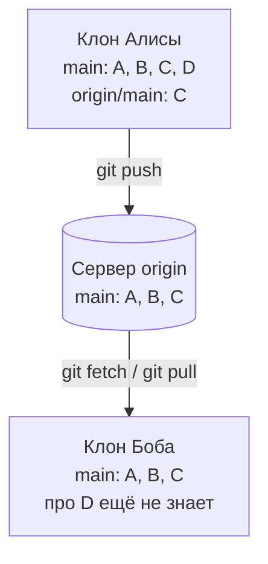
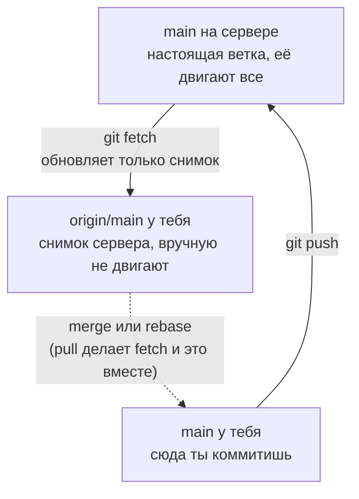
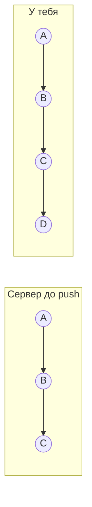
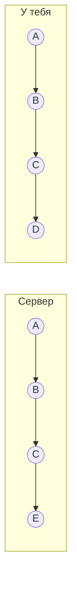
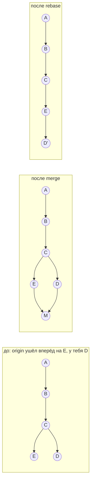
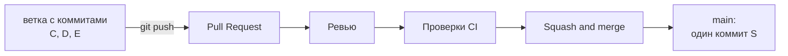
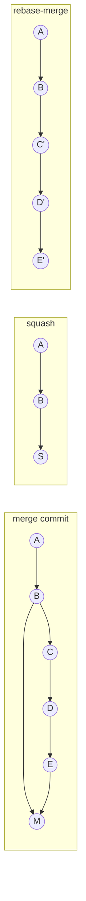
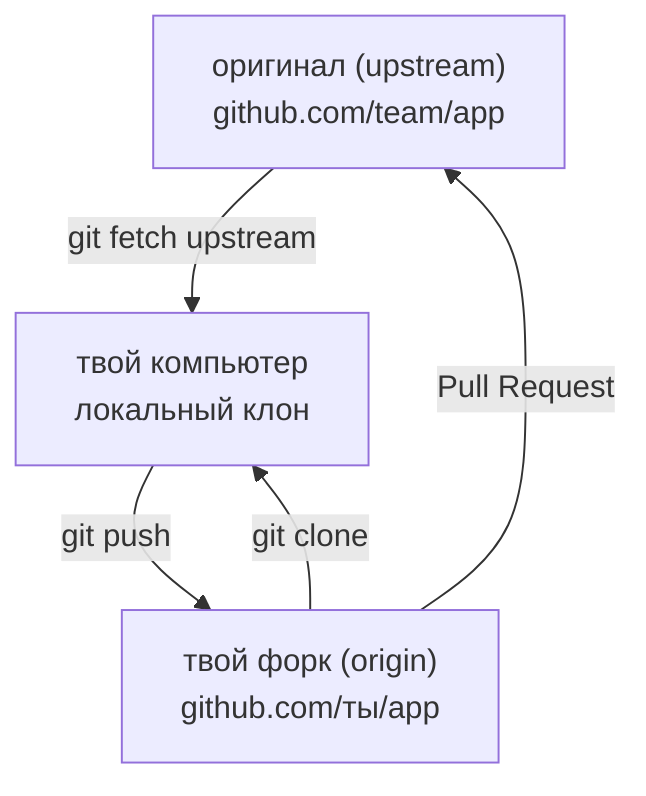

## Зачем это нужно

Репозиторий из урока 3.1 живёт на одном диске. Как только над кодом работает второй человек (или ты сам с двух машин), появляются вопросы: куда отправлять коммиты, что делать, если `git push` отклонён, как разрешить конфликт и почему в `main` нельзя коммитить напрямую. На работе это каждый день: ветка, Pull Request (запрос на слияние), ревью, слияние, чистая история.

Словарь на первые абзацы (подробно разберём ниже). **Удалённый репозиторий** (remote) это копия твоего репозитория на другом компьютере, обычно на сервере, куда все сдают работу. **`git push`** отправляет твои коммиты туда, **`git fetch`** только скачивает новые коммиты оттуда и ничего не меняет у тебя в файлах, **`git pull`** скачивает и сразу вливает их в твою ветку. **Конфликт** (conflict) это ситуация, когда ты и коллега изменили одну и ту же строку и git не знает, чья версия верна. **Pull Request** (PR) это страница на сайте, где ты говоришь «я сделал изменение в отдельной ветке, посмотрите и влейте в `main`». **Ревью** (review) это когда коллега читает твой PR и пишет замечания или одобряет. **Тег** (tag) это постоянная метка на коммите, например `v0.1.0`: «вот эта версия ушла в релиз».

Ошибки здесь дорогие: неудачный `force`-push (принудительная отправка, которая заставляет сервер принять твою историю вместо его собственной) в общую ветку стирает чужие коммиты, а конфликт, разрешённый наспех, ломает прод. А безопасные приёмы (`fetch` перед `pull`, `--force-with-lease`: принудительная отправка, которая сначала проверяет, что на сервере нет чужих новых коммитов, `revert` вместо `reset`) просто нужно один раз увидеть своими глазами.

Шаг проекта: «Заметки» уезжают в публичный репозиторий `notes` на GitHub (сайт, который хранит git-репозитории и добавляет к ним Pull Request и проверки; про облачные платформы вообще см. [тему 6](../06-cloud/01-cloud-models-aws-mapping.md)), ветка `main` защищена, изменения идут через Pull Request, ставится первый релизный тег `v0.1.0`. Код `app.py` (версия v3) при этом не меняется.

## Что нужно знать

- [Урок 3.1: Git, коммиты, история и ветки](01-git-basics.md): коммит, ветка, индекс, `reflog`, `reset` и `revert`. Каждое слово из этого списка здесь встретится снова, но подробно заново объясняться не будет.
- [Урок 2.2: порты, TCP и SSH](../02-network/02-ports-tcp-ssh.md): SSH-ключи. GitHub принимает `push` по SSH так же, как сервер принимает твой вход.
- [Урок 1.2: текст и пайпы](../01-linux/02-text-pipes.md): `grep`, `sed`, `cat`. Ими мы будем править файлы и искать в них маркеры конфликта.
- [Урок 1.8: systemd и редакторы](../01-linux/08-systemd-editors.md): редактор `nano`. Git сам открывает редактор в нескольких местах этого урока.

## Картина целиком

Представь общий документ в офисе, который нельзя выносить из здания. Есть **шкаф в архиве** (сервер, то есть компьютер, который работает постоянно и к которому подключаются другие): там лежит главный экземпляр. Каждый сотрудник берёт **копию** к себе на стол, правит её и потом относит изменения в шкаф. Пока ты работал, коллега уже успел положить в шкаф свою правку. Архивариус (сервер) не позволит тебе просто перезаписать его: он скажет «сначала посмотри, что там появилось».

В git всё так же:



На схеме сервер хранит общую `main`. Алиса уже сделала коммит `D`, но снимок сервера у неё (`origin/main`) показывает пока `C`. Боб о коммите `D` не знает, пока не заберёт его командой `git fetch`.

Дальше в уроке ты по порядку разберёшь:

1. что такое «удалённый репозиторий» и почему у твоей ветки есть двойник `origin/main`;
2. почему сервер отклоняет `push` и что такое `fast-forward` (ветка просто «подвигается вперёд» по чужим коммитам, новых коммитов не создаётся);
3. два способа объединить разошедшиеся истории: `merge` (слить, создав коммит-«шов») и `rebase` (переставить свои коммиты поверх чужих);
4. как выглядит конфликт и как его разрешить;
5. как привести историю в порядок перед показом коллегам (`rebase -i`, интерактивный rebase: ты сам выбираешь, какие коммиты склеить, переименовать или убрать) и почему для этого нужен `--force-with-lease`;
6. Pull Request, ревью и защита `main`;
7. теги и версии.

Всё это ты сначала сделаешь в безопасной «песочнице» на своём компьютере, где роль сервера играет обычная папка, и только потом перенесёшь на GitHub.

## Теория

### Удалённый репозиторий: зачем он нужен и что такое origin

Репозиторий из урока 3.1 лежит в папке `.git` на твоём диске. Если диск умер, история умерла. Если второму человеку нужен твой код, ему придётся присылать файлы по почте. Нужно место, куда все приходят за общей версией и куда все отдают свои изменения.

Общий архив в офисе. У каждого сотрудника есть личная копия документа, а главный экземпляр хранится в шкафу. Оговорка: в отличие от бумажного шкафа, в git «шкаф» тоже полноценный репозиторий с полной историей. Если он сгорит, любая копия сотрудника восстановит его целиком.

Удалённый репозиторий (remote) это ещё один git-репозиторий, до которого можно достучаться по адресу. Адрес бывает разный:

- путь к папке на этом же компьютере: `/home/ubuntu/sandbox/origin.git`;
- адрес по SSH: `git@github.com:user/notes.git`;
- адрес по HTTPS: `https://github.com/user/notes.git`.

Git хранит адрес под коротким именем. По умолчанию имя `origin` («источник»): так называется адрес, откуда ты склонировал репозиторий. Имя не магическое, это просто закладка «имя → адрес». Одна папка может иметь несколько закладок, например `origin` (твой форк) и `upstream` (исходный проект). Форк (fork) это твоя личная копия чужого проекта на GitHub.

**Что такое GitHub.** Это сайт, на котором лежат такие общие репозитории, плюс удобства вокруг них: страницы для обсуждения изменений, права доступа, проверки. Git и GitHub разные вещи: git это программа на твоём компьютере, GitHub это один из сервисов, которые умеют хранить серверные репозитории (есть ещё GitLab, Gitea и свой сервер по SSH).

**Голый репозиторий.** На сервере не нужны рабочие файлы: никто там ничего не правит. Поэтому серверный репозиторий делают «голым» (bare): в нём только содержимое `.git`, без рабочего каталога. Команда `git init --bare` создаёт именно такой. В практике ты сделаешь голый репозиторий в обычной папке и будешь считать его «сервером». Механика `push` и `fetch` там абсолютно та же, что и с GitHub, только без интернета и без риска что-то сломать.

После первой практики вывод `git remote -v` выглядит так:

```text
origin	/home/ubuntu/sandbox/origin.git (fetch)
origin	/home/ubuntu/sandbox/origin.git (push)
```

Читаем: имя закладки `origin`; адрес `/home/ubuntu/sandbox/origin.git`; в скобках, для чего адрес используется: `fetch` (забирать) и `push` (отправлять). Адреса для этих двух действий могут различаться, но чаще совпадают.

> **Прикинь сам:** `git remote -v` показывает две строки для `origin`: `(fetch)` и `(push)`. Сколько строк покажет команда после добавления закладки `upstream`?
{: .predict}

Четыре: для каждой закладки адрес показывается дважды, для `fetch` и для `push`. Закладка это просто пара «имя, адрес», и их может быть сколько угодно.

> **Главное:** удалённый репозиторий это ещё один git-репозиторий по адресу, а `origin` лишь имя закладки на него.
{: .key}

> **Проверь понимание:** ты клонировал проект командой `git clone git@github.com:team/app.git`. Как узнать, куда git будет отправлять твои коммиты, и как это изменить?

<details markdown="1">
<summary>Ответ</summary>

`git remote -v` покажет адреса закладки `origin`. Поменять адрес можно командой `git remote set-url origin <новый-адрес>`. Например, когда репозиторий переехал или ты перешёл с HTTPS на SSH.

</details>

У каждого клона есть закладка `origin`. Но почему рядом с твоей `main` появляется ещё и `origin/main`?

### Три слоя веток: main, origin/main и ветка на сервере

Ты работаешь без интернета (в поезде, при упавшем VPN), но git всё равно должен уметь сказать: «ты отстаёшь от сервера на 2 коммита». Значит, git запоминает, каким сервер был при последнем обращении. Для этого и нужен второй набор веток.

Открытка «как выглядит сервер». Ты съездил в архив, сфотографировал полку и повесил снимок у себя на стене. Снимок не меняется, пока ты не съездишь снова. Оговорка: снимок может устареть, и git об этом не узнает, пока ты сам не обновишь его командой `git fetch`.

Про одну и ту же ветку `main` существуют три разных вещи:



- `main`: твоя ветка. Двигается, когда ты делаешь `git commit`.
- `origin/main`: ветка слежения. Двигается только когда ты обращаешься к серверу (`fetch`, `pull`, `push`).
- `main` на сервере: третья, настоящая. Ты видишь её только через `origin/main`.

Четыре команды, которые связывают слои:

- `git clone <адрес>` копирует репозиторий целиком, запоминает адрес как `origin` и создаёт локальную `main`, которая следит за `origin/main`.
- `git fetch` скачивает новые коммиты и сдвигает `origin/*`. Твои файлы и твоя `main` не меняются. Поэтому `fetch` безопасен всегда.
- `git pull` это `fetch` плюс объединение с текущей веткой (слияние или rebase, о них ниже). `pull` уже меняет твои файлы.
- `git push` отправляет твои новые коммиты на сервер и сдвигает настоящую `main` там (а заодно `origin/main` у тебя).

Связь «моя ветка следит за такой-то веткой сервера» называется **upstream** («вверх по течению»). Она записана в `.git/config`. Когда upstream настроен, хватает голых `git push` и `git pull`, а `git status` умеет писать «ahead 1» (ты впереди на 1 коммит) или «behind 1» (позади на 1). Настраивается она флагом `-u`: `git push -u origin main` запоминает связь навсегда.

(настоящий вывод из практики). У Боба ничего не менялось, а Алиса запушила коммит `db598bf`:

```text
$ git status -sb
## main...origin/main                  <- Боб видит: он не отстаёт (но это только его снимок!)
$ git fetch
   d2af70c..db598bf  main       -> origin/main     <- снимок сдвинулся с d2af70c на db598bf
$ git status -sb
## main...origin/main [behind 1]       <- теперь Боб знает: позади на 1 коммит
```

Пока Боб не сделал `fetch`, статус честно, но неверно сообщал «всё в порядке»: он смотрел на устаревший снимок. Файлы в его папке при этом не поменялись ни разу.

> **Прикинь сам:** Алиса запушила коммит, а ты не делал `fetch`. Покажет ли твой `git status -sb` строку `behind 1`?
{: .predict}

Нет. `status` сравнивает твою ветку со снимком `origin/main`, а снимок обновляется только при обращении к серверу. Пока не сделаешь `fetch`, git честно, но неверно скажет, что всё в порядке.

Тут часто путают так. «`git status` сам проверяет сервер». Нет: он сравнивает твою ветку со снимком `origin/main`. Свежесть снимка на твоей совести.

> **Главное:** у ветки три слоя: настоящая на сервере, твой снимок `origin/main` и твоя `main`, а `fetch` двигает только снимок.
{: .key}

> **Проверь понимание:** ты сделал `git fetch`, а `git log` в твоей ветке не изменился. Это баг?

<details markdown="1">
<summary>Ответ</summary>

Нет. `fetch` обновляет только `origin/main`, но не твою `main`. Посмотреть, что пришло: `git log main..origin/main` (коммиты, которые есть в `origin/main`, но нет в `main`). Чтобы принять изменения, нужны `merge` или `rebase`. Поэтому `fetch` безопасен в любой момент, а `pull` уже меняет твою ветку.

</details>

Ты знаешь, где какая ветка. Теперь вопрос: почему сервер иногда не принимает твой `push`?

### Fast-forward и отказ push: почему сервер говорит «fetch first»

Сервер общий, и ему нельзя позволить одному человеку затереть работу другого. Нужно простое правило: «принимаю только то, что честно продолжает историю».

Очередь к нотариусу. Ты пришёл с документом, который основан на версии договора №5. Но пока ты сидел дома, коллега уже подал версию №6. Нотариус скажет: «Ваш документ основан на устаревшей версии, сначала согласуйте с №6». Оговорка: git не понимает смысла правок, он смотрит только на «продолжает ли твоя история последний известный коммит».

История это цепочка коммитов, у каждого есть родитель. Ветка это просто указатель на последний коммит цепочки. Отправляя `push`, ты просишь сервер передвинуть указатель ветки на твой коммит. Сервер проверяет: «текущий коммит ветки на мне является предком твоего?»

Случай 1: твой `D` продолжает `C`. Сервер просто передвигает указатель с `C` на `D`, это **fast-forward** (перемотка вперёд): ничего не объединяется.



Случай 2: коллега успел положить `E`, и твой `D` тоже вырос из `C`. Указатель нельзя передвинуть, не потеряв `E`: это **non-fast-forward**, `push` отклонён.



Сообщение сервера при этом называется `rejected` (отклонено), подсказка в скобках `fetch first` («сначала забери»). Лечится это всегда одним: забрать чужие коммиты и объединить с твоими (`pull`, `merge` или `rebase`), потом повторить `push`.

Настоящий вывод (это будет в практике):

```text
 ! [rejected]        main -> main (fetch first)
error: failed to push some refs to '/home/ubuntu/sandbox/origin.git'
hint: Updates were rejected because the remote contains work that you do not
hint: have locally. ...
```

Строка с `!` и словом `rejected` это главное. `main -> main` значит «моя `main` в `main` на сервере». `(fetch first)` в скобках это причина. Строки `hint:` это советы, их пишет git, и они бывают полезны, но чаще слишком общие.

> **Прикинь сам:** на сервере `A - B - C - E`, у тебя `A - B - C - D`. Примет ли сервер `push` и что делать?
{: .predict}

Нет: `E` не предок `D`, указатель нельзя передвинуть, не потеряв `E`. Нужно сделать `git fetch`, объединить через `merge` или `rebase`, потом повторить `push`.

Осторожно: «Отказ значит, что мой код неверный». Нет, отказ говорит только про историю: у сервера есть коммит, которого нет у тебя. Твой код может быть идеальным.

> **Главное:** сервер принимает только то, что продолжает его историю, а отказ `fetch first` говорит про историю, а не про качество кода.
{: .key}

> **Проверь понимание:** на сервере `A - B - C`, у тебя `A - B - D`, где `D` растёт из `B`. Примет ли сервер `push`? А если у тебя `A - B - C - D`?

<details markdown="1">
<summary>Ответ</summary>

В первом случае нет: `C` не предок `D`, это non-fast-forward. Во втором да: `C` предок `D`, указатель просто перемотается вперёд.

</details>

Сервер ждёт, пока ты объединишь истории. Есть два способа это сделать: merge и rebase.

### Merge и rebase: два способа собрать разошедшиеся истории

Истории разошлись: у тебя `D`, у коллеги на сервере `E`, оба выросли из `C`. Их нужно свести в одну линию, иначе `push` не пройдёт. Есть два способа.

Два редактора правили одну статью. Способ первый (merge): взять обе версии и склеить в третью, где видно, что было два потока. Способ второй (rebase): взять чужую версию как основу и **заново переписать** свои правки поверх неё, будто ты начал работу после коллеги. Оговорка: во втором способе твои исходные коммиты не сдвигаются, а копируются. Старые остаются лежать, но на них ничего не ссылается.




`M` это коммит слияния с двумя родителями, `D'` это копия `D` с новым хешем: у неё другой родитель.

`git merge origin/main` создаёт **коммит слияния** (merge commit) `M` с двумя родителями: `E` и `D`. Оба потока честно видны в истории, но линия «ёлочкой» и появляется лишний служебный коммит.

`git rebase origin/main` делает три шага: откладывает твои коммиты (`D`), перемещает твою ветку на `origin/main` (`E`), затем проигрывает отложенные коммиты по одному поверх. История получается прямая, как будто ты начал после коллеги. Но вспомни урок 3.1: хеш коммита считается от содержимого, **включая родителя**. У `D'` родитель другой, значит и хеш другой. Это новый коммит, копия.

(настоящие хеши из практики). Коммит Боба `669b62e` оказался в его ветке, пока Алиса успела запушить `3690381`. После `git pull --rebase` и разрешения конфликта:

```text
$ git log --format='%h %p %s'          # %h хеш, %p хеши родителей, %s заголовок
3e16422 3690381 Поднять версию до 1.5 и добавить timeout
3690381 db598bf Поднять версию до 2.0
db598bf d2af70c Добавить debug
```

Коммит Боба теперь `3e16422` (был `669b62e`), а его родитель `3690381`, то есть коммит Алисы. Текст и правка те же, хеш другой. Это и есть «копия».

**Золотое правило rebase:** не переписывай коммиты, которые уже отправлены и на которых могла вырасти чужая работа. Тогда у коллеги в истории лежит старый `D`, а на сервере появился `D'`, и git видит две разные истории. Свою личную ветку, о которой знаешь только ты, переписывать можно. Общую `main` нельзя.

**Практическое правило команды.** Перед открытием Pull Request подтяни свежий `main` в свою ветку через rebase (история линейная). А вливает PR в `main` уже кнопка на GitHub (об этом ниже).

> **Прикинь сам:** от коммита `C` у тебя один коммит `D`, на сервере один `E`. Сколько коммитов появится над `C` после `merge` и после `rebase`?
{: .predict}

После `merge` три: `E`, `D` и коммит слияния `M`. После `rebase` два: `E` и копия `D'` с новым хешем. Копия получается потому, что хеш включает родителя.

Тут часто путают так. «`pull` всегда делает merge». Зависит от настройки. Обычный `git pull` при разошедшихся историях либо создаёт коммит слияния, либо (если задано `pull.ff only`, как в нашей подготовке) вообще отказывается, чтобы ты выбрал сам. `git pull --rebase` использует rebase.

> **Главное:** `merge` связывает две линии коммитом слияния, `rebase` перекладывает твои коммиты поверх чужих, и они получают новые хеши.
{: .key}

> **Проверь понимание:** почему после `rebase` обычный `git push` отклоняется, если ветку уже отправляли раньше?

<details markdown="1">
<summary>Ответ</summary>

Коммиты после rebase получили новые хеши, а на сервере лежат старые. Для сервера истории разошлись, простое добавление невозможно (non-fast-forward). Нужен `git push --force-with-lease`, и только для своей личной ветки.

</details>

Иногда git не может объединить правки сам. Как читать такой конфликт?

### Конфликты: что это и как читать маркеры

Git объединяет правки автоматически, если они касаются разных мест. Но если два человека изменили **одни и те же строки**, git не знает, чья версия верна. Угадывать опасно, поэтому он останавливается и просит человека решить.

Два редактора правят одно предложение: один пишет «версия 1.5», другой «версия 2.0». Корректор не имеет права выбирать сам. Он кладёт оба варианта рядом на стол и ждёт решения автора. Оговорка: git видит только строки, но не смысл. Если правки в разных строках, но логически противоречат друг другу, конфликта не будет, а ошибка будет.

Для каждого файла git сравнивает три версии: общий предок («база»), версия «с одной стороны» и версия «с другой». Если изменена только одна сторона, берётся она. Если изменены обе, но в разных местах, берутся обе. Если обе изменили одно и то же место по-разному, это конфликт. Git записывает в файл **оба** варианта и обкладывает их **маркерами**:

```text
app=notes
<<<<<<< HEAD
version=2.0
=======
version=1.5
>>>>>>> 669b62e (Поднять версию до 1.5 и добавить timeout)
owner=alice
```

- Между `<<<<<<<` и `=======` версия одной стороны, между `=======` и `>>>>>>>` версия другой.
- Строки маркеров это служебный текст git, они **не должны остаться в файле**. Если оставить их, `version=2.0` вместе с `<<<<<<< HEAD` попадёт в конфиг и сломает программу.
- Всё, что вне маркеров (`app=notes`, `owner=alice`), git объединил сам.

**Как разрешить.** По шагам: открыть файл; решить, что должно быть в итоге (одна из версий, обе или третий вариант); отредактировать так, чтобы остался нужный текст, а все три строки маркеров пропали; сообщить git, что файл готов (`git add файл`); продолжить операцию (`git rebase --continue` при rebase или `git commit` при merge). Если запутался: `git rebase --abort` (или `git merge --abort`) откатывает всё к состоянию до начала операции. Это страховка, помни о ней.

**Ловушка со сторонами.** При `merge` «HEAD» это твоя ветка. При `rebase` наоборот: git временно ставит тебя на чужой коммит и **проигрывает твои коммиты по одному**. Поэтому `HEAD` (верхний блок) это то, что уже лежит на `origin/main` (чужие коммиты), а нижний блок это твой проигрываемый коммит. В примере выше версия Алисы `2.0` сверху, версия Боба `1.5` снизу, хотя Боб именно тот, кто разрешает конфликт.

**Ловушка с пустым коммитом.** Если решить конфликт, оставив целиком версию другой стороны, а твой коммит больше ничего не менял, коммит становится пустым. Git при rebase молча выбросит его: он больше не несёт правок. Это нормально, просто не удивляйся, что твой коммит пропал из истории. В нашем примере Боб помимо версии добавил ещё строку `timeout=30`, поэтому его коммит остаётся.

В практике `git status` во время rebase скажет:

```text
interactive rebase in progress; onto 3690381
You are currently rebasing branch 'main' on '3690381'.
Unmerged paths:
	both modified:   config.txt
```

`rebase in progress` (идёт rebase, ты на середине); `onto 3690381` это коммит Алисы, на который «пересаживают» твои; `both modified` значит «правили обе стороны». Слово «interactive» здесь ни при чём: у `pull --rebase` тоже внутри такая же машинерия.

> **Прикинь сам:** между `<<<<<<< HEAD` и `=======` стоит `version=2.0`, между `=======` и `>>>>>>>` стоит `version=1.5`, а нужна версия 2.0. Что останется в файле?
{: .predict}

Только строка `version=2.0`: две версии выбирают руками, а все три строки с маркерами удаляют. Потом `git add файл` и продолжаешь `rebase` или `merge`.

Осторожно: «Конфликт это авария». Нет, это нормальная часть командной работы. Авария начинается, когда конфликт «разрешают» вслепую (`принять свою версию, чтобы побыстрее`) и теряют чужую правку. Если решение неочевидно, спроси автора второй правки.

> **Главное:** конфликт возникает, когда обе стороны правили одни и те же строки, а маркеры `<<<<<<<`, `=======`, `>>>>>>>` нужно убрать вручную.
{: .key}

> **Проверь понимание:** конфликт разрешён, файл сохранён. Что ещё обязательно сделать до `rebase --continue`?

<details markdown="1">
<summary>Ответ</summary>

`git add <файл>`. Пока файл не добавлен в индекс, git считает конфликт неразрешённым (`git status` покажет `both modified`). Ещё стоит запустить тесты: разрешение без проверки часто даёт код, который выглядит целым, но ведёт себя неверно.

</details>

Конфликты разобраны. Как привести собственные коммиты в порядок до отправки на ревью?

### Интерактивный rebase, cherry-pick и force-with-lease

В процессе работы копятся коммиты вроде «wip», «fix typo», «ещё раз fix». Показывать коллегам такую историю неприятно, а читать её через полгода невозможно. Перед отправкой на ревью её принято прибирать: превратить пять черновых коммитов в один-два осмысленных.

Черновик и чистовик. Записки, зачёркнутые слова и стрелки остаются у тебя в блокноте, а коллеге отдаёшь аккуратный текст. Оговорка: в git «переписать чистовик» значит создать новые коммиты, а не стереть старые, поэтому если ты уже отправил черновик, придётся заменить его на сервере, и тут нужна осторожность (см. ниже).

`git rebase -i HEAD~4` (`-i` значит interactive) берёт последние четыре коммита и открывает в редакторе такой список (сверху самый старый, это порядок проигрывания):

```text
pick ce9bb86 wip: добавить логирование
pick 880f31d wip: путь к логу
pick f2e1995 Добавить срок хранения
pick 0730cc1 fix: срок хранения 14 дней
```

Перед каждым коммитом стоит слово-команда. Меняешь слово, сохраняешь файл, git выполняет:

| Слово | Что делает |
|---|---|
| `pick` | оставить коммит как есть |
| `reword` | оставить, но поменять сообщение |
| `squash` | влить в предыдущий коммит, а сообщения объединить (откроется редактор) |
| `fixup` | влить в предыдущий коммит, а своё сообщение выбросить |
| `drop` | удалить коммит целиком |

Строки можно переставлять. `squash` и `fixup` всегда относятся к строке **выше**, поэтому первой строкой они быть не могут.

Хотим склеить первые два коммита в один осмысленный, а «fix» влить в предыдущий. Меняем список так:

```text
pick ce9bb86 wip: добавить логирование
squash 880f31d wip: путь к логу              <- влить в строку выше, сообщения объединятся
pick f2e1995 Добавить срок хранения
fixup 0730cc1 fix: срок хранения 14 дней     <- влить в строку выше, сообщение выкинуть
```

Результат (настоящий, из практики): из четырёх коммитов остаются два, у обоих новые хеши: `55a3cfc Добавить логирование в config.txt` и `8119299 Добавить срок хранения`. Содержимое файла в итоге то же самое, что было до rebase; изменилась только нарезка на коммиты.

**Зачем force после этого.** Если ветку ты уже отправлял на сервер, там лежат старые коммиты (`0730cc1` и другие), а у тебя новые (`8119299`). Для сервера это разошедшиеся истории, обычный `push` отклонится как non-fast-forward. Нужно приказать серверу заменить ветку: `--force`. Но голый `--force` перезаписывает ветку на сервере не глядя, и всё, что успел положить туда коллега, исчезнет. Безопаснее `git push --force-with-lease` («с арендой»). Он работает так: «перезапиши ветку на сервере, но только если она сейчас указывает туда, куда я видел её в прошлый раз (`origin/feature`)». Если за это время кто-то добавил коммит, ветка на сервере уже не совпадает с твоим снимком, и push отклоняется с сообщением `stale info` («устаревшие данные»).

**Дыра в аренде.** Снимок обновляет `git fetch`. Если ты сделал `fetch`, увидел новый коммит коллеги и **не посмотрел на него**, а сразу выполнил `force-with-lease`, «аренда» уже обновлена, проверка пройдёт, и чужой коммит будет затёрт. Практика покажет это на настоящем выводе. Затёртый коммит не исчезает совсем: его хеш остаётся в `git reflog origin/<ветка>`, поэтому его можно вернуть, но только пока не прошла уборка мусора (через недели).

**cherry-pick.** Команда `git cherry-pick <хеш>` копирует один коммит в текущую ветку (создаёт новый коммит с той же правкой и другим хешем). Типичный случай: срочное исправление уже есть в `main`, а нужно и в старой релизной ветке. Ключ `-x` дописывает в сообщение «cherry picked from commit ...», чтобы потом было видно, откуда копия.

> **Прикинь сам:** в `rebase -i` четыре коммита: два «wip», «Добавить срок хранения» и «fix». Какими словами оставить два аккуратных коммита?
{: .predict}

Первый «wip» оставить как `pick`, второй превратить в `squash`, «Добавить срок хранения» оставить как `pick`, а «fix» сделать `fixup`. Результат: два коммита с новыми хешами.

Тут часто путают так. «`--force-with-lease` полностью безопасен». Он безопаснее голого `--force`, но не защищает от слепого `fetch`, и он не заменяет запрет force-push на общих ветках (см. ниже).

> **Главное:** `rebase -i` склеивает и переименовывает коммиты, а для ветки, уже лежащей на сервере, после него нужен `--force-with-lease`, а не голый `--force`.
{: .key}

> **Проверь понимание:** чем `--force-with-lease` лучше `--force`, и в каком случае он всё равно опасен?

<details markdown="1">
<summary>Ответ</summary>

`--force-with-lease` не затрёт коммиты, которых ты ещё не видел. Но если ты сделал `git fetch` и не посмотрел, что пришло, «аренда» уже обновлена, и чужие коммиты всё равно исчезнут. Плюс он не спасает общие ветки: force в `main` запрещают защитой ветки.

</details>

История чистая. Как показать её коллегам и не пустить в `main` лишнее? Через Pull Request.

### Pull Request, ревью и защита main

Когда каждый может отправить что угодно прямо в `main`, качество зависит от настроения. Нужна точка, где изменение видят другие глаза и где автоматика (тесты, которые появятся в уроке 3.3) успевает сказать «стоп» до того, как код попал в главную ветку.

Заявка на изменение чертежа. Инженер не правит утверждённый чертёж сам: он подаёт заявку, коллеги смотрят, задают вопросы, подписывают, и только потом изменение вносит ответственный. Оговорка: в отличие от бумажной заявки, PR живёт рядом с кодом и обновляется, пока ты доправляешь ветку.

**Pull Request** (PR, «запрос на слияние») это предложение на GitHub влить твою ветку в другую (обычно в `main`). Вокруг него строится процесс: обсуждение, комментарии к конкретным строкам, автоматические проверки, одобрение. Полный цикл:



Модель, в которой `main` всегда рабочая, а каждое изменение живёт в короткой ветке и попадает в `main` только через PR, называется **GitHub Flow**. Родственный подход trunk-based development: ветки живут часами, а незаконченное прячется за флагами функций (feature flags, переключатели в коде, которые включают функцию отдельно от выкатки). Тяжёлый вариант GitFlow с долгоживущими ветками `develop` и `release/*` подходит для версионных продуктов (у которых поддерживаются несколько версий одновременно), но не для сервисов, которые выкатываются каждый день.

**Хороший PR:** одна цель, до 300-400 строк диффа (diff, список изменений), описание «что и зачем», ссылка на задачу, ответ на вопрос «как проверил».

**Три способа слить PR:**

| Способ | Что попадает в `main` | Когда выбирают |
|---|---|---|
| merge commit | все коммиты ветки и ещё коммит слияния | нужна полная история работы |
| squash | одним коммитом вся ветка | короткие ветки, чистая история `main` |
| rebase-merge | коммиты ветки по одному, линейно, с новыми хешами | важна линейность и детальная история |

При squash GitHub дописывает к заголовку номер PR: `docs: добавить CONTRIBUTING.md (#1)`.

**Защита ветки** (branch protection или ruleset, «набор правил») это настройка на сервере, которая запрещает опасные действия над `main`: прямой `push`, force-push, удаление ветки, слияние без PR, слияние без пройденных проверок и одобрения. Это принципиальная разница с договорённостью «давайте не пушить в main»: правило, которое нельзя нарушить, надёжнее того, которое просто помнят. Файл `CODEOWNERS` назначает владельцев путей: например, строка `/deploy/ @platform-team` заставляет GitHub автоматически просить ревью у команды платформы, если PR трогает каталог `deploy`. Защита работает в публичных репозиториях бесплатного плана, поэтому репозиторий проекта публичный.

Голому репозиторию из песочницы тоже можно включить часть таких запретов, двумя настройками: `receive.denyNonFastForwards` запрещает перезапись истории (то есть force-push), `receive.denyDeletes` запрещает удаление веток. Ты проверишь это в задании 4, и сервер ответит настоящим отказом `denying non-fast-forward`. GitHub делает то же самое через галочки Rulesets.

> **Прикинь сам:** твой Pull Request добавляет 1200 строк. Хорошая ли это идея?
{: .predict}

Нет. Ориентир 300-400 строк диффа и одна цель: большой PR невозможно внимательно прочитать. Разбей его на несколько по смыслу.

> **Главное:** Pull Request это предложение влить ветку, вокруг которого живут ревью и проверки, а `main` остаётся всегда рабочей.
{: .key}

> **Проверь понимание:** ты единственный владелец репозитория и включил обязательное одобрение одним ревьюером. Что произойдёт при попытке слить свой PR?

<details markdown="1">
<summary>Ответ</summary>

Автор не может одобрить собственный PR, кнопка слияния будет заблокирована. Для соло-режима ставят 0 обязательных одобрений (но оставляют требование PR) или разрешают администратору обойти правило. В команде так делать нельзя: ревью обязательно.

</details>

Ветка ушла в релиз. Как отметить именно эту версию кода навсегда? Нужен тег.

### Теги и семантические версии

Ветка двигается с каждым коммитом, а иногда нужно сказать «вот именно эта версия кода ушла в релиз». Через месяц по отчёту «баг в 0.1.0» нужно достать ровно тот код.

Закладка-стикер в книге на конкретной странице. Ветка похожа на закладку-ленточку, которую ты каждый день двигаешь дальше по книге. Тег это стикер, приклеенный на страницу навсегда. Оговорка: стикер можно отклеить и переклеить (`git tag -f`), но делать это в общем репозитории нельзя, потому что все остальные будут ссылаться на старую страницу.

Тег (tag) это неподвижная метка на коммите. Бывает лёгкий (`git tag v1`, просто имя) и **аннотированный** (`git tag -a`): он хранит автора, дату и сообщение как отдельный объект. Для релизов используют аннотированные: по ним видно, кто и когда выпустил версию.

Номер версии принято писать по схеме **семантического версионирования** (semver): `MAJOR.MINOR.PATCH`. `PATCH` растёт при исправлении ошибок, `MINOR` при новой совместимой функции, `MAJOR` при ломающем изменении. Версия `0.x.y` означает «API ещё не стабилен». Как выбрать номер на примерах, разберём ниже в разделе «Семантические версии: как выбрать номер». Не путай: номера `v1`, `v2`, `v3` у `app.py` это этапы кода в курсе, а тег `v0.1.0` это номер релиза. Это две независимые нумерации. Теги не отправляются на сервер сами: обычный `git push` их не берёт, нужен `git push origin v0.1.0`. Оформление релизов и автоматизация разбираются в уроке 3.5.

(настоящий вывод из практики):

```text
$ git ls-remote --tags origin
74a0bc380be286f6a19b0e985baa7b44179a4612	refs/tags/v0.1.0
8342ad15dbaa87596820171b6ca32745ce646968	refs/tags/v0.1.0^{}
```

Две строки для одного тега. Первая: хеш самого объекта-тега (там хранятся автор, дата и сообщение). Вторая, с `^{}`: коммит, на который тег указывает. Это признак аннотированного тега; у лёгкого была бы одна строка.

> **Прикинь сам:** `git ls-remote --tags origin` печатает для `v0.1.0` две строки, вторая с `^{}`. Какой это тег?
{: .predict}

Аннотированный: первая строка это сам объект тега с автором и датой, вторая (`^{}`) коммит, на который он указывает. У лёгкого тега была бы одна строка.

Тут часто путают так. «Тег это ветка с другим названием». Ветка движется, тег стоит. Поэтому `v0.1.0` всегда означает один и тот же код.

> **Главное:** тег это неподвижная метка на коммите, а версия `MAJOR.MINOR.PATCH` сообщает, насколько опасно обновление.
{: .key}

> **Проверь понимание:** почему тег нельзя «передвинуть» так же просто, как ветку, и почему это хорошо?

<details markdown="1">
<summary>Ответ</summary>

Ветка двигается с каждым коммитом, тег остаётся на одном коммите. Это гарантирует, что `v0.1.0` всегда означает один и тот же код, на него можно сослаться в релизе, образе или отчёте о баге. Перемещённый тег (`git tag -f`) ломает это обещание, поэтому в общем репозитории так не делают. Сервер тоже противится: `git push` с уже существующим тегом, указывающим на другой коммит, отклоняется с `already exists`.

</details>

Тег поставлен. Но как GitHub вообще узнаёт, что `push` делаешь ты? По ключу.

### Как GitHub узнаёт, кто ты: SSH-ключ и токен

Сервер должен знать, кто отправляет коммиты: иначе любой мог бы записать в твой репозиторий что угодно от твоего имени. Пароль от аккаунта для этого не годится: его пришлось бы вводить при каждом `push`, и он оказался бы в скриптах и логах. Поэтому для git придумали два способа входа без пароля.

Замок и ключ. Ты ставишь на дверь (аккаунт на GitHub) свой замок, а ключ остаётся у тебя. Замок можно показывать всем, ключ нельзя никому. Оговорка: у обычного замка нет «двух половин», а здесь они есть, и в этом вся хитрость.

Способ первый, **SSH-ключ** (из [урока 2.2](../02-network/02-ports-tcp-ssh.md)). Команда `ssh-keygen -t ed25519` создаёт пару файлов: **закрытый ключ** (`id_ed25519`, остаётся на твоём компьютере, его никому не отдают) и **открытый** (`id_ed25519.pub`, его копируют в настройки GitHub: Settings, SSH keys). При `git push` GitHub присылает случайную задачу, которую можно решить только закрытым ключом, а проверить открытым. Решил верно: значит, ты тот, кто добавил этот открытый ключ. Адрес репозитория в таком случае начинается с `git@github.com:`.

Способ второй, **токен** (access token): длинная случайная строка, которую GitHub выдаёт по твоей просьбе, с ограниченными правами и сроком жизни. Используется с адресом `https://github.com/...` вместо пароля. Токен удобен в автоматике (например, в CI из [урока 3.3](03-actions-ci.md)), потому что его можно выдать с правами «только читать» и отозвать одним нажатием.

Проверка SSH-входа без всякого `push`: `ssh -T git@github.com`. Ответ вида `Hi <имя>! You've successfully authenticated, but GitHub does not provide shell access.` читается так: «Hi <имя>» значит, GitHub нашёл твой открытый ключ и знает, чей он; «does not provide shell access» значит, что командной строки на сервере тебе никто не даёт, и это нормально: git нужен только для обмена коммитами. Ошибка `Permission denied (publickey)` означает, что GitHub не нашёл подходящий ключ: его не добавили в настройки или ssh использует не тот файл.

> **Прикинь сам:** в настройки GitHub нужно загрузить ключ. Какой файл выбрать: `id_ed25519` или `id_ed25519.pub`?
{: .predict}

`id_ed25519.pub`: это открытая половина, замок. Закрытый `id_ed25519` остаётся только на твоём компьютере, он и есть твоя личность.

Осторожно: «Ключ нужно положить на GitHub целиком». Нет, туда идёт только открытая половина (`.pub`). Если закрытый ключ попал в чужие руки, считай его украденным: создай новую пару, а старую удали (тот же приём, что и ротация секрета из [урока 3.1](01-git-basics.md)).

> **Главное:** сервер узнаёт тебя по паре ключей (открытый у него, закрытый у тебя) или по токену с ограниченными правами и сроком.
{: .key}

> **Проверь понимание:** коллега просит прислать ему твой `id_ed25519`, «чтобы он тоже мог пушить». Что ответишь?

<details markdown="1">
<summary>Ответ</summary>

Нет: закрытый ключ это твоя личность, по нему сервер не различит вас двоих. Пусть коллега создаст свою пару и добавит свой открытый ключ в свой аккаунт, а тебе нужно только дать ему доступ к репозиторию (приглашение в проект).

</details>

Теперь сервер знает, кто ты. Осталось договориться в команде, как ветвиться.

### Ветвление в команде: GitHub Flow, trunk-based и GitFlow

Команды `branch` и `merge` не отвечают на вопрос «когда и от чего создавать ветку и сколько ей жить». Без договорённости у каждого своя привычка, ветки расходятся так далеко, что слияние превращается в многочасовое разрешение конфликтов.

Правила дорожного движения. Ехать можно как угодно, пока на дороге один человек. Когда машин сотни, нужны общие правила: кто куда поворачивает и кому уступать. Оговорка: правила ветвления не зашиты в git, их придумали люди, поэтому выбрать можно любое, и его нужно записать в README.

Три распространённые модели:

| Модель | Как живут ветки | Что в основной ветке |
|---|---|---|
| GitHub Flow | на каждое изменение короткая ветка, затем Pull Request и слияние в `main` | `main` всегда рабочая |
| trunk-based | ветки живут часы, все пишут почти напрямую в `main`, незаконченное спрятано за флагами функций | один «ствол» |
| GitFlow | отдельные ветки `develop` (текущая работа) и `release` (подготовка версии) | `main` только для релизов |

**GitHub Flow**: `main` всегда рабочая, любое изменение живёт в короткой ветке и идёт через PR. Просто, подходит для сервиса, который выкатывается часто. **Trunk-based development** («ствол»): ветки живут часами, ещё незаконченная функция спрятана за **флагом** (feature flag: переключатель, которым её включают отдельно от выкладки кода). Требует хороших автоматических тестов. **GitFlow**: отдельные долгие ветки `develop`, `release`, `hotfix`. Тяжёлая схема, нужная там, где поддерживают несколько версий продукта одновременно (например, коробочный софт с релизами раз в квартал).

Сервис «Заметки» выкатывается, когда готов, версия одна, команда маленькая. Значит, выбор: GitHub Flow. Ветка называется по шаблону `тип/суть` (`docs/contributing`, `fix/slow-endpoint`), живёт до PR и удаляется после слияния. Так ты и будешь работать в практике.

> **Прикинь сам:** команда из пяти человек выкатывает сервис каждый день. Что ближе: GitHub Flow или GitFlow с `develop` и `release`?
{: .predict}

GitHub Flow (или trunk-based): короткие ветки, быстрый PR, рабочая `main`. GitFlow с отдельными `develop` и `release` оправдан, когда версии выпускают редко и поддерживают несколько сразу.

Тут часто путают так. «GitFlow самый правильный, потому что самый подробный». Подробный не значит лучший: чем больше долгих веток, тем дольше они расходятся и тем болезненнее слияния. Чем чаще выкатка, тем короче должны быть ветки.

> **Главное:** модель ветвления это договорённость команды, а чем чаще релизы, тем короче должны жить ветки.
{: .key}

> **Проверь понимание:** ветка фичи живёт уже три недели, `main` за это время ушла на 80 коммитов вперёд. Что это говорит о процессе и что сделать?

<details markdown="1">
<summary>Ответ</summary>

Ветка прожила слишком долго: риск конфликтов растёт с каждым днём расхождения. Нужно регулярно подтягивать `main` в ветку (`git rebase origin/main` или merge), а саму задачу дробить на небольшие PR, каждый из которых можно влить за день-два.

</details>

Ты выбрал модель. Остался вопрос, какой кнопкой слить PR: их три.

### Как слить PR: merge commit, squash и rebase-merge на примере

Кнопка слияния на GitHub предлагает три варианта, и от выбора зависит вид истории `main` на годы вперёд: читается она как журнал или как клубок. Выбрать нужно осознанно, а не «как первая в списке».

Сдача черновиков в редакцию. Можно сдать всю папку с черновиками (merge commit), один чистовой лист (squash) или перепечатать черновики по одному в общую рукопись (rebase-merge). Оговорка: в редакции черновики выбросят, а в git при squash они остаются в PR и в твоей локальной ветке, просто в `main` их нет.

Допустим, в ветке `docs/contributing` три коммита `C`, `D`, `E`, а `main` стоит на `B`. Результат после слияния:



В `merge commit` в истории видны `C`, `D`, `E` и шов `M`. После `squash` остаётся один коммит `S` с суммой правок. После `rebase-merge` коммиты копируются по одному, хеши новые, история прямая.

После squash-merge `main` содержит коммит `docs: добавить CONTRIBUTING.md (#1)` с новым хешем. Твоя локальная ветка `docs/contributing` по-прежнему указывает на коммит `E`, а в `main` такого хеша нет: git считает, что ветка не влита. Поэтому `git branch -d docs/contributing` отвечает `not fully merged`, хотя все правки в `main` уже есть. Убедись глазами, что PR влит, и удали ветку через `git branch -D` (заглавная D означает «удалить без проверки»).

> **Прикинь сам:** в ветке три коммита, ты сливаешь PR через squash. Сколько новых коммитов в `main` и останутся ли там `C`, `D`, `E`?
{: .predict}

Один новый коммит `S` с суммой правок. Коммитов `C`, `D`, `E` в `main` не будет, но код из них в нём есть: теряется только нарезка.

Осторожно: «Squash теряет мою работу». Код не теряется, теряется только разбивка на маленькие коммиты. Поэтому коммиты в ветке можно писать как угодно, а сообщение итогового коммита пишется аккуратно один раз, при слиянии.

> **Главное:** merge commit сохраняет всю историю ветки, squash сворачивает её в один коммит, rebase-merge делает копии по одному.
{: .key}

> **Проверь понимание:** в `main` хотят откатывать фичу одной командой `git revert`. Какой способ слияния удобнее и почему?

<details markdown="1">
<summary>Ответ</summary>

Squash: вся фича это один коммит, откатить его можно одним `git revert <хеш>`. При merge commit пришлось бы откатывать слияние с ключом `-m 1` или каждый коммит ветки по отдельности, а при rebase-merge это несколько коммитов подряд.

</details>

Как сделать так, чтобы сливать в `main` можно было только этим путём? Включить защиту ветки.

### Защита main: что именно запрещаем и зачем

Договорённость «не пушим в main» держится, пока все помнят о ней и никто не торопится. Первая же ночная правка «только поправить опечатку» её ломает. Защита переносит правило из головы людей в настройки сервера.

Сейф с двумя ключами в банке. Одному сотруднику деньги не достать, даже если очень нужно: нужен второй. Оговорка: у администратора репозитория может быть «мастер-ключ» (обход правил), и оставлять его или нет, нужно решить осознанно.

Правила защиты делят на четыре группы:

1. **Кто и как может менять.** Запрет прямого `push` (только через PR) и запрет force-push: без него чужие коммиты можно стереть.
2. **Что нельзя делать с веткой.** Запрет удаления: случайный `git push origin :main` не уничтожит главную ветку.
3. **Что должно пройти до слияния.** Обязательные проверки (status checks): тесты из CI должны стать зелёными. Обязательное одобрение ревьюера: кто-то, кроме автора, посмотрел изменение.
4. **Кто отвечает.** Файл `CODEOWNERS` (владельцы) в репозитории называет людей или команды для каждой папки. GitHub сам добавляет их в ревьюеры, если PR трогает их файлы.

Для `notes` включаются: PR обязателен, force-push и удаление запрещены, а обязательная проверка появится после [урока 3.3](03-actions-ci.md). Если попытаться `git push origin main` напрямую, сервер ответит отказом вида `remote: error: GH006: Protected branch update failed` и объяснит, что нужен PR (если защита настроена через rulesets, текст будет другой: `GH013: Repository rule violations found`, см. ниже). Это не поломка, а правило сработало.

> **Прикинь сам:** защита включена: PR обязателен, force-push запрещён. Пройдёт ли `git push origin main` напрямую?
{: .predict}

Нет: сервер ответит отказом (`GH006`, защищённая ветка). Обойти это может только администратор, и то лишь если правила на него не распространяются.

Тут часто путают так. «Защита нужна только большим командам». Нет: на соло-проекте она защищает тебя от собственной ошибки в три часа ночи, а настройка занимает минуту.

> **Главное:** защита ветки переносит договорённость из голов людей в настройки сервера: PR, проверки, ревью, запрет force-push.
{: .key}

> **Проверь понимание:** правило «обязательны проверки» включено, но в списке проверок пусто. Что произойдёт при слиянии?

<details markdown="1">
<summary>Ответ</summary>

Слияние пройдёт: требовать нечего, значит, ничего не блокируется. Поэтому правило «нужны проверки» бесполезно, пока в нём не названы конкретные проверки по именам (в [уроке 3.3](03-actions-ci.md) это будет имя job из CI).

</details>

С защитой ясно. Теперь вернёмся к номерам версий: как выбрать следующий?

### Семантические версии: как выбрать номер

Номер версии должен сообщать пользователю, опасно ли обновляться. Если версии называют «как захотелось», каждое обновление превращается в лотерею: подойдёт или сломает.

Адрес: страна, город, улица, дом. Каждое следующее число уточняет предыдущее. Оговорка: в семвере числа означают не место, а масштаб изменения.

Версия `MAJOR.MINOR.PATCH` читается слева направо от «опасного» к «безопасному». Увеличиваешь первое число, если старый код может перестать работать (убрали эндпоинт, поменяли формат ответа). Второе, если добавил новую возможность и всё старое работает. Третье, если только исправил ошибку. Когда растёт старшее число, все правые обнуляются.


```text
0.1.0 -> 0.1.1   исправили опечатку в ответе /healthz         (PATCH)
0.1.1 -> 0.2.0   добавили эндпоинт /notes/search              (MINOR, правое обнулилось)
0.2.0 -> 1.0.0   решили, что API стабилен и ломать его нельзя (MAJOR, правые обнулились)
1.0.0 -> 2.0.0   убрали поле id из ответа /notes              (MAJOR)
```

> **Прикинь сам:** сейчас `1.9.3`. Убрали поле из ответа API, и старые клиенты сломаются. Какая версия следующая?
{: .predict}

`2.0.0`: изменение ломающее, значит растёт `MAJOR`, а правые числа обнуляются. Исправление ошибки дало бы `1.9.4`, а новая совместимая возможность `1.10.0`.

> **Главное:** версию выбирают по самому крупному изменению: сломал совместимость растёт `MAJOR`, добавил возможность `MINOR`, исправил ошибку `PATCH`.
{: .key}

> **Проверь понимание:** ты исправил баг и заодно добавил необязательный параметр запроса. Какая следующая версия после `1.4.2`?

<details markdown="1">
<summary>Ответ</summary>

`1.5.0`: есть новая возможность, значит, растёт MINOR, а PATCH обнуляется. В релизе считается самое «крупное» из изменений.

</details>

А как внести правку в чужой проект, где у тебя нет прав записи?

### Форк: как предложить правку в чужой проект

В чужой репозиторий (например, открытую библиотеку) у тебя нет права записи, и это правильно: иначе любой мог бы испортить чужой проект. Но исправить опечатку или баг хочется. Нужен способ предложить изменение, не получая доступа к проекту.

Ты хочешь поправить страницу в библиотечной книге, которую нельзя трогать. Ты делаешь ксерокопию всей книги, правишь свою копию и показываешь библиотекарю: «вот что предлагаю изменить». Он решает, вносить ли правку в оригинал. Оговорка: копия в git «живая», её можно подтягивать из оригинала, когда там что-то поменялось.

**Форк** (fork) это твоя личная копия чужого репозитория на GitHub, лежащая в твоём аккаунте. Шаги такие:

1. Нажимаешь Fork на странице проекта: на GitHub появляется `твой-аккаунт/проект`.
2. Клонируешь свой форк на компьютер: `git clone git@github.com:твой-аккаунт/проект.git`. Закладка `origin` указывает на твой форк.
3. Добавляешь вторую закладку на оригинал: `git remote add upstream <адрес оригинала>`. Так принято называть «исходный проект» (не путай с веткой upstream из раздела выше: слово одно, смысл разный).
4. Делаешь ветку, коммиты, `git push origin ветка` (в свой форк).
5. На GitHub открываешь Pull Request из своего форка в оригинал. Владелец проекта читает, просит правки или вливает.
6. Чтобы подтянуть новое из оригинала: `git fetch upstream`, затем `git rebase upstream/main`.



`git remote -v` в таком клоне покажет четыре строки: `origin` (fetch и push) на твой форк, `upstream` (fetch и push) на оригинал. Пушить в `upstream` у тебя нет прав, поэтому на практике ты только читаешь из него.

> **Прикинь сам:** сколько закладок (remote) в клоне форка и какие?
{: .predict}

Две: `origin` смотрит на твой форк, `upstream` на оригинал. `git remote -v` покажет четыре строки, но пушить ты можешь только в `origin`.

Тут часто путают так. «Форк это ветка». Нет, ветка живёт внутри одного репозитория, а форк это отдельный репозиторий. Внутри команды, где у всех есть доступ к проекту, форки обычно не нужны: хватает веток и PR. Форки нужны, когда писать в оригинал нельзя.

> **Главное:** форк это твоя копия чужого проекта на GitHub, а правку предлагают через Pull Request из форка в оригинал.
{: .key}

> **Проверь понимание:** зачем добавлять закладку `upstream`, если есть `origin`?

<details markdown="1">
<summary>Ответ</summary>

`origin` указывает на твой форк, а форк сам не обновляется, когда в оригинале появляются новые коммиты. Через `upstream` ты забираешь свежее (`git fetch upstream`) и держишь свою копию актуальной, иначе PR придётся разрешать с большим числом конфликтов.

</details>

Осталось научиться читать отказ `push`: за минуту понять, что делать.

### Отказ push: пошаговая диагностика

`git push` падает в самый неудобный момент, а сообщения об ошибках длинные и пугающие. Зная несколько типовых причин, ты за минуту понимаешь, что делать, вместо того чтобы искать запретную кнопку `--force`.

Пункт приёма посылок. Посылку могут не принять по разным причинам: коробка не по размеру, адрес устарел, нет паспорта. Каждая причина лечится по-своему, а «отправить силой» почти никогда не выход. Оговорка: на почте отказ один раз, а git скажет точную причину в тексте ошибки, её только нужно прочитать.

Читай ответ сверху вниз и ищи ключевую фразу:

| Фраза в ошибке | Что это значит | Что делать |
|---|---|---|
| `rejected ... (fetch first)` или `non-fast-forward` | на сервере есть коммиты, которых нет у тебя | `git fetch`, затем `git rebase origin/main` или `git merge origin/main`, затем снова `push` |
| `Permission denied (publickey)` | сервер не узнал твой SSH-ключ | проверь, что открытый ключ добавлен в GitHub, и `ssh -T git@github.com` |
| `Protected branch update failed` / `GH006` | ветка защищена, прямой push запрещён | создай ветку и открой Pull Request |
| `src refspec ... does not match any` | такой ветки у тебя нет или нет ни одного коммита | `git branch` покажет имена, проверь опечатку |
| `failed to push some refs` с `hint: ... upstream` | у ветки нет пары на сервере | `git push -u origin имя-ветки` |

Bob сделал `git push`, и git ответил `! [rejected] main -> main (fetch first)`. Читаем: `rejected` значит «не принято», `main -> main` ветка локальная и ветка на сервере, `fetch first` сообщает причину: сначала скачай. Последовательность: `git fetch`, `git log --oneline main..origin/main` (что нового на сервере), `git rebase origin/main` (переставить свои коммиты поверх), `git push`. Ни один шаг не стирает чужую работу.

> **Прикинь сам:** `git push` ответил `Permission denied (publickey)`. Проблема в истории или в доступе и что проверить первым?
{: .predict}

В доступе: сервер не узнал ключ. Запусти `ssh -T git@github.com` и проверь, что открытый ключ добавлен в GitHub; историю тут трогать не нужно.

Осторожно: «Отказ push значит, что что-то сломалось». Чаще всего нет: это защита, сервер бережёт чужие коммиты. Опасно как раз обойти её через `--force`, не поняв причины.

> **Главное:** по ключевой фразе в сообщении об отказе понятно, что лечить: историю, доступ, защиту ветки или связь с upstream.
{: .key}

> **Проверь понимание:** в ответ на `git push` ты получил `Permission denied (publickey)`. Поможет ли `git fetch`?

<details markdown="1">
<summary>Ответ</summary>

Нет. Ошибка не про расхождение истории, а про доступ: сервер не узнал твой ключ. Нужно проверить, что открытый ключ добавлен на GitHub и что ssh использует правильный файл (`ssh -T git@github.com`).

</details>

Теории хватит. Дальше практика: сначала на «сервере» в обычной папке, потом на GitHub.

## Практика

Первые четыре задания идут в песочнице без GitHub: роль сервера играет «голый» репозиторий (bare repository, без рабочих файлов) в папке на диске, а «коллегой» служит второй клон. Так можно безопасно ломать и сразу видеть результат. Пятое задание переносит проект на настоящий GitHub.

**Как это проверялось:** задания 1-4 прогнаны целиком на Ubuntu 24.04 (git 2.43.0), весь вывод ниже настоящий. Задание 5 по части git прогнано так же, только вместо GitHub был голый репозиторий, а «кнопку Squash and merge» имитировал второй клон. Работа на сайте GitHub (интерфейс, SSH-ключ, защита ветки, текст `GH013`) не прогонялась, там синтаксис и названия проверены по документации.

Строки прогресса вида `Enumerating objects: 3, done.` и `Compressing objects` git печатает в терминале при `push` и `clone`, в примерах ниже они опущены.

Подготовка (один раз; если делал в 3.1, повтори, вреда нет):

```bash
# имя и почта для коммитов (подставь свои)
git config --global user.name "Твоё Имя"
git config --global user.email "you@example.com"
# новые репозитории создаются с веткой main
git config --global init.defaultBranch main
# pull без слияния при разошедшихся историях запрещён: стратегию выбираешь сам
git config --global pull.ff only
# редактор, который git откроет для сообщений коммитов и rebase -i
git config --global core.editor nano
git --version
```

Разбор: `git config --global` записывает настройку в `~/.gitconfig`, она действует во всех твоих репозиториях. `pull.ff only` («fast-forward only») означает, что обычный `git pull` соглашается только на «перемотку вперёд» и при разошедшихся историях говорит `fatal: Not possible to fast-forward, aborting.` вместо того, чтобы молча создать коммит слияния. Флаги `--rebase` и `--no-rebase` этот запрет перекрывают.

### Задание 1. Свой сервер, два клона и разница fetch и pull

**Цель:** создать общий репозиторий, подключить два рабочих каталога (ты и «коллега») и увидеть, что делает `fetch`.

**Предскажи:** ты сделал коммит в клоне `alice` и `push`. В клоне `bob` выполнил `git fetch`. Изменятся ли файлы в каталоге `bob`? Что покажет `git status`?

<details markdown="1">
<summary>Ответ</summary>

Файлы не изменятся. `git status -sb` покажет `[behind 1]`: новый коммит уже в `origin/main`, но локальная `main` не сдвинулась. Файлы поменяются только после `git pull` (или `merge`/`rebase`).

</details>

**Шаги:**

1. Создай общий репозиторий и первый клон. Разбор команд: `git init --bare -b main origin.git` создаёт голый репозиторий в папке `origin.git` (суффикс `.git` по соглашению отмечает серверные репозитории), `-b main` называет первую ветку `main`. `git clone origin.git alice` копирует его в папку `alice`. `printf 'a\nb\n' > файл` записывает строки в файл (`\n` это перевод строки). `git remote -v` показывает адреса закладок.

```bash
mkdir -p ~/sandbox && cd ~/sandbox
# «сервер»: голый репозиторий
git init --bare -b main origin.git
# клон Алисы (это ты)
git clone origin.git alice
cd alice
printf 'app=notes\nversion=1.0\nowner=alice\n' > config.txt
git add config.txt
git commit -m "Добавить config.txt"
git push -u origin main
git remote -v
```

Вывод (хеш у тебя будет другой, это нормально):

```text
Initialized empty Git repository in /home/ubuntu/sandbox/origin.git/
Cloning into 'alice'...
warning: You appear to have cloned an empty repository.
done.
[main (root-commit) d2af70c] Добавить config.txt
 1 file changed, 3 insertions(+)
 create mode 100644 config.txt
To /home/ubuntu/sandbox/origin.git
 * [new branch]      main -> main
branch 'main' set up to track 'origin/main'.
origin	/home/ubuntu/sandbox/origin.git (fetch)
origin	/home/ubuntu/sandbox/origin.git (push)
```

**Как читать вывод:** предупреждение `cloned an empty repository` ожидаемо: сервер был пуст. `root-commit` значит «первый коммит без родителя». Строка `* [new branch] main -> main` говорит: на сервере появилась новая ветка `main`. Строка `set up to track` подтверждает, что флаг `-u` настроил upstream. Последние две строки: закладка `origin`, адрес.

2. Клон коллеги и коммит Алисы. `echo 'debug=false' >> config.txt` дописывает строку в конец файла (`>>` добавляет, `>` затирает). `git commit -am` = `-a` (добавить в индекс все изменённые отслеживаемые файлы) + `-m` (сообщение).

```bash
cd ~/sandbox
git clone origin.git bob
cd alice
echo 'debug=false' >> config.txt
git commit -am "Добавить debug"
git push
```

Вывод последней команды:

```text
To /home/ubuntu/sandbox/origin.git
   d2af70c..db598bf  main -> main
```

`d2af70c..db598bf` это «указатель `main` на сервере передвинут с первого хеша на второй». Это и есть fast-forward.

3. В каталоге Боба посмотри, что видно до и после `fetch`. Разбор: `git status -sb` это `status` в краткой форме (`-s`) с веткой (`-b`); `git log --oneline main..origin/main` печатает коммиты, которые есть в `origin/main`, но нет в `main`.

```bash
cd ~/sandbox/bob
git status -sb
git fetch
git status -sb
git log --oneline main..origin/main
git pull
git log --oneline --decorate
```

**Что должно получиться:**

```text
## main...origin/main
From /home/ubuntu/sandbox/origin
   d2af70c..db598bf  main       -> origin/main
## main...origin/main [behind 1]
db598bf Добавить debug
Updating d2af70c..db598bf
Fast-forward
 config.txt | 1 +
 1 file changed, 1 insertion(+)
db598bf (HEAD -> main, origin/main, origin/HEAD) Добавить debug
d2af70c Добавить config.txt
```

Хеши у тебя будут другими.

**Как читать вывод:** первая строка `## main...origin/main` без хвоста: Боб не отстаёт (по устаревшему снимку). После `fetch` строка `d2af70c..db598bf main -> origin/main` говорит, что сдвинулся именно снимок. `[behind 1]` значит «позади на 1 коммит». `Fast-forward` значит «перемотка вперёд», без слияния. В последней строке `HEAD -> main` (ты стоишь на `main`), `origin/main` (снимок сервера), `origin/HEAD` (ветка по умолчанию на сервере): все три теперь смотрят на один коммит.

**Объясни себе:**
- Почему до `fetch` статус не знал про новый коммит?
- Что означает `Fast-forward` и почему тут не было слияния?
- Чем `origin/main` отличается от `main` в каталоге `bob`?

**Типичные ошибки:**
- `fatal: repository 'origin.git' does not exist`: ты не в каталоге `~/sandbox` или опечатка в пути. Проверь `pwd` и `ls`.
- `Author identity unknown`: не настроены `user.name` и `user.email`. Выполни блок подготовки.
- `fatal: Not possible to fast-forward, aborting.`: у тебя в `bob` уже есть свой коммит, а на сервере другой, то есть истории разошлись. Это тема следующего задания, а здесь коммитить в `bob` рано.

### Задание 2. Rejected non-fast-forward и конфликт при rebase

**Цель:** воспроизвести самую частую ошибку командной работы и решить её без потери чужих коммитов.

**Предскажи:** Алиса и Боб оба изменили строку `version=` в `config.txt` на разные значения. Алиса запушила первой. Что случится у Боба на `git push`? А на `git pull --rebase`?

<details markdown="1">
<summary>Ответ</summary>

Push Боба будет отклонён (`rejected ... fetch first`): на сервере есть коммит, которого у него нет. `git pull --rebase` попытается переиграть коммит Боба поверх коммита Алисы, наткнётся на одну и ту же строку и остановится на конфликте.

</details>

**Шаги:**

1. Алиса меняет версию и отправляет. Разбор: `sed -i 's/старое/новое/' файл` заменяет в файле первое совпадение в каждой строке (`-i` правит файл на месте; на macOS нужно `sed -i ''`).

```bash
cd ~/sandbox/alice
sed -i 's/version=1.0/version=2.0/' config.txt
git commit -am "Поднять версию до 2.0"
git push
```

2. Боб, не подтянув изменения, делает свой коммит в той же строке (и заодно добавляет ещё одну строку в конец):

```bash
cd ~/sandbox/bob
sed -i 's/version=1.0/version=1.5/' config.txt
echo 'timeout=30' >> config.txt
git commit -am "Поднять версию до 1.5 и добавить timeout"
git push
```

Вывод последней команды (тот самый отказ):

```text
To /home/ubuntu/sandbox/origin.git
 ! [rejected]        main -> main (fetch first)
error: failed to push some refs to '/home/ubuntu/sandbox/origin.git'
hint: Updates were rejected because the remote contains work that you do not
hint: have locally. This is usually caused by another repository pushing to
hint: the same ref. If you want to integrate the remote changes, use
hint: 'git pull' before pushing again.
hint: See the 'Note about fast-forwards' in 'git push --help' for details.
```

**Как читать вывод:** главное это строка с `!` и `(fetch first)`: сервер знает коммит, которого у Боба нет. Всё, что ниже `hint:`, лишь советы.

3. Подтяни чужую работу через rebase. Разбор: `git pull --rebase` = `fetch` и затем rebase твоих коммитов на `origin/main` (вместо слияния). `git status` покажет, что происходит. `cat config.txt` покажет файл с маркерами.

```bash
git pull --rebase
git status
cat config.txt
```

Вывод:

```text
From /home/ubuntu/sandbox/origin
   db598bf..3690381  main       -> origin/main
Rebasing (1/1)Auto-merging config.txt
CONFLICT (content): Merge conflict in config.txt
error: could not apply 669b62e... Поднять версию до 1.5 и добавить timeout
hint: Resolve all conflicts manually, mark them as resolved with
hint: "git add/rm <conflicted_files>", then run "git rebase --continue".
hint: You can instead skip this commit: run "git rebase --skip".
hint: To abort and get back to the state before "git rebase", run "git rebase --abort".
Could not apply 669b62e... Поднять версию до 1.5 и добавить timeout
interactive rebase in progress; onto 3690381
Last command done (1 command done):
   pick 669b62e Поднять версию до 1.5 и добавить timeout
No commands remaining.
You are currently rebasing branch 'main' on '3690381'.
  (fix conflicts and then run "git rebase --continue")
  (use "git rebase --skip" to skip this patch)
  (use "git rebase --abort" to check out the original branch)

Unmerged paths:
  (use "git restore --staged <file>..." to unstage)
  (use "git add <file>..." to mark resolution)
	both modified:   config.txt

no changes added to commit (use "git add" and/or "git commit -a")
app=notes
<<<<<<< HEAD
version=2.0
=======
version=1.5
>>>>>>> 669b62e (Поднять версию до 1.5 и добавить timeout)
owner=alice
debug=false
timeout=30
```

(В Ubuntu 26.04 с git 2.53 к подсказкам добавляется ещё строка `hint: Disable this message with "git config set advice.mergeConflict false"`, суть та же.)

**Как читать вывод:** `Rebasing (1/1)` значит «переигрываю коммит 1 из 1»; `CONFLICT (content)` значит «правили одно и то же место»; `could not apply 669b62e` называет коммит Боба, который не удалось применить. В `git status` важны три вещи: `rebase in progress` (операция не закончена), `onto 3690381` (на какой коммит переигрываем) и `both modified: config.txt` (какой файл ждёт решения). В файле видны маркеры: сверху `2.0` (Алиса, уже на сервере), снизу `1.5` (Боб, его коммит проигрывается). Строки `owner`, `debug` и `timeout` git объединил сам.

4. Разреши конфликт: открой `nano config.txt`, оставь одну строку `version=2.0` (условно договорились, что версия Алисы верна, а `timeout=30` Боба остаётся), удали строки маркеров `<<<<<<<`, `=======`, `>>>>>>>` и строку `version=1.5`. В `nano` строка удаляется сочетанием `Ctrl+K`, сохранить `Ctrl+O` и `Enter`, выйти `Ctrl+X`. Должно получиться:

```text
app=notes
version=2.0
owner=alice
debug=false
timeout=30
```

Проверь, что маркеров не осталось (команда ничего не печатает, если всё чисто). Разбор: `grep -n` печатает номера строк; шаблон `'^<<<<<<<\|^=======\|^>>>>>>>'` значит «строка начинается с `<<<<<<<`, ИЛИ (`\|`) с `=======`, ИЛИ с `>>>>>>>`», а `^` это «начало строки»:

```bash
grep -n '^<<<<<<<\|^=======\|^>>>>>>>' config.txt
git add config.txt
git status -sb
git rebase --continue
git log --oneline --graph
git push
```

`git rebase --continue` откроет `nano` с сообщением коммита: сохрани и закрой (`Ctrl+O`, `Enter`, `Ctrl+X`), сообщение можно оставить как есть. Вывод:

```text
> Перед тем как выполнить совет нейросети про `push --force` или `reset --hard`, спроси её, что будет с коммитами коллег и с твоими незакоммиченными правками. Начни с `git branch backup` (она сохраняет только коммиты) и `git stash -u` (для незакоммиченных и неотслеживаемых правок).
{: .ai}

## HEAD (no branch)
M  config.txt
[detached HEAD 3e16422] Поднять версию до 1.5 и добавить timeout
 1 file changed, 1 insertion(+)
Successfully rebased and updated refs/heads/main.
* 3e16422 Поднять версию до 1.5 и добавить timeout
* 3690381 Поднять версию до 2.0
* db598bf Добавить debug
* d2af70c Добавить config.txt
To /home/ubuntu/sandbox/origin.git
   3690381..3e16422  main -> main
```

**Как читать вывод:** `## HEAD (no branch)` норма во время rebase: git временно стоит на «висящем» коммите и в конце вернёт тебя в `main`. `M  config.txt` (буква `M` в первой колонке) значит «изменение добавлено в индекс». `1 insertion(+)` в коммите: остался только `timeout=30`, потому что строка `version` уже такая же в родителе. Граф показывает прямую линию без слияний: коммит Боба лежит над коммитом Алисы. Хеш `669b62e` превратился в `3e16422`: это копия, как объяснялось в теории. Последний `push` прошёл как fast-forward (`3690381..3e16422`).

Если запутался: `git rebase --abort` вернёт всё как было до `pull`.

**Объясни себе:**
- Почему сервер отклонил push, хотя код Боба «правильный»?
- Почему после rebase хеш коммита Боба стал другим?
- Что было бы, если бы Боб сделал `git push --force`? (Подсказка: на сервере лежит коммит Алисы `3690381`, которого нет у Боба.)
- Что было бы, если бы Боб не добавил `timeout=30`, а оставил только версию Алисы? (Его коммит стал бы пустым, и rebase выбросил бы его. Проверено на стенде.)

**Типичные ошибки:**
- `error: Pulling is not possible because you have unmerged files.`: конфликт не разрешён или забыт `git add`. Смотри `git status`.
- В файле остались строки `<<<<<<< HEAD`: маркеры не удалены. Найди их командой `grep -n '^<<<<<<<\|^=======\|^>>>>>>>' config.txt`.
- `fatal: It seems that there is already a rebase-merge directory`: предыдущий rebase не закончен. Выполни `git rebase --continue` или `git rebase --abort`.

### Задание 3. Чистим историю через rebase -i

**Цель:** склеить четыре черновых коммита в два осмысленных и безопасно отправить переписанную ветку.

**Предскажи:** после `rebase -i` ты сделал `git push`, а ветка уже была на сервере. Отправится ли она? Почему?

<details markdown="1">
<summary>Ответ</summary>

Нет. Хеши коммитов изменились, ветка на сервере и локальная разошлись, будет `rejected (non-fast-forward)`. Нужен `git push --force-with-lease`.

</details>

**Шаги:**

1. Подтяни изменения Боба (иначе твоя `main` отстаёт), создай личную ветку с четырьмя черновыми коммитами и отправь её. Разбор: `git switch -c имя` создаёт ветку и переключается на неё; `git push -u origin имя` отправляет её на сервер и запоминает upstream.

```bash
cd ~/sandbox/alice
git pull
git switch -c feature/logging
echo 'log_level=info' >> config.txt
git commit -am "wip: добавить логирование"
echo 'log_file=/var/log/notes.log' >> config.txt
git commit -am "wip: путь к логу"
echo 'retention=7' >> config.txt
git commit -am "Добавить срок хранения"
sed -i 's/retention=7/retention=14/' config.txt
git commit -am "fix: срок хранения 14 дней"
git push -u origin feature/logging
git log --oneline
```

Последняя команда покажет (хеши у тебя другие):

```text
0730cc1 fix: срок хранения 14 дней
f2e1995 Добавить срок хранения
880f31d wip: путь к логу
ce9bb86 wip: добавить логирование
3e16422 Поднять версию до 1.5 и добавить timeout
3690381 Поднять версию до 2.0
db598bf Добавить debug
d2af70c Добавить config.txt
```

2. Запусти интерактивный rebase на 4 коммита (`HEAD~4` значит «четыре коммита назад от вершины»):

```bash
git rebase -i HEAD~4
```

3. В открывшемся `nano` строки идут от старых к новым (ниже них будут комментарии с подсказками, их не трогай). Замени первые слова так (хеши свои, менять нужно только слова `pick` на `squash` и `fixup`):

```text
pick ce9bb86 wip: добавить логирование
squash 880f31d wip: путь к логу
pick f2e1995 Добавить срок хранения
fixup 0730cc1 fix: срок хранения 14 дней
```

Сохрани (`Ctrl+O`, `Enter`, `Ctrl+X`). Для первой пары git откроет ещё один редактор с объединёнными сообщениями двух коммитов: удали всё и оставь одну строку `Добавить логирование в config.txt`, сохрани.

4. Проверь результат и отправь:

```bash
git log --oneline
git push
git push --force-with-lease
git status -sb
```

**Что должно получиться:**

```text
Rebasing (2/4)[detached HEAD 55a3cfc] Добавить логирование в config.txt
 Date: Wed Sep 30 12:12:30 2026 +0000
 1 file changed, 2 insertions(+)
Rebasing (3/4)Rebasing (4/4)Successfully rebased and updated refs/heads/feature/logging.
8119299 Добавить срок хранения
55a3cfc Добавить логирование в config.txt
3e16422 Поднять версию до 1.5 и добавить timeout
3690381 Поднять версию до 2.0
db598bf Добавить debug
d2af70c Добавить config.txt
To /home/ubuntu/sandbox/origin.git
 ! [rejected]        feature/logging -> feature/logging (non-fast-forward)
error: failed to push some refs to '/home/ubuntu/sandbox/origin.git'
hint: Updates were rejected because the tip of your current branch is behind
hint: its remote counterpart. If you want to integrate the remote changes,
hint: use 'git pull' before pushing again.
hint: See the 'Note about fast-forwards' in 'git push --help' for details.
To /home/ubuntu/sandbox/origin.git
 + 0730cc1...8119299 feature/logging -> feature/logging (forced update)
## feature/logging...origin/feature/logging
```

**Как читать вывод:** `Rebasing (2/4)` это шаг проигрывания; на втором шаге `squash` слил два коммита, поэтому появилась строка с новым хешем `55a3cfc`. Из четырёх коммитов осталось два. Первый `push` отклонён (`non-fast-forward`): для сервера ветка разошлась. Обрати внимание на подсказку git «use git pull»: она здесь **неверна**, `pull` слил бы твои старые и новые коммиты в кашу. Второй `push` с `--force-with-lease` прошёл: строка `+ 0730cc1...8119299 ... (forced update)` («+» значит принудительное обновление, слева старая вершина на сервере, справа новая). Итоговый `git status -sb` без `ahead/behind`: ветки совпадают.

5. Посмотри, как аренда защищает от потери чужой работы. Боб получает твою ветку и добавляет коммит, а Алиса, не зная об этом, делает новый коммит и пытается снова форсить:

```bash
cd ~/sandbox/bob
git fetch
git switch feature/logging
echo 'owner_email=bob@example.com' >> config.txt
git commit -am "Добавить почту владельца"
git push
cd ~/sandbox/alice
echo 'log_rotate=daily' >> config.txt
git commit -am "Добавить ротацию логов"
git push --force-with-lease
```

Вывод последнего `push`:

```text
To /home/ubuntu/sandbox/origin.git
 ! [rejected]        feature/logging -> feature/logging (stale info)
error: failed to push some refs to '/home/ubuntu/sandbox/origin.git'
```

`stale info` («устаревшие данные»): у Алисы записано, что на сервере `8119299`, а там уже коммит Боба `4397535`. Аренда сработала, чужой коммит цел. Правильные действия: `git fetch`, посмотреть `git log --oneline --graph origin/feature/logging feature/logging` и договориться с Бобом. **Не делай следующее** (только смотри, что будет): если после `fetch` сразу выполнить `git push --force-with-lease`, проверка пройдёт, потому что снимок обновился:

```text
$ git fetch
   8119299..4397535  feature/logging -> origin/feature/logging
$ git push --force-with-lease
 + 4397535...538ca8a feature/logging -> feature/logging (forced update)
```

Коммит Боба `4397535` исчез с сервера. Его можно найти в `git reflog origin/feature/logging` (там строка `4397535 ... fetch: fast-forward`) и вернуть командой `git branch rescue 4397535`.

**Объясни себе:**
- Чем `squash` отличается от `fixup`?
- Почему тут `--force-with-lease` допустим, а в `main` нет?
- Что произошло в шаге 5 после `fetch` и почему «аренда» уже не спасла?

**Типичные ошибки:**
- `error: cannot 'squash' without a previous commit`: `squash` стоит первой строкой списка. Первой должна быть `pick`.
- Коммиты пропали после rebase: строки в редакторе случайно стали `drop`. Найди прежнее состояние в `git reflog` и вернись `git reset --hard HEAD@{N}` (см. урок 3.1).
- `! [rejected] feature/logging -> feature/logging (stale info)`: на сервере появились чужие коммиты. Сделай `git fetch`, посмотри `git log origin/feature/logging` и реши, что делать.

### Задание 4. Защита ветки на своём «сервере»

**Цель:** увидеть, как сервер сам запрещает force-push и удаление веток, до того, как это же ты включишь на GitHub.

**Предскажи:** на сервере включён запрет перезаписи истории. Алиса сделала `git commit --amend` (переписала свой последний коммит в `main`, уже отправленный) и `git push --force`. Пройдёт ли push?

<details markdown="1">
<summary>Ответ</summary>

Нет. Сервер проверит, что новая вершина не продолжает старую (это non-fast-forward), и откажет, даже несмотря на `--force`. Флаг `--force` лишь просит сервер разрешить, а решает сервер.

</details>

**Шаги:** включи две настройки на голом репозитории (`git -C папка` запускает команду так, будто ты зашёл в эту папку). Потом попробуй нарушить запреты.

```bash
cd ~/sandbox/alice
git switch main
git -C ~/sandbox/origin.git config receive.denyNonFastForwards true
git -C ~/sandbox/origin.git config receive.denyDeletes true
git commit --amend -m "Поднять версию до 1.5 и добавить timeout (правка)"
git push --force
git push origin --delete feature/logging
```

**Что должно получиться:**

```text
[main 67738b6] Поднять версию до 1.5 и добавить timeout (правка)
 Date: Wed Sep 30 12:12:30 2026 +0000
 1 file changed, 1 insertion(+)
remote: error: denying non-fast-forward refs/heads/main (you should pull first)
To /home/ubuntu/sandbox/origin.git
 ! [remote rejected] main -> main (non-fast-forward)
error: failed to push some refs to '/home/ubuntu/sandbox/origin.git'
remote: error: denying ref deletion for refs/heads/feature/logging
To /home/ubuntu/sandbox/origin.git
 ! [remote rejected] feature/logging (deletion prohibited)
error: failed to push some refs to '/home/ubuntu/sandbox/origin.git'
```

**Как читать вывод:** строки с `remote:` пишет сервер, не твой git. `remote rejected` (в отличие от простого `rejected` из прошлых заданий) значит «сервер принял запрос и отказал по правилу». Отказ `deletion prohibited` для `git push origin --delete` (так удаляют ветку на сервере). Вернись в нормальное состояние: `git reset --hard origin/main`, чтобы убрать переписанный коммит.

На GitHub то же самое делается галочками ruleset: «Block force pushes» и «Restrict deletions». Разница в том, что текст отказа будет другой (см. следующее задание).

**Объясни себе:**
- Почему запрет действует, даже когда клиент пишет `--force`?
- Почему такое правило надёжнее, чем договорённость «не форсить в main»?

**Типичные ошибки:**
- `error: cannot lock ref` или отказ доступа: ты выполнил `git config` не в той папке. Проверь, что путь `~/sandbox/origin.git`.
- Настройка не подействовала: проверь `git -C ~/sandbox/origin.git config --list`, там должны быть строки `receive.denynonfastforwards=true` и `receive.denydeletes=true`.

### Задание 5. Проект «Заметки» на GitHub: PR, защита main, тег v0.1.0

**Цель:** отправить проект `~/notes` в публичный репозиторий, защитить `main` и пройти полный цикл: ветка, Pull Request, ревью, squash, тег.

**Оговорка о проверке:** здесь нужен твой аккаунт GitHub, а он из этого стенда недоступен. Git-часть (команды `remote add`, `push`, ветка, `pull --prune`, тег) прогнана на голом репозитории вместо GitHub, «Squash and merge» имитировал отдельный клон. Всё, что относится к сайту GitHub (страницы, названия кнопок, SSH-ключ, текст `GH013`), написано по документации и не прогонялось. Если аккаунта нет, выполни шаги 2, 5 и 7, подставив вместо адреса GitHub путь к голому репозиторию (`git init --bare -b main ~/github-notes.git`, адрес `~/github-notes.git`), а слияние ветки в `main` сделай сам: `git switch main; git merge --squash docs/contributing; git commit -m "docs: добавить CONTRIBUTING.md (#1)"; git push`.

**Предскажи:** после включения защиты ветки ты выполнил `git push origin main` с новым коммитом. Что ответит GitHub?

<details markdown="1">
<summary>Ответ</summary>

Push будет отклонён: `remote: error: GH013: Repository rule violations found`, с текстом про обязательный Pull Request. Это правильное поведение: `main` меняется только через PR.

</details>

**Шаги:**

1. Создай SSH-ключ для GitHub. Разбор: `ssh-keygen` делает пару ключей (закрытый остаётся у тебя, открытый отдают GitHub; подробно в уроке 2.2); `-t ed25519` тип ключа, `-C` комментарий-метка, `-f` имя файла. Публичную часть добавь на странице GitHub: Settings, SSH and GPG keys, New SSH key.

```bash
ssh-keygen -t ed25519 -C "notes-github" -f ~/.ssh/id_ed25519_github
cat ~/.ssh/id_ed25519_github.pub
```

Вставь вывод последней команды в форму на GitHub. Затем укажи SSH, какой ключ использовать для GitHub. Разбор: `cat >> файл <<'CFG' ... CFG` дописывает в файл всё, что напечатано до слова `CFG` (кавычки вокруг `CFG` отключают подстановки); `Host github.com` значит «для этого адреса», `IdentityFile` какой ключ брать, `IdentitiesOnly yes` пробовать только его; `chmod 600` оставляет файл доступным только тебе (SSH требует этого); `ssh -T git@github.com` проверяет вход без открытия оболочки.

```bash
cat >> ~/.ssh/config <<'CFG'
Host github.com
  IdentityFile ~/.ssh/id_ed25519_github
  IdentitiesOnly yes
CFG
chmod 600 ~/.ssh/config
ssh -T git@github.com
```

2. На GitHub создай **публичный** репозиторий `notes` (New repository, без README, без .gitignore, без лицензии: они у тебя уже есть локально). Подключи и отправь. Разбор: `git remote add origin <адрес>` добавляет закладку; `git branch -M main` принудительно переименовывает текущую ветку в `main` (если она уже так называется, ничего не происходит).

```bash
cd ~/notes
git status -sb
git remote add origin git@github.com:<твой-логин>/notes.git
git branch -M main
git push -u origin main
```

Вывод git-части (на голом репозитории, у GitHub появятся ещё строки с `remote:`):

```text
To /home/ubuntu/github-notes.git
 * [new branch]      main -> main
branch 'main' set up to track 'origin/main'.
```

3. Включи защиту `main`: Settings, Rules, Rulesets, New branch ruleset. Target: Default branch. Отметь: Restrict deletions, Require a pull request before merging (Required approvals: 0, так как ты один), Block force pushes. Enforcement: Active. В Settings, General, Pull Requests оставь только Allow squash merging и включи Automatically delete head branches (ветка после слияния удалится на GitHub сама).

4. Проверь защиту: коммит в `main` напрямую и `push`. Затем отмени лишний локальный коммит (`git reset --hard HEAD~1` возвращает ветку на один коммит назад и стирает изменения, урок 3.1).

```bash
echo "" >> README.md
git commit -am "Проверка защиты"
git push origin main
git reset --hard HEAD~1
```

5. Проведи изменение через PR. Добавь в проект описание процесса:

```bash
git switch -c docs/contributing
cat > CONTRIBUTING.md <<'MD'
# Как вносить изменения

1. Создай ветку от актуального main: `git switch -c fix/короткое-имя`.
2. Делай небольшие коммиты, перед PR склей черновые через `git rebase -i`.
3. Открой Pull Request, опиши что и зачем изменено и как проверено.
4. В main изменения попадают только через squash-merge.
MD
git add CONTRIBUTING.md
git commit -m "docs: добавить CONTRIBUTING.md"
git push -u origin docs/contributing
```

6. Открой Pull Request на странице репозитория (кнопка Compare & pull request). В описании напиши, что изменено. Перейди на вкладку Files changed, оставь себе комментарий к строке 4 (например: «Уточнить, как именно проверять») и ответь на него. Нажми Squash and merge.

7. Верни изменения на компьютер и поставь тег. Разбор: `git pull --prune` это `pull` плюс удаление у тебя «снимков» веток, которых на сервере уже нет; `git branch -vv` показывает ветки и за чем они следят; `git tag -a v0.1.0 -m "..."` создаёт аннотированный тег; `git ls-remote --tags origin` спрашивает сервер, какие теги у него есть.

```bash
git switch main
git pull --prune
git branch -vv
git branch -d docs/contributing
git branch -D docs/contributing
git tag -a v0.1.0 -m "Первый релиз: app v3, процесс через Pull Request"
git push origin v0.1.0
git log --oneline --decorate -3
git ls-remote --tags origin
```

**Что должно получиться:**

Ответ SSH (по документации GitHub, не прогонялось):

```text
Hi <твой-логин>! You've successfully authenticated, but GitHub does not provide shell access.
```

Попытка push в защищённую `main` (по документации GitHub, не прогонялось):

```text
remote: error: GH013: Repository rule violations found for refs/heads/main.
remote: - Changes must be made through a pull request.
 ! [remote rejected] main -> main (push declined due to repository rule violations)
```

Шаг 7 (прогнано на голом репозитории; хеши у тебя другие):

```text
From /home/ubuntu/github-notes
 - [deleted]         (none)     -> origin/docs/contributing
   7fbdbaf..8342ad1  main       -> origin/main
Updating 7fbdbaf..8342ad1
Fast-forward
 CONTRIBUTING.md | 1 +
 1 file changed, 1 insertion(+)
 create mode 100644 CONTRIBUTING.md
  docs/contributing 3ecd307 [origin/docs/contributing: gone] docs: добавить CONTRIBUTING.md
* main              8342ad1 [origin/main] docs: добавить CONTRIBUTING.md (#1)
error: the branch 'docs/contributing' is not fully merged.
If you are sure you want to delete it, run 'git branch -D docs/contributing'
Deleted branch docs/contributing (was 3ecd307).
To /home/ubuntu/github-notes.git
 * [new tag]         v0.1.0 -> v0.1.0
8342ad1 (HEAD -> main, tag: v0.1.0, origin/main) docs: добавить CONTRIBUTING.md (#1)
7fbdbaf chore: первая версия проекта Заметки (app v3)
74a0bc380be286f6a19b0e985baa7b44179a4612	refs/tags/v0.1.0
8342ad15dbaa87596820171b6ca32745ce646968	refs/tags/v0.1.0^{}
```

**Как читать вывод:** `- [deleted] (none) -> origin/docs/contributing` значит: на сервере ветку удалили (GitHub сделал это сам после слияния), а `--prune` убрал твой устаревший снимок. `[origin/docs/contributing: gone]` в `git branch -vv` («исчезла») это подсказка, что ветку можно удалять. `main` получила один squash-коммит с номером PR `(#1)`; прежний коммит из урока 3.1 остаётся под ним. Тег `v0.1.0` виден и локально (`tag: v0.1.0` в `log`), и на сервере: `git ls-remote` печатает две строки (объект тега и `^{}`, коммит под ним, см. теорию).

Состояние проекта после урока: публичный репозиторий `notes`, защищённая `main`, PR-процесс, тег `v0.1.0`, `app.py` версии v3.

**Объясни себе:**
- Зачем в ruleset включён запрет force-push, если ты работаешь один?
- Почему после squash-merge локальную ветку приходится удалять с `-D`, а не `-d`?
- Чем аннотированный тег лучше лёгкого для релиза?

**Типичные ошибки:**
- `git@github.com: Permission denied (publickey).`: GitHub не знает ключ или SSH берёт не тот. Проверь `ssh -vT git@github.com`, блок `Host github.com` в `~/.ssh/config` и что вставлен именно `.pub`.
- `error: remote origin already exists.`: remote уже добавлен. Поправь адрес командой `git remote set-url origin git@github.com:<логин>/notes.git`.
- `error: src refspec main does not match any`: локальная ветка называется иначе (например `master`) или нет коммитов. Выполни `git branch -M main` и проверь `git log`.
- Кнопка Squash and merge неактивна: ruleset требует больше 0 одобрений или проверки, которых пока нет. Поставь Required approvals: 0.
- `error: the branch 'docs/contributing' is not fully merged.`: squash создал на `main` новый коммит, git не видит ветку влитой (у неё другой хеш, чем у коммита в `main`). После проверки на GitHub удали ветку через `-D`. Если ветку на сервере ещё не удалили или ты не делал `--prune`, git с `-d` может пропустить (с предупреждением).
- `! [rejected] v0.1.0 -> v0.1.0 (already exists)`: такой тег уже есть на сервере и указывает на другой коммит. Не двигай его, создай следующую версию. Повторный `push` того же тега на тот же коммит просто отвечает `Everything up-to-date`.

> Если нейросеть написала правила защиты ветки или токен с правами, не вставляй их вслепую: сверь права токена с разделом про SSH-ключ и токен и выдай минимально нужные.
{: .ai}

## Сломай и почини

Скрипт создаёт песочницу в `~/break-3.2` (голый «сервер» `origin.git`, твой клон `me` и клон коллеги `colleague`) и ломает её одним из трёх способов. Твой проект `~/notes` и папку `~/sandbox` он не трогает, `sudo` не нужен. Скачай и запусти (скрипт читать не нужно, разбирай симптом как на настоящем инциденте):

```bash
curl -fsSL -o /tmp/break-3.2.sh https://raw.githubusercontent.com/distinguished-sre/learning/main/devops/project/notes/break/3.2/break.sh
bash /tmp/break-3.2.sh 1
```

Вместо `1` можно выбрать `2` или `3`. Работай в каталоге `~/break-3.2/me`. Вернуть чистое состояние: `bash /tmp/break-3.2.sh fix` (пересоздаёт только `~/break-3.2`). Повторный запуск того же сценария ничего не ломает и не перезаписывает: скрипт скажет, что песочница уже есть. Чтобы начать другой сценарий, сначала `fix`.

### Симптом

Сценарий оставляет песочницу в одном из состояний:

1. `git push` в `me` отвечает `rejected`.
2. `git pull --rebase` (который ты уже начал) остановился посреди операции, и `git status` пишет не про ветку, а про какой-то rebase.
3. Твой коммит, уже отправленный на сервер, пропал оттуда после чьего-то `push --force`, а `git status` пишет, что ветки разошлись.

Твоя задача: понять, что произошло, не потеряв ничью работу.

### Гипотезы

1. Ветки разошлись: на сервере есть коммиты, которых нет у тебя.
2. Git остановился на конфликте и ждёт твоего решения.
3. Кто-то переписал историю общей ветки: `origin/*` указывает не туда, куда твоя ветка.
4. Проблема в доступе к серверу (проверять последней).

### Проверки

```bash
cd ~/break-3.2/me
git status                            # rebase in progress, ahead/behind, both modified
git fetch --all --prune               # обновить представление о сервере
git log --oneline --graph --all -15   # где разошлись ветки
git diff --name-only --diff-filter=U  # список неразрешённых файлов
git reflog -15                        # что было с твоей веткой раньше
git reflog origin/main                # что было на сервере по твоим снимкам
git log origin/main..main             # мои коммиты, которых нет на сервере
git log main..origin/main             # чужие коммиты, которых нет у меня
```

Как читать: `ahead 1, behind 1` в `git status` значит «есть свой коммит, которого нет на сервере, и чужой, которого нет у меня» (разошлись). Строка `forced-update` в `git reflog origin/main` выдаёт, что историю на сервере переписали. Непустой список после `git diff --diff-filter=U` значит, что где-то остались неразрешённые конфликты.

### Исправление

<details markdown="1">
<summary>Разбор сценариев</summary>

**1. `rejected: non-fast-forward`.** Проверки показывают, что `main..origin/main` не пуст: на сервере коллега добавил `timeout=30`, а у тебя лежит коммит про README. Лечение: `git pull --rebase` (или `git fetch` и `git rebase origin/main`), при необходимости разреши конфликты, запусти тесты, затем обычный `git push`. В этом сценарии файлы разные, конфликта нет, rebase проходит сам. Проверено на стенде: после этого `git status -sb` показывает `## main...origin/main`. Force не нужен и вреден: он стёр бы чужие коммиты.

**2. Конфликт при rebase.** `git status` показывает `rebase in progress` и `both modified: config.txt`. Открой файл, оставь итоговый вариант (`version=2.0`, строку `timeout=30` не теряй), удали маркеры (`grep -n '^<<<<<<<\|^=======\|^>>>>>>>' config.txt` не должен ничего находить), `git add config.txt`, `git rebase --continue` (в редакторе сообщения сохрани и закрой). Затем `git push`. Если решение неочевидно: `git rebase --abort`, поговори с автором второго изменения и повтори.

**3. Force-push в общую ветку.** Чужой `push --force` заменил на сервере твой коммит «Добавить срок хранения» на коммит коллеги «Описать логи в README». `git status` пишет `have diverged` (1 и 1 коммит). Найти потерянное: `git reflog origin/main` показывает хеш, который был на сервере до force-push (запись `update by push`), а `git log main` у тебя его ещё содержит.

Важная ловушка (проверено на стенде): не делай сразу `git pull --rebase`. Git запоминает, где раньше стоял `origin/main`, и считает твой коммит уже принятым сервером (он ведь входил в старый `origin/main`). Поэтому rebase молча **выбросит** твой коммит из ветки: команда завершится `Successfully rebased`, а твоей правки в истории не будет. Правильный порядок:

```bash
git branch rescue                # закладка на твои коммиты, чтобы ничего не потерялось
git rebase origin/main           # твой коммит проигрывается поверх нового сервера
git log --oneline --graph --all  # проверить, что коммит на месте
git push                         # обычный push, force не нужен
git branch -D rescue             # закладка больше не нужна
```

После этого на сервере оба коммита, `git status -sb` чистый. Как правильно на будущее: защитить `main` (запрет force-push, см. задание 4 и 5), в личных ветках использовать только `--force-with-lease`, а ошибочное изменение в общей ветке откатывать через `git revert`, который добавляет новый коммит, а не переписывает историю.

</details>

## ИИ в помощь

Нейросеть быстро объяснит отказ `push` и конфликт, но твоего репозитория не видит: состояние ты показываешь ей сам, вставляя вывод команд. Общие правила: [ИИ-помощник](../../load-tester/ai.md).

**Задача:** разобрать отказ `git push` и понять, что именно сломалось.

```text
Я учу git. Вот сообщение об отказе при push:
<вставь вывод git push целиком>
и вывод git status -sb.
Объясни по строкам, что означает каждая фраза: проблема в истории, в доступе или в защите ветки.
Предложи команды по порядку, но предупреждай о каждой, которая переписывает историю.
```
{: .wrap}

**Проверь ответ:** сверь ответ с разделом «Отказ push: пошаговая диагностика» и сначала выполни безопасное: `git fetch` и `git log --oneline --graph --all`. Типичная ошибка нейросетей: сразу советовать `git push --force` вместо `fetch` и `rebase`, не сказав, что чужие коммиты на сервере будут потеряны.

**Задача:** разобрать конфликт слияния и выбрать правильную версию строки.

```text
У меня конфликт при git rebase. Вот файл с маркерами:
<вставь фрагмент с маркерами конфликта>
Объясни, какая версия моя, а какая чужая, и что произойдёт с каждым вариантом.
Не склеивай версии сам: скажи, какая информация тебе нужна от меня, чтобы решить.
```
{: .wrap}

**Проверь ответ:** убери маркеры вручную, запусти тесты или хотя бы `git diff`, и только потом `git add` и `git rebase --continue`. Типичная ошибка: нейросеть путает «мою» и «чужую» стороны при rebase (там они меняются местами) или оставляет маркеры в файле.

**Задача:** составить план rebase -i для череды неаккуратных коммитов.

```text
Вот мой git log --oneline для ветки перед Pull Request:
<вставь список коммитов>
Предложи, какие коммиты оставить через pick, какие склеить через squash или fixup, и какие сообщения переписать через reword.
Выдай текст файла для git rebase -i и объясни, почему порядок именно такой.
```
{: .wrap}

**Проверь ответ:** сделай копию ветки (`git branch backup`) и сравни итог с исходником через `git diff backup`: он должен быть пустым. Типичная ошибка: нейросеть предлагает `squash` для первой строки списка (первый коммит склеивать не с чем) и забывает про `--force-with-lease` при последующем push.

## Словарик урока

| Термин | Простыми словами |
|---|---|
| remote (удалённый репозиторий) | ещё один репозиторий, адрес которого git хранит под коротким именем |
| origin | имя закладки по умолчанию: адрес, откуда клонировал |
| bare (голый) репозиторий | репозиторий без рабочих файлов, только `.git`; так делают серверные |
| ветка слежения (remote-tracking branch), `origin/main` | твой снимок того, где ветка стояла на сервере при последнем обращении |
| upstream | связь «моя ветка следит за такой-то веткой на сервере» (флаг `-u`) |
| fetch | скачать новые коммиты и обновить `origin/*`, ничего не меняя в твоих файлах |
| pull | `fetch` и объединение с текущей веткой |
| push | отправить свои коммиты на сервер |
| fast-forward | перемотка: указатель ветки просто едет вперёд, ничего не объединяется |
| non-fast-forward | истории разошлись, простой перемоткой не решить; сервер отклоняет push |
| merge commit | коммит с двумя родителями, который объединяет две истории |
| rebase | скопировать свои коммиты поверх другого коммита; у копий новые хеши |
| конфликт (conflict) | обе стороны изменили одни и те же строки; git просит человека решить |
| маркеры конфликта | строки `<<<<<<<`, `=======`, `>>>>>>>`, которые git пишет в файл; их нужно удалить |
| интерактивный rebase (`rebase -i`) | rebase со списком команд `pick`, `squash`, `fixup`, `drop` для наведения порядка |
| squash / fixup | влить коммит в предыдущий (первый сохраняет сообщения, второй выбрасывает) |
| force-push | перезаписать ветку на сервере, даже если история разошлась |
| `--force-with-lease` | force, который срабатывает, только если сервер не изменился с последнего `fetch` |
| stale info | ответ сервера «твои данные о ветке устарели» на `--force-with-lease` |
| cherry-pick | скопировать один коммит в текущую ветку |
| Pull Request (PR) | запрос на GitHub «влить мою ветку в другую» с обсуждением и проверками |
| ревью (review) | просмотр изменений другим человеком до слияния |
| GitHub Flow | схема: `main` всегда рабочая, изменения идут короткими ветками через PR |
| защита ветки (branch protection, ruleset) | правила сервера: запрет прямого push, force-push, удаления, обязательный PR |
| CODEOWNERS | файл, назначающий владельцев путей; их просят на ревью автоматически |
| squash-merge | слияние PR одним коммитом |
| тег (tag) | неподвижная метка на коммите |
| аннотированный тег | тег с автором, датой и сообщением |
| открытый / закрытый ключ (public / private key) | пара SSH-ключей: открытый отдают GitHub, закрытый хранят только у себя |
| токен (access token) | длинная строка-пропуск с ограниченными правами, вместо пароля |
| GitHub Flow / trunk-based / GitFlow | договорённости о ветках: короткие ветки и PR / почти всё в main / долгие ветки develop и release |
| флаг функции (feature flag) | переключатель, включающий незаконченную функцию отдельно от выкладки кода |
| форк (fork) | твоя личная копия чужого репозитория на GitHub, из неё открывают PR |
| `upstream` (закладка) | принятое имя закладки на исходный проект при работе через форк |
| SemVer (`MAJOR.MINOR.PATCH`) | схема номеров версий: ломающее / новая функция / исправление |
| status checks | проверки CI, без зелёного результата которых защищённая ветка не даёт слить PR |
| semver (семантическая версия) | `MAJOR.MINOR.PATCH`: ломающее, новая функция, исправление |

## Вопросы с собеседований

Раздел для повторения: ответь вслух, потом открой ответ. Короткие вопросы с пометкой `[на скорость]` тренируй на время: ответ за 30 секунд.



## Проверено на версиях

- Ubuntu 24.04.5 LTS (стенд `devops-lab:24.04`), git 2.43.0: задания 1-4 и git-часть задания 5 прогнаны целиком, весь показанный вывод настоящий. Хеши, время и путь `/home/ubuntu` у тебя будут другие.
- Ubuntu 26.04 (git 2.53.0): выборочно прогнаны отказ `rejected (fetch first)`, `pull --rebase` с конфликтом и слияние; отличие одно: в подсказках при конфликте появилась строка `hint: Disable this message with "git config set advice.mergeConflict false"`.
- Скрипт `project/notes/break/3.2/break.sh`: `shellcheck` без замечаний; на 24.04 прогнаны сценарии 1, 2, 3 (двойной запуск каждого и двойной `fix`), способы починки из «Исправления» и защита от запуска через `sudo`.
- Не прогонялось: сайт GitHub (SSH-ключ, Rulesets, кнопки Pull Request и Squash and merge, текст `GH013`), названия кнопок проверь на странице проекта, если они изменились. Сервером служил голый репозиторий, а не GitHub. Редакторы `nano` для `rebase -i` и конфликта в стенде заменялись переменными `GIT_EDITOR` и `GIT_SEQUENCE_EDITOR`, потому что интерактивного терминала нет. `git cherry-pick` описан по документации, отдельным заданием не прогонялся.

## Итог урока: ты умеешь

- [ ] умею подключить удалённый репозиторий и объяснить разницу `origin/main` и `main`
- [ ] умею различать `fetch` и `pull` и не терять чужие коммиты
- [ ] умею читать `rejected non-fast-forward` и решать его через `pull --rebase`, а не через force
- [ ] умею разрешать конфликт по маркерам, продолжать и отменять rebase
- [ ] умею склеивать коммиты через `rebase -i` и отправлять личную ветку с `--force-with-lease`
- [ ] умею провести изменение через Pull Request со squash-merge
- [ ] умею защитить `main` правилом и создать аннотированный тег `v0.1.0`

**Дальше:** [Урок 3.3: CI в GitHub Actions: проверяем каждый Pull Request](03-actions-ci.md)
