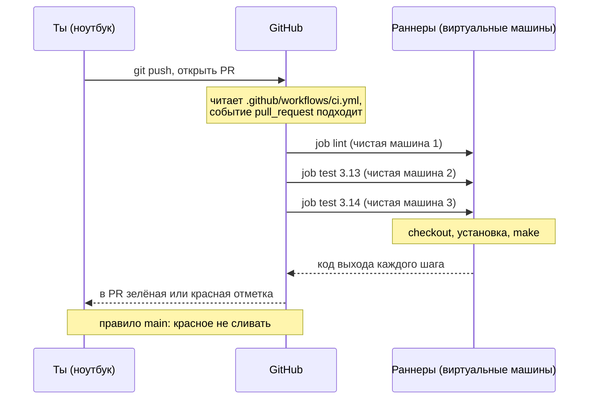
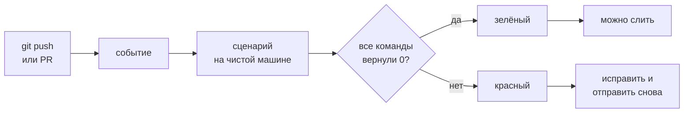
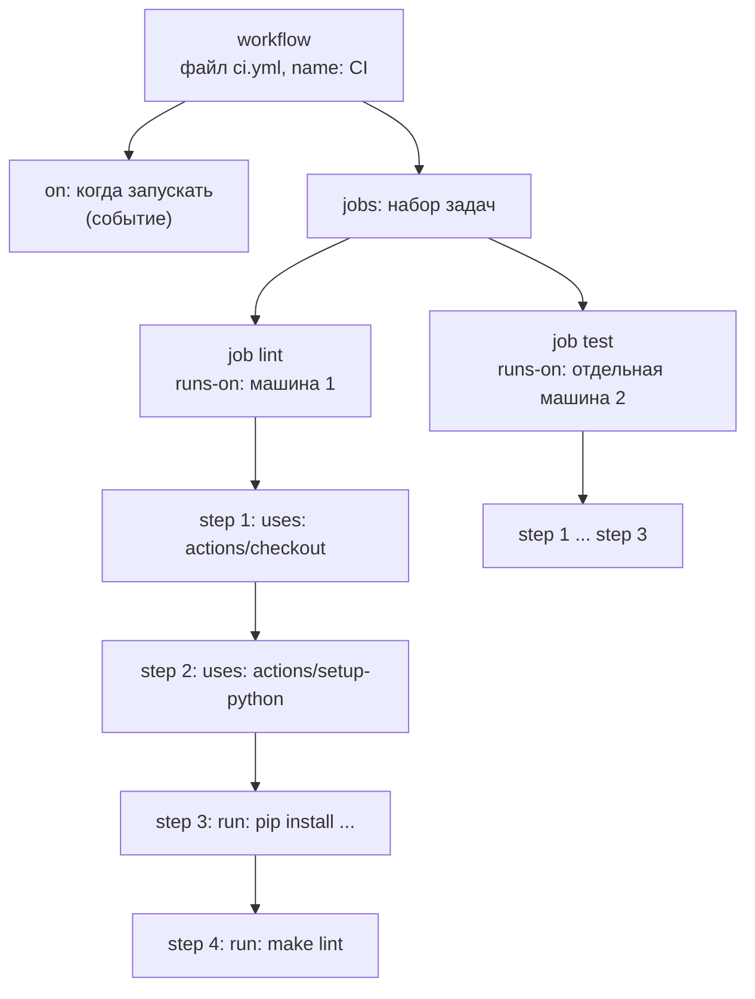
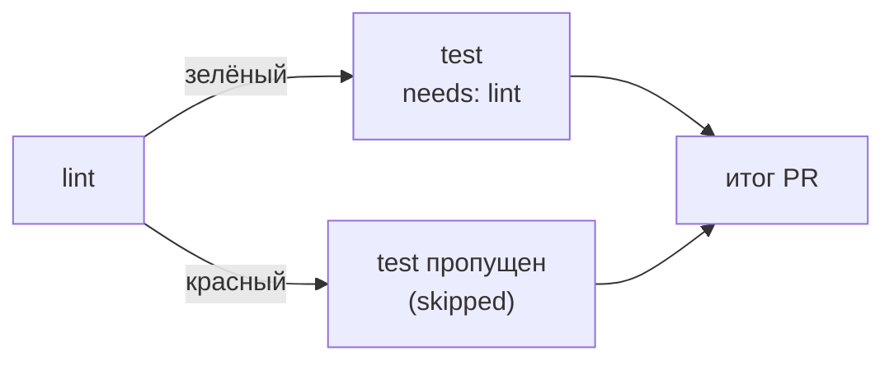

## Зачем это нужно

В [уроке 3.2](02-remotes-workflow.md) ты научился вливать код через Pull Request (PR, «запрос на слияние»: страница на GitHub, где твои изменения обсуждают перед тем, как влить их в `main`). Но проверял ты их глазами и руками. Человек устаёт, забывает запустить тесты и вливает то, что «у меня работает». На работе это заканчивается сломанным `main` в пятницу вечером: кто-то сломал синтаксис, тесты не запускались, релиз падает.

Непрерывная интеграция (Continuous Integration, CI) делает проверку обязательной и одинаковой для всех. На каждый PR чистая машина скачивает код, ставит зависимости, запускает линтер (программу, которая читает код и находит в нём ошибки и небрежности, не запуская его) и тесты (небольшие программы, которые запускают твой код и сверяют результат с ожидаемым), а результат виден прямо в PR. Красный статус не даёт слить код в `main`. Этот навык спрашивают на любом собеседовании на DevOps (DevOps: подход, при котором разработка и эксплуатация работают вместе и автоматизируют путь кода до сервера), а собственный `ci.yml` (файл с описанием проверок) открывают первым, когда приходят в новую команду.

Шаг проекта: в «Заметках» появляются `.github/workflows/ci.yml` (задачи `lint` и `test`: задача, по-английски job, это набор шагов, выполняемых на одной машине; тесты идут на Python 3.13 и 3.14), `requirements-dev.txt` с линтером `ruff` (быстрый линтер для Python) и `ruff.toml` с его настройками. Цель `lint` в `Makefile` (файл с короткими именами для длинных команд, например `make lint`) из [урока 1.6](../01-linux/06-bash-basics.md) получает настоящий линтер, а `main` начинает требовать зелёного CI. Код `app.py` (версия v3) не меняется.

## Что нужно знать

- [Урок 3.1: Git, коммиты, история и ветки](01-git-basics.md): коммит, ветка, `git status`, файл `.gitignore` (в нём уже стоят `.venv/` и `data/`, это пригодится).
- [Урок 3.2: удалённые репозитории и Pull Request](02-remotes-workflow.md): репозиторий `notes` на GitHub, защита `main` через ruleset (набор правил ветки), PR-процесс, `git push -u origin <ветка>`.
- [Урок 1.6: bash и Make](../01-linux/06-bash-basics.md): `Makefile` с целями `run`, `test`, `lint`, файл `test_app.py`, а главное **код выхода** команды (число 0 у успеха, любое другое у ошибки): весь CI держится на нём.
- [Урок 1.2: текст и пайпы](../01-linux/02-text-pipes.md): `grep`, `sed` и формат YAML (текстовый формат для описания настроек отступами) в общих чертах. Здесь он разбирается подробнее.

Всё остальное объясняется ниже с нуля, вот короткий словарь к первым абзацам. **Workflow** это файл с описанием проверок. **Раннер** (runner) это виртуальная машина, на которой они выполняются. **Matrix** размножает одну проверку на несколько версий Python. **Кэш** (cache) это сохранённые между запусками скачанные файлы, чтобы не качать их заново. **venv** (`.venv/`) это папка с отдельной копией Python и установленными пакетами только для твоего проекта, чтобы они не смешивались с системными. **Событие** (event) это то, что запускает workflow: например, открытие PR.

## Картина целиком

Представь фабрику, где готовые изделия перед отправкой проходят **приёмочный контроль**. Изделие кладут на ленту, а дальше всё делает автоматика: проверяет размеры, вес, внешний вид. Если хоть одна проверка не прошла, на изделии загорается красная лампа и на склад оно не уходит. Контролёр не устаёт, не забывает, не делает исключений «для своих».

CI в GitHub Actions устроен так же. Ты отправляешь ветку и открываешь PR. GitHub видит событие, находит в репозитории файл с описанием проверок (**workflow**), берёт для каждой проверки свежую виртуальную машину (**раннер**), скачивает на неё код и выполняет шаги. Результат возвращается в PR как зелёная или красная отметка. Аналогия ломается в одном месте: лента на фабрике постоянная, а раннер создаётся на время проверки и удаляется, поэтому каждая проверка начинается на пустой машине.



Дальше по порядку: зачем вообще CI и чем он отличается от CD; на каком языке пишут workflow (YAML); из чего workflow состоит; когда он запускается; на чём и с каким кодом работает; как размножить проверку на несколько версий Python (matrix), ускорить (кэш), ограничить (права, время, отмена старых запусков); и как превратить красный результат в запрет слияния.

## Теория

### Зачем нужен CI и чем он отличается от CD

Без CI проверка кода зависит от дисциплины людей. Один запускает тесты, другой нет; у третьего тесты проходят только потому, что у него на компьютере лежит нужный файл или стоит другая версия Python. Ошибки находят поздно, уже после слияния, когда исправлять дороже: код смешался с чужими изменениями, и непонятно, чей коммит всё сломал. Слова «у меня работает» перестают быть аргументом: важно, что скажет чистая машина, одинаковая для всех.

Приёмка в строительстве. Прораб может сам заявить «стена ровная», но акт подписывает независимый инспектор с уровнем и отвесом, который проверяет всё по одному списку. CI это инспектор, который приходит на каждый PR. Аналогия ломается в том, что инспектор проверяет только то, что записано в его списке: чего в списке нет (например, как код поведёт себя на настоящем сервере), он не увидит.

Цикл всегда один:

1. Ты отправляешь изменение (`git push`) или открываешь PR.
2. Система замечает **событие** и запускает автоматический сценарий проверки.
3. Сценарий на чистой машине скачивает код и выполняет набор команд: собрать, проверить стиль, запустить тесты.
4. Если **все команды вернули код выхода 0**, результат зелёный. Если хотя бы одна вернула другой код, красный.
5. Результат виден рядом с изменением, и его можно сделать обязательным условием слияния.

Слово «непрерывная» значит, что это происходит на каждое изменение, а не раз в месяц перед релизом. Чем чаще проверка и чем меньше изменение между проверками, тем проще найти виновника.



Пусть ты в PR случайно оставил в `app.py` строку `import shutil`, которая нигде не используется. Работе сервиса она не мешает, тесты проходят. Но у проекта есть договорённость «без мусорных импортов», её проверяет линтер. Без CI замечание нашёл бы ревьюер через день, а может быть, не заметил бы вовсе. С CI через полминуты в PR красная отметка `lint` и строка в логе: `F401 `shutil` imported but unused`. Ты исправляешь, пушишь заново, и проверка перезапускается сама.

Рядом с CI стоят ещё два похожих термина, которые путают:

| Термин | Что автоматизировано | Кто нажимает кнопку выкладки |
| --- | --- | --- |
| **CI** (Continuous Integration) | сборка и проверка кода при каждом изменении | выкладки нет |
| **Continuous Delivery** (непрерывная поставка) | CI плюс готовый к выкладке результат, который лежит и ждёт | человек, вручную |
| **Continuous Deployment** (непрерывное развёртывание) | CI плюс автоматическая выкладка в прод, если проверки зелёные | никто, всё само |

CD в обиходе означает одно из двух последних, поэтому всегда уточняй, какое имеется в виду. В этом уроке мы делаем только CI, выкладка появится в [уроке 3.5](05-release-flow.md).

> **Прикинь сам:** ты оставил в коде неиспользуемый `import`, тесты проходят. Станет ли CI красным?
{: .predict}

Зависит от набора проверок: если в нём есть линтер (например `ruff`), то да, он вернёт ненулевой код. Тесты такого не заметят, поэтому проверок в CI несколько.

Осторожно: Первое: «CI это GitHub Actions». Нет: CI это практика, а GitHub Actions один из инструментов (в [уроке 3.6](06-gitlab-ci-jenkins.md) те же проверки будут на GitLab CI и Jenkins). Второе: «зелёный CI значит, что всё работает». Нет: зелёный значит, что прошли те проверки, которые ты в него записал. Сервис может пройти все тесты и всё равно упасть в проде из-за неверного конфига сервера.

> **Главное:** CI запускает одни и те же проверки на каждое изменение на чистой машине, а красным результат становится по ненулевому коду выхода.
{: .key}

> **Проверь понимание:** в PR все проверки зелёные, но после слияния сервис на сервере отвечает 502. Значит ли это, что CI сломан?

<details markdown="1">
<summary>Ответ</summary>

Нет. CI проверяет только то, что в него записали (например, тесты и линтер на чистой машине). Конфигурация сервера, реальные данные и сеть прода не входят. Поэтому прод проверяют отдельно (простой запрос к `/healthz` после выкладки, мониторинг), а в CI со временем добавляют проверки, которые поймали бы такую ошибку.

</details>

CI ясно, но что именно он читает? Файл на YAML, поэтому сначала разберём этот язык.

### YAML: язык, на котором пишут workflow

Программе-контролёру нужно объяснить, что проверять, и сделать это так, чтобы текст читал и человек, и машина. Для таких описаний (конфигов) придумали простые форматы. GitHub Actions, Docker Compose, Kubernetes, Ansible выбрали **YAML**. Ты уже видел его в [уроке 1.2](../01-linux/02-text-pipes.md); здесь он главный инструмент, поэтому разберём его правила целиком.

Оглавление книги с вложенными пунктами: пункт второго уровня записан с отступом под пунктом первого, и по отступу видно, кому он принадлежит. В YAML структуру задают **пробелами в начале строки**, а не скобками. Аналогия ломается на строгости: в оглавлении лишний пробел ничего не изменит, а в YAML сдвиг на один пробел меняет смысл или ломает файл.

Три конструкции покрывают почти всё:

1. **Пара «ключ: значение».** После двоеточия обязателен пробел: `name: CI`. Ключ это имя настройки, значение то, чему она равна.
2. **Вложенность.** Если значением должен быть набор своих пар, они пишутся ниже с отступом (в workflow принято два пробела на уровень):

   ```yaml
   permissions:
     contents: read
   ```

   Здесь `permissions` содержит одну пару `contents: read`.
3. **Список.** Элементы начинаются с `- ` (дефис и пробел) и стоят на одном уровне. Короткий список пишут в одну строку в квадратных скобках: `branches: [main]`, `["3.13", "3.14"]`.

Ещё три правила: комментарий начинается с `#` и до конца строки; **табуляция запрещена**, только пробелы; текст со специальными символами или похожий на число берут в кавычки.

Возьмём кусок будущего `ci.yml` и посмотрим, что YAML-разборщик «видит». Ниже настоящий вывод программы `yq` (она превращает YAML в JSON, формат со скобками, где структура видна явно):

```yaml
on:
  pull_request:
  push:
    branches: [main]
```

```json
{
  "on": {
    "pull_request": null,
    "push": {
      "branches": [
        "main"
      ]
    }
  }
}
```

Читаем: ключ `on` содержит две пары. У `pull_request` после двоеточия ничего нет, поэтому значение `null` («пусто»): это нормально, здесь оно значит «событие нужно, а особых настроек нет». У `push` значение вложенное: ключ `branches`, а в нём список из одного элемента `main`.

Теперь ловушка с кавычками. Запись `python-version: [3.13, 3.14]` без кавычек YAML читает как **числа**, а не как текст. Для `3.13` это безвредно, но версия `3.10` превращается в число `3.1` (это проверено настоящим разборщиком: `[3.10, 3.14]` даёт `[3.1, 3.14]`), и вместо Python 3.10 запустится 3.1. Поэтому в workflow версии пишут в кавычках: `["3.13", "3.14"]`.

> **Прикинь сам:** чем `name:CI` отличается от `name: CI` и почему это важно?
{: .predict}

Без пробела после двоеточия YAML прочтёт всё как одну строку, а не как пару «ключ, значение», и настройка не сработает. Пробел обязателен.

Тут часто путают так. Что отступы можно делать «примерно» или табуляцией. Нельзя: ошибка вида `found character that cannot start any token` значит, что в начале строки табуляция. И что `key:value` без пробела это то же самое: нет, это одна строка-текст без пары.

> **Главное:** в YAML смысл задают отступы и пробел после двоеточия, поэтому пробелы здесь значимы.
{: .key}

> **Проверь понимание:** что означает в YAML запись `branches: [main]` и как её же записать в несколько строк?

<details markdown="1">
<summary>Ответ</summary>

Ключ `branches` со списком из одного элемента `main`. В несколько строк: `branches:` и под ним с отступом строка `- main`. Обе записи дают один и тот же результат.

</details>

Теперь можно прочитать сам файл целиком. Из чего состоит workflow?

### Из чего состоит workflow

Одной команды «проверь всё» мало: проверок несколько, у каждой свои условия и порядок, их надо запускать в разных версиях Python и в разное время. Нужно описание, в котором это разложено по полочкам. Такое описание в GitHub называется **workflow** (рабочий процесс): один YAML-файл в каталоге `.github/workflows/` репозитория. Файлов может быть сколько угодно, каждый живёт своей жизнью.

Технологическая карта цеха. Карта описывает: когда запускать линию (событие), из каких участков она состоит (задачи), что на каждом участке делают по порядку (шаги) и на каком станке (раннер). Аналогия ломается тем, что станок здесь одноразовый: после смены его выбрасывают и на следующую берут новый.

Внутри workflow четыре уровня, каждый вложен в предыдущий:



`uses:` это готовое действие, `run:` это команда оболочки. Каждая задача идёт на своей чистой машине, шаги внутри задачи выполняются по порядку.

Словарь, который нужен весь урок:

- **Событие** (event) запускает workflow: `push`, `pull_request`, расписание `schedule`, ручной запуск `workflow_dispatch`.
- **Задача** (job) это набор шагов на одной машине. Разные задачи по умолчанию идут **параллельно**, то есть одновременно.
- **Шаг** (step) это одна операция. Шаги внутри задачи идут **строго по порядку**. Шаг бывает двух видов: `run:` (команда оболочки, как в терминале) или `uses:` (готовое действие).
- **Действие** (action) это готовый переиспользуемый кусок автоматизации. Например, `actions/checkout` скачивает код репозитория на машину. Действие пишут на JavaScript или в контейнере, ты только подключаешь его строкой `uses:` и, если надо, настраиваешь через `with:`.
- **Раннер** (runner) это машина, на которой идёт задача. `runs-on: ubuntu-24.04` значит «виртуальная машина с Ubuntu 24.04 от GitHub». Её создают на время задачи и удаляют.

Судьба шага решается **кодом выхода** (урок 1.6). Команда вернула 0: шаг зелёный, идём к следующему. Вернула что-то другое: шаг красный, **остальные шаги этой задачи пропускаются**, задача красная, а значит и вся проверка красная.

В нашем `ci.yml` (полный текст будет в задании 2) две задачи, `lint` и `test`, а у `test` ещё matrix из двух версий Python (о ней ниже). В сумме GitHub запустит **три** независимых задачи. Вот что это значит на практике:

| Задача | Машина | Что делает | Зависит от других |
| --- | --- | --- | --- |
| `lint` | своя, Python 3.13 | ставит ruff, запускает `make lint` | нет |
| `test (3.13)` | своя, Python 3.13 | запускает `make test` | нет |
| `test (3.14)` | своя, Python 3.14 | запускает `make test` | нет |

Все три стартуют одновременно, потому что ни у одной нет `needs:` (ключа «дождись такой-то задачи»). Если бы `test` писал `needs: lint`, он ждал бы окончания `lint` и не запускался вовсе, если `lint` красный.

> **Прикинь сам:** сколько машин понадобится workflow с двумя задачами, у каждой по четыре шага?
{: .predict}

Две: машина создаётся на задачу, а не на шаг. Шаги задачи идут по порядку на одной и той же машине.

Осторожно: Три вещи. Первое: думают, что все шаги workflow идут на одной машине. Нет, каждая задача на своей. Второе: что шаг `run: pip install ruff` в первой задаче оставит ruff во второй. Нет: машины разные и чистые, ставить нужно в каждой. Третье: путают workflow и задачу: workflow это файл целиком, задача его часть.

Из этого следует главное свойство: **CI не видит ничего, чего нет в репозитории.** Ни твоего окружения `.venv`, ни файла `.env`, ни игнорируемых `.gitignore` файлов. Если код работает только у тебя, CI покажет это первым, и в этом его ценность.

> **Главное:** workflow состоит из событий (`on`) и задач (`jobs`), задача из шагов, и у каждой задачи своя машина.
{: .key}

> **Проверь понимание:** ты поставил на раннере `pip install ruff` в задаче `lint`. Будет ли ruff доступен в задаче `test` того же workflow? И почему?

<details markdown="1">
<summary>Ответ</summary>

Нет. Каждая задача идёт на своей чистой машине. Если ruff нужен во второй задаче, его ставят там снова. Данные между задачами можно передать через артефакт (сохранённый результат запуска), но для установки инструментов это лишнее.

</details>

Задача пойдёт на машине, но когда она запустится? Это определяют события.

### События: когда запускается workflow

Автоматика должна сама знать, когда ей работать. Запускать проверку «раз в час» бессмысленно, когда никто ничего не менял, а запускать вручную значит вернуться к «забыл нажать». Событие это сигнал от GitHub: «в репозитории случилось то-то».

Датчик на двери в магазине: пока никто не входит, звонок молчит, а при каждом входе звонит. Workflow тоже «звонит» на нужные события. Аналогия ломается на выборе: датчиков можно повесить много, и надо решить, на какие звонить, иначе будет лишний шум.

Для проверки кода хватает двух событий, они перечислены в ключе `on:`:

- **`pull_request`** срабатывает, когда PR открыт, когда в его ветку приходит новый коммит и когда PR открыт заново. GitHub при этом проверяет не саму твою ветку, а **результат её слияния с `main`** (временный коммит слияния, который GitHub собирает для проверки и который живёт под ссылкой вида `refs/pull/7/merge`). То есть проверяется ровно то, что окажется в `main` после слияния.
- **`push` в `main`** срабатывает после слияния PR, когда `main` получил новый коммит. Это страховка: `main` всегда проверен, даже если кто-то влил изменение в обход обычного порядка.

Почему `push` ограничен веткой (`branches: [main]`)? Если написать просто `on: push`, workflow запустится на каждый push в любую ветку. Твоя ветка с открытым PR получила бы два запуска на один коммит: один по `push`, второй по `pull_request`. Это двойная работа и двойной расход времени.

Вот что происходит на реальных действиях (события):

| Что ты делаешь | Состояние | Что запустится |
|---|---|---|
| `git push -u origin ci/add-workflow` | ветка ушла, PR ещё нет (push есть, но не в `main`) | ничего |
| `gh pr create --fill` | PR открыт | `pull_request`: 3 задачи |
| правка и `git push` | новый коммит в PR | `pull_request`: ещё 3 задачи, старые отменяются (см. `concurrency`) |
| кнопка «Squash and merge» | в `main` новый коммит | `push` в `main`: 3 задачи |

Каждый следующий коммит в PR заново запускает проверку, поэтому статус в PR всегда относится к самой свежей версии.

Есть событие с похожим названием, о котором надо знать заранее: **`pull_request_target`**. Оно запускается в контексте основного репозитория и получает доступ к секретам (паролям и токенам, сохранённым в настройках репозитория), даже когда PR пришёл из чужого форка (копии репозитория, которую сделал посторонний человек). Если такой workflow запустит код из PR, чужой код получит твои секреты. Для обычной проверки оно не нужно, подробно про риски в [уроке 3.4](04-quality-security-ci.md).

> **Прикинь сам:** ты отправил ветку командой `git push`, PR ещё не создан. Запустится ли проверка при `on: pull_request` и `on: push` с `branches: [main]`?
{: .predict}

Нет: PR ещё нет, а `push` идёт не в `main`. Первый запуск случится, когда ты откроешь PR.

Тут часто путают так. «`pull_request` проверяет мою ветку»: нет, результат слияния ветки с `main`. И «раз PR зелёный, `push` в `main` можно не проверять»: нужно, потому что `main` мог измениться между проверкой PR и слиянием.

> **Главное:** `pull_request` проверяет предложение до слияния, `push` в `main` страхует уже слитый код.
{: .key}

> **Проверь понимание:** почему для PR полезнее проверять результат слияния с `main`, а не саму ветку?

<details markdown="1">
<summary>Ответ</summary>

Ветка могла отстать от `main`. Тесты на ветке зелёные, а после слияния с новым `main` могут упасть: чужое изменение конфликтует с твоим по смыслу, хотя git слил файлы без конфликтов. Проверка результата слияния ловит это до слияния.

</details>

Событие пришло. Где выполнится проверка? На раннере.

### Раннер: на чём выполняется проверка

Проверке нужен компьютер с ОС, Python и утилитами. Держать для этого свой сервер и следить за ним неудобно, и он «загрязняется» результатами прошлых запусков: старые файлы, установленные пакеты, забытые процессы. Проверка на грязной машине может пройти или упасть по причинам, не связанным с кодом.

Гостиничный номер: после каждого гостя его убирают до состояния «как новый», поэтому следующий гость не находит чужих вещей. Раннер это номер, который не убирают, а сносят и строят заново. Аналогия ломается тем, что «здание» (типовой образ системы) у всех одинаковое: то, что установлено в образе, есть у всех.

Есть два вида раннеров:

- **hosted** (размещённый GitHub): виртуальную машину создаёт и удаляет GitHub. Ты выбираешь образ строкой `runs-on:`, например `ubuntu-24.04`. Среда чистая и одинаковая при каждом запуске. Для публичных репозиториев стандартные раннеры бесплатны, для частных есть квота минут.
- **self-hosted** (свой): ты ставишь программу-агент на собственный сервер, и она берёт задачи. Можно свои ресурсы и доступ во внутреннюю сеть, но чистоту и безопасность обеспечиваешь сам (особенно если запускается код из PR посторонних).

Образ `ubuntu-24.04` уже содержит git, `make`, Python и много другого. Поэтому `make test` на нём работает без установки. Но именно нужную версию Python ты выбираешь действием `actions/setup-python`. Метка `ubuntu-latest` тоже существует, но указывает на «текущую» версию образа и меняется со временем: сегодня это `ubuntu-24.04`, завтра другая. Для повторяемости в курсе мы пишем версию явно.

Ты запускаешь `pip install -r requirements-dev.txt` в задаче `lint`. Что произошло с машиной? GitHub создал виртуальную машину из образа `ubuntu-24.04`, выполнил шаги, и после последнего шага удалил её вместе со всем поставленным. В следующем запуске ruff снова придётся скачать (или взять из кэша, о нём ниже). Если бы ты запускал ту же команду на своём ноутбуке, ruff остался бы там навсегда, и проверка «работает у меня» пропустила бы забытую зависимость.

> **Прикинь сам:** ты запустил `pip install` в задаче `lint`. Будет ли этот пакет на машине в следующей задаче `test`?
{: .predict}

Нет: задачи идут на разных чистых машинах, и всё, что поставлено в одной, пропадает вместе с ней. Каждая задача ставит свои зависимости заново.

> **Главное:** hosted раннер каждый раз чистый, а self-hosted это твой сервер, и за его чистоту отвечаешь ты.
{: .key}

> **Проверь понимание:** чем hosted раннер лучше для проверки кода и чем self-hosted?

<details markdown="1">
<summary>Ответ</summary>

Hosted даёт чистую одинаковую среду без обслуживания. Self-hosted полезен, когда нужны свои ресурсы или доступ во внутреннюю сеть, но чистоту и безопасность придётся обеспечивать самому (например, чужой код из PR на своей машине опасен).

</details>

Машина чистая, и работать на ней будут готовые блоки. Как их подключать и зачем закреплять версию?

### Действия (`uses`) и закрепление версий

Скачать код репозитория или поставить нужный Python можно командами, но на это уходит много строк, и каждый пишет их по-своему. Готовое **действие** делает это одной строкой, а исправления и обновления получают все сразу.

Подключаемая деталь, как розетка с готовым модулем: не нужно паять схему, берёшь блок с описанием входов. Аналогия ломается на доверии: блок написал кто-то другой, и ты запускаешь его код на своей машине.

Запись `uses: actions/checkout@v7.0.1` читается по частям: `actions` владелец (организация или пользователь GitHub), `checkout` имя репозитория с действием, после `@` **ссылка на версию** (тег, ветка или хэш коммита). Настройки действию передают через `with:`. В нашем workflow два действия:

- `actions/checkout` скачивает содержимое репозитория на раннер. Сам раннер пустой, без него нечего проверять.
- `actions/setup-python` ставит нужную версию Python (`with: python-version: "3.13"`) и умеет кэшировать пакеты pip.

Версию можно указать тремя способами:

| Запись | Что это | Плюс | Риск |
| --- | --- | --- | --- |
| `@main` | ветка | всегда новейшее | завтра может приехать другое поведение |
| `@v7` | «плавающий» основной тег | получаешь исправления сам | тег двигают, код под ним меняется |
| `@v7.0.1` | точный тег | воспроизводимо | автор всё равно может передвинуть тег |
| `@<40 символов хэша>` | хэш коммита | нельзя подменить | нечитаемо, обновлять надо руками или ботом |

Тег в чужом репозитории можно перенести на другой коммит, и в твой CI приедет другой код. Для важных workflow (публикация, выкладка) действие закрепляют по хэшу коммита с комментарием версии. В этом уроке мы закрепляем по **точным тегам** (`v7.0.1`), без `@main`, а про хэши и автоматические обновления через Dependabot (бот GitHub, который сам присылает PR с новыми версиями) поговорим в [уроке 3.4](04-quality-security-ci.md).

Актуальность версий проверена по данным GitHub на 2026-09-30: у `actions/checkout` последний релиз `v7.0.1` (20 июля 2026), у `actions/setup-python` `v7.0.0` (20 июля 2026). Проверить теги можно без браузера:

```bash
git ls-remote --tags https://github.com/actions/checkout 'v7*'
```

```text
3d3c42e5aac5ba805825da76410c181273ba90b1	refs/tags/v7
9c091bb21b7c1c1d1991bb908d89e4e9dddfe3e0	refs/tags/v7.0.0
3d3c42e5aac5ba805825da76410c181273ba90b1	refs/tags/v7.0.1
```

`git ls-remote --tags <адрес> '<шаблон>'` печатает теги удалённого репозитория без клонирования: слева хэш коммита, справа имя тега. Видно, что плавающий тег `v7` сейчас указывает на тот же коммит, что и `v7.0.1`. Когда выйдет `v7.0.2`, `v7` переедет, а `v7.0.1` останется. Хэши у тебя будут другими, когда выйдут новые версии.

> **Прикинь сам:** чем плох `uses: actions/checkout@main`?
{: .predict}

Ветка `main` у действия может измениться в любой день, и вчерашняя зелёная проверка завтра станет красной без твоих правок. Закрепление тега или хеша делает запуск повторяемым.

Тут часто путают так. Что `@v7` «ничего не значит»: он существует, но плавающий. Что действие «безопасно, раз популярное»: популярное действие тоже чужой код, поэтому смотрят автора и закрепляют версию.

> **Главное:** версию действия закрепляют: чем строже закрепление (тег, хеш), тем меньше сюрпризов и тем больше ручной работы по обновлению.
{: .key}

> **Проверь понимание:** чем `@v7` отличается от `@v7.0.1` и почему второй предсказуемее?

<details markdown="1">
<summary>Ответ</summary>

`@v7` тег «основной версии», его автор двигает на каждый выпуск, поэтому завтра под ним может быть другой код. `@v7.0.1` указывает на конкретный выпуск и обычно не двигается, поэтому сегодняшний и завтрашний запуск одинаковы.

</details>

Версии действий закреплены. Теперь размножим проверку на несколько версий Python.

### Matrix: одна проверка на нескольких версиях

**Зачем она существует.** Код должен работать не только на той версии Python, что стоит у тебя. Пользователи и серверы запускают разные версии, и то, что работает на 3.13, иногда падает на 3.14 из-за убранной или изменённой возможности. Писать две почти одинаковые задачи, отличающиеся одной цифрой, неудобно и легко разойтись.

Испытание новой модели телефона: одну и ту же процедуру повторяют на нескольких партиях, чтобы понять, не зависит ли результат от партии. Здесь партии это версии Python. Аналогия ломается тем, что «партий» может быть много, и число запусков растёт как произведение параметров.

Ключ `strategy.matrix` перечисляет значения параметра, а GitHub создаёт по одной задаче на каждое значение. Значение доступно в шагах как выражение `${{ matrix.python-version }}` (двойные фигурные скобки `${{ ... }}` значат «вычисли выражение и подставь результат»). Если параметров два, запусков будет столько, сколько комбинаций: две версии Python и две ОС дают четыре задачи.

По умолчанию, если одна задача matrix упала, GitHub **отменяет остальные** (`fail-fast: true`). Тогда ты видишь одну красную и несколько «отменено», а какие из них упали бы сами, неизвестно. Настройка `fail-fast: false` отключает отмену: все задачи доходят до конца, и ты видишь полную картину.



```yaml
  test:
    runs-on: ubuntu-24.04
    strategy:
      fail-fast: false
      matrix:
        python-version: ["3.13", "3.14"]
    steps:
      - uses: actions/setup-python@v7.0.0
        with:
          python-version: ${{ matrix.python-version }}
```


GitHub раскладывает это на два запуска: в первом `matrix.python-version` равно `"3.13"`, во втором `"3.14"`. В интерфейсе они получат имена `test (3.13)` и `test (3.14)`. Имя складывается из имени задачи и значения параметра в скобках, и это имя понадобится, когда мы будем делать проверки обязательными. Если тест упадёт только на 3.14 при `fail-fast: false`, вкладка покажет `test (3.13)` зелёным и `test (3.14)` красным: сразу видно, что проблема в версии, а не в коде вообще.

> **Прикинь сам:** в matrix две версии Python и два типа ОС. Сколько задач создаст GitHub?
{: .predict}

Четыре: matrix перемножает значения, получается по задаче на каждую комбинацию.

> **Главное:** matrix создаёт по задаче на каждую комбинацию значений, а `fail-fast` решает, отменять ли остальные при первой ошибке.
{: .key}

> **Проверь понимание:** во что превратятся `python-version: ["3.13", "3.14"]` и `os: [ubuntu-24.04, ubuntu-22.04]` в одной matrix?

<details markdown="1">
<summary>Ответ</summary>

В четыре задачи: все сочетания версии и системы (3.13 на 24.04, 3.13 на 22.04, 3.14 на 24.04, 3.14 на 22.04).

</details>

Задач стало много, и они стоят времени. Как ускорить и ограничить их?

### Кэш, concurrency и ограничение времени

У бесплатного CI есть цена: минуты машинного времени и твоё ожидание. Каждый раз скачивать те же пакеты заново долго, проверять уже устаревший коммит бессмысленно, а зависшая задача может сжигать время часами.

Кэш это заготовки на кухне: нарезанные овощи лежат в холодильнике, и второй раз готовить быстрее. Аналогия ломается в том, что заготовки могут испортиться (кэш можно потерять), поэтому рецепт обязан работать и без них.

Три независимых приёма:

1. **Кэш** (cache) хранит скачанные файлы между запусками под **ключом**, который считается из содержимого файла зависимостей. Действие `setup-python` умеет это само: строка `cache: pip` включает кэш для pip, а `cache-dependency-path: requirements-dev.txt` говорит, по какому файлу считать ключ. Файл не менялся: кэш найден, пакеты берутся из него. Файл изменился: ключ новый, кэша нет, пакеты скачиваются и сохраняются заново. GitHub удаляет кэш, которым давно не пользовались (по документации, через 7 дней). Кэш это **ускорение**, а не результат работы. От него отличается **артефакт** (artifact): файл, который задача сохраняет как результат (отчёт, собранный архив), чтобы ты мог скачать его или передать другой задаче.
2. **`concurrency`** (одновременность) объединяет запуски в группу и разрешает в группе только один активный. Ключ `group` задаёт имя группы, а `cancel-in-progress: true` отменяет уже идущий запуск группы, когда приходит новый. Для нас группа `ci-${{ github.ref }}`: `github.ref` это ветка или PR, для которых идёт запуск (для PR он вида `refs/pull/7/merge`). Если ты быстро запушил два коммита в один PR, первый запуск отменится: результат по устаревшему коду никому не нужен.
3. **`timeout-minutes`** ограничивает время задачи. Без него по умолчанию задача живёт до 6 часов. Тест, ушедший в бесконечный цикл, будет молча сжигать минуты. Десять минут для нашей проверки более чем достаточно.

Первый запуск `lint` без кэша: `pip install` скачивает ruff (около 10 МБ) с интернета. Ты поменял только `app.py` и запушил снова: `requirements-dev.txt` не менялся, значит ключ кэша тот же, ruff берётся из кэша и установка занимает секунды. Через неделю без запусков GitHub кэш удалит, следующий запуск снова скачает пакет, но результат тот же. Теперь ты меняешь `ruff==0.16.9` на другую версию: файл изменился, ключ другой, кэша нет, скачивается новая версия. Именно поэтому версию инструмента в `requirements-dev.txt` **закрепляют**: если бы там стояло просто `ruff`, кэш по этому ключу застрял бы на старой версии, а свежий ruff мог бы внезапно покраснить CI без единого изменения в коде.

> **Прикинь сам:** что произойдёт с workflow, если кэш пропал?
{: .predict}

Ничего страшного: пакеты скачаются заново, проверка станет дольше, но результат тот же. Кэш это ускорение, а не данные.

Тут часто путают так. Кэш и артефакт: кэш это ускорение (потерялся, ничего страшного), артефакт это результат (потерялся, потеряна работа). И `concurrency` со временем: он отменяет запуски-конкуренты, а не долгие задачи (для этого `timeout-minutes`).

> **Главное:** кэш ускоряет, `concurrency` отменяет устаревшие запуски, `timeout-minutes` не даёт зависшей задаче сжечь часы.
{: .key}

> **Проверь понимание:** что произойдёт с workflow, если кэш pip пропал?

<details markdown="1">
<summary>Ответ</summary>

Ничего страшного. Пакеты скачаются заново, запуск станет медленнее, но результат тот же. Workflow не должен зависеть от кэша: это только ускорение.

</details>

С временем ясно. Теперь безопасность: что разрешено токену в запуске?

### Права токена: `permissions`

Во время запуска у workflow есть доступ к репозиторию через автоматически выданный токен `GITHUB_TOKEN` (временный «пропуск», действует только на время запуска). Если он может слишком много, скомпрометированное действие или чужой код в проверке сможет писать в репозиторий, менять релизы, комментировать PR.

Карта-пропуск гостя в офисе: гостю нужен вход в переговорную, а не в серверную. Выдают минимально нужное. Это принцип **наименьших привилегий** (least privilege). Аналогия ломается тем, что права токена ты описываешь сам в файле, и по умолчанию они могут быть шире нужных, если не написать ничего.

Блок `permissions:` на верхнем уровне workflow перечисляет, что токену разрешено. Мы пишем `contents: read`: токен может **читать** содержимое репозитория (этого достаточно, чтобы `checkout` скачал код) и больше ничего. Всё, чего не перечислено в блоке, запрещается. Права по умолчанию зависят от настроек репозитория и организации, поэтому явная запись надёжнее: файл одинаково работает везде.

Допустим, в проверку проникает вредоносный код (через скомпрометированное действие). С `contents: read` он может прочитать репозиторий (он и так публичный), но не может запушить коммит, создать релиз или изменить настройки. Без блока права зависели бы от настроек и могли включать запись.

> **Прикинь сам:** проверка ничего не пишет в репозиторий. Зачем всё равно указывать `permissions: contents: read`?
{: .predict}

Чтобы лишних прав не было, если в проверку попадёт чужой код: писать в репозиторий он не сможет. Ограничение уменьшает ущерб, но не запрещает запуск.

Осторожно: `permissions` защищает от чужого кода вообще: он ограничивает ущерб, а не запрещает запуск. И что токен нужно создавать самому: `GITHUB_TOKEN` GitHub выдаёт сам, тебе нужно лишь ограничить его права.

> **Главное:** токену выдают минимум прав: принцип наименьших привилегий сужает ущерб при компрометации.
{: .key}

> **Проверь понимание:** зачем писать `permissions: contents: read`, если проверка ничего не пишет в репозиторий?

<details markdown="1">
<summary>Ответ</summary>

Чтобы в токене не было лишних прав. Если в проверку попадёт вредоносный код или скомпрометированное действие, писать в репозиторий он не сможет. Принцип наименьших привилегий: выдаём только то, что нужно.

</details>

Права ограничены. Как сделать так, чтобы красный результат действительно останавливал слияние?

### Статус проверки и запрет слияния

Красный результат сам по себе ничего не запрещает: он лишь цвет на странице. Чтобы CI защищал `main`, слияние красного PR должно быть **невозможным**, а не «не рекомендуется».

Лампа на конвейере и шлагбаум. Лампа только сообщает, а шлагбаум не пускает. Красный статус это лампа, правило защиты ветки это шлагбаум. Аналогия ломается на исключениях: у шлагбаума есть ключ у владельца (bypass, обход правил), и его тоже надо закрыть.

Каждая задача публикует в PR отдельный **статус** (check): зелёный, красный или «ещё идёт». В правиле защиты `main` (ruleset из [урока 3.2](02-remotes-workflow.md)) включают **Require status checks to pass before merging** и перечисляют **обязательные** проверки по именам задач: `lint`, `test (3.13)`, `test (3.14)`. Пока хоть одна обязательная проверка не зелёная, кнопка слияния заблокирована. Две тонкости: проверка попадает в список выбора только после того, как отработала хотя бы раз, а имя в правиле должно совпадать с именем задачи (для matrix это `test (3.13)` в скобках, как в разделе про matrix).

Разберём, что значит «красный» на уровне кодов. Вот реальный прогон упавшего теста (твой `test_app.py` из урока 1.6, в котором ожидание `200` заменено на `500`):

```text
FAIL: test_healthz (test_app.NotesTest.test_healthz)
----------------------------------------------------------------------
Traceback (most recent call last):
  File "/home/ubuntu/notes/test_app.py", line 77, in test_healthz
    self.assertEqual(status, 500)
AssertionError: 200 != 500

----------------------------------------------------------------------
Ran 6 tests in 0.641s

FAILED (failures=1)
make: *** [Makefile:13: test] Error 1
```

`unittest` вернул код 1, а `make` увидел, что команда в рецепте упала, напечатал `make: *** ... Error 1` и сам вышел с кодом **2**. Именно 2 попадёт в лог CI последней строкой: `Error: Process completed with exit code 2.` Это последняя строка, но не причина: причина (`FAIL: test_healthz` и `AssertionError: 200 != 500`) выше. Правило чтения лога: смотри сверху на первый признак ошибки, а не на хвост.

> **Прикинь сам:** в PR красная проверка, но кнопка слияния активна. Что не настроено?
{: .predict}

Правило защиты `main`: красный статус сам по себе лишь цвет. Нужно сделать проверку обязательной (required status check).

Тут часто путают так. Что «красная задача блокирует слияние сама»: нет, только если её сделали обязательной. И что достаточно перезапустить красную проверку: перезапуск красного детерминированного теста (одинаково падающего при каждом запуске) ничего не даёт.

> **Главное:** красный статус только лампа, а запрещает слияние правило защиты ветки с обязательными проверками.
{: .key}

> **Проверь понимание:** в логе упавшей задачи последняя строка `Process completed with exit code 2`. Где искать причину?

<details markdown="1">
<summary>Ответ</summary>

Выше по логу, в выводе шага: там строка `FAIL: ...`, замечание ruff вроде `F401` или traceback. Последняя строка только сообщает, что шаг вернул ненулевой код. Код 2 здесь от `make`: он завершается с 2, когда его команда упала.

</details>

Одной задачи мало: задачи бывают связаны. Как задать порядок?

### Порядок задач: `needs` и условия `if`

По умолчанию все задачи workflow стартуют одновременно. Это быстро, но иногда неразумно: нет смысла гонять дорогие тесты, если не прошёл дешёвый линтер, а выкладку нельзя начинать, пока не закончились тесты. Нужен способ задать порядок и условия.

Конвейер с несколькими постами. Покраска начинается только когда сварка закончена и принята. Оговорка: на конвейере порядок один, а в workflow ты можешь оставить часть постов работать параллельно и связать только те, что зависят друг от друга.

Ключ `needs` в задаче называет задачи, которых нужно дождаться. Если любая из них красная, текущая не запустится вовсе и получит статус «пропущена» (skipped). Ключ `if` добавляет условие на задачу или шаг: запускать, только когда выражение верно.




```yaml
jobs:
  lint:
    runs-on: ubuntu-24.04
    steps:
      - uses: actions/checkout@v4
      - run: make lint

  test:
    needs: lint          # не стартует, пока lint не зелёный
    runs-on: ubuntu-24.04
    steps:
      - uses: actions/checkout@v4
      - run: make test
      - name: Сообщить о падении
        if: failure()    # шаг выполнится только если предыдущие шаги упали
        run: echo "тесты красные, смотри лог выше"
```


Смотрим сверху вниз. `lint` не зависит ни от чего, поэтому стартует сразу. `test` содержит `needs: lint`: GitHub сначала ждёт результат `lint`. Если линтер нашёл `F401`, задача `test` получит серую отметку «skipped», а не красную: она не упала, её просто не запускали. Шаг с `if: failure()` по умолчанию не выполняется (обычный шаг пропускается после упавшего), но с этим условием будет выполнен именно в случае падения. Парное условие `if: always()` запускает шаг независимо от результата, его удобно использовать для загрузки логов.

> **Прикинь сам:** у `test` стоит `needs: lint`, а `lint` красный. Как будет выглядеть `test`: красным или серым?
{: .predict}

Серым (skipped): `test` не упал, его просто не запускали.

Осторожно: «Серая отметка skipped значит, что проверка прошла». Нет: проверка не запускалась. Поэтому в правилах защиты `main` (раздел ниже) важно выбирать именно те задачи, которые должны быть зелёными, и помнить, что пропущенная задача не равна пройденной.

> **Главное:** `needs` задаёт порядок и останавливает зависимую задачу, а `if` включает или выключает шаги по условию.
{: .key}

> **Проверь понимание:** в workflow три задачи: `lint`, `test` с `needs: lint` и `build` с `needs: test`. Линтер упал. Какие статусы получат `test` и `build`?

<details markdown="1">
<summary>Ответ</summary>

Обе получат skipped. `test` ждёт `lint`, а тот красный, поэтому `test` не стартует. `build` ждёт `test`, а тот не выполнился, значит, и `build` не стартует. Цепочка обрывается на первой красной задаче.

</details>

Порядок есть. Некоторым задачам нужны пароли. Как передать их безопасно?

### Секреты и переменные: как передать пароль, не выкладывая его в репозиторий

Workflow лежит в репозитории, а репозиторий читают все, у кого есть доступ (а у публичного репозитория это весь интернет). Но проверкам и выкладке иногда нужны пароли и токены: войти в реестр образов, отправить сообщение в чат. Записать такой пароль прямо в `ci.yml` значит опубликовать его.

Сейф в офисе. Инструкция «открой сейф и возьми печать» лежит на стене, её может прочитать кто угодно, а вот код от сейфа знают только те, кому положено. Оговорка: GitHub сам подставляет код в нужный момент, человеку его вводить не нужно, и после подстановки значение нельзя прочитать обратно из настроек.


1. В настройках репозитория (Settings, Secrets and variables, Actions) ты создаёшь **секрет** (secret): имя и значение. GitHub хранит значение зашифрованно и показывает только имя.
2. В workflow секрет подставляется выражением `secrets.ИМЯ` внутри двойных фигурных скобок со знаком доллара.
3. Во время запуска GitHub подставляет значение и **маскирует** его в логах: если оно где-то попадёт в вывод, вместо него будут звёздочки `***`.
4. Для несекретных настроек (например, адрес или номер версии) есть **переменные** (variables): они хранятся так же, но видны в открытом виде. Третий вариант, `env:` прямо в workflow, подходит для значений, не меняющихся от запуска к запуску.


```yaml
    steps:
      - name: Показать, что секрет доступен (значение не печатается)
        env:
          API_TOKEN: ${{ secrets.API_TOKEN }}   # значение придёт из настроек репозитория
        run: test -n "$API_TOKEN" && echo "токен передан"
```


`env:` задаёт переменную окружения для шага (значение, которое команда видит как `$API_TOKEN`). `test -n "$API_TOKEN"` возвращает код 0, если строка непустая: так можно проверить наличие секрета, не печатая его. Если запустить этот workflow из форка (копии чужого репозитория, [урок 3.2](02-remotes-workflow.md)), секрет окажется пустым: GitHub не отдаёт секреты в запуски от форков, чтобы чужой PR не смог их украсть. Подробнее про безопасность секретов в CI будет в [уроке 3.4](04-quality-security-ci.md).

> **Прикинь сам:** ты записал токен прямо в `ci.yml`. Что не так?
{: .predict}

Файл лежит в репозитории, а репозиторий читают все, у кого есть доступ. Токен нужно отозвать и выпустить заново, а новый хранить в секретах.

Тут часто путают так. «Маскирование в логах защитит секрет, что бы я ни делал». Нет: маскируется только точное совпадение строки. Если ты выведешь секрет в закодированном виде (например, через `base64`) или по одному символу, маска не сработает. Поэтому секрет нельзя печатать ни в каком виде.

> **Главное:** секрет хранится в настройках, подставляется выражением `secrets.ИМЯ` и маскируется в логах, а несекретное идёт в переменные.
{: .key}

> **Проверь понимание:** ты случайно закоммитил токен в `ci.yml` и запушил в публичный репозиторий. Достаточно ли удалить строку новым коммитом?

<details markdown="1">
<summary>Ответ</summary>

Нет. Старый коммит остаётся в истории и виден всем. Сначала отзови токен на стороне сервиса, который его выдал (ротация, [урок 3.1](01-git-basics.md)), выпусти новый и положи его в секреты репозитория. Только потом чисти историю, если это нужно.

</details>

Всё настроено. Остался навык, без которого красный лог не починить: читать его.

### Как читать лог упавшего запуска

Красная отметка сообщает только «что-то не так». Чтобы починить, нужно найти в логе строку, с которой всё началось. Новичок обычно читает лог с конца и видит лишь следствие.

Разбор аварии по записи видеорегистратора. Последние секунды записи показывают столкновение, но причина чаще в том, что было за 10 секунд до него. Оговорка: в логах CI причина обычно одна, и она первая по времени, а остальные красные строки идут каскадом из-за неё.

Открывай упавший запуск в порядке:

1. **Вкладка Actions**, затем нужный запуск (run). Вверху виден список задач со статусами.
2. **Первая красная задача.** Кликни на неё: слева список шагов, упавший отмечен красным крестом.
3. **Разверни красный шаг.** Ищи **первую** строку со словами `error`, `Error`, `FAIL`, `Traceback`. Выше неё идёт контекст, ниже часто последствия.
4. **Последняя строка шага** `Process completed with exit code N` говорит, что команда вернула код `N`, отличный от нуля. Этот код запомни: он говорит, что CI считает шаг проваленным.
5. Скопируй команду, которая упала, и запусти её у себя в тех же условиях (та же версия Python, чистое окружение). Если воспроизвелось, исправляй. Если нет, сравни версии и переменные (частая причина: у тебя в системе стоит то, чего нет на раннере).

Допустим, лог шага `Run make test` заканчивается так:

```text
FAIL: test_healthz (test_app.NotesTest)
AssertionError: 200 != 503
make: *** [Makefile:12: test] Error 1
Error: Process completed with exit code 2.
```

Читаем: `FAIL: test_healthz` называет упавший тест; `AssertionError: 200 != 503` объясняет, что тест ждал ответ 200, а получил 503; следующая строка от `make` говорит, что цель `test` в `Makefile` провалилась; последняя строка от самого GitHub сообщает код выхода. Значит, искать надо в тесте `test_healthz`, а не в самом workflow.

> **Прикинь сам:** в логе внизу `Process completed with exit code 2`. С какой строки начинать искать причину?
{: .predict}

С первой строки с `error`, `FAIL` или `Traceback` выше этой: последняя строка лишь сообщает код выхода, а причина в том, что произошло раньше.

Осторожно: «Код выхода 2 значит, что у меня два теста упали». Нет: код выхода это сигнал от программы, а не счётчик. Ноль значит успех, любое другое число ошибка, а конкретный смысл числа определяет программа.

> **Главное:** лог читают от первой красной задачи к первой ошибке и воспроизводят команду у себя.
{: .key}

> **Проверь понимание:** в логе много красных строк, последние связаны с `ModuleNotFoundError`. С какой строки начинаешь?

<details markdown="1">
<summary>Ответ</summary>

С первой красной строки по времени, а не с последней. Если она тоже про `ModuleNotFoundError: No module named 'ruff'`, значит, зависимость не установилась (например, шаг установки пропущен или прошёл с ошибкой), а остальные ошибки посыпались следом.

</details>

Теории хватит. Дальше практика: собираем свой workflow.

## Практика

Все задания выполняются в репозитории `~/notes`, который ты завёл в [уроке 3.2](02-remotes-workflow.md). Работаем через ветки и Pull Request, как договорились.

**Оговорка о проверке:** всё, что делается на твоём компьютере (venv, `ruff`, `make lint`, `make test`, `actionlint`, проверка чистым клоном), прогнано на стенде с Ubuntu 24.04. Всё, что происходит на сайте GitHub (запуск workflow, названия кнопок и страниц, ruleset, команды `gh`), написано по документации и не прогонялось: для этого нужен твой аккаунт, которого у стенда нет.

### Задание 1. Линтер локально, конфиги и цель `make lint`

**Цель:** запустить ruff у себя, чтобы CI не стал первым, кто увидит замечания, и подключить его к `make lint`.

**Предскажи:** в `~/notes` лежит `app.py` версии v3. Найдёт ли ruff с набором правил `E` и `F` замечания в нём? Как ты объяснишь результат?

<details markdown="1">
<summary>Ответ</summary>

Скорее всего нет: правила `E` (стиль, pycodestyle) и `F` (pyflakes: неиспользуемые импорты, неопределённые имена) ловят мелочи, а код курса написан чисто. Проверено: на v3 ruff отвечает `All checks passed!`. Если замечание всё же нашлось, это настоящий мусор в коде, а не ошибка ruff.

</details>

**Шаги:**

1. Создай ветку. Команда `git switch main && git pull` переходит на `main` и забирает свежие коммиты, а `git switch -c ci/add-workflow` создаёт и открывает новую ветку (`-c` значит create, «создать»):

```bash
cd ~/notes
git switch main && git pull
git switch -c ci/add-workflow
```

2. Подготовь виртуальное окружение (venv). Это отдельная папка `.venv` с собственной копией Python и своими пакетами: то, что ты ставишь, не смешивается с системным Python. Модуль `venv` в Ubuntu вынесен в отдельный пакет, поэтому сначала поставь его (`apt install` ставит программу, `-y` отвечает «да» на вопросы, `sudo` даёт права администратора, урок 1.3):

```bash
sudo apt install -y python3-venv
python3 -m venv .venv
source .venv/bin/activate
which python
```

Разбор: `python3 -m venv .venv` запускает модуль `venv` и создаёт каталог `.venv`. `source .venv/bin/activate` «включает» окружение: в текущей оболочке `python` и `pip` теперь указывают внутрь `.venv`, а в начале приглашения появится `(.venv)`. `which python` показывает, какой именно файл запустится.

**Что должно получиться:**

```text
/home/ubuntu/notes/.venv/bin/python
```

**Как читать вывод:** путь оканчивается на `.venv/bin/python`, значит окружение включено. Если там `/usr/bin/python3`, ты забыл `source`. Каталог `.venv` уже перечислен в `.gitignore` из урока 3.1, поэтому в git он не попадёт и в CI его нет: раннер создаст своё окружение сам.

3. Создай `requirements-dev.txt` (список инструментов для разработчика, не нужных самому сервису) и поставь из него. `pip install -r файл` читает список пакетов из файла. Запись `ruff==0.16.9` закрепляет **точную** версию: без этого завтра выйдет новый ruff с более строгими правилами, и CI покраснеет без единого изменения в коде.

```bash
cat > requirements-dev.txt <<'EOT'
# Инструменты разработки. Версия закреплена, чтобы новый ruff не покраснил CI сам по себе.
ruff==0.16.9
EOT
pip install -r requirements-dev.txt
```

**Что должно получиться** (реальный вывод, скорость и путь кэша у тебя будут свои):

```text
Collecting ruff==0.16.9 (from -r requirements-dev.txt (line 2))
  Using cached ruff-0.16.9-py3-none-manylinux_2_17_aarch64.manylinux2014_aarch64.whl.metadata (20 kB)
Using cached ruff-0.16.9-py3-none-manylinux_2_17_aarch64.manylinux2014_aarch64.whl (10.0 MB)
Installing collected packages: ruff
Successfully installed ruff-0.16.9
```

**Как читать вывод:** `Collecting` значит «нашёл пакет нужной версии», в имени файла `.whl` зашита архитектура процессора (у тебя может быть `x86_64`), `Successfully installed ruff-0.16.9` итог. Число `(line 2)` это строка файла: первая строка комментарий.

4. Создай `ruff.toml`, настройки линтера. Формат TOML похож на YAML: `ключ = значение`, разделы в квадратных скобках.

```bash
cat > ruff.toml <<'EOT'
# Настройки ruff для проекта «Заметки»
line-length = 120
target-version = "py313"

[lint]
# E: стиль pycodestyle, F: pyflakes (неиспользуемые импорты и переменные)
select = ["E", "F"]
EOT
```

Разбор: `line-length = 120` максимум символов в строке (при большем правило `E501` даёт замечание), `target-version = "py313"` говорит, под какую версию Python писать разбор, а `select = ["E", "F"]` включает только два семейства правил, чтобы начать без шума.

5. Подключи ruff к `make lint`. Сейчас в `Makefile` из урока 1.6 цель `lint` только компилирует файлы. Заменим весь файл: цели `run` и `test` остаются как были, а в `lint` добавляется ruff. Отступ перед командами это **символ TAB**, как в уроке 1.6. Если вставляешь текст из браузера, сразу проверь `cat -A` ниже.

```bash
cat > Makefile <<'EOT'
# Цели проекта "Заметки". Запуск: make <цель>
PYTHON ?= python3
PORT   ?= 8080
# файл данных для make run: в /tmp, чтобы не нужны были права на /var/lib/notes
NOTES_DATA ?= /tmp/notes-dev.txt

.PHONY: run test lint

run: ## запустить сервис на 127.0.0.1:$(PORT)
	PORT=$(PORT) NOTES_DATA=$(NOTES_DATA) $(PYTHON) app.py

test: ## прогнать unit-тесты
	$(PYTHON) -m unittest -v

lint: ## проверить синтаксис и стиль кода
	$(PYTHON) -m py_compile app.py test_app.py
	$(PYTHON) -m ruff check .
EOT
cat -A Makefile | sed -n 14,17p
git diff Makefile
```

Разбор: изменилась цель `lint`. Сначала `py_compile` (дешёвая проверка синтаксиса, за секунду), потом `python3 -m ruff check .` (`-m ruff` запускает ruff как модуль тем же Python, что стоит в venv; точка это «проверь текущий каталог»). Без `@` в начале Make печатает каждую команду перед запуском, поэтому в логе CI будет видно, что именно выполнялось.

**Что должно получиться** (`^I` это TAB, `$` конец строки; у тебя `cat -A` печатает то же):

```text
$
lint: ## M-PM-?M-QM-^@M-PM->M-PM-2M-PM-5M-QM-^@M-PM-8M-QM-^BM-QM-^L ...$
^I$(PYTHON) -m py_compile app.py test_app.py$
^I$(PYTHON) -m ruff check .$
```

**Как читать вывод:** последние две строки начинаются с `^I`: там TAB, всё в порядке. Странные `M-PM-?...` это кириллица в комментарии, которую `cat -A` показывает побайтно, её можно не читать. `git diff Makefile` покажет две изменённые строки: заголовок цели и добавленную строку `ruff`. Если в начале команд пробелы, `make` ответит `*** missing separator.  Stop.` (урок 1.6).

6. Запусти линтер и проверки:

```bash
ruff check .
make lint
make test
```

**Что должно получиться:**

```text
All checks passed!
python3 -m py_compile app.py test_app.py
python3 -m ruff check .
All checks passed!
python3 -m unittest -v
test_empty_body_is_400 (test_app.NotesTest.test_empty_body_is_400) ... ok
test_healthz (test_app.NotesTest.test_healthz) ... ok
test_method_not_allowed (test_app.NotesTest.test_method_not_allowed) ... ok
test_not_found (test_app.NotesTest.test_not_found) ... ok
test_post_and_get_note (test_app.NotesTest.test_post_and_get_note) ... ok
test_root (test_app.NotesTest.test_root) ... ok

----------------------------------------------------------------------
Ran 6 tests in 0.630s

OK
```

**Как читать вывод:** `All checks passed!` значит, что замечаний нет и код выхода 0. Дальше `make lint` показал свои две команды, и `make test` шесть тестов из урока 1.6. Время `0.630s` у тебя будет другим. Заодно ruff создал каталог `.ruff_cache/` (его кэш): git его не показывает, потому что ruff кладёт внутрь свой `.gitignore`.

7. Посмотри, как выглядит замечание. Добавь в `app.py` лишний импорт и запусти линтер, потом верни файл (`git checkout app.py` возвращает файл к последнему коммиту):

```bash
sed -i '3i import shutil' app.py
ruff check . ; echo "ruff вернул $?"
make lint ; echo "make вернул $?"
git checkout app.py
```

Разбор: `sed -i '3i import shutil'` вставляет строку `import shutil` перед третьей строкой файла (`3i`: `i` значит insert, «вставить»), `;` разделяет команды, `$?` код выхода предыдущей команды.

**Что должно получиться** (реальный вывод, у `make` он длиннее, показан хвост):

```text
F401 [*] `shutil` imported but unused
 --> app.py:3:8
  |
1 | #!/usr/bin/env python3
2 | """Заметки v3: HTTP/1.1, диагностика HTTP и файловое хранилище."""
3 | import shutil
  |        ^^^^^^
4 | import json
5 | import logging
  |
help: Remove unused import: `shutil`
  |
2 | """Заметки v3: HTTP/1.1, диагностика HTTP и файловое хранилище."""
  - import shutil
3 | import json
  |

Found 1 error.
[*] 1 fixable with the `--fix` option.
ruff вернул 1
python3 -m py_compile app.py test_app.py
python3 -m ruff check .
F401 [*] `shutil` imported but unused
 --> app.py:3:8
...
Found 1 error.
[*] 1 fixable with the `--fix` option.
make: *** [Makefile:17: lint] Error 1
make вернул 2
```

**Как читать вывод:** `F401` код правила (импорт не используется), `app.py:3:8` файл, строка и колонка, стрелка `^^^^^^` показывает слово, `help:` предлагает исправление, `[*] fixable` значит ruff может исправить сам (`ruff check --fix .`). Итог `ruff вернул 1`. А теперь главное: `make` вернул **2**, хотя ruff вернул 1. `make: *** [Makefile:17: lint] Error 1` говорит, что команда в рецепте вернула 1, а сам `make` в таких случаях завершается с кодом 2. Запомни: в CI ты увидишь именно `exit code 2`.

**Объясни себе:**
- Почему `.venv/` есть в `.gitignore` из урока 3.1 и что будет, если его закоммитить?
- Чем `py_compile` отличается от запуска приложения?
- Зачем закреплять версию ruff, а не писать просто `ruff`?

**Типичные ошибки:**
- `The virtual environment was not created successfully because ensurepip is not available.` (и подсказка `apt install python3.12-venv`): не установлен пакет venv. Выполни `sudo apt install -y python3-venv` и повтори создание.
- `error: externally-managed-environment` (и текст `This environment is externally managed`): `pip` пытается писать в системный Python, а Ubuntu это запрещает. Включи venv: `source .venv/bin/activate`.
- `bash: pip: command not found` или `bash: ruff: command not found`: venv не активирован или пакет не поставлен. Проверь приглашение `(.venv)` и повтори `pip install -r requirements-dev.txt`.
- `F401 [*] `os` imported but unused` на твоём коде: это не ошибка настройки, а замечание. Убери лишний импорт или выполни `ruff check --fix .`.

### Задание 2. Первый workflow

**Цель:** написать `ci.yml`, проверить его до отправки, запустить в PR и прочитать результат.

**Предскажи:** сколько задач увидишь во вкладке Actions после первого push и сколько из них пойдёт параллельно? Ответ: по файлу ниже, до запуска.

<details markdown="1">
<summary>Ответ</summary>

Три запуска задач: `lint` и два `test` (для 3.13 и 3.14). Все три параллельны, потому что между ними нет `needs`.

</details>

**Шаги:**

1. Создай каталог и файл. Выражения в двойных фигурных скобках вида `${{ ... }}` это подстановки Actions (значения вычисляются на стороне GitHub, не оболочкой). Ниже сначала файл, потом разбор по частям.


```bash
mkdir -p .github/workflows
cat > .github/workflows/ci.yml <<'EOT'
name: CI

# Когда запускать: на каждый PR и на push в main (после слияния)
on:
  pull_request:
  push:
    branches: [main]

# Токену достаточно читать код
permissions:
  contents: read

# Новый коммит в ту же ветку отменяет устаревший запуск
concurrency:
  group: ci-${{ github.ref }}
  cancel-in-progress: true

jobs:
  lint:
    runs-on: ubuntu-24.04
    # Зависшая задача не должна съедать часы: через 10 минут её остановят
    timeout-minutes: 10
    steps:
      # Скачать код репозитория на раннер
      - uses: actions/checkout@v7.0.1

      - uses: actions/setup-python@v7.0.0
        with:
          python-version: "3.13"
          cache: pip
          cache-dependency-path: requirements-dev.txt

      - name: Установить инструменты
        run: pip install -r requirements-dev.txt

      # Та же цель Makefile, что ты запускаешь у себя: py_compile и ruff
      - name: Линтер
        run: make lint

  test:
    runs-on: ubuntu-24.04
    timeout-minutes: 10
    strategy:
      # Пусть упавшая версия не скрывает результат другой
      fail-fast: false
      matrix:
        python-version: ["3.13", "3.14"]
    steps:
      - uses: actions/checkout@v7.0.1

      - uses: actions/setup-python@v7.0.0
        with:
          python-version: ${{ matrix.python-version }}

      # Внешних зависимостей у сервиса нет, ставить нечего
      - name: Тесты
        run: make test
EOT
```


Разбор построчно:

- `name: CI` имя workflow: под ним он виден в интерфейсе, оно же попадает в названия проверок (`CI / lint`).
- `on:` события. `pull_request:` без значения (пустое значение YAML, значит настройки по умолчанию), `push` только для ветки `main`.
- `permissions: contents: read` права токена (раздел «Права токена»).
- `concurrency` группа по ветке или PR, `cancel-in-progress: true` отменяет старый запуск той же группы.
- `jobs:` задачи. Ключи `lint` и `test` это имена задач, именно они станут именами проверок.
- `runs-on: ubuntu-24.04` образ раннера, `timeout-minutes: 10` предел времени.
- `uses: actions/checkout@v7.0.1` шаг-действие, скачивает код (без него на раннере пусто, поэтому он нужен в каждой задаче).
- `with:` параметры действия. Для `setup-python`: версия Python, `cache: pip` включает кэш pip, `cache-dependency-path` указывает файл для ключа кэша.
- `name:` у шага задаёт подпись в логе. У шагов-действий её нет, GitHub подпишет сам.
- `run: make lint` шаг-команда: раннер выполнит её в оболочке в корне репозитория. Мы запускаем **те же цели `Makefile`**, что ты запускаешь у себя: так локальная проверка и CI не расходятся.
- `strategy.matrix` и `fail-fast: false` из раздела про matrix. Задача `test` не ставит зависимости: у сервиса только стандартная библиотека, поэтому после `setup-python` сразу `make test`.

2. Проверь файл до отправки. `actionlint` это линтер именно для workflow: он находит ошибки в отступах, выражениях, именах ключей, не отправляя ничего на GitHub. Поставь его в окружение (пакет `actionlint-py` скачивает программу при первой установке) и запусти:

```bash
pip install actionlint-py
actionlint --version
actionlint ; echo "actionlint вернул $?"
```

**Что должно получиться:**

```text
1.7.12
installed by downloading from release page
built with go1.26.1 compiler for linux/arm64
actionlint вернул 0
```

**Как читать вывод:** первая строка версия. Если замечаний нет, `actionlint` ничего не печатает и возвращает 0, поэтому единственный признак успеха это `вернул 0` (строку с `echo` мы дописали сами). Версия и архитектура у тебя могут отличаться.

Теперь проверь, что он умеет ловить ошибки. Сделаем копию файла, где отступ заменён табуляцией, и проверим её (исходный файл не трогаем; `>` пишет вывод `sed` в другой файл, `\t` это символ TAB):

```bash
sed 's/^    timeout-minutes: 10/\ttimeout-minutes: 10/' .github/workflows/ci.yml > /tmp/bad.yml
actionlint /tmp/bad.yml ; echo "actionlint вернул $?"
rm /tmp/bad.yml
```

```text
/tmp/bad.yml:22:0: could not parse as YAML: found character that cannot start any token [syntax-check]
   |
22 | 	timeout-minutes: 10
   | 
actionlint вернул 1
```

**Как читать вывод:** `/tmp/bad.yml:22:0` файл, строка, колонка; `could not parse as YAML` файл не разбирается как YAML вообще; `found character that cannot start any token` в начале строки символ, с которого не может начинаться запись (табуляция); в квадратных скобках имя проверки. Ниже показана строка с ошибкой. Именно такое сообщение ты получил бы от GitHub только после отправки, а `actionlint` находит его за секунду.

3. Закоммить и отправь ветку. В коммит идут все файлы урока, включая `Makefile`:

```bash
git add .github/workflows/ci.yml requirements-dev.txt ruff.toml Makefile
git status --short
git commit -m "Добавить CI: линтер и тесты на Python 3.13 и 3.14"
git push -u origin ci/add-workflow
```

Разбор: `git status --short` перед коммитом покажет четыре строки (`A` добавлен в индекс, `M` изменён), `-u` при первом push запоминает связь ветки с `origin` (урок 3.2).

4. Открой Pull Request. Команда `gh pr create --fill` создаёт PR из командной строки, а `--fill` берёт заголовок и описание из сообщения коммита (то же можно сделать на сайте кнопкой Compare & pull request). Внизу страницы PR найди блок проверок, открой запуск и разверни шаги задачи `lint`.

```bash
gh pr create --fill
```

**Что должно получиться** (так выглядит блок проверок на странице PR; на сайте не прогонялось, названия по документации):

```text
CI / lint (pull_request)            Successful
CI / test (3.13) (pull_request)     Successful
CI / test (3.14) (pull_request)     Successful
```

**Как читать вывод:** каждая строка это одна задача. `CI` имя workflow, дальше имя задачи (у matrix с параметром в скобках), в скобках в конце событие, из-за которого запустилось. `Successful` значит, что все шаги вернули 0. Если развернуть задачу, видны шаги по порядку: подготовка машины, `actions/checkout`, `actions/setup-python`, `Установить инструменты`, `Линтер`, завершающие служебные шаги. Раскрой шаг `Линтер`: в нём те же строки, что ты видел локально (`python3 -m py_compile ...`, `All checks passed!`).

5. Когда все три проверки зелёные, слей PR (Squash and merge, как в уроке 3.2) и обнови локальный `main`:

```bash
git switch main && git pull
```

**Объясни себе:**
- Почему `checkout` нужен в каждой задаче?
- Что произойдёт, если в `test_app.py` тест упадёт только на 3.14, и при чём тут `fail-fast: false`?
- Почему в `lint` `py_compile` идёт перед `ruff`, а не наоборот?
- Почему в CI запускается `make lint`, а не отдельные команды из Makefile?

**Типичные ошибки:**
- Workflow не появился во вкладке Actions: файл лежит не в `.github/workflows/` или расширение не `.yml`/`.yaml`.
- `Invalid workflow file: .github/workflows/ci.yml#L12` с текстом `You have an error in your yaml syntax`: сбитые отступы или табуляция. YAML понимает только пробелы. Запусти `actionlint` локально, он покажет строку.
- `Error: Unable to resolve action actions/checkout@v70, unable to find version v70` (точный текст у GitHub может немного отличаться): такого тега нет, опечатка в версии. Сверь по `git ls-remote --tags https://github.com/actions/checkout 'v7*'`. Плавающий тег `v7` существует, но мы закрепляем точный `v7.0.1`.
- `make: *** No rule to make target 'lint'.  Stop.` в CI: в `main` попал старый `Makefile` без цели, либо файл лежит не в корне. `make` ищет `Makefile` в текущем каталоге, а раннер стартует в корне репозитория.
- `ModuleNotFoundError: No module named 'ruff'` в задаче `lint`: пропущен шаг `pip install -r requirements-dev.txt` или в `requirements-dev.txt` нет `ruff`.

> Если нейросеть написала `ci.yml`, не копируй его вслепую: сверь версии действий и список прав с разделами про закрепление версий и `permissions`. Секреты в запросе замени на `<токен>`.
{: .ai}

### Задание 3. Красный PR не пускает в `main`

**Цель:** сломать тест намеренно, увидеть красный статус и закрыть слияние.

**Предскажи:** что покажет кнопка слияния в PR, если хотя бы одна проверка красная и `main` ещё не требует проверок? А если потребует?

<details markdown="1">
<summary>Ответ</summary>

Без правила GitHub покажет предупреждение, но кнопка останется рабочей: слить можно. Когда в защите `main` включено «Require status checks to pass», кнопка блокируется, пока все выбранные проверки не зелёные.

</details>

**Шаги:**

1. Включи обязательные проверки. В репозитории: Settings, Rules, Rulesets, открой ruleset для `main` из урока 3.2, включи **Require status checks to pass** и через **Add checks** добавь `lint`, `test (3.13)`, `test (3.14)`. Проверки попадают в список выбора только после того, как хотя бы раз отработали (это уже случилось в задании 2). Сохрани.

2. Создай ветку и намеренно сломай тест. `sed` ниже заменяет `200` на `500` только в блоке `test_healthz` (диапазон `/def test_healthz/,/^$/` идёт от строки с определением до первой пустой строки; `s/200/500/` заменяет число):

```bash
git switch -c ci/break-test
grep -n "200" test_app.py
sed -i '/def test_healthz/,/^$/ s/200/500/' test_app.py
git diff
```

**Что должно получиться:**

```text
72:        self.assertEqual(status, 200)
77:        self.assertEqual(status, 200)
84:        self.assertEqual(status, 200)
diff --git a/test_app.py b/test_app.py
index 1a17172..5b165a4 100644
--- a/test_app.py
+++ b/test_app.py
@@ -74,7 +74,7 @@ class NotesTest(unittest.TestCase):
 
     def test_healthz(self):
         status, _ = self.call("GET", "/healthz")
-        self.assertEqual(status, 200)
+        self.assertEqual(status, 500)
 
     def test_post_and_get_note(self):
         payload = json.dumps({"text": "первая заметка"}).encode()
```

**Как читать вывод:** `grep -n` показал три строки с `200` (проверки `/`, `/healthz` и `/notes`), но поменялась только одна, в `test_healthz`: в `git diff` строка с минусом старая, с плюсом новая. Хэши `index 1a17172..5b165a4` у тебя будут другими.

3. Проверь локально, что тест красный, отправь и открой PR:

```bash
make test 2>&1 | tail -14 ; echo "make вернул ${PIPESTATUS[0]}"
git commit -am "Проверка: красный тест"
git push -u origin ci/break-test
gh pr create --fill
```

Разбор: `2>&1 | tail -14` склеивает вывод и ошибки и оставляет 14 последних строк; `${PIPESTATUS[0]}` код выхода **первой** команды конвейера (иначе показался бы код `tail`, то есть 0); `commit -am` коммитит изменения отслеживаемых файлов.

```text
FAIL: test_healthz (test_app.NotesTest.test_healthz)
----------------------------------------------------------------------
Traceback (most recent call last):
  File "/home/ubuntu/notes/test_app.py", line 77, in test_healthz
    self.assertEqual(status, 500)
AssertionError: 200 != 500

----------------------------------------------------------------------
Ran 6 tests in 0.641s

FAILED (failures=1)
make: *** [Makefile:13: test] Error 1
make вернул 2
```

**Как читать вывод:** `FAIL: test_healthz` какой тест упал, `line 77` где, `AssertionError: 200 != 500` что ожидали и что получили (сервис ответил 200, а тест ждал 500). `FAILED (failures=1)` итог. Последние две строки: `make` сообщил об ошибке команды и вернул 2.

4. Открой PR, посмотри статус и попробуй слить.

5. Почини тест обратным изменением, сделай новый коммит в ту же ветку, дождись зелёного и слей:

```bash
sed -i '/def test_healthz/,/^$/ s/500/200/' test_app.py
make test 2>&1 | tail -3
git commit -am "Вернуть ожидание 200"
git push
```

**Что должно получиться** в PR при красном тесте (на сайте не прогонялось):

```text
CI / lint (pull_request)            Successful
CI / test (3.13) (pull_request)     Failing
CI / test (3.14) (pull_request)     Failing
Merging is blocked
Required statuses must pass before merging.
```

**Как читать вывод:** `lint` зелёный, потому что линтер тест не запускает, это другая задача с другими шагами. Оба `test` красные, потому что ошибка не зависит от версии Python, а `Merging is blocked` это шлагбаум. После пуша починки проверка запускается снова сама (событие `pull_request` срабатывает на каждый новый коммит), и когда все три зелёные, кнопка разблокируется.

**Объясни себе:**
- Почему `lint` остался зелёным, а `test` красный, хотя это один workflow?
- Почему после нового коммита в ветку проверка перезапустилась сама?
- Кто может обойти блокировку и должен ли администратор это делать?

**Типичные ошибки:**
- `AssertionError: 200 != 500` в логе: это и есть ожидаемая поломка, смотри строку под `FAIL:`.
- Проверок нет в списке обязательных: имя в правиле должно совпадать с именем задачи (для matrix это `test (3.13)`), и проверка должна хотя бы раз отработать.
- Кнопка слияния всё равно активна у владельца репозитория: у владельца правило можно обходить (bypass). Убери обход в настройках ruleset (список Bypass list оставь пустым).
- Изменил `sed` не то место и тест `test_root` тоже красный: посмотри `git diff`, должна быть ровно одна изменённая строка.

> Перед тем как выполнить совет нейросети про правила защиты `main`, спроси, что именно изменится для коллег, и проверь на тестовом репозитории.
{: .ai}

### Задание 4. Шаг проекта: CI в «Заметках»

**Цель:** привести проект к состоянию конца урока.

**Шаги:**

1. Убедись, что в `main` влиты `.github/workflows/ci.yml`, `requirements-dev.txt`, `ruff.toml` и обновлённый `Makefile`.
2. Убедись, что `app.py` остался версии v3 (изменений в приложении в этом уроке нет).
3. Проверь состояние. `git ls-files` перечисляет файлы под контролем git, а `gh run list ... --json` печатает состояние последнего запуска в формате JSON (поля через запятую в `--json`, вывод сужает `--jq`):

```bash
cd ~/notes
git switch main && git pull
git ls-files .github Makefile requirements-dev.txt ruff.toml
gh run list --workflow CI --branch main --limit 1 --json status,conclusion,event --jq '.[]'
```

**Что должно получиться** (первые четыре строки прогнаны, последняя по документации `gh`):

```text
.github/workflows/ci.yml
Makefile
requirements-dev.txt
ruff.toml
{"conclusion":"success","event":"push","status":"completed"}
```

**Как читать вывод:** четыре строки это файлы в git, порядок алфавитный. Последняя строка: `status: completed` (запуск закончен), `conclusion: success` (итог зелёный), `event: push` (запущен из-за слияния в `main`). Если хочешь развёрнутую таблицу, выполни `gh run list --workflow CI --branch main --limit 1` без `--json`.

Эталон: [project/notes](https://github.com/distinguished-sre/learning/tree/main/devops/project/notes). Состояние проекта после урока: в `~/notes` живут `.github/workflows/ci.yml`, `requirements-dev.txt`, `ruff.toml`, `Makefile` с `ruff` в цели `lint`; `main` требует проверки `lint`, `test (3.13)`, `test (3.14)`; `app.py` версии v3.

**Объясни себе:**
- Почему `push` в `main` тоже запускает CI, если каждый PR уже проверен?
- Какой долг остаётся у проекта после урока (подсказка: как код попадает на сервер)?

**Типичные ошибки:**
- Пусто в `gh run list --branch main`: workflow не слит в `main`, он живёт только в ветке.
- `.venv/` в `git status` как неотслеживаемый: проверь `.gitignore` из урока 3.1 (в нём должна быть строка `.venv/`).
- `gh: command not found` или `To get started with GitHub CLI, please run:  gh auth login`: не установлена или не авторизована утилита `gh`. Действуй по [уроку 3.2](02-remotes-workflow.md) или делай те же шаги на сайте.

## Сломай и почини

Скачай скрипт поломок и запусти сценарий. Сам скрипт не читай: цель в том, чтобы найти причину по симптомам, как на работе. Скрипт правит только файлы проекта, поэтому запускай его **без sudo**, из каталога `~/notes` и на отдельной ветке (на `main` он откажется работать).

```bash
cd ~/notes
git switch main && git pull && git switch -c ci/break-drill
curl -fsSL -o /tmp/break-3.3.sh https://raw.githubusercontent.com/distinguished-sre/learning/main/devops/project/notes/break/3.3/break.sh
bash /tmp/break-3.3.sh 1        # сценарии 1, 2 или 3
git commit -am "break drill" && git push -u origin ci/break-drill
gh pr create --fill
```

После разбора каждого сценария закрой PR без слияния, вернись на `main` и удали ветку (`git switch main && git branch -D ci/break-drill`), чтобы следующий сценарий начать с чистого листа. Если запутался, `bash /tmp/break-3.3.sh fix` вернёт `ci.yml`, `app.py` и `test_app.py` такими, как в `main`. В конце удали скрипт: `rm /tmp/break-3.3.sh`.

### Симптом

Три разных красных PR:

1. Во вкладке Actions запуска нет вообще, а на странице файла workflow красная плашка.
2. Задача красная, в логе последний шаг заканчивается строкой `Error: Process completed with exit code 2.` (а `make` выше пишет `Error 1`).
3. Тесты зелёные у тебя в терминале, но красные в CI.

### Гипотезы

- Сценарий 1: workflow не разобран как YAML (отступы, двоеточие, скобки, кавычки) или лежит не там.
- Сценарий 2: команда в шаге вернула ненулевой код. Это не поломка Actions, а результат твоей команды.
- Сценарий 3: раннер отличается от твоей машины: версия Python, файлы, которые лежат у тебя, но не в git, порядок тестов, время, данные.

### Проверки

```bash
# Сценарий 1: разобрать workflow локально, ошибка покажет строку и колонку
actionlint

# Сценарий 2: найти первый упавший шаг и воспроизвести его команду у себя
gh run view --log-failed | head -40
make lint

# Сценарий 3: чем локальная среда отличается от раннера
python --version
git status --ignored --short
rm -rf /tmp/cleanclone && git clone -q . /tmp/cleanclone && (cd /tmp/cleanclone && python -m unittest 2>&1 | tail -12)
```

Разбор проверок: `gh run view --log-failed` печатает только логи упавших шагов (`head -40` оставляет первые 40 строк). `git status --ignored --short` показывает **и игнорируемые** файлы с пометкой `!!`. В последней команде клон репозитория во временный каталог: он содержит только то, что закоммичено, то есть ровно то, что увидит раннер.

### Исправление

<details markdown="1">
<summary>Разбор трёх сценариев</summary>

**Сценарий 1, синтаксис YAML.** Симптом: запуска нет, в интерфейсе `Invalid workflow file`. Локальный `actionlint` находит причину сразу (настоящий вывод):

```text
.github/workflows/ci.yml:46:24: could not parse as YAML: did not find expected ',' or ']' [syntax-check]
```

Причина: у списка версий в matrix пропала закрывающая скобка (`python-version: ["3.13", "3.14"` вместо `["3.13", "3.14"]`), строка 46, колонка 24. Исправление: вернуть скобку, повторить `actionlint` (пустой вывод и код 0), закоммитить. Урок: файл workflow проверяй `actionlint` до push.

**Сценарий 2, exit code.** Симптом: `Error: Process completed with exit code 2.` Это последняя строка, но не причина. Выше по логу шаг `Линтер` печатает замечание, а перед `Error 1` стоит суть:

```text
F401 [*] `shutil` imported but unused
 --> app.py:3:8
...
make: *** [Makefile:17: lint] Error 1
```

Причина: в `app.py` лишний импорт `shutil`. Скопируй команду шага и запусти у себя ровно так же: `make lint` даст те же строки. Исправление: удалить лишнюю строку (или `ruff check --fix .`), закоммитить. Не «перезапустить задачу»: перезапуск красного детерминированного шага ничего не даёт. Заметь и коды: ruff вернул 1, `make` завершился с 2, поэтому в CI написано `exit code 2`.

**Сценарий 3, зелёный локально, красный в CI.** Симптом: `make test` у тебя `OK`, а в CI падает тест `test_seed_file`. Проверка `git status --ignored --short` показывает:

```text
!! .ruff_cache/
!! .venv/
!! __pycache__/
!! data/
```

Каталог `data/` игнорируется git (строка `data/` в `.gitignore`), значит, файл из него в коммит не попал. А новый тест читает `data/seed.txt`. Чистый клон подтверждает причину (настоящий хвост вывода):

```text
FileNotFoundError: [Errno 2] No such file or directory: '/tmp/cleanclone/data/seed.txt'

----------------------------------------------------------------------
Ran 7 tests in 0.646s

FAILED (errors=1)
```

Типичные причины такого расхождения по убыванию частоты: (а) тест использует файл, который есть только у тебя и лежит под `.gitignore` (как здесь); (б) разница версий Python: у тебя, например, 3.12, а CI прогоняет 3.13 и 3.14; (в) тест зависит от порядка выполнения или от занятого порта. Исправление: тест должен создавать всё нужное сам (временный каталог, свободный порт, как в `test_app.py` из урока 1.6) или нужный файл должен лежать в git. Локально ты воспроизводишь среду CI чистым клоном, как показано выше. Не забудь `rm -rf /tmp/cleanclone`.

Общий принцип: CI ничего не «ломает». Он показывает, какие зависимости от твоей машины были скрыты.

</details>

## ИИ в помощь

Нейросеть быстро объяснит красный лог и набросает workflow, но твоих версий и настроек репозитория она не видит: лог и файлы ты показываешь ей сам, не вставляя секреты. Общие правила: [ИИ-помощник](../../load-tester/ai.md).

**Задача:** разобрать лог упавшего запуска и найти первую причину.

```text
Мой запуск GitHub Actions упал. Вот лог красного шага:
<вставь лог шага целиком, без секретов>
Найди первую строку с ошибкой, объясни по-человечески, что она значит, и скажи, какую команду запустить у меня локально, чтобы воспроизвести падение.
Не предлагай менять тесты или отключать проверку, чтобы стало зелёно.
```
{: .wrap}

**Проверь ответ:** воспроизведи упавшую команду у себя и убедись, что падение то же. Типичная ошибка нейросетей: советовать закомментировать проверку или поставить `continue-on-error: true`, вместо того чтобы исправить причину.

**Задача:** получить черновик workflow для проекта и проверить его.

```text
Мой проект: Python-приложение, тесты на unittest, Makefile с целями lint и test.
Напиши .github/workflows/ci.yml: событие pull_request и push в main, ruff и тесты на Python 3.13 и 3.14, права contents: read, закреплённые версии действий.
Объясни каждый блок.
```
{: .wrap}

**Проверь ответ:** прогони файл через `actionlint` или открой PR и посмотри запуск. Типичная ошибка: нейросеть берёт устаревшие версии действий (`@v2`, `@v3`), забывает `permissions` или пишет `runs-on: ubuntu-latest` без обдуманного выбора.

**Задача:** объяснить, почему запуск повис или идёт слишком долго.

```text
Вот мой workflow:
<вставь ci.yml>
Запуск идёт 14 минут, хотя раньше шёл 3. Предложи, что проверить: кэш, concurrency, timeout-minutes, число задач в matrix.
Для каждой гипотезы скажи, как проверить её по логу.
```
{: .wrap}

**Проверь ответ:** проверь каждую гипотезу по времени шагов в логе, а не по уверенности ответа. Типичная ошибка: нейросеть советует добавить кэш там, где дольше всего идут сами тесты, а не установка пакетов.

## Словарик урока

| Термин | Простыми словами |
| --- | --- |
| CI (Continuous Integration) | автоматическая проверка кода на каждое изменение |
| CD | либо «поставка» (готово к выкладке, кнопка у человека), либо «развёртывание» (выкладывается само) |
| GitHub Actions | встроенная в GitHub система, которая запускает автоматические сценарии |
| workflow | один YAML-файл в `.github/workflows/` с описанием проверки |
| событие (event) | сигнал, по которому запускается workflow: `push`, `pull_request` и другие |
| задача (job) | набор шагов на одной машине; разные задачи идут параллельно |
| шаг (step) | одна операция задачи: `run:` (команда) или `uses:` (действие) |
| действие (action) | готовый подключаемый кусок автоматизации, например `actions/checkout` |
| раннер (runner) | машина, на которой выполняется задача |
| hosted / self-hosted | раннер от GitHub (чистый, одноразовый) или твой собственный сервер |
| YAML | текстовый формат конфигов: «ключ: значение», вложенность задаёт отступ пробелами |
| matrix | размножение одной задачи по нескольким значениям параметра (версиям Python) |
| `fail-fast` | остановка остальных задач matrix, когда одна упала; `false` отключает остановку |
| кэш (cache) | сохранённые между запусками файлы (пакеты) для ускорения; можно потерять |
| артефакт (artifact) | файл-результат запуска, который можно скачать или передать другой задаче |
| `concurrency` | правило «в группе один активный запуск», лишние отменяются |
| `permissions` | права автоматического токена `GITHUB_TOKEN` |
| наименьшие привилегии | выдавать только те права, которые нужны |
| линтер (ruff) | программа, которая ищет ошибки и небрежность в коде, не запуская его |
| venv | отдельная папка с копией Python и пакетов для проекта |
| статус проверки (check) | зелёная или красная отметка задачи в PR |
| обязательные проверки | правило `main`: пока проверки не зелёные, слить PR нельзя |
| тег версии действия | метка выпуска: `v7.0.1` точная, `v7` плавающая |
| flaky-тест | нестабильный тест: то проходит, то падает без изменений в коде |
| `needs` | ключ задачи: «дождись указанных задач», при их падении задача получает skipped |
| `if` | условие запуска задачи или шага, например `failure()` или `always()` |
| skipped | задача не запускалась (не равна «прошла»), например из-за упавшей `needs` |
| секрет (secret) | значение (пароль, токен), которое хранится в настройках репозитория и подставляется в запуск, в логах маскируется |
| переменная окружения (environment variable) | именованное значение, которое видит запущенная команда, в workflow задаётся через `env:` |
| код выхода (exit code) | число, которое возвращает программа: 0 успех, иначе ошибка |
| DevOps | подход, при котором разработка и эксплуатация автоматизируют путь кода до сервера вместе |

## Вопросы с собеседований

Раздел для повторения: ответь вслух, потом открой ответ. Короткие вопросы с пометкой `[на скорость]` тренируй на время: ответ за 30 секунд.



## Проверено на версиях

- Стенд Ubuntu 24.04 (Python 3.12.3, git 2.43.0, GNU Make 4.3): venv, `ruff 0.16.9`, `make lint` и `make test` (6 тестов, OK), замечание `F401` и коды выхода (ruff 1, make 2), `actionlint 1.7.12` (`actionlint-py`; тот же файл проверен Docker-образом `rhysd/actionlint`, версия 1.7.12), ошибки `externally-managed-environment` и `ensurepip is not available`, красный тест из задания 3, сценарии 1, 2, 3 и `fix` скрипта `project/notes/break/3.3/break.sh` (двойной запуск каждого сценария и двойной `fix`, `shellcheck` без замечаний).
- Чистый клон репозитория с теми же шагами, что в CI (`pip install -r requirements-dev.txt`, `make lint`, `make test`): образы `python:3.13-slim` (Python 3.13.15) и `python:3.14-slim` (Python 3.14.7), всё зелёное.
- Версии действий сверены с релизами GitHub на 2026-09-30: `actions/checkout` v7.0.1, `actions/setup-python` v7.0.0 (теги, включая плавающий `v7`, проверены `git ls-remote`). Образ раннера `ubuntu-24.04` есть в списке образов `actions/runner-images` (там же уже есть `ubuntu-26.04`).
- ruff: 0.16.9 (последний выпуск на PyPI на 2026-09-30), GitHub CLI: 2.101.0 (последний выпуск на 2026-09-15), команды `gh` не прогонялись.
- **Не прогонялось:** сам GitHub Actions (запуск workflow, вид блока проверок, точные тексты `Invalid workflow file` и `Unable to resolve action`), настройка ruleset и обязательных проверок на сайте, `gh pr create` и `gh run list`. Синтаксис `ci.yml` проверен `actionlint`, поведение по документации GitHub.

## Итог урока: ты умеешь

- [ ] умею описать workflow с событиями `pull_request` и `push` в `main` и объяснить, зачем оба
- [ ] умею развести понятия workflow, job, step, action и runner
- [ ] умею читать простой YAML и находить в нём ошибки отступов
- [ ] умею настроить matrix по версиям Python и объяснить `fail-fast: false`
- [ ] умею читать лог упавшей задачи и находить первый упавший шаг, а не последнюю строку
- [ ] умею запретить слияние красного PR через обязательные проверки статуса
- [ ] умею задать `permissions: contents: read` и `concurrency` с отменой устаревших запусков
- [ ] умею отличить кэш от артефакта и объяснить, что будет при потере кэша
- [ ] умею проверить workflow `actionlint` до отправки на GitHub
- [ ] умею воспроизвести CI-падение локально чистым клоном

**Дальше:** [Урок 3.4: Качество и безопасность в CI: сканеры, секреты, OIDC](04-quality-security-ci.md)
