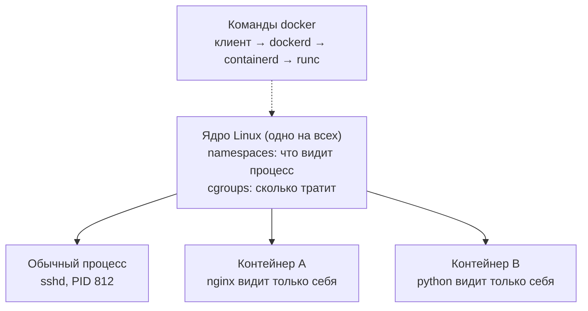
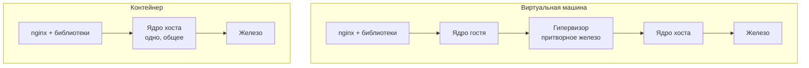
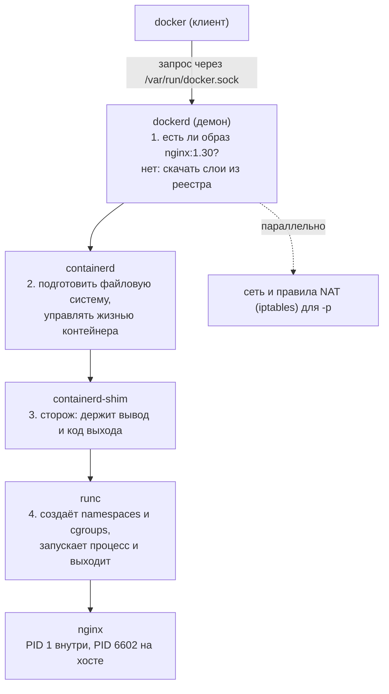
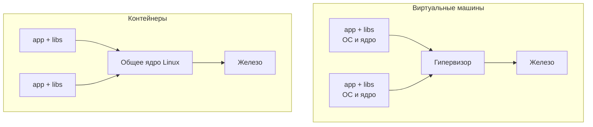
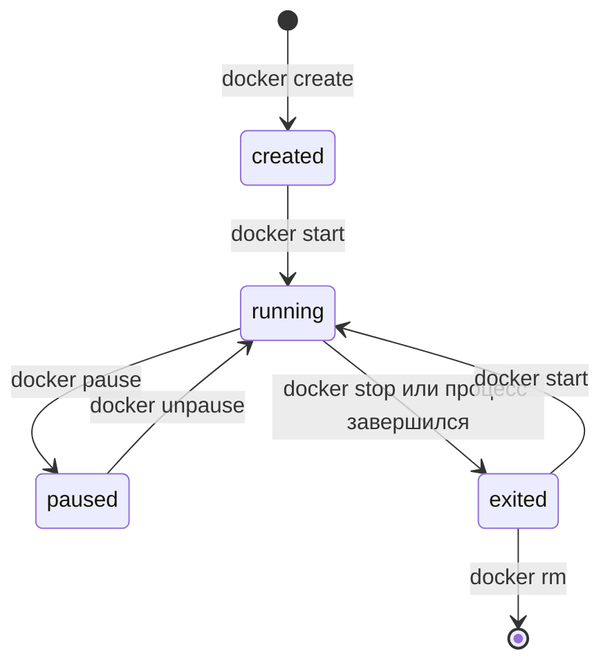

## Зачем это нужно

«У меня работает, а на сервере нет» почти всегда значит, что окружение разное: версия Python, набор библиотек, занятые порты, файлы конфигурации (обычные текстовые файлы с настройками программы: адрес базы, пароль, режим работы). Программа зависит не только от своего кода, но и от всего, что лежит вокруг неё в системе. Контейнер упаковывает программу вместе с этим окружением, и она запускается одинаково на ноутбуке, в CI ([автоматической проверке кода на сервере](../03-git-ci/03-actions-ci.md), тема 3) и на боевом сервере (проде).

На работе с контейнерами сталкиваются каждый день: сервисы в Kubernetes (системе, которая запускает сотни контейнеров на многих серверах и следит, чтобы они работали; тема 5), CI-раннеры (машины-исполнители из [урока 3.6](../03-git-ci/06-gitlab-ci-jenkins.md)), локальные базы для разработки, тестовые стенды. Даже если ты никогда не писал `Dockerfile` (текстовый файл-рецепт, по которому собирают образ, то есть заготовку для контейнера; [урок 4.2](02-dockerfile.md)), тебе придётся читать `docker ps` (команду со списком запущенных контейнеров), разбираться, почему контейнер упал, и объяснять, почему «остановил в ufw (программе управления файрволом, [урок 2.7](../02-network/07-firewall.md)), а порт всё равно открыт».

Чтобы не бояться контейнеров, нужно понять главное: **контейнер это не маленькая виртуальная машина, а обычный процесс Linux, которому ядро ограничило видимость и ресурсы.** Напомню: процесс это запущенная программа ([урок 1.4](../01-linux/04-processes-signals.md)), ядро это главная часть Linux, которая управляет железом и процессами, а виртуальная машина (ВМ) это целый «компьютер внутри компьютера» со своей операционной системой, как ВМ Multipass из [урока 1.1](../01-linux/01-first-server-shell.md). Так что контейнер гораздо легче ВМ, и вот почему, разберём ниже. Этот урок построен так, чтобы ты доказал это руками: найдёшь процесс контейнера среди процессов хоста (хост это сама машина, на которой запущены контейнеры), сравнишь его «пространства имён» (настройку ядра, которая показывает процессу только часть системы) со своей оболочкой и увидишь, как ядро убивает контейнер за превышение памяти.

Шаг проекта: освобождаем порты 80, 443 и 8080 (хост-сервисы `nginx` и `notes` останавливаются) и ставим Docker Engine (сам Docker для Linux: программу, которая создаёт и запускает контейнеры). Порт это номер «двери» на машине, через которую к программе подключаются по сети ([урок 2.2](../02-network/02-ports-tcp-ssh.md)), а `nginx` и `notes` это сервисы, которые сейчас занимают эти двери. «Заметки» пока остаются на v3 и в контейнер переедут в [следующем уроке](02-dockerfile.md).

## Что нужно знать

- [Урок 1.4: процессы и сигналы](../01-linux/04-processes-signals.md): процесс, его номер (PID, process identifier: число, по которому ядро отличает процессы), `ps` (список процессов), `kill` (отправить процессу сигнал), коды выхода. Контейнер это процесс, поэтому всё из этого урока пригодится буквально.
- [Урок 1.5: диск, память и процессор](../01-linux/05-disk-memory-cpu.md): память, OOM killer (механизм ядра, который при нехватке памяти убивает самый «тяжёлый» процесс, чтобы спасти систему), загрузка процессора. На этом построены лимиты контейнера.
- [Урок 1.3: пользователи, права и sudo](../01-linux/03-users-permissions.md): группы, `sudo`, `usermod`. Нужно, чтобы понять, почему группа `docker` даёт права root.
- [Урок 1.8: systemd и редакторы](../01-linux/08-systemd-editors.md): `systemctl disable --now` для сервиса `notes`.
- [Урок 2.2: порты, TCP и SSH](../02-network/02-ports-tcp-ssh.md): `ss -tlnp` и что значит «порт занят».
- [Урок 2.7: файрвол и защита SSH](../02-network/07-firewall.md): ufw и iptables. Docker с ними взаимодействует неожиданно.

Всё остальное, что нужно для урока (что такое ядро, образ, реестр, сокет, NAT), объясняется ниже. Вкратце: образ это заготовка, из которой запускают контейнер; реестр это сервер, где образы хранят и откуда скачивают; сокет это специальный файл, через который одна программа отправляет команды другой на той же машине; NAT это подмена адресов в пакетах, о ней ты читал в [уроке 2.1](../02-network/01-addresses-routes.md).

## Картина целиком

Представь порт с морскими контейнерами. Груз (мебель, продукты, станки) кладут в стандартный стальной ящик. Кран, корабль и грузовик ничего не знают о содержимом: они умеют возить ящики. Так и с программами. Контейнер это стандартный ящик, внутри которого программа со всем, что ей нужно, а «кран» (Docker) умеет запускать любой такой ящик одинаково.

Дальше аналогия ломается, и это важно. Морской контейнер стоит отдельно, а программный контейнер работает на том же «корабле» (то есть на том же ядре Linux), что и всё остальное. Ядро просто выдаёт ему «очки» (ограничение, что он видит) и «счётчик» (ограничение, сколько он тратит).



Схема показывает главное: под контейнерами лежит одно и то же ядро хоста. Контейнеры A и B на самом деле такие же процессы хоста, как `sshd`, просто ядро показывает им меньше и выдаёт ограниченные ресурсы.

Слова на схеме пока незнакомые, и это нормально: **namespaces** (пространства имён) это настройка ядра, которая показывает процессу только «его» процессы и «его» сеть, а **cgroups** (контрольные группы) это настройка ядра, которая ограничивает, сколько памяти и процессорного времени процесс может занять. `dockerd`, `containerd` и `runc` это цепочка программ, которая превращает твою команду в запущенный контейнер: разберём её в разделе про `docker run`. За урок ты разберёшь каждый кусок этой схемы: чем контейнер отличается от виртуальной машины, что такое namespaces и cgroups, что такое образ и как из него получается контейнер, что происходит внутри при `docker run`, как контейнер попадает в сеть и почему группа `docker` опасна. Потом поставишь Docker Engine и проверишь всё командами.

## Теория

### Проблема, которую решают контейнеры

Программа почти никогда не работает в одиночку. Заметкам из нашего проекта нужен Python 3.12, файл `/etc/notes/notes.env`, свободный порт 8080 и права на каталог `/var/lib/notes`. Вручную всё это ты настраивал в уроках темы 1. Теперь представь, что серверов десять, что на одном из них стоит другая версия Python, а на соседнем порт 8080 уже занят чужой программой. Каждый раз «подготовить сервер» значит повторить десяток шагов и не ошибиться.

Есть два обычных решения, и у обоих своя цена:

- **Всё делать руками или скриптом на каждом сервере.** Дёшево, но серверы со временем расходятся: где-то обновили библиотеку, где-то нет. Это называют «дрейфом» окружения.
- **Запускать каждую программу в отдельной виртуальной машине.** Изоляция отличная, но виртуальная машина тяжёлая: у неё своя операционная система, гигабайты диска, десятки секунд загрузки.

Контейнер это третий путь: изолировать программу без отдельной ОС. Вместо «свой компьютер на каждую программу» получается «своя комната с закрытой дверью в общем доме».

Аналогия: съёмные квартиры в одном доме. У каждой квартиры свой замок, своя мебель и свой счётчик воды. Но фундамент, стены и трубы общие. Отдельный дом на каждого жильца (виртуальная машина) был бы надёжнее и намного дороже. Оговорка: в доме жильцы могут слышать друг друга через стену, а в контейнерах «стена» это программные ограничения ядра. Если в общем фундаменте найдётся трещина (уязвимость ядра), пострадают все квартиры.

> **Прикинь сам:** «Заметки» ставят на 10 серверов, и на трёх из них порт 8080 уже занят чужой программой. Сколько серверов придётся готовить вручную, если решать проблему «подготовить сервер»?
{: .predict}

Все десять: на каждом надо проверить версию Python, порт, файл `/etc/notes/notes.env` и права на `/var/lib/notes`. Контейнер переносит это окружение вместе с программой, поэтому подготовка сервера сводится к одной команде.

Осторожно, частое заблуждение: что контейнер это «упрощённая виртуалка». Это не так: у контейнера нет своей ОС и нет своего ядра. Как это доказать, ты увидишь в заданиях 3 и 4.

> **Главное:** контейнер упаковывает программу вместе с окружением, чтобы она запускалась одинаково везде, и делает это без отдельной ОС.
{: .key}

Мы выяснили, зачем нужны контейнеры. Теперь разберём, чем они отличаются от виртуальных машин, ведь их часто путают.

### Ядро, процесс и виртуальная машина

Чтобы понять разницу, нужны три слова.

**Ядро** (kernel) это главная часть операционной системы. Только оно умеет работать с железом: раздавать память, ставить процессы на процессор, писать на диск, передавать данные по сети. Все остальные программы просят ядро что-то сделать через **системные вызовы** (system call): «открой файл», «создай процесс». В Linux ядро называется Linux, а Ubuntu это ядро плюс набор программ вокруг него.

**Процесс** (process) это запущенная программа. Пока `python3 app.py` лежит на диске, это просто файл. Когда ты его запустил, ядро создало процесс: выделило память, дало номер (**PID**, process identifier) и начало выдавать процессорное время. У процесса есть родитель, тот, кто его запустил. Ты уже работал с этим в [уроке 1.4](../01-linux/04-processes-signals.md).

**Виртуальная машина** (virtual machine, VM) это целый компьютер, нарисованный программой. Программа-гипервизор притворяется железом: процессором, диском, сетевой картой. На этом притворном железе загружается настоящая ОС со своим ядром. Именно так устроена ВМ Multipass, которую ты создал в [уроке 1.1](../01-linux/01-first-server-shell.md).

Сравни два пути запуска nginx:



У виртуальной машины между программой и железом два ядра и гипервизор, а у контейнера одно общее ядро. Поэтому ВМ грузится десятки секунд и весит гигабайты, а контейнер стартует за доли секунды.

У виртуальной машины при старте загружается своё ядро, запускается systemd, поднимаются службы. У контейнера ничего этого нет: ядро уже работает, нужно только запустить ещё один процесс и объяснить ядру, что его нужно ограничить. Отсюда цена: контейнер стартует за доли секунды и весит десятки мегабайт, виртуальная машина грузится десятки секунд и весит гигабайты.

Из этого следуют три вещи:

1. Контейнер использует **ядро хоста**. Контейнер с Linux-программой не запустится «нативно» на ядре Windows или macOS: Docker Desktop на Mac запускает внутри маленькую Linux-ВМ, а контейнеры работают уже в ней. Поэтому курс идёт на Linux.
2. Изоляция слабее, чем у ВМ: уязвимость в общем ядре затрагивает все контейнеры хоста. Поэтому в облаке чужой недоверенный код изолируют именно виртуальными машинами, а контейнеры запускают уже внутри них.
3. Внутри контейнера нельзя запустить «другое ядро» или другую ОС. Образ Alpine внутри контейнера выглядит как другая система, но он использует то же самое ядро, что и хост. Ты проверишь это командой `uname -r`.

> **Прикинь сам:** Виртуальной машине нужно 40 секунд на загрузку, контейнеру 0,3 секунды. Сколько контейнеров успеет стартовать, пока загружается одна ВМ?
{: .predict}

Около 130: 40 делим на 0,3. Разница в том, что ВМ грузит собственное ядро и службы, а контейнеру достаточно запустить процесс на уже работающем ядре.

> **Главное:** контейнер использует ядро хоста, поэтому стартует за доли секунды, но изоляция у него слабее, чем у ВМ.
{: .key}

Если контейнер это процесс на общем ядре, его должно быть видно на хосте. Проверим.

> **Проверь понимание:** почему контейнер стартует за долю секунды, а виртуальная машина за десятки секунд?

<details markdown="1">
<summary>Ответ</summary>

Контейнер это запуск одного процесса с ограничениями: ядро уже работает. У виртуальной машины сначала загружается своё ядро и вся ОС: инициализация устройств, systemd, службы.

</details>

### Контейнер это процесс

Если контейнер это просто процесс, то ты должен увидеть его среди процессов хоста. Так и есть.

Запусти на хосте `sleep 1000` (программа, которая ничего не делает 1000 секунд) и найди её командой `ps`: у неё будет обычный PID, скажем 4101. Теперь запусти `sleep 1000` внутри контейнера. Внутри контейнера `ps` покажет её с номером 1, а если посмотреть на хосте, найдётся процесс `sleep 1000` с обычным номером, скажем 4321. Один и тот же процесс, но два номера: один «изнутри», другой «снаружи». Как такое возможно, объясняет следующий раздел.

Разберём цепочку: `docker run` не запускает ничего сам. Он просит сервис `dockerd`, тот просит `containerd`, тот просит `runc`, а `runc` делает простую вещь: создаёт процесс с настроенными ограничениями и запускает в нём твою программу. После этого `runc` выходит. Твой процесс продолжает жить как ребёнок процесса `containerd-shim` (сторожа, который следит за контейнером). В выводе `ps` на хосте ты увидишь именно эту цепочку.

Итого, у контейнера нет «своего мира». У него есть:

- процесс (или несколько), которые видны на хосте как обычные;
- набор **ограничений видимости** (namespaces): о них следующий раздел;
- набор **ограничений ресурсов** (cgroups): о них через раздел;
- **своя файловая система**, собранная из образа (об образах ниже).

Это всё. Вся «магия» контейнеров это возможности ядра Linux, которые появились задолго до Docker. Docker сделал их удобными.

> **Прикинь сам:** Внутри контейнера процесс `sleep 1000` имеет PID 1. Какой PID он имеет на хосте и можно ли убить его с хоста командой `kill`?
{: .predict}

У него другой номер, например 4321: ядро ведёт две нумерации. Убить можно: хост видит все процессы, скрытие работает только в одну сторону.

Осторожно, частое заблуждение: что процесс контейнера скрыт от хоста. На хосте он виден в `ps aux` и его можно убить командой `kill`. Скрыт он только в одну сторону: контейнер не видит процессы хоста, а хост видит всё.

> **Главное:** контейнер это обычный процесс (или несколько) с ограничениями видимости, ресурсов и своей файловой системой из образа.
{: .key}

Осталось понять, как ядро ограничивает «что видит» процесс. Это делают namespaces.

### Namespaces: что процесс видит

Начнём с проблемы. Если два обычных процесса запущены на одной машине, они видят друг друга: список процессов общий, сеть общая, имя машины общее. Для «квартиры» это плохо: контейнер A не должен видеть процессы контейнера B и занимать его порт 8080.

Пространство имён (**namespace**) это возможность ядра показывать процессу свою версию какого-то ресурса. Аналогия: очки с фильтром. В очках одного цвета ты видишь только красные предметы, в других только синие. Комната та же, но каждый видит своё. Оговорка: очки только ограничивают зрение, они не защищают от того, что предметы существуют. Вне «очков» (на хосте) всё видно.

Как это устроено: у каждого процесса в ядре есть запись, в каких пространствах имён он находится. Пространства бывают нескольких видов, по одному на вид ресурса:

| Вид | Что изолирует | Что видит процесс в контейнере |
|---|---|---|
| `pid` | список процессов и их номера | только свои процессы, первый из них имеет PID 1 |
| `net` | сетевые интерфейсы, адреса, таблица маршрутов, порты | свой `lo`, свой сетевой интерфейс, свои порты: два контейнера могут оба слушать 80 |
| `mnt` | точки монтирования, то есть какие файловые системы видны | свои `/`, `/etc`, `/usr`, собранные из образа |
| `uts` | имя машины (hostname) | своё имя, по умолчанию первые 12 символов ID контейнера |
| `ipc` | общая память и очереди сообщений между процессами | свои |
| `cgroup` | вид дерева контрольных групп | своё, только про себя |
| `user` | соответствие номеров пользователей | Docker по умолчанию его **не** включает: root в контейнере это тот же root ядра |

Сокращения: pid это process identifier, net это network, mnt это mount, uts исторически «UNIX Time-Sharing», сегодня это просто «имя машины», ipc это inter-process communication (общение процессов между собой).

Где это видно. Ядро показывает, в каких пространствах живёт процесс, в каталоге `/proc/<PID>/ns/`. Каталог `/proc` это не настоящие файлы на диске, а окно в ядро: через него ядро показывает данные о процессах в виде файлов. В `/proc/<PID>/ns/` лежат ссылки вида:

```text
net -> net:[4026535133]
pid -> pid:[4026534995]
```

Число в квадратных скобках это номер пространства (внутренний идентификатор в ядре, называется inode): один и тот же номер значит одно и то же пространство. Если у двух процессов `net -> net:[4026535133]` совпадает, они видят одну и ту же сеть. Если различается, у них разные сети.

Разобранный пример из практики. Оболочка на хосте имеет `net:[4026533120]`, процесс nginx в контейнере `net:[4026535133]`. Номера разные, значит, сети разные. Поэтому внутри контейнера свой `localhost` и своя таблица портов. А вот `user:[4026531837]` у обоих одинаковый: пространство имён пользователей не создавалось. Значит, root внутри контейнера для ядра это тот же root, что и на хосте. Это сознательный компромисс по умолчанию, и его последствия мы разберём в разделе про безопасность.

Отсюда и два PID у одного процесса. В пространстве `pid` контейнера процесс nginx получил номер 1 (он там первый и единственный запущенный «с нуля»). В пространстве `pid` хоста у того же процесса другой номер, например 6602. Ядро просто ведёт две нумерации.

> **Прикинь сам:** У shell на хосте `net:[4026533120]`, у nginx в контейнере `net:[4026535133]`, а `user:[4026531837]` у обоих одинаковый. Что это значит для сети и для root?
{: .predict}

Сети разные: у контейнера свой `localhost` и свои порты. Пространство `user` общее, поэтому root в контейнере для ядра тот же root, что и на хосте.

Осторожно, частое заблуждение: что namespace это «папка» или «контейнер». Namespace это только ярлык на процессе: «этому процессу показывать вот такую сеть». Один процесс состоит в нескольких пространствах одновременно (в одном `pid`, в одном `net`, в одном `mnt`), и их можно комбинировать: в задании 4 ты создашь новое `pid` и `uts`, оставив сеть общей.

> **Главное:** namespaces отвечают на вопрос «что процесс видит»: у каждого вида ресурса своё пространство, и по умолчанию `user` в Docker не включено.
{: .key}

Видимость ограничили. Но контейнер всё ещё может съесть всю память сервера, и тут нужны cgroups.

> **Проверь понимание:** у двух процессов совпадает номер в `net:[...]`, а `pid:[...]` различается. Что можно сказать про их сеть и список процессов?

<details markdown="1">
<summary>Ответ</summary>

Сеть у них общая: те же интерфейсы, адреса и порты. Списки процессов разные: каждый видит только «свой» набор PID. Так работает, например, контейнер, запущенный с общей сетью хоста (`--network host`, о нём в [уроке 4.3](03-storage-networks.md)).

</details>

### Cgroups: сколько процесс может потратить

Вторая проблема: один контейнер с ошибкой в коде может съесть всю память сервера, и остальные контейнеры упадут вместе с ним. Namespaces с этим не помогают: они ограничивают только то, что видно.

**Контрольные группы** (control groups, **cgroups**) это возможность ядра ограничивать и учитывать ресурсы группы процессов: память, процессорное время, число процессов, скорость диска. Аналогия: счётчик воды и лимит в тарифе. Пока ты тратишь до лимита, всё хорошо. Превысил: с тобой что-то делают. Что именно, зависит от ресурса, и тут есть важная разница.

- **Память.** Память нельзя «замедлить»: либо она есть, либо нет. Если процесс просит больше лимита и вернуть нечего, ядро включает **OOM killer** (out-of-memory killer, «убийца при нехватке памяти», знакомый по [уроку 1.5](../01-linux/05-disk-memory-cpu.md)) и убивает процесс сигналом SIGKILL. Контейнер завершается с кодом 137, а `docker inspect` покажет `OOMKilled: true`.
- **Процессор.** Время можно раздавать по частям, поэтому процессор ограничивают мягче: процессу просто выдают меньше времени. Он не умирает, а замедляется. Это называется **троттлинг** (throttling, «прижимание»).

Как это устроено. Ядро хранит настройки cgroup в виде файлов в `/sys/fs/cgroup/` (как и `/proc`, это окно в ядро, а не файлы на диске). Допустим, контейнер запущен так: `docker run --rm --memory 64m --cpus 0.5 alpine:3.22 sh` (`--memory 64m` это потолок памяти 64 мегабайта, `--cpus 0.5` это половина одного процессорного ядра). Внутри контейнера видно:

```text
$ cat /sys/fs/cgroup/memory.max
67108864
$ cat /sys/fs/cgroup/cpu.max
50000 100000
```

Разбор чисел:

- `memory.max` это лимит памяти в байтах: 64 МБ = 64 × 1024 × 1024 = 67 108 864.
- `cpu.max` состоит из двух чисел: «квота» и «период» в микросекундах. Значения `50000 100000` читаются так: «из каждых 100 000 мкс (0,1 секунды) процессу разрешено работать 50 000 мкс». Это ровно половина одного ядра процессора, то есть `--cpus 0.5`.

Троттлинг виден в файле `cpu.stat`: в нём счётчик `nr_throttled` растёт каждый раз, когда ядро прижимало процесс. Пример из практики: цикл, который жадно грузит процессор 2 секунды при лимите 0,5 CPU, получил за это время `usage_usec 1025992` (то есть около 1 секунды CPU вместо 2) и `nr_throttled 20` из `nr_periods 21`. Из 21 периода в 20 процесс упирался в лимит и его останавливали.

**Почему код 137.** Когда процесс завершается, он возвращает **код выхода** (exit code): число от 0 до 255. 0 значит «всё хорошо», остальное «что-то пошло не так». Если процесс убит сигналом, оболочка и Docker сообщают код `128 + номер сигнала`. SIGKILL имеет номер 9, значит, 128 + 9 = 137. Если бы процесс убили обычным SIGTERM (номер 15), код был бы 128 + 15 = 143. Сигналы ты проходил в [уроке 1.4](../01-linux/04-processes-signals.md).

Для сравнения: код 0 значит, что процесс завершился сам и штатно (Docker при `docker stop` сначала посылает SIGTERM, «пожалуйста, заверши работу», и nginx обрабатывает его, выходит с 0). Если приложение не реагирует на SIGTERM, через 10 секунд Docker посылает SIGKILL, и код будет 137. Так что 137 бывает не только от нехватки памяти: смотри поле `OOMKilled`.

Итог в одну строку: **namespaces отвечают на вопрос «что видишь», cgroups на вопрос «сколько можешь».**

> **Прикинь сам:** Контейнер запущен с `--memory 64m`. Чему равен `memory.max` в байтах и какой код выхода будет, если процесс попросит 200 МБ?
{: .predict}

64 × 1024 × 1024 = 67 108 864 байт. Ядро убьёт процесс сигналом SIGKILL (номер 9), код выхода 128 + 9 = 137, а `OOMKilled` будет `true`.

Осторожно, частое заблуждение: что лимит по умолчанию есть. Его нет: если не указать `--memory`, контейнер может занять всю память хоста (и тогда OOM killer убьёт что-нибудь на самом хосте). В продакшене лимиты задают всегда.

> **Главное:** cgroups отвечают на вопрос «сколько можно»: память при превышении убивают (137), процессор только замедляют (троттлинг).
{: .key}

Ограничения есть. Теперь о том, что решает, когда контейнер умрёт: об его главном процессе.

> **Проверь понимание:** контейнер с лимитом `--memory 64m` пытается выделить 200 МБ. Что произойдёт? А если у контейнера `--cpus 0.5`, и он упирается в процессор?

<details markdown="1">
<summary>Ответ</summary>

Память: ядро убьёт процесс, код выхода 137, `OOMKilled: true`. Процессор: процесс не умрёт, он просто будет работать медленнее (в среднем на половине одного ядра), а `nr_throttled` в `cpu.stat` будет расти.

</details>

### PID 1: почему контейнер живёт, пока жив главный процесс

В пространстве `pid` контейнера первый процесс получает номер 1. В обычной системе PID 1 это `systemd`, «главный» процесс, который запускает остальные. Если он завершается, система останавливается. В контейнере так же: **контейнер существует, пока жив его PID 1.** Как только он завершился, контейнер останавливается (его процессы убиваются вместе с ним).

Отсюда правило, которое ломает новичков чаще всего: главный процесс контейнера должен работать «на переднем плане» (foreground). Если ты запустишь nginx командой `nginx` (по умолчанию он «демонизируется»: создаёт себе фоновую копию и завершает исходный процесс), PID 1 завершится за долю секунды, и контейнер сразу остановится с кодом 0. Образ `nginx:1.30` поэтому запускает его как `nginx -g 'daemon off;'`: параметр `daemon off` значит «оставайся на переднем плане».

Ещё две особенности PID 1:

- он получает сигналы от Docker: `docker stop` посылает SIGTERM именно ему;
- ядро для PID 1 применяет особые правила: сигналы без обработчика он **игнорирует**. Если твоя программа не умеет обрабатывать SIGTERM, `docker stop` подождёт 10 секунд и убьёт её SIGKILL (код 137). Тему разберём в [уроке 4.2](02-dockerfile.md).

> **Прикинь сам:** Ты запустил в контейнере `nginx` без `daemon off`. Через сколько контейнер остановится и с каким кодом?
{: .predict}

Почти сразу, с кодом 0: nginx создаёт фоновую копию и завершает исходный процесс, то есть PID 1. Контейнер живёт только пока жив PID 1.

Осторожно, частое заблуждение: «Контейнер упал, потому что вышел с кодом 0». Код 0 это не падение, а нормальное завершение: команда отработала и завершилась. Контейнер, который запустил `echo hi`, остановится сразу и это правильно.

> **Главное:** контейнер живёт, пока работает его PID 1, поэтому главный процесс должен работать на переднем плане и уметь получать SIGTERM.
{: .key}

Откуда у контейнера файлы для запуска? Из образа.

### Образ и контейнер

Откуда контейнер берёт файлы: программу, библиотеки, каталог `/etc`? Из **образа** (image).

Образ это неизменяемый шаблон с файловой системой и метаданными (какую команду запускать, какие порты «объявлены»). Контейнер это запущенный процесс, созданный из образа. Аналогия: образ это рецепт с готовыми заготовками, а контейнер это конкретная порция, которую приготовили. Из одного образа готовят сколько угодно порций, и порции друг на друга не влияют. Оговорка: в отличие от еды, «рецепт» после запуска не меняется вообще, все изменения уходят в отдельный слой контейнера.

**Слои.** Образ состоит из **слоёв** (layers), каждый слой это набор изменений файлов относительно предыдущего. Аналогия: стопка прозрачных плёнок. Нижняя плёнка это базовая система, следующая добавляет nginx, следующая конфиг. Смотришь сверху и видишь общую картину. Слои только читаются, что даёт две выгоды: одинаковые слои хранятся на диске один раз (десять контейнеров из одного образа не занимают десять копий), и при скачивании обновления берутся только новые слои. Например, образ `nginx:1.30` состоит из 7 слоёв.

**Записываемый слой.** Когда запускается контейнер, Docker кладёт поверх слоёв образа ещё один, тонкий и **записываемый**. Всё, что процесс создаёт или меняет, попадает туда. Пример из практики:

```text
$ docker run --name t alpine:3.22 sh -c 'echo привет > /hello.txt'
$ docker diff t
A /hello.txt          <- A (added): файл добавлен в слой контейнера
$ docker rm t
$ docker run --rm alpine:3.22 cat /hello.txt
cat: can't open '/hello.txt': No such file or directory
```

Разберём эти команды по кускам, они будут встречаться постоянно. `docker run образ команда` создаёт контейнер из образа и выполняет в нём команду. `alpine:3.22` это имя образа (очень маленькая Linux-система) и его версия. `--name t` даёт контейнеру имя `t`, чтобы потом обратиться к нему не по длинному случайному номеру. `sh -c '...'` это «запусти оболочку `sh` и выполни в ней текст из кавычек». `docker diff t` показывает, что изменилось в файлах контейнера относительно образа (`A` added, добавлено; `C` changed, изменено; `D` deleted, удалено). `docker rm t` удаляет контейнер. `--rm` в последней команде значит «удали контейнер сам, как только он завершится», удобно для разовых проверок.

Файл жил в слое контейнера и исчез вместе с ним. Новый контейнер из того же образа начинает с чистого листа. Поэтому для данных, которые нельзя терять (база, загрузки пользователей), используют **тома** ([урок 4.3](03-storage-networks.md)): каталог, живущий вне контейнера.

**Реестр и тег.** Образы хранят в **реестре** (registry): это сервер, откуда образы скачивают. Публичный реестр по умолчанию: Docker Hub. Есть и другие: `ghcr.io` (GitHub), внутренний реестр компании. Полное имя образа выглядит как `реестр/репозиторий:тег`, например `nginx:1.30`: реестр опущен (подразумевается Docker Hub), репозиторий `nginx`, тег `1.30`. **Тег** (tag) это метка версии образа. Тег `latest` подставляется, если тег не указан, и означает «то, что было последним на момент загрузки». Завтра под ним будет другое. Поэтому в курсе `latest` не используется нигде: мы всегда указываем точную версию.

Точнее, тег это просто подвижная метка. Неизменяемый идентификатор образа это **дайджест** (digest), хэш от содержимого: `sha256:b972f831f200...`. Тег можно переприсвоить на другой образ, дайджест нет. В [уроке 4.7](07-images-registry.md) мы вернёмся к этому.

> **Прикинь сам:** Из образа `nginx:1.30` запущено 10 контейнеров. Сколько копий слоёв образа лежит на диске и что случится с файлами, которые контейнер записал в свой слой, при `docker rm`?
{: .predict}

Одна копия слоёв: слои только читаются и общие. Записанные файлы лежат в тонком слое контейнера и пропадут вместе с ним.

Осторожно: образ и контейнер. Команда `docker images` показывает образы (шаблоны), `docker ps` показывает контейнеры (запущенные процессы), `docker ps -a` вместе с остановленными. Остановленный контейнер ещё существует и занимает место, пока ты не сделаешь `docker rm`.

> **Главное:** образ это неизменяемый шаблон из слоёв, контейнер это его запущенный экземпляр с тонким слоем для записи.
{: .key}

Образ есть. Что именно делает Docker, когда ты пишешь `docker run`?

> **Проверь понимание:** ты запустил контейнер из образа, создал в нём файл, удалил контейнер и запустил новый из того же образа. Есть ли там файл?

<details markdown="1">
<summary>Ответ</summary>

Нет. Файл лежал в записываемом слое старого контейнера, а он удалился вместе с ним. Образ не менялся, поэтому новый контейнер начинает «с нуля». Для сохранения данных нужны тома.

</details>

### Что происходит при docker run

Команда `docker` это **клиент**: она сама ничего не запускает, а отправляет запросы серверу. Сервер называется **демон** (daemon: фоновая программа, живущая, пока работает система), у Docker это `dockerd`. Клиент и демон общаются через **сокет** `/var/run/docker.sock`. Сокет это специальный файл, через который две программы на одной машине обмениваются данными, как по телефонной линии. Права доступа к нему обычные файловые: он принадлежит `root` и группе `docker` (`srw-rw---- 1 root docker`).

Дальше цепочка при `docker run -p 8081:80 nginx:1.30`:



Читай схему сверху вниз: каждый уровень делает свою часть и передаёт запрос ниже. Пунктир показывает, что сеть и правила для `-p` dockerd настраивает отдельно, параллельно с запуском.

Кто есть кто. `dockerd` это «начальник»: принимает команды, управляет образами, сетями, томами. `containerd` это исполнитель полного цикла контейнера, его используют и Kubernetes без Docker. `runc` самый низкий уровень: он делает системные вызовы ядра, которые создают namespaces и cgroups, и запускает процесс. Зачем столько слоёв? Чтобы каждый можно было заменить или использовать отдельно: так выросла экосистема (Kubernetes, Podman и другие).

Два практических вывода.

**Вывод 1: доступ к сокету равен правам root.** Демон работает от root. Кто может отправить ему команду, тот может попросить «запусти контейнер и подключи ему весь диск хоста внутрь». Это делает `docker run -v /:/host` (флаг `-v` подключает каталог хоста в контейнер). Процесс в контейнере по умолчанию работает от root, а пространства `user` нет: ядро считает его настоящим root, значит, примонтированные файлы хоста он читает и меняет без ограничений. Пример из практики: обычный пользователь `ubuntu` не может прочитать `/etc/shadow` (там хэши паролей), а через контейнер:

```text
$ cat /etc/shadow
cat: /etc/shadow: Permission denied
$ docker run --rm -v /etc:/hostetc:ro alpine:3.22 head -n 1 /hostetc/shadow
root:*:20707:0:99999:7:::
```

Разбор: `-v /etc:/hostetc:ro` подключает каталог хоста `/etc` внутрь под именем `/hostetc` (`ro` read-only, только чтение), `head -n 1` печатает первую строку файла. Ответ `root:*:20707:0:99999:7:::` это запись пользователя root из `/etc/shadow`: важно не её содержимое, а то, что файл, закрытый для тебя, прочитался.

Поэтому пользователь в группе `docker` это фактически root, и группу выдают только доверенным администраторам. Это ответ на вопрос собеседования, который задают очень часто.

**Вывод 2: Docker обходит ufw.** Чтобы опубликованный порт заработал, Docker сам вписывает правила в iptables (это «внутренний» файрвол ядра, ufw лишь удобная надстройка над ним, [урок 2.7](../02-network/07-firewall.md)). О сети контейнера речь в следующем разделе.

> **Прикинь сам:** Пользователь `ubuntu` не читает `/etc/shadow`, но состоит в группе `docker`. Сможет ли он прочитать этот файл и как?
{: .predict}

Сможет: `docker run --rm -v /etc:/hostetc:ro alpine:3.22 head -n 1 /hostetc/shadow`. Демон работает от root, а процесс в контейнере по умолчанию тоже root без пространства `user`.

> **Главное:** `docker` это клиент, а работу делают dockerd, containerd и runc; доступ к сокету Docker равен root.
{: .key}

Осталось выяснить, как до контейнера добраться по сети.

### Сеть контейнера и публикация портов

Проблема: у контейнера своё пространство `net`, значит, свой сетевой интерфейс и свой адрес. Как достучаться до nginx внутри?

**Мост.** При установке Docker создаёт на хосте виртуальный сетевой мост `docker0` (bridge, «мост»): виртуальный коммутатор (switch: устройство, которое соединяет несколько компьютеров в одну локальную сеть), к которому подключаются контейнеры, как компьютеры к домашнему роутеру. Благодаря мосту контейнеры видят друг друга и хост, а без него каждый сидел бы в своей сети, как в запертой комнате без двери. У моста адрес из приватной подсети (RFC 1918, [урок 2.1](../02-network/01-addresses-routes.md)), обычно `172.17.0.1/16`. Каждый контейнер получает адрес из этой подсети, например `172.17.0.2`, а мост служит ему шлюзом. Из хоста до такого адреса можно достучаться напрямую, снаружи (с другого компьютера) нельзя: адрес приватный.

**Публикация порта.** Чтобы открыть контейнер для мира, порт **публикуют**: флаг `-p хост:контейнер`. Запись `-p 8081:80` значит «всё, что придёт на порт 8081 хоста, передай на порт 80 контейнера». Левое число это хост, правое контейнер. Механика: Docker добавляет правило **DNAT** (destination NAT, подмена адреса назначения, вспомни NAT из [урока 2.1](../02-network/01-addresses-routes.md)) в таблицу `nat` iptables. Правило из практики:

```text
-A DOCKER ! -i docker0 -p tcp -m tcp --dport 8082 -j DNAT --to-destination 172.18.0.2:80
```

Читается так: «пакет по TCP на порт 8082 (`--dport 8082`), пришедший не с моста `docker0` (`! -i docker0`), переадресуй (`-j DNAT`) на адрес 172.18.0.2 порт 80». Адрес `172.18.0.2` на стенде оказался таким, потому что подсеть `172.17.0.0/16` была уже занята внешней Docker-средой. У тебя он будет `172.17.0.2`. Заодно Docker запускает процесс `docker-proxy`, который слушает опубликованный порт на хосте: его увидишь в `ss -tlnp`.

**Ключевая тонкость: на каком адресе слушать.** Запись `-p 8081:80` публикует порт на **всех** адресах хоста (`0.0.0.0`, [урок 2.1](../02-network/01-addresses-routes.md)), то есть доступен из сети. Запись `-p 127.0.0.1:8081:80` публикует только на loopback: достучаться можно только с самого хоста (например, через nginx-прокси). Так мы и будем делать: сервис снаружи не торчит.

**Почему ufw не спасает.** Цепочка (chain) в iptables это список правил, по которому проходит пакет. Есть две главные. `INPUT`: пакеты, адресованные самой машине (на её порт 22, например); именно её защищает ufw. `FORWARD`: транзитные пакеты, которые машина не берёт себе, а передаёт дальше, как почтовое отделение пересылает чужие посылки. Контейнер для хоста это «другая машина за мостом», поэтому пакет к нему идёт по `FORWARD`, а не по `INPUT`. Правила публикации Docker вставляет так, что пакет к контейнеру обрабатывается раньше правил ufw и до них просто не доходит. В итоге `ufw deny 8081` порт опубликованного контейнера не закрывает. Два надёжных способа: публиковать на `127.0.0.1` или вписывать правила в специальную цепочку `DOCKER-USER`, которую Docker просматривает первой и никогда не перезаписывает.

> **Прикинь сам:** Контейнер запущен с `-p 127.0.0.1:8081:80`. Откроется ли `http://IP-сервера:8081` с другого компьютера?
{: .predict}

Нет: порт опубликован только на loopback хоста. С самого сервера `curl http://127.0.0.1:8081` ответит, а снаружи соединение не дойдёт.

Осторожно, частое заблуждение: что `-p 80:8080` и `-p 8080:80` одно и то же. Левое число всегда хост. Если перепутать, соединение уйдёт на порт, где внутри контейнера никто не слушает.

> **Главное:** `-p хост:контейнер` включает DNAT; запись без адреса открывает порт всем, а `127.0.0.1:` оставляет его только хосту, и ufw опубликованные порты не закрывает.
{: .key}

Теперь можно честно сравнить контейнеры и виртуальные машины.

> **Проверь понимание:** ты запустил `docker run -d -p 8081:80 nginx:1.30`. На каком порту хоста ответит nginx? Что будет с `curl http://127.0.0.1:80`?

<details markdown="1">
<summary>Ответ</summary>

Nginx ответит на порту 8081 хоста (слева хост, справа контейнер). На порту 80 хоста никто не слушает, `curl` вернёт ошибку «не удалось подключиться»: `curl: (7) Failed to connect ...`. Внутри контейнера порт 80 занят nginx, но это его собственная сеть.

</details>

### Контейнер и виртуальная машина: что выбрать

На собеседовании и на работе постоянно звучит вопрос «зачем контейнеры, если есть виртуальные машины?». Ответ «контейнеры легче» слишком поверхностный. Нужно понимать, что именно теряется и что выигрывается, иначе в реальной задаче выберешь не то.

Виртуальная машина это отдельный дом: свой фундамент, свои стены, своя система отопления. Контейнер это квартира в многоквартирном доме: стены свои, а фундамент, трубы и лифт общие. Квартиру выделить быстро и дёшево, дом строят долго. Но если в подвале прорвало общую трубу, страдают все квартиры, а у отдельных домов такой общей беды нет. Аналогия не передаёт одного: квартиры в доме одинаковые по конструкции, а контейнеры на одном ядре Linux можно делать из разных дистрибутивов (Alpine рядом с Ubuntu), потому что различаются только файлы, а ядро общее.

У ВМ своя операционная система целиком, включая своё ядро. Его запускает **гипервизор** (hypervisor: программа, которая делит физический сервер на несколько виртуальных и следит, чтобы они не мешали друг другу). Поэтому ВМ грузится минуту, занимает гигабайты и показывает «железо», пусть и виртуальное. Контейнер ядра не запускает: он просто процесс на общем ядре, стартует за доли секунды и занимает столько памяти, сколько нужно самой программе.



В виртуальных машинах у каждой приложения своя ОС с ядром, в контейнерах ядро одно на всех. Отсюда экономия памяти и разница в изоляции.

| Свойство | Виртуальная машина | Контейнер |
|---|---|---|
| Ядро | своё у каждой | общее с хостом |
| Время запуска | десятки секунд, минуты | доли секунды |
| Размер | гигабайты | десятки мегабайт |
| Изоляция | сильная: граница это гипервизор | слабее: граница это ядро и его настройки |
| Другая ОС (Windows на Linux) | можно | нельзя: ядро общее |
| Типичное применение | разные ОС, строгая изоляция между клиентами | много однотипных сервисов на одном сервере |

Посмотрим на примере. Нужно запустить на одном сервере двадцать небольших сервисов. С ВМ это двадцать операционных систем по 1-2 ГБ памяти каждая, то есть около 30 ГБ только на «накладные расходы» системы. С контейнерами это двадцать процессов: память уходит на сами программы. Теперь обратный пример: хостинг, где на одном сервере живут чужие друг другу клиенты и один из них может оказаться злоумышленником. Там контейнерной границы мало: ошибка в ядре даст выход из контейнера на хост. Поэтому публичные облака кладут клиентов в ВМ, а уже внутри ВМ клиент запускает свои контейнеры.

> **Прикинь сам:** На сервере нужно запустить 20 небольших сервисов. ВМ потребует около 1,5 ГБ на каждую только под ОС. Сколько памяти уйдёт на ОС в этом случае и сколько в контейнерах?
{: .predict}

20 × 1,5 = 30 ГБ только на операционные системы. В контейнерах отдельных ОС нет: память тратят только программы.

Осторожно, частое заблуждение: «Контейнер изолирован так же хорошо, как ВМ». Нет: граница контейнера это настройки общего ядра, а не отдельное ядро. Второе заблуждение: «на Mac Docker запускает контейнеры нативно». Контейнерам нужно ядро Linux, а на Mac его нет, поэтому Docker Desktop тихо запускает небольшую Linux-ВМ и внутри неё контейнеры.

> **Главное:** контейнеры экономят ресурсы и быстро стартуют, ВМ изолируют сильнее; чужой недоверенный код кладут в ВМ.
{: .key}

Что именно лежит в образе, если ОС в нём нет? Разберёмся с пакетами и зависимостями.

> **Проверь понимание:** можно ли запустить контейнер с Windows-программой на обычном Linux-сервере с Docker?

<details markdown="1">
<summary>Ответ</summary>

Нет. Контейнер использует ядро хоста, а Windows-программе нужно ядро Windows. Для Windows-программы нужна либо ВМ с Windows, либо хост с Windows. Контейнер с другим дистрибутивом Linux (Alpine, Debian) на Ubuntu-хосте запускается без проблем: ядро всё равно Linux.

</details>

### Пакеты, зависимости и почему образ «всё своё»

Сказанное «образ содержит окружение» остаётся словами, пока не понятно, что именно там лежит. Без этого непонятно, почему образы бывают на 5 МБ и на 1 ГБ, почему в образе нет привычных команд и почему «в контейнере нет `curl`».

Набор для походной кухни. Можно взять в поход весь шкаф с посудой (большой образ с полным дистрибутивом) или один котелок, ложку и спички (минимальный образ). Чем меньше взято, тем легче рюкзак и меньше шансов, что что-то сломается или потеряется, но и сделать можно меньше: нет ножа, нечем нарезать. Аналогия хромает в том, что дополнить контейнер на ходу можно командой, но так делать не принято, об этом ниже.

Программа при запуске ищет не только свой код. Ей нужны **зависимости** (dependencies: то, без чего она не работает): интерпретатор, общие библиотеки (`libc`, `libssl`), файлы настроек, корневые сертификаты для HTTPS. В обычной системе всё это берётся из общих каталогов `/usr/lib`, `/etc`, и две программы могут требовать разные версии одной библиотеки: отсюда «у меня работает, а у тебя нет». В образе всё нужное лежит в его собственной файловой системе (пространство `mnt`), и чужие версии не видны.

```text
  образ python:3.13-slim (условно)
  /bin, /usr/bin    базовые команды (урезанный набор)
  /usr/lib          общие библиотеки (libc и другие)
  /usr/local/bin    интерпретатор python
  /etc              файлы настроек, сертификаты
  (ядра в образе нет: оно берётся с хоста)
```

Варианты базовых образов и чем они отличаются:

- **Полный дистрибутив** (`ubuntu`, `debian`): привычные команды и менеджер пакетов, размер десятки или сотни мегабайт.
- **slim**: тот же дистрибутив без лишнего, заметно меньше.
- **alpine**: очень маленький дистрибутив (около 5 МБ), но со своей стандартной библиотекой (`musl` вместо `glibc`), из-за чего отдельные программы ведут себя иначе.
- **distroless / scratch**: почти пустой образ без оболочки, только программа. Минимум лишнего и меньше уязвимостей (**уязвимость** это ошибка в программе, которой может воспользоваться злоумышленник, [урок 10.5](../10-capstone/05-security-review.md)), но внутрь не зайти `sh`.

Вот как это выглядит на деле. Разработчик написал приложение, которому нужна библиотека `libpq` версии 15. На его ноутбуке она есть, на сервере стоит версия 13, программа падает. С контейнером нужную версию кладут в образ, и сервер не важен: хоть 13, хоть 17 на хосте. Запуск `docker run --rm alpine:3.22 curl -I https://example.com` закончится ошибкой `curl: not found`: в минимальном образе нет этой программы. Это не поломка, а следствие «лишнего не берём».

> **Прикинь сам:** Программе нужна `libpq` версии 15, на сервере стоит 13. Помешает ли это, если программа запущена в контейнере?
{: .predict}

Нет: нужная версия лежит в образе, и программа видит свою файловую систему. Версия на хосте не важна.

Осторожно, частое заблуждение: «Поставлю в контейнере всё нужное командой `apt install` прямо внутри». Поставить можно, но это живёт в записываемом слое и пропадёт вместе с контейнером. Правильный путь: добавить установку в рецепт образа (Dockerfile, [урок 4.2](02-dockerfile.md)), чтобы каждый запуск был одинаковым.

> **Главное:** образ несёт всё, что нужно программе, кроме ядра, а размер образа зависит от выбранной базы: slim, alpine или distroless.
{: .key}

Образ готов. Теперь посмотрим, какие состояния проходит контейнер.

> **Проверь понимание:** почему в образе `alpine` нет `curl`, а в образе `ubuntu` он может быть?

<details markdown="1">
<summary>Ответ</summary>

Минимальный образ делают нарочно маленьким: в нём только базовый набор команд. Всё лишнее вынесено, и при необходимости его добавляют в рецепт образа. Полные образы содержат больше программ, поэтому занимают больше места.

</details>

### Жизненный цикл контейнера: состояния и переходы

Команды `docker run`, `stop`, `start`, `rm` кажутся набором не связанных заклинаний. Когда видишь контейнер как объект с состояниями, понятно, почему `docker ps` пуст, а `docker ps -a` показывает десяток «мёртвых», и почему `docker start` не заменяет `docker run`.

Светофор для процесса: создан, работает, остановлен, удалён. Как у заказа в магазине: оформлен, в доставке, доставлен, архив. На любой стадии можно посмотреть его состояние, но изменить содержимое уже оформленного заказа нельзя. Оговорка: остановленный контейнер можно запустить снова, а доставленный заказ нельзя «доставить повторно» тем же курьером.

У контейнера несколько состояний, и переходы между ними делают команды:



Схема показывает состояния контейнера и команды, которые переводят его из одного в другое. Из `exited` контейнер можно запустить снова (с теми же данными слоя) или удалить: только `docker rm` убирает его совсем.

`docker run` это сокращение: `create` плюс `start` за один шаг (и `pull` образа, если его нет). `exited` означает, что главный процесс завершился, но сам контейнер как запись и его записываемый слой остались: можно посмотреть `docker logs`, `docker inspect`, забрать файл. Только `docker rm` удаляет и запись, и слой. В `docker inspect` рядом с состоянием видны поля `ExitCode` (код выхода главного процесса) и `OOMKilled` (убило ли ядро за память); именно по ним отличают «сам завершился» от «убили».

Теперь на числах. Запустили `docker run --name t alpine:3.22 echo hi`. Команда напечатала `hi`, и контейнер сразу перешёл в `exited (0)`: `echo` закончился, значит, закончился PID 1. `docker ps` его не покажет (он не работает), `docker ps -a` покажет с `Exited (0) 3 seconds ago`. Запуск `docker start t` снова выполнит тот же `echo`, не создавая нового контейнера, а `docker rm t` удалит его совсем.

> **Прикинь сам:** Ты выполнил `docker run alpine:3.22 echo hi` и потом `docker ps`. Что в списке и как увидеть контейнер?
{: .predict}

Список пуст: `echo` закончился, значит, закончился PID 1, статус `Exited (0)`. Увидеть можно командой `docker ps -a`.

Осторожно, частое заблуждение: «Остановленный контейнер ничего не занимает». Занимает диск: записываемый слой и логи остаются. Накопившиеся `exited`-контейнеры это типичная причина «диск заполнен» на сервере с Docker. Второе: «`docker stop` удаляет контейнер». Нет, только останавливает, удаляет `rm`.

> **Главное:** контейнер проходит состояния created, running, exited; `stop` не удаляет, удаляет только `docker rm`.
{: .key}

В остановленном контейнере остаётся слой с файлами. Как устроена его файловая система?

> **Проверь понимание:** контейнер показывает `Exited (137)`. Что можно проверить, чтобы понять причину?

<details markdown="1">
<summary>Ответ</summary>

Код 137 это 128 + 9, то есть SIGKILL. Смотрим `docker inspect t --format '{{.State.OOMKilled}}'` (`--format` вытаскивает из длинной записи о контейнере одно поле, здесь `State.OOMKilled`): если `true`, убило ядро за превышение памяти. Если `false`, убил Docker после таймаута `docker stop` или кто-то послал `kill -9`.

</details>

### Файловая система контейнера и точки монтирования

В задачах с Docker постоянно звучат слова «смонтировать каталог» и «том». Чтобы не путать, нужно понимать, откуда у контейнера вообще берётся корневой каталог и что значит «подключить» к нему что-то снаружи.

Съёмный жёсткий диск: ты втыкаешь его в компьютер, и его содержимое появляется в папке. Диск остаётся физически отдельным, а доступ к нему идёт через папку. Аналогия неточна тем, что в Linux можно примонтировать не только диск, но и обычный каталог другого места.

**Монтирование** (mount) это подключение файловой системы или каталога к определённому месту дерева каталогов. Пространство имён `mnt` даёт процессу собственное дерево: корень `/` контейнера собирается из слоёв образа плюс записываемого слоя. К этому корню можно добавить ещё подключения:

```text
  что видит процесс в контейнере:
  /                 из слоёв образа + слой контейнера (исчезнет при rm)
  /usr, /etc, /bin  оттуда же
  /data             подключён каталог хоста      (-v /srv/data:/data)
  /proc, /sys       служебные каталоги ядра (про контейнер)
```

Вид подключений: **bind mount** (каталог хоста «просвечивает» внутрь контейнера: `-v /srv/data:/data`) и **том** (volume: каталог, которым управляет Docker; подробно в [уроке 4.3](03-storage-networks.md)). Суффикс `:ro` делает подключение «только для чтения». Запись идёт в настоящий каталог хоста, поэтому данные переживают удаление контейнера. Но есть и обратная сторона: права. Процесс в контейнере работает под номером пользователя (UID), и если каталог хоста принадлежит другому UID, записать в него не получится: ошибка `permission denied`, которую знает каждый, кто работал с Docker.

Разберём пример. `docker run --rm -v /etc:/hostetc:ro alpine:3.22 head -n 1 /hostetc/passwd` покажет первую строку файла хоста `/etc/passwd`: каталог хоста подключён внутрь под именем `/hostetc` только для чтения. Попытка записи даст `Read-only file system`. Без `:ro` процесс в контейнере, который работает от root, смог бы изменить файл на хосте, и это объясняет, почему доступ к Docker равен правам root.

> **Прикинь сам:** Контейнер запущен с `-v /srv/data:/data`, в `/data` записан файл, контейнер удалён. Где файл?
{: .predict}

В `/srv/data` на хосте: запись шла в каталог хоста, а не в слой контейнера.

Осторожно, частое заблуждение: «Данные в контейнере сохранятся, если контейнер просто остановить». Сохранятся (слой жив), но если контейнер удалят и запустят заново, всё пропадёт. Надёжно хранить данные можно только за пределами слоя: том или bind mount.

> **Главное:** корень контейнера собирается из слоёв образа; данные, которые нельзя терять, лежат в томе или bind mount.
{: .key}

Подключённый каталог хоста делает контейнер ближе к хосту. Что граница изоляции защищает, а что нет?

> **Проверь понимание:** ты запускаешь контейнер с `-v /srv/data:/data`, записываешь там файл и удаляешь контейнер. Где файл?

<details markdown="1">
<summary>Ответ</summary>

В каталоге `/srv/data` на хосте: запись шла в каталог хоста, а не в слой контейнера. Поэтому он переживёт `docker rm`.

</details>

### Безопасность контейнера: что граница защищает, а что нет

«В контейнере безопаснее» верно лишь отчасти. Если считать контейнер стеной, можно запустить в нём что угодно, и это типичная причина инцидентов. Нужно знать, от чего его изоляция защищает, а от чего нет.

Номер в гостинице: замок на двери мешает соседу зайти, но не мешает поджечь кровать, и пожар пойдёт на весь этаж. Замок защищает от простых вещей, а не от всего. Гостиница при этом лучше открытого склада, так что относительно голого процесса защита есть, просто она неполная.

Защита складывается из слоёв:

- namespaces прячут чужие процессы, сети и файлы;
- cgroups ограничивают ресурсы, чтобы один контейнер не съел всю память;
- **capabilities** (возможности): права root разбиты на десятки частей, и Docker по умолчанию оставляет процессу лишь безопасное подмножество;
- обычные права Linux: процесс в контейнере по умолчанию работает от root, но это root внутри контейнера, что всё равно ограничено частями выше.

Чего граница не даёт: ядро общее, поэтому ошибка в нём потенциально открывает выход на хост. Контейнер, запущенный с особыми флагами (например, `--privileged`, то есть «почти без ограничений»), сам снимает защиту. Подключение `-v /:/host` даёт внутрь весь диск хоста. А `--network host` отключает сетевую изоляцию: контейнер видит сеть хоста и может слушать порты напрямую.

Посмотрим на примере. Контейнер запущен с `--network host` для «удобства», внутри он слушает порт 8080. Порт хоста 8080 теперь занят этим контейнером без всякой публикации `-p`, и правила `ufw` на него действуют по-другому, а не так, как ожидал администратор. Контейнер же, запущенный обычным образом, сидит в своей сети, и наружу смотрит только то, что опубликовано.

> **Прикинь сам:** Контейнер запущен с `--privileged` и `-v /:/host`. Чем это отличается от root на самом хосте?
{: .predict}

Почти ничем: снят большинство ограничений, а весь диск хоста доступен на запись. Изоляция в такой конфигурации не защищает.

Осторожно, частое заблуждение: «Я не root в контейнере, значит, безопасно». Верно обратное: запускать процесс не от root это хорошая мера, но она добавляет защиту, а не заменяет прочие. Второе: «если контейнер удалили, внутри ничего не осталось». Каталоги хоста, подключённые внутрь, остаются, и записанное туда вредоносным процессом тоже.

> **Главное:** контейнер защищают namespaces, cgroups и capabilities, но не общее ядро, и флаги вроде `--privileged` эту защиту снимают.
{: .key}

Когда что-то пошло не так, нужен порядок диагностики.

> **Проверь понимание:** почему `--privileged` и `-v /:/host` считаются опасными?

<details markdown="1">
<summary>Ответ</summary>

`--privileged` снимает большую часть ограничений изоляции, а `-v /:/host` даёт процессу доступ ко всему диску хоста. С root внутри контейнера это почти то же самое, что root на самом хосте.

</details>

### Как искать причину, когда контейнер не работает

Контейнер «упал» это не диагноз. Причин мало, но они разные: нет образа, занят порт, главный процесс завершился, ядро убило за память, нет прав. Порядок проверок экономит час времени.

Врач идёт от простого к сложному: температура, давление, потом анализы. Не назначает сразу операцию. Здесь то же: сначала состояние, потом лог, потом подробности.

Порядок из четырёх шагов:

1. **Состояние**: `docker ps -a` показывает, работает ли контейнер, и если вышел, то с каким кодом.
2. **Лог**: `docker logs <имя>` показывает всё, что процесс напечатал в stdout и stderr (два потока вывода программы: обычный и для ошибок, [урок 1.2](../01-linux/02-text-pipes.md)). Часто ответ здесь: «address already in use», «permission denied», «no such file».
3. **Подробности**: `docker inspect <имя>` (полная запись о контейнере в формате JSON): поля `State.ExitCode`, `State.OOMKilled`, `Config`, `HostConfig`.
4. **Изнутри**: `docker exec -it <имя> sh` заходит в работающий контейнер (`exec` запускает ещё одну команду в уже работающем контейнере, `-i` оставляет ввод с клавиатуры подключённым, `-t` даёт полноценный терминал; вместе `-it` это «интерактивная оболочка внутри»), чтобы посмотреть файлы и процессы. Если контейнер уже вышел, этот шаг недоступен, и нужно запускать отдельный временный контейнер из того же образа.

Код выхода читается так: 0 значит «завершился сам штатно», 1 и близкие значения «ошибка в программе», 125 «сам Docker не смог запустить», 126 «команду нельзя выполнить», 127 «команда не найдена», 137 «убит сигналом SIGKILL (память или таймаут остановки)», 143 «завершён сигналом SIGTERM».

Вот как это выглядит на деле. `docker run -d -p 8080:80 nginx:1.30` выдаёт ошибку `address already in use`. Состояние: контейнера нет. Лог не поможет, контейнер не создан, смотрим, кто занял порт: `ss -tlnp` покажет процесс на 8080, это хост-сервис `notes`. Остановили его, и запуск прошёл. Второй случай: контейнер `Exited (127)`, лог `exec: "serve": executable file not found`. Значит, в образе нет такой команды, проблема в рецепте или в имени команды, а не в сети.

> **Прикинь сам:** Контейнер завершился с кодом 127, `docker logs` показывает `exec: "serve": executable file not found`. Это проблема сети, памяти или команды?
{: .predict}

Команды: 127 значит «команда не найдена». Проверь имя команды в рецепте образа.

Осторожно: путают `logs` и `inspect`: `logs` это вывод процесса, а `inspect` это данные Docker о контейнере. Второе: «`exec` покажет, почему упал». Нет, `exec` работает только в живом контейнере.

> **Главное:** диагностика идёт по порядку: `docker ps -a`, `docker logs`, `docker inspect`, затем `docker exec`.
{: .key}

Всё это нужно запускать на настоящем сервере. Поставим Docker Engine.

> **Проверь понимание:** контейнер вышел с кодом 127. С чего начнёшь?

<details markdown="1">
<summary>Ответ</summary>

127 значит «команда не найдена». Открой `docker logs` (там видно, какую команду не нашёл) и проверь, что она есть в образе: запусти отдельный контейнер из образа и выполни `which <команда>`.

</details>

### Установка Docker Engine и пакетный репозиторий

Есть два способа получить Docker. **Docker Desktop** это приложение с графическим интерфейсом для Mac и Windows: оно запускает Linux-ВМ и Docker в ней. **Docker Engine** это сам демон и клиент для Linux, ставится пакетами. В курсе используется Engine на Ubuntu, как на настоящих серверах.

Ставить его будем из **официального apt-репозитория Docker**. Репозиторий (repository) это сервер, где лежат пакеты, а `apt` это программа, которая их скачивает и ставит. Ubuntu по умолчанию знает только свои репозитории, а там версия Docker устарела и называется `docker.io`. Поэтому подключаем репозиторий разработчиков Docker. Нужны три вещи:

1. **Ключ.** Каждый пакет в репозитории подписан цифровой подписью: разработчики Docker «ставят печать» закрытым ключом, а `apt` проверяет её открытым ключом (устройство пары ключей разобрано в [уроке 2.2](../02-network/02-ports-tcp-ssh.md)). Подпись гарантирует, что пакет выпустили именно они и никто не изменил его по дороге. Без ключа `apt` откажется ставить пакеты (и правильно).
2. **Проверка отпечатка.** Ключ мы скачиваем по сети. Если кто-то подменил его по дороге, `apt` будет доверять чужим пакетам. Поэтому сверяем **отпечаток** (fingerprint): короткий контрольный код, вычисленный от ключа. Правильный отпечаток Docker опубликован на официальном сайте и в этом уроке: если код, который ты видишь, совпадает, ключ настоящий.
3. **Файл источника.** Небольшой файл в `/etc/apt/sources.list.d/`, где написано «пакеты лежат тут, для такой-то версии Ubuntu, подписаны этим ключом».

Курс не рекомендует установку через `curl ... | bash`: такой скрипт выполняется вслепую, ты не видишь, что он делает, и не можешь проверить.

> **Прикинь сам:** Ключ репозитория скачан по сети, его отпечаток не совпал с опубликованным. Продолжать ли установку?
{: .predict}

Нет: ключ могли подменить, и `apt` стал бы доверять чужим пакетам. Удали файл и скачай заново.

Осторожно, частое заблуждение: что «Docker» это одна программа. Это набор: клиент `docker`, демон `dockerd`, `containerd`, `runc`, плагины `buildx` (сборка образов) и `compose` (запуск нескольких контейнеров, [урок 4.5](05-compose-postgres.md)). Пакеты в задании ставят их все.

> **Главное:** Docker Engine ставят из официального apt-репозитория: ключ, сверка отпечатка и файл источника, без `curl | bash`.
{: .key}

## Практика

Все команды выполняй на Ubuntu 26.04 LTS или 24.04 (нативно, в ВМ Multipass из [урока 1.1](../01-linux/01-first-server-shell.md) или в WSL2 с включённым systemd). Docker Desktop не используется.

### Задание 1. Освободить порты и установить Docker Engine

**Цель:** остановить хост-сервисы «Заметок» и поставить Docker Engine 29.x из официального apt-репозитория (без `curl | bash`).

**Предскажи:** после `systemctl disable --now nginx notes` какие порты из 80, 443 и 8080 перестанут отвечать? Останется ли `ssh` на 22?

<details markdown="1">
<summary>Ответ</summary>

Освободятся все три порта: nginx держал 80 и 443, сервис `notes` держал 8080. Порт 22 держит `sshd`, его мы не трогаем.

</details>

**Шаги:**

1. Останови и выключи автозапуск хост-сервисов, затем убедись, что порты свободны.

Разбор команд. `systemctl disable --now nginx notes` состоит из подкоманды `disable` (убрать из автозапуска при загрузке), флага `--now` (и заодно остановить прямо сейчас) и двух имён юнитов. Без `--now` сервисы продолжили бы работать до перезагрузки, а без `disable` вернулись бы после неё ([урок 1.8](../01-linux/08-systemd-editors.md)). Вторая команда: `sudo ss -tlnp` показывает слушающие TCP-порты (`-t` TCP, `-l` слушающие, `-n` числами, `-p` с процессами, `sudo` нужен, чтобы увидеть чужие процессы). Через `|` вывод передаётся в `grep -E ':(80|443|8080)\b'`: `-E` включает расширенные регулярные выражения, `(80|443|8080)` значит «любое из трёх чисел», `\b` это граница слова: без неё нашлись бы и порты 8080 в `:80800`. Символы `||` после `grep` означают «если grep ничего не нашёл, выполни следующее»: `echo` напечатает «порты свободны».

```bash
# остановить и не запускать при загрузке
sudo systemctl disable --now nginx notes

# ничего не должно слушать 80, 443, 8080
sudo ss -tlnp | grep -E ':(80|443|8080)\b' || echo "порты свободны"
```

**Как читать вывод:** строки `Removed ...` это удаление ссылок автозапуска, они подтверждают `disable`. Если после них `ss` ничего не нашёл, ты увидишь «порты свободны». Если нашёл, увидишь строку с портом и именем процесса, тогда порт держит кто-то ещё (см. «Типичные ошибки»).

2. Подключи официальный репозиторий Docker и проверь отпечаток ключа.

Разбор. `apt install -y ca-certificates curl gnupg`: `-y` отвечает «да» на вопросы; `ca-certificates` нужен для HTTPS, `curl` скачивает файлы, `gnupg` даёт команду `gpg`, которой мы прочитаем ключ (в обычной ВМ она уже есть, в минимальных образах нет). `install -m 0755 -d /etc/apt/keyrings` создаёт каталог для ключей (`-d` каталог, `-m 0755` права: писать может только владелец). `curl -fsSL URL -o файл`: `-f` не сохранять страницу с ошибкой сервера, `-s` без индикатора загрузки, `-S` но показывать ошибку, если случилась, `-L` идти по переадресациям, `-o` сохранить в файл. `chmod a+r` разрешает всем читать ключ (без этого `apt` от своего пользователя его не прочитает). `gpg --show-keys --with-fingerprint файл` печатает содержимое ключа, а `grep -A1 pub` оставляет строку с `pub` и одну строку после неё (`-A1` это «плюс одна строка после»): именно во второй строке отпечаток.

```bash
sudo apt update
sudo apt install -y ca-certificates curl gnupg
sudo install -m 0755 -d /etc/apt/keyrings
sudo curl -fsSL https://download.docker.com/linux/ubuntu/gpg -o /etc/apt/keyrings/docker.asc
sudo chmod a+r /etc/apt/keyrings/docker.asc

# отпечаток должен быть 9DC8 5822 9FC7 DD38 854A  E2D8 8D81 803C 0EBF CD88
gpg --show-keys --with-fingerprint /etc/apt/keyrings/docker.asc | grep -A1 pub
```

Ожидаемый вывод последней команды:

```text
pub   rsa4096 2017-02-22 [SCEA]
      9DC8 5822 9FC7 DD38 854A  E2D8 8D81 803C 0EBF CD88
```

**Как читать вывод:** в первой строке тип ключа (`rsa4096`, RSA на 4096 бит) и дата создания. Вторая строка это отпечаток: сравни его глазами с тем, что в комментарии выше. Совпал, значит, ключ настоящий. Не совпал, значит, удали файл и не продолжай.

3. Добавь репозиторий и установи пакеты.

Разбор. `tee /etc/apt/sources.list.d/docker.sources` записывает то, что подаётся на вход, в файл (нужен `sudo tee`, потому что обычное перенаправление `>` выполняется от твоего пользователя, а не от `sudo`); `>/dev/null` прячет копию вывода на экран. Блок `<<SRC ... SRC` это «heredoc»: строки до слова `SRC` идут на вход команде. Внутри стоит `$(. /etc/os-release && echo "${UBUNTU_CODENAME:-$VERSION_CODENAME}")`: `$(...)` подставляет вывод команды. Здесь загружается файл `/etc/os-release` с данными о системе, и печатается кодовое имя релиза: `noble` для Ubuntu 24.04, `resolute` для 26.04. Конструкция `${A:-B}` значит «возьми `A`, а если оно пусто, возьми `B`». Сам файл `.sources` это ключи и значения: `Types: deb` (обычные пакеты), `URIs` (адрес репозитория), `Suites` (для какого релиза), `Components: stable` (стабильная ветка), `Signed-By` (каким ключом подписан).

```bash
sudo tee /etc/apt/sources.list.d/docker.sources >/dev/null <<SRC
Types: deb
URIs: https://download.docker.com/linux/ubuntu
Suites: $(. /etc/os-release && echo "${UBUNTU_CODENAME:-$VERSION_CODENAME}")
Components: stable
Signed-By: /etc/apt/keyrings/docker.asc
SRC

sudo apt update
sudo apt install -y docker-ce docker-ce-cli containerd.io docker-buildx-plugin docker-compose-plugin
```

Пакеты: `docker-ce` (демон), `docker-ce-cli` (команда `docker`), `containerd.io` (containerd с runc), `docker-buildx-plugin` (сборка образов), `docker-compose-plugin` (`docker compose`).

**Как читать вывод:** `apt update` должен упомянуть `download.docker.com` в строках `Get:` или `Hit:`. Если такой строки нет, репозиторий не подключился. В конце `apt install` печатает строки `Setting up docker-ce (5:29.8.1-1~ubuntu.24.04~noble) ...`: в скобках версия пакета и релиз Ubuntu.

4. Проверь, что демон работает, и запусти первый контейнер.

Разбор. `systemctl is-active docker` отвечает одним словом (`active` или нет). `docker version --format '...'` печатает только нужное поле: `{{.Server.Version}}` это шаблон, «версия сервера». Шаблон в одинарных кавычках, чтобы оболочка не трогала скобки. `docker run --rm hello-world`: `run` создаёт и запускает контейнер из образа `hello-world` (крошечный образ, который печатает приветствие и выходит), `--rm` удаляет контейнер сразу после остановки, чтобы не копился мусор.

```bash
sudo systemctl is-active docker
sudo docker version --format 'Server: {{.Server.Version}}'
sudo docker run --rm hello-world
```

Ожидаемый вывод (первые строки, дальше идёт текст-пояснение):

```text
active
Server: 29.8.1
Unable to find image 'hello-world:latest' locally
latest: Pulling from library/hello-world
(строки Pull complete и Digest с хэшами)
Status: Downloaded newer image for hello-world:latest

Hello from Docker!
This message shows that your installation appears to be working correctly.
```

**Как читать вывод:** `Unable to find image ... locally` значит, что образа на диске нет и Docker скачивает его из реестра (шаги 1 и 2 из схемы выше). `Pulling from library/hello-world` это репозиторий на Docker Hub, `Pull complete` скачанный слой, `Digest: sha256:...` дайджест образа. `Hello from Docker!` подтверждает, что вся цепочка (клиент, демон, containerd, runc) работает. Хэши и время у тебя могут отличаться. Тег `latest` здесь появился потому, что мы не указали тег: для `hello-world` это допустимо, у него нет версий, которые важны.

5. Разреши себе работать без `sudo` (помни: это права root) и обнови группы в текущей сессии.

Разбор. `usermod -aG docker "$USER"`: `-G docker` задаёт дополнительную группу, `-a` значит «добавить, а не заменить все группы» (без `-a` ты потеряешь остальные группы, в том числе `sudo`). `$USER` это переменная оболочки с именем текущего пользователя. Членство в группе применяется только к новым сессиям входа, поэтому `newgrp docker` запускает новую оболочку уже с обновлённой группой. Затем `docker ps` (без `sudo`) показывает запущенные контейнеры.

```bash
sudo usermod -aG docker "$USER"
newgrp docker
docker ps
```

**Что должно получиться:**

```text
порты свободны
active
Server: 29.8.1
Hello from Docker!
This message shows that your installation appears to be working correctly.
CONTAINER ID   IMAGE     COMMAND   CREATED   STATUS    PORTS     NAMES
```

Точная версия может быть новее 29.8.1, важно, что мажорная версия 29 и `Hello from Docker!` есть.

**Как читать вывод `docker ps`:** таблица запущенных контейнеров. Сейчас в ней только заголовок: контейнеров нет (`hello-world` ушёл сам благодаря `--rm`). Колонки: `CONTAINER ID` (короткий идентификатор), `IMAGE` (из какого образа), `COMMAND` (что запущено), `CREATED` (когда создан), `STATUS` (жив или нет), `PORTS` (опубликованные порты), `NAMES` (имя).

> Не понимаешь строку вывода `docker ps` или `docker inspect`? Скопируй её вместе с заголовком таблицы и спроси нейросеть, что означает каждая колонка. Потом сверь ответ с `docker ps --help` и с разбором выше: нейросеть любит объяснять «в общем», а тебе нужен именно твой вывод.
{: .ai}

**Объясни себе:**
- Почему ключ репозитория проверяют по отпечатку, а не просто скачивают?
- Что делает `--rm` в `docker run --rm hello-world`?

**Типичные ошибки:**
- `permission denied while trying to connect to the Docker daemon socket at unix:///var/run/docker.sock`: пользователь не в группе `docker` или группы не обновились: `sudo usermod -aG docker "$USER"` и новый вход (или `newgrp docker`).
- `Cannot connect to the Docker daemon at unix:///var/run/docker.sock. Is the docker daemon running?`: демон не запущен: `sudo systemctl enable --now docker`. В WSL2 без systemd демона нет вовсе, включи systemd по [уроку 1.8](../01-linux/08-systemd-editors.md).
- `E: The repository 'https://download.docker.com/linux/ubuntu resolute Release' does not have a Release file.`: репозиторий ещё не публикует твой релиз Ubuntu. Проверь актуальную поддержку на странице установки Docker; на 24.04 используется `noble`.
- `gpg: command not found`: не установлен пакет `gnupg`: `sudo apt install -y gnupg`.

### Задание 2. Первый сервис в контейнере

**Цель:** запустить nginx в контейнере, достучаться до него и освоить жизненный цикл: создание, просмотр, вход внутрь, остановка, удаление.

**Предскажи:** ты запускаешь `docker run -d -p 8081:80 --name web nginx:1.30`. На каком порту хоста ответит nginx и что вернёт `curl` на порт 80 хоста?

<details markdown="1">
<summary>Ответ</summary>

Ответит порт 8081 хоста (левая часть `-p` это хост, правая это контейнер). На порту 80 хоста никто не слушает, `curl` вернёт ошибку соединения: `curl: (7) Failed to connect to 127.0.0.1 port 80 ... Couldn't connect to server` (в curl новее, на Ubuntu 26.04, текст `Could not connect to server`).

</details>

**Шаги:**

Разбор `docker run`: `-d` (detach) запускает контейнер в фоне, иначе он займёт терминал; `-p 127.0.0.1:8081:80` публикует порт (формат `адрес:порт_хоста:порт_контейнера`), только на loopback; `--name web` задаёт понятное имя вместо случайного; `nginx:1.30` образ и тег. Команда печатает длинный ID нового контейнера.

Дальше `curl -sI URL | head -n 1`: `-I` запрашивает только заголовки ответа, `-s` без индикатора; `head -n 1` оставляет первую строку. `curl -s URL | grep -o '<title>.*</title>'`: `-o` печатает только совпавший фрагмент, а не всю строку. `docker logs web` показывает то, что контейнер написал в свой стандартный вывод. `docker exec -it web sh -c '...'` запускает команду внутри уже работающего контейнера: `-i` оставляет ввод открытым, `-t` выделяет терминал, `sh -c '...'` выполняет строку в оболочке контейнера. `docker stop` посылает SIGTERM (через 10 секунд SIGKILL), `docker ps -a --filter name=web` показывает все контейнеры, включая остановленные, отфильтрованные по имени, `docker rm` удаляет.

```bash
# -d: в фоне, -p хост:контейнер, --name: понятное имя; публикуем только на localhost
docker run -d -p 127.0.0.1:8081:80 --name web nginx:1.30

docker ps
curl -sI http://127.0.0.1:8081/ | head -n 1
curl -s http://127.0.0.1:8081/ | grep -o '<title>.*</title>'

# порт 80 хоста контейнер не занимал
curl -sS --max-time 3 http://127.0.0.1:80/

# логи и подключение внутрь
docker logs web
docker exec -it web sh -c 'hostname; ls /usr/share/nginx/html'

# остановить и удалить
docker stop web
docker ps -a --filter name=web
docker rm web
```

**Что должно получиться:**

```text
CONTAINER ID   IMAGE        COMMAND                  CREATED                  STATUS                  PORTS                    NAMES
407f7749072c   nginx:1.30   "/docker-entrypoint.…"   Less than a second ago   Up Less than a second   127.0.0.1:8081->80/tcp   web
HTTP/1.1 200 OK
<title>Welcome to nginx!</title>
curl: (7) Failed to connect to 127.0.0.1 port 80 after 0 ms: Couldn't connect to server
```

Вывод `docker logs web` (сокращён, у тебя строк `start worker process` столько, сколько ядер процессора):

```text
/docker-entrypoint.sh: Configuration complete; ready for start up
2026/09/30 12:14:16 [notice] 1#1: nginx/1.30.5
2026/09/30 12:14:16 [notice] 1#1: start worker process 29
172.18.0.1 - - [30/Sep/2026:12:14:16 +0000] "HEAD / HTTP/1.1" 200 0 "-" "curl/8.5.0" "-"
172.18.0.1 - - [30/Sep/2026:12:14:16 +0000] "GET / HTTP/1.1" 200 896 "-" "curl/8.5.0" "-"
```

Вывод `docker exec` и остановки:

```text
407f7749072c
50x.html
index.html
web
CONTAINER ID   IMAGE        COMMAND                  CREATED        STATUS                              PORTS     NAMES
407f7749072c   nginx:1.30   "/docker-entrypoint.…"   1 second ago   Exited (0) Less than a second ago             web
web
```

**Как читать вывод:**
- `docker ps`: в `PORTS` запись `127.0.0.1:8081->80/tcp` читается «порт 8081 хоста на loopback ведёт на порт 80 контейнера по TCP». `STATUS: Up ...` контейнер жив.
- `Failed to connect to 127.0.0.1 port 80 ... Couldn't connect to server` (на Ubuntu 26.04 curl пишет `Could not connect to server`) это отказ на порту 80 хоста: там никто не слушает. Точная причина, `Connection refused`, видна с ключом `-v`.
- Первая строка `docker logs`: `nginx/1.30.5` это версия внутри образа. Адрес `172.18.0.1` в строках доступа это адрес моста `docker0`: соединение с хоста приходит в контейнер именно с него (у тебя обычно `172.17.0.1`). Время и хэши у тебя будут другими.
- `hostname` внутри это первые 12 символов ID контейнера (`407f7749072c`), то есть namespace `uts` работает.
- `Exited (0)`: nginx получил SIGTERM, штатно завершился и вернул код 0.

Дополнительный шаг, который показывает записываемый слой (из теории). Запускаем короткий контейнер, создаём файл, смотрим изменения, удаляем контейнер:

```bash
# sh -c '...' выполняет две команды: записать файл и вывести его
docker run --name t alpine:3.22 sh -c 'echo привет > /hello.txt; cat /hello.txt'
docker diff t
docker rm t
docker run --rm alpine:3.22 cat /hello.txt
```

```text
привет
A /hello.txt
t
cat: can't open '/hello.txt': No such file or directory
```

`docker diff` показывает изменения в записываемом слое контейнера (`A` = added, добавлено). После `docker rm` слой удалён, и новый контейнер файла не находит.

**Объясни себе:**
- Почему `docker stop` даёт `Exited (0)`, а не 137?
- Чем `docker exec` отличается от `docker run`?

**Типичные ошибки:**
- `Error response from daemon: ... Bind for 127.0.0.1:8081 failed: port is already allocated`: порт занят другим контейнером. Найди: `docker ps` и `sudo ss -tlnp | grep 8081`. Если порт занят не контейнером, в тексте будет `address already in use`.
- `docker: Error response from daemon: Conflict. The container name "/web" is already in use by container ...`: старый контейнер не удалён: `docker rm web`. Обрати внимание: контейнер, который не смог запуститься (например, из-за занятого порта), всё равно создался и остался в статусе `Created`: он тоже держит имя.

### Задание 3. Докажи, что контейнер это процесс

**Цель:** увидеть контейнерный процесс с хоста, сравнить его namespaces со своей оболочкой и убедиться, что ядро общее.

**Предскажи:** в `ps` на хосте ты найдёшь процесс `nginx: master process`. Какой у него будет PID: 1 или большой?

<details markdown="1">
<summary>Ответ</summary>

Большой (например, 6602). PID 1 он только внутри своего pid namespace, а на хосте у него обычный номер. Один и тот же процесс имеет два номера.

</details>

**Шаги:**

Разбор новых команд. `docker top web` показывает процессы контейнера так, как их видит хост (с хостовыми PID). `ps -ef` печатает все процессы: `-e` все, `-f` полный формат (кто запустил, PID, PID родителя, команда). `grep '[n]ginx: master'` ищет строку `nginx: master`, а квадратные скобки вокруг `n` это приём: регулярное выражение `[n]ginx` совпадает с текстом `nginx`, но сама команда `grep '[n]ginx...'` в списке процессов записана как `[n]ginx`, и потому не находит сама себя. `docker inspect --format '...' web` печатает данные контейнера, `.State.Pid` это PID главного процесса **на хосте**. `PID=$(...)` кладёт вывод команды в переменную, `$PID` подставляет её. `sudo ls -l /proc/$PID/ns/` показывает ссылки пространств имён процесса (`sudo`: чужие процессы читаются только от root). `awk 'NR>1 {print $9, $10, $11}'` пропускает первую строку («total») и печатает 9-е, 10-е и 11-е слова строки: имя, стрелку и номер. `$$` это PID текущей оболочки, так что `/proc/$$/ns/` это пространства твоей оболочки. `docker exec web cat /proc/1/cmdline` читает командную строку процесса с номером 1 **внутри** контейнера, `tr '\0' ' '` заменяет разделитель-ноль на пробелы.

```bash
docker run -d --name web nginx:1.30

# процесс с точки зрения docker и с точки зрения хоста
docker top web
ps -ef | grep '[n]ginx: master'

# PID процесса на хосте и его namespaces
PID=$(docker inspect --format '{{.State.Pid}}' web)
echo "PID на хосте: $PID"
sudo ls -l /proc/$PID/ns/ | awk 'NR>1 {print $9, $10, $11}'

# для сравнения: namespaces твоей оболочки
ls -l /proc/$$/ns/ | awk 'NR>1 {print $9, $10, $11}'

# PID 1 внутри контейнера
docker exec web cat /proc/1/cmdline | tr '\0' ' '; echo

# ядро одно: версия ядра на хосте и в контейнере с другим дистрибутивом
uname -r
docker run --rm alpine:3.22 uname -r
```

**Что должно получиться** (PID и номера у тебя будут другие):

```text
UID                 PID                 PPID                C                   STIME               TTY                 TIME                CMD
root                6602                6575                0                   12:16               ?                   00:00:00            nginx: master process nginx -g daemon off;
root        6602    6575  0 12:16 ?        00:00:00 nginx: master process nginx -g daemon off;
PID на хосте: 6602
cgroup -> cgroup:[4026535132]
ipc -> ipc:[4026534994]
mnt -> mnt:[4026533396]
net -> net:[4026535133]
pid -> pid:[4026534995]
pid_for_children -> pid:[4026534995]
time -> time:[4026535261]
time_for_children -> time:[4026535261]
user -> user:[4026531837]
uts -> uts:[4026534993]
cgroup -> cgroup:[4026531835]
ipc -> ipc:[4026533117]
mnt -> mnt:[4026532824]
net -> net:[4026533120]
pid -> pid:[4026533119]
pid_for_children -> pid:[4026533119]
time -> time:[4026533258]
time_for_children -> time:[4026533258]
user -> user:[4026531837]
uts -> uts:[4026533099]
nginx: master process nginx -g daemon off;
6.12.76-linuxkit
6.12.76-linuxkit
```

После `docker top` в реальном выводе идут ещё строки `nginx: worker process` (по одной на ядро процессора). Они запущены от пользователя `nginx` (номер 101 внутри контейнера): на хосте `docker top` покажет не имя, а либо имя хостового пользователя с тем же номером, либо просто число. Это нормально. Версия ядра у тебя будет своя (например, `6.8.0-...-generic`), важно, что в двух строках она **одинаковая**.

**Как читать вывод:**
- Строка процесса: `PID 6602`, `PPID 6575` (родитель). Родитель это `containerd-shim-runc-v2`, сторож контейнера; так и должно быть.
- Два блока по десять строк это namespaces: сначала контейнера, потом твоей оболочки. Сравни номера в скобках. У `cgroup`, `ipc`, `mnt`, `net`, `pid`, `uts` они **разные**: у контейнера свой набор. У `user` **одинаковый** (`4026531837`): пространство пользователей Docker по умолчанию не создаёт. `time` это пространство часов, оно для нас неважно. `pid_for_children` показывает, в каком пространстве появятся дочерние процессы.
- `cat /proc/1/cmdline` внутри контейнера показывает, что процесс с номером 1 это тот самый nginx, который на хосте имеет номер 6602.
- Две одинаковые версии ядра показывают, что контейнер с Alpine работает на том же ядре, что и хост: никакой второй ОС там нет.

**Объясни себе:**
- Какие namespaces у контейнера и оболочки совпадают, а какие нет, и почему?
- Как это доказывает, что контейнер не виртуалка?

Финальное доказательство: убей процесс с хоста, и контейнер завершится.

```bash
sudo kill "$PID"
docker ps -a --filter name=web
docker rm -f web
```

`kill` без номера сигнала посылает SIGTERM (15), `docker rm -f` принудительно удаляет контейнер, даже если он ещё работает. В статусе появится `Exited (0)`: контейнер жив ровно столько, сколько жив его процесс.

**Типичные ошибки:**
- `ls: cannot read symbolic link '/proc/6602/ns/net': Permission denied`: чужие процессы читаются только от root: добавь `sudo`.
- `docker inspect ... | grep Pid` выводит несколько строк: кроме `"Pid"` под него подпадают и другие поля, где есть слово `Pid` (например, `PidMode`, `PidsLimit`), а `tr -dc '0-9'` склеит все числа в одно. Поэтому мы берём поле через `--format '...State.Pid...'`, оно одно. Не путай с `/proc/<PID>/status`: там `Pid:` это номер процесса, `PPid:` номер его родителя, `NSpid:` номера процесса во всех вложенных пространствах `pid` (для процесса контейнера, например, `6602 1`: на хосте и внутри). Ищи `grep -E '^(Pid|PPid|NSpid):'`, а не просто `grep Pid`: он заденет и другие строки.
- Команда `docker top` пуста или выдаёт ошибку: контейнер уже остановился (`docker ps -a`).

### Задание 4. Самодельная изоляция без Docker

**Цель:** создать namespaces вручную и убедиться, что Docker только удобная обёртка.

**Предскажи:** внутри `unshare --pid --fork --mount-proc bash` ты запустишь `ps aux`. Сколько процессов увидишь: сотни или единицы?

<details markdown="1">
<summary>Ответ</summary>

Единицы: только `bash` (PID 1) и сам `ps`. Новый pid namespace скрывает остальные процессы, а `--mount-proc` перемонтирует `/proc`, чтобы `ps` читал именно его.

</details>

**Шаги:**

`unshare` это стандартная утилита Linux, которая запускает программу в новых пространствах имён. Разбор флагов: `--pid` создаёт новое `pid` namespace; `--fork` запускает `bash` не самим `unshare`, а его дочерним процессом (объяснение ниже); `--mount-proc` перемонтирует `/proc`, чтобы `ps` читал список процессов нового пространства, а не хоста (`ps` берёт данные именно из `/proc`); `--uts` создаёт новое пространство имени машины. Нужен `sudo`: создавать эти пространства может только root.

Зачем `--fork`: новое `pid` namespace начинается не у самого процесса `unshare`, а у его **детей**. Первый ребёнок получает номер 1. Без `--fork` `bash` оказался бы в старом пространстве, а его дети в новом без «главного» процесса 1, и ядро запретит им создаваться. Поэтому без `--fork` `bash` при первой же команде выдаст `fork: Cannot allocate memory`.

Дальше команды выполняются уже внутри нового `bash`. Выполняй их по одной. Команда `hostname sandbox` меняет имя машины, `hostname` его показывает, `ps aux` (все процессы: `a` всех пользователей, `u` с подробностями, `x` включая без терминала) список процессов, `echo $$` PID текущей оболочки, `exit` возвращает в основную оболочку.

```bash
# новый pid, mount и uts namespace; --fork нужен, чтобы bash стал PID 1
sudo unshare --pid --fork --mount-proc --uts bash

# дальше команды выполняются уже внутри
hostname sandbox
hostname
ps aux
echo $$
exit

# на хосте имя не изменилось
hostname
```

**Что должно получиться:**

```text
sandbox
USER         PID %CPU %MEM    VSZ   RSS TTY      STAT START   TIME COMMAND
root           1  0.0  0.0   4464  3040 ?        S    12:15   0:00 bash
root           4  0.0  0.0   8024  3856 ?        R    12:15   0:00 ps aux
1
devops
```

Последняя строка (`devops`) это имя твоей машины: у тебя оно своё, но должно совпасть с тем, что было до входа. PID у `ps` и время у тебя будут другие.

**Как читать вывод:**
- `hostname` внутри показал `sandbox`: имя изменено только в новом `uts` namespace.
- `ps aux`: всего две строки. `bash` с PID 1 это твоя оболочка, `ps` это сама команда `ps`. Остальных сотен процессов хоста не видно: они в другом `pid` namespace.
- Колонки: `USER` (владелец, внутри ты `root`), `PID` (номер в этом пространстве), `%CPU` и `%MEM` (доли процессора и памяти), `VSZ` и `RSS` (виртуальная и реальная память, килобайты), `STAT` (состояние: `S` спит, `R` работает), `TIME` (потрачено процессорного времени), `COMMAND` (команда).
- `echo $$` вывело `1`: твоя оболочка стала PID 1.
- После `exit` `hostname` показывает прежнее имя: изменение осталось внутри.

Это и есть основа контейнера: новые `pid` и `uts` namespaces плюс образ файловой системы, который Docker подключает в `mnt`.

**Объясни себе:**
- Зачем нужен `--fork`?
- Почему смена имени хоста не затронула сам хост?

**Типичные ошибки:**
- `unshare: unshare failed: Operation not permitted`: не хватает прав: запускай через `sudo`.
- `bash: fork: Cannot allocate memory` при `--pid` без `--fork`: `bash` не стал PID 1 нового namespace: добавь `--fork`.

### Задание 5. Лимиты и OOM

**Цель:** увидеть работу cgroups: лимит памяти и код 137, а также файлы cgroup с лимитами памяти и процессора.

**Предскажи:** контейнер с лимитом 64 МБ пытается занять 200 МБ. С каким кодом он завершится и что покажет `OOMKilled`?

<details markdown="1">
<summary>Ответ</summary>

Код 137, `OOMKilled: true`. Ядро убило процесс за превышение лимита cgroup.

</details>

**Шаги:**

Разбор. `--memory 64m` ставит лимит памяти 64 МБ, `--memory-swap 64m` ставит такой же лимит на память плюс своп (файл подкачки на диске): «свопа нет», иначе процесс продолжил бы жить, выгружая лишнее на диск. Образ `python:3.13-slim` это Python без лишнего. `python -c "..."` выполняет строку кода: `b'x' * (200 * 1024 * 1024)` создаёт 200 МБ байтов (`b'x'` один байт, умноженный на 209 715 200). `$?` это код выхода предыдущей команды. `docker inspect hog | grep -E '"(OOMKilled|ExitCode)"'` из всего описания контейнера оставляет две нужные строки.

```bash
# лимит памяти 64 МБ, свопа нет; процесс пытается занять 200 МБ
docker run --name hog --memory 64m --memory-swap 64m python:3.13-slim \
  python -c "x = b'x' * (200 * 1024 * 1024); print('выделено', len(x))"
echo "код выхода: $?"

docker inspect hog | grep -E '"(OOMKilled|ExitCode)"'
docker rm hog
```

**Что должно получиться:**

```text
код выхода: 137
            "OOMKilled": true,
            "ExitCode": 137,
```

Сообщения `выделено` нет: процесс убит раньше. При первом запуске перед этим будут строки скачивания образа `python:3.13-slim`.

**Как читать вывод:** `код выхода: 137` это 128 + 9 (SIGKILL). `"OOMKilled": true` подтверждает, что причина именно нехватка памяти (а не `docker stop` и не ручной `kill`). Если бы процесс убили вручную, `ExitCode` тоже был бы 137, но `OOMKilled` был бы `false`. Для сравнения, тот же контейнер с запросом 20 МБ вместо 200 отработает и напечатает `выделено 20971520`.

Теперь посмотрим сами файлы cgroup внутри контейнера и троттлинг процессора:

```bash
# лимиты, как их видит процесс внутри контейнера
docker run --rm --memory 64m --cpus 0.5 python:3.13-slim sh -c 'cat /sys/fs/cgroup/memory.max /sys/fs/cgroup/cpu.max'

# процесс 2 секунды жжёт процессор при лимите 0.5 CPU; печатаем счётчики cgroup
docker run --rm --cpus 0.5 python:3.13-slim python -c "
import time
t = time.time()
while time.time() - t < 2: pass
print(open('/sys/fs/cgroup/cpu.stat').read())"
```

```text
67108864
50000 100000
usage_usec 1025992
user_usec 1019059
system_usec 6932
nice_usec 0
nr_periods 21
nr_throttled 20
throttled_usec 991609
nr_bursts 0
burst_usec 0
```

**Как читать вывод:** `67108864` это 64 МБ в байтах, `50000 100000` половина ядра (квота 50 мс на период 100 мс). В `cpu.stat`: `usage_usec` сколько процессорного времени реально получил процесс (около миллиона микросекунд, то есть секунда вместо двух: вторую секунду его «прижимали»), `nr_periods` сколько периодов по 100 мс прошло, `nr_throttled` в скольких из них процесс упёрся в лимит (20 из 21), `throttled_usec` сколько времени он простоял. Числа у тебя будут близкими, но не совпадут.

> Если лимит памяти «не сработал», вставь нейросети свою команду `docker run` и вывод `docker inspect`. Но проверь ответ сам: нейросеть часто забывает, что без `--memory` лимита нет вообще, и что на Docker Desktop и во вложенном Docker лимиты ведут себя иначе.
{: .ai}

**Объясни себе:**
- Чем отличается поведение при превышении лимита памяти и лимита CPU?
- Как проверить лимит уже запущенного контейнера (`docker inspect`)?

**Типичные ошибки:**
- `WARNING: Your kernel does not support swap limit capabilities or the cgroup is not mounted. Memory limited without swap.`: предупреждение, лимит памяти всё равно работает; включать swap accounting не требуется для урока.
- Контейнер завершился с кодом 0 и напечатал `выделено 209715200`: лимит не применился (например, в очень старом ядре или когда `--memory` забыли). Проверь `docker inspect hog | grep -i memory`.

### Задание 6. Шаг проекта: Docker готов, порты свободны

**Цель:** зафиксировать состояние проекта «Заметки» после урока: хост-сервисы остановлены, Docker Engine работает, код приложения не менялся (v3).

**Предскажи:** после остановки `nginx` и `notes` ответит ли `curl http://127.0.0.1:8080/healthz`?

<details markdown="1">
<summary>Ответ</summary>

Нет: соединение будет отклонено (`Failed to connect ... Couldn't connect to server`). Приложение снова заработает в контейнере в [уроке 4.2](02-dockerfile.md).

</details>

**Шаги:**

Разбор. `systemctl is-enabled nginx notes` для каждого сервиса печатает, включён ли автозапуск (`enabled` или `disabled`). `systemctl is-active` печатает, работает ли он прямо сейчас. `curl -sS --max-time 3 URL || true`: `-sS` без индикатора, но с текстом ошибки, `--max-time 3` не ждать дольше трёх секунд, `|| true` заставляет команду завершаться «успешно», даже если `curl` упал (нужно, чтобы не ломать скрипты).

```bash
# состояние сервисов и портов
systemctl is-enabled nginx notes
systemctl is-active nginx notes
sudo ss -tlnp | grep -E ':(80|443|8080)\b' || echo "порты 80, 443, 8080 свободны"

# приложение действительно остановлено
curl -sS --max-time 3 http://127.0.0.1:8080/healthz || true

# Docker жив, чужих контейнеров нет
docker version --format 'Docker Engine {{.Server.Version}}'
docker ps -a
```

**Что должно получиться:**

```text
disabled
disabled
inactive
inactive
порты 80, 443, 8080 свободны
curl: (7) Failed to connect to 127.0.0.1 port 8080 after 0 ms: Couldn't connect to server
Docker Engine 29.8.1
CONTAINER ID   IMAGE     COMMAND   CREATED   STATUS    PORTS     NAMES
```

На Ubuntu 26.04 (curl новее) в строке curl текст `Could not connect to server`.

**Как читать вывод:** первые две строки `disabled` это автозапуск `nginx` и `notes` (в порядке аргументов), следующие две `inactive` означают, что сейчас они не работают. Пустая таблица `docker ps -a` без строк: контейнеров нет, ни работающих, ни остановленных. Ошибка `curl: (7)` это ожидаемый отказ, порт 8080 никто не слушает.

Файлы проекта в `~/notes` на этом шаге не меняются, изменилась только конфигурация сервера. Хост-вариант можно вернуть: `sudo systemctl enable --now notes nginx`, но не одновременно с контейнерами на тех же портах.

**Объясни себе:**
- Почему порты нужно освободить именно сейчас, до контейнеров?
- Зачем `disable`, а не только `stop`?

**Типичные ошибки:**
- `Failed to disable unit: Unit file notes.service does not exist.`: сервис назван иначе или не создан в [уроке 1.8](../01-linux/08-systemd-editors.md): проверь `systemctl list-unit-files | grep notes`.
- Порт всё ещё занят: `sudo ss -tlnp` покажет процесс, часто это забытый `apache2`.

## Сломай и почини

Скачай скрипт и запусти один из трёх сценариев. Не читай скрипт до конца диагностики: в нём ответ.

```bash
curl -fsSL -o /tmp/break-4.1.sh https://raw.githubusercontent.com/distinguished-sre/learning/main/devops/project/notes/break/4.1/break.sh
sudo bash /tmp/break-4.1.sh 1
```

Разбор. `curl -fsSL -o файл URL` скачивает скрипт (флаги разобраны в задании 1), `sudo bash файл 1` запускает его от root с аргументом «сценарий 1».

Номера 1, 2, 3 это три независимых сценария: запускай по одному. Перед следующим верни рабочее состояние: `sudo bash /tmp/break-4.1.sh fix`. Скрипт работает только с Docker и с контейнерами `break-4-1-*`, файлы «Заметок» не трогает. Твои контейнеры (например, `app`) `fix` не удаляет, их убирай сам.

### Симптом

Сценарий 1: `docker run -d -p 8080:8080 --name app python:3.13-slim python -m http.server 8080` отвечает `Bind for 0.0.0.0:8080 failed: port is already allocated`. Сценарий 2: любая команда `docker ps` падает с `Cannot connect to the Docker daemon`. Сценарий 3: контейнер запущен, но через секунду `docker ps` его не показывает, в `docker ps -a` статус `Exited (0)`.

Для сценария 3 воспроизведи: `docker ps` и `docker ps -a`. Скрипт запускает контейнер `break-4-1-exit`; команду, которую он выполняет, определи сам.

### Гипотезы

1. Порт занят другим контейнером или процессом хоста.
2. Демон Docker остановлен, или сокет недоступен твоему пользователю.
3. Главный процесс контейнера завершился сам: контейнер живёт, пока жив его PID 1.

### Проверки

Разбор. `ss -tlnp | grep 8080` показывает, кто слушает порт. `docker ps --format 'table ...'` печатает таблицу только с нужными колонками. `id -nG` перечисляет группы текущего пользователя (`-n` именами, `-G` все группы).

```bash
# 1: кто держит порт
sudo ss -tlnp | grep 8080
docker ps --format 'table {{.Names}}\t{{.Ports}}'

# 2: демон и группа
systemctl is-active docker
ls -l /var/run/docker.sock
id -nG

# 3: код выхода и логи
docker ps -a
docker logs "<имя-контейнера>"
docker inspect --format '{{.Config.Cmd}} {{.State.ExitCode}}' "<имя-контейнера>"
```

**Как читать вывод:**
- Сценарий 1, `ss`: в столбце процесса стоит `docker-proxy`. Это значит, порт держит опубликованный порт контейнера, а не хост-сервис. `docker ps` покажет, чей именно (`0.0.0.0:8080->80/tcp`).
- Сценарий 2: `systemctl is-active docker` печатает `inactive`. Сокет `/var/run/docker.sock` при этом может остаться на диске (`srw-rw---- 1 root docker`), но за ним никто не отвечает.
- Сценарий 3: в `docker ps -a` статус `Exited (0)` (код 0 значит нормальный выход), в `docker logs` текст, что nginx настроился (и сразу ушёл в фон), а `Config.Cmd` показывает команду, с которой создан контейнер.

### Исправление

<details markdown="1">
<summary>Разбор всех сценариев</summary>

**Сценарий 1.** Порт 8080 держит другой контейнер (`break-4-1-port`, опубликовавший `8080:80`). В `ss -tlnp` процесс `docker-proxy` значит другой контейнер, `python3` значит хост-сервис (например, `notes`, если ты его не отключил). Освободи порт (`docker rm -f break-4-1-port` или `sudo systemctl disable --now notes`) или опубликуй на другом: `-p 127.0.0.1:8082:8080`. Внимание: неудачный `docker run` всё равно создал контейнер `app` в статусе `Created`. Повторный запуск с тем же именем вернёт `Conflict. The container name "/app" is already in use`, сначала удали его: `docker rm app`.

**Сценарий 2.** Если `systemctl is-active docker` печатает `inactive`, запусти `sudo systemctl enable --now docker` (`enable` включает автозапуск, `--now` запускает сразу). Сценарий останавливает и сервис `docker.service`, и сокет `docker.socket`: иначе первый же запрос к сокету запустил бы демон обратно. Если демон активен, а ошибка `permission denied ... docker.sock`, пользователя нет в группе: `sudo usermod -aG docker "$USER"` и новый вход. Не делай `chmod 666` на сокет: это выдаёт root каждому пользователю системы.

**Сценарий 3.** Контейнер выполняет свою команду и выходит: `Exited (0)` это нормальное завершение, а не сбой. В сценарии контейнер запущен как `docker run -d nginx:1.30 nginx`: команда `nginx` без `daemon off;` уводит работу в фон, PID 1 завершается, и контейнер тоже. Ещё пример: `docker run -d alpine:3.22 echo hi`. Контейнер должен запускать долгоживущий процесс на переднем плане: `nginx -g 'daemon off;'` (так и сделан образ по умолчанию). Смотри `docker logs` и колонку `COMMAND`.

**Возврат.** `sudo bash /tmp/break-4.1.sh fix` запускает демон, если он остановлен, и удаляет контейнеры `break-4-1-port` и `break-4-1-exit`. Повторный запуск безопасен.

</details>

## ИИ в помощь

Нейросеть хорошо объясняет устройство Docker и читает вывод `docker inspect`, но не видит твой сервер: версии и пути она подставляет по общему шаблону. Общие правила: [ИИ-помощник](../../load-tester/ai.md).

**Задача:** разобрать, почему контейнер завершился.

```text
Я учу Docker. Контейнер завершился со статусом <вставь строку из docker ps -a, например Exited (137) 3 minutes ago>.
Вот последние строки docker logs: <вставь 5-10 строк>.
И поля State из docker inspect: <вставь ExitCode и OOMKilled>.
Объясни по шагам, что означает этот код выхода и что мне проверить первым. Если данных не хватает, скажи, какие ещё нужны.
```
{: .wrap}

**Проверь ответ:** сверь код выхода с таблицей из раздела «Как искать причину»: 137 это 128 + 9, а не всегда нехватка памяти. Типичная ошибка нейросети: объявить 137 причиной OOM, не глядя на `OOMKilled`. Подтверди сам командой `docker inspect`.

**Задача:** объяснить разницу между контейнером и виртуальной машиной на своём примере.

```text
Объясни, чем контейнер отличается от виртуальной машины, на примере сервиса «Заметки» на Python,
который слушает порт 8080. Скажи отдельно: что у них общее, что разное, что с изоляцией.
Ответ на 10 строк, без маркетинга. Потом задай мне два проверочных вопроса.
```
{: .wrap}

**Проверь ответ:** в ответе должно быть общее ядро хоста, namespaces и cgroups. Типичная ошибка: «контейнер это маленькая виртуалка со своим ядром». Если видишь такое, это неверно, и проверить можно `uname -r` внутри и снаружи контейнера.

**Задача:** проверить команду установки Docker до запуска.

```text
Вот мои команды установки Docker Engine на Ubuntu: <вставь команды из задания 1>.
Найди в них риски: что скачивается без проверки, что запускается от root, что я не смогу откатить.
Не переписывай команды, только перечисли риски и как их проверить.
```
{: .wrap}

**Проверь ответ:** сверь с шагами урока: ключ, отпечаток, файл источника. Типичная ошибка: нейросеть советует `curl ... | sh` как «проще». Курс так не делает, потому что такой скрипт выполняется вслепую.

## Словарик урока

| Термин | Простыми словами |
|---|---|
| Ядро (kernel) | главная часть ОС, единственная работает с железом; программы просят у него память, диск, сеть |
| Процесс (process) | запущенная программа с номером PID |
| PID | номер процесса; внутри контейнера у главного процесса он 1, а на хосте у того же процесса другой |
| Виртуальная машина (VM) | целый компьютер, нарисованный программой, со своим ядром |
| Контейнер (container) | обычный процесс Linux с ограничениями видимости (namespaces) и ресурсов (cgroups) |
| Namespace | возможность ядра показывать процессу свою версию ресурса: процессы, сеть, имя машины, файлы |
| Cgroups | возможность ядра ограничивать и учитывать ресурсы группы процессов |
| OOM killer | механизм ядра, который убивает процесс при нехватке памяти |
| Код выхода (exit code) | число, с которым завершился процесс: 0 нормально, 128+N значит убит сигналом N |
| SIGTERM / SIGKILL | «завершись сам» (15) и «убить немедленно» (9) |
| Троттлинг (throttling) | замедление процесса, который упёрся в лимит процессора |
| Образ (image) | неизменяемый шаблон файловой системы и метаданных, из которого создаются контейнеры |
| Слой (layer) | набор изменений файлов, из слоёв собран образ |
| Реестр (registry) | сервер, откуда скачивают образы (Docker Hub, ghcr.io) |
| Тег (tag) | метка версии образа, например `1.30`; `latest` не используем |
| Дайджест (digest) | хэш содержимого образа, неизменяемый идентификатор |
| Демон (daemon) | фоновая программа; у Docker это `dockerd` |
| Сокет (socket) | специальный файл, через который программы общаются; `/var/run/docker.sock` |
| containerd, runc | компоненты под Docker: первый управляет жизнью контейнера, второй создаёт namespaces и cgroups |
| Мост (bridge, `docker0`) | виртуальный коммутатор на хосте, к которому подключены контейнеры |
| Публикация порта (`-p`) | проброс порта хоста в порт контейнера через NAT в iptables |
| NAT / DNAT | подмена адреса в пакете, здесь подмена адреса назначения на адрес контейнера |
| Foreground / daemon off | процесс работает на переднем плане и не уходит в фон |
| Репозиторий пакетов, отпечаток ключа | сервер пакетов для `apt`; контрольный код, по которому проверяют подлинность ключа |
| Гипервизор | программа, которая делит сервер на виртуальные машины; у каждой своё ядро |
| Зависимости (dependencies) | то, без чего программа не запустится: библиотеки, интерпретатор, файлы настроек |
| Монтирование (mount) | подключение каталога или файловой системы к месту в дереве каталогов |
| Bind mount | подключение каталога хоста внутрь контейнера |
| Capabilities | части прав root; Docker оставляет процессу только безопасное подмножество |
| `--privileged` | флаг запуска почти без ограничений изоляции: опасен |
| Код выхода 137 | 128 + 9: процесс убит SIGKILL (память или таймаут остановки) |

## Вопросы с собеседований

Раздел для повторения: ответь вслух, потом открой ответ. Вопросы с пометкой «часто» задают почти на каждом собеседовании по теме урока: начни с них. Короткие вопросы с пометкой «на скорость» тренируй на время: ответ за 30 секунд.



## Проверено на версиях

Практика прогонялась на Ubuntu 24.04 LTS (arm64) в контейнере-стенде с systemd поверх Docker Desktop, с Docker Engine, установленным по шагам задания 1 внутри него.

- Docker Engine: 29.8.1 (установка из официального apt-репозитория, `noble`); отпечаток ключа, `hello-world`, задания 1, 2, 3, 4 и 6, скрипт «Сломай и почини» проверены.
- nginx: образ `nginx:1.30` (внутри 1.30.5); Alpine: образ `alpine:3.22`.
- Python: образ `python:3.13-slim`.
- Задание 5 (OOM, `memory.max`, `cpu.max`, `cpu.stat`) прогонялось на Docker Desktop (Docker 29.6.2, ядро 6.12.76-linuxkit, cgroup v2): во вложенном Docker лимит памяти не срабатывал, поэтому вывод взят оттуда, где он реально работает.
- Строка `docker top` в задании 3: на стенде вложенный Docker вернул только заголовок, поэтому строка процесса собрана из реальных `ps -ef` и заголовка настоящего `docker top` с Docker Desktop; номера PID приведены из одного прогона.
- `newgrp docker` заменён при прогоне на `sg docker` (тот же механизм смены группы), сам `newgrp` не запускался.
- Ubuntu 26.04 не прогонялась: репозиторий Docker для `resolute` не проверялся; известное отличие curl 8.18 (`Could not connect to server`) отражено в тексте.
- curl: 8.5.0 (Ubuntu 24.04).

## Итог урока: ты умеешь

- [ ] умею объяснить, чем контейнер отличается от виртуальной машины, через namespaces и cgroups
- [ ] умею установить Docker Engine из официального apt-репозитория и проверить отпечаток ключа
- [ ] умею запустить контейнер с публикацией порта на localhost и пройти его жизненный цикл (`run`, `ps`, `logs`, `exec`, `stop`, `rm`)
- [ ] умею найти процесс контейнера на хосте и сравнить его namespaces через `/proc/PID/ns`
- [ ] умею задать лимиты памяти и CPU и по коду 137 и `OOMKilled` понять причину
- [ ] умею объяснить, почему группа `docker` равна root и почему ufw не закрывает порты контейнеров
- [ ] умею освободить порты 80, 443 и 8080 от хост-сервисов перед переездом в контейнеры

**Дальше:** [Урок 4.2: Dockerfile: собираем образ «Заметок»](02-dockerfile.md)
