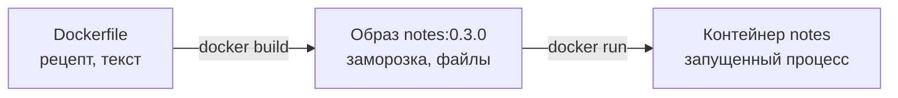
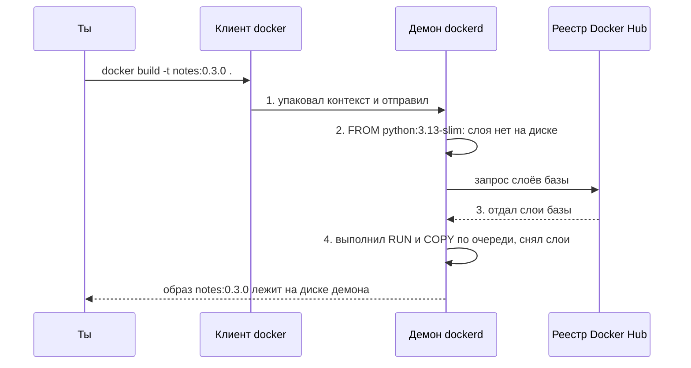
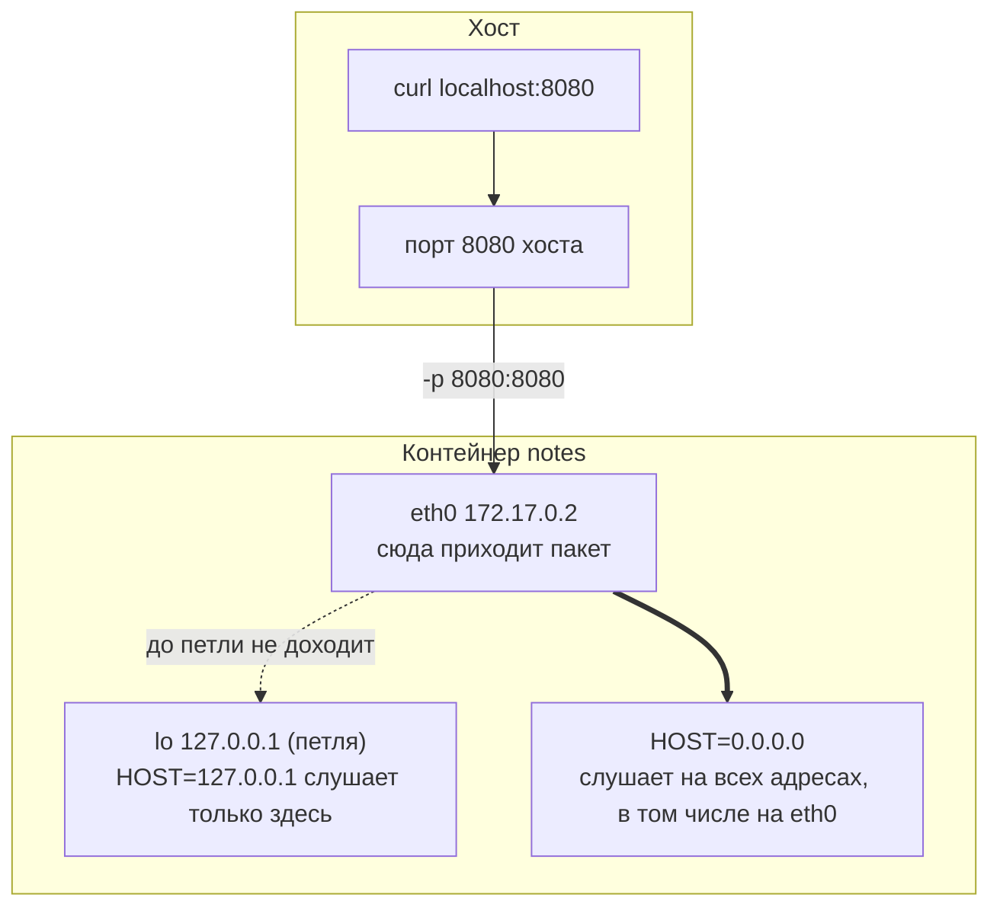
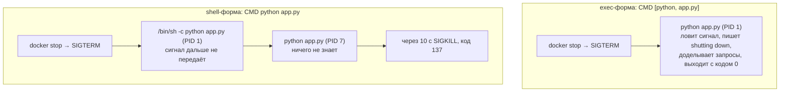

## Зачем это нужно

На сервере «Заметки» работали как systemd-сервис: код в `/opt/notes/`, данные в `/var/lib/notes/`, свой пользователь `notes`, настройки в `/etc/notes/notes.env`. Чтобы запустить то же самое на другой машине, нужно повторить десяток шагов руками: поставить Python (язык, на котором написано приложение), создать пользователя, разложить файлы, выдать права. Через месяц никто не вспомнит, в каком порядке это делалось.

Образ (image) собирает всё это один раз по письменному рецепту, файлу `Dockerfile`, и после этого запускается одинаково на ноутбуке, в CI и в Kubernetes. Образ - это «заморозка» всего, что нужно программе: система, Python и твой код в одном неизменяемом наборе файлов (подробно разберём ниже). CI (continuous integration) - это робот, который при каждом коммите сам собирает и проверяет проект, ты настраивал его в [уроке 3.3](../03-git-ci/03-actions-ci.md). Kubernetes - программа, которая запускает контейнеры на многих серверах сразу и сама перезапускает упавшие; ты начнёшь с неё в [уроке 5.1](../05-kubernetes/01-why-k8s-cluster.md), пока достаточно знать, что она берёт готовый образ. Рецепт лежит в git рядом с кодом, его можно прочитать, проверить и повторить.

На работе Dockerfile ревьюят так же, как код: коллега читает твой файл до слияния и пишет замечания (ревью, review, ты делал это в [уроке 3.2](../03-git-ci/02-remotes-workflow.md)). Три самые частые претензии: сборка медленная (после любой правки качаются все пакеты), образ весит гигабайт, сервис работает под root. Этот урок про то, как не получить ни одну из трёх.

Шаг проекта: в `~/notes` появляются три файла, которые ты напишешь сам: `Dockerfile` (рецепт), `.dockerignore` (список того, что не нужно отправлять на сборку: как «не клади это в посылку») и `requirements.txt` (список пакетов, которые нужны приложению, по строке на пакет). Из них собирается образ `notes:0.3.0`. Приложение слушает `0.0.0.0:8080` внутри контейнера (адрес «все сетевые входы», зачем он нужен, разберём ниже) и работает под пользователем с uid 10001 (это просто номер, по которому система проверяет права; выбран «непохожим» на номера живых людей, которые начинаются с 1000). Версия кода остаётся v3.

## Что нужно знать

- [Урок 4.1: контейнеры](01-containers-idea.md): контейнер это процесс с ограничениями, а не виртуальная машина; Docker Engine установлен, порты 80, 443 и 8080 на хосте свободны (сервисы `nginx` и `notes` остановлены).
- [Урок 1.3: пользователи и права](../01-linux/03-users-permissions.md): что такое uid (числовой номер пользователя), владелец каталога, `chown`, почему сервис не должен работать от root.
- [Урок 1.4: процессы и сигналы](../01-linux/04-processes-signals.md): PID, сигналы SIGTERM и SIGKILL, коды выхода. Всё это нужно в разделе про остановку контейнера.
- [Урок 2.1: адреса и маршруты](../02-network/01-addresses-routes.md) и [урок 2.2: порты](../02-network/02-ports-tcp-ssh.md): адрес `127.0.0.1` (петля, loopback), адрес `0.0.0.0`, что значит «слушать порт».
- [Урок 3.5: релизы](../03-git-ci/05-release-flow.md): версии вида `0.3.0` (semver) и git-теги: версия образа совпадёт с тегом.

## Картина целиком

Представь, что ты открываешь пекарню и хочешь, чтобы булочки получались одинаковыми в любом филиале. Ты пишешь **рецепт**: возьми такую-то муку, замеси, положи в печь, выставь такую температуру. Любой повар по рецепту получает то же самое. Так и Dockerfile: это рецепт сборки образа.

Готовая заморозка, которую можно отвезти в филиал, это **образ**. Из одной заморозки можно разогреть сколько угодно порций: каждая разогретая порция это **контейнер**. Заморозка не меняется, а разогретую порцию можно съесть (удалить), и заморозка останется целой.

Есть нюанс. Рецепт пишется по шагам, и после каждого шага повар делает **снимок** результата. Если завтра ты изменишь только последний шаг (например, добавку в конце), повару не нужно начинать с муки: он берёт снимок после предпоследнего шага и делает только последний. Эти снимки называются слоями (layers), и по ним работает кэш сборки: Docker запоминает готовые снимки и, если шаг не менялся, берёт результат из памяти вместо повторной работы. Без кэша любая мелкая правка означала бы сборку с нуля.



Рецепт превращается в образ, образ в контейнер. Каждая строка рецепта даёт слой образа, если меняет файлы:

| Инструкция | Что получается |
|---|---|
| `FROM python:3.13-slim` | слой 1: готовая система с Python (чужой, скачивается) |
| `WORKDIR /app` | слой 2: каталог `/app` |
| `RUN groupadd ...` | слой 3: пользователь `notes`, каталог `/data` |
| `COPY requirements.txt` | слой 4: список зависимостей |
| `RUN pip install ...` | слой 5: установленные пакеты |
| `COPY app.py .` | слой 6: твой код |
| `ENV`, `USER`, `CMD` | метаданные: как запускать (файлов не добавляют) |

За урок ты разберёшь каждую часть этой схемы. Что такое слои и как кэш экономит минуты. Почему в образ нельзя класть секреты. Почему внутри контейнера приложение должно слушать `0.0.0.0`, а не `127.0.0.1`. Почему `docker stop` бывает быстрым, а бывает висит десять секунд. И как сделать так, чтобы сервис работал не от root и сам сообщал Docker, что он здоров.

## Теория

### Dockerfile, образ и контейнер: что из чего получается

Без рецепта образ пришлось бы собирать руками: запустить пустую систему, зайти в неё, поставить Python, скопировать файлы, сохранить. Через полгода никто не помнит, что именно было сделано, а повторить нельзя. Dockerfile превращает эту работу в текстовый файл: его хранят в git, ревьюят, запускают в CI.

Рецепт, заготовка, порция. Dockerfile это рецепт, образ это заготовка в морозилке, контейнер это разогретая порция. Где аналогия перестаёт работать: порцию из контейнера можно «вернуть в морозилку» командой `docker commit`, но так делать не надо, потому что рецепта уже не останется, а без него образ не повторить.

Файл `Dockerfile` состоит из инструкций (instruction): каждая строка это слово-команда заглавными буквами и её аргументы. Команда `docker build` читает файл сверху вниз и выполняет инструкции по очереди. Результат это образ: неизменяемый набор файлов плюс метаданные (какую команду запускать, какие переменные задать, от какого пользователя). Образ можно только создать или удалить, исправить нельзя. Команда `docker run` берёт образ и запускает из него контейнер: обычный процесс Linux (это ты доказал в [уроке 4.1](01-containers-idea.md)), которому ядро показывает файлы образа как корневую файловую систему.

Инструкции, которые понадобятся нам в этом уроке:

| Инструкция | Что делает | Меняет файлы образа? |
| --- | --- | --- |
| `FROM` | берёт готовый образ как основу | да (это первый слой) |
| `WORKDIR` | задаёт рабочий каталог, создаёт его | да |
| `COPY` | копирует файлы с твоей машины в образ | да |
| `RUN` | выполняет команду во время сборки | да |
| `ENV` | задаёт переменные окружения | нет, метаданные |
| `EXPOSE` | записывает, какой порт слушает приложение | нет, метаданные |
| `USER` | задаёт пользователя, под которым пойдёт процесс | нет, метаданные |
| `HEALTHCHECK` | задаёт команду проверки здоровья | нет, метаданные |
| `CMD` | задаёт команду запуска контейнера | нет, метаданные |

Переменная окружения (environment variable) это пара «имя=значение», которую операционная система передаёт программе при запуске. «Заметки» читают из них `HOST`, `PORT` и `NOTES_DATA` (ты настраивал их в `notes.env` в [уроке 1.8](../01-linux/08-systemd-editors.md)).

**Разбор на примере: FROM.** Первая инструкция почти всегда `FROM python:3.13-slim`. Строка читается так: «возьми готовый образ `python` с тегом `3.13-slim`». Образы лежат в реестре (registry), это сервер-хранилище образов, по умолчанию Docker Hub. Имя состоит из репозитория (`python`) и тега (tag, `3.13-slim`) через двоеточие. Тег это метка версии. Здесь она значит: Python 3.13 и вариант `slim` (облегчённый: в нём есть Python и минимум системных программ, а компиляторов, `curl` и `ps` нет). Слово `slim` и определяет размер: обычный `python:3.13` весит 1,6 ГБ, а `python:3.13-slim` 204 МБ на диске. Тег `latest` мы не используем нигде: он означает «последний на момент скачивания», и завтра тот же тег даст другую систему. Поэтому база закреплена версией.

> **Прикинь сам:** В первом Dockerfile «Заметок» (задание 3) девять инструкций. Сколько из них работают с файлами образа, если метаданные (`ENV`, `EXPOSE`, `CMD`) файлов не меняют?
{: .predict}

Шесть: `FROM`, `WORKDIR`, `RUN mkdir`, `COPY`, `RUN pip`, `COPY`. Остальные три (`ENV`, `EXPOSE`, `CMD`) только записывают, как запускать, поэтому их слои весят 0 байт.

Осторожно, частое заблуждение: что образ и контейнер это одно и то же. Образ это файл-шаблон, он не «работает». Контейнер это процесс, который из него запущен. Удаление контейнера (`docker rm`) не удаляет образ, а удаление образа (`docker image rm`) невозможно, пока от него остался хоть один контейнер.

> **Главное:** Dockerfile это рецепт, образ собранный из него неизменяемый набор файлов с метаданными, контейнер запущенный из образа процесс.
{: .key}

Рецепт пишется по шагам, и каждый шаг запоминается. Посмотрим, как это ускоряет сборку.

> **Проверь понимание:** ты запустил из образа три контейнера. Сколько копий образа лежит на диске?

<details markdown="1">
<summary>Ответ</summary>

Одна. Слои образа неизменяемы и общие: каждый контейнер получает только свой тонкий записываемый слой сверху. Поэтому десять контейнеров из одного образа занимают места немногим больше, чем один.

</details>

### Образ, слои и кэш

Сборка образа бывает долгой: скачать базу, поставить пакеты, скопировать код. Если после каждой правки одной строки ждать всё заново, работать невозможно. Слои и кэш позволяют пересобирать только то, что изменилось.

Слоёный торт, который печётся снизу вверх. Испёк коржи и крем, поверх положил вишню. Завтра клиент просит другую вишню: снимаешь только верхний слой и кладёшь новый, а коржи не трогаешь. Но если попросили другой корж внизу, придётся разобрать всё, что лежит выше. Аналогия ломается в одном: слой образа нельзя «выковырять» снизу и оставить остальное. Порядок жёсткий.

Каждая инструкция, которая меняет файлы (`FROM`, `WORKDIR`, `COPY`, `RUN`), создаёт слой (layer): набор файлов, которые добавились или изменились относительно предыдущего слоя. Инструкции `ENV`, `EXPOSE`, `USER`, `HEALTHCHECK`, `CMD` меняют только метаданные, и их слои весят 0 байт. Сборщик BuildKit (встроен в Docker Engine, включён по умолчанию) запоминает каждый слой. При следующей сборке для каждой инструкции он задаёт вопрос: «я уже выполнял такую же инструкцию на таком же слое ниже?» Для `COPY` он дополнительно сравнивает содержимое копируемых файлов. Если ответ «да», слой берётся из кэша, и в выводе появляется пометка `CACHED`. Если «нет», инструкция выполняется, а **все слои ниже пересобираются тоже**, даже если их инструкции не менялись: они стоят на другом фундаменте.

Посмотрим на примере. Возьмём такой фрагмент:

```dockerfile
COPY requirements.txt .                  # слой A
RUN pip install -r requirements.txt      # слой B (качает пакеты, самый медленный)
COPY app.py .                            # слой C
```

Ты меняешь строку в `app.py` и запускаешь сборку. BuildKit идёт сверху. Слой A: `requirements.txt` не менялся, кэш. Слой B: инструкция та же, слой A тот же, кэш, пакеты не скачиваются. Слой C: файл `app.py` изменился, выполняем заново. Итого сборка занимает доли секунды.

Теперь поменяем порядок: сначала `COPY . .` (копируем весь каталог, включая `app.py`), потом `RUN pip install`. Ты меняешь `app.py`. Первый слой видит другой файл и пересобирается. Слой с `pip install` стоит ниже, значит тоже пересобирается, и пакеты качаются заново. Для «Заметок» с пустым `requirements.txt` это секунда, а для реального сервиса с сотней пакетов это пять минут на каждую правку одной строки. Отсюда главное правило порядка: то, что меняется редко (список зависимостей), пишется выше, то, что меняется часто (твой код), ниже.

> **Прикинь сам:** Для реального сервиса `pip install` занимает 5 минут, а ты меняешь одну строку в `app.py` 12 раз за день. Сколько минут уйдёт на установку пакетов, если `COPY requirements.txt` и `RUN pip install` стоят выше `COPY app.py`?
{: .predict}

Почти ноль: слои с пакетами берутся из кэша. Если поставить `COPY . .` раньше установки, будет 12 × 5 = 60 минут ожидания.

Осторожно, частое заблуждение: что `CACHED` значит «ничего не изменилось вообще». Нет: кэш работает по каждому слою отдельно. В примере выше три из четырёх слоёв могут быть `CACHED`, а один выполняться. Ещё путают «изменилась инструкция» и «изменились файлы»: `COPY app.py .` пересоберётся, даже если текст самой инструкции тот же, потому что изменился файл.

> **Главное:** кэш работает по слоям сверху вниз: после первого изменившегося слоя пересобирается всё, что ниже, поэтому редко меняющееся пишут выше.
{: .key}

Теперь посмотрим, кто на самом деле выполняет сборку.

> **Проверь понимание:** в Dockerfile сначала `COPY requirements.txt`, потом `RUN pip install`, потом `COPY app.py`. Ты добавил новую зависимость в `requirements.txt`. Что пересоберётся?

<details markdown="1">
<summary>Ответ</summary>

Всё, начиная со слоя с `COPY requirements.txt`: файл изменился, значит сам слой, `pip install` (он стоит ниже) и `COPY app.py` (тоже ниже) выполнятся заново. Кэшем останутся только слои выше: `FROM` и `WORKDIR`.

</details>

### Что происходит при docker build: клиент, демон, реестр

Когда ты впервые набираешь `docker build`, непонятно, кто что делает: откуда берётся Python, куда уходят твои файлы, где лежит результат. Без этой картины ошибки вроде `Cannot connect to the Docker daemon` или `pull access denied` выглядят как магия.

Заказ в пекарне. Ты (клиент) отдаёшь заказ на кассе, повар на кухне (демон) по нему работает, муку и дрожжи он берёт на оптовом складе (реестр). Где аналогия не работает: у Docker касса и кухня могут стоять в разных городах, и связь между ними идёт по сети или через файл-сокет.

В Docker три участника.

- **Клиент** (client) - команда `docker`, которую ты вводишь. Сама она почти ничего не делает: разбирает твою команду и отправляет запрос.
- **Демон** (daemon, `dockerd`) - фоновая программа, которая постоянно работает на машине и выполняет работу: собирает образы, запускает контейнеры. Клиент общается с ним через **сокет** (socket): специальный файл `/var/run/docker.sock`, в который можно «постучаться» как в окошко. Поэтому доступ к этому файлу равен доступу к Docker, отсюда и требование состоять в группе `docker`.
- **Реестр** (registry) - сервер с готовыми образами. По умолчанию Docker Hub (`docker.io`).



Вот как это выглядит на деле. Первая сборка идёт долго, потому что на шаге 3 скачиваются слои `python:3.13-slim` (около 50 МБ по сети). Вторая сборка быстрая: база уже лежит на диске демона, и в выводе у неё пометка `CACHED`. Образ `notes:0.3.0` после сборки хранится у демона локально. В реестр он не попадает, пока ты сам не выполнишь `docker push` (это [урок 4.7](07-images-registry.md)).

> **Прикинь сам:** База `python:3.13-slim` весит около 50 МБ по сети. Сколько мегабайт скачает вторая сборка того же Dockerfile на той же машине?
{: .predict}

Ничего: слои базы уже лежат у демона, в выводе будет `CACHED`. В реестр образ попадёт только после `docker push`.

Осторожно, частое заблуждение: что `docker build` «собирает на сервере Docker Hub». Нет: собирает твой локальный демон, а реестр лишь выдаёт чужие базовые слои.

> **Главное:** `docker build` собирает локальный демон, а реестр лишь отдаёт чужие базовые слои.
{: .key}

Демон получает от клиента файлы для сборки. Решим, какие именно.

> **Проверь понимание:** ты остановил демон (`sudo systemctl stop docker`) и набрал `docker ps`. Что напишет клиент и почему?

<details markdown="1">
<summary>Ответ</summary>

`Cannot connect to the Docker daemon at unix:///var/run/docker.sock. Is the docker daemon running?` Клиент на месте, а принять запрос некому: «кухня закрыта». Лечится запуском демона: `sudo systemctl start docker`.

</details>

### Контекст сборки и .dockerignore

Команда `docker build` запускается не там, где живёт Docker Engine: клиент (`docker`) и демон (`dockerd`, постоянно работающая программа, которая делает всю работу) общаются через сокет, и демон может быть даже на другой машине. Поэтому демон не может просто «зайти» в твой каталог: файлы для `COPY` ему нужно передать. Что передавать, а что оставить дома, решает `.dockerignore`.

Ты отправляешь посылку в мастерскую, чтобы там собрали изделие по чертежу. В посылку кладёшь только то, что нужно для работы. Личные документы, которые лежали на столе рядом, в коробку класть не надо, а то они уедут вместе с изделием.

Последний аргумент `docker build .` (точка) называется контекстом сборки (build context): это каталог, который клиент упаковывает и отправляет демону целиком. Инструкция `COPY` видит только его: файл вне контекста скопировать нельзя, даже если он лежит на соседнем каталоге. Файл `.dockerignore` (лежит в корне контекста) перечисляет пути, которые в контекст не попадают: по одному шаблону в строке, `*.md` значит «все файлы с расширением .md». Без него в контекст уедет всё: история git (`.git`), локальные пароли (`.env`), каталоги с данными.

Теперь на числах. В проекте «Заметки» есть `.git`, `versions/` с восемью версиями `app.py`, `break/` со скриптами поломок, README. В контейнере они не нужны. Размер контекста виден в строке `transferring context: ... done` в начале вывода сборки. На реальном проекте разница в сотни мегабайт, и она видна в строке `transferring context: ... done` в выводе сборки. Второе применение важнее скорости: то, что попало в контекст и было скопировано, остаётся в образе. Если `COPY . .` захватил `.env` с паролем, пароль теперь внутри образа.

> **Прикинь сам:** В каталоге проекта лежат `.git` на 80 МБ, `versions/` и `break/`, а нужен только `app.py` на 20 КБ. Что попадёт в контекст без `.dockerignore`?
{: .predict}

Всё: клиент упаковывает каталог целиком и шлёт демону. Лишние 80 МБ уедут при каждой сборке, а `COPY . .` положит их ещё и в образ.

Осторожно, частое заблуждение: что `.dockerignore` это то же самое, что `.gitignore`. Они похожи по синтаксису, но независимы: файл, которого нет в `.gitignore`, всё равно можно исключить из образа, и наоборот. Второй вариант ошибки: исключить из контекста файл, который нужен для `COPY`. Тогда сборка упадёт с `"/app.py": not found`. Ты сам это увидишь в разделе «Сломай и почини».

> **Главное:** контекст сборки это каталог, который клиент целиком отправляет демону; `.dockerignore` оставляет лишнее дома и не пускает секреты в образ.
{: .key}

Всё, что попало в контекст и в `COPY`, остаётся в образе. Это особенно опасно для паролей.

> **Проверь понимание:** в `.dockerignore` есть строка `*.md`, а в Dockerfile `COPY README.md /app/`. Что произойдёт?

<details markdown="1">
<summary>Ответ</summary>

Сборка упадёт с ошибкой `"/README.md": not found`. Файл лежит на диске, но исключён из контекста, поэтому демон его не получил и `COPY` его не видит.

</details>

### Секреты и неизменяемость слоёв

Самая опасная ошибка новичка: положить в образ пароль, а потом «удалить». Образы выкладывают в реестры и раздают коллегам, и всё, что в них лежит, доступно любому, у кого образ есть.

Слой неизменяем. Инструкция `RUN rm .env` не стирает файл из предыдущего слоя: она создаёт **новый** слой, в котором записано «файла `.env` больше нет». Образ это стопка слоёв, и предыдущий слой с файлом остаётся в стопке целым. Файловая система контейнера показывает верхнюю картину, поэтому внутри контейнера файла не видно, но образ хранит его в слое. Достать секрет можно распаковкой слоёв (`docker save` выгружает образ в один архив, `tar` его раскрывает), а команда `docker history` (история образа: по строке на каждый слой) показывает, какая инструкция что добавила, включая строку с `COPY .env`.

**Пример.** Три строки: `COPY .env /app/.env`, `RUN rm /app/.env`, дальше всё остальное. Слой 1: файл есть. Слой 2: пометка «удалён». Итоговый образ весит столько же, сколько с файлом, а не меньше, потому что слой 1 никуда не делся. Правильно: `.env` в `.dockerignore` (файл вообще не попадает в контекст), а настройки и пароли передаются при запуске контейнера (`docker run -e ...` или `--env-file`, подробнее в [уроке 4.5](05-compose-postgres.md)) и не в сборке. Продвинутые способы (секреты BuildKit) разберём в [уроке 4.8](08-image-security.md).

> **Прикинь сам:** `COPY .env /app/.env` весит 1 КБ, потом `RUN rm /app/.env`. Сколько килобайт занимает файл в итоговом образе и виден ли он в контейнере?
{: .predict}

Файл по-прежнему занимает 1 КБ в слое 1 образа, а в контейнере его не видно: слой 2 только помечает его удалённым. Достать пароль можно через `docker save` и `tar`.

Осторожно, частое заблуждение: что переменная `ARG` (значение, передаваемое при сборке) безопаснее `ENV`. Нет: значения `ARG` тоже видны в `docker history`. Сборочные аргументы годятся для версий, но не для паролей.

> **Главное:** слой неизменяем: удалить секрет «потом» нельзя, поэтому пароль не кладут в образ, а передают при запуске контейнера.
{: .key}

Следующая особенность контейнера касается сети: почему приложение должно слушать `0.0.0.0`.

> **Проверь понимание:** пароль попал в образ, ты пересобрал образ без него и удалил старый локально. Пароль в безопасности?

<details markdown="1">
<summary>Ответ</summary>

Нет, если старый образ успели выложить в реестр или отдать кому-то: копии живут там. Пароль надо считать скомпрометированным и сменить. Пересборка и удаление локальной копии закрывают только твою машину.

</details>

### Сеть контейнера: почему нужен HOST=0.0.0.0

В [уроке 2.1](../02-network/01-addresses-routes.md) ты видел, что один и тот же сервис может слушать `127.0.0.1` (только свою машину) или `0.0.0.0` (все сетевые адреса машины). Контейнер это отдельная «машина» со своей сетью (namespace `net` из [урока 4.1](01-containers-idea.md)), и у неё свой `127.0.0.1`. Поэтому та настройка, которая на сервере была безопасной, в контейнере делает сервис недоступным.

Квартира с домофоном. Внутри квартиры (петля, `127.0.0.1`) можно позвать соседа по комнате, но с улицы тебя не услышат. Чтобы гость с улицы дозвонился, нужен звонок, который слышно у двери подъезда: это `0.0.0.0`. Сам по себе номер квартиры (порт) без звонка не поможет.

Контейнер получает виртуальную сетевую карту с собственным адресом (например, `172.17.0.2`) и отдельную петлю. Хост пользоваться адресом контейнера напрямую не должен, поэтому порт **публикуют**: флаг `-p 8080:8080` у `docker run` значит «пакеты, пришедшие на порт 8080 хоста, передай на порт 8080 контейнера». Docker при этом принимает соединение на хосте и пересылает его на адрес контейнера (не на его петлю). Приложение получит запрос только если слушает сетевую карту контейнера, то есть `0.0.0.0`, а не `127.0.0.1`.



Пакет с хоста приходит на `eth0` контейнера. Если приложение слушает только `127.0.0.1`, оно его не получит. При `0.0.0.0` приложение слушает и на `eth0`, поэтому запрос доходит.

Разберём пример. Мы запустили контейнер с `-e HOST=127.0.0.1`, порт опубликовали (`docker port` показал `8080/tcp -> 0.0.0.0:...`), в логах приложения стоит `started host=127.0.0.1 port=8080`, контейнер в статусе `Up`. А `curl` с хоста получил `curl: (56) Recv failure: Connection reset by peer`. Соединение принято на хосте, переслано в контейнер, там его никто не ждёт на сетевой карте, и оно оборвано. Симптом путает: «контейнер работает, порт открыт, логи чистые, а не отвечает». Первая проверка в такой ситуации: на каком адресе слушает приложение. Команда `docker exec контейнер команда` запускает команду внутри уже работающего контейнера (как зайти в комнату и спросить), а `env` печатает его переменные окружения; плюс смотришь логи (то, что приложение печатает о себе).

Отдельно про `EXPOSE 8080` в Dockerfile. Эта инструкция ничего не публикует и не открывает. Это запись для человека и для инструментов: «приложение внутри слушает 8080». Публикует только `-p`.

> **Прикинь сам:** `docker run -p 8080:8080 notes:0.3.0`, а приложение слушает `127.0.0.1:8080` внутри контейнера. Что вернёт `curl localhost:8080` с хоста?
{: .predict}

Ошибку соединения: Docker пересылает пакет на адрес контейнера (`172.17.0.2`), а приложение слушает только свою петлю. С `HOST=0.0.0.0` заработает.

Осторожно, частое заблуждение: что `EXPOSE` открывает порт. Нет, порт открывает `-p`. Ещё думают, что `0.0.0.0` в контейнере опасен так же, как на сервере в интернете. Он открывает порт для всех сетей, к которым подключён контейнер, а наружу выпускает только то, что ты опубликовал через `-p`.

> **Главное:** внутри контейнера приложение должно слушать `0.0.0.0`, а наружу порт открывает только `-p`, а не `EXPOSE`.
{: .key}

Приложение доступно. Но куда оно пишет данные?

> **Проверь понимание:** ты запустил `docker run -d -p 8080:8080 notes:0.3.0`, а в образе нет ни `ENV HOST=0.0.0.0`, ни `-e`. По умолчанию приложение слушает `127.0.0.1`. Откроется ли оно с хоста?

<details markdown="1">
<summary>Ответ</summary>

Нет: `HOST` по умолчанию `127.0.0.1` (это видно в коде `os.environ.get("HOST", "127.0.0.1")`), и приложение слушает только петлю контейнера. Поэтому в Dockerfile стоит `ENV HOST=0.0.0.0`.

</details>

### Данные внутри контейнера: слой для записи

Образ неизменяем, а «Заметкам» нужно писать файл. Docker решает это так: сверху слоёв образа добавляется тонкий слой для записи (writable layer), и всё, что процесс пишет, попадает туда.

Слои образа доступны только для чтения. Когда контейнер создаётся, к ним добавляется пустой слой, привязанный к этому контейнеру. Чтение идёт сверху вниз, запись только в верхний слой. При `docker rm` этот слой удаляется вместе с контейнером. Сам образ не меняется.

**Пример.** Мы запустили контейнер, записали заметку (`{"id": 1}`), проверили `cat /data/notes.txt`: строка на месте. Затем `docker rm -f notes` и запуск нового контейнера из того же образа. Запрос `GET /notes` вернул `[]`: заметки нет, она жила в слое старого контейнера. Как сохранить данные, мы разберём в [уроке 4.3](03-storage-networks.md) (тома). А пока сам каталог `/data` должен существовать в образе, иначе запись упадёт с `[Errno 2] No such file or directory: '/data/notes.txt'` (мы видели и этот случай в прогоне). Приложение `mkdir` не делает, каталог создаёт Dockerfile.

> **Прикинь сам:** Ты записал в «Заметки» 5 заметок, выполнил `docker rm -f notes` и запустил новый контейнер из того же образа. Сколько заметок вернёт `GET /notes`?
{: .predict}

Ноль: `[]`. Заметки лежали в слое записи старого контейнера, а при `docker rm` он удаляется. Сохраняют данные тома (урок 4.3).

Осторожно, частое заблуждение: что данные в контейнере живут «в образе» и переживут пересоздание. Образ не пишется никогда. Данные живут в слое контейнера и умирают вместе с ним.

> **Главное:** данные в слое контейнера живут, пока жив контейнер, а образ не меняется никогда.
{: .key}

Данные разобрали. Теперь о том, как контейнер запускается и как его остановить без потерь.

> **Проверь понимание:** ты остановил контейнер командой `docker stop`, но не удалял его. Заметки на месте?

<details markdown="1">
<summary>Ответ</summary>

Да. Остановленный контейнер сохраняет свой слой записи, `docker start` вернёт его с данными. Данные пропадают при `docker rm`.

</details>

### CMD, PID 1 и остановка контейнера

Контейнеру нужно знать, какой процесс запускать. Это задаёт `CMD`. А как именно он записан, определяет, услышит ли приложение просьбу «остановись»: от этого зависит, потеряются ли запросы и данные при каждой выкатке.

Директору нужно сказать сотруднику «заканчивай и уходи». Если сотрудник сидит в отделе напрямую, он услышит. Если между вами стоит секретарь, которая не передаёт устные просьбы дальше, сотрудник не узнает, а директор через десять минут просто отключит свет. Секретарь это `/bin/sh`, свет это SIGKILL.

Первый процесс, который запускается в контейнере, получает номер PID 1. Ядро относится к нему особо: сигналы, для которых у процесса нет обработчика, для PID 1 игнорируются (иначе случайный сигнал убил бы «главный» процесс без разбора). Команда `docker stop` делает две вещи: шлёт процессу с PID 1 сигнал SIGTERM (вежливая просьба завершиться, [урок 1.4](../01-linux/04-processes-signals.md)), ждёт 10 секунд, затем шлёт SIGKILL (принудительное убийство, которое поймать нельзя). У `CMD` две формы записи:

- **exec-форма** `CMD ["python", "app.py"]`: список в квадратных скобках. Docker запускает `python` напрямую, и он получает PID 1. SIGTERM приходит сразу Python-приложению;
- **shell-форма** `CMD python app.py`: обычная строка. Docker запускает `/bin/sh -c "python app.py"`. Процесс `sh` получает PID 1, а Python становится его дочерним процессом. SIGTERM приходит в `sh`, у него нет обработчика, для PID 1 сигнал игнорируется, и до Python он не доходит.

К `CMD` есть парная инструкция `ENTRYPOINT`. `ENTRYPOINT` задаёт программу, которая запускается всегда, а `CMD` даёт аргументы по умолчанию к ней. `docker run образ другая-команда` заменяет `CMD`, а `ENTRYPOINT` заменяется только флагом `--entrypoint`. Для приложения вроде «Заметок» достаточно одного `CMD`.



В exec-форме сигнал получает само приложение и завершается за доли секунды. В shell-форме его принимает `sh` и теряет, и Docker добивает Python через 10 секунд.

Посмотрим на примере. В нашем прогоне с exec-формой `docker stop` занял 0,63 секунды. В логе после остановки: `INFO shutting down`, `INFO stopped`, код выхода 0. С shell-формой: `docker top` показал два процесса, `/bin/sh -c python app.py` (PID 141307) и `python app.py` (PID 141322, потомок), `docker stop` занял 10,159 секунды, в логе нет ни `shutting down`, ни `stopped`, код выхода 137. Расшифруем 137: сигнал 9 (SIGKILL) плюс 128 (так оболочка кодирует «убит сигналом»), то есть 128 + 9 = 137. Этот код ты уже видел в [уроке 4.1](01-containers-idea.md) при нехватке памяти.

Заметка про реальные ситуации. Для Kubernetes картина та же: он тоже шлёт SIGTERM и через период ожидания SIGKILL ([урок 5.7](../05-kubernetes/07-probes-resources-rollouts.md)). Запросы, которые сервис не успел закончить, при SIGKILL теряются.

> **Прикинь сам:** `docker stop` с exec-формой занял 0,63 с, с shell-формой 10,16 с. Во сколько раз второй дольше и почему?
{: .predict}

Примерно в 16 раз. SIGTERM получил `/bin/sh` (PID 1), Python его не увидел, и Docker через 10 секунд послал SIGKILL (код 137).

Осторожно, частое заблуждение: что exec-форма сама по себе гарантирует красивую остановку. Она лишь доставляет сигнал. Приложение должно его обработать: сервер «Заметок» обрабатывает SIGTERM (это сделано в [уроке 1.4](../01-linux/04-processes-signals.md)), поэтому останавливается за секунду. Программа без обработчика в роли PID 1 проживёт все 10 секунд и в exec-форме.

> **Главное:** `CMD` пиши в exec-форме, чтобы SIGTERM дошёл до приложения, а приложение должно уметь его обработать.
{: .key}

Процесс в контейнере по умолчанию работает от root. Исправим это.

> **Проверь понимание:** почему нельзя просто увеличить таймаут (`docker stop -t 60`) вместо перехода на exec-форму?

<details markdown="1">
<summary>Ответ</summary>

Таймаут только задерживает SIGKILL. Приложение не получило SIGTERM, поэтому всё равно не начало завершаться, а `docker stop` будет висеть уже 60 секунд. Причина в форме `CMD`, её и надо исправлять.

</details>

### Не root: USER и владелец каталога

Процесс в контейнере по умолчанию работает от root (uid 0). Это тот же root ядра, что на хосте, ограниченный namespaces (у контейнера свой взгляд на процессы, сеть и файлы, [урок 4.1](01-containers-idea.md)) и capabilities (вместо «всё или ничего» ядро делит права root на мелкие части, и контейнер получает урезанный набор). Если в приложении найдут дыру или ошибётся конфигурация (например, смонтирован `docker.sock` или запущено с `--privileged`), root в контейнере превращается в root на хосте. Принцип наименьших привилегий: процесс получает ровно столько прав, сколько нужно для работы.

В офисе у уборщика есть ключ только от кабинетов, которые он убирает, а не мастер-ключ от всего здания. Если ключ потеряют, ущерб ограничен.

Пользователь в Linux определяется числом uid (и группа числом gid). Имя `notes` это удобная надпись, ядро смотрит только на числа. Мы договорились в курсе про uid и gid 10001 для «Заметок». Ставим их в три шага, и порядок обязателен:

1. Пока ты ещё root (по умолчанию все `RUN` идут от root), создаёшь группу и пользователя (`groupadd`, `useradd`) и каталог данных с владельцем 10001 (`mkdir`, `chown`).
2. Инструкцией `USER 10001:10001` говоришь: «все следующие инструкции и сам контейнер работают от этого пользователя».
3. Больше ничего от root не выполняется.

Если поставить `USER` раньше `chown` или вообще не выдать права на `/data`, обычный пользователь не сможет ни создать файл в каталоге, принадлежащем root, ни поменять владельца.

Вот как это выглядит на деле. В прогоне мы добавили только `USER 10001:10001`, а `RUN mkdir /data` оставили без `chown`. Контейнер стартует и логи чистые (`started host=0.0.0.0 port=8080`), `docker exec notes id` показывает `uid=10001 gid=10001 groups=10001`. Но `ls -ld /data` (показать сам каталог, владельца и права, как в [уроке 1.3](../01-linux/03-users-permissions.md)) показывает `drwxr-xr-x 2 root root`: владелец root, права на запись только у него. Запись заметки возвращает `{"error": "storage"}` с кодом 500, `/readyz` отвечает 503 `not ready` (проверка этого эндпоинта в v3: можно ли писать в каталог файла), а в логах `PermissionError`-подобная строка `[Errno 13] Permission denied: '/data/notes.txt'`. После правильного порядка: `ls -ld /data` даёт `drwxr-xr-x 1 notes notes 4096 ...`, запись возвращает `{"id": 1}`.

Про флаги `useradd`: `--system` (системный пользователь, не для входа людей), `--no-create-home` (домашний каталог не нужен), `--shell /usr/sbin/nologin` (интерактивный вход запрещён, оболочки нет).

> **Прикинь сам:** Каталог `/data` создан от root, а процесс идёт от uid 10001. Что получится при записи `/data/notes.txt` и какой командой чинится?
{: .predict}

`Permission denied`: у процесса нет прав на каталог root. Исправление: `chown 10001:10001 /data` до инструкции `USER`.

Осторожно, частое заблуждение: что достаточно указать `USER` и всё заработает. Нет: `USER` меняет, кто запускает процесс, но не права на уже существующие каталоги. Ещё путают: «`chmod 777 /data` быстрее». Так работает, но открывает каталог всем, и это красный флаг на любом ревью.

> **Главное:** процесс запускают не от root: сначала создают пользователя и выдают права на каталог данных, потом ставят `USER`.
{: .key}

При создании пользователя сборка печатает предупреждение. Разберёмся, что оно значит.

> **Проверь понимание:** `USER 10001:10001` стоит в Dockerfile раньше, чем `RUN mkdir /data`. Что произойдёт при сборке?

<details markdown="1">
<summary>Ответ</summary>

`mkdir` тоже пойдёт от пользователя 10001, а он не может создавать каталоги в `/`. Сборка упадёт с `mkdir: cannot create directory '/data': Permission denied`. Поэтому создание каталога и `chown` выполняются до `USER`.

</details>

### Предупреждение useradd про SYS_UID_MAX

При сборке из задания 3 в выводе появится строка с `warning`. Новичок видит слово «предупреждение», пугается и начинает искать ошибку. Здесь её нет, и полезно понять почему.

Команда `useradd` создаёт пользователя. В Debian (на нём построен `python:3.13-slim`) номера пользователей поделены на диапазоны, записанные в файле `/etc/login.defs`: системные пользователи (службы вроде `www-data`, не люди) получают номера от `SYS_UID_MIN` до `SYS_UID_MAX`, по умолчанию 100-999, обычные люди получают номера от 1000. Ты просишь `--system` (я служба) и одновременно `--uid 10001` (номер вне диапазона служб). `useradd` замечает несоответствие и сообщает об этом:

```text
useradd warning: notes's uid 10001 outside of the SYS_UID_MIN 100 and SYS_UID_MAX 999 range.
```

Числа 100 и 999 у тебя могут отличаться, смысл тот же: «номер не из диапазона служб, я всё равно его создам». Это именно предупреждение, а не ошибка: код выхода 0, сборка идёт дальше, пользователь создан.

**Почему это безопасно.** Диапазоны нужны людям для порядка, ядро на них не смотрит: права проверяются по самому числу uid. Мы нарочно взяли 10001: он не пересекается ни с людьми (от 1000), ни со службами (до 999), а Kubernetes в [теме 5](../05-kubernetes/index.md) с `runAsNonRoot: true` требует числовой uid, не равный 0. Большой номер удобен тем, что не пересекается с uid хоста.

**Что делать не нужно.** Не убирай `--system` и не ставь uid 999, чтобы «заглушить» строку: договорённость курса 10001, и дальше уроки на неё опираются. Не правь `/etc/login.defs` и не подавляй вывод (`2>/dev/null`): в слое это лишняя правка, а настоящую ошибку в другой день ты тоже не увидишь. Единственное, что стоит проверить: строка называется `warning`, а не `error`, и итоговый `docker build` завершился без красного текста.

> **Прикинь сам:** `useradd --system` с uid 10001 печатает `warning`. Сборка остановится и создан ли пользователь?
{: .predict}

Нет, не остановится: код выхода 0, пользователь создан. Номер просто выходит за диапазон «служебных» 100-999.

Осторожно, частое заблуждение: что предупреждение значит «пользователь не создался». Он создан: проверь `docker run --rm notes:0.3.0 id notes` (после сборки).

> **Главное:** `warning` про диапазон uid не ошибка: пользователь создан, а правила курса (uid 10001) менять не надо.
{: .key}

Процесс жив, но как Docker узнает, что он здоров?

> **Проверь понимание:** чем отличается `useradd warning: ... outside of the ... range` от `useradd: UID 10001 is not unique`?

<details markdown="1">
<summary>Ответ</summary>

Первое это предупреждение: номер свободен, но «нестандартный», пользователь создан. Второе это ошибка: номер уже занят другим пользователем, `useradd` останавливается, сборка падает.

</details>

### HEALTHCHECK: как Docker узнаёт, что сервис здоров

Статус `Up` у контейнера значит только «процесс жив». Приложение может быть живо, но зависнуть или не слушать порт. Проверка здоровья (health check) даёт Docker способ спросить у самого приложения, всё ли в порядке.

Инструкция `HEALTHCHECK` задаёт команду. Docker периодически запускает её **внутри** контейнера. Код выхода 0 значит «здоров» (healthy), 1 значит «нездоров» (unhealthy). Параметры: `--interval=10s` (как часто проверять), `--timeout=3s` (сколько ждать ответа), `--start-period=5s` (время на запуск, за это время неудачи не считаются), `--retries=3` (после скольких неудач подряд статус станет unhealthy). Пока проверок не было, статус `starting`. В slim-образе нет `curl`, поэтому проверку пишем на Python из стандартной библиотеки: `python -c "import urllib.request;urllib.request.urlopen('http://127.0.0.1:8080/healthz')"`. Функция `urlopen` бросает исключение, если сервер не ответил или вернул ошибку, и Python завершается с кодом 1.

Теперь на числах. Через 16 секунд после старта `docker ps` показал `Up 16 seconds (healthy)`. Проверки шли в 12:12:52 и 12:13:02, обе с `ExitCode: 0`. Затем мы запустили контейнер с `-e PORT=9090`: приложение слушает 9090, а проверка стучится в 8080. Через 40 секунд статус `Up 40 seconds (unhealthy)`, `FailingStreak: 4`, а в `Output` каждой пробы длинный текст `ConnectionRefusedError: [Errno 111] Connection refused`. Здесь проверка внутри контейнера использует `127.0.0.1`, это правильно: она выполняется в том же сетевом пространстве, что и приложение.

> **Прикинь сам:** `--interval=10s --retries=3`. Через сколько секунд после неудачных проверок статус станет `unhealthy`, если запуск уже закончился?
{: .predict}

Примерно через 30 секунд: три проверки подряд по 10 секунд. Учти и `--timeout` каждой проверки.

Осторожно, частое заблуждение: что Docker перезапустит `unhealthy` контейнер. Нет: обычный `docker run` только показывает статус. Действовать на него могут оркестраторы (Kubernetes использует собственные пробы, [урок 5.7](../05-kubernetes/07-probes-resources-rollouts.md)) и Compose (условие `depends_on: condition: service_healthy`, [урок 4.5](05-compose-postgres.md)).

> **Главное:** HEALTHCHECK показывает статус `healthy` или `unhealthy`, но обычный Docker контейнер сам не перезапускает.
{: .key}

Образ готов к запуску. Осталось его правильно назвать.

> **Проверь понимание:** контейнер в статусе `Up`, а `docker ps` пишет `(unhealthy)`. Что проверишь первым?

<details markdown="1">
<summary>Ответ</summary>

Вывод проб (`docker inspect` печатает всё, что Docker знает о контейнере, в виде JSON, а `--format` достаёт из него одно поле; подробно разберём в [уроке 4.9](09-docker-troubleshooting.md)): `docker inspect --format '{{json .State.Health}}' notes`. Он покажет код выхода и текст ошибки последних проверок. Чаще всего проверка бьёт не в тот порт или приложение не слушает нужный адрес.

</details>

### Тег образа и версия

Образ нужно уметь однозначно назвать: «вот тот, который в проде», «вот тот, на который откатываемся». Название образа это `имя:тег`.

**Как устроено и пример.** Мы назовём образ `notes:0.3.0`: имя `notes`, тег `0.3.0` (semver из [урока 3.5](../03-git-ci/05-release-flow.md): мажорная, минорная, патч-версия). Такая же версия у git-тега `v0.3.0`: по образу в проде всегда можно найти коммит. Тег изменяем: можно собрать другой образ и назвать его тем же тегом (при пересборке в задании 2 мы делаем именно так, старый образ остаётся без тега). Поэтому в проде, где нужна абсолютная воспроизводимость, используют digest: `notes@sha256:...`, хэш содержимого образа, который однозначно указывает на один образ ([урок 4.7](07-images-registry.md)).

> **Прикинь сам:** Образ собран как `notes:0.3.0`, а git-тег `v0.3.0`. Что даёт совпадение версий и чем всё равно рискует тег?
{: .predict}

По версии образа в проде находят коммит. Но тег можно переприсвоить другому образу, поэтому для абсолютной точности нужен digest `sha256:...`.

Осторожно, частое заблуждение: что `latest` это «самая свежая и безопасная». Это обычное слово. Оно достаётся тому образу, которому его присвоили последним.

> **Главное:** тег образа совпадает с версией приложения и git-тегом, а тег `latest` в курсе не используется.
{: .key}

Тег есть. А какой базовый образ взять в `FROM`?

> **Проверь понимание:** зачем закреплять базу как `python:3.13-slim`, а не `python:slim`?

<details markdown="1">
<summary>Ответ</summary>

Без версии сборка завтра может внезапно взять Python 3.14 и сломать приложение. Закреплённая минорная версия делает сборку воспроизводимой; патч-обновления внутри 3.13 приходят сами, что для безопасности хорошо.

</details>

### Из чего выбрать базовый образ

`FROM` определяет всё: размер, набор программ внутри, скорость обновлений безопасности. Выбор базы это первое решение в Dockerfile, и от него зависят все следующие.

Для Python есть три привычных семейства. Обычный `python:3.13` построен на полной Debian с компиляторами и сотнями утилит: удобно для отладки, но образ весит больше гигабайта, а лишние программы это лишняя поверхность для уязвимостей. `python:3.13-slim` это Debian без всего лишнего: Python есть, `curl`, `ps` и компиляторов нет. `python:3.13-alpine` построен на Alpine Linux, где вместо системной библиотеки glibc стоит musl: образ совсем маленький, но часть готовых Python-пакетов под musl приходится собирать из исходников, и это долго и хрупко. Есть ещё «distroless» (образы без оболочки и пакетного менеджера): совсем минимальные, но в них нельзя зайти через `docker exec ... sh`, поэтому для первого знакомства они неудобны.

Разберём пример. Мы взяли `slim`, потому что это компромисс: образ около 200 МБ на диске, есть обычная Debian-система с привычным поведением, а готовые пакеты с PyPI ставятся без сборки. Цена компромисса видна в задании 3: в образе нет `curl`, и проверку здоровья мы пишем на Python. Если бы проверять пришлось чем-то, чего нет в образе, пришлось бы ставить это отдельным слоем (`apt-get install`), увеличивая образ и поверхность атаки.

> **Прикинь сам:** `python:3.13` весит 1,6 ГБ, `python:3.13-slim` 204 МБ. Во сколько раз slim легче?
{: .predict}

Примерно в 8 раз (1600 делим на 204). Цена: в slim нет `curl`, `ps` и компиляторов, поэтому проверку здоровья пишут на Python.

Осторожно, частое заблуждение: что «меньше значит лучше всегда». Alpine меньше, но проблемы совместимости с musl стоят дороже, чем 100 МБ диска. Начинай с `slim` и меняй базу, только когда есть конкретная причина.

> **Главное:** для начала берут `slim`: компромисс между размером и привычным поведением, а базу меняют, когда есть причина.
{: .key}

Дальше пишем шаги сборки: `COPY`, `ADD` и `RUN`.

> **Проверь понимание:** почему в образе `slim` нет `curl`, и почему это считается плюсом?

<details markdown="1">
<summary>Ответ</summary>

Каждая лишняя программа это дополнительный код, в котором могут найти уязвимость, и лишние мегабайты в каждом слое. Если в образе нет `curl`, атакующему, попавшему в контейнер, труднее скачать своё. Нужный инструмент добавляют явно, когда без него не обойтись.

</details>

### COPY, ADD и RUN: как правильно писать шаги сборки

Три инструкции делают почти всю работу образа, и у каждой есть ловушка, которая стоит новичку часов.

`COPY источник назначение` копирует файлы из контекста сборки в образ. Есть похожая `ADD`, которая умеет ещё распаковывать архивы и качать по URL, но эта «магия» делает сборку непредсказуемой, поэтому по умолчанию используем `COPY`. `RUN команда` выполняет команду при сборке и сохраняет изменения файлов в новый слой. Каждая `RUN` это отдельный слой, поэтому связанные действия объединяют через `&&` в одну: так мы создали пользователя и каталог одним слоем. Временные файлы, созданные в одном `RUN` и удалённые в следующем, остаются в слое первого (тот же принцип неизменяемости, что с секретами). Удалять мусор нужно в той же `RUN`, где он создан.

Отдельно про `WORKDIR`: он заменяет привычные `cd` в `RUN`. Каждая `RUN` стартует заново в рабочем каталоге, поэтому `RUN cd /app` не «запоминается» для следующей инструкции, а `WORKDIR /app` да.

Посмотрим на примере. Строка `RUN pip install --no-cache-dir -r requirements.txt` содержит два приёма. `-r requirements.txt` берёт пакеты из файла, который скопирован отдельным, более ранним `COPY`: благодаря этому слой с установкой зависит только от списка, а не от кода. `--no-cache-dir` говорит `pip` не хранить скачанные архивы: они нужны только во время установки, а в образе занимали бы место.

> **Прикинь сам:** В одной `RUN` скачали архив 200 МБ, в следующей удалили. Сколько весит образ по сравнению с образом без архива?
{: .predict}

На 200 МБ больше: слой первой `RUN` хранит архив, а вторая только помечает его удалённым. Скачивать, распаковывать и удалять надо в одной `RUN`.

Осторожно, частое заблуждение: что `RUN cd /app && ...` и `WORKDIR` это одно и то же: `cd` действует только внутри этой `RUN`. Ещё путают точку в `COPY requirements.txt .`: это не «текущий каталог хоста», а текущий каталог **внутри образа**, то есть `/app` после `WORKDIR`.

> **Главное:** `COPY` по умолчанию, `ADD` только если нужна его магия; `WORKDIR` вместо `cd`; временные файлы удаляют в той же `RUN`.
{: .key}

Для установки пакетов нужен файл со списком зависимостей.

> **Проверь понимание:** в одной `RUN` ты скачал архив на 200 МБ и распаковал его, а в следующей `RUN` удалил архив. Сколько весит образ?

<details markdown="1">
<summary>Ответ</summary>

Всё так же с архивом: слой первой `RUN` содержит архив, второй слой лишь помечает его удалённым. Правильно скачивать, распаковывать и удалять в одной `RUN`.

</details>

### Зависимости: requirements.txt и pip

Приложение редко пишется целиком с нуля: ему нужны чужие готовые библиотеки (например, драйвер для общения с базой данных, он появится в [уроке 4.4](04-sql-postgres-basics.md)). Такие библиотеки называют **зависимостями** (dependencies): твой код без них не запустится. Без списка зависимостей новый человек (или Docker) не узнает, что ставить, и приложение упадёт на первой строке `import`.

Список покупок к рецепту: «мука 500 г, яйца 3 шт.». Повару не нужно угадывать, что докупить. Где аналогия ломается: в списке для программ указывают не только название, но и версию (`==1.2.3`), иначе завтра в магазине будет «другая мука».

`pip` - программа, которая скачивает пакеты Python с сервера PyPI и ставит их. Команда `pip install -r requirements.txt` читает файл (по пакету на строку, например `psycopg==3.2.3`) и ставит всё из него. Строка с `#` в начале - комментарий, pip её пропускает. Поэтому файл, состоящий из одного комментария, как в нашем задании, допустим: пакетов ноль, `pip install` завершится успешно и ничего не скачает.

Вот как это выглядит на деле. Файл `requirements.txt` копируется в образ отдельной инструкцией **раньше**, чем код. Тогда слой `pip install` зависит только от списка. Правишь `app.py`: список тот же, слой в кэше, пакеты не качаются. Добавляешь пакет в список: пересобирается слой установки и всё ниже. Это тот же принцип «редкое выше, частое ниже», что и в разделе про кэш.

> **Прикинь сам:** В `requirements.txt` одна строка `psycopg`, а завтра выходит новая мажорная версия. Что станет с новой сборкой?
{: .predict}

Она поставит новую версию с другим поведением, и образ перестанет быть повторяемым. Поэтому пишут `psycopg==3.2.3`.

Осторожно, частое заблуждение: что `requirements.txt` нужен только «большим» проектам. Он нужен всегда, когда есть хоть одна внешняя библиотека, а пустой файл заранее закладывает правильный порядок слоёв.

> **Главное:** список зависимостей копируют в образ отдельно и раньше кода, а версии закрепляют через `==`.
{: .key}

Слои складываются в одну картину. Как именно?

> **Проверь понимание:** почему в `requirements.txt` пишут `psycopg==3.2.3`, а не просто `psycopg`?

<details markdown="1">
<summary>Ответ</summary>

Без версии `pip` поставит самую свежую на момент сборки. Через полгода та же сборка принесёт другую версию с другим поведением, и образ перестанет быть повторяемым. Подробнее в разделе про воспроизводимость ниже.

</details>

### Файловая система образа: как слои складываются в одну

Контейнеру нужно видеть один каталог `/`, хотя образ это стопка слоёв, а сверху ещё слой для записи. Кто-то должен склеить их в одну картину.

Это делает драйвер хранилища; в современном Docker на Linux он называется overlay2 и работает на возможностях ядра (overlayfs). Он показывает процессу объединённый вид: для каждого пути берётся версия из самого верхнего слоя, где путь есть. Если файл лежит в нескольких слоях, побеждает верхний. Если файл удалён, в верхнем слое остаётся специальная пометка «здесь ничего нет», и нижние слои по этому пути не видны, хотя физически лежат на диске. Запись в существующий файл нижнего слоя работает по схеме copy-on-write (копирование при записи): файл целиком копируется в верхний слой контейнера, и правится уже копия. Образ при этом не меняется.

Теперь на числах. Так объясняются размеры в `docker history` из задания 2: слой `COPY app.py .` весит 20,5 килобайта (только твой файл), а слои базы десятки мегабайт (там Debian). Полный размер образа это сумма слоёв. Два разных образа на одной базе `python:3.13-slim` хранят слои базы на диске один раз.

> **Прикинь сам:** `chown -R` по каталогу в 300 МБ из нижнего слоя. Насколько вырастет образ?
{: .predict}

Примерно на 300 МБ: смена владельца копирует каждый файл в новый слой. Поэтому `chown` делают только для каталога данных.

Осторожно, частое заблуждение: что слой это «копия всей системы». Слой хранит только разницу с предыдущим. Поэтому небольшая `RUN` почти ничего не весит, а инструкция, которая трогает много файлов (например, `chown -R` по большому каталогу), создаёт слой размером со все эти файлы.

> **Главное:** драйвер overlay2 показывает процессу объединённый вид слоёв, где верхний слой перекрывает нижние.
{: .key}

Теперь научимся настраивать образ при сборке и запуске.

> **Проверь понимание:** зачем `chown 10001:10001 /data` делается по одному каталогу, а не `chown -R` по всему образу?

<details markdown="1">
<summary>Ответ</summary>

Смена владельца файла из нижнего слоя копирует файл в новый слой. `chown -R` по всей системе продублировал бы сотни мегабайт и раздул бы образ. Права выдают только тем каталогам, куда процесс должен писать.

</details>

### ENV и ARG: настройки при сборке и при запуске

Одному образу нужны разные настройки: порт, путь к данным, версия. Если вшить их в код, для каждого окружения придётся собирать свой образ. Переменные позволяют собрать образ один раз и настраивать при запуске.

Заводская табличка на приборе и ручка настройки на его панели. Табличка (`ARG`) записана при изготовлении и нужна только на заводе. Ручка (`ENV`) стоит в положении «по умолчанию», и хозяин может повернуть её при включении.

`ENV имя=значение` записывает переменную окружения в метаданные образа. Она доступна и при сборке (следующим инструкциям), и в запущенном контейнере. Её можно переопределить флагом `docker run -e имя=значение`: значение из `-e` побеждает значение из образа. `ARG имя=значение` живёт только во время сборки и передаётся флагом `docker build --build-arg имя=значение`; в работающем контейнере её нет. Но значение `ARG` остаётся в истории образа, поэтому секреты через него передавать нельзя.

Разберём пример. В нашем Dockerfile `ENV HOST=0.0.0.0 PORT=8080 NOTES_DATA=/data/notes.txt` задаёт значения по умолчанию. В задании 1 мы запустили контейнер с `-e HOST=127.0.0.1`, и приложение прочитало `127.0.0.1`: `-e` перебил `ENV`. `APP_VERSION` мы в образ не вшивали: без `-e` приложение покажет `vdev`, а с `-e APP_VERSION=0.3.0` покажет `v0.3.0`.

> **Прикинь сам:** В образе `ENV PORT=8080`, а запуск с `-e PORT=9090`, при этом `HEALTHCHECK` стучится в 8080. Какой статус получит контейнер?
{: .predict}

`unhealthy`: приложение слушает 9090, а проверка вшита в образ и бьёт в 8080. `-e` перекрывает `ENV` только для приложения.

Осторожно, частое заблуждение: что `ENV` это способ хранить пароли. Значение `ENV` видно любому, кто выполнит `docker inspect` на образе или контейнере. Пароли передают при запуске и не пишут в Dockerfile.

> **Главное:** `ENV` задаёт значение по умолчанию и переопределяется `-e`, `ARG` живёт только при сборке, а пароли ни там, ни там не хранят.
{: .key}

Закрепим всё, что влияет на повторяемость сборки.

> **Проверь понимание:** в образе `ENV PORT=8080`, а контейнер запущен с `-e PORT=9090`. Какой порт увидит приложение?

<details markdown="1">
<summary>Ответ</summary>

9090. Значение из `docker run -e` перекрывает значение из образа. Поэтому HEALTHCHECK, который стучится в 8080, начнёт падать: он вшит в образ и про новый порт не знает (это ты увидишь в задании 3).

</details>

### Воспроизводимость: почему «у меня собирается» не аргумент

Смысл образа в том, чтобы получить одно и то же везде. Но сборка зависит от внешнего мира: база обновляется, пакеты на PyPI выходят новыми версиями. Если ничего не закрепить, образ, собранный сегодня и через месяц из одного Dockerfile, будет разным, и ошибка «на CI работает, у меня нет» вернётся.

Воспроизводимость даёт закрепление версий на трёх уровнях. База: `python:3.13-slim` вместо `python:latest` (для абсолютной точности добавляют digest, как в строке `FROM ...@sha256:...` из вывода сборки). Пакеты: `requirements.txt` с точными версиями (`пакет==1.2.3`), а не «любая свежая». Сам образ: тег с версией приложения, совпадающей с git-тегом. Кэш сборки на воспроизводимость не влияет, он лишь ускоряет: чистая сборка (`docker build --no-cache`) должна давать рабочий образ так же, как сборка из кэша.

Посмотрим на примере. У «Заметок» v3 нет внешних пакетов, поэтому воспроизводимость упирается в базу. В выводе сборки в шаге `FROM` виден полный digest базового образа: именно он указывает на конкретное содержимое, а тег `3.13-slim` может со временем указать на обновлённую сборку. Когда в уроке 4.4 появятся пакеты для работы с базой данных, их версии закрепим в `requirements.txt`.

> **Прикинь сам:** Какие три уровня нужно закрепить, чтобы образ из января и образ из марта совпадали?
{: .predict}

База (`python:3.13-slim` вместо `latest`, а для точности digest), пакеты (`==` в `requirements.txt`) и тег самого образа с версией приложения.

Осторожно, частое заблуждение: что достаточно закрепить только базу. Пакеты тоже обновляются: незакреплённый `pip install requests` через год поставит другую версию с другим поведением.

> **Главное:** воспроизводимость даёт закрепление версий базы, пакетов и образа.
{: .key}

Остался последний вопрос о запуске: как соотносятся `ENTRYPOINT` и `CMD`.

> **Проверь понимание:** образ, собранный в январе, работает, а такой же Dockerfile в марте даёт ошибку импорта. Что искать?

<details markdown="1">
<summary>Ответ</summary>

Незакреплённые версии: либо новая версия пакета из `requirements.txt` без `==`, либо обновившаяся база под тем же тегом. Сравни `docker history` и `pip list` в старом и новом образах.

</details>

### ENTRYPOINT и CMD: кто главный при запуске

Иногда образ должен быть «программой» (например, `docker run образ --help` передаёт флаг программе), а иногда «системой», в которой можно запустить что угодно. Для этого команда запуска разделена на две инструкции.

Кофемашина. `ENTRYPOINT` это то, что она делает всегда: варит кофе. `CMD` это рецепт по умолчанию: эспрессо. Нажав другую кнопку, ты заменяешь рецепт, но машина остаётся кофемашиной.

Итоговая команда контейнера это `ENTRYPOINT` плюс `CMD`. Аргументы после имени образа в `docker run` заменяют `CMD` целиком. `ENTRYPOINT` заменяется только флагом `--entrypoint`. Если `ENTRYPOINT` не задан, `CMD` сам является командой, и `docker run образ sh` запустит `sh` вместо приложения. Обе инструкции пишут в exec-форме, по причинам из раздела про PID 1.

Вот как это выглядит на деле. У «Заметок» только `CMD ["python", "app.py"]`. Поэтому `docker run --rm notes:0.3.0 python -c "print(1)"` выполнит `python -c "print(1)"` вместо запуска сервера, а `docker run --rm notes:0.3.0 ls /app` покажет файлы и завершится. Это удобно для отладки. Будь у образа `ENTRYPOINT ["python"]` и `CMD ["app.py"]`, то `docker run образ -c "print(1)"` тоже работало бы, но запустить в нём `ls` без `--entrypoint` не получилось бы.

> **Прикинь сам:** У образа только `CMD ["python", "app.py"]`. Что сделает `docker run --rm notes:0.3.0 ls /app`?
{: .predict}

Покажет файлы каталога и завершится: аргументы заменяют `CMD`, сервер не запустится. Это удобно для отладки.

Осторожно, частое заблуждение: что `CMD` выполняется при сборке. Нет, при сборке работает `RUN`, а `CMD` только записывает, что запускать при старте контейнера.

> **Главное:** аргументы после имени образа заменяют `CMD`, а `ENTRYPOINT` заменяется только флагом `--entrypoint`.
{: .key}

> **Проверь понимание:** ты запустил `docker run notes:0.3.0 sleep 5`. Что произойдёт с приложением?

<details markdown="1">
<summary>Ответ</summary>

Приложение не запустится: `sleep 5` заменил `CMD`, и контейнер просто подождёт 5 секунд и завершится.

</details>

## Практика

Все задания идут в `~/notes` (репозиторий проекта, приложение v3). Docker Engine из [урока 4.1](01-containers-idea.md) работает, `docker run hello-world` проходит. Вывод в уроке получен на Docker 29.6.2 и образе `python:3.13-slim`: ID, размеры, время и адреса у тебя будут другими.

### Задание 1. Первый Dockerfile

**Цель:** собрать образ «Заметок» и запустить его.

**Предскажи:** мы запустим контейнер с `-p 8080:8080` и намеренно передадим `-e HOST=127.0.0.1`. Ответит ли приложение с хоста, если контейнер в статусе `Up` и в логах написано, что сервер запущен? Ответ проверишь в шаге 5.

<details markdown="1">
<summary>Ответ</summary>

Не ответит. Для контейнера `127.0.0.1` это его собственная петля (loopback), а проброшенный порт приходит на сетевую карту контейнера. Слушать нужно `0.0.0.0`.

</details>

**Шаги:**

1. Проверь, что каталог на месте, и подготовь `requirements.txt`. У «Заметок» v3 внешних зависимостей нет (всё из стандартной библиотеки Python), но файл нужен, чтобы порядок слоёв был правильным уже сейчас: в [уроке 4.4](04-sql-postgres-basics.md) появится `psycopg`.

   ```bash
   cd ~/notes
   ls app.py
   echo "# зависимости приложения (пока только стандартная библиотека)" > requirements.txt
   ```

   Разбор: `cd ~/notes` переходит в каталог проекта (`~` это твой домашний каталог). `ls app.py` только проверяет, что файл есть: если его нет, команда напишет `No such file or directory`, и дальше идти рано. `echo "..." > requirements.txt` записывает строку в файл (`>` создаёт файл или перезаписывает). Строка начинается с `#`: в `requirements.txt` это комментарий, `pip` его пропустит.

   Убедись, что `app.py` это v3: `curl -s localhost:8080` мы запустим позже, а пока сравни `grep -c 'HTTP/1.1' app.py`: число должно быть больше нуля (HTTP/1.1 появился в v3).

2. Создай `.dockerignore`:

   ```bash
   cat > .dockerignore <<'IGN'
   .git
   .github
   k8s
   helm
   infra
   monitoring
   docs
   versions
   break
   .env
   __pycache__
   *.md
   IGN
   ```

   Разбор: `cat > файл <<'IGN'` это «here-документ»: оболочка читает все строки до слова `IGN` и `cat` записывает их в файл. Кавычки вокруг `'IGN'` отключают подстановки (`$`), это защищает от неожиданных замен. Это тот же приём, что ты использовал в [уроке 1.8](../01-linux/08-systemd-editors.md). Значение строк: каждая это путь или шаблон, который не попадёт в контекст сборки. Каталоги, которых у тебя ещё нет (`k8s`, `helm`, `infra`, `monitoring`, `docs`), в списке про запас: они появятся в следующих темах, и в образ им попадать незачем. `.env` в списке, чтобы будущий файл с паролями не уехал в образ. `*.md` исключает README и заметки.

3. Создай `Dockerfile` (именно с таким именем, без расширения):

   ```dockerfile
   # База закреплена по минорной версии, latest не используем
   FROM python:3.13-slim

   # Рабочий каталог: инструкции ниже выполняются в нём, каталог создаётся сам
   WORKDIR /app

   # Каталог данных (пока с владельцем root, в задании 3 это изменится)
   RUN mkdir /data

   # Сначала зависимости: этот слой меняется редко и живёт в кэше
   COPY requirements.txt .
   RUN pip install --no-cache-dir -r requirements.txt

   # Потом код: меняется часто, пересобирается только он
   COPY app.py .

   # Конфигурация по умолчанию: слушаем все интерфейсы контейнера
   ENV HOST=0.0.0.0 PORT=8080 NOTES_DATA=/data/notes.txt

   # Документация для человека, порт не публикует
   EXPOSE 8080

   # exec-форма: python получает PID 1 и сигналы
   CMD ["python", "app.py"]
   ```

   Построчно. `FROM python:3.13-slim`: база, Debian с Python 3.13. `WORKDIR /app`: дальше `.` в `COPY` и рабочий каталог процесса это `/app`. `RUN mkdir /data`: создаёт каталог, куда приложение будет писать заметки. `COPY requirements.txt .`: копирует файл из контекста в текущий каталог образа (`/app`, точка в конце). `RUN pip install --no-cache-dir -r requirements.txt`: `pip` (установщик пакетов Python) ставит пакеты из списка; `-r файл` значит «список пакетов из файла», `--no-cache-dir` не оставляет в образе кэш скачанных файлов и делает образ меньше. `COPY app.py .`: код приложения. `ENV ...`: три переменные, которые читает приложение; `NOTES_DATA` указывает путь к файлу заметок в каталоге `/data`. `EXPOSE 8080`: запись «слушаем 8080». `CMD [...]`: команда запуска в exec-форме.

4. Собери образ и посмотри на него:

   ```bash
   docker build -t notes:0.3.0 .
   docker image ls notes
   ```

   Разбор: `docker build` собирает образ по Dockerfile. `-t notes:0.3.0` (tag) даёт образу имя и тег. Последний аргумент `.` это контекст сборки, текущий каталог. `docker image ls notes` показывает образы с именем `notes`.

5. Сначала запусти «неправильный» контейнер, чтобы увидеть симптом (порт 8080 должен быть свободен):

   ```bash
   docker run -d --name notes -p 8080:8080 -e HOST=127.0.0.1 notes:0.3.0
   curl -sS localhost:8080/healthz; echo "код curl: $?"
   docker logs notes
   docker rm -f notes
   ```

   Разбор. `docker run -d` запускает контейнер в фоне (detached) и печатает его длинный ID. `--name notes` даёт имя, чтобы не работать с ID. `-p 8080:8080` публикует порт: `порт-хоста:порт-контейнера`. `-e HOST=127.0.0.1` (environment) переопределяет переменную из `ENV`. `curl -sS`: `-s` тихий режим без индикатора загрузки, `-S` всё же показывает ошибку, если она случилась. `$?` это код выхода последней команды. `docker logs notes` показывает то, что приложение написало в stderr/stdout. `docker rm -f notes` удаляет контейнер, `-f` (force) даже работающий.

6. Теперь запусти как надо и проверь:

   ```bash
   docker run -d --name notes -p 8080:8080 notes:0.3.0
   curl -s localhost:8080/healthz; echo
   curl -s -X POST localhost:8080/notes -d '{"text":"из контейнера"}'; echo
   ```

   Разбор: `-X POST -d '...'` отправляет POST с телом (это ты делал в [уроке 2.4](../02-network/04-http.md)); `echo` после `;` просто переводит строку, потому что сервер не добавляет перевод строки в конце.

**Что должно получиться:**

Шаг 4, `docker image ls notes`:

```text
IMAGE              ID             DISK USAGE   CONTENT SIZE   EXTRA
notes:0.3.0        21ce81ece17f        215MB         46.8MB        
```

Шаг 5:

```text
d52493d1fb6b16a9834551953a908559d88f2a39ef4ce7b2732cb29632ba3a25
curl: (56) Recv failure: Connection reset by peer
код curl: 56
2026-09-30 12:12:18,070 INFO started host=127.0.0.1 port=8080
notes
```

Шаг 6:

```text
d70689b6e4cfbb24911e39c8b40b63c5bb9a16593d1796d3be32d602402b6dd9
ok
{"id": 1}
```

**Как читать вывод:**

- `docker image ls`: `IMAGE` имя и тег, `ID` короткий идентификатор (у тебя другой). `DISK USAGE` сколько образ занимает на диске в распакованном виде, `CONTENT SIZE` сколько весят его сжатые слои в реестре. Мой Mac с процессором arm64, у тебя, скорее всего, amd64: числа будут отличаться в пределах десятков мегабайт. Ориентир: порядка 200 МБ на диске (в основном это база).
- Шаг 5: `Connection reset by peer` значит, что соединение принято и сброшено с той стороны. Логи при этом показывают `host=127.0.0.1`: приложение запущено, но слушает не там. Иногда вместо (56) видят `curl: (52) Empty reply from server`: причина та же. Последняя строка `notes` это ответ `docker rm -f`.
- Шаг 6: `ok` из `/healthz`, `{"id": 1}` это ответ на POST (в JSON после двоеточия есть пробел, так у `json.dumps` по умолчанию).

> Не понимаешь ошибку `Permission denied` при записи в `/data`? Дай нейросети свой Dockerfile и вывод команды, но сам проверь `ls -ldn /data`: она любит советовать `chmod 777`, а это не лечение.
{: .ai}

**Объясни себе:**

- Почему `EXPOSE 8080` не заменяет `-p 8080:8080`?
- Что произойдёт с заметкой после `docker rm -f notes`? Проверь: удали контейнер, запусти снова тем же `docker run` и сделай `curl -s localhost:8080/notes; echo`. Ответ `[]` значит, что заметка пропала: данные жили в слое контейнера. Как это исправить, тема [урока 4.3](03-storage-networks.md).

**Типичные ошибки:**

- `failed to compute cache key: failed to calculate checksum of ref ...: "/requirements.txt": not found`: файла нет в контексте сборки или он исключён в `.dockerignore`. Проверь `ls` и содержимое `.dockerignore`.
- `docker: Error response from daemon: Conflict. The container name "/notes" is already in use by container "26d1be9e...". You have to remove (or rename) that container to be able to reuse that name.`: контейнер с таким именем уже есть (даже остановленный). `docker rm -f notes`.
- `Bind for 0.0.0.0:8080 failed: port is already allocated`: порт 8080 хоста занят. Либо остался старый контейнер (`docker ps`), либо работает хостовый `notes.service`: он должен быть остановлен в [уроке 4.1](01-containers-idea.md), `sudo systemctl disable --now notes`. (В Docker Desktop текст обрамлён словами `failed to set up container networking: driver failed programming external connectivity on endpoint ...`, смысл тот же.)
- `Cannot connect to the Docker daemon at unix:///var/run/docker.sock`: демон не запущен или нет прав. `sudo systemctl start docker`, проверь группу `docker` ([урок 4.1](01-containers-idea.md)).

### Задание 2. Кэш слоёв и docker history

**Цель:** увидеть, как порядок инструкций определяет скорость пересборки.

**Предскажи:** ты добавишь комментарий в `app.py` и пересоберёшь образ. Сколько шагов будет `CACHED`, а сколько выполнится заново?

<details markdown="1">
<summary>Ответ</summary>

Из кэша возьмутся все шаги до `COPY app.py`: `WORKDIR`, `RUN mkdir`, `COPY requirements.txt`, `RUN pip`. Заново выполнится только `COPY app.py .`. Инструкции ниже (`ENV`, `EXPOSE`, `CMD`) меняют лишь метаданные и создаются мгновенно.

</details>

**Шаги:**

1. Пересобери без изменений и посмотри пометки `CACHED`:

   ```bash
   docker build --progress=plain -t notes:0.3.0 . 2>&1 | grep -E 'CACHED|^#[0-9]+ \['
   ```

   Разбор. `--progress=plain` включает простой построчный вывод вместо анимации: без него в терминале BuildKit перерисовывает экран, и `grep` нечего искать. `2>&1` направляет поток ошибок (stderr) туда же, куда обычный вывод (stdout): BuildKit пишет прогресс в stderr, а `|` (пайп) передаёт по цепочке только stdout, так что без этого `grep` ничего не увидит. `grep -E '...'` отбирает строки по регулярному выражению: `CACHED` это буквальное слово, `|` внутри кавычек значит «или», `^#[0-9]+ \[` это строки, которые начинаются с `#`, потом число (номер шага сборки), пробел и `[` (скобку экранируем обратным слешем, потому что в регулярках `[` особая).

2. Измени код и собери снова:

   ```bash
   echo "# правка для проверки кэша" >> app.py
   docker build --progress=plain -t notes:0.3.0 . 2>&1 | grep -E 'CACHED|^#[0-9]+ \['
   ```

   `>>` дописывает строку в конец файла (в отличие от `>`, которое перезаписывает).

3. Убери правку и проверь, что файл вернулся к исходному:

   ```bash
   sed -i '$ d' app.py
   tail -2 app.py
   ```

   Разбор: `sed -i` правит файл на месте, адрес `$` означает «последняя строка», команда `d` удаляет её. `tail -2` показывает две последние строки.

4. Посмотри слои образа:

   ```bash
   docker history notes:0.3.0
   ```

**Что должно получиться:**

Шаг 1 (все слои из кэша; порядок строк может отличаться, потому что BuildKit выполняет независимые шаги параллельно, а строка `#N CACHED` относится к шагу с тем же номером `#N`):

```text
#1 [2/6] WORKDIR /app
#1 CACHED
#2 [1/6] FROM docker.io/library/python:3.13-slim@sha256:7c61056e61ac89e852de05f3dc6fa51a6dd2181797bceed46aa725dd7cb2cd3b
#7 [4/6] COPY requirements.txt .
#7 CACHED
#8 [5/6] RUN pip install --no-cache-dir -r requirements.txt
#8 CACHED
#9 [3/6] RUN mkdir /data
#9 CACHED
#10 [6/6] COPY app.py .
#10 CACHED
```

Шаг 2 (после правки `app.py`: у последнего шага нет пометки):

```text
#1 [2/6] WORKDIR /app
#1 CACHED
#2 [1/6] FROM docker.io/library/python:3.13-slim@sha256:7c61056e61ac89e852de05f3dc6fa51a6dd2181797bceed46aa725dd7cb2cd3b
#7 [4/6] COPY requirements.txt .
#7 CACHED
#8 [3/6] RUN mkdir /data
#8 CACHED
#9 [5/6] RUN pip install --no-cache-dir -r requirements.txt
#9 CACHED
#10 [6/6] COPY app.py .
```

Шаг 4:

```text
IMAGE          CREATED              CREATED BY                                      SIZE      COMMENT
86b824173d3f   2 seconds ago        CMD ["python" "app.py"]                         0B        buildkit.dockerfile.v0
<missing>      2 seconds ago        EXPOSE [8080/tcp]                               0B        buildkit.dockerfile.v0
<missing>      2 seconds ago        ENV HOST=0.0.0.0 PORT=8080 NOTES_DATA=/data/…   0B        buildkit.dockerfile.v0
<missing>      2 seconds ago        COPY app.py . # buildkit                        20.5kB    buildkit.dockerfile.v0
<missing>      3 seconds ago        RUN /bin/sh -c pip install --no-cache-dir -r…   9.92MB    buildkit.dockerfile.v0
<missing>      4 seconds ago        COPY requirements.txt . # buildkit              12.3kB    buildkit.dockerfile.v0
<missing>      4 seconds ago        RUN /bin/sh -c mkdir /data # buildkit           8.19kB    buildkit.dockerfile.v0
<missing>      About a minute ago   WORKDIR /app                                    8.19kB    buildkit.dockerfile.v0
```

и ниже ещё строки самого базового образа (в них слои по 110 МБ и 43,7 МБ).

**Как читать вывод:**

- Число `[3/6]` это номер шага и общее число шагов. Шаг `[1/6]` это `FROM`, а `internal` строки (загрузка Dockerfile, контекста) служебные. В нашем Dockerfile 6 шагов, потому что `ENV`, `EXPOSE` и `CMD` слоёв файлов не создают. На Docker Desktop (Mac, Windows) у меня первые два шага были подписаны `[1/5]` и `[2/5]`: это особенность отображения, на Linux все шаги идут из `6`.
- `CACHED` под номером шага: этот слой взят из кэша, сборщик его не выполнял. Во втором прогоне у `#10 [6/6] COPY app.py .` пометки нет: он выполнялся заново, потому что файл изменился. Всё выше остаётся в кэше, потому что мы поставили код ниже зависимостей.
- В `docker history` строки идут сверху вниз от последней инструкции к первой. `SIZE` показывает, сколько файлов добавил слой: `ENV`, `EXPOSE`, `CMD` весят `0B` (метаданные), твой `COPY app.py` весит 20,5 килобайта. Тяжёлые строки это слои базового образа (`<missing>` в колонке `IMAGE` нормально: для слоёв, полученных при сборке, у BuildKit нет отдельных ID).

**Объясни себе:**

- Что было бы, если бы `COPY . .` стоял выше `pip install`? (Подсказка: вспомни разбор в теории про порядок.)
- Почему `ENV`, `EXPOSE` и `CMD` в `docker history` весят 0 байт?

**Типичные ошибки:**

- Кэш не срабатывает вообще, хотя ты ничего не менял: в контекст попал изменчивый файл (лог, `__pycache__`), и `COPY . .` каждый раз видит новый состав. Добавь его в `.dockerignore`.
- В выводе нет слова `CACHED`: без `--progress=plain` BuildKit рисует анимацию. Добавь флаг, как в командах выше.
- `sed: -e expression #1, char 2: extra characters after command`: кавычки вокруг `$ d` потеряны или заменены. Скопируй команду точно, с одинарными кавычками. (На macOS `sed -i` требует пустой аргумент: `sed -i '' '$ d' app.py`. В Ubuntu, где ты работаешь, это не нужно.)

### Задание 3. Не root: USER и владелец /data

**Цель:** запустить сервис под uid 10001 и получить каталог данных, доступный этому пользователю.

**Предскажи:** сейчас `docker exec notes id` покажет `uid=0(root)`. А сможет ли приложение писать в `/data`, если добавить только `USER 10001:10001` и оставить `RUN mkdir /data` как есть?

<details markdown="1">
<summary>Ответ</summary>

Нет. Каталог `/data` создан от root и принадлежит root, у обычного пользователя нет прав на запись. Контейнер запустится, но запись заметки вернёт 500. Владельца нужно сменить до `USER`, пока ты ещё root.

</details>

**Шаги:**

1. Проверь текущего пользователя (контейнер `notes` из задания 1 должен работать, если нет, запусти его заново `docker run -d --name notes -p 8080:8080 notes:0.3.0`):

   ```bash
   docker exec notes id
   docker exec notes ls -ld /data
   ```

   Разбор: `docker exec контейнер команда` запускает команду внутри работающего контейнера. `id` показывает uid, gid и группы. `ls -ld /data` показывает сам каталог (а не его содержимое), владельца и права.

2. Замени в `Dockerfile` строку `RUN mkdir /data` (и комментарий над ней) на создание пользователя и каталога, а перед `EXPOSE` добавь `USER`:

   ```dockerfile
   # Пользователь и каталог данных создаются до USER, пока мы ещё root.
   # Слой стоит выше кода: он не меняется, значит живёт в кэше.
   RUN groupadd --system --gid 10001 notes \
    && useradd --system --uid 10001 --gid 10001 --no-create-home --shell /usr/sbin/nologin notes \
    && mkdir /data && chown 10001:10001 /data
   ```

   ```dockerfile
   # Дальше и сам контейнер работает не от root
   USER 10001:10001
   ```

   Разбор. Обратный слеш `\` в конце строки переносит команду на следующую: это одна `RUN`. `&&` выполняет следующую команду, только если предыдущая закончилась успешно (одна `RUN` это один слой). `groupadd --system --gid 10001 notes` создаёт группу `notes` с номером 10001. `useradd` создаёт пользователя `notes` (флаги разобраны в теории). `chown 10001:10001 /data` делает владельцем каталога пользователя и группу с номерами 10001 (`chown` ты использовал в [уроке 1.3](../01-linux/03-users-permissions.md)). Инструкция `USER 10001:10001` использует числа, а не имя: так безопаснее для Kubernetes, который проверяет только числовой uid.

   Сборка этого шага напечатает строку вроде `useradd warning: notes's uid 10001 outside of the SYS_UID_MIN 100 and SYS_UID_MAX 999 range.` (в выводе BuildKit перед ней стоит номер шага, например `#7 0.312`). Это не ошибка: `useradd` лишь замечает, что `--system` и номер 10001 не сходятся с диапазоном системных uid. Пользователь создан, сборка продолжается, делать ничего не нужно (подробно в разделе «Предупреждение useradd про SYS_UID_MAX» выше).

3. Добавь `HEALTHCHECK` перед `CMD` (Python-однострочник, `curl` в slim-образе нет):

   ```dockerfile
   HEALTHCHECK --interval=10s --timeout=3s --start-period=5s --retries=3 \
     CMD python -c "import urllib.request;urllib.request.urlopen('http://127.0.0.1:8080/healthz')"
   ```

   Разбор. `python -c "код"` выполняет строку кода, не файл. `urllib.request.urlopen(url)` делает HTTP-запрос из стандартной библиотеки и бросает исключение при ошибке соединения или коде 4xx/5xx, тогда Python завершается кодом 1. Успешный ответ: код 0. Адрес `127.0.0.1` здесь верный: проверка выполняется внутри контейнера.

4. Пересобери и перезапусти:

   ```bash
   docker build -t notes:0.3.0 .
   docker rm -f notes
   docker run -d --name notes -p 8080:8080 notes:0.3.0
   docker exec notes id
   curl -s -X POST localhost:8080/notes -d '{"text":"под uid 10001"}'; echo
   docker exec notes ls -ld /data
   ```

5. Подожди 15 секунд и посмотри статус:

   
   ```bash
   docker ps --filter name=notes --format 'table {{.Names}}\t{{.Status}}'
   ```
   

   Разбор: `--filter name=notes` оставляет только контейнеры с `notes` в имени. `--format 'table ...'` задаёт колонки: `{{.Names}}` и `{{.Status}}` это шаблоны Docker (поля контейнера), `\t` это табуляция между колонками.

**Что должно получиться:**

Шаг 1 (до правки):

```text
uid=0(root) gid=0(root) groups=0(root)
drwxr-xr-x 1 root root 4096 Sep 30 12:16 /data
```

После шагов 4 и 5:

```text
uid=10001(notes) gid=10001(notes) groups=10001(notes)
{"id": 1}
drwxr-xr-x 1 notes notes 4096 Sep 30 12:16 /data
NAMES        STATUS
notes        Up 16 seconds (healthy)
```

**Как читать вывод:**

- `uid=10001(notes) gid=10001(notes) groups=10001(notes)`: процесс работает от пользователя `notes` (число 10001, имя из `/etc/passwd` образа). Если бы мы поставили `USER` без `useradd`, было бы просто `uid=10001 gid=10001 groups=10001`, без имён: работает и так, но имена делают вывод читаемым.
- `drwxr-xr-x 1 notes notes ... /data`: первое `d` значит каталог, `rwxr-xr-x` права, дальше владелец и группа: `notes notes`. Пока в этих колонках `root root`, записать что-то может только root.
- `Up 16 seconds (healthy)`: контейнер работает 16 секунд и последняя проба прошла. В первые 5 секунд (`--start-period`) вместо этого стояло бы `(health: starting)`.

> Если `docker history` или вывод сборки выглядит непонятно, вставь его нейросети и попроси объяснить каждый слой. Сверь ответ со своим Dockerfile: нейросеть часто путает слой с метаданными (0 байт) и слой с файлами.
{: .ai}

Для эксперимента можно сделать первую ошибку намеренно: оставь `RUN mkdir /data` без `chown`, но добавь `USER`. Запись вернёт `{"error": "storage"} 500`, `curl -s localhost:8080/readyz` вернёт `not ready` с кодом 503, а `docker logs notes` покажет `ERROR ошибка хранилища: [Errno 13] Permission denied: '/data/notes.txt'`. Это ровно то, что ты будешь чинить в разделе «Сломай и почини».

**Объясни себе:**

- Почему `USER` стоит после `RUN mkdir` и `chown`, а не до?
- Чем `HEALTHCHECK` полезнее, чем «контейнер в статусе Up»?

**Типичные ошибки:**

- `PermissionError: [Errno 13] Permission denied: '/data'` (в v3 приложение ловит её и пишет в лог `ошибка хранилища: [Errno 13] Permission denied: '/data/notes.txt'`, а клиенту отдаёт 500): каталог принадлежит root или `USER` стоит раньше `chown`. Поменяй порядок.
- Статус `Up ... (unhealthy)`: проверка не проходит, чаще всего приложение слушает не тот порт (например, запущено с `-e PORT=9090`, а проба стучится в 8080). `docker inspect --format '{{json .State.Health}}' notes` покажет код выхода и текст ошибки последних проб.
- `useradd warning: ... outside of the SYS_UID_MIN 100 and SYS_UID_MAX 999 range`: не ошибка, а предупреждение, игнорируй (см. теорию выше). Ошибка выглядит иначе: сборка остановилась и команда вернула ненулевой код.
- `useradd: UID 10001 is not unique`: такой uid уже занят в базовом образе (в проверенном `python:3.13-slim` 10001 свободен, но на другой базе так бывает). Найди конфликт в `/etc/passwd` образа; договорённость курса это 10001.

### Задание 4. Сигналы: exec-форма против shell-формы

**Цель:** измерить, как форма `CMD` влияет на остановку.

**Предскажи:** сколько секунд займёт `docker stop` при exec-форме, а сколько при shell-форме?

<details markdown="1">
<summary>Ответ</summary>

Exec-форма: меньше секунды, потому что приложение получает SIGTERM и завершается само. Shell-форма: около 10 секунд, затем SIGKILL. Если бы приложение SIGTERM не обрабатывало, оно бы прожило таймаут и в exec-форме: у PID 1 нет обработчика по умолчанию. Сервер «Заметок» обрабатывает SIGTERM, это сделано в [уроке 1.4](../01-linux/04-processes-signals.md).

</details>

**Шаги:**

1. Замерь остановку текущего контейнера:

   ```bash
   time docker stop notes
   docker logs notes 2>&1 | tail -3
   docker inspect --format '{{.State.ExitCode}}' notes
   ```

   Разбор: `time команда` запускает команду и в конце печатает, сколько она заняла (`real` это реальное время по часам). `docker stop` печатает имя остановленного контейнера. `2>&1 | tail -3` берёт последние три строки лога (приложение пишет логи в stderr). `docker inspect --format` достаёт из описания контейнера одно поле, код выхода.

2. Временно собери вариант с shell-формой (образ с другим тегом, чтобы не трогать основной):

   ```bash
   sed 's|^CMD \["python", "app.py"\]|CMD python app.py|' Dockerfile > /tmp/Dockerfile.shell
   docker build -f /tmp/Dockerfile.shell -t notes:shell .
   docker run -d --name notes-shell notes:shell
   docker top notes-shell
   time docker stop notes-shell
   docker logs notes-shell 2>&1 | tail -3
   docker inspect --format '{{.State.ExitCode}}' notes-shell
   ```

   Разбор `sed`: команда подстановки `s|что|чем|`. Разделителем здесь `|`, а не привычный `/`, чтобы не путаться с символами в шаблоне. `^` в начале шаблона привязывает поиск к началу строки, `\[` и `\]` это буквальные квадратные скобки (без слеша скобки означали бы набор символов). Итог: строка `CMD ["python", "app.py"]` заменяется на `CMD python app.py`, всё остальное файла остаётся, результат записывается в `/tmp/Dockerfile.shell`. `docker build -f файл` берёт Dockerfile под другим именем, точка в конце по-прежнему контекст. `docker top` показывает процессы внутри контейнера, не заходя в него. Обычный `ps` в slim-образе не установлен.

3. Убери за собой:

   ```bash
   docker rm notes notes-shell
   docker image rm notes:shell
   rm /tmp/Dockerfile.shell
   ```

**Что должно получиться:**

Шаг 1:

```text
notes

real    0m0.630s
user    0m0.012s
sys     0m0.008s
2026-09-30 12:17:42,071 INFO started host=0.0.0.0 port=8080
2026-09-30 12:17:43,079 INFO shutting down
2026-09-30 12:17:43,578 INFO stopped
0
```

Шаг 2 (`docker build` в конце добавит предупреждение о форме `CMD`, см. ниже):

```text
 1 warning found (use docker --debug to expand):
 - JSONArgsRecommended: JSON arguments recommended for CMD to prevent unintended behavior related to OS signals (line 23)
301d248e400134968951ee08ab7640c4f6d8df1c12012fa817e85e80c4dd9aae
UID                 PID                 PPID                C                   STIME               TTY                 TIME                CMD
10001               141307              141284              0                   12:13               ?                   00:00:00            /bin/sh -c python app.py
10001               141322              141307              1                   12:13               ?                   00:00:00            python app.py
notes-shell

real    0m10.159s
user    0m0.010s
sys     0m0.012s
2026-09-30 12:13:16,841 INFO started host=0.0.0.0 port=8080
137
```

(номер строки в предупреждении зависит от того, как выглядит твой Dockerfile.)

**Как читать вывод:**

- Первая строка `notes` это имя, которое печатает `docker stop`. `real 0m0.630s`: остановка заняла меньше секунды. В логе `shutting down` и `stopped`: приложение услышало SIGTERM и завершилось само, код выхода `0`.
- Предупреждение `JSONArgsRecommended`: встроенная проверка BuildKit сама заметила, что `CMD` в shell-форме, и напомнила про сигналы. Это подсказка, а не ошибка.
- `docker top`: два процесса. `/bin/sh -c python app.py` это родитель (его `PID` 141307 совпадает с `PPID` второй строки), `python app.py` его ребёнок. PID 1 внутри контейнера у `sh`, поэтому сигнал получает `sh`. Номера PID у тебя будут другие: их видит ядро хоста.
- `real 0m10.159s`: Docker ждал полный таймаут. В логе нет ни `shutting down`, ни `stopped` (приложение сигнал не получило), код выхода `137` = 128 + 9, процесс убит SIGKILL.

**Объясни себе:**

- Что именно получил процесс с PID 1 в shell-форме и почему приложение об этом не узнало?
- К чему приводит SIGKILL при остановке в Kubernetes (шаг ко второй теме курса, подробнее в [уроке 5.7](../05-kubernetes/07-probes-resources-rollouts.md))?

**Типичные ошибки:**

- `OCI runtime exec failed: exec failed: unable to start container process: exec: "ps": executable file not found in $PATH`: в slim-образе нет `ps`. Используй `docker top <контейнер>`.
- `sed: -e expression #1, char ...: unterminated s command`: сломались кавычки или не экранированы скобки. Скопируй команду точно.
- `docker stop` в shell-форме заканчивается сразу: значит, в Dockerfile осталась exec-форма, `sed` ничего не заменил. Открой `/tmp/Dockerfile.shell` и проверь строку `CMD`.

### Задание 5. Шаг проекта: образ notes:0.3.0 и тег v0.3.0

**Цель:** зафиксировать Dockerfile в репозитории и выпустить версию 0.3.0.

**Шаги:**

1. Финальный `Dockerfile` должен выглядеть так (порядок: редкое выше, частое ниже):

   ```dockerfile
   # База закреплена по минорной версии
   FROM python:3.13-slim

   WORKDIR /app

   # Пользователь и каталог данных создаются до USER; слой не меняется и живёт в кэше
   RUN groupadd --system --gid 10001 notes \
    && useradd --system --uid 10001 --gid 10001 --no-create-home --shell /usr/sbin/nologin notes \
    && mkdir /data && chown 10001:10001 /data

   # Сначала зависимости, потом код
   COPY requirements.txt .
   RUN pip install --no-cache-dir -r requirements.txt

   COPY app.py .

   ENV HOST=0.0.0.0 PORT=8080 NOTES_DATA=/data/notes.txt

   # С этой строки процесс работает не от root
   USER 10001:10001

   EXPOSE 8080

   # Проверка здоровья: python есть в образе, curl нет
   HEALTHCHECK --interval=10s --timeout=3s --start-period=5s --retries=3 \
     CMD python -c "import urllib.request;urllib.request.urlopen('http://127.0.0.1:8080/healthz')"

   # exec-форма: приложение получает SIGTERM напрямую
   CMD ["python", "app.py"]
   ```

   В Dockerfile из задания 3 слой с пользователем стоял после `COPY app.py`. Здесь он перенесён выше, к `WORKDIR`: он не зависит от кода, а значит, кэш его сохранит при правках `app.py`. Поведение образа то же самое.

2. Собери, проверь и посмотри размер:

   ```bash
   docker build -t notes:0.3.0 .
   docker rm -f notes
   docker run --rm -d --name notes -p 8080:8080 -e APP_VERSION=0.3.0 notes:0.3.0
   sleep 3; curl -s localhost:8080/; docker stop notes
   docker image ls notes:0.3.0
   ```

   Разбор: `--rm` удалит контейнер сразу после остановки, поэтому отдельный `docker rm` не нужен. `-e APP_VERSION=0.3.0` передаёт версию, которую приложение покажет на главной странице (без неё будет `Notes service vdev`). `sleep 3` даёт приложению время стартовать.

3. Закоммить и поставь тег, как в [уроке 3.5](../03-git-ci/05-release-flow.md):

   ```bash
   git switch -c feat/dockerfile
   git add Dockerfile .dockerignore requirements.txt
   git commit -m "Добавить Dockerfile и .dockerignore"
   git switch main && git merge --no-ff feat/dockerfile
   git tag -a v0.3.0 -m "Образ notes:0.3.0"
   git push origin main v0.3.0
   ```

   Разбор: `git switch -c имя` создаёт ветку и переходит в неё. `git add` выбирает файлы для коммита, `git commit -m` фиксирует. `git merge --no-ff` вливает ветку отдельным коммитом слияния. `git tag -a v0.3.0 -m "..."` ставит аннотированный тег на текущий коммит. `git push origin main v0.3.0` отправляет и ветку, и тег.

**Что должно получиться:**

```text
Notes service v0.3.0
notes
IMAGE              ID             DISK USAGE   CONTENT SIZE   EXTRA
notes:0.3.0        2401c7eb01c5        215MB         46.8MB        
```

**Как читать вывод:** `Notes service v0.3.0` это ответ главной страницы: версия пришла из `-e APP_VERSION`. Слово `notes` в конце строки после ответа печатает `docker stop`. Таблица та же, что в задании 1: ID и размер у тебя другие.

**Объясни себе:**

- Почему версия образа `0.3.0` совпадает с git-тегом `v0.3.0`?
- Что в проекте пока не решено? Данные лежат в слое контейнера и пропадут вместе с ним (это делает [урок 4.3](03-storage-networks.md)). Версия приложения задаётся флагом при запуске, а не в образе (позже её положат в конфигурацию Compose).

**Типичные ошибки:**

- `error: pathspec 'main' did not match any file(s) known to git`: ветка называется иначе. `git branch --show-current`.
- `! [remote rejected] main -> main (protected branch hook declined)`: main защищена, как настроено в [уроке 3.2](../03-git-ci/02-remotes-workflow.md). Открой PR из `feat/dockerfile` и поставь тег после слияния.
- `Cannot connect to the Docker daemon at unix:///var/run/docker.sock`: демон не запущен или нет прав. `sudo systemctl start docker`, проверь группу `docker`.

## Сломай и почини

Скрипт создаёт неисправность в отдельном каталоге `~/notes-break-4.2` и контейнере `notes-break`: твой `~/notes`, образ `notes:0.3.0` и контейнер `notes` он не трогает. Нужен Docker и файл `~/notes/app.py` из задания 1. Порт 8080 должен быть свободен: останови свой контейнер `notes` (`docker rm -f notes`).

Скачай скрипт и запусти сценарий (без `sudo`; скрипт не читай, иначе пропадёт смысл упражнения):

```bash
curl -fsSL -o /tmp/break-4.2.sh https://raw.githubusercontent.com/distinguished-sre/learning/main/devops/project/notes/break/4.2/break.sh
bash /tmp/break-4.2.sh 1
```

Разбор: `curl -fsSL -o файл URL` скачивает файл: `-f` даёт ошибку на коде 4xx/5xx вместо сохранения страницы ошибки, `-s` тихий режим, `-S` покажет ошибку, `-L` идёт по перенаправлениям, `-o` сохраняет в файл.

Сценарии 1, 2 и 3 отличаются симптомом. Сначала пройди по порядку. После каждого исправления запусти `bash /tmp/break-4.2.sh fix`: он удалит контейнер, образ и каталог сценария. Запустить сценарий повторно безопасно.

### Симптом

Один из трёх:

1. Сценарий 1: в каталоге `~/notes-break-4.2` команда `docker build -t notes:break .` падает с ошибкой `"/app.py": not found` на строке с `COPY app.py .`.
2. Сценарий 2: контейнер `notes-break` в статусе `Up`, `docker logs notes-break` показывает `started`, а `curl -sS http://localhost:8080/healthz` с хоста возвращает `curl: (56) Recv failure: Connection reset by peer`.
3. Сценарий 3: контейнер `Up`, `/healthz` отвечает `ok`, но `curl -sS -X POST http://localhost:8080/notes -d '{"text":"проба"}'` возвращает `{"error": "storage"}`, `/readyz` отвечает `not ready` (503), а в логах `Permission denied`.

### Гипотезы

Для каждого симптома запиши по две гипотезы и одну проверку, которая их различает. Например, для второго: приложение слушает `127.0.0.1` внутри контейнера, либо порт не опубликован через `-p`. Проверка: `docker port notes-break` покажет, опубликован ли порт, а `docker exec notes-break env` покажет `HOST`.

### Проверки

```bash
docker build --progress=plain -t notes:test . 2>&1 | tail -20   # какой шаг упал (в каталоге сценария 1)
docker port notes-break                                          # опубликован ли порт
docker exec notes-break env | grep -E 'HOST|PORT'                # какой адрес слушаем
docker exec notes-break id                                       # под кем работаем
docker exec notes-break ls -ld /data                             # владелец каталога
docker logs notes-break                                          # что говорит приложение
cat ~/notes-break-4.2/.dockerignore                              # что исключено из контекста
```

Разбор: `tail -20` берёт последние 20 строк. `grep -E 'HOST|PORT'` оставляет строки с `HOST` или `PORT`. Остальное ты уже использовал в заданиях 1-3.

### Исправление

<details markdown="1">
<summary>Разбор сценариев</summary>

**1. `"/app.py": not found` (полностью: `failed to compute cache key: failed to calculate checksum of ref ...: "/app.py": not found`).** Причина: `app.py` перечислен в `.dockerignore`, поэтому в контекст сборки не попал, и `COPY` его не видит. Проверка: `cat .dockerignore` и `ls`: файл на диске есть, но исключён. Исправление: убрать строку `app.py` из `.dockerignore`, собрать снова.

**2. Контейнер работает, с хоста не открывается.** Причина: `ENV HOST=127.0.0.1` в Dockerfile (или `-e HOST=127.0.0.1` при запуске): приложение слушает только петлю контейнера. Проверка: `docker exec notes-break env | grep HOST` покажет `HOST=127.0.0.1`, а `docker port` при этом покажет опубликованный порт. Исправление: `ENV HOST=0.0.0.0`, пересборка, пересоздание контейнера. `EXPOSE` тут ни при чём.

**3. `Permission denied: '/data/notes.txt'`.** Причина: каталог `/data` создан от root, а процесс работает под uid 10001 (нет `chown` до `USER`). Проверка: `docker exec notes-break ls -ld /data` покажет `root root`, `docker exec notes-break id` покажет `uid=10001`. Исправление: `mkdir` и `chown 10001:10001` до `USER`. Если каталог смонтирован снаружи (том), владельца нужно менять у тома: подробно в [уроке 4.3](03-storage-networks.md).

</details>

## ИИ в помощь

Нейросеть хорошо объясняет инструкции Dockerfile и находит ошибки в порядке слоёв, но версии образов и пути она подставляет по общему шаблону. Общие правила: [ИИ-помощник](../../load-tester/ai.md).

**Задача:** проверить порядок слоёв в своём Dockerfile.

```text
Я учу Docker. Вот мой Dockerfile для Python-приложения на stdlib:
<вставь Dockerfile целиком>.
Объясни по строкам, что делает каждая инструкция и какие из них создают слои.
Скажи, что пересоберётся, если я поменяю только app.py, и что, если поменяю requirements.txt.
Если порядок слоёв неудачный, предложи лучший и объясни почему.
```
{: .wrap}

**Проверь ответ:** сверь с разделом «Образ, слои и кэш»: редко меняющееся выше, часто меняющееся ниже. Подтверди сам: пересобери с `docker build` и посмотри, где появляется `CACHED`. Типичная ошибка нейросети: не заметить `COPY . .` до `pip install`, из-за которого кэш пакетов не работает.

**Задача:** найти секреты и лишние файлы в образе.

```text
Вот мой Dockerfile и список файлов проекта: <вставь Dockerfile и вывод ls -a>.
Найди всё, что не должно попасть в образ: секреты, .git, лишние каталоги.
Составь .dockerignore и объясни каждую строку. Не меняй сам Dockerfile.
```
{: .wrap}

**Проверь ответ:** проверь, что в `.dockerignore` нет файлов, нужных `COPY`: иначе сборка упадёт с `not found`. Типичная ошибка нейросети: предлагать `RUN rm .env` после `COPY .env`. В уроке показано, почему это не убирает секрет из образа.

**Задача:** понять, почему контейнер долго останавливается.

```text
Мой контейнер останавливается `docker stop` дольше 10 секунд, код выхода 137.
Вот Dockerfile: <вставь CMD и ENTRYPOINT>. Вот вывод docker top <имя-контейнера>: <вставь>.
Объясни, получает ли приложение SIGTERM, и как это исправить.
```
{: .wrap}

**Проверь ответ:** сравни форму `CMD` с таблицей exec и shell из урока. Типичная ошибка: советовать `docker stop -t 60`, который лишь откладывает SIGKILL и причину не убирает.

## Словарик урока

| Термин | Простыми словами |
| --- | --- |
| образ (image) | неизменяемый набор файлов и настроек, из которого запускают контейнеры |
| Dockerfile | текстовый рецепт сборки образа: инструкции по порядку |
| инструкция | строка Dockerfile вида `FROM`, `RUN`, `COPY` |
| слой (layer) | набор файлов, добавленных одной инструкцией; образ это стопка слоёв |
| кэш сборки | запомненные слои, которые не нужно строить заново, если ничего не изменилось |
| BuildKit | сборщик образов, встроенный в Docker Engine |
| реестр (registry) | сервер-хранилище образов (Docker Hub, `ghcr.io`) |
| тег (tag) | метка версии образа после двоеточия: `python:3.13-slim` |
| digest | хэш содержимого образа, точно указывает на один образ |
| slim | облегчённый вариант базового образа без лишних программ |
| контекст сборки | каталог, который `docker build` отправляет демону; `COPY` видит только его |
| `.dockerignore` | список того, что не попадает в контекст сборки |
| слой для записи | тонкий слой сверху образа, куда пишет контейнер; исчезает вместе с ним |
| PID 1 | первый процесс контейнера, он получает сигналы от `docker stop` |
| exec-форма | `CMD ["python","app.py"]`: процесс запускается напрямую |
| shell-форма | `CMD python app.py`: процесс запускается через `/bin/sh -c` |
| SIGTERM / SIGKILL | просьба завершиться и принудительное завершение |
| код 137 | 128 + 9: процесс убит сигналом SIGKILL |
| публикация порта | флаг `-p`: пересылка порта хоста в порт контейнера |
| loopback (`127.0.0.1`) | адрес «только эта машина», у контейнера свой |
| uid / gid | числовые номера пользователя и группы, по ним ядро проверяет права |
| HEALTHCHECK | команда, по которой Docker проверяет, что приложение здорово |
| переменная окружения | пара «имя=значение», которую программа читает при запуске |
| клиент / демон (`dockerd`) | `docker` принимает твою команду, демон в фоне выполняет работу |
| сокет (`docker.sock`) | файл, через который клиент обращается к демону |
| зависимость | чужая библиотека, без которой код не запустится |
| `requirements.txt` | список зависимостей Python, по пакету на строку |
| `pip` | программа, которая скачивает и ставит пакеты Python |
| CI | робот, который при каждом коммите собирает и проверяет проект |
| `SYS_UID_MAX` | верхняя граница номеров системных пользователей в Debian (999); `useradd` предупреждает, если номер вне диапазона |

## Вопросы с собеседований

Раздел для повторения: ответь вслух, потом открой ответ. Вопросы с пометкой «часто» задают почти на каждом собеседовании по теме урока: начни с них. Короткие вопросы с пометкой «на скорость» тренируй на время: ответ за 30 секунд.



## Проверено на версиях

Проверено на Mac (Apple Silicon, процессор arm64) в Docker Desktop, реальным прогоном:

- Docker Engine и клиент: 29.6.2; BuildKit встроен; плагин buildx 0.35.0.
- Базовый образ `python:3.13-slim`, внутри Python 3.13.15 (Debian 13 trixie); приложение «Заметки» v3 из `project/notes/versions/v3.py`.
- Проверены все задания 1-5: сборка, кэш (`CACHED`), `docker history`, недоступность при `HOST=127.0.0.1`, запись под uid 10001, `HEALTHCHECK` (`healthy` и `unhealthy` при неверном порте), остановка exec-формой (0,63 с, код 0) и shell-формой (10,16 с, код 137).
- Скрипт `project/notes/break/4.2/break.sh`: проверен `shellcheck` без замечаний и прогнан на стенде, сценарии 1, 2, 3 и `fix`, повторные запуски.
- Не проверялось: работа на Ubuntu 24.04 и 26.04 с Docker Engine из apt (порт-конфликт даёт текст `Bind for 0.0.0.0:8080 failed`, в прогоне на Docker Desktop он выглядел иначе), команды `git switch ... push` из задания 5 (репозиторий ученика), архитектура amd64 (числа размеров у тебя будут отличаться), `.dockerignore` с каталогами `k8s`, `helm`, `infra` (в проекте их ещё нет).

## Итог урока: ты умеешь

- [ ] написать Dockerfile для Python-сервиса с закреплённой базой и exec-формой `CMD`
- [ ] расположить слои так, чтобы правка кода не пересобирала зависимости, и доказать это по `CACHED`
- [ ] исключить лишнее и секреты из контекста через `.dockerignore` и объяснить, почему `RUN rm` секрет не удаляет
- [ ] объяснить, зачем в контейнере `HOST=0.0.0.0`, и отличить это от `EXPOSE` и `-p`
- [ ] запустить сервис под uid 10001 и выдать ему доступ к каталогу данных до `USER`
- [ ] замерить `docker stop` и объяснить разницу exec- и shell-формы по PID 1 и коду 137
- [ ] добавить `HEALTHCHECK` на стандартной библиотеке Python и прочитать статус в `docker ps`
- [ ] диагностировать три поломки: `"/app.py": not found`, недоступный порт, `Permission denied` в `/data`

**Дальше:** [Урок 4.3: Тома и сети Docker](03-storage-networks.md)
