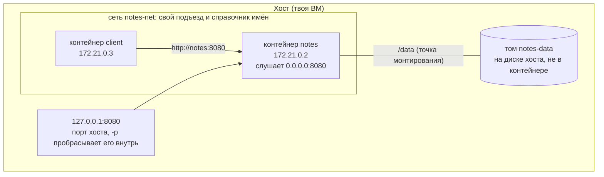
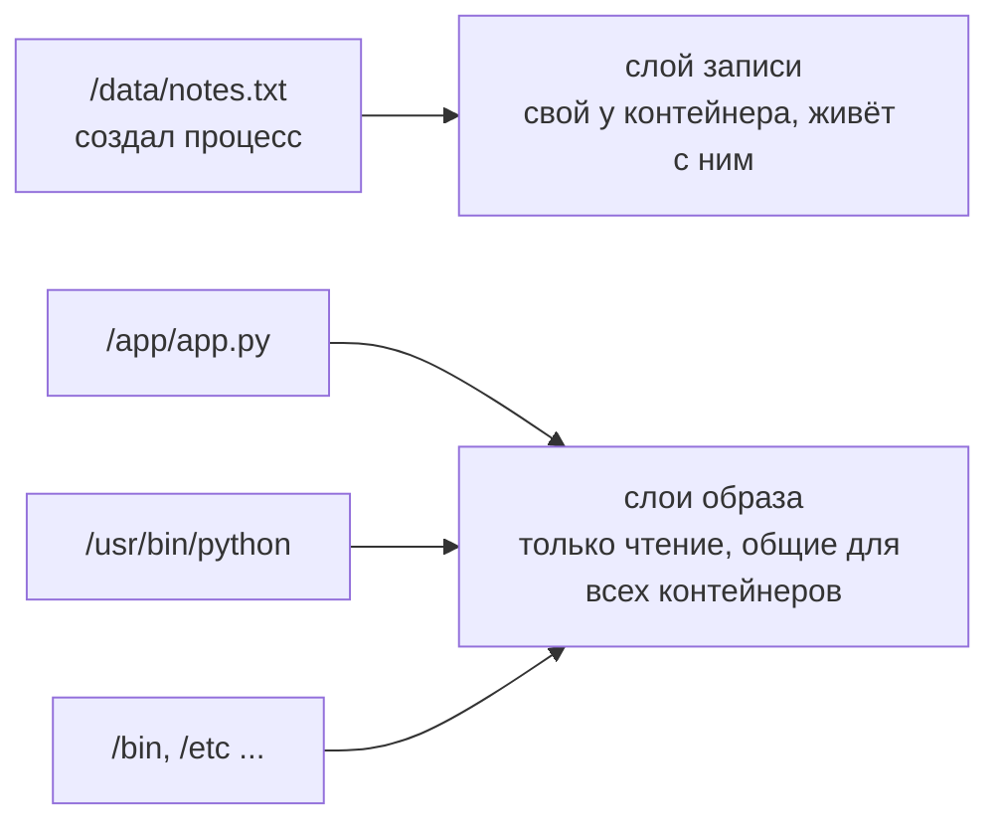
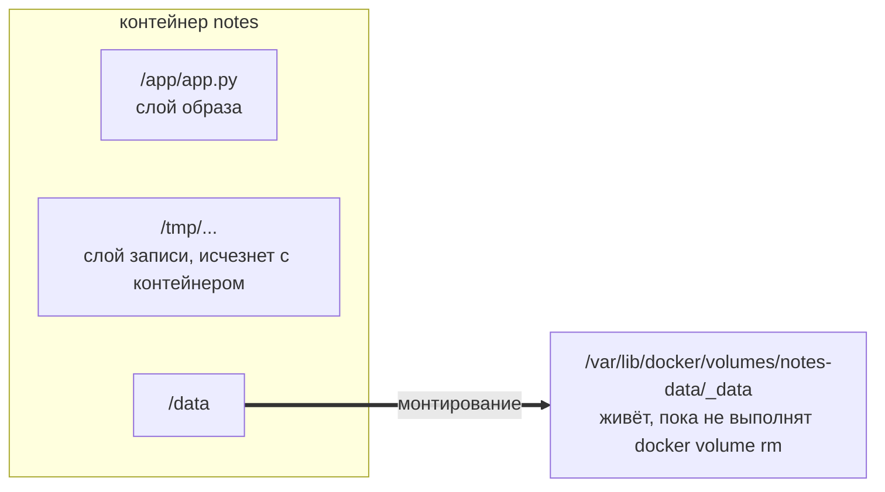
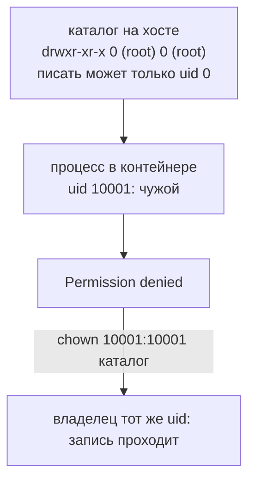
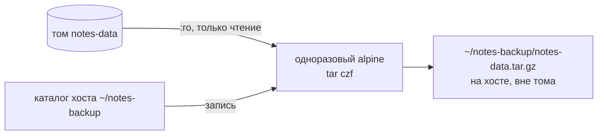
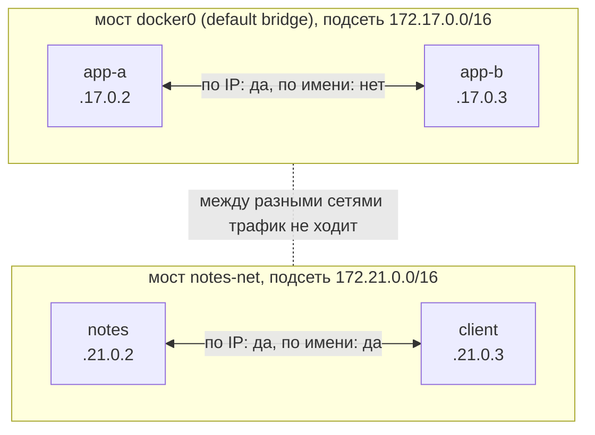
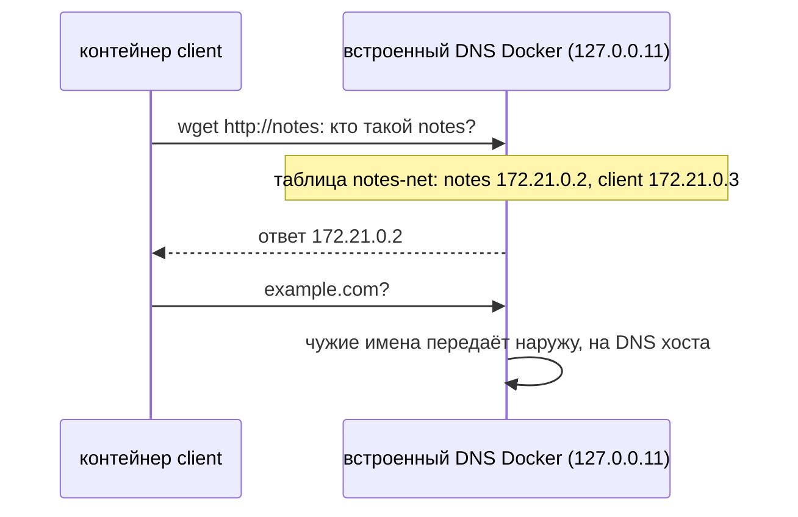
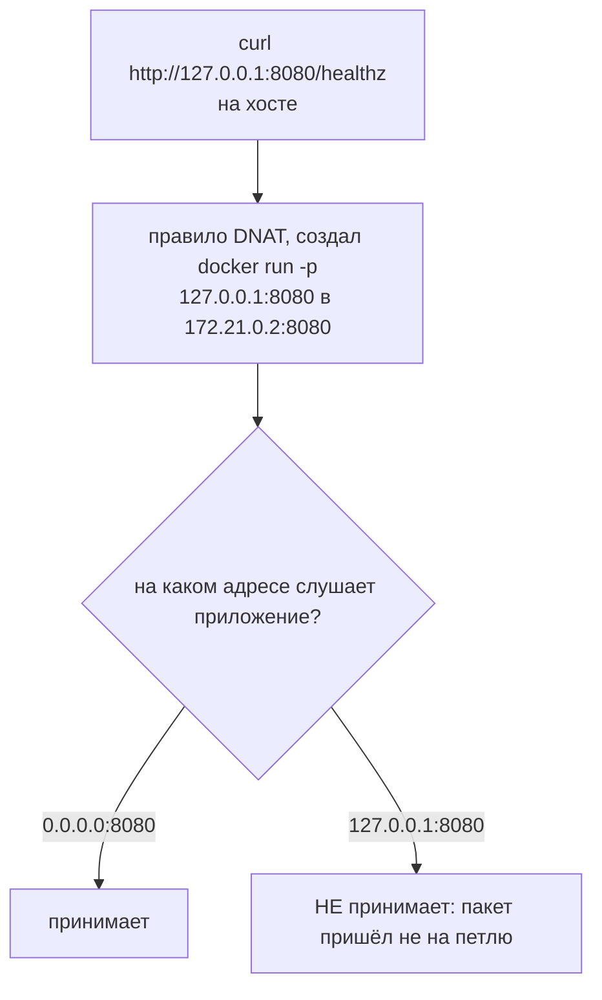
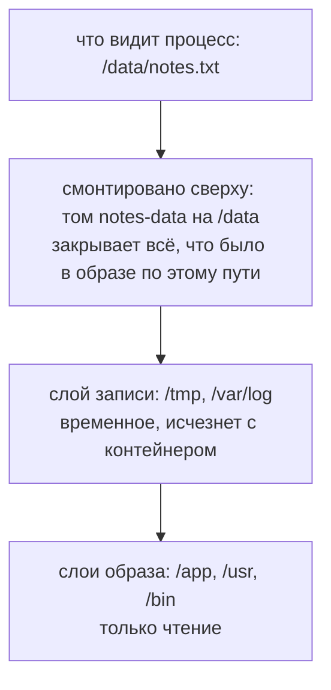
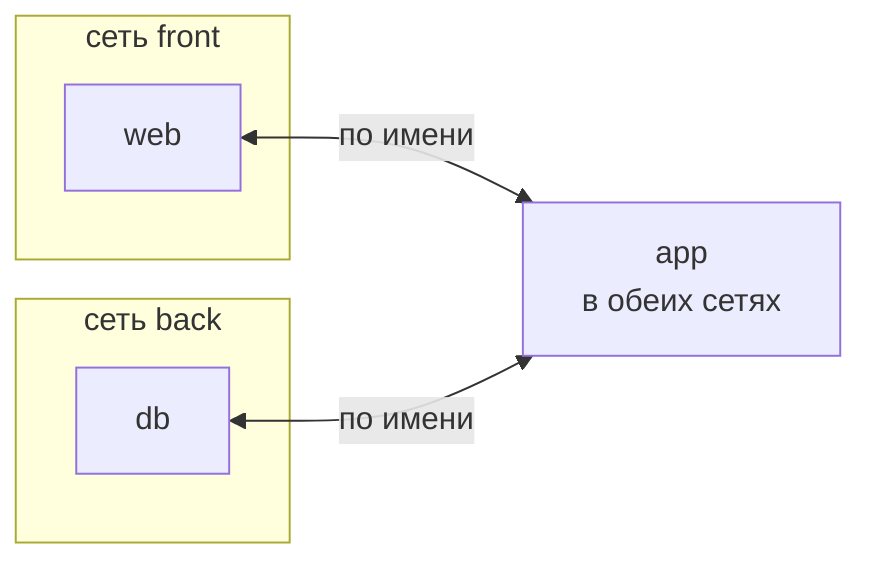

## Зачем это нужно

Контейнер одноразовый: его удалили и создали заново, а всё, что он записал внутрь себя, исчезло. Заметки пользователей терять нельзя, поэтому данные выносят за пределы контейнера, в **том** (volume): отдельное хранилище, которое живёт само по себе и переживает удаление контейнера (как внешний жёсткий диск, который не пропадает, если сломался ноутбук). Второй вопрос: как один контейнер находит другой. Их IP-адреса выдаются автоматически и меняются при пересоздании, поэтому контейнеры обращаются друг к другу по имени внутри **пользовательской сети** (user-defined network), где имя превращается в адрес само.

На работе это две самые частые причины аварий с Docker: «после деплоя пропали данные» и «сервис не видит базу». А ещё «сервис запущен, порт открыт, но снаружи не открывается» и «в томе Permission denied» (по-русски «в доступе отказано»: система говорит, что у процесса нет прав на этот файл или каталог). Все четыре разбираются в этом уроке.

Шаг проекта: «Заметки» пишут данные в именованный том `notes-data` (именованный - значит, имя выбираешь ты, а не Docker придумывает случайный набор букв), смонтированный в `/data` (смонтировать - подключить хранилище к каталогу внутри контейнера, как вставить флешку в разъём: файлы появляются по указанному пути), а контейнер живёт в сети `notes-net`. Код приложения не меняется (остаётся v3).

## Что нужно знать

- [Урок 4.1: контейнеры](01-containers-idea.md): контейнер это процесс с изоляцией, у него свой сетевой стек (namespace `net`), команды `docker run`, `rm`, `exec`, публикация порта через `-p` (флаг, который пересылает порт хоста в порт контейнера, иначе снаружи контейнер не достучаться; подробно разберём ниже).
- [Урок 4.2: Dockerfile](02-dockerfile.md): образ `notes:0.3.0`, пользователь с uid 10001, каталог `/data`, `HOST=0.0.0.0` в образе.
- [Урок 1.3: пользователи и права](../01-linux/03-users-permissions.md): uid (числовой номер пользователя), владелец и права каталога.
- [Урок 2.1: адреса и маршруты](../02-network/01-addresses-routes.md): IP-адрес, подсеть, `127.0.0.1` и `0.0.0.0`, приватные адреса и NAT.
- [Урок 2.2: порты и TCP](../02-network/02-ports-tcp-ssh.md): порт, «слушать» порт, `connection refused`.
- [Урок 2.3: DNS](../02-network/03-dns.md): имя превращается в адрес, `getent hosts`, файл `/etc/resolv.conf`. Здесь это особенно важно: у Docker есть свой DNS-сервер.
- [Урок 2.7: файрвол](../02-network/07-firewall.md): Docker обходит ufw.

Перед уроком должны быть готовы образ `notes:0.3.0` (урок 4.2) и свободный порт 8080 на хосте (в 4.1 хост-сервисы остановлены).

## Картина целиком

Представь съёмную квартиру. Когда жилец съезжает, хозяин вывозит всё, что было внутри, и сдаёт квартиру заново. Мебель хозяина остаётся, вещи жильца пропадают. Контейнер это такая квартира: образ это мебель хозяина, а всё, что записал сам процесс, это вещи жильца. Том это **склад в соседнем здании**: жилец арендует ячейку, и при выезде вещи остаются на складе. Каталог в контейнере, куда «подключена» ячейка (например, `/data`), называют точкой монтирования (mount point): внутри квартиры это обычная дверца в стене, а за ней склад. Новый жилец получает ключ от той же ячейки.

Сеть устроена как **домофон в подъезде**. Жильцы одного подъезда набирают на панели имя «Иванов» и попадают к нему, номер квартиры знать не нужно (в подъезде есть справочник). Жильцы разных подъездов друг друга по имени не найдут. Номера квартир при этом могут поменяться, имя останется.



За урок ты разберёшь каждый кусок схемы: где физически лежат данные контейнера и почему `rm` их стирает, что такое том и чем он отличается от каталога хоста, почему возникает `Permission denied`, как снять бэкап тома, как устроена сеть контейнеров, откуда берётся имя-в-адрес и чем публикация порта отличается от связи контейнеров между собой.

## Теория

### Где живут данные контейнера и почему `rm` их стирает

Без этого понимания «сервис работает, всё записывает» превращается в «после деплоя всё пропало». Вопрос простой: куда контейнер физически пишет файлы.

Образ это книга, которую ты взял в библиотеке: писать в ней нельзя, она одна на всех читателей. Контейнер это книга плюс твоя прозрачная плёнка сверху: на плёнке ты делаешь пометки. Смотришь через плёнку, видишь книгу с пометками. Вернул книгу и выбросил плёнку: пометки пропали, книга та же. Аналогия перестаёт работать в одном: плёнка у каждого контейнера своя, а книгу (образ) он не портит никогда.

Образ (image) состоит из слоёв (layers), они только для чтения ([урок 4.2](02-dockerfile.md)). Когда ты запускаешь контейнер, Docker кладёт поверх них ещё один пустой слой, **слой записи** (writable layer). Файловая система контейнера это все слои, сложенные стопкой, как листы прозрачной бумаги: сверху видно то, что лежит выше. Если процесс изменил файл из образа, Docker копирует его целиком в слой записи и меняет копию. Если создал новый, тот появляется в слое записи.



Слой записи связан с контейнером, а не с образом. Что с ним делают команды:

| Команда | Что происходит с контейнером | Что с данными в слое записи |
|---|---|---|
| `docker stop` | Процесс получает SIGTERM ([урок 1.4](../01-linux/04-processes-signals.md)), контейнер остановлен, но существует | остаются |
| `docker start` | Тот же контейнер запускается снова | на месте |
| `docker restart` | `stop` и `start` подряд | на месте |
| `docker rm` | Контейнер удаляется | **удаляются вместе с ним** |

Посмотрим на примере. Команда `docker diff <контейнер>` показывает, чем слой записи отличается от образа: `A` (added) файл добавлен, `C` (changed) каталог или файл изменён, `D` (deleted) файл удалён. Запустим «Заметки» без тома, добавим заметку и посмотрим:

```text
C /data
A /data/notes.txt
```

Читай так: каталог `/data` изменился (в нём появился файл), а сам `/data/notes.txt` добавлен. Этот файл лежит в слое записи и больше нигде. Когда ты выполнишь `docker rm`, слой пропадёт, вместе с ним пропадёт и `notes.txt`. Ты проверишь это руками в задании 1.

> **Прикинь сам:** Контейнер записал 5 заметок в `/data` без тома. Сколько заметок останется после `docker stop` и `docker start`, и сколько после `docker rm` и нового `docker run`?
{: .predict}

После `stop` и `start` все 5: слой записи жив. После `rm` ноль: слой удалён вместе с контейнером, а новый получает пустой.

Осторожно, частое заблуждение: «Файл записан на диск, значит он сохранится». Файл записан на диск хоста, но в служебный каталог Docker, привязанный к контейнеру. Когда контейнера нет, Docker его чистит. Второе заблуждение: «`docker stop` теряет данные». Нет, останавливать можно сколько угодно: теряет именно `rm`.

> **Главное:** данные в слое записи живут ровно столько, сколько живёт контейнер: `stop` их не трогает, `rm` стирает.
{: .key}

Значит, данные нужно вынести за пределы контейнера. Для этого есть тома.

> **Проверь понимание:** контейнер с «Заметками» записал файл в `/data` без тома. Ты сделал `docker stop`, потом `docker start`. Данные на месте? А после `docker rm` и нового `docker run`?

<details markdown="1">
<summary>Ответ</summary>

После `stop` и `start` данные на месте: контейнер и его слой записи живы. После `rm` слой удалён, а новый контейнер получает свой пустой слой поверх образа, поэтому `/data` пуст. Вернуть данные нельзя.

</details>

### Том: хранилище, которое живёт отдельно от контейнера

**Зачем он существует.** Данные приложения (заметки, файлы базы) должны переживать замену контейнера: ты обновляешь версию образа, то есть удаляешь старый контейнер и запускаешь новый. Значит, данные нельзя держать в слое записи. Их выносят в место, которым управляет не контейнер.

Склад в соседнем здании (из «Картины целиком»): у тебя есть номер ячейки, а не ключ от одной конкретной квартиры. Оговорка: склад ничего не знает о том, что лежит в ячейке. Если два жильца одновременно положат туда разные версии одного и того же документа, склад не разберётся, кто прав.

Именованный том (named volume) это каталог, которым управляет Docker. Он лежит на диске хоста в `/var/lib/docker/volumes/<имя>/_data`. Ты говоришь: «подключи том `notes-data` в контейнер по пути `/data`». Это действие называется **монтированием** (mount): к каталогу `/data` внутри контейнера подключается другой каталог, и процесс видит в `/data` содержимое тома, а не слоя записи. Файлы, которые процесс пишет в `/data`, физически попадают в том.



Том создаётся двумя способами: явной командой `docker volume create имя` или автоматически при первом `-v имя:путь` в `docker run`. Второй способ удобен и опасен одновременно: **опечатка в имени тома не даёт ошибки**, Docker просто создаёт новый пустой том с опечаткой, и приложение стартует «с чистого листа». Это классическая причина «пропали данные», ты воспроизведёшь её в разделе «Сломай и почини».

Ещё одна особенность, ради которой том удобнее каталога хоста. Если том **пустой**, а по пути монтирования в образе уже есть файлы или каталог, Docker при первом монтировании копирует их в том вместе с владельцем и правами. Каталог `/data` в образе принадлежит пользователю 10001 (мы сделали это в 4.2), значит, новый пустой том тоже получит владельца 10001, и приложение сможет писать. Если том уже не пустой, Docker ничего не копирует.

Вот как это выглядит на деле. `docker volume inspect notes-data` печатает описание тома (inspect значит «осмотреть», вывод в формате JSON):

```text
[
    {
        "CreatedAt": "2026-09-30T12:13:00Z",
        "Driver": "local",
        "Labels": null,
        "Mountpoint": "/var/lib/docker/volumes/notes-data/_data",
        "Name": "notes-data",
        "Options": null,
        "Scope": "local"
    }
]
```

- `CreatedAt`: когда том создан. Пригодится в диагностике: свежее время у тома, в котором «должна быть история», значит его создали заново.
- `Driver: local`: том лежит на диске этого хоста. Бывают драйверы сетевых хранилищ, в курсе они не нужны.
- `Mountpoint`: настоящий путь на хосте. Заходить туда руками не надо: для этого есть контейнеры.
- `Labels`, `Options`: метки (произвольные подписи «ключ=значение», которые можно повесить на том, чтобы потом находить его или отмечать, чей он) и настройки, у нас пусто (`null`).
- `Scope: local`: том виден только на этой машине.

> **Прикинь сам:** У тебя том `notes-data` с 5 заметками. Ты запускаешь контейнер с `-v notes_data:/data` (подчёркивание вместо дефиса). Сколько томов будет в `docker volume ls` и сколько заметок увидит приложение?
{: .predict}

Два тома: старый `notes-data` и новый пустой `notes_data`. Приложение увидит 0 заметок, а старые 5 лежат целыми в первом томе.

Осторожно: том это не образ и не контейнер: у него свой жизненный цикл. Команда `docker rm` удаляет контейнер и **не трогает** именованный том. Том удаляет только `docker volume rm` (или чистящая команда, о ней ниже). Ещё путают том и «папку»: том это папка, но управляемая Docker и не привязанная к структуре каталогов хоста.

> **Главное:** том переживает `rm` контейнера и удаляется только явно, а опечатка в имени тома не даёт ошибки, а создаёт новый пустой том.
{: .key}

Том не единственный способ подключить хранилище. Есть ещё два.

> **Проверь понимание:** ты запустил контейнер с `-v notes-data:/data`, записал заметку, выполнил `docker rm -f notes` и запустил новый с `-v notes-data:/data`. Что увидишь в `GET /notes`? А если во втором запуске написать `-v notes_data:/data`?

<details markdown="1">
<summary>Ответ</summary>

В первом случае заметка на месте: том пережил `rm`. Во втором Docker молча создаст новый том `notes_data`, и список окажется пустым. Старый `notes-data` при этом цел, просто к нему никто не подключён. Это видно по `docker volume ls`: томов стало два.

</details>

### Bind mount и tmpfs: два других способа подключить хранилище

Иногда нужно другое: подложить в контейнер файл настроек, который лежит у тебя на диске, или дать процессу память вместо диска для временного. Для этого есть ещё два вида подключений.

**Bind mount** (привязка каталога) подключает в контейнер существующий каталог хоста как есть: `-v /home/ubuntu/config:/etc/app`. Docker им не управляет, ничего не создаёт и не копирует и не меняет владельца. Что видно на хосте, то видно в контейнере (и наоборот). Аналогия: вместо склада ты вынес в контейнер свой рабочий стол: всё, что лежит на нём, видно внутри, и всё, что положили внутри, лежит у тебя на столе. Поэтому bind mount хорош для конфигов и для кода при разработке. Для данных приложения и баз он хуже тома: путь и владелец каталога зависят от конкретной машины.

**tmpfs** (temporary file system) это каталог в оперативной памяти (она работает быстрее диска, но стирается при выключении): `--tmpfs /scratch`. Флаг `--tmpfs` просто говорит Docker подключить такой каталог в контейнер. Быстро, файлы не пишутся на диск, при остановке контейнера содержимое исчезает. Подходит для временного и секретного, что не стоит сохранять в файлах. Оговорка: если на хосте включён swap (запасная память на диске), ядро может вытеснить туда и страницы tmpfs.

| Способ | Кто управляет | Где лежит | Для чего |
|---|---|---|---|
| Именованный том (named volume) | Docker | `/var/lib/docker/volumes/<имя>/_data` | данные приложений и баз |
| Bind mount | ты | любой каталог хоста | конфиги, код при разработке |
| tmpfs | ядро | только оперативная память | временное и секретное, исчезает при остановке |

**Два синтаксиса.** Короткий `-v источник:путь[:опции]` и явный `--mount type=...,source=...,target=...`. Второй длиннее, но не путает виды: тип пишется словом. Разница в поведении заметная. Если в `-v /home/ubuntu/nope:/data` каталога `nope` нет, Docker молча создаст его (от имени root). Если написать `--mount type=bind,source=/home/ubuntu/nope,target=/data`, будет честная ошибка. Для bind mount в скриптах лучше `--mount`: опечатка в пути не создаст пустой каталог, который потом выглядит как «данные пропали».

Опция `:ro` (read-only) подключает хранилище только для чтения: `-v notes-data:/data:ro`. Запись в такой каталог даёт `Read-only file system`. Это страховка от случайной порчи, ей пользуются при бэкапе.

> **Прикинь сам:** Что значит `-v data:/data`, а что `-v ./data:/data`, и какой из них даст `Permission denied`, если каталог `./data` создан твоим пользователем с uid 1000?
{: .predict}

Первый это именованный том, второй bind mount каталога `./data`. `Permission denied` будет у второго: владелец uid 1000, а процесс идёт под 10001.

Осторожно: `-v имя:путь` и `-v /путь:/путь` выглядят почти одинаково, но это разные вещи. Различает их первый символ источника: если он `/` (или `~`, `.`), это путь на хосте (bind mount), иначе имя тома.

> **Главное:** первый символ источника решает всё: `/`, `~` или `.` значит путь на хосте (bind mount), иначе имя тома.
{: .key}

Разберём, откуда берётся `Permission denied` при записи в подключённый каталог.

> **Проверь понимание:** что значит `-v data:/data`, а что `-v ./data:/data`?

<details markdown="1">
<summary>Ответ</summary>

В первом случае источник `data` без слэша: это имя тома, Docker создаст и подключит именованный том `data`. Во втором источник начинается с точки, то есть это путь: каталог `data` в текущей папке хоста подключается как bind mount.

</details>

### Почему возникает Permission denied: числа вместо имён

Самая частая ошибка с хранилищами: приложение запустилось, а писать не может. Причина всегда одна и не зависит от Docker.

Гостиничный номер открывается по номеру карты, а не по имени владельца. Имя на карте можно написать любое, замок читает только число. Так и ядро Linux: когда процесс пишет в файл, ядро сверяет **числовой** uid процесса (user id, номер пользователя, [урок 1.3](../01-linux/03-users-permissions.md)) с числовым uid владельца файла. Имена вроде `ubuntu` или `notes` существуют только для людей и подставляются при выводе.

В образе «Заметок» процесс работает под uid 10001, и в образе есть пользователь `notes` с этим номером ([урок 4.2](02-dockerfile.md)). На хосте у пользователя `ubuntu` обычно uid 1000, а uid 10001 не принадлежит никому. Контейнер и хост это одно ядро, поэтому ядро видит просто числа. Если ты подключаешь в контейнер каталог, владелец которого `root` (uid 0, пользователь-администратор, для которого нет запретов; [урок 1.3](../01-linux/03-users-permissions.md)) с правами `drwxr-xr-x` (запись разрешена только владельцу), то для процесса с uid 10001 этот каталог чужой, и запись даёт `Permission denied`.



Тома здесь удобнее: при первом монтировании пустого тома Docker копирует владельца из образа (см. выше). А для bind mount автоматики нет, владельца назначаешь ты. Поэтому «на bind mount Permission denied, а на томе нет» это обычная картина.

Теперь на числах. Возьмём том, в котором уже что-то лежит (значит, копирование владельца из образа не сработает), а владелец каталога `root`. Запускаем «Заметки», и `GET /healthz` отвечает, потому что приложение стартовало, но в логах при первой записи:

```text
ERROR ошибка хранилища: [Errno 13] Permission denied: '/data/notes.txt'
```

`Errno 13` это код `EACCES`, «доступа нет». Путь `/data/notes.txt` показывает, куда именно приложение хотело писать. Такой же признак даёт `/readyz`: приложение проверяет, что каталог данных доступен для записи, и отвечает 503 `not ready`. Ты увидишь всё это в задании 3.

> **Прикинь сам:** Процесс идёт под uid 10001, каталог принадлежит uid 0 с правами `drwxr-xr-x`. Сколько пользователей могут писать в каталог и какая команда это исправит?
{: .predict}

Один: root (uid 0), владелец. Исправляет `chown 10001:10001 <каталог>`: теперь владелец тот же uid, что у процесса.

Осторожно, частое заблуждение: «Внутри контейнера каталог принадлежит `notes`, значит, и на хосте `notes`». Нет: имя `notes` знает только `/etc/passwd` внутри образа. Смотри всегда на числа: `ls -ln` (флаг `-n` показывает числовые uid и gid вместо имён). Ещё одна ловушка: `chmod 777` «лечит» ошибку, но разрешает писать всем, и это не решение.

> **Главное:** ядро сверяет числа uid и gid, а не имена, поэтому на хосте смотри `ls -ln`, а не `ls -l`.
{: .key}

Данные в томе нужно беречь. Научимся делать бэкап.

> **Проверь понимание:** почему bind mount на каталог, созданный командой `mkdir data` от твоего пользователя, часто даёт `Permission denied`, а именованный том нет?

<details markdown="1">
<summary>Ответ</summary>

Каталог `data` принадлежит твоему пользователю (uid 1000 или подобный), а процесс в контейнере работает под uid 10001: для него каталог чужой. Именованный пустой том при первом монтировании получает владельца из образа, где `/data` уже принадлежит 10001. Для bind mount владельца надо назначить руками: `sudo chown 10001:10001 data`.

</details>

### Бэкап тома: зачем временный контейнер

Том можно потерять (удалили по ошибке, диск умер), поэтому копия нужна. Но непонятно, как достать содержимое: каталог `/var/lib/docker/volumes/...` принадлежит root и лежит в служебной области Docker, ходить туда руками и в скриптах не принято (а у Docker Desktop на Mac и Windows он вообще внутри скрытой виртуальной машины).

**Идея.** Docker уже умеет подключать том куда угодно. Значит, запускаем одноразовый контейнер (флаг `--rm`: удалить сам после завершения), подключаем к нему том и каталог хоста для архива и запускаем `tar` (архиватор, пакует каталог в один файл). Контейнер отработает, исчезнет, а архив останется на хосте.



Восстановление зеркально: новый том подключаем на запись, архив распаковываем.

Разберём пример. Команда `tar czf /backup/notes-data.tar.gz -C /data .` состоит из частей:

- `tar`: архиватор;
- `c` (create) создать архив, `z` сжать gzip, `f` следующий аргумент это имя файла архива, `/backup/notes-data.tar.gz`;
- `-C /data`: перед работой перейти в каталог `/data` (change directory);
- `.`: упаковать «всё здесь», то есть всё содержимое `/data`, без лишнего префикса пути.

Для распаковки буква `c` заменяется на `x` (extract): `tar xzf ... -C /data`. Проверка «архив цел» делается сравнением контрольных сумм файлов (`sha256sum`: отпечаток файла, одинаковые файлы дают одинаковый отпечаток).

Ещё деталь: `tar` под root внутри контейнера **сохраняет владельца файлов** из архива, поэтому восстановленный файл снова принадлежит uid 10001, и «Заметки» смогут в него писать. Ты проверишь это в задании 4 через `ls -ln`.

> **Прикинь сам:** Том `notes-data` весит 12 КБ. Команда `tar czf /backup/notes-data.tar.gz -C /data .` запускается в одноразовом контейнере. Сколько контейнеров будет в `docker ps -a` после её завершения?
{: .predict}

Ни одного нового: флаг `--rm` удалит контейнер сам. Архив останется в каталоге хоста, смонтированном в `/backup`.

Осторожно: копия файлов тома работающего сервиса не всегда целая. «Заметки» дописывают строки в файл, и мы можем снять копию в момент записи. Для файла с заметками это переживаемо. Для базы данных (PostgreSQL - популярная база данных, программа, которая хранит данные в таблицах и отвечает на запросы; в [уроке 4.4](04-sql-postgres-basics.md)) копия «на лету» может оказаться битой: файлы базы согласованы только все вместе. Поэтому базы бэкапят их собственными средствами (дамп), а копию файлов делают при остановленной базе. Второе: бэкап, из которого ни разу не пробовали восстановиться, не считается бэкапом.

> **Главное:** бэкап тома делает одноразовый контейнер: том подключён с `:ro`, каталог хоста на запись, `tar` сохраняет владельца файлов.
{: .key}

Теперь о сетях: как контейнеры находят друг друга.

> **Проверь понимание:** зачем в команде бэкапа том подключён с `:ro`?

<details markdown="1">
<summary>Ответ</summary>

Чтобы бэкап не мог ничего изменить в источнике: опечатка в команде или ошибка в скрипте не испортит данные. Читать `:ro` не мешает, а писать запрещает.

</details>

### Сеть контейнеров: как они находят друг друга

Сервис почти никогда не работает один: приложению нужна база, кэш, соседний сервис. Их надо соединить, но так, чтобы посторонние не ходили куда не следует, и чтобы соединение не рвалось при пересоздании контейнера.

Дом с несколькими подъездами. Пока ты внутри своего подъезда, ты ходишь к соседям напрямую. Между подъездами двери закрыты. Выход на улицу (в интернет) общий через консьержа. Оговорка: в обычном доме соседей по имени спросить негде, а в сетях Docker у подъезда есть справочник.

Устроено это так.

1. У каждого контейнера свой сетевой стек: свои интерфейсы, свой `localhost`, своя таблица портов (namespace `net`, [урок 4.1](01-containers-idea.md)). Значит, `127.0.0.1` внутри контейнера это его собственная петля, а не хост и не сосед.
2. Docker создаёт на хосте виртуальный коммутатор, **мост** (bridge): программный аналог сетевого свитча, к которому подключены контейнеры. Каждого контейнера с мостом соединяет виртуальный «провод».
3. Мосту принадлежит подсеть ([урок 2.1](../02-network/01-addresses-routes.md)), например `172.17.0.0/16`. Из неё Docker выдаёт каждому контейнеру IP при старте: `172.17.0.2`, `172.17.0.3`. Сам мост получает первый адрес подсети (`172.17.0.1`) и служит контейнерам шлюзом.
4. Чтобы контейнер мог выйти в интернет, хост подменяет его приватный адрес на свой (это NAT из [урока 2.1](../02-network/01-addresses-routes.md)).

Сетей может быть несколько, и каждая это отдельная подсеть с отдельным мостом. Есть готовая сеть `bridge` (её называют **default bridge**, «мост по умолчанию»): в неё попадают все контейнеры, которым ты не указал сеть. И есть **пользовательские сети** (user-defined), которые создаёшь ты: `docker network create notes-net`.



Посмотрим на примере. `docker network inspect notes-net` показывает описание сети. Главное место:

```text
"IPAM": {
    "Config": [
        {
            "Subnet": "172.21.0.0/16",
            "Gateway": "172.21.0.1"
        }
    ]
},
```

`Subnet: 172.21.0.0/16` значит, что сети принадлежат адреса `172.21.0.0`-`172.21.255.255` (маска `/16`, [урок 2.1](../02-network/01-addresses-routes.md)), а `Gateway` это мост. У тебя подсеть может отличаться, обычно первая пользовательская сеть получает `172.18.0.0/16`, следующая `172.19.0.0/16` и так далее.

> **Прикинь сам:** Два контейнера в сети `bridge` (по умолчанию) и два в сети `notes-net`. Сколько из этих пар смогут обратиться друг к другу по имени?
{: .predict}

Одна: пара в `notes-net`. В default bridge встроенного DNS по именам нет, только по IP.

Осторожно, частое заблуждение: «Контейнеры на одном хосте всегда видят друг друга». Нет: контейнеры из разных сетей друг друга не видят. Ещё: «в сети `bridge` по умолчанию можно обращаться по имени». Нельзя, об этом следующий раздел.

> **Главное:** контейнеры одной сети видят друг друга по IP, а по имени только в пользовательской сети; между разными сетями трафик не ходит.
{: .key}

Как именно имя превращается в адрес, разберём дальше.

> **Проверь понимание:** два контейнера запущены без `--network`. Могут ли они достучаться друг до друга?

<details markdown="1">
<summary>Ответ</summary>

Да, по IP: оба в сети `bridge` по умолчанию, а значит в одной подсети. По имени нет, в этой сети встроенного DNS по именам контейнеров нет. Поэтому для настоящей работы создают пользовательскую сеть.

</details>

### DNS Docker: имя вместо адреса

IP контейнера выдаётся из пула при старте и меняется при пересоздании (доказано ниже). Пропишешь его в настройки соседа, и после первого же обновления связь пропадёт. Имя стабильно, и надо, чтобы оно само превращалось в текущий адрес.

Справочник подъезда: ты ищешь «Иванов», справочник отвечает «квартира 12». Иванов переехал в 17-ю, справочник обновили, а ты по-прежнему набираешь «Иванов». Оговорка: справочник есть только в подъездах, которые создал ты. В общем подъезде (default bridge) справочника нет.

В [уроке 2.3](../02-network/03-dns.md) ты видел, что программа спрашивает у системы «какой адрес у имени X», система читает `/etc/hosts`, затем ищет в `/etc/resolv.conf` строку `nameserver` и отправляет вопрос этому серверу. В контейнере то же самое, но сервером выступает **встроенный DNS-сервер Docker**, и живёт он в самом Docker Engine (`dockerd`). Когда контейнер подключён к пользовательской сети, Docker пишет в его `/etc/resolv.conf` адрес `127.0.0.11`. Вопросы из контейнера перехватываются на этом адресе, Docker знает всех участников сети и отвечает текущим IP.



Имена, которые знает Docker: **имя контейнера** и **сетевые псевдонимы** (network alias) из флага `--network-alias`. Псевдоним нужен, когда сервис должен быть доступен под другим именем (например, `api`) или несколько контейнеров подряд должны откликаться на одно имя.

Вот как это выглядит на деле. Внутри контейнера в пользовательской сети (`docker exec notes cat /etc/resolv.conf`):

```text
# Generated by Docker Engine.
# This file can be edited; Docker Engine will not make further changes once it
# has been modified.

nameserver 127.0.0.11
options ndots:0

# Based on host file: '/etc/resolv.conf' (internal resolver)
# ExtServers: [host(192.168.65.7)]
# Overrides: []
# Option ndots from: internal
```

`nameserver 127.0.0.11` это и есть встроенный DNS. Строка `ExtServers` показывает, кому он передаёт вопросы про внешние имена: это DNS-серверы хоста, у тебя адрес будет другой. Теперь сравни с контейнером в default bridge:

```text
nameserver 192.168.65.7
```

Здесь просто копия настроек DNS хоста: встроенного сервера нет, и про соседние контейнеры он ничего не знает. Отсюда ошибка в default bridge: `wget: bad address 'notes:8080'`. Это тот же вопрос из [урока 2.3](../02-network/03-dns.md): имя не нашлось, адрес не получен. Приложения на Python и в других языках сообщат то же самое другими словами: `Name or service not known` или `Temporary failure in name resolution`.

**IP меняется.** Docker раздаёт адреса подряд, начиная с меньшего свободного. Остановил `notes`, запустил другой контейнер, потом `notes` снова: он получит уже другой адрес. Имя от этого не страдает, потому что DNS Docker обновляется сам. Ты увидишь это в задании 5.

> **Прикинь сам:** Контейнер `notes` получил `172.21.0.2`, ты его пересоздал, и он получил `172.21.0.4`. Что надо менять в настройках клиента, который ходит на `http://notes:8080`?
{: .predict}

Ничего: встроенный DNS (`127.0.0.11`) всегда отдаёт актуальный адрес по имени. Прописанный вручную IP сломался бы.

Осторожно: Docker DNS это не тот DNS, что в интернете: имя `notes` существует только внутри твоей сети `notes-net` и нигде больше. Второе: «имя в `docker run --name` работает везде». Работает только в пользовательской сети, и только для контейнеров в ней.

> **Главное:** в пользовательской сети контейнеры находят друг друга по имени через встроенный DNS `127.0.0.11`, а IP в конфиги не пишут.
{: .key}

Внутри сети всё просто. Для доступа с хоста нужна публикация порта.

> **Проверь понимание:** почему на IP-адрес контейнера в конфигах полагаться нельзя?

<details markdown="1">
<summary>Ответ</summary>

IP выдаётся из пула сети при старте и может поменяться при каждом пересоздании контейнера или при другом порядке запуска. Имя стабильно, а DNS Docker всегда отвечает актуальным адресом. Тот же принцип в Kubernetes: обращаются к имени Service, а не к IP пода ([урок 5.3](../05-kubernetes/03-services-dns.md)).

</details>

### Публикация порта: связь с внешним миром

Связь контейнеров между собой внутри сети не требует ничего лишнего: порт 8080 контейнера `notes` доступен соседям по сети сразу. Но ты, сидя на хосте, или пользователь снаружи в этой сети не участвуете. Чтобы дотянуться до контейнера извне, порт **публикуют** (publish).

Флаг `-p 127.0.0.1:8080:8080` читается как `-p адрес-на-хосте:порт-на-хосте:порт-в-контейнере`. Docker добавляет в iptables правило **DNAT** (подмену адреса назначения, [урок 4.1](01-containers-idea.md)): пакет, пришедший на `127.0.0.1:8080` хоста, перенаправляется на IP контейнера, порт 8080.



Из схемы видно вторую половину условия: приложение обязано слушать **все** интерфейсы контейнера (`0.0.0.0`, [урок 2.1](../02-network/01-addresses-routes.md)), а не только петлю. Поэтому в Dockerfile из 4.2 стоит `ENV HOST=0.0.0.0`. Если приложение слушает `127.0.0.1`, оно принимает только соединения изнутри самого контейнера, а пришедшие с моста отвергает.

Два вывода. Во-первых, **`EXPOSE 8080` в Dockerfile порт не открывает**, это лишь заметка для читателя образа. Открывает только `-p`. Во-вторых, адрес слева в `-p` решает, кто увидит порт: `127.0.0.1:8080:8080` открывает порт только на петле хоста, а просто `8080:8080` (то же, что `0.0.0.0:8080:8080`) открывает на всех интерфейсах хоста, то есть в сеть. Docker при этом обходит ufw ([урок 2.7](../02-network/07-firewall.md)), поэтому публиковать без указания `127.0.0.1` нужно только осознанно.

Есть ещё режим `--network host`: контейнер использует сетевой стек хоста без изоляции. Публикация портов не нужна и не работает, порты контейнера занимают порты хоста. Для «Заметок» он не нужен, знать о нём надо для собеседования.

Теперь на числах. Как выглядит слушающий сокет изнутри. В образе нет утилиты `ss`, но ядро само показывает таблицу в файле `/proc/net/tcp`:

```text
  sl  local_address rem_address   st ...
   0: 0100007F:1F90 00000000:0000 0A ...
```

`local_address` записан в шестнадцатеричной системе, байты адреса идут в обратном порядке: `0100007F` читается с конца, `7F 00 00 01`, то есть `127.0.0.1`. `1F90` в шестнадцатеричной записи это 1×4096 + 15×256 + 9×16 + 0 = 8080. Значение `0A` в колонке `st` (state) означает LISTEN. Итог строки: приложение слушает `127.0.0.1:8080`. Оно же с `HOST=0.0.0.0` показало бы `00000000:1F90`.

> **Прикинь сам:** `-p 127.0.0.1:8080:8080`. Кто увидит порт: другой компьютер в твоей сети или `curl` на самом хосте?
{: .predict}

Только `curl` на хосте. Адрес `127.0.0.1` слева ограничивает публикацию петлёй хоста, а `-p 8080:8080` открыл бы порт всем.

Осторожно, частое заблуждение: «`-p` нужен, чтобы контейнеры видели друг друга». Нет, для связи контейнеров в одной сети `-p` не нужен вообще. Он нужен только для доступа с хоста и снаружи.

> **Главное:** `-p` создаёт путь с хоста внутрь контейнера (DNAT), а соседям по сети он не нужен; `EXPOSE` порт не открывает.
{: .key}

Разберём ещё одну неочевидную вещь: жизненный цикл самого тома.

> **Проверь понимание:** порт 8080 контейнера `notes` не опубликован, а соседний контейнер в той же сети открывает `http://notes:8080` без проблем. Почему?

<details markdown="1">
<summary>Ответ</summary>

Контейнеры в одной сети соединены мостом напрямую, публикация им не нужна: пакет идёт по IP из подсети сети. Публикация (DNAT) создаёт путь с хоста внутрь контейнера, а соседям он ни к чему.

</details>

### Жизненный цикл тома: кто его создаёт, кто удаляет и что такое «сирота»

Том живёт независимо от контейнеров, а значит, за ним никто не следит сам. Есть тома, которые давно никому не нужны и съедают диск, и есть тома, которые выглядят брошенными, а на деле содержат единственную копию данных. Отличить одно от другого нужно до того, как что-то удалять.

Камера хранения на вокзале. Ячейки не привязаны к пассажирам: вещи лежат, пока их не заберут или пока администратор не вскроет ячейку. Администратор, который вскрывает «все ячейки, к которым давно не подходили», рискует выбросить чей-то чемодан с документами. Аналогия перестаёт работать в одном месте: у вокзала есть срок хранения, у тома срока нет, он лежит бесконечно.

У тома есть три события. Создание: явное (`docker volume create`) или неявное (первый `-v имя:путь` с новым именем, а также каждый `VOLUME` в Dockerfile, если ты не указал том сам: тогда Docker создаёт **анонимный** том со случайным именем из 64 шестнадцатеричных символов). Использование: к тому подключён хотя бы один контейнер, работающий или остановленный. Удаление: только по команде.

Том, к которому не подключён ни один контейнер, Docker называет **неиспользуемым**, а в списках с фильтром `dangling=true` (висящий) он появляется как кандидат на удаление. Слово «висящий» здесь означает только «сейчас никем не занят», а не «ненужный». Удаляют такие тома двумя командами:

| Команда | Что удаляет в Docker 29 | Опасность |
|---|---|---|
| `docker volume rm имя` | один том, если он не подключён ни к какому контейнеру | низкая: ты назвал конкретный том |
| `docker volume prune` | неиспользуемые **анонимные** тома | средняя |
| `docker volume prune -a` | все неиспользуемые тома, **включая именованные** | высокая |
| `docker system prune --volumes` | неиспользуемые анонимные тома вместе с остановленными контейнерами и висящими образами | средняя |

Здесь легко ошибиться, потому что поведение менялось между версиями. Docker до версии 23 удалял именованные тома и командой `docker system prune --volumes`. В версии 29 (наша) `system prune --volumes` именованные тома не трогает, а `volume prune -a` трогает. Если скрипт написан давно или скопирован со старого сервера, не полагайся на «раньше не удаляло»: проверь версию (`docker version`) и перед чисткой посмотри, что именно попадёт под удар.

Безопасный способ посмотреть кандидатов: `docker volume ls -f dangling=true`. Флаг `-f` (filter) оставляет только тома без контейнеров. Читай список глазами и сверяй с тем, что ты знаешь о своих сервисах. Том с именем `notes-data`, который простаивает потому, что контейнер удалили ради обновления, это не мусор.

Разберём пример. Ты обновляешь сервис: `docker rm -f notes`, затем `docker pull`, затем `docker run` с новым тегом. Между `rm` и `run` проходит минута. Если в эту минуту на сервере запустится «уборщик» (cron-скрипт с `docker volume prune -a`), том `notes-data` окажется неиспользуемым и будет удалён. Заметки пропали, хотя ты всё сделал по инструкции. Отсюда правило эксплуатации: чистки томов не запускают по расписанию, а бэкап (задание 4) делают раньше, чем чистят что-либо.

Ещё одна мелочь, которую надо знать: том нельзя удалить, пока к нему подключён хоть один контейнер, даже остановленный. Сообщение `volume is in use` с идентификатором контейнера подсказывает, кого искать. Найти владельцев можно так: `docker ps -a --filter volume=notes-data --format 'table {{.Names}}\t{{.Status}}'`.

> **Прикинь сам:** На сервере 3 тома: один подключён к работающему контейнеру, два нет. Сколько из них удалит `docker volume prune` (без `-a`), если оба свободных именованные?
{: .predict}

Ноль: без `-a` команда удаляет только анонимные тома. Именованные удаляет `docker volume prune -a`, поэтому такую команду на проде не пишут.

Осторожно, частое заблуждение: «Остановленный контейнер не держит том». Держит: остановленный контейнер всё ещё существует и всё ещё ссылается на том. Второе заблуждение: «`docker rm -v` удалит том». Ключ `-v` у `docker rm` удаляет только анонимные тома этого контейнера, а именованные остаются.

> **Главное:** `docker rm` том не трогает, а чистящие команды с `-a` удаляют именованные тома со всеми данными, поэтому сначала смотри `docker volume ls -f dangling=true`.
{: .key}

Когда с данными что-то не так, нужно понять, откуда контейнер читает и куда пишет.

> **Проверь понимание:** ты запустил `docker run -v notes-data:/data ...`, потом `docker stop` и `docker rm`. Что сейчас с томом? Появится ли он в `docker volume ls -f dangling=true`?

<details markdown="1">
<summary>Ответ</summary>

Том остался целым и стал неиспользуемым, поэтому в списке с `dangling=true` он появится. Это не значит, что его нужно удалять: в нём данные. `docker volume prune` (без `-a`) его не тронет, потому что он именованный, а `docker volume prune -a` удалит.

</details>

### Что видно снаружи и внутри: как Docker собирает файловую систему контейнера

Когда что-то пошло не так с данными, ты должен уметь ответить на вопрос «откуда контейнер это читает и куда пишет». Ответ есть в описании контейнера, и разобрать его можно по полям.

Собираешь рабочее место: берёшь стол (образ), кладёшь сверху подставку (слой записи) и подключаешь удлинитель к розетке в соседней комнате (том). Для человека за столом всё выглядит как единое рабочее место, но при поломке важно знать, куда какой провод идёт. Аналогия неточна тем, что удлинитель можно подключить в любое место стола, а том монтируется только по пути, который ты задал.

Когда `docker run` создаёт контейнер, Docker собирает его файловую систему в три этапа. Сначала берутся слои образа (только чтение). Поверх кладётся слой записи. Затем по указанным путям поверх этой сборки **монтируются** тома, bind mount'ы и tmpfs. Всё, что смонтировано, закрывает собой то, что лежало по этому пути в образе. Поэтому, если в образе по пути `/data` были файлы, после монтирования тома ты их не увидишь: виден том. (Для пустого именованного тома есть исключение из теории про копирование: файлы образа сначала копируются в том, и тогда они «видны» уже как файлы тома.)



Полную картину подключений показывает `docker inspect`. В нём есть массив `Mounts`: по одной записи на каждое монтирование, с полями `Type` (`volume`, `bind` или `tmpfs`), `Name` (для тома), `Source` (путь на хосте), `Destination` (путь в контейнере), `RW` (можно ли писать). Шаблон из задания 2 выбирает из них главное.

Посмотрим на примере. Шаблон `{{range .Mounts}}{{.Type}} {{.Name}} -> {{.Destination}}{{end}}` читается как программа на языке шаблонов Go. `range .Mounts` значит «для каждого элемента массива Mounts», а `.Type`, `.Name`, `.Destination` это поля текущего элемента, `end` закрывает цикл. Если у контейнера два монтирования, строк будет две, но без перевода строки между ними (склеятся в одну), поэтому при нескольких монтированиях добавляют `{{"\n"}}` после элемента или пользуются `docker inspect notes` целиком.

Практическое применение: при «пропали данные» первым делом смотрят `Mounts` и сверяют `Name` с тем, что ты ожидаешь. Так находится опечатка в имени тома (она видна сразу), так находится случай, когда тома нет вовсе (массив пуст, данные лежали в слое записи), и так видно путь bind mount, который оказался не тем, что ты имел в виду.

> **Прикинь сам:** В образе в `/data` лежит `example.txt`, и ты запускаешь контейнер с bind mount на пустой каталог. Сколько файлов увидит процесс в `/data`?
{: .predict}

Ноль: монтирование закрывает то, что лежит в образе по этому пути. Файлы вернутся, если запустить без bind mount.

Осторожно, частое заблуждение: «Файлы образа по пути `/data` пропадут навсегда». Нет, они никуда не пропадают: под монтированием они просто не видны. Если убрать монтирование (запустить без `-v`), файлы образа снова видны. Второе: «в томе виден тот же каталог, что был в образе». Виден он только в момент первого монтирования пустого тома, дальше том живёт своей жизнью.

> **Главное:** файловая система контейнера это слои образа, сверху слой записи, а поверх по путям монтирования тома и bind mount; полную картину показывает `Mounts` в `docker inspect`.
{: .key}

Теперь решим, что куда складывать.

> **Проверь понимание:** в образе по пути `/data` лежит файл `example.txt`. Ты запустил контейнер с bind mount на пустой каталог хоста: `-v /home/ubuntu/empty:/data`. Увидит ли процесс `example.txt`?

<details markdown="1">
<summary>Ответ</summary>

Нет. Bind mount закрывает то, что лежит в образе по этому пути, а копирования, как у пустого именованного тома, у него нет. Процесс увидит пустой каталог хоста. Файлы образа вернутся, если запустить контейнер без монтирования.

</details>

### Что где хранить: данные, конфиги, логи, временное

Хранилища бывают разные, и одно и то же приложение пишет в них разные вещи. Если всё свалить в один каталог, придётся бэкапить лишнее и терять нужное. Полезно сразу разложить по категориям.

Кухня: продукты (данные) лежат в холодильнике, рецепты (конфиги) на полке, чеки (логи) в ящике, а нарезанное на доске (временное) выбрасывается после готовки. Никто не хранит рецепты в холодильнике и не режет на полке. Оговорка: в кухне всё очевидно, а в контейнере разложить по местам надо самому, Docker не подскажет.

Четыре категории и куда их класть:

| Что | Пример в «Заметках» | Где хранить | Почему |
|---|---|---|---|
| Данные, которые нельзя потерять | `/data/notes.txt` | именованный том | переживают `rm`, их бэкапят |
| Настройки | `HOST`, `PORT`, `NOTES_DATA` | переменные окружения (`-e`), файл конфигурации (bind mount `:ro`) | меняются без пересборки образа |
| Логи | вывод приложения | в stdout и stderr процесса, читать через `docker logs` | Docker сам их собирает, не забивая том |
| Временное | кэши, файлы сессии | tmpfs или слой записи | нужны только пока работает процесс |

«Заметки» уже устроены по этому образцу: настройки читаются из окружения, лог идёт в stdout (в `docker logs` ты его видел), данные лежат в одном каталоге `/data`, который легко вынести в том. Такой подход часто называют правилом «двенадцати факторов»: процесс не хранит состояние внутри себя, всё важное лежит снаружи. Благодаря этому контейнер можно убить и создать заново без потерь, а том подключить к новому.

Вот как это выглядит на деле. Возьмём вариацию: разработчик пишет логи приложения в файл `/data/app.log`. Через месяц том раздулся до 20 ГБ, бэкап стал долгим, восстановление тоже. Причин две: логи оказались в томе с данными, а ротации нет. Правильно: писать в stdout (Docker хранит лог отдельно, его ротируют настройкой драйвера логирования) и держать в томе только данные. Ту же мысль применяют к кэшам: они лежат в слое записи или в tmpfs, потому что потерять их не страшно.

> **Прикинь сам:** Приложение пишет лог в файл в томе по 700 МБ в день. Сколько занимает лог через 30 дней и что делать?
{: .predict}

Около 21 ГБ (700 × 30). Лог направляют в stdout, а `docker logs` и система сбора логов читают его сами.

Осторожно, частое заблуждение: «Том нужен любому контейнеру». Нет: если процесс ничего не должен помнить между запусками (веб-сервис без состояния), том не нужен, и его отсутствие даже плюс: такой контейнер можно запускать в любом количестве копий. Том нужен там, где есть состояние: база, загрузки пользователей, наши заметки.

> **Главное:** данные кладут в том, настройки в переменные окружения, логи в stdout, временное в tmpfs.
{: .key}

Вернёмся к сетям: контейнер может состоять в нескольких.

> **Проверь понимание:** куда правильнее направить лог приложения в контейнере: в файл в томе или в stdout?

<details markdown="1">
<summary>Ответ</summary>

В stdout: Docker сам его соберёт, `docker logs` покажет, а сторонние системы сбора логов (позже в курсе) подключаются к тому же потоку. Файл в томе раздувает том, усложняет бэкап и требует ротации.

</details>

### Несколько сетей у одного контейнера и изоляция между ними

Не все контейнеры должны видеть друг друга. Веб-сервер должен ходить к приложению, приложение к базе, но веб-серверу до базы дела нет, и лучше, чтобы он до неё физически не мог достучаться. Сети Docker как раз дают такую изоляцию бесплатно.

В офисе есть общий коридор и закрытые комнаты. Приёмная выходит в коридор и в переговорную. Переговорная выходит в приёмную и в серверную. Серверная только в переговорную. Посетитель из коридора в серверную не попадёт никак. Оговорка: в отличие от офиса, где двери запирают люди, в Docker двери определяются составом сетей, а не замками: контейнер в двух сетях это дверь между ними.

Контейнер может быть подключён к нескольким сетям одновременно, и в каждой у него свой интерфейс со своим IP. Подключают при запуске (`--network`, только одну) или потом (`docker network connect сеть контейнер`, сколько угодно). Отключают `docker network disconnect`. Имена в каждой сети видны только участникам этой сети, так что контейнер, стоящий на стыке двух сетей, находит соседей в обеих.



Контейнер `web` видит `app`, `db` видит `app`, а `web` и `db` друг друга не видят.

Такую схему ты соберёшь в Compose ([урок 4.5](05-compose-postgres.md)), а сейчас держи главную мысль: **принадлежность к сетям это правила доступа**. Полезное следствие: когда база живёт в отдельной сети, случайный или скомпрометированный контейнер из другой сети не может к ней подключиться даже по IP.

Отдельно о псевдонимах. `--network-alias api` даёт контейнеру дополнительное имя в этой сети. Если несколько контейнеров носят один псевдоним, встроенный DNS отвечает по очереди то одним адресом, то другим (так называемый DNS round robin, «по кругу»). Это грубая замена балансировщику: она распределяет запросы, но не проверяет, жив ли контейнер.

Теперь на числах. В задании 5 контейнер `notes` сидит в `notes-net`. Ты подключаешь к нему второй интерфейс: `docker network connect bridge notes`. Теперь `docker inspect` покажет две записи в `Networks`: `notes-net` с адресом `172.21.0.2` и `bridge` с адресом вида `172.17.0.x`. Изнутри контейнера можно достучаться и к соседям по `notes-net` (по имени), и к соседям по `bridge` (только по IP). Отключаешь: `docker network disconnect bridge notes`, и вторая запись исчезает.

> **Прикинь сам:** `web` в сети `front`, `db` в сети `back`, `app` в обеих. Сколько пар из этих трёх могут обращаться друг к другу по имени?
{: .predict}

Две: `web` с `app` и `db` с `app`. `web` и `db` не имеют общей сети, и имя не резолвится.

Осторожно, частое заблуждение: «Имя работает в любой сети, где есть контейнер». Имя резолвится только в той сети, к которой подключены оба участника. Если клиент в `front`, а сервис в `back`, ответа `bad address` не избежать: нужен общий мост между ними, то есть общая сеть.

> **Главное:** принадлежность к сетям это правила доступа: имя работает только внутри общей сети.
{: .key}

Остался последний вопрос: что считать «работает».

> **Проверь понимание:** контейнер `a` в сети `one`, контейнер `b` в сети `two`. Как сделать так, чтобы `a` находил `b` по имени, не подключая `a` к `two` и `b` к `one`?

<details markdown="1">
<summary>Ответ</summary>

Никак: имя работает только внутри общей сети. Нужно подключить хотя бы одного из них к сети другого (`docker network connect two a`) либо поставить между ними третий контейнер, состоящий в обеих сетях, который переадресует запросы.

</details>

### Почему «жив» не значит «работает»: состояние контейнера и состояние сервиса

В задании 3 `/healthz` отвечал `ok`, а заметки не создавались. Такая рассинхронизация встречается всё время, и понять её нужно до того, как на ней случится авария.

Кассир сидит на месте, улыбается, но касса сломана. Проверка «кассир на работе» (жив ли процесс) проходит, а проверка «можно пробить чек» (готов ли сервис работать) нет. Оговорка: в отличие от кассира, сервис может сам сообщить, что касса сломана, если его этому научить.

У контейнера три уровня «здоровья», и `docker ps` показывает только два из них:

1. **Процесс запущен** (`Up`): Docker видит, что главный процесс жив. Ничего больше не проверяется.
2. **Процесс отвечает** (`/healthz`): приложение может принимать соединения. `HEALTHCHECK` из [урока 4.2](02-dockerfile.md) ходит именно сюда, и в `docker ps` появляется `(healthy)`.
3. **Сервис готов работать** (`/readyz`): у приложения есть всё нужное, включая возможность писать в хранилище. Docker эту проверку сам не запускает, но её использует оркестратор (Kubernetes, [урок 5.7](../05-kubernetes/07-probes-resources-rollouts.md)) и её удобно вызывать руками.

В задании 3 ты видел все три: `Up`, `/healthz` `ok`, `/readyz` 503. Полезный вывод: при любом подозрении на хранилище смотри `/readyz` и логи, а не только `docker ps`.

Разберём пример. Порядок диагностики «сервис жив, а работает не так»: `docker ps` (запущен ли, `healthy` ли), `curl /readyz` (готов ли), `docker logs --tail 20` (что говорит приложение), `docker inspect` по `Mounts` (что подключено), `docker exec ... ls -ldn /data` (кто владелец). Пять команд, каждая отсекает своё: процесс, готовность, ошибку, монтирование, права.

> **Прикинь сам:** `docker ps` показывает `Up 3 hours`, а `POST /notes` возвращает ошибку. Сколько из трёх уровней здоровья (процесс запущен, отвечает, готов работать) подтверждает `Up`?
{: .predict}

Один, самый слабый: процесс запущен. Что он отвечает и может ли писать данные, `Up` не говорит, для этого есть `/healthz` и `/readyz`.

Осторожно, частое заблуждение: «`(healthy)` значит, что всё в порядке». Нет: `healthy` значит только то, что проверка из `HEALTHCHECK` прошла. Если она проверяет слишком мало (например, только `/healthz`), сломанное хранилище останется незамеченным.

> **Главное:** `Up` значит только «процесс жив», а готовность сервиса проверяют отдельно (`/healthz`, `/readyz`, `HEALTHCHECK`).
{: .key}

> **Проверь понимание:** контейнер `Up (healthy)`, но заметки не сохраняются. С чего начнёшь?

<details markdown="1">
<summary>Ответ</summary>

С `curl /readyz` и `docker logs`: они покажут ошибку хранилища. Потом `docker inspect` по `Mounts` (тот ли том подключён) и `ls -ldn /data` (тот ли владелец). Проверка `healthy` тут ничего не говорит: она смотрит на процесс, а не на возможность записи.

</details>

### Где это встретится дальше

Всё это возвращается в следующих уроках. В [Docker Compose](05-compose-postgres.md) (инструмент, который запускает несколько контейнеров по одному описанию) сети и тома описываются в YAML-файле (текстовый формат настроек с отступами), а имена сервисов работают как имена контейнеров здесь. Том под PostgreSQL появится уже в [уроке 4.4](04-sql-postgres-basics.md). В Kubernetes том превращается в PersistentVolumeClaim (запрос на диск), а сеть по имени в Service ([урок 5.3](../05-kubernetes/03-services-dns.md)): идея та же, названия другие.

## Практика

Перед началом проверь, что образ из 4.2 на месте:

```bash
docker image ls notes
```

```text
IMAGE          ID             DISK USAGE   CONTENT SIZE   EXTRA
notes:0.3.0    7acde57f7e11        215MB         46.8MB        
```

**Как читать вывод:** `IMAGE` это имя и тег (`notes:0.3.0`), `ID` первые символы идентификатора, `DISK USAGE` место на диске с базовыми слоями, `CONTENT SIZE` только то, что твоё. Размеры и идентификатор у тебя будут другие. Главное, что строка есть: если пусто, вернись к [уроку 4.2](02-dockerfile.md).

Если хочешь проверить, что порт 8080 на хосте свободен, выполни `sudo ss -tulpn | grep 8080`: пустой вывод значит свободен.

### Задание 1. Данные без тома пропадают при rm

**Цель:** своими руками увидеть, что данные живут в слое записи контейнера.

**Предскажи:** ты запишешь заметку, остановишь и снова запустишь контейнер, потом удалишь его и создашь новый из того же образа. В каких случаях заметка будет на месте?

<details markdown="1">
<summary>Ответ</summary>

Заметка сохранится после `stop` и `start` и пропадёт после `rm` и нового `run`.

</details>

**Шаги:**

1. Запусти контейнер без тома и добавь заметку. Разбор команд: `docker run -d --name notes-tmp -p 127.0.0.1:8080:8080 notes:0.3.0` запускает контейнер в фоне (`-d`) с именем `notes-tmp` и публикует порт только на петле хоста. `curl -s -X POST -d '...' URL` отправляет POST-запрос (`-X POST`) с телом (`-d`), а `-s` убирает индикатор загрузки. Приложение принимает заметку в формате JSON: `{"text": "..."}`.

```bash
docker run -d --name notes-tmp -p 127.0.0.1:8080:8080 notes:0.3.0
sleep 1
curl -s -X POST -d '{"text": "заметка без тома"}' http://127.0.0.1:8080/notes
echo
curl -s http://127.0.0.1:8080/notes
echo
docker diff notes-tmp
```

Команда `echo` без аргументов только печатает перевод строки: ответы приложения приходят без него, и без `echo` следующий вывод приклеился бы к предыдущему. `sleep 1` даёт приложению секунду на запуск.

2. Перезапусти контейнер и проверь:

```bash
docker stop notes-tmp && docker start notes-tmp
sleep 1
curl -s http://127.0.0.1:8080/notes
echo
```

3. Удали контейнер и создай новый:

```bash
docker rm -f notes-tmp
docker run -d --name notes-tmp -p 127.0.0.1:8080:8080 notes:0.3.0
sleep 1
curl -s http://127.0.0.1:8080/notes
echo
docker rm -f notes-tmp
```

`-f` (force) удаляет контейнер, даже если он запущен.

**Что должно получиться** (по шагам; идентификаторы контейнеров и время у тебя другие):

```text
{"id": 1}
[{"id": 1, "text": "заметка без тома", "created_at": "2026-09-30T12:12:48+00:00"}]
C /data
A /data/notes.txt
notes-tmp
notes-tmp
[{"id": 1, "text": "заметка без тома", "created_at": "2026-09-30T12:12:48+00:00"}]
notes-tmp
[]
notes-tmp
```

**Как читать вывод:** `{"id": 1}` ответ на создание, приложение присвоило заметке номер 1. Следующая строка это список заметок (JSON), `created_at` время записи по UTC. Две строки `C` и `A` это `docker diff`: файл заметок лежит в слое записи. Строки `notes-tmp` `notes-tmp` это `docker stop` и `docker start` печатают имя контейнера. После них заметка на месте. После `rm` и нового `run` вывод `[]`: список пуст. Последняя строка `notes-tmp` это результат `docker rm -f`.

**Объясни себе:**

- Где физически лежала заметка между шагами 1 и 2?
- Почему `docker rm -f` уничтожил её, хотя файл был записан на диск?

**Типичные ошибки:**

- `docker: Error response from daemon: Conflict. The container name "/notes-tmp" is already in use by container "1d105d06e2b0...". You have to remove (or rename) that container to be able to reuse that name.`: имя занято старым контейнером. Удали его: `docker rm -f notes-tmp`.
- `Bind for 127.0.0.1:8080 failed: port is already allocated`: порт держит другой контейнер или хост-сервис. Контейнер найди через `docker ps`, хост-сервис через `sudo ss -tulpn | grep 8080`.
- `{"error": "нужен JSON {\"text\": \"...\"}"}` в ответ на POST: тело заметки не в формате JSON. Проверь кавычки: снаружи одинарные, внутри двойные.

### Задание 2. Именованный том сохраняет данные

**Цель:** вынести `/data` в том `notes-data` и пережить удаление контейнера.

**Предскажи:** том создан заранее и пуст. Кто будет владельцем каталога `/data` внутри контейнера и получится ли записать заметку?

<details markdown="1">
<summary>Ответ</summary>

Docker при первом монтировании копирует в пустой том содержимое и владельца каталога `/data` из образа. Владелец 10001, запись пройдёт.

</details>

**Шаги.** Перед командами два пояснения. `docker exec notes ls -ldn /data` выполняет `ls` внутри контейнера: `-l` подробный вывод, `-d` про сам каталог, а не его содержимое, `-n` числовые uid. Флаг `-f` у `docker inspect` (format) задаёт шаблон на языке Go: то, что внутри двойных фигурных скобок, Docker заменяет данными из JSON, а `range` перебирает список.


```bash
# создаём том и смотрим, где он лежит
docker volume create notes-data
docker volume inspect notes-data

# запускаем «Заметки» с томом и пишем заметку
docker run -d --name notes -p 127.0.0.1:8080:8080 -v notes-data:/data notes:0.3.0
sleep 1
curl -s -X POST -d '{"text": "заметка в томе"}' http://127.0.0.1:8080/notes
echo

# владелец /data внутри контейнера и что подключено
docker exec notes ls -ldn /data
docker inspect -f '{{range .Mounts}}{{.Type}} {{.Name}} -> {{.Destination}}{{end}}' notes
docker diff notes

# удаляем контейнер и поднимаем новый с тем же томом
docker rm -f notes
docker run -d --name notes -p 127.0.0.1:8080:8080 -v notes-data:/data notes:0.3.0
sleep 1
curl -s http://127.0.0.1:8080/notes
echo
```


**Что должно получиться:**

```text
notes-data
[
    {
        "CreatedAt": "2026-09-30T12:13:00Z",
        "Driver": "local",
        "Labels": null,
        "Mountpoint": "/var/lib/docker/volumes/notes-data/_data",
        "Name": "notes-data",
        "Options": null,
        "Scope": "local"
    }
]
f1d91911282149001f06c573b5ac163ca01a55674f8bd6250e4b17073b46d023
{"id": 1}
drwxr-xr-x 2 10001 10001 4096 Sep 30 12:13 /data
volume notes-data -> /data
notes
21e84d5d3c6c1b8e31aeca2798893a76ffe3477d92637ed1ba66f77bb03380fe
[{"id": 1, "text": "заметка в томе", "created_at": "2026-09-30T12:13:01+00:00"}]
```

Дата, время и хэши контейнеров у тебя другие. Главное: после пересоздания контейнера заметка на месте.

**Как читать вывод:** `notes-data` (первая строка) это `docker volume create` печатает имя созданного тома. Блок JSON разобран в теории. Длинная строка из шестнадцатеричных символов это идентификатор нового контейнера. `drwxr-xr-x 2 10001 10001 ... /data`: владелец и группа 10001, значит, копирование владельца из образа сработало. Строка `volume notes-data -> /data` говорит, что в `/data` подключён именно том (`Type` `volume`) по имени `notes-data`. Строка `notes` после неё это `docker rm -f` печатает имя. Обрати внимание, что `docker diff notes` не напечатал ничего: заметка лежит в томе, а не в слое записи, и слой записи остался чистым.

**Объясни себе:**

- Что именно пережило `docker rm`: контейнер, образ или том?
- Что случится, если запустить два контейнера с одним томом и писать в один файл?

**Типичные ошибки:**

- `docker: Error response from daemon: Conflict. The container name "/notes" is already in use ...`: забыл `docker rm -f notes` перед повторным запуском.
- Данные «исчезли» после `docker run`, хотя том был: в `-v` опечатка в имени (`notes_data` вместо `notes-data`), Docker молча создал новый пустой том. Сверься: `docker volume ls`.

Контейнер `notes` пусть работает, он понадобится в задании 4.

### Задание 3. Права: Permission denied и как его лечить

**Цель:** воспроизвести `Permission denied` при записи в каталог с чужим владельцем и починить числовым uid.

**Предскажи:** у тебя том с файлом внутри, а корень тома принадлежит root (uid 0). Приложение в контейнере работает под uid 10001. Запустится ли оно? Даст ли `/healthz` ответ `ok`? Получится ли создать заметку?

<details markdown="1">
<summary>Ответ</summary>

Процесс запустится, и `/healthz` ответит `ok`: он не пишет на диск. Создать заметку не получится: для записи в `/data` у uid 10001 нет прав, приложение ответит ошибкой 500 `storage`, а `/readyz` вернёт 503.

</details>

**Пояснение.** На настоящем Linux-хосте ту же картину даёт bind mount каталога, созданного root. Чтобы не зависеть от пользователей хоста, мы получим её на томе: сначала кладём в том файл (по правилу из теории пустой том получил бы владельца из образа, а непустой нет), затем отдаём корень тома root'у. Одноразовый контейнер `alpine:3.22` (крошечный дистрибутив, у него уже есть `sh`, `chown`, `wget`) делает это от root.

**Шаги:**

```bash
# том с файлом, корень которого принадлежит root
docker volume create demo-root
docker run --rm -v demo-root:/d alpine:3.22 sh -c 'touch /d/old.txt; chown root:root /d; ls -ldn /d'

# запускаем «Заметки» на этом томе (контейнер notes из задания 2 надо убрать: порт занят)
docker rm -f notes
docker run -d --name notes-root -p 127.0.0.1:8080:8080 -v demo-root:/data notes:0.3.0
sleep 1
docker exec notes-root ls -ldn /data
curl -s http://127.0.0.1:8080/healthz
echo
curl -s -X POST -d '{"text": "x"}' http://127.0.0.1:8080/notes
echo
curl -s -o /dev/null -w '%{http_code}\n' http://127.0.0.1:8080/readyz
docker logs notes-root
```

Пояснения: `sh -c '...'` выполняет строку командой `sh`, `touch` создаёт пустой файл. У `curl` флаг `-o /dev/null` выбрасывает тело ответа, а `-w '%{http_code}\n'` печатает только код ответа (`\n` это перевод строки). `docker logs` показывает всё, что контейнер написал в stdout и stderr.

Теперь чиним числовым uid: отдаём корень тома пользователю 10001.

```bash
docker run --rm -v demo-root:/d alpine:3.22 chown 10001:10001 /d
curl -s -X POST -d '{"text": "x"}' http://127.0.0.1:8080/notes
echo
curl -s -o /dev/null -w '%{http_code}\n' http://127.0.0.1:8080/readyz
```

**Что должно получиться:**

```text
demo-root
drwxr-xr-x    2 0        0             4096 Sep 30 12:13 /d
notes
5761bfb1e481f1ec269a0afc6162a80b1fd2e0a22cf1bd59522adb6710f208de
drwxr-xr-x 2 0 0 4096 Sep 30 12:13 /data
ok
{"error": "storage"}
503
2026-09-30 12:13:43,398 INFO started host=0.0.0.0 port=8080
2026-09-30 12:13:44,453 ERROR ошибка хранилища: [Errno 13] Permission denied: '/data/notes.txt'
2026-09-30 12:13:44,454 INFO 172.17.0.1 "POST /notes HTTP/1.1" 500 -
{"id": 1}
200
```

Время, хэш контейнера и размер каталога (4096) у тебя могут отличаться.

**Как читать вывод:** `0 0` в `ls -ldn` это uid и gid владельца: `root`. Ответ `ok` на `/healthz` при том, что писать нельзя, показывает, почему «контейнер жив» не значит «сервис работает». `{"error": "storage"}` это ответ приложения на ошибку хранилища (HTTP 500). Код 503 у `/readyz` значит `not ready`: сервис знает, что писать не может. В логах `Errno 13`, `Permission denied` и путь `/data/notes.txt` дают точный диагноз. Запись `172.17.0.1` в логе это адрес моста: клиент пришёл через публикацию порта. После `chown` запись проходит (`{"id": 1}`), а `/readyz` отвечает 200.

> Если после своих экспериментов с правами остаётся `Permission denied`, вставь нейросети вывод `ls -ldn` и команду запуска. Но проверь ответ числами uid: она любит советовать `chmod 777`, а это не лечение.
{: .ai}

**Bind mount и `--mount`.** Точно так же ведёт себя bind mount, если каталог хоста принадлежит другому uid: чинят `sudo chown 10001:10001 каталог`. Заодно проверь, как `--mount` реагирует на опечатку в пути:

```bash
docker run --rm --mount type=bind,source=$HOME/nope,target=/data alpine:3.22 true
```

```text
docker: Error response from daemon: invalid mount config for type "bind": bind source path does not exist: /home/ubuntu/nope

Run 'docker run --help' for more information
```

Ошибка вместо молча созданного пустого каталога, как раз этого мы и хотели. Путь в сообщении у тебя свой (домашний каталог).

**Объясни себе:**

- Почему контейнер жив, `/healthz` отвечает, а заметки не создаются?
- Почему `chmod 777` здесь плохое решение, а `chown 10001:10001` хорошее?

**Типичные ошибки:**

- `PermissionError: [Errno 13] Permission denied: '/data/notes.txt'` в `docker logs`: владелец каталога с данными не тот. Сверь `docker exec ... ls -ldn /data` с `id` внутри контейнера.
- Ты убрал `--rm` или забыл остановить `notes`, и порт 8080 занят: `docker ps` покажет, кто держит порт.

Убери учебные объекты:

```bash
docker rm -f notes-root
docker volume rm demo-root
```

### Задание 4. Бэкап и восстановление тома

**Цель:** упаковать том `notes-data` в архив и развернуть его в другой том.

**Предскажи:** в томе `notes-data` одна заметка. Ты сделаешь архив, создашь том `notes-restore` и распакуешь туда. Как проверить, что данные целы, не запуская «Заметки»?

<details markdown="1">
<summary>Ответ</summary>

Подключить оба тома в одноразовый контейнер и сравнить контрольные суммы файла (`sha256sum`). Можно и запустить «Заметки» на новом томе и прочитать `GET /notes`.

</details>

**Шаги.** Контейнер `notes` из задания 2 (с томом `notes-data`) удалён в задании 3. Запусти его снова, чтобы в томе были данные:

```bash
docker run -d --name notes -p 127.0.0.1:8080:8080 -v notes-data:/data notes:0.3.0
sleep 1
curl -s http://127.0.0.1:8080/notes
echo
```

Теперь сам бэкап. Разбор частей: `mkdir -p ~/notes-backup` создаёт каталог (`-p` не ругается, если он уже есть). В `docker run` два тома подключены через `-v`: `notes-data:/data:ro` (том только для чтения) и `"$HOME/notes-backup":/backup` (bind mount каталога хоста, туда ляжет архив). Обратная косая черта `\` в конце строки переносит команду на следующую строку.

```bash
mkdir -p ~/notes-backup

# бэкап: том только для чтения, каталог хоста для архива
docker run --rm -v notes-data:/data:ro -v "$HOME/notes-backup":/backup \
  alpine:3.22 tar czf /backup/notes-data.tar.gz -C /data .

# что внутри архива
docker run --rm -v "$HOME/notes-backup":/backup alpine:3.22 tar tzvf /backup/notes-data.tar.gz

# восстановление в новый том
docker volume create notes-restore
docker run --rm -v notes-restore:/data -v "$HOME/notes-backup":/backup \
  alpine:3.22 tar xzf /backup/notes-data.tar.gz -C /data

# сверяем контрольные суммы и владельца
docker run --rm -v notes-data:/a:ro -v notes-restore:/b:ro alpine:3.22 \
  sh -c 'sha256sum /a/notes.txt /b/notes.txt; ls -ln /b'

# запускаем «Заметки» на восстановленном томе (порт 8081, чтобы не занимать 8080)
docker run -d --name notes-r -p 127.0.0.1:8081:8080 -v notes-restore:/data notes:0.3.0
sleep 1
curl -s http://127.0.0.1:8081/notes
echo
docker rm -f notes-r
```

В `tar tzvf` буква `t` значит показать содержимое (list), `v` подробно (verbose).

**Что должно получиться:**

```text
drwxr-xr-x 10001/10001         0 2026-09-30 12:13:19 ./
-rw-r--r-- 10001/10001       182 2026-09-30 12:14:02 ./notes.txt
notes-restore
8edca391c3c7917114d03386da00f97dce57fd1860d5fcbfc5916bf1c77edc0c  /a/notes.txt
8edca391c3c7917114d03386da00f97dce57fd1860d5fcbfc5916bf1c77edc0c  /b/notes.txt
total 4
-rw-r--r--    1 10001    10001          182 Sep 30 12:14 notes.txt
[{"id": 1, "text": "заметка в томе", "created_at": "2026-09-30T12:13:19+00:00"}, {"id": 2, "text": "заметка в томе", "created_at": "2026-09-30T12:14:02+00:00"}]
notes-r
```

Хэши, размеры и время у тебя другие, а число заметок зависит от того, сколько ты создал (у тебя может быть одна). Хэши в двух строках должны совпадать друг с другом. Перед этим выводом ты увидишь ещё строку с текущей заметкой из первой команды.

**Как читать вывод:** `10001/10001` в `tar tzvf` это владелец и группа файлов в архиве: архив запомнил владельца. `./` это сам каталог, `./notes.txt` файл заметок. `notes-restore` печатает `docker volume create`. Две строки `sha256sum` (64 символа и имя файла) одинаковые: содержимое совпало до байта. `ls -ln` показывает `10001 10001`: владелец восстановился, «Заметки» на этом томе смогут писать. Последняя команда показывает те же заметки уже через приложение.

**Объясни себе:**

- Зачем в бэкапе том смонтирован с `:ro`?
- Почему бэкап файла работающей базы таким способом может оказаться битым? Как это решают для PostgreSQL (см. [урок 4.4](04-sql-postgres-basics.md))?

**Типичные ошибки:**

- `tar: can't open '/backup/notes-data.tar.gz': No such file or directory`: каталог `/backup` в контейнере не смонтирован (забыл `-v ...:/backup`) или на хосте не создан `~/notes-backup`.
- `Unable to find image 'alpine:3.22' locally` и долгая пауза: обычная загрузка образа, не ошибка.
- `tar: can't open '/nope/x.tar.gz': No such file or directory`: путь архива указан в каталоге, которого в контейнере нет. Перепроверь пути.

### Задание 5. Своя сеть и DNS по имени

**Цель:** сравнить сеть `bridge` по умолчанию и пользовательскую и увидеть встроенный DNS.

**Предскажи:** контейнер `notes` запущен в сети `bridge` по умолчанию. Другой контейнер пробует открыть `http://notes:8080`. Что произойдёт? А если оба в сети `notes-net`?

<details markdown="1">
<summary>Ответ</summary>

В default bridge имя не найдётся: `wget: bad address 'notes:8080'`. В `notes-net` встроенный DNS вернёт IP контейнера, и запрос пройдёт.

</details>

**Шаги.** Пояснения. `wget -qO- -T 3 URL` (из `alpine`) скачивает страницу: `-q` тихо, `-O-` вывести в stdout, `-T 3` ждать не дольше 3 секунд. `docker exec notes getent hosts имя` спрашивает у системы контейнера адрес имени (как в [уроке 2.3](../02-network/03-dns.md)). Команда `IP=$(...)` запускает то, что в скобках, и записывает результат в переменную `IP`.

Начнём с default bridge. Контейнер запускаем без публикации порта и без `--network`.


```bash
docker rm -f notes
docker run -d --name notes -v notes-data:/data notes:0.3.0

# 1. по имени: не работает
docker run --rm alpine:3.22 wget -qO- -T 3 http://notes:8080/healthz

# 2. а по IP работает
IP=$(docker inspect -f '{{.NetworkSettings.Networks.bridge.IPAddress}}' notes)
echo $IP
docker run --rm alpine:3.22 wget -qO- -T 3 http://$IP:8080/healthz
echo

# 3. какой DNS видит контейнер
docker exec notes cat /etc/resolv.conf
docker rm -f notes
```


Теперь пользовательская сеть.


```bash
# 4. создаём сеть (второй раз команда даст ошибку: сеть уже есть)
docker network create notes-net
docker network create notes-net
docker network ls --filter name=notes-net

# 5. контейнер в этой сети, имя работает
docker run -d --name notes --network notes-net -v notes-data:/data notes:0.3.0
docker run --rm --network notes-net alpine:3.22 wget -qO- -T 3 http://notes:8080/healthz
echo
docker exec notes getent hosts notes
docker exec notes cat /etc/resolv.conf

# 6. меняем порядок запуска: IP уплывает, имя нет
docker inspect -f '{{range $net, $c := .NetworkSettings.Networks}}{{$net}} {{$c.IPAddress}}{{end}}' notes
docker stop notes
docker run -d --name other --network notes-net alpine:3.22 sleep 300
docker start notes
docker inspect -f '{{range $net, $c := .NetworkSettings.Networks}}{{$net}} {{$c.IPAddress}}{{end}}' notes other
docker run --rm --network notes-net alpine:3.22 wget -qO- -T 3 http://notes:8080/healthz
echo
docker rm -f other
```


**Что должно получиться:**

```text
wget: bad address 'notes:8080'
172.17.0.9
ok
# Generated by Docker Engine.
# This file can be edited; Docker Engine will not make further changes once it
# has been modified.

nameserver 192.168.65.7

# Based on host file: '/etc/resolv.conf' (legacy)
# Overrides: []
```

Затем (в блоке команд шага 4-6):

```text
b6e9c0f1a2d3e4f5061728394a5b6c7d8e9f0a1b2c3d4e5f60718293a4b5c6d7
Error response from daemon: network with name notes-net already exists
NETWORK ID     NAME             DRIVER    SCOPE
845d65e2565a   notes-net        bridge    local
ok
172.21.0.2      notes
# Generated by Docker Engine.
# This file can be edited; Docker Engine will not make further changes once it
# has been modified.

nameserver 127.0.0.11
options ndots:0

# Based on host file: '/etc/resolv.conf' (internal resolver)
# ExtServers: [host(192.168.65.7)]
# Overrides: []
# Option ndots from: internal
notes-net 172.21.0.2
notes
notes-net 172.21.0.3
notes-net 172.21.0.2
ok
```

Адреса (`172.17.0.9`, `172.21.0.2`), хэши и `192.168.65.7` у тебя другие, а на свежей Linux-машине первая пользовательская сеть обычно получает `172.18.0.x`. Ошибки при создании сети второй раз ты ждёшь: её нужно, чтобы увидеть текст.

**Как читать вывод:** `wget: bad address 'notes:8080'` это провал DNS в default bridge, тот же `bad address`, что «имя не найдено». Второй шаг доказывает, что по IP связь при этом есть: контейнеры в одной подсети. В `resolv.conf` default bridge просто адрес DNS хоста, в пользовательской сети `127.0.0.11`: это и есть встроенный DNS Docker, и `ExtServers` показывает, кому он передаёт внешние имена. `getent hosts notes` печатает пару «адрес имя»: то, что увидело бы любое приложение. Финал шага 6: пока `notes` был остановлен, его адрес `172.21.0.2` занял контейнер `other`, а вернувшийся `notes` получил `172.21.0.3`. Имя `notes` по-прежнему находит его, потому что DNS Docker актуален.

> Не понимаешь вывод `docker network inspect`? Вставь его нейросети и спроси, какие контейнеры в сети и есть ли у них имена. Проверь ответ командой `docker exec ... cat /etc/resolv.conf`: нейросеть часто забывает, что в default bridge встроенного DNS нет.
{: .ai}

**Объясни себе:**

- Порт 8080 не публикован на хост, а `wget` его достал. Почему?
- Что изменится, если запустить с `-p 127.0.0.1:8080:8080`? Что изменится для соседа по сети? А для тебя на хосте?

**Типичные ошибки:**

- `wget: bad address 'notes:8080'`: контейнеры в разных сетях или в default bridge. Проверь: `docker inspect -f '{{json .NetworkSettings.Networks}}' notes`, там должно быть имя общей сети.
- `wget: can't connect to remote host (172.21.0.2): Connection refused`: имя нашлось, адрес есть, но приложение слушает не то. Проверь `HOST` (см. задание 6).
- `Error response from daemon: network with name notes-net already exists`: сеть создана ранее, это нормально.
- `Error response from daemon: No such container: ...` при `docker network connect`: имя контейнера с опечаткой, сверься с `docker ps`.

### Задание 6. Публикация порта: на каком адресе слушает приложение

**Цель:** увидеть, как `-p` и `HOST` вместе решают, откроется ли сервис с хоста.

**Предскажи:** контейнер запущен с `-p 127.0.0.1:8080:8080` и переменной `HOST=127.0.0.1`. Ответит ли `curl` с хоста? Ответит ли соседний контейнер по сети?

<details markdown="1">
<summary>Ответ</summary>

Нет в обоих случаях. Пакет приходит в контейнер через мост, а не на его петлю, и приложение, слушающее только `127.0.0.1`, его не принимает. С хоста будет пустой ответ или сброс соединения, а из соседнего контейнера `Connection refused`.

</details>

**Шаги.** Флаг `-e HOST=127.0.0.1` задаёт переменную окружения процесса и перекрывает `HOST=0.0.0.0` из образа. Флаг `-v` у `curl` (verbose) показывает ход запроса.

```bash
docker rm -f notes
docker run -d --name notes --network notes-net -p 127.0.0.1:8080:8080 -e HOST=127.0.0.1 notes:0.3.0
sleep 1
curl -s -v http://127.0.0.1:8080/healthz 2>&1 | tail -3
docker run --rm --network notes-net alpine:3.22 wget -qO- -T 3 http://notes:8080/healthz
docker exec notes cat /proc/net/tcp

# возвращаем правильный адрес
docker rm -f notes
docker run -d --name notes --network notes-net -p 127.0.0.1:8080:8080 notes:0.3.0
sleep 1
curl -s http://127.0.0.1:8080/healthz
echo
docker port notes
```

Команда `docker port notes` показывает, какие порты опубликованы. `docker exec notes cat /proc/net/tcp` печатает таблицу сокетов из ядра (разбор формата в теории).

**Что должно получиться:**

```text
* Request completely sent off
* Empty reply from server
* Closing connection
wget: can't connect to remote host (172.21.0.2): Connection refused
  sl  local_address rem_address   st tx_queue rx_queue tr tm->when retrnsmt   uid  timeout inode
   0: 0100007F:1F90 00000000:0000 0A 00000000:00000000 00:00000000 00000000 10001        0 475918 1 0000000000000000 100 0 0 10 0
   1: 0B00007F:B5ED 00000000:0000 0A 00000000:00000000 00:00000000 00000000     0        0 487607 1 0000000000000000 100 0 0 10 0
notes
notes
ok
8080/tcp -> 127.0.0.1:8080
```

Последние строки от `docker rm -f` (имя), затем результат `curl` и `docker port`. Номера сокетов (`inode`) и строка `1: ...` у тебя другие. Вместо `Empty reply from server` на Linux-хосте может быть `Connection reset by peer`: оба текста значат «порт открыт, но приложение соединение не приняло».

**Как читать вывод:** `Empty reply from server` (curl: (52)) значит, что TCP-соединение открылось (`-p` работает), но приложение не ответило: оно слушает не там. `Connection refused` от соседа означает то же со стороны сети. В `/proc/net/tcp` `0100007F:1F90` это `127.0.0.1:8080`, статус `0A` это LISTEN: приложение слушает только петлю. Вторая строка это служебный сокет самой оболочки контейнера, её игнорируй. `8080/tcp -> 127.0.0.1:8080` в конце: порт 8080 контейнера опубликован на петле хоста, значит, снаружи хоста порт не виден.

**Объясни себе:**

- Как отличить «порт не опубликован» от «приложение слушает не тот адрес»?
- Чем опасно `-p 8080:8080` без `127.0.0.1` на сервере с публичным адресом?

**Типичные ошибки:**

- `Bind for 127.0.0.1:8080 failed: port is already allocated`: порт занят другим контейнером или хост-сервисом.
- `curl: (7) Failed to connect to 127.0.0.1 port 8080`: порт вообще не опубликован (нет `-p`) или контейнер не запущен. Проверь `docker ps`.

### Задание 7. Шаг проекта: том и сеть «Заметок»

**Цель:** зафиксировать в проекте запуск «Заметок» с томом `notes-data` и сетью `notes-net`.

**Предскажи:** при запуске из скрипта повторный `docker network create` завершится ошибкой и остановит скрипт с `set -e`. Как сделать создание идемпотентным (безопасным для повторного запуска)?

<details markdown="1">
<summary>Ответ</summary>

Проверять существование: `docker network inspect notes-net >/dev/null 2>&1 || docker network create notes-net`. Если сеть есть, `inspect` успешен, и `create` не запускается (оператор `||` выполняет правую часть только при ошибке левой). Так скрипт можно запускать сколько угодно раз.

</details>

**Шаги:**

1. Останови старый контейнер:

```bash
docker rm -f notes
```

2. Подготовь сеть и том, если их ещё нет, и запусти сервис. `>/dev/null 2>&1` выбрасывает и обычный вывод, и ошибки: нас интересует только код выхода. Флаг `--restart unless-stopped` говорит Docker поднимать контейнер после перезагрузки хоста и падений, пока ты сам его не остановил.

```bash
docker network inspect notes-net >/dev/null 2>&1 || docker network create notes-net
docker volume inspect notes-data >/dev/null 2>&1 || docker volume create notes-data
docker run -d --name notes --network notes-net \
  -p 127.0.0.1:8080:8080 -v notes-data:/data \
  --restart unless-stopped notes:0.3.0
```

3. Убедись, что всё работает и данные на месте:

```bash
sleep 1
curl -s http://127.0.0.1:8080/healthz
echo
curl -s http://127.0.0.1:8080/notes
echo
docker volume ls --filter name=notes-data
docker network ls --filter name=notes-net
docker ps --filter name=notes --format 'table {{.Names}}\t{{.Status}}\t{{.Ports}}'
```

4. Убери за собой учебные объекты:

```bash
docker volume rm notes-restore
rm -rf ~/notes-backup
```

**Что должно получиться:**

```text
ok
[{"id": 1, "text": "заметка в томе", "created_at": "2026-09-30T12:13:19+00:00"}, {"id": 2, "text": "заметка в томе", "created_at": "2026-09-30T12:14:02+00:00"}]
DRIVER    VOLUME NAME
local     notes-data
NETWORK ID     NAME        DRIVER    SCOPE
845d65e2565a   notes-net   bridge    local
NAMES   STATUS                    PORTS
notes   Up 12 seconds (healthy)   127.0.0.1:8080->8080/tcp
notes-restore
```

Идентификатор сети и заметки у тебя другие (заметки те, что ты создавал в заданиях 2 и 4). Последняя строка `notes-restore` это `docker volume rm`.

**Как читать вывод:** `ok` работает сервис. Список заметок пережил все пересоздания контейнера: том цел. Таблицы показывают, что том и сеть с нужными именами существуют. `Up ... (healthy)` значит, что `HEALTHCHECK` из [урока 4.2](02-dockerfile.md) проходит, а в `PORTS` порт опубликован только на `127.0.0.1`.

Новых файлов в репозиторий `~/notes` этот шаг не добавляет: меняется состояние Docker (том `notes-data`, сеть `notes-net`). Эталон проекта на конец урока: <https://github.com/distinguished-sre/learning/tree/main/devops/project/notes>. Ты продолжишь в [уроке 4.4](04-sql-postgres-basics.md), где в сети `notes-net` появится PostgreSQL.

**Объясни себе:**

- Что случится с заметками при `docker rm -f notes`, а что при `docker volume rm notes-data`?
- Зачем публиковать порт именно на `127.0.0.1`, а не на `0.0.0.0`? (Вспомни [урок 2.7](../02-network/07-firewall.md): Docker обходит ufw.)

**Типичные ошибки:**

- `Error response from daemon: remove notes-data: volume is in use - [62dc239ff8e2...]`: том ещё подключён к контейнеру (даже остановленному). Найди: `docker ps -a --filter volume=notes-data`, удали контейнер, потом том.
- `Error response from daemon: error while removing network: network notes-net has active endpoints (name:"notes" id:"ef3c857b88d7")`: к сети подключены контейнеры, сначала удали их.

## Сломай и почини

Сценарии запускает скрипт. Не читай его: смысл в диагностике. Скачай и запусти (без `sudo`, скрипту нужен только доступ к Docker; перед запуском задание 7 должно быть выполнено):

```bash
curl -fsSL -o /tmp/break-4.3.sh https://raw.githubusercontent.com/distinguished-sre/learning/main/devops/project/notes/break/4.3/break.sh
bash /tmp/break-4.3.sh 1
```

`bash /tmp/break-4.3.sh 2` запускает второй сценарий, а `bash /tmp/break-4.3.sh fix` возвращает рабочее состояние (можно запускать сколько угодно раз).

### Симптом

Сценарий 1: после «обновления» контейнера все заметки пропали. Контейнер жив, `/healthz` отвечает `ok`, а `curl -s http://127.0.0.1:8080/notes` возвращает `[]`.

Сценарий 2 (`bash /tmp/break-4.3.sh 2`): появился контейнер-клиент `notes-client`, он раз в 2 секунды обращается к `notes`. Посмотри `docker logs notes-client`: клиент не может достучаться, хотя оба контейнера запущены.

### Гипотезы

Сценарий 1:

1. Новый контейнер смонтировал другой том (опечатка в имени).
2. Том `notes-data` удалила команда очистки.
3. Приложение пишет не в `/data`, а в слой записи.

Сценарий 2:

1. Опечатка в имени.
2. Контейнеры в разных сетях.
3. Клиент в default bridge, где DNS по именам нет.
4. Приложение не слушает нужный интерфейс.

### Проверки


```bash
# сценарий 1: какие тома есть, что подключено и что внутри
docker volume ls
docker inspect -f '{{range .Mounts}}{{.Type}} {{.Name}} -> {{.Destination}}{{end}}' notes
docker exec notes env | grep NOTES_DATA
docker volume inspect notes-data | grep CreatedAt

# сценарий 2: клиент и в каких сетях контейнеры
docker logs --tail 4 notes-client
docker inspect -f '{{json .NetworkSettings.Networks}}' notes-client
docker inspect -f '{{json .NetworkSettings.Networks}}' notes
```


Подсказки. `docker exec notes env` печатает переменные окружения контейнера, `grep NOTES_DATA` оставляет строку про файл данных. В выводе `json .NetworkSettings.Networks` смотри на ключи: это имена сетей.

### Исправление

<details markdown="1">
<summary>Разбор сценариев</summary>

**Сценарий 1.** В списке `docker volume ls` два тома: `notes-data` и `notes_data` (символ подчёркивания вместо дефиса). Контейнер `notes` смонтировал `notes_data`: Docker молча создал новый пустой том, и сервис стартовал с чистого листа. Старые данные в целости лежат в `notes-data`, просто к ним никто не подключён. Гипотеза 3 проверяется через `NOTES_DATA` (должно быть `/data/notes.txt`, приложение пишет в `/data`), гипотеза 2 через `docker volume ls`: `notes-data` в списке есть, значит, его не удаляли. Решение: пересоздать контейнер с правильным именем (это делает `fix`):

```bash
docker rm -f notes
docker run -d --name notes --network notes-net -p 127.0.0.1:8080:8080 -v notes-data:/data --restart unless-stopped notes:0.3.0
docker volume rm notes_data
```

Худший вариант того же симптома: тома `notes-data` нет в `docker volume ls` вообще. Его удалили `docker volume rm` или `docker volume prune -a` (эта команда удаляет **все** тома, которые сейчас не подключены ни к одному контейнеру, в том числе именованные с важными данными). Тогда данные восстанавливаются только из бэкапа (задание 4): создай том, распакуй архив, запусти сервис. Заметь: `docker system prune --volumes` в Docker 29 удаляет только анонимные тома (созданные без имени), на именованные он не действует. Раньше, до версии 23, действовал и на них, поэтому чужие скрипты со старой привычкой всё ещё опасны. Профилактика: не запускать очистки томов на проде, делать бэкапы по расписанию (см. [урок 1.7](../01-linux/07-bash-in-ops.md)) и проверять восстановление.

**Сценарий 2.** Клиент запущен в сети `bridge` (default bridge), а `notes` в `notes-net`. В логах клиента `wget: bad address 'notes:8080'`: DNS-сервера с именами контейнеров в default bridge нет, а сети между собой не связаны. Решение: подключить клиента ко второй сети: `docker network connect notes-net notes-client` (или пересоздать его с `--network notes-net`). Логи сразу покажут `ok`. Проверка изнутри любого контейнера сети: `docker exec notes getent hosts notes` вернёт IP. Гипотеза 4 (слушает не тот интерфейс) даёт другую ошибку, `Connection refused`, а не `bad address`: имя при ней находится. Скрипт `fix` удаляет учебный контейнер `notes-client` и возвращает состояние после задания 7.

</details>

## ИИ в помощь

Нейросеть хорошо объясняет разницу между томом и bind mount и разбирает вывод `docker inspect`, но чужие пути и uid она подставляет наугад. Общие правила: [ИИ-помощник](../../load-tester/ai.md).

**Задача:** разобраться, почему пропали данные после пересоздания контейнера.

```text
Я запускал контейнер командой: <вставь docker run>.
Потом выполнил docker rm -f и запустил снова. Данные пропали.
Вот вывод docker volume ls и docker inspect <имя-контейнера> (раздел Mounts): <вставь>.
Объясни по шагам, где лежали данные и почему они исчезли. Предложи, как проверить гипотезу.
```
{: .wrap}

**Проверь ответ:** сам выполни `docker volume ls` и сверь `Name` в `Mounts` с тем, что ты ожидал: опечатка в имени тома видна сразу. Типичная ошибка нейросети: предложить `docker volume prune -a`, который удалит и нужные тома.

**Задача:** понять `Permission denied` при записи в подключённый каталог.

```text
Приложение в контейнере пишет в /data и получает Permission denied.
Вывод ls -ldn /data внутри контейнера: <вставь>. Процесс идёт под uid 10001.
Каталог подключён как: <том или bind mount, команда запуска>.
Объясни, чьи это права, и как исправить без chmod 777.
```
{: .wrap}

**Проверь ответ:** сверь числа uid в `ls -ln` с uid процесса. Типичная ошибка нейросети: советовать `chmod 777` или запуск от root, хотя нужен `chown` на нужный uid.

**Задача:** найти, почему контейнеры не видят друг друга по имени.

```text
Два контейнера: notes и client. client не может открыть http://notes:8080, ошибка bad address.
Вывод docker network ls и docker inspect для обоих (раздел Networks): <вставь>.
Скажи, в одной ли они сети и пользовательская ли это сеть.
```
{: .wrap}

**Проверь ответ:** убедись, что сеть не `bridge` по умолчанию: там встроенного DNS нет. Типичная ошибка нейросети: советовать `-p`, хотя для связи контейнеров между собой публикация не нужна.

## Словарик урока

| Термин | Простыми словами |
|---|---|
| Слой записи (writable layer) | Тонкий слой поверх образа: сюда контейнер пишет свои файлы. Удаляется вместе с контейнером. |
| Том (volume) | Каталог, которым управляет Docker; живёт отдельно от контейнера и переживает `docker rm`. |
| Именованный том (named volume) | Том с понятным именем (`notes-data`), лежит в `/var/lib/docker/volumes`. |
| Анонимный том | Том без имени, Docker сам придумывает ему случайное имя из букв и цифр. |
| Монтирование (mount) | Подключение каталога (тома или каталога хоста) внутрь контейнера по нужному пути. |
| Bind mount | Подключение существующего каталога хоста в контейнер как есть, без копирования и смены владельца. |
| tmpfs | Каталог в оперативной памяти; при остановке контейнера исчезает. |
| `:ro` (read-only) | Подключение только для чтения: записать нельзя. |
| uid | Числовой номер пользователя: по нему ядро проверяет права; имена ядро не сравнивает. |
| `Permission denied` | Ошибка «нет прав»: у uid процесса нет права на запись или чтение. |
| Мост (bridge) | Виртуальный коммутатор на хосте, к которому подключены контейнеры сети. |
| Сеть `bridge` (default bridge) | Готовая сеть, куда попадают контейнеры без `--network`; DNS по именам в ней нет. |
| Пользовательская сеть | Сеть, которую создаёшь ты (`docker network create`); в ней есть DNS по именам контейнеров. |
| Встроенный DNS Docker | Сервер имён внутри Docker Engine, адрес `127.0.0.11` в контейнере; отвечает текущим IP контейнера. |
| Сетевой псевдоним (network alias) | Дополнительное имя контейнера в сети (`--network-alias`). |
| Публикация порта (`-p`) | Проброс порта хоста на порт контейнера через DNAT; нужна для доступа с хоста и снаружи. |
| `EXPOSE` | Заметка в Dockerfile о порте приложения; порт не открывает. |
| `--network host` | Режим без изоляции сети: контейнер использует сетевой стек хоста. |
| Точка монтирования (mount point) | Каталог в контейнере, к которому подключено хранилище (например, `/data`). |
| Метка (label) | Подпись «ключ=значение» на томе, сети или контейнере для поиска и пометок. |
| Permission denied | «В доступе отказано»: у процесса нет прав на файл или каталог. |
| Идемпотентность | Свойство команды или скрипта: повторный запуск ничего не портит. |

## Вопросы с собеседований

Раздел для повторения: ответь вслух, потом открой ответ. Вопросы с пометкой «часто» задают почти на каждом собеседовании по теме урока: начни с них. Короткие вопросы с пометкой «на скорость» тренируй на время: ответ за 30 секунд.



## Проверено на версиях

Практика прогонялась на Mac в Docker Desktop (Docker Engine 29.6.2 внутри Linux-виртуальной машины Docker Desktop), не на Ubuntu-ВМ из урока 1.1:

- Docker Engine: 29.6.2 (в курсе стоит 29.8.1: использованные команды и сообщения в них не менялись). Образ `notes:0.3.0` собран по Dockerfile из урока 4.2, приложение v3, Python 3.13.15 в образе.
- alpine: 3.22.6 (busybox 1.37.0 с `wget`, `tar`, `sha256sum`, `nslookup`).
- curl на хосте: 8.7.1 (на Ubuntu 24.04 будет 8.5, тексты ошибок теми же).
- Проверено командами: задания 1-2 и 4-7 целиком, включая ошибки (`Conflict`, `port is already allocated`, `volume is in use`, `has active endpoints`, `network with name ... already exists`, `bad address`, `Empty reply from server`).
- Задание 3 (`Permission denied`) проверено на томе с владельцем root. Настоящий bind mount на каталог, созданный root на Linux-хосте, не прогонялся: поведение то же по правилу uid. Сообщение `--mount type=bind` при отсутствующем пути проверено, но с путём Docker Desktop (`/host_mnt/...`) в тексте; в уроке показан вид для Linux. Автосоздание каталога при `-v /путь:/путь` от root описано по документации Docker, не прогонялось.
- Эталон: `docker system prune --volumes` в Docker 29 не удаляет именованные тома, `docker volume prune -a` удаляет (проверено на помеченных тестовых томах).
- Подсети сетей (`172.17.0.0/16` у `bridge`, `172.21.0.0/16` у `notes-net`) взяты из прогона: у тебя `notes-net` вероятнее всего получит `172.18.0.0/16`.
- Ubuntu 26.04: не прогонялось, команды выполняются внутри контейнеров, зависимость от хоста только в `curl` и `docker`.
- Скрипт `break/4.3/break.sh`: `shellcheck` без замечаний, сценарии 1, 2 и `fix` прогнаны на Docker Desktop, включая повторные запуски.

## Итог урока: ты умеешь

- [ ] умею доказать, что без тома данные пропадают при `docker rm` (и что `stop` и `start` их не трогают)
- [ ] умею создать именованный том и подключить его к контейнеру через `-v` и `--mount`
- [ ] умею объяснить и починить `Permission denied` в каталоге с данными через числовой uid
- [ ] умею сделать бэкап тома временным контейнером и восстановить его в другой том
- [ ] умею создать пользовательскую сеть и обратиться к контейнеру по имени, объяснить, откуда берётся имя (`127.0.0.11`)
- [ ] умею отличить `-p` от `EXPOSE` и опубликовать порт только на `127.0.0.1`
- [ ] умею диагностировать `bad address` и `Name or service not known` через `docker inspect`

**Дальше:** [Урок 4.4: SQL и PostgreSQL: запросы, индексы, EXPLAIN](04-sql-postgres-basics.md)
