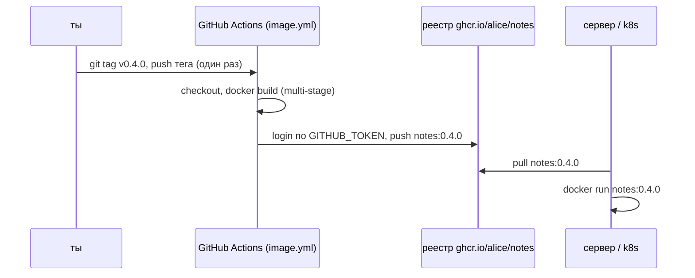
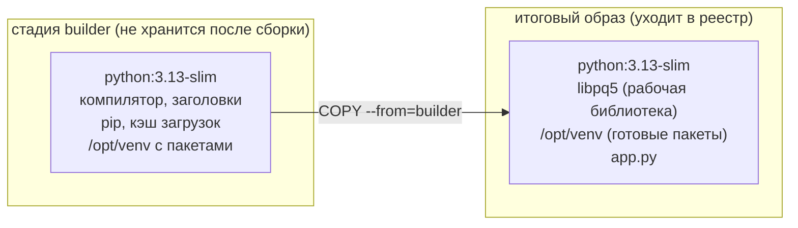
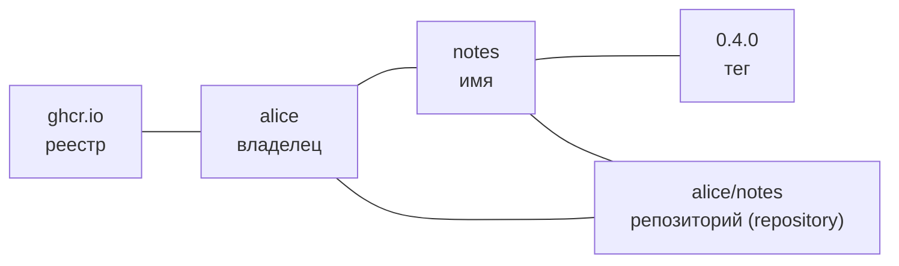
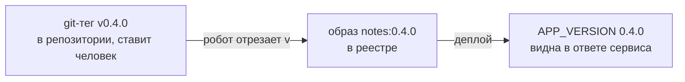

## Зачем это нужно

Образ, собранный на твоём ноутбуке командой `docker build`, лежит только в локальном хранилище Docker на этом ноутбуке. Сервер, кластер Kubernetes (группа серверов, на которой программа запускает и следит за контейнерами; подробно в [теме 5](../05-kubernetes/01-why-k8s-cluster.md)) и коллега его не видят. Нужно место, куда образ кладут один раз, а забирают откуда угодно. Это место называется реестр образов (container registry): склад, куда образ отправляют командой `docker push` и откуда забирают командой `docker pull`. Без него образ пришлось бы переносить на флешке. На работе почти любой релиз выглядит одинаково: разработчик ставит тег в git (метку на конкретном коммите, [урок 3.5](../03-git-ci/05-release-flow.md)), робот в CI (автоматический сборщик, который запускается сам после действий в репозитории, [урок 3.3](../03-git-ci/03-actions-ci.md)) собирает образ, кладёт его в реестр, а деплой (выкладка новой версии на сервер) берёт образ из реестра по тегу. Тег образа это номер версии после двоеточия, как `0.4.0` в `notes:0.4.0`.

Второй вопрос: что лежит внутри образа. Если в образе остались компилятор (программа, переводящая исходный код в машинные команды; нужна при сборке, а при запуске уже нет), заголовочные файлы (служебные файлы для компилятора) и кэш загрузок, он в разы больше, дольше качается и содержит больше уязвимых пакетов, чем нужно для запуска одной программы. Это лечит multi-stage сборка: собираем в одном образе, а в итоговый берём только результат.

Третий вопрос: что именно ты запускаешь, когда пишешь `notes:0.4.0`. Оказывается, имя-с-тегом можно перепривязать к другому содержимому, и два сервера с одним «тегом» запустят разный код. Лечится это digest: отпечатком содержимого образа (строка вида `sha256:ad4a4a65...`, которая меняется при любом изменении образа). В этом уроке ты увидишь это своими глазами.

Шаг проекта: `Dockerfile` «Заметок» становится multi-stage, workflow (описание действий робота в GitHub Actions) `image.yml` по git-тегу `v0.4.0` публикует образ `ghcr.io/<user>/notes:0.4.0`.

**Честно про стенд.** В ghcr.io (реестр GitHub: GitHub это сервис, где хранятся git-репозитории и работает CI) при подготовке урока ничего не публиковалось. Все команды работы с реестром (`login`, `push`, `pull`, теги, digest, ошибки `denied`) прогнаны на настоящем реестре, но локальном: официальный образ `registry:2` с паролем, запущенный в контейнере. Он говорит на том же протоколе, что и ghcr.io. Отличается адрес (`localhost:5001` вместо `ghcr.io`) и способ выдачи пароля. Шаги, которые возможны только на GitHub (запуск workflow, видимость пакета), помечены «не прогонялось».

## Что нужно знать

- [Урок 3.3: GitHub Actions и CI](../03-git-ci/03-actions-ci.md): workflow, `on` (когда запускать), `steps` (шаги), `secrets` (хранилище паролей), `permissions` (какие права получает запуск).
- [Урок 3.5: релизный поток](../03-git-ci/05-release-flow.md): теги `vX.Y.Z` и запуск workflow по тегу.
- [Урок 4.2: Dockerfile](02-dockerfile.md): слои (порции файлов, из которых состоит образ), кэш, `USER 10001`, `HEALTHCHECK`, `.dockerignore`.
- [Урок 4.4: PostgreSQL](04-sql-postgres-basics.md) и [урок 4.5: Compose](05-compose-postgres.md): приложение v4 ставит `psycopg` (Python-библиотека для связи с PostgreSQL) из `requirements.txt` (файл со списком нужных Python-пакетов).
- [Урок 4.6: nginx и TLS в Compose](06-compose-nginx-tls.md): стек, который мы теперь упаковываем в реестр.

Перед началом в `~/notes` должны лежать `app.py` версии v4, `requirements.txt` (в нём строка `psycopg[binary]>=3.2,<4`), `.dockerignore` и `Dockerfile` из урока 4.2. Docker должен работать: проверь `docker version`.

## Картина целиком

Представь издательство (экземпляр значит «один отпечатанный экземпляр книги»). Есть **типография**, где книгу печатают из макета: тут нужны станки, краски, инструменты. Готовая книга идёт в **книжный склад**, и склад выдаёт любому магазину экземпляр по **номеру издания**. Магазину не нужны станки, ему нужна книга.

С образами то же самое:

- типография это сборка (`docker build`), в ней есть компилятор и pip: инструменты, нужные только для сборки;
- книга это образ: только то, что нужно для запуска;
- склад это реестр;
- номер издания это тег (`0.4.0`), а «отпечаток книги», по которому можно проверить, что содержимое не подменили, это digest.

Путь образа от твоего кода до сервера:



А так устроена multi-stage сборка внутри одной команды `docker build`:



За урок ты разберёшь каждую часть этих схем: из чего состоит образ, как работает multi-stage, что такое тег и digest, что делает реестр, как в него входят по паролю и как CI по тегу сам публикует образ.

## Теория

### Образ изнутри: слои, конфиг и манифест

**Зачем знать.** Все остальные понятия урока (digest, push, размер, multi-stage) опираются на то, из чего состоит образ. Без этого «digest образа» звучит как заклинание.

Образ похож на сборную модель из готовых коробок. Каждая коробка (слой) содержит свою порцию файлов. К коробкам приложена **опись** (манифест): «возьми коробки с такими-то номерами, в таком порядке» и **инструкция запуска** (конфиг): какую команду выполнить, какие переменные задать, от какого пользователя работать. Аналогия перестаёт работать в одном: коробки лежат друг на друге, и файл из верхней перекрывает такой же файл из нижней.

Из урока 4.2 ты знаешь: каждая инструкция `RUN` и `COPY` в `Dockerfile` создаёт **слой** (layer): архив с файлами, которые добавились или изменились. У каждого слоя есть идентификатор, который считается по содержимому: хеш SHA256 (длинная строка вида `sha256:ad4a4a65...`). Хеш это «отпечаток»: из любого набора байт получается строка фиксированной длины, при малейшем изменении данных строка меняется целиком, а из строки данные восстановить нельзя.

Образ состоит из трёх видов частей:

1. **Слои** (blobs): архивы с файлами.
2. **Конфиг** (config): маленький JSON с метаданными: команда `CMD`, переменные `ENV`, пользователь `USER`, порт `EXPOSE`, `HEALTHCHECK`.
3. **Манифест** (manifest): JSON-опись «конфиг такой-то, слои такие-то в таком порядке». Хеш этого JSON и есть **digest образа**.

Ещё бывает **индекс** (index, старое название manifest list): опись описей. Он нужен, потому что один тег может вести к нескольким сборкам под разные процессоры: одна для `arm64` (Mac с Apple Silicon), другая для `amd64` (обычный сервер). Docker сам выбирает подходящую.

Посмотрим на примере. Вот что на самом деле лежит в реестре после отправки образа `notes` из этого урока. Запрос к реестру (разберём его ниже) вернул такой JSON, я оставил главное:

```text
{
  "mediaType": "application/vnd.oci.image.index.v1+json",     <- это индекс
  "manifests": [
    { "digest": "sha256:7dd15a63...3263c", "size": 1813,
      "platform": { "architecture": "arm64", "os": "linux" } }, <- сборка для arm64
    { "digest": "sha256:f94057a3...d7d09", "size": 564 }         <- вспомогательная запись
  ]
}
```

Первая запись ведёт на манифест самого образа для `arm64`. Вторая это «аттестация» (данные о том, как собран образ), у неё нет платформы, в выводе `docker buildx imagetools inspect` она подписана `unknown/unknown`: это не ошибка. На Linux-сервере с процессором `amd64` в первой строке будет `amd64`. Хеш всего этого JSON (`sha256:ad4a4a65...545db`) это digest, который мы увидим в выводе `docker push`.

> **Прикинь сам:** Образ из 5 слоёв, ты изменил `app.py`, и он лежит в последнем слое. Сколько слоёв получит новый хеш?
{: .predict}

Один, последний, плюс новая опись (манифест), а значит и новый digest образа. Хеши остальных четырёх слоёв те же.

Осторожно: путают размер образа на диске и размер того, что передаётся по сети. Слои по сети идут сжатыми, поэтому в `docker image ls` две колонки: `DISK USAGE` (занято на диске после распаковки) и `CONTENT SIZE` (сколько байт составляет сжатое содержимое). В уроке дальше «размер» это первая, колонка `SIZE` в `--format`.

> **Главное:** образ это слои плюс конфиг плюс манифест, а digest это хеш манифеста: изменился слой, изменился digest.
{: .key}

Прежде чем собирать образ поменьше, разберёмся, откуда в нём берётся компилятор.

> **Проверь понимание:** ты поменял одну строку в `app.py` и пересобрал образ. Изменится ли digest образа? Изменятся ли хеши слоёв с Python и `psycopg`?

<details markdown="1">
<summary>Ответ</summary>

Digest образа изменится: изменился один слой (тот, где лежит `app.py`), значит изменилась опись слоёв, значит изменился хеш описи. Хеши слоёв с Python и `psycopg` останутся прежними: их содержимое то же самое. Поэтому при `push` в реестр уйдёт только один новый слой, остальные реестр уже знает («Layer already exists»).

</details>

### Пакеты Python, колесо и компилятор: откуда в образе берётся «лишнее»

Следующий раздел про multi-stage легко читается, если ты уже понимаешь, зачем при сборке вообще нужен компилятор. Иначе кажется, что нас заставляют возиться с двумя стадиями без причины.

Мебель из магазина бывает двух видов: собранная (поставил и пользуйся) и в разобранном виде с шурупами и инструкцией. Во втором случае нужны отвёртка и время, а после сборки отвёртка в квартире не нужна. Аналогия перестаёт работать в том, что в Docker «отвёртку» по умолчанию забывают убрать: она остаётся в образе.

Устроено это так.

1. Пакет Python (например, `psycopg`) это готовая библиотека, которую ставят командой `pip install` (pip это установщик пакетов Python). Список нужных пакетов лежит в `requirements.txt`.
2. Если пакет написан частично на языке C, его нужно скомпилировать: превратить исходный код в машинные команды. Для этого нужны компилятор `gcc` и заголовочные файлы (описания функций системных библиотек, `libpq-dev` для PostgreSQL).
3. Чтобы пользователю не приходилось компилировать, авторы выкладывают готовые сборки под популярные системы. Такой файл называется колесом (wheel, `.whl`). `pip` сам выбирает подходящее колесо и просто распаковывает его.
4. Если готового колеса под твою систему нет, `pip` скачивает исходники и собирает пакет прямо в образе. Тогда компилятор и заголовки остаются в слое навсегда.

Вот как это выглядит на деле. `psycopg[binary]` это вариант с колесом: внутри уже собранная библиотека, компилятор не нужен. `psycopg[c]` это вариант, который собирается из исходников: ему нужны `gcc` и `libpq-dev` (в опыте 2 ниже они добавляют 222MB). Квадратные скобки в `psycopg[c]` называются «extras»: они выбирают вариант пакета.

> **Прикинь сам:** `pip install` собрал пакет из исходников, и в образе остались `gcc` и заголовки около 220 МБ. Сколько из них нужно при запуске приложения?
{: .predict}

Ни одного мегабайта: компилятор нужен только во время сборки, а при запуске нужна уже готовая библиотека.

Осторожно, частое заблуждение: что `pip install` всегда просто скачивает готовое. Иногда он собирает пакет на месте, и время сборки и размер образа отличаются в разы. Подсказка: в выводе `pip` строка `Building wheel for ...` значит, что идёт компиляция.

> **Главное:** колесо (`.whl`) это готовая сборка пакета, а если колеса нет, `pip` компилирует на месте и оставляет в образе тяжёлый компилятор.
{: .key}

Чтобы компилятор не попадал в итоговый образ, нужен multi-stage.

> **Проверь понимание:** в выводе `pip install` ты видишь `Downloading ...-manylinux...whl`. Нужен ли в образе компилятор?

<details markdown="1">
<summary>Ответ</summary>

Нет. Слово `whl` значит, что скачано готовое колесо: пакет уже собран, компилировать нечего.

</details>

### Multi-stage: собираем в одном образе, запускаем в другом

Чтобы установить Python-пакет, иногда нужно его скомпилировать: нужен компилятор `gcc` и заголовочные файлы. Они тяжёлые (сотни мегабайт) и для запуска программы бесполезны. Но в обычном `Dockerfile` всё, что ты поставил командой `RUN`, остаётся в образе навсегда: удалить файл следующим слоем нельзя, он сохранится в предыдущем (урок 4.2). Без multi-stage приходилось писать один гигантский `RUN` с установкой и удалением в одной команде или собирать в двух местах вручную. Multi-stage делает это одним файлом.

Строительная площадка и готовый дом. На площадке стоят леса, бетономешалка и мусорные контейнеры. Жильцам всё это не нужно: они получают дом, а площадку убирают. Аналогия перестаёт работать в мелочи: дом не «копируют» с площадки, поэтому в Docker надо явно перечислить, что именно переехать.

**Как устроено, по шагам.**

1. В `Dockerfile` несколько строк `FROM`. Каждая начинает новую **стадию** (stage) с чистого образа. Стадии можно назвать: `FROM python:3.13-slim AS builder`.
2. Стадия `builder` делает всю грязную работу: ставит компилятор, создаёт виртуальное окружение и устанавливает в него пакеты. **Виртуальное окружение** (virtual environment, venv) это обычный каталог: в нём лежит копия интерпретатора Python и все установленные пакеты. Создаётся командой `python -m venv /opt/venv`.
3. Последняя стадия начинает с чистого образа и берёт из `builder` только нужное: `COPY --from=builder /opt/venv /opt/venv`. Слои стадии `builder` в итоговый образ не входят: они остаются в кэше сборки на твоей машине.
4. Итоговым образом считается **последняя** стадия. Именно её ты получишь под тегом `-t`.

Почему venv можно просто скопировать? Потому что это каталог с файлами. Скрипты внутри него хранят **абсолютный путь** (`/opt/venv/bin/python`), поэтому путь в обеих стадиях должен быть один и тот же, а базовый образ и версия Python совпадать. Если venv в `builder` создан в `/opt/venv`, а скопирован в `/app/venv`, скрипты сломаются.

Переменная `PATH` (список каталогов, где оболочка ищет команды) нужна, чтобы команда `python` находила интерпретатор из venv: `ENV PATH="/opt/venv/bin:$PATH"` ставит каталог `/opt/venv/bin` первым в списке. `ENV` относится к стадии, где написан: во второй стадии её надо задать заново, стадии не наследуют друг от друга ничего, кроме того, что скопировано командой `COPY --from`.

Теперь на числах. Чтобы увидеть выгоду, нужна зависимость, которая компилируется. В нашем проекте `psycopg[binary]` ставится из готового колеса (wheel, уже собранный пакет), компилировать нечего. Поэтому мы прогоним два опыта.

Опыт 1: наш проект. Одностадийный `notes:single` весит **250MB**, multi-stage `notes:multi` весит **254MB**. Multi-stage оказался на четыре мегабайта **больше**. Почему: в одностадийном образе пакеты лежат прямо в системном Python, а в multi-stage к системному Python добавляется ещё отдельный каталог venv с собственной копией `pip` и служебными файлами. Кэш загрузок мы и так не сохраняли (`--no-cache-dir`). Вывод: multi-stage сам по себе ничего не «сжимает». Он выбрасывает то, чего нет в итоговой стадии.

Опыт 2: зависимость, которую надо компилировать (`psycopg[c]`: то же самое, но собирается из исходников). Одностадийный образ с `gcc`, `libc6-dev` и `libpq-dev` весит **538MB**. Multi-stage: в `builder` те же `gcc` и заголовки, а в итоговую стадию ставится только рабочая библиотека `libpq5`, образ весит **245MB**. Разница почти 300 мегабайт и без компилятора в итоговом образе:

```text
одностадийный, размеры слоёв (docker history):
   43.7MB  сам Python
  222MB    apt-get install gcc libc6-dev libpq-dev     <- компилятор навсегда в образе
   28.9MB  pip install psycopg[c]
итого 538MB

multi-stage: слой с компилятором остался в builder, в итог не попал
итого 245MB
```

> **Прикинь сам:** Одностадийный образ с компилятором весит 538 МБ, multi-stage 245 МБ. Сколько мегабайт ушло вместе с `builder`?
{: .predict}

Около 293 МБ (538 минус 245): слой с компилятором остался в `builder` и в итог не попал.

Осторожно, частое заблуждение: «Multi-stage это оптимизация размера». На самом деле это про **что** попадает в итоговый образ. Размер уменьшается, когда в сборке было что выбросить. Второе заблуждение: «удалю компилятор в конце командой `RUN apt-get purge`». Слой с установкой уже создан и хранится в образе, удаление добавит ещё один слой, размер не уменьшится.

> **Главное:** multi-stage решает, что попадёт в итоговый образ: в итоговую стадию копируют только готовый результат через `COPY --from=builder`.
{: .key}

Теперь научимся называть образ так, чтобы его можно было найти.

> **Проверь понимание:** в итоговой стадии ты забыл `ENV PATH="/opt/venv/bin:$PATH"`. Какая ошибка будет при запуске и почему?

<details markdown="1">
<summary>Ответ</summary>

Команда `python` в итоговой стадии найдётся уже не в venv, а в системном Python образа (`/usr/local/bin/python`). Там нет `psycopg`, поэтому приложение упадёт с `ModuleNotFoundError: No module named 'psycopg'`, но только при `STORE=postgres`: в режиме `STORE=file` драйвер не импортируется (так устроен `app.py` v4), и ошибку ты можешь не заметить до запуска с базой. Это хороший повод проверять образ с `STORE=postgres`, а не только `healthz`.

</details>

### Имя образа: реестр, репозиторий, тег

Чтобы одно короткое имя однозначно отвечало на три вопроса: в каком реестре искать, чей это образ, какая это версия.

Адрес доставки: город, улица, дом. `ghcr.io/alice/notes:0.4.0` читается справа налево от общего к частному наоборот: реестр (город), владелец и проект (улица и дом), версия (квартира).

Полное имя состоит из частей:



Правила, которые важно знать:

- Если реестр не указан, Docker подставляет свой по умолчанию, Docker Hub: `nginx:1.30` на самом деле `docker.io/library/nginx:1.30`.
- Если тег не указан, подставляется `latest`. В нашем курсе `latest` **не используется никогда**: по нему невозможно сказать, какая версия запущена, и невозможно откатиться на «предыдущий latest».
- Имя репозитория пишется **строчными** буквами. `Alice/notes` Docker отвергнет.
- Внутри одного репозитория живёт много тегов: `0.4.0`, `0.4.1`, `0.4.0-rc1`.

**Тег** (tag) это метка, подвешенная к образу в реестре. Метку можно снять и повесить на другой образ: это просто запись «имя тега → digest манифеста» в реестре. Поэтому `nginx:1.30` сегодня и через полгода это, возможно, разные образы (в новом образе исправлены уязвимости).

**Digest** это отпечаток самого образа (хеш манифеста, с которым ты познакомился выше). Он не может указывать на другое содержимое: если содержимое изменилось, то это уже другой digest. Ссылка по digest выглядит так: `ghcr.io/alice/notes@sha256:ad4a4a65...545db`, вместо `:` стоит `@`.

Разберём пример. Реальный прогон. Один образ, два имени:

```text
docker tag notes:multi notes:0.4.0-rc1
docker tag notes:single notes:test
notes:0.4.0-rc1  ad4a4a6560c4     <- ID одинаковый у multi и 0.4.0-rc1:
notes:multi      ad4a4a6560c4        это один и тот же образ с двумя именами
notes:single     45928148a107
notes:test       45928148a107

docker tag notes:multi notes:test          <- перевесили метку
notes:test       ad4a4a6560c4      <- теперь test указывает на другой образ
```

Образ `45928148a107` не изменился и не исчез: у него остался тег `single`. Изменилась только запись «`test` → …».

Тот же приём в реестре. Я отправил в реестр `alice/notes:0.4.0-rc1`, получил digest `sha256:ad4a4a65...545db`. Потом повесил тег `0.4.0-rc1` на другой образ (одностадийный) и отправил снова. Реестр принял без возражений и теперь на вопрос «что за `0.4.0-rc1`» отвечает `sha256:45928148...d69d`. Старый образ остался в реестре, и по digest его можно скачать: `docker pull localhost:5001/alice/notes@sha256:ad4a4a65...`. Тем, кто скачал тег вчера, это ничего не сообщило.

> **Прикинь сам:** Ты написал `nginx:1.30`. В каком реестре Docker будет искать образ, если реестр не указан?
{: .predict}

В Docker Hub: полное имя `docker.io/library/nginx:1.30`. Тег `latest` подставляется, если тега нет.

Осторожно, частое заблуждение: «Тег `0.4.0` значит версия 0.4.0 навсегда». Нет, это договорённость. Реестр не мешает перезаписать тег. Поэтому в командах: релиз фиксируют по digest (`@sha256:...`) или договариваются, что релизные теги не перезаписываются никогда (immutable tags: в некоторых реестрах, например ECR и Harbor, есть настройка, запрещающая перезапись; в GitHub Container Registry её нет).

> **Главное:** имя образа читается как реестр, владелец, проект, тег, а тег это перепривязываемая метка, не гарантия содержимого.
{: .key}

Теперь посмотрим, что за сервер хранит эти образы.

> **Проверь понимание:** ты запушил `notes:0.4.0`, потом нашёл баг, поправил код и запушил снова `notes:0.4.0`. Что увидит сервер, который уже скачал этот тег вчера?

<details markdown="1">
<summary>Ответ</summary>

Ничего не изменится, пока он не сделает `docker pull` заново: локальное имя указывает на старый образ. Новый `pull` подтянет уже другой образ под тем же именем, и два сервера с «одной версией» будут запускать разный код. Отсюда правило: баг чинишь новой версией `0.4.1`, а не перезаписью тега.

</details>

### Реестр: обычный веб-сервер для образов

Хранить слои и манифесты и отдавать их тем, кто пришёл с правильным именем и, если нужно, паролем. Без реестра пришлось бы копировать образы файлами (`docker save` и `docker load`) между машинами.

Склад с ячейками: по номеру можно принести коробку, по номеру можно забрать. Отличие от склада: в реестре коробки (слои) хранятся по хешу, и одинаковые коробки от разных образов лежат один раз.

Реестр это HTTP-сервер с известным набором адресов (API версии 2, поэтому пути начинаются с `/v2/`). Каждая команда Docker превращается в запросы:

- `docker push`: сначала для каждого слоя спрашивает «у тебя есть слой с таким хешем?». Если нет, загружает. В конце отправляет манифест и привязывает к нему тег. Слои, которые уже есть в реестре, повторно не отправляются.
- `docker pull`: запрашивает манифест по тегу, по нему узнаёт список слоёв, докачивает те, которых нет локально.

Отсюда важное следствие: `pull` быстрый, если у тебя уже есть большая часть слоёв, а `push` новой версии отправляет только изменившиеся слои.

Реестром может быть что угодно, что говорит на этом протоколе: Docker Hub, ghcr.io (GitHub), Yandex Container Registry, Harbor у себя в компании, и простой образ `registry:2`, который мы используем для тренировки.

**Разобранный пример: реестр глазами `curl`.** Реестр это веб-сервер, поэтому с ним можно поговорить обычным `curl`. Реестр `registry:2` на порту 5001 с паролем, после того как я отправил образ:

```text
$ curl -s -u alice:secret123 http://127.0.0.1:5001/v2/_catalog
{"repositories":["alice/notes"]}
$ curl -s -u alice:secret123 http://127.0.0.1:5001/v2/alice/notes/tags/list
{"name":"alice/notes","tags":["0.4.0","0.4.0-rc1"]}
$ curl -s -i http://127.0.0.1:5001/v2/_catalog | head -4
HTTP/1.1 401 Unauthorized
Content-Type: application/json; charset=utf-8
Docker-Distribution-Api-Version: registry/2.0
Www-Authenticate: Basic realm="registry"
```

Разбор: `/v2/_catalog` это «какие репозитории у тебя есть», `/v2/alice/notes/tags/list` это «какие теги в репозитории `alice/notes`». Без пароля реестр отвечает `401 Unauthorized`: заголовок `Www-Authenticate` говорит, какой способ входа нужен (Basic: логин и пароль). Пароль в `curl` задаёт ключ `-u логин:пароль`.

> **Прикинь сам:** В реестре лежит образ из 6 слоёв, ты изменил один. Сколько слоёв уйдёт по сети при `docker push`?
{: .predict}

Один слой плюс новый манифест. Для остальных пяти реестр отвечает «уже есть».

Осторожно, частое заблуждение: «Реестр и Docker Hub это одно». Docker Hub это один из реестров и реестр по умолчанию. Второе заблуждение: «`docker login` входит в систему». Он ничего не «открывает», а только запоминает пароль для одного адреса реестра (см. следующий раздел).

> **Главное:** реестр это HTTP-сервер: слои хранятся по хешу, push отправляет только недостающее, pull докачивает недостающее.
{: .key}

Чтобы писать в реестр, нужно войти в него.

> **Проверь понимание:** ты отправляешь в реестр образ, который отличается от уже лежащего там только одним слоем. Сколько слоёв будет передано по сети?

<details markdown="1">
<summary>Ответ</summary>

Один слой (изменившийся) плюс новый манифест. Для остальных слоёв реестр уже знает хеши и отвечает «уже есть»: в выводе `docker push` это строки `Layer already exists`.

</details>

### Вход в реестр: docker login, токены и `GITHUB_TOKEN`

Чтобы не каждый мог писать в твой репозиторий образов и, у приватных, читать его.

Пропуск на склад. Один пропуск позволяет только забирать (read), другой ещё и класть (write). Пропуск выдают на срок, и его можно отозвать, не меняя замок.

Логин и пароль реестр получает в HTTP-заголовке каждого запроса. Команда `docker login <реестр> -u <логин> --password-stdin` проверяет пару запросом к реестру и, если всё хорошо, **запоминает** её в файле `~/.docker/config.json` в виде строки `логин:пароль` в кодировке base64. Base64 это не шифрование, а способ записать текст в других символах: любой человек с доступом к файлу одной командой получает пароль обратно.

Посмотрим на примере. Так выглядит вход на Linux (в контейнере с Docker CLI, без менеджера паролей):

```text
$ echo secret123 | docker login localhost:5001 -u alice --password-stdin
Login Succeeded

WARNING! Your credentials are stored unencrypted in '/root/.docker/config.json'.
Configure a credential helper to remove this warning. See
https://docs.docker.com/go/credential-store/

$ cat /root/.docker/config.json
{
	"auths": {
		"localhost:5001": {
			"auth": "YWxpY2U6c2VjcmV0MTIz"
		}
	}
}
$ echo YWxpY2U6c2VjcmV0MTIz | base64 -d
alice:secret123
```

Разбор: `echo secret123 |` передаёт пароль через конвейер (`|` из урока 1.2), а флаг `--password-stdin` говорит «читай пароль из стандартного ввода». Так пароль не попадает в историю команд оболочки и в список процессов, куда попал бы при `-p секрет`. Предупреждение `WARNING` честное: на Mac и в Windows Docker хранит пароль в системной связке ключей, а на Linux по умолчанию открытым текстом в файле. Поэтому на общем сервере после работы делают `docker logout`, а ещё лучше входят там только под токеном с минимальными правами.

**Что такое токен.** В ghcr.io пароль от аккаунта GitHub не подходит. Вместо него используют **токен** (token): длинная случайная строка, которая работает как пароль, но выдана под конкретную задачу и её можно отозвать. Бывает два вида:

- **Личный токен** (PAT, personal access token): ты создаёшь его в настройках GitHub с нужными правами (scope): для образов `write:packages`. Живёт долго, привязан к тебе. Утечка опасна.
- **`GITHUB_TOKEN`**: GitHub создаёт его автоматически на один запуск workflow (напоминание из урока 3.4). Он живёт только пока идёт запуск, действует только на один репозиторий и имеет ровно те права, которые перечислены в `permissions:` файла workflow.

Чтобы `GITHUB_TOKEN` мог писать пакеты, workflow должен запросить это право: `permissions: packages: write`. Если права не запросить, сборка пройдёт, а `push` упадёт с `denied`: токену хватит прав читать код, но не писать в реестр.

> **Прикинь сам:** Токен выдан на 90 дней, ты уволился на 30-й день. Сколько дней токен ещё будет работать, если его не отозвать?
{: .predict}

Ещё 60: пока не истечёт срок. Поэтому токены отзывают и хранят в secrets, а в workflow берут `GITHUB_TOKEN` на один запуск.

Осторожно, частое заблуждение: «`denied` значит неверный пароль». Нет, это может быть и верный пароль без права записи, и чужой владелец, и имя с заглавной буквой. Разные причины дают разные тексты, ниже в «Сломай и почини» их разберём.

> **Главное:** для ghcr.io нужен токен, а не пароль; `GITHUB_TOKEN` живёт один запуск, ограничен `permissions:` и не привязан к человеку.
{: .key}

Теперь про сам ghcr.io.

> **Проверь понимание:** чем `GITHUB_TOKEN` в workflow лучше личного токена, лежащего в secrets?

<details markdown="1">
<summary>Ответ</summary>

Он создаётся на время одного запуска, ограничен правами из `permissions:` и одним репозиторием, не привязан к человеку и не может «утечь» в долгую жизнь. Личный токен живёт месяцы, обычно шире по правам, а при уходе владельца из команды пайплайн ломается.

</details>

### ghcr.io: реестр GitHub

Чтобы образы жили рядом с кодом: тот же аккаунт, те же права, тот же CI, без отдельного сервиса.

ghcr.io это реестр контейнеров GitHub (GitHub Container Registry). Образ хранится как **пакет** (package) владельца: `ghcr.io/alice/notes` это пакет `notes` пользователя (или организации) `alice`. Что нужно знать:

- Имя владельца в адресе пишется строчными буквами, даже если в GitHub он `Alice`.
- **Новый пакет создаётся приватным.** Приватный образ тянется только по паролю. Чтобы образ мог забрать кто угодно, в том числе кластер kind в теме 5 без секретов, пакет один раз делают публичным: GitHub, профиль, Packages, `notes`, Package settings, Change visibility. Приватный образ и `imagePullSecrets` (секрет с паролем для скачивания) разберём в теме 5.
- Пакет привязан к репозиторию или к владельцу. Если пакет создан вручную под личным токеном, а потом им начинает пользоваться workflow, репозиторию нужно дать доступ в настройках пакета (раздел Manage Actions access, роль Write).

Вот как это выглядит на деле. На стенде ghcr.io не использовался. Что видит незалогиненный пользователь, когда просит образ, которого нет или который приватный, я проверил на настоящем ghcr.io чтением (`pull`, ничего не отправлялось):

```text
$ docker pull ghcr.io/distinguished-sre/notes:0.4.0
Error response from daemon: error from registry: denied
```

Обрати внимание: ghcr.io **не различает** «пакета нет» и «пакет приватный». Оба случая дают `denied`, чтобы нельзя было угадывать чужие приватные имена. В старых версиях Docker тот же ответ печатался как `pull access denied for ..., repository does not exist or may require 'docker login'`.

> **Прикинь сам:** Новый пакет в ghcr.io создан и запушен. Сколько людей смогут его скачать без входа?
{: .predict}

Ни одного: новый пакет приватный. Чтобы забрать мог каждый, видимость меняют в настройках пакета.

Осторожно, частое заблуждение: «Опубликовал образ, значит все могут его скачать». Не пока пакет приватный. Ещё одно частое недоразумение: пакет в ghcr.io лежит отдельно от репозитория с кодом. Репозиторий может быть публичным, а образ приватным, и наоборот. Видимость (visibility, «кто может видеть и скачивать») задаётся у каждого из них независимо, поэтому после первой публикации её нужно проверить вручную, а не считать, что она «унаследовалась». Если забыть это сделать, сервер или кластер получит `denied` при скачивании, хотя всё собралось без ошибок.

> **Главное:** ghcr.io хранит образ как пакет владельца, имя пишется строчными буквами, новый пакет приватный, а `denied` не различает «нет» и «закрыт».
{: .key}

Теперь решим, на что ссылаться при деплое.

> **Проверь понимание:** коллега пишет: «`docker pull ghcr.io/alice/notes:0.4.0` даёт `denied`, но образ в CI собрался». Назови две причины.

<details markdown="1">
<summary>Ответ</summary>

Пакет приватный, а коллега не выполнил `docker login`. Или опечатка в имени владельца, репозитория или тега: ghcr.io ответит тем же `denied`, потому что не выдаёт, существует ли такой приватный пакет.

</details>

### Как выбрать, на что ссылаться при деплое: тег или digest

Раньше в уроке прозвучало: тег можно перепривязать. Возникает практичный вопрос: что тогда писать в конфигах развёртывания, чтобы результат был предсказуемым и при этом удобным для людей.

Тег это «Иван из бухгалтерии»: всем понятно, о ком речь, но завтра там может работать другой человек. Digest это номер паспорта: читать неудобно, зато однозначно. Аналогия перестаёт работать в том, что человека нельзя «перевесить» на другой паспорт, а тег можно.

Есть три уровня строгости:

1. **Плавающий тег** (`notes:0`, `nginx:1.30`): тег обещает «любая версия из этой линии». Удобно получать патчи, но содержимое меняется без твоего участия.
2. **Точный тег** (`notes:0.4.0`): по договорённости не перезаписывается. Читается человеком, хорошо подходит для разговоров и отката.
3. **Digest** (`notes@sha256:ad4a4a65...`): содержимое зафиксировано криптографически, подмена невозможна.

Практика, которую берёт курс: в CI публикуют точные теги, а развёртывание по ним. Если нужна строгая гарантия (продакшн под требованиями безопасности), добавляют digest, чаще всего автоматически: CI после `push` сам записывает digest в манифест развёртывания.

Теперь на числах. Из вывода `docker push` ты берёшь строку `0.4.0-rc1: digest: sha256:ad4a4a65...545db size: 856`. Для людей в чате пишешь `notes:0.4.0-rc1`. В файле развёртывания на проде пишешь `ghcr.io/alice/notes:0.4.0-rc1@sha256:ad4a4a65...545db`: Docker проверит digest, а тег остаётся подсказкой читателю. Если кто-то перезапишет тег, развёртывание продолжит брать проверенный образ.

> **Прикинь сам:** Какая из трёх ссылок (`notes:0`, `notes:0.4.0`, `notes@sha256:...`) может измениться без твоего ведома сильнее всего?
{: .predict}

`notes:0`: плавающий тег, под ним может оказаться любая версия линии. Точный тег меняется редко, digest не меняется никогда.

Осторожно, частое заблуждение: что digest «безопаснее сам по себе». Он защищает от подмены образа под тем же именем, но не от уязвимостей внутри образа: проверка содержимого это отдельная тема ([урок 4.8](08-image-security.md)).

> **Главное:** плавающий тег удобен, точный тег читается человеком, digest защищает от подмены, и в строгих местах пишут тег и digest вместе.
{: .key}

Теперь посмотрим, как робот публикует образ.

> **Проверь понимание:** зачем писать и тег, и digest в одной ссылке?

<details markdown="1">
<summary>Ответ</summary>

Digest даёт точность и защиту от подмены, тег даёт человеку понятную подсказку, какая это версия. Когда читаешь файл через полгода, `0.4.0` понятнее, чем набор символов. Если они не совпадают, верить нужно digest.

</details>

### CI по тегу: как робот публикует образ

Если образы собирают руками на ноутбуках, они получаются разными: у одного другая версия Docker, у другого забыт `git pull`. Робот в CI собирает всегда одинаково, а человек только ставит тег.

Workflow из урока 3.3 запускается по событию. Здесь событие `push` тега: строка `tags: ['v*']` означает «любой тег, начинающийся на `v`». Когда ты делаешь `git push origin v0.4.0`, GitHub запускает workflow и записывает имя тега в переменную `GITHUB_REF_NAME` (значение `v0.4.0`). Образ должен называться `0.4.0`, без буквы `v`, поэтому шаг вычисляет имя двумя приёмами оболочки bash:

- `${GITHUB_REF_NAME#v}`: **отрезать `v` в начале**. Конструкция `${ПЕРЕМЕННАЯ#шаблон}` убирает шаблон с начала значения: из `v0.4.0` получается `0.4.0`.
- `${GITHUB_REPOSITORY,,}`: **перевести в строчные**. Две запятые превращают все буквы значения в маленькие. `GITHUB_REPOSITORY` это `владелец/репозиторий`, например `Alice/Notes`, получится `alice/notes`.
- `>> "$GITHUB_OUTPUT"`: **передать значение следующим шагам**. `GITHUB_OUTPUT` это путь к специальному файлу, строки `имя=значение` из него становятся выходами шага (`steps.<id>.outputs.имя`).

Разберём пример. Шаг вычисления, прогнанный в bash 5 (в Ubuntu 24.04), как на раннере GitHub:

```text
$ export GITHUB_REPOSITORY=Alice/Notes GITHUB_REF_NAME=v0.4.0 GITHUB_OUTPUT=/tmp/o
$ echo "image=ghcr.io/${GITHUB_REPOSITORY,,}" >> "$GITHUB_OUTPUT"
$ echo "version=${GITHUB_REF_NAME#v}" >> "$GITHUB_OUTPUT"
$ cat /tmp/o
image=ghcr.io/alice/notes
version=0.4.0
```

Итог: тег образа `ghcr.io/alice/notes:0.4.0`, вычисленный из git-тега без участия человека. Одна правда: git-тег. Ошибку «в git `v0.4.1`, а образ `0.4.0`» здесь допустить невозможно.

Чем этот шаг отличается от записи `${{ github.ref_name }}` прямо в команду: подстановка `${{ ... }}` вставляется в текст скрипта до запуска (урок 3.4 объясняет, чем это опасно), а переменную окружения bash читает уже во время выполнения. Поэтому мы берём `GITHUB_REF_NAME` из окружения, а не через `${{ }}`.

> **Прикинь сам:** Ты запушил git-тег `v1.2.3`. Что попадёт в `version`, если срез `${GITHUB_REF_NAME#v}`?
{: .predict}

`1.2.3`: убирается одна буква `v` в начале. Образ получит тег `1.2.3`.

Осторожно, частое заблуждение: «Образ собирается при каждом коммите». Нет, только при push тега `v*`. Ещё путают: `git tag` создаёт тег только локально, на GitHub он попадает после `git push origin v0.4.0`.

> **Главное:** workflow по тегу `v*` вычисляет тег образа из git-тега, и git-тег остаётся единственной правдой о версии.
{: .key}

Сборка в CI долгая, если кэш не использовать. Разберём кэш.

> **Проверь понимание:** что попадёт в `version`, если поставить тег `v0.4.0-rc1`?

<details markdown="1">
<summary>Ответ</summary>

Значение `0.4.0-rc1`: срез `#v` убирает только первую букву `v`, остальное сохраняется. Образ получит тег `0.4.0-rc1`, и это хорошо: кандидат в релиз не перезапишет настоящий `0.4.0`.

</details>

### Кэш сборки: почему одна и та же сборка то за секунды, то за минуты

Сборка образа это десятки шагов, и большинство из них при очередном коммите даёт тот же результат, что и вчера: Python скачивать заново незачем. Кэш даёт Docker право не повторять шаг, если ничего не изменилось. Без него каждая правка одной строки в `app.py` стоила бы минуту скачивания пакетов.

Кулинарная заготовка. Бульон варят раз в неделю, а суп собирают за пять минут из бульона и свежих овощей. Пока рецепт бульона не менялся, его не варят заново. Аналогия ломается в одном: если ты поменял хоть одну специю в рецепте бульона, то всё, что готовилось из него после, тоже придётся переделать.

**Как устроено, по шагам.**

1. Для каждой инструкции `Dockerfile` Docker считает ключ: текст инструкции плюс хеши файлов, которые она берёт (для `COPY` это содержимое копируемых файлов).
2. Если слой с таким ключом уже есть в кэше, инструкция не выполняется, слой берётся готовым (в выводе сборки пометка `CACHED`).
3. Как только одна инструкция вышла из кэша (изменился файл или текст), **все инструкции ниже пересобираются**, даже если сами не менялись: их результат зависел от предыдущего слоя.

Поэтому редкое лежит выше, частое ниже: сначала `COPY requirements.txt` и установка пакетов (меняется раз в неделю), потом `COPY app.py` (меняется каждый коммит). В multi-stage правило то же, только оно действует в каждой стадии отдельно, а стадия, которая не нужна итоговому образу, вообще не собирается.

Посмотрим на примере. Ты поменял одну строку в `app.py`. Стадия `builder` (venv и `pip install`) не зависит от `app.py`, её слои `CACHED`. В итоговой стадии `COPY --from=builder` тоже берётся из кэша, а вот `COPY app.py .` и всё, что ниже (`RUN groupadd ...`), выполняются заново. Сборка занимает секунды.

**Почему в CI кэша нет и что с этим делать.** Раннер GitHub Actions при каждом запуске это новая чистая виртуальная машина. Локального кэша слоёв на ней нет, поэтому пакеты скачиваются заново на каждый запуск, даже когда `requirements.txt` не менялся. Лечится вынесением кэша в общее хранилище: у `build-push-action` есть параметры `cache-from` и `cache-to`, например `type=gha` (кэш в хранилище самого GitHub Actions). Тогда слои с пакетами приезжают из хранилища, а не собираются. Для релизных сборок по тегу это не критично, для сборки на каждый коммит важно.

> **Прикинь сам:** В `Dockerfile` 8 инструкций, и изменилась четвёртая. Сколько инструкций возьмут слой из кэша?
{: .predict}

Три (первая, вторая и третья). Четвёртая и все ниже неё пересоберутся.

Осторожно, частое заблуждение: «Кэш можно сломать одной пустой строкой». Нет: пустые строки и комментарии в `Dockerfile` ключ не меняют, а изменённый текст инструкции меняет. Второе заблуждение: «`--no-cache-dir` у `pip` отключает кэш Docker». Это разные кэши: `--no-cache-dir` говорит `pip` не оставлять в образе скачанные архивы, а кэш слоёв Docker работает независимо.

> **Главное:** кэш работает по цепочке: изменилась инструкция, пересобирается всё ниже, поэтому редко меняющееся ставят выше.
{: .key}

Дальше про то, что в образ класть нельзя.

> **Проверь понимание:** в `requirements.txt` ты добавил один пакет. Какие шаги сборки выполнятся заново, а какие возьмутся из кэша?

<details markdown="1">
<summary>Ответ</summary>

Изменился файл, который копирует `COPY requirements.txt .`, значит этот слой и всё ниже него в стадии `builder` пересоберётся, включая `pip install` (скачивание всех пакетов, не только нового). Слой самого базового образа и `WORKDIR` останутся в кэше. В итоговой стадии `COPY --from=builder` увидит новый venv и тоже выполнится заново, как и всё ниже него.

</details>

### Секреты и слои: что нельзя класть в образ

**Зачем это знать здесь.** Раз образ уходит в реестр и его может скачать много людей (и роботов), всё, что попало в слой, увидят все, у кого есть доступ к образу. В том числе то, что ты «удалил».

Слой неизменяем и хранится целиком. Если на одном шаге ты скопировал файл с паролем, а на следующем удалил его командой `RUN rm`, в образе появится ещё один слой «файл удалён», а слой с паролем останется на месте: его достанет `docker save` или скачивание слоя из реестра. То же с `ARG` и `ENV`: их значения записываются в конфиг образа, и команда `docker history` или `docker inspect` покажет их всем.

Что делать вместо этого:

- секреты приложения (пароль базы, токены) передавать при запуске контейнера: переменными окружения или файлом из тома (в теме 9 это будет Vault и Kubernetes Secrets);
- секрет, который нужен именно на время сборки (например, токен закрытого репозитория пакетов), передавать через `RUN --mount=type=secret,id=имя ...`: файл секрета виден только этому шагу и в слой не попадает;
- в `.dockerignore` держать `.env`, `.git` и всё, что не должно попасть в контекст сборки (урок 4.2).

Multi-stage здесь помогает вторым способом: секрет можно использовать в стадии `builder`, которая в итоговый образ не входит. Но полагаться на это нельзя: слои `builder` остаются в кэше твоей машины и, если запушить его отдельно, попадают в реестр. Надёжное правило: секретов в слоях нет вообще.

> **Прикинь сам:** На шаге 3 ты скопировал `.env`, на шаге 4 выполнил `RUN rm .env`. Сколько слоёв содержат пароль?
{: .predict}

Один: слой шага 3 неизменяем, а `rm` лишь добавляет слой со «стёртой» записью. Пароль достанет любой, кто скачал образ.

Осторожно, частое заблуждение: «Я же удалил файл, значит его нет». В слоях так не работает.

> **Главное:** всё, что попало в слой, остаётся в образе навсегда: секреты передают при запуске или через `--mount=type=secret`.
{: .key}

Дальше про версии и откат.

> **Проверь понимание:** в `Dockerfile` есть `ARG DB_PASSWORD` и `RUN ./init.sh $DB_PASSWORD`. Пароль передан через `docker build --build-arg`. Виден ли он в готовом образе?

<details markdown="1">
<summary>Ответ</summary>

Да: значения `ARG` попадают в историю сборки, и `docker history` покажет команду `RUN` вместе с подставленным паролем. Пароль надо передавать при запуске, а для нужд сборки использовать `RUN --mount=type=secret`.

</details>

### Версии образов и релизы: semver, кандидаты и откат

Тег образа должен рассказать человеку, что внутри: новая функция, мелкая правка или пробная сборка. И должен позволять вернуться назад, если версия оказалась плохой.

В курсе используется семантическое версионирование (semver): три числа `МАЖОР.МИНОР.ПАТЧ`. Мажор растёт, когда ломается совместимость, минор при новой возможности, патч при исправлении ошибки. `0.4.0` читается: «нулевая, то есть пока не стабильная, линия, четвёртое расширение, без патчей». Суффикс `-rc1` (release candidate, кандидат в релиз) означает «почти готово, проверьте»: `0.4.0-rc1` идёт перед `0.4.0`.

Связь трёх названий одной версии, которую курс держит неизменной:



Откат тогда становится простым: если `0.4.1` сломан, разворачиваешь `0.4.0` из реестра. Он никуда не делся и не изменён, потому что мы не перезаписываем теги. Если бы тег `0.4.0` перезаписывали, «предыдущей версии» не существовало бы.

Вот как это выглядит на деле. Вышла `0.4.0`, через день нашли баг. Неправильно: исправить код и заново запушить тег `v0.4.0` (git даже не позволит: тег уже существует, `already exists`, а если принудительно, реестр получит другой образ под тем же именем). Правильно: исправить, поставить `v0.4.1`, робот выпустит `notes:0.4.1`. Кто хочет, обновляется, кто не хочет, остаётся на `0.4.0`.

> **Прикинь сам:** Вышла `0.4.0`, а `0.4.1` сломана. Сколько шагов нужно для отката, если `0.4.0` не перезаписывали?
{: .predict}

Один: развернуть `0.4.0` из реестра. Образ не менялся, поэтому откат безопасный.

Осторожно, частое заблуждение: «Тег `latest` удобен, он всегда последний». Проблема в том, что «последний» никто не может проверить и вернуть: два сервера, скачавшие `latest` в разное время, получат разный код, и в отчёте об инциденте не будет записано, какой именно.

> **Главное:** версию образа задаёт git-тег `vX.Y.Z`, тег образа без буквы `v`, а перезаписывать выпущенный тег нельзя: нужна новая версия.
{: .key}

Осталась последняя неприятность: архитектура процессора.

> **Проверь понимание:** зачем тег `0.4.0-rc1`, если можно сразу выпустить `0.4.0`?

<details markdown="1">
<summary>Ответ</summary>

Кандидат позволяет проверить сборку до релиза, и, если найдётся проблема, следующий кандидат `0.4.0-rc2` не «сожжёт» номер `0.4.0`. Итоговый `0.4.0` появляется один раз, когда проверка пройдена.

</details>

### Платформы: почему образ с Mac иногда не запускается на сервере

Самая частая «загадочная» ошибка после первого push: образ собран на ноутбуке, а на сервере контейнер сразу умирает. Причина в том, что программа внутри образа скомпилирована под определённый тип процессора.

Инструкция на разных языках. Русский текст не станет понятнее от того, что его сунули иностранцу: нужен перевод, то есть отдельная версия. Аналогия ломается: «переводы» одного образа лежат под одним именем, и Docker сам выбирает подходящий.

У процессоров разные наборы команд, называемые архитектурами. Две главные: `amd64` (обычные серверы и старые Mac) и `arm64` (Mac на Apple Silicon, часть облачных серверов). Программа в образе (в том числе интерпретатор Python, сам Linux-бинарник) собрана под одну из них. Поэтому образ имеет **платформу** (platform): `linux/arm64` или `linux/amd64`.

Когда ты собираешь образ на Mac с Apple Silicon, получается `linux/arm64`. Если отправить его в реестр и запустить на сервере `amd64`, Docker сообщит, что образ для другой платформы, а если запустит его, то процесс упадёт с ошибкой `exec format error`: процессор не понимает команды чужой архитектуры.

Решений два. Собирать образ там, где будет запуск: **робот в CI работает на `amd64`**, поэтому образы из GitHub Actions подходят серверам. Либо собирать сразу под обе платформы (`docker buildx build --platform linux/amd64,linux/arm64`), тогда в реестре под одним тегом лежит **индекс** (мы видели его выше) с двумя манифестами, и каждая машина скачает свою версию.

Теперь на числах. Образ из этого урока, собранный на Mac, в реестре выглядит так (`docker buildx imagetools inspect`, оставлено главное):

```text
Name:      localhost:5001/alice/notes:0.4.0-rc1
MediaType: application/vnd.oci.image.index.v1+json
Manifests:
  Platform:    linux/arm64          <- сборка для нашего Mac
  Platform:    unknown/unknown      <- аттестация, не образ
```

Платформа одна, `arm64`: сервер на `amd64` не получит подходящего манифеста и отвергнет образ. Это одна из причин, почему релизы курса собирает workflow в GitHub Actions, а не ноутбук. Если ты собираешь на ноутбуке для проверки, а деплой на другой архитектуре, добавляй `--platform`.

> **Прикинь сам:** Образ собран на Mac с Apple Silicon. Для скольких архитектур в нём есть сборка, и подходит ли она серверу `amd64`?
{: .predict}

Для одной: `arm64`. Серверу `amd64` она не подходит, будет `exec format error`.

Осторожно, частое заблуждение: «Образ переносим на любую машину». Образ переносим между машинами **одной** архитектуры. Мы убрали различия ОС (это делают контейнеры), но не различия процессоров.

> **Главное:** образ переносим между машинами одной архитектуры; для серверов собирают под `linux/amd64` в CI или через `--platform`.
{: .key}

> **Проверь понимание:** коллега на Mac с Apple Silicon вручную запушил `notes:0.4.0`, а сервер на `amd64` падает с `exec format error`. Как исправить, не меняя код?

<details markdown="1">
<summary>Ответ</summary>

Собрать образ под нужную платформу: либо запустить сборку в CI (`amd64`), либо на Mac выполнить `docker buildx build --platform linux/amd64 ...`. Ручной push при этом лучше вообще заменить релизом по тегу через workflow: тогда результат не зависит от ноутбука. Тег при этом не перезаписываем, а выпускаем `0.4.1`.

</details>

## Практика

Все команды из `~/notes`. Имена в примерах твоего репозитория: образ `notes`, GitHub-логин `alice` (подставь свой, строчными). Числа (размеры, ID, digest) у тебя будут другими, важны совпадения и направление.

### Подготовка: локальный реестр

**Цель:** поднять реестр `registry:2` с паролем: это тренажёр вместо ghcr.io для заданий 2 и 3.

Перед командой разберём её. `docker run -d --name t4-7-registry` запускает контейнер в фоне под именем. `-p 127.0.0.1:5001:5000` пробрасывает порт: реестр внутри слушает 5000, мы открываем его на порту 5001 хоста и только для себя (`127.0.0.1`). Порт 5001, а не 5000, потому что 5000 на Mac занят службой AirPlay. Три переменные `REGISTRY_AUTH...` включают проверку пароля из файла `htpasswd`. Файл готовит команда с `htpasswd`: он записывает логин и bcrypt-хеш пароля (bcrypt это способ хранить пароль так, чтобы его нельзя было прочитать обратно).

```bash
mkdir -p ~/reg-auth
docker run --rm --entrypoint htpasswd httpd:2 -Bbn alice secret123 > ~/reg-auth/htpasswd
docker run -d --name t4-7-registry -p 127.0.0.1:5001:5000 \
  -v ~/reg-auth:/auth:ro \
  -e REGISTRY_AUTH=htpasswd -e REGISTRY_AUTH_HTPASSWD_REALM=registry \
  -e REGISTRY_AUTH_HTPASSWD_PATH=/auth/htpasswd \
  registry:2
curl -s -o /dev/null -w '%{http_code}\n' http://127.0.0.1:5001/v2/
```

Разбор ключей: `--rm` удалит временный контейнер после команды, `--entrypoint htpasswd` заменяет команду запуска на утилиту `htpasswd`, флаги `-Bbn` значат: bcrypt (`B`), пароль из аргумента (`b`), печать на экран вместо записи в файл (`n`). `-v ~/reg-auth:/auth:ro` даёт контейнеру каталог с паролем только для чтения. `curl -s -o /dev/null -w '%{http_code}\n'` не печатает тело ответа, а выводит только код HTTP.

**Что должно получиться:**

```text
401
```

**Как читать вывод:** `401 Unauthorized` значит «реестр живой, но требует пароль». Именно это нам и нужно.

**Типичные ошибки:**

- `port is already allocated` или `address already in use`: порт 5001 занят: поменяй его слева в `-p 127.0.0.1:5002:5000` и дальше в адресах.
- `curl` возвращает `000`: контейнер ещё запускается, подожди секунду и повтори.

### Задание 1. Multi-stage и сравнение размера

**Цель:** переписать `Dockerfile` в multi-stage, проверить, что он работает, и увидеть, когда он уменьшает образ, а когда нет.

**Предскажи:** итоговый образ станет меньше или больше одностадийного? Останется ли в нём кэш pip (`/root/.cache`)?

<details markdown="1">
<summary>Ответ</summary>

Для нашего проекта размер почти не изменится (даже на несколько мегабайт вырастет: добавляется venv). Кэша pip нет ни в одном образе, потому что мы ставим с `--no-cache-dir`. Настоящая выгода multi-stage появится во втором шаге, где есть что выбросить.

</details>

**Шаги:**

1. Запомни размер текущего образа из урока 4.2. Пересобери его под тегом `single` и посмотри размер. Команда `docker image ls` со строкой `--format` печатает только выбранные поля; шаблон в двойных фигурных скобках это язык Go (`{{.Size}}` значит «поле Size»).

```bash
cd ~/notes
docker build -t notes:single .
docker image ls notes:single --format '{{.Tag}}: {{.Size}}'
```

**Что должно получиться:**

```text
single: 250MB
```

**Как читать вывод:** это размер образа на диске. В сборке ты можешь увидеть предупреждение `useradd warning: notes's uid 10001 is greater than SYS_UID_MAX 999`. Оно безвредно: мы задали `--system` и `uid 10001` вместе, а системные пользователи по умолчанию до 999. Пользователь создан правильно.

2. Замени `Dockerfile` целиком. Этот файл продолжает `Dockerfile` из урока 4.2 (пользователь 10001, `HEALTHCHECK`, порядок слоёв), меняется только способ установки пакетов:

```dockerfile
# Стадия 1: сборка зависимостей в виртуальное окружение
FROM python:3.13-slim AS builder
WORKDIR /build
# venv в /opt/venv: этот путь должен совпасть в обеих стадиях
RUN python -m venv /opt/venv
# Каталог с python из venv первым в PATH: pip ставит пакеты именно в venv
ENV PATH="/opt/venv/bin:$PATH"
# Сначала только зависимости: слой кэшируется, пока requirements.txt не менялся
COPY requirements.txt .
RUN pip install --no-cache-dir -r requirements.txt

# Стадия 2: итоговый образ, только venv и код
FROM python:3.13-slim
WORKDIR /app
# ENV не наследуется между стадиями: PATH задаём заново
ENV PATH="/opt/venv/bin:$PATH" \
    HOST=0.0.0.0 PORT=8080 NOTES_DATA=/data/notes.txt
# Из стадии builder берём только готовый venv
COPY --from=builder /opt/venv /opt/venv
COPY app.py .
# Пользователь и каталог данных создаются до USER (как в уроке 4.2)
RUN groupadd --system --gid 10001 notes \
 && useradd --system --uid 10001 --gid 10001 --no-create-home --shell /usr/sbin/nologin notes \
 && mkdir /data && chown 10001:10001 /data
USER 10001:10001
EXPOSE 8080
HEALTHCHECK --interval=10s --timeout=3s --start-period=5s --retries=3 \
  CMD python -c "import urllib.request;urllib.request.urlopen('http://127.0.0.1:8080/healthz')"
CMD ["python", "app.py"]
```

Разбор. Первый `FROM ... AS builder` называет стадию, чтобы на неё можно было сослаться. Первая стадия и вторая используют один и тот же базовый образ `python:3.13-slim`: так версия Python в них совпадает, и venv работает на новом месте. `COPY --from=builder /opt/venv /opt/venv` копирует не из твоей папки, а из готовой стадии `builder`. Всё, что не скопировано этой командой (кэш, рабочий каталог `/build`, файл `requirements.txt` в `/build`), в итоговый образ не попадает. Как и раньше, порядок «сначала `requirements.txt`, потом код» сохранён, поэтому правка `app.py` не пересобирает установку зависимостей.

3. Собери, сравни размер и проверь, что образ работает:

```bash
docker build -t notes:multi .
docker image ls notes --format '{{.Tag}}: {{.Size}}'
docker run --rm --entrypoint sh notes:multi -c 'id -u; ls /build 2>&1'
docker run --rm --user root --entrypoint sh notes:multi -c 'ls /root/.cache 2>&1'
docker run --rm --entrypoint python notes:multi -c 'import psycopg; print(psycopg.__version__)'
```

Разбор. `--entrypoint sh ... -c '...'` заменяет команду запуска на оболочку, которая выполняет строку после `-c`: так мы «заглядываем» в образ, не запуская приложение. `2>&1` добавляет сообщения об ошибках в обычный вывод, чтобы их было видно. `--user root` запускает от root: нужно, потому что без него мы работаем от `10001`, а `/root` для него закрыт. Последняя команда проверяет, что `psycopg` из скопированного venv найден.

**Что должно получиться:**

```text
multi: 254MB
single: 250MB
10001
ls: cannot access '/build': No such file or directory
ls: cannot access '/root/.cache': No such file or directory
3.3.6
```

**Как читать вывод:** `multi` не меньше `single`, и это нормально (см. теорию: «Опыт 1»). `10001` подтверждает, что процесс работает не от root. `No such file or directory` для `/build` доказывает: рабочий каталог стадии `builder` в итоговый образ не попал. Отсутствие `/root/.cache` значит, что кэша pip нет. Без `--user root` та же проверка выдала бы `Permission denied`: каталог `/root` закрыт для пользователя 10001, и ответ «нет кэша» получился бы неправдивым. Версия `psycopg` у тебя может быть новее, ограничение в `requirements.txt` `>=3.2,<4`.

4. Теперь проверь то, ради чего multi-stage придуман. Сохрани два Dockerfile в отдельные файлы (флаг `-f` выбирает файл вместо `Dockerfile`). В обоих ставится `psycopg[c]`: вариант, который собирается из исходников и требует компилятор. Это только опыт, `requirements.txt` проекта не меняется.

```bash
cat > Dockerfile.demo-single <<'EOF'
FROM python:3.13-slim
WORKDIR /app
# Компилятор, стандартная библиотека C и заголовки libpq нужны только на время сборки
RUN apt-get update \
 && apt-get install -y --no-install-recommends gcc libc6-dev libpq-dev \
 && rm -rf /var/lib/apt/lists/*
RUN pip install --no-cache-dir "psycopg[c]>=3.2,<4"
COPY app.py .
CMD ["python", "app.py"]
EOF

cat > Dockerfile.demo-multi <<'EOF'
FROM python:3.13-slim AS builder
WORKDIR /build
RUN apt-get update \
 && apt-get install -y --no-install-recommends gcc libc6-dev libpq-dev \
 && rm -rf /var/lib/apt/lists/*
RUN python -m venv /opt/venv
ENV PATH="/opt/venv/bin:$PATH"
RUN pip install --no-cache-dir "psycopg[c]>=3.2,<4"

FROM python:3.13-slim
WORKDIR /app
# На запуске нужна только сама библиотека libpq5, без gcc и заголовков
RUN apt-get update \
 && apt-get install -y --no-install-recommends libpq5 \
 && rm -rf /var/lib/apt/lists/*
ENV PATH="/opt/venv/bin:$PATH"
COPY --from=builder /opt/venv /opt/venv
COPY app.py .
CMD ["python", "app.py"]
EOF

docker build -f Dockerfile.demo-single -t notes-demo:single .
docker build -f Dockerfile.demo-multi -t notes-demo:multi .
docker image ls notes-demo --format '{{.Tag}}: {{.Size}}'
docker run --rm --entrypoint sh notes-demo:single -c 'gcc --version | head -1'
docker run --rm --entrypoint sh notes-demo:multi -c 'gcc --version'
docker history notes-demo:single --format '{{.Size}}   {{.CreatedBy}}' | cut -c1-70 | head -4
```

Разбор. `cut -c1-70` обрезает каждую строку до 70 символов, чтобы длинные команды не ломали вывод. `head -4` берёт первые четыре строки (самые новые слои).

**Что должно получиться:**

```text
multi: 245MB
single: 538MB
gcc (Debian 14.2.0-19) 14.2.0
sh: 1: gcc: not found
0B   CMD ["python" "app.py"]
24.6kB   COPY app.py . # buildkit
28.9MB   RUN /bin/sh -c pip install --no-cache-dir "p…
222MB   RUN /bin/sh -c apt-get update  && apt-get in…
```

**Как читать вывод:** разница в размере **почти 300 МБ**. В одностадийном образе `gcc` остался, в multi-stage его нет вовсе (`gcc: not found`): и меньше образ, и нет компилятора, которым мог бы воспользоваться атакующий. `docker history` показывает слои от новых к старым: слой с 222 МБ это установка компилятора и заголовков, самый «толстый». Так ищут причину, когда образ вдруг вырос (вопрос 6 внизу). Точные числа у тебя будут другими (другой процессор, свежий базовый образ).

> Не понимаешь, почему итоговый образ тяжелее ожидаемого? Вставь нейросети вывод `docker history` и спроси, какие слои лишние. Проверь ответ: нейросеть может предложить удалить слой, который нужен.
{: .ai}

5. Убери опытные образы и файлы:

```bash
docker rmi notes-demo:single notes-demo:multi
rm Dockerfile.demo-single Dockerfile.demo-multi
```

**Объясни себе:**

- Почему в итоговой стадии снова задан `ENV PATH`, ведь в `builder` он уже есть?
- Что будет с кэшем сборки, если поменять только `app.py`? А если добавить пакет в `requirements.txt`?

**Типичные ошибки:**

- `failed to compute cache key: "/requirements.txt": not found`: в `.dockerignore` попал `requirements.txt` или сборка идёт не из корня проекта: проверь `.dockerignore` и что команда запущена в `~/notes` с контекстом `.`.
- `exec: "python": executable file not found in $PATH`: путь к venv в `PATH` указан неверно (опечатка в `/opt/venv/bin`) или venv не скопирован: сверь `ENV PATH` и `COPY --from`.
- `ModuleNotFoundError: No module named 'psycopg'`: в итоговой стадии забыт `ENV PATH="/opt/venv/bin:$PATH"` (запускается системный Python) или venv создан не в `/opt/venv`: сверь пути в обеих стадиях.
- `fatal error: assert.h: No such file or directory` при `pip install "psycopg[c]"`: для компиляции не хватает заголовков стандартной библиотеки C, добавь `libc6-dev` в `apt-get install`. Эту ошибку я получил при подготовке урока: `gcc` и `libpq-dev` сами по себе недостаточны.

### Задание 2. Теги, digest и pull

**Цель:** увидеть на живом образе, что тег это подвижная метка, а digest нет.

**Предскажи:** если перепривязать тег `notes:test` к другому образу, изменится ли `IMAGE ID` у имени `notes:test`? А идентификатор самого образа?

<details markdown="1">
<summary>Ответ</summary>

У имени изменится: тег просто указывает на новый образ. Идентификатор самого образа не меняется никогда, потому что это хеш его содержимого. Старый образ остаётся, пока у него есть хоть одно имя.

</details>

**Шаги:**

1. Разбери команду. `docker tag ИСТОЧНИК НОВОЕ_ИМЯ` не копирует данные: она добавляет ещё одну запись «имя → образ». Поэтому и место на диске не растёт.

```bash
# Один образ, два имени: тег это просто ссылка
docker tag notes:multi notes:0.4.0-rc1
docker tag notes:single notes:test
docker image ls notes --format '{{.Repository}}:{{.Tag}} {{.ID}}'
echo ---
# Перепривязываем тег на другой образ
docker tag notes:multi notes:test
docker image ls notes --format '{{.Repository}}:{{.Tag}} {{.ID}}'
```

**Что должно получиться:**

```text
notes:0.4.0-rc1 ad4a4a6560c4
notes:multi ad4a4a6560c4
notes:single 45928148a107
notes:test 45928148a107
---
notes:0.4.0-rc1 ad4a4a6560c4
notes:multi ad4a4a6560c4
notes:single 45928148a107
notes:test ad4a4a6560c4
```

**Как читать вывод:** смотри на совпадения ID. Сначала `test` совпадал с `single`, потом с `multi`. Образ `45928148a107` никуда не делся, у него осталось имя `single`. ID и хеши у тебя будут другими. Если у тебя классический Docker без containerd-хранилища, ID будет короче и не равен digest манифеста; для задания это не важно.

2. Digest публичного образа. Команда `docker pull` качает образ по тегу, а `docker image inspect --format '{{json .RepoDigests}}'` печатает список его digest в виде JSON. В `RepoDigests` записаны адреса вида `репозиторий@digest`.

```bash
docker pull nginx:1.30
docker image inspect nginx:1.30 --format '{{json .RepoDigests}}'
```

**Что должно получиться:**

```text
["nginx@sha256:b972f831f200b19ef0767938224f9711e74cd783718738cd7405d5cabf75c442"]
```

**Как читать вывод:** после `@` стоит digest того образа, который сейчас за тегом `1.30`. Через полгода тег `1.30` может указывать на другой digest (патчи), а этот digest по-прежнему будет вести именно на образ, который скачал ты. Закрепить `nginx` в `compose.yml` навсегда можно так: `image: nginx:1.30@sha256:b972f8...` (тег для читателя, digest для Docker).

> Сравни свою ссылку с ответом нейросети: попроси объяснить разницу между `notes:1.30` и `notes@sha256:...`. Но проверь выводом `docker image ls --digests`: нейросеть любит путать digest образа и digest слоя.
{: .ai}

**Объясни себе:**

- Почему `docker tag` не увеличивает занятое место?
- Как бы ты зафиксировал `nginx` в `compose.yml`, чтобы он не менялся при новых патчах?

**Типичные ошибки:**

- `Error response from daemon: No such image: notes:0.4.0`: тег не создан, а ты его запускаешь: сначала `docker tag` или `docker build -t`.
- `invalid reference format: repository name (Alice/notes) must be lowercase`: в имени заглавные буквы (имя GitHub-пользователя `Alice`): пиши `alice`.

### Задание 3. Вручную запушить образ в реестр

**Цель:** пройти путь `login`, `tag`, `push`, `pull` руками, прежде чем автоматизировать. Делаем на локальном реестре из подготовки. Для ghcr.io шаги те же, меняется только адрес и пароль (см. ниже, не прогонялось).

**Предскажи:** что ответит `docker push`, если ты не выполнил `docker login`?

<details markdown="1">
<summary>Ответ</summary>

Ошибку авторизации: реестр не знает, кто ты. В нашем реестре это `no basic auth credentials`, в ghcr.io `unauthorized` или `denied`. В «Сломай и почини» тот же текст встретится в CI, причина там другая.

</details>

**Шаги:**

1. Проставь имя с адресом реестра и попробуй отправить без входа. Имя образа обязательно начинается с адреса реестра: так Docker понимает, куда отправлять.

```bash
docker tag notes:multi localhost:5001/alice/notes:0.4.0-rc1
docker push localhost:5001/alice/notes:0.4.0-rc1
```

**Что должно получиться:**

```text
The push refers to repository [localhost:5001/alice/notes]
push access denied, repository does not exist or may require authorization: authorization failed: no basic auth credentials
```

2. Войди. Пароль читаем без эха (`read -rs` не показывает набираемое и не пишет в историю): при вопросе введи `secret123`.

```bash
read -rs REG_PASS
echo "$REG_PASS" | docker login localhost:5001 -u alice --password-stdin
```

Разбор: `read -rs REG_PASS` кладёт введённое в переменную оболочки `REG_PASS`, `-r` отключает специальный смысл обратной косой, `-s` скрывает ввод.

**Что должно получиться:**

```text
Login Succeeded
```

Если ввести неправильный пароль:

```text
Error response from daemon: login attempt to http://localhost:5001/v2/ failed with status: 401 Unauthorized
```

3. Отправь образ:

```bash
docker push localhost:5001/alice/notes:0.4.0-rc1
```

**Что должно получиться:**

```text
The push refers to repository [localhost:5001/alice/notes]
6a89b58faff8: Pushed
360f9712cbdc: Pushed
...
0.4.0-rc1: digest: sha256:ad4a4a6560c49e796883bd80f7286e2ea38df9ea46ace97a4b987369c0d545db size: 856
```

В настоящем выводе строк `Pushed` девять (по числу слоёв, я показал две), они появляются по мере загрузки. Хеши слоёв и digest у тебя будут другими.

**Как читать вывод:** каждая строка `хеш: Pushed` это один слой. Последняя строка `0.4.0-rc1: digest: sha256:... size: 856` это итог: тег `0.4.0-rc1` теперь указывает на манифест с таким digest (`size` это размер манифеста в байтах, не всего образа). Digest совпал с `ID` из задания 2: ID и digest манифеста это одно и то же значение, когда Docker хранит образы через containerd (по умолчанию в Docker 29). Если в реестре образ такой же уже лежал, вместо `Pushed` будет `Layer already exists`.

4. Удали локальную копию и подтяни из реестра, потом посмотри на реестр глазами `curl`:

```bash
docker rmi localhost:5001/alice/notes:0.4.0-rc1
docker pull localhost:5001/alice/notes:0.4.0-rc1
curl -s -u alice:secret123 http://127.0.0.1:5001/v2/alice/notes/tags/list
```

**Что должно получиться:**

```text
Untagged: localhost:5001/alice/notes:0.4.0-rc1
0.4.0-rc1: Pulling from alice/notes
Digest: sha256:ad4a4a6560c49e796883bd80f7286e2ea38df9ea46ace97a4b987369c0d545db
Status: Downloaded newer image for localhost:5001/alice/notes:0.4.0-rc1
{"name":"alice/notes","tags":["0.4.0-rc1"]}
```

**Как читать вывод:** `Untagged` значит, что удалено имя, а слои остались (они ещё нужны образу `notes:multi`). Поэтому `pull` даже не качал слои. `Digest:` в конце `pull` тот же, что в `push`: реестр отдал ровно то, что ему отправили.

5. Убедись, что тег можно перезаписать, и что старый образ остаётся достижим по digest. Это та самая ловушка из теории:

```bash
docker tag notes:single localhost:5001/alice/notes:0.4.0-rc1
docker push localhost:5001/alice/notes:0.4.0-rc1 | tail -1
docker pull localhost:5001/alice/notes@sha256:ad4a4a6560c49e796883bd80f7286e2ea38df9ea46ace97a4b987369c0d545db | tail -2
```

В последней команде подставь свой digest из шага 3.

**Что должно получиться:**

```text
0.4.0-rc1: digest: sha256:45928148a10769685f6539180b9118766989dea173afe454ffab638c8fd4d69d size: 856
Status: Downloaded newer image for localhost:5001/alice/notes@sha256:ad4a4a6560c49e796883bd80f7286e2ea38df9ea46ace97a4b987369c0d545db
localhost:5001/alice/notes@sha256:ad4a4a6560c49e796883bd80f7286e2ea38df9ea46ace97a4b987369c0d545db
```

Если такой образ у тебя уже загружен, вместо `Downloaded newer image` будет `Image is up to date`. Суть в другом: реестр принял перезапись тега без возражений (digest тега изменился на `45928148...`), а по старому digest образ по-прежнему доступен.

6. Выйди из реестра и убери пароль из переменной:

```bash
docker logout localhost:5001
unset REG_PASS
```

**То же для ghcr.io (не прогонялось: ghcr.io в подготовке урока не использовался).** Создай личный токен: GitHub, Settings, Developer settings, Personal access tokens (classic), scope `write:packages`. Дальше команды те же, меняется адрес и пароль:

```bash
read -rs GHCR_TOKEN
export GH_USER="<твой-github-логин-строчными>"
echo "$GHCR_TOKEN" | docker login ghcr.io -u "$GH_USER" --password-stdin
docker tag notes:multi ghcr.io/$GH_USER/notes:0.4.0-rc1
docker push ghcr.io/$GH_USER/notes:0.4.0-rc1
docker logout ghcr.io
unset GHCR_TOKEN
```

Ожидаемый результат: `Login Succeeded`, затем строки `Pushed` и `0.4.0-rc1: digest: sha256:... size: ...`, после чего пакет `notes` появится в профиле GitHub на вкладке Packages. Без токена и с неверным логином реестр ответит `denied` или `unauthorized`.

**Объясни себе:**

- Куда `docker login` записал пароль (на Linux и на Mac) и почему это важно помнить на общем сервере?
- Что такое `digest: sha256:...` в конце `push` и почему его стоит записывать при релизе?

**Типичные ошибки:**

- `push access denied, repository does not exist or may require authorization: authorization failed: no basic auth credentials`: не выполнен `docker login` для этого адреса.
- `Error response from daemon: login attempt to ... failed with status: 401 Unauthorized`: неверный логин или пароль (для ghcr.io: токен без нужного scope).
- `denied` при push в ghcr.io: токен без `write:packages`, пакет принадлежит другому владельцу или в имени заглавные буквы.
- `tag does not exist: localhost:5001/alice/notes:0.4.9`: ты пушишь тег, который не создан командой `docker tag` или `docker build -t`.
- `name unknown: repository name not known to registry`: опечатка в имени или пакет принадлежит другому владельцу.

### Задание 4. CI по тегу: image.yml

**Цель:** чтобы образ публиковал робот, а не человек: тег `vX.Y.Z` в git автоматически даёт образ `X.Y.Z`.

**Предскажи:** если в workflow не указать `permissions: packages: write`, упадёт ли сборка или только push?

<details markdown="1">
<summary>Ответ</summary>

Сборка пройдёт, упадёт именно push, с `denied`. Токену хватает прав читать код, но не писать пакеты.

</details>

**Шаги:**

1. Создай `.github/workflows/image.yml`. Синтаксис выражений GitHub Actions (двойные фигурные скобки) в файле обёрнут в raw, чтобы Jekyll его не трогал (файл ты копируешь без служебных строк `raw`):


```yaml
name: image

# Запуск только когда в репозиторий приходит тег, начинающийся на v
on:
  push:
    tags: ['v*']

# Минимум прав: читать код и писать пакеты
permissions:
  contents: read
  packages: write

jobs:
  image:
    runs-on: ubuntu-24.04
    steps:
      # Забираем код репозитория на раннер
      - uses: actions/checkout@v7.0.1

      # Готовим сборщик образов BuildKit
      - uses: docker/setup-buildx-action@v4.4.1

      # Входим в ghcr.io. github.actor это имя того, кто запустил workflow,
      # GITHUB_TOKEN это временный пароль на один запуск
      - uses: docker/login-action@v4.6.0
        with:
          registry: ghcr.io
          username: ${{ github.actor }}
          password: ${{ secrets.GITHUB_TOKEN }}

      # Тег образа = тег git без буквы v: v0.4.0 -> 0.4.0; имя в нижнем регистре
      - name: Вычислить имя образа
        id: meta
        run: |
          echo "image=ghcr.io/${GITHUB_REPOSITORY,,}" >> "$GITHUB_OUTPUT"
          echo "version=${GITHUB_REF_NAME#v}" >> "$GITHUB_OUTPUT"

      # Собираем по Dockerfile из корня и сразу отправляем в реестр
      - uses: docker/build-push-action@v7.4.0
        with:
          context: .
          push: true
          tags: ${{ steps.meta.outputs.image }}:${{ steps.meta.outputs.version }}
```


Разбор по блокам. `on: push: tags: ['v*']` запускает workflow только по тегу. `permissions` даёт токену чтение кода и запись пакетов, больше ничего. Шаг `checkout` берёт код. `setup-buildx-action` включает BuildKit, который умеет собирать и кэшировать. `login-action` выполняет то же самое, что твой `docker login`, только пароль берёт из `GITHUB_TOKEN`. Шаг `meta` (`id: meta`) вычисляет имя и версию (разобрано в теории). `build-push-action` делает `docker build` и `docker push` за один шаг: `context: .` это каталог с `Dockerfile`, `push: true` включает отправку, `tags` собирает итоговое имя из выходов шага `meta`: `ghcr.io/alice/notes:0.4.0`. Версии действий закреплены полностью (`v7.0.1`, не `v7`): так сборка воспроизводима.

2. Файл проверен линтером `actionlint` (он не запускает workflow, а читает синтаксис и типичные ошибки). Проверь и ты:

```bash
docker run --rm -v "$PWD/.github/workflows/image.yml:/image.yml" rhysd/actionlint:1.7.12 /image.yml && echo "actionlint: замечаний нет"
```

**Что должно получиться:**

```text
actionlint: замечаний нет
```

3. Закоммить, запушь ветку, открой PR и влей его (процесс из урока 3.2). Workflow по тегу сам ничего не запустит, пока нет тега.

**Что должно получиться (не прогонялось: нужен GitHub):** файл `.github/workflows/image.yml` в `main`, во вкладке Actions нет красных ошибок конфигурации.

**Объясни себе:**

- Зачем `${GITHUB_REPOSITORY,,}` и что было бы при `Alice/notes`?
- Почему тег образа не выбирается вручную, а берётся из `GITHUB_REF_NAME`?

**Типичные ошибки:**

- `Invalid workflow file: .github/workflows/image.yml#L14`: сломан отступ YAML: сверь отступы с примером, в YAML только пробелы.
- `Unable to resolve action docker/login-action@v4, unable to find version v4`: версия действия написана неверно: используй полный вид `v4.6.0`.
- `repository name must be lowercase`: имя репозитория с заглавными в тегах образа: используй `${GITHUB_REPOSITORY,,}`.

### Задание 5. Шаг проекта: релиз 0.4.0

**Цель:** выпустить `v0.4.0`: multi-stage `Dockerfile`, `image.yml`, образ `ghcr.io/<user>/notes:0.4.0`. Состояние проекта после задания: app v4, образ 0.4.0, git-тег v0.4.0.

**Предскажи:** сколько тегов будет в пакете после релиза `v0.4.0`, если раньше ты пушил `0.4.0-rc1` руками?

<details markdown="1">
<summary>Ответ</summary>

Два тега в одном пакете: `0.4.0-rc1` (ручной) и `0.4.0` (от CI). Это разные теги, «рабочим» считается только тот, что от тега git. `rc1` можно удалить в настройках пакета.

</details>

**Шаги:**

1. Убедись, что `Dockerfile` (задание 1) и `image.yml` (задание 4) в `main`:

```bash
cd ~/notes
git switch main && git pull
git log --oneline -3
```

2. Поставь аннотированный тег (тег с сообщением) и отправь его. `git tag -a v0.4.0 -m "..."` создаёт тег локально, `git push origin v0.4.0` отправляет его на GitHub, и именно этот push запускает workflow:

```bash
git tag -a v0.4.0 -m "Заметки 0.4.0: multi-stage образ, публикация в ghcr.io"
git push origin v0.4.0
```

3. Дождись зелёного запуска во вкладке Actions (workflow `image`), потом открой пакет и сделай его публичным (Package settings, Change visibility, Public).
4. После `docker logout` проверь, что образ тянется без пароля, и запусти его. `-e STORE=file` включает хранение в файле, `-p 127.0.0.1:8080:8080` открывает порт только на своей машине, `--rm` удалит контейнер после остановки:

```bash
docker pull ghcr.io/$GH_USER/notes:0.4.0
docker run -d --name notes-r --rm -e STORE=file -p 127.0.0.1:8080:8080 ghcr.io/$GH_USER/notes:0.4.0
sleep 12
curl -s http://127.0.0.1:8080/healthz
docker ps --format '{{.Names}} {{.Status}}'
docker stop notes-r
```

**Что должно получиться.** Шаги 1 - 3 и `pull` из ghcr.io не прогонялись (нужен GitHub). Запуск образа из реестра я прогнал на локальном реестре, с тем же образом:

```text
ok
notes-r Up 12 seconds (healthy)
```

**Как читать вывод:** `ok` это ответ `/healthz`. `(healthy)` в статусе значит, что встроенная проверка `HEALTHCHECK` из `Dockerfile` (урок 4.2) успешно прошла. Пауза `sleep 12` нужна, чтобы Docker успел выполнить первую проверку (интервал 10 секунд). Если статус `(health: starting)`, подожди ещё немного.

Эталон файлов: [project/notes в репозитории курса](https://github.com/distinguished-sre/learning/tree/main/devops/project/notes).

5. Убери за собой тренировочный стенд:

```bash
docker rm -f t4-7-registry
rm -rf ~/reg-auth
docker image rm notes:single notes:test notes:0.4.0-rc1 localhost:5001/alice/notes:0.4.0-rc1
```

Если образы в этой команде уже удалены, `docker` просто напишет об этом.

**Объясни себе:**

- Как по образу в реестре понять, из какого коммита он собран? (Подсказка: тег git указывает на коммит.)
- Что произойдёт, если сделать `git push origin v0.4.0` ещё раз с другого коммита?

**Типичные ошибки:**

- `error: src refspec v0.4.0 does not match any`: тег не создан локально: сначала `git tag -a`.
- `! [rejected] v0.4.0 -> v0.4.0 (already exists)`: тег уже есть на сервере: новый релиз делай под `v0.4.1`, тег не перезаписывай.
- `Error response from daemon: error from registry: denied` при `pull` из ghcr.io (в старых Docker: `pull access denied for ghcr.io/alice/notes, repository does not exist or may require 'docker login'`): пакет ещё приватный или опечатка в имени: сделай его публичным и проверь имя.

## Сломай и почини

Запусти сломанный сценарий и найди причину сам, не читая скрипт. Скрипт правит только файл `.github/workflows/image.yml` в `~/notes`, поэтому `sudo` не нужен (под `sudo` скрипт откажется запускаться):

```bash
curl -fsSL -o /tmp/break-4.7.sh https://raw.githubusercontent.com/distinguished-sre/learning/main/devops/project/notes/break/4.7/break.sh
bash /tmp/break-4.7.sh 1
```

Вместо `1` можно `2` или `3`, вернуть всё как было: `bash /tmp/break-4.7.sh fix`. После поломки закоммить изменение и запушь новый тег `v0.4.1`, чтобы workflow запустился (для проверки локально смотри `git diff`, для реестра нужен GitHub).

Проверка исправления: по `v0.4.x` собирается образ и он тянется по тегу без ошибок.

### Симптом

Сценарий 1: workflow `image` красный, в шаге push сообщение `denied: permission_denied: write_package`. Сценарий 2: образ есть в реестре, но тег не совпадает с git-тегом релиза (в реестре `0.4.0`, а вышел `v0.4.1`). Сценарий 3: сборка падает на `COPY`, файлов «нет», хотя они в репозитории (`"/requirements.txt": not found`).

### Гипотезы

Что может дать `denied` при push: нет права `packages: write`, неверный токен, пакет принадлежит другому владельцу, имя в верхнем регистре. Что может дать несовпадение тега: тег зашит в workflow вручную, берётся не та переменная, забыт срез `v`. Что может дать `COPY failed`: неверный `context`, файл в `.dockerignore`, workflow запущен из подкаталога.

### Проверки

```bash
# Права токена в workflow и вычисленные теги смотри в логе шага
grep -n 'permissions' -A3 .github/workflows/image.yml
grep -n 'context\|tags:' .github/workflows/image.yml
# Что реально лежит в реестре
docker buildx imagetools inspect ghcr.io/$GH_USER/notes:0.4.1 | head -5
git tag --list 'v0.4*'
```

Первая команда показывает блок `permissions` с тремя строками после него, вторая печатает строки с `context` и `tags:` и их номера. Третья спрашивает реестр, есть ли тег `0.4.1` (`imagetools inspect` читает манифест, не скачивая образ). Четвёртая перечисляет git-теги `v0.4*`.

### Исправление

<details markdown="1">
<summary>Разбор трёх сценариев</summary>

1. `denied: permission_denied`. В `image.yml` нет `permissions: packages: write` (скрипт заменил её на `read`). Возможен и другой вариант: в настройках репозитория, Actions, General, Workflow permissions стоит read-only, или пакет привязан к другому репозиторию. Верни `packages: write` на уровне job или файла и перезапусти workflow. Если пакет уже создан вручную под личным токеном, в Package settings дай репозиторию `notes` роль Write в разделе Manage Actions access.
2. Тег не совпал с git-тегом. Вместо жёсткого `...:0.4.0` бери `${{ steps.meta.outputs.version }}`, вычисленное из `${GITHUB_REF_NAME#v}`. Признак: в Actions успешный запуск, а образа нужной версии нет. Чини workflow, ставь новый тег `v0.4.2` (тег `v0.4.1` уже указывает на ошибочный коммит, его не перезаписывают), а неверный образ удали в настройках пакета.
3. Неверный `context`. В `build-push-action` стоит `context: ./app`, а `Dockerfile` и `requirements.txt` лежат в корне. Верни `context: .` и проверь `.dockerignore`: в нём не должно быть `requirements.txt` и `app.py`.

</details>

Скрипт проверен на копии файла `image.yml`: каждый сценарий применяется и повторный запуск ничего не меняет, `fix` возвращает файл к исходному побайтно, двойной `fix` безопасен. Сам workflow на GitHub не запускался.

## ИИ в помощь

Нейросеть хорошо разбирает вывод `docker history` и ошибки `denied`, но не видит твой реестр и права токена. Общие правила: [ИИ-помощник](../../load-tester/ai.md).

**Задача:** разобрать, почему образ получился тяжёлым.

```text
Вот вывод docker history для моего образа: <вставь>.
Какие слои самые тяжёлые и что из них можно убрать? Объясни, как multi-stage поможет.
Не предлагай ничего, чего не видно в выводе.
```
{: .wrap}

**Проверь ответ:** пересобери и сравни `docker image ls` до и после. Типичная ошибка нейросети: совет удалить пакет, нужный при запуске.

**Задача:** понять ошибку `denied` при push.

```text
При docker push в ghcr.io получаю: denied: permission_denied. Вот мой workflow (без секретов): <вставь>.
Назови три причины по убыванию вероятности и как проверить каждую.
```
{: .wrap}

**Проверь ответ:** проверь `permissions: packages: write`, регистр букв в имени владельца и видимость пакета. Типичная ошибка нейросети: сразу советовать выпустить личный токен с широкими правами.

**Задача:** составить план отката релиза.

```text
Релиз notes:0.4.1 сломан, предыдущий 0.4.0. Образы публикует CI по тегу. Предложи порядок отката и новый тег, не перезаписывая старые.
```
{: .wrap}

**Проверь ответ:** сверь с разделом про версии: выпущенный тег не перезаписывается. Типичная ошибка нейросети: предложить заново запушить `v0.4.0`.

## Словарик урока

| Термин | Простыми словами |
|---|---|
| Реестр (registry) | Веб-сервер, который хранит образы и отдаёт их по имени и тегу: Docker Hub, ghcr.io, `registry:2` |
| Репозиторий образа | Все версии (теги) одного образа в реестре, например `alice/notes` |
| Слой (layer) | Архив с файлами, которые добавила или изменила одна инструкция `Dockerfile` |
| Манифест (manifest) | JSON-опись образа: какой конфиг и какие слои. Хеш манифеста это digest образа |
| Индекс (index) | Опись манифестов для разных процессоров (`arm64`, `amd64`) под одним тегом |
| Хеш SHA256 | Отпечаток данных: строка фиксированной длины, меняется при любом изменении данных |
| Тег (tag) | Подвижная метка на образе в реестре (`0.4.0`), её можно перевесить на другой образ |
| Digest | Неизменяемый отпечаток образа, `sha256:...`. Ссылка `имя@digest` всегда ведёт на одни и те же байты |
| Multi-stage сборка | `Dockerfile` с несколькими `FROM`: собираем в одной стадии, в итоговый образ копируем только результат |
| Стадия (stage) | Часть `Dockerfile` от одного `FROM` до следующего, у неё чистый базовый образ |
| Виртуальное окружение (venv) | Каталог с копией Python и установленными пакетами, который можно перенести целиком |
| `COPY --from` | Копирование файлов из другой стадии сборки |
| Токен | Длинная случайная строка, работающая как пароль с ограниченными правами, который можно отозвать |
| PAT | Личный токен доступа GitHub, живёт долго и привязан к человеку |
| `GITHUB_TOKEN` | Временный токен, который GitHub выдаёт на один запуск workflow |
| `permissions` | Блок в workflow, который перечисляет права `GITHUB_TOKEN` |
| `docker login` | Проверяет пароль и запоминает его для адреса реестра в `~/.docker/config.json` |
| Immutable tags | Договорённость (или настройка реестра), что готовый тег релиза нельзя перезаписать |
| Колесо (wheel) | Готовая сборка Python-пакета (`.whl`): `pip` просто распаковывает её, компилятор не нужен |
| Компилятор (`gcc`) | Программа, превращающая исходный код на C в машинные команды; нужна при сборке, не при запуске |
| Заголовочные файлы | Описания функций системных библиотек, нужные компилятору (пакеты вида `libpq-dev`) |
| Плавающий и точный тег | Плавающий (`nginx:1.30`) со временем меняет содержимое, точный (`notes:0.4.0`) по договорённости не меняется |
| CI (робот) | Автоматический сборщик, который запускается сам по событию в репозитории |
| `GITHUB_REF_NAME` | Переменная в workflow: имя ветки или тега, вызвавшего запуск (`v0.4.0`) |

## Вопросы с собеседований

Раздел для повторения: ответь вслух, потом открой ответ. Вопросы с пометкой «часто» задают почти на каждом собеседовании по теме урока: начни с них. Короткие вопросы с пометкой «на скорость» тренируй на время: ответ за 30 секунд.



## Проверено на версиях

Проверено 2026-09-30 на Mac (arm64), Docker Desktop:

- Docker Engine: 29.6.2, Buildx: v0.35.0-desktop.2.
- python: `python:3.13-slim` (Python 3.13.15), psycopg 3.3.6 (`psycopg[binary]` и `psycopg[c]`).
- Локальный реестр: `registry:2` (registry 2.8.3) с паролем из `httpd:2` (`htpasswd`). Прогнаны `push`, `pull`, перезапись тега, `pull` по digest, `curl` к `/v2/`, запуск образа из реестра с `HEALTHCHECK`. Вывод `docker login` с предупреждением на Linux получен в контейнере `docker:cli`.
- `image.yml`: `rhysd/actionlint:1.7.12`, замечаний нет; шаг вычисления имени прогнан в bash 5 (Ubuntu 24.04). Версии `actions/checkout` v7.0.1, `docker/setup-buildx-action` v4.4.1, `docker/login-action` v4.6.0, `docker/build-push-action` v7.4.0 сверены с последними релизами.
- nginx: `nginx:1.30` (digest из задания 2).
- Скрипт `break/4.7/break.sh`: `shellcheck` без замечаний, все сценарии и `fix` прогнаны на копии `image.yml`.
- Не прогонялось: push и pull в настоящий ghcr.io (кроме анонимного pull, вернувшего `denied`), запуск workflow на GitHub, `git tag` и `git push` тега, смена видимости пакета, настройка Manage Actions access. Настоящий Docker Engine на Linux и Ubuntu 26.04 не проверялись: числа размеров и формат ID зависят от хранилища образов.
- Не воспроизводилось: ошибка `exec format error` на чужой архитектуре (описана по документации), сборка под `--platform`.
- ghcr.io: интерфейс настроек пакета меняется, проверь актуальную версию на странице проекта.

## Итог урока: ты умеешь

- [ ] умею переписать `Dockerfile` в multi-stage и объяснить, что остаётся в итоговом образе
- [ ] умею сравнить размер образов и найти толстый слой командой `docker history`
- [ ] умею отличать тег от digest и знаю, почему тег релиза не перезаписывают
- [ ] умею войти в реестр токеном через `--password-stdin` и запушить образ
- [ ] умею написать workflow, который по тегу `v*` публикует образ с тегом без буквы `v`
- [ ] умею разобрать `denied` при push в реестр
- [ ] умею выпустить релиз `v0.4.0` и проверить, что образ тянется из публичного пакета

**Дальше:** [Урок 4.8: Безопасность образов: Trivy, Hadolint, SBOM](08-image-security.md)
