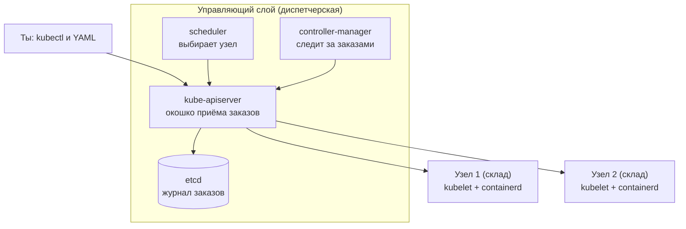
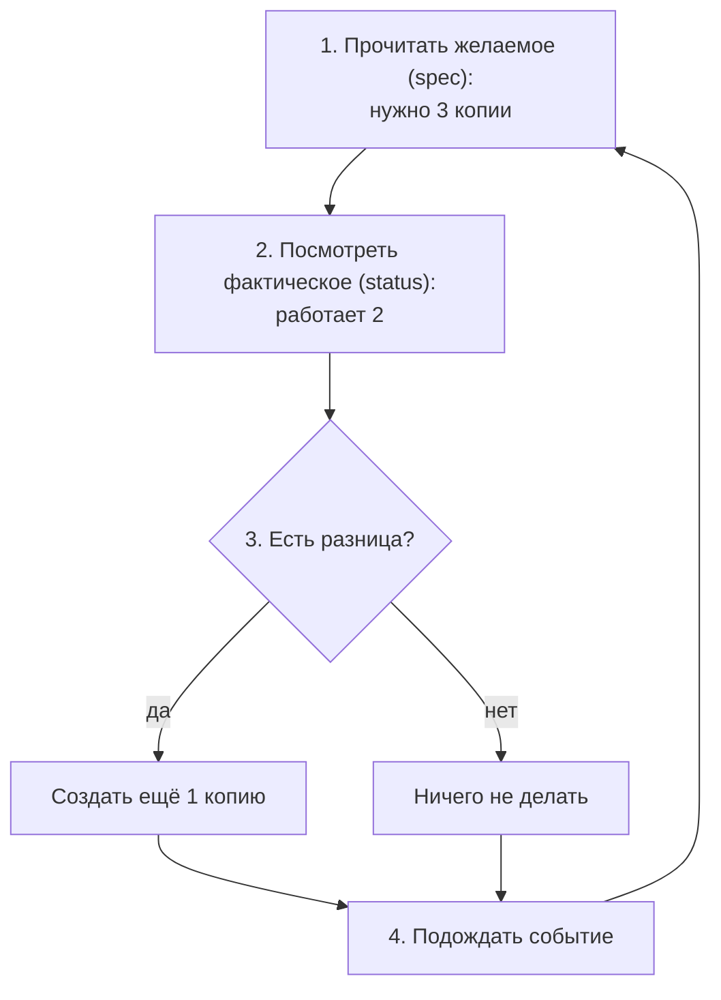
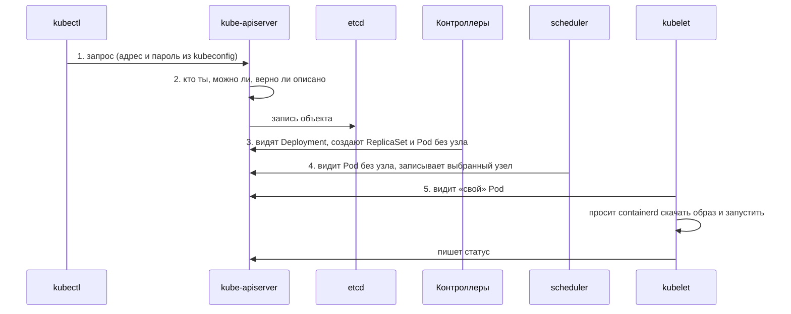
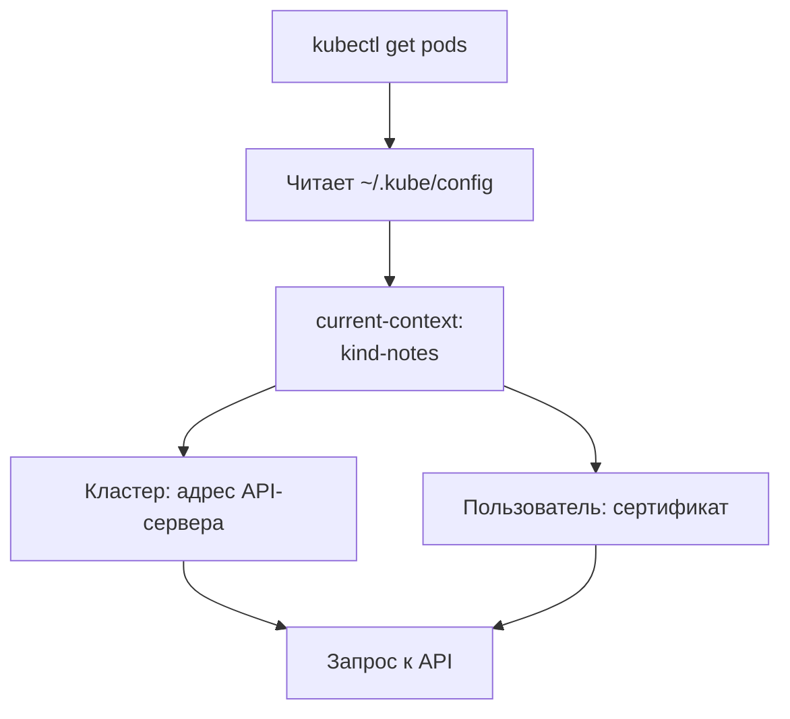
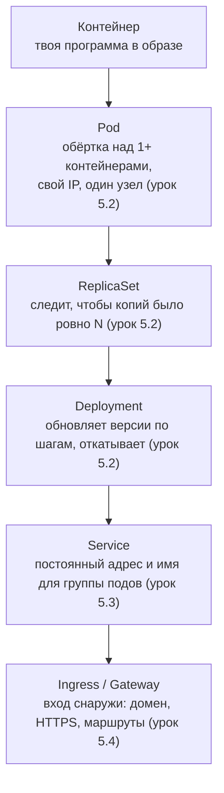
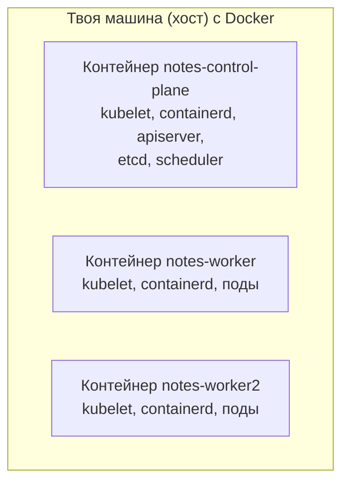
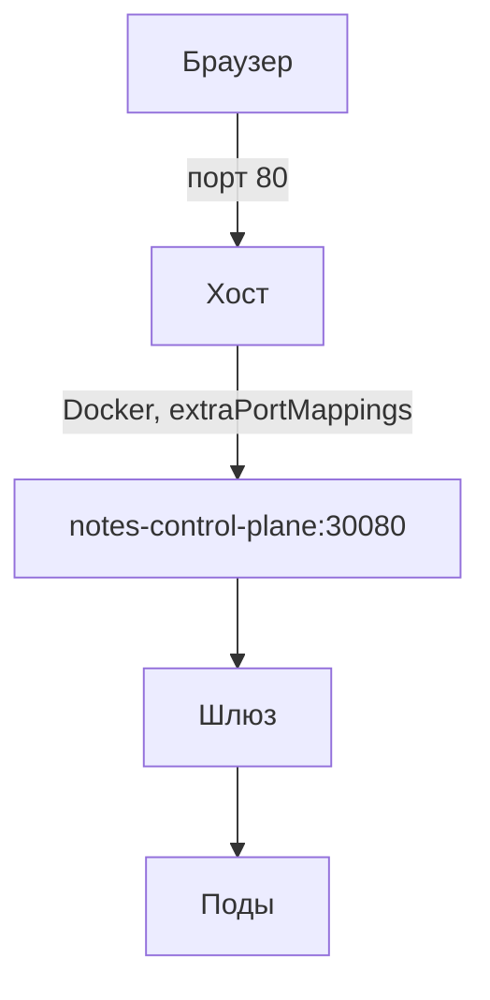

## Зачем это нужно

Начнём с ситуации, которая случается почти в каждой команде. Сервис живёт на одной машине. Её перезагрузили ночью после обновления, и сайт лежит, пока не проснётся человек, который умеет поднять всё руками. Вопрос тут не «почему она перезагрузилась», а «почему одна машина решает, живёт ли сайт». К этому добавляется каждый релиз: новую версию включаешь только после остановки старой.

Compose из [урока 4.5](../04-docker/05-compose-postgres.md) работает на одной машине: она упала, упало всё, а обновление означает остановку старого контейнера. Kubernetes (K8s, читается «кубернетис»; «8» означает восемь букв между K и s) - это программа, которая держит приложение на многих машинах, сама перезапускает упавшее и приводит систему к состоянию, которое ты описал. Без неё, если у тебя сотня контейнеров на двадцати серверах, каждое падение и каждое обновление разбирает человек руками. **Кластер** (cluster) - это группа серверов, которые Kubernetes объединяет в одну большую «машину»: ты говоришь, что запустить, а на каком именно сервере, решает он. На работе кластер это основная платформа для запуска сервисов (платформа - общее место, на котором работают все приложения компании, как торговый центр для магазинов), и без понимания его устройства любая поломка выглядит как магия.

В этом уроке ты сначала поймёшь, из каких частей состоит кластер и кто за что отвечает, а потом поднимешь свой кластер и найдёшь в нём каждую часть. Для этого понадобится **kind** (Kubernetes IN Docker): утилита, которая создаёт учебный кластер на твоём ноутбуке, а каждый «сервер» этого кластера на самом деле контейнер Docker. Настоящих серверов покупать не нужно, а устроен такой кластер так же, как боевой.

Шаг проекта: в «Заметках» появятся `kind/kind.yaml` (кластер `notes`: 1 управляющий узел и 2 рабочих, проброс портов 80 и 443) и `k8s/base/00-namespace.yaml` (namespace `notes`).

Расшифруем слова из этой строки. **Узел** (node) - одна машина кластера: виртуальная или физическая. **Управляющий узел** - машина, на которой живёт «мозг» кластера (диспетчерская из картины ниже), **рабочий узел** (worker) - машина, на которой запускаются твои контейнеры. **Проброс портов** - чтобы обращение к порту 80 твоего ноутбука попало внутрь узла-контейнера (как `-p 80:80` из [урока 4.3](../04-docker/03-storage-networks.md)). **Namespace** (пространство имён) - отдельная «папка» внутри кластера: всё, что относится к «Заметкам», лежит в папке `notes` и не смешивается с чужим. Без папок в общем кластере два приложения с именем `db` конфликтовали бы. Подробно про namespace будет в теории.

## Что нужно знать

- [Урок 4.1: идея контейнеров](../04-docker/01-containers-idea.md): контейнер это изолированный процесс со своим набором файлов; kind запускает узлы кластера как контейнеры Docker, порты 80 и 443 хоста должны быть свободны.
- [Урок 4.3: тома и сети Docker](../04-docker/03-storage-networks.md): как контейнеры общаются между собой и с хостом, что значит `-p 80:80`.
- [Урок 4.5: Compose и PostgreSQL](../04-docker/05-compose-postgres.md): файл на YAML, описывающий набор контейнеров; с ним мы сравниваем Kubernetes.
- [Урок 4.9: отладка контейнеров](../04-docker/09-docker-troubleshooting.md): `docker ps`, `docker exec`, `docker logs` пригодятся, чтобы заглядывать внутрь узлов kind.
- [Урок 2.3: DNS](../02-network/03-dns.md): запись в `/etc/hosts` подменяет DNS для имени `notes.lab`.

## Картина целиком

Представь большую службу доставки. Есть **диспетчерская** и есть **склады с грузовиками**. Ты приходишь в диспетчерскую с бумагой: «Нужно всегда три курьера на маршруте «Заметки»». Какой курьер на каком грузовике поедет, ты не выбираешь. Диспетчерская записывает заказ в журнал и передаёт задание складу. Местный начальник склада поднимает курьеров и докладывает: «Вышли». Заболел курьер? Диспетчерская видит расхождение между заказом («три») и реальностью («два») и отправляет замену.

В Kubernetes всё так же: **управляющий слой** (control plane) это диспетчерская, **рабочие узлы** это склады, **заказ** это YAML-файл с описанием желаемого, а **курьеры** это твои контейнеры.



Читай схему так: все разговоры идут через `kube-apiserver`, это единственная дверь в кластер. Диспетчерская не звонит складам: склады сами регулярно спрашивают, что для них нового (там аналогия и ломается). Что делает каждый прямоугольник, разберём по очереди в теории, а пока коротко, чтобы названия не пугали. `kubectl` (читается «кубкаутл») - программа в твоём терминале, через которую ты отдаёшь заказ. `etcd` (читается «этси-ди») - журнал со всеми заказами и текущей картиной. `scheduler` - планировщик, выбирает узел для нового контейнера. `controller-manager` - набор «следилок», которые сравнивают заказ с реальностью. `kubelet` - агент на каждом узле, `containerd` - программа, которая на узле непосредственно запускает контейнеры (ту же работу делает Docker).

## Теория

### Какую проблему решает Kubernetes

Допустим, у «Заметок» стало сто сервисов на двадцати серверах. Кто решит, на каком сервере запустить новый контейнер? Что делать, если сервер сгорел ночью? Как выкатить новую версию, не остановив сайт? В Compose ты отвечаешь на эти вопросы сам, руками, и для одной машины это нормально. Для двадцати уже нет: нужна программа, которая делает это вместо человека.

Compose это когда ты лично ставишь грузовики по парковке своего двора. Kubernetes это диспетчерская службы доставки: ты говоришь, сколько грузовиков нужно на маршруте, а кто где стоит, решает система. Аналогия перестаёт работать в одном: сломавшийся грузовик не чинят, его выбрасывают и берут новый. Контейнеры в Kubernetes тоже одноразовые.

Эта программа и есть Kubernetes. Он управляет **кластером**: группой машин, которые работают как одна большая. Каждая машина называется **узлом** (node), это виртуальная машина или физический сервер. Kubernetes решает четыре задачи:

1. **Размещение.** Он смотрит, на каком узле хватает свободной памяти и процессора, и запускает контейнер там.
2. **Самовосстановление.** Упал контейнер или умер целый узел: копии запускаются заново на живых узлах, без звонка тебе ночью.
3. **Обновление без простоя.** Новые копии поднимаются постепенно, старые гасятся после того, как новые начали отвечать (подробно в [уроке 5.7](07-probes-resources-rollouts.md)).
4. **Единый API.** Всё, от запуска приложения до сетевых правил, делается через один HTTP-интерфейс (API, набор адресов, по которым программы обращаются друг к другу) и одинаковые YAML-описания.

У «Заметок» три копии. Ночью гаснет сервер с одной из них. Kubernetes замечает, что копий две вместо трёх, находит узел со свободными ресурсами и запускает третью там. Ты узнаёшь об этом утром из истории событий. В Compose на одной машине то же событие означало бы простой всего сервиса до твоего вмешательства.

> **Прикинь сам:** у «Заметок» три копии на трёх узлах, на каждом узле хватает места ещё для пяти копий. Один узел вышел из строя. Сколько копий работает сразу после этого, сколько запустит Kubernetes и где?
{: .predict}

Работают две, значит, не хватает одной. Kubernetes запустит одну новую на любом из двух живых узлов: места там с запасом. Ты ничего не делаешь, система сама возвращает число копий к трём.

Осторожно, есть два заблуждения. Первое: что Kubernetes заменяет Docker. Нет: он сам контейнеры не создаёт, он командует программой, которая их создаёт (в нашем кластере это containerd, о нём ниже). Второе: что Kubernetes нужен всем. У него есть цена: платформу надо обновлять, мониторить и изучать. Для одного приложения на одной ВМ Compose или systemd остаются разумным выбором (этот вопрос задают на собеседованиях, он есть в конце урока). Kubernetes окупается, когда сервисов много, команд несколько, а выкатывать нужно часто.

> **Проверь понимание:** твой сервис живёт на одной ВМ, релиз раз в месяц, простой в 30 секунд допустим. Нужен ли Kubernetes?

<details markdown="1">
<summary>Ответ</summary>

Скорее нет. Ты получишь платформу, которую надо обновлять, мониторить и изучать, ради выгод, которые тебе не нужны. Compose или systemd плюс хороший откат закрывают задачу. Kubernetes оправдан, когда нужны автоматическое масштабирование, много сервисов и деплои без простоя.

</details>

> **Главное:** Kubernetes размещает контейнеры по машинам, сам восстанавливает упавшее и обновляет без простоя, а запускает контейнеры не он, а программа на узле.
{: .key}

Откуда он знает, что именно нужно восстанавливать? Из описания, которое мы ему дали, и вот как оно работает.

### Желаемое состояние и цикл согласования

Представь, что ты управляешь системой командами в чате: «запусти контейнер», «останови контейнер». Через месяц никто не помнит, сколько копий должно работать и какой версии. Команды по шагам называют **императивным** подходом (imperative): если шаг не сработал или что-то сломалось позже, система про цель ничего не знает и сама ничего не исправит. Второй способ: описать итог («должно работать три копии `notes` версии 0.4.0») и поручить системе довести реальность до описания. Это **декларативный** подход (declarative), и на нём построен Kubernetes.

Лучше всего это видно по термостату. Ты не включаешь и не выключаешь батарею, ты выставляешь 22 градуса. Термостат постоянно сравнивает температуру с целью и сам греет или отключает нагрев. Аналогия перестаёт работать в одном месте: термостат следит за одним параметром, а в кластере таких «термостатов» десятки, у каждого своя зона ответственности.

У каждого объекта в кластере две ключевые записи: **желаемое состояние** (`spec`, от specification) и **фактическое состояние** (`status`). Первое пишешь ты, например `replicas: 3`. Второе записывает сам кластер: что происходит сейчас. Программу, которая следит за расхождением, называют **контроллером** (controller). Он работает в бесконечном цикле, который называют циклом согласования (reconcile loop):



Схему читай как карусель: контроллер никогда не останавливается и каждый круг начинает с чтения цели. Теперь на примере: ты написал `replicas: 3`.

1. Запустились три копии. Желаемое 3, фактическое 3, контроллер ничего не делает.
2. Ты удалил одну копию вручную. Желаемое 3, фактическое 2, контроллер создаёт новую. Ты не давал команду «создай», она вычислилась из разницы.
3. Ты поменял в файле `replicas: 3` на `5` и применил. Желаемое 5, фактическое 3, создаются две недостающие.
4. Выключился узел с двумя копиями. Фактическое 3, потом 1, желаемое 5: создаются четыре на оставшихся узлах.

Во всех четырёх случаях программа делает одно и то же: сравнивает и добирает разницу. Отсюда всё поведение кластера.

> **Прикинь сам:** желаемое число копий 4, работает 6. Что сделает контроллер?
{: .predict}

Разница отрицательная, поэтому он удалит две лишние копии. Добирать и убирать для него одно действие: привести факт к цели.

Тут часто путают две вещи. Первая: `kubectl apply` не «запускает» контейнер, он только записывает желаемое в кластер, а запускает цепочка контроллеров. Вторая: удалённое вручную возвращается не всегда. Вернётся только то, у чего есть контроллер, следящий за числом копий; «голый» объект без владельца никто не восстановит (это тоже любимый вопрос собеседований). Императивные команды вроде `kubectl run` в Kubernetes есть, но ими пользуются для быстрых экспериментов.

> **Проверь понимание:** ты вручную остановил контейнер на узле командой `crictl stop` (crictl это утилита для работы с контейнерами на узле, её мы запустим в задании 3). Что произойдёт и почему?

<details markdown="1">
<summary>Ответ</summary>

Агент узла (kubelet, о нём дальше) заметит, что контейнер из описания пода не работает, и запустит его снова. Желаемое состояние не менялось, поэтому кластер возвращает систему к нему.

</details>

> **Главное:** ты описываешь, что должно быть, а контроллеры в бесконечном цикле сравнивают это с реальностью и устраняют разницу.
{: .key}

Кто именно эти контроллеры и где они живут? Разберём кластер по частям.

### Из чего состоит кластер

Если бы всё делала одна программа, она стала бы единой точкой отказа, и менять её по частям было бы нельзя. Поэтому кластер собран из небольших программ с одной работой у каждой. Их две группы: управляющий слой решает, что делать, рабочие узлы это делают. Как штаб и полевые группы: штаб хранит план и раздаёт задания, группы выполняют. Если штаб на час пропал со связи, группы продолжают последнее задание, но новых не получают. Где аналогия ломается: в кластере штаб обычно тоже состоит из нескольких машин.

В управляющем слое четыре программы:

| Компонент | Что делает и зачем |
|---|---|
| `kube-apiserver` | Единственная «дверь» в кластер. `kubectl`, kubelet и контроллеры общаются только через неё, напрямую они друг с другом не разговаривают. Проверяет, кто пришёл и что ему можно, проверяет корректность описания и записывает его в etcd |
| `etcd` | База данных с желаемым состоянием всего кластера, устроена как «ключ и значение» (например, ключ «сколько копий у `notes`», значение `3`). Единственный компонент, где хранятся данные: потерял etcd без резервной копии, потерял кластер |
| `kube-scheduler` | Планировщик: выбирает узел для нового пода по свободным ресурсам и ограничениям. Сам под не запускает, только записывает выбор («этот под пойдёт на `notes-worker`») |
| `kube-controller-manager` | Набор контроллеров: за Deployment, за ReplicaSet, за узлы и многое другое. Каждый ведёт свой цикл согласования из предыдущего раздела |

На каждом рабочем узле работают три компонента:

| Компонент | Что делает и зачем |
|---|---|
| `kubelet` | Агент на узле. Спрашивает у API: «какие поды назначены на меня?», просит runtime запустить их, сообщает статус обратно и проверяет, живо ли приложение (пробы, [урок 5.7](07-probes-resources-rollouts.md)) |
| `kube-proxy` | Пишет сетевые правила на узле, чтобы обращения к Service (постоянный адрес группы подов, [урок 5.3](03-services-dns.md)) попадали в нужные поды |
| `containerd` | Контейнерный runtime, то есть программа, которая реально запускает контейнеры. Это та самая часть, что стоит внутри Docker, только без удобной командной обёртки |

**Под** (pod) подробно разберём в [уроке 5.2](02-pods-deployments.md), пока достаточно знать: это минимальная единица запуска, «обёртка» вокруг одного или нескольких контейнеров. Ещё два системных пода есть почти в любом кластере: CoreDNS (DNS кластера, он переводит имена сервисов в адреса, [урок 5.3](03-services-dns.md)) и сетевой плагин (в kind это kindnet), который даёт подам адреса и связь между узлами.

Kubernetes не привязан к конкретным программам, потому что общается с ними по стандартным интерфейсам: CRI (container runtime interface) для запуска контейнеров, CNI (container network interface) для сети, CSI (container storage interface) для дисков. Это как розетки: runtime, сетевой плагин и хранилище можно менять, как прибор с любой вилкой. Но сетевой плагин выбирают при создании кластера, и заменить его потом сложно.

Теперь посчитаем, сколько управляющих узлов нужно. etcd принимает решения большинством голосов. Минимум голосов, при котором решение считается принятым, называется **кворум** (quorum). Считается так: `N/2 + 1`, целое число вниз. Смотрим:

```text
узлов etcd   кворум   сколько можно потерять
    1          1              0
    2          2              0    (потеряешь один и остался без большинства)
    3          2              1
    4          3              1    (четвёртый узел ничего не добавил)
    5          3              2
```

Поэтому в боевых кластерах управляющих узлов делают нечётное число: 3 или 5. Четыре стоят дороже трёх, а выдерживают столько же.

> **Прикинь сам:** сколько узлов etcd можно потерять при семи, и какой там кворум?
{: .predict}

Кворум `7/2 + 1`: три с половиной округляем вниз до трёх, плюс один, получается четыре. Значит, можно потерять три узла из семи: останутся четыре, а это ещё большинство.

Осторожно: kubelet и containerd это не «поды», а обычные процессы прямо на узле. Поэтому в `kube-system` ты их не найдёшь, зато найдёшь остальные компоненты. Ещё путают роли: scheduler выбирает узел, но ничего не запускает, а kubelet запускает, но ничего не выбирает.

> **Главное:** управляющий слой решает (apiserver, etcd, scheduler, контроллеры), узлы исполняют (kubelet, runtime, kube-proxy), а для устойчивости etcd нужен нечётный состав и кворум.
{: .key}

Из этого вытекает важный вопрос: что останется работать, если часть кластера пропадёт?

### Что сломается, если часть кластера пропадёт

Новичок первым делом спрашивает: «А если упадёт вот это, всё умрёт?» Ответ зависит от того, какая именно часть пропала, и разделение на «диспетчерскую» и «склады» сделано как раз затем, чтобы поломка одной части не останавливала всё сразу. Если диспетчерская закрылась на обед, курьеры на маршрутах продолжают развозить посылки: они знают свой последний заказ. Новые заказы принять некому, заболевшего курьера никто не заменит. Если закрылся один склад, диспетчерская видит это и переназначает курьеров на другие склады. Аналогия перестаёт работать в одном: настоящий курьер может додумывать, а контейнер делает только то, что ему уже велели.

Работающие контейнеры живут на узлах и управляются локальным агентом kubelet. Ему нужна связь с диспетчерской только чтобы получать новое и докладывать статус. Поэтому:

| Что пропало | Что продолжает работать | Что перестаёт работать |
|---|---|---|
| `kube-apiserver` | уже запущенные контейнеры | `kubectl`, новые заказы, обновления |
| `etcd` | уже запущенные контейнеры | всё управление (журнала нет) |
| `scheduler` | уже запущенные контейнеры | размещение новых копий |
| `controller-manager` | уже запущенные контейнеры | самовосстановление, масштабирование |
| рабочий узел целиком | остальные узлы | копии с этого узла (их пересоздадут на других через несколько минут) |
| `kubelet` на одном узле | контейнеры на нём (пока живы) | новые задания и отчёты для этого узла |

Пример. В кластере три копии `notes`, по одной на каждом рабочем узле. Падает управляющий узел. Сайт открывается как раньше: запросы идут в контейнеры, а они никуда не делись. Но если в этот момент упадёт ещё и один рабочий узел, копию на нём никто не пересоздаст: восстановление делает контроллер, а он стоит вместе с диспетчерской. Поэтому в боевых кластерах управляющих узлов делают три (кворум из прошлого раздела), а не один. В нашем учебном kind-кластере управляющий узел один, и так можно себе позволить: ничего важного в нём нет.

> **Прикинь сам:** остановился `kube-scheduler`. Ты запустил новую копию `notes`. Что с ней будет и что будет со старыми?
{: .predict}

Старые копии работают как работали: им scheduler не нужен. Новая копия создастся как объект, но останется в ожидании (`Pending`): никто не выбрал для неё узел.

Осторожно: «упал Kubernetes» не значит «упало приложение». Чаще всего приложение ещё работает, а не работает управление им. Разбирая инцидент, первым делом спроси: пользователи страдают прямо сейчас или мы потеряли возможность что-то менять?

> **Проверь понимание:** на кластере перестал отвечать `kubectl get pods` (таймаут), но сайт приложения открывается. Какая часть кластера, вероятнее всего, недоступна и что это значит для пользователей?

<details markdown="1">
<summary>Ответ</summary>

Скорее всего, недоступен управляющий слой (kube-apiserver или весь управляющий узел): именно через него идёт `kubectl`. Контейнеры на рабочих узлах продолжают работать, поэтому пользователи пока ничего не замечают. Опасность в том, что пока управление недоступно, упавшие контейнеры не пересоздаются и выкатить исправление нельзя, так что чинить надо быстро.

</details>

> **Главное:** работающие контейнеры переживают потерю управляющего слоя, но без него ничего не меняется и не чинится.
{: .key}

Мы знаем, кто есть кто. Теперь проследим, как они передают друг другу работу, когда ты вводишь одну команду.

### Что происходит при kubectl apply

Когда под не стартует или завис в ожидании, первый вопрос: на каком шаге цепочки всё остановилось? Не зная цепочки, отвечать приходится гаданием. Это как заказ в интернет-магазине: оформление, склад собирает, курьер выезжает, доставка. Каждый шаг делает свой человек, а между собой они общаются не по телефону, а через общую систему заказов. В кластере она называется kube-apiserver вместе с etcd.

`kubectl` это программа командной строки: она читает твой YAML и отправляет его в API. Вот что происходит дальше:



Deployment и ReplicaSet это объекты, которые следят за числом копий, подробно в [уроке 5.2](02-pods-deployments.md); пока считай их «заказом на N копий». Обрати внимание, что стрелки идут от компонентов к API, а не друг к другу: никто никому не звонит.

В шаге 2 («кто ты и можно ли тебе») три проверки: аутентификация (личность, по сертификату или токену), авторизация (права, RBAC, [урок 5.12](12-k8s-security.md)) и проверка схемы (нет ли лишних полей и опечаток в названиях). Если хоть одна не прошла, запись в etcd не происходит, и `kubectl` печатает ошибку сразу. Поэтому опечатка в имени поля даёт немедленный `error validating data`, а не тихий сбой потом.

> **Прикинь сам:** под создан, но навсегда завис в `Pending`, а kubelet на всех узлах здоров. На каком шаге цепочки это застряло?
{: .predict}

На шаге 4: scheduler не записал в под узел. Раз узла нет, до kubelet дело не дошло, хотя он сам исправен.

Осторожно: компоненты не вызывают друг друга по цепочке. Каждый **смотрит** на API (это называется watch, наблюдение за изменениями) и делает свою часть, когда видит подходящее изменение. Поэтому система устойчива: упавший компонент после возвращения просто прочитает текущее состояние и продолжит.

> **Главное:** `kubectl apply` кладёт описание в API, а дальше каждый компонент сам замечает свою работу и делает её: выбирает узел scheduler, запускает kubelet.
{: .key}

Мы всё время говорим «описание», «объект». Посмотрим, как это выглядит в файле.

### Объекты и манифесты: как выглядит «заказ»

Всё, что ты просишь у кластера, ты описываешь файлом. Файл называется **манифест** (manifest), а то, что он описывает, **объект** (object): пространство имён, под, сервис и так далее. Это как бланк заказа с обязательными графами: «что заказываем», «как называется», «какие параметры». Бланк один, а типов заказов много, поэтому, выучив формат один раз, читаешь любой.

Манифест пишется на YAML (тот же формат, что в файле Compose из [урока 4.5](../04-docker/05-compose-postgres.md)). Напоминание о правилах: вложенность задаётся пробелами (два на уровень, табуляции нельзя), запись `ключ: значение`, а список пишется строками с дефисом `- `. У любого манифеста четыре верхних ключа:

```yaml
apiVersion: v1          # версия API, в которой описан этот тип объекта
kind: Namespace         # что за объект (тип)
metadata:               # «паспорт» объекта: имя, метки
  name: notes           # имя, уникальное среди объектов этого типа
  labels:               # метки: пары «ключ=значение» для поиска и группировки
    app.kubernetes.io/part-of: notes
# spec:                 # желаемое состояние; у Namespace его нет, у Deployment оно есть
```

Первые два ключа отвечают на вопрос «какой бланк». `apiVersion: v1` означает основную группу API, там живёт Namespace. У Deployment будет `apps/v1`: до слэша группа, после версия. `metadata.name` это имя. `labels` это метки: по ним объекты находят друг друга (Service выбирает поды по меткам, [урок 5.3](03-services-dns.md)), а ты ищешь нужное командами вроде `kubectl get pods -l app=notes`. Ключ `spec` это желаемое состояние, о котором мы говорили выше; статус (`status`) ты не пишешь, его дописывает сам кластер.

> **Прикинь сам:** сколько верхних ключей ты пишешь руками в манифесте Deployment и какой пятый ключ допишет за тебя кластер?
{: .predict}

Четыре: `apiVersion`, `kind`, `metadata`, `spec`. Пятый, `status`, кластер добавляет сам, когда объект уже живёт.

Осторожно, кавычки и отступы. Значение `on`, `no` или число вроде `1.10` YAML может понять не так, как ты задумал, поэтому неочевидные строки берут в кавычки. А ошибка в отступе не даёт синтаксической ошибки, а тихо переносит ключ не на тот уровень (пример в «Типичных ошибках» задания 4).

> **Главное:** манифест это YAML с четырьмя верхними ключами: тип, версия API, паспорт и желаемое состояние, а статус пишет кластер.
{: .key}

Один из объектов мы создадим уже в этом уроке: это namespace.

### Namespace: разделение внутри кластера

В одном кластере живут разные приложения и команды. Без разделения все объекты лежали бы в одной куче: имена бы конфликтовали (два сервиса `db`), а права и лимиты нельзя было бы выдавать по частям. Это этажи офисного здания или папки на диске: в каждой папке свои файлы, и `report.txt` в двух папках не конфликтует. Аналогия перестаёт работать в том, что папки не запирают: без дополнительных настроек сосед с соседнего «этажа» может зайти к тебе.

Пространство имён (**namespace**) это именованная группа объектов. Имена внутри группы уникальны. К группе можно привязать права (RBAC), лимиты ресурсов (квоты) и сетевые правила. Системные компоненты Kubernetes живут в namespace `kube-system`. Если namespace не указан, действует `default`. Класть в него свои приложения плохая привычка: через год там окажется всё подряд.

Команда `kubectl get pods` покажет поды только текущего namespace. Чтобы посмотреть в другом, добавляют `-n kube-system`, чтобы во всех, `-A` (от all). Поэтому «пустой» ответ `No resources found in default namespace.` часто значит «ты смотришь не туда», а не «ничего нет». Для нашего проекта мы заведём namespace `notes`.

> **Прикинь сам:** ты запустил под в `notes`, а команда `kubectl get pods` без флагов ответила «No resources found in default namespace». Под пропал?
{: .predict}

Нет. Команда смотрит в `default`, а под лежит в `notes`. Добавь `-n notes` или `-A`, и он найдётся.

Осторожно: namespace не граница безопасности. Это мягкое разделение по именам и правам, узлы и ядро у всех общие.

> **Проверь понимание:** ты создал под и не видишь его в `kubectl get pods`, хотя `apply` сказал `created`. Что проверишь первым?

<details markdown="1">
<summary>Ответ</summary>

Namespace. Скорее всего манифест положил под в один namespace, а команда смотрит в другой (обычно в `default`). Сравни `kubectl get pods -A` и `kubectl config view --minify | grep namespace`.

</details>

> **Главное:** namespace группирует объекты и даёт уникальность имён, но от соседей не запирает; смотри в нужный через `-n` или `-A`.
{: .key}

Но откуда `kubectl` знает, в какой именно кластер и под каким именем он стучится?

### kubeconfig и контексты: куда идёт kubectl

`kubectl` сам по себе не знает, где твой кластер и какой у него пароль. У тебя их будет несколько (свой kind, тестовый, боевой), и надо как-то указывать, к какому идти. Для этого есть файл настроек **kubeconfig**. Представь записную книжку с контактами: для каждого записаны адрес, пропуск и этаж, на который тебе надо, плюс закладка на «сегодняшнем» контакте. Закладка это текущий контекст.

Файл по умолчанию лежит в `~/.kube/config` (путь можно заменить переменной окружения `KUBECONFIG`). В нём три списка и указатель:

```yaml
clusters:                          # куда: адрес API-сервера и сертификат для проверки, что это он
- name: kind-notes
  cluster:
    server: https://127.0.0.1:41235
users:                             # кто: сертификат или токен, которым ты представляешься
- name: kind-notes
  user:
    client-certificate-data: ...   # длинная строка, обрезана
contexts:                          # связка «кластер + пользователь + namespace по умолчанию»
- name: kind-notes
  context:
    cluster: kind-notes
    user: kind-notes
current-context: kind-notes        # закладка: сюда пойдёт следующая команда
```

Ты вводишь `kubectl get pods`. Программа открывает kubeconfig, берёт `current-context: kind-notes`, находит контекст с этим именем, по нему берёт кластер (адрес `https://127.0.0.1:41235`) и пользователя (сертификат) и шлёт запрос. Если namespace в контексте указан, использует его, иначе `default`. Контекст kind называется `kind-<имя кластера>`, у нас это `kind-notes`. Порт в адресе у тебя будет другой.



> **Прикинь сам:** в kubeconfig два контекста: `kind-notes` и `prod`, закладка стоит на `prod`. Куда уйдёт `kubectl delete pod web-1`?
{: .predict}

В `prod`, потому что именно туда указывает закладка. Вот почему на работе перед опасной командой смотрят `kubectl config current-context`.

Осторожно: «кластер упал», когда на самом деле `kubectl` не нашёл конфиг. Тогда он идёт на адрес по умолчанию `localhost:8080`, там ничего нет, и печатается `The connection to the server localhost:8080 was refused`. Это ошибка клиента, а не кластера.

> **Проверь понимание:** ты хочешь на минуту выполнить одну команду в другом кластере, не меняя закладку. Как?

<details markdown="1">
<summary>Ответ</summary>

Указать контекст прямо в команде: `kubectl --context kind-notes get pods`. Тогда `current-context` в файле не меняется, и следующая команда пойдёт туда же, куда шла раньше.

</details>

> **Главное:** kubeconfig хранит кластеры, пользователей и контексты, а `current-context` решает, куда пойдёт следующая команда.
{: .key}

С доступом ясно. Теперь соберём общую карту объектов, чтобы новые слова не казались случайными.

### Карта объектов: что мы будем создавать в этой теме

В следующих уроках будет много новых слов: под, Deployment, Service, Ingress, PVC. Если не знать, как они соотносятся, они кажутся набором случайных терминов. На самом деле каждый объект решает одну узкую задачу и опирается на предыдущий, как в строительстве дома: кирпич, стена, этаж, дом. Ни один слой не заменяет остальные, но каждый следующий состоит из предыдущих. Идём снизу вверх:



Отдельно от этой цепочки стоят объекты для данных (диски и настройки): PersistentVolumeClaim, ConfigMap, Secret ([урок 5.5](05-storage-statefulset-postgres.md) и [урок 5.6](06-config-secrets.md)).

Мы хотим, чтобы «Заметки» открывались по `http://notes.lab`. Тогда нам нужен контейнер с приложением (образ из [темы 4](../04-docker/07-images-registry.md)), под вокруг него, Deployment, чтобы копий было три и они обновлялись без простоя, Service, чтобы у трёх копий был один адрес, и шлюз, чтобы этот адрес был виден из браузера. Это пять объектов, каждый на своём этаже. В этом уроке мы делаем «фундамент»: сам кластер и namespace, в который потом всё ляжет.

> **Прикинь сам:** сколько подов, Service и шлюзов нужно, чтобы три копии «Заметок» были видны по одному адресу из браузера?
{: .predict}

Три пода (по одному на копию), один Service с одним адресом на всех и один шлюз на входе. Deployment и ReplicaSet не считаем: они только следят за числом подов.

Осторожно: Deployment не запускает контейнеры. Он создаёт ReplicaSet, тот создаёт поды, а контейнеры запускает kubelet. И под с контейнером не одно и то же: в поде может быть несколько контейнеров, которые всегда живут вместе на одном узле.

> **Проверь понимание:** у тебя есть три копии «Заметок» в трёх подах. Какой объект даёт им один общий адрес, и какой объект следит, чтобы копий оставалось три?

<details markdown="1">
<summary>Ответ</summary>

Общий адрес даёт Service, а число копий поддерживает ReplicaSet (им управляет Deployment). Это две разные задачи и два разных объекта.

</details>

> **Главное:** контейнер лежит в поде, поды держит ReplicaSet под управлением Deployment, адрес даёт Service, вход снаружи даёт шлюз.
{: .key}

Объектов будет много, и нужно уметь быстро смотреть, что с ними происходит.

### Как читать состояние кластера: get, describe, events

Ты пишешь желаемое, а кластер доводит реальность до него. Значит, главный навык оператора: посмотреть, что получилось, и понять, почему получилось не то. Это как отслеживание посылки: статус «в пути» (get) говорит, где посылка, подробная карточка (describe) показывает, кто и когда её принял, журнал событий (events) отвечает, почему она застряла на сортировке. Для этого три инструмента.

- `kubectl get <тип>` печатает список объектов коротко, по строке на объект. Это быстрый взгляд: сколько копий готово и в каком статусе.
- `kubectl describe <тип> <имя>` показывает всё про один объект, а в самом конце **события** (events): записи вида «scheduler назначил узел», «kubelet скачал образ». Их пишут сами компоненты, поэтому по ним видно, какой шаг цепочки `kubectl apply` выполнен, а какой застрял.
- `kubectl logs <под>` печатает то, что программа внутри контейнера пишет в свой вывод (тот же смысл, что у `docker logs`).

Вот хвост `describe pod` для здорового пода (значения примерные, у тебя будут свои). Читай его как протокол цепочки из прошлого раздела:

```text
Events:
  Type    Reason     From               Message
  ----    ------     ----               -------
  Normal  Scheduled  default-scheduler  Successfully assigned notes/notes-abc to notes-worker
  Normal  Pulling    kubelet            Pulling image "..."
  Normal  Pulled     kubelet            Successfully pulled image "..."
  Normal  Created    kubelet            Created container notes
  Normal  Started    kubelet            Started container notes
```

Колонка `From` называет автора записи. Первая строка от `default-scheduler`: выбор узла (шаг 4 цепочки). Остальные от `kubelet`: скачивание образа и запуск (шаг 5). Если под завис в ожидании, а записей от `kubelet` нет, значит, дело в выборе узла, а не в образе. Так события сразу сужают поиск.

> **Прикинь сам:** в событиях пода есть `Scheduled`, `Pulling` и `Failed to pull image`. На каком шаге беда и кого винить: scheduler или kubelet?
{: .predict}

Узел выбран (`Scheduled`), значит, scheduler свою работу сделал. Не получилось у kubelet скачать образ: смотри имя образа, тег и доступ к реестру.

Осторожно: `get` показывает только текущий namespace и лишь краткую сводку. Причину проблемы почти всегда надо искать в `describe` и `logs`.

> **Проверь понимание:** под в статусе `Pending`, в событиях только строка `FailedScheduling` от `default-scheduler`. Какая часть цепочки не сработала и что не надо проверять?

<details markdown="1">
<summary>Ответ</summary>

Не сработал выбор узла (scheduler не нашёл подходящий узел, например не хватает ресурсов). Проверять образ и работу kubelet смысла нет: до них дело не дошло, под ещё никому не назначен.

</details>

> **Главное:** `get` показывает сводку, `describe` с блоком Events объясняет причину, а `logs` показывает, что говорит сама программа.
{: .key}

Мы увидели, что делает kubelet. Осталось понять, как именно он запускает контейнер.

### Как узел запускает контейнер: kubelet, CRI и containerd

Ты уже знаешь, что `kubectl` контейнеры не создаёт. Но и kubelet их не создаёт сам: он поручает это другой программе. Представь менеджера на складе (kubelet) и погрузчик (containerd). Менеджер получает список задач и решает, что грузить, а погрузчик поднимает ящики. Менеджеру всё равно, какой марки погрузчик, лишь бы тот понимал стандартные команды. Эти команды и есть CRI, и благодаря им «двигатель» (containerd, CRI-O) можно менять без переписывания Kubernetes.

kubelet ведёт с containerd разговор по CRI: «скачай образ X», «создай песочницу для пода», «запусти контейнер». containerd сам скачивает образ из реестра, готовит изоляцию (те же namespaces и cgroups ядра Linux, что и в Docker, [урок 4.1](../04-docker/01-containers-idea.md)) и запускает процесс. Docker внутри тоже использует containerd, поэтому образы, собранные `docker build`, в Kubernetes запускаются без изменений.

Внутри узла kind нет команды `docker`, зато есть `crictl`: клиент CRI. Команда `docker exec notes-worker crictl ps` из задания 3 «идёт» на узел и спрашивает у containerd: какие контейнеры сейчас работают? Ответ покажет контейнеры системных подов, а после следующего урока и твои.

> **Прикинь сам:** ты собрал образ командой `docker build`, а в кластере работает containerd, не Docker. Запустится ли образ?
{: .predict}

Запустится. Формат образа общий, а containerd умеет его читать, как и Docker.

Осторожно: Kubernetes не «отказался от Docker» в смысле образов. Он убрал только прямую интеграцию с самим демоном Docker (она была лишним звеном между kubelet и containerd). Образы из темы 4 работают.

> **Главное:** kubelet не запускает контейнеры сам, а просит об этом runtime по стандарту CRI, поэтому образы Docker работают в кластере без изменений.
{: .key}

Остаётся понять, на чём всё это учить.

### kind, minikube, k3s: где учиться

Чтобы учиться, нужен кластер, а арендовать десяток серверов ради учёбы дорого. Есть инструменты, которые поднимают настоящий кластер у тебя на ноутбуке. kind (Kubernetes in Docker) запускает **каждый узел как контейнер Docker**, а внутри этого контейнера работают systemd, containerd и kubelet, то есть узел ведёт себя как маленькая ВМ. Твои поды в итоге оказываются «контейнерами внутри контейнера».



`docker ps` показывает эти три контейнера, но не поды внутри них. Плюсы kind: несколько узлов на одном ноутбуке, старт за минуту, удаление одной командой, его используют в CI. Минус: узлы это контейнеры, поэтому доступ снаружи требует проброса портов, а диски и сеть упрощены. minikube поднимает одну ВМ или контейнер и удобен готовыми дополнениями. k3s это урезанный дистрибутив Kubernetes для небольших реальных серверов. Для курса берём kind: он лучше всего повторяет многоузловой кластер.

Теперь путь порта. Мы хотим открывать `http://notes.lab` в браузере на хосте. Браузер идёт на порт 80 хоста, Docker пересылает его в порт 30080 контейнера `notes-control-plane`, а там (в [уроке 5.4](04-ingress-gateway.md)) этот порт слушает входной шлюз, принимающий трафик снаружи. Порт 30080 выбран из «высокого» диапазона потому, что порты Kubernetes для входа снаружи (NodePort, [урок 5.3](03-services-dns.md)) берутся из диапазона 30000-32767.



> **Прикинь сам:** сколько контейнеров покажет `docker ps` для нашего кластера и сколько из них будет с подами «Заметок»?
{: .predict}

Три контейнера: один управляющий узел и два рабочих. Поды «Заметок» будут внутри этих трёх, а не отдельными строками `docker ps`.

Осторожно: сетевой плагин (CNI) выбирается при создании кластера. В kind по умолчанию стоит kindnet, и заменить его позже нельзя, только пересоздать кластер. В [уроке 5.12](12-k8s-security.md) нам понадобится NetworkPolicy (сетевые правила «кто с кем может общаться»), и мы вернёмся к этому.

> **Проверь понимание:** ты выполнил `docker ps` и видишь три контейнера `notes-*`. Где искать поды `notes`, которые ты запустишь в следующем уроке?

<details markdown="1">
<summary>Ответ</summary>

Внутри этих трёх контейнеров: `docker ps` видит только контейнеры первого уровня. Поды смотрят через `kubectl get pods`, а контейнеры внутри узла через `docker exec notes-worker crictl ps`.

</details>

> **Главное:** kind делает узлы контейнерами Docker, поэтому настоящий многоузловой кластер помещается на ноутбук, а доступ снаружи идёт через проброс портов.
{: .key}

Теперь у нас есть всё, чтобы поднять свой кластер руками. Переходим к практике.

## Практика

### Задание 1. Установить kind и kubectl

**Цель:** получить `kind` v0.33.0 и `kubectl` 1.37.1 с проверкой контрольных сумм, без `curl | bash`.

Разбор новых частей:

- `mktemp -d` создаёт пустой временный каталог и печатает его путь; `cd "$(mktemp -d)"` заходит в него, чтобы не мусорить.
- `curl -fsSLo файл адрес`: скачать адрес в файл. Флаги: `-f` ошибка при кодах 4xx и 5xx вместо сохранения страницы с ошибкой, `-s` без индикатора, `-S` но с текстом ошибки, `-L` идти по перенаправлениям, `-o` имя файла (у `-O` имя берётся из адреса).
- Контрольная сумма (checksum) это «отпечаток» файла: если изменился хоть один байт, отпечаток другой. `sha256sum -c -` читает строки вида `хеш  имя-файла` и проверяет, что файл с этим именем даёт такой отпечаток. Два пробела между хешем и именем обязательны.
- `cut -d' ' -f1` берёт первое поле строки, разделённой пробелами (то есть сам хеш).
- `sudo install -m 0755 файл /usr/local/bin/имя` копирует файл в каталог, где оболочка ищет программы, и ставит права `rwxr-xr-x` (запуск разрешён всем).

**Предскажи:** что будет, если файл скачан не полностью, а ты запустил `sha256sum -c`? Что выведет команда?

<details markdown="1">
<summary>Ответ</summary>

Сумма не совпадёт, `sha256sum` напечатает `FAILED` и вернёт код выхода 1. Именно ради этого проверку делают до установки.

</details>

**Шаги:**

1. Проверь, что Docker работает и порты 80 и 443 свободны (если заняты, останови `nginx` и стенд Compose, как в уроке 4.1). Команда `docker version --format` печатает версию сервера по шаблону (шаблон это то, что в фигурных скобках). `ss -tlnp` показывает слушающие TCP-порты и процессы, `grep -E ':(80|443)\s'` оставляет строки с этими портами, а если их нет, сработает `||` и напечатает «порты свободны».


```bash
docker version --format '{{.Server.Version}}'
# если порты заняты, ss покажет владельца
sudo ss -tlnp | grep -E ':(80|443)\s' || echo "порты свободны"
```


2. Скачай и проверь kind:

```bash
cd "$(mktemp -d)"
curl -fsSLo kind https://kind.sigs.k8s.io/dl/v0.33.0/kind-linux-amd64
curl -fsSLo kind.sha256sum https://kind.sigs.k8s.io/dl/v0.33.0/kind-linux-amd64.sha256sum
# в файле с суммой другое имя файла, поэтому берём только хеш
echo "$(cut -d' ' -f1 kind.sha256sum)  kind" | sha256sum -c -
sudo install -m 0755 kind /usr/local/bin/kind
```

3. Скачай и проверь kubectl:

```bash
curl -fsSLO https://dl.k8s.io/release/v1.37.1/bin/linux/amd64/kubectl
curl -fsSLO https://dl.k8s.io/release/v1.37.1/bin/linux/amd64/kubectl.sha256
echo "$(cat kubectl.sha256)  kubectl" | sha256sum -c -
sudo install -m 0755 kubectl /usr/local/bin/kubectl
```

4. Проверь версии:

```bash
kind version
kubectl version --client
```

На ARM (Ubuntu в ВМ на Apple Silicon) замени `amd64` на `arm64` во всех адресах.

**Что должно получиться:**

```text
kind: OK
kubectl: OK
kind v0.33.0 go1.25.0 linux/amd64
Client Version: v1.37.1
Kustomize Version: v5.8.1
```

**Как читать вывод:** `kind: OK` и `kubectl: OK` значат, что отпечатки совпали, ставить можно. `kind v0.33.0 ...` это версия kind, версия компилятора Go и платформа. `Client Version` это версия kubectl, `Kustomize` это встроенный в него инструмент шаблонизации ([урок 5.10](10-kustomize.md)). Версии Go и Kustomize у тебя могут отличаться, важны `OK` и версии kind и kubectl.

**Объясни себе:**

- Зачем сверять сумму, если скачивание идёт по HTTPS?
- Почему `kubectl` ставят той же минорной версии, что и кластер (допустимо расхождение в одну минорную)?

**Типичные ошибки:**

- `kind: FAILED` и `sha256sum: WARNING: 1 computed checksum did NOT match`: файл скачан не полностью или подменён: удали и скачай заново.
- `curl: (22) The requested URL returned error: 404`: опечатка в версии или архитектуре: сверь адрес со страницей релиза.
- `Cannot connect to the Docker daemon at unix:///var/run/docker.sock. Is the docker daemon running?`: Docker не запущен: `sudo systemctl start docker`.

### Задание 2. Создать кластер `notes` из конфига

**Цель:** описать кластер файлом и создать его: 1 управляющий узел, 2 рабочих, порты 80 и 443 хоста проброшены в узел.

**Предскажи:** сколько контейнеров появится в `docker ps` после создания такого кластера? Какие у них будут имена?

<details markdown="1">
<summary>Ответ</summary>

Три контейнера, по одному на узел: `notes-control-plane`, `notes-worker`, `notes-worker2`. Имя строится из имени кластера.

</details>

**Шаги:**

1. Создай каталоги проекта. `mkdir -p` создаёт каталог вместе с недостающими родителями и не ругается, если он уже есть:

```bash
mkdir -p ~/notes/kind ~/notes/k8s/base
cd ~/notes
```

2. Файл `kind/kind.yaml` (это не манифест Kubernetes, а настройка самого kind, но формат тот же):

```yaml
# Кластер kind для проекта «Заметки»
kind: Cluster                    # тип файла: описание кластера kind
apiVersion: kind.x-k8s.io/v1alpha4
name: notes                      # имя кластера, из него строятся имена контейнеров и контекста
nodes:                           # список узлов
  - role: control-plane          # первый узел: управляющий слой
    # версия Kubernetes задаётся образом узла; проверь тег на странице релиза kind v0.33.0
    image: kindest/node:v1.37.1
    kubeadmConfigPatches:        # правка настроек kubeadm (инструмент, который собирает кластер)
      # метка узла, на котором будет принимать трафик входной шлюз (урок 5.4)
      - |
        kind: InitConfiguration
        nodeRegistration:
          kubeletExtraArgs:
            node-labels: "ingress-ready=true"
    extraPortMappings:           # проброс портов хоста внутрь этого контейнера-узла
      # порт хоста 80 -> порт узла 30080 (NodePort шлюза)
      - containerPort: 30080
        hostPort: 80
        protocol: TCP
      # порт хоста 443 -> порт узла 30443
      - containerPort: 30443
        hostPort: 443
        protocol: TCP
  - role: worker                 # второй и третий узлы: рабочие
    image: kindest/node:v1.37.1
  - role: worker
    image: kindest/node:v1.37.1
```

Что здесь важно. `role` задаёт роль узла, `image` образ, из которого запустится узел (в нём зашита версия Kubernetes). Блок `kubeadmConfigPatches` с `|` содержит многострочный текст, который kind вставит в настройки: он ставит на узел метку (label) `ingress-ready=true`, чтобы позже шлюз сел именно сюда. Блок `extraPortMappings` это тот самый проброс `-p` из Docker, который мы разбирали в теории.

3. Создай кластер и проверь. Что делает каждая команда: `kind create cluster --config файл` создаёт кластер по файлу, `kubectl config current-context` печатает закладку из kubeconfig, `kubectl get nodes` перечисляет узлы, `docker ps --format 'table ...'` печатает таблицу из выбранных колонок (`\t` это табуляция между ними).


```bash
kind create cluster --config kind/kind.yaml
kubectl config current-context
kubectl get nodes
docker ps --format 'table {{.Names}}\t{{.Ports}}'
```


**Что должно получиться:**

```text
Creating cluster "notes" ...
 ✓ Ensuring node image (kindest/node:v1.37.1)
 ✓ Preparing nodes
 ✓ Writing configuration
 ✓ Starting control-plane
 ✓ Installing CNI
 ✓ Installing StorageClass
 ✓ Joining worker nodes
Set kubectl context to "kind-notes"
You can now use your cluster with:

kubectl cluster-info --context kind-notes

kind-notes
NAME                  STATUS   ROLES           AGE   VERSION
notes-control-plane   Ready    control-plane   60s   v1.37.1
notes-worker          Ready    <none>          40s   v1.37.1
notes-worker2         Ready    <none>          40s   v1.37.1
NAMES                 PORTS
notes-worker
notes-worker2
notes-control-plane   0.0.0.0:80->30080/tcp, 0.0.0.0:443->30443/tcp, 127.0.0.1:41235->6443/tcp
```

**Как читать вывод:** первые строки это этапы создания: скачать образ узла, подготовить узлы, поставить сетевой плагин (CNI) и StorageClass (способ выдавать диски, [урок 5.5](05-storage-statefulset-postgres.md)), присоединить рабочие узлы. Слово `Ready` в `get nodes` значит, что kubelet узла докладывает API «я здоров»; `ROLES` у рабочих `<none>`, это норма, у них просто нет метки роли. `AGE` это возраст узла. В таблице портов у управляющего узла три проброса: 80 и 443 наши, а `127.0.0.1:41235->6443` это адрес API-сервера (6443 его стандартный порт), привязанный только к `127.0.0.1`, чтобы к твоему кластеру не могли подключиться с других машин. Оформление строк создания (галочки, значки) зависит от версии kind, а порт `41235` у тебя будет другой.

### Если у тебя 8 ГБ

Три узла занимают около 2-3 ГБ. Облегчённый режим: удали из `kind/kind.yaml` оба блока `role: worker`, оставив один control-plane, и создай кластер той же командой. kind сам разрешает запуск обычных подов на control-plane, поэтому уроки 5.2-5.7 пройдут; шаги про переезд подов между узлами и `drain` в них помечены. На время работы закрой браузер и IDE и не держи рядом стенд Compose из темы 4.

**Объясни себе (задание 2):**

- Почему на хосте открыты 80 и 443, а внутри узла 30080 и 30443?
- Что означает `6443` и почему порт привязан к `127.0.0.1`?

**Типичные ошибки:**

- `ERROR: failed to create cluster: ... Bind for 0.0.0.0:80 failed: port is already allocated` (в новых версиях Docker бывает `address already in use`): порт 80 занят (nginx, стенд Compose): найди владельца `sudo ss -tlnp | grep ':80 '` и останови.
- `ERROR: failed to create cluster: node(s) already exist for a cluster with the name "notes"`: кластер уже есть: `kind delete cluster --name notes` и создай заново.
- `could not find a log line that matches "Reached target .*Multi-User System.*"`: не хватает inotify-лимитов (лимиты ядра на число отслеживаемых файлов) или памяти: `sudo sysctl fs.inotify.max_user_watches=524288 fs.inotify.max_user_instances=512`.

> Вывод `kubectl get nodes` и `docker ps` можно вставить в нейросеть и спросить, чем узел отличается от контейнера. Но версии `kind` и `kubectl` бери только с официальных страниц: она называет устаревшие.
{: .ai}

### Задание 3. Осмотреть кластер и системные поды

**Цель:** найти в живом кластере каждый компонент из теории.

Разбор новых частей: `-o wide` добавляет колонки (IP, узел). `-A` смотреть во всех namespace. `-n kube-system` только в этом namespace. `-l component=etcd` фильтр по метке. `describe` выводит подробное описание объекта и его события. `api-resources` печатает типы объектов, которые знает кластер. `crictl ps` (утилита для контейнеров на узле, запускаем её внутри контейнера-узла через `docker exec`) показывает контейнеры, которых не видит `docker ps`. `kubectl explain` показывает встроенную справку по полям манифеста.

**Предскажи:** какие компоненты управляющего слоя ты увидишь как поды в `kube-system`, а какие нет?

<details markdown="1">
<summary>Ответ</summary>

Увидишь `kube-apiserver`, `etcd`, `kube-scheduler`, `kube-controller-manager` (kubeadm запускает их как статические поды, static pods: это поды, описания которых лежат файлами в каталоге на самом узле, и kubelet запускает их сам, без API), а также `kube-proxy`, `coredns` и `kindnet`. Не увидишь kubelet и containerd: это процессы на узле, а не поды.

</details>

**Шаги:**

```bash
kubectl get nodes -o wide
kubectl get namespaces
kubectl get pods -A -o wide
kubectl -n kube-system get pods -l component=etcd
kubectl describe node notes-worker | head -40
kubectl api-resources | head -20
# контейнеры внутри узла: docker ps их не видит, нужен crictl (клиент CRI)
docker exec notes-control-plane crictl ps
kubectl explain pod.spec.containers.image
```

**Что должно получиться** (для `kubectl get pods -A`, вывод сокращён):

```text
NAMESPACE            NAME                                          READY   STATUS    NODE
kube-system          coredns-xxxxxxxxxx-aaaaa                      1/1     Running   notes-control-plane
kube-system          coredns-xxxxxxxxxx-bbbbb                      1/1     Running   notes-control-plane
kube-system          etcd-notes-control-plane                      1/1     Running   notes-control-plane
kube-system          kindnet-aaaaa                                 1/1     Running   notes-control-plane
kube-system          kindnet-bbbbb                                 1/1     Running   notes-worker
kube-system          kindnet-ccccc                                 1/1     Running   notes-worker2
kube-system          kube-apiserver-notes-control-plane            1/1     Running   notes-control-plane
kube-system          kube-controller-manager-notes-control-plane   1/1     Running   notes-control-plane
kube-system          kube-proxy-aaaaa                              1/1     Running   notes-control-plane
kube-system          kube-proxy-bbbbb                              1/1     Running   notes-worker
kube-system          kube-proxy-ccccc                              1/1     Running   notes-worker2
kube-system          kube-scheduler-notes-control-plane            1/1     Running   notes-control-plane
local-path-storage   local-path-provisioner-xxxxxxxxxx-ddddd       1/1     Running   notes-control-plane
```

Вместо `xxxxxxxxxx` и `aaaaa` у тебя будут случайные хвосты, а `coredns` может оказаться и на рабочих узлах. Namespace в списке: `default`, `kube-node-lease`, `kube-public`, `kube-system`, `local-path-storage`.

**Как читать вывод:** `READY 1/1` это «готовых контейнеров из всех в поде». `STATUS Running` значит, что под запущен. Обрати внимание на имена: у `kube-proxy` и `kindnet` по одному поду на каждый узел (они нужны на каждом узле, [урок 5.8](08-jobs-cronjob-daemonset.md)), у `etcd` и `kube-apiserver` один под и хвост `-notes-control-plane` (это статические поды: kubelet добавляет к имени имя узла), а у `coredns` случайный хвост, потому что им управляет контроллер и копии взаимозаменяемы. `local-path-provisioner` это программа, которая по запросу нарезает диск из каталога узла: kind использует её как способ выдавать хранилище (диски, [урок 5.5](05-storage-statefulset-postgres.md)). В `describe node` блок `Capacity` это всё железо узла, `Allocatable` это часть, доступная подам (остальное оставлено системе), а `Non-terminated Pods` это поды, которые сейчас на нём живут. Команда `crictl ps` покажет контейнеры узла: имена вроде `kube-apiserver`, `etcd`, `coredns` с состоянием `Running`, сокращённые идентификаторы у тебя будут свои.

**Ответь письменно:** для каждого пода одной фразой, за что он отвечает.

**Объясни себе:**

- Почему у `etcd` и `kube-apiserver` в имени суффикс `-notes-control-plane`, а у `coredns` случайный хвост?
- Что показывают блоки `Capacity`, `Allocatable` и `Non-terminated Pods` в `describe node`?

**Типичные ошибки:**

- `The connection to the server localhost:8080 was refused - did you specify the right host or port?`: kubectl не нашёл kubeconfig или контекст: `kind export kubeconfig --name notes`. Перед этой строкой могут идти строки `E0930 ... memcache.go ... Couldn't get current server API group list`: это та же ошибка, повторённая при попытках.
- `No resources found in kube-system namespace.` для `-l component=etcd`: опечатка в метке, список меток покажет `kubectl -n kube-system get pods --show-labels`.
- `error: the server doesn't have a resource type "gateway"`: такого типа пока нет, CRD Gateway API (расширение, которое добавляет в кластер новые типы объектов) поставим в уроке 5.4.

### Задание 4. Шаг проекта: namespace `notes` в репозитории

**Цель:** зафиксировать кластер и namespace как код в `~/notes`.

**Предскажи:** что произойдёт, если применить один и тот же файл namespace дважды?

<details markdown="1">
<summary>Ответ</summary>

Второй раз кластер ответит `unchanged`. `apply` идемпотентен (idempotent, повторный запуск не даёт нового эффекта): он сравнивает желаемое с фактическим и ничего не делает, если различий нет. Это тот же цикл согласования, только на уровне команды.

</details>

**Шаги:**

1. Файл `k8s/base/00-namespace.yaml` (все четыре ключа мы разбирали в теории; `00-` в имени нужно, чтобы при применении каталога namespace создавался раньше остального):

```yaml
# Namespace приложения «Заметки»
apiVersion: v1
kind: Namespace
metadata:
  name: notes
  labels:
    app.kubernetes.io/part-of: notes   # метка «этот объект часть приложения notes»
```

2. Применение. `kubectl apply -f файл` отправляет описание в кластер. `--show-labels` добавляет колонку с метками. `kubectl config set-context --current --namespace=notes` записывает namespace по умолчанию в текущий контекст, дальше `-n notes` можно не писать. `kubectl config view --minify` показывает только текущий контекст, `grep namespace` оставляет нужную строку.

```bash
kubectl apply -f k8s/base/00-namespace.yaml
kubectl apply -f k8s/base/00-namespace.yaml
kubectl get namespace notes --show-labels
kubectl config set-context --current --namespace=notes
kubectl config view --minify | grep namespace
```

3. Запись для доменного имени и коммит. `tee -a` добавляет строку в конец файла (`>>` без sudo не сработает: перенаправление выполняет твоя оболочка, а не sudo). Строка `127.0.0.1 notes.lab` говорит системе: имя `notes.lab` это твоя машина.

```bash
echo "127.0.0.1 notes.lab" | sudo tee -a /etc/hosts
git add kind k8s && git commit -m "5.1: кластер kind и namespace notes"
```

Если ты на WSL2, запись в `hosts` нужна и в файле Windows (см. урок 2.3).

**Что должно получиться:**

```text
namespace/notes created
namespace/notes unchanged
NAME    STATUS   AGE   LABELS
notes   Active   2s    app.kubernetes.io/part-of=notes,kubernetes.io/metadata.name=notes
    namespace: notes
```

**Как читать вывод:** `created` и `unchanged` это ответ кластера на `apply` (третий вариант, `configured`, значит «отличалось и обновлено»). `Active` значит, что namespace готов принимать объекты. В `LABELS` кроме твоей метки есть `kubernetes.io/metadata.name`, её добавил кластер сам. Последняя строка подтверждает, что namespace по умолчанию теперь `notes`.

Эталон файлов: [project/notes на GitHub](https://github.com/distinguished-sre/learning/tree/main/devops/project/notes/kind).

**Объясни себе:**

- Что изменит `set-context --namespace` в поведении команд и чем это опасно?
- Почему `kind.yaml` и манифест лежат в репозитории, а не только в истории терминала?

**Типичные ошибки:**

- `error: the path "k8s/base/00-namespace.yaml" does not exist`: ты не в `~/notes`: `cd ~/notes`.
- `Error from server (BadRequest): ... error validating data: unknown field`: сбились отступы в YAML: `name` и `labels` должны быть вложены в `metadata`.

## Сломай и почини

Скачай сценарии и запусти один. Скрипт не читай: цель в том, чтобы диагностировать по симптомам. Работает без `sudo`, трогает только кластер `notes`, контейнер `notes-break-port` и файл `~/.kube/config` (копия сохраняется рядом).

```bash
curl -fsSL -o /tmp/break-5.1.sh https://raw.githubusercontent.com/distinguished-sre/learning/main/devops/project/notes/break/5.1/break.sh
bash /tmp/break-5.1.sh 1    # или 2, или 3
```

Вернуть рабочий кластер: `bash /tmp/break-5.1.sh fix` (при необходимости создаст кластер заново).

### Симптом

Три возможные картины (по одной за запуск):

- `kubectl get nodes` отвечает `The connection to the server localhost:8080 was refused - did you specify the right host or port?`;
- `kind create cluster` падает с `port is already allocated` (или `address already in use`);
- в `kubectl get nodes` один из узлов в состоянии `NotReady` (через минуту после запуска сценария).

### Гипотезы

1. Kubectl не нашёл kubeconfig или в нём нет нужного контекста.
2. Порт хоста занят другим процессом или контейнером.
3. На узле не работает kubelet, либо контейнер узла остановлен.

### Проверки

Что делает каждая: `get-contexts` печатает контексты из kubeconfig, `echo "$KUBECONFIG"` показывает, не подменён ли путь, `ls -l` проверяет файл, `ss` ищет владельца порта, `docker ps -a --filter name=notes` показывает и остановленные контейнеры узлов, `systemctl status kubelet` спрашивает у узла, жив ли kubelet, `grep -A8 Conditions` выводит блок состояний узла.

```bash
kubectl config get-contexts
echo "$KUBECONFIG"
ls -l ~/.kube/config
sudo ss -tlnp | grep -E ':(80|443)\s'
docker ps -a --filter name=notes
docker exec notes-worker systemctl status kubelet --no-pager | head
kubectl describe node notes-worker | grep -A8 Conditions
```

### Исправление

<details markdown="1">
<summary>Разбор всех сценариев</summary>

**Сценарий 1: `localhost:8080 was refused`.** Kubectl не нашёл конфигурацию и пошёл по адресу по умолчанию. Причины: `KUBECONFIG` указывает на пустой файл, `~/.kube/config` удалён или не выбран контекст. Проверка: `kubectl config get-contexts` пуст. Исправление: `kind export kubeconfig --name notes` (вернёт запись и контекст `kind-notes`), затем `kubectl config use-context kind-notes`.

**Сценарий 2: `port is already allocated`.** Порт 80 или 443 хоста слушает `nginx`, старый стенд Compose или прошлый кластер. Проверка: `sudo ss -tlnp | grep ':80 '` и `docker ps` покажут владельца. Исправление: останови владельца (`sudo systemctl stop nginx`, `docker compose down` или `docker rm -f <контейнер>`), при остатках прошлой попытки выполни `kind delete cluster --name notes` и создай кластер снова.

**Сценарий 3: узел `NotReady`.** Kubelet на узле не шлёт heartbeat (сигнал «я жив»). Проверка: `kubectl describe node notes-worker`, в блоке Conditions будет `Ready False` или `Unknown`; `docker ps -a` покажет остановленный контейнер узла. Исправление: `docker start notes-worker` (контейнер остановлен) либо `docker exec notes-worker systemctl restart kubelet`. Через полминуты узел вернётся в `Ready`, а вытесненные поды пересоздадутся сами: цикл согласования в действии.

</details>

## ИИ в помощь

Нейросеть хорошо объясняет устройство кластера и читает вывод `kubectl`, но твой кластер она не видит и версию `kind` может назвать устаревшую. Общие правила: [ИИ-помощник](../../load-tester/ai.md).

**Задача:** разобрать вывод `describe pod`.

```text
Я учу Kubernetes. Вот хвост вывода kubectl describe pod (блок Events):
<вставь строки Events>.
Объясни по строкам, какой компонент (scheduler, kubelet, containerd) написал каждую запись и на каком
шаге цепочки kubectl apply мы сейчас. Скажи, что проверить, если под завис.
```
{: .wrap}

**Проверь ответ:** сверь с таблицей компонентов из теории. Колонка `From` называет автора записи: `default-scheduler` это выбор узла, `kubelet` это запуск. Типичная ошибка: нейросеть приписывает запуск контейнера scheduler или советует «перезапустить кластер» вместо чтения событий.

**Задача:** составить конфиг kind для своего ноутбука.

```text
Мне нужен kind-кластер с именем notes: 1 управляющий узел и 2 рабочих, проброс портов 80 и 443 хоста
в узел. У меня <macOS или Linux, сколько ГБ памяти>. Напиши kind.yaml с комментариями на русском
и команду создания. Объясни, зачем нужен extraPortMappings.
```
{: .wrap}

**Проверь ответ:** сравни с `kind/kind.yaml` из задания 2 и проверь версию в `apiVersion` по документации kind: нейросеть любит подставлять старые версии. Запусти `kind create cluster --config kind/kind.yaml` и убедись, что `kubectl get nodes` показывает три узла.

**Задача:** разобраться с ошибкой подключения.

```text
kubectl get pods отвечает: <вставь текст ошибки>.
Перечисли причины от самой вероятной и по одной команде проверки для каждой.
Начни с тех, что не требуют менять кластер.
```
{: .wrap}

**Проверь ответ:** сверь с разделом «Сломай и почини». Сначала проверяют `kubectl config get-contexts` и `docker ps -a`, потом остальное. Типичная ошибка: совет удалить и пересоздать кластер без диагностики.

## Словарик урока

| Термин | Простыми словами |
|---|---|
| Kubernetes (K8s) | Система, которая запускает контейнеры на группе машин и сама поддерживает нужное состояние |
| Кластер (cluster) | Группа машин, работающих как одна |
| Узел (node) | Одна машина кластера: виртуальная, физическая или (в kind) контейнер |
| Управляющий слой (control plane) | Узлы и программы, которые решают, что и где запускать |
| Рабочий узел (worker node) | Узел, на котором запускаются твои контейнеры |
| Под (pod) | Минимальная единица запуска: обёртка вокруг одного или нескольких контейнеров (урок 5.2) |
| Декларативный подход | Описать итог («должно быть три копии»), а не шаги |
| Желаемое состояние (`spec`) | То, что ты описал в манифесте |
| Фактическое состояние (`status`) | То, что реально происходит; его пишет кластер |
| Контроллер (controller) | Программа, которая сравнивает желаемое и фактическое и устраняет разницу |
| Цикл согласования (reconcile loop) | Бесконечное «сравнить и поправить» у контроллера |
| `kube-apiserver` | Единственная «дверь» в кластер: принимает запросы, проверяет, пишет в etcd |
| `etcd` | База ключ-значение с состоянием кластера |
| `kube-scheduler` | Выбирает узел для нового пода |
| `kube-controller-manager` | Набор контроллеров кластера |
| `kubelet` | Агент на узле: запускает назначенные поды и докладывает статус |
| `kube-proxy` | Пишет на узле сетевые правила для Service |
| containerd | Программа, которая реально запускает контейнеры на узле (runtime) |
| CRI, CNI, CSI | Стандартные интерфейсы для runtime, сети и дисков |
| Кворум (quorum) | Минимум голосов для решения: `N/2 + 1`, целая часть |
| Манифест (manifest) | YAML-файл с описанием объекта |
| Метка (label) | Пара `ключ=значение` на объекте для поиска и группировки |
| kubectl | Программа командной строки для работы с кластером |
| kubeconfig | Файл настроек kubectl: кластеры, пользователи, контексты |
| Контекст (context) | Связка «кластер + пользователь + namespace по умолчанию» |
| Namespace (пространство имён) | Именованная группа объектов внутри кластера |
| kind | Инструмент, запускающий узлы кластера как контейнеры Docker |
| Проброс портов | Перенаправление порта ноутбука внутрь контейнера-узла, чтобы обращение снаружи дошло до кластера |
| Платформа | Общее место, на котором запускаются все сервисы компании |
| Единая точка отказа | Часть системы, без которой не работает всё остальное |
| Статический под (static pod) | Под, описание которого лежит файлом на узле и запускается kubelet без API |
| Идемпотентность (idempotent) | Повторный запуск не меняет результат |
| Контрольная сумма (checksum) | «Отпечаток» файла для проверки целостности |

## Вопросы с собеседований

Раздел для повторения: ответь вслух, потом открой ответ. Короткие вопросы с пометкой `[на скорость]` тренируй на время: ответ за 30 секунд.



## Проверено на версиях

- kind v0.33.0 и kubectl 1.37.1: адреса скачивания проверены запросом (ответ 200), `kubectl version --client` на стенде автора печатает `Client Version: v1.37.1` и `Kustomize Version: v5.8.1`; текст ошибки `localhost:8080 was refused` получен запуском kubectl без kubeconfig.
- Манифест `00-namespace.yaml` проверен `kubeconform -strict`; `kind.yaml` разобран как YAML (`yq`).
- Создание кластера, вывод `kubectl get nodes` и `get pods -A`, `crictl ps`, скрипт `break.sh` (только `shellcheck`) не прогонялись: кластеры на стенде автора не поднимались, вывод собран по документации и знанию kind.
- Kubernetes (образ узла `kindest/node`): v1.37.1, проверь актуальный тег на странице релиза kind.
- containerd и kindnet: из образа узла kind v0.33.0.
- Docker Engine: версия не закреплена, проверь актуальную версию на странице проекта.
- Ubuntu: 26.04 LTS и 24.04.

## Итог урока: ты умеешь

- [ ] умею объяснить, чем Kubernetes отличается от Compose и когда он не нужен
- [ ] умею объяснить цикл согласования: желаемое, фактическое, контроллер
- [ ] умею назвать компоненты control plane и узла и что делает каждый
- [ ] умею по шагам рассказать, что происходит при `kubectl apply`
- [ ] умею установить kind и kubectl с проверкой SHA256
- [ ] умею создать кластер из `kind.yaml` и найти его узлы в Docker и системные поды
- [ ] умею читать `kubectl config get-contexts`, переключать контекст и namespace
- [ ] умею починить `localhost:8080 refused`, `port is already allocated` и узел `NotReady`

**Дальше:** [Урок 5.2: Поды и Deployment: запускаем «Заметки»](02-pods-deployments.md)
