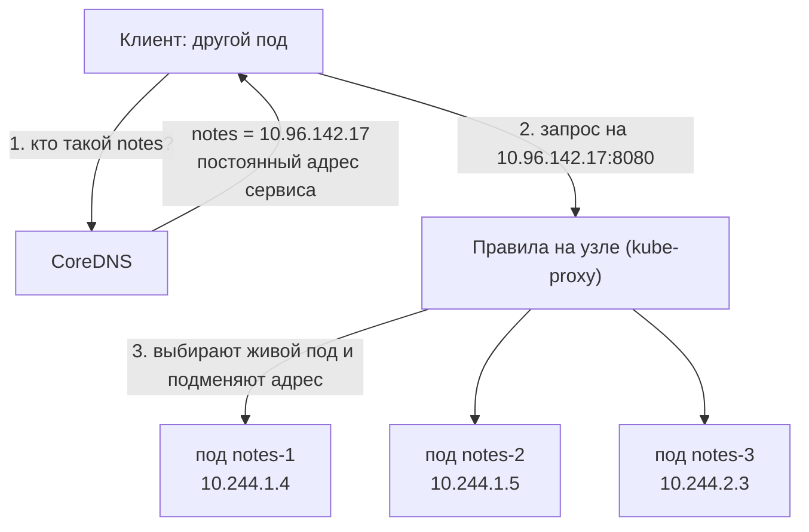
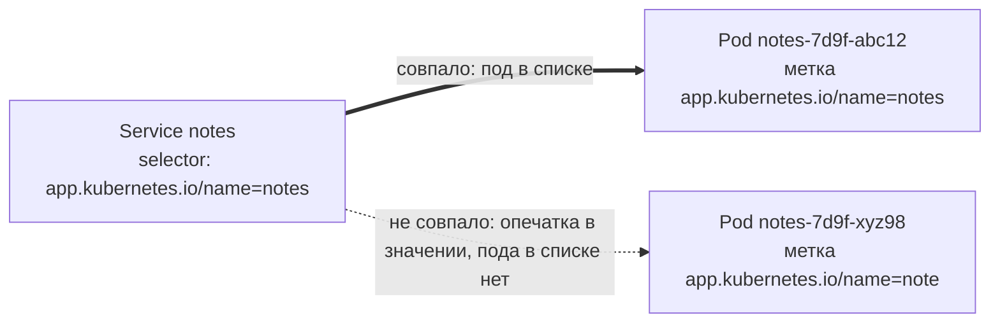
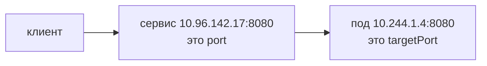
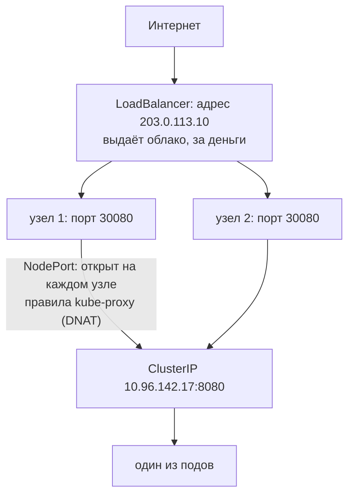
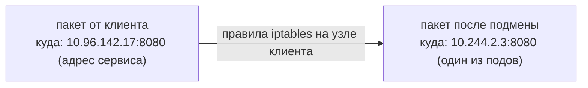

## Зачем это нужно

В [уроке 5.2](02-pods-deployments.md) ты запустил три копии «Заметок». Каждая копия это отдельный **под** (обёртка вокруг контейнера, в которой приложение запускается в кластере) со своим IP-адресом (числовым адресом в сети, по которому к нему обращаются другие, [урок 2.1](../02-network/01-addresses-routes.md)). Но у этих адресов есть неприятное свойство: они не постоянные. Обновил образ, узел перезагрузился, под упал и был пересоздан, и у нового пода уже другой адрес. Если клиент (браузер, другое приложение, база) записал адрес старого пода, при следующей выкладке он попадёт в пустоту.

**Service** (сервис) решает эту проблему: это объект кластера, который даёт группе подов один постоянный адрес и одно постоянное имя, а заодно раскидывает запросы по живым подам. Как единый номер отдела поддержки: сотрудники меняются, а номер остаётся. Без сервиса пришлось бы руками вписывать новые адреса во все клиенты после каждой выкладки. На работе это самый частый источник вопросов «почему не ходит»: пустой список подов за сервисом, неверный порт, обращение к сервису из чужого namespace. Разобрав механику один раз, ты находишь причину в любой из этих ситуаций за минуту.

Шаг проекта: в «Заметках» появляется файл `k8s/base/20-service.yaml`, и три реплики становятся доступны по одному имени `notes.notes.svc:8080`. Расшифровка имени: первое `notes` это имя сервиса, второе `notes` это namespace (отдельная «папка» в кластере, [урок 5.1](01-why-k8s-cluster.md)), `svc` означает service, а `:8080` это порт. Подробно разберём в теории.

## Что нужно знать

- [Урок 5.2: поды и Deployment](02-pods-deployments.md): Deployment `notes` с тремя репликами и меткой `app.kubernetes.io/name: notes`, команды `kubectl get`, `describe`, `port-forward` (временный туннель с порта твоего компьютера внутрь пода: так проверяют приложение, не открывая его наружу).
- [Урок 5.1: кластер kind](01-why-k8s-cluster.md): контекст `kind-notes`, namespace `notes`.
- [Урок 2.3: DNS](../02-network/03-dns.md): что имя превращается в IP-адрес, запись A, команда `dig`, search-домены в `/etc/resolv.conf`.
- [Урок 2.4: HTTP и curl](../02-network/04-http.md): коды ответа, `curl -v`.
- [Урок 4.3: тома и сети Docker](../04-docker/03-storage-networks.md): контейнеры находят друг друга по имени, `-p` строит правила подмены адреса.

Перед началом убедись, что `kubectl -n notes get deploy notes` показывает `3/3` в колонке READY (слева сколько подов готово принимать запросы, справа сколько должно быть). Если нет, вернись к уроку 5.2.

## Картина целиком

Представь большую компанию и её отдел поддержки. В отделе работают три сотрудника. Сотрудники приходят и уходят, пересаживаются, берут отпуск. У каждого свой внутренний номер телефона, и он меняется. Звонить сотруднику по личному номеру неудобно: сегодня он есть, завтра нет.

Поэтому у отдела есть один **общий номер** (скажем, 100). Звонишь на него, и секретарь соединяет тебя с тем, кто сейчас на месте. Секретарь знает, кто в отделе, потому что смотрит на табличку: «поддержка». Кто сел за стол с такой табличкой, тот и в списке.

- Отдел это набор подов.
- Общий номер это адрес сервиса (**ClusterIP**, подробно ниже).
- Табличка это **метка** (label) на подах: пара «ключ = значение», например `app.kubernetes.io/name=notes` (вспомни [урок 5.2](02-pods-deployments.md)). А «искать по табличке» это **selector** (селектор) сервиса: условие «подойдут все поды с такой меткой».
- Справочник компании, в котором записано «отдел поддержки = номер 100», это **DNS кластера** (DNS это служба, которая превращает имя в IP-адрес, [урок 2.3](../02-network/03-dns.md); в кластере её ведёт программа **CoreDNS**).
- Секретарь, который переключает звонок, это правила на узле (машине кластера), которые записывает программа **kube-proxy**: она следит за сервисами и обновляет эти правила.
- **ClusterIP** это «виртуальный» адрес: он не висит ни на одной машине, а только записан в правилах подмены.



Оговорка: секретарь в компании это человек, а тут «секретаря» как отдельной программы на пути нет. Переключение делают правила в ядре Linux, о них будет в теории.

## Теория

### Проблема: адрес пода недолговечен

**Под** (pod) это самая маленькая единица запуска в Kubernetes: обёртка над одним или несколькими контейнерами. **Узел** (node) это машина (настоящая или виртуальная), на которой поды запускаются. В kind узлы это контейнеры Docker, но для Kubernetes они выглядят как обычные машины. Ты уже видел это в [уроке 5.1](01-why-k8s-cluster.md).

Каждому поду кластер выдаёт собственный IP-адрес (это адрес в сети, по которому к устройству обращаются другие устройства, см. [урок 2.1](../02-network/01-addresses-routes.md)). Адреса берутся из отдельного диапазона, который называется **сетью подов** (Pod CIDR). В нашем kind это `10.244.0.0/16`, поэтому поды получают адреса вроде `10.244.1.4`.

Адрес привязан к жизни пода. Не к Deployment, не к имени, а именно к конкретному поду. Умер под, адрес освободился. Deployment (из [урока 5.2](02-pods-deployments.md): объект, который следит, чтобы работало нужное число подов) создаст новый под, и у того будет другой адрес.

Посмотреть адреса подов можно так:

```bash
kubectl -n notes get pods -o wide
```

Ключ `-o wide` («output wide», широкий вывод) добавляет к обычной таблице колонки с IP пода и узлом. Если после этого выполнить `kubectl delete pod <имя>`, а затем снова `get pods -o wide`, увидишь: вместо удалённого пода появился новый, с другим именем и с другим IP.

Разберём, что было бы без сервиса. Допустим, у тебя есть приложение-клиент, которое ходит в «Заметки». Ты вписал в его настройки `http://10.244.1.4:8080`. Пока всё работает. Потом ты выкатываешь новую версию «Заметок», Deployment заменяет все три пода, и адрес `10.244.1.4` больше никому не принадлежит. Клиент получает ошибку соединения. Чинить это вручную после каждой выкладки нельзя, значит нужен посредник с постоянным адресом, который сам знает, какие поды сейчас живы.

Такой посредник и есть **Service**. Это объект Kubernetes (то есть запись в его базе, которую ты описываешь YAML-файлом), у которого есть:

- виртуальный IP-адрес (**ClusterIP**): он не принадлежит ни одному поду и ни одному узлу, и он живёт, пока жив сам сервис;
- DNS-имя, которое заводит для сервиса DNS-сервер кластера;
- **selector** (селектор, «выбиратель»): набор меток, по которому сервис находит свои поды;
- список портов: какой порт слушает сервис и на какой порт пода он передаёт соединение.

Осторожно, путаница: Service это не программа и не под. Ничего не «запускается». Это описание («вот имя, вот адрес, вот как искать поды»), а работу выполняют другие компоненты кластера, о них ниже.

> **Прикинь сам:** под `notes-abc12` работает неделю, и клиент ходит на его IP. Ты выкатил новую версию. Что увидит клиент?
{: .predict}

Ошибку соединения: Deployment заменил под, старый адрес освободился, а у нового пода другой IP. Неделя работы ничего не гарантирует, постоянный адрес есть только у Service.

Осторожно: Service не программа и не под: он ничего не запускает, работу делают другие компоненты кластера.

> **Проверь понимание:** почему нельзя прописать в конфиге клиента IP пода `notes-abc12`, если под работает уже неделю?

<details markdown="1">
<summary>Ответ</summary>

Под может исчезнуть в любой момент (обновление, падение, эвакуация узла), а новый под получит другой IP. Долгоживущего адреса у пода нет, он есть у Service. Неделя работы ничего не гарантирует: следующая выкладка заменит под.

</details>

> **Главное:** IP пода живёт, пока жив под; постоянный адрес и имя даёт Service, который лишь описывает, как искать поды.
{: .key}

Чтобы Service находил нужные поды, он использует метки, и вот как это устроено.

### Метки и selector: как сервис находит свои поды

**Метка** (label) это пара «ключ: значение», которую ты пишешь в манифесте на объекте. Например, `app.kubernetes.io/name: notes`. Метка ничего не делает сама по себе, это просто табличка для поиска. Вспомни [урок 5.2](02-pods-deployments.md): Deployment создаёт поды из шаблона и вешает на каждый метку `app.kubernetes.io/name: notes` (раздел `template.metadata.labels`). Тот же приём использует и сервис.

Как это устроено по шагам:

1. В манифесте сервиса ты пишешь `selector: {app.kubernetes.io/name: notes}`. Это условие поиска: «все поды в моём namespace, у которых есть метка `app.kubernetes.io/name` со значением `notes`».
2. Специальный контроллер Kubernetes (программа внутри кластера, которая следит за объектами и приводит их к описанному состоянию) постоянно смотрит на поды. Кто подходит под условие и при этом **готов** (Ready), тот попадает в список.
3. Этот список хранится в объектах **EndpointSlice** («срез конечных точек»): в каждой записи адрес пода и порт, например `10.244.1.4:8080`. Слово endpoint (конечная точка) означает просто пару «IP:порт», по которой можно постучаться. Старый объект `Endpoints` показывает то же самое; он объявлен устаревшим, и `kubectl get endpoints` в свежих версиях печатает предупреждение об этом, но продолжает работать.
4. Когда под создан или удалён, контроллер обновляет список. Клиент ничего не замечает.

Схема связи:



Разобранный пример. У тебя три пода с меткой `app.kubernetes.io/name: notes`. Ты создаёшь сервис с `selector: {app.kubernetes.io/name: notes}`, и в списке три адреса. Теперь допустим, в манифесте сервиса опечатка: `app.kubernetes.io/name: note`. Kubernetes принимает манифест без единого замечания: синтаксически всё верно, он не знает, что ты имел в виду. Но условию «`app.kubernetes.io/name` равно `note`» не подходит ни один под, и список пуст. Сервис создан, адрес выдан, а отвечать некому.

Это ловушка номер один: `kubectl apply` не ругается, ругается потом `curl`. Имя Deployment, имя образа, имя контейнера в поиске роли не играют, только метки.

**Готовность (Ready).** Второе условие: под должен быть готов принимать запросы. Пока у пода нет **readiness-пробы** (проверки готовности, её напишем в [уроке 5.7](07-probes-resources-rollouts.md)), он считается готовым сразу после старта контейнера. Когда проба появится, под, который ещё «прогревается» или заболел, будет выпадать из списка, и сервис перестанет слать ему запросы. Это защита от трафика в непрогретый процесс.

> **Прикинь сам:** в манифесте сервиса опечатка: `app.kubernetes.io/name: note` вместо `notes`. Что скажет `kubectl apply` и что получится в итоге?
{: .predict}

`apply` не скажет ничего: манифест синтаксически верен. Но под условие не подходит ни один под, список endpoints пуст, сервис создан, а отвечать некому. Ругнётся уже `curl`.

> **Проверь понимание:** ты создал сервис, а список endpoints пуст (`<none>`). Какие две причины проверишь первыми?

<details markdown="1">
<summary>Ответ</summary>

1. Метки в `selector` сервиса не совпадают с метками подов (опечатка, другой ключ или значение). Сравни `kubectl get svc notes -o yaml` и `kubectl get pods --show-labels`.
2. Подов с такими метками нет, или они не Ready (`CrashLoopBackOff`, не прошла readiness-проба). Смотри `kubectl get pods`.

</details>

> **Главное:** сервис находит поды только по меткам (selector) и только готовые (Ready); список их адресов хранят EndpointSlice.
{: .key}

Как проверить, что сервис нашёл поды и порты настроены верно, показывает команда `describe svc`.

### Как выглядит рабочий сервис изнутри: `describe svc`

Команда `kubectl describe svc notes` собирает в одном месте всё, что кластер знает о сервисе. Читать её вывод стоит уметь: при поломке это первое, что ты откроешь. Вот как он выглядит для исправного сервиса (адреса у тебя будут другими, лишние строки убраны):

```text
Name:              notes
Namespace:         notes
Labels:            app.kubernetes.io/name=notes
Selector:          app.kubernetes.io/name=notes
Type:              ClusterIP
IP:                10.96.142.17
Port:              http  8080/TCP
TargetPort:        8080/TCP
Endpoints:         10.244.1.4:8080,10.244.1.5:8080,10.244.2.3:8080
Events:            <none>
```

Разбор по строкам:

- `Labels` это метки самого сервиса. К поиску подов не относятся.
- `Selector` это условие поиска подов, самая важная строка при пустом списке.
- `IP` это ClusterIP, тот самый постоянный адрес.
- `Port` и `TargetPort`: порт сервиса и порт пода. Если они разные, здесь ты увидишь это сразу.
- `Endpoints`: текущий список адресов подов вместе с портами. Здесь же видно неверный `targetPort`: порт после двоеточия будет не тот, что слушает приложение.
- `Events: <none>`: событий нет, ошибок при создании не было. Отсутствие ошибок ничего не доказывает: как ты видел, опечатка в метке ошибки не даёт.

Запомни порядок чтения: сначала `Selector` и `Endpoints`, потом порты. Так ты за десять секунд отличаешь первую ловушку от второй.

> **Прикинь сам:** в `describe svc` строка `Endpoints: <none>`, а `Events: <none>`. Значит ли пустое поле событий, что ошибок нет?
{: .predict}

Нет. Опечатка в метке события не создаёт, а список пуст. Отсутствие событий ничего не доказывает: сначала читай `Selector` и `Endpoints`.

Осторожно: `Labels` в выводе это метки самого сервиса, к поиску подов они не относятся.

> **Главное:** порядок чтения `describe svc`: сначала `Selector` и `Endpoints`, потом порты, потом события.
{: .key}

Порты в этом выводе устроены тоньше, чем кажется: их два, и они разные.

### port и targetPort: два разных порта

**Порт** (port) это номер «двери» на машине, от 1 до 65535: по IP-адресу находят машину, по порту находят программу на ней (подробнее в [уроке 2.2](../02-network/02-ports-tcp-ssh.md)). У сервиса и у пода порты свои, и в манифесте сервиса их два:

- `port`: порт на адресе сервиса, на который стучатся клиенты;
- `targetPort` («порт цели»): порт внутри пода, на который сервис передаёт соединение.

Аналогия с офисом: общий номер отдела 100 (это `port`), а сотрудник у себя на столе отвечает по добавочному 4242 (это `targetPort`). Секретарь принимает звонок на 100 и переключает на 4242.



Наши «Заметки» слушают 8080 (так настроено в образе, [урок 4.2](../04-docker/02-dockerfile.md)), и в сервисе мы тоже ставим 8080, поэтому оба номера одинаковые. Но независимость портов удобна: сервис мог бы слушать привычный 80, а слать на 8080, и клиентам не пришлось бы указывать порт в адресе.

**Почему сервис не хранит список в самом себе.** Кажется, проще было бы записать адреса подов прямо в Service. Но список меняется постоянно: под создаётся, удаляется, становится неготовым. Если бы его хранил сам сервис, каждое такое событие переписывало бы объект сервиса, а для сервисов с сотнями подов этот объект стал бы огромным. Поэтому список вынесен в отдельные небольшие срезы: на один срез приходится до 100 адресов, а при изменении обновляется только затронутый срез. Тебе знать это не обязательно, но понимание помогает, когда увидишь два-три среза у одного большого сервиса.

Разобранный пример неверного `targetPort`. Допустим, ты написал `targetPort: 8081`. Поды найдены, список endpoints заполнен: `10.244.1.4:8081, 10.244.1.5:8081, ...`. Выглядит здорово. Но приложение слушает 8080, а по 8081 в поде никого нет, и соединение отвергается: `Connection refused` («соединение отклонено», порт закрыт). Это вторая по частоте ошибка, и она коварнее первой: список не пуст, поэтому «здоровый» вид вводит в заблуждение. Проверка: порт в списке endpoints (после двоеточия) должен совпадать с портом, который реально слушает приложение.

`targetPort` можно задать и **именем** порта контейнера (`name: http` в Deployment), тогда номер меняется в одном месте. Мы используем число, чтобы читалось проще.

> **Прикинь сам:** сервис с `port: 80` и `targetPort: 8080`. На какой порт стучится клиент и куда попадёт запрос?
{: .predict}

Клиент стучится на порт 80 адреса сервиса, а запрос попадает на порт 8080 пода. Поэтому в адресе клиента порт 8080 можно не указывать.

Осторожно: при неверном `targetPort` список endpoints не пуст, и это вводит в заблуждение: соединение всё равно отвергается.

> **Проверь понимание:** endpoints заполнены тремя адресами, но `curl` даёт `Connection refused`. Что проверишь?

<details markdown="1">
<summary>Ответ</summary>

`targetPort` сервиса против порта, который реально слушает приложение в поде. Порт виден в списке endpoints (например `10.244.1.5:8081`); сравни его с `containerPort` в Deployment и с тем, что слушает процесс (`kubectl exec ... -- ss -ltn`, команда `ss` из [урока 2.2](../02-network/02-ports-tcp-ssh.md)).

</details>

> **Главное:** `port` это порт на адресе сервиса, `targetPort` это порт внутри пода; список endpoints показывает порт пода после двоеточия.
{: .key}

Кто может достучаться до сервиса, зависит от его типа.

### Типы Service: кто может обратиться

У сервиса есть поле `type`: оно решает, откуда сервис доступен. Каждый следующий тип включает возможности предыдущего.

| Тип | Что делает | Когда используют |
|---|---|---|
| `ClusterIP` (по умолчанию) | Виртуальный IP, доступный только внутри кластера | Связь между частями системы: приложение ходит в базу |
| `NodePort` | ClusterIP плюс открытый порт (30000-32767) на каждом узле | Учебные стенды, точка входа для балансировщика; так работает вход в kind в [уроке 5.4](04-ingress-gateway.md) |
| `LoadBalancer` | NodePort плюс внешний балансировщик от облака | Публикация в облаке; в kind без доп. компонента адрес не выдаётся (`<pending>`) |
| `ExternalName` | Только DNS-имя, указывающее на другое имя (запись CNAME из [урока 2.3](../02-network/03-dns.md)), без проксирования | Дать внутреннее имя внешнему сервису, например базе у провайдера |
| Headless («без головы», `clusterIP: None`) | Без виртуального IP; DNS отдаёт адреса всех подов | StatefulSet: обращаться к конкретной реплике, [урок 5.5](05-storage-statefulset-postgres.md) |

Для «Заметок» нужен `ClusterIP`: приложение ходит внутри кластера, а вход снаружи организует Gateway в следующем уроке. Открывать `NodePort` без причины не стоит: порт на каждом узле это лишняя дыра.

Осторожно, путаница: LoadBalancer не «лучший» тип, а самый дорогой, потому что в облаке за каждый такой сервис платят как за отдельный балансировщик. Поэтому снаружи публикуют один общий вход, а внутри всё остаётся на ClusterIP.

> **Прикинь сам:** какой тип сервиса выберешь для базы данных, которую использует только приложение внутри кластера?
{: .predict}

`ClusterIP`: он по умолчанию и виден только внутри кластера. `NodePort` открыл бы порт на каждом узле без нужды.

> **Главное:** типы наращивают друг друга: ClusterIP, потом NodePort, потом LoadBalancer; ExternalName и Headless устроены иначе.
{: .key}

Как именно сервис выходит наружу в вариантах NodePort и LoadBalancer, разберём отдельно.

### NodePort и LoadBalancer: как сервис выходит наружу

ClusterIP виден только внутри кластера. Но пользователю-человеку нужно открыть сайт из браузера, а он находится снаружи. Значит, нужен способ провести трафик из внешнего мира внутрь, к сервису.

Офис с проходной. Внутри здания есть внутренние номера (ClusterIP), они работают только из здания. `NodePort` это отдельная дверь с номером на каждом входе в здание: любой, кто знает адрес здания и номер двери, зайдёт. `LoadBalancer` это ещё и швейцар снаружи, который сам встречает посетителей и разводит их по дверям. Аналогия перестаёт работать в одном: швейцара в облаке нанимает провайдер за деньги, а в нашем учебном кластере его нет.

Тип `NodePort` делает три вещи сразу: создаёт обычный ClusterIP, выбирает свободный порт из диапазона 30000-32767 и слушает его на **каждом** узле кластера. Обращение `<IP любого узла>:30080` kube-proxy подменяет на тот же список подов, что и обычное обращение на ClusterIP. Тип `LoadBalancer` добавляет сверху ещё один шаг: просит облако создать внешний балансировщик, который отправляет трафик на NodePort узлов. Облако вписывает его адрес в колонку `EXTERNAL-IP`.



Допустим, ты сделал сервис `type: NodePort` с `nodePort: 30080` и у узла IP `172.18.0.2`. Из браузера на ноутбуке `http://172.18.0.2:30080` попадёт на один из трёх подов. Если ты укажешь адрес другого узла, `172.18.0.3:30080`, получишь тот же сервис: порт открыт везде. В kind с `type: LoadBalancer` колонка `EXTERNAL-IP` останется `<pending>` («ожидает»), потому что создавать внешний балансировщик некому. Это не ошибка сервиса.

> **Прикинь сам:** у узлов kind адреса `172.18.0.2` и `172.18.0.3`, у сервиса `nodePort: 30080`. Откроется ли сайт по `172.18.0.3:30080`?
{: .predict}

Да: порт NodePort открыт на каждом узле кластера, и любой узел подменит адрес на тот же список подов.

Осторожно: не думай, что NodePort подходит для боевого трафика. Обычно нет: порт из диапазона 30000+ неудобен пользователям, а открытый на каждом узле порт расширяет поверхность для атаки. Поэтому в боевой системе снаружи ставят один общий вход ([урок 5.4](04-ingress-gateway.md)), а все сервисы под ним остаются на ClusterIP.

> **Проверь понимание:** у сервиса тип `LoadBalancer` в кластере kind, `EXTERNAL-IP` показывает `<pending>` уже час. Это поломка?

<details markdown="1">
<summary>Ответ</summary>

Нет. В kind нет компонента, который создаёт внешние балансировщики, поэтому адрес не выдаётся. Внутри кластера сервис при этом работает по ClusterIP. В облаке то же значение `<pending>` на протяжении многих минут уже сигнал о проблеме (квоты, права, ошибка провайдера).

</details>

> **Главное:** NodePort открывает один порт 30000-32767 на каждом узле, LoadBalancer просит у облака внешний балансировщик поверх него.
{: .key}

Теперь посмотрим, что происходит с адресами сервиса, когда Deployment заменяет поды.

### Что происходит со списком адресов при выкатке новой версии

Самый частый сценарий жизни сервиса: ты выкатываешь новую версию, и поды заменяются. Нужно понимать, почему пользователь при этом не видит ошибок, и когда всё же увидит.

Смена караула. Новые охранники встают на пост и докладывают «готов», только после этого старых отпускают. Если отпустить раньше, пост какое-то время пуст.

Deployment заменяет поды постепенно ([урок 5.2](02-pods-deployments.md), подробно в [уроке 5.7](07-probes-resources-rollouts.md)). Для сервиса это последовательность событий:

1. Создаётся новый под. Пока контейнер стартует, под в список не попадает (не Ready).
2. Контейнер запущен и готов: контроллер добавляет адрес нового пода в EndpointSlice.
3. Deployment гасит один старый под. Он получает статус `Terminating`, и контроллер убирает его адрес из списка.
4. Шаги повторяются, пока все три старых пода не заменены.

Список адресов сервиса в ходе выкатки (адреса придуманы):

```text
до:           10.244.1.4   10.244.1.5   10.244.2.3
новый под 1:  10.244.1.4   10.244.1.5   10.244.2.3   10.244.2.9
гасим старый: 10.244.1.5   10.244.2.3   10.244.2.9
...
после:        10.244.2.9   10.244.1.8   10.244.2.10
```

ClusterIP и имя `notes` всё это время не меняются, меняется только список за ними. Клиент ничего не замечает: запросы идут в те адреса, которые есть в списке сейчас.

> **Прикинь сам:** во время выкатки новой версии ClusterIP сервиса остаётся прежним. Почему клиенту не нужно ничего менять?
{: .predict}

ClusterIP и имя принадлежат Service, а он не менялся. Меняется только список адресов за ним, и его обновляет контроллер.

Осторожно: не думай, что обновление всегда безупречно. Есть тонкость: убирание адреса из списка и получение подом сигнала SIGTERM происходят параллельно, а правила на узлах обновляются не мгновенно. Поэтому за доли секунды на уходящий под может прийти ещё несколько запросов. Приложение должно уметь доделать уже принятое перед выходом ([урок 5.2](02-pods-deployments.md): пауза `terminationGracePeriodSeconds`), а пробы готовности из урока 5.7 делают окно ещё уже.

> **Проверь понимание:** во время выкатки ClusterIP сервиса остаётся прежним. Почему клиенту не нужно ничего перенастраивать?

<details markdown="1">
<summary>Ответ</summary>

ClusterIP и имя принадлежат объекту Service, а он не удалялся и не менялся. Меняется лишь список адресов подов за ним (EndpointSlice), а его обновляет контроллер автоматически.

</details>

> **Главное:** при выкатке список адресов меняется постепенно: новый под попадает в него после готовности, старый уходит при `Terminating`.
{: .key}

Помимо обычных сервисов есть два особых, которые нужны для баз и внешних адресов.

### Два особых вида сервиса: Headless и ExternalName

Про остальные типы из таблицы достаточно знать одну строку, а про эти два стоит понимать механику, потому что они встретятся в следующих уроках.

**Headless-сервис** (`clusterIP: None`). Зачем: иногда клиенту не нужен «один общий номер», ему нужно попасть на конкретный под. Например, у базы данных есть главная реплика (primary) и запасные, и записывать можно только в главную. Если поставить перед ними обычный сервис, жребий отправит запись на случайную и она будет отклонена. Как устроено: у такого сервиса нет виртуального IP и нет правил kube-proxy. Когда клиент спрашивает его имя, CoreDNS возвращает адреса всех готовых подов сразу. Дальше клиент сам выбирает. Для StatefulSet ([урок 5.5](05-storage-statefulset-postgres.md)) DNS выдаёт ещё и отдельные имена подов вроде `db-0.db`. Что путают: «headless» не значит «сломанный» или «без селектора». Селектор у него есть, просто адрес не виртуальный.

**ExternalName**. Зачем: приложение внутри кластера должно ходить во внешний сервис (например, в базу у облачного провайдера), но ты хочешь дать ему внутреннее имя и в будущем легко его поменять. Как устроено: сервис не имеет ни селектора, ни списка адресов. Он просто отвечает на DNS-запрос записью CNAME (псевдоним имени, [урок 2.3](../02-network/03-dns.md)): «`db.notes.svc.cluster.local` это на самом деле `db.example.com`». Никакого проксирования нет, соединение идёт напрямую к внешнему адресу. Что путают: у такого сервиса нет ClusterIP и он не балансирует, это просто «переименование».

> **Прикинь сам:** клиенту нужно попасть именно на главную реплику базы, а не на случайную. Какой сервис подойдёт?
{: .predict}

Headless (`clusterIP: None`): DNS отдаёт адреса всех готовых подов, а клиент выбирает сам. Обычный сервис бросил бы жребий и мог послать запись на запасную реплику.

Осторожно: `ExternalName` не балансирует и не имеет ClusterIP, а Headless не значит «сломанный»: селектор у него есть.

> **Главное:** Headless отдаёт адреса подов без виртуального IP, ExternalName только переименовывает внешний адрес записью CNAME.
{: .key}

Остаётся выяснить, как адрес без сетевой карты вообще доводит запрос до пода.

### Как работает ClusterIP: kube-proxy и подмена адреса

Вопрос, который возникает сам собой: если ClusterIP не принадлежит ни одной сетевой карте, как пакет до него доходит?

Ответ: пакет туда и не доходит. По дороге адрес назначения **подменяют**. Как это происходит по шагам:

1. На каждом узле работает **kube-proxy** (компонент Kubernetes, который следит за сервисами и списками endpoints).
2. Для каждого сервиса он прописывает в ядро Linux правила (в kind по умолчанию используется `iptables`, это встроенный в ядро фильтр пакетов, ты видел его в [уроке 2.7](../02-network/07-firewall.md)). Смысл правил такой: «пакет, идущий на `10.96.142.17:8080`, перепиши так, чтобы он шёл на один из адресов из списка».
3. Выбор адреса из списка случайный.
4. Эта подмена адреса назначения называется **DNAT** (destination NAT). Ты уже видел то же самое в Docker: ключ `-p` строит правило DNAT, см. [урок 4.3](../04-docker/03-storage-networks.md).



Разобранный пример. Три пода в списке. Клиент делает три разных соединения на `10.96.142.17:8080`. Правило каждый раз бросает жребий: первое соединение попало на `10.244.1.4`, второе на `10.244.2.3`, третье снова на `10.244.1.4`. Поровну заранее не гарантируется, но на большом числе соединений распределение выравнивается.

Из этого вытекают два важных следствия.

**Первое: `ping` на ClusterIP не работает.** У этого адреса нет сетевой карты, которая ответила бы на ping (он использует протокол ICMP, см. [урок 2.1](../02-network/01-addresses-routes.md)). Правила подменяют только адреса для портов сервиса. Так что «не пингуется» здесь нормально, проверять надо `curl` на порт сервиса.

**Второе: балансировка идёт по соединениям, а не по запросам.** Жребий бросается при установке соединения. Если клиент открыл одно долгоживущее соединение (keep-alive, gRPC) и шлёт по нему тысячу запросов, все тысяча уйдут в один под. Остальные поды при этом простаивают.

Осторожно, путаница: kube-proxy не «пропускает через себя трафик» и не является отдельным балансировщиком-прокси. Он только пишет правила, а трафик обрабатывает ядро.

> **Прикинь сам:** у ClusterIP нет сетевой карты. Ответит ли он на `ping`, и сработает ли `curl` на порт сервиса?
{: .predict}

Ping не ответит: правила подмены есть только для портов сервиса, а ICMP их не касается. `curl` на порт сработает, потому что правило DNAT перепишет адрес на один из подов.

> **Проверь понимание:** почему `ping <ClusterIP>` не отвечает, хотя `curl <ClusterIP>:8080` работает?

<details markdown="1">
<summary>Ответ</summary>

У ClusterIP нет сетевого интерфейса, который отвечал бы на ICMP. Есть только правила DNAT для портов сервиса. Проверять доступность нужно тем протоколом и портом, которые сервис обслуживает.

</details>

> **Главное:** kube-proxy только прописывает в ядро правила DNAT, а трафик обрабатывает ядро; балансировка идёт по соединениям, а не по запросам.
{: .key}

Клиенту проще помнить имя, чем адрес, и для этого в кластере есть DNS.

### DNS кластера: имя вместо адреса

Постоянный адрес сервиса лучше адреса пода, но запоминать `10.96.142.17` всё равно неудобно, а при пересоздании сервиса он тоже поменяется. Поэтому у каждого сервиса есть **имя**. Как вспоминает [урок 2.3](../02-network/03-dns.md), DNS это «телефонная книга»: спрашиваешь имя, получаешь IP.

В кластере есть свой DNS-сервер **CoreDNS**. Он работает обычными подами в namespace `kube-system` (служебное пространство самого Kubernetes). Как только ты создаёшь сервис, CoreDNS начинает отвечать на его имя. Полное имя устроено так:

```text
<сервис>.<namespace>.svc.cluster.local
```

`svc` означает «service», а `cluster.local` это домен кластера по умолчанию. Для нас: `notes.notes.svc.cluster.local` (сервис `notes` в namespace `notes`).

Как под узнаёт адрес DNS-сервера? Kubernetes при создании каждого пода записывает ему файл `/etc/resolv.conf` (настройки DNS, из [урока 2.3](../02-network/03-dns.md)). В kind он выглядит так:

```text
search notes.svc.cluster.local svc.cluster.local cluster.local
nameserver 10.96.0.10
options ndots:5
```

Построчно:

- `nameserver 10.96.0.10`: адрес CoreDNS. Это тоже ClusterIP, у сервиса `kube-dns` в `kube-system`.
- `search ...`: список **search-доменов**. Если имя короткое, резолвер (библиотека, которая спрашивает DNS) по очереди дописывает к нему эти суффиксы и пробует, пока не получит ответ. Первый суффикс `notes.svc.cluster.local` содержит **namespace самого пода**: для пода в namespace `notes` это `notes`, для пода в `default` было бы `default.svc.cluster.local`.
- `options ndots:5`: правило «когда пробовать search»: если в имени меньше пяти точек, сначала пробуем с суффиксами, и только потом как есть.

Разобранный пример: под в namespace `notes` запрашивает короткое имя `notes`.

```text
1. в имени 0 точек (меньше 5): сначала с суффиксами
2. пробуем notes.notes.svc.cluster.local  -> нашлось: 10.96.142.17
   (дальше не идём)
```

Что сработает из пода в namespace `notes`:

- `notes`: подставится первый search-домен, получится полное имя;
- `notes.notes` (сервис и namespace): подставится `svc.cluster.local`;
- `notes.notes.svc.cluster.local`: полное имя, работает откуда угодно.

Теперь тот же вопрос из пода в другом namespace, например `default`. Короткое `notes` превратится в `notes.default.svc.cluster.local`. Такого сервиса нет, и DNS ответит `NXDOMAIN` (сокращение от «non-existent domain»: «такого имени не существует»). Сервис исправен, просто клиент ищет не там. Правило для конфигов: между namespace пиши минимум `<сервис>.<namespace>`.

**Побочный эффект `ndots:5`.** Внешнее имя `example.com` содержит одну точку, это меньше пяти, поэтому резолвер сначала попробует `example.com.notes.svc.cluster.local`, потом `example.com.svc.cluster.local`, потом `example.com.cluster.local` и только четвёртым запросом настоящее имя. Каждая неудачная попытка это лишний обмен с DNS. Это известная причина задержек DNS в кластерах. Если записать имя с точкой на конце (`example.com.`), резолвер считает его полным и пропускает подстановки.

> **Прикинь сам:** из пода в namespace `default` ты пишешь `http://notes:8080`, а сервис живёт в namespace `notes`. Что получится?
{: .predict}

Резолвер допишет `notes.default.svc.cluster.local`, такого сервиса нет, и DNS ответит `NXDOMAIN`. Правильно: `notes.notes` или полное имя.

Осторожно: из-за `ndots:5` внешнее имя вроде `example.com` сначала пробуется с суффиксами, это лишние запросы; точка на конце их пропускает.

> **Проверь понимание:** из пода в namespace `default` нужно обратиться к сервису `notes` в namespace `notes`. Какое имя напишешь?

<details markdown="1">
<summary>Ответ</summary>

`notes.notes` (или полное `notes.notes.svc.cluster.local`). Просто `notes` не сработает: резолвер будет искать `notes.default.svc.cluster.local` и получит `NXDOMAIN`.

</details>

**Куда «делся» сервис, когда его удалили.** Полезное следствие всей схемы: ClusterIP и имя живут ровно столько, сколько сам объект Service. Удалишь сервис, и через несколько секунд kube-proxy уберёт правила, а CoreDNS перестанет отвечать на имя. Поды при этом продолжают работать, они про сервис не знают. Пересоздашь сервис с тем же именем: имя то же, но ClusterIP, скорее всего, будет новый. Поэтому клиентам всегда дают имя, а не адрес сервиса.

> **Главное:** полное имя сервиса `<сервис>.<namespace>.svc.cluster.local`, а короткое имя работает только внутри своего namespace.
{: .key}

Соберём все шаги вместе в одну схему запроса.

### Итоговая схема: что происходит при запросе curl к сервису notes

Соберём всё вместе. Под-клиент в namespace `notes` выполняет `curl http://notes:8080/healthz`:

1. `curl` не знает IP, спрашивает резолвер. Резолвер читает `/etc/resolv.conf`, дописывает search-домен и спрашивает CoreDNS про `notes.notes.svc.cluster.local`.
2. CoreDNS знает сервис и отвечает его ClusterIP `10.96.142.17`.
3. `curl` открывает соединение на `10.96.142.17:8080`.
4. Правила kube-proxy на узле переписывают адрес назначения на IP одного из подов из списка EndpointSlice (например, `10.244.1.5:8080`).
5. Приложение в поде отвечает, ответ возвращается тем же путём.

Если запрос сломался, ошибку можно искать по этим пяти шагам: имя не найдено (шаг 1-2), соединение отвергнуто (шаги 3-5: список пуст или неверный порт).

> **Прикинь сам:** `curl http://notes:8080` отвечает «Could not resolve host». Какую часть пути проверять, а какую нет?
{: .predict}

Проверять имя и DNS (шаги 1-2): адрес не получен. Endpoints и порты тут ни при чём: до соединения дело не дошло.

> **Главное:** запрос проходит пять шагов: резолвер, CoreDNS, соединение на ClusterIP, подмена kube-proxy, ответ пода; по ним ищут место поломки.
{: .key}

Теперь пора создать сервис руками и найти его endpoints.

## Практика

Все команды выполняются на твоём компьютере с контекстом `kind-notes` (проверка: `kubectl config current-context`). Ты знаком с `kubectl get`, `describe`, `apply`, `-n` (namespace) из [урока 5.2](02-pods-deployments.md).

### Задание 1. Создай Service и найди endpoints

**Цель:** дать «Заметкам» постоянный адрес и увидеть, как selector превращается в список подов.

**Предскажи:** сколько адресов будет в списке endpoints, если реплик 3? Что покажет `kubectl get endpoints notes` до создания сервиса?

<details markdown="1">
<summary>Ответ</summary>

Три адреса `IP:8080`. До создания сервиса такого объекта нет: `Error from server (NotFound): endpoints "notes" not found`.

</details>

**Шаги:**

1. Создай файл `k8s/base/20-service.yaml` в репозитории `~/notes`:

```yaml
apiVersion: v1                # Service входит в основную группу API, поэтому просто v1
kind: Service                 # тип объекта
metadata:
  name: notes                 # имя сервиса = имя в DNS
  namespace: notes            # в каком namespace живёт
  labels:
    app.kubernetes.io/name: notes  # метка на самом сервисе (для порядка, на работу не влияет)
spec:
  type: ClusterIP             # адрес только внутри кластера (это и так значение по умолчанию)
  selector:
    app.kubernetes.io/name: notes  # ищем поды с этой меткой (как в шаблоне пода Deployment)
  ports:
    - name: http              # имя порта, полезно, когда портов несколько
      port: 8080              # порт сервиса: на него стучатся клиенты
      targetPort: 8080        # порт приложения внутри пода
```

Что важно: `selector` не имеет отношения к `labels` в `metadata`. Первое это «кого искать», второе «как назвать сам сервис».

2. Примени и посмотри. Сначала разберём новые команды. `kubectl apply -f <файл>` создаёт объект из файла (или обновляет, если он уже есть). `get svc` показывает сервисы (`svc` это короткое имя `service`). `get endpointslices -l kubernetes.io/service-name=notes` показывает списки адресов: ключ `-l` (label) оставляет только объекты с меткой, а эту метку контроллер вешает на срезы сам, значение равно имени сервиса. `get pods -o wide` даёт IP подов.

```bash
cd ~/notes
kubectl apply -f k8s/base/20-service.yaml
kubectl -n notes get svc notes
kubectl -n notes get endpointslices -l kubernetes.io/service-name=notes
kubectl -n notes get pods -o wide
```

3. Сравни IP в списке endpoints с IP подов.

**Что должно получиться:**

```text
service/notes created
NAME    TYPE        CLUSTER-IP     EXTERNAL-IP   PORT(S)    AGE
notes   ClusterIP   10.96.142.17   <none>        8080/TCP   3s
NAME          ADDRESSTYPE   PORTS   ENDPOINTS                          AGE
notes-x7k2p   IPv4          8080    10.244.1.4,10.244.1.5,10.244.2.3   3s
```

Адреса, хвост имени среза (`x7k2p`) и время у тебя будут другими. Команда `get pods -o wide` покажет те же три IP в колонке `IP`.

**Как читать вывод:**

- `CLUSTER-IP`: постоянный виртуальный адрес сервиса. Он не совпадает ни с одним IP пода, потому что это другой диапазон адресов.
- `EXTERNAL-IP <none>`: у ClusterIP внешнего адреса нет, так и должно быть.
- `PORT(S) 8080/TCP`: порт сервиса и протокол.
- В срезе: `PORTS` это порт пода (то есть `targetPort`), `ENDPOINTS` это адреса подов через запятую. Три адреса значит три готовых пода. Пустое место или `<unset>` значит «подов не нашлось».

**Объясни себе:**

- Откуда сервис узнал адреса подов, если в манифесте их нет?
- Что изменится в списке, если удалить один под?
- Почему `CLUSTER-IP` не совпадает ни с одним IP пода?

**Типичные ошибки:**

- `Error from server (NotFound): namespaces "notes" not found`: namespace не создан, вернись к уроку 5.1 и выполни `kubectl apply -f k8s/base/00-namespace.yaml`.
- В `ENDPOINTS` пусто: метки в `selector` не совпали с метками подов, сравни с `kubectl -n notes get pods --show-labels`.
- `error: the path "k8s/base/20-service.yaml" does not exist`: команда запущена не из `~/notes`.

### Задание 2. Проверь сервис изнутри кластера

**Цель:** убедиться, что сервис доступен по DNS-имени из другого пода, и увидеть, что запросы раздаются по подам.

**Предскажи:** какие из имён сработают из временного пода в namespace `notes`: `notes`, `notes.notes`, `notes.notes.svc.cluster.local`, `notes.default`?

<details markdown="1">
<summary>Ответ</summary>

Первые три сработают. `notes.default` означает сервис `notes` в namespace `default`, которого нет: `NXDOMAIN`.

</details>

**Шаги:**

1. Запусти одноразовый под с отладочными инструментами. Разберём команду: `kubectl run tmp` создаёт под с именем `tmp`; `--image=nicolaka/netshoot:v0.14` образ с готовым набором сетевых утилит (`dig`, `curl` и другие), которых нет в образе «Заметок»; `-it` даёт интерактивный терминал; `--rm` удалит под при выходе; `--restart=Never` создаёт под, а не Deployment; всё после `--` это команда внутри пода (`bash`, оболочка).

```bash
kubectl -n notes run tmp --rm -it --restart=Never --image=nicolaka/netshoot:v0.14 -- bash
```

Первый запуск скачивает образ, это может занять минуту.

2. Внутри пода выполни команды. `dig +short <имя>` спрашивает DNS и печатает только ответ (утилита из [урока 2.3](../02-network/03-dns.md)). Цикл `for i in 1 2 3 4 5 6; do ...; done` повторяет команду шесть раз. Ключи `curl`: `-s` (без индикатора), `-o /dev/null` (тело ответа выбросить), `-w '%{http_code}\n'` (напечатать только код ответа).

```bash
# смотрим настройки DNS пода
cat /etc/resolv.conf
# спрашиваем короткое и полное имя
dig +short notes
dig +short notes.notes.svc.cluster.local
# ходим по имени; echo добавляет перевод строки после ответа
curl -s http://notes:8080/healthz; echo
# 6 запросов подряд, важен код ответа
for i in 1 2 3 4 5 6; do curl -s -o /dev/null -w '%{http_code}\n' http://notes:8080/healthz; done
exit
```

3. Пока под жив, из второго терминала посмотри логи подов и убедись, что запросы разошлись: `kubectl -n notes logs -l app.kubernetes.io/name=notes --prefix --tail=3`. `--prefix` подписывает каждую строку именем пода, `--tail=3` берёт три последние строки. Приложение не пишет в лог запросы `/healthz`, поэтому для проверки распределения лучше запрашивать `/notes` (эти запросы в логе видны).

**Что должно получиться:**

```text
search notes.svc.cluster.local svc.cluster.local cluster.local
nameserver 10.96.0.10
options ndots:5
10.96.142.17
10.96.142.17
ok
200
200
200
200
200
200
```

`dig +short` вернул ClusterIP сервиса, а не IP подов. В твоём `resolv.conf` в конце строки `search` может быть лишний домен (от настроек твоей сети), это нормально. Первым сообщением при запуске пода будет `If you don't see a command prompt, try pressing enter.`: нажми Enter.

**Как читать вывод:**

- Три строки `resolv.conf`: то, что разобрано в теории. `nameserver` это адрес CoreDNS.
- Два одинаковых адреса: короткое и полное имя ведут в один сервис.
- `ok` это ответ `/healthz`, код 200 значит «жив».
- Шесть `200` подряд: сервис отвечает; какой именно под ответил, тут не видно, это решил жребий kube-proxy.

**Объясни себе:**

- Почему `dig notes` вернул тот же адрес, что и полное имя?
- Кто в этом эксперименте выбрал под, который ответил?
- Чем это отличается от `kubectl port-forward` из урока 5.2?

**Типичные ошибки:**

- `Error from server (AlreadyExists): pods "tmp" already exists`: прошлый под остался после обрыва сессии, удали его: `kubectl -n notes delete pod tmp`.
- `curl: (6) Could not resolve host: notes`: команда запущена в другом namespace (без `-n notes`), короткое имя не находится.
- `ErrImagePull` у пода `tmp`: нет доступа к Docker Hub, образ можно заранее загрузить в узлы: `docker pull nicolaka/netshoot:v0.14 && kind load docker-image nicolaka/netshoot:v0.14 --name notes`.

### Задание 3. Убей под и понаблюдай за списком

**Цель:** увидеть, что сервис сам перестраивает список подов, а клиент про это ничего не знает.

**Предскажи:** сколько адресов будет в списке через секунду после `kubectl delete pod`? Изменится ли `CLUSTER-IP`?

<details markdown="1">
<summary>Ответ</summary>

Через несколько секунд снова три: удалённый под выпадает из списка, ReplicaSet (часть Deployment, из урока 5.2) создаёт новый, тот попадает в список после старта контейнера. Промежуточно на секунду-две может быть два адреса. `CLUSTER-IP` не изменится, пока жив сервис.

</details>

**Шаги:**

1. В первом терминале включи наблюдение. Ключ `-w` (watch) не завершает команду, а печатает новую строку при каждом изменении:

```bash
kubectl -n notes get endpointslices -l kubernetes.io/service-name=notes -w
```

2. Во втором терминале удали один под. Разбор: `kubectl -n notes get pods -o name` печатает имена подов в виде `pod/notes-...`, `| head -1` (из [урока 1.2](../01-linux/02-text-pipes.md)) оставляет первую строку, `$(...)` подставляет результат в команду.

```bash
kubectl -n notes delete pod $(kubectl -n notes get pods -o name | head -1)
```

3. Останови наблюдение (Ctrl+C) и сравни `kubectl -n notes get svc notes` с тем, что было до удаления.

**Что должно получиться:**

```text
NAME          ADDRESSTYPE   PORTS   ENDPOINTS                          AGE
notes-x7k2p   IPv4          8080    10.244.1.4,10.244.1.5,10.244.2.3   5m
notes-x7k2p   IPv4          8080    10.244.1.5,10.244.2.3              5m
notes-x7k2p   IPv4          8080    10.244.1.5,10.244.2.3,10.244.2.6   5m
```

Число строк и промежуточные состояния могут отличаться.

**Как читать вывод:** это один и тот же срез в три момента времени. Первая строка: было три адреса. Вторая: старый под ушёл, адрес выпал из списка. Третья: новый под стартовал, у него новый адрес `10.244.2.6`. `CLUSTER-IP` в `get svc` остался прежним: клиенты видели один и тот же адрес всё время.

**Объясни себе:** кто убирает адрес из списка: kubelet, ReplicaSet или контроллер EndpointSlice? Что почувствует клиент, если удалить все три пода сразу?

**Типичные ошибки:**

- `No resources found`: метка в `-l` набрана неверно, проверь через `--show-labels`.
- В списке остался адрес уже удалённого пода на несколько секунд: это нормальная задержка обновления правил. Она же причина коротких всплесков 502 при выкладке, без специальных мер (см. [урок 5.7](07-probes-resources-rollouts.md)).

### Задание 4. Шаг проекта: Service в git и вход через port-forward

**Цель:** закрепить `20-service.yaml` в репозитории и проверить сервис с хоста.

**Предскажи:** к чему подключается `kubectl port-forward svc/notes`: к сервису целиком или к одному поду?

<details markdown="1">
<summary>Ответ</summary>

К одному конкретному поду, который выбирается из endpoints в момент запуска команды. Балансировки по трём репликам порт-форвард не даёт, а при пересоздании этого пода соединение оборвётся.

</details>

**Шаги:**

1. Убедись, что файл в проекте совпадает с кластером. `kubectl diff -f <файл>` показывает разницу между файлом и тем, что в кластере: если различий нет, вывод пуст и код возврата 0, поэтому `&& echo` печатает сообщение.

```bash
cd ~/notes
kubectl diff -f k8s/base/20-service.yaml && echo "различий нет"
```

2. Пробрось порт и проверь с хоста. Первая команда занимает терминал, вторую запусти в другом. `8080:8080` это «локальный порт : порт сервиса». Ключ `-i` у `curl` печатает заголовки ответа, `| head -1` оставляет только первую строку.

```bash
kubectl -n notes port-forward svc/notes 8080:8080
```

```bash
curl -s -i http://127.0.0.1:8080/healthz | head -1
```

3. Останови порт-форвард (Ctrl+C) и закоммить:

```bash
git add k8s/base/20-service.yaml
git commit -m "k8s: Service notes (ClusterIP 8080)"
```

**Что должно получиться:**

```text
различий нет
Forwarding from 127.0.0.1:8080 -> 8080
Forwarding from [::1]:8080 -> 8080
HTTP/1.0 200 OK
```

**Как читать вывод:** две строки `Forwarding from` (одна для IPv4, другая для IPv6, адрес `[::1]`) значат «порт 8080 твоего компьютера пробрасывается в порт 8080 пода». Первая строка результата `curl` это статус ответа приложения: `200 OK`. Версия HTTP в ней (`1.0` или `1.1`) зависит от версии приложения, важен код.

Состояние проекта: Service `notes` `:8080`, DNS `notes.notes.svc`, вход снаружи пока только через `port-forward` (постоянный вход появится в [уроке 5.4](04-ingress-gateway.md)), хранилище всё ещё `emptyDir`, образ `notes:0.4.0`. Эталон: [k8s/base/20-service.yaml](https://github.com/distinguished-sre/learning/tree/main/devops/project/notes/k8s/base/20-service.yaml).

**Объясни себе:** почему порт-форвард годится для отладки, но не для публикации? Что будет с соединением при пересоздании пода?

**Типичные ошибки:**

- `Unable to listen on port 8080: Listeners failed to create with the following errors: [unable to create listener: Error listen tcp4 127.0.0.1:8080: bind: address already in use]`: порт 8080 на компьютере занят (например, локальный `app.py` или Compose из темы 4). Выбери другой: `8081:8080`.
- `error: unable to forward port because pod is not running. Current status=Pending`: под не запущен, смотри `kubectl -n notes describe pod`.
- `lost connection to pod`: под пересоздался, запусти команду заново.

> Нейросеть хорошо объясняет вывод `describe svc`, но не видит твои метки. Проси её сверить `Selector` с метками подов и не верь совету «всё в порядке» по пустому `Events`.
{: .ai}

## Сломай и почини

Скачай скрипт поломки и запусти один из сценариев. Скрипт не читай: диагностируй так, как в реальной жизни. Сценарии: 1, 2, 3 (или `random`).

```bash
curl -fsSL -o /tmp/break-5.3.sh https://raw.githubusercontent.com/distinguished-sre/learning/main/devops/project/notes/break/5.3/break.sh
bash /tmp/break-5.3.sh random
```

Вернуть исправное состояние: `bash /tmp/break-5.3.sh fix` (безопасно запускать повторно).

### Симптом

Запрос `curl http://notes:8080/healthz` перестал работать: соединение отклонено, зависает или имя не находится. Приложение при этом `3/3 Running`. Проверять можно из пода `tmp` (задание 2) или, для сценария 3, командой `kubectl -n default logs notes-client`.

### Гипотезы

1. Сервис не нашёл поды (метки).
2. Сервис нашёл поды, но шлёт не на тот порт.
3. Клиент ищет сервис по короткому имени из другого namespace.
4. CoreDNS не работает.

### Проверки

```bash
kubectl -n notes get svc notes -o wide
kubectl -n notes get endpointslices -l kubernetes.io/service-name=notes
kubectl -n notes get pods --show-labels
kubectl -n notes describe svc notes
kubectl -n kube-system get pods -l k8s-app=kube-dns
```

Если список endpoints пуст, сравни `Selector` из `describe svc` с метками подов. Если список есть, но порт в нём не 8080, смотри `targetPort`. Если сервис исправен, зайди в клиентский под и выполни `cat /etc/resolv.conf` и `dig` с коротким и полным именем.

### Исправление

<details markdown="1">
<summary>Разбор сценариев</summary>

**1. Selector не совпал с labels.** Симптом: список endpoints пуст, `describe svc` показывает `Endpoints: <none>`, `curl` даёт `Connection refused` (на ClusterIP без endpoints правила kube-proxy отвечают отказом). Причина: в `selector` другое значение метки (`app.kubernetes.io/name: note` вместо `app.kubernetes.io/name: notes`). Починка: привести `selector` к меткам подов и применить `kubectl apply -f k8s/base/20-service.yaml`. Способ отладки: сравнить `Selector` в `describe svc` с колонкой LABELS у `get pods --show-labels`.

**2. Неверный targetPort.** Симптом: в списке адреса вида `10.244.1.4:8081`, но `curl` получает `Connection refused` или висит. Причина: `targetPort` не равен порту приложения. Починка: `targetPort: 8080` в файле и `kubectl apply`. Способ отладки: порт после двоеточия в списке должен совпадать с портом контейнера; проверь напрямую из клиента `curl <IP пода>:8080/healthz`: если он работает, а через сервис нет, виноват сервис.

**3. DNS-имя из другого namespace.** Симптом: под `notes-client` в namespace `default` пишет в лог `curl: (6) Could not resolve host: notes`, а `dig notes` возвращает `NXDOMAIN`. Сервис при этом исправен. Причина: короткое имя резолвится в namespace клиента. Починка: в клиенте `notes.notes` или полное имя, проверь: `kubectl -n default exec notes-client -- curl -s http://notes.notes:8080/healthz`. Способ отладки: `cat /etc/resolv.conf` в клиенте показывает search-домен другого namespace.

</details>

## ИИ в помощь

Нейросеть хорошо объясняет, как сервис находит поды и как работает DNS, но твои метки, порты и адреса она не видит. Общие правила: [ИИ-помощник](../../load-tester/ai.md).

**Задача:** разобрать вывод `describe svc`.

```text
Я учу Kubernetes. Вот вывод kubectl describe svc для моего сервиса:
<вставь вывод>
А вот метки подов из kubectl get pods --show-labels: <вставь вывод>.
Скажи, нашёл ли сервис поды, совпадают ли порты, и что проверить первым, если запросы не проходят.
```
{: .wrap}

**Проверь ответ:** сверь с порядком чтения из теории: сначала `Selector` и `Endpoints`, потом порты. Типичная ошибка: нейросеть говорит «всё в порядке» по пустому `Events`. Пустые события ничего не доказывают.

**Задача:** объяснить ошибку DNS из другого namespace.

```text
Из пода в namespace default команда curl http://notes:8080/healthz пишет: <вставь текст ошибки>.
Сервис notes живёт в namespace notes. Объясни по шагам, как резолвер дописывает search-домены
и какое имя написать. Покажи, как проверить это через dig.
```
{: .wrap}

**Проверь ответ:** проверь имя на деле: `kubectl -n default exec notes-client -- curl -s http://notes.notes:8080/healthz`. Типичная ошибка: нейросеть советует «добавить сервис в namespace default» вместо правки имени.

**Задача:** составить манифест Service.

```text
Напиши манифест Service: имя notes, namespace notes, тип ClusterIP, порт сервиса 8080, targetPort 8080,
селектор по метке app.kubernetes.io/name=notes. Добавь комментарии на русском и скажи, чем port
отличается от targetPort.
```
{: .wrap}

**Проверь ответ:** сравни `selector` с метками подов из `kubectl get pods --show-labels` и с файлом `k8s/base/20-service.yaml` из задания 4. Типичная ошибка: другой ключ метки (`app` вместо `app.kubernetes.io/name`) или `type: LoadBalancer` без причины.

## Словарик урока

| Термин | Простыми словами |
|---|---|
| Service (сервис) | Объект с постоянным адресом и именем для группы подов; распределяет запросы по готовым подам |
| ClusterIP | Виртуальный адрес сервиса, работает только внутри кластера, не принадлежит ни одной сетевой карте |
| Label (метка) | Пара «ключ: значение» на объекте, по ней объекты ищут друг друга |
| Selector (селектор) | Условие поиска по меткам в манифесте сервиса |
| `app.kubernetes.io/name` | Рекомендуемая метка с именем приложения; в курсе везде `notes` (объяснена в [уроке 5.2](02-pods-deployments.md)) |
| NodePort | Тип сервиса: ClusterIP плюс порт 30000-32767, открытый на каждом узле |
| LoadBalancer | Тип сервиса: NodePort плюс внешний балансировщик, который создаёт облако |
| CoreDNS | DNS-сервер кластера: отвечает на имена сервисов |
| Endpoint (конечная точка) | Пара «IP пода : порт», по которой можно постучаться |
| EndpointSlice | Объект со списком endpoints сервиса, обновляется автоматически |
| Ready (готов) | Под, готовый принимать запросы; неготовые в список не попадают |
| port / targetPort | Порт сервиса для клиентов / порт приложения в поде |
| kube-proxy | Компонент на каждом узле, который пишет правила подмены адреса для сервисов |
| DNAT | Подмена адреса назначения у пакета |
| CoreDNS | DNS-сервер кластера, работает подами в `kube-system` |
| search-домен | Суффикс, который резолвер дописывает к короткому имени |
| ndots | Порог числа точек в имени, ниже которого сначала пробуют search-домены |
| NXDOMAIN | Ответ DNS «такого имени нет» |
| NodePort, LoadBalancer | Типы сервиса с доступом снаружи: порт на узлах / внешний балансировщик облака |
| Headless-сервис | Сервис без ClusterIP: DNS отдаёт адреса подов напрямую |
| `port-forward` | Временный проброс порта компьютера в один под или сервис, для отладки |

## Вопросы с собеседований

Раздел для повторения: ответь вслух, потом открой ответ. Короткие вопросы с пометкой `[на скорость]` тренируй на время: ответ за 30 секунд.



## Проверено на версиях

Кластер в этой редакции не запускался: манифест Service проверен статически (`kubeconform -strict` по схемам Kubernetes), команды `kubectl` и их вывод оставлены по документации и знанию версий, адреса и хэши в примерах условные. Скрипт поломок проверен `shellcheck`, но не запускался.

- Kubernetes: 1.37.1 (допустимо 1.36.5), kubectl 1.37.1
- kind: v0.33.0
- CoreDNS: версия из образа узла kind (`kindest/node` под Kubernetes 1.37.1)
- nicolaka/netshoot: тег v0.14, проверь актуальный тег на странице проекта
- Образ «Заметок» слушает `0.0.0.0:8080`, `/healthz` отвечает текстом `ok` (эталон `project/notes/versions/v4.py`)

## Итог урока: ты умеешь

- [ ] умею объяснить, почему IP пода нельзя прописывать в клиенте и что даёт Service
- [ ] умею создать Service типа ClusterIP и связать его с подами через selector
- [ ] умею по списку endpoints и `describe svc` понять, нашёл ли сервис поды
- [ ] умею объяснить разницу между `port` и `targetPort` и найти неверный `targetPort`
- [ ] умею обратиться к сервису по DNS-имени из пода, в том числе из другого namespace
- [ ] умею проверить сервис изнутри кластера временным подом с `curl` и `dig`
- [ ] умею объяснить, как kube-proxy превращает ClusterIP в IP пода
- [ ] умею открыть сервис на компьютер через `kubectl port-forward` и назвать его ограничения

**Дальше:** [Урок 5.4: Вход в кластер: Ingress и Gateway API](04-ingress-gateway.md)
