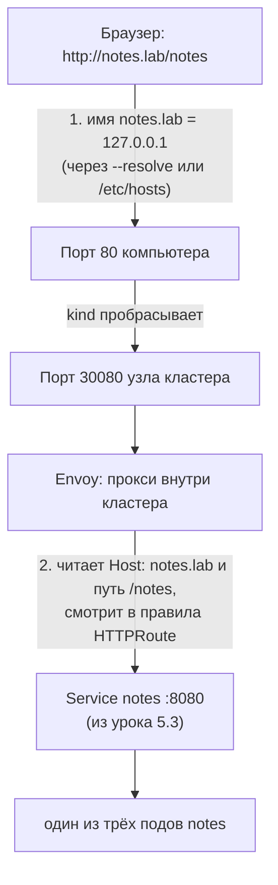
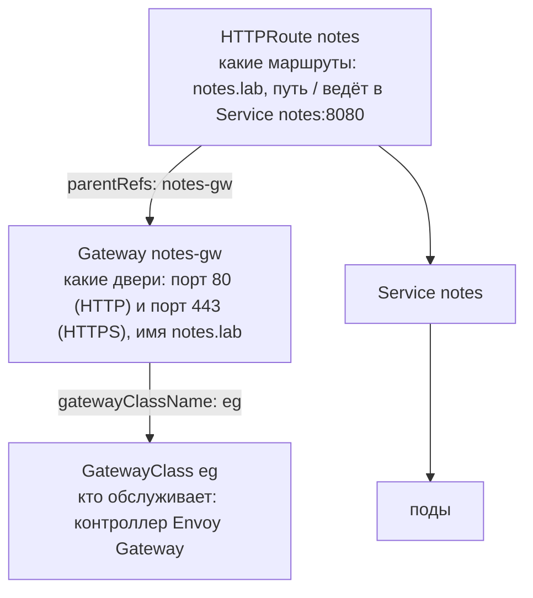
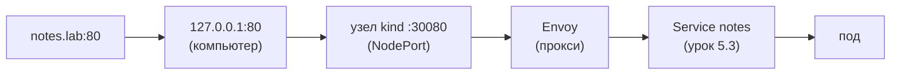
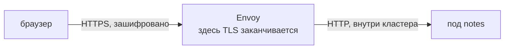

## Зачем это нужно

Service из [урока 5.3](03-services-dns.md) живёт только внутри кластера: снаружи до его адреса не добраться. А пользователь приходит с браузером, по имени вроде `notes.lab`, на порты 80 и 443, и ему нужен HTTPS (защищённое соединение с замочком: данные между браузером и сайтом зашифрованы, и посторонний в сети их не прочитает). Значит, кто-то должен принять соединение снаружи, расшифровать его, выбрать нужный сервис по имени сайта и пути в адресе и передать запрос дальше. Без такого «входа» каждый сервис пришлось бы выставлять наружу отдельным адресом и отдельно настраивать шифрование.

В 2026 на собеседованиях спрашивают не «что такое Ingress», а «почему ingress-nginx больше не выбирают для нового проекта и чем его заменяют». Ingress (входное правило) это старый способ описать такой вход: YAML-объект, в котором написано «запросы на такой-то сайт отправляй в такой-то сервис». Он заморожен: новых возможностей в него не добавляют. Самый популярный его исполнитель ingress-nginx (программа, которая по таким правилам настраивает nginx) выведен из поддержки, то есть уязвимости в нём больше не закрывают. Новые кластеры строят на **Gateway API** (новый стандарт описания входа, то же назначение, но устроен удобнее, разберём ниже). Ты поставишь **Envoy Gateway** (программу, которая настраивает прокси Envoy по описаниям Gateway API; прокси это посредник, через которого проходят чужие запросы), опишешь вход тремя небольшими манифестами (YAML-файлами с описанием объектов) и разберёшь три типовые поломки.

Шаг проекта: «Заметки» открываются снаружи кластера по `http(s)://notes.lab` через Gateway `notes-gw` и маршрут HTTPRoute `notes`. **Gateway** (шлюз) это объект, который описывает «двери» входа: на каких портах и для каких имён кластер принимает трафик. **HTTPRoute** (HTTP-маршрут) это объект с правилами «запросы на такое имя и такой путь отправь в такой сервис». Подробно разберём в теории ниже.

## Что нужно знать

- [Урок 5.1: свой кластер kind](01-why-k8s-cluster.md): кластер `notes`, в котором порты 80 и 443 твоего компьютера проброшены на порты узла 30080 и 30443.
- [Урок 5.2: Deployment](02-pods-deployments.md): три пода `notes`, метки, команды `get` и `describe`.
- [Урок 5.3: Service и DNS кластера](03-services-dns.md): Service `notes` на порту 8080, список endpoints (адресов подов за сервисом), `kubectl port-forward`.
- [Урок 2.5: nginx как reverse proxy](../02-network/05-nginx.md): обратный прокси (reverse proxy) это программа-посредник, которая принимает запросы от пользователей и передаёт их нужным серверам за ней; здесь то же самое, но на уровне кластера.
- [Урок 2.6: TLS и HTTPS](../02-network/06-tls.md): сертификат (электронный «паспорт» сайта), ключ, SAN (список имён сайта, вписанный в сертификат; подробно ниже), самоподписанный сертификат (выданный самим себе, браузер ему не доверяет).
- [Урок 2.4: HTTP](../02-network/04-http.md): заголовок `Host`, коды 404, 502, 503.

## Картина целиком

Представь бизнес-центр. В нём десятки фирм, у каждой свой кабинет, но входная дверь одна. У двери стоит охранник (это **вход в кластер**). Посетитель говорит: «Мне в компанию Notes». Охранник смотрит в журнал, находит, куда идти, и провожает. Он же проверяет пропуск: без него не пустит. Фирмы не выставляют своих охранников на улицу, а журнал ведёт администрация здания.

- Здание это кластер, кабинеты это сервисы.
- Охранник это программа-посредник (прокси), которая принимает все запросы снаружи. В нашем курсе это **Envoy**.
- Журнал «кому куда» это правила маршрутизации: **HTTPRoute** (или старый **Ingress**). Маршрутизация значит «решить, куда отправить запрос».
- Администрация, которая решает, какие двери есть вообще (порты, сертификаты), это **Gateway**.
- Тот, кто вообще нанял охранников определённой фирмы, это **GatewayClass** (запись «какой именно программой обслуживаются входы») и **контроллер** (программа, которая читает описания и настраивает охранника; в нашем случае это Envoy Gateway).



Оговорка: в здании охранник один. Envoy в кластере тоже может работать в нескольких копиях, поэтому «охранник» это скорее роль, чем один процесс.

## Теория

### Как трафик попадает в кластер

Поды и ClusterIP снаружи недоступны: это адреса внутренней сети кластера. Есть три способа впустить трафик.

1. **NodePort.** Узел (node) это машина, на которой работает кластер; в kind каждый узел это контейнер Docker ([урок 5.1](01-why-k8s-cluster.md)). Сервис типа NodePort открывает один и тот же порт (из диапазона 30000-32767) на каждом узле, и всё, что пришло на этот порт, попадает в сервис. Просто, но порты неудобные, а разбора по имени сайта нет: один порт это один сервис.
2. **LoadBalancer.** Кластер просит у облака выделить внешний балансировщик с публичным адресом. Удобно, но каждый такой балансировщик стоит денег и обслуживает один сервис. В kind его нет.
3. **Общий вход** (reverse proxy, обратный прокси). В кластере работает одна программа, которая слушает порты 80 и 443, читает из HTTP-запроса заголовок `Host` (какое имя сайта ввёл клиент, см. [урок 2.4](../02-network/04-http.md)) и путь (`/notes`) и раздаёт запросы по разным сервисам. Это тот же nginx из [урока 2.5](../02-network/05-nginx.md), только настраивается не файлом, а объектами Kubernetes.

Общий вход лучше всего: снаружи один адрес и одна пара портов, а внутри сколько угодно сервисов, и все остаются на дешёвом ClusterIP. Именно такой вариант мы строим.

Разобранный пример. Пусть у компании три сайта: `notes.lab`, `wiki.lab`, `shop.lab`. С LoadBalancer нужно три внешних адреса и три счёта. С общим входом нужен один адрес: запрос на `wiki.lab` приходит на тот же порт 80, прокси видит `Host: wiki.lab` и отправляет его в сервис `wiki`.

**Важная деталь: объект сам ничего не делает.** В Kubernetes ты не запускаешь прокси, а описываешь желаемое: «хочу вход для `notes.lab`». Это записывается объектом в базу кластера. Работу выполняет **контроллер** (controller): программа внутри кластера, которая следит за такими объектами и настраивает настоящий прокси. Нет контроллера: объект создан, `kubectl` не ругается, а трафика нет. Так же устроены Deployment и Service, но там контроллеры встроены в Kubernetes. Для входа контроллер ставишь ты сам.

> **Прикинь сам:** у компании три сайта, и все нужно открыть наружу. Сколько внешних адресов и счетов понадобится с LoadBalancer на каждый сайт и сколько с общим входом?
{: .predict}

Три адреса и три счёта против одного адреса. Общий вход различает сайты по заголовку `Host`, а сервисы за ним остаются на дешёвом ClusterIP.

Осторожно: NodePort тоже впускает трафик, но один порт ведёт в один сервис, без разбора по имени сайта.

> **Проверь понимание:** ты создал Ingress, `kubectl get ingress` показывает его, а `curl` не отвечает. Что первым делом проверишь?

<details markdown="1">
<summary>Ответ</summary>

Есть ли в кластере Ingress-контроллер и подходит ли `ingressClassName` (имя класса, по которому объект выбирает контроллер). Объект Ingress сам по себе трафик не пропускает, его должен подхватить контроллер. Признак: пустая колонка ADDRESS.

</details>

> **Главное:** снаружи достаточно одного общего входа; объект с описанием сам трафик не пропускает, его должен подхватить контроллер.
{: .key}

Чтобы общий вход раздавал запросы по сервисам, ему нужны признаки запроса: вот какие.

### Как прокси выбирает сервис: заголовок Host и путь

Как Envoy понимает, что запрос предназначен именно `notes`, если на порт 80 приходят запросы для всех сайтов? По двум признакам, которые есть в каждом HTTP-запросе.

1. **Заголовок `Host`.** Браузер, открывая `http://notes.lab/notes`, сначала превращает имя в IP-адрес (через DNS), а затем шлёт запрос по этому адресу и добавляет в него строку `Host: notes.lab`. Адрес нужен, чтобы дойти до машины, а `Host` нужен, чтобы машина знала, какой из сайтов на ней имеется в виду.
2. **Путь** (path): часть адреса после имени, здесь `/notes`.

Разберём запрос по строкам, как он выглядит «на проводе»:

```text
GET /notes HTTP/1.1        <- метод, путь и версия протокола
Host: notes.lab            <- для какого сайта запрос
User-Agent: curl/8.5.0     <- кто спрашивает
Accept: */*                <- какие ответы принимает
```

Прокси сопоставляет эти две вещи с правилами. Правило `hostnames: [notes.lab]` совпадёт с запросом только если в `Host` именно это имя. Отсюда две практические вещи, на которых ты будешь ловиться:

- Если обратиться к входу просто по IP (`curl http://127.0.0.1/healthz`), в `Host` окажется `127.0.0.1`, правило не совпадёт, и придёт `404`. Прокси жив, он просто не знает, какому сайту адресован запрос.
- Ключ `--resolve notes.lab:80:127.0.0.1` в `curl` решает это. Значение читается как `имя:порт:адрес`: «когда пойдёшь на `notes.lab` порт 80, не спрашивай DNS, а иди на 127.0.0.1». `curl` заменяет DNS-запрос своим ответом, но в `Host` остаётся `notes.lab`. Это почти то же самое, что добавить строку `127.0.0.1 notes.lab` в файл `/etc/hosts`, только без правки системных файлов.

Тип совпадения пути. В правиле маршрута `type: PathPrefix` со значением `/` совпадает с любым путём, который начинается с `/`, то есть со всеми. Если бы значение было `/api`, совпали бы `/api` и `/api/notes`, но не `/apiary`, потому что префикс сравнивается по целым сегментам между косыми чертами. Есть и `Exact`: точное совпадение, только `/api` и ничего больше. Если правил несколько, побеждает самое точное (самый длинный путь), поэтому общее правило `/` можно смело держать на всякий случай последним.

Осторожно, путаница: `hostnames` в HTTPRoute и `hostname` в listener это разные поля. Listener говорит, какие имена шлюз вообще принимает, а маршрут говорит, какие из них относятся к нему. Маршрут будет принят, только если эти два множества пересекаются.

> **Прикинь сам:** ты вызвал `curl http://127.0.0.1/notes` без `--resolve`. Что ответит Envoy и почему?
{: .predict}

`404`: в заголовке `Host` окажется `127.0.0.1`, правило для `notes.lab` не совпадёт. Прокси жив, он просто не знает, какому сайту адресован запрос.

> **Главное:** прокси выбирает маршрут по `Host` и пути; `--resolve` подменяет DNS, но оставляет в `Host` нужное имя.
{: .key}

Правила для таких запросов писали в Ingress, и вот почему он остановился в развитии.

### Ingress: что это и почему он застыл

**Ingress** (`networking.k8s.io/v1`) это первый стандартный объект для входа. Он описывает правила «хост и путь ведут в Service». Вот минимальный пример:

```yaml
apiVersion: networking.k8s.io/v1
kind: Ingress
metadata:
  name: notes-demo
  namespace: notes
spec:
  ingressClassName: nginx          # какой контроллер должен обработать этот объект
  rules:
    - host: notes.lab              # для какого имени сайта правило
      http:
        paths:
          - path: /                # для каких путей
            pathType: Prefix       # Prefix = все пути, начинающиеся с /
            backend:
              service:
                name: notes        # отправить в Service notes
                port:
                  number: 8080
```

Читается легко, и в этом сила. Но умеет он мало: маршрутизацию по хосту и пути и TLS для хоста. Всё остальное (переписывание пути, таймауты, лимиты, редиректы) контроллеры реализовали через **аннотации** (annotations): это поля-заметки в `metadata`, которые Kubernetes не разбирает, а читает только конкретный контроллер. У каждого контроллера свои. Манифест, написанный под ingress-nginx, под Traefik не заработает.

Вторая проблема: один объект Ingress описывает и точку входа, и маршруты. Чтобы команде приложения поправить маршрут, приходится давать права на объект, где живут и сертификаты. В большой компании это неудобно и небезопасно.

Что с ним стало. Ingress не удалён и будет жить годами, но развитие остановлено: новые возможности в него не добавляют. Самый популярный контроллер, ingress-nginx, архивирован и выведен из поддержки в марте 2026 (проверь актуальный статус на странице проекта): новые уязвимости в нём не закрываются. Новые кластеры строят на Gateway API. А читать Ingress ты обязан уметь: в старых кластерах он везде.

> **Прикинь сам:** манифест Ingress с аннотациями под ingress-nginx ты применил в кластер, где стоит Traefik. Заработают ли аннотации?
{: .predict}

Нет: аннотации читает только конкретный контроллер, у каждого свои. Объект создастся, но нужные настройки Traefik не увидит.

Осторожно: Ingress не удалён и годами будет встречаться в старых кластерах, поэтому читать его нужно уметь.

> **Главное:** Ingress умеет только хост, путь и TLS, всё остальное живёт в аннотациях контроллера; новые кластеры строят на Gateway API.
{: .key}

Gateway API делит вход на слои по ролям, посмотрим на них.

### Gateway API: три роли и три объекта

**Gateway API** сделан заново с учётом ошибок Ingress. Главная идея: вход делится на слои по ролям (role-oriented), и каждый слой принадлежит тому, кто им должен управлять.

Аналогия из аэропорта. Есть оператор аэропортов (он решает, какие вообще бывают терминалы и кто их обслуживает), есть управление терминалом (какие ворота открыты, какие проверки на входе), и есть авиакомпании (каждая объявляет свои рейсы: куда летит, в какие ворота). Авиакомпания не может открыть себе новые ворота или прописать рейс в чужой терминал без разрешения. Аналогия перестаёт работать в одном: у авиакомпаний нет общего журнала статуса, а у Gateway API он есть (ниже).

| Объект | Кто владеет | Что описывает |
|---|---|---|
| GatewayClass | провайдер платформы | какой контроллер обслуживает шлюзы (аналог StorageClass, класса хранилища из [урока 5.5](05-storage-statefulset-postgres.md)) |
| Gateway | администратор кластера | точка входа: порты, протоколы, имена хостов, сертификаты |
| HTTPRoute | команда приложения | маршруты: хост, путь, заголовки, веса, Service назначения |

Как они связаны:



Дальше: **listener** (слушатель) это одна «дверь» шлюза, комбинация порта, протокола и имени хоста. В нашем Gateway их два: `http` на порту 80 и `https` на порту 443.

**`parentRefs`** это поле в HTTPRoute, которым маршрут говорит: «я привязываюсь вот к этому Gateway». А **`allowedRoutes`** это поле в listener, которым Gateway решает, чьи маршруты он пустит: только из своего namespace (`from: Same`), из всех (`All`) или из выбранных. Поэтому разработчик не может тихо перехватить чужой домен: и он должен попроситься, и шлюз должен разрешить.

Возможности, ради которых раньше писали аннотации, теперь часть стандарта: веса трафика (канареечные релизы, когда новая версия получает сначала 10% запросов, тема 9), сопоставление по заголовкам, переписывание пути, редиректы. Есть и не-HTTP маршруты: GRPCRoute, TLSRoute, TCPRoute.

**Статус вместо ошибок.** Главное отличие в повседневной работе: контроллер пишет результат в поле `status.conditions` каждого объекта. Condition (условие) это запись вида «тип, значение True/False, причина, сообщение». Вот главные:

- у Gateway: `Accepted` (контроллер принял объект) и `Programmed` (прокси реально настроен);
- у HTTPRoute: `Accepted` (Gateway принял маршрут) и `ResolvedRefs` (все ссылки, в первую очередь на Service, найдены).

Разобранный пример. Ты применил HTTPRoute, в `parentRefs` опечатка: `notes-gateway` вместо `notes-gw`. Команда `kubectl apply` отвечает «created»: формально объект корректен, Kubernetes не знает, что такого Gateway нет. Но в статусе будет `Accepted: False`, причина вроде `NoMatchingParent`. Снаружи запрос получит `404` от Envoy: прокси жив, но маршрута для этого хоста у него нет. Диагностика Gateway API почти всегда сводится к чтению conditions.

> **Прикинь сам:** кто в Gateway API решает, какие маршруты пустить на шлюз, и в каком поле?
{: .predict}

Администратор через Gateway: поле `allowedRoutes` у listener. Команда приложения лишь привязывает HTTPRoute через `parentRefs`.

Осторожно: `kubectl apply` ответит «created» и на маршрут с опечаткой в `parentRefs`: ошибку нужно искать в статусе, а не в ответе команды.

> **Проверь понимание:** кто в Gateway API решает, какие маршруты пустить на шлюз, и в каком поле?

<details markdown="1">
<summary>Ответ</summary>

Администратор через Gateway: поле `allowedRoutes` у listener (`from: Same`, `All` или `Selector`). Команда приложения при этом только привязывает свой HTTPRoute через `parentRefs`. Если шлюз не разрешил, маршрут не принят (`Accepted: False`).

</details>

> **Главное:** GatewayClass выбирает контроллер, Gateway описывает двери, HTTPRoute описывает маршруты; результат контроллер пишет в `status.conditions`.
{: .key}

Раз маршруты стандартные, на них легко делать канареечный релиз.

### Канареечный релиз одним полем: веса в HTTPRoute

Новую версию страшно выкатывать сразу всем: если в ней ошибка, пострадают все пользователи. Безопаснее отправить на неё сначала малую долю запросов и посмотреть, всё ли хорошо. Такой приём называют канареечным релизом (canary, по шахтёрским канарейкам, которые первыми чувствовали газ). В Ingress для этого писали аннотации, у каждого контроллера свои. В Gateway API это стандартное поле.

Новое блюдо в столовой. Сначала его дают одному столу из десяти. Если никто не жалуется, добавляют ещё, и так до всех. Аналогия перестаёт работать в том, что у посетителей есть выбор, а запросы на сервис распределяются случайно, и пользователь не выбирает, к какой версии попадёт.

В правиле HTTPRoute можно указать несколько Service в `backendRefs`, и каждому дать `weight` (вес). Envoy делит запросы пропорционально весам: доля = вес / сумма всех весов. Почему два Service: Service выбирает поды по меткам ([урок 5.3](03-services-dns.md)), значит, у старой и новой версии должны быть разные метки (например, `version: v1` и `version: v2`), и каждый сервис смотрит на свою группу. Для этого нужны два отдельных Service: один ведёт на поды старой версии, другой на поды новой.

Так выглядит фрагмент правила. Не применяй его, это только для чтения (сервиса `notes-canary` в нашем проекте нет):

```yaml
rules:
  - backendRefs:
      - name: notes           # сервис со стабильной версией
        port: 8080
        weight: 90            # 90 из 100 частей
      - name: notes-canary    # сервис с новой версией
        port: 8080
        weight: 10            # 10 из 100 частей
```

Сумма весов 90 + 10 = 100, значит канарейка получает 10 / 100 = 10% запросов. Веса 9 и 1 дали бы ту же долю, потому что важно только отношение. Вес 0 выключает бэкенд: так канарейку откатывают, не удаляя.

> **Прикинь сам:** веса двух сервисов 3 и 1. Какая доля запросов уйдёт на второй?
{: .predict}

1 / (3 + 1) = 25%. Доля считается от суммы весов, а не от числа 100.

Осторожно: не думай, что вес задаёт точное распределение на каждых десяти запросах. Нет: выбор случайный, и на малом числе запросов разброс большой (из 10 запросов на канарейку могут попасть и 0, и 3). Вторая путаница: вес относится к запросам, а не к пользователям. Один и тот же человек может получить то старую, то новую версию при двух нажатиях на «обновить».

> **Проверь понимание:** веса двух сервисов 3 и 1. Какая доля запросов уйдёт на второй?

<details markdown="1">
<summary>Ответ</summary>

1 / (3 + 1) = 25%. Доля считается от суммы весов, а не от числа 100.

</details>

> **Главное:** доля запросов равна весу, делённому на сумму весов; вес 0 выключает бэкенд, не удаляя его.
{: .key}

Шлюз общий для нескольких команд, поэтому важно, кто что разрешает.

### Кто что разрешает: namespace в Gateway API

В кластере живут несколько команд, каждая в своём namespace ([урок 5.1](01-why-k8s-cluster.md)). Вход общий, и нужно, чтобы одна команда не могла ни перехватить домен другой, ни забрать чужой сертификат. Без этого любой, у кого есть права в своём namespace, мог бы повлиять на чужой сайт.

Пропуска в бизнес-центре. Чтобы пройти в чужой офис, нужно и чтобы ты попросился, и чтобы хозяин офиса тебя впустил: одного желания мало. Аналогия перестаёт работать в одном: в кластере «охрана» это не человек, а проверка контроллера.

Разрешение нужно дважды, с обеих сторон:

1. Маршрут в своём namespace просится на шлюз через `parentRefs`, а шлюз в `allowedRoutes` решает, пустить ли: `from: Same` (только из своего namespace), `All` (из любых) или `Selector` (только из namespace с нужной меткой, например `team=shop`; метка это пара «ключ=значение» на объекте, как стикер на папке из [урока 5.2](02-pods-deployments.md)). Namespace напоминаю: это «отдельная комната» в кластере со своими именами объектов ([урок 5.1](01-why-k8s-cluster.md)).
2. Если объект ссылается на объект из **чужого** namespace (например, Gateway на Secret с сертификатом), владелец объекта должен создать в своём namespace ReferenceGrant: «разрешаю объектам такого-то вида из такого-то namespace ссылаться на мой такой-то Secret».

Gateway `notes-gw` в namespace `notes`, а сертификат в Secret в namespace `certs`. Без ReferenceGrant listener получает условие `ResolvedRefs: False`, а HTTPS не работает. Команда `certs` создаёт ReferenceGrant у себя, и условие становится `True`. Без разрешения ничего не ломается «громко»: Gateway создан, `kubectl apply` ответил «created», а порт 443 просто не заработал, поэтому смотреть надо статус.

> **Прикинь сам:** у шлюза `allowedRoutes.namespaces.from: Same`, а команда из другого namespace создала HTTPRoute с верным `parentRefs`. Что увидит команда?
{: .predict}

Маршрут создастся, но шлюз его не примет: `Accepted: False`, а снаружи будет `404`. Чинить надо на стороне шлюза.

Осторожно: не думай, что ReferenceGrant нужен при любой ссылке. Нет: внутри одного namespace ссылки работают без него. И что `allowedRoutes: All` безопасен: это «пускай любого», оставляй только осознанно.

> **Проверь понимание:** у шлюза `allowedRoutes.namespaces.from: Same`, а команда приложения из другого namespace создала HTTPRoute с верным `parentRefs`. Что увидит команда?

<details markdown="1">
<summary>Ответ</summary>

Маршрут создастся, но шлюз его не примет: в статусе `Accepted: False` (причина вроде `NotAllowedByListeners`), а снаружи будет `404`. Чинить надо на стороне шлюза: расширить `allowedRoutes` осознанно или перенести маршрут в namespace шлюза.

</details>

> **Главное:** разрешение нужно с обеих сторон: маршрут просится через `parentRefs`, шлюз пускает через `allowedRoutes`; чужой Secret требует ReferenceGrant.
{: .key}

Gateway API лишь описание, а работу выполняет реализация: в курсе это Envoy Gateway.

### Envoy Gateway и kind

Gateway API сам по себе это только набор описаний типов: **CRD** (Custom Resource Definition, «пользовательское определение ресурса»), то есть способ научить Kubernetes новым видам объектов. Никакого кода, который гоняет трафик, там нет. Его приносят **реализации**: Envoy Gateway, Traefik, Cilium, Istio, NGINX Gateway Fabric и другие. В курсе используем Envoy Gateway v1.9.2: **Envoy** это быстрый прокси, а Envoy Gateway это контроллер, который настраивает Envoy по объектам Gateway API. Манифест его релиза уже содержит CRD Gateway API v1.6.2, поэтому ставится он одним `kubectl apply` без Helm (менеджер пакетов для Kubernetes появится в [уроке 5.9](09-helm.md)).

Что происходит после установки, по шагам:

1. Контроллер `envoy-gateway` запускается в отдельном namespace `envoy-gateway-system` и следит за объектами Gateway API.
2. Ты создаёшь Gateway. Контроллер видит его и **сам** создаёт Deployment и Service с Envoy. Этих объектов нет в твоих файлах, ты их не пишешь.
3. Envoy получает от контроллера настройки из твоих Gateway и HTTPRoute и начинает слушать порты.
4. В облаке созданный Service получил бы тип LoadBalancer и внешний адрес. В kind балансировщика нет, поэтому через объект **EnvoyProxy** (настройки Envoy, это CRD Envoy Gateway) мы просим тип NodePort с фиксированными портами 30080 и 30443.

Почему фиксированные. В [уроке 5.1](01-why-k8s-cluster.md) при создании кластера ты указал `extraPortMappings`: «порт 80 компьютера пробрасывать на порт 30080 узла, порт 443 на 30443». Проброс работает только на эти номера. Если оставить порты по умолчанию, Kubernetes выберет случайный NodePort, например 31844, и проброс упрётся в пустоту. Получается цепочка:



Осторожно, путаница: «Gateway API не работает в kind». Работает, просто у kind нет облачного балансировщика, и его роль приходится сыграть вручную NodePort'ом и пробросом.

Как работает проброс, который ты настроил в [уроке 5.1](01-why-k8s-cluster.md). Узлы kind это контейнеры Docker. Когда Docker публикует порт контейнера на компьютер (то же, что `-p 80:30080` у `docker run` из [урока 4.3](../04-docker/03-storage-networks.md)), он строит правило DNAT (Destination NAT, «подмена адреса назначения»: ядро на лету меняет в пакете, куда он едет, как почтальон, который зачёркивает на конверте старый адрес и пишет новый): соединение на порт 80 компьютера уходит на порт 30080 внутри контейнера-узла. Пользоваться этим не надо, Docker делает всё сам, важно лишь знать, что проброс это просто «переадресация по номеру порта». А порт 30080 узла держит Kubernetes: NodePort сервиса Envoy. Вся цепочка стоит на двух совпадениях номеров, и обе половины лежат в разных местах: одна в конфиге kind (урок 5.1), другая в `EnvoyProxy` (этот урок). Если номера разъедутся, ничего не сломается видимо, просто порт перестанет вести куда надо.

> **Прикинь сам:** почему для kind порты Service Envoy нужно закрепить, а в облаке не нужно?
{: .predict}

kind пробросил на компьютер только порты узла 30080 и 30443, а случайный NodePort с ними не совпал бы. В облаке балансировщик получает свой адрес и порты 80 и 443.

> **Проверь понимание:** почему для kind порты Service Envoy нужно закрепить, а в облаке не нужно?

<details markdown="1">
<summary>Ответ</summary>

kind пробросил на компьютер только конкретные порты узла (30080 и 30443). NodePort по умолчанию случайный из диапазона 30000-32767 и не совпал бы с пробросом. В облаке балансировщик получает свой адрес и порты 80 и 443, и с номерами NodePort ничего согласовывать не надо.

</details>

> **Главное:** контроллер сам создаёт Deployment и Service с Envoy; в kind цепочка держится на двух совпадениях номеров портов, в конфиге kind и в EnvoyProxy.
{: .key}

Посмотрим, как Envoy устроен внутри и откуда берёт адреса подов.

### Что делает Envoy внутри: слушатель, маршрут, кластер

Чтобы понимать сообщения в логах и статусах, полезно представлять, из каких частей состоит настройка самого Envoy. У него три ключевых понятия, и они ложатся на объекты Gateway API один к одному:

- **listener** (слушатель): порт и протокол, на котором Envoy принимает соединения. Это твой listener `http` на порту 80 и listener `https` на 443;
- **route** (маршрут): правило «если хост и путь такие, отправь вот туда». Это правила твоего HTTPRoute;
- **cluster** («кластер» в терминах Envoy, не путать с кластером Kubernetes): группа адресов, между которыми Envoy распределяет запросы. Для нас это адреса подов из EndpointSlice сервиса `notes`.

Запрос проходит их по порядку: приняли соединение на listener, выбрали route по `Host` и пути, отправили в cluster на один из подов.

Интересная деталь: Envoy Gateway не переписывает файл настроек и не перезапускает Envoy при каждом изменении. Он передаёт настройки по сети на лету (протокол называется xDS), и изменения применяются за секунды без обрыва уже идущих запросов. Поэтому после `kubectl apply` маршрут начинает работать почти сразу, без ожидания перезапуска. Иногда нужно подождать 10-30 секунд, пока контроллер обработает изменение и дойдёт до Envoy: это нормально.

Самое важное следствие. Напомню из [урока 5.3](03-services-dns.md): у Service есть постоянный адрес ClusterIP, а EndpointSlice это актуальный список адресов готовых подов за ним, и обычно трафик к ClusterIP раскидывает по этим подам служба kube-proxy. Envoy эту цепочку обходит: он берёт адреса подов из EndpointSlice сам, напрямую, и не ходит ни через ClusterIP, ни через kube-proxy. Service в схеме нужен как источник списка подов и как «имя», на которое ссылается маршрут. Поэтому, если у сервиса нет готовых подов, Envoy честно скажет `503`: ему просто некуда слать.

> **Прикинь сам:** у сервиса `notes` нет готовых подов. Что получит клиент через Envoy?
{: .predict}

`503`: маршрут есть, но слать некуда. Envoy берёт адреса из EndpointSlice напрямую и ClusterIP с kube-proxy не использует.

Осторожно: «кластер» в терминах Envoy это группа адресов, а не кластер Kubernetes.

> **Главное:** запрос проходит listener, route и cluster; настройки приходят в Envoy на лету по xDS без перезапуска.
{: .key}

Остаётся защитить вход шифрованием.

### TLS на Gateway

**TLS** это шифрование, которое превращает HTTP в HTTPS (см. [урок 2.6](../02-network/06-tls.md)). Ему нужны две вещи: сертификат (публичная часть, «паспорт» сайта) и приватный ключ (секретная часть, он не должен попадать никому и никуда, включая git).

**Как это устроено в Gateway API.** Сертификат с ключом лежат в объекте **Secret** типа `kubernetes.io/tls` (Secret это объект для хранения секретных данных, подробно в [уроке 5.6](06-config-secrets.md)). В нём два поля: `tls.crt` (сертификат) и `tls.key` (ключ). Listener HTTPS ссылается на этот Secret через `certificateRefs`. Режим `Terminate` (завершать) означает: шифрованное соединение от браузера заканчивается на Envoy, Envoy его расшифровывает, а дальше до пода запрос идёт обычным HTTP внутри кластера. Поды при этом про сертификаты не знают, и это удобно: обновляешь сертификат в одном месте.



Ограничение: по умолчанию Secret должен лежать в том же namespace, что и Gateway. Ссылка на Secret из другого namespace требует явного разрешения: объекта **ReferenceGrant** («разрешение на ссылку»). Это защита: чужая команда не может подцепить твой сертификат. Такую поломку ты увидишь в конце урока.

Разобранный пример. Сертификат мы выпустим сами (самоподписанный, как в [уроке 2.6](../02-network/06-tls.md)): в него вписано имя `notes.lab` в поле SAN (Subject Alternative Name, «альтернативное имя субъекта»: список имён, для которых сертификат годится; браузеры и `curl` проверяют именно его). Центр сертификации (CA, certificate authority) это организация, которой браузеры заранее доверяют и которая подписью подтверждает: «этот сертификат действительно принадлежит этому сайту», как нотариус заверяет документ. Наш сертификат подписали мы сами, и браузер видит сертификат от неизвестного ему «нотариуса» и предупреждает. Шифрование работает, но доверия нет. Чтобы `curl` поверил, ему говорят: «доверяй именно этому файлу» (`--cacert`).

Долг проекта: Secret мы создаём командой из самоподписанного сертификата, и браузер ему не доверяет. В [уроке 9.4](../09-secrets-gitops/04-cert-manager-tls.md) его заменит cert-manager, который выпускает настоящие сертификаты сам.

> **Прикинь сам:** в режиме `Terminate` поды получают HTTPS или HTTP? Где обновлять сертификат?
{: .predict}

Поды получают обычный HTTP: шифрование заканчивается на Envoy. Сертификат обновляют в одном месте, в Secret, на который ссылается listener.

Осторожно: приватный ключ нельзя класть в git, а самоподписанный сертификат шифрует, но доверия не даёт.

> **Главное:** сертификат и ключ лежат в Secret типа `kubernetes.io/tls`, listener ссылается на него через `certificateRefs`; Secret по умолчанию в namespace шлюза.
{: .key}

Теперь разберём, как читать статус, где контроллер сообщает об ошибках.

### Как читать `status.conditions` на настоящем примере

Раз ошибки живут в статусе, разберём, как он выглядит. Вот условия исправного HTTPRoute в выводе `kubectl get httproute notes -n notes -o yaml` (оставлена только нужная часть, время условное):

```yaml
status:
  parents:
    - parentRef:
        name: notes-gw          # к какому Gateway относится этот блок статуса
      controllerName: gateway.envoyproxy.io/gatewayclass-controller
      conditions:
        - type: Accepted
          status: "True"        # Gateway принял маршрут
          reason: Accepted
          message: Route is accepted
        - type: ResolvedRefs
          status: "True"        # ссылки (на Service notes) найдены
          reason: ResolvedRefs
          message: Resolved all the Object references for the Route
```

По полям:

- `parents`: статус пишется отдельно для каждого Gateway, к которому привязан маршрут. Один маршрут может быть привязан к нескольким шлюзам, и принят одним, но отклонён другим.
- `type`: что именно проверялось.
- `status`: `"True"` (в кавычках, это строка) значит «да», `"False"` значит «нет».
- `reason`: короткая причина одним словом в стиле `CamelCase`. Именно её ищут в документации.
- `message`: причина человеческим языком.

При поломке меняется `status` и `reason`. Например, для опечатки в имени Gateway ты увидишь в `Accepted` значение `"False"` и причину `NoMatchingParent`, а если в `backendRefs` сервис назван неверно, `ResolvedRefs` станет `"False"` с причиной `BackendNotFound`. Точные тексты сообщений зависят от версии контроллера, поэтому смотри в `reason`, а не в `message`.

В `describe` те же данные напечатаны в разделе `Status:` в виде текста, поэтому в проверках ниже используется `sed -n '/Status:/,$p'`. Разбор: `sed -n` не печатает ничего по умолчанию, а `/Status:/,$p` значит «начиная со строки, где встретилось `Status:`, и до конца вывода (`$`) напечатай (`p`)». Так ты отрезаешь длинное начало `describe` и видишь только статус.

> **Прикинь сам:** в `Accepted` значение `"False"` с причиной `NoMatchingParent`. Какое поле маршрута проверишь?
{: .predict}

`parentRefs`: в нём имя Gateway, которого нет (например, опечатка `notes-gateway`). Причина в `reason` подсказывает поле быстрее, чем `message`.

Осторожно: значение `status` в YAML это строка в кавычках: `"True"`, а не булево.

> **Главное:** в `status.conditions` ищи `Accepted` и `ResolvedRefs`; опирайся на `reason`, а не на `message`, тексты которого зависят от версии.
{: .key}

Последнее: как по коду ответа понять, на каком звене цепочки случилась поломка.

### Как читать ошибки по цепочке: 404, 502, 503 и отказ

Через вход приходит несколько разных «не работает», и каждое указывает на своё звено. Это повторение [урока 2.8](../02-network/08-request-path-troubleshooting.md) для кластера:

| Что видишь | Где ломается | С чего начать |
|---|---|---|
| `Connection refused`, обрыв или пустой ответ на порту 80 | до Envoy: нет проброса, NodePort не тот, Envoy не запущен | `kubectl get svc -n envoy-gateway-system`: должно быть `80:30080/TCP` |
| `404` с телом от Envoy | Envoy жив, но маршрут не подошёл | conditions HTTPRoute, `hostnames`, `parentRefs` |
| `503` | маршрут есть, но за сервисом нет готовых подов | `kubectl get endpointslices`, метки, `targetPort` (урок 5.3) |
| `502` | Envoy дошёл до пода, но получил от него плохой ответ или обрыв | логи приложения, `port-forward` на сервис |
| ошибка TLS (`certificate`, `SSL_ERROR_SYSCALL`) | сертификат не найден, не тот или не доверенный | conditions listener `https`, Secret |

Порядок один: идёшь сверху вниз по цепочке из схемы, пока не найдёшь первое звено, которое не отвечает.

> **Прикинь сам:** `curl` даёт `404` от Envoy, а `kubectl get pods` показывает три готовых пода. Виноват ли сервис `notes`?
{: .predict}

Скорее нет: `404` значит, что запрос дошёл до прокси, но маршрута для хоста и пути нет. Смотри conditions HTTPRoute, `parentRefs` и `hostnames`.

> **Проверь понимание:** `curl` даёт `404` от Envoy, а `kubectl get pods` показывает три готовых пода. Виноват ли сервис `notes`?

<details markdown="1">
<summary>Ответ</summary>

Скорее нет. `404` от Envoy значит, что запрос дошёл до прокси, но правила маршрута для этого хоста и пути не нашлось. Смотри conditions HTTPRoute (`Accepted`, `ResolvedRefs`), `parentRefs` и `hostnames`. Проблемы Service дали бы `503` или отказ соединения.

</details>

> **Главное:** код ответа указывает звено: отказ соединения до Envoy, `404` маршрут, `503` нет подов, `502` плохой ответ пода.
{: .key}

Теперь пора поставить вход в кластер самому.

## Практика

Все команды выполняются на твоём компьютере с контекстом `kind-notes` (проверка: `kubectl config current-context`). Ключи `-n` (namespace) и `-o` (формат вывода) ты знаешь из уроков 5.2 и 5.3.

### Задание 1. Ingress без контроллера

**Цель:** увидеть, что объект Ingress сам по себе ничего не делает, и запомнить формат для чтения чужих кластеров.

**Предскажи:** мы создадим Ingress для `notes.lab` в кластере, где нет контроллера. Что покажет колонка ADDRESS и что ответит `curl`?

<details markdown="1">
<summary>Ответ</summary>

ADDRESS пустой, потому что никто не обработал объект. `curl` не получит ответа от приложения (на порту 80 узла kind ничего не слушает), хотя Ingress создан без ошибок.

</details>

**Шаги:**

1. Создай Ingress временным файлом. Разберём команды: `cat > файл <<'YAML' ... YAML` записывает всё между маркерами в файл (кавычки вокруг `YAML` отключают подстановки в тексте). Ключи `curl`: `-sS` (тихо, но ошибки показывать), `-m 3` (ждать не больше 3 секунд), `--resolve notes.lab:80:127.0.0.1` («считай, что `notes.lab` на порту 80 это 127.0.0.1»; так не нужно править `/etc/hosts`). Имя `notes.lab` в интернете не существует, поэтому такой приём нужен.

   ```bash
   cd ~/notes
   cat > /tmp/ingress-demo.yaml <<'YAML'
   apiVersion: networking.k8s.io/v1
   kind: Ingress
   metadata:
     name: notes-demo
     namespace: notes
   spec:
     ingressClassName: nginx        # такого контроллера у нас нет
     rules:
       - host: notes.lab
         http:
           paths:
             - path: /
               pathType: Prefix
               backend:
                 service:
                   name: notes
                   port:
                     number: 8080
   YAML
   kubectl apply -f /tmp/ingress-demo.yaml
   kubectl get ingress -n notes
   curl -sS -m 3 --resolve notes.lab:80:127.0.0.1 http://notes.lab/healthz
   ```

2. Удали демо: Ingress нужен был только для сравнения.

   ```bash
   kubectl delete -f /tmp/ingress-demo.yaml && rm /tmp/ingress-demo.yaml
   ```

**Что должно получиться:**

```text
ingress.networking.k8s.io/notes-demo created
NAME         CLASS   HOSTS       ADDRESS   PORTS   AGE
notes-demo   nginx   notes.lab             80      5s
curl: (52) Empty reply from server
```

Текст ошибки `curl` зависит от системы и версии Docker: может быть `(52) Empty reply from server`, `(56) Recv failure: Connection reset by peer` или `(7) Failed to connect`. Главное, что ответа приложения нет.

**Как читать вывод:**

- `CLASS nginx`: имя класса, которое мы написали, но контроллера с таким классом нет.
- `HOSTS notes.lab`, `PORTS 80`: правило принято как данные.
- `ADDRESS` пустой: адрес выдаёт контроллер, а его нет.
- Ошибка `curl`: на порту 80 компьютера работает только проброс kind, за ним пусто.

**Объясни себе:**

- Почему объект создался без ошибок, если контроллера нет?

**Типичные ошибки:**

- `Error from server (NotFound): namespaces "notes" not found`: не создан namespace из урока 5.1: `kubectl apply -f k8s/base/00-namespace.yaml`.
- `curl` не отвечает и после установки контроллера, хотя Ingress создан: проверь, что имя в `ingressClassName` совпадает с классом реального контроллера (`kubectl get ingressclass`). Ingress не проверяет и то, что Service `notes` существует: создан ли он, убедись сам (урок 5.3).

### Задание 2. Ставим Envoy Gateway

**Цель:** получить в кластере контроллер и CRD Gateway API.

**Предскажи:** какие новые типы объектов появятся после установки и в каком namespace запустится контроллер?

<details markdown="1">
<summary>Ответ</summary>

Появятся CRD `gateways`, `gatewayclasses`, `httproutes` и другие из `gateway.networking.k8s.io`, а также `envoyproxies` из `gateway.envoyproxy.io`. Контроллер запустится в namespace `envoy-gateway-system`.

</details>

**Шаги:**

1. Установи манифест релиза. `kubectl apply -f <адрес>` умеет читать файл по ссылке. Ключ `--server-side` («применить на стороне сервера») нужен: обычный `apply` записывает копию манифеста в аннотацию объекта, а CRD слишком велики для аннотации (лимит 262144 байта). `kubectl wait` ждёт, пока условие выполнится: `--for=condition=Available` значит «контроллер запущен и доступен», `--timeout=5m` даёт на это пять минут.

   ```bash
   kubectl apply --server-side -f https://github.com/envoyproxy/gateway/releases/download/v1.9.2/install.yaml
   kubectl wait --timeout=5m -n envoy-gateway-system deployment/envoy-gateway --for=condition=Available
   ```

2. Проверь результат. `grep -c` считает число совпавших строк.

   ```bash
   kubectl get pods -n envoy-gateway-system
   kubectl get crd | grep -c 'gateway.networking.k8s.io'
   ```

**Что должно получиться:**

```text
NAME                            READY   STATUS    RESTARTS   AGE
envoy-gateway-7b9c8d6f5-x2k4q   1/1     Running   0          40s
```

Вторая команда напечатает число больше нуля (сколько CRD Gateway API установлено). Имя пода и хэш в нём у тебя будут другими.

**Как читать вывод:** `READY 1/1` значит «один контейнер из одного запущен», `STATUS Running` значит «работает». Если `Pending` или `ContainerCreating`, образ ещё скачивается.

**Объясни себе:**

- Почему CRD ставятся вместе с контроллером, а не лежат в самом Kubernetes?

**Типичные ошибки:**

- `Too long: must have at most 262144 bytes`: применили без `--server-side`: повтори с `--server-side`.
- `error: timed out waiting for the condition`: слабый диск или сеть тянут образ слишком долго: `kubectl describe pod -n envoy-gateway-system`, смотри раздел Events.

### Если у тебя 8 ГБ

Envoy Gateway и три пода `notes` вместе с kind укладываются в 8 ГБ, но впритык. Снизь нагрузку: оставь у Deployment `notes` две реплики (`kubectl scale deploy/notes -n notes --replicas=2`) и закрой браузер и IDE на время урока. Ничего другого ставить не нужно, Envoy запускается в одном экземпляре. В конце урока верни три реплики.

### Задание 3. Gateway и HTTPRoute

**Цель:** описать вход манифестами и получить ответ `notes` через `http://notes.lab`.

**Предскажи:** что будет, если применить только HTTPRoute без Gateway? Что покажет его статус?

<details markdown="1">
<summary>Ответ</summary>

Объект создастся, но `Accepted` не станет True: маршруту не к кому привязаться (`parentRefs` указывает на несуществующий Gateway). Трафика не будет. Ошибки от API не будет, ошибка живёт только в статусе.

</details>

**Шаги:**

1. Файл `~/notes/k8s/base/30-envoyproxy.yaml`: настройки Envoy (NodePort с фиксированными портами). Блок `patch` говорит: «возьми Service, который сам создашь, и наложи на него эти поля» (StrategicMerge это способ слияния YAML, при котором списки сопоставляются по `name`).

   ```yaml
   apiVersion: gateway.envoyproxy.io/v1alpha1
   kind: EnvoyProxy
   metadata:
     name: notes-proxy
     namespace: envoy-gateway-system
   spec:
     provider:
       type: Kubernetes
       kubernetes:
         envoyService:
           type: NodePort           # в kind нет облачного балансировщика
           patch:
             type: StrategicMerge
             value:
               spec:
                 ports:
                   - name: http-80
                     port: 80
                     nodePort: 30080   # kind пробросил его на порт 80 компьютера
                   - name: https-443
                     port: 443
                     nodePort: 30443   # и этот на 443
   ```

2. Файл `~/notes/k8s/base/31-gateway.yaml`: класс и точка входа с двумя listeners. Разделитель `---` позволяет положить два объекта в один файл.

   ```yaml
   apiVersion: gateway.networking.k8s.io/v1
   kind: GatewayClass
   metadata:
     name: eg
   spec:
     # какой контроллер обслуживает этот класс (имя закреплено в Envoy Gateway)
     controllerName: gateway.envoyproxy.io/gatewayclass-controller
     # где взять настройки Envoy: наш объект EnvoyProxy из файла 30
     parametersRef:
       group: gateway.envoyproxy.io
       kind: EnvoyProxy
       name: notes-proxy
       namespace: envoy-gateway-system
   ---
   apiVersion: gateway.networking.k8s.io/v1
   kind: Gateway
   metadata:
     name: notes-gw
     namespace: notes
   spec:
     gatewayClassName: eg          # обслуживает класс eg
     listeners:
       - name: http                # дверь 1: обычный HTTP
         protocol: HTTP
         port: 80
         hostname: notes.lab
         allowedRoutes:
           namespaces:
             from: Same            # пускаем маршруты только из namespace notes
       - name: https               # дверь 2: HTTPS
         protocol: HTTPS
         port: 443
         hostname: notes.lab
         tls:
           mode: Terminate         # TLS заканчивается на Envoy
           certificateRefs:
             - kind: Secret
               name: notes-tls     # Secret создадим в задании 4
         allowedRoutes:
           namespaces:
             from: Same
   ```

3. Файл `~/notes/k8s/base/32-httproute.yaml`: маршрут команды приложения.

   ```yaml
   apiVersion: gateway.networking.k8s.io/v1
   kind: HTTPRoute
   metadata:
     name: notes
     namespace: notes
   spec:
     parentRefs:
       - name: notes-gw           # к какому Gateway привязываемся
     hostnames:
       - notes.lab                # для какого имени сайта маршрут
     rules:
       - matches:
           - path:
               type: PathPrefix   # все пути, начинающиеся с /
               value: /
         backendRefs:
           - name: notes          # Service из урока 5.3
             port: 8080
   ```

4. Применяй и жди. Listener HTTPS пока будет с ошибкой: Secret ещё нет, это нормально. Разбор: `-f` можно повторять, чтобы применить сразу несколько файлов. `-o jsonpath='...'` вытаскивает из объекта только нужные поля: `{.status.parents[0].conditions[*].type}` значит «типы всех условий первого родителя». `curl -w '%{http_code}\n'` печатает только код ответа.

   ```bash
   cd ~/notes
   kubectl apply -f k8s/base/30-envoyproxy.yaml -f k8s/base/31-gateway.yaml -f k8s/base/32-httproute.yaml
   kubectl get gatewayclass eg
   kubectl get httproute notes -n notes -o jsonpath='{.status.parents[0].conditions[*].type}{"\n"}'
   curl -s -o /dev/null -w '%{http_code}\n' --resolve notes.lab:80:127.0.0.1 http://notes.lab/healthz
   ```

**Что должно получиться:**

```text
envoyproxy.gateway.envoyproxy.io/notes-proxy created
gatewayclass.gateway.networking.k8s.io/eg created
gateway.gateway.networking.k8s.io/notes-gw created
httproute.gateway.networking.k8s.io/notes created
NAME   CONTROLLER                                      ACCEPTED   AGE
eg     gateway.envoyproxy.io/gatewayclass-controller   True       20s
Accepted ResolvedRefs
200
```

Если `curl` сразу вернул `000`, подожди 20-30 секунд: Envoy стартует после создания Gateway.

**Как читать вывод:**

- `ACCEPTED True` у GatewayClass: контроллер признал класс своим.
- `Accepted ResolvedRefs`: у маршрута есть оба условия (типы). Значения смотри через `describe`: должны быть True.
- `200`: запрос прошёл всю цепочку. `000` значит, что `curl` не смог соединиться.

**Объясни себе:**

- Кто создал Service и Deployment с Envoy, если их нет в твоих манифестах?
- Что означает `from: Same` и что случится с HTTPRoute из другого namespace?

**Типичные ошибки:**

- `no matches for kind "Gateway" in version "gateway.networking.k8s.io/v1"`: CRD не установлены: вернись к заданию 2.
- `curl: (7) Failed to connect to notes.lab port 80`: Envoy ещё не запущен или порты не сошлись: `kubectl get svc -n envoy-gateway-system`, ищи `80:30080/TCP`.
- Ответ `404` с пустым телом: Envoy жив, но маршрут не подошёл: проверь `hostnames` и заголовок `Host` (при `--resolve` он верный).

### Задание 4. TLS и шаг проекта

**Цель:** включить HTTPS на Gateway и зафиксировать вход в репозитории проекта. Это шаг сквозного проекта «Заметки».

**Предскажи:** после создания Secret `notes-tls` какие условия у listener `https` станут True и почему `curl` без `--cacert` всё равно откажет?

<details markdown="1">
<summary>Ответ</summary>

Станут True `Programmed`, `Accepted` и `ResolvedRefs` (ссылка на Secret найдена). `curl` откажет с `SSL certificate problem`: сертификат самоподписанный, у системы нет причин ему доверять. Шифрование при этом работает.

</details>

**Шаги:**

1. Выпусти самоподписанный сертификат с SAN `notes.lab` (как в [уроке 2.6](../02-network/06-tls.md)) во временный каталог и создай из него Secret в namespace `notes`. Разбор `openssl req`: `-x509` выпустить сразу сертификат, а не запрос; `-newkey rsa:2048` создать новый ключ; `-nodes` не шифровать ключ паролем; `-days 365` срок; `-keyout` и `-out` куда писать; `-subj` имя владельца; `-addext` добавить SAN. `mktemp -d` создаёт временный каталог. Копия сертификата `/tmp/notes-lab.crt` нужна для проверки в `curl`, приватный ключ удаляется вместе с каталогом.

   ```bash
   T=$(mktemp -d)
   openssl req -x509 -newkey rsa:2048 -nodes -days 365 \
     -keyout "$T/tls.key" -out "$T/tls.crt" \
     -subj "/CN=notes.lab" -addext "subjectAltName=DNS:notes.lab"
   kubectl create secret tls notes-tls -n notes --cert="$T/tls.crt" --key="$T/tls.key"
   cp "$T/tls.crt" /tmp/notes-lab.crt
   rm -rf "$T"
   ```

2. Проверь листенеры и запрос по HTTPS. Флаг `--cacert` говорит `curl` доверять именно этому сертификату. Длинная команда `kubectl get gateway` перебирает listeners (`range`) и печатает для каждого имя и статус условия `Programmed`.

   ```bash
   kubectl get gateway notes-gw -n notes -o jsonpath='{range .status.listeners[*]}{.name}{" "}{.conditions[?(@.type=="Programmed")].status}{"\n"}{end}'
   curl -s -o /dev/null -w '%{http_code}\n' --cacert /tmp/notes-lab.crt --resolve notes.lab:443:127.0.0.1 https://notes.lab/healthz
   ```

3. Зафиксируй в git. Secret в репозиторий не кладём: это известный долг (закроется в уроке 9.4).

   ```bash
   cd ~/notes
   git add k8s/base/30-envoyproxy.yaml k8s/base/31-gateway.yaml k8s/base/32-httproute.yaml
   git commit -m "k8s: вход через Envoy Gateway (Gateway API)"
   ```

4. Если в 8 ГБ-режиме ты уменьшал реплики, верни три: `kubectl scale deploy/notes -n notes --replicas=3`.

Манифесты остаются в твоём репозитории `~/notes/k8s/base`.

**Что должно получиться:**

```text
secret/notes-tls created
http True
https True
200
```

**Как читать вывод:** после строки о создании Secret идут две строки `имя статус`: имя listener и статус его условия `Programmed` (True значит, что он настроен). Последняя строка это код ответа по HTTPS. Команда `openssl` при выпуске сертификата может напечатать служебные строки про ключ, они не важны.

**Объясни себе:**

- Где именно в цепочке заканчивается TLS и что идёт дальше до пода?
- Почему приватный ключ сертификата не должен попасть в git, и как долг закрывается позже?

**Типичные ошибки:**

- `curl: (60) SSL certificate problem: self-signed certificate`: не передан `--cacert`: добавь его или временно `-k` (не проверять сертификат).
- `Error from server (AlreadyExists): secrets "notes-tls" already exists`: Secret уже есть: `kubectl delete secret notes-tls -n notes` и создай заново.
- `curl: (35) OpenSSL SSL_connect: SSL_ERROR_SYSCALL`: у листенера нет сертификата (Secret не найден): смотри conditions Gateway.

> Нейросеть хорошо читает `status.conditions`, но предлагает «пересоздать Gateway». Сначала открой поле, которое она назвала (`parentRefs`, `hostnames`, `backendRefs`), в своём манифесте.
{: .ai}

## Сломай и почини

Скачай скрипт поломки и запусти один из сценариев (номер от 1 до 3, либо `random`). Скрипт не читай: причину ищи по симптомам.

```bash
curl -fsSL -o /tmp/break-5.4.sh https://raw.githubusercontent.com/distinguished-sre/learning/main/devops/project/notes/break/5.4/break.sh
bash /tmp/break-5.4.sh random
```

Вернуть исправное состояние: `bash /tmp/break-5.4.sh fix` (безопасно запускать повторно).

### Симптом

Вход через `notes.lab` перестал работать так, как в задании 4. Что именно не так, зависит от сценария: то `404` или пустой ответ, то отказ соединения, то ошибка TLS. Приложение и Service при этом в порядке: `kubectl port-forward svc/notes 8080:8080 -n notes` отдаёт `/healthz`.

### Гипотезы

Цепочка сверху вниз, как в [уроке 2.8](../02-network/08-request-path-troubleshooting.md): имя, порт компьютера, NodePort, Envoy, Gateway `Programmed`, HTTPRoute `Accepted` и `ResolvedRefs`, endpoints Service. Какие звенья ломаются тихо, без ошибки `apply`?

### Проверки

```bash
kubectl get gateway,httproute -n notes
kubectl describe httproute notes -n notes | sed -n '/Status:/,$p'
kubectl describe gateway notes-gw -n notes | sed -n '/Status:/,$p'
kubectl get svc -n envoy-gateway-system
kubectl get secret -A | grep notes-tls
kubectl get endpointslices -n notes -l kubernetes.io/service-name=notes
```

Здесь `sed -n '/Status:/,$p'` печатает только часть вывода от строки со словом `Status:` до конца, где лежат conditions. `grep notes-tls` в списке всех Secret всех namespace показывает, где лежит нужный.

### Исправление

<details markdown="1">
<summary>Разбор трёх сценариев</summary>

**1. HTTPRoute без Accepted.** В `describe httproute` условие `Accepted: False`, причина `NoMatchingParent` (или похожая): в `parentRefs` опечатка в имени Gateway (например, `notes-gateway`). API такое принимает молча. Исправление: `parentRefs[0].name: notes-gw` и `kubectl apply -f k8s/base/32-httproute.yaml`. Симптом снаружи: `404` от Envoy.

**2. Gateway без доступа снаружи.** Gateway `Programmed: True`, HTTPRoute `Accepted`, а с компьютера `curl` получает отказ или пустой ответ. Проверка `kubectl get svc -n envoy-gateway-system`: у Service Envoy NodePort не `30080` и `30443` (например, `80:31080/TCP`): в EnvoyProxy стоят другие номера (в реальной жизни это бывает и когда `nodePort` вовсе не указан: тогда номер случайный). Исправление: вернуть `nodePort: 30080` и `30443` в `30-envoyproxy.yaml`, применить, убедиться в `80:30080/TCP`. Ловушка: снаружи это выглядит как «Envoy упал», а Envoy в порядке, просто не совпали порты с пробросом kind.

**3. TLS Secret в неверном namespace.** Listener `https` в статусе: `ResolvedRefs: False`, причина `InvalidCertificateRef` или `RefNotPermitted`, а `curl https` даёт `SSL_ERROR_SYSCALL` или `unexpected eof`. Secret `notes-tls` лежит в `default`, а Gateway в `notes` и ссылается на тот же namespace. Исправление: создать Secret в `notes` (команда из задания 4, `-n notes`) и удалить лишний. HTTP по порту 80 при этом работает, что подсказывает: проблема именно в листенере HTTPS.

</details>

Выводы для дежурства: у Gateway API ошибки не в выводе `apply`, а в `status.conditions`, поэтому первым делом читай `describe` Gateway и HTTPRoute.

## ИИ в помощь

Нейросеть быстро объясняет поля Gateway API и читает статусы, но она не видит твой кластер, а про версии Gateway API и Envoy Gateway может помнить старое. Общие правила: [ИИ-помощник](../../load-tester/ai.md).

**Задача:** разобрать `status.conditions`.

```text
Я учу Gateway API. Вот вывод kubectl get httproute notes -n notes -o yaml (блок status):
<вставь вывод>
Объясни по полям, что значат Accepted и ResolvedRefs, какая причина (reason) и какое поле манифеста
надо проверить. Дай не больше трёх проверок от самой дешёвой.
```
{: .wrap}

**Проверь ответ:** сверь с таблицей кодов из теории и открой поле, которое назвала нейросеть, в своём манифесте. Типичная ошибка: она предлагает «пересоздать Gateway», хотя причина в одной строке `parentRefs`.

**Задача:** найти звено цепочки по коду ответа.

```text
Через вход в кластер curl отвечает <вставь код ответа и тело>. Цепочка: порт компьютера, NodePort узла,
Envoy, маршрут HTTPRoute, Service, поды. Скажи, на каком звене искать причину и какие команды kubectl
выполнить по порядку.
```
{: .wrap}

**Проверь ответ:** сопоставь с таблицей «404, 502, 503 и отказ». Типичная ошибка: нейросеть лечит приложение при `404`, хотя это ответ самого Envoy о том, что маршрута нет.

**Задача:** перевести Ingress в HTTPRoute.

```text
Вот мой Ingress: <вставь манифест>. Перепиши его в Gateway API: Gateway с listener на порту 80
и HTTPRoute. Имена и сервисы не меняй. Отдельно перечисли аннотации, которые не переносятся.
```
{: .wrap}

**Проверь ответ:** примени с `kubectl apply --dry-run=server -f` и прочитай conditions после применения. Типичная ошибка: нейросеть оставляет `ingressClassName` или аннотации ingress-nginx, а в `parentRefs` пишет имя шлюза, которого нет.

## Словарик урока

| Термин | Простыми словами |
|---|---|
| Reverse proxy (обратный прокси) | Программа-посредник, которая принимает запросы снаружи и передаёт их нужному серверу внутри |
| Контроллер (controller) | Программа в кластере, которая читает объекты и настраивает реальную работу |
| Ingress | Старый объект «хост и путь ведут в Service», без контроллера бесполезен |
| IngressClass, `ingressClassName` | Имя контроллера, которому адресован Ingress |
| Аннотация (annotation) | Поле-заметка в объекте, которое читает конкретный контроллер, у каждого свои |
| Gateway API | Новый стандарт описания входа: GatewayClass, Gateway, HTTPRoute |
| GatewayClass | Какой контроллер обслуживает шлюзы |
| Gateway | Точка входа: порты, имена хостов, сертификаты |
| Listener | Одна «дверь» шлюза: порт плюс протокол плюс имя хоста |
| HTTPRoute | Маршрут: для какого хоста и пути в какой Service отправлять запрос |
| `parentRefs` | Поле маршрута: к какому Gateway он привязывается |
| `allowedRoutes` | Поле listener: чьи маршруты пускать |
| Condition (условие) | Запись статуса «тип, True/False, причина»: `Accepted`, `Programmed`, `ResolvedRefs` |
| CRD | Способ научить Kubernetes новому типу объектов |
| Envoy, Envoy Gateway | Прокси и контроллер, который настраивает его по объектам Gateway API |
| EnvoyProxy | Объект с настройками Envoy (например, тип Service) |
| NodePort | Порт (30000-32767) на каждом узле, через который сервис виден снаружи |
| TLS termination | Расшифровка HTTPS на входе, дальше до пода идёт обычный HTTP |
| Secret типа `kubernetes.io/tls` | Объект с сертификатом (`tls.crt`) и ключом (`tls.key`) |
| ReferenceGrant | Разрешение ссылаться на объект из другого namespace |
| Канареечный релиз (canary) | Новая версия получает малую долю запросов, пока её проверяют |
| `weight` | Вес бэкенда в HTTPRoute: доля запросов = вес / сумма весов |
| Маршрутизация | Решение, куда отправить запрос по имени сайта и пути |
| SAN | Список имён внутри сертификата, для которых он годится |

## Вопросы с собеседований

Раздел для повторения: ответь вслух, потом открой ответ. Короткие вопросы с пометкой `[на скорость]` тренируй на время: ответ за 30 секунд.



## Проверено на версиях

Кластер в этой редакции не запускался. Манифесты Gateway API и Envoy проверены статически (`kubeconform -strict -ignore-missing-schemas`: у CRD Gateway API и Envoy Gateway схем нет, поэтому они пропускаются и синтаксис проверен только как YAML). Вывод команд оставлен по документации и знанию версий, имена, хэши и время условные. Скрипт поломок проверен `shellcheck`, но не запускался.

- kind: v0.33.0
- Kubernetes: 1.36.x и 1.37.x
- kubectl: 1.37.1
- Gateway API: v1.6.2 (CRD входят в манифест Envoy Gateway)
- Envoy Gateway: v1.9.2 (`kubectl apply --server-side`, без Helm)
- OpenSSL из Ubuntu 26.04 LTS и 24.04
- ingress-nginx: выведен из поддержки, в курсе не используется, проверь актуальный статус на странице проекта

## Итог урока: ты умеешь

- [ ] умею объяснить, чем общий вход лучше NodePort и LoadBalancer на каждый сервис
- [ ] умею объяснить, почему объект Ingress без контроллера не пропускает трафик
- [ ] умею назвать причины, по которым Gateway API заменяет Ingress, и роли GatewayClass, Gateway, HTTPRoute
- [ ] умею установить Envoy Gateway v1.9.2 через `kubectl apply --server-side`
- [ ] умею описать вход в кластер манифестами Gateway и HTTPRoute для `notes.lab`
- [ ] умею выпустить TLS Secret командой и подключить его к listener HTTPS
- [ ] умею читать `status.conditions` Gateway и HTTPRoute и находить причину 404 и отказа соединения
- [ ] умею пройти цепочку «хост -> NodePort -> Envoy -> Service -> под» при диагностике

**Дальше:** [Урок 5.5: Хранилище и StatefulSet: PostgreSQL в кластере](05-storage-statefulset-postgres.md)
