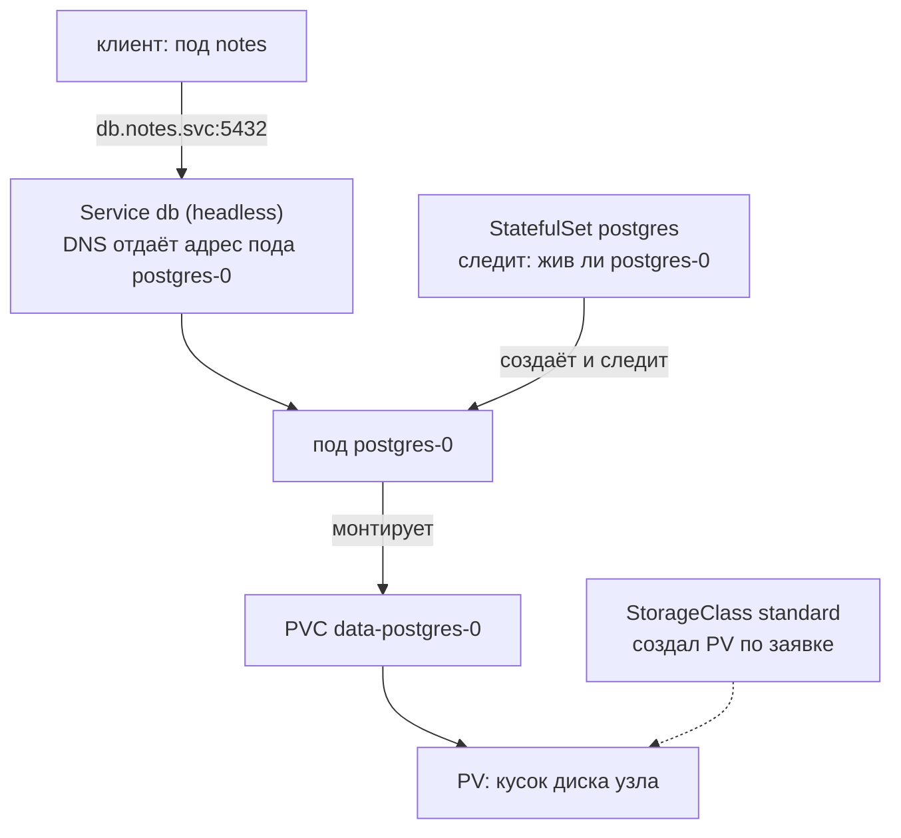
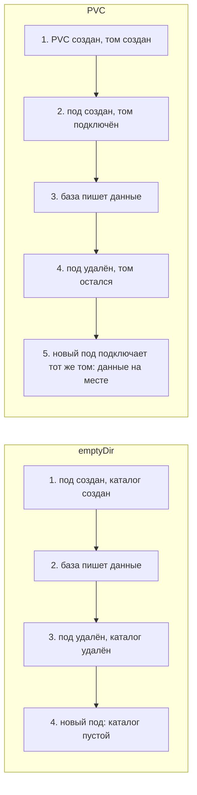
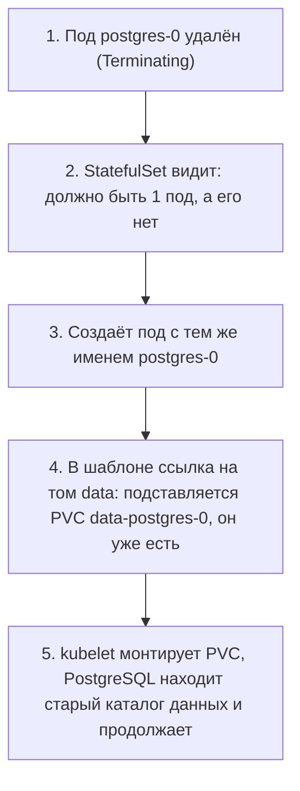
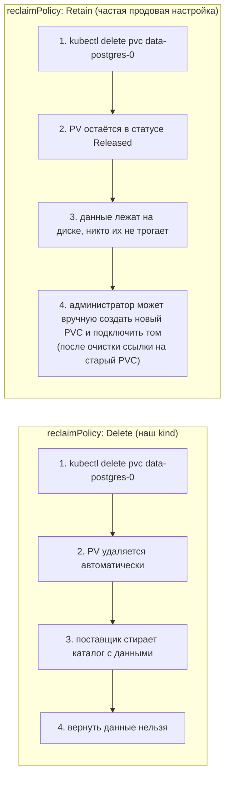
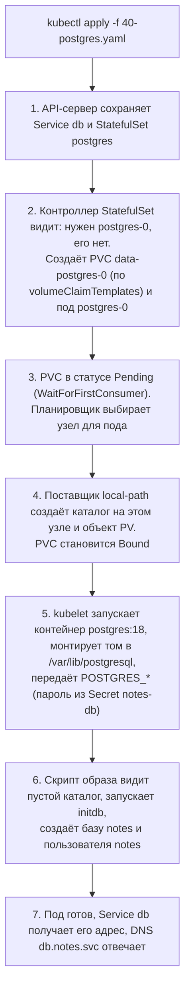

## Зачем это нужно

Поды в Kubernetes одноразовые: убил, создался новый, с пустой файловой системой. В [уроке 5.2](02-pods-deployments.md) «Заметки» писали в `emptyDir` (временный каталог, который живёт ровно столько же, сколько под), и данные пропадали вместе с подом. Для базы данных это неприемлемо: ей нужен диск, который переживает под, и стабильное имя, чтобы клиенты всегда находили её на месте.

На работе это первый вопрос к любому сервису с данными в кластере: где живут данные, кто их создаёт, что будет при удалении пода, при удалении StatefulSet и при удалении всего namespace. Ошибка здесь стоит потери данных, а не просто рестарта.

Шаг проекта: в `k8s/base/40-postgres.yaml` появляются StatefulSet `postgres` (образ `postgres:18`), headless Service `db` и PVC на 1 ГиБ; Secret `notes-db` с паролем создан командой и в git не попадает.

Четыре новых слова, чтобы не спотыкаться дальше. **StatefulSet** - контроллер (объект, который следит, чтобы нужные поды существовали), который делает поды с постоянными именами и своим диском у каждого, в отличие от Deployment из [урока 5.2](02-pods-deployments.md), где поды взаимозаменяемы. **PVC** (PersistentVolumeClaim) - заявка на диск: ты пишешь «нужен 1 ГиБ», а кластер находит или создаёт подходящий. Без заявки пришлось бы вручную знать, какой именно диск где лежит. **Headless Service** (безголовый сервис) - сервис из [урока 5.3](03-services-dns.md) без общего адреса: DNS отдаёт клиенту адрес конкретного пода, а не случайного из группы. Без него клиент не смог бы обратиться именно к `postgres-0`. **Secret** - объект для пароля: значение хранится отдельно от манифеста Deployment и не попадает в git (подробно разберём в [уроке 5.6](06-config-secrets.md)). Все четыре подробно разобраны ниже в теории. База доступна по адресу `db.notes.svc:5432`.

## Что нужно знать

- [Урок 4.3: тома и сети Docker](../04-docker/03-storage-networks.md) - идея тома, который живёт отдельно от контейнера
- [Урок 4.4: SQL и PostgreSQL](../04-docker/04-sql-postgres-basics.md) - `psql`, таблица `notes`
- [Урок 4.5: Compose и PostgreSQL](../04-docker/05-compose-postgres.md) - переменные `POSTGRES_*`, инициализация базы
- [Урок 5.2: Поды и Deployment](02-pods-deployments.md) - почему под одноразовый, `emptyDir`
- [Урок 5.3: Service и DNS кластера](03-services-dns.md) - Service, endpoints (список адресов подов, на которые Service раскидывает запросы), DNS-имена `<svc>.<ns>.svc`

Если что-то из этого забылось, ничего страшного: каждый термин ниже напоминается одной фразой.

## Картина целиком

Представь гостиницу с дежурными администраторами. Администратор (под) работает посменно: смена закончилась, пришёл другой человек, который ничего не помнит. Если администратор записывал брони на листке в кармане, при смене листок пропал. Поэтому брони записывают в журнал, который лежит в сейфе на ресепшене и переходит от смены к смене.

- **Под** это администратор: пришёл, поработал, ушёл. Его собственная память (файловая система контейнера) исчезает вместе с ним.
- **Журнал в сейфе** это данные базы. Технически такой отдельный каталог называется **том** (volume): папка, которая живёт отдельно от пода и подключается в него, как флешка в компьютер. Они должны жить отдельно от того, кто в них пишет.
- **PVC** (заявка на том) это записка «мне нужен сейф на 1 ГиБ». Ты не выбираешь конкретный сейф, ты описываешь, что нужно.
- **StorageClass** (класс хранилища) это завхоз, который по записке выдаёт или изготавливает подходящий сейф. Готовый сейф называется **PV** (постоянный том).
- **StatefulSet** это график, по которому смены имеют фиксированные имена («Первый администратор», «Второй администратор») и у каждого свой закреплённый сейф. Пришёл новый человек на смену «Первого»: он получает тот же сейф.
- **Headless Service** это табличка с именами на двери: по ней клиенты находят именно «Первого», а не любого свободного.



Аналогия ломается в одном месте: настоящий сейф нельзя случайно выбросить вместе с ресепшеном, а в Kubernetes удаление PVC или всего namespace уничтожает данные без предупреждений. Поэтому большая часть урока про то, что защищает данные, а что нет.

За урок ты разберёшь каждый кусок схемы: зачем данным отдельное хранилище, как устроены PV, PVC и StorageClass, чем StatefulSet отличается от Deployment, зачем нужен headless Service и какие подводные камни есть у самой PostgreSQL 18.

## Теория

### Зачем данным отдельное место

Начнём с проблемы. Контейнер это запущенная копия образа. Образ (image) только читается, а поверх него контейнеру выдают тонкий слой для записи. Когда контейнер удаляют, удаляется и этот слой. Поэтому всё, что программа записала «просто в файл», живёт до первой остановки контейнера.

Для приложения без состояния это отлично: любой под можно убить и заменить, ничего не потеряется. Для базы данных это катастрофа. Сначала база пишет данные в каталог, потом кто-то удаляет под (обновление, сбой узла, перенос на другой узел), и Kubernetes создаёт новый под с чистым слоем: база стартует пустой.

Решение придумали задолго до Kubernetes: **том** (volume) это каталог, который живёт отдельно от контейнера и подключается (**монтируется**, mount) в него по нужному пути. Монтирование значит: «показать этот каталог внутри контейнера в папке `/var/lib/postgresql`». Программа пишет в папку, а на самом деле данные ложатся в том. Контейнер умер, том остался, новый контейнер смонтировал тот же том и увидел свои данные. В Docker ты уже так делал в [уроке 4.3](../04-docker/03-storage-networks.md).

В Kubernetes есть тома разных видов. Сравним два, которые уже встречались или встретятся:

| Вид тома | Что это | Пережил ли пересоздание пода |
|---|---|---|
| `emptyDir` | пустой каталог, создаётся вместе с подом | нет, удаляется вместе с подом |
| PVC (persistentVolumeClaim) | каталог или диск, который живёт отдельно от пода | да |

Разберём, что происходит по шагам, когда данные лежат в `emptyDir`, и когда на PVC:



Осторожно, путаница: многие думают, что «том» и «файловая система контейнера» одно и то же, поэтому данные должны сохраняться сами. Отличить просто: спроси себя, какая команда удалит это. Если `kubectl delete pod` удаляет и данные, значит, это не том с сохранением, а временное место.

> **Прикинь сам:** база записала данные в каталог внутри контейнера, и кто-то выполнил `kubectl delete pod`. Что найдёт новый под?
{: .predict}

Чистый слой: старый слой записи удалился вместе с контейнером, база стартует пустой. Данные сохраняет только том, подключённый отдельно.

> **Проверь понимание:** чем `emptyDir` отличается от тома на PVC? В каком случае `emptyDir` всё же подходит?

<details markdown="1">
<summary>Ответ</summary>

`emptyDir` создаётся вместе с подом и удаляется вместе с ним, PVC живёт отдельно. `emptyDir` подходит для временных данных: кэш, промежуточные файлы, обмен файлами между контейнерами одного пода. Базе данных он не подходит.

</details>

> **Главное:** том живёт отдельно от пода; `emptyDir` удаляется вместе с подом, а том на PVC переживает его.
{: .key}

Чтобы получить такой том, в Kubernetes нужны три объекта, и вот зачем их три.

### PV, PVC и StorageClass: как получить диск

Зачем три объекта вместо одного? Разработчик приложения не знает и не должен знать, какие диски есть в кластере: локальные SSD, сетевые диски облака или NFS. Он знает, сколько места нужно и как его использовать. А администратор знает, какие диски бывают, но не знает, сколько нужно каждому приложению. Три объекта разделяют эти заботы.

- **PersistentVolume, PV** (постоянный том): конкретный кусок хранилища в кластере. Пример: каталог `/var/local-path-provisioner/pvc-8b1a.../` на диске узла, или сетевой диск облака. Это ресурс всего кластера, у него нет namespace (напомним: namespace это «папка» для объектов кластера, см. [урок 5.1](01-why-k8s-cluster.md)).
- **PersistentVolumeClaim, PVC** (заявка на том): «мне нужен 1 ГиБ, чтение и запись с одного узла». Заявка лежит в namespace и подключается в под по имени.
- **StorageClass** (класс хранилища): рецепт, как создавать PV по заявке. В нём записано, кто создаёт диск (provisioner, «поставщик»), что делать с диском после удаления заявки и когда его создавать.

Аналогия: PVC это заявка на склад канцтоваров «нужна тетрадь на 48 листов», PV это конкретная тетрадь на полке, StorageClass это правило склада: «тетради берём у такого-то поставщика, использованные выбрасываем».

Как это происходит по шагам. Когда PVC создан, кластер ищет для него PV:

1. Ты создаёшь PVC и указываешь размер, режим доступа и (необязательно) `storageClassName`. Если имя класса не указано, берётся класс по умолчанию (в kind это `standard`).
2. Контроллер смотрит на класс и просит его поставщика создать том. Так создание тома по требованию называется **динамическим provisioning**.
3. Поставщик создаёт PV, кластер **связывает** (bind) PV и PVC: PVC получает статус `Bound`.
4. Под ссылается на PVC по имени, kubelet (агент на каждом узле, который запускает контейнеры) монтирует том в контейнер.

В kind по умолчанию есть StorageClass `standard` с поставщиком `rancher.io/local-path`: том создаётся как обычный каталог на диске того узла, где запущен под. Два свойства класса важны на практике:

- `reclaimPolicy` (политика возврата) отвечает на вопрос «что делать с диском, когда заявку удалили». `Delete` значит: удалить и PV, и данные на нём. `Retain` значит: оставить том, данные сохранены, администратор разберётся сам. У `standard` в kind стоит `Delete`, а в облаках продовые классы часто ставят `Retain`.
- `volumeBindingMode` (когда создавать том). `Immediate` значит «сразу, при создании PVC». `WaitForFirstConsumer` значит «подожди, пока появится под, который будет использовать том, и создай том там, где этот под запущен». Смысл: локальный диск нужен на том же узле, где работает под, а узел выбирается только при запуске пода. Поэтому пустой PVC долго висит в `Pending`, и это нормально.

Ещё одно свойство заявки: **режим доступа** (accessModes). `ReadWriteOnce` (RWO) значит, что том монтируется на запись одним узлом. `ReadWriteMany` (RWX) значит, что несколькими узлами сразу (нужен специальный вид хранилища вроде NFS). База почти всегда работает на RWO: два процесса СУБД не должны писать в один каталог.

Обрати внимание на слабое место локальных дисков: они живут на конкретном узле. Если узел сломался, том недоступен, пока узел не вернётся. Поэтому в облаках диски сетевые (EBS в AWS, Network SSD в Yandex Cloud): их подключением управляет CSI-драйвер (Container Storage Interface, единый интерфейс, через который кластер подключает хранилища любых производителей), и такой диск можно отвязать от умершего узла и подключить к другому.

Разберём настоящий вывод. Так выглядит `kubectl -n notes get sc,pvc,pv` для нашей базы (`-n notes` нужен для PVC, а StorageClass и PV не имеют namespace) (значение `pvc-8b1a...` у тебя будет другим):

```text
NAME                                             PROVISIONER             RECLAIMPOLICY   VOLUMEBINDINGMODE      ALLOWVOLUMEEXPANSION   AGE
storageclass.storage.k8s.io/standard (default)   rancher.io/local-path   Delete          WaitForFirstConsumer   false                  2d

NAME                                    STATUS   VOLUME                                     CAPACITY   ACCESS MODES   STORAGECLASS   VOLUMEATTRIBUTESCLASS   AGE
persistentvolumeclaim/data-postgres-0   Bound    pvc-8b1a0e0d-42a3-4a7c-b6b1-5a0c3c9e2f41   1Gi        RWO            standard       <unset>                 40s

NAME                                                        CAPACITY   ACCESS MODES   RECLAIM POLICY   STATUS   CLAIM                     STORAGECLASS   VOLUMEATTRIBUTESCLASS   REASON   AGE
persistentvolume/pvc-8b1a0e0d-42a3-4a7c-b6b1-5a0c3c9e2f41   1Gi        RWO            Delete           Bound    notes/data-postgres-0     standard       <unset>                          39s
```

Читаем: класс `standard` помечен `(default)`, значит, PVC без `storageClassName` получит его. В PVC колонка `VOLUME` содержит имя PV: это ссылка «заявка связана с этим томом». В PV колонка `CLAIM` содержит `notes/data-postgres-0`: обратная ссылка «том занят этой заявкой» (namespace/имя). Имена PV генерируются из UID заявки, поэтому длинные и случайные.

Колонка `STATUS` у PVC принимает три значения. `Pending` («ожидает»): заявка принята, но подходящий том ещё не привязан (при `WaitForFirstConsumer` это нормально, пока нет пода). `Bound` («привязан»): заявка связана с томом, под может его использовать. `Lost` («потерян»): том, с которым была связана заявка, исчез (например, PV удалили руками), и данные под угрозой. В повседневной работе ты чаще видишь `Bound`, а `Pending` дольше пары минут при уже запущенном поде повод открыть `kubectl describe pvc`. Колонка `CAPACITY` показывает фактический размер тома: он может оказаться больше запрошенного (запросил 1Gi, получил 1Gi у нашего kind, но облачные диски иногда округляют вверх), и никогда не меньше.

Колонка `VOLUMEATTRIBUTESCLASS` есть у свежих версий `kubectl` (между `STORAGECLASS` и `AGE`). Это «класс атрибутов тома»: необязательная настройка вроде скорости диска, которую можно поменять у уже созданного тома. Мы её не используем, поэтому везде `<unset>` («не задано»). Если у тебя в выводе этой колонки нет, версия `kubectl` старше, и это нормально. Колонка `REASON` у PV пустая, пока с томом всё в порядке.

Осторожно, путаница: PVC часто принимают за сам диск. Это только заявка, диск это PV. Второе заблуждение: «удалил pod, значит, удалил и PVC». Нет, PVC живёт отдельно, и именно поэтому данные переживают под.

> **Прикинь сам:** PVC создан, `get pvc` показывает `Pending`, а пода ещё нет. Это поломка?
{: .predict}

Не обязательно: при `WaitForFirstConsumer` том создают после появления пода. Поломка, если под уже есть, а PVC всё ещё `Pending`.

> **Проверь понимание:** PVC создан, а `kubectl get pvc` показывает `Pending`, и под ещё не запущен. Это поломка?

<details markdown="1">
<summary>Ответ</summary>

Не обязательно. При `WaitForFirstConsumer` том создаётся только после появления пода. Смотри `kubectl describe pvc`: событие `waiting for first consumer to be created before binding` штатное. Поломка, если под уже есть, а PVC всё ещё `Pending`: тогда ищи неверный `storageClassName` или нехватку места.

</details>

> **Главное:** PVC это заявка, PV это сам диск, StorageClass это рецепт, как диск создавать; база почти всегда работает на RWO.
{: .key}

Размер в заявке пишут особым образом, и в нём легко ошибиться.

### Как читать размеры: `1Gi`, `500Mi`, `1G`

В заявке PVC размер записан как `1Gi`. Зачем две буквы? Kubernetes различает два вида приставок, и путаница между ними стоит места на диске.

- Десятичные приставки: `k`, `M`, `G` это 1000, 1000 в квадрате, 1000 в кубе байт. `1G` это 1 000 000 000 байт.
- Двоичные приставки: `Ki`, `Mi`, `Gi` это 1024, 1024 в квадрате, 1024 в кубе байт. `1Gi` это 1 073 741 824 байта (гибибайт).

Разница около 7%: `1Gi` больше `1G`. В Kubernetes принято писать двоичные (`Gi`, `Mi`), и в ресурсах пода тоже: то, что ты увидишь в уроке 5.7 как `memory: 128Mi`, устроено так же. Если написать `1g` (строчная), Kubernetes откажется: регистр важен.

Разобранный пример: базе «Заметок» нужно 1 ГиБ. Реальные заметки занимают килобайты, поэтому 1Gi хватит с огромным запасом. Но пустая база PostgreSQL сама занимает порядка десятков мегабайт (системные таблицы и журнал), так что 100Mi было бы слишком мало. Размер нужно выбирать с запасом на рост, журналы и служебные файлы, а не по объёму полезных данных.

Осторожно, путаница: «Заказал 1Gi, значит, все 1Gi мои под данные». Часть места занимают служебные файлы базы и файловая система тома. Полезное место всегда немного меньше.

> **Прикинь сам:** что больше, `1Gi` или `1G`, и почему в манифестах пишут `Gi`?
{: .predict}

`1Gi` больше: 1 073 741 824 байта против 1 000 000 000. Двоичные приставки точнее описывают, как компьютер считает диск и память.

> **Проверь понимание:** что больше: `1Gi` или `1G`, и почему в манифестах Kubernetes принято писать `Gi`?

<details markdown="1">
<summary>Ответ</summary>

`1Gi` больше (1 073 741 824 байта против 1 000 000 000). Двоичные приставки точнее описывают, как компьютер считает память и диск, и в Kubernetes они стали стандартом записи размеров.

</details>

> **Главное:** `Gi` это степени 1024, `G` это степени 1000; регистр важен, а размер выбирают с запасом на служебные файлы.
{: .key}

Теперь понятно, где хранить данные, и можно ответить, почему под базу не подходит Deployment.

### Почему база не Deployment

Deployment ([урок 5.2](02-pods-deployments.md)) создаёт набор одинаковых взаимозаменяемых подов. Их имена случайные: `notes-6d9c-x4kq`, `notes-6d9c-p7zt`. Для приложения без состояния это идеально: любой под можно заменить любым другим. Для базы данных это плохо по трём причинам.

1. **Общий диск.** В шаблоне Deployment один PVC на все реплики. Две копии PostgreSQL, пишущие в один каталог, портят данные: у каждой свои кэши в памяти, и они не знают друг о друге.
2. **Случайные имена.** Новый под получает новое имя и новый адрес. Клиенту не за что зацепиться, чтобы всегда находить «ту самую» базу.
3. **Порядок обновления.** Deployment при обновлении сначала поднимает новый под, потом убивает старый. На короткое время два процесса работают с одним каталогом: это недопустимо.

Разобранный пример: у тебя `replicas: 2` и один PVC. Оба пода монтируют его (при RWO на одном узле это возможно). Оба стартуют PostgreSQL. Первый записал страницу данных, второй не знает об этом и записывает свою поверх. Итог: повреждённая база, а `kubectl get pods` при этом показывает два здоровых пода.

Осторожно, путаница: «Поставлю `replicas: 1` и Deployment, всё будет нормально.» Пока под жив, да. Но при обновлении Deployment создаст второй под ещё до остановки первого, и вы вернулись к проблеме двух процессов на одном диске. Для этого случая есть стратегия `Recreate`, но она не решает вопрос стабильного имени и отдельного диска на каждую реплику.

> **Прикинь сам:** у Deployment `replicas: 1`, и под базой один PVC. Почему при обновлении это всё равно опасно?
{: .predict}

Deployment сначала поднимает новый под, потом убивает старый. На короткое время два процесса СУБД работают с одним каталогом.

> **Проверь понимание:** назови две из трёх причин, по которым базу не запускают Deployment'ом.

<details markdown="1">
<summary>Ответ</summary>

Общий диск для реплик (две копии СУБД портят данные), случайные имена и адреса (клиенту не за что зацепиться), обновление «сначала новый, потом удалить старый» (два процесса на одном диске).

</details>

> **Главное:** для базы Deployment плох тремя вещами: общий диск, случайные имена и порядок обновления «сначала новый».
{: .key}

Для таких задач в Kubernetes есть другой контроллер.

### StatefulSet: поды с постоянной идентичностью

**StatefulSet** («набор с состоянием») это контроллер, который, как и Deployment, поддерживает нужное число подов, но даёт каждому свою личность. Что он гарантирует:

- **Стабильное имя.** Поды называются `<имя>-0`, `<имя>-1` и так далее: `postgres-0`, `postgres-1`. Число это порядковый номер (ordinal), он не меняется. Если удалить `postgres-0`, новый под снова получит имя `postgres-0`.
- **Свой диск у каждой реплики.** В StatefulSet есть поле `volumeClaimTemplates` («шаблоны заявок на том»). Для каждого пода контроллер создаёт свой PVC по шаблону, имя составляется из имени шаблона и имени пода: `data-postgres-0`. Новый `postgres-0` подключит именно этот PVC.
- **Порядок.** Поды запускаются по очереди: `postgres-1` не стартует, пока `postgres-0` не станет готов. Обновляются в обратном порядке, от большего номера к меньшему.
- **Стабильное сетевое имя** (через headless Service, о нём дальше).

Как это выглядит по шагам при `kubectl delete pod postgres-0`:



Важное свойство: StatefulSet **не удаляет PVC** при своём удалении и при уменьшении числа реплик (поле `persistentVolumeClaimRetentionPolicy` по умолчанию `Retain`). Это осознанная защита данных от случайного `delete statefulset`. Но защита неполная: удаление самого PVC (`delete pvc`) и удаление всего namespace уничтожают данные, а при политике `Delete` у StorageClass вместе с PVC пропадёт и PV.

Что защищает и что нет, удобно держать в таблице:

| Действие | Данные остались? | Почему |
|---|---|---|
| `kubectl delete pod postgres-0` | да | PVC жив, новый под подключит его |
| `kubectl delete statefulset postgres` | да | StatefulSet не удаляет PVC |
| `kubectl delete pvc data-postgres-0` | нет (для `standard`) | политика `Delete` уничтожает PV |
| `kubectl delete namespace notes` | нет | вместе с namespace удаляются все PVC |

Осторожно, путаница: «StatefulSet сам делает бэкапы и репликацию». Нет. Он только обеспечивает имя, диск и порядок. Настройкой репликации PostgreSQL и переключением между primary (главный сервер, принимает запись) и replica (копия, только читает) занимаются отдельные программы: операторы баз данных (например CloudNativePG, обзор в [уроке 9.5](../09-secrets-gitops/05-cnpg.md)).

> **Прикинь сам:** ты удалил под `postgres-0`. Какое имя получит новый под и какой PVC подключит?
{: .predict}

Имя `postgres-0` и PVC `data-postgres-0`: StatefulSet возвращает ту же личность и тот же диск. Данные на месте.

> **Проверь понимание:** ты удалил под `postgres-0` командой `kubectl delete pod`. Что произойдёт с данными и с именем нового пода?

<details markdown="1">
<summary>Ответ</summary>

StatefulSet-контроллер создаст под с тем же именем `postgres-0` и подключит тот же PVC `data-postgres-0`. Данные на месте, база стартует с существующего каталога (сработает восстановление после аварийного останова, crash recovery: PostgreSQL по журналу доводит данные до согласованного состояния). Клиенты по имени найдут её снова.

</details>

> **Главное:** StatefulSet даёт имя `<имя>-N`, свой PVC на каждую реплику и порядок запуска; PVC при удалении самого StatefulSet не удаляются.
{: .key}

Чтобы клиенты находили конкретный под, StatefulSet работает в паре с особым сервисом.

### Headless Service и стабильное имя

В [уроке 5.3](03-services-dns.md) ты видел обычный Service типа ClusterIP: у него есть один виртуальный адрес, и запросы к нему распределяются между подами. Клиент не знает, какой именно под ответил, и ему это не важно.

Для базы важно. Когда у базы появятся реплики, приложению нужно писать в primary, а читать можно с replica. Нужно уметь обратиться к конкретному поду. Для этого StatefulSet используется вместе с **headless Service** (Service «без головы»): в нём указано `clusterIP: None`, то есть виртуального адреса нет. Вместо него DNS-сервер кластера отвечает адресами самих подов.

Как формируются имена:

```text
postgres-0 . db . notes . svc . cluster.local
    |        |     |      |        |
   под    сервис  namespace "это Service"  домен кластера
```

Каждый под получает собственное DNS-имя `<под>.<сервис>.<namespace>.svc.cluster.local`. Какой сервис отвечает за имена подов, указано в поле `serviceName` StatefulSet (у нас `db`). Поэтому `serviceName` должен совпадать с именем headless Service.

Для одной реплики удобнее короткое имя сервиса: `db.notes.svc` (из того же namespace достаточно даже просто `db`). Для headless Service DNS вернёт адрес единственного пода. Разберём пример: `nslookup db.notes.svc.cluster.local` вернёт что-то вроде `10.244.2.7`. Это IP пода `postgres-0` из диапазона адресов подов (podCIDR, см. [урок 5.1](01-why-k8s-cluster.md)), а не виртуальный адрес сервиса. Сравни: у обычного сервиса `notes` в этом же кластере адрес `10.96.41.207` из диапазона сервисов.

Осторожно, путаница: Headless Service принимают за сервис без портов или «сломанный». Это нормальный сервис, просто без балансировки и виртуального адреса. Ещё одна путаница: `serviceName` не создаёт сервис, он только ссылается на существующий. Если сервиса `db` нет, StatefulSet всё равно запустится, но имён у подов в DNS не будет.

> **Прикинь сам:** зачем StatefulSet нужен headless Service, если можно взять обычный ClusterIP?
{: .predict}

Обычный сервис балансирует и скрывает, какой под ответил. Для базы нужен DNS-адрес каждого пода отдельно: писать в primary, читать с replica.

> **Проверь понимание:** зачем StatefulSet нужен headless Service, если можно было бы использовать обычный ClusterIP?

<details markdown="1">
<summary>Ответ</summary>

Обычный сервис балансирует запросы между подами и скрывает, какой именно ответил. Для базы нужно обращаться к конкретной реплике (записывать в primary, читать с replica), а значит нужен DNS-адрес каждого пода отдельно. Headless Service даёт такие имена.

</details>

> **Главное:** headless Service (`clusterIP: None`) отдаёт адреса подов, а имя пода `<под>.<сервис>.<namespace>.svc.cluster.local`; `serviceName` только ссылается на сервис.
{: .key}

База запущена, и ей нужен пароль: с ним связана самая частая ловушка.

### Пароль базы: Secret и «только при первом запуске»

Образ PostgreSQL настраивается переменными окружения (environment variable, пара «имя=значение», которую Kubernetes подставляет в контейнер при запуске): `POSTGRES_DB` (имя базы), `POSTGRES_USER` (пользователь), `POSTGRES_PASSWORD` (пароль). Ты уже видел их в [уроке 4.5](../04-docker/05-compose-postgres.md).

Пароль в манифест открытым текстом класть нельзя: манифест лежит в git. В Kubernetes для паролей есть объект **Secret**: он хранит пары «ключ: значение» отдельно от манифеста пода, а под ссылается на него полем `secretKeyRef` («значение возьми из ключа такого-то в таком-то Secret»). Подробно про Secret в [уроке 5.6](06-config-secrets.md). Сейчас достаточно знать: мы создаём его командой, а не из файла, чтобы пароль не попал в репозиторий.

Теперь главная ловушка. Образ читает `POSTGRES_PASSWORD` **только при первой инициализации** пустого каталога данных. При старте скрипт образа смотрит: каталог пустой? Тогда создаёт кластер баз (программой `initdb`), задаёт пароль из переменной. Каталог уже заполнен? Тогда переменные `POSTGRES_*` игнорируются, и пароль остаётся тот, что записан внутри базы.

Разобранный пример:

```text
1. Создан Secret с паролем "aaa", запущена база: initdb записал пароль "aaa" внутрь данных.
2. Ты пересоздал Secret с паролем "bbb" и перезапустил под.
3. Под получил переменную POSTGRES_PASSWORD=bbb, но каталог уже не пуст: переменная не читается.
4. Внутри базы пароль по-прежнему "aaa". Клиент с "bbb" получает: password authentication failed.
```

Это самая частая причина ошибки `password authentication failed`, её ты поймаешь в «Сломай и почини». Правильная смена пароля: `ALTER USER notes PASSWORD '...'` внутри базы, затем обновить Secret.

> **Прикинь сам:** ты поменял пароль в Secret `notes-db` и перезапустил под. Поменяется ли пароль пользователя `notes` в базе?
{: .predict}

Нет. Образ читает `POSTGRES_PASSWORD` только при первом создании кластера баз в пустом каталоге. Пароль в готовой базе меняют командой `ALTER USER`.

Осторожно: пароль не кладут в манифест открытым текстом: Secret создают командой, а не файлом из git.

> **Проверь понимание:** ты поменял значение в Secret `notes-db` и перезапустил под. Поменяется ли пароль пользователя `notes` в базе?

<details markdown="1">
<summary>Ответ</summary>

Нет. Переменная нужна только при создании кластера баз (initdb) в пустом каталоге. Пароль в существующей базе меняется командой `ALTER USER notes PASSWORD '...'`, а Secret надо привести в соответствие.

</details>

> **Главное:** `POSTGRES_PASSWORD` работает один раз, при `initdb` в пустом каталоге; смена Secret пароль в базе не меняет.
{: .key}

Вторая ловушка PostgreSQL 18 связана с путём, куда монтировать том.

### PostgreSQL 18: куда смонтировать том

Ещё одна ловушка, на этот раз про путь. Образы `postgres` до 17-й версии хранили данные в `/var/lib/postgresql/data`, и том монтировали туда. Начиная с 18-й версии образ хранит данные в подкаталоге с номером версии: `/var/lib/postgresql/18/docker`. Причина: так проще обновлять базу с одной версии на другую, не смешивая данные разных версий. Объявленный образом том (`VOLUME`) теперь стоит на `/var/lib/postgresql`, на уровень выше.

Что из этого следует для манифеста:

- том монтируем в `/var/lib/postgresql` (именно туда, а не в `.../data`), тогда каталог версии окажется внутри тома;
- переменную `PGDATA` (путь к каталогу данных) задавать не нужно.

Что будет при ошибке: если смонтировать том в `/var/lib/postgresql/data`, база запустится и будет работать. Но реальные данные лягут в `/var/lib/postgresql/18/docker`, то есть вне тома, в слой контейнера. Всё будет выглядеть нормально ровно до первого пересоздания пода, после которого база окажется пустой. Самая неприятная поломка та, которая не видна сразу.

Так выглядит каталог внутри контейнера (проверено на `postgres:18`):

```text
/var/lib/postgresql:
18

/var/lib/postgresql/18:
docker
```

Осторожно, путаница: инструкции из интернета для PostgreSQL 15 и 16 предлагают монтировать `.../data` и задавать `PGDATA`. Для 18 они устарели: сверяйся с документацией образа для своей версии.

> **Прикинь сам:** ты смонтировал том в `/var/lib/postgresql/data`, база запустилась. Почему после удаления пода данные пропали?
{: .predict}

В `postgres:18` данные лежат в `/var/lib/postgresql/18/docker`, вне смонтированного каталога. Они писались в слой контейнера и ушли вместе с подом.

> **Проверь понимание:** ты смонтировал том в `/var/lib/postgresql/data`, база запустилась. Почему после удаления пода данные пропали?

<details markdown="1">
<summary>Ответ</summary>

В образе `postgres:18` данные лежат в `/var/lib/postgresql/18/docker`, а этот путь не входит в смонтированный каталог `.../data`. Данные писались в слой контейнера, который удаляется вместе с подом.

</details>

> **Главное:** для PostgreSQL 18 том монтируют в `/var/lib/postgresql`, а `PGDATA` не задают.
{: .key}

Посмотрим, какие статусы проходит том за свою жизнь.

### Жизненный цикл тома: от заявки до удаления

У PVC и PV есть статусы (фазы), которые показывают, на каком шаге они сейчас. Знать их нужно, чтобы читать вывод `kubectl get` и понимать, что происходит с данными.

| Объект | Статус | Что значит |
|---|---|---|
| PVC | `Pending` | заявка есть, тома ещё нет (ждём первый под или поставщик ещё создаёт диск) |
| PVC | `Bound` | заявка связана с томом, можно использовать |
| PVC | `Terminating` | заявку удалили, но она ещё используется подом: удаление ждёт |
| PV | `Bound` | том отдан заявке |
| PV | `Released` | заявку удалили, но том остался (при `Retain`): данные на месте, но новая заявка сама на него не сядет |
| PV | `Failed` | автоматически вернуть том не получилось, нужен администратор |

Проследим, что происходит с данными при удалении PVC, для двух значений `reclaimPolicy`:



Ещё одна деталь: пока PVC подключён к работающему поду, `kubectl delete pvc` не удалит его сразу. Kubernetes защищает используемые тома: заявка переходит в `Terminating`, и удаление завершится только после остановки пода (это механизм финализаторов: отметка на объекте «не удаляй, пока не выполнено условие»). Поэтому в сценарии, где кто-то «почистил лишнее», сначала удаляют под или StatefulSet, а уже потом PVC исчезает.

Осторожно, путаница: «`Retain` значит, что данные в безопасности». Нет: `Retain` сохраняет только том. Если кто-то удалил PVC, вернуть его в работу без ручных действий нельзя, а без бэкапа при потере самого диска данные всё равно потеряны. Политика возврата это не бэкап.

> **Прикинь сам:** какой статус будет у PV после `kubectl delete pvc` при `Retain`? А при `Delete`?
{: .predict}

При `Retain` PV остаётся в статусе `Released`, данные целы. При `Delete` PV удаляется вместе с данными.

> **Проверь понимание:** какой статус будет у PV после `kubectl delete pvc`, если у класса `reclaimPolicy: Retain`? А если `Delete`?

<details markdown="1">
<summary>Ответ</summary>

При `Retain` том остаётся в статусе `Released`, данные сохранены. При `Delete` PV удаляется вместе с данными, и в списке его уже не будет.

</details>

> **Главное:** PVC проходит `Pending`, `Bound`, `Terminating`; PV остаётся `Released` при `Retain`; политика возврата не бэкап.
{: .key}

Теперь соберём всё в один сквозной путь от apply до данных на диске.

### Что происходит от `kubectl apply` до данных на диске

Соберём всё в один сквозной путь. Это полезно и для понимания, и для диагностики: когда что-то не работает, нужно знать, на каком шаге цепочка порвалась.



Теперь можно «читать» поломки по шагам. `Pending` у пода и PVC: цепочка застряла на шаге 3 или 4 (нет класса, нет места, не выбран узел). `CreateContainerConfigError`: шаг 5, kubelet не нашёл Secret или ключ. `password authentication failed` при живом поде: шаги 1-7 прошли, но пароль в Secret и в базе разошёлся из-за шага 6, который выполняется один раз.

> **Прикинь сам:** под и PVC `Pending`, в событиях `storageclass "fast-ssd" not found`. На каком шаге цепочка порвалась?
{: .predict}

На шаге 4: поставщик не смог создать том, потому что указанного класса нет. Чинить нужно `storageClassName`, а не под.

Осторожно: шаг 6 с `initdb` выполняется один раз, и повторный запуск его не повторяет.

> **Проверь понимание:** под `postgres-0` в `Pending`, у PVC тоже `Pending`, в событиях `storageclass ... "fast-ssd" not found`. На каком шаге цепочка порвалась?

<details markdown="1">
<summary>Ответ</summary>

На шаге 4: поставщик не смог создать том, потому что указанного класса хранилища нет. Значит, чинить нужно `storageClassName`, а не сам под.

</details>

> **Главное:** цепочка из семи шагов подсказывает, где ломается: `Pending` значит шаги 3-4, `CreateContainerConfigError` шаг 5, пароль разошёлся из-за шага 6.
{: .key}

Что нельзя менять у уже созданного StatefulSet, разберём дальше.

### Обновление StatefulSet и что в нём нельзя менять

Когда ты меняешь шаблон пода (`template`) у StatefulSet, например версию образа, контроллер обновляет поды по очереди, от старшего номера к младшему: сначала `postgres-2`, потом `postgres-1`, потом `postgres-0`. Каждый следующий под обновляется только после того, как предыдущий стал готов. Смысл: в базе с репликами главный сервер обычно `postgres-0`, и его обновляют последним, после реплик. При этом каждый под сохраняет своё имя и свой PVC.

Есть одно жёсткое ограничение. Поле `volumeClaimTemplates` у существующего StatefulSet менять **нельзя**: API ответит ошибкой `Forbidden: updates to statefulset spec for fields other than 'replicas', 'ordinals', 'template', 'updateStrategy' ... are forbidden`. Причина: PVC уже созданы по старому шаблону, и контроллер не станет менять их задним числом. Если нужно другое значение (например другой размер или класс), есть три пути: удалить StatefulSet и PVC и начать заново (только когда данных нет), удалить StatefulSet без удаления подов (`kubectl delete statefulset postgres --cascade=orphan`) и создать заново с новым шаблоном, либо править сами PVC.

Расширение диска. Если у класса стоит `allowVolumeExpansion: true`, увеличить том можно на лету: правишь у PVC `spec.resources.requests.storage` (например `1Gi` на `2Gi`). У `standard` в kind расширение выключено (`ALLOWVOLUMEEXPANSION false`, помнишь колонку в выводе выше), поэтому в облаках заранее выбирают класс с расширением. Уменьшить том нельзя нигде.

Осторожно, путаница: «Поменяю размер в `volumeClaimTemplates`, и все PVC вырастут». Не вырастут: шаблон применяется только к новым PVC, а поменять его нельзя. Размер существующих PVC правят на самих PVC.

> **Прикинь сам:** у StatefulSet три реплики, ты меняешь образ. В каком порядке обновятся поды и почему это важно?
{: .predict}

Сначала `postgres-2`, затем `postgres-1`, затем `postgres-0`: главный сервер обычно `postgres-0`, и его обновляют после реплик.

> **Проверь понимание:** у StatefulSet три реплики, ты меняешь образ. В каком порядке обновятся поды и почему это важно для базы?

<details markdown="1">
<summary>Ответ</summary>

Сначала `postgres-2`, затем `postgres-1`, затем `postgres-0`. Поды с меньшими номерами часто главные, и их обновляют после реплик, чтобы главный сервер менялся последним и по пути можно было остановиться, если обновление ломает базу.

</details>

> **Главное:** `volumeClaimTemplates` менять нельзя, размер существующих PVC правят на самих PVC, а уменьшить том нельзя нигде.
{: .key}

Соберём в таблицу, что происходит с данными при типичных сбоях.

### Что случится при сбоях: сводка

Закрепим всё таблицей: что делает Kubernetes и что происходит с данными в типичных ситуациях. Предполагаем один под и локальный диск (как в kind).

| Ситуация | Что делает Kubernetes | Данные |
|---|---|---|
| Упал процесс `postgres` в контейнере | kubelet перезапускает контейнер в том же поде | целы, том тот же |
| Удалили под | StatefulSet создаёт `postgres-0` заново, подключает тот же PVC | целы |
| Обновили образ | под пересоздаётся с тем же PVC | целы (при совместимых версиях) |
| Удалили StatefulSet | поды удаляются, PVC остаются | целы |
| Удалили PVC | том удаляется (при `Delete`) | потеряны |
| Удалили namespace | удаляется всё внутри, включая PVC | потеряны |
| Умер узел с локальным диском | под не может стартовать на другом узле, том остался на мёртвом | недоступны, пока узел не вернётся |
| Умер узел, диск сетевой | том отвязывается и подключается на другом узле | целы, короткий простой |

Обрати внимание на строку про обновление образа: между большими версиями PostgreSQL (например 17 на 18) формат данных меняется, и просто заменить образ нельзя. Нужна миграция (`pg_upgrade` или дамп и восстановление). Это ещё одна причина, по которой операторы БД полезны.

> **Прикинь сам:** кто-то выполнил `kubectl delete namespace notes`. Что осталось от базы?
{: .predict}

Ничего: namespace удаляет всё внутри, включая PVC, а при `Delete` и PV. Вернуть данные можно только из бэкапа.

Осторожно: обновление между большими версиями PostgreSQL заменой образа не работает: формат данных меняется, нужна миграция.

> **Проверь понимание:** кто-то выполнил `kubectl delete namespace notes`. Что осталось от базы?

<details markdown="1">
<summary>Ответ</summary>

Ничего. Namespace удаляет все объекты внутри, включая StatefulSet, Service, Secret и PVC. Вместе с PVC удаляется и PV (при `reclaimPolicy: Delete`), а с ним и данные. Восстановиться можно только из бэкапа.

</details>

> **Главное:** данные переживают удаление пода, StatefulSet и обновление образа, но не удаление PVC или namespace.
{: .key}

Остаётся решить, стоит ли вообще держать базу в кластере.

### Когда база в Kubernetes оправдана

Последний вопрос теории: стоит ли вообще держать базу в кластере. Ответ зависит от цены ошибки.

- **StatefulSet с одним подом** (как у нас) подходит для учебы, dev и тестовых стендов: данные не жалко, поднимается за минуту.
- **Оператор БД** (CloudNativePG, Zalando и другие) это программа, которая умеет то, чего не умеет StatefulSet: настраивать реплики, переключать primary при сбое, делать бэкапы по расписанию и восстанавливать на момент времени. Подходит для продовой базы, если команда готова с ним работать.
- **Managed-сервис** (облачная база, например Managed PostgreSQL в Yandex Cloud) снимает всю эксплуатацию с команды: бэкапы, обновления, репликацию делает провайдер.

Бэкап нужен при любом варианте. Простейший способ: **логический бэкап**, то есть дамп в виде SQL-команд, из которых базу можно воссоздать (программа `pg_dump`). Ты сделаешь его в практике. Правило: бэкап, лежащий на том же диске и в том же кластере, что и база, не спасёт при потере кластера. Копию нужно хранить снаружи. Регулярные бэкапы по расписанию разберём в [уроке 5.8](08-jobs-cronjob-daemonset.md).

> **Прикинь сам:** ты скопировал каталог тома работающей базы как «бэкап». Чем это хуже `pg_dump`?
{: .predict}

Копия при работающей базе может оказаться несогласованной и привязана к версии и узлу. `pg_dump` делает согласованный снимок через саму базу.

Осторожно: бэкап на том же диске и в том же кластере не спасёт при потере кластера.

> **Проверь понимание:** ты нашёл на диске узла каталог тома базы и скопировал его как «бэкап». Чем это хуже `pg_dump`?

<details markdown="1">
<summary>Ответ</summary>

Копия каталога, снятая при работающей базе, может оказаться несогласованной: в момент копирования часть файлов уже изменилась, часть ещё нет. Также такая копия привязана к той же версии PostgreSQL и к тому же узлу. `pg_dump` делает согласованный снимок через саму базу и даёт файл, который можно восстановить на любой версии не ниже.

</details>

> **Главное:** один под StatefulSet подходит для учёбы и dev, для прода берут оператор БД или managed-сервис; бэкап нужен всегда и хранится снаружи.
{: .key}

Теперь пора развернуть базу руками.

## Практика

Кластер kind `notes` из [урока 5.1](01-why-k8s-cluster.md) должен быть запущен, namespace `notes` создан. Проверь:

```bash
kubectl config current-context
kubectl -n notes get deploy,svc
```

```text
kind-notes
NAME                    READY   UP-TO-DATE   AVAILABLE   AGE
deployment.apps/notes   3/3     3            3           2d

NAME            TYPE        CLUSTER-IP     EXTERNAL-IP   PORT(S)    AGE
service/notes   ClusterIP   10.96.41.207   <none>        8080/TCP   2d
```

**Как читать вывод:** `kind-notes` это имя текущего контекста (какой кластер сейчас управляется). Колонка `READY 3/3` у Deployment значит «готово 3 пода из 3 нужных», `AGE` это возраст объекта. У Service `notes` есть `CLUSTER-IP`: обычный виртуальный адрес, в отличие от того, что мы сделаем для базы.

Работать будем из `~/notes` (каталог `k8s/base/` уже есть).

### Задание 1. Secret и StatefulSet с PostgreSQL

**Цель:** запустить PostgreSQL 18 в кластере с постоянным томом и паролем из Secret.

Сначала создай Secret. Разберём команду по частям:

- `kubectl -n notes` значит «в namespace `notes`»;
- `create secret generic notes-db` создаёт Secret типа `generic` (произвольные пары «ключ: значение») с именем `notes-db`;
- `--from-literal=POSTGRES_PASSWORD="..."` задаёт одну пару прямо в команде: ключ `POSTGRES_PASSWORD` и значение;
- `$(openssl rand -hex 24)` это подстановка: shell сначала выполняет команду внутри скобок, а её вывод вставляет в строку. `openssl rand -hex 24` печатает 24 случайных байта в шестнадцатеричном виде: строка из 48 символов `0-9a-f`.

Пароль генерируется и нигде не сохраняется в файлах:

```bash
kubectl -n notes create secret generic notes-db \
  --from-literal=POSTGRES_PASSWORD="$(openssl rand -hex 24)"
kubectl -n notes get secret notes-db
```

```text
secret/notes-db created
NAME       TYPE     DATA   AGE
notes-db   Opaque   1      1s
```

Используем `-hex`, а не `-base64`: в шестнадцатеричной строке нет символов `/`, `+`, `=`, которые в [уроке 5.6](06-config-secrets.md) пришлось бы экранировать в `DATABASE_URL`.

**Как читать вывод:** `TYPE Opaque` значит «произвольные данные» (обычный Secret), `DATA 1` это число ключей внутри. Значения `get` не показывает.

Теперь манифест. Каждая ключевая строка объяснена комментарием, а после блока идёт разбор.

Создай файл `k8s/base/40-postgres.yaml`:

```yaml
# Headless Service: даёт стабильные DNS-имена подам StatefulSet
apiVersion: v1
kind: Service
metadata:
  name: db
  namespace: notes
  labels:
    app.kubernetes.io/name: postgres
spec:
  clusterIP: None
  selector:
    app.kubernetes.io/name: postgres
  ports:
    - name: postgres
      port: 5432
      targetPort: 5432
---
apiVersion: apps/v1
kind: StatefulSet
metadata:
  name: postgres
  namespace: notes
  labels:
    app.kubernetes.io/name: postgres
spec:
  serviceName: db
  replicas: 1
  selector:
    matchLabels:
      app.kubernetes.io/name: postgres
  template:
    metadata:
      labels:
        app.kubernetes.io/name: postgres
    spec:
      containers:
        - name: postgres
          image: postgres:18
          ports:
            - name: postgres
              containerPort: 5432
          env:
            - name: POSTGRES_DB
              value: notes
            - name: POSTGRES_USER
              value: notes
            - name: POSTGRES_PASSWORD
              valueFrom:
                secretKeyRef:
                  name: notes-db
                  key: POSTGRES_PASSWORD
          volumeMounts:
            # В postgres:18 данные лежат в /var/lib/postgresql/18/docker, PGDATA не нужен
            - name: data
              mountPath: /var/lib/postgresql
  volumeClaimTemplates:
    - metadata:
        name: data
      spec:
        accessModes: ["ReadWriteOnce"]
        resources:
          requests:
            storage: 1Gi
```

Разбор манифеста:

- Первый документ (до `---`) это headless Service `db`. `clusterIP: None` делает его headless. `selector` говорит, каким подам принадлежат адреса: с меткой `app.kubernetes.io/name: postgres`. `port` и `targetPort` оба 5432: клиенты стучатся в этот порт, он же открыт в контейнере.
- Второй документ это StatefulSet. `serviceName: db` связывает его с сервисом выше (мы разбирали это в теории). `replicas: 1` одна база. `selector.matchLabels` и `template.metadata.labels` должны совпадать: так StatefulSet находит свои поды.
- В `env` три переменных. `POSTGRES_DB` и `POSTGRES_USER` заданы прямо (это не секреты). `POSTGRES_PASSWORD` берётся через `valueFrom.secretKeyRef` из Secret `notes-db`, ключ `POSTGRES_PASSWORD`.
- `volumeMounts` монтирует том с именем `data` в `/var/lib/postgresql` (не в `.../data`, помним про версию 18).
- `volumeClaimTemplates` описывает PVC: имя шаблона `data` (совпадает с именем в `volumeMounts`), режим `ReadWriteOnce`, размер `1Gi` (гибибайт, 1024 в третьей степени байт). `storageClassName` не указан, значит, берётся класс по умолчанию `standard`.

**Предскажи:** как будет называться PVC, который создаст StatefulSet, и в каком статусе он окажется сразу после `apply`, пока под не запущен?

<details markdown="1">
<summary>Ответ</summary>

PVC `data-postgres-0` (шаблон `data` + имя пода), сначала `Pending` (режим `WaitForFirstConsumer`), после запуска пода `Bound`.

</details>

**Шаги:**

1. Проверь и примени. `--dry-run=server` отправляет манифест на проверку в кластер, но ничего не создаёт. `kubectl wait --for=condition=Ready pod/postgres-0 --timeout=180s` ждёт до трёх минут, пока под не станет готов. `-l app.kubernetes.io/name=postgres` показывает только объекты с этой меткой:

```bash
kubectl apply -f k8s/base/40-postgres.yaml --dry-run=server
kubectl apply -f k8s/base/40-postgres.yaml
kubectl -n notes wait --for=condition=Ready pod/postgres-0 --timeout=180s
kubectl -n notes get statefulset,pod,pvc,svc -l app.kubernetes.io/name=postgres
kubectl -n notes get pvc
```

2. Убедись, что база отвечает. `kubectl exec postgres-0 -- команда` запускает команду внутри контейнера пода (два дефиса отделяют команду от флагов `kubectl`), `pg_isready` спрашивает у сервера, готов ли он принимать соединения, `logs ... | tail -3` берёт три последних строки журнала:

```bash
kubectl -n notes exec postgres-0 -- pg_isready -U notes -d notes
kubectl -n notes logs postgres-0 | tail -3
```

**Что должно получиться** (после `--dry-run=server` вывод `service/db created (server dry run)` и `statefulset.apps/postgres created (server dry run)`, затем `service/db created` и `statefulset.apps/postgres created`; возраст и имя тома у тебя будут другими):

```text
NAME                        READY   AGE
statefulset.apps/postgres   1/1     40s

NAME             READY   STATUS    RESTARTS   AGE
pod/postgres-0   1/1     Running   0          40s

NAME          TYPE        CLUSTER-IP   EXTERNAL-IP   PORT(S)    AGE
service/db    ClusterIP   None         <none>        5432/TCP   40s

NAME                    STATUS   VOLUME                                     CAPACITY   ACCESS MODES   STORAGECLASS   VOLUMEATTRIBUTESCLASS   AGE
data-postgres-0         Bound    pvc-8b1a0e0d-42a3-4a7c-b6b1-5a0c3c9e2f41   1Gi        RWO            standard       <unset>                 40s

/var/run/postgresql:5432 - accepting connections
...
LOG:  database system is ready to accept connections
```

**Как читать вывод:** `READY 1/1` у StatefulSet и пода значит, что готова единственная реплика (реплика - одна копия пода). `CLUSTER-IP None` подтверждает, что сервис headless. У PVC `STATUS Bound` значит «заявка связана с томом», `VOLUME` это имя созданного PV, `RWO` это `ReadWriteOnce`, `STORAGECLASS standard` это класс, по которому создан том, а `VOLUMEATTRIBUTESCLASS <unset>` значит, что дополнительный класс атрибутов не задан (колонка есть у свежих `kubectl`, у старых её нет). Фраза `accepting connections` от `pg_isready` и строка `database system is ready to accept connections` в логе значат, что база запущена.

**Объясни себе:**

- Чем `CLUSTER-IP: None` у сервиса `db` отличается от адреса у сервиса `notes`?
- Откуда взялся PVC, если мы его нигде не описывали отдельным объектом?
- Почему пароль не лежит в YAML и не попадёт в git?

**Типичные ошибки:**

- `Error: secret "notes-db" not found` (статус пода `CreateContainerConfigError`): Secret не создан в namespace `notes`; создай командой выше и подожди, под перезапустится сам.
- `Error: Database is uninitialized and superuser password is not specified`: переменная `POSTGRES_PASSWORD` пуста; проверь ключ в Secret командой `kubectl -n notes get secret notes-db -o jsonpath='{.data}'`.
- `initdb: error: directory "/var/lib/postgresql/data" exists but is not empty`: тома с чужими данными; смонтируй том в `/var/lib/postgresql`, как в манифесте.

### Задание 2. Подключиться к базе по DNS

**Цель:** проверить, что имена `db.notes.svc` и `postgres-0.db` резолвятся, и создать таблицу `notes` по контракту курса.

**Предскажи:** какой IP вернёт DNS для имени `db.notes.svc`: виртуальный ClusterIP или адрес пода?

<details markdown="1">
<summary>Ответ</summary>

Адрес пода из диапазона podCIDR, например 10.244.2.7. У headless Service виртуального адреса нет, DNS отдаёт адреса endpoints.

</details>

**Шаги:**

1. Резолвинг (превращение имени в адрес) из временного пода. Разбор: `kubectl run dnscheck` создаёт под с именем `dnscheck`; `--rm` удалит его после завершения; `-it` подключает терминал; `--restart=Never` значит «запусти один раз, не перезапускай»; `--image=busybox:1.37` это минимальный образ с набором простых утилит; после `--` идёт команда `nslookup <имя>`, которая спрашивает DNS. Вторая команда показывает под с колонкой `IP`:

```bash
kubectl -n notes run dnscheck --rm -it --restart=Never --image=busybox:1.37 -- \
  nslookup db.notes.svc.cluster.local
kubectl -n notes get pod postgres-0 -o wide
```

2. Создай таблицу и запиши строку через `psql` внутри пода. `exec -i` передаёт в команду то, что ты пишешь дальше на вход (`-i` без `-t`, потому что терминал здесь не нужен), `<<'SQL' ... SQL` это блок текста, который shell отдаёт команде как ввод (кавычки вокруг `SQL` отключают подстановки), `-U notes -d notes` это пользователь и база. `CREATE TABLE IF NOT EXISTS` создаёт таблицу, только если её нет, `serial` это автоматически растущий номер, `INSERT` добавляет строку, `SELECT` читает. Пароль `psql` не спрашивает, потому что подключается по локальному сокету внутри контейнера (это доверенное соединение):

```bash
kubectl -n notes exec -i postgres-0 -- psql -U notes -d notes <<'SQL'
CREATE TABLE IF NOT EXISTS notes (
  id serial PRIMARY KEY,
  text text NOT NULL,
  created_at timestamptz NOT NULL DEFAULT now()
);
INSERT INTO notes (text) VALUES ('первая заметка в кластере');
SELECT id, text FROM notes;
SQL
```

**Что должно получиться:**

```text
Name:	db.notes.svc.cluster.local
Address: 10.244.2.7

NAME         READY   STATUS    RESTARTS   AGE   IP           NODE
postgres-0   1/1     Running   0          3m    10.244.2.7   notes-worker2
...
CREATE TABLE
INSERT 0 1
 id |           text
----+---------------------------
  1 | первая заметка в кластере
(1 row)
```

**Как читать вывод:** в `nslookup` строка `Address` это ответ DNS, его нужно сравнить с колонкой `IP` в `get pod -o wide` (`-o wide` добавляет колонки IP и узел). `CREATE TABLE` и `INSERT 0 1` (ноль это служебное поле, один число вставленных строк) сообщают об успехе, таблица в конце это результат `SELECT`. Строка `(1 row)` подтверждает, что найдена одна строка.

**Объясни себе:**

- Совпал ли адрес из DNS с IP пода `postgres-0`? Почему?
- Почему `psql` внутри пода не спросил пароль?
- Что произойдёт с таблицей при удалении пода?

**Типичные ошибки:**

- `psql: error: connection to server on socket "/var/run/postgresql/.s.PGSQL.5432" failed: No such file or directory`: сервер ещё стартует или упал; смотри `kubectl -n notes logs postgres-0`.
- `psql: error: connection to server ... failed: FATAL:  role "postgres" does not exist`: забыт ключ `-U notes`, суперпользователь в нашей базе называется `notes`.
- `nslookup: can't resolve 'db.notes.svc.cluster.local'`: неверный namespace или имя сервиса, проверь `kubectl -n notes get svc db`.

### Задание 3. Удалить под, потом попробовать удалить всё

**Цель:** отличить, что данные защищены (под, StatefulSet), а что нет (PVC, namespace).

**Предскажи:** после `delete pod`, после `delete statefulset` и после `delete pvc` в каких случаях строка про «первую заметку» останется?

<details markdown="1">
<summary>Ответ</summary>

После `delete pod` останется (тот же PVC). После `delete statefulset` тоже (PVC остаётся, при новом `apply` подхватится). После `delete pvc` пропадёт: политика класса `Delete` удаляет PV и каталог.

</details>

**Шаги:**

1. Удали под и проверь данные. `kubectl delete pod` удаляет под, `wait` ждёт, пока StatefulSet создаст новый и он станет готов, `psql -c '...'` выполняет одну SQL-команду:

```bash
kubectl -n notes delete pod postgres-0
kubectl -n notes wait --for=condition=Ready pod/postgres-0 --timeout=180s
kubectl -n notes exec postgres-0 -- psql -U notes -d notes -c 'SELECT id, text FROM notes;'
```

2. Удали StatefulSet, посмотри на PVC, верни обратно:

```bash
kubectl -n notes delete statefulset postgres
kubectl -n notes get pvc
kubectl apply -f k8s/base/40-postgres.yaml
kubectl -n notes wait --for=condition=Ready pod/postgres-0 --timeout=180s
kubectl -n notes exec postgres-0 -- psql -U notes -d notes -c 'SELECT count(*) FROM notes;'
```

3. Сделай логический бэкап на свой компьютер. `pg_dump -U notes -d notes` печатает SQL-команды, которыми можно воссоздать базу, `> notes-backup.sql` (перенаправление) записывает этот вывод в файл на твоей машине, `wc -l` считает строки файла, `grep -c` считает строки с заданным текстом. Бэкапы по расписанию будут в [уроке 5.8](08-jobs-cronjob-daemonset.md):

```bash
kubectl -n notes exec postgres-0 -- pg_dump -U notes -d notes > notes-backup.sql
wc -l notes-backup.sql
grep -c 'первая заметка' notes-backup.sql
rm notes-backup.sql
```

**Что должно получиться:**

```text
pod "postgres-0" deleted
...
 id |           text
----+---------------------------
  1 | первая заметка в кластере
(1 row)

statefulset.apps "postgres" deleted
NAME              STATUS   VOLUME                                     CAPACITY   ACCESS MODES   STORAGECLASS   VOLUMEATTRIBUTESCLASS   AGE
data-postgres-0   Bound    pvc-8b1a0e0d-42a3-4a7c-b6b1-5a0c3c9e2f41   1Gi        RWO            standard       <unset>                 9m
...
 count
-------
     1
(1 row)

97 notes-backup.sql
1
```

**Как читать вывод:** колонки те же, что в задании 1 (в том числе `VOLUMEATTRIBUTESCLASS` со значением `<unset>`). После удаления StatefulSet PVC остаётся в статусе `Bound`, и его `AGE` больше возраста нового пода: это тот же диск. `count 1` значит «строка на месте». Число строк в дампе у тебя может немного отличаться (97 в проверенном прогоне), важно, что `grep -c` вернул `1`: заметка есть в дампе.

**Объясни себе:**

- Почему PVC пережил удаление StatefulSet и это осознанное решение разработчиков?
- Чем `pg_dump` в файл отличается от копии каталога тома и почему для бэкапа он надёжнее?
- Что теряется, если бэкап лежит в том же кластере и на том же узле, что и база?

**Типичные ошибки:**

- `Error from server (NotFound): pods "postgres-0" not found`: `wait` вызван до того, как контроллер создал под; повтори через пару секунд.
- `pg_dump: error: connection to server on socket ... failed: FATAL:  role "postgres" does not exist`: не указан `-U notes`.
- В `notes-backup.sql` первая строка `error: ...`: бэкап пишут в stdout, поэтому не добавляй `-it` (tty портит вывод).

### Задание 4. Шаг проекта: Postgres в `k8s/base/`

**Цель:** зафиксировать состояние проекта: манифест в git, Secret вне git, адрес `db.notes.svc:5432` проверен снаружи пода `notes`.

**Предскажи:** сможет ли под `notes` из Deployment достучаться до `db.notes.svc:5432`, если приложение пока не настроено на Postgres?

<details markdown="1">
<summary>Ответ</summary>

Сеть да (Service работает), но приложение всё ещё в режиме `STORE=file` и базу не использует. Переключение делаем в уроке 5.6 через ConfigMap.

</details>

**Шаги:**

1. Проверь манифест и то, что в репозитории нет пароля. `grep -rn -A1 'name: POSTGRES_PASSWORD' k8s/` ищет строку в файлах каталога рекурсивно (`-r`), печатает номера строк (`-n`) и ещё одну строку после совпадения (`-A1`, After 1). Нам важно, что идёт после имени переменной: `valueFrom` (ссылка на Secret) или `value` (пароль открытым текстом). `git status --short k8s/` показывает состояние файлов в коротком виде:

```bash
cd ~/notes
kubectl apply -f k8s/base/40-postgres.yaml --dry-run=server
grep -rn -A1 'name: POSTGRES_PASSWORD' k8s/
git status --short k8s/
```

2. Проверь доступность порта из пода приложения (у образа `notes` есть `python`). Разбор: `jsonpath='{.items[0].metadata.name}'` достаёт из ответа имя первого пода, `$(...)` подставляет его в переменную `POD`. `python -c "..."` запускает одну строку кода: `socket.create_connection((хост, порт), 3)` пытается открыть TCP-соединение за 3 секунды и падает с ошибкой, если не вышло:

```bash
POD=$(kubectl -n notes get pod -l app.kubernetes.io/name=notes -o jsonpath='{.items[0].metadata.name}')
kubectl -n notes exec "$POD" -- python -c \
  "import socket; s=socket.create_connection(('db.notes.svc', 5432), 3); print('порт 5432 открыт')"
```

3. Зафиксируй:

```bash
git add k8s/base/40-postgres.yaml
git commit -m "k8s: PostgreSQL StatefulSet, headless Service db и PVC 1Gi"
```

**Что должно получиться:**

```text
service/db unchanged (server dry run)
statefulset.apps/postgres unchanged (server dry run)
k8s/base/40-postgres.yaml:47:            - name: POSTGRES_PASSWORD
k8s/base/40-postgres.yaml-48-              valueFrom:
?? k8s/base/40-postgres.yaml
```

Команда `grep` печатает две строки (номера строк у тебя совпадут, если файл набран как в задании 1): после `name: POSTGRES_PASSWORD` идёт `valueFrom:`, а не `value:`, значит, пароля в файле нет. `git status` показывает `?? k8s/base/40-postgres.yaml`, а проверка порта печатает:

```text
порт 5432 открыт
```

Состояние проекта после урока: StatefulSet `postgres`, PVC 1 ГиБ, Service `db`, Secret `notes-db` создан командой. Приложение по-прежнему в режиме `STORE=file`. Эталон: [k8s/base/40-postgres.yaml](https://github.com/distinguished-sre/learning/tree/main/devops/project/notes/k8s/base/40-postgres.yaml).

**Как читать вывод:** `unchanged (server dry run)` значит, что манифест корректен и совпадает с тем, что уже в кластере. `?? k8s/base/40-postgres.yaml` в `git status` значит, что файл новый и ещё не добавлен в git. Строка `порт 5432 открыт` появляется только при успешном соединении.

**Объясни себе:**

- Почему Secret не в git и что из этого следует для нового кластера (долг: закроется в уроке 9.2)?
- Какой адрес будет в `DATABASE_URL` в следующем уроке?
- Что нужно сделать перед `kind delete cluster`, если данные из базы нужны?

**Типичные ошибки:**

- `error: unable to upgrade connection: container not found ("notes")`: под только что пересоздан, выбери другой командой `kubectl -n notes get pods`.
- `socket.gaierror: [Errno -2] Name or service not known`: сервис `db` не создан или в другом namespace.
- `fatal: not a git repository`: команда запущена не из `~/notes`.


> Нейросеть уверенно советует «удалить PVC и создать заново». Для базы это потеря данных, поэтому сначала прочитай события пода и PVC и проверь, не `Pending` ли это из-за `WaitForFirstConsumer`.
{: .ai}

## Сломай и почини

В этом разделе ты тренируешь главный навык дежурного: по симптому найти причину. Скрипт сам ломает базу в кластере, не заглядывай в него: диагностика и есть упражнение. Скрипт работает только в namespace `notes` и **стирает данные учебной базы** в сценариях 1 и 2, поэтому запускай его только на своём kind-кластере. Если нужны данные, сделай `pg_dump` из задания 3.

Скачай скрипт. У curl флаг `-f` означает «при ошибке сервера не сохраняй страницу с ошибкой», `-L` разрешает переходить по перенаправлениям, `-o` задаёт имя файла:

```bash
curl -fsSL -o /tmp/break-5.5.sh https://raw.githubusercontent.com/distinguished-sre/learning/main/devops/project/notes/break/5.5/break.sh
bash /tmp/break-5.5.sh 1
```

Сценарии: `1`, `2` и `3`. Запуск без `sudo`. Проходи по одному: запусти, найди причину, почини сам или командой `bash /tmp/break-5.5.sh fix`, потом бери следующий. Пока сценарий не исправлен, следующий скрипт не запустит. В конце выполни `fix` и удали скрипт: `rm /tmp/break-5.5.sh`.

### Симптом

- **Сценарий 1.** Под `postgres-0` не запускается, `kubectl get pod` показывает `Pending` уже пять минут.
- **Сценарий 2.** Под `postgres-0` живой и здоровый, но `SELECT` из таблицы `notes` отвечает, что такой таблицы нет: данные пропали. Кто-то «почистил лишнее».
- **Сценарий 3.** Под `postgres-0` в статусе `Running`, но подключение к базе по сети с паролем из Secret заканчивается ошибкой `password authentication failed`.

### Гипотезы

Прежде чем проверять, выпиши хотя бы по две возможные причины для каждого симптома. Для этих симптомов подходят:

1. Для `Pending`: у PVC нет подходящего StorageClass; на узле нет места; PVC привязан к другому узлу.
2. Для пропавших данных: пересоздали PVC; пересоздали namespace; под смотрит на том другого пода.
3. Для ошибки пароля: пароль в Secret не совпадает с паролем внутри базы; неверный ключ в Secret; старый том с другим паролем.

### Проверки

Разбор команд: `describe` показывает подробности объекта, `sed -n '/Events/,$p'` печатает текст от строки со словом `Events` до конца (события внизу это то, что чаще всего объясняет причину), `get sc,pv` показывает классы хранилища и тома, `logs --tail=20` последние 20 строк журнала, `base64 -d` расшифровывает base64 (Secret хранит значения в этом виде), `wc -c` считает символы.

```bash
kubectl -n notes describe pod postgres-0 | sed -n '/Events/,$p'
kubectl -n notes describe pvc data-postgres-0 | sed -n '/Events/,$p'
kubectl get sc,pv
kubectl -n notes logs postgres-0 --tail=20
kubectl -n notes get pvc -o wide
kubectl -n notes get secret notes-db -o jsonpath='{.data.POSTGRES_PASSWORD}' | base64 -d | wc -c
```

Чтобы проверить пароль по сети, запусти временный под с клиентом. `--env` передаёт переменную, `PGPASSWORD` `psql` читает как пароль, `-h db` это адрес сервера по DNS-имени сервиса. Пароль подставляется из Secret командой в `$(...)`:

```bash
kubectl -n notes run pgcheck --rm -it --restart=Never --image=postgres:18 \
  --env PGPASSWORD="$(kubectl -n notes get secret notes-db -o jsonpath='{.data.POSTGRES_PASSWORD}' | base64 -d)" \
  -- psql -h db -U notes -d notes -c 'select 1'
```

**Как читать вывод:** в `Events` ищи строки `Warning`: они называют причину. Число из `wc -c` для нашего пароля должно быть 48; если оно другое, Secret пересоздавали. Ошибка `password authentication failed` при ответе сервера значит, что до базы ты дошёл (сеть и DNS в порядке), а не совпал именно пароль.

### Исправление

<details markdown="1">
<summary>Разбор сценариев</summary>

**Сценарий 1: PVC `Pending`.** В `describe pvc` событие вида:

```text
Warning  ProvisioningFailed  persistentvolumeclaim/data-postgres-0  storageclass.storage.k8s.io "fast-ssd" not found
```

Причина: в `volumeClaimTemplates` указан несуществующий `storageClassName`. Важно: это поле у StatefulSet менять нельзя, API ответит `Forbidden: updates to statefulset spec for fields other than ... are forbidden`. Правильный путь: удалить StatefulSet (данных ещё нет), удалить зависший PVC, поправить манифест и применить заново:

```bash
kubectl -n notes delete statefulset postgres
kubectl -n notes delete pvc data-postgres-0
kubectl apply -f ~/notes/k8s/base/40-postgres.yaml
```

**Сценарий 2: потеря данных.** Таблицы нет, потому что PVC удалили, и StatefulSet создал новый пустой том с новой, пустой базой. Признак: у PVC свежий `AGE`, а у Deployment и Service старый. Вернуть данные из тома нельзя: класс `standard` имеет `reclaimPolicy: Delete`. Остаётся бэкап: `psql < notes-backup.sql`. Профилактика: бэкапы вне кластера ([урок 5.8](08-jobs-cronjob-daemonset.md)), для продовых классов `Retain`, права на `delete pvc` только у админов, защита namespace. Если есть дамп из задания 3:

```bash
kubectl -n notes exec -i postgres-0 -- psql -U notes -d notes < notes-backup.sql
```

**Сценарий 3: `password authentication failed`.** В ответе клиента:

```text
psql: error: connection to server at "db" (10.244.2.7), port 5432 failed: FATAL:  password authentication failed for user "notes"
```

Причина: Secret `notes-db` изменили, а том хранит базу, инициализированную со старым паролем. Пароль читается только при первом `initdb`. Лечение без потери данных: сменить пароль в базе изнутри пода, где локальное подключение по сокету доверенное:

```bash
NEWPASS=$(kubectl -n notes get secret notes-db -o jsonpath='{.data.POSTGRES_PASSWORD}' | base64 -d)
kubectl -n notes exec -i postgres-0 -- psql -U notes -d notes \
  -c "ALTER USER notes PASSWORD '$NEWPASS';"
```

Если данных нет и не жалко, можно удалить StatefulSet и PVC: база проинициализируется заново с текущим паролем. В проде так делать нельзя. Заметь: внутри пода `psql` ошибки не показал бы, поэтому поломка видна только клиенту, который ходит по сети, как приложение.

</details>

## ИИ в помощь

Нейросеть хорошо объясняет статусы томов и события, но не видит твои диски, а инструкции из интернета по PostgreSQL часто написаны для версии 15 или 16. Общие правила: [ИИ-помощник](../../load-tester/ai.md).

**Задача:** разобрать, почему под или PVC в `Pending`.

```text
Я учу Kubernetes. Под postgres-0 и PVC data-postgres-0 в статусе <вставь STATUS>.
Вот вывод kubectl describe pvc и блок Events пода: <вставь вывод>.
Скажи, на каком шаге цепочки от apply до данных на диске всё остановилось, и дай три проверки
от самой дешёвой.
```
{: .wrap}

**Проверь ответ:** сверь с цепочкой из семи шагов в теории и с событиями. Типичная ошибка: нейросеть советует «удалить PVC и создать заново», а так теряются данные.

**Задача:** разобраться с `password authentication failed`.

```text
Приложение получает password authentication failed для postgres:18 в Kubernetes.
Я менял Secret <вставь, что менял> и перезапускал под. Объясни, почему так бывает,
и как сменить пароль, не теряя данные.
```
{: .wrap}

**Проверь ответ:** убедись, что ответ про `ALTER USER`, а не про удаление тома: пароль читается только при первом `initdb`. Типичная ошибка: совет «удалить StatefulSet и PVC», который стирает данные.

**Задача:** составить манифест StatefulSet для PostgreSQL 18.

```text
Напиши манифест StatefulSet и headless Service для PostgreSQL 18 в namespace notes: имя postgres,
1 реплика, PVC 1Gi через volumeClaimTemplates, пароль из Secret notes-db. Объясни, куда монтировать том.
```
{: .wrap}

**Проверь ответ:** проверь, что том смонтирован в `/var/lib/postgresql`, а `PGDATA` не задан, и что `serviceName` совпадает с именем сервиса. Типичная ошибка: путь `/var/lib/postgresql/data` из инструкций для старых версий.

## Словарик урока

| Термин | Простыми словами |
|---|---|
| Том (volume) | Каталог, который живёт отдельно от контейнера и подключается в него по нужному пути |
| Монтирование (mount) | Подключение тома к каталогу внутри контейнера |
| `emptyDir` | Временный каталог, который создаётся и удаляется вместе с подом |
| PV (PersistentVolume) | Конкретный кусок хранилища в кластере, без namespace |
| PVC (PersistentVolumeClaim) | Заявка на том: размер и режим доступа, живёт в namespace |
| StorageClass | Рецепт, как создавать тома по заявкам: поставщик, политика удаления, режим привязки |
| Provisioner | Программа, которая по заявке создаёт том (в kind `rancher.io/local-path`) |
| `reclaimPolicy` | Что делать с томом после удаления заявки: `Delete` (удалить с данными) или `Retain` (оставить) |
| `WaitForFirstConsumer` | Создавать том только когда появится под, который его использует |
| accessModes, RWO | Режимы доступа: `ReadWriteOnce` одним узлом на запись, `ReadWriteMany` несколькими |
| CSI | Единый интерфейс, через который кластер подключает хранилища разных производителей |
| StatefulSet | Контроллер подов со стабильными именами, своим диском у каждого и порядком запуска |
| `volumeClaimTemplates` | Шаблон, по которому StatefulSet создаёт отдельный PVC каждому поду |
| VolumeAttributesClass (`VOLUMEATTRIBUTESCLASS`) | Необязательный класс атрибутов тома (например, скорость диска); у нас не задан, в выводе `<unset>` |
| Headless Service | Service с `clusterIP: None`: без виртуального адреса, DNS отдаёт адреса подов |
| Ordinal | Порядковый номер пода в StatefulSet: `postgres-0`, `postgres-1` |
| Secret | Объект для паролей и токенов, значения хранятся в base64 (подробно в уроке 5.6) |
| `initdb` | Создание нового кластера баз PostgreSQL в пустом каталоге, только тогда читается `POSTGRES_PASSWORD` |
| `PGDATA` | Путь к каталогу данных PostgreSQL; в образе 18 задавать не нужно |
| `pg_dump` | Программа, которая печатает SQL-команды для воссоздания базы (логический бэкап) |
| Crash recovery | Восстановление PostgreSQL по журналу после аварийной остановки |
| Оператор БД | Программа в кластере, которая умеет реплики, переключение и бэкапы базы |

## Вопросы с собеседований

Раздел для повторения: ответь вслух, потом открой ответ. Короткие вопросы с пометкой `[на скорость]` тренируй на время: ответ за 30 секунд.



## Проверено на версиях

Проверено командами на этом курсе (Docker на Mac, без кластера Kubernetes):

- PostgreSQL 18 (образ `postgres:18`): каталог данных `/var/lib/postgresql/18/docker`, `pg_isready`, создание таблицы и вставка строки через `psql` с `<<'SQL'`, `pg_dump` (97 строк дампа для одной строки), `password authentication failed` при неверном пароле по сети, `role "postgres" does not exist` при неверном `-U`, `relation ... does not exist` для отсутствующей таблицы;
- манифест `40-postgres.yaml`: `kubeconform -strict` без замечаний (схема Kubernetes 1.3x); скрипт `break/5.5/break.sh`: `shellcheck` без замечаний, логика проверена чтением.

Не прогонялось в кластере kind, вывод команд `kubectl` взят из предыдущей редакции урока и сверен по знанию формата (значения `AGE`, имя PV и IP пода у тебя будут другими):

- kind: v0.33.0, Kubernetes: 1.37.1 (kubectl 1.37.1), StorageClass `standard` (rancher.io/local-path);
- busybox: 1.37.

## Итог урока: ты умеешь

- [ ] объяснить, чем PV, PVC и StorageClass отличаются и что значит `WaitForFirstConsumer`
- [ ] написать StatefulSet с `volumeClaimTemplates` и headless Service
- [ ] создать Secret командой и подключить его пароль в контейнер PostgreSQL 18
- [ ] проверить, что данные пережили удаление пода и StatefulSet, и назвать, что их убивает
- [ ] сделать `pg_dump` из пода и восстановить из дампа
- [ ] диагностировать `Pending` у PVC и `password authentication failed` по событиям и логам
- [ ] решить, когда БД в кластере оправдана, а когда нужен оператор или Managed-сервис

**Дальше:** [Урок 5.6: ConfigMap и Secret](06-config-secrets.md)
