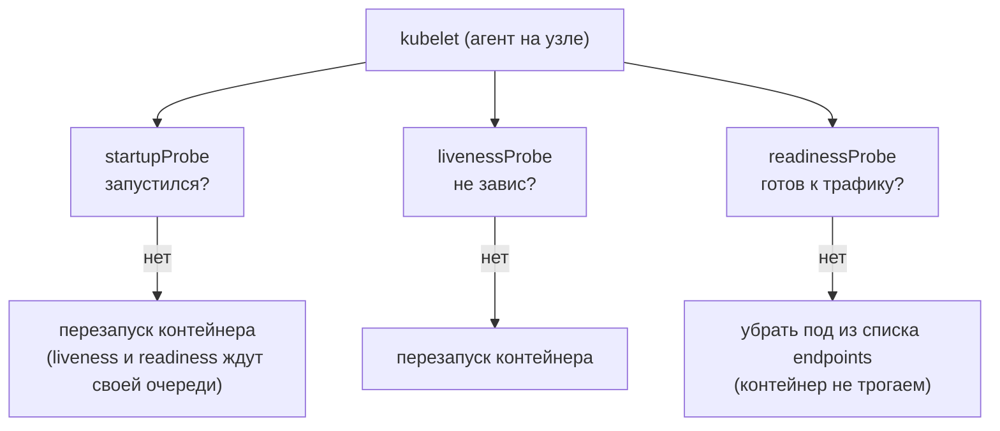
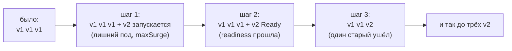
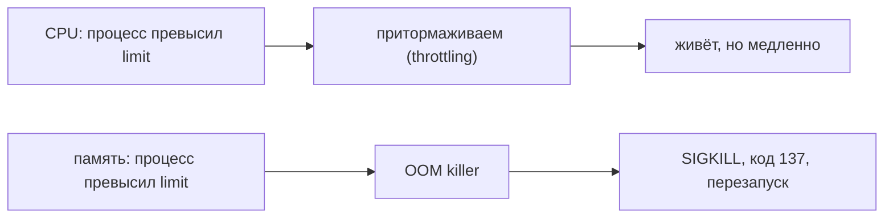
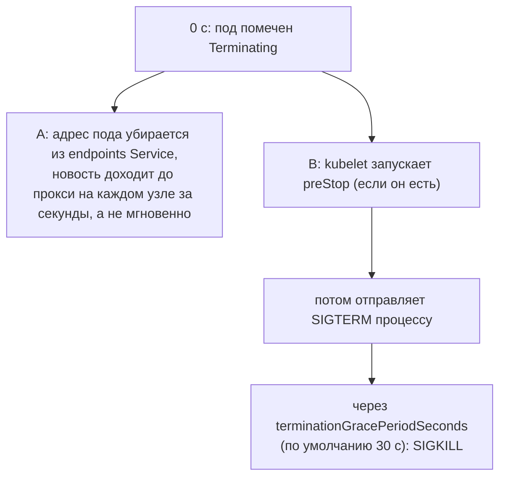

## Зачем это нужно

Kubernetes по умолчанию считает контейнер здоровым, пока в нём работает главный процесс. Этого мало. Процесс может зависнуть и молчать. Он может стартовать полминуты, а трафик уже пошёл. Он может съесть всю память узла и уронить соседей. А выкатка новой версии может на несколько секунд оставить пользователей без ответа. На работе это выглядит как 502 после каждого релиза и `OOMKilled` в три часа ночи. Код 502 («плохой шлюз») значит, что входная точка приняла запрос, но не получила ответа от приложения за ней ([урок 2.4](../02-network/04-http.md)). `OOMKilled` (от Out Of Memory, «кончилась память») - пометка на контейнере, которого система убила за то, что он занял больше памяти, чем ему разрешено: как выключатель в квартире, который отключает электричество при перегрузке, чтобы не сгорела проводка.

Этот урок про три вещи, которые лечат такие истории:

- **пробы** (probes): регулярные проверки, которыми кластер выясняет, что с приложением. Виды: `liveness` (жив ли процесс, не завис ли) и `readiness` (готов ли принимать запросы: можно ли слать ему пользователей). Если liveness не проходит, контейнер перезапускают; если не проходит readiness, его просто временно не используют;
- **ресурсы** (requests и limits): сколько процессора и памяти приложение просит и сколько ему разрешено;
- **обновление без простоя** (rolling update): как менять версию так, чтобы пользователи ничего не заметили. Старые поды заменяются новыми по одному, как смена кассиров в картине ниже.

На собеседованиях про это спрашивают почти всегда: «чем liveness отличается от readiness», «что значит код 137», «почему при релизе бывают 502».

Шаг проекта: «Заметки» получают версию приложения v4.1 (образ `0.4.1`), а Deployment получает пробы, ресурсы, безопасную стратегию выкатки и паузу перед остановкой (`preStop`). `preStop` (от «перед остановкой») - команда, которую Kubernetes выполняет в контейнере прямо перед тем, как попросить его завершиться. У нас она просто ждёт 5 секунд, зачем, разберём в теме про остановку пода.

Откуда версия `0.4.1`. В уроке 5.6 ты работал с образом `0.4.0`. В `0.4.1` (приложение v4.1) мы в задании 2 добавим в `app.py` две переменные окружения, которые нарочно ломают приложение: `STARTUP_DELAY` (медленный старт) и `READY_FAIL` (сообщать «не готово»). Без управляемой поломки нечем тренировать пробы. Образ ты соберёшь сам на своём компьютере командой `docker build` из каталога `~/notes`. В реестр `ghcr.io` (как в 5.6) его не отправляем, а загружаем прямо в узлы kind командой `kind load`: сборка и отправка в реестр заняли бы минуты на каждую правку, а нам нужно быстро пересобирать и пробовать. Подробнее про это в задании 2.

## Что нужно знать

- [Урок 1.4: процессы и сигналы](../01-linux/04-processes-signals.md): сигнал `SIGTERM` вежливо просит процесс завершиться, `SIGKILL` убивает сразу; код выхода 137 значит «убит сигналом 9».
- [Урок 1.5: диск, память, CPU](../01-linux/05-disk-memory-cpu.md): когда память кончается, ядро убивает процесс (OOM killer); эндпоинты `/leak` и `/burn` приложения «Заметки» занимают память и процессор.
- [Урок 4.2: Dockerfile](../04-docker/02-dockerfile.md): как собрать образ командой `docker build` (команда, которая собирает образ из Dockerfile: «build» значит «собрать»).
- [Урок 5.2: поды и Deployment](02-pods-deployments.md): Deployment создаёт ReplicaSet, а тот держит нужное число подов; команда `kubectl rollout` (rollout - «выкатка»: процесс замены старой версии на новую; команда показывает его ход и умеет откатывать).
- [Урок 5.3: Service и DNS](03-services-dns.md): Service отправляет трафик только на поды из списка endpoints (адреса `IP:порт` тех подов, которые сейчас готовы принимать запросы); `kubectl port-forward`.
- [Урок 5.4: Ingress и Gateway API](04-ingress-gateway.md): вход в кластер по адресу `http://notes.lab`.
- [Урок 5.6: ConfigMap и Secret](06-config-secrets.md): `envFrom` подключает настройки, а Deployment лежит в `k8s/base/10-deployment.yaml`.

## Картина целиком

Представь небольшой магазин, где Kubernetes это управляющий, а поды с приложением это кассиры.

- Кассир вышел на смену, но ему нужно пять минут открыть кассу и запустить терминал. Пока он не готов, нельзя ни ставить его в очередь, ни ругать за то, что он ещё ничего не пробил. Это **startup-проба**: «запустился ли ты вообще?».
- Кассир сидит на месте, но уснул. Управляющий периодически спрашивает «ты жив?», а если ответа нет, будит или меняет его. Это **liveness-проба**.
- Кассир жив, но у него закончилась бумага для чеков. Будить его бесполезно, нужно просто не направлять к нему покупателей, пока бумагу не принесут. Это **readiness-проба**.
- У каждого кассира есть **бронь** (сколько места и времени ему гарантировано) и **потолок** (больше этого он не получит). Это **requests** и **limits**.
- Смену меняют по одному: новый кассир сначала полностью готовится и встаёт за кассу, и только потом старый уходит. Магазин ни на минуту не закрывается. Это **rolling update**.



Так Deployment обновляет три пода: число готовых подов не падает ниже трёх.



За урок ты разберёшь каждую часть схемы: что такое проба и чем три пробы отличаются, откуда берутся числа в настройках, что кластер делает при нехватке памяти и почему выкатка не теряет запросы. Потом всё это попробуешь руками и сломаешь.

## Теория

### Почему «процесс запущен» не значит «сервис работает»

Kubelet (агент Kubernetes, который работает на каждом узле и запускает контейнеры, см. [урок 5.1](01-why-k8s-cluster.md)) без подсказок видит только одно: жив ли главный процесс контейнера. Если процесс есть, kubelet считает всё в порядке. Но живой процесс ещё не значит рабочее приложение.

Вот четыре ситуации, при которых процесс есть, а толку нет:

1. Приложение стартует, читает файлы, подключается к базе. Пока оно этого не сделало, порт закрыт, а Kubernetes уже отправляет запросы. Пользователь получает ошибку.
2. Приложение зависло (тупик между потоками, бесконечный цикл). Процесс в списке есть, отвечать некому.
3. База данных недоступна. Приложение живо, но каждый запрос падает.
4. Идёт обновление, и новый под считается готовым, хотя ещё не открыл порт.

Кассир числится «на смене» с момента, когда вошёл в магазин. Это не значит, что касса открыта. Пробы это способ спросить кассира по делу, а не по факту присутствия. Аналогия перестаёт работать в одном: кассира можно уговорить словами, а приложение отвечает только на конкретный запрос, который ты придумал заранее.

Ты в манифесте пишешь, какой запрос отправлять и как часто. Kubelet сам отправляет этот запрос и по ответу решает, что делать с контейнером или с подом. Ты не пишешь код проверок в кластер: ты даёшь приложению адрес, который на вопрос отвечает.

Осторожно, путаница: пробы не «лечат» приложение. Они только сообщают кластеру состояние, а кластер выполняет одно из двух действий: перезапустить контейнер или перестать слать на под трафик. Всё остальное (найти причину сбоя) остаётся за тобой.

> **Прикинь сам:** порт приложения ещё закрыт, а процесс уже в списке. Что видит Kubernetes без проб и что получит пользователь?
{: .predict}

Kubelet видит живой процесс и считает всё в порядке, поэтому шлёт на под трафик. Пользователь получает отказ соединения.

> **Главное:** живой процесс не значит работающее приложение; пробы лишь сообщают кластеру состояние, а кластер перезапускает контейнер или перестаёт слать трафик.
{: .key}

Сами пробы бывают трёх видов, посмотрим, чем они отличаются.

### Как выглядит проба: httpGet, tcpSocket, exec

Приложения бывают разные: у веба есть HTTP-адрес, у базы только TCP-порт, у фоновой программы нет вообще ничего. Поэтому проба бывает трёх видов.

| Вид | Что делает kubelet | Считается успехом |
|---|---|---|
| `httpGet` | шлёт HTTP-запрос GET на путь и порт пода | код ответа от 200 до 399 |
| `tcpSocket` | просто пытается открыть TCP-соединение с портом | соединение установилось |
| `exec` | запускает команду внутри контейнера | команда завершилась с кодом 0 |

Проба на `/healthz`:

```yaml
livenessProbe:
  httpGet:
    path: /healthz     # какой адрес спрашивать
    port: 8080         # какой порт контейнера
```

Kubelet сам, без твоего участия, раз в несколько секунд делает запрос `GET http://<адрес пода>:8080/healthz`. Пришёл ответ `200 ok`: успех. Пришёл `503`, не пришёл ответ за отведённое время или соединение отвергнуто: неудача.

У «Заметок» два адреса именно для этого, оба ты видел в теме 1:

- `/healthz` отвечает `200 ok`, пока процесс жив и может отвечать. Он **не** ходит в базу и ни от чего не зависит.
- `/readyz` отвечает `200 ready`, если приложение может работать по-настоящему: файл доступен для записи, а в режиме PostgreSQL база отвечает на запрос `SELECT 1`. Иначе `503 not ready`.

Осторожно, путаница: код `301` или `302` (перенаправление) тоже входит в «успех», потому что он от 200 до 399. Если проба ходит на адрес, который перенаправляет на страницу логина, она всегда будет «здорова», даже когда приложение сломано. Проверяй, что путь пробы отвечает прямо, без перенаправлений.

> **Прикинь сам:** какой вид пробы подойдёт для PostgreSQL, у которого нет HTTP-адреса, только порт 5432?
{: .predict}

`tcpSocket` на порт 5432 или `exec` с командой `pg_isready`: вторая спрашивает саму базу, готова ли она.

> **Проверь понимание:** какой вид пробы подойдёт для PostgreSQL, у которого нет HTTP-адреса, только порт 5432?

<details markdown="1">
<summary>Ответ</summary>

`tcpSocket` на порт 5432: он проверяет, что порт принимает соединения. Вариант посильнее это `exec` с командой `pg_isready` (входит в образ PostgreSQL), она спрашивает саму базу, готова ли она принимать запросы.

</details>

> **Главное:** `httpGet` успешен при коде 200-399, `tcpSocket` при открытом соединении, `exec` при коде выхода 0.
{: .key}

Первая проба, с которой стоит разобраться, это readiness.

### Readiness: «готов принимать трафик»

Вспомни [урок 5.3](03-services-dns.md): Service отправляет запросы только на поды из списка **endpoints** (адреса подов, которые сейчас считаются подходящими). Кто попадает в этот список? Только поды в состоянии Ready. Без readiness-пробы под становится Ready, как только запустился главный процесс. То есть Service шлёт трафик на приложение, которое ещё не открыло порт.

У кассира кончилась бумага. Управляющий не выгоняет его, а просто временно вешает табличку «касса не работает». Покупатели идут к другим кассам. Принесли бумагу: табличку снимают. Разговор про «перезапуск» тут не нужен.

**Как устроено, по шагам.**

1. Kubelet каждые `periodSeconds` секунд делает запрос из `readinessProbe`.
2. Подряд `failureThreshold` неудач: под получает состояние «не Ready». В `kubectl get pods` столбец `READY` показывает `0/1`.
3. Контроллер убирает адрес этого пода из endpoints Service. Новые запросы идут на других.
4. Контейнер **не перезапускается**: он продолжает работать.
5. Проба снова успешна (`successThreshold` раз подряд, по умолчанию 1): адрес возвращается в endpoints, `READY` снова `1/1`.

Три пода, в базе на 30 секунд пропал доступ. Каждые 5 секунд каждый под спрашивает `/readyz`, получает `503`. После двух неудач подряд (при `failureThreshold: 2` это 10 секунд) все три пода не Ready, список endpoints пуст. Service отвечает ошибкой, пока база не вернётся. Как только база отвечает, `/readyz` снова даёт `200`, и через 5 секунд поды сами вернулись в endpoints. Никто не перезапускался.

Осторожно, путаница: «Readiness перезапускает под». Нет. Она только отключает трафик. Перезапускает liveness.

> **Прикинь сам:** в `get pods` под в статусе `Running` и `0/1`. Он работает или нет?
{: .predict}

Процесс работает, но проба готовности не проходит, поэтому трафика на под нет. В `describe pod` ищи `Readiness probe failed`. Перезапусков при этом ноль.

> **Проверь понимание:** в списке `kubectl get pods` виден под со статусом `Running` и `0/1`. Он работает или нет?

<details markdown="1">
<summary>Ответ</summary>

Процесс в нём работает (`Running`), но проба готовности не проходит (`0/1`), поэтому трафик на него не идёт. Первым делом смотри `kubectl describe pod`: в событиях будет `Readiness probe failed` с кодом ответа. Перезапусков при этом ноль.

</details>

> **Главное:** readiness убирает под из endpoints и не перезапускает контейнер; вернётся под сам, когда проба снова пройдёт.
{: .key}

Перезапускает контейнер уже другая проба: liveness.

### Liveness: «не завис ли процесс»

Иногда приложение виснет так, что само не выйдет: тупик между потоками, бесконечный цикл, исчерпан пул соединений. Процесс жив, но ничего не делает. Без внешней проверки такой под мог бы висеть сутками. Liveness-проба делает то, что сделал бы дежурный: перезапускает.

Управляющий раз в минуту подходит к кассиру и говорит «ты как?». Если ответа нет три раза подряд, кассира меняют на другого.

Тот же цикл проверок, что у readiness, но при провале kubelet **перезапускает контейнер** (пересоздаёт его в том же поде). Счётчик `RESTARTS` в `kubectl get pods` растёт на единицу. Kubelet выдаёт сначала `SIGTERM`, ждёт `terminationGracePeriodSeconds`, если процесс не вышел, шлёт `SIGKILL`.

Если перезапуски идут подряд, kubelet делает между ними всё большие паузы: по умолчанию 10, 20, 40 секунд и так до пяти минут (зависит от версии и настроек kubelet). Статус пода в этот период называется `CrashLoopBackOff` («цикл падений с нарастающей паузой»).

**Главное правило, на котором держится половина инцидентов.** Liveness должна проверять **только сам процесс**, а зависимости (база данных, соседние сервисы) не проверять. Разберём почему.

Допустим, liveness ходит в базу. База моргнула на 20 секунд. Все три пода одновременно проваливают liveness, kubelet перезапускает все три сразу. Теперь приложение недоступно даже тогда, когда база уже вернулась: поды снова стартуют. Они ещё и разом переподключаются к базе, нагрузка на неё скачет, и она может моргнуть снова. Получился каскад, который сам себя усиливает.

Если же в базу ходит readiness, картина другая: поды временно выпали из балансировки, контейнеры живы, а как только база вернулась, всё вернулось само.

> **Прикинь сам:** три реплики, PostgreSQL недоступен 30 секунд, readiness на `/readyz`, liveness на `/healthz`. Что произойдёт?
{: .predict}

Все три пода выпадут из endpoints и сервис отдаст ошибки, но контейнеры не перезапустятся: `/healthz` базу не проверяет. Когда база вернётся, поды вернутся сами.

Осторожно: не думай, что liveness «важнее» readiness и должна проверять всё подряд. Наоборот: liveness должна быть самой простой из проб, потому что её последствия самые тяжёлые.

> **Проверь понимание:** у пода 3 реплики, PostgreSQL недоступен 30 секунд. В манифесте `readinessProbe` на `/readyz` и `livenessProbe` на `/healthz`. Что произойдёт?

<details markdown="1">
<summary>Ответ</summary>

Все три пода не пройдут readiness и выпадут из endpoints: Service отдаёт ошибки, потому что адресов нет. Но контейнеры не перезапускаются, потому что `/healthz` базу не проверяет. Когда база вернётся, поды вернутся в endpoints сами.

</details>

> **Главное:** liveness проверяет только процесс, не зависимости; её провал перезапускает контейнер, а повторные перезапуски дают `CrashLoopBackOff`.
{: .key}

Медленный старт приложения требует отдельной пробы.

### Startup: «пока не запустился, не проверяй»

У приложения бывает долгий старт: прогрев кеша, миграции, подключение к базе. Пусть старт занимает 40 секунд. Liveness с короткими порогами (например, 3 неудачи по 10 секунд = 30 секунд) убьёт контейнер, не дав ему дойти до конца. После перезапуска то же самое: получился бесконечный `CrashLoopBackOff` у здорового приложения.

**Старое решение и его беда.** Раньше ставили `initialDelaySeconds: 60`: «подожди минуту, потом проверяй». Проблема в том, что число угадывают. Приложение стартует за 3 секунды, а ждёт всё равно 60: лишняя минута ожидания при каждом рестарте. А если старт в тяжёлый день занял 70 секунд, всё равно убьют.

**Как устроено сейчас.** `startupProbe` (проба запуска) включается первой. Пока она не прошла хотя бы раз, liveness и readiness **не работают**. Как только startup успешна, она отключается насовсем, и включаются остальные, уже с короткими порогами. Если же startup не прошла за отведённое время, kubelet перезапускает контейнер.

Задаём `periodSeconds: 2` и `failureThreshold: 30`. Общий запас на старт это 2 × 30 = 60 секунд. Приложение стартует за 3 секунды: проба на втором запросе успешна, дальше сразу работают liveness и readiness. Приложение стартует за 45 секунд: проба провалится 22 раза, но лимит 30 не достигнут, успех на 23-м запросе. Приложение не стартовало за 60 секунд: 30 неудач, контейнер перезапускается.

Ещё одна деталь: до открытия порта запрос получает отказ в соединении (`connection refused`). Это нормальный ответ во время старта, а не поломка.

**Общие параметры всех проб.**

| Параметр | Что означает | По умолчанию |
|---|---|---|
| `periodSeconds` | как часто проверять | 10 |
| `timeoutSeconds` | сколько ждать ответа на один запрос | 1 |
| `failureThreshold` | сколько неудач подряд считать провалом | 3 |
| `successThreshold` | сколько успехов подряд считать успехом (для liveness и startup только 1) | 1 |

> **Прикинь сам:** приложение обычно стартует за 5 секунд, но иногда за 50. Какие числа поставить в `startupProbe`?
{: .predict}

Запас больше 50 секунд: `periodSeconds: 2`, `failureThreshold: 30` даёт 60. Быстрый старт не замедлится, потому что после первого успеха проба выключается.

Осторожно: не думай, что «startup проверяет то же самое, что liveness, поэтому лишняя». Пробы часто действительно бьют в один адрес `/healthz`, но у них разные пороги и разное время действия: startup терпеливая и работает один раз, liveness строгая и работает всю жизнь пода.

> **Проверь понимание:** приложение обычно стартует за 5 секунд, но иногда за 50. Какие числа поставить в `startupProbe`?

<details markdown="1">
<summary>Ответ</summary>

Нужен запас больше 50 секунд, лучше с подушкой: `periodSeconds: 2`, `failureThreshold: 30` даёт 60 секунд. Быстрый старт от этого не замедляется: как только проба один раз прошла, ждать больше не нужно.

</details>

> **Главное:** пока startup не прошла, liveness и readiness не работают; запас на старт равен `periodSeconds` на `failureThreshold`.
{: .key}

Теперь о ресурсах: сколько памяти и процессора под просит и сколько получит максимум.

### Requests и limits: бронь и потолок

На одном узле живёт много подов. Если у пода не сказано, сколько ему нужно, планировщик (scheduler, компонент Kubernetes, который выбирает узел для нового пода) вынужден считать, что «ничего». Он набьёт узел подами до отказа, и в какой-то момент они начнут отбирать друг у друга память. Requests и limits это способ сказать кластеру две вещи.

- **`requests`** (запрос): сколько ресурса под просит. Это гарантия и одновременно то, по чему планировщик выбирает узел.
- **`limits`** (лимит): сколько ресурса можно потребить максимум. Это потолок, его применяет ядро Linux через механизм cgroups (группы ресурсов, [урок 1.5](../01-linux/05-disk-memory-cpu.md)).

Гостиница. `requests` это забронированный номер: он твой, даже если ты в нём не ночуешь. `limits` это «больше этого номера в гостинице тебе не выдадут, даже если свободны соседние». Аналогия хромает в одном: настоящий номер не отбирают, а лишнюю память кластер отберёт вместе с процессом (см. ниже).

**Единицы измерения.**

- CPU в **ядрах** и **милли-ядрах**: `1` это одно ядро, `500m` это 0.5 ядра, `50m` это 0.05 ядра (5 процентов одного ядра). `m` значит «тысячная».
- Память в байтах с приставками: `Mi` это мебибайты (1 Mi = 1 048 576 байт), `Gi` это гибибайты. `128Mi` это примерно 134 миллиона байт. Не путай `Mi` с `M` (миллион байт): разница около 5 процентов.

У пода requests `50m / 64Mi`, limits `200m / 128Mi`. Узел имеет 4 ядра (`4000m`) и 8 ГиБ памяти. Планировщик считает только requests: на узле влезет не больше 4000 / 50 = 80 таких подов по процессору и 8192 / 64 = 128 по памяти. Значит предел по процессору, 80 подов (реально меньше, часть отдана системе). При этом каждый под может кратковременно потреблять до 200m процессора и до 128Mi памяти, то есть больше, чем просил.

> **Прикинь сам:** зачем нужны requests, если есть limits?
{: .predict}

Limits планировщику ничего не говорят: он выбирает узел по requests. Без них под с потолком 1 Гиб посадят на узел, где свободно 100 Миб.

Осторожно: не думай, что `requests` это «сколько под реально использует». Нет, это сколько под просит. Если поставить requests заметно выше факта, узел «занят» на бумаге, а на деле полупустой: платишь за железо, которое простаивает.

> **Проверь понимание:** зачем нужны requests, если есть limits?

<details markdown="1">
<summary>Ответ</summary>

Limits ничего не говорят планировщику. Он выбирает узел по requests. Без них под с потолком 1 Гиб могли бы посадить на узел, где свободно 100 Миб.

</details>

> **Главное:** requests это бронь, по ней планировщик выбирает узел, а limits это потолок, который применяет ядро.
{: .key}

Что именно происходит, когда под упёрся в потолок, зависит от ресурса.

### Что происходит, когда под упёрся в лимит: CPU и память

Два ресурса ведут себя по-разному, и от этого зависит диагностика.

**CPU можно «сжать».** Если процессу нужно больше процессора, чем в limits, ядро его притормаживает (**throttling**): он получает меньше времени процессора и работает медленнее, но остаётся живым. Пользователь видит рост времени ответа, в логах ошибок нет.

**Память «сжать» нельзя.** Если процесс просит памяти больше, чем limits, ядро включает **OOM killer** (убийца по нехватке памяти) и убивает процесс сигналом `SIGKILL` (номер 9). Kubelet видит это, пишет в состояние контейнера причину `OOMKilled` и запускает контейнер заново. Код выхода: `137` = 128 + 9 (правило из [урока 1.4](../01-linux/04-processes-signals.md): выход по сигналу N даёт код 128 + N). Приложение при этом не успевает ничего записать в лог: его убивают мгновенно. Поэтому типичная жалоба звучит так: «под перезапускается, а в логах пусто».



Limit памяти 128Mi, приложение просит `/leak?mb=200` (занять 200 МБ). Память растёт до 128Mi, ядро убивает процесс. `kubectl describe pod` показывает в `Last State` строки `Reason: OOMKilled` и `Exit Code: 137`, а счётчик `RESTARTS` увеличился на 1. Клиент, который делал запрос, получает обрыв соединения: ответа никто не успел написать.

Осторожно, путаница: код 137 не всегда OOM. `137` это просто `SIGKILL`. OOM даёт `137` и причину `OOMKilled`. Но `137` бывает и когда kubelet убил контейнер, не дождавшись завершения после `SIGTERM` (см. остановку пода ниже). Различай по полю `Reason`.

> **Прикинь сам:** контейнер упёрся в CPU limit и в memory limit. Чем отличаются последствия?
{: .predict}

Упёрся в CPU: сервис замедляется (throttling), контейнер живёт. Упёрся в память: процесс убит кодом 137, контейнер перезапущен, соединения потеряны.

> **Проверь понимание:** контейнер упёрся в CPU limit и в memory limit. Чем отличаются последствия?

<details markdown="1">
<summary>Ответ</summary>

Упёрся в CPU: сервис замедляется (throttling), контейнер живёт. Упёрся в память: процесс убит с кодом 137, контейнер перезапущен, соединения потеряны, при повторе будет `CrashLoopBackOff`.

</details>

> **Главное:** CPU можно притормозить, память нельзя: превышение даёт `OOMKilled` и код 137, причину читай в поле `Reason`.
{: .key}

При нехватке памяти на узле порядок выселения задаёт класс QoS.

### Классы QoS: кого выселять первым

Когда памяти на узле остаётся мало, кластеру нужно выбрать, чьи поды выселить. Порядок определяет класс QoS (Quality of Service, «класс обслуживания»). Он выставляется автоматически по тому, что ты написал в requests и limits.

| Класс | Условие | Порядок выселения |
|---|---|---|
| `Guaranteed` | у всех контейнеров пода requests **равны** limits (и по CPU, и по памяти) | последним |
| `Burstable` | requests заданы, но не равны limits | посередине |
| `BestEffort` | ничего не задано | первыми |

У нашего пода requests `50m / 64Mi`, limits `200m / 128Mi`. Они заданы, но не равны: класс `Burstable`. Чтобы получить `Guaranteed`, нужно поставить одинаково, например `200m / 128Mi` в обеих строках. Ценой станет то, что ты бронируешь больше, чем обычно используешь.

> **Прикинь сам:** у пода нет секции `resources`. Какой у него класс и что это значит на практике?
{: .predict}

`BestEffort`: планировщик не знает его потребления, при нехватке памяти его выселят первым, а пока он работает, может съесть память соседей.

Осторожно: не думай, что BestEffort это «бесплатно, просто без гарантий». На деле такие поды планировщик считает не занимающими места, поэтому на узел их набивается слишком много, и они вытесняют друг друга и соседей при первой же нехватке.

> **Проверь понимание:** у пода в манифесте вообще нет секции `resources`. Какой у него класс и что это значит на практике?

<details markdown="1">
<summary>Ответ</summary>

`BestEffort`. Планировщик не знает, сколько он потребляет, и может посадить его на любой узел. При нехватке памяти его выселят первым, а пока он работает, может съесть память соседей.

</details>

> **Главное:** `Guaranteed` выселяют последним, `Burstable` посередине, `BestEffort` первым; класс выставляется по requests и limits.
{: .key}

Теперь посмотрим, как Deployment заменяет поды без простоя.

### Rolling update: как заменить версию без простоя

Когда выходит новая версия, старые поды нужно заменить. Самый простой способ: остановить все старые и запустить новые. Но тогда на время запуска сервис недоступен. Rolling update («перекатывающееся обновление») меняет поды по частям.

**Как устроено, по шагам.** Deployment (напомню из [урока 5.2](02-pods-deployments.md)) при смене образа создаёт новый ReplicaSet и постепенно переводит поды из старого в новый. Скоростью управляют два параметра:

- **`maxSurge`**: на сколько подов сверх нужного числа можно временно увеличить общее количество;
- **`maxUnavailable`**: сколько подов может быть «недоступно» одновременно.

Оба можно задавать числом (`1`) или процентом (`25%`). По умолчанию у обоих `25%`. Процент округляется: `maxSurge` вверх, `maxUnavailable` вниз.

Три реплики, `maxSurge: 1`, `maxUnavailable: 0`.

1. Разрешено всего 3 + 1 = 4 пода, недоступных не должно быть совсем. Значит, убить старый под нельзя, пока не появится готовый новый.
2. Кластер создаёт 4-й под с новой версией. Все три старых продолжают работать.
3. Новый под проходит startup и readiness, становится Ready.
4. Теперь можно убрать один старый: готовых остаётся 3 (два старых, один новый).
5. Создаётся следующий новый, и цикл повторяется, пока все три не станут новыми.

Всё это время готовых подов не меньше трёх. Ценой стал временный четвёртый под: на время выкатки нужно ресурсов на 4 пода, а не на 3. Если поставить `maxUnavailable: 1` и `maxSurge: 0`, лишнего пода не будет, но на время замены готовых подов будет только два, ёмкость просядет.

Осторожно, путаница: «Без readiness rolling update безопасен сам по себе». Нет. Пока readiness нет, Kubernetes считает новый под готовым сразу после запуска процесса, и поток трафика уходит на приложение, которое ещё не открыло порт. Безопасность даёт связка `readinessProbe` + `maxUnavailable: 0`.

**Если новая версия не стартует.** Она не становится Ready, выкатка «зависает», а старые поды остаются и обслуживают пользователей (благодаря `maxUnavailable: 0`). Через `progressDeadlineSeconds` (по умолчанию 600 секунд) Deployment объявляет выкатку неудавшейся. Вернуться можно командой `kubectl rollout undo`: она возвращает Deployment к предыдущей ревизии (сохранённой версии его шаблона).

> **Прикинь сам:** зачем `maxUnavailable: 0`, если уже есть readiness?
{: .predict}

При умолчании 25% кластер может сначала убить старый под, а потом ждать новый, и ёмкость упадёт. С нулём старый уходит, только когда новый Ready.

> **Проверь понимание:** зачем `maxUnavailable: 0`, если уже есть readiness?

<details markdown="1">
<summary>Ответ</summary>

При умолчании (25%) кластер может сначала убить старый под, а потом ждать новый: ёмкость на время выкатки падает. С `maxUnavailable: 0` старый под уходит только когда новый уже Ready. Платой служит лишний временный под.

</details>

> **Главное:** безопасность выкатки даёт связка `readinessProbe` и `maxUnavailable: 0`, платой становится лишний временный под.
{: .key}

Но даже с правильной выкаткой возможны редкие 502, и дело в остановке пода.

### Остановка пода: гонка, из-за которой бывают 502

Даже с правильной выкаткой пользователи иногда получают ошибку в момент, когда старый под уходит. Причина в том, что остановка пода состоит из нескольких событий, которые происходят одновременно, а не по очереди.

**Что происходит, когда под удаляют.**



Ветки A и B идут параллельно. Если приложение получит `SIGTERM` и закроет порт раньше, чем последний прокси узнает, что адрес убран, то часть запросов ещё какое-то время летит на закрытый порт. Это и есть редкие 502 и 503 на выкатках.

**Как лечат.** Хук `preStop` («перед остановкой»): команда, которую kubelet запускает **до** `SIGTERM`. Самая простая форма: `sleep 5`. Пять секунд под живёт как обычно, за это время адрес успевает пропасть отовсюду, и только потом приходит `SIGTERM`. Второй кусок: приложение должно уметь корректно завершаться по `SIGTERM`, то есть дорабатывать открытые запросы. «Заметки» с версии v2.1 при `SIGTERM` дорабатывают запросы до 10 секунд (это `STOP_TIMEOUT` в коде).

Срок `terminationGracePeriodSeconds` включает и `preStop`, и доработку запросов: у нас 5 + до 10 = до 15 секунд из отведённых 30. Значит, укладываемся с запасом.

> **Прикинь сам:** сколько секунд нужно в `terminationGracePeriodSeconds`, если `preStop` делает `sleep 5`, а приложение дорабатывает запросы до 10 секунд?
{: .predict}

Не меньше 15, разумно 30 с запасом. При 10 kubelet пришлёт `SIGKILL` раньше, и вернётся код 137.

Осторожно: не думай, что Kubernetes сам «красиво выключает» под и терять ничего не будет. Он лишь запускает шаги. А гонку между адресами и сигналом надо закрывать самому.

> **Проверь понимание:** сколько секунд должно быть в `terminationGracePeriodSeconds`, если `preStop` делает `sleep 5`, а приложение дорабатывает запросы до 10 секунд?

<details markdown="1">
<summary>Ответ</summary>

Не меньше 15, разумно взять 30 с запасом. Если поставить 10, kubelet пришлёт `SIGKILL` раньше, чем приложение доработает запросы, и вернётся код 137.

</details>

> **Главное:** адрес убирается из endpoints параллельно с остановкой, поэтому `preStop` с паузой закрывает гонку, а приложение должно завершаться по `SIGTERM`.
{: .key}

Соберём все детали в одну ленту времени.

### Вся жизнь пода по секундам

Сейчас у тебя в голове отдельные детали. Соберём их в одну ленту времени, чтобы было видно, кто кого включает и что видит пользователь. Возьмём наш манифест из задания 3: `startupProbe` каждые 2 секунды, `readinessProbe` каждые 5, `livenessProbe` каждые 10, `preStop` на 5 секунд. Приложение стартует за 3 секунды.

**Как это идёт, по шагам.**

```text
время   что происходит                                        READY   в endpoints?
0 с     контейнер запущен, процесс стартует                    0/1     нет
0-3 с   порт закрыт: startup получает connection refused        0/1     нет
4 с     startup успешна (порт открыт) и выключается            0/1     нет
        включаются liveness и readiness
5 с     первая readiness: /readyz дал 200                       1/1     да
...     под работает, раз в 10 с liveness, раз в 5 с readiness  1/1     да
T       кто-то удалил под (или идёт выкатка)                    1/1     да
T+0     под Terminating; адрес убирается из endpoints,          -       уходит
        параллельно запускается preStop (sleep 5)
T+5     preStop кончился, приходит SIGTERM                      -       нет
T+5..   приложение дорабатывает запросы (до 10 с у «Заметок»)   -       нет
        и выходит с кодом 0
```

Всё, что ты видишь в `kubectl get pods`, это проекция этой ленты: `0/1` на первых секундах, `1/1` после первой успешной readiness, `Terminating` в конце.

**Что здесь важно заметить.** Между запуском процесса и попаданием под трафик проходят секунды (здесь 5), и именно на это время под «защищён» пробами. Между командой удаления и `SIGTERM` тоже проходят секунды (здесь 5), и именно они спасают от гонки. Без проб обе паузы были бы нулевыми, и в обе щели просачивались бы пользовательские ошибки.

> **Прикинь сам:** что значит `READY 1/1` в списке подов?
{: .predict}

Только то, что readiness сейчас проходит. Startup к этому моменту давно выключена, а liveness в `READY` ничего не пишет.

Осторожно: не думай, что `READY 1/1` значит «все проверки прошли». На самом деле оно значит только «readiness сейчас проходит». Startup к этому моменту давно выключена, а liveness своё значение в `READY` не пишет.

> **Главное:** между запуском процесса и трафиком, а также между командой удаления и `SIGTERM` проходят секунды, и именно они защищают пользователей.
{: .key}

Всё это видно в `describe pod`, и пора научиться его читать.

### Как прочитать пробы в `kubectl describe pod`

Манифест говорит, что ты хотел. А `describe` показывает, что кластер реально применил, и события: почему контейнер перезапустили или убрали из трафика. Новичок открывает `describe` и тонет в экране текста. Нужны три места.

Журнал управляющего магазином: вверху записано, какие проверки он проводит и как часто, а внизу список происшествий со временем. Аналогия неточна в одном: журнал Kubernetes хранит события недолго, около часа, потом они исчезают.

Вывод делится на блоки. Для проб важны три: описание проб (внутри блока контейнера), `Conditions` (итоговые «да/нет» по поду) и `Events` (хронология).

```text
    Liveness:   http-get http://:8080/healthz delay=0s timeout=2s period=10s #success=1 #failure=3
    Readiness:  http-get http://:8080/readyz delay=0s timeout=2s period=5s #success=1 #failure=2
    Startup:    http-get http://:8080/healthz delay=0s timeout=1s period=2s #success=1 #failure=30
...
Conditions:
  Type                        Status
  ContainersReady             False
  Ready                       False
...
Events:
  Warning  Unhealthy  4s (x3 over 14s)  kubelet  Readiness probe failed: HTTP probe failed with statuscode: 503
```

Первая строка читается слева направо: проба типа `http-get` ходит по адресу `:8080/healthz` (адрес без имени хоста значит «IP самого пода»), `delay=0s` (начальной задержки нет), `timeout=2s` (ждать ответа не больше 2 секунд), `period=10s` (проверять раз в 10 секунд), `#success=1` (один успех считается выздоровлением), `#failure=3` (три неудачи подряд считаются провалом). Это ровно поля из манифеста, только сведённые в строку. Дальше `Ready False` значит «под не принимает трафик»; причину ищем в `Events`. Строка `Unhealthy ... (x3 over 14s)` читается так: событие произошло 3 раза за 14 секунд, последний раз 4 секунды назад, проваливается именно readiness, ответ сервера 503. Если бы в причине стояла `Liveness probe failed`, рядом появилась бы строка `Killing` («контейнер будет перезапущен»).

> **Прикинь сам:** в `Events` ты видишь `Liveness probe failed: ... context deadline exceeded`, а следом `Killing`. Что произошло и что проверишь первым?
{: .predict}

Приложение не ответило на `/healthz` за `timeoutSeconds` `failureThreshold` раз подряд, и kubelet перезапустил контейнер. Проверь, не занято ли приложение тяжёлой работой и не мал ли таймаут.

Осторожно: не думай, что `Warning` в `Events` всегда означает беду. Несколько `Readiness probe failed` на старте пода нормальны: приложение ещё поднимается. Беда, когда они продолжаются после того, как приложение должно было стартовать, или рядом со `Killing` и растущим `RESTARTS`.

> **Проверь понимание:** в `Events` видишь `Liveness probe failed: Get "http://10.244.1.7:8080/healthz": context deadline exceeded`, а через секунду `Killing`. Что произошло и что ты проверишь первым?

<details markdown="1">
<summary>Ответ</summary>

Приложение не ответило на `/healthz` за `timeoutSeconds` (`context deadline exceeded` значит «время ожидания вышло»). Так повторилось `failureThreshold` раз подряд, и kubelet перезапустил контейнер (`Killing`). Первым проверь, не занято ли приложение тяжёлой работой (например, `/slow` или `/burn`) и не слишком ли мал `timeoutSeconds`.

</details>

> **Главное:** читай три места: описание проб, `Conditions` и `Events`; `Killing` рядом с провалом liveness значит перезапуск.
{: .key}

Если выкатка сломалась, на помощь приходят ревизии Deployment.

### Ревизии Deployment: история и откат

Выкатка не всегда удаётся: новая версия может стартовать, но быстро падать. Нужен способ вернуться к рабочей версии за секунды, а не восстанавливать манифест по памяти.

Кнопка «отменить» в текстовом редакторе, но не на все правки, а на последние несколько сохранений. Аналогия ломается тем, что откат меняет только шаблон пода, а не то, что приложение уже записало в базу.

Каждое изменение шаблона пода (образ, переменные окружения, ресурсы, пробы) создаёт новую **ревизию** (revision): пронумерованный снимок шаблона. Под капотом это ReplicaSet (объект из [урока 5.2](02-pods-deployments.md), который держит нужное число одинаковых подов). Старый ReplicaSet после выкатки не удаляют, а уменьшают до 0 подов и оставляют в запасе. Сколько старых хранить, задаёт `revisionHistoryLimit` (по умолчанию 10). Команда `kubectl rollout undo` просто снова масштабирует предыдущий ReplicaSet вверх, а текущий вниз, по тем же правилам `maxSurge` и `maxUnavailable`.

Команда `kubectl -n notes rollout history deployment/notes` печатает таблицу:

```text
REVISION  CHANGE-CAUSE
1         <none>
2         <none>
3         <none>
```

Три строки значат три разных шаблона пода за время жизни Deployment. Текущая ревизия самая большая (3). `rollout undo` без параметров возвращает ревизию 2, но под новым номером: появится ревизия 4 с содержимым прежней 2 (номера не переиспользуются). `rollout undo --to-revision=1` вернёт самую первую. `<none>` в `CHANGE-CAUSE` значит, что причину изменения никто не записал: это не ошибка.

Чтобы увидеть, что лежит в конкретной ревизии, есть `kubectl -n notes rollout history deployment/notes --revision=2`: команда печатает шаблон пода того снимка (образ, переменные, пробы). Это удобно перед откатом: сначала смотришь, куда возвращаешься, и только потом возвращаешься. Следить за ходом выкатки и откатом помогает `kubectl -n notes rollout status deployment/notes`: она ждёт, пока все новые поды станут Ready, и завершается с кодом 0 при успехе. Если выкатка зависла, команда сама не завершится, пока не наступит `progressDeadlineSeconds`. Поэтому в скриптах и CI её используют как «сторожа»: ненулевой код выхода означает, что релиз не прошёл, и можно автоматически откатываться.

> **Прикинь сам:** у Deployment ревизии 1, 2, 3. Ты выполнил `rollout undo`. Какая ревизия станет текущей и с каким номером?
{: .predict}

Содержимое ревизии 2, но номер 4: номера только растут, откат создаёт новую запись.

Осторожно: не думай, что `rollout undo` «откатывает всё». Он возвращает только шаблон пода. Переменные, добавленные командой `kubectl set env`, входят в шаблон и откатятся; записи в базе данных, ConfigMap или Secret он не трогает. Второе заблуждение: что `kubectl rollout restart` создаёт откат. Нет, он создаёт новую ревизию с той же версией образа (меняется только метка времени в шаблоне).

> **Проверь понимание:** у Deployment ревизии 1, 2, 3. Ты выполнил `rollout undo`. Какая ревизия стала текущей и какой у неё номер?

<details markdown="1">
<summary>Ответ</summary>

Содержимое ревизии 2, но номер 4: номера только растут, откат создаёт новую запись с содержимым прежней.

</details>

> **Главное:** `rollout undo` возвращает только шаблон пода, а данные в базе, ConfigMap и Secret не трогает; `rollout status` ждёт готовности и годится для CI.
{: .key}

Остаётся научиться подбирать числа для проб и ресурсов.

### Как выбирать числа, а не гадать

В манифестах на работе встречаются пробы, у которых числа взяты с потолка: `timeoutSeconds: 1` на медленном приложении, `failureThreshold: 1` на всё. Такие настройки создают ложные перезапуски. Несколько правил, которыми ты можешь пользоваться.

- **Порог провала это баланс.** Liveness с `failureThreshold: 1` перезапустит контейнер из-за одной потерянной секунды. Три неудачи подряд по 10 секунд дают 30 секунд терпения, для зависания это разумно. Readiness можно делать чувствительнее (2 неудачи по 5 секунд), потому что её ошибка дешёвая: под просто ненадолго уйдёт из трафика.
- **`timeoutSeconds` не должен быть ближе к обычному времени ответа, чем нужно.** Если `/healthz` отвечает за 10 миллисекунд, а под нагрузкой иногда за полсекунды, таймаут в 1 секунду ещё терпим, а вот в 100 миллисекунд даст ложные срабатывания.
- **Пробы должны быть дешёвыми.** Запрос проб приходит каждые несколько секунд на каждую реплику. Если `/readyz` делает тяжёлый запрос в базу, ты сам создаёшь нагрузку. У «Заметок» это `SELECT 1`: самый лёгкий запрос, какой бывает.
- **Requests выбирают по измерению.** Запусти приложение под обычной нагрузкой, посмотри реальное потребление (`kubectl top pod`, если в кластере есть metrics-server, или графики из темы 8) и поставь requests около типичного значения, а limits немного выше пика. Числа «от балды» приводят либо к бесполезно занятому узлу, либо к `OOMKilled`.
- **CPU limit многие вообще не ставят**, чтобы не ловить throttling, и оставляют только requests. Это осознанный компромисс, а не ошибка. А вот лимит памяти ставят почти всегда, потому что память не сжимается.
- **`terminationGracePeriodSeconds` считай как сумму:** время `preStop` плюс время, за которое приложение дорабатывает запросы, плюс запас.

> **Прикинь сам:** `/readyz` делает запрос к базе на 300 мс, проба идёт каждые 5 секунд у 20 реплик. Что не так?
{: .predict}

Проба сама грузит базу: 4 тяжёлых запроса в секунду постоянно. Сделай проверку лёгкой (`SELECT 1`) или кешируй результат на несколько секунд.

Осторожно: не думай, что «лучше поставить всё с запасом побольше». Слишком большой запас `startupProbe` не вредит, зато слишком большие requests реально стоят денег, а слишком мягкая liveness оставляет зависший под без присмотра на минуты.

> **Проверь понимание:** `/readyz` при каждом вызове выполняет запрос к базе на 300 миллисекунд, проба идёт каждые 5 секунд у 20 реплик. Что не так и как исправить?

<details markdown="1">
<summary>Ответ</summary>

Проба сама нагружает базу: 20 реплик по запросу в 5 секунд это 4 запроса в секунду постоянной фоновой нагрузки, и каждый тяжёлый. Нужно сделать проверку лёгкой (`SELECT 1`, как у «Заметок») или кешировать результат в приложении на несколько секунд.

</details>

> **Главное:** пробы должны быть дешёвыми, requests выбирают по измерению, лимит памяти ставят почти всегда, а `terminationGracePeriodSeconds` это сумма `preStop`, доработки и запаса.
{: .key}

Теперь пора применить всё на «Заметках».

## Практика

Все команды выполняются в кластере kind `notes` (контекст `kind-notes`, namespace `notes`) из каталога `~/notes`. Убедись:

```bash
kubectl config use-context kind-notes
kubectl -n notes get pods
```

Команда `kubectl config use-context` выбирает кластер, а `get pods` показывает поды в namespace `notes` (ключ `-n` задаёт namespace). Ты должен увидеть три пода `notes-...` и под `postgres-0` в состоянии `Running`.

### Задание 1. Ресурсы, QoS и OOMKilled

**Цель:** увидеть, что память имеет жёсткий потолок, и научиться читать код 137.

**Предскажи:** мы зададим лимит памяти 128Mi и попросим под удержать 200 МБ через `/leak`. Что случится с контейнером и что покажет `RESTARTS`? Какой класс QoS получит под с requests 50m/64Mi и limits 200m/128Mi?

<details markdown="1">
<summary>Ответ</summary>

Контейнер будет убит ядром (`OOMKilled`, код 137), kubelet перезапустит его, `RESTARTS` станет 1. Класс QoS `Burstable`: requests меньше limits.

</details>

**Шаги:**

1. Задай ресурсы текущему Deployment (образ пока `0.4.0`). Разбор команды: `set resources` меняет секцию `resources` у контейнеров Deployment, `--requests` и `--limits` принимают пары `ресурс=значение` через запятую.

```bash
kubectl -n notes set resources deployment/notes \
  --requests=cpu=50m,memory=64Mi --limits=cpu=200m,memory=128Mi
kubectl -n notes rollout status deployment/notes
```

Смена ресурсов меняет шаблон пода, поэтому запускается rolling update, а `rollout status` ждёт его конца.

2. Проверь класс QoS и пробрось порт. Разбор: `$(...)` подставляет вывод внутренней команды; `-l app.kubernetes.io/name=notes` выбирает поды по метке; `head -1` оставляет первый; `-o jsonpath='{.status.qosClass}'` печатает одно поле из ответа Kubernetes; `18080:8080` значит «локальный порт 18080 на порт 8080 пода»; `&` уводит команду в фон.

```bash
POD=$(kubectl -n notes get pod -l app.kubernetes.io/name=notes -o name | head -1)
kubectl -n notes get "$POD" -o jsonpath='{.status.qosClass}{"\n"}'
kubectl -n notes port-forward "$POD" 18080:8080 >/dev/null &
sleep 2
```

3. Попроси занять 200 МБ (демонстрационный эндпоинт, в настоящем сервисе его не бывает). `grep -A6` печатает найденную строку и шесть следующих.

```bash
curl -s "http://127.0.0.1:18080/leak?mb=200"; echo
kubectl -n notes get pods -l app.kubernetes.io/name=notes
kubectl -n notes describe "$POD" | grep -A6 'Last State'
```

**Что должно получиться** (имена подов, время и текст ошибки `curl` могут отличаться, ниже типичный вид):

```text
Burstable
curl: (52) Empty reply from server
NAME                     READY   STATUS    RESTARTS      AGE
notes-6f7d9c5b8d-4kx2p   1/1     Running   1 (5s ago)    2m
    Last State:     Terminated
      Reason:       OOMKilled
      Exit Code:    137
```

**Как читать вывод:** `Burstable` это класс QoS. `curl: (52)` значит «сервер закрыл соединение, не ответив»: процесс убили посреди запроса (в другом запуске может быть код `(56)`). В `RESTARTS` видно `1 (5s ago)`: один перезапуск пять секунд назад. Главное в `describe`: блок `Last State` (то, как контейнер завершился прошлый раз), в нём `Reason: OOMKilled` (убит по памяти) и `Exit Code: 137`. Логов ошибки нет: процесс убили без предупреждения.

Для следующих заданий остановим port-forward: `kill %1` (завершает фоновую задачу №1 этой оболочки).

**Объясни себе:**
- Почему клиент получил пустой ответ, а не ошибку приложения?
- Чем 137 отличается от кода 143 при обычном `SIGTERM`?

**Типичные ошибки:**
- `error: unable to forward port because pod is not running. Current status=Pending`: под ещё пересоздаётся, дождись `rollout status`.

### Задание 2. Приложение v4.1 и образ 0.4.1

**Цель:** добавить в приложение управляемые сбои, чтобы пробы можно было тренировать на настоящем поведении.

**Предскажи:** какое минимальное изменение приложения позволит смоделировать медленный старт и «не готов»? Подсказка: нужны две переменные окружения.

<details markdown="1">
<summary>Ответ</summary>

`STARTUP_DELAY` (пауза перед открытием порта: пока она идёт, порт закрыт, и запрос получает `connection refused`) и `READY_FAIL` (сколько секунд после открытия порта `/readyz` отвечает 503; `-1` значит 503 всегда).

</details>

**Шаги:**

1. В `~/notes/app.py` добавь три куска. Первый вставь перед строкой `LEAK = []`. Он читает две переменные окружения; если значение не число, процесс завершается с кодом 2 (так «Заметки» реагируют на любую неверную настройку). Значение по умолчанию 0 отключает сбой.

```python
# v4.1: демонстрационные сбои для тренировки проб
def _int_env(name, default):
    raw = os.environ.get(name, str(default))
    try:
        return int(raw)
    except ValueError:
        print(f"{name} must be an integer, got {raw!r}", file=sys.stderr)
        sys.exit(2)

STARTUP_DELAY = _int_env("STARTUP_DELAY", 0)
READY_FAIL = _int_env("READY_FAIL", 0)
STARTED_AT = 0.0
```

2. Второй кусок вставь в обработчик `/readyz`, самой первой проверкой внутри блока `if path == "/readyz":`. Условие: если `READY_FAIL` равен `-1`, или задан положительный и с начала обслуживания прошло меньше этого числа секунд, вернуть 503:

```python
        if path == "/readyz":
            if READY_FAIL == -1 or (READY_FAIL > 0 and time.monotonic() - STARTED_AT < READY_FAIL):
                return self._text(503, "not ready")
            ok = storage_ready()
            return self._text(200 if ok else 503, "ready" if ok else "not ready")
```

`time.monotonic()` это часы, которые идут только вперёд и не зависят от смены времени в системе: годятся, чтобы мерить интервалы.

3. Третий кусок в начале функции `main()`. Пауза стоит **до** создания сервера: пока сервер не создан, порт не слушается, и это как раз имитирует медленный старт. Отсчёт `READY_FAIL` начинается после паузы и инициализации хранилища, прямо перед открытием порта:

```python
def main():
    global STARTED_AT
    if STARTUP_DELAY > 0:
        time.sleep(STARTUP_DELAY)  # порт ещё не слушается
    initialize_storage()
    STARTED_AT = time.monotonic()  # READY_FAIL отсчитывается от начала обслуживания
    server = ThreadingHTTPServer((HOST, PORT), Handler)
```

Остальная часть `main()` не меняется. Эталон целиком: [project/notes/versions/v4.1.py](https://github.com/distinguished-sre/learning/blob/main/devops/project/notes/versions/v4.1.py).

4. Проверь новое поведение сразу локально, без кластера. Запусти приложение с медленным стартом и постоянной неготовностью:

```bash
STARTUP_DELAY=3 READY_FAIL=-1 NOTES_DATA=/tmp/notes-t.txt PORT=18081 python3 app.py &
sleep 1; curl -s -m1 http://127.0.0.1:18081/healthz; echo "код curl: $?"
sleep 3
curl -s -w ' %{http_code}\n' http://127.0.0.1:18081/healthz
curl -s -w ' %{http_code}\n' http://127.0.0.1:18081/readyz
kill %1
```

Флаги: `-m1` даёт запросу одну секунду; `-w ' %{http_code}\n'` дописывает в конец код ответа; `$?` это код завершения предыдущей команды.

```text
код curl: 7
ok 200
not ready 503
```

**Как читать вывод:** через секунду после старта порт закрыт, поэтому `curl` возвращает код `7` (не удалось соединиться) без текста ответа. Через четыре секунды `/healthz` отвечает `ok 200`, а `/readyz` при `READY_FAIL=-1` отвечает `not ready 503`. Это и есть нужный нам сбой: процесс жив, но не готов.

5. Обнови `APP_VERSION` в ConfigMap `notes-config` на `4.1`, собери образ и загрузи его в kind (версия закреплена, тег `latest` не используем):

```bash
docker build -t notes:0.4.1 .
kind load docker-image notes:0.4.1 --name notes
docker exec notes-control-plane crictl images | grep 'notes.*0.4.1'
```

Почему локальный образ, а не реестр. В 5.6 образ брался из `ghcr.io/<github-user>/notes:0.4.0`: его собрала и отправила CI-цепочка из [темы 3](../03-git-ci/index.md). Здесь мы будем править `app.py` и пробовать результат десятки раз. Каждый раз ждать сборку в CI и скачивание образа было бы долго, поэтому мы пропускаем реестр: собираем образ на своём компьютере и копируем его прямо внутрь узлов kind. Тег при этом остаётся точным (`0.4.1`, не `latest`). В рабочем процессе всё равно образ идёт через реестр, в этом уроке это сознательное упрощение. Поэтому в Deployment ниже нет `ghcr.io/...`, а стоит `notes:0.4.1` с `imagePullPolicy: IfNotPresent` («не скачивай, если образ уже есть на узле»).

Разбор: `docker build -t notes:0.4.1 .` собирает образ из Dockerfile в текущем каталоге и даёт ему имя и тег; `kind load` копирует локальный образ внутрь узлов kind (иначе узлы не найдут его, они не видят образы твоего Docker); `crictl images` показывает образы внутри узла, `grep` оставляет нужную строку.

**Что должно получиться:**

```text
docker.io/library/notes                 0.4.1               <хэш образа>        <размер>
```

Хэш и размер у тебя будут свои.

**Объясни себе:**
- Почему пауза `STARTUP_DELAY` стоит до создания сервера, а не после?
- Чем `READY_FAIL=-1` отличается от `READY_FAIL=30`?

**Типичные ошибки:**
- `ERROR: image "notes:0.4.1" not found locally`: образ не собран, повтори `docker build`.
- `ErrImagePull` или `ImagePullBackOff` в поде после выкатки: образ не загружен в узлы kind (`kind load`) или `imagePullPolicy` пытается идти в интернет; для локального образа нужен `IfNotPresent`. Образ из `ghcr.io/<github-user>/` (как в 5.6) здесь не нужен: берём локальный `notes:0.4.1`, см. объяснение выше.

### Задание 3. Пробы на живом поде

**Цель:** убедиться на опыте, что startup держит медленный старт, readiness выводит под из трафика, а откат `rollout undo` возвращает рабочую версию.

**Предскажи:** мы включим `STARTUP_DELAY=20` при `startupProbe` с запасом 60 секунд, а потом `READY_FAIL=-1`. Что покажет `READY` у пода в первом и втором случае и будут ли перезапуски?

<details markdown="1">
<summary>Ответ</summary>

Первый случай: 20 секунд `0/1 Running`, потом `1/1`, перезапусков нет (startup успевает). Второй: под `Running`, но `0/1` навсегда, `RESTARTS` остаётся 0: readiness не перезапускает.

</details>

**Шаги:**

1. Создай файл `k8s/base/10-deployment.yaml` целиком. Это итоговая версия урока, каждый блок разобран под кодом. Образ подставь свой: если в 5.6 ты работал с `ghcr.io/<github-user>/notes`, всё равно оставь `notes:0.4.1`: он загружен в kind командой выше.

```yaml
apiVersion: apps/v1
kind: Deployment
metadata:
  name: notes
  namespace: notes
  labels:
    app.kubernetes.io/name: notes
spec:
  replicas: 3
  selector:
    matchLabels:
      app.kubernetes.io/name: notes
  strategy:
    type: RollingUpdate
    rollingUpdate:
      maxSurge: 1          # можно поднять один лишний под
      maxUnavailable: 0    # старый уходит только после готового нового
  template:
    metadata:
      labels:
        app.kubernetes.io/name: notes
    spec:
      terminationGracePeriodSeconds: 30
      containers:
        - name: notes
          image: notes:0.4.1
          imagePullPolicy: IfNotPresent
          ports:
            - containerPort: 8080
          envFrom:
            - configMapRef:
                name: notes-config
          # Как в уроке 5.6: из Secret только один ключ, а не все
          env:
            - name: DATABASE_URL
              valueFrom:
                secretKeyRef:
                  name: notes-db
                  key: DATABASE_URL
          resources:
            requests:
              cpu: 50m
              memory: 64Mi
            limits:
              cpu: 200m
              memory: 128Mi
          # Запуск: ждём до 60 секунд (30 попыток по 2 секунды)
          startupProbe:
            httpGet:
              path: /healthz
              port: 8080
            periodSeconds: 2
            failureThreshold: 30
          # Жив ли процесс: зависимости не проверяем
          livenessProbe:
            httpGet:
              path: /healthz
              port: 8080
            periodSeconds: 10
            timeoutSeconds: 2
            failureThreshold: 3
          # Готов ли к трафику: проверяет хранилище
          readinessProbe:
            httpGet:
              path: /readyz
              port: 8080
            periodSeconds: 5
            timeoutSeconds: 2
            failureThreshold: 2
          lifecycle:
            preStop:
              exec:
                command: ["sleep", "5"]   # даём убрать под из endpoints до SIGTERM
```

Разбор по блокам:

- `strategy` задаёт rolling update: `maxSurge: 1` и `maxUnavailable: 0`, как в теории.
- `terminationGracePeriodSeconds: 30`: сколько секунд под получает на завершение, прежде чем придёт `SIGKILL`.
- `resources` это те самые requests и limits из задания 1.
- `startupProbe`: 30 попыток по 2 секунды, запас 60 секунд на старт.
- `livenessProbe` на `/healthz`: раз в 10 секунд, ждёт ответ до 2 секунд, три неудачи подряд значит перезапуск.
- `readinessProbe` на `/readyz`: раз в 5 секунд, две неудачи подряд значит под выходит из endpoints.
- `lifecycle.preStop`: перед остановкой пять секунд ничего не делаем (`sleep 5`), пока адрес пропадёт из endpoints.
- `envFrom` (настройки из ConfigMap) и `env` с `secretKeyRef` (один ключ `DATABASE_URL` из Secret) те же, что в [уроке 5.6](06-config-secrets.md). Тома `emptyDir` тут нет: в 5.6 мы его убрали, данные лежат в PostgreSQL.

Проверь схему (это не запускает ничего в кластере): `kubectl apply --dry-run=server -f k8s/base/10-deployment.yaml`.

2. Примени и включи медленный старт. `set env` добавляет переменную окружения в Deployment. Команда `get pods -w` (от слова watch) печатает изменения подов по мере их появления, выход через `Ctrl+C`.

```bash
kubectl apply -f k8s/base/10-deployment.yaml
kubectl -n notes rollout status deployment/notes
kubectl -n notes set env deployment/notes STARTUP_DELAY=20
kubectl -n notes get pods -l app.kubernetes.io/name=notes -w
```

3. Сломай готовность: убери `STARTUP_DELAY` (запись `ИМЯ-` с минусом удаляет переменную) и включи `READY_FAIL=-1`. Дальше посмотри выкатку, откати её и убери обе переменные вручную:

```bash
kubectl -n notes set env deployment/notes STARTUP_DELAY- READY_FAIL=-1
kubectl -n notes rollout status deployment/notes --timeout=40s
kubectl -n notes get pods -l app.kubernetes.io/name=notes
kubectl -n notes rollout undo deployment/notes
kubectl -n notes set env deployment/notes STARTUP_DELAY- READY_FAIL-
kubectl -n notes rollout status deployment/notes
```

Почему последняя команда `set env` нужна? `rollout undo` возвращает **предыдущую** ревизию, а это была ревизия с `STARTUP_DELAY=20` (с шага 2), а не чистая. Поэтому переменные убираем сами. Заодно запомни: `kubectl apply` не удаляет переменные, добавленные через `set env`, если их нет в файле: они «чужие» для последнего применённого манифеста.

**Что должно получиться** (имена подов и возраст у тебя другие):

```text
notes-7c9d8f6b5-abcde   0/1   Running   0   8s
notes-7c9d8f6b5-abcde   1/1   Running   0   24s
Waiting for deployment "notes" rollout to finish: 1 out of 3 new replicas have been updated...
error: timed out waiting for the condition
NAME                     READY   STATUS    RESTARTS   AGE
notes-5b4f7d96c8-2hq8z   1/1     Running   0          3m
notes-5b4f7d96c8-7mv4k   1/1     Running   0          3m
notes-5b4f7d96c8-x9c2t   1/1     Running   0          3m
notes-84c6d5f7b9-lp2nw   0/1     Running   0          40s
```

**Как читать вывод:** в первых двух строках один и тот же под сначала `0/1` (порт закрыт, идёт пауза), а через 20 с и запуск `1/1`; `RESTARTS` остаётся 0: startup-проба подождала. Дальше выкатка с `READY_FAIL=-1` не завершается за 40 секунд (`timed out`). В списке подов три старых `1/1` (они обслуживают трафик) и один новый `0/1`: он `Running`, но не готов, и старые пока не тронуты благодаря `maxUnavailable: 0`.

**Объясни себе:**
- Почему выкатка с `READY_FAIL=-1` зависла, а не уронила сервис?
- Почему `STARTUP_DELAY=20` не вызвал перезапуск?

**Типичные ошибки:**
- `Startup probe failed: Get "http://10.244.1.7:8080/healthz": dial tcp 10.244.1.7:8080: connect: connection refused`: это нормальное событие во время старта; тревога, только если оно повторяется дольше запаса `startupProbe` (тогда контейнер перезапускается).
- `Liveness probe failed: Get ...: context deadline exceeded (Client.Timeout exceeded while awaiting headers)`: приложение не успело ответить за `timeoutSeconds`; либо оно занято (`/slow`), либо таймаут слишком мал.

### Задание 4. Обновление без простоя

**Цель:** доказать цифрами, что выкатка с readiness и `preStop` не теряет запросы, а без них теряет.

**Предскажи:** мы запустим цикл запросов на `http://notes.lab/` и выполним `rollout restart`. Сколько ответов не 200 ожидаешь при нашем манифесте? А если убрать `readinessProbe`, `preStop` и поставить `maxUnavailable: 1`?

<details markdown="1">
<summary>Ответ</summary>

С нашим манифестом: ноль. Без readiness кластер сочтёт под готовым сразу после старта процесса, и часть запросов получит ошибки (502 или 503 от Envoy) или сброс соединения; проверим это в разделе «Сломай и почини».

</details>

**Шаги:**

1. В первом терминале запусти непрерывные запросы и подсчёт кодов. Разбор: `seq 1 600` печатает числа от 1 до 600, цикл `for` проходит их; `curl -s -o /dev/null` молчит и выбрасывает тело; `-w '%{http_code}\n'` печатает только код ответа; `--max-time 2` даёт запросу максимум 2 секунды; `sleep 0.1` пауза; `sort | uniq -c` считает, сколько раз встретился каждый код. Цикл идёт около минуты.

```bash
for i in $(seq 1 600); do
  curl -s -o /dev/null -w '%{http_code}\n' --max-time 2 http://notes.lab/
  sleep 0.1
done | sort | uniq -c
```

2. Во втором терминале сразу после запуска цикла:

```bash
kubectl -n notes rollout restart deployment/notes
kubectl -n notes rollout status deployment/notes
```

`rollout restart` пересоздаёт поды без смены манифеста, то есть запускает тот же rolling update.

**Что должно получиться:**

```text
    600 200
```

и во втором терминале:

```text
deployment.apps/notes restarted
Waiting for deployment "notes" rollout to finish: 1 out of 3 new replicas have been updated...
deployment "notes" successfully rolled out
```

**Как читать вывод:** в первом терминале строка «количество код»: `600 200` значит, что все запросы получили 200 и ни один не потерялся. Если ты видишь другие строки, например `2 502`, значит, на выкатке были потери. Проверь, что применён именно манифест из задания 3.

**Объясни себе:**
- Что делает `preStop: sleep 5` и почему без него бывают единичные ошибки в момент выхода старого пода?
- Что даёт `maxSurge: 1` и почему для 3 реплик на выкатку нужно ресурсов на 4 пода?

**Типичные ошибки:**
- `curl: (6) Could not resolve host: notes.lab`: нет записи в `/etc/hosts` (`127.0.0.1 notes.lab`, урок 5.4).
- `error: deployment "notes" exceeded its progress deadline`: новая версия не стала Ready за 600 секунд; смотри `kubectl describe pod` и `logs`, откатывай `rollout undo`.

### Задание 5. Шаг проекта: v0.4.1

**Цель:** зафиксировать состояние проекта: приложение v4.1, образ 0.4.1, Deployment с пробами и ресурсами в git.

**Предскажи:** совпадает ли то, что запущено в кластере, с файлом `10-deployment.yaml`? Как это проверить одной командой без изменений?

<details markdown="1">
<summary>Ответ</summary>

`kubectl diff -f k8s/base/10-deployment.yaml` показывает разницу между файлом и кластером; пустой вывод и код 0 значат, что расхождений нет. После заданий 3 и 4 расхождений быть не должно: переменные мы убрали.

</details>

**Шаги:**

1. Проверь, что кластер соответствует манифесту и все реплики Ready. `-o custom-columns=...` печатает свою таблицу из выбранных полей:

```bash
kubectl diff -f k8s/base/10-deployment.yaml; echo "код: $?"
kubectl -n notes get deployment notes
kubectl -n notes get pods -l app.kubernetes.io/name=notes \
  -o custom-columns=NAME:.metadata.name,READY:.status.containerStatuses[0].ready,IMAGE:.spec.containers[0].image
```

2. Проверь вход: `curl -s http://notes.lab/` и `curl -s http://notes.lab/readyz`.

3. Зафиксируй в git и поставь тег:

```bash
git add app.py k8s/base/10-deployment.yaml
git commit -m "feat: пробы, ресурсы и rolling update, app v4.1"
git tag v0.4.1
git log --oneline -1
```

**Что должно получиться:**

```text
код: 0
NAME    READY   UP-TO-DATE   AVAILABLE   AGE
notes   3/3     3            3            2d
NAME                     READY   IMAGE
notes-5b4f7d96c8-2hq8z   true    notes:0.4.1
Notes service v4.1
ready
```

**Как читать вывод:** `код: 0` значит, что `kubectl diff` не нашёл различий. `3/3` значит, что три реплики из трёх готовы. Ответ `Notes service v4.1` подтверждает, что вход отдаёт новую версию, а `ready` это ответ `/readyz`.

Состояние проекта: `app.py` v4.1, образ `0.4.1`, git-тег `v0.4.1`, Deployment с `startupProbe`, `livenessProbe /healthz`, `readinessProbe /readyz`, requests 50m/64Mi, limits 200m/128Mi, RollingUpdate 1/0 и `preStop`.

**Объясни себе:**
- Почему в git попал файл манифеста, а не команды `set env`, которые мы выполняли?

**Типичные ошибки:**
- `error: the path "k8s/base/10-deployment.yaml" does not exist`: команда запущена не из `~/notes`.

> Нейросеть может предложить числа для проб «на глаз». Подставь свои измерения времени старта и потребления, а потом проверь пробы поломкой, как в практике.
{: .ai}

## Сломай и почини

Скачай скрипт поломки и запусти один из сценариев (сам скрипт не читай, иначе теряется смысл упражнения). Он работает без sudo и меняет только Deployment `notes` в namespace `notes`:

```bash
curl -fsSL -o /tmp/break-5.7.sh https://raw.githubusercontent.com/distinguished-sre/learning/main/devops/project/notes/break/5.7/break.sh
bash /tmp/break-5.7.sh 1
```

Сценарии `1`, `2`, `3`, `4`, номер передаётся аргументом. Вернуть рабочее состояние: `bash /tmp/break-5.7.sh fix` (он убирает добавленные переменные и применяет `k8s/base/10-deployment.yaml`). Сначала пройди один сценарий целиком, потом бери следующий.

### Симптом

1. Новый под уходит в перезапуски и в `CrashLoopBackOff`, хотя вручную приложение работает.
2. `RESTARTS` растёт, а в логах нет ни одной ошибки.
3. Во время выкатки цикл `curl` из задания 4 получает ошибки: 503, иногда 502 или обрыв.
4. Под `Running`, но `0/1`, перезапусков нет.

### Гипотезы

1. Liveness убивает контейнер раньше, чем тот закончил старт.
2. Контейнер убивают по памяти.
3. Под считается Ready до готовности, или слишком много подов уходит разом.
4. Readiness-проба падает.

### Проверки

Смотри `kubectl -n notes describe pod <имя>` (блоки `Last State` и `Events`), `kubectl -n notes logs <имя> --previous` (логи прошлого контейнера, ведь текущий новый и пустой), `kubectl -n notes get endpoints notes` и `kubectl -n notes get deployment notes -o jsonpath='{.spec.strategy}'`. Ищи: `Reason: OOMKilled` с `Exit Code: 137`, события `Liveness probe failed` и `Readiness probe failed: HTTP probe failed with statuscode: 503`, пустой список `ENDPOINTS`. Для сценария 3 запусти цикл из задания 4 и сделай `kubectl -n notes rollout restart deployment/notes`.

### Исправление

<details markdown="1">
<summary>Разбор всех сценариев</summary>

**1. Liveness убивает медленный старт.** В `describe` видно `Liveness probe failed: ... connection refused` сразу после старта и перезапуски через равные промежутки. Причина: у приложения задана пауза до открытия порта (`STARTUP_DELAY`), а `startupProbe` убрана, поэтому liveness с короткими порогами убивает контейнер раньше, чем порт откроется. Код выхода обычно 137, а не 143: в паузе старта приложение ещё не установило обработчик `SIGTERM`, а процесс с PID 1 в контейнере сигнал без обработчика игнорирует, поэтому контейнер падает только по `SIGKILL` после `terminationGracePeriodSeconds`. Код 143 был бы, если бы обработчик уже стоял. Исправление: вернуть `startupProbe` с запасом (`periodSeconds: 2`, `failureThreshold: 30`), а не увеличивать `initialDelaySeconds` и не ослаблять liveness.

**2. OOMKilled.** `Last State: Terminated, Reason: OOMKilled, Exit Code: 137`, логи чистые. Причина: процессу не хватает `limits.memory` (в сценарии он занижен до 8Mi, а приложению в покое нужно около 14Mi, поэтому контейнер убивают сразу при старте; в жизни это `/leak`, большой ответ или утечка). Исправление зависит от причины: утечка означает чинить код; если памяти реально нужно больше, поднять limit и request по измерению (`kubectl top pod`, если в кластере стоит metrics-server, о нём урок 5.11), а не ставить «с запасом наугад». Помни, что requests выше фактического потребления занимают место на узле.

**3. Ошибки во время выкатки.** Причина: убраны `startupProbe` и `readinessProbe` (под считается готовым сразу после старта процесса, а порт ещё закрыт), нет `preStop`, разрешено `maxUnavailable: 1`. Исправление: `readinessProbe` на `/readyz`, `startupProbe`, `maxSurge: 1`, `maxUnavailable: 0`, `preStop: sleep 5`. Проверка: цикл из задания 4 даёт только 200.

**4. `READY_FAIL`: под не Ready.** Причина: `/readyz` возвращает 503 (в сценарии по переменной `READY_FAIL`, в жизни: недоступна БД, нет прав на каталог). Перезапусков нет: так работает readiness. Исправление: убрать причину (`kubectl -n notes set env deployment/notes READY_FAIL-`) или, если катилась новая версия, `kubectl -n notes rollout undo deployment/notes`. Старые поды при `maxUnavailable: 0` всё это время обслуживали трафик.

</details>

## ИИ в помощь

Нейросеть хорошо объясняет события `describe pod` и подсказывает числа для проб, но не видит реальное потребление твоего приложения. Общие правила: [ИИ-помощник](../../load-tester/ai.md).

**Задача:** понять, почему контейнер перезапускается.

```text
Я учу Kubernetes. Под перезапускается, в логах пусто. Вот блок Last State и Events из kubectl describe pod:
<вставь строки>
Скажи, это OOMKilled, провал liveness или что-то ещё, и что проверить первым.
```
{: .wrap}

**Проверь ответ:** сверь с полем `Reason` и кодом выхода: `137` с `OOMKilled` значит память. Типичная ошибка: нейросеть просто советует «увеличить limits», не проверив, не течёт ли память.

**Задача:** подобрать числа для проб.

```text
Приложение стартует за <вставь секунды>, а в тяжёлый день за <вставь секунды>. Предложи startupProbe,
readinessProbe и livenessProbe для httpGet на /healthz и /readyz. Объясни, откуда взял каждое число.
```
{: .wrap}

**Проверь ответ:** посчитай запас startup как `periodSeconds` на `failureThreshold` и убедись, что liveness не ходит в базу. Типичная ошибка: `initialDelaySeconds: 60` вместо startup-пробы.

**Задача:** найти причину 502 при выкатке.

```text
После релиза иногда приходят 502, хотя kubectl rollout status показывает успех. В манифесте есть
readinessProbe и maxUnavailable 0, preStop нет. Объясни, что происходит при остановке пода, и что поменять.
```
{: .wrap}

**Проверь ответ:** проверь, что в ответе есть `preStop` с паузой и `terminationGracePeriodSeconds` больше суммы паузы и доработки запросов. Типичная ошибка: совет «увеличить число реплик».

## Словарик урока

| Термин | Простыми словами |
|---|---|
| проба (probe) | регулярный запрос, которым kubelet проверяет приложение |
| kubelet | агент Kubernetes на узле, запускает контейнеры и делает пробы |
| startupProbe | проба запуска: пока не прошла, остальные пробы не работают |
| livenessProbe | проба «жив ли процесс», провал означает перезапуск контейнера |
| readinessProbe | проба «готов ли к трафику», провал означает убрать под из endpoints |
| endpoints | список адресов подов, на которые Service отправляет трафик |
| requests | сколько CPU и памяти под просит (гарантия, по ней выбирают узел) |
| limits | потолок ресурсов, который под не должен превысить |
| милли-ядро (`m`) | тысячная доля ядра процессора: `500m` это полядра |
| Mi, Gi | мебибайты и гибибайты: `128Mi` это примерно 134 млн байт |
| throttling | притормаживание процесса при упоре в CPU limit |
| OOMKilled | контейнер убит ядром за превышение лимита памяти, код 137 |
| Ревизия (revision) | Пронумерованный снимок шаблона пода в Deployment; к ней можно откатиться `rollout undo` |
| `preStop` | Команда, которую kubelet выполняет перед остановкой контейнера |
| QoS-класс | приоритет пода при нехватке памяти: Guaranteed, Burstable, BestEffort |
| CrashLoopBackOff | контейнер падает снова и снова, паузы между запусками растут |
| RollingUpdate | обновление по частям, без остановки всех подов сразу |
| maxSurge | на сколько подов можно превысить нужное число во время обновления |
| maxUnavailable | сколько подов можно потерять во время обновления |
| ревизия | сохранённая версия шаблона Deployment, к ней можно откатиться |
| preStop | команда, которую kubelet запускает перед `SIGTERM` |
| terminationGracePeriodSeconds | сколько секунд под получает на завершение до `SIGKILL` |

## Вопросы с собеседований

Раздел для повторения: ответь вслух, потом открой ответ. Короткие вопросы с пометкой `[на скорость]` тренируй на время: ответ за 30 секунд.



## Проверено на версиях

- Манифест Deployment из задания 3: `kubeconform -strict -summary` без ошибок (схема `apps/v1` в проверенной версии `kubeconform`).
- Код `app.py` v4.1: запущен локально на Python 3 (пауза старта, `READY_FAIL=-1`, `READY_FAIL=2`, неверное значение даёт код 2); совпадает с `project/notes/versions/v4.1.py`.
- Кластер kind в этой редакции не поднимался: вывод `kubectl` (`OOMKilled`, `RESTARTS`, отчёт о выкатке, цикл `curl` в задании 4) собран по знанию поведения Kubernetes и прогоном не подтверждён, имена подов и время у тебя будут свои.
- Скрипт `break.sh` для 5.7: проверен `shellcheck`, чтением и запуском с подставным `kubectl` (JSON правок разбирается, повторные вызовы и `fix` ведут себя как задумано), на настоящем кластере не запускался. Расход памяти приложения в покое (около 14Mi, при лимите 8m контейнер получает `OOMKilled`, код 137) проверен в `docker run --memory` на образе `python:3.13-slim`.
- Ubuntu 26.04 LTS и 24.04 LTS, Python 3.13 (образ `python:3.13-slim`), PostgreSQL 18, Envoy Gateway v1.9.2: как в предыдущих уроках темы.
- Версии Kubernetes и kind не закреплены: проверь актуальные на странице проектов.

## Итог урока: ты умеешь

- [ ] умею объяснить разницу между startup, liveness и readiness и выбрать, что проверяет каждая
- [ ] умею настроить пробы с запасом на старт без `initialDelaySeconds`
- [ ] умею задать requests и limits и определить класс QoS пода
- [ ] умею распознать `OOMKilled` по коду 137 и `Last State` и отличить его от провала liveness
- [ ] умею настроить RollingUpdate с `maxSurge: 1` и `maxUnavailable: 0` и доказать отсутствие потерь запросами
- [ ] умею добавить `preStop` и объяснить, зачем он нужен при остановке пода
- [ ] умею откатить выкатку `kubectl rollout undo` и найти причину зависшей выкатки

**Дальше:** [Урок 5.8: Job, CronJob и DaemonSet](08-jobs-cronjob-daemonset.md)
