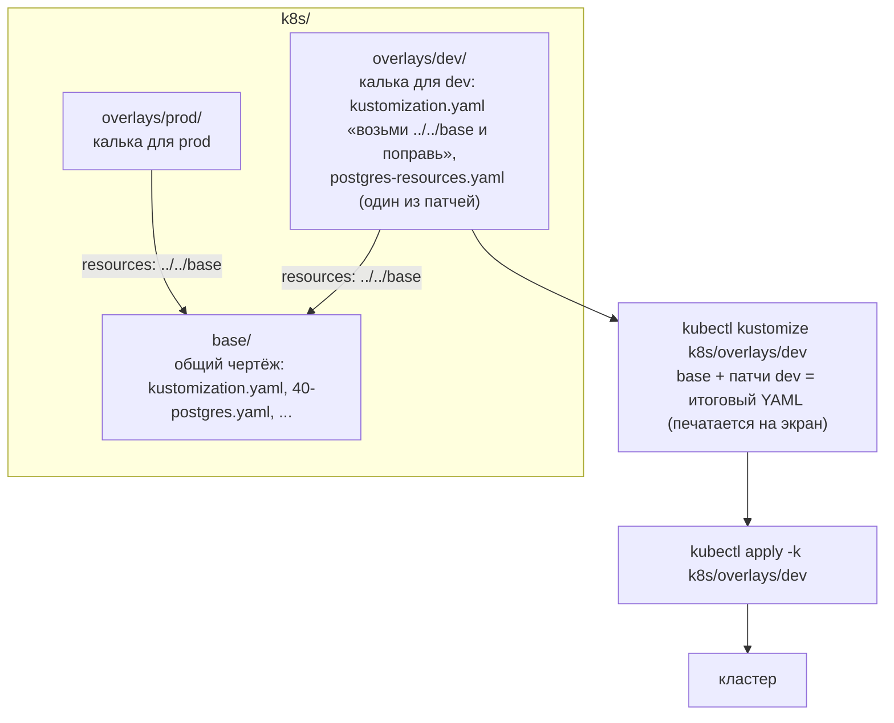
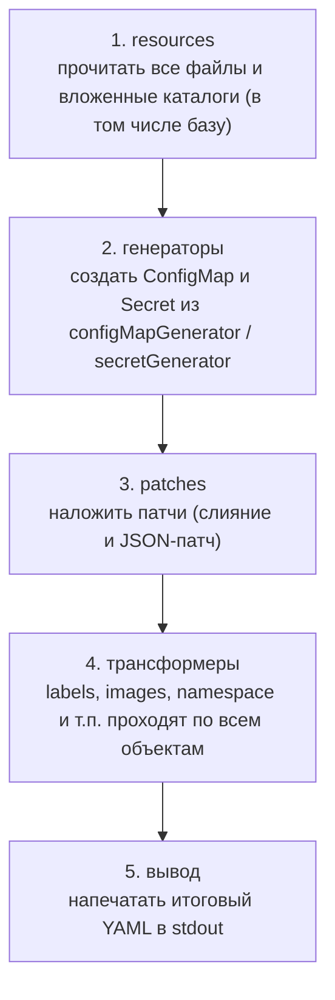


## Зачем это нужно

Dev и prod почти одинаковы: те же манифесты, но другие ресурсы, хост, расписание бэкапа. **Манифест** (manifest) это YAML-файл с описанием объекта Kubernetes. Копировать каталоги с манифестами под каждое окружение нельзя: через месяц копии разъедутся, и никто не вспомнит, какое отличие было намеренным.

В уроке 5.9 ты решил такую же задачу через Helm: манифест превращается в шаблон с пропусками. Для приложения это удобно. Но платформенные манифесты (Postgres, Gateway, CronJob бэкапа) мы писали обычным YAML, и превращать их в шаблоны с `{{ }}` не хочется: они перестанут быть валидным YAML (то есть таким, который понимает любой редактор и любая программа без предварительной подстановки), и читать их станет сложнее.

Kustomize решает задачу наоборот: есть **общая база** (base) и тонкий **слой поверх** (overlay), в котором записаны только отличия. Шаблонов нет, база остаётся обычным правильным YAML, а любое отличие окружения видно одной командой `diff` (программа, которая сравнивает два текста и показывает только различающиеся строки, как «найди десять отличий» на двух картинках). Описание «что брать и что менять» лежит в файле `kustomization.yaml`: это не манифест Kubernetes, а список заданий для самого Kustomize, подробно разберём ниже.

Kustomize встроен в `kubectl`, ставить ничего не нужно. На работе он встречается постоянно: Flux и Argo CD (инструменты, которые сами применяют манифесты из git, как автопилот, который следит, чтобы кластер выглядел так же, как записано в репозитории, [урок 9.3](../09-secrets-gitops/03-gitops-flux.md)) читают именно его структуру каталогов.

Шаг проекта: платформенные манифесты `k8s/base/` получают `kustomization.yaml`, рядом появляются `k8s/overlays/dev` и `k8s/overlays/prod` с патчами ресурсов, хоста и расписания бэкапа; применяем через `kubectl apply -k`.

## Что нужно знать

- [Урок 5.2: Deployment](02-pods-deployments.md): структура манифеста, `apply`, метки (labels, бирки «ключ: значение» на объектах) и `selector` (селектор: правило-фильтр «мои поды те, у которых такая метка»), по которому Deployment находит свои поды.
- [Урок 5.5: StatefulSet и PostgreSQL](05-storage-statefulset-postgres.md): объект `postgres`, который мы будем патчить.
- [Урок 5.6: ConfigMap и Secret](06-config-secrets.md): как ConfigMap попадает в под и почему поды не перезапускаются сами при его смене.
- [Урок 5.8: CronJob](08-jobs-cronjob-daemonset.md): расписание `pg-backup` из пяти полей.
- [Урок 5.9: Helm](09-helm.md): с чем мы сравниваем Kustomize; приложение уже живёт в релизе Helm.

## Картина целиком

Представь чертёж дома и **прозрачную кальку**. Основной чертёж один: стены, окна, двери. Для дачи ты кладёшь поверх кальку, где нарисована только веранда, а для городской квартиры другую кальку с перегородкой. Сам чертёж никто не перерисовывает. Чтобы увидеть итог, смотришь через кальку на чертёж.

- **База** (base) это основной чертёж: общие манифесты для всех окружений.
- **Overlay** (оверлей, «наложение») это калька: каталог с перечнем «возьми базу и поменяй вот это».
- **Патч** (patch) это одна правка на кальке: «у этого объекта поставить 3 реплики».
- **Сборка** (build) это взгляд сквозь кальку: Kustomize накладывает правки на базу и печатает итоговый YAML.



База ничего не знает об overlay, поэтому её можно собрать и применить отдельно. Файлы базы никогда не меняются: патч действует только при сборке, в памяти.

Оговорка к аналогии: в отличие от кальки, Kustomize умеет и не просто «рисовать поверх», а точно указывать, что именно поменять, и ругается, если указал на несуществующее.

## Теория

### Зачем Kustomize и чем он не похож на Helm

Helm требует превратить манифест в шаблон. Для приложения, которое ты распространяешь как пакет, это оправдано. Но если у тебя свои манифесты и окружения отличаются тремя строками, шаблонизатор избыточен: появляется свой язык, отступы через `nindent`, ошибки рендера. Kustomize отвечает на вопрос «как поправить готовый YAML, не переписывая его».

Helm это бланк с пропусками: сначала пишем бланк, потом заполняем. Kustomize это готовый заполненный документ и лист с исправлениями: «в пункте 3 заменить 1 на 3». Оговорка: лист исправлений работает, только пока в документе есть пункт 3, иначе Kustomize остановится с ошибкой.

Kustomize читает файл `kustomization.yaml` в каталоге. В нём перечислены `resources` (какие файлы или каталоги брать за основу) и правки поверх них. Результат сборки это обычный YAML, который **печатается на экран** (в **stdout**, стандартный вывод программы, урок 1.2). В кластер ничего не пишется, пока ты сам не передашь этот YAML в `kubectl apply`.

Инструмент встроен в `kubectl`, поэтому не нужно ничего устанавливать: `kubectl kustomize` собирает, `kubectl apply -k` собирает и применяет (флаг `-k` от kustomize).

Минимальный `kustomization.yaml`:

```yaml
apiVersion: kustomize.config.k8s.io/v1beta1   # версия формата этого файла
kind: Kustomization                           # тип файла: набор ресурсов и правок
resources:                                    # что взять за основу
  - deployment.yaml                           # путь к файлу, относительно этого каталога
```

Kustomize читает `deployment.yaml`, ничего не меняет и печатает его. Значит, даже без правок сборка полезна: она собирает много файлов в один поток.

> **Прикинь сам:** ты запустил `kubectl kustomize k8s/base`. Что изменилось в кластере?
{: .predict}

Ничего: команда только собирает и печатает YAML. В кластер что-то попадёт после `kubectl apply -k` или ручной передачи результата в `kubectl apply -f -`.

Осторожно: не думай, что Kustomize и Helm соперники. Это разные инструменты для разных задач, и они часто работают вместе (в конце урока). Ещё одно заблуждение: что `kustomization.yaml` это манифест Kubernetes. Это файл для самого Kustomize, кластер его не увидит.

> **Проверь понимание:** ты запустил `kubectl kustomize k8s/base`. Что изменилось в кластере?

<details markdown="1">
<summary>Ответ</summary>

Ничего. Команда только собирает и печатает YAML. В кластер что-то попадает только после `kubectl apply -k` или ручной передачи результата в `kubectl apply -f -`.

</details>

> **Главное:** Kustomize правит готовый YAML патчами, без шаблонов; `kustomization.yaml` это файл для самого Kustomize, а не манифест Kubernetes.
{: .key}

Чтобы понять, куда класть общее и отличия, посмотрим на каталоги.

### База и overlay: как устроены каталоги

Нужно место для общего и место для отличий. Если отличия лежат отдельно, видно, чем окружения различаются: читаешь два маленьких файла, а не два больших каталога.

Чертёж и калька из «Картины целиком»: основа общая, отличия отдельно.

Overlay это каталог со своим `kustomization.yaml`, где в `resources` указан **путь к другому каталогу** (к базе). Путь всегда относительный: считается от каталога, где лежит файл `kustomization.yaml`. Из `k8s/overlays/dev` до базы надо подняться на два уровня вверх: `../../base`. Точка-точка (`..`) значит «родительский каталог», это знакомо по урокам про файловую систему.

Что важно:

- база не знает про overlay, зависимость идёт только в одну сторону (overlay ссылается на базу);
- overlay можно сделать поверх другого overlay, но нам хватит двух уровней;
- у каждого каталога с `kustomization.yaml` собирается своя версия YAML.

Три команды, которые нужны каждый день:

| Команда | Что делает | Меняет кластер |
|---|---|---|
| `kubectl kustomize КАТАЛОГ` | Только собирает и печатает YAML | нет |
| `kubectl diff -k КАТАЛОГ` | Сравнивает результат сборки с живым кластером, печатает разницу | нет |
| `kubectl apply -k КАТАЛОГ` | Собирает и отправляет в кластер | да |

Между ними есть и четвёртая проверка: `kubectl apply -k КАТАЛОГ --dry-run=server` отправляет YAML API-серверу «понарошку»: сервер проверяет его так же, как настоящий, но ничего не сохраняет.

Порядок, которого стоит придерживаться перед каждым применением: сначала `kubectl kustomize` (глазами смотрим итог), потом `kubectl diff -k` (что изменится в живом кластере), потом `apply -k`. Код выхода `kubectl diff`: 0 если различий нет, 1 если есть (это не ошибка, а «есть разница»), больше 1 при настоящей ошибке. На этом строят проверки в CI (автоматических проверках в git): если diff вернул 1, значит в git лежит не то, что в кластере.

Осторожно, путаница: путь в `resources`: он не от того места, откуда ты запустил команду, а от каталога с `kustomization.yaml`. Ошибка `no such file or directory` почти всегда из-за этого.

> **Прикинь сам:** в `k8s/overlays/dev/kustomization.yaml` написано `resources: [../../base]`. От чего считается этот путь?
{: .predict}

От каталога, где лежит этот `kustomization.yaml`, а не от места запуска команды: `..` даёт `k8s/overlays`, второе `..` даёт `k8s`, затем `base`.

> **Проверь понимание:** в каталоге `k8s/overlays/dev` лежит `kustomization.yaml` со строкой `resources: [../../base]`. Что это за путь и от чего он считается?

<details markdown="1">
<summary>Ответ</summary>

Это путь к каталогу `k8s/base`. Считается от каталога, где лежит этот `kustomization.yaml`, то есть от `k8s/overlays/dev`: `..` даёт `k8s/overlays`, второе `..` даёт `k8s`, затем `base`.

</details>

> **Главное:** база ничего не знает про overlay, а пути в `resources` относительные от каталога с `kustomization.yaml`; перед применением смотри `kubectl kustomize`, потом `diff -k`, потом `apply -k`.
{: .key}

Самый простой способ поправить объект в overlay это патч, похожий на манифест.

### Стратегическое слияние: патч, похожий на манифест

Нужен способ изменить одно поле у готового объекта, не копируя весь его файл. Самый простой способ: записать в патче **кусок манифеста** только с тем, что надо поменять.

Правка на полях: пишешь рядом с абзацем «здесь заменить», а не переписываешь страницу. Оговорка: чтобы правка нашла свой абзац, в ней должно быть указано, к чему она относится.

Патч-файл выглядит как обычный манифест, но содержит только нужное. Kustomize ищет в базе объект по трём признакам: **вид** (`kind`), **имя** (`metadata.name`) и **namespace** (`metadata.namespace`, если он есть). Вместе они образуют идентификатор объекта. Найдя его, Kustomize **сливает** патч с оригиналом: поля патча заменяют или дополняют поля оригинала, остальное остаётся как было. Это называется стратегическое слияние (strategic merge patch).

Списки сливаются не по позиции, а по полю `name`. В Deployment или StatefulSet контейнеры лежат списком `containers`. Если в патче в списке есть элемент с `name: postgres`, Kustomize найдёт в оригинале контейнер с таким же именем и дополнит его. Остальные контейнеры не тронет.

Если Kustomize не находит объект с таким идентификатором, сборка **падает с ошибкой**. Это хорошо: опечатка не превратится в молчаливо неприменённый патч.

Патч `postgres-resources.yaml` для dev:

```yaml
apiVersion: apps/v1
kind: StatefulSet            # 1. вид объекта
metadata:
  name: postgres             # 2. имя
  namespace: notes           # 3. namespace: должен совпадать с базой
spec:
  template:
    spec:
      containers:
        - name: postgres     # контейнер ищется по имени
          resources:         # это поле добавляется контейнеру
            requests:
              cpu: 50m
              memory: 128Mi
            limits:
              cpu: 250m
              memory: 256Mi
```

Разбор по шагам. Kustomize берёт из патча идентификатор `StatefulSet / postgres / notes`, находит такой объект в базе, спускается по `spec.template.spec.containers`, находит контейнер с `name: postgres` и добавляет ему `resources`. Образ, порты и всё остальное в контейнере остаются.

**Реальная ошибка про namespace.** Когда мы собирали этот урок, первый вариант патча был без строки `namespace: notes`, и сборка упала:

```text
error: no resource matches strategic merge patch "StatefulSet.v1.apps/postgres.[noNs]": no matches for Id StatefulSet.v1.apps/postgres.[noNs]; failed to find unique target for patch StatefulSet.v1.apps/postgres.[noNs]
```

Разбери сообщение: `StatefulSet.v1.apps/postgres.[noNs]` это идентификатор из патча (вид, версия, группа API, имя, и `[noNs]` значит «namespace не указан»). В базе у объекта `namespace: notes`, идентификаторы не совпали. Поэтому если в манифестах базы указан namespace, его нужно повторить и в патче.

> **Прикинь сам:** в базе Deployment `web` с контейнерами `web` и `sidecar`. Патч упоминает только `web` с новым `image`. Что с `sidecar`?
{: .predict}

Ничего: он остаётся как был. Списки контейнеров сливаются по полю `name`, а в патче упомянут только `web`.

Осторожно: не думай, что патч «примерно» находит цель. Нет, идентификатор совпадает точно: одна лишняя буква (`postgress`) или пропущенный namespace, и патч не найдёт объект.

> **Проверь понимание:** в базе Deployment `web`, у него два контейнера: `web` и `sidecar`. Ты пишешь патч с одним контейнером `web` и новым `image`. Что случится с контейнером `sidecar`?

<details markdown="1">
<summary>Ответ</summary>

Ничего: он останется как был. Списки контейнеров сливаются по полю `name`, а в патче упомянут только `web`. Изменится только его `image`.

</details>

> **Главное:** патч находит объект по виду, имени и namespace, а списки сливает по `name`; если объект не найден, сборка падает.
{: .key}

Слиянием нельзя удалить поле, и тут нужен JSON-патч.

### JSON-патч: точечные операции по пути

У стратегического слияния есть пределы. Им нельзя **удалить** поле или элемент из списка, нельзя обратиться к элементу по номеру. К тому же слиянию нужна схема объекта, а для расширений Kubernetes (**CRD**, Custom Resource Definition: объекты, которые добавили сторонние программы, например Gateway) Kustomize схемы не знает. Для таких случаев есть JSON-патч (по стандарту RFC 6902, поэтому его называют «JSON 6902»).

Инструкция для рабочего: «в ящике 2, ячейка 3, заменить болт». Слияние это «замени болт на такой-то» без указания места, JSON-патч указывает точный адрес. Оговорка: при точном адресе легко ошибиться на единицу.

Патч это список операций. Каждая операция:

- `op`: что сделать: `add` (добавить), `replace` (заменить существующее), `remove` (удалить);
- `path`: адрес поля через слэш; элементы списка считаются с нуля: `/spec/listeners/0` это первый элемент, `/spec/listeners/1` второй;
- `value`: новое значение (для `add` и `replace`).

Так как у JSON-патча нет kind и name внутри, цель указывается отдельным ключом `target` в `kustomization.yaml`: по `kind`, `name`, при необходимости `namespace` и меткам.

В базе Gateway `notes-gw` с двумя listener'ами (**listener** это «слушатель»: порт и протокол, на которых Gateway принимает соединения; урок 5.4), первый на 80, второй на 443. Нужно добавить каждому `hostname`:

```yaml
patches:
  - target:              # к кому относится патч
      kind: Gateway
      name: notes-gw
    patch: |-            # дальше идёт текст патча (вертикальная черта: многострочная строка)
      - op: add
        path: /spec/listeners/0/hostname   # первый listener, поле hostname
        value: notes.lab
      - op: add
        path: /spec/listeners/1/hostname   # второй listener
        value: notes.lab
```

Настоящий результат сборки (получен запуском `kubectl kustomize` на похожей базе):

```yaml
  listeners:
  - hostname: notes.lab
    name: http
    port: 80
    protocol: HTTP
  - hostname: notes.lab
    name: https
    port: 443
    protocol: HTTPS
```

`op: add` для несуществующего поля создаёт его. `op: replace` для несуществующего поля упал бы с ошибкой: заменять нечего.

Осторожно, путаница: индексы в `path`: `/spec/listeners/1` привязан к **порядку** в списке. Если кто-то поменяет местами listener'ы в базе, твой патч молча поправит не тот. Слияние по имени в этом смысле надёжнее, поэтому JSON-патч берут, когда слияние не подходит.

> **Прикинь сам:** нужно убрать второй listener у Gateway. Подойдёт ли стратегическое слияние?
{: .predict}

Нет: слиянием элемент из списка не убрать. Нужен JSON-патч с `op: remove` и путём `/spec/listeners/1`.

> **Проверь понимание:** тебе нужно поменять образ у одного из двух контейнеров в поде и одновременно удалить у Gateway второй listener. Какой вид патча для чего?

<details markdown="1">
<summary>Ответ</summary>

Образ: стратегическое слияние (или готовый трансформер `images:`, он ниже), контейнер выбирается по `name`. Удаление listener: JSON-патч с `op: remove` и путём `/spec/listeners/1`, потому что слиянием элемент из списка не убрать.

</details>

> **Главное:** JSON-патч это список операций `add`, `replace`, `remove` по пути; индексы в пути привязаны к порядку, поэтому слияние по имени надёжнее.
{: .key}

Некоторые правки встречаются так часто, что для них есть готовые ключи.

### Готовые трансформеры: labels, images, генераторы ConfigMap

Некоторые правки нужны так часто, что для них есть готовые ключи в `kustomization.yaml`: не надо писать патч на каждый объект.

Три самых полезных.

**`labels`** добавляет метки сразу всем ресурсам:

```yaml
labels:
  - pairs:
      environment: dev
    includeSelectors: false
```

Флаг `includeSelectors: false` важен. **Селектор** (`selector`) это правило, по которому Deployment или StatefulSet находит свои поды по меткам (урок 5.2), и после создания объекта его менять нельзя. Старый ключ `commonLabels` писал метку и в селектор тоже. Мы проверили это запуском: со старым `commonLabels: {environment: dev}` в итоговом YAML метка появилась в `spec.selector.matchLabels`, и Kustomize напечатал предупреждение `'commonLabels' is deprecated. Please use 'labels' instead`. Применение такого YAML поверх уже работающего объекта упало бы с ошибкой про неизменяемое поле.

**`images`** меняет имя или тег образа по имени образа, не трогая контейнеры патчем:

```yaml
images:
  - name: nginx          # какой образ ищем (по имени, без тега)
    newTag: 1.30-alpine  # на какой тег меняем
```

**`configMapGenerator`** создаёт ConfigMap из литералов или файлов и добавляет к имени **хеш** содержимого (хеш это короткий «отпечаток» текста: изменился текст, отпечаток другой). Проверено запуском: при `LOG_LEVEL=info` ConfigMap получил имя `web-config-hf678c7m2b`, после замены на `debug` имя стало `web-config-47668c6k28`. Kustomize сам подставил новое имя во все места, где Deployment на него ссылается (`configMapRef`).

Отсюда важное следствие. Значение поменялось, поменялось имя, в Deployment поменялась ссылка, значит изменился шаблон пода, и Kubernetes выкатывает поды заново. Так закрывается проблема из урока 5.6: ConfigMap изменили, а поды остались со старым конфигом. В Helm то же делали аннотацией `checksum/config` (урок 5.9), в Kustomize это встроено.

`secretGenerator` работает так же для Secret, но боевой пароль литералом туда класть нельзя: файл лежит в git. Настоящие секреты приходят из Vault и подобных хранилищ (урок 9.2).

> **Прикинь сам:** зачем к имени ConfigMap из `configMapGenerator` добавляется хеш?
{: .predict}

Имя меняется вместе с содержимым, поэтому ссылка в Deployment тоже меняется, и Kubernetes перекатывает поды. Без хеша они остались бы со старым конфигом.

Осторожно: не думай, что генератор нужен всегда. Он подходит для конфигов, которые лежат рядом с манифестами. В нашей базе ConfigMap приложения ведёт Helm, поэтому в этом уроке генератор только разобран на примере, а в проекте не применяется.

> **Проверь понимание:** зачем к имени ConfigMap добавляется хеш и что от этого выигрывает Deployment?

<details markdown="1">
<summary>Ответ</summary>

Имя меняется вместе с содержимым, поэтому ссылка в Deployment тоже меняется, и Kubernetes перекатывает поды. Без хеша поды прочитали бы ConfigMap один раз при старте и продолжили бы работать со старыми значениями.

</details>

> **Главное:** `labels` добавляет метки (с `includeSelectors: false`), `images` меняет образ, `configMapGenerator` создаёт ConfigMap с хешем и сам правит ссылки.
{: .key}

Все эти шаги Kustomize выполняет в строго определённом порядке.

### Порядок сборки: что за чем происходит

Когда результат сборки не тот, что ты ждал, нужно понимать, в каком порядке Kustomize делает работу. Иначе непонятно, почему патч «не видит» объект или метка появилась не там.

Конвейер на заводе: деталь проходит станки строго по очереди, и каждый следующий получает то, что выдал предыдущий. Оговорка: переставить станки местами нельзя, порядок зашит в инструмент и не зависит от порядка ключей в твоём файле.

Для каталога с `kustomization.yaml` Kustomize делает так:



Из этого следует важное: патч в шаге 3 видит объекты такими, какими их выдала база и генераторы, а метки из `labels` ещё не добавлены. Поэтому в патче нужно писать имена и namespace **как в базе**, а не как получится в итоге. Второе следствие: когда overlay ссылается на базу, база сначала собирается по тем же пяти шагам целиком, и только потом overlay накладывает свои шаги на её результат.

Возьмём dev-overlay «Заметок». Шаг 1 читает базу: объекты `Namespace`, `EnvoyProxy`, `GatewayClass`, `Gateway`, `Service`, `StatefulSet`, `CronJob`. Шаг 3 применяет три патча: слияние к StatefulSet `postgres`, JSON-патч к Gateway `notes-gw`, JSON-патч к CronJob `pg-backup`. Шаг 4 добавляет метку `environment: dev` каждому из семи объектов. Шаг 5 печатает. Вот почему в настоящем выводе диффа dev и prod на тестовой базе строка `environment:` менялась в каждом объекте, а остальные отличия были только там, где стояли патчи.

> **Прикинь сам:** ты хочешь найти StatefulSet патчем по метке `environment: dev`, которую добавляет `labels`. Получится ли?
{: .predict}

Нет: метки добавляются на шаге 4, после патчей. Ищи цель по виду и имени, как они записаны в базе.

Осторожно: не думай, что порядок ключей в `kustomization.yaml` задаёт порядок действий. Нет, порядок шагов фиксирован. А внутри `patches` патчи применяются по очереди, сверху вниз, и второй видит результат первого.

> **Проверь понимание:** ты хочешь в патче найти StatefulSet по метке `environment: dev`, которую добавляет `labels`. Получится ли?

<details markdown="1">
<summary>Ответ</summary>

Нет. Метки из `labels` добавляются на шаге 4, после патчей, поэтому в момент применения патча метки ещё нет. Ищи цель по имени и виду, как они записаны в базе.

</details>

> **Главное:** порядок шагов фиксирован: resources, генераторы, patches, трансформеры, вывод; внутри `patches` патчи применяются по очереди сверху вниз.
{: .key}

Отдельная тема это namespace и объекты на весь кластер.

### Namespace и объекты «на весь кластер»

В Kubernetes объекты бывают двух видов. У одних есть namespace (Deployment, Service, StatefulSet, CronJob): они живут внутри «комнаты». Другие относятся ко всему кластеру сразу и namespace не имеют: сам Namespace, GatewayClass, StorageClass. Kustomize умеет одной строкой поставить namespace всем объектам, и это может быть ловушкой.

В офисе у каждого сотрудника есть кабинет (namespace), а лифт и вход в здание общие для всех. Приказ «поселить всех в кабинет 5» не должен касаться лифта.

Ключ `namespace: notes` в `kustomization.yaml` проставляет namespace всем объектам в наборе. Для известных ему встроенных объектов кластерного уровня Kustomize это понимает и пропускает. Но для расширений (**CRD**, объекты, добавленные сторонними программами) он не знает, есть у них namespace или нет.

Мы проверили это на базе «Заметок»: добавили `namespace: notes` в overlay и собрали. В выводе GatewayClass `notes-gc` получил строку `namespace: notes`. Но GatewayClass существует на уровне всего кластера, и такой манифест не соответствует его природе: сервер либо проигнорирует, либо отклонит поле. Поэтому в базе «Заметок» namespace записан прямо в каждом манифесте (`metadata.namespace: notes`), а в `kustomization.yaml` ключ `namespace:` мы не используем.

> **Прикинь сам:** что нужно повторить в патче, если у объекта в базе указан `metadata.namespace`?
{: .predict}

Тот же `namespace`: цель ищется по виду, имени и namespace, и без него идентификатор `[noNs]` не совпадёт с объектом из базы.

Осторожно: не думай, что namespace лучше задать один раз сверху. Для набора из обычных объектов так и делают. Для набора с расширениями и кластерными объектами безопаснее писать namespace в манифестах.

> **Проверь понимание:** что нужно повторить в патче, если у объекта в базе указан `metadata.namespace`?

<details markdown="1">
<summary>Ответ</summary>

Тот же `namespace` в метаданных патча. Цель патча ищется по виду, имени и namespace, и без namespace идентификатор (`[noNs]`) не совпадёт с объектом из базы: сборка упадёт с `no matches for Id`.

</details>

> **Главное:** ключ `namespace:` в `kustomization.yaml` ставит namespace всем объектам, и для кластерных объектов и CRD это ловушка.
{: .key}

Теперь разберёмся, что происходит при применении и удалении.

### Применение, удаление и «дрейф»

Собрать YAML мало: его нужно применить, а потом убедиться, что кластер не разошёлся с git.

`kubectl apply` работает по принципу «создать или обновить»: он смотрит на объекты из набора, создаёт новые и правит изменившиеся. Но он **не удаляет** объекты, которых в наборе больше нет. Убрал файл из `resources`, применил, а объект в кластере остался. Чтобы удалять, нужен **prune** (чистка): `kubectl apply -k КАТАЛОГ --prune` с указанием, по каким меткам искать «свои» объекты, либо контроллер GitOps с включённой чисткой.

**GitOps** это подход, при котором git считается единственным источником правды, а специальная программа в кластере (Flux или Argo CD, урок 9.3) постоянно приводит кластер к состоянию из git. Если кто-то поправил объект руками (`kubectl edit`), возникает **дрейф** (drift): кластер расходится с git. `kubectl diff -k` покажет это расхождение, а GitOps-контроллер сам вернёт объект к виду из git.

Ты удалил из базы файл `60-pg-backup-cronjob.yaml` и убрал его из `resources`. `kubectl apply -k k8s/base` отработает без ошибок, но CronJob `pg-backup` продолжит работать в кластере. `kubectl diff -k` эту разницу не покажет (он сравнивает только то, что есть в наборе). Убрать объект нужно явно: `kubectl -n notes delete cronjob pg-backup`.

> **Прикинь сам:** ты убрал файл из `resources` и запустил `apply -k`. Объект остался в кластере. Ошибка ли это?
{: .predict}

Нет, так работает `apply`: он создаёт и обновляет, но не удаляет то, чего нет в наборе. Удаляй командой `kubectl delete` или через prune.

Осторожно: не думай, что `apply` синхронизирует набор «как rsync с флагом --delete»: он не синхронизирует, а только добавляет и обновляет.

> **Проверь понимание:** ты убрал файл из `resources` и запустил `apply -k`. Объект остался в кластере. Ошибка ли это?

<details markdown="1">
<summary>Ответ</summary>

Нет, так работает `apply`: он не удаляет то, чего нет в наборе. Удали объект командой `kubectl delete` или используй prune / GitOps-контроллер с чисткой.

</details>

> **Главное:** `apply` не удаляет лишнее; дрейф, то есть расхождение кластера с git, показывает `kubectl diff -k`.
{: .key}

Перед применением полезно прогнать три проверки.

### Три уровня проверки: сборка, diff, dry-run

Патч может промахнуться: опечатка в имени объекта, не тот namespace. Применять вслепую в боевой кластер страшно, поэтому перед `apply` есть три проверки, от самой дешёвой к самой честной.

Проверка договора перед подписью: сначала сам читаешь текст, потом юрист сверяет его с действующими обязательствами, потом нотариус говорит «формально принимаю» (но не ставит печать). Оговорка: ни одна из проверок не заменяет наблюдение за приложением после выкатки.

**Как устроено.**

1. `kubectl kustomize КАТАЛОГ` собирает итоговый YAML и печатает его. Кластер не нужен. Ловит: неверные пути, патч, который не нашёл цель.
2. `kubectl diff -k КАТАЛОГ` сравнивает результат сборки с тем, что сейчас живёт в кластере, и показывает различия построчно. Кластер нужен, менять он ничего не будет. Ловит: что именно изменится на самом деле. Код выхода 1 значит «различия есть», а не «ошибка».
3. `kubectl apply -k КАТАЛОГ --dry-run=server` отправляет объекты в API-сервер, тот проверяет их так, будто применяет, но ничего не сохраняет. Ловит: отказ самого Kubernetes (неверное поле, запрещённое изменение).

Ты поменял реплики в overlay dev. `kubectl kustomize` печатает Deployment с `replicas: 3`: патч сработал. `kubectl diff -k` показывает одну строку `-  replicas: 1` и `+  replicas: 3`: поменяется только это поле, больше ничего. `--dry-run=server` отвечает `deployment.apps/notes configured (server dry run)`: кластер согласен.

> **Прикинь сам:** какой проверкой увидишь, что поменяется в живом кластере, не меняя его?
{: .predict}

`kubectl diff -k КАТАЛОГ`: он сравнивает собранный YAML с живыми объектами. Сборка кластер не смотрит, а `--dry-run=server` говорит лишь «принято или отклонено».

Осторожно: не думай, что «собралось без ошибок» означает «применится». Сборка не знает кластера: она не поймает, например, попытку изменить неизменяемое поле `selector`. Это видно только на третьем уровне.

> **Проверь понимание:** какой проверкой увидишь, что поменяется в живом кластере, не меняя его?

<details markdown="1">
<summary>Ответ</summary>

`kubectl diff -k КАТАЛОГ`: он сравнивает собранный YAML с живыми объектами и печатает разницу. `kubectl kustomize` кластер не смотрит, а `--dry-run=server` говорит только «принято или отклонено», без построчной разницы.

</details>

> **Главное:** три уровня от дешёвого к честному: `kubectl kustomize`, `diff -k` (код 1 значит «есть различия»), `apply -k --dry-run=server`.
{: .key}

Теперь о том, чего Kustomize не умеет.

### Чего Kustomize не делает

Новичок ждёт, что раз Kustomize «как Helm, но проще», он умеет всё то же. Не умеет, и знать границы полезно заранее, чтобы не искать несуществующие функции.

Калька из «Картины целиком» правит чертёж, но не ведёт архив прежних версий и не сторожит стройку. Оговорка: архив можно вести отдельно, и для Kustomize это git.

У Kustomize нет: хранилища релизов и команды отката (откат это `git revert` плюс повторный `apply`); хуков «выполнить задачу до обновления» (для этого есть Job, [урок 5.8](08-jobs-cronjob-daemonset.md)); ожидания готовности (после `apply` пользуйся `kubectl rollout status`); шифрования секретов (пароль в `secretGenerator` попадёт в git открытым текстом, правильные способы в [уроке 9.1](../09-secrets-gitops/01-secrets-problem-vault.md)); циклов и условий (если нужен «создай по одному объекту на каждый элемент списка», это задача для Helm).

Нужно выкатывать миграцию базы перед новой версией приложения. В Helm это хук `pre-upgrade`. В Kustomize такого слова нет: миграцию запускают отдельным Job перед `apply` или поручают GitOps-контроллеру, который умеет порядок этапов.

Осторожно, путаница: «Kustomize проще, значит лучше». Он проще, пока задача сводится к «поправить готовое». Как только нужны условия и циклы, его возможностей не хватит, и это нормально.

> **Прикинь сам:** в overlay prod нужен пароль БД. Можно ли положить его в `secretGenerator`?
{: .predict}

Технически можно, но пароль окажется в git открытым текстом. Secret создают отдельно или через инструмент для секретов.

> **Проверь понимание:** в overlay prod нужен пароль БД. Можно ли положить его в `secretGenerator` рядом с остальными файлами?

<details markdown="1">
<summary>Ответ</summary>

Технически можно, но пароль окажется в git открытым текстом. Так делать не нужно: Secret создают отдельно или через инструмент для секретов (урок 9.1 и дальше).

</details>

> **Главное:** у Kustomize нет релизов и отката, хуков, ожидания готовности, шифрования секретов, циклов и условий.
{: .key}

Остаётся решить, когда выбирать Helm, а когда Kustomize.

### Kustomize или Helm

Тебе придётся выбирать инструмент для каждой задачи, и оба встречаются в одном проекте.

Helm нужен, когда ты распространяешь приложение и у него много параметров: версионируемый чарт, релиз, история, откат (урок 5.9). Kustomize нужен, когда у тебя свои манифесты и несколько окружений, отличающихся немногим: нет шаблонизатора, нет хранилища релизов, откат делает git.

| | Helm | Kustomize |
|---|---|---|
| Как параметризуется | шаблоны и values | патчи поверх готового YAML |
| Состояние | релиз хранится в кластере (Secret) | нет, есть только манифесты |
| Откат | `helm rollback` | `git revert` и повторный apply |
| Типичное место | чужие приложения, свой сервис с параметрами | окружения платформы, доработка чужих манифестов |

В «Заметках» они уже разделили работу: приложение упаковано в чарт (Helm), платформа (namespace, Gateway, Postgres, CronJob) живёт обычным YAML, и окружения для неё различаем Kustomize. Поэтому в `resources` базы нет файлов `10`, `20`, `32`, `50`: ими владеет Helm.

Оба часто работают вместе: чужой чарт рендерят командой `helm template` и дорабатывают патчами, не форкая (копируя себе) его.

> **Прикинь сам:** у тебя чужой чарт мониторинга, нужно поменять одну метку и лимиты, а форкать не хочется. Что делаешь?
{: .predict}

Рендеришь чарт командой `helm template` и накладываешь Kustomize-патчи на результат. Обновление чарта не превращается в слияние веток.

Осторожно: не думай, что выбрать нужно один навсегда. Нет: выбор идёт по задаче, а вместе они используются регулярно.

> **Проверь понимание:** у тебя чужой чарт мониторинга, в нём нужно поменять одну метку и лимиты. Форкать чарт не хочется. Что делаешь?

<details markdown="1">
<summary>Ответ</summary>

Рендеришь чарт командой `helm template` и накладываешь Kustomize-патчи на результат. Обновление чарта потом не превращается в слияние веток.

</details>

> **Главное:** Helm для распространяемого приложения с параметрами, Kustomize для своих манифестов и окружений; в проекте они работают вместе.
{: .key}

Теперь пора собрать базу и overlay «Заметок».

## Практика

Задания 2 и 3 идут в кластере `kind-notes` из урока 5.1. Задание 1 не трогает кластер: только `kubectl kustomize`. Вывод команд к кластеру в этом уроке не запускался, вывод `kubectl kustomize` получен настоящим запуском.

### Задание 1. База и overlay с нуля

**Цель:** понять сборку на минимальном примере, не рискуя проектом.

**Предскажи:** в base у Deployment `web` одна реплика и образ `nginx:1.30`. В overlay `prod` ты поставишь 3 реплики и образ `nginx:1.30-alpine`. Что напечатает `kubectl kustomize` для overlay: два Deployment или один? А файл `base/deployment.yaml` изменится?

<details markdown="1">
<summary>Ответ</summary>

Один Deployment с 3 репликами и новым образом. Файл базы не меняется: патч применяется только в памяти при сборке.

</details>

**Разбор команд перед запуском:**

- `mkdir -p A B` создаёт каталоги (`-p` создаёт и промежуточные, и не ругается, если каталог уже есть); `~` это твой домашний каталог; `&& cd ~/kz-demo` переходит в него, если предыдущая команда успешна.
- `cat > файл <<'EOF' ... EOF` записывает текст между строками `EOF` в файл (**heredoc**, «здесь-документ», урок 1.6). Кавычки вокруг `EOF` нужны, чтобы оболочка ничего не подставляла внутри текста.
- `grep -E 'replicas|image:'` оставляет строки, где есть `replicas` или `image:` (`-E` расширенные регулярки, `|` значит «или»).

**Шаги:**

1. Создай каталоги и базовые файлы:

```bash
mkdir -p ~/kz-demo/base ~/kz-demo/overlays/prod && cd ~/kz-demo

cat > base/deployment.yaml <<'EOF'
apiVersion: apps/v1
kind: Deployment
metadata:
  name: web
spec:
  replicas: 1
  selector:
    matchLabels:
      app: web
  template:
    metadata:
      labels:
        app: web
    spec:
      containers:
        - name: web
          image: nginx:1.30
EOF

cat > base/kustomization.yaml <<'EOF'
apiVersion: kustomize.config.k8s.io/v1beta1
kind: Kustomization
resources:
  - deployment.yaml
EOF
```

2. Патч и overlay:

```bash
cat > overlays/prod/replicas.yaml <<'EOF'
# Стратегическое слияние: kind и name находят цель, остальное сливается
apiVersion: apps/v1
kind: Deployment
metadata:
  name: web
spec:
  replicas: 3
EOF

cat > overlays/prod/kustomization.yaml <<'EOF'
apiVersion: kustomize.config.k8s.io/v1beta1
kind: Kustomization
resources:
  - ../../base
patches:
  - path: replicas.yaml
images:
  # Меняем только тег, не трогая описание контейнера
  - name: nginx
    newTag: 1.30-alpine
EOF
```

3. Собери оба уровня и сравни:

```bash
kubectl kustomize base | grep -E 'replicas|image:'
kubectl kustomize overlays/prod | grep -E 'replicas|image:'
```

**Что должно получиться:**

```text
  replicas: 1
      - image: nginx:1.30
  replicas: 3
      - image: nginx:1.30-alpine
```

**Как читать вывод:** первые две строки это база (1 реплика, образ `nginx:1.30`), следующие две это overlay `prod` (3 реплики, тег `1.30-alpine`). Перед `image:` стоит дефис: Kustomize печатает поля в алфавитном порядке, `image` идёт раньше `name`, поэтому начинает элемент списка. Файл `base/deployment.yaml` при этом не менялся: убедись через `cat base/deployment.yaml`.

Если хочешь увидеть весь YAML базы, запусти `kubectl kustomize base`: увидишь тот же Deployment, но с ключами по алфавиту (`apiVersion`, `kind`, `metadata`, `spec`), потому что Kustomize пересобирает YAML заново.

**Объясни себе:**

- Откуда Kustomize знает, к какому Deployment относится `replicas.yaml`?
- Почему `images` не нужно указывать имя контейнера `web`?

**Типичные ошибки:**
- `error: unable to find one of 'kustomization.yaml', 'kustomization.yml' or 'Kustomization' in directory '/home/ubuntu/kz-demo'` (путь у тебя свой): команда запущена не на каталоге с `kustomization.yaml`; укажи `base` или `overlays/prod`.
- `error: accumulating resources: accumulation err='accumulating resources from 'deployment.yml': evalsymlink failure on '.../base/deployment.yml' : lstat .../base/deployment.yml: no such file or directory'`: в `resources` опечатка в расширении; имя файла должно совпадать буква в букву (текст получен настоящим запуском).

### Задание 2. База платформы «Заметок»

**Цель:** собрать `k8s/base/` в единое целое и применить его, не сломав то, что уже работает.

**Предскажи:** в `k8s/base/` лежат `00-namespace.yaml`, `30-envoyproxy.yaml`, `31-gateway.yaml`, `40-postgres.yaml`, `60-pg-backup-cronjob.yaml`. Файлы `10`, `20`, `32`, `50` уже не там: их заменил Helm-чарт. Что случится, если ты по привычке добавишь в `resources` и их?

<details markdown="1">
<summary>Ответ</summary>

Приложением владеет Helm-релиз `notes`. Повторное создание тех же Deployment, Service и HTTPRoute через `kubectl apply` даст конфликт владельцев, а после следующего `helm upgrade` две системы будут перетирать друг друга. В базу входит только то, чем не управляет Helm.

</details>

**Разбор команд перед запуском:**

- `kubectl kustomize k8s/base | grep -E '^kind:' | sort | uniq -c`: собираем базу, оставляем строки, которые начинаются (`^`) с `kind:`, сортируем и считаем одинаковые (`uniq -c` пишет число повторов перед строкой).
- `kubectl apply -k k8s/base --dry-run=server` отправляет результат API-серверу «понарошку»: сервер проверяет, но не сохраняет.
- `kubectl diff -k k8s/base; echo "код выхода: $?"`: `diff` сравнивает с живым кластером; `;` запускает следующую команду в любом случае; `$?` это код завершения предыдущей (0 различий нет, 1 есть).

**Шаги:**

1. Создай `~/notes/k8s/base/kustomization.yaml`. Это файл-перечень: он говорит Kustomize, какие файлы входят в базу:

```yaml
apiVersion: kustomize.config.k8s.io/v1beta1
kind: Kustomization
# Только платформа. Приложение (Deployment, Service, HTTPRoute, ConfigMap) ведёт Helm.
resources:
  - 00-namespace.yaml
  - 30-envoyproxy.yaml
  - 31-gateway.yaml
  - 40-postgres.yaml
  - 60-pg-backup-cronjob.yaml
```

2. Собери и посчитай ресурсы по видам:

```bash
cd ~/notes
kubectl kustomize k8s/base | grep -E '^kind:' | sort | uniq -c
```

3. Проверь, что API-сервер принимает результат, и посмотри разницу с живым кластером:

```bash
kubectl apply -k k8s/base --dry-run=server
kubectl diff -k k8s/base; echo "код выхода: $?"
```

**Что должно получиться:** список видов включает `Namespace`, `EnvoyProxy`, `GatewayClass`, `Gateway`, `StatefulSet`, `Service`, `CronJob` (точный набор зависит от ваших файлов 5.4 и 5.8), `dry-run` печатает строки вида `statefulset.apps/postgres configured (server dry run)`, а `diff` заканчивается кодом `0`: база совпадает с тем, что уже работает.

```text
   1 kind: CronJob
   1 kind: EnvoyProxy
   1 kind: Gateway
   1 kind: GatewayClass
   1 kind: Namespace
   1 kind: Service
   1 kind: StatefulSet
```

**Как читать вывод:** число слева это сколько объектов такого вида в базе, вид справа. В файлах базы могут быть и другие объекты (например PVC), тогда список у тебя будет длиннее: главное, что нет `Deployment` и `HTTPRoute` приложения. Строки `dry-run` про `configured (server dry run)` значат «принято, изменится (или не изменится)». Код `0` после `diff` значит «git и кластер совпадают»; если ты что-то правил в кластере руками, увидишь код `1` и разницу.

**Объясни себе:**
- Почему `kubectl diff` возвращает код 1, если различия есть, и как это использовать в CI?
- Почему нельзя писать `namespace: notes` в `kustomization.yaml`, если в базе есть GatewayClass? (Подсказка: мы проверили запуском, Kustomize добавил `namespace: notes` даже к GatewayClass, а он общий на весь кластер и namespace не имеет.)

**Типичные ошибки:**
- `error: accumulating resources: accumulation err='accumulating resources from '31-gateway.yml': ...`: в `resources` не то расширение; в проекте файлы называются `.yaml`.
- `error: must build at directory: not a valid directory: evalsymlink failure on '/home/user/notes/k8s/bas' ...`: опечатка в пути к каталогу.

### Задание 3. Overlays dev и prod (шаг проекта)

**Цель:** описать отличия окружений патчами и применить dev к кластеру.

**Предскажи:** dev патчит `postgres` до 50m CPU и 128Mi памяти, prod до 250m и 512Mi. Ты применишь только dev. Перезапустится ли под `postgres-0`, если у StatefulSet поменялся шаблон пода?

<details markdown="1">
<summary>Ответ</summary>

Да. Ресурсы лежат в `spec.template`, поэтому StatefulSet заменит под (порядок и тома сохранятся, данные остаются в PVC). Поэтому такие правки делаем осознанно и не в час пик.

</details>

**Разбор команд:** `kubectl -n notes get sts postgres -o jsonpath='{.spec.template.spec.containers[*].name}'` достаёт из объекта одно поле: `-n notes` namespace, `sts` короткое имя StatefulSet, `-o jsonpath=` вывести только путь по полям, `[*]` значит «у всех элементов списка». `diff <(A) <(B)` сравнивает вывод двух команд как двух файлов (`<( )` подставляет вывод команды как файл, урок 1.6). `rollout status sts/postgres --timeout=180s` ждёт до 3 минут, пока StatefulSet обновится.

**Шаги:**

1. Проверь имя контейнера в StatefulSet (патч слияния опирается на него):

```bash
kubectl -n notes get sts postgres -o jsonpath='{.spec.template.spec.containers[*].name}'; echo
```

Ожидается `postgres`. Если у тебя другое имя, подставь его в патчах ниже.

2. Общие патчи dev, `k8s/overlays/dev/postgres-resources.yaml`:

```yaml
apiVersion: apps/v1
kind: StatefulSet
metadata:
  name: postgres
  namespace: notes    # обязателен: в базе у объекта указан namespace, без него патч не найдёт цель
spec:
  template:
    spec:
      containers:
        - name: postgres      # контейнер ищется по имени
          resources:
            requests:
              cpu: 50m
              memory: 128Mi
            limits:
              cpu: 250m
              memory: 256Mi
```

3. `k8s/overlays/dev/kustomization.yaml`:

```yaml
apiVersion: kustomize.config.k8s.io/v1beta1
kind: Kustomization
resources:
  - ../../base
labels:
  # includeSelectors: false, чтобы не менять неизменяемый selector
  - pairs:
      environment: dev
    includeSelectors: false
patches:
  - path: postgres-resources.yaml
  # Хост Gateway: JSON-патч, у CRD нет схемы для слияния
  - target:
      kind: Gateway
      name: notes-gw
    patch: |-
      - op: add
        path: /spec/listeners/0/hostname
        value: notes.lab
      - op: add
        path: /spec/listeners/1/hostname
        value: notes.lab
  # Бэкап в dev раз в 6 часов
  - target:
      kind: CronJob
      name: pg-backup
    patch: |-
      - op: replace
        path: /spec/schedule
        value: "0 */6 * * *"
```

4. Prod: скопируй оба файла в `k8s/overlays/prod/` (`cp k8s/overlays/dev/*.yaml k8s/overlays/prod/`) и поменяй значения. Структура и патчи те же, отличаются только эти строки. В `postgres-resources.yaml` поменяй все четыре числа (`requests` и `limits`), а не только `requests`:

| Что | dev | prod |
|---|---|---|
| `environment` | dev | prod |
| Postgres requests | 50m, 128Mi | 250m, 512Mi |
| Postgres limits | 250m, 256Mi | 1, 1Gi |
| hostname обоих listener | notes.lab | prod.notes.lab |
| `schedule` CronJob | `0 */6 * * *` | `0 * * * *` |

5. Сравни окружения и примени dev:

```bash
cd ~/notes
diff <(kubectl kustomize k8s/overlays/dev) <(kubectl kustomize k8s/overlays/prod)
kubectl apply -k k8s/overlays/dev
kubectl -n notes rollout status sts/postgres --timeout=180s
kubectl -n notes get sts postgres -o jsonpath='{.spec.template.spec.containers[0].resources.requests}'; echo
```

**Что должно получиться:** `diff` показывает только строки про `environment`, ресурсы, hostname и расписание (на похожей базе мы получили ровно такие отличия: метка `environment` у каждого объекта, `cpu` и `memory`, два `hostname`, `schedule`); после `apply` StatefulSet перекатился, а в кластере стоят dev-значения.

Фрагмент `diff` про расписание и хост (настоящий вывод, `<` это dev, `>` это prod):

```text
<   schedule: 0 */6 * * *
---
>   schedule: 0 * * * *
...
<   - hostname: notes.lab
---
>   - hostname: prod.notes.lab
```

```text
statefulset rolling update complete 1 pods at revision postgres-6c9d5b7f8...
{"cpu":"50m","memory":"128Mi"}
```

Номер ревизии у тебя будет другим.

**Как читать вывод:** `statefulset rolling update complete 1 pods` значит, что под `postgres-0` пересоздан с новым шаблоном и снова готов. Последняя строка это ресурсы, которые теперь стоят в кластере: dev-значения из патча. Данные Postgres остались, потому что лежат в PVC, а не в поде.

Файлы лежат в твоём репозитории `~/notes/k8s/base` и `~/notes/k8s/overlays`.

**Объясни себе:**
- Почему prod мы не применяем в тот же namespace `notes` на этом же кластере?
- Чем плох `commonLabels` вместо `labels` с `includeSelectors: false`?
- Хост Gateway задан в overlay, а хост HTTPRoute в values чарта. Что произойдёт, если они разойдутся? (Маршрут не будет принят Gateway, снаружи будет 404.)

**Типичные ошибки:**
- `The StatefulSet "postgres" is invalid: spec: Forbidden: updates to statefulset spec for fields other than 'replicas', 'ordinals', 'template', 'updateStrategy', 'persistentVolumeClaimRetentionPolicy' and 'minReadySeconds' are forbidden`: ты попытался патчем поменять `volumeClaimTemplates` (размер диска); размер тома StatefulSet после создания не меняется, расширяй PVC отдельно.
- `error: no matches for Id StatefulSet.v1.apps/postgres.[noNs]; failed to find unique target for patch StatefulSet.v1.apps/postgres.[noNs]`: в патче не совпали `kind` или `name` с базой.
- HTTPRoute не получает статус Accepted: хост в listener не совпал с `hostnames` маршрута; проверь `kubectl -n notes get httproute -o yaml`.

> Нейросеть может сгенерировать патч с несуществующим полем. Всегда запускай kubectl kustomize и kubectl diff -k до apply.
{: .ai}

## Сломай и почини

Скрипт ломает overlay `dev` в твоём `~/notes` тремя разными способами, кластер не трогает. Не читай его, работай как с чужой поломкой. Запускай без `sudo`:

```bash
curl -fsSL -o /tmp/break-5.10.sh https://raw.githubusercontent.com/distinguished-sre/learning/main/devops/project/notes/break/5.10/break.sh
bash /tmp/break-5.10.sh 1        # затем 2 и 3 по очереди; после каждого чини руками или командой fix
kubectl kustomize ~/notes/k8s/overlays/dev
```

Перед первой правкой скрипт сохраняет копии файлов в `~/.cache/break-5.10`. `bash /tmp/break-5.10.sh fix` возвращает overlay в исходное состояние (безопасно запускать повторно).

### Симптом

`kubectl kustomize` (а значит и `kubectl apply -k`) падает, ничего в кластере не меняется. Текст ошибки отличается в трёх сценариях.

### Гипотезы

1. Патч ссылается на ресурс, которого нет в базе (опечатка в имени, виде или namespace).
2. В `kustomization.yaml` неверный путь: к базе или к файлу патча.
3. Один и тот же ресурс попал в набор дважды под разными файлами.

### Проверки

```bash
kubectl kustomize ~/notes/k8s/base > /dev/null && echo "база собирается"
kubectl kustomize ~/notes/k8s/overlays/dev > /dev/null
```

`> /dev/null` выбрасывает обычный вывод, остаются только ошибки. Если база собирается, а overlay нет, дело в overlay. Дальше читай первую строку ошибки: в ней названы и файл, и ресурс.

### Исправление

<details markdown="1">
<summary>Разбор сценариев</summary>

**Сценарий 1. Цель патча не найдена.**

```text
error: no resource matches strategic merge patch "StatefulSet.v1.apps/postgress.notes": no matches for Id StatefulSet.v1.apps/postgress.notes; failed to find unique target for patch StatefulSet.v1.apps/postgress.notes
```

В `postgres-resources.yaml` стоит `name: postgress`. Идентификатор в ошибке (`StatefulSet.v1.apps/postgress.notes`: вид, версия, группа, имя и namespace) сравни с базой: `kubectl kustomize k8s/base | grep -A3 'kind: StatefulSet'`. Исправь имя на `postgres`. Урок: Kustomize не применяет патчи «на авось», ошибка появляется при сборке, а не в кластере.

**Сценарий 2. Неверный путь.**

```text
error: accumulating resources: accumulation err='accumulating resources from '../../bas': evalsymlink failure on '/home/ubuntu/notes/k8s/bas' : lstat /home/ubuntu/notes/k8s/bas: no such file or directory'
```

(Пути у тебя свои, суть та же.) Путь в `resources` считается от каталога с `kustomization.yaml`. Из `k8s/overlays/dev` база лежит в `../../base`, а в файле `../../bas`. То же правило для `path:` патчей.

**Сценарий 3. Конфликт имён.**

```text
error: accumulating resources: accumulation err='merging resources from 'extra-postgres.yaml': may not add resource with an already registered id: StatefulSet.v1.apps/postgres.notes': must build at directory: ...
```

В overlay добавили файл `extra-postgres.yaml` с ещё одним StatefulSet `postgres`. Такой ресурс уже есть в базе; чтобы изменить его, нужен патч, а не второй экземпляр. Убери файл из `resources` и оформи правку как патч.

</details>

## ИИ в помощь

Нейросеть хорошо объясняет ошибки сборки Kustomize и пишет патчи, но не знает твою базу и может промахнуться в именах и отступах. Общие правила: [ИИ-помощник](../../load-tester/ai.md).

**Задача:** разобрать ошибку сборки.

```text
Я учу Kustomize. Сборка kubectl kustomize упала с ошибкой:
<вставь текст ошибки>
Вот патч и kustomization.yaml: <вставь без паролей>. Объясни по частям идентификатор из сообщения
и дай три проверки от самой дешёвой.
```
{: .wrap}

**Проверь ответ:** сверь вид, имя и namespace в патче с базой и перезапусти сборку. Типичная ошибка: нейросеть советует поменять базу, хотя править нужно патч.

**Задача:** выбрать между слиянием и JSON-патчем.

```text
Нужно в overlay сделать вот что: <опиши правку: поменять образ, удалить элемент списка, добавить поле>.
Скажи, какой патч подойдёт (стратегическое слияние или JSON 6902) и почему, и напиши патч.
```
{: .wrap}

**Проверь ответ:** примени патч через `kubectl kustomize` и посмотри результат. Типичная ошибка: JSON-патч с индексом списка, который ломается при смене порядка элементов.

**Задача:** сравнить Helm и Kustomize для своего случая.

```text
У меня <опиши: свои манифесты, чужое приложение, два-три окружения>. Что выбрать, Helm или Kustomize,
и в каком случае их стоит совместить? Дай по два довода за и против.
```
{: .wrap}

**Проверь ответ:** сверь доводы с таблицей сравнения из теории. Типичная ошибка: нейросеть выбирает «модный» инструмент, не спросив, нужны ли тебе шаблоны и откат.

## Словарик урока

| Термин | Простыми словами |
|---|---|
| Kustomize | Инструмент (встроен в `kubectl`), который накладывает правки на готовые манифесты без шаблонов |
| База (base) | Общие манифесты для всех окружений |
| Overlay | Каталог поверх базы: ссылка на неё и правки для конкретного окружения |
| Патч (patch) | Одна правка: что и у какого объекта поменять |
| Сборка (build) | Наложение правок на базу, результат печатается как обычный YAML |
| `kustomization.yaml` | Файл для Kustomize с перечнем ресурсов и правок (не манифест Kubernetes) |
| Стратегическое слияние | Патч в виде куска манифеста; цель ищется по виду, имени и namespace, списки сливаются по `name` |
| JSON-патч (RFC 6902) | Список операций `add`, `replace`, `remove` с адресом поля; нужен для удаления и для CRD |
| CRD | Расширение Kubernetes: объекты, которые добавили сторонние программы (Gateway) |
| Selector (селектор) | Правило, по которому Deployment или StatefulSet находит свои поды; после создания не меняется |
| `labels` и `commonLabels` | Добавление меток всем объектам; `commonLabels` ещё пишет их в selector и считается устаревшим |
| `configMapGenerator` | Создаёт ConfigMap и добавляет к имени хеш содержимого, чтобы смена конфига перекатывала поды |
| Хеш (hash) | Короткий «отпечаток» текста: изменился текст, изменился отпечаток |
| `kubectl diff -k` | Сравнение результата сборки с живым кластером; код выхода 1, если есть различия |
| Dry-run на сервере | Проверка API-сервером без сохранения изменений |
| Prune | Удаление из кластера объектов, которых больше нет в наборе манифестов |
| `diff` | Программа и слово для сравнения двух текстов: показывает только отличающиеся строки |
| Валидный YAML | Текст, который понимает любая программа для YAML без подстановок |
| Dry-run | Пробный запуск: всё проверяется, но ничего не сохраняется |



## Вопросы с собеседований

Раздел для повторения: ответь вслух, потом открой ответ. Короткие вопросы с пометкой `[на скорость]` тренируй на время: ответ за 30 секунд.





## Проверено на версиях

Проверено запуском на этом Mac (без кластера):

- kubectl 1.37.1 с встроенным Kustomize v5.8.1 (`kubectl version --client`): `kubectl kustomize` для примера из задания 1, для overlays dev и prod на тестовой базе (файлы базы с теми же именами и namespace, что в уроках 5.4, 5.5 и 5.8, но содержимое упрощено), для `labels`, `commonLabels`, `images`, `configMapGenerator`, JSON-патча Gateway; тексты ошибок сценариев 1, 2, 3 и ошибки про namespace получены настоящим запуском.
- Скрипт `break.sh`: `shellcheck` без замечаний, сценарии 1, 2, 3 и `fix` (по два запуска подряд) прогнаны на копии тестовой базы.

Не прогонялось (кластер не запускался): `kubectl apply -k`, `kubectl diff -k`, `--dry-run=server`, `rollout status` и их вывод (формат взят из прежней редакции урока и документации kubectl). Версии kind v0.33.0, Envoy Gateway v1.9.2, PostgreSQL 18, nginx 1.30 и Helm v4 взяты из соседних уроков и не перепроверялись. Отдельный бинарь `kustomize` не использовался: работает встроенный в `kubectl`.

## Итог урока: ты умеешь

- [ ] умею собрать base и overlay и объяснить, чем `kubectl kustomize` отличается от `apply -k`
- [ ] умею объяснить, почему путь в `resources` считается от каталога с `kustomization.yaml`
- [ ] умею менять ресурс стратегическим слиянием и JSON-патчем и выбирать между ними
- [ ] умею объяснить, по чему патч находит свою цель (вид, имя, namespace) и почему это важно
- [ ] умею использовать `labels`, `images` и `configMapGenerator` вместо ручных правок
- [ ] умею читать три типовые ошибки сборки: цель патча не найдена, неверный путь, конфликт имён
- [ ] умею сравнить окружения через `diff` и проверить изменения `kubectl diff -k` до применения
- [ ] умею объяснить, почему приложение ведёт Helm, а платформу Kustomize, и как они сочетаются
- [ ] умею ответить на собеседовании «Helm или Kustomize» с критериями выбора



**Дальше:** [Урок 5.11: Масштабирование: HPA и metrics-server](11-scaling-hpa.md)
