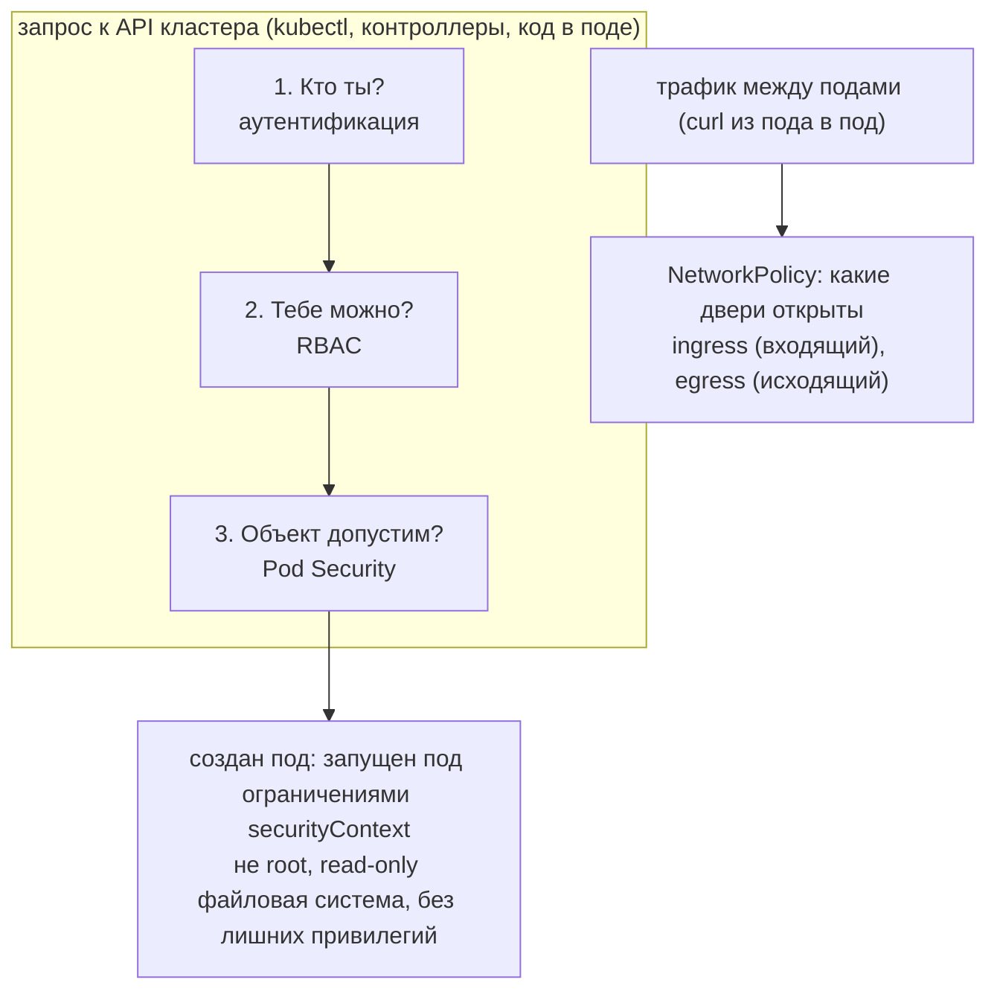
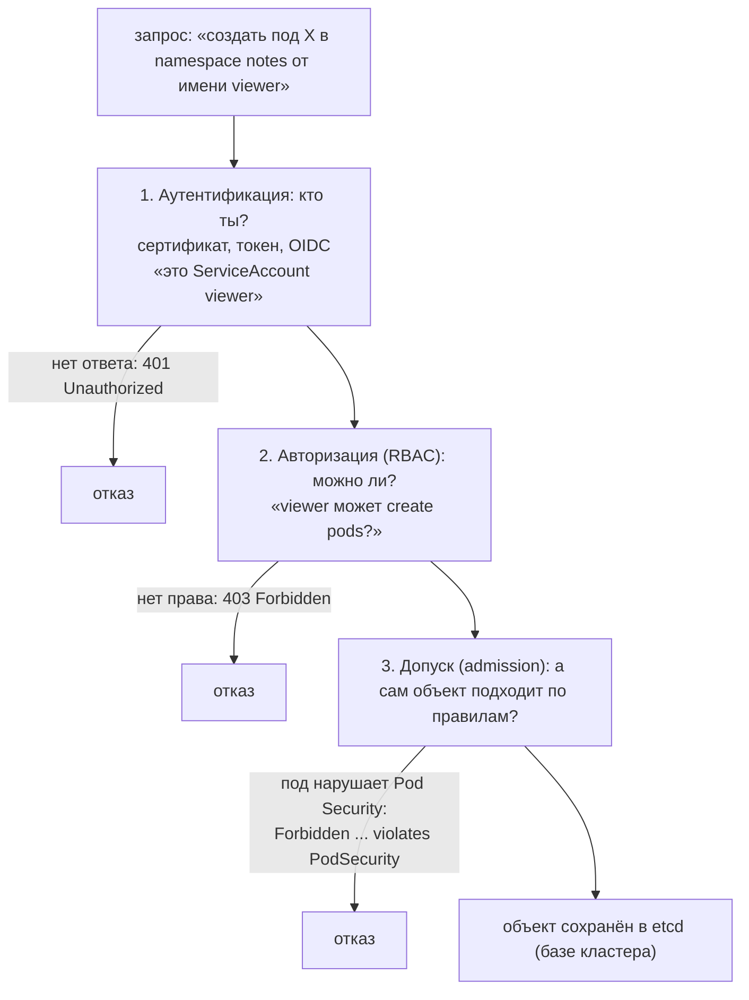
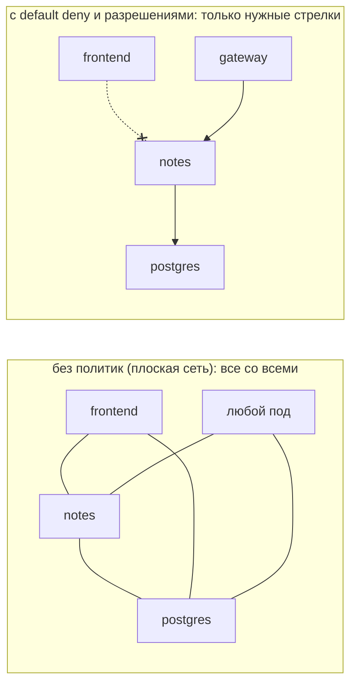

## Зачем это нужно

По умолчанию в Kubernetes любой под (запущенный контейнер приложения, [урок 5.2](02-pods-deployments.md)) может обратиться к любому другому поду, запуститься от имени root (администратора внутри контейнера: он может менять любые файлы и ставить любые программы) и прочитать «пропуск» для API кластера (API это «приёмная», через которую проходят все команды управлением кластером), который лежит у него в файловой системе. **Уязвимость** это ошибка в программе, которой можно воспользоваться, как незапертым окном в доме. Одна уязвимость в приложении, и атакующий получает плоскую открытую сеть (где все подключены ко всем) и учётку внутри кластера. На работе это проверяют на аудитах и после инцидентов: «почему из пода фронтенда достучались до базы».

Три рычага закрывают основное:

- **RBAC** (Role-Based Access Control, доступ по ролям): кто и что может делать через API кластера, как пропуска с разными правами в бизнес-центре;
- **NetworkPolicy**: кто с кем может разговаривать по сети, как замки на дверях между офисами (без них все двери открыты);
- **Pod Security Standards** (PSS, «стандарты безопасности подов»: три готовых набора требований, от «можно всё» до «максимально строго») и **securityContext** (блок настроек в манифесте пода: от какого пользователя запускать, что ему запрещено): с какими привилегиями вообще разрешено запускать под.

Шаг проекта: namespace `notes` получает уровень PSS `restricted`, чарт `helm/notes` версии 0.2.0 запускает приложение от uid 10001 с read-only файловой системой, отдельным **ServiceAccount** (учётная запись программы в кластере, как служебный пропуск для робота, а не для человека; подробно разберём ниже) без токена (пропуска) и NetworkPolicy, а в `k8s/base/70-netpol-default-deny.yaml` появляется запрет всего трафика по умолчанию.

## Что нужно знать

- [Урок 1.3: пользователи и права](../01-linux/03-users-permissions.md): uid (числовой номер пользователя) и gid (группы), права на файлы. Без них непонятны `runAsUser` и `fsGroup`.
- [Урок 4.2: Dockerfile](../04-docker/02-dockerfile.md): пользователь 10001 в образе «Заметок».
- [Урок 4.8: безопасность образов](../04-docker/08-image-security.md): идея минимальных привилегий контейнера.
- [Урок 5.2: Pod и Deployment](02-pods-deployments.md): структура манифеста пода, метки (labels).
- [Урок 5.3: Service и DNS](03-services-dns.md): DNS кластера (CoreDNS это «телефонная книга» кластера в namespace `kube-system`: по имени `db` она подсказывает адрес пода; порт 53 это стандартный порт DNS): без неё имена не разрешатся.
- [Урок 5.4: Ingress и Gateway API](04-ingress-gateway.md): откуда приходит трафик в `notes`. Ingress (входная точка: «ворота», через которые внешний трафик попадает внутрь кластера) у нас реализован через Gateway API: прокси Envoy в namespace `envoy-gateway-system`.
- [Урок 5.5: PostgreSQL и StatefulSet](05-storage-statefulset-postgres.md): база `postgres`, метка `app.kubernetes.io/name: postgres`.
- [Урок 5.6: ConfigMap и Secret](06-config-secrets.md): Secret это всего лишь base64 (способ записи, а не шифрование), поэтому доступ к нему надо ограничивать.
- [Урок 5.8: Job и CronJob](08-jobs-cronjob-daemonset.md): бэкап `pg-backup`, который тоже придётся подправить.
- [Урок 5.9: Helm](09-helm.md): чарт `helm/notes`, который мы дополняем.

## Картина целиком

Представь бизнес-центр. Внутри десятки компаний-арендаторов.

- На входе охрана выдаёт **пропуска** и решает, кому в какие помещения можно. Это **RBAC**: пропуск с разрешениями на действия в кластере.
- Между офисами стоят **двери и стены**, и по умолчанию они открыты настежь: кто угодно ходит куда угодно. **NetworkPolicy** запирает двери и оставляет проходы только там, где они нужны.
- У здания есть **правила для арендаторов**: не хранить взрывчатку, не вскрывать перекрытия, не занимать чужие кабинеты. Их проверяет администрация до заселения. Это **Pod Security Standards**: правила, с какими привилегиями подам разрешено запускаться.

Слои работают вместе. Если украли пропуск (взломали приложение), стены не дают пройти в чужой офис, а правила не позволили арендатору заранее получить лишние ключи.



Дальше: как устроена модель угроз, как запрос проходит проверки в API, потом каждый слой по отдельности.

## Теория

### Зачем защищать то, что «внутри»: модель угроз и защита в глубину

Обычно безопасность представляют как забор вокруг: внутрь чужих не пускаем, а «свои» доверяют друг другу. Так и устроен Kubernetes из коробки: если ты внутри кластера, ты почти всё можешь. Проблема в том, что «внутри» оказываются не только свои. Уязвимость в библиотеке, ошибка в коде, украденный токен, и злоумышленник уже внутри пода.

Атаку через уязвимость приложения называют **RCE** (Remote Code Execution, удалённое выполнение кода): атакующий заставляет твою программу выполнить его команды. Вот как это выглядит на «Заметках», если ничего не защищено:

```text
1. В приложении нашли дыру, атакующий выполняет команды в поде notes.
2. Под работает от root -> он может менять файлы, ставить утилиты.
3. В поде лежит токен ServiceAccount -> с ним можно ходить в API кластера.
4. Сеть плоская -> из пода notes можно открыть соединение с любым другим подом.
5. Итог: читает Secret с паролем БД, подключается к postgres напрямую,
   запускает свой под с майнером.
```

Защита строится так, чтобы **каждый шаг цепочки упирался в отдельную преграду**. Это называется **защита в глубину** (defense in depth): не полагаться на один замок. На шаг 2 отвечает securityContext и PSS (не root, минимум привилегий), на шаг 3 RBAC и отключённый токен (нет токена или права минимальны), на шаг 4 NetworkPolicy (сети между подами закрыты по умолчанию), на шаг 5 всё вместе.

Принцип, который стоит за всеми тремя слоями: **наименьших привилегий** (least privilege). Каждому процессу и человеку давать ровно то, что нужно для работы, и ни на копейку больше. Не «на всякий случай», а «доказал, что нужно».

Осторожно, путаница: «внутри кластера безопасно, потому что снаружи закрыт файрвол». Файрвол на входе защищает от внешних, но не от атакующего, который уже внутри пода.

> **Прикинь сам:** атакующий получил контроль над одним подом. Какие три защиты ограничат ущерб и от чего каждая?
{: .predict}

RBAC и отсутствие токена не дадут читать секреты и создавать поды, NetworkPolicy не даст подключиться к базе и другим подам, securityContext с PSS не даст действовать от root и менять файлы приложения.

> **Проверь понимание:** атакующий получил контроль над одним подом. Какие три защиты из урока ограничат ущерб и от чего каждая?

<details markdown="1">
<summary>Ответ</summary>

Права API (RBAC и отсутствие токена) не дадут читать секреты и создавать поды. NetworkPolicy не даст подключиться к базе и другим подам. securityContext и PSS не дадут выполнять действия от root и менять файлы приложения. Каждый слой закрывает свою часть цепочки.

</details>

> **Главное:** защита в глубину ставит на каждый шаг атаки свою преграду, а принцип наименьших привилегий даёт каждому ровно то, что нужно.
{: .key}

Начнём с API: каждый запрос проходит там три проверки.

### Путь запроса к API: три проверки подряд

Любое действие с кластером (`kubectl apply`, создание пода контроллером, чтение секрета из пода) это запрос к **API-серверу** (kube-apiserver): единственной «двери» в управление кластером. Прежде чем запрос что-то изменит, он проходит три проверки по порядку:



- **Аутентификация** (authentication, «кто ты») проверяет личность. Для людей это сертификат или вход через внешний сервис (OIDC), для программ внутри кластера токен ServiceAccount.
- **Авторизация** (authorization, «что тебе можно») проверяет права. В этом уроке её выполняет RBAC.
- **Допуск** (admission control) проверяет уже сам объект: даже если ты имеешь право создавать поды, под с опасными настройками может быть отвергнут. Pod Security Admission как раз здесь.

Обрати внимание на разницу в кодах. `401` значит «не знаю, кто ты», `403 Forbidden` значит «знаю, но тебе нельзя». Слово `forbidden` ты будешь видеть чаще всего. NetworkPolicy в этой цепочке не участвует: она работает не с API, а с сетевым трафиком между подами.

> **Прикинь сам:** у тебя права администратора, но под с `privileged: true` не создаётся. Какая проверка сработала?
{: .predict}

Третья, допуск: RBAC пропустил, а сам объект нарушает профиль Pod Security namespace.

Осторожно: `401` значит «не знаю, кто ты», `403` значит «знаю, но нельзя»; путать эти коды нельзя.

> **Проверь понимание:** ты создаёшь под с `privileged: true`, у тебя права администратора. RBAC пропустит, а под создан не будет. Какая проверка сработала?

<details markdown="1">
<summary>Ответ</summary>

Третья, допуск (Pod Security Admission). Права на создание подов есть (RBAC пропустил), но сам объект нарушает правила профиля namespace.

</details>

> **Главное:** порядок такой: аутентификация (`401`), авторизация RBAC (`403`), допуск; NetworkPolicy в этой цепочке не участвует.
{: .key}

Первая из проверок, где ты задаёшь правила, это RBAC.

### RBAC: кто что может делать с API

**RBAC** (Role-Based Access Control, управление доступом по ролям) отвечает на один вопрос: «может ли **субъект** (subject) выполнить **глагол** (verb) над **ресурсом** (resource)». Например: «может ли ServiceAccount `viewer` (субъект) прочитать (глагол `get`) поды (ресурс)».

Аналогия: пропуск в бизнес-центр. Он не содержит «пускать Иванова», он выдан на должность и открывает набор дверей. Аналогия ломается в одном: в RBAC нельзя написать «запрети», можно только «разреши».

Объекта в RBAC четыре, и их нельзя путать: два описывают **что разрешено**, два **кому выдано**.

| Объект | Что это | Аналогия |
|---|---|---|
| **Role** | список разрешений в **одном** namespace | «должность: может читать поды в отделе notes» |
| **ClusterRole** | список разрешений на весь кластер (или для ресурсов вне namespace, как узлы) | то же, на всё здание |
| **RoleBinding** | выдаёт роль субъекту в одном namespace | «назначить Иванова на эту должность» |
| **ClusterRoleBinding** | выдаёт роль субъекту на весь кластер | «назначить на всё здание» |

**Субъект** (кому выдаём) бывает трёх видов: пользователь (User), группа (Group) и **ServiceAccount** (SA, «учётка» для программы внутри пода). Пользователей и группы Kubernetes сам не хранит: их подтверждает внешний источник (сертификат, OIDC). ServiceAccount это настоящий объект внутри кластера, создаётся командой и принадлежит namespace.

**Как выглядит Role.** Вот что создаёт команда `kubectl create role pod-reader --verb=get,list,watch --resource=pods,pods/log`, записанное в YAML:

```yaml
apiVersion: rbac.authorization.k8s.io/v1
kind: Role
metadata:
  name: pod-reader      # имя роли
  namespace: notes      # роль действует только здесь
rules:
  - apiGroups: [""]     # "" это основная группа API (поды, сервисы, секреты)
    resources: [pods, pods/log]     # какие ресурсы (pods/log это логи пода)
    verbs: [get, list, watch]       # какие действия разрешены
```

Каждое правило состоит из трёх полей:

- `apiGroups`: к какому «разделу» API относится ресурс. Пустая строка это основной раздел (поды, сервисы, секреты, ConfigMap). Деплойменты живут в `apps`, роли в `rbac.authorization.k8s.io`.
- `resources`: с чем можно работать. У пода есть «подресурсы»: `pods/log` (логи), `pods/exec` (заход внутрь). Они выдаются отдельно, поэтому право читать поды не даёт читать логи и наоборот.
- `verbs`: что делать. `get` (прочитать один объект), `list` (получить список), `watch` (следить за изменениями), `create`, `update`, `patch`, `delete`.

Существенная тонкость: `list` и `get` разные. Если выдать только `get`, `kubectl get pods` (список) откажет, а `kubectl get pod имя` сработает.

**RoleBinding** соединяет роль с субъектом:

```yaml
apiVersion: rbac.authorization.k8s.io/v1
kind: RoleBinding
metadata:
  name: viewer-pod-reader
  namespace: notes
roleRef:                       # какую роль выдаём
  apiGroup: rbac.authorization.k8s.io
  kind: Role
  name: pod-reader
subjects:                      # кому выдаём
  - kind: ServiceAccount
    name: viewer
    namespace: notes
```

Разобранный пример проверки. Команда `kubectl auth can-i list pods --as=system:serviceaccount:notes:viewer -n notes` спрашивает у API-сервера: «может ли этот субъект получить список подов в namespace `notes`». `--as` значит «представь, что запрос отправил такой-то субъект». Имя ServiceAccount пишется в форме `system:serviceaccount:<namespace>:<имя>`. Ответ: `yes` или `no`. Ту же проверку для `secrets` получишь `no`: роль про них ничего не говорит, а разрешено только перечисленное.

Права **складываются**: если субъекту выданы две роли, он может всё из обеих. Поэтому опасны `ClusterRoleBinding` на встроенную роль `cluster-admin` (полный доступ ко всему) и звёздочка `*` в `verbs` или `resources`: они выдают больше, чем ожидаешь.

> **Прикинь сам:** у SA есть RoleBinding на роль `pod-reader` в namespace `dev`. Может ли он читать поды в `prod`?
{: .predict}

Нет: RoleBinding действует только в своём namespace. В `prod` нужен отдельный RoleBinding, а ClusterRoleBinding дал бы права везде.

Осторожно: две путаницы. Первое: Role в namespace `dev` выдана привязкой в `dev`, значит действует только в `dev`; в `prod` те же права нужно выдавать отдельной привязкой. Второе: ClusterRole можно привязать через обычный RoleBinding, и тогда она действует только в его namespace (частый приём: одна общая роль, много привязок).

> **Проверь понимание:** у SA есть RoleBinding на роль `pod-reader` в namespace `dev`. Может ли он читать поды в `prod`?

<details markdown="1">
<summary>Ответ</summary>

Нет. RoleBinding действует только в своём namespace. Чтобы дать права в `prod`, нужен RoleBinding там (можно на ту же ClusterRole или Role с тем же содержимым). ClusterRoleBinding дал бы права везде.

</details>

> **Главное:** RBAC отвечает «может ли субъект выполнить глагол над ресурсом»; Role и ClusterRole описывают права, RoleBinding и ClusterRoleBinding выдают их, а запретов нет, только разрешения.
{: .key}

Субъектом бывает и программа в поде, а у неё есть свой токен.

### ServiceAccount и токен в поде

У программы внутри пода тоже бывает потребность ходить в API кластера: например, оператору нужно создавать поды. Для этого у каждого пода есть **ServiceAccount**. Если не указать свой, используется SA с именем `default` данного namespace.

Как программа доказывает, что она этот SA: в файловую систему пода **автоматически монтируется токен** (длинная строка-пропуск) в каталог `/var/run/secrets/kubernetes.io/serviceaccount/`. Любой процесс в контейнере, включая злоумышленника, может прочитать его и обращаться к API с правами этого SA.

Разбор рисков: «Заметки» ходят в PostgreSQL, а не в API кластера. Токен им не нужен, значит он только лишний ключ, который могут украсть. Отключается одним полем `automountServiceAccountToken: false` (на SA или на поде). А чтобы каждый воркload имел свою учётку с минимальными правами, для «Заметок» создают отдельный SA, а не пользуются общим `default`.

> **Прикинь сам:** зачем `automountServiceAccountToken: false` приложению, которое не ходит в API?
{: .predict}

Токен даёт доступ к API с правами SA. Приложению он не нужен, а взломщику полезен: меньше ключей у процесса, меньше ущерб.

Осторожно: SA `default` общий для всех подов namespace: давать ему права опасно, у каждого приложения должен быть свой SA.

> **Проверь понимание:** зачем `automountServiceAccountToken: false` для приложения, которое не обращается к API?

<details markdown="1">
<summary>Ответ</summary>

Токен даёт доступ к API с правами SA. Если приложению он не нужен, он бесполезен ему и полезен только взломщику: чем меньше у процесса ключей, тем меньше ущерб при взломе.

</details>

> **Главное:** без своего SA под получает `default`, а токен монтируется автоматически в `/var/run/secrets/kubernetes.io/serviceaccount/`; ненужный токен отключают.
{: .key}

Токен ограничивает доступ к API, а доступ к самой системе ограничивает securityContext.

### Что процесс может в контейнере: root, capabilities, seccomp

Чтобы понять, что запрещает Pod Security, нужно знать, что вообще может процесс в Linux (урок [1.3](../01-linux/03-users-permissions.md)).

- **root** это пользователь с uid 0, которому разрешено почти всё. По умолчанию процесс в контейнере работает от root, если образ не задал другого. Root внутри контейнера не равен root на хосте, но при уязвимости контейнерной изоляции (побег из контейнера) атакующий получает права root на узле. Поэтому приложение запускают от обычного пользователя, например uid 10001.
- **Linux capabilities** (возможности): привилегии root, разложенные на отдельные кусочки. Вместо «всё или ничего» процесс может иметь, скажем, право менять сетевые настройки (`NET_ADMIN`) и больше ничего. Обычному приложению они не нужны, поэтому все убирают командой `drop: [ALL]`.
- **Повышение привилегий** (privilege escalation): способ получить больше прав, чем у родителя, например запуск программы с битом setuid (программа работает от имени владельца, обычно root). `allowPrivilegeEscalation: false` его запрещает.
- **seccomp** (secure computing): фильтр системных вызовов (обращений программы к ядру: открыть файл, создать процесс, сменить время). `RuntimeDefault` включает стандартный список запретов из рантайма контейнеров: опасные и редко нужные вызовы блокируются.
- **read-only файловая система**: корневая ФС контейнера доступна только для чтения. Атакующий не подменит код приложения и не положит скрипт в системные каталоги.

Все эти настройки задаются полем **securityContext** в манифесте. Оно бывает на двух уровнях: на уровне пода (общие для всех контейнеров: `runAsUser`, `runAsNonRoot`, `fsGroup`, `seccompProfile`) и на уровне контейнера (`readOnlyRootFilesystem`, `allowPrivilegeEscalation`, `capabilities`). Что означает каждое поле:

- `runAsNonRoot: true` и `runAsUser: 10001`: процесс не root, и это тот uid, который мы задали в образе (урок 4.2). `runAsNonRoot` это страховка: Kubernetes откажется запускать, если образ всё же от root.
- `fsGroup`: группа, которой принадлежат смонтированные тома, чтобы процесс с этим gid мог в них писать (нужно Postgres).
- `readOnlyRootFilesystem: true`: корень только для чтения. Куда приложению всё же нужно писать, монтируют `emptyDir` (временный каталог, живущий, пока жив под), например в `/tmp`.
- `allowPrivilegeEscalation: false`, `capabilities.drop: [ALL]`, `seccompProfile: RuntimeDefault`: как описано выше.

Осторожно, путаница: «read-only ФС ломает приложение». Не ломает, если знать, куда оно пишет: временные файлы и кэши выводят на `emptyDir`, а корень остаётся защищённым. «Заметки» с PostgreSQL вообще ничего на диск сами не пишут (файловое хранилище использовалось до урока 5.6).

> **Прикинь сам:** зачем `emptyDir` в `/tmp`, если корневая файловая система только для чтения?
{: .predict}

Многие программы пишут временные файлы. На read-only корне запись падает с `Read-only file system`, а `emptyDir` это отдельный записываемый том, и ограничение остаётся на остальном образе.

> **Проверь понимание:** зачем `emptyDir` в `/tmp`, если файловая система только для чтения?

<details markdown="1">
<summary>Ответ</summary>

Многие программы пишут временные файлы (интерпретаторы, кэши, сокеты). На read-only корне запись падает с `Read-only file system`. `emptyDir` это отдельный записываемый том, живущий, пока жив под: ограничение остаётся на всём остальном образе.

</details>

> **Главное:** restricted-контейнер запускают не от root, с `allowPrivilegeEscalation: false`, `drop: [ALL]`, `seccompProfile: RuntimeDefault` и read-only корнем.
{: .key}

Чтобы эти поля нельзя было забыть, их требует Pod Security Standards.

### Pod Security Standards: три профиля и режимы проверки

Писать `securityContext` в каждом манифесте можно и забыть. Нужен способ заставить: «в этом namespace под без защитных настроек не создаётся». Для этого есть **Pod Security Standards** (PSS): три готовых профиля требований.

| Профиль | Что разрешает |
|---|---|
| `privileged` | всё, без ограничений (нужен системным компонентам вроде сетевого плагина) |
| `baseline` | запрещает заведомо опасное: `privileged: true` (контейнер с правами хоста), `hostNetwork`, `hostPath` (доступ к файлам узла), лишние capabilities |
| `restricted` | требует лучших практик: не root, `allowPrivilegeEscalation: false`, `capabilities.drop: [ALL]`, `seccompProfile: RuntimeDefault` |

Применяет профили встроенный контроллер допуска **Pod Security Admission** (PSA): та самая «третья проверка» из схемы выше. Включается он **меткой на namespace** в одном из трёх режимов:

- `enforce`: под, нарушающий профиль, не создаётся (жёсткий запрет);
- `warn`: под создаётся, но `kubectl` печатает предупреждение;
- `audit`: нарушение записывается в журнал аудита API-сервера, пользователь ничего не видит.

Метка выглядит так: `pod-security.kubernetes.io/enforce: restricted`. Первая часть до `/` это «домен» метки, вторая `enforce` режим, значение `restricted` профиль.

Важная деталь: PSA проверяет только **создание и изменение** подов. Уже работающие поды не убиваются. Проблема вскроется при следующем создании пода (рестарт, выкатка, эвакуация узла). Отсюда безопасная последовательность для живого namespace:

1. Включить `warn` и `audit`, ничего не ломая.
2. Посмотреть предупреждения, исправить манифесты (Deployment, StatefulSet, CronJob, всё, что создаёт поды).
3. Только после этого включить `enforce`.

Разобранный пример. Postgres из урока 5.5 запущен от root. Ты включаешь `enforce: restricted`. Сразу ничего не произойдёт, под продолжает работать. Ночью узел перезагрузили, StatefulSet пытается пересоздать под: допуск отвечает `violates PodSecurity "restricted:latest"`, и база не поднимается. Именно для этого сначала `warn`.

Осторожно, путаница: PSS с устаревшей **PodSecurityPolicy** (её убрали в Kubernetes 1.25); PSS не заменяет `securityContext`, а проверяет, что он написан.

> **Прикинь сам:** ты включил `enforce: restricted` на namespace с работающим Postgres от root. Что будет с подом сразу и при пересоздании?
{: .predict}

Сразу ничего: работающий под остаётся. При пересоздании допуск ответит `violates PodSecurity "restricted:latest"`, и база не поднимется. Поэтому сначала `warn`.

> **Проверь понимание:** ты включил `enforce: restricted` на namespace с работающим Postgres от root. Что произойдёт с подом сразу и что при его пересоздании?

<details markdown="1">
<summary>Ответ</summary>

Сразу ничего: работающий под остаётся. При пересоздании (рестарт StatefulSet, эвакуация узла) под не пройдёт допуск: ошибка `violates PodSecurity "restricted:latest"`, а StatefulSet будет пытаться создать под снова. Именно поэтому сначала `warn`.

</details>

> **Главное:** профили `privileged`, `baseline`, `restricted` включаются меткой на namespace в режиме `enforce`, `warn` или `audit`; включай `warn` и `audit`, потом `enforce`.
{: .key}

От привилегий подов перейдём к сети между ними.

### NetworkPolicy: сетевой фаервол между подами

В обычной сети кластера каждый под может открыть соединение с любым другим подом, в любом namespace (урок [5.3](03-services-dns.md)). Как дверь без замков в бизнес-центре. **NetworkPolicy** это объект, который ставит замки: описывает, какой трафик разрешён к подам (`ingress`, входящий) и от подов (`egress`, исходящий).



**Как читать политику.** Политика состоит из трёх частей: **кого защищаем** (`podSelector`: выбор подов по меткам), **в какую сторону** (`policyTypes: [Ingress, Egress]`) и **что разрешено** (списки `ingress` и `egress`). Правила механики:

- Политика выбирает поды через `podSelector`. Пустой `podSelector: {}` выбирает **все** поды namespace.
- Поды, которые не выбраны ни одной политикой, открыты для всего трафика.
- Как только под выбран политикой типа `Ingress`, входящим разрешено **только то, что перечислено**. Для `Egress` то же самое с исходящим.
- Разрешения **складываются**: если две политики выбрали один под, разрешено объединение. Запретов внутри политики нет, «запрет» это отсутствие разрешения при выбранном поде.
- Источники и цели задаются тремя способами: `podSelector` (по меткам подов), `namespaceSelector` (по меткам namespace), `ipBlock` (по диапазону адресов).

Стандартный приём: **default deny** (запретить всё по умолчанию) и потом явные разрешения. Политика с `podSelector: {}` и `policyTypes: [Ingress, Egress]` без единого правила выбирает все поды и ничего им не разрешает.

**Не забудь DNS.** После запрета egress под не сможет разрешить даже имя `db`, потому что запрос к CoreDNS (это DNS-сервер кластера в namespace `kube-system`, порт 53, UDP и TCP) тоже блокируется. Признак: по IP-адресу работает, по имени нет.

**Что делает политику рабочей.** Политики применяет не API-сервер, а **сетевой плагин** (CNI, Container Network Interface: компонент, который создаёт сеть между подами). Если плагин их не поддерживает, манифест примется без ошибок и ничего не изменится. Поэтому политику всегда проверяют тестом: запретил и убедился, что трафик реально пропал.

Ещё одно следствие: заблокированный пакет не отвергается, а молча отбрасывается. Клиент видит не «connection refused» (отказ соединения), а **таймаут** (тишина, пока не сдастся). Это отличает NetworkPolicy от закрытого порта.

Разобранный пример на «Заметках». Разрешаем в Postgres пускать только поды с метками `notes` и `pg-backup`:

```yaml
spec:
  podSelector:                      # кого защищаем: поды postgres
    matchLabels:
      app.kubernetes.io/name: postgres
  policyTypes: [Ingress]            # регулируем входящий трафик
  ingress:
    - from:
        - podSelector:              # откуда пускаем: поды с такими метками
            matchExpressions:
              - {key: app.kubernetes.io/name, operator: In, values: [notes, pg-backup]}
      ports:
        - {protocol: TCP, port: 5432}   # и только на этот порт
```

Читается так: «поды postgres принимают входящие соединения только на порт 5432 и только от подов с меткой `app.kubernetes.io/name` равной `notes` или `pg-backup`». Под `nettest` с другой меткой упрётся в таймаут.

> **Прикинь сам:** под выбран политикой `Ingress`, которая разрешает трафик от подов с меткой `notes`. Достучится ли под с меткой `other` из того же namespace?
{: .predict}

Нет: как только под выбран политикой, разрешено только перечисленное. Остальное молча отбрасывается, клиент видит таймаут, а не отказ.

Осторожно: пакеты, закрытые NetworkPolicy, не отвергаются, а пропадают: клиент видит таймаут, а не «connection refused».

> **Проверь понимание:** под выбран политикой `Ingress` с разрешением от подов `app.kubernetes.io/name=notes`. Может ли под с меткой `app.kubernetes.io/name=other` из того же namespace достучаться до него?

<details markdown="1">
<summary>Ответ</summary>

Нет: как только под выбран Ingress-политикой, разрешено только перечисленное. Всё остальное отбрасывается (пакеты молча пропадают, клиент видит таймаут, а не отказ).

</details>

> **Главное:** политика выбирает поды, а разрешения складываются; после default deny не забудь разрешить DNS, а работает политика только при поддержке сетевого плагина.
{: .key}

Политика находит свои поды по меткам, это надо понимать точно.

### Метки и селекторы: как политика находит «свои» поды

Политика, правило или Service должны указывать на конкретные поды. Но поды создаются и умирают, их имена и адреса случайны и меняются (`notes-7d9f8-x2k4p`). Привязаться к имени нельзя. Нужен способ выбрать «всех, у кого такая-то бирка».

Бейджи на конференции. Охрана не знает всех в лицо, но знает правило: «с красным бейджем `докладчик` проход за кулисы». Кто получил бейдж, тот проходит, кто потерял, не проходит. Оговорка: бейдж не проверяет личность, он только говорит о роли. Кто угодно может повесить на свой под нужную метку, если у него есть право создавать поды (поэтому метки это не защита от взломщика с правами, но защита от случайной сети).

**Метка** (label) это пара «ключ: значение» на объекте, например `app.kubernetes.io/name: notes`. **Селектор** (selector) это условие отбора по меткам. Самые частые формы:

- `matchLabels`: «метка такая-то равна такому-то значению»;
- `matchExpressions` с оператором `In`: «значение метки входит в список»;
- пустой `{}`: «подходят все».

Политика, Service и Deployment используют одни и те же метки, поэтому во всём курсе подам «Заметок» приклеена одна и та же: `app.kubernetes.io/name: notes`.

Правило `allow-db-from-app` выбирает защищаемые поды так: `podSelector.matchLabels: app.kubernetes.io/name: postgres`. Значит, оно действует на поды с этой меткой и больше ни на чьи. А в блоке `from` стоит второй селектор: `In [notes, pg-backup]`, то есть «пускать поды, у которых `app.kubernetes.io/name` равна `notes` или `pg-backup`». Под `nettest` без такой метки не подходит ни под одно условие и остаётся за дверью.

> **Прикинь сам:** в политике `matchLabels: app.kubernetes.io/name: notes`, а у подов метка `notes-app`. Что произойдёт?
{: .predict}

Политика не выберет ни одного пода и не будет на них действовать. Ошибки не будет: пустой отбор не ошибка. Метки подов и политики сверяй глазами.

Осторожно: не думай, что политика привязана к имени Deployment. Нет, только к меткам подов. Поменяешь метку в шаблоне пода, а в политике оставишь старую: политика перестанет выбирать эти поды, и защита исчезнет без единой ошибки. Проверка простая: `kubectl -n notes get pods --show-labels` и сравнить с политикой глазами.

> **Проверь понимание:** в политике `podSelector.matchLabels: app.kubernetes.io/name: notes`, а у подов в чарте метка `app.kubernetes.io/name: notes-app`. Что произойдёт?

<details markdown="1">
<summary>Ответ</summary>

Политика не выберет ни одного пода, то есть не будет действовать на них: они останутся открытыми или закрытыми по другим политикам. Кластер ошибки не покажет, потому что пустой результат отбора это не ошибка. Метки подов и политики нужно сверять.

</details>

> **Главное:** метка это пара «ключ: значение», селектор отбирает по меткам (`matchLabels`, `matchExpressions`, пустой `{}`), а привязка идёт к меткам, а не к именам.
{: .key}

С тремя слоями понятно, теперь научимся различать, какой из них остановил запрос.

### Какой слой остановил: быстрая диагностика

Три слоя (RBAC, Pod Security, NetworkPolicy) ломают работу по-разному. Без привычки различать их легко полчаса править не то.

Врач слушает симптомы: кашель, температура, боль в ухе. Каждому симптому соответствует свой орган. Оговорка: симптомы бывают смешанными, тогда проверяешь слои по очереди, а не гадаешь.

Определяй слой по тексту ошибки и по тому, когда она появилась:

| Что видишь | Какой слой | Где смотреть |
|---|---|---|
| `Error from server (Forbidden): ... cannot list resource "pods"` | RBAC (авторизация) | `kubectl auth can-i ... --as=...`, Role и RoleBinding |
| `Forbidden: violates PodSecurity "restricted:latest"` при создании пода или в events ReplicaSet | Допуск (Pod Security) | `kubectl describe replicaset`, метки namespace, `securityContext` |
| Таймаут (`curl` висит, код выхода 28) при том, что приложение живое | NetworkPolicy | `kubectl get networkpolicy`, метки подов и политик |
| `Read-only file system` в логе приложения | `readOnlyRootFilesystem` (securityContext) | куда пишет приложение, нужен `emptyDir` |
| `Unauthorized` (401) | Аутентификация | kubeconfig, срок токена |

После выкатки чарта 0.2.0 под не создаётся, `kubectl rollout status` ждёт. Подов в списке нет. Смотришь `kubectl -n notes describe replicaset -l app.kubernetes.io/name=notes`: в events строка `violates PodSecurity`. Значит, сработал допуск: в шаблоне пода не хватает поля из профиля `restricted`. RBAC и сеть здесь ни при чём, и править их бесполезно.

Осторожно, путаница: таймаут приписывают «сломанному приложению» или DNS. Отказ с текстом (`Forbidden`, `Read-only file system`) приходит от слоёв, которые его явно говорят. А NetworkPolicy ничего не говорит: пакеты тихо отбрасываются, клиент видит только тишину и таймаут.

> **Прикинь сам:** запрос из соседнего пода висит 3 секунды и обрывается кодом 28, в логах приложения пусто. Какой слой подозреваешь первым?
{: .predict}

NetworkPolicy: пакеты отброшены до приложения, поэтому в его логах ничего нет. Проверь `kubectl get networkpolicy` и совпадение меток.

> **Проверь понимание:** запрос к приложению из соседнего пода висит 3 секунды и обрывается кодом 28, а логи приложения пусты. Какой слой подозреваешь первым?

<details markdown="1">
<summary>Ответ</summary>

NetworkPolicy. Приложение запросов не видит, потому что пакеты отброшены до него: в его логах ничего нет. Проверь `kubectl get networkpolicy -n notes` и совпадение меток.

</details>

> **Главное:** `Forbidden ... cannot list` это RBAC, `violates PodSecurity` допуск, таймаут NetworkPolicy, `Read-only file system` securityContext, `401` аутентификация.
{: .key}

Отдельно стоит разобрать, почему секреты требуют особой осторожности.

### Secret и RBAC: почему «читать секреты» опаснее, чем кажется

В уроке 5.6 ты узнал, что Secret это лишь base64, а не шифрование. Защищает его не сам формат, а то, кто имеет право его читать. Здесь RBAC и Secret встречаются.

Сейф в офисе с записанным кодом на стикере: сейф есть, но кто может прочитать стикер, тот и открывает сейф. Оговорка: в Kubernetes можно ещё шифровать Secret в базе кластера (etcd), но это отдельная настройка, не замена RBAC.

У Secret те же глаголы, что у любого ресурса: `get` (прочитать один по имени), `list` (получить список, и в списке значения тоже видны), `watch`. Поэтому право `list` на `secrets` в namespace равно праву прочитать **все** пароли этого namespace, хотя звучит безобидно. Роль для обычного разработчика в namespace не должна включать `secrets`, если только ему это не нужно по работе.

Роль `viewer` из задания 1 разрешает `get`, `list`, `watch` на `pods`. Если по ошибке добавить в `resources` слово `secrets`, то `kubectl auth can-i get secrets --as=system:serviceaccount:notes:viewer -n notes` ответит `yes`, и этот SA прочитает `notes-db` с паролем базы. Поэтому в ролях ресурсы перечисляют явно и по одному, а не `*`.

> **Прикинь сам:** почему право `list` на `secrets` опасно, хотя `get` никто не давал?
{: .predict}

`list` возвращает объекты Secret целиком со значениями: кто получил список, получил и все пароли, не зная их имён.

Осторожно: не думай, что «Secret зашифрован, значит можно дать доступ всем». Base64 снимается одной командой, и читающий получает пароль в открытом виде.

> **Проверь понимание:** почему право `list` на `secrets` опасно, хотя `get` никто не давал?

<details markdown="1">
<summary>Ответ</summary>

`list` возвращает объекты Secret целиком, вместе со значениями. Кто может получить список, тот получает и все пароли, не зная их имён.

</details>

> **Главное:** Secret защищён не форматом, а RBAC: ресурсы в ролях перечисляй явно, без `*`, а право `list` на `secrets` равно праву читать все пароли namespace.
{: .key}

Права привязаны к namespace, и важно понимать, что граница namespace закрывает, а что нет.

### Namespace как граница: что она ограничивает, а что нет

Один кластер обычно делят между командами и средами. Нужны «комнаты», внутри которых у каждого свои права и правила. Namespace (пространство имён, [урок 5.2](02-pods-deployments.md)) и есть такая комната.

Этажи бизнес-центра. На каждом этаже своя охрана, своя табличка на двери, свои правила пожарной безопасности. Оговорка: этаж это только организационная граница. Сами по себе стены между этажами в сети не стоят: без NetworkPolicy жители одного этажа свободно заходят на другой.

Граница namespace работает по-разному для каждого слоя:

- **RBAC:** `Role` и `RoleBinding` действуют только внутри своего namespace. Чтобы права действовали на весь кластер, нужны `ClusterRole` и `ClusterRoleBinding`.
- **Pod Security:** метка `pod-security.kubernetes.io/enforce` ставится на namespace и действует на все поды внутри него. В соседнем namespace без метки действуют другие правила.
- **NetworkPolicy:** политика лежит в одном namespace и выбирает только его поды. А вот трафик она может разрешать и для других namespace (через `namespaceSelector`).
- **Сеть без политик:** никакой границы нет. Под из `default` открывает соединение с подом из `notes` по имени `notes.notes.svc`, как в уроке 5.3.

У тебя есть `viewer` с RoleBinding в namespace `notes`. Он читает поды в `notes`, но на `kubectl -n default get pods --as=system:serviceaccount:notes:viewer` получит `Forbidden`: в `default` ему ничего не выдавали. При этом из пода в `default` можно достучаться до `notes.notes.svc:8080`, пока не введена политика. Поэтому в задании 3 тест делается из `default`: так видно, что политика реально закрыла дверь.

Осторожно, путаница: «Раз у меня отдельный namespace, меня никто не трогает». Namespace изолирует имена и права, но не сеть. Изоляцию сети даёт только NetworkPolicy.

> **Прикинь сам:** у SA в `notes` есть RoleBinding на чтение подов. Сможет ли он читать поды в `default`?
{: .predict}

Нет: RoleBinding действует только в своём namespace. Для `default` нужен отдельный RoleBinding или ClusterRoleBinding.

> **Проверь понимание:** у SA в namespace `notes` есть RoleBinding на чтение подов. Сможет ли он читать поды в `default`?

<details markdown="1">
<summary>Ответ</summary>

Нет. RoleBinding действует только в своём namespace. Для доступа в `default` нужен отдельный RoleBinding в `default` или ClusterRoleBinding на весь кластер.

</details>

> **Главное:** namespace ограничивает права RBAC, действует как область метки Pod Security, но сеть не изолирует: это делает только NetworkPolicy.
{: .key}

Теперь сложим всё вместе на примере одной атаки.

### Все слои вместе: разбор одной атаки

Пока каждый слой описан по отдельности, трудно увидеть, зачем их три. Пройдём ту же цепочку из начала урока: дыра в приложении, и каждый шаг атакующего упирается в свою преграду.

Вор, который залез в здание через окно первого этажа. Дверь в коридор заперта (NetworkPolicy), в кабинетах сейфы (RBAC), а на столе нет ключей от серверной (securityContext и PSS не выдали лишнего). Оговорка: защита в глубину не делает взлом невозможным, она делает его дорогим и заметным.

Возьми пять шагов атаки из начала урока и сопоставь с защитой:

| Шаг атакующего | Что мешает в защищённой «Заметки» |
|---|---|
| 1. Выполнить команды в поде через дыру | Дыру не закрывает ни один из слоёв: её закрывают обновления и код |
| 2. Поменять файлы, поставить утилиты | `readOnlyRootFilesystem` и запуск не от root: писать некуда, прав нет |
| 3. Взять токен и ходить в API | `automountServiceAccountToken: false`: токена в поде нет |
| 4. Открыть соединение с другим подом | NetworkPolicy: из пода `notes` можно только в `postgres:5432` |
| 5. Запустить свой под с майнером | Без токена нельзя обратиться к API, а при наличии токена PSS `restricted` отклонит под с лишними привилегиями |

Допустим, атакующий всё же добрался до пода и попробовал `curl` к API без токена: запрос пошёл как анонимный, и вместо данных он получил `403` (`401` было бы при отключённой анонимной аутентификации). Попробовал подключиться к другому сервису в соседнем namespace: таймаут. Попробовал записать файл в `/usr/bin`: `Read-only file system`. Единственное, что ему осталось, это доступ к базе с правами приложения, то есть ровно то, что приложение и так делает. Ущерб ограничен тем, что было необходимо приложению.

> **Прикинь сам:** атака дошла до шага 4 и упёрлась. Какой слой сработал и что видит атакующий?
{: .predict}

NetworkPolicy: соединение с неразрешённым подом не устанавливается, атакующий видит таймаут, а не сообщение об отказе.

Осторожно: не думай, что одного слоя достаточно. Если убрать NetworkPolicy, атакующий пойдёт по сети. Если убрать отключение токена, пойдёт в API. Слои закрывают разные двери, и поэтому нужны все.

> **Проверь понимание:** атака дошла до шага 4 и упёрлась. Какой слой сработал и какая ошибка будет у атакующего?

<details markdown="1">
<summary>Ответ</summary>

Сработала NetworkPolicy. Соединение с подом, которого нет в списке разрешённых, не устанавливается: атакующий видит таймаут, а не сообщение об отказе.

</details>

> **Главное:** слои закрывают разные шаги цепочки, поэтому нужны все; защита в глубину делает взлом дорогим и заметным, но не невозможным.
{: .key}

Остаётся честно понять, чего эти слои не решают.

### Чего эти три слоя не решают

Чтобы не создавать ложное чувство безопасности, полезно знать границы:

- Secret это base64, а не шифрование. RBAC решает, кто может его прочитать, но в самой базе кластера (etcd) он по умолчанию хранится открыто, шифрование включается отдельно (тема 9).
- Уязвимости в образе (старая библиотека) эти слои не исправляют: за это отвечают сканирование и сборка образов (урок [4.8](../04-docker/08-image-security.md)).
- NetworkPolicy не шифрует трафик, а лишь решает, кто может подключиться.

> **Прикинь сам:** NetworkPolicy есть, а трафик между подами идёт открытым текстом. Это ошибка политики?
{: .predict}

Нет: политика решает, кто может подключиться, а шифрованием не занимается. Для шифрования нужны TLS или сервисная сетка.

Осторожно: три слоя не заменяют закрытие дыр в коде и образах и не шифруют данные.

> **Главное:** слои не исправляют уязвимости образов, не шифруют Secret в etcd и не шифруют трафик: у каждой из этих проблем свои инструменты.
{: .key}

Теперь пора применить всё на практике, начиная с RBAC.

## Практика

Кластер kind `notes` из урока 5.1 запущен, контекст `kind-notes`, релиз `notes` из [урока 5.9](09-helm.md) работает в namespace `notes`, чарт `helm/notes` версии 0.1.1 (после урока 5.11). Версии Kubernetes и kind не закреплены курсом жёстко, проверь актуальные значения на страницах проектов.

### Задание 1. RBAC: выдай минимум и проверь

**Цель:** создать ServiceAccount, выдать ему право только читать поды в `notes` и проверить границы командой `can-i`.

**Предскажи:**

1. Сможет ли новый SA сразу после создания читать поды?
2. После выдачи роли `get pods`, сможет ли он читать секреты и удалять поды?

<details markdown="1">
<summary>Ответ</summary>

1. Нет, у нового SA нет прав кроме базовых (discovery). 2. Читать поды сможет, секреты и удаление нет: RBAC разрешает только перечисленное.

</details>

**Шаги:**

1. Создай SA, Role и RoleBinding. Разбор: `create serviceaccount viewer` создаёт учётку; `create role pod-reader --verb=... --resource=...` создаёт роль (`--verb` перечисляет глаголы, `--resource` ресурсы через запятую); `create rolebinding` привязывает роль к субъекту: `--role` какую роль, `--serviceaccount=notes:viewer` какого SA в формате `<namespace>:<имя>`. Флаг `-n notes` задаёт namespace, `\` в конце строки переносит команду:

```bash
# ServiceAccount для «наблюдателя»
kubectl -n notes create serviceaccount viewer

# Роль: только чтение подов и их логов
kubectl -n notes create role pod-reader \
  --verb=get,list,watch --resource=pods,pods/log

# Привязка роли к SA
kubectl -n notes create rolebinding viewer-pod-reader \
  --role=pod-reader --serviceaccount=notes:viewer
```

2. Проверь права до и после границы. `SA=...` записывает полное имя субъекта в переменную оболочки, `$SA` подставляет её, `--as` говорит «выполни проверку от имени этого субъекта»:

```bash
SA=system:serviceaccount:notes:viewer
kubectl -n notes auth can-i list pods --as=$SA
kubectl -n notes auth can-i get secrets --as=$SA
kubectl -n notes auth can-i delete pods --as=$SA
kubectl -n default auth can-i list pods --as=$SA
```

**Что должно получиться:**

```text
yes
no
no
no
```

**Как читать вывод:** каждая команда даёт один ответ. Первая `yes`: право выдано. Вторая и третья `no`: роль не перечисляет `secrets` и глагол `delete`. Четвёртая `no`: RoleBinding действует только в `notes`, а проверка идёт в `default`.

**Объясни себе:**

- Почему четвёртая проверка (`default`) вернула `no`, хотя роль выдана?
- Почему для `pods/log` в роли отдельная запись ресурса?
- Что опаснее: `get secrets` на весь namespace или `delete pods`? Почему?

**Типичные ошибки:**

- `Error from server (Forbidden): pods is forbidden: User "..." cannot list resource "pods"`: нет привязки или она в другом namespace: проверь `kubectl -n notes get rolebinding`.
- `error: failed to create rolebinding: ... serviceaccount must be in the format <namespace>:<name>`: в `--serviceaccount` забыт namespace: пиши `notes:viewer`.
- `auth can-i` даёт `yes` для всего: ты запустил его от своего админа без `--as`.

### Задание 2. Pod Security: warn, потом enforce

**Цель:** увидеть, что `restricted` требует от пода, и не сломать работающий namespace.

**Предскажи:** ты включаешь `warn: restricted` на `notes` с работающим релизом. Что напечатает kubectl и что случится с подами?

<details markdown="1">
<summary>Ответ</summary>

kubectl напечатает предупреждения `would violate PodSecurity "restricted:latest"` со списком нарушенных полей. Поды продолжат работать: `warn` ничего не блокирует.

</details>

**Шаги:**

1. Включи `warn` и `audit` (не блокирующие режимы). `kubectl label namespace notes ключ=значение` ставит метки на namespace, `--overwrite` разрешает заменить уже существующую:

```bash
kubectl label namespace notes \
  pod-security.kubernetes.io/warn=restricted \
  pod-security.kubernetes.io/audit=restricted --overwrite
```

2. Проверь предупреждения без изменения кластера. `--dry-run=server` отправляет запрос на сервер, проходит настоящую проверку допуска, но объект не сохраняется:

```bash
kubectl -n notes rollout restart deployment/notes --dry-run=server
```

Если поды «Заметок» пока без `securityContext` (так до задания 4), kubectl может напечатать предупреждение для пода Deployment. Если ничего не напечатал, это тоже нормально: главную проверку делает следующий шаг.

3. Попробуй создать заведомо плохой под, чтобы увидеть полный список нарушений. `kubectl run bad --image=nginx:1.29` создаёт одиночный под, `--restart=Never` значит «не перезапускай»:

```bash
kubectl -n notes run bad --image=nginx:1.29 --restart=Never --dry-run=server
```

**Что должно получиться:**

```text
Warning: would violate PodSecurity "restricted:latest": allowPrivilegeEscalation != false (container "bad" must set securityContext.allowPrivilegeEscalation=false), unrestricted capabilities (container "bad" must set securityContext.capabilities.drop=["ALL"]), runAsNonRoot != true (pod or container "bad" must set securityContext.runAsNonRoot=true), seccompProfile (pod or container "bad" must set securityContext.seccompProfile.type to "RuntimeDefault" or "Localhost")
pod/bad created (server dry run)
```

**Как читать вывод:**

- `Warning: would violate ...` это предупреждение (не ошибка): «нарушил бы профиль `restricted`».
- После двоеточия четыре пункта, по одному на нарушенное требование: `allowPrivilegeEscalation`, `capabilities.drop`, `runAsNonRoot`, `seccompProfile`. В скобках написано, какое именно поле и куда добавить.
- `pod/bad created (server dry run)`: под «создался» только понарошку (dry run), потому что режим `warn` не блокирует.

**Объясни себе:**

- Почему под `bad` создался, несмотря на нарушения?
- Что в выводе подсказывает, какие четыре поля надо добавить?
- Какие поды в `notes` (приложение, Postgres, CronJob) придётся править до `enforce`?

**Типичные ошибки:**

- `Error from server (Forbidden): ... violates PodSecurity "restricted:latest"`: у тебя уже стоит `enforce`, а под не соответствует: добавь недостающие поля или временно верни `warn`.
- `error: ... unknown flag: --dry-run=server`: слишком старый kubectl: обнови до версии, совпадающей с кластером (отклонение не более одной минорной).

### Задание 3. NetworkPolicy: default deny и проверка, что CNI её выполняет

**Цель:** убедиться, что политики в твоём kind реально работают, и запретить весь трафик в `notes`, кроме нужного.

**Предскажи:** в namespace `notes` применена политика `default-deny` (ingress и egress для всех подов). Ответит ли приложение на `curl` из тестового пода? Разрешит ли под имя `db.notes.svc`?

<details markdown="1">
<summary>Ответ</summary>

Нет на оба вопроса. Входящий трафик блокирован, а исходящий (включая DNS на порт 53) тоже: `curl` завершится по таймауту, а имя не разрешится (`Could not resolve host`).

</details>

**Шаги:**

1. Создай тестовый под вне `notes` (в `default` политик нет) и убедись, что связь есть. Разбор: `--command -- sleep 3600` запускает в поде команду `sleep 3600` (спать час), чтобы под не завершился; `wait --for=condition=Ready` ждёт готовности; `exec nettest -- curl ...` выполняет команду внутри пода; в `curl` `-s` без прогресс-бара, `-m 3` не дольше 3 секунд, `-o /dev/null` выбросить тело ответа, `-w '%{http_code}\n'` напечатать только код ответа:

```bash
kubectl -n default run nettest --image=curlimages/curl:8.14.1 --restart=Never \
  --command -- sleep 3600
kubectl -n default wait --for=condition=Ready pod/nettest --timeout=60s
kubectl -n default exec nettest -- curl -s -m 3 -o /dev/null -w '%{http_code}\n' http://notes.notes.svc:8080/healthz
```

2. Файл `k8s/base/70-netpol-default-deny.yaml`: запрет всего плюс минимум разрешений (DNS, приложение и бэкап к базе, в базу только они):

```yaml
# Запрещаем весь входящий и исходящий трафик в namespace notes
apiVersion: networking.k8s.io/v1
kind: NetworkPolicy
metadata:
  name: default-deny
  namespace: notes
spec:
  podSelector: {}                   # пустой селектор: все поды namespace
  policyTypes: [Ingress, Egress]    # ни одного правила: не разрешено ничего
---
# Разрешаем всем подам ходить в DNS кластера
apiVersion: networking.k8s.io/v1
kind: NetworkPolicy
metadata:
  name: allow-dns
  namespace: notes
spec:
  podSelector: {}
  policyTypes: [Egress]
  egress:
    - to:
        - namespaceSelector:        # куда: в namespace с такой меткой (kube-system, там CoreDNS)
            matchLabels:
              kubernetes.io/metadata.name: kube-system
      ports:
        - {protocol: UDP, port: 53}   # DNS чаще идёт по UDP,
        - {protocol: TCP, port: 53}   # а длинные ответы по TCP
---
# В Postgres пускаем только приложение и бэкап (входящий)
apiVersion: networking.k8s.io/v1
kind: NetworkPolicy
metadata:
  name: allow-db-from-app
  namespace: notes
spec:
  podSelector:
    matchLabels:
      app.kubernetes.io/name: postgres
  policyTypes: [Ingress]
  ingress:
    - from:
        - podSelector:
            matchExpressions:
              - {key: app.kubernetes.io/name, operator: In, values: [notes, pg-backup]}
      ports:
        - {protocol: TCP, port: 5432}
---
# Приложению и бэкапу разрешаем исходящие соединения только к Postgres
apiVersion: networking.k8s.io/v1
kind: NetworkPolicy
metadata:
  name: allow-app-to-db
  namespace: notes
spec:
  podSelector:
    matchExpressions:
      - {key: app.kubernetes.io/name, operator: In, values: [notes, pg-backup]}
  policyTypes: [Egress]
  egress:
    - to:
        - podSelector:
            matchLabels:
              app.kubernetes.io/name: postgres
      ports:
        - {protocol: TCP, port: 5432}
```

Обрати внимание: нужны обе стороны. Чтобы приложение поговорило с базой, приложению нужно разрешение на **исходящее** (`allow-app-to-db`), а базе на **входящее** (`allow-db-from-app`). Метки `app.kubernetes.io/name: notes` и `app.kubernetes.io/name: postgres` заданы в уроках 5.3 и 5.5, для `pg-backup` метку мы добавим в задании 4. Если у тебя метки другие, подставь свои.

3. Применяй и проверь снова:

```bash
kubectl apply -f k8s/base/70-netpol-default-deny.yaml
kubectl -n default exec nettest -- curl -s -m 3 -o /dev/null -w '%{http_code}\n' http://notes.notes.svc:8080/healthz
```

**Что должно получиться:** до политики код `200`, после таймаут:

```text
200
000
command terminated with exit code 28
```

**Как читать вывод:**

- `200`: приложение ответило (до политики).
- `000`: `curl` не получил ответа вовсе, поэтому код HTTP «нулевой».
- `command terminated with exit code 28`: `kubectl exec` сообщает, что `curl` завершился с кодом 28, это его код «превышено время ожидания» (тот самый `-m 3`). Не `Connection refused`, а именно тишина: пакеты отброшены.

Пока действует `default-deny`, входящий трафик к «Заметкам» закрыт для всех, включая Gateway: сайт `notes.lab` на время задания перестанет отвечать. В задании 4 чарт вернёт нужные проходы.

Если и после политики пришло `200`, твой CNI не применяет NetworkPolicy. Запасной путь: пересоздай кластер с CNI, который их поддерживает. В `kind/kind.yaml` добавь в `networking` строку `disableDefaultCNI: true`, выполни `kind delete cluster --name notes && kind create cluster --config kind/kind.yaml`, затем поставь Calico по инструкции с сайта проекта (версия не закреплена, проверь актуальную версию на странице проекта) и повтори проверку. Учти, что все предыдущие объекты придётся применить заново.

**Объясни себе:**

- Почему таймаут, а не «connection refused»?
- Что случится с Postgres, если убрать `allow-db-from-app` и оставить `default-deny`?
- Почему `allow-dns` нужен именно как egress и на namespace `kube-system`?

**Типичные ошибки:**

- `curl: (28) Resolving timed out after 3000 milliseconds`: DNS заблокирован egress-политикой: добавь `allow-dns`.
- `error validating data: ... unknown field "namespaceSelectors"`: опечатка в имени поля: правильно `namespaceSelector`.
- Политика применилась, но трафик проходит: CNI не поддерживает NetworkPolicy, см. запасной путь выше.

### Задание 4. Шаг проекта: чарт 0.2.0 с безопасностью

**Цель:** привести чарт `helm/notes` к профилю `restricted`, отдать приложению собственный ServiceAccount без токена и разрешить только нужный входящий трафик.

**Предскажи:** после включения `enforce: restricted` и обновления чарта под будет создан без `/tmp`-тома. Что упадёт: сам под или запрос?

<details markdown="1">
<summary>Ответ</summary>

Скорее всего ничего: «Заметки» с PostgreSQL на диск не пишут, поэтому под создастся и заработает. Допуск (PSA) не проверяет, куда пишет процесс, он проверяет только поля манифеста. Если бы приложение писало в `/tmp`, ошибка `Read-only file system` появилась бы позже, в рантайме. `emptyDir` в `/tmp` мы добавляем заранее, как страховку.

</details>

**Шаги:**

1. Обнови `k8s/base/00-namespace.yaml`:

```yaml
apiVersion: v1
kind: Namespace
metadata:
  name: notes
  labels:
    # Пода, нарушающего профиль restricted, в namespace не будет
    pod-security.kubernetes.io/enforce: restricted
    pod-security.kubernetes.io/warn: restricted
```

2. Postgres от root под `restricted` не пройдёт. В `k8s/base/40-postgres.yaml` добавь в шаблон пода (в `spec.template.spec`, образ `postgres:18` умеет работать от uid 999). Разбор: `runAsUser: 999` запуск от пользователя `postgres` (uid 999 в образе), `fsGroup: 999` делает том с данными доступным для группы 999, остальное требования профиля:

```yaml
      securityContext:
        runAsNonRoot: true
        runAsUser: 999
        runAsGroup: 999
        fsGroup: 999
        seccompProfile: {type: RuntimeDefault}
      containers:
        - name: postgres
          securityContext:
            allowPrivilegeEscalation: false
            capabilities: {drop: [ALL]}
```

Так же поправь CronJob `pg-backup` в `60-pg-backup-cronjob.yaml`: без этого следующий запуск бэкапа упрётся в `violates PodSecurity`. В шаблон пода (`jobTemplate.spec.template`) добавь метку (по ней её пускает `allow-db-from-app`) и те же поля, а контейнеру `pg-dump` ограничения:

```yaml
      template:
        metadata:
          labels:
            app.kubernetes.io/name: pg-backup   # по этой метке пускает NetworkPolicy
        spec:
          securityContext:
            runAsNonRoot: true
            runAsUser: 999
            runAsGroup: 999
            fsGroup: 999                        # том pg-backups станет доступен на запись
            seccompProfile: {type: RuntimeDefault}
          containers:
            - name: pg-dump
              securityContext:
                allowPrivilegeEscalation: false
                capabilities: {drop: [ALL]}
```

3. Файл `helm/notes/templates/serviceaccount.yaml`. Разбор: `include "notes.fullname" .` подставляет имя релиза из helpers (урок 5.9), а `automountServiceAccountToken: false` отключает монтирование токена:


```yaml
# ServiceAccount приложения: токен API «Заметкам» не нужен
apiVersion: v1
kind: ServiceAccount
metadata:
  name: {{ include "notes.fullname" . }}
automountServiceAccountToken: false
```


4. Файл `helm/notes/templates/networkpolicy.yaml`. Он разрешает внутрь приложения только прокси Gateway и порт 8080, а наружу только Postgres:


```yaml
{{- if .Values.networkPolicy.enabled }}
# Внутрь приложения пускаем только прокси Gateway, наружу только в БД
apiVersion: networking.k8s.io/v1
kind: NetworkPolicy
metadata:
  name: {{ include "notes.fullname" . }}
spec:
  podSelector:
    matchLabels:
      {{- include "notes.selectorLabels" . | nindent 6 }}
  policyTypes: [Ingress, Egress]
  ingress:
    - from:
        - namespaceSelector:
            matchLabels:
              kubernetes.io/metadata.name: envoy-gateway-system
      ports:
        - {protocol: TCP, port: 8080}
  egress:
    - to:
        - podSelector:
            matchLabels:
              app.kubernetes.io/name: postgres
      ports:
        - {protocol: TCP, port: 5432}
{{- end }}
```


Эта политика выбирает поды по метке: хелпер `notes.selectorLabels` из урока 5.9 выдаёт ровно `app.kubernetes.io/name: notes`, то есть ту же метку, что стоит на подах и в selector Service `notes`. Если метка в подах и в политике разойдётся, политика молча не выберет ни одного пода и перестанет действовать. DNS для этого пода уже разрешён политикой `allow-dns` из задания 3 (разрешения складываются).

5. В `helm/notes/templates/deployment.yaml` в шаблон пода добавь (хелперы `notes.fullname` и `notes.selectorLabels` из урока 5.9):


```yaml
    spec:
      serviceAccountName: {{ include "notes.fullname" . }}
      automountServiceAccountToken: false
      securityContext:
        runAsNonRoot: true
        runAsUser: 10001
        runAsGroup: 10001
        seccompProfile:
          type: RuntimeDefault
      containers:
        - name: notes
          securityContext:
            allowPrivilegeEscalation: false
            readOnlyRootFilesystem: true
            capabilities:
              drop: [ALL]
          volumeMounts:
            - {name: tmp, mountPath: /tmp}
      volumes:
        - name: tmp
          emptyDir: {}
```


Остальные поля контейнера (image, env, пробы) остаются как в 0.1.1. Если в твоём `deployment.yaml` уже есть `volumes` или `volumeMounts`, дописывай элементы в существующие списки, а не создавай второй ключ.

6. В `values.yaml` добавь `networkPolicy.enabled: true` (блок `networkPolicy:` с ключом `enabled: true` внутри), в `Chart.yaml` подними `version: 0.2.0`. Проверь и выкати. `kubectl apply -f` принимает несколько файлов сразу; `helm upgrade ... --wait` ждёт готовности подов:

```bash
helm lint helm/notes
helm template notes helm/notes | grep -c 'kind: NetworkPolicy'
kubectl apply -f k8s/base/00-namespace.yaml -f k8s/base/40-postgres.yaml -f k8s/base/60-pg-backup-cronjob.yaml
helm upgrade notes helm/notes -n notes --wait --timeout 3m
```

**Что должно получиться:**

```text
==> Linting helm/notes
[INFO] Chart.yaml: icon is recommended

1 chart(s) linted, 0 chart(s) failed
1
Release "notes" has been upgraded. Happy Helming!
```

`kubectl apply` для namespace, созданного раньше командой, может добавить предупреждение `missing the kubectl.kubernetes.io/last-applied-configuration annotation`: это нормально, метки применятся. Postgres при этом перезапустится с новыми настройками.

7. Проверь итог: трафик через Gateway идёт, из чужого пода нет, права контейнера ограничены. Разбор: `exec deploy/notes -- id` печатает uid процесса; `touch /x` пытается создать файл в корне (должно упасть), `touch /tmp/x && echo tmp-ok` создаёт в `/tmp` (должно получиться), `2>&1` направляет ошибки в общий вывод:

```bash
curl -s -o /dev/null -w '%{http_code}\n' http://notes.lab/healthz
kubectl -n default exec nettest -- curl -s -m 3 -o /dev/null -w '%{http_code}\n' http://notes.notes.svc:8080/healthz
kubectl -n notes exec deploy/notes -- id
kubectl -n notes exec deploy/notes -- sh -c 'touch /x 2>&1; touch /tmp/x && echo tmp-ok'
```

```text
200
000
uid=10001(notes) gid=10001(notes) groups=10001(notes)
touch: cannot touch '/x': Read-only file system
tmp-ok
```

**Как читать вывод:** `200` через `notes.lab` значит, что Gateway (namespace `envoy-gateway-system`) прошёл через политику. `000` из `nettest`: чужой под отсечён. `uid=10001(notes)`: приложение не root. `Read-only file system` в корне и `tmp-ok` в `/tmp`: read-only корень работает, а `emptyDir` доступен для записи.

Закоммить: `git add k8s helm && git commit -m "5.12: PSS restricted, RBAC, NetworkPolicy, chart 0.2.0"`. Эталон: [project/notes](https://github.com/distinguished-sre/learning/tree/main/devops/project/notes).

**Объясни себе:**

- Почему разрешён только namespace `envoy-gateway-system`, а не вся сеть?
- Зачем `automountServiceAccountToken: false` и на SA, и на поде?
- Что изменится для атакующего, получившего RCE (remote code execution, выполнение кода) в поде?

**Типичные ошибки:**

- `Error creating: pods "notes-..." is forbidden: violates PodSecurity "restricted:latest": ...`: в шаблоне не хватает одного из полей: читай список в тексте ошибки и добавь.
- `Error: UPGRADE FAILED: ... unknown field "spec.template.spec.containers[0].seccompProfile"`: `seccompProfile` вложен не туда (напрямую в контейнер, а не в его `securityContext`): проверь отступы.
- `PermissionError: [Errno 30] Read-only file system: '/app/...'`: приложение пишет вне `/tmp`: смонтируй `emptyDir` и туда или найди, что пишет.
- `curl: (28) Connection timed out` через `notes.lab`: политика не пускает Gateway: проверь имя namespace прокси (`kubectl get pods -A | grep envoy`).

> Нейросеть не знает твои метки и пространства имён: любой её YAML проверяй через `auth can-i` и тест трафика, а не принимай на веру.
{: .ai}

## Сломай и почини

Скачай скрипт и запусти сценарий, не читая его. Нужны все четыре задания урока (namespace с `enforce: restricted`, чарт 0.2.0). Запускай без `sudo`:

```bash
curl -fsSL -o /tmp/break-5.12.sh https://raw.githubusercontent.com/distinguished-sre/learning/main/devops/project/notes/break/5.12/break.sh
bash /tmp/break-5.12.sh 1
```

Номера сценариев 1-4. Вернуть как было: `bash /tmp/break-5.12.sh fix`.

### Симптом

Сценарий 1: приложение отвечает 500 или не может подключиться к базе, в логах ошибки разрешения имён. Сценарий 2: после выката новый под не появляется, `rollout status` висит. Сценарий 3: под запущен, но не Ready (0/1), записать заметку нельзя. Сценарий 4: служебной учётке `report-bot` команда `kubectl ... get pods` возвращает `Forbidden`.

Для сценариев 1-3 после запуска сделай выкатку (`kubectl -n notes rollout restart deploy/notes`) или удали под, чтобы изменения проявились в новых подах.

### Гипотезы

Для каждого симптома назови минимум две причины: что изменилось последним (`kubectl get events`, `helm history`) и на каком уровне проблема: допуск пода, сеть или права API.

### Проверки

```bash
kubectl -n notes get events --sort-by=.lastTimestamp | tail -15
kubectl -n notes describe replicaset -l app.kubernetes.io/name=notes | tail -15
kubectl -n notes logs deploy/notes --tail=30
kubectl -n notes get networkpolicy
kubectl auth can-i '<глагол>' '<ресурс>' --as='<субъект>' -n notes
```

### Исправление

<details markdown="1">
<summary>Разбор всех сценариев</summary>

1. **NetworkPolicy блокирует исходящий трафик, в том числе DNS.** Симптом: `Temporary failure in name resolution` или `could not translate host name "db"`. Проверка: `kubectl -n notes get networkpolicy` показывает лишнюю политику `break-egress-deny` без разрешения DNS; из тестового пода `nslookup` виснет. Исправление: удалить её (или добавить `allow-dns`: `kubectl apply -f k8s/base/70-netpol-default-deny.yaml`). Урок: egress deny без DNS ломает любое обращение по имени.
2. **`violates PodSecurity`.** В Deployment включили `allowPrivilegeEscalation: true`. Симптом: `rollout status` ждёт, новых подов нет. Проверка: `describe replicaset` показывает `Error creating: pods ... is forbidden: violates PodSecurity "restricted:latest"` со списком полей. Исправление: вернуть `allowPrivilegeEscalation: false`, `helm upgrade`. Ошибка видна в ReplicaSet, а не в Deployment.
3. **`readOnlyRootFilesystem` и запись падает.** В Deployment задана переменная `STORE=file`: приложение хочет писать заметки в файл `/var/lib/notes`, а корень только для чтения. Симптом: под не Ready (проба `/readyz` даёт 503), заметки не сохраняются. Проверка: `kubectl -n notes exec deploy/notes -- env | grep STORE`, `kubectl -n notes exec deploy/notes -- touch /x` даёт `Read-only file system`. Исправление: убрать лишнюю переменную (вернуть `STORE=postgres`), а если приложению правда нужна запись, смонтировать `emptyDir` в этот путь (не отключать read-only).
4. **RBAC forbidden.** У Role `report-reader` только глагол `get`, а `kubectl get pods` требует `list`. Симптом: `Error from server (Forbidden): pods is forbidden: User "system:serviceaccount:notes:report-bot" cannot list resource "pods"`. Проверка: `kubectl auth can-i list pods --as=system:serviceaccount:notes:report-bot -n notes`, `kubectl -n notes get role report-reader -o yaml`. Исправление: добавить глаголы `list` и `watch` в нужную роль, а не выдавать `cluster-admin`.

</details>

## ИИ в помощь

Нейросеть быстро объясняет ошибки `Forbidden` и пишет заготовки политик, но не знает твои метки и пространства имён. Общие правила: [ИИ-помощник](../../load-tester/ai.md).

**Задача:** понять, какой слой остановил запрос.

```text
Я учу безопасность Kubernetes. Вот ошибка и контекст: <вставь текст ошибки, команду и namespace>.
Скажи, какой слой её дал: аутентификация, RBAC, Pod Security или NetworkPolicy, и как это проверить командой.
```
{: .wrap}

**Проверь ответ:** сверь с таблицей слоёв из урока: `Forbidden ... cannot list` это RBAC, `violates PodSecurity` допуск, таймаут NetworkPolicy. Типичная ошибка: совет «выдай cluster-admin» для устранения `Forbidden`.

**Задача:** написать минимальную Role.

```text
Нужна Role для ServiceAccount <имя> в namespace <namespace>, которая читает поды и их логи и больше ничего.
Выдай YAML Role и RoleBinding и объясни каждое поле.
```
{: .wrap}

**Проверь ответ:** проверь `kubectl auth can-i ... --as=system:serviceaccount:<namespace>:<имя>` для разрешённых и запрещённых действий. Типичная ошибка: звёздочка в `verbs` или `resources`.

**Задача:** составить NetworkPolicy.

```text
Нужна NetworkPolicy: в под с меткой <метка базы> пускать только поды с метками <метки> на порт <порт>.
Выдай default deny и разрешающую политику. Что ещё нужно открыть для DNS?
```
{: .wrap}

**Проверь ответ:** убедись, что метки в политике совпадают с `kubectl get pods --show-labels`, а DNS разрешён. Типичная ошибка: политика без egress к CoreDNS и непроверенный сетевой плагин.

## Словарик урока

| Термин | Простыми словами |
|---|---|
| RCE (Remote Code Execution) | ситуация, когда атакующий заставляет твою программу выполнить его команды |
| Защита в глубину | несколько независимых преград на пути атаки, а не один замок |
| Принцип наименьших привилегий | давать ровно те права, которые нужны для работы |
| API-сервер (kube-apiserver) | «дверь» управления кластером, через неё идут все запросы |
| Аутентификация | проверка «кто ты» |
| Авторизация | проверка «что тебе можно» |
| Допуск (admission) | проверка самого объекта по правилам перед сохранением |
| RBAC | управление доступом по ролям: кому какие действия над какими ресурсами |
| Role / ClusterRole | список разрешений в одном namespace / на весь кластер |
| RoleBinding / ClusterRoleBinding | выдача роли субъекту в namespace / на весь кластер |
| ServiceAccount (SA) | учётка программы внутри пода |
| Verb (глагол) | действие: `get`, `list`, `watch`, `create`, `delete` и т. д. |
| `forbidden` (403) | «знаю, кто ты, но тебе нельзя» |
| root, uid 0 | администратор в Linux, процесс с почти неограниченными правами |
| Capabilities | привилегии root, разложенные на отдельные кусочки |
| seccomp | фильтр системных вызовов, которые процессу разрешено делать |
| securityContext | блок манифеста с настройками безопасности пода и контейнера |
| Pod Security Standards (PSS) | три готовых профиля требований к подам: `privileged`, `baseline`, `restricted` |
| Pod Security Admission (PSA) | встроенный контроллер, применяющий профили по меткам namespace |
| `enforce` / `warn` / `audit` | режимы PSA: запретить / предупредить / записать в журнал |
| `emptyDir` | временный записываемый каталог, живущий, пока жив под |
| NetworkPolicy | объект, описывающий, какой трафик разрешён к подам и от них |
| Ingress / Egress | входящий / исходящий трафик пода |
| Default deny | запретить всё по умолчанию и разрешать только нужное |
| CNI | сетевой плагин, который создаёт сеть подов и выполняет NetworkPolicy |
| CoreDNS | DNS-сервер кластера в namespace `kube-system` |
| Метка (label) | Пара «ключ: значение» на объекте, по ней объекты выбирают селекторами |
| Селектор (selector) | Условие отбора объектов по меткам: `matchLabels`, `matchExpressions`, пустой `{}` (все) |
| Уязвимость | Ошибка в программе, которой можно воспользоваться для атаки |
| Ingress (вход) | Точка, через которую внешний трафик попадает внутрь кластера |

## Вопросы с собеседований

Раздел для повторения: ответь вслух, потом открой ответ. Короткие вопросы с пометкой `[на скорость]` тренируй на время: ответ за 30 секунд.



## Проверено на версиях

- Проверено командами: `helm lint`, `helm template` (Helm v4.3.0) на учебном чарте с `deployment.yaml`, `serviceaccount.yaml`, `networkpolicy.yaml` из урока (1 NetworkPolicy при `networkPolicy.enabled: true`), `kubeconform -strict -summary` (v0.8.0) для RBAC, NetworkPolicy, namespace, фрагментов Postgres и отрисованного чарта: без замечаний; `shellcheck` для `break.sh` без замечаний.
- Не прогонялось: кластер kind не запускался. Вывод `kubectl auth can-i`, предупреждения PSA, поведение NetworkPolicy и результаты `curl` написаны по документации и предыдущей редакции урока. `break.sh` проверен только `shellcheck` и чтением, на кластере не запускался.
- Kubernetes, kind, Calico: версии не закреплены, проверь актуальные на страницах проектов.
- Envoy Gateway: v1.9.2, PostgreSQL: 18
- curlimages/curl: 8.14.1

## Итог урока: ты умеешь

- [ ] умею объяснить, почему в кластере нужна защита в глубину, и назвать три слоя и цепочку проверок API
- [ ] умею создать ServiceAccount, Role и RoleBinding и проверить границы через `kubectl auth can-i --as`
- [ ] умею читать ошибку `forbidden` и находить, какого права не хватает
- [ ] умею включить Pod Security `restricted` поэтапно (warn, audit, enforce)
- [ ] умею настроить `securityContext`: не root, read-only корень, drop ALL, seccomp, `emptyDir` для `/tmp`
- [ ] умею написать default deny и разрешения для DNS, БД и Gateway
- [ ] умею проверить, что NetworkPolicy реально применяется CNI, а не только принята API
- [ ] умею починить `violates PodSecurity` и `Read-only file system`
- [ ] умею выпустить чарт 0.2.0 с ServiceAccount без токена и NetworkPolicy

**Дальше:** [Урок 5.13: Диагностика Kubernetes: разбор поломок](13-k8s-troubleshooting.md)
