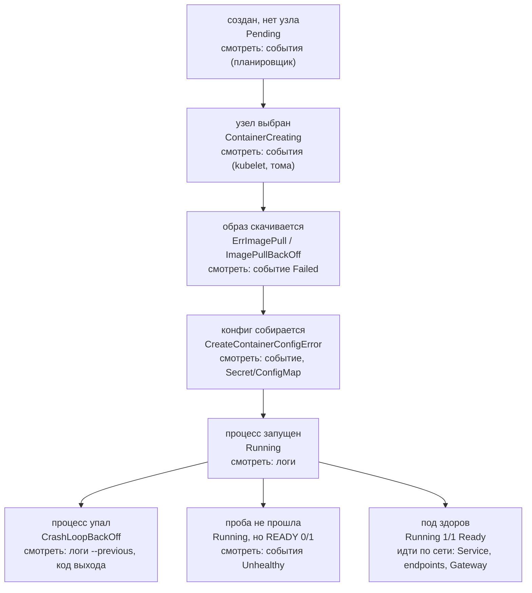
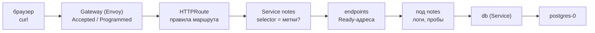

## Зачем это нужно

В два часа ночи алерт (автоматическое сообщение мониторинга «что-то сломалось», обычно звонок или сообщение в мессенджер) говорит «под не работает», а не «у тебя опечатка в теге образа». **Под** (pod) это запущенный контейнер приложения, минимальная единица Kubernetes ([урок 5.2](02-pods-deployments.md)). Кто ищет причину наугад, тратит час; кто идёт по одному и тому же алгоритму, находит её за пять минут. Почти любая поломка в Kubernetes видна в четырёх местах: статус пода (короткое слово в `kubectl get pods`: `Running`, `Pending` и так далее), события (events: записи кластера «что с этим объектом произошло», как журнал вахтёра), описание (describe: подробная карточка объекта) и логи (то, что сама программа пишет о своей работе). Подробно каждое разберём ниже. Умение пройти их по порядку проверяют на собеседованиях фразой «под не стартует, твои действия».

Шаг проекта: в «Заметках» появляется `docs/runbooks/k8s-triage.md`, короткий алгоритм разбора пода для дежурного. Код и манифесты проекта не меняются.

## Что нужно знать

- [Урок 1.4: процессы и сигналы](../01-linux/04-processes-signals.md): что такое процесс, код завершения (число, с которым программа сообщает системе, как закончила: 0 «всё хорошо», остальное «что-то не так») и сигналы SIGTERM («заверши работу аккуратно», как вежливая просьба освободить стол) и SIGKILL («прекрати немедленно», как выключение из розетки). Из них вырастает вся таблица «код выхода» ниже.
- [Урок 5.2: поды и Deployment](02-pods-deployments.md): жизненный цикл пода, `describe`, `logs`.
- [Урок 5.3: Service и DNS кластера](03-services-dns.md): Service даёт подам постоянный адрес; selector (условие отбора «мои поды те, у которых такая метка») решает, какие поды входят в Service; endpoints (endpoints, «конечные адреса») это список найденных подов. Пустой список значит, что запросу некуда идти.
- [Урок 5.5: хранилище и StatefulSet](05-storage-statefulset-postgres.md): PVC (PersistentVolumeClaim, заявка на диск: «мне нужен диск такого размера») и `postgres-0` (первый под базы данных).
- [Урок 5.6: ConfigMap и Secret](06-config-secrets.md): `envFrom`, ключи Secret `notes-db`.
- [Урок 5.7: пробы, ресурсы, выкатка](07-probes-resources-rollouts.md): readiness и liveness (две проверки «под готов принимать запросы» и «под жив»), requests и limits (сколько ресурсов под просит и сколько ему максимум можно), OOMKilled (контейнер убит за то, что занял больше памяти, чем разрешено).
- [Урок 5.9: Helm](09-helm.md): релиз, `helm history`, `helm rollback`.
- [Урок 5.12: безопасность кластера](12-k8s-security.md): PSS, NetworkPolicy, RBAC: они тоже дают поломки.
- [Урок 2.8: путь запроса и диагностика](../02-network/08-request-path-troubleshooting.md): идея «идти по пути слой за слоем».

## Картина целиком

Диагностика это работа врача скорой. Он не начинает с рентгена, а идёт по короткому списку: пульс, давление, жалобы, и только потом выбирает обследование. Так же в Kubernetes: сначала быстрые признаки (статус, события), потом подробности (describe, логи), потом сеть.

Главная идея: под проходит несколько стадий, и каждая стадия ломается по-своему. Узнай, **на какой стадии** остановился под, и ты знаешь, какие причины возможны, а какие нет. Аналогия с доставкой посылки: заказ оформлен, посылка собрана, доставлена, распакована, работает. Если посылка «не доехала», глупо разбираться, почему она не включается.



Три вопроса на любой поломке: **где остановился** (статус), **что говорит система** (события и describe), **что говорит приложение** (логи). Дальше по порядку разберём каждую стадию, потом сеть, потом откат и отладочные инструменты.

## Теория

### Стадии жизни пода и почему их надо знать

**Под** (pod) это минимальная единица запуска в Kubernetes: один или несколько контейнеров с общей сетью (урок [5.2](02-pods-deployments.md)). Между командой `kubectl apply` и работающим приложением под проходит цепочку шагов, и в ней участвуют разные компоненты:

1. **Планировщик** (scheduler): выбирает узел (node, машину кластера), на котором хватает места. Пока узел не выбран, под в статусе `Pending`.
2. **Kubelet**: агент на узле. Он готовит тома (диски), собирает конфигурацию из Secret и ConfigMap, просит скачать образ.
3. **Контейнерный рантайм**: скачивает образ и запускает процесс.
4. **Kubelet снова**: запускает пробы, следит за процессом, перезапускает при падении.

Зачем это знать? Потому что каждый компонент пишет свои сообщения. Если под висит в `Pending`, виноват планировщик, и логов приложения не будет: приложение ещё не запускалось. Если в `ImagePullBackOff`, виноват образ или реестр, и снова логов нет. Смотреть логи для этих статусов то же, что искать в чате переписку с человеком, которого ещё не пригласили.

Разобранный пример. Ты обновил образ, а через минуту `kubectl get pods` показывает `ImagePullBackOff`. Рассуждение: сеть и Service ни при чём, под ещё даже не стартовал. Значит, ищем на стадии «скачивание образа»: имя, тег, доступ к реестру. Одним статусом мы отбросили три четверти возможных причин.

Осторожно, путаница: «под красный, значит приложение сломано». Нет: приложение часто вообще не запускалось. Ошибка в конфигурации, образе или ресурсах, а не в коде.

> **Прикинь сам:** под в `Pending`, а `kubectl logs` выдаёт пустоту. Это ошибка команды?
{: .predict}

Нет: контейнера ещё не было, логам взяться неоткуда. Причину ищи в `describe pod`, в `Events`: `FailedScheduling` объяснит, что планировщику не подошло.

> **Проверь понимание:** под в `Pending`, а `kubectl logs` выдаёт пустоту. Это ошибка команды?

<details markdown="1">
<summary>Ответ</summary>

Нет. Контейнера ещё не было, логам взяться неоткуда. Причину смотрят в `kubectl describe pod`, секция `Events`: сообщение `FailedScheduling` объяснит, что планировщику не подошло.

</details>

> **Главное:** под проходит стадии планирование, подготовка узла, скачивание образа, запуск; статус говорит, на какой он остановился, и это отсекает лишние причины.
{: .key}

Теперь соберём из этого порядок команд.

### Алгоритм: четыре команды и порядок

Правило одно: сначала узнай, **где** остановился под, и только потом ищи **почему**. Порядок такой, от дешёвого к дорогому.

1. **Статус.** `kubectl get pods -n notes -o wide`. Флаг `-n notes` выбирает namespace, `-o wide` добавляет колонки с IP пода и узлом. Смотри `STATUS`, `READY` (сколько контейнеров готово из скольких), `RESTARTS`. Статус сразу сужает область поиска.
2. **События.** `kubectl get events -n notes --sort-by=.lastTimestamp`. Событие (event) это короткая запись «что случилось», которую пишут планировщик, kubelet и контроллеры. `--sort-by=.lastTimestamp` ставит свежие в конец.
3. **Описание.** `kubectl describe pod <имя> -n notes`. Читай блок `State` / `Last State` (причина и код выхода) и в самом конце `Events` именно этого пода.
4. **Логи.** `kubectl logs <под> -n notes`, а для уже упавшего запуска добавь `--previous`. Логи есть только у контейнера, который хоть раз стартовал.

Если под здоров, а сервис не отвечает, идём дальше по сети: Service, endpoints, Gateway (уроки 5.3 и 5.4).

Почему такой порядок? Каждый следующий шаг дороже предыдущего по времени и объёму вывода: статус это одна строка, события десяток строк, describe экран, логи сколько угодно. Идёшь от малого к большому, останавливаешься, как только причина найдена. И второй довод: логи есть не всегда, а статус и события всегда.

Чего не делать: сразу `kubectl delete pod`. Контроллер (Deployment) пересоздаст под, ты потеряешь улики (логи и события старого пода), а причина останется на месте.

> **Прикинь сам:** почему логи смотрят четвёртым, а не первым?
{: .predict}

У многих поломок логов нет: `Pending`, `ImagePullBackOff` и `CreateContainerConfigError` контейнера не создали. Статус и события показывают, до какой стадии дошёл под.

Осторожно: не делай сразу `kubectl delete pod`: Deployment пересоздаст под, а улики (логи и события старого пода) пропадут.

> **Проверь понимание:** почему логи смотрят четвёртым, а не первым?

<details markdown="1">
<summary>Ответ</summary>

У многих поломок логов нет: `Pending` не запущен, `ImagePullBackOff` не скачал образ, `CreateContainerConfigError` не создал контейнер. Статус и события показывают, до какой стадии дошёл под, а логи имеют смысл, только если контейнер стартовал.

</details>

> **Главное:** порядок такой: статус, события, `describe`, логи; идёшь от дешёвого к дорогому и останавливаешься, когда причина найдена.
{: .key}

Первый шаг этого порядка опирается на статусы, и их надо читать как карту.

### Статус пода как карта

Каждый статус указывает на свою стадию и свой набор причин. Разберём по одному, что он значит и почему возникает.

**`Pending`.** Под создан в базе кластера (etcd), но ни на какой узел не поставлен. Планировщик проверяет для каждого узла: хватает ли свободных ресурсов под **requests** пода (гарантированный минимум CPU и памяти, урок [5.7](07-probes-resources-rollouts.md)), нет ли **taint** (пометка узла «сюда не ставить, если под не имеет разрешения»), подходит ли `nodeSelector` (требование «только на узлы с такой меткой»), смонтируется ли PVC (запрос на диск, урок [5.5](05-storage-statefulset-postgres.md)). Если ни один узел не подошёл, под ждёт, а в событиях пишется `FailedScheduling`.

**`ContainerCreating`.** Узел выбран, kubelet собирает контейнер. Зависает, если не монтируется том или нет Secret или ConfigMap, на который ссылается под.

**`ErrImagePull` / `ImagePullBackOff`.** Рантайм не смог скачать образ: опечатка в имени или теге, тега нет в реестре, реестр приватный, а пароля нет (нужен `imagePullSecrets`), сети до реестра нет. `ErrImagePull` это сама ошибка, `ImagePullBackOff` состояние «жду и пробую снова с растущей паузой».

**`CreateContainerConfigError`.** Образ есть, но контейнер не собрался из-за конфигурации: в переменной окружения `secretKeyRef` указан ключ, которого нет в Secret, или ConfigMap не существует.

**`CrashLoopBackOff`.** Контейнер стартует, процесс завершается (ошибка, нехватка памяти, неверная команда), kubelet перезапускает, снова падение. Между перезапусками kubelet выдерживает **растущую паузу** (backoff): по умолчанию 10 с, 20 с, 40 с и так до 5 минут (зависит от версии и настроек kubelet). Поэтому «под просто ещё не перезапустился» после пяти минут не оправдание.

**`Running`, но `0/1 READY`.** Процесс жив, но **readiness-проба** (проверка «готов ли под принимать трафик») не проходит. Kubernetes не перезапускает такой под, а исключает его из списка адресов Service. Пользователь видит 502 или 503, хотя под «зелёный».

**`OOMKilled`** (виден в `Last State`). Процесс превысил `limits.memory` и убит ядром (OOM: out of memory, «кончилась память»). Код выхода 137.

**`Error` / `Completed`.** Контейнер завершился, а перезапускать его не должны: это нормально для Job (урок [5.8](08-jobs-cronjob-daemonset.md)), причина смотрится по коду выхода.

| Статус | Стадия | Что искать |
|---|---|---|
| `Pending` | под не размещён на узле | события `FailedScheduling`: requests, taint, `nodeSelector`, PVC |
| `ContainerCreating` | контейнер готовится | том не смонтировался, нет Secret или ConfigMap |
| `ErrImagePull` / `ImagePullBackOff` | образ не скачивается | имя и тег, реестр, `imagePullSecrets`, сеть |
| `CreateContainerConfigError` | контейнер не создан из-за конфига | ключ в Secret или ConfigMap |
| `CrashLoopBackOff` | стартует и падает, пауза растёт | `logs --previous`, код выхода |
| `Running`, `0/1 READY` | процесс жив, проба не проходит | путь пробы, зависимость (БД), события `Unhealthy` |
| `OOMKilled` (`Last State`) | код 137, память выше limit | лимит `memory`, утечка |
| `Error` / `Completed` | завершился Job или контейнер | код выхода, логи |

Осторожно, путаница: `Error` и `CrashLoopBackOff`. Первое одно падение, второе повторяющиеся падения с паузами. И `Running` не значит «работает»: смотри колонку `READY`.

> **Прикинь сам:** под `Running`, `READY 0/1`, рестартов 0. Перезапустит ли его Kubernetes?
{: .predict}

Нет: readiness-проба не перезапускает контейнер, а лишь убирает под из Service. Перезапускает liveness. Причину ищи в событиях `Unhealthy`.

> **Проверь понимание:** под `Running`, `READY 0/1`, рестартов 0. Перезапустит ли его Kubernetes?

<details markdown="1">
<summary>Ответ</summary>

Нет. Readiness-проба не перезапускает контейнер, она лишь убирает под из Service. Перезапускает `livenessProbe`. Причину ищи в событиях `Unhealthy` и вручную дёрни путь пробы.

</details>

> **Главное:** каждый статус указывает на свою стадию: `Pending` планировщик, `ImagePullBackOff` образ, `CrashLoopBackOff` падение процесса, `0/1 READY` проба.
{: .key}

За статусом идут события и `describe`.

### События и describe: где система объясняет себя

**События** (events) это записи вида «объект, что произошло, кто написал, почему». Например планировщик пишет `FailedScheduling`, kubelet пишет `Failed` (не скачался образ), `BackOff` (перезапуск с паузой), `Unhealthy` (проба не прошла). События живут в кластере около часа и потом стираются, поэтому в инциденте их смотрят сразу, а важное копируют в заметки.

Полезная команда: `kubectl get events -n notes --sort-by=.lastTimestamp`. А `--field-selector reason=FailedScheduling` оставит события только с нужной причиной. `Type: Warning` это проблема, `Normal` информация.

`kubectl describe pod` собирает всё про один под. Читай его так, сверху вниз:

- `Status`, `Node`, `IP`: где живёт под;
- `Containers` -> `State` (что сейчас) и `Last State` (как завершился прошлый запуск): здесь `Reason` (`Error`, `OOMKilled`) и `Exit Code`;
- `Conditions`: `PodScheduled`, `Initialized`, `ContainersReady`, `Ready`: какая стадия не пройдена (значение `False` показывает, где остановились);
- `Events` в самом низу: последняя строка чаще всего и есть причина.

> **Прикинь сам:** зачем `describe` читать с конца?
{: .predict}

Блок `Events` внизу содержит записи именно этого пода по порядку, и последние обычно называют причину. Начало описания справочное.

Осторожно: события стираются примерно через час, поэтому читать их нужно сразу, а не «потом разберусь».

> **Проверь понимание:** зачем `describe` читать с конца?

<details markdown="1">
<summary>Ответ</summary>

Блок `Events` внизу содержит записи именно этого пода в хронологии, а последние сообщения обычно называют причину («Failed to pull image», «Insufficient cpu», «Back-off restarting failed container»). Начало описания это справочные поля.

</details>

> **Главное:** события живут около часа, `describe` читай по порядку: `State`, `Last State`, `Conditions`, `Events` в самом низу.
{: .key}

Одна из самых важных строк в `Last State` это код выхода.

### Код выхода: как процесс объясняет свою смерть

**Код выхода** (exit code) это число, с которым завершился процесс (урок [1.4](../01-linux/04-processes-signals.md)). Ноль значит «всё хорошо», любое другое значит «что-то пошло не так». В `describe` он виден в `Last State`.

- `0`: завершился штатно;
- `1`: общая ошибка приложения, смотри логи;
- `2`: часто неверные аргументы или файл не найден (интерпретатор Python выдаёт 2, если не может открыть скрипт);
- `126` / `127`: команда не исполняемая или не найдена (ошибка в `command`);
- `137`: убит сигналом 9 (SIGKILL): чаще `OOMKilled` (память) или kill по `livenessProbe` после таймаута;
- `143`: остановлен сигналом 15 (SIGTERM): при выкатке это нормально.

Формула для сигналов: `128 + номер сигнала`. Сигнал 9 даёт 137, сигнал 15 даёт 143. SIGKILL нельзя перехватить, процесс не успевает ничего записать в лог: поэтому у `OOMKilled` в логах приложения тишина.

Разобранный пример. `Last State: Terminated, Reason: Error, Exit Code: 2` и в логах `python: can't open file '/no/such/app.py'`. Код 2 и текст совпадают: не найден файл запуска. А `Reason: OOMKilled, Exit Code: 137` и пустые логи говорит другое: память. Разные коды, разные исправления.

Осторожно, путаница: `137` не всегда `OOMKilled`. Если `Reason` не `OOMKilled`, а в событиях есть `Liveness probe failed`, процесс убил kubelet.

> **Прикинь сам:** `Last State: Terminated`, `Reason: Error`, `Exit Code: 1`. Куда смотреть дальше?
{: .predict}

В `kubectl logs <под> --previous`: приложение само завершилось с ошибкой, причина в последних строках лога. Если бы это была память, код был бы 137.

> **Проверь понимание:** `Last State`: `Terminated`, `Reason: Error`, `Exit Code: 1`. Куда смотреть дальше?

<details markdown="1">
<summary>Ответ</summary>

В `kubectl logs <под> --previous`: приложение само завершилось с ошибкой, причина написана в последних строках лога. Если бы это была память, код был бы 137.

</details>

> **Главное:** код `128 + номер сигнала`: 137 это SIGKILL (чаще `OOMKilled`), 143 это SIGTERM; `126` и `127` ошибка в `command`.
{: .key}

Причина самого падения лежит в логах прошлого запуска.

### Логи упавшего запуска

`kubectl logs <под>` показывает лог **текущего** контейнера. Если контейнер только что перезапустился после падения, там пусто или несколько первых строк нового запуска. Причина же лежит в логе **предыдущего** запуска, и его показывает `--previous` (короткая форма `-p`). Ещё полезны `--tail=20` (последние 20 строк), `-l app.kubernetes.io/name=notes` (все поды по метке, `-l` означает label selector, отбор по меткам), `-f` (следить за новыми строками).

Логи отсутствуют, если контейнер ни разу не стартовал (`Pending`, `ImagePullBackOff`, `CreateContainerConfigError`). Тогда ошибка `previous terminated container ... not found` не баг, а подсказка: падений ещё не было.

Осторожно, путаница: `logs --previous` ждут для `OOMKilled`, но текст об OOM в нём не появится, потому что процесс убит без предупреждения: причину покажет `describe`.

> **Прикинь сам:** контейнер падает сразу после старта. Как увидеть ошибку, из-за которой он упал в прошлый раз?
{: .predict}

`kubectl logs <под> --previous`: текущий запуск мог ещё ничего не написать, а предыдущий уже записал причину.

> **Проверь понимание:** контейнер падает сразу после старта. Как увидеть ошибку, из-за которой он упал в прошлый раз?

<details markdown="1">
<summary>Ответ</summary>

`kubectl logs <под> --previous`. Текущий запуск может ещё ничего не написать, а предыдущий уже записал причину.

</details>

> **Главное:** `logs` показывает текущий контейнер, а причина падения лежит в `--previous`; если контейнер не стартовал, логов нет.
{: .key}

Что делать, если под здоров, а сайт не отвечает, посмотрим дальше.

### Под здоров, а сайт не отвечает: путь запроса

Если под `Running` и `1/1 Ready`, а клиент получает ошибку, идём по пути запроса изнутри наружу (как в уроке [2.8](../02-network/08-request-path-troubleshooting.md)):



**Service** даёт группе подов одно постоянное имя и адрес (урок [5.3](03-services-dns.md)). Какие поды входят в группу, решает **selector** (отбор по меткам): Service берёт все Ready-поды, у которых метки совпадают. Список найденных адресов называется **endpoints**. Если он пуст, трафику некуда идти.

Проверки по порядку:

1. `kubectl get endpoints notes -n notes`: пусто значит selector не совпал с метками подов или нет Ready-подов.
2. `kubectl get svc notes -n notes -o wide` и `kubectl get pods -n notes --show-labels`: сравни selector и метки глазами.
3. `kubectl port-forward svc/notes 8080:8080 -n notes` и `curl http://127.0.0.1:8080/readyz` (`port-forward` пробрасывает порт с твоей машины прямо в кластер в обход Gateway). Если так работает, проблема выше по пути: Gateway или HTTPRoute.
4. `kubectl get gateway,httproute -n notes`: условия `Accepted` и `Programmed`.
5. Если приложение обращается к БД: `kubectl get endpoints db -n notes`, статус `postgres-0`, событие про PVC.
6. Если после урока 5.12 всё внезапно оборвалось: `kubectl get networkpolicy -n notes`. NetworkPolicy молча отбрасывает пакеты: клиент видит таймаут, а не отказ. Ещё одно свойство: `port-forward` идёт через kubelet и NetworkPolicy не проходит, поэтому работающий `port-forward` при мёртвом Gateway часто указывает именно на сетевую политику.

Как различать коды. Они говорят, кто в цепочке не смог. Envoy отвечает `503`, когда у маршрута нет живых адресов (пустые endpoints, все поды не Ready), и `502`, когда апстрим ответил некорректным HTTP. Если соединение с подом сброшено или оборвано до ответа, Envoy тоже обычно отвечает `503` (`upstream connect error or disconnect/reset before headers`). `504` значит, что апстрим не ответил вовремя.

> **Прикинь сам:** что покажет `kubectl get endpoints notes`, если в Service поменять selector на `app.kubernetes.io/name: notez`?
{: .predict}

Endpoints станут `<none>`, а поды останутся `Running` и `Ready`: Service просто их не находит. Клиент через Gateway получит 503.

Осторожно: `503` Envoy выдаёт, когда у маршрута нет живых адресов, `502` когда апстрим ответил некорректным HTTP, а при сбросе или обрыве соединения до ответа тоже обычно `503`, `504` когда не ответил вовремя.

> **Проверь понимание:** что покажет `kubectl get endpoints notes`, если в Service ошибочно поменять selector на `app.kubernetes.io/name: notez`? Что будет с подами?

<details markdown="1">
<summary>Ответ</summary>

Endpoints станут `<none>`, а поды останутся `Running` и `Ready`: с ними всё в порядке, Service просто их не находит. Клиент через Gateway получит 503. Классика: здоровые поды и мёртвый сервис.

</details>

> **Главное:** иди по пути запроса: `endpoints`, метки подов, `port-forward`, Gateway и HTTPRoute, NetworkPolicy; пустой endpoints значит selector не совпал или нет Ready-подов.
{: .key}

Когда причину искать долго, сначала возвращай сервис откатом.

### Сначала откат, потом разбор

Первая цель инцидента: **вернуть сервис**, а не понять причину. Если поломка началась сразу после выкатки, откатывай:

- `helm history notes -n notes`: список ревизий релиза (каждый `helm upgrade` создаёт новую), в колонке `STATUS` отмечена текущая (`deployed`);
- `helm rollback notes <ревизия> -n notes`: вернуть релиз к указанной ревизии;
- или `kubectl rollout undo deployment/notes -n notes`: вернуть Deployment к предыдущему набору подов. Учти, что для релиза Helm дрейф между Helm и кластером потом надо убрать через `helm upgrade` (урок [5.9](09-helm.md)).

Откат занимает минуту и безопасен: причина остаётся в истории ревизий и логах, разберёшься спокойно после. Важно, что при выкатке `RollingUpdate` (постепенная замена подов) с `maxUnavailable: 0` (урок [5.7](07-probes-resources-rollouts.md)) старые поды не гасятся, пока новые не стали Ready: плохая версия «зависает», а сервис продолжает обслуживать пользователей. Поэтому зависшая выкатка не всегда авария: сначала проверь, отвечает ли сайт.

Осторожно, путаница: откат это не лечение. Он возвращает старую версию, а причина, например ошибочный тег или опечатка в values, остаётся в репозитории и сломает следующую выкатку.

> **Прикинь сам:** зачем сначала откат, а потом разбор?
{: .predict}

Цель инцидента: восстановить сервис. Откат быстрый и безопасный, а причина остаётся в истории ревизий, событиях и логах для спокойного анализа.

> **Проверь понимание:** зачем сначала откат, а потом разбор?

<details markdown="1">
<summary>Ответ</summary>

Цель инцидента: восстановить сервис. Откат быстрый и безопасный, а причина остаётся в истории ревизий, событиях и логах для спокойного анализа.

</details>

> **Главное:** первая цель это вернуть сервис: `helm rollback` или `kubectl rollout undo`; откат не лечит причину, она остаётся в репозитории.
{: .key}

Перед любыми действиями надо убедиться, что работаешь в нужном кластере.

### Сначала проверь, где ты: кластер, контекст, namespace

Самая обидная ошибка диагностики: полчаса смотреть не туда. `kubectl get pods` вернул «No resources found», хотя приложение работает, потому что ты смотришь в другой namespace. Или чинишь «прод», а команды идут в `dev`.

Навигатор с невыбранным городом: маршрут построится, но не в тот город. Оговорка: навигатор хотя бы показывает город на экране, а `kubectl` молчит, пока не спросишь.

Две настройки решают, куда попадёт команда:

- **Контекст** (context) это выбранная запись в файле `~/.kube/config`: «какой кластер и под каким пользователем». Посмотреть: `kubectl config current-context`. Переключить: `kubectl config use-context ИМЯ`.
- **Namespace** (пространство имён, «комната» в кластере) можно указать в каждой команде флагом `-n notes`. Если флага нет, используется namespace из контекста, а он чаще всего `default`.

`kubectl get pods` в пустом `default` отвечает `No resources found in default namespace.` Это не значит, что подов нет: они в `notes`. Правильно: `kubectl get pods -n notes`. Для поиска по всем комнатам сразу есть `kubectl get pods -A` (`-A` значит «все namespace»): видно, где живёт нужное.

Осторожно, путаница: «Нет ресурсов» считают ответом «приложение не задеплоено». Сначала проверь namespace и контекст, потом делай выводы. В runbook для дежурного первая строка именно `kubectl config current-context`.

> **Прикинь сам:** `kubectl get deploy notes` отвечает `NotFound`, хотя ты уверен, что он есть. Что проверишь первым?
{: .predict}

Namespace и контекст: добавь `-n notes` и проверь `kubectl config current-context`. Чаще всего объект ищут не там.

> **Проверь понимание:** `kubectl get deploy notes` отвечает `Error from server (NotFound): deployments.apps "notes" not found`, хотя ты уверен, что он есть. Что проверишь первым?

<details markdown="1">
<summary>Ответ</summary>

Namespace и контекст: добавь `-n notes` и проверь `kubectl config current-context`. Чаще всего объект найден не там, где ищешь.

</details>

> **Главное:** куда попадёт команда, решают контекст и namespace; «No resources found» не значит, что приложения нет.
{: .key}

Отдельная тема: выкатка через Helm, которая может оборваться на полпути.

### Выкатка через Helm не удалась: как не оставить прод на полпути

`helm upgrade` может оборваться посередине: часть объектов уже обновлена, новые поды не стали Ready, а команда завершилась ошибкой или зависла. Без страховки релиз остаётся в полусломанном состоянии, и дежурный разбирается в нём ночью.

Операция с обязательным планом «если пошло не так, вернуть как было». Без такого плана хирург, обнаружив проблему, уже не может зашить всё обратно. Оговорка: откат возвращает только манифесты, данные в базе он не откатывает ([урок 5.9](09-helm.md)).

У Helm два флага, которые страхуют выкатку:

- `--wait` говорит: не считай выкатку успешной, пока все поды не станут Ready (или не выйдет время `--timeout`). Без него команда вернётся сразу после отправки манифестов, даже если поды сломаны.
- `--rollback-on-failure` говорит: если выкатка не удалась, вернись на прошлую рабочую ревизию сам. Он включает ожидание `--wait`. В Helm 3 и старых статьях этот флаг называется `--atomic`; в Helm 4 (на нём построен курс) старое имя устарело.

Если флагов не было, смотри статус релиза: `helm status notes -n notes` и `helm history notes -n notes`. Статус `failed` значит выкатка не удалась, `pending-upgrade` значит операция идёт или оборвалась, и параллельно запускать вторую нельзя.

Выкатка с битым тегом образа. Без флагов: `helm upgrade` сразу отвечает `deployed`, а `kubectl get pods` через минуту показывает `ImagePullBackOff`. С `--rollback-on-failure --timeout 3m`: Helm ждёт три минуты, не дожидается Ready, откатывает релиз, печатает ошибку. В `helm history` появится ревизия со статусом `failed` и следующая с описанием отката. Старые поды при этом никто не гасил, и сервис работал.

> **Прикинь сам:** `helm upgrade` без `--wait` завершился без ошибок, а поды в `ImagePullBackOff`. Почему Helm не сообщил о проблеме?
{: .predict}

Без `--wait` Helm только отправляет манифесты в API и не ждёт Ready. Для ответа «выкатка удалась» нужны `--wait` или `--rollback-on-failure`.

Осторожно: не думай, что `helm upgrade` с кодом выхода 0 означает «всё работает». Без `--wait` он означает только «манифесты отправлены». Работает ли приложение, показывает статус подов.

> **Проверь понимание:** `helm upgrade` без `--wait` завершился без ошибок, а поды в `ImagePullBackOff`. Почему Helm не сообщил о проблеме?

<details markdown="1">
<summary>Ответ</summary>

Без `--wait` Helm только отправляет манифесты в API-сервер и не ждёт, пока поды станут Ready. Для ответа «выкатка удалась» нужны `--wait` или `--rollback-on-failure`.

</details>

> **Главное:** `--wait` ждёт Ready, `--rollback-on-failure` откатывает сам; в Helm 3 он назывался `--atomic`; статус `failed` и `pending-upgrade` смотри в `helm status`.
{: .key}

Чтобы дежурному не изобретать порядок ночью, его записывают в runbook.

### Runbook: что это и из чего состоит

В два часа ночи у дежурного нет сил вспоминать порядок действий. Runbook (инструкция-памятка для дежурного) это короткий документ «при такой поломке делай то-то». Без него каждый дежурный изобретает порядок заново и пропускает шаги.

Инструкция по эвакуации на стене офиса: сработала сирена, не размышляй, а иди по списку. Оговорка: инструкция не заменяет голову. Если ситуация не похожа на написанное, нужно подумать и дополнить инструкцию.

Хороший runbook для подов короткий и состоит из: симптома («под в `CrashLoopBackOff`»), первых команд (то, что выполнить прямо сейчас), развилок («если код выхода 137, смотри память; если 1, смотри логи»), условий эскалации (когда звать старшего) и способа отката. Каждая строка это команда или вопрос с понятным ответом «да» или «нет».

Шаг из runbook: «Статус `Pending`? Выполни `kubectl describe pod ПОД -n notes` и найди `FailedScheduling` в Events. Если написано `Insufficient memory` (не хватает памяти на узлах), уменьши `requests` или добавь узел». Человек, который ни разу не видел такую ошибку, выполнит шаг за минуту.

Осторожно, путаница: Runbook пишут один раз и забывают. На деле его надо править после каждого инцидента, где выяснилось, что шага не хватает. Устаревшая инструкция опаснее её отсутствия.

> **Прикинь сам:** почему в runbook нужны условия эскалации?
{: .predict}

Дежурный должен знать, когда перестать искать в одиночку и позвать того, кто лучше знает систему. Иначе он тратит время, которое стоит денег.

> **Проверь понимание:** почему в runbook нужны условия эскалации?

<details markdown="1">
<summary>Ответ</summary>

Потому что дежурный должен знать, когда перестать искать в одиночку и позвать того, кто лучше знает систему. Без этого он тратит на поиск время, которое стоит сервису денег.

</details>

> **Главное:** runbook состоит из симптома, первых команд, развилок, условий эскалации и способа отката; после каждого инцидента его правят.
{: .key}

Иногда сломано сразу два места, и важно не запутаться.

### Две поломки сразу: как не запутаться

В реальном инциденте причин бывает две. Ты починил одну, под всё равно не работает, и кажется, что починка не помогла. На самом деле ты продвинулся на шаг.

Пробка на дороге, в которой сначала стоит авария, а за ней ремонт. Убрали аварию, а машины всё ещё стоят: очередь упёрлась во вторую причину. Оговорка: в отличие от дороги, вторую причину в Kubernetes видно сразу, если снова запустить тот же алгоритм.

После каждого исправления не гадай, а повторяй тот же порядок: статус, события, describe, логи. Статус подскажет, на какой стадии под остановился теперь. Если стадия другая (был `ImagePullBackOff`, стал `CrashLoopBackOff`), первая причина устранена, а под дошёл до следующей.

Под в `ImagePullBackOff`: в теге образа опечатка. Ты исправил тег, статус стал `CreateContainerConfigError` с событием про отсутствующий ключ в Secret. Первая поломка устранена (образ скачался), под дошёл до сборки конфигурации и упёрся во вторую. Ты поправляешь Secret, и статус становится `Running`, но `READY 0/1`: теперь виновата проба готовности. Три поломки подряд, и каждая видна по смене статуса.

> **Прикинь сам:** после правки тега статус сменился с `ImagePullBackOff` на `CrashLoopBackOff`. Правка помогла или нет?
{: .predict}

Помогла: образ скачался и контейнер запустился. Теперь он падает по другой причине, её смотри в `logs --previous` и в коде выхода.

Осторожно: не думай, что смена статуса означает «стало хуже». Обычно наоборот: под пошёл дальше по стадиям, а значит, прошлый шаг пройден. Возвращаться к исправленной причине не нужно.

> **Проверь понимание:** после правки тега образа статус сменился с `ImagePullBackOff` на `CrashLoopBackOff`. Правка помогла или нет?

<details markdown="1">
<summary>Ответ</summary>

Помогла: образ скачался и контейнер запустился. Теперь он падает уже по другой причине, её смотри в `kubectl logs --previous` и в коде выхода.

</details>

> **Главное:** после каждого исправления повторяй порядок: статус, события, `describe`, логи; смена статуса значит, что под прошёл дальше.
{: .key}

И последний инструмент: отладка, когда в образе нет утилит.

### kubectl debug: когда в образе нет инструментов

Образ «Заметок» построен на `python:3.13-slim`: в нём нет `curl`, `nslookup` и `ps`, и `kubectl exec` мало помогает. Утилиты в прод-образ не кладут (лишняя поверхность атаки, урок [4.8](../04-docker/08-image-security.md)). Вместо этого поверх работающего пода подключают **ephemeral-контейнер** (временный, «одноразовый» контейнер с инструментами внутри уже запущенного пода):

```bash
kubectl debug -it -n notes <под> --image=busybox:1.37 --target=notes --profile=restricted -- sh
```

Разбор: `-it` даёт интерактивный терминал; `--image=busybox:1.37` образ с набором утилит (wget, nslookup); `--target=notes` делить процессы с контейнером `notes`, чтобы видеть его процессы; `--profile=restricted` набор настроек безопасности, нужный в namespace с PSS `restricted` (урок [5.12](12-k8s-security.md)), иначе admission отклонит контейнер (профиль требует `runAsNonRoot`, и busybox стартует, потому что `runAsUser: 10001` задан на уровне пода и ephemeral-контейнер его наследует; в поде без `runAsUser` добавь `--custom` с `runAsUser`); `-- sh` команда для запуска.

Контейнер делит с целевым сетевое пространство, поэтому `wget -qO- http://127.0.0.1:8080/healthz` и `nslookup db` видят то же, что видит приложение (в том числе действие NetworkPolicy, ведь IP пода один). После выхода ephemeral-контейнер остаётся записанным в описании пода, но не работает; удалить его можно только пересозданием пода.

Осторожно, путаница: `kubectl debug` не «чинит» под и не заменяет `exec`, он лишь даёт инструменты. Для проблем узла есть `kubectl debug node/<имя>`.

> **Прикинь сам:** зачем `--target` в `kubectl debug`?
{: .predict}

Чтобы временный контейнер видел процессы целевого. Без него он получит свои процессы и не увидит приложение, а сеть у них общая в любом случае.

> **Проверь понимание:** зачем `--target`?

<details markdown="1">
<summary>Ответ</summary>

Чтобы временный контейнер видел процессы целевого контейнера. Без `--target` он получит свои процессы и не увидит приложение (сеть у них общая в любом случае).

</details>

> **Главное:** ephemeral-контейнер даёт `curl`, `nslookup` и `ps` поверх работающего пода; в namespace с PSS `restricted` нужен `--profile=restricted`.
{: .key}

Теперь можно потренироваться на настоящих поломках.

## Практика

Проверь, что кластер запущен и контекст правильный. `kubectl config current-context` печатает имя выбранного кластера, `kubectl get pods -n notes` список подов:

```bash
kubectl config current-context
kubectl get pods -n notes
```

```text
kind-notes
NAME                     READY   STATUS    RESTARTS   AGE
notes-6d9c7b8f5d-4kx2p   1/1     Running   0          12m
notes-6d9c7b8f5d-9zq7w   1/1     Running   0          12m
notes-6d9c7b8f5d-tm8hn   1/1     Running   0          12m
postgres-0               1/1     Running   0          40m
```

**Как читать вывод:** `kind-notes` значит контекст верный (иначе ты сломаешь чужой кластер). У всех подов `READY 1/1` и `STATUS Running`: это норма, с которой будем сравнивать. Имена подов у тебя будут другие. Дальше `<под>` означает «подставь своё имя».

### Задание 1. Три статуса за пять минут

**Цель:** вызвать три типовые поломки и по каждой пройти алгоритм.

**Предскажи:** если в Deployment написать несуществующий тег образа, что увидит пользователь сайта: ошибки или работающий сайт (у Deployment `maxUnavailable: 0`)?

<details markdown="1">
<summary>Ответ</summary>

Сайт продолжит работать. Новый под застрянет в `ImagePullBackOff`, но RollingUpdate не гасит старые поды, пока новый не стал Ready.

</details>

**Шаги:**

1. Поломка A: несуществующий тег образа. `kubectl set image deployment/notes notes=<образ>` меняет образ контейнера `notes` (имя контейнера до знака равенства); `grep -A2 'Failed'` печатает строки с `Failed` и две следующие; `rollout undo` откатывает:

   ```bash
   kubectl set image deployment/notes notes=ghcr.io/<github-user>/notes:9.9.9 -n notes
   kubectl get pods -n notes
   kubectl describe pod -n notes -l app.kubernetes.io/name=notes | grep -A2 'Failed'
   kubectl rollout undo deployment/notes -n notes
   ```

2. Поломка B: слишком большие requests. `kubectl set resources` меняет ресурсы контейнеров; limits задаём тоже, иначе API отклонит requests больше limits; `--field-selector reason=FailedScheduling` оставляет события только нужного вида:

   ```bash
   kubectl set resources deployment/notes -n notes \
     --requests=cpu=64,memory=512Gi --limits=cpu=64,memory=512Gi
   kubectl get pods -n notes
   kubectl get events -n notes --field-selector reason=FailedScheduling | tail -2
   kubectl rollout undo deployment/notes -n notes
   ```

3. Поломка C: ключ, которого нет в Secret. `patch` вносит правку из JSON; список `env` сливается по имени, поэтому существующие переменные остаются. `grep -B1 -A3` печатает строки вокруг совпадения, `head` обрезает вывод:

   ```bash
   kubectl patch deployment notes -n notes -p '{"spec":{"template":{"spec":{"containers":[{"name":"notes","env":[{"name":"X","valueFrom":{"secretKeyRef":{"name":"notes-db","key":"NO_SUCH_KEY"}}}]}]}}}}'
   kubectl get pods -n notes
   kubectl describe pod -n notes -l app.kubernetes.io/name=notes | grep -B1 -A3 'NO_SUCH_KEY' | head
   kubectl rollout undo deployment/notes -n notes
   ```

Между поломками дожидайся `kubectl rollout status deployment/notes -n notes`, чтобы состояние вернулось к норме.

**Что должно получиться** (числа и хеши у тебя другие):

```text
NAME                     READY   STATUS             RESTARTS   AGE
notes-5f7d8b6c94-x2v8m   0/1     ImagePullBackOff   0          20s
```

```text
Warning  Failed  kubelet  Failed to pull image "ghcr.io/<github-user>/notes:9.9.9": ... not found
```

```text
notes-7c6b9d4f8-q5r2s   0/1   Pending   0   15s
0s   Warning   FailedScheduling   pod/notes-7c6b9d4f8-q5r2s   0/3 nodes are available: 1 node(s) had untolerated taint {node-role.kubernetes.io/control-plane: }, 2 Insufficient cpu, 2 Insufficient memory.
```

```text
notes-8b5c7d9f6-m4n7p   0/1   CreateContainerConfigError   0   10s
Error: couldn't find key NO_SUCH_KEY in Secret notes/notes-db
```

**Как читать вывод:** в каждом случае новый под `0/1` и в «плохом» статусе, а старые три остались `1/1`. Первый блок: `not found` в событии `Failed` значит, что такого тега нет в реестре (для доступа было бы `unauthorized`). Второй: `Pending` и `FailedScheduling` со списком «нет узлов»: число узлов в кластере kind у тебя может быть другим. Третий: статус сам называет причину, а `describe` показывает, какой ключ и в каком Secret.

**Объясни себе:**

- Какой статус у какой стадии: скачивание, размещение, создание контейнера?
- Почему в случаях A, B, C не помогла бы команда `kubectl logs`?
- Почему старые поды продолжали обслуживать трафик все три раза?

**Типичные ошибки:**

- `error: unable to find container named "notes"`: имя контейнера в `set image` неверное; проверь `kubectl get deploy notes -n notes -o jsonpath='{.spec.template.spec.containers[*].name}'`.
- Пустой вывод `grep`: событие уже стёрлось или ты смотришь не тот под; повтори `kubectl get pods` и возьми новый.
- `The Deployment "notes" is invalid: ... must be less than or equal to cpu limit`: при `set resources` забыт `--limits`.

### Задание 2. CrashLoopBackOff и код выхода

**Цель:** отличить падение приложения от убийства по памяти и научиться пользоваться `--previous`.

**Предскажи:** контейнер падает сразу при старте. Какой ключ нужен, чтобы увидеть ошибку, из-за которой контейнер упал в прошлый раз?

<details markdown="1">
<summary>Ответ</summary>

`--previous` (или `-p`): текущий запуск может ещё не успеть ничего написать, а предыдущий уже записал причину смерти.

</details>

**Шаги:**

1. Подмени команду запуска на несуществующий файл. `--type=json` включает формат правки «операция, путь, значение»; `sleep 45` даёт Kubernetes время перезапустить контейнер:

   ```bash
   kubectl patch deployment notes -n notes --type=json \
     -p='[{"op":"add","path":"/spec/template/spec/containers/0/command","value":["python","/no/such/app.py"]}]'
   sleep 45
   kubectl get pods -n notes
   ```

2. Найди причину. `logs --previous --tail=3` последние три строки прошлого запуска; `grep -A6 'Last State'` блок `Last State` и шесть строк после:

   ```bash
   kubectl logs -n notes -l app.kubernetes.io/name=notes --previous --tail=3
   kubectl describe pod -n notes -l app.kubernetes.io/name=notes | grep -A6 'Last State'
   ```

3. Верни как было: `kubectl rollout undo deployment/notes -n notes`.

**Что должно получиться:**

```text
NAME                     READY   STATUS             RESTARTS      AGE
notes-6d59f5c7b8-hd9wz   0/1     CrashLoopBackOff   3 (28s ago)   62s
```

```text
python: can't open file '/no/such/app.py': [Errno 2] No such file or directory
    Last State:     Terminated
      Reason:       Error
      Exit Code:    2
```

**Как читать вывод:** `CrashLoopBackOff` и `RESTARTS 3 (28s ago)` показывают: контейнер уже три раза перезапускался, последний раз 28 секунд назад. Причина в первой строке лога: файла нет. `Exit Code: 2` и `Reason: Error` значит ошибка приложения, не память. Старые поды при этом продолжают работать.

**Объясни себе:**

- Чем `Exit Code: 2` принципиально отличается от `137`?
- Почему у `OOMKilled` в логах приложения может не быть ни строчки об ошибке?

**Типичные ошибки:**

- `Error from server (BadRequest): previous terminated container "notes" in pod "..." not found`: контейнер ещё не падал; подожди или убери `--previous`.
- `error: unable to upgrade connection: container not found`: контейнер как раз перезапустился; повтори команду.

### Задание 3. Под здоров, а сайт не отвечает

**Цель:** пройти путь запроса и найти разрыв на уровне Service.

**Предскажи:** что покажет `kubectl get endpoints notes -n notes` после смены `selector` на `notez` и что при этом будет с подами?

<details markdown="1">
<summary>Ответ</summary>

Endpoints станут `<none>`, поды останутся `Running` и `Ready`, а клиент через Gateway получит ошибку 503.

</details>

**Шаги:**

1. Убедись в норме: `kubectl get endpoints notes -n notes`.
2. Сломай selector. `--type=merge` означает «слей мой JSON с существующим объектом»; в `curl` `-s` без прогресса, `-o /dev/null` без тела, `-w '%{http_code}\n'` только код ответа:

   ```bash
   kubectl patch svc notes -n notes --type=merge -p '{"spec":{"selector":{"app.kubernetes.io/name":"notez"}}}'
   kubectl get endpoints notes -n notes
   kubectl get pods -n notes -l app.kubernetes.io/name=notes
   curl -s -o /dev/null -w '%{http_code}\n' http://notes.lab/
   ```

3. Найди причину сравнением и верни исправление. `-o wide` добавляет в `get svc` колонку `SELECTOR`, `--show-labels` в `get pods` колонку `LABELS`:

   ```bash
   kubectl get svc notes -n notes -o wide
   kubectl get pods -n notes --show-labels | head -3
   kubectl patch svc notes -n notes --type=merge -p '{"spec":{"selector":{"app.kubernetes.io/name":"notes"}}}'
   kubectl get endpoints notes -n notes
   ```

**Что должно получиться:**

```text
NAME    ENDPOINTS   AGE
notes   <none>      2h
```

```text
503
```

**Как читать вывод:** `<none>` в колонке `ENDPOINTS` значит, что Service не нашёл ни одного подходящего пода. Код `503` говорит, что Gateway жив, но пересылать некуда. После исправления в `ENDPOINTS` появятся адреса вида `10.244.x.x:8080` (по числу подов).

Если ты выкатывал Service через Helm, правка через `kubectl patch` временная: следующий `helm upgrade` её перезапишет.

**Объясни себе:**

- Как связаны `selector` Service и метки подов, и где это видно в выводе?
- Что отличает 503 от 502 в цепочке Gateway, Service, под?

**Типичные ошибки:**

- `curl: (6) Could not resolve host: notes.lab`: нет записи в `/etc/hosts`; добавь `127.0.0.1 notes.lab`.
- `Error from server (NotFound): services "notes" not found`: не тот namespace; добавь `-n notes`.

### Задание 4. Шаг проекта: runbook `docs/runbooks/k8s-triage.md`

**Цель:** закрепить алгоритм документом, который откроет дежурный в ночь инцидента.

**Предскажи:** какая строка в таком документе должна стоять первой: «как искать причину» или «как вернуть сервис»?

<details markdown="1">
<summary>Ответ</summary>

«Как вернуть сервис»: если сбой начался после выкатки, сначала откат, потом разбор.

</details>

**Шаги:**

1. Создай файл. `mkdir -p` создаёт каталог вместе с родителями; `cat > файл <<'EOF' ... EOF` записывает всё до строки `EOF` в файл, а кавычки вокруг `EOF` не дают оболочке трогать `$` и обратные кавычки внутри:

   ```bash
   mkdir -p ~/notes/docs/runbooks
   cat > ~/notes/docs/runbooks/k8s-triage.md <<'EOF'
   # Runbook: под или сервис «Заметок» не работает

   Контекст `kind-notes`, namespace `notes`. Сначала откат, потом причина.

   ## 0. Началось после выкатки?

   - `helm history notes -n notes`, затем `helm rollback notes <ревизия> -n notes`.
   - Проверка: `kubectl rollout status deployment/notes -n notes`.

   ## 1. Статус

   - `kubectl get pods -n notes -o wide`
   - Pending: события `FailedScheduling` (requests, taint, PVC).
   - ImagePullBackOff: имя и тег образа, доступ к реестру.
   - CreateContainerConfigError: ключ в Secret или ConfigMap.
   - CrashLoopBackOff: шаг 3, код выхода.
   - Running, но 0/1 Ready: путь readiness-пробы и зависимость (БД).

   ## 2. События

   - `kubectl get events -n notes --sort-by=.lastTimestamp`
   - `kubectl describe pod <под> -n notes` (блок Events в конце).

   ## 3. Логи и код выхода

   - `kubectl logs <под> -n notes --previous`
   - 1 или 2: ошибка приложения. 137: OOMKilled или kill по liveness. 143: штатная остановка.

   ## 4. Сеть

   - `kubectl get endpoints notes db -n notes`: пусто значит selector или нет Ready-подов.
   - `kubectl port-forward svc/notes 8080:8080 -n notes`, затем `curl -i http://127.0.0.1:8080/readyz`.
   - `kubectl get gateway,httproute -n notes`: условия Accepted и Programmed.
   - `kubectl get networkpolicy -n notes`: не режет ли политика DNS или порт 5432.
   - В поде без инструментов: `kubectl debug -it <под> -n notes --image=busybox:1.37 --target=notes --profile=restricted -- sh`.
   EOF
   ```

2. Проверь файл и добавь в git. `wc -l` считает строки, `git add` и `git commit` сохраняют файл в истории:

   ```bash
   wc -l ~/notes/docs/runbooks/k8s-triage.md
   cd ~/notes && git add docs/runbooks/k8s-triage.md && git commit -m "docs: runbook k8s-triage"
   ```

**Что должно получиться** (путь, хеш коммита и число строк у тебя будут свои):

```text
35 /home/user/notes/docs/runbooks/k8s-triage.md
[main 3f2a1c7] docs: runbook k8s-triage
 1 file changed, 35 insertions(+)
```

**Как читать вывод:** первая строка это число строк файла и его путь, вторая имя ветки и короткий хеш коммита, третья сколько строк добавлено. Если в файле пусто, ищи проблему в `EOF`.

Чарт `helm/notes` (версия 0.2.0) и `k8s/base/` не меняются. Эталон: `project/notes/docs/runbooks/k8s-triage.md` в [репозитории курса](https://github.com/distinguished-sre/learning/tree/main/devops/project/notes/docs/runbooks).

**Объясни себе:**

- Чем runbook помогает уставшему человеку в три часа ночи, чего не даёт память?
- Что в нём нужно поправить после первого настоящего инцидента?

**Типичные ошибки:**

- `fatal: not a git repository (or any of the parent directories): .git`: команда `git` запущена вне `~/notes`; выполни `cd ~/notes`.
- Пустой файл или `EOF: command not found`: закрывающий `EOF` должен стоять в начале строки без пробелов. В уроке он показан с отступом из-за списка: в терминале убери отступ.

> Нейросеть не видит твой кластер: каждую её команду из runbook выполни сам на тестовом поде и сверь с выводом.
{: .ai}

## Сломай и почини

Теперь без подсказок. Скрипт применит одну из поломок, знакомых по урокам 5.x. Читать его нельзя: цель найти причину алгоритмом, а не подсмотреть. Запускай без `sudo`, нужны релиз из урока 5.9 и Service из урока 5.3.

```bash
curl -fsSL -o /tmp/break-5.13.sh https://raw.githubusercontent.com/distinguished-sre/learning/main/devops/project/notes/break/5.13/break.sh
bash /tmp/break-5.13.sh random
```

Скрипт печатает только «поломка применена». Засеки время. Задача решена, когда все поды `Ready`, а `curl http://notes.lab/readyz` отвечает `200`. Номера 1-5 запускают конкретную поломку. Вернуть как было: `bash /tmp/break-5.13.sh fix`.

### Симптом

Сайт `notes.lab` отвечает ошибкой или не отвечает, а состояние подов ты не знаешь. Запиши симптом одной строкой: код ответа, статус подов, время начала.

### Гипотезы

Составь список из 3-4 вариантов, прежде чем что-то менять:

1. Образ или тег не тот (`ImagePullBackOff`).
2. Под не размещается или не создаётся (`Pending`, `CreateContainerConfigError`).
3. Приложение падает (`CrashLoopBackOff`: конфиг, команда, память).
4. Под жив, но Service или пробы его не видят (пустые endpoints, `0/1 Ready`).

### Проверки

Иди по алгоритму, каждый шаг вычёркивает часть гипотез:

```bash
kubectl get pods -n notes -o wide
kubectl get events -n notes --sort-by=.lastTimestamp | tail -15
kubectl describe pod -n notes '<проблемный-под>' | tail -25
kubectl logs -n notes '<проблемный-под>' --previous --tail=20
kubectl get endpoints notes db -n notes
kubectl get svc notes -n notes -o wide
```

### Исправление

Сначала попробуй найти и исправить сам. Если завис более 10 минут, откат: `helm rollback notes <ревизия> -n notes` или `kubectl rollout undo deployment/notes -n notes`. Сломанный Service откатом Deployment не лечится, там правка selector. Разбор поломок скрипта:

<details markdown="1">
<summary>Разбор сценариев</summary>

1. **Неверный образ.** `ImagePullBackOff`, в событиях `Failed to pull image ... not found`. Исправление: вернуть верный тег (`helm upgrade` или `kubectl rollout undo`). Старые поды работают, сайт отвечает.
2. **Нет ключа в Secret.** `CreateContainerConfigError`, `couldn't find key NO_SUCH_KEY`. Исправление: убрать лишнюю переменную `BREAK_X` (`kubectl -n notes set env deploy/notes BREAK_X-`) или добавить ключ в Secret.
3. **Пустые endpoints.** Поды здоровы, `ENDPOINTS <none>`, сайт отвечает 503. Исправление: selector Service равен меткам подов (`app.kubernetes.io/name: notes`).
4. **Падает приложение.** `CrashLoopBackOff`, `Exit Code: 2`, причина в `logs --previous`: не найден `/no/such/app.py`. Исправление: убрать переопределённую `command`.
5. **Проба.** `Running`, `0/1 Ready`, в событиях `Readiness probe failed ... 404`. Исправление: путь пробы `/readyz`, порт 8080.

Контроль: все поды `Ready`, `kubectl get endpoints notes -n notes` показывает адреса, `curl -s -o /dev/null -w '%{http_code}\n' http://notes.lab/readyz` печатает `200`.

</details>

## ИИ в помощь

Нейросеть хорошо расшифровывает `describe pod` и коды выхода, но не видит твой кластер и может пойти по неверной стадии. Общие правила: [ИИ-помощник](../../load-tester/ai.md).

**Задача:** определить стадию и причину.

```text
Я учу Kubernetes. Под не работает. Вот вывод kubectl get pods и kubectl describe pod (блоки State, Last State, Events):
<вставь вывод>
Скажи, на какой стадии остановился под, какая причина вероятнее всего и какую одну команду выполнить дальше.
```
{: .wrap}

**Проверь ответ:** сверь с таблицей статусов из урока: стадия должна совпадать с `STATUS`, а код выхода с причиной. Типичная ошибка: советует смотреть логи у пода, который не стартовал.

**Задача:** найти, где обрывается путь запроса.

```text
Поды Running и Ready, но сайт отвечает 503. Вот вывод kubectl get endpoints, get svc -o wide, get pods --show-labels:
<вставь вывод>
Пройди по пути запроса от Gateway до пода и скажи, на каком звене обрыв.
```
{: .wrap}

**Проверь ответ:** сравни selector Service и метки подов сам и проверь `endpoints`. Типичная ошибка: объяснение про нехватку реплик вместо проверки меток.

**Задача:** составить runbook.

```text
Составь короткий runbook для дежурного по статусам Pending, ImagePullBackOff и CrashLoopBackOff:
симптом, первые команды, развилки по коду выхода, когда эскалировать, как откатить.
```
{: .wrap}

**Проверь ответ:** убедись, что есть условия эскалации и откат, а команды выполняются у тебя без правок. Типичная ошибка: начинать с `kubectl delete pod`.

## Словарик урока

| Термин | Простыми словами |
|---|---|
| Под (pod) | минимальная единица запуска: один или несколько контейнеров с общей сетью |
| Планировщик (scheduler) | компонент, который выбирает узел для нового пода |
| Kubelet | агент на узле: готовит тома и конфиг, запускает и перезапускает контейнеры |
| Узел (node) | машина кластера, на которой работают поды |
| Событие (event) | короткая запись «что случилось с объектом», живёт около часа |
| Requests | гарантированный минимум CPU и памяти, по нему планировщик выбирает узел |
| Taint | пометка узла «сюда не ставить поды без разрешения» |
| `nodeSelector` | требование «поставить под только на узлы с такой меткой» |
| PVC | запрос пода на постоянный диск |
| `Pending` | под создан, но не размещён на узле |
| `ImagePullBackOff` | образ не скачивается, kubelet повторяет с растущей паузой |
| `CreateContainerConfigError` | контейнер не создан из-за ошибки в конфигурации (ключ, ConfigMap) |
| `CrashLoopBackOff` | контейнер повторно падает, паузы между запусками растут до 5 минут |
| Код выхода (exit code) | число, с которым завершился процесс: 0 штатно, иначе ошибка |
| SIGKILL, SIGTERM | сигналы завершения: жёсткий (нельзя перехватить, код 137) и мягкий (код 143) |
| `OOMKilled` | процесс убит за превышение лимита памяти |
| Readiness-проба | проверка «готов ли под принимать трафик», при провале под исключается из Service |
| Liveness-проба | проверка «жив ли процесс», при провале контейнер перезапускают |
| Selector | отбор объектов по меткам: так Service находит свои поды |
| Endpoints | список адресов Ready-подов, которые нашёл Service |
| `port-forward` | проброс порта с твоей машины в под или Service в обход Gateway |
| Ревизия Helm | номер версии релиза, каждый `helm upgrade` создаёт новую |
| Ephemeral-контейнер | временный контейнер с инструментами, подключаемый к работающему поду |
| Runbook | короткая инструкция для дежурного: что делать, когда случилось X |
| Контекст (context) | Запись в `~/.kube/config`: в какой кластер и под каким пользователем идут команды `kubectl` |
| `-n` и `-A` | Флаги `kubectl`: указать namespace / искать во всех namespace |
| `--rollback-on-failure` | Флаг Helm 4: при неудачной выкатке вернуть прошлую рабочую ревизию (раньше `--atomic`) |
| `--wait` | Флаг Helm: ждать, пока поды станут Ready, прежде чем считать выкатку успешной |
| Алерт (alert) | Автоматическое сообщение мониторинга о том, что что-то сломалось |

## Вопросы с собеседований

Раздел для повторения: ответь вслух, потом открой ответ. Короткие вопросы с пометкой `[на скорость]` тренируй на время: ответ за 30 секунд.



## Проверено на версиях

- Проверено командами: `shellcheck` для `break.sh` без замечаний (скрипт на кластере не запускался).
- Не прогонялось: кластер kind не запускался. Вывод `kubectl`, `describe`, события и коды ответов написаны по документации и предыдущей редакции урока; хеши, возраст и число узлов у тебя будут другими.
- kind: версия не закреплена, проверь актуальную версию на странице проекта
- kubectl: версия не закреплена, проверь актуальную версию на странице проекта
- Envoy Gateway: v1.9.2
- PostgreSQL: 18
- Python (образ приложения): 3.13
- Образ приложения «Заметки»: 0.4.1, chart 0.2.0
- busybox (для отладки): 1.37

## Итог урока: ты умеешь

- [ ] умею по статусу пода определить стадию, на которой он остановился
- [ ] умею читать события и блок `Events` в `kubectl describe`
- [ ] умею отличать ошибку приложения (код 1 или 2) от `OOMKilled` (код 137) и получать логи упавшего запуска через `--previous`
- [ ] умею найти пустые endpoints и сравнить `selector` с метками подов
- [ ] умею пройти путь запроса Gateway, Service, endpoints, под и найти разрыв
- [ ] умею подключить ephemeral-контейнер через `kubectl debug` в namespace с PSS `restricted`
- [ ] умею откатить релиз (`helm rollback`, `rollout undo`) раньше, чем найду причину
- [ ] умею оформить алгоритм разбора в runbook `docs/runbooks/k8s-triage.md`

**Дальше:** [Тема 6: Облако](../06-cloud/index.md)
