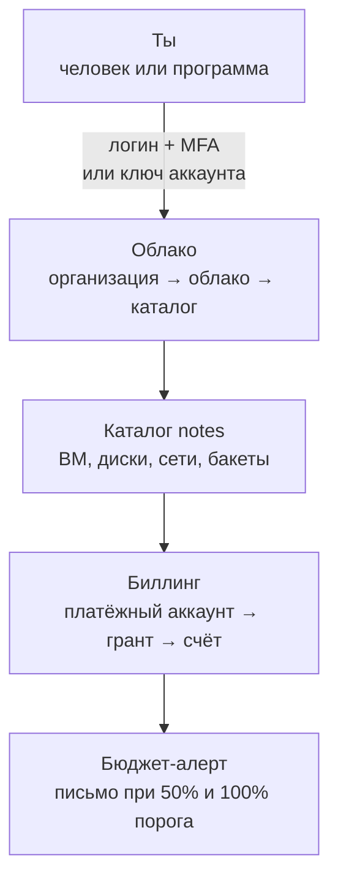
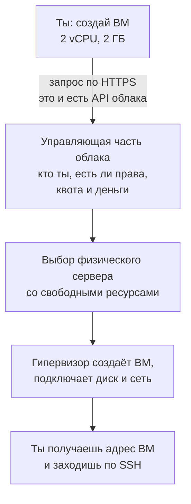
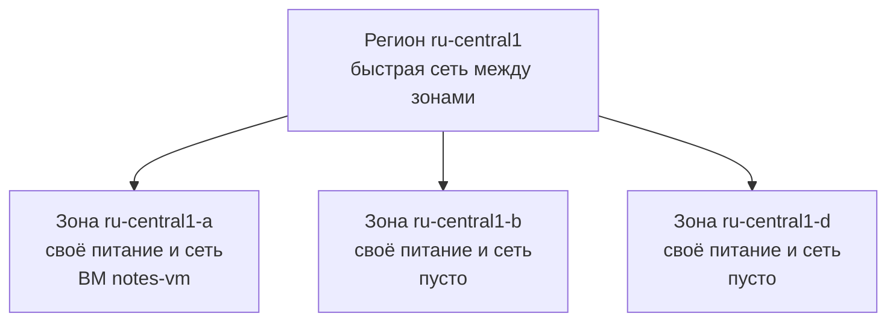
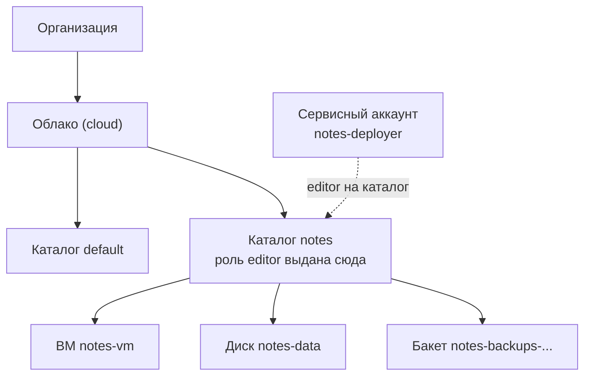
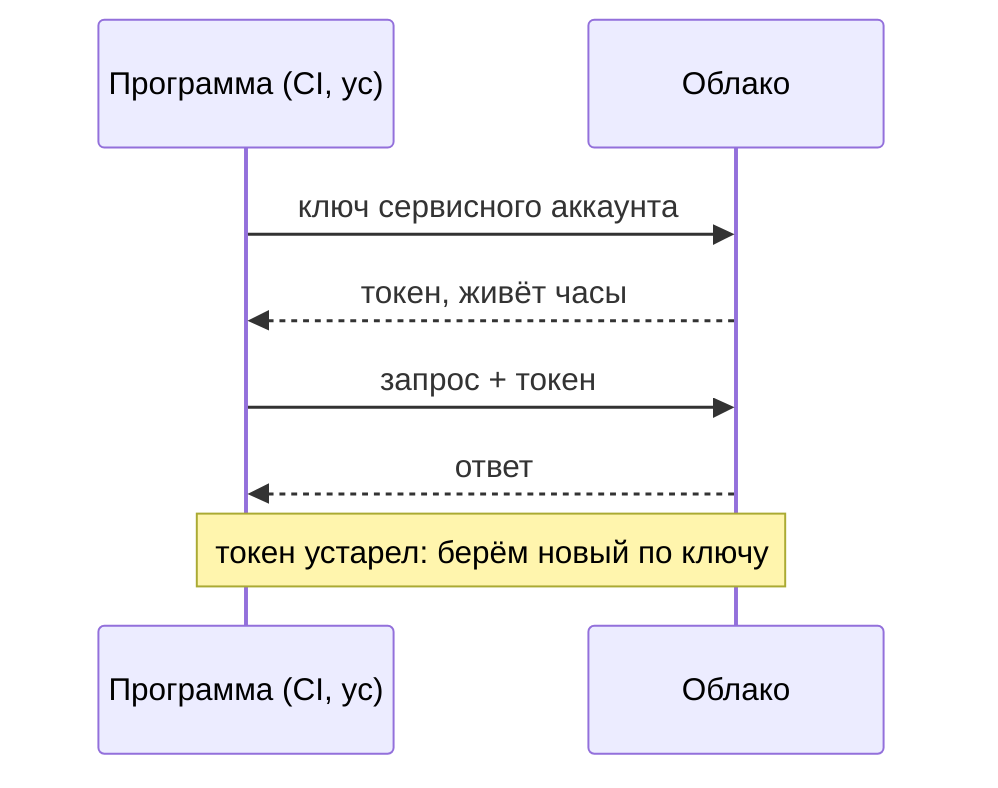

## Зачем это нужно

До сих пор все твои серверы жили на твоём компьютере: виртуальная машина в Multipass, контейнеры в Docker, кластер kind. Настоящие сервисы так не живут. Их запускают в **облаке** (cloud): это чужие серверы, диски и сети в больших дата-центрах, которые ты арендуешь на часы и минуты и которыми управляешь через интернет. Такой запуск нужен, чтобы сервис был доступен всем, а не только твоему ноутбуку. Без облака пришлось бы купить сервер, держать его в серверной и самому чинить железо.

Начнём с байки, которую знает каждый, кто работал с облаком. Новичок на учебном проекте создал виртуальную машину, поиграл час и закрыл ноутбук. Через две недели пришло письмо о счёте втрое больше ожидаемого. Машина стояла остановленной, и он был уверен, что «выключенное не платит». А платили два диска и зарезервированный адрес. Такие истории случаются не от глупости, а от того, что облако не спрашивает «точно ли тебе это ещё нужно». Поэтому в этом уроке мы сначала настраиваем деньги и доступы и только в следующем создаём ВМ.

**ВМ** (виртуальная машина, VM) это компьютер, который целиком существует как программа внутри другого компьютера, как квартира в многоквартирном доме: стены общие, а жильцы друг друга не видят. Ты уже делал такие в Multipass. В облаке ВМ выдают за минуту, и без неё сервису негде было бы работать.

На работе тебя спросят не «что такое IaaS» (модель, где провайдер даёт тебе ВМ, диски и сеть, а всё остальное ты делаешь сам; разберём ниже), а «почему счёт вырос втрое», «кто удалил бакет» (**бакет**, bucket, это хранилище файлов в облаке, как шкаф с ячейками на вокзале: кладёшь файл, получаешь по имени; подробно в [уроке 6.2](02-vm-network-storage.md)) и «чем это отличается от AWS, где мы работали раньше». Первая ошибка новичка в облаке стоит денег или утёкшего ключа.

Ты заведёшь аккаунт Yandex Cloud, поставишь бюджет-алерт (письмо, которое придёт, когда траты дойдут до порога: как сигнал «на карте осталась половина денег»), установишь консольную программу `yc` (управление облаком командами вместо кнопок в браузере), создашь **сервисный аккаунт** (учётку для программы, а не для человека, как служебный пропуск для робота: у него свои права, и его можно отключить, не трогая твой вход) и получишь таблицу соответствий Yandex Cloud и AWS (Amazon Web Services, самое известное облако), по которой часто спрашивают на собеседованиях.

**Каталог** (folder) это папка внутри облака, в которой лежат ресурсы одного проекта: так их проще считать и выдавать права (подробно в теории ниже).

Шаг проекта: аккаунт Yandex Cloud, каталог `notes`, сервисный аккаунт `notes-deployer`, бюджет-алерт и `yc` готовы; сами «Заметки» не меняются (остаются на версии 0.4.1).

## Что нужно знать

- [Урок 1.3: пользователи и права](../01-linux/03-users-permissions.md): принцип минимальных прав тот же, что для пользователя `notes` на сервере: он владеет только своими данными и не является root.
- [Урок 2.1: адреса и маршруты](../02-network/01-addresses-routes.md): публичный адрес виден из интернета, приватный только внутри сети; между ними работает NAT (подмена адресов, как секретарь, который звонит наружу от имени всего офиса).
- [Урок 2.2: порты, TCP и SSH](../02-network/02-ports-tcp-ssh.md): SSH-ключи понадобятся уже в следующем уроке.
- [Урок 3.1: основы Git](../03-git-ci/01-git-basics.md): для задания про ключ в публичном репозитории нужно понимать, что коммит остаётся в истории навсегда.

Облако в этом уроке разбирается с нуля. Если ты ни разу не заходил в консоль облачного провайдера, это нормально.

## Картина целиком

Можно построить собственный конференц-зал: купить землю, здание, стулья, свет. Дорого и долго, зато всё твоё. А можно арендовать зал в бизнес-центре на нужные часы. Тогда здание, охрана и электричество на арендодателе, а ты платишь по счётчику и приносишь только своё выступление. Облако это аренда зала: провайдер (тот, кто сдаёт в аренду) строит дата-центры, ты берёшь ровно столько ресурсов, сколько нужно, и платишь за время использования.

Аренда порождает три вопроса. Кто за что отвечает: если в зале сломался свет, это арендодатель, а если ты забыл выключить проектор, счёт твой. Как арендодатель понимает, что ты это ты: у тебя нужен пропуск, и не всем сотрудникам стоит давать ключи от всех комнат. Вход человека защищает **MFA** (multi-factor authentication, вход в два шага: пароль плюс код из телефона; украденный пароль один не поможет). Раздачу прав называют **IAM** (Identity and Access Management: кто, что и с чем может делать, как список допусков на проходной). И сколько это стоит: счёт растёт молча, если оставить зал арендованным.



На схеме видно путь сверху вниз: сначала доказываешь, кто ты, потом работаешь с ресурсами в каталоге, а всё созданное попадает в счёт, за которым следит алерт.

За урок ты разберёшь каждый блок этой схемы: что такое облако и виртуализация, кто за что отвечает (**IaaS**: провайдер даёт железо, остальное твоё; **PaaS**: провайдер даёт ещё и готовую среду для программы; **SaaS**: готовая программа, ты её только используешь, как почтовый сервис), где физически живут ресурсы (**регион** это город или страна, где стоят дата-центры провайдера, а **зона** это отдельное здание или зал внутри региона со своим питанием), из чего складывается счёт, как устроены права доступа (IAM), чем ключ отличается от пароля и как сопоставить всё это с AWS.

## Теория

### Что такое облако и почему оно так работает

Раньше, чтобы запустить сайт, компания покупала сервер, ставила его в стойку, подключала к сети и питанию. Пока сервер едет и настраивается, проходят недели. Если сайт вдруг стал популярным, докупить сервер быстро нельзя. Если популярность упала, железо простаивает, а деньги уже потрачены. Как избавиться от обеих проблем сразу?

Так же, как ты избавляешься от своей электростанции: подключаешься к общей сети и платишь по счётчику. Облако работает так же: ресурс появляется за минуту и исчезает, когда не нужен, а платишь только за время. Аналогия ломается в одном: счётчик воды не создаёт лишний водопровод, если ты ошибся в скрипте, а в облаке ошибка в скрипте может создать сотни платных ресурсов. Поэтому есть квоты и алерты (разберём ниже).

Внутри дата-центра стоят обычные физические серверы. На каждом работает программа-**гипервизор** (hypervisor): она делит один физический сервер на много изолированных **виртуальных машин** (virtual machine, ВМ). Каждая ВМ думает, что у неё свой процессор, память и диск, хотя на деле это доли общего железа. С виртуальной машиной ты уже работал: Multipass в [уроке 1.1](../01-linux/01-first-server-shell.md) тоже запускал ВМ, только на твоём Mac. Разница в масштабе: провайдер держит десятки тысяч серверов и раздаёт ВМ всем желающим.

Когда ты просишь у облака ВМ, происходит цепочка (vCPU это виртуальное ядро процессора, «рабочие руки» машины; ГБ это объём оперативной памяти):



Главное слово в этой схеме: **API** (application programming interface). Это набор запросов, которые понимает облако. Ты вводишь `yc compute instance create ...`, программа `yc` формирует запрос, добавляет к нему твой токен (подтверждение, что это ты) и отправляет в API. Через полминуты API отвечает: «ВМ создана, вот её идентификатор». То же самое ты сделал бы кнопкой «Создать ВМ» в консоли.

> **Прикинь сам:** на ВМ из примера выше (2 vCPU, 2 ГБ) ты потратил час на эксперименты и сразу удалил её. Сколько ВМ ты арендовал: целый сервер или его долю, и сколько времени?
{: .predict}

Долю одного физического сервера, и ровно один час: ВМ существует как программа на общем железе, а счёт идёт по времени её жизни.

Осторожно: облако не «интернет» и не «магия», это те же серверы, просто чужие и разделённые между клиентами. Виртуальная машина не бесплатна оттого, что «виртуальная»: она занимает реальное железо, и провайдер берёт за него деньги.

> **Главное:** облако это общий парк серверов, который гипервизор нарезает на ВМ по запросу в API, а ты платишь за время жизни ресурса.
{: .key}

Запрос в API можно отправить разными способами. Какими именно?

### Консоль, CLI и API: три способа сказать облаку одно и то же

Создать ВМ можно кнопками в браузере, но кнопки нельзя повторить сто раз одинаково и нельзя положить в Git. Поэтому у облака несколько «дверей» в одну комнату.

Это как заказ в ресторане: можно сказать официанту лично (консоль в браузере), заполнить бланк заказа (CLI, команды в терминале) или отправить заказ через окошко доставки по строгой форме (API, запрос программы). Кухня одна, результат одинаков. Аналогия ломается в одном: официант простит неточность и переспросит, а API и CLI выполнят ровно то, что написано, даже если это ошибка.

Внутри облака работает только API: это набор адресов, по которым программа отправляет запросы по HTTPS («создай ВМ», «покажи диски»). Консоль в браузере и команда `yc` сами отправляют такие запросы за тебя. Поэтому всё, что можно сделать кнопкой, можно сделать командой, а потом и скриптом.

Команда `yc compute instance list` (список ВМ) разворачивается так: `yc` читает твой профиль (кто ты и какой каталог), отправляет в API запрос «покажи ВМ каталога `notes`», получает ответ и печатает таблицей. Если запрос отправлен не от твоего имени, а от сервисного аккаунта, облако проверит права этого аккаунта, а не твои.

Осторожно: «CLI это что-то другое, чем облако». Нет, это тот же API в удобной обёртке. Второе заблуждение: «в консоли безопаснее». Права и счёт одинаковы для всех трёх способов.

> **Прикинь сам:** ты создал ВМ кликами в консоли, а коллега хочет получить такую же. Что ему нужно, чтобы повторить это без твоей помощи?
{: .predict}

Команда `yc` или скрипт: консоль и `yc` отправляют один и тот же запрос в API, поэтому клики можно записать командами и положить в Git, а повторить клики один в один нельзя.

> **Главное:** консоль, `yc` и скрипты это разные способы отправить один и тот же запрос в API, поэтому всё, что делается мышкой, записывается командой.
{: .key}

Мы научились создавать ресурсы. Теперь вопрос, кто отвечает за их работу: ты или провайдер?

### Модели: IaaS, PaaS, SaaS, FaaS и общая ответственность

Не всем нужно управлять ВМ. Одному человеку хочется только базу данных, а как она работает внутри, ему безразлично. Поэтому облачные услуги делят по тому, сколько работы остаётся тебе, а сколько берёт на себя провайдер. От модели зависит, кого будить ночью, когда что-то сломалось.

Это как получить ужин. Купить продукты и готовить самому: вся работа твоя (**IaaS**). Заказать набор для готовки, где продукты нарезаны: ты только готовишь (**PaaS**). Прийти в ресторан: ты только ешь (**SaaS**). Аналогия ломается тем, что в облаке «продукты» ещё и подключены к сети, поэтому вопрос доступа (кто вообще может зайти на кухню) остаётся твоим в любой модели.

Четыре модели:

- **IaaS** (Infrastructure as a Service, инфраструктура как услуга): провайдер даёт ВМ, диск и сеть. Операционная система, обновления, nginx и бэкапы на тебе. Пример: Compute Cloud в Yandex, EC2 в AWS.
- **PaaS** (Platform as a Service, платформа как услуга): провайдер ведёт платформу целиком, ты приносишь код или данные. Пример: Managed PostgreSQL (управляемый PostgreSQL; в AWS это RDS). Провайдер делает бэкапы (запасные копии данных), патчи ОС (обновления системы с исправлениями уязвимостей) и автоматическое переключение на запасной сервер при сбое (failover: как запасной водитель, который садится за руль, когда основной заболел; подробно в [уроке 6.4](04-managed-services.md)). Схему таблиц, индексы и запросы по-прежнему пишешь ты.
- **SaaS** (Software as a Service, программа как услуга): готовая программа, ты только пользуешься: почта, Jira, GitHub.
- **FaaS** (Function as a Service, «функция как услуга», её же называют serverless, «бессерверные»): ты приносишь одну функцию кода, она запускается по событию, платишь за число вызовов. Пример: Cloud Functions в Yandex, AWS Lambda. Серверы там, конечно, есть, просто ты о них не думаешь.

Разделение работы называется **моделью общей ответственности** (shared responsibility model). Граница проходит так: провайдер отвечает за безопасность самого облака (здания, железо, гипервизор), а ты за то, что запускаешь в облаке: правила сетевого доступа, права пользователей, данные и обновления ОС на своих ВМ.

| | IaaS (ВМ) | PaaS (Managed PG) | SaaS (почта) |
|---|---|---|---|
| данные, доступы | ТЫ | ТЫ | ТЫ |
| схема БД, запросы | ТЫ | ТЫ | - |
| приложение | ТЫ | ТЫ (твой код) | провайдер |
| runtime, ПО | ТЫ | провайдер | провайдер |
| ОС и патчи | ТЫ | провайдер | провайдер |
| железо, гипервизор | провайдер | провайдер | провайдер |

Читай таблицу по столбцам: чем правее модель, тем больше строк занято провайдером. Но две верхние строки (данные и доступы, а для баз ещё схема и запросы) остаются твоими в любой колонке.

Возьмём «Заметки». Приложение `app.py` и nginx на ВМ: это IaaS, ты патчишь Ubuntu, следишь за диском, настраиваешь nginx. PostgreSQL в контейнере на той же ВМ: тоже твоя работа целиком (бэкап, обновление версии, восстановление). Тот же PostgreSQL как Managed: провайдер делает бэкапы по расписанию и обновляет ОС под базой. Но если запрос `SELECT` без индекса делает БД медленной, это по-прежнему твоя зона: провайдер отвечает за то, что база жива, а не за то, что твой запрос умён.

> **Прикинь сам:** сервис «Заметки» работает с Managed PostgreSQL. В три часа ночи провайдер обновил ОС под базой, а через час у тебя в логах пошли ошибки «таймаут запроса» из-за запроса без индекса. Кто виноват и кто чинит?
{: .predict}

Чинишь ты: обновление ОС было работой провайдера и закончилось успешно (база жива), а медленный запрос это схема и запросы, то есть твоя зона. Поэтому первым делом смотри свой запрос, а не пиши в поддержку.

Осторожно: «провайдер безопасен, значит, я в безопасности». Почти все громкие утечки из облака это открытый всем бакет или утёкший ключ, а не взлом провайдера. Строка «доступы и данные» в таблице всегда твоя.

> **Главное:** чем выше модель (IaaS, PaaS, SaaS), тем больше работы берёт провайдер, но данные, доступы и качество своих запросов остаются на тебе всегда.
{: .key}

Мы выяснили, кто за что отвечает. А где физически живут ресурсы и что будет, если дата-центр потеряет питание?

### Регионы, зоны доступности, квоты и точка отказа

Дата-центр может остаться без питания, у него может порваться оптика, в нём может случиться пожар. Если всё твоё живёт в одном здании, сервис умрёт вместе с ним. Поэтому облако раскладывает ресурсы по нескольким физически разным площадкам, и ты выбираешь, где и сколько копий держать.

Это сеть магазинов в городе: один закрылся на ремонт, остальные работают. Но если у сети один магазин, ремонт останавливает бизнес. Аналогия ломается на расстоянии: соседние зоны облака связаны быстрой сетью, и разница в задержке между ними доли миллисекунды, а не «поездка через город».

**Регион** (region) это географическая область, например `ru-central1` в Yandex Cloud. В регионе несколько **зон доступности** (availability zone, AZ): отдельные площадки со своим питанием и сетью. В Yandex Cloud это `ru-central1-a`, `ru-central1-b` и `ru-central1-d`; актуальный список смотри в документации, он может меняться. Отказ одной зоны не должен ронять другие.



На схеме у «Заметок» одна ВМ, и она стоит только в зоне `a`. Две другие зоны работают, но сервису не помогают: у него там нет копий.

Одна ВМ живёт в одной зоне. Поэтому «сервис на одной ВМ» остаётся **единой точкой отказа** (SPOF, single point of failure): место, где поломка одного элемента останавливает всё. Даже если зона надёжная, ВМ нужно перезагружать и обновлять. Чтобы пережить отказ, нужны минимум две ВМ в разных зонах и балансировщик, который направляет запросы на живую.

**Квота** (quota) это лимит провайдера на число ресурсов в твоём облаке: сколько vCPU (виртуальных процессорных ядер: «рабочих рук» ВМ), дисков, публичных адресов. Квоты защищают тебя и провайдера: ошибка в скрипте не создаст тысячу ВМ. Квоту можно поднять запросом в поддержку, но делать это нужно заранее, а не во время инцидента.

**vCPU** (virtual CPU) это виртуальное ядро процессора: доля реального ядра, которую гипервизор отдаёт ВМ. У части тарифов есть «гарантированная доля» (в Yandex `core-fraction`): ВМ с долей 20% гарантированно получает пятую часть ядра, а всплеском может использовать больше, если сосед не занят. Это дешевле, но ВМ будет тормозить под постоянной нагрузкой. Память измеряется в ГБ RAM, диск в ГБ, причём HDD дешевле, а SSD быстрее.

Пример: у «Заметок» одна ВМ в зоне `ru-central1-a`. Зона на два часа потеряла питание. Что видит пользователь: сайт не открывается. Что видишь ты: ВМ в консоли недоступна, и сделать ничего нельзя, надо ждать. Если бы вторая ВМ стояла в `ru-central1-b`, балансировщик перекинул бы трафик на неё. Для учебных задач курса мы держим одну ВМ (дешевле), но на собеседовании честно называй её SPOF.

> **Прикинь сам:** у «Заметок» две ВМ, но обе в `ru-central1-a`. Переживёт ли сервис отказ этой зоны?
{: .predict}

Нет: обе ВМ в одной зоне, при её отказе недоступны обе. Нужны ВМ в разных зонах.

Осторожно: регион и зону путают, а зона это часть региона. Ещё путают «надёжная зона» и «отказоустойчивый сервис»: надёжность зоны провайдера не заменяет вторую копию у тебя.

> **Главное:** регион делится на зоны, ВМ живёт в одной зоне, поэтому одна ВМ это SPOF, а отказоустойчивость дают копии в разных зонах.
{: .key}

С надёжностью разобрались. Теперь о том, что обычно ломает новичка: о деньгах.

### Деньги: биллинг, грант, бюджет-алерт, метки

Облако отдаёт ресурсы по одному запросу без проверки, нужно ли тебе их держать. Забытая ВМ будет тихо расходовать деньги месяцами. Значит, деньги нужно защищать с первого дня.

Это такси с включённым счётчиком: пока машина ждёт у подъезда, счётчик идёт. Аналогия ломается в том, что таксист напомнит о себе, а облако молчит, пока ты сам не поставишь оповещение.

**Биллинг** (billing) это учёт расходов. Он привязан к **платёжному аккаунту** (billing account): к нему подключена карта, и с него списываются деньги за все ресурсы. В облаке платят за использование:

- минуты работы ВМ (за vCPU и RAM);
- гигабайт-месяцы диска: диск стоит денег, пока существует, включён он или нет;
- исходящий трафик (egress): данные, которые уходят из облака в интернет; входящий трафик обычно бесплатен;
- публичные IP-адреса: отдельная строка счёта;
- запросы и объём в объектном хранилище.

Отсюда три главные причины неожиданных счетов:

1. **Забытые ресурсы.** Остановленная ВМ не платит за vCPU и RAM, но диск и зарезервированный публичный IP продолжают списываться.
2. **Исходящий трафик**, о котором никто не думал: например, сервис отдаёт много файлов.
3. **Снапшоты** (snapshot, снимок диска) и **бакеты** (bucket, хранилище файлов), которые копятся без срока хранения.

Защита из трёх слоёв:

- **Грант** (grant): бонусные деньги на пробный период; у нового аккаунта Yandex Cloud он обычно есть, размер и срок смотри в «Биллинге», они меняются. Курс рассчитан так, чтобы уложиться в грант, если удалять ресурсы после уроков.
- **Бюджет-алерт** (budget alert): уведомление на почту, когда расходы достигли порога. Он только сообщает, но ресурсы сам не останавливает. Ставим порог 500 руб и письма на 50% и 100%.
- **Метки** (labels): пары `ключ=значение` на ресурсах, например `project=notes`, `owner=<твоё имя>`. По ним в счёте видно, что чьё и что можно удалить.

В сценарии «Сломай и почини» ниже ты увидишь остановленную ВМ, два диска и зарезервированный адрес. ВМ не платит за процессор, но 50 ГБ загрузочного диска, 200 ГБ диска данных и адрес тарифицируются постоянно. Самая заметная строка там диск на 200 ГБ: цена диска растёт вместе с размером. Точные суммы сверяй в калькуляторе Yandex Cloud, тарифы меняются.

> **Прикинь сам:** ты остановил ВМ и ушёл в отпуск на две недели. Что продолжает списывать деньги?
{: .predict}

Загрузочный диск и любые другие диски, зарезервированный публичный адрес, а также снапшоты и бакеты, если они есть. За vCPU и RAM остановленной ВМ платы нет.

Как искать причину роста счёта: открой детализацию расходов и сгруппируй её по сервису, затем по метке. Так за минуту видно, что выросло: вычисления (ВМ), диски, трафик или хранилище. Если меток нет, придётся угадывать по именам и времени создания, поэтому метки ставят в момент создания ресурса, а не «потом». Ещё одна привычка: раз в неделю просматривать список ресурсов каталога (ВМ, диски, адреса, снапшоты, бакеты) и удалять всё, что не узнаёшь. Это называется инвентаризацией.

Правило курса: каждое задание с платными ресурсами заканчивается чек-листом удаления. Пока он не выполнен, задание не закончено.

Осторожно: «остановил ВМ, значит, не плачу». Плата за процессор действительно прекращается, но за диск и адрес нет. И «алерт защитит»: алерт лишь пишет письмо, а решает человек.

> **Главное:** платишь за всё, что существует (диски, адреса, снапшоты, бакеты), а не только за работающие ВМ; алерт сообщает, а удаляешь ты.
{: .key}

Деньги защищены. Остался вопрос, кому в облаке можно трогать ресурсы.

### Иерархия ресурсов и IAM: кто что может

В облаке работают десятки людей и программ: разработчик смотрит на логи, CI (система автоматической сборки, тема 3) выкладывает новую версию, бухгалтер смотрит счета. Дать всем один общий пароль от всего нельзя: если он утечёт или кто-то ошибётся, пострадает всё. Нужна система, где каждый получает ровно те права, которые нужны для его дела.

Это пропуска в офисе. У курьера пропуск только до ресепшена, у разработчика до его этажа, у директора до всех комнат. Если пропуск потерян, блокируют один пропуск, а не меняют все замки. Аналогия ломается на количестве: в облаке «пропуск» можно выдать на одну комнату, на этаж или на здание, и выбор уровня это отдельная задача.

Система называется **IAM** (Identity and Access Management, управление личностями и доступом). Она отвечает на вопрос: кто (субъект) может что (действие) делать над чем (ресурс). Из чего она состоит:

- **Пользователь** (user): человек. Входит с паролем и вторым фактором.
- **MFA** (multi-factor authentication, многофакторная аутентификация): вход по двум разным подтверждениям, например пароль и код из приложения. Если пароль украли, без второго фактора войти не получится.
- **Сервисный аккаунт** (service account): «пользователь для программы»: для CI, скрипта или ВМ. Пароля у него нет, он входит по ключу или токену.
- **Роль** (role): именованный набор прав. Например, `compute.viewer` позволяет только смотреть ВМ, а `editor` менять почти всё.
- **Привязка роли** (access binding): запись «субъект X имеет роль R на ресурсе Y».

Ресурсы в Yandex Cloud вложены друг в друга: **организация**, в ней **облако** (cloud), в нём **каталог** (folder), в каталоге сами ресурсы (ВМ, диски, сети). Права, выданные на верхнем уровне, действуют на всё ниже: роль на каталог работает на все ресурсы в нём.



Пунктирная стрелка показывает привязку роли: `notes-deployer` может менять всё внутри каталога `notes`, но не видит и не меняет каталог `default`.

У каждого ресурса есть два названия: **имя** (`notes`, его выбираешь ты, удобно людям) и **идентификатор** (id, например `b1g...` у каталога или `aje...` у сервисного аккаунта; его выдаёт облако, он уникален и не меняется). Команды `yc` принимают и то и другое: `--folder-name notes` или `--folder-id b1g...`. Имена могут повторяться в разных каталогах, идентификаторы никогда, поэтому в выводе и логах ты видишь идентификаторы, а в командах удобнее имена.

**Принцип наименьших привилегий** (least privilege): выдай ровно то, что нужно для задачи, и на минимальном уровне (на каталог, а не на всё облако). Ровно как для пользователя `notes` на Linux в [уроке 1.3](../01-linux/03-users-permissions.md): он владеет только своими данными и не root. Мы создадим каталог `notes` и всё курсовое положим в него: удалить каталог значит удалить всё сразу, это удобная уборка.

CI-скрипту нужно только загружать бэкапы в один бакет. Есть три варианта: `admin` на облако, `editor` на каталог, узкая роль на бакет. С первым вариантом скомпрометированный ключ отдаёт злоумышленнику всё облако: он запустит майнеры криптовалют на твой счёт, удалит бакеты, прочитает данные. Со вторым ущерб ограничен одним каталогом. С третьим только одним бакетом. Чем меньше права, тем дешевле ошибка.

> **Прикинь сам:** у `notes-deployer` роль `editor` на каталог `notes`. Сможет ли он удалить ВМ в каталоге `default`?
{: .predict}

Нет: привязка роли действует вниз по иерархии от каталога `notes`, а соседний каталог ей не подчиняется.

Осторожно: роль и субъект путают. Роль это набор прав, она ничего не делает, пока не привязана к кому-то. Ещё путают «выдать на облако» и «выдать на каталог»: первое действует на всё облако, включая чужие каталоги.

> **Главное:** IAM отвечает на вопрос «кто, что и над чем может», права выдаются ролями на каталог и ниже, и чем уже права, тем дешевле ошибка.
{: .key}

Сервисному аккаунту нужен способ доказать, что это он. Как он это делает?

### Ключи, токены и секреты: как программа доказывает, кто она

Когда `yc` или CI отправляют запрос, облаку нужно понять, от кого он. Человек вводит пароль и код, но программа не может «набрать» их. Ей нужно постоянное подтверждение, которое хранится в файле.

Это ключ от квартиры, который ты отдал курьеру. Он откроет дверь без тебя, но кто угодно, нашедший ключ, тоже откроет. Аналогия ломается в том, что в облаке ключ можно мгновенно отозвать, а замок менять не нужно.

Ключ сервисного аккаунта это JSON-файл с закрытой частью пары ключей (такую пару ты уже создавал для SSH в [уроке 2.2](../02-network/02-ports-tcp-ssh.md)). По нему программа получает **токен** (token): короткоживущую строку, которую облако принимает как подтверждение личности. Токен живёт часы и устаревает сам, а ключ живёт, пока его не отзовут. Поэтому ключ опаснее и хранить его нужно как пароль.



На схеме ключ участвует один раз, чтобы получить токен, а все остальные запросы идут с токеном. Украденный токен перестаёт работать сам, а украденный ключ даёт новые токены, пока его не отозвали.

Правила хранения секрета:

1. Никогда не класть в репозиторий. Коммит остаётся в истории git, даже если файл потом удалить.
2. Хранить вне рабочей папки проекта (`~/.config/notes-cloud/`), права `600` (читать и писать может только владелец, [урок 1.3](../01-linux/03-users-permissions.md)).
3. В `.gitignore` добавить шаблон `*-key.json` как страховку.
4. Один ключ на одну задачу, чтобы отзывать точечно.

Ты закоммитил `notes-deployer-key.json` и запушил в публичный репозиторий, потом удалил файл следующим коммитом. Кажется, что ключа больше нет. Но `git log -p -S <часть ключа>` находит его в старом коммите, а боты, сканирующие GitHub, находят такие ключи за минуты. Поэтому считай ключ скомпрометированным (украденным) сразу. Разбор порядка действий в разделе «Сломай и почини».

Осторожно: «удалил файл, значит, ключа нет». И «приватный репозиторий безопасен для ключей»: репозиторий видят все, у кого есть доступ, а ключи в истории остаются навсегда.

> **Прикинь сам:** файл статического ключа случайно попал в публичный репозиторий. Что делаешь первым?
{: .predict}

Отзываешь (удаляешь) ключ в облаке и выпускаешь новый: удаление файла из git не поможет, пока ключ действует, его могли уже скопировать. Затем проверяешь журнал использования ключа.

> **Главное:** ключ это постоянный секрет, токен его короткоживущая производная; ключ не кладут в git, хранят вне проекта с правами `600` и при утечке отзывают первым делом.
{: .key}

Права и секреты разобраны. Осталось связать всё с тем, что ты увидишь в чужих статьях и на собеседованиях: с AWS.

### Соответствие AWS

AWS самое распространённое облако. Документация, статьи и собеседования часто написаны в терминах AWS, даже если компания работает в Yandex Cloud или другом. Принципы те же, названия разные, поэтому полезно знать «словарь перевода».

| Задача | Yandex Cloud | AWS | Что важно помнить |
|---|---|---|---|
| Виртуальная машина | Compute Cloud (`yc compute instance`) | EC2 | образ, тип, диск, зона; у EC2 ещё instance profile: доступ ВМ к API без ключей |
| Сеть и подсети | VPC (`network`, `subnet`) | VPC | подсеть привязана к зоне |
| Фаервол ВМ | группа безопасности (security group) | Security Group | у обоих stateful (помнит соединения), правила только разрешающие |
| Объектное хранилище | Object Storage | S3 | оба S3-совместимы по API, ключи доступа статические |
| Управляемая БД | Managed Service for PostgreSQL | RDS | бэкапы, патчи и реплики на провайдере |
| Управляемый Kubernetes | Managed Service for Kubernetes | EKS | control plane ведёт провайдер |
| Доступы | IAM, роли, сервисные аккаунты | IAM, роли, policies, instance profile | у AWS права описываются JSON-политиками |
| Функции | Cloud Functions | Lambda | платишь за вызовы |
| DNS | Cloud DNS | Route 53 | публичные и приватные зоны |
| Балансировщик | Network / Application Load Balancer | NLB / ALB | L4 и L7 соответственно (L4 раскидывает соединения по адресу и порту, не читая содержимое; L7 читает запрос HTTP и решает по адресу страницы; подробно в [уроке 6.4](04-managed-services.md)) |

**S3** (Simple Storage Service) это объектное хранилище от Amazon: ты кладёшь файлы («объекты») в «бакеты» и достаёшь их по HTTP. Его API стал стандартом, и Yandex Object Storage понимает те же запросы: поэтому программа для S3 работает и с Yandex, если поменять адрес (endpoint) и ключи. **L4 и L7** это уровни сетевой модели: L4 балансировщик смотрит на адрес и порт, L7 разбирает содержимое HTTP-запроса (путь, заголовки).

Главное различие в IAM. В Yandex ты выдаёшь готовую роль субъекту на каталог. В AWS права описываются **политикой** (policy) в формате JSON, и её нужно уметь читать. Разбор в задании 4.

Как читать политику AWS: внутри `Statement` (утверждение) стоят четыре поля: `Effect` (`Allow` разрешить или `Deny` запретить), `Action` (что делать: `s3:GetObject` это чтение файла), `Resource` (над чем, записывается как ARN: уникальный адрес ресурса в AWS) и необязательный `Sid` (метка для человека). Всё, что не разрешено явно, запрещено. Явный `Deny` побеждает любой `Allow`.

> **Прикинь сам:** коллега просит «дать доступ как в AWS S3, роль ReadOnly, но в Yandex». Как это делается?
{: .predict}

Выдать сервисному аккаунту или пользователю роль `storage.viewer` (только чтение) на каталог или на нужный бакет. В Yandex не нужно писать JSON-политику: используется готовая роль.

Осторожно: сервисы похожи, но не одинаковы. Названия и цены у провайдеров разные, а самая большая работа при переезде это IAM: JSON-политики превращаются в роли.

> **Главное:** сервисы Yandex Cloud и AWS сопоставляются один к одному, S3 API работает в обоих, а главная разница в правах: в Yandex готовые роли, в AWS JSON-политики.
{: .key}

Остался последний вопрос: что дешевле и как не застрять у одного провайдера?

### Цена и привязка: TCO и vendor lock-in

Облако кажется дешёвым: ВМ стоит рубли в час. Но полная стоимость складывается не только из цены ВМ, и не всё облако выгоднее собственных серверов. Руководство спрашивает у SRE, что дешевле и как не застрять у одного провайдера.

**TCO** (total cost of ownership, полная стоимость владения) это вся цена, а не только строка счёта: железо и его амортизация, электричество, помещение, зарплата людей, простой при поломке. Свои серверы (on-premises, в своём дата-центре) выгоднее на стабильной большой нагрузке, где железо загружено на 70% и больше годами. Облако выгоднее при неравномерной нагрузке, быстром старте и когда не хочется держать команду на железе.

**Vendor lock-in** (привязка к поставщику) это ситуация, когда уйти от провайдера дорого, потому что ты использовал его уникальные сервисы (свои очереди, проприетарные функции, специальные базы данных). Чем «умнее» сервис, тем дороже уйти. Снизить привязку помогают стандарты: контейнеры, Kubernetes, S3-совместимое API, PostgreSQL вместо проприетарной БД. Поэтому «Заметки» в контейнере с обычным PostgreSQL можно перенести в любое облако.

> **Прикинь сам:** стартап запускает продукт и не знает, сколько будет пользователей. Свой сервер или облако?
{: .predict}

Облако: нагрузка неизвестна и неравномерна, а облако позволяет быстро начать и менять размер. Когда нагрузка стабилизируется и вырастет, можно пересчитать TCO.

Осторожно: «облако всегда дешевле». Не всегда: постоянная большая нагрузка часто дешевле на своём железе. И «lock-in это всегда плохо»: иногда управляемый сервис экономит месяцы работы, и привязка осознанная цена.

> **Главное:** считай полную стоимость владения, а не цену одной ВМ, и выбирай привязку к провайдеру осознанно.
{: .key}

## Практика

Как не потратить деньги: работаем в отдельном каталоге `notes`, ставим бюджет-алерт на 500 руб, в конце задания 5 есть чек-лист удаления. Ресурсы этого урока бесплатны (аккаунт, каталог, сервисный аккаунт). Если облака у тебя нет, задания 3 и 4 выполняются локально, а остальные прочитай и повтори у любого провайдера с грантом (Cloud.ru, VK Cloud): принципы те же.

Интерфейс консоли и вывод `yc` в этом уроке не запускались автором (нет доступа к облаку): команды и формат вывода взяты из документации Yandex Cloud CLI. Идентификаторы (`b1g...`, `aje...`) у тебя будут другими, названия столбцов могут слегка отличаться в твоей версии `yc`.

### Задание 1. Аккаунт, MFA и бюджет-алерт

**Цель:** завести аккаунт, включить второй фактор и поставить защиту от неожиданного счёта.

**Предскажи:** алерт на 500 руб останавливает ВМ при превышении порога?

<details markdown="1">
<summary>Ответ</summary>

Нет. Алерт только шлёт уведомление, ВМ продолжит работать и платить. Поэтому он нужен вместе с чек-листом удаления.

</details>

**Шаги:**

1. Открой консоль `console.yandex.cloud`, войди через Яндекс ID и включи двухфакторную аутентификацию в настройках Яндекс ID (`id.yandex.ru`, раздел про безопасность и вход).
2. Привяжи платёжный аккаунт и активируй пробный грант, если он доступен. В «Биллинге» проверь баланс и срок гранта.
3. В «Биллинге» создай бюджет: расходы, порог 500 руб на месяц, письма на 50% и 100%.
4. Создай каталог `notes` (кнопка «Создать каталог» в облаке).

**Что должно получиться:**

```text
Биллинг: платёжный аккаунт активен, грант виден
Бюджет: notes-budget, порог 500 RUB/мес, уведомления 50% и 100%
Каталоги: default, notes
```

Это описание того, что ты должен увидеть в консоли, а не вывод команды.

**Объясни себе:** почему бюджет-алерт не заменяет удаление ресурсов? Что даст второй фактор, если пароль утёк?

**Типичные ошибки:**

- `Billing account is not active`: способ оплаты не подтверждён: заверши привязку в разделе «Биллинг».

### Задание 2. Установка `yc` CLI

**Цель:** управлять облаком из терминала.

**Предскажи:** что хранится на диске после `yc init`?

<details markdown="1">
<summary>Ответ</summary>

Профиль в `~/.config/yandex-cloud/config.yaml`: токен, идентификаторы облака и каталога, зона по умолчанию. Токен береги как пароль.

</details>

**Шаги:**

1. Скачай установочный скрипт в файл (а не `curl ... | bash`, когда чужой код запускается сразу и вслепую), прочитай и только потом запусти. Адрес может измениться: сверься с официальной документацией Yandex Cloud CLI.

Разберём команды. `curl -fsSL <адрес> -o yc-install.sh`: `curl` скачивает страницу по адресу; `-f` не сохраняет страницу с ошибкой, `-s` молчит, `-S` всё же показывает ошибку, `-L` идёт по перенаправлениям, `-o` сохраняет в файл. `less` листает файл (выход клавишей `q`). `bash yc-install.sh -n` запускает скрипт, `-n` говорит ему не править твой `~/.bashrc` (файл, который читает оболочка при старте). `export PATH="$HOME/yandex-cloud/bin:$PATH"` добавляет папку с `yc` в список мест, где оболочка ищет команды (переменная `PATH`, [урок 1.6](../01-linux/06-bash-basics.md)): только для текущего окна терминала.

```bash
# скачиваем скрипт в файл, не запуская
curl -fsSL https://storage.yandexcloud.net/yandexcloud-yc/install.sh -o yc-install.sh
# читаем, что он собирается делать
less yc-install.sh
# запускаем без правки .bashrc и подключаем yc в текущую сессию
bash yc-install.sh -n
export PATH="$HOME/yandex-cloud/bin:$PATH"
yc version
```

`yc version` печатает версию программы (что-то вроде `Yandex Cloud CLI <номер> linux/amd64`). У тебя номер будет свой.

2. Инициализируй профиль: `yc init` спросит про вход (откроет браузер или попросит токен), облако, каталог и зону. Выбери каталог `notes` и зону `ru-central1-a`. `yc config list` покажет получившиеся настройки, `yc resource-manager folder list` перечислит каталоги.

```bash
yc init
yc config list
yc resource-manager folder list
```

**Что должно получиться:**

```text
token: y0_AgAAAA...
cloud-id: b1g...
folder-id: b1g...
compute-default-zone: ru-central1-a
```

**Как читать вывод:** `token` это то, чем `yc` доказывает облаку, что это ты (он длинный, здесь обрезан), `cloud-id` и `folder-id` идентификаторы облака и каталога, с которыми работают команды по умолчанию, `compute-default-zone` зона, где будут создаваться ВМ, если не указать другую. Последняя команда покажет каталоги `notes` и `default`. Вывод `yc config list` не публикуй: в нём токен.

**Объясни себе:** зачем читать скрипт перед запуском? Что случится, если по умолчанию выбран не тот каталог?

**Типичные ошибки:**

- `bash: yc: command not found`: каталог не в `PATH`: выполни `export PATH="$HOME/yandex-cloud/bin:$PATH"` и добавь эту строку в `~/.bashrc`.

> Не понимаешь строку из вывода `yc config list` или ошибку `PermissionDenied`? Скопируй их в нейросеть **без значения токена** (замени его на `<токен>`) и спроси, что они значат. Проверь ответ по документации Yandex Cloud CLI.
{: .ai}

### Задание 3. Стоимость стека «Заметок»

**Цель:** прикинуть цену до создания ресурсов и сопоставить стек с моделями.

**Предскажи:** какая строка самая дорогая: ВМ, диск, публичный IP или Managed PostgreSQL?

<details markdown="1">
<summary>Ответ</summary>

Managed PostgreSQL: в цену входят вычисления, диск и работа провайдера над бэкапами и failover. Она дороже БД в контейнере на ВМ, но снимает операционную работу. Точные суммы зависят от тарифа, проверь калькулятор.

</details>

**Шаги:**

1. В калькуляторе Yandex Cloud (`yandex.cloud/ru/prices`) найди цены: ВМ 2 vCPU и 2 ГБ RAM, диск SSD 20 ГБ, публичный IPv4, Managed PostgreSQL минимального класса. Запиши дату просмотра: цены меняются.
2. Подставь цифры в скрипт. Числа ниже **условные, учебные**, а не настоящие тарифы: замени их своими.

Разбор скрипта: `vm=1500; disk=400; ip=300; pg=3500` создаёт четыре переменные (без пробелов вокруг `=`, [урок 1.6](../01-linux/06-bash-basics.md)); `$((vm + disk + ip))` арифметика в bash: вычисляет сумму и подставляет число в строку.

```bash
# цены за месяц в рублях (условные, замени на актуальные с сайта)
vm=1500; disk=400; ip=300; pg=3500
echo "всё на одной ВМ: $((vm + disk + ip)) руб/мес"
echo "ВМ + Managed PostgreSQL: $((vm + disk + ip + pg)) руб/мес"
```

3. Запиши модель для каждого компонента: app.py и nginx (IaaS), PostgreSQL в контейнере (IaaS) или Managed (PaaS), бэкапы в бакете, почта для алертов (SaaS).

**Что должно получиться** (с условными числами выше; проверено запуском):

```text
всё на одной ВМ: 2200 руб/мес
ВМ + Managed PostgreSQL: 5700 руб/мес
```

**Как читать вывод:** первая строка показывает вариант «всё сам на одной ВМ», вторая добавляет управляемую базу. Разница между ними цена того, что провайдер берёт на себя бэкапы и failover. С твоими настоящими числами вывод изменится.

**Объясни себе:** что важнее в разнице: деньги или время дежурного на бэкапы и патчи БД? Какая строка счёта растёт даже при остановленной ВМ?

**Типичные ошибки:**

- `bash: vm: command not found`: пробелы вокруг `=`: пиши `vm=1500` без пробелов.

### Задание 4. Читаем IAM-политику AWS и роли Yandex

**Цель:** прочитать JSON-политику доступа и сопоставить с ролями Yandex. Облако не нужно.

**Предскажи:** политика даёт `s3:ListBucket` и `s3:GetObject` на бакет `notes-backups`. Сможет ли пользователь записать туда файл?

<details markdown="1">
<summary>Ответ</summary>

Нет. Всё, что не разрешено явно, запрещено (неявный deny). Два `Resource`: сам бакет для листинга (`ListBucket`) и объекты внутри для чтения (`GetObject`, поэтому `/*`).

</details>

**Шаги:**

1. Сохрани политику и проверь, что JSON валиден. `cat > файл <<'JSON' ... JSON` записывает всё между строками-маркерами в файл (кавычки вокруг `JSON` отключают подстановки внутри). `python3 -m json.tool файл` читает JSON и печатает его, при ошибке синтаксиса сообщает строку; `> /dev/null` прячет печать, оставляя только ошибки; `&& echo` выводит «JSON ok» только при успехе.

```bash
mkdir -p ~/notes/docs && cd ~/notes
cat > docs/backup-read-policy.json <<'JSON'
{
  "Version": "2012-10-17",
  "Statement": [
    {
      "Sid": "ReadBackups",
      "Effect": "Allow",
      "Action": ["s3:ListBucket", "s3:GetObject"],
      "Resource": ["arn:aws:s3:::notes-backups", "arn:aws:s3:::notes-backups/*"]
    }
  ]
}
JSON
python3 -m json.tool docs/backup-read-policy.json > /dev/null && echo "JSON ok"
```

2. Запиши, какая роль Yandex ближе: `storage.viewer` на каталог или бакет. Запись даёт `storage.editor`, полный доступ `storage.admin`. Файл `docs/backup-read-policy.json` оставь как учебный, коммитить его не обязательно.

**Что должно получиться:**

```text
JSON ok
```

**Как читать вывод:** `JSON ok` значит, что синтаксис верен. Если бы файл был сломан, вместо этого появилась бы ошибка с номером строки и не было бы слов `JSON ok`.

**Объясни себе:** что изменится, если в `Action` написать `s3:*`? Чем выдача готовой роли в Yandex отличается от политики в AWS?

**Типичные ошибки:**

- `Expecting ',' delimiter: line 8 column 7`: пропущена запятая: найди строку из ошибки и добавь.
- `Expecting property name enclosed in double quotes`: лишняя запятая в конце списка или одинарные кавычки: JSON допускает только двойные и без висящих запятых.

> Выдаёшь роль сервисному аккаунту и сомневаешься, какая нужна? Спроси нейросеть, какая минимальная роль нужна для задачи, а потом найди её в документации ролей: нейросеть часто называет роли, которых нет.
{: .ai}

### Задание 5. Шаг проекта: сервисный аккаунт и ключ

**Цель:** создать сервисный аккаунт с минимальными правами для следующих уроков и не дать ключу попасть в репозиторий.

**Предскажи:** какую роль на каталог выдать аккаунту, который в уроке 6.2 создаёт ВМ, сети и диски: `viewer`, `editor` или `admin`?

<details markdown="1">
<summary>Ответ</summary>

`editor` на каталог `notes`. `admin` лишняя: она управляет доступами, для ВМ не нужна. `viewer` мало: создавать нельзя. Выдаём на каталог, не на облако.

</details>

**Шаги:**

1. Создай аккаунт и выдай роль только на каталог `notes`. Флаги: `--name` имя аккаунта, `--role` роль, `--service-account-name` кому выдаём. `\` в конце строки переносит команду на следующую строку.

```bash
yc iam service-account create --name notes-deployer --folder-name notes
# привязка роли на каталог, не на облако
yc resource-manager folder add-access-binding notes \
  --role editor --service-account-name notes-deployer
yc resource-manager folder list-access-bindings notes
```

2. Создай ключ вне репозитория и закрой права: `chmod 600` оставляет доступ только владельцу.

```bash
mkdir -p ~/.config/notes-cloud
yc iam key create --service-account-name notes-deployer \
  --output ~/.config/notes-cloud/notes-deployer-key.json
chmod 600 ~/.config/notes-cloud/notes-deployer-key.json
```

3. Защити репозиторий и проверь чек-лист удаления. `printf '%s\n' a b >> файл` дописывает строки `a` и `b` в конец файла; `sort -u ... -o` убирает повторы, если команду запустили дважды; `git check-ignore -v имя` показывает, какое правило `.gitignore` игнорирует файл.

```bash
cd ~/notes
printf '%s\n' '*-key.json' 'key.json' >> .gitignore
sort -u .gitignore -o .gitignore
git check-ignore -v test-key.json
# платных ресурсов быть не должно
yc compute instance list --folder-name notes
yc compute disk list --folder-name notes
yc vpc address list --folder-name notes
```

**Что должно получиться:**

```text
ROLE ID  SUBJECT TYPE     SUBJECT ID
editor   serviceAccount   aje...
.gitignore:1:*-key.json	test-key.json
```

**Как читать вывод:** первая часть это строка привязки в таблице `list-access-bindings`: роль `editor`, субъект типа «сервисный аккаунт» (у тебя там будет свой идентификатор; в таблице могут быть и другие строки, например владелец облака). Вторая часть ответ `git check-ignore`: `файл:номер строки:шаблон` и имя проверенного файла. Если после `sort -u` порядок строк в `.gitignore` изменился, номер строки будет другим, это нормально. Три `list`-команды выводят пустой результат: ВМ, дисков и адресов нет. Формат пустого ответа зависит от версии `yc`.

**Объясни себе:** почему ключ лежит вне `~/notes`, а не только в `.gitignore`? Что сломается, если удалить аккаунт, чей ключ ещё используется?

**Типичные ошибки:**

- `ERROR: service account with name "notes-deployer" already exists`: аккаунт уже создан: пропусти создание, посмотри его через `yc iam service-account get notes-deployer`.
- `ERROR: rpc error: code = PermissionDenied desc = Permission denied`: у тебя нет права выдавать роли: нужна `admin` на каталог или облако (у владельца облака есть).
- `git check-ignore` ничего не печатает: `.gitignore` создан не в корне репозитория: выполни команды из `~/notes`.

Чек-лист удаления (повторяется в каждом уроке темы): `yc compute instance list`, `disk list`, `vpc address list`, `compute snapshot list`, `storage bucket list` пусты, расходы за сегодня в биллинге равны нулю.

## Сломай и почини

В этом уроке два ручных сценария (скрипта поломок нет: ломать нечего, всё происходит в консоли и в git). Читай симптом, формулируй гипотезы, проверяй и только потом открывай разбор.

### Симптом

**Сценарий 1. Счёт за забытую ВМ.** Через неделю после первого урока пришло письмо: «Расходы достигли 50% бюджета». Ты помнишь, что «всё удалял». Вот вывод команд по каталогу (схематично, столбцы сокращены):

```text
instance test-vm      ru-central1-a  STOPPED
disk     test-vm-boot 50 GB          READY
disk     data-old     200 GB         READY
address  ip1          158.160.x.x    RESERVED=true
```

**Сценарий 2. Ключ в публичном репозитории.** Сервисный ключ `notes-deployer-key.json` случайно закоммичен и запушен в публичный репозиторий, потом удалён следующим коммитом. Придёт ли ущерб?

Смоделируй сценарий 2 локально без настоящего ключа:

```bash
mkdir -p ~/leak-demo && cd ~/leak-demo
git init -q && git config user.email "x@example.com" && git config user.name "demo"
# фейковый ключ, не настоящий
echo '{"private_key": "FAKE_KEY_CHANGE_ME"}' > key.json
git add key.json && git commit -qm "add key"
git rm -q key.json && git commit -qm "remove key"
```

### Гипотезы

Для сценария 1: какие ресурсы платят, даже когда ВМ остановлена? Что забыли удалить, кроме самой ВМ? Что ещё может быть в каталоге (снапшоты, бакеты)?

Для сценария 2: удаление файла удаляет ключ из истории? Кто уже мог его скопировать? Что нужно сделать в первую очередь: почистить историю или отозвать ключ?

### Проверки

```bash
# сценарий 2: находим ключ в истории, хотя файла в дереве уже нет
cd ~/leak-demo
git log --oneline -- key.json
git log -p -S FAKE_KEY --all | head -20
```

Разбор: `git log --oneline -- key.json` показывает коммиты, которые трогали файл; `-p` добавляет сами изменения; `-S FAKE_KEY` оставляет только коммиты, где число вхождений строки изменилось; `--all` смотрит все ветки; `| head -20` берёт первые 20 строк.

Ожидаемый результат (хэши и даты у тебя будут другие):

```text
df1f0f8 remove key
60ce3a2 add key
commit df1f0f8bf506a3c79cacf238ead76f07a4abc135
Author: demo <x@example.com>
...
-{"private_key": "FAKE_KEY_CHANGE_ME"}
```

**Как читать вывод:** два коммита, которые касались файла, и в старом коммите строка с «ключом» видна целиком: файл удалён из рабочей папки, а из истории нет.

Для сценария 1 проверь ещё снапшоты и бакеты: `yc compute snapshot list --folder-name notes` и `yc storage bucket list --folder-name notes`.

### Исправление

<details markdown="1">
<summary>Разбор сценария 1: забытая ВМ и счёт</summary>

Остановленная ВМ не платит за vCPU и RAM, но платит за всё, что к ней привязано: загрузочный диск (50 ГБ), диск данных `data-old` (200 ГБ, самый дорогой) и зарезервированный публичный IP `ip1` (платится всегда, пока не освобождён). Порядок уборки:

```bash
# сначала смотрим, что именно останется
yc compute instance delete test-vm --folder-name notes
yc compute disk delete data-old --folder-name notes
yc vpc address delete ip1 --folder-name notes
```

Диск данных перед удалением проверь: нужен ли он. Если данные нужны, сначала сделай снапшот. Дальше: проверь снапшоты и бакеты, поставь метки `owner`, `project`, а в конце проверь биллинг: расходы за день должны упасть до нуля. Профилактика: чек-лист удаления в конце каждого урока, бюджет-алерт на 50% и 100%.

</details>

<details markdown="1">
<summary>Разбор сценария 2: ключ в публичном репозитории</summary>

Удаление файла следующим коммитом не убирает ключ из истории: `git log -p -S` его находит. Публичные репозитории сканируют боты за минуты, поэтому считай ключ скомпрометированным. Порядок действий:

1. Немедленно отзови ключ: `yc iam key list --service-account-name notes-deployer`, затем `yc iam key delete <id>`. Создай новый, положи вне репозитория.
2. Проверь журнал аудита и биллинг за период утечки: не создавались ли чужие ресурсы.
3. Только потом чисти историю (`git filter-repo`) и делай force push, зная, что копии уже могли разойтись.
4. Добавь `*-key.json` в `.gitignore` и включи сканер секретов в CI.

Главное: отзыв важнее очистки истории. Чистка не вернёт ключ, который уже скопировали.

</details>

После разбора: `rm -rf ~/leak-demo`.

## ИИ в помощь

Нейросеть хорошо объясняет термины облака и сопоставляет сервисы разных провайдеров, но тарифов, актуальных названий ролей и цен она не знает: они меняются. Общие правила: [ИИ-помощник](../../load-tester/ai.md).

**Задача:** составить таблицу соответствия сервисов для твоего стека.

```text
У меня стек: приложение на Python за nginx на ВМ, PostgreSQL, бэкапы в объектном хранилище.
Сопоставь сервисы Yandex Cloud и AWS в таблице: задача, Yandex Cloud, AWS, чем отличаются
в управлении доступом. Отметь, где перенос с одного провайдера на другой самый трудоёмкий.
```
{: .wrap}

**Проверь ответ:** сверь названия с таблицей в уроке и с документацией провайдера. Типичная ошибка нейросетей: выдумывать названия сервисов и имена ролей (например, `storage.reader` вместо `storage.viewer`), поэтому каждую роль проверяй командой `yc iam role list` или в документации.

**Задача:** разобрать IAM-политику AWS.

```text
Объясни по полям эту политику: Effect, Action, Resource. Что она разрешает, чего не разрешает,
что будет, если в Action написать s3:*? Предложи более узкий вариант для чтения одного бакета.
<вставь JSON-политику из задания 4>
```
{: .wrap}

**Проверь ответ:** сверь с правилами чтения политики из урока: что не разрешено явно, то запрещено, явный `Deny` побеждает `Allow`. Проверь ARN бакета и `/*` для объектов: нейросети часто путают ARN бакета и ARN объектов внутри него.

**Задача:** посчитать, почему вырос счёт.

```text
Вот список ресурсов каталога в облаке: <вставь вывод yc compute instance list, disk list, vpc address list>.
ВМ остановлена. Какие из этих ресурсов продолжают тарифицироваться и в каком порядке
их безопаснее удалять? Что сделать с данными перед удалением?
```
{: .wrap}

**Проверь ответ:** сверь с разделом про деньги: за остановленную ВМ не платят только vCPU и RAM. Типичная ошибка нейросетей: предложить удалить диск с данными без снапшота. Цены и тарифы бери только из калькулятора провайдера, не из ответа нейросети.

## Словарик урока

| Термин | Простыми словами |
|---|---|
| Облако (cloud) | чужие серверы, диски и сети, которые арендуют на время и создают через API |
| Провайдер | компания, которая сдаёт облако в аренду (Yandex Cloud, AWS) |
| Гипервизор (hypervisor) | программа, делящая физический сервер на несколько виртуальных машин |
| ВМ (virtual machine) | «компьютер внутри компьютера»: изолированная машина на общем железе |
| API | набор запросов, которые понимает облако; консоль, `yc` и Terraform шлют именно их |
| IaaS | облако даёт ВМ, диск и сеть, остальное твоё |
| PaaS | облако ведёт платформу целиком (например, базу), ты приносишь данные и код |
| SaaS | готовая программа, ты только пользуешься |
| FaaS (serverless) | ты приносишь функцию, платишь за вызовы |
| Модель общей ответственности | разделение: провайдер отвечает за облако, ты за то, что в нём запущено |
| Регион (region) | географическая область с несколькими зонами |
| Зона доступности (AZ) | отдельная площадка со своим питанием и сетью внутри региона |
| SPOF | единая точка отказа: поломка одного элемента останавливает всё |
| API, CLI, консоль | три способа управлять облаком: запросы программы, команды в терминале, кнопки в браузере |
| Квота (quota) | лимит провайдера на число ресурсов в твоём облаке |
| vCPU | виртуальное ядро процессора: доля реального ядра для ВМ |
| Egress | исходящий из облака трафик, тарифицируется |
| Грант (grant) | бонусные деньги на пробный период |
| Бюджет-алерт | письмо при достижении порога расходов, ресурсы сам не останавливает |
| Метка (label) | пара `ключ=значение` на ресурсе для учёта и поиска |
| Каталог (folder) | контейнер ресурсов внутри облака; на него выдают роли и его удаляют целиком |
| IAM | система «кто что может»: пользователи, роли, привязки |
| MFA | вход с двумя подтверждениями (пароль и код) |
| Сервисный аккаунт | «пользователь для программы», входит по ключу или токену |
| Роль (role) | именованный набор прав |
| Привязка роли (access binding) | запись «субъект имеет роль на ресурсе» |
| Наименьшие привилегии | выдавать ровно то, что нужно, на минимальном уровне |
| Токен | короткоживущее подтверждение личности, которое выдаёт облако |
| Политика (policy, AWS) | JSON-описание разрешений |
| S3 | объектное хранилище Amazon; его API стал стандартом |
| TCO | полная стоимость владения, не только счёт за ВМ |
| Vendor lock-in | привязка к сервисам одного провайдера, из-за которой трудно уйти |

## Вопросы с собеседований

Раздел для повторения: ответь вслух, потом открой ответ. Короткие вопросы с пометкой `[на скорость]` тренируй на время: ответ за 30 секунд.



## Проверено на версиях

- Не прогонялось (нет доступа к облаку по условиям работы над курсом): все команды `yc`, консоль Yandex Cloud, тарифы и ход интерфейса взяты из документации Yandex Cloud. Версия `yc` не закреплена, проверь актуальную по `yc version`.
- Проверено запуском на Mac: расчёт из задания 3 (Bash, вывод `2200` и `5700`); демонстрация утечки ключа из «Сломай и почини» (Git, вывод `git log` совпадает); JSON-политика из задания 4 (`python3 -m json.tool`, ответ без ошибок).
- Ubuntu: 24.04 LTS и 26.04 LTS, Git из пакетов дистрибутива.
- Проект «Заметки»: 0.4.1 (не менялся).

## Итог урока: ты умеешь

- [ ] объяснить, что такое облако и чем ВМ в облаке отличается от ВМ на ноутбуке
- [ ] объяснить IaaS, PaaS, SaaS и границу ответственности на примере «Заметок»
- [ ] отличить регион от зоны доступности и назвать, что даёт отказоустойчивость
- [ ] настроить бюджет-алерт и объяснить, чего он не делает
- [ ] назвать, что платит при остановленной ВМ
- [ ] сопоставить сервисы Yandex Cloud и AWS (ВМ, сеть, S3, БД, Kubernetes, IAM)
- [ ] прочитать JSON-политику AWS и выбрать роль Yandex с минимальными правами
- [ ] создать сервисный аккаунт, выдать роль на каталог и хранить ключ вне репозитория
- [ ] найти забытые платные ресурсы и отозвать утёкший ключ в правильном порядке

**Дальше:** [Урок 6.2: ВМ, сеть и диски в облаке](02-vm-network-storage.md)
