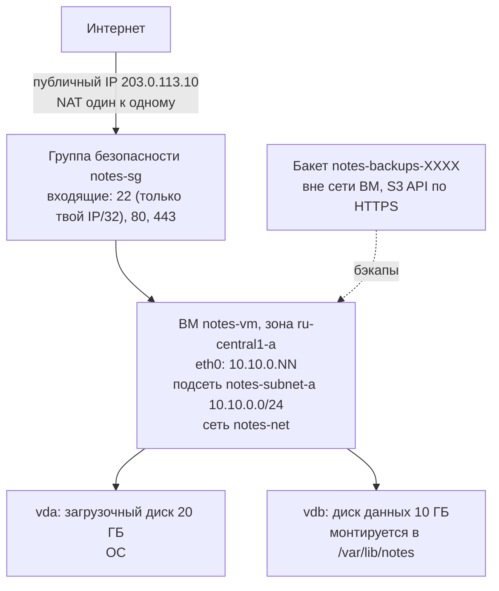
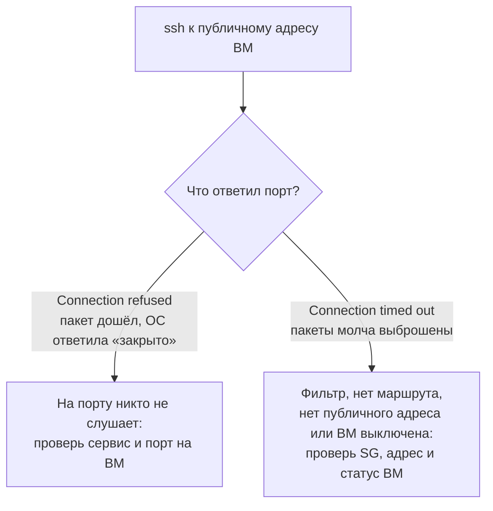

## Зачем это нужно

Облачная ВМ это не «сервер в интернете», а набор отдельных ресурсов: сеть, подсеть, правила доступа, загрузочный диск, диск данных, публичный адрес. Каждый ресурс создаётся, тарифицируется и ломается отдельно. Типичные инциденты новичка: `Connection timed out` (соединение не установилось: пакеты уходят, ответа нет, обычно их молча отбрасывает файрвол) из-за забытого правила, пропавший после перезагрузки диск, счёт за забытый публичный IP. Чтобы их не было, нужно понимать, из чего собрана облачная ВМ и как части связаны.

Коротко о словах, которые встретятся в первом же абзаце раздела «Шаг проекта» ниже (каждое подробно разберём в теории):

- **Подсеть** (subnet) это «улица» внутри твоей облачной сети: ВМ на одной улице видят друг друга как соседи ([урок 2.1](../02-network/01-addresses-routes.md)). Без неё у ВМ не было бы адреса.
- **Группа безопасности** (security group) это охрана на входе: список правил, кого и на какой порт пускать, как фейсконтроль у клуба. Без неё либо пускает всех (опасно), либо никого (сервис недоступен).
- **Бакет** (bucket) это хранилище файлов в облаке, как камера хранения: сдал файл по имени, забрал по имени. Подходит для бэкапов, работать на нём нельзя.
- **Публичный IP** это адрес, по которому до ВМ достучатся из интернета, как городской телефонный номер. Без него зайти на ВМ снаружи нельзя.
- **SSH** это способ зайти на удалённую машину в терминале по ключу вместо пароля ([урок 2.2](../02-network/02-ports-tcp-ssh.md)).

В теме 7 ты будешь описывать всё это в Terraform (инструменте, который создаёт инфраструктуру по описанию в файле). Чтобы понимать, что именно он описывает, сначала соберёшь всё руками и проверишь по SSH.

Шаг проекта: в репозитории «Заметок» появляется `infra/manual/create-vm.sh`, который создаёт сеть, подсеть, группу безопасности, ВМ `notes-vm`, отдельный диск данных и бакет. Приложение не меняется (0.4.1).

## Что нужно знать

- [Урок 6.1: облако, аккаунт, деньги](01-cloud-models-aws-mapping.md): каталог `notes`, программа `yc`, бюджет-алерт, сервисный аккаунт; остановленная ВМ всё равно платит за диск и адрес.
- [Урок 2.1: адреса и маршруты](../02-network/01-addresses-routes.md): CIDR (запись сети вроде `10.10.0.0/24`), подсеть, NAT.
- [Урок 2.2: порты, TCP, SSH](../02-network/02-ports-tcp-ssh.md): `refused` против `timeout`, пара SSH-ключей (открытый и закрытый).
- [Урок 2.7: файрвол](../02-network/07-firewall.md): правила allow и deny, «по умолчанию всё закрыто».
- [Урок 1.5: диск, память, CPU](../01-linux/05-disk-memory-cpu.md): `df` (сколько места занято), `lsblk` (какие диски подключены), файловая система (порядок, в котором данные записаны на диске; без неё диск пуст и использовать его нельзя).
- [Урок 1.3: пользователи и права](../01-linux/03-users-permissions.md): владелец каталога данных, режим `750`.

Трек без облака (если аккаунта в облаке нет): на Ubuntu с Multipass все шаги делаются локально, отличия помечены в заданиях как «Трек без облака».

## Картина целиком

Облачная ВМ похожа на арендованный офис в бизнес-центре. Есть **здание с адресами** (облачная сеть и подсеть): в нём у тебя свой этаж, куда чужие не попадут. Есть **охрана на входе** (группа безопасности): она пускает только тех, кто в списке. Есть **сам кабинет** (ВМ) с рабочим столом и шкафом (загрузочный диск). Есть **отдельный сейф на колёсиках** (диск данных): его можно выкатить из одного кабинета и закатить в другой. Есть **склад через дорогу** (бакет): туда сдают коробки на хранение, но работать на складе нельзя. И есть **городской номер телефона** (публичный IP): по нему звонят снаружи, а внутри здания используют короткие внутренние номера.

Аналогия ломается там, где в облаке всё, кроме кабинета, отдельно тарифицируется: сейф и телефонный номер продолжают стоить денег, даже когда кабинет пустует.




На схеме видно путь снаружи внутрь: интернет, адрес, охрана, ВМ с двумя дисками. Бакет стоит отдельно: он не часть сети ВМ, и именно поэтому переживёт её.

За урок ты разберёшь каждую часть схемы, создашь её командами `yc`, зайдёшь на ВМ по SSH, подключишь диск данных так, чтобы он пережил перезагрузку, и соберёшь всё в один скрипт.

## Теория

### Из чего состоит ВМ в облаке

В облаке нет «одной большой кнопки создать сервер». Провайдер раздаёт ресурсы по отдельности, чтобы ты мог менять их независимо: увеличить диск, не трогая ВМ; переселить данные на другую ВМ; отдать один адрес другой машине. Ценой за гибкость становится то, что новичок должен знать все части и помнить, что каждая может стоить денег и ломаться отдельно.

Это как конструктор. Кабинет, сейф и номер телефона продаются по отдельности, и собрать из них рабочее место нужно самому. Аналогия ломается на том, что в конструкторе детали не платят за простой.

ВМ (virtual machine, в документации ещё instance, «экземпляр») в облаке это связка ресурсов:

- **Облачная сеть** (VPC, virtual private cloud): изолированное пространство адресов, «твоя частная сеть». Сама по себе ничего не маршрутизирует, это контейнер для подсетей.
- **Подсеть** (subnet): кусок сети с диапазоном адресов в записи CIDR (например `10.10.0.0/24`: адреса от `10.10.0.0` до `10.10.0.255`; несколько адресов в начале диапазона провайдер резервирует под себя). Подсеть привязана к **одной зоне доступности** (availability zone, AZ, площадка со своим питанием: например, `ru-central1-a`, см. [урок 6.1](01-cloud-models-aws-mapping.md)).
- **Сетевой интерфейс ВМ** (network interface) это «сетевая карта» ВМ, она получает внутренний адрес из подсети автоматически.
- **Публичный адрес**: отдельная сущность. Технически это NAT «один к одному» (one-to-one NAT): облако на границе подменяет публичный адрес на внутренний и обратно, а сама ВМ о публичном адресе не знает.
- **Группа безопасности** (security group, SG): файрвол на уровне интерфейса ВМ. Она **stateful** («с памятью»): если ты разрешил входящее соединение на порт 22, ответные пакеты пройдут сами, отдельного правила на ответ не нужно. Входящее закрыто, пока не разрешено правилом.
- **Загрузочный диск** (boot disk): создаётся из **образа** (image), заготовки с установленной ОС. Образы объединены в семейства: `ubuntu-2404-lts` указывает на свежую сборку Ubuntu 24.04 LTS.
- **Диск данных**: отдельный **сетевой диск**: он подключён к ВМ по сети внутри дата-центра, а не вставлен в её корпус. Поэтому живёт независимо от ВМ: его можно отсоединить и присоединить к другой ВМ в той же зоне.

Ты просишь `yc compute instance create` с подсетью `notes-subnet-a`. Что происходит по шагам: облако находит физический сервер в зоне подсети; создаёт загрузочный диск из образа `ubuntu-2404-lts` на 20 ГБ; создаёт интерфейс и выдаёт ему первый свободный адрес подсети, скажем `10.10.0.5`; так как указано `nat-ip-version=ipv4`, берёт из пула провайдера публичный адрес и включает подмену; привязывает группу безопасности к интерфейсу; кладёт твой открытый SSH-ключ в настройки ВМ; запускает её. Внутри ВМ ты увидишь только `10.10.0.5`, а снаружи ждут по `203.0.113.10` (адрес из документационного диапазона, у тебя будет настоящий).

> **Прикинь сам:** ты удалил ВМ командой `yc compute instance delete`. Какие ресурсы могли остаться и продолжать стоить денег?
{: .predict}

Диск данных (он отдельный ресурс), зарезервированный статический публичный IP, снапшоты, бакет. Загрузочный диск обычно удаляется вместе с ВМ, но флаг `auto-delete` проверь. Поэтому после уборки смотрят `yc compute disk list` и `yc vpc address list`.

Осторожно: Публичный адрес это не «адрес на сетевой карте». Команда `ip a` внутри ВМ его не покажет. Ещё путают «удалить ВМ» и «удалить всё»: диск данных, зарезервированный адрес, снапшоты (snapshot: снимок диска на момент времени, как фотография страницы, которую потом можно восстановить; подробнее ниже и в [уроке 6.5](05-cloud-ops-cost.md)) и бакет остаются, пока ты не удалишь их отдельно.

> **Главное:** ВМ в облаке это связка отдельных ресурсов (сеть, подсеть, группа безопасности, диски, публичный адрес), и каждый тарифицируется и ломается отдельно.
{: .key}

Сначала разберём самую частую поломку: почему ВМ создана, а зайти на неё нельзя.

### Группа безопасности и два вида отказа

Публичная ВМ видна всему интернету, а тысячи автоматических сканеров ищут открытые порты. Без фильтра любой сервис на ВМ (в том числе тот, который ты не собирался публиковать) окажется доступным всем. Группа безопасности задаёт, кому и куда можно.

Это как охранник на входе со списком: «в кабинет 22 пускать только Иванова, в 80 и 443 (приёмная) всех». Кто не в списке, тому охранник не отвечает вообще, даже «вас нет в списке» не скажет. Аналогия ломается в том, что охранник смотрит только на вход: для выхода отдельный список.

Правило SG состоит из четырёх частей: направление (`ingress` входящее или `egress` исходящее), протокол (`tcp`), порт и источник (адрес в записи CIDR или другая группа). Запись `<IP>/32` означает ровно один адрес, `0.0.0.0/0` означает «все адреса». Правила только разрешающие: всё, что не разрешено, закрыто.

Из [урока 2.2](../02-network/02-ports-tcp-ssh.md) ты помнишь два вида отказа при подключении к порту:



На схеме две ветки ведут к разным причинам и разным лекарствам. Поэтому первое, что ты смотришь при отказе, это какое именно из двух сообщений пришло.

Группа безопасности выбрасывает пакеты молча, поэтому закрытый ей порт даёт именно `timed out`. В облаке `timed out` на порт 22 почти всегда одно из трёх: нет публичного адреса, SG не пускает твой адрес, ты идёшь не на тот адрес.

Теперь про слово stateful на примере. Ты открываешь `https://<IP>` в браузере. Пакет идёт с твоего адреса и случайного порта (скажем, `51234`) на порт `443` ВМ: его пускает правило `ingress 443`. Ответ идёт обратно с порта `443` ВМ на порт `51234` твоего компьютера. Отдельного правила «разрешить исходящее на порт 51234» не нужно, потому что облако запомнило открытое соединение и пропускает ответ само. Именно это значит stateful. Исходящее правило `egress any` нужно для другого: чтобы сама ВМ могла начинать соединения наружу (обновления пакетов `apt`, обращения к бакету, DNS).

У правила есть хитрость. В поле источника можно указать не адрес, а другую группу безопасности. Например, база данных на отдельной ВМ разрешает порт `5432` только от группы `notes-app-sg`: любая ВМ в этой группе пройдёт, остальные нет, и не нужно перечислять адреса, которые меняются. В курсе группа одна, но в теме 7 и уроке 6.4 это пригодится.

**Принцип наименьших привилегий** (least privilege) в SG: 22 только с твоего адреса (`<твой-IP>/32`), 80 и 443 со всего интернета (`0.0.0.0/0`), всё остальное закрыто. Порт 8080 приложения снаружи не открывается: наружу смотрит nginx (урок 6.3), а приложение слушает только внутри ВМ.

Правило `direction=ingress,port=22,protocol=tcp,v4-cidrs=[198.51.100.7/32]` означает: входящие соединения по TCP на порт 22 разрешены только с адреса `198.51.100.7`. Ты с адреса `198.51.100.7` зайдёшь. Если провайдер интернета сменил тебе адрес на `198.51.100.9`, пакеты дойдут до облака, но группа их выбросит: ты увидишь `Connection timed out`, хотя ВМ работает.

> **Прикинь сам:** ты с ноутбука идёшь по SSH на ВМ, и группа безопасности пускает на порт 22 только `198.51.100.7/32`. Что увидишь, если провайдер сменил тебе адрес на `198.51.100.9`: `refused` или `timed out`?
{: .predict}

`timed out`: группа безопасности молча выбрасывает пакеты с чужого адреса, поэтому ответа нет вообще. `refused` пришёл бы, только если бы пакет дошёл до ВМ, а на порту никто не слушал.

Осторожно: `refused` и `timed out`, и от этого лечат не то: при `timed out` бесполезно перезапускать `sshd` на ВМ, пакеты до неё вообще не доходят. Ещё путают SG с файрволом внутри ОС (`ufw`, [урок 2.7](../02-network/07-firewall.md)): это два независимых слоя, оба должны разрешать.

> **Главное:** группа безопасности пускает только то, что ты разрешил, молча выбрасывает остальное, поэтому закрытый ей порт даёт `timed out`, а не `refused`.
{: .key}

Допустим, порт открыт. Но как ВМ узнаёт, что именно тебя надо пускать?

### Как ты попадаешь на ВМ: образ, cloud-init и SSH-ключ

Новая ВМ создаётся из одинакового образа для всех клиентов. В нём нет твоего пароля, нет твоего пользователя. Но зайти нужно, причём безопасно. Поэтому при создании облако передаёт ВМ твой **открытый** ключ, а закрытый остаётся только у тебя.

Это как замок и ключ. Открытый ключ это замок, который ты отдаёшь на установку в чужую дверь, закрытый это ключ, который никому не показываешь. Замком без ключа воспользоваться нельзя. Аналогия ломается в том, что замок можно сколько угодно раз копировать, это безопасно.

Внутри образов провайдера работает **cloud-init**: программа, которая при первой загрузке читает настройки, переданные облаком (метаданные), и применяет их: создаёт пользователя, кладёт открытый ключ в `~/.ssh/authorized_keys` (файл со списком ключей, которым разрешён вход), задаёт имя машины. Когда ты передаёшь `--ssh-key ~/.ssh/notes_ed25519.pub`, `yc` кладёт содержимое файла в метаданные, cloud-init создаёт пользователя `yc-user` и записывает ключ в его `authorized_keys`. Имя `yc-user` задаёт провайдер: в AWS оно было бы `ubuntu` или `ec2-user`.

Пара ключей, как в [уроке 2.2](../02-network/02-ports-tcp-ssh.md): `ssh-keygen -t ed25519` создаёт два файла: `notes_ed25519` (закрытый, права `600`) и `notes_ed25519.pub` (открытый). ВМ получает `.pub`, а при входе клиент `ssh -i` использует закрытый файл.

Команда `ssh -i ~/.ssh/notes_ed25519 yc-user@203.0.113.10` читается так: «зайти на адрес `203.0.113.10` под пользователем `yc-user`, доказав личность закрытым ключом из файла». ВМ проверяет, что подпись подходит к открытому ключу в `authorized_keys`, и пускает. При самом первом входе ssh спрашивает, доверять ли этому серверу (сообщение `The authenticity of host ... can't be established`): отпечаток сервера сохраняется в `~/.ssh/known_hosts`, чтобы позже заметить подмену. Ответь `yes`.

> **Прикинь сам:** ты создал ВМ, передав в `--ssh-key` закрытый ключ вместо `.pub`. Что произойдёт?
{: .predict}

Скорее всего `yc` откажется принять файл как открытый ключ. Если бы принял, ты положил бы закрытый ключ в чужие метаданные, то есть раскрыл его. Передавать нужно только `.pub`. Закрытый ключ не покидает твой компьютер.

Осторожно: Открытый и закрытый ключ: передавать при создании нужно `.pub`. И «нет пароля, значит, вход небезопасен»: ключ надёжнее пароля, потому что его нельзя подобрать перебором по сети.

> **Главное:** при создании ВМ облако передаёт ей твой открытый ключ (`.pub`), cloud-init кладёт его в `authorized_keys`, а закрытый ключ остаётся только у тебя.
{: .key}

Мы на ВМ. Теперь разберёмся с дисками: куда сохранять данные, чтобы они пережили машину.

### Диски: блочное устройство, файловая система, fstab

Данные «Заметок» (файлы PostgreSQL: базы данных, в которой «Заметки» хранят тексты; поставим её в [уроке 6.3](03-deploy-notes-vm.md)) должны пережить пересоздание ВМ. Загрузочный диск исчезает вместе с ВМ, поэтому данные кладут на отдельный диск. Но подключённый диск ещё не «папка»: пока с ним не проделаны три шага, писать на него нельзя.

Это как новая пустая флешка в магазине: она вставлена в разъём, но компьютер не покажет её, пока её не отформатируют и не назначат ей место в системе. После перезагрузки назначение придётся повторить, если не записать правило.

Сетевой диск приходит в ВМ как сырое **блочное устройство** (block device): последовательность одинаковых блоков байт без структуры. В Linux оно видно как файл в `/dev`, например `/dev/vdb` (`vd` это виртуальный диск, буква по порядку подключения: `vda` загрузочный, `vdb` следующий). Три шага (на схеме ниже они по порядку):

1. **Создать файловую систему** (filesystem): структуру, которая превращает блоки в файлы и каталоги. Команда `mkfs.ext4` (make filesystem, ext4 самая распространённая в Linux). Это форматирование: старое содержимое уничтожается.
2. **Смонтировать** (mount): подключить файловую систему к каталогу. После `mount` содержимое диска появляется внутри каталога (**точка монтирования**, mount point), например `/var/lib/notes`.
3. **Записать в `/etc/fstab`**: файл, который система читает при загрузке и монтирует то, что в нём перечислено. Без записи после перезагрузки диск останется неподключённым.

Строка `fstab` состоит из шести полей:

```text
UUID=c6f0eb80-947d-42ed-ba6f-563b5a48c7e2  /var/lib/notes  ext4  defaults,nofail  0  2
 1: что монтировать                         2: куда         3: тип 4: опции         5: dump 6: порядок fsck
```

Диск указывают по **UUID** (universally unique identifier, уникальный номер файловой системы, его печатает `blkid`), а не по имени `/dev/vdb`: буквы устройств могут поменяться при следующей загрузке (например, если добавится ещё один диск), а UUID навсегда остаётся за файловой системой. Опция `nofail` не даёт ВМ зависнуть на загрузке, если диска нет: она просто поднимется без него. Последнее поле `2` говорит `fsck` (программе проверки файловой системы) проверять этот диск после корня.

Проверено на образе `devops-lab:24.04-ubuntu` (Ubuntu 24.04) с файлом-образом вместо сетевого диска: механика та же. Создали файл `/opt/notes-data.img` размером 2 ГБ, `mkfs.ext4 -F -L notes-data`, записали строку в `fstab`, `mount -a`. `findmnt /var/lib/notes` показал:

```text
TARGET         SOURCE     FSTYPE OPTIONS
/var/lib/notes /dev/loop0 ext4   rw,relatime
```

Затем `chown notes:notes` и `chmod 750`, и `ls -ld /var/lib/notes`:

```text
drwxr-x--- 3 notes notes 4096 Sep 30 12:24 /var/lib/notes
```

Читаем: `d` каталог, `rwxr-x---` это режим `750`: владелец всё, группа читает и входит, остальные ничего. Число `3` это счётчик ссылок: на свежей файловой системе ext4 внутри уже есть служебный каталог `lost+found`, поэтому не `2`, а `3`. Размер: `df -h` показал `/dev/loop0 2.0G 24K 1.8G 1% /var/lib/notes`, то есть 24K занимает сама файловая система (служебные структуры).

Для «Заметок» диск данных монтируется в `/var/lib/notes` (владелец `notes:notes`, режим `750`, константы курса, права см. [урок 1.3](../01-linux/03-users-permissions.md)). Там будет лежать PostgreSQL из compose в уроке 6.3, поэтому данные переживут пересоздание ВМ.

> **Прикинь сам:** ты подключил диск данных и сразу начал писать в `/var/lib/notes`, но не сделал `mkfs.ext4`. Что произойдёт?
{: .predict}

Писать на диск не получится: сырое блочное устройство `/dev/vdb` без файловой системы не превращается в файлы и каталоги, а `mount` выдаст ошибку про неизвестный тип файловой системы. Если же каталог `/var/lib/notes` уже существует на загрузочном диске, запись пойдёт именно туда и пропадёт вместе с ВМ.

Осторожно: Три вещи. Первая: `mkfs` на диске с данными их уничтожает, поэтому его выполняют один раз на новом диске. Вторая: смонтировать «руками» недостаточно, без `fstab` диск исчезнет после перезагрузки. Третья, самая коварная: **монтирование поверх каталога** скрывает его прежнее содержимое. Файлы не удаляются, но пока диск смонтирован, их не видно. На стенде мы это повторили: после `umount` тот же каталог снова оказался обычным каталогом на загрузочном диске с владельцем `root` и режимом `755`:

```text
drwxr-xr-x 2 root root 4096 Sep 30 12:24 /var/lib/notes
```

Если сервис в этот момент запущен без диска, он молча пишет в этот каталог на загрузочном диске. Поэтому сервис должен зависеть от диска (это разберём в «Сломай и почини»).

> **Главное:** диск данных нужно отформатировать (`mkfs.ext4`), смонтировать в каталог и записать в `/etc/fstab` по UUID, иначе он не переживёт перезагрузку.
{: .key}

Диск хранит данные рядом с ВМ. А для бэкапов нужно хранилище, которое переживёт и саму зону.

### Объектное хранилище: бакет вместо диска

Бэкап должен пережить не только ВМ, но и зону, а лучше и ошибку в базе. Диск, привязанный к зоне и к одной ВМ, для этого плох. Нужно хранилище, которое доступно отовсюду и хранит копии надёжно и дёшево.

Это как камера хранения на вокзале: сдал коробку, получил номер, забрал где угодно. Внутри коробки ничего не переставишь на месте: только сдать целиком или забрать целиком. Аналогия ломается на цене: хранение стоит копейки, а за «вынос» (исходящий трафик) платишь.

**Бакет** (bucket) это плоское хранилище **объектов** (файлов с именем и содержимым), доступное по HTTP-API. Это API называется **S3** ([урок 6.1](01-cloud-models-aws-mapping.md)), и Yandex Object Storage его поддерживает: тот же клиент работает с обоими, если указать свой адрес (endpoint `https://storage.yandexcloud.net`). Бакет не диск: его не смонтируешь как `/dev/vdb`, и файлы PostgreSQL на нём держать нельзя, потому что база делает быстрые мелкие записи в середину файла, а объект можно только заменить целиком.

Имя бакета уникально глобально (среди всех клиентов облака), поэтому к имени добавляют случайный суффикс. Доступ идёт по **статическому ключу**: паре из **access key** (идентификатор, «логин») и **secret key** (секрет, «пароль»). Ключ выдаётся сервисному аккаунту, а права даёт роль (например, `storage.editor`, [урок 6.1](01-cloud-models-aws-mapping.md)). Публичным бакет делать не нужно.

Команда `aws s3 cp hello.txt s3://notes-backups-1a2b3c4d/hello.txt` читается так: клиент AWS CLI (программа, которая говорит на языке S3) «скопировать локальный файл `hello.txt` в бакет `notes-backups-1a2b3c4d` под именем `hello.txt`». Без `--endpoint-url https://storage.yandexcloud.net` клиент пошёл бы в настоящий Amazon.

> **Прикинь сам:** чем диск данных отличается от бакета и что куда кладут в «Заметках»?
{: .predict}

Диск это блочное устройство с файловой системой, быстрое, привязано к зоне, подключается к одной ВМ: сюда идут файлы PostgreSQL. Бакет это объекты по HTTP, доступны отовсюду, дёшево и надёжно хранят: сюда идут бэкапы (урок 6.5).

Осторожно: Бакет и диск: путь `s3://бакет/папка/файл` не путь в файловой системе, «папок» в бакете нет, есть только имена объектов с косыми чертами. И ключ сервисного аккаунта с токеном `yc`: это разные виды доступа (первый только для S3-запросов).

> **Главное:** бакет это объекты по HTTP-API (S3), доступные отовсюду: он подходит для бэкапов, но не для файлов базы данных.
{: .key}

Теперь, когда все ресурсы названы, посмотрим, что с ними происходит, когда ВМ останавливают или удаляют.

### Жизненный цикл ВМ и что за него платят

Новичок думает: «выключил ВМ, значит, счёт остановился». В облаке это верно только для части ресурсов. Чтобы не получать неожиданных счетов и не терять данные, нужно знать, что происходит с каждым ресурсом на каждом шаге жизни ВМ.

Это как арендованный кабинет. Ты можешь уйти домой и выключить свет (остановить ВМ): за электричество платить перестаёшь, но аренда кабинета, сейфа и телефонного номера идёт, пока договор не расторгнут. Аналогия ломается в деталях тарификации: что именно считается «электричеством», а что «арендой», определяет тариф провайдера, и его нужно читать.

У ВМ есть статус. Главные: `PROVISIONING` (создаётся), `RUNNING` (работает), `STOPPING` и `STOPPED` (остановлена), `DELETING` (удаляется). Когда ВМ в статусе `STOPPED`, вычислительные ресурсы (процессор и память) обычно не тарифицируются, но диски, зарезервированные адреса и снапшоты продолжают стоить денег: они хранятся, пока существуют. Точные правила смотри в прайсе провайдера, они меняются, поэтому в курсе не приведены числа.

Что происходит с данными при разных действиях:

- **Перезагрузка** (`reboot`): диски на месте, внутренний адрес тот же, публичный обычно тот же.
- **Остановка и запуск**: диски на месте. У публичного адреса есть тонкость: **динамический** адрес выдаётся из общего пула при старте и после остановки может смениться, **статический** (зарезервированный) закреплён за тобой и стоит денег отдельно, пока не удалён. Поэтому после остановки и запуска `ssh` на старый адрес может дать timeout: адрес мог измениться, надо снова взять его через `yc compute instance get`.
- **Удаление ВМ**: загрузочный диск обычно удаляется вместе с ней (это настройка `auto-delete`), диск данных остаётся и продолжает тарифицироваться.

У ресурсов есть ещё одна сущность, о которой надо знать: **снапшот** (snapshot) это копия диска на момент времени. Он нужен для бэкапа диска и для переноса диска в другую зону. Снапшот хранится отдельно от диска и переживает его удаление, но за хранение тоже платят.

Вечером ты остановил `notes-vm` командой `yc compute instance stop notes-vm`. Утром `yc compute instance list` показывает статус `STOPPED`. Что с ресурсами: процессор и память не работают; загрузочный диск и диск `notes-data` существуют и в счёте; публичный адрес динамический, поэтому после `start` он может оказаться другим. Если ты хочешь оставить ВМ на неделю, диски продолжат стоить. Если больше не нужна, то удаление ВМ не решает вопрос полностью: `notes-data` остаётся, удалять его надо отдельно и только после бэкапа.

> **Прикинь сам:** ты остановил ВМ на неделю и не освободил зарезервированный публичный IP. Платишь ли ты за адрес?
{: .predict}

Да: зарезервированный (статический) адрес закреплён за тобой и тарифицируется, пока не удалён, независимо от состояния ВМ.

Осторожно: «Остановил значит бесплатно» и «удалил ВМ значит удалил всё». Ещё путают перезагрузку и пересоздание: при пересоздании загрузочный диск новый, а всё, что ты настраивал на нём руками, пропадает. Поэтому настройки автоматизируют (задание 5 и темы 7 и 10).

> **Главное:** остановка ВМ снимает плату за процессор и память, но диски, зарезервированные адреса и снапшоты продолжают стоить; удаление ВМ не удаляет диск данных.
{: .key}

Диск данных можно держать долго. Что делать, если он вырос или не тот тип?

### Типы дисков, снапшоты и расширение

Диск это компромисс между скоростью, объёмом и ценой. Данные PostgreSQL требуют малой задержки, архив логов требует много места дёшево. Если диск заполнился, его нужно увеличить без пересоздания ВМ.

Это как сейф разного размера и качества: маленький бронированный (быстрый и дорогой) и большой обычный (медленный и дешёвый). Аналогия ломается на том, что в облаке размер можно увеличить, а уменьшить нельзя.

Сетевые диски бывают нескольких типов. В Yandex Cloud это, например, `network-hdd` (на жёстких дисках, дешевле и медленнее) и `network-ssd` (на SSD, быстрее и дороже); полный список и характеристики смотри в документации, они меняются. В курсе используется `network-ssd` для данных и загрузочного диска.

Диск можно **увеличить** на живой ВМ: облако расширяет блочное устройство (`lsblk` покажет новый размер), но файловая система внутри остаётся прежней, пока ты не растянешь её командой. Для ext4 это `resize2fs <устройство>`. Уменьшить диск нельзя: нужно создать новый меньшего размера и перенести данные.

**Файловая система ext4** (extended filesystem 4) хранит файлы в блоках, а сведения о файлах (владелец, права, время, где лежат блоки) в **inode** (index node, запись о файле). Их число задаётся при `mkfs`. Если исчерпать inodes (например, миллионами крошечных файлов), место на диске останется, но создавать новые файлы будет нельзя: `df -i` показывает занятость inodes. ext4 ведёт **журнал** (journal): сначала записывает намерение, потом делает изменения, поэтому после внезапного выключения файловая система приходит в согласованное состояние быстро. `mkfs.ext4` в выводе на стенде как раз печатает `Creating journal (16384 blocks): done`. Каталог `lost+found` создаётся при `mkfs`: туда `fsck` складывает найденные обломки файлов.

Диск `notes-data` заполнен: `df -h /var/lib/notes` показывает `100%`. Действия: (1) на стороне облака увеличить диск до 20 ГБ (`yc compute disk update notes-data --size 20`, команду проверь по документации); (2) на ВМ `lsblk` показывает `vdb` размером 20G, но `df -h` всё ещё 9.8G; (3) `sudo resize2fs /dev/vdb` растягивает файловую систему на весь диск; (4) `df -h` показывает новый размер. Размонтировать для этого не нужно: ext4 умеет растягиваться на подключённом диске.

Осторожно: Размер блочного устройства и размер файловой системы: облако меняет первое, второе меняешь ты. Ещё путают «место кончилось» (`df -h` 100%) и «inodes кончились» (`df -i` 100%, а место есть).

> **Прикинь сам:** `df -h` показывает 9.8G, а в консоли облака диск 20 ГБ. Что сделать и почему?
{: .predict}

Растянуть файловую систему: `sudo resize2fs /dev/vdb` (для ext4). Облако увеличило только блочное устройство, а файловая система внутри осталась прежней, пока её не расширить.

> **Главное:** облако увеличивает блочное устройство, а файловую систему растягиваешь ты (`resize2fs`); уменьшить диск нельзя.
{: .key}

Диски настроены. Теперь вопрос безопасности: как приложение на ВМ получает доступ к облаку без ключей в коде.

### Метаданные ВМ и доступ без ключей в коде

Приложению на ВМ иногда нужен доступ к API облака (записать бэкап в бакет). Класть постоянный ключ в файл на диске опасно: его можно украсть и он не истекает. Лучше, чтобы ВМ получала временное удостоверение от самого облака.

Это как гостевой бейдж на проходной: охрана выдаёт его тем, кто пришёл в это здание, бейдж действует несколько часов и сам перестаёт работать. Постоянный ключ от всех дверей это, наоборот, ключ, потерянный однажды навсегда. Аналогия ломается тем, что бейдж выдаёт охрана здания (облако), а не ты, и его получение нужно настроить.

К каждой ВМ можно **привязать сервисный аккаунт** ([урок 6.1](01-cloud-models-aws-mapping.md)). Внутри ВМ доступен **сервис метаданных**: HTTP-адрес, который слышен только с самой ВМ, по нему облако отдаёт настройки ВМ и **временный токен** сервисного аккаунта. Приложение обращается к нему и получает токен, срок жизни которого ограничен; облако выдаёт новый, когда старый истекает. Постоянных секретов на диске нет. В AWS то же называется instance profile и метаданные по адресу `169.254.169.254`. Точный адрес и формат запросов Yandex Cloud смотри в документации «Метаданные ВМ»: в курсе они не запускаются.

В курсе для простоты используется статический ключ в переменных окружения сервиса (урок 6.3 и `/etc/notes/notes.env`, права `640`). Это осознанный компромисс новичка, на реальной работе используют привязку сервисного аккаунта, а ключи ротируют.

Скрипт бэкапа на ВМ хочет записать файл в бакет. Вариант «ключ в файле»: скрипт читает `/etc/notes/notes.env`, оттуда берёт `access_key` и `secret_key`. Если файл утёк (попал в бэкап или лог), ключом можно пользоваться вечно, пока его не отозвали. Вариант «метаданные»: скрипт запрашивает токен у сервиса метаданных, получает временный, действует он ограниченное время, и утечка бесполезна уже через короткий срок.

Осторожно: Метаданные это не то же самое, что SSH-ключ в метаданных при создании (это одно из применений: cloud-init читает оттуда ключ). И «внутренний токен безопаснее» верно только пока ВМ не взломана: если атакующий получил доступ к ВМ, он получает и токен, поэтому права сервисного аккаунта делают минимальными.

> **Прикинь сам:** почему временный токен из метаданных безопаснее постоянного ключа в файле?
{: .predict}

Токен ограничен по времени и сам обновляется, на диске нет долгоживущего секрета, который можно унести с копией файла. Даже если токен утёк, он скоро перестаёт работать. Постоянный ключ действует, пока его не отозвали.

> **Главное:** лучше всего приложению получать от облака временный токен через метаданные, чем хранить постоянный ключ в файле; для простоты курс использует ключ, а на работе используют привязку сервисного аккаунта.
{: .key}

Мы вернулись к бакету. Посмотрим, как сделать так, чтобы бэкапы в нём не копились бесконечно.

### Объектное хранилище глубже: версии, классы, жизненный цикл

Бэкапы копятся. Старые не нужны, но их надо сколько-то хранить; ошибочно перезаписанный или удалённый объект должен восстанавливаться; редко читаемые данные не должны стоить как горячие.

Это как архив с правилами: свежие папки на ближней полке, старые в дальнем хранилище (дешевле, но идти дольше), а через год бумаги уничтожают по графику. Аналогия ломается тем, что в облаке это описывается правилом, а не человеком.

Три возможности S3 API, которые пригодятся для бэкапов:

- **Версионирование** (versioning): при перезаписи объекта старая версия не пропадает, а остаётся под своим номером. Удаление ставит «метку удаления», а сами данные можно вернуть. Плата за хранение растёт с каждой версией.
- **Классы хранения** (storage classes): «горячее» для частого доступа и более дешёвые классы для редкого. Названия и цены у провайдеров разные, смотри документацию.
- **Правила жизненного цикла** (lifecycle rules): «объекты старше N дней перенести в дешёвый класс или удалить». Так бэкапы не копятся бесконечно.

Доступ к бакету контролируется политиками и ролями; по умолчанию бакет закрыт. Хранение стоит копейки, а платно бывает **исходящий трафик** (egress: скачивание из облака наружу), запросы и хранение версий, поэтому пересчитывай стоимость под свой сценарий.

Для бакета `notes-backups-…` задача: хранить ежедневные бэкапы 30 дней. Решение: включить версионирование и правило «удалять версии старше 30 дней». Если разработчик перезаписал бэкап испорченным файлом, старая версия доступна в списке версий. В курсе эти настройки не выполняются (см. урок 6.5, где бэкап и восстановление разбираются целиком).

Осторожно: Версионирование и бэкап: версии защищают от ошибочной перезаписи, но не от удаления самого бакета или потери ключей. Ещё путают «удалил объект» и «освободил место»: пока версии живы, они занимают место и стоят денег.

> **Прикинь сам:** зачем нужны правила жизненного цикла, если бакет «дешёвый»?
{: .predict}

Без них бэкапы и версии копятся бесконечно, и стоимость хранения растёт незаметно. Правило автоматически удаляет старое или переносит в более дешёвый класс.

> **Главное:** версионирование защищает от ошибочной перезаписи, классы хранения удешевляют редкие данные, а правила жизненного цикла убирают старое автоматически.
{: .key}

Все части собраны руками. Как собрать их так, чтобы скрипт можно было запускать повторно?

### Скрипт вместо кликов: идемпотентность

Руками собрать стенд один раз можно. Второй раз ты забудешь шаг, третий сделаешь с опечаткой. Скрипт повторяем, но у наивного скрипта своя беда: второй запуск упадёт, потому что сеть `notes-net` уже есть.

Это как лифт. Если нажать кнопку «5» на пятом этаже, лифт не поедет и ничего не сломается. Нажатие безопасно повторять. Аналогия ломается в том, что лифт делает это по конструкции, а скрипту это нужно объяснить.

**Идемпотентная** операция (idempotent) даёт один и тот же результат при повторном запуске. В скрипте это делается проверкой: спросить у облака `yc vpc network get notes-net`; если ресурс есть (команда завершилась успешно), пропустить; если нет (ошибка), создать. Для этого используется код завершения команды: `0` успех, не ноль ошибка ([урок 1.6](../01-linux/06-bash-basics.md)).

Функция `ensure` из задания 5 принимает вид ресурса, имя и команду создания. Она вызывает `yc <вид> get <имя>`; если успех, печатает `есть:`; если ошибка, печатает `создаю:` и выполняет команду создания. Вызвать её дважды подряд: сначала создастся, потом «есть». Бакет так не проверяется (у него случайное имя), и второй запуск без явного `BUCKET` создаст ещё один. Это честное ограничение ручного подхода.

Осторожно: «Идемпотентность» и «скрипт не падает»: скрипт может не падать, но каждый раз создавать лишнее. И ручную проверку с настоящей декларативностью: скрипт умеет только «создать, если нет», а обновить изменившееся или удалить лишнее не умеет. Это умеет Terraform (тема 7), который хранит **state** (записанное состояние: что он уже создал) и сравнивает с описанием.

> **Прикинь сам:** ты запустил `create-vm.sh` дважды, второй раз с пустым `BUCKET`. Что окажется в облаке?
{: .predict}

Сеть, подсеть, SG, диск и ВМ не задвоятся (сработает проверка «есть»), а бакетов будет два: имя случайное, и проверить нечего. Поэтому во второй запуск имя бакета передают явно.

> **Главное:** идемпотентный скрипт перед созданием спрашивает облако «есть ли уже такой ресурс» и при повторном запуске ничего не задваивает.
{: .key}

Остался последний подводный камень: зоны, в которых живут ресурсы.

### Зона как «этаж»: почему диск и ВМ должны быть рядом

Новичок создаёт диск в зоне `ru-central1-a`, а ВМ в `ru-central1-b` и получает ошибку при подключении. Причина в том, что сетевой диск подключается внутри одного дата-центра, а между зонами такой прямой связи нет.

Это как сейф на колёсиках можно закатить в любой кабинет на том же этаже, но не в кабинет в соседнем здании: чтобы перевезти его, придётся упаковать содержимое и отправить грузовиком. Аналогия ломается тем, что в облаке «грузовик» есть: снапшот диска можно восстановить в другой зоне как новый диск.

Подсеть, ВМ и её диски привязаны к одной зоне. Бакет и сеть (VPC) зоне не принадлежат: сеть охватывает весь регион, а бакет хранится и доступен на уровне региона. Поэтому при выборе зоны действует правило: ВМ, её диск данных и подсеть берём из одной зоны.

Подсеть `notes-subnet-a` создана в зоне `ru-central1-a`. Значит, ВМ `notes-vm` с интерфейсом в этой подсети окажется в зоне `a`. Диск данных `notes-data` нужен в той же зоне `a`, иначе подключение даст ошибку о несовпадении зон. Бакет `notes-backups-XXXX` зоне не принадлежит, поэтому в нём бэкап переживёт даже потерю всей зоны `a`: именно поэтому бэкапы кладут в бакет, а не на диск рядом с ВМ.

Осторожно: «Сеть у меня в зоне a». Нет: зоне принадлежит подсеть, а не сеть целиком. И «бакет в зоне a»: он живёт на уровне региона.

> **Прикинь сам:** ВМ в зоне `b`, диск данных в зоне `a`. Как перенести данные на ВМ, не теряя их?
{: .predict}

Сделать снапшот диска в зоне `a`, создать из него новый диск в зоне `b` и подключить к ВМ. Подключить исходный диск напрямую нельзя: зоны разные.

> **Главное:** ВМ, её диск и подсеть живут в одной зоне, а сеть (VPC) и бакет зоне не принадлежат; диск в другую зону переносят снапшотом.
{: .key}

Соберём всё в одну таблицу и сопоставим с AWS.

### Соответствие AWS

Статьи и собеседования часто говорят на языке AWS, поэтому ресурсы этого урока полезно сопоставить с его названиями.

| Yandex Cloud | AWS | Заметка |
|---|---|---|
| Compute Cloud, `yc compute instance` | EC2 | ВМ; `core-fraction` похож на burstable-типы t3 (гарантированная доля плюс всплески) |
| Облачная сеть (network) | VPC | контейнер для подсетей |
| Подсеть (subnet) | Subnet | привязана к зоне |
| Группа безопасности | Security Group | stateful, привязана к интерфейсу |
| Публичный адрес ВМ (NAT) | Elastic IP (или auto-assign) | статический адрес это отдельный платный ресурс |
| Сетевой диск | EBS | зональный, отделим от ВМ |
| Снапшот диска | EBS Snapshot | инкрементальный (хранит только изменения) |
| Object Storage | S3 | тот же S3 API, endpoint `storage.yandexcloud.net` |
| Пользователь `yc-user` | `ec2-user` или `ubuntu` | имя задаёт образ или cloud-init |
| Сервисный аккаунт и роли | IAM role и user | статический ключ для S3 |

> **Прикинь сам:** в статье написано «подними EC2 в VPC, положи бэкапы в S3, повесь Security Group». Что из этого ты создашь в Yandex Cloud?
{: .predict}

ВМ в Compute Cloud (`yc compute instance`), сеть и подсеть в VPC, бэкапы в Object Storage (S3-совместимый), группу безопасности (security group): названия разные, принципы те же.

> **Главное:** каждому ресурсу урока есть аналог в AWS: Compute Cloud и EC2, Object Storage и S3, security group и Security Group, сетевой диск и EBS.
{: .key}

## Практика

Перед началом: `yc` настроен по уроку 6.1 (`yc config list` показывает каталог `notes`), бюджет-алерт создан, установлен `jq` (утилита для разбора JSON: `sudo apt install -y jq` на Ubuntu, `brew install jq` на Mac). Все ресурсы имеют префикс `notes-`, чтобы их было легко найти и удалить.

Команды `yc` и `aws` автором не запускались (облако не создавалось): синтаксис и формат вывода взяты из документации Yandex Cloud CLI, а команды Linux внутри ВМ (`mkfs`, `mount`, `fstab`, `findmnt`, `df`) проверены на стенде Ubuntu 24.04. Идентификаторы, адреса и время у тебя будут другими.

### Задание 1. Сеть, подсеть и группа безопасности

**Цель:** создать сетевую основу и убедиться, что SG пускает только то, что ты разрешил.

**Предскажи:** сколько правил в группе после создания командой ниже? Какой трафик входит без правил?

<details markdown="1">
<summary>Ответ</summary>

Четыре правила: три входящих (22, 80, 443) и одно исходящее. Без явного входящего правила входящий трафик закрыт.

</details>

**Шаги:**

1. Узнай свой внешний адрес, чтобы пустить только его на SSH. `$(...)` выполняет команду внутри и подставляет её вывод; `curl -s` скачивает страницу без прогресс-бара; сервис `ifconfig.me` отвечает твоим внешним адресом.

```bash
MY_IP=$(curl -s https://ifconfig.me)
echo "$MY_IP"
```

2. Создай сеть и подсеть. `--range` диапазон подсети, `--zone` зона, к которой она привязана.

```bash
yc vpc network create --name notes-net
yc vpc subnet create --name notes-subnet-a \
  --network-name notes-net \
  --zone ru-central1-a \
  --range 10.10.0.0/24
```

3. Создай группу безопасности: SSH только с твоего адреса, HTTP и HTTPS отовсюду, исходящее всё. Каждый `--rule` это одно правило в формате `ключ=значение` через запятую; в `v4-cidrs=[...]` перечисляют разрешённые адреса; `${MY_IP}/32` подставляет твой адрес и добавляет `/32` (ровно один адрес).

```bash
yc vpc security-group create --name notes-sg \
  --network-name notes-net \
  --rule "direction=ingress,port=22,protocol=tcp,v4-cidrs=[${MY_IP}/32]" \
  --rule "direction=ingress,port=80,protocol=tcp,v4-cidrs=[0.0.0.0/0]" \
  --rule "direction=ingress,port=443,protocol=tcp,v4-cidrs=[0.0.0.0/0]" \
  --rule "direction=egress,protocol=any,v4-cidrs=[0.0.0.0/0]"
```

4. Проверь. `--format json` печатает ответ в виде JSON, `jq -c '.rules[] | {...}'` берёт каждое правило из списка `rules` и оставляет три поля, `-c` печатает по одной строке на правило.

```bash
yc vpc network list
yc vpc subnet list
yc vpc security-group get notes-sg --format json | jq -c '.rules[] | {direction, ports, protocol_name}'
```

**Что должно получиться** (формат по документации, у тебя может отличаться):

```text
{"direction":"INGRESS","ports":{"from_port":"22","to_port":"22"},"protocol_name":"TCP"}
{"direction":"INGRESS","ports":{"from_port":"80","to_port":"80"},"protocol_name":"TCP"}
{"direction":"INGRESS","ports":{"from_port":"443","to_port":"443"},"protocol_name":"TCP"}
{"direction":"EGRESS","ports":{"from_port":"0","to_port":"65535"},"protocol_name":"ANY"}
```

**Как читать вывод:** по строке на правило. `INGRESS` входящее, `EGRESS` исходящее. `ports` диапазон портов: у `22` он вырождается в один порт, у исходящего `0` до `65535` означает «любой порт». Первые две команды выведут таблицы с ресурсами (столбцы `ID`, `NAME` и другие), в них должны быть `notes-net` и `notes-subnet-a`. Если в списке правил меньше или больше четырёх, что-то не так.

**Объясни себе:**

- Почему подсеть привязана к зоне, а сеть нет?
- Зачем исходящее правило, если ответы на разрешённые входящие идут автоматически?
- Что сломается, если твой домашний IP сменится?

**Типичные ошибки:**

- `ERROR: rpc error: code = AlreadyExists desc = Network with name notes-net already exists`: ресурс уже создан, это повторный запуск; проверь `yc vpc network list`, второй не создавай.
- `ERROR: rpc error: code = PermissionDenied desc = Permission denied`: у профиля нет роли `vpc.admin` или `editor` на каталог; проверь `yc config list` и роли (урок 6.1).
- `invalid rule: v4-cidrs=[/32]`: переменная `MY_IP` пустая, `curl` не вернул адрес; повтори шаг 1 и проверь `echo "$MY_IP"`.

Трек без облака: сетей и SG нет, роль SG играет `ufw` из [урока 2.7](../02-network/07-firewall.md) на самой ВМ. Переходи к заданию 2.

> Не понимаешь, почему SG не пускает? Вставь в нейросеть вывод `yc vpc security-group get notes-sg` и свой внешний адрес и спроси, какое правило отбросит SSH. Выполни её проверки сам и сверь с таблицей правил.
{: .ai}

### Задание 2. ВМ и вход по SSH

**Цель:** создать ВМ `notes-vm` с публичным IP и зайти на неё.

**Предскажи:** что увидит `ip -br a` внутри ВМ: публичный или внутренний адрес?

<details markdown="1">
<summary>Ответ</summary>

Только внутренний `10.10.0.x`. Публичный адрес это NAT снаружи, гостевая ОС его не знает.

</details>

**Шаги:**

1. Сгенерируй отдельный ключ для курса. `-t ed25519` современный тип ключа, `-f` путь к файлу, `-C` комментарий-метка, `-N ""` пустая парольная фраза (для учебного ключа; ключ для реальной работы лучше защитить фразой).

```bash
ssh-keygen -t ed25519 -f ~/.ssh/notes_ed25519 -C "notes-course" -N ""
```

Команда создаст файлы `~/.ssh/notes_ed25519` (закрытый) и `~/.ssh/notes_ed25519.pub` (открытый) и напечатает отпечаток ключа. Если файл уже есть, `ssh-keygen` спросит про перезапись: не перезаписывай, ключ уже готов.

2. Создай ВМ: 2 vCPU с гарантированной долей 20%, 2 ГБ RAM, загрузочный диск 20 ГБ. Разбор флагов: `--platform standard-v3` поколение процессоров; `--cores 2 --core-fraction 20 --memory 2` ресурсы; `--network-interface` подсеть, включение публичного адреса (`nat-ip-version=ipv4`) и группа безопасности (`security-group-ids` требует идентификатор, а не имя, поэтому сначала достаём его в переменную `SG_ID`); `--create-boot-disk` создаёт диск из семейства образов, размер 20 ГБ, тип `network-ssd` (без `type=` по умолчанию будет `network-hdd`); `--ssh-key` передаёт **открытый** ключ.

```bash
SG_ID=$(yc vpc security-group get notes-sg --format json | jq -r .id)
yc compute instance create \
  --name notes-vm \
  --zone ru-central1-a \
  --platform standard-v3 \
  --cores 2 --core-fraction 20 --memory 2 \
  --network-interface "subnet-name=notes-subnet-a,nat-ip-version=ipv4,security-group-ids=${SG_ID}" \
  --create-boot-disk image-family=ubuntu-2404-lts,image-folder-id=standard-images,size=20,type=network-ssd \
  --ssh-key ~/.ssh/notes_ed25519.pub
```

3. Возьми публичный адрес и зайди. `jq -r` печатает значение без кавычек, путь `.network_interfaces[0].primary_v4_address.one_to_one_nat.address` спускается по JSON до публичного адреса первого интерфейса.

```bash
VM_IP=$(yc compute instance get notes-vm --format json | jq -r '.network_interfaces[0].primary_v4_address.one_to_one_nat.address')
echo "$VM_IP"
ssh -i ~/.ssh/notes_ed25519 yc-user@"$VM_IP"
```

4. Внутри ВМ (`hostnamectl` показывает сведения о системе, `ip -br a` краткий список адресов, `lsblk` диски):

```bash
hostnamectl | grep 'Operating System'
ip -br a
lsblk
```

**Что должно получиться** (по документации и Ubuntu 24.04, имена и числа зависят от облака):

```text
  Operating System: Ubuntu 24.04.x LTS
lo               UNKNOWN        127.0.0.1/8
eth0             UP             10.10.0.NN/24
NAME    MAJ:MIN RM SIZE RO TYPE MOUNTPOINTS
vda     252:0    0  20G  0 disk
```

**Как читать вывод:** `eth0` в состоянии `UP` с адресом из подсети и маской `/24`: это внутренний адрес, публичного здесь нет и не будет (на реальной ВМ к строкам добавятся адреса IPv6 и разделы `vda1`, `vda2` под `vda`). `vda` загрузочный диск 20 ГБ. Диска данных пока нет, он появится в задании 3.

**Объясни себе:**

- Почему `ip -br a` не показывает публичный IP?
- Откуда взялся пользователь `yc-user` и твой ключ в нём? Что даёт `core-fraction 20`?

**Типичные ошибки:**

- `ssh: connect to host 203.0.113.10 port 22: Connection timed out`: SG не пускает твой адрес (IP сменился) или нет публичного адреса; проверь правило 22 и поле `one_to_one_nat`.
- `yc-user@203.0.113.10: Permission denied (publickey).`: ключ не тот или нет `-i`; при создании должен быть передан `.pub`, при входе закрытый ключ.
- `WARNING: REMOTE HOST IDENTIFICATION HAS CHANGED!`: ты пересоздал ВМ, а адрес переиспользован; удали старую запись `ssh-keygen -R <IP>`.

Трек без облака: `multipass launch 24.04 --name notes-vm --cpus 2 --memory 2G --disk 20G`, вход `multipass shell notes-vm`, адрес `multipass info notes-vm | grep IPv4`.

### Задание 3. Диск данных, файловая система и fstab

**Цель:** подключить отдельный диск, смонтировать его в `/var/lib/notes` и пережить перезагрузку.

**Предскажи:** смонтировал руками, всё работает. Что будет после `sudo reboot` без записи в `/etc/fstab`?

<details markdown="1">
<summary>Ответ</summary>

`/var/lib/notes` станет обычным пустым каталогом на загрузочном диске, диск данных останется неподключённым. Сервис молча пишет данные на загрузочный диск.

</details>

**Шаги:**

1. С компьютера, где стоит `yc`, создай диск на 10 ГБ и присоедини к ВМ (та же зона). `--type network-ssd` быстрый сетевой SSD, `--device-name` имя, под которым диск появится внутри ВМ, `--mode rw` чтение и запись.

```bash
yc compute disk create --name notes-data --zone ru-central1-a --size 10 --type network-ssd
yc compute instance attach-disk notes-vm --disk-name notes-data --device-name notes-data --mode rw
```

2. На ВМ найди диск по имени, которое ты задал. Каталог `/dev/disk/by-id/` содержит постоянные имена дисков (ссылки на `/dev/vdX`), `grep` оставляет нужную строку.

```bash
lsblk -o NAME,SIZE,TYPE,MOUNTPOINT
ls -l /dev/disk/by-id/ | grep notes-data
```

3. Создай файловую систему и смонтируй (диск пустой; на диске с данными `mkfs` их уничтожит). `-L notes-data` даёт файловой системе метку, `mkdir -p` создаёт каталог, `mount <устройство> <каталог>` подключает.

```bash
sudo mkfs.ext4 -L notes-data /dev/disk/by-id/virtio-notes-data
sudo mkdir -p /var/lib/notes
sudo mount /dev/disk/by-id/virtio-notes-data /var/lib/notes
```

4. Запиши в `fstab` по UUID с `nofail` и проверь без перезагрузки. `blkid -s UUID -o value` печатает только UUID; `sudo tee -a` дописывает строку в файл от имени root (обычное `>>` не сработает: перенаправление выполняет твоя оболочка без sudo); `mount -a` монтирует всё из `fstab` и покажет ошибку, если строка неверна; `findmnt` показывает, что куда подключено.

```bash
UUID=$(sudo blkid -s UUID -o value /dev/disk/by-id/virtio-notes-data)
echo "UUID=${UUID} /var/lib/notes ext4 defaults,nofail 0 2" | sudo tee -a /etc/fstab
sudo umount /var/lib/notes
sudo mount -a
findmnt /var/lib/notes
```

5. Владелец и режим по контракту курса (`useradd --system` создаёт служебного пользователя без пароля, `--shell /usr/sbin/nologin` запрещает вход под ним):

```bash
sudo useradd --system --home /var/lib/notes --shell /usr/sbin/nologin notes
sudo chown notes:notes /var/lib/notes
sudo chmod 750 /var/lib/notes
ls -ld /var/lib/notes
```

Если пользователь `notes` уже есть с прошлых уроков, `useradd` ответит `useradd: user 'notes' already exists`: пропусти эту команду.

6. Перезагрузи и проверь:

```bash
sudo reboot
# подожди минуту и зайди снова
findmnt /var/lib/notes
df -h /var/lib/notes
```

**Что должно получиться** (форма вывода проверена на loop-стенде, имя устройства и размер в облаке другие):

```text
TARGET         SOURCE    FSTYPE OPTIONS
/var/lib/notes /dev/vdb  ext4   rw,relatime
drwxr-x--- 3 notes notes 4096 Sep 30 12:24 /var/lib/notes
Filesystem      Size  Used Avail Use% Mounted on
/dev/vdb        9.8G   24K  9.3G   1% /var/lib/notes
```

**Как читать вывод:** `findmnt`: `SOURCE` устройство (буква у тебя может быть другая), `FSTYPE` тип `ext4`, `OPTIONS` флаги монтирования (`rw` чтение и запись). `ls -ld`: `drwxr-x---` это режим `750`, владелец `notes`; число `3` появляется из-за служебного каталога `lost+found` внутри новой файловой системы (проверено на стенде). `df -h`: размер немного меньше заказанных 10 ГБ (часть занимают служебные структуры, а гигабайты пересчитываются в гибибайты), `Used` несколько килобайт: файловая система пустая. Точные `Avail` и `Use%` у тебя будут свои.

Если после перезагрузки `findmnt` печатает то же самое, задание выполнено: диск монтируется сам.

**Объясни себе:**

- Почему в `fstab` пишут UUID, а не `/dev/vdb`?
- Что делает `nofail` и чем опасен для сервиса, которому нужен диск?
- Зачем `mount -a` до перезагрузки?

**Типичные ошибки:**

- `mount: /var/lib/notes: can't find in /etc/fstab.`: записи нет; повтори шаг 4.
- `mount: /var/lib/notes: wrong fs type, bad option, bad superblock on /dev/vdb`: на диске нет файловой системы (пропущен `mkfs`).
- `mkfs.ext4: /dev/vdb is mounted; will not make a filesystem here!`: диск смонтирован; сначала `umount`.
- `/var/lib/notes` пуст после ребута: запись в `fstab` с опечаткой в UUID; `sudo mount -a` покажет ошибку.

Трек без облака: диска нет, используй файл-образ через loop (файл выступает диском, `loop` в опциях говорит `mount` подключить файл как блочное устройство). Проверено на стенде Ubuntu 24.04: `mount -a` завершился без ошибок, `findmnt` показал `/dev/loop0`, `df -h` показал `2.0G`. `mkfs.ext4` при этом печатает служебные строки (`Creating journal (16384 blocks): done`), это нормально.

```bash
sudo truncate -s 2G /opt/notes-data.img
sudo mkfs.ext4 -F -L notes-data /opt/notes-data.img
echo "/opt/notes-data.img /var/lib/notes ext4 loop,nofail 0 2" | sudo tee -a /etc/fstab
sudo mkdir -p /var/lib/notes
sudo mount -a
```

> Строка в `fstab` непонятна или монтирование падает? Покажи нейросети вывод `lsblk`, `blkid` и саму строку и спроси, что не так; проверяй `sudo mount -a` до перезагрузки, ей на слово не верь.
{: .ai}

### Задание 4. Бакет и загрузка файла по S3 API

**Цель:** создать бакет, выдать доступ сервисному аккаунту, положить и забрать файл.

**Предскажи:** хватит ли твоих прав администратора в `yc`, чтобы выполнить `aws s3 cp`?

<details markdown="1">
<summary>Ответ</summary>

Нет. `yc` ходит в API облака, а `aws s3` в S3 API, которому нужна пара access key и secret key. Ключ создаётся для сервисного аккаунта.

</details>

**Шаги:**

1. Бакет и сервисный аккаунт с ролью на запись. `openssl rand -hex 4` даёт 8 случайных символов для уникального имени; `--subject serviceAccount:"$SA_ID"` говорит, кому выдана роль.

```bash
BUCKET="notes-backups-$(openssl rand -hex 4)"
echo "$BUCKET"
yc storage bucket create --name "$BUCKET"
yc iam service-account create --name notes-s3
SA_ID=$(yc iam service-account get notes-s3 --format json | jq -r .id)
FOLDER_ID=$(yc config get folder-id)
yc resource-manager folder add-access-binding "$FOLDER_ID" \
  --role storage.editor --subject serviceAccount:"$SA_ID"
```

2. Статический ключ и AWS CLI в отдельном профиле (`pip` только в venv или pipx). Ключ сначала сохраняется во временный файл, из него `jq` достаёт две части в настройки профиля `yandex`, файл затем стирается `shred -u` (на macOS такой команды нет: используй `rm -P`).

```bash
yc iam access-key create --service-account-name notes-s3 --format json > ~/notes-s3-key.json
pipx install awscli
aws configure set aws_access_key_id "$(jq -r .access_key.key_id ~/notes-s3-key.json)" --profile yandex
aws configure set aws_secret_access_key "$(jq -r .secret ~/notes-s3-key.json)" --profile yandex
aws configure set region ru-central1 --profile yandex
shred -u ~/notes-s3-key.json
```

3. Загрузи и прочитай файл. `--profile yandex` берёт ключи из профиля, `--endpoint-url` направляет клиента в Yandex; `s3 cp` копирует, `s3 ls` перечисляет; конечный `-` означает «вывести на экран».

```bash
echo "проверка $(date +%F)" > hello.txt
aws --profile yandex --endpoint-url https://storage.yandexcloud.net s3 cp hello.txt "s3://${BUCKET}/hello.txt"
aws --profile yandex --endpoint-url https://storage.yandexcloud.net s3 ls "s3://${BUCKET}/"
aws --profile yandex --endpoint-url https://storage.yandexcloud.net s3 cp "s3://${BUCKET}/hello.txt" -
```

**Что должно получиться** (по документации AWS CLI, дата и размер у тебя другие):

```text
upload: ./hello.txt to s3://notes-backups-1a2b3c4d/hello.txt
2026-09-30 12:00:00         28 hello.txt
проверка 2026-09-30
```

**Как читать вывод:** первая строка подтверждение загрузки. Вторая: дата и время объекта, размер в байтах, имя. Третья содержимое файла, скачанное обратно. Все три должны появиться, иначе загрузка или чтение не сработали.

**Объясни себе:**

- Почему ключ у сервисного аккаунта, а не у тебя лично?
- Почему бакет не делают публичным?
- Где лежит секретный ключ после `aws configure` и как его защитить? (Подсказка: файл `~/.aws/credentials`, права `600`.)

**Типичные ошибки:**

- `An error occurred (AccessDenied) when calling the PutObject operation: Access Denied`: у сервисного аккаунта нет роли `storage.editor` на каталог; проверь access-binding.
- `Could not connect to the endpoint URL: "https://s3.amazonaws.com/..."`: забыт `--endpoint-url`, CLI пошёл в AWS.
- `An error occurred (BucketAlreadyExists) when calling the CreateBucket operation`: имя занято другим пользователем; смени суффикс.
- `An error occurred (InvalidAccessKeyId) when calling the PutObject operation`: ключ скопирован с ошибкой или удалён; создай новый.

Трек без облака: MinIO (S3-совместимое хранилище, которое можно запустить у себя) в Docker. Тег образа возьми на релизной странице проекта (`latest` не используем):

```bash
docker run -d --name minio -p 9000:9000 \
  -e MINIO_ROOT_USER=notes -e MINIO_ROOT_PASSWORD=CHANGE_ME_long_password \
  -v minio-data:/data quay.io/minio/minio:<тег-с-релизной-страницы> server /data
aws --endpoint-url http://localhost:9000 s3 mb s3://notes-backups
```

### Задание 5. Проект «Заметки»: `infra/manual/create-vm.sh`

**Цель:** собрать шаги в один скрипт, безопасный к повторному запуску.

**Предскажи:** что будет при втором запуске скрипта, если сеть уже создана?

<details markdown="1">
<summary>Ответ</summary>

Без проверки `yc vpc network create` упадёт с `AlreadyExists`, `set -e` прервёт скрипт. Решение: сначала `get`, создавать только если ресурса нет. Это ручная идемпотентность, полноценно её даёт Terraform (тема 7).

</details>

**Шаги:**

1. Создай `~/notes/infra/manual/create-vm.sh`. Разбор ключевых мест: `set -euo pipefail` останавливает скрипт при первой ошибке, при обращении к неопределённой переменной и при ошибке внутри конвейера `|`; `${SSH_PUB:?сообщение}` завершает скрипт с сообщением, если переменная не задана; `${ZONE:-ru-central1-a}` берёт значение по умолчанию; `ensure` описана выше в теории; `>/dev/null 2>&1` прячет весь вывод проверки, важен только код завершения; `"$@"` выполняет оставшиеся аргументы как команду.

```bash
#!/usr/bin/env bash
# Ручное создание стенда «Заметки» в Yandex Cloud (урок 6.2).
# Запуск: SSH_PUB=~/.ssh/notes_ed25519.pub ./create-vm.sh
set -euo pipefail

ZONE="${ZONE:-ru-central1-a}"
SSH_PUB="${SSH_PUB:?укажи путь к публичному ключу в SSH_PUB}"
MY_IP="${MY_IP:-$(curl -s https://ifconfig.me)}"
BUCKET="${BUCKET:-notes-backups-$(openssl rand -hex 4)}"

# Создаём ресурс, только если его ещё нет (безопасный повторный запуск)
ensure() { # ensure "<группа команд yc>" <имя> <команда создания...>
  local kind="$1" name="$2"
  shift 2
  # shellcheck disable=SC2086  # kind намеренно раскрывается в два слова
  if yc $kind get "$name" >/dev/null 2>&1; then
    echo "есть: $kind $name"
  else
    echo "создаю: $kind $name"
    "$@"
  fi
}

ensure "vpc network" notes-net \
  yc vpc network create --name notes-net

ensure "vpc subnet" notes-subnet-a \
  yc vpc subnet create --name notes-subnet-a --network-name notes-net \
    --zone "$ZONE" --range 10.10.0.0/24

ensure "vpc security-group" notes-sg \
  yc vpc security-group create --name notes-sg --network-name notes-net \
    --rule "direction=ingress,port=22,protocol=tcp,v4-cidrs=[${MY_IP}/32]" \
    --rule "direction=ingress,port=80,protocol=tcp,v4-cidrs=[0.0.0.0/0]" \
    --rule "direction=ingress,port=443,protocol=tcp,v4-cidrs=[0.0.0.0/0]" \
    --rule "direction=egress,protocol=any,v4-cidrs=[0.0.0.0/0]"

SG_ID="$(yc vpc security-group get notes-sg --format json | jq -r .id)"

ensure "compute disk" notes-data \
  yc compute disk create --name notes-data --zone "$ZONE" --size 10 --type network-ssd

ensure "compute instance" notes-vm \
  yc compute instance create --name notes-vm --zone "$ZONE" \
    --platform standard-v3 --cores 2 --core-fraction 20 --memory 2 \
    --network-interface "subnet-name=notes-subnet-a,nat-ip-version=ipv4,security-group-ids=${SG_ID}" \
    --create-boot-disk image-family=ubuntu-2404-lts,image-folder-id=standard-images,size=20,type=network-ssd \
    --attach-disk disk-name=notes-data,device-name=notes-data \
    --ssh-key "$SSH_PUB"

# Бакет: имя глобально уникально, при повторе с новым суффиксом создастся ещё один
yc storage bucket create --name "$BUCKET" || echo "бакет не создан (имя занято или ошибка)"

VM_IP="$(yc compute instance get notes-vm --format json \
  | jq -r '.network_interfaces[0].primary_v4_address.one_to_one_nat.address')"
echo "Готово. IP ВМ: ${VM_IP}, бакет: ${BUCKET}"
echo "Дальше на ВМ: смонтировать диск в /var/lib/notes (задание 3)."
```

2. Права и проверка скрипта. `chmod +x` делает файл исполняемым, `shellcheck` статически проверяет скрипт на типичные ошибки (установка: `sudo apt install -y shellcheck` или `brew install shellcheck`).

```bash
chmod +x ~/notes/infra/manual/create-vm.sh
shellcheck ~/notes/infra/manual/create-vm.sh
```

`shellcheck` не должен ничего напечатать: пустой вывод значит «замечаний нет» (на тексте этого скрипта проверено: чисто).

3. Удали стенд из заданий 1-3 (порядок обратный созданию: сначала то, что использует ресурс, потом сам ресурс), запусти скрипт, потом запусти его второй раз:

```bash
yc compute instance delete notes-vm
yc compute disk delete notes-data
yc vpc security-group delete notes-sg
yc vpc subnet delete notes-subnet-a
yc vpc network delete notes-net
SSH_PUB=~/.ssh/notes_ed25519.pub ~/notes/infra/manual/create-vm.sh
SSH_PUB=~/.ssh/notes_ed25519.pub BUCKET="<имя-бакета-из-первого-запуска>" ~/notes/infra/manual/create-vm.sh
```

Данные с диска `notes-data` в этом задании не нужны: он пустой. Если на нём уже что-то важное, сначала сделай снапшот.

4. Зафиксируй в git:

```bash
cd ~/notes
git add infra/manual/create-vm.sh
git commit -m "infra: ручное создание стенда в Yandex Cloud (6.2)"
```

**Что должно получиться** (по логике скрипта, адрес и имя бакета у тебя другие):

```text
создаю: vpc network notes-net
создаю: vpc subnet notes-subnet-a
создаю: vpc security-group notes-sg
создаю: compute disk notes-data
создаю: compute instance notes-vm
Готово. IP ВМ: 203.0.113.10, бакет: notes-backups-1a2b3c4d
```

**Как читать вывод:** по строке `создаю:` на каждый новый ресурс, затем итог с адресом и именем бакета. Между ними `yc` напечатает подробности создаваемых ресурсов (в этих строках их нет). Второй запуск печатает `есть: ...` для сети, подсети, SG, диска и ВМ. Состояние проекта: скрипт в репозитории, `notes-vm` с диском и бакет в облаке, приложение 0.4.1 ещё не задеплоено (урок 6.3). Долг: создание ручное, повторяемость даёт Terraform (тема 7).

**Объясни себе:**

- Почему путь к ключу берётся из переменной, а не хранится в скрипте?
- Что в этом скрипте Terraform сделает за тебя, а что нет?
- Что случится с бакетами, если запустить скрипт дважды без `BUCKET`?

**Типичные ошибки:**

- `./create-vm.sh: line 7: SSH_PUB: укажи путь к публичному ключу в SSH_PUB`: не задана переменная; передай её перед запуском.
- `jq: command not found`: не установлен `jq`; `sudo apt install -y jq`.

Чек-лист удаления: если стенд больше не нужен, удали `notes-vm`, диск `notes-data`, SG, подсеть, сеть и бакет (сначала опустошив: `aws ... s3 rm s3://<бакет> --recursive`, затем `yc storage bucket delete --name <бакет>`), проверь `yc compute disk list`, `yc vpc address list`, `yc storage bucket list`. Следующий урок использует этот стенд, поэтому если продолжаешь сразу, оставь его.

## Сломай и почини

Поломки создаёшь руками (скрипта поломок нет: всё происходит в облаке и в `fstab` твоей ВМ). Ты знаешь симптом, но не читаешь разбор до проверок.

### Симптом

Сценарий 1. `ssh -i ~/.ssh/notes_ed25519 yc-user@<IP>` зависает и завершается `Connection timed out`. Сломай: удали из `notes-sg` правило 22 (`yc vpc security-group get notes-sg` покажет id правила, затем `yc vpc security-group update-rules notes-sg --delete-rule-id <id>`).

Сценарий 2. После `sudo reboot` `df -h /var/lib/notes` показывает загрузочный диск, данных нет. Сломай: закомментируй строку диска в `/etc/fstab` (поставь `#` в начале строки) и перезагрузись.

Сценарий 3. Через неделю в счёте строка за адрес, хотя ВМ удалена. Сломай: `yc vpc address create --external-ipv4 zone=ru-central1-a --name notes-ip`, потом удали ВМ и забудь.

### Гипотезы

Для каждого сценария запиши минимум две гипотезы до проверок. Для 1: SG не пускает; нет публичного IP; идёшь на старый адрес; `sshd` не запущен. Разницу `timeout` и `refused` вспомни по [уроку 2.2](../02-network/02-ports-tcp-ssh.md).

### Проверки

- Сценарий 1: `yc vpc security-group get notes-sg`, `yc compute instance get notes-vm | grep -A3 one_to_one_nat`, `nc -vz -w 5 <IP> 22` (`nc` проверяет TCP-порт: `-v` подробно, `-z` только подключиться, `-w 5` ждать 5 секунд; при сломанном SG выйдет по таймауту).
- Сценарий 2: `findmnt /var/lib/notes`, `lsblk`, `cat /etc/fstab`, `sudo mount -a`.
- Сценарий 3: `yc vpc address list`, `yc compute disk list`, `yc compute instance list`.

### Исправление

<details markdown="1">
<summary>Разбор всех сценариев</summary>

**1. timed out из-за SG.** SG выбрасывает пакеты на 22 до ВМ, поэтому нет ни refused, ни строк в логах `sshd`. В правилах нет входящего 22 с твоего адреса. Исправление: `yc vpc security-group update-rules notes-sg --add-rule "direction=ingress,port=22,protocol=tcp,v4-cidrs=[<твой-IP>/32]"`. Профилактика: домашний IP меняется, обновляй правило скриптом или ходи через VPN с фиксированным адресом.

**2. диск не смонтировался после ребута.** Нет записи в `fstab` или UUID неверный. Диск виден в `lsblk`, но без точки монтирования, а `/var/lib/notes` стал обычным каталогом на загрузочном диске (на стенде такой каталог после `umount` получил владельца `root` и режим `755`). Исправление: остановить сервис, вернуть строку `UUID=... /var/lib/notes ext4 defaults,nofail 0 2`, перенести накопившееся (`rsync`) во временное место, смонтировать (`sudo mount -a`), вернуть данные на диск. Порядок важен: если смонтировать диск поверх каталога, в котором уже что-то записалось, записанное спрячется (затенение). Профилактика: `mount -a` до перезагрузки, алерт на отсутствие точки монтирования.

**3. забытый публичный IP.** Зарезервированный адрес это отдельный ресурс: после удаления ВМ он остаётся и тарифицируется. Найти: `yc vpc address list` (поле `used: false`), удалить: `yc vpc address delete notes-ip`. Профилактика: инвентаризация после каждой работы (урок 6.5), метки на ресурсах.

</details>

## ИИ в помощь

Нейросеть хорошо разбирает правила доступа и объясняет ошибки, но не видит твоё облако: ни реальных адресов, ни состояния ресурсов. Всё, что она советует, проверяй командами `yc`. Общие правила: [ИИ-помощник](../../load-tester/ai.md).

**Задача:** найти причину `Connection timed out` на SSH.

```text
Я создал ВМ в Yandex Cloud, ssh yc-user@<IP> даёт Connection timed out. Вот вывод:
yc compute instance get notes-vm, yc vpc security-group get notes-sg, мой внешний адрес <MY_IP>.
Назови три самые вероятные причины по убыванию и одну проверочную команду для каждой.
```
{: .wrap}

**Проверь ответ:** `timed out` это молчаливое отбрасывание пакетов (SG, адрес, маршрут), а не закрытый порт. Если нейросеть советует перезапустить `sshd` на ВМ, она ошибается: пакеты до ВМ не доходят. Каждую проверку выполни сам.

**Задача:** разобрать `fstab` и команды монтирования.

```text
Объясни по полям эту строку fstab: UUID=<uuid> /var/lib/notes ext4 defaults,nofail 0 2.
Что случится при загрузке, если диск не подключён, с nofail и без него? Как проверить строку до перезагрузки?
```
{: .wrap}

**Проверь ответ:** сверь с теорией про диски. Проверка до перезагрузки это `sudo mount -a` и `findmnt`; совет «перезагрузить и посмотреть» не годится: неверная строка может не дать ВМ загрузиться.

**Задача:** найти платные остатки после уборки.

```text
Вот вывод yc compute disk list, yc vpc address list и yc compute snapshot list: <вставь вывод>.
Что из этого продолжает стоить денег после удаления ВМ и в каком порядке это удалять безопаснее?
```
{: .wrap}

**Проверь ответ:** прежде чем удалять, убедись по `yc ... get`, что ресурс не подключён к живой ВМ и не нужен для бэкапа; удаляешь ты сам, нейросеть команд не выполняет.

## Словарик урока

| Термин | Простыми словами |
|---|---|
| VPC (облачная сеть) | твоя изолированная частная сеть в облаке; контейнер для подсетей |
| Подсеть (subnet) | диапазон адресов внутри сети, привязан к одной зоне |
| Зона доступности (AZ) | отдельная площадка облака со своим питанием и сетью |
| Сетевой интерфейс | «сетевая карта» ВМ, получает внутренний адрес |
| NAT один к одному | подмена: публичный адрес на границе превращается во внутренний адрес ВМ |
| Группа безопасности (SG) | файрвол ВМ: список разрешённых входящих и исходящих; ответы на разрешённое идут сами (stateful) |
| Ingress / egress | входящее / исходящее направление трафика |
| `/32` | запись CIDR для ровно одного адреса |
| Образ (image) | заготовка диска с установленной ОС, из неё создают загрузочный диск |
| cloud-init | программа в образе, которая при первой загрузке применяет настройки из облака |
| Метаданные | настройки, которые облако передаёт ВМ при создании (например, открытый SSH-ключ) |
| Открытый / закрытый ключ | пара SSH-ключей: открытый отдаёшь серверу, закрытый хранишь только у себя |
| Сетевой диск | диск, подключённый к ВМ по сети внутри дата-центра, независим от ВМ |
| Блочное устройство | диск как последовательность блоков без структуры (`/dev/vdb`) |
| Файловая система | структура, превращающая блоки в файлы и каталоги (например, ext4) |
| `mkfs` | команда создания файловой системы, стирает содержимое диска |
| Монтирование (mount) | подключение файловой системы к каталогу (точке монтирования) |
| `fstab` | файл `/etc/fstab`: что монтировать при загрузке |
| UUID | уникальный номер файловой системы, не меняется между загрузками |
| `nofail` | опция `fstab`: не зависать на загрузке, если диска нет |
| Затенение монтирования | смонтированный диск скрывает прежнее содержимое каталога |
| Бакет (bucket) | хранилище объектов с доступом по HTTP (S3 API) |
| Объект | файл в бакете: имя плюс содержимое |
| endpoint | адрес API, куда клиент отправляет запросы |
| Access key / secret key | статический ключ доступа к S3: идентификатор и секрет |
| Идемпотентность | повторный запуск даёт тот же результат и ничего не ломает |
| State (Terraform) | запись о том, что инструмент уже создал |

## Вопросы с собеседований

Раздел для повторения: ответь вслух, потом открой ответ. Короткие вопросы с пометкой `[на скорость]` тренируй на время: ответ за 30 секунд.



## Проверено на версиях

- Проверено на стенде (Docker, образ `devops-lab:24.04-ubuntu`, Ubuntu 24.04.5 LTS): `truncate`, `mkfs.ext4`, `fstab` с `loop`, `mount -a`, `findmnt`, `blkid`, `chown`, `chmod`, `ls -ld`, `df -h`, поведение `umount` и затенения каталога (вывод в теории и в задании 3, трек без облака).
- Проверено `shellcheck` (Mac): текст `create-vm.sh` без замечаний.
- Не прогонялось (нет доступа к облаку): все команды `yc`, `aws s3`, `ssh` к ВМ, ожидаемый вывод `yc` и внутри облачной ВМ (`vda`, `vdb`, `eth0`). Синтаксис и форматы взяты из документации Yandex Cloud CLI. Версия `yc` не закреплена, а `pipx install awscli` ставит AWS CLI v1 (v2 в PyPI нет; команды `aws s3` у них совпадают): проверь `yc version` и `aws --version`.
- Образ облака: `ubuntu-2404-lts` (Ubuntu 24.04 LTS).
- Multipass и MinIO: не прогонялись, версии не закреплены (тег MinIO бери на релизной странице).
- Проект «Заметки»: 0.4.1 (не менялся).

## Итог урока: ты умеешь

- [ ] объяснить, из каких отдельных ресурсов состоит ВМ в облаке и что из них платит после удаления ВМ
- [ ] создать сеть, подсеть и группу безопасности и объяснить роль каждой
- [ ] создать ВМ с публичным адресом и зайти по SSH, объяснить, откуда берётся `yc-user` и ключ
- [ ] отличить `timed out` от `refused` и найти причину в SG
- [ ] подключить диск данных, смонтировать по UUID, записать в `fstab` и пережить перезагрузку
- [ ] объяснить затенение каталога при монтировании и чем оно опасно для сервиса
- [ ] создать бакет и работать с ним по S3 API с ключом сервисного аккаунта
- [ ] найти забытые платные ресурсы: диски, адреса, снапшоты
- [ ] собрать ручные шаги в скрипт `create-vm.sh`, безопасный к повтору, и объяснить его предел

**Дальше:** [Урок 6.3: деплой «Заметок» на ВМ](03-deploy-notes-vm.md)
