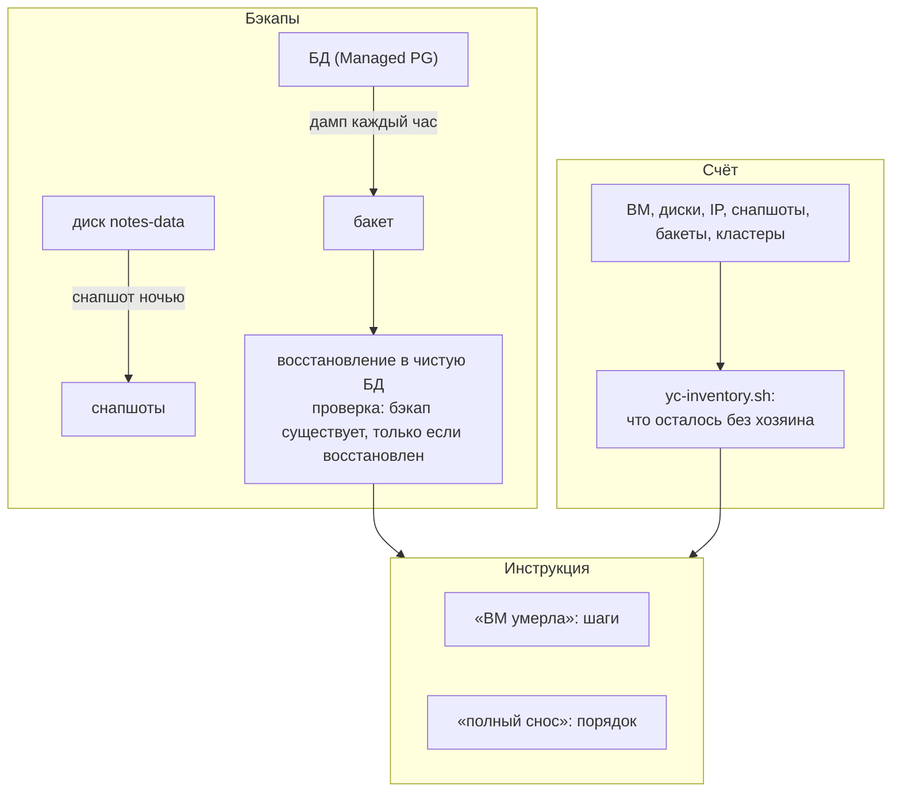
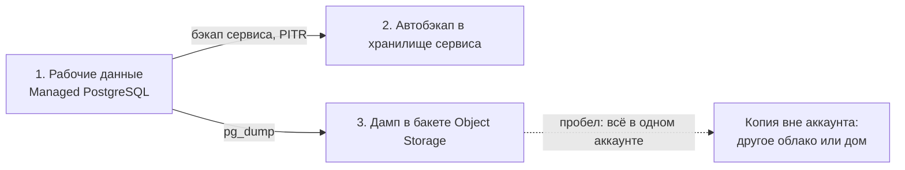
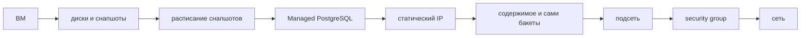

## Зачем это нужно

Облако не пропадает само. Забытый диск, неиспользуемый публичный IP и старый снапшот (snapshot: слепок диска на момент времени, как фотография страницы книги, к которой можно вернуться; подробно в теории ниже) молча выставляют счёт каждый месяц. Такие ресурсы без хозяина называют **осиротевшими** (orphaned): их создали, про них забыли, а счёт идёт, как за арендованную полку на складе, где давно нет товара. И наоборот: бэкап (backup, резервная копия: запасной экземпляр данных, по которому можно вернуть потерянное, как копия ключей у соседа), который никто ни разу не восстанавливал, оказывается пустым именно в тот день, когда он нужен. На работе это две регулярные задачи: «почему счёт вырос» и «ВМ умерла, что делаем».

В этом уроке ты настроишь снапшоты по расписанию и выгрузку дампа БД (**дамп** (dump): текстовый или двоичный файл с полным содержимым базы, как распечатка всей картотеки; из него базу можно собрать заново) в бакет (хранилище файлов в облаке, [урок 6.2](02-vm-network-storage.md)), проверишь бэкап восстановлением, найдёшь осиротевшие ресурсы скриптом и оформишь чек-лист восстановления и сноса (то есть записанного порядка шагов, чтобы в аварию не вспоминать его по памяти).

Шаг проекта: в «Заметках» появляются `scripts/yc-inventory.sh` и `docs/restore-checklist.md`, а дампы БД лежат в бакете. Код приложения не меняется (0.4.1).

## Что нужно знать

- [Урок 1.5: диск, память, CPU](../01-linux/05-disk-memory-cpu.md): `df` и `du` (сколько места занято на диске и в каталоге), чтобы отличать место на диске от места в бакете.
- [Урок 1.7: Bash в эксплуатации](../01-linux/07-bash-in-ops.md): `set -euo pipefail`, cron (планировщик запуска команд по расписанию) и блокировки для скрипта бэкапа.
- [Урок 4.3: тома и сети](../04-docker/03-storage-networks.md): что такое данные вне контейнера.
- [Урок 6.1: облако и деньги](01-cloud-models-aws-mapping.md): каталог `notes`, бюджет-алерт, `yc`.
- [Урок 6.2: ВМ, сеть и диски](02-vm-network-storage.md): `notes-vm`, диск данных `notes-data`, бакет, профиль `aws`.
- [Урок 6.3: деплой на ВМ](03-deploy-notes-vm.md): пользователь `deploy`, `/opt/notes`.
- [Урок 6.4: Managed-сервисы](04-managed-services.md): PostgreSQL как сервис, `DATABASE_URL` с `sslmode=verify-full`, сертификат `/etc/notes/tls/yc-ca.pem`, `pg_dump` (программа, которая делает дамп базы PostgreSQL, то есть выгружает её в файл).

Составной SLA («две ВМ и балансировщик надёжнее одной?») считается один раз в [уроке 8.1](../08-observability/01-observability-slo.md). Полноценный restore drill (учебное восстановление) и RPO с RTO разбираются в [уроке 10.3](../10-capstone/03-backup-dr-capacity.md). Кратко: **RPO** (recovery point objective) это сколько данных ты готов потерять, например «не больше часа»; **RTO** (recovery time objective) это сколько ты готов быть недоступным, например «не дольше двух часов». Первое определяет частоту копий, второе скорость восстановления. Здесь практическая часть: расписание, бакет, инвентаризация.

## Картина целиком

Представь склад маленького магазина.

- **Страховка от пожара** это копии документов в сейфе в другом здании. Копия важна, но ты не знаешь, что она читается, пока не достанешь и не прочтёшь.
- **Ежемесячная инвентаризация** (пересчёт всего, что есть): ты обходишь склад и находишь коробки, за которые платишь аренду полки, а товара в них нет.
- **Инструкция «что делать, если склад сгорел»**: бумага на стене, по которой можно всё восстановить, даже если главный уехал в отпуск.

Ровно это три части урока: **копии** (снапшоты и дампы), **счёт** (из чего он складывается и как искать лишнее), **инструкция** (чек-лист восстановления и сноса).



За урок ты разберёшь по порядку: чем снапшот отличается от бэкапа, как устроены дамп и восстановление, правило 3-2-1 (три копии данных, на двух разных носителях, одна из них в другом месте: так один пожар или одна ошибка не убьёт всё), расписание cron и почему бэкап может «работать» и не работать, RPO и RTO, из чего складывается счёт, как искать забытые ресурсы и в каком порядке всё сносить.

## Теория

### Снапшот и бэкап: не одно и то же

Данные могут пропасть по трём причинам: сломалось железо, ошиблись люди, взломали аккаунт. От каждой защищает своя копия. Одной «страховки» для всего не бывает, поэтому важно различать виды копий.

Представь: снапшот это фотография всей комнаты: быстро, видно всё, но вернуть можно только комнату целиком. Бэкап это опись вещей по ящикам, лежащая в другом здании: можно достать одну вещь, но собирать заново дольше. Оговорка: фотография хранится в той же комнате (у того же провайдера), и если сгорит комната, сгорит и она.

**Снапшот диска** (snapshot) это моментальный слепок блочного устройства, то есть диска целиком, который делает провайдер. Он **инкрементальный**: первый снапшот хранит все занятые блоки диска, следующие только те, что изменились с прошлого раза. Поэтому снапшоты быстрые и дешевле полных копий. Всё это хранится в облачной системе рядом с диском и умеет одно: создать из слепка новый диск. Внутри диска снапшот ничего не «понимает»: ни файлов, ни таблиц.

**Бэкап** (backup) это копия **данных** в другом месте и в формате, который понимает приложение: дамп БД (`pg_dump`), архив каталога. Из него можно восстановить одну таблицу, не трогая остальное.

Диск `notes-data` (10 ГБ) снимают каждую ночь в 03:00. В 14:00 кто-то выполнил `DROP TABLE notes` (удалил таблицу).

- Восстановление из снапшота: создаёшь новый диск из слепка 03:00, подключаешь его. Все заметки, созданные с 03:00 до 14:00, потеряны: это 11 часов данных.
- Часовой дамп: последний файл создан в 14:00 или 13:00, ты восстанавливаешь только таблицу `notes` из него: теряешь до часа.

Есть и вторая разница: **согласованность**. Снапшот диска, на котором в этот момент работает PostgreSQL, снят «на лету», будто ВМ выключили из розетки. PostgreSQL обычно поднимается после такого (он умеет восстанавливаться по своему журналу), но гарантии нет. Дамп через `pg_dump` согласован по построению: он читает базу одной транзакцией, то есть видит её как в один момент времени.

И третья: **живучесть**. Если удалён диск вместе со снапшотами или скомпрометирован аккаунт, снапшоты могут исчезнуть вместе с ним. Дамп в бакете другого аккаунта нет.

> **Прикинь сам:** снапшот диска сделан каждую ночь, а в 14:00 кто-то выполнил `DROP TABLE notes`. Какая часть данных будет потеряна, если восстановить последний снапшот?
{: .predict}

Всё, что записано после снапшота (в худшем случае почти сутки). Заметки, созданные с 03:00 до 14:00, пропадут. Частота бэкапа определяет, сколько данных ты готов потерять: это вопрос про RPO (разберём ниже). Для потери не больше часа нужен дамп раз в час или PITR у Managed PostgreSQL.

Осторожно: «Снапшот это бэкап». Для файлов на диске (конфиги, загрузки) снапшот годится как быстрая страховка, для базы данных он лишь дополняет дамп или PITR ([урок 6.4](04-managed-services.md)).

> **Главное:** снапшот это быстрый слепок диска на момент времени, а бэкап это копия, из которой данные восстанавливаются там, где их потеряли, и которую надо проверять.
{: .key}

Снапшотов диска мало: для БД нужны дамп и восстановление.

### Дамп и восстановление: что внутри файла и как его проверить

Чтобы дамп можно было положить в бакет и через месяц загрузить в другую базу на другой машине, он должен быть самодостаточным файлом. А чтобы понять, что файл не пустой и не битый, нужны дешёвые проверки, не требующие поднимать целый сервер.

Представь: чертёж мебели из магазина: по нему можно собрать шкаф где угодно. Оговорка: чертёж бесполезен, если инструкцию печатали с ошибкой, и понять это можно, только попробовав собрать (это и есть восстановление).

Программа `pg_dump` подключается к базе и выгружает её. У неё два основных формата:

- **plain** (по умолчанию): текстовый файл с командами SQL. Читается глазами, грузится через `psql -f`, но восстановить одну таблицу неудобно.
- **custom** (`--format=custom`, «пользовательский»): сжатый двоичный файл со **списком содержимого** (оглавлением). Грузится программой `pg_restore`, которая умеет показать оглавление (`--list`), восстановить только выбранную таблицу и работать в несколько потоков.

Ещё три флага, которые мы используем: `--no-owner` выгружает данные без привязки к ролям (пользователям базы), которых на новом сервере может не быть; версия клиента `pg_dump` должна быть **не старше** сервера, иначе `aborting because of server version mismatch`. Поэтому `pg_dump` мы запускаем из контейнера `postgres:18`, а не системным клиентом ВМ.

Пример: три дешёвые проверки дампа.

1. **Размер.** Дамп базы «Заметок» с 12 строками получится в несколько десятков килобайт из-за служебной части (оглавление, схема). Файл в 20 байт значит, что внутри только сообщение об ошибке. Пороговое значение подбирается по твоей базе: в скрипте ниже стоит 1000 байт.
2. **Оглавление:** `pg_restore --list notes.dump` печатает список таблиц и объектов. На пустом или битом файле будет ошибка формата, и для этого не нужен сервер PostgreSQL.
3. **Полное восстановление** во временную базу и сравнение `count(*)` с боевой. Это единственная проверка, доказывающая, что бэкап рабочий. Первые две отсеивают очевидный брак.

> **Прикинь сам:** чем формат `custom` удобнее `plain`, если нужно вернуть одну таблицу?
{: .predict}

В `custom` есть оглавление, и `pg_restore` может загрузить из него только выбранную таблицу (`-t notes`). Файл `plain` это один длинный SQL-скрипт, придётся вырезать нужные куски руками.

Осторожно: «`pg_dump` завершился без ошибки, значит файл хороший». Не обязательно: при неверном пути или обрыве соединения в файл попадает кусок. Поэтому дамп пишут во временный файл (`.part`) и переименовывают в `.dump` только после проверки: так в каталоге никогда не лежит недописанный «бэкап».

> **Главное:** `pg_dump` выгружает базу в файл, но файл хорош, только если из него удалось восстановиться; формат `custom` позволяет вернуть одну таблицу.
{: .key}

Одной копии мало, и правило 3-2-1 говорит, сколько нужно.

### Правило 3-2-1 и бакеты

Одна копия рядом с оригиналом гибнет от той же причины, что и оригинал. Нужно расставить копии так, чтобы ни одна единичная авария не уничтожила всё.

Представь: три экземпляра диплома: один в рамке на стене, один в папке дома, один у родителей в другом городе. Пожар в квартире, кража, наводнение: разные события, и хотя бы один экземпляр останется.

Правило: **3 копии** данных, на **2 разных типах** носителей, **1 копия** за пределами основной площадки. Для «Заметок» это выглядит так.

| Копия | Где | От чего защищает |
|---|---|---|
| 1. Рабочие данные | БД (Managed PostgreSQL) | ничего, это оригинал |
| 2. Автоматический бэкап сервиса | хранилище Managed-сервиса | потерю данных и ошибки людей (PITR) |
| 3. Дамп `pg_dump` | бакет Object Storage | удаление кластера, сбой сервиса |



Разберём два незнакомых слова. **Object Storage** (объектное хранилище) это облачный склад файлов: ты кладёшь туда файлы-«объекты» по имени и достаёшь обратно по сети. Он не подключается как диск. **Бакет** (bucket) это «корзина» верхнего уровня, в которой лежат объекты; имя бакета глобально уникально во всём облаке. Доступ к нему идёт по протоколу S3, поэтому работает программа `aws` (её ставили в [уроке 6.2](02-vm-network-storage.md)) с параметром `--endpoint-url` адреса Yandex.

Проверим каждую копию на три аварии.

- Упал хост БД: копия 1 недоступна, копия 2 (HA и бэкап сервиса) вернёт кластер, копия 3 остаётся запасной.
- Кто-то удалил сам кластер БД (автобэкапы сервиса привязаны к кластеру, и что с ними будет после удаления, зависит от сервиса и настроек): надёжно остаётся копия 3, дамп в бакете.
- Потерян весь аккаунт (взломан, заблокирован): все три копии лежат в одном аккаунте, значит, потеряны все. Настоящее 3-2-1 требует копию **вне** аккаунта (в другом облаке или дома). Для учебного проекта достаточно понимать этот пробел и уметь назвать его на собеседовании.

> **Прикинь сам:** какая из трёх копий защитит от удаления самого кластера БД?
{: .predict}

Дамп в бакете (копия 3): он хранится отдельно от кластера. Автоматические бэкапы сервиса привязаны к кластеру: часть сервисов хранит их после удаления кластера до конца срока хранения, часть нет, и это зависит от настроек (смотри документацию своего облака). Полагаться на автобэкап после удаления нельзя.

Осторожно: «Копия в бакете в том же аккаунте это офсайт». Это другая система хранения, но не другая площадка управления: права и аккаунт общие.

> **Главное:** 3-2-1 это три копии, на двух типах носителей, одна вне основной площадки; копия в бакете того же аккаунта ещё не офсайт.
{: .key}

Копии должны делаться сами. Разберём, как это настраивают и как они тихо ломаются.

### Расписание cron и бэкап, который «работает» и не работает

Бэкап делают регулярно и без человека. Значит, он запускается по расписанию, и ломается тоже без человека: тихо, ночью, никто не смотрит. Нужно понимать, как читать расписание и как устроены «молчаливые» отказы.

Представь: будильник. Он звонит по времени, но не проверяет, проснулся ли ты. Если ты будильник выключил, «будильник исправен» и «ты проснулся» разные вещи. Точно так же «cron запустил» и «бэкап получился» разные вещи.

Расписание. **cron** это служба, которая запускает команды по времени. Строка расписания состоит из пяти полей и команды: `минута час день_месяца месяц день_недели`. Символ `*` значит «любое значение». Поле `*/15` значит «каждые 15». В файле из каталога `/etc/cron.d/` перед командой добавляется шестое поле: пользователь, от чьего имени запускать. Примеры:

```text
0 3 * * *   deploy  команда     каждый день в 03:00
0 * * * *   deploy  команда     каждый час в 0 минут
*/15 * * * * deploy команда     каждые 15 минут
```

Тихие отказы. У бэкап-скрипта минимум пять способов не сделать бэкап и при этом выглядеть здоровым:

1. **cron не запускает скрипт**: файл в `/etc/cron.d` имеет неверные права (доступен на запись всем), и cron его игнорирует. Никаких ошибок в твоём логе нет: скрипт просто не стартует.
2. **Скрипт завершился с ошибкой**, а cron лишь пишет в лог: никто не читает.
3. **Предыдущий запуск завис** и держит замок. Замок (**lock**) это файл, который скрипт занимает через команду `flock`, чтобы не запускались два экземпляра сразу (иначе два дампа перетрут друг друга). Новый запуск видит «занято» и по нашему скрипту печатает «уже выполняется» и завершается с кодом 0 (успех!). Если «предыдущий» завис навсегда, бэкапов нет, а все запуски «успешны».
4. **Скрипт пишет пустой файл** (ошибка `pg_dump`, а проверки размера нет).
5. **Загрузка в бакет не удалась** (кончились ключи, отозвали доступ), а локальный файл есть: кажется, что бэкап делается.

Общий вывод: **успех запуска не доказывает свежести бэкапа**. Смотрят не на факт запуска, а на результат: «возраст последнего объекта в бакете».

Расписание «каждый час», проверка свежести: «возраст последнего объекта в бакете меньше двух периодов, то есть 2 часов». В 10:30 самый свежий объект `notes-20260930-1000.dump`: возраст 30 минут, всё хорошо. Если в 12:15 самый свежий всё ещё `...-1000.dump`: возраст 2 часа 15 минут больше порога, срабатывает алерт. Заметили за 2 часа, а не через месяц при аварии. Порог «два периода» берут, чтобы один пропущенный запуск (например, из-за нагрузки) не вызывал ложных тревог, а два подряд уже сигнал.

> **Прикинь сам:** скрипт бэкапа при занятом замке печатает «уже выполняется» и выходит с кодом 0. В логе несколько дней подряд только эта строка. Что случилось и как заметить заранее?
{: .predict}

Замок держит зависший процесс (или предыдущий запуск не завершился), и бэкапы не создаются, хотя формально запуски успешны. Заметить заранее: алерт на возраст последнего объекта в бакете, а не на факт запуска. Устранить: найти процесс, который держит замок, и разобраться, почему он завис.

Осторожно: «cron же пишет в лог, значит всё видно». Лог покажет ошибку, только если кто-то смотрит на него. Настоящая защита это проверка результата снаружи и алерт.

> **Главное:** cron запускает бэкап по расписанию, но молчаливые отказы случаются: нужна проверка свежести последней копии, а не вера в отсутствие ошибок в логе.
{: .key}

Теперь зададим цифры: сколько данных и времени мы готовы потерять.

### RPO и RTO простыми словами

«Сделаем бэкап» без цифр не план. Сколько данных потерять допустимо и как быстро надо вернуться, определяет частоту бэкапов, их стоимость и порядок действий. Это два числа, и их принято называть по-английски.

Представь: ты пишешь диплом. **RPO** (recovery point objective): сколько страниц ты готов набрать заново, если текстовый редактор упал, то есть как часто редактор сохраняет черновик. **RTO** (recovery time objective): за сколько минут ты хочешь снова сидеть за компьютером и печатать, то есть скорость запуска запасного ноутбука.

**RPO**: максимум данных, которые ты готов потерять, измеряется временем. Если дамп делается раз в час, худший случай это авария за минуту до следующего дампа: потеряно почти 60 минут, значит RPO = 1 час. **RTO**: за сколько нужно вернуть работу. Складывается из шагов: заметить проблему, принять решение, скачать копию, восстановить, проверить, переключить трафик. Каждый шаг съедает время.

Разберём RTO «Заметок» при потере ВМ по шагам с оценками (оценки твои собственные, потом заменишь их замерами): заметить и решить 10 минут, создать ВМ и диск 15, установить Docker и выложить приложение 20, проверить 5. Итого 50 минут. Если бизнес требует RTO 30 минут, значит, процесс надо ускорять: держать готовый образ ВМ или скрипт, репетировать. Сравни: RPO определяется частотой бэкапа (кто сколько потеряет), RTO определяется отработанностью восстановления (сколько времени займёт).

Чем меньше RPO и RTO, тем дороже система: частые копии, реплики, репетиции. Поэтому цифры выбирают вместе с бизнесом, а не «как можно меньше».

> **Прикинь сам:** дамп раз в 4 часа, восстановление занимает 45 минут. Чему равны RPO и RTO?
{: .predict}

RPO = 4 часа (в худшем случае потеряешь всё после последнего дампа). RTO около 45 минут плюс время «заметить и принять решение», то есть чуть больше.

Осторожно: «RPO и RTO это одно и то же». RPO про данные (сколько потеряем), RTO про время (как долго не работаем). Можно иметь RPO ноль (репликация) и RTO час (переключаться руками).

> **Главное:** RPO это сколько данных можно потерять, RTO это сколько времени можно восстанавливаться; это разные величины, и их считают заранее.
{: .key}

Переходим ко второй части урока: деньги и из чего собирается счёт.

### Из чего складывается счёт

Облако тарифицирует **по времени и объёму**: платишь не за «владение», а за каждый час и каждый гигабайт. Понимая, из чего состоит счёт, ты находишь утечки раньше, чем они станут заметны.

Представь: такси со счётчиком плюс аренда парковки. Пока едешь, тикает километраж. Но машина на стоянке тоже стоит денег, хоть и не едет.

Большая часть счёта маленького проекта складывается из пяти статей.

| Статья | Как считается | Типичная утечка |
|---|---|---|
| ВМ | vCPU и RAM за час работы, пока ВМ запущена | ВМ для теста, про которую забыли |
| Диски | ГБ в месяц, **даже если ВМ остановлена или удалена, а диск остался** | осиротевший диск |
| Публичный IP | за резервирование (пока адрес закреплён за тобой) | статический адрес без ВМ |
| Снапшоты и бакеты | ГБ в месяц | снапшоты без срока хранения |
| Managed-сервисы | часы работы кластера | кластер, созданный «на минуту» |

Отсюда правила. **Остановленная ВМ не платит за vCPU и RAM, но платит за диски.** Удаляй ресурс целиком, а не «выключай». Ставь **срок хранения** снапшотов и объектов, чтобы старое удалялось само. Подписывай ресурсы **метками** (labels): пара «ключ=значение» вроде `project=notes`, `env=learn`; по ним фильтруется счёт и находится хозяин. **Committed use** (скидка за обязательство платить год) берут только для нагрузки, которая точно проживёт год. **Прерываемые ВМ** (preemptible, spot) дешевле в разы, но облако может забрать их в любой момент: подходят для пакетных задач, а не для единственной ВМ «Заметок».

Цены здесь условные, только для арифметики (настоящие тарифы смотри в калькуляторе провайдера). Допустим, 1 ГБ диска стоит 5 руб. в месяц, а забытый диск на 100 ГБ остался от удалённой ВМ. За месяц: 100 × 5 = 500 руб. За год: 500 × 12 = 6000 руб. за диск, который никому не нужен. А теперь в детализации расходов 8 строк (учебный файл из задания 3): ВМ 1200 руб., диски 540, снапшоты 240, IP 100, бакет 35, всего 2115 руб. Доля «второстепенного» (всё, кроме ВМ): (2115 − 1200) / 2115 = 915 / 2115 = 43%. Почти половина счёта не выключается вместе с ВМ.

Есть ещё статья, про которую забывают: **исходящий трафик** (egress, данные, которые уходят из облака в интернет). Входящий трафик обычно не тарифицируется, а исходящий сверх бесплатного объёма тарифицируется по гигабайтам (точные условия смотри в тарифах провайдера). Для нас это значит: скачать один дамп на свой компьютер для проверки почти бесплатно, но регулярно выкачивать сотни гигабайт из бакета дорого. Поэтому drill выгодно проводить **внутри облака**, на временной ВМ рядом с бакетом, а не у себя дома.

> **Прикинь сам:** ты остановил `notes-vm` на выходные, чтобы сэкономить. За что придёт счёт?
{: .predict}

За диски (загрузочный и данных), за публичный IP, если он зарезервирован, за снапшоты, бакет и Managed PostgreSQL, если кластер работает. Экономия только на vCPU и RAM.

Осторожно: «Остановил ВМ, значит, не плачу». Заплатишь за диски, зарезервированный IP, снапшоты, бакет и Managed-кластер, если он работает. Чтобы платить ноль, надо удалить, сохранив данные.

> **Главное:** счёт делится на пять статей (ВМ, диски, публичный IP, снапшоты и бакеты, Managed-сервисы), а остановка ВМ останавливает только плату за вычисления.
{: .key}

Чтобы не платить зря, нужно регулярно искать то, что осталось без хозяина.

### Осиротевшие ресурсы и инвентаризация

Облако не спрашивает, нужен ли тебе ещё этот диск. Ресурсы остаются после удалённой ВМ, после эксперимента, после ухода коллеги. Нужен способ регулярно **увидеть всё, что есть**, и отметить подозрительное.

Представь: инвентаризация склада: ты не выбрасываешь коробки сразу, а составляешь список, помечаешь «подписана / без подписи», а решаешь позже, после вопроса хозяину.

Команды `yc ... list` показывают ресурсы каждого вида. Ключ `--format json` выдаёт результат в формате JSON (структурированный текст), а `jq` вытаскивает из него нужные поля. **Осиротевший** (orphan) ресурс это ресурс без «родителя»: диск, не подключённый ни к одной ВМ, IP-адрес, не привязанный ни к чему, снапшот старше срока хранения. В JSON это видно по полям: у диска пустой список `instance_ids`, у адреса `used: false`, у снапшота дата `created_at`.

Скрипт инвентаризации **только читает**. Автоматическое удаление «всего, что выглядит осиротевшим» опасно: диск может быть не подключён потому, что его отключили на время для переноса, а снапшот старше 30 дней может быть единственной копией. Решение об удалении принимает человек после проверки.

Пример: возраст снапшота в `jq`. Условие «старше 30 дней»: 30 суток это 30 × 24 × 60 × 60 = 2 592 000 секунд. `jq` умеет читать дату ISO (`2026-08-01T10:00:03Z`) функцией `fromdateiso8601` и превращать её в число секунд с 1970 года. Текущее время даёт `now`. Значит, условие «старше 30 дней»: `(дата снапшота в секундах) < (now - 2592000)`. Так скрипт работает одинаково на Ubuntu и macOS (у BSD `date` другие флаги, поэтому `date -d '30 days ago'` на Mac не работает).

Метки помогают ответить «чей это ресурс». Без метки `project` диск «неизвестно чей», и его страшно удалять. С меткой ты пишешь владельцу.

> **Прикинь сам:** инвентаризация показала диск `old-data` со статусом `ORPHAN` размером 50 ГБ, без меток. Что делаешь?
{: .predict}

Не удаляю сразу. Смотрю дату создания и историю (журнал действий в облаке, аудит-лог), спрашиваю в команде, чей диск. Если хозяин не найден, делаю снапшот (страховка на случай ошибки), жду неделю-две, и только потом удаляю диск. Метки на будущее.

Осторожно: «ORPHAN значит, что можно удалять». Нет, это значит «проверь». А ресурс, который **используется**, тоже бывает лишним (ВМ работает, но никому не нужна): такое видно только по хозяину и по метрикам, а не по признаку сирота.

> **Главное:** инвентаризация находит платные ресурсы без хозяина, метки показывают, чьи они, а статус ORPHAN означает «проверь», а не «удаляй».
{: .key}

Найденное надо уметь убрать, а при аварии быстро восстановить: для этого нужна письменная инструкция.

### Порядок сноса и чек-лист восстановления

Два события требуют письменной инструкции: «ВМ пропала» (действовать быстро, на нервах) и «проект закрыт, убираем всё» (не оставить платных остатков). В аварии голова работает хуже, поэтому шаги пишут заранее.

Представь: карточка действий при пожаре на стене. В момент дыма ты не вспоминаешь, ты читаешь.

Порядок сноса. Схема порядка:



У ресурсов есть зависимости: нельзя удалить сеть, пока в ней есть подсеть и ВМ, нельзя удалить диск, пока он подключён к ВМ. Поэтому сносят от «верхних» ресурсов к «нижним»: ВМ, потом диски и снапшоты, расписание снапшотов, Managed PostgreSQL, статический IP, содержимое и сами бакеты, подсеть, security group, сеть. Перед этим сохраняют то, что нужно: последний дамп, `.env`, список ресурсов. После сноса повторяют инвентаризацию: она должна показать пустоту. Через сутки смотрят биллинг: расход стремится к нулю.

Чек-лист восстановления отвечает на вопрос «ВМ пропала, что дальше»: порядок «данные, затем инфраструктура, затем приложение». Сначала выясняешь, что цело (БД в Managed-кластере, диск данных, снапшоты, дамп в бакете), потом поднимаешь ВМ, потом выкатываешь приложение, потом проверяешь и записываешь время простоя.

Пример: почему чек-лист нужно проверять. В чек-листе есть строка «взять `.env` из защищённой копии». Если единственный экземпляр `.env` лежал на упавшей ВМ, шаг невыполним, а ты узнаёшь это в аварии. Поэтому чек-лист прогоняют «вхолостую» (учебное восстановление, drill): читают каждую строку и отвечают «где это лежит и я до этого доберусь без упавшей ВМ?». Каждая строка, на которой запнулся, это найденный дефект. Обновление чек-листа после каждого запуска это часть процесса.

> **Прикинь сам:** почему сеть удаляют последней, а перед удалением бакета его сначала очищают?
{: .predict}

Сеть нельзя удалить, пока в ней остались подсеть, ВМ и другие ресурсы: они «стоят» на ней, поэтому она идёт в конце. Бакет нельзя удалить, пока в нём лежат объекты: сначала удаляют содержимое, потом сам бакет. Перед этим проверь, что нужные дампы сохранены в другом месте.

Осторожно: «Инструкция в голове». В аварии ты можешь быть недоступен, а отпускник не помнит шаги. Чек-лист лежит в репозитории (`docs/restore-checklist.md`), а не в голове и не в чате.

> **Главное:** ресурсы сносят от верхних к нижним, сеть последней, а чек-лист восстановления хранят в репозитории и прогоняют заранее.
{: .key}

Копии лежат в бакете. Посмотрим, как устроен доступ к нему.

### Object Storage изнутри: ключи, права и lifecycle

Дампы нужно куда-то складывать так, чтобы к ним имел доступ скрипт бэкапа, но не весь интернет, и чтобы старые файлы не копились вечно. Для этого у хранилища есть три механизма: ключи доступа, права и правила жизни объектов.

Представь: камера хранения на вокзале. Ячейка это бакет, твой жетон это ключ, а табличка «вещи старше 30 дней утилизируются» это lifecycle-правило. Оговорка: у жетона нет срока годности сам по себе, его нужно сменить, если он потерян.

**Статический ключ доступа** (access key) это пара из идентификатора и секрета, которую облако выдаёт **сервисному аккаунту** (служебной «учётной записи» для программ, а не для людей). По этой паре программа `aws` подписывает запросы, и хранилище понимает, кто пришёл. Права задаёт роль сервисного аккаунта: например, `storage.uploader` разрешает только **загружать** объекты, но не удалять и не читать. Для бэкапа это правильная роль: если ключ украдут, злоумышленник не сотрёт старые дампы. Секрет ключа показывается один раз при создании, поэтому его сохраняют сразу (в `~/.aws/credentials` с правами 600).

**Lifecycle-правило** (правило жизненного цикла) это настройка бакета вида «объекты с префиксом `pg/` удалять через 30 дней после создания» или «через 30 дней переносить в более дешёвый класс хранения». Облако само выполняет его раз в сутки. Смысл: срок хранения бэкапов задан один раз в настройках, а не в скрипте, который может сломаться.

Дамп раз в час, размер файла 5 МБ. За сутки 24 файла, за 30 дней 24 × 30 = 720 файлов, то есть 720 × 5 МБ = 3600 МБ, около 3.5 ГБ. Без lifecycle-правила за год набежит 24 × 365 × 5 МБ = 43 800 МБ, около 43 ГБ, и счёт растёт вечно. С правилом «удалять через 30 дней» в бакете стабильно лежат последние 3.5 ГБ. Компромисс: чем дольше хранишь, тем дальше можно откатиться, но тем дороже. Часто делают многоуровнево: часовые дампы держат 2 суток, суточные 30 дней, месячные год.

> **Прикинь сам:** зачем роль `storage.uploader`, а не `storage.editor`, для ключа бэкап-скрипта?
{: .predict}

`uploader` позволяет только загружать объекты. Если ключ утечёт или скрипт ошибётся, старые дампы нельзя будет удалить этим ключом. Перезапись объекта с тем же именем остаётся возможной (это тоже загрузка), поэтому пиши дампы под уникальными именами с датой, а для защиты включи версионирование бакета или object lock. Принцип наименьших привилегий: скрипту дают только то, что нужно для работы. В практике ниже для простоты используется ключ с `storage.editor` из урока 6.2: он же нужен для проверки и восстановления (`s3 ls`, `s3 cp`).

Осторожно: «Ключ это как пароль, можно отдать всей команде». Ключ принадлежит сервисному аккаунту с конкретными правами, и каждой системе нужен свой ключ с минимумом прав, чтобы утечку одного не пришлось расхлёбывать везде.

> **Главное:** ключ доступа принадлежит сервисному аккаунту и получает минимальную роль (`storage.uploader`), а lifecycle удаляет старые копии сам.
{: .key}

Разберём, почему скрипт, который работает руками, подводит под cron.

### Как cron запускает задачу: пользователь, окружение и пути

Самая частая причина «руками работает, из cron нет»: cron запускает команду в другой обстановке. Это надо понимать заранее, иначе бэкап-скрипт будет падать по причинам, которых не видно при ручном запуске.

Представь: ты пишешь рецепт для помощника, который придёт, когда тебя нет. У него другая кухня: он не знает, где лежит соль, если ты не написал полный путь. Скрипт для cron должен быть «самодостаточным».

cron запускает команду от имени пользователя, указанного в записи (`deploy`), но **не** в интерактивной оболочке: не читает `~/.bashrc`, не имеет твоего `PATH` (списка каталогов, где ищутся программы) с добавленными каталогами, не знает переменных окружения из твоей сессии. У cron короткий `PATH` вроде `/usr/bin:/bin`. Отсюда правила:

- пиши в скрипте **полные пути** к файлам (`/opt/notes/.env`, `/var/backups/notes`);
- не полагайся на переменные из сессии (поэтому `DATABASE_URL` читается прямо из файла);
- пользователь записи определяет **права**: если запустить скрипт от `deploy`, он видит Docker и `.env` (в группе `docker`, владеет файлом), а от чужого пользователя нет;
- вывод команды cron по умолчанию отправляет по почте, если она настроена, или теряет. Поэтому в записи стоит перенаправление `>> лог 2>&1`: стандартный вывод и вывод ошибок (`2>&1` направляет поток ошибок туда же, куда идёт основной) дописываются в файл.

Ручной запуск `sudo -u deploy /usr/local/bin/notes-pg-backup-s3.sh` работает, а из cron падает с `docker: command not found`. Причина: в коротком `PATH` cron нет каталога, где лежит `docker` (например, `/usr/local/bin`). Проверка: добавить в начало скрипта `echo "$PATH"` и посмотреть в лог. Лечится строкой `PATH=/usr/local/sbin:/usr/local/bin:/usr/sbin:/usr/bin:/sbin:/bin` в начале файла cron.d или полным путём к команде. Ещё одна типичная причина: скрипт использует `~`. Для `deploy` это `/home/deploy`, для `root` `/root`, и один и тот же скрипт из cron и из сессии видит разные каталоги.

> **Прикинь сам:** скрипт из cron пишет в лог `aws: command not found`, а вручную всё работает. Что проверишь первым?
{: .predict}

`PATH` у cron короче, чем в твоей сессии. Проверить, где лежит `aws` (`command -v aws`), и либо прописать `PATH` в файле cron.d, либо вызывать `aws` по полному пути в скрипте.

Осторожно: «Скрипт работает вручную, значит, и из cron будет». Проверка задачи cron: `sudo -u deploy env -i /usr/local/bin/notes-pg-backup-s3.sh` (запуск с пустым окружением `env -i`, приближённо к тому, что видит cron).

> **Главное:** cron запускает задачу с урезанным окружением и другим `PATH`, поэтому в скрипте нужны полные пути, а проверять его надо от того же пользователя.
{: .key}

Скрипт настроен. Теперь вопрос: как убедиться, что бэкап восстанавливается.

### Учебное восстановление: как часто и что именно проверять

Слово «бэкап» обещает то, чего ещё нет: возможность вернуть данные. Пока восстановление не произошло, это гипотеза. Учебное восстановление (**restore drill**) превращает её в факт и заодно измеряет RTO.

Представь: пожарная тревога в офисе. Её проводят не потому, что горит, а чтобы проверить, что двери открываются, а люди знают, куда идти.

Drill это сценарий из шагов: взять свежий дамп из бакета, загрузить его в **чистую** базу (на другой ВМ или временном контейнере), сравнить данные с боевой базой, зафиксировать время. Проверяют минимум три вещи: дамп **скачивается** (права и ключи работают), **загружается** без ошибок (формат и версии совместимы), **данные совпадают** (число строк, максимальный `id`, в идеале контрольная сумма таблицы). Частота: раз в месяц для важных данных, после каждого изменения способа бэкапа (новая версия PostgreSQL, новый бакет, смена ключей).

Drill в марте занял 22 минуты, из них скачивание 2, загрузка 12, сверка 8. В апреле после обновления PostgreSQL клиент в скрипте остался старой версии: `pg_restore` ругается на формат. Без drill об этом узнали бы при аварии. Замер даёт RTO: 22 минуты на данные плюс шаги вокруг (создать ВМ, выкатить приложение). Числа этого примера иллюстративные, свои ты замеришь в задании 2.

> **Прикинь сам:** назови три вещи, которые проверяет drill, кроме «файл существует».
{: .predict}

Что дамп скачивается (права, ключи), что он загружается без ошибок в чистую базу (формат, версии), и что данные совпадают с боевыми (число строк, максимальный `id`). Плюс измеряется время, то есть реальный RTO.

Осторожно: «Drill можно сделать один раз при настройке». Бэкап портится тихо: меняются версии, ключи, диски. Поэтому drill периодический и оформленный (дата, время, результат, что нашли).

> **Главное:** drill это регулярное восстановление из свежего дампа: проверяют, что файл читается, данные на месте и время укладывается в RTO.
{: .key}

Копии нельзя копить бесконечно, и нужен срок хранения.

### Срок хранения: сколько копий держать и когда удалять

Если копии только копить, через год бакет и снапшоты станут самой дорогой строкой счёта. Если хранить слишком мало, ошибку, замеченную через неделю, уже не откатить. Срок хранения (retention) это выбор между ценой и глубиной памяти.

Представь: домашний архив квитанций. Свежие за год держат под рукой, старые выбрасывают: место на полке ограничено. Аналогия ломается тем, что в облаке «полка» резиновая, и её переполнение видно только в счёте.

Ты задаёшь правило: «хранить ежедневные копии 7 дней». Раз в сутки создаётся новая копия, а та, что старше семи дней, удаляется автоматически. Для снапшотов диска срок ставится в расписании, для дампов в бакете его ставит правило жизненного цикла ([урок 6.2](02-vm-network-storage.md)).

Дамп весит 50 МБ, делается каждый час. За сутки это 24 файла, то есть 24 × 50 = 1200 МБ. Без срока хранения за 30 дней накопится 36 ГБ, а при цене хранения в несколько рублей за ГБ в месяц это уже заметно. С правилом «хранить 7 дней» в бакете лежит не больше 7 × 1200 МБ = 8,4 ГБ. Цена не растёт, а откатиться можно на любой час последней недели.

> **Прикинь сам:** бэкап делается раз в сутки, срок хранения 3 дня. Сколько копий лежит в бакете в обычный день и на сколько дней назад можно откатиться?
{: .predict}

Три копии (за сегодня и два предыдущих дня, более старые удаляются). Откатиться можно примерно на три дня назад. Ошибку, которую заметили на пятый день, уже не вернуть: пора увеличить срок.

Осторожно: «Чем больше копий, тем надёжнее». Копии одного дня в одном месте надёжность не повышают, её повышает число разных мест (правило 3-2-1). И второе: срок хранения считают не от момента создания ресурса, а от даты каждой копии.

> **Главное:** срок хранения ограничивает рост бакета: копии одного дня в одном месте надёжнее не делает, зато счёт растёт.
{: .key}

Остался финансовый контроль: бюджет-алерт.

### Бюджет-алерт и учёт затрат

Счёт приходит в конце месяца, когда деньги уже потрачены. Хочется узнать о росте в день, когда он начался, а не через 30 дней.

Представь: индикатор расхода топлива, который пищит, если бак пустеет быстрее обычного. Оговорка: он не найдёт причину, а только сообщит о факте.

**Бюджет** (budget) в биллинге это порог суммы за период, например 3000 руб. в месяц, и правила оповещения: письмо при достижении 50%, 80%, 100% (пороги ты выбираешь сам, значения зависят от возможностей биллинга). Он смотрит на **расход**, а не на причину: чтобы найти причину, открывают детализацию и группируют по сервису, ресурсу и меткам. Обычная последовательность разбора роста счёта:

1. Сравни два периода (текущий и прошлый), сгруппируй по сервису (`service`) и типу (`sku`), найди строку, где рост.
2. Для этой строки посмотри ресурсы (`resource_id`) и их метки.
3. Ресурсы без метки проверь инвентаризацией: кто создал, зачем, есть ли данные.
4. Действуй: удали лишнее (после проверки), поставь срок хранения, добавь метки, уточни бюджет.

Бюджет 3000 руб., в середине месяца пришло письмо «израсходовано 80%», то есть 2400 руб. за 15 дней. Прогноз на месяц: 2400 × 2 = 4800 руб., выше бюджета в 1.6 раза (4800 / 3000). Значит, надо искать причину сейчас: в детализации видно, что диски выросли на 900 руб. из-за трёх забытых дисков без метки. Удалили после проверки: экономия за оставшиеся 15 дней 450 руб. плюс сотни руб. в следующие месяцы.

> **Прикинь сам:** бюджет 3000 руб., к 10-му числу месяца израсходовано 1200 руб. Куда движется месяц и что делаешь?
{: .predict}

За 10 дней 1200 руб., то есть 120 руб. в день; за 30 дней получится 3600 руб., выше бюджета на 20%. Надо смотреть детализацию и искать причину (осиротевшие ресурсы, рост нагрузки), а не ждать конца месяца.

Осторожно: «Бюджет-алерт ограничивает расход». Нет: он только сообщает. Ресурсы продолжают работать и стоить, пока ты их не остановил. Чтобы жёстко ограничить, нужны отдельные механизмы (квоты, автоматические действия по алерту), и это выходит за рамки урока.

> **Главное:** бюджет-алерт только сообщает о перерасходе, ничего не останавливая, поэтому нужны ещё метки и регулярная инвентаризация.
{: .key}

Осталось сопоставить с AWS.

### Соответствие AWS

В вакансиях и статьях эти вещи называют по-другому, поэтому сопоставим.

| Что делаем | Yandex Cloud | AWS |
|---|---|---|
| Слепок диска | снапшот диска (snapshot) | EBS snapshot |
| Расписание снапшотов | snapshot schedule | Data Lifecycle Manager (DLM) или AWS Backup |
| Бакет для дампов | Object Storage | S3 |
| Срок жизни объектов | lifecycle-правила бакета | S3 Lifecycle |
| Учёт расходов | биллинг-аккаунт, детализация | Cost Explorer, Cost and Usage Report |
| Бюджет-алерт | бюджеты в биллинге | AWS Budgets |
| Метки затрат | labels | tags (cost allocation tags) |
| Инвентаризация ресурсов | `yc ... list` | `aws ec2 describe-*`, AWS Config |

На собеседовании этот список нужен, чтобы сказать «в AWS это S3 Lifecycle», а не искать слова.

> **Прикинь сам:** в вакансии просят настроить AWS Budgets и Lifecycle для S3. Что из урока им соответствует?
{: .predict}

AWS Budgets это бюджет-алерт, Lifecycle для S3 это правило удаления или перехода объектов к более дешёвому классу, как в бакете Object Storage Yandex Cloud.

> **Главное:** снапшоты, бакеты, бюджеты и lifecycle есть у AWS под другими именами, а принципы те же.
{: .key}

## Практика

Потребуется каталог `notes` из [урока 6.1](01-cloud-models-aws-mapping.md), ВМ `notes-vm` с диском данных из [урока 6.2](02-vm-network-storage.md), работающие «Заметки» на Managed PostgreSQL из [урока 6.4](04-managed-services.md) и настроенные `yc` и `aws` (профиль `yandex`, [урок 6.2](02-vm-network-storage.md)). Если облака нет, задания 1 и 4 читаются как разбор, задание 3 выполняется целиком (нужен только `duckdb`), а задание 2 можно повторить на Multipass-ВМ с MinIO (свой S3-совместимый сервер).

Как входить на ВМ: как в уроках 6.3 и 6.4. `yc-user` (администратор с `sudo`) для системных файлов, `deploy` для запуска Docker; адрес `203.0.113.10` в примерах документационный, подставь свой:

```bash
ssh -i ~/.ssh/notes_ed25519 yc-user@203.0.113.10
ssh -i ~/.ssh/notes-deploy deploy@203.0.113.10
```

### Задание 1. Снапшоты по расписанию и восстановление

**Цель:** настроить ежедневные снапшоты диска данных со сроком хранения и убедиться, что из снапшота получается рабочий диск.

**Предскажи:**

1. Расписание `0 3 * * *` с хранением 7 дней. Сколько снапшотов будет через 10 дней, если ничего не менять?
2. Если создать диск из снапшота, изменится ли исходный диск?

<details markdown="1">
<summary>Ответ</summary>

1. Семь: старые удаляются по сроку хранения, поэтому счёт за снапшоты не растёт бесконечно.
2. Нет. Новый диск независимая копия, исходный остаётся как был.

</details>

**Шаги (на твоём компьютере, где настроен `yc`):**

1. Создай расписание для диска `notes-data` (имя диска из урока 6.2). Точные имена флагов проверь командой `yc compute snapshot-schedule create --help`: они могут отличаться в твоей версии `yc`.

```bash
# ежедневно в 03:00, хранить 7 дней, метки для учёта затрат
yc compute snapshot-schedule create \
  --name notes-daily \
  --expression "0 3 * * *" \
  --retention-period 7d \
  --disk-name notes-data \
  --labels project=notes,env=learn
```

Разбор: `--expression "0 3 * * *"` это строка расписания в формате cron из теории (каждый день в 03:00; часовой пояс проверь в документации Yandex Cloud). `--retention-period 7d` срок жизни каждого снапшота 7 дней, потом его удаляет облако. `--disk-name` какой диск снимать. `--labels` метки, по которым потом ищут расходы и хозяев.

2. Чтобы не ждать ночи, сделай один снапшот вручную:

```bash
yc compute snapshot create \
  --name notes-data-manual \
  --disk-name notes-data \
  --labels project=notes,env=learn
```

3. Убедись, что снапшот готов:

```bash
yc compute snapshot list
```

4. Восстанови: создай новый диск из снапшота (это шаг «drill»: репетиция восстановления).

```bash
yc compute disk create \
  --name notes-data-restore \
  --source-snapshot-name notes-data-manual \
  --labels project=notes,env=learn
```

5. Проверь диск: подключи его к ВМ как второй диск данных или примонтируй на временной ВМ и посмотри содержимое (`ls /mnt/restore`; про `mount` см. [урок 6.2](02-vm-network-storage.md)). Затем удали проверочный диск, он больше не нужен и стоит денег:

```bash
yc compute disk delete --name notes-data-restore
```

**Что должно получиться:**

```text
+----------------------+-------------------+----------------------+--------+
|          ID          |       NAME        |     PRODUCT IDS      | STATUS |
+----------------------+-------------------+----------------------+--------+
| <id снапшота>        | notes-data-manual | <id продукта>        | READY  |
+----------------------+-------------------+----------------------+--------+
```

**Как читать вывод:** `NAME` имя, которое ты задал. `STATUS`: `CREATING` значит, что слепок ещё снимается (подожди), `READY` можно создавать из него диск. Точный вид таблицы и набор колонок зависят от версии `yc`: сверяйся по `STATUS`. В `yc compute disk list` до удаления должен быть виден `notes-data-restore`.

**Объясни себе:**

- Почему снапшот нельзя считать единственным бэкапом БД?
- Что произойдёт со стоимостью, если не задать `--retention-period`?
- Зачем создавать диск из снапшота, если восстанавливаться пока не нужно?

**Типичные ошибки:**

- `ERROR: rpc error: code = FailedPrecondition desc = Snapshot is not ready`: снапшот ещё создаётся. Подожди статус `READY` в `yc compute snapshot list`.
- `ERROR: rpc error: code = NotFound desc = Disk with name notes-data not found`: другое имя диска или другой каталог. Проверь `yc compute disk list` и `yc config list`.
- `ERROR: rpc error: code = PermissionDenied`: у сервисного аккаунта или профиля нет роли `compute.editor` на каталог.

### Задание 2. Дамп БД в бакет и проверка восстановлением

**Цель:** настроить регулярный `pg_dump` в бакет от имени пользователя `deploy` и восстановить дамп в чистую БД.

**Предскажи:**

1. Что произойдёт, если запустить `pg_dump` версии 16 против сервера PostgreSQL 18?
2. Что вернёт `pg_restore --list` по пустому файлу?

<details markdown="1">
<summary>Ответ</summary>

1. `pg_dump` откажется работать: `pg_dump: error: aborting because of server version mismatch`. Клиент должен быть не старше сервера. Поэтому запускаем его из образа `postgres:18`.
2. Ошибку про неверный формат файла. Это дешёвая проверка дампа без сервера.

</details>

**Шаги:**

1. На своём компьютере создай бакет для бэкапов. Имя глобально уникально: замени суффикс на свой.

```bash
export BACKUP_BUCKET=notes-backups-CHANGE_ME
yc storage bucket create --name "$BACKUP_BUCKET"
```

2. Зайди на ВМ как `yc-user` и подготовь всё, что нужно пользователю `deploy`. Скрипт будет работать под ним (у него есть доступ к Docker и к `/opt/notes/.env`), значит, ему нужны свой каталог бэкапов и свои ключи `aws`. Ключи ты настраивал для `yc-user` в уроке 6.2, скопируем их:

```bash
# каталог для дампов и лога: владелец deploy
sudo install -d -o deploy -g deploy -m 750 /var/backups/notes

# ключи aws для deploy (копия из профиля yc-user), только владельцу
sudo install -d -o deploy -g deploy -m 700 /home/deploy/.aws
sudo install -o deploy -g deploy -m 600 ~/.aws/credentials /home/deploy/.aws/credentials
sudo install -o deploy -g deploy -m 600 ~/.aws/config /home/deploy/.aws/config
```

Разбор: `install -d` создаёт каталог, `-o`/`-g` задают владельца и группу, `-m` права (750 значит «владелец всё, группа читает и входит, остальные ничего», про права см. [урок 1.3](../01-linux/03-users-permissions.md)). Второй и третий вызовы `install` копируют файл с нужными правами сразу, без промежутка, когда он читаем всеми. Если в `~/.aws/` у `yc-user` пусто, повтори настройку из урока 6.2 для профиля `yandex`.

3. Запиши скрипт бэкапа. Он читает `DATABASE_URL` из `.env` (без вывода на экран) и передаёт в контейнер сертификат кластера, потому что в строке подключения стоит `sslrootcert=/certs/yc-ca.pem`:

```bash
sudo tee /usr/local/bin/notes-pg-backup-s3.sh >/dev/null <<'SCRIPT'
#!/usr/bin/env bash
# Дамп БД "Заметок" в бакет. Запускается из cron под пользователем deploy.
set -euo pipefail

BUCKET="notes-backups-CHANGE_ME"
DIR=/var/backups/notes
STAMP="$(date +%Y%m%d-%H%M)"
FILE="${DIR}/notes-${STAMP}.dump"

# один запуск за раз, иначе два дампа перетрут друг друга
exec 9>"${DIR}/.lock"
flock -n 9 || { echo "уже выполняется"; exit 0; }

# .env нельзя подключать через source: в адресе есть символ &, bash принял бы его за запуск в фоне
DATABASE_URL="$(grep '^DATABASE_URL=' /opt/notes/.env | cut -d= -f2-)"
export DATABASE_URL

# пишем во временный файл: недописанный дамп не должен выглядеть как бэкап
trap 'rm -f "${FILE}.part"' EXIT
docker run --rm -e DATABASE_URL \
  -v /etc/notes/tls/yc-ca.pem:/certs/yc-ca.pem:ro \
  postgres:18 sh -c 'pg_dump "$DATABASE_URL" --format=custom --no-owner' > "${FILE}.part"

# пустой дамп хуже, чем отсутствие дампа: падаем сразу
test "$(stat -c %s "${FILE}.part")" -gt 1000
mv "${FILE}.part" "$FILE"

aws --profile yandex --endpoint-url=https://storage.yandexcloud.net \
  s3 cp "$FILE" "s3://${BUCKET}/pg/notes-${STAMP}.dump"

# локально держим 3 последних файла
ls -1t "${DIR}"/notes-*.dump | tail -n +4 | xargs -r rm --
echo "ok ${STAMP}"
SCRIPT
sudo chmod 755 /usr/local/bin/notes-pg-backup-s3.sh
sudo sed -i "s/notes-backups-CHANGE_ME/имя-твоего-бакета/" /usr/local/bin/notes-pg-backup-s3.sh
```

Разбор ключевых мест. `exec 9>файл` открывает файл-замок под номером 9, `flock -n 9` пытается занять его без ожидания (`-n`): если занято, скрипт печатает сообщение и выходит. `${FILE}.part` временный файл, `trap '...' EXIT` удаляет его при любом выходе (в том числе по ошибке). `docker run --rm -e DATABASE_URL` передаёт в контейнер значение переменной без вывода на экран; `-v файл:путь:ro` подключает сертификат только для чтения. `> файл` сохраняет вывод `pg_dump` на ВМ. `stat -c %s` печатает размер файла в байтах, `test ... -gt 1000` завершает скрипт с ошибкой, если файл меньше 1000 байт. `ls -1t | tail -n +4 | xargs -r rm --` сортирует файлы от новых к старым, пропускает первые три и удаляет остальные (`-r` не запускать `rm`, если список пуст, `--` защита от имён на «-»). Скрипт на шаге `sed` получает имя твоего бакета: подставь настоящее вместо `имя-твоего-бакета`.

4. Запусти вручную под `deploy` и проверь бакет:

```bash
sudo -u deploy /usr/local/bin/notes-pg-backup-s3.sh
sudo -u deploy aws --profile yandex --endpoint-url=https://storage.yandexcloud.net \
  s3 ls "s3://имя-твоего-бакета/pg/"
```

5. Добавь запись в cron раз в час. Файл в `/etc/cron.d` принадлежит `root` с правами 644, а после времени идёт пользователь `deploy`. Лог кладём в каталог, куда `deploy` может писать:

```bash
echo '0 * * * * deploy /usr/local/bin/notes-pg-backup-s3.sh >> /var/backups/notes/backup.log 2>&1' \
  | sudo tee /etc/cron.d/notes-pg-backup
sudo chmod 644 /etc/cron.d/notes-pg-backup
```

6. Восстанови в чистую временную БД (для учебной проверки на этой же ВМ, в реальности лучше на другой машине). Под `deploy`:

```bash
ssh -i ~/.ssh/notes-deploy deploy@203.0.113.10

aws --profile yandex --endpoint-url=https://storage.yandexcloud.net \
  s3 cp "s3://имя-твоего-бакета/pg/notes-ГГГГММДД-ЧЧММ.dump" /tmp/restore.dump

docker run -d --name pg-restore -e POSTGRES_PASSWORD=CHANGE_ME postgres:18
until docker exec pg-restore pg_isready -U postgres; do sleep 1; done
docker exec pg-restore createdb -U postgres notes
docker exec -i pg-restore pg_restore -U postgres -d notes --no-owner < /tmp/restore.dump
docker exec pg-restore psql -U postgres -d notes -c "select count(*) from notes;"
docker rm -f pg-restore
rm /tmp/restore.dump
```

Разбор: `until ...; do sleep 1; done` повторяет проверку `pg_isready` (программа, которая отвечает, принимает ли сервер соединения), пока сервер не будет готов: это надёжнее, чем `sleep 5`. `docker exec -i ... < файл` подаёт файл на вход `pg_restore` внутри контейнера. `createdb` создаёт пустую базу `notes`. Пароль `CHANGE_ME` одноразовый, для временного контейнера без выхода наружу.

**Что должно получиться** (имена и время у тебя будут своими):

```text
upload: ../../var/backups/notes/notes-<дата>-<время>.dump to s3://<твой-бакет>/pg/notes-<дата>-<время>.dump
ok <дата>-<время>
```

```text
 count
-------
    12
(1 row)
```

**Как читать вывод:** `upload: ... to s3://...` значит, что объект в бакете. `ok ...` печатает сам скрипт в конце: значит, все шаги до него прошли (иначе `set -e` остановил бы его раньше). Число в `count` совпадает с тем, что показывает боевая БД (`SELECT count(*) FROM notes;` из [урока 6.4](04-managed-services.md)): у тебя оно своё. Если совпало, бэкап настоящий.

**Объясни себе:**

- Зачем `flock`, проверка размера и временный файл `.part`?
- Почему `--no-owner`: что было бы при восстановлении под другим пользователем?
- Как понять, что cron перестал работать, не заглядывая в бакет?

**Типичные ошибки:**

- `pg_dump: error: aborting because of server version mismatch`: версия клиента старше сервера. Использовать образ `postgres:18`, как в скрипте.
- `pg_dump: error: connection to server ... root certificate file "/certs/yc-ca.pem" does not exist`: не подключён сертификат: проверь строку `-v /etc/notes/tls/yc-ca.pem:...` и что файл есть на ВМ.
- `An error occurred (NoSuchBucket) when calling the PutObject operation: The specified bucket does not exist`: опечатка в имени бакета или бакет в другом каталоге.
- `An error occurred (AccessDenied) when calling the PutObject operation`: у ключа из профиля `yandex` нет права записи в бакет. В практике это ключ аккаунта с `storage.editor` из урока 6.2: он же нужен для `s3 ls` и `s3 cp` на шагах 4 и 6. `storage.uploader` хватило бы только для загрузки, читать и листать им нельзя.
- `The config profile (yandex) could not be found` или `Unable to locate credentials`: у `deploy` нет ключей: повтори шаг 2.
- `pg_restore: error: could not execute query: ERROR: role "notes" does not exist`: в дампе остались `GRANT` на роль `notes`, а в чистой временной базе такой роли нет (`--no-owner` убирает только владельца). Добавь `--no-acl` к `pg_restore` или создай роль: `CREATE ROLE notes;`.

> Не понимаешь, почему бэкап из cron не сработал? Вставь лог и текст скрипта (без ключей) в нейросеть и спроси, что отличает окружение cron от твоего терминала; проверь ответ запуском задачи от того же пользователя.
{: .ai}

### Задание 3. Стоимость по выгрузке

**Цель:** найти в детализации расходов самые дорогие ресурсы и выразить их в процентах.

**Предскажи:** в выгрузке 4 строки: ВМ 1200 руб., диск 300, снапшоты 150, публичный IP 50. Какая доля приходится на «второстепенное» (всё кроме ВМ)?

<details markdown="1">
<summary>Ответ</summary>

500 из 1700, около 29%. Треть счёта это то, что не выключается вместе с ВМ. Именно такие статьи и накапливаются незаметно.

</details>

**Шаги (на твоём компьютере):**

Для запросов нужен `duckdb` (программа, которая умеет выполнять SQL прямо по CSV-файлу): на macOS `brew install duckdb`, на Ubuntu скачай бинарник с сайта duckdb.org. Если ставить не хочешь, читай задание как разбор.

1. Из консоли биллинга скачай детализацию за месяц в CSV. Формат колонок зависит от провайдера. Для урока возьмём такой учебный файл `cost.csv` (значения условные):

```bash
cat > cost.csv <<'CSV'
resource_id,service,sku,cost_rub,labels
fhm1,compute,vm-core-hours,1200.00,project=notes
epd1,compute,disk-ssd,300.00,project=notes
epd2,compute,disk-ssd,240.00,
snp1,compute,snapshot,150.00,project=notes
snp2,compute,snapshot,90.00,
ip1,vpc,address,50.00,
ip2,vpc,address,50.00,
bkt1,storage,standard,35.00,project=notes
CSV
```

2. Посчитай топ статей расходов и долю каждой:

```bash
duckdb -c "
select service, sku, sum(cost_rub) as rub,
       round(100 * sum(cost_rub) / sum(sum(cost_rub)) over (), 1) as pct
from 'cost.csv' group by 1, 2 order by rub desc;"
```

Разбор: `from 'cost.csv'` читает файл как таблицу. `group by 1, 2` группирует по первой и второй выбранным колонкам (`service`, `sku`). `sum(cost_rub)` сумма по группе. `sum(sum(cost_rub)) over ()` сумма всех групп (оконная функция: сумма по всей таблице без сворачивания строк), поэтому `100 * группа / всего` даёт процент. `round(..., 1)` один знак после запятой.

3. Найди расходы без метки `project`: у них нет хозяина.

```bash
duckdb -c "
select resource_id, sku, cost_rub
from 'cost.csv'
where labels is null or labels not like '%project=%'
order by cost_rub desc;"
```

Разбор: `labels is null` пустое поле, `not like '%project=%'` значение без подстроки `project=` (знак `%` значит «любые символы»).

**Что должно получиться:**

```text
┌─────────┬───────────────┬────────┬────────┐
│ service │      sku      │  rub   │  pct   │
├─────────┼───────────────┼────────┼────────┤
│ compute │ vm-core-hours │ 1200.0 │   56.7 │
│ compute │ disk-ssd      │  540.0 │   25.5 │
│ compute │ snapshot      │  240.0 │   11.3 │
│ vpc     │ address       │  100.0 │    4.7 │
│ storage │ standard      │   35.0 │    1.7 │
└─────────┴───────────────┴────────┴────────┘
```

Второй запрос покажет четыре строки без метки: `epd2` (240), `snp2` (90), `ip1` и `ip2` (по 50): вместе 430 руб., это 20% счёта (430 / 2115). Вид рамки зависит от версии `duckdb`.

**Как читать вывод:** `rub` сумма по статье, `pct` её доля во всём счёте (сумма колонки около 100). Первым идёт то, что дороже всего, но искать нужно и то, что **бесхозно**: 430 руб. без метки это ресурсы, за которые никто не отвечает.

**Объясни себе:**

- Какие из немеченых ресурсов кандидаты на удаление и как это проверить, не ломая прод?
- Почему без меток невозможно поделить счёт между командами?
- Что выгоднее проверить сначала: самый дорогой ресурс или самый бесхозный?

**Типичные ошибки:**

- `Binder Error: Referenced column "cost_rub" not found in FROM clause!`: в реальной выгрузке колонки называются иначе. Посмотри заголовок: `head -1 cost.csv`.
- `Invalid Input Error: Could not convert string '1 200,00' to DOUBLE`: в CSV запятая как десятичный разделитель. Замени на точку или укажи `decimal_separator=','` в `read_csv`.

> Строка в выгрузке стоимости непонятна? Спроси нейросеть, к какой статье счёта она относится, и сверь с таблицей из теории.
{: .ai}

### Задание 4. Шаг проекта: инвентаризация и чек-лист восстановления

**Цель:** добавить в «Заметки» скрипт поиска осиротевших ресурсов и документ, по которому ресурсы сносятся и поднимаются заново.

**Предскажи:** какие три вида ресурсов чаще всего остаются после «я всё удалил»?

<details markdown="1">
<summary>Ответ</summary>

Диски (удалили ВМ, диск остался), статические публичные IP и снапшоты. Плюс бакеты с данными: их облако не удаляет вместе с ВМ.

</details>

**Шаги (на твоём компьютере, в репозитории `~/notes`):**

1. Создай `scripts/yc-inventory.sh`. Скрипт только читает, ничего не удаляет. Возраст снапшота считает сам `jq`, поэтому скрипт одинаково работает на macOS и Ubuntu:

```bash
mkdir -p ~/notes/scripts ~/notes/docs
cat > ~/notes/scripts/yc-inventory.sh <<'SCRIPT'
#!/usr/bin/env bash
# Инвентаризация каталога Yandex Cloud: что есть и что похоже на "забытое".
# Только чтение. Требует: yc (инициализирован), jq.
set -euo pipefail

echo "== ВМ =="
yc compute instance list --format json \
  | jq -r '(. // [])[] | [.name, .status] | @tsv'

echo "== Диски (ORPHAN: не подключён ни к одной ВМ) =="
yc compute disk list --format json \
  | jq -r '(. // [])[] | [.name, ((.size|tonumber)/1073741824|floor|tostring)+" ГБ",
      (if ((.instance_ids // [])|length)==0 then "ORPHAN" else "used" end)] | @tsv'

echo "== Публичные IP (ORPHAN: не используется) =="
yc vpc address list --format json \
  | jq -r '(. // [])[] | [.name // "-", (.external_ipv4_address.address // "-"),
      (if .used then "used" else "ORPHAN" end)] | @tsv'

echo "== Снапшоты (OLD: старше 30 дней) =="
# 30 суток = 2592000 секунд; now и fromdateiso8601 есть в самом jq, внешний date не нужен
yc compute snapshot list --format json \
  | jq -r '(. // [])[] | [.name // "-", .created_at,
      (if ((.created_at[0:19] + "Z") | fromdateiso8601) < (now - 2592000) then "OLD" else "ok" end)] | @tsv'

echo "== Бакеты =="
yc storage bucket list --format json | jq -r '(. // [])[] | .name'
SCRIPT
chmod +x ~/notes/scripts/yc-inventory.sh
```

Разбор `jq`-выражений: `(. // [])[]` перебирает элементы списка, а если `yc` вернул `null` (ресурсов нет), использует пустой список. `[a, b, c] | @tsv` печатает поля через табуляцию. В первом блоке `.size` это размер диска в байтах: делим на 1073741824 (это 1024 в третьей степени, то есть байты в гигабайте), `floor` округляет вниз. `(.instance_ids // [])|length` число ВМ, к которым подключён диск: ноль значит сирота. `.used` у адреса `true`, если он к чему-то привязан. `.created_at[0:19]` берёт первые 19 символов даты (без долей секунды), `+ "Z"` возвращает суффикс UTC.

2. Запусти. Заведомый «забытый» диск: создай пустой и не подключай.

```bash
yc compute disk create --name forgotten-disk --size 10 --labels project=notes,env=learn
~/notes/scripts/yc-inventory.sh
```

3. Убедись, что `forgotten-disk` помечен `ORPHAN`, и удали его:

```bash
yc compute disk delete --name forgotten-disk
```

4. Создай `docs/restore-checklist.md`. Содержимое ниже, замени поля в угловых скобках на свои значения:

```bash
cat > ~/notes/docs/restore-checklist.md <<'DOC'
# Чек-лист восстановления и сноса «Заметок»

## Если ВМ умерла
1. Проверить: `yc compute instance get notes-vm` и консоль (статус, зона).
2. Понять, что цело: Managed PostgreSQL (`yc managed-postgresql cluster get notes-pg`), диск данных `notes-data`, снапшоты (`yc compute snapshot list`), последний дамп в `s3://<бакет>/pg/`.
3. Если диск данных цел, подключить его к новой ВМ; если нет, создать диск из последнего снапшота: `yc compute disk create --source-snapshot-name <имя>`.
4. Создать ВМ по `infra/manual/create-vm.sh`.
5. Настроить пользователя `deploy`, Docker и `/opt/notes` по уроку 6.3; `.env` взять из защищённой копии (менеджер паролей, не git).
6. Выкатить тег: `/opt/notes/deploy/vm/deploy.sh <версия>` под `deploy`.
7. Проверить `curl -fsS https://notes.<домен>/healthz` и `/readyz`.
8. Если БД потеряна: восстановить кластер из бэкапа сервиса (урок 6.4) или из дампа: `pg_restore --no-owner` из последнего файла в `s3://<бакет>/pg/`.
9. Проверить число строк в `notes` и создать тестовую заметку.
10. Записать время простоя и причину в журнал.
11. Обновить этот чек-лист, если шаг устарел.

## Полный снос (день разрушения)
1. Сохранить: последний дамп, `.env` (в защищённое место), список ресурсов `scripts/yc-inventory.sh > inventory-before.txt`.
2. Удалить в порядке зависимостей: ВМ, диски, снапшоты, расписание снапшотов, Managed PostgreSQL, статический IP, бакеты (сначала содержимое), подсеть, security group, сеть.
3. Снова запустить `scripts/yc-inventory.sh`: везде пусто.
4. Через сутки проверить в биллинге, что расход нулевой.
DOC
```

5. Проверь скрипт: `shellcheck ~/notes/scripts/yc-inventory.sh` (шаг необязательный, если `shellcheck` не установлен).

**Что должно получиться** (на твоём ВМ-наборе; имена и размеры у тебя свои):

```text
== ВМ ==
notes-vm	RUNNING
== Диски (ORPHAN: не подключён ни к одной ВМ) ==
<загрузочный диск>	<размер> ГБ	used
notes-data	<размер> ГБ	used
forgotten-disk	10 ГБ	ORPHAN
== Публичные IP (ORPHAN: не используется) ==
<имя адреса>	<адрес>	used
```

Ниже будут снапшоты и бакеты.

**Как читать вывод:** колонки разделены табуляцией. В блоке дисков последняя колонка это признак: `used` подключён, `ORPHAN` не подключён никуда (кандидат на разбор). У IP то же самое. У снапшотов `OLD` значит «старше 30 дней». Строка `forgotten-disk ... ORPHAN` доказывает, что скрипт нашёл заведомого сироту.

**Объясни себе:**

- Почему скрипт только читает, и в чём опасность автоматического удаления «ORPHAN»?
- Чем инвентаризация полезнее, чем «смотреть в консоли»?
- Какой пункт чек-листа ты не смог бы выполнить, если бы `.env` лежал только на упавшей ВМ?

**Типичные ошибки:**

- `ERROR: rpc error: code = Unauthenticated desc = ...`: не выполнен `yc init` или истёк токен. Проверь `yc config list`.
- `jq: error (at <stdin>:N): ... cannot be parsed as a number` или `date ... does not match format`: в реальной выгрузке дата в другом формате (например, с долями секунды в середине). Посмотри `yc compute snapshot list --format json | head -30` и поправь срез `[0:19]`.
- `jq: command not found`: поставь `jq` (`brew install jq` или `sudo apt-get install -y jq`).

## Сломай и почини

Ломаем регулярный бэкап из задания 2 на `notes-vm`: он должен быть настроен, в бакете есть хотя бы один дамп. Скрипт ничего не создаёт и не удаляет в облаке: меняет права файла cron, держит замок процессом и прячет копию ключей. Запускай под `yc-user` (нужен `sudo`):

```bash
curl -fsSL -o /tmp/break-6.5.sh https://raw.githubusercontent.com/distinguished-sre/learning/main/devops/project/notes/break/6.5/break.sh
sudo bash /tmp/break-6.5.sh 1
```

Разбор: `curl -fsSL -o файл адрес` скачивает скрипт (флаги из урока 6.4), `sudo bash файл 1` запускает его от `root` со сценарием номер 1. Номер выбирай сам (1, 2 или 3) или попроси напарника выбрать и не говорить. Читать скрипт до починки не нужно. Если застрял, `sudo bash /tmp/break-6.5.sh fix` вернёт всё как было (можно запускать повторно).

### Симптом

Прошла пара часов, а новых дампов в бакете нет: самый свежий объект старше двух периодов расписания. Ни одного алерта не пришло, потому что алерта на свежесть у тебя не было. Первые вопросы: что показывает `aws ... s3 ls` (возраст самого нового объекта), что в логе `/var/backups/notes/backup.log`, и запускается ли скрипт вообще.

### Гипотезы

1. cron не запускает скрипт.
2. Скрипт запускается, но пропускает работу (замок занят).
3. Скрипт запускается и падает при загрузке (нет доступа к бакету).

### Проверки

Одна проверка на гипотезу, только чтение (на ВМ, под `yc-user`):

```bash
# Гипотеза 1: права файла cron и записи cron в журнале
ls -l /etc/cron.d/notes-pg-backup
sudo journalctl -u cron --since "3 hours ago" | tail -20

# Гипотеза 2 и 3: запусти скрипт руками под deploy и посмотри вывод и код возврата
sudo -u deploy /usr/local/bin/notes-pg-backup-s3.sh; echo "код=$?"
```

Разбор: `ls -l` покажет права (нужно `-rw-r--r--`, то есть 644; `rw-rw-rw-` это неверно). `journalctl -u cron` журнал службы cron: строки вида `INSECURE MODE` говорят, что cron отверг файл. `echo "код=$?"` печатает код выхода последней команды: 0 успех, иное число ошибка.

### Исправление

<details markdown="1">
<summary>Разбор всех сценариев</summary>

**Сценарий 1. cron не запускает скрипт.**
Причина: у `/etc/cron.d/notes-pg-backup` права 666 (запись всем). cron считает такой файл небезопасным и игнорирует его: запусков нет, ошибок в логе бэкапа нет, потому что скрипт даже не стартует. Проверка: `ls -l` показывает `-rw-rw-rw-`, в журнале cron строка про режим файла (точный текст зависит от версии cron).
Починка: `sudo chmod 644 /etc/cron.d/notes-pg-backup`.
Вывод: отсутствие ошибок ничего не доказывает. Проверять надо результат, то есть свежесть объекта в бакете.

**Сценарий 2. Замок занят.**
Причина: посторонний процесс пользователя `deploy` держит файл-замок `/var/backups/notes/.lock`. Скрипт видит «занято», печатает «уже выполняется» и выходит с кодом 0. Все запуски «успешны», а бэкапов нет. В жизни так выглядит зависший предыдущий запуск.
Проверка: ручной запуск печатает `уже выполняется`, код 0. Найти держателя замка: `sudo lsof /var/backups/notes/.lock` (если `lsof` не установлен, `sudo fuser -v /var/backups/notes/.lock` или `ps -u deploy`).
Починка в жизни: разобраться, почему процесс завис, остановить его. Для учебной поломки: `sudo bash /tmp/break-6.5.sh fix`.
Вывод: «уже выполняется» с кодом 0 это дыра в наблюдаемости. Хороший скрипт при долгом ожидании замка сообщает об этом (метрика или код возврата), но главное всё равно алерт на возраст последнего бэкапа.

**Сценарий 3. Нет ключей `aws`.**
Причина: у `deploy` пропал файл `~/.aws/credentials`. Дамп снимается и лежит на ВМ, но загрузка в бакет падает: `The config profile (yandex) could not be found`, скрипт завершается с кодом 254 (или другим не нулевым), в бакете тишина.
Проверка: ручной запуск показывает эту ошибку.
Починка: вернуть ключи (в жизни: выпустить новые статические ключи и настроить профиль заново, как в [уроке 6.2](02-vm-network-storage.md)). Для учебной поломки: `sudo bash /tmp/break-6.5.sh fix`.
Вывод: локальный файл есть, а офсайт-копии нет: то же самое, что «бэкапа нет» (правило 3-2-1).

</details>

### Ещё одна поломка: счёт вырос

Через месяц после экспериментов в биллинге строка `compute` выросла на 40%, хотя `notes-vm` работает как обычно. Гипотезы: кто-то увеличил ВМ или диск, остались ресурсы от старых экспериментов, снапшоты копятся без срока хранения, кластер Managed PostgreSQL остался от урока 6.4. Воспроизведи на своём компьютере: создай три пустых диска и один неиспользуемый статический IP, затем запусти инвентаризацию:

```bash
for i in 1 2 3; do
  yc compute disk create --name "tmp-disk-$i" --size 10
done
yc vpc address create --name tmp-ip --external-ipv4 zone=ru-central1-a
~/notes/scripts/yc-inventory.sh
```

Найди по выводу все `ORPHAN` и `OLD`, затем подтверди по детализации биллинга (`duckdb`, задание 3), что именно эти ресурсы дают прирост. Причина: ресурсы создавались «на минуту» и не удалялись, а остановка ВМ не освобождает диски и IP. Исправление, по одному, после подтверждения, что данные не нужны:

```bash
for i in 1 2 3; do yc compute disk delete --name "tmp-disk-$i"; done
yc vpc address delete --name tmp-ip
```

Профилактика: метки `project` и `env` на каждом ресурсе, срок хранения у снапшотов, бюджет-алерт, регулярный запуск `yc-inventory.sh` (раз в неделю по календарю), удаление в конце занятия по чек-листу. В конце урока удали и кластер `notes-pg`, бакет с дампами и расписание `notes-daily`, если они больше не нужны (порядок сноса из теории).

## ИИ в помощь

Нейросеть хорошо находит слабые места в скрипте бэкапа и объясняет строки счёта, но не видит твоё облако и не знает текущих тарифов. Ключи доступа, пароли и содержимое `.env` в запрос не вставляй. Общие правила: [ИИ-помощник](../../load-tester/ai.md).

**Задача:** найти тихие отказы в скрипте бэкапа.

```text
Вот скрипт бэкапа PostgreSQL в бакет, он запускается из cron раз в час:
<вставь скрипт без паролей и ключей>
Найди пять способов, как он может ничего не сделать и выглядеть здоровым: путь к утилитам, окружение cron, пустой файл, ошибка в середине конвейера, замок. Для каждого дай проверку.
```
{: .wrap}

**Проверь ответ:** сверь с разделом про cron и тихие отказы: полные пути, `set -euo pipefail`, проверка размера файла и свежести последней копии. Каждую правку прогони из cron-окружения (`sudo -u deploy env -i ...`), а не только руками.

**Задача:** разобрать рост счёта.

```text
Счёт вырос на 40%, а нагрузка та же. Вот вывод yc compute disk list, yc vpc address list, yc compute snapshot list: <вставь без секретов>.
Раздели ресурсы на нужные, подозрительные и осиротевшие. Что проверить перед удалением каждого?
```
{: .wrap}

**Проверь ответ:** статус ORPHAN означает «проверь», а не «удаляй». Перед удалением выясни по меткам и `yc ... get`, чей ресурс, и сохрани нужное. Удаляешь ты, нейросеть команд не выполняет.

**Задача:** составить чек-лист восстановления.

```text
Составь чек-лист «ВМ с приложением Заметки пропала»: что цело (Managed PostgreSQL, диск данных, снапшоты, дамп в бакете), в каком порядке поднимать, как проверить результат. Укажи оценку RTO для каждого шага.
```
{: .wrap}

**Проверь ответ:** порядок «данные, затем инфраструктура, затем приложение»; в каждом шаге должен быть источник данных, который реально существует (например, `.env`, взятый из защищённой копии). Прогони чек-лист вхолостую и поправь по факту.

## Словарик урока

| Термин | Простыми словами |
|---|---|
| Снапшот | Моментальный слепок диска у провайдера: быстрый, возвращает диск целиком, хранится рядом с оригиналом |
| Бэкап | Копия данных в другом месте и в понятном приложению формате (например, дамп БД) |
| Дамп | Файл с копией базы, который делает `pg_dump` |
| `pg_dump` / `pg_restore` | Программа выгрузки базы в файл и программа загрузки из формата custom |
| Формат custom | Сжатый двоичный формат дампа с оглавлением: можно восстановить одну таблицу |
| Правило 3-2-1 | Три копии, на двух типах носителей, одна вне основной площадки |
| Object Storage | Облачное хранилище файлов-объектов, доступное по протоколу S3 |
| Бакет | «Корзина» верхнего уровня в объектном хранилище; имя уникально во всём облаке |
| cron | Служба запуска команд по расписанию из пяти полей (минута, час, день, месяц, день недели) |
| Замок (`flock`) | Файл, который занимает скрипт, чтобы не запускались два экземпляра одновременно |
| RPO | Сколько данных можно потерять, в единицах времени; определяется частотой бэкапа |
| RTO | За сколько времени нужно вернуть работу; определяется отработанностью восстановления |
| Restore drill | Учебное восстановление: репетиция, доказывающая, что бэкап рабочий |
| Метки (labels) | Пары `ключ=значение` на ресурсах: по ним делят счёт и находят хозяина |
| Срок хранения (retention) | Через сколько времени облако само удаляет старые снапшоты или объекты |
| Осиротевший ресурс (orphan) | Ресурс без «родителя»: диск без ВМ, IP без привязки, старый снапшот |
| Инвентаризация | Регулярный обход `yc ... list`, чтобы увидеть всё, что есть, и найти лишнее |
| Committed use | Скидка за обязательство платить за ресурсы год |
| Прерываемая ВМ | Дешёвая ВМ, которую облако может забрать в любой момент |
| `jq` | Программа для извлечения полей из JSON |

## Вопросы с собеседований

Раздел для повторения: ответь вслух, потом открой ответ. Короткие вопросы с пометкой `[на скорость]` тренируй на время: ответ за 30 секунд.



## Проверено на версиях

- Ubuntu Server: 26.04 LTS (для 24.04 команды те же)
- Yandex Cloud CLI (`yc`): версия не закреплена, вывод `yc` в уроке не запускался и взят из документации и предыдущих уроков; точные флаги `snapshot-schedule create` проверь через `--help`
- aws-cli: версия не закреплена, проверь актуальную версию на странице проекта
- PostgreSQL: 18 (клиент в образе `postgres:18`)
- DuckDB и jq: запросы задания 3 и выражения `jq` из задания 4 выполнены на учебных данных (DuckDB 1.5.5, jq 1.8.2); на реальном выводе `yc` не проверялись
- «Заметки»: 0.4.1 (`app.py` v4.1)
- Проверено командами: `shellcheck` для `break.sh`, запросы `duckdb` и выражения `jq` на учебных данных. Не проверялось: снапшоты и расписание, дамп в бакет, cron, запуск `break.sh` на ВМ, поведение cron при правах 666 (текст журнала зависит от версии cron)

## Итог урока: ты умеешь

- [ ] умею настроить расписание снапшотов диска со сроком хранения и создать диск из снапшота
- [ ] умею выгрузить дамп БД в бакет по cron, с защитой от пустого файла и двойного запуска
- [ ] умею проверить бэкап восстановлением в чистую БД и сверить число строк
- [ ] умею объяснить разницу между снапшотом и бэкапом, назвать правило 3-2-1, RPO и RTO
- [ ] умею найти в выгрузке биллинга главные статьи расхода и ресурсы без меток
- [ ] умею найти осиротевшие диски, IP и старые снапшоты скриптом `yc-inventory.sh`
- [ ] умею написать чек-лист восстановления при потере ВМ и безопасного сноса ресурсов

**Дальше:** [Тема 7: IaC: Terraform и Ansible](../07-iac/index.md)
