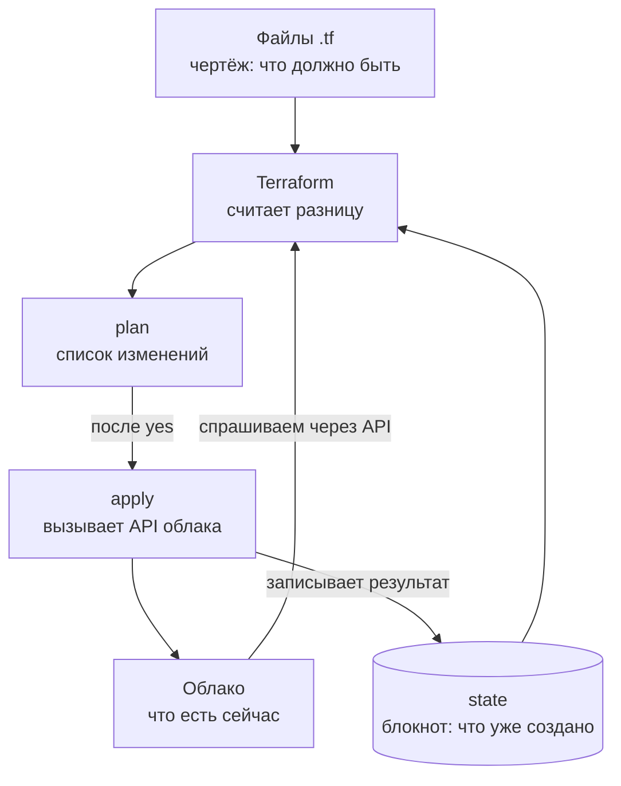
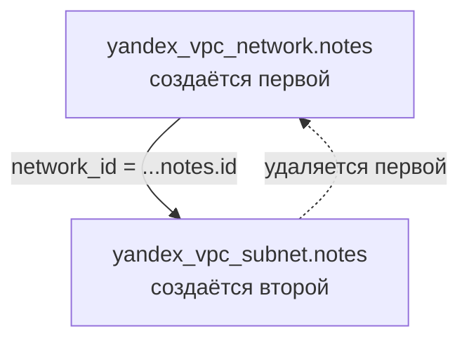
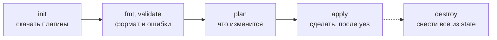

## Зачем это нужно

В теме 6 ты создавал сеть и ВМ командами `yc` и кликами в консоли облака. Чем это кончается, видно быстро: через месяц никто не помнит, какой командой создан диск и почему у него именно такой размер. Представь: тебе велят «поднять такое же окружение для теста», и ты два дня повторяешь всё по памяти и по истории терминала. Выходит почти так же, но «почти» стоит ещё полдня поиска, чем отличается.

Инфраструктура как код (Infrastructure as Code, IaC) закрывает эту дыру. Ты описываешь желаемую инфраструктуру в текстовых файлах, файлы лежат в Git, а специальная программа сравнивает описание с тем, что есть в облаке, и показывает список изменений до того, как что-то тронет. Terraform это самая распространённая такая программа. По ходу урока я объясню то, на чём новички чаще всего ошибаются.

На работе это ежедневная рутина. Изменение сети проходит ревью в pull request (запрос на слияние: коллега читает твои правки и говорит «ок» до того, как они попадут в основную ветку, [урок 3.2](../03-git-ci/02-remotes-workflow.md)). Проверка плана идёт в CI (автоматическая проверка на сервере после каждого коммита, [урок 3.3](../03-git-ci/03-actions-ci.md)). Откат делается через `git revert` (новый коммит, отменяющий старый).

На собеседовании про Terraform спрашивают про три вещи, и мы разберём каждую:

- **state** (файл состояния): «записная книжка» Terraform, где он помнит, что уже создал. Без неё он не знает, какие ресурсы его, как кассир без журнала не знает, что уже выдал;
- **drift** (дрейф): кто-то поправил настройку руками в консоли, а в коде осталось старое. Это как если в чертеже стена на месте, а на стройке её уже снесли;
- **`-/+` в плане**: знак «удалить и создать заново». Для сети это неприятно, для диска с данными катастрофа: он удалится вместе с содержимым.

Под **планом** (plan) здесь и дальше понимается список изменений, который Terraform показывает до начала работы: «будет создано 2, изменено 1, удалено 0».

Шаг проекта: в репозитории «Заметок» появляется каталог `infra/terraform/` с файлами `versions.tf`, `providers.tf`, `network.tf`. Сеть и подсеть `notes` описаны кодом, файл состояния пока лежит на твоём диске.

## Что нужно знать

- [Урок 1.3: пользователи и права](../01-linux/03-users-permissions.md): права на файлы (например `644`, читать может любой пользователь машины). Понадобятся, чтобы понять, почему файл состояния нельзя оставлять открытым.
- [Урок 3.1: основы Git](../03-git-ci/01-git-basics.md): коммиты и `.gitignore`. Код инфраструктуры живёт в Git, а файл состояния нет.
- [Урок 6.1: облако и соответствие AWS](../06-cloud/01-cloud-models-aws-mapping.md): аккаунт Yandex Cloud, каталог `notes`, сервисный аккаунт и `yc`.
- [Урок 6.2: ВМ, сеть и диски](../06-cloud/02-vm-network-storage.md): сеть и подсеть, которые ты делал руками. Теперь мы опишем такие же кодом.

Про Terraform ты пока ничего не знаешь, и это нормально: всё нужное объясняется ниже. Первые четыре задания идут на твоём компьютере без облака и без денег.

## Картина целиком

Представь, что ты строишь дом. Можно ходить по стройке и говорить рабочим: «положи кирпич сюда, теперь сюда». Так работают `yc` и консоль: ты отдаёшь команды одну за другой, и через год никто не восстановит, что именно было сделано.

Есть другой способ: нарисовать **чертёж** с итоговым видом дома. Прораб сам сравнивает стройку с чертежом и говорит: «не хватает окна, лишняя стена, остальное готово». Работу он начинает только после твоего «да». Чертёж лежит в архиве, его можно править и сравнивать версии. Terraform это такой прораб, а файлы `.tf` это чертёж. Аналогия ломается в одном: у прораба есть глаза, а Terraform узнаёт о стройке только через API облака и через свой блокнот (state).



Здесь видно, что Terraform сравнивает три источника: твои файлы, свой блокнот и облако. Результат сравнения это plan, и только после твоего «yes» идёт apply, который обновляет и облако, и блокнот.

Части схемы:

- **файлы `.tf`**: желаемое состояние на языке HCL (HashiCorp Configuration Language, простой язык описаний: блоки и строки вида `имя = значение`);
- **провайдер** (provider): переводчик, плагин, который знает, как разговаривать с API конкретной платформы (Yandex Cloud, AWS, файловая система). API это «окошко» программы, через которое другие программы дают ей команды; консоль и `yc` тоже ходят через него;
- **state**: файл, где Terraform помнит, что он уже создал;
- **plan** и **apply**: показать список изменений и выполнить его.

За урок ты разберёшь каждую часть, пройдёшь полный цикл на локальных файлах, а в конце опишешь сеть «Заметок» кодом.

## Теория

### Зачем нужна инфраструктура как код

Коллега просит: «Сделай мне такое же окружение, как у тебя». А ты не помнишь, как делал своё. Что тут не так?

Представь кулинарный рецепт и «я просто готовил на глаз». Рецепт можно передать, повторить, улучшить и сравнить с прошлой версией. Вот это и есть IaC: инфраструктуру описывают текстовыми файлами, и дальше работают привычные инструменты разработки. Аналогия ломается в одном: рецепт не готовит сам, а Terraform реально создаёт ресурсы, поэтому ошибка в описании стоит денег и данных.

Без описания проблемы всегда одни и те же. Окружение не воспроизвести (рецепта нет), правку не проверить (она сделана в консоли, никто не видел её до применения), не откатить (что было до правки, неизвестно) и не разобраться (кто и зачем поставил эту настройку). Когда файлы лежат в Git, всё меняется:

1. У каждой правки есть автор, дата и сообщение коммита ([урок 3.1](../03-git-ci/01-git-basics.md)).
2. Правка идёт через pull request, и коллега видит не «что-то поменял», а конкретные строки.
3. CI показывает план изменений прямо в pull request.
4. Откат это `git revert` и повторное применение.

В уроке 6.2 ты выполнил `yc vpc network create --name notes-net`. Через месяц коллега спрашивает: «А почему подсеть именно `10.10.0.0/24`?» Ответ можно найти только в переписке. С кодом иначе: `git log -p network.tf` покажет, кто поменял значение, когда и в каком коммите, а сообщение коммита объяснит зачем.

> **Прикинь сам:** тебе нужно поднять копию окружения для теста. Сколько времени уйдёт, если окружение создавалось руками полгода назад, а сколько, если оно описано в репозитории?
{: .predict}

Руками придётся вспоминать и угадывать: в лучшем случае день, и результат будет «почти таким же». По репозиторию это одна команда и несколько минут, а результат одинаковый, потому что описание то же.

Осторожно: IaC это не «скрипт на bash, который вызывает `yc`». Скрипт описывает шаги, а IaC описывает результат. В чём разница, разберём прямо сейчас.

> **Главное:** IaC превращает инфраструктуру в текст в Git, поэтому её можно повторить, проверить до применения, откатить и объяснить.
{: .key}

> **Проверь понимание:** назови две проблемы ручного создания ресурсов, которые решает хранение описания в Git.

<details markdown="1">
<summary>Ответ</summary>

Например: воспроизводимость (можно поднять такое же окружение по описанию) и история (видно, кто, когда и зачем изменил). Также ревью до применения и откат через `git revert`.

</details>

### Декларативный и императивный подход

Ты запустил скрипт создания сети второй раз, и он упал с ошибкой «уже существует». Или хуже: создал вторую такую же сеть. Как сделать так, чтобы повторный запуск ничего не ломал?

Попроси сначала «принеси два стакана воды». Сколько бы стаканов уже ни стояло на столе, ты принесёшь ещё два. Это **императивный** подход: перечень шагов. Теперь скажи «на столе должно стоять два стакана воды». Если стоят два, делать нечего, если один, добавишь один. Это **декларативный** подход: описание итога. Чтобы он работал, инструмент должен узнавать, что стоит на столе сейчас, и Terraform для этого использует state.

Скрипт на bash с `yc vpc network create` императивен: «создай сеть, создай подсеть». Описание в Terraform декларативно: «есть сеть `notes` и подсеть `10.0.1.0/24`». Инструмент сам вычисляет разницу с реальностью и делает минимум действий. Посмотри, как ведут себя оба подхода при трёх запусках:

| Запуск | Скрипт с `yc ... create` | Описание в Terraform |
|---|---|---|
| Первый, в облаке пусто | создал 2 ресурса | увидел разницу «нужно 2, есть 0», создал 2 |
| Второй, ничего не менял | ошибка `AlreadyExists` | увидел «нужно 2, есть 2», ничего не делает |
| Поменял диапазон подсети в файле | нужно писать новый скрипт с `update` | увидел «подсеть отличается», изменил только её |

Свойство «повторный запуск не меняет результат» называется **идемпотентностью** (idempotency). Слово непривычное, а идея простая: нажать кнопку вызова лифта пять раз то же самое, что нажать один.

> **Прикинь сам:** ты запустил скрипт создания сети дважды. Что было бы, если бы то же самое было описано в Terraform?
{: .predict}

Второй `apply` увидел бы, что реальность совпала с описанием, и сказал бы `No changes`. Скрипт же упадёт с ошибкой или создаст дубль: он не знает текущего состояния, он просто выполняет шаги.

Заодно о выборе инструмента. Terraform выпускает компания HashiCorp. С 2023 года его лицензия Business Source License (BSL) не является открытой. Открытый форк (копия кода, которая развивается отдельно) называется OpenTofu (проект Linux Foundation). Команды те же, вместо `terraform` пишешь `tofu`. В курсе пишем `terraform`, и всё сказанное относится и к OpenTofu. Различие появится только в уроке [7.3](03-terraform-state-modules.md): шифрование state встроено лишь в OpenTofu.

Осторожно: «декларативный значит без ошибок» неверно. Если в описании ошибка, Terraform честно применит ошибку. Спасает то, что перед применением ты видишь план.

> **Главное:** декларативное описание говорит, что должно получиться, а не какие шаги делать, поэтому повторный запуск безопасен (идемпотентен).
{: .key}

Описание кто-то должен «переводить» на язык конкретного облака. Этим занимается провайдер.

### Провайдер: переводчик между Terraform и платформой

Terraform ничего не знает про Yandex Cloud, и при этом умеет в нём создавать сети. Откуда берётся это знание?

Возьми универсальный пульт и приставки. Пульт (Terraform) один, а «языки» приставок разные, поэтому для каждой нужен свой набор кодов. Набор кодов это **провайдер** (provider): плагин, который знает, какие ресурсы бывают у платформы и какие запросы к её API (программному интерфейсу, к которому обращаются командой, а не мышкой) нужно отправить. Сам Terraform умеет только строить план и хранить состояние. Аналогия ломается тем, что пульт нельзя использовать, пока не загрузишь коды, поэтому первая команда всегда `terraform init`.

Как это устроено:

1. В коде ты пишешь, какие провайдеры нужны и какой версии (блок `required_providers`).
2. `terraform init` идёт в реестр (registry: каталог плагинов по адресу `registry.terraform.io`), скачивает плагины в скрытый каталог `.terraform/` рядом с кодом и записывает точные версии в файл `.terraform.lock.hcl`.
3. Дальше Terraform запускает плагин как отдельную программу и через него отправляет запросы в API платформы.

Имя провайдера состоит из владельца и названия: `yandex-cloud/yandex`, `hashicorp/local`, `hashicorp/random`. Провайдеры `local` и `random` ничего не создают в облаке: `local` пишет файлы на твой диск, `random` генерирует случайные значения. Они нужны, чтобы учиться бесплатно.

Разберём ограничение версии `~> 2.5`. Оно читается так: «2.5 или новее, но меньше 3.0». Знак `~>` («осторожное» ограничение, pessimistic constraint) разрешает обновления только в последней указанной цифре и выше. Если запустить `init` с таким ограничением, Terraform выберет версию `2.9.1` (у тебя может быть новее) и запишет в `.terraform.lock.hcl` строки `version = "2.9.1"` и `constraints = "~> 2.5"`, а ещё хеши (контрольные суммы) пакета, чтобы никто не подменил плагин.

> **Прикинь сам:** в коде стоит `version = "~> 2.5"`, а в реестре есть 2.9.1, 3.0.0 и 3.1.0. Какую версию выберет `init`?
{: .predict}

2.9.1: она новее 2.5 и меньше 3.0. Версии 3.x выпадают из диапазона, потому что в мажорной версии (первой цифре) авторы вправе ломать совместимость.

Осторожно: провайдер и сам Terraform это разные программы с разными версиями. Версия Terraform (`1.16.4`) ничего не говорит о версии провайдера (`2.9.1`). Закрепляй обе.

> **Главное:** провайдер это плагин, который переводит описание в запросы к API платформы; его версии закрепляют в `required_providers`, а выбранные версии хранит `.terraform.lock.hcl`.
{: .key}

> **Проверь понимание:** зачем `.terraform.lock.hcl` коммитят в Git, а каталог `.terraform/` нет?

<details markdown="1">
<summary>Ответ</summary>

Lock-файл короткий и говорит, какие именно версии плагинов взять, чтобы у всех в команде и в CI были одинаковые. Каталог `.terraform/` содержит скачанные бинарные плагины: он большой, его легко восстановить командой `terraform init`, поэтому в Git он не нужен.

</details>

Провайдер подключён. Теперь выясним, на каком языке писать сами описания.

### Язык HCL: блоки, аргументы и ссылки

В описании сети есть имя, диапазон адресов и ссылка подсети на сеть. Как записать всё это так, чтобы понимал и человек, и программа?

Представь анкету с разделами: «требования», «поставщики», «что построить». HCL (HashiCorp Configuration Language) устроен как такая анкета, а всё, что умеет Terraform, выражается несколькими видами блоков. Аналогия ломается в порядке: в анкете он важен, в Terraform порядок блоков и файлов не важен, он сам разберётся, что от чего зависит.

Terraform читает все файлы `*.tf` в каталоге как один общий текст. Имена файлов для него безразличны, но принято делить по смыслу: `versions.tf`, `providers.tf`, `network.tf`. Основные блоки:

- `terraform { ... }`: требования к самому Terraform и к провайдерам;
- `provider "имя" { ... }`: настройки провайдера (зона, регион);
- `resource "тип" "имя" { ... }`: один управляемый объект;
- `data "тип" "имя" { ... }`: источник данных (data source), он только читает то, что уже существует, ничего не создавая.

Вот ресурс из задания 1, разобранный по строкам:

```hcl
# resource - слово, которое начинает описание объекта.
# "local_file" - ТИП ресурса: провайдер local, вид ресурса file. Тип задаёт, какие аргументы бывают.
# "hello"      - твоё ИМЯ для этого объекта. Оно нужно только внутри кода, в ссылках.
resource "local_file" "hello" {
  # аргумент (argument) - "ключ = значение", то, что ты задаёшь сам
  filename = "${path.module}/hello.txt"   # путь файла; path.module - каталог, где лежит этот .tf
  content  = "Привет из Terraform\n"      # что записать в файл; \n - перевод строки
}
```

Полное имя ресурса в коде: `local_file.hello` (тип, точка, имя). Оно же название в плане и в state. У ресурса есть **аргументы** (то, что задаёшь ты) и **атрибуты** (то, что становится известно после создания, например `id`). Атрибут читают так: `тип.имя.атрибут`, скажем `local_file.hello.id`.

Такая запись ссылки одновременно объявляет зависимость. Если в подсети написано `network_id = yandex_vpc_network.notes.id`, Terraform понимает: подсеть можно создавать только после сети, потому что `id` сети появляется лишь после её создания. Это **неявная зависимость** (implicit dependency). Из всех зависимостей Terraform строит граф (схему из ресурсов-узлов и стрелок «кто от кого зависит», как на рисунке ниже) и создаёт независимые ресурсы параллельно, а при удалении идёт в обратном порядке.



Стрелка сплошная показывает порядок создания: сначала сеть, потому что её `id` нужен подсети. Пунктир напоминает, что при удалении порядок обратный.

> **Прикинь сам:** в файле сначала описана подсеть, а ниже сеть, на которую она ссылается. Что создаст Terraform первым?
{: .predict}

Сеть. Порядок строк в файле роли не играет, порядок задают ссылки.

Осторожно: путают имя и тип. В `resource "local_file" "hello"` первое слово выбирает не ты, а провайдер, второе выбираешь ты.

> **Главное:** ресурс это блок «тип + имя + аргументы», а ссылка `тип.имя.атрибут` одновременно даёт значение и задаёт порядок создания.
{: .key}

> **Проверь понимание:** в подсети написано `network_id = yandex_vpc_network.notes.id`. Что это даёт кроме значения?

<details markdown="1">
<summary>Ответ</summary>

Неявную зависимость: сначала создаётся сеть, потом подсеть; при удалении порядок обратный. Порядок в файле роли не играет.

</details>

Код написан. Как теперь привести облако в соответствие с ним?

### Цикл работы: init, plan, apply, destroy

Изменение инфраструктуры опасно: одна опечатка, и сеть исчезла вместе с ВМ. Как дать себе шанс заметить ошибку до того, как она случится?

Представь заказ в интернет-магазине. Сначала ты собираешь корзину и видишь итоговую сумму, и только потом нажимаешь «Оплатить». Terraform разделяет «подумать» и «сделать» так же: сначала `plan` (корзина), потом `apply` (оплата). Аналогия ломается на том, что между корзиной и оплатой мир мог измениться, поэтому `apply` показывает план ещё раз.



Это цикл работы. Первые три шага ничего не меняют в облаке, `apply` меняет, а `destroy` пунктиром потому, что его запускают только когда окружение больше не нужно.

Пять команд по порядку:

1. `terraform init`: скачать провайдеры в `.terraform/` и записать `.terraform.lock.hcl`. Запускают в новом каталоге и после смены провайдеров.
2. `terraform fmt`: привести код к стандартному виду (отступы, выравнивание `=`). `terraform validate`: проверить синтаксис и ссылки. Обе команды не ходят в облако, их запускают даже без доступа.
3. `terraform plan`: прочитать код, state и реальность, показать разницу. Ничего не меняет.
4. `terraform apply`: показать план ещё раз, спросить `yes` и выполнить.
5. `terraform destroy`: удалить всё, что записано в state.

Вот что появилось в каталоге после `init` и `apply` (реальный вывод `ls -la` моего прогона):

```text
.terraform/            <- плагины (в Git не нужен)
.terraform.lock.hcl    <- версии плагинов (в Git нужен)
hello.txt              <- файл, который создал Terraform
main.tf                <- твой код
terraform.tfstate      <- state: память Terraform (в Git нельзя)
```

> **Прикинь сам:** какие из пяти команд не обращаются к облаку вообще?
{: .predict}

`fmt` и `validate`: они работают только с текстом файлов. `init` ходит в реестр за плагинами, но не в облако. `plan` обращается к облаку за текущим состоянием, но ничего не меняет. `apply` и `destroy` меняют инфраструктуру.

Осторожно: `validate` не гарантирует, что `apply` пройдёт. Он не знает про квоты, права и занятые имена в облаке, такие ошибки видны только на `plan` и `apply`.

> **Главное:** `init` готовит, `fmt` и `validate` проверяют текст, `plan` показывает изменения, `apply` их делает: между «подумать» и «сделать» всегда стоит твоё «yes».
{: .key}

План решает, будет ли у тебя спокойный день, поэтому научимся читать его внимательно.

### Как читать план

Один неверно прочитанный знак в плане может стоить базы данных. Как не пропустить главное?

Включи в текстовом документе режим рецензирования: добавленное подсвечено зелёным, удалённое красным. План читается так же, только вместо цвета у Terraform знаки перед ресурсом. Аналогия ломается в итоговой сводке: в документе её нет, а в плане она самая важная строка, и её читают первой.

| Знак | Что значит |
|---|---|
| `+` | создать |
| `-` | удалить |
| `~` | изменить на месте (in-place), ресурс остаётся |
| `-/+` | удалить и создать заново (replace) |

Последний знак опасен: пересоздание диска или базы означает потерю данных. Рядом с атрибутом, из-за которого это произошло, Terraform пишет `# forces replacement` («вынуждает пересоздание»). Некоторые атрибуты нельзя поменять на месте: облако или провайдер такого действия просто не умеют.

Допустим, ты поменял в `main.tf` строку `content` у уже созданного файла. Реальный план:

```text
  # local_file.hello must be replaced
-/+ resource "local_file" "hello" {
      ~ content              = <<-EOT # forces replacement
          - Привет из Terraform
          + Привет, версия 2
        EOT
      ~ id                   = "ca58a1003f50e92da53f1e30ce992f013de2ec9b" -> (known after apply)
        # (3 unchanged attributes hidden)
    }

Plan: 1 to add, 0 to change, 1 to destroy.
```

Построчно:

- `# local_file.hello must be replaced`: заголовок, этот ресурс будет пересоздан;
- `-/+`: знак «удалить и создать»;
- `~ content ... # forces replacement`: именно эта строка вызвала пересоздание; `-` перед старым текстом и `+` перед новым показывают, что было и что будет;
- `-> (known after apply)`: значение появится только после создания (хеш и `id` зависят от содержимого и неизвестны заранее);
- `# (3 unchanged attributes hidden)`: три атрибута не менялись, Terraform их не показывает;
- `Plan: 1 to add, 0 to change, 1 to destroy`: итог, одно создание и одно удаление. Слова «замена» в сводке нет: пересоздание видно как `1 to add` вместе с `1 to destroy`.

> **Прикинь сам:** в итоге плана написано `1 to add, 0 to change, 1 to destroy`. Что это, скорее всего, значит?
{: .predict}

Один ресурс будет пересоздан: удалён и создан заново (знак `-/+`). Иначе «add» и «destroy» относились бы к разным ресурсам, и это видно по списку выше.

Осторожно: «знак `~` всегда безопасен» верно не всегда, хотя чаще: ресурс остаётся тем же объектом. А вот `-/+` для файла безобиден, для диска с данными это авария. Знак зависит от ресурса и провайдера, поэтому план читают всегда, а не по привычке.

> **Главное:** сначала смотри итоговую строку `Plan: ...`, потом ищи `-/+` и `forces replacement`: это единственные места, где план может стоить тебе данных.
{: .key}

Теперь самое интересное: откуда Terraform знает, что именно он создал раньше?

### State: память Terraform

Облако хранит тысячи ресурсов, и часть из них чужие. Как Terraform понимает, какая из сетей его, а какая принадлежит соседней команде?

Прораб ведёт блокнот: «окно в спальне: заказ 4711, стена в кухне: заказ 4712». Без блокнота он не знает, какие из окон на стройке его. Этот блокнот называют **state** (файл состояния): по умолчанию это `terraform.tfstate` рядом с кодом. Для каждого ресурса там записаны его идентификатор в облаке и все атрибуты. Аналогия ломается в одном: блокнот может устареть, если кто-то поменял стройку без ведома прораба.

Terraform не спрашивает облако «что у меня есть?», он помнит созданное сам. Перед `plan` он обновляет сведения: для каждого ресурса из state спрашивает у API, как тот выглядит сейчас (это называется refresh). Потом сравнивает код, state и реальность. Вот `terraform.tfstate` после создания файла `hello.txt` (реальный, с сокращениями):

```text
{
  "version": 4,                       <- формат файла state
  "terraform_version": "1.16.4",      <- какой Terraform его писал
  "serial": 1,                        <- номер изменения: растёт на каждой записи
  "resources": [
    {
      "type": "local_file",           <- тип ресурса из кода
      "name": "hello",                <- имя ресурса из кода
      "instances": [{
        "attributes": {
          "content": "Привет из Terraform\n",   <- все атрибуты, как в облаке
          "filename": "./hello.txt",
          "id": "ca58a1003f50e92da53f1e30ce992f013de2ec9b",
          ...
```

Именно по типу и имени блок `resource "local_file" "hello"` связан с файлом. У такой схемы три следствия:

- **Потерял state:** Terraform решит, что ничего не создавал, и попробует создать всё заново. Получатся дубли или ошибки «имя занято».
- **State содержит атрибуты открытым текстом**, включая пароли и ключи. Он секретный: в Git его не коммитят (`*.tfstate*` в `.gitignore`, урок [3.1](../03-git-ci/01-git-basics.md)). Права на него как минимум `600`, чтобы читал только владелец.
- **Два человека с локальными state расходятся:** каждый видит свою версию мира. Лечится общим хранилищем с блокировкой (урок [7.3](03-terraform-state-modules.md)).

Про блокировку (state lock) скажу отдельно. Пока идёт `apply`, Terraform берёт её, и другой процесс не может писать в тот же state одновременно. Если попробовать, получишь `Error acquiring the state lock` с полями `ID`, `Who` (кто держит) и `Created` (когда взял). Это не поломка, а защита от испорченного state.

И ещё одно слово из собеседований: **дрейф** (drift). Это расхождение между state и реальностью: кто-то удалил или поправил ресурс в консоли, минуя код. `plan` замечает это при refresh и предложит вернуть по коду. Если хочешь только посмотреть расхождения и ничего не менять, есть `terraform plan -refresh-only`.

> **Прикинь сам:** ты случайно удалил `terraform.tfstate`, а файл `hello.txt` на диске остался. Что покажет `plan`?
{: .predict}

`Plan: 1 to add`. Блокнот пуст, поэтому Terraform считает, что ничего не создавал, и захочет создать файл заново. С облачной сетью было бы хуже: получилась бы вторая сеть или ошибка «имя занято».

Осторожно: «`sensitive = true` прячет секрет» верно лишь наполовину. Метка прячет значение от вывода на экран (`plan`, `output`), а в state оно всё равно лежит открытым текстом. Поэтому state защищают правами и шифрованием хранилища.

> **Главное:** state это память Terraform о том, что он создал; без него он создаёт дубли, а с ним нужно обращаться как с секретом.
{: .key}

> **Проверь понимание:** почему state нельзя коммитить, даже если репозиторий приватный?

<details markdown="1">
<summary>Ответ</summary>

В нём секреты в открытом виде, а история Git хранит их вечно (даже после удаления файла). Кроме того, state меняется при каждом apply, и коммиты будут конфликтовать. Хранить надо в удалённом бэкенде с блокировкой и шифрованием.

</details>

Мы всё время говорим «Terraform обращается к облаку». Но почему облако ему верит?

### API и токен: как Terraform получает права

Облако не выполняет запросы от кого попало. Как Terraform доказывает, что ему можно создавать сети?

Это пропуск на проходной. Ты назвал охраннику имя, он проверил список и выдал бейдж на день. Бейдж показывают у любой двери, но завтра он перестанет действовать. Аналогия ломается в том, что бейдж можно случайно выложить в интернет, и тогда им воспользуется кто угодно, пока он не истёк.

API (Application Programming Interface) это «окно», через которое программы просят облако что-то сделать: например, `POST /networks` («создай сеть»). Консоль и `yc` используют то же окно, просто с красивой оболочкой. Каждый запрос подписан **токеном** (token): длинной строкой, которая выдана сервисному аккаунту или пользователю и говорит «запрос отправляет вот этот субъект». Токен живёт ограниченное время, после истечения запросы отклоняются, и нужен новый.

Terraform получает токен через **переменные окружения** (environment variables): именованные значения, которые оболочка отдаёт запускаемой программе (например, `YC_TOKEN`). Провайдер читает их сам.

Команда `export YC_TOKEN=$(yc iam create-token)` выполняется в три шага. Сначала оболочка запускает то, что внутри `$(...)`, то есть `yc iam create-token`. Команда печатает токен. Оболочка подставляет строку вместо `$(...)` и создаёт переменную `YC_TOKEN` с этим значением. Провайдер `yandex` при запуске ищет `YC_TOKEN` в окружении, находит и подписывает им запросы. Если переменной нет, ты увидишь реальную ошибку: `one of 'token' or 'service_account_key_file' should be specified`.

> **Прикинь сам:** ты открыл второй терминал, запустил `terraform plan` и получил ошибку про токен, хотя в первом терминале всё работало. Почему?
{: .predict}

`export YC_TOKEN=...` был выполнен только в первом терминале. Переменные окружения не передаются между окнами, поэтому во втором нужно выполнить `export` заново.

Осторожно: токен нельзя писать в `.tf`-файл, даже «временно». Файл попадёт в Git, а история Git хранит его вечно.

> **Главное:** Terraform подписывает запросы к API токеном из переменных окружения; токен временный и в код не пишется.
{: .key}

Права есть. Теперь соберём всё вместе и посмотрим, из чего Terraform складывает план.

### Три источника правды: как Terraform считает план

Ты удалил блок ресурса из кода. Исчезнет ли ресурс из облака? А если создал в облаке руками что-то лишнее, тронет ли Terraform это?

Представь три списка: «что я хочу купить» (код), «что записано в тетради как купленное» (state) и «что реально лежит в холодильнике» (реальность). План строится, чтобы желаемое и реальное совпали, а тетрадь помогает понять, что из лежащего в холодильнике твоё. Аналогия ломается тут: холодильник в облаке общий, и в нём много чужого, которое Terraform обязан не трогать.

Перед планом Terraform делает refresh и обновляет тетрадь по реальности. Дальше для каждого блока кода он смотрит в таблицу:

| Есть в коде | Есть в state | Как в реальности | Что запланирует Terraform |
|---|---|---|---|
| да | нет | (не важно) | создать (`+`) |
| да | да | совпадает | ничего (`No changes`) |
| да | да | изменяемое поле отличается | изменить на месте (`~`) |
| да | да | неизменяемое поле отличается | пересоздать (`-/+`) |
| да | да | объекта нет | создать (`+`), это drift |
| нет | да | объект есть | удалить (`-`) |

Возьми наш файл. Ты убрал ресурс `local_file.hello` из кода, но в state он записан, а файл `hello.txt` на диске есть. Это последняя строка таблицы: `plan` покажет `Plan: 0 to add, 0 to change, 1 to destroy.`, и `apply` удалит файл. Terraform рассуждает так: раз записано в тетради, значит создан мной, а в коде больше не нужен, значит выкинуть. А файл `other.txt`, который ты создал руками и которого нет в state, он не тронет: этот файл ему не принадлежит.

> **Прикинь сам:** в коде есть сеть `notes`, в state её нет, а в облаке сеть с таким именем уже создана руками. Что запланирует Terraform?
{: .predict}

Создать (`+`): он не знает, что сеть уже есть, ведь в тетради её нет. Дальше облако ответит ошибкой «имя уже существует». Чтобы взять такую сеть под управление, её привязывают командой `terraform import` (урок [7.3](03-terraform-state-modules.md)).

Осторожно: «Terraform управляет всем, что есть в облаке» неверно. Только тем, что описано в коде и записано в state. Созданные руками ресурсы он не видит, пока их не привяжут.

> **Главное:** план это сравнение кода, state и реальности по таблице выше; удалить блок из кода значит приказать удалить ресурс.
{: .key}

> **Проверь понимание:** ты удалил блок ресурса из `.tf` и выполнил `apply`. Что произойдёт с объектом в облаке и почему?

<details markdown="1">
<summary>Ответ</summary>

Объект будет удалён. В state он записан как созданный Terraform, а в коде его больше нет, значит он «лишний» и `plan` покажет `-`. Поэтому удалять блок из кода надо осознанно: это команда «удалить ресурс».

</details>

Осталось научиться вытаскивать результаты работы наружу.

### Output: как достать значение наружу

После `apply` тебе часто нужен результат: адрес ВМ или идентификатор сети. Искать его в консоли облака руками не хочется.

Это как квитанция после оплаты: номер заказа и сумма напечатаны в конце. Блок `output "имя" { value = ... }` объявляет значение, которое Terraform печатает после `apply` и хранит в state, а прочитать его можно командой `terraform output имя`. Аналогия ломается на секретах: если в квитанции указать пароль, его увидит любой, кто заглянет через плечо, поэтому секретное значение маркируют `sensitive = true`, и вывод печатается как `<sensitive>`.

Если значение выведено из секретного (например, `random_password.db.result`), а метку ты забыл, Terraform откажется работать с ошибкой `Output refers to sensitive values`. Так он защищает от случайной утечки в логи CI.

В задании 4 значение `random_password.db.result` вписано в `output`. При `apply` ты видишь `db_password = <sensitive>`. Команда `terraform output db_password` печатает пароль открыто: метка защищает лог, а не саму возможность прочитать. И в файле `terraform.tfstate` тот же пароль лежит открытым текстом.

> **Прикинь сам:** ты убрал `sensitive = true`, и `apply` упал. Почему Terraform не позволил вывести значение?
{: .predict}

Значение пришло из секретного атрибута. Terraform требует явно подтвердить, что выводить его можно, чтобы секрет случайно не попал в логи. Ошибка `Output refers to sensitive values` это защита, а не поломка.

Осторожно: `sensitive` не шифрует, это только маскировка вывода. Реальная защита секрета это права на файл state, шифрование хранилища и секрет-менеджер (тема 9).

> **Главное:** `output` выдаёт результат наружу, а `sensitive` лишь прячет его от экрана, но не из state.
{: .key}

Последний вопрос теории: что из всего этого нести в Git.

### Что лежит в каталоге проекта и что попадает в Git

Рядом с кодом Terraform создаёт служебные файлы. Одни нужны команде, другие опасны, третьи бесполезны. Какие куда?

Представь папку с проектом дома: чертежи сдают в архив, черновики и стружку выбрасывают, а сейф с ключами в архив не кладут никогда. Аналогия ломается тем, что «стружку» Terraform восстановит командой, а вот утёкший из Git секрет не вернуть.

| Файл или каталог | Что это | В Git |
|---|---|---|
| `*.tf` | твой код | да |
| `.terraform.lock.hcl` | версии провайдеров | да |
| `.terraform/` | скачанные плагины | нет, восстанавливается `init` |
| `terraform.tfstate` | state, возможно с секретами | нет, никогда |
| `terraform.tfstate.backup` | копия предыдущего state | нет, никогда |
| `*.tfvars` | значения переменных, в том числе секретные (урок [7.2](02-terraform-vm-variables.md)) | нет |

Правила `.gitignore` из задания 4 построчно: `.terraform/` исключает каталог с плагинами; `*.tfstate` исключает `terraform.tfstate`; `*.tfstate.*` исключает `terraform.tfstate.backup` и подобные; `*.tfvars` исключает файлы значений; `crash.log` исключает лог, который Terraform пишет при падении и куда могут попасть значения секретов. Звёздочка `*` означает «любые символы», поэтому одно правило закрывает целый класс файлов.

> **Прикинь сам:** какие два файла из таблицы нужны каждому, кто клонирует репозиторий, а какие он создаст сам?
{: .predict}

Из репозитория берутся `*.tf` и `.terraform.lock.hcl`. `.terraform/` человек создаст сам командой `terraform init`, а state получит из общего хранилища (урок [7.3](03-terraform-state-modules.md)) или создаст новый.

Осторожно: «`terraform.tfstate.backup` безопасен, это же бэкап» неверно. В нём те же секреты, что и в state, только более старой версии.

> **Главное:** в Git идут `*.tf` и lock-файл, а state, его копии, `.terraform/` и `*.tfvars` остаются вне репозитория.
{: .key}

### Соответствие AWS

В курсе мы работаем с Yandex Cloud, но на другой работе тебе может достаться AWS. Подход одинаков у всех облаков: `init`, `plan`, `apply`, state. Меняются провайдер и названия ресурсов, поэтому держи таблицу как шпаргалку для перевода, заучивать её не нужно:

| Что | Yandex Cloud | AWS | Ресурс Terraform (Yandex / AWS) |
|---|---|---|---|
| Сеть | VPC network | VPC | `yandex_vpc_network` / `aws_vpc` |
| Подсеть | VPC subnet (одна зона) | Subnet | `yandex_vpc_subnet` / `aws_subnet` |
| Правила доступа | Security group | Security group | `yandex_vpc_security_group` / `aws_security_group` |
| ВМ | Compute instance | EC2 | `yandex_compute_instance` / `aws_instance` |
| Бакет | Object Storage | S3 | `yandex_storage_bucket` / `aws_s3_bucket` |
| Идентичность | Сервисный аккаунт | IAM role / user | `yandex_iam_service_account` / `aws_iam_role` |

### Где это встретится дальше

- В уроке [7.2](02-terraform-vm-variables.md) вынесешь значения в переменные и опишешь ВМ.
- В уроке [7.3](03-terraform-state-modules.md) вынесешь state в бакет с блокировкой и разобьёшь код на модули.
- В теме 3 тот же `plan` запускается в CI, а в теме 9 IaC дополняется GitOps.

## Практика

Задания 1-4 идут без облака и без денег: провайдеры `local` и `random` создают файлы на твоём диске, а цикл `plan`/`apply`/state работает так же, как с облаком. Задание 5 применяет то же к сети «Заметок» в Yandex Cloud. Выводы ниже получены реальным запуском Terraform 1.16.4 (значения вроде `id` и версии провайдеров у тебя будут другими).

### Задание 1. Установка и первый ресурс

**Цель:** установить Terraform 1.16.4 и создать файл через ресурс.

**Предскажи:** сколько ресурсов покажет первый `plan` для одного `local_file` и что будет, если сразу после `apply` запустить `plan` второй раз?

<details markdown="1">
<summary>Ответ</summary>

Первый `plan`: `1 to add, 0 to change, 0 to destroy`. После `apply` повторный `plan` скажет `No changes`: реальность совпала с описанием.

</details>

**Шаги:**

1. Установи Terraform из репозитория HashiCorp (без `curl | bash`). Разбор команд:

   - `wget -O- URL` скачивает файл и печатает его в стандартный вывод (флаг `-O-` значит «в терминал, а не в файл»);
   - `gpg --dearmor -o файл` переводит ключ из текстового вида в двоичный, который понимает apt; `sudo` нужен, потому что пишем в системный каталог `/usr/share/keyrings/`;
   - строка `deb [signed-by=...] URL кодовое_имя main` - запись «откуда брать пакеты»; `signed-by` привязывает репозиторий к ключу, а `$(. /etc/os-release && echo "$VERSION_CODENAME")` подставляет кодовое имя твоей Ubuntu (`noble` для 24.04);
   - `sudo tee файл` записывает вывод в файл с правами root (обычное `>` под `sudo` не сработало бы: перенаправление выполняет твоя оболочка, а не `sudo`);
   - `terraform=1.16.4-1` закрепляет версию пакета.

   ```bash
   sudo apt-get update && sudo apt-get install -y gnupg wget ca-certificates
   wget -O- https://apt.releases.hashicorp.com/gpg | sudo gpg --dearmor -o /usr/share/keyrings/hashicorp.gpg
   echo "deb [signed-by=/usr/share/keyrings/hashicorp.gpg] https://apt.releases.hashicorp.com $(. /etc/os-release && echo "$VERSION_CODENAME") main" | sudo tee /etc/apt/sources.list.d/hashicorp.list
   sudo apt-get update && sudo apt-get install -y terraform=1.16.4-1
   terraform version
   ```

   Если репозиторий HashiCorp недоступен из твоей сети, поставь OpenTofu 1.12.6 по его инструкции: команды `tofu init/plan/apply` те же.

2. Создай рабочий каталог и конфигурацию:

   ```bash
   mkdir -p ~/tf-lesson && cd ~/tf-lesson
   ```

   ```hcl
   # main.tf
   terraform {
     required_version = ">= 1.5"        # Terraform старше 1.5 откажется работать с этим кодом
     required_providers {
       local = {
         source  = "hashicorp/local"    # откуда скачать: владелец/имя
         version = "~> 2.5"             # 2.5 или новее, но строго меньше 3.0
       }
     }
   }

   # Ресурс: файл на диске. Тип "local_file", твоё имя "hello"
   resource "local_file" "hello" {
     filename = "${path.module}/hello.txt"   # ${...} подставляет значение; path.module - каталог с этим .tf
     content  = "Привет из Terraform\n"      # содержимое файла
   }
   ```

   Файл сохрани как `main.tf` (через `nano main.tf` из урока 1.8).

3. Пройди цикл:

   ```bash
   terraform init
   terraform fmt
   terraform validate
   terraform plan
   terraform apply
   cat hello.txt
   terraform plan
   ```

   `terraform apply` спросит `Enter a value:`, надо напечатать `yes` (полностью, слово `y` не принимается).

   > **ИИ:** если `init` или `validate` выдали непонятную ошибку, вставь её текст нейросети вместе с кодом `main.tf`: она быстро подскажет, где опечатка. Но версию провайдера и имена аргументов сверяй с документацией: нейросети любят устаревшие.
   {: .ai}

**Что должно получиться** (вывод сокращён; версия провайдера у тебя может быть новее):

```text
$ terraform init
Initializing the backend...
Initializing provider plugins...
- Finding hashicorp/local versions matching "~> 2.5"...
- Installing hashicorp/local v2.9.1...
- Installed hashicorp/local v2.9.1 (signed by HashiCorp)
Terraform has created a lock file .terraform.lock.hcl to record the provider
selections it made above. ...
Terraform has been successfully initialized!

$ terraform validate
Success! The configuration is valid.

$ terraform plan
...
Plan: 1 to add, 0 to change, 0 to destroy.

$ terraform apply
...
local_file.hello: Creating...
local_file.hello: Creation complete after 0s [id=ca58a1003f50e92da53f1e30ce992f013de2ec9b]

Apply complete! Resources: 1 added, 0 changed, 0 destroyed.

$ cat hello.txt
Привет из Terraform

$ terraform plan
local_file.hello: Refreshing state... [id=ca58a1003f50e92da53f1e30ce992f013de2ec9b]

No changes. Your infrastructure matches the configuration.
```

`terraform fmt` молчит, если код уже отформатирован, а если поправил файл, печатает его имя.

**Как читать вывод:**

- `Installing hashicorp/local v2.9.1` - `init` выбрал версию провайдера под твоё ограничение `~> 2.5`;
- `lock file` - `init` записал версии в `.terraform.lock.hcl`;
- `Plan: 1 to add...` - итог плана, всегда смотри его первым;
- `Creation complete after 0s [id=...]` - ресурс создан, в квадратных скобках его идентификатор (для `local_file` это хеш содержимого);
- `Refreshing state...` - Terraform сверяет state с реальностью, это та самая refresh-проверка;
- `No changes` - вторая проверка идентична описанию, делать нечего. Это идемпотентность на практике.

**Объясни себе:**

- Что появилось в каталоге после `init` и что из этого нужно коммитить? (Команда `ls -la` покажет.)
- Почему второй `plan` пустой?

**Типичные ошибки:**

- `Error: Unsupported Terraform Core version`: установленный Terraform не подходит под `required_version`: обнови его или поправь ограничение.
- `Error: Inconsistent dependency lock file`: изменил версию провайдера, не запустив `init`: выполни `terraform init -upgrade`.
- `Error: Failed to query available provider packages ... connection timed out`: реестр недоступен из твоей сети: используй зеркало (тема 7.3) или OpenTofu.

### Задание 2. Изменение: in-place или replace

**Цель:** научиться отличать безопасное изменение от пересоздания.

**Предскажи:** если поменять `content` у `local_file`, будет `~` или `-/+`? А если поменять `filename`?

<details markdown="1">
<summary>Ответ</summary>

Оба раза `-/+` (`must be replaced`): у `local_file` эти атрибуты нельзя изменить на месте, провайдер удаляет файл и создаёт новый. `~` (update in-place) увидишь у ресурсов вроде описания подсети или меток. Знак в плане зависит от ресурса и провайдера, поэтому план читают всегда.

</details>

**Шаги:**

1. Поменяй в `main.tf` строку `content` на `"Привет, версия 2\n"` и запусти `terraform plan`. Найди `-/+` и `# forces replacement`.
2. Примени (`terraform apply`, `yes`) и проверь: `cat hello.txt`.

**Что должно получиться:**

```text
  # local_file.hello must be replaced
-/+ resource "local_file" "hello" {
      ~ content              = <<-EOT # forces replacement
          - Привет из Terraform
          + Привет, версия 2
        EOT
      ~ id                   = "ca58a1003f50e92da53f1e30ce992f013de2ec9b" -> (known after apply)
        # (3 unchanged attributes hidden)
    }

Plan: 1 to add, 0 to change, 1 to destroy.
...
local_file.hello: Destroying... [id=ca58a1003f50e92da53f1e30ce992f013de2ec9b]
local_file.hello: Destruction complete after 0s
local_file.hello: Creating...
Apply complete! Resources: 1 added, 0 changed, 1 destroyed.
```

**Как читать вывод:** разбор плана построчно дан в теории («Как читать план»). Здесь добавь одно наблюдение из `apply`: при замене сначала идёт `Destroying`, потом `Creating`. Между ними ресурса нет. Для файла это мгновение, для базы данных это простой и потеря данных.

> **ИИ:** попроси нейросеть объяснить свой же `plan`, но проверь её ответ по знакам `+`, `~`, `-/+` из теории: если она «успокаивает» насчёт `-/+`, не верь.
{: .ai}

**Объясни себе:**

- Почему для базы данных `-/+` это авария, а для файла нет?
- Что означает `forces replacement` и как узнать, какой атрибут его вызвал?

**Типичные ошибки:**

- `Error: Reference to undeclared resource`: опечатка в ссылке: имя берётся из `resource "тип" "имя"`.
- `Error: Provider produced inconsistent result after apply`: ошибка самого провайдера, чаще из-за несовместимой версии: закрепи версию в `required_providers` и выполни `terraform init -upgrade`.

### Задание 3. Drift: удалили руками

**Цель:** увидеть, как Terraform обнаруживает расхождение и чинит его.

**Предскажи:** ты удалил `hello.txt` командой `rm`. Что покажет `plan` и что сделает `apply`?

<details markdown="1">
<summary>Ответ</summary>

`plan` увидит, что файла нет, и запланирует его создание (`1 to add`). `apply` создаст файл заново с содержимым из кода. Заметку про изменения «вне Terraform» покажет `plan -refresh-only`.

</details>

**Шаги:**

1. Удали файл: `rm hello.txt`.
2. Посмотри, что видит Terraform, ничего не меняя: `terraform plan -refresh-only`. Флаг `-refresh-only` («только обновить сведения») показывает расхождения между state и реальностью и не предлагает их исправлять.
3. Обычный `terraform plan`, затем `terraform apply` и `cat hello.txt`.

**Что должно получиться:**

```text
$ terraform plan -refresh-only
local_file.hello: Refreshing state... [id=750d1b11317346e2081d99467c73c422d34354b6]

Note: Objects have changed outside of Terraform

Terraform detected the following changes made outside of Terraform since the
last "terraform apply" which may have affected this plan:

  # local_file.hello has been deleted
  - resource "local_file" "hello" {
      - content              = <<-EOT
            Привет, версия 2
        EOT -> null
      ...
    }

This is a refresh-only plan, so Terraform will not take any actions to undo
these. ...

$ terraform plan
...
Plan: 1 to add, 0 to change, 0 to destroy.
```

**Как читать вывод:**

- `Objects have changed outside of Terraform` - заголовок дрейфа: реальность изменилась мимо Terraform;
- `has been deleted` - кто-то удалил объект (если бы отредактировали, у обычных ресурсов было бы «has changed» с парами «было -> стало»);
- `-> null` - «значение стало пустым» (объекта больше нет);
- обычный `plan` дрейф отдельной заметкой не показывает, а сразу предлагает вернуть по коду (`1 to add`).

**Объясни себе:**

- Кто «прав» при расхождении: код или реальность? Что делать, если ручная правка была нужной?
- Почему drift опасен в облаке, где правят в консоли на пожаре?

**Типичные ошибки:**

- `Error: Invalid function argument`: в `file()` указан путь, которого нет: проверь `path.module`.
- `Error: Provider configuration not present`: ресурс остался в state, а его провайдер убран из кода: верни провайдер в код или удали ресурс из state командой `terraform state rm <адрес>`.

### Задание 4. Что внутри state

**Цель:** прочитать state и понять, почему он секретный.

**Предскажи:** попадёт ли в `terraform.tfstate` значение, которое ты пометил как секретное (`sensitive`)?

<details markdown="1">
<summary>Ответ</summary>

Да. `sensitive` скрывает значение только в выводе `plan` и в общем выводе `output` (`terraform output NAME`, `-raw`, `-json` покажут его), а в state оно лежит открытым текстом. Поэтому state защищают правами и шифрованием хранилища.

</details>

**Шаги:**

1. Добавь в `required_providers` (рядом с `local`) строку `random = { source = "hashicorp/random", version = "~> 3.6" }`, выполни `terraform init -upgrade` (новому провайдеру нужен `init`) и допиши в `main.tf` ресурс со «случайным паролем» и вывод (output - значение, которое Terraform печатает после `apply`):

   ```hcl
   resource "random_password" "db" {
     length  = 16      # длина пароля
     special = false   # без спецсимволов
   }

   output "db_password" {
     value     = random_password.db.result   # result - атрибут: сам пароль
     sensitive = true                        # не печатать значение в plan и apply
   }
   ```

2. Примени и посмотри state. Разбор: `terraform state list` печатает адреса ресурсов; `terraform show` печатает state в человекочитаемом виде; `terraform output имя` печатает значение вывода; `grep -m1 '"result"' файл` находит первую строку с текстом `"result"` (`-m1`: остановиться после первого совпадения).

   ```bash
   terraform apply
   terraform state list
   terraform output db_password
   grep -m1 '"result"' terraform.tfstate
   ls -l terraform.tfstate
   ```

3. Создай `.gitignore` (правила: что Git игнорирует). `printf` печатает строки, `\n` - перевод строки:

   ```bash
   printf '.terraform/\n*.tfstate\n*.tfstate.*\n*.tfvars\ncrash.log\n' > .gitignore
   ```

**Что должно получиться** (пароль у тебя другой):

```text
$ terraform apply
...
Apply complete! Resources: 1 added, 0 changed, 0 destroyed.

Outputs:

db_password = <sensitive>

$ terraform state list
local_file.hello
random_password.db

$ terraform output db_password
"bzmEmp595AShyKNN"

$ grep -m1 '"result"' terraform.tfstate
            "result": "bzmEmp595AShyKNN",

$ ls -l terraform.tfstate
-rw-r--r-- 1 ubuntu ubuntu 2902 ... terraform.tfstate
```

**Как читать вывод:**

- `db_password = <sensitive>` - при `apply` значение скрыто;
- `terraform output db_password` печатает его явно: скрытие это защита от случайного показа в логах, а не шифрование;
- строка `"result": "..."` в `terraform.tfstate` - пароль лежит открытым текстом;
- `-rw-r--r--` это права `644`: читать может любой пользователь машины (урок [1.3](../01-linux/03-users-permissions.md)). Так state создаётся по умолчанию, права стоит сузить до `600`.

**Объясни себе:**

- Что лежит в state, кроме паролей, и зачем это Terraform?
- Что и почему коммитится (`.terraform.lock.hcl`), а что нет?

**Типичные ошибки:**

- `Error: Output refers to sensitive values`: вывод содержит секрет, но не помечен: добавь `sensitive = true`. Ошибка появляется на `plan`/`apply`, а `terraform validate` её не видит.
- В `git status` виден `terraform.tfstate` как новый файл: `.gitignore` создан после `git add`: выполни `git rm --cached terraform.tfstate`.

### Задание 5. Шаг проекта: сеть «Заметок» кодом

**Цель:** описать сеть и подсеть `notes` в `~/notes/infra/terraform/`, применить и проверить.

**Предскажи:** сколько ресурсов создаст `apply` и в каком порядке, если подсеть ссылается на сеть?

<details markdown="1">
<summary>Ответ</summary>

Два ресурса: сначала `yandex_vpc_network.notes`, затем `yandex_vpc_subnet.notes`. Порядок следует из ссылки `network_id`.

</details>

**Шаги:**

1. Подготовь доступ. Нужен сервисный аккаунт из урока [6.1](../06-cloud/01-cloud-models-aws-mapping.md) и настроенный `yc`. Токен (временный пропуск в API) передаётся через переменные окружения, в код его писать нельзя. `$(...)` подставляет вывод команды, `yc iam create-token` выпускает временный токен (живёт до 12 часов), `yc config get` читает идентификаторы из настроек `yc`:

   ```bash
   mkdir -p ~/notes/infra/terraform && cd ~/notes/infra/terraform
   export YC_TOKEN=$(yc iam create-token)
   export YC_CLOUD_ID=$(yc config get cloud-id)
   export YC_FOLDER_ID=$(yc config get folder-id)
   ```

2. `versions.tf`:

   ```hcl
   terraform {
     required_version = ">= 1.5"

     required_providers {
       yandex = {
         source  = "yandex-cloud/yandex"
         # Версия проверена 30.09.2026: init поставил 0.232.0. Ограничение допускает обновления до 1.0
         version = "~> 0.232"
       }
     }
   }
   ```

3. `providers.tf`:

   ```hcl
   # Токен, облако и каталог приходят из переменных окружения YC_*
   provider "yandex" {
     zone = "ru-central1-a"   # зона по умолчанию для ресурсов, где её не указали
   }
   ```

4. `network.tf`:

   ```hcl
   # Сеть «Заметок»
   resource "yandex_vpc_network" "notes" {
     name = "notes"
   }

   # Подсеть в одной зоне; ссылка на сеть задаёт порядок создания
   resource "yandex_vpc_subnet" "notes" {
     name           = "notes"
     zone           = "ru-central1-a"
     network_id     = yandex_vpc_network.notes.id
     v4_cidr_blocks = ["10.0.1.0/24"]
   }
   ```

   Имена `notes` отличаются от `notes-net` и `notes-subnet-a` из урока 6.2, поэтому конфликта имён с руками созданной сетью нет.

5. Применяй и проверяй. `fmt -check` не правит файлы, а только сообщает кодом возврата, что форматирование нарушено:

   ```bash
   terraform init
   terraform fmt -check
   terraform validate
   terraform plan
   terraform apply
   yc vpc subnet list
   ```

   Если у тебя нет облака, выполни только `init`, `fmt -check` и `validate`: они работают без токена и сообщат, что конфигурация верна. `plan` без токена упадёт (см. ошибки ниже).

6. Убедись, что state не попадёт в Git, и закоммить код:

   ```bash
   cd ~/notes
   git status --short infra/
   git add infra/terraform/*.tf infra/terraform/.terraform.lock.hcl
   git commit -m "infra: сеть и подсеть notes в Terraform"
   ```

   Файл `.gitignore` из задания 4 положи в `infra/terraform/` (или добавь те же строки в корневой). Без него `git status` покажет `.terraform/` и `terraform.tfstate`, и их нельзя добавлять.

7. Сеть и подсеть бесплатны, оставь их для урока [7.2](02-terraform-vm-variables.md).

**Что должно получиться:**

```text
$ terraform validate
Success! The configuration is valid.

$ terraform plan
...
Plan: 2 to add, 0 to change, 0 to destroy.

$ terraform apply
...
yandex_vpc_network.notes: Creation complete after 2s [id=enp...]
yandex_vpc_subnet.notes: Creation complete after 1s [id=e9b...]

Apply complete! Resources: 2 added, 0 changed, 0 destroyed.
```

`terraform validate` и `fmt -check` проверены реальным запуском. Вывод `plan`, `apply` и `yc vpc subnet list` в облаке не прогонялся, он приведён по формату Terraform: значения `id` и время у тебя будут другими.

**Как читать вывод:**

- `Plan: 2 to add` - две новые вещи: сеть и подсеть, ничего не меняется и не удаляется;
- строка сети появится раньше строки подсети: так работает зависимость;
- `yc vpc subnet list` покажет подсеть `notes` с диапазоном `10.0.1.0/24`;
- `git status` не упоминает `terraform.tfstate` и `.terraform/`: значит `.gitignore` сработал.

**Объясни себе:**

- Откуда провайдер берёт учётные данные и почему их нельзя писать в `providers.tf`?
- Что произойдёт, если сеть `notes` уже создана руками и ты запустишь `apply`?

**Типичные ошибки:**

- `Error: Failed to query available provider packages ... could not connect to registry.terraform.io`: реестр недоступен из твоей сети: зеркало провайдеров разберём в 7.3.
- `Error: Failed to configure ... one of 'token' or 'service_account_key_file' should be specified`: токен не задан (это реальный текст при пустом `YC_TOKEN`): повтори `export YC_TOKEN=$(yc iam create-token)`. Если токен истёк, ошибка будет про аутентификацию.
- `Error: ... Quota limit vpc.networks.count exceeded`: в облаке уже много сетей: удали лишние через `yc vpc network delete`.
- `Error: ... network with name notes already exists`: сеть с таким именем создана руками: удали её или импортируй в state (тема 7.3).

## Сломай и почини

Поломки собраны в отдельном каталоге на твоём компьютере и не требуют облака. Скрипта нет: ломаешь руками, как в жизни.

Подготовь песочницу:

```bash
mkdir -p ~/tf-break && cd ~/tf-break
```

```hcl
# main.tf
terraform {
  required_providers {
    local = {
      source  = "hashicorp/local"
      version = "~> 2.5"
    }
  }
}

resource "local_file" "config" {
  filename = "${path.module}/config.txt"
  content  = "port=8080\n"
}

resource "local_file" "data" {
  filename = "${path.module}/data.txt"
  content  = "важные данные\n"
}
```

Выполни `terraform init && terraform apply` (ответь `yes`): должно быть `2 added`.

### Симптом

Три ситуации:

1. Во втором терминале `terraform plan` отвечает `Error: Error acquiring the state lock`, пока в первом идёт `apply`.
2. Кто-то поправил `config.txt` руками (`echo "port=9999" > config.txt`), а следующий `apply` вернул `port=8080`.
3. Ты поменял в коде `content` у `data` (допиши `, версия 2`), и `plan` показывает `-/+` для ресурса с «данными».

Для первой ситуации добавь в конец `main.tf` ресурс-«тормоз» (`terraform_data` встроен в Terraform, отдельный провайдер не нужен; `local-exec` запускает команду на твоей машине) и запусти `terraform apply -auto-approve` в одном терминале, а `terraform plan` во втором:

```hcl
resource "terraform_data" "pause" {
  provisioner "local-exec" {
    command = "sleep 25"   # apply будет держать блокировку 25 секунд
  }
}
```

### Гипотезы

1. Другой процесс держит блокировку: коллега, CI или зависший предыдущий `apply`.
2. Правка руками не в коде, а Terraform приводит реальность к коду.
3. Атрибут не меняется на месте, провайдер пересоздаёт ресурс.

### Проверки

```bash
terraform plan                        # блок Lock Info: кто держит (Who), с какого времени (Created)
terraform plan -refresh-only          # что изменилось вне кода
terraform plan | grep -B3 'forces replacement'   # какой атрибут вызвал пересоздание
```

Реальный текст первой ошибки:

```text
Error: Error acquiring the state lock

Error message: resource temporarily unavailable
Lock Info:
  ID:        368a2fe6-336e-11a5-f14d-90cc8208606d
  Path:      terraform.tfstate
  Operation: OperationTypeApply
  Who:       root@c31afa94f7f3
  Version:   1.16.4
  Created:   2026-09-30 12:28:37.429159049 +0000 UTC
```

Читай так: `Path` - чей state заблокирован, `Operation` - что делает держатель (`apply`), `Who` - пользователь и машина, `Created` - с какого времени.

### Исправление

<details markdown="1">
<summary>Разбор трёх сценариев</summary>

**1. State lock.** Если процесс жив, подожди (`terraform plan -lock-timeout=60s` сам подождёт до минуты) или дождись конца первого `apply`. У локального state блокировка привязана к процессу и снимается сама, когда он завершился: даже `Ctrl+C` в первом терминале освободит её. Команда `terraform force-unlock <ID>` нужна для удалённых хранилищ (бакет, GitLab), где блокировка живёт отдельно от процесса и может «зависнуть» после падения CI. На локальном state она честно ответит `LocalState not locked`. В 7.3 ты потренируешься на бакете. Главное правило: не снимай блокировку, пока не убедился, что другой `apply` не идёт, иначе два процесса испортят state.

**2. Drift.** `terraform plan -refresh-only` покажет `has been deleted` для `config.txt` (провайдер замечает, что файл не соответствует записи, и считает объект утраченным). Решение: если правка нужна, перенеси её в код (`content = "port=9999\n"`) и сделай `apply`; если нет, `apply` вернёт `port=8080`. Правило: в консоли и руками не правят, а если правили, то догоняют кодом в тот же день.

**3. Replace затирает данные.** Читай план: `-/+` и `forces replacement` рядом с атрибутом. Итог `Plan: 2 to add, 0 to change, 1 to destroy` в песочнице покажет ещё и `config.txt` (он по-прежнему отличается от кода). Перед `apply` верни значение в коде или защити ресурс блоком `lifecycle { prevent_destroy = true }` (подробно в 7.2). Данные для настоящего диска сначала снапшотом (урок [6.5](../06-cloud/05-cloud-ops-cost.md)), потом изменение.

Вернуть песочницу в рабочее состояние: убери `, версия 2` и ресурс `pause` из `main.tf`, выполни `terraform apply`, затем `terraform destroy`.

</details>

## ИИ в помощь

Нейросеть хорошо объясняет синтаксис HCL и разбирает чужой план, но не видит твоё облако и твой state. Общие правила работы с ней: [ИИ-помощник](../../load-tester/ai.md).

**Задача:** разобрать план и понять, что он собирается сделать.

```text
Я учу Terraform. Вот вывод terraform plan:
<вставь вывод plan целиком, без токенов и паролей>.
Объясни по строкам: какие ресурсы будут созданы, изменены и удалены, что значит каждый знак
(+, -, ~, -/+), и какие из изменений опасны для данных. Отдельно покажи строки с forces replacement.
```
{: .wrap}

**Проверь ответ:** сверь итоговую строку `Plan: N to add, N to change, N to destroy` с тем, что насчитала нейросеть, и сам найди `-/+`. Типичная ошибка: она называет пересоздание «обновлением на месте» или не замечает `forces replacement` в длинном плане.

**Задача:** написать описание сети и подсети.

```text
Напиши Terraform-код для Yandex Cloud: сеть notes и подсеть notes в зоне ru-central1-a с диапазоном 10.0.1.0/24.
Подсеть должна ссылаться на сеть через ссылку, а не через id, вписанный руками.
Токен и идентификаторы облака в код не вставляй.
```
{: .wrap}

**Проверь ответ:** прогони `terraform fmt -check` и `terraform validate`, сравни с кодом из задания 5. Типичная ошибка: нейросеть вписывает `token` или `cloud_id` прямо в `provider`, берёт устаревшие имена аргументов или выдумывает ресурс, которого нет у провайдера `yandex`.

**Задача:** выяснить, безопасно ли выполнять `apply`.

```text
Вот план Terraform: <вставь план>. Это окружение: <тестовое или прод>.
Скажи, какие изменения нельзя применять без проверки, что именно проверить до apply
и как откатить, если что-то пойдёт не так.
```
{: .wrap}

**Проверь ответ:** убедись, что названы все ресурсы со знаком `-/+` или `-`. Типичная ошибка: нейросеть советует «просто выполни apply, Terraform сам разберётся» и не предупреждает о потере данных при пересоздании.

## Словарик урока

| Термин | Простыми словами |
|---|---|
| IaC (Infrastructure as Code) | Инфраструктура, описанная текстовыми файлами, которые хранятся в Git |
| Terraform | Программа, которая сравнивает описание инфраструктуры с реальностью и приводит реальность к описанию |
| OpenTofu | Открытый форк Terraform, команда `tofu`, синтаксис тот же |
| HCL | Язык, на котором пишут файлы `.tf` |
| Декларативный подход | Описываешь, что должно быть в итоге, а не шаги |
| Идемпотентность | Повторный запуск не меняет результат |
| Провайдер (provider) | Плагин, который умеет говорить с API конкретной платформы |
| Реестр (registry) | Каталог провайдеров, откуда их скачивает `init` |
| Ресурс (resource) | Один управляемый объект: сеть, подсеть, файл |
| Аргумент и атрибут | Аргумент задаёшь ты, атрибут становится известен после создания |
| Источник данных (data source) | Блок, который только читает уже существующее |
| Неявная зависимость | Порядок создания, который следует из ссылки одного ресурса на другой |
| План (plan) | Список изменений, который Terraform покажет до применения |
| `-/+` (replace) | Удалить и создать заново |
| `forces replacement` | Пометка атрибута, из-за которого ресурс пересоздаётся |
| State | Файл, где Terraform помнит созданное; может содержать секреты |
| Refresh | Обновление сведений о ресурсах из API перед планом |
| Drift | Расхождение между state и реальностью |
| Дрейф (drift) | Расхождение между кодом и реальностью: кто-то поправил ресурс руками в консоли |
| API | «Окошко» программы, через которое другие программы дают ей команды; облако, `yc` и Terraform работают через него |
| Pull request | Запрос на слияние: коллега читает правки и одобряет их до попадания в основную ветку |
| State lock | Блокировка, не дающая двум процессам писать в state одновременно |
| Lock-файл `.terraform.lock.hcl` | Точные версии и хеши провайдеров, его коммитят |
| Сервисный аккаунт и токен | «Робот-пользователь» облака и его временный пропуск в API |

## Вопросы с собеседований

Раздел для повторения: ответь вслух, потом открой ответ. Короткие вопросы с пометкой `[на скорость]` тренируй на время: ответ за 30 секунд.



## Проверено на версиях

- Terraform 1.16.4 (образ `hashicorp/terraform:1.16.4`, linux/arm64): прогнаны задания 1-4 и все три сценария «Сломай и почини», в том числе блокировка state и `force-unlock` на локальном state; выводы в уроке взяты из этих запусков.
- провайдеры: `hashicorp/local` 2.9.1, `hashicorp/random` 3.9.1 (стали актуальными на 30.09.2026; ограничения `~> 2.5` и `~> 3.6` их допускают).
- провайдер `yandex-cloud/yandex` 0.232.0: `init`, `fmt -check` и `validate` прошли; `plan` без токена упал с текстом из «Типичных ошибок». `apply` в облако не выполнялся: вывод `plan`/`apply`/`yc` в задании 5 приведён по формату Terraform.
- установка из apt-репозитория HashiCorp (`terraform=1.16.4-1`) на Ubuntu 24.04/26.04 не прогонялась, команды взяты из документации HashiCorp.
- OpenTofu 1.12.6: не прогонялся, совместимость по документации.

## Итог урока: ты умеешь

- [ ] объяснить декларативный подход и идемпотентность на примере
- [ ] пройти цикл `init`, `fmt`, `validate`, `plan`, `apply`, `destroy`
- [ ] читать план, отличать `~` от `-/+` и находить `forces replacement`
- [ ] находить drift и решать, чинить его кодом или переносить правку в код
- [ ] объяснить, что лежит в state, почему он секретный и почему не в Git
- [ ] понимать, откуда берётся блокировка state и когда её можно снимать
- [ ] описать сеть и подсеть «Заметок» в `infra/terraform/`

**Дальше:** [Урок 7.2: Terraform: переменные, ВМ и outputs](02-terraform-vm-variables.md)
