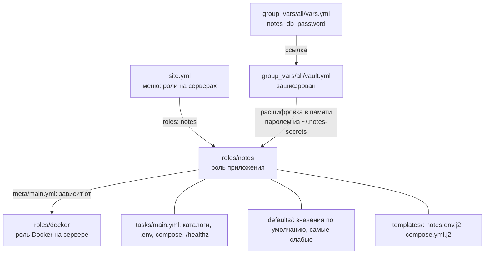
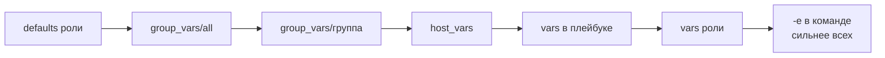
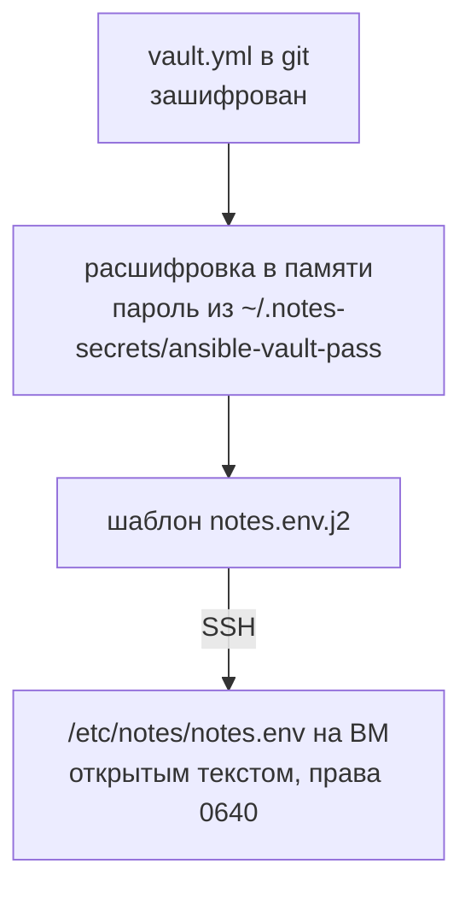
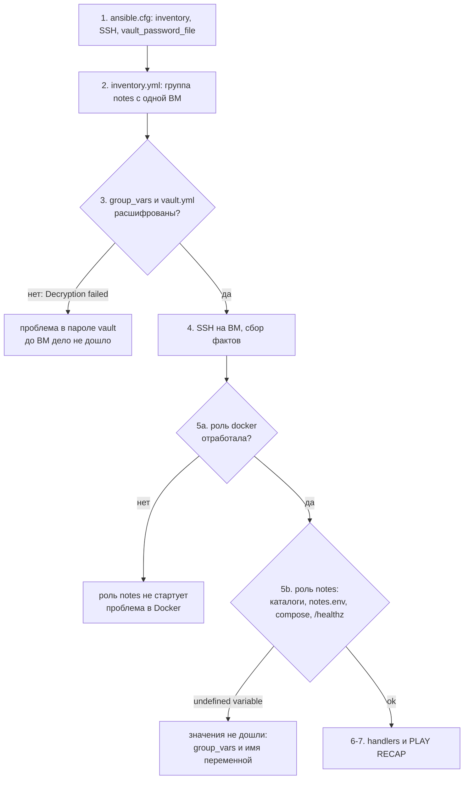

## Зачем это нужно

Плейбук (playbook, файл с описанием настройки сервера, [урок 7.5](05-ansible-playbooks.md)) на 200 строк, в котором смешаны установка Docker, конфиги, пароли и запуск приложения, никто не хочет читать и никто не осмеливается менять. Это как рецепт, в котором на одной странице и покупка продуктов, и готовка, и сервировка: найти нужный кусок трудно, а повторить только его невозможно.

На работе такое разбирают на роли (roles). Роль это готовый «модуль знаний» об одном деле: «поставить Docker», «развернуть приложение». Каждая лежит в своей папке, у каждой понятная структура, и её можно взять на десятки серверов, не копируя текст. Без ролей каждый новый сервер означает копипасту плейбука, а через месяц копии расходятся.

Вторая проблема: пароль базы данных (БД) нужно где-то хранить. Держать его в открытом виде в git нельзя ([урок 3.4](../03-git-ci/04-quality-security-ci.md)), а без него приложение не запустится. Поэтому секреты шифруют: как письмо в запертом сейфе, которое можно хранить в общей комнате, а открыть может только владелец кода. Инструмент называется Ansible Vault (подробно разберём в теории).

В этом уроке ты соберёшь две роли и запустишь «Заметки» на чистой виртуальной машине (ВМ) одной командой. Пароль БД будет лежать в зашифрованном файле.

Шаг проекта: в `~/notes/infra/ansible/` появятся роли `docker` и `notes` и зашифрованный `group_vars/all/vault.yml`; `ansible-playbook site.yml` поднимает «Заметки» на ВМ.

## Что нужно знать

- [Урок 7.4: инвентарь, модули, ad-hoc](04-ansible-basics.md) - inventory, `ansible.cfg`, доступ по SSH
- [Урок 7.5: плейбуки, handlers и Jinja2](05-ansible-playbooks.md) - `tasks`, `notify`, шаблоны `.j2`, идемпотентность
- [Урок 7.2: переменные, ВМ и outputs](02-terraform-vm-variables.md) - откуда берётся IP ВМ
- [Урок 4.5: Compose с PostgreSQL](../04-docker/05-compose-postgres.md) - `compose.yml`, `.env`, healthcheck
- [Урок 6.3: деплой на ВМ](../06-cloud/03-deploy-notes-vm.md) - что мы автоматизируем: pull образа и `up -d`
- [Урок 1.3: права и пользователи](../01-linux/03-users-permissions.md) - владелец и режим файла `.env` (640)

## Картина целиком

Представь небольшой ресторан. Есть **должностные инструкции по станциям**: «холодный цех», «горячий цех», «раздача». Каждая инструкция лежит в своей папке и описывает свою работу от начала до конца. Это **роли**. Есть **меню на сегодня**: какие станции работают и в каком порядке. Это **плейбук** `site.yml`. Есть **индивидуальные настройки**: сколько порций, какой соус, а ещё **сейф с кодами от склада**: пароли, которые нельзя оставлять на виду. Это **переменные** и **vault**.



Части схемы:

- **роль** (role) - папка с заранее оговорённой структурой: задачи, шаблоны, значения по умолчанию лежат на своих местах;
- **зависимость роли** - запись в `meta/main.yml`: «перед мной выполни роль docker»;
- **defaults и group_vars** - слои значений: слабые (значения роли по умолчанию) и сильные (значения проекта);
- **vault** - шифрование файла с секретами, чтобы его можно было хранить в git;
- **коллекция** (collection) - пакет с дополнительными модулями; Compose управляется модулем из коллекции `community.docker`.

## Теория


### Зачем плейбуку роли

В уроке 7.5 плейбук был один файл на несколько игр (plays). Пока серверов один и задач десять, это удобно. Когда задач шестьдесят, а серверов разных видов пять, возникают три проблемы. Нужную строку трудно найти. Кусок «поставь Docker» хочется взять в другой проект и приходится копировать. Проверить один кусок отдельно от остальных нельзя.

Кулинарная книга против одной длинной простыни текста. В книге есть главы «бульоны», «гарниры», «соусы»; рецепт борща ссылается на главу «бульоны», а не пересказывает её заново. Роль это такая глава. Оговорка: у главы в книге нет входных параметров, а у роли есть: одна и та же роль может ставить разные версии приложения.

Роль (role) это каталог с заранее оговорённой структурой. Ansible сам ищет нужные файлы в нужных подкаталогах, поэтому ничего вручную подключать не нужно. Если в плейбуке написано `roles: [notes]`, Ansible идёт в `roles/notes/` и ищет там:

```text
roles/notes/
  tasks/main.yml       # задачи: точка входа, выполняются сверху вниз
  handlers/main.yml    # обработчики: реакции на notify (урок 7.5)
  templates/           # шаблоны .j2: бланки с пустыми местами для значений
  files/               # статичные файлы: копируются как есть, без подстановок
  defaults/main.yml    # значения по умолчанию: самый низкий приоритет
  vars/main.yml        # «жёсткие» значения роли: высокий приоритет
  meta/main.yml        # метаданные и зависимости от других ролей
```

Все подкаталоги необязательны: если в роли нет шаблонов, папки `templates/` просто не будет. Особое правило поиска: модуль `template` без указания пути берёт файл из `templates/` этой роли, а `copy` из `files/`. Поэтому в задаче роли пишут `src: notes.env.j2`, а не длинный путь.

Пример: Плейбук сжимается до списка ролей:

```yaml
- name: Настройка сервера «Заметки»   # название игры для вывода
  hosts: notes                         # на каких серверах (группа из inventory, урок 7.4)
  become: true                         # выполнять с правами root (урок 7.4)
  roles:
    - docker                           # сначала поставить Docker
    - notes                            # потом развернуть приложение
```

Ansible выполняет роли по порядку сверху вниз. Внутри каждой роли: загрузит значения из `defaults/` и `vars/`, затем выполнит `tasks/main.yml`, а handlers сработают в конце игры, как в уроке 7.5. В нашем проекте та же настройка, что в 7.5 делали тремя отдельными плейбуками (`base.yml`, `docker.yml`, `config.yml`), теперь живёт в двух ролях: так понятно, где искать и что переиспользовать.

> **Прикинь сам:** В плейбуке `roles: [notes, docker]`, а роли `notes` нужен Docker. Что произойдёт?
{: .predict}

Роль `notes` выполнится первой, Docker и плагина Compose ещё нет, задача запуска стека упадёт. Исправить без перестановки можно зависимостью в `meta/main.yml`.

Осторожно:

- Роль и плейбук. Плейбук отвечает на вопрос «на каких серверах и что выполнить», роль отвечает на вопрос «как именно настроить одну вещь». Роль сама никуда не запускается, её подключают из плейбука.
- «Роль обязана быть большой». Хорошая роль делает одно дело: Docker отдельно, приложение отдельно.

> **Главное:** роль это каталог с заранее оговорённой структурой: Ansible сам находит в нём задачи, шаблоны и значения; роль делает одно дело, а плейбук говорит, где и в каком порядке её запускать.
{: .key}

> **Проверь понимание:** в плейбуке написано `roles: [notes, docker]`, а роли `notes` нужен Docker. Что произойдёт и как это исправить без перестановки?

<details markdown="1">
<summary>Ответ</summary>

Роль `notes` выполнится первой, а Docker и Compose-плагина на сервере ещё нет, поэтому задача запуска стека упадёт. Исправление без перестановки: записать зависимость в `roles/notes/meta/main.yml` (`dependencies: [{role: docker}]`). Тогда Ansible сам подтянет `docker` перед `notes`, в каком бы порядке ни были перечислены роли.

</details>

Внутри роли значения лежат в двух местах, и выбор между ними важен.

### defaults и vars: два места для значений внутри роли

Роль должна работать «из коробки», но пользователь роли хочет менять часть настроек: тег образа, порт, каталог. Нужно место для разумных значений по умолчанию, которые легко перебить снаружи.

Настройки телефона: заводские значения (defaults) лежат в прошивке, а ты поверх них ставишь свои. Второй пример: `vars` это заводские значения, которые пользователь поменять не должен (как размер батареи), поэтому они «прибиты» сильнее.

Значение из `defaults/main.yml` самое слабое из всех: его перекрывает `group_vars`, `host_vars`, `-e` и практически всё остальное. Значение из `vars/main.yml` роли сильное: снаружи его перебьёт только совсем сильный источник вроде `-e`. Правило выбора: всё, что пользователь роли может захотеть поменять, кладёшь в `defaults/`. В `vars/` только то, что роль менять не позволяет.

Пример: В роли `notes` лежит `defaults/main.yml`:

```yaml
notes_tag: "0.4.1"                   # тег образа; latest не используем
notes_image: "ghcr.io/CHANGE_ME/notes"
notes_dir: /opt/notes                # где лежит compose.yml
notes_env_dir: /etc/notes            # где лежит .env (конфиг)
```

Пользователь роли в `group_vars/all/vars.yml` пишет `notes_tag: "0.4.2"`. Значение `group_vars` сильнее, поэтому задеплоится `0.4.2`, а роль менять не пришлось. Если бы `notes_tag` стоял в `vars/` роли, правка в `group_vars` не сработала бы, и пользователь бы недоумевал, почему «переменная не применяется».

> **Прикинь сам:** Куда в роли положить порт приложения, `defaults` или `vars`?
{: .predict}

В `defaults`: это настройка, которую пользователь роли захочет менять, а `defaults` перекрывается чем угодно. В `vars` роли значение почти не перебить снаружи.

Осторожно: Кладут всё в `vars/`, «чтобы наверняка». Роль становится негнущейся: ни один параметр не перебить без `-e`. Правильный шаг: по умолчанию `defaults/`.

> **Главное:** всё, что пользователь может захотеть поменять, кладут в `defaults/main.yml`; в `vars/` только то, что роль менять не позволяет.
{: .key}

> **Проверь понимание:** чем `defaults/main.yml` отличается от `vars/main.yml`, и куда ты положишь порт приложения?

<details markdown="1">
<summary>Ответ</summary>

`defaults` переопределяются чем угодно: `group_vars`, `-e`, inventory. `vars` роли имеют высокий приоритет и снаружи почти не перебиваются. Порт приложения это настройка, которую пользователь роли захочет менять, значит `defaults`.

</details>

Если одна роль требует другую, это записывают прямо в ней.

### Зависимости ролей: meta/main.yml

Часть ролей без других не работает: приложению нужен Docker. Если держать порядок только в плейбуке, его легко нарушить (переставили строки, запустили роль отдельно). Зависимость записывает связь внутри самой роли.

В рецепте борща написано «подготовь бульон по рецепту со страницы 12». Повар не выбирает: бульон будет готов до свёклы. Оговорка: если бульон уже сварен на этой кухне сегодня, второй раз его не варят.

В `roles/notes/meta/main.yml`:

```yaml
dependencies:
  - role: docker
```

Когда Ansible берёт роль `notes`, он сначала выполняет все роли из `dependencies`, затем саму роль. Если одну и ту же роль подключили несколько раз с одинаковыми параметрами, она выполнится один раз.

Пример: В `site.yml` стоит одна строка `roles: [notes]`. Вывод `ansible-playbook site.yml --list-tasks` (команда печатает задачи в порядке выполнения и ничего не запускает) покажет сначала задачи `docker : ...`, затем `notes : ...`. Префикс `роль :` в именах задач показывает, какой роли принадлежит шаг.

> **Прикинь сам:** Задача Compose упала с «Docker not found», а в `site.yml` только `roles: [notes]`. Где смотреть первым делом?
{: .predict}

В `roles/notes/meta/main.yml`: на месте ли блок `dependencies` с ролью `docker`. Затем `--list-tasks`: задачи `docker : ...` должны идти перед `notes : ...`.

Осторожно: Зависимость не делает роль «частью» другой: `docker` можно по-прежнему подключить самостоятельно на сервер, где приложения нет.

> **Главное:** `dependencies` в `meta/main.yml` выполняются до самой роли, один раз; зависимость не делает роль частью другой.
{: .key}

> **Проверь понимание:** `site.yml` содержит `roles: [notes]`, а задача Compose упала с «Docker not found». Где смотреть первым делом?

<details markdown="1">
<summary>Ответ</summary>

В `roles/notes/meta/main.yml`: на месте ли блок `dependencies` с ролью `docker`. Затем `ansible-playbook site.yml --list-tasks`: если в списке нет задач `docker : ...` перед `notes : ...`, зависимость потеряна.

</details>

Теперь ответим на вопрос, какое значение переменной в итоге применится.

### Приоритет переменных: кто победил

Одну и ту же переменную можно задать в десятке мест: в роли, в каталоге проекта, в команде. Нужно заранее знать, какое значение применится, иначе неожиданный тег образа уйдёт в боевой запуск.

Указания руководителя: общий приказ по компании слабее приказа отдела, приказ отдела слабее поручения лично тебе, а устное «делай сейчас так» от директора сильнее всех. Оговорка: в Ansible порядок строго закреплён, и спорить с ним нельзя.

Вот основной порядок от слабого к сильному (полная таблица в документации Ansible длиннее, но для нашего проекта хватает этой):



- `group_vars/` каталог рядом с inventory или плейбуком: файлы в нём называются по группе (`group_vars/notes.yml`), а `group_vars/all/` действует на все серверы;
- `host_vars/` то же для одного сервера;
- `-e` (extra vars, «дополнительные переменные») задаёт значение прямо в команде: `ansible-playbook site.yml -e notes_tag=0.4.2`. Побеждает всё. Поэтому `-e` удобен для разовой правки и опасен: «временный» `-e` в скрипте CI живёт годами.

Когда результат неожиданный, не гадай, а спроси у Ansible итоговое значение. Добавь в плейбук задачу `ansible.builtin.debug` с `var: notes_tag` (`debug` модуль, печатающий переменную, `var` имя) и запусти плейбук, лучше с тегом, чтобы выполнилась только она. Команда `ansible -m debug -a "var=notes_tag" notes` для этого не подходит: ad-hoc запуск не загружает роли из `site.yml`, поэтому не увидит `defaults` и `vars` ролей и переменные плейбука.

Пример: `notes_tag` задан в трёх местах: `defaults` роли `0.4.1`, `group_vars/all/vars.yml` `0.4.0`, в команде `-e notes_tag=0.4.2`. Ответ: `0.4.2`, потому что `-e` сильнее всего. Убери `-e`: победит `0.4.0` (`group_vars` сильнее `defaults`). Убери и `group_vars`: останется `0.4.1`. Так по цепочке виден весь смысл приоритета.

> **Прикинь сам:** `notes_tag` задан в `defaults` как 0.4.1 и в `group_vars/all` как 0.4.0, запуск без `-e`. Какой тег уйдёт?
{: .predict}

0.4.0: `group_vars` сильнее `defaults`. Добавь `-e notes_tag=0.4.2`, и победит 0.4.2.

Осторожно: «Что ближе к файлу с задачей, то и главнее». Нет: главнее то, что ближе к командной строке. Ещё путают `vars` роли и `vars` плейбука: оба сильные, но не равны (`vars` роли сильнее, чем `vars` в плейбуке).

> **Главное:** порядок от слабого к сильному: defaults, group_vars, host_vars, vars плейбука, vars роли, `-e`; побеждает то, что ближе к командной строке, а не к файлу с задачей.
{: .key}

> **Проверь понимание:** `notes_tag` задан в `defaults` роли как `0.4.1` и в `group_vars/all` как `0.4.0`. Запуск идёт без `-e`. Какой тег задеплоится?

<details markdown="1">
<summary>Ответ</summary>

`0.4.0`. `group_vars` сильнее `defaults`.

</details>

Пароли тоже переменные, но их в открытом виде хранить нельзя: нужен Vault.

### Ansible Vault: секреты в git в зашифрованном виде

Пароль БД нужен плейбуку, плейбук лежит в git, а пароли в git открытым текстом класть нельзя: история хранит их вечно. Без шифрования пришлось бы передавать пароль руками при каждом запуске или хранить в чате. Ansible Vault (встроенный механизм шифрования файлов) позволяет положить секрет в репозиторий в виде, который без пароля не прочитать.

Письмо в запертом сейфе: сейф можно хранить в общей комнате (в git), открыть его может тот, у кого есть код (пароль vault). Оговорка: если код написан на стикере на дверце, сейфа как бы нет.

Команда `ansible-vault encrypt файл` шифрует файл симметрично (алгоритм AES256: один и тот же пароль и шифрует, и расшифровывает). Внутри файла остаётся заголовок `$ANSIBLE_VAULT;1.1;AES256` и шестнадцатеричный текст. При запуске Ansible расшифровывает значения в памяти и подставляет в шаблоны. Принятая схема из двух файлов в `group_vars/all/`:

```text
group_vars/all/vars.yml     открытый:   notes_db_password: "{{ vault_notes_db_password }}"
group_vars/all/vault.yml    ЗАШИФРОВАН: vault_notes_db_password: "<секрет>"
```

В `vars.yml` лежит только ссылка на секрет. Открытый файл удобен для поиска: `grep notes_db_password -r .` покажет, где переменная используется. Секретное значение остаётся в `vault.yml`, а префикс `vault_` говорит читателю, откуда оно.

Пароль от vault хранится вне репозитория. У нас это `~/.notes-secrets/ansible-vault-pass` с правами 600, а путь к нему указан в `ansible.cfg` строкой `vault_password_file`. Это осознанный долг: ключ лежит на твоём ноутбуке, и при смене ноутбука его нужно перенести. Централизованное хранение появится в теме 9 (Vault от HashiCorp, не путать с `ansible-vault`, см. [урок 9.1](../09-secrets-gitops/01-secrets-problem-vault.md)).

Полезные команды: `ansible-vault view файл` показывает содержимое, `ansible-vault edit файл` правит, `ansible-vault rekey файл` меняет пароль, `ansible-vault encrypt_string 'секрет' --name имя` зашифровывает одну строку для вставки прямо в YAML.



Пример: Файл `vault.yml` после шифрования:

```text
$ANSIBLE_VAULT;1.1;AES256
36323431386533613538323261353762313331366335363330333462303836666436396264316531
...
```

Первая строка говорит, что это vault версии 1.1 с шифром AES256. Остальное это зашифрованный текст. По `git log -p` и по `git diff` пароль не прочитать. Но есть две оговорки: git покажет, что файл изменился целиком (по тексту не понять, какая переменная поменялась), и пароль на ВМ всё равно окажется в `/etc/notes/notes.env` открытым текстом: vault защищает репозиторий, а не сервер.

Ещё один риск: Ansible печатает в вывод параметры задач, и пароль из шаблона может попасть в лог. Параметр `no_log: true` у задачи запрещает печатать её параметры и результат, вместо них будет `censored`.

> **Прикинь сам:** Ты закоммитил зашифрованный `vault.yml`, а файл с паролем vault тоже случайно попал в git. Что с защитой?
{: .predict}

Защиты нет: ключ лежит рядом с замком, и история git хранит его вечно. Пароль vault меняют (`rekey`), а пароль БД считают скомпрометированным.

Осторожно:

- `ansible-vault` и HashiCorp Vault. Это разные вещи: первое шифрует файл для Ansible, второе отдельный сервис хранения секретов (тема 9).
- «Зашифровал, значит, можно коммитить и пароль vault рядом». Нельзя: ключ рядом с замком это отсутствие замка.
- «Потерял пароль vault, достану из git». Нельзя: без пароля расшифровать невозможно, файл пересоздают заново.

> **Главное:** Vault шифрует файл для хранения в git, пароль от него лежит вне репозитория; защищается репозиторий, а не сервер.
{: .key}

> **Проверь понимание:** ты закоммитил `vault.yml` в зашифрованном виде, а `.vault-pass` тоже случайно добавил в git. Что произошло с защитой?

<details markdown="1">
<summary>Ответ</summary>

Защиты нет: ключ лежит рядом с замком, а история git хранит его вечно. Пароль vault нужно сменить (`ansible-vault rekey`), а пароль БД считать скомпрометированным и сменить тоже.

</details>

После расшифровки пароль окажется в файле на ВМ, и его надо защитить правами.

### Права на секретный файл и no_log

После расшифровки пароль оказывается в файле `.env` на ВМ. Если файл читают все, в системе любой процесс и любой пользователь получит пароль БД. Нужно дать право чтения только тем, кому оно необходимо.

Ключ от кассы: у кассира и у менеджера, но не у каждого посетителя.

Права на файл выражаются тройкой «владелец, группа, остальные» (урок [1.3](../01-linux/03-users-permissions.md)). Режим `0640` означает: владелец читает и пишет (6), группа только читает (4), остальные ничего (0). Владелец `root`, группа `notes`: читать файл могут `root` и сервис от пользователя в группе `notes`. Режим нужно задавать в самой задаче `template`, а не рассчитывать на umask системы: без явного `mode` файл создастся с правами по умолчанию (обычно `0644`), то есть читаемым для всех. Каталог `/etc/notes` получает `0750`, чтобы чужие пользователи не могли даже посмотреть список файлов.

Пример: Результат проверки: `stat -c '%a %U:%G' /etc/notes/notes.env` печатает `640 root:notes`. Формат `%a` даёт права числом, `%U` владельца, `%G` группу. Если вместо этого `644 root:root`, в задаче потерялся `mode` или `group`.

> **Прикинь сам:** Зачем `mode: "0640"` писать в самой задаче `template`, если потом можно сделать `chmod`?
{: .predict}

Между созданием файла и `chmod` пароль какое-то время читают все, а ручной `chmod` не воспроизводится на новом сервере. Режим в задаче выставляется при создании файла.

Осторожно: `no_log: true` прячет секрет из вывода Ansible, но не из файла на сервере и не из state Terraform. Это разные слои защиты.

> **Главное:** `0640` с владельцем `root` и группой `notes` пускает читать root и сервис; `no_log: true` прячет секрет из вывода Ansible, но не из файла на сервере.
{: .key}

> **Проверь понимание:** зачем `mode: "0640"` пишут в самой задаче `template`, если на ВМ можно потом выполнить `chmod`?

<details markdown="1">
<summary>Ответ</summary>

Между созданием файла и отдельным `chmod` пароль какое-то время читаем всем. К тому же ручной `chmod` не воспроизводится на новом сервере: плейбук должен описывать итоговое состояние целиком. Режим в задаче выставляется в момент создания файла и проверяется при каждом запуске.

</details>

Для запуска Compose нужны модули, которых нет в ядре Ansible: коллекции.

### Коллекции и модуль community.docker

Ядро Ansible содержит только базовые модули (`apt`, `copy`, `template`, `service`). Для всего остального есть коллекции (collections): отдельно устанавливаемые пакеты модулей. Без них для Compose пришлось бы вызывать `docker compose up -d` командой и вручную проверять, изменилось ли что-то, то есть терять идемпотентность.

Приложения на телефоне: базовая система умеет звонить и слать сообщения, а для такси ставят отдельное приложение. Оговорка: коллекцию ставишь на свой компьютер (управляющий узел), а не на сервер.

Для Compose нужна коллекция `community.docker`, а в ней модуль `docker_compose_v2`: он вызывает CLI-плагин `docker compose` на сервере и сам решает, нужно ли что-то менять. Версию коллекции закрепляют в файле `requirements.yml`:

```yaml
collections:
  - name: community.docker
    version: "5.0.0"      # закреплено, чтобы у всех была одна версия
```

Установка командой `ansible-galaxy collection install -r requirements.yml` (Galaxy это каталог ролей и коллекций Ansible). Полное имя модуля состоит из двух частей: `community.docker.docker_compose_v2` (коллекция и модуль, FQCN из [урока 7.4](04-ansible-basics.md)). Ключевые параметры: `project_src` (каталог с `compose.yml`), `env_files` (файлы с переменными для `${...}` в compose-файле), `state: present` (поднять стек, как `up -d`), `pull: missing` (скачать образ, только если его нет на сервере).

Пример: Первый запуск: образов нет, модуль скачивает их, создаёт контейнеры и сообщает `changed`. Второй запуск: контейнеры уже работают с теми же настройками, модуль ничего не делает и сообщает `ok`. Поменялся `notes_tag` и изменился `compose.yml`: модуль пересоздаёт только затронутый контейнер.

> **Прикинь сам:** Зачем закреплять версию коллекции в `requirements.yml`, если всё и так работает?
{: .predict}

Без закрепления через полгода у коллеги и в CI окажутся разные версии модулей: плейбук начнёт вести себя иначе. Закреплённая версия даёт воспроизводимость.

Осторожно: Коллекцию устанавливают один раз на управляющем узле, а не на каждом сервере. Если забыть, будет `couldn't resolve module/action 'community.docker.docker_compose_v2'`.

> **Главное:** коллекция это пакет модулей, её ставят один раз на управляющий узел через `ansible-galaxy`; модуль `docker_compose_v2` сам решает, нужно ли менять стек.
{: .key}

> **Проверь понимание:** зачем закреплять версию коллекции в `requirements.yml`, если всё и так работает?

<details markdown="1">
<summary>Ответ</summary>

Без закрепления `ansible-galaxy` поставит самую свежую версию. Через полгода у коллеги и в CI окажутся разные версии модулей с разным поведением: плейбук, который работал, начнёт падать или вести себя иначе. Закреплённая версия даёт воспроизводимый результат.

</details>

В шаблоне Compose встретятся два вида подстановок, их нельзя путать.

### Два уровня подстановки: Jinja2 и Compose

В файле `compose.yml.j2` встречаются и `{{ notes_image }}`, и `${POSTGRES_PASSWORD}`. Выглядят похоже, но их обрабатывают разные программы в разное время. Если смешать, получишь либо пустое значение, либо ошибку.

Письмо проходит два этапа: сначала секретарь (Ansible) вписывает имя и адрес в бланк, потом адресат (Compose) заполняет в письме пункты «по месту». Секретарь не трогает то, что написано для адресата.

Как это устроено:

1. На твоём компьютере Ansible обрабатывает шаблон `compose.yml.j2` шаблонизатором Jinja2 ([урок 7.5](05-ansible-playbooks.md)): всё в двойных фигурных скобках заменяется значениями переменных. Конструкция `${...}` для Jinja2 просто текст.
2. Готовый `compose.yml` копируется на ВМ.
3. На ВМ Compose читает файл и сам подставляет `${POSTGRES_PASSWORD}` из файла окружения, переданного через `env_files`.

Пример: Строка шаблона `image: {{ notes_image }}:{{ notes_tag }}` на шаге 1 превращается в `image: ghcr.io/user/notes:0.4.1`. Строка `POSTGRES_PASSWORD: ${POSTGRES_PASSWORD}` на шаге 1 не меняется, а на шаге 3 Compose подставит значение из `/etc/notes/notes.env`. Поэтому пароль в самом `compose.yml` не оказывается.

> **Прикинь сам:** Где подставится значение в двойных фигурных скобках, а где в `${...}` в `compose.yml.j2`?
{: .predict}

Первое подставит Ansible на твоём компьютере при рендере шаблона, второе подставит Compose на ВМ при запуске, читая файл окружения.

Осторожно: Пробуют подставлять секрет через Jinja2 прямо в `compose.yml`: тогда пароль попадает в файл с правами `0644`, читаемый всеми. Секрет должен жить только в `.env` с правами `0640`.

> **Главное:** Jinja2 работает на твоём компьютере до отправки файла, `${...}` читает Compose на ВМ; секрет подставляют вторым способом, чтобы он не попал в читаемый всеми файл.
{: .key}

> **Проверь понимание:** где именно подставится значение в `image: {{ notes_image }}:{{ notes_tag }}`, а где в `POSTGRES_PASSWORD: ${POSTGRES_PASSWORD}`?

<details markdown="1">
<summary>Ответ</summary>

Первое подставит Ansible на твоём компьютере при обработке шаблона (Jinja2), второе Compose на ВМ при запуске контейнеров, читая файл окружения. Это два разных этапа и две разные программы.

</details>

Роль нужно проверять до запуска на десятках серверов.

### Как проверять роль: lint, check, повторный запуск

Роль запускают на десятках серверов, и ошибка размножается. Нужны проверки, которые ловят ошибки до боевого запуска.

Проверка чертежа, примерка одежды, пробный вариант: по возрастанию цены ошибки.

От дешёвых проверок к дорогим:

1. `ansible-playbook site.yml --syntax-check`: проверка синтаксиса YAML и структуры без подключения к серверам;
2. `ansible-lint`: линтер (программа проверки стиля и плохих практик, [урок 7.5](05-ansible-playbooks.md));
3. `--list-tasks`: список задач и порядок, без выполнения;
4. `--check --diff`: «сухой прогон», показывающий, что изменилось бы; `--diff` добавляет построчное сравнение файлов;
5. боевой запуск на одной тестовой ВМ, затем второй запуск: при правильной роли `changed=0` (идемпотентность).

Для ролей, которыми пользуются многие, добавляют Molecule (инструмент, который поднимает временную ВМ или контейнер, выполняет роль и проверяет результат). В учебном проекте мы его не ставим.

Пример: Опечатка в имени переменной в шаблоне: `--syntax-check` её не найдёт (синтаксис верный), а `--check --diff` найдёт: задача `template` упадёт с `'notes_tg' is undefined` ещё до изменений. Опечатка в отступе YAML ловится на первом шаге.

> **Прикинь сам:** Опечатка в имени переменной в шаблоне: поймает ли её `--syntax-check`?
{: .predict}

Нет, синтаксис верный. Её найдёт `--check --diff`: задача `template` упадёт с `is undefined` ещё до изменений.

Осторожно: `--check` не безопасен на 100%: модули `command` и `shell` в этом режиме пропускаются, и задачи, зависящие от их результата, могут вести себя иначе. Такие места проверяй вручную.

> **Главное:** проверки идут от дешёвых к дорогим: синтаксис, линтер, список задач, сухой прогон, один тестовый хост и повторный запуск с `changed=0`.
{: .key}

> **Проверь понимание:** второй запуск роли показывает `changed=2`, хотя на сервере ничего не меняли. Что это говорит о роли?

<details markdown="1">
<summary>Ответ</summary>

Роль неидемпотентна: две задачи каждый раз «меняют» состояние, например пишут файл с меняющимся содержимым (время, случайное значение) или используют `command` без `changed_when`. Нужно найти эти задачи по выводу (они помечены `changed`) и сделать их идемпотентными.

</details>

Для готовности приложения одной проверки статуса мало: нужно ждать.

### Цикл loop и проверка готовности: retries и until

Часто одну и ту же задачу нужно выполнить для нескольких значений (создать два каталога), а после запуска приложения нужно подождать, пока оно действительно начнёт отвечать. Без цикла задачи копируют, а без ожидания плейбук рапортует «готово», когда приложение ещё стартует.

Цикл: кассир пробивает товары из корзины по одному, не пишет отдельную инструкцию на каждый. Ожидание: ты позвонил в дверь и ждёшь, пока откроют, а не уходишь через секунду.

Параметр `loop` принимает список. Для каждого элемента Ansible выполняет задачу, а текущий элемент доступен как `item`. В роли `notes` список состоит из двух словарей (`path`, `group`, `mode`), и задача `file` создаёт оба каталога с разными правами. Связка `retries`, `delay` и `until` работает так: Ansible выполняет задачу, проверяет условие из `until`, а если оно ложно, ждёт `delay` секунд и повторяет, максимум `retries` раз. Если условие так и не выполнилось, задача падает.

Пример: Проверка `/healthz` с `retries: 10` и `delay: 3` даёт приложению до 30 секунд на старт. Первая попытка сразу после `docker compose up` может получить «connection refused» (порт ещё не слушает). Ansible печатает `FAILED - RETRYING` и пробует снова. Когда приходит код 200, задача проходит. Так в плейбуке закреплён принцип «роль считается выполненной, когда приложение отвечает, а не когда команда запуска вернулась».

> **Прикинь сам:** `retries: 3` и `delay: 2`, а приложение стартует 20 секунд. Что будет?
{: .predict}

Ansible попробует три раза за шесть секунд и упадёт, хотя приложение потом запустится. Время подбирают с запасом.

Осторожно: Принимают `RETRYING` за ошибку. Это нормальная часть ожидания, ошибкой считается только итоговый `FAILED` после всех попыток.

> **Главное:** `loop` повторяет задачу для каждого элемента; `retries`, `delay` и `until` дают приложению время стартовать; `RETRYING` это ожидание, а не ошибка.
{: .key}

> **Проверь понимание:** `retries: 3` и `delay: 2`, а приложение стартует 20 секунд. Что произойдёт?

<details markdown="1">
<summary>Ответ</summary>

Ansible попробует три раза за шесть секунд, не дождётся ответа и задача упадёт, хотя приложение в итоге запустится. Значения нужно подбирать с запасом под реальное время старта.

</details>

Теперь главный тест роли: что показывает повторный запуск.

### Идемпотентность роли: почему «повторный запуск» главный тест

Роль запускают много раз: при каждом изменении, по расписанию, на новых серверах. Если повторный запуск что-то ломает или постоянно «меняет», роль нельзя использовать спокойно.

Кнопка вызова лифта: сколько раз ни нажми, лифт приедет один раз. Плохая роль это кнопка, после каждого нажатия которой приезжает ещё один лифт.

Идемпотентность (idempotence, повтор даёт тот же результат) модули обеспечивают сами: `apt` смотрит, стоит ли пакет, `template` сравнивает содержимое файла, `docker_compose_v2` сравнивает состояние контейнеров. Ловушки создают только `command` и `shell`: они не знают, что изменили. Для них есть `changed_when: false` (команда только читает) и `creates` (не запускать, если файл уже есть).

Пример: В роли `docker` задача «Архитектура dpkg» запускает `dpkg --print-architecture`. Без `changed_when: false` она каждый раз будет `changed`, и проверка «второй запуск даёт `changed=0`» не пройдёт. Одна строка решает проблему.

> **Прикинь сам:** Второй запуск дал `changed=0`. Значит ли это, что приложение работает?
{: .predict}

Нет: если приложение было сломано и осталось сломанным, тоже будет `changed=0`. Поэтому смотрят и результат, `curl /healthz`.

Осторожно: Считают, что `changed=0` гарантирует правильность. Нет: он говорит «ничего не менялось», а не «всё настроено верно». Поэтому проверяют ещё и результат (`/healthz`).

> **Главное:** модули идемпотентны сами, ловушки это `command` и `shell`; `changed=0` говорит «ничего не менялось», а не «всё верно».
{: .key}

> **Проверь понимание:** зачем после второго запуска роли смотреть не только `changed=0`, но и `curl /healthz`?

<details markdown="1">
<summary>Ответ</summary>

`changed=0` означает, что состояние не менялось. Если приложение было сломано и осталось сломанным, плейбук тоже покажет `changed=0`. Проверка результата (`/healthz`) подтверждает, что оно действительно работает.

</details>

Соберём всё в один запуск.

### Сквозной разбор: что происходит при ansible-playbook site.yml

Соберём всё в один запуск. Ты в `~/notes/infra/ansible` и выполняешь `ansible-playbook site.yml`.



Если падает шаг 3 (`Decryption failed`), до ВМ дело не доходит: проблема в пароле vault. Если падает шаг 5a, роль `notes` даже не стартует: проблема в Docker. Если шаг 5b падает на `undefined variable`, значения не дошли: проверь `group_vars` и имя переменной. Диагностика в Ansible сводится к вопросу «на каком шаге этой цепочки остановились».


> **Прикинь сам:** На каком шаге упадёт запуск, если пароль vault неверен?
{: .predict}

На шаге 3, при расшифровке: `Decryption failed`. До ВМ дело не доходит.

> **Главное:** диагностика в Ansible сводится к вопросу, на каком шаге цепочки остановились: конфиг, инвентарь, vault, вход, роль docker или роль notes.
{: .key}

### Соответствие AWS

| Что в Ansible | Ближайшее в AWS |
|---|---|
| роль `docker` (настройка ОС) | AMI с Packer или EC2 Image Builder |
| `ansible-vault` | AWS Secrets Manager, SSM Parameter Store (для зашифрованных значений) |
| плейбук по SSH | SSM Run Command, State Manager |
| `site.yml` целиком | User Data + CloudFormation `cfn-init` |
| `--limit` на группу | Target по тегу в SSM |

(AMI это готовый образ ВМ; Packer это программа, которая собирает такие образы. Secrets Manager и SSM Parameter Store это сервисы AWS для хранения секретов и параметров.)

## Практика

Целевая машина: ВМ `notes-vm` из уроков 6.2 и 7.2 (или Multipass-ВМ Ubuntu 24.04). Inventory и `ansible.cfg` готовы с урока 7.4. Работаем в `~/notes/infra/ansible/`.

### Задание 1. Роль docker: apt-репозиторий Docker

**Цель:** установить Docker Engine и Compose-плагин из официального apt-репозитория, чтобы повторный запуск ничего не менял.

**Предскажи:** сколько задач покажут `changed` при втором запуске роли? Почему? 

<details markdown="1">
<summary>Ответ</summary>

Ноль. Модули `apt`, `get_url`, `deb822_repository` и `service` проверяют состояние и меняют его только при расхождении.

</details>

**Шаги:**

1. Создай каталоги роли:

   ```bash
   cd ~/notes/infra/ansible
   mkdir -p roles/docker/{tasks,defaults,handlers}
   ```

2. `roles/docker/defaults/main.yml`:


   ```yaml
   # Релиз Ubuntu для репозитория Docker (можно перебить, если у Docker нет нового)
   docker_apt_release: "{{ ansible_facts['distribution_release'] }}"
   # Пакеты, которые ставим из репозитория Docker
   docker_packages:
     - docker-ce
     - docker-ce-cli
     - containerd.io
     - docker-compose-plugin
   ```


3. `roles/docker/tasks/main.yml`:


   ```yaml
   - name: Зависимости для apt по HTTPS
     ansible.builtin.apt:
       name: [ca-certificates, curl]
       state: present
       update_cache: true
       cache_valid_time: 3600

   - name: Каталог для ключей apt
     ansible.builtin.file:
       path: /etc/apt/keyrings
       state: directory
       mode: "0755"

   - name: Ключ репозитория Docker
     ansible.builtin.get_url:
       url: https://download.docker.com/linux/ubuntu/gpg
       dest: /etc/apt/keyrings/docker.asc
       mode: "0644"

   - name: Пакет python3-debian для модуля deb822_repository
     ansible.builtin.apt:
       name: python3-debian
       state: present

   - name: Архитектура dpkg
     ansible.builtin.command: dpkg --print-architecture
     register: docker_arch
     changed_when: false

   - name: Репозиторий Docker
     ansible.builtin.deb822_repository:
       name: docker
       types: deb
       uris: https://download.docker.com/linux/ubuntu
       suites: "{{ docker_apt_release }}"
       components: stable
       architectures: "{{ docker_arch.stdout }}"
       signed_by: /etc/apt/keyrings/docker.asc
       state: present
       enabled: true

   - name: Docker Engine и Compose-плагин
     ansible.builtin.apt:
       name: "{{ docker_packages }}"
       state: present
       update_cache: true
     notify: Перезапустить docker

   - name: Docker запущен и включён при старте
     ansible.builtin.service:
       name: docker
       state: started
       enabled: true
   ```


4. `roles/docker/handlers/main.yml`:

   ```yaml
   - name: Перезапустить docker
     ansible.builtin.service:
       name: docker
       state: restarted
   ```

5. Временный плейбук `site.yml`:

   ```yaml
   - name: Настройка сервера «Заметок»
     hosts: notes
     become: true
     roles:
       - docker
   ```

6. Запусти дважды:

   ```bash
   ansible-playbook site.yml
   ansible-playbook site.yml
   ```

**Что должно получиться:** в конце второго запуска:

```text
PLAY RECAP *********************************************************************
notes-vm                   : ok=9    changed=0    unreachable=0    failed=0    skipped=0    rescued=0    ignored=0
```

Число `ok` равно числу выполненных задач (сбор фактов плюс восемь задач роли); у тебя оно может отличаться на одну-две, если ты добавлял задачи. Важны два числа: `changed=0` и `failed=0`.

**Разбор команд:**

- `mkdir -p roles/docker/{tasks,defaults,handlers}`: создаёт сразу три каталога; `-p` создаёт и родителя `roles/docker`, и не ругается, если каталог уже есть; `{a,b,c}` это раскрытие в оболочке, оно превращается в три пути.
- `ansible-playbook site.yml`: запускает плейбук; `site.yml` традиционное имя «главного» плейбука проекта.
- `ansible notes -a "docker compose version"`: одноразовая команда (ad-hoc, [урок 7.4](04-ansible-basics.md)) на хосты группы `notes`; `-a` передаёт аргументы модулю по умолчанию `command`.

> **ИИ:** структуру роли `docker` можно попросить набросать у нейросети, но имена параметров модулей `apt` и `get_url` сверяй с `ansible-doc`, а не с её памятью.
{: .ai}

**Как читать вывод:** при первом запуске в списке `TASK [docker : ...]` у большинства задач `changed`: система менялась. Строка `RUNNING HANDLER [docker : Перезапустить docker]` появляется один раз в конце, потому что пакеты ставились. При втором запуске всё `ok`, а handler не запускается вообще. Префикс `docker :` перед названием задачи показывает роль. Смотри в `PLAY RECAP` на `changed` и `failed`: остальное справочное. Если выводишь только хвост: `ansible-playbook site.yml | tail -n 3`.

Проверка на ВМ: `ansible notes -a "docker compose version"` печатает строку вида `Docker Compose version v5.x` (номер версии у тебя будет свой).

**Объясни себе:**

- Зачем `signed-by` и ключ в `/etc/apt/keyrings`, а не `apt-key`?
- Почему `distribution_release` берётся из фактов, а не пишется руками?
- Когда сработает handler и почему не при втором запуске?

**Типичные ошибки:**

- `E: The repository 'https://download.docker.com/linux/ubuntu resolute Release' does not have a Release file.`: у Docker ещё нет каталога для нового релиза Ubuntu. Проверь актуальный список на странице установки Docker и временно укажи предыдущий LTS в переменной `docker_apt_release` вместо факта.
- `fatal: [notes-vm]: FAILED! => {"msg": "Missing sudo password"}`: забыт `become: true` или на ВМ нет `NOPASSWD`. Проверь урок 7.4.
- `changed=1` на каждом запуске у задачи «Архитектура dpkg»: забыт `changed_when: false`. Команда только читает, но Ansible про это не знает.
- `This module requires the python3-debian package`: задача с `python3-debian` стоит после репозитория или удалена. Модуль `deb822_repository` сам использует эту библиотеку на ВМ.

### Задание 2. Vault: зашифруй пароль БД

**Цель:** положить пароль БД в зашифрованный файл и убедиться, что в git он не читается.

**Предскажи:** что покажет `cat group_vars/all/vault.yml` после шифрования: пароль, часть пароля или что-то ещё?

<details markdown="1">
<summary>Ответ</summary>

Заголовок `$ANSIBLE_VAULT;1.1;AES256` и строки шестнадцатеричного текста. Пароля нет.

</details>

**Шаги:**

1. Сгенерируй пароль vault и пароль БД, ни один не печатай в терминал:

   ```bash
   mkdir -p ~/.notes-secrets && chmod 700 ~/.notes-secrets
   openssl rand -base64 24 > ~/.notes-secrets/ansible-vault-pass
   chmod 600 ~/.notes-secrets/ansible-vault-pass
   ```

2. В `ansible.cfg` в секцию `[defaults]` добавь строку:

   ```ini
   vault_password_file = ~/.notes-secrets/ansible-vault-pass
   ```

3. Создай открытый файл и шифруемый файл:


   ```bash
   mkdir -p group_vars/all
   printf '# Секреты из vault.yml через префикс vault_\nnotes_db_password: "%s"\n' '{{ vault_notes_db_password }}' > group_vars/all/vars.yml
   printf 'vault_notes_db_password: "%s"\n' "$(openssl rand -base64 24)" > group_vars/all/vault.yml
   ansible-vault encrypt group_vars/all/vault.yml
   ```


4. Проверь, что видно снаружи и что внутри:

   ```bash
   head -n 2 group_vars/all/vault.yml
   ansible-vault view group_vars/all/vault.yml | sed 's/: ".*"/: "***"/'
   ```

**Что должно получиться:**

```text
$ANSIBLE_VAULT;1.1;AES256
36323431386533613538323261353762313331366335363330333462303836666436396264316531
vault_notes_db_password: "***"
```

**Объясни себе:**

- Зачем два файла, а не один зашифрованный `vars.yml`?
- Что будет с историей git, если ты потеряешь пароль vault?
- Почему пароль БД генерируется, а не придумывается?

**Разбор команд:**

- `openssl rand -base64 24`: берёт 24 случайных байта и печатает их в виде текста (base64); это и есть пароль. Вывод уходит в файл через `>`, поэтому на экране его нет.
- `chmod 700` и `chmod 600`: права только для владельца (каталог и файл соответственно, [урок 1.3](../01-linux/03-users-permissions.md)).
- `ansible-vault encrypt файл`: заменяет содержимое файла зашифрованным (файл перезаписывается на месте). Пароль берёт из `vault_password_file`.
- `head -n 2`: первые две строки файла, этого хватает, чтобы увидеть заголовок.
- `ansible-vault view ... | sed 's/: ".*"/: "***"/'`: показывает расшифрованное содержимое и сразу замазывает значение звёздочками, чтобы пароль не попал в терминал и историю экрана.

**Как читать вывод:** первая строка `$ANSIBLE_VAULT;1.1;AES256` подтверждает, что файл зашифрован (если видишь `vault_notes_db_password: ...` открытым текстом, шифрование не сработало). Вторая строка шестнадцатеричный мусор: так и должно быть. Длина этой строки у тебя будет другой, это нормально.

**Типичные ошибки:**

- `ERROR! Attempting to decrypt but no vault secrets found`: в `ansible.cfg` нет `vault_password_file` и не передан `--ask-vault-pass`. Добавь строку из шага 2.
- `ERROR! Decryption failed (no vault secrets were found that could decrypt)`: пароль в файле не тот, которым шифровали. Восстанови верный пароль или зашифруй файл заново.
- `Vault format unhexlify error: Odd-length string`: файл повреждён при правке вручную. Верни из git прежнюю версию.

### Задание 3. Роль notes: compose и .env из vault

**Цель:** роль кладёт на ВМ `compose.yml` и `.env` (читают только `root` и группа `notes`), затем поднимает стек.

**Предскажи:** какие права будут у `/etc/notes/notes.env` и кто сможет его прочитать на ВМ? Почему это важно в модуле `template`?

<details markdown="1">
<summary>Ответ</summary>

Владелец `root`, группа `notes`, режим `0640`. Читают `root` и участники `notes`. Режим задаётся в самой задаче, иначе пароль окажется на диске с umask по умолчанию (`0644`), доступный всем.

</details>

**Шаги:**

1. Каталоги и зависимость от роли `docker`:

   ```bash
   mkdir -p roles/notes/{tasks,defaults,meta,templates}
   cat > roles/notes/meta/main.yml <<'YML'
   # Роль docker выполняется до notes автоматически
   dependencies:
     - role: docker
   YML
   ```

2. `roles/notes/defaults/main.yml`:

   ```yaml
   notes_tag: "0.4.1"                  # тег образа, latest не используем
   notes_image: "ghcr.io/CHANGE_ME/notes"   # замени на свой github-user
   notes_dir: /opt/notes               # код и compose, владелец root
   notes_env_dir: /etc/notes           # конфиг, режим 640 root:notes
   ```

3. `roles/notes/tasks/main.yml`:


   ```yaml
   - name: Системная группа notes
     ansible.builtin.group:
       name: notes
       system: true

   - name: Каталоги проекта
     ansible.builtin.file:
       path: "{{ item.path }}"
       state: directory
       owner: root
       group: "{{ item.group }}"
       mode: "{{ item.mode }}"
     loop:
       - { path: "{{ notes_dir }}", group: root, mode: "0755" }
       - { path: "{{ notes_env_dir }}", group: notes, mode: "0750" }

   - name: Файл окружения с паролем БД
     ansible.builtin.template:
       src: notes.env.j2
       dest: "{{ notes_env_dir }}/notes.env"
       owner: root
       group: notes
       mode: "0640"
     no_log: true

   - name: compose.yml
     ansible.builtin.template:
       src: compose.yml.j2
       dest: "{{ notes_dir }}/compose.yml"
       owner: root
       group: root
       mode: "0644"

   - name: Стек запущен
     community.docker.docker_compose_v2:
       project_src: "{{ notes_dir }}"
       env_files:
         - "{{ notes_env_dir }}/notes.env"
       state: present
       pull: missing

   - name: Приложение отвечает на /healthz
     ansible.builtin.uri:
       url: http://127.0.0.1/healthz
       status_code: 200
     register: notes_health
     retries: 10
     delay: 3
     until: notes_health.status == 200
   ```


4. `roles/notes/templates/notes.env.j2`:


   ```text
   POSTGRES_PASSWORD={{ notes_db_password }}
   DATABASE_URL=postgresql://notes:{{ notes_db_password }}@db:5432/notes
   APP_VERSION={{ notes_tag }}
   ```


5. `roles/notes/templates/compose.yml.j2`:


   ```yaml
   services:
     notes:
       image: {{ notes_image }}:{{ notes_tag }}
       ports:
         - "80:8080"      # TLS и nginx перед приложением: урок 6.3
       env_file: {{ notes_env_dir }}/notes.env
       restart: unless-stopped
       depends_on:
         db:
           condition: service_healthy
     db:
       image: postgres:18
       environment:
         POSTGRES_USER: notes
         POSTGRES_DB: notes
         POSTGRES_PASSWORD: ${POSTGRES_PASSWORD}
       volumes:
         - pgdata:/var/lib/postgresql
       healthcheck:
         test: ["CMD-SHELL", "pg_isready -U notes -d notes"]
         interval: 5s
         retries: 10
       restart: unless-stopped
   volumes:
     pgdata:
   ```


6. Обнови `site.yml`, оставив только роль `notes` (`docker` придёт по зависимости) и запусти:

   ```bash
   cat > site.yml <<'YML'
   - name: Настройка сервера «Заметки»
     hosts: notes
     become: true
     roles:
       - notes
   YML
   ansible-galaxy collection install community.docker:==5.0.0
   ansible-playbook site.yml
   ```

**Что должно получиться:** запуск заканчивается `failed=0`, а на ВМ:

```text
$ ansible notes -a "stat -c '%a %U:%G' /etc/notes/notes.env"
notes-vm | CHANGED | rc=0 >>
640 root:notes
```

Проверка сайта: `curl -s http://<IP ВМ>/healthz` печатает `ok`. Повторный запуск с `--check --diff` даёт `changed=0` (`--check` ничего не меняет на сервере, `--diff` показывает, что изменилось бы, по строкам).

**Разбор ключевого:**

- `dependencies` в `meta/main.yml`: Ansible выполнит роль `docker` перед `notes`, поэтому в `site.yml` достаточно одной роли.
- `loop` с `item.path`, `item.group`, `item.mode`: одна задача создаёт два каталога, подставляя значения из списка по очереди.
- `no_log: true`: Ansible не печатает параметры и результат задачи; вместо них в выводе `censored`.
- `retries: 10`, `delay: 3`, `until`: проверка повторяется до десяти раз с паузой 3 секунды, пока `/healthz` не вернёт 200. Приложению нужно время на старт, а БД на `healthcheck`.
- `ansible-galaxy collection install community.docker:==5.0.0`: ставит коллекцию на твой компьютер, `==` закрепляет точную версию.

> **ИИ:** если стек не поднялся, отдай нейросети вывод `docker compose logs` без паролей и попроси указать первую строку с ошибкой: причину проверь сам на ВМ.
{: .ai}

**Как читать вывод:** при первом запуске в `PLAY RECAP` ищи `failed=0`. В списке задач `TASK [notes : Файл окружения с паролем БД]` покажет `changed` без параметров (из-за `no_log`). `TASK [notes : Стек запущен]` на первом запуске `changed` (скачиваются образы, это дольше остальных). `TASK [notes : Приложение отвечает на /healthz]` может показать `FAILED - RETRYING: ... (10 retries left)`: это нормальная пауза, пока приложение стартует, если потом идёт `ok`. Если все десять попыток закончились ошибкой, смотри логи контейнера на ВМ: `docker compose -f /opt/notes/compose.yml logs`.

**Объясни себе:**

- Почему пароль не появился в выводе плейбука?
- Что произойдёт, если поменять только `notes_tag` и запустить снова?

**Типичные ошибки:**

- `fatal: [notes-vm]: FAILED! => {"msg": "The task includes an option with an undefined variable. The error was: 'notes_db_password' is undefined"}`: не подхватился `group_vars/all/vars.yml`. Каталог `group_vars` должен лежать рядом с inventory или плейбуком.
- `ERROR! couldn't resolve module/action 'community.docker.docker_compose_v2'`: не установлена коллекция. Выполни `ansible-galaxy collection install community.docker:==5.0.0`.
- `manifest unknown`: образа с таким тегом нет в реестре. Проверь `notes_image` и `notes_tag`.

### Задание 4. Шаг проекта: «Заметки» одним запуском на чистой ВМ

**Цель:** зафиксировать роли в репозитории и проверить полный цикл на чистой ВМ.

**Шаги:**

1. Добавь `requirements.yml`:

   ```yaml
   collections:
     - name: community.docker
       version: "5.0.0"
   ```

2. Закоммить и запусти на свежей ВМ (пересоздай её или удали контейнеры и `/opt/notes`):

   ```bash
   cd ~/notes
   git add infra/ansible
   git commit -m "feat(infra): роли docker и notes, vault для пароля БД"
   cd infra/ansible
   ansible-galaxy collection install -r requirements.yml
   time ansible-playbook site.yml
   ```

3. Проверь снаружи и повторно:

   ```bash
   curl -s -o /dev/null -w '%{http_code}\n' http://<IP ВМ>/healthz
   ansible-playbook site.yml | tail -n 3
   ```

**Что должно получиться:**

```text
200
PLAY RECAP *********************************************************************
notes-vm                   : ok=15   changed=0    unreachable=0    failed=0    skipped=0    rescued=0    ignored=0
```

Число `ok` равно числу задач обеих ролей плюс сбор фактов (у нас около 15, у тебя может отличаться). Проверяй `changed=0 failed=0`, а не точное `ok`. Команда `time` в шаге 2 печатает, сколько заняло выполнение: на чистой ВМ несколько минут (установка Docker, скачивание образов), на второй запуск секунды.

**Как читать вывод:** `200` это код ответа `/healthz` (`-o /dev/null` выбрасывает тело, `-s` убирает индикатор, `-w '%{http_code}\n'` печатает только код). Повторный запуск не должен ничего менять: если `changed` не ноль, смотри, какие задачи помечены жёлтым.

Эталон: [infra/ansible в репозитории курса](https://github.com/distinguished-sre/learning/tree/main/devops/project/notes/infra/ansible).

**Объясни себе:**

- Что осталось долгом: где хранится пароль vault и что будет при смене ноутбука?

**Типичные ошибки:**

- `UNREACHABLE! => {"msg": "Failed to connect to the host via ssh: ... Permission denied (publickey)."}`: у ВМ пересоздан ключ или сменился IP. Обнови `inventory.yml` (урок 7.4).
- `Could not find or access 'notes.env.j2'`: шаблон лежит не в `roles/notes/templates/`.

## Сломай и почини

Запусти скрипт из клона курса и не читай его: `bash <клон-курса>/project/notes/break/7.6/break.sh random` (или номер 1-3). Он вносит одну из трёх поломок в `~/notes/infra/ansible`.

### Симптом

После запуска `ansible-playbook site.yml` падает. В выводе одна из картин: ошибка про vault («Decryption failed»), «is undefined» в задаче шаблона, или Compose-задача падает потому, что Docker на ВМ ещё не поставлен.

### Гипотезы

- Роли выстроены в неверном порядке, зависимость `docker` потеряна.
- Файл vault зашифрован другим паролем или в `ansible.cfg` указан не тот файл пароля.
- В шаблоне опечатка в имени переменной либо переменная не объявлена.

### Проверки

```bash
ansible-playbook site.yml --syntax-check
ansible-playbook site.yml --list-tasks
ansible-vault view group_vars/all/vault.yml >/dev/null && echo vault-ok
ansible -m debug -a "var=notes_db_password" notes
grep -rn "dependencies" roles/notes/meta/main.yml
```

Порядок в `--list-tasks` показывает, идёт ли `docker` до `notes`. Вывод `vault-ok` подтверждает пароль. Отсутствие переменной в `debug` указывает на `group_vars`.

### Исправление

<details markdown="1">
<summary>Разбор всех сценариев</summary>

1. Неверный порядок ролей: в `meta/main.yml` роли `notes` снова допиши `dependencies: [{role: docker}]` либо переставь роли в `site.yml`. Задачи Compose теперь идут после установки Docker.
2. Неверный пароль vault: проверь `vault_password_file` в `ansible.cfg` и файл `~/.notes-secrets/ansible-vault-pass`. Если пароль потерян, файл `vault.yml` пересоздают заново и шифруют новым паролем, а пароль БД на ВМ меняют.
3. Шаблон Jinja2 без переменной: найди имя в ошибке `'xxx' is undefined`, сверь с `defaults/main.yml` и `group_vars`. Обычно опечатка в шаблоне или пропавшая строка в `vars.yml`.

Профилактика: `ansible-lint`, `--syntax-check` и `--check --diff` перед каждым прогоном.

</details>

## ИИ в помощь

Нейросеть помогает собрать структуру роли и объяснить приоритет переменных, но не знает твой проект и охотно придумывает несуществующие параметры модулей. Общие правила работы с ней: [ИИ-помощник](../../load-tester/ai.md).

**Задача:** превратить длинный плейбук в роль.

```text
Вот мой плейбук на 80 строк: <вставь без паролей>. Разбей его на роль: покажи дерево каталогов и содержимое tasks/main.yml, defaults/main.yml и handlers/main.yml. Значения, которые пользователь захочет менять, положи в defaults.
```
{: .wrap}

**Проверь ответ:** запусти `ansible-playbook site.yml --syntax-check` и `--list-tasks`, потом повтори запуск и убедись в `changed=0`. Типичная ошибка: она кладёт всё в `vars/`, и значения не удаётся перебить.

**Задача:** понять, какое значение переменной победит.

```text
Переменная notes_tag задана в defaults роли, в group_vars/all и в host_vars хоста, а запуск идёт с -e. Вот мои файлы: <вставь>. Расположи источники от слабого к сильному и скажи, какое значение применится.
```
{: .wrap}

**Проверь ответ:** сверь с порядком из раздела про приоритет, а потом спроси у Ansible: задача `debug` с `var: notes_tag` внутри плейбука. Типичная ошибка: нейросеть считает, что ближе к файлу с задачей значит сильнее.

**Задача:** проверить, нет ли секретов на виду.

```text
Вот структура моего каталога ansible и содержимое group_vars без значений паролей: <вставь>. Покажи места, где секрет может оказаться в git или в логе, и как это закрыть через vault и no_log.
```
{: .wrap}

**Проверь ответ:** убедись, что пароль vault не в репозитории, а у задачи с паролем стоит `no_log: true`. Типичная ошибка: она путает `ansible-vault` и HashiCorp Vault из темы 9.

## Словарик урока

| Термин | Простыми словами |
|---|---|
| роль (role) | Папка с заданной структурой для одного дела (Docker, приложение): задачи, шаблоны, значения по умолчанию. |
| `tasks/main.yml` | Точка входа роли: задачи выполняются сверху вниз. |
| `defaults/main.yml` | Значения по умолчанию роли; самый слабый приоритет, перебиваются чем угодно. |
| `vars/main.yml` | Жёсткие значения роли с высоким приоритетом. |
| `templates/` | Шаблоны `.j2` роли, модуль `template` берёт их отсюда. |
| `files/` | Статичные файлы роли, модуль `copy` берёт их отсюда. |
| `meta/main.yml` | Метаданные роли и её зависимости. |
| зависимость роли (`dependencies`) | Роль, которая выполнится автоматически до текущей. |
| `group_vars/` | Переменные для группы серверов; `group_vars/all/` для всех. |
| `host_vars/` | Переменные для одного сервера. |
| приоритет переменных | Порядок: defaults роли, group_vars, host_vars, vars плейбука, vars роли, `-e`; сильнее тот, что правее. |
| `-e` (extra vars) | Значение переменной прямо в команде; побеждает всё. |
| `debug` | Модуль, который печатает переменную или сообщение; способ увидеть итоговое значение. |
| `ansible-vault` | Встроенное шифрование файлов Ansible; пароль хранится вне git. |
| `vault_password_file` | Настройка `ansible.cfg`: путь к файлу с паролем vault. |
| `encrypt_string` | Команда vault: зашифровать одну строку для вставки в YAML. |
| `rekey` | Команда vault: сменить пароль шифрования. |
| префикс `vault_` | Соглашение: секрет лежит в `vault.yml` под именем `vault_...`, открытый `vars.yml` ссылается на него. |
| `no_log` | Параметр задачи: не печатать её параметры и результат в вывод (секрет не попадёт в лог). |
| коллекция (collection) | Пакет дополнительных модулей, ставится на управляющий узел. |
| `ansible-galaxy` | Инструмент установки ролей и коллекций. |
| `requirements.yml` | Список коллекций с закреплёнными версиями. |
| `community.docker.docker_compose_v2` | Модуль, который поднимает стек Compose идемпотентно. |
| `deb822_repository` | Модуль подключения apt-репозитория в современном формате (`.sources`). |
| `python3-debian` | Библиотека на целевой ВМ, нужная модулю `deb822_repository`. |
| Jinja2 (подстановка) | Замена `{{ ... }}` в шаблоне значениями; выполняет Ansible на твоём компьютере. |
| `--syntax-check` | Проверка структуры плейбука без подключения к серверам. |
| `--list-tasks` | Печатает список задач в порядке выполнения, ничего не запуская. |
| `--check --diff` | Сухой прогон: что изменилось бы, по строкам. |
| Molecule | Инструмент автотестов ролей на временной ВМ или контейнере. |
| `serial` | Параметр игры: выполнять на серверах пачками, а не на всех сразу. |
| `healthcheck` / `/healthz` | Проверка «сервис жив»: команда в контейнере или адрес, отвечающий 200. |

## Вопросы с собеседований

Раздел для повторения: ответь вслух, потом открой ответ. Короткие вопросы с пометкой `[на скорость]` тренируй на время: ответ за 30 секунд.



## Проверено на версиях

- ansible-core 2.21.4 (как в уроках 7.4 и 7.5)
- community.docker: 5.0.0 (закреплена в `requirements.yml`)
- Docker Engine и Compose-плагин: из apt-репозитория Docker, версия не закреплена, проверь актуальную версию на странице проекта
- PostgreSQL: 18
- «Заметки»: образ 0.4.1
- Ubuntu на ВМ: 26.04 LTS или 24.04 LTS
- Подключение репозитория Docker модулем `deb822_repository` проверено в уроке 7.5 (два запуска, второй `changed=0`). Точные числа `ok` в `PLAY RECAP` этого урока зависят от твоей версии роли: смотри на `changed=0` и `failed=0`.

## Итог урока: ты умеешь

- [ ] умею выделить настройку в роль (`tasks`, `handlers`, `templates`, `defaults`)
- [ ] умею закрепить порядок ролей через `meta/main.yml`
- [ ] умею шифровать секреты `ansible-vault` и хранить пароль vault вне репозитория
- [ ] умею отрисовать `.env` с правами 640 из vault и не показать пароль в логе
- [ ] умею поднять стек Compose модулем `community.docker.docker_compose_v2`
- [ ] умею смотреть приоритет переменных через `debug`
- [ ] умею проверить плейбук `--check --diff`, `ansible-lint` и повторным запуском

**Дальше:** [Урок 7.7: Terraform + Ansible: конвейер с нуля, drift](07-terraform-ansible-drift.md)
