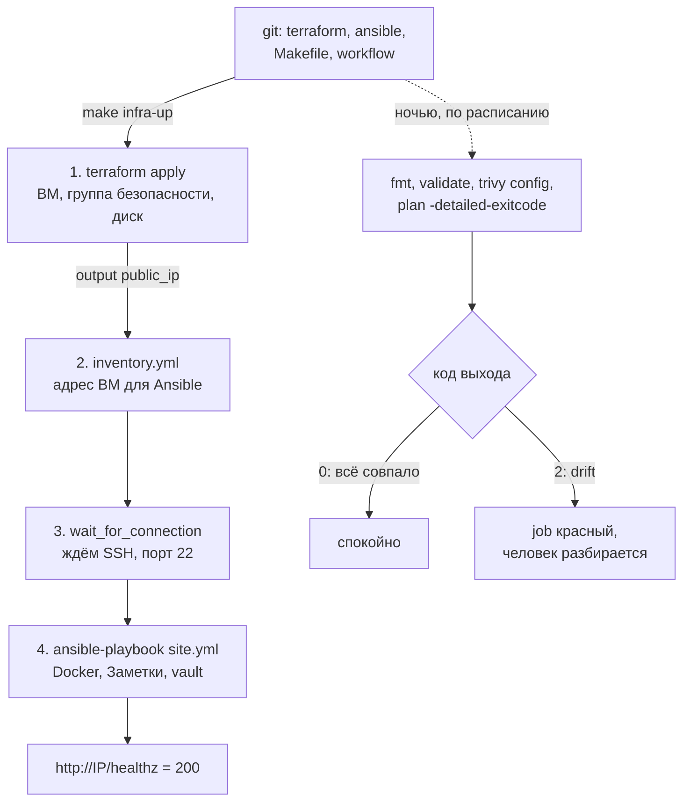
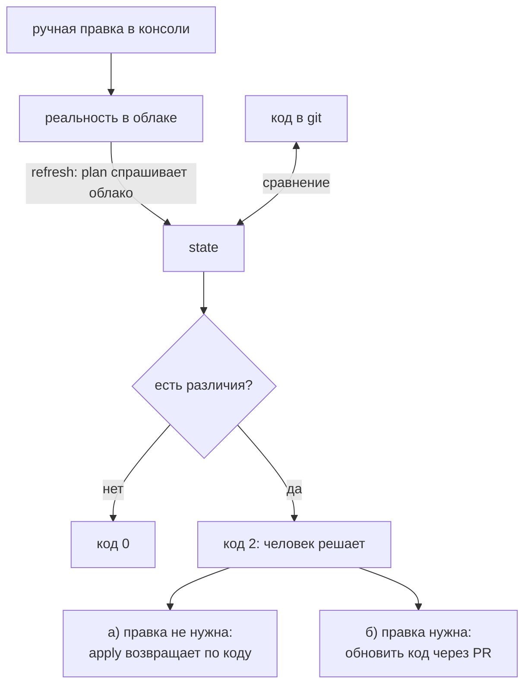
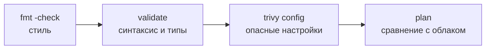
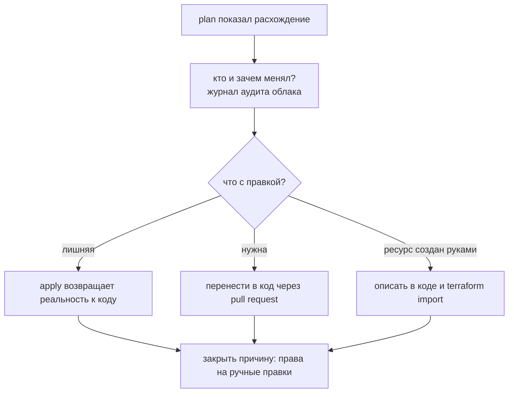
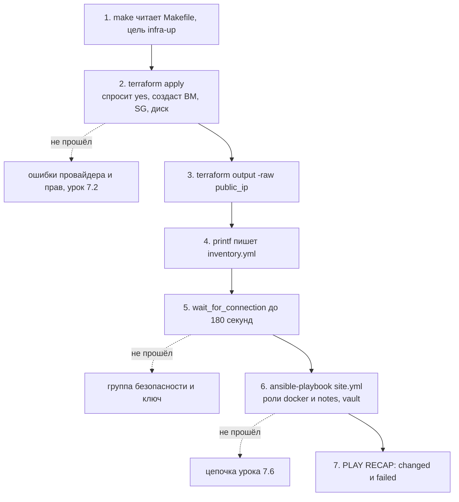

## Зачем это нужно

Terraform умеет создать виртуальную машину (ВМ), но не знает, что внутри должен работать Docker и «Заметки». Ansible умеет настроить ВМ, но не знает, откуда она взялась и какой у неё адрес. Это как строитель и отделочник: первый возводит коробку дома, второй делает внутри ремонт. Пока они не договорились, в каком порядке работать и как передать друг другу адрес, стройка стоит.

Нужна связка: одна команда строит сервер с нуля, вторая настраивает его, а по ночам автоматическая проверка смотрит, не поправил ли кто-то что-то руками. Такое расхождение называется drift (дрейф конфигурации, «уплывание»): код описывает одну инфраструктуру, а в облаке уже другая. Представь, что в инструкции к офису написано «три окна», а сосед прорубил четвёртое и никому не сказал. Без ночной проверки ты узнаешь об этом на аварии: через полгода код описывает одно, а работает другое, и восстановить сервер по коду уже нельзя.

Проверки мы запустим через CI (continuous integration, автоматический прогон проверок после каждого изменения кода, [урок 3.3](../03-git-ci/03-actions-ci.md)), а команды соберём в `Makefile` (файл, где короткие имена вроде `make infra-up` заменяют длинные цепочки команд, [урок 1.6](../01-linux/06-bash-basics.md)).

На собеседованиях по IaC (infrastructure as code, «инфраструктура как код») про это спрашивают почти всегда: «как связать Terraform и Ansible», «что такое drift и как его ловить», «immutable или mutable» (сервер правят на месте или каждый раз заменяют новым из образа; подробно разберём в теории). Трёх проверок кода CI мы касаемся тоже: `trivy config` это сканер, который ищет в файлах опасные настройки вроде открытого всему интернету SSH, как охранник проверяет планы здания до начала стройки.

Шаг проекта: в корне `~/notes` появляется `Makefile` с целями `infra-up`, `infra-plan`, `infra-down`, а в `.github/workflows/terraform.yml` проверки `fmt`, `validate`, `trivy config` и ночной `plan` на drift.

## Что нужно знать

- [Урок 7.2: переменные, ВМ и outputs](02-terraform-vm-variables.md) - `terraform output`, output `public_ip`
- [Урок 7.3: remote state, модули, окружения](03-terraform-state-modules.md) - state в бакете, `envs/dev`, блокировка
- [Урок 7.4: инвентарь, модули, ad-hoc](04-ansible-basics.md) - `inventory.yml` (список серверов для Ansible), `ansible.cfg`, SSH-доступ
- [Урок 7.6: роли и деплой «Заметок»](06-ansible-roles.md) - `site.yml`, vault, идемпотентный запуск
- [Урок 3.3: GitHub Actions](../03-git-ci/03-actions-ci.md) - структура workflow, `on:`, `permissions`
- [Урок 3.4: безопасность CI](../03-git-ci/04-quality-security-ci.md) - `trivy`, минимальные права, OIDC вместо долгих ключей

## Картина целиком

Представь ремонт квартиры. Сначала бригада строителей возводит стены и подключает воду (Terraform), и у квартиры появляется адрес. Потом этот адрес передают отделочникам (Ansible), и они делают внутри ремонт. Раз в ночь приходит инспектор и сверяет квартиру с проектом: ничего не чинит, только записывает расхождения и сообщает хозяину. Это ночной `plan`.



Части схемы:

- **apply** - применение кода Terraform: создание и изменение ресурсов в облаке ([урок 7.1](01-iac-terraform-basics.md));
- **inventory** - список серверов для Ansible, созданный из `terraform output` ([урок 7.4](04-ansible-basics.md));
- **`wait_for_connection`** - пауза, пока на новой ВМ не заработает SSH;
- **`plan -detailed-exitcode`** - «сухая» проверка с кодом выхода: 0 нет расхождений, 2 есть;
- **`fmt`, `validate`, `trivy config`** - проверки самих файлов кода: стиль, правильность, опасные настройки; секретов не требуют.

## Теория

### Кто за что отвечает в связке

Если не разделить обязанности, одна и та же настройка окажется сразу в двух инструментах, и они начнут спорить: Terraform откатит то, что сделал Ansible, или наоборот. Чёткая граница не даёт им мешать друг другу.

Строительная бригада и отделочники. Строители отвечают за то, что здание существует: стены, крыша, вода. Отделочники отвечают за то, что внутри: обои, мебель, розетки. Граница проходит по двери квартиры: как только дом построен и у него есть адрес, работа строителей закончена. Оговорка: в отличие от людей, инструменты сами не договорятся, адрес им нужно передать явно.

Terraform отвечает за то, что существует: сеть, ВМ, диски, группы безопасности (security group, набор правил «кого пускать на какие порты», [урок 6.2](../06-cloud/02-vm-network-storage.md)), DNS. Ansible отвечает за то, что внутри ВМ: пакеты, конфиги, сервисы, стек «Заметок». Граница проходит по ВМ. Между инструментами передаётся один факт: IP-адрес. Terraform отдаёт его через `output` (результат, который печатается после `apply`, [урок 7.2](02-terraform-vm-variables.md)), а Ansible получает его в inventory. Самый прозрачный способ: цель Makefile читает `terraform output -raw public_ip` и пишет `inventory.yml`. Есть и динамические inventory-плагины (Ansible сам спрашивает облако, какие ВМ есть), но для одной ВМ это лишняя сложность.

Порядок жёсткий: сначала `apply`, потом ожидание SSH (у свежей ВМ порт 22 открывается не сразу), потом `ansible-playbook`. Обратный порядок не работает: адреса ещё нет.

Пример: Проследим за адресом. После `terraform apply` в state (файл, где Terraform помнит созданное, [урок 7.1](01-iac-terraform-basics.md)) появился атрибут ВМ с внешним адресом. Блок `output "public_ip"` достаёт его. Команда `terraform output -raw public_ip` печатает строку `203.0.113.10` без кавычек. Makefile подставляет её в шаблон `inventory.yml` через `printf`. Ansible читает файл и подключается по `ansible_host: 203.0.113.10` под пользователем `ubuntu`. Если бы адрес вписывали руками, при каждом пересоздании ВМ (а адрес при этом меняется) inventory устаревал бы.

> **Прикинь сам:** ВМ пересоздали, и её адрес поменялся. Что нужно поправить в Ansible, если inventory генерируется из `output`?
{: .predict}

Ничего: следующий `make infra-up` перечитает `terraform output -raw public_ip` и перепишет `inventory.yml`. Руками адрес правят, только если inventory написан вручную.

Осторожно: «Terraform тоже умеет ставить пакеты через `remote-exec`, зачем Ansible». Умеет, но это одноразовый скрипт без идемпотентности и без `--diff`: при ошибке состояние ВМ непонятно. `remote-exec` годится разве что на крошечный bootstrap.

> **Главное:** Terraform отвечает за то, что существует, Ansible за то, что внутри ВМ; между ними передаётся один факт, IP-адрес, через `output`.
{: .key}

> **Проверь понимание:** почему нельзя описать Docker и «Заметки» в `user_data` ВМ и обойтись без Ansible?

<details markdown="1">
<summary>Ответ</summary>

`user_data` выполняется один раз при первой загрузке ВМ. Если поправить скрипт позже, Terraform обновит метаданные на месте (`~`), но cloud-init сам второй раз не запустится, и правка на работающем сервере не применится (см. [урок 7.2](02-terraform-vm-variables.md)). Чтобы она сработала, ВМ надо пересоздать. Ansible применяется к живой ВМ сколько угодно раз и показывает `--diff`. Короткий bootstrap в `user_data` допустим (ключи, пользователь), но полноценная настройка живёт в Ansible.

</details>

Чтобы цепочку из нескольких команд запускали одной, её записывают в Makefile.

### Makefile как единая точка входа

Цепочка из четырёх команд с переменными и подстановкой легко ломается: забыл шаг, перепутал каталог. Если цепочка записана в один файл и вызывается короткой командой, её выполнит и новичок, и CI, и ты через полгода.

Кнопка «Сделать кофе» на кофемашине: внутри помол, нагрев, подача воды, а тебе нужно нажать одну кнопку. Оговорка: если кнопка делает что-то необратимое (`infra-down` сносит стенд), на ней стоит подпись.

Программа `make` читает `Makefile`: в нём «цели» (targets), каждая с командами. Цель вызывается как `make имя`. Правила записи: команда начинается с символа табуляции, а не пробелов (иначе ошибка `missing separator`). `.PHONY` говорит `make`, что имя цели это не файл, а действие (иначе при наличии файла с таким именем `make` решит, что делать нечего). Переменные `TF` и `ANS` задают каталоги один раз. Знак `$$` передаёт оболочке настоящий `$` (одиночный `$` забирает сам `make`). Строка, начинающаяся с `@`, не печатается перед выполнением. Флаг `-n` печатает команды, но не запускает их: удобно, чтобы проверить цель перед выполнением.

Пример: Цель `infra-up` состоит из четырёх строк: `terraform apply` (создать), `printf ... > inventory.yml` (записать адрес), `ansible ... -m wait_for_connection` (дождаться SSH) и `ansible-playbook site.yml` (настроить). Если любая команда вернёт ошибку, `make` останавливается: дальше идти нельзя. Например, если `apply` упал, inventory не перепишется с пустым адресом.

> **Прикинь сам:** В цели `infra-up` вторая команда упала. Выполнится ли третья?
{: .predict}

Нет: `make` останавливается на первой ошибке. Поэтому, если `apply` упал, `inventory.yml` не перепишется пустым адресом.

Осторожно: Пробелы вместо табуляции (ошибка `missing separator`) и попытку зашить в Makefile секреты. Секреты берут из окружения и vault, как в уроке 7.6.

> **Главное:** Makefile хранит цепочку один раз: цель запускается одной командой и останавливается на первой ошибке; команды в нём начинаются с табуляции.
{: .key}

> **Проверь понимание:** что напечатает `make -n infra-up` и что при этом произойдёт в облаке?

<details markdown="1">
<summary>Ответ</summary>

Напечатает те же команды цели, не выполняя их. В облаке не произойдёт ничего. Полезно перед первым запуском, чтобы увидеть, какие команды и с какими путями выполнятся.

</details>

Между созданием ВМ и запуском Ansible нужна пауза, пока заработает SSH.

### Ожидание SSH: wait_for_connection

Terraform считает ВМ созданной, когда API облака сообщил «запущена». Но загрузка операционной системы и старт SSH-сервера (`sshd`) занимают ещё десятки секунд. Если запустить Ansible сразу, он получит «connection refused» или таймаут, хотя всё настроено верно.

Ты приехал в новый офис, а охранник ещё только идёт открывать дверь. Нажимать звонок каждую секунду бессмысленно: лучше подождать, пока дверь откроется.

Модуль `wait_for_connection` пытается подключиться к хосту по SSH и повторяет попытки, пока не получится или не истечёт `timeout`. В ad-hoc форме: `ansible notes -m wait_for_connection -a timeout=180` (до 180 секунд). Он не устанавливает ничего на хост, только проверяет, что Ansible сможет работать.

Пример: ВМ создана в 12:00:00. К 12:00:25 API сообщает `RUNNING`, но `sshd` стартует в 12:00:50. Ansible пробует в 12:00:26 (отказ), ждёт, пробует ещё, и в 12:00:52 соединение проходит. Без ожидания плейбук упал бы с `UNREACHABLE` на первой же задаче.

> **Прикинь сам:** ВМ в статусе `RUNNING` уже 10 секунд. Откроется ли с ней SSH?
{: .predict}

Не обязательно: статус говорит про API облака, а `sshd` стартует после загрузки ОС, это ещё десятки секунд. Поэтому первая попытка Ansible может получить `UNREACHABLE`.

Осторожно: Заменяют ожидание на `sleep 60`. Тогда на быстрой ВМ ты теряешь время, а на медленной всё равно падаешь. Проверка готовности надёжнее фиксированной паузы.

> **Главное:** `wait_for_connection` ждёт готовности SSH сколько нужно, не дольше `timeout`, и надёжнее фиксированного `sleep`.
{: .key}

> **Проверь понимание:** почему первый `make infra-up` иногда падает с `UNREACHABLE`, а сразу после ручного повтора всё проходит?

<details markdown="1">
<summary>Ответ</summary>

В момент первого запуска SSH на новой ВМ ещё не поднялся. К моменту ручного повтора прошло достаточно времени. Постоянное решение: ожидание готовности (`wait_for_connection`) между Terraform и плейбуком, а не ручной повтор.

</details>

Когда ВМ настроена, возникает главный вопрос урока: что, если реальность потом изменят мимо кода.

### Drift: код и реальность разошлись

Код описывает инфраструктуру, но реальность меняют не только через код: коллега правит настройки в консоли «на минуту», облако добавляет метку, кто-то вручную удаляет ресурс. Если об этом не знать, код перестаёт быть источником истины, а по нему уже нельзя восстановить сервер.

План квартиры в БТИ и реальная квартира: сосед снёс перегородку, а в плане она осталась. При следующей продаже или перепланировке выяснится, что документы врут. Регулярный обход инспектора выявляет расхождения вовремя. Оговорка: в отличие от БТИ, Terraform сам может привести реальность к плану, но делать это вслепую не нужно.

Drift (дрейф) это расхождение между кодом и реальной инфраструктурой. Причины: ручная правка в консоли, автомасштабирование, метка от провайдера, удалённый руками ресурс. Terraform в каждом `plan` делает refresh: спрашивает облако о реальном состоянии, обновляет сведения в state и сравнивает их с кодом. Поэтому обычный `terraform plan` уже ловит drift. Для автоматики важен флаг `-detailed-exitcode`, он делает код выхода осмысленным:

| Код выхода | Значение |
|---|---|
| 0 | изменений нет, код и реальность совпадают |
| 1 | ошибка (нет доступа, битый код) |
| 2 | есть изменения: код и реальность различаются |

Без флага `plan` возвращает 0 и при изменениях, и без них, поэтому автоматика не отличает «всё спокойно» от «есть расхождение». Ночная проверка запускает `plan -detailed-exitcode`, и на коде 2 job падает, а команда получает уведомление. Важно: проверка ничего не применяет. Решение о том, что верно (код или ручная правка), принимает человек.

Ansible ловит drift своим способом: `ansible-playbook site.yml --check --diff` показывает, что поменялось бы, не меняя ничего. Для идемпотентной роли ([урок 7.6](06-ansible-roles.md)) на здоровой ВМ итог `changed=0`.



Пример: Коллега поменял метку ВМ через `yc` с `env=dev` на `env=manual`. Ночью `plan` делает refresh, видит, что в облаке `manual`, а в коде `dev`, и печатает `~ labels ... "manual" -> "dev"` и `Plan: 0 to add, 1 to change, 0 to destroy`. Код выхода 2, job красный. Утром ты смотришь, кто и зачем менял (журнал аудита облака), и решаешь: метка лишняя, значит, `apply` вернёт `dev`.

> **Прикинь сам:** Коллега в консоли поменял метку ВМ, а в коде она прежняя. Увидит ли это `terraform plan`, если ни код, ни state не менялись?
{: .predict}

Да: `plan` сначала делает refresh, то есть спрашивает облако о реальном состоянии, и сравнивает с кодом. Появится `~` на метке, а с флагом `-detailed-exitcode` код выхода будет 2.

Осторожно: «Drift это когда устарела версия Terraform». Нет. Путают также «plan без изменений значит, что всё в порядке»: он видит только ресурсы, описанные в коде. Ресурс, который создали в консоли и в код не внесли, `plan` не заметит (для этого есть `terraform import` и проверки облака, [урок 7.3](03-terraform-state-modules.md)).

> **Главное:** drift это расхождение кода и реальности; `plan -detailed-exitcode` отвечает кодом 0 (совпало), 1 (ошибка) или 2 (расхождение) и сам ничего не применяет.
{: .key}

> **Проверь понимание:** ночной plan вернул код 2. Автоматически делать `apply`?

<details markdown="1">
<summary>Ответ</summary>

Нет. Изменение могло быть аварийной правкой на проде, которую нужно перенести в код, а не откатить. Автоматический `apply` сотрёт её и может устроить инцидент. Порядок: посмотреть diff, выяснить автора, затем либо откатить ручное изменение `apply`, либо обновить код под реальность (или `terraform import`, если создан целый ресурс).

</details>

С проверками и работой связан ещё один механизм защиты: замок state.

### Замок state и оборванный apply

Если два человека применяют код одновременно, они могут испортить state. Замок (lock) запрещает второму процессу работать, пока первый не закончил. Но если первый процесс оборвали жёстко, замок остаётся, и его нужно уметь снять.

Табличка «Занято» на двери переговорной. Если человек ушёл и забыл её снять, вход заблокирован, но заходить силой нельзя, пока не убедишься, что внутри никого нет.

При `apply` Terraform ставит замок в backend ([урок 7.3](03-terraform-state-modules.md)): в нашем бакете это файл `.tflock` рядом со state. По завершении снимает. Один Ctrl+C Terraform обрабатывает штатно: доделывает текущую операцию и снимает замок. Жёсткий обрыв (второй Ctrl+C, `kill -9`, потеря сети) оставляет замок. Ресурсы, которые успели создаться, остаются, а state записывает то, что успело. Terraform не откатывает, он доводит состояние следующим `apply`: прочитает облако, увидит недостающее и создаст.

Снять замок: `terraform force-unlock <ID>`, где ID указан в сообщении `Error acquiring the state lock`. Перед этим обязательно убедись, что никто не запускает `apply`: принудительное снятие при работающем процессе даст два одновременных изменения и испорченный state.

Пример: Ты оборвал `apply` через `kill -9`. Следующий `plan` пишет `Error acquiring the state lock` и показывает `ID`, `Who` (пользователь и хост) и `Created` (время). Ты проверяешь: `ps aux | grep terraform` пуст, коллеги не запускали. Выполняешь `terraform force-unlock <ID>`, затем `plan` (видно недоделанное) и `apply`.

> **Прикинь сам:** Ты нажал Ctrl+C один раз посреди `apply`. Останется ли замок?
{: .predict}

Нет: Terraform доделает текущую операцию и снимет замок. Замок остаётся после жёсткого обрыва: второй Ctrl+C или `kill -9`.

Осторожно: Удаляют state, «чтобы начать заново»: реальные ресурсы остаются в облаке и становятся сиротами, за которые продолжают платить. Замок удаляют не вручную из бакета, а командой `force-unlock`.

> **Главное:** замок запрещает двоим менять state одновременно; после обрыва его снимают `force-unlock`, убедившись, что никто не применяет; state не удаляют.
{: .key}

> **Проверь понимание:** `apply` оборвали посередине, часть ресурсов создана. Что сделать первым шагом?

<details markdown="1">
<summary>Ответ</summary>

Проверить замок и убедиться, что никто не применяет. Затем `plan`: он покажет, что осталось недоделанным, и `apply` доведёт. Откатывать вручную и удалять state не нужно.

</details>

Теперь о том, как вообще жить с ВМ: править на месте или заменять.

### Immutable или mutable

Когда ВМ живёт годами и её правят на месте, внутри копятся ручные правки, и точный состав ОС никто не помнит. Второй подход убирает эту проблему, но стоит дороже. Нужно понимать, что ты выбираешь.

Mutable: ремонт в квартире, которую ты не покидаешь: постепенно всё чинишь на месте. Immutable: номера в гостинице: если что-то сломано, гостя переселяют в чистый номер, а старый приводят в порядок отдельно. Оговорка: у квартиры есть твои вещи (данные), а у гостиничного номера нет, поэтому данные в immutable подходе хранят отдельно.

Mutable (изменяемая) инфраструктура: ВМ правят Ansible-плейбуками на месте. Просто, но накапливается дрейф внутри ОС: «на этой ВМ ещё ставили пакет руками». Immutable (неизменяемая): ВМ не правят, а заменяют. Собрали новый образ (Packer, программа сборки образов ВМ), создали новую ВМ, переключили трафик, старую удалили. Drift внутри ОС невозможен по построению, откат это возврат к старому образу. Цена: нужны сборка образов, балансировщик (распределяет трафик между ВМ) и внешнее хранение данных (БД и диски вне ВМ).

Пример: В «Заметках» гибрид. ВМ создаёт Terraform (её можно пересоздать: `terraform apply -replace=module.notes_vm.yandex_compute_instance.notes`). Операционную систему настраивает Ansible. Приложение запущено в контейнерах с закреплённым тегом (`0.4.1`): обновление это смена тега и перезапуск, то есть на уровне приложения мы ближе к immutable. Данные лежат на отдельном диске (`notes-data`) и переживают пересоздание ВМ.

> **Прикинь сам:** Где в «Заметках» проходит граница между mutable и immutable?
{: .predict}

ВМ создаёт Terraform и её можно пересоздать, ОС настраивает Ansible на месте (mutable), а приложение обновляется сменой тега контейнера (ближе к immutable). Данные лежат на отдельном диске.

Осторожно: «Immutable значит, что данные не меняются». Нет: не меняется сам образ и сервер, а данные живут вне него.

> **Главное:** mutable правит сервер на месте и копит ручные правки, immutable заменяет сервер новым из образа; данные в любом случае хранят вне ВМ.
{: .key}

> **Проверь понимание:** почему для immutable подхода БД хранят не на самой ВМ?

<details markdown="1">
<summary>Ответ</summary>

ВМ при обновлении удаляют и создают заново, а вместе с ней исчезнет всё, что лежало на её диске. Данные должны жить на отдельном диске или во внешней БД, чтобы пережить замену.

</details>

Теперь о проверках, которые ловят ошибки до обращения к облаку.

### Проверки кода до применения

Ошибку проще и дешевле поймать до обращения к облаку: опечатку в синтаксисе, криво отформатированный файл, порт SSH, открытый всему интернету. Проверки идут в CI автоматически, чтобы никто их не забывал.

Проверка чертежа: корректор смотрит орфографию, инженер проверяет расчёты, инспектор безопасности ищет опасные решения. И только после этого дают разрешение на строительство.

В CI для Terraform запускают четыре проверки, от дешёвой к дорогой:

- `terraform fmt -check -recursive`: единый стиль, код выхода 3 при расхождении (без `-check` команда сама исправит файлы);
- `terraform validate`: синтаксис и типы, без обращения к облаку (нужен `init -backend=false`, чтобы не подключаться к бакету);
- `trivy config`: статический анализ на небезопасные настройки (например, SSH открыт на `0.0.0.0/0`), с Trivy ты работал в уроках 3.4 и 4.8. Важная оговорка: встроенные проверки Trivy знают ресурсы AWS, Google Cloud и Azure, а ресурсов Yandex Cloud (`yandex_vpc_security_group_rule` и других) не знают, поэтому открытый SSH в нашем коде он сам не заметит. Для Yandex нужна своя проверка (на языке Rego, custom check), которую подключают ключом `--config-check`;
- `terraform plan`: реальное сравнение с облаком, нужны учётные данные.

Первые три идут на каждый pull request и не требуют секретов. `plan` с доступом к облаку запускают по расписанию и на изменениях в `main`. Долгоживущие ключи в secrets опасны (утечка даёт доступ надолго), поэтому предпочтительны короткоживущие токены (принцип из [урока 3.4](../03-git-ci/04-quality-security-ci.md)).



Первые три проверки читают только файлы и секретов не требуют, последняя ходит в облако.

Пример: Ты открыл SSH на `0.0.0.0/0` в группе безопасности. `fmt` и `validate` пройдут (код формально верен). Встроенный `trivy config` для ресурсов Yandex проверок не имеет и промолчит. Если же то же самое написать на ресурсе, который Trivy понимает (например, `aws_security_group_rule` с `cidr_blocks = ["0.0.0.0/0"]` на порт 22), он покажет HIGH с номером правила и строкой файла, job станет красным, и изменение не попадёт в `main`. Для Yandex то же поведение даёт своя Rego-проверка. Без проверки ошибка дожила бы до продакшена.

> **Прикинь сам:** Какая проверка найдёт, что имя ресурса уже занято в облаке?
{: .predict}

Только `plan` или `apply`: `fmt`, `validate` и `trivy config` читают файлы и про облако не знают.

Осторожно: «`validate` проверяет, что всё сработает». Нет: он видит только синтаксис и типы. Окажется ли имя ресурса занятым или хватит ли прав, покажет только `plan` и `apply`.

> **Главное:** четыре проверки от дешёвой к дорогой: `fmt`, `validate`, `trivy config`, `plan`; первые три не требуют секретов и годятся для любого pull request.
{: .key}

> **Проверь понимание:** какие из четырёх проверок можно безопасно запускать на pull request из чужого форка и почему?

<details markdown="1">
<summary>Ответ</summary>

`fmt`, `validate` и `trivy config`: они читают только файлы и не требуют секретов, поэтому у чужого кода нет способа их украсть. `plan` требует доступа к облаку, его на чужих pull request не запускают.

</details>

Первые три идут на каждом изменении, а `plan` с доступом к облаку ставят по расписанию.

### Ночной drift-job в CI

Ручной запуск `plan` «раз в неделю» забывают. Расписание в CI делает проверку регулярной и независимой от памяти людей.

Ночной обход сторожа: он не вмешивается, но записывает, что заметил.

В workflow GitHub Actions ([урок 3.3](../03-git-ci/03-actions-ci.md)) блок `on: schedule` с выражением `cron` запускает job по расписанию: `0 2 * * *` значит «каждую ночь в 02:00 по UTC» (cron-выражение: минута, час, день месяца, месяц, день недели). `workflow_dispatch` добавляет ручной запуск кнопкой. Job `drift` стоит после job `static` (`needs: static`): если код не проходит статические проверки, к облаку не идём. Для `plan` нужен доступ: токен облака и ключи для чтения state. Они лежат в secrets репозитория. `-lock=false` допустим, потому что `plan` state не меняет (а `apply` без замка нельзя: два одновременных изменения испортят state). `-input=false` запрещает интерактивные вопросы, в CI их нельзя задать.

Пример: Ночью в 02:00 job запускается, `plan -detailed-exitcode` возвращает 2, шаг падает, job красный, GitHub отправляет уведомление о падении запланированного workflow. Ничего не применилось. Утром ты открываешь лог, видишь `~ labels` и разбираешься.

> **Прикинь сам:** Ночной `plan` вернул код 2. Что будет с облаком к утру?
{: .predict}

Ничего: `plan` ничего не применяет. Job станет красным, придёт уведомление, а решение примет человек.

Осторожно: Расписание `schedule` работает только на ветке по умолчанию и может запаздывать на несколько минут при нагрузке GitHub. Это нормально для ночной проверки.

> **Главное:** `schedule` с `cron` запускает проверку регулярно, `-detailed-exitcode` превращает расхождение в красный job, а `needs: static` не пускает к облаку, пока код не прошёл проверки.
{: .key}

> **Проверь понимание:** почему job `drift` не запускается на pull request (`if: github.event_name != 'pull_request'`)?

<details markdown="1">
<summary>Ответ</summary>

Ему нужны секреты облака, а их не дают коду из pull request (особенно из форков), иначе чужой код мог бы их прочитать. К тому же drift это свойство реальной инфраструктуры, а не конкретного изменения в коде.

</details>

Красный job это только начало: нужно решить, кто прав, код или реальность.

### Что делать с drift: код или реальность

Найти расхождение мало, нужно решить, кто прав. Неверное решение в одну сторону стирает нужную аварийную правку, в другую закрепляет ошибку навсегда.

Инспектор нашёл, что в квартире снесена перегородка. Возможны два исхода: перегородка лишняя и её нужно вернуть (привести квартиру к плану) или сосед был прав, и план нужно исправить. Решает не инспектор, а хозяин, выяснив причину.

Порядок из четырёх шагов.

1. Прочитать diff в `plan`: что именно и на каком ресурсе изменилось. Знак `~` правка на месте, `+` ресурса нет в облаке, `-` ресурс есть в облаке, но нет в коде (Terraform хочет удалить), `-/+` пересоздание.
2. Выяснить автора и причину: журнал аудита облака (Audit Trails в Yandex Cloud, CloudTrail в AWS) показывает, кто и когда менял, и через что (консоль, API).
3. Решить. Правка была ошибкой или баловством: `apply` возвращает реальность к коду. Правка нужна: переносишь её в код через pull request, после чего `plan` покажет 0 изменений. Ресурс создан руками и должен жить: описываешь его в коде и подключаешь командой `terraform import` ([урок 7.3](03-terraform-state-modules.md)).
4. Закрыть причину: ограничить права на ручные правки в консоли (у людей только чтение, изменения через CI), чтобы drift не повторялся.



Пример: Ночью красный job: в группе безопасности появилось правило, которого нет в коде (порт 8080 для всех). `plan` показывает `~ ingress`. В журнале аудита видно: дежурный открыл порт в 03:15, чтобы срочно проверить сервис. Порт больше не нужен, поэтому решение «код прав»: `apply` удаляет правило. Если бы порт стали использовать постоянно, правило внесли бы в `vm.tf` через pull request.

> **Прикинь сам:** Дежурный ночью открыл порт 8080 в группе безопасности, и он больше не нужен. Что делаешь?
{: .predict}

Код прав: `apply` удалит лишнее правило. Но сначала прочитай diff и найди автора в журнале аудита.

Осторожно: Запускают `apply` «чтобы позеленело», не читая diff. Так можно удалить чужую аварийную правку и устроить второй инцидент поверх первого.

> **Главное:** сначала diff и автор, потом решение: вернуть реальность к коду, перенести правку в код через pull request или подключить ресурс через `terraform import`; `apply` вслепую запускать нельзя.
{: .key}

> **Проверь понимание:** в `plan` видишь `-` у ресурса, которого нет в коде, но он есть в облаке и им пользуются. Что сделаешь?

<details markdown="1">
<summary>Ответ</summary>

Не применять: `apply` удалит ресурс. Выясняю, кто и зачем его создал. Если ресурс нужен, описываю его в коде и подключаю через `terraform import`, после чего `plan` покажет 0 изменений.

</details>

Теперь посмотрим, как всё это лежит в репозитории.

### Инвентарь из output и статические проверки: как выглядит связка в файлах

Чтобы связка работала без ручных правок, все её звенья должны лежать в репозитории: Makefile, workflow, Terraform, Ansible. Человек запускает одну команду, остальное воспроизводимо.

Рецепт с фотографиями каждого шага: повторить сможет кто угодно, даже не зная, как ты готовил в первый раз.

Структура репозитория «Заметок» после этого урока:

```text
~/notes/
  Makefile                          цели infra-up, infra-plan, infra-down
  .github/workflows/terraform.yml   fmt, validate, trivy на PR; ночной plan
  infra/
    terraform/envs/dev/             корневой модуль (урок 7.3): ВМ, диск, SG
    ansible/
      ansible.cfg, inventory.yml    inventory генерируется из output
      site.yml, roles/, group_vars/ роли docker и notes, vault (урок 7.6)
```

Makefile знает оба каталога (`TF` и `ANS`) и связывает их. Workflow знает только Terraform: Ansible в ночную проверку не входит, потому что ему нужна живая ВМ и SSH.

Пример: Новый коллега клонирует репозиторий, кладёт в окружение ключи и vault-пароль, выполняет `make infra-up`. Через несколько минут работает ВМ с «Заметками». Все решения (размер ВМ, открытые порты, версия образа) видны в коде и проходят ревью в pull request.

> **Прикинь сам:** Почему `inventory.yml` с реальным IP не стоит коммитить?
{: .predict}

IP меняется при каждом пересоздании ВМ, файл устаревает и рождает конфликты. Его создаёт цель `infra-up`: либо добавь в `.gitignore`, либо считай примером для одного стенда.

Осторожно: Кладут в репозиторий сгенерированный `inventory.yml` с реальным IP и потом удивляются конфликтам. Генерируемые файлы либо в `.gitignore`, либо честно считаются «пример для одного стенда».

> **Главное:** все звенья связки лежат в репозитории (Makefile, workflow, Terraform, Ansible), а генерируемые файлы руками не правят.
{: .key}

> **Проверь понимание:** почему ночной workflow не запускает Ansible?

<details markdown="1">
<summary>Ответ</summary>

Ansible нужно достучаться до ВМ по SSH, а раннер GitHub находится вне твоей сети и ключей у него нет. К тому же ночью нужно только обнаружить расхождение в облаке. Drift внутри ОС ловят отдельно: `--check --diff` с машины, у которой есть доступ.

</details>

Остался вопрос, что именно можно положить в `user_data`.

### Bootstrap: что допустимо в user_data

ВМ нужно хоть что-то сделать при первой загрузке: положить ключ, создать пользователя, открыть путь для Ansible. Это называется bootstrap (начальная загрузка): минимальная подготовка, после которой остальное делает Ansible.

Прораб оставляет ключ от квартиры под ковриком, чтобы отделочники могли войти. Ключ нужен один раз, ремонт делают уже они.

`user_data` (в нашем коде шаблон `cloud-init.yaml.tftpl` из урока 7.2) передаётся ВМ при создании, и программа cloud-init выполняет его при первой загрузке. Правило: в bootstrap только то, без чего Ansible не зайдёт (пользователь, SSH-ключ, `sudo` без пароля). Если поменять `user_data` позже, провайдер `yandex` обновит метаданные ВМ на месте (`~`), но cloud-init повторно не выполнится: изменение дойдёт до сервера только при пересоздании (`-replace`). Поэтому всё, что может меняться, отдают Ansible.

Пример: Изменили в `user_data` строку установки пакета. `plan` показывает `~` (правка на месте) у ВМ: метаданные обновятся, но пакет на сервере не появится, потому что cloud-init повторно не запускается. Чтобы установка сработала, нужно пересоздать ВМ через `-replace`: сервер будет удалён и создан заново ради одного пакета. Та же правка в роли Ansible проходит на живой ВМ за секунды.

> **Прикинь сам:** Ты поменял в `user_data` строку установки пакета. Появится ли пакет на работающей ВМ?
{: .predict}

Нет: `plan` покажет `~`, метаданные обновятся, но cloud-init повторно не запускается. Пакет появится только после пересоздания ВМ через `-replace`.

Осторожно: Кладут в `user_data` всю настройку, потому что «один файл проще». Цена: любая правка пересоздаёт ВМ, а результат невозможно проверить `--diff`.

> **Главное:** в `user_data` только то, без чего Ansible не зайдёт (пользователь, ключ, `sudo`); всё, что меняется, настраивает Ansible.
{: .key}

> **Проверь понимание:** что из списка допустимо в `user_data`: создать пользователя `ubuntu` с ключом, установить Docker, развернуть «Заметки»?

<details markdown="1">
<summary>Ответ</summary>

Допустим только первый пункт (создание пользователя с ключом). Docker и «Заметки» меняются со временем и идемпотентно настраиваются Ansible, а не `user_data`.

</details>

Соберём всю цепочку в один запуск.

### Сквозной разбор: что происходит при make infra-up



Если падает шаг 2, смотри ошибки провайдера и прав (урок 7.2). Если падает шаг 5, у ВМ нет SSH: проверь группу безопасности и ключ. Если падает шаг 6, смотри по цепочке из урока 7.6 (vault, переменные, Docker). На втором запуске `apply` даёт `0 added, 0 changed` (Terraform идемпотентен), а Ansible `changed=0`. Всё, что показывает изменения на втором запуске, это ошибка в коде и повод для разбора.

> **Прикинь сам:** Какой шаг цепочки упал, если в выводе `UNREACHABLE ... Connection timed out`?
{: .predict}

Шаг 5, ожидание SSH: группа безопасности не пускает на порт 22 или ключ не тот. До плейбука дело не дошло.

> **Главное:** при диагностике определи шаг цепочки, на котором остановились: apply, inventory, ожидание SSH или плейбук; на втором запуске везде должно быть ноль изменений.
{: .key}

### Соответствие AWS

| Что в этом уроке | Ближайшее в AWS |
|---|---|
| `terraform apply` + `ansible-playbook` | Terraform + SSM Run Command или `cloud-init` |
| ночной `plan -detailed-exitcode` | AWS Config, CloudFormation drift detection |
| `trivy config` | cfn-lint, tfsec, Checkov |
| immutable: образ + пересоздание ВМ | AMI (Packer) + Auto Scaling Group instance refresh |
| Makefile как вход | CodePipeline, GitHub Actions |
| `terraform import` | `cdk import`, `terraform import` |

(AWS Config это сервис, который отслеживает изменения конфигурации ресурсов; AMI это готовый образ ВМ; Auto Scaling Group это группа ВМ с автоматическим добавлением и удалением.)

## Практика

Нужны: рабочие `infra/terraform/envs/dev` (уроки 7.1-7.3) и `infra/ansible` (7.4-7.6), учётные данные Yandex Cloud, vault-пароль. Облачная ВМ стоит денег: в конце обязательно `make infra-down`. Без облака: используй Multipass-ВМ из урока 7.4, задание 1 выполнится без `terraform`, а задания 2-3 читай как разбор.

### Задание 1. Одна команда: от пустого облака до «Заметок»

**Цель:** собрать конвейер `apply` -> ожидание SSH -> `ansible-playbook` в одной цели Makefile.

**Предскажи:**

1. Что покажет второй запуск `make infra-up` подряд: `Apply complete! Resources: 0 added` и `changed=0`, или что-то пересоздастся?
2. Почему `wait_for_connection` стоит между Terraform и Ansible?

<details markdown="1">
<summary>Ответ</summary>

1. Нулевые изменения и в Terraform, и в Ansible: обе стороны декларативные и идемпотентные. Если что-то меняется на втором запуске, это баг кода.
2. Terraform считает ВМ созданной, когда API облака вернул `RUNNING`, но загрузка ОС и запуск `sshd` идут ещё десятки секунд. Без ожидания первый запуск упадёт с `UNREACHABLE`.

</details>

**Шаги:**

1. Создай в корне `~/notes` файл `Makefile` (если он уже есть с целями из уроков 1.6 и 4.9, допиши цели в конец). Отступы в командах это символ табуляции, не пробелы:

   ```make
   # Каталоги: окружение Terraform и Ansible
   TF  := infra/terraform/envs/dev
   ANS := infra/ansible

   .PHONY: infra-up infra-plan infra-down

   # Только план. Код выхода 2 означает "есть расхождения" (drift)
   infra-plan:
   	terraform -chdir=$(TF) plan -detailed-exitcode

   # Создать ВМ, записать inventory, дождаться SSH, настроить
   infra-up:
   	terraform -chdir=$(TF) apply
   	@printf 'all:\n  children:\n    notes:\n      hosts:\n        notes-vm:\n          ansible_host: %s\n          ansible_user: ubuntu\n' \
   		"$$(terraform -chdir=$(TF) output -raw public_ip)" > $(ANS)/inventory.yml
   	cd $(ANS) && ansible notes -m wait_for_connection -a timeout=180
   	cd $(ANS) && ansible-playbook site.yml

   # Снести всё, что создал Terraform
   infra-down:
   	terraform -chdir=$(TF) destroy
   ```

2. Посмотри, что выполнится, ничего не запуская:

   ```bash
   make -n infra-up
   ```

3. Запусти с нуля и подтверди `apply` словом `yes`:

   ```bash
   make infra-up
   ```

4. Запусти второй раз:

   ```bash
   make infra-up
   ```

**Что должно получиться:**

```text
Apply complete! Resources: 0 added, 0 changed, 0 destroyed.

Outputs:

public_ip = "203.0.113.10"

PLAY RECAP *********************************************************************
notes-vm                   : ok=14   changed=0    unreachable=0    failed=0    skipped=0    rescued=0    ignored=0
```

Числа `ok` и адрес у тебя будут свои, `changed=0` обязателен.

**Разбор команд:**

- `terraform -chdir=$(TF) apply`: `-chdir` выполняет команду так, будто ты зашёл в каталог `envs/dev`; `$(TF)` это переменная Makefile.
- `terraform output -raw public_ip`: печатает значение output без кавычек, удобно для подстановки. Во внутренней цели Makefile пишется `$$(...)`: двойной `$` нужен, чтобы `make` не съел подстановку, а передал её оболочке.
- `printf '...' "$адрес" > файл`: собирает текст inventory с адресом и перезаписывает файл. Поэтому inventory не правят руками: следующий `infra-up` его всё равно перепишет.
- `ansible notes -m wait_for_connection -a timeout=180`: ждёт SSH до 180 секунд.
- `make -n infra-up`: показывает команды, не выполняя.

> **ИИ:** если `make infra-up` упал, отдай нейросети текст ошибки и цель Makefile (без ключей и vault-пароля): она подскажет причину, но табуляции и `$$` проверь сам командой `make -n`.
{: .ai}

**Как читать вывод:** в конце второго запуска смотри две строки. `Apply complete! Resources: 0 added, 0 changed, 0 destroyed.` значит, что Terraform ничего не менял. В `PLAY RECAP` нужны `changed=0` и `failed=0`. Если в первом запуске `apply` ждёт ответа, он печатает `Enter a value:`: введи `yes`. Весь запуск на чистом облаке занимает несколько минут (создание ВМ и установка Docker), точное время зависит от сети.

**Объясни себе:**

- Почему inventory генерируется, а не редактируется руками?
- Что произойдёт, если `terraform output` вернёт пустую строку?
- Почему `infra-plan` отдельная цель, а не часть `infra-up`?

**Типичные ошибки:**

- `Makefile:9: *** missing separator.  Stop.`: в командах пробелы вместо табуляции: замени отступ на Tab.
- `UNREACHABLE! => {"msg": "Failed to connect to the host via ssh: ssh: connect to host 203.0.113.10 port 22: Connection timed out"}`: SSH ещё не поднялся или закрыт группой безопасности: увеличь `timeout`, проверь правило 22 из урока 7.2.
- `Error: No value for required variable`: не заданы переменные Terraform: `terraform.tfvars` или `TF_VAR_...` из урока 7.2.

### Задание 2. Ловим drift руками

**Цель:** изменить ВМ мимо кода и увидеть, что `plan` это замечает.

**Предскажи:**

1. Какой код выхода вернёт `make infra-plan` после ручной правки метки ВМ?
2. Что покажет plan: `+`, `-`, `~` или `-/+`?

<details markdown="1">
<summary>Ответ</summary>

1. Код 2, `make` напишет `Error 2` (для Makefile это «ненулевой код», для нас «нашли drift»).
2. `~` (изменение на месте): метки меняются без пересоздания ВМ. `-/+` было бы, если бы менялся параметр, требующий пересоздания.

</details>

**Шаги:**

1. Убедись, что расхождений нет:

   ```bash
   make infra-plan; echo "код выхода: $?"
   ```

2. Поправь метку ВМ «в консоли» (через `yc`, как это сделал бы коллега):

   ```bash
   yc compute instance update notes-vm --labels env=manual
   ```

3. Снова проверь план:

   ```bash
   make infra-plan; echo "код выхода: $?"
   ```

4. Приведи реальность к коду (решение «код прав»):

   ```bash
   terraform -chdir=infra/terraform/envs/dev apply
   ```

**Что должно получиться:**

```text
No changes. Your infrastructure matches the configuration.
код выхода: 0
```

После ручной правки:

```text
  # yandex_compute_instance.notes will be updated in-place
  ~ resource "yandex_compute_instance" "notes" {
      ~ labels = {
          ~ "env" = "manual" -> "dev"
        }
    }

Plan: 0 to add, 1 to change, 0 to destroy.
make: *** [Makefile:6: infra-plan] Error 2
код выхода: 2
```

Имя ресурса и метки могут отличаться, если в 7.2 ты назвал их иначе: ищи `~` и `Plan: 0 to add, 1 to change`.

**Разбор команд:**

- `make infra-plan; echo "код выхода: $?"`: `;` выполняет вторую команду независимо от результата первой, `$?` это код выхода предыдущей команды (0 успех). Без `echo` код не виден.
- `yc compute instance update notes-vm --labels env=manual`: меняет метки ВМ в облаке напрямую, минуя код; это и есть «ручная правка».

**Как читать вывод:** `~` перед ресурсом значит «изменится на месте», стрелка `"manual" -> "dev"` показывает: слева то, что сейчас в облаке, справа то, что в коде. Строка `Plan: 0 to add, 1 to change, 0 to destroy` это итог. Строка `make: *** [...] Error 2` сообщает, что код выхода 2 (для `make` любое ненулевое значение это «ошибка», для нас это сигнал drift).

**Объясни себе:**

- Откуда Terraform узнал о правке, если код и state не менялись?
- Когда верным решением будет не `apply`, а правка кода?
- Что было бы, если бы кто-то в консоли удалил ВМ?

**Типичные ошибки:**

- `ERROR: rpc error: code = NotFound desc = Instance with name notes-vm not found`: имя ВМ в облаке другое: `yc compute instance list`.
- `Error: Failed to query available provider packages`: реестр недоступен из сети: зеркало из урока 7.3.
- `Error: Error acquiring the state lock`: предыдущий запуск не завершился: см. задание 3.

### Задание 3. Прерванный apply и замок state

**Цель:** понять, что происходит с state и блокировкой, если `apply` оборвали.

**Предскажи:**

1. Если прервать `apply` через Ctrl+C, останется ли замок state?
2. Удалятся ли уже созданные ресурсы?

<details markdown="1">
<summary>Ответ</summary>

1. При одном Ctrl+C Terraform штатно завершает текущую операцию и снимает замок. При жёстком обрыве (второй Ctrl+C, `kill -9`, отключение сети) замок остаётся.
2. Нет. Созданные ресурсы остаются, state записывает то, что успело создаться. Terraform не откатывает, он доводит состояние следующим `apply`.

</details>

**Шаги:**

1. Измени в коде `envs/dev` что-то долгое (например, размер диска данных, если он у тебя есть) и запусти:

   ```bash
   terraform -chdir=infra/terraform/envs/dev apply
   ```

2. Ответь `yes` и сразу нажми Ctrl+C один раз. Дождись завершения.
3. Проверь, что осталось:

   ```bash
   terraform -chdir=infra/terraform/envs/dev plan
   ```

4. Заверши работу:

   ```bash
   terraform -chdir=infra/terraform/envs/dev apply
   ```

**Что должно получиться:**

```text
Interrupt received.
Please wait for Terraform to exit or data loss may occur.
Gracefully shutting down...
```

Следующий `plan` показывает остаток работы, а не ошибку, `apply` доводит его до `Apply complete!`.

**Объясни себе:**

- Почему Terraform не откатывает частично применённые изменения?
- Чем опасно `terraform force-unlock` и когда он оправдан?
- Как связаны замок и remote state из урока 7.3?

**Типичные ошибки:**

- `Error: Error acquiring the state lock`: замок держит другой процесс или остался после обрыва: сначала убедись, что никто не применяет, затем `terraform force-unlock <ID>` с ID из сообщения.

### Задание 4. Проверки до плана: fmt, validate, trivy

**Цель:** прогнать локально то же, что будет выполнять CI, и поймать ошибку на стадии, где нужны нулевые секреты.

**Предскажи:** какая из трёх проверок ничего не знает о твоём облаке и запустится на чужой машине без ключей?

<details markdown="1">
<summary>Ответ</summary>

Все три: `fmt`, `validate` (с `init -backend=false`) и `trivy config` работают только с файлами. Секреты нужны лишь для `plan`.

</details>

**Шаги:**

1. Форматирование:

   ```bash
   terraform fmt -check -recursive infra/terraform; echo "код: $?"
   ```

2. Валидация без доступа к бакету:

   ```bash
   terraform -chdir=infra/terraform/envs/dev init -backend=false
   terraform -chdir=infra/terraform/envs/dev validate
   ```

3. Статический анализ (Trivy установлен по уроку 3.4):

   ```bash
   trivy config --severity HIGH,CRITICAL --exit-code 1 infra/terraform
   ```

4. Специально испорти `vm.tf` (лишний пробел в отступе) и повтори шаг 1, затем исправь командой `terraform fmt -recursive infra/terraform`.

**Что должно получиться:**

```text
Success! The configuration is valid.
```

**Как читать вывод:** `Success! The configuration is valid.` у `validate` подтверждает синтаксис. У `fmt -check` тишина и `код: 0` значат «всё отформатировано», а `код: 3` и список файлов значат «есть что исправить». У `trivy` смотри на уровень (HIGH, CRITICAL), идентификатор правила и файл со строкой.

Для `trivy config` при чистом коде отчёт пустой и код выхода 0. Отчёт пустой и при открытом SSH в нашей группе безопасности: встроенных проверок для ресурсов Yandex у Trivy нет, это не значит, что код безопасен. Открытый SSH ловится только своей Rego-проверкой (`--config-check`) либо на ресурсах AWS, GCP и Azure, которые Trivy знает; тогда он покажет HIGH с номером правила и строкой. Саму настройку надо исправить (ограничить `v4_cidr_blocks` своим адресом) или явно принять и задокументировать.

**Объясни себе:**

- Почему `validate` не заменяет `plan`?
- Почему `trivy` может ругаться на то, что «работает»?

**Типичные ошибки:**

- `Error: Backend initialization required, please run "terraform init"`: не было `init`: выполни шаг 2.
- `Terraform exited with code 3.`: `fmt -check` нашёл неформатированные файлы: `terraform fmt -recursive`.
- `FATAL	Fatal error	config scan error: scan error: scan failed`: неверный путь к каталогу: проверь, что запускаешь из `~/notes`.

### Задание 5. Шаг проекта: workflow с ночной проверкой drift

**Цель:** перенести проверки в CI, добавить ночной plan на drift, закоммитить `Makefile` и workflow.

**Предскажи:** job ночного plan увидит код 2. Какой статус будет у прогона в GitHub и что произойдёт дальше?

<details markdown="1">
<summary>Ответ</summary>

Шаг с plan вернёт ненулевой код, job станет красным, GitHub пришлёт уведомление о падении запланированного workflow владельцу. Ничего не применяется и не откатывается: мы получили сигнал, разбираться будет человек.

</details>

**Шаги:**

1. Создай `.github/workflows/terraform.yml`:


   ```yaml
   name: terraform

   on:
     pull_request:
       paths: ["infra/terraform/**"]
     schedule:
       - cron: "0 2 * * *"   # каждую ночь, 02:00 UTC
     workflow_dispatch:

   permissions:
     contents: read

   jobs:
     static:
       # Проверки без секретов: fmt, validate, trivy
       runs-on: ubuntu-24.04
       steps:
         - uses: actions/checkout@v4
         - uses: hashicorp/setup-terraform@v3
           with:
             terraform_version: 1.16.4
         - name: fmt
           run: terraform fmt -check -recursive infra/terraform
         - name: validate
           run: |
             terraform -chdir=infra/terraform/envs/dev init -backend=false
             terraform -chdir=infra/terraform/envs/dev validate
         - name: trivy config
           uses: aquasecurity/trivy-action@0.33.1
           with:
             scan-type: config
             scan-ref: infra/terraform
             severity: HIGH,CRITICAL
             exit-code: "1"

     drift:
       # Ночной plan: код выхода 2 значит "есть drift", job красный
       if: github.event_name != 'pull_request'
       needs: static
       runs-on: ubuntu-24.04
       env:
         YC_TOKEN: ${{ secrets.YC_TOKEN }}
         AWS_ACCESS_KEY_ID: ${{ secrets.STATE_ACCESS_KEY }}
         AWS_SECRET_ACCESS_KEY: ${{ secrets.STATE_SECRET_KEY }}
       steps:
         - uses: actions/checkout@v4
         - uses: hashicorp/setup-terraform@v3
           with:
             terraform_version: 1.16.4
         - name: init
           run: terraform -chdir=infra/terraform/envs/dev init -input=false
         - name: plan на drift
           run: terraform -chdir=infra/terraform/envs/dev plan -input=false -lock=false -detailed-exitcode
   ```


   Версию `trivy-action` и способ получения `YC_TOKEN` проверь актуальную на страницах проектов. Для учебного стенда токен кладут в `Settings -> Secrets`, в реальной работе его заменяют на короткоживущий токен через OIDC (урок 3.4). Ключи S3 нужны только для чтения state.

2. Проверь синтаксис YAML и коммит:

   ```bash
   python3 -c "import yaml,sys; yaml.safe_load(open('.github/workflows/terraform.yml')); print('yaml ok')"
   git add Makefile .github/workflows/terraform.yml
   git commit -m "infra: make infra-* и workflow terraform (drift)"
   ```

3. В интерфейсе GitHub открой Actions, workflow `terraform`, нажми `Run workflow` (`workflow_dispatch`) и дождись результата.

**Что должно получиться:**

```text
yaml ok
[main 3f2a9c1] infra: make infra-* и workflow terraform (drift)
 2 files changed, 78 insertions(+)
```

> **ИИ:** workflow можно набросать у нейросети, но версии действий (`setup-terraform`, `trivy-action`) сверь на страницах проектов, а токены в файл не вставляй.
{: .ai}

**Как читать вывод:** после запуска `Run workflow` в списке прогонов найди `terraform`: зелёная галочка значит, что job прошёл. В красном job открой шаг `plan на drift` и найди строки со знаком `~` и итог `Plan: ...`. Если красным стал `static`, смотри, какой из трёх шагов (`fmt`, `validate`, `trivy config`) упал.

Эталон: [project/notes/](https://github.com/distinguished-sre/learning/tree/main/devops/project/notes/) в репозитории курса. В Actions job `static` зелёный, `drift` зелёный при отсутствии расхождений и красный после ручной правки из задания 2.

**Объясни себе:**

- Почему `-lock=false` допустим для ночного plan, а для `apply` нет?
- Чем плох токен со сроком жизни в год в secrets?

**Типичные ошибки:**

- `Error: Invalid workflow file: ... You have an error in your yaml syntax`: смещён отступ: проверь `python3 -c` из шага 2.
- `Error: No valid credential sources found`: не заданы secrets для бэкенда: `Settings -> Secrets and variables -> Actions`.
- `Error: Failed to get existing workspaces: ... AccessDenied`: у ключа нет прав чтения на бакет state: роль `storage.viewer` на бакет.

## Сломай и почини

Поломку делаешь сам, по описанию. Меняешь ты только реальность (облако, процесс), код в git остаётся прежним.

### Симптом

Выбери один из трёх сценариев.

1. После пересоздания ВМ (`terraform apply -replace=module.notes_vm.yandex_compute_instance.notes`) `make infra-up` падает: `UNREACHABLE! ... Permission denied (publickey)` или `Connection timed out`.
2. Ты прервал `apply` посередине (`kill -9`), и следующий запуск пишет `Error acquiring the state lock`.
3. Ночная проверка красная, но в коде за неделю никто ничего не менял. В plan видно, что `ingress` группы безопасности отличается от кода.

### Гипотезы

Для каждого сценария запиши минимум две гипотезы до проверок. Например для первого: (а) inventory хранит старый IP, (б) новая ВМ ещё грузится, (в) в `known_hosts` старый отпечаток хоста на этот адрес.

### Проверки

- Сценарий 1: сравни `terraform output -raw public_ip` с `ansible_host` в `inventory.yml`; проверь `ssh ubuntu@<ip>` вручную.
- Сценарий 2: прочитай ID и владельца замка в сообщении об ошибке; проверь, что другой `terraform` не запущен (`ps aux | grep terraform`); посмотри `plan`, что осталось недоделано.
- Сценарий 3: `terraform plan` покажет, что именно поменялось; в журнале аудита облака (Audit Trails) найди, кто и когда менял группу.

### Исправление

<details markdown="1">
<summary>Разбор всех сценариев</summary>

1. Inventory устарел: IP нового ВМ другой. Причина в том, что inventory писали один раз руками. Исправление: генерировать его в цели `infra-up` из `terraform output` (как в задании 1) и не редактировать вручную. Если ошибка `REMOTE HOST IDENTIFICATION HAS CHANGED`, удали старую запись: `ssh-keygen -R <ip>`.
2. Замок остался после жёсткого обрыва. Убедись, что никто не применяет, затем `terraform force-unlock <ID>`, потом `plan` и доведи `apply`. Профилактика: прерывай один раз Ctrl+C и жди, а в CI задавай `timeout` job и не убивай процесс.
3. Drift: кто-то открыл порт в консоли. Решай осознанно. Если правка нужна навсегда, внеси её в код через pull request. Если нет, `apply` вернёт правило по коду. В обоих случаях запиши причину, а чтобы не повторялось, ограничь права на ручные правки в консоли.

</details>

## ИИ в помощь

Нейросеть быстро набросает `Makefile` и workflow и объяснит вывод `plan`, но не видит твоё облако и охотно придумывает флаги и версии действий. Общие правила работы с ней: [ИИ-помощник](../../load-tester/ai.md).

**Задача:** прочитать `plan` после ночной проверки.

```text
Вот вывод terraform plan после ночной проверки: <вставь, убрав ключи и реальные IP>. Объясни по строкам, что изменилось в облаке относительно кода и какой знак (~, +, -, -/+) у каждого ресурса. Назови два варианта решения: вернуть реальность к коду или обновить код.
```
{: .wrap}

**Проверь ответ:** сверь знаки с разделом про drift и найди автора правки в журнале аудита облака. Типичная ошибка: нейросеть советует сразу `apply`, «чтобы позеленело», не разобравшись, нужна ли ручная правка.

**Задача:** найти слабые места в цели Makefile.

```text
Вот цель infra-up из моего Makefile: <вставь>. Проверь отступы, двойной знак доллара перед подстановкой, порядок шагов и что будет, если terraform output вернёт пустую строку. Предложи исправления.
```
{: .wrap}

**Проверь ответ:** выполни `make -n infra-up` и убедись, что команды печатаются без ошибок. Типичная ошибка: она переписывает табуляции в команде пробелами, и появляется `missing separator`.

**Задача:** проверить workflow с ночным drift.

```text
Вот мой .github/workflows/terraform.yml: <вставь без секретов>. Какие шаги запускаются на pull request, к каким секретам они имеют доступ и правильно ли заданы needs и if у job drift?
```
{: .wrap}

**Проверь ответ:** убедись, что `plan` с секретами не идёт на pull request, а версии действий открой на страницах проектов. Типичная ошибка: она называет несуществующие версии действий и считает, что `trivy config` знает ресурсы Yandex Cloud.

## Словарик урока

| Термин | Простыми словами |
|---|---|
| drift (дрейф) | Расхождение между кодом и реальной инфраструктурой, например ручная правка в консоли. |
| refresh | Шаг `plan`: спросить облако о реальном состоянии и обновить сведения в state. |
| `-detailed-exitcode` | Флаг `plan`: код выхода 0 нет изменений, 1 ошибка, 2 есть изменения. |
| `terraform output -raw` | Печать значения output без кавычек для подстановки в скрипты. |
| inventory (генерируемый) | Файл серверов Ansible, который создаётся из `terraform output`, а не правится руками. |
| `wait_for_connection` | Модуль Ansible: ждёт, пока на хосте заработает SSH. |
| `timeout` | Сколько секунд ждать готовности, прежде чем признать ошибку. |
| `Makefile` | Файл с целями: короткими именами для цепочек команд. |
| цель (target) | Именованный набор команд в Makefile: `make infra-up`. |
| `.PHONY` | Объявление, что цель это действие, а не файл. |
| `make -n` | Показать команды цели, не выполняя их. |
| `-chdir` | Флаг Terraform: выполнить команду в указанном каталоге. |
| `$$(...)` в Makefile | Двойной `$` передаёт подстановку оболочке, а не `make`. |
| замок state (lock) | Запрет на одновременное изменение state; остаётся после жёсткого обрыва. |
| `force-unlock` | Снять зависший замок по ID; только после проверки, что никто не работает. |
| `-lock=false` | Не брать замок; допустимо для `plan`, не для `apply`. |
| `-input=false` | Запретить интерактивные вопросы (нужно в CI). |
| `-replace=` | Флаг `apply`: принудительно пересоздать указанный ресурс. |
| mutable | Подход: ВМ правят на месте. |
| immutable | Подход: ВМ не правят, а заменяют новой из образа. |
| Packer | Программа сборки образов ВМ. |
| `terraform fmt` | Приводит файлы к единому стилю; `-check` только проверяет (код 3 при расхождении). |
| `terraform validate` | Проверка синтаксиса и типов без обращения к облаку. |
| `init -backend=false` | Инициализация без подключения к хранилищу state (для `validate` в CI). |
| Trivy (`trivy config`) | Сканер, который находит небезопасные настройки в файлах IaC. |
| `schedule` и `cron` | Запуск workflow по расписанию; `0 2 * * *` значит каждую ночь в 02:00 UTC. |
| `workflow_dispatch` | Ручной запуск workflow кнопкой. |
| `needs` | Job запускается только после успеха указанного job. |
| Audit Trails | Журнал действий в облаке: кто, что и когда менял. |
| OIDC | Способ получить короткоживущий токен вместо хранения долгого ключа. |

## Вопросы с собеседований

Раздел для повторения: ответь вслух, потом открой ответ. Короткие вопросы с пометкой `[на скорость]` тренируй на время: ответ за 30 секунд.



## Проверено на версиях

- Terraform: 1.16.4
- OpenTofu: 1.12.6 (совместимая замена, команды `tofu`)
- провайдер `yandex-cloud/yandex`: 0.232.0 (`~> 0.232`, как в уроке 7.2)
- ansible-core 2.21.4 (как в уроках 7.4 и 7.5)
- Trivy: версия не закреплена, проверь актуальную версию на странице проекта
- GitHub Actions `hashicorp/setup-terraform`: v3, `aquasecurity/trivy-action`: проверь актуальную версию на странице проекта
- «Заметки»: образ 0.4.1
- Ubuntu: 26.04 LTS или 24.04
- Выводы `plan` и `make` в заданиях сокращены; смотри на выделенные в тексте строки (`~`, `Plan: ...`, `Error 2`, `changed=0`).

## Итог урока: ты умеешь

- [ ] умею одной командой `make infra-up` создать ВМ, дождаться SSH и настроить её Ansible
- [ ] умею генерировать inventory из `terraform output`
- [ ] умею вызвать и прочитать drift через `plan -detailed-exitcode`
- [ ] умею решить, что верно при drift: код или ручная правка
- [ ] умею действовать после оборванного `apply` и зависшего замка state
- [ ] умею настроить в CI `fmt`, `validate`, `trivy config` и ночной plan
- [ ] умею объяснить разницу между mutable и immutable инфраструктурой
- [ ] умею снести стенд командой `make infra-down`

**Дальше:** [Тема 8: Наблюдаемость](../08-observability/index.md)
