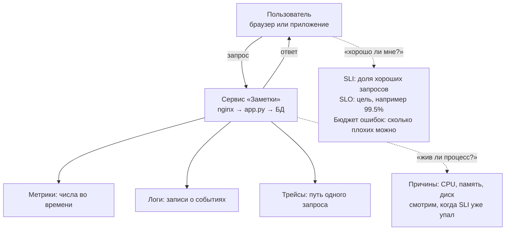
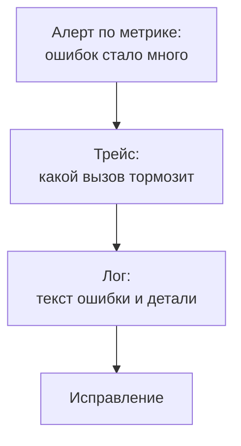

## Зачем это нужно

В понедельник тебе пишут: «сайт тормозит». Ты открываешь график загрузки процессора (CPU: микросхема, которая выполняет все вычисления машины, как мозг компьютера), он показывает 40%, и разводишь руками. Без цифр о том, что чувствует пользователь, разговор превращается в спор мнений: «у нас всё зелёное» против «клиенты жалуются». На работе именно поэтому сначала договариваются, что считать надёжностью, и только потом ставят Prometheus и Grafana. Prometheus (подробно в [уроке 8.2](02-prometheus-basics.md)) это программа, которая каждые несколько секунд опрашивает сервисы и записывает их числа в журнал со временем, как медсестра, которая регулярно записывает температуру пациента в карту. Grafana ([урок 8.6](06-grafana-dashboards.md)) рисует по этим записям графики, как врач, который смотрит на кривую температуры, а не на стопку листков. Без них цифры есть, но увидеть их нельзя.

Этот урок без установки инструментов. Ты научишься выбирать, что мерить, ставить цель и считать, сколько поломок можно себе позволить. Всё считается на бумаге и командой `awk` (программа для разбора текста по колонкам, её ты встречал в [уроке 1.2](../01-linux/02-text-pipes.md)) на настоящем access-логе (файле, где веб-сервер записывает по строке на каждый обработанный запрос, как вахтёр, который ведёт журнал входящих).

Шаг проекта: в репозитории «Заметок» появится `docs/slo.md` с индикаторами качества, целью 99.5% за 30 дней и бюджетом ошибок в минутах. Расшифровка по порядку (каждое слово подробно разобрано в теории ниже). **Индикатор качества** (SLI) это число «какая доля запросов прошла хорошо», как оценка за контрольную. **Цель** (SLO) это проходной балл для этого числа. **Бюджет ошибок** это сколько плохих запросов можно себе позволить, не провалив цель, как лимит карманных денег на неделю: пока он есть, можно рисковать и выпускать новое, когда кончился, нужно чинить надёжность.

## Что нужно знать

- [Урок 1.2: текст и конвейеры](../01-linux/02-text-pipes.md): `awk`, `sort`, `grep` для разбора логов. Здесь ими считают доли и процентили.
- [Урок 2.4: HTTP](../02-network/04-http.md): у каждого ответа сервера есть трёхзначный код. `2xx` значит «успех», `4xx` «ошибка в запросе клиента», `5xx` «сломался сервер». На этом делении строятся индикаторы.
- [Урок 2.5: nginx](../02-network/05-nginx.md): откуда берётся access-лог (журнал, в который веб-сервер nginx пишет по строке на каждый запрос: кто пришёл, куда, что ответили и за сколько).
- [Урок 5.7: пробы и ресурсы](../05-kubernetes/07-probes-resources-rollouts.md): `/healthz` и `/readyz` как источник сигналов.
- [Урок 6.5: облако, эксплуатация и стоимость](../06-cloud/05-cloud-ops-cost.md): SLA провайдера (письменное обещание «сервис будет доступен не меньше N% времени», за нарушение платят деньгами), откуда берутся «девятки» (99.9% называют «тремя девятками», подробно в теории ниже).
- Если хочешь разобрать основы на другом стенде, см. [сигналы мониторинга](../../monitoring/01-basics/01-signals.md) и [SLI и SLO](../../monitoring/01-basics/02-sli-slo.md) в курсе «Мониторинг: основы».

Если что-то из этого забылось, каждое понятие ниже всё равно объясняется в одну-две фразы.

## Картина целиком

Представь автомобиль. На приборной панели горят лампочки: «двигатель», «масло», «аккумулятор». Каждая отвечает на заранее придуманный вопрос. Но однажды машина начинает странно дёргаться, а все лампочки зелёные. Тогда механик подключает диагностику (прибор, который выгружает из машины подробные данные о работе каждого узла), читает журнал ошибок и смотрит, что происходило с каждым цилиндром. Первое это **мониторинг** (заранее известные вопросы), второе **наблюдаемость** (умение ответить на вопрос, которого не ждали).

А теперь главное. Водителю неважно, сколько градусов в двигателе. Ему важно, что машина едет. Поэтому мы сначала решаем, какую «поездку» считаем удачной, ставим цель («не меньше 995 удачных поездок из тысячи») и только потом выбираем приборы.



Слева пользователь и его боль (то, что измеряют SLI и SLO), справа сервис и сигналы, по которым ищут причину.

Порядок такой: сначала пользователь и его боль (SLI, SLO, бюджет), потом сигналы (метрики, логи, трейсы), которыми мы её измеряем и расследуем. Коротко о трёх сигналах: **метрика** это число, меняющееся со временем (запросов в секунду), как показание спидометра; **лог** это запись о событии с подробностями, как строка в бортовом журнале; **трейс** это путь одного запроса через все части системы с временем на каждом шаге, как маршрутный лист посылки с отметками на каждом складе. Подробно разберём в теории. В теории ниже ты пройдёшь по схеме слева направо.

## Теория

### Мониторинг и наблюдаемость (observability)
Программы ломаются. Без наблюдения ты узнаёшь об этом от клиентов, причём через день, а не через минуту. Ещё хуже, когда знаешь, что сломалось, но не можешь понять почему.

Приборная панель против диагностики в сервисе. Мониторинг это панель: лампочки на известные вопросы («жив ли процесс», «сколько свободно диска»). Ты заранее знаешь, что может сломаться, и заранее рисуешь для этого индикатор. Наблюдаемость (observability) это способность ответить на вопрос, который ты не предусмотрел: «почему у клиентов из одного региона запрос POST /notes медленный только по вечерам». Аналогия ломается в одном: у автомобиля механик приходит после поломки, а системе наблюдения нужно работать постоянно и хранить историю.

Чтобы такие вопросы можно было задавать, система должна отдавать наружу богатые данные, по которым можно копать вглубь: не только «лампочку» «ошибок много», но и «какие именно запросы, на каком шаге, у каких пользователей». Эти данные называются сигналами (telemetry, телеметрия).

Разберём на примере. Мониторинг: алерт «доля ошибок выше 5%». Он говорит, что что-то не так. Наблюдаемость: ты открываешь логи и видишь, что все ошибки на одном пути `/notes` от одного клиента, а трейс показывает, что запрос ждёт базу данных 7.9 секунды.

> **Прикинь сам:** в чём разница между «алерт сработал» и «мы поняли причину»?
{: .predict}

Алерт (сообщение «что-то не так») это мониторинг: он отвечает на заранее заданный вопрос. Причину находит наблюдаемость: логи, трейсы и метрики с деталями, по которым можно задавать новые вопросы.

Осторожно, тут часто путают. Наблюдаемость не «новое слово для мониторинга» и не набор инструментов. Инструменты (Prometheus, Grafana) можно поставить и всё равно не иметь наблюдаемости, если сигналов слишком мало или они без деталей. В курсе мы строим оба уровня: алерты ([8.5](05-alertmanager.md)) и дашборды ([8.6](06-grafana-dashboards.md)) для известных проблем, логи ([8.7](07-logs-loki-alloy.md)) и трейсы ([8.8](08-tracing.md)) для неизвестных.

> **Главное:** мониторинг отвечает на заранее известные вопросы, наблюдаемость позволяет задать новый, и нужны оба.
{: .key}

Из чего состоят данные для таких вопросов?

### Три сигнала: метрики, логи, трейсы
Одного вида данных мало. Число «5% ошибок» не скажет, какой запрос сломался. Запись об одном сломанном запросе не скажет, много ли их. Поэтому у наблюдаемости три вида данных, у каждого своя сильная сторона.

Больница. **Метрики** это термометр и пульс: несколько чисел, которые меряют постоянно и легко сравнить с нормой. **Логи** это история болезни: подробные записи «что случилось и когда» по конкретному случаю. **Трейсы** это маршрутный лист пациента: в какие кабинеты он зашёл и сколько в каждом провёл времени. Аналогия ломается там, где у больницы всё пишет человек, а у сервиса программы сами пишут миллионы записей в минуту, и хранить всё подробно очень дорого.


- **Метрика** (metric) это число, которое меняется со временем, например «выполнено 12 запросов в секунду» или «время ответа p95 равно 180 мс» (p95 это время, быстрее которого отвечает 95 запросов из 100; подробно разберём ниже). Хранится как ряд пар «момент времени, значение». Такие числа занимают мало места, их легко складывать, усреднять и строить по ним алерты. Но метрика не знает, какой именно запрос сломался.
- **Лог** (log) это текстовая запись о событии с деталями: строка access-лога, текст исключения. Хорошо отвечает «что случилось в конкретном запросе». Но при большом объёме хранить и искать дорого.
- **Трейс** (trace, трассировка) это путь одного запроса через несколько сервисов с временем на каждом шаге. Отвечает «где именно потерялось время».

```text
Один и тот же запрос глазами трёх сигналов:

метрика:  notes_http_requests_total{path="/notes",status="500"} = 260
          «за всё время было 260 ответов 500 на /notes»  (мало места, нет деталей)

лог:      10.0.0.7 - - [29/Sep/2026:12:00:01 +0000] "POST /notes HTTP/1.1" 500 512 7.900
          «этот клиент в это время получил 500 через 7.9 с»  (подробно, но одна строка)

трейс:    POST /notes ............................ 7.9 с
            └─ вставка в БД ...................... 7.8 с   <- вот где время
          «запрос ждал базу почти всё время»
```

Разберём на примере. Типичный ход расследования: сначала алерт по метрике говорит «ошибок стало много»; потом лог показывает текст ошибки; потом трейс находит виноватый вызов. Названия метрик и формат ты подробно разберёшь в следующих уроках (8.2 - 8.8), у каждого сигнала там свой инструмент. Сегодня важнее другое: какие числа вообще стоит мерить.



Здесь видно порядок расследования: метрика отвечает «что плохо», трейс «где», лог «почему». Связкой между ними служит `trace_id` (о нём в [уроке 8.8](08-tracing.md)).

Осторожно: логи не заменяют мониторинг. Логи нужны для деталей, но по ним неудобно смотреть общую картину и строить алерты «доля ошибок выше 5%». Метрики для этого подходят гораздо лучше.

> **Главное:** метрики говорят «что и сколько», трейсы «где», логи «почему»: одного сигнала мало.
{: .key}

> **Проверь понимание:** ты хочешь узнать, почему один конкретный запрос POST /notes от клиента шёл 8 секунд. Какой сигнал нужен в первую очередь?

<details markdown="1">
<summary>Ответ</summary>

Метрики покажут только общую картину («p99 вырос»). По конкретному запросу нужен лог (что в нём было) и трейс (на каком шаге, например в БД, ушло 7.9 секунды).

</details>

Сигналов много, а мерить всё подряд бессмысленно. Что именно брать?

### Что мерить: четыре золотых сигнала, RED и USE
Мерить можно тысячи вещей, и большинство из них бесполезны. Нужен короткий список того, что действительно говорит о здоровье сервиса. Инженеры Google выделили такой список.

Кафе. Гостя волнуют четыре вещи: как быстро принесли заказ (задержка), сколько гостей обслужили за вечер (трафик), сколько блюд вернули на кухню (ошибки) и не переполнен ли зал, из-за чего гости стоят в очереди (насыщение). Гостя не волнует, какая температура у холодильника, пока еда свежая.

Четыре золотых сигнала (golden signals) любого сервиса, который отвечает пользователям:

1. **Задержка** (latency): сколько занимает запрос. Считают отдельно для успешных и ошибочных: быстрая ошибка не должна «улучшать» среднее время ответа.
2. **Трафик** (traffic): сколько запросов в секунду приходит.
3. **Ошибки** (errors): какая доля запросов завершилась неудачно.
4. **Насыщение** (saturation): насколько заполнен самый дефицитный ресурс: очередь, пул соединений с базой, диск. Насыщение предупреждает заранее: очередь растёт, пока пользователи ещё ничего не заметили.

Из них выросли две сокращённые схемы, которые ты встретишь на каждом собеседовании:

| Метод | Для чего | Что мерим |
|---|---|---|
| RED | сервисы, отвечающие на запросы | Rate (запросов в секунду), Errors (доля ошибок), Duration (время ответа) |
| USE | ресурсы: CPU, диск, сеть, память | Utilization (занятость), Saturation (очередь ожидания), Errors (ошибки) |

Разберём на примере. Для «Заметок»: RED это «сколько запросов в секунду идёт на `/notes`», «какая доля из них 5xx», «за сколько мс отвечаем». USE это «на сколько процентов занят диск, где лежит `/var/lib/notes`», «есть ли очередь операций к диску», «есть ли ошибки чтения». В [уроке 1.5](../01-linux/05-disk-memory-cpu.md) ты смотрел на память и диск: это уже был USE.

> **Прикинь сам:** к какому методу относятся «доля ответов 5xx» и «глубина очереди на диске»?
{: .predict}

Доля 5xx это Errors из RED (сервис глазами пользователя). Глубина очереди на диске это Saturation из USE (ресурс).

Осторожно: USE не лучше RED только потому, что показывает железо. Правило другое: RED смотрит на сервис глазами пользователя, USE смотрит на железо глазами инженера. Начинай всегда с RED: если пользователю хорошо, то CPU на 90% не повод будить человека ночью. К USE переходят, когда RED показал проблему и нужно найти причину.

> **Главное:** начинай с RED (сервис глазами пользователя), к USE (железо) переходи, когда нужно найти причину.
{: .key}

Теперь превратим слово «хорошо» в число.

### SLI: как превратить «хорошо» в число
«Сервис работает нормально» ничего не значит, пока не сказано, что такое «нормально». Один человек скажет «отвечает», другой «отвечает быстро», третий «не теряет заметки». Чтобы не спорить, качество записывают числом.

Оценка в школе. «Ты хорошо знаешь предмет» это мнение. «Ты правильно решил 18 задач из 20» это число, которое можно сравнить с прошлым разом и с чужим результатом.

SLI (Service Level Indicator, индикатор уровня сервиса) это число, которое измеряет качество для пользователя. Почти всегда его пишут как **долю хороших событий**:

```text
SLI = хорошие события / все события * 100%
```

Вы сами определяете, что событие, а что «хорошее». Событие: запрос от пользователя. Хороший: ответ с кодом меньше 500. Так определяется SLI доступности. Для задержки: хороший запрос это тот, что быстрее порога, например 300 мс.

Разберём на примере. За час пришло 10 000 запросов. Из них 260 получили код 500 или 502. Хороших 10 000 - 260 = 9 740. SLI доступности = 9 740 / 10 000 = 0.974, то есть 97.4%. В задании 1 ты получишь это число на настоящем логе.

Осторожно: не каждый код 4xx считается ошибкой сервиса. Ответ `404 Not Found` (страница не найдена) и `400 Bad Request` (кривой запрос) это ошибка **клиента**: сервис отработал правильно, сказав «такого нет». Обычно в SLI доступности считают плохими только `5xx`. Но договориться об этом нужно заранее и записать в документ: иначе через полгода два человека посчитают SLI по-разному. Служебные запросы (`/healthz`, `/readyz`, `/metrics`) в SLI пользователей не входят: их делают проверки, а не люди.

> **Главное:** SLI это доля хороших событий среди всех, а что считать «хорошим», записывают заранее.
{: .key}

> **Проверь понимание:** из 2 000 запросов 30 вернули 503, 50 вернули 404, остальные 200. Чему равен SLI доступности, если 404 не считаем ошибкой?

<details markdown="1">
<summary>Ответ</summary>

Плохих только 30 (503). Хороших 1 970. SLI = 1 970 / 2 000 = 98.5%. Если бы 404 считали плохими, плохих стало бы 80 и SLI упал бы до 96%. Поэтому определение «хорошего» нужно фиксировать заранее.

</details>

Число есть, но достаточно ли оно хорошее? Нужна цель.

### SLO и окно: цель для SLI
Число само по себе не говорит, достаточно ли оно хорошо. 97.4%: это нормально или ужас? Нужна цель, с которой число сравнивается.

Норма на экзамене: «для зачёта нужно решить не меньше 15 задач из 20». SLI это твой результат, SLO это проходной балл.

SLO (Service Level Objective, целевой уровень) это цель для SLI **за окно времени**. Например: «доля запросов без 5xx не меньше 99.5% за скользящие 30 дней». Окно (window) обязательно: без него непонятно, за какой период считать. «Скользящее» значит, что окно сдвигается каждую минуту и всегда покрывает «последние 30 дней от сейчас», а не «с первого числа по тридцатое». Так плохой день не «исчезает» в 00:00 первого числа.

Почему не 100%? Потому что 100% не бывает (железо, сеть, обновления) и каждая следующая цифра стоит непропорционально дороже. Хорошая цель это компромисс между надёжностью, скоростью выпуска новых версий и деньгами.

Разберём на примере. SLI из прошлого раздела 97.4%, SLO 99.5%. 97.4 меньше 99.5: цель нарушена. В запросах: при 10 000 запросов допустимо не больше 0.5%, то есть 50 плохих, а реально их 260. Реальность хуже цели в 5 раз.

> **Прикинь сам:** зачем нужно окно, ведь можно просто сказать «99.5% запросов должны быть хорошими»?
{: .predict}

Без окна непонятно, за какой период считать. За всю историю сервиса плохой день растворится в годах хороших. За минуту одна ошибка даст 0% доступности. Окно (обычно 7, 28 или 30 дней) задаёт честный масштаб.

Осторожно: SLO легко принять за SLA, но это разные вещи. Об этом ниже: SLO это внутренняя цель команды, а не обещание клиенту.

> **Главное:** SLO это цель для SLI за окно времени, а 100% не цель, потому что каждая девятка стоит всё дороже.
{: .key}

Если цель 99.5%, то остальные 0.5% можно потратить. Как?

### Бюджет ошибок
Если цель 99.5%, то остальные 0.5% можно «потратить». Почему не стремиться к 100%? Каждая следующая девятка стоит всё дороже, а пользователь часто не заметит разницы: его собственный интернет и телефон ломаются чаще, чем сервис. К тому же сервис без единого сбоя не получает обновлений, потому что любой релиз несёт риск. Это меняет разговор с разработчиками: вместо «никаких сбоев» получается «сбои разрешены до такой границы, и пока мы в границе, выпускаем новое смело».

Карманные деньги на неделю. Ты знаешь сумму и сам решаешь, на что тратить. Пока деньги есть, можно купить что-то интересное (рискованный релиз). Когда деньги кончились, ты ждёшь следующей недели.

Бюджет ошибок (error budget) это `100% - SLO`. При SLO 99.5% бюджет 0.5%. Его выражают двумя способами:

- в **минутах простоя**: 0.5% от времени окна;
- в **запросах**: 0.5% от числа запросов за окно.

Пока бюджет есть, команда выпускает новые версии. Когда он израсходован, релизы замораживаются (кроме исправлений надёжности), и команда занимается устойчивостью. Так спор «надёжность или новые функции» решается цифрой, которую заранее приняли все.

Разберём на примере. В 30 днях 30 * 24 * 60 = 43 200 минут. Бюджет: 0.5% от 43 200 = 43 200 * 0.005 = 216 минут (3.6 часа). В запросах: сервис получает 1 000 000 запросов за 30 дней, 0.5% от них это 5 000. Значит можно провалить 5 000 запросов, не нарушив SLO. Если за первые 3 дня уже ушло 4 000, то бюджет сгорает слишком быстро: за 3 дня из 30 (то есть за 10% срока) потрачено 80% (о том, как измерять скорость сгорания, burn rate, будет [урок 8.11](11-reliability-patterns-burn-rate.md)).

<div class="viz" data-viz="chart" data-type="line" data-x="0,3,10,20,30" data-series='[{"name":"Остаток бюджета при ровном расходе","values":[216,194,144,72,0],"unit":"мин"},{"name":"Остаток при быстром сгорании","values":[216,43,0,0,0],"unit":"мин"}]' data-x-label="День окна" data-y-label="Остаток бюджета" data-unit="мин" data-explain="Ровная линия дотягивает до конца окна. Крутая показывает, что бюджет сгорает слишком быстро, и релизы пора остановить."></div>

Линия падает ровно, если ошибки размазаны по окну. Если она ныряет вниз в первые дни, бюджет кончится задолго до конца окна.

Осторожно: нетронутый бюджет не считается целью. Полностью нетронутый бюджет значит, что SLO слишком мягкий или команда боится рисковать. Бюджет для того и существует, чтобы его тратить с пользой.

> **Главное:** бюджет ошибок это `100% - SLO`: запас плохих событий, который тратят на риск, пока он есть.
{: .key}

> **Проверь понимание:** SLO 99.9% за 30 дней, сервис получает 2 000 000 запросов. Сколько запросов может провалиться, не нарушив SLO?

<details markdown="1">
<summary>Ответ</summary>

0.1% от 2 000 000 = 2 000 запросов. Это и есть бюджет ошибок в запросах. Если за 3 дня ушло 1 500, то бюджет сгорает слишком быстро.

</details>

Цель команды мы разобрали. А что обещают клиенту?

### SLA и «девятки»
Клиенту-компании нужны юридические гарантии, а не внутренние цели команды.

Курьерская служба обещает доставить за 2 дня. Это SLA: если опоздали, вернут часть денег. Внутри у службы цель строже: «стараемся за 1 день», чтобы был запас.

SLA (Service Level Agreement, соглашение об уровне сервиса) это обещание клиенту в договоре, у него есть последствия (возврат денег, штраф). Внутренний SLO строже SLA, иначе ты нарушишь договор раньше, чем успеешь среагировать.

Доступность принято называть «девятками» (nines): 99% это «две девятки», 99.9% «три девятки». Каждая следующая девятка в десять раз уменьшает бюджет простоя:

| SLO за 30 дней | Бюджет простоя |
|---|---|
| 99% | 432 минуты (7.2 часа) |
| 99.5% | 216 минут (3.6 часа) |
| 99.9% | 43.2 минуты |
| 99.99% | 4.32 минуты |

Как получены числа: 43 200 минут умножить на долю простоя. Для 99.99% доля 0.0001, значит 43 200 * 0.0001 = 4.32.

Разберём на примере. 4.32 минуты в месяц это меньше, чем одна перезагрузка сервера после обновления ядра. Человек, которому пришёл алерт, за такое время даже не успеет открыть ноутбук. Поэтому каждая девятка выше требует не «поработать получше», а другой архитектуры: несколько серверов, автоматическое переключение, тренировки отказов, и стоит на порядок дороже.

<div class="viz" data-viz="chart" data-type="bar" data-x="99%,99.5%,99.9%,99.99%" data-series='[{"name":"Бюджет простоя за 30 дней","values":[432,216,43.2,4.32],"unit":"мин"}]' data-x-label="SLO за 30 дней" data-y-label="Бюджет простоя" data-unit="мин" data-explain="Каждая следующая девятка режет бюджет простоя в десять раз: от семи часов до четырёх минут."></div>

Столбики падают в десять раз при каждой девятке: поэтому четыре девятки это уже не «постараться», а другая архитектура.

> **Прикинь сам:** чем SLO 99.5% отличается от SLA 99.5%?
{: .predict}

SLO это внутренняя цель команды, за нарушение никто не платит. SLA это обязательство перед клиентом с последствиями. Обычно SLO ставят строже SLA (например, 99.9% при SLA 99.5%), чтобы успеть исправить проблему до нарушения договора.

Осторожно: SLI считают двумя способами, и результат у них разный: по времени («сколько минут сервис был недоступен») и по запросам («какая доля запросов провалилась»). Второй честнее: 10 минут простоя ночью вредят меньше, чем 10 минут в час пик, и метод по запросам это учитывает. Мы считаем по запросам.

> **Главное:** SLA это обещание клиенту с последствиями, SLO у команды строже, а каждая «девятка» уменьшает бюджет в десять раз.
{: .key}

Но у пользователя не один компонент, а цепочка. Что с девятками в ней?

### Составной SLA: девятки перемножаются
Пользователь проходит через цепочку компонентов, и у каждого своя доступность. Нужно понимать, что итог всегда хуже самого слабого звена.

Гирлянда старого образца: лампочки включены последовательно, и если перегорит одна, не горит вся гирлянда. Чем больше лампочек, тем выше шанс, что хоть одна сломается.

Для компонентов, которые нужны **все сразу** (последовательно), доступности перемножаются. Для **параллельных** копий (работает, пока жива хотя бы одна) перемножается **недоступность**.

Разберём на примере. Цепочка: DNS 99.99%, ВМ с приложением 99.9%, managed PostgreSQL 99.95%. Переводим в доли: 0.9999, 0.999, 0.9995.

- Последовательно: 0.9999 * 0.999 * 0.9995 = 0.99840, то есть 99.84%. Это 43 200 * (1 - 0.9984) = 69 минут простоя за 30 дней, хотя каждый компонент по отдельности выглядит хорошо.
- Добавим вторую ВМ параллельно. Обе ВМ упадут одновременно с вероятностью 0.001 * 0.001 = 0.000001, значит пара доступна на 1 - 0.000001 = 0.999999. Но DNS и БД остаются в цепочке: 0.999999 * 0.9999 * 0.9995 = 0.99940, то есть 99.94%. Выросло с 99.84% до 99.94%, но выше самого слабого одиночного звена (БД, 99.95%) не поднимется никогда.

Осторожно: четыре девятки не «набрать» одним лишь числом серверов. Резервируют все звенья, а не одно. И расчёт идеален: он предполагает, что отказы независимы. На практике две ВМ в одной стойке падают вместе, поэтому реальные цифры хуже. Провайдерские SLA и что они дают на практике, разобрано в [уроке 6.4](../06-cloud/04-managed-services.md).

> **Главное:** в цепочке доступности перемножаются и итог хуже слабейшего звена, параллельные копии перемножают недоступность.
{: .key}

> **Проверь понимание:** два компонента по 99.9% включены последовательно. Какая доступность у пары?

<details markdown="1">
<summary>Ответ</summary>

0.999 * 0.999 = 0.998001, то есть около 99.8%. Простоя вдвое больше, чем у одного компонента.

</details>

Теперь про сами замеры задержки.

### Квантили: почему не среднее
Для времени ответа нужен способ сказать «как долго ждут пользователи», а не «сколько в среднем». Среднее прячет самых недовольных.

Очередь в кассе. Если 95 человек ждали по минуте, а 5 человек по 30 минут, средний ожидающий провёл в очереди около 2.5 минут: «нормально». Но пятеро злы, и они напишут отзывы.

Квантиль (percentile, процентиль) p95 это значение, быстрее которого отвечает 95% запросов. Чтобы найти его, выстрой все времена по возрастанию и возьми значение на позиции 95% от конца. Среднее складывает все времена и делит на их число, поэтому один очень долгий запрос сдвигает его мало. p50 это медиана: ровно посередине, половина запросов быстрее, и она показывает типичного пользователя. p95 показывает, каково тем, кому не повезло. p99 показывает «хвост» (tail latency): самых медленных из ста. Для SLI задержки формулируют так: «доля запросов быстрее 300 мс не менее 95%». Это то же самое, что «p95 меньше 300 мс».

Разберём на примере. 100 запросов: 95 ответили за 50 мс, 5 за 5000 мс. Среднее = (95 * 50 + 5 * 5000) / 100 = (4 750 + 25 000) / 100 = 297.5 мс, выглядит нормально. p95 находится на 95-й позиции: это 50 мс. p99 на 99-й позиции: 5 000 мс. Разница видна: среднее около 300 мс, а каждый двадцатый ждёт 5 секунд. Именно поэтому в SLO и алертах смотрят на квантили, а среднее нет.

<div class="viz" data-viz="obs-quantile" data-slow="5" data-q="95"></div>

Смотри, в какую корзину попадает нужный по счёту запрос: именно эту границу и называют p95. Хвост из пяти медленных запросов среднее почти не двигает.

> **Прикинь сам:** у сервиса p50 равно 40 мс, а p99 равно 3 секунды. Что это значит для пользователей?
{: .predict}

Половина запросов быстрая (до 40 мс), но один из ста ждёт три секунды и дольше. Если пользователь делает 20 запросов за визит, то почти каждый второй визит встретит такое замедление. Поэтому хвост важен.

Осторожно: квантили нельзя усреднять: среднее из p95 двух серверов не равно общему p95 всех запросов. Поэтому Prometheus хранит не готовые квантили, а **гистограммы** (сколько запросов уложилось в каждый диапазон времени), а квантиль считает при запросе (это тема [8.3](03-promql.md)).

> **Главное:** среднее прячет медленных пользователей, поэтому для задержки смотрят p95 и p99, а квантили не усредняют.
{: .key}

Когда число плохое, звонить ли ночью? Поговорим об алертах.

### Алерты на боль пользователя
Ночной звонок должен означать «нужно действие человека прямо сейчас». Если он звонит зря, люди перестают на него реагировать.

Сигнализация в машине, которая срабатывает от каждого проезжающего грузовика. Через неделю её перестанут слышать, и угон пропустят.

Алерт (alert) это автоматическое сообщение, что условие выполнилось. Алерт должен будить человека, только если пользователю плохо сейчас или скоро станет плохо и нужно действие. Правило: **алерт на симптом** (ошибки, задержка), а **причину** (CPU, диск) показывает дашборд, когда ты уже проснулся. Исключение: причина, у которой есть прогноз до симптома («диск заполнится через 4 часа»).

Слишком много ложных алертов ведут к усталости от алертов (alert fatigue): люди перестают реагировать, и настоящий проходит незамеченным. Лучший способ сделать алерты осмысленными это привязать их к сжиганию бюджета ошибок (burn rate): если бюджет тратится слишком быстро, пора будить. Технику разберём в [уроке 8.11](11-reliability-patterns-burn-rate.md), правила Alertmanager в [уроке 8.5](05-alertmanager.md).

Разберём на примере. Алерт «CPU больше 80% одну минуту»: процессор мог просто быстро считать пачку запросов, пользователь ничего не заметил. Ночью тебя разбудили зря. Алерт «доля 5xx больше 5% пять минут»: пользователи получают ошибки прямо сейчас, действие нужно.

<div class="viz" data-viz="obs-alert-life" data-threshold="5" data-for="120"></div>

Следи, как алерт проходит состояния: условие выполнилось, ждёт заданное время (`for`) и только потом срабатывает. Кратковременный всплеск до алерта не доходит.

Осторожно: больше алертов не значит надёжнее. Каждый лишний алерт снижает доверие ко всем остальным. Хороший вопрос перед созданием алерта: «что человек сделает, когда он придёт?». Если ничего, это не алерт, а строка на дашборде.

> **Главное:** будить человека можно за симптом (ошибки, задержка), а причины остаются дашбордам и тикетам.
{: .key}

> **Проверь понимание:** алерт «диск занят на 70%» сработал в 3 часа ночи. Что не так и как переписать?

<details markdown="1">
<summary>Ответ</summary>

70% может держаться месяцами, действия ночью не нужно. Лучше алерт по прогнозу («при текущей скорости диск заполнится через 4 часа») с уровнем «разбудить», а «70%» оставить как тикет на рабочее время.

</details>

Откуда взять цифры для первых SLI, если ничего не поставлено?

### Access-лог: откуда берутся цифры для SLI
Чтобы посчитать долю хороших запросов, кто-то должен был записать каждый запрос. Если не записано, посчитать нельзя. Поэтому первые данные для SLI почти всегда берут из журнала веб-сервера: он уже есть и ничего не стоит.

Журнал вахтёра на проходной: кто вошёл, во сколько, к кому, сколько пробыл. Чтобы узнать, сколько посетителей ушло недовольными, не нужна новая система: достаточно прочитать журнал и посчитать.

Веб-сервер (например nginx, [урок 2.5](../02-network/05-nginx.md)) после каждого ответа дописывает в файл одну строку. Порядок полей задаёт настройка формата, в нашем учебном логе такой: адрес клиента, время, запрос в кавычках (`метод путь протокол`), код ответа, размер ответа в байтах, время ответа в секундах. Строки только добавляются в конец, поэтому файл растёт и его читают построчно.

```text
10.0.0.7 - - [29/Sep/2026:12:00:01 +0000] "POST /notes HTTP/1.1" 500 512 7.900
   |               |                          |        |          |   |    |
   клиент        время                     метод     путь       код  байты секунды
```

Разберём на примере. Из строки выше видно всё, что нужно для двух SLI. Код `500` (число после закрывающей кавычки) решает, хороший ли запрос для доступности: 500 это плохой. Последнее число `7.900` решает, хороший ли он для задержки: 7.9 секунды дольше порога 0.3 секунды, значит плох и тут. Один запрос может быть плохим сразу по двум индикаторам. Если таких строк 260 из 10 000, доступность 97.4%, как ты считал выше.

> **Прикинь сам:** сервер выключили на 10 минут, в access-логе за это время ничего нет. Что покажет SLI, посчитанный по логу?
{: .predict}

Эти 10 минут просто не попадут в подсчёт: ни хороших, ни плохих запросов, а значит доступность по логу не упадёт. Реальный простой останется невидимым. Нужна внешняя проверка, которая сама периодически обращается к сервису и фиксирует, что тот не отвечает.

Осторожно: лог видит не всё. Он показывает только запросы, которые дошли до веб-сервера. Если сервер упал целиком или сломалась сеть до него, в журнале тишина, и по нему доступность выглядит как 100% (ни одной ошибки, потому что ни одного запроса). Поэтому вторым источником делают внешнюю проверку, которая сама ходит на сайт ([урок 8.4](04-blackbox-exporters.md)).

> **Главное:** access-лог даёт доступность и задержку бесплатно, но видит только запросы, дошедшие до сервера.
{: .key}

Почему же в SLI не берут просто загрузку процессора?

### Почему цель выбирают от пользователя, а не от железа
Новичок обычно выбирает цели, которые легко померить: «CPU меньше 70%», «память меньше 80%». Это удобно, но это не то, что волнует пользователя.

Такси. Пассажиру неважно, на каком обороте работает мотор. Важно, что машина приехала вовремя и по адресу. Диспетчер, который отчитывается «двигатели были в норме», а машины опоздали, бесполезен.

Хороший SLI отвечает на вопрос «получил ли пользователь то, за чем пришёл». Обычно хватает двух: **доступность** (запрос обработан без ошибки сервера) и **задержка** (обработан достаточно быстро). Для сервиса, который хранит данные, добавляют третий: **целостность** (записанная заметка потом читается и не потеряна). Показатели железа (CPU, диск) остаются, но как помощники для поиска причины, а не как цель.

Разберём на примере. Для «Заметок» можно записать цель двумя строками. «99.5% запросов `GET /notes` отвечают кодом меньше 500 за скользящие 30 дней» и «95% запросов отвечают быстрее 300 мс». Обе формулировки проверяются по access-логу, обе понятны человеку, который не знает, что такое CPU, и обе можно показать руководителю. Фраза «CPU не выше 70%» этим свойствам не удовлетворяет: CPU может быть 95%, а пользователи довольны, или 20%, а база данных зависла и сайт не открывается.

Осторожно: у приложения не один SLI. На деле их несколько, по одному на важный путь пользователя. Вход в систему и фоновая очистка старых данных требуют разных целей: первое должно работать почти всегда, второе может ошибаться чаще.

> **Главное:** цель описывает то, что получил пользователь (доступность и задержка), а CPU и диск нужны для поиска причин.
{: .key}

> **Проверь понимание:** почему «загрузка CPU ниже 70%» плохой SLO для сайта?

<details markdown="1">
<summary>Ответ</summary>

Потому что не говорит, что испытывает пользователь. Сайт может тормозить или отдавать ошибки при любой загрузке процессора, и наоборот, при 95% CPU все запросы могут проходить быстро. Цель нужно привязывать к тому, что видит пользователь: доля успешных и быстрых ответов.

</details>

### Метки и кардинальность: слово на будущее
Ещё одно слово из следующего урока, чтобы оно не застало врасплох. К метрике добавляют **метки** (labels): пары «имя=значение», которые делят одно число на группы. Например, число запросов отдельно по `path="/notes"` и `path="/healthz"`. Кардинальность (cardinality) это число уникальных комбинаций значений меток. Метка `path` с пятью маршрутами безопасна. Метка `user_id` с миллионом значений даст миллион отдельных рядов, и хранилище задохнётся. Запомни правило: значений у метки должно быть конечное небольшое число. Подробно в [уроке 8.2](02-prometheus-basics.md).

> **Главное:** метки делят число на группы, а значений у метки должно быть немного, иначе рядов станет миллион.
{: .key}

## Практика

Все задания выполняются в терминале Ubuntu на любой ВМ или в WSL2. Инструменты мониторинга не нужны. Сначала подготовь учебный access-лог: он имитирует лог nginx с временем ответа в последнем поле. Файл делается командой `awk` с блоком `BEGIN{...}`: он выполняется один раз до чтения входа, и здесь заменяет цикл `for` в bash. Внутри для номера строки `i` вычисляется код ответа (каждый 40-й 500, каждый 997-й 502, каждый 13-й 404, остальные 200), время ответа и путь; `printf` печатает строку в формате nginx. Знак `%` в `i%40` это остаток от деления: `i%40==0` истинно для каждого 40-го номера.

### Задание 1. Доступность из access-лога

**Цель:** посчитать SLI доступности по реальным строкам лога и сравнить с SLO 99.5%.

**Предскажи:** в логе 10 000 запросов, каждый 40-й вернул 500, ещё несколько вернули 502. Будет ли доступность выше или ниже 99.5%? Прикинь порядок цифры: сколько процентов ошибок ты ожидаешь?

<details markdown="1">
<summary>Ответ</summary>

Каждый 40-й это 2.5% ошибок только от 500, значит доступность около 97.4%, гораздо ниже 99.5%. SLO нарушен.

</details>

**Шаги:**

1. Создай каталог и сгенерируй лог (детерминированный, у всех одинаковый):

```bash
mkdir -p ~/slo-lab && cd ~/slo-lab
# 10000 строк: каждый 40-й запрос 500, каждый 997-й 502, каждый 13-й 404
awk 'BEGIN{for(i=1;i<=10000;i++){s=200;if(i%40==0)s=500;else if(i%997==0)s=502;else if(i%13==0)s=404; t=((i*37)%400)/1000; m=(i%5==0)?"POST":"GET"; p=(i%5==0)?"/notes":((i%10==1)?"/":"/notes"); if(i%3000==0){p="/slow";t=2.5} printf "10.0.0.%d - - [29/Sep/2026:12:%02d:%02d +0000] \"%s %s HTTP/1.1\" %d 512 %.3f\n",i%50+1,int(i/170)%60,i%60,m,p,s,t}}' > access.log
head -3 access.log
```

Команда `head -3` показывает первые три строки. Формат строки: адрес клиента, время, запрос в кавычках (`метод путь протокол`), код ответа, размер ответа в байтах и в самом конце время ответа в секундах. Слово «поле» ниже значит кусок строки, разделённый пробелами: `awk` называет их `$1`, `$2` и так далее, а `$NF` это последнее.

2. Посчитай общее число запросов, число 5xx и доступность. Ошибками клиента (4xx) считать не будем: 404 это ошибка запроса, а не сервиса.

Разберём команду. `awk '{...}'` обрабатывает файл построчно. `n++` увеличивает счётчик всех строк. `$9>=500` проверяет девятое поле (код ответа: кавычки с запросом содержат три слова `"GET /notes HTTP/1.1"`, они занимают поля 6, 7, 8), и `e++` считает такие строки. Блок `END{...}` выполняется после последней строки и печатает итог. Во второй команде `c[$9]++` это массив-счётчик: ключ код, значение сколько раз он встретился; цикл `for(k in c)` печатает пары.

```bash
awk '{n++; if($9>=500)e++} END{printf "total=%d 5xx=%d avail=%.3f%%\n",n,e,100*(n-e)/n}' access.log
awk '$9>=500{c[$9]++} END{for(k in c)print k,c[k]}' access.log
```

**Что должно получиться:**

```text
10.0.0.2 - - [29/Sep/2026:12:00:01 +0000] "GET / HTTP/1.1" 200 512 0.037
10.0.0.3 - - [29/Sep/2026:12:00:02 +0000] "GET /notes HTTP/1.1" 200 512 0.074
10.0.0.4 - - [29/Sep/2026:12:00:03 +0000] "GET /notes HTTP/1.1" 200 512 0.111
total=10000 5xx=260 avail=97.400%
500 250
502 10
```

(Порядок строк 500 и 502 может отличаться.)

**Как читать вывод:** первые три строки это то, как выглядит лог. Строка `total=10000 5xx=260 avail=97.400%` уже готовый SLI: 9 740 хороших запросов из 10 000. Две последние строки разбивают 260 плохих на 250 ответов 500 и 10 ответов 502. Сравни с SLO 99.5%: допустимо было 50 плохих, получилось 260, цель нарушена.

**Объясни себе:**

- Почему 404 не входит в ошибки SLI доступности? Когда его всё же стоило бы включить?
- Сколько 5xx можно было получить на 10 000 запросов при SLO 99.5%? Во сколько раз реальность хуже?

**Типичные ошибки:**

- `awk: line 1: syntax error at or near }`: при копировании потерялась кавычка или скобка в длинной команде awk. Скопируй команду целиком одной строкой.
- `avail=100.000%` при ненулевых ошибках: неверный номер поля. В combined-логе код ответа это `$9` (после запроса в кавычках). Если формат другой, посмотри строку через `awk '{print $9}' access.log | head`.

### Задание 2. Задержка: среднее против p95

**Цель:** увидеть, что среднее скрывает хвост, и посчитать SLI задержки.

**Предскажи:** среднее время ответа в нашем логе, скорее всего, будет небольшим. Выше или ниже 300 мс окажется p95? Что покажет p99?

<details markdown="1">
<summary>Ответ</summary>

Время равномерно размазано от 0 до 0.4 секунды, поэтому среднее 0.200 нормальное, а p95 около 0.38 и уже выше порога 0.3. Среднее выглядит хорошо, хвост нет.

</details>

**Шаги:**

1. Посчитай среднее и квантили. Время ответа лежит в последнем поле (`$NF`):

Разбор. `$NF` в awk это последнее поле строки (Number of Fields), у нас это время ответа. `s+=$NF` копит сумму, в `END` делим на `NR` (число прочитанных строк). Для квантилей сначала `awk '{print $NF}'` достаёт только время, `sort -n` сортирует по числу (без `-n` сортировка идёт как текст и `10` окажется раньше `9`), а второй `awk` кладёт значения в массив `a` по порядку и печатает элемент на позиции 50%, 95% и 99% от конца: `int(NR*0.95)` это «95-й процент из ста». Третья команда считает запросы медленнее 0.3 секунды и вычитает их долю.

```bash
cd ~/slo-lab
# среднее
awk '{s+=$NF} END{printf "avg %.3f\n",s/NR}' access.log
# квантили: сортируем по возрастанию и берём значение на нужной позиции
awk '{print $NF}' access.log | sort -n | awk '{a[NR]=$1} END{print "p50",a[int(NR*0.5)],"p95",a[int(NR*0.95)],"p99",a[int(NR*0.99)]}'
```

2. Посчитай SLI задержки как долю запросов быстрее 300 мс:

```bash
awk '$NF>0.3{n++} END{print "slow>0.3",n, 100*(NR-n)/NR}' access.log
```

**Что должно получиться:**

```text
avg 0.200
p50 0.200 p95 0.380 p99 0.396
slow>0.3 2478 75.22
```

**Как читать вывод:** `avg 0.200` выглядит хорошо. Но `p95 0.380` больше порога 0.3, и в последней строке видно, что быстрее 300 мс отвечает только 75.22% запросов (2 478 медленнее порога), а цель была 95%. Среднее не показало проблемы, квантиль показал. (Три запроса по 2.5 секунды из `/slow` не меняют p95, но видны в p99 и в максимуме.)

**Объясни себе:**

- Цель «p95 меньше 300 мс» это то же, что «95% запросов быстрее 300 мс». Выполнена ли она? Какая доля реально быстрее?
- Почему среднее 0.200 здесь не нужно ни в SLO, ни в алертах?

**Типичные ошибки:**

- `sort: cannot read: access.log: No such file or directory`: ты не в каталоге `~/slo-lab`. Выполни `cd ~/slo-lab`.
- `p95` пустой: последнее поле не число. В логе времени нет, добавь `request_time` в `log_format` nginx.

### Задание 3. Бюджет ошибок и составной SLA

**Цель:** перевести SLO в минуты и запросы и посчитать доступность цепочки из нескольких компонентов.

**Предскажи:** какая доступность получится у цепочки DNS 99.99%, ВМ 99.9%, managed БД 99.95%? Выше или ниже 99.9%?

<details markdown="1">
<summary>Ответ</summary>

Ниже любого одиночного звена: около 99.84%, то есть 69 минут простоя за 30 дней. SLO 99.9% на такой цепочке недостижим.

</details>

**Шаги:**

1. Посчитай бюджет в минутах для четырёх вариантов SLO. Утилита `bc` есть в Ubuntu из коробки, иначе `sudo apt install bc`:

Разбор. `for slo in 99 99.5 ...; do ... done` запускает тело цикла по одному разу для каждого значения. Внутри `$(...)` подставляет результат команды: `echo "..." | bc` передаёт арифметическое выражение калькулятору `bc`, а `scale=2` просит две цифры после точки. Во второй команде `python3 -c "..."` выполняет короткую программу из строки; `a` перемножает доступности цепочки, `b` считает вариант с двумя параллельными ВМ, `f'{a*100:.3f}%'` вставляет число с тремя знаками после точки.

```bash
for slo in 99 99.5 99.9 99.99; do
  # бюджет = (100 - SLO)% от 43200 минут в 30 днях
  echo "SLO $slo% -> бюджет $(echo "scale=2; (100-$slo)*43200/100" | bc) мин"
done
```

2. Посчитай составной SLA (`python3` есть в Ubuntu, установок не нужно):

```bash
python3 -c "
a = 0.9999 * 0.999 * 0.9995          # последовательная цепочка
b = (1 - 0.001**2) * 0.9999 * 0.9995  # две ВМ параллельно, LB и БД одиночные
print(f'одна ВМ:  {a*100:.3f}%  простой {43200*(1-a):.1f} мин')
print(f'две ВМ:   {b*100:.3f}%  простой {43200*(1-b):.1f} мин')
"
```

**Что должно получиться:**

```text
SLO 99% -> бюджет 432.00 мин
SLO 99.5% -> бюджет 216.00 мин
SLO 99.9% -> бюджет 43.20 мин
SLO 99.99% -> бюджет 4.32 мин
одна ВМ:  99.840%  простой 69.1 мин
две ВМ:   99.940%  простой 26.0 мин
```

**Как читать вывод:** первые четыре строки повторяют таблицу из теории. Пятая: цепочка из одиночных компонентов даёт 99.84% и 69.1 минуты простоя, то есть цель 99.9% (43.2 минуты) уже невозможна. Шестая: вторая ВМ вернула 43 минуты, но 99.94% всё равно ниже 99.95% самой БД.

**Объясни себе:**

- Почему вторая ВМ дала прирост, но не 99.99%? Какое звено теперь главное ограничение?
- Что дешевле для «Заметок»: SLO 99.5% или 99.9%, и что придётся добавить, чтобы перейти на 99.9%?

**Типичные ошибки:**

- `bash: bc: command not found`: не установлена утилита. Выполни `sudo apt install bc`.
- `(standard_in) 1: syntax error`: в SLO попала запятая (`99,5`). Используй точку.

### Задание 4. Алерты: симптом, причина, переписать

**Цель:** отличать алерты на боль пользователя от шума и раскладывать метрики по RED и USE.

**Предскажи:** какие из трёх алертов ниже вызовут ложные срабатывания: «CPU > 80% 1 минуту», «диск занят на 70%», «сервис упал» при одной реплике?

<details markdown="1">
<summary>Ответ</summary>

Все три. CPU скачет от любой пачки запросов, диск на 70% бывает месяцами, а «упал» при одной реплике означает, что пользователь уже страдает и алерт пришёл поздно. Первые два шумят, третий не даёт резерва.

</details>

**Шаги:**

1. Создай файл `~/slo-lab/alerts.md` и заполни таблицу переписанных алертов. Образец первой строки:

```text
Было: CPU > 80% в течение 1 минуты
Проблема: не связан с болью пользователя, шумит на всплесках
Стало: доля запросов 5xx > 5% в течение 5 минут (симптом), CPU виден на дашборде
Метод: RED (Errors)
```

2. Сделай то же для оставшихся двух:
   - «диск занят на 70%» (подсказка: прогноз заполнения);
   - «сервис упал» при одной реплике (подсказка: минимум две реплики, алерт на долю недоступных запросов).
3. Распредели восемь метрик по методам: запросов в секунду, доля 5xx, p95 задержки, загрузка CPU, очередь на диск, ошибки диска, свободная память, число открытых соединений с БД.

**Что должно получиться** (проверь себя, у тебя получится своя формулировка):

```text
RED: запросов в секунду (Rate), доля 5xx (Errors), p95 задержки (Duration)
USE: загрузка CPU (Utilization), очередь на диск (Saturation), ошибки диска (Errors),
     свободная память (Utilization), открытые соединения с БД (Saturation пула)
```

**Объясни себе:**

- Какой из твоих новых алертов можно назвать «страница ночью», а какой «тикет на утро»?
- Зачем в задании про «сервис упал» нужна вторая реплика, а не более чуткий алерт?

**Типичные ошибки:**

- Алерт «стало: p99 > 100 мс за 1 минуту»: слишком чуткий, шумит. Окно должно быть минуты, порог должен быть привязан к SLO, а не к желанию.
- Перепутанные Errors: 5xx сервиса это RED, ошибки диска это USE. Один и тот же термин, разные объекты.

### Задание 5. Шаг проекта: docs/slo.md

**Цель:** зафиксировать SLI и SLO «Заметок» в репозитории.

**Предскажи:** что должно быть в документе, чтобы через полгода другой человек мог понять, когда сервис «достаточно надёжен»?

<details markdown="1">
<summary>Ответ</summary>

Что считаем хорошим запросом, что плохим, окно, цель, откуда берутся данные, размер бюджета и что делаем, когда он кончился. Без определения «плохого запроса» цифры ничего не значат.

</details>

**Шаги:**

1. Создай файл `~/notes/docs/slo.md` (каталог `docs` создай командой `mkdir -p ~/notes/docs`) со следующим содержимым:

```markdown
# SLO сервиса «Заметки»

Окно: скользящие 30 дней. Пользователь: клиент, ходящий на `/notes`.

## SLI

| SLI | Что считаем | Хорошее событие | Источник |
|---|---|---|---|
| Доступность | доля запросов, не завершившихся 5xx | код ответа меньше 500 | метрики приложения (8.2), access-лог |
| Задержка | доля запросов быстрее порога | время ответа меньше 300 мс | гистограмма времени ответа (8.3) |
| Свежесть бэкапа | возраст последнего успешного бэкапа | не старше 24 часов | метка времени последнего бэкапа |

Служебные пути `/healthz`, `/readyz`, `/metrics` в SLI не входят: это не запросы пользователей.

## SLO

| SLI | Цель за 30 дней |
|---|---|
| Доступность | 99.5% |
| Задержка | 95% запросов быстрее 300 мс |
| Свежесть бэкапа | 100% времени не старше 24 часов |

## Бюджет ошибок

Для доступности 99.5% за 30 дней: 0.5% от 43200 минут, то есть 216 минут
или 0.5% от числа запросов (на 1 000 000 запросов допустимо 5000 ошибок).

## Составной SLA

Цепочка DNS (99.99%), ВМ (99.9%), managed PostgreSQL (99.95%) даёт около 99.84%.
Поэтому внутренний SLO 99.5% реалистичен, а 99.9% на одной ВМ недостижим.

## Что делаем при исчерпании бюджета

Замораживаем релизы, кроме исправлений надёжности, до восстановления SLO.
Полная политика появится в уроке 8.11.
```

2. Проверь и закоммить:

```bash
cd ~/notes
git add docs/slo.md
git commit -m "docs: SLI и SLO для Заметок"
git log --oneline | head -3
```

Где что: `git add` кладёт файл в «коробку» будущего коммита, `git commit -m` сохраняет коммит с сообщением, `git log --oneline | head -3` показывает три последних коммита по строке на каждый (см. [урок 3.1](../03-git-ci/01-git-basics.md)).

**Что должно получиться:**

```text
a1b2c3d docs: SLI и SLO для Заметок
```

(Хеш у тебя будет другой, выше идут предыдущие коммиты проекта.)

**Как читать вывод:** короткий хеш коммита и его сообщение: значит документ сохранён в истории проекта. Если сверху видишь свой коммит, задание сделано.

**Объясни себе:**

- Почему в SLI не попадают `/healthz` и `/readyz`, ведь они тоже возвращают коды?
- Что случится с SLO, если не договориться, считаются ли 404 плохими событиями?

**Типичные ошибки:**

- `fatal: not a git repository (or any of the parent directories): .git`: ты не в `~/notes`. Выполни `cd ~/notes`.
- `Author identity unknown`: не настроен git. Задай `git config --global user.name "Имя"` и `git config --global user.email "почта"` (см. урок 3.1).

## Сломай и почини

В этом уроке нет скрипта поломки: ломать нечего, инструменты мониторинга ещё не стоят. Вместо аварии на сервере тебе достаётся «авария» в разговоре с руководителем, которая тоже бывает нужна на работе. Сначала прочитай симптом, выпиши свои гипотезы и только потом открывай разбор.

### Симптом

Руководитель просит: «Поставь SLO 99.99%, чтобы мы были круче конкурентов». Сервис работает на одной ВМ у облачного провайдера с PostgreSQL на той же ВМ. Ты должен ответить, реально ли это. (Зона доступности, AZ, это отдельный дата-центр облака: если он сгорит, другая зона продолжит работать.)

### Гипотезы

1. Можно, если написать хороший код без багов.
2. Нельзя: даже при идеальном коде отказывает инфраструктура.
3. Можно, если купить более мощную ВМ.

### Проверки

Посчитай бюджет 99.99% за 30 дней и сравни со временем, которое нужно человеку, чтобы среагировать, и с гарантиями провайдера:

```bash
python3 -c "print(43200*0.0001, 'мин бюджета за 30 дней');print(43200*0.0001*60, 'секунд')"
```

```text
4.32 мин бюджета за 30 дней
259.2 секунд
```

**Как читать вывод:** 43 200 минут умножить на 0.0001 даёт 4.32 минуты, то есть около 259 секунд на весь месяц. За такое время человек не успевает ни прочитать алерт, ни зайти на сервер.

Дальше проверь SLA провайдера на ВМ (обычно 99.9%): этого недостаточно для 99.99% даже без учёта твоего кода. Одна перезагрузка ВМ из-за обновлений ядра может занять несколько минут.

### Исправление

<details markdown="1">
<summary>Разбор</summary>

Верна гипотеза 2. Бюджет 4.32 минуты в месяц меньше, чем одна перезагрузка ВМ и переключение DNS, а человек не успеет даже открыть алерт. Провайдер обещает на ВМ 99.9%, значит потолок задан снаружи. Мощная ВМ (гипотеза 3) повышает производительность, но не убирает отказы диска, сети и хоста. Хороший код (гипотеза 1) не влияет на инфраструктурный отказ.

Что ответить руководителю: 99.99% требует нескольких зон доступности (AZ), автоматического переключения и повторяющихся тренировок отказа, и стоит на порядок дороже. Предложи 99.5% сейчас, посчитай стоимость перехода к 99.9% (две ВМ, managed БД) и пусть бизнес решает, нужны ли лишние девятки. SLO это не мечта, а компромисс между надёжностью, скоростью релизов и деньгами.

</details>


## ИИ в помощь

Общие правила работы с ИИ-помощником собраны на странице [«ИИ-помощник»](../../load-tester/ai.md), здесь только сценарии этой темы.

**Задача:** придумать SLI для нового сервиса и не пропустить важный путь пользователя.

```text
Мой сервис «Заметки»: веб-приложение, где пользователь создаёт и читает заметки (GET /notes, POST /notes), за ним nginx и PostgreSQL. Предложи 2-3 SLI в формате «доля хороших событий из всех» с понятным определением «хорошего», по одному на доступность и задержку. Не используй CPU и память как SLI.
```
{: .wrap}

**Проверь ответ:** у каждого SLI должны быть числитель и знаменатель. Типичная ошибка нейросетей: считать ошибками `4xx` или проверки `/healthz`, а не только `5xx` на пользовательских путях.

**Задача:** проверить расчёт бюджета ошибок.

```text
SLO 99.9% за 30 дней, сервис получает 3 000 000 запросов за окно. Посчитай бюджет в минутах простоя и в запросах, покажи вычисления по шагам. За первые 5 дней потрачено 1 500 плохих запросов: нормальный ли это темп?
```
{: .wrap}

**Проверь ответ:** пересчитай сам: 43 200 минут окна, 0.1% это 43,2 минуты и 3 000 запросов. Нейросети часто путают «доли процента» и «проценты» или забывают, что за 5 дней из 30 тратится не больше шестой части бюджета при ровном темпе.

**Задача:** переписать алерт «на причину» в алерт «на симптом».

```text
Вот мои алерты: CPU больше 80% одну минуту, диск занят на 70%, памяти меньше 10%. Для каждого скажи, будить ли человека ночью, и перепиши в алерт на симптом или прогноз с порогом и временем ожидания.
```
{: .wrap}

**Проверь ответ:** у алерта на симптом должен быть порог по ошибкам или задержке и время ожидания. Типичная ошибка: оставить причину (CPU) «для надёжности» и не отделить дашборд от ночного сигнала.

## Словарик урока

| Термин | Простыми словами |
|---|---|
| Prometheus | Программа, которая регулярно опрашивает сервисы и хранит их числа со временем (урок 8.2) |
| Grafana | Программа, которая рисует графики по сохранённым числам (урок 8.6) |
| CPU (процессор) | Микросхема, выполняющая вычисления машины |
| Целостность | Записанные данные не потеряны и читаются обратно |
| Мониторинг | Слежение за заранее известными признаками: жив ли процесс, сколько свободно диска |
| Наблюдаемость (observability) | Умение ответить на вопрос, которого не ждали, по богатым данным системы |
| Метрика | Число, меняющееся со временем: запросов в секунду, время ответа |
| Лог | Текстовая запись о событии с деталями, например строка access-лога |
| Трейс | Путь одного запроса через несколько сервисов с временем на каждом шаге |
| Access-лог | Файл, куда веб-сервер записывает каждый обработанный запрос |
| Код ответа | Трёхзначное число в ответе сервера: 2xx успех, 4xx ошибка клиента, 5xx ошибка сервера |
| Золотые сигналы | Задержка, трафик, ошибки, насыщение: минимум, который стоит мерить у сервиса |
| RED | Rate, Errors, Duration: метод для сервисов, отвечающих на запросы |
| USE | Utilization, Saturation, Errors: метод для ресурсов (CPU, диск, сеть) |
| Насыщение (saturation) | Насколько заполнен дефицитный ресурс: очередь, пул соединений |
| SLI | Число, измеряющее качество: доля хороших событий |
| SLO | Цель для SLI за окно времени, например 99.5% за 30 дней |
| SLA | Обещание клиенту в договоре с последствиями за нарушение |
| Окно (window) | Период, за который считают SLI, например скользящие 30 дней |
| Бюджет ошибок | Разрешённая доля сбоев: 100% минус SLO |
| Девятки (nines) | Способ говорить о доступности: 99.9% это три девятки |
| Составной SLA | Итоговая доступность цепочки компонентов; последовательные множатся |
| Квантиль (процентиль), p95 | Значение, быстрее которого отвечает 95% запросов |
| Хвост (tail latency) | Самые медленные запросы, которые прячет среднее |
| Алерт | Автоматическое сообщение о том, что условие выполнилось |
| Усталость от алертов | Люди перестают реагировать на алерты, если те часто ложные |
| Burn rate | Скорость сжигания бюджета ошибок (разберём в 8.11) |
| Метка (label), кардинальность | Пара имя=значение у метрики; число уникальных комбинаций значений (разберём в 8.2) |

## Вопросы с собеседований
Раздел для повторения: ответь вслух, потом открой ответ. Вопросы с пометкой «часто» задают почти на каждом собеседовании по теме урока: начни с них.



## Проверено на версиях

- Команды заданий 1, 2 и 3 (генерация лога, доступность, среднее, квантили, составной SLA) прогнаны на macOS с BSD-awk и Python 3; числа в выводе взяты из этого прогона. Формулы простые и не зависят от версии: на Ubuntu 24.04 и 26.04 (gawk или mawk) результат тот же, но там команды не запускались.
- `bc` (задание 3) на стенде не запускался, ожидаемый вывод посчитан по формуле `(100 - SLO) * 43200 / 100`.
- Git-команды задания 5 не прогонялись.
- Урок без установки инструментов, кластер и Prometheus не использовались.

## Итог урока: ты умеешь

- [ ] умею назвать три сигнала наблюдаемости и сказать, на какой вопрос отвечает каждый
- [ ] умею отличить RED от USE и разложить метрики по методам
- [ ] умею сформулировать SLI как долю «хороших» событий и поставить SLO с окном
- [ ] умею перевести SLO в минуты простоя и в число допустимых ошибок
- [ ] умею посчитать доступность цепочки и пары параллельных компонентов
- [ ] умею посчитать SLI доступности и квантили задержки из access-лога через awk
- [ ] умею переписать алерт «на причину» в алерт «на боль пользователя»
- [ ] умею вести `docs/slo.md` в репозитории проекта

**Дальше:** [Урок 8.2: Prometheus: сбор метрик и /metrics в «Заметках»](02-prometheus-basics.md)

