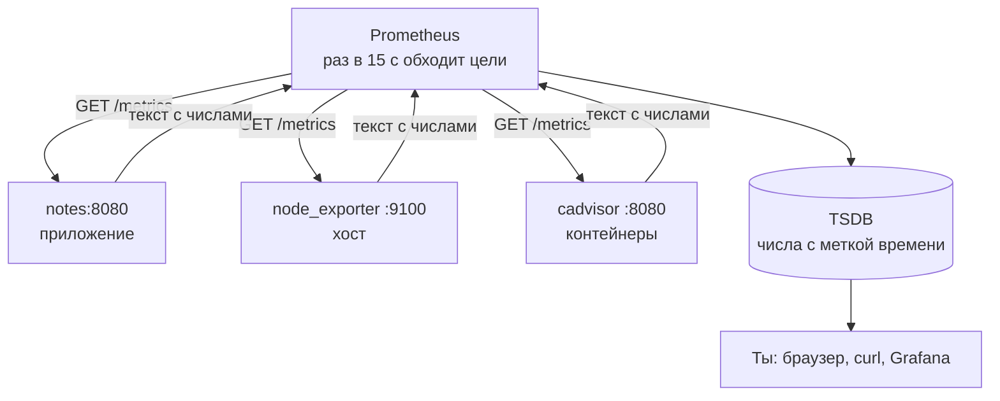
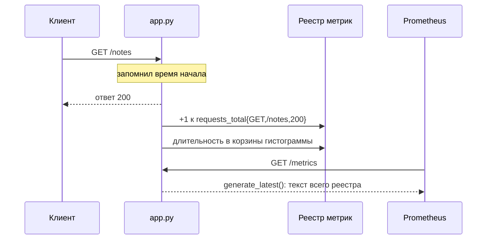

## Зачем это нужно

В [8.1](01-observability-slo.md) ты решил, что считать надёжностью: SLI и SLO. Чтобы их посчитать, нужны числа: сколько запросов пришло, сколько закончилось ошибкой, сколько они длились, сколько памяти съел контейнер. Prometheus это программа, которая собирает эти числа, хранит их вместе со временем и отвечает на вопросы про прошлое. Представь тетрадь, куда каждые 15 секунд записывают показания приборов: по ней потом можно спросить «что было вчера в три часа ночи». Без такой тетради остаётся помнить по ощущениям.

Ночью «сервис тормозит» без метрик означает угадывание по логам. С метриками видно: ошибки выросли в 02:14, память растёт с релиза, диск закончится через шесть часов. Prometheus есть почти в каждом Kubernetes-кластере (Kubernetes это система, которая запускает и следит за множеством контейнеров на нескольких машинах; ты встретишь её в [теме 5](../05-kubernetes/index.md)), на собеседованиях по нему спрашивают всегда.

Шаг проекта: «Заметки» получают адрес `GET /metrics` (`app.py` v5, образ 0.5.0), появляется каталог `monitoring/` со стеком Prometheus, node_exporter и cAdvisor, и Prometheus начинает собирать метрики приложения, хоста и контейнеров. Стек это набор программ, которые работают вместе. **node_exporter** это маленькая программа-«переводчик», которая читает состояние самой машины (процессор, память, диск) и выкладывает его страницей, понятной Prometheus, как датчик на щитке, к которому можно подключить прибор. **cAdvisor** делает то же для контейнеров: сколько памяти и процессора ест каждый. Без них Prometheus знал бы только то, что приложение само о себе рассказало, и ничего о машине под ним. Подробно разберём в теории.

## Что нужно знать

- [Урок 8.1: наблюдаемость, SLI и SLO](01-observability-slo.md): три сигнала (метрики, логи, трейсы) и какие числа нам нужны. Метрика это число, которое меняется со временем.
- [Урок 4.5: Compose с PostgreSQL](../04-docker/05-compose-postgres.md): Compose это файл `compose.yml`, который описывает несколько контейнеров, их тома (постоянные диски) и общую сеть.
- [Урок 4.6: nginx и TLS перед «Заметками»](../04-docker/06-compose-nginx-tls.md): сеть `notes-net` и запросы через `https://notes.lab`.
- [Урок 4.7: образы и теги](../04-docker/07-images-registry.md): сборка образа с семантическим тегом (`0.5.0`, а не `latest`).
- [Урок 2.4: HTTP](../02-network/04-http.md): коды ответов, `curl`, демонстрационные пути `/error` и `/slow`.
- [Урок 1.4: процессы и сигналы](../01-linux/04-processes-signals.md): что происходит с процессом при остановке и почему всё, что было у него в памяти, пропадает.
- Если хочешь разобрать основы на другом стенде, см. [Prometheus](../../monitoring/02-metrics/01-prometheus.md) в курсе «Мониторинг и SRE».

## Картина целиком

Представь учителя, который каждые 15 секунд обходит класс с журналом. Ученики (наши сервисы) ничего не рассылают сами: у каждого на парте лежит листок с текущими цифрами («решено 12 задач, 3 с ошибкой»). Учитель подходит, списывает цифры в журнал вместе с временем и идёт дальше. Если ученик не отвечает, учитель ставит отметку «нет на месте». По журналу потом видно, как менялись цифры в течение урока.

Учитель это **Prometheus**, листок на парте это страница `/metrics` (обычный адрес в сети, по которому программа отдаёт текст с текущими цифрами), ученики это цели (targets), а журнал это база временных рядов (time series database, TSDB): хранилище, которое устроено под записи вида «в такое-то время было такое-то число». Обычная таблица с этим справляется хуже, а журнал по датам как раз то, что нужно.



Стрелки к целям читай как «Prometheus приходит и забирает». Цели не рассылают ничего сами, а результат обхода попадает в базу и оттуда к тебе. Про каждый обход Prometheus сам записывает метрику `up`: 1 если цель ответила, 0 если нет.

Не у каждой программы есть `/metrics`. Для базы данных, операционной системы и контейнеров существуют небольшие программы-«переводчики» (exporters, экспортёры): они читают состояние чужой системы и выкладывают его в том же формате. Сегодня ты подключишь два (node_exporter для хоста, cAdvisor для контейнеров) и научишь свои «Заметки» отдавать `/metrics`.

## Теория

### Pull-модель: Prometheus сам ходит за метриками

**Зачем это устроено именно так.** Есть два способа передать числа мониторингу. Push (от слова «толкать»): приложение само отправляет цифры на сервер мониторинга. Pull («тянуть»): сервер мониторинга сам приходит и забирает. В Prometheus выбран pull. Причина в том, что при push мониторинг не отличает «приложение молчит, потому что всё хорошо» от «приложение молчит, потому что умерло». При pull это различие получается само собой: пришёл за цифрами, никто не ответил, значит проблема.

Учитель с журналом из «Картины целиком». Если бы ученики сами приходили к учителю со своими цифрами, то отсутствие ученика никак бы не бросалось в глаза. Когда учитель обходит парты, пустое место видно сразу. Аналогия ломается для очень коротких дел: ученик, который успел решить задачу и уйти между двумя обходами, останется незамеченным (об этом ниже, в разделе про Pushgateway).


1. Раз в `scrape_interval` (интервал сбора, у нас 15 секунд) Prometheus берёт список целей из конфига.
2. К каждой цели он делает обычный HTTP-запрос `GET /metrics` (то же, что делает `curl` в [уроке 2.4](../02-network/04-http.md)). Сбор одной цели называется «scrape» (от англ. соскрести).
3. В ответе приходит текст с числами. Prometheus его разбирает.
4. Каждое число он записывает в свою базу вместе с текущим временем.
5. Отдельно он записывает в базу метрику `up` про саму цель: 1, если запрос удался и текст разобрался, 0 в остальных случаях (таймаут, отказ соединения, код ответа не 200, битый текст).

Три слова, которые путают чаще всего:

- **цель** (target): один адрес, например `notes:8080`;
- **задача** (job): группа однотипных целей, например все копии сервиса `notes`;
- **экземпляр** (instance): конкретный адрес внутри задачи.

Prometheus сам добавляет к каждому числу метки `job` и `instance`, чтобы потом было видно, откуда оно.

Разберём на примере. Допустим, в 12:00:00 Prometheus запросил `notes:8080/metrics` и получил ответ 200. В базу лягут два числа с меткой времени 12:00:00: `up{job="notes",instance="notes:8080"} = 1` и все метрики приложения. В 12:00:15 сервис завис и не ответил за 10 секунд (это `scrape_timeout`, по умолчанию 10 секунд). В базу ляжет только `up{...} = 0`. Больше от приложения не придёт ничего, и это видно на графике `up` сразу, приложение не пришлось учить «слать пульс».

<div class="viz" data-viz="obs-scrape" data-interval="15"></div>

Смотри на разницу между накопленным счётчиком и текущим уровнем: между двумя обходами уровень слепой, а счётчик ничего не теряет.

> **Прикинь сам:** сервис перестал отвечать. Что в Prometheus покажет это быстрее всего и почему это не надо программировать в самом сервисе?
{: .predict}

Метрика `up{job="notes"}` станет 0. Её создаёт сам Prometheus по итогам каждого сбора, приложению ничего дописывать не нужно. Если приложение зависло, оно просто не ответит на запрос, и это тоже даст `up = 0`.

Осторожно, тут часто путают. Если цель исчезла, ряд не «застывает» на последнем значении навсегда. Когда цель исчезла или сбор не удался, Prometheus сразу помечает её ряды устаревшими (staleness), и запрос перестаёт их возвращать. Если маркера нет (ряд пришёл через push или федерацию), запрос ещё до 5 минут отдаёт последнюю точку: это окно lookback delta. Отсюда следствие для алертов: условие «метрика больше порога» не сработает, если метрики совсем нет, потому что сравнивать нечего. Поэтому рядом с любым алертом по значению нужен алерт на `up == 0` (разберём в [8.5](05-alertmanager.md)).

> **Главное:** Prometheus сам обходит цели, а недоступная цель записывается как `up = 0` без участия приложения.
{: .key}

Что именно он забирает с каждой цели?

### Формат exposition: как выглядит `/metrics`

Prometheus и приложение должны договориться, как записывать числа. Договорились о простом тексте, который читает и человек: его можно открыть через `curl` и увидеть глазами. Это главный инструмент отладки: когда что-то не так, ты первым делом смотришь, что реально отдаёт `/metrics`.

Листок на парте: заголовок («Решено задач»), подсказка («число, всегда растёт») и сама цифра.

Ответ состоит из строк трёх видов:

```text
# HELP demo_requests_total Сколько запросов обработано      <- описание (для людей)
# TYPE demo_requests_total counter                          <- тип метрики
demo_requests_total{status="200"} 3.0                       <- имя{метки} значение
demo_requests_total{status="500"} 1.0
```

- `# HELP` и `# TYPE` начинаются с решётки и отвечают на вопросы «что это» и «какого типа».
- Строка с числом состоит из **имени** (`demo_requests_total`), необязательных **меток** в фигурных скобках (пары `имя="значение"` через запятую) и **значения** (число).
- Одно имя с разными наборами меток это разные **временные ряды** (time series): `{status="200"}` и `{status="500"}` считаются отдельно. Временной ряд это последовательность пар «момент времени, число» для одного имени и одного набора меток.

Разберём на примере. Строка `demo_requests_total{status="500"} 1.0` говорит: «счётчик `demo_requests_total` для запросов со статусом 500 сейчас равен 1». Prometheus запишет это число в ряд и приложит время. Через 15 секунд запишет следующее значение (например, 4.0), и по двум точкам можно будет посчитать скорость роста: 3 запроса за 15 секунд.

Осторожно, тут часто путают. Что в `/metrics` лежит история. Нет: там только **текущее** состояние. Историю строит Prometheus, записывая эти текущие числа раз в 15 секунд. Поэтому если Prometheus не работал час, часа данных не будет, даже когда приложение всё это время исправно считало.

> **Главное:** `/metrics` это обычный текст с текущими значениями, а историю строит Prometheus.
{: .key}

> **Проверь понимание:** в `/metrics` две строки: `notes_http_requests_total{path="/notes",status="200"} 10` и `notes_http_requests_total{path="/notes",status="500"} 2`. Сколько тут временных рядов?

<details markdown="1">
<summary>Ответ</summary>

Два: имя одно, но наборы меток разные (`status="200"` и `status="500"`), а ряд определяется именем и всеми метками вместе.

</details>

У чисел бывают разные типы. Какие?

### Четыре типа метрик

«Число» бывает разным по смыслу. Число запросов только растёт. Число заметок сейчас может и уменьшиться. Время ответа это не одно число, а целое распределение. Prometheus хочет знать тип, чтобы правильно с ним работать.

Три вида приборов в машине. **Счётчик** (counter) это одометр: только вперёд. **Датчик** (gauge) это спидометр или уровень топлива: вверх и вниз, важно текущее значение. **Гистограмма** (histogram) это таблица «сколько поездок заняли до 10 минут, до 30, до часа»: она не даёт точного времени каждой поездки, но показывает распределение.


| Тип | Что это | Пример |
|---|---|---|
| counter (счётчик) | только растёт; при перезапуске процесса сбрасывается в 0 | `notes_http_requests_total` |
| gauge (датчик) | значение идёт вверх и вниз | `notes_notes_total`, память процесса |
| histogram (гистограмма) | считает наблюдения по корзинам (bucket) с верхней границей `le` | `notes_http_request_duration_seconds` |
| summary (сводка) | квантили (p95 и подобные, см. [8.1](01-observability-slo.md)) считаются в самом приложении; их нельзя складывать между копиями сервиса | редко, в новом коде обычно histogram |

По счётчику интересно не само число, а **скорость роста**. «Всего запросов 1 000 000» ничего не говорит: это за день или за год? «Сейчас 12 запросов в секунду» говорит. Скорость считает функция `rate()`, она в [уроке 8.3](03-promql.md). Ей же не страшен сброс счётчика после перезапуска процесса: она замечает, что число упало, и понимает, что это начало нового отсчёта, а не «-1000 запросов».

**Гистограмма подробно.** Она нужна, чтобы считать задержки (p95 из [8.1](01-observability-slo.md)). Ты заранее выбираешь границы корзин, например 0.1, 0.5 и 1 секунда. Каждый ответ приложения «кладётся» в корзины. Гистограмма даёт три вида рядов:

- `имя_bucket{le="0.5"}`: сколько наблюдений были **не больше** 0.5 секунды (`le` значит «less or equal», меньше или равно);
- `имя_sum`: сумма всех значений;
- `имя_count`: сколько было наблюдений.

Корзины **кумулятивные**: в `le="0.5"` входит всё, что уже попало в `le="0.1"`. Последняя корзина `le="+Inf"` (бесконечность) вмещает вообще всё и потому равна `_count`.

Разберём на примере. Мы записали четыре времени ответа: 0.05, 0.3, 0.3 и 2.0 секунды, границы корзин 0.1, 0.5 и 1.

| Значение | Попало в `le="0.1"` | `le="0.5"` | `le="1"` | `le="+Inf"` |
|---|---|---|---|---|
| 0.05 | да | да | да | да |
| 0.3 | нет | да | да | да |
| 0.3 | нет | да | да | да |
| 2.0 | нет | нет | нет | да |
| **Итого** | 1 | 3 | 3 | 4 |

`_count` = 4, `_sum` = 0.05 + 0.3 + 0.3 + 2.0 = 2.65. Среднее время = `_sum / _count` = 2.65 / 4 = 0.6625 секунды. Ты увидишь ровно эти числа в задании 1.

<div class="viz" data-viz="chart" data-type="bar" data-x="le=0.1,le=0.5,le=1,le=+Inf" data-series='[{"name":"Значений в корзине (кумулятивно)","values":[1,3,3,4],"unit":"шт"}]' data-x-label="Корзина гистограммы" data-y-label="Наблюдений" data-unit="шт" data-explain="Корзины накопительные: в каждую входит всё, что уже попало в меньшие. Последняя равна числу всех наблюдений."></div>

Столбики только растут слева направо: так устроены корзины. Разность соседних столбиков и есть число запросов в своём диапазоне.

> **Прикинь сам:** в гистограмме `_bucket{le="0.5"} 30`, `_bucket{le="1"} 30`, `_count 34`. Что можно сказать о четырёх запросах?
{: .predict}

30 запросов уложились в 0.5 секунды, а четыре оказались медленнее секунды (34 минус 30, они попали только в корзину `+Inf`). Корзины кумулятивные, поэтому `le="1"` не отличается от `le="0.5"`: между 0.5 и 1 секундой запросов не было.

Осторожно, тут часто путают. Counter и gauge. Правило простое: если число может уменьшиться при нормальной работе (заметок стало меньше, память освободилась), это gauge. Если оно только накапливается («всего случилось»), это counter. Ещё путают гистограмму с готовыми квантилями: гистограмма хранит корзины, а p95 из них оценивают позже. Из-за этого корзины надо выбирать под свои задержки: если первая корзина 100 мс, а все ответы по 20 мс, то p95 окажется «где-то внутри первой корзины», то есть оценка будет грубой.

> **Главное:** counter только растёт, gauge ходит вверх и вниз, histogram считает наблюдения по накопительным корзинам.
{: .key}

Метки делят метрику на ряды. Сколько их допустимо?

### Метки и кардинальность

Одной цифры «запросов всего 1000» мало: нужно уметь разрезать по путям, методам и статусам. Метки (labels) как раз делят одну метрику на группы.

Складской учёт. «На складе 500 коробок» скучно. «Красных 200, синих 300» уже полезнее. «Красных маленьких 50, красных больших 150...» ещё подробнее, но и строк в таблице больше. Каждая новая колонка умножает число строк.

Каждая уникальная комбинация значений всех меток это отдельный ряд в памяти и на диске. Число рядов называется **кардинальностью** (cardinality, «мощность множества»). Если метка принимает 5 значений, а вторая 3, а третья 4, то рядов до 5 * 3 * 4 = 60. Это безопасно. Если положить в метку что-то неограниченное (номер пользователя, номер заметки, сырой URL), рядов станет миллионы, память Prometheus раздуется, и он упадёт по OOM (нехватка памяти, процесс убивает система, [урок 1.5](../01-linux/05-disk-memory-cpu.md)).

Разберём на примере. В «Заметках» метрика `notes_http_requests_total` имеет метки `method` (GET, POST...), `path` (11 известных маршрутов плюс `other`) и `status` (несколько кодов). Рядов не больше нескольких сотен. Теперь представь, что вместо `path="/notes"` в метку попадает сырой адрес запроса: `/notes/17`, `/notes/18`... Каждая заметка добавит новые ряды для каждой пары `method` и `status`. После 10 000 заметок это десятки тысяч рядов, а если кто-то просканирует сайт случайными URL, то миллионы. Поэтому в приложении есть функция `route_label`: всё, что не входит в список известных маршрутов, превращается в `other`.

Осторожно, тут часто путают. Что подробности всегда хорошо. Для метрик подробности вредны, для логов ([8.7](07-logs-loki-alloy.md)) и трейсов ([8.8](08-tracing.md)) полезны. Метки метрик должны быть скучными: короткий конечный список значений.

> **Главное:** каждая комбинация меток это отдельный ряд, поэтому в метках держат короткий конечный список значений.
{: .key}

> **Проверь понимание:** разработчик хочет добавить в `notes_http_requests_total` метку `note_id`, чтобы видеть популярные заметки. Что ответишь?

<details markdown="1">
<summary>Ответ</summary>

Нельзя: значений столько же, сколько заметок, и каждое даёт новый ряд для каждой комбинации `method/status`. Это взрыв кардинальности. Популярные заметки смотрят в логах или трейсах, а метрика остаётся с ограниченным набором меток.

</details>

Где всё это хранится?

### Хранение: TSDB, retention, том

Числа надо где-то держать, и быстро находить по имени, меткам и времени. Обычная база данных с таблицами для этого плохо подходит, поэтому в Prometheus своя база временных рядов (TSDB, time series database).

Дневник погоды: запись по дням, старые страницы через какое-то время выбрасывают. Искать удобно по дате.

Prometheus пишет данные в каталог, который задаёт флаг `--storage.tsdb.path`. Сначала свежие числа лежат в памяти (и в журнале на диске на случай перезапуска), потом порциями по два часа сбрасываются в блоки на диске. Блоки старше срока хранения удаляются. Срок хранения (retention) задаёт `--storage.tsdb.retention.time`, по умолчанию 15 дней. Каталог мы выносим в **том** Docker (`prom-data`), иначе при удалении контейнера пропадёт вся история.

Разберём на примере. У нас 15 секунд между сборами. В сутках 86 400 секунд, значит один ряд получает 86 400 / 15 = 5 760 значений в сутки. Если рядов 2 000, то за сутки записей 11 520 000. Prometheus сжимает их до 1-2 байт на значение, так что сутки занимают порядка 20 МБ. Поэтому начинают с одного Prometheus с разумным retention.

> **Прикинь сам:** почему каталог с данными Prometheus кладём в том, а не оставляем внутри контейнера?
{: .predict}

Файловая система контейнера исчезает вместе с контейнером ([урок 4.1](../04-docker/01-containers-idea.md)). При пересоздании контейнера без тома пропала бы вся история метрик. Том живёт отдельно и переживает пересоздание.

Осторожно, тут часто путают. Что Prometheus это долговременное хранилище и кластер. Нет: данные лежат на одном узле. Для долгого хранения и нескольких кластеров есть Thanos, Mimir и VictoriaMetrics, но это надстройки, до которых надо дорасти.

> **Главное:** данные лежат в TSDB на одном узле, срок хранения 15 дней, а каталог выносят в том.
{: .key}

Не всё умеет отдавать `/metrics` само. Кто помогает?

### Экспортёры, Pushgateway и откуда берутся цели

Не всё умеет отдавать `/metrics` само: у Linux, PostgreSQL, nginx его нет. И не всё живёт достаточно долго, чтобы его успели опросить.

Переводчик: человек говорит на языке, который учитель не понимает, и переводчик пересказывает его слова на языке журнала.

**Экспортёр** (exporter) это небольшая программа, которая читает состояние чужой системы и выдаёт его в формате `/metrics`. Мы подключаем два:

- **node_exporter** (порт 9100) отдаёт метрики хоста: процессор, память, диски, сеть. Он читает их из каталогов `/proc` и `/sys` ([урок 1.5](../01-linux/05-disk-memory-cpu.md)).
- **cAdvisor** (порт 8080 внутри сети, у нас проброшен как 8081) отдаёт метрики контейнеров: сколько памяти и процессора съел каждый.

Остальные экспортёры (PostgreSQL, nginx, проверки снаружи через blackbox) разберём в [8.4](04-blackbox-exporters.md).

**Pushgateway** (шлюз для «пуша») нужен для задач, которые живут секунды: CronJob, скрипт бэкапа. Такая задача в конце работы отправляет итог в Pushgateway, а Prometheus забирает его оттуда как с обычной цели. Это исключение, а не основной путь.

Как Prometheus узнаёт, куда ходить. У нас список статический: адреса записаны в `prometheus.yml`. В Kubernetes цели находятся автоматически через service discovery (обнаружение служб), разберём в [8.9](09-k8s-monitoring.md).

Разберём на примере. Скрипт бэкапа работает 40 секунд раз в час. Prometheus ходит раз в 15 секунд, но 59 минут из 60 процесса нет. Скрипт в конце вызывает Pushgateway и записывает gauge с временем успеха (например, `backup_last_success_timestamp_seconds 1790000000`). Шлюз живёт всегда, Prometheus снимает эту цифру каждые 15 секунд. Алерт строят на возрасте: «сейчас минус время последнего успеха больше 25 часов».

Осторожно, тут часто путают. Что Pushgateway это «push вместо pull для всего». Нет, и у него подводный камень: он хранит последнее значение вечно, даже если задача давно не запускалась, а `up` показывает живость шлюза, а не задачи.

> **Главное:** экспортёр переводит чужую систему в формат Prometheus, а Pushgateway нужен только для коротких задач.
{: .key}

> **Проверь понимание:** скрипт бэкапа работает 40 секунд раз в час. Как получить по нему метрику «время последнего успешного бэкапа»?

<details markdown="1">
<summary>Ответ</summary>

Скрипт в конце отправляет gauge (например, Unix-время успеха) в Pushgateway, а Prometheus собирает Pushgateway как обычную цель. Прямой pull бесполезен: 15 секунд опроса почти всегда попадут в момент, когда процесса нет.

</details>

Как понять, что цель вообще видна?

### Состояния цели: как читать страницу Targets

Первый вопрос при любой проблеме с метриками: «Prometheus вообще видит эту цель?». Ответ даёт страница `/targets` в его веб-интерфейсе. Без умения её читать ты будешь гадать, почему график пустой.

Табло вылетов в аэропорту. Рядом с каждым рейсом статус и, если что-то не так, причина: «задержан, погода». Статус отвечает «что», причина отвечает «почему».

У каждой цели два главных поля. Состояние (health): `up`, если последний сбор удался, и `down`, если нет. Последняя ошибка (`lastError`): текст, который Prometheus получил при неудаче. Состояние говорит, что плохо, а текст ошибки почти всегда сразу указывает, где искать.

| Что написано в `lastError` | Что это значит | Что проверить |
|---|---|---|
| `connection refused` | по адресу есть машина, но порт никто не слушает | запущено ли приложение, верный ли порт |
| `no such host` | имя не превратилось в адрес | есть ли контейнер в той же сети, нет ли опечатки |
| `context deadline exceeded` | цель не успела ответить за `scrape_timeout` | не завис ли процесс, не слишком ли тяжёлая страница |
| `server returned HTTP status 404` | сервер ответил, но такого пути нет | верен ли `metrics_path`, есть ли в приложении `/metrics` |

Разберём на примере. Представь строку «`notes` down, `Get "http://notes:8081/metrics": dial tcp 172.18.0.4:8081: connect: connection refused`». Читаем слева направо. `Get` и адрес: Prometheus пытался сделать обычный запрос. `notes:8081`: порт 8081, хотя приложение слушает 8080. `172.18.0.4` это адрес контейнера: имя `notes` найдено успешно, значит проблема не в имени. `connection refused`: на этом адресе порт закрыт. Вывод: в конфиге опечатка в порту. Подсказка уже в тексте.

> **Прикинь сам:** цель `down`, ошибка `server returned HTTP status 404 Not Found`. Приложение упало?
{: .predict}

Нет. Сервер отвечает, иначе была бы `connection refused` или таймаут. Но по пути `/metrics` ничего нет: либо в приложении ещё не добавили этот адрес, либо в конфиге Prometheus указан другой `metrics_path`.

Осторожно, тут часто путают. Что `down` значит «приложение упало». Нет: оно может быть живо и обслуживать пользователей, но `/metrics` недоступен (404, закрыт порт, блокирует firewall). Поэтому после `down` сначала читай текст ошибки, а потом решай, куда идти.

> **Главное:** `down` не значит «приложение упало»: смотри текст ошибки и решай по нему.
{: .key}

Давай разберёмся со словами «метрика», «ряд» и «сэмпл».

### Сэмпл, ряд и метрика: три слова про одни данные

В документации и в разговорах эти слова используют вперемешку, и новичок думает, что речь о разных вещах. Разберись один раз, и дальше текст читается легче.

Журнал температуры. Вся тетрадь по одному пациенту это ряд. Отдельная запись «12:00, 36.6» это сэмпл. Название показателя («температура») это метрика, а пациент это метки: у разных пациентов свои тетради для одного и того же показателя.

**Метрика** (metric) это имя показателя: `notes_http_requests_total`. **Ряд** (series) это метрика вместе с конкретными метками: `notes_http_requests_total{status="500"}`. **Сэмпл** (sample, «проба») это одна точка ряда: пара «момент времени, число». Раз в 15 секунд Prometheus добавляет в каждый ряд по одному сэмплу.

Разберём на примере. Метрика `notes_http_requests_total` с метками `status` (200 и 500) даёт два ряда. За минуту в каждом ряду накопится четыре сэмпла (15 секунд между ними), всего восемь. Поэтому `scrape_samples_scraped` из следующего раздела считает именно ряды, которые вернула цель за один сбор: по одному новому сэмплу на каждый.

Осторожно, тут часто путают. Сэмпл и запрос пользователя. Они не связаны: один сэмпл мог появиться из миллиона запросов, потому что это всего лишь число «на сейчас».

> **Главное:** метрика это имя, ряд это имя с метками, сэмпл это одна точка ряда.
{: .key}

> **Проверь понимание:** метрика с двумя метками: `method` (3 значения) и `status` (4 значения). Сколько сэмплов добавится за один сбор, если встречались все комбинации?

<details markdown="1">
<summary>Ответ</summary>

3 * 4 = 12 рядов, в каждый добавляется по одному сэмплу, значит 12 сэмплов за сбор.

</details>

А как часто делать обход?

### Интервал сбора: почему 15 секунд

Интервал нельзя выбрать наугад: от него зависит, насколько быстро ты заметишь поломку, сколько места займёт база и насколько нагрузишь сами цели.

Как часто мерить температуру больному. Раз в сутки: пропустишь скачок. Каждую секунду: медсестра не успевает делать ничего другого, а записей тонны. Раз в 15 минут подходит для серьёзного случая. Для сервисов такой «серьёзный» ритм это 10-60 секунд.

Чем меньше интервал, тем точнее график и тем быстрее срабатывает алерт, но тем больше сэмплов, места и нагрузки на цель. Второе число, `scrape_timeout`, это сколько Prometheus ждёт ответа. Оно обязано быть не больше интервала (иначе новый сбор начнётся, пока старый не закончился). У нас 15 секунд и 10 секунд таймаут.

Разберём на примере. Если поломка случилась сразу после сбора, Prometheus заметит её только на следующем: в худшем случае через 15 секунд. К этому прибавляется время условия алерта (например, «5 минут подряд», см. [8.5](05-alertmanager.md)). Интервал в минуту сделает реакцию в худшем случае вдвое-вчетверо медленнее и сократит объём данных в четыре раза, а для краткого всплеска в 20 секунд он вообще сделает картину неточной: всплеск может не попасть ни в один сбор.

> **Прикинь сам:** всплеск ошибок длился 10 секунд, интервал сбора 60 секунд. Гарантирует ли Prometheus, что он его увидит?
{: .predict}

Нет. Всплеск мог целиком оказаться между двумя сборами. Счётчики ошибок в этом случае всё равно покажут разницу между сборами (они накопительные), но точную форму всплеска ты не восстановишь: видно будет «ошибок стало больше», а не «когда и как резко».

Осторожно, тут часто путают. Что интервал «чем меньше, тем лучше». Мелкий интервал нужен не везде: для метрики «свободно диска» хватит минуты. Начинай с 15-30 секунд и меняй по необходимости, а не по привычке.

> **Главное:** интервал это компромисс между точностью, местом и нагрузкой, а `scrape_timeout` не больше интервала.
{: .key}

Откуда берутся метрики хоста и контейнеров?

### Что именно читают node_exporter и cAdvisor

Метрики приложения отвечают на вопрос «что делает программа». Но когда приложение тормозит, причина часто под ним: не хватает памяти, диск забит, контейнер упёрся в лимит процессора. Без метрик хоста и контейнеров ты видишь симптом, но не причину.

Врач смотрит не только на жалобы пациента, но и на анализы крови. Приложение рассказывает о себе само (жалобы), а экспортёры снимают «анализы» независимо, не спрашивая программу.

Linux сам ведёт учёт ресурсов и выкладывает его как обычные файлы в каталогах `/proc` и `/sys` ([урок 1.5](../01-linux/05-disk-memory-cpu.md)). node_exporter каждый раз при запросе `/metrics` читает эти файлы и переводит цифры в формат Prometheus. Например, `node_memory_MemAvailable_bytes` это байты памяти, которые можно ещё использовать. cAdvisor делает то же, но для каждого контейнера отдельно: читает учёт расхода ресурсов, который ведёт ядро для каждой группы процессов, и отдаёт метрики с префиксом `container_` (например, `container_memory_usage_bytes`).

Разберём на примере. У `node_exporter` метрика `node_load1` это средняя нагрузка за последнюю минуту (число процессов, которые хотят процессор). На машине с двумя ядрами значение 2 означает «заняты оба ядра, очереди нет», а 6 означает «в очереди стоят ещё четыре». Важное отличие от приложения: экспортёр ничего не считает сам, он только переводит. Поэтому его страница `/metrics` всегда свежая, а при его остановке пропадёт только картина хоста, приложение останется видимым.

Осторожно, тут часто путают. Что экспортёр «собирает» метрики и хранит их. Нет: он отвечает только в момент запроса, хранит и собирает историю по-прежнему Prometheus.

> **Главное:** экспортёры переводят состояние `/proc` и `/sys` и ничего не хранят, история остаётся у Prometheus.
{: .key}

> **Проверь понимание:** node_exporter остановили, приложение работает. Какие метрики пропадут из Prometheus?

<details markdown="1">
<summary>Ответ</summary>

Пропадут метрики хоста (память, диск, процессор), цель `node` станет `down`. Метрики приложения продолжат собираться, потому что это отдельная цель.

</details>

А как считает метрики само приложение?

### Как приложение считает метрики: путь одного запроса

Метрики сами не появятся: кто-то должен в нужный момент прибавить единицу к счётчику и записать длительность. Этим занимается библиотека-клиент внутри приложения. В Python это `prometheus_client`.

Турникет в метро. Каждый проход добавляет единицу на счётчике, а камера рядом засекает, сколько времени человек шёл по коридору. Турникету не нужно знать, кто и когда прочитает эти цифры.

Библиотека хранит все метрики в одном месте, реестре (registry), в памяти процесса. Когда приходит запрос:

1. Приложение запоминает время начала.
2. Обрабатывает запрос и отправляет ответ.
3. В момент отправки статуса вызывается наш код: он прибавляет 1 к нужному ряду счётчика (по метке метода, пути и статуса) и кладёт длительность в гистограмму.
4. Когда Prometheus приходит на `/metrics`, функция `generate_latest()` просто печатает весь реестр текстом. Ничего не считается заново: страница это снимок текущих чисел.



Счёт ведётся в момент ответа, а при запросе `/metrics` реестр просто печатается как есть.

Разберём на примере. Пришли три запроса: `GET /notes` за 0.03 с, `GET /notes` за 0.4 с и `GET /nope`. После них в реестре: `requests_total{GET,/notes,200}` = 2, `requests_total{GET,other,404}` = 1 (неизвестный путь стал `other`, см. предыдущий раздел). В гистограмме для `/notes` две записи: 0.03 попало в корзины от `le="0.05"` и выше, 0.4 попало в корзины от `le="0.5"` и выше. Счётчики лежат в памяти процесса, поэтому после перезапуска `app.py` всё начнётся с нуля (теория про сброс выше).

> **Прикинь сам:** сервис обработал 1 000 000 запросов на `/notes` со статусом 200. Сколько рядов у счётчика запросов из-за этого?
{: .predict}

Один: `{method="GET",path="/notes",status="200"}`. Число запросов это значение ряда, а не количество рядов. Растёт число рядов только с новыми комбинациями меток.

Осторожно, тут часто путают. Что метрики «весят» столько же, сколько запросов. Нет: память занимает число рядов, а не число запросов. Миллион запросов в один и тот же ряд стоит те же байты, что один.

> **Главное:** приложение прибавляет счётчики в момент ответа, а `/metrics` печатает реестр как снимок.
{: .key}

Как называть то, что считаем?

### Как называть метрики

Через полгода метрик будут сотни, и по имени должно быть понятно, что это и в чём измерено. В Prometheus есть договорённости, которые помогают не путаться и не ошибиться в единицах.


- Имя начинается с префикса проекта: `notes_...`. Так видно, чья это метрика.
- Счётчики заканчиваются на `_total`: `notes_http_requests_total`.
- Единицу измерения пишут в имени и берут базовую: секунды (не миллисекунды), байты (не мегабайты): `notes_http_request_duration_seconds`.
- Имя описывает, что измеряют, а не как это будут считать. Значения, которые можно получить складыванием или вычитанием, лучше не хранить отдельно (например, «доля ошибок» не метрика, её считают запросом из двух счётчиков).

Разберём на примере. Метрика `request_time_ms` нарушает два правила: нет префикса проекта и единица не базовая (миллисекунды). Правильно: `notes_http_request_duration_seconds`. Разработчик, который увидит в Grafana значение 0.25 и не знает единицы, всё равно поймёт, что это секунды, а не миллисекунды.

Осторожно, тут часто путают. Что название не важно, «главное, чтобы работало». Смешанные единицы (где-то секунды, где-то миллисекунды) приводят к ошибкам в расчётах на порядок, и заметить их трудно.

> **Главное:** префикс проекта, `_total` у счётчиков и базовые единицы (секунды, байты) спасают от ошибок на порядок.
{: .key}

> **Проверь понимание:** как назвать счётчик числа отправленных писем?

<details markdown="1">
<summary>Ответ</summary>

`notes_emails_sent_total`: префикс проекта, что считаем, суффикс `_total` для счётчика.

</details>

Какие ряды появляются у каждой цели без нашей помощи?

### Метрики, которые Prometheus пишет сам

Кроме метрик приложения, Prometheus сам записывает несколько служебных рядов про каждый сбор. Они показывают, здорова ли сама система сбора.

К каждой цели автоматически добавляются:

| Метрика | Что означает |
|---|---|
| `up` | 1 если сбор удался, 0 если нет |
| `scrape_duration_seconds` | сколько секунд занял сбор |
| `scrape_samples_scraped` | сколько значений вернула цель за один сбор |
| `scrape_samples_post_metric_relabeling` | сколько значений осталось после фильтрации |

Разберём на примере. У «Заметок» `scrape_samples_scraped` будет в районе нескольких сотен: наши метрики плюс стандартные метрики процесса Python (использование памяти, число сборок мусора), которые `prometheus_client` добавляет сам. Если завтра это число выросло до 20 000, значит, у цели появились лишние ряды. Это самый быстрый способ заметить взрыв кардинальности, ещё до того как Prometheus упадёт.

> **Прикинь сам:** `up{job="notes"} = 1`, а пользователи получают 500. Противоречие?
{: .predict}

Нет. `up` относится только к сбору метрик: `/metrics` отвечает, значит `up = 1`. Ошибки пользователей видны в счётчике `notes_http_requests_total` со статусом 500, а не в `up`.

Осторожно, тут часто путают. Что `up = 1` значит «сервис здоров». Нет: он значит только «`/metrics` ответил корректно». Приложение может отвечать на `/metrics` и при этом падать на реальных запросах. Здоровье для пользователя измеряют ошибками и задержкой (RED из [8.1](01-observability-slo.md)), а внешняя проверка, ходит ли реальный клиент, это тема [8.4](04-blackbox-exporters.md).

> **Главное:** `up = 1` значит только «`/metrics` ответил», а здоровье для пользователя измеряют ошибками и задержкой.
{: .key}

Как всё это связано с целями из урока 8.1?

### Как метрики связаны с SLI из урока 8.1

Мы собираем метрики не ради метрик, а чтобы посчитать SLI и SLO из [8.1](01-observability-slo.md). Полезно сразу увидеть, какие ряды для чего нужны.


- **Доступность:** «хорошие запросы делить на все». Все запросы это сумма `notes_http_requests_total`, плохие это те, у которых `status` начинается с 5. Метка `status` в счётчике нужна именно для этого.
- **Задержка:** доля запросов быстрее порога. Её даёт гистограмма: корзина `le="0.5"` делится на `_count`. Порог в SLI должен совпадать с границей корзины: в нашем списке `0.25` и `0.5`, поэтому порог 300 мс из 8.1 мы в 8.3 заменим ближайшей границей.

Разберём на примере. За час: всего запросов на `/notes` 1 000, из них со статусом 5xx 12. Доступность = (1 000 - 12) / 1 000 = 98.8%. В гистограмме `_count` = 1 000, `_bucket{le="0.5"}` = 950. Доля быстрее 0.5 секунды = 950 / 1 000 = 95%.

Осторожно, тут часто путают. Что порог SLI можно выбирать любой. Раз квантили и доли считаются по корзинам, порог, не совпадающий с границей, даст приблизительный ответ. Корзины планируют вместе с SLO.

> **Главное:** доступность считают по счётчику со статусом, задержку по корзине гистограммы, а порог SLI совпадает с границей корзины.
{: .key}

> **Проверь понимание:** в гистограмме `_count` = 2 000, `_bucket{le="0.25"}` = 1 700. Какая доля запросов быстрее 250 мс?

<details markdown="1">
<summary>Ответ</summary>

1 700 / 2 000 = 0.85, то есть 85%.

</details>

Осталось прочитать конфиг, который всё это запускает.

### Конфиг `prometheus.yml`: из чего он состоит

Список целей и интервалы Prometheus берёт из одного файла, поэтому его нужно уметь читать.

YAML-файл (см. [урок 4.5](../04-docker/05-compose-postgres.md): отступы пробелами значат вложенность). Два главных блока:

```yaml
global:
  scrape_interval: 15s       # как часто ходить за метриками по умолчанию
scrape_configs:              # список задач сбора
  - job_name: notes          # имя задачи: станет меткой job="notes"
    metrics_path: /metrics   # путь, по умолчанию именно он (можно не писать)
    static_configs:          # статический список целей
      - targets: ["notes:8080"]   # host:port; имя резолвит сеть Docker
```

Разберём на примере. Адрес цели `notes:8080` использует **имя контейнера в сети Docker** ([урок 4.5](../04-docker/05-compose-postgres.md)), поэтому Prometheus, живущий в той же сети `notes-net`, находит его по имени. `localhost:8080` не подошёл бы: для Prometheus `localhost` это он сам, а не соседний контейнер.

> **Прикинь сам:** почему в `targets` нельзя написать `localhost:8080` для приложения, которое работает в соседнем контейнере?
{: .predict}

Внутри контейнера Prometheus `localhost` указывает на сам контейнер Prometheus, а порт 8080 в нём никто не слушает. Соседний контейнер доступен по имени сервиса в общей сети: `notes:8080`.

Осторожно, тут часто путают. Что Prometheus сразу увидит правку файла. Он читает конфиг при старте и по сигналу перечитывания (в нашем стенде проще перезапустить контейнер). Перед этим конфиг проверяют утилитой `promtool check config`: она находит опечатки в отступах и ключах до запуска.

> **Главное:** в конфиге глобальный интервал и список задач с целями, а адреса соседей пишут по имени контейнера, не `localhost`.
{: .key}

## Практика

Все команды в заданиях 1 и 2 запускай на машине, где стоит Docker и есть `~/notes` из темы 4; в `/etc/hosts` должна быть строка `127.0.0.1 notes.lab`, к приложению ходим через прокси: `curl -sk https://notes.lab/...`. Понадобится `jq` (программа для разбора JSON, [урок 1.2](../01-linux/02-text-pipes.md)); если её нет: `sudo apt install jq`.

### Задание 1. Прочитай `/metrics` глазами на игрушечном примере

**Цель:** увидеть формат exposition и понять, как гистограмма превращается в корзины, до того как это станет частью «Заметок».

**Предскажи:** мы запишем в гистограмму четыре значения: 0.05, 0.3, 0.3 и 2.0 секунды, с корзинами 0.1, 0.5 и 1. Какое число будет в `le="0.5"`? А в `le="+Inf"`?

<details markdown="1">
<summary>Ответ</summary>

В `le="0.5"` будет 3 (0.05 и два по 0.3, корзины кумулятивные), в `le="+Inf"` будет 4 (все наблюдения).

</details>

**Шаги:**

1. Создай отдельный каталог и виртуальное окружение (не в `~/notes`):

   ```bash
   mkdir -p ~/metrics-demo && cd ~/metrics-demo
   python3 -m venv .venv
   .venv/bin/pip install prometheus_client
   ```

   Что здесь происходит: `python3 -m venv .venv` создаёт «личную коробку» для Python-пакетов в каталоге `.venv` ([урок 1.6](../01-linux/06-bash-basics.md) и тема 4 использовали то же самое), а `.venv/bin/pip install` ставит библиотеку `prometheus_client` только в неё, не трогая системный Python.

2. Создай `demo.py`:

   ```python
   import time
   from prometheus_client import Counter, Gauge, Histogram, start_http_server

   # счётчик с меткой status: два ряда
   REQS = Counter("demo_requests", "Сколько запросов обработано", ["status"])
   # гистограмма с тремя корзинами (плюс автоматическая +Inf)
   LAT = Histogram("demo_latency_seconds", "Время обработки", buckets=(0.1, 0.5, 1))
   # датчик: значение можно ставить любое
   QUEUE = Gauge("demo_queue_size", "Размер очереди")

   start_http_server(8000)  # /metrics на порту 8000

   REQS.labels("200").inc(3)
   REQS.labels("500").inc()
   for value in (0.05, 0.3, 0.3, 2.0):
       LAT.observe(value)
   QUEUE.set(7)

   time.sleep(3600)
   ```

3. Запусти в фоне и прочитай метрики:

   ```bash
   .venv/bin/python demo.py &
   sleep 1
   curl -s localhost:8000/metrics | grep '^demo_' | grep -v _created
   ```

   Разбор: `&` в конце первой строки запускает программу в фоне, чтобы терминал остался твоим; `sleep 1` даёт ей секунду стартовать; `curl -s` скачивает страницу молча ([урок 2.4](../02-network/04-http.md)); первый `grep '^demo_'` оставляет строки, начинающиеся с `demo_` (знак `^` значит «в начале строки»), а `grep -v _created` выбрасывает строки со словом `_created` (клиент добавляет время создания каждой метрики, нам оно сейчас не нужно).

   В `demo.py` сначала объявлены три метрики: `Counter`, `Histogram` (с корзинами 0.1, 0.5, 1), `Gauge`. Метод `.inc()` увеличивает счётчик, `.observe(x)` кладёт значение в гистограмму, `.set(7)` ставит датчик. `start_http_server(8000)` запускает встроенный веб-сервер, который отдаёт `/metrics`.

**Что должно получиться:**

```text
demo_requests_total{status="200"} 3.0
demo_requests_total{status="500"} 1.0
demo_latency_seconds_bucket{le="0.1"} 1.0
demo_latency_seconds_bucket{le="0.5"} 3.0
demo_latency_seconds_bucket{le="1.0"} 3.0
demo_latency_seconds_bucket{le="+Inf"} 4.0
demo_latency_seconds_count 4.0
demo_latency_seconds_sum 2.65
demo_queue_size 7.0
```

Последние знаки `_sum` могут отличаться из-за чисел с плавающей точкой. Убери фоновый процесс: `kill %1`.

**Как читать вывод:** каждая строка это один временной ряд. `demo_requests_total` два ряда (по статусам 200 и 500), у гистограммы четыре корзины и два служебных ряда `_count` и `_sum`. Клиент дописал `_total` к имени счётчика сам. Корзина `le="0.5"` равна 3: 0.05 и два по 0.3, ровно как в таблице теории. `_sum` 2.65 это 0.05 + 0.3 + 0.3 + 2.0. Все значения выведены как `3.0`, потому что Prometheus хранит числа с плавающей точкой.

**Объясни себе:**

- Почему счётчик назван `demo_requests`, а в выводе он `demo_requests_total`?
- Как из этих строк узнать среднее время запроса? (подсказка: `_sum` и `_count`)
- Что изменится в выводе, если сделать `LAT.observe(0.1)`: в какую корзину попадёт значение ровно на границе?

**Типичные ошибки:**

- `OSError: [Errno 98] Address already in use`: порт 8000 занят прошлым запуском демо. Найди процесс `ss -ltnp | grep 8000` и останови его (`kill`), либо смени порт.
- `ModuleNotFoundError: No module named 'prometheus_client'`: запустил системным `python3`, а не `.venv/bin/python`. Пакеты в venv видит только его интерпретатор.
- `error: externally-managed-environment` при `pip install`: ставишь в системный Python. Используй venv, как в шаге 1.
- `The virtual environment was not created successfully because ensurepip is not available`: в Ubuntu модуль venv ставится отдельно. Выполни `sudo apt install python3-venv` и повтори шаг 1.

### Задание 2. Подними стек мониторинга и увидь первый target DOWN

**Цель:** запустить Prometheus, node_exporter и cAdvisor в Compose, подключить их к сети «Заметок» и прочитать состояние целей.

**Предскажи:** основной стек «Заметок» работает на образе 0.4.1, там ещё нет `/metrics`. Какой будет статус цели `notes` и что напишет Prometheus в поле ошибки? Как отреагирует `up`?

<details markdown="1">
<summary>Ответ</summary>

Цель `notes` будет `down`, а `up{job="notes"}` равен 0. Приложение живо и отвечает, но на `/metrics` возвращает 404 (в 4.2 «Заметок» такого пути нет), поэтому текст ошибки: `server returned HTTP status 404 Not Found`. Prometheus считает успехом только ответ 200 с корректным телом.

</details>

**Шаги:**

1. Убедись, что основной стек запущен (без него сеть `notes-net` не существует), из каталога `~/notes`:

   ```bash
   cd ~/notes
   docker compose ps
   ```

   `docker compose ps` показывает контейнеры проекта; в колонке STATUS должно быть `Up` или `healthy`.

2. Создай каталоги и файл `monitoring/compose.yml`:

   ```bash
   mkdir -p monitoring/prometheus
   ```

   ```yaml
   # Стек мониторинга. Основной compose.yml должен быть запущен раньше:
   # сеть notes-net создаёт он, здесь мы к ней только подключаемся.
   services:
     prometheus:
       image: prom/prometheus:v3.15.0
       command:
         - --config.file=/etc/prometheus/prometheus.yml
         - --storage.tsdb.path=/prometheus
         - --storage.tsdb.retention.time=15d
       ports:
         - "9090:9090"
       volumes:
         - ./prometheus:/etc/prometheus:ro
         - prom-data:/prometheus
       restart: unless-stopped

     node_exporter:
       image: prom/node-exporter:v1.12.1
       command:
         - --path.rootfs=/host
       pid: host
       ports:
         - "9100:9100"
       volumes:
         - /:/host:ro,rslave
       restart: unless-stopped

     cadvisor:
       image: gcr.io/cadvisor/cadvisor:v0.60.6
       ports:
         - "8081:8080"  # наружу 8081, внутри сети cAdvisor слушает 8080
       volumes:
         - /:/rootfs:ro
         - /var/run:/var/run:ro
         - /sys:/sys:ro
         - /var/lib/docker/:/var/lib/docker:ro
         - /dev/disk/:/dev/disk:ro
       devices:
         - /dev/kmsg
       restart: unless-stopped

   networks:
     default:
       name: notes-net
       external: true

   volumes:
     prom-data:
   ```

3. Создай `monitoring/prometheus/prometheus.yml`:

   ```yaml
   global:
     scrape_interval: 15s

   scrape_configs:
     # само приложение: /metrics по умолчанию
     - job_name: notes
       static_configs:
         - targets: ["notes:8080"]

     # метрики хоста
     - job_name: node
       static_configs:
         - targets: ["node_exporter:9100"]

     # метрики контейнеров (внутри сети порт 8080)
     - job_name: cadvisor
       static_configs:
         - targets: ["cadvisor:8080"]
   ```

Разберём `compose.yml` по частям (комментарии в самом файле объясняют остальное). `image: prom/prometheus:v3.15.0` фиксирует версию образа. В `command:` перечислены флаги Prometheus: где конфиг, где база и срок хранения. `ports: "9090:9090"` открывает интерфейс на порту хоста ([урок 4.3](../04-docker/03-storage-networks.md)). В `volumes:` строка `./prometheus:/etc/prometheus:ro` подключает твой каталог с конфигом внутрь контейнера только для чтения (`ro`), а `prom-data:/prometheus` это именованный том для базы. У `node_exporter` `pid: host` даёт ему видеть процессы хоста, а `/:/host:ro,rslave` подключает корень хоста только для чтения: без этого он мерил бы пустую файловую систему своего контейнера, а не диски машины (`--path.rootfs=/host` подсказывает, где искать «настоящий» корень). Сетевые метрики (`node_network_*`) при такой схеме относятся к сетевому пространству самого контейнера, а не хоста: чтобы мерить сеть хоста, у node_exporter нужен `network_mode: host`, в учебном стенде это не делаем. cAdvisor монтирует каталоги хоста и Docker, потому что читает данные о контейнерах прямо оттуда. В конце блок `networks` говорит: «не создавай свою сеть, подключись к уже существующей `notes-net`» (`external: true`).

4. Проверь конфиг до запуска, затем подними стек и через 20 секунд посмотри цели:

   ```bash
   # Разбор: docker run --rm запускает временный контейнер и удаляет его после;
   # -v подключает наш каталог с конфигом; --entrypoint promtool запускает
   # проверяющую утилиту вместо самого Prometheus.
   docker run --rm -v "$PWD/monitoring/prometheus:/etc/prometheus:ro" \
     --entrypoint promtool prom/prometheus:v3.15.0 \
     check config /etc/prometheus/prometheus.yml
   docker compose -f monitoring/compose.yml up -d
   sleep 20
   curl -s localhost:9090/api/v1/targets | jq -r '.data.activeTargets[] | "\(.labels.job)\t\(.health)\t\(.lastError)"'
   ```

   Разбор последней команды: `curl -s localhost:9090/api/v1/targets` спрашивает у Prometheus список целей в формате JSON. `jq -r` печатает без кавычек; `.data.activeTargets[]` берёт каждую цель; в строке `"\(.labels.job)\t\(.health)\t\(.lastError)"` подставляются имя задачи, состояние и последняя ошибка, а `\t` это табуляция между колонками.

**Что должно получиться:**

```text
Checking /etc/prometheus/prometheus.yml
  SUCCESS: /etc/prometheus/prometheus.yml is valid prometheus config file syntax

cadvisor	up	
node	up	
notes	down	server returned HTTP status 404 Not Found
```

Порядок строк может отличаться.

**Как читать вывод:** первые две строки от `promtool`: `SUCCESS` значит конфиг правильный. Дальше три цели: `up` у `cadvisor` и `node` значит, что Prometheus получил и разобрал их `/metrics`. У `notes` состояние `down`, а в последней колонке причина `server returned HTTP status 404 Not Found`: приложение живо, но пути `/metrics` в версии 0.4.1 нет. Это ожидаемо, починим в задании 3. Пустая последняя колонка у здоровых целей значит «ошибок нет». Заодно загляни в экспортёры: `curl -s localhost:9100/metrics | grep -E '^node_load1 '` и `curl -s localhost:8081/metrics | grep -c '^container_'`. Открой в браузере `http://localhost:9090/targets` и найди ту же ошибку. Если браузера нет на сервере, пробрось порт: `ssh -L 9090:localhost:9090 <сервер>`.

**Объясни себе:**

- Почему в `prometheus.yml` адрес `notes:8080`, а не `localhost:8080`?
- Почему cAdvisor опрашивается на порту 8080, хотя снаружи он на 8081?
- Зачем монтировать `/` хоста в node_exporter и что бы он показывал без этого?

**Типичные ошибки:**

- `network notes-net declared as external, but could not be found`: основной стек не запущен, сети нет. Запусти `docker compose up -d` в `~/notes`, затем стек мониторинга.
- `Bind for 0.0.0.0:9090 failed: port is already allocated`: порт занят другим контейнером или процессом. Найди `ss -ltnp | grep 9090`.
- `parsing YAML file /etc/prometheus/prometheus.yml: yaml: line 9: did not find expected key`: сбился отступ в `prometheus.yml`. Проверь `promtool check config` (шаг 4).
- `cadvisor` перезапускается и в логах `failed to open /dev/kmsg`: в ВМ нет этого устройства. Убери секцию `devices` и добавь `privileged: true` только для учебного стенда.

### Задание 3. Шаг проекта: `/metrics` в «Заметках», образ 0.5.0

**Цель:** добавить в `app.py` метрики (v5), пересобрать образ 0.5.0, увидеть `up = 1` и зафиксировать состояние тегом `v0.5.0`.

**Предскажи:** мы отправим несколько запросов, включая `/error` и несуществующий путь `/nope`. Под какой меткой `path` будет виден `/nope` и почему?

<details markdown="1">
<summary>Ответ</summary>

Под `path="other"`. Метка берётся только из фиксированного списка маршрутов, всё остальное схлопывается в `other`, чтобы посторонние URL не размножали ряды. Статус при этом настоящий: 404.

</details>

**Шаги:**

1. Добавь зависимость. Установи пакет в виртуальное окружение проекта с закреплённой версией и допиши её в `requirements.txt`, откуда её берёт сборка образа ([урок 4.4](../04-docker/04-sql-postgres-basics.md)):

   ```bash
   cd ~/notes
   echo 'prometheus_client==0.26.0' >> requirements.txt
   .venv/bin/pip install -r requirements.txt
   .venv/bin/pip freeze | grep -i prometheus
   ```

   Вывод последней команды: `prometheus_client==0.26.0`. Закреплённая версия (`==`) нужна, чтобы образ через полгода собрался с тем же клиентом, а не с новым, где что-то могло поменяться.

2. В `app.py` добавь импорт и объявления метрик выше класса `Handler`. Остальные импорты (`time`, `threading`, `urlparse`) в файле уже есть:

   ```python
   from prometheus_client import (CONTENT_TYPE_LATEST, Counter, Gauge,
                                  Histogram, generate_latest)

   # маршруты, которые допустимы в метке path; всё остальное станет "other"
   KNOWN_ROUTES = {"/", "/notes", "/healthz", "/readyz", "/headers", "/slow",
                   "/error", "/leak", "/burn", "/slowsql", "/metrics"}

   HTTP_REQUESTS = Counter(
       "notes_http_requests_total", "Число HTTP-запросов",
       ["method", "path", "status"])
   HTTP_DURATION = Histogram(
       "notes_http_request_duration_seconds", "Длительность запроса, секунды",
       ["method", "path"],
       buckets=(0.005, 0.01, 0.025, 0.05, 0.1, 0.25, 0.5, 1, 2.5, 5, 10))
   NOTES_TOTAL = Gauge("notes_notes_total", "Сколько заметок сохранено")
   BUILD_INFO = Gauge("notes_build_info", "Версия сборки", ["version"])
   NOTES_TOTAL_LOCK = threading.Lock()


   def route_label(path):
       # сырой URL в метку не попадает никогда: только известные маршруты
       return path if path in KNOWN_ROUTES else "other"


   def update_notes_total():
       # чтение и обновление идут по очереди: старый результат не затрёт новый
       with NOTES_TOTAL_LOCK:
           NOTES_TOTAL.set(len(list_notes()))
   ```

   Что здесь: `Counter`, `Gauge`, `Histogram` из теории. Первый параметр это имя метрики, второй описание для `# HELP`, третий список **имён меток**. `buckets=(...)` это границы корзин в секундах: от 5 мс до 10 с, чтобы покрыть и быстрые ответы, и `/slow`. `BUILD_INFO` хранит версию сборки в метке, значение всегда 1: так принято показывать «строковые» данные. `KNOWN_ROUTES` и `route_label` реализуют защиту от взрыва кардинальности из теории. `update_notes_total()` пересчитывает число заметок в датчике.

3. В классе `Handler` (тот же, что и в прошлых версиях) добавь два метода. `parse_request` вызывается после разбора строки запроса и запоминает время старта, а `log_request` вызывается стандартной библиотекой при отправке статуса ответа, там мы записываем метрики и передаём управление прежнему access-логу:

   ```python
       def parse_request(self):
           self._t0 = time.monotonic()
           return super().parse_request()

       def log_request(self, code="-", size="-"):
           path = route_label(urlparse(self.path).path)
           HTTP_REQUESTS.labels(self.command, path, str(code)).inc()
           HTTP_DURATION.labels(self.command, path).observe(
               time.monotonic() - self._t0)
           super().log_request(code, size)
   ```

4. В методе `_handle` добавь путь `/metrics` в множество известных `routes` (иначе он вернёт 404) и обработку рядом с остальными маршрутами. Метод `_send` уже сам ставит `Content-Length`:

   ```python
           if path == "/metrics":
               # generate_latest() отдаёт весь реестр метрик текстом
               return self._send(200, generate_latest(), CONTENT_TYPE_LATEST)
   ```

5. Обнови датчики. В `main()` после `initialize_storage()` добавь `BUILD_INFO.labels(VERSION).set(1)` и `update_notes_total()` (оберни его в `try/except STORAGE_ERRORS`, чтобы недоступная база не мешала старту), а в `_create_note` после `save_note(text)` вызови `update_notes_total()`. Полный вариант файла: [versions/v5.py в эталоне](https://github.com/distinguished-sre/learning/tree/main/devops/project/notes/versions).

6. Пересобери образ и перезапусти сервис. В `compose.yml` у сервиса `notes` укажи `image: notes:0.5.0` рядом с `build: .`, в `.env` поставь `APP_VERSION=0.5.0`. Разбор команд: `docker build -t notes:0.5.0 .` собирает образ из текущего каталога и даёт ему имя и версию; `docker compose up -d notes` пересоздаёт только сервис `notes`; `grep -E '^(a|b)'` печатает строки, начинающиеся на `a` или `b`; `-k` у `curl` не проверяет самоподписанный сертификат `notes.lab` ([урок 4.6](../04-docker/06-compose-nginx-tls.md)):

   ```bash
   docker build -t notes:0.5.0 .
   docker compose up -d notes
   curl -sk https://notes.lab/metrics | grep -E '^(notes_build_info|notes_notes_total)'
   ```

7. Дай Prometheus что посчитать и проверь цель. `for i in $(seq 10); do ...; done` повторяет команду 10 раз ([урок 1.6](../01-linux/06-bash-basics.md)), `-X POST -d ...` отправляет заметку, `>/dev/null` выбрасывает ответ. Запрос к Prometheus `--data-urlencode 'query=...'` передаёт выражение на языке запросов (PromQL, подробно в [8.3](03-promql.md)): `path=~"/notes|/error|other"` значит «путь подходит под одно из трёх значений».

   ```bash
   for i in $(seq 10); do curl -sk -X POST https://notes.lab/notes -d '{"text":"метрика"}' >/dev/null; done
   for i in $(seq 3); do curl -sk https://notes.lab/error >/dev/null; done
   for i in $(seq 2); do curl -sk https://notes.lab/nope >/dev/null; done
   sleep 20
   curl -s localhost:9090/api/v1/query \
     --data-urlencode 'query=notes_http_requests_total{path=~"/notes|/error|other"}' \
     | jq -r '.data.result[] | "\(.metric.method) \(.metric.path) \(.metric.status) \(.value[1])"'
   ```

8. Проверь `up` и поведение при остановке сервиса, затем зафиксируй результат:

   ```bash
   docker compose stop notes
   sleep 30
   curl -s localhost:9090/api/v1/query --data-urlencode 'query=up{job="notes"}' | jq -r '.data.result[0].value[1]'
   docker compose start notes
   git add app.py requirements.txt compose.yml monitoring
   git commit -m "Метрики Prometheus: /metrics, monitoring/ (v0.5.0)"
   git tag v0.5.0
   ```

**Что должно получиться:**

```text
notes_build_info{version="0.5.0"} 1.0
notes_notes_total 0.0
POST /notes 201 10
GET /error 500 3
GET other 404 2
0
```

**Как читать вывод:** первая строка показывает версию сборки в метке. Вторая: число заметок в датчике. Дальше по строке на ряд: метод, путь, статус, счётчик: 10 успешных `POST /notes` (201), 3 вызова `/error` со статусом 500, 2 вызова `/nope`, которые стали `other` со статусом 404. Последнее значение 0: после `stop` цель не отвечает и `up` равен 0.

Значение `notes_notes_total` зависит от того, сколько заметок уже записано. После `docker compose start notes` через 15-30 секунд `up{job="notes"}` вернётся в 1, а счётчики `notes_http_requests_total` начнут с нуля: процесс перезапустился. Состояние эталона: app.py v5, образ 0.5.0, тег `v0.5.0`. Метрики доступны и через `https://notes.lab/metrics` (nginx проксирует всё подряд); в реальной среде этот путь закрывают от внешнего мира, к теме вернёмся в 8.4.

**Объясни себе:**

- Почему время старта запоминается в `parse_request`, а не в `handle_one_request`? (подсказка: keep-alive из HTTP/1.1, урок 2.4)
- Почему после `stop` значение `up` стало 0 не сразу, а через один-два интервала сбора?
- Что случилось со счётчиками после рестарта и почему на графике это не должно выглядеть провалом скорости?

**Типичные ошибки:**

- `ModuleNotFoundError: No module named 'prometheus_client'` в логах контейнера: пакет не попал в `requirements.txt` или образ не пересобран. Проверь файл, выполни `docker build` заново.
- `Duplicated timeseries in CollectorRegistry: {'notes_http_requests_total'}`: метрика объявлена дважды (например, объявление попало внутрь метода или файл импортируется повторно). Объявляй метрики один раз на уровне модуля.
- `ValueError: Incorrect label count`: `labels()` вызван с другим числом значений, чем в объявлении. У `Counter` три метки, у `Histogram` две.
- Цель `notes` остаётся `down` с `server returned HTTP status 404 Not Found`: контейнер всё ещё на старом образе. Проверь `docker compose ps` и тег образа, выполни `docker compose up -d notes`.

## Сломай и почини

В этом разделе ты тренируешь главный навык дежурного: по симптому найти причину. Скрипт сам ломает конфиг стека мониторинга или добавляет лишний источник, не заглядывай в него: диагностика и есть упражнение. Скрипт правит только `~/notes/monitoring/prometheus/prometheus.yml` и создаёт один контейнер с меткой `break=8.2`. Запускай его без `sudo`, от пользователя, который работает с Docker.

Скачай скрипт. У curl флаг `-f` означает «при ошибке сервера не сохраняй страницу с ошибкой», `-L` разрешает переходить по перенаправлениям, `-o` задаёт имя файла:

```bash
curl -fsSL -o /tmp/break-8.2.sh https://raw.githubusercontent.com/distinguished-sre/learning/main/devops/project/notes/break/8.2/break.sh
bash /tmp/break-8.2.sh 1
```

Сценарии: `1`, `2` и `3`. Проходи по одному: запусти, найди причину, почини сам или командой `bash /tmp/break-8.2.sh fix`, потом бери следующий. В конце выполни `fix` и удали скрипт: `rm /tmp/break-8.2.sh`. Если стек мониторинга лежит не в `~/notes`, задай путь: `NOTES_DIR=/путь/к/notes bash /tmp/break-8.2.sh 1`.

### Симптом

- **Сценарий 1.** На странице `http://localhost:9090/targets` цель `notes` красная (`down`), хотя `docker compose ps` показывает, что приложение работает.
- **Сценарий 2.** Цель `notes` тоже красная, но текст ошибки другой, а `curl` изнутри контейнера отвечает на `/metrics` нормально.
- **Сценарий 3.** Все цели `up`, но Prometheus стал заметно тяжелее и число рядов растёт с каждой минутой.

Для каждого сценария запиши, что видишь: текст в поле ошибки цели (`lastError`), значение `up`, число рядов.

### Гипотезы

Составь список причин, которые дают такой симптом, и проверь их в порядке дешевизны. Например: цель недоступна по сети; путь `/metrics` отдаёт не 200; какой-то источник отдаёт слишком много рядов; конфиг Prometheus не перечитан.

### Проверки

Порядок диагностики:

```bash
# 1. что говорит сам Prometheus о цели (health и lastError)
curl -s localhost:9090/api/v1/targets | jq -r '.data.activeTargets[] | "\(.labels.job)\t\(.health)\t\(.lastError)"'
# 2. отвечает ли приложение изнутри сети мониторинга
docker compose -f monitoring/compose.yml exec prometheus wget -qO- http://notes:8080/metrics | head -5
# 3. сколько всего рядов у метрик приложения
curl -s localhost:9090/api/v1/query \
  --data-urlencode 'query=count({__name__=~"notes_.*"})' | jq -r '.data.result[0].value[1]'
# 4. какие метрики самые «жирные» по числу рядов
curl -s localhost:9090/api/v1/status/tsdb | jq -r '.data.seriesCountByMetricName[:5][] | "\(.name) \(.value)"'
# 5. какая задача даёт эти ряды
curl -s localhost:9090/api/v1/query \
  --data-urlencode 'query=count by (job) ({__name__="notes_http_requests_total"})' | jq -c '.data.result[]'
```

Разбор: `wget -qO-` внутри контейнера делает то же, что `curl -s` снаружи: так ты проверяешь доступность из **той же сети**, в которой работает Prometheus (с ноутбука всё может выглядеть иначе). `count(...)` считает ряды, `count by (job)` считает ряды отдельно по каждой задаче. Команду 2 запускай из `~/notes`.

### Исправление

<details markdown="1">
<summary>Разбор трёх сценариев</summary>

**Сценарий 1. `connection refused`.** В `lastError` видно `Get "http://notes:8080/metrics"` или, в этой поломке, `Get "http://notes:8081/metrics": dial tcp 172.18.0.4:8081: connect: connection refused`. Имя резолвится (контейнер есть), но на порту 8081 никто не слушает. Приложение слушает 8080: проверь `docker compose ps` и `docker compose logs notes`, затем сравни порт в `targets` файла `prometheus.yml` с портом приложения и верни 8080. Если бы в ошибке было `no such host`, это значило бы, что контейнера нет в сети `notes-net`. После правки `docker compose -f monitoring/compose.yml restart prometheus`, через 15-30 секунд `up = 1`.

**Сценарий 2. Неверный `metrics_path`.** Цель `down` с `server returned HTTP status 404 Not Found`, хотя приложение живо и `curl` на `/metrics` внутри контейнера даёт 200. В `prometheus.yml` у задачи `notes` появился `metrics_path: /metric`. Исправь путь (по умолчанию он `/metrics`, ключ можно вовсе убрать), проверь конфиг через `promtool check config` и перезапусти Prometheus. Признак, что дело в конфиге, а не в сервисе: `curl` руками работает, а Prometheus видит 404.

**Сценарий 3. Взрыв кардинальности.** Все цели `up`, но `count({__name__=~"notes_.*"})` показывает тысячи, а `seriesCountByMetricName` ставит `notes_http_requests_total` на первое место. Запрос `count by (job)` указывает на задачу `notes-shadow`: это второй источник, который имитирует ошибку разработчика, когда в метку `path` попал сырой адрес вида `/notes/17`, и порождает 20 000 разных рядов. В реальной жизни ты бы нашёл виновную метку в коде и вернул `route_label(...)`. Здесь достаточно убрать задачу из `prometheus.yml` и удалить контейнер `break82-shadow` (это делает `fix`). Уже записанные ряды не исчезнут сразу: они станут устаревшими и уйдут по retention, а чтобы очистить сразу на учебном стенде, выполни `docker compose -f monitoring/compose.yml down -v` (удалит том `prom-data` и всю историю). Главный вывод: метки метрик должны иметь конечный список значений, а `sample_limit` в конфиге задачи защищает Prometheus, отбрасывая цели с слишком большим числом рядов.

</details>

Убедись, что все три цели `up`, а `docker ps -a --filter label=break=8.2` пуст.

## ИИ в помощь

Общие правила работы с ИИ-помощником собраны на странице [«ИИ-помощник»](../../load-tester/ai.md), здесь только сценарии этой темы.

**Задача:** разобрать цель, которая показывает `down`.

```text
В Prometheus цель notes в статусе down, lastError: Get "http://notes:8081/metrics": dial tcp 172.18.0.4:8081: connect: connection refused. Приложение слушает порт 8080 в Docker Compose-сети notes-net. Объясни построчно, что означает ошибка, и назови 2-3 места, где искать причину.
```
{: .wrap}

**Проверь ответ:** `connection refused` значит, что имя найдено, а порт закрыт. Типичная ошибка нейросетей: советовать «проверить DNS» или перезапустить Prometheus. Сверь адрес с `prometheus.yml` и портом приложения.

**Задача:** выбрать тип метрики и имя.

```text
В приложении «Заметки» нужны метрики: число отправленных писем, текущее число открытых соединений с базой, время выполнения SQL-запроса. Для каждой назови тип (counter, gauge, histogram), имя по правилам Prometheus и набор меток с оценкой кардинальности.
```
{: .wrap}

**Проверь ответ:** у счётчика имя оканчивается на `_total`, у времени единица в секундах (`_seconds`), в метках нет неограниченных значений вроде `user_id`. Нейросети часто предлагают миллисекунды и метку с адресом запроса целиком.

**Задача:** проверить конфиг `prometheus.yml` перед запуском.

```text
Вот мой prometheus.yml: <вставь файл без паролей>. Найди ошибки отступов и ключей, объясни, что делает каждый блок, и скажи, какой командой проверить файл до запуска.
```
{: .wrap}

**Проверь ответ:** проверь, что нейросеть назвала `promtool check config`, а не выдуманный флаг. Типичная ошибка: заменить имя контейнера на `localhost`, из-за чего цель перестаёт находиться.

## Словарик урока

| Термин | Простыми словами |
|---|---|
| Сэмпл (sample) | Одна точка ряда: момент времени и число |
| Ряд (series) | Метрика с конкретным набором меток |
| Состояние цели (health), `lastError` | `up` или `down` на странице Targets и текст последней ошибки сбора |
| `scrape_timeout` | Сколько Prometheus ждёт ответа цели; не больше интервала |
| Prometheus | Программа, которая по расписанию собирает метрики и хранит их во времени |
| Pull | Схема, при которой сборщик сам приходит за данными, а не ждёт, пока их пришлют |
| Цель (target) | Один адрес, откуда собирают метрики, например `notes:8080` |
| Задача (job) | Группа однотипных целей; становится меткой `job` |
| Экземпляр (instance) | Конкретный адрес цели внутри задачи; метка `instance` |
| Scrape | Один сбор метрик с цели: HTTP-запрос и разбор ответа |
| `scrape_interval` | Как часто собирать; у нас 15 секунд |
| `/metrics` | Страница приложения с текущими числами в текстовом формате |
| Формат exposition | Текстовый формат `/metrics`: `# HELP`, `# TYPE` и строки `имя{метки} значение` |
| Метрика `up` | Метрика, которую Prometheus сам пишет про цель: 1 ответила, 0 нет |
| Временной ряд | Последовательность пар «время, число» для одного имени и набора меток |
| Метка (label) | Пара `имя="значение"`, которая делит метрику на группы |
| Кардинальность | Число уникальных комбинаций значений меток, то есть число рядов |
| Counter | Счётчик: только растёт, при перезапуске обнуляется |
| Gauge | Датчик: значение идёт вверх и вниз |
| Histogram | Распределение значений по корзинам: `_bucket`, `_sum`, `_count` |
| Корзина (bucket, `le`) | Диапазон гистограммы с верхней границей; корзины кумулятивные |
| Summary | Сводка с квантилями, посчитанными в приложении; в новом коде редко |
| Staleness | Пометка ряда устаревшим: сразу при неудачном сборе или исчезновении цели; без маркера ряд живёт в запросах до 5 минут (lookback delta) |
| TSDB, retention | База временных рядов Prometheus и срок хранения данных (по умолчанию 15 дней) |
| Exporter | Программа-переводчик: читает чужую систему и отдаёт `/metrics` |
| node_exporter, cAdvisor | Экспортёры метрик хоста и метрик контейнеров |
| Pushgateway | Шлюз для короткоживущих задач: они отправляют туда итог, Prometheus забирает |
| Service discovery | Автоматический поиск целей (в Kubernetes, [8.9](09-k8s-monitoring.md)) |
| `promtool` | Утилита проверки конфигов Prometheus |

## Вопросы с собеседований
Раздел для повторения: ответь вслух, потом открой ответ. Вопросы с пометкой «часто» задают почти на каждом собеседовании по теме урока: начни с них.



## Проверено на версиях

- Задание 1 (`demo.py`) запущено с `prometheus_client` 0.26.0 на Python 3.9 (macOS): вывод в уроке взят из прогона, заголовки `# HELP` и `# TYPE` для клиента 0.26.0 тоже.
- `promtool check config` выполнен на `prom/prometheus:v3.15.0` для `prometheus.yml` из задания 2: конфиг валиден.
- Prometheus v3.15.0, node_exporter v1.12.1, cAdvisor v0.60.6: образы в этом уроке не запускались, `compose.yml` не прогонялся, вывод `targets` и запросов в заданиях 2 и 3 реалистичный, но не снят с настоящего стенда.
- `app.py` v5 приведён к эталону `project/notes/versions/v5.py` (фрагменты уроков сверены с ним), в контейнере не запускался.
- Скрипт поломок `break/8.2/break.sh`: проверен `shellcheck`, не запускался.
- Python: 3.12 в Ubuntu 24.04 и 3.14 в 26.04 (проверено для клиента только на 3.9), Docker Compose без ключа `version:`.

## Итог урока: ты умеешь

- [ ] умею объяснить, почему Prometheus собирает метрики сам (pull) и что означает `up`
- [ ] умею прочитать `/metrics` руками и разобрать `# HELP`, `# TYPE`, корзины гистограммы
- [ ] умею отличить counter, gauge и histogram и выбрать тип под задачу
- [ ] умею поднять Prometheus, node_exporter и cAdvisor в Compose и подключить их к сети «Заметок»
- [ ] умею проверить конфиг через `promtool check config` и по `lastError` найти причину DOWN
- [ ] умею добавить `/metrics` в приложение с ограниченным набором значений меток
- [ ] умею находить взрыв кардинальности по числу рядов и `status/tsdb`

**Дальше:** [Урок 8.3: PromQL: rate, агрегации, квантили](03-promql.md)

