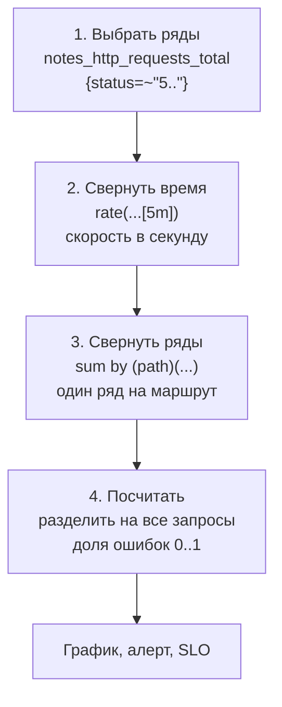
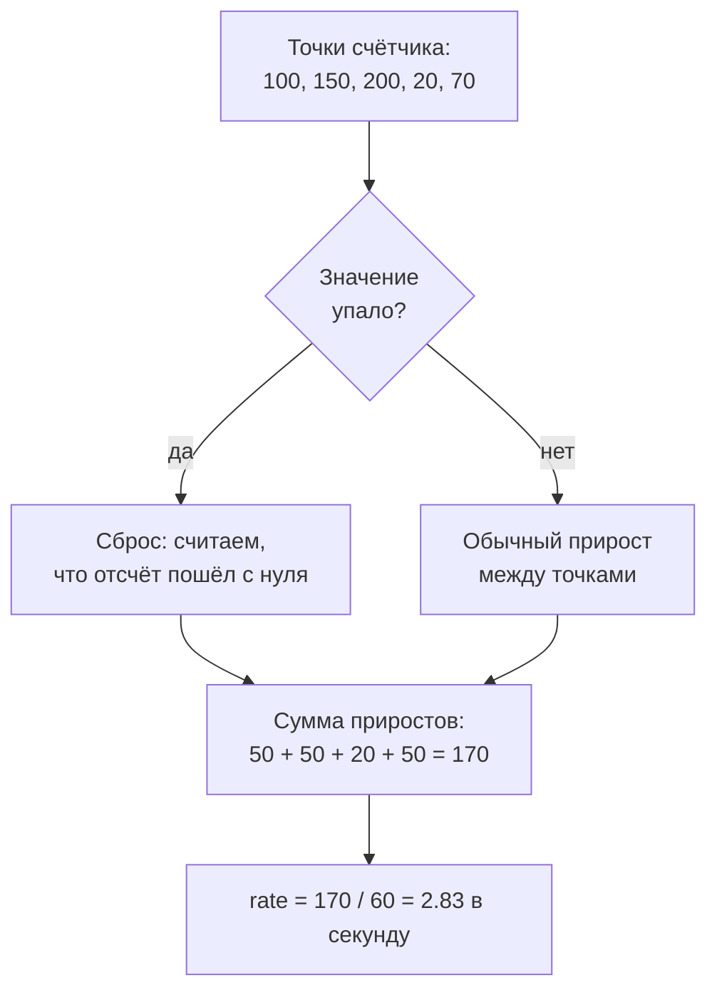

## Зачем это нужно

Prometheus уже собирает метрики «Заметок», но сырые счётчики почти ничего не говорят: `notes_http_requests_total 48213` не отвечает на вопросы «сколько запросов в секунду сейчас» и «какая доля из них падает». Ответ даёт язык запросов PromQL (Prometheus Query Language): это как формулы в электронной таблице, только вместо ячеек временные ряды. Ты пишешь одну строку, и Prometheus считает по своей базе скорость, долю или сумму. Без него в базе лежит гора цифр, из которой нельзя выжать ответ. На нём строятся графики, алерты и расчёт SLO, а на собеседованиях по нему спрашивают чаще всего: `rate`, `sum by`, `histogram_quantile`.

Типичная ошибка новичка: усреднить p95 по нескольким серверам или взять `rate` от датчика и получить красивое, но неверное число. Урок учит считать правильно и заранее видеть такие ловушки.

Шаг проекта: в «Заметках» появляется файл `monitoring/prometheus/rules/notes.rules.yml` с тремя правилами предвычисления (recording rules): скорость запросов, доля ошибок и p95 задержки. Это те самые числа, которые в [8.1](01-observability-slo.md) назывались SLI. Правило предвычисления (recording rule) это формула, которую Prometheus сам пересчитывает раз в минуту и сохраняет как новую метрику, как заготовка в кухне: вместо того чтобы каждый раз резать овощи на салат, повар берёт готовую нарезку. Тяжёлые запросы не считаются заново при каждом открытии дашборда (страницы с графиками, [урок 8.6](06-grafana-dashboards.md)) и проверке алертов (автоматических уведомлений, [урок 8.5](05-alertmanager.md)). Подробно в теории ниже.

## Что нужно знать

- [Урок 8.1: наблюдаемость, SLI и SLO](01-observability-slo.md): откуда берутся «доля ошибок» и «p95» как показатели качества. Доля это число от 0 до 1 (0.05 значит 5%), p95 это время, быстрее которого отвечает 95% запросов.
- [Урок 8.2: Prometheus и /metrics](02-prometheus-basics.md): временной ряд (число, которое меняется со временем, с именем и метками), типы метрик (счётчик counter, датчик gauge, гистограмма histogram), сбор раз в 15 секунд (`scrape_interval`), работающий стенд `monitoring/compose.yml`.
- [Урок 2.4: HTTP](../02-network/04-http.md): коды ответов. `5xx` это ошибки сервера.
- [Урок 1.2: текст и конвейеры](../01-linux/02-text-pipes.md): регулярные выражения (шаблоны для поиска текста, например `5..` это «пятёрка и два любых символа», то есть любой код 5xx) и `jq` (разбор JSON в командной строке).
- Если хочешь разобрать основы на другом стенде, см. [PromQL](../../monitoring/02-metrics/02-promql.md) в курсе «Мониторинг и SRE».

## Картина целиком

Представь таблицу в электронной таблице, в которую Prometheus каждые 15 секунд дописывает новую строку с показаниями. Колонки это временные ряды (по одному на каждое имя метрики с набором меток). Твои вопросы к этой таблице вроде «сколько в среднем прибавлялось в секунду», «сложи все колонки, где статус 500», «раздели одну сумму на другую». PromQL это способ задавать такие вопросы одной строкой.

Любой запрос делается в четыре шага, как конвейер на заводе:



Слева направо запрос становится всё короче: сначала много сырых рядов, затем скорости, затем сумма и в конце одна доля. Шаги нельзя менять местами: `rate` всегда стоит раньше `sum`.

Не каждый запрос использует все четыре шага, но порядок всегда такой: сначала выбрать, потом «свернуть» во времени, потом «свернуть» по рядам, потом сравнить или поделить. Ошибки почти всегда возникают, когда шаги перепутаны местами. В теории ты разберёшь каждый шаг на настоящих числах.

## Теория

### Типы значений: что возвращает запрос

У любого запроса есть тип результата, и от него зависит, что можно с ним делать: нарисовать, сравнить с числом, передать в функцию. Если не понимать типы, будут сыпаться непонятные ошибки.

Таблица из «Картины целиком». **Мгновенный вектор** это одна строка таблицы «на сейчас»: по одному числу на каждую колонку. **Векторный диапазон** это кусок таблицы за последние N минут: по несколько чисел на каждую колонку. **Скаляр** это просто число за пределами таблицы, например `0.05`. Аналогия ломается на слове «вектор»: это не математический вектор, а просто набор рядов.


- Мгновенный вектор (instant vector): по одному значению на каждый временной ряд на текущий момент. Пример: `notes_http_requests_total`. Его можно нарисовать и сравнить с числом.
- Векторный диапазон (range vector): по набору точек за окно времени на каждый ряд. Пример: `notes_http_requests_total[5m]`. Квадратные скобки задают окно (`5m` пять минут, `1h` час, `30s` тридцать секунд). Нарисовать его нельзя: график ждёт по одному числу на момент. Его «сворачивают» функцией (`rate`, `increase`, `avg_over_time`).
- Скаляр (scalar): число, например `24*3600` (секунд в сутках).

Разберём на примере. Допустим, у счётчика `notes_http_requests_total{path="/notes",status="200"}` в последние минуты записаны такие точки (по одной каждые 15 секунд):

```text
время (с):   0     15    30    45    60
значение:   100   130   160   190   220
```

`notes_http_requests_total{path="/notes",status="200"}` даст мгновенный вектор: один ряд со значением 220 (последняя точка). Запрос с `[1m]` вернёт диапазон: четыре точки этого ряда (15, 30, 45, 60 секунд). В Prometheus 3.x окно слева открыто: точка на 0-й секунде в него не входит. Функция `rate(...[1m])` возьмёт прирост по этим точкам (220 - 130 = 90 за 45 секунд) и растянет его на всё окно в 60 секунд (экстраполяция границ), получится 2 запроса в секунду.

> **Прикинь сам:** почему `notes_http_requests_total[5m]` нельзя вывести как график?
{: .predict}

Это range vector: для каждого ряда там несколько точек за 5 минут, а график ждёт одно число на момент времени. Чтобы получить число, диапазон сворачивают функцией: `rate(...[5m])`.

Осторожно, тут часто путают. Что `[5m]` это «за последние 5 минут в сумме». Нет: `[5m]` только выбирает точки за этот период, а что с ними сделать, определяет функция.

> **Главное:** мгновенный вектор это по числу на ряд «сейчас», диапазон это точки за окно, и график рисуют только из первого.
{: .key}

Как выбрать нужные ряды из десятков?

### Селекторы: как выбрать нужные ряды

Метрика содержит десятки рядов с разными метками, а вопрос обычно про часть из них: только ошибки, только один маршрут.

Фильтр в таблице: «показать только строки, где статус начинается с 5».

Ряд однозначно задаётся именем метрики и набором меток (см. [8.2](02-prometheus-basics.md)). Фильтр по меткам пишут в фигурных скобках после имени:

| Запись | Смысл |
|---|---|
| `{path="/notes"}` | метка равна значению |
| `{path!="/notes"}` | не равна |
| `{status=~"5.."}` | подходит под регулярное выражение |
| `{status!~"2.."}` | не подходит под регулярное выражение |

Регулярное выражение (regexp) это шаблон для текста: `.` значит «любой один символ», `|` значит «или». В PromQL регулярка всегда «якорная»: она должна подойти ко **всему** значению, а не к куску. Поэтому `5..` это ровно три символа, первый из них 5 (500, 502, 503), а `5` не найдёт ничего.

```promql
notes_http_requests_total{path="/notes", status=~"5.."}
```

Разберём на примере. Метрика `notes_http_requests_total` имеет ряды: `{GET,/notes,200}`, `{GET,/notes,500}`, `{POST,/notes,201}`, `{GET,/error,500}`, `{GET,other,404}`. Фильтр `{path="/notes", status=~"5.."}` (запятая значит «и») оставит один ряд: `{GET,/notes,500}`. Фильтр `{status=~"5.."}` оставит два: `/notes` и `/error` со статусом 500.

Осторожно, тут часто путают. Что фильтр с опечаткой в метке даст ошибку. Не даст: `{statuss=~"5.."}` синтаксически верен, просто нет ряда с такой меткой, и результат пуст. Пустой результат не значит «ошибок нет», он может значить «запрос неправильный». Об этом мы вернёмся в «Сломай и почини».

> **Главное:** фильтр по меткам в фигурных скобках, регулярка должна подойти ко всему значению, а пустой результат не значит «ошибок нет».
{: .key}

> **Проверь понимание:** какой фильтр выберет все ответы, кроме успешных 2xx?

<details markdown="1">
<summary>Ответ</summary>

`{status!~"2.."}`: значения статуса, не подходящие под шаблон «три символа, начиная с 2». Так попадут 3xx, 4xx и 5xx.

</details>

Теперь научимся превращать счётчик в скорость.

### Counter: rate, irate, increase

Счётчик (counter, [8.2](02-prometheus-basics.md)) только растёт, и его абсолютное значение бесполезно: 48 213 запросов за час или за год? Интересна скорость роста, то есть запросов в секунду. Её считает `rate`.

Одометр в машине. Показание 84 000 км ни о чём не говорит. Но если час назад было 83 940 км, то скорость в среднем 60 км/ч. `rate` делает ровно это: берёт разницу показаний и делит на время.


- `rate(x[5m])`: средняя скорость в секунду за окно. Основная функция для графиков и алертов. Сама обрабатывает сбросы счётчика при перезапуске процесса.
- `irate(x[5m])` (instant rate): скорость по двум последним точкам окна. Резкая, показывает всплеск «прямо сейчас», но шумит и пропускает пики между точками. В алертах не используют.
- `increase(x[1h])`: сколько **прибавилось** за окно. Это `rate`, умноженный на число секунд в окне. Удобно для «сколько ошибок за час».

Окно должно содержать минимум две точки, а на практике четыре и больше: при `scrape_interval: 15s` окно `[15s]` вмещает только одну точку и даёт пустой результат, `[1m]` минимально разумное, `[5m]` стандартное.

**Разбор примера, без сброса.** Точки взяты из прошлого раздела: 100, 130, 160, 190, 220 за 60 секунд. Для простоты считаем по всем пяти точкам, без экстраполяции границ окна (Prometheus 3.x на ровной нагрузке выдаст то же число): `increase(...[1m])` = 220 - 100 = 120. `rate(...[1m])` = 120 / 60 = 2 запроса в секунду. `irate` возьмёт две последние точки: (220 - 190) / 15 = 2, тот же ответ, потому что нагрузка ровная.

Разберём на примере. Сервис перезапустился, и счётчик обнулился:

```text
время (с):   0     15    30    45         60
значение:   100   150   200    20         70
                             ^ рестарт: счётчик снова с нуля
```

Глупая разность даст 70 - 100 = -30. `rate` так не считает: увидев, что значение упало, он решает «это сброс» и прибавляет всё, что накопилось после него. Приросты по интервалам: 50, 50, затем 20 (после сброса счётчик стартовал с нуля и дошёл до 20), затем 50. Итого 170 за 60 секунд, скорость 170 / 60 = 2.83 запроса в секунду. Отрицательной она не бывает.



Схема показывает, как `rate` проходит по точкам окна: падение значения он считает сбросом и не даёт скорости стать отрицательной.

<div class="viz" data-viz="obs-rate" data-window="30"></div>

Меняй окно и смотри, как меняется гладкость графика: короткое окно ловит всплески, длинное сглаживает шум.

> **Прикинь сам:** сервис перезапустился, счётчик упал с 10000 до 3. Что покажет `rate`?
{: .predict}

`rate` видит уменьшение значения как сброс счётчика и считает, что после сброса счётчик начал с нуля. Скорость не станет отрицательной, на графике будет небольшая неточность на границе рестарта.

Осторожно, тут часто путают. Применять `rate` к чему попало. Функция только для счётчиков (и для `_bucket`, `_count`, `_sum` гистограмм, которые тоже счётчики). К датчикам (gauge, например `notes_notes_total`) она даёт числа, но бессмысленные: любое уменьшение будет принято за «сброс». Для датчиков используют `deriv` (скорость изменения) или `delta` (разница). Второе частое заблуждение: что `rate` даёт прирост за окно. Нет, это скорость в секунду, прирост даёт `increase`.

> **Главное:** `rate` даёт скорость в секунду и переживает сбросы, `increase` даёт прирост, а к датчикам эти функции не применяют.
{: .key}

Скорость есть. Как делить и сравнивать ряды?

### Арифметика и сравнения между рядами

Доля ошибок это деление одного числа на другое. Чтобы делить и сравнивать, нужно знать, как PromQL сопоставляет ряды между собой.

Две таблицы с одинаковыми названиями строк: «Москва», «Питер». Делить можно «Москва» из первой на «Москву» из второй. Если названия не совпадают, делить не на что.

Операторы `+ - * /` и сравнения `> < ==` работают над двумя векторами так: ряды слева и справа сопоставляются по **всем меткам**, и операция применяется к парам с одинаковым набором меток. Число (скаляр) применяется к каждому ряду. Сравнение вроде `x > 0.05` не возвращает истину или ложь: оно **оставляет** только ряды, для которых условие выполняется. Именно на этом построены алерты: «есть ряд, значит условие истинно».

Разберём на примере. Доля ошибок:

```promql
sum(rate(notes_http_requests_total{status=~"5.."}[5m]))
/
sum(rate(notes_http_requests_total[5m]))
```

Слева получился один ряд без меток (после `sum`), справа тоже один без меток. Метки совпали, деление возможно. Пусть слева 0.98 (ошибок в секунду), справа 10.83 (запросов в секунду): 0.98 / 10.83 = 0.0905, то есть 9.05% ошибок. Если запросов в этот момент нет, справа 0 и результат `NaN` («не число») или пустой: алерты это учитывают.

Осторожно, тут часто путают. Деление с разными наборами меток. Слева `sum by (path)`, справа просто `sum`: метки не совпадают, результат пуст. Пары должны быть одинаковыми с обеих сторон (`on(...)` и `ignoring(...)` позволяют это обойти, но понадобятся позже).

> **Главное:** ряды сопоставляются по всем меткам, а сравнение оставляет ряды, для которых условие верно.
{: .key}

> **Проверь понимание:** что вернёт `sum(rate(x[5m])) > 100`, если сейчас скорость 40 запросов в секунду?

<details markdown="1">
<summary>Ответ</summary>

Пустой результат: ряд с значением 40 не проходит условие и отбрасывается. Если бы скорость была 150, вернулся бы ряд со значением 150.

</details>

Как свернуть много рядов в нужный срез?

### Агрегации: sum by, without, avg, topk

`rate` возвращает ряд на каждую комбинацию меток: method, path и status. Для «общего RPS» или «RPS по маршрутам» ряды нужно сложить.

Сводка по отделам магазина: каждая касса записала свои продажи, а директору нужна сумма по всему магазину или по каждому отделу. «Сложить всё» это `sum`. «Сложить по отделам» это `sum by (отдел)`.

Основные агрегации: `sum` (сумма), `avg` (среднее), `max`, `min`, `count` (сколько рядов), `topk(N, ...)` (N самых больших). К ним добавляют `by` или `without`:

- `by (метки)` перечисляет метки, которые **остаются**. Остальные отбрасываются, а ряды с одинаковыми оставшимися метками складываются.
- `without (метки)` перечисляет метки, которые **убираются**. Остальные остаются.

```promql
sum(rate(notes_http_requests_total[5m]))                       # общий RPS
sum by (path) (rate(notes_http_requests_total[5m]))            # RPS по маршрутам
sum without (method) (rate(notes_http_requests_total[5m]))     # убрать method, остальное оставить
topk(3, sum by (path) (rate(notes_http_requests_total[5m])))   # три самых нагруженных маршрута
```

Разберём на примере. Допустим, `rate` вернул четыре ряда (запросов в секунду):

| method | path | status | значение |
|---|---|---|---|
| GET | /notes | 200 | 8.0 |
| POST | /notes | 201 | 1.9 |
| GET | /error | 500 | 1.0 |
| GET | other | 404 | 0.2 |

`sum(...)` даст один ряд: 8.0 + 1.9 + 1.0 + 0.2 = 11.1. `sum by (path)` даст три ряда: `/notes` = 8.0 + 1.9 = 9.9, `/error` = 1.0, `other` = 0.2. `topk(1, ...)` из них вернёт `/notes` = 9.9.

**Порядок: сначала rate, потом sum.** Это золотое правило. `rate(sum(counter)[5m:])` (подзапрос, без `:` это даже не пройдёт разбор) ломает обработку сбросов: если один из счётчиков обнулился после рестарта, сумма нескольких счётчиков падает так, как будто это один счётчик с настоящим уменьшением, а `rate` ищет сбросы у **каждого ряда отдельно**. Правильно: `sum(rate(...))`.

> **Прикинь сам:** чем `sum by (path) (...)` отличается от `sum without (method, status) (...)` для нашей метрики?
{: .predict}

Ничем по результату: у метрики три метки (method, path, status), `by (path)` оставляет только path, `without (method, status)` убирает две других и оставляет path. Разница проявится, если метка добавится (например, `instance`): `without` её сохранит, `by` нет.

Осторожно, тут часто путают. `by` и `without` думают одним и тем же, но по-разному. Разница проявляется, когда добавляется новая метка (например, `instance` при втором сервере): `without (method)` её сохранит, `by (path)` выбросит.

> **Главное:** `by` оставляет перечисленные метки, `without` убирает, а порядок всегда «сначала `rate`, потом `sum`».
{: .key}

Как посчитать p95 по корзинам гистограммы?

### Гистограммы и histogram_quantile

В [8.1](01-observability-slo.md) мы решили мерить задержку квантилем (p95), а не средним. Гистограмма из [8.2](02-prometheus-basics.md) хранит не квантили, а количество запросов в каждой корзине. Функция `histogram_quantile` оценивает по корзинам нужный квантиль.

Очередь на кассе, записанная не точным временем каждого человека, а группами: «до 1 минуты 60 человек, до 5 минут 90, до 10 минут 98, всего 100». Точное время каждого потеряно, но по группам можно прикинуть, за сколько минут обслужили 95% очереди.

Ряды гистограммы: `_bucket{le="0.1"}` (сколько запросов не дольше 0.1 с, накопительно), `_count` (всего запросов) и `_sum` (сумма всех длительностей). Для p95:

```promql
histogram_quantile(0.95,
  sum by (le) (rate(notes_http_request_duration_seconds_bucket[5m])))
```

Читается изнутри наружу: `rate` по каждой корзине (скорость попаданий), `sum by (le)` складывает по всем маршрутам и методам, оставляя только границы корзин, `histogram_quantile(0.95, ...)` оценивает 95-й процентиль. Три правила:

1. Внутри `sum by` обязательно остаётся метка `le`: без неё функции нечего интерполировать.
2. Квантиль считается от `rate` по корзинам, а не от сырых счётчиков: иначе получится «за всё время жизни процесса», а не за последние минуты.
3. Квантили нельзя усреднять: среднее двух p95 не равно p95 объединённого трафика. Складывают корзины, а квантиль считают последним шагом.

Разберём на примере. Пусть за окно скорость попаданий в корзины такая (накопительно, для простоты в штуках, а не в запросах в секунду, соотношение то же):

| Корзина `le` | 0.1 | 0.25 | 0.5 | +Inf |
|---|---|---|---|---|
| запросов не дольше | 60 | 90 | 98 | 100 |

Ищем p95. Нужна позиция 0.95 * 100 = 95-го запроса от начала. Она лежит между корзиной 0.25 (там накоплено 90) и 0.5 (накоплено 98). В самой корзине (0.25; 0.5] лежит 98 - 90 = 8 запросов. Нужный запрос 95-й, то есть 95 - 90 = 5-й из этих 8, значит 5/8 = 0.625 пути по корзине. PromQL допускает, что внутри корзины запросы распределены равномерно, поэтому p95 = 0.25 + 0.625 * (0.5 - 0.25) = 0.25 + 0.15625 = 0.40625 секунды. Реальное значение может быть иным, но точно между 0.25 и 0.5.

Средняя длительность считается проще и точно: `rate(..._sum[5m]) / rate(..._count[5m])`.

<div class="viz" data-viz="obs-quantile" data-slow="5" data-q="95"></div>

Жёлтая корзина первой пересекает линию «искомый запрос»: внутри неё PromQL и интерполирует ответ. Разница между оценкой и настоящим значением и есть погрешность корзин.

Осторожно, тут часто путают. Точность p95 ограничена границами корзин. Результат «0.406» не говорит, что 95% запросов быстрее 406 мс: только что где-то между 250 и 500 мс. Поэтому границы корзин планируют под свои пороги SLO. Второе: если самые долгие запросы дольше верхней границы (10 секунд), они падают в `+Inf`, и квантиль не может быть больше последней границы.

> **Главное:** p95 считают из `sum by (le)` над `rate` корзин, точность ограничена границами корзин, а квантили не усредняют.
{: .key}

> **Проверь понимание:** зачем `sum by (le)` внутри, если метрика с одним инстансом?

<details markdown="1">
<summary>Ответ</summary>

Без `sum` останутся ряды по `method` и `path`, и квантиль посчитается отдельно для каждой пары. Нам нужен общий p95, поэтому все метки, кроме `le`, схлопываем.

</details>

Теперь соберём SLI из урока 8.1 на PromQL.

### SLI из урока 8.1 на языке PromQL

Всё, что мы изучили, нужно, чтобы посчитать SLI: «доля хороших запросов» из [8.1](01-observability-slo.md). Здесь этот переход делается явно.


- **Доступность** (доля запросов без 5xx): `1 - (доля ошибок)`, то есть
  `1 - sum(rate(notes_http_requests_total{status=~"5.."}[5m])) / sum(rate(notes_http_requests_total[5m]))`.
- **Задержка** (доля запросов быстрее порога): корзина `le="0.5"` делить на общее число, то есть
  `sum(rate(notes_http_request_duration_seconds_bucket{le="0.5"}[5m])) / sum(rate(notes_http_request_duration_seconds_count[5m]))`.

В [8.1](01-observability-slo.md) порог задержки был 300 мс, но в наших корзинах ([8.2](02-prometheus-basics.md)) такой границы нет: есть 0.25 и 0.5. Считать «быстрее 300 мс» по корзинам нельзя, поэтому для SLI берут ближайшую границу. Мы возьмём 0.5 (500 мс) и договоримся, что это и есть наш порог. Этот приём («порог SLO должен лежать на границе корзины») запомни: без него SLI будет приблизительным.

Разберём на примере. За окно `sum(rate(..._bucket{le="0.5"}[5m]))` = 10.6, а `sum(rate(..._count[5m]))` = 11.1. Доля быстрых = 10.6 / 11.1 = 0.955, то есть 95.5%. Если цель 95%, SLO выполняется.

> **Прикинь сам:** `_bucket{le="0.25"}` растёт на 8 в секунду, `_count` растёт на 10 в секунду. Какая доля запросов быстрее 250 мс?
{: .predict}

8 / 10 = 0.8, то есть 80%.

Осторожно, тут часто путают. Что для SLI задержки нужен `histogram_quantile`. Нет: для доли «быстрее порога» нужно только поделить две скорости, это точнее, чем оценка квантиля по корзинам. Квантиль удобен для графика, доля для SLO.

> **Главное:** доступность это один минус доля 5xx, задержка это корзина `le` делить на `_count`, а порог лежит на границе корзины.
{: .key}

Что ещё пригодится в работе?

### Полезные функции: offset, predict_linear, absent

Кроме `rate` и агрегаций, в работе часто нужны три вещи: сравнить с прошлым, прогнозировать и поймать пропажу метрики.


- `offset 1h` сдвигает выбор назад во времени: «значение час назад». Сравнение «сейчас против вчера»: `sum(rate(x[5m])) / sum(rate(x[5m] offset 1d))`.
- `predict_linear(v[6h], 24*3600)` продолжает линию тренда датчика на 24 часа вперёд. Классика: диск закончится за сутки?
- `absent(up{job="notes"})` возвращает 1, если такого ряда нет вообще. Ловит «метрика пропала», а не «метрика плохая»: вспомни staleness из [8.2](02-prometheus-basics.md).
- `on(...)`, `ignoring(...)` и `group_left` нужны для операций между рядами с разными метками. Здесь достаточно знать, что они существуют; понадобятся в [8.9](09-k8s-monitoring.md).

**Разбор примера, `predict_linear`.** Свободного места на диске 30 ГБ шесть часов назад и 24 ГБ сейчас. Тренд: минус 6 ГБ за 6 часов, то есть 1 ГБ в час. Через 24 часа при том же темпе: 24 - 24 * 1 = 0 ГБ. Прогноз близок к нулю, значит диск закончится примерно через сутки: пора реагировать. Простой порог «занято 70%» так не сработает.

Осторожно, тут часто путают. Что `predict_linear` знает будущее. Он проводит прямую по последним точкам: разовый скачок (скачали и удалили большой файл) исказит прогноз, поэтому окно берут побольше и в алертах добавляют `for`.

> **Главное:** `offset` сравнивает с прошлым, `predict_linear` прогнозирует тренд, `absent` ловит пропавшую метрику.
{: .key}

> **Проверь понимание:** что вернёт `absent(up{job="nonexistent"})`, если такой задачи нет?

<details markdown="1">
<summary>Ответ</summary>

Ряд со значением 1: рядов `up` с таким `job` нет, `absent` сообщает об этом. Если бы такой ряд был, вернулся бы пустой результат.

</details>

Тяжёлые запросы лучше считать заранее.

### Recording rules: предвычисление

Сложный запрос (например, p95 по гистограмме) на каждом обновлении дашборда и в каждом алерте заставляет Prometheus пересчитывать тысячи рядов. Выгоднее один раз считать его в фоне и сохранять результат как новую метрику.

Итоговая строка в отчёте бухгалтера. Каждый раз пересчитывать сумму по тысяче строк дорого. Бухгалтер один раз считает итог и записывает.

Правила лежат в YAML-файле, который Prometheus читает из ключа `rule_files` в `prometheus.yml`. Внутри группа правил (`groups`) с интервалом `interval`, в ней список `record` (имя новой метрики) и `expr` (запрос). Раз в интервал Prometheus вычисляет `expr` и записывает результат как обычный ряд.

Имя по договорённости пишут как `уровень:метрика:операция`: `notes:http_requests:rate5m` (уровень «notes», метрика «http_requests», операция «rate за 5 минут»). Двоеточия в именах зарезервированы для recording rules, обычные метрики их не содержат: по имени сразу видно, что метрика вычисленная.

Разберём на примере. Без правила каждый алерт и каждый график p95 выполняет `histogram_quantile(0.95, sum by (le) (rate(...[5m])))`. С правилом `notes:http_latency:p95_5m` они просто читают готовый ряд: `notes:http_latency:p95_5m > 0.5`. Нагрузка на Prometheus падает, а запрос в алерте становится читаемым.

> **Прикинь сам:** почему в имени правила есть двоеточия, а у обычных метрик их не бывает?
{: .predict}

Двоеточие зарезервировано для recording rules: по имени сразу видно, что метрика вычисленная, а не собранная с целевого сервиса. Экспортеры двоеточий в именах не используют.

Осторожно, тут часто путают. Что recording rule это то же самое, что алерт. Нет: правило только сохраняет число, а алерт это условие, по которому кому-то отправляют сообщение (это [8.5](05-alertmanager.md)). Ещё путают время: новое правило вычисляется раз в интервал, поэтому первое значение появится не мгновенно, а в течение интервала.

> **Главное:** recording rule сохраняет результат запроса как новую метрику с именем `уровень:метрика:операция`, но алертом не является.
{: .key}

Что делать, если запрос вернул пусто?

### Пустой результат: как искать причину

Чаще всего в PromQL «ломается» не синтаксис (о нём Prometheus честно скажет), а смысл: запрос выполняется, но возвращает пусто. Нужна последовательность проверки.

Идёшь от простого к сложному, добавляя по одному элементу:

1. Голая метрика без фильтров: `notes_http_requests_total`. Пусто? Проблема в сборе: проверь `up{job="notes"}` (см. [8.2](02-prometheus-basics.md)).
2. Добавь фильтр по одной метке и посмотри значения меток реальных рядов (в интерфейсе автодополнение, через API `/api/v1/series`).
3. Добавь `rate` с окном `[1m]` или больше. Пустое при окне `[15s]` значит, что в окне меньше двух точек.
4. Добавь агрегацию.

Разберём на примере. Запрос `sum(rate(notes_http_requests_total{statuss=~"5.."}[5m]))` вернул пусто. Идём с конца: убираем `sum`, всё ещё пусто; убираем `rate`, пусто; убираем фильтр, ряды есть. Значит, проблема в фильтре: у рядов метка называется `status`, а не `statuss`.

Осторожно, тут часто путают. Что пусто значит «ошибок нет». Для алерта это особенно опасно: он молчит, а причина в опечатке. Поэтому новый запрос всегда проверяют на заведомо ненулевых данных.

> **Главное:** при пустом результате идут от голой метрики к сложному запросу по одному элементу, а пусто не значит «всё хорошо».
{: .key}

> **Проверь понимание:** запрос с `rate(...[15s])` при `scrape_interval: 15s` возвращает пусто. Почему?

<details markdown="1">
<summary>Ответ</summary>

В окно 15 секунд попадает одна точка, а для скорости нужны минимум две (разность и время между ними). Окно должно быть не меньше четырёх интервалов сбора, то есть `[1m]`.

</details>

## Практика

Нужен Docker и `~/notes` из тем 4 и 8.2, а также `jq` ([урок 1.2](../01-linux/02-text-pipes.md)); если её нет: `sudo apt install jq`. Стенд из урока 8.2 запущен: основной `compose.yml` «Заметок» и `monitoring/compose.yml`. Запросы можно вводить в веб-интерфейсе Prometheus `http://localhost:9090/graph` (вкладка Table). Для проверки из терминала используем HTTP API.

Небольшая функция для терминала, чтобы не набирать длинные curl (вставь в текущую сессию). Разбор: `curl -s` тихо обращается к HTTP API Prometheus, `--data-urlencode` сам экранирует спецсимволы запроса, `jq -r` достаёт из ответа ряды и печатает каждый строкой «метки => значение»:

```bash
# q "<запрос>" печатает ряды в виде "метки => значение"
q() {
  curl -s http://localhost:9090/api/v1/query --data-urlencode "query=$1" \
    | jq -r '.data.result[] | "\(.metric | tostring) => \(.value[1])"'
}
```

### Задание 1. Нагрузка и RPS

**Цель:** создать трафик и увидеть, как `rate` превращает счётчик в скорость.

**Предскажи:** запускаем цикл, который делает примерно 10 запросов в секунду к `/notes`. Какое значение покажет `sum(rate(notes_http_requests_total[1m]))` через минуту: около 10, около 600 или около 0.1?

<details markdown="1">
<summary>Ответ</summary>

Около 10. `rate` считает скорость в секунду, а не прирост за окно. Число 600 показал бы `increase(...[1m])`.

</details>

**Шаги:**

1. Запусти нагрузку в отдельном терминале (остановка Ctrl+C):

```bash
# ~10 запросов в секунду к /notes и по одному 500 в секунду к /error
while true; do
  for i in $(seq 10); do curl -sk -o /dev/null https://notes.lab/notes; done
  curl -sk -o /dev/null https://notes.lab/error
  sleep 1
done
```

   Разбор цикла: `while true; do ... done` повторяет тело бесконечно, `seq 10` даёт числа от 1 до 10, поэтому `curl` вызывается десять раз, `-o /dev/null` выбрасывает тело ответа, `sleep 1` ждёт секунду ([урок 1.6](../01-linux/06-bash-basics.md)).

2. Через 1-2 минуты спроси Prometheus:

```bash
q 'sum(rate(notes_http_requests_total[1m]))'
q 'sum by (path) (rate(notes_http_requests_total[1m]))'
q 'increase(notes_http_requests_total{path="/notes"}[1m])'
```

**Что должно получиться:** значения примерно такие (в твоём прогоне будут отличаться на 10-20%; числа ориентировочные, автор их считал по теории, а не с твоего стенда).

```text
{} => 10.83
{"path":"/notes"} => 9.9
{"path":"/error"} => 0.98
{"path":"/notes","method":"GET","status":"200"} => 590.2
```

**Как читать вывод:** каждая строка это один ряд результата. `{}` значит «меток нет»: `sum` без `by` свернул всё в одно число, сумма примерно 10 обычных запросов и одного `/error` в секунду. Второй запрос сохранил метку `path`, поэтому рядов два. Третий это `increase`: не скорость, а прирост за минуту, 10 запросов в секунду за 60 секунд дают около 600.

**Объясни себе:**
- Почему у первого запроса пустые фигурные скобки, а у второго метка `path`?
- Чем `increase` отличается от `rate` и почему число в третьем запросе примерно в 60 раз больше?
- Что случится с результатом, если остановить цикл и подождать минуту?

**Типичные ошибки:**
- `parse error: unexpected character` или `bad_data` в ответе: не закрыта скобка или кавычка; сверь пары `(` и `)`.
- Пустой результат `[]`: нагрузка ещё не дошла или Prometheus не собрал две точки в окне; подожди минуту, проверь в Status - Targets, что `notes` в состоянии UP.
- `curl: (7) Failed to connect to notes.lab port 443` или `Could not resolve host: notes.lab`: стек не запущен (проверь `docker compose ps` в каталоге `~/notes`) или в `/etc/hosts` нет строки `127.0.0.1 notes.lab`. Порт 8080 после урока 4.6 наружу не опубликован, ходи через прокси.

### Задание 2. Доля ошибок и p95

**Цель:** посчитать два главных показателя из SLI урока 8.1: долю 5xx и 95-й перцентиль задержки.

**Предскажи:** цикл выше отправляет 1 запрос из 11 на `/error`, который отвечает 500. Какая примерно доля ошибок: 0.09, 0.5 или 9?

<details markdown="1">
<summary>Ответ</summary>

Около 0.09 (9%). Доля это число от 0 до 1, а не проценты. Чтобы получить проценты, умножь на 100.

</details>

**Шаги:**

1. Доля ошибок общая и по маршрутам:

```bash
q 'sum(rate(notes_http_requests_total{status=~"5.."}[5m])) / sum(rate(notes_http_requests_total[5m]))'
q 'sum by (path) (rate(notes_http_requests_total{status=~"5.."}[5m])) / sum by (path) (rate(notes_http_requests_total[5m]))'
```

2. p95 по всему сервису и отдельно для `/notes`:

```bash
q 'histogram_quantile(0.95, sum by (le) (rate(notes_http_request_duration_seconds_bucket[5m])))'
q 'histogram_quantile(0.95, sum by (le) (rate(notes_http_request_duration_seconds_bucket{path="/notes"}[5m])))'
```

3. Доля запросов быстрее порога 0.5 секунды. Порог из [8.1](01-observability-slo.md) был 300 мс, но у нашей гистограммы нет корзины 0.3 (границы см. в [8.2](02-prometheus-basics.md)), поэтому для SLI берём ближайшую границу `le="0.5"`:

```bash
q 'sum(rate(notes_http_request_duration_seconds_bucket{le="0.5"}[5m])) / sum(rate(notes_http_request_duration_seconds_count[5m]))'
```

4. Средняя длительность для сравнения:

```bash
q 'sum(rate(notes_http_request_duration_seconds_sum[5m])) / sum(rate(notes_http_request_duration_seconds_count[5m]))'
```

**Что должно получиться:**

```text
{} => 0.0904
{"path":"/error"} => 1
{} => 0.0475
{} => 0.0246
{} => 1
{} => 0.0061
```

Второй запрос вернёт только те `path`, где есть ошибки, а `/notes` без ошибок не появится совсем. p95 будет в пределах корзин 0.005-0.25 секунды. Долю быстрее 0.5 с ожидаем около 1, если в нагрузке нет медленных запросов. Числа ориентировочные.

**Как читать вывод:** первая строка доля ошибок (0.09 это 9%). Вторая: по маршрутам, у `/error` доля 1 (все его ответы 5xx). Далее p95 по сервису и по `/notes`, доля быстрых, средняя длительность. Средняя (последняя) намного меньше p95: несколько медленных запросов поднимают p95, но почти не двигают среднее, поэтому в SLO используют квантили ([8.1](01-observability-slo.md)).

**Объясни себе:**
- Почему p95 заметно больше средней длительности?
- Почему в результате p95 значение попадает «в корзину», а не точное?
- Что покажет запрос доли ошибок, если сервис простаивает и запросов нет?

**Типичные ошибки:**
- `execution: many-to-many matching not allowed: matching labels must be unique on one side`: с одной стороны деления несколько рядов с одинаковым набором сопоставляемых меток (типично при `on(...)` или `ignoring(...)`); оставь по одному ряду на набор, например добавь одинаковый `sum by (...)` в числитель и знаменатель. Если же наборы меток просто разные, ошибки не будет, результат пуст.
- p95 равен `NaN`: в окне нет ни одного запроса; проверь, что нагрузка идёт.
- Значение p95 огромное или странное: потерян `le` в `sum by`, см. раздел «Сломай и почини».

### Задание 3. USE хоста и прогноз диска

**Цель:** применить `rate` к метрикам node_exporter и `predict_linear` к gauge.

**Предскажи:** `node_cpu_seconds_total{mode="idle"}` это счётчик секунд простоя каждого ядра. Что покажет `1 - avg(rate(node_cpu_seconds_total{mode="idle"}[5m]))` на простаивающей машине: около 0, около 1 или около 100?

<details markdown="1">
<summary>Ответ</summary>

Около 0. `rate` от простоя примерно 1 секунда в секунду на ядро (ядро всё время бездельничает), `avg` по ядрам даёт около 1, `1 - 1 = 0`. Значение это доля занятого CPU от 0 до 1.

</details>

**Шаги:**

```bash
# загрузка CPU, доля от 0 до 1
q '1 - avg(rate(node_cpu_seconds_total{mode="idle"}[5m]))'

# доступная память, доля
q 'node_memory_MemAvailable_bytes / node_memory_MemTotal_bytes'

# трафик сети на всех интерфейсах кроме lo, байт/с
q 'sum(rate(node_network_receive_bytes_total{device!="lo"}[5m]))'

# сколько байт будет свободно на корне через 24 часа (отрицательное значение = закончится)
q 'predict_linear(node_filesystem_avail_bytes{mountpoint="/"}[6h], 24*3600)'
```

**Что должно получиться:** четыре ряда с числами; для CPU и памяти значения от 0 до 1.

```text
{} => 0.043
{} => 0.71
{} => 18234.5
{"device":"/dev/vda1","fstype":"ext4","mountpoint":"/"} => 31283798016
```

**Объясни себе:**
- Почему для памяти нет `rate`, а для CPU есть?
- Какие данные нужны `predict_linear`, чтобы прогноз был осмысленным, и почему окно `[6h]` не годится сразу после запуска стенда?
- Что произойдёт с прогнозом, если вчера скачали большой файл и удалили?

**Типичные ошибки:**
- Пустой результат для `node_filesystem_avail_bytes{mountpoint="/"}`: node_exporter в контейнере видит корень как `/rootfs` или свой mountpoint; выведи `q 'node_filesystem_avail_bytes'` и подставь реальное значение метки.
- `rate` от gauge (`rate(node_memory_MemAvailable_bytes[5m])`) даёт значения, но они бессмысленны: PromQL не запрещает, и Prometheus это не подсвечивает; смотри на тип метрики в `# TYPE`.

### Задание 4. Recording rules для «Заметок»

**Цель:** вынести три главных запроса в recording rules и проверить их. Это шаг сквозного проекта.

**Предскажи:** после перезагрузки конфигурации новая метрика `notes:http_errors:ratio5m` появится сразу или через минуту?

<details markdown="1">
<summary>Ответ</summary>

Не сразу: правило вычисляется раз в `evaluation_interval` (по умолчанию 1 минута; может быть 15s, как настроено в `prometheus.yml`), поэтому первое значение появится в течение этого интервала.

</details>

**Шаги:**

1. Создай файл `~/notes/monitoring/prometheus/rules/notes.rules.yml`:

```yaml
groups:
  - name: notes-recording
    interval: 15s
    rules:
      # RPS сервиса
      - record: notes:http_requests:rate5m
        expr: sum(rate(notes_http_requests_total[5m]))

      # доля ответов 5xx (0..1)
      - record: notes:http_errors:ratio5m
        expr: |
          sum(rate(notes_http_requests_total{status=~"5.."}[5m]))
          /
          sum(rate(notes_http_requests_total[5m]))

      # p95 задержки, секунды
      - record: notes:http_latency:p95_5m
        expr: |
          histogram_quantile(0.95,
            sum by (le) (rate(notes_http_request_duration_seconds_bucket[5m])))
```

2. Проверь синтаксис утилитой `promtool` из образа Prometheus (версия та же, что в стенде):

```bash
cd ~/notes/monitoring
docker run --rm -v "$PWD/prometheus/rules:/rules:ro" --entrypoint promtool \
  prom/prometheus:v3.15.0 check rules /rules/notes.rules.yml
```

3. Подключи правила. Каталог `monitoring/prometheus` уже смонтирован в контейнер целиком (строка `./prometheus:/etc/prometheus:ro` в `monitoring/compose.yml`), поэтому подкаталог `rules` виден внутри как `/etc/prometheus/rules`. Осталось сказать Prometheus, где искать правила: добавь в `monitoring/prometheus/prometheus.yml` на верхнем уровне, рядом с `global:` и `scrape_configs:`, ключ (в YAML без отступа):

   ```yaml
   rule_files:
     - /etc/prometheus/rules/*.yml
   ```

   Проверь весь конфиг, перезапусти Prometheus и посмотри правила. `docker compose restart` перезапускает контейнер, `sleep 30` даёт время на первый расчёт, `/api/v1/rules` показывает состояние правил:

   ```bash
   cd ~/notes/monitoring
   docker run --rm -v "$PWD/prometheus:/etc/prometheus:ro" --entrypoint promtool \
     prom/prometheus:v3.15.0 check config /etc/prometheus/prometheus.yml
   docker compose -f compose.yml restart prometheus
   sleep 30
   curl -s 'http://localhost:9090/api/v1/query?query=notes:http_errors:ratio5m' | jq '.data.result'
   curl -s http://localhost:9090/api/v1/rules | jq -r '.data.groups[].rules[] | "\(.name) \(.health)"'
   ```

4. Зафиксируй шаг в репозитории:

```bash
cd ~/notes
git add monitoring/prometheus/rules/notes.rules.yml
git commit -m "8.3: recording rules RPS, ошибки, p95"
```

**Что должно получиться:**

```text
Checking /rules/notes.rules.yml
  SUCCESS: 3 rules found

notes:http_requests:rate5m ok
notes:http_errors:ratio5m ok
notes:http_latency:p95_5m ok
```

**Как читать вывод:** `promtool` нашёл 3 правила без ошибок. Последние три строки: имя правила и здоровье (`health`): `ok` значит, что запрос выполнился без ошибки. Важно: `ok` не значит, что результат непустой (см. «Сломай и почини»). Вывод `check config` начинается с `SUCCESS` (в нём же `promtool` проверяет и файлы правил, на которые ссылается `rule_files`).

**Объясни себе:**
- Зачем `interval: 15s` на группе, и что будет, если поставить значение больше окна `[5m]`?
- Почему recording rule для p95 сохраняет уже готовое число, а не корзины?
- Что удобнее в алерте: полное выражение или `notes:http_errors:ratio5m > 0.05`?

**Типичные ошибки:**
- `FAILED: ... yaml: line 9: mapping values are not allowed in this context`: сломан отступ; в YAML только пробелы, выражение с переносом пиши через `|`.
- `group "notes-recording", rule 0, "notes:http_requests:rate5m": could not parse expression`: опечатка в PromQL; проверь скобки.
- Метрика не появляется, а `rules` пуст: Prometheus не видит файл; проверь монтирование тома и `rule_files`, затем `docker compose logs prometheus | tail`.

## Сломай и почини

Скрипт правит только файл правил `~/notes/monitoring/prometheus/rules/notes.rules.yml` из задания 4: одно из трёх правил после его запуска считает неправильно. Исходный файл скрипт сохраняет рядом (`.before-break`), `fix` его возвращает. Читать скрипт не нужно, диагностика и есть упражнение. Запускай без `sudo`. Нагрузку из задания 1 держи включённой.

```bash
curl -fsSL -o /tmp/break-8.3.sh https://raw.githubusercontent.com/distinguished-sre/learning/main/devops/project/notes/break/8.3/break.sh
bash /tmp/break-8.3.sh 1
```

Сценарии `1`, `2`, `3` проходи по одному: запусти, подожди минуту (правила считаются раз в 15 секунд), найди причину, потом `bash /tmp/break-8.3.sh fix` и следующий. В конце `rm /tmp/break-8.3.sh`. Если проект не в `~/notes`: `NOTES_DIR=/путь bash /tmp/break-8.3.sh 1`.

### Симптом

Запрос `notes:http_requests:rate5m`, `notes:http_errors:ratio5m` или `notes:http_latency:p95_5m` возвращает пустой результат, хотя нагрузка идёт и `up{job="notes"}` равен 1. Правило одно из трёх, в разных сценариях разное. `/api/v1/rules` при этом показывает `health` равным `ok`: пустой результат не считается ошибкой.

### Гипотезы

1. В запросе потеряна метка `le` в `sum by`, и `histogram_quantile` нечего считать.
2. Окно `rate` слишком короткое для `scrape_interval: 15s`.
3. Опечатка в имени метки или значении фильтра: ряды не находятся.
4. Prometheus вообще не собирает `notes` (проверь как в 8.2).

### Проверки

```bash
# сначала исключаем сбор: цель должна быть UP
q 'up{job="notes"}'

# какие правила пустые
for r in notes:http_requests:rate5m notes:http_errors:ratio5m notes:http_latency:p95_5m; do echo "== $r"; q "$r"; done

# смотрим текст правил, которые сейчас загружены
curl -s http://localhost:9090/api/v1/rules | jq -r '.data.groups[].rules[] | .name, .query'

# какие метки реально есть у метрики
curl -s http://localhost:9090/api/v1/series --data-urlencode 'match[]=notes_http_requests_total' | jq '.data[0]'
```

Найди пустое правило, прочти его запрос и сверь с тем, что ты писал в задании 4. Выполни куски запроса руками в `q`, добавляя по одному элементу: голая метрика, фильтр, `rate`, агрегация.

### Исправление

<details markdown="1">
<summary>Разбор сценариев</summary>

**Сценарий 1: `histogram_quantile` без `le`.**
У p95 в правиле вместо `sum by (le) (...)` стоит просто `sum (...)`: схлопнуты и корзины. Функция не находит метку `le` и ничего не возвращает. Исправление: вернуть `sum by (le)`. Для среза по маршруту `sum by (le, path)`.

**Сценарий 2: `rate` на окне `[15s]`.**
В правиле RPS окно 15 секунд при сборе раз в 15 секунд: в окне почти всегда меньше двух точек, а для `rate` их нужно минимум две, результат пуст. Правило: окно не меньше четырёх интервалов сбора, то есть `[1m]`, а в имени `rate5m` окно `[5m]`.

**Сценарий 3: опечатка в метке.**
В правиле доли ошибок фильтр `{statuss=~"5.."}`: такой метки нет ни у одного ряда. Запрос верный по синтаксису, поэтому ошибки нет, но и рядов нет. Проверка: `/api/v1/series` показывает настоящие имена меток.

Откат:

```bash
bash /tmp/break-8.3.sh fix
```

Общее правило диагностики пустого результата: убрать все фильтры, дойти до голой метрики, добавлять элементы по одному.

</details>

## ИИ в помощь

Общие правила работы с ИИ-помощником собраны на странице [«ИИ-помощник»](../../load-tester/ai.md), здесь только сценарии этой темы.

**Задача:** составить запрос для доли ошибок и объяснить его по частям.

```text
Метрика notes_http_requests_total с метками method, path, status. Напиши PromQL-запрос доли ответов 5xx за 5 минут по всему сервису и отдельно по маршрутам. Объясни каждую часть: rate, sum, by, деление.
```
{: .wrap}

**Проверь ответ:** сначала `rate`, потом `sum`, с обеих сторон деления одинаковые метки. Типичная ошибка нейросетей: `rate(sum(...)[5m:])` или `sum by (path)` слева и просто `sum` справа.

**Задача:** найти, почему запрос вернул пусто.

```text
Запрос sum(rate(notes_http_requests_total{statuss=~"5.."}[15s])) ничего не возвращает, хотя ошибки есть. Scrape_interval 15 секунд. Назови все возможные причины по порядку проверки.
```
{: .wrap}

**Проверь ответ:** в списке должны быть опечатка в имени метки и слишком короткое окно (меньше двух точек). Нейросети часто винят «нет данных» и пропускают окно `[15s]`.

**Задача:** посчитать p95 из корзин гистограммы.

```text
У меня корзины le: 0.1 -> 60, 0.25 -> 90, 0.5 -> 98, +Inf -> 100. Посчитай p95 так, как это делает histogram_quantile, покажи шаги и скажи, насколько результат точен.
```
{: .wrap}

**Проверь ответ:** сверь с ручным расчётом: 95-й запрос лежит в корзине (0.25; 0.5], ответ около 0.406. Типичная ошибка: брать среднее границ корзин или забыть, что результат лишь оценка внутри корзины.

## Словарик

- **PromQL**: язык запросов Prometheus.
- **Instant vector / range vector**: значения рядов «на сейчас» / за окно времени.
- **Селектор**: имя метрики плюс фильтр по меткам в `{}`.
- **`rate`**: средняя скорость роста счётчика в секунду за окно.
- **Агрегация**: свёртка нескольких рядов в один (`sum`, `avg`, `max`, `topk`).
- **`by` / `without`**: какие метки оставить / убрать при агрегации.
- **Квантиль, p95**: время, быстрее которого отвечает заданная доля запросов.
- **Recording rule**: правило, которое сохраняет результат запроса как новую метрику.

## Вопросы с собеседований
Раздел для повторения: ответь вслух, потом открой ответ. Вопросы с пометкой «часто» задают почти на каждом собеседовании по теме урока: начни с них.



## Проверено на версиях

- Prometheus: v3.15.0 (в том числе `promtool`)
- node_exporter: v1.12.1
- cAdvisor: v0.60.6
- Python-приложение «Заметки»: v5, образ 0.5.0

Что проверено командами: `promtool check rules` на `prom/prometheus:v3.15.0` (3 rules found), логика правок сценариев на копии файла правил. Что не запускалось: запросы заданий 1-3 на живом стенде, поэтому числа в выводе ориентировочные; `break.sh` проверен `shellcheck` и чтением, но не запускался.

## Итог урока: ты умеешь

- [ ] отличать instant vector, range vector и скаляр и знать, какая функция их сворачивает
- [ ] считать RPS через `sum(rate(...[5m]))` и понимать, чем `rate` отличается от `irate` и `increase`
- [ ] считать долю ошибок и срез по `path` с одинаковой агрегацией в числителе и знаменателе
- [ ] считать p95 через `histogram_quantile` с `sum by (le)` и объяснять ограничения точности
- [ ] использовать `predict_linear`, `offset` и `absent` для прогнозов и сравнений
- [ ] написать и проверить recording rules через `promtool check rules`
- [ ] по пустому результату находить причину: окно, опечатка в метке, сбор

**Дальше:** [Урок 8.4: Проверки снаружи: blackbox и exporters](04-blackbox-exporters.md)
