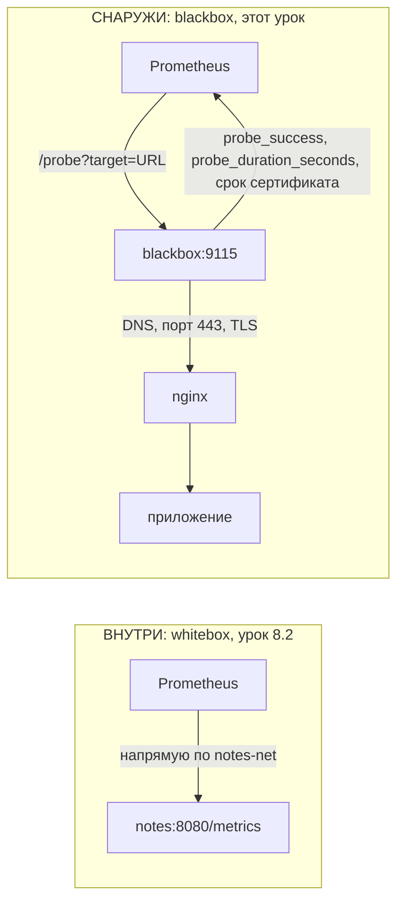
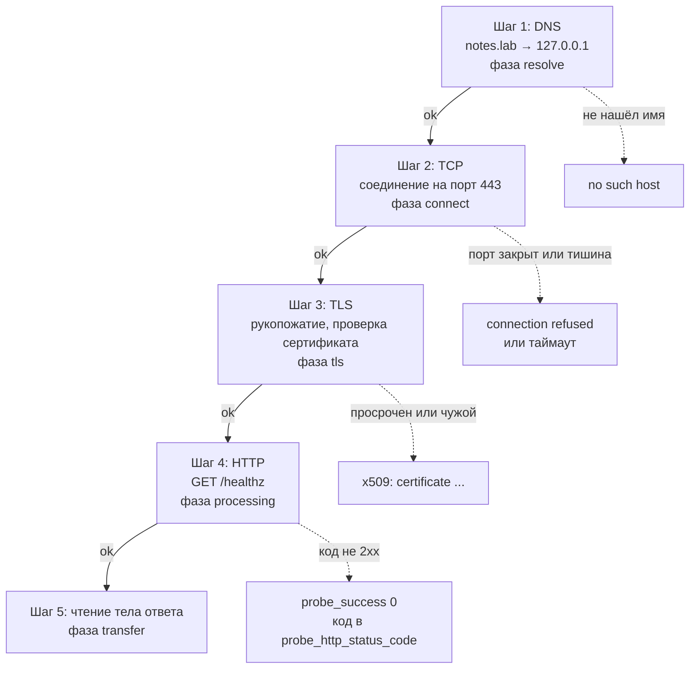
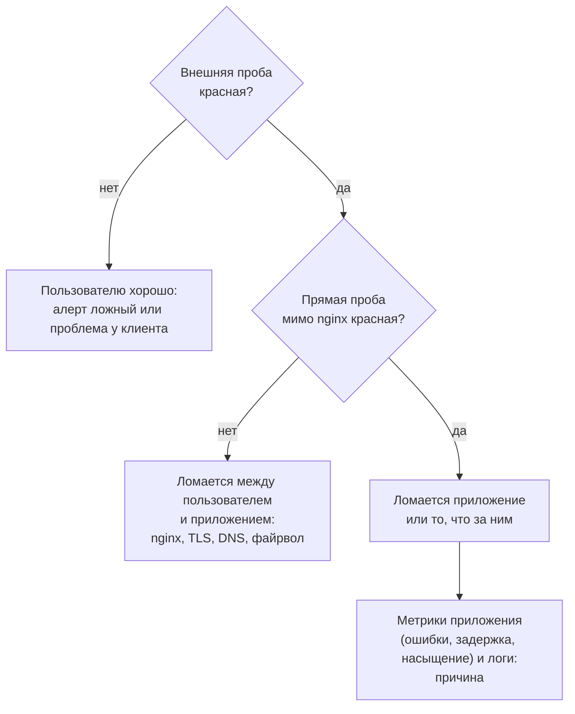

## Зачем это нужно

Приложение может честно показывать `notes_http_requests_total` и `up == 1`, а пользователь при этом видит ошибку: истёк сертификат (цифровой документ, которым сайт доказывает, что он настоящий, [урок 2.6](../02-network/06-tls.md)), не стартовал nginx (веб-сервер перед приложением, [урок 2.5](../02-network/05-nginx.md)), DNS указывает не туда (DNS это «телефонная книга», которая превращает имя сайта в адрес, [урок 2.3](../02-network/03-dns.md)), порт закрыт файрволом (программный «охранник», который пропускает соединения только на разрешённые порты, [урок 2.7](../02-network/07-firewall.md)). Метрики из `/metrics` ([8.2](02-prometheus-basics.md)) это взгляд изнутри. Проверка снаружи (blackbox monitoring, «чёрный ящик»: мы не знаем, что внутри, и смотрим только на результат) делает то же, что пользователь: находит адрес по имени, открывает соединение, проходит TLS, отправляет HTTP-запрос и смотрит на ответ.

На работе это первый алерт, который срабатывает при настоящей аварии, и единственный, который ловит «всё зелёное, а сайта нет». Ещё нужно уметь брать метрики у программ, которые сами не умеют `/metrics`: для этого служат exporters (экспортёры), маленькие программы-переводчики, как уже знакомые тебе node_exporter и cAdvisor из [урока 8.2](02-prometheus-basics.md).

Шаг проекта: в `monitoring/` появляется blackbox_exporter на порту 9115 с тремя модулями, а Prometheus начинает проверять `https://notes.lab` снаружи. blackbox_exporter это программа-«тайный покупатель»: по команде Prometheus она ходит по адресу как обычный посетитель и сообщает, получилось ли и за сколько. Порт 9115 это номер «окошка», в которое к ней обращаются (порты разбирались в [уроке 2.2](../02-network/02-ports-tcp-ssh.md)). Модуль это заготовка правил проверки («считай успехом только ответ 2xx, требуй TLS»). Подробно разберём в теории.

## Что нужно знать

- [Урок 8.2: Prometheus и /metrics](02-prometheus-basics.md): цель сбора (target), `prometheus.yml`, метрика `up`, сеть `notes-net` в стенде мониторинга.
- [Урок 8.3: PromQL](03-promql.md): язык запросов к Prometheus; `avg_over_time` (среднее значение ряда за окно времени), агрегации, чтение результата запроса.
- [Урок 8.1: SLI и SLO](01-observability-slo.md): доступность (доля времени или запросов, когда сервис отвечает) как показатель качества, зачем нужен взгляд пользователя.
- [Урок 2.4: HTTP и curl](../02-network/04-http.md): коды ответов, `curl -w`.
- [Урок 2.6: TLS](../02-network/06-tls.md): сертификат, срок, цепочка доверия, самоподписанный сертификат.
- [Урок 2.8: путь запроса](../02-network/08-request-path-troubleshooting.md): слои DNS, порт, TLS, HTTP.
- [Урок 4.6: Compose, nginx и TLS](../04-docker/06-compose-nginx-tls.md): сервисы `proxy`, `notes`, `db`, сеть `notes-net`, каталог `deploy/tls`.
- Если хочешь разобрать основы на другом стенде, см. [Экспортёры](../../monitoring/02-metrics/03-exporters.md) в курсе «Мониторинг: основы».

## Картина целиком

Представь ресторан. Повар на кухне знает, что плита горит и продукты есть: это метрики изнутри. Но гость не пройдёт на кухню. Он должен найти ресторан по адресу, открыть дверь, пройти гардероб и получить блюдо. Проверить, что всё это работает, лучше всего может «тайный покупатель»: человек снаружи, который делает то же, что гость, и записывает, получилось ли и сколько это заняло. blackbox_exporter это такой тайный покупатель.



Слева Prometheus ходит к приложению напрямую и не видит nginx, TLS и DNS. Справа он просит blackbox пройти путь пользователя и получает обычные метрики о результате.

Prometheus сам не проверяет сайт. Он обращается к blackbox и говорит: «проверь вот этот адрес вот таким способом». Blackbox выполняет проверку и в ответ выдаёт обычные метрики, которые Prometheus записывает как любые другие. После этого с ними можно делать всё, что ты умеешь по [8.3](03-promql.md): строить запросы, доли и алерты.

## Теория

### Изнутри и снаружи

Чтобы отличать «что процесс думает о себе» от «что видит пользователь». Это два разных источника правды, и алерт «недоступно» должен опираться на второй.

Тайный покупатель из «Картины целиком» против самоотчёта повара.

Prometheus собирает метрики приложения напрямую с `notes:8080` по внутренней сети `notes-net`. Он никак не проходит через `proxy` (nginx), TLS и DNS, а пользователь проходит. Отсюда два вида наблюдения:

- **whitebox** (белый ящик): приложение само отдаёт внутренние метрики, это `/metrics` из 8.2. Показывает причины: очередь, ошибки, время запросов к базе.
- **blackbox** (чёрный ящик): внешний наблюдатель делает запрос и смотрит на результат. Показывает симптом: работает или нет, как быстро, когда истекает сертификат.

Хороший мониторинг использует оба. Алерт «сайт недоступен» берут из blackbox (он не зависит от того, что приложение о себе думает), а разбираться идут по whitebox-метрикам.

Разберём на примере. nginx перезапустили с ошибкой в конфиге. Приложение живо и метрики отдаёт: `up{job="notes"}` равен 1. Запросы до него не доходят, поэтому счётчики ошибок 5xx не растут, они вообще не растут. Пользователь получает отказ. Внутренние метрики зелёные, внешняя проба красная: `probe_success 0`.

> **Прикинь сам:** `up{job="notes"}` равен 1, ошибок 5xx в метриках нет, пользователи получают отказ. Почему метрики приложения молчат?
{: .predict}

Prometheus собирает метрики напрямую с `notes:8080`, минуя nginx. Приложение живо и запросов не получает, поэтому счётчики ошибок не растут. Отказ случается на слое, которого приложение не видит. Только проверка через тот же адрес, что использует пользователь (`https://notes.lab`), это заметит.

Осторожно, тут часто путают. Что blackbox «хуже» или «лучше» whitebox. Они отвечают на разные вопросы: blackbox «работает ли», whitebox «почему не работает». Нужны оба.

> **Главное:** whitebox показывает причины, blackbox показывает симптом, и алерт «сайт недоступен» берут из blackbox.
{: .key}

Кто делает внешние проверки?

### Как работает blackbox_exporter

Нужен сервис, который умеет проверять адреса по запросу и отдавать результат в понятном Prometheus формате.

Курьерская служба «проверь адрес»: ты говоришь, куда пойти и как проверить, а она возвращается с отчётом.

blackbox_exporter (далее blackbox) это отдельный сервис. Он ничего не собирает сам. Prometheus обращается к нему так:

```text
http://blackbox:9115/probe?target=https://notes.lab/healthz&module=http_2xx_tls
```

Два параметра: `target` (что проверять) и `module` (как проверять). Ответ это обычные метрики на один проход проверки:

- `probe_success`: 1 или 0, итог проверки;
- `probe_duration_seconds`: сколько заняла вся проверка;
- `probe_http_status_code`: код ответа;
- `probe_http_ssl`: был ли TLS;
- `probe_ssl_earliest_cert_expiry`: время истечения самого раннего сертификата в цепочке (Unix time, секунды с 1 января 1970);
- `probe_dns_lookup_time_seconds`: время DNS;
- `probe_http_duration_seconds{phase="..."}`: разбивка по фазам `resolve`, `connect`, `tls`, `processing`, `transfer`.

Модули описываются в `blackbox.yml`: `http` (HTTP и HTTPS), `tcp` (просто открыть порт), `icmp` (ping, требует прав), `dns`, `grpc`. Модуль это набор правил: какие коды считать успехом, проверять ли TLS, какое тело ожидать. Слово «модуль» у blackbox означает именно это: имя набора правил, а не программный модуль.

Разберём на примере. Вызов выше проходит по шагам: blackbox превращает `notes.lab` в IP-адрес (фаза `resolve`), открывает TCP-соединение на 443 (`connect`), договаривается о шифровании (`tls`), отправляет `GET /healthz` и ждёт ответ (`processing`), читает тело (`transfer`). Если все шаги прошли и код ответа 2xx, `probe_success 1`. Если любой шаг упал, `probe_success 0`, а по тому, какие фазы успели записаться, видно, на каком шаге остановились.

Осторожно, тут часто путают. Что `probe_success 0` значит «сайт лежит». Он значит «проба не прошла»: это мог быть и неправильный модуль, и недоверенный сертификат, и сеть между blackbox и целью. Поэтому красная проба это повод посмотреть отладочный вывод (`debug=true`), а не готовый диагноз.

> **Главное:** blackbox ничего не собирает сам, а проверяет адрес из параметра `target` модулем из параметра `module` и отдаёт результат метриками.
{: .key}

> **Проверь понимание:** что означает параметр `module` в вызове `/probe` и где он описан?

<details markdown="1">
<summary>Ответ</summary>

Это имя набора правил проверки (какие коды считать успехом, нужен ли TLS, какой сертификат считать доверенным). Модули описаны в файле `blackbox.yml`.

</details>

Из каких шагов состоит одна проверка?

### Из чего состоит одна проба: DNS, порт, TLS, HTTP

Слова «сайт не открывается» скрывают минимум четыре разные поломки. Если проба просто красная, ты не знаешь, с чего начинать. Если ты знаешь, из каких шагов она состоит, красный цвет превращается в адрес: «сломалось на третьем шаге».

Поход в гости. Сначала находишь адрес дома (DNS), потом подходишь к двери (порт), показываешь пропуск и охранник проверяет его (TLS), и только потом тебе открывают и ты разговариваешь с хозяином (HTTP). Ты можешь застрять на любом шаге, и причины разные: забыл адрес, заперто, просрочен пропуск, хозяин болен.

Проверка `https://notes.lab/healthz` идёт строго по порядку, следующий шаг не начнётся, пока не удался предыдущий:



Сплошные стрелки это успешный путь, пунктирные это места отказа. Следующий шаг не начинается, пока не удался предыдущий.

Разберём на примере. Допустим, `probe_success 0`, а метрик `probe_http_status_code` нет (значение 0). Код ответа появляется только на шаге 4, значит до него проба не дошла. Смотрим `probe_http_duration_seconds` по фазам: `resolve` есть, `connect` есть, а `tls` пусто. Вывод: имя нашли, порт открыт, но рукопожатие провалилось, то есть проблема в сертификате. Если бы фаз вообще не было, искали бы в DNS. Так по пустым местам в метриках находят слой, не запуская ничего руками.

> **Прикинь сам:** в пробе есть `resolve` и `connect`, но нет `tls`, а порт 443 открыт. С какого слоя начнёшь поиск?
{: .predict}

С TLS: сертификат просрочен, выписан на другое имя или ему не доверяет проверяющий. Начни с `debug=true`: в логе пробы будет написана причина (`x509: ...`).

Осторожно, тут часто путают. Что фаза «есть» значит «успешна». Фаза может быть записана и провалиться на ней же. Правильно читать так: последняя записанная фаза показывает, докуда проба дошла, а следующая за ней это место отказа.

> **Главное:** проба идёт по шагам DNS, TCP, TLS, HTTP, и последняя записанная фаза показывает, докуда она дошла.
{: .key}

Как превратить красную пробу в понятный показатель?

### Как читать результат пробы: одна красная и доля за окно

Одна красная проба ещё не авария. Сеть могла моргнуть на секунду, blackbox мог не успеть за таймаут. Если будить человека по каждой красной пробе, ты получишь усталость от алертов ([8.1](01-observability-slo.md)).

Звонок в дверь. Один раз не открыли: может, человек в душе. Три звонка подряд с паузой и тишина: стоит волноваться. Решение принимают по серии, а не по одному звонку.

`probe_success` принимает значения 1 и 0 каждые 15 секунд. Чтобы получить осмысленный показатель, по нему считают среднее за окно: `avg_over_time(probe_success[5m])`. Это среднее значение ряда за последние 5 минут, то есть доля удачных проб. Для алертов добавляют условие «держится N минут» (поле `for` в правиле, [урок 8.5](05-alertmanager.md)): алерт срабатывает, только если плохое состояние не прошло само.

Разберём на примере. За 5 минут набралось 20 проб (по одной каждые 15 секунд). Две из них красные. Среднее = (18 * 1 + 2 * 0) / 20 = 0.9. Доступность по пробам 90%. Если красные были подряд (30 секунд без сайта), то это одна короткая поломка. Если красные вперемешку с зелёными, это дрожащая сеть. Значение 0.9 само не различит эти случаи, поэтому на график выводят и саму `probe_success`, и среднее.

<div class="viz" data-viz="chart" data-type="line" data-x="0,1,2,3,4,5,6,7,8,9,10,11,12,13,14,15,16,17,18,19" data-series='[{"name":"probe_success","values":[1,1,1,1,1,1,1,0,0,1,1,1,1,1,1,1,1,1,1,1],"unit":""}]' data-x-label="Номер пробы (каждые 15 с)" data-y-label="probe_success" data-unit="" data-explain="Две красные пробы подряд из двадцати: среднее за окно 0.9, а на графике видна одна короткая поломка."></div>

По одной точке не видно ничего, а по серии видно и долю, и то, подряд ли шли красные.

Осторожно, тут часто путают. Что среднее по пробам равно SLI из 8.1. Почти, но нет: SLI по запросам учитывает настоящие запросы пользователей, а проба это один и тот же искусственный запрос раз в 15 секунд. Ночью, когда пользователей мало, проба может быть единственным сигналом, и это удобно для алерта, но не заменяет SLI.

> **Главное:** решение принимают по доле удачных проб за окно, `avg_over_time(probe_success[5m])`, а не по одной красной.
{: .key}

> **Проверь понимание:** из 40 проб за 10 минут красных 4. Чему равно `avg_over_time(probe_success[10m])`?

<details markdown="1">
<summary>Ответ</summary>

(36 * 1 + 4 * 0) / 40 = 0.9, то есть 90% проб прошли.

</details>

Что ломается заранее и предсказуемо?

### Срок сертификата: алерт на «заранее»

Истёкший сертификат ломает сайт целиком: браузеры показывают страшное предупреждение и не пускают. Это самая обидная авария, потому что срок известен заранее. Нужен алерт, который напомнит за недели.

Срок годности продукта. Узнавать об истечении, когда кефир уже скис, поздно. Нужно смотреть на дату и выкинуть заранее.

У сертификата есть поле «действителен до». Blackbox читает его при каждой проверке и записывает в `probe_ssl_earliest_cert_expiry` как число: секунды, прошедшие с 1 января 1970 (Unix time, «время в секундах от эпохи»). Функция `time()` в PromQL возвращает текущее время в том же виде. Разница это сколько секунд осталось. Делим на 86 400 (секунд в сутках) и получаем дни. Слово «earliest» (самый ранний) значит: если в цепочке несколько сертификатов (сайта, промежуточный, корневой), берётся тот, что кончится первым, именно он сломает проверку.

Разберём на примере. Допустим, `probe_ssl_earliest_cert_expiry` равно 1 798 761 600, а `time()` сейчас 1 767 225 600. Разница 1 798 761 600 - 1 767 225 600 = 31 536 000 секунд. Делим на 86 400: 31 536 000 / 86 400 = 365 дней. Алерт ставят на порог, например 14 дней: `(probe_ssl_earliest_cert_expiry - time()) / 86400 < 14`. Такой запас оставляет время на выпуск нового сертификата.

> **Прикинь сам:** `probe_ssl_earliest_cert_expiry - time()` равно 2 592 000. Сколько это дней и стоит ли срабатывать алерту с порогом 14 дней?
{: .predict}

2 592 000 / 86 400 = 30 дней. Порог 14 дней не достигнут, алерт молчит. Но через 16 дней он сработает: времени на продление останется ровно две недели.

Осторожно, тут часто путают. Что достаточно смотреть `up` или `probe_success`. Проба успешна, пока сертификат действует, и в последний его день всё зелёное. В одну секунду она станет красной и сайт ляжет. Поэтому для срока нужен отдельный алерт «заранее», а `probe_success` ловит уже случившееся.

> **Главное:** срок сертификата считают как `probe_ssl_earliest_cert_expiry - time()` и алертят за недели, а не по `probe_success`.
{: .key}

Откуда лучше проверять?

### Откуда проверять и какой запрос посылать

Результат пробы зависит от того, где стоит blackbox и какой запрос он шлёт. Из неудачного места он даст ложный красный или ложный зелёный.

Тайный покупатель из «Картины целиком». Если он сидит в самом ресторане, то не узнает, что у входа перекрыли улицу. А если он звонит с городского телефона из другого района, то увидит то же, что клиенты.

В нашем стенде blackbox стоит в той же сети Docker, что и приложение, поэтому он видит путь «nginx, TLS, приложение», но не видит путь из интернета (провайдер, внешний DNS, файрвол на границе). Для настоящей внешней проверки blackbox ставят в другом месте: в другом ЦОД или облаке, иногда в нескольких. Второе правило касается запроса. Пробы идут каждые 15 секунд, почти круглосуточно, поэтому запрос должен быть безопасным и дешёвым: `GET` на лёгкий адрес (`/healthz`). Запрос, который меняет данные (`POST /notes`), создаст тысячи лишних записей и сам может стать причиной поломки.

Разберём на примере. Проба `GET /healthz` каждые 15 секунд это 4 запроса в минуту, около 5 760 в сутки. Для приложения это ничто. Если бы проба делала `POST /notes`, в базе за сутки появилось бы 5 760 мусорных заметок, и их пришлось бы чистить.

Осторожно, тут часто путают. Что проверка `/healthz` гарантирует, что работает вся функциональность. Нет, она говорит, что приложение отвечает на этот адрес. Если сломана только запись заметок, `/healthz` может быть зелёным. Для таких случаев берут `/readyz` (проверка зависимостей) или делают отдельную проверку важного пути, но всегда безопасным методом.

> **Главное:** проба видит только то, что видно с её места, и шлёт безопасные запросы без побочных эффектов.
{: .key}

> **Проверь понимание:** коллега предлагает проверять «создаётся ли заметка» пробой `POST /notes` каждые 15 секунд. Что ответишь?

<details markdown="1">
<summary>Ответ</summary>

Нельзя: проба будет постоянно менять данные и засорять базу. Для безопасной проверки записи нужен отдельный служебный адрес, который ничего не сохраняет, или проверка раз в час со специальной тестовой записью и очисткой. Обычные частые пробы делают только безопасными методами (GET).

</details>

Как передать адрес цели в blackbox?

### Multi-target pattern: relabeling

Prometheus по умолчанию ходит за метриками на адрес из `targets`. Здесь нужно другое: ходить всегда на blackbox, а адрес проверяемого сайта передавать параметром. Для такой подмены служит relabeling: правила, которые переписывают метки цели до сбора.

Письмо с исправленным конвертом. В адресе написано «notes.lab», но почтальон приносит письмо не туда, а в отдел проверок, а название «notes.lab» переписано в графу «проверить вот это».

Внутри Prometheus у каждой цели есть служебные метки. `__address__` это адрес, куда идти за метриками (по умолчанию значение из `targets`). Метки вида `__param_имя` превращаются в параметры URL запроса. Метки, имя которых начинается с двойного подчёркивания, после relabeling удаляются и в готовые метрики не попадают. Три правила подряд делают подмену:

```yaml
scrape_configs:
  - job_name: blackbox
    metrics_path: /probe
    params:
      module: [http_2xx_tls]
    static_configs:
      - targets:
          - https://notes.lab/healthz
    relabel_configs:
      - source_labels: [__address__]
        target_label: __param_target     # цель уходит в ?target=
      - source_labels: [__param_target]
        target_label: instance           # в метриках instance = проверяемый URL
      - target_label: __address__
        replacement: blackbox:9115       # реально ходим в blackbox
```

Порядок важен: сначала адрес цели копируется в параметр `target`, потом в метку `instance`, и только потом `__address__` подменяется на адрес blackbox.

Разберём на примере. Цель `https://notes.lab/healthz`. Правило 1: `__param_target = https://notes.lab/healthz`. Правило 2: `instance = https://notes.lab/healthz`. Правило 3: `__address__ = blackbox:9115`. Итог: Prometheus идёт на `http://blackbox:9115/probe?module=http_2xx_tls&target=https://notes.lab/healthz`, а полученные метрики получают метку `instance="https://notes.lab/healthz"`. Если пропустить правило 3, Prometheus пойдёт за метриками не в blackbox, а по адресу самой цели, и получит не то, что нужно. Если пропустить правило 2, все серии получат `instance="blackbox:9115"` и не отличаются друг от друга.

<div class="viz" data-viz="flow" data-steps='[{"title":"Цель в targets","text":"`https://notes.lab/healthz`: так записан проверяемый адрес, а `__address__` пока равен ему же."},{"title":"Правило 1","text":"`__param_target = https://notes.lab/healthz`: адрес копируется в параметр URL `?target=`."},{"title":"Правило 2","text":"`instance = https://notes.lab/healthz`: в метриках экземпляром будет проверяемый URL."},{"title":"Правило 3","text":"`__address__ = blackbox:9115`: только теперь реальный адрес подменяется на blackbox."},{"title":"Итоговый запрос","text":"`http://blackbox:9115/probe?module=http_2xx_tls&target=https://notes.lab/healthz`"}]'></div>

Порядок важен: если подменить `__address__` раньше копирования, исходный адрес цели потеряется.

> **Прикинь сам:** что будет, если убрать правило 1 (копирование `__address__` в `__param_target`)?
{: .predict}

Blackbox не получит параметр `target` и не узнает, что проверять: он вернёт ошибку о пропущенном параметре. Кроме того, правило 2 скопирует в `instance` пустое значение. Правило 1 обязано идти до подмены адреса в правиле 3, иначе исходный адрес цели будет потерян.

Осторожно, тут часто путают. Что `module` можно написать на уровне job. Нет: он идёт внутри `params:` (список значений: `module: [http_2xx_tls]`).

> **Главное:** три правила relabeling переносят адрес в `?target=`, в `instance` и подменяют `__address__` на blackbox, строго в этом порядке.
{: .key}

Какие цели стоит проверять?

### Что проверять и как выбирать цели

Проверок можно наделать десятки, но полезны только те, что отражают путь пользователя и помогают сузить место отказа.

Врач сравнивает симптомы: пульс на запястье и на шее. Совпали, значит проблема в сердце, не совпали, значит в сосуде между ними. Две пробы (снаружи и напрямую) работают так же.

Проверяй то, что делает пользователь, и на слое, где он входит:

| Проверка | Модуль | Что ловит |
|---|---|---|
| `https://notes.lab/healthz` | `http_2xx_tls` | DNS, порт 443, сертификат, nginx, приложение живо |
| `https://notes.lab/readyz` | `http_2xx_tls` | то же плюс готовность хранилища (БД) |
| `http://notes:8080/healthz` | `http_2xx` | приложение напрямую, без nginx (сузить место отказа) |
| `db:5432` | `tcp_connect` | порт PostgreSQL открыт (внутренняя зависимость) |

Срок сертификата это тоже проверка снаружи: `probe_ssl_earliest_cert_expiry - time()` даёт секунды до истечения.

Разберём на примере. Внешняя проба красная, прямая зелёная. Приложение отвечает, значит между пользователем и приложением что-то сломано: nginx, TLS, DNS или файрвол. Обе красные: смотрим приложение и то, что за ним. Внешняя зелёная, а пользователи жалуются: проблема на стороне пользователя или на пути, которого проба не повторяет.

Осторожно, тут часто путают. Что проверять надо всё подряд. Каждая проба стоит трафика и создаёт нагрузку, а лишние красные пробы порождают шум. Выбирай точки входа пользователя и границы слоёв.

> **Главное:** проверяют точки входа пользователя и границы слоёв: внешний адрес, прямой адрес приложения и порт зависимости.
{: .key}

> **Проверь понимание:** внешняя проба `https://notes.lab/healthz` красная, а `http://notes:8080/healthz` зелёная. Куда идти?

<details markdown="1">
<summary>Ответ</summary>

Приложение здоровое, значит смотрим слои перед ним: работает ли контейнер `proxy`, отвечает ли порт 443, не истёк ли сертификат, резолвится ли `notes.lab`, что в логе nginx. Действуй по слоям из [урока 2.8](../02-network/08-request-path-troubleshooting.md).

</details>

Как соединить внешний и внутренний взгляд?

### Как соединить оба взгляда: порядок расследования

Когда звонит алерт, думать некогда. Нужен порядок, который сам ведёт от «плохо» к «почему».

Врач скорой: сначала спрашивает «дышит ли пациент» (жив или нет), потом «где болит» (какой орган), и только потом анализы (причина).

Идём от внешнего к внутреннему. Первый вопрос решает blackbox: плохо ли пользователю. Второй сужает место: красная ли прямая проба в обход nginx. Третий ищет причину в whitebox-метриках и логах.



Идёшь сверху вниз, пока не получишь первое «нет»: на нём цепочка останавливается, каждый шаг исключает целый слой.

Разберём на примере. Внешняя проба красная, прямая красная, `db:5432` зелёный: порт базы открыт, значит дело не в сети до БД. Идём в метрики и логи приложения: там видно, что запросы к базе падают из-за неверного пароля после ротации секрета. Без цепочки вопросов ты бы начал с перезапуска nginx, потерял бы время и ничего не исправил.

> **Прикинь сам:** внешняя проба красная, прямая зелёная, `db:5432` зелёный. Какой слой исключён и куда смотреть?
{: .predict}

Исключены приложение и база: прямая проба зелёная. Смотри слои между пользователем и приложением: nginx (контейнер `proxy`), порт 443, сертификат, DNS-имя `notes.lab`, правила файрвола.

Осторожно, тут часто путают. Что все вопросы надо задавать подряд каждый раз. Нет: опытный человек идёт по цепочке, пока не найдёт первый ответ «нет», и там останавливается. Сильная сторона порядка в том, что каждый шаг исключает целый слой.

> **Главное:** идти нужно от внешнего к внутреннему и остановиться на первом «нет»: каждый шаг исключает слой.
{: .key}

А если приложение само не умеет `/metrics`?

### Exporters: метрики у тех, кто не умеет /metrics

PostgreSQL, Linux, nginx, Redis не отдают метрики в формате Prometheus, а мониторить их нужно.

Переводчик. Программа говорит на своём языке (файлы `/proc`, статистика базы), Prometheus понимает только формат `/metrics`, а exporter переводит.

Exporter это маленькая программа рядом с целью: она читает внутренности (файлы, статистику, API) и публикует `/metrics`. Ты уже использовал два:

- `node_exporter` (порт 9100) читает `/proc` и `/sys` хоста: CPU, память, диск, сеть;
- `cAdvisor` (порт 8081 снаружи) читает cgroups и показывает потребление контейнеров.

Есть и другие: `postgres_exporter`, `nginx-prometheus-exporter`, `redis_exporter`. Правила одни: exporter запускают рядом с целью (тот же хост или сеть), у него свой порт, Prometheus добавляет его как обычный job. Для своих скриптов есть textfile collector в `node_exporter`: скрипт пишет файл `.prom` с метриками, `node_exporter` его отдаёт. Так метрики получают, например, от cron-задачи резервного копирования.

Blackbox это тоже exporter, но особый: он делает проверки по запросу, а не публикует состояние одной цели.

Разберём на примере. У PostgreSQL нет `/metrics`. Ты запускаешь `postgres_exporter` в той же сети, даёшь ему адрес базы и логин. Он раз в запрос Prometheus выполняет несколько `SELECT` к служебным таблицам и превращает результат в метрики вроде числа подключений. В `prometheus.yml` добавляешь job с целью `postgres_exporter:9187`, и метрики базы появляются рядом с остальными.

Осторожно, тут часто путают. Что exporter это плагин самого Prometheus. Нет, это отдельный процесс со своей версией, портом и нагрузкой.

> **Главное:** экспортёр это отдельный процесс-переводчик рядом с целью, со своим портом и своим job в Prometheus.
{: .key}

> **Проверь понимание:** чем blackbox отличается от `node_exporter`?

<details markdown="1">
<summary>Ответ</summary>

`node_exporter` публикует состояние одной цели (хоста) и отдаёт всегда одно и то же на любой запрос. Blackbox делает проверку по запросу: `target` и `module` из URL определяют, что и как проверять, и на каждый вызов он выполняет свежую проверку.

</details>

Что если на работе стоит другой мониторинг?

### Zabbix и Prometheus: вставка для сравнения

Ты можешь прийти на работу, где стоит Zabbix. Вот главные отличия:

| | Zabbix | Prometheus |
|---|---|---|
| Модель | агент на хосте (чаще push), сервер и БД | pull: сервер сам ходит на цели |
| Данные | items, triggers, шаблоны на хосты | метрики с метками, PromQL |
| Динамика (контейнеры, поды) | discovery-правила, тяжелее | service discovery, метки из коробки |
| Алерты | триггеры в самом Zabbix | правила в Prometheus, доставка в Alertmanager ([8.5](05-alertmanager.md)) |
| Сильная сторона | инвентарь, SNMP, «классическая» инфраструктура | облако, контейнеры, Kubernetes |

Проверки «порт открыт» и «HTTP отвечает» Zabbix умеет как простые проверки (simple checks) и веб-сценарии. Blackbox в Prometheus это их аналог. Различие в подходе: в Prometheus проверка это метрика, из которой строятся запросы, SLO и алерты на одном и том же PromQL.

> **Главное:** Zabbix сильнее в инвентаре и SNMP, Prometheus в облаке и контейнерах, а проверки порта и HTTP есть в обоих.
{: .key}

## Практика

Все команды выполняй в каталоге `~/notes`. Перед началом: основной стек из урока 4.6 запущен (`proxy`, `notes`, `db`, сеть `notes-net`), мониторинг из 8.2 работает, в `/etc/hosts` есть `127.0.0.1 notes.lab`, сертификат лежит в `~/notes/deploy/tls/notes.crt`. Понадобится `jq` ([урок 1.2](../01-linux/02-text-pipes.md)); если её нет: `sudo apt install jq`.

### Задание 1. Запустить blackbox_exporter и дёрнуть его вручную

**Цель:** поднять blackbox, написать модули и вызвать `/probe` руками с `debug=true`.

**Предскажи:** какие модули должны быть в `blackbox.yml`, чтобы `https://notes.lab` с самоподписанным сертификатом прошёл проверку? Что вернёт `probe_success` для модуля без указанного сертификата?

<details markdown="1">
<summary>Ответ</summary>

Нужен модуль `http` с `tls_config.ca_file`, указывающим на `notes.crt`. Модуль без доверенного сертификата вернёт `probe_success 0`: blackbox проверяет TLS так же строго, как curl без `-k`.

</details>

**Шаги:**

1. Создай конфигурацию модулей:

   ```bash
   mkdir -p monitoring/blackbox
   cat > monitoring/blackbox/blackbox.yml <<'YAML'
   modules:
     # HTTP без TLS-требований: для внутренних адресов вида http://notes:8080
     http_2xx:
       prober: http
       timeout: 5s
       http:
         valid_status_codes: []      # пусто = любой 2xx
         method: GET
         follow_redirects: true
         preferred_ip_protocol: ip4
     # HTTPS с проверкой сертификата: наш самоподписанный сертификат служит и CA
     http_2xx_tls:
       prober: http
       timeout: 5s
       http:
         valid_status_codes: []
         method: GET
         follow_redirects: true
         fail_if_not_ssl: true       # если ответ пришёл без TLS, проверка красная
         preferred_ip_protocol: ip4
         tls_config:
           ca_file: /etc/blackbox/notes.crt
     # Просто открыть TCP-порт (PostgreSQL и подобное)
     tcp_connect:
       prober: tcp
       timeout: 5s
   YAML
   ```

   Разбор `blackbox.yml`: у каждого модуля `prober` выбирает тип проверки (`http` или `tcp`), `timeout` ограничивает время. `valid_status_codes: []` значит «любой ответ 2xx считать успехом». `fail_if_not_ssl: true` делает пробу красной, если ответ пришёл без TLS. `preferred_ip_protocol: ip4` заставляет использовать IPv4, иначе Docker-сети с IPv6 часто дают долгие таймауты. `tls_config.ca_file` говорит, каким сертификатом проверять сервер: наш самоподписанный сертификат сам служит удостоверяющим центром.

2. Добавь сервис в `monitoring/compose.yml` (в раздел `services:`, рядом с остальными; сеть `notes-net` там уже подключена как внешняя):

   ```yaml
     blackbox:
       image: prom/blackbox-exporter:v0.28.0
       command:
         - --config.file=/etc/blackbox/blackbox.yml
       volumes:
         - ./blackbox/blackbox.yml:/etc/blackbox/blackbox.yml:ro
         - ../deploy/tls/notes.crt:/etc/blackbox/notes.crt:ro
       extra_hosts:
         # notes.lab внутри контейнера указывает на хост, где опубликованы 80 и 443
         - "notes.lab:host-gateway"
       ports:
         - "127.0.0.1:9115:9115"
       restart: unless-stopped
   ```

   Разбор compose-блока: `image` фиксирует версию. В `volumes` два файла монтируются только для чтения (`:ro`): конфиг модулей и сертификат, чтобы контейнер не мог их менять. `extra_hosts` дописывает в `/etc/hosts` контейнера строку `notes.lab` с адресом хоста (`host-gateway`): внутри Docker имя `notes.lab` иначе неизвестно, а публикует порты 80 и 443 именно хост. `ports: "127.0.0.1:9115:9115"` открывает интерфейс blackbox только для самой машины.

3. Сначала убедись руками, что сертификат работает как CA (curl без `--cacert` вернёт `curl: (60) SSL certificate problem: self-signed certificate`), затем подними blackbox и вызови пробу:

   ```bash
   curl -sS -o /dev/null -w '%{http_code}\n' --cacert deploy/tls/notes.crt https://notes.lab/healthz
   docker compose -f monitoring/compose.yml up -d blackbox
   curl -s 'http://localhost:9115/probe?target=https://notes.lab/healthz&module=http_2xx_tls' \
     | grep -E '^probe_(success|http_status_code|http_ssl|duration_seconds)'
   ```

   Разбор: первая команда проверяет цепочку руками. `-sS` тихий режим, но с ошибками, `-o /dev/null` выбрасывает тело, `-w '%{http_code}\n'` печатает только код ответа, `--cacert` говорит, какому сертификату доверять ([урок 2.6](../02-network/06-tls.md)). Ожидаемый вывод: `200`. Вторая команда поднимает только сервис `blackbox`. Третья вызывает пробу, кавычки нужны, потому что `&` иначе воспринимается оболочкой как запуск в фоне; `grep -E` оставляет четыре нужные строки.

4. Отладочный режим, если что-то красное:

   ```bash
   curl -s 'http://localhost:9115/probe?target=https://notes.lab/healthz&module=http_2xx_tls&debug=true' | tail -15
   ```

   Разбор: `debug=true` просит blackbox вместо метрик вернуть подробный журнал проверки: по строке на каждый шаг (DNS, соединение, TLS, запрос), с пометкой уровня `level=info` или `level=error`. `tail -15` оставляет последние 15 строк, потому что нужное обычно в конце. Ищи строку с `level=error` или слово `failed`: рядом написана причина. Так ты определяешь слой, на котором проба остановилась (шаги из раздела «Из чего состоит одна проба»).

**Что должно получиться:**

```text
probe_duration_seconds 0.019
probe_http_ssl 1
probe_http_status_code 200
probe_success 1
```

**Как читать вывод:** `probe_success 1` итог: проверка прошла. `probe_http_status_code 200` ответ приложения, `probe_http_ssl 1` соединение было зашифровано, `probe_duration_seconds` время всей проверки (около 20 мс, у тебя будет другое число; здесь оно ориентировочное).

**Объясни себе:**
- Почему контейнеру нужен `extra_hosts` и почему не помогает запись в `/etc/hosts` хоста?
- Почему `ca_file` смонтирован только для чтения?
- Что покажет `probe_success` для модуля `http_2xx` на тот же `https://notes.lab/healthz`? Проверь и объясни.

**Типичные ошибки:**
- `no such file or directory: /etc/blackbox/notes.crt` в `debug`-выводе: файл сертификата не смонтирован или пути не совпали: проверь `../deploy/tls/notes.crt` относительно `monitoring/`.
- `x509: certificate signed by unknown authority`: используется модуль без `ca_file` (например, `http_2xx`): выбери `http_2xx_tls`.
- `yaml: unmarshal errors` при старте blackbox: отступы в `blackbox.yml`: проверь пробелами, не табами; `docker compose -f monitoring/compose.yml logs blackbox`.

### Задание 2. Подключить пробы в Prometheus и читать метрики

**Цель:** Prometheus сам проверяет `notes.lab`; ты видишь результат в PromQL.

**Предскажи:** сколько серий `probe_success` получится, если в `targets` четыре адреса, и чем они будут отличаться?

<details markdown="1">
<summary>Ответ</summary>

Четыре серии, различаются лейблом `instance` (проверяемый URL, благодаря relabeling). Если пропустить подмену `instance`, все цели получат `instance="blackbox:9115"`, и серии будут отличаться только лейблом `module`.

</details>

**Шаги:**

1. Добавь три job в конец `scrape_configs` в `monitoring/prometheus/prometheus.yml` (рядом с `notes`, `node`, `cadvisor`; отступ два пробела, как у соседних):

   ```yaml
     # Проверки снаружи по HTTPS: путь пользователя через nginx
     - job_name: blackbox-https
       metrics_path: /probe
       params:
         module: [http_2xx_tls]
       static_configs:
         - targets:
             - https://notes.lab/healthz
             - https://notes.lab/readyz
       relabel_configs:
         - source_labels: [__address__]
           target_label: __param_target
         - source_labels: [__param_target]
           target_label: instance
         - target_label: __address__
           replacement: blackbox:9115
     # Проверка приложения напрямую, без nginx: сужает место отказа
     - job_name: blackbox-direct
       metrics_path: /probe
       params:
         module: [http_2xx]
       static_configs:
         - targets:
             - http://notes:8080/healthz
       relabel_configs:
         - source_labels: [__address__]
           target_label: __param_target
         - source_labels: [__param_target]
           target_label: instance
         - target_label: __address__
           replacement: blackbox:9115
     # Порт PostgreSQL (тот же шаблон relabel_configs, модуль tcp_connect)
     - job_name: blackbox-tcp
       metrics_path: /probe
       params:
         module: [tcp_connect]
       static_configs:
         - targets: [db:5432]
       relabel_configs:
         - source_labels: [__address__]
           target_label: __param_target
         - source_labels: [__param_target]
           target_label: instance
         - target_label: __address__
           replacement: blackbox:9115
   ```

2. Проверь конфиг и перезагрузи Prometheus:

   ```bash
   docker compose -f monitoring/compose.yml exec prometheus promtool check config /etc/prometheus/prometheus.yml
   docker compose -f monitoring/compose.yml restart prometheus
   ```

   `exec` запускает `promtool` внутри работающего контейнера Prometheus; ожидаемый вывод начинается с `SUCCESS`. Три job отличаются только модулем и целями, правила `relabel_configs` одинаковые (см. теорию).

3. Подожди 30 секунд и посмотри цели: `http://localhost:9090/targets`, затем запросы в `http://localhost:9090/graph`:

   ```promql
   probe_success
   ```

   ```promql
   probe_http_duration_seconds{instance="https://notes.lab/healthz"}
   ```

   ```promql
   (probe_ssl_earliest_cert_expiry{instance="https://notes.lab/healthz"} - time()) / 86400
   ```

   ```promql
   avg_over_time(probe_success{job="blackbox-https"}[5m])
   ```

**Что должно получиться:**

```text
probe_success{instance="https://notes.lab/healthz", job="blackbox-https"}   1
probe_success{instance="https://notes.lab/readyz", job="blackbox-https"}    1
probe_success{instance="http://notes:8080/healthz", job="blackbox-direct"}  1
probe_success{instance="db:5432", job="blackbox-tcp"}                       1
```

Разбор запросов. `probe_success` без условий выводит все серии с этим именем: по одной на каждую проверяемую цель. Запрос с фигурными скобками `{instance="https://notes.lab/healthz"}` оставляет только те серии, у которых метка совпадает с текстом (это селектор из [8.3](03-promql.md)). Третий запрос вычитает из срока истечения текущее время (`time()`) и делит на 86 400: получается число дней до окончания сертификата, формулу ты видел в теории. Четвёртый считает среднее значение за последние пять минут.

**Как читать вывод:** каждая проверяемая цель это отдельная серия, различаются метки `instance` и `job`. Значение 1 означает «проба прошла». Третий запрос вернёт около 364 (дней до истечения сертификата; у тебя число по дате выпуска). Четвёртый запрос даёт долю успешных проверок за 5 минут, у здорового стека 1.

**Объясни себе:**
- Чем `up{job="blackbox-https"}` отличается от `probe_success{job="blackbox-https"}`? Что каждая метрика говорит?
- Зачем `avg_over_time(probe_success[5m])`, если можно смотреть `probe_success`?
- Почему `blackbox-direct` и `blackbox-https` вынесены в разные job?

**Типичные ошибки:**
- `Error loading config ... field module not found in type config.ScrapeConfig`: `module` написан на уровне job, а не внутри `params`: перенеси в `params: module: [...]`.
- Все серии с `instance="blackbox:9115"`: нет правила `source_labels: [__param_target]` -> `instance`: добавь.
- Target в состоянии DOWN и `connection refused` на `blackbox:9115`: blackbox не в сети `notes-net` или не запущен: `docker compose -f monitoring/compose.yml ps blackbox`.
- `probe_success 0` при рабочем `curl` с хоста: контейнер не резолвит `notes.lab` или не доверяет сертификату: смотри `debug=true`.

### Задание 3. Шаг проекта: проверки «Заметок» снаружи под контролем git

**Цель:** зафиксировать blackbox в репозитории и убедиться, что проверка красная при настоящем отказе.

**Предскажи:** остановим только `notes` (приложение). Какие из четырёх проб станут красными, какие останутся зелёными? Потом остановим только `proxy`: как изменится картина?

<details markdown="1">
<summary>Ответ</summary>

Без `notes`: красными станут `notes.lab/healthz` (nginx вернёт 502), `notes.lab/readyz` и прямая проба `notes:8080` (контейнера нет, имя не резолвится). Зелёной останется TCP-проба `db:5432`. Без `proxy`: красные обе HTTPS-пробы (порт 443 закрыт), зелёные прямая `notes:8080` и `db:5432`. По сочетанию красных и зелёных видно, какой слой упал.

</details>

**Шаги:**

1. Убедись, что стек здоров, и все четыре пробы равны 1 (запрос `min(probe_success)` должен дать 1; `min` берёт наименьшее значение среди всех проб, так что одна красная проба даст 0).

2. Останови приложение и через 40 секунд посмотри пробы:

   ```bash
   docker compose stop notes
   sleep 40
   curl -s 'http://localhost:9090/api/v1/query?query=probe_success' \
     | jq -r '.data.result[] | "\(.metric.instance) \(.value[1])"'
   docker compose start notes
   ```

3. То же для `proxy` (`docker compose stop proxy`, пауза, тот же запрос, `docker compose start proxy`). Сверь с предсказанием.

4. Зафиксируй в git:

   ```bash
   git add monitoring/blackbox/blackbox.yml monitoring/compose.yml monitoring/prometheus/prometheus.yml
   git commit -m "Add blackbox_exporter probes for notes.lab"
   ```

**Что должно получиться:**

```text
https://notes.lab/healthz 0
https://notes.lab/readyz 0
http://notes:8080/healthz 0
db:5432 1
```

Это вывод для остановленного `notes`. Порядок строк может отличаться.

**Как читать вывод:** каждая строка это `instance` и значение `probe_success`. После остановки `notes` внешние пробы и прямая красные: nginx работает, но приложение за ним нет. `db:5432` зелёный: база жива. После `start` через минуту всё снова 1.

**Объясни себе:**
- Как по одной картине красных и зелёных определить слой отказа?
- Почему внешний алерт должен опираться на HTTPS-пробу, а не на прямую?

**Типичные ошибки:**
- Значения остались 1 после `stop`: не подождал минимум один интервал (15 секунд) плюс timeout: подожди ещё 30 секунд.

## Сломай и почини

Скрипт что-то ломает в настройке проверок или стеке. Читать его не нужно: диагностика и есть упражнение. Он правит только `monitoring/blackbox/blackbox.yml` (сценарий 1), `monitoring/prometheus/prometheus.yml` (сценарий 2) или останавливает контейнер `proxy` (сценарий 3), исходные файлы сохраняет рядом с суффиксом `.before-break`. Запускай без `sudo`.

```bash
cd ~/notes
curl -fsSL -o /tmp/break-8.4.sh https://raw.githubusercontent.com/distinguished-sre/learning/main/devops/project/notes/break/8.4/break.sh
bash /tmp/break-8.4.sh 1
```

Сценарии `1`, `2`, `3` проходи по одному: запусти, подожди минуту, найди причину, затем `bash /tmp/break-8.4.sh fix` и следующий. В конце `rm /tmp/break-8.4.sh`. Твоя задача вернуть все четыре пробы в 1.

### Симптом

В Prometheus одна или несколько проб показывают `probe_success 0`, хотя приложение живо (`docker compose ps`), а в браузере сайт открывается или, наоборот, не открывается.

### Гипотезы

Составь список до того, как что-то менять. Например:

- сертификат не принят: истёк, не тот, blackbox ему не доверяет;
- в job указан модуль, которого нет, или модуль не подходит цели;
- цель недоступна из сети контейнера blackbox (имя не резолвится, порт закрыт);
- отказал слой между пользователем и приложением (nginx, порт), а приложение живо.

### Проверки

1. Какая проба красная и какие зелёные: `probe_success`. По сочетанию определи слой.
2. Отладочный вывод blackbox для красной цели: `curl -s 'http://localhost:9115/probe?target=<URL>&module=<модуль>&debug=true' | tail -20`. Ищи слова `x509`, `no such host`, `connection refused`, `unknown module`.
3. Лог blackbox: `docker compose -f monitoring/compose.yml logs --tail 30 blackbox`.
4. Та же проверка руками с хоста (`curl --cacert`) и состояние стека: `docker compose ps`.

### Исправление

<details markdown="1">
<summary>Разбор сценариев</summary>

**Сценарий 1: `probe_success 0` из-за TLS.** Из модуля `http_2xx_tls` убран `tls_config` с `ca_file`. В `debug` виден `x509: certificate signed by unknown authority`. Ту же картину дали бы перевыпущенный сертификат (смонтирован не тот файл) или истёкший (`x509: certificate has expired`). Починка: верни `tls_config.ca_file: /etc/blackbox/notes.crt`, проверь, что монтируется актуальный файл, перезапусти blackbox (`docker compose -f monitoring/compose.yml restart blackbox`). Не лечи это `insecure_skip_verify: true`: проба перестанет видеть проблемы сертификата, ради которых она нужна.

**Сценарий 2: неверный module.** В job `blackbox-https` вместо `http_2xx_tls` написано `http_2xx_tsl` (опечатка). Проба красная, метрик `probe_http_*` нет. Причину показывает `debug=true` или лог blackbox: неизвестный модуль. Починка: в `params.module` укажи существующий модуль из `blackbox.yml`; тип модуля должен соответствовать цели (http для URL, tcp для `host:port`). Перезапусти Prometheus.

**Сценарий 3: внешняя проверка красная при живом приложении.** Остановлен `proxy`. Прямая проба `notes:8080` и `db:5432` зелёные, обе HTTPS красные. `docker compose ps` покажет, что `proxy` не запущен, а `docker compose logs proxy` объяснит причину, если он падает. Починка: `docker compose up -d proxy`. Вывод: метрики приложения не заметили бы этой аварии, а blackbox заметил.

</details>

## ИИ в помощь

Общие правила работы с ИИ-помощником собраны на странице [«ИИ-помощник»](../../load-tester/ai.md), здесь только сценарии этой темы.

**Задача:** разобрать красную пробу по фазам.

```text
Проба blackbox вернула probe_success 0, probe_http_status_code 0. В probe_http_duration_seconds есть фазы resolve и connect, а tls пустая. Порт 443 открыт. Объясни, на каком шаге отказ, и назови 3 места, где искать причину.
```
{: .wrap}

**Проверь ответ:** отказ на шаге TLS: проверь срок и цепочку сертификата. Типичная ошибка нейросетей: отправлять в DNS или советовать открыть порт, хотя connect прошёл.

**Задача:** написать алерт на срок сертификата.

```text
Метрика probe_ssl_earliest_cert_expiry хранит время истечения в Unix time. Напиши PromQL-выражение для алерта «до истечения меньше 14 дней» и объясни, зачем нужен отдельный алерт, если есть probe_success.
```
{: .wrap}

**Проверь ответ:** выражение вида `(probe_ssl_earliest_cert_expiry - time()) / 86400 < 14`. Сверь единицы: нейросети путают секунды и дни.

**Задача:** проверить relabeling для blackbox.

```text
Вот фрагмент prometheus.yml с job для blackbox: <вставь конфиг без паролей>. Проверь порядок правил relabel_configs, скажи, какой URL получит blackbox, и что будет в метке instance.
```
{: .wrap}

**Проверь ответ:** `__address__` в `__param_target`, затем в `instance`, и только потом подмена на `blackbox:9115`. Типичная ошибка: поменять порядок правил или писать `module` вне `params`.

## Словарик

- **blackbox monitoring**: проверка снаружи, как пользователь.
- **whitebox monitoring**: метрики, которые приложение отдаёт о себе.
- **probe**: одна проверка цели, результат отдаётся как метрики `probe_*`.
- **module**: именованный набор правил проверки в `blackbox.yml`.
- **relabeling**: переписывание меток цели до сбора.
- **exporter**: программа рядом с целью, которая превращает её состояние в `/metrics`.
- **фазы пробы**: шаги проверки по порядку (`resolve`, `connect`, `tls`, `processing`, `transfer`); последняя записанная фаза показывает, докуда проба дошла.
- **`probe_ssl_earliest_cert_expiry`**: Unix-время истечения самого раннего сертификата в цепочке; `минус time()` и деление на 86 400 дают дни до истечения.
- **Unix time**: время в секундах, прошедших с 1 января 1970.
- **файрвол**: программный охранник, пропускающий соединения только на разрешённые порты ([урок 2.7](../02-network/07-firewall.md)).
- **`avg_over_time(probe_success[5m])`**: доля удачных проб за 5 минут.

## Вопросы с собеседований
Раздел для повторения: ответь вслух, потом открой ответ. Вопросы с пометкой «часто» задают почти на каждом собеседовании по теме урока: начни с них.



## Проверено на версиях

- Prometheus: v3.15.0
- blackbox_exporter: v0.28.0 (образ скачан, `--config.check` на модулях урока прошёл)
- node_exporter: v1.12.1
- cAdvisor: v0.60.6
- Docker Engine с Compose: версия из урока 4.1
- nginx: 1.30 (образ из урока 4.6)

Что проверено командами: `blackbox_exporter --config.check` для `blackbox.yml` и `promtool check config` для job из задания 2. Что не запускалось: сами пробы на живом стенде (числа в выводе ориентировочные) и `break.sh` (проверен `shellcheck` и чтением).

## Итог урока: ты умеешь

- [ ] объяснить разницу между whitebox и blackbox и сказать, какой из них поднимает алерт «недоступно»;
- [ ] описать модули в `blackbox.yml` для HTTP, HTTPS с проверкой сертификата и TCP;
- [ ] подключить цели в Prometheus через `relabel_configs` и проверить `probe_success`;
- [ ] вызвать `/probe` вручную с `debug=true` и по выводу найти причину красной пробы;
- [ ] посчитать дни до истечения сертификата из `probe_ssl_earliest_cert_expiry`;
- [ ] по сочетанию внешней и прямой проб определить, какой слой отказал;
- [ ] объяснить, что такое exporter, и назвать примеры;
- [ ] сравнить Zabbix и Prometheus для базовых проверок.

**Дальше:** [Урок 8.5: Алерты и Alertmanager](05-alertmanager.md)

