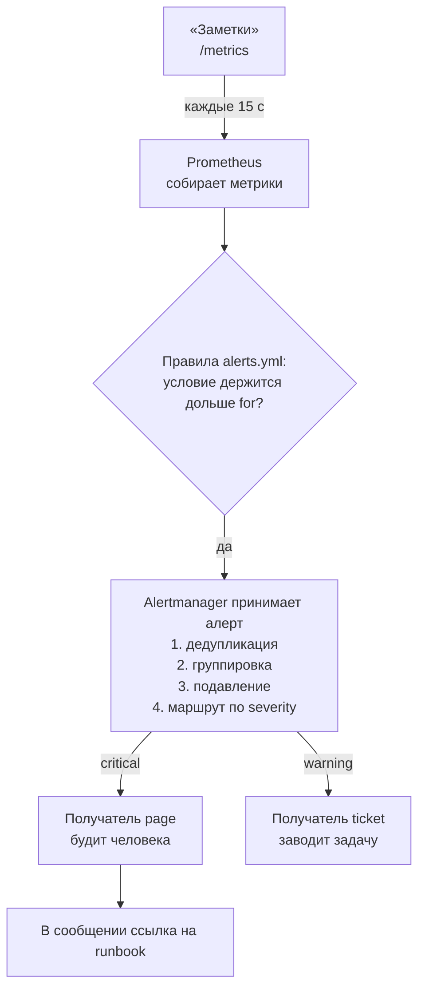
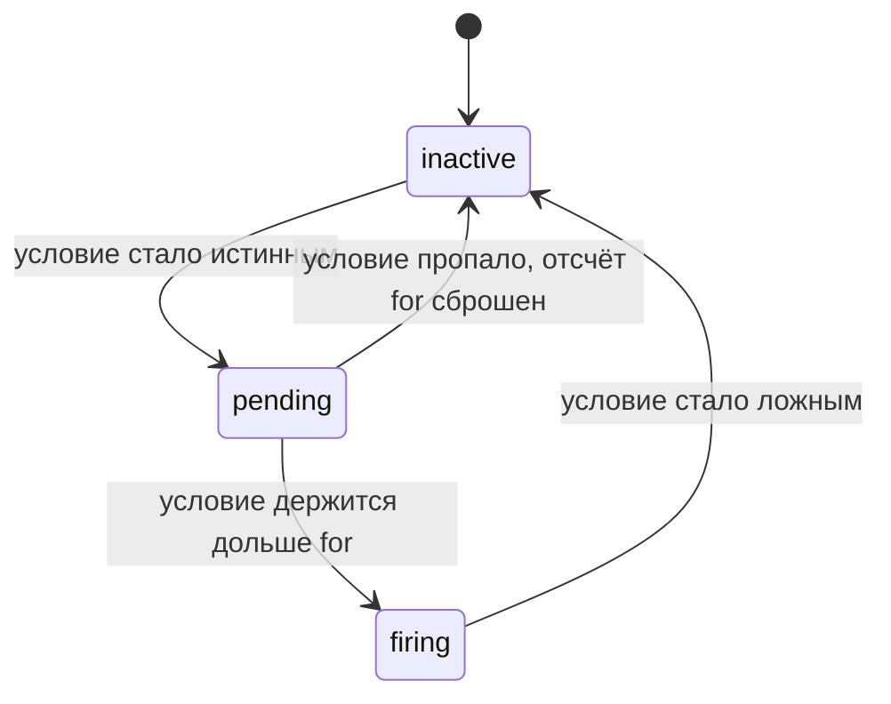
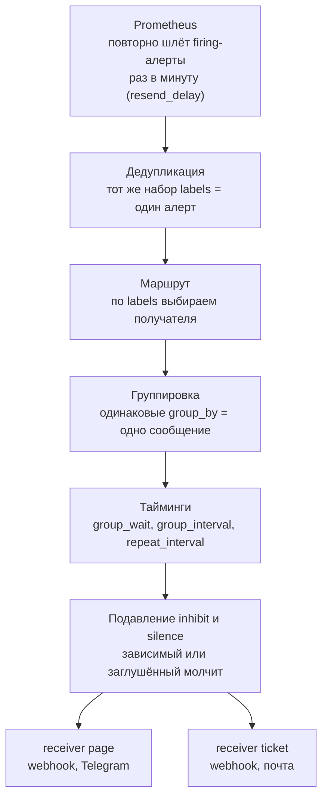
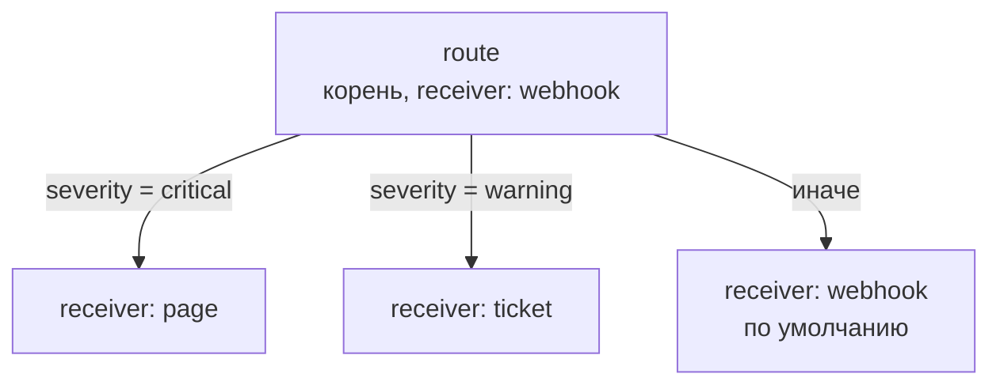

## Зачем это нужно

Дашборд (страница с графиками в Grafana, её разберём в [уроке 8.6](06-grafana-dashboards.md)) никто не смотрит в три часа ночи. Если сервис лежит, об этом должна узнать система, а не клиент, написавший в поддержку. Плохой алертинг (alerting, оповещение о проблемах) ломается в обе стороны: молчит при аварии или будит дежурного сотней одинаковых сообщений, после чего его начинают игнорировать. Это называют alert fatigue (усталость от алертов): человек, которого десять раз разбудили зря, на одиннадцатый раз не встанет.

Хороший алерт сообщает о боли пользователя, приходит один раз и содержит ссылку на runbook (раннбук, инструкцию «что делать, когда это сработало»). На работе ты будешь писать правила, настраивать маршрутизацию по срочности и разбирать два вечных вопроса: «почему меня не разбудило» и «почему разбудило зря».

Шаг проекта: в «Заметки» добавляются 4 алерта (alert, сообщение «условие нарушено»), Alertmanager с маршрутизацией по `severity`, юнит-тест правил через `promtool` и runbook на каждый алерт. Расшифровка. Alertmanager это «пульт охраны» от авторов Prometheus: принимает сработавшие алерты, склеивает дубли и решает, кому и как срочно написать. `severity` (серьёзность) это метка на алерте со значением вроде `critical` или `warning`: по ней выбирают, будить человека или завести задачу на утро. `promtool` это проверочная утилита из комплекта Prometheus: она читает файл правил и говорит, нет ли в нём ошибок, до того как правила начнут работать. Подробно всё разберём ниже.

## Что нужно знать

- [Урок 8.1: наблюдаемость, SLI и SLO](01-observability-slo.md): алерт строится от SLO (цели по качеству сервиса) и симптомов (то, что видит пользователь: ошибки и медленные ответы), а не от загрузки CPU (процессора, то есть «мозга» сервера).
- [Урок 8.2: Prometheus и /metrics](02-prometheus-basics.md): job `notes` (группа целей опроса), метрика `up`, файл `prometheus.yml`, том `prom-data`.
- [Урок 8.3: PromQL](03-promql.md): `rate`, доля ошибок, `histogram_quantile`, recording rules (сохранённые заранее выражения) `notes:http_errors:ratio5m` и `notes:http_latency:p95_5m`.
- [Урок 8.4: blackbox и exporters](04-blackbox-exporters.md): проверка снаружи, `node_exporter` и метрики диска.
- [Урок 4.6: Compose, nginx и TLS](../04-docker/06-compose-nginx-tls.md): файл `compose.yml`, сервисы и сеть `notes-net`, в которой контейнеры видят друг друга по имени.
- [Урок 1.4: процессы и сигналы](../01-linux/04-processes-signals.md): перечитывание конфигурации по сигналу SIGHUP.
- Если хочешь разобрать основы на другом стенде, см. [Алерты](../../monitoring/03-dashboards-alerts/02-alerts.md) в курсе «Мониторинг и SRE».

## Картина целиком

Представь пожарную сигнализацию в офисе. Датчик дыма в каждой комнате сам ничего не решает: он только проверяет «дымно или нет». Отдельный пульт охраны собирает сигналы от всех датчиков. Если задымились сразу пять комнат из-за одного пожара, пульт не звонит пять раз, а говорит один раз: «горит второй этаж». Ночью пульт звонит охраннику, а днём про мелкую неисправность (сел аккумулятор датчика) пишет в общий чат. У охранника на стене висит инструкция: что делать при пожаре.

В нашей системе роли такие:

- **датчик** это правило оповещения в Prometheus: раз в 15 секунд оно проверяет условие;
- **пульт** это Alertmanager: принимает сработавшие сигналы, склеивает, решает, кому и как срочно сообщить;
- **инструкция** это runbook.



Слева направо читается весь путь: метрика, правило, Alertmanager, получатель и инструкция. Сам Prometheus только решает, что условие нарушено, а кому и как об этом сказать, решает Alertmanager.

За урок ты разберёшь каждую стрелку: из чего состоит правило, почему у алерта три состояния, как Alertmanager решает, кому и сколько раз сообщить, как проверить всё это без настоящей аварии и что написать в инструкции, чтобы её мог выполнить сонный человек.

## Теория

### Зачем алерт и почему их легко сделать вредными

Метрики и дашборды отвечают на вопрос «что происходит», если ты на них смотришь. Но смотреть круглосуточно невозможно. Алерт (alert, оповещение) это автоматический вопрос к метрикам, который система задаёт сама, без человека: «сейчас плохо?». Если ответ «да», человеку отправляется сообщение.

Датчик дыма. Хороший датчик срабатывает при настоящем дыме. Плохой пищит от тостера, и через месяц жильцы вынимают из него батарейку. Тогда при настоящем пожаре тишина. Аналогия перестаёт работать в одном месте: у датчика нет «порога терпения», а у алерта он есть, и им можно управлять (об этом ниже, поле `for`).

Алерт проходит ловушки в обе стороны:

1. Слишком чувствительный: срабатывает на любой скачок, будит по пустякам. Результат: усталость от алертов, люди отключают звук и пропускают настоящее.
2. Слишком тугой: срабатывает поздно или никогда. Результат: о проблеме узнаёт клиент.
3. Без инструкции: дежурный проснулся, но не знает, что смотреть.
4. Без внимания к самому алертингу: сломалась система оповещения, и она молча ничего не отправляет.

Разберём на примере. Сервис падает в 03:10. Плохой сценарий: в 03:10 никаких алертов, в 08:00 приходит письмо из поддержки «клиенты жалуются». Другой плохой сценарий: в 03:10 приходит 40 сообщений «упал под 1», «упал под 2»... и «CPU 0%», дежурный читает первые три и выключает телефон. Хороший сценарий: в 03:12 одно сообщение «Заметки недоступны, вот инструкция».

> **Прикинь сам:** почему отключить надоевший алерт иногда правильнее, чем оставить?
{: .predict}

Алерт, на который все давно не реагируют, вредит: приучает игнорировать сообщения вообще, в том числе настоящие. Если он не требует действия, его место на дашборде. Если требует, надо исправить причину или порог, а не привыкать к шуму.

Осторожно, тут часто путают. «Чем больше алертов, тем безопаснее». Наоборот: каждый лишний алерт снижает доверие ко всем остальным. Правило, которое выручает: у каждого алерта есть человек, который обязан что-то сделать. Если делать нечего, это не алерт, а строка на дашборде.

> **Главное:** алерт ломается в обе стороны: слишком чувствительный будит зря, слишком тугой молчит, а без runbook и контроля самой системы толку мало.
{: .key}

Из чего же состоит правило?

### Из чего состоит правило оповещения

Чтобы Prometheus сам проверял условие «плохо», условие нужно записать на языке, который он понимает: на PromQL (язык запросов Prometheus, [урок 8.3](03-promql.md)), плюс объяснить, как долго ждать и что написать человеку. Это и есть правило оповещения (alerting rule).

Инструкция для ночного сторожа: «Если в кладовке горит свет (условие) дольше пяти минут (терпение), позвони на номер такой-то (кому) и скажи: свет в кладовке (текст)». Каждое поле правила отвечает на одну часть этой фразы. Аналогия неточна в одном: сторож ходит раз в час, а Prometheus проверяет каждые 15 секунд.

Правила лежат в YAML-файле. YAML это формат настроек, где вложенность задаётся отступами пробелами (не табами), а список начинается со знака `-`. Внутри файла есть группы (`groups`), в группе список правил (`rules`). Prometheus вычисляет все правила группы по очереди раз в `evaluation_interval` (интервал вычисления, у нас 15 секунд, задан в `prometheus.yml`). Одно правило состоит из полей:

| Поле | Что значит |
|---|---|
| `alert` | имя алерта, по нему его ищут и на него ссылаются runbook и маршруты |
| `expr` | условие в PromQL. Алерт есть, пока выражение возвращает хотя бы один ряд (одну временную серию) |
| `for` | сколько времени условие обязано держаться подряд, прежде чем алерт «загорится» |
| `labels` | метки: пары «ключ: значение», добавляемые к алерту. По ним работает маршрутизация (`severity`, `service`) |
| `annotations` | текст для человека: `summary` (одна строка сути), `description` (подробности), `runbook_url` (ссылка на инструкцию) |

Разберём на примере. Возьмём первое правило урока:

```yaml
- alert: NotesDown
  expr: up{job="notes"} == 0
  for: 1m
```

Разберём `expr` по кускам. Метрика `up` (из [урока 8.2](02-prometheus-basics.md)) равна 1, если Prometheus смог опросить цель, и 0, если не смог. `{job="notes"}` оставляет только цели из группы `notes`. `== 0` это оператор сравнения-фильтра: он не отвечает «да/нет», а оставляет только те ряды, для которых сравнение верно. Пока «Заметки» работают, у единственного ряда `up{job="notes"}` значение 1, сравнение с 0 ложно, ряд отбрасывается, запрос возвращает пустой результат, алерта нет. Когда «Заметки» упали, значение стало 0, ряд остался, запрос вернул один ряд, условие выполнено.

Из этого получается важное правило: **чтобы алерт сработал, выражение должно вернуть ряд, а не «истину»**. Поэтому во всех правилах есть сравнение (`== 0`, `> 0.05`, `< 0`): оно и отфильтровывает здоровые ряды.

Метки берутся из двух мест: те, что были у ряда в выражении (`job`, `instance`), плюс те, что ты дописал в `labels`. Итоговый алерт `NotesDown` получит `job="notes"`, `instance="notes:8080"`, `severity="critical"`, `service="notes"` и служебную метку `alertname="NotesDown"`.

В `annotations` можно подставлять значения. Шаблоны Prometheus пишутся в двойных фигурных скобках: `{{ $labels.instance }}` превратится в адрес упавшей цели, например `notes:8080`, а `{{ $value }}` в текущее значение выражения. Так одно правило даёт понятный текст для любой цели.

Осторожно, тут часто путают. «`evaluation_interval` это частота уведомлений». Нет: это частота проверки условия. Как часто человек получит сообщение, определяется Alertmanager (ниже). Второе заблуждение: `expr` возвращает `true`. В Prometheus нет булевого результата у фильтра, есть «ряд есть» и «ряда нет».

> **Главное:** правило это условие `expr`, непрерывность `for`, метки для маршрута и аннотации с описанием и ссылкой на runbook.
{: .key}

> **Проверь понимание:** правило `expr: up{job="notes"} == 1` и `for: 1m`. Когда оно сработает?

<details markdown="1">
<summary>Ответ</summary>

Когда «Заметки» живы: у здоровой цели `up` равен 1, фильтр пропускает ряд, условие держится, через минуту алерт загорится. Это ошибка в условии: правило будет кричать, когда всё хорошо, и молчать при аварии. Для падения нужно `== 0`.

</details>

Как алерт живёт во времени?

### Состояния алерта и поле `for`

Метрики шумят. Один опрос мог не пройти из-за секундной задержки сети, и `up` на 15 секунд стал 0. Будить человека из-за этого глупо. Поле `for` заставляет условие продержаться заданное время без перерыва.

Переход дороги: ты не бежишь через дорогу, увидев одну секунду красного у машин, ты ждёшь, когда красный устоится. Аналогия неточна: у алерта после `for` нет «обратно на зелёный за секунду», состояние снимается, как только условие перестало быть истинным.

У алерта три состояния:

- `inactive`: условие ложно, алерта нет;
- `pending` (ожидание): условие только что стало истинным, но с этого момента прошло меньше `for`;
- `firing` (горит): условие держится дольше `for`, алерт отправляется в Alertmanager.

Стоит условию хоть на один цикл стать ложным, состояние падает в `inactive`, а счёт `for` начнётся заново.



На временной шкале то же самое: условие ложно в 0:00, истинно с 0:15 до 1:00, и при `for: 1m` алерт станет `firing` в 1:15. Если условие пропадёт на 0:45, счёт начнётся заново.

Разберём на примере. `NotesDown` с `for: 1m`. В 12:00:00 Prometheus опросил цель, опрос не прошёл, `up = 0`. Правило вычисляется, ряд есть, состояние `pending`, счётчик начался в 12:00:00. 12:00:15, 12:00:30, 12:00:45: ряд есть, всё ещё `pending`. В 12:01:00 условие держится ровно минуту, состояние `firing`, алерт уходит в Alertmanager. Если в 12:00:40 цель ответила (`up = 1`), то на ближайшей проверке правило вернёт пусто, состояние `inactive`, никто ничего не узнал. Компромисс такой: чем больше `for`, тем меньше ложных срабатываний, но тем позже ты узнаёшь о настоящей беде. При `for: 10m` о падении ты узнаешь минимум через десять минут. Поэтому для падения сервиса ставят минуту, для «стало медленнее» десять минут.

<div class="viz" data-viz="obs-alert-life" data-threshold="5" data-for="120"></div>

Двигай нагрузку и смотри, как алерт проходит через `pending`: короткий скачок гаснет, не став `firing`.

> **Прикинь сам:** алерт с `for: 5m`, условие было истинным 4 минуты 50 секунд, а потом стало ложным. Сколько уведомлений придёт?
{: .predict}

Ни одного. Алерт всё это время был в `pending` и вернулся в `inactive`, не став `firing`. Именно так `for` гасит шум от коротких скачков.

Осторожно, тут часто путают. «`for` это задержка перед отправкой». Точнее, это требование непрерывности: прерывание сбрасывает отсчёт. И ещё: пока алерт `pending`, Alertmanager о нём ничего не знает, в интерфейсе Alertmanager его не будет, он виден только в Prometheus.

> **Главное:** алерт идёт `inactive`, `pending`, `firing`, а `for` требует непрерывности, и любой разрыв сбрасывает отсчёт.
{: .key}

О чём вообще стоит сообщать?

### Что мониторить: симптомы, а не причины

Ночью человека надо будить только тогда, когда пользователю плохо. Иначе он либо не выспится ради ерунды, либо перестанет верить телефону.

Врач скорой не приезжает, потому что «у человека пульс 95». Приезжает, потому что «человеку плохо». Пульс это показание для диагностики (причина или признак), а «плохо» это симптом, ради которого вызывают. Аналогия неточна тем, что у сервиса нет «самочувствия», его приходится измерять через ошибки и задержки.

Всё, что можно измерить, делится на два типа:

- **Симптомы**: то, что видит пользователь. Сервис недоступен, доля ошибок 5xx (ответов с кодом 500-599, ошибка на стороне сервера) выше нормы, ответы стали медленными. Это тема [урока 8.1](01-observability-slo.md): SLI (показатели качества) и SLO.
- **Причины**: внутреннее состояние, которое может, но не обязано вредить. Загрузка CPU, память, число соединений.

Будить нужно по симптомам. Причины полезны на дашборде и в расследовании, но CPU 90% при нормальных ответах не авария (сервис просто занят), а у упавшего сервиса CPU вообще 0%.

Исключение: то, что через время неизбежно станет симптомом. Диск, который заполнится через сутки, ещё ничему не вредит, но вредить будет. Это предупреждение, которое разбирают днём. Отсюда две срочности, которые ты будешь записывать в метку `severity`:

- `critical` (page, «пейдж»: вызов человека немедленно): пользователи страдают прямо сейчас;
- `warning` (ticket): нужно разобраться в рабочие часы, достаточно завести задачу.

Разберём на примере. Наши четыре алерта:

| Алерт | Тип | Срочность | Почему |
|---|---|---|---|
| `NotesDown` | симптом | `critical` | сервис недоступен полностью |
| `NotesHighErrorRate` | симптом | `critical` | часть пользователей получает ошибки |
| `NotesHighLatency` | симптом | `warning` | медленно, но работает: завести задачу |
| `NotesDiskFillingUp` | причина заранее | `warning` | пока работает, а через сутки нет |

Осторожно, тут часто путают. Что «критично» это то, что «важно». Критичность измеряется не важностью сервиса, а тем, нужен ли человек прямо сейчас. Алерты на бюджет ошибок SLO (burn rate, скорость сгорания бюджета) разбираются в [уроке 8.11](11-reliability-patterns-burn-rate.md), здесь мы работаем с простыми порогами.

> **Главное:** будят по симптомам, которые видит пользователь, а причины остаются для дашборда и расследования.
{: .key}

> **Проверь понимание:** почему «CPU выше 80%» плохой критичный алерт, а «доля 5xx выше 5% в течение 5 минут» хороший?

<details markdown="1">
<summary>Ответ</summary>

CPU это причина и часто рабочая норма (сервис просто занят). Доля 5xx это прямой симптом: часть пользователей получает ошибки, и на него всегда есть что делать. Первый даёт ложные тревоги и приучает игнорировать алерты, второй нет.

</details>

Что делать с тем, что станет проблемой позже?

### Предсказание: как алерт видит будущее (`predict_linear`)

Диск не «ломается», он заканчивается постепенно. Если ждать, когда свободного места станет 0, то узнаешь об этом одновременно с аварией. Хочется получить предупреждение заранее.

Топливо в баке. Стрелка показывает «полбака», но если ты за последний час сжёг 20 литров, а осталось 10, ты понимаешь, что через полчаса встанешь. Ты не смотришь на текущее значение, ты смотришь на скорость.

Функция `predict_linear(метрика[окно], секунд)` берёт значения метрики за окно, проводит через них прямую линию (линейная регрессия) и продолжает её вперёд на указанное число секунд. Результат это предсказанное значение метрики через это время.

Разберём на примере. Правило `NotesDiskFillingUp`:

```text
predict_linear(node_filesystem_avail_bytes{mountpoint="/",fstype!~"tmpfs|overlay"}[6h], 24 * 3600) < 0
```

По частям: `node_filesystem_avail_bytes` (из `node_exporter`, [урок 8.4](04-blackbox-exporters.md)) это свободные байты на файловой системе. `{mountpoint="/", fstype!~"tmpfs|overlay"}` выбирает корневой раздел и исключает виртуальные файловые системы в памяти (`tmpfs`) и слои контейнеров (`overlay`). `!~` значит «не подходит под регулярное выражение». `[6h]` это окно: смотрим последние 6 часов. `24 * 3600` это 86 400 секунд, то есть сутки вперёд. `< 0` фильтр: оставить, если предсказанное свободное место отрицательное, то есть закончится. Пример чисел: сейчас свободно 20 ГБ, за 6 часов убыло 6 ГБ, скорость 1 ГБ в час. Через 24 часа получится 20 минус 24 равно минус 4 ГБ, условие верно. С `for: 30m` алерт станет `firing`, только если прогноз держится полчаса: разовый скачок (скачали большой файл и удалили) не разбудит.

> **Прикинь сам:** свободно 100 ГБ, за 6 часов убыло 3 ГБ. Сработает ли `predict_linear(..., 24 * 3600) < 0`?
{: .predict}

Нет. Скорость 0,5 ГБ в час, за сутки уйдёт 12 ГБ, предсказание 100 минус 12 равно 88 ГБ, это больше нуля. Диск не закончится ближайшие сутки, алерта нет.

Осторожно, тут часто путают. Прогноз линейный, а рост бывает ступенчатым (лог вырос за минуту). Поэтому это предупреждение заранее, а не гарантия. Про то, что диск уже почти полон, сообщает отдельный порог.

> **Главное:** `predict_linear` позволяет предупредить о проблеме заранее и превращает «срочно» в «разобрать днём».
{: .key}

Теперь посмотрим, что делает Alertmanager.

### Alertmanager: что он делает и чего не делает

Prometheus умеет проверять условия, но не умеет обращаться с людьми. Если бы он сам слал сообщения, то при каждом вычислении правил (каждые 15 секунд) отправлял бы одно и то же, а при падении узла с десятью подами слал бы десять сообщений. Нужна отдельная программа, которая думает о получателях. Это Alertmanager.

Пульт охраны из «Картины целиком». Датчики (Prometheus) только сообщают «дымно». Пульт (Alertmanager) решает: позвонить охраннику или написать в чат, склеить ли пять сигналов в один, промолчать ли, потому что охранник уже в курсе. Аналогия неточна: у пульта есть оператор-человек, а у Alertmanager правила настроены заранее в файле.

Alertmanager ничего не измеряет и не проверяет. Он получает от Prometheus уже сработавшие (`firing`) алерты по HTTP и применяет к ним шаги: дедупликация (один набор меток это один алерт), маршрутизация (выбор получателя), группировка, ожидание таймеров, затем подавление (inhibit) и silence, отправка получателю, повторная отправка по расписанию. Ниже каждый из шагов по отдельности.



Осторожно, тут часто путают. «Alertmanager решает, что сломалось». Нет, решает Prometheus. Alertmanager решает только, как и кому об этом сказать. Поэтому, если алерта нет в Alertmanager, ищи причину в Prometheus (правило, `for`, связь), а не в настройках маршрутов.

> **Главное:** Alertmanager ничего не измеряет: он только принимает сработавшие алерты и решает, как и кому о них сообщить.
{: .key}

> **Проверь понимание:** алерт в состоянии `pending` виден в Prometheus, но его нет в Alertmanager. Это сбой?

<details markdown="1">
<summary>Ответ</summary>

Нет, так и задумано. Prometheus отправляет в Alertmanager только `firing`-алерты. Пока `for` не прошёл, алерт есть только у Prometheus.

Поэтому, если алерта не видно в Alertmanager, начни с Prometheus: открой `http://localhost:9090/alerts`. Состояние `pending` значит, что условие истинно, но `for` ещё не вышел, и просто подожди. Состояние `firing` при пустом Alertmanager уже сбой связи: смотри блок `alerting` в конфиге Prometheus и страницу Status - Runtime.

</details>

Как он склеивает повторы?

### Дедупликация и группировка

Два повторяющихся явления портят жизнь дежурному: один и тот же алерт приходит снова и снова, и один сбой порождает лавину похожих алертов.

Дедупликация это когда ты уже знаешь, что звонят в дверь, и второй звонок того же человека не считаешь новым событием. Группировка похожа на курьера, который не носит по одной посылке каждому жильцу дома, а собирает их и приносит одной пачкой. Аналогия неточна: курьер сам решает, что «похоже», а Alertmanager смотрит только на перечисленные метки.

Алерт в Alertmanager определяется набором его меток (labels). Prometheus повторно шлёт один и тот же `firing`-алерт примерно раз в минуту (параметр `resend_delay`, по умолчанию 1 минута; при смене состояния сразу), но набор меток тот же, поэтому Alertmanager считает его одним и тем же алертом (дедупликация): второе сообщение получателю не уходит.

Группировка управляется параметром `group_by`: список меток, по которым алерты склеиваются. У алертов с одинаковыми значениями этих меток образуется одна группа и одно уведомление. Остальные метки внутри уведомления перечисляются списком.

Разберём на примере. Ночью упал узел, на нём работали десять экземпляров сервиса. За минуту сработали десять алертов `NotesHighErrorRate`, у каждого своя метка `instance` (`pod-1` ... `pod-10`), но `alertname="NotesHighErrorRate"` и `service="notes"` одинаковы.

```text
group_by: ["alertname", "service"]     ->  одна группа, одно сообщение «10 алертов»
group_by: ["alertname", "instance"]    ->  десять групп, десять сообщений
```

Во втором случае в `group_by` попала метка, различающаяся у каждого экземпляра, и склейка не работает. Это классическая ошибка: `instance` в `group_by` даёт то, от чего группировка должна спасать.

> **Прикинь сам:** `group_by: ["alertname"]`. Сработали `NotesDown` (сервис `notes`) и `NotesDown` (сервис `billing`). Сколько уведомлений?
{: .predict}

Одно: значение единственной метки из `group_by` (`alertname="NotesDown"`) у алертов одинаково, они попадают в одну группу. Если нужны раздельные сообщения по сервисам, добавь `service` в `group_by`.

Осторожно, тут часто путают. Что группировка удаляет алерты. Нет, все алерты остаются, просто сообщение об них одно. И что `group_by: ["..."]` (специальное значение три точки) полезно: оно отключает группировку совсем, каждый алерт идёт отдельно.

> **Главное:** одинаковый набор меток это один алерт, а `group_by` склеивает похожие алерты в одно сообщение.
{: .key}

Как выбрать получателя?

### Маршрутизация: дерево route

Разным алертам нужны разные получатели: критичные будят людей, предупреждения заводят задачи, алерты базы данных идут DBA, а не разработчикам.

Сортировочный пункт на почте: по индексу на конверте посылка отправляется в нужную ячейку. Если индекс ни под одну ячейку не подошёл, она уходит в общий ящик. Аналогия точна почти во всём, но у Alertmanager проверка идёт по правилам сверху вниз, и первое совпадение обычно побеждает.

В файле `alertmanager.yml` есть один корневой `route` с получателем по умолчанию (`receiver`). Внутри него список вложенных `routes` с условиями `matchers` (сопоставители: проверка меток, например `severity = "critical"`). Алерт проходит вложенные маршруты сверху вниз. Первый подошедший забирает его, если у него не стоит `continue: true` (тогда проверка продолжается дальше). Если не подошёл никто, алерт достаётся корневому получателю.

Разберём на примере. Из нашей конфигурации:



Алерт проходит ветки сверху вниз и уходит в первую подошедшую. Если не подошла ни одна, он попадает к получателю по умолчанию.

Три алерта:

1. `NotesDown` с `severity: critical`: первая ветка подошла, получатель `page`.
2. `NotesHighLatency` с `severity: warning`: первая ветка не подошла, вторая да, получатель `ticket`.
3. Алерт без метки `severity` или с `severity: info`: ни одна ветка не подошла, получатель `webhook`. Он не пропадёт, но и не пойдёт куда надо. Поэтому корневого получателя по умолчанию делают таким, чтобы его сообщения было видно.

Осторожно, тут часто путают. Что порядок веток не важен. Если поставить широкую ветку выше узкой, узкая никогда не сработает, потому что широкая заберёт алерт раньше. Проверять это удобно командой `amtool config routes test`, она покажет получателя для набора меток без настоящего алерта.

> **Главное:** алерт идёт по веткам route сверху вниз и уходит в первую подошедшую, поэтому порядок веток это часть логики.
{: .key}

> **Проверь понимание:** алерт с `severity: warning`, `service: notes`. Что будет, если поставить ветку `service = "notes"` с получателем `page` выше ветки `severity = "warning"`?

<details markdown="1">
<summary>Ответ</summary>

Алерт попадёт в `page`: первая ветка подошла и забрала его, до `warning`-ветки дело не дойдёт (без `continue`). Предупреждения по сервису начнут будить людей. Порядок веток это часть логики.

</details>

Когда именно слать сообщения?

### Тайминги: group_wait, group_interval, repeat_interval

Даже после склейки нужно решить, когда слать: сразу в первую секунду или подождать остальных участников; как часто добавлять новые алерты в уже отправленное сообщение; как часто напоминать о том, что беда не решена.

Курьер снова. `group_wait`: ты не выезжаешь с первой посылкой, ждёшь полминуты, вдруг привезут ещё. `group_interval`: следующая поездка в тот же дом за новыми посылками не чаще, чем раз в пять минут. `repeat_interval`: если старая посылка так и лежит невостребованной, напоминаешь о ней раз в четыре часа.

Три таймера:

- `group_wait` (обычно 30 секунд): сколько ждать после появления первого алерта новой группы, прежде чем отправить первое уведомление. За это время в группу попадают остальные.
- `group_interval` (обычно 5 минут): как часто отправлять уведомление, если в уже отправленную группу пришли новые алерты или что-то снялось.
- `repeat_interval` (у нас 4 часа): как часто повторять напоминание о том же самом, неизменившемся составе группы, если алерт всё ещё горит.

Разберём на примере. Алерт `NotesDown` сработал в 12:01:00 (после `for`). Prometheus шлёт его сразу, но Alertmanager ждёт `group_wait`: первое сообщение уйдёт в 12:01:30. В 12:03 в ту же группу добавился ещё один алерт: следующее сообщение с обновлённым составом уйдёт не сразу, а на ближайшем шаге `group_interval`, то есть в 12:06:30. Если состав больше не менялся, следующее напоминание придёт через `repeat_interval` после последнего: в 16:06:30.

> **Прикинь сам:** зачем нужен `group_wait`, если алерт уже точно горит? Почему не слать сразу?
{: .predict}

Чтобы собрать однотипные алерты, которые сработают в течение ближайших секунд, в одно сообщение. Если слать сразу, то первое сообщение уйдёт про один алерт, а следующие про остальные: получится тот самый шквал, от которого группировка защищает. Компромисс: чем больше `group_wait`, тем дольше ты не знаешь о беде.

Осторожно, тут часто путают. Что `repeat_interval` это «раз в столько присылать новые алерты». Нет: новые алерты в группе идут по `group_interval`, а `repeat_interval` только для напоминания о неизменной группе. Слишком короткий `repeat_interval` превращает Alertmanager в спамера: дежурный получает «ещё горит» каждую минуту.

> **Главное:** `group_wait` ждёт остальных участников группы, `group_interval` ограничивает частоту обновлений, `repeat_interval` напоминает о неизменившемся.
{: .key}

Как не слать лишнего?

### Подавление (inhibit) и заглушка (silence)

Бывают алерты, которые сами по себе верны, но в данный момент бесполезны. Сервис упал: алерт «медленные ответы» этого же сервиса лишний. Или идут плановые работы, и алерты про них ожидаемы.

Inhibit: если охрана уже объявила эвакуацию, датчик в соседней комнате «лампочка перегорела» никого не интересует. Silence: ты вешаешь табличку «идут работы, сигнализация проверяется до 15:00». Разница: первое срабатывает само по правилу, второе ставится человеком вручную и само заканчивается.


- **Подавление** (`inhibit_rules`): правило «пока горит алерт-источник (`source_matchers`), не отправлять алерты-цели (`target_matchers`), если у них совпадают метки из `equal`». Совпадение по `equal` нужно, чтобы алерт про один сервис не глушил алерты про другой.
- **Silence** (заглушка): временное правило, заданное вручную по меткам и на срок. Пока оно действует, подходящие алерты остаются `firing`, но уведомления не идут. По истечении срока заглушка исчезает сама.

Разберём на примере. Наше правило:

```yaml
inhibit_rules:
  - source_matchers: ['alertname = "NotesDown"']
    target_matchers: ['severity = "warning"']
    equal: ["service"]
```

По-русски: «пока горит `NotesDown`, не отправляй предупреждения (`severity = "warning"`) с тем же значением `service`». Если `NotesDown` горит для `service=notes`, то `NotesHighLatency` с `service=notes` заглушится. А предупреждение про `service=billing` пройдёт: у него `service` другой. Silence, для сравнения, ставят командой `amtool silence add alertname=NotesDown --duration=10m`: пока идут работы, `NotesDown` не будит никого, через десять минут заглушка сама исчезает и, если сервис всё ещё лежит, уведомление придёт.

Осторожно, тут часто путают. Silence и inhibit: silence ставит человек на время, inhibit срабатывает по правилу из-за другого алерта. И silence не удаляет алерт и не чинит ничего: он только выключает звук. Забыл заглушку на неделю, пропустил настоящую аварию: заглушки ставят на короткий срок и с комментарием.

> **Главное:** inhibit срабатывает автоматически по правилу, а silence ставят вручную на срок, и оба оставляют алерты `firing`, только без уведомлений.
{: .key}

> **Проверь понимание:** ты поставил silence на `alertname=NotesDown` на 10 минут, а через 15 минут сервис всё ещё лежит. Что будет?

<details markdown="1">
<summary>Ответ</summary>

Через 10 минут заглушка истечёт. Алерт всё это время оставался `firing`, поэтому уведомление уйдёт при ближайшей отправке: пропустить аварию заглушкой нельзя, она только откладывает звук.

</details>

Кому реально отправлять?

### Получатели (receivers) и webhook

Сообщение нужно доставить туда, где человек его увидит: в Telegram, Slack, почту, систему дежурств (PagerDuty).

Адрес доставки. Одно и то же письмо можно отправить домой, на работу или в почтовый ящик до востребования.

В `alertmanager.yml` секция `receivers` описывает получателей: у каждого имя и один или несколько способов доставки (`telegram_configs`, `slack_configs`, `email_configs`, `webhook_configs`). Маршрут ссылается на получателя по имени. Webhook (веб-хук, «обратный вызов по HTTP») это универсальный способ: Alertmanager отправляет `POST`-запрос (HTTP-запрос с телом) с JSON-документом на адрес, а на той стороне что угодно принимает и обрабатывает. Telegram подключается так же блоком `telegram_configs` с токеном бота. Токен это секрет, в git его не хранят ([урок 9.1](../09-secrets-gitops/01-secrets-problem-vault.md)).

Разберём на примере. В уроке нет настоящего Telegram, поэтому приёмником служит контейнер `go-httpbin`: он отвечает на любой запрос и пишет его в лог. Получатель `page` отправляет POST на `http://webhook:8080/anything/page`. Здесь `webhook` это имя контейнера в сети `notes-net` (по имени контейнеры находят друг друга, [урок 4.6](../04-docker/06-compose-nginx-tls.md)), `8080` его порт внутри сети, `/anything/page` путь, который мы придумали: по нему в логе видно, какой получатель сработал. Тело запроса это JSON примерно такого вида (сокращён):

```json
{
  "status": "firing",
  "receiver": "page",
  "groupLabels": {"alertname": "NotesDown", "service": "notes"},
  "alerts": [{"status": "firing", "labels": {"alertname": "NotesDown", "severity": "critical"}}]
}
```

`status` это `firing` или `resolved` (алерт снялся), `receiver` кто получил, `groupLabels` по каким меткам сгруппировано, `alerts` список алертов группы.

> **Прикинь сам:** в логе `webhook` есть строка `POST /anything/ticket`. Что это говорит?
{: .predict}

Сработал получатель `ticket`: пришёл алерт с `severity: warning`, и Alertmanager отправил уведомление на путь `/anything/ticket`. По пути в логе можно понять, по какой ветке пошёл алерт.

Осторожно, тут часто путают. Что Alertmanager проверяет, дошло ли сообщение до человека. Он знает только, что доставка получателю (например, ответ 200 от webhook) прошла. Прочитал ли его человек, он не знает.

> **Главное:** получатель это куда уходит сообщение, а webhook позволяет подключить любую систему обычным HTTP-запросом.
{: .key}

Как понять, что сам алертинг жив?

### Как узнать, что алертинг сам не сломался: Watchdog и `promtool`

Самая неприятная авария: молчит не сервис, а система оповещения. Тишина выглядит как «всё хорошо».

Кнопка «человек жив» на пульте: оператор должен нажимать её каждые десять минут, иначе пульт решает, что с оператором беда, и поднимает тревогу. Тишина здесь тревожный сигнал, а не нормальное состояние (dead man's switch, «рычаг мёртвой руки»).

Заводят «сторожевой» алерт Watchdog с условием `vector(1)` (константа-ряд, условие вечно истинно). Он горит всегда, и Alertmanager постоянно шлёт его на внешний сервис. Пока сообщения идут, всё работает. Пропали они на несколько минут: сломался Prometheus, Alertmanager или канал. Внешний сервис поднимает тревогу. В проект Watchdog не добавляем (внешнего приёмника нет), но на проде он обязателен.

Вторая защита: правила проверяют до выкатки. У `promtool` (программа из комплекта Prometheus) две команды:

- `promtool check rules` проверяет синтаксис: файл читается, выражения корректны;
- `promtool test rules` запускает юнит-тест: ты подаёшь синтетические (придуманные) значения метрик и говоришь, какие алерты должны гореть в какой момент. Если правило ссылается на несуществующую метрику или метку с опечаткой, `check` пройдёт, а `test` упадёт.

Юнит-тест это файл с блоками: `input_series` (какие ряды подаём, значения записываются через `x`: `'0x40'` значит «0, потом ещё 40 раз повтор», всего 41 значение, а `'0.10x8 0x60'` значит «0.10 и ещё 8 раз, затем 0 и ещё 60 раз»), `interval` (шаг между значениями) и `alert_rule_test` (в момент `eval_time` ожидаем такие-то алерты `exp_alerts`).

Осторожно, тут часто путают. Что если `check` зелёный, правило рабочее. Он не знает, есть ли такая метрика на самом деле. Юнит-тест показывает поведение, а не форму.

> **Главное:** Watchdog всегда горит и молчит только при сбое системы, а `promtool` проверяет форму и поведение правил до выкатки.
{: .key}

> **Проверь понимание:** что даёт `promtool test rules`, чего не даёт `promtool check rules`?

<details markdown="1">
<summary>Ответ</summary>

`check` проверяет только синтаксис и корректность выражений. `test` проверяет поведение: на заданных входных рядах алерт становится `firing` в нужную минуту с нужными метками. Правило с опечаткой в имени метрики пройдёт `check`, но провалит `test`.

</details>

Как выбрать пороги?

### Как выбрать порог и `for`: разбор на цифрах

Новичок видит в правиле `> 0.05` и `for: 5m` и спрашивает: «откуда такие числа?». Если брать их с потолка, алерт будет или будить зря, или молчать. Нужно уметь обосновать число.

Поплавок в бачке унитаза или датчик уровня в ванне. Поставишь слишком низко, и вода будет переливаться до сигнала. Слишком высоко, и сигнал придёт, когда уже залило соседей. Уровень выбирают по тому, сколько времени нужно, чтобы успеть закрыть кран. Аналогия неточна тем, что у алерта два рычага сразу: порог (насколько плохо) и `for` (как долго).

Порог берут из цели по качеству ([урок 8.1](01-observability-slo.md)). Если цель «не более 1% ошибок за месяц», то алерт должен сработать, когда ошибок заметно больше обычного, а не при единичном сбое. `for` выбирают по трём вопросам. Как быстро нужно узнать (падение сервиса: минуты, медленный рост диска: часы)? Насколько метрика «шумит» (скачет ли она сама по себе)? Сколько стоит ложная тревога (разбудить человека дороже, чем завести задачу)? Чем быстрее нужно узнать, тем меньше `for`, чем больше шума и дороже ложная тревога, тем больше. Нижняя граница простая: `for` должен покрывать хотя бы два-три цикла опроса. Опрос в курсе идёт каждые 15 секунд, поэтому `for: 15s` сработает от одного случайного сбоя, а `for: 1m` уже требует четырёх подряд.

Разберём на примере. Правило `NotesHighErrorRate`: `notes:http_errors:ratio5m > 0.05` (больше 5% ошибок за 5 минут) и `for: 5m`. Почему так? Сервис получает 20 запросов в секунду. Два случайных 500 за минуту это 2 из 1200 запросов, то есть около 0,17%, намного ниже 5%, алерт молчит. Если же 5% запросов падает стабильно (60 из 1200 за минуту), значит, что-то сломалось. `for: 5m` нужен, чтобы пятиминутное окно не поймало короткий всплеск после деплоя. Общее время до уведомления: до 5 минут окна, плюс 5 минут `for`, плюс `group_wait` (обычно 30 секунд): в худшем случае около 10 минут. Если для твоего сервиса десять минут это слишком долго, уменьши `for` до 2 минут и смирись с тем, что изредка будешь получать лишнее.

> **Прикинь сам:** алерт на ошибки срабатывает несколько раз в неделю на 30 секунд и сам проходит. Что поменяешь?
{: .predict}

Увеличу `for` (например, с 1 до 5 минут): короткие всплески перестанут доходить до состояния `firing`. Если настоящие аварии при этом не задерживаются слишком сильно, этого достаточно. Порог трогать не нужно, он описывает «насколько плохо», а проблема в том, что всплески короткие.

Осторожно, тут часто путают. Что есть «правильный» порог на все случаи. Порог всегда компромисс между скоростью и шумом, и его корректируют по опыту: если алерт срабатывал трижды зря, порог или `for` увеличивают, если пропустил настоящую проблему, уменьшают.

> **Главное:** порог берут из цели по качеству, а `for` из баланса между скоростью реакции и шумом, и оба подстраивают по опыту.
{: .key}

Что должно быть в инструкции?

### Runbook: инструкция, которую можно выполнить в три часа ночи

Разбуженный дежурный не помнит архитектуру. Автор правила может быть в отпуске. Если решение живёт в голове одного человека, то команда зависит от него.

Инструкция по эвакуации на стене: короткая, по шагам, без рассуждений. Ты читаешь её впопыхах и делаешь.

Runbook (раннбук) это документ на один алерт, ссылка на него лежит в аннотации `runbook_url`, значит попадает прямо в сообщение. В нём пять разделов: симптом (что сработало и что видит пользователь), влияние (насколько всё плохо, будить ли ещё кого-то), проверки (команды по порядку), действия (как починить и как откатить), эскалация (кому звать, если не помогло за N минут).

Разберём на примере. Раздел «Проверки» плохого runbook: «Проверь состояние сервиса». Хорошего: «1. `docker compose ps` в `~/notes`: жив ли `notes`, нет ли `Restarting`. 2. `docker compose logs notes --tail 50`: причина падения». Второй можно выполнить, не думая.

Осторожно, тут часто путают. Что runbook это описание архитектуры или wiki-страница. Это последовательность действий. Проверять его надо на живом человеке: если новичок споткнулся, документ надо дописывать.

> **Главное:** runbook это пять разделов и конкретные шаги, которые выполнит сонный человек, а проверяют его на новичке.
{: .key}

> **Проверь понимание:** какие пять разделов должен содержать runbook?

<details markdown="1">
<summary>Ответ</summary>

Симптом, влияние, проверки (команды по порядку), действия (починить и откатить), эскалация (кому звать, если не помогло).

</details>

## Практика

Перед началом основной стек «Заметок» запущен (`docker compose up -d` в `~/notes`), мониторинг из уроков 8.2-8.4 работает (`docker compose -f ~/notes/monitoring/compose.yml ps`). Все файлы ниже лежат в `~/notes/monitoring/` и `~/notes/docs/`. Адреса `runbook_url` в правилах это пример: так выглядит адрес runbook в твоём репозитории на GitHub, подставь свой.

### Задание 1. Четыре алерта и проверка правил

**Цель:** написать правила оповещения и проверить их без запуска Alertmanager.

**Предскажи:** в файле правил `NotesDown` использует `up{job="notes"} == 0`. Что вернёт этот запрос, пока «Заметки» работают: пустой результат или ряд со значением 1?

<details markdown="1">
<summary>Ответ</summary>

Пустой результат. Оператор сравнения `== 0` фильтрует ряды: у живого target `up` равен 1, он отбрасывается. Алерт есть, только пока запрос возвращает хотя бы один ряд.

</details>

**Шаги:**

1. Создай каталоги и файл правил. Что делает команда: `mkdir -p` создаёт каталоги (флаг `-p` создаёт и промежуточные, и не ругается, если каталог уже есть). Конструкция `cat > файл <<'YAML' ... YAML` записывает всё, что написано до слова `YAML`, в файл; кавычки вокруг `'YAML'` запрещают оболочке подставлять в текст переменные и `$`. Шаблоны аннотаций содержат двойные фигурные скобки, поэтому в уроке они обёрнуты в `raw` (служебная разметка сайта), а в твоём файле это обычный текст. Комментарии `#` в YAML это пояснения для людей, программа их пропускает. Запись `labels: {severity: critical, service: notes}` это сокращённая форма словаря в одну строку.


```bash
mkdir -p ~/notes/monitoring/prometheus/rules ~/notes/monitoring/prometheus/tests
cat > ~/notes/monitoring/prometheus/rules/alerts.yml <<'YAML'
groups:
  - name: notes-alerts
    rules:
      # Симптом: приложение не отвечает на сбор метрик
      - alert: NotesDown
        expr: up{job="notes"} == 0
        for: 1m
        labels: {severity: critical, service: notes}
        annotations:
          summary: "Заметки недоступны"
          description: "Target {{ $labels.instance }} не отвечает больше минуты."
          runbook_url: "https://github.com/distinguished-sre/learning/blob/main/devops/project/notes/docs/runbooks/NotesDown.md"

      # Симптом: доля ответов 5xx выше 5% (recording rule из урока 8.3)
      - alert: NotesHighErrorRate
        expr: notes:http_errors:ratio5m > 0.05
        for: 5m
        labels: {severity: critical, service: notes}
        annotations:
          summary: "Доля ошибок 5xx выше 5%"
          runbook_url: "https://github.com/distinguished-sre/learning/blob/main/devops/project/notes/docs/runbooks/NotesHighErrorRate.md"

      # Симптом: 95-й перцентиль задержки выше 500 мс
      - alert: NotesHighLatency
        expr: notes:http_latency:p95_5m > 0.5
        for: 10m
        labels: {severity: warning, service: notes}
        annotations:
          summary: "p95 задержки выше 500 мс"
          runbook_url: "https://github.com/distinguished-sre/learning/blob/main/devops/project/notes/docs/runbooks/NotesHighLatency.md"

      # Предупреждение заранее: диск закончится в ближайшие сутки
      - alert: NotesDiskFillingUp
        expr: predict_linear(node_filesystem_avail_bytes{mountpoint="/",fstype!~"tmpfs|overlay"}[6h], 24 * 3600) < 0
        for: 30m
        labels: {severity: warning, service: notes}
        annotations:
          summary: "Диск заполнится меньше чем за 24 часа"
          runbook_url: "https://github.com/distinguished-sre/learning/blob/main/devops/project/notes/docs/runbooks/NotesDiskFillingUp.md"
YAML
```


2. Проверь синтаксис командой `promtool` из образа Prometheus (ставить ничего не нужно). Разбор: `docker run --rm` запускает контейнер и удаляет его после завершения; `--entrypoint promtool` говорит запустить вместо сервера Prometheus программу `promtool`; `-v "$PWD/prometheus:/p:ro"` подключает каталог `prometheus` из текущей папки внутрь контейнера как `/p`, `:ro` значит «только чтение»; `check rules /p/rules/alerts.yml` это аргументы `promtool`.

```bash
cd ~/notes/monitoring
docker run --rm --entrypoint promtool \
  -v "$PWD/prometheus:/p:ro" prom/prometheus:v3.15.0 \
  check rules /p/rules/alerts.yml
```

3. Напиши юнит-тест: подаём синтетические метрики и проверяем, что сработало (и что не сработало). Обозначения в `values` объяснены в теории: `0x40` это «0 и ещё 40 раз», при `interval: 15s` это 10 минут данных. `exp_alerts: []` значит «алертов быть не должно». В `exp_labels` перечислены все метки алерта, кроме `alertname`: его `promtool` подставляет сам.

```bash
cat > ~/notes/monitoring/prometheus/tests/alerts_test.yml <<'YAML'
rule_files:
  - ../rules/alerts.yml

evaluation_interval: 15s

tests:
  # Приложение лежит 10 минут: после 1 минуты NotesDown должен гореть
  - interval: 15s
    input_series:
      - series: 'up{job="notes", instance="notes:8080"}'
        values: '0x40'
    alert_rule_test:
      - eval_time: 30s
        alertname: NotesDown
        exp_alerts: []          # for ещё не прошёл: алерт в pending
      - eval_time: 2m
        alertname: NotesDown
        exp_alerts:
          - exp_labels:
              severity: critical
              service: notes
              job: notes
              instance: "notes:8080"
            exp_annotations:
              summary: "Заметки недоступны"
              description: "Target notes:8080 не отвечает больше минуты."
              runbook_url: "https://github.com/distinguished-sre/learning/blob/main/devops/project/notes/docs/runbooks/NotesDown.md"

  # Всплеск ошибок на 2 минуты: за счёт for уведомления быть не должно
  - interval: 15s
    input_series:
      - series: 'notes:http_errors:ratio5m'
        values: '0.10x8 0x60'
    alert_rule_test:
      - eval_time: 2m
        alertname: NotesHighErrorRate
        exp_alerts: []          # условие уже 2 минуты истинно, но for: 5m не вышел

  # Контроль: те же 10% держатся постоянно, после for алерт обязан загореться
  - interval: 15s
    input_series:
      - series: 'notes:http_errors:ratio5m'
        values: '0.10x40'
    alert_rule_test:
      - eval_time: 6m
        alertname: NotesHighErrorRate
        exp_alerts:
          - exp_labels:
              severity: critical
              service: notes
            exp_annotations:
              summary: "Доля ошибок 5xx выше 5%"
              runbook_url: "https://github.com/distinguished-sre/learning/blob/main/devops/project/notes/docs/runbooks/NotesHighErrorRate.md"
YAML
docker run --rm --entrypoint promtool \
  -v "$PWD/prometheus:/p:ro" prom/prometheus:v3.15.0 \
  test rules /p/tests/alerts_test.yml
```

**Что должно получиться:**

```text
Checking /p/rules/alerts.yml
  SUCCESS: 4 rules found

  SUCCESS
```

**Как читать вывод:** `Checking ... SUCCESS: 4 rules found` значит, что файл прочитан и в нём нашлось четыре правила. Отдельная строка `SUCCESS` после пустой строки это результат юнит-теста: все проверки (`exp_alerts`) сошлись. Если тест не сходится, вместо неё будет блок `FAILED:` с двумя частями: `exp:` (что ты ожидал) и `got:` (что получилось на самом деле). Сравни их метки и аннотации глазами: расхождение почти всегда видно сразу.

**Объясни себе:**

- Почему в тесте `eval_time: 30s` ждёт пустой список `exp_alerts`, хотя ряд `up` уже ноль?
- Что второй тест (всплеск на 2 минуты) доказывает про поле `for`, и зачем третий тест с постоянными 10%?

**Типичные ошибки:**

- `FAILED:` и в блоке `got: []` пусто, а в `exp:` есть алерт: правило не сработало на данных теста. Проверь имя метрики и метки в `input_series`, и что `eval_time` больше `for`.
- В `FAILED:` в `exp:` и `got:` метки отличаются одной строкой (например, `service="notesx"` против `service="notes"`): в ожидаемых метках опечатка или не хватает унаследованных от метрики (`job`, `instance`). `alertname` добавлять не надо.

### Задание 2. Alertmanager: конфиг и маршрутизация

**Цель:** запустить Alertmanager и приёмник вебхуков, описать дерево маршрутов и проверить его без реальных алертов.

**Предскажи:** что попадёт в получателя `ticket`: алерт `NotesHighLatency` с `severity: warning`, или он уйдёт получателю по умолчанию? Как убедиться, не ломая ничего?

<details markdown="1">
<summary>Ответ</summary>

Он уйдёт в `ticket`: ветка с `severity = "warning"` подходит. Проверить можно без аварии командой `amtool config routes test --labels=...`, которая показывает, какому получателю достанется набор labels. Ниже мы её запустим.

</details>

**Шаги:**

1. Создай конфигурацию Alertmanager. Ключи разобраны в теории: `route` это корень дерева, `routes` ветки, `matchers` условия по меткам, `receivers` получатели, `inhibit_rules` подавление.

```bash
mkdir -p ~/notes/monitoring/alertmanager
cat > ~/notes/monitoring/alertmanager/alertmanager.yml <<'YAML'
route:
  receiver: webhook            # по умолчанию, если ни одна ветка не подошла
  group_by: ["alertname", "service"]
  group_wait: 30s              # ждём остальных участников группы
  group_interval: 5m           # новые алерты в уже отправленную группу
  repeat_interval: 4h          # напоминание о неснятом алерте
  routes:
    - matchers: ['severity = "critical"']
      receiver: page
    - matchers: ['severity = "warning"']
      receiver: ticket

receivers:
  - name: webhook
    webhook_configs:
      - url: http://webhook:8080/anything/default
  - name: page                 # будит человека
    webhook_configs:
      - url: http://webhook:8080/anything/page
  - name: ticket               # заводит задачу
    webhook_configs:
      - url: http://webhook:8080/anything/ticket

inhibit_rules:
  # Пока сервис лежит, предупреждения про него же не нужны
  - source_matchers: ['alertname = "NotesDown"']
    target_matchers: ['severity = "warning"']
    equal: ["service"]
YAML
```

2. Добавь в `monitoring/compose.yml` два сервиса в секцию `services:` (сеть `notes-net` уже описана в конце файла с урока 8.2). `image` это образ (готовый пакет с программой), `ports: "127.0.0.1:9093:9093"` открывает порт 9093 контейнера на порту 9093 только для самой машины (у Alertmanager нет аутентификации, на всех интерфейсах любой в сети смог бы ставить silence), `volumes` подключает каталог с конфигом только для чтения, `command` передаёт программе путь к конфигу, `restart: unless-stopped` перезапускает контейнер после сбоя.

```yaml
  alertmanager:
    image: prom/alertmanager:v0.34.1
    ports:
      - "127.0.0.1:9093:9093"
    volumes:
      - ./alertmanager:/etc/alertmanager:ro
    command:
      - --config.file=/etc/alertmanager/alertmanager.yml
    restart: unless-stopped

  # Приёмник вебхуков: логирует каждый POST от Alertmanager
  webhook:
    image: mccutchen/go-httpbin:v2.18.3
    restart: unless-stopped
```

3. Подключи правила и Alertmanager в `monitoring/prometheus/prometheus.yml`. `rule_files` говорит Prometheus, откуда читать файлы правил (путь внутри контейнера, звёздочка значит «все файлы `.yml`»), а `alerting` куда отправлять сработавшие алерты (`alertmanager:9093` это имя сервиса и порт в сети `notes-net`). Добавь на верхний уровень (рядом с `scrape_configs`, без отступа):

```yaml
rule_files:
  - /etc/prometheus/rules/*.yml

alerting:
  alertmanagers:
    - static_configs:
        - targets: ["alertmanager:9093"]
```

Если в `compose.yml` у сервиса `prometheus` ещё нет тома `./prometheus/rules:/etc/prometheus/rules:ro` (в 8.3 он мог быть смонтирован), добавь его в список `volumes` этого сервиса: без него внутри контейнера нет файла правил. Проверь: `grep -n rules ~/notes/monitoring/compose.yml` (`grep -n` ищет строку и печатает её с номером).

4. Проверь конфиг и запусти. `amtool check-config` проверяет файл так же, как `promtool` для правил. `docker compose up -d` запускает всё, что описано в `compose.yml`, в фоне (`-d`). `docker compose kill -s HUP prometheus` посылает контейнеру сигнал SIGHUP: по нему Prometheus перечитывает конфиг без перезапуска ([урок 1.4](../01-linux/04-processes-signals.md)).

```bash
cd ~/notes/monitoring
docker run --rm --entrypoint amtool \
  -v "$PWD/alertmanager:/a:ro" prom/alertmanager:v0.34.1 \
  check-config /a/alertmanager.yml
docker compose up -d
docker compose kill -s HUP prometheus   # перечитать конфиг без перезапуска (сигнал SIGHUP)
```

5. Спроси у дерева маршрутов, кому достанется набор меток. Цикл `for sev in warning critical; do ...; done` выполняет команду дважды, подставляя `$sev`, а `severity=$sev service=notes` это набор меток, про который мы спрашиваем.

```bash
for sev in warning critical; do
  docker run --rm --entrypoint amtool -v "$PWD/alertmanager:/a:ro" \
    prom/alertmanager:v0.34.1 config routes test \
    --config.file=/a/alertmanager.yml severity=$sev service=notes
done
```

**Что должно получиться:**

```text
Checking '/a/alertmanager.yml'  SUCCESS
Found:
 - global config
 - route
 - 1 inhibit rules
 - 3 receivers
 - 0 templates

ticket
page
```

(строки `ticket` и `page` печатает цикл из шага 5, по одной на каждый запуск). В браузере http://localhost:9093 открывается интерфейс Alertmanager, на http://localhost:9090/rules видны 4 правила в состоянии `OK`, а `http://localhost:9090/config` содержит секцию `alerting`.

**Как читать `amtool config routes test`:** команда ничего не отправляет, а только проходит по дереву `route` с заданными метками и печатает имя получателя. Если добавить `--verify.receivers=ticket`, она завершится с ошибкой, когда получатель другой: так удобно проверять маршруты в CI. Вывод проверки конфига читай так: `SUCCESS` и список `Found` значит, что Alertmanager принял конфигурацию: нашёл маршрут, одно правило подавления и три получателя. Строка `ticket` это имя получателя, которому достанется алерт с метками `severity=warning`, `page` для `critical`. Это ровно то, что мы задумали в маршрутах.

**Объясни себе:**

- Что произойдёт с алертом `severity=info`, для которого нет ветки?

**Типичные ошибки:**

- `err="yaml: unmarshal errors: line 3: field group_by_ not found"` или `unknown fields in route`: опечатка в имени ключа. Alertmanager строго проверяет схему и не стартует.
- `level=ERROR msg="Error on notify" ... dial tcp: lookup webhook on 127.0.0.11:53: no such host`: приёмник в другой сети или не запущен. Оба сервиса должны быть в одном `compose.yml` и сети `notes-net`.
- В Prometheus на странице Status - Alertmanager Discovery (или в `curl localhost:9090/api/v1/alertmanagers`) нет Alertmanager: не выполнена перезагрузка. `docker compose kill -s HUP prometheus` перечитывает конфиг, перезапуск не нужен.

### Задание 3. Уроним сервис и проследим алерт до webhook

**Цель:** пройти весь путь: `inactive`, `pending`, `firing`, уведомление; попробовать silence.

**Предскажи:** алерт `NotesDown` имеет `for: 1m`, `group_wait: 30s`, scrape каждые 15 секунд. Через сколько примерно после остановки сервиса в приёмник придёт первый POST?

<details markdown="1">
<summary>Ответ</summary>

Около двух минут: до 15 секунд на обнаружение (`up` стал 0), минута `for` в состоянии `pending`, плюс до 15 секунд на цикл вычисления правил и 30 секунд `group_wait` в Alertmanager. Итого от 1,5 до 2 минут.

</details>

**Шаги:**

1. Останови приложение и следи за состоянием правила. `docker compose stop notes` останавливает сервис `notes`. `watch -n 5 "команда"` повторяет команду каждые 5 секунд и перерисовывает экран. Внутри: `curl -s` тихо запрашивает страницу, `localhost:9090/api/v1/alerts` это API Prometheus со списком активных алертов, `|` передаёт ответ в `jq` (разбор JSON), `-r` печатает без кавычек, `.data.alerts[]` перебирает алерты, `[.labels.alertname, .state]` собирает пару «имя, состояние», `@tsv` печатает её через табуляцию.

```bash
cd ~/notes
docker compose stop notes
watch -n 5 "curl -s localhost:9090/api/v1/alerts | jq -r '.data.alerts[] | [.labels.alertname, .state] | @tsv'"
```

Сначала `pending`, через минуту `firing` (выход из `watch`: `Ctrl+C`).

2. Через 30 секунд проверь, что Alertmanager получил алерт и куда его отправил, и что дошёл вебхук. Первая команда спрашивает у API Alertmanager список его алертов, вторая печатает последние 5 строк лога приёмника (`logs ... --tail 5`).

```bash
curl -s localhost:9093/api/v2/alerts | jq -r '.[] | [.labels.alertname, .labels.severity, .status.state] | @tsv'
docker compose -f monitoring/compose.yml logs webhook --tail 5
```

3. Верни сервис командой `docker compose start notes`: через минуту-две алерт снимется и придёт уведомление `resolved`.

4. Заглуши алерт на 10 минут (silence) и убедись, что он виден как заглушенный. `--network host` даёт контейнеру сеть твоей машины, чтобы `amtool` достучался до `localhost:9093`; `silence add alertname=NotesDown` создаёт заглушку на алерты с такой меткой; `--duration=10m` срок; `sleep 150` ждёт, пока пройдут `for` и `group_wait` и алерт реально загорится (сервис нельзя поднимать раньше, иначе заглушать будет нечего); `--author` и `--comment` кто и зачем поставил (всегда пиши комментарий, через неделю никто не вспомнит).

```bash
docker compose stop notes
docker run --rm --network host --entrypoint amtool prom/alertmanager:v0.34.1 \
  --alertmanager.url=http://localhost:9093 silence add alertname=NotesDown \
  --duration=10m --author=me --comment="плановые работы"
sleep 150
curl -s localhost:9093/api/v2/alerts | jq -r '.[] | [.labels.alertname, .status.state] | @tsv'
docker compose start notes
```

**Что должно получиться:**

```text
NotesDown	pending
NotesDown	firing
```

Затем в Alertmanager `NotesDown	critical	active`, а в логах приёмника строка с `POST /anything/page`. `silence add` печатает id заглушки (длинная строка из букв и цифр), а после паузы последняя команда печатает `NotesDown	suppressed`: при остановленном сервисе алерт помечен suppressed и в приёмник не идёт.

**Как читать вывод:** `pending` значит, что условие уже истинно, но минута `for` не вышла; `firing` значит, что алерт ушёл в Alertmanager. `active` во втором запросе это состояние алерта в Alertmanager: он принят и не заглушен. После `silence add` статус меняется на `suppressed`: алерт жив, но уведомления не идут.

**Объясни себе:**

- Почему после `docker compose start notes` алерт не снимается мгновенно?
- Чем silence отличается от удаления правила или от `inhibit`? Что будет, когда его срок истечёт, а сервис ещё лежит?

**Типичные ошибки:**

- В логах приёмника пусто: Alertmanager не видит Prometheus. Смотри секцию `alerting:` (см. сценарий 4 ниже).
- `curl: (7) Failed to connect to localhost port 9093`: Alertmanager не запущен, `docker compose -f ~/notes/monitoring/compose.yml ps alertmanager`.

### Задание 4. Шаг проекта: runbook на каждый алерт

**Цель:** к каждому алерту приложить инструкцию, по которой его сможет разобрать любой дежурный, а не только автор.

**Предскажи:** какие 5 разделов должен содержать runbook, чтобы человек, разбуженный в 3:00, не думал, а действовал?

<details markdown="1">
<summary>Ответ</summary>

Симптом (что видит пользователь и что сработало), влияние (насколько всё плохо), проверки (команды по порядку), действия (как починить и как откатить), эскалация (кому звать, если не помогло). Каждая ссылка `runbook_url` из алерта ведёт именно на такой документ.

</details>

**Шаги:**

1. Создай четыре файла в `~/notes/docs/runbooks/` (Markdown-файлы с заголовками `#` и `##`; команды в них основаны на том, что уже пройдено в темах 1, 4 и 8):

```bash
mkdir -p ~/notes/docs/runbooks
cat > ~/notes/docs/runbooks/NotesDown.md <<'MD'
# NotesDown: «Заметки» не отвечают
## Симптом
`up{job="notes"} == 0` больше минуты, пользователи видят 502 или таймаут.
## Влияние
Сервис недоступен полностью. Критично, будит дежурного.
## Проверки
1. `docker compose ps` в `~/notes`: жив ли `notes`, нет ли `Restarting`.
2. `docker compose logs notes --tail 50`: причина падения.
3. `curl -ik https://notes.lab/healthz`: отвечает ли приложение через прокси (порт 8080 после урока 4.6 наружу не опубликован).
4. `docker compose ps db`: жива ли и `healthy` ли PostgreSQL.
## Действия
- Контейнер остановлен: `docker compose up -d notes`.
- Падает после смены конфига или образа: вернуть прошлый `.env` или тег, `docker compose up -d`.
- Причина в БД: разобрать `docker compose logs db`, потом перезапустить `notes`.
## Эскалация
Не поднялся за 15 минут: звать владельца сервиса, записать время начала для постмортема.
MD
cat > ~/notes/docs/runbooks/NotesHighErrorRate.md <<'MD'
# NotesHighErrorRate: доля 5xx выше 5%
## Симптом
`notes:http_errors:ratio5m > 0.05` дольше 5 минут.
## Влияние
Часть пользователей получает 500/502/503, расходуется бюджет ошибок.
## Проверки
1. Какие пути: `sum by (path, status) (rate(notes_http_requests_total{status=~"5.."}[5m]))`.
2. Была ли выкатка или правка `.env` перед началом ошибок.
3. `docker compose logs notes --since 15m | grep -i error`.
4. `curl -sk https://notes.lab/readyz`: отвечает ли БД.
## Действия
- Ошибки после выкатки: откатить на прошлый тег образа, `docker compose up -d notes`.
- Причина в БД: проверить `db`, место на диске, число соединений.
- Причина неясна, а ошибки идут: сначала снизить ущерб (откат, перезапуск), потом разбираться.
## Эскалация
Ошибки не падают 30 минут после отката: звать разработчика приложения.
MD
cat > ~/notes/docs/runbooks/NotesHighLatency.md <<'MD'
# NotesHighLatency: p95 выше 500 мс
## Симптом
`notes:http_latency:p95_5m > 0.5` дольше 10 минут.
## Влияние
Сервис отвечает медленно, возможны таймауты клиентов. Предупреждение: завести задачу.
## Проверки
1. Где медленно: `histogram_quantile(0.95, sum by (le, path) (rate(notes_http_request_duration_seconds_bucket[5m])))`.
2. `docker stats --no-stream`: CPU и память контейнера `notes`.
3. Долгие запросы БД: `docker compose exec db psql -U notes -d notes -c "select pid, now() - query_start as age, query from pg_stat_activity where state = 'active' order by age desc"`.
## Действия
- Медленный SQL: индекс или ограничение выборки.
- Не хватает ресурсов: поднять лимиты или число экземпляров.
- Ожидаемый всплеск нагрузки: убедиться, что он ожидаем.
## Эскалация
Растут и задержки, и ошибки: работать по NotesHighErrorRate.
MD
cat > ~/notes/docs/runbooks/NotesDiskFillingUp.md <<'MD'
# NotesDiskFillingUp: диск заполнится меньше чем за сутки
## Симптом
`predict_linear` по `node_filesystem_avail_bytes` даёт отрицательное свободное место через 24 часа.
## Влияние
Сейчас сервис работает, через часы возможны отказы БД и логов. Предупреждение: разобрать в рабочее время.
## Проверки
1. `df -h /`: сколько занято.
2. `sudo du -xh / --max-depth=2 2>/dev/null | sort -h | tail -15`: что занимает место.
3. `docker system df`: образы, тома, кэш сборки.
4. `df` и `du` расходятся: `sudo lsof +L1` покажет удалённые, но открытые файлы.
## Действия
- Старые образы и кэш: `docker image prune`, сначала прочитай, что удалится.
- Разросшиеся логи: настроить ротацию `json-file` с `max-size`.
- Данные растут по делу: расширить диск и завести задачу на ёмкость.
## Эскалация
Свободно меньше 10%: поднять приоритет, звать владельца платформы.
MD
```

2. Закоммить результат: правила, конфигурация, тест и документация живут в git, как и код.

```bash
cd ~/notes
git add monitoring docs/runbooks
git commit -m "Алерты, Alertmanager и runbook (урок 8.5)"
```

**Что должно получиться:**

```text
[main 3f1c2ab] Алерты, Alertmanager и runbook (урок 8.5)
 9 files changed, 291 insertions(+)
```

Хеш и число строк будут другими. Проверка: `ls ~/notes/docs/runbooks` показывает ровно 4 файла, имена совпадают со значениями `alertname` (по ним построены `runbook_url`), а `promtool check rules` из задания 1 по-прежнему проходит.

**Как читать вывод:** в квадратных скобках ветка и короткий хеш коммита, дальше твоё сообщение; вторая строка сколько файлов изменено и сколько строк добавлено.

**Объясни себе:**

- Почему имя файла runbook совпадает с `alertname`?
- Чем плохо «Проверь состояние сервиса» в разделе проверок?

**Типичные ошибки:**

- `fatal: pathspec 'monitoring' did not match any files`: команда запущена не из `~/notes`. Перейди в корень репозитория.
- `runbook_url` ведёт на 404: файл ещё не запушен на GitHub, или имя файла отличается от `alertname` регистром.

## Сломай и почини

В этом разделе ты тренируешь главный навык дежурного: по симптому найти причину. Скрипт сам ломает мониторинг, не заглядывай в него: диагностика и есть упражнение. Скрипт правит только файлы в `~/notes/monitoring/`, поэтому запускай его от своего пользователя (не через `sudo`) и только на учебной ВМ.

Скачай скрипт. У curl флаг `-f` означает «при ошибке сервера не сохраняй страницу с ошибкой», `-s` тихий режим, `-S` всё же показывать ошибки, `-L` разрешает переходы по перенаправлениям, `-o` задаёт имя файла:

```bash
curl -fsSL -o /tmp/break-8.5.sh https://raw.githubusercontent.com/distinguished-sre/learning/main/devops/project/notes/break/8.5/break.sh
bash /tmp/break-8.5.sh 1
```

Сценарии: `1`, `2`, `3` и `4`. Проходи по одному: запусти, найди причину, почини сам или командой `bash /tmp/break-8.5.sh fix`, потом бери следующий. В конце выполни `fix` и удали скрипт: `rm /tmp/break-8.5.sh`.

### Симптом

- **Сценарий 1.** Ты остановил `notes` (`docker compose stop notes`), ждёшь 10 минут, а `NotesDown` не приходит.
- **Сценарий 2.** Ты запускаешь `curl -sk https://notes.lab/error` (или включаешь `FAIL_RATE`) и получаешь уведомления пачками «сработал, снялся, сработал» каждые несколько минут.
- **Сценарий 3.** Один и тот же алерт приходит в приёмник заново каждую минуту, хотя ничего не изменилось.
- **Сценарий 4.** В Alertmanager пусто (`curl -s localhost:9093/api/v2/alerts` возвращает `[]`) при том, что в Prometheus алерт `firing`.

### Гипотезы

Выпиши свои по каждому симптому. Типичные причины и что о них скажет теория:

1. Алерта нет вообще: в `expr` лишний фильтр (условие не выполняется) или слишком длинный `for` (условие выполняется, но ждать долго).
2. Флаппинг (алерт мигает): нет `for` и порог на границе нормы, значение прыгает вокруг него.
3. Дубли: слишком короткие `repeat_interval` или `group_interval`, либо в `group_by` попала метка, различающаяся у каждого алерта.
4. Пустой Alertmanager при `firing` в Prometheus: нет секции `alerting:` или Prometheus не перечитал конфиг.

### Проверки

Каждая команда отвечает на свой вопрос. `jq` вырезает нужные поля из JSON, `@tsv` печатает их через табуляцию:

```bash
curl -s localhost:9090/api/v1/rules | jq -r '.data.groups[].rules[] | [.name, .health, .state] | @tsv'   # загружены ли правила
curl -s localhost:9090/api/v1/alerts | jq -r '.data.alerts[] | [.labels.alertname, .state] | @tsv'      # состояние алертов
curl -s localhost:9090/api/v1/alertmanagers | jq '.data.activeAlertmanagers'                              # видит ли Prometheus Alertmanager
```

Пустой список `[]` в `activeAlertmanagers` означает сценарий 4. Метрики `prometheus_notifications_dropped_total` (отброшенные уведомления) и `prometheus_notifications_errors_total` (ошибки отправки) показывают недоставку.

### Исправление

<details markdown="1">
<summary>Разбор всех сценариев</summary>

1. **Алерт не срабатывает.** В выражении стоит условие, которому `up` не соответствует (лишний фильтр по метке `instance`), или `for` выставлен в 30 минут. Вставь выражение в интерфейс Prometheus (Graph) и посмотри, возвращает ли оно ряды. Верни `expr: up{job="notes"} == 0` и `for: 1m`, проверь `promtool test rules`, перечитай конфиг (`docker compose kill -s HUP prometheus`). Тест из задания 1 должен был поймать это заранее.
2. **Флаппинг.** Убери порог с границы или добавь/увеличь `for`. Дополнительно можно сравнивать с окном (`avg_over_time`, среднее за период), чтобы сгладить шум. Флаппинг лечится в правиле, а не в Alertmanager: `group_interval` лишь прячет его.
3. **Дубли.** Верни `repeat_interval: 4h` и `group_interval: 5m`, а `group_by` оставь только по `alertname` и `service`. Уведомление «ещё горит» приходит редко, а не раз в минуту. Перечитай Alertmanager: `docker compose kill -s HUP alertmanager`.
4. **Нет `alerting:`.** Добавь блок с целью `alertmanager:9093` (имя сервиса в сети `notes-net`), перечитай конфиг. Проверь `api/v1/alertmanagers`: должен быть один активный.

После исправления запусти `bash /tmp/break-8.5.sh fix`, если хочешь вернуть эталонное состояние, и удали временный файл: `rm /tmp/break-8.5.sh`.

</details>

## ИИ в помощь

Общие правила работы с ИИ-помощником собраны на странице [«ИИ-помощник»](../../load-tester/ai.md), здесь только сценарии этой темы.

**Задача:** составить правило оповещения по симптому.

```text
Метрика notes:http_errors:ratio5m хранит долю ответов 5xx за 5 минут. Напиши правило Prometheus alert на «доля ошибок больше 5% пять минут», с метками severity и аннотациями summary и runbook_url. Объясни, почему тут for, а не просто условие.
```
{: .wrap}

**Проверь ответ:** есть `expr`, `for: 5m`, метка `severity`, аннотация `runbook_url`. Типичная ошибка: алерт на загрузку CPU вместо симптома или отсутствие `for`.

**Задача:** разобрать маршрутизацию.

```text
Вот route из alertmanager.yml: <вставь route без секретов>. Для алертов с severity critical, warning и без метки severity скажи, какому получателю уйдёт каждый, и найди ветки, которые перекрывают друг друга.
```
{: .wrap}

**Проверь ответ:** алерт идёт по веткам сверху вниз и берёт первую подошедшую. Проверь результат командой `amtool config routes test`, не верь только тексту нейросети.

**Задача:** найти причину «меня не разбудило».

```text
Алерт NotesDown был в Prometheus в состоянии firing, но уведомление не пришло. Назови причины по порядку проверки: Alertmanager, route, inhibit, silence, receiver.
```
{: .wrap}

**Проверь ответ:** в списке есть активный silence, inhibit_rules и неверный route. Типичная ошибка: рекомендовать перезапустить Prometheus, не проверяя сначала, дошёл ли алерт до Alertmanager.

## Словарик урока

| Термин | Простыми словами |
|---|---|
| Alerting (алертинг) | автоматическая проверка условия «плохо?» и отправка сообщения человеку |
| Alerting rule (правило оповещения) | запись в YAML: имя, условие `expr`, время `for`, метки, аннотации |
| `expr` | условие на PromQL: алерт есть, пока запрос возвращает хотя бы один ряд |
| `for` | сколько условие должно держаться непрерывно, прежде чем алерт загорится |
| `pending` / `firing` / `inactive` | состояния алерта: ожидает срока `for` / горит и отправлен / условие ложно |
| Label (метка) | пара «ключ: значение» у алерта или метрики, по ним ищут и маршрутизируют |
| Annotation (аннотация) | текст для человека в алерте: `summary`, `description`, `runbook_url` |
| Alertmanager | программа, которая принимает алерты и решает, кому, когда и сколько раз о них сказать |
| Дедупликация | повторная отправка того же алерта не считается новым |
| `group_by` | по каким меткам склеивать алерты в одно сообщение |
| `group_wait` / `group_interval` / `repeat_interval` | ждать перед первой отправкой / как часто добавлять новое в группу / как часто напоминать о неснятом |
| Route (маршрут) | дерево условий по меткам, которое выбирает получателя |
| Receiver (получатель) | способ доставки: Telegram, почта, webhook |
| Webhook | отправка HTTP POST с JSON на указанный адрес |
| Inhibit (подавление) | пока горит главный алерт, зависимые не отправляются |
| Silence (заглушка) | ручное временное отключение уведомлений по меткам |
| Runbook | инструкция для дежурного: симптом, влияние, проверки, действия, эскалация |
| `severity` | срочность: `critical` (будить сейчас) или `warning` (разобрать в рабочее время) |
| Alert fatigue | усталость от алертов: люди игнорируют сообщения из-за шума |
| Watchdog (dead man's switch) | алерт, который горит всегда: его пропажа означает поломку самого алертинга |
| `promtool`, `amtool` | программы проверки правил Prometheus и конфигурации Alertmanager |
| `predict_linear` | функция прогноза значения метрики через заданное время |
| Порог (threshold) | значение метрики, за которым алерт считается сработавшим; выбирается вместе с `for` как компромисс между скоростью и шумом |

## Вопросы с собеседований
Раздел для повторения: ответь вслух, потом открой ответ. Вопросы с пометкой «часто» задают почти на каждом собеседовании по теме урока: начни с них.



## Проверено на версиях

Проверено командами (Docker на Mac, 2026-09-30): `promtool check rules` и `promtool test rules` на образе `prom/prometheus:v3.15.0` для файлов `alerts.yml` и `alerts_test.yml` из задания 1 (4 правила, тест проходит, формат `FAILED:` получен намеренно испорченным тестом); `amtool check-config` и `amtool config routes test` на образе `prom/alertmanager:v0.34.1` для `alertmanager.yml` из задания 2 (`ticket` для `warning`, `page` для `critical`).

Не прогонялось (стек не поднимался): `docker compose up`, вывод `watch`/`curl` к API, доставка вебхуков в `go-httpbin`, `amtool silence add`, `git commit`. Вывод этих команд написан по документации, значения времени приблизительные. Синтаксис `compose.yml` не проверялся.

- Prometheus: v3.15.0 (`promtool` из того же образа)
- Alertmanager: v0.34.1 (`amtool` из образа)
- go-httpbin: v2.18.3 (тег зафиксирован в `monitoring/compose.yml`, актуальность не проверялась)
- node_exporter: v1.12.1
- Docker Compose: v2 (плагин `docker compose`)

## Итог урока: ты умеешь

- [ ] умею написать alerting rule с `for`, `labels` и `annotations` и объяснить состояния `inactive`, `pending`, `firing`
- [ ] умею отличить алерт по симптому от алерта по причине и выбрать для него срочность `critical` или `warning`
- [ ] умею настроить Alertmanager: `route`, `group_by`, `repeat_interval`, receivers, `inhibit_rules`
- [ ] умею проверить маршрутизацию командой `amtool config routes test` и создать silence
- [ ] умею проверить правила через `promtool check rules` и написать юнит-тест `promtool test rules`
- [ ] умею проследить алерт от остановленного сервиса до webhook и найти, где цепочка оборвалась
- [ ] умею написать runbook с симптомом, проверками, действиями и эскалацией и привязать его через `runbook_url`

**Дальше:** [Урок 8.6: Grafana, дашборды как код](06-grafana-dashboards.md)
