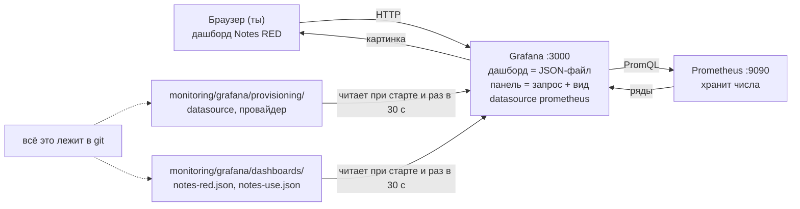
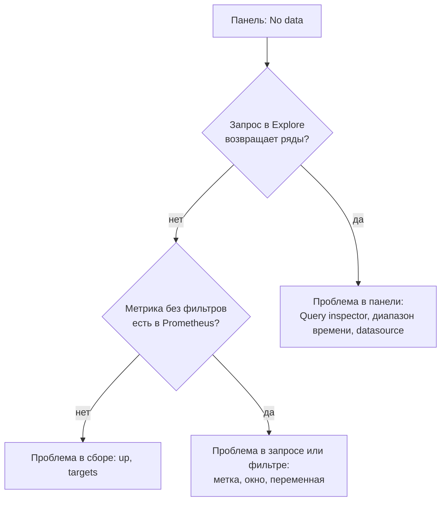

## Зачем это нужно

Prometheus (программа, которая собирает и хранит метрики, [урок 8.2](02-prometheus-basics.md)) хранит числа, а человек в 3 часа ночи хочет увидеть картинку и понять: что горит. Для этого есть Grafana: веб-программа, которая рисует графики по данным из других систем, как телевизор показывает то, что ему передали, и сама ничего не хранит. Без неё ты смотрел бы на столбцы чисел. Страница с графиками в Grafana называется дашборд (dashboard, «приборная панель»), а один график на ней это панель (panel). Дашборд, собранный мышкой в браузере, живёт только внутри Grafana: пересоздали контейнер или том, и он пропал. Дашборд-свалка на 40 панелей тоже не помогает: глаз не находит проблему.

На работе от тебя ждут дашборд сервиса по методу RED (Rate, Errors, Duration: запросы, ошибки, длительность: сколько пользователь ждёт ответа), дашборд узла по методу USE (Utilization, Saturation, Errors: занятость, очередь, сбои) и хранение обоих в git, чтобы стек поднимался с нуля одной командой.

Шаг проекта: в `monitoring/compose.yml` появляется Grafana 13.2.2 на порту 3000, а в `monitoring/grafana/` лежат provisioning (файлы автоматической настройки: источник данных Prometheus и провайдер дашбордов) и дашборды `notes-red.json` и `notes-use.json`. JSON это текстовый формат данных: пары «ключ: значение» в фигурных скобках, как анкета, которую читает и человек, и программа. Дашборд можно целиком записать в такой файл и хранить в git (система хранения версий файлов, [урок 3.1](../03-git-ci/01-git-basics.md)), поэтому его можно восстановить.

## Что нужно знать

- [Урок 4.5: Compose и PostgreSQL](../04-docker/05-compose-postgres.md): сервисы, тома (volumes, места, где контейнер хранит данные) и сеть `notes-net` в Compose.
- [Урок 8.1: наблюдаемость и SLO](01-observability-slo.md): SLI и SLO, то есть что вообще стоит показывать.
- [Урок 8.2: Prometheus и /metrics](02-prometheus-basics.md): стек `monitoring/compose.yml`, метрики `notes_http_*`.
- [Урок 8.3: PromQL](03-promql.md): `rate`, `sum by`, `histogram_quantile`, recording rules.
- [Урок 8.5: Alertmanager](05-alertmanager.md): алерты и runbook, дашборд открывают по ссылке из них.
- Если хочешь разобрать основы на другом стенде, см. [Grafana](../../monitoring/03-dashboards-alerts/01-grafana.md) в курсе «Мониторинг и SRE».

## Картина целиком

Представь приборную панель автомобиля. Датчики в двигателе, в баке и на колёсах измеряют температуру, топливо, скорость (это Prometheus с метриками). Сама панель ничего не измеряет: она показывает то, что ей передали датчики, в виде удобных стрелок и лампочек (это Grafana). На панели есть главное (скорость, лампочка «двигатель»), а мелочи убраны в бортовой компьютер. И конструкция панели задана на заводе чертежом, а не собирается заново каждым водителем (provisioning из файлов в git).



Браузер говорит только с Grafana, а Grafana ходит за числами в Prometheus. Настройки и дашборды она читает из файлов в git, поэтому Grafana можно стереть и поднять заново.

За урок ты разберёшь: что такое источник данных, панель и дашборд, какие бывают виды панелей и как из запроса получается картинка, что должно быть на первом экране (RED и USE), зачем переменные и `$__rate_interval`, и как сделать так, чтобы Grafana можно было стереть и поднять заново без единого клика. Про `$__rate_interval` коротко: это окно времени, за которое считается скорость в `rate()`, Grafana подбирает его сама под масштаб графика (подробно разберём ниже).

## Теория

### Grafana, источник данных, панель и дашборд

Prometheus умеет хранить и считать, но его собственный интерфейс задуман для одноразовых запросов: ввёл выражение, посмотрел график, закрыл. Для постоянного наблюдения нужны страницы, где 6 графиков лежат рядом, обновляются сами, их можно отправить коллеге по ссылке и оформить единым видом. Это делает Grafana.

Grafana это телевизор, а Prometheus (и позже Loki с Tempo) телеканалы. Телевизор не снимает и не хранит передачи, он показывает то, что ему дали, и умеет переключать каналы. Аналогия неточна тем, что «канал» для Grafana это не готовая картинка, а запрос: она каждый раз спрашивает данные заново.

Четыре понятия, от меньшего к большему:

1. **Источник данных** (datasource): подключение Grafana к месту, где лежат данные. Для метрик это Prometheus (адрес `http://prometheus:9090`), позже в курсе Loki (логи) и Tempo (трассы). Grafana сама метрик не хранит.
2. **Панель** (panel): один запрос к источнику плюс способ показа. Запрос это тот же PromQL, что ты писал в [уроке 8.3](03-promql.md).
3. **Дашборд**: страница, на которой в сетке расставлены панели. Внутри Grafana дашборд хранится как один JSON-документ (JSON это текстовый формат данных с фигурными скобками и парами «ключ: значение»).
4. **Папка** (folder): группа дашбордов, на неё же вешаются права доступа (кто может смотреть и править).

Виды панелей, которые понадобятся:

| Вид | Что показывает | Когда брать |
|---|---|---|
| `timeseries` | линии по времени | как значение менялось: запросы, задержка |
| `stat` | одно крупное число с цветом | «сколько сейчас»: доля ошибок |
| `gauge` | стрелка на шкале | «сколько из максимума»: заполнение диска |
| `heatmap` | тепловая карта: по горизонтали время, по вертикали диапазоны значений, цвет это сколько попаданий | распределение задержек |
| `table` | таблица | список с числами |

Запрос панели это обычный PromQL. Поэтому хорошая практика такая: сложную логику держать в recording rules (правила Prometheus, которые заранее считают выражение и сохраняют под коротким именем, например `notes:http_errors:ratio5m`), а панель делать простой. Тогда панель, алерт и разбор инцидента показывают одно и то же число.

Отдельно про алерты. В Grafana есть собственный алертинг, но в курсе алерты живут в Prometheus и Alertmanager ([урок 8.5](05-alertmanager.md)): правила лежат в git, проверяются `promtool`, доставка настроена в одном месте. Grafana для нас окно для глаз, а не источник алертов.

Разберём на примере. Ты открываешь страницу `http://127.0.0.1:3000/d/notes-red`. Браузер спрашивает у Grafana дашборд `notes-red`. Grafana читает его JSON, видит пять панелей. Для каждой она берёт из JSON запрос и отправляет его в источник, имя которого указано в панели (`uid: prometheus`). Prometheus считает и возвращает ряды чисел. Grafana рисует. Браузер запросов к Prometheus не делает: Grafana ходит к нему сама. Это режим доступа `access: proxy` (запросы идут через сервер Grafana). Второй режим `direct` заставляет браузер ходить к источнику напрямую, но браузер на твоём ноутбуке не знает имени `prometheus`: оно понятно только внутри сети Docker Compose.

> **Прикинь сам:** почему панель лучше строить на recording rule, а не на длинном выражении?
{: .predict}

Число совпадает с алертом (одно определение «доли ошибок»), запрос считается один раз в Prometheus, а не при каждом обновлении дашборда каждым зрителем, и выражение правится в одном месте.

Осторожно, тут часто путают. «Grafana собирает метрики с серверов». Нет, метрики собирает Prometheus, а Grafana только спрашивает и рисует. Ещё путают панель и запрос: запрос лишь часть панели, у неё есть ещё единицы измерения, цвета, пороги.

> **Главное:** Grafana только рисует: источник данных даёт числа, панель это запрос плюс вид, а дашборд собирает панели вместе.
{: .key}

Как из запроса получается картинка?

### Как из запроса получается картинка: разбор панели «Ошибки 5xx»

Начинающий видит панель как магию: «нарисовало». Чтобы уметь чинить No data и врущие графики, нужно знать, что именно и в каком порядке считается.

Кассир в магазине, который в конце дня сводит чеки: сколько всего чеков, сколько из них с возвратом, какова доля. Для графика то же самое, только «конец дня» повторяется на каждой точке.

Grafana выбирает диапазон времени (например, последний час) и шаг (например, 15 секунд). Для каждого шага она просит Prometheus вычислить выражение на этот момент. Получается набор точек «время-значение», которые соединяются в линию или окрашивают число. Единицы и цвета берутся не из запроса, а из настроек панели (`fieldConfig`): unit (например `percent`) и пороги (thresholds: при значении выше 0,5 цвет оранжевый, выше 1 красный).

Разберём на примере. Запрос панели «Ошибки 5xx, % запросов»:

```text
100 * sum(rate(notes_http_requests_total{status=~"5..", path=~"$path"}[$__rate_interval]))
    / sum(rate(notes_http_requests_total{path=~"$path"}[$__rate_interval]))
```

Разберём его слева направо.

- `notes_http_requests_total` счётчик запросов (число только растёт), у него метки `method`, `path`, `status`. [Урок 8.2](02-prometheus-basics.md).
- `{status=~"5.."}`: оставить ряды, где метка `status` подходит под регулярное выражение (`=~`). `5..` это «пятёрка и любые два символа»: 500, 502, 503.
- `path=~"$path"`: то же для метки `path`, только шаблон берётся из переменной дашборда `$path` (разберём ниже).
- `rate(...[окно])`: скорость роста счётчика в секунду за окно (в единицах «запросов в секунду»).
- `sum(...)`: сложить скорости всех подходящих рядов в одно число.
- Деление даёт долю, умножение на 100 переводит в проценты.

Числа. Пусть за окно 1 минута «Заметки» получали в среднем 20 запросов в секунду, из них 0,2 в секунду с кодом 5xx. Тогда 100 × 0,2 / 20 = 1. Панель показывает `1`, а единица `percent` превращает это в «1%». Пороги: 1 не меньше границы 1, цвет красный.

Важная тонкость. Если за окно запросов не было вообще, то в знаменателе `sum` пустого набора: результат «пусто», панель покажет `No data`, а не «0%». Это разные вещи: «нет данных» значит «нечего делить», «0%» значит «запросы были, ошибок нет».

<div class="viz" data-viz="obs-dashboard" data-scenario="payment"></div>

Переключай сценарии и смотри, как одно и то же событие выглядит на панелях RED: запросы, ошибки и длительность.

Осторожно, тут часто путают. Что панель «врёт». Чаще она честно считает не то, что ты думаешь: не тот `path`, не то окно, потерялась переменная. Всегда сначала читай запрос панели (в Grafana: Edit, вкладка Query).

> **Главное:** Grafana выбирает диапазон и шаг, просит Prometheus вычислить выражение на каждом шаге и рисует точки.
{: .key}

> **Проверь понимание:** что покажет панель ошибок, если пользователей ночью не было и запросов не было вообще?

<details markdown="1">
<summary>Ответ</summary>

`No data`, а не «0%»: знаменатель пуст, деление невозможно. Это не поломка. Чтобы отличать «нет запросов» от «нет ошибок», рядом показывают панель с количеством запросов.

</details>

Что показывать на первом экране?

### RED и USE: что должно быть на первом экране

Метрик у сервиса сотни. Если вывести все, глаз тонет. Нужен принцип отбора: какие пять-шесть панелей отвечают на вопрос «что горит».

Приёмное отделение больницы. Врач в первую минуту смотрит на четыре показателя (пульс, давление, температура, сатурацию), а не на полный анализ крови. Полный анализ есть, но он для второго шага.

Два метода, у каждого своя область:

- **RED** для сервиса, которому приходят запросы: **R**ate (сколько запросов в секунду), **E**rrors (какая доля ошибочных), **D**uration (сколько длится ответ: медиана p50, p95, p99; pNN это «NN% ответов быстрее этого значения», p95 = 0,3 секунды значит, что 95 из 100 запросов быстрее 0,3 с). RED отвечает на вопрос «плохо ли пользователю».
- **USE** для ресурса (процессор, память, диск, сеть): **U**tilization (сколько занято, в процентах), **S**aturation (насыщение: очередь ожидающих, нехватка), **E**rrors (сбои). USE отвечает на вопрос «почему: не хватает ли ресурса».

Правило первого экрана: сверху то, что горит. У «Заметок» это доля ошибок и p95 рядом с целью из `docs/slo.md`, ниже число запросов по `path`, ещё ниже детали. Каждая панель отвечает на один вопрос и имеет говорящий заголовок с единицами: «Ошибки 5xx, % запросов», а не «Panel 7».

Разберём на примере. Сценарий: жалоба «медленно». Ты открываешь RED. Панель p95 показывает 1,2 секунды (порог красный при 0,5), ошибок 0%. Вывод: сервис работает, но медленно. Смотришь разбивку по `path`: медленный только `/notes`. Открываешь USE узла: CPU 20%. Значит, узел не перегружен, и ждать нужно чего-то ещё (базу данных, сеть). Ответ пришёл за минуту, потому что дашборды отвечают на вопросы по порядку.

Антипаттерны: 30-40 панелей без порядка, графики без порогов и единиц, суммы там, где нужна разбивка, отсутствие ссылки на runbook.

> **Прикинь сам:** сервис отвечает медленно, а CPU узла 20%. Какой дашборд ты откроешь первым и почему?
{: .predict}

RED сервиса: он показывает, растёт ли p95 и на каких `path`. USE узла пока не объясняет проблему, а низкий CPU лишь говорит, что причина скорее в ожидании (БД, сеть), и это уже вопрос к трассировке и логам ([урок 8.7](07-logs-loki-alloy.md), [8.8](08-tracing.md)).

Осторожно, тут часто путают. Что USE это «дашборд про инфраструктуру, RED это про приложение, зачем оба». Нужны оба, потому что причина медленного сервиса бывает и в коде (видно в RED), и в ресурсах (видно в USE), и надо быстро понять, где искать.

> **Главное:** RED для сервиса (запросы, ошибки, длительность), USE для узла (занятость, очередь, сбои), и первый экран отвечает на вопрос «что горит».
{: .key}

Как не делать копию на каждый путь?

### Переменные дашборда и `$__rate_interval`

Без переменных на каждый сервис или путь пришлось бы делать копию дашборда. Без правильного окна в `rate()` график либо пустой, либо сглаженный до бесполезности.

Переменная это ячейка «кому» в бланке письма: один бланк, в ячейку подставляют разные фамилии. Окно в `rate()` похоже на выдержку в фотоаппарате: слишком короткая даёт тёмный кадр, слишком длинная смазывает движение.


Переменная (variable) дашборда показывается выпадающим списком вверху страницы. Её значение подставляется в запросы вместо `$path`. Список значений берётся запросом к источнику: `label_values(notes_http_requests_total, path)` означает «все значения метки `path` у этой метрики». Вариант «All» (`includeAll`) и выбор нескольких значений (`multi`) превращают значение в регулярное выражение вида `/notes|/healthz`, поэтому в запросе нужен селектор `path=~"$path"` (с тильдой), а не `path="$path"`.

Окно в `rate()` задаёт специальная переменная `$__rate_interval`. Её вычисляет сама Grafana примерно как большее из двух: (шаг графика + интервал скрапа) и четыре интервала скрапа. Скрап (scrape) это опрос цели Prometheus (у нас раз в 15 секунд, поле `timeInterval` в datasource говорит Grafana об этом).

Разберём на примере. Скрап 15 секунд. Дашборд за 1 час, шаг графика около 15 секунд: (15 + 15) = 30 секунд против 4 × 15 = 60 секунд, берётся 60 секунд. Дашборд за 7 дней, шаг график около 10 минут: 10 минут + 15 секунд, около 10 минут. Окно растёт вместе с масштабом, поэтому линия остаётся ровной, но не теряет пики. Жёсткое `[5m]` на графике за 7 дней сгладит всплески короче пяти минут. А жёсткое `[15s]` при скрапе раз в 15 секунд даст в окне ровно одну точку: `rate` нужны минимум две, получится `No data` ([урок 8.3](03-promql.md)).

Осторожно, тут часто путают. Что `$__rate_interval` это то же, что `$__interval`. Второй просто шаг графика, а первый уже с запасом на скрап, и именно он нужен внутри `rate()`.

> **Главное:** переменная подставляется в запросы вместо `$path`, а `$__rate_interval` подбирает окно `rate` под масштаб графика.
{: .key}

> **Проверь понимание:** зачем в запросе `$__rate_interval`, а не `[1m]`?

<details markdown="1">
<summary>Ответ</summary>

Окно подстраивается под масштаб графика и `scrape_interval`, поэтому не бывает «No data» из-за окна короче двух скрапов и график не сглаживается при большом масштабе.

</details>

Как хранить дашборд как код?

### Provisioning: Grafana как код

Дашборд, нарисованный мышкой, хранится в базе внутри тома Grafana. Том потерялся, дашборд потерялся. Коллеге его не передать иначе как экспортом вручную, и никто не видит, кто и что менял. Хочется относиться к дашбордам как к коду: файлы в git, ревью, история, воспроизводимость.

Рецепт против блюда. Блюдо, приготовленное на глаз, повторить сложно. Записанный рецепт позволяет любому повару приготовить то же самое, и ты видишь, что в нём изменили. Аналогия неточна в одном: файл в git должен оставаться главным, а правки «на глаз» в интерфейсе будут потеряны (разберём ниже).

Provisioning (подготовка конфигурации при старте) это файлы, которые Grafana читает сама:

- `provisioning/datasources/*.yml` описывает источники данных;
- `provisioning/dashboards/*.yml` описывает провайдера: «смотри в такой-то папке, там JSON-файлы дашбордов; показывай их в папке Notes; перечитывай каждые 30 секунд»;
- сами дашборды лежат JSON-файлами в каталоге, на который указывает провайдер.

Эти каталоги в контейнер попадают через `volumes` в Compose. Запись `./grafana/provisioning:/etc/grafana/provisioning:ro` называется bind mount (примонтированный каталог): каталог с твоей машины появляется внутри контейнера по указанному пути, `:ro` значит «только чтение». Отдельно есть именованный том `grafana-data` для внутренней базы Grafana (сессии, пользователи).

Рабочий цикл: рисуешь дашборд в интерфейсе (так быстро), выгружаешь JSON (меню Share, Export, Export as JSON), кладёшь в `monitoring/grafana/dashboards/`, коммитишь. Всё, что создано файлом, Grafana применяет при старте и при каждом изменении файла (каталог провайдер проверяет по таймеру). При `allowUiUpdates: false` Grafana не даёт сохранять правки такого дашборда в интерфейсе, чтобы никто не думал, что они сохранились.

Ключевая деталь: `uid`. Это постоянный идентификатор (короткая строка) источника данных и дашборда. Панель в JSON ссылается на источник не по имени, а по `uid`. Если у источника `uid` каждый раз генерируется случайно, после пересоздания все панели теряют связь и показывают `datasource ... was not found`. Поэтому в файле источника `uid: prometheus` написан явно.

Разберём на примере. День 1: ты кладёшь `notes-red.json` в каталог и запускаешь Grafana. Через секунды на странице «Dashboards» появляется папка Notes с дашбордом «Notes RED». День 8: ты открыл дашборд в интерфейсе и поправил заголовок панели. Grafana предупредила бы (`allowUiUpdates: false`), что сохранить нельзя. Если бы разрешила, правка жила бы до следующего изменения файла или рестарта Grafana, а потом провайдер вернул бы старый заголовок, потому что источник правды в git. День 9: `docker compose down -v` и `up -d`, стек поднялся, дашборд на месте: он читается из файла.

> **Прикинь сам:** ты поправил панель в UI провижененного дашборда, через неделю поправка исчезла. Почему?
{: .predict}

Источник правды файл в git: при перезапуске или обновлении файла Grafana перечитала JSON и затёрла ручную правку. Правку нужно экспортировать в файл и закоммитить.

Осторожно, тут часто путают. Что том `grafana-data` и есть «наши дашборды». Это только внутренняя база. Наши дашборды это файлы, а том можно удалять. И второе: удаление тома `prom-data` (метрики) это уже потеря данных, а не «переустановка».

> **Главное:** provisioning читает источники и дашборды из файлов, поэтому Grafana поднимается заново без единого клика.
{: .key}

Из чего состоит такой JSON?

### Из чего состоит дашборд в JSON

Ты будешь читать и править JSON дашборда, а не только кликать. Поэтому нужно знать, где в нём что.

План расстановки мебели: комната поделена на клетки, у каждой вещи указано, в каких клетках она стоит и что это за вещь.

Дашборд это объект с ключами:

- `uid`, `title`, `tags`: идентификатор, заголовок, теги для поиска;
- `time` и `refresh`: диапазон по умолчанию (`now-1h`, последний час) и автообновление (`30s`);
- `templating`: переменные;
- `links`: ссылки над дашбордом (мы кладём сюда ссылку на runbook);
- `panels`: список панелей. У каждой: `id`, `type`, `title`, `gridPos`, `datasource`, `targets` (запросы), `fieldConfig` (единицы и пороги).

`gridPos` задаёт место в сетке: ширина страницы 24 клетки, `x` это столбец слева, `y` строка сверху, `w` ширина, `h` высота. Панель `{"x": 0, "y": 0, "w": 6, "h": 5}` стоит в левом верхнем углу, занимает четверть ширины (6 из 24) и высоту 5 строк. Рядом на 6 клеток правее (`x: 6`) стоит вторая, и вместе они занимают половину верхнего ряда.

`targets` это список запросов панели. У каждого `refId` (метка `A`, `B`, `C`), `expr` (PromQL) и `legendFormat` (подпись линии в легенде; шаблон с двойными фигурными скобками вида `{{path}}` подставляет значение метки `path`).

Разберём на примере. Кусок панели «p95 задержки»:

```text
"type": "stat", "title": "p95 задержки, сек",
"fieldConfig": {"defaults": {"unit": "s", "decimals": 3,
  "thresholds": {"steps": [зелёный от -бесконечности, оранжевый от 0.3, красный от 0.5]}}}
```

`unit: s` значит, что число в секундах (Grafana сама покажет «120 ms» вместо 0.12). `steps` это ступени цвета: значение меньше 0,3 зелёное, от 0,3 до 0,5 оранжевое, от 0,5 красное. Порог 0,5 секунды совпал с алертом `NotesHighLatency` из [урока 8.5](05-alertmanager.md): красная панель и сработавший алерт означают одно и то же.

Осторожно, тут часто путают. Что дашборд надо писать JSON вручную. Обычно его рисуют в интерфейсе и экспортируют. Руками правят детали или генерируют однотипные панели скриптом (как мы сделаем для USE).

> **Главное:** дашборд это объект с `uid`, `title`, панелями и переменными, и каждая панель задаёт запрос, вид и позицию.
{: .key}

> **Проверь понимание:** панель с `"gridPos": {"x": 12, "y": 0, "w": 12, "h": 5}` и панель с `{"x": 0, "y": 0, "w": 12, "h": 5}`. Как они расположены?

<details markdown="1">
<summary>Ответ</summary>

Обе в верхнем ряду и занимают по половине ширины: первая правая половина (начинается с 12-й клетки), вторая левая половина (с 0-й).

</details>

Как показать задержки?

### Гистограмма задержек: откуда берутся p95 и тепловая карта

Две панели дашборда (p50/p95/p99 и heatmap) строятся из метрики `notes_http_request_duration_seconds_bucket`. Без понимания, что это за метрика, панели выглядят волшебством и первая же странность (p95 «прыгает» или равен ровно 0,5) ставит в тупик.

Почтовое отделение, где каждое письмо кладут в одну из корзин по времени доставки: «до 0,1 суток», «до 0,25», «до 0,5», «до 1», «дольше». Хранить время каждого письма дорого. Хранить, сколько писем в каждой корзине, дёшево, и по корзинам можно оценить, за сколько доставляют 95% писем. Аналогия неточна: корзины у Prometheus накопительные (об этом ниже).

Гистограмма (histogram) в Prometheus это набор счётчиков по границам `le` (less or equal, «меньше или равно»). Счётчик `..._bucket{le="0.25"}` считает, сколько запросов длилось не дольше 0,25 секунды за всё время работы. Корзины накопительные: в `le="0.5"` входят и все запросы из `le="0.25"`. Последняя корзина `le="+Inf"` содержит вообще все запросы. Как и все счётчики, они только растут, поэтому для графика берут `rate` или `increase` (сколько прибавилось за окно).

`histogram_quantile(0.95, ...)` находит границу, ниже которой лежат 95% запросов, и линейно оценивает значение внутри корзины. Оценка приблизительная: точность зависит от того, как густо расставлены границы.

Разберём на примере. Пусть за последнюю минуту прибавилось:

```text
le="0.1"   ->  70   запросов не дольше 0,1 с
le="0.25"  ->  90   (70 быстрых + 20 между 0,1 и 0,25)
le="0.5"   ->  98
le="1"     ->  100
le="+Inf"  ->  100  всего запросов
```

Нужно найти p95: 95% от 100 это 95-й по скорости запрос. Он не в корзине до 0,25 (там только 90), но входит в корзину до 0,5 (там 98). В этой корзине 8 запросов (98 минус 90), нам нужен 5-й из них (95 минус 90). Оценка внутри корзины линейная: 0,25 + (5 / 8) × (0,5 - 0,25) = 0,25 + 0,156 = около 0,41 секунды. Панель p95 покажет примерно 0,41. Это ниже красного порога 0,5, но выше оранжевого 0,3.

Тепловая карта показывает те же корзины напрямую: по вертикали границы `le`, по горизонтали время, цвет это сколько запросов попало в диапазон за шаг. Поэтому heatmap строится из `increase(..._bucket)` по `le` (сколько запросов прибавилось в каждую корзину), а не из `histogram_quantile`, который сворачивает все корзины в одно число.

<div class="viz" data-viz="obs-quantile" data-slow="5" data-q="95"></div>

Корзина, в которой лежит 95-й запрос, даёт диапазон ответа: сам p95 это оценка внутри этой корзины.

> **Прикинь сам:** по данным выше: сколько запросов было в диапазоне от 0,25 до 0,5 секунды?
{: .predict}

8: корзина `le="0.5"` содержит 98, корзина `le="0.25"` содержит 90, разница 98 минус 90 равна 8. Корзины накопительные, поэтому для «между границами» их вычитают.

Осторожно, тут часто путают. Что p95 это среднее по 95% запросов. Нет, это граница: 95% запросов быстрее этого значения, а 5% медленнее. И ещё: p95 на границе корзины врёт: если все медленные запросы лежат в корзине «до 1 с», Grafana не знает, 0,6 это или 0,99.

> **Главное:** p95 это оценка внутри корзины, а тепловая карта показывает те же корзины по времени.
{: .key}

Что делать, если панель пустая?

### Explore и Query inspector: как искать причину No data

Самая частая жалоба на дашборд: «пусто». Если действовать наугад, можно долго чинить не то. Есть порядок проверок, который каждый раз находит причину.

Телевизор не показывает картинку. Ты проверяешь по цепочке: включён ли телевизор, воткнута ли антенна, работает ли канал, выбран ли нужный вход. Не наоборот и не наугад.

В Grafana есть два инструмента отладки:

- **Explore** (пункт меню слева): чистый лист для одного запроса к любому источнику, без дашборда. Выбираешь datasource, вводишь PromQL, смотришь результат.
- **Query inspector** (в меню панели: Inspect, Query): показывает запрос, который на самом деле ушёл к источнику (уже с подставленными переменными и `$__rate_interval`), и сырой ответ.

Порядок проверок при No data идёт от источника к деталям: 1) источник жив: в Explore запрос `up`; 2) есть ли вообще нужная метрика: запрос `notes_http_requests_total`; 3) диапазон времени: в нём должны быть запросы, поставь «последние 15 минут»; 4) переменные: не пуст ли `$path`; 5) окно: вместо `$__rate_interval` подставь `5m`, чтобы исключить проблему окна.

Разберём на примере. Сценарий: панели пусты. Шаг 1: в Explore `up` возвращает ошибку `Post "http://localhost:9090/api/v1/query": dial tcp ... connection refused`. Значит, datasource смотрит на `localhost` (это сам контейнер Grafana, где Prometheus нет). Исправляем `url` в файле provisioning на `http://prometheus:9090`, перезапускаем Grafana. Если бы `up` вернулся нормально, мы перешли бы к шагу 2. Запрос в Query inspector помогает на шаге 4: видно, что вместо `path=~"$path"` ушло `path=~""`, потому что переменная пуста.



Идёшь от простого к сложному: сначала данные, потом запрос, потом настройки панели.

Осторожно, тут часто путают. Что No data значит «метрики не собираются». Часто данные есть, а запрос пуст из-за окна, переменной или неверного источника. Проверяй не метрики, а запрос.

> **Главное:** при No data идут по цепочке: данные, запрос, настройки панели, а Explore и Query inspector показывают, на каком шаге пусто.
{: .key}

> **Проверь понимание:** в Explore запрос `up` работает, а панель с `rate(...[$__rate_interval])` пуста. Что проверишь дальше?

<details markdown="1">
<summary>Ответ</summary>

Что метрика вообще есть в выбранном диапазоне времени, значение переменной (`$path` не пуст) и окно: подставь в Explore то же выражение с `[5m]`. Источник жив, значит, проблема в самом запросе или в его параметрах, а не в подключении.

</details>

Как время влияет на картинку?

### Время на графике: диапазон, шаг и автообновление

Один и тот же дашборд можно открыть «за последние 5 минут» и «за месяц», и картинка будет разной. Новичок, не понимающий почему, решает, что Grafana врёт. Нужно знать три настройки вверху страницы и что каждая меняет.

Карта. Диапазон времени это масштаб: район или вся страна. Шаг это размер «пикселя»: на карте страны целый город один пиксель, и мелкие детали пропадают. Автообновление это прямой эфир: картинка сама подтягивает новые данные. Аналогия неточна тем, что масштаб по времени можно менять, не теряя данных: они хранятся в Prometheus, меняется только то, как часто ты берёшь точки.

Справа вверху у дашборда три элемента.

1. **Диапазон времени** (time range): «Last 1 hour» значит «последний час от текущего момента». Можно выбрать «Last 7 days» или задать даты вручную. Все панели дашборда показывают один и тот же диапазон, поэтому графики удобно сравнивать между собой.
2. **Шаг** (step, `$__interval`): расстояние между соседними точками на графике. Его выбирает Grafana сама, примерно как диапазон, делённый на ширину панели в пикселях. Час на широкой панели даёт шаг около 15 секунд, неделя даёт шаг около 10 минут.
3. **Автообновление** (auto-refresh): список «Off, 5s, 30s, 1m...». Дашборд сам повторяет запросы с таким интервалом. Для разбора аварии ставь 10-30 секунд, для спокойного просмотра «Off».

Разберём на примере. Пик ошибок длился 2 минуты. Открываешь дашборд за час: шаг 15 секунд, 2 минуты это 8 точек, пик хорошо виден. Открываешь тот же дашборд за 7 дней: шаг 10 минут, пик в пять раз короче шага, и на линии он может почти раствориться. Вывод: если пик пропал, сначала сузь диапазон, а не решай, что «ошибок не было». Второй нюанс: автообновление 5 секунд при скрапе раз в 15 секунд бессмысленно, новые точки появляются только раз в 15 секунд, а нагрузка на Prometheus растёт впустую.

> **Прикинь сам:** на графике за месяц ошибок нет, а пользователи жаловались вчера вечером в течение 3 минут. Что сделать?
{: .predict}

Поставить диапазон на вчерашний вечер (например, 20:00-21:00): шаг станет мельче, и короткий всплеск будет виден. На месячном масштабе шаг около часа, трёхминутный пик сглаживается или пропадает.

Осторожно, тут часто путают. Что диапазон «Last 1 hour» это фиксированный час. Он «скользит» вместе с часами: через минуту окно сдвинется. Чтобы разобрать уже случившуюся аварию, задай абсолютные даты (с 02:10 до 02:40): тогда картинка не поедет, и ссылкой на неё можно поделиться с коллегой.

> **Главное:** диапазон задаёт масштаб, шаг размер «пикселя», а автообновление не должно быть чаще интервала сбора.
{: .key}

Как не обмануть читателя?

### Единицы, пороги и легенда: как не обмануть читателя

Число 0,01 на панели ничего не значит: это секунды, доля или штуки? Без единиц, цветов и подписей дашборд читают неправильно, а ночью ошибаются чаще всего.

Спидометр без надписи «км/ч» и без красной зоны. Стрелка на 120 пугает или успокаивает, смотря что ты предположил. Единицы и красная зона это «перевод» числа в смысл. Аналогия неточна тем, что у панели красная зона задаётся человеком, сама она не знает, что «плохо».

Эти настройки лежат в панели, а не в запросе.

- **Единица** (unit): `percent` (проценты), `s` (секунды), `reqps` (запросов в секунду), `bytes` (байты). Grafana сама переведёт 1500000 байт в «1.43 MiB», а 0,3 секунды в «300 ms».
- **Порог** (threshold): граница, за которой панель меняет цвет. Например, зелёный до 0,5%, оранжевый от 0,5%, красный от 1%. Цвет читается быстрее числа.
- **Легенда** (legend): подпись к линиям. Если линий несколько, без неё не понять, какая чья. Имя линии задаётся шаблоном вроде `{{path}}` (значение метки `path`), иначе Grafana покажет длинную строку со всеми метками.
- **Минимум и максимум** оси (min, max). Для доли ошибок ставь min 0, иначе Grafana может растянуть ось, и шум в 0,001% будет выглядеть как катастрофа.

Разберём на примере. Панель p95 задержки. Запрос возвращает 0,42. Без единицы на панели просто «0.42». Ставим `s`: «420 ms». Добавляем пороги: зелёный до 0,3 с, оранжевый от 0,3 с, красный от 0,5 с. Теперь «420 ms» оранжевое: видно без чтения, что до красной зоны недалеко. Пороги берём из SLO ([урок 8.1](01-observability-slo.md)), а не с потолка: красный цвет должен означать «цель нарушена».

Осторожно, тут часто путают. Что единица меняет значение. Нет, она меняет только подпись и форматирование: запрос вернул 0,42 секунды, и неверно выбранная единица `ms` покажет «0.42 ms», то есть соврёт в тысячу раз. Всегда проверяй, в каких единицах отдаёт метрика (в Prometheus принято брать секунды и байты).

> **Главное:** единица, пороги и легенда лежат в панели и превращают число в понятный сигнал.
{: .key}

> **Проверь понимание:** панель с p95 показывает «0.42 ms», а пользователи жалуются на тормоза. Что проверишь?

<details markdown="1">
<summary>Ответ</summary>

Единицу панели. Метрика в секундах, а выбрана `ms`: значение 0,42 секунды выводится как «0.42 ms». Нужно поставить `s`, тогда панель покажет «420 ms».

</details>

Как понять, что дашборд хороший?

### Хороший дашборд и как его проверить

Дашборд, который открывают на разборе инцидента, оценивают за секунды. Если за 10 секунд не понятно, здоров ли сервис, дашборд не работает.

Проверка на «10 секунд»: покажи дашборд коллеге, который его не видел, на 10 секунд. Если он назвал состояние (здоров, есть ошибки, медленно), дашборд годится. Чтобы он годился: не более 5-8 панелей на первом экране, сверху ошибки и p95, каждой панели заголовок с единицами и пороги с цветом, ссылка на runbook рядом. Правило для декораций: то, что не отвечает на вопрос, уходит либо на другой дашборд (по компоненту), либо в Explore (режим Grafana для разовых запросов).

> **Прикинь сам:** на дашборде 25 панелей, и коллега не может за 10 секунд сказать, здоров ли сервис. Что делать?
{: .predict}

Оставить на первом экране 5-8 панелей: запросы, доля ошибок, p95, статус `up`. Остальное убрать в отдельный дашборд по компонентам или в Explore, а каждой оставшейся панели дать заголовок с единицей и цветные пороги.

Осторожно, тут часто путают. Что чем больше панелей, тем больше знаний. Наоборот: подробности прячут ниже или на отдельные дашборды, а первый экран отвечает на один вопрос.

> **Главное:** дашборд проверяют на «10 секунд»: если коллега не назвал состояние сервиса, панелей слишком много или они не те.
{: .key}

## Практика

Стек «Заметок» из основного `compose.yml` (урок 4.5) уже запущен, каталог `monitoring/` из уроков 8.2-8.5 на месте. Команды выполняются из `~/notes`.

### Задание 1. Grafana в Compose и datasource через provisioning

**Цель:** поднять Grafana 13.2.2 рядом с Prometheus и получить рабочий datasource без единого клика.

**Предскажи:** сколько datasource увидит Grafana после старта, если в `provisioning/datasources/` лежит один файл с одним источником? И что будет с ним после `docker compose restart grafana`?

<details markdown="1">
<summary>Ответ</summary>

Один источник, помеченный как provisioned (в UI его нельзя удалить). После перезапуска он остаётся: файл читается при каждом старте.

</details>

**Шаги**

1. Создай каталоги и файл datasource. Команда `mkdir -p` создаёт каталоги вместе с промежуточными, а обратная косая черта `\` в конце строки означает «команда продолжается на следующей строке». Ключи файла: `apiVersion: 1` версия формата, `datasources` список источников, `uid` постоянный идентификатор, `type` вид источника, `access: proxy` запросы идут через сервер Grafana, `url` адрес Prometheus внутри сети Compose, `isDefault` источник по умолчанию, `timeInterval` интервал скрапа для расчёта `$__rate_interval`.

```bash
mkdir -p monitoring/grafana/provisioning/datasources \
         monitoring/grafana/provisioning/dashboards \
         monitoring/grafana/dashboards
```

```yaml
# monitoring/grafana/provisioning/datasources/prometheus.yml
apiVersion: 1
datasources:
  - name: Prometheus
    uid: prometheus          # постоянный uid: на него ссылаются панели в JSON
    type: prometheus
    access: proxy            # запросы идут через сервер Grafana, не из браузера
    url: http://prometheus:9090
    isDefault: true
    jsonData:
      timeInterval: 15s      # равен scrape_interval, от него считается $__rate_interval
```

2. Добавь провайдер дашбордов. Он говорит Grafana: «в каталоге `path` лежат JSON-файлы, покажи их в папке `Notes`, перечитывай раз в 30 секунд, из интерфейса их править нельзя».

```yaml
# monitoring/grafana/provisioning/dashboards/dashboards.yml
apiVersion: 1
providers:
  - name: notes
    folder: Notes            # папка в интерфейсе Grafana
    type: file
    allowUiUpdates: false    # правки только через git
    updateIntervalSeconds: 30
    options:
      path: /var/lib/grafana/dashboards
```

3. Добавь сервис в `monitoring/compose.yml` (секция `services:`) и том (секция `volumes:`). `ports: "127.0.0.1:3000:3000"` открывает порт 3000 только на самой машине (не для всей сети), `environment` передаёт настройки через переменные окружения (для Grafana они начинаются с `GF_`), `depends_on` запускает Grafana после Prometheus, остальное разобрано в [уроке 8.5](05-alertmanager.md).

```yaml
  grafana:
    image: grafana/grafana:13.2.2
    ports:
      - "127.0.0.1:3000:3000"   # только с этой машины
    environment:
      GF_SECURITY_ADMIN_PASSWORD: CHANGE_ME   # замени: openssl rand -base64 24
      GF_USERS_ALLOW_SIGN_UP: "false"
    volumes:
      - grafana-data:/var/lib/grafana
      - ./grafana/provisioning:/etc/grafana/provisioning:ro
      - ./grafana/dashboards:/var/lib/grafana/dashboards:ro
    depends_on:
      - prometheus
    restart: unless-stopped

# в конец файла, в существующую секцию volumes: добавь строку
#   grafana-data:
```

4. Запусти и проверь через API (пароль тот, что задал). `curl -s -u admin:CHANGE_ME URL` запрашивает страницу тихо и с логином `admin`, `jq '.[] | {name, uid, url}'` берёт каждый элемент массива и оставляет три поля:

```bash
docker compose -f monitoring/compose.yml up -d grafana
curl -s -u admin:CHANGE_ME http://127.0.0.1:3000/api/datasources | jq '.[] | {name, uid, url}'
```

**Что должно получиться**

```text
{
  "name": "Prometheus",
  "uid": "prometheus",
  "url": "http://prometheus:9090"
}
```

**Как читать вывод:** один объект значит один источник данных. `uid` совпадает с тем, что написан в файле: именно на него будут ссылаться панели. `url` это адрес, по которому сервер Grafana (не браузер) ходит к Prometheus.

**Объясни себе**

- Почему в `url` стоит `prometheus:9090`, а не `localhost:9090`?
- Зачем `access: proxy` и что было бы с `direct`?

**Типичные ошибки**

- `Origin not allowed` или пустой ответ из-за `direct`: браузер сам ходит по `url`, а внутри сети Compose имя `prometheus` браузеру неизвестно: ставь `access: proxy`.
- `{"message":"invalid username or password"}`: пароль в `curl` не совпадает с `GF_SECURITY_ADMIN_PASSWORD`. Учти: пароль применяется при первом создании тома `grafana-data`, позже его меняют командой `docker compose exec grafana grafana cli admin reset-admin-password <новый>`.
- `Error: ... permission denied` на `/var/lib/grafana`: том создан другим пользователем, пересоздай том `docker compose down` и `docker volume rm` для него (данные учебные).

### Задание 2. Дашборд Notes RED как JSON

**Цель:** получить дашборд по RED, лежащий в git и подхватываемый Grafana сам.

**Предскажи:** какие панели обязаны быть в верхнем ряду, если человек смотрит только на него? Сколько всего панелей ты оставишь?

<details markdown="1">
<summary>Ответ</summary>

Сверху доля ошибок и p95 (и число запросов как контекст). Всего 5-6 панелей: каждая отвечает на свой вопрос, остальное уходит в Explore.

</details>

**Шаги**

1. Сохрани дашборд целиком. Запросы используют метрики контракта `notes_http_requests_total{method,path,status}` и `notes_http_request_duration_seconds` из [урока 8.2](02-prometheus-basics.md). Строение файла разобрано в теории: пять панелей (две `stat`, два `timeseries`, одна `heatmap`), переменная `path`, ссылка на runbook (адрес в `links` это пример, подставь адрес runbook из своего репозитория). Кавычки внутри `expr` экранированы обратной косой чертой `\"`, потому что весь запрос сам лежит в JSON-строке.


```json
{
  "uid": "notes-red",
  "title": "Notes RED",
  "tags": ["notes", "red"],
  "schemaVersion": 41,
  "version": 1,
  "time": {"from": "now-1h", "to": "now"},
  "refresh": "30s",
  "templating": {
    "list": [
      {
        "name": "path",
        "label": "path",
        "type": "query",
        "datasource": {"type": "prometheus", "uid": "prometheus"},
        "query": {"query": "label_values(notes_http_requests_total, path)", "refId": "path"},
        "includeAll": true,
        "multi": true,
        "current": {"text": "All", "value": "$__all"}
      }
    ]
  },
  "links": [
    {"title": "Runbook: NotesHighErrorRate", "type": "link", "url": "https://github.com/distinguished-sre/learning/blob/main/devops/project/notes/docs/runbooks/NotesHighErrorRate.md", "targetBlank": true}
  ],
  "panels": [
    {
      "id": 1, "type": "stat", "title": "Ошибки 5xx, % запросов",
      "gridPos": {"x": 0, "y": 0, "w": 6, "h": 5},
      "datasource": {"type": "prometheus", "uid": "prometheus"},
      "targets": [{"refId": "A", "expr": "100 * sum(rate(notes_http_requests_total{status=~\"5..\", path=~\"$path\"}[$__rate_interval])) / sum(rate(notes_http_requests_total{path=~\"$path\"}[$__rate_interval]))"}],
      "fieldConfig": {"defaults": {"unit": "percent", "decimals": 2,
        "thresholds": {"mode": "absolute", "steps": [{"color": "green", "value": null}, {"color": "orange", "value": 0.5}, {"color": "red", "value": 1}]}}, "overrides": []}
    },
    {
      "id": 2, "type": "stat", "title": "p95 задержки, сек",
      "gridPos": {"x": 6, "y": 0, "w": 6, "h": 5},
      "datasource": {"type": "prometheus", "uid": "prometheus"},
      "targets": [{"refId": "A", "expr": "histogram_quantile(0.95, sum by (le) (rate(notes_http_request_duration_seconds_bucket{path=~\"$path\"}[$__rate_interval])))"}],
      "fieldConfig": {"defaults": {"unit": "s", "decimals": 3,
        "thresholds": {"mode": "absolute", "steps": [{"color": "green", "value": null}, {"color": "orange", "value": 0.3}, {"color": "red", "value": 0.5}]}}, "overrides": []}
    },
    {
      "id": 3, "type": "timeseries", "title": "Запросы в секунду по path",
      "gridPos": {"x": 12, "y": 0, "w": 12, "h": 5},
      "datasource": {"type": "prometheus", "uid": "prometheus"},
      "targets": [{"refId": "A", "legendFormat": "{{path}}", "expr": "sum by (path) (rate(notes_http_requests_total{path=~\"$path\"}[$__rate_interval]))"}],
      "fieldConfig": {"defaults": {"unit": "reqps"}, "overrides": []}
    },
    {
      "id": 4, "type": "timeseries", "title": "Задержка p50 / p95 / p99, сек",
      "gridPos": {"x": 0, "y": 5, "w": 12, "h": 8},
      "datasource": {"type": "prometheus", "uid": "prometheus"},
      "targets": [
        {"refId": "A", "legendFormat": "p50", "expr": "histogram_quantile(0.50, sum by (le) (rate(notes_http_request_duration_seconds_bucket{path=~\"$path\"}[$__rate_interval])))"},
        {"refId": "B", "legendFormat": "p95", "expr": "histogram_quantile(0.95, sum by (le) (rate(notes_http_request_duration_seconds_bucket{path=~\"$path\"}[$__rate_interval])))"},
        {"refId": "C", "legendFormat": "p99", "expr": "histogram_quantile(0.99, sum by (le) (rate(notes_http_request_duration_seconds_bucket{path=~\"$path\"}[$__rate_interval])))"}
      ],
      "fieldConfig": {"defaults": {"unit": "s"}, "overrides": []}
    },
    {
      "id": 5, "type": "heatmap", "title": "Распределение задержек (heatmap)",
      "gridPos": {"x": 12, "y": 5, "w": 12, "h": 8},
      "datasource": {"type": "prometheus", "uid": "prometheus"},
      "targets": [{"refId": "A", "format": "heatmap", "legendFormat": "{{le}}", "expr": "sum by (le) (increase(notes_http_request_duration_seconds_bucket{path=~\"$path\"}[$__rate_interval]))"}],
      "options": {"calculate": false, "yAxis": {"unit": "s"}},
      "fieldConfig": {"defaults": {}, "overrides": []}
    }
  ]
}
```


Файл сохрани как `monitoring/grafana/dashboards/notes-red.json`. Подписи в легенде (`legendFormat`) это шаблоны Grafana с двойными фигурными скобками.

2. Дай Grafana 30 секунд (`updateIntervalSeconds`) и создай трафик. `for i in $(seq 1 200); do ...; done` выполняет команду 200 раз (`seq 1 200` печатает числа от 1 до 200), `curl -s -o /dev/null` запрашивает `/notes` и выбрасывает ответ, нам нужен только сам факт запроса. Вторая команда спрашивает у поиска Grafana дашборды со словом Notes.

```bash
for i in $(seq 1 200); do curl -sk -o /dev/null https://notes.lab/notes; done
curl -s -u admin:CHANGE_ME 'http://127.0.0.1:3000/api/search?query=Notes' | jq '.[] | {title, uid, folderTitle}'
```

3. Открой http://127.0.0.1:3000/d/notes-red в браузере (логин `admin` и твой пароль).

**Что должно получиться**

```text
{
  "title": "Notes RED",
  "uid": "notes-red",
  "folderTitle": "Notes"
}
```

**Как читать вывод:** дашборд найден, лежит в папке `Notes` (её создал провайдер), его `uid` совпадает с URL `/d/notes-red`. В браузере в верхнем ряду две числовые панели: доля ошибок (у здоровых «Заметок» после 200 запросов `/notes` это 0 или близко к 0) и p95 в секундах, справа график запросов в секунду.

**Объясни себе**

- Почему heatmap строится из `increase(..._bucket)` по `le`, а не из `histogram_quantile`?
- Что покажет панель ошибок, если за окно не было ни одного запроса, и как это отличить от «ошибок нет»?

**Типичные ошибки**

- `Templating [path] Error updating options: ... datasource prometheus was not found`: в JSON указан uid, которого нет в provisioning: поправь uid в файле datasource и перезапусти Grafana.
- `A dashboard with the same uid already exists` при импорте вручную: uid дашборда уже занят файловым: удали дубль в UI или смени uid.
- Панель показывает `No data`, хотя метрика есть: проверь, что в выбранном диапазоне были запросы, а переменная `path` не пустая (см. раздел «Сломай и почини»).

### Задание 3. Дашборд Node USE

**Цель:** собрать дашборд ресурсов узла по методу USE на метриках `node_exporter` из [урока 8.2](02-prometheus-basics.md).

**Предскажи:** какая метрика покажет saturation процессора: загрузка `idle` или `node_load1`?

<details markdown="1">
<summary>Ответ</summary>

Saturation это очередь: `node_load1` (средняя длина очереди процессов за минуту), делённая на число ядер. Утилизация (занятость) это `1 - idle`. Load выше числа ядер значит, что процессы ждут CPU.

</details>

**Шаги**

1. Создай `monitoring/grafana/dashboards/notes-use.json`. Чтобы не писать длинный JSON, сгенерируй его из списка запросов маленьким скриптом (запусти один раз, файл закоммить). Как читать скрипт: `jq -n` запускает `jq` без входных данных, `def p(...)` определяет функцию, которая собирает одну панель (`timeseries` шириной 12 клеток) из номера, позиции, заголовка, единицы и запроса, а список `panels` вызывает её шесть раз. Результат `> файл` записывается в файл. Запросы: занятость CPU это `1 - idle`, память это `1 - доступно / всего`, диск считает по `avail` (сколько доступно обычному пользователю), сеть считает скорость `rate` по байтам и по ошибкам плюс отброшенным пакетам.


```bash
jq -n '
def p($id;$x;$y;$title;$unit;$expr): {
  id:$id, type:"timeseries", title:$title,
  gridPos:{x:$x,y:$y,w:12,h:7},
  datasource:{type:"prometheus",uid:"prometheus"},
  targets:[{refId:"A", expr:$expr, legendFormat:"{{instance}}"}],
  fieldConfig:{defaults:{unit:$unit},overrides:[]}};
{
  uid:"notes-use", title:"Node USE", tags:["node","use"],
  schemaVersion:41, version:1, refresh:"30s",
  time:{from:"now-1h",to:"now"},
  panels:[
    p(1;0;0;"CPU: занятость, %";"percent";"100 * (1 - avg by (instance) (rate(node_cpu_seconds_total{mode=\"idle\"}[$__rate_interval])))"),
    p(2;12;0;"CPU: насыщение (load1 на ядро)";"short";"node_load1 / count by (instance) (node_cpu_seconds_total{mode=\"idle\"})"),
    p(3;0;7;"Память: занято, %";"percent";"100 * (1 - node_memory_MemAvailable_bytes / node_memory_MemTotal_bytes)"),
    p(4;12;7;"Диск /: занято, %";"percent";"100 * (1 - node_filesystem_avail_bytes{mountpoint=\"/\",fstype!=\"tmpfs\"} / node_filesystem_size_bytes{mountpoint=\"/\",fstype!=\"tmpfs\"})"),
    p(5;0;14;"Сеть: приём и передача, байт/с";"Bps";"rate(node_network_receive_bytes_total{device!~\"lo|veth.*|docker.*|br-.*\"}[$__rate_interval])"),
    p(6;12;14;"Сеть: ошибки и потери, пакетов/с";"pps";"rate(node_network_receive_errs_total[$__rate_interval]) + rate(node_network_receive_drop_total[$__rate_interval])")
  ]
}' > monitoring/grafana/dashboards/notes-use.json
```


Подпись в легенде каждой панели подставляет имя узла (`instance`).

2. Подожди 30 секунд и посмотри список. `?tag=use` ищет дашборды с тегом `use`, `-r` печатает без кавычек:

```bash
curl -s -u admin:CHANGE_ME 'http://127.0.0.1:3000/api/search?tag=use' | jq -r '.[].title'
```

**Что должно получиться**

```text
Node USE
```

**Как читать вывод:** одна строка значит, что Grafana подхватила файл и теги в JSON (`"tags": ["node","use"]`) сработали. Если строки нет, подожди ещё 30 секунд и проверь `docker compose -f monitoring/compose.yml logs grafana`.

**Объясни себе**

- Почему для диска берём `avail`, а не `free`?
- Чем в сети «ошибки и потери» это E, а «байт/с» это U?

**Типичные ошибки**

- `jq: error: syntax error, unexpected INVALID_CHARACTER`: в шаблоне остался неэкранированный символ (`"` внутри строки): каждую кавычку внутри выражения пиши как `\"`.
- Панели пустые с `No data`: node_exporter не скрапится, проверь `up{job="node"}` в Prometheus ([урок 8.2](02-prometheus-basics.md)).

### Задание 4. Пересоздание с нуля и ссылка на runbook

**Цель:** доказать, что дашборды это код: стереть том Grafana и получить тот же результат.

**Предскажи:** что останется после стирания тома Grafana: datasource, дашборды, ручные правки паролей?

<details markdown="1">
<summary>Ответ</summary>

Datasource и дашборды вернутся из файлов. Пароль администратора будет снова из переменной окружения. Пропадёт только то, что жило в томе: история изменений в UI, сессии, созданные вручную пользователи.

</details>

**Шаги**

1. Ссылка на runbook уже есть в `notes-red.json` (ключ `links`, ссылка над дашбордом). Проверь, что она читается из файла. `.links[].title` берёт поле `title` у каждой ссылки:

```bash
jq -r '.links[].title' monitoring/grafana/dashboards/notes-red.json
```

2. Стирание Grafana и подъём заново (том Prometheus не трогаем: удаляем только Grafana). Разбор: `rm -sf grafana` останавливает (`-s`) и удаляет (`-f` без вопросов) контейнер; `docker volume ls -q` печатает имена томов, `grep grafana-data` оставляет нужный, `xargs docker volume rm` подставляет это имя в команду удаления; `sleep 20` ждёт запуск, `sort` упорядочивает список.

```bash
docker compose -f monitoring/compose.yml rm -sf grafana
docker volume ls -q | grep grafana-data | xargs docker volume rm
docker compose -f monitoring/compose.yml up -d grafana
sleep 20
curl -s -u admin:CHANGE_ME 'http://127.0.0.1:3000/api/search' | jq -r '.[].title' | sort
```

**Что должно получиться**

```text
Node USE
Notes
Notes RED
```

Строка `Notes` это папка провайдера, остальные два дашборда.

**Как читать вывод:** три строки после полного стирания говорят о том, что папка и оба дашборда созданы заново из файлов, без единого клика. Это и есть смысл «дашборды как код».

**Объясни себе**

- Почему нельзя удалять том `prom-data` ради этого опыта?
- Где в этой схеме хранятся «настоящие» данные метрик, а где только вид на них?

**Типичные ошибки**

- `Error response from daemon: remove monitoring_grafana-data: no such volume`: имя тома содержит префикс проекта Compose: смотри `docker volume ls` и удаляй по фактическому имени.
- Список пуст сразу после `up`: Grafana ещё стартует (создаёт базу): подожди 20-30 секунд и повтори.

### Задание 5. Шаг проекта: Grafana и дашборды в git

**Цель:** зафиксировать в `~/notes` состояние после урока 8.6.

**Шаги**

1. Проверь состав `monitoring/grafana/`. `find ... -type f` находит только файлы, `sort` упорядочивает:

```bash
find monitoring/grafana -type f | sort
```

2. Проверь конфигурацию Compose и коммит. `config -q` проверяет файл и молчит, если он корректен, `&&` выполняет `echo` только при успехе:

```bash
docker compose -f monitoring/compose.yml config -q && echo "compose OK"
git add monitoring/
git commit -m "Grafana 13.2.2: provisioning и дашборды Notes RED, Node USE"
```

3. Пароль `CHANGE_ME` замени на свой и не коммить его: перенеси в `monitoring/.env` (файл в `.gitignore`), а в compose укажи `GF_SECURITY_ADMIN_PASSWORD: ${GRAFANA_PASSWORD}`.

**Что должно получиться**

```text
monitoring/grafana/dashboards/notes-red.json
monitoring/grafana/dashboards/notes-use.json
monitoring/grafana/provisioning/dashboards/dashboards.yml
monitoring/grafana/provisioning/datasources/prometheus.yml
compose OK
```

**Как читать вывод:** четыре файла это весь «код» Grafana: два дашборда и два файла provisioning. `compose OK` значит, что `compose.yml` разбирается без ошибок.

**Объясни себе**

- Почему пароль администратора нельзя коммитить, даже учебный?
- Что должен сделать новый коллега, чтобы получить твои дашборды?

**Типичные ошибки**

- `error while interpolating ... required variable GRAFANA_PASSWORD is missing`: нет `monitoring/.env`: создай его: `echo "GRAFANA_PASSWORD=$(openssl rand -base64 24)" > monitoring/.env`.
- `bind: address already in use` на 3000: порт занят другим процессом: `sudo ss -ltnp | grep 3000` и останови его.

## Сломай и почини

В этом разделе ты тренируешь диагностику: по симптому найти причину. Скрипт сам ломает Grafana, не заглядывай в него. Он правит только файлы в `~/notes/monitoring/grafana/`, поэтому запускай его от своего пользователя (не через `sudo`) и только на учебной ВМ.

Скачай скрипт. У curl флаг `-f` означает «при ошибке сервера не сохраняй страницу с ошибкой», `-s` тихий режим, `-S` показывать ошибки, `-L` идти по перенаправлениям, `-o` задаёт имя файла:

```bash
curl -fsSL -o /tmp/break-8.6.sh https://raw.githubusercontent.com/distinguished-sre/learning/main/devops/project/notes/break/8.6/break.sh
bash /tmp/break-8.6.sh 1
```

Сценарии: `1`, `2` и `3`. Проходи по одному: запусти, найди причину, почини сам или командой `bash /tmp/break-8.6.sh fix`, потом бери следующий. В конце выполни `fix` и удали скрипт: `rm /tmp/break-8.6.sh`.

### Симптом

- **Сценарий 1.** Панели дашборда показывают `No data`, хотя «Заметки» работают и Prometheus отвечает.
- **Сценарий 2.** Через минуту после запуска дашборда `Notes RED` нет в списке (`/api/search?query=Notes` не находит его).
- **Сценарий 3.** Дашборд открывается, но на нём больше тридцати панелей: за минуту не понять, здоров ли сервис.

### Гипотезы

- Datasource указывает не туда, у него другой uid или окно запроса слишком короткое.
- Дашборда нет в каталоге, который читает провайдер: он был создан в UI и жил только в томе, либо файл убрали.
- Дашборд разросся без структуры: нет приоритета, нет порогов.

### Проверки

```bash
# datasource: адрес и uid
curl -s -u admin:CHANGE_ME http://127.0.0.1:3000/api/datasources | jq '.[] | {uid, url}'
# отвечает ли Prometheus из контейнера Grafana
docker compose -f monitoring/compose.yml exec grafana wget -qO- http://prometheus:9090/-/ready
# есть ли дашборд в файлах и видит ли его Grafana
ls monitoring/grafana/dashboards
docker compose -f monitoring/compose.yml logs grafana | grep -i provision | tail
# сколько панелей в дашборде
jq '.panels | length' monitoring/grafana/dashboards/notes-red.json
```

Что делает каждая проверка: первая показывает, куда Grafana ходит за данными (если `url` содержит `localhost`, это причина: внутри контейнера `localhost` это сама Grafana). Вторая проверяет, отвечает ли Prometheus именно из контейнера Grafana (`wget -qO-` качает страницу и печатает в терминал, ожидаемый ответ `Prometheus Server is Ready.`). Третья и четвёртая: лежит ли файл дашборда и не ругается ли провайдер. Пятая считает панели.

### Исправление

<details markdown="1">
<summary>Разбор сценариев</summary>

**1. No data.** Три типичные причины: неверный `url` datasource (`localhost` вместо `prometheus:9090`), uid панелей не совпадает с uid источника, диапазон времени короче двух скрапов или в нём не было запросов. Порядок проверки: сначала Explore с простым запросом `up` (жив ли источник), затем тот же запрос с временем «последние 5 минут», затем значение переменной `path`. Исправь `url` или uid в `provisioning/datasources/prometheus.yml`, перезапусти Grafana (`docker compose -f monitoring/compose.yml restart grafana`): источники читаются только при старте.

**2. Дашборд пропал.** Файла `notes-red.json` в `monitoring/grafana/dashboards/` больше нет, а провайдер удаляет дашборды, чьих файлов не стало. Если дашборд был сохранён только в UI, он так же исчезает вместе с томом. Исправление: положить JSON обратно в каталог (или экспортировать его из Grafana и закоммитить). Профилактика: `allowUiUpdates: false` и привычка «правки только в git».

**3. 30 панелей.** Оставь то, что отвечает на вопросы «есть ли ошибки, медленно ли, сколько запросов». Остальное вынеси в отдельный дашборд по компоненту или в Explore. Добавь пороги (цвет), единицы и говорящие заголовки, сверху поставь ошибки и p95. Проверка: коллега за 10 секунд говорит, здоров ли сервис.

После исправления запусти `bash /tmp/break-8.6.sh fix`, если хочешь вернуть эталонное состояние, и удали временный файл: `rm /tmp/break-8.6.sh`.

</details>

## ИИ в помощь

Общие правила работы с ИИ-помощником собраны на странице [«ИИ-помощник»](../../load-tester/ai.md), здесь только сценарии этой темы.

**Задача:** составить запрос для панели RED.

```text
Метрики notes_http_requests_total (method, path, status) и notes_http_request_duration_seconds_bucket. Напиши три запроса PromQL для панелей RED: скорость запросов, доля 5xx в процентах, p95 задержки. Используй $__rate_interval и переменную $path.
```
{: .wrap}

**Проверь ответ:** в запросах `rate` стоит раньше `sum`, у p95 остаётся `by (le)`, доля умножена на 100 для единицы `percent`. Типичная ошибка: фиксированное окно `[5m]` вместо `$__rate_interval`.

**Задача:** разобрать панель с No data.

```text
Панель Grafana показывает No data, хотя в Prometheus метрика есть. Источник данных prometheus, диапазон «Last 1 hour». Назови причины по порядку проверки и что смотреть в Explore и Query inspector.
```
{: .wrap}

**Проверь ответ:** сначала datasource и диапазон, потом запрос и метки, потом окно. Типичная ошибка: советовать пересоздать дашборд, не проверив запрос в Explore.

**Задача:** проверить JSON панели перед записью в git.

```text
Вот JSON панели Grafana: <вставь JSON без секретов>. Найди ошибки: у панели нет единицы, нет порогов, запрос с жёстким окном. Предложи исправления в том же формате.
```
{: .wrap}

**Проверь ответ:** сверь предложенные поля с документацией Grafana и загрузи JSON в стенд: нейросети придумывают несуществующие ключи.

## Словарик урока

| Термин | Простыми словами |
|---|---|
| Grafana | программа, которая рисует графики и панели по данным из других систем, сама данных не хранит |
| Datasource (источник данных) | подключение Grafana к месту, где лежат данные: Prometheus, Loki, Tempo |
| Панель (panel) | один запрос и способ его показа: линия, число, тепловая карта |
| Дашборд (dashboard) | страница с панелями, хранится как один JSON-файл |
| Папка (folder) | группа дашбордов, на неё вешаются права |
| JSON | текстовый формат данных: пары «ключ: значение» в фигурных скобках |
| `stat`, `timeseries`, `heatmap` | виды панелей: одно число, линия во времени, тепловая карта |
| Heatmap (тепловая карта) | время по горизонтали, диапазоны значений по вертикали, цветом показано, сколько попаданий |
| Порог (threshold) | значение, после которого панель меняет цвет |
| RED | метод для сервиса: запросы в секунду, доля ошибок, длительность |
| USE | метод для ресурса: занятость, насыщение, ошибки |
| Перцентиль (p95) | значение, быстрее которого отвечают 95% запросов |
| Переменная дашборда | выпадающий список, значение которого подставляется в запросы (`$path`) |
| `$__rate_interval` | окно для `rate()`, которое Grafana подбирает под масштаб графика и интервал скрапа |
| Scrape (скрап) | один опрос цели Prometheus (у нас раз в 15 секунд) |
| Provisioning | настройка Grafana файлами при старте: источники, дашборды |
| `uid` | постоянный идентификатор источника или дашборда, по нему идут ссылки |
| `access: proxy` | режим, при котором данные для панелей запрашивает сервер Grafana, а не браузер |
| Bind mount | каталог машины, подключённый внутрь контейнера |
| Recording rule | правило Prometheus, заранее считающее выражение и сохраняющее его под коротким именем |
| Explore | режим Grafana для разовых запросов без сохранения в дашборд |
| Диапазон времени (time range) | период, который показывают все панели дашборда: «последний час», «7 дней» |
| Шаг (step, `$__interval`) | расстояние между точками на графике, Grafana подбирает его под масштаб |
| Автообновление (auto-refresh) | интервал, с которым дашборд сам повторяет запросы |
| Единица (unit) | настройка панели: как подписать число (секунды, проценты, байты) |
| Легенда (legend) | подписи к линиям графика, чтобы понять, какая линия чья |
| Query inspector | окно панели с запросом, который реально ушёл к источнику, и сырым ответом |

## Вопросы с собеседований
Раздел для повторения: ответь вслух, потом открой ответ. Вопросы с пометкой «часто» задают почти на каждом собеседовании по теме урока: начни с них.



## Проверено на версиях

Проверено командами: JSON дашборда `notes-red.json` из задания 2 разбирается `jq` без ошибок; скрипт из задания 3 (`jq -n ...`) выполнен и создаёт валидный JSON с шестью панелями; `shellcheck` для `break.sh` без замечаний, сценарии `1`, `2`, `3` и `fix` прогнаны на копии файлов (повторный запуск каждого и двойной `fix` возвращают исходное состояние).

Не прогонялось (образ Grafana 13.2.2 не запускался, стек не поднимался): загрузка дашбордов Grafana, ответы её API, `docker compose config`. Вывод этих команд написан по документации и по структуре файлов.

- Grafana: 13.2.2
- Prometheus: v3.15.0
- node_exporter: v1.12.1
- Docker Compose: версия не закреплена, проверь актуальную версию на странице проекта
- jq: версия не закреплена, проверь актуальную версию на странице проекта

## Итог урока: ты умеешь

- [ ] умею поднять Grafana 13.2.2 в Compose рядом с Prometheus
- [ ] умею описать datasource и провайдер дашбордов файлами provisioning
- [ ] умею собрать дашборд RED и объяснить, что должно быть на первом экране
- [ ] умею собрать дашборд USE для узла
- [ ] умею использовать переменные и `$__rate_interval` в запросах
- [ ] умею хранить дашборды в git и восстановить Grafana с нуля
- [ ] умею диагностировать No data по порядку: источник, время, запрос, переменная

**Дальше:** [Урок 8.7: Логи: JSON, Loki и Grafana Alloy](07-logs-loki-alloy.md)
