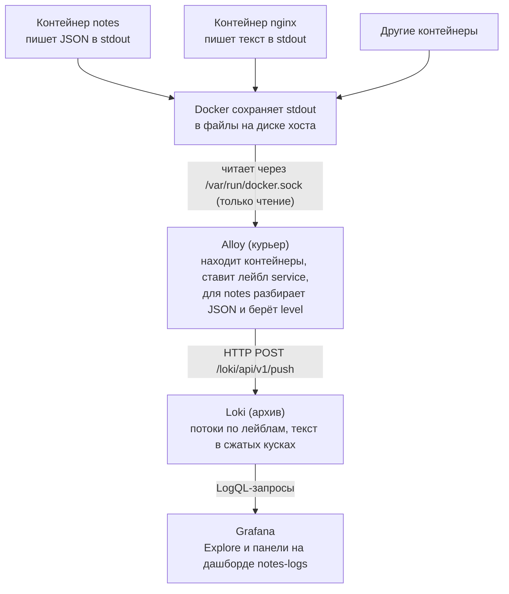
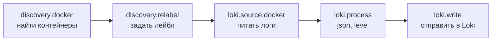
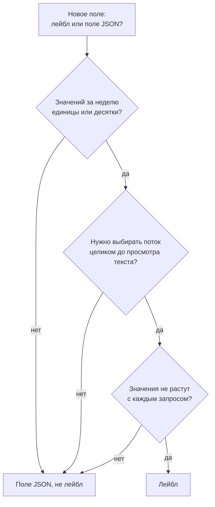

## Зачем это нужно

Метрики говорят, что ошибок стало больше. Логи (logs) говорят, какой именно запрос упал и почему. Лог это журнал событий: программа сама пишет в него по строке на каждое важное событие (пришёл запрос, случилась ошибка, приложение запустилось).

Пока логи лежат в `docker logs` на одном хосте, у них три беды. Их нельзя искать по всем сервисам сразу. Они пропадают вместе с контейнером: удалил контейнер, и ночной инцидент остался без следов. А текст вида `GET /notes 200 3ms` нельзя отфильтровать по числу: «покажи всё дольше секунды» превращается в борьбу с регулярными выражениями.

На работе это каждый инцидент: пришёл алерт, ты открываешь Grafana и должен за минуту дойти от графика до конкретной строки. Для этого логи пишут структурно, то есть каждую запись в виде JSON (текст в фигурных скобках с парами «ключ: значение», [урок 8.6](06-grafana-dashboards.md)): по ключам программа отфильтрует «всё дольше секунды», как таблица, а не записка. Собирает логи агент (agent, небольшая программа-курьер, которая обходит контейнеры и отвозит записи в хранилище), а хранит Loki: склад логов от Grafana Labs, где записи раскладывают по коробкам с наклейками. Наклейка называется лейбл (label, пара «имя=значение», например `service=notes`), и искать нужно сначала по ней. Без такой схемы ночью пришлось бы заходить на каждый сервер и читать файлы руками.

Шаг проекта: «Заметки» пишут JSON-логи в stdout (app.py v6, образ 0.6.0), Alloy (агент-курьер от Grafana Labs, подробно разберём ниже) собирает их в Loki, в Grafana появляется панель логов рядом с графиком ошибок. Stdout (стандартный вывод) это «окошко», в которое программа по умолчанию выкладывает текст: если запустить её в терминале, строки появятся на экране, а Docker забирает то же самое в файл.

## Что нужно знать

- [Урок 1.2: текст, pipe, grep](../01-linux/02-text-pipes.md) - фильтры и `jq` работают так же, как в конвейере
- [Урок 4.3: тома и сети](../04-docker/03-storage-networks.md) - сеть `notes-net` и именованные тома
- [Урок 4.5: Compose и PostgreSQL](../04-docker/05-compose-postgres.md) - `compose.yml` проекта «Заметки»
- [Урок 4.9: диагностика контейнеров](../04-docker/09-docker-troubleshooting.md) - `docker logs`, `inspect`
- [Урок 8.2: основы Prometheus](02-prometheus-basics.md) - лейблы и кардинальность метрик, здесь то же самое. Напоминание: кардинальность это число разных значений лейбла. Лейбл `status` с пятью значениями безопасен, а `user_id` с миллионом значений раздует хранилище, как миллион наклеек на миллион коробок
- [Урок 8.5: алерты и Alertmanager](05-alertmanager.md) - от алерта ты идёшь в логи
- [Урок 8.6: Grafana, дашборды как код](06-grafana-dashboards.md) - provisioning, через него подключим Loki
- Если хочешь разобрать основы на другом стенде, см. [Логи](../../monitoring/04-logs-traces/01-logs.md) в курсе «Мониторинг и SRE».

## Картина целиком

Представь большую библиотеку. В ней много читальных залов (контейнеров), и в каждом сидит писарь, который записывает всё происходящее на листки. Пока листки лежат на столе писаря, их читает только он. Нужен курьер (агент), который обходит залы, забирает листки и относит в архив. В архиве листки раскладывают по коробкам с наклейками («зал 3, важное»), а не переписывают в каталог каждое слово: так архив остаётся компактным. Чтобы найти нужное, сначала берёшь коробку по наклейке, потом листаешь листки внутри.

Аналогия расходится в одном: у настоящих листков нет времени и формата, а у логов оно есть, и время у них главный ключ поиска.



Лог идёт сверху вниз: приложение пишет в stdout, Docker сохраняет, Alloy забирает и размечает, Loki хранит, Grafana показывает. Каждый шаг делает одна программа, и поломка на любом из них выглядит как «логов нет».

Несколько слов, которые встретятся на схеме. **Поток** (stream) это все записи с одним и тем же набором лейблов: как одна коробка в архиве. **LogQL** это язык запросов Loki, внешне похожий на PromQL из [урока 8.3](03-promql.md): сначала выбираешь коробку, потом фильтруешь записи внутри. **Компактор** (compactor) это фоновая уборщица Loki: сжимает записи и выбрасывает те, что старше срока хранения. **docker.sock** это служебный файл, через который программы разговаривают с Docker (агент так узнаёт, какие контейнеры есть). Каждое из них разберём ниже.

Дальше в теории по порядку: как устроен структурный лог, что Docker делает со stdout, как Loki хранит записи и почему лейблов должно быть мало, как Alloy собирает и обрабатывает логи, как читать и писать запросы LogQL. Каждый раздел опирается на предыдущий.

## Теория

### Зачем нужны логи, если есть метрики

Метрика (урок 8.2) это число во времени: «5xx-ответов было 12 в минуту». Она дешёвая, быстрая и отлично годится для графиков и алертов. Но она не отвечает на вопрос «какой запрос упал». Чтобы у метрики можно было спросить «а какой именно», пришлось бы добавлять в лейблы всё подряд, и Prometheus бы задохнулся (это кардинальность, мы к ней вернёмся). Лог хранит подробности каждого события отдельно.

Метрика это счётчик посетителей на входе в магазин: сколько зашло. Лог это журнал охраны: кто, когда, через какую дверь. Счётчик не скажет, кто украл товар, но журнал уже не сравнить со счётчиком по размеру.

Работа на инциденте идёт в два шага. Метрика показывает масштаб и время: «с 10:05 доля ошибок 8%». Лог показывает причину: «в 10:05 запросы к `/notes` падают с ошибкой хранилища». Поэтому на дашборде графики и логи стоят рядом.

Разберём на примере. Алерт из урока 8.5 сказал: `NotesHighErrorRate`, 8% пятисотых. Ты открываешь логи за тот же интервал и фильтруешь записи со `status >= 500`. Видишь, что все они с `path=/notes` и текстом ошибки хранилища. Метрика ответила «когда и сколько», лог ответил «что».

> **Прикинь сам:** метрика показала 8% ошибок. Что из этого ты узнал, а чего нет?
{: .predict}

Узнал масштаб (8%) и время (когда началось). Не узнал причину: какой путь, какой пользователь, какой текст ошибки. Это ищется в логах.

Осторожно, тут часто путают. Что логи «лучше» метрик или наоборот. Они дополняют друг друга. Алерты строят по метрикам приложения: метрика считается в самом сервисе и не зависит от того, дошли ли логи до хранилища. Логи нужны, чтобы посмотреть конкретные записи.

> **Главное:** метрика показывает масштаб и время, лог показывает причину, и на инциденте нужны оба.
{: .key}

Как записать лог, чтобы в нём можно было искать?

### Структурный лог: одна запись, один JSON

Обычный лог это строка текста. Программа пишет её как удобно разработчику, а искать в ней нужно как удобно тебе. Строка `2026-09-29 10:00:00,123 INFO method=GET path=/notes status=200 dur_ms=3` читается глазами, но чтобы найти запросы дольше секунды, нужны регулярные выражения (шаблоны для поиска текста), а они ломаются от любого лишнего пробела.

Это разница между запиской «купил хлеб, молоко, на 340 рублей» и таблицей с колонками «товар» и «цена». В таблице можно сложить цены, в записке нужно сначала вычитать числа глазами.

Структурный лог (structured log) пишет каждую запись как JSON (текст в фигурных скобках, где данные записаны парами `"ключ": значение`) с фиксированными ключами. Одна запись занимает ровно одну строку:

```json
{"ts":"2026-09-29T10:00:00.123+00:00","level":"info","msg":"request","method":"GET","path":"/notes","status":200,"dur_ms":3,"version":"0.6.0"}
```

Разбор полей: `ts` (timestamp) время события в формате ISO 8601 с часовым поясом, `level` уровень важности, `msg` короткое название события, дальше поля этого события. `status` и `dur_ms` числа: у них нет кавычек.

Правила, которые работают в любой команде:

- одна запись, одна строка, одна JSON-структура; многострочное сообщение об ошибке (traceback) кладут в поле, а не печатают отдельно;
- ключи не меняются между версиями, и `status` всегда число, а не строка;
- уровни (levels): `debug` (для отладки), `info` (обычные события), `warning` (странно, но работает), `error` (сломалось); на проде включён `info`;
- в stdout, не в файл (следующий раздел объясняет почему);
- никаких паролей, токенов и персональных данных: то, что попало в лог, потом неделями лежит в хранилище и доступно всем, у кого есть доступ к логам.

Разберём на примере. Запрос «все запросы дольше секунды»: в текстовом логе это регулярка, которая ловит `dur_ms=` и сравнивает число «глазами» (а если формат сменился, поиск молча перестанет находить). В JSON-логе то же самое одна строка запроса: `| json | dur_ms > 1000`. Сравнение по числу работает только потому, что `dur_ms` записано числом.

Осторожно, тут часто путают. Что JSON нужен «красоты ради». JSON нужен, чтобы машина разбирала поля без угадывания. Ещё путают уровень `info` с «неважным»: у нас ответ 500 тоже пишется на уровне `info`, потому что это штатная запись «запрос обработан». Уровень `error` появляется, когда случилось исключение, а не когда клиент получил плохой код.

> **Главное:** структурный лог пишет каждую запись одной строкой JSON с фиксированными ключами, и по полям можно искать и считать.
{: .key}

> **Проверь понимание:** почему `status` должен быть числом, а не строкой `"200"`?

<details markdown="1">
<summary>Ответ</summary>

Сравнение `status >= 500` в запросе работает только с числом. Со строкой придётся писать регулярку, и первый же `"5xx"` вместо `500` сломает фильтр.

</details>

Куда его писать?

### Куда пишет приложение: stdout и что с ним делает Docker

Куда программе писать лог? Можно в файл внутри контейнера, но тогда нужно решать, кто его ротирует (удаляет старое, чтобы диск не переполнился), где он лежит и как его достать. Стандартный вывод (stdout, «то, что программа печатает на экран») решает всё сразу: программа просто печатает, а инфраструктура забирает.

Официант не носит каждый заказ на кухню лично своим маршрутом: он кладёт бумажку на окно выдачи. Кто и как её оттуда заберёт, официанту неважно.

Контейнерный рантайм (Docker) подключён к stdout и stderr каждого контейнера и сохраняет всё в файлы на диске хоста, по умолчанию драйвером `json-file`: `/var/lib/docker/containers/<id>/<id>-json.log`. Команда `docker logs` читает именно эти файлы. Драйвер без настройки ротации растёт бесконечно, поэтому в `logging:` сервиса или в `daemon.json` задают `max-size` и `max-file`. Агент, который собирает логи в Loki, читает те же данные через Docker API (сокет `/var/run/docker.sock`) и потому не требует, чтобы приложение знало о существовании Loki. Идея из методики [12-factor](https://12factor.net/logs) называется «логи как поток событий».

Разберём на примере. Файл `-json.log` Docker хранит строкой вида `{"log":"{\"ts\":...}\n","stream":"stdout","time":"..."}`: наш JSON лежит внутри поля `log` как текст. Поэтому у контейнеров с текстовыми логами (nginx) тоже есть свои записи, а вот разобрать поля можно только у тех, кто пишет JSON.

> **Прикинь сам:** контейнер удалили. Где искать его логи, если агента не было?
{: .predict}

Нигде: `docker logs` работает только пока контейнер существует. Поэтому агент собирает логи заранее, а не после инцидента.

Осторожно, тут часто путают. Что после удаления контейнера `docker logs` ещё что-то покажет. Нет: файлы удаляются вместе с контейнером. Поэтому агент должен собирать логи заранее, а не после инцидента. Второе заблуждение: что «в stdout» значит «на экран». В контейнере экрана нет, stdout это поток, который кто-то читает.

> **Главное:** приложение пишет в stdout, Docker сохраняет это в файлы, а после удаления контейнера логи исчезают, если их не забрал агент.
{: .key}

Где логи хранятся удобно?

### Loki: индексируем только лейблы

Логов много: у сервиса, который обрабатывает 1000 запросов в минуту, за сутки набегает 1,4 миллиона записей. Классический подход (Elasticsearch) индексирует каждое слово в каждой записи. Поиск быстрый, но индекс получается сопоставим с самими логами, и хранение дорогое. Loki выбрал другой компромисс: индексировать только небольшой набор меток, а сам текст хранить сжатым.

Библиотека с двумя способами хранить книги. Первый: каталог с каждым словом каждой книги, огромный шкаф с карточками. Второй: книги стоят по полкам с табличками «Жанр, Год», а внутри полки ты листаешь. Второй способ дешевле, а поиск медленнее, если не знаешь полку. Аналогия перестаёт работать в том, что полок в Loki не десятки, а их число надо держать маленьким сознательно.

У каждой записи есть время, текст и набор лейблов (labels, пары «имя=значение»). Уникальная комбинация лейблов это поток (stream). `{service="notes", level="info"}` и `{service="notes", level="error"}` это два потока. Записи потока Loki складывает по порядку в куски (chunks), сжимает и пишет на диск. Индекс знает только «какие потоки существуют и в каких кусках их искать». Запрос сначала выбирает потоки по лейблам, затем просматривает текст внутри выбранных кусков.

Отсюда главное правило: лейбл должен иметь мало значений (низкая кардинальность, low cardinality). Кардинальность это число разных значений лейбла. У `level` их четыре, у `user_id` миллионы. Тот же принцип, что в Prometheus (урок 8.2), только здесь лишний лейбл взрывает Loki.

| Что | Лейбл? | Почему |
|---|---|---|
| `service`, `level`, `env` | да | единицы значений |
| `path` из URL (`/notes/12345`) | нет | тысячи значений, тысячи потоков |
| `trace_id`, `user_id`, `remote` | нет | уникальны для каждого запроса |
| `status` | лучше нет | искать через `\| json \| status >= 500` |

Разберём на примере. Сервис пишет 1000 запросов в минуту на 500 разных путей, и уровней три. Лейблы `service` и `level` дают 1 х 3 = 3 потока, в каждом около 330 записей в минуту, куски крупные и хорошо сжимаются. Добавим `path` в лейблы: 1 х 500 х 3 = 1500 потоков, в каждом в среднем меньше одной записи в минуту (около 0,7). Куски получаются крошечными, индекс раздувается в 500 раз, запросы перебирают полторы тысячи потоков вместо трёх, а при превышении лимита Loki вообще отказывает в приёме: `maximum active stream limit exceeded`.

То, что не лейбл, остаётся полем JSON и достаётся в запросе через `| json`.

Осторожно, тут часто путают. Что «чем больше лейблов, тем удобнее искать». Наоборот: лейблы должны отвечать на вопрос «какой набор логов открыть», а не «какая запись мне нужна». Второе делает фильтр в запросе. Ещё путают хранение и поиск: полнотекстовый поиск в Loki работает, он просто перебирает текст, а не смотрит в индекс.

> **Главное:** Loki индексирует только лейблы, текст лежит в сжатых кусках, поэтому лейблов должно быть мало.
{: .key}

> **Проверь понимание:** сервис пишет 1000 запросов в минуту на 500 разных путей. Сколько потоков получится, если сделать `path` лейблом, а `level` оставить (три уровня)?

<details markdown="1">
<summary>Ответ</summary>

До 500 путей умножить на три уровня, то есть до 1500 потоков вместо 3. Каждый маленький и живёт недолго. Правильно: два лейбла `service` и `level`, путь ищется фильтром по тексту.

</details>

Как долго Loki хранит записи?

### Хранение в Loki: куски, схема и срок жизни

Логи не должны копиться вечно: диск конечен, а старые записи нужны редко. Значит, у Loki должно быть правило «хранить семь дней» и механизм, который старое удаляет.

Архив с ежемесячной уборкой: раз в месяц кладовщик выбрасывает коробки старше срока хранения. Если кладовщика не нанять, коробки копятся, сколько бы ни было написано в инструкции.

В нашем стенде Loki работает одним процессом (режим single binary): он и принимает записи, и хранит, и отвечает на запросы. Порядок такой: запись приходит по HTTP (`/loki/api/v1/push`), Loki держит её в памяти в куске потока, потом сбрасывает кусок на диск (`filesystem`). Индекс устроен по схеме (`schema_config`): версия `v13`, хранилище индекса `tsdb`, новый индекс раз в сутки (`period: 24h`). За срок хранения отвечают две настройки: `retention_period` в `limits_config` задаёт, сколько хранить, а компактор (compactor, фоновый процесс) с `retention_enabled: true` реально удаляет старое. Без второго первая настройка ничего не делает.

Ещё Loki отвергает записи, которые «слишком старые» (`reject_old_samples_max_age`) или идут в потоке не по порядку (`entry out of order`). Это защита от мусора, но и частая причина «потерянных» логов, если у источников разные часы.

Разберём на примере. В `loki.yml` ниже стоит `retention_period: 168h`: 168 часов, то есть 7 суток (7 х 24). Если убрать строку `retention_enabled: true`, записи старше семи суток продолжат лежать на диске и раздувать том `loki-data`.

> **Прикинь сам:** в `loki.yml` стоит `retention_period: 168h`, но диск растёт. Какую настройку забыли?
{: .predict}

Включение удаления в компакторе: `compactor.retention_enabled: true`. Без него срок хранения объявлен, но никто старые куски не удаляет.

Осторожно, тут часто путают. Что `retention_period` сам чистит диск. Он лишь объявляет срок, чистит компактор. Ещё путают «логи есть в Loki» и «логи есть в Grafana»: Grafana всего лишь окно, которое показывает то, что отдал Loki.

> **Главное:** Loki держит записи в кусках и удаляет старые по `retention_period`, но только при включённом `retention_enabled`.
{: .key}

Кто доставляет логи?

### Alloy: агент между контейнером и Loki

Кто-то должен забрать логи у контейнеров и отнести в Loki: найти новые контейнеры, читать их вывод, добавить лейблы, при необходимости разобрать JSON, отправить и повторить при ошибке. Это работа отдельной программы, агента (agent). Приложение не должно о ней знать.

Курьер с маршрутом. Ему сказано: обойди все залы, на каждую коробку наклей ярлык с названием зала, коробки из зала «Заметки» ещё и пометь важностью, довези в архив. Если архив закрыт, курьер ждёт и пробует снова.

Grafana Alloy (агент сбора телеметрии, ранее Grafana Agent) читает логи, обрабатывает и отправляет в Loki. Promtail, прежний агент для Loki, снят с поддержки 2 марта 2026 года, новые стеки строят на Alloy. Конфиг (`config.alloy`) описывает конвейер из компонентов, выход одного подключён ко входу другого:



Компонент в конфиге записывается так: `тип "имя" { ... }`. Внутри пары `ключ = значение`, вложенные блоки (`rule { ... }`, `stage.json { ... }`). Ссылка на выход другого компонента: `тип.имя.поле`, например `discovery.relabel.containers.output`. Когда один компонент читает выход другого, между ними появляется стрелка на графе. Alloy ходит в Docker через сокет `/var/run/docker.sock` и сам замечает новые контейнеры. Старый `promtail.yml` можно перевести командой `alloy convert --source-format=promtail`, результат надо прочитать и поправить по смыслу.

В Kubernetes та же идея: Alloy запускают как DaemonSet ([урок 5.8](../05-kubernetes/08-jobs-cronjob-daemonset.md), по одному поду на каждый узел), он читает файлы логов подов на узле, а не Docker socket.

Разберём на примере. Путь одной строки. Контейнер `notes` печатает JSON. `discovery.docker` знает, что контейнер существует, и отдаёт его метаданные, среди них служебную метку `__meta_docker_container_label_com_docker_compose_service` со значением `notes` (Compose сам вешает её на контейнер). `discovery.relabel` копирует её в лейбл `service` и выкидывает контейнеры без такой метки. `loki.source.docker` читает вывод найденных контейнеров. `loki.process` для потока `service="notes"` разбирает JSON, достаёт поле `level` и делает из него лейбл. `loki.write` отправляет результат в Loki.

Осторожно, тут часто путают. Что Alloy хранит логи. Не хранит: он передаёт дальше и помнит лишь, докуда прочитал. Ещё путают «лейбл, который мы назначили» и «поле внутри JSON»: `level` в JSON сам по себе не лейбл, лейблом он становится только после `stage.labels`.

> **Главное:** Alloy находит контейнеры, ставит лейблы, разбирает JSON и отправляет в Loki, заменив снятый с поддержки Promtail.
{: .key}

> **Проверь понимание:** для nginx (он пишет не JSON) Alloy назначит лейбл `level`?

<details markdown="1">
<summary>Ответ</summary>

Нет. Разбор JSON и лейбл `level` включены только для потока с `service="notes"` (блок `stage.match`). Логи nginx получат только лейбл `service`.

</details>

Как запрашивать?

### LogQL: выбрать потоки, отфильтровать, посчитать

Логи в хранилище бесполезны без языка запросов. LogQL (язык запросов Loki) сделан похожим на PromQL из урока 8.2, чтобы не учить всё заново.

Как поиск в почте: сначала выбираешь папку («Входящие от банка»), потом внутри неё ищешь слово и фильтруешь по дате.

Запрос состоит из селектора потоков (в фигурных скобках, по лейблам) и конвейера фильтров, которые применяются по очереди через `|`:

```text
{service="notes"}                                   # все логи сервиса
{service="notes"} |= "error"                        # строки с подстрокой
{service="notes"} | json | status >= 500            # разобрать JSON, отфильтровать по числу
{service="notes"} | json | dur_ms > 500             # медленные запросы
```

Селектор `{...}` обязателен и должен содержать хотя бы одно точное условие: `{service=~".*"}` Loki отклонит, иначе один запрос перебрал бы все потоки. Операторы фильтра строки: `|=` содержит, `!=` не содержит, `|~` подходит под регулярку. Стадия `| json` разбирает запись как JSON и превращает ключи в поля, по которым можно сравнивать числа.

Метрики из логов считают функциями `rate()` (записей в секунду) и `count_over_time()` (сколько записей за окно):

```text
sum by (level) (count_over_time({service="notes"}[1m]))
```

Разбор: `count_over_time(...[1m])` считает записи каждого потока за скользящую минуту, `sum by (level)` складывает потоки с одинаковым `level`. Результат: одна линия на каждый уровень.

Разберём на примере. Доля ошибок: `sum(rate({service="notes"} | json | status >= 500 [1m])) / sum(rate({service="notes"} | json | status > 0 [1m]))`. Числитель: сколько записей в секунду со `status >= 500`, знаменатель: сколько записей в секунду с любым положительным `status`, то есть всех запросов. Делим и получаем долю (0,05 значит 5%). Если за минуту было 3 запроса, один из них 500, то 1/3 = 0,33.

Один нюанс, который сбивает всех. Когда `level` уже стал лейблом, а в JSON тоже есть ключ `level`, после `| json` Loki не затирает лейбл, а кладёт значение из JSON в поле `level_extracted`. Поэтому в Explore видны и `level`, и `level_extracted` с одним значением.

<div class="viz" data-viz="obs-log-query" data-preset="errors"></div>

Меняй запрос и смотри, как сужается набор записей: сначала селектор потока, потом фильтры по строке и по полю.

> **Прикинь сам:** зачем `| json` перед `status >= 500`?
{: .predict}

Без `| json` строка остаётся просто текстом и полей `status` нет. `| json` разбирает JSON и превращает ключи в поля, по которым можно сравнивать.

Осторожно, тут часто путают. Что метрика «из логов» так же надёжна, как метрика приложения. Логи могут отстать или потеряться в доставке, поэтому для алертов надёжнее метрика приложения. Метрику из логов считают, когда приложение нельзя изменить, или в расследовании.

> **Главное:** сначала селектор потока в `{}`, потом фильтры строки, `| json` и сравнения полей, а метрики из логов считают через `rate` и `count_over_time`.
{: .key}

Какие поля делать лейблами?

### Как выбирать лейблы: три вопроса

Понять правило «мало значений» мало, нужно уметь применить его к новому полю за десять секунд. Ошибка здесь дорога: лишний лейбл исправить легко, а последствия (раздутый индекс, отказы приёма) приходят через сутки.

Наклейки на коробки в архиве. Наклейка «зал» нужна, наклейка «номер конкретного листка» превращает каждую коробку в коробку с одним листком.

Перед добавлением лейбла задай себе три вопроса. Первый: сколько у него значений за неделю? Единицы и десятки допустимо, сотни подозрительно, тысячи нельзя. Второй: нужно ли по нему выбирать поток целиком, до просмотра текста? «Открой все логи сервиса notes» да, «найди запросы пользователя 42» нет, это фильтр. Третий: растёт ли число значений со временем? Идентификатор запроса, адрес клиента, имя пода с уникальным суффиксом растут без границы, а значит рано или поздно сломают приём.

Разберём на примере. Проверим три кандидата. `env` (`dev`, `prod`): значений два, выбираем по нему поток целиком, не растёт, значит лейбл. `path`: сотни значений и растёт с каждым новым идентификатором в адресе, значит поле. `pod`: значений столько, сколько подов было за неделю (после каждого выката новые имена), в Kubernetes его иногда всё же делают лейблом, но осознанно и с лимитами. Правильный запрос на путь: `{service="notes"} | json | path="/notes"`.



Любой ответ «нет» отправляет поле в JSON: `env` пройдёт все вопросы, а `user_id` и `path` нет.

Осторожно, тут часто путают. Что лейбл нужен, чтобы «быстро искать по полю». Быстрый поиск по полю в Loki делается сужением потоков лейблами и параллельным просмотром, а не индексом поля. Ещё путают лейбл Loki с полем JSON: на вид они одинаковы в интерфейсе, но лейбл стоит денег в индексе, а поле нет.

> **Главное:** лейблом делают поле с малым числом значений, по которому выбирают поток целиком, а остальное оставляют полем JSON.
{: .key}

> **Проверь понимание:** ты хочешь искать по `trace_id`. Лейбл или поле, и почему?

<details markdown="1">
<summary>Ответ</summary>

Поле. У каждого запроса свой `trace_id`, значений миллионы и они растут с каждым запросом: лейбл создал бы поток на каждый запрос. Ищем через `| json | trace_id="..."` (в уроке 8.8 научимся переходить сюда из трейса).

</details>

Что будет, если доставка ломается?

### Что происходит, когда доставка ломается

Сеть падает, Loki перезапускается, диск заполняется. Нужно понимать, что при этом случится с логами: потеряются, задублируются или придут позже.

Курьер приехал, а архив закрыт. Хороший курьер подождёт и попробует снова, но носить с собой бесконечно много листков он не может: сумка конечна.

Alloy читает логи контейнера и помнит позицию: докуда прочитано (в каталоге `--storage.path`). При недоступности Loki он повторяет отправку с нарастающими паузами и держит записи в памяти ограниченное время. Если Loki вернулся быстро, логи придут с опозданием, но целыми. Если простой долгий, часть записей теряется: буфер конечен. Есть и отказы «по существу», их повторять бессмысленно: запись старше окна `reject_old_samples_max_age` (`timestamp too old`), запись сильно позади последней в своём потоке (`entry too far behind`), не по порядку (`entry out of order`) или превышен лимит потоков. Такие записи Loki отбрасывает окончательно.

Отсюда практический вывод: агент на сбор логов не лечит долгие аварии хранилища, а только сглаживает короткие. Поэтому у Loki есть свои алерты (место на диске, ошибки приёма), а Alloy держат под наблюдением так же, как приложения.

Разберём на примере. Loki перезапускается две минуты. За это время `notes` пишет 100 записей. Alloy повторяет отправку, после старта Loki доставляет все сто, записи приходят с меткой времени события, а не приёма, так что на графике они лежат на своих местах. Если бы время записей оказалось старше окна `reject_old_samples_max_age` (в нашем `loki.yml` 168 часов), Loki отверг бы их как слишком старые: в логе Alloy появилась бы `timestamp too old`. Если часы двух источников в одном потоке сильно расходятся, часть записей приходит позади последней и отбрасывается как `entry too far behind`.

> **Прикинь сам:** Loki недоступен 30 секунд. Потеряются ли логи?
{: .predict}

Скорее всего нет: Alloy повторит отправку и доставит накопленное. Потери возможны при долгом простое (переполнится буфер) или при отказе по существу (слишком старая запись, лимит потоков).

Осторожно, тут часто путают. Что Alloy гарантирует доставку. Он старается изо всех сил, но гарантии «ничего не теряется» не даёт. Ещё путают «данные пришли с опозданием» и «данных нет»: сначала подожди и расширь диапазон времени.

> **Главное:** Alloy помнит позицию и повторяет отправку, но долгие аварии Loki он только сглаживает, а не лечит.
{: .key}

Как сопоставить логи и метрики?

### Логи рядом с метриками: как строить дашборд для расследования

В инциденте нет времени переключаться между пятью вкладками и вручную подбирать время. Дашборд должен позволять за минуту пройти путь от графика до строки лога. Для этого метрики и логи кладут на одну страницу с общим временем.

Кабинет следователя: на одной стене график происшествий по часам, рядом протоколы за те же часы. Сдвинул отметку на графике, и протоколы на соседней стене сменились.

В Grafana у дашборда одна ось времени на все панели: выбрал интервал, и все панели, метрики и логи, показывают его. Панели с типом `logs` (список записей) рядом с `timeseries` (график) работают с разными источниками (Prometheus и Loki), но делят интервал. Выделил мышью участок на графике, и панель логов показывает записи именно за него. Порядок работы такой: график нашёл момент, панель логов показала записи в этот момент, фильтр `status >= 500` отделил ошибки, поле с текстом дало причину.

Панель «доля 5xx по логам» из нашего дашборда нужна для наглядности и для случая, когда метрики приложения нет. Рядом на настоящем дашборде стоит график `rate(notes_http_requests_total)` из Prometheus (урок 8.6): если две линии расходятся, значит логи доходят не полностью.

Разберём на примере. На графике ошибок пик в 10:05. Ты выделяешь мышью 10:04-10:07, и в панели `logs` остаются записи только за эти три минуты. Добавляешь фильтр `| json | status >= 500` и группируешь по `path`: все пятисотые с `/notes`. Открываешь одну запись, видишь `dur_ms` около 5000: запрос ждал базу. Гипотеза «проблема в хранилище» родилась за минуту, дальше по ней идёт диагностика из уроков 4.9 и 8.5.

Осторожно, тут часто путают. Что для этого нужна сложная настройка. Нужны лишь общий интервал и `uid` источников, а связь между панелями Grafana делает сама. Ещё путают «кликнуть в лог» и «понять причину»: лог называет симптом (что и когда), причину ты выводишь сам, сверяя со временем выката, состоянием базы и метриками.

> **Главное:** метрики и логи кладут на один дашборд с общей осью времени, чтобы за минуту дойти от графика до строки.
{: .key}

> **Проверь понимание:** на дашборде график из Prometheus и панель логов из Loki. Почему панель логов показывает нужный отрезок, если выделить участок на графике?

<details markdown="1">
<summary>Ответ</summary>

Потому что у дашборда одна ось времени на все панели: выделение на графике меняет интервал всего дашборда, и панель логов запрашивает записи Loki за тот же интервал.

</details>

Сколько писать?

### Уровни логирования и сколько писать

Если писать в лог каждый вздох программы, он разрастается до сотен гигабайт, а нужную строку не найти среди шума. Если писать слишком мало, то в момент аварии в логе пусто. Уровни (levels) дают способ договориться, что важно, а что нет.

Бортовой журнал капитана. «Вышли из порта» и «пересекли меридиан» пишут всегда, «видел чайку» только когда ведётся подробный учёт, а «пробоина в трюме» выделяют красным. Уровень это цвет чернил. Аналогия неточна тем, что записи журнала читают люди, а логи читают ещё и запросы: по уровню можно отфильтровать автоматически.

У каждой записи есть поле `level`. Программа настроена на минимальный уровень, а всё, что ниже, отбрасывает ещё до записи. Порядок по возрастанию важности: `debug`, `info`, `warning`, `error`. На проде обычно включают `info`: `debug` слишком многословен. Поменять уровень можно без пересборки образа, через переменную окружения (значение, которое передают программе при запуске, [урок 1.6](../01-linux/06-bash-basics.md)), но проверь, что у приложения она есть.

Разберём на примере. Сервис обрабатывает 100 запросов в секунду. Запись в JSON занимает около 150 байт. 100 × 150 = 15 000 байт в секунду, за сутки 15 000 × 86 400 = 1,3 миллиарда байт, то есть около 1,3 ГБ в день на один сервис, и это только по одной строке на запрос. Если включить `debug` и писать по десять строк на запрос, выйдет 13 ГБ в день. Поэтому на проде пишут одну строку на запрос и детали только при ошибке. Для расследования на время включают `debug` и потом возвращают обратно.

> **Прикинь сам:** сервис пишет по 10 строк по 150 байт на запрос и получает 50 запросов в секунду. Сколько это в сутки?
{: .predict}

10 × 150 × 50 = 75 000 байт в секунду. 75 000 × 86 400 = 6,48 миллиарда байт, около 6,5 ГБ в сутки. Поэтому пишут по одной строке на запрос.

Осторожно, тут часто путают. Что чем больше логов, тем лучше. На деле лишние логи стоят денег (диск, сеть, время поиска) и прячут важное. Ещё путают уровень записи и HTTP-код: запрос с ответом 500 у нас пишется на уровне `info`, потому что сама обработка прошла штатно.

> **Главное:** на проде включают `info`, а лишние логи стоят диска и прячут важное.
{: .key}

Откуда берётся время записи?

### Время в логах: откуда оно берётся и почему важны часы

Логи ищут по времени: «что происходило в 02:14». Если у записи время неверное, она окажется в неправильном месте или Loki её отвергнет. Знать, откуда берётся время записи, нужно, чтобы понимать, почему «логи куда-то пропали».

Почтовый штемпель. Письмо можно написать вчера, а отправить сегодня. Для расследования важно, когда событие случилось (дата написания), а не когда записали (штемпель). Аналогия неточна тем, что в логах оба времени хранятся по отдельности.

Время записи может быть двух видов. Время события: его ставит приложение в поле `ts`, когда что-то случилось. Время приёма: его ставит Loki, когда запись доехала. Если Alloy не настроен брать время из `ts`, Loki использует время приёма. Чаще всего они почти совпадают, но после простоя агента расходятся на минуты. Чтобы сравнивать логи разных серверов, все часы синхронизируют и пишут время в UTC (всемирное время без часовых поясов), а на экране Grafana показывает в твоём поясе.

Разберём на примере. Запись `{"ts":"2026-09-29T10:00:00.123+00:00", ...}`: дата, буква `T` (разделитель), время `10:00:00.123` с миллисекундами и смещение `+00:00`, то есть UTC. Для Москвы (UTC+3) Grafana покажет 13:00:00. Если в диапазоне времени на дашборде указан «последний час», а запись от 10:00 UTC, то в 14:00 по Москве она уже в прошлом и на графике не видна. Поэтому «логов нет» часто значит «ты смотришь не то время».

Осторожно, тут часто путают. Что время в Grafana равно времени в логе. Grafana пересчитывает его в часовой пояс браузера, а в самом логе лежит UTC. Второе заблуждение: «часы на сервере не важны». Если время записи уходит дальше окна `reject_old_samples_max_age` (из-за сильно сбитых часов), Loki может отвергнуть записи как слишком старые (раздел «Что происходит, когда доставка ломается» выше).

> **Главное:** время события берётся из `ts`, хранится в UTC, а отставшие часы приводят к отказам Loki.
{: .key}

> **Проверь понимание:** в логе `ts` равно `10:00:00+00:00`. Во сколько это по Москве (UTC+3)?

<details markdown="1">
<summary>Ответ</summary>

В 13:00:00. К времени UTC прибавляют три часа. Сама запись при этом не меняется, меняется только то, как Grafana её показывает.

</details>

Что нельзя класть в лог?

### Что нельзя класть в лог и чем рискует агент с docker.sock

Лог читает много людей и систем, а хранится он неделями. Всё, что попало в запись, становится доступным всем, у кого есть доступ к Loki. Отдельно стоит вопрос, какие права мы выдали самому агенту.

Журнал охраны лежит на проходной: его листает любой сотрудник. Записать в него пароль от сейфа значит раздать пароль всем.

Секретами считаются пароли, токены, ключи API, номера карт, персональные данные. Защита строится в трёх местах: не писать (не логировать заголовки и тела запросов целиком), маскировать у источника (в приложении заменить значение на `***`), при необходимости вырезать на стороне агента стадией `stage.replace` в Alloy. Доступ к Loki ограничивают так же, как к базе данных.

Про сокет. Мы монтируем `/var/run/docker.sock` в Alloy с пометкой `:ro`. Она запрещает изменять сам файл сокета, но не ограничивает команды, которые через него отправляют: Docker API по сокету позволяет и запускать контейнеры. Поэтому доступ к сокету по сути равен правам администратора хоста. На учебном стенде мы это принимаем, на проде сокет не отдают непроверенным программам, а в Kubernetes агент читает файлы логов узла и обходится без такого доступа.

Разберём на примере. Разработчик написал `log.info("login", extra={"fields": {"token": token}})`. Через минуту токен лежит в Loki, а через неделю ещё и в выгрузках для отчёта. Исправление: токен считается скомпрометированным (перевыпустить), в коде поле убрано, старые записи уходят с истечением срока хранения или удаляются по запросу.

> **Прикинь сам:** зачем Alloy сокет с `:ro`, если агент только читает, и защищает ли `:ro` от запуска контейнеров через API?
{: .predict}

`:ro` документирует намерение и запрещает менять файл сокета, но не ограничивает API-запросы: через сокет можно управлять Docker. От запуска контейнеров защищает только запрет доступа к сокету вообще.

Осторожно, тут часто путают. Что `:ro` делает сокет безопасным. Не делает. Ещё путают «удалить строку из лога» и «решить проблему»: секрет уже мог быть прочитан, его надо перевыпустить.

> **Главное:** секреты в лог не пишут, а доступ к docker.sock фактически равен правам администратора на хосте.
{: .key}

## Практика

Стек «Заметок» из урока 4.5 запущен (`docker compose up -d` в `~/notes`), сеть `notes-net` существует, мониторинг из 8.6 работает (`monitoring/compose.yml`). Нужны `curl` и `jq`. Приложение открывается по `https://notes.lab` (из урока 4.8).

`jq` это программа для чтения JSON в терминале: `jq -c .` печатает каждый JSON одной строкой и заодно проверяет, что это корректный JSON.

### Если у тебя 8 ГБ

Loki и Alloy вместе занимают около 500 МБ. Чтобы уложиться, останови то, что не нужно в этом уроке, и ограничь новые сервисы:

```bash
cd ~/notes/monitoring
docker compose stop cadvisor blackbox alertmanager
```

`docker compose stop` останавливает сервисы, не удаляя их (`up -d` вернёт). К сервисам `loki` и `alloy` в `compose.yml` добавь строки `mem_limit: 512m` и `mem_limit: 256m` соответственно (потолок памяти контейнера). Хранение в `loki.yml` уже ограничено семью днями.

### Задание 1. JSON-логи в app.py v6

**Цель:** заменить текстовый лог на JSON и убедиться, что каждая запись это валидный JSON с ключами по контракту.

**Предскажи:** сколько строк появится в `docker logs` после одного `curl /notes`, если служебные пути `/healthz`, `/readyz`, `/metrics` в лог не пишутся? Какого типа будет `status`?

<details markdown="1">
<summary>Ответ</summary>

Одна строка `"msg":"request"`. `status` число (200 без кавычек), `dur_ms` тоже число.

</details>

**Шаги:**

1. В `app.py` замени настройку `logging` на форматтер, который печатает JSON в stdout. Готовая версия лежит в [эталоне v6](https://github.com/distinguished-sre/learning/blob/main/devops/project/notes/versions/v6.py), ниже её главные части. Форматтер (formatter) это класс, который превращает запись лога в строку:

```python
import json
import logging
import os
import sys
from datetime import datetime, timezone


class JsonFormatter(logging.Formatter):
    """Одна запись лога это одна строка JSON. Ключи не меняем между версиями."""

    def format(self, record):
        entry = {
            "ts": datetime.now(timezone.utc).isoformat(timespec="milliseconds"),
            "level": record.levelname.lower(),
            "msg": record.getMessage(),
        }
        # дополнительные поля приходят через extra={"fields": {...}}
        entry.update(getattr(record, "fields", {}))
        return json.dumps(entry, ensure_ascii=False, separators=(",", ":"))


handler = logging.StreamHandler(sys.stdout)  # в stdout, не в stderr
handler.setFormatter(JsonFormatter())
log = logging.getLogger("notes")
log.addHandler(handler)
log.setLevel(os.environ.get("LOG_LEVEL", "info").upper())
log.propagate = False  # не отдавать записи корневому логгеру, иначе будут дубли
```

Разбор: `logging.Formatter` стандартная часть Python, мы переопределяем метод `format`. `getattr(record, "fields", {})` берёт словарь `fields`, если он передан, иначе пустой. `ensure_ascii=False` оставляет русские буквы как есть, `separators=(",", ":")` убирает пробелы, и запись получается компактной.

2. В обработчике запроса после отправки ответа пиши запись (служебные пути пропусти) и выключи стандартный access-лог сервера, иначе в stdout попадут строки не в JSON:

```python
def log_message(self, fmt, *args):
    pass  # стандартный access-лог отключён, вместо него одна JSON-запись

def _access_log(self, status, started):
    if urlparse(self.path).path in ("/healthz", "/readyz", "/metrics"):
        return  # служебные пути не шумят в логе
    log.info("request", extra={"fields": {
        "method": self.command,
        "path": self.path,
        "status": status,
        "dur_ms": round((time.monotonic() - started) * 1000),
        "version": VERSION,
    }})
```

Здесь `time.monotonic()` часы, которые не прыгают при смене времени, поэтому разность годится для измерения длительности; умножаем на 1000 и округляем до миллисекунд.

3. При старте пиши `log.info("started", extra={"fields": {"host": HOST, "port": PORT, "store": STORE, "version": VERSION}})`.
4. Задай `APP_VERSION=0.6.0` (в `compose.yml` у сервиса `notes`), собери образ и перезапусти:

```bash
cd ~/notes
docker build -t notes:0.6.0 .
# в compose.yml у сервиса notes: image: notes:0.6.0
docker compose up -d notes
curl -sk https://notes.lab/notes > /dev/null
docker logs notes 2>&1 | tail -n 2 | jq -c .
```

Разбор команд. `docker build -t notes:0.6.0 .` собирает образ из `Dockerfile` в текущем каталоге и даёт ему имя и тег. `curl -sk` тихий режим (`-s`) и без проверки сертификата (`-k`, у нашего домена самоподписанный сертификат из урока 4.8); `> /dev/null` выбрасывает ответ, нам нужен лог. `docker logs notes 2>&1` печатает лог контейнера, `2>&1` сливает поток ошибок с основным, чтобы `tail` увидел всё. `tail -n 2` оставляет две последние строки, `jq -c .` разбирает каждую как JSON.

**Что должно получиться:**

```text
{"ts":"2026-09-29T10:00:00.050+00:00","level":"info","msg":"started","host":"0.0.0.0","port":8080,"store":"postgres","version":"0.6.0"}
{"ts":"2026-09-29T10:00:07.311+00:00","level":"info","msg":"request","method":"GET","path":"/notes","status":200,"dur_ms":4,"version":"0.6.0"}
```

**Как читать вывод:** если `jq` напечатал строки без ошибок, обе записи корректный JSON. Смотри тип значений: `port` и `status` без кавычек, значит числа. Первая запись `started` появилась при запуске, вторая `request` от твоего `curl`. Путей `/healthz` в логе нет, хотя Docker проверяет их постоянно: мы их отфильтровали.

**Объясни себе:**

- почему форматтер пишет в stdout, а не в файл внутри контейнера?
- что произойдёт с `jq`, если в лог попадёт обычный `print("debug")`?

**Типичные ошибки:**

- `jq: error (at <stdin>:1): Invalid numeric literal at line 1, column 8`: в stdout попала не-JSON строка (забытый `print`). Убери `print` или замени на `log.debug(...)`.
- `"status":"200"` в кавычках: передан `str(status)`. Передавай число, иначе `status >= 500` не сработает.
- Лог пустой: `LOG_LEVEL=warning` в окружении скрывает `info`. Проверь `docker exec notes env | grep LOG_LEVEL`.

### Задание 2. Loki и Alloy в Compose

**Цель:** запустить Loki 3.7.8 и Grafana Alloy v1.20.1 рядом с остальным мониторингом и увидеть в Loki лейблы `service` и `level`.

**Предскажи:** сколько своих лейблов будет у логов сервиса `notes`, если мы назначаем `service` и `level`? Что произойдёт со строкой лога nginx (он пишет не JSON)?

<details markdown="1">
<summary>Ответ</summary>

Два своих лейбла (плюс служебный `service_name`, его Loki добавляет сам). Строка nginx получит только `service`: разбор JSON и лейбл `level` мы включаем лишь для сервиса `notes`.

</details>

**Шаги:**

1. Создай `monitoring/loki/loki.yml`. Комментарии в файле объясняют каждый блок:

```yaml
# Loki в одном процессе, хранение на диске, без аутентификации (учебный стенд)
auth_enabled: false
server:
  http_listen_port: 3100
common:
  instance_addr: 127.0.0.1
  path_prefix: /loki
  replication_factor: 1                 # одна копия данных: узел один
  ring: { kvstore: { store: inmemory } }  # кольцо в памяти, отдельное хранилище не нужно
  storage:
    filesystem: { chunks_directory: /loki/chunks, rules_directory: /loki/rules }
schema_config:
  configs:
    - from: "2026-01-01"
      store: tsdb
      object_store: filesystem
      schema: v13
      index:
        prefix: index_
        period: 24h
limits_config:
  retention_period: 168h          # хранить 7 дней
  reject_old_samples: true
  reject_old_samples_max_age: 168h
compactor:
  working_directory: /loki/compactor
  retention_enabled: true         # без этого retention_period ничего не удаляет
  delete_request_store: filesystem
```

2. Создай `monitoring/alloy/config.alloy`. Читай его сверху вниз: это тот самый конвейер из теории.

```alloy
// 1. Найти контейнеры через Docker API
discovery.docker "containers" {
  host = "unix:///var/run/docker.sock"
}
// 2. Назначить лейбл service из имени сервиса Compose; других лейблов не добавляем
discovery.relabel "containers" {
  targets = discovery.docker.containers.targets
  rule {
    source_labels = ["__meta_docker_container_label_com_docker_compose_service"]
    target_label  = "service"
  }
  // контейнеры не из Compose пропускаем
  rule {
    source_labels = ["service"]
    regex         = ".+"
    action        = "keep"
  }
}
// 3. Читать логи найденных контейнеров и передать в обработку
loki.source.docker "containers" {
  host       = "unix:///var/run/docker.sock"
  targets    = discovery.relabel.containers.output
  forward_to = [loki.process.notes.receiver]
}
// 4. Для сервиса notes разобрать JSON и вынести level в лейбл
loki.process "notes" {
  forward_to = [loki.write.local.receiver]
  stage.match {
    selector = "{service=\"notes\"}"
    stage.json {
      expressions = { level = "level" }
    }
    stage.labels {
      values = { level = "" }
    }
  }
}
// 5. Отправить в Loki
loki.write "local" {
  endpoint {
    url = "http://loki:3100/loki/api/v1/push"
  }
}
```

Разбор. `rule` в `discovery.relabel` это правило переименования: берёт значение из `source_labels`, кладёт в `target_label`. Второе правило с `action = "keep"` оставляет только цели, у которых `service` не пуст (`regex = ".+"` значит «хотя бы один символ»). `stage.match` выбирает записи по селектору, вложенные стадии применяются только к ним. `stage.json` достаёт из JSON ключ `level`, `stage.labels` делает извлечённое значение лейблом (пустая строка значит «взять из извлечённых данных под тем же именем»).

3. Добавь в `monitoring/compose.yml` два сервиса и том (сеть `notes-net` уже подключена как внешняя):

```yaml
  loki:
    image: grafana/loki:3.7.8
    command: ["-config.file=/etc/loki/loki.yml"]
    volumes:
      - ./loki/loki.yml:/etc/loki/loki.yml:ro
      - loki-data:/loki
    ports:
      - "127.0.0.1:3100:3100"   # только с этого хоста, наружу не открываем
    restart: unless-stopped
  alloy:
    image: grafana/alloy:v1.20.1
    command:
      - run
      - --server.http.listen-addr=0.0.0.0:12345
      - --storage.path=/var/lib/alloy/data
      - /etc/alloy/config.alloy
    volumes:
      - ./alloy/config.alloy:/etc/alloy/config.alloy:ro
      - /var/run/docker.sock:/var/run/docker.sock:ro
      - alloy-data:/var/lib/alloy/data   # позиции чтения переживают пересоздание контейнера
    ports:
      - "127.0.0.1:12345:12345"
    depends_on:
      - loki
    restart: unless-stopped
volumes:
  loki-data:
  alloy-data:
```

Если блок `volumes:` в файле уже есть, добавь `loki-data:` и `alloy-data:` в него, а не создавай второй.

4. Подключи Loki в Grafana: `monitoring/grafana/provisioning/datasources/loki.yml` (provisioning из урока 8.6):

```yaml
apiVersion: 1
datasources:
  - name: Loki
    uid: loki
    type: loki
    access: proxy
    url: http://loki:3100
```

5. Запусти и проверь:

```bash
cd ~/notes/monitoring
docker compose up -d loki alloy
docker compose restart grafana
sleep 20
curl -s http://localhost:3100/ready
for i in 1 2 3; do curl -sk https://notes.lab/notes > /dev/null; done
curl -sk -o /dev/null https://notes.lab/error
sleep 5
curl -s http://localhost:3100/loki/api/v1/labels | jq -c .
```

Разбор. `sleep 20` даёт Loki время подняться. `/ready` это проба готовности Loki (как `/readyz` у нашего приложения). Цикл `for i in 1 2 3; do ...; done` делает три запроса подряд. `-o /dev/null` у второго `curl` выбрасывает тело ответа, а `/error` намеренно отвечает 500. `/loki/api/v1/labels` возвращает список имён лейблов, которые Loki уже видел.

Открой в браузере `http://localhost:12345`: это интерфейс Alloy, на вкладке Graph видны компоненты и стрелки между ними, зелёные значит здоровы.

**Что должно получиться:**

```text
ready
{"status":"success","data":["level","service","service_name"]}
```

**Как читать вывод:** `ready` значит, что Loki принимает запросы. В списке лейблов `service` и `level` это наши, а `service_name` Loki добавляет сам. Если `level` в списке нет, значит записей от `notes` в Loki ещё нет или разбор JSON не сработал: смотри логи Alloy (`docker compose logs alloy`).

**Объясни себе:**

- почему `depends_on: loki` не гарантирует, что Loki готов, и почему Alloy всё равно не потеряет логи?
- зачем сокет смонтирован `:ro` и что это на самом деле даёт (см. теорию)?

**Типичные ошибки:**

- `network notes-net declared as external, but could not be found`: основной стек не запущен. Подними `docker compose up -d` в `~/notes`.
- `Bind for 127.0.0.1:3100 failed: port is already allocated`: порт занят другим Loki или контейнером. Найди через `docker ps` и останови.
- `failed parsing config: /etc/loki/loki.yml: yaml: unmarshal errors`: опечатка в ключе или отступе `loki.yml`. Проверь по тексту выше, строка указана в ошибке.
- `/ready` отвечает `Ingester not ready: waiting for 15s after being ready`: Loki ещё стартует, подожди 15-30 секунд.

### Задание 3. LogQL в Grafana Explore

**Цель:** найти пятисотые, посчитать записи по уровням и долю ошибок.

**Предскажи:** запрос `{service="notes"} | json | status >= 500` после трёх `GET /notes` и одного `GET /error`: сколько строк вернёт?

<details markdown="1">
<summary>Ответ</summary>

Одну: запись `/error` со `status: 500`. Три запроса `/notes` отсеет фильтр по числу.

</details>

**Шаги:**

1. Grafana (`http://localhost:3000`) -> Explore (значок компаса в меню слева) -> источник Loki, режим Code (ввод запроса текстом).
2. Выполни по очереди (`{service="notes"}` без фильтров покажет все записи):

```text
{service="notes"} | json | status >= 500
sum by (level) (count_over_time({service="notes"}[5m]))
sum(rate({service="notes"} | json | status >= 500 [1m])) / sum(rate({service="notes"} | json | status > 0 [1m]))
```

Первый запрос вернёт одну запись: `/error` со `status: 500`. Второй посчитает записи за пять минут по уровням, третий даст долю ошибок.

**Что должно получиться:** поток один, у него лейблы `service="notes"` и `level="info"` (ошибки в логе идут уровнем `info`, `error` появляется только у исключений). Панель по уровням покажет одну линию.

**Как читать вывод:** в результате первого запроса раскрой запись: слева список полей. Поля `status` и `dur_ms` появились после `| json`, лейблы `service` и `level` были и раньше. Поле `level_extracted` копия значения из JSON, потому что лейбл `level` уже занят (теория, раздел про LogQL). У графика доли значение 0,25 значит 25%: из четырёх запросов один упал.

**Объясни себе:**

- почему после `| json` в Explore появляется поле `level_extracted`, а не `level`?
- чем `count_over_time` отличается от `rate`?
- почему доля ошибок здесь считается по логам, а алерт из урока 8.5 лучше держать на метрике приложения?

**Типичные ошибки:**

- `queries require at least one regexp or equality matcher that does not have an empty-compatible value`: селектор `{service=~".*"}` или пустой. Укажи точное условие `{service="notes"}`.
- `parse error at line 1, col 20: syntax error: unexpected |`: фильтр стоит внутри `{}`. Вынеси конвейер за скобки.
- `No data`: данных нет за выбранный период или логи ещё не дошли. Расширь диапазон до 15 минут и повтори `curl`.

### Задание 4. Шаг проекта: дашборд, образ 0.6.0, тег v0.6.0

**Цель:** привести «Заметки» к состоянию после урока 8.7: логи в JSON, Loki и Alloy в Compose, дашборд `notes-logs.json` в git.

**Предскажи:** поднимется ли дашборд в Grafana после `git pull` на чистой машине без ручных кликов?

<details markdown="1">
<summary>Ответ</summary>

Да, если файл лежит в каталоге, который читает provisioning (урок 8.6), и `uid` источника `loki` совпадает с `uid` в `datasources/loki.yml`. Ручных кликов нет: дашборд это код.

</details>

**Шаги:**

1. Создай `monitoring/grafana/dashboards/notes-logs.json`. Три панели: график записей по уровням, график доли 5xx и список ошибок. Ссылка на источник идёт по `uid`, поэтому дашборд не зависит от имени:

```json
{
  "uid": "notes-logs", "title": "Notes: логи", "schemaVersion": 41, "version": 1,
  "refresh": "10s", "time": { "from": "now-30m", "to": "now" },
  "panels": [
    { "id": 1, "type": "timeseries", "title": "Записи по уровням",
      "gridPos": { "h": 8, "w": 12, "x": 0, "y": 0 },
      "datasource": { "type": "loki", "uid": "loki" },
      "targets": [ { "refId": "A", "legendFormat": "__auto",
        "expr": "sum by (level) (count_over_time({service=\"notes\"}[1m]))" } ] },
    { "id": 2, "type": "timeseries", "title": "Доля 5xx по логам",
      "gridPos": { "h": 8, "w": 12, "x": 12, "y": 0 },
      "datasource": { "type": "loki", "uid": "loki" },
      "fieldConfig": { "defaults": { "unit": "percentunit" }, "overrides": [] },
      "targets": [ { "refId": "A", "legendFormat": "5xx",
        "expr": "sum(rate({service=\"notes\"} | json | status >= 500 [1m])) / sum(rate({service=\"notes\"} | json | status > 0 [1m]))" } ] },
    { "id": 3, "type": "logs", "title": "Ошибки (status >= 500)",
      "gridPos": { "h": 10, "w": 24, "x": 0, "y": 8 },
      "datasource": { "type": "loki", "uid": "loki" },
      "targets": [ { "refId": "A", "expr": "{service=\"notes\"} | json | status >= 500" } ] }
  ]
}
```

2. Перезапусти Grafana и открой дашборд: пока ошибок нет, третья панель пуста, а график доли показывает `No data`. Вызови `/error` несколько раз и обнови страницу.

3. Проверь, что тесты проходят, зафиксируй и поставь тег:

```bash
cd ~/notes
docker compose -f monitoring/compose.yml restart grafana
python3 -m unittest
git add app.py monitoring/
git commit -m "8.7: JSON-логи, Loki и Alloy, дашборд notes-logs"
git tag v0.6.0
git tag --list 'v0.6*'
```

Разбор. `python3 -m unittest` запускает тесты проекта. `git add app.py monitoring/` добавляет изменённое в коммит, `git tag v0.6.0` ставит метку на этот коммит, `git tag --list 'v0.6*'` показывает метки, подходящие под шаблон.

**Что должно получиться:**

```text
Ran 12 tests in 0.410s

OK
v0.6.0
```

**Как читать вывод:** `OK` значит, что все тесты прошли; число тестов у тебя может отличаться. Последняя строка `v0.6.0` подтверждает, что тег создан. Состояние проекта после урока: app.py v6, образ `notes:0.6.0`, Loki на 3100, Alloy на 12345 (UI), том `loki-data`, тег `v0.6.0`.

**Объясни себе:**

- что сломается в дашборде, если переименовать `uid` источника?

**Типичные ошибки:**

- `pull access denied for notes, repository does not exist or may require authentication`: образ `notes:0.6.0` не собран. Выполни `docker build -t notes:0.6.0 .`.
- `Datasource loki was not found` в панели: `uid` в дашборде не совпадает с `uid` в `loki.yml`. Приведи к одному.
- Дашборд не появился: файл лежит вне каталога provisioning. Проверь путь монтирования из урока 8.6.

## Сломай и почини

Скачай скрипт поломок и запусти один из сценариев (номер выбери сам, но не читай сам скрипт):

```bash
curl -fsSL -o /tmp/break-8.7.sh https://raw.githubusercontent.com/distinguished-sre/learning/main/devops/project/notes/break/8.7/break.sh
bash /tmp/break-8.7.sh 1
```

Сценарии `1`, `2`, `3`, `4`. Скрипт правит `config.alloy` или `loki.yml` в `~/notes/monitoring` и перезапускает `loki` и `alloy`. Цель: найти причину по симптомам, не открывая скрипт. После каждого сценария запускай `bash /tmp/break-8.7.sh fix`: он возвращает исходное состояние и его можно запускать сколько угодно раз. Потом сделай несколько запросов (`curl -sk https://notes.lab/notes`, `/error`), чтобы появились свежие логи.

### Симптом

Один из четырёх: в Loki у логов `notes` пропал лейбл `level` (запрос по нему пуст, хотя `docker logs notes` полон); свежих логов в Loki нет вовсе, хотя `docker logs notes` их показывает; Loki тормозит и растёт по памяти, а число потоков огромно; в логах Alloy повторяется отказ приёма и часть записей не доходит.

### Гипотезы

Составь список до правок: сломан приём или чтение? Чей лог читать первым, Alloy или Loki? Изменился ли набор лейблов? Выросла нагрузка на запросы или на приём? Какие компоненты в интерфейсе Alloy (`:12345`) помечены красным?

### Проверки

```bash
cd ~/notes/monitoring
docker compose logs --tail 30 alloy
docker compose logs --tail 30 loki
curl -s http://localhost:3100/loki/api/v1/labels | jq -c .
curl -sG http://localhost:3100/loki/api/v1/series --data-urlencode 'match[]={service="notes"}' | jq '.data | length'
```

Разбор: `docker compose logs --tail 30 <сервис>` показывает последние 30 строк лога сервиса. `/labels` даёт список лейблов. `/series` возвращает потоки, подходящие под селектор; `-G` превращает `--data-urlencode` в параметры адреса, `jq '.data | length'` считает потоки. Число потоков у `notes` должно быть единицами (по одному на уровень).

### Исправление

<details markdown="1">
<summary>Разбор всех сценариев</summary>

**1. Лейбл `path` из URL.** В `stage.json` и `stage.labels` добавлен `path`: каждый путь стал потоком, `series` показывает десятки и сотни потоков, растёт память, возможна ошибка `maximum active stream limit exceeded`. Починка: оставь лейблы `service` и `level`, перезапусти Alloy. Пути ищи фильтром `| json | path="/notes"`.

**2. Неверный адрес приёма.** В `loki.write` порт 3101 вместо 3100. В логе Alloy `connection refused` и повторы отправки, в Loki свежих записей нет. Починка: адрес `http://loki:3100/loki/api/v1/push`. Это тот случай, когда `docker logs notes` полон, а в Loki пусто: сломан путь между ними.

**3. Опечатка в селекторе `stage.match`.** Вместо `notes` стоит `notes-app`: стадия не срабатывает, JSON не разбирается, лейбл `level` пропал, а записи в Loki идут. Лог Alloy при этом чистый, ошибок нет: конфиг корректен, но делает не то. Починка: селектор `{service="notes"}`. Урок: «работает без ошибок» не значит «работает правильно».

**4. Лимит потоков в Loki.** В `limits_config` стоит `max_global_streams_per_user: 1`: Loki принимает один поток, остальные отклоняет. В логе Alloy и Loki `maximum active stream limit exceeded`, часть логов (например уровня `error` или другого сервиса) не доходит. Починка: убрать строку или поднять лимит разумно, и главное проверить, нет ли взрыва потоков.

После разбора верни рабочее состояние:

```bash
bash /tmp/break-8.7.sh fix
```

</details>

## ИИ в помощь

Общие правила работы с ИИ-помощником собраны на странице [«ИИ-помощник»](../../load-tester/ai.md), здесь только сценарии этой темы.

**Задача:** написать запрос LogQL.

```text
Логи сервиса notes в Loki: лейбл service="notes", в строках JSON с полями level, path, status, dur_ms. Напиши запросы LogQL: все ошибки 5xx, медленные запросы дольше 500 мс, число записей по уровням за минуту. Объясни каждую часть.
```
{: .wrap}

**Проверь ответ:** селектор `{service="notes"}` стоит первым, потом `| json`, потом сравнение поля. Типичная ошибка: фильтровать по `status` без `| json` или ставить `path` в лейблы.

**Задача:** решить, что делать лейблом.

```text
Для Loki выбери лейблы из полей: env, service, path, user_id, level, pod, request_id. Для каждого оцени число значений и ответь, лейбл это или поле JSON, с обоснованием.
```
{: .wrap}

**Проверь ответ:** лейблами остаются `env`, `service`, `level`. Типичная ошибка: добавить `path` или `user_id`, что раздувает индекс.

**Задача:** разобрать «логи пропали».

```text
Alloy запущен, но в Grafana Explore логов сервиса notes нет. Назови причины по порядку проверки: docker.sock, лейблы в discovery.relabel, адрес Loki, время записей и часы.
```
{: .wrap}

**Проверь ответ:** в списке должны быть доступ к сокету, лейбл service и отказ Loki из-за времени записей. Типичная ошибка: перезапуск всего стека без разбора, на каком шаге пропали логи.

## Словарик урока

| Термин | Простыми словами |
|---|---|
| Лог (log) | журнал событий: программа пишет строку на каждое важное событие |
| Структурный лог | запись в фиксированном формате (JSON) с именованными полями |
| JSON | текстовый формат данных: пары `"ключ": значение` в фигурных скобках |
| stdout | стандартный вывод программы, поток, который читает Docker |
| Уровень (level) | важность записи: debug, info, warning, error |
| Loki | хранилище логов от Grafana, индексирует только лейблы |
| Лейбл (label) | пара «имя=значение» у потока логов, по ней выбирают поток |
| Поток (stream) | уникальная комбинация лейблов, записи одного потока лежат подряд |
| Кусок (chunk) | сжатый блок записей одного потока на диске |
| Кардинальность | сколько разных значений у лейбла; много значений значит много потоков |
| Alloy | агент, который собирает логи и отправляет в Loki |
| Компонент Alloy | звено конвейера в конфиге: `тип "имя" { ... }` |
| Relabel | правило, которое задаёт или меняет лейблы |
| LogQL | язык запросов Loki, похож на PromQL |
| Ретеншн (retention) | срок хранения; удаляет старое компактор |
| Компактор (compactor) | фоновый процесс Loki, который сжимает индекс и удаляет старое |
| docker.sock | файл-сокет, через который программы управляют Docker |
| Агент (agent) | небольшая программа, которая собирает данные на машине и отвозит в другую систему |
| Stdout | «окошко» программы: стандартный вывод, текст, который она выдаёт по умолчанию |
| Время события и время приёма | когда запись произошла (`ts`) и когда её принял Loki |
| UTC | всемирное время без часовых поясов, в нём удобно хранить логи |

## Вопросы с собеседований
Раздел для повторения: ответь вслух, потом открой ответ. Вопросы с пометкой «часто» задают почти на каждом собеседовании по теме урока: начни с них.



## Проверено на версиях

Не прогонялось: Loki, Alloy и Grafana не запускались, конфиги `loki.yml`, `config.alloy`, `notes-logs.json` и запросы LogQL взяты из предыдущей редакции урока и не проверялись командами при этом переписывании; `break.sh` проверен через `shellcheck` и прогоном на копии файлов без Docker.

- Grafana Loki: 3.7.8
- Grafana Alloy: v1.20.1
- Grafana: 13.2.2
- Prometheus: v3.15.0
- Python: 3.13 (образ `python:3.13-slim`)
- Ubuntu: 26.04 LTS и 24.04
- Docker Engine и Compose: версия не закреплена, проверь актуальную версию на странице проекта
- jq: версия не закреплена, проверь актуальную версию на странице проекта

## Итог урока: ты умеешь

- [ ] умею вывести логи приложения в JSON в stdout с фиксированными ключами и числовыми полями
- [ ] умею объяснить, почему Loki индексирует только лейблы, и назвать, что можно, а что нельзя делать лейблом
- [ ] умею поднять Loki и Grafana Alloy в Compose и подключить Loki в Grafana через provisioning
- [ ] умею читать конвейер Alloy (`discovery`, `relabel`, `source`, `process`, `write`) и смотреть его в интерфейсе на 12345
- [ ] умею писать LogQL: селектор, `| json`, фильтр по числу, `count_over_time`, `rate`
- [ ] умею от графика ошибок дойти до конкретной строки лога и назвать причину
- [ ] умею диагностировать взрыв потоков, лимит потоков, «тихую» опечатку в конвейере и недоступность Loki

**Дальше:** [Урок 8.8: Трейсинг: OpenTelemetry и Tempo](08-tracing.md)
