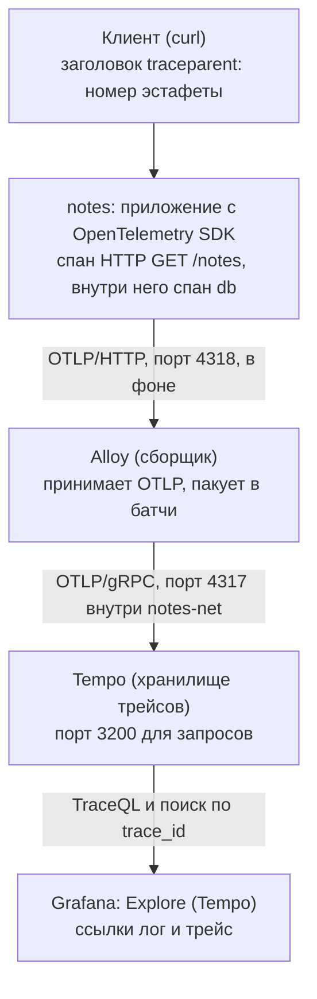
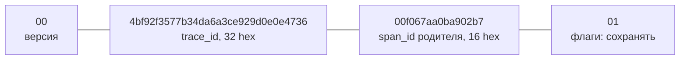
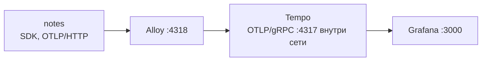

## Зачем это нужно

Метрики говорят, что запросы стали медленными. Логи говорят, что что-то пошло не так. Но ни то ни другое не отвечает на вопрос «где именно этот запрос потерял 900 мс: в приложении, в базе или по дороге». Для этого есть трейс (trace, «след»): запись пути одного запроса по всем компонентам, с длительностью каждого шага. Это как маршрутный лист посылки: на каждом складе ставят штамп «принял в 10:05, отдал в 10:07», и по листу видно, где посылка пролежала дольше всего. Без трейса ты знаешь, что доставка медленная, но не знаешь, на каком складе. Один такой штамп (один шаг) называется спан (span, «отрезок»), а весь лист целиком трейс.

На работе трейсинг включают, когда сервисов больше двух и «тормозит где-то» перестаёт быть диагнозом. Даже для одного сервиса с базой данных трейс сразу показывает, сколько времени заняли SQL-запрос и сама логика приложения.

Шаг проекта: «Заметки» получают версию v7 (образ 0.7.0) с OpenTelemetry, в логах появляется `trace_id`, а в стеке мониторинга поднимаются Tempo и приём OTLP в Alloy. Расшифровка: OpenTelemetry (OTel) это общий стандарт и набор библиотек, которые учат программу записывать метрики, логи и трейсы в одном формате, как единый формат штампа для всех складов. `trace_id` это номер маршрутного листа: по нему все штампы одной посылки собираются вместе. OTLP (OpenTelemetry Protocol) это «язык», на котором программа отправляет эти штампы дальше, а Tempo (от Grafana Labs) это архив, где хранятся и откуда ищутся трейсы. Alloy (агент, который ты настроил в [уроке 8.7](07-logs-loki-alloy.md)) по пути принимает штампы и передаёт в архив. Всё это подробно разберём ниже.

## Что нужно знать

- [Урок 2.4: HTTP](../02-network/04-http.md) - заголовки запроса, из них будет состоять контекст трассировки
- [Урок 4.5: Compose и PostgreSQL](../04-docker/05-compose-postgres.md) - сеть `notes-net`, обращение приложения к БД
- [Урок 8.2: Prometheus](02-prometheus-basics.md) - как выглядит стек `monitoring/compose.yml`, гистограмма задержек
- [Урок 8.6: Grafana как код](06-grafana-dashboards.md) - provisioning источников данных
- [Урок 8.7: Логи, Loki и Alloy](07-logs-loki-alloy.md) - JSON-логи и конфиг Alloy, который мы расширяем, кардинальность (число разных значений у лейбла: чем их больше, тем дороже хранение)
- Если хочешь разобрать основы на другом стенде, см. [Трейсы](../../monitoring/04-logs-traces/02-traces.md) в курсе «Мониторинг и SRE».

## Картина целиком

Представь эстафету с секундомерами. Запрос это эстафетная палочка, которую передают от участника к участнику: браузер, прокси, приложение, база данных. Каждый участник, получив палочку, включает свой секундомер, а закончив, записывает: «получил в такое-то время, держал столько-то, передал дальше». На палочке нацарапан номер эстафеты, поэтому записи всех участников потом можно сложить в одну картину: кто сколько держал и где палочка застряла. Аналогия расходится в том, что в реальной программе участники ещё и вкладываются друг в друга: приложение «держит» палочку всё время, пока ждёт ответа базы.



Схема читается сверху вниз как путь одного запроса. Спаны уходят в сборщик в фоне, поэтому приложение не ждёт хранилище.

Несколько слов с диаграммы. **Сборщик** (collector) это «приёмный пункт» между приложением и архивом: он принимает штампы пачками и пересылает дальше, чтобы приложение не ждало архив. **Сэмплирование** (sampling) это выбор, какую долю трейсов сохранять: проверять каждую сотую деталь на конвейере, а не каждую. **SDK** (software development kit) это библиотека внутри приложения, которая умеет ставить штампы. Всё разберём в теории.

Тот же `trace_id` приложение пишет в каждую строку JSON-лога ([урок 8.7](07-logs-loki-alloy.md)). Поэтому из трейса можно перейти к логам этого запроса, а из строки лога к трейсу. Дальше в теории по порядку: три сигнала, что такое трейс и спан, как контекст передаётся между сервисами, как приложение создаёт спаны, чем OTLP и сборщик помогают, как хранит и ищет Tempo, что такое сэмплирование и как связать три сигнала.

## Теория

### Три сигнала: метрики, логи, трейсы

Наблюдаемость (observability) держится на трёх видах данных, потому что каждый отвечает на свой вопрос, а один вид не заменяет другие. Без понимания разницы люди либо пытаются лечить всё метриками, либо тонут в логах.

Медицинское обследование. Термометр (метрика) говорит «температура 39». История болезни (лог) говорит «в 10:05 жалоба на боль в горле». Рентген с разметкой по слоям (трейс) показывает, в каком именно месте проблема. Термометр не заменит рентген, но и рентген каждую минуту не делают: он дорогой.


| Сигнал | Отвечает на вопрос | Что хранит | Цена |
|---|---|---|---|
| Метрика (урок 8.2) | сколько и как часто | число во времени | дёшево, агрегаты |
| Лог (урок 8.7) | что случилось | запись о событии | средне, текст |
| Трейс (этот урок) | где в цепочке ушло время | путь одного запроса | дорого, поэтому его часто сэмплируют |

Метрика показывает, что p95 (время, быстрее которого отвечают 95% запросов) вырос до 800 мс. Лог показывает, что запросы завершаются успешно. Трейс показывает, что 700 из этих 800 мс запрос ждал базу.

Разберём на примере. Гистограмма из урока 8.6 говорит: «`/notes` в среднем 42 мс». Это агрегат по тысячам запросов. Чтобы понять, куда уходит время у одного конкретного запроса, нужен трейс: 42 мс = 11 мс приложение + 31 мс база.

> **Прикинь сам:** какой сигнал ответит на вопрос «какой из трёх сервисов в цепочке даёт задержку»?
{: .predict}

Трейс: он показывает длительность каждого шага цепочки. Метрика скажет только, что цепочка стала медленной, лог только что где-то что-то произошло.

Осторожно, тут часто путают. Что трейсы «просто логи с временем». Нет: у трейса есть структура (дерево вложенных шагов) и общий идентификатор, который связывает шаги разных сервисов. Логи каждого сервиса пишутся независимо, склеить их «на глаз» по времени ненадёжно.

> **Главное:** метрика говорит «что и сколько», лог говорит «что случилось», а трейс показывает «в каком месте».
{: .key}

Из чего состоит трейс?

### Трейс, спан и контекст

Чтобы увидеть, куда ушло время, запрос надо разложить на шаги и запомнить, кто кого вызвал. Для этого нужны единицы записи и способ их связать.

Оглавление книги с номерами страниц: глава состоит из параграфов, параграф из абзацев. Вложенность видна сразу, и по «толщине» глав ясно, где больше всего текста.

Спан (span) это одна единица работы с началом, длительностью и атрибутами (пары «ключ=значение» с подробностями): «обработать HTTP GET /notes», «выполнить SELECT». Трейс это дерево спанов одного запроса. У всего трейса один `trace_id`, у каждого спана свой `span_id` и ссылка на родителя (`parent_span_id`). Спан без родителя корневой. Кроме этого у спана есть вид (kind): `SERVER` для обработки входящего запроса, `CLIENT` для исходящего вызова, `INTERNAL` для работы внутри процесса, и статус: `OK` или `ERROR`.

Идентификаторы записывают в шестнадцатеричной системе (hex): это способ писать числа цифрами 0-9 и буквами a-f, где один символ несёт четыре бита. `trace_id` это 128 бит, то есть 32 hex-символа, `span_id` это 64 бита, то есть 16 символов. Случайное 128-битное число практически не повторится, поэтому никакой центральной выдачи номеров не нужно.

```mermaid
gantt
    dateFormat  X
    axisFormat  %L мс
    title trace_id 4bf92f35..., корневой и дочерний спаны
    section Спаны
    HTTP GET /notes (корневой, 42 мс) : 0, 42
    db SELECT notes (дочерний, 31 мс) : 6, 37
```



Дочерний спан начался позже родителя и закончился раньше: он лежит внутри его полосы. Из 42 мс в базу ушло 31 мс.

Разберём на примере. По картинке видно главное: 31 из 42 мс ушло в базу. Остаётся 11 мс на всё остальное: разбор запроса, формирование ответа. Дочерний спан начался позже родителя (пока приложение разбирало запрос) и закончился раньше (пока формировало ответ). Метрика с гистограммой показала бы только «42 мс».

Осторожно, тут часто путают. `trace_id` и `span_id`: первый общий для всего запроса, второй уникален у каждого шага. И ещё: путают спан с процессом или сервисом. Спан это шаг внутри запроса, у одного сервиса за один запрос их может быть несколько.

> **Главное:** трейс это дерево спанов одного запроса, у всех общий `trace_id`, а у каждого шага свой `span_id`.
{: .key}

> **Проверь понимание:** чем спан отличается от трейса и что у них общего?

<details markdown="1">
<summary>Ответ</summary>

Трейс это всё дерево запроса, спан это один узел дерева. У всех спанов одного трейса общий `trace_id`, а `span_id` у каждого свой. Связь «родитель-потомок» задаёт поле `parent_span_id`.

</details>

Как трейс не рвётся между сервисами?

### Пропагация контекста: как трейс не рвётся

Когда сервис A вызывает сервис B, B работает в другом процессе, возможно на другом сервере. Общей памяти у них нет. Чтобы B нарисовал свои спаны как продолжение A, ему надо как-то узнать номер эстафеты. Иначе получатся два несвязанных трейса вместо одного.

Номер заказа в службе доставки. Курьер передаёт посылку следующему звену, и на ней наклеен номер. Без наклейки следующее звено заведёт новый номер, и потом никто не свяжет две записи.

Контекст трассировки (trace context) передают в HTTP-заголовке `traceparent` (стандарт W3C Trace Context; заголовок это строка «имя: значение» в начале HTTP-запроса, урок 2.4). Это называется пропагация (propagation, «передача по цепочке»):



Заголовок состоит из четырёх частей через дефис: версия, номер трейса, номер родительского шага и флаги.

Порядок действий такой. Клиент или сервис A создаёт спан и кладёт его `span_id` в `traceparent` исходящего запроса. Сервис B на входе читает заголовок (это называется extract, «извлечь»), берёт оттуда `trace_id` и делает свой спан дочерним к `span_id` из заголовка. Если B вызывает дальше, он кладёт в исходящий заголовок уже свой `span_id` (inject, «вложить»).

Разберём на примере. Клиент отправил запрос с `traceparent: 00-4bf9...4736-00f067aa0ba902b7-01`. Приложение создаёт серверный спан с `trace_id = 4bf9...4736` и родителем `00f067aa0ba902b7`. Затем создаёт спан базы: `trace_id` тот же, родитель уже серверный спан приложения. В Tempo все три записи окажутся в одном трейсе. Если бы заголовка не было, приложение сгенерировало бы новый `trace_id`.

> **Прикинь сам:** запрос пришёл в nginx, потом в приложение. В Tempo два трейса вместо одного. Что подозреваешь?
{: .predict}

Где-то потерян заголовок `traceparent`: nginx не проксирует его (или клиент не отправил), приложение стартует новый корневой спан. Проверять: что показывает `/headers` (эндпоинт приложения из урока 2.4 возвращает заголовки, дошедшие до него) и пробрасывает ли прокси заголовки.

Осторожно, тут часто путают. Что трейс «сам» связывается. Связывает только заголовок, и если хоть один участник цепочки его потерял (прокси срезал, клиент не добавил, приложение не вызвало extract), в Tempo вместо одного трейса окажутся два несвязанных огрызка. Это самая частая поломка трейсинга.

> **Главное:** контекст передаётся заголовком `traceparent`, и без него следующее звено заведёт новый трейс.
{: .key}

Кто создаёт спаны?

### Как приложение создаёт спаны: SDK, инструментирование, экспорт

Спаны не появляются сами: кто-то должен в коде сказать «здесь начался шаг, здесь закончился» и отправить запись наружу. Для этого есть библиотека, готовая для всех языков.

Табельный учёт на проходной: сотрудник (код) отмечается на входе и выходе, а бухгалтерия (экспортёр) раз в несколько минут забирает пачку отметок. Сотрудник не бегает в бухгалтерию после каждой отметки, иначе не успеет работать.

OpenTelemetry (OTel) это стандарт CNCF (фонд, под которым живут Prometheus, Kubernetes и другие) для телеметрии: API и SDK в коде приложения, формат данных и протокол. Приложение использует три части. API (`opentelemetry-api`) это интерфейс «начать спан, задать атрибут». SDK (`opentelemetry-sdk`) реализует его: создаёт идентификаторы, копит спаны. Экспортёр (`opentelemetry-exporter-otlp-proto-http`) отправляет их по сети. Инструментирование (instrumentation) это создание спанов: автоматически библиотеками для популярных фреймворков или вручную. Мы делаем вручную, чтобы видеть, что происходит: в обработчике запроса одна конструкция `with tracer.start_as_current_span(...)`.

Экспорт идёт в фоне. `BatchSpanProcessor` складывает завершённые спаны в очередь и отправляет пачками отдельным потоком. Отсюда два свойства. Приложение не тормозит из-за трейсинга: отправка не в цепочке запроса. Приложение не падает, если сборщик недоступен: ошибка экспорта попадает в лог, а очередь конечна, поэтому при долгой недоступности часть спанов теряется. Это плата за то, что трейсы не должны мешать основной работе.

Разберём на примере. Обработчик `GET /notes`: входим в серверный спан (в него попадает вся обработка), внутри вызываем `list_notes()`, где обёрнут в спан `db` запрос в PostgreSQL. По выходе из блока спаны закрываются и уходят в очередь. Если `OTEL_EXPORTER_OTLP_ENDPOINT` не задан, приложение работает без трейсинга: функция `setup_tracing()` возвращает `None`, и спанов не создаётся.

Осторожно, тут часто путают. Что «включить трейсинг» значит поставить пакет. Пакет ничего не делает, пока в коде не созданы спаны и не задан адрес экспорта. Ещё путают имя спана и его атрибуты: в имени не должно быть уникальных значений (следующий раздел про Tempo объясняет почему: и в трейсинге действует кардинальность).

> **Главное:** SDK создаёт спаны, а экспорт идёт в фоне пачками, поэтому трейсинг не тормозит запросы.
{: .key}

> **Проверь понимание:** сборщик недоступен минуту. Что случится с приложением и со спанами этой минуты?

<details markdown="1">
<summary>Ответ</summary>

Приложение продолжит работать: экспорт идёт в фоне, ошибки попадут в лог. Спаны копятся в очереди ограниченного размера; при переполнении новые или старые теряются. Накопленное в очереди уйдёт, когда сборщик вернётся.

</details>

Куда спаны уходят?

### OTLP и сборщик: между приложением и хранилищем

Приложение не должно знать, где хранятся трейсы. Сегодня Jaeger, завтра Tempo, послезавтра облачный сервис: если адрес хранилища вшит в код, каждая смена требует пересборки.

Почтовый ящик в подъезде. Ты бросаешь письмо в стандартную щель, а куда оно потом поедет, решает почта.

OTLP (OpenTelemetry Protocol) это единый формат и способ передачи телеметрии. Приложение шлёт OTLP на адрес из переменной окружения `OTEL_EXPORTER_OTLP_ENDPOINT` (переменная окружения это именованное значение, которое задаётся при запуске процесса). Сменить хранилище можно без правки кода.

OTLP ходит по двум транспортам: gRPC (порт 4317, двоичный протокол поверх HTTP/2) и HTTP (порт 4318, путь `/v1/traces`). Они не взаимозаменяемы: клиент, говорящий по HTTP, на порт 4317 попадёт как в стену, ошибка будет запутанной (`connection reset`, `unexpected EOF`).

Между приложением и хранилищем ставят сборщик (collector). У нас его роль играет Grafana Alloy, который ты уже настроил в уроке 8.7 для логов: он принимает OTLP, пакует спаны в батчи (пачки) и отправляет в Tempo.



Разберём на примере. Путь одного спана: приложение завершило спан `db`, `BatchSpanProcessor` положил его в очередь, через секунды пачка ушла POST-запросом на `http://alloy:4318/v1/traces`. Alloy принял (`otelcol.receiver.otlp`), собрал в батч (`otelcol.processor.batch`) и передал (`otelcol.exporter.otlp`) в Tempo на `tempo:4317`. Слова в названиях компонентов читаются как роли: receiver принимает, processor обрабатывает, exporter отправляет.

> **Прикинь сам:** зачем между приложением и Tempo нужен сборщик, если приложение может слать в Tempo напрямую?
{: .predict}

Сборщик буферизует и батчит данные, переживает кратковременную недоступность хранилища, может добавлять атрибуты, отбрасывать лишнее и сэмплировать. Приложение при этом знает один стабильный адрес и не зависит от того, какое хранилище стоит за ним.

Осторожно, тут часто путают. Порты 4317 и 4318, самая частая ошибка настройки. Запомни пару: 4317 это gRPC, 4318 это HTTP. У нас приложение говорит по HTTP, значит ему нужен 4318, а между Alloy и Tempo идёт gRPC на 4317.

> **Главное:** OTLP это единый протокол, HTTP идёт на порт 4318, gRPC на 4317, и они не взаимозаменяемы.
{: .key}

Где спаны хранятся?

### Tempo и TraceQL: хранение и поиск

Трейсов много: у сервиса на 100 запросов в секунду за сутки набегает около 8,6 миллиона трейсов. Нужно хранилище, которое принимает поток, хранит недорого и умеет искать нужное.

Склад с ячейками, помеченными номерами. Достать нужную посылку по номеру мгновенно. Найти «все посылки тяжелее 5 кг» можно, но придётся просмотреть много ячеек: склад не строит указатель по каждому признаку, иначе он бы стоил как весь груз.

Grafana Tempo хранит трейсы блоками на диске или в объектном хранилище и не строит индекс по всем атрибутам, поэтому дёшев. Свежие спаны сначала лежат в памяти и журнале записи (WAL, write-ahead log), потом сбрасываются в блоки на диск. Отсюда задержка: только что отправленный трейс может быть найден не сразу, подожди несколько секунд. Срок хранения задаёт компактор (`block_retention`), как retention в Loki из урока 8.7.

Ищут либо по `trace_id` (мгновенно, если он известен), либо запросом на языке TraceQL. Запрос перебирает блоки в заданном интервале:

```text
{ resource.service.name = "notes" && duration > 500ms }
{ span.http.response.status_code >= 500 }
```

Разбор: в фигурных скобках условие на спан; `resource.service.name` атрибут ресурса (того, что породило спан: имя сервиса), `span.http.response.status_code` атрибут самого спана, `duration` длительность; `&&` значит «и».

Разберём на примере. Запрос `{ resource.service.name = "notes" && duration > 900ms }` вернёт трейсы, у которых есть спан сервиса `notes` длиннее 900 мс. Если сделать `sleep` длиной 1 секунда в обработчике `/slow`, спан `HTTP GET /slow` попадёт в выборку, а обычные быстрые запросы нет. Из найденного трейса видно структуру: где именно ушла секунда.

Осторожно, тут часто путают. Что Tempo быстро ищет по любому атрибуту, как поисковик. Быстро только по `trace_id`; остальное это сканирование в пределах интервала, поэтому запросы стоит ограничивать по времени. Ещё путают имя спана с атрибутом: имя должно быть шаблоном (`HTTP GET /notes`), а настоящий адрес (`/notes/123`) кладут в атрибут. Иначе у трейсов миллионы разных имён и поиск по ним бесполезен, как лейбл `path` в Loki.

> **Главное:** Tempo не индексирует все атрибуты, поэтому по `trace_id` ищет мгновенно, а TraceQL перебирает блоки.
{: .key}

> **Проверь понимание:** ты знаешь `trace_id` и хочешь найти трейс. Как быстрее всего?

<details markdown="1">
<summary>Ответ</summary>

Запросить по идентификатору: `GET /api/v2/traces/<trace_id>` или поиск по ID в Explore. Это единственный поиск, который Tempo выполняет мгновенно без сканирования блоков.

</details>

Сколько трейсов хранить?

### Сэмплирование: сколько трейсов хранить

Хранить трейс каждого запроса при большой нагрузке дорого. Обычно интересны ошибки и медленные запросы, а миллионы одинаковых быстрых успешных запросов мало что добавляют.

Проверка качества на конвейере: тестируют не каждую деталь, а каждую сотую. Но если деталь замечена бракованной, её оставляют обязательно.

Сэмплирование (sampling) это выбор, какие трейсы сохранить. Head-сэмплирование решает в начале запроса, до выполнения («сохраняем 10%»): просто и дёшево, но решение принимается вслепую. Tail-сэмплирование решает после завершения трейса («сохраняем все ошибки, все медленные и 5% остальных»): видит результат, но сборщику приходится держать спаны в буфере до конца трейса. Флаг `01` в конце `traceparent` как раз говорит «этот трейс сохраняется».

В курсе сэмплирование не включаем: нагрузка мала, сохраняем всё.

Разберём на примере. Сервис даёт 1000 запросов в секунду, из них 1% ошибок. Head 10% сохранит 100 трейсов в секунду, из которых ошибочных около одного: из 10 ошибок в секунду 9 потеряны. Tail (все ошибки и 1% остальных) сохранит 10 ошибок и около 10 обычных в секунду: 20 трейсов вместо 100, и все ошибки на месте.

<div class="viz" data-viz="chart" data-type="bar" data-x="100%,10%,1%" data-series='[{"name":"Объём трейсов в сутки при 100 запросах в секунду","values":[13,1.3,0.13],"unit":"ГБ"}]' data-x-label="Доля сохранённых трейсов" data-y-label="ГБ в сутки" data-unit="ГБ" data-explain="Оценка для 3 спанов на запрос по 500 байт: 100 запросов в секунду дают около 13 ГБ в сутки, и объём падает пропорционально доле сохранённых трейсов."></div>

Объём пропорционален доле сохранённых трейсов, поэтому сэмплирование это главный способ управлять ценой.

> **Прикинь сам:** почему для поиска причин инцидента tail-сэмплирование полезнее head?
{: .predict}

Head принимает решение до того, как известно, будет ли запрос ошибочным или медленным, и выбросит часть как раз интересных трейсов. Tail видит результат целиком и оставляет все аномальные, а из нормальных берёт небольшую долю.

Осторожно, тут часто путают. Что сэмплирование «портит» картину. Метрики считаются по всем запросам независимо от сэмплирования, они остаются точными. Сэмплирование относится только к трейсам.

> **Главное:** head-сэмплирование решает до выполнения, tail после, а в курсе хранится всё, потому что нагрузка мала.
{: .key}

Как читать результат?

### Как читать трейс: диаграмма-водопад

Tempo и Grafana показывают трейс как диаграмму, и умение читать её с одного взгляда экономит минуты в каждом инциденте. Новичок видит набор цветных полос, опытный человек видит ответ.

Гант-диаграмма проекта: у каждой задачи полоса от начала до конца, вложенные задачи отступают вправо. Сразу видно, что делалось параллельно, что последовательно и что тянуло сроки.

Каждая строка это спан. Слева имя, полоса показывает, когда он начался и как долго шёл на общей оси времени. Вложенные спаны отступают вправо и лежат внутри полосы родителя. Читай по порядку. Первое: длина корневой полосы, это общее время запроса. Второе: какая из вложенных полос самая длинная, это главный подозреваемый. Третье: есть ли «дыры», то есть отрезки, где у родителя есть время, а у потомков нет: там работает сам родитель (или ждёт что-то, что не оформлено спаном). Четвёртое: последовательные или параллельные полосы: если пять запросов идут по очереди, а могли бы одновременно, это находка. Пятое: спаны со статусом `ERROR` подсвечены, у них в атрибутах причина.

Разберём на примере. Трейс `HTTP GET /slow?sec=1`: корневая полоса 1010 мс, внутри спан `db` на 1000 мс (это `pg_sleep(1)` в базе). Дыра в 10 мс это разбор запроса и формирование ответа. Вывод: 99% времени ушло в базу, оптимизировать приложение бессмысленно. Метрика по гистограмме показала бы только «запрос длился секунду».

<div class="viz" data-viz="trace-waterfall" data-scenario="order"></div>

Найди строку с самым большим собственным временем: у корня оно включает всех потомков, поэтому самая длинная полоса не обязательно виновница.

Осторожно, тут часто путают. Что самая длинная полоса всегда виновница. Корень всегда самый длинный, он включает всех потомков. Смотреть надо на «собственное время» спана: его длительность минус длительность его детей. У корня из примера это 10 мс, у `db` 1000 мс.

> **Главное:** вина лежит на спане с большим собственным временем, а не на самой длинной полосе, потому что корень включает всех потомков.
{: .key}

> **Проверь понимание:** корневой спан 500 мс, у него два дочерних подряд по 200 мс. Где ушли остальные 100 мс?

<details markdown="1">
<summary>Ответ</summary>

В собственное время родителя: 500 - 200 - 200 = 100 мс. Это работа самого приложения между вызовами (или ожидание, которое не обёрнуто спаном).

</details>

Чем описать спан?

### Атрибуты и ресурс: чем описать спан

Одной длительности мало. Чтобы искать «пятисотые» и «только сервис notes» или «только метод POST», у спана должны быть поля, по которым запрос TraceQL их отберёт.

Ярлык на посылке: отправитель (кто) и содержимое, вес, срочность (что именно). Ярлык отправителя один на всю партию, содержимое у каждой посылки своё.

Данные о том, кто породил спан, называются ресурсом (resource): имя сервиса `service.name`, версия, узел. Ресурс один на приложение и прикрепляется ко всем его спанам. Данные о конкретном шаге называются атрибутами спана (span attributes): `http.request.method`, `http.response.status_code`. В TraceQL их различают префиксами `resource.` и `span.`. В OpenTelemetry есть соглашения об именах (semantic conventions), например `http.response.status_code`, чтобы разные программы называли одно и то же одинаково, и запросы работали у всех.

Разберём на примере. Наш `request_span` ставит атрибуты `http.request.method` и `http.response.status_code`, а если код 500 или больше, статус спана `ERROR`. Ресурс создаётся один раз в `setup_tracing()` и содержит `service.name = "notes"` из переменной `OTEL_SERVICE_NAME`. Поэтому запрос `{ resource.service.name = "notes" && span.http.response.status_code >= 500 }` найдёт ошибочные запросы именно этого сервиса.

> **Прикинь сам:** в Tempo сервис назван `unknown_service:python`. Что забыли?
{: .predict}

Задать имя сервиса: `service.name` в ресурсе (через `OTEL_SERVICE_NAME` или в коде). Без него SDK подставляет имя по умолчанию.

Осторожно, тут часто путают. Имя сервиса и имя спана. Имя сервиса лежит в ресурсе (`notes`), имя спана описывает шаг (`HTTP GET /notes`). Если забыть `OTEL_SERVICE_NAME`, сервис в Tempo будет называться `unknown_service`, и поиск по нему ничего не найдёт. Ещё путают атрибуты с лейблами Loki: атрибуты не индексируются по одному, их значения можно делать высококардинальными (`user.id`), но не бесконтрольно: каждый атрибут занимает место в хранилище.

> **Главное:** ресурс описывает «кто» и один на приложение, а атрибуты описывают конкретный шаг.
{: .key}

Что делать, если трейсов нет?

### Трейсов нет: как искать обрыв по участкам

Самая частая история с трейсингом: «включили, а в Tempo пусто». Причин десяток, и без плана диагноз превращается в гадание. План простой: цепочка из четырёх звеньев, и проверяем каждое отдельно.

Труба с четырьмя участками. Если вода не течёт из крана, ты не разбираешь всю трубу сразу, а стучишь по участкам и смотришь, где вода дошла, а где нет.

Звенья: приложение (создаёт и экспортирует спаны), сеть и порт (доходит ли до Alloy), Alloy (принимает и передаёт в Tempo), Tempo (хранит и отдаёт). Проверка идёт от источника: включён ли экспорт (`OTEL_EXPORTER_OTLP_ENDPOINT` не пуст), что пишет экспортёр в лог приложения (ошибки соединения, коды ответа), отвечает ли приёмник на спан, посланный вручную (задание 2), что пишет Alloy при отправке в Tempo, готов ли Tempo (`/ready`) и находится ли трейс по `trace_id` после паузы. Ручной спан из задания 2 сразу делит цепочку пополам: если он дошёл, сломано между приложением и Alloy, если нет, между Alloy и Tempo.

Разберём на примере. Трейсов нет. В логе приложения: `Failed to export batch ... Connection reset by peer` (или `unexpected EOF`). Значит, звено «приложение - Alloy» сломано: порт отвечает, но не тем протоколом. Проверяем адрес: `http://alloy:4317`, порт gRPC, а экспортёр HTTP, ему нужен 4318. Исправили адрес, перезапустили приложение, трейсы пошли.

Осторожно, тут часто путают. Что «нет ошибок» значит «всё хорошо». Экспорт в фоне может тихо терять спаны. Ещё путают «трейса нет» с «трейс не успел»: между отправкой и появлением в Tempo проходят секунды.

> **Главное:** обрыв ищут по участкам от источника: приложение, сеть и порт, Alloy, Tempo.
{: .key}

> **Проверь понимание:** ручной спан из задания 2 дошёл до Tempo, а спаны приложения нет. Какое звено подозреваешь?

<details markdown="1">
<summary>Ответ</summary>

Звено «приложение - Alloy»: сам Alloy и Tempo работают (ручной спан прошёл), значит проблема в адресе, порту или протоколе экспорта в приложении, либо в том, что трейсинг не включён (пустой `OTEL_EXPORTER_OTLP_ENDPOINT`).

</details>

Чем отличаются два транспорта?

### gRPC и HTTP: два способа доставить один и тот же спан

В уроке постоянно мелькают два порта, 4317 и 4318, и слова gRPC и HTTP. Новичок путает их, а ошибка в порте оставляет тебя без трейсов на час. Нужно понимать, чем они отличаются по сути, а не только запомнить цифры.

Две службы доставки к одному складу. Обычная почта (HTTP) принимает посылки в любых коробках, её понимает любой отдел. Специальный курьер (gRPC) работает по своим правилам: упаковывает посылки в компактные контейнеры и держит один постоянный канал, зато принимать его умеет только специальное окно. Принести посылку курьера в окно обычной почты нельзя. Аналогия неточна тем, что обе службы доставляют одно и то же содержимое, отличается только упаковка.

HTTP (порт 4318) ты уже знаешь из [урока 2.4](../02-network/04-http.md): запрос, ответ, путь `/v1/traces`. Тело запроса это упакованные спаны. gRPC (порт 4317) это тоже способ вызвать чужую функцию по сети, но данные он передаёт в компактной двоичной форме (не читаемый глазами текст, а байты) и держит соединение открытым. Он экономнее по трафику, зато сложнее отлаживать: `curl` с текстом его не поймёт. Приёмник (у нас Alloy) слушает оба порта одновременно, а приложение использует один из них. Главное правило: клиент и порт должны говорить на одном языке.

Разберём на примере. Приложение настроено слать спаны по HTTP на `http://alloy:4318`. Если по ошибке написать порт 4317, соединение установится (порт открыт), но Alloy получит HTTP-запрос там, где ждёт gRPC, и не поймёт его. В логе приложения появится ошибка экспорта, а в Tempo трейсов не будет. Проверка за минуту: порт 4318 отвечает на обычный HTTP-запрос, порт 4317 нет. Поэтому первым делом при «трейсов нет» сверяй пару «протокол и порт».

> **Прикинь сам:** приложение шлёт OTLP по HTTP, но в настройке стоит порт 4317. Что произойдёт?
{: .predict}

Соединение откроется, но приёмник ждёт на этом порту gRPC и не поймёт HTTP-запрос. Экспорт завершится ошибкой, трейсов в Tempo не будет. Исправление: порт 4318 для HTTP (или переключить клиент на gRPC и оставить 4317).

Осторожно, тут часто путают. Что gRPC «новее и значит лучше». Он экономнее, но для нашего стенда разницы нет, а HTTP проще проверить руками. Ещё путают: порт открыт не значит, что протокол совпал.

> **Главное:** клиент HTTP на порту gRPC даёт запутанную ошибку, поэтому порт и протокол должны совпадать.
{: .key}

Как показать ошибку?

### Ошибки в трейсе: статус спана

Трейс нужен не только для медленных запросов. Запрос может упасть, и важно сразу увидеть, на каком шаге. Без пометки об ошибке пришлось бы открывать каждый трейс и читать атрибуты.

Маршрутный лист, в котором на том складе, где посылку повредили, стоит красный штамп «брак». Листы с красным штампом можно отобрать стопкой, не читая остальные.

У каждого спана есть статус: `UNSET` (по умолчанию: ничего не сказано), `OK` или `ERROR`. Спан со статусом `ERROR` Grafana подсвечивает красным. Статус ставит приложение: у нас `request_span` помечает спан ошибкой, если код ответа 500 или больше. Тогда в TraceQL можно искать не по числу, а по статусу: `{ status = error }`, все спаны с ошибкой. Важное свойство: ошибка одного спана не делает ошибочным весь трейс автоматически. Если `db` упал, а приложение поймало ошибку и вернуло 200, корень будет без ошибки, а `db` красным.

Разберём на примере. Запрос `/error` у «Заметок» отвечает кодом 500. Трейс: корневой спан `HTTP GET /error` со статусом `ERROR` и атрибутом `http.response.status_code=500`. В логе того же запроса лежит тот же `trace_id`. Идёшь из трейса в лог и читаешь текст ошибки. Если бы статус не ставился, такой трейс ничем не отличался бы от обычного, и его пришлось бы искать по коду в атрибутах.

Осторожно, тут часто путают. Что красный спан это всегда авария. Иногда ошибка ожидаема (например, «заметка не найдена» при проверке несуществующего id), и тогда это нормальная работа. Ещё путают статус спана и HTTP-код: код это данные об ответе, статус это оценка «плохо или нет», которую ставит программа.

> **Главное:** статус `ERROR` ставит приложение, и по нему отбирают проблемные трейсы без чтения остальных.
{: .key}

> **Проверь понимание:** спан `db` помечен `ERROR`, корневой спан нет, клиент получил 200. Как это объяснить?

<details markdown="1">
<summary>Ответ</summary>

Приложение поймало ошибку базы и обработало её (например, вернуло данные из запасного источника). Статус спана показывает состояние конкретного шага, а не всего запроса: на `db` была ошибка, на уровне приложения она скрыта от клиента.

</details>

Сколько это стоит?

### Сколько стоит трейсинг: объём и накладные расходы

Трейсинг не бесплатный: каждый спан занимает место и немного процессорного времени. Если включить его без расчёта, хранилище заполнится, а сервис станет чуть медленнее. Нужно уметь оценить цену заранее.

Штамп на каждом складе. Ставить один-два штампа на посылку дёшево, но если на каждой полке ставить по штампу, листок станет толстым, а на штампы уйдёт больше времени, чем на перевозку.

Цена складывается из трёх частей. Первая: память и процессор приложения на создание спана (обычно микросекунды на спан, поэтому для типичных сервисов заметной разницы нет). Вторая: сеть, отправка пачками по OTLP. Третья: хранение в Tempo, оно растёт с числом спанов. Число спанов на запрос зависит от того, сколько шагов ты обернул: у «Заметок» это два-три (HTTP, база), у большого сервиса может быть сто. Снижают цену тремя способами: меньше лишних спанов, сэмплирование (см. раздел выше) и короткий срок хранения.

Разберём на примере. Сервис получает 100 запросов в секунду, на каждый по 3 спана, каждый спан занимает около 500 байт. 100 × 3 × 500 = 150 000 байт в секунду, за сутки 150 000 × 86 400 = 12,96 миллиарда байт, около 13 ГБ. Если сохранять 10% (head-сэмплирование), выйдет около 1,3 ГБ в сутки. При хранении 7 дней это 9 ГБ вместо 91 ГБ. Для лаборатории с малой нагрузкой это пустяк, для боевого сервиса разница в деньгах.

> **Прикинь сам:** сервис даёт 10 запросов в секунду, по 4 спана по 500 байт. Сколько это в сутки без сэмплирования?
{: .predict}

10 × 4 × 500 = 20 000 байт в секунду. 20 000 × 86 400 = 1,728 миллиарда байт, около 1,7 ГБ в сутки.

Осторожно, тут часто путают. Что трейсинг «тормозит приложение». При разумном числе спанов накладные расходы малы, а основной счёт приходит за хранение, а не за процессор. Второе: что можно отключить трейсинг, когда всё хорошо. Трейс нужен именно до аварии: задним числом его не воссоздать.

> **Главное:** объём считается как запросы в секунду на число спанов и размер спана, а сэмплирование снижает его пропорционально.
{: .key}

Как связать с логами?

### Связь трёх сигналов: trace_id в логах

Три сигнала полезны по отдельности, но настоящая скорость приходит, когда от одного можно перейти к другому одним щелчком: от графика к трейсу, от трейса к логам этого запроса.

Один номер обращения в службе поддержки: по нему находят и звонок, и письмо, и запись в CRM. Искать по имени клиента и времени звонка тоже можно, но дольше и с ошибками.

Приложение пишет `trace_id` текущего спана в каждую строку JSON-лога (урок 8.7). В Grafana настраивают ссылки в обе стороны. Из Loki: производное поле (derived field) вытаскивает регулярным выражением `trace_id` из строки и делает ссылку на Tempo. Из Tempo: `tracesToLogs` открывает Loki с запросом по этому `trace_id`. Для метрик применяют exemplars: к точке гистограммы прикрепляют `trace_id` конкретного запроса, попавшего в эту корзину.

Связывает именно идентификатор, а не время. По времени в одну секунду могут попасть сотни запросов, и выбрать нужный не получится. Но `trace_id` нельзя делать лейблом Loki или Prometheus: значений миллионы (кардинальность из урока 8.7). Он остаётся полем в теле записи, и ищут его фильтром `| json | trace_id="..."`.

Разберём на примере. Ты нашёл в Tempo медленный трейс, `trace_id=4bf9...4736`. Нажимаешь «Logs for this span», и Grafana открывает Loki с запросом `{service="notes"} | json | trace_id="4bf9...4736"`. Видишь одну запись: `"path":"/slow","dur_ms":1003`. Теперь и время, и причина, и запись лога у тебя перед глазами.

Осторожно, тут часто путают. Что для связи достаточно «смотреть в то же время». Не достаточно, нужен общий идентификатор. И ещё, из практики безопасности: в атрибуты спанов и в логи нельзя класть почты, токены и тела запросов. Телеметрия хранится долго и читается многими, а тяжёлые атрибуты раздувают хранилище.

> **Главное:** `trace_id` в каждой строке лога связывает три сигнала, но лейблом он быть не может из-за кардинальности.
{: .key}

> **Проверь понимание:** почему `trace_id` в Loki не лейбл, а поле, хотя по нему ищут?

<details markdown="1">
<summary>Ответ</summary>

У каждого запроса свой `trace_id`, значит миллионы уникальных значений. Как лейбл он создал бы поток на каждый запрос и раздул индекс. Как поле он не индексируется, а находится фильтром по тексту в потоках сервиса, что дёшево и достаточно быстро.

</details>

## Практика

Все команды выполняются из `~/notes`. Основной `compose.yml` и стек `monitoring/` из урока 8.7 должны работать (Loki, Alloy, Grafana). Нужны `curl`, `jq` и `openssl`.

### Если у тебя 8 ГБ

Останови то, что в этом уроке не нужно:

```bash
docker compose -f monitoring/compose.yml stop cadvisor node-exporter blackbox alertmanager
docker stats --no-stream
```

`docker stats --no-stream` один раз печатает, сколько процессора и памяти используют контейнеры. Если памяти всё равно мало, останови ещё и Prometheus: он понадобится в 8.9.

### Задание 1. Tempo и приём OTLP в Alloy

**Цель:** запустить Tempo и научить Alloy принимать OTLP и отправлять спаны в Tempo.

**Предскажи:** какие из портов 3200, 4317, 4318 будут опубликованы на хосте? Подумай, кто с кем разговаривает.

<details markdown="1">
<summary>Ответ</summary>

Наружу нужны 3200 (Tempo API, к нему ходит ты с хоста; Grafana ходит внутри сети) и 4317/4318 (принимает Alloy: с хоста удобно слать тестовые спаны). Tempo слушает OTLP на 4317 только внутри сети `notes-net`, публиковать его на хосте нельзя: порт 4317 уже занят Alloy.

</details>

**Шаги:**

1. Создай `monitoring/tempo/tempo.yml`:

```yaml
# Tempo в одиночном режиме: хранение на локальном диске, всё в одном процессе
server:
  http_listen_port: 3200          # API запросов: /ready, /api/v2/traces/<id>

distributor:                      # приёмная часть: принимает спаны
  receivers:
    otlp:
      protocols:
        grpc:
          endpoint: 0.0.0.0:4317  # сюда шлёт Alloy
        http:
          endpoint: 0.0.0.0:4318

ingester:
  max_block_duration: 2m          # закрываем блок быстро, чтобы свежие трейсы находились поиском

storage:
  trace:
    backend: local                # блоки на диске, без объектного хранилища
    wal:
      path: /var/tempo/wal        # журнал свежих спанов до сброса на диск
    local:
      path: /var/tempo/blocks

# хранить трейсы 24 часа: для учебного стенда достаточно
compactor:
  compaction:
    block_retention: 24h
```

2. Добавь в `monitoring/compose.yml` сервис `tempo` и том `tempo-data` (остальные сервисы не трогай):

```yaml
  tempo:
    image: grafana/tempo:2.10.8
    command: ["-config.file=/etc/tempo/tempo.yml"]
    ports:
      - "127.0.0.1:3200:3200"   # только с этого хоста
    volumes:
      - ./tempo/tempo.yml:/etc/tempo/tempo.yml:ro
      - tempo-data:/var/tempo
    restart: unless-stopped
```

В секции `volumes:` в конце файла добавь `tempo-data:`. В сервисе `alloy` опубликуй порты `"127.0.0.1:4317:4317"` и `"127.0.0.1:4318:4318"` (рядом с уже опубликованным `12345`).

3. Добавь в конец `monitoring/alloy/config.alloy` (блоки логов из урока 8.7 оставь как есть):

```alloy
// приём OTLP от приложений: gRPC на 4317 и HTTP на 4318
otelcol.receiver.otlp "default" {
  grpc {
    endpoint = "0.0.0.0:4317"
  }
  http {
    endpoint = "0.0.0.0:4318"
  }
  output {
    traces = [otelcol.processor.batch.default.input]
  }
}

// батчи уменьшают число запросов к Tempo
otelcol.processor.batch "default" {
  output {
    traces = [otelcol.exporter.otlp.tempo.input]
  }
}

// отправка в Tempo по gRPC внутри сети, без TLS (только для лаборатории)
otelcol.exporter.otlp "tempo" {
  client {
    endpoint = "tempo:4317"
    tls {
      insecure = true
    }
  }
}
```

Разбор. Три компонента образуют цепочку так же, как в уроке 8.7: приёмник `receiver` отдаёт трейсы (`traces`) на вход `processor`, тот на вход `exporter`. Приёмнику указаны `0.0.0.0` (слушать на всех адресах контейнера, иначе сообщение от другого контейнера не пройдёт) и оба транспорта. TLS (шифрование канала) выключен только потому, что трафик не выходит за пределы docker-сети.

4. Примени и проверь готовность:

```bash
docker compose -f monitoring/compose.yml up -d tempo alloy
sleep 20
curl -s http://localhost:3200/ready
```

Разбор. `-f monitoring/compose.yml` указывает файл Compose, `up -d tempo alloy` создаёт или пересоздаёт только эти два сервиса. Пауза `sleep 20` нужна, чтобы Tempo успел запуститься. `/ready` проба готовности.

**Что должно получиться:**

```text
ready
```

**Как читать вывод:** слово `ready` значит, что Tempo принимает запросы. Если сразу пришло `Ingester not ready: waiting for 15s after being ready`, Tempo ещё прогревается: подожди ещё 15 секунд и повтори.

**Объясни себе:**

- Почему Alloy шлёт в Tempo по gRPC, хотя приложение будет слать в Alloy по HTTP?

**Типичные ошибки:**

- `Error response from daemon: driver failed programming external connectivity ... Bind for 0.0.0.0:4317 failed: port is already allocated`: порт 4317 опубликован у двух сервисов. Убери публикацию 4317 у `tempo`, оставь у `alloy`.
- `failed to load config: ... field distributor not found` в логе Tempo: опечатка или неверный отступ в `tempo.yml`. Проверь `docker compose -f monitoring/compose.yml logs tempo`.

### Задание 2. Отправь трейс вручную

**Цель:** увидеть, что OTLP это обычный HTTP с JSON, и пройти путь спана от Alloy до Tempo без приложения.

**Предскажи:** если отправить один спан на `http://localhost:4318/v1/traces`, какой HTTP-код вернёт Alloy: 200, 202 или 204? И сразу ли спан появится в Tempo?

<details markdown="1">
<summary>Ответ</summary>

Ответ OTLP/HTTP при успехе: 200 с телом `{"partialSuccess":{}}`. В Tempo спан появится не сразу: сначала он в памяти (ingest), поэтому запрос по `trace_id` может вернуть 404 в течение нескольких секунд.

</details>

**Шаги:**

```bash
# идентификаторы: trace_id 32 hex, span_id 16 hex
TRACE_ID=$(openssl rand -hex 16)
SPAN_ID=$(openssl rand -hex 8)
START=$(date +%s%N)
END=$((START + 250000000))   # спан длится 250 мс

curl -s -o /dev/null -w 'HTTP %{http_code}\n' \
  -H 'Content-Type: application/json' \
  -d '{"resourceSpans":[{"resource":{"attributes":[{"key":"service.name","value":{"stringValue":"manual-test"}}]},
  "scopeSpans":[{"spans":[{"traceId":"'$TRACE_ID'","spanId":"'$SPAN_ID'","name":"hello","kind":1,
  "startTimeUnixNano":"'$START'","endTimeUnixNano":"'$END'"}]}]}]}' \
  http://localhost:4318/v1/traces

echo "trace_id=$TRACE_ID"
sleep 10
curl -s http://localhost:3200/api/v2/traces/$TRACE_ID | jq -r '.trace.resourceSpans[].scopeSpans[].spans[].name'
```

Разбор по кускам. `openssl rand -hex 16` выдаёт 16 случайных байт в виде 32 hex-символов (это `trace_id`), `-hex 8` даёт 16 символов (`span_id`). `date +%s%N` печатает текущее время в наносекундах с 1 января 1970 года: OTLP хранит время именно так (`N` работает в GNU `date` на Ubuntu, на macOS не работает). `$((START + 250000000))` арифметика в оболочке: 250 000 000 наносекунд это 250 мс. В `curl` флаг `-w 'HTTP %{http_code}\n'` печатает после ответа код ответа, `-o /dev/null` выбрасывает тело, `-H` задаёт заголовок, `-d` тело запроса. Тело это JSON: ресурс с именем сервиса `manual-test` и один спан с именем `hello`, идентификаторами и временем начала и конца. Последняя команда просит у Tempo трейс по идентификатору, а `jq -r` достаёт из ответа имена спанов.

**Что должно получиться:**

```text
HTTP 200
trace_id=<32 hex-символа>
hello
```

**Как читать вывод:** `HTTP 200` значит, что Alloy принял спан. Строка `hello` в конце значит, что спан прошёл весь путь и лежит в Tempo. Если последняя строка пустая, спан ещё в пути или потерялся по дороге: повтори последнюю команду через 10 секунд.

**Объясни себе:**

- Из каких трёх идентификаторов и временных полей состоит минимальный спан?

**Типичные ошибки:**

- `HTTP 000` и `curl: (7) Failed to connect to localhost port 4318`: Alloy не запущен или порт не опубликован. Проверь `docker compose -f monitoring/compose.yml ps`.
- Пустой вывод последней команды или `trace not found`: спан ещё не дошёл, подожди 10 секунд и повтори запрос.

### Задание 3. Приложение v7: трейсы и trace_id в логах

**Цель:** подключить OpenTelemetry SDK к «Заметкам» и увидеть, как один запрос порождает серверный и БД-спан.

**Предскажи:** приложение получило заголовок `traceparent: 00-<trace_id>-<span_id>-01`. Какой `trace_id` будет у его серверного спана: новый или тот же?

<details markdown="1">
<summary>Ответ</summary>

Тот же. SDK читает `traceparent`, берёт `trace_id` из него и делает свой спан дочерним к `span_id` из заголовка. Именно так трейс продолжается через границу сервисов.

</details>

**Шаги:**

1. Добавь в `requirements.txt` три пакета с закреплёнными версиями (актуальные значения лежат в [эталонном requirements.txt](https://github.com/distinguished-sre/learning/tree/main/devops/project/notes/requirements.txt)):

```text
opentelemetry-api==1.45.0
opentelemetry-sdk==1.45.0
opentelemetry-exporter-otlp-proto-http==1.45.0
```

2. В `app.py` добавь трейсинг. Полный файл: [эталон v7](https://github.com/distinguished-sre/learning/blob/main/devops/project/notes/versions/v7.py). Вот четыре изменения. Первое, импорты и настройка. Если адрес экспорта не задан, трейсинг выключен:

```python
from contextlib import contextmanager
from opentelemetry import trace
from opentelemetry.sdk.resources import Resource
from opentelemetry.sdk.trace import TracerProvider
from opentelemetry.sdk.trace.export import BatchSpanProcessor
from opentelemetry.exporter.otlp.proto.http.trace_exporter import OTLPSpanExporter
from opentelemetry.trace.propagation.tracecontext import TraceContextTextMapPropagator


def setup_tracing():
    """Включает трейсинг, только если задан OTEL_EXPORTER_OTLP_ENDPOINT."""
    endpoint = os.environ.get("OTEL_EXPORTER_OTLP_ENDPOINT", "")
    if not endpoint:
        return None
    resource = Resource.create({"service.name": os.environ.get("OTEL_SERVICE_NAME", "notes")})
    provider = TracerProvider(resource=resource)
    # OTLP/HTTP: путь /v1/traces дописывается к адресу
    provider.add_span_processor(BatchSpanProcessor(
        OTLPSpanExporter(endpoint=endpoint.rstrip("/") + "/v1/traces")))
    trace.set_tracer_provider(provider)
    return trace.get_tracer("notes")


PROPAGATOR = TraceContextTextMapPropagator()
tracer = setup_tracing()
```

Второе, серверный спан на каждый запрос. Он читает `traceparent` (extract) и продолжает чужой трейс:

```python
@contextmanager
def request_span(handler):
    if tracer is None:
        yield
        return
    # имена HTTP-заголовков нечувствительны к регистру
    ctx = PROPAGATOR.extract(carrier={k.lower(): v for k, v in handler.headers.items()})
    path = route_label(urlparse(handler.path).path)  # шаблон пути, а не настоящий URL
    with tracer.start_as_current_span(
            f"HTTP {handler.command} {path}", context=ctx, kind=trace.SpanKind.SERVER) as span:
        span.set_attribute("http.request.method", handler.command)
        try:
            yield
        finally:
            status = handler._status or 500
            span.set_attribute("http.response.status_code", status)
            if status >= 500:
                span.set_status(trace.StatusCode.ERROR)
```

Обработчик запроса оборачивается в него: `with request_span(self): ...` вокруг `self._dispatch()` и `_access_log`. Функция `route_label` уже есть в v6 (урок 8.6, шаблон пути для метрик).

Третье, спан на каждое обращение к базе. Все функции, которые ходят в PostgreSQL, оборачиваются в `with db_span():`:

```python
@contextmanager
def db_span():
    # Без серверного спана (например, при старте) отдельный трейс БД не нужен.
    if tracer is None or not trace.get_current_span().get_span_context().is_valid:
        yield
        return
    with tracer.start_as_current_span("db"):
        yield
```

Четвёртое, `trace_id` в записи лога. В `JsonFormatter.format` после `entry = {...}` и до `entry.update(...)`:

```python
        # Лог пишется внутри активного спана: его trace_id связывает лог и трейс.
        span_ctx = trace.get_current_span().get_span_context()
        if span_ctx.is_valid:
            entry["trace_id"] = format(span_ctx.trace_id, "032x")
```

`format(x, "032x")` записывает число в hex и дополняет нулями слева до 32 символов. При остановке приложения ещё вызывай `trace.get_tracer_provider().shutdown()`, чтобы отправить хвост очереди.

3. Добавь в основной `compose.yml` сервису `notes` переменные окружения (приложение и Alloy в одной сети `notes-net`, адрес по имени сервиса):

```yaml
    environment:
      OTEL_EXPORTER_OTLP_ENDPOINT: "http://alloy:4318"
      OTEL_SERVICE_NAME: "notes"
```

Если блок `environment:` у сервиса уже есть, добавь эти две строки в него.

4. Пересобери и запусти, сделай запросы с явным `traceparent`:

```bash
docker compose up -d --build notes
TP_TRACE=$(openssl rand -hex 16)
curl -sk -H "traceparent: 00-${TP_TRACE}-00f067aa0ba902b7-01" \
  -X POST -d '{"text":"проверка трейсинга"}' https://notes.lab/notes
curl -sk -H "traceparent: 00-${TP_TRACE}-00f067aa0ba902b7-01" https://notes.lab/notes > /dev/null
sleep 10
# в логе приложения тот же trace_id, что мы передали
docker compose logs notes | grep "$TP_TRACE" | head -2
# и в Tempo два серверных спана и БД-спаны внутри одного трейса
curl -s http://localhost:3200/api/v2/traces/$TP_TRACE | jq -r '.trace.resourceSpans[].scopeSpans[].spans[].name' | sort | uniq -c
```

Разбор. `--build` пересобирает образ перед запуском. `traceparent: 00-<trace_id>-<span_id>-01` собран руками из нашего случайного `trace_id` и любого 16-символьного `span_id`. `grep "$TP_TRACE"` оставляет строки лога с этим идентификатором, `head -2` первые две. В конце `jq` достаёт имена спанов, `sort | uniq -c` группирует одинаковые и считает.

**Что должно получиться** (значения времени и длительностей у тебя будут другие):

```text
notes-1  | {"ts":"2026-09-29T10:00:00.111+00:00","level":"info","msg":"request","trace_id":"<тот же 32 hex>","method":"POST","path":"/notes","status":201,"dur_ms":6,"version":"0.7.0"}
notes-1  | {"ts":"2026-09-29T10:00:00.140+00:00","level":"info","msg":"request","trace_id":"<тот же 32 hex>","method":"GET","path":"/notes","status":200,"dur_ms":3,"version":"0.7.0"}
      2 db
      1 HTTP GET /notes
      1 HTTP POST /notes
```

Если у тебя `STORE=file`, спанов `db` не будет: они создаются вокруг PostgreSQL.

**Как читать вывод:** в логе `trace_id` равен тому, что ты отправил в заголовке: значит приложение продолжило твой трейс, а не завело свой. Префикс `notes-1  |` добавляет `docker compose logs`. В Tempo два серверных спана (по одному на запрос) и два спана `db` (по одному на каждый запрос к базе): все четыре в одном трейсе, потому что `trace_id` общий.

**Объясни себе:**

- Почему имя спана `HTTP GET /notes`, а не `GET /notes/123` с настоящим URL (вспомни урок 8.7 про кардинальность)?

**Типичные ошибки:**

- `ModuleNotFoundError: No module named 'opentelemetry'`: образ собран до правки `requirements.txt`. Пересобери с `--build`.
- `Failed to export batch code: 404` в логах приложения: адрес указан без порта или указан не Alloy. Ожидается `http://alloy:4318`.
- В логах нет поля `trace_id`: запрос выполнялся вне активного спана или лог пишется до `start_as_current_span`.

### Задание 4. Grafana: из лога в трейс и обратно

**Цель:** подключить Tempo как источник данных и сделать переход между логами и трейсами.

**Предскажи:** какое поле в Loki-источнике нужно, чтобы значение `trace_id` в строке лога стало ссылкой на трейс?

<details markdown="1">
<summary>Ответ</summary>

Derived field (производное поле): регулярное выражение вытаскивает `trace_id` из строки, а внутренняя ссылка направляет его в источник Tempo.

</details>

**Шаги:**

1. Создай `monitoring/grafana/provisioning/datasources/tempo.yml`. Блок `tracesToLogsV2` говорит, как из спана перейти к логам того же трейса:


```yaml
apiVersion: 1
datasources:
  - name: Tempo
    uid: tempo
    type: tempo
    access: proxy
    url: http://tempo:3200
    jsonData:
      # из спана переходим к логам того же trace_id
      tracesToLogsV2:
        datasourceUid: loki
        filterByTraceID: true
        customQuery: true
        query: '{service="notes"} | json | trace_id="${__span.traceId}"'
```


2. В файле источника Loki из урока 8.7 (`monitoring/grafana/provisioning/datasources/loki.yml`) убедись, что `uid: loki`, и добавь `jsonData` с производным полем. Итоговый файл:


```yaml
apiVersion: 1
datasources:
  - name: Loki
    uid: loki
    type: loki
    access: proxy
    url: http://loki:3100
    jsonData:
      derivedFields:
        - name: trace_id
          matcherRegex: '"trace_id":"(\w+)"'   # вытащить trace_id из JSON-строки
          url: '$${__value.raw}'                # $$ это экранированный $ в provisioning
          datasourceUid: tempo
```


3. Перезапусти Grafana и сгенерируй трафик:

```bash
docker compose -f monitoring/compose.yml restart grafana
# медленный запрос: его будет видно в трейсе
curl -sk "https://notes.lab/slow?sec=1"
for i in 1 2 3; do curl -sk -X POST -d '{"text":"note"}' https://notes.lab/notes > /dev/null; done
```

4. Открой Grafana (`http://localhost:3000`), Explore, источник Tempo, режим TraceQL. Выполни запрос:

```text
{ resource.service.name = "notes" && duration > 900ms }
```

5. Открой найденный трейс, в панели спана нажми на иконку логов (Logs for this span). Затем в Explore выбери Loki, запрос `{service="notes"} | json | trace_id != ""`, раскрой строку и нажми на ссылку у поля `trace_id`.

**Что должно получиться:** в Tempo найден один трейс `HTTP GET /slow` длительностью около 1 с. Из спана открываются логи, в которых ровно эта запись. Из строки лога открывается трейс.

**Как читать вывод:** в результате TraceQL каждая строка это один трейс с корневым спаном и длительностью. В открытом трейсе полосы показывают длительность и вложенность спанов: длинная полоса `db` внутри `HTTP GET /slow` значит, что время ушло в базу. Если ссылка у `trace_id` в логе видна, значит производное поле сработало.

**Объясни себе:**

- Что тут связывает лог и трейс: тег, время или идентификатор? Почему время не подходит?

**Типичные ошибки:**

- `No data` в панели логов у спана: у Loki-источника не совпал `uid` с `datasourceUid: loki`, либо лейбл `service` в Loki другой. Сверь с конфигом Alloy из 8.7.
- `Data source tempo was not found`: в Loki-источнике указан `datasourceUid: tempo`, а Tempo-источник не загрузился. Смотри `docker compose -f monitoring/compose.yml logs grafana | grep -i provisioning`.
- Ссылки у `trace_id` в логе нет: не совпадает регулярка с реальной строкой (формат `"trace_id":"..."` без пробелов после двоеточия). Сравни с `docker compose logs notes`.

### Задание 5. Шаг проекта: v7, образ 0.7.0, тег v0.7.0

**Цель:** зафиксировать состояние проекта после урока.

**Предскажи:** что покажет `curl -k https://notes.lab/` после пересборки, если в `compose.yml` остался тег 0.6.0?

<details markdown="1">
<summary>Ответ</summary>

`Notes service v0.6.0`: версию печатает то, что запущено, а не то, что лежит в `app.py`. Тег образа и переменная `APP_VERSION` в `compose.yml` должны быть обновлены вместе с кодом.

</details>

**Шаги:**

```bash
cd ~/notes
# версия образа и приложения (на Ubuntu; на macOS: sed -i '' ...)
sed -i 's/0\.6\.0/0.7.0/g' compose.yml
docker build -t notes:0.7.0 .
docker compose up -d
curl -sk https://notes.lab/
# проверка, что в репозитории есть всё нужное для урока
ls monitoring/tempo/tempo.yml monitoring/alloy/config.alloy
git add -A
git commit -m "Урок 8.8: OpenTelemetry, Tempo, trace_id в логах"
git tag v0.7.0
git tag --list 'v0.7*'
```

Разбор. `sed -i 's/0\.6\.0/0.7.0/g' compose.yml` заменяет во всём файле `0.6.0` на `0.7.0` (точки экранированы `\.`, иначе точка значит «любой символ»; `-i` правит файл на месте). `git add -A` добавляет все изменения, `git tag` ставит метку на коммит.

**Что должно получиться:**

```text
Notes service v0.7.0
monitoring/alloy/config.alloy
monitoring/tempo/tempo.yml
v0.7.0
```

Эталон состояния после урока: [project/notes](https://github.com/distinguished-sre/learning/tree/main/devops/project/notes).

**Как читать вывод:** первая строка подтверждает, что запущена новая версия. Две следующие: `ls` нашёл оба файла. Последняя: тег создан.

**Объясни себе:**

- Почему приложение не падает, если Tempo недоступен? Что происходит с накопленными спанами?

**Типичные ошибки:**

- `fatal: pathspec 'monitoring' did not match any files`: команда выполнена не из `~/notes`.
- `Notes service v0.6.0` после запуска: не обновлён тег образа в `compose.yml` (см. «Предскажи»).

## Сломай и почини

Скачай скрипт поломок и запусти один из сценариев (номер выбери сам, но не читай сам скрипт):

```bash
curl -fsSL -o /tmp/break-8.8.sh https://raw.githubusercontent.com/distinguished-sre/learning/main/devops/project/notes/break/8.8/break.sh
bash /tmp/break-8.8.sh 1
```

Сценарии `1`, `2`, `3`, `4`. Скрипт правит `~/notes/compose.yml`, `config.alloy` или источник Loki в `~/notes/monitoring` и перезапускает нужный сервис. После каждого сценария запускай `bash /tmp/break-8.8.sh fix`: он возвращает исходное состояние и его можно запускать сколько угодно раз. После запуска сценария сделай несколько запросов (`curl -sk https://notes.lab/notes`) и открой Grafana. Цель: найти причину по симптомам, не читая скрипт.

### Симптом

Один из четырёх: приложение работает, а трейсов в Tempo нет вообще; трейсов нет, а в логе приложения ошибки экспорта; вручную посланный спан (задание 2) не проходит; трейсы и логи есть, но у `trace_id` в логе нет ссылки на трейс.

### Гипотезы

Выпиши минимум по две на симптом. Для «трейсов нет вообще»: Alloy не запущен; порт или протокол не совпадает; Alloy не может передать в Tempo; трейсинг в приложении не включён. Пройди цепочку по участкам, как в теории.

### Проверки

Иди от источника к хранилищу и проверяй один участок за раз:

```bash
docker compose logs notes | grep -i -E 'export|otel' | tail -5              # ошибки экспорта
docker compose -f monitoring/compose.yml logs alloy | grep -i -E 'error|refused|tls' | tail -5
curl -s http://localhost:3200/ready                                             # Tempo готов?
```

Разбор. `grep -i -E 'export|otel'` регистронезависимый поиск строк с любым из двух слов, `tail -5` последние пять. Затем повтори ручной спан из задания 2: он проверяет звено «Alloy - Tempo» отдельно от приложения. Если в интерфейсе Alloy (`http://localhost:12345`) какой-то компонент красный, читай его сообщение.

### Исправление

<details markdown="1">
<summary>Разбор всех сценариев</summary>

**1. Порт gRPC вместо HTTP.** В `OTEL_EXPORTER_OTLP_ENDPOINT` у приложения указан `http://alloy:4317`, а экспортёр говорит по HTTP: в логе приложения ошибки экспорта (`Connection reset`, `Failed to export`), трейсов нет. Ручной спан из задания 2 при этом проходит. Починка: адрес `http://alloy:4318`, `docker compose up -d notes`.

**2. Alloy не может отправить в Tempo.** В экспортёре `insecure = false`: Alloy ждёт TLS, Tempo отвечает без него. В логе Alloy ошибки вроде `tls: first record does not look like a TLS handshake`, `Exporting failed`. Ручной спан принимается с кодом 200, но в Tempo не появляется: приём в Alloy работает, отправка дальше нет. Починка: `insecure = true` (в лаборатории), перезапуск Alloy.

**3. Приёмник слушает только внутри контейнера.** В `config.alloy` http-приёмник привязан к `127.0.0.1:4318` вместо `0.0.0.0:4318`: изнутри Alloy он доступен, из соседних контейнеров нет. В логе приложения `Connection refused`, ручной спан с хоста тоже не проходит. Починка: `0.0.0.0:4318`, перезапуск Alloy.

**4. Сломано производное поле в Loki-источнике.** Регулярка ищет `"traceid"`, а в логе ключ `trace_id`: трейсы и логи есть, но ссылки из лога в трейс нет. Ошибок нигде нет. Починка: вернуть регулярку `"trace_id":"(\w+)"`, перезапустить Grafana. Урок: часть поломок молчит, о них узнаёшь только по тому, что удобной функции нет.

Отдельно про самый частый обрыв трейса в реальной жизни: потерянный `traceparent`. Если прокси между клиентом и приложением не передаёт заголовок, вместо одного трейса будет два. Проверка: `curl -H 'traceparent: 00-4bf92f3577b34da6a3ce929d0e0e4736-00f067aa0ba902b7-01' https://notes.lab/headers | jq .` покажет, дошёл ли заголовок до приложения.

После разбора верни рабочее состояние:

```bash
bash /tmp/break-8.8.sh fix
```

</details>

## ИИ в помощь

Общие правила работы с ИИ-помощником собраны на странице [«ИИ-помощник»](../../load-tester/ai.md), здесь только сценарии этой темы.

**Задача:** прочитать водопад трейса.

```text
Трейс запроса GET /slow: корневой спан 1010 мс, дочерний спан db 1000 мс, остальное время приходится на корень. Объясни, где ушло время, чьё собственное время у корня и что оптимизировать.
```
{: .wrap}

**Проверь ответ:** собственное время корня 10 мс, а основное время в базе. Типичная ошибка: назвать виновником корень только потому, что его полоса самая длинная.

**Задача:** найти, где оборвался трейс.

```text
Приложение настроено слать спаны на http://alloy:4317 по OTLP/HTTP, в логе: Failed to export batch, Connection reset by peer. Назови звенья цепочки и порядок проверки.
```
{: .wrap}

**Проверь ответ:** HTTP идёт на порт 4318, gRPC на 4317, и ответ должен указывать на порт и протокол. Типичная ошибка: советовать перезапустить Tempo, хотя обрыв на участке «приложение - Alloy».

**Задача:** посчитать объём трейсов.

```text
Сервис получает 200 запросов в секунду, на запрос 4 спана по 500 байт. Посчитай объём в сутки без сэмплирования и при сохранении 10 процентов, покажи арифметику.
```
{: .wrap}

**Проверь ответ:** 200 × 4 × 500 × 86 400 это около 34.6 ГБ в сутки, при 10 процентах около 3.5 ГБ. Сверь арифметику сам: нейросети ошибаются в степенях десяти.

## Словарик урока

| Термин | Простыми словами |
|---|---|
| Трейс (trace) | запись пути одного запроса через все компоненты |
| Спан (span) | один шаг внутри трейса: начало, длительность, атрибуты |
| `trace_id` | общий номер трейса, 32 hex-символа |
| `span_id` | номер одного спана, 16 hex-символов |
| Родительский спан | спан, внутри которого выполняется другой спан |
| hex (шестнадцатеричная запись) | запись числа цифрами 0-9 и буквами a-f |
| `traceparent` | HTTP-заголовок, который передаёт `trace_id` следующему сервису |
| Пропагация (propagation) | передача контекста трейса по цепочке сервисов |
| OpenTelemetry (OTel) | стандарт и библиотеки для метрик, логов и трейсов |
| SDK | библиотека в приложении, которая создаёт и накапливает спаны |
| OTLP | протокол передачи телеметрии: gRPC на 4317, HTTP на 4318 |
| Сборщик (collector) | программа между приложением и хранилищем, у нас Alloy |
| Tempo | хранилище трейсов от Grafana |
| TraceQL | язык запросов Tempo для поиска трейсов и спанов |
| Сэмплирование (sampling) | выбор, какую долю трейсов сохранять |
| Ресурс (resource) | описание источника спанов: имя сервиса, версия |
| Атрибут спана | пара «ключ=значение» с подробностями шага |
| Derived field | поле в Loki-источнике Grafana, которое превращает часть строки лога в ссылку |
| gRPC | способ вызова по сети с компактной двоичной упаковкой данных, порт OTLP 4317 |
| Статус спана | оценка шага: `UNSET`, `OK` или `ERROR`, ставит приложение |
| Собственное время спана | длительность спана минус длительность его дочерних спанов |

## Вопросы с собеседований
Раздел для повторения: ответь вслух, потом открой ответ. Вопросы с пометкой «часто» задают почти на каждом собеседовании по теме урока: начни с них.



## Проверено на версиях

Не прогонялось: Tempo, Alloy, Grafana и приложение v7 не запускались, конфиги и запросы взяты из предыдущей редакции урока и сверены с эталоном `project/notes/versions/v7.py` (чтением), а не выполнением; схема конфига Tempo сверена со стендом load-tester (проверен в CI), а сам урок не прогонялся. `break.sh` проверен через `shellcheck` и прогоном на копии файлов без Docker.

- Ubuntu: 26.04 LTS и 24.04 LTS
- Docker Engine и Compose: версии из урока 4.1
- Grafana Tempo: 2.10.8
- Grafana Alloy: v1.20.1
- Grafana: 13.2.2
- Loki: 3.7.8
- Python: 3.13
- OpenTelemetry API, SDK и OTLP/HTTP-экспортёр для Python: 1.45.0 (как в эталонном `requirements.txt`)

## Итог урока: ты умеешь

- [ ] объяснить, что такое трейс, спан, `trace_id` и `traceparent`
- [ ] описать путь спана: приложение, Alloy (OTLP 4318), Tempo, Grafana
- [ ] прочитать диаграмму трейса и найти спан, в котором ушло время
- [ ] отправить тестовый спан по OTLP/HTTP через curl и найти его в Tempo по `trace_id`
- [ ] найти медленный запрос в Grafana запросом TraceQL
- [ ] перейти из строки лога в трейс и из спана в логи по `trace_id`
- [ ] пройти цепочку «приложение - Alloy - Tempo» по участкам и найти обрыв
- [ ] отличить проблему порта и протокола OTLP (4317 против 4318) от других поломок
- [ ] собрать образ 0.7.0 и поставить тег v0.7.0

**Дальше:** [Урок 8.9: Мониторинг в Kubernetes: kube-prometheus-stack](09-k8s-monitoring.md)
