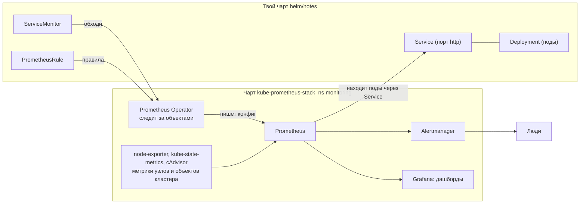
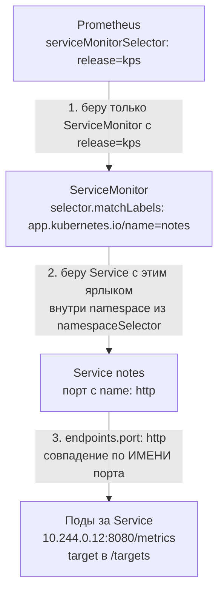
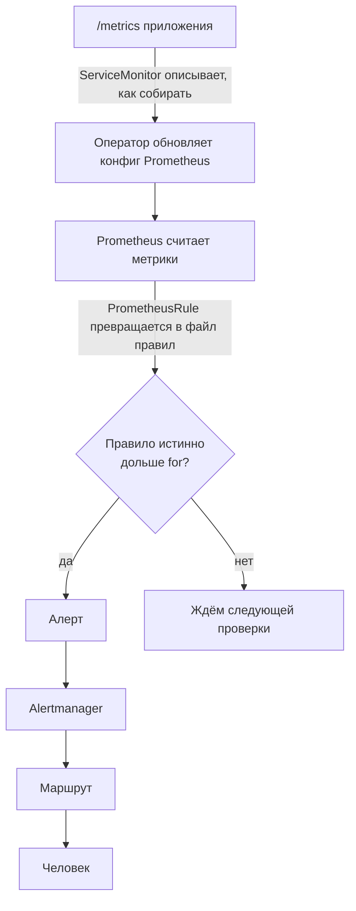

## Зачем это нужно

В Docker Compose ты писал `prometheus.yml` руками и перечислял цели: «ходи по адресу `notes:8080` и забирай метрики». В Kubernetes так не выйдет. Поды (pod, минимальная единица запуска, [урок 5.2](../05-kubernetes/02-pods-deployments.md)) приходят и уходят, у каждого нового пода новый IP-адрес, и статичный список адресов устаревает за час.

Кроме того, сам кластер требует наблюдения: под падает и перезапускается по кругу, на узле кончается память, Deployment застрял и не может поднять нужное число копий. На работе это первый пункт после «поставили кластер»: ставят готовый набор `kube-prometheus-stack`, и через полчаса есть дашборды узлов и подов, а команды подключают свои сервисы одним небольшим манифестом (манифест это YAML-файл с описанием объекта Kubernetes). `kube-prometheus-stack` это «мониторинг в коробке»: один Helm-пакет ([урок 5.9](../05-kubernetes/09-helm.md)), внутри которого Prometheus, Grafana, Alertmanager и датчики для кластера уже подружены между собой. Как купить готовую сигнализацию с монтажом вместо того, чтобы собирать её из отдельных датчиков. Без него ты неделю соединял бы всё это сам.

Шаг проекта: в кластер `kind-notes` ставится стек мониторинга (namespace `monitoring`), чарт `helm/notes` получает `ServiceMonitor` и `PrometheusRule` (chart 0.3.0, appVersion 0.7.0), и Prometheus сам находит «Заметки». `ServiceMonitor` это небольшой файл-заявка «собирай метрики вот с этого сервиса», как запись в график обхода. `PrometheusRule` это файл с правилами алертов, например «если ошибок больше 5%, подними тревогу». Оба разберём подробно ниже. Namespace `monitoring` это отдельная «комната» внутри кластера ([урок 5.2](../05-kubernetes/02-pods-deployments.md)): мониторинг живёт в своей, чтобы не смешиваться с приложениями.

## Что нужно знать

- [Урок 5.3: Service и DNS кластера](../05-kubernetes/03-services-dns.md): Service (постоянный адрес для набора подов) и labels (ярлыки на объектах). ServiceMonitor находит поды через Service и его labels.
- [Урок 5.9: Helm](../05-kubernetes/09-helm.md): Helm ставит программы в кластер «пакетами» (чартами). Им мы поставим стек и расширим чарт `helm/notes`.
- [Урок 5.11: HPA и metrics-server](../05-kubernetes/11-scaling-hpa.md): metrics-server это маленькая служба кластера, которая помнит только текущую загрузку подов (для `kubectl top` и автомасштабирования), как табло «сейчас на весах столько-то» без журнала. Чем она отличается от полноценного мониторинга, разберём в теории.
- [Урок 8.2: Prometheus](02-prometheus-basics.md): scrape (периодический сбор метрик), target (цель сбора), страница `/metrics`.
- [Урок 8.3: PromQL](03-promql.md): язык запросов, `rate`, агрегации.
- [Урок 8.5: Alertmanager](05-alertmanager.md): правила алертов и runbook.
- [Урок 8.6: Grafana](06-grafana-dashboards.md): дашборды и datasource.

## Картина целиком

Представь большой офис, где сотрудники всё время переезжают с места на место. Раньше у тебя был бумажный список «Иванов, кабинет 5, Петров, кабинет 7», и им пользовался обходчик (это Prometheus: он обходит цели и записывает показания). В офисе, где люди переезжают каждый час, такой список бесполезен. Нужен **администратор**, который сам следит за переездами и обновляет маршрут обходчика. Ему достаточно повесить на дверь табличку: «Меня нужно обходить».

В Kubernetes администратор называется **Prometheus Operator**, а табличка на двери это объект **ServiceMonitor**. Оператор (operator) это программа внутри кластера, которая берёт на себя рутину по одной программе: как опытный администратор, который знает, как настроить именно Prometheus, и делает это по твоим описаниям. Без оператора ты правил бы конфиг Prometheus руками при каждом новом сервисе. Про операторов вообще расскажет [урок 9.2](../09-secrets-gitops/02-vault-k8s-eso.md). Остальное приезжает в комплекте: датчики для узлов и объектов кластера, дашборды, набор готовых правил.



Слева то, что лежит в чарте твоего приложения, справа стек. Оператор читает описания слева и превращает их в настройки Prometheus.

За урок ты разберёшь, что входит в стек и зачем, как устроены `ServiceMonitor` и `PrometheusRule`, как Prometheus находит цели без ручного списка, что такое CRD (расширение Kubernetes новыми типами объектов) и почему одна пропущенная строка-ярлык (label) делает мониторинг молча пустым. Ярлык (label) это пара `ключ: значение` на объекте Kubernetes, как цветная наклейка на папке: по наклейке объекты находят друг друга ([урок 5.3](../05-kubernetes/03-services-dns.md)).

## Теория

### Зачем нужен весь стек, а не один Prometheus

Одного Prometheus мало: он умеет хранить и считать метрики, но кто-то должен их отдавать. Про узел (сервер, на котором крутятся поды) нужны данные о процессоре, дисках и сети. Про объекты Kubernetes нужны данные вроде «сколько копий приложения должно быть и сколько живо». Про потребление контейнеров нужны свои цифры. Собрать всё это по отдельности можно, но на это уйдёт неделя. `kube-prometheus-stack` (стек) это один Helm-чарт ([урок 5.9](../05-kubernetes/09-helm.md)), который ставит связанный набор компонентов за одну команду.

Стек как готовый набор «умный дом» вместо россыпи датчиков: в коробке хаб, датчики в каждой комнате, приложение на телефон и готовые сценарии («протечка: закрыть воду»). Оговорка: коробка рассчитана на типичный дом. Свои особенности (наши сервисы) ты добавляешь сам.

В стек входят:

- **Prometheus Operator** (оператор, operator): программа-контроллер. Контроллер в Kubernetes это цикл «сравни, что описано в объектах, с тем, что есть на деле, и подтяни второе к первому». Этот следит за объектами мониторинга и сам пишет конфиг Prometheus.
- **Prometheus** и **Alertmanager** (рассылка алертов, [урок 8.5](05-alertmanager.md)): создаются оператором из объектов `Prometheus` и `Alertmanager`.
- **Grafana** ([урок 8.6](06-grafana-dashboards.md)) с готовыми дашбордами кластера.
- **node-exporter**: программа на каждом узле, отдаёт метрики самого сервера (процессор, память, диски). Запускается как DaemonSet: объект, который держит ровно по одному поду на каждом узле ([урок 5.8](../05-kubernetes/08-jobs-cronjob-daemonset.md)).
- **kube-state-metrics**: превращает состояние объектов Kubernetes в метрики, например `kube_pod_status_phase` (в какой фазе под) и `kube_deployment_status_replicas_available` (сколько копий приложения готовы).
- Набор готовых правил алертов и recording rules (правила, которые заранее считают сложное выражение и сохраняют результат как новую метрику).

Как различать источники цифр. Это самое частое место путаницы, поэтому разберём на вопросе «что случилось с приложением?»:

```text
вопрос                                          кто отвечает         пример метрики
------------------------------------------------------------------------------------------------
сколько CPU и памяти съел контейнер?            cAdvisor (в kubelet) container_memory_working_set_bytes
насколько загружен сам сервер?                  node-exporter        node_cpu_seconds_total
сколько копий должно быть и сколько готово?     kube-state-metrics   kube_deployment_status_replicas_available
последние значения для kubectl top и HPA?       metrics-server       (истории нет, метрик Prometheus не даёт)
```

cAdvisor встроен в kubelet (агент Kubernetes на каждом узле, он запускает контейнеры). metrics-server из [урока 5.11](../05-kubernetes/11-scaling-hpa.md) хранит только последнее значение и нужен для `kubectl top` и автомасштабирования. Истории в нём нет, поэтому графиков за неделю он не построит.

Разберём на примере. Deployment `notes` просит 3 копии, живы две. kube-state-metrics публикует два числа: `kube_deployment_spec_replicas{deployment="notes"} 3` (желаемое) и `kube_deployment_status_replicas_available{deployment="notes"} 2` (доступное). Готовое правило стека `KubeDeploymentReplicasMismatch` сравнивает их: 3 не равно 2 дольше 15 минут, значит алерт. Обрати внимание: ни cAdvisor, ни node-exporter этого не знают, они измеряют потребление, а не «что должно быть».

> **Прикинь сам:** какой компонент подскажет, что у Deployment 3 желаемых реплики, а доступна одна: cAdvisor, node-exporter или kube-state-metrics?
{: .predict}

kube-state-metrics: метрики `kube_deployment_spec_replicas` и `kube_deployment_status_replicas_available`. cAdvisor и node-exporter измеряют потребление ресурсов, а не состояние объектов.

Осторожно, тут часто путают. metrics-server и kube-state-metrics. Первый отдаёт цифры «сколько потрачено сейчас», второй «в каком состоянии объекты». Названия похожи, задачи разные.

> **Главное:** Prometheus хранит и считает, а отдают метрики разные компоненты: cAdvisor про контейнеры, node-exporter про узлы, kube-state-metrics про объекты.
{: .key}

Откуда Kubernetes знает слово ServiceMonitor?

### CRD: как научить Kubernetes новым словам

Kubernetes из коробки знает Pod, Service, Deployment и десяток других типов объектов. Слова «мониторить» в нём нет. Чтобы его добавить, можно было бы дописать код самого Kubernetes, но это невозможно для каждого проекта. Поэтому придумали расширение: **CRD** (Custom Resource Definition, определение пользовательского ресурса). Это «словарь-дополнение»: ты регистрируешь новый тип объекта, и Kubernetes начинает хранить его так же, как любой свой.

Библиотечная картотека: есть карточки «книга» и «журнал». CRD это добавление в картотеку нового вида карточки, «диск». Сама картотека (Kubernetes) просто хранит карточки. А библиотекарь, который что-то с ними делает (оператор), отдельный человек. Оговорка: карточка без библиотекаря ничего не делает. Без установленного оператора объект `ServiceMonitor` можно создать, но толку не будет.


1. Ты ставишь стек. Вместе с ним в кластер регистрируются CRD (проверишь командой `kubectl get crd`).
2. Теперь в кластере есть новые типы. Главные три: `ServiceMonitor` («собирай метрики с подов за этим Service»), `PodMonitor` (то же, но напрямую по подам, без Service) и `PrometheusRule` (правила алертов и recording rules в виде объекта).
3. Ты создаёшь объект нового типа, например ServiceMonitor, в чарте своего приложения.
4. Оператор видит объект, генерирует из него кусок конфига `scrape_configs` (файл Prometheus, где перечислены цели) и просит Prometheus перечитать конфиг.

Итог: вместо файла `prometheus.yml`, который правит один человек, у каждой команды своё описание рядом с её приложением. Команда, которая владеет сервисом, владеет и его мониторингом.

Разберём на примере. Минимальный ServiceMonitor:

```yaml
apiVersion: monitoring.coreos.com/v1   # группа и версия CRD: «новое слово» из словаря оператора
kind: ServiceMonitor                   # тип объекта
metadata:
  name: notes
  labels:
    release: kps                       # ярлык для Prometheus, см. следующий раздел
spec:
  selector:                            # какие Service мониторить: по их ярлыкам
    matchLabels:
      app.kubernetes.io/name: notes
  endpoints:
    - port: http                       # ИМЯ порта в Service (не номер)
      path: /metrics
```

Читается как приказ: «найди Service с ярлыком `app.kubernetes.io/name=notes`, возьми у него порт по имени `http` и раз за интервалом забирай с адресов подов страницу `/metrics`». `apiVersion: monitoring.coreos.com/v1` это адрес нового типа в словаре Kubernetes, так CRD оператора отличается от встроенных типов.

Осторожно, тут часто путают. Что создание ServiceMonitor само что-то мониторит. Он только описание. Работает связка «CRD + оператор + Prometheus».

> **Главное:** CRD добавляет новые типы объектов, а работает связка «CRD, оператор и Prometheus»: сам ServiceMonitor лишь описание.
{: .key}

> **Проверь понимание:** зачем стеку нужны CRD, если Prometheus можно настроить обычным файлом?

<details markdown="1">
<summary>Ответ</summary>

CRD дают каждой команде описывать мониторинг своего приложения отдельным объектом рядом с приложением. Оператор сам собирает из объектов конфиг Prometheus. Без этого пришлось бы править центральный файл вручную при каждом новом сервисе, а IP подов в нём устаревали бы.

</details>

Как Prometheus находит цель по ярлыкам?

### Как Prometheus находит цель: три ярлыка и одно имя

Связь «ServiceMonitor к подам» держится на ярлыках (labels): пары `ключ: значение` на объектах Kubernetes ([урок 5.3](../05-kubernetes/03-services-dns.md)). Ярлыки нужны, чтобы один объект мог «выбрать» другие без жёстких имён и IP.

Рассылка по тегам. У Prometheus в настройках написано: «читай только письма с тегом `release=kps`». Твой ServiceMonitor это письмо. Нет тега, письмо не прочитано, хотя лежит в ящике. Оговорка: письмо не «теряется с ошибкой», оно просто молча игнорируется. Поэтому такие поломки трудно заметить.

Поиск идёт в три «прыжка», и на каждом свой ярлык или имя:



Три шага, и на каждом совпадение: по ярлыку `release`, по ярлыку Service и по имени порта. Если любое звено не совпало, в `/targets` цели не будет.

Три условия должны сойтись одновременно:

1. У ServiceMonitor есть ярлык, который ждёт Prometheus (`serviceMonitorSelector`). В нашем стеке по умолчанию это `release: <имя релиза стека>`, то есть `release: kps`.
2. Ярлыки Service подходят под `selector.matchLabels`, а Service лежит в namespace из `namespaceSelector`.
3. В `endpoints[].port` написано **имя** порта из Service, а не число.

Если хоть одно не сошлось, цели нет, а ошибки в логах нет. Prometheus не «падает», он просто не видит объект.

Разберём на примере. Service объявлен так: `ports: [{port: 8080}]` без `name`. ServiceMonitor пишет `port: http`. Оператор ищет порт с именем `http`, не находит, и target не появляется. Исправление: дать порту в Service `name: http`.

> **Прикинь сам:** в Service порт объявлен как `port: 8080` без `name`. Можно ли в ServiceMonitor написать `port: 8080`?
{: .predict}

Нет. В `endpoints[].port` указывается имя порта. Поле `targetPort` принимает число, но лучше дать порту имя (`name: http`) в Service и ссылаться на него. Без имени оператор не сможет сопоставить endpoint, и target не появится.

Осторожно, тут часто путают. «`kubectl get servicemonitor` показывает объект, значит всё работает». Нет: это только факт, что объект есть. Работает ли он, показывает страница `/targets` Prometheus.

> **Главное:** цель находится по трём совпадениям: ярлык `release`, ярлык Service и имя порта.
{: .key}

Как из метрики получается алерт?

### Цепочка от метрики до алерта и PrometheusRule

Алерт (сигнал «что-то не так») в кластере тоже описывается объектом, `PrometheusRule`. Это те же правила, которые ты писал в файле в [уроке 8.5](05-alertmanager.md), только в виде YAML-объекта в чарте. Плюс: правила версионируются и выкатываются вместе с приложением.

Инструкция для дежурного лежит не в общем шкафу, а на рабочем месте у того, кто отвечает за сервис. Оговорка: общая инструкция для инфраструктуры (упал узел, кончился диск) остаётся в стеке, её не дублируют.

Полный путь данных:



Алерт не срабатывает сразу: условие должно продержаться дольше `for`, и только потом оно идёт по маршруту к человеку.

Любое звено может сломаться молча: объект создан, ошибок нет, а данных нет. Поэтому диагностика идёт по цепочке снизу вверх: target в интерфейсе Prometheus, затем ServiceMonitor, затем ярлык и имя порта.

Разберём на примере. Правило из задания 3:

- `record: notes:http_errors:ratio5m` (recording rule): выражение `sum(rate(status=~"5..")) / sum(rate(всё))` считается раз в интервал и сохраняется как метрика. Считаем так: за 5 минут пришло 100 запросов в секунду в сумме, из них 7 закончились кодом 5xx; 7 / 100 = 0,07, то есть 7 процентов.
- `alert: NotesHighErrorRatio` срабатывает, когда `ratio5m > 0.05` держится дольше `for: 5m`. В нашем примере 0,07 больше 0,05, значит через 5 минут алерт уйдёт.

Стек приносит собственные правила (`KubePodCrashLooping`, `KubeDeploymentReplicasMismatch`, `NodeFilesystemSpaceFillingUp`) для инфраструктуры. Правила про боль пользователя (доля 5xx, задержка) пишешь ты, и лежат они рядом с приложением.

Осторожно, тут часто путают. «Правило есть, но не срабатывает». Причины по частоте: нет ярлыка `release`, выражение не даёт данных, условие не продержалось `for`.

> **Главное:** правило алерта это объект `PrometheusRule`, а алерт идёт по цепочке до человека только после выдержки `for`.
{: .key}

> **Проверь понимание:** алерт `KubePodCrashLooping` сработал, но метрики самого приложения пропали. Какой из двух источников данных для этого алерта жив, а какой нет?

<details markdown="1">
<summary>Ответ</summary>

Алерт строится на метриках kube-state-metrics (`kube_pod_container_status_restarts_total`), они живут независимо от `/metrics` приложения. Приложение в CrashLoop не отвечает, поэтому его собственные метрики пропали, а состояние пода kube-state-metrics видит по-прежнему.

</details>

Почему стек такой тяжёлый?

### Ресурсы и хранение: почему стек «тяжёлый»

Мониторинг это тоже программы, и им нужны процессор, память и диск. Prometheus, Grafana, Alertmanager, оператор и kube-state-metrics вместе просят порядка 1-2 ГБ памяти. На ноутбуке с kind это заметно.

В `values` (файл настроек чарта, [урок 5.9](../05-kubernetes/09-helm.md)) мы делаем три вещи:

1. Отключаем то, чего в kind нет: etcd, scheduler, controller-manager, kube-proxy недоступны для сбора метрик из узла-контейнера. Если оставить включёнными, эти цели будут DOWN, и «красное» на странице `/targets` начнёт мозолить глаза.
2. Задаём небольшие `requests` (сколько ресурсов резервируется поду).
3. Кладём данные Prometheus на PVC (запрос на диск, [урок 5.5](../05-kubernetes/05-storage-statefulset-postgres.md)), а не в `emptyDir`, иначе перезапуск пода сотрёт историю. `retention` (срок хранения) ограничиваем: 3 дня, иначе диск заполнится.

> **Прикинь сам:** почему Prometheus в стеке запускается как StatefulSet с PVC, а не как обычный Deployment без диска?
{: .predict}

Prometheus хранит историю на диске и должен получать при перезапуске тот же диск и то же имя. StatefulSet даёт устойчивое имя и свой PVC для каждой копии. В Deployment без диска история пропадала бы вместе с подом.

Осторожно, тут часто путают. Что `retention: 3d` защищает от переполнения всегда. Он ограничивает по времени, а не по размеру. Если серий (уникальных рядов метрик) стало в десять раз больше, диск заполнится раньше срока.

> **Главное:** стек просит 1-2 ГБ, поэтому в `values` задают лимиты, срок хранения и том для данных.
{: .key}

Как узнать, что цель не отвечает?

### Метрика up: как Prometheus сообщает, что цель не отвечает

Если приложение упало, оно перестаёт отдавать метрики, и на графиках просто пустота. Пустоту легко принять за «всё спокойно». Нужен сигнал «я не смог собрать данные», и он не зависит от приложения.

Обходчик с журналом. Если в двери никто не открыл, он пишет в журнал «не открыли». Запись «не открыли» делает сам обходчик, а не жилец, так что она есть, даже когда жилец исчез. Оговорка: обходчик не знает причину (жилец спит или съехал), он знает только факт.

При каждом сборе Prometheus сам добавляет в базу метрику `up` для каждой цели: `1`, если страница `/metrics` получена, и `0`, если нет (нет соединения, таймаут, ответ 404 или 500). Ярлыки у неё те же, что у цели: `job` (имя задания, для ServiceMonitor это имя Service), `instance` (адрес и порт), `namespace`, `pod`.

Разберём на примере. Запрос `up{job="notes"}` вернёт по строке на каждый под, например `up{instance="10.244.0.12:8080", job="notes"} 1`. Под упал: значение станет `0`. Правило `NotesTargetDown` из задания 3 (`up{job="notes"} == 0` дольше `for: 2m`) сработает через две минуты. Именно поэтому оно смотрит на `up`, а не на метрики приложения: те при падении просто исчезают, и алерт на «долю 5xx» промолчит (деление пустоты на пустоту даёт `no data`).

Осторожно, тут часто путают. «Нет цели в `/targets`» и «цель DOWN» это разные поломки. Нет цели: Prometheus не знает про Service (ярлык, имя порта, namespace). Цель DOWN: знает, но достучаться не может (неверный `path`, порт, сетевая политика, приложение упало).

> **Главное:** `up` пишет сам Prometheus, и `0` означает «сбор не удался», а не «пусто, значит спокойно».
{: .key}

> **Проверь понимание:** метрика `up` равна 1, но метрики приложения `notes_*` пустые. Что это значит?

<details markdown="1">
<summary>Ответ</summary>

Страница `/metrics` отвечает (иначе `up` был бы 0), но в ней нет метрик с префиксом `notes_`. Скорее всего, цель ведёт не на то приложение или приложение работает без метрик приложения (например, отдаёт только служебные). Смотри содержимое `/metrics` через `kubectl port-forward`.

</details>

Какой монитор выбрать для пода без Service?

### ServiceMonitor или PodMonitor: через что искать поды

Не у каждого пода есть Service. Если под запускается Job-ом (одноразовая задача, [урок 5.8](../05-kubernetes/08-jobs-cronjob-daemonset.md)) или это вспомогательный контейнер (сайдкар), которому Service не положен, ServiceMonitor его не найдёт.

ServiceMonitor ищет жильца через вывеску подъезда («Подъезд 3, квартиры 10-20»), а PodMonitor стучит в дверь конкретной квартиры. Оговорка: вывеска (Service) удобнее, она сама следит, кто в подъезде живёт и готов ли.

ServiceMonitor берёт список адресов из Endpoints Service, а в Endpoints попадают только готовые поды (прошедшие readiness-пробу, [урок 5.7](../05-kubernetes/07-probes-resources-rollouts.md)). PodMonitor выбирает поды по ярлыкам напрямую, порт указывается в `podMetricsEndpoints`. Для обычных приложений с Service выбирай ServiceMonitor, для остального PodMonitor.

Разберём на примере. Под `notes` не прошёл readiness: Service его не включает. ServiceMonitor его тоже не видит, и цель пропадает. PodMonitor нашёл бы его и показал `up 1`, если `/metrics` доступен. Так что при диагностике «цель пропала» смотри и `kubectl get endpoints notes`.

> **Прикинь сам:** у тебя CronJob, который каждую ночь запускает под на 30 секунд и Service к нему нет. Что выберешь для метрик?
{: .predict}

Скорее всего, ни то и ни другое: Prometheus собирает раз в 15-60 секунд и короткий Job может не успеть. Для коротких задач используют Pushgateway (Job сам отправляет итог) или считают результат в метриках, которые пишет долгоживущий сервис. PodMonitor подойдёт для долгоживущих подов без Service.

Осторожно, тут часто путают. Что PodMonitor «лучше». У него нет защиты «не собирать с неготовых подов», а вывески нет, значит и привязки к сервису.

> **Главное:** ServiceMonitor ищет через Service, PodMonitor прямо по подам, и нужный выбирают по наличию Service.
{: .key}

Как Prometheus узнаёт про новые поды?

### Как Prometheus узнаёт о подах: service discovery

В Compose ты вписал адрес `notes:8080` в файл и забыл. В кластере под живёт минуты или дни, и при каждом перезапуске у него другой IP-адрес. Список адресов, написанный руками, врёт уже через час. Нужен способ, при котором Prometheus сам узнаёт, кто сейчас живёт в кластере. Этот способ называется **обнаружением сервисов** (service discovery).

Обходчик не носит с собой бумажный список жильцов, а перед каждым обходом звонит в диспетчерскую и спрашивает: «Кто сейчас живёт в подъезде 3?». Диспетчерская всегда знает актуальный список. Оговорка: диспетчер называет только тех, кто зарегистрирован. Если ты не повесил табличку (ServiceMonitor), обходчик про жильца не узнает.

У Kubernetes есть центральный справочник, **API-сервер** (API server): к нему обращаются все команды `kubectl`, и он знает обо всех объектах кластера. Prometheus подключается к нему и «подписывается» на изменения: появился под, исчез под, изменился Service. Как только что-то меняется, Prometheus пересобирает список целей. Порядок такой:

1. Оператор читает ServiceMonitor и пишет в конфиг Prometheus правило: «ищи Service с такими ярлыками».
2. Prometheus спрашивает у API-сервера, какие Service подходят, и берёт адреса их подов.
3. К каждому адресу он ходит за `/metrics` с заданным интервалом (по умолчанию в стеке 30 секунд).
4. Под пересоздали: API-сервер сообщил новый адрес, Prometheus перестроил список. Тебе ничего делать не нужно.

Разберём на примере. Deployment `notes` масштабируют с 2 до 3 копий. Появляется третий под с адресом `10.244.0.15:8080`. Через несколько секунд в `/targets` видна новая строка. Старые две строки не пропали. Если потом один под удалят, его цель исчезнет из списка, а метрики, которые он успел отдать, остаются в базе: история не стирается.

Осторожно, тут часто путают. Что «Prometheus сам находит всё в кластере». Он находит только то, что ему описали: у него нет права «угадывать» сервисы. Если описания нет (нет ServiceMonitor или PodMonitor), цели не будет.

> **Главное:** адреса подов меняются, поэтому Prometheus спрашивает у API Kubernetes актуальный список, а не хранит его.
{: .key}

> **Проверь понимание:** ты пересоздал под, у него новый IP. Нужно ли править ServiceMonitor?

<details markdown="1">
<summary>Ответ</summary>

Нет. ServiceMonitor описывает ярлыки Service, а не адреса. Новый под с теми же ярлыками попадёт в Endpoints Service, Prometheus узнает о нём через API-сервер и начнёт собирать метрики сам.

</details>

Откуда берутся слова `kps` и `monitoring`?

### Helm-релиз, namespace и ярлык release: откуда берётся `kps`

Ты увидишь в уроке слова `kps` и `monitoring` почти в каждой команде. Если не понять, откуда они, то скопированная команда сработает, а при смене имени всё молча сломается.

Установка чарта как прописка жильца. **Релиз** (release) это имя, под которым Helm запомнил конкретную установку: «квартира kps». Чарт это типовой проект дома, а релиз конкретный построенный дом. Один чарт можно поставить дважды под разными именами. **Namespace** это номер подъезда, в котором дом стоит. Оговорка: имя релиза уникально только внутри одного namespace.

Команда `helm install kps <чарт> -n monitoring` говорит: «установи чарт, назови установку `kps`, положи в namespace `monitoring`». Helm сам вешает на всё созданное ярлык `release: kps`. Prometheus из стека настроен искать ServiceMonitor именно с этим ярлыком (мы разбирали выше). Если назвать релиз иначе, скажем `mon`, ярлык будет `release: mon`, и ServiceMonitor с `release: kps` Prometheus уже не примет.

Разберём на примере. Коллега скопировал ServiceMonitor из урока, а свой стек поставил как `helm install monitoring ...`. Цель не появилась. Причина: Prometheus ждёт `release: monitoring`, а в манифесте `release: kps`. Проверить, что ждёт Prometheus: `kubectl get prometheus -n monitoring -o yaml`, поле `serviceMonitorSelector`. Исправление: поставить правильное значение в манифест.

> **Прикинь сам:** в кластере два стека, `kps` в namespace `monitoring` и `team-a` в namespace `team-a`. Чей Prometheus подберёт ServiceMonitor с `release: team-a`?
{: .predict}

Только тот, чей `serviceMonitorSelector` ищет `release: team-a`, то есть Prometheus из релиза `team-a`. Prometheus релиза `kps` такой объект проигнорирует: ярлык не совпадает.

Осторожно, тут часто путают. Имя релиза и имя namespace. Это два разных названия, они совпадают только если ты сам так назвал. У нас `kps` (релиз) и `monitoring` (namespace) разные.

> **Главное:** `kps` это имя релиза Helm, оно попадает в ярлык `release`, и при смене имени цели молча пропадают.
{: .key}

Что занимает память Prometheus?

### Серия и кардинальность: что именно занимает память

В разделе про ресурсы ты встретишь «серий стало в десять раз больше». Чтобы понимать, почему Prometheus может съесть всю память, нужно знать, из чего состоит его база.

Серия это один отдельный график на бумаге: своя линия, своя подпись. Метрика `http_requests_total` с разными ярлыками (путь, код ответа, под) это не один график, а много: по одному на каждое сочетание. Оговорка: на бумаге график стоит копейки, а каждая серия в Prometheus занимает место в памяти, пока она «жива».

**Серия** (time series) это метрика с конкретным набором ярлыков: `http_requests_total{path="/notes", code="200"}` и `http_requests_total{path="/notes", code="500"}` это две разные серии. **Кардинальность** (cardinality) это общее число серий. Оно растёт перемножением: 3 пути, 4 кода ответа, 10 подов дают 3 × 4 × 10 = 120 серий от одной метрики.

Разберём на примере. Кто-то добавил в метрику ярлык `user_id`. Пользователей 10 000, значит серий стало 120 × 10 000 = 1 200 000. Память Prometheus пухнет, под падает с `OOMKilled` ([урок 5.7](../05-kubernetes/07-probes-resources-rollouts.md)). Правило: в ярлык кладут значения из короткого, заранее известного списка (путь, код ответа), а не уникальные идентификаторы (пользователь, номер заказа, IP клиента).

<div class="viz" data-viz="chart" data-type="bar" data-x="Без user_id,С user_id" data-series='[{"name":"Число серий одной метрики","values":[120,1200000],"unit":"шт"}]' data-x-label="Набор ярлыков" data-y-label="Серий" data-unit="шт" data-explain="3 пути, 4 кода и 10 подов дают 120 серий. Ярлык user_id на 10 000 пользователей умножает их до 1 200 000."></div>

Столбик справа в десять тысяч раз выше. Нагрузку создаёт число серий, а не число запросов.

Осторожно, тут часто путают. Что нагрузку на Prometheus создаёт число запросов к приложению. Нагрузку создаёт число серий: 1 000 000 запросов в секунду с одним набором ярлыков дают ту же одну серию.

> **Главное:** серий столько, сколько сочетаний ярлыков, и в ярлыки кладут короткие заранее известные списки.
{: .key}

> **Проверь понимание:** в метрику добавили ярлык `pod`. В сервисе 5 подов, 4 пути, 3 кода. Сколько серий у метрики?

<details markdown="1">
<summary>Ответ</summary>

5 × 4 × 3 = 60 серий. Каждый новый под при перезапуске даёт новое значение ярлыка `pod`, поэтому со временем серий накапливается больше, пока старые не «состарятся» и не уйдут из памяти.

</details>

Почему данные приходят с задержкой?

### Интервал сбора: почему данные «опаздывают»

Новичок удивляется: сломал приложение, а на графике ещё красиво, и алерт молчит. Это не баг, а следствие того, как устроен сбор.

Обходчик проходит по подъезду раз в 30 секунд. Если дверь выломали сразу после обхода, он узнает об этом только на следующем круге. Оговорка: обходчик может ходить чаще, но тогда записей в журнале станет больше, а значит вырастут диск и память.

Параметр `scrapeInterval` задаёт паузу между сборами (в стеке 30 секунд). К ней добавляются ещё две задержки: время `for` в правиле (алерт должен подтвердиться) и интервал проверки правил (тоже обычно 30 секунд). Итог складывается.

Разберём на примере. Под упал в 12:00:05. Последний сбор был в 12:00:00, следующий в 12:00:30: там `up` станет `0`. Правило `NotesTargetDown` держит `for: 2m`, значит алерт перейдёт в «горит» примерно в 12:02:30, а в Alertmanager и к человеку дойдёт ещё на несколько секунд позже. Всего около 2,5 минуты от поломки до сообщения, и это нормально.

<div class="viz" data-viz="obs-scrape" data-interval="30"></div>

Сдвинь момент поломки сразу после обхода и посмотри, сколько ждать следующего сбора.

> **Прикинь сам:** сбор раз в 30 секунд, `for: 1m`. Какое самое позднее время до срабатывания после поломки, если учитывать только эти два числа?
{: .predict}

Примерно 30 + 60 = 90 секунд: до 30 секунд ждём следующего сбора, затем минуту держится условие `for`. Проверка правил добавит ещё до 30 секунд.

Осторожно, тут часто путают. Что алерт обязан прийти через секунду после поломки. Мониторинг по метрикам не мгновенный: от события до сообщения проходит минуты. Для сверхбыстрой реакции нужны другие средства, например проверки самого балансировщика.

> **Главное:** от поломки до сообщения проходят минуты: интервал сбора плюс `for` плюс проверка правил.
{: .key}

В каком порядке ставить?

### Порядок установки и почему метрики выключены по умолчанию

ServiceMonitor и PrometheusRule это новые типы объектов. Если в кластере нет CRD, Helm не сможет создать объект и остановит весь `helm upgrade`. Значит, чарт с ServiceMonitor нельзя ставить в кластер без стека.

В `values.yaml` чарта `helm/notes` метрики выключены (`metrics.enabled: false`), а в `values-dev.yaml` для нашего кластера со стеком включены. Шаблон обёрнут в условие `if`, и при `false` Helm вообще не рисует объект. Тогда чарт ставится и в кластер без стека. Порядок: сначала стек (появляются CRD), потом чарт с включённым флагом.

Разберём на примере. Коллега ставит твой чарт в чистый кластер с флагом `metrics.enabled=true`. Ошибка: `no matches for kind "ServiceMonitor" in version "monitoring.coreos.com/v1"`. Это значит: «такого слова в кластере нет», то есть стек не поставлен.

Осторожно, тут часто путают. Что Helm обновляет CRD сам. Helm ставит CRD из каталога `crds/` чарта только при первой установке и не трогает при `upgrade`. Поэтому при переходе на новую версию стека CRD применяют отдельно (`kubectl apply --server-side`).

> **Главное:** сначала стек с CRD, потом чарт с ServiceMonitor, поэтому метрики по умолчанию выключены.
{: .key}

> **Проверь понимание:** почему в чарте приложения метрики включены флагом, а не всегда?

<details markdown="1">
<summary>Ответ</summary>

Чарт должен ставиться и там, где нет стека мониторинга. Без CRD объект ServiceMonitor не создать, и вся установка упадёт. Флаг с условием `if` позволяет включать метрики только там, где стек есть.

</details>

## Практика

Перед началом убедись, что кластер жив и приложение развёрнуто релизом `notes` (урок 5.9).

Две команды-проверки. `kubectl config current-context` печатает, к какому кластеру сейчас подключён `kubectl` (нужно `kind-notes`, иначе поставишь стек не туда). `helm list -n notes` показывает Helm-релизы в namespace `notes` (`-n` это namespace).

```bash
kubectl config current-context
helm list -n notes
```

```text
kind-notes
NAME    NAMESPACE       REVISION        UPDATED                                 STATUS          CHART           APP VERSION
notes   notes           4               2026-09-29 09:12:44.51 +0300 MSK        deployed        notes-0.2.0     0.7.0
```

**Как читать вывод:** первая строка это контекст. В таблице `REVISION` (номер выкатки: растёт при каждом `helm upgrade`), `STATUS deployed` (релиз установлен), `CHART` (версия чарта) и `APP VERSION` (версия приложения внутри). У тебя ревизия и время будут другими, нужны `deployed` и `0.7.0`.

Если `APP VERSION` другой, образ 0.7.0 нужен из урока 8.8: собери его и загрузи в kind командой `kind load docker-image notes:0.7.0 --name notes` (урок 5.2).

### Если у тебя 8 ГБ

Стек и приложение вместе в 8 ГБ тесны. Останови Compose-стек из уроков 8.2-8.8 (`docker compose -f monitoring/compose.yml down`), не поднимай Loki и Tempo, оставь в кластере одну реплику `notes` и в values ниже уменьши `retention` до `2d`. Alertmanager можно выключить (`alertmanager.enabled: false`), но тогда пропустишь часть задания 3.

### Задание 1. Ставим kube-prometheus-stack

**Цель.** Развернуть стек в namespace `monitoring` с минимальными ресурсами и открыть Prometheus и Grafana.

**Предскажи:** сколько подов будет в namespace `monitoring` после установки и какой из них DaemonSet?

<details markdown="1">
<summary>Ответ</summary>

Обычно 6-7: оператор, Prometheus (StatefulSet), Alertmanager (StatefulSet), Grafana, kube-state-metrics и node-exporter (по одному на узел, это DaemonSet). При одном узле kind получится 6 подов.

</details>

**Шаги.**

1. Создай файл `monitoring/k8s/values-kps.yaml`:

```yaml
# Значения для kube-prometheus-stack 91.8.2 под учебный кластер kind
fullnameOverride: kps

# Компоненты control-plane в kind недоступны для scrape, отключаем
kubeEtcd:
  enabled: false
kubeScheduler:
  enabled: false
kubeControllerManager:
  enabled: false
kubeProxy:
  enabled: false

prometheus:
  prometheusSpec:
    retention: 3d
    resources:
      requests:
        cpu: 100m
        memory: 400Mi
      limits:
        memory: 800Mi
    storageSpec:
      volumeClaimTemplate:
        spec:
          accessModes: ["ReadWriteOnce"]
          resources:
            requests:
              storage: 5Gi

alertmanager:
  alertmanagerSpec:
    resources:
      requests:
        cpu: 10m
        memory: 50Mi

grafana:
  adminPassword: CHANGE_ME
  resources:
    requests:
      cpu: 50m
      memory: 128Mi

kube-state-metrics:
  resources:
    requests:
      cpu: 10m
      memory: 32Mi

prometheusOperator:
  resources:
    requests:
      cpu: 50m
      memory: 64Mi
```

2. Добавь репозиторий и поставь чарт с закреплённой версией:

Разбор команд. `helm repo add <имя> <адрес>` подключает каталог чартов, как «добавить магазин приложений». `helm repo update` скачивает свежий список. В `helm install`: `kps` это имя релиза (оно же попадёт в ярлык `release: kps`), `prometheus-community/kube-prometheus-stack` это «каталог/чарт», `--version 91.8.2` закрепляет версию (без неё завтра поставится другая), `--namespace monitoring --create-namespace` ставит в отдельный namespace и создаёт его, `-f` читает наши значения, `--wait --timeout 8m` ждёт до 8 минут, пока поды станут готовы.

```bash
helm repo add prometheus-community https://prometheus-community.github.io/helm-charts
helm repo update
helm install kps prometheus-community/kube-prometheus-stack \
  --version 91.8.2 \
  --namespace monitoring --create-namespace \
  -f monitoring/k8s/values-kps.yaml \
  --wait --timeout 8m
```

3. Проверь поды и CRD:

`kubectl get crd` печатает все зарегистрированные CRD, а `| grep monitoring.coreos.com` оставляет только те, что принёс оператор.

```bash
kubectl get pods -n monitoring
kubectl get crd | grep monitoring.coreos.com
```

4. Открой интерфейсы (в двух терминалах). `kubectl port-forward svc/<Service> <локальный порт>:<порт Service>` пробрасывает порт Service на твой компьютер, пока команда работает. Терминал занят, остановка Ctrl+C:

```bash
kubectl port-forward -n monitoring svc/kps-prometheus 9090:9090
kubectl port-forward -n monitoring svc/kps-grafana 3000:80
```

**Что должно получиться.**

```text
NAME                                     READY   STATUS    RESTARTS   AGE
alertmanager-kps-alertmanager-0          2/2     Running   0          2m
kps-grafana-6f7c9d8b5-x2k4p              3/3     Running   0          2m
kps-kube-state-metrics-7d9c6b5f4-9tqzd   1/1     Running   0          2m
kps-operator-5b8f7c6d9-lm8vw             1/1     Running   0          2m
kps-prometheus-node-exporter-4hkxs       1/1     Running   0          2m
prometheus-kps-prometheus-0              2/2     Running   0          2m
alertmanagerconfigs.monitoring.coreos.com   2026-09-29T07:20:11Z
alertmanagers.monitoring.coreos.com         2026-09-29T07:20:11Z
podmonitors.monitoring.coreos.com           2026-09-29T07:20:11Z
prometheuses.monitoring.coreos.com          2026-09-29T07:20:11Z
prometheusrules.monitoring.coreos.com       2026-09-29T07:20:11Z
servicemonitors.monitoring.coreos.com       2026-09-29T07:20:11Z
```

**Как читать вывод:** в колонке `READY` `2/2` значит «два контейнера из двух готовы» (в поде Prometheus рядом работает контейнер, перечитывающий конфиг). `STATUS Running` и `RESTARTS 0` это норма. Имена подов с хвостом (`x2k4p`) случайные, у тебя будут другие; у StatefulSet имена с номером (`-0`). В списке CRD дата это момент регистрации.

На `http://localhost:9090/targets` десяток целей в состоянии UP, в Grafana на `http://localhost:3000` (логин `admin`, пароль из values) есть папка дашбордов Kubernetes.

**Объясни себе.**
- Почему Prometheus - StatefulSet, а не Deployment (урок 5.5)?
- Зачем отключены `kubeEtcd` и `kubeScheduler` и что случится, если оставить включёнными?

**Типичные ошибки.**
- `Error: INSTALLATION FAILED: context deadline exceeded`: не хватило времени или памяти, поды Pending. Смотри `kubectl get pods -n monitoring` и `kubectl describe pod`, увеличь Docker-ресурсы или включи режим 8 ГБ.
- `Error: INSTALLATION FAILED: cannot re-use a name that is still in use`: релиз `kps` уже есть. Используй `helm upgrade --install` или `helm uninstall kps -n monitoring`.
- Цели etcd и scheduler в состоянии DOWN с `connection refused`: не отключены в values, поправь и сделай `helm upgrade`.

### Задание 2. Подключаем «Заметки» через ServiceMonitor

**Цель.** Добавить в чарт `helm/notes` шаблон ServiceMonitor, включаемый флагом, и увидеть цель `notes` в Prometheus.

**Предскажи:** если создать ServiceMonitor без label `release: kps`, появится ли цель в `/targets`? Что покажет `kubectl get servicemonitor`?

<details markdown="1">
<summary>Ответ</summary>

Цели не будет. `kubectl get servicemonitor -n notes` покажет объект как ни в чём не бывало, ошибок нет: Prometheus просто не выбирает его своим `serviceMonitorSelector` (по умолчанию требуется `release: kps`).

</details>

**Шаги.**

1. Убедись, что порт в Service назван. В `helm/notes/templates/service.yaml` порт должен быть таким (изменена только строка `name`):


```yaml
  ports:
    - name: http          # имя порта нужно ServiceMonitor
      port: 8080
      targetPort: 8080
```


2. Добавь в `helm/notes/values.yaml` блок:

```yaml
# Метрики (урок 8.9)
metrics:
  enabled: false
  serviceMonitor:
    enabled: false
    interval: 15s
    # label, по которому Prometheus выбирает ServiceMonitor (имя релиза стека)
    release: kps
```

3. Создай `helm/notes/templates/servicemonitor.yaml`:


```yaml
{{- if and .Values.metrics.enabled .Values.metrics.serviceMonitor.enabled }}
apiVersion: monitoring.coreos.com/v1
kind: ServiceMonitor
metadata:
  name: {{ include "notes.fullname" . }}
  labels:
    {{- include "notes.labels" . | nindent 4 }}
    release: {{ .Values.metrics.serviceMonitor.release }}
spec:
  selector:
    matchLabels:
      {{- include "notes.selectorLabels" . | nindent 6 }}
  namespaceSelector:
    matchNames:
      - {{ .Release.Namespace }}
  endpoints:
    - port: http
      path: /metrics
      interval: {{ .Values.metrics.serviceMonitor.interval }}
{{- end }}
```


4. Подними версию чарта: в `Chart.yaml` `version: 0.3.0`, `appVersion: "0.7.0"`. Проверь рендер и обнови релиз:

`helm lint` проверяет чарт на ошибки до выкатки. `helm upgrade <релиз> <папка чарта>` обновляет релиз, `--set ключ=значение` переопределяет значение из `values.yaml` на один запуск. `kubectl get servicemonitor` показывает объекты нового типа так же, как поды.

```bash
helm lint helm/notes
helm upgrade notes helm/notes -n notes \
  --set metrics.enabled=true --set metrics.serviceMonitor.enabled=true
kubectl get servicemonitor -n notes
```

5. В `http://localhost:9090/targets` найди цель `serviceMonitor/notes/notes/0`. Выполни запрос:

```promql
sum by (path, status) (rate(notes_http_requests_total[5m]))
```

**Что должно получиться.**

```text
Release "notes" has been upgraded. Happy Helming!
NAME    AGE
notes   6s
```

**Как читать вывод:** `Happy Helming!` означает, что обновление прошло. `AGE` показывает, сколько живёт объект. Главное здесь не вывод, а страница `/targets`.

В `/targets` цель в состоянии UP (`1/1 up`) с адресом вида `10.244.0.12:8080/metrics`. PromQL возвращает серии с `path="/notes"` после нескольких запросов к приложению.

**Объясни себе.**
- Откуда Prometheus узнал IP подов, если ты нигде их не писал?
- Почему в `matchLabels` берём selector-labels, а не все labels чарта?

**Типичные ошибки.**
- `Error: UPGRADE FAILED: unable to build kubernetes objects from current manifest: resource mapping not found for name: "notes" namespace: "notes" from "": no matches for kind "ServiceMonitor" in version "monitoring.coreos.com/v1"`: CRD стека не установлены (задание 1 не выполнено). Поставь стек.
- Цель есть, но `DOWN` и `Error: 404`: неверный `path`. Приложение отдаёт метрики на `/metrics`.
- Цели нет, объект создан: нет label `release: kps` или порт в Service без имени (разбор в блоке «Сломай и почини»).

### Задание 3. PrometheusRule: алерт на долю 5xx

**Цель.** Добавить правила как объект Kubernetes и увидеть их в Prometheus.

**Предскажи:** ты добавишь правило и в Prometheus UI на вкладке Alerts оно появится через сколько: мгновенно, несколько секунд или после рестарта пода? Почему?

<details markdown="1">
<summary>Ответ</summary>

Через несколько секунд, рестарт не нужен. Оператор следит за объектами `PrometheusRule`, сам обновляет ConfigMap с правилами, а sidecar `config-reloader` в поде Prometheus перечитывает их.

</details>

**Шаги.**

1. Добавь в `values.yaml` под `metrics:` ключ для правил (правила включаются тем же `metrics.enabled`, отдельного ключа не заводим) и создай `helm/notes/templates/prometheusrule.yaml`. Шаблон Prometheus с `$labels` экранируем, чтобы Helm его не разворачивал. Адрес `runbook_url` это пример: так выглядит адрес runbook в твоём репозитории, подставь свой:


```yaml
{{- if .Values.metrics.enabled }}
apiVersion: monitoring.coreos.com/v1
kind: PrometheusRule
metadata:
  name: {{ include "notes.fullname" . }}
  labels:
    {{- include "notes.labels" . | nindent 4 }}
    release: {{ .Values.metrics.serviceMonitor.release }}
spec:
  groups:
    - name: notes.rules
      rules:
        - record: notes:http_errors:ratio5m
          expr: |
            sum(rate(notes_http_requests_total{status=~"5.."}[5m]))
            /
            sum(rate(notes_http_requests_total[5m]))
        - alert: NotesHighErrorRatio
          expr: notes:http_errors:ratio5m > 0.05
          for: 5m
          labels:
            severity: page
          annotations:
            summary: "Доля 5xx у Заметок выше 5% уже 5 минут"
            runbook_url: "https://github.com/distinguished-sre/learning/tree/main/devops/project/notes/docs/runbooks/NotesHighErrorRatio.md"
        - alert: NotesTargetDown
          expr: up{job="{{ include "notes.fullname" . }}"} == 0
          for: 2m
          labels:
            severity: page
          annotations:
            summary: "Prometheus не может собрать метрики с {{ "{{ $labels.instance }}" }}"
{{- end }}
```


2. Обнови релиз и проверь:

```bash
helm upgrade notes helm/notes -n notes \
  --set metrics.enabled=true --set metrics.serviceMonitor.enabled=true
kubectl get prometheusrule -n notes
```

3. На `http://localhost:9090/alerts` найди группу `notes.rules` и оба алерта в состоянии Inactive. Затем выполни `notes:http_errors:ratio5m` в Graph.

**Что должно получиться.**

```text
NAME    AGE
notes   5s
```

В интерфейсе алерты `NotesHighErrorRatio` и `NotesTargetDown` в состоянии Inactive (зелёные). Запрос `notes:http_errors:ratio5m` возвращает 0 либо `no data`, если 5xx-ответов не было (`no data` при делении на ноль запросов это нормально).

**Объясни себе.**
- Почему правило `NotesTargetDown` смотрит на метрику `up`, а не на метрики приложения?
- Чем этот алерт отличается от `KubePodCrashLooping` из стека?

**Типичные ошибки.**
- `Error: UPGRADE FAILED: YAML parse error ... did not find expected key`: не экранирован шаблон `$labels.instance`, Helm попытался развернуть его сам. Оборачивай Prometheus-шаблоны в строку-литерал Helm (см. пример выше).
- Правило создано, но в `/alerts` его нет: нет label `release: kps` на `PrometheusRule` (те же причины, что у ServiceMonitor).
- `Error from server (BadRequest): admission webhook "prometheusrulemutate.monitoring.coreos.com" denied the request`: синтаксическая ошибка в `expr`, проверь PromQL в Graph.

### Задание 4. Шаг проекта: chart 0.3.0 и выкат метрик

**Цель.** Закрепить состояние проекта: чарт `helm/notes` версии 0.3.0 с метриками включаемыми через values, приложение 0.7.0 в кластере.

**Предскажи:** какие три ресурса появятся в namespace `notes` после `helm upgrade` с включёнными метриками, которых там не было раньше?

<details markdown="1">
<summary>Ответ</summary>

`ServiceMonitor/notes`, `PrometheusRule/notes` и (косвенно) новая ревизия релиза Helm. Deployment и Service не изменятся, кроме имени порта в Service.

</details>

**Шаги.**

1. Включи метрики по умолчанию для кластера в `helm/notes/values-dev.yaml` (в `values.yaml` они остаются `false`, чтобы чарт ставился и без стека):

```yaml
metrics:
  enabled: true
  serviceMonitor:
    enabled: true
```

2. Убедись, что в `Chart.yaml` версия 0.3.0 и appVersion 0.7.0, и выкати:

```bash
helm lint helm/notes -f helm/notes/values-dev.yaml
helm upgrade --install notes helm/notes -n notes -f helm/notes/values-dev.yaml
helm list -n notes
kubectl get servicemonitor,prometheusrule -n notes
```

3. Сгенерируй немного трафика и посмотри на дашборд. В Grafana (`Dashboards -> Kubernetes / Compute Resources / Namespace (Pods)`) выбери namespace `notes`.

```bash
for i in $(seq 1 30); do curl -s -o /dev/null -H 'Host: notes.lab' http://127.0.0.1/notes; done
```

4. Зафиксируй в git:

```bash
git add monitoring/k8s helm/notes
git commit -m "8.9: kube-prometheus-stack, ServiceMonitor и PrometheusRule (chart 0.3.0)"
```

**Что должно получиться.**

```text
NAME    NAMESPACE       REVISION        UPDATED                                 STATUS          CHART           APP VERSION
notes   notes           6               2026-09-29 10:05:31.20 +0300 MSK        deployed        notes-0.3.0     0.7.0
NAME                                           AGE
servicemonitor.monitoring.coreos.com/notes     20s

NAME                                        AGE
prometheusrule.monitoring.coreos.com/notes  20s
```

Сверяй чарт и `values-kps.yaml` с кодом из этого урока и с выводом `helm template` и `kubectl get prometheusrule` выше.

**Объясни себе.**
- Почему метрики выключены в `values.yaml` и включены в `values-dev.yaml`?
- Что сломается у человека без стека, если бы флаг был включён по умолчанию (подсказка: ошибка из задания 2)?

**Типичные ошибки.**
- `Error: rendered manifests contain a resource that already exists`: ServiceMonitor создан руками через `kubectl apply`. Удали его (`kubectl delete servicemonitor notes -n notes`) и повтори `helm upgrade`.
- В Grafana дашборд пуст: не выбран namespace `notes` в переменной или ещё не прошло 1-2 минуты после первого scrape.

## Сломай и почини

Поломка делается скриптом, он меняет объекты в кластере `kind-notes`. Скачай и запусти (сценарий 1, 2 или 3; `fix` возвращает всё как было). Скрипт не читай, диагностируй по симптомам.

```bash
curl -fsSL -o /tmp/break-8.9.sh https://raw.githubusercontent.com/distinguished-sre/learning/main/devops/project/notes/break/8.9/break.sh
bash /tmp/break-8.9.sh 1
```

Разбери причину, исправь вручную, а если запутался, выполни `bash /tmp/break-8.9.sh fix`. Потом можно взять другой номер.

### Симптом

Ты выкатил изменения, `helm upgrade` прошёл без ошибок, а Prometheus чего-то не видит: нет цели `notes`, либо цель есть, но пустая, либо алерты не появились в `/alerts`. Дашборд и алерты по «Заметкам» пусты, при этом приложение отвечает 200.

### Гипотезы

1. Оператор не выбрал объект: label не совпадает с `serviceMonitorSelector` Prometheus.
2. ServiceMonitor не находит порт: у порта Service нет имени или оно другое.
3. `PrometheusRule` не загружен: нет нужного label, либо ошибка в выражении.
4. Приложение действительно не отдаёт `/metrics` или Service не выбирает поды.

### Проверки

```bash
# 1. Что именно выбирает Prometheus по label
kubectl get prometheus -n monitoring kps-prometheus -o jsonpath='{.spec.serviceMonitorSelector}{"\n"}{.spec.ruleSelector}{"\n"}'

# 2. Какие label у наших объектов
kubectl get servicemonitor,prometheusrule -n notes --show-labels

# 3. Есть ли у Service именованный порт и endpoints
kubectl get svc notes -n notes -o jsonpath='{.spec.ports}{"\n"}'
kubectl get endpoints notes -n notes

# 4. Что говорит сам Prometheus (в /targets и /config), логи оператора
kubectl logs -n monitoring deploy/kps-operator --tail=30
```

### Исправление

<details markdown="1">
<summary>Разбор сценариев</summary>

**Сценарий 1: ServiceMonitor не находится.** Селектор Prometheus `{"matchLabels":{"release":"kps"}}`, а у объекта label `release` нет или в нём другое значение. Исправление: вернуть `release: kps` (значение `metrics.serviceMonitor.release`) и сделать `helm upgrade`. Альтернатива на стороне стека: `serviceMonitorSelectorNilUsesHelmValues: false`, тогда Prometheus выбирает все ServiceMonitor, но это ослабляет изоляцию.

**Сценарий 2: порт без имени.** `endpoints[].port: http`, а в Service у порта нет `name` (или он назван `web`). Объект принимается, target не появляется. Исправление: дать порту в Service имя `http` и выкатить.

**Сценарий 3: PrometheusRule не загружен.** Нет label `release: kps` (селектор `ruleSelector`) либо объект отклонён валидацией. Исправление: вернуть label, проверить PromQL в Graph, затем `kubectl get prometheusrule -n notes` и вкладка Alerts.

Общий алгоритм: цепочка снизу вверх, target в `/targets` -> label на объекте -> имя порта -> endpoints у Service -> `/metrics` через `kubectl port-forward`.

</details>

## ИИ в помощь

Общие правила работы с ИИ-помощником собраны на странице [«ИИ-помощник»](../../load-tester/ai.md), здесь только сценарии этой темы.

**Задача:** найти, почему ServiceMonitor не создаёт цель.

```text
ServiceMonitor notes создан, но в Prometheus Targets цели нет. У ServiceMonitor ярлык release=monitoring, стек поставлен как release kps, у Service порт назван web, а в endpoints указан port: http. Назови все причины по порядку проверки.
```
{: .wrap}

**Проверь ответ:** должны быть названы ярлык `release` (нужен `kps`) и имя порта (`http` не совпадает с `web`). Типичная ошибка: советовать перезапустить Prometheus или проверить номер порта вместо имени.

**Задача:** посчитать кардинальность.

```text
У метрики 4 пути, 5 кодов ответа и 8 подов. Сколько серий? Что будет, если добавить ярлык request_id с миллионом значений? Что стоит делать вместо этого?
```
{: .wrap}

**Проверь ответ:** 4 × 5 × 8 = 160 серий, с `request_id` получатся миллионы, и идентификаторы в ярлык не кладут. Проверь арифметику сам.

**Задача:** оценить задержку алерта.

```text
Сбор раз в 30 секунд, правило проверяется раз в 30 секунд, for: 2m. Через сколько после поломки человек получит сообщение в худшем случае? Покажи слагаемые.
```
{: .wrap}

**Проверь ответ:** около 30 + 30 + 120 секунд плюс доставка. Типичная ошибка: назвать только `for` и забыть остальные слагаемые.

## Словарик урока

| Термин | Простыми словами |
|---|---|
| kube-prometheus-stack | Один Helm-чарт, который ставит Prometheus, Alertmanager, Grafana и датчики кластера |
| Prometheus Operator | Программа, которая сама пишет конфиг Prometheus по объектам ServiceMonitor и PrometheusRule |
| CRD (Custom Resource Definition) | Регистрация нового типа объектов в Kubernetes |
| ServiceMonitor | Объект «собирай метрики с подов за этим Service» |
| PodMonitor | То же, но выбирает поды напрямую, без Service |
| PrometheusRule | Объект с правилами алертов и recording rules |
| recording rule | Правило, которое заранее считает выражение и хранит результат как новую метрику |
| node-exporter | Датчик метрик сервера (узла), по одному на узел |
| kube-state-metrics | Публикует состояние объектов Kubernetes как метрики |
| cAdvisor | Часть kubelet, считает потребление ресурсов контейнерами |
| metrics-server | Хранит только последние значения для `kubectl top` и HPA |
| label (ярлык) | Пара `ключ: значение` на объекте, по ней объекты выбирают друг друга |
| retention | Срок хранения данных в Prometheus |
| оператор (operator) | Программа в кластере, которая по описаниям-объектам сама настраивает другую программу (здесь Prometheus) |
| манифест | YAML-файл с описанием объекта Kubernetes |
| service discovery | Автоматический поиск целей: Prometheus спрашивает у API-сервера, какие поды сейчас есть |
| API-сервер | Центральный справочник Kubernetes: знает все объекты, к нему обращается `kubectl` |
| релиз (Helm release) | Имя конкретной установки чарта, например `kps` |
| серия (time series) | Метрика с конкретным набором ярлыков, один «график» в базе |
| scrape interval | Пауза между сборами метрик с одной цели (в стеке 30 секунд) |
| кардинальность | Общее число серий; растёт перемножением значений ярлыков |
| PVC | Запрос на диск, чтобы данные пережили перезапуск пода |

## Вопросы с собеседований
Раздел для повторения: ответь вслух, потом открой ответ. Вопросы с пометкой «часто» задают почти на каждом собеседовании по теме урока: начни с них.



## Проверено на версиях

- Не прогонялось: кластер и стек не запускались, выводы `kubectl` и `helm` показаны по документации; шаблоны чарта проверены чтением (в проекте нет готового каталога `helm/notes`, `helm lint` не запускался)
- kube-prometheus-stack: chart 91.8.2
- Helm: v4 (см. урок 5.9)
- Kubernetes: kind, кластер `notes`, версия узла не закреплена, проверь актуальную версию на странице проекта
- Приложение «Заметки»: 0.7.0 (app v7), chart `helm/notes` 0.3.0
- `break.sh`: `shellcheck` без замечаний, не запускался

## Итог урока: ты умеешь

- [ ] умею поставить kube-prometheus-stack с закреплённой версией и своим values
- [ ] умею объяснить, что делают Prometheus Operator, kube-state-metrics и node-exporter
- [ ] умею подключить приложение через ServiceMonitor и проверить цель в `/targets`
- [ ] умею описать алерт и recording rule объектом PrometheusRule в чарте
- [ ] умею находить причину, по которой ServiceMonitor не находится (label, имя порта, namespace)
- [ ] умею открывать Prometheus и Grafana кластера через `kubectl port-forward`
- [ ] умею включать метрики в чарте флагом и не ломать установку без стека

**Дальше:** [Урок 8.10: Service mesh: Istio ambient](10-service-mesh-istio.md)
