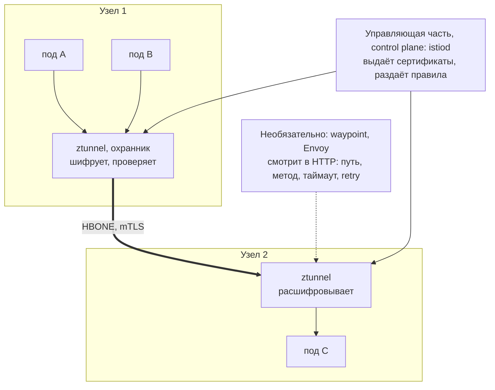
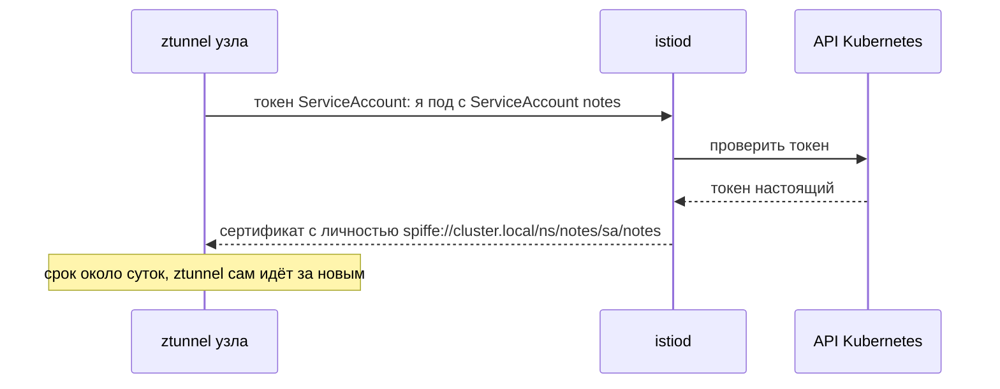
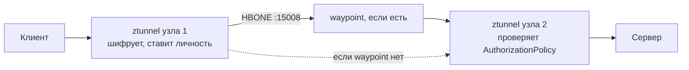
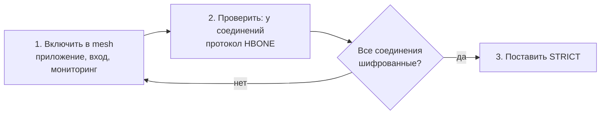

## Зачем это нужно

В кластере десятки сервисов, и каждая команда пишет по-своему: один сервис шифрует трафик, другой нет, у третьего нет таймаутов, а кто кому вообще разрешено ходить, никто не помнит. Проверять это в коде каждого сервиса дорого и ненадёжно.

Сервисная сетка (service mesh) выносит шифрование, проверку «кто ты» и телеметрию (данные о том, что происходит в системе: метрики, журналы) из кода в инфраструктуру: приложение не меняется, а трафик между подами получает шифрование, правила доступа и метрики. Это как единая служба безопасности в бизнес-центре вместо охранников в каждой фирме: правила одни на всех, фирмы ничего не переделывают. Без неё каждая команда реализует защиту по-своему, и где-то её не будет совсем. Цена: лишние компоненты, ресурсы и новый класс поломок. Подробно разберём ниже.

На собеседованиях спрашивают именно про это: что даёт mesh, чем ambient отличается от sidecar и что делать, когда после включения политики сервис отвечает 503 (код ответа «сервис недоступен», [урок 2.4](../02-network/04-http.md)).

Шаг проекта: ставим Istio 1.31.1 в режиме ambient, включаем в него namespace `notes`, ограничиваем доступ к приложению через AuthorizationPolicy, добавляем waypoint с таймаутом и retry, а в конце урока Istio снимаем: в базовую платформу он не входит.

Короткий словарь к этим словам, все они подробно разобраны в теории:

- **Istio** это самая распространённая реализация сервисной сетки, конкретная программа, как «Word» среди текстовых редакторов.
- **Sidecar** (прицеп) это режим, где прокси (программа-посредник, через которую идёт трафик) ставят в каждый под, как охранника у каждой двери. **Ambient** это новый режим без прицепов: охранники стоят на этаже, а не у каждой двери. Дешевле по ресурсам.
- **AuthorizationPolicy** это объект-список «кому можно ходить к этому сервису», как список допущенных на проходной. Без него ходит кто угодно.
- **Waypoint** это дополнительный прокси для разбора содержимого запросов (путь, метод): специалист, который заглядывает в сумку, когда охраннику достаточно посмотреть пропуск.
- **Retry** это повтор запроса, если первая попытка не удалась, как повторный звонок, когда абонент не ответил. Полезен, но опасен: подробно в разделе про таймауты ниже.

## Что нужно знать

- [Урок 5.3: Service и DNS](../05-kubernetes/03-services-dns.md): Service (постоянный адрес для набора подов) и endpoints (список адресов готовых подов). К ним привязывается вся сетка.
- [Урок 5.4: Ingress и Gateway API](../05-kubernetes/04-ingress-gateway.md): Gateway, HTTPRoute и Envoy Gateway остаются входом в кластер.
- [Урок 5.12: безопасность кластера](../05-kubernetes/12-k8s-security.md): ServiceAccount (учётная запись пода), NetworkPolicy (файрвол между подами) и PSS `restricted` (Pod Security Standards, набор правил, какие небезопасные настройки под запрещены) в namespace `notes` (в уроке дальше «ns» это сокращение от namespace).
- [Урок 2.6: TLS](../02-network/06-tls.md): сертификаты, доверие и что такое взаимная проверка (mTLS): шифрованное соединение, где обе стороны показывают друг другу сертификат, как два сотрудника с пропусками. Ниже коротко напомню.
- [Урок 8.9: мониторинг в Kubernetes](09-k8s-monitoring.md): Prometheus в ns `monitoring` продолжает собирать метрики приложения.

## Картина целиком

Представь большой офисный центр. Сотрудники разных фирм ходят друг к другу в гости. Раньше каждая фирма сама решала, кого пускать, и как проверять пропуск. Теперь в здании завели единую службу безопасности: на каждом этаже стоит охранник, который смотрит пропуска у всех, кто идёт в гости, и записывает, кто к кому ходил. А в отделе кадров (управляющая часть) выдают пропуска и хранят правила.

Так устроена сервисная сетка: пропуск это сертификат пода (цифровой документ с личностью: ServiceAccount в namespace), охранник это прокси, отдел кадров это управляющая часть. Разница между режимами Istio в том, где стоят охранники: у двери каждой квартиры (sidecar) или один на этаж (ambient).

**ztunnel** на схеме ниже это как раз «этажный охранник»: маленькая программа на каждом узле (сервере кластера), которая шифрует соединения и проверяет пропуска. **HBONE** это название шифрованного «служебного коридора» между двумя такими охранниками. **Waypoint** это необязательный «специалист по сумкам», о котором сказано выше. Подробно всё разберём в теории.



Сплошная стрелка между узлами это шифрованный туннель HBONE. Пунктиром показан waypoint: он нужен только там, где требуется разбор HTTP.

За урок ты разберёшь: что такое mesh и зачем она нужна, как работает шифрование с проверкой личности (mTLS), чем отличаются sidecar и ambient, что делают ztunnel и waypoint, как AuthorizationPolicy разрешает и запрещает трафик и почему одна добавленная политика может закрыть доступ всем остальным.

## Теория

### Проблема: как сделать сервисы безопасными, не переписывая их

Сервис `notes` ходит в PostgreSQL, а Prometheus ходит в `notes`. По умолчанию в кластере любой под может обратиться к любому другому, и трафик идёт открытым текстом. Если злоумышленник попал в один под, он видит соседние. Чтобы это исправить, нужно шифровать и проверять личность у каждого соединения. Можно вшить это в код каждого сервиса, но тогда на Go, на Python и на Java получится три разных реализации с тремя наборами багов.

Вместо того чтобы учить каждого жильца проверять паспорта, на входе в подъезд сажают консьержа. Жильцы про него не знают: они по-прежнему просто идут к соседям. Оговорка: консьерж стоит на пути каждого гостя, значит, его отсутствие или ошибка сломает всех, и сам он тоже требует зарплаты (ресурсов).

Сервисная сетка (service mesh) состоит из двух частей:

1. **Управляющая часть** (control plane): хранит правила, выдаёт сертификаты и раздаёт настройки прокси. В Istio это программа `istiod`.
2. **Часть данных** (data plane): прокси (посредники), через которые реально идёт трафик между подами.

Приложение не знает про сетку: оно по-прежнему открывает соединение на `notes:8080`, а перехват и шифрование делает инфраструктура.

Разберём на примере. Без сетки: `curl` из соседнего пода к `http://notes.notes:8080/` летит открытым текстом, а `notes` не знает, кто к нему пришёл (только IP, а IP пода меняется при каждом перезапуске). С сеткой: тот же `curl` ту же самую строку `http://notes.notes:8080/`, но соединение шифруется, и `notes` знает точное имя клиента, например `mesh-lab/curl-ok`.

Что сетка даёт без правок кода: шифрование и личность (mTLS), авторизацию («сервис A может вызывать только `GET /notes` сервиса B»), телеметрию (метрики запросов между сервисами и трейсы: запись пути одного запроса через все сервисы, с временем на каждом шаге; подробнее в [уроке 8.8](08-tracing.md)), управление трафиком (таймауты, повторы запросов).

> **Прикинь сам:** назови две вещи, которые mesh делает без изменения кода приложения, и одну, которую не сделает.
{: .predict}

Делает: шифрует трафик между подами (mTLS) и ограничивает, кто с кем может общаться (авторизация по identity); ещё собирает метрики запросов. Не сделает: не исправит ошибку в бизнес-логике, не защитит от SQL-инъекции и не заменит проверку прав пользователя внутри приложения.

Осторожно, тут часто путают. Что сетка чинит плохой код. Не чинит: не защитит от SQL-инъекции (когда злоумышленник вписывает в поле формы кусок SQL-команды, и база выполняет её как свою), не заменит проверку прав пользователя внутри приложения и не отменит NetworkPolicy целиком. Это ещё один слой, который надо эксплуатировать.

> **Главное:** mesh выносит шифрование и проверку личности из кода приложения в инфраструктуру.
{: .key}

Что за посредник стоит на пути трафика?

### Прокси: посредник, через которого идёт трафик

Слово «прокси» встречается в уроке на каждом шагу, поэтому сначала договоримся, что это. Когда два сервиса говорят напрямую, между ними нет никого, кто мог бы проверить, записать или зашифровать разговор. Если посадить между ними посредника, он получает такую возможность, а сами сервисы ничего не замечают.

Секретарь в приёмной. Звонок директору сначала попадает к секретарю: тот узнаёт, кто звонит, отсеивает спам, записывает время звонка и только потом соединяет. Директору не нужно самому всё это делать. Оговорка: если секретарь заболел, до директора не дозвониться. Так и с прокси: он становится ещё одной точкой отказа.

**Прокси** (proxy) это программа, которая принимает соединение от клиента и сама открывает второе соединение к серверу. Клиент думает, что говорит с сервером, сервер думает, что говорит с клиентом, а посередине прокси, который видит трафик. Ты уже встречал такого посредника: nginx как reverse proxy в [уроке 2.5](../02-network/05-nginx.md). **Envoy** это ещё одна программа того же класса, её написали специально для сетей, где много сервисов. Она умеет шифровать, повторять запросы, считать метрики и обновлять настройки на лету без перезапуска. Поэтому её берут за основу и Istio, и Envoy Gateway из [урока 5.4](../05-kubernetes/04-ingress-gateway.md).

Разберём на примере. Клиент отправляет `GET /notes`. Без прокси запрос идёт по пути «клиент, сервер». С прокси путь такой: «клиент, прокси, сервер». Прокси записал: время, откуда пришёл запрос, какой код вернул сервер и за сколько миллисекунд. Из таких записей позже получаются метрики mesh (раздел про метрики ниже). Сервер при этом не менялся ни на строчку.

Осторожно, тут часто путают. Что прокси всегда замедляет работу заметно. Задержка от одного прокси обычно доли миллисекунды или единицы миллисекунд. Но их копится по одному на каждый «переход», поэтому в длинной цепочке сервисов это уже ощутимо.

> **Главное:** прокси стоит на пути запроса и может проверить, записать или зашифровать его, пока приложение ничего не знает.
{: .key}

> **Проверь понимание:** в чём разница между «клиент говорит с сервером напрямую» и «клиент говорит через прокси» с точки зрения клиента?

<details markdown="1">
<summary>Ответ</summary>

С точки зрения клиента разницы нет: он открывает соединение по тому же адресу и получает те же ответы. Разница в том, что на пути появилась программа, которая может шифровать, проверять и записывать трафик. Это и есть суть сервисной сетки.

</details>

Как шифрование соединяется с личностью?

### mTLS и identity: шифрование плюс паспорт

Шифрование само по себе не отвечает на вопрос «с кем я говорю». Можно надёжно зашифровать разговор с мошенником. Нужна ещё проверка личности собеседника, причём с обеих сторон.

Обычный TLS (как открытие `https://` сайта в браузере, [урок 2.6](../02-network/06-tls.md)) похож на звонок в банк: ты проверяешь, что это банк (по сертификату сайта), а банк тебя не проверяет, ты вводишь пароль. mTLS (mutual TLS, взаимный TLS) похож на встречу двух сотрудников с пропусками: оба показывают друг другу пропуск. Оговорка: пропуск проверяет не человек, а прокси, поэтому проверка происходит автоматически при каждом соединении.


1. У каждой рабочей нагрузки есть ServiceAccount (учётная запись пода в Kubernetes, [урок 5.12](../05-kubernetes/12-k8s-security.md)). Это и есть личность (identity).
2. `istiod` выдаёт под сертификат (цифровой документ, подтверждающий имя) с этой личностью. В Istio она записывается как SPIFFE-идентификатор вида `spiffe://cluster.local/ns/notes/sa/notes`. Читается по частям: `cluster.local` это домен кластера, `ns/notes` это namespace `notes`, `sa/notes` это ServiceAccount `notes`. SPIFFE это просто договорённый формат таких имён. Личность относится к ServiceAccount, а не к конкретному поду: поды с одним ServiceAccount получают одинаковую личность.
3. Сертификаты короткоживущие и обновляются автоматически, ты ими не занимаешься.
4. При соединении обе стороны предъявляют сертификаты, проверяют их и шифруют канал.

Разберём на примере. Клиент `curl-ok` в namespace `mesh-lab` с ServiceAccount `curl-ok` обращается к `notes`. `notes` видит личность `spiffe://cluster.local/ns/mesh-lab/sa/curl-ok`. Политика может сказать: «пускай `curl-ok`, а `curl-bad` нет», хотя оба клиента сидят в одном namespace и, возможно, поменяли IP вчера. Именно поэтому правила в mesh пишут по личности, а не по IP: IP временный, ServiceAccount постоянный.

> **Прикинь сам:** почему политики в mesh пишут по ServiceAccount, а не по IP-адресу?
{: .predict}

IP пода меняется при каждом перезапуске, а ServiceAccount остаётся тем же. Плюс личность подтверждена сертификатом, а IP можно подделать внутри сети.

Осторожно, тут часто путают. «Раз Istio стоит, всё шифруется». По умолчанию Istio работает в режиме PERMISSIVE: принимает и шифрованный, и обычный трафик, чтобы можно было включать сетку постепенно. Строгий режим (STRICT) включают отдельно.

> **Главное:** mTLS шифрует разговор и проверяет личность обеих сторон, а не только сервера.
{: .key}

Откуда берётся сертификат?

### Как под получает сертификат: жизнь личности

В разделе выше сказано «`istiod` выдаёт сертификат». Если не понять, как именно, то слова «личность подтверждена» остаются магией: а что мешает другому поду назваться `notes`?

Отдел кадров выдаёт пропуск по паспорту, а не по честному слову. Ты приходишь со своим документом, кадровик сверяет, что ты это ты, и делает тебе пропуск на один день. Завтра придёшь за новым. Оговорка: в отличие от человека, под приходит за новым пропуском сам, без напоминаний.

Роль паспорта у пода играет токен ServiceAccount: маленький файл, который Kubernetes кладёт в под и который подтверждает, от чьего имени под работает ([урок 5.12](../05-kubernetes/12-k8s-security.md)). Подделать его нельзя: его подписывает сам Kubernetes. Порядок такой:

1. Прокси приходит в `istiod` с токеном: «я под с ServiceAccount `notes`». В режиме sidecar это токен самого пода. В ambient ztunnel предъявляет собственный токен ServiceAccount и запрашивает сертификаты от имени нагрузок своего узла: токен приложения ему не нужен.
2. `istiod` проверяет токен у Kubernetes. Если токен настоящий, `istiod` выпускает сертификат с личностью `spiffe://cluster.local/ns/notes/sa/notes`.
3. Срок жизни сертификата короткий, по умолчанию около суток. Незадолго до конца ztunnel сам идёт за новым.
4. Если сертификат украдут, он бесполезен уже на следующий день, а у долгоживущих сертификатов так не бывает.

Разберём на примере. Злоумышленник запустил под `evil` с ServiceAccount `evil`. `istiod` выдаст ему сертификат, но с личностью `.../sa/evil`. Назваться `notes` он не сможет: токен у него чужой, а подделать токен нельзя. Если политика пускает только `sa/notes`, `evil` получит отказ.



У подделки нет шансов на втором шаге: токен подписывает Kubernetes. Поэтому под `evil` получит сертификат только со своей личностью.

Осторожно, тут часто путают. Что сертификаты надо выпускать и продлевать вручную, как сертификат сайта. Здесь всё автоматически: ты ничего не заказываешь и не продлеваешь. Поэтому «истёк сертификат» в mesh бывает редко, но если `istiod` лежит долго, сертификаты перестают обновляться, и через сутки соединения начинают рваться.

> **Главное:** `istiod` выдаёт сертификат на основе токена ServiceAccount, срок около суток, продление автоматическое.
{: .key}

> **Проверь понимание:** `istiod` недоступен два часа. Перестанет ли работать трафик между подами?

<details markdown="1">
<summary>Ответ</summary>

Скорее всего, нет: у подов уже есть действующие сертификаты (срок около суток), и они продолжают работать. Новые поды сертификат не получат, а при долгой остановке (больше срока жизни) старые сертификаты истекут, и соединения начнут падать.

</details>

Где ставят прокси?

### Sidecar и ambient: где стоит охранник

Чтобы перехватывать трафик, прокси должен стоять на его пути. Есть два способа это устроить, и выбор определяет цену эксплуатации.

Охранник у двери каждой квартиры (sidecar) против одного охранника на этаж (ambient). Первое надёжнее и гибче: у каждой квартиры свои правила. Второе дешевле: охранников меньше. Оговорка: этажный охранник сначала видит только «кто пришёл и куда», а чтобы заглянуть в сумку (в содержимое HTTP), нужен ещё один специалист, waypoint.

Классический режим (sidecar, «прицеп») добавляет в каждый под второй контейнер с прокси Envoy (популярный прокси для HTTP-трафика). Минусы: память и процессор на каждый под, обновление сетки требует перезапуска всех подов, прицеп может мешать старту приложения и завершению задач (Job).

Режим ambient убирает прицепы и делит работу на два слоя:

- **ztunnel** (zero-trust tunnel: «туннель нулевого доверия», то есть никому внутри сети не верят на слово, личность проверяют у каждого соединения) работает на каждом узле как DaemonSet (по одному поду на узел, [урок 5.8](../05-kubernetes/08-jobs-cronjob-daemonset.md)). Он шифрует соединения между подами, проверяет личность и применяет простые правила (L4): кто, откуда, на какой порт. Между узлами ztunnel общаются по протоколу HBONE (HTTP-based overlay network, шифрованный «туннель» поверх обычного HTTP) на порту 15008. «Поверх» значит: настоящий трафик упаковывается внутрь шифрованного соединения между узлами, как письмо в конверт внутри почтового мешка. Снаружи видно только мешок, а что внутри, знают лишь отправитель и получатель.
- **waypoint** это необязательный Envoy, отдельный Deployment на namespace или сервис. Нужен, когда важно содержимое HTTP: пути, методы, заголовки, таймауты, retry (повтор неудачного запроса).

Что значит L4 и L7. Это «этажи» модели сети ([урок 2.2](../02-network/02-ports-tcp-ssh.md), раздел «Уровни сети»): L4 (транспорт) видит только адреса и порты, «кто и куда стучится». L7 (приложение) видит содержимое HTTP: `GET /notes`, заголовки. Отсюда ключевое правило ambient: L4 (mTLS, политика по личности и порту) даёт ztunnel сразу, L7 (метод, путь, retry, таймаут) только через waypoint.

Подключить под к mesh можно меткой на namespace: `istio.io/dataplane-mode=ambient`. Поды перезапускать не нужно, это главное операционное отличие от sidecar.

Разберём на примере. Кластер на 30 подов. Sidecar: 30 дополнительных Envoy, каждый берёт, скажем, по 50-100 МБ, итого 1,5-3 ГБ только на прокси (порядок величины, цифры зависят от нагрузки). Ambient: один ztunnel на узел, при 3 узлах 3 маленьких прокси, плюс один waypoint там, где нужен L7.

> **Прикинь сам:** политика запрещает `DELETE /notes/1`, но waypoint не создан. Сработает ли она?
{: .predict}

Нет. Метод и путь это L7, а ztunnel понимает только L4. Политику с L7-условиями пишут для waypoint: без него она не будет применена как задумано. Это частая причина «политика есть, а трафик идёт».

Осторожно, тут часто путают. Что ambient «без прокси». Прокси есть, но он не внутри пода: на узле и, при необходимости, в отдельном Deployment.

> **Главное:** sidecar это прокси в каждом поде, ambient это ztunnel на узле, а L7 даёт только waypoint.
{: .key}

Из каких компонентов ambient состоит?

### Из чего состоит Istio ambient

Чтобы при поломке понимать, куда смотреть. В ns `istio-system` появляются три компонента:

| Компонент | Тип | Роль |
|---|---|---|
| `istiod` | Deployment | управляющая часть: раздаёт конфигурацию, выдаёт сертификаты |
| `ztunnel` | DaemonSet | шифрование и L4-политики на каждом узле |
| `istio-cni-node` | DaemonSet | перенаправляет трафик подов в ztunnel (в режиме sidecar для этого в каждый под добавляли временный контейнер initContainer, который перед стартом настраивал правила; в ambient он не нужен) |

`istiod` это Deployment: одна-две копии на весь кластер. `ztunnel` и `istio-cni-node` это DaemonSet: по одному на каждый узел, потому что должны быть рядом с подами, чьим трафиком занимаются. CNI (Container Network Interface) это плагин, который настраивает сеть подов (раздаёт им адреса и прокладывает маршруты; он есть в любом кластере, а Istio добавляет свой); `istio-cni-node` добавляет к этому правило «трафик этого пода сначала в ztunnel».

**Как устроен путь запроса.** Клиентский под отправляет пакет. CNI-правило перенаправляет его в ztunnel на своём узле. ztunnel шифрует его и отправляет по HBONE на ztunnel узла-получателя. Тот расшифровывает, проверяет политики и передаёт серверному поду. Если у сервиса есть waypoint, трафик сначала заходит в него.



Разберём на примере. Ниже, в задании 1, ты увидишь ровно три пода в `istio-system` на одном узле kind: `istiod`, `ztunnel`, `istio-cni-node`. Если бы узлов было три, ztunnel и istio-cni-node было бы по три.

> **Прикинь сам:** в кластере 3 узла. Сколько подов `ztunnel` и сколько `istiod` ты ожидаешь увидеть?
{: .predict}

Подов `ztunnel` будет три, по одному на узел, потому что это DaemonSet. `istiod` это Deployment, обычно одна-две копии на весь кластер.

Осторожно, тут часто путают. Что установка Istio ambient перезапускает поды приложения. Нет: в `notes` не появится ни одного нового контейнера.

> **Главное:** `istiod` это Deployment, а `ztunnel` и `istio-cni-node` это DaemonSet по одному на узел.
{: .key}

Кому разрешён доступ?

### AuthorizationPolicy: разрешить, только перечисленное

Шифрование и личность дают возможность решать, кого пускать. Это делает объект `AuthorizationPolicy` (политика авторизации).

Список гостей на входе в клуб. Пока списка нет, пускают всех. Как только появился хотя бы один список «разрешённых», пускают только тех, кто в нём. Оговорка: список привязан к конкретному клубу (нагрузке), а не ко всему городу.

Ключевое поведение: пока для рабочей нагрузки нет ни одной политики, разрешено всё. Как только появилась хотя бы одна политика с действием `ALLOW`, разрешено только то, что в ней перечислено, всё остальное отклоняется. В политике: `selector` выбирает нагрузку по ярлыкам (они же метки, labels: пары «ключ=значение» на объектах, [урок 5.2](../05-kubernetes/02-pods-deployments.md)), `action: ALLOW` говорит «разрешить», `from.source` кто (namespace или личность `principals`), `to.operation` куда (порт, а при waypoint ещё метод и путь). Записи внутри `from` объединяются по «или»: подошла любая.

Разберём на примере. Политика из Задания 3 перечисляет три источника: namespace `envoy-gateway-system` (вход), namespace `monitoring` (Prometheus) и личность `curl-ok`, и все они только на порт 8080. Клиент `curl-bad` не в списке, значит, соединение будет оборвано. Внешний пользователь, приходящий через Envoy Gateway, пройдёт, потому что Envoy Gateway перечислен. Если строку про него убрать, снаружи вернётся 503 от Envoy Gateway с текстом `upstream connect error or disconnect/reset before headers`: он не смог соединиться с `notes`.

Почему отказ выглядит как обрыв, а не как HTTP 403. ztunnel работает на L4 и не понимает HTTP: он не может «ответить страницей», он просто закрывает соединение. Поэтому `curl` из пода покажет `Connection reset by peer` или пустой ответ (`000` в выводе с `-w '%{http_code}'`).

Осторожно, тут часто путают. Что политика ALLOW «добавляет право». Она наоборот сужает: появление первой политики закрывает всё неперечисленное, включая Prometheus и вход. Самая частая ошибка: написали политику для одного клиента и забыли про мониторинг и ingress.

> **Главное:** первая политика ALLOW закрывает всё неперечисленное, а отказ выглядит как обрыв соединения.
{: .key}

> **Проверь понимание:** в ns есть одна политика ALLOW для сервиса A. Сервис B, который раньше свободно ходил в A, перестал работать. Почему и как проверить?

<details markdown="1">
<summary>Ответ</summary>

Наличие ALLOW-политики переводит нагрузку в режим «только перечисленное». B не попал в список (по identity или namespace). Проверка: `kubectl get authorizationpolicy -A`, затем сравнить identity клиента (`kubectl get pod ... -o jsonpath` на serviceAccountName) с `from.source` политики.

</details>

Что делать, если запрос завис?

### Таймауты и retry: почему повторять запросы опасно

Сеть ненадёжна: запрос может зависнуть или вернуть 503 из-за временного сбоя. Waypoint умеет ограничить время ожидания (таймаут) и повторить запрос (retry). Это ещё одна вещь, которую сетка делает за приложение.

Ты звонишь в службу такси. Не дозвонился: набираешь ещё раз. Хорошо, пока звонишь раз-два. Плохо, если тысяча людей одновременно перезванивают каждую секунду: линия совсем упадёт. Оговорка: в отличие от людей, прокси перезванивает мгновенно и без усталости, поэтому нужны ограничения.

В HTTPRoute для waypoint задают `timeouts.request` (сколько ждать ответ) и `retry` (сколько попыток, через какую паузу, на какие коды повторять). Правило безопасности: повторять можно только запросы, которые безопасно выполнить дважды (идемпотентные, то есть такие, у которых повтор даёт тот же результат, что и одно выполнение: `GET` просто читает, его можно повторять хоть десять раз, а `POST /notes` создаст две заметки. Как нажать «оплатить» дважды: список покупок не изменился от повторного просмотра, а деньги списались дважды).

Разберём на примере. Таймаут 2 секунды, сервис отвечает за 5: waypoint на второй секунде обрывает ожидание и возвращает клиенту 504 (Gateway Timeout). Клиент ждал 2 секунды, а не 5. Теперь retry: у приложения `notes` есть свой повтор на 3 попытки, в mesh задано ещё 3. Один вызов превращается в 3 × 3 = 9 запросов к упавшему сервису. Нагрузка растёт именно тогда, когда сервису плохо: это называется retry storm (шторм повторов).

<div class="viz" data-viz="chart" data-type="bar" data-x="Один уровень,Два уровня 3 на 3" data-series='[{"name":"Запросов к упавшему сервису от одного вызова","values":[3,9],"unit":"шт"}]' data-x-label="Где настроен retry" data-y-label="Запросов" data-unit="шт" data-explain="Приложение повторяет 3 раза и mesh ещё 3 раза: 3 умножить на 3 даёт 9 запросов от одного вызова, и нагрузка растёт именно тогда, когда сервису плохо."></div>

Повторы на двух уровнях перемножаются, поэтому retry настраивают на одном уровне.

> **Прикинь сам:** почему `retry` на `POST /notes` может быть вредным?
{: .predict}

`POST` создаёт заметку. Если первый запрос дошёл и обработался, но ответ потерялся, повтор создаст вторую такую же заметку. Повторять безопасно только идемпотентные запросы.

Осторожно, тут часто путают. «Чем больше retry, тем надёжнее». Нет: повторяй на одном уровне, с ограничением попыток и паузой, и только идемпотентные запросы. Подробнее в [уроке 8.11](11-reliability-patterns-burn-rate.md).

> **Главное:** повторять можно только идемпотентные запросы и на одном уровне, иначе вырастет retry storm.
{: .key}

Как включать mesh постепенно?

### Как подключить namespace: метки и постепенное включение

Включать сетку сразу на весь кластер рискованно: если что-то пойдёт не так, ляжет всё. Хочется включать по частям и уметь откатить одной командой.

Как менять систему пропусков в здании: сначала один этаж, потом второй. Старые пропуска какое-то время ещё принимают («переходный период»), потом перестают. Оговорка: переходный период не бесконечный, иначе смысла в новой системе нет.

Включение делается ярлыками (label) на namespace, без правок манифестов приложения:

- `istio.io/dataplane-mode=ambient`: поды этого namespace входят в mesh, их трафик идёт через ztunnel;
- `istio.io/use-waypoint=<имя>`: трафик сервисов этого namespace идёт ещё и через указанный waypoint.

Откат: снять ярлык командой `kubectl label namespace notes istio.io/dataplane-mode-` (минус в конце означает «удалить ярлык»). Поды перезапускать не нужно ни при включении, ни при откате, но уже открытые долгие соединения остаются как были, новые идут по новым правилам.

Разберём на примере. Ты включил в mesh только `notes`, а Envoy Gateway остался вне mesh. Клиент вне mesh не имеет сертификата, значит, у него нет личности. В режиме PERMISSIVE это не мешает: `notes` принимает и обычный трафик. Но как только появилась политика ALLOW, правило «пустить namespace `envoy-gateway-system`» не сработает: личности у входа нет, ведь он не в mesh. Поэтому в задании 2 в mesh включаются все участники: приложение, клиенты, вход и мониторинг.

Осторожно, тут часто путают. «Метка на namespace сама шифрует». Шифрует ztunnel, который должен работать на узле. Метка только говорит Istio, чей трафик обрабатывать. Без установленного Istio метка ничего не делает.

> **Главное:** namespace подключают меткой `istio.io/dataplane-mode=ambient`, перезапускать поды не нужно.
{: .key}

> **Проверь понимание:** ты включил `notes` в ambient, а колонка `PROTOCOL` в `ztunnel-config workload` показывает `TCP`. Назови две возможные причины.

<details markdown="1">
<summary>Ответ</summary>

Нет ярлыка `istio.io/dataplane-mode=ambient` на namespace (опечатка или не тот namespace), либо под был запущен до установки `istio-cni` и не подхвачен: его нужно перезапустить.

</details>

Как включить шифрование без аварии?

### PERMISSIVE и STRICT: как включать шифрование без аварии

Представь, что ты включил шифрование, а часть клиентов про mesh не знает и шлёт обычный открытый трафик. Если сразу запретить открытый, эти клиенты перестанут работать. Поэтому есть промежуточный режим.

Переходный период с пропусками: неделю на входе принимают и старые бумажные, и новые электронные. Потом старые перестают принимать. Оговорка: если не назначить дату, «переходный» период тянется годами, и бумажные остаются навсегда.

Режим задаёт объект `PeerAuthentication` (peer, «собеседник»: проверка того, кто подключается к нагрузке). Режимы:

- `PERMISSIVE` (по умолчанию): принимает и шифрованный трафик с mTLS, и обычный. Шифрование есть у тех, кто в mesh, остальные ходят открыто.
- `STRICT`: принимает только mTLS. Кто не в mesh, соединения не получит.

```yaml
apiVersion: security.istio.io/v1
kind: PeerAuthentication
metadata:
  name: default          # одна политика на весь namespace
  namespace: notes
spec:
  mtls:
    mode: STRICT         # только шифрованный трафик с проверкой личности
```

Разберём на примере. Порядок безопасного включения. Сначала включаешь в mesh всех участников (приложение, вход, мониторинг). Потом смотришь, что у каждого соединения в колонке протокола стоит `HBONE`. Только после этого ставишь `STRICT`. Если забыл про Prometheus, он стал бы получать обрыв соединения: на графиках пустота, алерт `up == 0`. Это и есть причина, по которой такой вопрос есть среди вопросов с собеседований ниже.



STRICT ставят последним шагом. Если забыть про Prometheus, он получит обрыв соединения, и алерт `up == 0` сработает.

> **Прикинь сам:** `STRICT` включён, а клиент без mesh получает `Connection reset`. Это баг?
{: .predict}

Нет, это ожидаемо: клиент вне mesh не умеет mTLS, а `STRICT` пускает только шифрованные соединения с личностью. Исправление: включить клиента в mesh (ярлык на его namespace), а не выключать `STRICT`.

Осторожно, тут часто путают. `PeerAuthentication` и `AuthorizationPolicy`. Первая отвечает на вопрос «шифрованное ли соединение», вторая «кому из шифрованных можно». Сначала надо быть проверенным, потом допущенным.

> **Главное:** сначала PERMISSIVE, потом проверка HBONE у всех, и только затем STRICT.
{: .key}

Когда нужен waypoint?

### Waypoint изнутри: когда нужен и что стоит

L7-функции нужны не всем. Если тебе достаточно «шифрование и доступ по личности», платить за отдельный Envoy незачем. Waypoint ставят точечно.

Этажный охранник (ztunnel) проверяет пропуск и пропускает. Если нужно проверить, что именно человек несёт (запретить проносить определённое), нужен сотрудник со сканером на входе в конкретный отдел. Оговорка: сканер замедляет вход, поэтому ставят его только там, где он нужен.

Waypoint это обычный Deployment с Envoy, объявленный как Gateway с классом `istio-waypoint` (Gateway API из [урока 5.4](../05-kubernetes/04-ingress-gateway.md)). Когда у сервиса указан waypoint, ztunnel клиента направляет трафик не сразу серверу, а сначала на waypoint. Тот читает HTTP, применяет таймауты, retry и L7-политики, и только потом отправляет запрос серверу. Значит, у запроса добавляется ещё один «переход» (hop: очередная остановка по дороге, как пересадка в поездке), а с ним чуть больше задержки и ещё один компонент, который может отказать.

Разберём на примере. Без waypoint запрос `/slow?sec=5` идёт `клиент -> ztunnel -> ztunnel -> notes` и возвращает 200 через 5 секунд. С waypoint и таймаутом 2 секунды путь `клиент -> ztunnel -> waypoint -> notes`. На второй секунде waypoint не дожидается ответа и возвращает 504 сам. Так же waypoint может запретить `DELETE`: ztunnel про метод не знает, а waypoint видит строку `DELETE /notes/1`.

Осторожно, тут часто путают. Что waypoint «включает L7 для всего». Он включается на конкретный сервис или namespace ярлыком `use-waypoint`. У остальных сервисов трафик по-прежнему идёт только через ztunnel.

> **Главное:** waypoint нужен только там, где важен HTTP, и включается ярлыком `use-waypoint`.
{: .key}

> **Проверь понимание:** ты создал Gateway `waypoint`, дождался `Programmed`, но `/slow?sec=5` отвечает 200 через 5 секунд. Что упущено?

<details markdown="1">
<summary>Ответ</summary>

Скорее всего, не выставлен ярлык `istio.io/use-waypoint=waypoint` на namespace или сервис: waypoint создан, но трафик мимо него. Проверь колонку `WAYPOINT` в `istioctl ztunnel-config service`.

</details>

Что будет при отказе компонента?

### Что сломается, если откажет компонент сетки

Сетка стоит на пути всего трафика, значит, её отказ может задеть всех сразу. Заранее полезно знать, какой компонент на что влияет, чтобы при аварии не гадать.

В бизнес-центре отдел кадров (istiod) выдаёт пропуска и правила. Если он закрылся на обед, те, у кого пропуск уже есть, ходят как ходили. А этажный охранник (ztunnel), если ушёл, оставляет весь этаж без прохода. Оговорка: в отличие от здания, в кластере упавшего охранника Kubernetes пытается вернуть сам, перезапустив под.


| Что отказало | Что происходит |
|---|---|
| `istiod` | Уже работающий трафик идёт дальше. Не обновляются правила и сертификаты, новые поды не получают личность |
| `ztunnel` на одном узле | Трафик подов этого узла в mesh прерывается, пока DaemonSet не перезапустит под. Другие узлы не затронуты |
| waypoint | Сервисы, у которых он указан, не отвечают (L7-путь закрыт), остальные работают |
| `istio-cni-node` | Новые поды на этом узле могут не подключиться к mesh |

Разберём на примере. На узле 2 перезапустился `ztunnel`. Поды на узле 1 продолжают работать, а запросы к подам узла 2 на несколько секунд получают обрыв соединения. Симптом в метриках: короткий всплеск ошибок только для одного узла. Диагностика по порядку: `kubectl get pods -n istio-system -o wide` покажет, на каком узле перезапуски, затем `kubectl logs` этого пода.

> **Прикинь сам:** упал waypoint сервиса `notes`. Будет ли отвечать сервис `postgres` в том же namespace, если у него waypoint не назначен?
{: .predict}

Да. Waypoint назначен только на `notes`, и его отказ закрывает только L7-путь к нему. Трафик к `postgres` идёт через ztunnel и от waypoint не зависит.

Осторожно, тут часто путают. Что при падении сетки приложение «остаётся в безопасности без шифрования». Наоборот: если включён `STRICT`, без живого ztunnel трафик не идёт совсем, а не идёт открыто. Безопасность выбрана в ущерб доступности, и это нужно понимать заранее.

> **Главное:** отказ `istiod` не рвёт трафик сразу, а отказ `ztunnel` рвёт трафик подов узла.
{: .key}

Что видно без правок кода?

### Метрики mesh: что видно без правок кода

Одна из причин, по которым mesh любят SRE: метрики запросов между сервисами появляются сами, единообразно для всех языков.

ztunnel отдаёт метрики уровня TCP (сколько соединений, сколько байт) на порту 15020. Waypoint отдаёт HTTP-метрики (число запросов, коды ответов, задержка). Формат Prometheus, собираются так же, как всё остальное в [уроке 8.9](09-k8s-monitoring.md): ServiceMonitor или PodMonitor. ServiceMonitor и PodMonitor напоминаю: это объекты, которыми говорят Prometheus, откуда в кластере забирать метрики (как запись «заходи к этому сервису раз в 15 секунд»). По этим метрикам строят золотые сигналы (golden signals, главные показатели здоровья сервиса: сколько запросов, сколько ошибок, как долго отвечает) для каждой пары «клиент, сервер».

Разберём на примере. Если `notes` начал получать 5xx только от одного клиента, метрики waypoint покажут пару `source=curl-ok, destination=notes, code=503`, а метрики самого `notes` покажут лишь общее число. Пара помогает найти, кто именно страдает.

Осторожно, тут часто путают. Что L7-метрики есть без waypoint. Без него ztunnel видит только соединения и байты, но не коды ответов.

> **Главное:** ztunnel даёт TCP-метрики, а HTTP-метрики с кодами появляются только у waypoint.
{: .key}

Всегда ли нужна mesh?

### Когда mesh не нужна

Сетка добавляет компоненты, ресурсы и новые виды поломок. Для трёх сервисов и одной команды выгода обычно меньше цены.

Хватит TLS на входе (Gateway), NetworkPolicy для доступа и таймаутов в клиентских библиотеках. Mesh начинает окупаться, когда сервисов много, команд несколько, нужно единое шифрование между всеми и единые правила доступа по личности, а у команд нет времени встраивать всё это самим. Поэтому в конце урока мы Istio снимаем: для «Заметок» это избыточно, а опыт остаётся.

Осторожно, тут часто путают. «Mesh это балансировщик». Балансировка лишь маленькая часть; главное шифрование по личности и единая политика.

> **Главное:** для трёх сервисов и одной команды хватает TLS на входе, NetworkPolicy и таймаутов в клиентах.
{: .key}

## Практика

Среда: кластер kind `notes` (контекст `kind-notes`) с приложением из 8.9 (релиз Helm `notes`, версия образа 0.7.0, ns `notes`), Envoy Gateway и Gateway `notes-gw` из 5.4, `notes.lab` в `/etc/hosts`. Рабочий каталог `~/notes`. На узле kind Istio с профилем ambient требует около 1.5 ГБ памяти, вместе со стеком мониторинга из 8.9 нужно минимум 16 ГБ RAM.

### Если у тебя 8 ГБ

Освободи память перед уроком: удали стек мониторинга (`helm -n monitoring uninstall <релиз из 8.9>`, имя покажет `helm -n monitoring list`). Задание 4 про метрики ztunnel выполни по описанию без запуска. Политику из задания 3 оставь как есть: строка про namespace `monitoring` безвредна, если такого namespace нет. После урока стек мониторинга можно поставить заново командой из 8.9.

### Задание 1. Установка Istio ambient

**Цель:** поставить Istio 1.31.1 профилем `ambient` и убедиться, что три компонента работают.

**Предскажи:** сколько подов `ztunnel` будет в кластере kind с одним узлом? Будет ли в ns `notes` после установки хоть один новый под?

<details markdown="1">
<summary>Ответ</summary>

По одному `ztunnel` и `istio-cni-node` на каждый узел, значит по одному на узле kind. В ns `notes` новых подов нет: Istio ambient ничего не добавляет в поды и их не перезапускает.

</details>

**Шаги:**

1. Скачай `istioctl` (командная утилита Istio) и проверь контрольную сумму (без `curl | bash`). Разбор: `mktemp -d` создаёт пустую временную папку, `cd` переходит в неё. `V=1.31.1` и `BASE=...` это переменные, чтобы не повторять версию и адрес. `curl -fsSLO` скачивает файл под его же именем (`-f` падает на ошибке сервера, `-sS` тихо, но с ошибками, `-L` идёт по перенаправлениям, `-O` сохраняет с исходным именем). `sha256sum -c` сверяет хэш (контрольную сумму) файла со значением из `.sha256`: если файл повреждён или подменён, будет `FAILED`. `tar xzf` распаковывает архив, `install -m 0755` кладёт программу в `/usr/local/bin` с правом запуска. Команды для Linux; на Mac скачай `istioctl` под свою систему (`osx-arm64`).

```bash
cd "$(mktemp -d)"
V=1.31.1
BASE=https://github.com/istio/istio/releases/download/$V
curl -fsSLO "$BASE/istioctl-$V-linux-amd64.tar.gz"
curl -fsSLO "$BASE/istioctl-$V-linux-amd64.tar.gz.sha256"
sha256sum -c "istioctl-$V-linux-amd64.tar.gz.sha256"
tar xzf "istioctl-$V-linux-amd64.tar.gz"
sudo install -m 0755 istioctl /usr/local/bin/istioctl
istioctl version --remote=false
```

2. Установи Istio. `istioctl install --set profile=ambient` ставит набор компонентов профиля `ambient` (профиль это готовый набор настроек), `--skip-confirmation` не спрашивает подтверждения. Gateway API уже установлен вместе с Envoy Gateway в 5.4, отдельно его ставить не нужно:

```bash
kubectl config use-context kind-notes
istioctl install --set profile=ambient --skip-confirmation
kubectl -n istio-system get pods
```

**Что должно получиться:**

```text
istioctl-1.31.1-linux-amd64.tar.gz: OK
client version: 1.31.1
NAME                      READY   STATUS    RESTARTS   AGE
istio-cni-node-x7k2q      1/1     Running   0          40s
istiod-6c9d7b8f5-4hm2p    1/1     Running   0          55s
ztunnel-9wq5d             1/1     Running   0          40s
```

**Как читать вывод:** `OK` от `sha256sum` значит, что архив цел. В таблице подов `READY 1/1` (один контейнер из одного готов), `STATUS Running`, `RESTARTS 0`. Должно быть три пода: `istiod`, `ztunnel`, `istio-cni-node` (на одном узле kind по одному). Хвосты в именах подов случайные, у тебя будут другие.

**Объясни себе:**

- Почему ztunnel развёрнут DaemonSet, а istiod Deployment?
- Что произойдёт с работающими подами `notes` сразу после установки?

**Типичные ошибки:**

- `Error: failed to install manifests: ... no matches for kind "Gateway"`: нет CRD Gateway API. Проверь `kubectl get crd gateways.gateway.networking.k8s.io`; они приходят с манифестом Envoy Gateway (урок 5.4).
- `sha256sum: WARNING: 1 computed checksum did NOT match`: архив скачался не полностью. Удали файл и скачай заново.
- `ztunnel ... CrashLoopBackOff` и в логах `too many open files`: у узла (контейнера kind) мало inotify-лимитов. Подними `sudo sysctl fs.inotify.max_user_instances=512` на хосте.

### Задание 2. Включаем namespace в mesh и смотрим mTLS

**Цель:** подключить `notes` к ambient без перезапуска подов и увидеть, что трафик между подами идёт по HBONE с identity.

**Предскажи:** изменится ли число контейнеров в поде `notes` после включения в mesh? Если из ns без mesh отправить запрос на `notes:8080`, он пройдёт?

<details markdown="1">
<summary>Ответ</summary>

Число контейнеров не изменится: прокси не внутри пода, а на узле. Запрос из ns без mesh пройдёт: режим по умолчанию разрешает и mTLS, и обычный трафик (в Istio это PERMISSIVE). Именно поэтому можно включать mesh постепенно.

</details>

**Шаги:**

1. Разбор. `kubectl label namespace <имя> istio.io/dataplane-mode=ambient` навешивает ярлык, по которому Istio включает namespace в mesh (`--overwrite` перезаписывает ярлык, если он уже был). Цикл `for ns in ...; do ...; done` повторяет команду для каждого имени, `kubectl get ns "$ns" >/dev/null 2>&1 &&` пропускает namespace, которого нет (например, `monitoring` без стека 8.9). `kubectl get ns -L <ярлык>` показывает ярлык отдельной колонкой. Создай тестовый namespace клиентов и включи в ambient три namespace: приложение, клиенты и вход. Envoy Gateway включаем в mesh, чтобы его трафик имел identity:

```bash
kubectl create namespace mesh-lab
for ns in notes mesh-lab envoy-gateway-system monitoring; do
  kubectl get ns "$ns" >/dev/null 2>&1 && \
  kubectl label namespace "$ns" istio.io/dataplane-mode=ambient --overwrite
done
kubectl get ns -L istio.io/dataplane-mode
```

2. Если в ns `notes` действует default-deny из 5.12, разреши порт HBONE (учебное правило, не часть проекта):

```bash
kubectl apply -f - <<'YAML'
apiVersion: networking.k8s.io/v1
kind: NetworkPolicy
metadata:
  name: allow-hbone
  namespace: notes
spec:
  podSelector: {}
  policyTypes: [Ingress]
  ingress:
    - ports:
        - port: 15008
          protocol: TCP
YAML
```

3. Запусти два клиента с разными ServiceAccount и вызови приложение. Разбор: `kubectl run <имя> --image=... --command -- sleep 3600` запускает под, который просто спит час (мы будем заходить в него), `--overrides='{...}'` подставляет ему нужный ServiceAccount, `kubectl wait --for=condition=Ready` ждёт готовности, `kubectl exec <под> -- <команда>` выполняет команду внутри пода, а `curl -s` тихо скачивает страницу:

```bash
kubectl -n mesh-lab create serviceaccount curl-ok
kubectl -n mesh-lab create serviceaccount curl-bad
for sa in curl-ok curl-bad; do
  kubectl -n mesh-lab run "$sa" --image=curlimages/curl:8.16.0 \
    --overrides="{\"spec\":{\"serviceAccountName\":\"$sa\"}}" \
    --command -- sleep 3600
done
kubectl -n mesh-lab wait --for=condition=Ready pod/curl-ok pod/curl-bad --timeout=90s
kubectl -n mesh-lab exec curl-ok -- curl -s http://notes.notes:8080/
```

4. Проверь, что трафик идёт через HBONE, и найди identity в логе ztunnel. `istioctl ztunnel-config workload` показывает, каких рабочих нагрузок ztunnel знает и каким протоколом с ними ходит. `kubectl logs ds/ztunnel` читает лог DaemonSet, `grep` оставляет строки про соединения, `tail -n 2` берёт две последние:

```bash
istioctl ztunnel-config workload -n notes
kubectl -n istio-system logs ds/ztunnel --tail=200 | grep 'dst.workload' | tail -n 2
```

**Что должно получиться:**

```text
Notes service v0.7.0
NAMESPACE POD NAME       ADDRESS     NODE          WAYPOINT PROTOCOL
notes     notes-7d9f8b6c5-x2k4p 10.244.0.15 notes-control-plane None     HBONE
```

**Как читать вывод:** `Notes service v0.7.0` это ответ приложения (версия может выглядеть иначе, сверь по ответу своего приложения). В таблице колонка `PROTOCOL`: `HBONE` значит, что нагрузка в mesh, `TCP` значит, что нет. `WAYPOINT None` пока waypoint не создан. Формат строк и набор колонок зависят от версии `istioctl`, важен смысл: нужная нагрузка есть и идёт по `HBONE`.

В логе ztunnel видны поля `src.identity="spiffe://cluster.local/ns/mesh-lab/sa/curl-ok"` и `dst.service`. Число подов в `notes` и число контейнеров в них прежнее.

**Объясни себе:**

- Откуда у клиентского пода взялся SPIFFE-идентификатор, если приложение ничего не настраивало?
- Почему ingress из `envoy-gateway-system` мы включили в mesh, хотя Envoy Gateway остался прежним?

**Типичные ошибки:**

- `curl: (7) Failed to connect to notes.notes port 8080 after 5 ms: Could not connect to server`: в ns `notes` действует default-deny без правила для 15008. Примени `allow-hbone` из шага 2.
- `Error from server (Forbidden): pods "curl-ok" is forbidden: violates PodSecurity`: клиент создан в ns `notes` с PSS `restricted`. Клиенты живут в `mesh-lab`, там PSS не включён.
- Пусто в `PROTOCOL` (`TCP` вместо `HBONE`): namespace без метки или под создан до istio-cni. Проверь `kubectl get ns notes --show-labels` и перезапусти под.

### Задание 3. AuthorizationPolicy: пускаем только своих

**Цель:** ограничить доступ к приложению так, чтобы работали ingress, Prometheus и один клиент, а второй клиент получил отказ.

**Предскажи:** после применения политики `ALLOW` на `notes` что получит `curl-bad`? А что увидит внешний пользователь через `https://notes.lab`, если `envoy-gateway-system` не перечислить в политике?

<details markdown="1">
<summary>Ответ</summary>

`curl-bad` получит отказ на уровне соединения (`curl: (56) Recv failure: Connection reset by peer` или `(52) Empty reply`). Внешний пользователь без строки про `envoy-gateway-system` получит 503 от Envoy Gateway: `upstream connect error or disconnect/reset before headers. reset reason: connection termination`. Политика ALLOW отсекает всё, что не перечислено.

</details>

**Шаги:**

1. Создай `k8s/mesh/authz-policy.yaml`:

```yaml
# Разрешаем доступ к приложению notes только доверенным источникам.
# Всё, что не перечислено, отклоняется ztunnel (L4, по identity).
apiVersion: security.istio.io/v1
kind: AuthorizationPolicy
metadata:
  name: notes-allow
  namespace: notes
spec:
  selector:
    matchLabels:
      app.kubernetes.io/name: notes
  action: ALLOW
  rules:
    - from:
        # Вход в кластер: Envoy Gateway
        - source:
            namespaces: ["envoy-gateway-system"]
        # Сбор метрик: Prometheus
        - source:
            namespaces: ["monitoring"]
        # Единственный разрешённый учебный клиент
        - source:
            principals: ["cluster.local/ns/mesh-lab/sa/curl-ok"]
      to:
        - operation:
            ports: ["8080"]
```

2. Примени и проверь три пути. В `curl`: `-o /dev/null` выбрасывает тело ответа, `-w '%{http_code}\n'` печатает только HTTP-код, `--max-time 5` ограничивает ожидание пятью секундами, `--resolve notes.lab:443:127.0.0.1` подсказывает, что имя `notes.lab` живёт на `127.0.0.1` (обход DNS), `-k` не проверяет самоподписанный сертификат:

```bash
kubectl apply -f k8s/mesh/authz-policy.yaml
kubectl -n mesh-lab exec curl-ok -- curl -s -o /dev/null -w '%{http_code}\n' http://notes.notes:8080/healthz
kubectl -n mesh-lab exec curl-bad -- curl -s -o /dev/null -w '%{http_code}\n' --max-time 5 http://notes.notes:8080/healthz
curl -sk --resolve notes.lab:443:127.0.0.1 -o /dev/null -w '%{http_code}\n' https://notes.lab/healthz
```

**Что должно получиться:**

```text
200
000
200
```

**Как читать вывод:** первая строка это `curl-ok` (в списке, код 200), вторая `curl-bad` (не в списке), третья вход снаружи. `000` у `curl-bad` значит, что HTTP-кода нет вовсе: соединение оборвано до ответа.

**Объясни себе:**

- Почему отказ приходит не как HTTP 403, а как обрыв соединения?
- Что случилось бы с метриками в Prometheus, если бы строки `monitoring` не было?

**Типичные ошибки:**

- `error: unable to recognize "k8s/mesh/authz-policy.yaml": no matches for kind "AuthorizationPolicy" in version "security.istio.io/v1"`: Istio не установлен или CRD не созданы; вернись к заданию 1.
- `upstream connect error or disconnect/reset before headers. reset reason: connection termination` на `https://notes.lab`: вход не в списке. Проверь, что `envoy-gateway-system` в ambient и стоит в политике.
- `curl-ok` тоже получает `000`: опечатка в identity. Он строится как `cluster.local/ns/<namespace>/sa/<serviceaccount>`, без префикса `spiffe://`.

### Задание 4. Waypoint: таймаут, retry и L7

**Цель:** добавить waypoint для сервиса `notes` и настроить таймаут и повтор запросов, которых без него не было.

**Предскажи:** демонстрационный `/slow?sec=5` при таймауте 2 секунды на waypoint. Какой статус вернётся клиенту и сколько времени займёт запрос?

<details markdown="1">
<summary>Ответ</summary>

Около 2 секунд и статус 504 (Gateway Timeout): waypoint сам обрывает ожидание. Без waypoint запрос длился бы все 5 секунд и вернул 200.

</details>

**Шаги:**

1. Создай `k8s/mesh/waypoint.yaml`: сам waypoint и правило для внутренних вызовов сервиса `notes`:

```yaml
# Waypoint: L7-прокси для сервисов namespace notes.
apiVersion: gateway.networking.k8s.io/v1
kind: Gateway
metadata:
  name: waypoint
  namespace: notes
  labels:
    istio.io/waypoint-for: service
spec:
  gatewayClassName: istio-waypoint
  listeners:
    - name: mesh
      port: 15008
      protocol: HBONE
---
# Таймаут и повторы для вызовов Service notes внутри кластера.
# Поле retry в Gateway API экспериментальное: проверь актуальную версию на странице проекта.
apiVersion: gateway.networking.k8s.io/v1
kind: HTTPRoute
metadata:
  name: notes-mesh
  namespace: notes
spec:
  parentRefs:
    - group: ""
      kind: Service
      name: notes
      port: 8080
  rules:
    - timeouts:
        request: 2s
      retry:
        attempts: 2
        backoff: 100ms
        codes: [503]
      backendRefs:
        - name: notes
          port: 8080
```

2. Примени, привяжи waypoint к namespace и проверь таймаут. Разбор: `kubectl wait --for=condition=Programmed` ждёт, пока Istio создаст под waypoint. Ярлык `istio.io/use-waypoint=waypoint` на namespace говорит: «направляй трафик сервисов этого namespace через waypoint». `time` перед командой печатает, сколько она длилась:

```bash
kubectl apply -f k8s/mesh/waypoint.yaml
kubectl -n notes wait --for=condition=Programmed gateway/waypoint --timeout=90s
kubectl label namespace notes istio.io/use-waypoint=waypoint --overwrite
istioctl ztunnel-config service -n notes | grep -E 'NAME|notes '
time kubectl -n mesh-lab exec curl-ok -- curl -s -o /dev/null -w '%{http_code}\n' 'http://notes.notes:8080/slow?sec=5'
```

**Что должно получиться:**

```text
gateway.gateway.networking.k8s.io/waypoint condition met
NAMESPACE SERVICE NAME       SERVICE VIP   WAYPOINT ENDPOINTS
notes     notes              10.96.44.120  waypoint 1/1
504

real    0m2.1s
```

**Как читать вывод:** `Programmed` значит, что waypoint готов. В колонке `WAYPOINT` у сервиса теперь имя waypoint. `504` это Gateway Timeout, и `real 0m2.1s` подтверждает, что ждали около двух секунд, а не пять: сработал таймаут waypoint.

**Объясни себе:**

- Почему таймаут потребовал waypoint, а mTLS в задании 2 нет?
- Чем повтор запроса опасен для `POST /notes` и когда retry безопасен (вернёшься к вопросу в [уроке 8.11](11-reliability-patterns-burn-rate.md))?

**Типичные ошибки:**

- `The HTTPRoute "notes-mesh" is invalid: spec.rules[0].retry: Invalid value`: в CRD Gateway API нет экспериментального поля. Убери блок `retry`, таймаут останется рабочим.
- `WAYPOINT` пустой в списке сервисов: не выставлена метка `istio.io/use-waypoint` на namespace или сервис.
- Запрос на `/slow?sec=5` возвращает 200 за 5 секунд: трафик идёт мимо waypoint. Проверь, что клиент в ambient namespace и вызывает имя сервиса, а не IP пода.

### Задание 5. Шаг проекта: mesh в «Заметках» и уборка

**Цель:** зафиксировать mesh-манифесты в проекте, убедиться, что сервис по-прежнему доступен снаружи, и снять Istio, потому что в базовую платформу он не входит.

**Предскажи:** после `istioctl uninstall` метки `istio.io/dataplane-mode` на namespace останутся. Что произойдёт с трафиком?

<details markdown="1">
<summary>Ответ</summary>

Трафик пойдёт как обычно: метка сама по себе ничего не делает без ztunnel. Но AuthorizationPolicy и Gateway `waypoint` остаются как объекты; их нужно удалить явно, иначе кластер захламлён. Метки тоже убирай.

</details>

**Шаги:**

1. Убедись, что в репозитории лежат оба файла, и закоммить:

```bash
cd ~/notes
ls k8s/mesh/
git add k8s/mesh/authz-policy.yaml k8s/mesh/waypoint.yaml
git commit -m "Istio ambient: AuthorizationPolicy и waypoint (учебный шаг 8.10)"
```

2. Проверь полный путь снаружи и метрики через Prometheus (пропусти второе в режиме 8 ГБ). Разбор: `port-forward ... &` запускает проброс порта в фоне, `sleep 3` ждёт, пока он поднимется, `curl` обращается к HTTP API Prometheus (`up{job="notes"}` в URL-кодировке), `head -c 200` берёт первые 200 символов, `kill %1` останавливает фоновую задачу:

```bash
curl -sk --resolve notes.lab:443:127.0.0.1 https://notes.lab/
kubectl -n monitoring port-forward svc/kps-prometheus 9090:9090 >/dev/null 2>&1 &
sleep 3; curl -s 'http://localhost:9090/api/v1/query?query=up%7Bjob%3D%22notes%22%7D' | head -c 200; kill %1
```

3. Сними mesh в правильном порядке: политики и метки, потом Istio:

```bash
kubectl delete -f k8s/mesh/authz-policy.yaml -f k8s/mesh/waypoint.yaml
for ns in notes mesh-lab envoy-gateway-system monitoring; do
  kubectl label namespace "$ns" istio.io/dataplane-mode- istio.io/use-waypoint- 2>/dev/null
done
kubectl delete networkpolicy allow-hbone -n notes --ignore-not-found
kubectl delete namespace mesh-lab
istioctl uninstall --purge -y
kubectl delete namespace istio-system
kubectl -n notes get pods
```

**Что должно получиться:**

```text
Notes service v0.7.0
{"status":"success","data":{"resultType":"vector","result":[{"metric":{"job":"notes"
namespace "istio-system" deleted
NAME                     READY   STATUS    RESTARTS   AGE
notes-7d9f8b6c5-x2k4p    1/1     Running   0          2h
```

**Как читать вывод:** в JSON `"status":"success"` и `"job":"notes"` значит, что Prometheus по-прежнему видит приложение. После удаления mesh в `notes` те же поды, без перезапусков (`AGE` не сбросился).

Проект: `k8s/mesh/authz-policy.yaml` и `k8s/mesh/waypoint.yaml`, приложение v7, образ 0.7.0.

**Объясни себе:**

- Почему порядок «сначала политики и метки, потом uninstall» важен?
- Что из mesh тебе реально нужно в проде «Заметок», а что избыточно?

**Типичные ошибки:**

- `Error from server (NotFound): error when deleting "k8s/mesh/waypoint.yaml": gateways.gateway.networking.k8s.io "waypoint" not found`: уже удалён вручную. Безвредно, ключ `--ignore-not-found` заглушит.
- `namespace "istio-system" is being terminated` долго: ждёт удаления ресурсов. Посмотри `kubectl get all -n istio-system`, обычно проходит за минуту.
- Приложение отвечает 503 после uninstall: остался `AuthorizationPolicy` или waypoint. `kubectl get authorizationpolicy,gateway -A`.

## Сломай и почини

Скачай скрипт по прямой ссылке и запусти один из сценариев (номер 1, 2 или 3; `fix` возвращает рабочее состояние). Содержимое скрипта не читай: цель найти причину по симптомам. Нужен кластер с заданиями 2-4 (Istio ещё не удалён).

```bash
curl -fsSL -o /tmp/break-8.10.sh https://raw.githubusercontent.com/distinguished-sre/learning/main/devops/project/notes/break/8.10/break.sh
bash /tmp/break-8.10.sh 1
```

### Симптом

Тебе сообщили одно из трёх: (1) снаружи `https://notes.lab` отвечает `503 upstream connect error or disconnect/reset before headers`, хотя поды `Running`; (2) трафик между сервисами не шифруется, ztunnel показывает `TCP` вместо `HBONE`; (3) таймаут 2 секунды в `HTTPRoute` есть, но `/slow?sec=5` всё равно отвечает 200 через 5 секунд.

### Гипотезы

1. Политика `AuthorizationPolicy` отсекает вход (Envoy Gateway не в списке разрешённых).
2. Namespace не включён в ambient (нет метки), либо под создан раньше и не подхвачен.
3. Waypoint создан, но не привязан к сервису или namespace (нет метки `istio.io/use-waypoint`, waypoint не `Programmed`).

### Проверки

```bash
kubectl get authorizationpolicy -A
kubectl get ns notes envoy-gateway-system --show-labels
istioctl ztunnel-config workload -n notes
istioctl ztunnel-config service -n notes
kubectl -n notes get gateway waypoint
kubectl -n istio-system logs ds/ztunnel --tail=50 | grep -i deny
```

Смотри на: есть ли ALLOW-политика и кого она перечисляет; колонку `PROTOCOL` (HBONE или TCP); колонку `WAYPOINT` у сервиса; в логе ztunnel слова `policy rejection`.

### Исправление

<details markdown="1">
<summary>Разбор трёх сценариев</summary>

1. Политика без `envoy-gateway-system` (или с неверным identity): поправь `from.source` в `k8s/mesh/authz-policy.yaml`, `kubectl apply`. Идентификатор строится как `cluster.local/ns/<ns>/sa/<sa>`, а вход проверяй по namespace. Проверка: `curl -sk --resolve notes.lab:443:127.0.0.1 https://notes.lab/healthz` отдаёт 200.
2. Нет метки: `kubectl label namespace notes istio.io/dataplane-mode=ambient`. Поды перезапускать не нужно, но новые соединения пойдут по HBONE, а долгоживущие старые останутся как были.
3. Waypoint не привязан: `kubectl label namespace notes istio.io/use-waypoint=waypoint`, дождись `Programmed` у Gateway. Проверка: колонка `WAYPOINT` в `ztunnel-config service` не пуста, а `/slow?sec=5` даёт 504 за 2 секунды.

Общая мысль: в ambient у каждой из трёх поломок свой слой. Идентичность и метки смотри в ztunnel, L7-правила смотри в waypoint, вход смотри в Gateway.

</details>

## ИИ в помощь

Общие правила работы с ИИ-помощником собраны на странице [«ИИ-помощник»](../../load-tester/ai.md), здесь только сценарии этой темы.

**Задача:** найти, почему клиент потерял доступ после политики.

```text
В namespace notes создана одна AuthorizationPolicy с action ALLOW для сервиса notes, где from.source разрешает только namespace envoy-gateway-system. Prometheus из namespace monitoring перестал собирать метрики. Объясни причину и как проверить.
```
{: .wrap}

**Проверь ответ:** после первой ALLOW-политики разрешено только перечисленное, поэтому `monitoring` надо добавить в список. Типичная ошибка: искать причину в Prometheus или в сертификатах.

**Задача:** оценить риск retry.

```text
Приложение повторяет запрос 3 раза, waypoint ещё 3 раза, запрос POST /orders. Сколько запросов получит упавший сервис от одного вызова и что с POST?
```
{: .wrap}

**Проверь ответ:** 3 × 3 = 9 запросов, и повторять `POST` без идемпотентности нельзя. Проверь арифметику сам.

**Задача:** спланировать переход на STRICT.

```text
В namespace notes есть приложение, вход через Envoy Gateway и Prometheus из другого namespace. Составь план безопасного перехода с PERMISSIVE на STRICT с проверками перед каждым шагом.
```
{: .wrap}

**Проверь ответ:** сначала все участники в mesh, затем проверка протокола HBONE у соединений, `STRICT` последним. Типичная ошибка: пропустить Prometheus.

## Словарик урока

| Термин | Простыми словами |
|---|---|
| service mesh (сервисная сетка) | Слой инфраструктуры, который шифрует и контролирует трафик между сервисами, не меняя их код |
| control plane | Управляющая часть: хранит правила, выдаёт сертификаты (в Istio это `istiod`) |
| data plane | Часть данных: прокси, через которые идёт трафик |
| mTLS | TLS, где обе стороны предъявляют сертификаты |
| identity (личность) | Имя нагрузки, подтверждённое сертификатом (ServiceAccount и namespace) |
| SPIFFE | Договорённый формат имён-личностей вида `spiffe://cluster.local/ns/notes/sa/notes` |
| sidecar | Прокси в отдельном контейнере в каждом поде |
| ambient | Режим Istio без прицепов: ztunnel на узле и необязательный waypoint |
| ztunnel | Прокси на каждом узле: шифрует и применяет L4-правила |
| waypoint | Необязательный Envoy для L7: пути, методы, таймауты, retry |
| HBONE | Шифрованный туннель между ztunnel по порту 15008 |
| L4 / L7 | Уровень адресов и портов / уровень содержимого HTTP |
| AuthorizationPolicy | Объект с правилами «кому можно к кому» |
| прокси (proxy) | Программа-посредник: принимает соединение от клиента и сама открывает второе к серверу |
| Envoy | Популярный прокси для сетей с большим числом сервисов; основа waypoint и Envoy Gateway |
| PeerAuthentication | Объект, который задаёт режим mTLS (PERMISSIVE или STRICT) |
| токен ServiceAccount | Файл в поде, подтверждающий, от чьего имени он работает; по нему `istiod` выдаёт сертификат |
| PERMISSIVE / STRICT | Режим принимает и шифрованный, и обычный трафик / только шифрованный |
| retry / timeout | Повтор неудачного запроса / ограничение времени ожидания |
| retry storm | Лавина повторов, которая добивает упавший сервис |

## Вопросы с собеседований
Раздел для повторения: ответь вслух, потом открой ответ. Вопросы с пометкой «часто» задают почти на каждом собеседовании по теме урока: начни с них.



## Проверено на версиях

- Не прогонялось: кластер и Istio не запускались, выводы `istioctl`, `kubectl` и лога ztunnel показаны по документации и могут отличаться форматом колонок; манифесты проверены чтением
- Istio: 1.31.1 (профиль `ambient`)
- Envoy Gateway: v1.9.2
- Kubernetes: версия из kind, закреплённого в уроке 5.1
- Gateway API: CRD из релиза Envoy Gateway v1.9.2 (поле `retry` в HTTPRoute экспериментальное: проверь актуальную версию на странице проекта)
- curl (образ клиента): curlimages/curl 8.16.0
- kube-prometheus-stack: chart 91.8.2
- `break.sh`: `shellcheck` без замечаний, не запускался

## Итог урока: ты умеешь

- [ ] умею объяснить, что даёт service mesh и чем ambient отличается от sidecar
- [ ] умею установить Istio ambient и проверить его компоненты
- [ ] умею подключить namespace к mesh меткой и увидеть HBONE и identity
- [ ] умею написать AuthorizationPolicy по namespace и ServiceAccount и предсказать, кого она закроет
- [ ] умею создать waypoint и настроить таймаут для сервиса
- [ ] умею диагностировать 503 после включения политики по политикам, меткам и логу ztunnel
- [ ] умею снять Istio без остатка, не сломав вход и мониторинг

**Дальше:** [Урок 8.11: Надёжность: retry, circuit breaker и burn-rate алерты](11-reliability-patterns-burn-rate.md)
