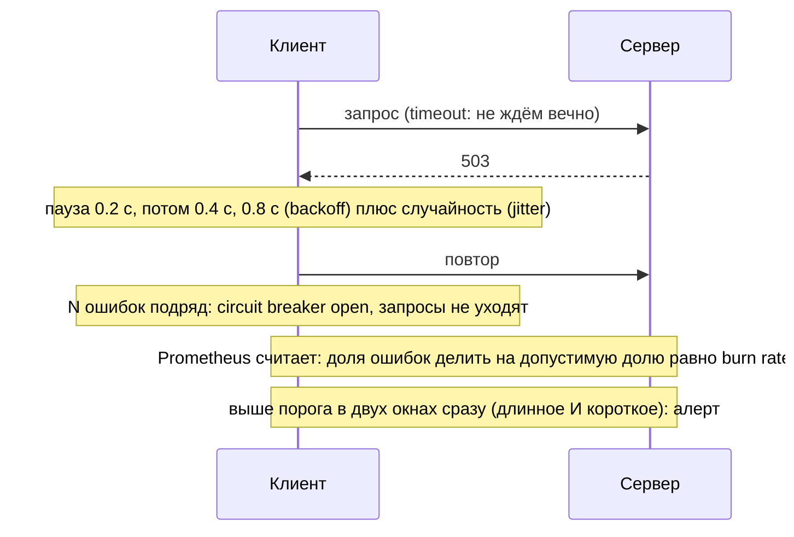
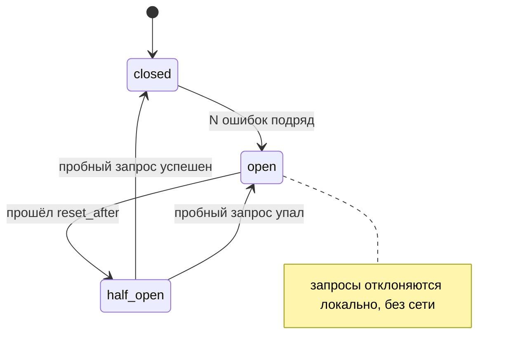

## Зачем это нужно

Сервис, который иногда отвечает ошибкой 500, это норма: сбои бывают у всех. Опасно другое. Клиенты видят ошибку и дружно повторяют запросы, добивая уже больное приложение. Это называется retry storm (шторм повторов). Представь, что в магазине сломалась касса, а каждый покупатель каждые две секунды подходит и спрашивает «ну что, уже работает?»: кассиру некогда чинить, очередь растёт. Повтор запроса (retry) по отдельности полезен, а все вместе и без пауз они превращают небольшой сбой в большой. А алерт «ошибок больше 5%» либо будит среди ночи из-за пятиминутного всплеска, либо молчит, пока за неделю тихо сгорает весь бюджет ошибок. Бюджет ошибок (error budget) это допустимая доля неудачных запросов за месяц, как лимит на карте: потратил в пределах лимита, всё хорошо, превысил, пора тормозить. Подробно разберём ниже. На работе это разбирают на каждом втором постмортеме (разборе инцидента).

В уроке ты напишешь клиент с повторами, экспоненциальной паузой и случайным разбросом, добавишь размыкатель цепи, а потом научишь Prometheus считать скорость сжигания бюджета ошибок и будить только тогда, когда это правда нужно.

Шаг проекта: в «Заметки» добавляются `monitoring/prometheus/rules/burnrate.yml` (burn-rate алерты по SLO из 8.1), `examples/retry_client.py` и черновик `docs/error-budget-policy.md`. Сам `app.py` не меняется (остаётся v7).

## Что нужно знать

- [Урок 8.1: SLI, SLO и error budget](01-observability-slo.md): SLI (показатель качества, например доля успешных запросов), SLO (цель по нему, здесь 99.5% за 30 дней из `docs/slo.md`) и error budget (сколько ошибок можно допустить). Это основа расчёта burn rate (скорость сжигания бюджета: во сколько раз быстро ты тратишь его по сравнению с нормой, как темп расходов по карте; разберём в теории).
- [Урок 8.3: PromQL](03-promql.md): `rate` (скорость роста счётчика), `sum`, `increase`, recording rules.
- [Урок 8.5: Alertmanager](05-alertmanager.md): `for` (сколько условие должно держаться до алерта), `severity`, маршрутизация, `promtool check rules` (проверка файла правил).
- [Урок 2.4: HTTP](../02-network/04-http.md): коды 5xx и 429, заголовок `Retry-After`.
- [Урок 5.7: пробы и rollout](../05-kubernetes/07-probes-resources-rollouts.md): зачем сервису readiness и таймауты. Rollout это постепенная замена старых подов новыми при выкате новой версии, как смена караула по одному человеку, чтобы пост не оставался пустым. Подробно про безопасные выкаты будет в [уроке 9.6](../09-secrets-gitops/06-progressive-delivery.md).
- Timeout (таймаут): предел ожидания ответа; когда время вышло, клиент перестаёт ждать, как уйти от окошка, если тебя не обслужили за две минуты. Подробно в первом разделе теории.
- [Урок 8.10: Istio ambient](10-service-mesh-istio.md): там retry и timeout настраивались в HTTPRoute, здесь разберём, что стоит за этими числами.

## Картина целиком

Представь очередь в кассу магазина, которая вдруг замедлилась. Ты можешь: (1) ждать до закрытия (это ошибка без таймаута), (2) через минуту уйти и вернуться позже (таймаут и повтор), (3) вернуться не сразу, а с нарастающей паузой (backoff, отступление) и в случайный момент (jitter, «дрожание»: случайный разброс паузы), чтобы не прийти вместе со всеми остальными, (4) заметить, что касса не работает, и вообще не ходить туда полчаса, пока она не починится (circuit breaker, размыкатель цепи: как автомат в щитке, который отключает линию при коротком замыкании). А управляющий магазином следит не за каждой очередью, а за тем, как быстро он выходит из допустимого числа жалоб за месяц (burn rate), и поднимает тревогу, когда темп опасный.



Сверху вниз идёт путь запроса при сбое: таймаут, пауза с разбросом, размыкатель, а в конце метрики решают, будить ли дежурного.

За урок ты разберёшь каждый элемент этой схемы: почему у любого вызова должен быть таймаут, какие запросы можно повторять, как считается пауза между повторами и зачем в неё добавляют случайность, как работает размыкатель и как из SLO получить точные пороги алертов.

## Теория

### Timeout: всё начинается с него

Без ограничения времени ожидания клиент, обратившийся к медленному сервису, ждёт бесконечно. Пока он ждёт, он занимает поток (одну «ниточку» выполнения программы) и соединение. Клиентов много, все ждут, потоки заканчиваются, и теперь сам клиент перестаёт отвечать своим пользователям. Один медленный сервис превращается в лежащую цепочку. Это называется каскадным отказом.

Ты стоишь у окошка и не уходишь, пока тебя не обслужат. Если окошко зависло, ты простоишь до вечера и не сделаешь других дел. Таймаут это решение заранее: «жду не дольше двух минут, потом ухожу». Оговорка: слишком короткий таймаут тоже плох, ты будешь уходить от окошка, которое как раз собиралось ответить.

Таймаут ставят отдельно на две вещи: на соединение (connect timeout, «дозвониться») и на весь запрос (total, «дождаться ответа»). Хост, не принявший соединение за 2 секунды, скорее всего, недоступен, ждать 30 секунд бессмысленно. Второе правило: таймаут вложенного вызова меньше таймаута вызывающего. Иначе внешний уже сдался, а внутренний ещё работает впустую.

Разберём на примере. Пользователь ждёт ответ 3 секунды, внутри два последовательных вызова к разным сервисам. Если дать каждому по 2 секунды, в худшем случае цепочка займёт 2 + 2 = 4 секунды, и пользователь уже ушёл. Дать каждому по 1 секунде: 1 + 1 = 2 секунды, остаётся секунда запаса на одну быструю повторную попытку или аккуратную ошибку. Правило: сумма таймаутов последовательных вызовов не превышает внешний бюджет времени. С параллельными вызовами иначе: они идут одновременно, поэтому каждому можно отдать весь бюджет (до 3 секунд, если им ничего больше не нужно), ведь общее время равно самому долгому из них, а не сумме.

> **Прикинь сам:** пользовательский запрос должен уложиться в 3 секунды, внутри два последовательных вызова к разным сервисам. Какой таймаут дашь каждому?
{: .predict}

Меньше 1.5 секунды на каждый, например 1 секунда, чтобы осталось время на одну быструю повторную попытку или аккуратную ошибку. Для параллельных вызовов хватило бы и 3 секунд на каждый: они идут одновременно и в сумме не складываются. Таймауты последовательных вызовов суммируются, и эта сумма не должна превышать внешний бюджет времени.

Осторожно, тут часто путают. «Таймаут по умолчанию нормальный». Во многих библиотеках таймаут по умолчанию бесконечный или в десятки секунд. Его всегда задают явно.

> **Главное:** у каждого вызова явный таймаут, а сумма таймаутов внутри цепочки не больше внешнего бюджета времени.
{: .key}

Что можно повторять после таймаута?

### Retry: что можно повторять

Многие сбои кратковременные: соединение сбросилось, под перезапустился, вернулся 503. Через секунду тот же запрос пройдёт. Повтор (retry) прячет такие сбои от пользователя. Но повтор бывает вредным, и нужно понимать, где.

Позвонить ещё раз, если было занято, разумно. Позвонить ещё раз после «номер не существует» бессмысленно. А повторить заказ пиццы, если непонятно, дошёл ли первый, приведёт к двум пиццам. Оговорка: в программах ты не можешь спросить у собеседника, «дошло ли», тебе нужен специальный механизм (ключ идемпотентности).

Решение «повторять или нет» зависит от двух вещей.

Первая: какая ошибка. Повторяем сетевые ошибки и коды 408 (сервер не дождался запроса целиком), 502, 503, 504 (сервер временно недоступен или не ответил) и 429 (слишком много запросов, с учётом заголовка `Retry-After`, где сервер сам говорит, когда прийти). Не повторяем 400, 401, 403, 404: запрос не станет правильным от повтора.

Вторая: безопасно ли выполнить запрос дважды. Идемпотентный запрос (idempotent) даёт тот же результат при повторе: `GET` (прочитать), `PUT` (заменить), `DELETE` (удалить: второй раз удалять уже нечего). `POST /notes` не идемпотентен: два запроса создадут две заметки. Его повторяют только с ключом идемпотентности (idempotency key): клиент присылает уникальный номер запроса, и сервер по нему понимает, что это повтор, и не создаёт дубль.

Разберём на примере. Клиент послал `POST /notes`, сервер сохранил заметку, но ответ потерялся в сети, клиент получил таймаут. Если он повторит без ключа, в базе две одинаковые заметки. С ключом `Idempotency-Key: 7f3a` сервер на второй запрос ответит «уже есть» тем же результатом. Отсюда и правило про POST.

Осторожно, тут часто путают. «Повторяю всё до успеха». Это приводит к дублям и к штормам, о которых ниже.

> **Главное:** повторяют сетевые ошибки, 408, 502, 503, 504 и 429, но только идемпотентные запросы или запросы с ключом.
{: .key}

> **Проверь понимание:** какие из кодов ответа ты повторишь, а какие нет: 404, 503, 429, 400?

<details markdown="1">
<summary>Ответ</summary>

Повторю 503 (временная недоступность) и 429 (с учётом `Retry-After`). 404 и 400 повторять бессмысленно: запрос от повтора не изменится.

</details>

Как сервер узнаёт, что запрос повторный?

### Идемпотентность на деле: как сервер узнаёт повтор

Выше сказано: `POST` можно повторять «только с ключом». Но как сервер по ключу понимает, что запрос уже был? Без ответа на этот вопрос правило остаётся заклинанием.

Гардероб. Ты отдаёшь куртку и получаешь номерок. Если придёшь второй раз с тем же номерком, тебе не выдадут вторую куртку, а покажут ту же. Номерок это ключ идемпотентности, гардеробщик это сервер, а список «номерок, что выдано» это таблица ключей. Оговорка: гардеробщик хранит записи не вечно, через сутки или неделю ключи стирают, и повтор «из прошлого месяца» уже не распознается.


1. Клиент генерирует уникальный ключ для каждого *действия* (не для каждой попытки!) и кладёт в заголовок `Idempotency-Key`. Обычно это случайная строка (UUID).
2. Сервер получает запрос и смотрит в таблицу: был ли такой ключ.
3. Не было: выполняет действие, сохраняет рядом с ключом результат (код ответа и тело) и отвечает.
4. Был: не выполняет действие второй раз, а возвращает сохранённый результат.

Разберём на примере. Клиент шлёт `POST /notes` с ключом `7f3a`. Сервер создал заметку с id 41, записал `7f3a -> 201, id=41`, но ответ потерялся. Клиент по таймауту повторяет тот же запрос с тем же ключом `7f3a`. Сервер находит запись и отвечает `201, id=41`, вторую заметку не создаёт. Если бы клиент на повторе сгенерировал новый ключ `9c1b`, сервер счёл бы это новым действием и создал бы заметку 42: дубль.

> **Прикинь сам:** клиент при каждой попытке `POST` создаёт новый UUID как ключ. Защищает ли это от дублей?
{: .predict}

Нет. Для сервера каждая попытка выглядит как отдельное новое действие. Ключ должен быть один на всё действие и повторяться при каждой попытке.

Осторожно, тут часто путают. Что ключ нужен каждый раз. Он нужен для неидемпотентных запросов (`POST`). `GET`, `PUT`, `DELETE` и так безопасны при повторе. Вторая ошибка: генерировать ключ заново на каждую попытку, тогда защита не работает.

> **Главное:** один ключ на действие и все попытки, сервер хранит результат и отдаёт его на повторе.
{: .key}

Как выбрать паузу между повторами?

### Backoff и jitter: как не устроить шторм

Если сервер упал, а тысяча клиентов повторяет запросы каждые 0.1 секунды, поднимающийся сервер снова заваливают. Нужна пауза, растущая с каждой попыткой, и нужен разброс, чтобы клиенты не били в один и тот же момент.

После отключения света весь дом одновременно включает чайники: сеть перегружается и снова отключается. Если бы каждый жилец включал чайник в случайный момент в течение десяти минут, сеть бы выдержала. Оговорка: жильцы не договариваются друг с другом, случайность должна быть в каждом клиенте отдельно.

Экспоненциальная пауза (exponential backoff): пауза между попытками растёт вдвое: 0.2, 0.4, 0.8, 1.6 секунды. Формула `min(cap, base * 2 ** attempt)`: `base` это стартовая пауза, `attempt` номер попытки (с нуля), `**` возведение в степень, `cap` потолок, чтобы пауза не выросла до минут.

Но если тысяча клиентов упала одновременно, они повторят одновременно: через 0.2, потом одновременно через 0.4. Получаются волны. Лекарство: разброс (jitter). Схема full jitter: пауза равна случайному числу от 0 до `min(cap, base * 2 ** attempt)`. Волны размазываются по времени.

Разберём на примере. 20 клиентов, `base=0.5`. Без jitter: паузы 0.5, 1, 2 секунды, моменты повторов от начала 0.5, 1.5 и 3.5 секунды (0.5; 0.5+1; 0.5+1+2). В каждый из трёх моментов приходят все 20 повторов разом, пик 20. С full jitter: первая пауза случайная от 0 до 0.5, вторая от 0 до 1, третья от 0 до 2. Повторы размазаны по десяткам разных моментов, и пик в несколько раз ниже. Ты увидишь это в задании 1 своими глазами.

Осторожно, тут часто путают. Что jitter нужен, чтобы пауза стала больше. Нет: он делает паузы разными, чтобы клиенты не синхронизировались (эта синхронность называется thundering herd, «стадо»).

> **Главное:** пауза растёт вдвое с потолком, а jitter разбрасывает клиентов, чтобы они не били волнами.
{: .key}

> **Проверь понимание:** сервис перегружен и отвечает 503. Клиенты повторяют 3 раза без пауз. Что произойдёт с нагрузкой?

<details markdown="1">
<summary>Ответ</summary>

Нагрузка вырастет примерно в 4 раза (1 исходный запрос + 3 повтора), сервис окончательно ляжет, восстановление станет невозможным, пока клиенты не перестанут. Это и есть retry storm (шторм повторов). Нужны backoff с jitter, лимит попыток и circuit breaker.

</details>

Что будет, если повторяет каждый уровень?

### Бюджет повторов: как повторы перемножаются

Повторы есть на нескольких уровнях сразу: в клиентской библиотеке, в mesh ([урок 8.10](10-service-mesh-istio.md)), в самом приложении. Каждый уровень повторяет независимо.

Три начальника подряд, каждый говорит подчинённому: «если не вышло, сделай ещё два раза». Работник в самом низу получает задание 3 × 3 × 3 раз. Оговорка: в реальности уровни не знают друг про друга, поэтому и получается перебор.

Если каждый из трёх уровней делает по 3 попытки, на нижний сервис прилетает 3 × 3 × 3 = 27 запросов на один пользовательский. Поэтому повторы делают на одном уровне (на проде лучше в mesh: правило в одном месте, а не в библиотеке каждого сервиса) и ставят лимит вида «не больше 10% от общего числа запросов» (retry budget, бюджет повторов). Если сервис в порядке, повторов мало и лимит не мешает. Если сервис лежит, лимит не даёт повторам превратиться в лавину.

Разберём на примере. Обычный трафик: 100 запросов в секунду. Сервис начал отвечать 503 на половину. Без бюджета клиент повторяет 50 неудачных ещё по 3 раза: 100 + 150 = 250 запросов в секунду на уже больной сервис. С бюджетом 10%: повторов не больше 10 в секунду, то есть 110 запросов в секунду.

<div class="viz" data-viz="chart" data-type="bar" data-x="Один уровень,Два уровня,Три уровня" data-series='[{"name":"Запросов на нижний сервис от одного пользовательского","values":[3,9,27],"unit":"шт"}]' data-x-label="Сколько уровней повторяют по 3 попытки" data-y-label="Запросов" data-unit="шт" data-explain="Попытки перемножаются: 3, 3 × 3 = 9, 3 × 3 × 3 = 27 запросов на один пользовательский."></div>

Каждый новый уровень повторов умножает нагрузку, поэтому повторы делают на одном уровне.

Осторожно, тут часто путают. «Каждый слой сам повторяет, так надёжнее». Наоборот: усиление нагрузки растёт по произведению попыток.

> **Главное:** повторы делают на одном уровне и ограничивают долей от общего трафика, иначе попытки перемножаются.
{: .key}

Когда перестать стучаться в сервис?

### Circuit breaker: не стучаться туда, где не откроют

Даже с backoff клиент продолжает слать запросы в сервис, который лежит. Каждый такой запрос ждёт таймаут и создаёт нагрузку. Размыкатель цепи (circuit breaker) перестаёт слать запросы, пока сервис не оправился.

Автомат защиты (пробка) в электрощитке. Если в сети короткое замыкание, он размыкает цепь, чтобы не сгорела проводка. Через некоторое время ты пробуешь включить снова. Оговорка: автомат срабатывает по току, а размыкатель в программе по числу или доле ошибок, и порог надо выбирать.

Три состояния:

- **closed** (замкнут): запросы идут, размыкатель считает подряд идущие ошибки;
- **open** (разомкнут): после N ошибок подряд запросы сразу отклоняются локально, без сети. Это защищает и клиента (быстрый отказ вместо ожидания таймаута), и больной сервис (ему дают выдохнуть);
- **half-open** (полуоткрыт): через `reset_timeout` пропускаем один пробный запрос. Успех возвращает в closed, ошибка снова открывает цепь.



Разомкнутая цепь сама пробует вернуться: через `reset_after` пропускает один пробный запрос и по его итогу замыкается или остаётся разомкнутой.

В учебном примере размыкатель живёт в клиентском коде. На проде я бы отдал его mesh: политика лежит в одном месте и одинакова для всех сервисов, а не копируется в библиотеки на разных языках. Принцип при этом один.

Разберём на примере. Порог 3 ошибки подряд, сервис мёртв. Вызовы 1, 2, 3 идут в сеть и падают, после третьего цепь open. Вызовы 4, 5, 6 отклоняются мгновенно, без сети и без ожидания. Через `reset_after` (2 секунды) цепь half-open: следующий вызов уходит в сеть как пробный. Он падает, цепь снова open. Это ты увидишь в задании 2.

> **Прикинь сам:** зачем нужно состояние half-open, почему не замкнуть цепь обратно сразу по таймеру?
{: .predict}

Полный трафик на не оправившийся сервис снова его уронит. Один пробный запрос проверяет здоровье дёшево. Если бы цепь замыкалась по таймеру без проверки, мы бы каждый раз бились в сбойный сервис всем потоком.

Осторожно, тут часто путают. Что размыкатель «лечит» сервис. Он только перестаёт добивать его и экономит время клиента. Если размыкатель никогда не открывается, значит порог слишком высокий или ошибки считаются не там (например, 500 не считается сбоем).

> **Главное:** closed считает ошибки, open отклоняет запросы без сети, half-open пускает один пробный запрос.
{: .key}

Что считать ошибкой?

### Что считать ошибкой: из чего складывается доля ошибок

Burn rate считается от «доли ошибок», но что в неё входит, решаешь ты. Ошибёшься в определении, и алерт либо молчит при реальных проблемах, либо будит из-за чужих промахов.

Ресторан считает «плохие заказы». Если гость заказал блюдо, которого нет в меню, это не вина кухни. Если кухня сожгла стейк, это её вина. Первое не идёт в статистику ошибок, второе идёт. Оговорка: граница не всегда чёткая, и её нужно записать заранее, в SLO.

В HTTP коды 4xx значат «клиент сам ошибся» (нет такой страницы, нет прав, кривой запрос), а 5xx «ошибка на стороне сервера» ([урок 2.4](../02-network/04-http.md)). Для надёжности считают, как правило, только 5xx: это те сбои, которые в нашей власти. Доля ошибок за окно это количество запросов с кодом 5xx, делённое на количество всех запросов, в PromQL:

```text
sum(rate(notes_http_requests_total{status=~"5.."}[5m]))   <- сколько 5xx в секунду за 5 минут
/
sum(rate(notes_http_requests_total[5m]))                  <- сколько всего запросов в секунду
```

`rate` это средняя скорость роста счётчика за окно ([урок 8.3](03-promql.md)), `status=~"5.."` это регулярное выражение «код из трёх символов, начинается с 5», `sum` складывает ряды всех подов в одно число.

Разберём на примере. За 5 минут: 900 запросов с кодом 200, 50 с кодом 404 и 50 с кодом 503. Всего 1000. Если считать 4xx ошибкой, доля 100 / 1000 = 10%. Если считать только 5xx, доля 50 / 1000 = 5%. Burn rate при SLO 99.5%: 0.10 / 0.005 = 20 против 0.05 / 0.005 = 10. Одно и то же событие, а алерт разный, поэтому определение фиксируют заранее и одинаково для всех.

Осторожно, тут часто путают. Что при нуле запросов всё хорошо. Если запросов нет, знаменатель равен нулю, и деление даёт пустоту (`no data`), а не ноль. Алерт на «долю ошибок» промолчит. Поэтому для совсем критичных сервисов заводят отдельный алерт на «запросов стало подозрительно мало» или на метрику `up` ([урок 8.9](09-k8s-monitoring.md)).

> **Главное:** считают 5xx делить на все запросы, а при нуле запросов получается `no data`, а не «всё хорошо».
{: .key}

> **Проверь понимание:** за окно пришло 200 запросов, из них 10 с кодом 500 и 20 с кодом 404. Какова доля ошибок, если считаем только 5xx?

<details markdown="1">
<summary>Ответ</summary>

10 / 200 = 0.05, то есть 5%. Код 404 это ошибка клиента и в долю не входит.

</details>

Сколько ошибок мы можем себе позволить?

### Error budget и burn rate: сколько ошибок мы можем себе позволить

Алерт «ошибок больше 5% за 5 минут» плох в двух сторонах. Короткий всплеск ошибок, который почти не тронул месячную цель, будит человека ночью. А тихая деградация с долей ошибок 1% не срабатывает вообще, хотя за неделю она съедает весь месячный запас. Нужна мера, связанная с целью (SLO), а не случайная цифра.

Месячный лимит на карте: 30 000 рублей. Важна не одна покупка в 2000, а темп: если ты тратишь по 3000 в день, то лимит кончится через 10 дней, и пора тормозить. Темп относительно нормы это и есть burn rate. Оговорка: в отличие от денег, бюджет ошибок «восстанавливается» с течением окна: старые ошибки выпадают из 30 дней.

Из [урока 8.1](01-observability-slo.md): SLO 99.5% за 30 дней. Значит, допустимая доля ошибок 1 - 0.995 = 0.005, то есть 0.5% запросов. Это и есть бюджет ошибок (error budget). Если считать временем: 30 суток × 24 часа × 60 минут = 43 200 минут, 0.5% от них 216 минут, то есть 3 часа 36 минут полного простоя за 30 дней.

Скорость сжигания (burn rate) показывает, во сколько раз текущая доля ошибок больше допустимой:

```text
burn rate = доля_ошибок / (1 - SLO) = доля_ошибок / 0.005
```

Burn rate 1 означает, что бюджет закончится ровно к концу 30 дней. Burn rate 14.4 сожжёт весь бюджет за 30 дней / 14.4, то есть примерно за 2 суток. Сколько бюджета уходит за час при burn rate 14.4? В месяце 720 часов, при burn rate 1 за час уходит 1/720 бюджета, при 14.4 в 14.4 раза больше: 14.4 / 720 = 0.02, то есть 2% бюджета за один час.

Разберём на примере. Доля ошибок сейчас 5% (0.05). Burn rate = 0.05 / 0.005 = 10. Значит, бюджет сгорит за 30 / 10 = 3 суток. Другой пример: SLO 99.9%, бюджет 0.001, доля ошибок 1.44% (0.0144): 0.0144 / 0.001 = 14.4.

Классические пороги (из книги Google SRE Workbook):

| Burn rate | Доля ошибок при SLO 99.5% | Окна (длинное и короткое) | Бюджет уходит за | Действие |
|---|---|---|---|---|
| 14.4 | больше 7.2% (14.4 × 0.005) | 1 час и 5 минут | около 2 суток, 2% бюджета за час | page (будим) |
| 6 | больше 3% (6 × 0.005) | 6 часов и 30 минут | около 5 суток, 5% бюджета за 6 часов | page (в нашем правиле будим, в других командах бывает тикет) |

Page (страница) это алерт, который будит дежурного. Более мягкие уровни (например, burn rate 1 за трое суток) обычно ведут в тикет, а не в звонок; в этом уроке мы делаем два быстрых уровня.

Разберём расчёт с другой стороны: SLO 99% за 30 дней, значит, бюджет 1% запросов. Сейчас ошибок 10%, то есть burn rate = 0.10 / 0.01 = 10. Бюджет за 30 дней при таком темпе сгорает за 30 / 10 = 3 дня: если держать 10% ошибок, к концу третьих суток от месячного лимита ничего не останется.

> **Прикинь сам:** SLO 99.9%, доля ошибок 1.44% в течение последнего часа. Чему равен burn rate?
{: .predict}

Бюджет 0.1% = 0.001. Burn rate = 0.0144 / 0.001 = 14.4. Это порог page: при таком темпе месячный бюджет сгорит за 2 суток.

Осторожно, тут часто путают. «Burn rate 1 это плохо». Нет: burn rate 1 значит, что бюджет тратится ровно как планировалось, к концу окна он как раз кончится. Плохо, когда burn rate выше 1 надолго.

> **Главное:** burn rate это доля ошибок делить на допустимую долю, и 14.4 сжигает бюджет за 2 суток.
{: .key}

Зачем два окна?

### Два окна сразу: зачем длинное и короткое

Одно окно всегда плохо. Короткое (5 минут) реагирует быстро, но будит из-за мимолётных всплесков. Длинное (1 час) не реагирует на всплески, но остаётся высоким долго после того, как всё починили, и алерт продолжает гореть.

Чтобы решить, что у тебя жар, смотрят и на температуру утром (длинный период: «это не случайность»), и на температуру прямо сейчас («это происходит сейчас»). Оговорка: чтобы «сейчас» не было случайным, у алерта есть ещё `for`.

Условие алерта: оба окна выше порога одновременно (`and`). Длинное окно отвечает «это уже серьёзно, а не мимолётный всплеск». Короткое отвечает «и это происходит прямо сейчас». Как только ошибки прекратились, короткое окно падает за минуты, условие перестаёт выполняться, и алерт закрывается сам. Без короткого алерт горел бы ещё почти час после починки. Без длинного будил бы из-за 5 минут ошибок. Считать `rate` на окнах в PromQL долго, поэтому заранее считаем recording rules и сохраняем результат: `notes:http_errors:ratio_rate5m`. Название по договорённости: `уровень:метрика:операция`.

Разберём на примере. Сбой в 12:00, починили в 12:10. К 12:10 доля ошибок за час выше 7.2%, за 5 минут выше. Алерт `NotesErrorBudgetBurnFast` сработал (после `for: 2m`). В 12:15 5-минутная доля упала до нуля, а часовая ещё выше порога. Из-за `and` условие ложно, и алерт закрылся в 12:15, а не в 13:10.

<div class="viz" data-viz="mon3-burn"></div>

Поставь короткий сбой и сравни, когда сработают быстрое и медленное правила. Быстрое молчит, пока плохо только в одном из двух окон.

Осторожно, тут часто путают. «Увеличу `for` до часа, чтобы алерт не мигал». `for` замедляет срабатывание, но не решает проблему «после починки горит долго».

> **Главное:** длинное окно отсекает всплески, короткое быстро закрывает алерт после починки, и нужны оба через `and`.
{: .key}

> **Проверь понимание:** что будет, если убрать из алерта условие с коротким окном?

<details markdown="1">
<summary>Ответ</summary>

Алерт продолжит гореть, пока часовое окно не «остынет», то есть до часа после починки: дежурный получит уведомление об уже решённой проблеме.

</details>

Как выбрать числа для таймаутов?

### Как выбрать числа: таймаут, попытки и порог размыкателя

Все эти параметры это числа, и «взять от балды» опасно: слишком малые ломают здоровый сервис, слишком большие не защищают. Числа берут из измерений.

Врач не ставит «нормальную температуру» наугад: он знает, что у здоровых людей она около 36,6, и жаром считает то, что заметно выше. Так и здесь: сначала смотришь, как сервис ведёт себя в норме, потом ставишь границу чуть выше.

Для таймаута смотри на p99: время, за которое укладываются 99 запросов из 100 (по гистограмме из [урока 8.3](03-promql.md)). Если p99 у сервиса 300 мс, таймаут ставят в 2-3 раза выше, около одной секунды. Так здоровые медленные запросы не обрываются, а зависшие не ждут вечно. Число попыток обычно 2-3 (первая плюс один-два повтора): больше нагружает сервис, а пользу почти не прибавляет. Порог размыкателя берут так, чтобы одиночный сбой его не открывал: например 5 ошибок подряд или более 50% ошибок за 10 секунд при достаточном числе запросов.

Разберём на примере. p99 сервиса `notes` равен 200 мс. Ставим таймаут 600 мс (в три раза выше), 3 попытки с backoff. Худший случай: 3 × 0.6 = 1.8 секунды на попытки плюс паузы около 0.2 + 0.4 = 0.6 секунды, итого примерно 2.4 секунды. Если пользователь ждёт максимум 3 секунды, бюджет времени соблюдён. Если бы таймаут был 2 секунды, худший случай 6 секунд плюс паузы, и пользователь давно ушёл.

> **Прикинь сам:** p99 сервиса 500 мс. Подойдёт ли таймаут 400 мс и почему?
{: .predict}

Нет. Таймаут ниже p99 будет обрывать около 1% здоровых запросов, то есть создавать ошибки там, где их не было бы. Нужен запас в 2-3 раза выше p99, примерно 1-1.5 секунды.

Осторожно, тут часто путают. Что числа выбирают один раз навсегда. Сервис меняется, и p99 уходит вверх или вниз. Числа перепроверяют после крупных релизов.

> **Главное:** таймаут в 2-3 раза выше p99, попыток 2-3, числа перепроверяют после крупных релизов.
{: .key}

Что делать, когда бюджет тает?

### Политика бюджета ошибок: что делать, когда бюджет тает

Алерты сообщают о проблеме, а политика отвечает на вопрос «и что мы теперь делаем с планами». Без политики бюджет превращается в красивую цифру, которую никто не слушает.

Семейный бюджет. Есть договорённость: если до конца месяца осталось меньше десятой части денег, новых покупок нет. Решение принято заранее и спокойно, а не в магазине у кассы. Оговорка: в семье договариваются двое, а в компании политику должны принять и инженеры, и те, кто отвечает за выпуск фич.

Политика это короткий документ с таблицей: сколько бюджета израсходовано, какое правило действует. Обычная логика такая: пока бюджета много, команда спокойно выкатывает изменения, ведь каждый релиз несёт риск. Когда бюджет почти кончился, новые фичи откладываются, и все силы идут на стабильность. Так бюджет ошибок связывает скорость разработки и надёжность общей цифрой, а не спором «кто важнее».

Разберём на примере. В середине месяца из бюджета израсходовано 60%. По таблице из задания 4 это уровень «50-90%»: релизы только после ревью надёжности. Через неделю расход 95%: заморозка релизов, кроме исправлений надёжности. Команда не спорит с менеджером в момент инцидента, а ссылается на документ, который подписали заранее.

Осторожно, тут часто путают. Что политика это наказание команды. Нет: это способ вовремя притормозить, пока пользователи ещё не пострадали сильнее, чем обещано в SLO.

> **Главное:** политику пишут заранее, и она связывает скорость разработки с надёжностью без споров в момент инцидента.
{: .key}

> **Проверь понимание:** почему политику пишут до инцидента, а не во время?

<details markdown="1">
<summary>Ответ</summary>

Во время инцидента люди нервничают и торгуются. Заранее согласованное правило снимает споры: все знают, что делать при 50%, 90% и 100% расхода.

</details>

## Практика

Нужны: стек из `monitoring/compose.yml` (Prometheus v3.15.0 из 8.2), Python 3.13 и рабочий каталог `~/notes`. Клиент работает на стандартной библиотеке, ничего ставить не нужно.

### Задание 1. Retry без jitter: шторм своими глазами

**Цель:** увидеть, как синхронные повторы создают волны, и убедиться, что jitter их размазывает.

**Предскажи:** 20 клиентов одновременно получили ошибку. Без jitter, backoff 0.5, 1, 2 с. Сколько разных моментов повторов будет за 3 повтора? А с full jitter?

<details markdown="1">
<summary>Ответ</summary>

Без jitter ровно 3 момента (0.5, 1.5, 3.5 с от начала), в каждый приходят все 20 повторов разом. С full jitter моменты почти все разные, пик нагрузки в разы ниже.

</details>

**Шаги:**

1. Создай каталог и файл клиента. Storm это симуляция без сети, «Заметки» для неё не нужны. Разбор команд: `mkdir -p` создаёт папку (и не ругается, если она есть), `cat > файл <<'PY' ... PY` записывает всё до строки `PY` в файл (кавычки вокруг `PY` запрещают оболочке подставлять в текст `$` и обратные кавычки). Код читай по комментариям: `backoff` считает паузу, `call_with_retry` делает запрос с повторами, `Breaker` это размыкатель с тремя состояниями, `storm` и `breaker_demo` демонстрации. `python3 файл storm` запускает файл в режиме `storm`:

```bash
mkdir -p ~/notes/examples && cd ~/notes
cat > examples/retry_client.py <<'PY'
"""Клиент с timeout, retry (backoff и jitter) и circuit breaker.

Только стандартная библиотека. Режимы:
  python3 examples/retry_client.py storm   - 20 клиентов, сравнение jitter и без
  python3 examples/retry_client.py breaker - размыкатель цепи на мёртвом сервисе
"""
import random
import sys
import time
import urllib.error
import urllib.request
from collections import Counter

RETRY_STATUS = {408, 429, 502, 503, 504}  # эти коды повторяем, остальные нет


def backoff(attempt, base=0.2, cap=5.0, jitter=True):
    """Пауза перед повтором номер attempt (с нуля)."""
    limit = min(cap, base * 2 ** attempt)
    return random.uniform(0, limit) if jitter else limit


def call_with_retry(url, attempts=4, jitter=True, timeout=1.0, on_try=None):
    """GET с таймаутом и повторами. Возвращает статус или бросает ошибку."""
    last = None
    for attempt in range(attempts):
        if on_try:
            on_try(time.monotonic())
        try:
            with urllib.request.urlopen(url, timeout=timeout) as resp:
                return resp.status
        except urllib.error.HTTPError as err:
            if err.code not in RETRY_STATUS:
                raise  # 4xx повтором не лечится
            last = err
        except (urllib.error.URLError, TimeoutError) as err:
            last = err
        if attempt < attempts - 1:
            time.sleep(backoff(attempt, jitter=jitter))
    raise last


class CircuitOpen(Exception):
    pass


class Breaker:
    """closed -> open после max_fail ошибок подряд -> half-open через reset_after."""

    def __init__(self, max_fail=3, reset_after=2.0):
        self.max_fail = max_fail
        self.reset_after = reset_after
        self.fails = 0
        self.opened_at = None

    @property
    def state(self):
        if self.opened_at is None:
            return "closed"
        if time.monotonic() - self.opened_at >= self.reset_after:
            return "half-open"
        return "open"

    def call(self, fn):
        if self.state == "open":
            raise CircuitOpen("цепь разомкнута, запрос не отправлен")
        try:
            result = fn()
        except Exception:
            self.fails += 1
            if self.state == "half-open" or self.fails >= self.max_fail:
                self.opened_at = time.monotonic()  # (снова) размыкаем
            raise
        self.fails = 0
        self.opened_at = None
        return result


def storm(jitter, clients=20, attempts=4):
    """Симуляция без сети: когда 20 клиентов, упавших одновременно, повторят запрос."""
    stamps = Counter()
    for _ in range(clients):
        t = 0.0
        for attempt in range(attempts - 1):
            t += backoff(attempt, base=0.5, jitter=jitter)
            stamps[round(t * 10) / 10] += 1  # окна по 0.1 с
    print(f"jitter={jitter}: повторов {sum(stamps.values())}, "
          f"пик за 0.1 с: {max(stamps.values())}, разных окон: {len(stamps)}")


def breaker_demo():
    b = Breaker(max_fail=3, reset_after=2.0)
    for i in range(1, 9):
        try:
            b.call(lambda: call_with_retry("http://127.0.0.1:1/", attempts=1, timeout=0.3))
        except CircuitOpen as err:
            print(f"{i}: {b.state:9} {err}")
        except Exception as err:
            print(f"{i}: {b.state:9} сбой сети ({type(err).__name__})")
        time.sleep(0.5)


if __name__ == "__main__":
    mode = sys.argv[1] if len(sys.argv) > 1 else "storm"
    if mode == "storm":
        storm(jitter=False)
        storm(jitter=True)
    else:
        breaker_demo()
PY
python3 examples/retry_client.py storm
```

**Что должно получиться:** без jitter пик равен 20, разных окон 3. С jitter пик заметно ниже, окон больше (числа слегка плавают между запусками; пример реального прогона):

```text
jitter=False: повторов 60, пик за 0.1 с: 20, разных окон: 3
jitter=True: повторов 60, пик за 0.1 с: 8, разных окон: 21
```

**Как читать вывод:** «повторов 60» это 20 клиентов по 3 повтора. «Пик за 0.1 с» это наибольшее число повторов, попавших в одно окно в 0.1 секунды: то, что почувствует сервер. «Разных окон» это сколько разных моментов повторов было. Без jitter все 20 клиентов бьют в 3 момента, с jitter повторы разбросаны по десяткам моментов, и пик в 2-3 раза ниже. У jitter числа будут чуть другими на каждом запуске.

**Объясни себе:**

1. Почему без jitter пик ровно 20 в каждой из трёх волн?
2. Что произойдёт с суммарной нагрузкой на сервер, если поднять `attempts` до 10?
3. Почему `cap` в `backoff` полезен?

**Типичные ошибки:**

- `IndentationError: unexpected indent`: при вставке в heredoc съехали отступы. Пересоздай файл целиком.
- `ModuleNotFoundError: No module named 'requests'`: ты заменил urllib на requests. Здесь нужен именно стандартный `urllib`, `pip` в системный Python ставить не надо.

### Задание 2. Circuit breaker на мёртвом сервисе

**Цель:** увидеть три состояния размыкателя и то, что открытая цепь отказывает мгновенно.

**Предскажи:** порог 3 ошибки подряд, `reset_after` 2 секунды, пауза между вызовами 0.5 с, сервис мёртв (порт 1). На каком вызове цепь откроется? Какие вызовы будут отклонены без сети? Что произойдёт на вызове после 2 секунд паузы?

<details markdown="1">
<summary>Ответ</summary>

Ошибки сети на вызовах 1-3, после третьего цепь open. Вызовы 4-6 отклоняются локально (`CircuitOpen`). Примерно через 2 секунды после размыкания цепь half-open, вызов 7 уходит в сеть как пробный, падает и снова размыкает цепь, поэтому вызов 8 снова отклоняется.

</details>

**Шаги:**

1. Запусти демонстрацию. Она 8 раз обращается на `127.0.0.1:1` (порт 1, там никто не слушает, поэтому соединение сразу отклоняется) через размыкатель и печатает состояние после каждого вызова:

```bash
cd ~/notes && python3 examples/retry_client.py breaker
```

**Что должно получиться:**

```text
1: closed    сбой сети (URLError)
2: closed    сбой сети (URLError)
3: open      сбой сети (URLError)
4: open      цепь разомкнута, запрос не отправлен
5: open      цепь разомкнута, запрос не отправлен
6: open      цепь разомкнута, запрос не отправлен
7: open      сбой сети (URLError)
8: open      цепь разомкнута, запрос не отправлен
```

**Как читать вывод:** номер вызова, состояние размыкателя и что случилось. `сбой сети (URLError)` это настоящая попытка соединиться, которая не удалась. `цепь разомкнута, запрос не отправлен` это мгновенный отказ без сети. Состояние в строке 3 напечатано уже после того, как цепь открылась. Строка 7 отправила пробный запрос в состоянии half-open, но печатается состояние после его провала.

**Объясни себе:**

1. Чем ошибка на вызове 7 отличается по последствиям от ошибки на вызове 2?
2. Что будет, если `reset_after` поставить 0.1 секунды?
3. Какие коды ответа сервера ты бы считал сбоем для размыкателя, а какие нет (400, 404, 500, 503)?

**Типичные ошибки:**

- `urllib.error.URLError: <urlopen error [Errno 111] Connection refused>`: это штатный сбой в демонстрации, порт 1 никто не слушает. Ошибка становится проблемой, только если ты ждал 200 от настоящего сервиса: проверь адрес и что сервис запущен.
- `TypeError: 'NoneType' object is not callable`: в `b.call(...)` передан результат вызова, а не функция. Оборачивай в `lambda`.

### Задание 3. Burn-rate правила и проверка promtool

**Цель:** написать recording rules и алерты multi-window по SLO 99.5% и проверить их без запуска Prometheus.

**Предскажи:** доля ошибок держится 5% (0.05). Какой у неё burn rate при SLO 99.5%? Сработает ли алерт с порогом 14.4? А с порогом 6?

<details markdown="1">
<summary>Ответ</summary>

Burn rate = 0.05 / 0.005 = 10. Порог 14.4 не достигнут, page-алерт первого уровня молчит. Порог 6 превышен: алерт второго уровня сработает, когда 6-часовое окно тоже наберёт больше 3% (до этого держится pending).

</details>

**Шаги:**

1. Создай файл правил и проверь его. Разбор `docker run`: `--rm` удаляет контейнер после запуска, `--entrypoint promtool` запускает вместо Prometheus его утилиту проверки, `-v "$PWD/...:/rules:ro"` подключает твою папку внутрь контейнера только для чтения, `check rules` проверяет синтаксис файла. В правилах: `record:` это recording rule (результат сохраняется как новая метрика), `alert:` это алерт, `for:` сколько условие должно держаться, `and` в PromQL оставляет значение слева, только если справа тоже есть значение (то есть оба условия истинны сразу). Метрика `notes_http_requests_total` с лейблом `status` есть с урока 8.2 (для краткости пробы не исключаем, в бою добавь `path!~"/healthz|/readyz"`):

```bash
cd ~/notes
cat > monitoring/prometheus/rules/burnrate.yml <<'YML'
# Burn-rate алерты по SLO 99.5% за 30 дней (docs/slo.md, бюджет ошибок 0.005)
groups:
  - name: notes-burnrate-recording
    interval: 30s
    rules:
      # Доля 5xx среди пользовательских запросов по четырём окнам
      - record: notes:http_errors:ratio_rate5m
        expr: sum(rate(notes_http_requests_total{status=~"5.."}[5m])) / sum(rate(notes_http_requests_total[5m]))
      - record: notes:http_errors:ratio_rate30m
        expr: sum(rate(notes_http_requests_total{status=~"5.."}[30m])) / sum(rate(notes_http_requests_total[30m]))
      - record: notes:http_errors:ratio_rate1h
        expr: sum(rate(notes_http_requests_total{status=~"5.."}[1h])) / sum(rate(notes_http_requests_total[1h]))
      - record: notes:http_errors:ratio_rate6h
        expr: sum(rate(notes_http_requests_total{status=~"5.."}[6h])) / sum(rate(notes_http_requests_total[6h]))

  - name: notes-burnrate-alerts
    rules:
      # Burn rate 14.4: 14.4 * 0.005 = 0.072. Бюджет сгорит за 2 суток, будим
      - alert: NotesErrorBudgetBurnFast
        expr: |
          notes:http_errors:ratio_rate1h > (14.4 * 0.005)
          and
          notes:http_errors:ratio_rate5m > (14.4 * 0.005)
        for: 2m
        labels:
          severity: page
        annotations:
          summary: "Быстрое сжигание бюджета ошибок Notes (burn rate выше 14.4)"
          runbook_url: "docs/runbooks/NotesErrorBudgetBurn.md"
      # Burn rate 6: 6 * 0.005 = 0.03. Бюджет сгорит за 5 суток, будим
      - alert: NotesErrorBudgetBurnSlow
        expr: |
          notes:http_errors:ratio_rate6h > (6 * 0.005)
          and
          notes:http_errors:ratio_rate30m > (6 * 0.005)
        for: 15m
        labels:
          severity: page
        annotations:
          summary: "Медленное сжигание бюджета ошибок Notes (burn rate выше 6)"
          runbook_url: "docs/runbooks/NotesErrorBudgetBurn.md"
YML
docker run --rm --entrypoint promtool \
  -v "$PWD/monitoring/prometheus/rules:/rules:ro" \
  prom/prometheus:v3.15.0 check rules /rules/burnrate.yml
```

2. Перезагрузи Prometheus и проверь, что правила видны. Разбор: `docker compose ... exec prometheus kill -HUP 1` отправляет процессу с номером 1 (это сам Prometheus) сигнал HUP, по которому он перечитывает конфиг. `curl -s .../api/v1/rules` просит у Prometheus список правил в JSON, `jq -r '.data.groups[].name'` достаёт из него имена групп:

```bash
docker compose -f monitoring/compose.yml exec prometheus kill -HUP 1
curl -s localhost:9090/api/v1/rules | jq -r '.data.groups[].name'
```

**Что должно получиться:**

```text
Checking /rules/burnrate.yml
  SUCCESS: 6 rules found

notes-burnrate-recording
notes-burnrate-alerts
```

**Как читать вывод:** `SUCCESS: 6 rules found` значит, что файл разобран и найдено 6 правил: 4 recording и 2 алерта. Две строки ниже это имена групп, которые загрузил Prometheus. Если групп нет, правила не подхвачены: проверь путь в `rule_files` из [урока 8.2](02-prometheus-basics.md).

**Объясни себе:**

1. Почему пороги записаны как `14.4 * 0.005`, а не числом 0.072?
2. Что будет, если убрать из алерта условие с коротким окном?
3. Чем разбавляют долю ошибок пробы `/healthz` и `/readyz` и как исключить их через `path!~`?

**Типичные ошибки:**

- `parse error: unexpected identifier "and"`: `and` поставлен после запятой или в конце строки без второго операнда: оба выражения должны быть полными, `and` стоит между ними.
- `many-to-many matching not allowed` или пустой результат: на левой и правой стороне разные наборы лейблов (разные наборы дают пусто, ошибка бывает при дублях по совпадающим лейблам). Здесь после `sum(...)` лейблов нет, поэтому `and` работает. Если убрал `sum`, верни.
- `Error: no such file or directory` на `/rules/burnrate.yml`: неверный путь в `-v`, запускай из `~/notes`.

### Задание 4. Шаг проекта: политика бюджета ошибок

**Цель:** зафиксировать в репозитории «Заметок» правило, что команда делает, когда бюджет тает: правила читаются людьми, а не только Prometheus.

**Предскажи:** какой пункт политики сложнее всего провести в жизнь и почему?

<details markdown="1">
<summary>Ответ</summary>

Заморозка релизов при исчерпании бюджета: у неё есть цена для бизнеса, поэтому политику согласуют заранее, до инцидента, а не в момент, когда все нервничают.

</details>

**Шаги:**

1. Создай черновик политики и закоммить три файла. `git add` добавляет файлы в коммит, `git commit -m` сохраняет с сообщением, `git status --short` печатает краткий список несохранённых изменений (пустой вывод значит, что всё сохранено):

```bash
cd ~/notes
cat > docs/error-budget-policy.md <<'MD'
# Политика бюджета ошибок (черновик)

SLO: 99.5% успешных запросов за 30 дней (docs/slo.md). Бюджет: 0.5% запросов.

## Уровни

| Израсходовано за 30 дней | Что делаем |
|---|---|
| до 50% | штатная работа, релизы по расписанию |
| 50-90% | релизы только с ревью надёжности, приоритет у задач по стабильности |
| 90-100% | заморозка релизов, кроме исправлений надёжности |
| больше 100% | заморозка, постмортем, план восстановления на планёрке |

## Алерты

NotesErrorBudgetBurnFast: разбор сразу. NotesErrorBudgetBurnSlow: в течение часа.
MD
git add monitoring/prometheus/rules/burnrate.yml \
  examples/retry_client.py docs/error-budget-policy.md
git commit -m "Надёжность: burn-rate алерты, retry-клиент, политика бюджета"
git status --short
```

**Что должно получиться:** после коммита `git status --short` пуст. Теги образа не меняются (остаётся 0.7.0, `app.py` v7).

```text
[main 3f2a9c1] Надёжность: burn-rate алерты, retry-клиент, политика бюджета
 3 files changed, 130 insertions(+)
```

**Как читать вывод:** в скобках ветка и короткий хеш коммита, ниже число изменённых файлов. Хеш и число строк у тебя будут другими.

**Объясни себе:**

1. Зачем политика написана до инцидента?
2. Чем отличается страница, тикет и запись в политике?
3. Что изменилось бы в таблице, если бы SLO было 99.9%?

**Типичные ошибки:**

- `fatal: pathspec 'examples/retry_client.py' did not match any files`: файл клиента создан не из `~/notes`: проверь `pwd` и путь.
- `Author identity unknown`: не настроены `user.name` и `user.email` (урок 3.1): `git config user.name ...` и `git config user.email ...`.

## Сломай и почини

Скачай скрипт и запусти один из сценариев (номер 1, 2 или 3; `fix` возвращает исходное состояние). Скрипт правит файлы в `~/notes` (клиент и правила) и работает без `sudo`. Сам скрипт не читай: цель в том, чтобы найти причину по симптомам. Нужны выполненные задания 1-3.

```bash
curl -fsSL -o /tmp/break-8.11.sh https://raw.githubusercontent.com/distinguished-sre/learning/main/devops/project/notes/break/8.11/break.sh
bash /tmp/break-8.11.sh 1
```

### Симптом

Одно из трёх:

1. Клиенты после сбоя бэкенда долбят его волнами, восстановление занимает в разы дольше, чем должно.
2. Размыкатель в клиенте «не срабатывает»: сервис лежит, а каждый вызов по-прежнему ждёт таймаут.
3. Сервис отдаёт 30% ошибок уже час, а `NotesErrorBudgetBurnFast` молчит.

### Гипотезы

Запиши до проверок возможные причины каждого симптома: от простого (порог, опечатка) до системного (не те окна, не те метрики).

### Проверки

- Симптом 1: посмотри `backoff` и вызов `time.sleep`. Печатай метки времени попыток, как в задании 1.
- Симптом 2: печатай `b.fails` и `b.state` после каждого вызова, сравни `max_fail` с реальным числом подряд идущих ошибок. Не стирает ли что-то счётчик?
- Симптом 3: выполни в Prometheus `notes:http_errors:ratio_rate5m` и `notes:http_errors:ratio_rate1h`. Пусты ли ряды, совпадают ли лейблы `status` и `path` с реальными (`curl -sk https://notes.lab/metrics | grep notes_http_requests_total`). Какое окно указано в алерте?

### Исправление

<details markdown="1">
<summary>Разбор всех сценариев</summary>

**Сценарий 1: retry storm.** В `backoff` включён `jitter=False` (или пауза фиксированная). Возврат `random.uniform(0, limit)` разносит попытки. Дополнительно проверь `cap` и `attempts`: слишком большое число попыток тоже усиливает шторм.

**Сценарий 2: размыкатель не открывается.** Частая причина: `self.fails = 0` стоит в неверном месте (сбрасывается на любой ответ, даже на ошибку), либо ошибка перехвачена внутри `fn()`, и в `Breaker.call` исключение не доходит: размыкатель считает вызов успешным. Проверка: `b.fails` после трёх подряд падений должен быть равен 3. Исправление: сбрасывать счётчик только при успехе, исключение пробрасывать наверх, а 5xx считать сбоем.

**Сценарий 3: алерт молчит.** Типовая причина: в `expr` перепутаны окна (например, `ratio_rate6h` в паре с `ratio_rate5m`: длинное окно не наберёт порог быстро) либо recording rule читает `status="500"` вместо `status=~"5.."`, либо в `path!~` попали пути, через которые идёт ошибочный трафик. Проверь запросом ряды обоих окон, найди то, что ниже порога, и почини выражение. После правки `promtool check rules` .

</details>

## ИИ в помощь

Общие правила работы с ИИ-помощником собраны на странице [«ИИ-помощник»](../../load-tester/ai.md), здесь только сценарии этой темы.

**Задача:** подобрать таймаут и число попыток.

```text
p99 сервиса 250 мс, пользователь ждёт максимум 3 секунды, внутри один вызов. Предложи таймаут, число попыток и паузы с backoff и jitter. Покажи худший случай по времени.
```
{: .wrap}

**Проверь ответ:** таймаут в 2-3 раза выше p99 (около 500-750 мс), худший случай не превышает 3 секунд. Типичная ошибка: таймаут ниже p99 или худший случай без пауз.

**Задача:** посчитать burn rate и время до исчерпания бюджета.

```text
SLO 99.9% за 30 дней. За последний час доля ошибок 0.72%. Посчитай burn rate, за сколько дней при таком темпе сгорит бюджет, и какой алерт сработает.
```
{: .wrap}

**Проверь ответ:** 0.0072 / 0.001 = 7.2, бюджет сгорит за 30 / 7.2 ≈ 4.2 суток. Проверь арифметику сам: нейросети путают бюджет и SLO.

**Задача:** найти ошибку в правиле circuit breaker.

```text
Размыкатель считает ошибками только сетевые обрывы и не считает коды 500. Порог 5 ошибок подряд. Сервис отвечает 500 на всё. Что произойдёт и что исправить?
```
{: .wrap}

**Проверь ответ:** цепь никогда не откроется, и надо считать 5xx ошибками. Типичная ошибка: советовать увеличить таймаут.

## Словарик урока

| Термин | Простыми словами |
|---|---|
| timeout | Предел ожидания ответа; по истечении клиент прекращает ждать |
| каскадный отказ | Медленный сервис тянет за собой остальные, которые его ждут |
| retry | Повтор неудавшегося запроса |
| идемпотентный запрос | Запрос, который безопасно выполнить дважды (GET, PUT, DELETE) |
| idempotency key | Уникальный номер запроса, по которому сервер узнаёт повтор и не делает дубль |
| exponential backoff | Пауза между повторами растёт вдвое с каждой попыткой |
| jitter | Случайность в паузе, чтобы клиенты не повторяли одновременно |
| thundering herd | Много клиентов действуют в один момент и перегружают сервис |
| retry storm | Лавина повторов, которая добивает больной сервис |
| retry budget | Лимит доли повторов от общего числа запросов |
| circuit breaker | Размыкатель: при серии ошибок перестаёт слать запросы к сервису |
| closed / open / half-open | Состояния размыкателя: работает / отклоняет / пробует один запрос |
| error budget | Допустимая доля ошибок (1 минус SLO) |
| burn rate | Во сколько раз текущая доля ошибок больше допустимой |
| multi-window | Алерт по двум окнам сразу: длинному и короткому |
| recording rule | Правило, которое заранее считает выражение и хранит результат как метрику |
| доля ошибок | Число запросов с кодом 5xx, делённое на число всех запросов за окно |
| rollout | Постепенная замена старых подов новыми при выкате |
| политика бюджета ошибок | Документ: что делает команда при разном расходе бюджета |
| page | Алерт, который будит дежурного |

## Вопросы с собеседований
Раздел для повторения: ответь вслух, потом открой ответ. Вопросы с пометкой «часто» задают почти на каждом собеседовании по теме урока: начни с них.



## Проверено на версиях

- Прогонялось: `examples/retry_client.py` (режимы `storm` и `breaker`) и `promtool check rules` из образа `prom/prometheus:v3.15.0` (`SUCCESS: 6 rules found`); скрипт `break.sh` проверен на копии файлов (все три сценария, двойной запуск, двойной `fix`)
- Не прогонялось: перезагрузка правил в работающем Prometheus и вывод `git commit` (команды и вывод даны по документации и опыту)
- Prometheus и promtool: v3.15.0
- Alertmanager: v0.34.1 (не запускался)
- Python: 3.13 в уроке, только стандартная библиотека; локальная проверка шла на другой минорной версии Python 3
- «Заметки»: app.py v7, образ 0.7.0 (в этом уроке не менялись)

## Итог урока: ты умеешь

- [ ] умею объяснить, почему у сетевого вызова должен быть таймаут и как выбрать его относительно внешнего
- [ ] умею отличить повторяемые запросы от неповторяемых и назвать риск дублей
- [ ] умею написать backoff с jitter и объяснить, как он предотвращает retry storm
- [ ] умею описать три состояния circuit breaker и проверить, что он размыкается
- [ ] умею посчитать burn rate и порог доли ошибок для SLO 99.5%
- [ ] умею написать multi-window multi-burn-rate алерты и recording rules в Prometheus
- [ ] умею проверить правила через `promtool check rules` 
- [ ] умею сформулировать политику бюджета ошибок

**Дальше:** [Тема 9: Секреты и GitOps](../09-secrets-gitops/index.md)
