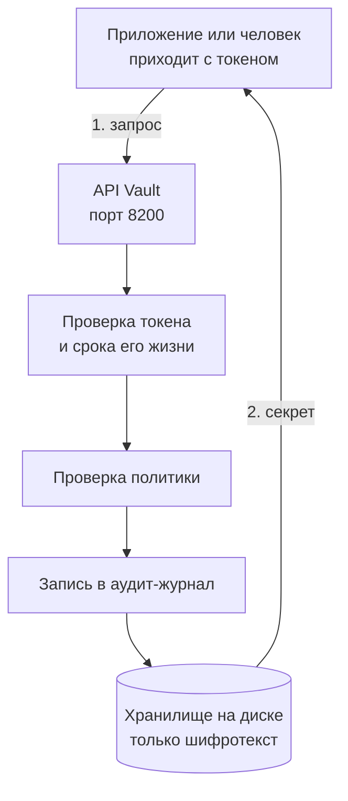
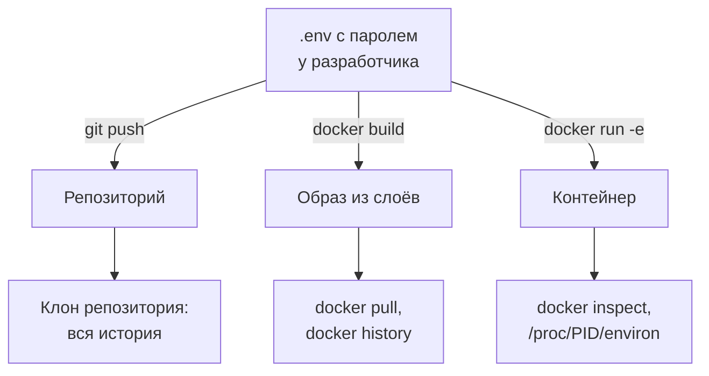
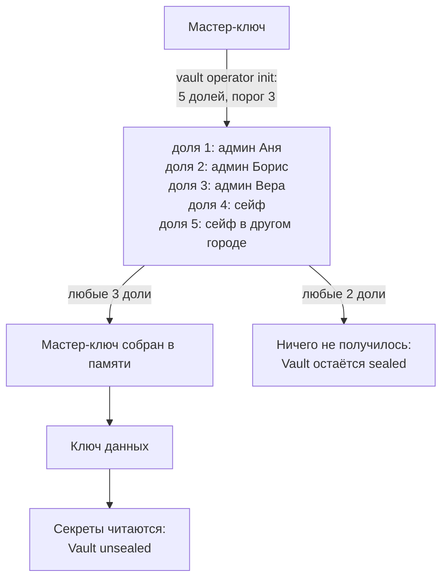
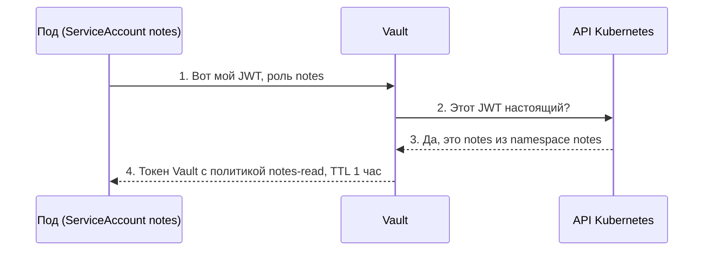

## Зачем это нужно

Секрет (secret) это любая строка, которая даёт доступ к чему-то: пароль от базы, токен (строка-пропуск, по которой программа входит в сервис вместо пароля), ключ. Как ключ от квартиры: кто им владеет, тот и входит, и замок не спрашивает, кто ты. Без аккуратного обращения с секретами любой, кто случайно увидел строку, получает те же права, что и ты.

Пароль от базы в файле `.env` (обычный текстовый файл с настройками, которые программа читает при запуске), токен в истории git (git помнит каждую версию каждого файла, см. [урок 3.1](../03-git-ci/01-git-basics.md)), ключ в переменных окружения контейнера (настройки, которые система передаёт запущенной программе): так секреты утекают чаще всего, и для этого не нужен ни хакер, ни взлом. Достаточно одного неосторожного коммита. На работе тебя спросят три вещи: где хранятся секреты, кто к ним обращался и что делать, если один из них утёк.

Специальная программа, которая отвечает на все три вопроса, называется хранилище секретов (secrets manager). Она выдаёт секрет только тому, кому положено, хранит его на диске в зашифрованном виде и записывает в журнал каждое обращение. В этом уроке разберём самое известное такое хранилище: HashiCorp Vault (Vault по-английски «хранилище-сейф», HashiCorp это компания, которая его делает). Это как банковская ячейка с журналом посещений: положить и взять можно только по правилам, а каждый визит записан. Без такого хранилища секреты лежат россыпью в файлах и чатах, и никто не скажет, у кого они есть и кто ими пользовался.

Ты найдёшь утечки своими руками, потом поработаешь с Vault в трёх режимах (учебный, «как в проде» с диском и запечатыванием, и внутри кластера) и поймёшь, чем он лучше `.env`.

Типичная история: кто-то закоммитил `.env` «на минутку», потом удалил, а через неделю выяснилось, что репозиторий уже успели клонировать. Поэтому «я же удалил» защитой не считается.

Шаг проекта: в кластере `kind-notes` появляется Vault (namespace `vault`) и скрипт `scripts/seed-vault.sh`. В Vault лежит секрет `secret/notes/db` с паролем базы «Заметок». Пока приложение этот секрет не читает: как их связать, будет в [уроке 9.2](02-vault-k8s-eso.md).

## Что нужно знать

- [Урок 3.4: качество и безопасность в CI](../03-git-ci/04-quality-security-ci.md): сканеры секретов и почему `.env` нельзя в git.
- [Урок 4.2: Dockerfile](../04-docker/02-dockerfile.md): слои образа, `docker run -e`, `docker exec`.
- [Урок 4.5: Compose и PostgreSQL](../04-docker/05-compose-postgres.md): откуда взялся пароль базы в `.env`.
- [Урок 5.1: зачем Kubernetes, кластер kind](../05-kubernetes/01-why-k8s-cluster.md): кластер `kind-notes` и `kubectl`.
- [Урок 5.6: ConfigMap и Secret](../05-kubernetes/06-config-secrets.md): Secret это объект Kubernetes для паролей; почему он всего лишь закодирован base64 (способ записи, не шифр), вспомним в теории.
- [Урок 5.9: Helm](../05-kubernetes/09-helm.md): установка готового чарта из репозитория.

## Картина целиком

Представь банк. В банке есть **хранилище** с ячейками. Клиент не может зайти и взять что угодно: сотрудник проверяет документы, смотрит в список, к каким ячейкам у него доступ, выдаёт ровно то, что положено, и записывает визит в журнал. Само хранилище открывается не одним ключом, а двумя ключами разных сотрудников одновременно. А ночью хранилище закрыто целиком.

Vault работает так же:

- **ячейки** это секреты, лежащие по путям вроде `secret/notes/db`;
- **список доступа** это политики (policy): правила вида «этому сотруднику можно читать вот эти ячейки и ничего больше»;
- **журнал визитов** это аудит (audit log);
- **ключи двух сотрудников** это доли мастер-ключа, и по ним же Vault «запечатывается» (sealed: закрыт целиком, ничего не выдаёт) и «распечатывается» (unsealed: открыт). Подробно разберём ниже;
- **выдача на время** это токен с ограниченным сроком жизни.

Аналогия ломается в одном: банковский сотрудник умеет думать, а Vault строго выполняет правила и не делает исключений ни для кого, в том числе для тебя.



На схеме видно, что на пути к секрету три проверки подряд, а на диске лежит только зашифрованное. Ниже разберём каждый кусок.

За урок разберёшь каждый кусок этой схемы: где секреты утекают и почему, что делать при утечке, как устроен Vault, что такое запечатывание, как писать политики, для чего аудит, и чем Vault отличается от более простых способов.

## Теория

### Что такое секрет и почему им нельзя делиться

**Секрет** (secret) это любая строка, которая даёт доступ к чему-то. Пароль от базы данных, токен для API, приватный ключ SSH или TLS, строка подключения вида `postgres://notes:пароль@db:5432/notes`. Общий признак один: **кто знает строку, тот и есть владелец**. Система не спрашивает «ты точно Иван?», она проверяет только, знаешь ли ты пароль.

Аналогия: ключ от квартиры. Замок не знает, кто держит ключ. Если ключ скопировали, вор входит так же спокойно, как хозяин. Поэтому у секретов две главные задачи: чтобы копий было как можно меньше и чтобы при потере ключ можно было быстро заменить.

Аналогия ломается тут: ключ от квартиры нельзя «проверить на копии», а у секрета можно посмотреть журнал использования и увидеть, что им пользуется чужой.

Осторожно: «секрет это пароль». Нет, секретом бывает любой токен и ключ. Пароль пользователя, токен CI, ключ облака: всё, чем можно войти, это секрет.

> **Главное:** секрет это любая строка, которая даёт доступ, и вору подходит любая её копия.
{: .key}

Откуда берутся копии? Посмотрим, где секреты утекают на самом деле.

### Где секреты утекают

Утечка почти никогда не выглядит как взлом. Чаще всего секрет остаётся лежать в месте, о котором забыли.



Один файл разошёлся по трём путям, и у каждого свой способ подсмотреть.

Разберём каждое место, потому что в каждом «почему» разное.

**Git.** Коммит в git это не «изменение», а полный снимок файлов на момент коммита, привязанный к предыдущему. История хранит все снимки. Когда ты удаляешь `.env` новым коммитом, ты создаёшь новый снимок, в котором файла нет. Старый снимок с файлом остаётся в истории, и любой, кто клонировал репозиторий, получает его вместе с остальным. Поэтому «удалил файл» не равно «удалил секрет».

> **Прикинь сам:** в истории репозитория три коммита: `.env` добавили, потом поправили, потом удалили. Сколько версий файла с паролем получит человек, который клонирует репозиторий?
{: .predict}

Все три снимка из первых двух коммитов лежат в истории, а третий лишь показывает, что файла больше нет. Клон приносит всю историю целиком, поэтому пароль в нём найдётся.

**Образ Docker.** Образ (image) состоит из слоёв, каждый слой это результат одной инструкции Dockerfile. Если в Dockerfile есть `COPY .env /app/` или `ARG PASSWORD=...`, значение записывается в слой. Удалить его следующей инструкцией `RUN rm` нельзя: слой просто перекрывается новым, а старый лежит внутри образа, и `docker history` или распаковка слоёв его показывают. Разбор слоёв был в [уроке 4.2](../04-docker/02-dockerfile.md).

**Переменные окружения.** Переменная окружения (environment variable) это пара «имя=значение», которую операционная система передаёт запущенной программе. Секреты часто передают так: `docker run -e DB_PASSWORD=...`. Проблема в том, что значения видны в нескольких местах: `docker inspect` показывает их в поле `Env`, Linux хранит их в псевдофайле `/proc/<номер процесса>/environ`, а при аварийном завершении программа (или её отладчик) нередко печатает все переменные в отчёт о падении.

**Чат и тикеты.** «Скинь пароль от прода» в мессенджере остаётся в поиске на годы, а к чату имеет доступ намного больше людей, чем к серверу.

**История shell.** Если ты набрал `mysql -pПароль` или `export TOKEN=abc`, командная оболочка (shell) записывает строку в файл `~/.bash_history` (или `~/.zsh_history`). Файл лежит на диске открытым текстом.

**Kubernetes Secret.** Из [урока 5.6](../05-kubernetes/06-config-secrets.md): значения там закодированы base64, а это способ записи, а не шифр. Любой, у кого есть право `get secret`, читает пароль одной командой. Хранится в базе etcd, где по умолчанию тоже не зашифровано.

Сведём в таблицу:

| Место | Как утекает | Как увидеть |
|---|---|---|
| git | `.env` закоммитили, потом «удалили» | `git log -S значение`, `git show <коммит>:.env` |
| образ Docker | `COPY .env`, `ARG`, `ENV` | `docker history <образ>` |
| переменные окружения | видны рядом стоящим | `docker inspect`, `/proc/<pid>/environ` |
| чат и тикеты | скопировали в сообщение | поиск в мессенджере |
| история shell | набрал секрет в команде | `history`, `~/.bash_history` |
| Kubernetes Secret | base64, а не шифрование | `kubectl get secret -o jsonpath=...` и `base64 -d` |

Осторожно: «если репозиторий приватный, секрет в нём безопасен». Приватный репозиторий читают все участники организации, CI-сервисы, инструменты аналитики и бэкапы. Приватность сегодня не гарантирует, что репозиторий не станет публичным завтра (ошибка в настройках, передача проекта, утечка токена). Секрет, который хоть раз лежал в репозитории, считается известным.

> **Главное:** секрет живёт не только в коде: в истории git, слоях образа, переменных окружения, чатах и истории shell.
{: .key}

> **Проверь понимание:** ты удалил `.env` из репозитория коммитом `remove secrets`. Секрет безопасен?

<details markdown="1">
<summary>Ответ</summary>

Нет. Файл остался в истории, и любой клон репозитория содержит его. Правильно: считать секрет скомпрометированным, сменить его (ротация, rotation) и только потом чистить историю. Ротация обязательна, чистка истории нет.

</details>

Что делать, если секрет уже утёк?

### Что делать, когда секрет утёк: ротация и отзыв

**Ротация** (rotation) это замена секрета на новый с одновременным отзывом старого. Аналогия: сменить замок в квартире после потери ключа. Не важно, найдёт ли кто-то потерянный ключ, старый ключ больше не открывает.

Порядок действий при утечке всегда один:

1. **Сначала отозвать и заменить.** Сгенерировать новый пароль, поменять его в системе, где он действует (в самой базе данных), и обновить у всех потребителей. Старый после этого перестаёт работать для новых входов. Уже открытые соединения смена пароля не разрывает: заверши и сессии злоумышленника (в PostgreSQL: найти их в `pg_stat_activity` и закрыть через `pg_terminate_backend(pid)`).
2. **Потом посмотреть, не воспользовались ли им.** Логи базы, аудит, журнал облака: искать обращения чужих адресов за время, пока секрет был открыт.
3. **Только потом чистить историю** (`git filter-repo`) и устранять причину: сканер секретов в CI и pre-commit ([урок 3.4](../03-git-ci/04-quality-security-ci.md)).

Почему порядок именно такой: чистка истории занимает время, и за это время скопированные клоны остаются у других людей и в кэшах. Ротация делает копии бесполезными сразу.

Из этого следует главное требование к системе секретов: **менять секрет должно быть дёшево**. Если замена пароля занимает три дня и требует ручной правки в десяти местах, её будут откладывать. Хранилище секретов и нужно, чтобы замена была одной операцией.

Осторожно: «главное убрать секрет из репозитория». Нет: главное, чтобы утёкший секрет перестал работать. Убрать без замены значит оставить открытую дверь и закрыть окно.

> **Главное:** при утечке сначала заменяют секрет, потом ищут следы, и только потом чистят историю.
{: .key}

Посмотрим, как это выглядит по минутам.

### Утечка от начала до конца: хронология одного случая

Порядок «отозвать, проверить, почистить» легко выучить и так же легко забыть в момент паники. На конкретном случае видно, почему каждый шаг стоит именно там.

Аналогия: пожар в подъезде: сначала выводишь людей и перекрываешь газ, потом выясняешь причину, и только потом делаешь ремонт. Делать ремонт первым, пока газ включён, нелепо. Оговорка: в отличие от пожара, утечка секрета молчит, и ты можешь узнать о ней через месяц.

Разбираем случай «Заметок»: разработчик Аня закоммитила `.env` с паролем от базы в публичный репозиторий. Через 40 минут сканер секретов в CI присылает предупреждение.

Разберём на примере.

| Минута | Действие | Почему именно сейчас |
|---|---|---|
| 0 | Предупреждение сканера | Узнали об утечке |
| 5 | Генерируем новый пароль, меняем его в базе и завершаем чужие сессии (`pg_terminate_backend` по `pg_stat_activity`) | Утёкший пароль больше не пустит заново, а уже открытые соединения вора закрыты |
| 10 | Обновляем пароль у приложения и перезапускаем его | Иначе приложение само перестанет ходить в базу |
| 20 | Смотрим журнал базы за 40 минут: есть ли входы с чужих адресов | Чтобы понять, успели ли воспользоваться |
| 40 | Удаляем файл из истории (`git filter-repo`) и добавляем `.env` в `.gitignore` | Теперь чистим: к этому моменту копии уже бесполезны |
| 60 | Включаем pre-commit-проверку на секреты | Чтобы такое не повторилось |

Если бы в минуту 5 мы сначала занялись чисткой истории, вор за время чистки мог бы зайти в базу: пароль-то ещё жив. Обрати внимание на минуту 10: замена пароля это не только шаг безопасности, но и перезапуск работающего сервиса. Поэтому «дёшево менять» (предыдущий раздел) означает, что у тебя отработан процесс, а не что это одна кнопка.

Осторожно: что если репозиторий приватный, то можно не менять пароль. Приватный репозиторий читают все, у кого есть доступ, включая бывших сотрудников, подрядчиков и сервисы с токенами. Пароль, попавший в git, считается скомпрометированным (раскрытым) в любом случае.

> **Главное:** в панике выручает порядок: отозвать, проверить, почистить, закрыть причину.
{: .key}

> **Проверь понимание:** ты удалил `.env` из истории и сделал `git push --force`. Можно ли считать, что проблема закрыта?

<details markdown="1">
<summary>Ответ</summary>

Нет. Кто-то уже мог клонировать репозиторий или получить копию из кэша. Пароль остался в этих копиях, поэтому его нужно заменить, а не только убрать из истории.

</details>

Из этого случая вырастают три принципа, на которых строят хранилища секретов.

### Три принципа: минимум прав, короткая жизнь, журнал

Хранилища секретов строят на трёх идеях. Запомни их: в остальных уроках темы всё сводится к ним.

1. **Минимум прав** (least privilege). Каждому выдают доступ только к тому, что нужно для работы. Приложению «Заметки» нужен пароль от своей базы, но не от платёжной системы.
2. **Короткая жизнь.** Секрет или пропуск к нему живёт ограниченное время. Украденный токен на 1 час опаснее для вора меньше, чем постоянный пароль: к завтрашнему дню он мёртв.
3. **Журнал.** Каждое обращение записано: кто, что, когда. Без журнала после утечки нельзя понять, что именно потеряно.

Пример без этих принципов: общий пароль от базы лежит в `.env`, его знают десять человек и три сервиса, он не менялся два года, а кто им пользовался вчера, никто не скажет. Всё в этом примере нарушает все три принципа сразу.

> **Главное:** минимум прав, короткая жизнь и журнал: на них держится всё остальное.
{: .key}

Дальше нужны три слова из шифрования, без них Vault не объяснить.

### Шифрование, ключ и хеш: три слова, на которых стоит Vault

В уроке дальше постоянно будут «шифротекст», «ключ» и «хеш». Если считать их синонимами, то не понять, почему Vault безопасен, а base64 нет. Это три разные операции, и у каждой своя работа.

Аналогия: шифрование это сейф с кодовым замком: положил бумагу, закрыл, без кода не достать, с кодом достаёшь ту же самую бумагу. Хеш это отпечаток пальца: по нему можно проверить «тот ли это человек», но нельзя восстановить человека по отпечатку. Base64 это просто другой алфавит: как записать слово кириллицей латинскими буквами, прочитает любой, кто знает правило. Оговорка: в отличие от сейфа, в цифровом шифровании ключ это длинное число, которое нельзя подобрать перебором за разумное время.

Вот как это устроено.

- **Шифрование** (encryption): программа берёт открытый текст и ключ и превращает их в шифротекст (ciphertext), набор байт без видимого смысла. Обратно превращает тот же ключ. Без ключа шифротекст бесполезен.
- **Ключ** (key): секретное число, которое запирает и отпирает. Вся безопасность держится на том, что ключ знает только тот, кому положено.
- **Хеш** (hash): из любых данных получается короткая строка фиксированной длины. Одинаковые данные дают одинаковый хеш, а малейшее отличие даёт совсем другой. Вернуть данные из хеша нельзя: функция работает в одну сторону.
- **Кодирование** (base64): просто другая запись тех же данных, без ключа, читается любым инструментом. Поэтому «закодировано» не значит «защищено».

Разберём на примере. Пароль `hunter2`. Base64 даёт `aHVudGVyMg==`: любой вернёт `hunter2` командой `echo aHVudGVyMg== | base64 -d`. Шифрование даёт набор байт вроде `9f3c...`: без ключа из него ничего не получить. Хеш даёт строку `f52f...`: по ней `hunter2` не восстановить, но если кто-то предложит кандидата, посчитаешь его хеш и сравнишь. Так Vault ведёт аудит: записывает хеш значения, а не само значение (об этом ниже).

Осторожно: «Зашифровано значит безопасно навсегда». Безопасность равна безопасности ключа: если ключ лежит рядом с данными, шифрование бесполезно. Поэтому главный вопрос про Vault «где его ключ», и на него отвечает следующий раздел про запечатывание.

> **Главное:** шифрование обратимо ключом, хеш одностороннее, base64 вообще не защита.
{: .key}

> **Проверь понимание:** Kubernetes Secret хранит `cGFzc3dvcmQ=`. Это шифрование, хеш или кодирование?

<details markdown="1">
<summary>Ответ</summary>

Кодирование (base64). Значение возвращается командой `base64 -d` без всякого ключа. Шифрования тут нет, хеша тоже: хеш вернуть нельзя.

</details>

Теперь можно заглянуть в сам Vault.

### Что такое Vault и как он устроен

HashiCorp Vault (в русскоязычной среде часто «Волт») это программа-сервер, которая хранит секреты и раздаёт их по HTTP. У неё три части.

1. **API.** Интерфейс, по которому к Vault обращаются: HTTP-запросы на порт 8200. Команда `vault` это удобная обёртка над теми же запросами. Приложение приходит с **токеном** (token): это строка вроде `hvs.CAESI...`, которая говорит «я тот, кому Vault выдал такой-то пропуск».
2. **Ядро с политиками и аудитом.** Получив запрос, ядро проверяет токен (не истёк ли), политику (разрешено ли этому токену читать этот путь) и записывает событие в журнал.
3. **Хранилище (storage backend).** Место, где секреты лежат физически: файл на диске, база Consul, встроенное хранилище Raft. Vault пишет туда только зашифрованные данные.

Слой между ядром и хранилищем называется **барьер** (barrier): всё, что уходит на диск, шифруется на нём, а всё, что читается, расшифровывается. Для этого нужен ключ шифрования. Где он лежит и как его защищают, следующий раздел.

Что Vault даёт сверх «надёжной папки с паролями»:

- шифрование при хранении: на диске лежит шифротекст, а ключ в открытом виде не хранится;
- политики (policies) на языке HCL: кто и к какому пути ходит, на чтение или на запись;
- аудит (audit device): каждый запрос пишется в журнал;
- аренда (lease) и время жизни (TTL, time to live): токены и выдаваемые секреты живут ограниченное время;
- динамические секреты (dynamic secrets): Vault сам создаёт временного пользователя базы данных и удаляет его по истечении TTL. Красть постоянный пароль нечего. Здесь только идея, в проекте «Заметки» такие секреты не используются.

**Лицензия.** Версия Vault в курсе 2.1.1 распространяется по лицензии BSL (Business Source License, не открытая). Открытая альтернатива: OpenBao, форк с той же архитектурой, команды `bao` совпадают с `vault`. Для учёбы и внутреннего использования разницы нет, для продукта, который ты продаёшь, стоит прочитать лицензию.

Осторожно: «Vault это база данных для паролей». База данных отдаёт данные всем, у кого есть доступ к ней. Vault проверяет каждый запрос по политике, ведёт журнал и умеет выдавать секреты на время.

> **Главное:** Vault это сервер с API, политиками и аудитом, а на диске у него лежит только шифротекст.
{: .key}

Но если на диске шифротекст, где лежит ключ? Ответ в запечатывании.

### Seal и unseal: почему Vault запечатан после запуска

Секреты на диске зашифрованы. Значит, где-то нужен ключ, и встаёт вопрос: где его хранить? Если рядом с данными, шифрование бессмысленно, как ключ, приклеенный к сейфу. Если в голове администратора, то при его отсутствии никто не откроет хранилище, а если он один, его можно заставить или подкупить.

Аналогия: сейф в банке, который открывается двумя ключами от двух разных сотрудников одновременно. Ни один из них в одиночку сейф не откроет.

Вот как это устроено.

1. При первом запуске Vault генерирует **ключ шифрования данных** (data encryption key) и шифрует им все секреты.
2. Этот ключ сам шифруется другим ключом: **мастер-ключом** (master key). Зашифрованный ключ данных лежит на диске, мастер-ключ на диск не попадает никогда.
3. Мастер-ключ разрезается на **N долей** (key shares) по алгоритму Шамира: каждая доля выглядит как случайная строка и сама по себе ничего не раскрывает. Выдаётся один раз командой `vault operator init`, дальше Vault их не хранит.
4. Чтобы собрать мастер-ключ обратно, достаточно любых **K долей** из N (K называется порог, threshold). Меньше K долей не даёт ровным счётом ничего: не «почти», а совсем ничего. Классика для прода: «3 из 5».
5. Ввод долей называется **распечатывание** (unseal). Пока не введено K долей, Vault **запечатан** (sealed): процесс запущен, порт слушает, но расшифровать ничего не может и на все запросы отвечает ошибкой.



Три доли открывают хранилище, две не дают ничего: порог работает как «всё или ничего».

Разберём на примере. Схема 3 из 5. Аня, Борис и Вера каждый вводят свою долю (три команды `vault operator unseal`). После третьей доли Vault собирает мастер-ключ в памяти, расшифровывает ключ данных и переходит в состояние `Sealed false`. Если в отпуске двое из пяти, оставшиеся трое всё равно откроют хранилище. Если потеряны три доли из пяти, осталось две, а нужно три: **данные не расшифровать никак**, даже владельцу. У разработчиков нет «чёрного хода», это сделано намеренно.

> **Прикинь сам:** схема «4 из 7». Сколько администраторов можно потерять, чтобы Vault всё ещё удалось распечатать?
{: .predict}

Всего долей семь, порог четыре: 7 - 4 = 3. Потеряешь трёх, и ещё останется ровно четыре доли. Потеряешь четвёртого, и хранилище закроется навсегда.

**Следствия, о которые спотыкаются все:**

- перезапуск пода или сервера снова запечатывает Vault: мастер-ключ хранился только в памяти процесса. Пока его не распечатали, все клиенты получают `Vault is sealed`;
- бэкап хранилища без долей ключа бесполезен: в нём только шифротекст;
- при `init` выдаётся ещё **root-токен** (root token): всемогущий токен без ограничений. Его используют для первоначальной настройки, а потом отзывают.

В облаке ручной unseal заменяют на **auto-unseal**: мастер-ключ хранит облачный сервис управления ключами (KMS, Key Management Service), и Vault распечатывается сам при старте. Для учебного стенда мы используем «1 доля из 1», для прода так делать нельзя.

Осторожно: «запечатан значит выключен». Нет: процесс работает, `vault status` отвечает, но секреты недоступны. И второе: «доли это пароли администраторов». Нет: это части математического ключа, их нельзя восстановить или сбросить.

> **Главное:** после запуска Vault запечатан: ключ живёт только в памяти и собирается из K долей из N.
{: .key}

> **Проверь понимание:** ты запустил `init` со схемой 5 из 3 (то есть 5 долей, порог 3), а потом двое администраторов уволились и унесли свои доли. Сможешь ли ты распечатать Vault?

<details markdown="1">
<summary>Ответ</summary>

Да. Осталось три доли из пяти, а нужен порог 3. Но запас закончился: потеря ещё одной доли закроет хранилище навсегда, поэтому нужно срочно перевыпустить ключи (`vault operator rekey`) и раздать новые доли.

</details>

Как запускать Vault: для демо и «как в проде»?

### Режим dev и режим «как в проде»

У Vault два принципиально разных режима запуска, и путать их опасно.

**Dev-режим** (`vault server -dev`): Vault сразу распечатан, хранит всё **в памяти**, root-токен известен заранее, TLS выключен. После перезапуска все данные пропадают. Удобно для демонстрации на 30 секунд и для проверки команд, категорически нельзя для настоящих секретов.

**Обычный режим:** хранилище на диске, `init` и `unseal` обязательны, токен root выдаётся один раз. Именно он ближе к боевому.

Сравнение:

| | dev | обычный |
|---|---|---|
| данные | в памяти, пропадают при рестарте | на диске, зашифрованы |
| состояние после старта | распечатан | запечатан |
| root-токен | задан тобой заранее | выдан один раз при `init` |
| TLS | нет | нужен (в уроке отключён для localhost) |
| для чего | демо на 30 секунд | стенд и прод |

> **Главное:** dev-режим годится для демонстрации на 30 секунд, всё остальное идёт в обычном режиме.
{: .key}

Теперь о том, как лежат сами секреты.

### Движок секретов и путь: KV v2

В Vault хранятся разные виды секретов: пары «ключ-значение», пароли к базам, сертификаты. Для каждого вида своя логика. Поэтому Vault устроен как набор подключаемых **движков секретов** (secrets engines). Каждый движок «монтируется» на свой **путь**, как диск в файловой системе.

Аналогия: отделения банка: касса, кредитный отдел, хранилище ценностей. У каждого своя дверь и свои правила, но здание одно.

**KV** (key-value) это самый простой движок: ты кладёшь набор пар «ключ=значение» по пути, как файл в папку. **Версия 2** (KV v2) хранит ещё **историю версий**: перезаписал секрет, а прошлое значение можно вернуть.

Разберём на примере. Движок смонтирован на путь `secret/`. Команда:

```text
vault kv put -mount=secret notes/db username=notes password=CHANGE_ME_pw
```

- `-mount=secret` говорит, на каком движке искать;
- `notes/db` это путь секрета внутри движка;
- `username=notes password=...` пары ключ-значение, которые запишутся в секрет.

**Важная деталь, из-за которой чаще всего ломаются политики.** CLI показывает и принимает путь `secret/notes/db`. Но на уровне API (и, значит, в политиках) KV v2 разделяет пространство на две части:

| Что | Путь в API и политике |
|---|---|
| сами данные | `secret/data/notes/db` |
| метаданные (список версий, время, удаление) | `secret/metadata/notes/db` |

Слово `data` в середине вставляет сам KV v2, команда `vault kv` делает это за тебя. В политике вставлять придётся руками: забыл, и получил `permission denied` при том, что политика выглядит правильной.

Осторожно: «KV v2 это база данных с запросами». Нет, это пары ключ-значение по путям, без поиска по значениям.

> **Главное:** KV v2 хранит пары «ключ-значение» с версиями, а в пути для API и политик есть `data`.
{: .key}

Кто и что может делать с этими путями, решают политики.

### Политики: кто что может

Без политик каждый, у кого есть токен, читал бы всё. Политика (policy) описывает права токена по принципу «минимум прав».

Политика это текст на языке HCL (HashiCorp Configuration Language, простой формат конфигов с фигурными скобками). Состоит из блоков `path`: какой путь, какие действия (`capabilities`) на нём разрешены. Правило по умолчанию: **всё, что не разрешено явно, запрещено**.

Действия (capabilities) бывают `create`, `read`, `update`, `delete`, `list` и `deny`. Символ `*` в конце пути означает «всё, что глубже».

Разберём на примере. Политика `notes-read`, которую мы используем в проекте, с разбором каждой строки:

```hcl
# Чтение только секретов приложения, ничего больше
path "secret/data/notes/*" {          # любой секрет под secret/data/notes/
  capabilities = ["read"]             # можно только читать значение
}
# Список ключей внутри каталога
path "secret/metadata/notes/*" {      # метаданные: имена и версии
  capabilities = ["read", "list"]     # можно читать и перечислять
}
```

Что получит токен с этой политикой:

| Операция | Путь | Результат |
|---|---|---|
| прочитать пароль | `secret/data/notes/db` | разрешено (совпало с `notes/*`, действие `read`) |
| прочитать чужой секрет | `secret/data/billing/card` | запрещено (нет блока для `billing`) |
| перезаписать пароль | `secret/data/notes/db`, действие `update` | запрещено (в `capabilities` только `read`) |
| увидеть список секретов | `secret/metadata/notes/` | разрешено (`list`) |

> **Прикинь сам:** политика даёт `read` на `secret/data/notes/*`. Сработает ли она для пути `secret/data/notes` без хвоста?
{: .predict}

Нет. Звёздочка описывает то, что глубже `notes/`, а сам путь без хвоста этим блоком не покрыт: для него пишут отдельный блок.

Осторожно: «`notes/*` включает и `notes`». Звёздочка нужна для того, что глубже; для самого пути без хвоста пишут отдельный блок.

> **Главное:** политика перечисляет пути и действия, а всё не разрешённое запрещено.
{: .key}

> **Проверь понимание:** политика разрешает `read` на `secret/notes/*`, а `vault kv get secret/notes/db` отвечает `permission denied`. Почему?

<details markdown="1">
<summary>Ответ</summary>

В KV v2 путь данных `secret/data/notes/db`. Политику надо писать с `data` в середине: `secret/data/notes/*`.

</details>

Политики прикреплены к токенам, поэтому дальше о токенах.

### Токены и время жизни

**Токен** (token) это пропуск в Vault: строка, к которой привязаны политики и срок жизни (TTL). Клиент приходит с токеном, Vault смотрит, какие у него политики, и решает по ним.

- Когда TTL заканчивается, токен перестаёт работать сам, без чьих-либо действий. Это и есть «короткая жизнь» из принципов выше.
- Токен можно отозвать раньше срока (`vault token revoke`), и вместе с ним отзываются все, кого он создал.
- **Root-токен** обходит все политики. Его не хранят и не используют в работе. После начальной настройки его отзывают, для людей и приложений создают токены с узкими политиками.

Разбор примера: токен, созданный командой `vault token create -policy=notes-read -ttl=1h`, живёт час и умеет только то, что описано в `notes-read`. Если он утёк, вор получит доступ ко всем секретам `notes/*` на оставшийся срок и не сможет ни записать, ни прочитать чужое. Если бы утёк root-токен, вор получил бы всё и навсегда.

Осторожно: «токен Vault это то же самое, что токен ServiceAccount в Kubernetes». Это разные вещи, и в [уроке 9.2](02-vault-k8s-eso.md) увидишь, как один обменивается на другой (метод аутентификации Kubernetes).

> **Главное:** токен это пропуск с политиками и сроком жизни, а root-токен в работе не используют.
{: .key}

Каждое обращение с токеном оставляет след: это аудит.

### Аудит: журнал, в котором нет самих секретов

**Audit device** (аудит-устройство) это место, куда Vault пишет запись о каждом запросе: время, путь, операция, токен, адрес клиента. Обычно файл или сокет для отправки в систему сбора логов.

Ключевая особенность: значения секретов в журнал попадают не открытым текстом, а **хешем** HMAC (это односторонняя «отпечаток-функция»: по хешу нельзя восстановить секрет, но можно проверить, тот ли секрет, если посчитать хеш от предполагаемого значения). В журнале видно, что `notes/db` прочитали в 14:03 токеном такого-то владельца, но не пароль. Поэтому сам журнал не превращается в новое место утечки.

Важное правило: если аудит включён и все аудит-устройства недоступны (например, диск переполнен), Vault **перестаёт отвечать**, пока запись не станет возможна. Это намеренно: лучше остановиться, чем работать без следов.

> **Главное:** аудит записывает каждый запрос, а значения секретов хранит только в виде хешей.
{: .key}

Теперь посмотрим, как выглядят сами запросы к Vault.

### JWT и запрос в Vault: как выглядит обмен «документ на токен»

Дальше схема говорит «приложение отправляет JWT и получает токен Vault». Без понимания, что это за запросы, схема остаётся картинкой.

Аналогия: JWT это паспорт с печатью: в нём написано кто ты, и стоит печать государства, которую нельзя подделать. Полицейский не звонит тебе домой, он проверяет печать. Оговорка: паспорт действителен долго, а JWT кластера живёт ограниченное время и обновляется.

**JWT** (JSON Web Token) это строка из трёх частей через точки: заголовок, содержимое и подпись. Содержимое читаемо, подпись ставит кластер своим ключом и подделать её нельзя. В содержимом у ServiceAccount `notes` из namespace `notes` написано `"sub": "system:serviceaccount:notes:notes"` («субъект»: кто это), срок действия и кто выпустил. Vault общается по HTTP (запрос и ответ в формате JSON, [урок 2.4](../02-network/04-http.md)), поэтому вход и чтение это два обычных запроса:

```text
1. вход:   POST /v1/auth/kubernetes/login      тело: {"jwt": "<JWT пода>", "role": "notes"}
           ответ: {"auth": {"client_token": "hvs.CAESI...", "lease_duration": 3600, ...}}

2. чтение: GET  /v1/secret/data/notes/db       заголовок: X-Vault-Token: hvs.CAESI...
           ответ: {"data": {"data": {"password": "..."}, "metadata": {"version": 3}}}
```

Разберём на примере. В первом запросе приложение предъявляет JWT и называет роль. В ответе `client_token` это токен Vault, `lease_duration: 3600` значит «живёт 3600 секунд, то есть час». Во втором запросе токен идёт в заголовке `X-Vault-Token`. Ответ содержит два слоя `data`: внешний это «конверт» Vault, внутренний это сами ключи секрета. Путь `secret/data/notes/db` отличается от того, что видишь в команде `vault kv get secret/notes/db`: слово `data` в HTTP-пути добавляет движок KV v2 (ниже в уроке).

> **Прикинь сам:** токен выдан в 14:03 с `lease_duration` 3600. Когда он перестанет работать?
{: .predict}

3600 секунд это час, значит в 15:03. После этого приложению нужно снова войти по JWT.

Осторожно: JWT пода и токен Vault. JWT выдал Kubernetes, он доказывает личность. Токен выдал Vault, он даёт права читать секреты. Первый меняют на второй при входе.

> **Главное:** JWT выдал Kubernetes и он доказывает личность, токен выдал Vault и он даёт права.
{: .key}

> **Проверь понимание:** срок токена Vault 3600 секунд истёк. Что должно сделать приложение?

<details markdown="1">
<summary>Ответ</summary>

Снова пройти вход: отправить свой JWT и получить новый токен. Секреты по старому токену больше не читаются.

</details>

Остался вопрос: откуда у приложения первый пропуск?

### Как приложение доказывает Vault, кто оно

Чтобы получить секрет, нужен токен. Но откуда токен у приложения? Если положить его в `.env`, мы вернулись к исходной проблеме: секрет для получения секретов. Это называют проблемой «первого секрета» (secret zero).

Аналогия: сотрудник входит в офис не по знанию пароля, а по пропуску, который ему выдал отдел кадров, проверив паспорт. Пропуск выдан за что-то, что у человека уже есть и что нельзя подделать.

У Vault для этого есть **методы аутентификации** (auth methods): способы обменять «то, что у клиента уже есть» на токен Vault. Клиент приходит со своим удостоверением, Vault проверяет его в системе, которая это удостоверение выдала, и выдаёт токен с нужными политиками:



Vault сам ничего не знает о поде: он спрашивает у Kubernetes, и только после «да» выдаёт токен.

Для Kubernetes «то, что уже есть» это токен ServiceAccount (тот, что кластер сам кладёт в под, см. [урок 5.12](../05-kubernetes/12-k8s-security.md)), а внутри Vault это метод `kubernetes` и **роль** (role): правило «ServiceAccount `notes` из namespace `notes` получает политику `notes-read` на 1 час». Именно эту роль создаёт шаг 5 скрипта `seed-vault.sh` в практике. Для людей есть другие методы (логин с паролем, LDAP, единый вход), для CI облачные и GitHub-токены.

Разберём на примере. Под с ServiceAccount `notes` в namespace `notes` отправляет в Vault запрос на вход с ролью `notes`. Vault спрашивает у Kubernetes API, настоящий ли токен и чей он. Ответ «да, ServiceAccount `notes`, namespace `notes`» совпадает с ролью, значит Vault выдаёт токен с политикой `notes-read` и TTL 1 час. Под другого namespace получил бы отказ: роль привязана к конкретному имени.

Осторожно: «пароль от Vault лежит в приложении». Нет: в приложении лежит удостоверение, которое всё равно выдал кластер, и оно даёт право только войти в свою роль. Украсть его труднее и оно работает только оттуда, где его выдали.

> **Главное:** приложение предъявляет удостоверение кластера вместо пароля, поэтому «секрет для получения секретов» не нужен.
{: .key}

Но вход в Vault это ещё не вся дорога секрета.

### Что происходит с секретом на пути к приложению

Самое важное следствие всего сказанного: **у секрета есть жизненный путь**, и хранилище отвечает только за его начало. Путь такой: секрет создаётся (или генерируется), лежит в Vault, выдаётся токену по политике, попадает в приложение, а при ротации заменяется, и приложение об этом должно узнать. Способы доставки в приложение:

- приложение само ходит в Vault с токеном (нужно менять код);
- специальный компонент кладёт секрет в файл в поде рядом с приложением;
- оператор копирует секрет из Vault в обычный Kubernetes Secret, который приложение и так умеет читать (это выбор проекта, [урок 9.2](02-vault-k8s-eso.md)).

Ни один способ не делает секрет «невидимым» для самого приложения: если оно печатает переменные в логи, секрет утечёт и отсюда. Поэтому проверка кода и логов остаётся отдельной работой.

> **Главное:** хранилище отвечает за начало пути секрета, а доставка и ротация в приложении остаются на тебе.
{: .key}

Vault не единственный вариант, и не всегда лучший.

### Другие подходы и как выбирать

Vault мощный, но тяжёлый: отдельный сервис, его надо распечатывать, обновлять, бэкапить. Для небольших команд есть более простые варианты:

- **SOPS с age**: шифрует значения внутри YAML-файла, зашифрованный файл коммитят в git, расшифровывает только владелец ключа. Нет отдельного сервиса, нет аудита.
- **Sealed Secrets**: в кластере работает контроллер, у которого есть закрытый ключ. Ты шифруешь секрет открытым ключом и кладёшь в git, расшифровать может только контроллер этого кластера.
- **Облачные менеджеры секретов** (AWS Secrets Manager, Yandex Lockbox): готовый сервис, аудит и права через облачные роли. Привязаны к облаку.

| | аудит | динамические секреты | отдельный сервис для эксплуатации |
|---|---|---|---|
| Vault | да | да | да, критичный |
| SOPS, Sealed Secrets | нет | нет | нет |
| облачный менеджер | да (журнал облака) | частично | нет (обслуживает провайдер) |

Vault оправдан, когда нужны аудит, гибкие политики, динамические секреты и есть люди, которые будут его эксплуатировать. Иначе он сам станет главным риском: упал Vault, упали все, кто за ним ходит.

> **Главное:** Vault оправдан, когда нужны аудит, политики и динамические секреты и есть кому его эксплуатировать.
{: .key}

### Где это встретится дальше

- В [уроке 9.2](02-vault-k8s-eso.md) приложение получит секрет из Vault автоматически через оператор External Secrets.
- В [уроке 9.3](03-gitops-flux.md) в git окажутся только описания «откуда взять секрет», без самих значений.
- В [уроке 9.5](05-cnpg.md) пароль базы будет выдавать та же схема.

## Практика

Нужны Docker ([урок 4.2](../04-docker/02-dockerfile.md)), `jq` и `git`. Работаешь в отдельных каталогах `~/leak-lab` и `~/vault-lab`, репозиторий `~/notes` пока не трогаем.

### Задание 1. Найди утечки руками

**Цель:** увидеть, где на самом деле лежит секрет, который «спрятан в переменную».

**Предскажи:** запустишь контейнер с `-e DB_PASSWORD=...` и потом удалишь `.env` из git. Найдёшь ли ты пароль (а) в `docker inspect`, (б) в `docker history` образа, (в) в `git log` после удаления файла?

<details markdown="1">
<summary>Ответ</summary>

(а) да, в поле `Env`. (в) да, в истории. (б) зависит от образа: если пароль передан только через `-e`, в слоях его нет; если он попал в `ENV`, `ARG` или `COPY`, то есть.

</details>

**Разбор команд перед запуском.**

- `docker run -d --name leak-demo -e DB_PASSWORD=CHANGE_ME_1 postgres:18-alpine sleep 600`: `-d` запускает контейнер в фоне, `--name` даёт имя, `-e` передаёт переменную окружения, в конце `sleep 600` подменяет команду образа (чтобы контейнер просто жил 10 минут, а не запускал базу).
- `docker inspect leak-demo | grep DB_PASSWORD`: `inspect` печатает JSON с настройками контейнера, `grep` оставляет строки с паролем.
- `docker exec leak-demo cat /proc/1/environ | tr '\0' '\n'`: `exec` выполняет команду внутри контейнера; процесс с номером 1 это главный процесс контейнера; файл `environ` хранит его переменные, разделённые нулевым байтом, а `tr '\0' '\n'` заменяет нулевые байты на переводы строки, чтобы получилось читаемо.
- `git rm -q .env`: удалить файл из рабочей папки и подготовить удаление к коммиту. `git -c user.name=t -c user.email=t@t commit` даёт git-у имя и почту разово, без правки настроек.
- `git log --oneline -S CHANGE_ME_2`: `-S` ищет коммиты, в которых число вхождений строки изменилось; `--oneline` печатает каждый на одной строке.
- `git show HEAD~1:.env`: показывает файл `.env` из коммита на шаг раньше вершины (`HEAD~1`).

**Шаги:**

1. Контейнер с секретом в переменной:

```bash
docker run -d --name leak-demo -e DB_PASSWORD=CHANGE_ME_1 postgres:18-alpine sleep 600
docker inspect leak-demo | grep DB_PASSWORD
docker exec leak-demo cat /proc/1/environ | tr '\0' '\n' | grep DB_PASSWORD
```

2. Секрет в git, который «удалили»:

```bash
mkdir -p ~/leak-lab && cd ~/leak-lab && git init -q -b main
echo 'DB_PASSWORD=CHANGE_ME_2' > .env
git add .env && git -c user.name=t -c user.email=t@t commit -qm "add env"
git rm -q .env && git -c user.name=t -c user.email=t@t commit -qm "remove secrets"
ls -a
git log --oneline -S CHANGE_ME_2
git show HEAD~1:.env
```

**Что должно получиться:**

```text
            "DB_PASSWORD=CHANGE_ME_1",
DB_PASSWORD=CHANGE_ME_1
.  ..  .git
b2c3d4e remove secrets
a1b2c3d add env
DB_PASSWORD=CHANGE_ME_2
```

**Как читать вывод:**

- строка с кавычками и запятой это элемент JSON-списка `Env` из `docker inspect`;
- строка без кавычек это вывод из `/proc/1/environ`: тот же пароль, другой путь;
- `.  ..  .git` (в терминале обычно в столбик или в строку): в рабочей папке нет `.env`, но папка `.git` с историей на месте;
- две строки с хешами: `-S` показывает коммиты, где число вхождений строки менялось. `add env` строку добавил, `remove secrets` убрал (сверху новее). Хеши у тебя будут другие;
- последняя строка: содержимое удалённого файла из старого коммита. Главное: во всех случаях значение читается открытым текстом.

**Объясни себе:**
- Почему `ls -a` файла не показывает, а `git show HEAD~1:.env` выдаёт пароль?
- Кто на хосте может прочитать `/proc/<pid>/environ` чужого процесса?
- Что нужно сделать с `CHANGE_ME_2`, кроме чистки истории?

**Типичные ошибки:**
- `fatal: path '.env' does not exist in 'HEAD~1'`: коммитов меньше двух или файл назван иначе: проверь `git log --oneline`.
- `Error response from daemon: Conflict. The container name "/leak-demo" is already in use`: контейнер остался с прошлого раза: `docker rm -f leak-demo`.

Прибери за собой: `docker rm -f leak-demo; rm -rf ~/leak-lab`.

> Не понял строку политики или ошибки Vault? Вставь её в нейросеть и попроси разобрать по частям. Потом сверь с теорией: особенно путь с `data`, который нейросети нередко забывают.
{: .ai}

### Задание 2. Vault в dev-режиме: секрет, политика, отказ

**Цель:** освоить `kv put/get` и увидеть, как политика ограничивает токен.

**Предскажи:** токен с политикой `notes-read` попробует прочитать `secret/notes/db` и `secret/billing/card`, а потом записать в `secret/notes/db`. Какие из трёх операций пройдут?

<details markdown="1">
<summary>Ответ</summary>

Пройдёт только чтение `secret/notes/db`. Чужой путь не описан в политике, а запись не входит в `capabilities`.

</details>

**Разбор команд.**

- `docker run ... --cap-add=IPC_LOCK`: разрешает контейнеру блокировать память от сброса на диск (swap), чтобы секреты не попали в файл подкачки. `-p 127.0.0.1:8200:8200` открывает порт Vault только на твоём компьютере, не в сеть. `-e VAULT_DEV_ROOT_TOKEN_ID=...` задаёт root-токен dev-режима.
- `alias v='docker exec -e VAULT_ADDR=... -e VAULT_TOKEN=... vault-dev vault'`: псевдоним (alias) команды `v`; она запускает `vault` внутри контейнера, передавая адрес сервера и токен переменными окружения, и потому дальше вместо длинной строки пишешь `v status`.
- `vault kv put -mount=secret notes/db username=... password=...`: записать секрет (описано в теории). Повторный `put` создаёт новую версию.
- `vault kv get -version=1 -field=password`: `-version=1` берёт версию 1 из истории, `-field=password` печатает только одно поле без рамок.
- `NT=$(vault token create -policy=notes-read -ttl=1h -field=token)`: `$(...)` запускает команду и подставляет её вывод; в переменную `NT` попадает строка токена.

**Шаги:**

1. Dev-режим: Vault сразу распечатан, хранит данные в памяти, токен известен. Только для 30-секундной демонстрации.

```bash
docker run -d --name vault-dev --cap-add=IPC_LOCK -p 127.0.0.1:8200:8200 \
  -e VAULT_DEV_ROOT_TOKEN_ID=CHANGE_ME_dev hashicorp/vault:2.1.1
# Удобный псевдоним: vault внутри контейнера с адресом и токеном
alias v='docker exec -e VAULT_ADDR=http://127.0.0.1:8200 -e VAULT_TOKEN=CHANGE_ME_dev vault-dev vault'
v status
```

2. Положи и прочитай секрет, перезапиши и посмотри историю версий:

```bash
v kv put -mount=secret notes/db username=notes password=CHANGE_ME_pw database=notes
v kv get -mount=secret notes/db
v kv put -mount=secret notes/db username=notes password=CHANGE_ME_pw2 database=notes
v kv get -mount=secret -version=1 -field=password notes/db
v kv put -mount=secret billing/card key=CHANGE_ME_card
```

3. Политика и токен с ней:

```bash
docker exec -i vault-dev sh -c 'cat > /tmp/notes-read.hcl' <<'HCL'
path "secret/data/notes/*" {
  capabilities = ["read"]
}
path "secret/metadata/notes/*" {
  capabilities = ["read", "list"]
}
HCL
v policy write notes-read /tmp/notes-read.hcl
NT=$(v token create -policy=notes-read -ttl=1h -field=token)
alias vn='docker exec -e VAULT_ADDR=http://127.0.0.1:8200 -e VAULT_TOKEN=$NT vault-dev vault'
vn kv get -mount=secret -field=password notes/db
vn kv get -mount=secret billing/card
vn kv put -mount=secret notes/db password=hack
```

**Что должно получиться** (отрывки; значения времени и версий у тебя другие):

```text
Initialized     true
Sealed          false
Version         2.1.1
...
====== Data ======
Key         Value
---         -----
database    notes
password    CHANGE_ME_pw
username    notes
...
CHANGE_ME_pw
...
Error reading secret/data/billing/card: Error making API request.
...
Code: 403. Errors:

* 1 error occurred:
	* permission denied
```

**Как читать вывод:**

- `Sealed false`: Vault распечатан (в dev-режиме так всегда). `Version 2.1.1` совпадает с образом;
- блок `====== Data ======` это пары твоего секрета; блок `Metadata` выше него показывает номер версии, время создания и признак удаления;
- `-version=1` возвращает старое значение `CHANGE_ME_pw`, а обычный `kv get` покажет `CHANGE_ME_pw2`;
- в ошибке смотри путь: `secret/data/billing/card` это тот самый путь API с `data`, `Code: 403` это «запрещено», а не «не найдено». Отказ появится дважды: на чужом пути и на записи.

**Объясни себе:**
- Почему в политике `secret/data/...`, а в команде `notes/db`?
- Что даёт TTL токена в 1 час, если токен утёк?
- Чем `kv get` отличается от чтения Kubernetes Secret?

**Типичные ошибки:**
- `Error checking seal status: Get "https://127.0.0.1:8200/v1/sys/seal-status": http: server gave HTTP response to HTTPS client`: не задан `VAULT_ADDR=http://...`, клиент по умолчанию ходит по HTTPS: добавь переменную.
- `Code: 403 ... permission denied` на своём же пути: в политике забыли `data`, см. теорию.
- `bind: address already in use`: порт 8200 занят: `docker rm -f vault-dev`.

### Задание 3. Как в проде: диск, unseal, перезапуск, аудит

**Цель:** пройти жизненный цикл `init`, `unseal`, рестарт, `sealed`, и найти чтение секрета в аудите.

**Предскажи:** после `docker restart` что покажет `vault status` и получится ли прочитать секрет? Останутся ли данные на диске?

<details markdown="1">
<summary>Ответ</summary>

`Sealed true`, чтение вернёт `Vault is sealed`. Данные на диске целы, но зашифрованы: нужно снова ввести три доли ключа.

</details>

**Разбор новых частей.**

- Конфиг `vault.hcl`: `storage "file"` хранит данные в файлах каталога `/vault/file`; `listener "tcp"` заставляет слушать порт 8200 на всех интерфейсах контейнера, `tls_disable = true` отключает TLS (допустимо только на localhost стенда); `api_addr` это адрес, который Vault считает своим; `disable_mlock = true` отключает блокировку памяти (в контейнере без `IPC_LOCK` иначе не стартует).
- `-v vault-data:/vault/file`: именованный том Docker, чтобы данные пережили пересоздание контейнера. `-v "$PWD/config:/vault/config:ro"`: папка с конфигом, только для чтения (`ro`).
- `vault operator init -key-shares=5 -key-threshold=3 -format=json`: `init` (см. теорию), `-format=json` печатает результат JSON, чтобы разобрать `jq`.
- `chmod 600`: права только у владельца (см. [урок 1.3](../01-linux/03-users-permissions.md)).
- `for i in 0 1 2; do ... jq -r ".unseal_keys_b64[$i]" ...`: цикл берёт по очереди доли с индексами 0, 1, 2 из JSON и вводит их. Индексы массива начинаются с нуля.
- `va() { ... "$@"; }`: функция shell, которая запускает `vault` с root-токеном; `"$@"` передаёт ей все аргументы как есть.
- `va audit enable file file_path=/vault/logs/audit.log`: включает аудит в файл.
- `jq '{type, path: .request.path, ...}'` собирает из строки журнала короткий объект из нужных полей.

**Шаги:**

1. Останови dev и подготовь конфигурацию с файловым хранилищем (file storage):

```bash
docker rm -f vault-dev
mkdir -p ~/vault-lab/config && cd ~/vault-lab
cat > config/vault.hcl <<'HCL'
# Данные на диске, в томе
storage "file" {
  path = "/vault/file"
}
# TLS отключён только для учебного стенда на localhost
listener "tcp" {
  address     = "0.0.0.0:8200"
  tls_disable = true
}
api_addr      = "http://127.0.0.1:8200"
disable_mlock = true
HCL
docker run -d --name vault-prod -p 127.0.0.1:8200:8200 \
  -v vault-data:/vault/file -v "$PWD/config:/vault/config:ro" \
  hashicorp/vault:2.1.1 server
alias v='docker exec -e VAULT_ADDR=http://127.0.0.1:8200 vault-prod vault'
v status
```

2. Инициализация «5 долей, порог 3» и распечатывание. Ключи сохраняем в файл с правами 600 вне любого репозитория:

```bash
v operator init -key-shares=5 -key-threshold=3 -format=json > ~/vault-lab/init.json
chmod 600 ~/vault-lab/init.json
for i in 0 1 2; do v operator unseal "$(jq -r ".unseal_keys_b64[$i]" ~/vault-lab/init.json)" >/dev/null; done
v status | grep -E 'Sealed|Total Shares|Threshold'
```

3. Включи аудит, положи секрет, прочитай его и найди запись в журнале:

```bash
ROOT=$(jq -r .root_token ~/vault-lab/init.json)
va() { docker exec -e VAULT_ADDR=http://127.0.0.1:8200 -e VAULT_TOKEN="$ROOT" vault-prod vault "$@"; }
va audit enable file file_path=/vault/logs/audit.log
va secrets enable -path=secret kv-v2
va kv put -mount=secret notes/db password=CHANGE_ME_pw
va kv get -mount=secret notes/db >/dev/null
docker exec vault-prod grep -c 'secret/data/notes/db' /vault/logs/audit.log
docker exec vault-prod tail -n 1 /vault/logs/audit.log | jq '{type, path: .request.path, op: .request.operation, pw: .response.data}'
```

4. Перезапусти и убедись, что Vault запечатан:

```bash
docker restart vault-prod && sleep 3
v status | grep Sealed
va kv get -mount=secret notes/db
```

**Что должно получиться:**

```text
Sealed          false
Total Shares    5
Threshold       3
...
4
{
  "type": "response",
  "path": "secret/data/notes/db",
  "op": "read",
  "pw": { "data": { "password": "hmac-sha256:..." } }
}
...
Sealed          true
Error reading secret/data/notes/db: ... Vault is sealed
```

**Как читать вывод:**

- `Total Shares 5` и `Threshold 3`: параметры схемы Шамира, которые ты задал в `init`;
- число `4` это количество строк аудита с путём `secret/data/notes/db`: запрос и ответ для записи и для чтения. У тебя число может отличаться;
- `"type": "response"` и `"op": "read"`: последняя запись это ответ Vault на чтение секрета; вместо пароля стоит `hmac-sha256:...`: хеш, а не значение;
- после рестарта `Sealed true`: мастер-ключ был в памяти и пропал вместе с процессом; данные на диске остались.

**Объясни себе:**
- Почему после рестарта данные целы, а прочитать их нельзя?
- Что произойдёт, если потеряешь три из пяти долей ключа?
- Почему root-токен из `init.json` нужно отозвать, когда настроишь нормальные токены?

**Типичные ошибки:**
- `Error initializing: ... Vault is already initialized`: том `vault-data` уже с данными: `docker rm -f vault-prod && docker volume rm vault-data` и заново (потеряешь всё, это учебный стенд).
- `Error enabling audit device: ... permission denied`: команда выполнена без `VAULT_TOKEN`: используй функцию `va`.
- `Error unsealing: ... invalid key`: перепутан индекс: индексы массива с 0 до 4.

Прибери: `docker rm -f vault-prod; docker volume rm vault-data`. Файл `init.json` удали после урока: `shred -u ~/vault-lab/init.json 2>/dev/null || rm -P ~/vault-lab/init.json` (`shred` есть в Linux, `rm -P` на macOS).

> Скрипт `seed-vault.sh` длинный. Попроси нейросеть объяснить его шаг за шагом и найди, что она пропустила или выдумала: сверяй с разбором под скриптом.
{: .ai}

### Задание 4. Проект «Заметки»: Vault в кластере и `seed-vault.sh`

**Цель:** поднять Vault в кластере `kind-notes`, инициализировать его скриптом и положить `secret/notes/db`.

**Предскажи:** после `helm install` под `vault-0` будет `Running`, но не `Ready`. Почему?

<details markdown="1">
<summary>Ответ</summary>

Readiness-проба Vault считает готовым только распечатанный сервер. Пока не выполнен `unseal`, под `0/1 Running`. Это нормально.

</details>

**Разбор команд.**

- `helm repo add hashicorp <url>` добавляет репозиторий чартов под именем `hashicorp`, `helm repo update` обновляет его список ([урок 5.9](../05-kubernetes/09-helm.md)).
- `helm install vault hashicorp/vault -n vault --create-namespace`: установить чарт `hashicorp/vault` под именем релиза `vault` в namespace `vault`, создав его. `--set server.image.tag=2.1.1` закрепляет версию образа, `--set server.dataStorage.size=1Gi` даёт диск 1 ГБ, `--set injector.enabled=false` выключает лишний компонент (инжектор), он нам не нужен.
- `kubectl -n vault exec -i vault-0 -- ...`: выполнить команду внутри пода `vault-0`; `-i` передаёт в неё стандартный ввод.

Скрипт ниже написан идемпотентно: его можно запускать повторно, и он делает только недостающее. В каждом шаге сначала проверка «уже сделано?», потом действие. Комментарии в нём объясняют, зачем что нужно.

**Шаги:**

1. Убедись, что кластер жив: `kubectl config use-context kind-notes && kubectl get nodes`.
2. Установи Vault: режим standalone (один под) с файловым хранилищем на PVC (том) 1 ГБ, образ закреплён:

```bash
helm repo add hashicorp https://helm.releases.hashicorp.com && helm repo update
helm install vault hashicorp/vault -n vault --create-namespace \
  --set server.image.tag=2.1.1 \
  --set server.dataStorage.size=1Gi \
  --set injector.enabled=false
kubectl -n vault get pods
```

3. Создай скрипт `~/notes/scripts/seed-vault.sh` целиком и сделай его исполняемым (`chmod +x`):

```bash
#!/usr/bin/env bash
# Инициализация Vault в кластере kind-notes. Идемпотентен: можно запускать повторно.
set -euo pipefail

NS=vault
POD=vault-0
INIT_DIR="$HOME/.notes-secrets"
INIT_FILE="$INIT_DIR/vault-init.json"

# Команда vault внутри пода; токен передаём через env, а не через историю shell
vcmd() {
  kubectl -n "$NS" exec -i "$POD" -- env VAULT_TOKEN="${ROOT:-}" vault "$@"
}

kubectl -n "$NS" wait --for=jsonpath='{.status.phase}'=Running "pod/$POD" --timeout=180s
mkdir -p "$INIT_DIR" && chmod 700 "$INIT_DIR"

# 1. init: 1 ключ из 1 только для учебного стенда (в проде: 5 ключей, порог 3)
status=$(vcmd status -format=json || true)
if [ "$(echo "$status" | jq -r .initialized)" != "true" ]; then
  vcmd operator init -key-shares=1 -key-threshold=1 -format=json > "$INIT_FILE"
  chmod 600 "$INIT_FILE"
  echo "init выполнен, ключи в $INIT_FILE (вне репозитория)"
fi

# 2. unseal
if [ "$(vcmd status -format=json | jq -r .sealed || true)" != "false" ]; then
  vcmd operator unseal "$(jq -r '.unseal_keys_b64[0]' "$INIT_FILE")" > /dev/null
fi
ROOT=$(jq -r .root_token "$INIT_FILE")

# 3. движок kv-v2 по пути secret/
vcmd secrets list -format=json | jq -e '."secret/"' > /dev/null \
  || vcmd secrets enable -path=secret kv-v2

# 4. политика notes-read
vcmd policy write notes-read - <<'HCL'
path "secret/data/notes/*" {
  capabilities = ["read"]
}
path "secret/metadata/notes/*" {
  capabilities = ["read", "list"]
}
HCL

# 5. Kubernetes auth и роль notes (ns notes, ServiceAccount notes)
vcmd auth list -format=json | jq -e '."kubernetes/"' > /dev/null \
  || vcmd auth enable kubernetes
kubectl -n "$NS" exec -i "$POD" -- env VAULT_TOKEN="$ROOT" sh -c \
  'vault write auth/kubernetes/config kubernetes_host="https://$KUBERNETES_PORT_443_TCP_ADDR:443"' > /dev/null
vcmd write auth/kubernetes/role/notes \
  bound_service_account_names=notes \
  bound_service_account_namespaces=notes \
  policies=notes-read ttl=1h > /dev/null

# 6. секрет БД: генерируем пароль, если секрета ещё нет
if ! vcmd kv get -mount=secret notes/db > /dev/null 2>&1; then
  PASS=$(openssl rand -base64 24)
  vcmd kv put -mount=secret notes/db username=notes password="$PASS" database=notes > /dev/null
  echo "секрет secret/notes/db создан"
fi
echo "готово: vault.vault.svc:8200"
```

**Что делает скрипт по шагам.**

- `set -euo pipefail`: остановиться на первой ошибке (`-e`), на необъявленной переменной (`-u`) и на ошибке внутри конвейера (`pipefail`).
- `vcmd`: функция-обёртка, чтобы не писать `kubectl exec` каждый раз. Токен передаётся через `env VAULT_TOKEN=...` внутри пода, а не в командной строке пользователя, поэтому он не попадает в `history`.
- шаг 1: `vault status -format=json` даёт JSON, `jq -r .initialized` достаёт поле; `|| true` нужен, потому что запечатанный Vault возвращает ненулевой код выхода, а `set -e` иначе оборвал бы скрипт. Если не инициализирован, делаем `init` с одной долей (для учебного стенда) и сохраняем ответ в файл с правами 600 в каталоге `~/.notes-secrets`, вне репозитория.
- шаг 2: если `sealed` не `false`, вводим долю из файла.
- шаг 3: включает движок KV v2 на путь `secret/`, если ещё не включён (`jq -e` возвращает ошибку, когда ключа нет, и тогда срабатывает `||`).
- шаг 4: записывает политику `notes-read` из теории (`-` значит «читать из стандартного ввода»).
- шаг 5: включает метод аутентификации Kubernetes и создаёт роль `notes`: токен Vault сможет получить только ServiceAccount `notes` из namespace `notes`, и токен получит политику `notes-read` на 1 час. Как это использовать, разберём в [уроке 9.2](02-vault-k8s-eso.md).
- шаг 6: если секрета ещё нет, генерирует пароль `openssl rand -base64 24` (24 случайных байта в виде текста) и кладёт его в `secret/notes/db`.

4. Запусти и проверь:

```bash
~/notes/scripts/seed-vault.sh
kubectl -n vault get pods
kubectl -n vault exec vault-0 -- env VAULT_TOKEN="$(jq -r .root_token ~/.notes-secrets/vault-init.json)" \
  vault kv get -mount=secret -field=username notes/db
~/notes/scripts/seed-vault.sh   # повторный запуск ничего не ломает
```

5. Проверь, что ключи вне репозитория, и зафиксируй скрипт в git:

```bash
cd ~/notes && git status --short
stat -c '%a %n' ~/.notes-secrets/vault-init.json    # на macOS: stat -f '%Lp %N'
git add scripts/seed-vault.sh && git commit -m "Vault в кластере и seed-vault.sh"
```

Скрипт лежит в твоём репозитории: `~/notes/scripts/seed-vault.sh`.

**Что должно получиться:**

```text
NAME      READY   STATUS    RESTARTS   AGE
vault-0   1/1     Running   0          2m
notes
готово: vault.vault.svc:8200
600 /home/user/.notes-secrets/vault-init.json
```

**Как читать вывод:**

- `1/1 Running`: под готов, значит Vault распечатан (до скрипта было `0/1`);
- `notes`: значение поля `username` из секрета;
- `готово: ...`: последняя строка скрипта. При первом запуске перед ней будут строки `init выполнен ...` и `секрет secret/notes/db создан`, при втором их нет: скрипт ничего не переделывал;
- `600 ...`: права файла с ключами (читает только владелец); путь у тебя свой. `git status` не показывает ничего из `~/.notes-secrets`, потому что файл лежит вне репозитория.

**Объясни себе:**
- Почему ключи и root-токен лежат в `~/.notes-secrets/`, а не в `~/notes`?
- Чем проект пока нарушает принципы урока (подсказка: секрет в Vault создан скриптом вручную, а хранится root-токен и единственная доля ключа в одном файле)?
- Что произойдёт с Vault после `kind delete cluster` и после `docker restart notes-control-plane`?

**Типичные ошибки:**
- `Error from server (BadRequest): pod vault-0 does not have a host assigned`: под ещё не запущен: скрипт ждёт 180 секунд, подожди или проверь `kubectl -n vault describe pod vault-0`.
- `Error: INSTALLATION FAILED: cannot re-use a name that is still in use`: Vault уже установлен: `helm -n vault list`, и переходи к скрипту.
- `jq: error (at <stdin>:0): Cannot index number with string "initialized"`: `vault status` ответил не JSON (под не готов к запросам): подожди и запусти скрипт снова.
- `Error making API request ... Code: 403 ... permission denied` при `kv get`: не передан `VAULT_TOKEN`: используй команду из шага 4 целиком.

## Сломай и почини

Скачай скрипт и запусти сценарий. Не читай его: цель в том, чтобы найти причину диагностикой. Понадобится кластер `kind-notes` с Vault из задания 4.

```bash
curl -fsSL -o /tmp/break-9.1.sh https://raw.githubusercontent.com/distinguished-sre/learning/main/devops/project/notes/break/9.1/break.sh
bash /tmp/break-9.1.sh 1      # или 2, 3; random выбирает случайно
```

Починка: `bash /tmp/break-9.1.sh fix` (возвращает рабочее состояние, но сначала найди причину сам).

### Симптом

Запиши, что видишь: текст ошибки, состояние пода Vault, что осталось на диске. Возможны три картины:

1. `vault status` показывает `Sealed true`, под `0/1 Running`, а клиенты получают `Vault is sealed`.
2. Vault запечатан, а файла с ключом `~/.notes-secrets/vault-init.json` на месте нет.
3. Vault работает, но в истории shell лежит строка с токеном (`hvs.`).

### Гипотезы

Составь две-три до запуска проверок: запечатан ли Vault, есть ли ключи, что могло попасть в историю и файлы.

### Проверки

```bash
kubectl -n vault get pods
kubectl -n vault exec vault-0 -- vault status
ls -l ~/.notes-secrets/
history | grep -i token
grep -c 'hvs\.' ~/.bash_history ~/.zsh_history 2>/dev/null
```

### Исправление

<details markdown="1">
<summary>Разбор трёх сценариев</summary>

**1. `Vault is sealed` после рестарта.** `vault status` показывает `Sealed true`, под `0/1 Running`. Причина: перезапуск запечатывает хранилище. Исправление: запустить `~/notes/scripts/seed-vault.sh` (он распечатает Vault ключом из `~/.notes-secrets/vault-init.json`) или выполнить `vault operator unseal <ключ>` вручную нужное число раз. Профилактика: auto-unseal через KMS и алерт на `vault_core_unsealed == 0`.

**2. Потеряны unseal-ключи.** `unseal` невозможен, данные зашифрованы. Исправление: если хватает долей по порогу, распечатать ими. Если нет, данные не восстановить, ни бэкап, ни поддержка не помогут. Действия: поднять Vault заново (`init`), заново загрузить секреты из источников (менеджер, владельцы систем), всё, что лежало в утерянном Vault, считать потерянным и перевыпустить. Профилактика: доли разным людям, копия в сейфе, учения по unseal. В учебном сценарии файл лишь переименован, `break.sh fix` вернёт его.

**3. Root-токен в истории shell.** В `history` или логах виден `hvs.`-токен. Исправление: отозвать его (`vault token revoke <токен>`), создать нужные токены с узкими политиками, очистить историю (`history -c`) и не использовать root после начальной настройки. Аварийный новый root можно получить через `vault operator generate-root` (нужен кворум долей).

</details>

## ИИ в помощь

Нейросеть хорошо объясняет синтаксис политик и ошибки Vault, но не знает твоего стенда и путает версии KV. Общие правила: [ИИ-помощник](../../load-tester/ai.md). Настоящие значения секретов в запрос не вставляй: заменяй их на `CHANGE_ME`.

**Задача:** разобрать политику Vault.

```text
Я учу HashiCorp Vault, движок KV v2 смонтирован на `secret/`. Вот политика:
<вставь политику HCL>.
Объясни по блокам: какие пути и действия она разрешает, что будет при чтении
`secret/data/billing/card` и при записи в `secret/data/notes/db`. Укажи, чего в ней не хватает.
```
{: .wrap}

**Проверь ответ:** сверь пути с таблицей `data` и `metadata` из теории и с политикой `notes-read`. Типичная ошибка нейросетей: путь без `data` (`secret/notes/*`), как в KV v1, из-за чего политика молча не работает.

**Задача:** составить порядок действий при утечке.

```text
В публичный репозиторий закоммитили `.env` с паролем PostgreSQL 40 минут назад.
Составь пошаговый план для SRE: что делать в первые 10, 30 и 60 минут и почему именно в таком порядке.
```
{: .wrap}

**Проверь ответ:** порядок должен быть «заменить пароль и закрыть чужие сессии, проверить журналы, потом чистить историю». Типичная ошибка: чистка истории или `git push --force` ставятся первым шагом, а смена пароля забывается.

**Задача:** понять ошибку Vault.

```text
Vault ответил: <вставь текст ошибки, например `permission denied` или `Vault is sealed`>.
Вот что я делал: <команда>. Назови три возможные причины от самой вероятной
и команду, которой проверить каждую.
```
{: .wrap}

**Проверь ответ:** прогони предложенные команды и сравни с разделами про `seal` и политики. Типичная ошибка: совет «выдать root-токен» или «включить dev-режим, чтобы заработало»: это снимает защиту, а не чинит причину.

## Словарик урока

| Термин | Простыми словами |
|---|---|
| секрет (secret) | строка, дающая доступ: пароль, токен, ключ |
| ротация (rotation) | замена секрета на новый с отзывом старого |
| отзыв (revoke) | сделать секрет или токен недействительным немедленно |
| хранилище секретов (secrets manager) | сервис, выдающий секреты по правилам и ведущий журнал |
| шифрование, ключ | Шифрование превращает данные в нечитаемые байты по ключу; вернуть их можно только тем же ключом |
| хеш | Короткий «отпечаток» данных; по нему данные не восстановить, но можно проверить совпадение |
| base64 | Другая запись тех же данных без ключа: не защита |
| JWT | Подписанный кластером документ «кто я»: заголовок, содержимое, подпись |
| Vault | программа-хранилище секретов от HashiCorp, работает по HTTP API |
| токен (token) | пропуск в Vault с политиками и сроком жизни |
| root-токен | всемогущий токен первой настройки, в работе не используется |
| TTL (time to live) | срок жизни токена или секрета, после него перестаёт работать |
| lease (аренда) | выданный на срок секрет, который Vault сам отзовёт по TTL |
| seal / unseal | запечатать (данные не расшифровать) и распечатать (ввести доли ключа) |
| мастер-ключ | ключ, защищающий ключ данных, в памяти и никогда на диске |
| доли ключа (key shares) | части мастер-ключа по алгоритму Шамира, порог K из N собирает ключ |
| auto-unseal | автоматическое распечатывание через облачный KMS |
| движок секретов (secrets engine) | подключаемый модуль на своём пути, определяет вид секретов |
| KV v2 | движок «ключ-значение» с историей версий |
| политика (policy) | список путей и разрешённых действий для токена, по умолчанию всё запрещено |
| HCL | простой формат конфигов HashiCorp, блоки с фигурными скобками |
| audit device (аудит) | журнал каждого запроса к Vault, значения хешированы HMAC |
| динамические секреты | временные учётные записи, которые Vault создаёт и удаляет сам |
| SOPS, Sealed Secrets | способы хранить зашифрованные секреты в git без отдельного сервиса |
| idempotent (идемпотентный) | можно запускать повторно, результат тот же |

## Вопросы с собеседований

Раздел для повторения: ответь вслух, потом открой ответ. Короткие вопросы с пометкой `[на скорость]` тренируй на время: ответ за 30 секунд.



## Проверено на версиях

- Vault v2.1.1 (образ `hashicorp/vault:2.1.1`, лицензия BSL): команды и вывод сверены по документации, контейнеры и кластер в этой редакции не запускались.
- OpenBao v2.7.0 (открытая альтернатива, команды `bao` совпадают с `vault`): не прогонялось.
- Helm-чарт `hashicorp/vault`: версия не закреплена, проверь актуальную на странице проекта.
- PostgreSQL для примера утечки: `postgres:18-alpine`.
- `seed-vault.sh`, `break.sh`: проверены `shellcheck` и чтением, на кластере не запускались.
- kind, kubectl, Helm: версии из [урока 5.1](../05-kubernetes/01-why-k8s-cluster.md) и [урока 5.9](../05-kubernetes/09-helm.md).

## Итог урока: ты умеешь

- [ ] умею находить, где секрет утекает: git, `docker inspect`, `/proc`, история shell
- [ ] умею объяснить, почему удаление файла из git не отзывает секрет, и что делать при утечке
- [ ] умею запустить Vault, положить и прочитать секрет через KV v2 и посмотреть версии
- [ ] умею написать политику HCL с путями `data` и `metadata` и проверить отказ
- [ ] умею пройти `init`, `unseal`, рестарт и объяснить, почему Vault снова запечатан
- [ ] умею включить аудит и найти в нём чтение секрета
- [ ] умею поднять Vault в кластере скриптом и держать ключи вне репозитория
- [ ] умею выбрать между Vault, SOPS и Sealed Secrets по задаче

**Дальше:** [Урок 9.2: Секреты в Kubernetes: Vault и External Secrets Operator](02-vault-k8s-eso.md)
