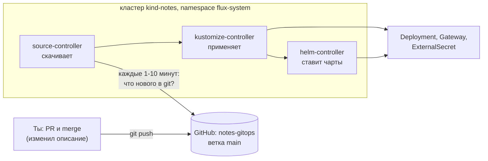
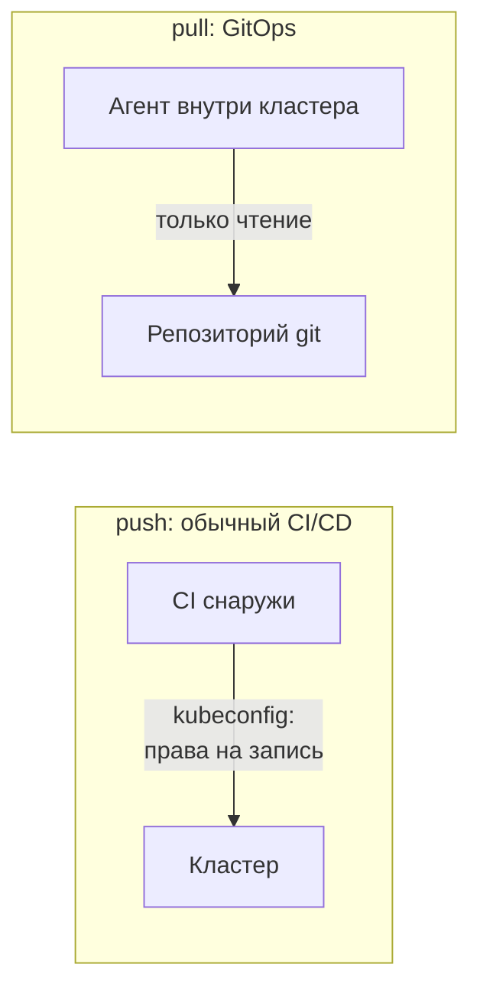
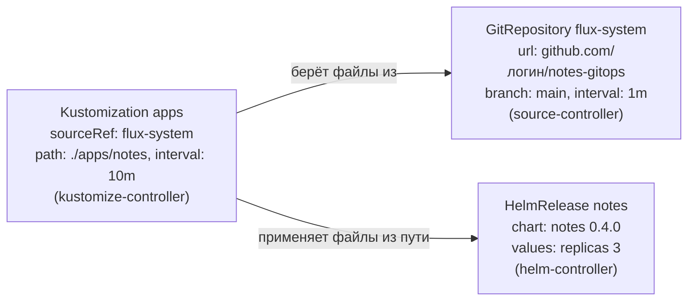
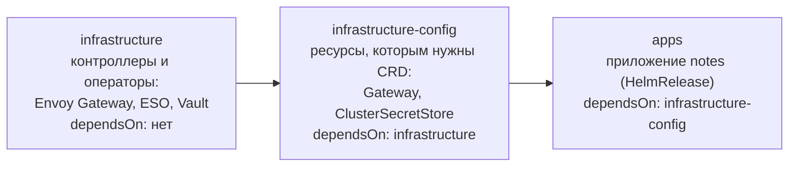
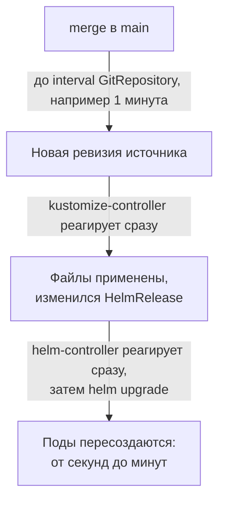
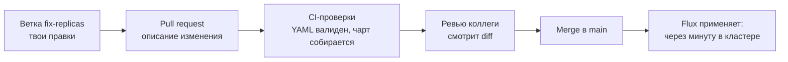

## Зачем это нужно

Пока ты катишь релизы командой `helm upgrade` (обновить установленный Helm-релиз, [урок 5.9](../05-kubernetes/09-helm.md)) со своего ноутбука, у «продакшена» (боевого кластера, которым пользуются настоящие пользователи) нет настоящего источника правды: есть твоя голова и история shell. Коллега не знает, что и когда выкатили. Ручная правка через `kubectl edit` (открыть объект кластера в редакторе и изменить на месте) живёт до следующего деплоя. Права на кластер нужны каждому, кто выкатывает. На работе это звучит как «у меня работает, а на проде нет» и как ночной откат «того, что кто-то поменял руками».

GitOps (git как единственный источник желаемого состояния) решает это. Желаемое состояние (как должен выглядеть кластер: какие приложения, сколько реплик, какие версии) лежит в репозитории, а агент (небольшая программа, которая постоянно работает внутри кластера) сам подтягивает описание и приводит кластер в соответствие. Это как жильцы дома, у которых есть утверждённый план перепланировки: менять стены можно только через план, а не кувалдой ночью. Деплой (выкатка новой версии) равен слиянию в ветку `main` (основная ветка репозитория, [урок 3.2](../03-git-ci/02-remotes-workflow.md)), откат равен `git revert` (коммит, который отменяет чужой коммит, не стирая историю, подробно разберём ниже).

Шаг проекта: «Заметки» разворачиваются на новом кластере `notes` не руками, а из репозитория `notes-gitops` через Flux. Ручные `helm install` больше не используются.

**Flux** это как раз такой агент: готовая программа (набор программ), которая живёт в кластере, читает твой репозиторий и применяет его содержимое. Её написали другие люди, тебе остаётся только показать ей репозиторий. Подробно разберём в теории.

## Что нужно знать

- [Урок 3.2: удалённые репозитории и Pull Request](../03-git-ci/02-remotes-workflow.md): push, revert, PR в `main`.
- [Урок 3.3: GitHub Actions](../03-git-ci/03-actions-ci.md): CI-пайплайн, который сейчас деплоит «толчком».
- [Урок 4.7: образы и реестр ghcr.io](../04-docker/07-images-registry.md): образ `notes:0.7.0` и ghcr.io.
- [Урок 5.1: кластер kind](../05-kubernetes/01-why-k8s-cluster.md): `kind/kind.yaml`, контекст `kind-notes`.
- [Урок 5.4: Gateway API](../05-kubernetes/04-ingress-gateway.md): Envoy Gateway, Gateway `notes-gw`.
- [Урок 5.9: Helm](../05-kubernetes/09-helm.md): чарт `helm/notes`, values, релиз.
- [Урок 5.10: Kustomize](../05-kubernetes/10-kustomize.md): файл `kustomization.yaml` (список YAML-файлов, которые Kustomize собирает в один набор).
- [Урок 9.1: Vault](01-secrets-problem-vault.md): `scripts/seed-vault.sh`.
- [Урок 9.2: Vault и External Secrets Operator](02-vault-k8s-eso.md): `ExternalSecret`, `ClusterSecretStore`.

## Картина целиком

Представь склад, где работает кладовщик. У начальника есть **журнал заказов** (тетрадь): там записано, что должно лежать на каких полках. Раньше начальник сам ходил по складу и расставлял коробки. Теперь у него есть кладовщик, который каждые пять минут открывает тетрадь, идёт по полкам и сверяет. Если в тетради появилась новая строка, он добавляет коробку. Если кто-то ночью поставил лишнюю коробку, он убирает её. Начальник больше не ходит по складу, он только пишет в тетрадь. А тетрадь хранится в сейфе с историей всех записей: кто, когда и что дописал.

Тетрадь это репозиторий git. Кладовщик это Flux. Склад это кластер. Слова «сверить» и «привести в соответствие» в мире Flux называются **reconcile** (сверка: сравнить тетрадь с полками и исправить разницу). Кто-то поставил лишнюю коробку руками: это **drift** (дрейф, расхождение, возникшее не через тетрадь). Убрать коробки, которых в тетради больше нет, это **prune** (подрезать). Каждое из трёх слов подробно разберём в теории, пока достаточно этой картинки. Аналогия ломается в одном: кладовщик слепо доверяет тетради, даже если в ней ошибка, и аккуратно расставит на полках ошибку. Поэтому перед записью в тетрадь (в `main`) нужна проверка.



В кластер ты не ходишь: Flux сам забирает изменения из git и сверяет полки со списком.

Два слова из схемы. **Push** (толкнуть) это когда ты сам отправляешь изменение в кластер, как начальник, который сам ходит и расставляет коробки. **Pull** (потянуть) это когда кладовщик сам приходит и забирает изменения из тетради. Flux работает по второй схеме. Слово «контроллер» в схеме означает программу-цикл, которая следит за одним видом объектов ([урок 9.2](02-vault-k8s-eso.md)).

За урок разберёшь каждый кусок: чем «декларативное» описание отличается от команд, чем pull отличается от push, из каких контроллеров состоит Flux, что значат reconcile, prune и drift, как задать порядок применения, как Flux ставит Helm-чарты и как откатывать.

## Теория

### Зачем нужен GitOps: что не так с ручными деплоями

Представь три ситуации из жизни команды:

1. Ночью упал сервис. Ты поправил его через `kubectl edit`. Утром пришла обычная выкатка и вернула старое значение. Сервис упал снова.
2. Новый коллега спрашивает: «Какая версия стоит на проде и кто её ставил?» Ответа в одном месте нет: смотреть надо в кластере, в истории чата и в чьём-то терминале.
3. Кластер потеряли (авария облака). Чтобы собрать его заново, нужно вспомнить все команды, которые кто-то когда-то запускал.

Общая причина: желаемое состояние нигде не записано, оно существует только как результат ручных действий.

Аналогия: рецепт против «повар сделал на глаз». По рецепту любой повар повторит блюдо. На глаз получится каждый раз по-разному, и рецепт нельзя проверить.

GitOps (Git + Operations) ставит правило: **желаемое состояние всей системы описано в git, и только оттуда попадает в кластер**. Всё остальное следует из него: история изменений это `git log`, проверка изменений это pull request, откат это `git revert`, восстановление после аварии это «новый кластер, тот же репозиторий».

Осторожно: «GitOps это когда манифесты лежат в git». Манифесты можно хранить в git и всё равно применять руками. Суть в том, что кластер **сам** следует за git, а ручные правки не переживают следующую сверку.

> **Главное:** GitOps это когда желаемое состояние лежит в git и кластер сам за ним следует, а ручные правки не переживают следующую сверку.
{: .key}

Как именно описывать это состояние?

### Декларативный и императивный подход

Два способа сказать компьютеру, чего ты хочешь.

**Императивный** (imperative) это последовательность команд: «создай Deployment, потом увеличь реплики до трёх, потом поменяй образ». Итог зависит от того, что было до этого: вторая команда на уже созданном ресурсе упадёт.

**Декларативный** (declarative) это описание итога: «должен существовать Deployment `notes`, три реплики, образ `0.7.0`». Как этого достичь, решает система. Применять такое описание можно сколько угодно раз, результат тот же (это свойство называют идемпотентностью, [урок 9.1](01-secrets-problem-vault.md)).

Аналогия: заказ в ресторане. «Принесите борщ» (декларативно) против «возьмите кастрюлю, налейте воду, положите свёклу...» (императивно).

Kubernetes уже декларативный: ты пишешь YAML, а контроллеры его исполняют. GitOps добавляет ещё один уровень: YAML лежит не у тебя на диске, а в git, и его применяет не человек, а агент.

> **Главное:** декларативное описание говорит «что должно быть» и применяется сколько угодно раз с одним результатом.
{: .key}

Теперь о том, кто доставляет описание в кластер.

### Push и pull: кто стучится в кластер

В модели **push** (толкать) CI-пайплайн (цепочка автоматических шагов: собрать, проверить, выкатить) из [урока 3.3](../03-git-ci/03-actions-ci.md) после сборки сам идёт в кластер и делает `kubectl apply` или `helm upgrade`. Для этого у CI хранится kubeconfig (файл с адресом и учётными данными кластера) с правами на изменения, а API-сервер кластера должен быть доступен снаружи. Если кто-то поправил ресурс руками, пайплайн об этом не узнает до следующего запуска.

В модели **pull** (тянуть) агент внутри кластера сам следит за репозиторием. Доступ у него только на чтение git, открывать API-сервер наружу не нужно, а расхождение между git и кластером он замечает и исправляет постоянно.



В push утечка секрета CI равна доступу к проду, в pull снаружи нужен лишь доступ на чтение git.

Четыре правила GitOps:

1. Желаемое состояние описано декларативно (манифесты, чарты, values).
2. Оно версионировано: история в git, кто и что изменил видно в `git log`.
3. Агент сам забирает изменения (pull), а не получает их снаружи.
4. Агент постоянно сверяет факт с описанием (reconcile) и возвращает дрейф (drift, расхождение).

> **Главное:** в pull агент внутри кластера сам читает git, поэтому снаружи нужен только доступ на чтение.
{: .key}

> **Проверь понимание:** почему модель pull безопаснее для доступа к кластеру, чем push из CI?

<details markdown="1">
<summary>Ответ</summary>

В push у CI лежит kubeconfig с правами на изменение кластера, и утечка секрета CI даёт доступ к проду. В pull права на запись в кластер есть только у агента внутри него, а снаружи нужен лишь доступ на чтение репозитория.

</details>

Из чего состоит такой агент?

### Из чего состоит Flux: контроллеры и их объекты

**Flux** (v2.9.5, проект CNCF, зрелость graduated) это набор из нескольких контроллеров. Контроллер и CRD объяснены в [уроке 9.2](02-vault-k8s-eso.md): контроллер это программа-цикл, которая следит за объектами определённого вида и приводит кластер к описанному. Flux разделён на несколько контроллеров, каждый отвечает за свой кусок работы.

| Контроллер | Что делает | Его объекты |
|---|---|---|
| source-controller | скачивает источники и хранит их копию (артефакт) | `GitRepository`, `HelmRepository`, `OCIRepository` |
| kustomize-controller | применяет манифесты из источника | `Kustomization` |
| helm-controller | ставит и обновляет Helm-релизы | `HelmRelease` |
| notification-controller | шлёт события в Slack, Telegram, webhook | `Provider`, `Alert` |

Есть ещё автоматическое обновление образов (image-reflector и image-automation): они сами коммитят новый тег в git. В курсе только обзор.

**Цепочка.** Один объект ссылается на другой:



Разберём на примере. Ты запушил в `main` изменение `replicaCount: 4`. Что происходит по шагам:

1. source-controller раз в `interval` спрашивает GitHub, не сменился ли последний коммит ветки `main`. Замечает новый, скачивает репозиторий и сохраняет копию.
2. kustomize-controller видит, что у источника новая ревизия, читает файлы по `path` (`./apps/notes`) и применяет их к кластеру. Изменился объект `HelmRelease`.
3. helm-controller замечает изменившийся `HelmRelease`, вызывает `helm upgrade` с новыми значениями.
4. Kubernetes создаёт недостающую реплику.

**Не путай два разных `Kustomization`.** У Flux `Kustomization` это объект вида `kustomize.toolkit.fluxcd.io/v1` со смыслом «применить вот этот путь из git». Файл `kustomization.yaml` из [урока 5.10](../05-kubernetes/10-kustomize.md) это другое: он просто собирает YAML-файлы в один набор. Первое использует второе: Flux `Kustomization` указывает на каталог, а в этом каталоге лежит `kustomization.yaml` со списком файлов.

> **Главное:** каждый контроллер Flux отвечает за свой кусок: source скачивает, kustomize применяет, helm ставит релизы.
{: .key}

> **Проверь понимание:** какой контроллер выполнит `helm upgrade`, когда ты изменишь values в `HelmRelease`, и какой заметит новый коммит в git?

<details markdown="1">
<summary>Ответ</summary>

Новый коммит заметит source-controller (он опрашивает `GitRepository` раз в `interval`). Затем kustomize-controller применит изменённый `HelmRelease`, а сам upgrade выполнит helm-controller.

</details>

Как Flux исправляет расхождения?

### Reconcile, prune и drift

Применить манифест один раз мало: потом кто-то поправит ресурс руками, удалит что-то, и кластер разойдётся с git. Значит, сверка должна быть постоянной.

Аналогия: термостат из [урока 9.2](02-vault-k8s-eso.md): сравнивает 22 градуса на уставке с реальными и включает отопление.

**Reconcile** (сверка) это цикл: взять желаемое из git, сравнить с фактом в кластере, исправить разницу. Он идёт по таймеру (`interval`) и по событию (новый коммит). Два понятия решают судьбу расхождений:

- **Drift** (дрейф) это расхождение между git и кластером, которое возникло не через git: ручная правка, ручное удаление.
- **Prune** (подрезать) это удаление из кластера того, чего больше нет в git. Включается флагом `prune: true` у `Kustomization`. Flux помнит, какие ресурсы он создал (ведёт список, инвентарь), и удаляет те, что пропали из git. Без `prune` в кластере копится мусор.

У `HelmRelease` есть свой механизм `driftDetection`: helm-controller замечает ручные правки ресурсов релиза и откатывает их. Ресурсы из `Kustomization` откатывает kustomize-controller при каждой сверке.

Разберём на примере, что происходит с ручной правкой.

```text
 t=0:00   в git replicaCount: 4     кластер: 4 реплики     всё совпадает
 t=0:10   kubectl scale --replicas=10                     кластер: 10 (дрейф!)
 t=0:10+  helm-controller: «факт (10) не равен git (4)»
 t=~1-2м  helm-controller возвращает 4                     кластер: 4
```

Следствие: `kubectl edit` и `kubectl scale` на управляемом ресурсе бесполезны, правку затрёт следующая сверка. Хочешь изменить прод, меняй git. Для временной ручной работы во время инцидента Flux умеет приостанавливаться (`flux suspend`), и потом обязательно надо вернуть (`flux resume`).

Осторожно: «Flux применяет изменения только при коммите». Нет, сверка идёт и по таймеру: даже без коммитов Flux возвращает дрейф. Другое частое заблуждение: `prune: true` безопасен. Удаление PVC или базы из git удалит данные, поэтому важным ресурсам ставят аннотацию `kustomize.toolkit.fluxcd.io/prune: disabled`.

> **Главное:** reconcile сверяет git и кластер, drift это расхождение вне git, prune удаляет пропавшее из git.
{: .key}

> **Проверь понимание:** что произойдёт с Deployment, если удалить его YAML из git, а `prune` выключен?

<details markdown="1">
<summary>Ответ</summary>

Ничего: Deployment останется в кластере и продолжит работать, но Flux больше им не управляет. Так и появляются «призрачные» ресурсы. С `prune: true` он был бы удалён.

</details>

Что делать, если ресурсы зависят друг от друга?

### Порядок и зависимости: dependsOn и wait

Одни ресурсы нельзя создать раньше других. Оператор нельзя применить раньше его CRD ([урок 9.2](02-vault-k8s-eso.md)), `ExternalSecret` раньше External Secrets Operator, `Gateway` раньше Gateway API. Если применить всё разом, часть ресурсов упадёт с ошибкой `no matches for kind ...` («такого вида объектов кластер ещё не знает»). Потом Flux повторит попытку и всё сойдётся, но лишь через минуты и с шумом в алертах.

Платформу делят на три слоя, и каждый слой это отдельный Flux `Kustomization`. Следующий ждёт предыдущий через `dependsOn`:



Два тонких момента:

- `dependsOn` ждёт статуса `Ready=True` у зависимости, а не просто «применено».
- `wait: true` у зависимого слоя заставляет Flux считать его готовым только когда **ресурсы реально готовы** (поды запущены, релизы установлены). Без `wait` слой готов сразу после применения манифестов, а поды ещё стартуют.

Разберём на примере. На чистом кластере `infrastructure` начинает ставить Envoy Gateway (это несколько минут). Слой `infrastructure-config` ждёт: его статус `dependency 'flux-system/infrastructure' is not ready`. Когда установка закончится и у `infrastructure` появится `Ready=True`, Flux применит `Gateway`, потому что CRD уже есть. А после него запустится `apps`.

> **Прикинь сам:** что будет, если у `infrastructure-config` убрать `dependsOn`?
{: .predict}

Слои применятся одновременно, и `Gateway` упадёт с `no matches for kind`, пока Envoy Gateway ставится. Flux повторит попытку, и всё сойдётся, но позже и с шумом в алертах.

Осторожно: «`dependsOn` задаёт порядок применения файлов внутри одного каталога». Нет: он задаёт порядок между Flux `Kustomization`. Внутри одного каталога порядок не гарантирован, поэтому зависимые ресурсы разносят по слоям.

> **Главное:** порядок между слоями задаёт `dependsOn`, а `wait` делает слой готовым только когда ресурсы реально работают.
{: .key}

Один из таких слоёв ставит Helm-чарты.

### HelmRelease: как Helm живёт внутри Flux

В [уроке 5.9](../05-kubernetes/09-helm.md) ты ставил чарты командой `helm install` руками. В GitOps команды нет: нужно описание «поставь вот этот чарт такой версии с такими values». Это и есть `HelmRelease`.

Два объекта:

- `HelmRepository`: откуда брать чарты (адрес репозитория; для чартов из OCI-реестра `type: oci`). OCI-реестр это то же хранилище, что и для образов контейнеров ([урок 4.7](../04-docker/07-images-registry.md)), но для чартов.
- `HelmRelease`: какой чарт (имя и версия), в какой namespace, с какими values.

Внутри helm-controller запускает настоящий Helm, поэтому `helm list -A` показывает релизы, установленные Flux. Разница в том, что у каждого есть `HelmRelease` в git, и «истинное» состояние определяет он, а не ручные `helm upgrade`.

Важные поля `HelmRelease`:

- `interval` как часто сверять релиз;
- `chart.spec.version` версия чарта закреплена явно: без этого Flux при выходе новой версии сам обновит релиз;
- `install.remediation.retries: 3` и `upgrade.remediation.retries: 3` сколько раз повторять при неудаче. После исчерпания повторов Flux **сам больше не пробует**, пока ты не запустишь `flux reconcile helmrelease ... --reset`;
- `driftDetection: {mode: enabled}` откатывать ручные правки ресурсов релиза;
- `values` то же самое, что `--set` или `-f values.yaml` в Helm.

Осторожно: «HelmRelease это та же команда `helm install`». Различие в том, что это **описание**, за которым следит контроллер: если релиз сломается или его кто-то тронет, контроллер вернёт его к описанному.

> **Главное:** `HelmRelease` это описание релиза, за которым следит контроллер, и версию чарта в нём закрепляют.
{: .key}

Как понять, что Flux всё применил?

### Как читать статус объектов Flux: Ready, ревизия, события

Flux работает в фоне и сам ничего тебе не показывает. Если не уметь читать его статусы, ты будешь гадать, применилось изменение или нет, и идти за подсказкой к боту. Статус это единственное окно внутрь его работы.

Аналогия: табло вылета в аэропорту: «вовремя», «задерживается», «отменён» и причина. Ты не ходишь к самолёту проверять, достаточно прочитать строку.

У каждого объекта Flux (`GitRepository`, `Kustomization`, `HelmRelease`) есть раздел `status`, где контроллер записывает итог последней сверки. Главное там:

- **Ready** (готов): `True`, если последняя сверка прошла успешно и всё применено; `False`, если была ошибка; `Unknown`, если сверка идёт прямо сейчас.
- **Revision** (ревизия): какой именно коммит git сейчас применён, в виде `main@sha1:a1b2c3d...`. По ней видно, доехало ли твоё изменение: сравни с коммитом в GitHub.
- **Message** (сообщение): человеческий текст причины, например `Applied revision: main@sha1:a1b2c3d` или `dependency 'flux-system/infrastructure' is not ready`.

Смотреть это удобно командой `flux get`: она печатает таблицу по всем объектам вида. Например, `flux get kustomizations` покажет строку на каждый слой.

```text
NAME            REVISION              SUSPENDED  READY  MESSAGE
infrastructure  main@sha1:a1b2c3d     False      True   Applied revision: main@sha1:a1b2c3d
apps            main@sha1:a1b2c3d     False      False  dependency 'flux-system/infrastructure-config' is not ready
```

Разберём на примере. Читаем две строки выше по колонкам. `REVISION` одинаковый у обоих: оба слоя видят один и тот же коммит `a1b2c3d`, значит git скачан нормально. `SUSPENDED False`: слой не приостановлен вручную. `READY True` у `infrastructure`: применён без ошибок. У `apps` `READY False` и причина в `MESSAGE`: он не сломан сам, а ждёт другой слой. Значит, чинить надо не `apps`, а смотреть `infrastructure-config`. Правило чтения: идёшь по цепочке зависимостей к самому первому `False`, именно там причина.

Осторожно: «`Ready=False` значит, что кластер лежит». Нет, это значит «последняя сверка не удалась». Старые поды могут спокойно работать, как в разборе отката ниже. Второе заблуждение: «`Ready=True` значит, что приложение здоровое». Нет, это значит «Flux применил то, что в git». Здоровье проверяют пробами и метриками (темы 5 и 7).

> **Главное:** статус читают по колонкам READY, REVISION и MESSAGE и идут по цепочке к первому настоящему `False`.
{: .key}

> **Проверь понимание:** `apps` показывает `READY False` и сообщение `dependency ... is not ready`. Где искать причину?

<details markdown="1">
<summary>Ответ</summary>

Не в `apps`. Это сообщение значит, что `apps` ждёт зависимость. Иди по `dependsOn` к первому слою, у которого `READY False` без такого сообщения (там настоящая ошибка), и читай его `MESSAGE` и логи (`flux logs`).

</details>

А почему изменение доезжает не сразу?

### Интервал, ручной запуск и как ускорить сверку

Flux опрашивает git по таймеру, а ты только что сделал `merge` и не хочешь ждать десять минут, чтобы увидеть результат. Нужно понимать, откуда берётся задержка и как её обойти, иначе кажется, что «Flux завис».

Аналогия: почтальон, который обходит дом раз в час. Письмо, которое ты бросил в ящик, лежит до следующего обхода. Можно либо подождать, либо позвонить и попросить зайти сейчас.

У каждого объекта есть `interval` (интервал): как часто контроллер перечитывает свой источник и сверяет. Задержки складываются по цепочке:



Получается: в худшем случае ждать придётся примерно один `interval` у `GitRepository` плюс время самой выкатки. Ускорить можно вручную: `flux reconcile source git flux-system` (перечитать git прямо сейчас) или `flux reconcile kustomization apps --with-source` (перечитать git и сразу применить слой `apps`). Это не обход GitOps: ты не меняешь кластер, а только просишь контроллер проверить git раньше срока.

> **Прикинь сам:** `GitRepository` с `interval: 5m`. Сколько в худшем случае проходит от merge до момента, когда Flux увидит коммит?
{: .predict}

До пяти минут: источник опрашивается раз в `interval`. Потом идёт выкатка. Ускорить можно командой `flux reconcile source git flux-system`.

Есть и третий способ: **webhook** (вебхук, «звонок от GitHub»). GitHub сам сообщает Flux о новом коммите через специальный объект `Receiver`, и опрос по таймеру становится запасным. В курсе не используем: у kind-кластера на ноутбуке нет адреса, по которому GitHub мог бы позвонить.

Разберём на примере. `GitRepository` с `interval: 1m`, `Kustomization` с `interval: 10m`. Ты сделал merge в момент t=0. Git будет замечен в диапазоне от 0 до 60 секунд. После этого `Kustomization` применяется по событию сразу, а не ждёт свои десять минут: `interval` у `Kustomization` нужен для другого, для возврата дрейфа (если никто ничего не коммитил). Итого изменение доедет примерно за минуту, а руками поправленная реплика вернётся не позже чем через десять минут.

Осторожно: «чем меньше `interval`, тем лучше». Нет: каждая сверка это запросы к GitHub и нагрузка на API кластера, а у публичного GitHub есть лимиты на частоту. Минуты вполне достаточно.

> **Главное:** задержка складывается из `interval` источника и времени выкатки, а ускорить её можно командой `flux reconcile`.
{: .key}

> **Проверь понимание:** ты сделал merge, прошло три минуты, а изменения нет. Что сделаешь первым?

<details markdown="1">
<summary>Ответ</summary>

Посмотреть `flux get sources git`: совпадает ли `REVISION` с твоим коммитом и `READY True` ли. Если источник старый, запусти `flux reconcile source git flux-system` и читай ошибку. Если источник новый, смотри `flux get kustomizations` дальше по цепочке.

</details>

А если автоматику надо остановить?

### Приостановка: suspend и resume

Во время инцидента тебе иногда надо руками поправить объект и чтобы Flux не затёр правку через минуту. Или пока ты чинишь что-то крупное, надо остановить применение. Поэтому Flux можно поставить на паузу.

Аналогия: режим «не беспокоить» на телефоне: звонки не пропали, их просто не пропускают, пока ты сам не включишь обратно.

`flux suspend kustomization apps` ставит у слоя `apps` флаг `suspend: true`: контроллер перестаёт сверять его и возвращать дрейф. Твои ручные правки живут. `flux resume kustomization apps` снимает паузу, и Flux сразу сверяет кластер с git, то есть **затирает всё, что ты сделал руками и не отразил в git**.

Разберём на примере. Ночью надо срочно поднять `replicas` до 10, не дожидаясь ревью. Шаги: `flux suspend kustomization apps`, `kubectl scale ... --replicas=10`, работаешь. Утром: те же 10 вписываешь в git через PR (или решаешь вернуть 4), и только после этого `flux resume kustomization apps`. Если забыть вписать в git, resume вернёт 4, и сервис снова просядет.

Осторожно: «Suspended это нормальное постоянное состояние». Нет, приостановленный слой это временное исключение. Забытая пауза самая частая причина вопроса «почему мой коммит не доезжает»: смотри колонку `SUSPENDED` в `flux get`.

> **Главное:** пауза временная, а перед `resume` изменения вносят в git, иначе они пропадут.
{: .key}

> **Проверь понимание:** зачем перед `flux resume` нужно внести правку в git?

<details markdown="1">
<summary>Ответ</summary>

После resume Flux сверит кластер с git и вернёт то, что записано в git. Всё, что ты поправил руками и не записал, будет потеряно.

</details>

Что защищает `main`, если Flux слепо ему верит?

### Ветка, pull request и защита main: как GitOps ложится на процесс

Flux слепо доверяет git: что попало в `main`, то и применится. Значит, вся безопасность выкатки переезжает в то, как ты пускаешь изменения в `main`. Это не минус, а перенос проверки туда, где её удобно делать: в код-ревью.

Аналогия: тетрадь заказов из начала урока: кладовщик делает что написано. Поэтому запись в тетрадь должна подписывать второй человек.

Обычный путь изменения:



- **Ветка** (branch) это твоя копия правок, которая не влияет на `main`, пока ты её не слил ([урок 3.1](../03-git-ci/01-git-basics.md)).
- **Pull request** (PR) это предложение слить ветку в `main`, где коллеги видят diff (построчное различие) ([урок 3.2](../03-git-ci/02-remotes-workflow.md)).
- **Защита ветки** (branch protection) это настройка GitHub: нельзя запушить в `main` напрямую, только через PR с одобрением и зелёными проверками. Для репозитория, из которого живёт прод, это обязательно.
- **CI для манифестов** проверяет то, что Flux потом применит: валидность YAML, сборку Kustomize, схему ресурсов (kubeconform). Ошибка, пойманная в PR, не доезжает до кластера.

Разберём на примере. Опечатка `replicaCount: "four"` в values. Без проверок: merge, через минуту `HelmRelease` уходит в `Ready=False`, а ты узнаёшь об этом из алерта. С CI: проверка красная ещё в PR, merge не пускает, кластер даже не знает об ошибке.

Осторожно: «GitOps сам делает выкатку безопасной». Нет: он делает её повторяемой и прозрачной. Безопасной её делают ревью, CI и постепенная выкатка ([урок 9.6](06-progressive-delivery.md)).

> **Главное:** Flux доверяет git, поэтому безопасность выкатки это ревью, CI и защита `main`.
{: .key}

> **Проверь понимание:** кто в GitOps-схеме «нажимает кнопку деплоя»?

<details markdown="1">
<summary>Ответ</summary>

Кнопка деплоя это merge PR в `main`. Всё остальное делает Flux. Поэтому права на merge в `main` это права на деплой в прод, выдавать их нужно так же осторожно.

</details>

А что делает Flux, когда обновление Helm падает?

### Что делает Flux, когда Helm-обновление падает: remediation

`helm upgrade` может не удаться: чарт не собирается, тег образа неверный, поды не стартуют. Руками ты бы прочитал ошибку и решил, откатывать или чинить. Контроллеру нужна заранее заданная политика.

Аналогия: правило на заводе: если станок остановился, попробуй перезапустить три раза, и если не помогло, вызови мастера и не трогай, пока он не придёт.

Блок `remediation` (исправление) у `HelmRelease` задаёт политику: `retries: 3` это сколько раз повторить попытку. Контроллер повторяет `helm upgrade`, и если попытки кончились, ставит `Ready=False` с причиной `retries exhausted` и **останавливается**: дальше он сам не пробует, чтобы не молотить в цикле. Продолжить можно командой `flux reconcile helmrelease notes -n notes --reset` (`--reset` обнуляет счётчик попыток) после того, как ты поправил причину в git. У `upgrade.remediation` есть ещё стратегия `rollback`: откатить релиз на предыдущую рабочую ревизию Helm (как `helm rollback`, [урок 5.9](../05-kubernetes/09-helm.md)). В курсе мы откат делаем через `git revert`, чтобы git оставался правдой: откат только в кластере создал бы новый дрейф.

Разберём на примере. В values указан несуществующий тег `0.99.0`. Первая попытка: Helm применил манифест, новые поды в `ImagePullBackOff` (образ не скачивается), Helm ждёт их готовности и по таймауту объявляет ошибку. Вторая и третья то же самое. После третьей `Ready=False`, `retries exhausted`. Старые поды при этом продолжают работать. Ты правишь тег в git (revert), делаешь merge, затем `flux reconcile ... --reset`, и релиз зелёный.

Осторожно: «`retries exhausted` значит, что Flux сломался». Нет, это сообщение об исчерпанных попытках: Flux ждёт, когда ты исправишь причину. Чинить надо причину (ошибку в git), а не нажимать reset снова и снова.

> **Главное:** после исчерпания попыток Flux останавливается и ждёт, пока ты исправишь причину в git и сделаешь `--reset`.
{: .key}

> **Проверь понимание:** почему после `retries exhausted` Flux не пробует снова сам?

<details markdown="1">
<summary>Ответ</summary>

Чтобы не гонять в бесконечном цикле заведомо неудачную выкатку: она нагружает кластер и засоряет события. Контроллер ждёт, пока ты изменишь git или вручную сбросишь счётчик через `--reset`.

</details>

Как Flux понимает, что можно удалять?

### Как Flux знает, что удалять: инвентарь

Когда ты удаляешь файл из git, Flux должен убрать ресурс из кластера. Но в кластере тысячи объектов, часть создана Kubernetes сам, часть другими людьми. Как Flux отличит «своё» от «чужого» и не снесёт лишнего?

Аналогия: гардероб с номерками. Гардеробщик отдаёт только те куртки, на которые у него записан номерок, и не трогает чужие вещи на соседних вешалках.

При каждом применении `Kustomization` записывает **инвентарь** (inventory): список всех объектов, которые он создал, в своём разделе `status`. На самих объектах ставятся метки `kustomize.toolkit.fluxcd.io/name` и `.../namespace`: «меня создал такой-то слой». При следующей сверке Flux сравнивает новый список из git со старым инвентарём. Тех, кто был в инвентаре и пропал из git, он удаляет (это и есть prune). Всё, чего в инвентаре не было, он не трогает.

```text
 сверка 1: файлы в git [A, B, C]  -> инвентарь [A, B, C]
 сверка 2: файлы в git [A, C]     -> B был в инвентаре, в git нет: удалить B
                                     руками созданный ресурс D: в инвентаре нет, не трогать
```

Разберём на примере. Ты вручную создал `kubectl create configmap tmp` рядом с приложением. Flux его не удаляет: он не создавал его и в инвентаре его нет. А вот `ConfigMap` из твоего git, который ты потом убрал из файла, будет удалён. Вывод: prune чистит только то, что создано через git, поэтому ручной мусор остаётся, и его надо убирать самому.

> **Прикинь сам:** ты переименовал слой `apps` в `apps-v2` при `prune: true`. Что произойдёт со старыми ресурсами?
{: .predict}

У нового слоя инвентарь пустой, поэтому старые ресурсы остаются без владельца и сами не подрезаются: переименовывать слой нужно осторожно.

Осторожно: «prune удалит всё лишнее в namespace». Нет, только то, что есть в инвентаре этого слоя. И ещё: если переименовать слой, у нового слоя инвентарь пустой, и старые ресурсы потеряют владельца.

> **Главное:** prune удаляет только то, что слой сам создал: оно записано в инвентаре.
{: .key}

> **Проверь понимание:** почему Flux не удаляет ресурсы, которые ты создал руками через `kubectl create`?

<details markdown="1">
<summary>Ответ</summary>

Их нет в инвентаре слоя: Flux удаляет только объекты, которые сам создал из git и записал в список. Чужое он не считает своим.

</details>

Откуда берётся сам Flux?

### Как Flux попадает в кластер: bootstrap

Курица и яйцо: кто устанавливает Flux, который должен устанавливать всё остальное? Ответ: один раз руками, командой `flux bootstrap`, а потом Flux управляет и **самим собой**.

Команда `flux bootstrap github` делает пять вещей:

1. Создаёт (если нет) репозиторий на GitHub.
2. Кладёт в него манифесты самого Flux в каталог `clusters/kind/flux-system/` (файлы `gotk-components.yaml` и `gotk-sync.yaml`; gotk это GitOps Toolkit).
3. Ставит контроллеры Flux в кластер, namespace `flux-system`.
4. Создаёт в кластере `GitRepository` на этот репозиторий и `Kustomization`, который следит за каталогом.
5. Добавляет в репозиторий **deploy key** (ключ доступа к одному репозиторию, только чтение по умолчанию) и сохраняет закрытую часть в кластере как Secret.

Следствие: манифесты Flux лежат в git, и обновить сам Flux можно тем же способом, что и приложение: изменить файл в git.

Осторожно: «Flux нужен доступ к моему GitHub-аккаунту постоянно». Нет: токен нужен только на момент bootstrap (чтобы создать репозиторий и добавить ключ). Дальше Flux пользуется deploy key с доступом к одному репозиторию.

> **Главное:** bootstrap запускают один раз, а дальше Flux управляет и собой, и всем остальным из git.
{: .key}

Что именно лежит в репозитории?

### Структура репозитория и секреты

Репозиторий `notes-gitops` отделён от кода `notes`: код собирает CI, а желаемое состояние живёт отдельно, у него свои права, свой ритм изменений и своя история (плюсы и минусы разделения: вопрос 8 ниже). Раскладка:

```text
clusters/kind/        точка входа кластера: flux-system и три Kustomization
infrastructure/
  controllers/        HelmRelease контроллеров
  configs/            Gateway, ClusterSecretStore
apps/notes/           HelmRelease приложения
```

Есть важная граница: **git хранит конфигурацию, но не состояние**. Конфигурация это «какие ресурсы должны быть». Состояние это данные, накопленные работой: записи в базе, содержимое Vault (в том числе unseal-ключи и root-токен, [урок 9.1](01-secrets-problem-vault.md)), пароли. Поэтому:

- секретов в этом репозитории нет: пароль базы приходит из Vault через ESO ([урок 9.2](02-vault-k8s-eso.md)), в git лежит только `ExternalSecret` со ссылкой на путь;
- после создания нового кластера Vault пуст и запечатан, и его надо инициализировать (`scripts/seed-vault.sh`), потому что это состояние, которого в git нет;
- восстановление кластера из git не восстановит данные баз: для них нужны бэкапы.

Альтернатива для секретов в git: SOPS шифрует файлы ключом, Flux умеет их расшифровывать. В курсе не используется.

> **Главное:** git хранит конфигурацию, но не состояние: секреты приходят из Vault, а данные баз восстанавливают из бэкапов.
{: .key}

Что делать, когда плохой коммит всё же попал в `main`?

### Откат: revert против правки поверх

Когда в `main` попал плохой коммит и релиз сломался, есть три способа исправить.

- **`git revert <коммит>`** создаёт новый коммит, который отменяет изменения плохого. История сохраняется: видно, что было плохое, и что его откатили. Именно так откатывают в GitOps.
- **Правка поверх** (новый коммит с исправлением) годится, если ты знаешь точную причину и она мелкая.
- **`git push --force`** переписывает историю. На общей ветке это опасно: у коллег и у самого Flux история расходится, и часть изменений может пропасть.

Ещё один нюанс. При неудачном обновлении Helm по умолчанию оставляет старые поды работать (это rolling update, постепенная замена: новые поды поднимаются по одному, а старые гасятся только когда новые готовы, [урок 5.7](../05-kubernetes/07-probes-resources-rollouts.md)): новые поды не становятся готовыми, а старые продолжают отвечать. Поэтому «релиз `Ready=False`» не значит «сервис лежит».

> **Главное:** откатывают через `git revert`, а `push --force` на общей ветке не используют.
{: .key}

Есть и другой инструмент того же класса.

### Argo CD: сравнение

Argo CD v3.5.3 решает ту же задачу центральным сервером с веб-интерфейсом и деревом ресурсов, объектом `Application`, и `ApplicationSet` для управления многими кластерами. Flux это набор контроллеров без своего UI, он ближе к Helm и Kustomize. Оба зрелые и из CNCF: Argo CD выбирают ради панели и многих команд, Flux ради лёгкой схемы. Необязательная установка Argo CD есть в конце практики.

> **Главное:** Argo CD это сервер с интерфейсом, Flux набор контроллеров, а задачу оба решают одинаково.
{: .key}

Теперь соберём всё на практике.

### Где это встретится дальше

- В [уроке 9.4](04-cert-manager-tls.md) сертификат кластера `notes-tls` перестанет создаваться командой и станет ресурсом в git.
- В [уроке 9.5](05-cnpg.md) база данных станет ресурсом в git.
- В [уроке 9.6](06-progressive-delivery.md) выкатка новых версий будет идти постепенно, тоже из git.

## Практика

Все задания идут на **новом** кластере. Старый кластер из тем 5 и 9.1-9.2 создавался ручными командами, а мы хотим доказать, что весь стенд воспроизводится из git.

### Если у тебя 8 ГБ

Вместо `replicaCount: 3` ставь `1`, не ставь Vault через Flux (оставь только Envoy Gateway и ESO). Кластер `notes` с одним worker: убери второй `role: worker` из `kind/kind.yaml` (копию сохрани как `kind/kind-small.yaml`). Остальное работает так же.

### Задание 1. Новый кластер и bootstrap Flux

**Цель:** поднять чистый кластер и подключить его к репозиторию `notes-gitops` командой `flux bootstrap`.

**Предскажи:** сколько подов появится в namespace `flux-system` и что Flux сам закоммитит в репозиторий?

<details markdown="1">
<summary>Ответ</summary>

Четыре пода по одному на контроллер: source, kustomize, helm, notification (image-контроллеры не входят в набор по умолчанию). В репозиторий Flux закоммитит свои манифесты в `clusters/kind/flux-system/`: `gotk-components.yaml` и `gotk-sync.yaml`.

</details>

**Разбор команд.**

- `kind delete cluster --name notes` удаляет старый кластер, `kind create cluster --config ~/notes/kind/kind.yaml` создаёт новый по конфигурации проекта ([урок 5.1](../05-kubernetes/01-why-k8s-cluster.md)).
- `cd "$(mktemp -d)"`: `mktemp -d` создаёт пустой временный каталог и печатает его путь, `$(...)` подставляет путь в `cd`.
- `V=2.9.5` переменная с версией, `${V}` подставляет её в адрес. `curl -fsSLO <url>`: `-f` завершиться ошибкой при коде 4xx/5xx, `-s` без прогресса, `-S` но показать ошибку, `-L` идти по перенаправлениям, `-O` сохранить файл под его именем.
- `sha256sum --ignore-missing -c <файл>`: проверить контрольные суммы из файла (`-c`), пропуская файлы, которых нет рядом (`--ignore-missing`). Так убеждаешься, что архив скачан целым и не подменён. Строка `OK` означает, что сумма совпала.
- `sudo install -m 0755 flux /usr/local/bin/flux` копирует программу в каталог из `PATH` с правами «запуск всем».
- `read -rs GITHUB_TOKEN` читает строку в переменную без эха на экран (`-s`) и без обработки обратных слэшей (`-r`). `export` передаёт её программам. Так токен не попадает в историю shell.
- `flux check --pre` проверяет, что кластер и CLI подходят для установки Flux.
- `flux bootstrap github --owner ... --repository=notes-gitops --branch=main --path=clusters/kind --personal --private=false`: `--owner` владелец на GitHub, `--path` каталог в репозитории для этого кластера, `--personal` репозиторий принадлежит пользователю (не организации), `--private=false` создать публичный.

**Шаги:**

1. Удали старый кластер и создай новый из конфигурации проекта (данные старого не нужны):

```bash
kind delete cluster --name notes
kind create cluster --config ~/notes/kind/kind.yaml
kubectl config use-context kind-notes
kubectl get nodes
```

2. Установи flux CLI v2.9.5 со сверкой SHA256 (без `curl | bash`, чтобы проверить, что скачал то, что нужно):

```bash
cd "$(mktemp -d)"   # временный каталог
V=2.9.5
curl -fsSLO "https://github.com/fluxcd/flux2/releases/download/v${V}/flux_${V}_linux_amd64.tar.gz"
curl -fsSLO "https://github.com/fluxcd/flux2/releases/download/v${V}/flux_${V}_checksums.txt"
sha256sum --ignore-missing -c "flux_${V}_checksums.txt"
tar -xzf "flux_${V}_linux_amd64.tar.gz"
sudo install -m 0755 flux /usr/local/bin/flux
flux --version
```

На ARM (Apple Silicon, ВМ на ARM) замени `amd64` на `arm64`.

3. Создай на GitHub пустой публичный репозиторий `notes-gitops` (без README). Создай fine-grained токен только на этот репозиторий с правами Contents: Read and write и Administration: Read and write (второе нужно, чтобы bootstrap добавил deploy key). Токен не пиши в файлы и историю:

```bash
export GITHUB_USER="<твой-логин>"
read -rs GITHUB_TOKEN && export GITHUB_TOKEN   # вставь токен и Enter, он не отобразится
flux check --pre
```

4. Запусти bootstrap:

```bash
flux bootstrap github \
  --owner="$GITHUB_USER" \
  --repository=notes-gitops \
  --branch=main \
  --path=clusters/kind \
  --personal --private=false
```

5. Клонируй репозиторий и посмотри, что сделал Flux:

```bash
git clone "git@github.com:${GITHUB_USER}/notes-gitops.git" ~/notes-gitops
ls ~/notes-gitops/clusters/kind/flux-system
kubectl get pods -n flux-system
flux get sources git
```

**Что должно получиться:**

```text
NAME             REVISION              SUSPENDED  READY  MESSAGE
flux-system      main@sha1:3f9c1a2     False      True   stored artifact for revision 'main@sha1:3f9c1a2'
```

В `flux-system` четыре пода `Running`, а каталог содержит `gotk-components.yaml`, `gotk-sync.yaml`, `kustomization.yaml`.

**Как читать вывод:** колонка `REVISION` показывает ветку и сокращённый хеш последнего коммита, который Flux скачал (у тебя он другой). `READY True` и сообщение `stored artifact` значит, что source-controller успешно забрал репозиторий. `SUSPENDED False` значит, что источник не приостановлен.

**Объясни себе:**

- Почему Flux управляет сам собой (файлы `gotk-*` лежат в git)?

**Типичные ошибки:**

- `flux bootstrap github` падает с `failed to create repository: ... 404 Not Found`, а при готовом репозитории `could not add deploy key: 403`: у токена нет права Administration, добавь и повтори.
- `error: no context exists with the name: "kind-notes"`: кластер не создан или не тот контекст, выполни `kubectl config get-contexts`.
- `sha256sum: WARNING: 1 computed checksum did NOT match`: архив повреждён, скачай заново.

> Не уверен, что понял вывод `flux get all -A`? Вставь его в нейросеть и спроси, у какого слоя настоящая ошибка, а какой просто ждёт зависимость. Проверь ответ по правилу чтения статуса из теории.
{: .ai}

### Задание 2. Инфраструктура слоями с dependsOn

**Цель:** описать контроллеры и конфигурации платформы в git и увидеть, что порядок задан `dependsOn`.

**Предскажи:** что покажет `flux get kustomizations` сразу после пуша, если `infrastructure-config` зависит от `infrastructure`, а тот ещё ставит Envoy Gateway?

<details markdown="1">
<summary>Ответ</summary>

`infrastructure` будет `Unknown` или `Reconciling` (идёт установка чарта), а `infrastructure-config` останется с сообщением `dependency 'flux-system/infrastructure' is not ready`. Он не применяется, пока зависимость не станет `Ready`.

</details>

**Разбор новых частей.**

- Формат `metadata: {name: envoy-gateway, namespace: flux-system}` в YAML это короткая запись словаря в одну строку (то же, что три строки с отступами).
- Три `HelmRepository` описывают, откуда брать чарты. Envoy Gateway лежит в OCI-реестре (`type: oci`, `oci://docker.io/envoyproxy`), ESO и Vault в обычных Helm-репозиториях.
- `install: {createNamespace: true, crds: CreateReplace}` создать namespace при установке и обновлять CRD чарта при установке и апгрейде (Helm по умолчанию CRD не обновляет).
- Функция `mk` в оболочке: пять `echo` собирают YAML-файл для Flux `Kustomization`. Аргументы: имя слоя (`$1`), путь (`$2`), зависимость (`$3`). Строка с `dependsOn` печатается, только если третий аргумент не пустой (`[ -n "$3" ]`). Такая функция нужна, чтобы не набирать три почти одинаковых файла вручную.
- `flux reconcile source git flux-system` просит Flux не ждать таймера и прямо сейчас перечитать git. `flux get kustomizations --watch` печатает статусы и обновляет их (выход `Ctrl+C`).

**Шаги:**

1. Создай структуру:

```bash
cd ~/notes-gitops
mkdir -p infrastructure/controllers infrastructure/configs apps/notes
```

2. Источники чартов и релизы одним файлом `infrastructure/controllers/releases.yaml`: Envoy Gateway v1.9.2, ESO v2.11.0 и Vault (standalone, файловое хранилище, как в [уроке 9.1](01-secrets-problem-vault.md)). Версию чарта Vault (`0.32.0` ниже) сверь: проверь актуальную версию на странице проекта. Источники лежат в `flux-system`, релизы ставят чарты в свои namespace:

```yaml
apiVersion: source.toolkit.fluxcd.io/v1
kind: HelmRepository
metadata: {name: envoy-gateway, namespace: flux-system}
spec: {type: oci, interval: 1h, url: "oci://docker.io/envoyproxy"}   # чарт в OCI-реестре
---
apiVersion: source.toolkit.fluxcd.io/v1
kind: HelmRepository
metadata: {name: external-secrets, namespace: flux-system}
spec: {interval: 1h, url: "https://charts.external-secrets.io"}
---
apiVersion: source.toolkit.fluxcd.io/v1
kind: HelmRepository
metadata: {name: hashicorp, namespace: flux-system}
spec: {interval: 1h, url: "https://helm.releases.hashicorp.com"}
---
apiVersion: helm.toolkit.fluxcd.io/v2
kind: HelmRelease
metadata: {name: envoy-gateway, namespace: flux-system}
spec:
  interval: 10m
  targetNamespace: envoy-gateway-system
  install: {createNamespace: true, crds: CreateReplace}
  upgrade: {crds: CreateReplace}
  chart:
    spec: {chart: gateway-helm, version: "1.9.2", sourceRef: {kind: HelmRepository, name: envoy-gateway}}
---
apiVersion: helm.toolkit.fluxcd.io/v2
kind: HelmRelease
metadata: {name: external-secrets, namespace: flux-system}
spec:
  interval: 10m
  targetNamespace: external-secrets
  install: {createNamespace: true}
  chart:
    spec: {chart: external-secrets, version: "2.11.0", sourceRef: {kind: HelmRepository, name: external-secrets}}
---
apiVersion: helm.toolkit.fluxcd.io/v2
kind: HelmRelease
metadata: {name: vault, namespace: flux-system}
spec:
  interval: 10m
  targetNamespace: vault
  install: {createNamespace: true}
  chart:
    spec: {chart: vault, version: "0.32.0", sourceRef: {kind: HelmRepository, name: hashicorp}}
  values:
    server: {standalone: {enabled: true}, dataStorage: {size: 1Gi}}
```

3. Список ресурсов слоя (`kustomization.yaml` из [урока 5.10](../05-kubernetes/10-kustomize.md)):

```bash
cat > infrastructure/controllers/kustomization.yaml <<'YAML'
apiVersion: kustomize.config.k8s.io/v1beta1
kind: Kustomization
resources:
  - releases.yaml
YAML
```

4. Конфиги платформы. Namespace и Gateway берём из своего проекта как есть, `ClusterSecretStore` тоже:

```bash
cat ~/notes/k8s/base/00-namespace.yaml \
    ~/notes/k8s/base/30-envoyproxy.yaml \
    ~/notes/k8s/base/31-gateway.yaml > infrastructure/configs/gateway.yaml
cp ~/notes/k8s/platform/clustersecretstore.yaml infrastructure/configs/clustersecretstore.yaml
cat > infrastructure/configs/kustomization.yaml <<'YAML'
apiVersion: kustomize.config.k8s.io/v1beta1
kind: Kustomization
resources:
  - gateway.yaml
  - clustersecretstore.yaml
YAML
```

Namespace `notes` теперь создаёт Flux, а не ты.

5. Три Flux-`Kustomization` в `clusters/kind/` (у первого нет зависимостей, у остальных `dependsOn` на предыдущий):

```bash
mk() {  # имя, путь, зависимость, wait
  { echo "apiVersion: kustomize.toolkit.fluxcd.io/v1"
    echo "kind: Kustomization"
    echo "metadata: {name: $1, namespace: flux-system}"
    echo "spec:"
    echo "  interval: 10m"
    echo "  path: $2"
    echo "  prune: true"
    echo "  wait: true          # Ready только когда ресурсы реально готовы"
    echo "  timeout: 10m"
    [ -n "$3" ] && printf '  dependsOn:\n    - name: %s\n' "$3"
    echo "  sourceRef: {kind: GitRepository, name: flux-system}"
  } > "clusters/kind/$1.yaml"; }
mk infrastructure ./infrastructure/controllers ""
mk infrastructure-config ./infrastructure/configs infrastructure
mk apps ./apps/notes infrastructure-config
cat clusters/kind/apps.yaml
```

6. Положи заглушку и запушь. `apps/notes/kustomization.yaml` пока с пустым списком ресурсов:

```bash
printf 'apiVersion: kustomize.config.k8s.io/v1beta1\nkind: Kustomization\nresources: []\n' > apps/notes/kustomization.yaml
git add -A && git commit -m "Инфраструктура платформы и слои dependsOn" && git push
flux reconcile source git flux-system
flux get kustomizations --watch
```

**Что должно получиться:** через несколько минут (на первом запуске скачиваются образы):

```text
NAME                   REVISION           SUSPENDED  READY  MESSAGE
flux-system            main@sha1:8d2e0c4  False      True   Applied revision: main@sha1:8d2e0c4
infrastructure         main@sha1:8d2e0c4  False      True   Applied revision: main@sha1:8d2e0c4
...                    (и так для infrastructure-config и apps: все READY True)
```

Затем `kubectl get gateway -n notes` показывает `notes-gw`, а под Vault `0/1`: он запечатан, это нормально.

**Как читать вывод:** каждая строка это один Flux `Kustomization`. Все должны прийти к `READY True` и одинаковой `REVISION`: они применили один и тот же коммит. Пока идёт установка, в `MESSAGE` у зависимых слоёв будет `dependency ... is not ready`: это и есть работа `dependsOn`, ошибки в этом нет.

**Объясни себе:**

- Что дал `wait: true` в `infrastructure` и почему `dependsOn` без него слабее?

**Типичные ошибки:**

- `kustomization path not found: stat /tmp/kustomization-.../infrastructure/controllers: no such file or directory`: путь в `spec.path` не совпадает с каталогом в репозитории или файлы не запушены: сверь путь и `git push`.
- `dependency 'flux-system/infrastructure' is not ready` долго висит: сама зависимость упала, смотри `flux get kustomization infrastructure` и `flux get helmreleases -A`, а не dependent.
- `no matches for kind "Gateway" in version "gateway.networking.k8s.io/v1"`: CRD Gateway API ещё не установлены, то есть `infrastructure` не готов или `dependsOn` не задан.

> Попроси нейросеть написать `HelmRelease` по описанию и сверь версию API и поле `chart.spec.version` с тем, что стоит в практике: нейросети нередко используют устаревший `v2beta1` и забывают закрепить версию.
{: .ai}

### Задание 3. Приложение через HelmRelease, изменение и дрейф

**Цель:** отдать «Заметки» под управление Flux, поменять реплики через git и убедиться, что ручные правки откатываются.

**Предскажи:** ты выполнишь `kubectl scale deployment notes -n notes --replicas=10`. Сколько реплик будет через пару минут и почему? А если изменить `replicaCount` в git?

<details markdown="1">
<summary>Ответ</summary>

Если включён `driftDetection`, вернётся к значению из values (три): helm-controller заметит расхождение и исправит. Через git реплики станут теми, что записаны в коммите, и в `git log` останется след, кто и когда это решил.

</details>

**Разбор команд.**

- `helm package helm/notes --destination /tmp` упаковывает каталог чарта в архив `notes-0.4.0.tgz` (версия берётся из `Chart.yaml`).
- `echo "$GITHUB_TOKEN" | helm registry login ghcr.io -u "$GITHUB_USER" --password-stdin` входит в реестр, читая пароль из стандартного ввода (так токен не попадает в аргументы команды и историю).
- `helm push <архив> oci://ghcr.io/<логин>/charts` отправляет чарт в реестр как OCI-артефакт.
- `flux reconcile kustomization apps --with-source` просит перечитать сначала git, потом применить слой `apps` немедленно.
- `sed -i 's/replicaCount: 3/replicaCount: 4/' файл` заменяет в файле текст (`s/что/на что/`), флаг `-i` правит на месте.
- `git commit -am "..."` делает коммит всех изменённых отслеживаемых файлов, `git revert --no-edit HEAD` создаёт коммит, отменяющий последний, без открытия редактора.

**Шаги:**

1. Упакуй чарт и опубликуй в OCI-реестр ghcr.io (версия чарта 0.4.0, appVersion 0.7.0):

```bash
cd ~/notes
helm package helm/notes --destination /tmp
echo "$GITHUB_TOKEN" | helm registry login ghcr.io -u "$GITHUB_USER" --password-stdin
helm push /tmp/notes-0.4.0.tgz "oci://ghcr.io/${GITHUB_USER}/charts"
```

Токену для записи пакетов нужно право `write:packages` (для fine-grained токена GitHub Packages не подходит, используй classic PAT только с этим правом). В GitHub открой пакет `charts/notes` и сделай его публичным (Package settings, Change visibility), иначе Flux не сможет его скачать без секрета.

2. Пропиши приложение. `~/notes-gitops/apps/notes/release.yaml` (подставь свой логин вместо `<github-user>`):

```yaml
apiVersion: source.toolkit.fluxcd.io/v1
kind: HelmRepository
metadata: {name: notes, namespace: notes}
spec: {type: oci, interval: 10m, url: "oci://ghcr.io/<github-user>/charts"}
---
apiVersion: helm.toolkit.fluxcd.io/v2
kind: HelmRelease
metadata: {name: notes, namespace: notes}
spec:
  interval: 5m
  chart:
    spec: {chart: notes, version: "0.4.0", sourceRef: {kind: HelmRepository, name: notes}}
  install: {remediation: {retries: 3}}
  upgrade: {remediation: {retries: 3}}
  driftDetection: {mode: enabled}      # откатывать ручные правки ресурсов релиза
  values:
    replicaCount: 3
    image: {repository: "ghcr.io/<github-user>/notes", tag: "0.7.0"}
    externalSecret: {enabled: true}
```

3. Подключи файл и запушь:

```bash
cd ~/notes-gitops
cat > apps/notes/kustomization.yaml <<'YAML'
apiVersion: kustomize.config.k8s.io/v1beta1
kind: Kustomization
resources:
  - release.yaml
YAML
git add -A && git commit -m "Приложение notes через HelmRelease" && git push
flux reconcile kustomization apps --with-source
flux get helmreleases -n notes
```

4. Vault на новом кластере пуст и запечатан, а это состояние, а не конфигурация: в git его нет. Инициализируй как в 9.1 (`scripts/seed-vault.sh`), затем проверь ESO:

```bash
cd ~/notes && bash scripts/seed-vault.sh
kubectl get externalsecret -n notes
kubectl get pods -n notes
```

Секрет `notes-tls` из [урока 5.4](../05-kubernetes/04-ingress-gateway.md) создаётся командой и в git не хранится (автоматически им займётся cert-manager в [уроке 9.4](04-cert-manager-tls.md)). Создай его командой из своей заметки 5.4, если Gateway жалуется на его отсутствие.

5. Измени реплики через git (GNU `sed`; на macOS `sed -i ''`):

```bash
cd ~/notes-gitops
sed -i 's/replicaCount: 3/replicaCount: 4/' apps/notes/release.yaml
git commit -am "Реплик notes: 4" && git push
flux reconcile kustomization apps --with-source
kubectl get deployment notes -n notes
```

6. Теперь вмешайся руками, как в инциденте:

```bash
kubectl scale deployment notes -n notes --replicas=10
kubectl get deployment notes -n notes
sleep 90
kubectl get deployment notes -n notes
```

7. Сломай тег образа и откати через историю (`git revert`, а не правка поверх):

```bash
sed -i 's/tag: "0.7.0"/tag: "9.9.9"/' apps/notes/release.yaml
git commit -am "Плохой тег образа" && git push
flux reconcile kustomization apps --with-source
flux get helmreleases -n notes           # Ready=False, старые поды живы
git revert --no-edit HEAD && git push
flux reconcile kustomization apps --with-source
```

**Что должно получиться:** после шага 3 релиз `Ready`, после шага 5 в Deployment 4/4, после шага 6 сначала `10/10`, затем снова `4/4`. На шаге 7 релиз `Ready=False` (старые поды продолжают отвечать, rolling update из [урока 5.7](../05-kubernetes/07-probes-resources-rollouts.md)), после `revert` снова `Ready=True`, а в `git log` две записи.

```text
NAME        REVISION  SUSPENDED  READY  MESSAGE
notes       0.4.0     False      True   Helm install succeeded for release notes/notes.v1 with chart notes@0.4.0
```

**Как читать вывод:** `REVISION 0.4.0` это версия чарта; `notes.v1` в сообщении номер ревизии релиза в Helm (после каждого `upgrade` он растёт: `v2`, `v3`). Колонка `READY` показывает, что релиз применился. На шаге 6 сначала `10/10` (ручная правка), потом снова `4/4` (дрейф откатили): задержку до минуты-двух вызывает интервал сверки. На шаге 7 в `MESSAGE` будет причина ошибки (`Helm upgrade failed`, а внутри `context deadline exceeded` или проблема с образом).

**Объясни себе:**

- Чем `HelmRelease` отличается от ручного `helm install`, и где теперь хранится история релиза?
- Почему без `driftDetection` ручной `scale` мог бы остаться до следующего изменения values?
- Чем `git revert` лучше `push --force` на общей ветке?
- Кому в схеме GitOps остаются права на изменение кластера, а кому нет?

**Типичные ошибки:**

- `failed to get chart version for HelmChart 'notes/notes-notes': failed to fetch ... 401 Unauthorized` или `denied`: пакет в ghcr.io приватный, сделай его публичным или добавь `secretRef` с токеном.
- `ExternalSecret ... SecretSyncedError`: Vault запечатан или не засеян, вернись к шагу 4 (детали в [уроке 9.2](02-vault-k8s-eso.md)).

### Задание 4. Шаг проекта: репозиторий notes-gitops как источник правды

**Цель:** закрепить состояние проекта: деплой равен merge в `main`, ручных релизов Helm нет, эталон лежит в `~/notes/gitops/`.

**Предскажи:** что покажет `helm list -A` на кластере, где всё поставил Flux?

<details markdown="1">
<summary>Ответ</summary>

Релизы будут (`envoy-gateway`, `external-secrets`, `vault`, `notes`): helm-controller использует Helm внутри. Но их создал Flux, и у каждого есть `HelmRelease` в git.

</details>

**Шаги:**

1. Проверь, что кластер полностью собран из git:

```bash
flux get all -A
helm list -A
```

2. Зеркало эталона в основном репозитории (репозиторий `~/notes` остаётся единственным на курс, а `notes-gitops` служит источником для Flux). `rsync -a --exclude .git` копирует каталог, сохраняя права и время, и не берёт служебный `.git`:

```bash
mkdir -p ~/notes/gitops
rsync -a --exclude .git ~/notes-gitops/ ~/notes/gitops/
cd ~/notes && git add gitops && git commit -m "gitops: зеркало репозитория notes-gitops (урок 9.3)"
```

**Что должно получиться:** `flux get all` без `False` в колонке READY, `helm list` показывает четыре релиза, а у каждого есть `HelmRelease` в git.

```text
NAME   NAMESPACE  REVISION  STATUS    CHART        APP VERSION
notes  notes      1         deployed  notes-0.4.0  0.7.0
```

**Как читать вывод:** пример показывает только строку `notes`, у тебя будут ещё три релиза. `STATUS deployed` значит, что Helm считает релиз установленным, `REVISION` это счётчик версий релиза.

Состояние проекта: репозиторий `notes-gitops` с каталогами `clusters/kind`, `infrastructure`, `apps/notes`, Flux v2.9.5, цепочка `dependsOn` от controllers к configs и apps. Эталон: [gitops/](https://github.com/distinguished-sre/learning/tree/main/devops/project/notes/gitops). Долг: сертификат `notes-tls` создан командой (закроет 9.4), Postgres пока StatefulSet (закроет 9.5).

**Объясни себе:**

- Почему деплой нового релиза теперь выглядит как PR в `notes-gitops`, а не `helm upgrade`?

**Типичные ошибки:**

- `rsync: command not found`: установи (`sudo apt install rsync`) или скопируй каталог через `cp -r`, исключив `.git` вручную.
- `flux get all -A` показывает `False` у `HelmRelease vault`: чарт Vault ставится, но под запечатан. Проверь `kubectl -n vault get pods` (`0/1` до `seed-vault.sh` нормально, проба готовности не пройдёт).

### Дополнительно: Argo CD (необязательно, вне цепочки проекта)

Для сравнения поставь Argo CD v3.5.3 в отдельный namespace, открой UI через `kubectl -n argocd port-forward svc/argocd-server 8081:443` и создай `Application` на каталог `apps/notes`. Установка: `kubectl create namespace argocd`, затем `kubectl apply -n argocd --server-side -f https://raw.githubusercontent.com/argoproj/argo-cd/v3.5.3/manifests/install.yaml`. Пароль `admin` читай из секрета `argocd-initial-admin-secret` и нигде не сохраняй. Убери эксперимент: `kubectl delete namespace argocd`.

## Сломай и почини

Скачай скрипт и запусти сценарий. Не читай его: причину нужно найти диагностикой. Понадобится кластер из заданий 1-3.

```bash
curl -fsSL -o /tmp/break-9.3.sh https://raw.githubusercontent.com/distinguished-sre/learning/main/devops/project/notes/break/9.3/break.sh
bash /tmp/break-9.3.sh 1      # номер от 1 до 4, или random
```

Починка: `bash /tmp/break-9.3.sh fix` (только после собственной попытки).

### Симптом

Ты ничего не менял в git, но `flux get all -A` показывает `READY False`, изменение из git не доезжает до кластера или правка, которую ты сделал руками, исчезла.

### Гипотезы

Сформулируй по симптому до проверок: не может прочитать репозиторий (доступ или адрес), не находит путь (структура), не ставится чарт (values, образ, реестр), ресурс есть, но правится руками (дрейф). Подумай, какой контроллер отвечает за каждый случай.

### Проверки

```bash
flux get all -A                                   # где именно False
flux logs --level=error --since=10m               # ошибки всех контроллеров
kubectl describe gitrepository flux-system -n flux-system
kubectl describe helmrelease notes -n notes
```

### Исправление

<details markdown="1">
<summary>Разбор четырёх сценариев</summary>

**1. GitRepository не читается.** `flux get sources git` показывает `False` и текст вроде `authentication required` или `repository not found`. Причина: отозван deploy key или токен, репозиторий стал приватным без секрета, либо в `spec.url` неверный адрес (в учебном сценарии адрес испорчен). Исправление: восстановить адрес или доступ (`flux create secret git ...`, повторный `flux bootstrap github` идемпотентный и пересоздаст ключ), затем `flux reconcile source git flux-system`.

**2. HelmRelease: install retries exhausted.** `Helm upgrade failed ... retries exhausted`, `Ready=False`. Причина в этом сценарии: неверный тег образа в values, новые поды не становятся готовыми (`ImagePullBackOff`), а старые продолжают работать. Проверка: `flux logs --kind=HelmRelease --name=notes -n notes`, `kubectl describe pod`. Исправление: правка values в git (в сценарии ещё приостановлен слой `apps`, `flux resume kustomization apps`), затем `flux reconcile helmrelease notes -n notes --reset`, чтобы сбросить счётчик ретраев (после исчерпания он сам не пробует заново).

**3. Kustomization path not found.** `kustomization path not found: stat .../apps/notes-typo: no such file or directory`. Причина: каталог переименован или `spec.path` указывает на несуществующий. Проверка: `git ls-tree -r main --name-only` и `kubectl get kustomization apps -n flux-system -o yaml`. Исправление: привести путь и каталог в соответствие (в git, затем `flux resume`). Зависимые Kustomization при этом остаются в `not ready`.

**4. Ручной kubectl scale затирается.** Ты увеличил реплики руками, и через минуты они вернулись. Это не поломка, а штатное поведение: git главнее. Проверка: `flux events --for HelmRelease/notes -n notes` покажет обнаруженный дрейф. Исправление: вносить правку в git; если нужна временная ручная работа, `flux suspend kustomization apps`, а после `flux resume kustomization apps`.

</details>

## ИИ в помощь

Нейросеть хорошо расшифровывает статусы Flux, но путает версии API и поля у разных релизов. Общие правила: [ИИ-помощник](../../load-tester/ai.md). Настоящие значения секретов в запрос не вставляй: заменяй их на `CHANGE_ME`.

**Задача:** разобрать статус Flux.

```text
Вот вывод `flux get all -A`:
<вставь таблицу>.
Объясни по цепочке зависимостей, у какого объекта настоящая ошибка, а какой просто ждёт, и какие три проверки сделать.
```
{: .wrap}

**Проверь ответ:** проверь по правилу «иди к первому `False` без сообщения про зависимость». Типичная ошибка: нейросеть советует чинить слой, который лишь ждёт зависимость, или предлагает `--reset`, не исправив причину.

**Задача:** составить манифест.

```text
Напиши `HelmRelease` для чарта `notes` версии 0.4.0 из HelmRepository `notes-charts`, три реплики, с повторами при неудаче и обнаружением дрейфа. Версия Flux 2.9.5.
```
{: .wrap}

**Проверь ответ:** сверь `apiVersion` и поля с практикой урока и проверь `kubectl apply --dry-run=server -f файл`. Типичная ошибка: устаревшая версия API и незакреплённая версия чарта.

**Задача:** составить план отката.

```text
В `main` попал коммит с неверным тегом образа, `HelmRelease` в `retries exhausted`. Составь план действий SRE от диагностики до восстановления.
```
{: .wrap}

**Проверь ответ:** в плане должен быть `git revert`, merge и только потом `flux reconcile ... --reset`. Типичная ошибка: `git push --force` или удаление `HelmRelease` руками.

## Словарик урока

| Термин | Простыми словами |
|---|---|
| GitOps | подход: желаемое состояние в git, агент в кластере само приводит кластер к нему |
| декларативный подход | описываешь итог («должно быть три реплики»), а не шаги |
| push / pull | CI толкает изменения в кластер / агент внутри кластера сам забирает их из git |
| Flux | набор контроллеров, реализующих GitOps |
| source-controller | скачивает git и Helm-репозитории |
| kustomize-controller | применяет манифесты из источника |
| helm-controller | устанавливает и обновляет Helm-релизы |
| GitRepository | описание репозитория, за которым следит Flux |
| Kustomization (Flux) | «применить этот путь из этого источника» |
| kustomization.yaml | файл Kustomize, собирающий YAML в набор (не то же самое, что Flux Kustomization) |
| HelmRepository | описание, откуда брать Helm-чарты (в том числе OCI-реестр) |
| HelmRelease | описание Helm-релиза для helm-controller |
| OCI-реестр | хранилище артефактов, в том числе Helm-чартов, как реестр образов |
| reconcile | цикл сверки желаемого с фактическим и исправления разницы |
| drift (дрейф) | расхождение кластера с git из-за ручных правок |
| prune | удаление из кластера ресурсов, которых больше нет в git |
| dependsOn | «применяй этот слой только после того, как заданный слой стал Ready» |
| bootstrap | однократная установка Flux в кластер вместе с записью его манифестов в git |
| deploy key | ключ доступа к одному репозиторию |
| kubeconfig | файл с адресом кластера и учётными данными |
| git revert | коммит, отменяющий изменения другого коммита, без переписывания истории |
| Ready | статус объекта Flux: последняя сверка прошла успешно (`True`), с ошибкой (`False`) или идёт (`Unknown`) |
| ревизия (revision) | какой коммит git сейчас применён, например `main@sha1:a1b2c3d` |
| interval | как часто контроллер перечитывает источник и сверяет |
| suspend / resume | поставить объект Flux на паузу / снять паузу (resume сразу затирает ручные правки) |
| webhook | звонок от GitHub в Flux о новом коммите, чтобы не ждать таймера |
| remediation | политика Flux при неудачном Helm-обновлении: сколько повторять и откатывать ли |
| retries exhausted | попытки кончились, Flux ждёт, пока ты исправишь причину |
| защита ветки (branch protection) | запрет пушить в `main` напрямую: только через PR с ревью и зелёными проверками |
| инвентарь (inventory) | список объектов, которые создал слой `Kustomization`, по нему работает prune |
| агент | программа, постоянно работающая внутри кластера (здесь Flux) |
| продакшен | боевая среда, которой пользуются реальные пользователи |

## Вопросы с собеседований

Раздел для повторения: ответь вслух, потом открой ответ. Короткие вопросы с пометкой `[на скорость]` тренируй на время: ответ за 30 секунд.



## Проверено на версиях

- Flux v2.9.5, Argo CD v3.5.3 (только необязательный раздел), Envoy Gateway v1.9.2, External Secrets Operator v2.11.0, Vault v2.1.1, Helm v4.3.0, kind v0.33.0, чарт `notes` 0.4.0 (appVersion 0.7.0): версии из курса, кластер и Flux в этой редакции не запускались, вывод команд сверен по документации и предыдущей редакции.
- Версия чарта Vault (`0.32.0`) не закреплена и не проверялась: проверь актуальную на странице проекта.
- Манифесты Flux и `break.sh`: не прогонялись, `break.sh` проверен `shellcheck` и чтением.

## Итог урока: ты умеешь

- [ ] умею объяснить разницу push и pull, декларативного и императивного подхода и правила GitOps
- [ ] умею назвать контроллеры Flux и цепочку GitRepository, Kustomization, HelmRelease
- [ ] умею установить flux CLI со сверкой SHA256 и выполнить `flux bootstrap github`
- [ ] умею разложить репозиторий на `clusters`, `infrastructure`, `apps` и связать слои через `dependsOn`
- [ ] умею описать приложение как `HelmRelease` из OCI-чарта и менять его через git
- [ ] умею показать drift и объяснить, почему ручные правки затираются
- [ ] умею откатить плохой релиз через `git revert` и сбросить ретраи `--reset`
- [ ] умею диагностировать сбой цепочкой `flux get all`, `flux logs`, `kubectl describe`

**Дальше:** [Урок 9.4: cert-manager: TLS-сертификаты автоматически](04-cert-manager-tls.md)
