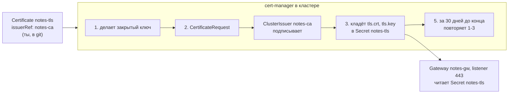
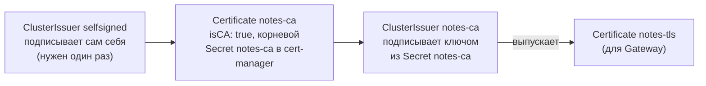
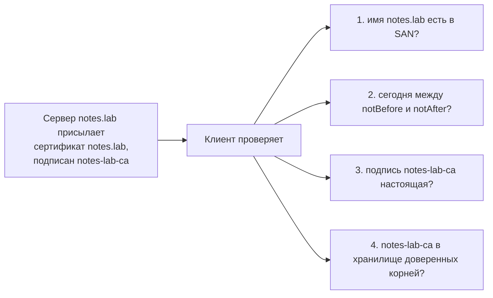
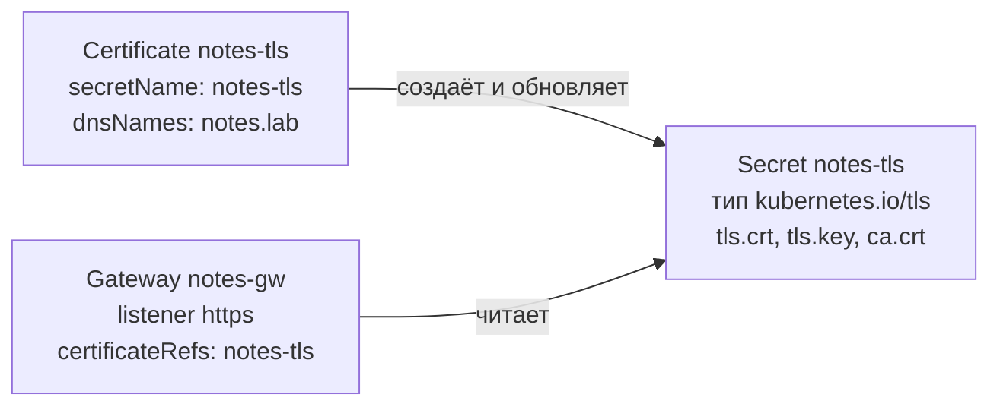
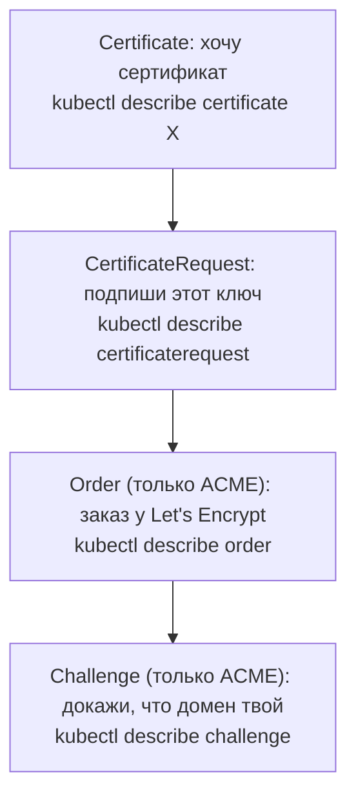

## Зачем это нужно

**Сертификат** (certificate) это цифровой «паспорт» сервера: файл, в котором написано, для какого имени (например `notes.lab`) он выдан, до какого числа действует и кто за него поручился. Именно он включает в браузере замочек HTTPS: без него соединение либо не зашифровано, либо браузер кричит «небезопасно». Подробно разберём в теории и в [уроке 2.6](../02-network/06-tls.md).

Сертификат, выпущенный руками, однажды истекает (как срок действия паспорта или водительских прав). Обычно в пятницу вечером: браузеры показывают красную страницу, проверки здоровья падают, а никто не помнит, кто и как этот сертификат выпускал. Это одна из самых частых причин «глупых» инцидентов в проде.

Идея урока: не выпускать сертификаты руками, а описать в git, какой сертификат нужен, и поручить выпуск, хранение и продление программе внутри кластера. Эта программа называется **cert-manager**. Это как секретарь, который ведёт ваши документы: помнит, у каких сроки, сам подаёт на продление и кладёт свежий экземпляр в папку, откуда его берут. Работает он внутри кластера Kubernetes (кластер это группа машин, на которых запущены приложения, [урок 5.1](../05-kubernetes/01-why-k8s-cluster.md)). Устанавливать его мы будем через Flux ([урок 9.3](03-gitops-flux.md)): программа, которая сама применяет описание из git.

Шаг проекта: Secret `notes-tls`, который в [уроке 5.4](../05-kubernetes/04-ingress-gateway.md) создавался командой, заменяется ресурсом `Certificate`. Его выпускает локальный центр сертификации (CA, certificate authority: организация или программа, которая подписывает сертификаты, и которой доверяют, как паспортному столу), а установка cert-manager и выпускающие ресурсы лежат в `notes-gitops` и ставятся через Flux.

## Что нужно знать

- [Урок 2.6: TLS и HTTPS](../02-network/06-tls.md): цепочка доверия (сертификат подписан CA, тот подписан корневым, которому доверяет клиент), SAN (список имён, для которых выдан сертификат), срок действия, `openssl x509` (команда, которая печатает содержимое сертификата).
- [Урок 5.4: Ingress и Gateway API](../05-kubernetes/04-ingress-gateway.md): Gateway `notes-gw` (входная «дверь» кластера, которая принимает запросы снаружи), listener 443 (её порт для HTTPS) и Secret `notes-tls` (то, откуда она берёт сертификат).
- [Урок 5.6: ConfigMap и Secret](../05-kubernetes/06-config-secrets.md): что такое Secret в Kubernetes.
- [Урок 5.9: Helm](../05-kubernetes/09-helm.md): чарты, values, версии чартов.
- [Урок 9.3: GitOps и Flux](03-gitops-flux.md): `HelmRelease`, `Kustomization`, `dependsOn`, репозиторий `notes-gitops`.

## Картина целиком

Представь паспортный стол. Ты приходишь и говоришь: «Мне нужен паспорт на имя такое-то, на десять лет». Стол проверяет, что ты это ты, изготавливает документ, ставит печать и выдаёт. За полгода до конца срока стол сам присылает тебе письмо: «пора менять». Паспортный стол это **издатель** (Issuer: настройка «кто и как подписывает сертификаты»), твоя заявка это **Certificate**, готовый паспорт это **Secret**, а сотрудник, который всё это делает, cert-manager. Печать стола нужна, чтобы другие (банк, аэропорт) верили паспорту: они доверяют самому столу. Аналогия ломается в одном: настоящий паспорт ты забираешь и хранишь сам, а сертификат cert-manager кладёт в общее хранилище кластера, и его забирает Gateway.



## Теория

### Зачем сертификаты и что в них лежит

Когда ты открываешь `https://notes.lab`, браузер должен убедиться, что на другом конце именно этот сервер, а не подделка, и что разговор никто не подслушает. Пароль здесь не подходит: его пришлось бы заранее раздать всем клиентам. Вместо него сервер предъявляет сертификат, а клиент проверяет подпись.

Аналогия: паспорт: имя владельца, срок действия, печать выдавшего органа.

Сертификат это файл (`tls.crt`) с полями: для каких имён он выдан (SAN, Subject Alternative Name, список доменов вроде `notes.lab`), кто выдал (issuer), срок действия (`notBefore`, `notAfter`) и открытый ключ сервера. К нему прилагается закрытый ключ (`tls.key`): по нему сервер доказывает, что сертификат его. Закрытый ключ нельзя отдавать никому. Всё это ты разбирал в [уроке 2.6](../02-network/06-tls.md).

Разберём на примере. Команда показывает сертификат сервера:

```bash
echo | openssl s_client -connect notes.lab:443 -servername notes.lab 2>/dev/null | openssl x509 -noout -subject -issuer -dates
```

Ожидаемый вывод:

```text
subject=CN = notes.lab
issuer=CN = notes-lab-ca
notBefore=Sep 30 10:00:00 2026 GMT
notAfter=Dec 29 10:00:00 2026 GMT
```

`subject` кому выдан, `issuer` кто подписал. Разница между `notBefore` и `notAfter` здесь 90 дней: столько живёт сертификат.

Осторожно: «Сертификат шифрует трафик». Шифрует ключ; сертификат лишь связывает имя с открытым ключом и подтверждает это подписью.

> **Главное:** сертификат связывает имя с открытым ключом и подтверждён подписью, а закрытый ключ остаётся у сервера.
{: .key}

Откуда сертификаты берутся в кластере?

### Оператор и CRD: как cert-manager вообще работает

В Kubernetes нет встроенного понятия «сертификат». Есть Secret, обычное хранилище байтов. Чтобы кластер понимал, что такое «выпусти сертификат для такого-то имени», его нужно научить новому слову.

Аналогия: новый бланк в паспортном столе: пока для него нет сотрудника, бланк лежит без дела.

Kubernetes расширяется через CustomResourceDefinition (**CRD**, описание нового типа ресурса). Ты добавляешь CRD, и `kubectl` начинает понимать `kind: Certificate` так же, как `kind: Deployment`. Сам по себе такой ресурс ничего не делает: это запись в базе кластера (etcd). Работу выполняет **контроллер** (controller): процесс в поде, который в цикле сравнивает желаемое (что написано в ресурсе) с фактическим и исправляет разницу. Этот цикл называется reconcile (сверка). Пара «CRD плюс контроллер» это **оператор** (operator). Ты уже видел операторы: Flux ([урок 9.3](03-gitops-flux.md)) и External Secrets ([урок 9.2](02-vault-k8s-eso.md)).

cert-manager добавляет несколько CRD:

| Ресурс | Что это | Кто создаёт |
|---|---|---|
| `Issuer` / `ClusterIssuer` | Кто выпускает сертификаты: локальный CA, Let's Encrypt, Vault. `Issuer` живёт в одном namespace, `ClusterIssuer` на весь кластер | ты |
| `Certificate` | Что тебе нужно: имена, срок, в какой Secret положить результат | ты |
| `CertificateRequest` | Один запрос на подпись к издателю | cert-manager |
| `Order` и `Challenge` | Только для ACME (Let's Encrypt): заказ и проверка владения доменом | cert-manager |

Три пода cert-manager: `cert-manager` (главный контроллер), `cert-manager-webhook` (проверяет ресурсы при создании: отклоняет `Certificate` с ошибками) и `cert-manager-cainjector` (вставляет сертификат в конфигурацию webhook, чтобы API-сервер ему доверял).

**Разобранный пример (что происходит после `kubectl apply` Certificate).**

1. API-сервер принимает ресурс после проверки webhook.
2. Контроллер видит `Certificate` без готового Secret и генерирует закрытый ключ.
3. Создаёт `CertificateRequest`: «подпиши этот открытый ключ для имени `notes.lab`».
4. Издатель подписывает и возвращает сертификат.
5. Контроллер записывает `tls.crt`, `tls.key`, `ca.crt` в Secret и ставит `Certificate` статус `Ready=True`.
6. За `renewBefore` до конца срока всё повторяется, и Secret обновляется на месте.

Осторожно: «`Certificate` и Secret это одно». Нет: `Certificate` это желание, Secret это результат.

> **Главное:** `Certificate` это желание, Secret это результат, а делает работу контроллер cert-manager.
{: .key}

> **Проверь понимание:** чем `Certificate` отличается от Secret, в который он попадает, и что из них ты правишь в git?

<details markdown="1">
<summary>Ответ</summary>

`Certificate` это желание: имена, срок, издатель. Secret это результат, его создаёт и обновляет cert-manager. В git хранится только `Certificate`. Secret с ключом в git не кладут и вручную не правят: он перезапишется при следующем продлении.

</details>

Кто именно подписывает сертификаты?

### Issuer и ClusterIssuer: кто ставит печать

Сертификат ценен только подписью того, кому доверяют. Значит, нужен способ сказать cert-manager: «подписывай вот этим».

`Issuer` описывает подписанта внутри одного namespace, `ClusterIssuer` действует во всём кластере. Тип подписанта задаётся блоком в `spec`: `selfSigned` (подписывает сам себя), `ca` (подписывает ключом из Secret), `acme` (Let's Encrypt), `vault` (подписывает Vault, [урок 9.1](01-secrets-problem-vault.md)). Ключ издателя `ca` лежит в Secret: для `ClusterIssuer` cert-manager ищет его в своём namespace (`cert-manager`), для `Issuer` в namespace самого издателя. Отсюда правило выбора: общий издатель на всех это `ClusterIssuer`, отдельный издатель команды со своими данными это `Issuer`.

Осторожно: «`ClusterIssuer` значит, что сертификат будет общим на весь кластер». Нет: сертификат всё равно выпускается для конкретного `Certificate` и кладётся в его namespace. «Кластерным» является только сам издатель.

> **Главное:** издатель описывает, чем подписывать, и `ClusterIssuer` кластерный только сам по себе, а не его сертификаты.
{: .key}

Для стенда нам нужен свой издатель.

### Локальный CA: цепочка для стенда

На домене `notes.lab` Let's Encrypt не выдаст сертификат: этого домена нет в публичном DNS, проверить владение нельзя. Значит, для лаборатории мы строим собственный центр сертификации (Certificate Authority, CA) прямо на cert-manager.

Аналогия: кружок «клуба»: члены клуба сами печатают себе клубные карточки. Свои внутри клуба верят, посторонние нет. Так и здесь: снаружи (в вашем браузере) такому CA не доверяют, пока ты не скажешь.

Цепочка из трёх ресурсов, каждый выпускается предыдущим:



Это то же самое, что ты делал руками в [уроке 2.6](../02-network/06-tls.md) (свой ключ, свой CA, подпись), только каждый шаг описан ресурсом, а срок и продление контролирует оператор.

**Следствие, которое ломает новичков.** Браузер и `curl` не доверяют нашему CA, пока ты не добавишь его корневой сертификат в свои доверенные. Для `curl` это флаг `--cacert файл`. Ошибка `unable to get local issuer certificate` означает: «сервер предъявил сертификат, но я не смог построить цепочку доверия до известного мне корня». Имя и срок при этом ещё не проверены: после настройки доверия могут всплыть другие ошибки. В проде эту роль играет публичный CA или корпоративный, корень которого уже раздан на все машины.

Осторожно: «сертификат недействителен, если браузер ругается». Он может быть в полном порядке, просто клиент не знает подписанта. Проверяй, что именно говорит ошибка: истёк срок, не то имя или неизвестный издатель.

> **Главное:** на стенде свой центр сертификации строится из трёх ресурсов, но клиенты ему не доверяют, пока ты не скажешь.
{: .key}

> **Проверь понимание:** зачем нужен `selfsigned`, если рабочие сертификаты выпускает `notes-ca`?

<details markdown="1">
<summary>Ответ</summary>

`selfsigned` подписывает только один сертификат: корень `notes-ca`. Иначе негде взять первый ключ, ведь подписывать корень некому. Рабочие сертификаты дальше выпускает `notes-ca`.

</details>

Что происходит, когда срок кончается?

### Срок, продление и сколько им можно верить

Короткий срок ограничивает вред от утечки ключа, но чем короче срок, тем чаще нужно менять. Значит, менять должен автомат.

В `Certificate` два поля времени. `duration` срок жизни, `renewBefore` за сколько до конца начинать продление. По умолчанию срок 90 дней, продление за 30 дней до конца. Если оператор сломан, у тебя остаётся месяц, чтобы заметить, а не пятница вечером.

Разберём на примере. `duration: 2160h`, `renewBefore: 720h`. 2160 часов это 90 суток (2160 делим на 24). Сертификат выпущен 1 октября, истекает 30 декабря (1 октября плюс 90 суток). Продление начнётся за 720 часов, то есть 30 суток до конца: около 30 ноября.

> **Прикинь сам:** `duration: 720h`, `renewBefore: 240h`. Через сколько суток после выпуска начнётся продление?
{: .predict}

720 часов это 30 суток, 240 это 10 суток. Продление начнётся за 10 суток до конца, то есть на 20-е сутки после выпуска.

Ключевой факт для эксплуатации: продление обновляет Secret, но не гарантирует, что приложение подхватит новый файл. Envoy Gateway следит за Secret и перечитывает его сам. Приложение, которое читает сертификат один раз при старте (старый nginx, Java-сервисы), после продления нужно перезагружать. Проверять нужно фактически отдаваемый сертификат (`openssl s_client`), а не наличие Secret.

Осторожно: «`READY True` значит, что клиенты видят свежий сертификат». Это лишь статус Secret; путь к клиенту может держать старый.

> **Главное:** продление обновляет Secret, но не гарантирует, что приложение подхватит файл, поэтому проверяют то, что отдаёт сервер.
{: .key}

> **Проверь понимание:** сертификат продлён, `kubectl get certificate` показывает `READY True`, а клиенты видят истёкший. Где искать?

<details markdown="1">
<summary>Ответ</summary>

Secret обновился, но сервер отдаёт старый сертификат из памяти. Проверь `openssl s_client -connect ... | openssl x509 -noout -dates` на самом пути клиента. Затем убедись, что listener ссылается на верный Secret, и перезагрузи компонент, который не умеет перечитывать файлы.

</details>

Как клиент вообще принимает решение?

### Как клиент проверяет сертификат по шагам

Чтобы понять, что именно ломается при «красной странице» и чем помогает cert-manager, нужно знать, что клиент (браузер, `curl`, другое приложение) проверяет у каждого сертификата. Это четыре проверки, и каждая может провалиться по своей причине.

Аналогия: проверка паспорта на границе. Офицер смотрит: это тот человек (имя и фото совпадают)? Срок не вышел? Печать настоящая? Страна, которая выдала паспорт, вообще признана? Не прошла любая проверка, и пограничник не пускает.

Когда ты открываешь `https://notes.lab`, сервер присылает свой сертификат, и клиент делает по порядку:

1. **Имя.** Адрес, по которому ты пришёл (`notes.lab`), должен быть в списке SAN сертификата. Если пришёл на `www.notes.lab`, а в списке только `notes.lab`, проверка не пройдена.
2. **Срок.** Сегодняшняя дата должна лежать между `notBefore` и `notAfter`.
3. **Подпись.** Сертификат подписан закрытым ключом издателя. Клиент проверяет подпись открытым ключом издателя (математика подписи разобрана в [уроке 2.6](../02-network/06-tls.md)): подделать её без закрытого ключа нельзя.
4. **Доверие к издателю.** Издатель должен быть в списке, которому доверяет сам клиент (в системе или в браузере такой список называется хранилище доверенных корневых сертификатов, trust store). Или издатель сам подписан тем, кто там есть: так строится цепочка.



На каждый вопрос ответ только «да» или «нет», и страница красная, если хотя бы один ответ «нет».

Разберём на примере. На стенде ты делаешь `curl https://notes.lab` и получаешь `unable to get local issuer certificate`. Цепочка доверия не построена (проверка 4), а проверки имени и срока на этом этапе могли ещё не выполняться: после настройки доверия могут всплыть другие ошибки. Причина здесь в проверке 4: `notes-lab-ca` создан cert-manager и в хранилище твоей системы его нет. Лечится не правкой сертификата, а тем, что ты сообщаешь клиенту, кому верить: `curl --cacert ca.crt https://notes.lab`.

> **Прикинь сам:** сертификат выпущен на `notes.lab`, срок в порядке, издателя в хранилище клиента нет. Какая из четырёх проверок упадёт?
{: .predict}

Четвёртая, доверие к издателю. Имя и срок в порядке, а клиент не знает подписавшего. Лечится передачей корневого сертификата клиенту.

Осторожно: «красная страница значит, что сертификат плохой». Текст ошибки говорит, какая из четырёх проверок упала. `NET::ERR_CERT_DATE_INVALID` это срок, `ERR_CERT_COMMON_NAME_INVALID` это имя, `ERR_CERT_AUTHORITY_INVALID` это доверие к издателю. Читай текст, а не цвет.

> **Главное:** клиент делает четыре проверки: имя, срок, подпись и доверие, а текст ошибки показывает, какая упала.
{: .key}

> **Проверь понимание:** сертификат выпущен на `notes.lab`, но ты открыл сайт по IP-адресу `https://10.0.0.5`. Какая проверка упадёт?

<details markdown="1">
<summary>Ответ</summary>

Проверка имени: адрес `10.0.0.5` не входит в SAN, там только `notes.lab`. Сертификат при этом в порядке, просто выдан на другое имя.

</details>

Куда cert-manager кладёт результат?

### Secret типа kubernetes.io/tls: куда cert-manager кладёт результат

Gateway (как и любой другой потребитель) не умеет «просить сертификат у cert-manager». Ему нужно простое и общее место, откуда читать. В Kubernetes такое место для чувствительных данных это Secret ([урок 5.6](../05-kubernetes/06-config-secrets.md)).

Аналогия: почтовая ячейка в подъезде. Секретарь (cert-manager) кладёт туда готовый документ, жилец (Gateway) забирает. Они не видятся и не договариваются напрямую: достаточно знать номер ячейки.

Secret бывает разных типов. Для TLS используется тип `kubernetes.io/tls`: Kubernetes проверяет, что внутри есть два обязательных ключа, `tls.crt` (сертификат, возможно вместе с цепочкой) и `tls.key` (закрытый ключ). cert-manager добавляет третий, `ca.crt` (сертификат издателя, нужен клиентам, которые хотят проверить подпись), но только если издатель отдаёт CA, как наш локальный CA. У ACME (Let's Encrypt) `ca.crt` нет. Имя Secret ты сам задаёшь в `Certificate.spec.secretName`, а потребитель указывает то же имя у себя: в нашем случае у listener 443 Gateway в поле `certificateRefs`. Два имени должны совпасть буква в букву.



Разберём на примере. Посмотреть, что лежит внутри, можно так (похожие команды разбираются в практике ниже): `kubectl -n notes get secret notes-tls -o jsonpath='{.data.tls\.crt}' | base64 -d | openssl x509 -noout -subject -dates`. Часть до `|` достаёт сертификат (он хранится в кодировке base64: это не шифрование, а способ записать байты буквами). `base64 -d` декодирует обратно, а `openssl x509` печатает поля. Так ты видишь то же, что видит клиент, но прямо в кластере, без похода по сети.

Осторожно: «ключ в Secret защищён, потому что это Secret». Secret по умолчанию лишь закодирован, а не зашифрован, и любой, у кого есть право читать Secret в этом namespace, получит закрытый ключ. Поэтому права на чтение Secret выдают так же осторожно, как сами пароли ([урок 5.12](../05-kubernetes/12-k8s-security.md)).

> **Главное:** имя Secret в `Certificate` и в Gateway должно совпасть, а ключ в нём только закодирован, но не зашифрован.
{: .key}

> **Проверь понимание:** в `Certificate` написано `secretName: notes-tls`, а Gateway ссылается на `notes-cert`. Что будет?

<details markdown="1">
<summary>Ответ</summary>

cert-manager выпустит сертификат и положит его в `notes-tls`, а Gateway будет искать `notes-cert`, не найдёт, и listener 443 не заработает (в статусе Gateway будет ошибка про отсутствующий Secret). Имена должны совпадать.

</details>

Что делать, если сертификат не выпускается?

### Как искать причину: цепочка объектов от Certificate до Challenge

Когда `Certificate` остаётся `Ready=False`, сообщение на нём обычно короткое («Issuing certificate as Secret does not exist»). Причина лежит на несколько ступеней глубже, и нужно знать, по какой лестнице спускаться.

Аналогия: заказ в интернет-магазине: заказ, сборка, доставка. Если посылка не пришла, смотришь не на «заказ», а на то звено, где застряло.

Объекты порождают друг друга сверху вниз, и статус каждого говорит о своём шаге:



В локальном CA лестница короче: `Certificate` и `CertificateRequest`. Спускаешься вниз, пока не найдёшь первый объект с ошибкой в `Events` (раздел в конце вывода `kubectl describe`, где перечислены последние события) или в `status.conditions`.

Разберём на примере. `Certificate notes-tls` `Ready False`. Смотришь `kubectl -n notes get certificaterequest`: запрос есть и `APPROVED True`, но `READY False`. `kubectl -n notes describe certificaterequest` показывает `Referenced "ClusterIssuer" not found: clusterissuer.cert-manager.io "notes-cs" not found`. Опечатка в `issuerRef.name` (`notes-cs` вместо `notes-ca`). Причина нашлась на втором шаге, а не на первом.

Осторожно: «если `Certificate` не готов, надо удалить и создать заново». Иногда помогает, но не объясняет причину, и она вернётся. Сначала `describe` по лестнице, потом действия.

> **Главное:** причину ищут по лестнице объектов сверху вниз до первой ошибки в `Events`.
{: .key}

> **Проверь понимание:** где сначала ищешь причину, если `Certificate` `Ready False` и `CertificateRequest` не существует совсем?

<details markdown="1">
<summary>Ответ</summary>

В самом `Certificate` (`describe`, раздел Events) и в логах пода `cert-manager`. Если запроса нет, значит контроллер даже не дошёл до подписи: частая причина в ошибке самой спецификации или в том, что контроллер не работает (проверь `kubectl -n cert-manager get pods`).

</details>

А что происходит при продлении?

### Что произойдёт при продлении: ключ, Secret и перезапуск

Автоматическое продление звучит безопасно, пока не спросишь: а что в этот момент происходит с работающим сервисом? Обрывается ли соединение, меняется ли закрытый ключ, кто узнаёт о новом файле?

Аналогия: замена паспорта: номер и фото могут поменяться, а ты всё это время ходишь по делам. Главное, чтобы банк у тебя принял новый паспорт, а не смотрел на старый в своей картотеке.

В момент `renewBefore` cert-manager повторяет цикл: создаёт новый `CertificateRequest` (с новым или прежним закрытым ключом, это задаётся `privateKey.rotationPolicy`) и получает новый сертификат. Затем он **перезаписывает** `tls.crt` (и `tls.key`, если ключ менялся) в том же Secret: имя и namespace остаются прежними, значит, ссылки потребителей не ломаются. Дальше всё зависит от потребителя:

- Envoy Gateway следит за Secret и подхватывает новое без перезапуска.
- Приложение, которое читает файл сертификата один раз при старте, продолжит отдавать старый, пока его не перезапустят.
- Если сертификат смонтирован в под как файл, Kubernetes обновляет файл на диске (с задержкой: зависит от периода синхронизации kubelet и кэша, обычно до минуты-двух; при монтировании через `subPath` файл не обновляется вовсе), но приложение об этом не узнаёт само.

Разберём на примере. Старый сертификат истекает 30 декабря. 30 ноября cert-manager выпускает новый, Secret обновляется, у Envoy уже свежий сертификат. Старый nginx за тем же Secret продолжает отдавать декабрьский, пока его не перезапустят. 29 декабря в полночь клиенты видят ошибку, хотя `kubectl get certificate` с ноября показывает `Ready True`. Поэтому по-настоящему проверяют то, что отдаёт сервер по сети, а не статус в кластере.

Осторожно: «продление это событие, которое вызывает деплой». Нет: Secret поменялся, но под не пересоздаётся. Перезапуск надо организовывать отдельно (например, инструментами, которые следят за Secret и перекатывают под), если приложение само не умеет перечитывать.

> **Главное:** продление перезаписывает Secret на месте, а перезапуск потребителей, которые читают файл раз, нужно организовать отдельно.
{: .key}

> **Проверь понимание:** почему продление не ломает ссылки Gateway на Secret?

<details markdown="1">
<summary>Ответ</summary>

Потому что Secret перезаписывается на месте: имя и namespace те же, меняется только содержимое. Gateway ссылается по имени, значит продолжает читать тот же Secret уже с новым сертификатом.

</details>

Теперь о том, как правильно заполнить заявку.

### Поля Certificate: какие имена и для чего выпускать

`Certificate` это заявка, и от того, как ты её заполнишь, зависит, примет ли клиент результат. Половина «сертификат не работает» это неверно заполненные имена.

Аналогия: бланк заявки на паспорт: если в фамилии ошибка, паспорт выдадут, но в банке его не примут.

Главные поля `spec`:

- **`dnsNames`**: список имён (SAN), для которых годится сертификат. Сюда кладёшь все адреса, по которым к сервису ходят: `notes.lab`, при необходимости `www.notes.lab`. Клиент сверяет имя именно с этим списком.
- **`commonName`**: старое поле «главное имя». Современные клиенты смотрят в SAN, а не в него, поэтому имя обязательно дублируется в `dnsNames`.
- **`secretName`**: куда положить результат (разобрано выше).
- **`issuerRef`**: кто подписывает: `name` и `kind` (`Issuer` или `ClusterIssuer`). Если перепутать `kind`, cert-manager будет искать издателя не там.
- **`duration` и `renewBefore`**: срок жизни и момент продления.
- **`isCA`**: сертификат сам может подписывать другие (нужно корню и промежуточным CA).

Разберём на примере.

```yaml
spec:
  secretName: notes-tls        # Secret, который прочитает Gateway
  dnsNames:
    - notes.lab                # все имена, по которым ходят клиенты
  issuerRef:
    name: notes-ca             # имя издателя
    kind: ClusterIssuer        # именно ClusterIssuer, а не Issuer
```

Прочитай заявку как человек: «выпусти сертификат для `notes.lab`, подпиши издателем `notes-ca` (кластерным), результат положи в Secret `notes-tls`». Если завтра к сервису добавится `api.notes.lab`, достаточно дописать имя в `dnsNames`: cert-manager увидит, что список изменился, и выпустит новый сертификат сам.

> **Прикинь сам:** в `dnsNames` только `notes.lab`. Что увидит клиент на `https://api.notes.lab`?
{: .predict}

Ошибку имени: `api.notes.lab` нет в SAN. Достаточно дописать его в `dnsNames`, и cert-manager перевыпустит сертификат.

Осторожно: «имя в `Certificate` и имя сайта это одно и то же, поэтому можно не указывать». Без `dnsNames` и `commonName` сертификат не всегда ошибка (можно указать `ipAddresses`, `uris` и другие поля), но для сайта `notes.lab` нужен DNS SAN, иначе клиент не сопоставит имя. И наоборот: лишний `*` не делай без необходимости, wildcard даёт больше прав при утечке ключа.

> **Главное:** сертификат работает только для имён из `dnsNames`, и `commonName` современные клиенты не читают.
{: .key}

> **Проверь понимание:** сервис доступен по `notes.lab` и `www.notes.lab`, а в `dnsNames` только `notes.lab`. Что увидит пользователь на втором адресе?

<details markdown="1">
<summary>Ответ</summary>

Ошибку имени сертификата (`ERR_CERT_COMMON_NAME_INVALID`): `www.notes.lab` нет в SAN, проверка имени не пройдена. Исправление: добавить имя в `dnsNames`, cert-manager перевыпустит сертификат.

</details>

А как быть с публичным доменом?

### ACME и Let's Encrypt для реального домена

Для публичного домена нужен сертификат, которому доверяют все браузеры, а значит, издатель должен убедиться, что домен твой. Делать это вручную неудобно, поэтому придумали протокол ACME (Automatic Certificate Management Environment).

Издатель (Let's Encrypt) просит доказать владение доменом, и cert-manager проходит проверку сам. Для этого создаются ресурсы `Order` (заказ) и `Challenge` (испытание). Два основных способа:

- **HTTP-01**: издатель заходит по `http://<домен>/.well-known/acme-challenge/<токен>`, cert-manager временно отдаёт этот токен. Нужен открытый порт 80 из интернета. Wildcard-сертификаты (`*.example.com`) так не выдаются.
- **DNS-01**: cert-manager создаёт TXT-запись `_acme-challenge.<домен>` через API твоего DNS-провайдера. Порт 80 не нужен, подходит для wildcard и закрытых сервисов, но нужны права на DNS.

Издатель для боевого домена выглядит так. Мы его в лаборатории не применяем, потому что `notes.lab` недоступен снаружи; пример пригодится в облаке ([тема 6](../06-cloud/index.md)) на домене `notes.<твой-домен>`:

```yaml
# Только для реального домена. В kind не применяем.
apiVersion: cert-manager.io/v1
kind: ClusterIssuer
metadata:
  name: letsencrypt
spec:
  acme:
    server: https://acme-v02.api.letsencrypt.org/directory
    email: CHANGE_ME@example.com          # сюда придут предупреждения об истечении
    privateKeySecretRef:
      name: letsencrypt-account-key       # ключ аккаунта ACME
    solvers:
      - http01:
          gatewayHTTPRoute:
            parentRefs:
              - name: notes-gw
                namespace: notes
                kind: Gateway
```

Солвер `gatewayHTTPRoute` работает, только если в cert-manager включена поддержка Gateway API (`config.gatewayAPI.enabled: true` в values, в задании 2 это уже сделано), иначе `Challenge` зависнет.

Отлаживайся на staging-адресе Let's Encrypt: у боевого жёсткие лимиты на число запросов, и десяток неудачных попыток закроет выпуск на несколько дней.

Осторожно: «Let's Encrypt проверяет мой сервер». Он проверяет, что ты управляешь доменом: отвечаешь на HTTP по этому имени или можешь создать DNS-запись.

> **Главное:** Let's Encrypt проверяет не сервер, а владение доменом через HTTP-01 или DNS-01, и отлаживать нужно на staging.
{: .key}

Как всё это ложится в GitOps?

### Где сертификаты в GitOps и мониторинг сроков

В git лежат `HelmRelease` cert-manager, `ClusterIssuer` и `Certificate`, но никогда не Secret с ключом: его создаёт оператор. Порядок применения задаёт `dependsOn` ([урок 9.3](03-gitops-flux.md)): сначала контроллер и CRD, потом издатели и сертификаты, потом приложение.

Сроки нужно мониторить независимо от cert-manager: метрика `certmanager_certificate_expiration_timestamp_seconds` и внешняя проверка живого эндпоинта (`probe_ssl_earliest_cert_expiry` у blackbox-экспортёра, [урок 8.4](../08-observability/04-blackbox-exporters.md)). Алерт за 14 и 7 дней до конца.

> **Главное:** в git лежат издатели и `Certificate`, но не Secret с ключом, а сроки мониторят независимо от cert-manager.
{: .key}

### Где это встретится дальше

- В [уроке 9.5](05-cnpg.md) база данных тоже станет ресурсом в git, рядом с `Certificate`.
- В [уроке 9.7](07-platform-review.md) весь стенд будет разобран целиком, включая сроки сертификатов.

## Практика

Стенд: кластер kind `notes` из урока 9.3, Flux работает, репозиторий `notes-gitops` склонирован в `~/notes-gitops`. Запись `127.0.0.1 notes.lab` в `/etc/hosts` есть с урока 2.3.

### Задание 1. Ставим cert-manager через Flux

**Цель.** Установить cert-manager v1.21.2 тем же способом, что остальные контроллеры: `HelmRelease` в git.

**Предскажи:** сколько подов появится в namespace `cert-manager` и какие у них роли? Что произойдёт, если не включить установку CRD?

<details markdown="1">
<summary>Ответ</summary>

Три пода: `cert-manager` (основной контроллер), `cert-manager-cainjector` (вставляет CA в webhooks и CRD) и `cert-manager-webhook` (проверяет ресурсы при создании). Без CRD чарт поставится, но `kubectl apply` для `Certificate` даст ошибку, что такого типа ресурса нет.

</details>

**Разбор команд.**

- `mkdir -p` создаёт каталог вместе с недостающими родителями и не ругается, если он есть.
- `cat > файл <<'YAML' ... YAML` записывает всё между маркерами в файл. Кавычки вокруг `YAML` отключают подстановку переменных внутри текста.
- `kubectl wait --for=condition=Available deploy --all --timeout=180s` ждёт, пока все Deployment в namespace станут доступны, но не дольше трёх минут.

**Шаги.**

1. Создай каталог и файлы (значение `crds.enabled: true` заставляет чарт ставить CRD вместе с собой):

```bash
cd ~/notes-gitops
mkdir -p infrastructure/controllers/cert-manager

cat > infrastructure/controllers/cert-manager/namespace.yaml <<'YAML'
apiVersion: v1
kind: Namespace
metadata:
  name: cert-manager
YAML

cat > infrastructure/controllers/cert-manager/helmrelease.yaml <<'YAML'
apiVersion: source.toolkit.fluxcd.io/v1
kind: HelmRepository
metadata:
  name: jetstack
  namespace: cert-manager
spec:
  interval: 1h
  url: https://charts.jetstack.io
---
apiVersion: helm.toolkit.fluxcd.io/v2
kind: HelmRelease
metadata:
  name: cert-manager
  namespace: cert-manager
spec:
  interval: 10m
  chart:
    spec:
      chart: cert-manager
      version: "v1.21.2"          # версия закреплена, диапазоны и latest не используем
      sourceRef:
        kind: HelmRepository
        name: jetstack
  values:
    crds:
      enabled: true               # CRD ставим и обновляем вместе с чартом
      keep: true                  # при удалении релиза CRD (и сертификаты) не сносим
    config:
      apiVersion: controller.config.cert-manager.io/v1alpha1
      kind: ControllerConfiguration
      gatewayAPI:
        enabled: true             # нужно солверу gatewayHTTPRoute (ACME, ниже), по умолчанию выключено
YAML
```

2. Если в `infrastructure/controllers/` есть `kustomization.yaml`, добавь в `resources` строки `cert-manager/namespace.yaml` и `cert-manager/helmrelease.yaml`. Если файла нет, создай его с этими двумя записями.
3. Отправь изменения и дождись Flux:

```bash
git add infrastructure/controllers && git commit -m "feat: cert-manager v1.21.2" && git push
flux reconcile kustomization infrastructure --with-source
kubectl -n cert-manager wait --for=condition=Available deploy --all --timeout=180s
kubectl -n cert-manager get pods
```

**Что должно получиться.**

```text
deployment.apps/cert-manager condition met
deployment.apps/cert-manager-cainjector condition met
deployment.apps/cert-manager-webhook condition met
NAME                                       READY   STATUS    RESTARTS   AGE
cert-manager-6d8f9c7b5-x4k2p               1/1     Running   0          70s
cert-manager-cainjector-7f5c8d9b6-m8n2q    1/1     Running   0          70s
cert-manager-webhook-5b7d6c8f4-t9v3r       1/1     Running   0          70s
```

**Как читать вывод:** `condition met` значит, что Deployment дождался нужного состояния. В таблице подов `READY 1/1` (один контейнер из одного готов) и `STATUS Running` нужны у всех трёх. Хэши в именах подов у тебя будут другие.

**Объясни себе.**
- Почему CRD нужно ставить раньше, чем создавать `Certificate`, и как это обеспечивает `dependsOn` из урока 9.3?
- Зачем `keep: true`? Что случится с сертификатами всего кластера, если CRD удалить?

**Типичные ошибки.**
- `no matches for kind "Certificate" in version "cert-manager.io/v1"`: CRD ещё нет. Чарт не поставился или `crds.enabled` не задан. Проверь `flux get helmrelease -n cert-manager`.
- `Internal error occurred: failed calling webhook "webhook.cert-manager.io"`: webhook ещё не готов. Подожди `Available` у `cert-manager-webhook` и повтори.

> Не понял, почему издатель не готов? Вставь в нейросеть вывод `kubectl describe clusterissuer notes-ca` и попроси назвать звено цепочки, где ошибка. Сверь ответ с лестницей объектов из теории.
{: .ai}

### Задание 2. Собираем локальный CA

**Цель.** Описать цепочку `selfsigned` -> `notes-ca` (сертификат) -> `notes-ca` (издатель) и убедиться, что всё Ready.

**Предскажи:** сколько `ClusterIssuer` и сколько Secret в namespace `cert-manager` ты увидишь после применения? Почему Secret с корневым сертификатом лежит именно в `cert-manager`, а не в `notes`?

<details markdown="1">
<summary>Ответ</summary>

Два `ClusterIssuer` (`selfsigned` и `notes-ca`) и Secret `notes-ca` с корневым ключом. Для `ClusterIssuer` cert-manager ищет Secret в своём «cluster resource namespace», по умолчанию это `cert-manager`. Для `Issuer` (в одном namespace) Secret лежал бы рядом с ним.

</details>

**Разбор новых полей.** `isCA: true` помечает сертификат как способный подписывать другие. `duration: 8760h` это 8760 / 24 = 365 суток. `privateKey.algorithm: ECDSA` и `size: 256` выбирают тип ключа (эллиптические кривые: ключ короче RSA при той же стойкости). `selfSigned: {}` пустой блок: настроек у этого типа нет.

**Шаги.**

1. Создай файл конфигурации. Он попадает в слой `infrastructure/configs`, который по `dependsOn` применяется после контроллеров:

```bash
cd ~/notes-gitops
cat > infrastructure/configs/clusterissuer.yaml <<'YAML'
# 1. Самоподписанный издатель: нужен только для выпуска корня
apiVersion: cert-manager.io/v1
kind: ClusterIssuer
metadata:
  name: selfsigned
spec:
  selfSigned: {}
---
# 2. Корневой сертификат нашего CA
apiVersion: cert-manager.io/v1
kind: Certificate
metadata:
  name: notes-ca
  namespace: cert-manager
spec:
  isCA: true
  commonName: notes-lab-ca
  secretName: notes-ca
  duration: 8760h               # 1 год для учебного корня
  privateKey:
    algorithm: ECDSA
    size: 256
  issuerRef:
    name: selfsigned
    kind: ClusterIssuer
---
# 3. Издатель, который подписывает всё остальное корнем notes-ca
apiVersion: cert-manager.io/v1
kind: ClusterIssuer
metadata:
  name: notes-ca
spec:
  ca:
    secretName: notes-ca
YAML
```

2. Добавь `clusterissuer.yaml` в `resources` файла `infrastructure/configs/kustomization.yaml`, закоммить, запушь и посмотри статус:

```bash
git add infrastructure/configs && git commit -m "feat: локальный CA на cert-manager" && git push
flux reconcile kustomization infrastructure-config --with-source
kubectl get clusterissuer
kubectl -n cert-manager get certificate,secret notes-ca
```

**Что должно получиться.**

```text
NAME         READY   AGE
notes-ca     True    12s
selfsigned   True    14s
NAME                                   READY   SECRET     AGE
certificate.cert-manager.io/notes-ca   True    notes-ca   13s
NAME               TYPE                DATA   AGE
secret/notes-ca    kubernetes.io/tls   3      13s
```

**Как читать вывод:** `READY True` у издателя значит, что он нашёл ключ и может подписывать. У Secret `TYPE kubernetes.io/tls` и `DATA 3`: три ключа (`tls.crt`, `tls.key`, `ca.crt`).

**Дополнительно, прочитать статус подробно.** `kubectl -n cert-manager describe certificate notes-ca` печатает полное описание объекта. Смотри на два места. Блок `Status` -> `Conditions`: строка `Type: Ready`, `Status: True` и `Message: Certificate is up to date and has not expired`. И блок `Events` в самом конце: `Issuing`, `Generated`, `Requested`, `Issued` (порядок, в котором cert-manager делал работу). Если `Ready False`, именно здесь будет причина.

**Объясни себе.**
- Что произойдёт, если создать `ClusterIssuer notes-ca` раньше, чем появится Secret `notes-ca`? Как это будет выглядеть в `READY`?

**Типичные ошибки.**
- `Error initializing issuer: secrets "notes-ca" not found`: издатель создан до корня или Secret в другом namespace. Проверь `kubectl describe clusterissuer notes-ca`, положи `Certificate` в `cert-manager`.
- `certificate.cert-manager.io/notes-ca   False`: смотри `kubectl -n cert-manager describe certificate notes-ca`, в Events будет причина (часто `Issuer "selfsigned" not found`).

> Попроси нейросеть объяснить вывод `openssl x509 -noout -subject -issuer -dates` по полям и найти срок жизни. Проверь расчёт сам: сколько суток между `notBefore` и `notAfter`.
{: .ai}

### Задание 3. Выпускаем `notes-tls` и меняем Gateway на него

**Цель.** Заменить Secret, созданный командой в 5.4, на Certificate и убедиться, что Gateway работает без ручных шагов.

**Предскажи:** cert-manager найдёт уже существующий Secret `notes-tls`, созданный руками. Перезапишет он его или откажется? От чего это зависит?

<details markdown="1">
<summary>Ответ</summary>

Секрет, созданный вручную, cert-manager не «усыновляет» молча: он видит чужой Secret без своих аннотаций и может вести себя непредсказуемо (ошибки о несоответствии, повторные выпуски). Правильный порядок: сначала `kubectl delete secret notes-tls`, потом применять `Certificate`. Так же было с ESO в 9.2.

</details>

**Разбор команд.**

- `-o jsonpath='{.data}'` вытаскивает из ответа только нужное поле (путь в дереве ресурса). `| jq 'keys'` печатает имена ключей словаря: значения (сам ключ и сертификат) на экран не попадают.
- `{.spec.listeners[?(@.name=="https")]...}` выбирает listener с именем `https` из списка. `ca\.crt` с обратной косой чертой нужен, потому что в имени ключа есть точка.
- `base64 -d` расшифровывает base64: Secret хранит данные в этой кодировке. Это не шифрование, а способ записать байты текстом.
- `curl --cacert файл` доверяет указанному корню; `-sS` без прогресса, но с ошибками.

**Шаги.**

1. Удали старый Secret из 5.4 и опиши Certificate. Добавь его в тот же `clusterissuer.yaml` или в отдельный `certificate.yaml` в `infrastructure/configs`:

```bash
cd ~/notes-gitops
kubectl -n notes delete secret notes-tls --ignore-not-found

cat > infrastructure/configs/certificate.yaml <<'YAML'
apiVersion: cert-manager.io/v1
kind: Certificate
metadata:
  name: notes-tls
  namespace: notes
spec:
  secretName: notes-tls          # Gateway уже ссылается на этот Secret (listener 443)
  duration: 2160h                # 90 дней
  renewBefore: 720h              # продлевать за 30 дней до конца
  dnsNames:
    - notes.lab
  privateKey:
    algorithm: ECDSA
    size: 256
    rotationPolicy: Always       # при продлении генерируется новый ключ
  issuerRef:
    name: notes-ca
    kind: ClusterIssuer
YAML
```

2. Добавь `certificate.yaml` в `kustomization.yaml` этого каталога, закоммить, запушь, дождись выпуска:

```bash
git add infrastructure/configs && git commit -m "feat: Certificate notes-tls вместо ручного Secret" && git push
flux reconcile kustomization infrastructure-config --with-source
kubectl -n notes wait --for=condition=Ready certificate/notes-tls --timeout=60s
kubectl -n notes get certificate notes-tls
kubectl -n notes get secret notes-tls -o jsonpath='{.data}' | jq 'keys'
```

3. Проверь, что Gateway использует секрет, и открой сайт с доверием к нашему CA. Корневой сертификат берём прямо из Secret:

```bash
kubectl -n notes get gateway notes-gw -o jsonpath='{.spec.listeners[?(@.name=="https")].tls.certificateRefs[0].name}'; echo
kubectl -n notes get secret notes-tls -o jsonpath='{.data.ca\.crt}' | base64 -d > /tmp/notes-ca.crt
curl -sS --cacert /tmp/notes-ca.crt https://notes.lab/healthz
```

**Что должно получиться.**

```text
certificate.cert-manager.io/notes-tls condition met
NAME        READY   SECRET      AGE
notes-tls   True    notes-tls   9s
[
  "ca.crt",
  "tls.crt",
  "tls.key"
]
notes-tls
{"status":"ok"}
```

**Как читать вывод:** три ключа в Secret это результат выпуска. Имя `notes-tls` во второй команде подтверждает, что Gateway ссылается на нужный Secret. `{"status":"ok"}` значит, что цепочка доверия сошлась.

**Объясни себе.**
- Почему `curl` без `--cacert` теперь выдаёт ошибку, хотя сертификат «правильный»? Кто в этой цепочке не доверяет кому?
- Что изменилось для Gateway при замене Secret: манифест Gateway правился или нет? Почему это удобно?

**Типичные ошибки.**
- `curl: (60) SSL certificate problem: unable to get local issuer certificate`: клиент не знает корень. Добавь `--cacert /tmp/notes-ca.crt`. Не лечи флагом `-k`: он отключает проверку целиком.
- `Error from server (AlreadyExists)` или Certificate висит `Ready False` из-за старого Secret: ты забыл удалить ручной `notes-tls`. Удали и подожди пару секунд.

### Задание 4. Шаг проекта: cert-manager в `notes-gitops`

**Цель.** Закрепить всё в git, чтобы `notes-tls` выпускался и продлевался без человека, а состояние воспроизводилось из репозитория.

**Шаги.**

1. Проверь, что структура `notes-gitops` совпадает с эталоном (`cert-manager/` в `controllers`, `clusterissuer.yaml` и `certificate.yaml` в `configs`), а в `k8s/base/` из репозитория `notes` больше нет Secret `notes-tls` (для платформы он заменён Certificate):

```bash
cd ~/notes-gitops
git ls-files infrastructure | grep -E 'cert-manager|clusterissuer|certificate'
flux get kustomizations
flux get helmreleases -A
```

2. Тег состояния проекта после урока: `v0.7.0` (`git -C ~/notes tag -a v0.7.0 -m "9.4: cert-manager"`).

Конфигурация лежит в твоём репозитории `~/notes-gitops`.

**Что должно получиться.**

```text
infrastructure/configs/certificate.yaml
infrastructure/configs/clusterissuer.yaml
infrastructure/controllers/cert-manager/helmrelease.yaml
infrastructure/controllers/cert-manager/namespace.yaml
NAME                    REVISION        SUSPENDED   READY   MESSAGE
infrastructure          main@sha1:...   False       True    Applied revision: main@sha1:...
infrastructure-config   main@sha1:...   False       True    Applied revision: main@sha1:...
apps                    main@sha1:...   False       True    Applied revision: main@sha1:...
```

**Как читать вывод:** в колонках `REVISION` у тебя будут настоящие хэши; главное, чтобы все три слоя были `READY True` и на одной ревизии.

**Объясни себе.**
- Какой долг проекта закрыт этим уроком, а какой остался (подсказка: `--cacert` на каждом клиенте)?
- Что было бы, если бы `Certificate` применился раньше cert-manager?

**Типичные ошибки.**
- `kustomize build failed: ... file not found`: ресурс не добавлен в `kustomization.yaml` или неверный путь.
- `dependency 'flux-system/infrastructure' is not ready`: контроллеры ещё не Ready; подожди или смотри `flux get hr -A`.

## Сломай и почини

Скачай скрипт и запусти сценарий. Не читай его: причину нужно найти диагностикой. Нужен кластер из заданий 1-3.

```bash
curl -fsSL -o /tmp/break-9.4.sh https://raw.githubusercontent.com/distinguished-sre/learning/main/devops/project/notes/break/9.4/break.sh
bash /tmp/break-9.4.sh 1     # 1, 2, 3 или random
```

Починка: `bash /tmp/break-9.4.sh fix` (только после собственной попытки).

### Симптом

Сертификат не выпускается (`READY False`), либо `curl` к `https://notes.lab` выдаёт ошибку сертификата, либо сертификата в Secret нет вовсе. Начни с фактов, а не с догадок.

### Гипотезы

- Издатель: его нет, он не Ready или указан не тот `kind` или имя.
- Имена: в сертификате нет домена, по которому ты приходишь (SAN).
- Оператор: cert-manager не работает, и никто не выпускает и не продлевает.
- Потребитель: Gateway ссылается на другой Secret или не перечитал новый.

### Проверки

Идём по цепочке сверху вниз: `Certificate`, `CertificateRequest`, `Order`, `Challenge` (последние два только для ACME).

```bash
kubectl -n notes get certificate,certificaterequest
kubectl -n notes describe certificate notes-tls | sed -n '/Events/,$p'
kubectl get clusterissuer
kubectl -n cert-manager get pods
echo | openssl s_client -connect notes.lab:443 -servername notes.lab 2>/dev/null | openssl x509 -noout -subject -issuer -dates -ext subjectAltName
```

Разбор: `sed -n '/Events/,$p'` печатает только хвост вывода, начиная со строки с `Events`, а там причина. `-ext subjectAltName` показывает список имён сертификата.

Правило: `describe` самого нижнего ресурса цепочки почти всегда содержит причину дословно.

### Исправление

<details markdown="1">
<summary>Разбор сценариев</summary>

**Сценарий 1. Issuer not found.** `Certificate` не Ready, `CertificateRequest` в `Pending` с сообщением `Referenced "ClusterIssuer" not found: clusterissuer.cert-manager.io "notes-ca-typo" not found`. Причина: опечатка в `issuerRef.name`. Исправление: поправь `issuerRef` (в git и, чтобы не ждать, в кластере), дождись Flux, `kubectl get certificate` покажет `True`.

**Сценарий 2. Не тот SAN.** Сертификат `Ready True`, но `curl` пишет `SSL: no alternative certificate subject name matches target host name 'notes.lab'`, а `-ext subjectAltName` показывает другое имя. Причина: в `dnsNames` не то имя. Исправление: `dnsNames: [notes.lab]`, cert-manager выпустит новый сертификат сам.

**Сценарий 3. Оператор остановлен.** Секрета `notes-tls` нет, Gateway жалуется на отсутствующий Secret, а `Certificate` не исправляется. Причина: `cert-manager` отмасштабирован до нуля и никто не выпускает. Проверка: `kubectl -n cert-manager get pods`. Исправление: вернуть одну реплику, оператор пересоздаст Secret.

**Общий вывод:** сначала `describe` нижнего ресурса цепочки, потом издатель, потом сам сервер через `openssl s_client`. Для боевого ACME добавляются сценарии `Challenge pending` (закрыт порт 80, неверный DNS, отладка на staging) и слишком короткий `duration`: см. вопросы ниже.

</details>

## ИИ в помощь

Нейросеть хорошо читает ошибки TLS и описания ресурсов cert-manager, но путает версии API и поля. Общие правила: [ИИ-помощник](../../load-tester/ai.md). Настоящие значения секретов в запрос не вставляй: заменяй их на `CHANGE_ME`.

**Задача:** понять ошибку клиента.

```text
Клиент вернул ошибку: <вставь текст ошибки curl или браузера>. Сертификат выпущен cert-manager для `notes.lab` локальным CA. Объясни, какая из четырёх проверок (имя, срок, подпись, доверие) упала, и как это проверить командой `openssl`.
```
{: .wrap}

**Проверь ответ:** сверь с четырьмя проверками из теории и повтори `openssl s_client` сам. Типичная ошибка: совет перевыпустить сертификат, когда на деле клиенту просто не передан корень CA.

**Задача:** составить Certificate.

```text
Напиши `Certificate` cert-manager для имён `notes.lab` и `api.notes.lab`, издатель `ClusterIssuer notes-ca`, Secret `notes-tls`, срок 90 дней, продление за 30.
```
{: .wrap}

**Проверь ответ:** проверь `duration: 2160h` и `renewBefore: 720h`, оба имени в `dnsNames` и `kind: ClusterIssuer`. Типичная ошибка: нейросеть пишет срок в днях или забывает один `dnsNames`.

**Задача:** найти причину невыпущенного сертификата.

```text
`Certificate` в `Ready False`. Вот вывод `describe`:
<вставь Events>.
Составь лестницу проверок от Certificate вниз и скажи, на каком объекте искать первую ошибку.
```
{: .wrap}

**Проверь ответ:** нужные объекты это `CertificateRequest`, а для ACME ещё `Order` и `Challenge`. Типичная ошибка: совет удалить и пересоздать `Certificate`, не прочитав причину.

## Словарик урока

| Термин | Простыми словами |
|---|---|
| сертификат | файл, связывающий имя сервера с его открытым ключом и подписанный издателем |
| закрытый ключ (`tls.key`) | секретная часть пары, никому не отдаётся |
| SAN | список имён (доменов), для которых выдан сертификат |
| CA (центр сертификации) | тот, кто подписывает сертификаты, и кому доверяют |
| цепочка доверия | сертификат, подписанный CA, а тот подписан корневым, которому клиент верит |
| CRD | описание нового типа ресурса в Kubernetes |
| контроллер, оператор | программа в кластере, которая сверяет желаемое с фактическим и исправляет разницу |
| cert-manager | оператор, выпускающий и продлевающий сертификаты |
| Issuer / ClusterIssuer | «кто подписывает»: в одном namespace или на весь кластер |
| Certificate | заявка: имена, срок, издатель, куда положить результат |
| CertificateRequest | один запрос на подпись (создаёт cert-manager) |
| ACME | протокол автоматического выпуска (Let's Encrypt) |
| Order, Challenge | заказ и проверка владения доменом в ACME |
| HTTP-01 / DNS-01 | проверка через порт 80 / через TXT-запись в DNS |
| wildcard | сертификат на все поддомены (`*.example.com`) |
| `duration`, `renewBefore` | срок жизни и за сколько до конца продлевать |
| `--cacert` | флаг curl: доверять указанному корневому сертификату |
| staging | тестовый адрес Let's Encrypt без жёстких лимитов |
| trust store | список корневых сертификатов, которым доверяет клиент (система, браузер) |
| `kubernetes.io/tls` | тип Secret с обязательными ключами `tls.crt` и `tls.key` |
| `certificateRefs` | поле listener Gateway: из какого Secret брать сертификат |
| base64 | способ записать байты буквами, не шифрование |
| `rotationPolicy` | менять ли закрытый ключ при продлении |
| dnsNames | поле Certificate: список имён, для которых выпускается сертификат |
| Events | последние события объекта в конце вывода `kubectl describe`, первое место для поиска причины |

## Вопросы с собеседований

Раздел для повторения: ответь вслух, потом открой ответ. Короткие вопросы с пометкой `[на скорость]` тренируй на время: ответ за 30 секунд.



## Проверено на версиях

- cert-manager v1.21.2 (Helm-чарт jetstack, `crds.enabled: true`), Flux v2.9.5, Envoy Gateway v1.9.2, Kubernetes из `kind/kind.yaml` курса.
- В этой редакции кластер не запускался: выводы команд сверены с документацией и предыдущей редакцией, `break.sh` проверен `shellcheck` и чтением.
- Let's Encrypt (ACME v2) показан для реального домена, в стенде не применяется.

## Итог урока: ты умеешь

- [ ] умею объяснить, чем `Certificate` отличается от Secret и кто из них пишется в git
- [ ] умею поставить cert-manager через `HelmRelease` с закреплённой версией и CRD
- [ ] умею собрать локальный CA: `selfsigned`, корень `notes-ca`, `ClusterIssuer notes-ca`
- [ ] умею выпустить `notes-tls` для Gateway и проверить его через `curl --cacert`
- [ ] умею читать `Certificate`, `CertificateRequest`, `Challenge` при диагностике
- [ ] умею проверить срок и имена отдаваемого сертификата через `openssl s_client`
- [ ] умею описать HTTP-01 и DNS-01 и выбрать подходящий для wildcard

**Дальше:** [Урок 9.5: CloudNativePG: PostgreSQL-оператор](05-cnpg.md)
