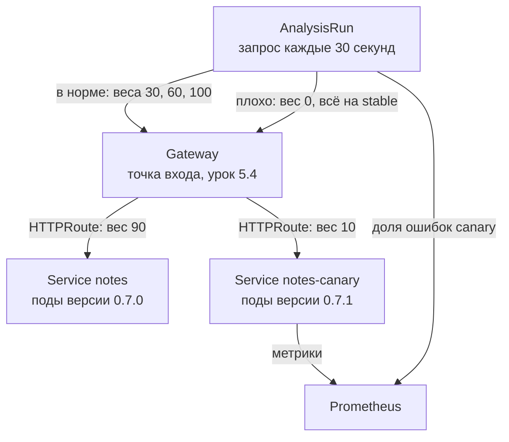
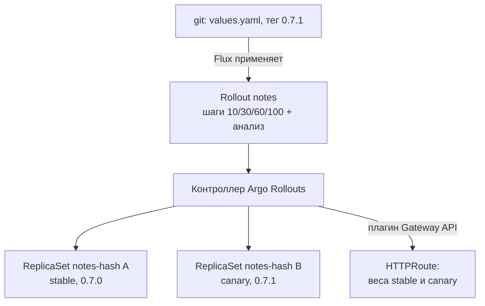
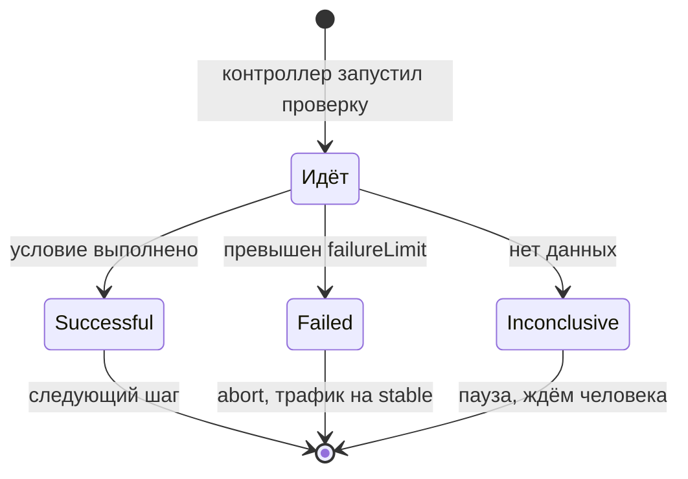

## Зачем это нужно

Обычная выкатка в Kubernetes (`RollingUpdate`, [урок 5.7](../05-kubernetes/07-probes-resources-rollouts.md)) заменяет поды по одному и смотрит только на пробы готовности (проверки «под готов принимать запросы»). Если новая версия отвечает 200 на `/readyz`, но отдаёт 500 на каждый третий запрос, Kubernetes спокойно докатит её на 100% трафика, а о проблеме ты узнаешь из алерта или от пользователей. На работе это классика: «релиз прошёл зелёным, а через 10 минут упала конверсия». Типичная картина: пробы зелёные, а пользователи уже пишут в поддержку. Я покажу, как научить выкатку смотреть на метрики, а не только на пробы.

Canary (канареечный релиз; название пришло из шахт, где первой опасный газ замечала канарейка, историю расскажу ниже) даёт новой версии малую долю трафика, сравнивает метрики (числа, которые приложение и кластер выдают о себе: сколько запросов, сколько ошибок, как быстро отвечает) и сам решает: продолжать или откатывать. **Argo Rollouts** это программа для Kubernetes, которая умеет так выкатывать: она вместо обычного Deployment ведёт новую версию по шагам и сверяется с метриками, как осторожный прораб, который не сдаёт дом, пока не проверит каждый этаж. Без неё эти решения принимает человек, глядя на графики. Делает это Argo Rollouts декларативно (ты описываешь желаемое в YAML, а не пишешь команды по шагам), внутри кластера, вместе с Gateway API и Prometheus, которые у тебя уже есть.

Шаг проекта: «Заметки» выкатываются как `Rollout` (ресурс Argo Rollouts, замена Deployment: в нём описаны шаги выкатки и проверки, подробно разберём в теории) с шагами 10/30/60/100% и анализом доли ошибок; плохая версия 0.7.1 откатывается сама. Состояние после урока: app v7.1, образ 0.7.1, тег git `v0.7.1`, чарт 0.5.0.

## Что нужно знать

- [Урок 5.7: пробы, ресурсы, выкатки](../05-kubernetes/07-probes-resources-rollouts.md): `RollingUpdate`, `maxUnavailable`, `kubectl rollout undo`.
- [Урок 5.4: Gateway API](../05-kubernetes/04-ingress-gateway.md): `HTTPRoute`, `backendRefs` с весами.
- [Урок 5.9: Helm](../05-kubernetes/09-helm.md): шаблоны чарта, `values.yaml`, `helm template`.
- [Урок 8.3: PromQL](../08-observability/03-promql.md): язык запросов к метрикам: `rate` (скорость роста счётчика в секунду), доля ошибок, recording rules (запрос, результат которого сохраняется как новая метрика).
- [Урок 8.9: мониторинг в Kubernetes](../08-observability/09-k8s-monitoring.md): Prometheus (система, которая собирает и хранит метрики) в namespace `monitoring`, ServiceMonitor (описание, откуда Prometheus должен собирать метрики приложения).
- [Урок 9.3: GitOps с Flux](03-gitops-flux.md): релиз чарта идёт через git.
- [Урок 9.5: CloudNativePG](05-cnpg.md): БД, с которой работает каждая версия приложения.

## Картина целиком

Раньше в шахты брали канарейку: птица чувствительнее людей к ядовитому газу, и если она затихла, шахтёры уходили. Canary-релиз делает то же: маленькая часть пользователей (канарейка) «пробует» новую версию, а автоматика следит, не «затихла» ли она. Если всё живо, порция растёт. Если нет, её убирают до того, как пострадают остальные. Аналогия ломается в одном: канарейка гибнет, а запрос с ошибкой можно отменить и повторить.



Части связаны так. Gateway раздаёт трафик по весам, которые записаны в `HTTPRoute` (объект с правилами «какой Service получит сколько запросов», подробно ниже). Argo Rollouts (контроллер, о котором дальше) двигает эти веса по шагам. Prometheus собирает метрики подов. Анализ (`AnalysisRun`: разовая проверка «метрики в норме?», которую контроллер запускает на каждом шаге, подробно ниже) спрашивает Prometheus про ошибки именно у подов новой версии и говорит контроллеру, продолжать или прервать. Git по-прежнему источник правды: канареечную версию ты выкатываешь коммитом, а не командой.

## Теория

### Почему обычной выкатки мало

Релиз прошёл зелёным, а через десять минут упала конверсия. Как так, если Kubernetes всё проверил?

Представь кондитерскую, которая меняет рецепт торта. По обычной выкатке с завтрашнего дня все торты печёт по новому рецепту, а проверка одна: печь включается. Канарейка устроена иначе: новый торт получают десять покупателей из ста, а повар смотрит, не вернули ли его. Эти два способа и есть предмет урока, дальше они идут уже под своими именами. Обычная выкатка в Kubernetes называется `RollingUpdate` (поочерёдная замена подов), а вариант с десятью покупателями это canary.

Как это работает на деле. Deployment создаёт под новой версии, ждёт, пока readiness-проба (проверка готовности) пройдёт, гасит один старый и так далее. Решение принимается по одному сигналу: проба ответила 200. Что будет с реальными запросами, Kubernetes не смотрит. Откат делается руками: `kubectl rollout undo`.

Посчитаем на «Заметках». Версия 0.7.1 отвечает на `/readyz` кодом 200 (проба проходит), но на `GET /notes` с вероятностью 30% возвращает 500. В 12:00 стартует выкатка, двум подам нужно перейти с 0.7.0 на 0.7.1. В 12:01 оба пода новые, пробы зелёные, выкатка завершена. С 12:01 треть заметок не создаётся. Узнаёшь ты об этом в 12:10, когда сработает алерт по доле 5xx ([урок 8.5](../08-observability/05-alertmanager.md)), потом ищешь причину и откатываешь: около 15 минут ущерба на 100% пользователей. При canary на 10% те же 15 минут задели бы 10% пользователей, а автоматический откат сократил бы окно до пары минут.

> **Прикинь сам:** на «Заметки» приходит 600 запросов в минуту, плохая версия падает на 30% запросов. Сколько запросов в минуту падает при выкатке на 100% и сколько при canary на 10%?
{: .predict}

При 100%: 30% от 600, то есть 180 ошибок в минуту. При 10%: на плохую версию идёт 60 запросов, из них падает 18. Разница в десять раз за те же 15 минут.

Осторожно: «зелёная проба значит хорошая версия». Проба проверяет только то, что ты в неё заложил, а наш `/readyz` вообще не смотрит на `/notes`.

> **Главное:** `RollingUpdate` отвечает на вопрос «запустился ли под», а не «хорошо ли отвечает новая версия», поэтому плохая версия доезжает до 100%.
{: .key}

> **Проверь понимание:** чего `RollingUpdate` не проверяет и почему из-за этого плохая версия доезжает до 100%?

<details markdown="1">
<summary>Ответ</summary>

Он смотрит только на пробы и не смотрит на ответы реальным запросам (ошибки, задержки). Если проба зелёная, а бизнес-запросы падают, выкатка продолжается до конца, откат остаётся ручным.

</details>

Значит, нужен другой способ выкатки. Их несколько, и каждый выбирает свою точку между скоростью, ценой и риском.

### Стратегии релизов

Закрыть магазин на ночь и переоборудовать его, менять колёса на ходу или построить рядом второй мост: все три способа решают одну задачу, но с разной ценой и риском. Со стратегиями релизов то же самое.

Пять стратегий сведём в таблицу, потом разберём каждую простым языком.

| Стратегия | Как работает | Плюс | Минус |
|---|---|---|---|
| Recreate | Остановить старое, запустить новое | Просто, нет смеси версий | Простой |
| Rolling | Поды заменяются по одному | Без простоя, из коробки | Смотрит только пробы, откат вручную |
| Blue/green | Рядом полная копия новой версии, трафик переключается разом | Мгновенный откат | Двойные ресурсы, весь трафик сразу |
| Canary | Новая версия получает 10%, 30%, ... | Ошибку видит малая доля | Нужны хорошие метрики и трафик |
| Shadow | Копия трафика уходит на новую версию, ответы выбрасываются | Проверка без риска | Сложно с записью в БД |

**Recreate** (пересоздать): выключили старую версию, включили новую. Как закрыть магазин на ночь на переоборудование. Подходит, когда простой допустим (ночная служба) или две версии нельзя запускать одновременно.

**Rolling** (поочерёдно): как менять колёса на машине по одному на ходу. Поток не прерывается, но пока идёт обновление, на дороге и старые, и новые колёса.

**Blue/green** («синий/зелёный»): рядом с работающей «синей» версией поднимают полную «зелёную», проверяют её, а потом переключатель одним щелчком направляет на неё весь трафик. Если плохо, щелчок назад. Как построить второй мост рядом и открыть его сразу для всех.

**Canary** (канарейка): открыть новый мост для 10% машин, посмотреть, потом для 30% и так далее.

**Shadow** («тень»): каждый запрос дублируется на новую версию, но её ответы выбрасываются, пользователь их не видит. Как репетиция на настоящих данных без публики. Опасно, если версия делает побочные эффекты (пишет в БД, шлёт письма).

Есть ещё одна идея, не стратегия выкатки, а соседний приём: **feature flag** (переключатель функции). Код с новой функцией уже в проде, но она выключена, и её включают сначала для 1% пользователей, потом шире. Canary защищает от плохого кода, флаг от плохой идеи; их часто используют вместе.

Сравним цену на сервисе с 4 подами. Blue/green требует 8 подов на время релиза (4 старых и 4 новых). Canary с шагом 10% требует, например, 4 стабильных плюс 1 canary. Rolling обходится 4 плюс 1 запасным (`maxSurge`, [урок 5.7](../05-kubernetes/07-probes-resources-rollouts.md)), но контроль отсутствует.

> **Прикинь сам:** у сервиса 10 подов. Сколько подов нужно на пике релиза при blue/green и сколько при canary с одним canary-подом?
{: .predict}

Blue/green держит две полные копии, значит 20 подов. Canary: 10 стабильных и 1 новый, то есть 11.

Осторожно: canary и rolling путают, потому что «в обоих новые поды появляются постепенно». Разница в том, чем управляешь: rolling двигает число подов, canary долю трафика.

> **Главное:** blue/green меняет всё разом и просит двойных ресурсов, canary растит долю трафика по шагам и просит хороших метрик.
{: .key}

> **Проверь понимание:** у тебя два пода, а хочется отдать новой версии ровно 10% трафика. Почему `RollingUpdate` этого не умеет?

<details markdown="1">
<summary>Ответ</summary>

`RollingUpdate` управляет числом подов, а не долей трафика. Из двух подов минимальный шаг 50%. Service раскидывает запросы примерно поровну по подам. Долю трафика задаёт маршрутизатор: Gateway API с весами или service mesh (слой из прокси, управляющих трафиком между сервисами).

</details>

Остаётся вопрос, как задать эти «ровно 10%».

### Доля трафика: Service, вес и HTTPRoute

Чтобы дать новой версии ровно 10%, нужна ручка «сколько трафика куда». Число подов такой ручкой не служит: у тебя два пода, а хочется 10%.

Service ([урок 5.3](../05-kubernetes/03-services-dns.md)) выбирает поды по метке и раскидывает запросы между ними примерно поровну. Если у тебя 9 старых подов и 1 новый, новый получит около 10%, но лишь пока поды одинаковой мощности, а менять долю можно только целыми подами. `HTTPRoute` из Gateway API устроен иначе: в списке `backendRefs` каждому Service присваивается вес (`weight`), и доля равна весу, делённому на сумму весов. У двух Service с весами 90 и 10 доли 90% и 10% независимо от числа подов.

```yaml
backendRefs:
  - name: notes          # стабильная версия
    port: 8080
    weight: 90
  - name: notes-canary   # новая версия
    port: 8080
    weight: 10
```

Сумма весов 100, доля canary 10 / (90 + 10) = 10%. Меняем на 60 и 40, сумма опять 100, доля 40%. Меняем на 3 и 1: сумма 4, доля 1/4 = 25%. Значит, важно отношение, а не сами числа. На 1000 запросов в минуту при весе 10% на canary придёт около 100.

Чтобы у canary был свой адрес, нужен второй Service `notes-canary`, у которого селектор смотрит на поды новой версии, а `notes` смотрит на стабильные. Кто и как переключает эти селекторы, разберём в следующем разделе.

> **Прикинь сам:** веса 20 и 5. Какая доля трафика у второго Service?
{: .predict}

5 / (20 + 5) = 5 / 25 = 20%.

Осторожно: вес это не проценты, а доли. Веса «10» и «1» при сумме 11 дают 90,9% и 9,1%.

> **Главное:** доля трафика равна весу, делённому на сумму весов, и от числа подов не зависит.
{: .key}

Веса кто-то должен двигать по расписанию и сверяясь с графиками. Это работа для контроллера.

### Как устроен Argo Rollouts

Двигать веса руками и смотреть графики глазами делал бы уставший человек. Прораб с чек-листом справляется лучше: «допустить 10% и ждать минуту, проверить ошибки; если норма, 30%...». Контроллер Argo Rollouts и есть такой прораб, шаги в `Rollout` это его чек-лист, а `AnalysisTemplate` пункт «как проверять».

Argo Rollouts (проект CNCF) добавляет в кластер контроллер (программу, которая следит за ресурсами и приводит систему к описанному, как оператор из [урока 9.5](05-cnpg.md)) и новые типы объектов (CRD, custom resource definition, пользовательский тип ресурса). Нам нужны три, пока запомни главный из них, `Rollout`:

- `Rollout` заменяет `Deployment`: тот же шаблон пода, но вместо `strategy` блок `canary` или `blueGreen` с шагами.
- `AnalysisTemplate` описывает проверку: запрос к метрике, условие успеха и провала.
- `AnalysisRun` создаётся контроллером на каждый релиз и хранит результат: `Successful`, `Failed`, `Inconclusive`.

Под капотом контроллер управляет двумя ReplicaSet (набор одинаковых подов, который создаёт Deployment): stable (проверенная версия) и canary (новая).

Для распределения трафика нужны два Service (`notes` для stable и `notes-canary` для canary) и плагин маршрутизации. Он двигает веса в `HTTPRoute`. Без плагина Rollouts умеет только менять число подов, то есть работает как продвинутый rolling.



Хеш в имени пода (`notes-<hash>-abcde`) это хеш шаблона пода (`pod-template-hash`): у каждой версии шаблона он свой. Именно по нему потом отличают поды canary от stable.

Состояния анализа важны для диагностики. `Successful`: условие выполнено. `Failed`: превышен `failureLimit`, релиз автоматически прерывается (abort) и трафик возвращается на stable. `Inconclusive` («неопределённо»): не удалось вычислить (нет данных, пустой ответ), релиз замирает и ждёт человека.



Состояния проверки: прошла, провалилась (релиз прерывается) или нет данных (релиз ждёт человека).

Разберём шаги `10, pause 60s, 30, pause 60s, 60, pause 60s, 100` по времени.

| Момент | Что делает контроллер | Вес canary |
|---|---|---|
| 0:00 | поднимает canary-ReplicaSet, запускает `AnalysisRun` | 0 |
| 0:05 | шаг 1: `setWeight: 10` | 10 |
| 0:05 - 1:05 | пауза 60 с, анализ считает ошибки | 10 |
| 1:05 | шаг 3: `setWeight: 30` | 30 |
| 2:05 | `setWeight: 60` | 60 |
| 3:05 | `setWeight: 100`, canary становится stable | 100 |

Итого около трёх минут на здоровый релиз. Если анализ на любой минуте скажет `Failed`, контроллер вернёт вес 0 и остановится.

> **Прикинь сам:** шаги `20, pause 90s, 50, pause 90s, 100`. Через сколько секунд после выхода на 20% canary получит 100%, если анализ ни разу не провалится?
{: .predict}

Две паузы по 90 секунд, итого 180 секунд (три минуты), плюс секунды на сами переключения.

Осторожно: откат делает не Kubernetes и не Prometheus. Решение принимает контроллер Rollouts: Prometheus лишь отвечает на запрос, Kubernetes лишь выполняет команды.

> **Главное:** `Rollout` ведёт трафик по шагам, `AnalysisRun` решает, идти дальше или прервать, а решает всё контроллер Argo Rollouts.
{: .key}

> **Проверь понимание:** что произойдёт с трафиком, когда `AnalysisRun` перешёл в `Failed` на шаге 30%?

<details markdown="1">
<summary>Ответ</summary>

Контроллер прерывает релиз: вес canary в `HTTPRoute` возвращается в 0, весь трафик идёт на stable ReplicaSet. Canary-поды масштабируются вниз через `scaleDownDelaySeconds`. Rollout получает статус `Degraded`. Чтобы выкатить повторно, нужна новая ревизия пода.

</details>

Автоматика решает по метрике. Значит, всё зависит от того, какую метрику ты ей дашь.

### Какую метрику проверять

Анализ хорош ровно настолько, насколько хорош его запрос. Плохой запрос даёт ложное «всё в порядке», и это хуже, чем отсутствие проверки: ты уверен, что защищён.

Классическая ошибка новичка: смотреть общую долю ошибок сервиса. Метрика считается по всем подам, а стабильные поды (вес 90%) ошибок не дают и «разбавляют» картину. Назовём это ловушкой разбавления.

Возьмём canary с весом 10% и `FAIL_RATE=0.3` (30% запросов у неё падают). За минуту пришло 1000 запросов: 900 на stable, 100 на canary. Ошибки: 0 у stable, 30 у canary. Доля ошибок сервиса в целом 30 / 1000 = 3%, ниже порога 5%, анализ пропустит плохую версию. Доля только у canary 30 / 100 = 30%, порог превышен.

<div class="viz" data-viz="chart" data-type="bar" data-x="Весь сервис,Только canary" data-series='[{"name":"Доля ошибок","values":[3,30]}]' data-x-label="Что считаем" data-y-label="Доля ошибок" data-unit="%" data-explain="Порог 5%. Общая доля 3% его не пробивает и плохая версия проходит. Доля одних только canary-подов 30% его пробивает."></div>

На графике видно, что одни и те же данные дают «в норме» или «плохо» в зависимости от запроса. Вывод: запрос строится только по подам canary. Их имена содержат хеш шаблона (`notes-<hash>-...`), который Rollouts подставляет в аргумент анализа. Recording rule `notes:http_errors:ratio5m` из [урока 8.3](../08-observability/03-promql.md) полезна для алертов на весь сервис, а для canary берём сырую метрику `notes_http_requests_total` с фильтром по `pod`. Метку `pod` добавляет Prometheus при сборе метрик через ServiceMonitor, в самом приложении её нет.

Запрос из практики разберём по кускам (целиком он ниже, в задании 2):

- `rate(notes_http_requests_total{...}[2m])`: сколько запросов в секунду за последние 2 минуты (урок 8.3);
- `status=~"5.."`: только коды, начинающиеся с 5 (регулярное выражение: `5` и любые два символа);
- `pod=~"notes-<hash>-.*"`: только поды с этим хешем;
- `sum(...) / sum(...)`: ошибки поделить на все запросы, получается доля от 0 до 1.

На малом трафике доля ошибок шумит: одна ошибка на пять запросов это 20%. Поэтому условие задают с запасом, а окно `rate` делают не короче двух-трёх интервалов сбора (scrape, период, с которым Prometheus опрашивает `/metrics`). Пятиминутное окно смешивает данные до и после начала canary и реагирует с опозданием, поэтому берём 2 минуты.

Ещё одна тонкость: как записать условие. Если написать `failureCondition: result[0] >= 0.05` («провал, если много ошибок»), то при пустом ответе условие невычислимо и анализ может пройти как успешный: отсутствие данных выглядит как отсутствие ошибок. Поэтому мы пишем `successCondition: result[0] < 0.05` («успех только если данные есть и ошибок мало»), и пустой ответ даёт `Inconclusive`, а не ложный успех.

> **Прикинь сам:** на canary пришло 200 запросов, 6 закончились ошибкой. Какая доля ошибок у canary и пройдёт ли она порог 5%?
{: .predict}

6 / 200 = 0,03, то есть 3%. Порог 5% не превышен, `successCondition: result[0] < 0.05` выполнено.

Осторожно: «нет ошибок в метрике значит всё хорошо». Нет данных и нет ошибок разные вещи.

> **Главное:** считай долю ошибок только по подам canary, окно бери 2 минуты, а условие пиши как `successCondition`, чтобы пустой ответ не считался успехом.
{: .key}

> **Проверь понимание:** почему для анализа canary нельзя использовать `rate5m`, а лучше окно 2m?

<details markdown="1">
<summary>Ответ</summary>

Пятиминутное окно смешивает данные до и после начала canary и реагирует с опозданием: новая версия уже получила бы 30% трафика. Окно 2m при scrape раз в 15 секунд даёт достаточно точек и быстрее показывает плохую версию.

</details>

Откуда в запросе берётся метка `pod`, если приложение её не пишет?

### Метрики приложения и откуда в Prometheus берётся метка `pod`

Анализ canary целиком зависит от того, что видит Prometheus. Если непонятно, откуда берутся метки в запросе, любую пустоту в ответе придётся угадывать.

Приложение «Заметки» отдаёт на `/metrics` текст в формате Prometheus ([урок 8.2](../08-observability/02-prometheus-basics.md)): имя метрики, метки в фигурных скобках и число. Например, счётчик `notes_http_requests_total{method="GET",path="/notes",status="500"} 42` означает, что с момента старта пода было 42 запроса `GET /notes`, закончившихся кодом 500. Сам счётчик только растёт, поэтому для «скорости» берут `rate(...)` ([урок 8.3](../08-observability/03-promql.md)).

Метки `method`, `path`, `status` проставляет приложение. Метки `namespace`, `pod`, `service` добавляет Prometheus при сборе через `ServiceMonitor` ([урок 8.9](../08-observability/09-k8s-monitoring.md)): он знает, из какого пода забрал метрики. Так в запросе анализа можно отделить поды canary от stable.

Два пода: `notes-7d9f-abcde` (stable) и `notes-5b4c-xyz12` (canary, у него другой `pod-template-hash`). Prometheus хранит три ряда:

```text
notes_http_requests_total{pod="notes-7d9f-abcde",status="200"}  1800
notes_http_requests_total{pod="notes-5b4c-xyz12",status="200"}   140
notes_http_requests_total{pod="notes-5b4c-xyz12",status="500"}    60
```

Запрос с `pod=~"notes-5b4c-.*"` берёт только два нижних ряда. Доля ошибок 60 / (140 + 60) = 0,3, то есть 30%. Запрос без фильтра по поду добавил бы 1800 успешных: 60 / 2000 = 0,03, то есть те же 3% «разбавления».

> **Прикинь сам:** в рядах выше добавили четвёртый: stable-под с `status="500"` и значением 20. Как изменится доля ошибок у canary?
{: .predict}

Никак: фильтр по `pod` берёт только canary, поэтому ряд stable в расчёт не входит. Доля остаётся 30%.

Осторожно: счётчик показывает не «сколько сейчас», а накопленное с момента старта. Поэтому сам по себе `notes_http_requests_total` в анализе бесполезен, нужна `rate`.

> **Главное:** метки `method`, `path`, `status` ставит приложение, а `pod` и `namespace` добавляет Prometheus при сборе, и по `pod` отделяют canary от stable.
{: .key}

> **Проверь понимание:** в запросе анализа опечатка в метке: `namespace="note"` вместо `"notes"`. Какой статус получит `AnalysisRun` и почему не `Failed`?

<details markdown="1">
<summary>Ответ</summary>

`Inconclusive`. Запрос ничего не находит и возвращает пустой результат, а не число, поэтому `successCondition` нечем проверить. `Failed` бывает только тогда, когда число получено и оно плохое.

</details>

С метриками разобрались. Но откат полезен, только если ты точно знаешь, к чему откатываешься. Тут вмешиваются теги образов.

### Теги образов и версии: почему плохая версия не должна получить тот же тег

Откатываешься на «0.7.0» и хочешь быть уверен, что это тот же самый образ, что вчера. Если тег можно переписать, любой откат превращается в лотерею.

Представь номер издания книги. Если издательство выпустит другую книгу под тем же номером издания, читатели не поймут, какое издание у них на полке. Тег образа (`notes:0.7.1`) это такой же номер: ярлык на образ в реестре, который можно переназначить на другой образ. Поэтому тег `latest` мы не используем (он «плавает»), тег версии считаем неизменяемым (immutable), а в git ставим тег `v0.7.1` на тот коммит, из которого собран образ `0.7.1`. Тогда по любому тегу можно однозначно восстановить, что именно работало. Если исправлять ошибку в 0.7.1, выпускается 0.7.2, а не «новый 0.7.1».

Что будет, если нарушить правило. Ты выкатил 0.7.1, анализ его отклонил. Правишь код и заново собираешь под тем же тегом 0.7.1. Kubernetes на узле уже скачал старый образ 0.7.1 и не станет тянуть новый (политика `IfNotPresent`). Rollout решит, что шаблон пода не изменился (тот же тег), и никакого релиза не начнёт. Ты бьёшься над «не выкатывается», а причина в переиспользованном теге.

> **Прикинь сам:** после правки кода ты собрал образ с тем же тегом 0.7.1 и запушил его в реестр. На каком из двух узлов поды получат новый код: на том, где 0.7.1 уже скачан, или на том, где ещё нет?
{: .predict}

Только на втором, который скачает образ впервые. На узле, где старый 0.7.1 уже лежит, `IfNotPresent` оставит старое. В итоге в кластере работают два разных образа под одним тегом.

Осторожно: тег не версия кода, а ярлык. Версию однозначно фиксирует хеш образа (`digest`) и коммит в git.

> **Главное:** тег версии неизменяем: исправление выходит под новым тегом, а не под старым.
{: .key}

> **Проверь понимание:** зачем плохому релизу 0.7.1 не давать второй жизни под тем же тегом?

<details markdown="1">
<summary>Ответ</summary>

Под одним тегом окажутся два разных образа, узлы с закешированным старым образом не подтянут новый, шаблон пода не изменится и релиз не стартует. Плюс пропадёт связь «тег равно коммит», без которой откат и расследование теряют опору.

</details>

Теперь вопрос, который сразу возникает после урока про Flux: если Rollouts откатил версию в кластере, а в git по-прежнему плохая, кто прав?

### Откат и GitOps: кто прав, git или кластер

В [уроке 9.3](03-gitops-flux.md) правило такое: git это истина, Flux возвращает кластер к git. А Rollouts откатывает версию сам, в кластере. Как они уживаются?

Представь, что дежурный закрыл дверь на склад, пока пожарные разбираются, а в плане склада по-прежнему записано «дверь открыта». Дверь закрыта по ситуации, план не менялся. Так и тут: откат Rollouts не меняет манифест `Rollout`. В git по-прежнему записана новая (плохая) версия, в кластере тот же манифест, только контроллер держит canary в состоянии abort и весь трафик идёт на stable. Для Flux расхождения нет, он ничего не «чинит»: он сравнивает с git только манифест (шаблон пода и шаги), а решение, какой ReplicaSet сейчас получает трафик, принадлежит Rollouts. Так у каждого своя зона: Flux отвечает за то, что записано в git, Rollouts за то, как это выкатывается. Поэтому abort это временная защита, а исправление это коммит в git: вернуть тег или выпустить новую версию.

Посмотрим на ситуацию. В git `image.tag: "0.7.1"`, версия плохая. Анализ провалился, Rollout `Degraded`, пользователи на 0.7.0. Через час никто ничего не сделал: git всё ещё говорит 0.7.1, а кластер работает на 0.7.0. Если кто-то перезапустит Rollout, релиз начнётся заново и снова прервётся. Правильно: `git revert` коммита или новый тег с исправлением.

Осторожно: «откатилось, значит проблема решена». Откатился трафик, проблема осталась в git.

> **Главное:** abort защищает пользователей сейчас, а навсегда версию убирает только коммит в git.
{: .key}

> **Проверь понимание:** Rollout откатился сам. Что нужно сделать в git?

<details markdown="1">
<summary>Ответ</summary>

Вернуть предыдущую версию или выпустить исправленную новым тегом: иначе в git останется плохая версия, и следующий перезапуск снова начнёт её выкатку.

</details>

Откат трафика и кода мы разобрали. А что с данными?

### Blue/green и совместимость с БД

Откатили код на старую версию, а приложение всё равно падает. Откуда ошибки, если версия та же, что работала вчера?

Откат кода возвращает старую программу, но данные и таблицы в базе остаются такими, какими их оставила новая версия. Это как вернуть на склад старого кладовщика, не вернув обратно переставленные им полки: он ищет коробки там, где их больше нет.

Прежде вкратце про blue/green. В Rollouts он включается блоком `blueGreen` (сервисы `activeService` и `previewService`, переключение командой `promote`). Мы его только знаем, руками не собираем. Flagger (Flux-проект) решает ту же задачу другим способом, через объект `Canary`; в этом курсе он не используется.

Для БД обе стратегии одинаково важны, и спасает один приём: миграции делают в стиле expand/contract (расширить, потом сузить). Релиз N добавляет колонку, но не требует её. Релиз N+1 начинает писать в неё. И только релиз N+2 удаляет старую колонку. Тогда любая пара соседних версий совместима, и автоматический откат безопасен.

Пример: хотим переименовать колонку `text` в `body`. Плохо: одним релизом `ALTER TABLE notes RENAME COLUMN text TO body`. Хорошо: в N добавляем `ADD COLUMN body`, код пишет в обе, читает `text`. В N+1 код читает `body`, пишет в обе. В N+2 выполняем `DROP COLUMN text`. Откат с N+1 на N безопасен: `text` существует, `body` заполнена.

> **Прикинь сам:** сколько релизов нужно, чтобы безопасно переименовать колонку по expand/contract, и в каком из них можно откатываться без последствий?
{: .predict}

Три релиза: добавить новую колонку, перейти на неё, удалить старую. Откат безопасен между любыми соседними: пока старая колонка не удалена, прежняя версия кода работает.

Осторожно: откат кода не затрагивает схему базы. В ней остаётся всё, что успела сделать новая версия.

> **Главное:** откат кода не откатывает схему БД, поэтому миграции делают в три релиза: добавить, перейти, удалить.
{: .key}

> **Проверь понимание:** релиз переименовал колонку `text` в `body` и сразу удалил старую. Автоматический откат сработал. Что будет?

<details markdown="1">
<summary>Ответ</summary>

Старая версия кода ищет колонку `text`, которой уже нет, и падает с ошибкой SQL на каждом запросе. Откат кода не вернул схему. Правильно: добавить `body`, писать в обе колонки, и только через релиз удалить `text`.

</details>

Принципы ясны. Осталось узнать, как вмешаться в релиз руками, если автоматики мало.

### Шаги, паузы и команды управления релизом

Автоматика хороша, но иногда нужно вмешаться: остановить, продвинуть, отменить. Для этого у `Rollout` есть язык шагов и набор команд, как кнопки «пауза», «дальше» и «стоп» у проигрывателя.

Список `steps` выполняется сверху вниз. Основные шаги:

- `setWeight: N`: направить N% трафика на canary и дождаться, пока подов достаточно;
- `pause: {duration: 60s}`: подождать 60 секунд (в это время работает анализ);
- `pause: {}`: ждать без таймера, пока человек не скажет «продолжай» (ручное согласование).

Управляют релизом командами `kubectl argo rollouts` (это плагин для `kubectl`, ты ставишь его в задании 1).

| Команда | Что делает |
|---|---|
| `get rollout notes -w` | показать состояние и следить за ним (`-w` от watch, «наблюдать») |
| `promote notes` | снять паузу и идти дальше; `--full` пропустить остальные шаги |
| `abort notes` | прервать релиз, вернуть весь трафик на stable |
| `retry rollout notes` | повторить прерванный или неопределённый релиз |
| `undo notes` | вернуть предыдущую ревизию |

Сервис критичный, и ты хочешь, чтобы человек посмотрел на графики после 30%. В `steps` после `setWeight: 30` ставишь `pause: {}`. Rollout дойдёт до 30%, встанет в состояние `Paused` и будет стоять сколько нужно. Ты смотришь Grafana, потом выполняешь `promote`, и релиз идёт дальше. Если ты забыл про такую паузу, потом удивляешься, почему релиз «завис»: это не поломка, а ожидание тебя.

> **Прикинь сам:** в шагах `setWeight: 10`, `pause: {}`, `setWeight: 50`, `pause: {duration: 60s}`, `setWeight: 100`. Сколько раз релиз остановится и будет ждать тебя?
{: .predict}

Один раз, на `pause: {}` после 10%. Вторая пауза с `duration` закончится сама через 60 секунд.

Осторожно: `abort` и `undo` не одно и то же. `abort` останавливает текущий релиз и возвращает трафик на stable, а `undo` создаёт откат на прошлую ревизию как новую выкатку.

> **Главное:** `pause: {}` ждёт человека и снимается командой `promote`, а `abort` возвращает трафик на stable.
{: .key}

> **Проверь понимание:** Rollout стоит в `Paused` уже полчаса, анализ зелёный. Что вероятнее всего произошло?

<details markdown="1">
<summary>Ответ</summary>

В шагах стоит `pause: {}` без `duration`: такая пауза ждёт ручной команды. Продолжить: `kubectl argo rollouts promote notes -n notes`.

</details>

Контроллер двигает веса, но сам он этого сделать не может: нужны права.

### Права контроллера и плагин маршрутизации

Rollout запущен, поды canary созданы, а трафик на них не идёт. Первое, что приходит в голову, это ошибка в шагах. На деле чаще не хватает прав.

Контроллер Rollouts сам не двигает трафик: он просит плагин Gateway API изменить веса в `HTTPRoute`. А в Kubernetes любое действие требует прав (RBAC, права доступа по ролям). Как прораб, который приказывает бригаде переставить перегородки, но пропуск на этаж выдаёт охрана. Пока пропуска нет, бригада стоит у двери.

Контроллер работает под ServiceAccount (учётная запись пода) `argo-rollouts`. Стандартная установка выдаёт ему права на свои CRD и поды, но не на `httproutes` из группы `gateway.networking.k8s.io`.

Поэтому мы добавляем `ClusterRole` (набор разрешённых действий: `get`, `list`, `watch`, `update`, `patch` на `httproutes`) и `ClusterRoleBinding` (привязка роли к учётной записи).

Сам плагин это исполняемый файл, который контроллер скачивает при старте по адресу из ConfigMap `argo-rollouts-config`.

Если права забыть, Rollout запускается, канареечные поды создаются, но вес в `HTTPRoute` остаётся `100/0`. В событиях Rollout видна ошибка `forbidden`. Релиз выглядит «идущим», а трафика на canary нет: анализ получает пустой результат и уходит в `Inconclusive`. Симптом далеко от причины, поэтому при сбое веса сначала смотри логи контроллера.

> **Прикинь сам:** в `HTTPRoute` вес canary остаётся 0, а анализ в `Inconclusive`. Это две разные поломки или одна?
{: .predict}

Одна. Нет прав, значит вес не сдвинулся, значит на canary нет трафика, значит запрос по ошибкам пустой и результат неопределённый.

Осторожно: плагин не ставится в Kubernetes как отдельный объект. Его скачивает контроллер, и работает он внутри него.

> **Главное:** вес двигает плагин от имени контроллера, и без прав на `httproutes` релиз «идёт», а трафика на canary нет.
{: .key}

> **Проверь понимание:** веса в `HTTPRoute` не меняются, поды canary созданы. Куда смотришь первым?

<details markdown="1">
<summary>Ответ</summary>

В логи контроллера `kubectl -n argo-rollouts logs deploy/argo-rollouts` и в события Rollout: там будет `forbidden` (нет прав на `httproutes`) или ошибка загрузки плагина.

</details>

Остаётся самое неожиданное: даже при идеальных настройках canary может ничего не увидеть.

### Нагрузка: почему без трафика canary слеп

Все настройки верны, права выданы, а анализ снова `Inconclusive`. Что ещё могло пойти не так?

Метрика доли ошибок это отношение «ошибки к запросам». Если запросов нет, отношение не определено (ноль на ноль), как средний балл класса, в котором никто не писал контрольную. Prometheus считает `rate` по запросам к canary-подам. Если за окно 2 минуты к ним не пришло ни одного запроса, деление даёт пустой результат (`NaN`, «не число»), и `AnalysisRun` получает `Inconclusive`. Плюс на малом числе запросов случайность решает всё: при 10 запросах одна ошибка это 10%.

Сервис получает 2 запроса в секунду. На canary 10% это 0,2 запроса в секунду, то есть 24 запроса за 2 минуты. Ошибка в 2 запросах из 24 даёт 8,3%, порог 5% провален, хотя реальная доля ошибок может быть 1%. Для нашего урока нагрузка 10 запросов в секунду даёт на canary 1 запрос в секунду, 120 за две минуты: шум приемлем.

> **Прикинь сам:** общая нагрузка 5 запросов в секунду, на canary вес 20%. Сколько запросов получит canary за окно 2 минуты?
{: .predict}

20% от 5 равно 1 запрос в секунду, за 120 секунд 120 запросов. Для порога 5% это уже терпимо: одна случайная ошибка даёт менее 1%.

Что делают в жизни при малом трафике: увеличивают окно, добавляют синтетический трафик (фоновые проверочные запросы) или ставят абсолютный порог по числу ошибок.

Осторожно: «нет трафика, значит проблем нет». Нет трафика значит, что ты ничего не знаешь.

> **Главное:** без запросов на canary доля ошибок не вычисляется, а на малом трафике она шумит, поэтому canary нужна нагрузка.
{: .key}

> **Проверь понимание:** при какой нагрузке анализ canary вернёт `Inconclusive`?

<details markdown="1">
<summary>Ответ</summary>

Когда на canary не приходит запросов за окно `rate`: доля ошибок не вычисляется, запрос возвращает пустой результат.

</details>

Теория закончена: переходим к практике, где ты выкатишь хороший и плохой релиз.

## Практика

Ты в кластере `kind-notes` ([урок 5.1](../05-kubernetes/01-why-k8s-cluster.md)), в namespace (логическая «папка» ресурсов) `notes`. Prometheus из 8.9 работает в ns `monitoring`, приложение публикуется через Gateway `notes-gw`, релиз чарта идёт из git через Flux.

### Если у тебя 8 ГБ

Оставь `replicaCount: 2` и не запускай Grafana (`kubectl -n monitoring scale deploy -l app.kubernetes.io/name=grafana --replicas=0`). Canary работает по весам трафика, а не по числу подов, поэтому двух реплик достаточно. Не держи CNPG с двумя инстансами одновременно с этим уроком: `instances: 1`.

### Задание 1. Ставим Argo Rollouts и плагин Gateway API

**Цель:** контроллер Argo Rollouts работает и умеет менять веса в `HTTPRoute`.

**Предскажи:** контроллеру нужно менять `HTTPRoute`. Хватит ли ему прав из стандартной установки? Что произойдёт, если нет?

<details markdown="1">
<summary>Ответ</summary>

Не хватит: в стандартной установке нет прав на ресурсы `gateway.networking.k8s.io`. Контроллер запустится, но при первой попытке сдвинуть вес выдаст ошибку `forbidden` в событиях Rollout, и релиз застрянет на первом шаге.

</details>

**Шаги:**

1. Установи контроллер из манифеста релиза v1.10.0 в ns `argo-rollouts`. Команда `kubectl apply -n ... -f <URL>` применяет YAML прямо по ссылке; `create namespace` создаёт namespace для контроллера.
2. Добавь плагин в ConfigMap контроллера. Версию плагина смотри на странице проекта `argoproj-labs/rollouts-plugin-trafficrouter-gatewayapi`: проверь актуальную версию на странице проекта и подставь в `PLUGIN_VERSION`.
3. Выдай права на `httproutes`. Команды `kubectl apply -f - <<YAML ... YAML` читают манифест, записанный сразу под командой: если после `<<` стоят кавычки (`<<'YAML'`), shell ничего в тексте не подставляет, а без кавычек подставляет переменные вроде `${PLUGIN_VERSION}`; поэтому первая команда без кавычек, вторая с ними. `export PLUGIN_VERSION=...` сохраняет версию в переменной окружения, чтобы shell подставил её в ссылку.

```bash
# Контроллер Argo Rollouts фиксированной версии
kubectl create namespace argo-rollouts
kubectl apply -n argo-rollouts \
  -f https://github.com/argoproj/argo-rollouts/releases/download/v1.10.0/install.yaml

# Версию плагина подставь со страницы релизов проекта
export PLUGIN_VERSION="<версия-со-страницы-проекта>"

# Регистрируем плагин: контроллер скачает бинарник при старте
kubectl apply -f - <<YAML
apiVersion: v1
kind: ConfigMap
metadata:
  name: argo-rollouts-config
  namespace: argo-rollouts
data:
  trafficRouterPlugins: |-
    - name: "argoproj-labs/gatewayAPI"
      location: "https://github.com/argoproj-labs/rollouts-plugin-trafficrouter-gatewayapi/releases/download/${PLUGIN_VERSION}/gatewayapi-plugin-linux-amd64"
YAML

# Права контроллера на HTTPRoute
kubectl apply -f - <<'YAML'
apiVersion: rbac.authorization.k8s.io/v1
kind: ClusterRole
metadata:
  name: argo-rollouts-gatewayapi
rules:
  - apiGroups: ["gateway.networking.k8s.io"]
    resources: ["httproutes"]
    verbs: ["get", "list", "watch", "update", "patch"]
---
apiVersion: rbac.authorization.k8s.io/v1
kind: ClusterRoleBinding
metadata:
  name: argo-rollouts-gatewayapi
roleRef:
  apiGroup: rbac.authorization.k8s.io
  kind: ClusterRole
  name: argo-rollouts-gatewayapi
subjects:
  - kind: ServiceAccount
    name: argo-rollouts
    namespace: argo-rollouts
YAML

# Перезапуск, чтобы контроллер прочитал ConfigMap
kubectl -n argo-rollouts rollout restart deploy/argo-rollouts
kubectl -n argo-rollouts rollout status deploy/argo-rollouts
```

Плагин для командной строки `kubectl argo rollouts` скачай бинарником `kubectl-argo-rollouts-linux-amd64` со страницы релиза v1.10.0, сверь SHA256 с файлом контрольных сумм на той же странице, положи в `~/.local/bin/kubectl-argo-rollouts` и сделай исполняемым.

**Что должно получиться:**

```text
deployment "argo-rollouts" successfully rolled out
```

и в логах контроллера видна загрузка плагина:

```bash
kubectl -n argo-rollouts logs deploy/argo-rollouts | grep -i plugin
```

```text
level=info msg="Downloading plugin argoproj-labs/gatewayAPI from: https://github.com/argoproj-labs/..."
```

**Как читать вывод:** строка `successfully rolled out` значит, что под контроллера перезапущен и готов. В логах ищем строку про загрузку плагина: она подтверждает, что контроллер прочитал ConfigMap. Текст лога у тебя может отличаться в деталях, важно слово `plugin` и отсутствие ошибок рядом с ним.

**Объясни себе:**
- Почему контроллеру, а не Kubernetes, нужны права на `HTTPRoute`?
- Что будет с трафиком, если контроллер Rollouts упадёт посреди релиза?

**Типичные ошибки:**
- `unable to load plugin ... 404 Not Found` в логах: неверный `PLUGIN_VERSION` или имя файла. Открой страницу релизов плагина и скопируй имя ассета дословно.
- `Error from server (NotFound): namespaces "argo-rollouts" not found`: пропущен `kubectl create namespace`.

### Задание 2. Rollout, AnalysisTemplate и веса в чарте

**Цель:** чарт 0.5.0 умеет выкатывать «Заметки» как `Rollout`, если `rollout.enabled=true`.

**Предскажи:** сколько `Service` и сколько `backendRefs` в `HTTPRoute` нужно для canary и какие у них веса до начала релиза?

<details markdown="1">
<summary>Ответ</summary>

Два Service (`notes` для stable, `notes-canary` для canary) и два `backendRef` в маршруте. Исходные веса: stable 100, canary 0. Плагин будет менять именно эти числа.

</details>

**Шаги:**

Файлы чарта из [урока 5.9](../05-kubernetes/09-helm.md): `values.yaml` хранит настройки по умолчанию, `templates/` шаблоны, из которых Helm делает манифесты.

1. В `helm/notes/values.yaml` добавь блок (`Chart.yaml`: `version: 0.5.0`, `appVersion: "0.7.1"`):

```yaml
# Выкатка через Argo Rollouts вместо Deployment
rollout:
  enabled: false
  steps:
    - setWeight: 10
    - pause: {duration: 60s}
    - setWeight: 30
    - pause: {duration: 60s}
    - setWeight: 60
    - pause: {duration: 60s}
    - setWeight: 100
  analysis:
    prometheus: http://prometheus-operated.monitoring.svc:9090
    interval: 30s
    maxErrorRatio: 0.05
    failureLimit: 1
```

2. Вынеси шаблон пода из `deployment.yaml` в `_helpers.tpl` как `notes.podTemplate` (образ, `envFrom`, пробы, ресурсы, аннотация `checksum/config` с хешем ConfigMap: смена конфигурации создаёт новую ревизию). Обёртка Deployment: `{{- if not .Values.rollout.enabled }}`.

3. Создай `templates/rollout.yaml`. Разбор: `replicas` число подов; `selector` какие поды считать своими; `template` шаблон пода (тот же, что у Deployment, подставляется из `notes.podTemplate`); `strategy.canary.stableService` и `canaryService` два Service; `trafficRouting.plugins` какой плагин двигает веса и в каком `HTTPRoute`; `analysis` фоновая проверка на всём протяжении релиза (`startingStep: 0` значит «с первого шага»), а её аргумент `canary-hash` получает хеш нового шаблона пода; `steps` список шагов из values. Конструкции `include`, `nindent`, `toYaml` это функции Helm: вставить именованный шаблон, добавить отступ, превратить значение в YAML:


```yaml
{{- if .Values.rollout.enabled }}
apiVersion: argoproj.io/v1alpha1
kind: Rollout
metadata:
  name: {{ include "notes.fullname" . }}
spec:
  replicas: {{ .Values.replicaCount }}
  selector:
    matchLabels:
      app.kubernetes.io/name: notes
  template:
    {{- include "notes.podTemplate" . | nindent 4 }}
  strategy:
    canary:
      stableService: notes
      canaryService: notes-canary
      trafficRouting:
        plugins:
          argoproj-labs/gatewayAPI:
            httpRoute: notes
            namespace: {{ .Release.Namespace }}
      # Фоновый анализ идёт всё время релиза
      analysis:
        templates:
          - templateName: notes-error-ratio
        startingStep: 0
        args:
          - name: canary-hash
            valueFrom:
              podTemplateHash: Latest
      steps:
        {{- toYaml .Values.rollout.steps | nindent 8 }}
---
apiVersion: v1
kind: Service
metadata:
  name: notes-canary
spec:
  selector:
    app.kubernetes.io/name: notes
  ports:
    - port: 8080
      targetPort: 8080
{{- end }}
```


4. Создай `templates/analysistemplate.yaml`. Запрос считает долю ошибок только по подам canary. Разбор: `interval` как часто повторять запрос; `initialDelay: 60s` подождать минуту перед первой проверкой, пока у canary накопится трафик; `failureLimit` сколько неудачных проверок допустимо; `successCondition` условие успеха (`result[0]` первое число из ответа Prometheus); `provider.prometheus` куда ходить. Странная запись из двойных фигурных скобок с обратными кавычками нужна, чтобы Helm не раскрыл `args.canary-hash` сам, а оставил Rollouts:


```yaml
{{- if .Values.rollout.enabled }}
apiVersion: argoproj.io/v1alpha1
kind: AnalysisTemplate
metadata:
  name: notes-error-ratio
spec:
  args:
    - name: canary-hash
  metrics:
    - name: error-ratio
      interval: {{ .Values.rollout.analysis.interval }}
      initialDelay: 60s
      failureLimit: {{ .Values.rollout.analysis.failureLimit }}
      # Пустой ответ (нет метрики) не считается успехом: будет Inconclusive
      successCondition: result[0] < {{ .Values.rollout.analysis.maxErrorRatio }}
      provider:
        prometheus:
          address: {{ .Values.rollout.analysis.prometheus }}
          query: |
            sum(rate(notes_http_requests_total{namespace="notes",pod=~"notes-{{`{{args.canary-hash}}`}}-.*",status=~"5.."}[2m]))
            /
            sum(rate(notes_http_requests_total{namespace="notes",pod=~"notes-{{`{{args.canary-hash}}`}}-.*"}[2m]))
{{- end }}
```


5. В `templates/httproute.yaml` при `rollout.enabled` `backendRefs` содержит оба сервиса. Веса 100 и 0 это начальные значения, дальше их меняет плагин:


```yaml
      backendRefs:
        - name: notes
          port: 8080
          weight: 100
        {{- if .Values.rollout.enabled }}
        - name: notes-canary
          port: 8080
          weight: 0
        {{- end }}
```


6. Проверь шаблоны без установки:

```bash
helm lint helm/notes
helm template notes helm/notes --set rollout.enabled=true | grep -E '^kind: (Rollout|AnalysisTemplate|Service)'
```

**Что должно получиться:**

```text
==> Linting helm/notes
1 chart(s) linted, 0 chart(s) failed
kind: Service
kind: Rollout
kind: Service
kind: AnalysisTemplate
```

**Как читать вывод:** `0 chart(s) failed` значит, что чарт синтаксически корректен. Команда `helm template` только печатает манифесты, ничего не ставит; `grep -E '^kind: ...'` оставляет строки с типами объектов: два Service (`notes` и `notes-canary`), `Rollout` и `AnalysisTemplate`. Порядок строк у тебя может отличаться. `helm lint` может добавить предупреждение `icon is recommended`, это не ошибка.

**Объясни себе:**
- Зачем в запросе `pod=~"notes-<hash>-.*"`, а не общая метрика сервиса?
- Почему `successCondition` выбран, а не `failureCondition`? Что изменится на пустом ответе?

**Типичные ошибки:**
- `Error: template: notes/templates/analysistemplate.yaml: ... function "args" not defined`: Helm попытался раскрыть аргумент Rollouts как свой шаблон. Экранируй так, как показано выше (обратные кавычки внутри двойных фигурных скобок).
- `Error: unable to build kubernetes objects from release manifest: no matches for kind "Rollout" in version "argoproj.io/v1alpha1"`: CRD Argo Rollouts не установлены, вернись к заданию 1.

> Не уверен, что запрос анализа правильный? Вставь его в нейросеть и спроси, по каким подам он считает долю ошибок и что вернёт при пустом ответе. Сверь с разбором «ловушки разбавления» из теории: нейросети часто берут общую метрику сервиса.
{: .ai}

### Задание 3. Хороший и плохой релиз

**Цель:** увидеть, как версия проходит все шаги, а вторая, с ошибками, откатывается сама.

Сначала образ приложения. В `app.py` v7.1 появляется переменная `FAIL_RATE` (доля искусственных 500 на `GET /notes` и `POST /notes`; `/healthz`, `/readyz`, `/metrics` не затрагиваются). Суть изменения:

```python
# Доля искусственных ошибок, 0..1. Некорректное значение: ошибка и код 2
try:
    FAIL_RATE = float(os.environ.get("FAIL_RATE", "0"))
    if not 0 <= FAIL_RATE <= 1:
        raise ValueError
except ValueError:
    print("FAIL_RATE должен быть числом от 0 до 1", file=sys.stderr)
    sys.exit(2)


def should_fail():
    # Вызывается в начале обработки GET /notes и POST /notes
    return FAIL_RATE > 0 and random.random() < FAIL_RATE
```

Если `should_fail()` вернул `True`, обработчик отвечает 500 `{"error":"injected failure"}`. Полный файл: [эталон v7.1](https://github.com/distinguished-sre/learning/tree/main/devops/project/notes).

**Предскажи:** новая версия 0.7.1 с `FAIL_RATE=0.3` получает 10% трафика. Какая доля ошибок будет у сервиса в целом, и какая у canary-подов?

<details markdown="1">
<summary>Ответ</summary>

Примерно 3% у сервиса в целом (10% от 30%) и 30% у canary-подов. Порог 5% проходит общая метрика, но не проходит метрика canary. Поэтому мы смотрим на поды canary.

</details>

**Шаги:**

1. Собери и загрузи образ в kind, включи Rollout в git (в `gitops/apps/notes/` у HelmRelease: чарт 0.5.0, `values: rollout.enabled: true`, `image.tag: "0.7.0"`), дождись синхронизации Flux.
2. Запусти фоновую нагрузку. Canary получает лишь долю запросов, без потока метрикам не на чем считаться. Разбор: `while true; do ...; done` бесконечный цикл; `curl -s -o /dev/null URL` запрос без вывода и без тела ответа; `sleep 0.1` пауза 0.1 секунды, отсюда около 10 запросов в секунду; `&` в конце запускает цикл в фоне; `$!` номер фонового процесса, его сохраняем в файл, чтобы потом остановить.

```bash
# Учебная нагрузка: около 10 запросов в секунду
while true; do curl -s -o /dev/null http://notes.lab/notes; sleep 0.1; done &
echo $! > /tmp/load.pid
```

3. Хороший релиз: `image.tag: "0.7.1"`, `FAIL_RATE` не задан (по умолчанию 0). Коммит, push, наблюдение:

```bash
kubectl argo rollouts get rollout notes -n notes -w
```

4. Плохой релиз: в values добавь `config.FAIL_RATE: "0.3"`, коммит, push. Следи за тем же выводом и за `AnalysisRun`:

```bash
kubectl -n notes get analysisrun
kubectl -n notes describe analysisrun -l rollouts-pod-template-hash | tail -20
```

5. Останови нагрузку: `kill $(cat /tmp/load.pid); rm /tmp/load.pid`.

**Что должно получиться:** для хорошего релиза:

```text
Name:            notes
Status:          ✔ Healthy
Strategy:        Canary
  Step:          7/7
  SetWeight:     100
  ActualWeight:  100
```

Для плохого:

```text
Status:          ✖ Degraded
Message:         RolloutAborted: Rollout aborted update to revision 3: Metric "error-ratio" assessed Failed due to failed (2) > failureLimit (1)
Strategy:        Canary
  Step:          0/7
  SetWeight:     0
  ActualWeight:  0
```

Проверь, что трафик вернулся на stable: `kubectl -n notes get httproute notes -o jsonpath='{.spec.rules[0].backendRefs[*].weight}'` печатает `100 0`.

**Как читать вывод:** `Status` итог: `Healthy` всё хорошо, `Degraded` релиз прерван. `Step: 7/7` дошли до последнего шага, `0/7` откатились в начало. `SetWeight` вес, который контроллер просил, `ActualWeight` вес, который реально применён (они могут временно отличаться, пока поды стартуют). В сообщении об abort видно, какая метрика провалилась и почему: `failed (2) > failureLimit (1)` значит, две неудачных проверки при допустимой одной. Полный вывод команды содержит ещё таблицу ReplicaSet и AnalysisRun, здесь показано главное; номер ревизии у тебя будет свой. `jsonpath` в последней команде достаёт из объекта только нужные поля: `100 0` это веса stable и canary.

**Объясни себе:**
- Где именно принято решение об откате: в Kubernetes, Prometheus или контроллере Rollouts?
- Что бы случилось без нагрузки? Какой статус получил бы `AnalysisRun`?
- Что в git после автоматического отката: какая версия там записана, и чем это опасно для GitOps?

**Типичные ошибки:**
- `Metric "error-ratio" assessed Inconclusive due to inconclusive (1) > inconclusiveLimit (0)`: запрос вернул пустой результат (нет запросов к canary или метрика не доехала). Запусти нагрузку, проверь запрос в Prometheus.
- `HTTPRoute "notes" ... is forbidden` в событиях: не выдан RBAC из задания 1.
- Rollout завис на `Paused` без таймера: шаг `pause: {}` без `duration` ждёт ручной команды. Продолжи: `kubectl argo rollouts promote notes -n notes`.

> Попроси нейросеть объяснить вывод `kubectl argo rollouts get rollout notes` и вывод `describe analysisrun`: какой шаг идёт и почему релиз стоит. Проверь по таблице статусов из теории: нейросеть может принять `Inconclusive` за провал.
{: .ai}

### Задание 4. Шаг проекта: релиз 0.7.1 в «Заметках»

**Цель:** состояние проекта совпадает с контрактом: app v7.1, образ 0.7.1, тег git `v0.7.1`, чарт 0.5.0.

**Предскажи:** Flux увидел новый коммит, а `Rollout` откатился по анализу. Flux видит расхождение между git и кластером или нет?

<details markdown="1">
<summary>Ответ</summary>

Нет. Откат Rollouts не меняет манифест `Rollout`: в git и кластере записан один и тот же шаблон пода (новый), просто контроллер держит canary в состоянии abort и весь трафик на stable. Поэтому Flux ничего не «чинит», а исправлять надо коммитом в git.

</details>

**Шаги:**

1. Убери плохой `FAIL_RATE` из values (пусть по умолчанию 0) и оставь `rollout.enabled: true`.
2. Проверь, что версия и файлы на месте, и выпусти релиз. `git tag v0.7.1` ставит метку на текущий коммит, `git push origin main v0.7.1` отправляет и ветку, и метку:

```bash
cd ~/notes
git add app.py helm/notes gitops
git commit -m "Canary-релиз через Argo Rollouts, FAIL_RATE, образ 0.7.1"
git tag v0.7.1
git push origin main v0.7.1
```

3. Убедись, что Flux применил и Rollout здоров:

```bash
flux get helmreleases -n notes
kubectl argo rollouts get rollout notes -n notes | head -4
```

**Что должно получиться:**

```text
NAME   REVISION  SUSPENDED  READY  MESSAGE
notes  0.5.0     False      True   Helm upgrade succeeded for release notes/notes.v5 with chart notes@0.5.0
```

```text
Name:            notes
Namespace:       notes
Status:          ✔ Healthy
Strategy:        Canary
```

**Как читать вывод:** в первой таблице `READY True` и `Helm upgrade succeeded` значит, что Flux применил чарт 0.5.0; `notes.v5` в тексте это номер ревизии Helm (у тебя будет свой). Во второй `Healthy` и `Strategy: Canary` подтверждают, что Rollout здоров и работает по canary.

**Объясни себе:**
- Почему тег образа и тег git совпадают (`0.7.1` и `v0.7.1`)?
- Что нужно добавить в процесс, чтобы плохой релиз не мог получить тот же тег ещё раз?

**Типичные ошибки:**
- `error: src refspec main does not match any`: ветка в репозитории называется иначе; проверь `git branch --show-current`.
- `Helm upgrade failed: ... rollouts.argoproj.io "notes" is invalid`: несовместимая правка `steps` в values; проверь `helm template`.


## Сломай и почини

Скрипта поломки для этого урока нет: ломаешь руками через git. Выбери сценарий:

1. **Inconclusive.** В `AnalysisTemplate` замени `namespace="notes"` в запросе на `namespace="notes2"`, закоммить, запушь, запусти нагрузку и выкати новую версию.
2. **Вес не меняется.** Удали `ClusterRoleBinding argo-rollouts-gatewayapi` (`kubectl delete clusterrolebinding argo-rollouts-gatewayapi`), перезапусти контроллер и выкати новую версию.
3. **Автоматический откат.** Выкати версию с `config.FAIL_RATE: "0.3"` (это штатное задание 3, теперь разбери его по вопросам ниже).
4. **Ошибки БД после отката.** Подготовь миграцию, которая переименовывает колонку без сохранения старой, и откати релиз. Схему у нас ведёт приложение, поэтому этот сценарий разбирается на бумаге: опиши, что увидят пользователи.

Чини через git. Ручной `kubectl edit` Flux откатит.

### Симптом

Одно из четырёх: (1) релиз завис, `AnalysisRun` в состоянии `Inconclusive`; (2) canary-поды получают трафик не по весу, вес в `HTTPRoute` не меняется; (3) плохая версия откатилась сама и это надо объяснить; (4) после отката приложение возвращает ошибки БД.

### Гипотезы

- Запрос анализа не возвращает данных (метка, окно, нет нагрузки).
- Плагин не загружен или у контроллера нет прав на `HTTPRoute`.
- Порог анализа сработал верно: canary действительно отдаёт 500.
- Схема БД изменилась несовместимо с предыдущей версией кода.

### Проверки

```bash
kubectl -n notes describe analysisrun | tail -30
kubectl -n argo-rollouts logs deploy/argo-rollouts | tail -30
kubectl -n notes get httproute notes -o yaml | grep -A8 backendRefs
kubectl -n notes logs deploy/notes --tail=20
```

`describe analysisrun` показывает результат каждой проверки и сообщение об ошибке; логи контроллера показывают проблемы с плагином и правами; `grep -A8 backendRefs` печатает 8 строк после совпадения, там видны текущие веса.

### Исправление

<details markdown="1">
<summary>Разбор всех сценариев</summary>

1. `Inconclusive`. Смотри `Message` в `AnalysisRun`: пустой результат запроса. Скопируй запрос в Prometheus (port-forward на 9090). Причины: опечатка в метке (`namespace`, `pod`), окно `rate` короче двух интервалов сбора, нет нагрузки на canary. Исправь запрос или запусти нагрузку. Rollout после `Inconclusive` стоит на паузе: `kubectl argo rollouts retry rollout notes -n notes` перезапускает анализ.
2. Вес не меняется. В логах контроллера `plugin ... not found` или `forbidden`. Проверь ConfigMap `argo-rollouts-config` (имя плагина и URL) и ClusterRoleBinding, потом `rollout restart` контроллера. Без плагина Rollout меняет только число подов, и 10% трафика превращаются в долю подов.
3. Автоматический abort. Это штатная работа: `FAIL_RATE=0.3` даёт около 30% ошибок на canary, порог 5%. Убери причину, выкати новую ревизию.
4. Схема БД. Релиз удалил или переименовал колонку. Откат кода не вернёт схему. Верни колонку миграцией вперёд (roll-forward), а в будущем делай expand/contract.

</details>

## ИИ в помощь

Нейросеть неплохо читает статусы `AnalysisRun` и пишет запросы PromQL, но путает версии API Argo Rollouts и забывает про пустой ответ. Общие правила: [ИИ-помощник](../../load-tester/ai.md). Настоящие значения секретов в запрос не вставляй: заменяй их на `CHANGE_ME`.

**Задача:** разобрать, почему релиз завис.

```text
Релиз Argo Rollouts стоит, вот вывод `kubectl argo rollouts get rollout notes` и `kubectl describe analysisrun`:
<вставь вывод>.
Объясни, в каком состоянии релиз, это `Failed`, `Inconclusive` или обычная пауза, и назови три проверки по порядку.
```
{: .wrap}

**Проверь ответ:** сверь с таблицей статусов из теории. Типичная ошибка: нейросеть советует `abort` или менять порог, когда на самом деле запрос вернул пустой результат или стоит `pause: {}`.

**Задача:** составить запрос для анализа canary.

```text
Напиши запрос PromQL для AnalysisTemplate Argo Rollouts: доля ответов 5xx по метрике `notes_http_requests_total` только у подов canary, окно 2 минуты, условие успеха `result[0] < 0.05`. Объясни каждую часть.
```
{: .wrap}

**Проверь ответ:** в запросе должен быть фильтр по `pod` с хешем canary, а `successCondition` не должен быть заменён на `failureCondition`. Типичная ошибка: общая доля ошибок сервиса без фильтра по подам, из-за чего плохая версия проходит.

**Задача:** спланировать миграцию БД под автоматический откат.

```text
Нужно переименовать колонку `text` в `body` в таблице `notes`, а релиз идёт через canary с автоматическим откатом. Разбей миграцию на релизы по expand/contract и для каждого релиза скажи, безопасен ли откат на предыдущий.
```
{: .wrap}

**Проверь ответ:** должно быть три релиза (добавить, перейти, удалить), а откат безопасен, пока старая колонка существует. Типичная ошибка: один релиз с `RENAME COLUMN` и фраза «откат всё вернёт».

## Словарик урока

| Термин | Простыми словами |
|---|---|
| Canary (канареечный релиз) | Новая версия получает малую долю трафика и расширяется по шагам, пока метрики в норме |
| Blue/green | Две полные копии; трафик переключается с «синей» на «зелёную» одним действием |
| Rolling update | Поды заменяются по одному, решение только по пробам |
| Shadow | Копия трафика идёт на новую версию, ответы выбрасываются |
| Feature flag | Переключатель функции: код в проде, но функция включается отдельно |
| Argo Rollouts | Контроллер, заменяющий Deployment и двигающий трафик по шагам |
| `Rollout` | Ресурс вместо Deployment, с блоком `canary` |
| `AnalysisTemplate` / `AnalysisRun` | Описание проверки метрики и её конкретный запуск с результатом |
| `Successful` / `Failed` / `Inconclusive` | Проверка прошла / провалилась (релиз прерывается) / нет данных (ждёт человека) |
| Stable / canary | Проверенная и новая версия |
| Вес (`weight`) | Число в `backendRefs`; доля трафика равна весу, делённому на сумму весов |
| `pod-template-hash` | Хеш шаблона пода, по нему отличают поды разных версий |
| Abort | Прерывание релиза с возвратом трафика на stable |
| Expand/contract | Миграция БД в несколько релизов: добавить, перейти, удалить |
| Синтетический трафик | Искусственные запросы для проверки, когда настоящих мало |

## Вопросы с собеседований

Раздел для повторения: ответь вслух, потом открой ответ. Короткие вопросы с пометкой `[на скорость]` тренируй на время: ответ за 30 секунд.



## Проверено на версиях

Кластер Kubernetes не запускался. Шаблоны чарта не прогонялись (`helm lint` и `helm template` не выполнялись, синтаксис проверен чтением). Код `FAIL_RATE` сверен с эталоном `project/notes/versions/v7.1.py`. Вывод команд реалистичный, но не снят с живого кластера.

- Argo Rollouts: v1.10.0
- Плагин Gateway API для Argo Rollouts: версия не закреплена, проверь актуальную версию на странице проекта
- Envoy Gateway: v1.9.2
- kube-prometheus-stack: chart 91.8.2
- Flux: v2.9.5
- Helm-чарт `notes`: 0.5.0, appVersion 0.7.1
- app.py: v7.1, образ `notes:0.7.1`

## Итог урока: ты умеешь

- [ ] умею объяснить разницу между rolling, blue/green, canary и shadow
- [ ] умею установить Argo Rollouts и подключить плагин Gateway API
- [ ] умею описать `Rollout` с шагами 10/30/60/100 и двумя Service
- [ ] умею написать `AnalysisTemplate` с запросом только по подам canary
- [ ] умею отличить `Failed` от `Inconclusive` и починить пустой запрос
- [ ] умею показать автоматический откат плохой версии и объяснить, где он произошёл
- [ ] умею объяснить, почему откат кода не откатывает схему БД и что такое expand/contract

**Дальше:** [Урок 9.7: Платформа целиком: разбор и слабые места](07-platform-review.md)

