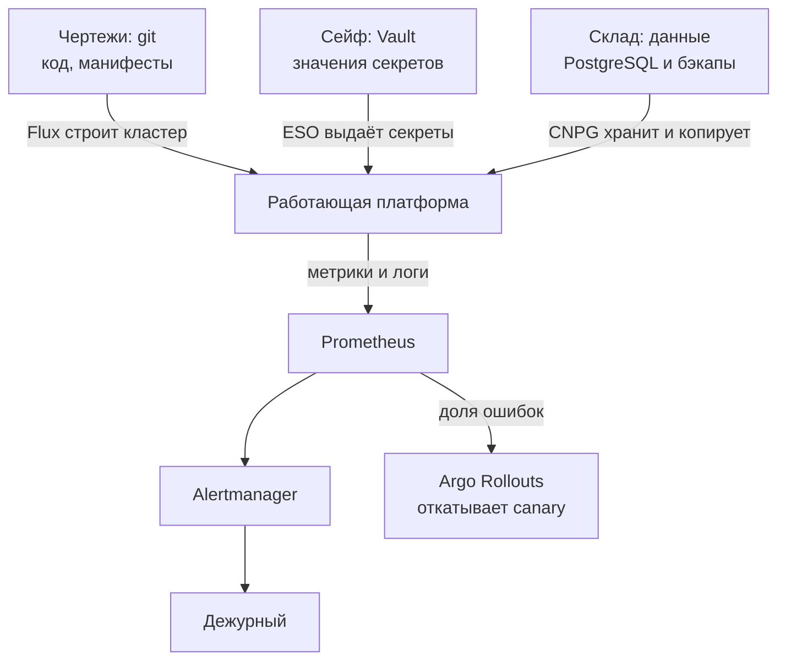
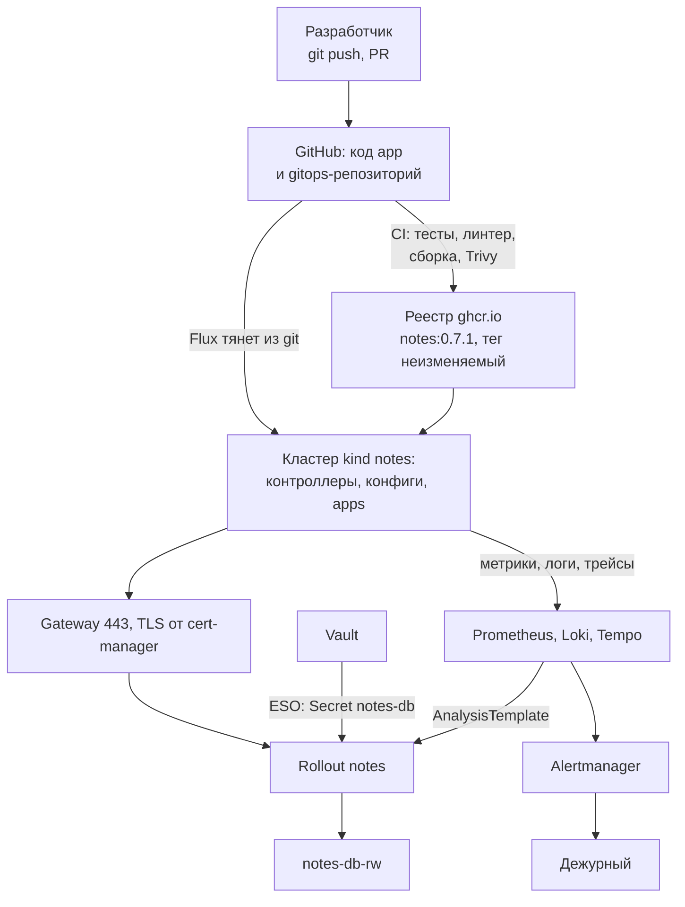
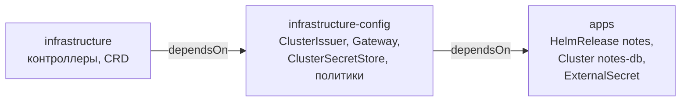
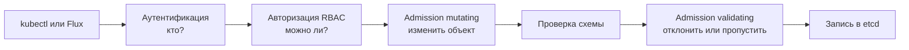
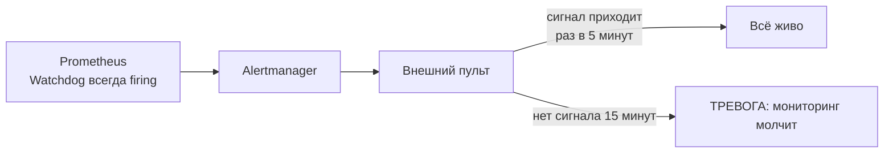
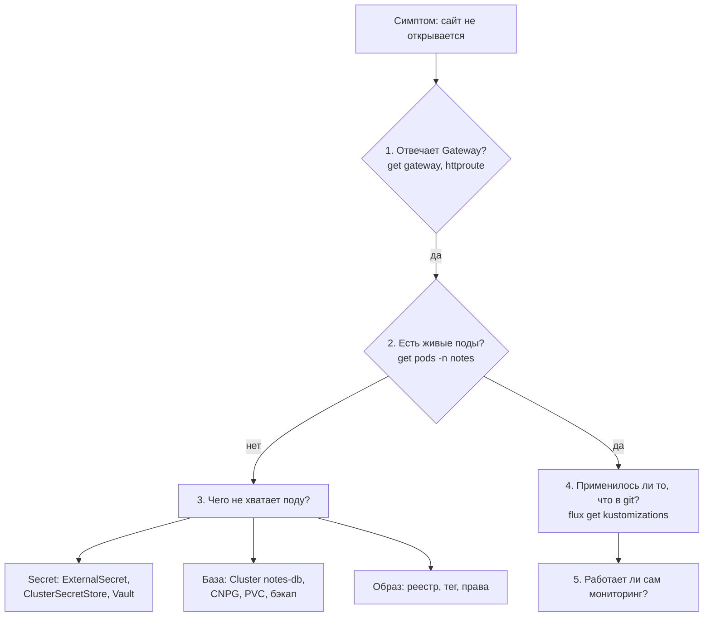

## Зачем это нужно

К этому моменту у «Заметок» есть Vault (хранилище секретов, [урок 9.1](01-secrets-problem-vault.md)), Flux (программа, которая сама доставляет изменения из git в кластер, [урок 9.3](03-gitops-flux.md)), cert-manager (выпуск сертификатов, [урок 9.4](04-cert-manager-tls.md)), оператор PostgreSQL (программа, которая эксплуатирует базу данных вместо человека, [урок 9.5](05-cnpg.md)), canary-релизы (выкатка новой версии малой долей трафика, [урок 9.6](06-progressive-delivery.md)) и мониторинг (сбор метрик и алертов, тема 8). Вместе это называют **платформой**: набор общих сервисов, на которых работает приложение, как коммуникации дома (вода, свет, отопление), на которые опираются все жильцы. Каждый кусок ты собирал отдельно. На собеседовании и на дежурстве (дежурство это когда ты отвечаешь за работу системы в свою смену и первым реагируешь на поломки) спрашивают другое: как это работает вместе, что будет, если кластер пропадёт, и какие дыры остались. Кто не может нарисовать цепочку целиком и назвать свои долги, тот платформу не понимает, а только повторяет команды.

В этом уроке ты нарисуешь всю цепочку от коммита до алерта, докажешь, что кластер восстанавливается из git за измеренное время, закроешь одну дыру admission-политикой (admission policy, правило, которое проверяет объект при создании) и честно перечислишь то, что осталось. Оставшееся называют **долгом** (debt): осознанное «пока сделали так, потом исправим», как незакрытый кредит. Главное, что долг записан, а не забыт: записанный долг можно планировать, забытый выстрелит ночью.

Шаг проекта: в «Заметках» появляются `docs/architecture.md` (документ об устройстве системы: схема и список долгов) с диаграммой и долгами, `docs/threat-model.md` и политика `vap-no-latest-tag.yaml`.

## Что нужно знать

- [Урок 3.3: CI](../03-git-ci/03-actions-ci.md): откуда берётся образ и тег.
- [Урок 5.4: Gateway API](../05-kubernetes/04-ingress-gateway.md): как трафик попадает в кластер.
- [Урок 8.5: алерты](../08-observability/05-alertmanager.md): чем заканчивается цепочка.
- [Урок 9.1: Vault](01-secrets-problem-vault.md): `seed-vault.sh`, unseal-ключи вне репозитория.
- [Урок 9.2: ESO](02-vault-k8s-eso.md): как секрет попадает в под.
- [Урок 9.3: Flux](03-gitops-flux.md): `dependsOn` (правило «применять этот слой только после готовности другого») и bootstrap (первая установка Flux в кластер).
- [Урок 9.5: CloudNativePG](05-cnpg.md): где лежат данные.
- [Урок 9.6: Argo Rollouts](06-progressive-delivery.md): как релиз откатывается сам.

## Картина целиком

Представь завод. Есть чертежи (git): по ним можно построить цех заново. Есть сейф с ключами и паролями (Vault): его в чертежи не кладут. Есть склад готовой продукции (данные в PostgreSQL и их копии в MinIO): его чертежами не восстановишь. И есть диспетчерская с экранами и звонком (Prometheus и Alertmanager), которая замечает поломки. Если завод сгорел, ты строишь новый по чертежам, достаёшь ключи из сейфа, везёшь продукцию из резервного склада. Забыл любую из трёх частей, и завод стоит. Аналогия ломается в одном: завод из чертежей строится сам, а склад приходится возить руками.



Этот урок отвечает на три вопроса: как всё связано (схема), как это восстановить (день разрушения) и что осталось незакрытым (политика, модель угроз, долги). Каждое слово из схемы ниже разбирается по отдельности.

## Теория

### Зачем смотреть на платформу целиком

Секрет обновился, а приложение его не перечитало. Оператор создал базу, а пароль ещё не приехал. Где здесь поломка: в Vault, во Flux, в приложении?

Инциденты случаются не «в Vault» и не «во Flux», а на стыках. Инженер, который знает только свой кусок, на стыке беспомощен. Представь водопровод в доме: знать, как устроен кран, мало, авария может быть в насосной, в стояке или в счётчике. Умение нарисовать всю схему и показать, где перекрывать воду, отличает мастера от человека с гаечным ключом.

Хорошая схема отвечает на три вопроса для каждого звена: что оно делает, что случится, если оно сломается, и кто заметит. Составим таблицу для «Заметок».

| Звено | Что делает | Если сломается | Кто заметит |
|---|---|---|---|
| CI (сборка образа) | собирает и проверяет образ | новая версия не появится | красный статус в PR |
| Flux | доставляет git в кластер | изменения не применяются | `flux get`, алерт Flux |
| Vault и ESO | выдают секреты | новые поды без секретов | `SecretSyncedError` |
| cert-manager | выпускает сертификаты | сертификат истечёт | алерт на срок |
| CNPG | держит базу | запись недоступна | алерты БД, ошибки приложения |
| Argo Rollouts | выкатывает и откатывает | релиз зависнет | статус Rollout |
| Prometheus, Alertmanager | видят и сообщают | ты слеп | «тишина» (главная опасность) |

Последняя строка самая коварная: если сломан сам мониторинг, никто не заметит и его поломку. Поэтому в зрелых платформах есть «сторожевой» алерт, который должен приходить всегда (например, `Watchdog` в kube-prometheus-stack), а тишина считается тревогой.

> **Прикинь сам:** сломался Flux. Заметишь ли ты это по таблице выше без специального алерта и что именно перестанет работать?
{: .predict}

Заметишь только по `flux get` или алерту Flux: работающие поды продолжают жить, перестают применяться новые изменения.

Осторожно: «если каждый компонент работает, то работает платформа». Нет: компоненты могут быть исправны, а порядок применения или один пропущенный шаг (секреты) остановит всё.

> **Главное:** для каждого звена знай три вещи: что оно делает, что упадёт без него и кто об этом узнает.
{: .key}

> **Проверь понимание:** какое звено таблицы сообщит о своей поломке хуже всего и почему?

<details markdown="1">
<summary>Ответ</summary>

Мониторинг: он сам источник сигналов, и его смерть выглядит как тишина. Поэтому нужен сторожевой алерт, приходящий постоянно, и отсутствие которого само тревога.

</details>

Таблица показывает звенья по отдельности. Теперь соединим их в одну цепочку от коммита до алерта.

### Вся цепочка на одной схеме

Схема нужна не для красоты. По ней ты отвечаешь на вопрос «где может сломаться и кто это заметит». Вот цепочка «Заметок».



Внутри кластера три слоя: controllers (Envoy Gateway, ESO, Vault, cert-manager, CNPG, Argo Rollouts), configs (Gateway, ClusterSecretStore, ClusterIssuer, политики) и apps (HelmRelease `notes`, Cluster `notes-db`, ExternalSecret). Prometheus заодно отдаёт долю ошибок в `AnalysisTemplate` Argo Rollouts, и поэтому плохой canary откатывается сам.

Главное свойство схемы: изменения идут в одну сторону, из git в кластер. Это называется pull-моделью (pull, «тянуть»): кластер сам забирает состояние из git, а не ты «толкаешь» изменения командой с ноутбука (push-модель). Плюс pull: у тебя нет постоянных админских доступов в кластер из внешнего мира, а любое изменение остаётся в истории git. Исключение одно: секреты и данные. Их в git нет, и это сознательно. Из этого вытекает всё остальное в уроке: чтобы восстановить кластер, нужны git, Vault и бэкап данных. Без любого из трёх ты восстановишь только часть.

Проследим путь одного изменения, версии 0.7.1:

1. Ты коммитишь код и ставишь тег `v0.7.1`. CI ([урок 3.3](../03-git-ci/03-actions-ci.md)) прогоняет тесты, собирает образ `ghcr.io/<user>/notes:0.7.1`, проверяет его Trivy и публикует в реестр.
2. Ты меняешь `image.tag: "0.7.1"` в git-репозитории конфигурации. Это тоже коммит.
3. Flux замечает новый коммит (по интервалу или по `flux reconcile`), Helm-контроллер рендерит чарт и применяет `Rollout`.
4. Argo Rollouts поднимает canary и сдвигает вес: 10%, 30%, 60%, 100%.
5. На каждом шаге `AnalysisTemplate` спрашивает Prometheus про долю ошибок canary.
6. Всё в норме: релиз завершён. Плохо: откат на stable, а Alertmanager сообщает дежурному, если ошибок много.

В этом пути пять разных систем и три места, где решение принимает автоматика (CI, Flux, анализ). Ни в одном не нужен человек с `kubectl`.

> **Прикинь сам:** сколько коммитов нужно, чтобы выкатить 0.7.1 по этому пути: один или два? Подсказка в шагах 1 и 2.
{: .predict}

Два: один в репозитории кода (с тегом), второй в gitops-репозитории (смена `image.tag`). Образ собирается первым, версию включает второй.

Осторожно: «git хранит всё». Он хранит описание. Значения секретов и данные пользователей в нём быть не должны.

> **Главное:** изменения идут из git в кластер в одну сторону, а секреты и данные в git не лежат.
{: .key}

> **Проверь понимание:** назови три вещи, которых нет в git, но без которых платформа не поднимется.

<details markdown="1">
<summary>Ответ</summary>

Значения секретов в Vault, unseal-ключи и root-токен Vault (лежат в `~/.notes-secrets/`), данные PostgreSQL (в PVC и в бэкапах MinIO). Ещё токен для `flux bootstrap`, но его можно выпустить заново.

</details>

Раз git, секреты и данные живут в разных местах, у каждого свой способ восстановления.

### Три источника правды: git, Vault, бэкап

У конфигурации, секретов и данных разные требования. Конфигурацию можно публиковать и хранить с историей. Секреты публиковать нельзя. Данные меняются ежесекундно и в git не помещаются. Поэтому у каждого свой «дом» и свой способ восстановления. Как в доме: план (git) можно копировать сколько угодно, ключи от сейфа (Vault) хранят отдельно и выдают по списку, а мебель и вещи жильцов (данные) страхуют, но не «чертят».

| Что | Где хранится | Как восстановить | Чем опасно |
|---|---|---|---|
| Конфигурация (манифесты, чарты) | git | `flux bootstrap` | если удалили репозиторий, а копии нет |
| Значения секретов | Vault (PVC в кластере) | `seed-vault.sh` и ключи из `~/.notes-secrets/` | потеря unseal-ключей: Vault не открыть |
| Данные приложения | PVC PostgreSQL и бэкапы в MinIO | restore из бэкапа | MinIO без копии, бэкап не проверяли |

Что произойдёт, если кластер удалить и создать заново, не трогая репозиторий. Flux вернёт все контроллеры и приложения (конфигурация цела). Vault создастся пустым, потому что его диск был в старом кластере: ESO не найдёт секрет, `ExternalSecret` покажет `SecretSyncedError`. Ты запускаешь `seed-vault.sh` и секреты возвращаются. База `notes-db` создастся пустой: заметок в ней нет, пока ты не восстановишь бэкап. То есть после «полного восстановления из git» приложение работает, но заметок нет.

> **Прикинь сам:** после пересоздания кластера ты выполнил только `flux bootstrap`. Какие из трёх «домов» вернутся сами, а какие нет?
{: .predict}

Сам вернётся только git (конфигурация). Секреты вернёт отдельный шаг `seed-vault.sh`, данные вернёт только restore из бэкапа.

Осторожно: «GitOps это бэкап». GitOps возвращает описание. Данные и секреты остаются отдельной заботой.

> **Главное:** конфигурацию возвращает git, секреты возвращает Vault с ключами, данные возвращает бэкап, и без любого из трёх восстановление неполное.
{: .key}

> **Проверь понимание:** после пересоздания кластера все поды Running, но заметок нет. Какая часть не восстановлена?

<details markdown="1">
<summary>Ответ</summary>

Данные: новая база пустая, её надо восстановить из бэкапа CNPG. Git вернул только манифесты, а секреты вернул отдельный шаг с Vault.

</details>

Теперь вопрос порядка: Flux пытается применить всё сразу, а часть ресурсов без других не имеет смысла.

### Порядок восстановления и dependsOn

Кластер создан заново, Flux применяет всё сразу и ругается `no matches for kind "ClusterIssuer"`. Почему, ведь манифест правильный?

Многие ресурсы имеют смысл только после других. Как в строительстве: сначала фундамент, потом стены, потом крыша, а начнёшь с крыши, она упадёт. Роль графика работ играет `dependsOn`: «стены только после фундамента».

В чём тут дело. CRD (описание нового типа ресурса, [урок 9.5](05-cnpg.md)) появляется в кластере только после установки контроллера. До этого API отвечает `no matches for kind "ClusterIssuer"`. В `clusters/kind/` три Kustomization (объект Flux «применить этот каталог из git»): `infrastructure` (контроллеры), `infrastructure-config` (ресурсы, которым нужны CRD контроллеров), `apps` (приложение). Связаны они через `dependsOn`: следующая ступень ждёт, пока предыдущая станет Ready.



Почему нельзя всё в одну Kustomization? Flux повторит неудачные попытки, но приложение, зависящее от сертификата, может стартовать в неправильном порядке и уйти в ошибку со странным текстом. `dependsOn` даёт гарантию порядка.

Есть и третий слой зависимостей, который `dependsOn` не видит: данные. ExternalSecret ссылается на Vault, а Vault после нового bootstrap пуст и запечатан (sealed: данные зашифрованы, ключ расшифровки не в памяти). Значит, после создания кластера человек должен один раз выполнить `seed-vault.sh`. Это ручной шаг, и он входит в «время восстановления».

Условная шкала восстановления.

| Минута | Событие |
|---|---|
| 0 | `kind create cluster` |
| 2 | `flux bootstrap`, Flux тянет репозиторий |
| 3-9 | ступень `infrastructure`: скачиваются образы контроллеров |
| 9 | Vault готов, ты запускаешь `seed-vault.sh` |
| 10-14 | `infrastructure-config`, затем `apps`; CNPG создаёт пустую базу |
| 15 | приложение отвечает |

Ожидание образов занимает большую часть времени, ручных шагов два (bootstrap и seed). Именно эти шаги кандидаты на автоматизацию.

> **Прикинь сам:** по шкале выше, сколько минут из 15 уходит на скачивание образов и какая это доля?
{: .predict}

С третьей по девятую минуту: 6 минут из 15, то есть две пятых времени.

Осторожно: `dependsOn` гарантирует порядок ступеней, но не наличие данных в Vault и не то, что внутри одной ступени CRD появится раньше ресурса.

> **Главное:** `dependsOn` задаёт порядок ступеней, а ручной шаг с Vault остаётся за человеком и входит в время восстановления.
{: .key}

> **Проверь понимание:** `ClusterIssuer` лежит в той же ступени, что и cert-manager. Что произойдёт при первом применении?

<details markdown="1">
<summary>Ответ</summary>

Ступень упадёт с `no matches for kind "ClusterIssuer"`: CRD ещё не установлен. Ресурс выносят в более позднюю ступень (`infrastructure-config`).

</details>

Мы прикинули время восстановления на глаз. Бизнесу нужны точные числа.

### RTO, RPO и учения: доказательство, что восстановление работает

«Мы умеем восстанавливаться» без замера это вера, а не факт. Бизнесу нужны два числа.

**RTO** (recovery time objective, целевое время восстановления): за сколько минут сервис должен вернуться. **RPO** (recovery point objective, допустимая потеря данных): за какой срок до аварии данные ещё должны сохраниться. RPO равное 5 минутам значит, что можно потерять последние 5 минут работы. Замер делают на учениях (restore drill): специально ломают и восстанавливают, засекая время. Подробнее в [уроке 10.3](../10-capstone/03-backup-dr-capacity.md).

Допустим, ты замерил 17 минут. Из них 9 минут ожидания загрузки образов, 3 минуты работа Flux, 5 минут ручные шаги. Значит, RTO учебного стенда около 17 минут, а ускорить можно заранее скачанными образами и автоматизацией seed.

> **Прикинь сам:** бэкап делается каждые 24 часа, восстановление занимает 20 минут. Чему равны RPO и RTO?
{: .predict}

RPO до 24 часов (можно потерять сутки данных), RTO около 20 минут. У CNPG с архивацией WAL RPO гораздо меньше ([урок 9.5](05-cnpg.md)).

Осторожно: RTO и RPO не одно число. RTO про время простоя, RPO про потерянные данные.

> **Главное:** RTO отвечает «сколько стоим», RPO отвечает «сколько данных потеряем», и оба числа проверяют только учения.
{: .key}

Восстановление мы проверили. Теперь предотвращение: как не дать создать неправильный объект.

### Admission-политика: запретить проблему на входе

Правила «не используй `latest`» и «не запускай от root» можно записать в документ, но их нарушат. Лучше, если кластер сам не даст создать неправильный объект.

Представь охранника на входе: он проверяет пропуск до того, как ты вошёл, а не разбирается с тобой внутри. Аналогия неточна тем, что охранник смотрит на людей, а admission на объекты в API.

Любой запрос к API Kubernetes (создать под, изменить Deployment) проходит конвейер.



Admission controller (контроллер допуска) это шаг, который может изменить объект (mutating) или отклонить его (validating) до записи в etcd (хранилище состояния кластера). В Kubernetes есть встроенный механизм: ValidatingAdmissionPolicy (VAP), правило пишется на языке CEL (Common Expression Language, короткий язык выражений «вернуть истину или ложь»), устанавливать ничего не нужно. Он стабилен с версии 1.30.

Политика состоит из двух объектов: сама политика (что проверять и какое выражение считается допустимым) и привязка ValidatingAdmissionPolicyBinding (к каким namespace применять и что делать: `Deny` отказать, `Warn` предупредить, `Audit` записать в журнал).

Выражение из задания разберём по кускам:

```text
object.spec.containers.all(c,                  для КАЖДОГО контейнера c пода:
  c.image.contains('@') ||                        образ содержит @ (то есть указан digest), ИЛИ
  (c.image.contains(':') &&                       в имени есть двоеточие (тег указан), И
   !c.image.endsWith(':latest')))                 имя не заканчивается на :latest
```

Проверим четыре образа. `nginx:latest`: нет `@`, есть `:`, но кончается на `:latest`, результат ложь, отказ. `nginx` без тега: нет `@`, нет `:`, ложь, отказ. `nginx:1.29.0`: тег есть и не latest, истина, допущено. `nginx@sha256:abc...`: есть `@`, истина.

> **Прикинь сам:** пропустит ли выражение образ `localhost:5000/notes` без тега?
{: .predict}

Пропустит, хотя тега нет: двоеточие в нём есть (это порт реестра), а `:latest` в конце нет. Это одна из дыр выражения.

Чего выражение ещё не поймает: `initContainers` (мы проверяем только `containers`) и изменяемые теги (тег `0.7.1`, который кто-то перезаписал). Поэтому надёжнее digest.

Kyverno и OPA Gatekeeper делают то же самое мощнее: умеют менять объекты (mutate), генерировать ресурсы, проверять подписи образов. Ценой становится ещё один компонент кластера, который сам может стать точкой отказа. Для одного простого правила встроенной VAP достаточно. В уроке Kyverno не ставим, только знаем, где он нужен.

Осторожно: admission и RBAC не одно и то же. RBAC отвечает «можно ли этому пользователю создавать поды», admission отвечает «допустим ли именно этот под». Не путай и admission с CI: CI проверяет только то, что прошло через него, а admission ловит и ручной `kubectl run`.

> **Главное:** admission отклоняет плохой объект на входе в API, кто бы его ни прислал: Flux, CI или человек.
{: .key}

> **Проверь понимание:** политика действует на пути «git, Flux, кластер». Поймает ли она `kubectl run` от админа?

<details markdown="1">
<summary>Ответ</summary>

Да. Admission стоит на входе в API и не различает, кто прислал объект: Flux, CI или человек с `kubectl`. Исключения возможны только если политика их явно исключает.

</details>

Политика проверяет тег, но не говорит, что внутри образа лежит ровно то, что собрал твой CI. Это уже вопрос цепочки поставки.

### Цепочка поставки: что защищает образ

Атаковать можно любое звено между коммитом и запущенным контейнером: подменить зависимость, отравить CI, перезаписать тег в реестре. Злоумышленнику проще испортить одну библиотеку, чем взломать тысячу серверов. Всё это вместе называют supply chain (цепочка поставки).

Как молоко на столе: ты можешь быть идеально чистоплотным, но если испорчена ферма, всё зря. Значит, нужны проверки на каждом этапе от фермы до стола.

Три инструмента закрывают разные звенья, в курсе они только обзорные.

- Trivy (уже в CI, [урок 3.3](../03-git-ci/03-actions-ci.md)) ищет известные уязвимости в образе и конфигах.
- SBOM (Software Bill of Materials, перечень компонентов образа) отвечает на вопрос «где у нас библиотека X», когда выходит новая CVE (публичный номер найденной уязвимости).
- cosign подписывает образ ключом или через OIDC-идентичность CI (keyless: подпись привязана к тому, кто запустил сборку, без долгоживущих ключей). Проверка подписи при деплое гарантирует, что в кластер попал образ, собранный вашим CI, а не подложенный.

Проверку подписи в кластере делает admission-контроллер, например Kyverno с правилом `verifyImages`. Встроенная VAP подписи проверять не умеет. Поэтому в нашей платформе подписи нет, и это записано в долги.

Пример. Вышла уязвимость в библиотеке `libfoo` версии 2.1. Без SBOM ты гадаешь, где она. С SBOM выполняешь поиск по перечням компонентов всех образов и за минуту получаешь список: «notes:0.7.1 и billing:3.2 содержат libfoo 2.1». Без подписи кто-то с доступом к реестру мог бы подменить `notes:0.7.1` на другой образ, и кластер бы его запустил. С подписью и проверкой при деплое подменённый образ не пройдёт.

> **Прикинь сам:** какой из трёх инструментов ответит на вопрос «в каких наших образах есть `libfoo` 2.1»?
{: .predict}

SBOM: он хранит перечень компонентов каждого образа, по нему и ищут. Trivy ищет известные уязвимости, а не составляет список, cosign проверяет подлинность.

Осторожно: Trivy и подпись отвечают на разные вопросы. Trivy говорит «в образе есть известные дыры», подпись говорит «этот образ собран нашим CI».

> **Главное:** Trivy ищет дыры, SBOM отвечает, где библиотека, подпись доказывает, что образ собрал наш CI.
{: .key}

> **Проверь понимание:** образ в реестре подменили, тег остался прежним. Что из Trivy, SBOM, cosign поможет это обнаружить?

<details markdown="1">
<summary>Ответ</summary>

Подпись cosign с проверкой при деплое: у подменённого образа не будет валидной подписи вашего CI. Trivy проверяет уязвимости, SBOM описывает состав, но подмену не докажут.

</details>

Инструменты перечислены. Но с чего начинать думать о безопасности?

### Threat model: STRIDE за пять минут

Безопасность без плана превращается в набор случайных мер: поставили сканер, а дверь в кладовку открыта. Модель угроз (threat model) это список того, что может пойти не так по злому умыслу, и что с этим сделано.

STRIDE это шесть категорий, по первым буквам:

| Буква | Категория | Вопрос | Пример в «Заметках» |
|---|---|---|---|
| S | Spoofing (подмена личности) | Может ли кто-то выдать себя за другого? | чужой под читает секрет из Vault |
| T | Tampering (порча данных) | Можно ли незаметно изменить данные или конфигурацию? | ручная правка кластера в обход git |
| R | Repudiation (отказ от авторства) | Можно ли отрицать своё действие? | нет аудит-лога, неясно, кто удалил секрет |
| I | Information disclosure (утечка) | Может ли информация уйти не туда? | пароль БД в git или в логах |
| D | Denial of service (отказ в обслуживании) | Можно ли вывести систему из строя? | шквал запросов, ошибочный релиз |
| E | Elevation of privilege (повышение прав) | Можно ли получить больше прав, чем дали? | контейнер под root |

Идёшь по компонентам схемы и для каждой категории спрашиваешь «может ли случиться здесь». Для каждой найденной угрозы записываешь: что уже закрыто и что осталось. Приоритет определяет ущерб, помноженный на вероятность.

Возьмём угрозу «подмена образа в реестре»: это Spoofing. Закрыто: тег semver и Trivy в CI. Осталось: нет подписи и проверки при деплое. Остаточный риск средний (для учебного стенда допустимо), в проде обязательно закрыть.

Модель угроз не даёт нулевого риска. Она нужна, чтобы остаточный риск был выбран осознанно и записан, а не обнаружен во время инцидента.

> **Прикинь сам:** к какой букве STRIDE относится «пароль БД попал в лог приложения»?
{: .predict}

К I, Information disclosure: информация ушла туда, куда не должна.

Осторожно: threat model не список инструментов безопасности. Модель начинается с угроз («что может случиться»), а не с инструментов («что мы поставили»).

> **Главное:** по каждому компоненту спрашивай шесть вопросов STRIDE и записывай, что закрыто и что осталось.
{: .key}

> **Проверь понимание:** чем остаточный риск отличается от долга?

<details markdown="1">
<summary>Ответ</summary>

Остаточный риск принят осознанно и записан вместе с причиной («MinIO без репликации, для учебного стенда допустимо»). Долг это то, что нужно закрыть до прода, и у него есть способ закрытия. На практике одна запись часто содержит оба: что не закрыто и что надо сделать в проде.

</details>

Остаток угроз превращается в список долгов. Как его вести?

### Долги и GitOps против Velero

Идеальных платформ нет. Честный список долгов (то, что сознательно не сделано) позволяет планировать работу и не удивляться.

У каждого долга три поля: что не так, чем это грозит, как закрыть в проде. Долг без способа закрытия это просто жалоба. Хорошо, если у долга есть владелец и срок.

Заодно сравним два подхода к восстановлению. Velero это инструмент бэкапа объектов Kubernetes и снимков томов. GitOps возвращает описание из git. Различие: GitOps возвращает «что должно быть», Velero возвращает «что было», то есть и состояние томов. Для stateless-приложений (без собственных данных) хватает GitOps, для PVC нужны бэкапы данных (у нас CNPG и MinIO).

Допустим, у тебя девять долгов. Самые дорогие связаны с данными: MinIO без реплики (потеря всех бэкапов) и один экземпляр Vault (потеря всех секретов). Код приложения почти не в списке, потому что его пересобирают из git за минуты, а данные не пересобирают.

> **Прикинь сам:** у долга «MinIO без реплики» ущерб огромный (потеря всех бэкапов), а вероятность низкая. Сделаешь ли ты его первым в списке и по какому правилу?
{: .predict}

Скорее да, потому что приоритет это ущерб, помноженный на вероятность, а исход потери всех бэкапов тяжёлый и необратимый. Но решаешь ты с владельцем и сроком, а не молча.

Осторожно: «долг это плохо». Долг плох, когда его не видно. Записанный и приоритизированный долг нормальный рабочий инструмент.

> **Главное:** у долга три поля (что не так, чем грозит, как закрыть), и самые дорогие обычно связаны с данными.
{: .key}

> **Проверь понимание:** какие компоненты «Заметок» можно потерять без потери данных, если всё описано в git?

<details markdown="1">
<summary>Ответ</summary>

Почти все: контроллеры, конфигурация, само приложение. Данные теряются только там, где есть состояние: PVC Vault, PVC PostgreSQL и MinIO.

</details>

Один из долгов особенный: Vault, который после каждого старта запирается.

### Vault: запечатан, распечатан и почему это важно при восстановлении

Vault хранит самое ценное, поэтому сам он на диске лежит зашифрованным. Ключ, которым он шифрует данные, на диске не хранится вовсе, и даже украв диск, данные не прочитать.

Представь банковское хранилище с часовым замком, которое открывается только когда несколько сотрудников вставляют свои ключи. После каждого закрытия оно снова заперто. С Vault так же.

После каждого старта пода Vault находится в состоянии sealed (запечатан): он знает, что данные есть, но расшифровать их не может. Чтобы распечатать (unseal), нужно предъявить unseal-ключи (в нашем учебном стенде один ключ из одного, в проде обычно пять частей, из которых нужны три). Пока Vault запечатан, он не отвечает на запросы секретов, поэтому ESO не может обновить Secret. Но уже созданные Kubernetes-Secret продолжают работать: они лежат в кластере как обычные объекты. В проде используют auto-unseal: Vault распечатывается сам через облачный сервис ключей (KMS), человек не нужен.

Под `vault-0` перезапустился ночью. Vault запечатан. Приложение работает как раньше, потому что его Secret уже создан. Но в 03:00 ESO пытается обновить секреты по `refreshInterval`, получает ошибку от Vault и ставит `ExternalSecret` в состояние ошибки. Никто не заметил, пока утром не пришла новая версия приложения, которой нужен свежий секрет: её поды не стартуют. Причина в ночной печати, а симптом проявился через шесть часов.

> **Прикинь сам:** Vault запечатан с 03:00. В 03:30 перезапустился под приложения, Secret для него уже был создан. Стартует ли он?
{: .predict}

Да: созданный Kubernetes-Secret лежит в кластере и не зависит от Vault. Не стартовал бы под, которому нужен ещё не созданный секрет.

Осторожно: «запечатан значит потерян». Данные целы, нужны только ключи. А вот потеря самих unseal-ключей значит, что данные Vault не прочитать никогда.

> **Главное:** запечатанный Vault не отдаёт секреты, но уже созданные Secret в кластере работают, а потеря unseal-ключей необратима.
{: .key}

> **Проверь понимание:** Vault запечатан, приложение работает нормально. Что перестанет работать и когда?

<details markdown="1">
<summary>Ответ</summary>

Работают уже созданные Secret в кластере. Перестанут работать обновление значений через ESO и создание новых секретов: новые поды или новые приложения не получат секрет, пока Vault не распечатают.

</details>

Запечатанный Vault тихая поломка. А что, если тихо сломается сам мониторинг?

### Мониторинг мониторинга: сторожевой алерт

Все алерты устроены одинаково: «если плохо, позвони». Но если сломалась сама система, которая звонит, звонка не будет, и тишина выглядит как «всё хорошо». Нужен способ отличить «всё спокойно» от «сигнализация мертва».

Представь охранную сигнализацию, которая раз в минуту шлёт на пульт «я жива». Тишина без сигнала «я жива» это не покой, а тревога: провод перерезан.

Заводят алерт, который **всегда** активен (его условие вроде `vector(1)`, «всегда истина»). Он постоянно уходит по всей цепочке: Prometheus, Alertmanager, внешний сервис. Внешний сервис ожидает его регулярно и поднимает тревогу, если он **перестал приходить**. В kube-prometheus-stack ([урок 8.9](../08-observability/09-k8s-monitoring.md)) такой алерт называется `Watchdog`. Принцип называют dead man's switch («выключатель мёртвой руки»): система считается живой, пока подаёт сигнал.



Ночью упал под Prometheus. Алертов нет, потому что их некому вычислять. Без сторожевого алерта ты утром узнаешь, что ночью не работал весь мониторинг. С ним внешний пульт через 15 минут не получил `Watchdog` и позвонил дежурному: «мониторинг молчит».

> **Прикинь сам:** пульт ждёт `Watchdog` раз в 5 минут и поднимает тревогу после 15 минут тишины. Сколько пропущенных сигналов подряд это значит?
{: .predict}

Три: 15 минут делим на 5.

Осторожно: «`Watchdog` это шумный алерт, его надо выключить». Он специально всегда горит, и его отключение лишает тебя сигнала «я жива». Его просто направляют в отдельный получатель, а не в общий чат.

> **Главное:** `Watchdog` всегда горит, а тревога это его отсутствие.
{: .key}

> **Проверь понимание:** почему `Watchdog` всегда в состоянии firing и это нормально?

<details markdown="1">
<summary>Ответ</summary>

Он нужен, чтобы подтверждать работоспособность цепочки. Если он перестал приходить, значит сломан Prometheus, Alertmanager или канал доставки, и это тревога сама по себе.

</details>

Теперь, когда видно, что ломается тихо, полезно понимать масштаб: что ещё упадёт вместе со звеном.

### Радиус поражения: что ещё упадёт вместе со сломавшимся звеном

Когда смотришь на схему, полезно спрашивать не только «что делает звено», но и «что упадёт, если оно сломается». Одни поломки задевают одну функцию, другие весь стенд. Это помогает решать, что защищать первым.

Представь предохранители в квартире. Перегорел предохранитель кухни: погас чайник, а в комнатах свет есть. Вышел из строя главный автомат: темно везде. Радиус поражения (blast radius) это размер «темноты».

Для каждого звена задай вопрос «кто от него зависит», и составь список по цепочке зависимостей. Чем выше звено в цепочке, тем больше радиус.

| Звено | Что упадёт вместе с ним |
|---|---|
| Vault запечатан | новые секреты не выдаются; старые поды работают, новые и пересозданные не стартуют без секретов |
| cert-manager | сертификат не продлится; HTTPS упадёт только когда он истечёт |
| CNPG primary | запись в базу недоступна, пока не повысится реплика |
| Flux | новые изменения не применяются, но работающее не ломается |
| Gateway | недоступно всё приложение снаружи |

Сломалась доставка Flux. Радиус маленький: всё, что уже работает, продолжает работать, а новые релизы не доезжают. Вывод: аварийно торопиться не надо, но и откладывать надолго нельзя. Теперь запечатался Vault: поды, которые живут, продолжают работать, но любой перезапуск пода без секрета превращает небольшую проблему в простой. Вывод: запечатанный Vault срочнее сломанного Flux, хотя выглядит тише.

> **Прикинь сам:** у кого радиус больше: у Gateway или у cert-manager, пока сертификат ещё не истёк?
{: .predict}

У Gateway: без него недоступно всё приложение снаружи сразу. Сломанный cert-manager до истечения сертификата ничего не ломает.

Осторожно: «сломалось звено с самым красным алертом, значит оно самое важное». Радиус определяется зависимостями, а не громкостью алерта. Тихая поломка высоко по цепочке опаснее шумной внизу.

> **Главное:** важность поломки определяет радиус (кто зависит от звена), а не громкость алерта.
{: .key}

> **Проверь понимание:** что срочнее чинить, остановившийся Flux или запечатавшийся Vault, и почему?

<details markdown="1">
<summary>Ответ</summary>

Обычно Vault: любой перезапуск или пересоздание пода без секрета приведёт к простою. Остановившийся Flux лишь не применяет новые изменения, работающая часть живёт.

</details>

Остаётся научиться быстро находить звено, с которого всё началось.

### Как искать поломку по цепочке

Когда сломано «всё», паника подсказывает бросаться в случайные места. Схема цепочки даёт порядок: идти от симптома к причине, по одному звену.

Так ты проверяешь свет, который не включается: лампу, выключатель, автомат в щитке, вводной рубильник, а не начинаешь с перематывания проводки. В платформе идёшь снизу вверх по цепочке зависимостей.



Правило: сначала узнай, где именно обрывается цепочка (какое звено первое показывает ошибку), потом иди вглубь этого звена. Ошибка `CreateContainerConfigError` у пода почти всегда про недостающий Secret или ConfigMap, а не про образ.

После пересоздания кластера страница не открывается. Шаг 1: Gateway есть. Шаг 2: под `notes` в `CreateContainerConfigError`. Шаг 3: описание пода говорит `secret "notes-db" not found`. Идём вверх: ExternalSecret `notes-db` показывает `SecretSyncedError: secret does not exist`. Вверх: Vault отвечает, но пуст. Причина: не выполнен `seed-vault.sh`. Заметь, что мы пришли к причине за пять проверок, никого не перезапуская.

> **Прикинь сам:** под `notes` в `ImagePullBackOff`, а не в `CreateContainerConfigError`. Идёшь ли ты в Vault?
{: .predict}

Нет: `ImagePullBackOff` про образ, значит смотри реестр, тег и права, а не Secret.

Осторожно: перезапуск не диагностика. Он иногда лечит симптом и всегда уничтожает улики (логи и состояние пода).

> **Главное:** иди от симптома вниз по цепочке, находи первое звено с ошибкой и не перезапускай то, что ещё не изучил.
{: .key}

> **Проверь понимание:** под приложения в `CreateContainerConfigError`. С какого объекта начнёшь искать причину?

<details markdown="1">
<summary>Ответ</summary>

С `kubectl describe pod`: в событиях будет написано, какого Secret или ConfigMap не хватает. Дальше идёшь по цепочке этого Secret: ExternalSecret, хранилище, Vault.

</details>

Теория закончена: переходим к практике, где ты нарисуешь платформу и устроишь день разрушения.

## Практика

Предполагается кластер `kind-notes` и репозитории `~/notes` (приложение) и `~/notes-gitops` (конфигурация) из уроков 9.1-9.6. Эталон конфигурации лежит в [project/notes/gitops](https://github.com/distinguished-sre/learning/tree/main/devops/project/notes/gitops).

### Задание 1. Нарисуй платформу и найди точки отказа

**Цель:** получить `docs/architecture.md` с диаграммой и списком точек отказа.

**Предскажи:** сколько компонентов из схемы выше можно потерять, не потеряв данные, если всё описано в git?

<details markdown="1">
<summary>Ответ</summary>

Почти все: контроллеры, конфиги, само приложение пересоздаются из git. Данные теряются только там, где есть состояние: PVC Vault, PVC PostgreSQL, MinIO. Это и есть «точки потери данных».

</details>

**Шаги:**

1. Создай файл документа. `mkdir -p docs` создаёт каталог (`-p` не ругается, если он уже есть), `cat > файл <<'EOF' ... EOF` записывает в файл всё, что написано до строки `EOF` (кавычки вокруг `EOF` запрещают shell подставлять переменные), `wc -l` считает строки.
2. Перерисуй схему из теории своими словами, добавь порты и namespace.
3. Отдельным списком выпиши, где хранится состояние.

```bash
cd ~/notes
mkdir -p docs
cat > docs/architecture.md <<'EOF'
# Архитектура платформы «Заметки»

## Цепочка

git -> CI (тесты, Trivy, сборка) -> ghcr.io/<github-user>/notes:0.7.1
git (notes-gitops) -> Flux -> кластер kind "notes" (контекст kind-notes)

Порядок в кластере (dependsOn):
1. infrastructure        контроллеры: Envoy Gateway, ESO, Vault, cert-manager, CNPG, Argo Rollouts
2. infrastructure-config Gateway, ClusterSecretStore, ClusterIssuer, политики
3. apps                  HelmRelease notes, Cluster notes-db, ExternalSecret

Трафик: клиент -> Gateway :443 (notes.lab, cert-manager) -> Rollout notes :8080 -> notes-db-rw :5432
Секрет: Vault secret/notes/db -> ESO -> Secret notes-db -> под
Наблюдаемость: метрики Prometheus, логи Loki, трейсы Tempo, алерты Alertmanager

## Где живёт состояние (нет в git)

| Что | Где | Как восстановить |
|---|---|---|
| Секреты | PVC Vault, ns vault | seed-vault.sh, ключи в ~/.notes-secrets/ |
| Данные БД | PVC CNPG, бэкапы в MinIO | восстановление из бэкапа (урок 10.3) |
| Бэкапы | PVC MinIO | нет копии, см. долги |

## Долги

(заполнится в задании 5)
EOF
wc -l docs/architecture.md
```

**Что должно получиться:**

```text
27 docs/architecture.md
```

**Как читать вывод:** число слева это количество строк, справа имя файла. Число может отличаться на несколько, главное, что файл создан и раздел «Долги» на месте.

**Объясни себе:**

- Почему у секретов и данных разный способ восстановления, хотя оба не в git?
- Какая ступень `dependsOn` отвечает за появление CRD?

**Типичные ошибки:**

- `bash: docs/architecture.md: No such file or directory`: не создан каталог `docs`. Сначала `mkdir -p docs`.
- Диаграмма съезжает при просмотре на сайте: обёрнута не в блок `text`. Оберни в тройные кавычки с языком `text`.

### Задание 2. День разрушения: восстанавливаем кластер из git

**Цель:** удалить кластер и поднять его заново из git и Vault, замерив время.

**Предскажи:** после `kind delete cluster` и повторного bootstrap приложение поднимется само? Что придётся сделать руками?

<details markdown="1">
<summary>Ответ</summary>

Всё описанное в git поднимется само, порядок задаст `dependsOn`. Руками нужно: создать кластер, выполнить `flux bootstrap`, запустить `seed-vault.sh` (Vault пуст). Данные PostgreSQL в новом кластере пусты: восстановление из бэкапа отдельный шаг (урок 10.3).

</details>

**Шаги:**

1. Убедись, что unseal-ключи на месте: без них старый Vault не нужен, но проверить полезно.
2. Удали кластер и создай заново, замеряя время.
3. Выполни bootstrap и seed.

Разбор команд. `source файл` выполняет файл в текущей оболочке: переменные из него (`GITHUB_TOKEN`, `GITHUB_USER`) становятся доступны, а значение токена нигде не печатается. `ls -l` показывает, что файл с ключами Vault есть и какие у него права. `START=$(date +%s)` сохраняет текущее время в секундах от 1970 года: позже разность двух таких чисел даёт длительность. `kind delete cluster` и `kind create cluster --config kind/kind.yaml` удаляют кластер и создают заново по файлу настроек. `flux bootstrap github` ставит Flux в кластер и подключает его к репозиторию: `--owner` владелец на GitHub, `--repository` репозиторий, `--branch` ветка, `--path` каталог с описанием кластера, `--personal` репозиторий принадлежит пользователю, а не организации. `kubectl wait ... --for=condition=Ready --timeout=15m` ждёт готовности до 15 минут. `$(( (END - START) / 60 ))` арифметика в shell: секунды в минуты.

```bash
# Токен для Flux (только в переменной окружения, значение не печатай)
source ~/.notes-secrets/github.env   # экспортирует GITHUB_TOKEN и GITHUB_USER
ls -l ~/.notes-secrets/vault-init.json

# Замер начинается здесь
START=$(date +%s)

kind delete cluster --name notes
kind create cluster --config kind/kind.yaml

flux bootstrap github \
  --owner="$GITHUB_USER" \
  --repository=notes-gitops \
  --branch=main \
  --path=clusters/kind \
  --personal

# Ждём, пока все ступени станут Ready
kubectl -n flux-system wait kustomization/infrastructure --for=condition=Ready --timeout=15m
```

Когда контроллеры готовы, Vault нужно инициализировать заново, потому что его PVC создан в новом кластере. Запечатанный Vault не считается готовым (Ready) для Kubernetes, поэтому ждём не готовность, а то, что под запущен (`Running`):

```bash
kubectl -n vault wait pod/vault-0 --for=jsonpath='{.status.phase}'=Running --timeout=5m
bash scripts/seed-vault.sh

kubectl -n flux-system wait kustomization/apps --for=condition=Ready --timeout=15m
END=$(date +%s)
echo "Восстановление заняло $(( (END - START) / 60 )) мин"
```

Проверка результата. `curl -sk --resolve notes.lab:443:127.0.0.1 URL` делает HTTPS-запрос: `-s` без индикатора загрузки, `-k` не проверять сертификат (учебный CA, в реальной работе не делай так), `--resolve` говорит curl считать, что `notes.lab` находится по адресу `127.0.0.1`, без записи в `/etc/hosts`:

```bash
flux get kustomizations
kubectl -n notes get pods
curl -sk --resolve notes.lab:443:127.0.0.1 https://notes.lab/healthz
```

**Что должно получиться:**

```text
NAME                    REVISION        SUSPENDED       READY   MESSAGE
apps                    main@sha1:3f2a1c9   False       True    Applied revision: main@sha1:3f2a1c9
flux-system             main@sha1:3f2a1c9   False       True    Applied revision: main@sha1:3f2a1c9
infrastructure          main@sha1:3f2a1c9   False       True    Applied revision: main@sha1:3f2a1c9
infrastructure-config   main@sha1:3f2a1c9   False       True    Applied revision: main@sha1:3f2a1c9
NAME                     READY   STATUS    RESTARTS   AGE
notes-6d8f7c9b5-x2k4q    1/1     Running   0          2m
notes-db-1               1/1     Running   0          4m
ok
Восстановление заняло 17 мин
```

**Как читать вывод:** в таблице Flux у каждой ступени `READY True` и одна и та же ревизия (`main@sha1:...`, хеш коммита у тебя будет другим) значит, что применён последний коммит. Поды `Running 1/1`: приложение и база живы. `ok` это ответ `/healthz` приложения. В последней строке твоё время. Числа в примере иллюстративные, вывод не снят с живого кластера. Время у тебя будет своё, зависит от скорости сети (скачиваются образы). Запиши своё число в `docs/architecture.md`: это твой измеренный RTO (Recovery Time Objective, целевое время восстановления) для учебного стенда. Как оформлять RTO и RPO, разбираем в [уроке 10.3](../10-capstone/03-backup-dr-capacity.md).

**Объясни себе:**

- Что из 17 минут заняло ожидание, а что ручные действия? Что можно автоматизировать?
- Почему данные в таблице `notes` пусты после восстановления и что должно их вернуть?
- Что было бы, если бы `seed-vault.sh` не был идемпотентным?

**Типичные ошибки:**

- `✗ failed to clone repository: authentication required`: токен не экспортирован или без прав `repo`. Проверь `echo ${GITHUB_TOKEN:+задан}` и права токена.
- `ERROR: failed to create cluster: node(s) already exist for a cluster with the name "notes"`: старый кластер не удалён. Выполни `kind delete cluster --name notes`.
- `Error from server (NotFound): pods "vault-0" not found`: контроллеры ещё не применились. Подожди `infrastructure` Ready и повтори.

> Попроси нейросеть написать выражение CEL для политики «запретить `latest`» и сверь его с разбором по кускам из теории: нейросети часто забывают `initContainers` и образы с портом реестра вроде `localhost:5000/notes`.
{: .ai}

### Задание 3. Политика: запретить latest

**Цель:** запретить в namespace `notes` образы с тегом `latest` и без тега, доставив политику через git.

**Предскажи:** попытка создать под с `image: nginx:latest` вернёт ошибку от API или под создастся и упадёт позже?

<details markdown="1">
<summary>Ответ</summary>

Ошибку вернёт сам API-сервер сразу, под даже не будет записан в etcd. Это отличие admission от проверок в CI: политика работает на любом пути в кластер, в том числе для ручного `kubectl run`.

</details>

**Шаги:**

1. Добавь файл политики в репозиторий `notes-gitops` (эталон лежит в `project/notes/gitops/`). Построчно: `failurePolicy: Fail` значит «если проверку невозможно выполнить, отказать» (безопаснее, но зависит от доступности проверки); `matchConstraints` к каким объектам применять (поды, создание и изменение); `validations.expression` условие допустимости (разобрано в теории, `>-` в YAML склеивает строки в одну); `message` текст отказа; в привязке `validationActions: ["Deny"]` отказывать, а `namespaceSelector` ограничивает действие namespace `notes` по его метке.
2. Подключи его в `kustomization.yaml` каталога `configs`.
3. Запушь и дождись применения Flux.

```yaml
# gitops/infrastructure/configs/policies/vap-no-latest-tag.yaml
apiVersion: admissionregistration.k8s.io/v1
kind: ValidatingAdmissionPolicy
metadata:
  name: no-latest-tag
spec:
  failurePolicy: Fail
  matchConstraints:
    resourceRules:
      - apiGroups: [""]
        apiVersions: ["v1"]
        operations: ["CREATE", "UPDATE"]
        resources: ["pods"]
  validations:
    # Образ должен иметь digest или явный тег, и тег не latest
    - expression: >-
        object.spec.containers.all(c,
          c.image.contains('@') ||
          (c.image.contains(':') && !c.image.endsWith(':latest')))
      message: "Образ без тега или с тегом latest запрещён: укажи semver-тег или digest"
---
apiVersion: admissionregistration.k8s.io/v1
kind: ValidatingAdmissionPolicyBinding
metadata:
  name: no-latest-tag
spec:
  policyName: no-latest-tag
  validationActions: ["Deny"]
  matchResources:
    namespaceSelector:
      matchLabels:
        kubernetes.io/metadata.name: notes
```

```bash
cd ~/notes-gitops
mkdir -p infrastructure/configs/policies
# (сохрани YAML выше в infrastructure/configs/policies/vap-no-latest-tag.yaml)
# В kustomization.yaml каталога configs добавь строку ресурса:
#   - policies/vap-no-latest-tag.yaml
git add infrastructure/configs
git commit -m "Запретить образы latest в namespace notes"
git push
flux reconcile kustomization infrastructure-config --with-source

kubectl -n notes run bad --image=nginx:latest
kubectl -n notes run ok --image=nginx:1.29.0
kubectl -n notes delete pod ok
```

Команда `kubectl run bad --image=...` создаёт под с одним контейнером; `flux reconcile ... --with-source` просит Flux не ждать интервала.

**Что должно получиться:**

```text
Error from server (Forbidden): pods "bad" is forbidden: ValidatingAdmissionPolicy 'no-latest-tag' with binding 'no-latest-tag' denied request: Образ без тега или с тегом latest запрещён: укажи semver-тег или digest
pod/ok created
pod "ok" deleted
```

**Как читать вывод:** первая строка отказ API: `Forbidden`, имя политики и привязки и наш текст `message`. Пода `bad` не существует нигде, в etcd он не записан. Второй под с тегом `1.29.0` создан, третья команда его удаляет. Если под `bad` всё же создался, проверь метку namespace и `validationActions`.

**Объясни себе:**

- Почему политика привязана только к namespace `notes`, а не ко всему кластеру?
- Что произойдёт с системными подами (`kube-system`), если снять фильтр namespace? Что значит `failurePolicy: Fail`?
- Что политика не ловит? Подумай про образ вида `localhost:5000/notes` без тега.

**Типичные ошибки:**

- `no matches for kind "ValidatingAdmissionPolicy" in version "admissionregistration.k8s.io/v1"`: кластер старше 1.30, VAP там ещё бета. Используй актуальный kind-образ из `kind/kind.yaml`.
- `ValidatingAdmissionPolicy 'no-latest-tag' ... expression ... undeclared reference`: опечатка в CEL. Смотри `kubectl get validatingadmissionpolicy no-latest-tag -o yaml`, поле `status.typeChecking`.
- Политика создана, но `nginx:latest` проходит: у namespace нет метки или `validationActions` равно `Warn`. Проверь `kubectl get ns notes --show-labels` и `kubectl get validatingadmissionpolicybinding no-latest-tag -o yaml`.

> Дай нейросети схему «Заметок» и попроси пройтись по ней по STRIDE. Из ответа бери только то, что реально есть в твоей платформе: нейросеть охотно придумывает компоненты, которых у тебя нет.
{: .ai}

### Задание 4. Threat model «Заметок»

**Цель:** составить `docs/threat-model.md` из восьми угроз по STRIDE.

**Предскажи:** какая категория STRIDE закрыта у нас лучше всего, а какая хуже?

<details markdown="1">
<summary>Ответ</summary>

Лучше всего закрыта утечка секретов (Information disclosure): их нет в git, доступ по политике Vault. Хуже всего Repudiation (аудит): включён ли аудит Vault и kube-apiserver, мы не настраивали, это долг.

</details>

**Шаги:** создай файл, для каждой угрозы заполни «что закрыто» и «что осталось». Команда `grep -c '^| [0-9]'` считает строки, начинающиеся с `| ` и цифры, то есть строки угроз (`^` означает начало строки).

```bash
cat > docs/threat-model.md <<'EOF'
# Модель угроз «Заметок» (STRIDE)

| N | Категория | Угроза | Что закрыто | Что осталось |
|---|---|---|---|---|
| 1 | Spoofing | Чужой под читает секрет из Vault | Kubernetes auth: роль notes привязана к ns notes и SA notes | Роль без ограничения по TTL токена |
| 2 | Spoofing | Подмена образа в реестре | Тег semver, Trivy в CI | Нет подписи cosign и проверки при деплое |
| 3 | Tampering | Ручная правка кластера в обход git | Flux откатывает дрейф за интервал reconcile | У людей есть kubectl edit с админскими правами |
| 4 | Repudiation | Неясно, кто выполнил действие | История git, PR-ревью | Нет аудит-лога Vault и apiserver |
| 5 | Info disclosure | Пароль БД в git или образе | Vault + ESO, .env только в dev | Секрет в Secret Kubernetes лежит в etcd без шифрования |
| 6 | Info disclosure | Перехват трафика | TLS на входе от cert-manager | Внутри кластера трафик без mTLS |
| 7 | Denial of service | Шквал запросов или ошибочный релиз | Лимиты ресурсов, canary с авто-откатом | Нет rate limit на Gateway |
| 8 | Elevation of privilege | Контейнер с root или latest-образ | Uid 10001 в образе, VAP против latest | Нет Pod Security Standards restricted и NetworkPolicy по умолчанию |
EOF
grep -c '^| [0-9]' docs/threat-model.md
```

**Что должно получиться:**

```text
8
```

**Как читать вывод:** `8` это число строк-угроз в таблице (заголовок и разделитель не считаются).

**Объясни себе:**

- Какие строки ты закроешь до прода первыми и почему именно их?
- Чем отличается пункт 4 от пункта 3: где нужна техника, а где процесс?

**Типичные ошибки:**

- `grep: docs/threat-model.md: No such file or directory`: файл создан не из корня репозитория. Перейди в `~/notes`.
- Таблица не рендерится на сайте: нет пустой строки перед таблицей или лишний `|` в тексте ячейки. Экранируй как `\|`.

### Задание 5. Шаг проекта: карта долгов

**Цель:** дописать в `docs/architecture.md` раздел «Долги» и зафиксировать состояние.

**Предскажи:** сколько долгов у тебя получится и сколько из них связано с данными, а не с кодом?

<details markdown="1">
<summary>Ответ</summary>

Обычно 8-10 долгов, и заметная часть касается данных и восстановления: бэкапы в одном месте, нет проверенного restore, Vault в одном экземпляре. Код приложения в списке редко главный.

</details>

**Шаги:**

1. Замени заглушку в разделе «Долги». Скрипт на Python читает файл, заменяет строку-заглушку на таблицу и записывает обратно (`<<'EOF'` подаёт скрипт на вход `python3`).
2. Для каждого долга запиши, как закрыть его в проде.
3. Закоммить в репозиторий `~/notes`. `2>/dev/null` выбрасывает сообщения об ошибках, `|| true` не даёт команде провалить весь блок.

```bash
cd ~/notes
python3 - <<'EOF'
# Заменяем заглушку на список долгов
p = "docs/architecture.md"
s = open(p, encoding="utf-8").read()
debts = """| Долг | Как закрыть в проде |
|---|---|
| Vault в одном экземпляре, 1 ключ из 1 | HA (Raft, 3 узла), Shamir 5 из 3, auto-unseal через облачный KMS |
| MinIO без репликации, бэкапы в одном месте | Объектное хранилище облака, копия в другом регионе |
| Нет подписи образов | cosign keyless в CI, проверка через Kyverno verifyImages |
| Нет SBOM и provenance | Генерация SBOM в CI, хранение рядом с образом |
| Один кластер и одна зона | Второй кластер, GitOps-восстановление, Velero для PVC |
| Нет аудит-логов Vault и apiserver | Включить audit device и audit policy, отправка в Loki |
| Нет Pod Security Standards и NetworkPolicy по умолчанию | Метка restricted на namespace, default-deny |
| Секреты в etcd без шифрования | Encryption at rest, KMS-провайдер |
| RTO измерен один раз в kind | Регулярный restore drill по расписанию (урок 10.3) |
"""
s = s.replace("(заполнится в задании 5)", debts)
open(p, "w", encoding="utf-8").write(s)
EOF
grep -c '^| ' docs/architecture.md
git add docs gitops 2>/dev/null
git commit -m "Платформа целиком: architecture, threat model, политика latest"
git tag v0.7.1-review 2>/dev/null || true
git log --oneline -1
```

**Что должно получиться:**

```text
14
7a3c2d1 Платформа целиком: architecture, threat model, политика latest
```

**Как читать вывод:** `14` это число строк двух таблиц в документе (состояние и долги, без разделителей); последняя строка показывает короткий хеш и заголовок только что созданного коммита. Хеш у тебя будет другой, число строк зависит от того, что ты написал сам.

**Объясни себе:**

- Какой долг самый дорогой, если его не закрыть: потеря данных или взлом? Почему?
- Чем Velero и GitOps-восстановление различаются по тому, что они возвращают?

**Типичные ошибки:**

- `nothing to commit, working tree clean`: файлы уже закоммичены или правка не сохранилась. Проверь `git status` и содержимое файла.
- `fatal: pathspec 'gitops' did not match any files`: в `~/notes` нет каталога `gitops`, зеркало лежит в репозитории `notes-gitops`. Команда с `2>/dev/null` это пропустит, но политику закоммить в её репозитории.


## Сломай и почини

Скрипта поломки для этого урока нет: ломаешь руками через git. Выбери сценарий (не подглядывай в разбор ниже) и пересоздай кластер после поломки:

1. **Неверный `dependsOn`.** В `clusters/kind/apps.yaml` замени `infrastructure-config` в `dependsOn` на `infrastructure-configs` (опечатка).
2. **Забытый секрет.** После пересоздания кластера не запускай `seed-vault.sh`.
3. **Порядок CRD.** Перенеси `ClusterIssuer` из `infrastructure/configs/` в каталог контроллеров, в ступень `infrastructure`.

### Симптом

После пересоздания кластера `flux get kustomizations` показывает, что часть ступеней не Ready, приложение не поднялось, а страница `https://notes.lab` не отвечает. В разных сценариях причина разная, а картина сверху похожая.

### Гипотезы

- Порядок применения нарушен: приложение стартует раньше, чем готовы контроллеры (`dependsOn`).
- Vault пуст или запечатан: ExternalSecret не может выдать Secret.
- CRD ещё нет, когда применяется ресурс этого типа.
- Образ или Git недоступны (сеть, токен).

### Проверки

```bash
flux get kustomizations
kubectl -n flux-system describe kustomization apps | tail -20
kubectl -n notes get externalsecret,secret
kubectl get crd | grep -E 'cert-manager|external-secrets|postgresql'
kubectl -n vault exec vault-0 -- vault status
```

Первая команда показывает, какая ступень не Ready; `describe` даёт причину; `get externalsecret` показывает, есть ли секреты; `get crd` подтверждает, что типы установлены; `vault status` показывает, запечатан ли Vault (`Sealed true`).

### Исправление

<details markdown="1">
<summary>Разбор сценариев</summary>

**Сценарий 1: неверный `dependsOn`.** В `apps.yaml` зависимость указывает на несуществующую ступень или отсутствует. Симптом: `dependency 'flux-system/infrastructure-configs' not found` в статусе Kustomization. Найди опечатку в имени `dependsOn`, поправь в git (не руками в кластере), запушь и выполни `flux reconcile kustomization apps --with-source`. Правильная цепочка: `infrastructure` -> `infrastructure-config` -> `apps`.

**Сценарий 2: забытый секрет в Vault.** Vault поднялся, но `seed-vault.sh` не запускали. Симптом: `SecretSyncedError`, в описании `secret does not exist`, под `notes` в `CreateContainerConfigError`. Запусти `bash scripts/seed-vault.sh`, затем `kubectl -n notes annotate externalsecret notes-db force-sync=$(date +%s) --overwrite`. Урок: восстановление из git не восстанавливает содержимое Vault, это должен быть отдельный шаг в чек-листе.

**Сценарий 3: порядок CRD.** Ресурс `ClusterIssuer` лежит в ступени `infrastructure` вместе с cert-manager. Симптом: `no matches for kind "ClusterIssuer" in version "cert-manager.io/v1"`, ступень не Ready. Вынеси ресурс в `infrastructure/configs/` (она зависит от контроллеров) и запушь. Тот же приём для `ClusterSecretStore` и `Cluster` CNPG: ресурс на основе CRD живёт строго после установки оператора.

Общая мораль: `dependsOn` описывает порядок ступеней, но не содержимое Vault и не наличие CRD внутри одной ступени.

</details>


## ИИ в помощь

Нейросеть быстро строит чек-листы и черновики, но не знает твоей платформы и придумывает компоненты, которых в ней нет. Общие правила: [ИИ-помощник](../../load-tester/ai.md). Настоящие значения секретов в запрос не вставляй: заменяй их на `CHANGE_ME`.

**Задача:** найти слабые места платформы.

```text
Вот список компонентов моей платформы и как они связаны:
<вставь свою цепочку>.
Пройди по каждому звену и ответь: что упадёт, если оно сломается, кто это заметит и какие три долга ты бы записал первыми.
```
{: .wrap}

**Проверь ответ:** сверь с таблицей «звено, что делает, если сломается, кто заметит» и с радиусом поражения из теории. Типичная ошибка: нейросеть называет компоненты, которых у тебя нет, и пропускает самое тихое звено, мониторинг.

**Задача:** составить план восстановления.

```text
Кластер kind удалён, репозиторий git цел, Vault и PostgreSQL жили в кластере. Составь пошаговый порядок восстановления с проверкой после каждого шага и оцени время.
```
{: .wrap}

**Проверь ответ:** в плане должны быть три источника правды: git, Vault (с `seed-vault.sh` и ключами) и restore базы из бэкапа, а ступени идут через `dependsOn`. Типичная ошибка: «запустить `flux bootstrap`, и всё поднимется», без секретов и данных.

**Задача:** разобрать политику допуска.

```text
Объясни по частям это выражение CEL и скажи, какие образы оно пропустит, а какие нет:
object.spec.containers.all(c, c.image.contains('@') || (c.image.contains(':') && !c.image.endsWith(':latest')))
Назови три случая, которых оно не поймает.
```
{: .wrap}

**Проверь ответ:** должны прозвучать `initContainers`, образ с портом реестра без тега и изменяемый тег. Типичная ошибка: нейросеть утверждает, что выражение проверяет подпись образа или сканирует его на уязвимости.

## Словарик урока

| Термин | Простыми словами |
|---|---|
| Платформа | Всё, что нужно приложению для работы: кластер, доставка, секреты, БД, мониторинг |
| Pull-модель | Кластер сам забирает состояние из git, а не получает его командой снаружи |
| Drift (дрейф) | Расхождение между git и кластером из-за ручной правки |
| Kustomization (Flux) | Объект Flux «применить этот каталог из git» |
| `dependsOn` | Правило порядка: эта ступень ждёт готовности другой |
| CRD | Описание нового типа ресурса; пока его нет, API не знает такой тип |
| Sealed / unseal | Запечатанный Vault не читает данные; unseal-ключи его открывают |
| RTO / RPO | Допустимое время восстановления / допустимая потеря данных |
| Restore drill | Учебное восстановление с замером времени |
| Admission controller | Шаг в API, который проверяет или меняет объект до записи |
| ValidatingAdmissionPolicy, CEL | Встроенное правило допуска и язык, на котором оно записано |
| `Deny` / `Warn` / `Audit` | Отказать / предупредить / записать в журнал |
| Supply chain | Цепочка от коммита до запущенного контейнера |
| SBOM | Перечень компонентов образа |
| cosign | Инструмент подписи образов |
| Digest | Хеш образа, точно определяющий его содержимое |
| STRIDE | Шесть категорий угроз: подмена, порча, отказ от авторства, утечка, отказ в обслуживании, повышение прав |
| Остаточный риск | Осознанно принятый и записанный риск |
| Долг | То, что не сделано и что нужно закрыть до прода |
| Velero | Инструмент бэкапа объектов кластера и томов |
| платформа | набор общих сервисов (секреты, доставка, сертификаты, база, мониторинг), на которых работает приложение |
| Watchdog, dead man's switch | алерт, который всегда активен; пропажа его сигнала означает, что сломан сам мониторинг |
| радиус поражения (blast radius) | что ещё перестанет работать, если сломается данное звено |
| дежурство | период, когда ты отвечаешь за систему и первым реагируешь на поломки |

## Вопросы с собеседований

Раздел для повторения: ответь вслух, потом открой ответ. Короткие вопросы с пометкой `[на скорость]` тренируй на время: ответ за 30 секунд.



## Проверено на версиях

Кластер Kubernetes, Flux и Vault не запускались, вывод команд иллюстративный (не снят с живого кластера). Политику VAP и выражение CEL не прогонял, разбор выражения сделан чтением. Манифесты и скрипты не проверялись прогоном; команды создания документов (задания 1, 4, 5) прогнаны частично: число строк файла в задании 1 посчитано на собранном тексте.

- Flux: v2.9.5
- External Secrets Operator: v2.11.0
- Vault: v2.1.1
- cert-manager: v1.21.2
- CloudNativePG: v1.30.1
- Argo Rollouts: v1.10.0
- Envoy Gateway: v1.9.2
- ValidatingAdmissionPolicy: встроена в Kubernetes с версии 1.30 (GA)
- kind: версия не закреплена, проверь актуальную версию на странице проекта
- Kyverno и cosign: версия не закреплена, проверь актуальную версию на странице проекта (в уроке только обзор)

## Итог урока: ты умеешь

- [ ] умею нарисовать цепочку от коммита до алерта и назвать, где хранится состояние
- [ ] умею восстановить кластер из git и Vault и назвать измеренное время
- [ ] умею объяснить порядок `dependsOn` и найти ошибку в нём
- [ ] умею написать ValidatingAdmissionPolicy на CEL и проверить её отказ
- [ ] умею объяснить, зачем нужны SBOM, подпись cosign и проверка при деплое
- [ ] умею составить threat model по STRIDE с остаточными рисками
- [ ] умею вести список долгов и предложить, как закрыть каждый в проде

**Дальше:** [Тема 10: Итоговый практикум](../10-capstone/index.md)
