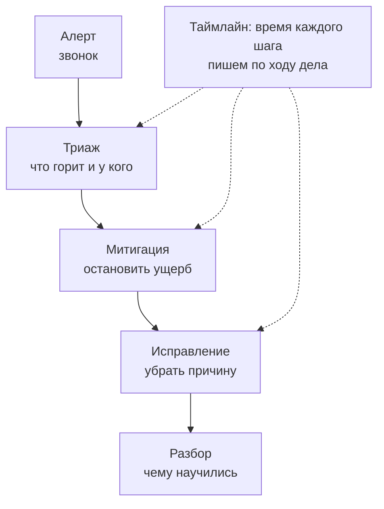
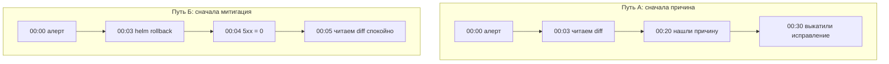
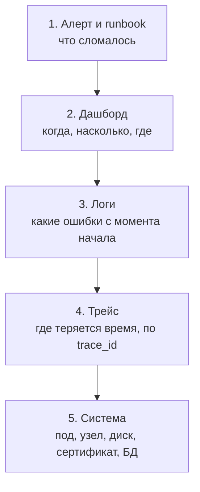
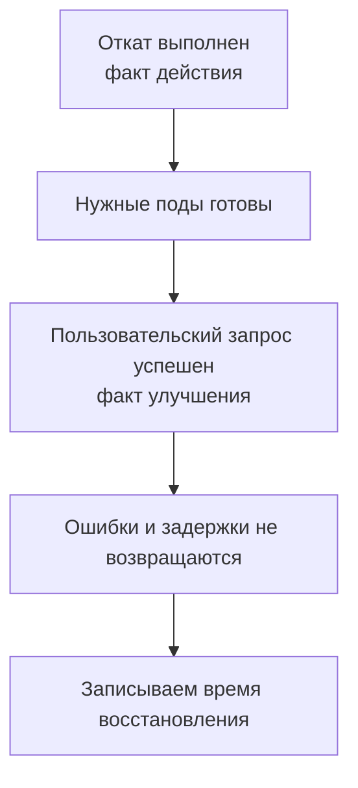
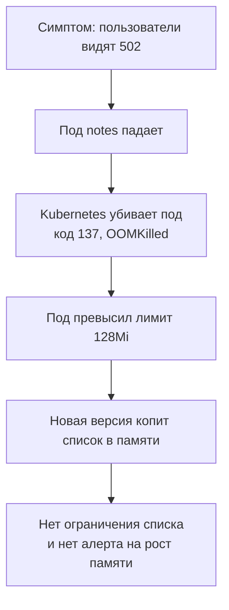

## Зачем это нужно

В три ночи приходит алерт (alert), автоматическое сообщение о проблеме из [урока 8.5](../08-observability/05-alertmanager.md). У тебя нет времени вспоминать `kubectl describe`, команду просмотра подробностей об объекте Kubernetes из [урока 5.13](../05-kubernetes/13-k8s-troubleshooting.md). Дежурство (on-call) означает, что в свою смену ты отвечаешь за такие сообщения и организуешь помощь. Это как дежурный электрик: его вызывают при отключении света, чтобы он проверил масштаб аварии и восстановил подачу. Без назначенного дежурного каждый может подумать, что проблему уже разбирает кто-то другой; порядок действий подробно разберём ниже.

Представь первое ночное дежурство: пришёл алерт, и новичок полчаса читает код, потому что «ошибка же в коде». Пользователи всё это время видят 500. Потом более опытный коллега откатывает релиз за минуту, и ошибки уходят, а код разбирают утром. Порядок «сначала останови вред, потом думай» и есть главное, чему учит этот урок.

Дежурство проверяет не знание инструментов, а порядок действий: что смотреть первым, когда остановить ущерб и когда искать причину. Новички чаще всего сразу лезут чинить код, пока пользователи ещё получают ошибки.

В этом уроке ты не ставишь ничего нового. Ты берёшь всё, что построил в темах 5-9, и тренируешься на сломанных «Заметках». Получив алерт, смотришь дашборд (dashboard), страницу с графиками состояния из [урока 8.6](../08-observability/06-grafana-dashboards.md), затем логи (logs), записи о событиях из [урока 8.7](../08-observability/07-logs-loki-alloy.md), и трейс (trace), путь одного запроса из [урока 8.8](../08-observability/08-tracing.md). Потом проверяешь саму систему.

Сначала ты останавливаешь ущерб: это митигация (mitigation), снижение вреда для пользователей, знакомое по [уроку 8.5](../08-observability/05-alertmanager.md). Как при протечке: сначала перекрыть воду, затем менять трубу. Исправление (fix) устраняет саму причину, например ошибку в коде. Без этого различия можно полчаса искать ошибку, пока люди всё ещё не могут сохранить заметки; подробно разберём ниже.

Шаг проекта: появляется `docs/oncall-log.md` с твоими таймлайнами. Таймлайн (timeline) это журнал событий с временем каждого шага, как запись звонков и выездов у диспетчера. Он помогает восстановить ход аварии по фактам, потому что по памяти легко перепутать порядок; подробно разберём ниже. Также ты обновишь runbook, пошаговые инструкции к алертам из [урока 8.5](../08-observability/05-alertmanager.md).

## Что нужно знать

- [Урок 5.7: пробы, ресурсы и выкатка](../05-kubernetes/07-probes-resources-rollouts.md) - под (pod), оболочка для контейнеров в Kubernetes, может получить `OOMKilled`: контейнер завершён из-за нехватки памяти. Здесь же понадобится откат релиза (release), возврат приложения к прежней версии и настройкам
- [Урок 5.9: Helm](../05-kubernetes/09-helm.md) - `helm history` и `helm rollback` для отката релиза `notes`
- [Урок 5.13: отладка Kubernetes](../05-kubernetes/13-k8s-troubleshooting.md) - алгоритм статус, события, логи, describe, сеть
- [Урок 8.1: SLI, SLO и error budget](../08-observability/01-observability-slo.md) - что считается болью пользователя
- [Урок 8.5: алерты и runbook](../08-observability/05-alertmanager.md) - откуда берётся алерт и куда он ведёт
- [Урок 8.6: дашборды](../08-observability/06-grafana-dashboards.md), [8.7: логи](../08-observability/07-logs-loki-alloy.md), [8.8: трейсы](../08-observability/08-tracing.md) - три источника, по которым ищешь причину
- [Урок 9.4: cert-manager](../09-secrets-gitops/04-cert-manager-tls.md) и [9.5: CloudNativePG](../09-secrets-gitops/05-cnpg.md) - сертификат и БД в кластере
- [Урок 1.5: диск, память, CPU](../01-linux/05-disk-memory-cpu.md) - CPU (central processing unit), процессор, выполняет команды программ; `df`, `du`, `free` помогают проверить диск и память на узле

## Картина целиком

Представь бригаду скорой помощи в ночную смену. Звонок: «человеку плохо». Бригада не начинает с истории болезни. Сначала она **останавливает опасное** (кровотечение, остановку дыхания), потом ставит диагноз, потом лечит причину, а потом врач пишет карточку вызова: что было, что сделали, как не допустить снова.

Дежурство по системе устроено так же:

- **алерт** (alert) это звонок диспетчеру: автоматическое сообщение «с системой что-то не так»;
- **дежурный** (on-call engineer) это бригада, которая выезжает;
- **митигация** (mitigation) это «остановить кровотечение»: снизить вред для пользователей до полного исправления;
- **исправление** (fix) это лечение причины;
- **runbook** это инструкция на стене: «если такой симптом, делай вот это». Симптом (symptom), наблюдаемый признак проблемы, знаком по [уроку 8.5](../08-observability/05-alertmanager.md): например, пользователь видит ошибку, но её причина ещё неизвестна;
- **таймлайн** (timeline) это записи о ходе вызова. Постмортем (postmortem) это разбор после восстановления: что произошло, почему и как уменьшить риск повторения, словно обсуждение вызова бригадой. Без него команда может раз за разом устранять одну и ту же аварийную ситуацию; подробный разбор будет в [уроке 10.2](02-postmortem-runbook.md).

Триаж (triage) на схеме ниже означает быструю оценку срочности и масштаба, как сортировка вызовов у диспетчера: кому помощь нужна первой. Он помогает выбрать первое действие, чтобы не потратить время на малозначимую неисправность; подробно разберём ниже.



На схеме видно главный порядок: ущерб останавливаем до поиска причины, а таймлайн идёт рядом со всеми шагами.

Аналогия не идеальна: у скорой один пациент, а у системы миллионы запросов, и «лечить» её можно, не выходя из дома. Но порядок действий тот же, и именно его проверяют на дежурстве и на собеседованиях.

В этом уроке ты ничего нового не ставишь. Скрипт сломает «Заметки», а ты пройдёшь по цепочке от алерта до причины, запишешь таймлайн и посчитаешь, за сколько починил.

## Теория

### Что такое инцидент, алерт и дежурство

Ночью звонит телефон, и в нём одна строка: «5xx больше 5%». Кто отвечает за это, если все спят? Давай по порядку.

**Инцидент** (incident) это ситуация, в которой система работает хуже, чем обещано пользователям: сайт не открывается, страницы грузятся по минуте, часть запросов падает с ошибкой. Это как перебой в работе магазина: покупатели пришли, но кассы не принимают оплату. Назвав ситуацию инцидентом, команда понимает, что нужна согласованная реакция, а не обычная задача «сделать когда-нибудь». Слово «авария» подходит, но инцидентом называют и небольшие проблемы.

Никто не смотрит на графики круглые сутки. Правило оповещения проверяет метрики, числа о работе системы из [урока 8.1](../08-observability/01-observability-slo.md), и вызывает алерт, когда условие выполняется. Алерт это сообщение о результате этой проверки. Например: «доля ответов с ошибкой 5xx больше 5% уже две минуты». 5xx это ответы сервера с кодами от 500 до 599, то есть «сервер сам не справился» (коды из [темы 2](../02-network/04-http.md)).

Алерт без человека это тревога в пустом доме. В команде составляют график: на неделе за алерты отвечает один человек, следующую неделю другой. Это и есть дежурство (on-call). Дежурный не обязан знать всю систему и чинить всё сам. Его задача: быстро понять масштаб, остановить ущерб и, если не получается, позвать того, кто знает лучше.

> **Прикинь сам:** алерт срабатывает, когда доля ответов 5xx выше 5% две минуты подряд. За эти две минуты было 40 запросов, три из них завершились ошибкой. Сработал ли алерт по делу?
{: .predict}

Три из сорока это 7,5%, порог превышен, алерт сработал верно. Заметь, как мало запросов: на такой малой выборке ошибки случайны, поэтому в реальных правилах к доле добавляют условие «и запросов не меньше N».

> **Проверь понимание:** дежурному пришёл алерт о заполнении диска на 80%. Пользователи пока не страдают. Это инцидент?

<details markdown="1">
<summary>Ответ</summary>

Ещё нет: пользователи ничего не замечают. Это предупреждение, что инцидент может случиться. Но дежурный всё равно обязан отреагировать в разумное время, потому что диск заполнится и тогда станет инцидентом.

</details>

Осторожно: «дежурить значит починить». Нет. Дежурный отвечает за реакцию, а чинить причину может и другая команда, и в другое время суток.

> **Главное:** инцидент это работа хуже обещанного, алерт это автоматический сигнал об этом, дежурство это человек, который в свою смену отвечает за сигнал.
{: .key}

Алертов бывает много, а разбудить можно не по каждому. Как решить, какой важнее?

### Серьёзность алерта (severity)

Один алерт говорит «диск заполнен на 80%», другой «оплата падает у трети клиентов». Будить человека одинаково громко для обоих нельзя.

Если будить человека по любому поводу, он через неделю перестанет реагировать (это называют «усталостью от алертов», alert fatigue, из [урока 8.5](../08-observability/05-alertmanager.md)). Поэтому у каждого алерта есть метка серьёзности (severity), указание срочности из того же урока. В курсе три уровня:

| Уровень | Что значит | Что делаем |
|---|---|---|
| `critical` | пользователи получают ошибки прямо сейчас | реагируем немедленно, хоть ночью |
| `warning` | проблема назревает, но пока не бьёт по людям | разбираемся в рабочее время |
| `info` | просто к сведению | не реагируем, читаем на досуге |

Метку ставит тот, кто пишет алерт, в поле `labels: severity: ...` (мы писали такие правила в [уроке 8.5](../08-observability/05-alertmanager.md)). Alertmanager, программа доставки оповещений из того же урока, по этой метке выбирает получателя. Например, команда может настроить для `critical` звонок на телефон, для `warning` сообщение в рабочий чат; сама метка звонок не включает.

> **Прикинь сам:** тестовый стенд упал целиком, а в боевой оплате 30% запросов завершаются ошибкой. Какой алерт `critical`?
{: .predict}

Второй. `critical` меряет текущий вред пользователям, а не важность по названию. Тестовый стенд пользователей не задевает, поэтому для него хватит `warning`.

> **Проверь понимание:** под «Заметок» раз в минуту перезапускается, но две другие реплики отвечают, ошибок у пользователей почти нет. Какая severity?

<details markdown="1">
<summary>Ответ</summary>

`warning`. Вред пока небольшой, но проблема назревает: если упадут и другие реплики, станет `critical`. Будить человека ночью ради этого не стоит, а вот утром разобраться обязательно.

</details>

Осторожно: `critical` значит «важная система». На самом деле это про **текущий вред пользователям**, а не про важность сервиса. Упавший тестовый стенд критичным не будет, а 30% ошибок в оплате будет.

> **Главное:** severity отвечает на вопрос «страдают ли пользователи прямо сейчас», и от неё зависит, будить ли человека ночью.
{: .key}

Алерт получен, срочность понятна. Но что делает человек, когда к проблеме подключаются несколько людей?

### Роли: дежурный, руководитель инцидента, эскалация

В большой аварии трое одновременно перезапускают один и тот же сервис, а пользователям никто не пишет. Знакомая картина?

В большом инциденте людей много, и без порядка они мешают друг другу: трое чинят одно и то же, никто не пишет пользователям. Поэтому вводят роли.

- **Дежурный** (on-call) первым получает алерт и работает в консоли.
- **Руководитель инцидента** (incident commander, IC) не лезет в консоль. Он держит картину целиком: кто что делает, что уже проверено, что сообщить руководству и пользователям. Аналогия: капитан на мостике не крутит гайки в машинном отделении.

Когда роли нет, команды нет: все делают всё и никто не знает, что известно другим. В одиночной тренировке этого урока ты играешь обе роли, но всё равно записывай в журнал, что делал как дежурный, а что как IC.

**Эскалация** (escalation), привлечение более подходящего специалиста, знакома по [уроку 8.5](../08-observability/05-alertmanager.md). Ты пишешь коротко, что видишь, что уже проверил и что пробовал, и **продолжаешь помогать**. Эскалация не передача вины. Вопрос «кто ошибся» не ускоряет починку, его разбирают потом. Для тренировки возьми порог: нет прогресса 15 минут, значит зови. При большом ущербе или отсутствии нужных прав зови сразу, не жди истечения срока.

> **Прикинь сам:** ты 15 минут не видишь прогресса, а коллега, который знает базу, спит. Что полезнее: ещё полчаса копаться одному или написать ему?
{: .predict}

Написать сразу. Пока ты молчишь, пользователи страдают, а будить коллегу зря стоит дешевле. В сообщении коротко напиши, что видишь и что проверил, и продолжай работать.

> **Проверь понимание:** чем эскалация отличается от передачи вины?

<details markdown="1">
<summary>Ответ</summary>

Эскалация это способ быстрее найти того, кто знает систему: ты передаёшь контекст (что видишь, что уже сделал) и продолжаешь помогать. Вина это вопрос «кто ошибся», он не ускоряет починку и в дежурстве не нужен. Эскалировать после 15 минут без прогресса нормально, молчать час нет.

</details>

Осторожно: эскалировать стыдно. Наоборот, молчаливые полчаса в одиночку обходятся пользователям дороже, чем «разбудил коллегу зря».

> **Главное:** у большого инцидента есть роли: один работает в консоли, другой держит картину, а эскалация это быстрый способ найти знающего, а не признание вины.
{: .key}

Роли распределены. Теперь главное правило действий: что делать раньше, остановить вред или найти причину?

### Митигация раньше исправления

Выкатили релиз, и через четыре минуты 30% запросов падают. Что сделать первым: найти ошибку в коде или вернуть старую версию?

У пользователя болит сейчас, а у причины может быть сложная история. Если сначала искать причину, боль длится всё это время. Поэтому действия делят на две группы:

- **Митигация** (mitigation, смягчение) снижает вред до полного исправления: откат релиза, перезапуск, расширение диска, переключение запросов на другую площадку, отключение сломанной функции.
- **Исправление** (fix) устраняет причину: правка кода, лимитов, конфигурации.

Аналогия: у тебя прорвало трубу. Митигация это перекрыть вентиль. Исправление это заменить трубу. Сначала вентиль, потом сантехник. Аналогия ломается тем, что вентиль в системе бывает не всегда: иногда быстрой остановки нет, и тогда приходится искать причину сразу.

Как понять, что действие подходит как митигация? Три вопроса: оно быстрое (минуты)? обратимое (можно отменить)? безопасное (не сделает хуже)? Откат релиза и перезапуск могут подходить, если совместимость версий и последствия проверены. Ручная правка данных в БД под давлением не подходит: одна опечатка усугубит инцидент.

Выкатили релиз `0.7.1`, через 4 минуты доля 5xx выросла до 30%. Сравни два пути:



Левый путь держит пользователей в ошибках 30 минут, правый 4: причину в обоих нашли, разница только в порядке.

В обоих путях причину нашли. Разница только в том, сколько минут пользователи получали ошибки.

> **Прикинь сам:** при пути А (сначала причина) ошибки шли 30 минут, а при пути Б (сначала откат) 4 минуты. Сколько раз больше потеряли пользователи при пути А?
{: .predict}

30 / 4 = 7,5 раза. Причину в обоих случаях нашли, разница только в порядке действий.

> **Проверь понимание:** 5xx начались через 4 минуты после выкатки. Что делаешь первым: читаешь diff или откатываешь?

<details markdown="1">
<summary>Ответ</summary>

Если предыдущая версия совместима с текущими данными, откатываешь: связь по времени делает релиз первой версией для проверки. Если ошибки не ушли, проверяешь, завершился ли откат, и ищешь другие причины. Это ещё не доказывает невиновность релиза: он мог изменить данные или повредить зависимость. Diff, различия между версиями из [урока 3.1](../03-git-ci/01-git-basics.md), читаешь после снижения ущерба. Гипотеза (hypothesis) это предположение, которое ещё нужно проверить, как догадка «лампа не светит, потому что перегорела»: сначала проверяешь лампу, а не покупаешь новую проводку. Она задаёт конкретную проверку и ожидаемый результат, иначе поиск превращается в случайные действия; подробно разберём ниже.

</details>

Осторожно: рестарт это решение. Нет, часто это только митигация: он сбрасывает состояние, то есть накопленные в памяти данные и текущую работу программы, а причина остаётся. Под с утечкой памяти, когда программа удерживает уже ненужные данные из [урока 1.5](../01-linux/05-disk-memory-cpu.md), после рестарта проработает ещё некоторое время и упадёт снова. Это один из сценариев практики.

> **Главное:** сначала остановить вред быстрым, обратимым и безопасным действием, потом искать причину.
{: .key}

Откат это главная митигация в уроке. Посмотрим, как его сделать на «Заметках».

### Откат релиза: `helm rollback`

Откат одной командой возвращает прежнюю версию, но что именно он возвращает и что нет?

Откат это главная митигация в этом уроке, поэтому разберём её на деле. Релиз `notes` мы ставили через Helm ([урок 5.9](../05-kubernetes/09-helm.md)). Ревизия (revision), запись конкретной установки или обновления из того же урока, хранит шаблоны и настройки релиза под отдельным номером. Перед командой напомним: `history` показывает историю, первое `notes` это имя релиза, `-n notes` выбирает пространство имён. Список смотрят так:

```bash
helm history notes -n notes
```

Так выглядит вывод после трёх выкаток (значения у тебя будут другими):

```text
REVISION  UPDATED                   STATUS      CHART        APP VERSION  DESCRIPTION
1         Mon Sep 28 10:02:11 2026  superseded  notes-0.7.0  0.7.0        Install complete
2         Mon Sep 28 15:40:03 2026  superseded  notes-0.7.1  0.7.1        Upgrade complete
3         Tue Sep 29 03:01:37 2026  deployed    notes-0.7.1  0.7.1        Upgrade complete
```

**Как читать вывод:** `REVISION` это номер записи, `UPDATED` время изменения. `STATUS`: `deployed` это текущая ревизия по данным Helm, `superseded` это старые, заменённые. Статус Helm сам по себе не доказывает здоровье приложения. `CHART` это имя и версия набора шаблонов, `APP VERSION` заявленная версия приложения, `DESCRIPTION` описание события. Если алерт пришёл после ревизии 3 и ревизия 2 была рабочей и совместимой, выбираем её для отката. В команде `rollback` означает откат, `notes` имя релиза, `2` нужную ревизию, `-n notes` пространство имён:

```bash
helm rollback notes 2 -n notes
```

Helm возьмёт настройки ревизии 2 и создаст из них **новую** ревизию 4 (история не стирается, откат тоже записан). Если шаблон пода изменился, Kubernetes заменит поды по настроенной схеме выкатки. Отсутствие простоя зависит от доступных реплик, ресурсов и проверок готовности. `helm history notes -n notes` покажет ревизию 4 со статусом `deployed`; затем отдельно проверь запросы пользователей и ошибки.

> **Прикинь сам:** в истории три ревизии, ты откатываешься на вторую. Какой номер будет у новой ревизии и какая будет текущей?
{: .predict}

Четвёртая: Helm не стирает историю, а создаёт новую ревизию с настройками второй. Она и станет `deployed`.

> **Проверь понимание:** после `helm rollback notes 2` в истории стало четыре ревизии, хотя ты откатывался назад. Почему?

<details markdown="1">
<summary>Ответ</summary>

Откат создаёт новую ревизию 4 с настройками ревизии 2. История только растёт, так проще потом разобраться, что происходило и когда.

</details>

Осторожно: откат «возвращает время назад». Он возвращает только настройки и образ приложения. Данные в БД остаются как были. Если релиз изменил схему БД (переименовал колонку), старый код может не понять новую схему, и откат не поможет. Поэтому изменения схемы делают в два шага: сначала совместимые с обоими версиями, потом чистка.

> **Главное:** `helm rollback notes <ревизия>` возвращает образ и настройки, но не данные в БД, а история ревизий только растёт.
{: .key}

После отката нужно понять, где искать причину. Для этого есть фиксированный порядок.

### Цепочка от алерта к причине

В три ночи голова плохо работает, и хочется открыть сразу всё: логи, код, базу. Фиксированный порядок экономит время именно в такие минуты.

Алерт сообщает **симптом** (то, что видит пользователь), а не причину. Идти к причине помогает фиксированный порядок: он избавляет от метаний, когда в три часа ночи мозг соображает плохо. Каждое звено отвечает на свой вопрос:



Каждое звено отвечает на свой вопрос, а на звене, где нашёл причину, можно остановиться.

Зачем дашборд раньше логов. Логи это тысячи строк. Без времени начала в них не найти нужное, а без масштаба непонятно, срочно ли это. Дашборд даёт эти два числа, и логи ты читаешь уже прицельно. Трейс (trace) это запись пути одного запроса через все части системы ([урок 8.8](../08-observability/08-tracing.md)), а `trace_id` его номер, который приложение пишет в лог. Про метрики, логи и трейсы вместе ты узнал в [уроке 8.1](../08-observability/01-observability-slo.md).

> **Прикинь сам:** на дашборде видно, что ошибки начались в 03:00, но ты сразу открыл логи за сутки. Сколько времени потратишь и почему дашборд лучше?
{: .predict}

Логи за сутки это тысячи строк, и нужную без времени начала не найти. Дашборд за секунды даёт время начала (03:00) и масштаб, после чего ты читаешь логи только с 03:00.

> **Проверь понимание:** зачем в цепочке дашборд стоит раньше логов?

<details markdown="1">
<summary>Ответ</summary>

Дашборд показывает время начала и масштаб. Без времени начала в логах не найти нужное среди тысяч строк, а без масштаба непонятно, срочно ли это. Логи уточняют причину, когда ты уже знаешь, где и когда искать.

</details>

Осторожно: цепочку надо пройти всю. Нет, ты останавливаешься на том звене, где нашёл причину. Но порядок «от общего к частному» не меняешь: так реже пропускаешь очевидное.

> **Главное:** идём от общего к частному: алерт и runbook, дашборд, логи, трейс, система, и останавливаемся там, где нашли причину.
{: .key}

Но с чего начать в самые первые минуты, пока ты не открыл ни одного инструмента?

### Триаж: первые пять минут

Скорая приезжает на вызов и сначала задаёт пять коротких вопросов, а не берётся лечить. То же самое делает дежурный.

Триаж (triage) слово из военной медицины: быстро определить, кому нужна помощь в первую очередь. В дежурстве это пять вопросов, на которые нужно ответить до любых действий:

1. Какой алерт и какая severity? Есть ли runbook?
2. **Кого задело**: все пользователи или часть? Это называют радиусом поражения (blast radius): доля пользователей и функций, которых коснулась проблема. Смотри долю ошибок и число живых реплик (реплика это одна из одинаковых копий приложения, у «Заметок» их три).
3. **Что менялось перед началом**: релиз, конфиг, сертификат, диск? Большинство инцидентов начинается с изменения. Поэтому «что менялось» спрашивают раньше, чем «что сломалось».
4. Можно ли остановить ущерб откатом или рестартом?
5. Если за 15 минут нет прогресса, эскалирую.

Проверить «что менялось» помогают команды из практики. Например, `helm history` показывает время последней выкатки, а `kubectl get events` события кластера. Сверь их время со временем начала на дашборде.

> **Прикинь сам:** ошибки у одной реплики из трёх. Если запросы распределяются поровну, какая доля пользователей пострадала?
{: .predict}

Примерно треть. Радиус поражения ограничен, но проверь версию, узел и нагрузку этой реплики и сравни со здоровыми.

> **Проверь понимание:** ты видишь, что 5xx у одной реплики из трёх, у двух других всё хорошо. Как это меняет твоё решение?

<details markdown="1">
<summary>Ответ</summary>

Радиус поражения ограничен: при равномерном распределении запросов пострадала примерно треть. Сравни версию, узел и нагрузку этой реплики с двумя здоровыми. Одна больная реплика не исключает ошибку релиза: ошибка может проявляться только на определённых запросах. Если остальные реплики выдержат нагрузку, возможная митигация: сохранить сведения о падении, затем заменить больной под и проверить, не вернётся ли проблема.

</details>

> **Главное:** за пять минут ответь на пять вопросов: что за алерт, кого задело, что менялось, можно ли остановить ущерб откатом или рестартом, пора ли эскалировать.
{: .key}

Допустим, триаж не дал быстрой митигации и причину нужно искать. Как не угадывать?

### Гипотеза и проверка: как не чинить наугад

На дежурстве легко принять первую догадку за причину. Увидел 500, решил «сломалась база», перезапустил её, а на самом деле приложение получило неверную настройку. Теперь исходная проблема осталась, а перезапуск добавил новые ошибки. Гипотеза полезна тем, что связывает догадку с наблюдением, которое может её подтвердить или опровергнуть. Подробно тренировать такие объяснения ты будешь в [уроке 10.7](07-mock-interview-junior.md).

Дома не горит настольная лампа. «Перегорела лампочка» и «в розетке нет питания» это две гипотезы. Включить в ту же розетку другую исправную лампу полезнее, чем сразу менять и лампочку, и розетку: ты узнаешь, какая часть не работает. В системе проверка тоже должна различать варианты. Оговорка: неисправности могут сочетаться, поэтому успешная проверка одной части не доказывает здоровье всех остальных.

Сначала запиши факт без объяснения: «с 03:00 запросы к `/notes` отвечают 500, `/healthz` отвечает 200». Затем сформулируй предположение: «приложение живо, но не соединяется с БД». Выбери проверку, которая не меняет систему: прочитать логи приложения с момента начала. До проверки запиши ожидаемый результат: «увижу ошибки соединения». После неё сравни ожидание с фактом. Если вместо ошибок соединения видна ошибка обработки заметки, измени гипотезу. Если ошибок вообще нет, проверь, те ли поды и время ты выбрал: отсутствие записи не равняется отсутствию проблемы.

В 03:05 ты видишь такую строку журнала:

```text
03:05 факт: /notes отвечает 500, /healthz отвечает 200
03:06 гипотеза: приложение не может соединиться с БД
03:07 проверка: в логах с 03:00 есть Connection refused при обращении к БД
03:08 следующая проверка: состояние подов PostgreSQL и события
```

**Как читать запись:** первая строка описывает измеренное поведение, вторая предположение. Третья добавляет свидетельство: `Connection refused`, отказ в соединении из [урока 2.4](../02-network/04-http.md), означает, что соединение не принято. Это поддерживает гипотезу о недоступности БД, но ещё не объясняет, почему она недоступна. Четвёртая строка задаёт следующую проверку. Не пишем «причина найдена» раньше, чем установили конкретную неисправность.

> **Прикинь сам:** в 03:07 в логах нашёлся `Connection refused` к БД. Значит ли это, что БД сломана?
{: .predict}

Нет, это только подтверждает, что приложение не достучалось до БД. Почему: упал под БД, закрыт порт или неверный адрес, покажет следующая проверка (состояние подов и события).

> **Проверь понимание:** после перезапуска приложения и БД ошибки исчезли. Можно ли уверенно сказать, какая из двух частей была причиной?

<details markdown="1">
<summary>Ответ</summary>

Нет: две вещи изменились одновременно. Ты знаешь, что система восстановилась, но для вывода о причине нужны сохранённые логи, события и отдельная проверка. В таймлайне запиши оба действия, а неопределённость оставь явной.

</details>

Осторожно: «После моего действия стало лучше» ещё не означает «именно моё действие помогло». В то же время могла восстановиться БД или закончиться всплесковая нагрузка. Поэтому записывай время каждого действия и меняй по одной вещи, если срочность позволяет. При сильном ущербе восстановление важнее чистоты эксперимента, но несколько одновременных действий обязательно отметь в журнале.

> **Главное:** гипотеза это предположение с проверкой и ожидаемым результатом, записанными до проверки, и менять лучше по одному действию за раз.
{: .key}

Предположим, мы что-то сделали. Как убедиться, что это действительно помогло?

### Проверка восстановления: когда митигация действительно помогла

Команда завершилась успешно, но пользователь всё ещё видит ошибку. Такое бывает после отката: Helm уже записал новую ревизию, а поды ещё запускаются. Поэтому у действия должны быть две отдельные проверки: выполнилось ли оно и изменилось ли поведение сервиса. Иначе ты остановишь поиск проблемы слишком рано.

Электрик поднял выключатель в щитке. Это подтверждает действие, но восстановление проверяют по свету в комнате. Если лампа не горит, работа ещё не завершена. В системе одной «лампы» мало: функции и пользователи могут идти разными путями, поэтому проверка одного удачного запроса не доказывает восстановление всего сервиса.

До митигации выбери признак успеха, связанный с исходной проблемой. При ошибках сохранения заметок нужно проверить `/notes`, а не только `/healthz`. После действия сначала убедись, что нужная версия и готовые реплики появились. Затем повтори пользовательский запрос через тот же внешний адрес, на котором была ошибка. Посмотри долю ошибок и время ответов на дашборде за несколько обновлений. Наконец, проверь, не возвращается ли исходный признак: например, не растёт ли память после рестарта. Продолжительность наблюдения выбирай по поведению поломки, а не по желанию быстрее закончить.

До отката за минуту было 100 запросов к `/notes`, из них 30 завершились 5xx. Доля ошибок: 30 / 100 × 100% = 30%. После отката за следующую минуту было 120 запросов, из них 0 с ошибкой: 0 / 120 × 100% = 0%. Это свидетельство улучшения при реальном потоке запросов. Если после отката запросов было 0, деление на 0 невозможно: пустой график не подтверждает восстановление. Сделай проверочный запрос и убедись, что наблюдаешь нужный сервис.



Время восстановления относится к проверке запроса, а не к моменту, когда ты нажал Enter.

В таймлайне разделяй моменты: «03:07 запустил откат», «03:08 проверил запросы, ошибок нет». Время восстановления относится ко второму событию, а не к нажатию Enter. Утечку памяти это ещё не исправляет: её поиск остаётся отдельной задачей после снятия срочного ущерба.

> **Прикинь сам:** до отката за минуту было 100 запросов, 30 с ошибкой, после отката 120 запросов, 0 с ошибкой. Что было до и после в процентах?
{: .predict}

До: 30 / 100 = 30%. После: 0 / 120 = 0%. Улучшение подтверждено потоком реальных запросов, а не одной удачной проверкой.

> **Проверь понимание:** `/healthz` отвечает 200 после рестарта, а сохранение заметки по-прежнему завершается ошибкой. Митигация успешна?

<details markdown="1">
<summary>Ответ</summary>

Нет. Процесс жив, но нужная пользователю функция ещё не работает. Продолжай проверять `/notes`, готовность и доступность БД. Успех команды и здоровье процесса не заменяют проверку исходного симптома.

</details>

Осторожно: Уведомление «алерт погас» равно восстановлению. Нет: алерт мог исчезнуть из-за прекращения поступления метрик или потому, что условие проверяется за несколько минут и ещё отражает старые данные. Сверяй сообщение с запросами и графиками. Не жди полной починки кода, чтобы отметить восстановление, но и не закрывай инцидент только по статусу пода `Running`.

> **Главное:** восстановление подтверждают пользовательским запросом и графиками ошибок, а не успехом команды, статусом `Running` или тем, что алерт погас.
{: .key}

Мы научились останавливать вред. Теперь о том, как докопаться до настоящей причины, а не до первой попавшейся.

### Симптом и причина: почему нельзя останавливаться на первой найденной

Под упал, ты его перезапустил, и через час всё повторилось. Ты нашёл симптом, а не причину.

Симптом это то, что видит пользователь: 502, «медленно», ошибка. Причина это то, что его вызывает. Причины бывают вложенными, как матрёшка. Метод «пять почему» помогает раскрутить цепочку: спрашиваешь «почему?» после каждого ответа.



Каждый шаг вниз отвечает на вопрос «почему?». Менять в системе можно только нижние узлы, поэтому остановка на втором означала бы повтор инцидента.

Остановиться на втором ответе («под падает») значит перезапустить под и получить тот же инцидент через час. Остановиться на пятом значит закрыть причину: и код поправить, и алерт добавить.

> **Прикинь сам:** в цепочке «пять почему» ты остановился на втором ответе «под убит с кодом 137». Что произойдёт после перезапуска пода?
{: .predict}

Он снова упрётся в лимит памяти и будет убит. Остановка на втором «почему» оставляет причину на месте.

> **Проверь понимание:** «сервис упал, потому что он упал». Что здесь не так?

<details markdown="1">
<summary>Ответ</summary>

Это симптом, названный причиной. Нужно спросить «почему упал» и найти конкретное: нехватка памяти, ошибка в коде, отказ зависимости. Пока причина не названа конкретно, ты не знаешь, что чинить.

</details>

Осторожно: «пять» это буквально пять. Нет, это ориентир: спрашивай, пока ответом не станет что-то, что ты можешь изменить в системе или в процессе.

> **Главное:** спрашивай «почему?», пока ответом не станет то, что можно изменить в системе или в процессе.
{: .key}

Чтобы не терять время, полезно знать самые частые причины. Их в тренировке пять.

### Пять классов поломок и их первые признаки

Все пять поломок тренировки выглядят одинаково: пользователи видят ошибку. Различаются они первыми признаками.

В практике скрипт ломает «Заметки» одним из пяти способов. Чтобы быстро различать их, запомни, чем каждый выглядит в первую минуту. Все они могут выглядеть одинаково («5xx у пользователей»), а отличаются деталями.

**1. OOM (Out Of Memory, нехватка памяти).** У контейнера в Kubernetes есть лимит памяти ([урок 5.7](../05-kubernetes/07-probes-resources-rollouts.md)). Если приложение превышает его, ядро Linux убивает процесс сигналом SIGKILL (9), принудительным завершением из [урока 1.4](../01-linux/04-processes-signals.md). Код выхода при этом 128 + 9 = 137. Признак: растёт колонка `RESTARTS`, а в `kubectl describe pod` есть

```text
    Last State:     Terminated
      Reason:       OOMKilled
      Exit Code:    137
```

`Last State` это состояние прошлого запуска контейнера, `Reason: OOMKilled` (убит из-за памяти), `Exit Code: 137` подтверждает SIGKILL. Митигация: рестарт. Исправление: найти утечку или поднять лимит.

**2. Диск.** Приложение пишет данные в каталог `/data`. Когда место кончается, запись падает с ошибкой `No space left on device`, приложение перестаёт быть готовым и `/readyz` отвечает 503. Признак: `df -h` показывает 100%. Ловушка: `du` показывает мало, потому что файл удалён, но процесс держит его открытым, и место не освобождается ([урок 1.5](../01-linux/05-disk-memory-cpu.md)).

**3. 5xx после релиза.** Признак не в самом поде, а во времени: рост ошибок начался сразу после новой ревизии в `helm history`. Митигация: `helm rollback`.

**4. Сертификат.** Сертификат это файл, которым сервер подтверждает свою подлинность при установлении защищённого соединения (HTTPS из [урока 2.6](../02-network/06-tls.md)). У него есть срок жизни. Признак: клиент видит ошибку TLS, защиты соединения из того же урока, при этом под живой, `/healthz` внутри кластера отвечает. Сертификатами занимается cert-manager, программа автоматического выпуска и продления из [урока 9.4](../09-secrets-gitops/04-cert-manager-tls.md). Проверь её состояние и Issuer, описание способа получения сертификата из того же урока; причиной также может быть неверный сертификат, который отдаёт внешний вход в сервис.

**5. БД недоступна.** «Заметки» хранят данные в PostgreSQL ([урок 9.5](../09-secrets-gitops/05-cnpg.md)). Без базы приложение живо, но работать не может. Признак: `/readyz` возвращает 503, `/healthz` 200, в логах ошибки соединения, `/notes` падает. Различие двух проб мы разбирали в [уроке 5.7](../05-kubernetes/07-probes-resources-rollouts.md): `liveness` отвечает на вопрос «процесс жив?», `readiness` на вопрос «готов принимать запросы?». Поэтому Kubernetes не перезапускает под, а просто убирает его из балансировки.

> **Прикинь сам:** `/healthz` отвечает 200, `RESTARTS 0`, а пользователи получают ошибку TLS. Какой класс поломки вероятнее всего?
{: .predict}

Сертификат: ошибка TLS появляется до ответа приложения, а само приложение живо. Дальше проверь `kubectl get certificate` и состояние cert-manager.

Осторожно: «если есть 5xx, значит упал код». Как видишь, пять разных причин дают один симптом. Различают их первые признаки, а не сам факт ошибок.

> **Главное:** OOM даёт рост `RESTARTS` и код 137, диск даёт `No space left on device`, релиз даёт скачок после новой ревизии, сертификат даёт ошибку TLS при живом поде, БД даёт `/readyz` 503 при `/healthz` 200.
{: .key}

Любую поломку нужно записывать по ходу дела. Как это делать, чтобы по записи считать время?

### Таймлайн, метрики MTTD, MTTA, MTTR

Через час после аварии никто не помнит, что было раньше: откат или звонок коллеге. Запись по ходу дела это единственная надёжная память.

**Таймлайн** это список событий со временем: когда пришёл алерт, когда ты его увидел, что проверил, что сделал, когда стало лучше. Пиши по ходу дела, а не по памяти: через час порядок событий забудется. Это основа постмортема из [урока 10.2](02-postmortem-runbook.md).

По таймлайну считают три времени:

- **MTTD** (mean time to detect): от начала проблемы до алерта. Показывает, хорошо ли мониторинг замечает проблемы.
- **MTTA** (mean time to acknowledge): от алерта до того, как человек взялся за дело.
- **MTTR** (mean time to recover): от начала проблемы до восстановления.

(Слово «mean» значит «среднее»: по многим инцидентам. Пока у тебя один инцидент, считай просто время.)

Разобранный пример из таймлайна:

```text
03:00  ошибки начались (видно на дашборде постфактум)
03:02  пришёл алерт            -> время обнаружения = 03:02 - 03:00 = 2 минуты
03:04  дежурный подтвердил     -> реакция = 03:04 - 03:02 = 2 минуты
03:08  митигация, ошибок нет   -> восстановление = 03:08 - 03:00 = 8 минут
```

> **Прикинь сам:** ошибки начались в 02:50, алерт пришёл в 02:55, ты подтвердил его в 02:58, ошибки пропали в 03:05. Чему равны MTTD, MTTA и MTTR?
{: .predict}

MTTD: 02:55 - 02:50 = 5 минут. MTTA: 02:58 - 02:55 = 3 минуты. MTTR: 03:05 - 02:50 = 15 минут.

> **Проверь понимание:** что показывает большой MTTD при маленьком MTTR?

<details markdown="1">
<summary>Ответ</summary>

Чинят быстро, но узнают о проблеме поздно. Это дыра в мониторинге, а не в дежурных: значит, нужен алерт, который сработает раньше. Ровно это ты сделаешь в задании 4.

</details>

Осторожно: MTTR это время до полной починки. Нет, это время до восстановления сервиса для пользователей, то есть до митигации. Исправление причины после этого измеряют отдельно.

> **Главное:** MTTD это время до обнаружения, MTTA до реакции, MTTR до восстановления для пользователей (не до починки кода).
{: .key}

Таймлайн фиксирует прошлое, а как подготовить подсказки на будущее?

### Runbook: инструкция для человека в 3 часа ночи

Тебе нужно разбудить коллегу, который никогда не видел эту систему. Что ты ему дашь, чтобы он справился с алертом?

**Runbook** это короткая пошаговая инструкция к конкретному алерту. Она нужна, потому что ночью человек, даже опытный, соображает хуже, а нового сотрудника вообще может поднять впервые. Хороший runbook содержит три вещи: как **подтвердить симптом одной командой**, что делать **прямо сейчас** (безопасная митигация) и **когда эскалировать**. История проблемы и теория в него не нужны: они полезны на разборе, но не при тушении. Ссылка на runbook лежит в аннотации алерта `runbook_url`, поэтому дежурный видит её прямо в сообщении.

> **Прикинь сам:** runbook к алерту занимает три страницы с историей проблемы. Прочитает ли его дежурный в три часа ночи?
{: .predict}

Скорее всего нет. Оставь три вещи: команду, которая подтверждает симптом, безопасную митигацию и условие эскалации, а историю убери в разбор.

> **Проверь понимание:** какие три раздела нужны дежурному в runbook, а какие лишние?

<details markdown="1">
<summary>Ответ</summary>

Нужны: подтверждение симптома одной командой, безопасная митигация, условие эскалации. Лишние в этот момент: история проблемы и теория.

</details>

Осторожно: чем runbook подробнее, тем лучше. Наоборот, если для действия нужно читать три страницы, ночью его не прочтут. Делай короче и проверяй на человеке, который видит систему впервые.

> **Главное:** runbook коротко отвечает на три вопроса: как подтвердить симптом, что делать сейчас и когда звать на помощь.
{: .key}

Пока дежурный работает по runbook, остальные ждут новостей. Как не отвлекать его вопросами?

### Общение во время инцидента

Пока дежурный чинит, у остальных возникают вопросы: «работает ли оплата?», «когда починят?». Если дежурный отвечает каждому в личке, он не чинит. Поэтому договариваются о простом порядке.

- Для инцидента заводят один общий канал (чат-комнату). Все вопросы туда, а не в личку.
- Раз в 15-30 минут кто-то (обычно IC) пишет **обновление статуса** по одной и той же форме: что известно, что делаем, когда следующее обновление. Даже «пока нового нет, следующий апдейт в 03:30» полезно: люди перестают тревожиться и не пишут дежурному.
- В обновлениях описывают влияние на пользователей (impact), какие функции недоступны и кому, а не только состояние программы: «часть запросов на создание заметок завершается ошибкой», а не «под notes-6d9f в OOMKilled». Как оформить это в разборе инцидента, покажет [урок 10.2](02-postmortem-runbook.md).
- Не обещают сроков, которых не знают. Честно: «причину ищем, следующий апдейт через 15 минут».

Пример хорошего обновления:

```text
03:15 [notes] Ситуация: около трети запросов на /notes получает ошибку 500 с 03:00.
Что делаем: откатываем релиз 0.7.1 до 0.7.0.
Следующее обновление: 03:30 или раньше, если станет лучше.
```

> **Прикинь сам:** инцидент идёт 45 минут, обновления выходят каждые 15 минут. Сколько обновлений получат коллеги, если первое было в начале?
{: .predict}

Одно в начале и три после: на 15-й, 30-й и 45-й минутах, всего четыре. Каждое сообщение убирает вопросы в личку.

> **Проверь понимание:** ты не знаешь причины и не знаешь, когда починят. Что пишешь в обновлении?

<details markdown="1">
<summary>Ответ</summary>

Пишешь факты и время следующего обновления: «влияние такое-то, причину ищем, проверили то-то, следующий апдейт в 03:30». Не выдумываешь срок починки и не молчишь.

</details>

Осторожно: писать в чат значит терять время. Нет: короткое сообщение раз в 15 минут экономит больше времени, чем стоит, потому что убирает десять вопросов в личку.

> **Главное:** один общий канал, обновление каждые 15-30 минут по одной форме, влияние на пользователей вместо внутренних имён и никаких обещаний срока, которого не знаешь.
{: .key}

Теория закончилась. Теперь ты сам сломаешь «Заметки» и починишь их по этому порядку.

## Практика

Для всех заданий нужен работающий стенд: кластер kind `notes`, релиз `notes` из чарта `helm/notes` в namespace `notes`, стек мониторинга в namespace `monitoring` (урок 8.9). Дашборд и Prometheus открываются через `port-forward`.

### Задание 1. Подготовь стенд и чек-лист первых пяти минут

**Цель:** убедиться, что стенд здоров, и завести файл для записи инцидентов.

**Предскажи:** сколько подов `notes` должно быть в состоянии `Running` и `READY 1/1` на здоровом стенде? Что покажет `helm history`?

<details markdown="1">
<summary>Ответ</summary>

Столько, сколько реплик в чарте (по умолчанию 3, если HPA не изменил), все `1/1`. `helm history` покажет историю ревизий релиза `notes`, последняя со статусом `deployed`. Номер последней ревизии пригодится для отката.

</details>

**Шаги:**

1. Проверь состояние. Команды по очереди: `kubectl config use-context kind-notes` переключает `kubectl` на твой учебный кластер (контекст это «к какому кластеру сейчас обращаемся»); `kubectl get pods -n notes` показывает поды в пространстве имён `notes` (`-n` задаёт namespace); `helm history` показывает ревизии релиза (см. теорию); `| head -n 5` обрезает вывод до первых пяти строк.

```bash
kubectl config use-context kind-notes
kubectl get pods -n notes
helm history notes -n notes
kubectl get pods -n monitoring | head -n 5
```

2. Открой Grafana в отдельном терминале (имя сервиса зависит от релиза стека, посмотри `kubectl get svc -n monitoring`):

```bash
kubectl port-forward -n monitoring svc/kps-grafana 3000:80
```

3. Создай файл `docs/oncall-log.md` в репозитории `~/notes`:

```bash
mkdir -p ~/notes/docs
cat > ~/notes/docs/oncall-log.md <<'DOC'
# Журнал дежурств

Одна запись на инцидент. Время в формате ЧЧ:ММ, пиши по ходу, а не по памяти.

## Чек-лист первых пяти минут

1. Что за алерт, какая severity, есть ли runbook.
2. Все ли пользователи затронуты (доля ошибок, сколько реплик живо).
3. Что менялось перед началом: релиз, конфиг, сертификат, диск.
4. Можно ли остановить ущерб откатом или рестартом.
5. Если за 15 минут нет прогресса, эскалирую.

## Записи
DOC
```

**Что должно получиться:**

```text
NAME                     READY   STATUS    RESTARTS   AGE
notes-6d9f7c8b5-4kx2p    1/1     Running   0          2d
notes-6d9f7c8b5-9tq7m    1/1     Running   0          2d
notes-6d9f7c8b5-zw8nv    1/1     Running   0          2d
```

Имена подов и возраст у тебя будут другими. Важно: все `Running`, `RESTARTS 0`.

**Как читать вывод:** `READY 1/1` значит «в поде один контейнер из одного готов принимать запросы». `STATUS Running` значит «контейнер запущен» (это ещё не «здоров», для этого есть `READY`). `RESTARTS` считает перезапуски контейнера: на здоровом стенде ноль, рост числа это первый признак OOM или падений. `AGE` это время жизни пода.

**Объясни себе:**
- Зачем чек-лист лежит в репозитории, а не в голове?
- Почему в пункте 3 первым идёт «что менялось», а не «что сломалось»?

**Типичные ошибки:**
- `error: no context exists with the name: "kind-notes"`: кластер не создан или удалён: пересоздай по [уроку 5.1](../05-kubernetes/01-why-k8s-cluster.md).
- `Error: release: not found`: релиз в другом namespace: добавь `-n notes` или проверь `helm list -A`.
- `error: unable to forward port because pod is not running`: сервис Grafana указывает на упавший под: `kubectl get pods -n monitoring`, подожди `Running`.

### Задание 2. Первый сценарий по секундомеру

**Цель:** пройти цепочку от алерта до митигации на случайной поломке и записать таймлайн.

**Предскажи:** ты запускаешь скрипт поломки, а тебе не говорят, что именно сломано. Какие три команды выполнишь первыми, чтобы понять, куда смотреть?

<details markdown="1">
<summary>Ответ</summary>

`kubectl get pods -n notes` (статусы и перезапуски), `kubectl get events -n notes --sort-by=.lastTimestamp` (что произошло в кластере), `curl` на `https://notes.lab/notes` (что видит пользователь). Эти три команды сразу разделяют классы поломок: под не стартует, под падает, под живой, но отвечает ошибкой.

</details>

**Шаги:**

1. Скачай скрипт поломки и запусти случайный сценарий. Содержимое не читай: иначе тренировка теряет смысл. Разбор команды: `curl -fsSL -o файл URL` скачивает файл (`-f` даёт ошибку вместо HTML-страницы «не найдено», `-s` убирает индикатор, `-S` оставляет сообщения об ошибках, `-L` идёт по перенаправлениям, `-o` задаёт имя файла). Аргумент `random` выбирает один из пяти сценариев случайно и не говорит какой. Скрипт работает от твоего пользователя через `kubectl` и `helm`, поэтому `sudo` не нужен.

```bash
curl -fsSL -o /tmp/break-10.1.sh https://raw.githubusercontent.com/distinguished-sre/learning/main/devops/project/notes/break/10.1/break.sh
bash /tmp/break-10.1.sh random
```

2. Включи секундомер. Считай, что тебя разбудил алерт `NotesHighErrorRate`, `NotesDown` или `NotesHighLatency`.
3. Иди по цепочке: алерт и runbook, дашборд, логи, трейс, система. После каждого шага запиши в `docs/oncall-log.md` строку `ЧЧ:ММ что сделал и что увидел`.
4. Сначала митигируй, потом чини причину.
5. Убедись, что боль ушла, повторив запрос и посмотрев на дашборд.
6. Останови секундомер, посчитай время до восстановления.

Полезные команды по ходу дела. `kubectl describe pod` показывает подробности одного пода, в том числе `Last State` и раздел `Events` внизу, поэтому `| tail -n 30` оставляет последние 30 строк. `-l app.kubernetes.io/name=notes` выбирает поды по метке. `kubectl logs --tail=50` печатает 50 последних строк лога. `kubectl top pod` показывает текущий расход процессора и памяти. В `curl` флаг `-k` не проверяет сертификат, `-o /dev/null` выбрасывает тело ответа, а `-w '%{http_code}\n'` печатает только код ответа.

```bash
kubectl get pods -n notes
kubectl describe pod -n notes -l app.kubernetes.io/name=notes | tail -n 30
kubectl logs -n notes -l app.kubernetes.io/name=notes --tail=50
kubectl top pod -n notes
curl -sk -o /dev/null -w '%{http_code}\n' https://notes.lab/notes
```

**Что должно получиться:** в конце `curl` возвращает `200`, все поды `Running 1/1`, а в журнале есть запись вида:

```text
### 2026-09-29, сценарий 1
- 03:02 алерт NotesHighErrorRate, critical
- 03:04 дашборд: 5xx выросли с 03:00, затронуты все реплики
- 03:07 kubectl describe: причина найдена
- 03:08 митигация: сделал <действие>, 5xx упали
- 03:15 исправление: <что изменил, чтобы не повторилось>
MTTR: 8 минут
```

**Объясни себе:**
- Что было митигацией, а что исправлением, и чем они отличались по времени?
- Какой сигнал (дашборд, лог, `describe`) первым указал на причину?
- Что бы ты сделал иначе, если бы не знал, что ситуация учебная?

**Типичные ошибки:**
- `curl: (60) SSL certificate problem: unable to get local issuer certificate`: тренируешься без `-k`, а локальный CA не в доверенных: добавь `-k` для учебной проверки (в реальном инциденте это уже симптом сертификата).
- `Error from server (BadRequest): container "notes" in pod "..." is waiting to start`: логов ещё нет, смотри `kubectl describe pod`, раздел `Events`.
- `Error: UPGRADE FAILED: another operation (install/upgrade/rollback) is in progress`: предыдущая операция Helm зависла: `helm history notes -n notes`, при статусе `pending-upgrade` откати на последнюю ревизию `deployed`.

> Застрял на сценарии? Вставь нейросети текст алерта и вывод `kubectl get pods` и спроси, какие классы поломок из урока подходят. Проверь её ответ командами из задания: нейросеть видит только то, что ты ей показал.
{: .ai}

### Задание 3. Ещё три сценария

**Цель:** отработать разные классы поломок и научиться их различать по первым признакам.

**Предскажи:** какой первый признак у каждой из пяти поломок: OOM, диск, 5xx после релиза, сертификат, БД недоступна?

<details markdown="1">
<summary>Ответ</summary>

- OOM: растёт `RESTARTS`, в `describe` `Last State: Terminated, Reason: OOMKilled`, `Exit Code: 137`.
- Диск: ошибки записи (`No space left on device`) в логах, `/readyz` отвечает 503, `df` показывает 100%.
- 5xx после релиза: скачок доли ошибок совпадает по времени с новой ревизией в `helm history`.
- Сертификат: клиенты видят ошибку TLS, при этом под живой и `/healthz` отвечает внутри кластера.
- БД: `/readyz` возвращает 503, в логах ошибки соединения, `/notes` падает, а `/healthz` живой.

</details>

**Шаги:**

1. Перед каждым новым сценарием верни стенд в исходное состояние:

```bash
bash /tmp/break-10.1.sh fix
kubectl get pods -n notes
```

2. Запусти `bash /tmp/break-10.1.sh random` и пройди цепочку, как в задании 2. Повтори минимум три раза. Если сценарий выпал тот же, что раньше, запусти снова.
3. Для каждой поломки заполни запись в журнале и добавь строку `Признак:` с тем, что первым отличило её от остальных.
4. Сверься с таблицей типовой митигации:

```text
Класс поломки       Митигация                            Исправление
OOM                 kubectl rollout restart deployment   поднять limits или найти утечку
Диск                освободить место, расширить том      ротация, алерт на заполнение
5xx после релиза    helm rollback notes <ревизия>        починить код или конфиг релиза
Сертификат          вернуть cert-manager, удалить Secret  проверить Issuer и срок, алерт на срок
БД недоступна       восстановить БД или её под           разобрать причину, проверить failover
```

**Что должно получиться:** три записи в `docs/oncall-log.md` с разными классами поломок, у каждой MTTR и строка `Признак:`.

**Объясни себе:**
- Какие два сценария выглядели одинаково в первую минуту (оба дают 5xx) и как ты их развёл?
- В каком сценарии рестарт лишь скрыл проблему, а не решил её?

**Типичные ошибки:**
- `Error from server (NotFound): deployments.apps "notes" not found`: релиз поставлен под другим именем или в другом namespace: `kubectl get deploy -A`.
- `Error: no revision for release "notes"`: откатывать нечего, релиз ставился один раз: почини конфиг вперёд через `helm upgrade`.
- `Error: rollback "notes" failed: no revision for release notes`: указана несуществующая ревизия: сначала `helm history notes -n notes`, потом номер из списка.

### Задание 4. Алерт, который не сработал

**Цель:** найти дыру в мониторинге и закрыть её.

**Предскажи:** в сценарии с OOM под перезапускается каждые 30-60 секунд. Сработает ли `NotesDown`, если хотя бы одна из трёх реплик всегда жива?

<details markdown="1">
<summary>Ответ</summary>

Нет. `NotesDown` срабатывает, когда цель недоступна целиком, а две живые реплики отвечают. Пользователи получают редкие ошибки, а дежурный не получает ничего. Это дыра: алерт на симптом отсутствует, пока не вырастет доля 5xx.

</details>

**Шаги:**

1. Вспомни свои таймлайны: в каком сценарии ты узнал о проблеме сам, а не по алерту? Запиши в журнал строку `Алерт не сработал:` с описанием.
2. Проверь, что за перезапусками контейнеров можно следить метрикой kube-state-metrics:

```bash
kubectl port-forward -n monitoring svc/kps-kube-prometheus-stack-prometheus 9090:9090
```

3. В интерфейсе Prometheus (`http://localhost:9090`) выполни запрос на языке PromQL. Разбор: `kube_pod_container_status_restarts_total` это счётчик перезапусков контейнера (только растёт), `{namespace="notes"}` оставляет ряды нашего namespace, `[15m]` берёт данные за 15 минут, `increase(...)` показывает, на сколько счётчик вырос за это окно:

```promql
increase(kube_pod_container_status_restarts_total{namespace="notes"}[15m])
```

Результат: число перезапусков за 15 минут для каждого пода, на здоровом стенде 0. Если запрос вернул «Empty query result», у стека нет kube-state-metrics или ты открыл не тот Prometheus.

4. Добавь правило в список `rules` файла `helm/notes/templates/prometheusrule.yaml`, рядом с существующими алертами. Отступы сохрани по соседним правилам:

```yaml
- alert: NotesPodRestarting
  expr: increase(kube_pod_container_status_restarts_total{namespace="notes"}[15m]) > 2
  for: 1m
  labels:
    severity: warning
  annotations:
    summary: "Под notes перезапускается чаще двух раз за 15 минут"
    runbook_url: "docs/runbooks/notes-pod-restarting.md"
```

5. Задеплой изменение и повтори OOM-сценарий. Убедись, что алерт появился в `Alerts` интерфейса Prometheus:

```bash
helm upgrade notes ~/notes/helm/notes -n notes -f ~/notes/helm/notes/values-dev.yaml
```

Разбор правила: `expr` условие срабатывания (больше двух перезапусков за 15 минут); `for: 1m` держит алерт в состоянии `Pending`, пока условие истинно минуту, и только потом делает его `Firing` (это отсекает разовые всплески); `labels.severity` это серьёзность из теории; `annotations` тексты для человека, `runbook_url` ведёт к инструкции.

**Что должно получиться:** в Prometheus на странице `Alerts` правило `NotesPodRestarting` переходит из `Pending` в `Firing` при повторе OOM.

**Объясни себе:**
- Почему `for: 1m`, а не `0m`?
- Почему этот алерт `warning`, а не `critical`?

**Типичные ошибки:**
- `Error: UPGRADE FAILED: error validating "": ... unknown field`: правило вставлено с неверным отступом: сравни с соседним алертом.
- `Error: values-dev.yaml: no such file or directory`: неверный путь: файл лежит в `helm/notes/values-dev.yaml`.
- Алерт не появляется в Prometheus: правило не подхвачено: проверь, что у `PrometheusRule` есть лейбл `release`, как в [уроке 8.9](../08-observability/09-k8s-monitoring.md).

> После тренировки отдай нейросети свой `docs/oncall-log.md` и попроси найти записи без доказательств причины. Решай по каждому замечанию сам: она не знает, что ты реально видел.
{: .ai}

### Задание 5. Шаг проекта: журнал и обновлённые runbook

**Цель:** зафиксировать выводы тренировки в проекте: `docs/oncall-log.md` и runbook.

**Предскажи:** какие три раздела в runbook нужны дежурному в 3 часа ночи, а какие лишние?

<details markdown="1">
<summary>Ответ</summary>

Нужны: как подтвердить симптом одной командой, безопасная митигация (что сделать прямо сейчас), когда эскалировать. Лишние в этот момент: история проблемы и теория. Они полезны на разборе, но не при тушении.

</details>

**Шаги:**

1. Добавь в конец `docs/oncall-log.md` итог по всем сценариям:

```bash
cat >> ~/notes/docs/oncall-log.md <<'DOC'

## Итоги тренировки

| Сценарий | Первый признак | Митигация | MTTR |
|---|---|---|---|
| OOM | RESTARTS растёт, exit code 137 | rollout restart | заполни |
| Диск | No space left on device в логах | освободить место | заполни |
| 5xx после релиза | скачок 5xx после новой ревизии | helm rollback | заполни |
| Сертификат | ошибка TLS при живом поде | перевыпуск | заполни |
| БД недоступна | /readyz 503, /healthz 200 | восстановить БД | заполни |

## Что улучшить

- заполни: какой алерт добавил и почему
DOC
```

2. Открой runbook алерта, который отвечал за твой самый долгий сценарий (`docs/runbooks/`), и допиши три вещи: команду подтверждения симптома, безопасную митигацию, условие эскалации.
3. Убедись, что у каждого алерта в `alerts.yml` и в чарте есть работающая ссылка `runbook_url`.
4. Зафиксируй результат в git:

```bash
cd ~/notes
git add docs/oncall-log.md docs/runbooks helm/notes/templates/prometheusrule.yaml
git commit -m "docs: журнал дежурств и обновлённые runbook по итогам тренировки"
```

Разбор: `cat >> файл <<'DOC' ... DOC` дописывает текст в конец файла (`>>` добавляет, а одиночный `>` затёр бы файл). `git add` отбирает файлы для коммита, `git commit -m` фиксирует их с сообщением ([урок 3.1](../03-git-ci/01-git-basics.md)).

**Что должно получиться:**

```text
[main 3f1c2ab] docs: журнал дежурств и обновлённые runbook по итогам тренировки
 3 files changed, 62 insertions(+), 4 deletions(-)
```

Хеш и числа у тебя будут другими.

**Объясни себе:**
- Что в runbook сработало бы для человека, который видит систему первый раз?
- Какой из пяти сценариев ты бы автоматизировал (авто-откат, авто-расширение) и почему не все?

**Типичные ошибки:**
- `fatal: pathspec 'docs/runbooks' did not match any files`: runbook лежат в другом каталоге: `ls docs`.
- `error: Author identity unknown`: не настроен git: `git config user.name` и `git config user.email`, как в [уроке 3.1](../03-git-ci/01-git-basics.md).
- `nothing to commit, working tree clean`: файлы уже закоммичены или лежат вне репозитория: проверь `pwd`.

## Сломай и почини

Теперь без подсказок и без поэтапных заданий. Запусти сценарий и реши, как только сможешь. Целевое время: митигация до 10 минут, полное исправление до 25.

```bash
bash /tmp/break-10.1.sh fix && bash /tmp/break-10.1.sh random
```

### Симптом

Ты знаешь только одно: пришёл алерт. Пользователи жалуются на «Заметки». Запиши в журнал, что именно видишь: код ответа, время начала, число живых подов.

### Гипотезы

Перечисли минимум три и упорядочь их по вероятности. Подумай: что менялось недавно, затронуты ли все реплики, отвечает ли `/healthz` и `/readyz`. Разные ответы на эти вопросы указывают на разные классы поломок.

### Проверки

По одной проверке на гипотезу, самой дешёвой первой:

```bash
kubectl get pods -n notes
kubectl get events -n notes --sort-by=.lastTimestamp | tail -n 15
helm history notes -n notes
kubectl get certificate -n notes
kubectl exec -n notes deploy/notes -- df -h /data
```

### Исправление

Сначала митигация, потом причина. Разбор всех пяти сценариев:

<details markdown="1">
<summary>Разбор сценариев</summary>

**OOM.** Признак: `RESTARTS` растёт, в `kubectl describe pod` `Reason: OOMKilled`, `Exit Code: 137`. Митигация: `kubectl rollout restart deployment/notes -n notes`. Исправление: найти утечку или поднять `resources.limits.memory` в `values.yaml` (см. [урок 5.7](../05-kubernetes/07-probes-resources-rollouts.md)) и выкатить через `helm upgrade`. Ловушка: рестарт освобождает память на время, поэтому без исправления инцидент вернётся.

**Диск.** Признак: `No space left on device` в логах, `/readyz` 503. Проверка: `kubectl exec -n notes deploy/notes -- df -h /data`. Митигация: освободить место или расширить том. Исправление: ротация и алерт `NotesDiskFillingUp` с запасом по времени. Ловушка: `du` может показывать мало, если файл удалён, но процесс держит его открытым (см. [урок 1.5](../01-linux/05-disk-memory-cpu.md)).

**5xx после релиза.** Признак: скачок доли 5xx совпал с новой ревизией. Митигация: `helm rollback notes <прошлая ревизия> -n notes`. Исправление: найти причину в diff и логах, выкатить починенную версию. Ловушка: откат не спасает, если релиз включал несовместимую миграцию схемы БД, изменение структуры таблиц из [урока 5.8](../05-kubernetes/08-jobs-cronjob-daemonset.md).

**Сертификат.** Признак: клиенты видят ошибку TLS, под здоров. Проверка: `kubectl get certificate -n notes`, `kubectl describe certificate` и `kubectl get pods -n cert-manager` (в учебном сценарии оператор остановлен, а в Secret `notes-tls` лежит испорченный сертификат). Митигация: запустить cert-manager (`kubectl scale deploy/cert-manager -n cert-manager --replicas=1`), удалить Secret `notes-tls`, и оператор выпустит новый при исправном Issuer. Исправление: алерт на срок жизни сертификата и на остановку оператора (см. [урок 9.4](../09-secrets-gitops/04-cert-manager-tls.md)).

**БД недоступна.** Признак: `/readyz` 503, `/healthz` 200, в логах ошибки соединения. Проверка: `kubectl get pods -n notes` (под PostgreSQL) и события. Митигация: вернуть под БД в строй, дождаться failover, переключения на здоровую копию базы из [урока 9.5](../09-secrets-gitops/05-cnpg.md). Исправление: разобрать причину падения. Ловушка: перезапуск подов приложения не поможет, пока БД недоступна.

</details>

После исправления убери следы поломки:

```bash
bash /tmp/break-10.1.sh fix
```

## ИИ в помощь

Нейросеть хорошо помогает тренироваться на дежурстве: разбирает твой таймлайн, подсказывает, что ты не проверил, и играет роль руководителя инцидента. Но она не видит твой кластер: состояние подов, события и логи ей нужно показать текстом. Общие правила: [ИИ-помощник](../../load-tester/ai.md).

**Задача:** разобрать твой таймлайн тренировки и найти пропущенные шаги.

```text
Я тренируюсь на дежурстве. Вот мой таймлайн инцидента в «Заметках» (kubectl, Helm, Prometheus):
<вставь записи из docs/oncall-log.md с временем каждого шага>.
Порядок действий, которому я учусь: алерт, триаж, митигация, проверка восстановления, причина, разбор.
Найди шаги, где я лез чинить причину до митигации, где не проверил восстановление
пользовательским запросом и где записал причину без доказательства. Ответь списком, до 10 строк.
```
{: .wrap}

**Проверь ответ:** сверь каждое замечание со своим журналом: нейросеть охотно «находит» ошибки, которых не было. Типичная ошибка: она советует перезапустить всё подряд как митигацию. Помни три вопроса из урока: быстро ли, обратимо ли, безопасно ли.

**Задача:** получить свежий сценарий для тренировки.

```text
Придумай сценарий инцидента для приложения «Заметки» в Kubernetes (3 реплики, PostgreSQL, Helm-релиз notes).
Опиши только то, что увидит дежурный: текст алерта, симптом у пользователей и вывод 2-3 команд kubectl.
Причину и правильные действия не раскрывай, пока я не напишу «ответ». Сложность: средняя.
```
{: .wrap}

**Проверь ответ:** попроси потом ответ и проверь его по классам поломок из урока. Типичная ошибка: нейросеть придумывает несуществующие флаги `kubectl` и поля в выводе. Выполнимые команды из её сценария перепроверь по [уроку 5.13](../05-kubernetes/13-k8s-troubleshooting.md).

**Задача:** составить обновление статуса для чата инцидента.

```text
Вот факты инцидента: <время начала, что видят пользователи, что уже сделано, чего не знаем>.
Напиши обновление статуса по форме: ситуация, что делаем, время следующего обновления.
Без технических имён подов, без обещаний срока починки, до 4 строк.
```
{: .wrap}

**Проверь ответ:** убери всё, чего нет в твоих фактах. Типичная ошибка: нейросеть добавляет «причина найдена» или срок починки, которых ты не знаешь.

## Словарик урока

| Термин | Простыми словами |
|---|---|
| Инцидент (incident) | ситуация, когда система работает хуже, чем обещано пользователям |
| Алерт (alert) | автоматическое сообщение человеку, что метрика вышла за границу |
| Дежурство (on-call) | график, по которому один человек отвечает за алерты в свою смену |
| Severity | метка серьёзности алерта: `critical`, `warning`, `info` |
| Руководитель инцидента (IC) | человек, который держит общую картину и не работает в консоли |
| Эскалация | передача проблемы тому, кто знает больше, с контекстом и без снятия ответственности |
| Митигация | действие, которое снижает вред для пользователей до полного устранения причины |
| Исправление (fix) | устранение причины |
| Ревизия (revision) | пронумерованный снимок настроек релиза в Helm, к нему можно откатиться |
| Триаж (triage) | первые пять минут: кого задело, что менялось, можно ли остановить ущерб |
| Радиус поражения (blast radius) | доля пользователей и функций, которых коснулась проблема |
| Симптом и причина | что видит пользователь и что это вызывает |
| OOMKilled | контейнер убит за превышение лимита памяти, код выхода 137 |
| Runbook | короткая инструкция к алерту |
| Таймлайн (timeline) | список событий со временем, ведётся по ходу инцидента |
| MTTD, MTTA, MTTR | время до обнаружения, до реакции, до восстановления |
| Гипотеза (hypothesis) | проверяемое предположение о причине с заранее названным ожидаемым результатом |
| Проверка восстановления (recovery verification) | проверка, что исходная проблема исчезла у пользователей и не возвращается при наблюдении |
| Влияние на пользователей (impact) | какие функции недоступны, кому и насколько долго |
| Постмортем (postmortem) | разбор после восстановления: причины, ход действий и меры против повторения |
| Состояние (state) | текущая работа программы и данные, которые она накопила в памяти |
| Миграция схемы БД (schema migration) | изменение структуры таблиц, которое откат приложения сам по себе не отменяет |
| Failover | переключение работы на здоровую копию базы при отказе основной |

## Вопросы с собеседований

Раздел для повторения: ответь вслух, потом открой ответ. Короткие вопросы с пометкой `[на скорость]` тренируй на время: ответ за 30 секунд.



## Проверено на версиях

- Kubernetes (kind): версия по [уроку 5.1](../05-kubernetes/01-why-k8s-cluster.md)
- Helm: версия по [уроку 5.9](../05-kubernetes/09-helm.md)
- kube-prometheus-stack (chart): 91.8.2
- cert-manager: v1.21.2
- «Заметки»: app v7.1, образ и тег 0.7.1
- Стенд (kind, Helm, kube-prometheus-stack, cert-manager) в этой редакции не запускался: команды и вывод `kubectl`/`helm` приведены по документации и предыдущим урокам, выводы реалистичны, но числа условные
- `project/notes/break/10.1/break.sh`: проверен `shellcheck`, на кластере не запускался

## Итог урока: ты умеешь

- [ ] умею пройти цепочку алерт, дашборд, логи, трейс, система и назвать причину
- [ ] умею различать митигацию и исправление и делать митигацию первой
- [ ] умею откатить релиз командой `helm rollback` и убедиться, что боль ушла
- [ ] умею отличить OOM, заполнение диска, плохой релиз, сертификат и недоступную БД по первым признакам
- [ ] умею вести таймлайн по ходу инцидента и считать MTTR
- [ ] умею найти алерт, который не сработал, и добавить его
- [ ] умею писать runbook, которым воспользуется человек, впервые видящий систему

**Дальше:** [Урок 10.2: постмортем без поиска виноватых и хорошие runbook](02-postmortem-runbook.md)
