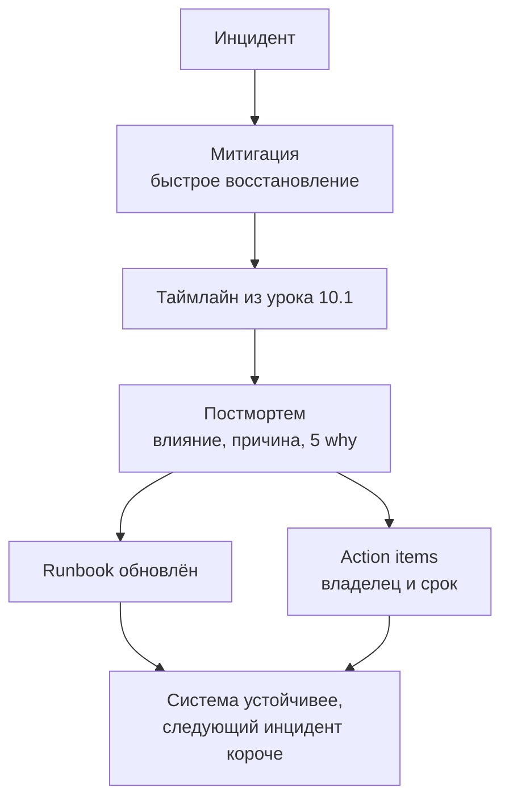
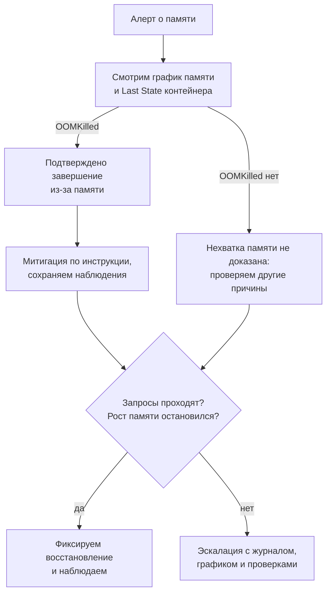
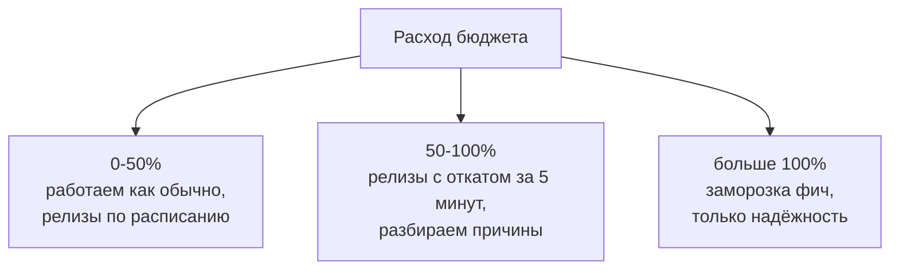

## Зачем это нужно

Инцидент, то есть сбой, который мешает пользователям работать ([урок 10.1](01-oncall-drill.md)), починили, все выдохнули, через месяц он повторился. Так бывает, когда разбор свёлся к фразе «Вася забыл» или вообще не состоялся. Постмортем (postmortem, письменный разбор после инцидента) превращает случившееся в проверяемые улучшения: что изменится в системе, кто это сделает и к какому сроку. Это похоже на разбор протечки дома: мало вытереть пол, нужно выяснить, откуда течёт, и договориться о ремонте. В системе причин может быть несколько, поэтому одного «заменить трубу» бывает недостаточно; подробно разберём ниже.

Представь: после ночного сбоя команда записала в разборе «улучшить мониторинг» и разошлась довольной. Через два месяца случилось то же самое, а задачу никто не взял: непонятно было, что именно улучшать и кто за это отвечает. Хороший разбор с самого начала пишет задачи так, чтобы у них был владелец, срок и проверка.

Runbook, пошаговая инструкция к алерту, то есть уведомлению о проблеме ([урок 10.1](01-oncall-drill.md)), помогает следующему дежурному в 3 ночи не начинать с нуля. Такие документы полезно показать на собеседовании на SRE: инженера, который занимается надёжностью сервиса, как мы обсуждали в том же уроке.

Шаг проекта: в репозитории «Заметок» появятся `docs/postmortems/2026-xx-oom.md` (учебный разбор OOM из урока 10.1), `docs/error-budget-policy.md` (финальная версия) и `docs/runbooks/_template.md`. OOM (out of memory) означает нехватку памяти: в нашем сценарии контейнер превысил установленный предел, и система завершила его с причиной `OOMKilled` ([урок 5.7](../05-kubernetes/07-probes-resources-rollouts.md)).

## Что нужно знать

- [Урок 10.1: On-call, ломаем «Заметки» и чиним по алертам](01-oncall-drill.md) - у тебя есть `docs/oncall-log.md` с таймлайном OOM, то есть событиями сбоя в порядке времени; из него мы напишем постмортем.
- [Урок 8.1: три сигнала, SLI и SLO](../08-observability/01-observability-slo.md) - SLI (service level indicator) это измеряемый показатель качества, например доля успешных запросов; SLO (service level objective) это цель по нему, здесь 99.5% за 30 дней. Error budget (бюджет ошибок) это допустимая доля неуспешных запросов, здесь 0.5%; договорённость записана в `docs/slo.md`.
- [Урок 8.5: алерты и Alertmanager](../08-observability/05-alertmanager.md) - у алертов есть `runbook_url`, теперь мы напишем сами runbook.
- [Урок 8.11: burn-rate алерты](../08-observability/11-reliability-patterns-burn-rate.md) - черновик `docs/error-budget-policy.md`, его мы допишем.
- [Урок 5.7: пробы, ресурсы и выкатки](../05-kubernetes/07-probes-resources-rollouts.md) - `resources.limits.memory` и причина OOMKilled.

## Картина целиком

Авиакатастрофы происходят редко, а самолёты с каждым десятилетием всё безопаснее. Секрет в том, что каждое происшествие разбирают до винтика, публикуют выводы и меняют правила для всех. Никто не пишет в отчёте «пилот виноват, пусть будет внимательнее»: пишут, что в кабине, в процедурах или в приборах позволило ошибку.

Разбор инцидентов в IT устроен так же и состоит из двух частей:

- **постмортем** (postmortem, «после смерти», разбор после инцидента) это отчёт: что случилось, почему, что меняем;
- **runbook** это инструкция, по которой следующий дежурный справится быстрее.

Вместе они образуют цикл, где каждый инцидент делает систему устойчивее:



Схема показывает цикл: каждый инцидент проходит через разбор и возвращается в систему как обновлённый runbook и задачи.

Митигация (mitigation) быстро прекращает ущерб, а поиск причины продолжается после восстановления ([урок 10.1](01-oncall-drill.md)). Ещё в цикле участвует бюджет ошибок: по нему постмортем измеряет «насколько всё было плохо», а политика бюджета решает, что делать, когда он кончился. Проверять документы и реакцию команды помогают учения (game day): заранее выбранная поломка с планом восстановления. Это как учебная пожарная тревога: проверяем, умеют ли люди действовать по инструкции; в отличие от школьной тревоги, здесь действительно нарушаем работу выбранной части учебной системы. Без учений нерабочая инструкция может обнаружиться только во время настоящего сбоя; подробно разберём ниже.

## Теория

### Зачем нужен постмортем и почему без обвинений

Инцидент починили, все выдохнули, а через месяц он повторился. Так случается, когда разбор свёлся к «Вася забыл» или не состоялся вовсе. Что делать вместо этого, показывает blameless-разбор.

Blameless postmortem (разбор без обвинений) начинает с вопроса: какая информация была у человека в момент решения и почему действие казалось ему разумным? Если инженер выкатил плохой релиз, вопрос не «почему он не проверил», а «почему система позволила выкатить такое без проверки».

Если наказывать за ошибки, произойдёт следующее: люди начнут прятать ошибки, разбор превратится в защиту, реальные причины останутся. Аналогия: если школа наказывает за каждый вопрос «а можно ещё раз объяснить?», ученики перестанут спрашивать, а не перестанут не понимать.

Сравни две записи об одном и том же:

```text
С обвинением:    «Иван не поставил лимит памяти, поэтому под убили».
Без обвинения:   «В чарте не было лимита памяти, и ничто в процессе это не проверяло».
```

Вторая запись сразу подсказывает действие: добавить проверку лимитов в CI, автоматические проверки изменения из [урока 3.3](../03-git-ci/03-actions-ci.md). Чарт (chart), набор файлов для установки приложения через Helm, знаком тебе из [урока 5.9](../05-kubernetes/09-helm.md). В первой записи действие одно: «не быть Иваном».

Практическое правило: в тексте нет имён в роли виновных, а есть роли и системы («дежурный», «CI», «чарт»). Blameless не значит «без ответственности»: у задач есть владельцы, но отвечают они за исправление системы, а не за наказание за прошлое.

> **Прикинь сам:** в разборе написано «разработчик не добавил лимит памяти». Какое действие следует из этой фразы, и какое из фразы «в чарте не было лимита и CI это не проверял»?
{: .predict}

Из первой только «пусть будет внимательнее»: проверить нечего. Из второй сразу видно действие: добавить проверку лимитов в CI. Хорошая формулировка указывает на то, что можно изменить в системе.

> **Проверь понимание:** перепиши фразу «Аня выкатила релиз без теста, поэтому упал прод» в blameless-форме.

<details markdown="1">
<summary>Ответ</summary>

Например: «Новая версия попала в рабочую систему без проверки совместной работы её частей, потому что CI не требует такой проверки для этой ветки». Здесь причина в процессе, а действие (добавить обязательную проверку) очевидно.

</details>

Осторожно: «без обвинений значит никто ни за что не отвечает». Нет. Проблемы в работе конкретного человека обсуждает с ним руководитель отдельно, а не в общем документе.

> **Главное:** blameless разбор спрашивает «почему система позволила», а не «кто виноват», и в нём у задач есть владельцы, но нет наказаний.
{: .key}

Договорились, как говорить об ошибке. Теперь посмотрим, из каких частей состоит сам документ.

### Из чего состоит хороший постмортем

Через год ты открываешь чужой постмортем и ничего не понимаешь: непонятно, сколько это длилось и кого задело. Скелет документа нужен, чтобы такого не было.

Хороший постмортем читают и через год, и человек, который не был на инциденте. Поэтому у него есть скелет:

1. **Краткое резюме**: 2-3 предложения, что случилось и чем закончилось. Читают только его, поэтому оно первое.
2. **Влияние** (impact): сколько минут, какая доля запросов, сколько бюджета ошибок сгорело. Без цифр непонятно, насколько всё серьёзно.
3. **Таймлайн** (timeline): события с временем в одной таймзоне. Обычно берут UTC (всемирное время), чтобы участники из разных городов не путались.
4. **Root cause и триггер**: об этом ниже.
5. **5 why**: цепочка «почему» до системной причины ([урок 10.1](01-oncall-drill.md)).
6. **Что помогло и что помешало**: что стоит сохранить и что чинить в процессе реакции.
7. **Action items**: задачи с владельцем, сроком и проверкой.

Ещё в шапке пишут **severity**, серьёзность инцидента: насколько сильно он мешает пользователям ([урок 10.1](01-oncall-drill.md)). В этом уроке используем учебную шкалу P1, P2, P3 (priority): P1 значит полный отказ ключевой функции, P2 частичный отказ или недоступность на короткое время, P3 мелкая проблема. В компании границы уровней могут отличаться, поэтому их записывают заранее. Это похоже на `critical` и `warning` у алертов, но уровень целого инцидента определяют по влиянию на пользователей, а не просто копируют из уведомления.

**Триггер и root cause.** Триггер (trigger) это то, что запустило инцидент сегодня: рост числа запросов, релиз. Root cause (первопричина) это то, из-за чего система была к нему уязвима: например, расход памяти новой версии не проверили перед запуском. Аналогия: спичка (триггер) и лужа бензина в гараже (первопричина). Можно убрать бензин, а также ограничить обращение с огнём: триггер тоже иногда можно предотвратить. Аналогия ломается тем, что у инцидента причин бывает несколько сразу, и в постмортеме перечисляют все существенные. Отсутствие алерта не вызывает утечку памяти, но может продлить сбой: это отдельный недостаток обнаружения.

> **Прикинь сам:** релиз с новой функцией поднял расход памяти, и под был убит по OOM. Что здесь триггер, а что первопричина?
{: .predict}

Триггер: релиз, который поднял потребление памяти. Первопричина: лимит подобран без запаса, нет алерта на рост памяти и нет проверки потребления до выкатки. Релизы запретить нельзя, а систему сделать устойчивой можно.

Осторожно: «причина это последнее, что случилось перед сбоем». Это чаще триггер. Причину находят вопросом «почему система позволила этому сломать сервис?».

> **Главное:** постмортем состоит из резюме, влияния, таймлайна, причины и триггера, 5 why, что помогло и помешало и задач; триггер запустил инцидент, первопричина сделала систему уязвимой.
{: .key}

В разделе «Влияние» нужны цифры. Откуда они берутся?

### Влияние в цифрах: SLO и бюджет ошибок

«Сервис лежал 19 минут». Это много или мало? Без договорённости о допустимом сбое на вопрос не ответить.

Слова «сервис лежал 19 минут» ничего не говорят: это одна ночь или половина месяца? Чтобы измерять, нужна договорённость о том, сколько сбоев допустимо. Из [урока 8.1](../08-observability/01-observability-slo.md) ты знаешь три слова:

- **SLI** (service level indicator) это измеряемое число, например «доля успешных запросов»;
- **SLO** (service level objective) это цель для этого числа, например «99.5% запросов успешны за 30 дней»;
- **error budget** (бюджет ошибок) это то, что осталось сверх цели: разрешённая доля неуспеха.

Сначала посчитаем бюджет временем: так проще увидеть масштаб. Для SLO по запросам это учебное приближение при равномерном потоке запросов; точный расчёт разберём следующим разделом. Для SLO 99.5% за 30 дней:

```text
минут в 30 днях:      30 * 24 * 60 = 43200
допустимая доля сбоя: 100% - 99.5% = 0.5% = 0.005
бюджет:               43200 * 0.005 = 216 минут полной недоступности
```

Теперь инцидент на 19 минут полной недоступности: 19 / 216 = 0.088, то есть 8.8% месячного бюджета при указанном допущении, то есть условии равномерного потока запросов. Если при том же потоке недоступна была только половина запросов, сгорело бы вдвое меньше: около 4.4%. Бюджет удобен тем, что переводит «была авария» в «потратили 9% лимита».

Как меняется бюджет при другой цели: для 99.9% получится 43200 * 0.001 = 43.2 минуты. Разница в пять раз, поэтому каждая лишняя «девятка» резко усложняет жизнь команде.

<div class="viz" data-viz="chart" data-type="bar" data-x="99.5%,99.9%,99.99%" data-series='[{"name":"Бюджет за 30 дней","values":[216,43.2,4.32],"unit":"мин"}]' data-x-label="SLO" data-y-label="Допустимая недоступность" data-unit="мин" data-explain="Каждая лишняя девятка сокращает допустимый простой в разы: 216 минут, 43 минуты, 4 минуты за 30 дней."></div>

На графике видно, как быстро тает допустимый простой: лишняя «девятка» делает бюджет меньше в разы.

> **Прикинь сам:** сервис с SLO 99.9% за 30 дней лежал 30 минут. Какую долю бюджета он потратил?
{: .predict}

Бюджет 43,2 минуты. 30 / 43,2 = 0,69: около 69%. Один такой инцидент съел почти весь месяц.

Осторожно: бюджет это «сколько можно ничего не делать». На деле это ресурс, который можно тратить на рискованные релизы и эксперименты: пока он есть, команда двигается быстро, когда кончился, притормаживает. Об этом ниже, в политике бюджета.

> **Главное:** бюджет ошибок равен времени месяца, умноженному на `1 - SLO`, и переводит «была авария» в «потратили столько-то процентов запаса».
{: .key}

Минуты удобны для оценки, но не всегда верны. Когда считать надо запросы?

### Минуты или запросы: как не ошибиться с влиянием

Девятнадцать минут сбоя ночью и девятнадцать минут в час пик могут затронуть разное число людей. Поэтому перед расчётом открой `docs/slo.md`: что именно обещали измерять? Если цель задана долей успешных запросов, считай запросы. Если долей времени доступности, считай время по записанным правилам проверки. Смешивать эти две меры нельзя, даже если обе выражаются процентами.

Аналогия: магазин может обещать работать 99.5% времени или обслужить 99.5% посетителей. Закрыться на десять минут без посетителей и закрыться на десять минут при очереди из ста человек одинаково по часам, но по-разному по числу отказов. Оговорка: один пользователь приложения может отправить много запросов, поэтому число ошибок не равно числу пострадавших людей.

Для расчёта по запросам сначала выбери одно окно, здесь последние 30 дней. Затем посчитай все запросы, которые входят в SLI, и среди них неуспешные. Правила успеха и перечень запросов берутся из `docs/slo.md`: нельзя во время разбора убрать неудобные ошибки из подсчёта. Допустимое число ошибок равно общему числу запросов, умноженному на `1 - SLO`. Расход бюджета равен фактическим ошибкам, делённым на допустимые.

Разобранный пример: за 30 дней пришло 1 000 000 учитываемых запросов, из них 2 000 завершились ошибкой во время инцидента. Других ошибок в этом примере нет:

```text
допустимая доля:   1 - 0.995 = 0.005
бюджет запросов:   1 000 000 * 0.005 = 5 000 ошибок
расход инцидента:  2 000 / 5 000 = 0.4 = 40% бюджета
остаток:          5 000 - 2 000 = 3 000 ошибок, то есть 60% бюджета
фактический SLI:   (1 000 000 - 2 000) / 1 000 000 = 99.8%
```

Как читать расчёт: `0.005` это разрешённые 0.5%, а `40%` это доля потраченного запаса. Сервис не был недоступен 40% месяца: успешными остались 99.8% запросов. Если до этого уже было 1 000 ошибок, суммарный расход станет `(1 000 + 2 000) / 5 000 = 60%`, хотя вклад этого инцидента останется 40%.

В отчёте укажи окно, источник чисел и допущения. Если счётчика запросов нет, честно напиши «оценка по времени при равномерной нагрузке», а не выдавай 8.8% за точный результат. В практических заданиях ниже используем именно такую оценку, чтобы упражняться в вычислениях без изменения стенда.

> **Прикинь сам:** за 30 дней было 2 000 000 запросов, SLO 99,5%, во время инцидента 4 000 запросов завершились ошибкой. Сколько бюджета ушло?
{: .predict}

Допустимо 2 000 000 × 0,005 = 10 000 ошибок. 4 000 / 10 000 = 0,4: 40% бюджета. Фактический SLI: (2 000 000 - 4 000) / 2 000 000 = 99,8%.

> **Проверь понимание:** допустимо 5 000 ошибок, один инцидент дал 500 ошибок. Сколько бюджета он потратил? Можно ли назвать его долю, зная только длительность?

<details markdown="1">
<summary>Ответ</summary>

500 / 5 000 = 0.1, то есть 10% бюджета. Одной длительности недостаточно: нужно число запросов и ошибок в выбранном окне. Перевод минут в долю бюджета требует отдельного допущения о равномерном потоке.

</details>

Осторожно: «8.8% бюджета» и «8.8% запросов завершились ошибкой». У этих дробей разные знаменатели: в первой допустимые ошибки, во второй все запросы.

> **Главное:** если SLO задан долей запросов, считай запросы и бери допустимое число ошибок, а «8,8% бюджета» и «8,8% ошибок» это разные доли.
{: .key}

Влияние посчитали. Теперь аккуратно разложим по времени, что и когда происходило.

### Таймлайн и метрики MTTD, MTTA, MTTR

Алерт пришёл в 02:14, но сколько до него пользователи уже мучились? Без записи начала проблемы это число не узнать.

Таймлайн строят из твоих записей в журнале ([урок 10.1](01-oncall-drill.md)) и графиков. Важно записать не только «когда пришёл алерт», но и **когда проблема реально началась**: это видно на графике, где линия ошибок оторвалась от нуля. Без этого момента задержка обнаружения остаётся невидимой.

По таймлайну считают три времени (повтор из 10.1, теперь с вычислением):

- **MTTD** (mean time to detect): от начала проблемы до алерта. Растёт, если алерты плохие или их нет.
- **MTTA** (mean time to acknowledge): от алерта до того, как дежурный взял его в работу.
- **MTTR** (mean time to restore): от начала до восстановления сервиса. Считаем до митигации, а не до «полного исправления».

Слово «mean» это среднее: сумма длительностей, делённая на число инцидентов. Для одного инцидента точнее говорить «время обнаружения, реакции и восстановления»; названия MTTD, MTTA, MTTR ниже используем как привычные подписи к расчётам. По многим инцидентам смотрят и медиану (значение посередине, если выстроить их по порядку), и худшие случаи: среднее скрывает редкие очень долгие сбои.

Разобранный пример: проблема началась в 02:03, алерт пришёл в 02:14, дежурный подтвердил в 02:17, сервис восстановлен в 02:41.

```text
MTTD = 02:14 - 02:03 = 11 минут
MTTA = 02:17 - 02:14 = 3 минуты
MTTR = 02:41 - 02:03 = 38 минут  (от начала, а не от алерта)
```

Почему MTTR от начала: пользователю всё равно, когда сработал алерт, для него плохо с 02:03.

Как их снижают: MTTD хорошими алертами, MTTA понятной ротацией дежурств, MTTR runbook'ом и быстрым откатом. Героизмом их не снизить.

> **Прикинь сам:** проблема началась в 02:10, алерт в 02:20, дежурный подтвердил в 02:22, восстановили в 02:50. Чему равен MTTR?
{: .predict}

02:50 - 02:10 = 40 минут: считаем от начала, потому что пользователю плохо с 02:10, а не с момента алерта.

> **Проверь понимание:** алерт пришёл в 02:14, проблема началась в 02:03, дежурный подтвердил в 02:17, сервис восстановлен в 02:41. Чему равны MTTD, MTTA, MTTR?

<details markdown="1">
<summary>Ответ</summary>

MTTD = 11 минут (02:03 -> 02:14), MTTA = 3 минуты (02:14 -> 02:17), MTTR = 38 минут (02:03 -> 02:41).

</details>

Осторожно: «MTTR это время исправления причины». Нет, это время возврата к нормальной работе для пользователей.

> **Главное:** MTTD, MTTA и MTTR считают по таймлайну, MTTR от начала проблемы до восстановления пользователей, а снижают их хорошие алерты, ротация и быстрый откат.
{: .key}

Таймлайн даёт хронологию. Но как не принять совпадение по времени за причину?

### Факт, предположение и причина: чем подтвердить вывод

После сбоя очень хочется быстро получить связную историю: «вышел релиз, память выросла, всё понятно». Но последовательность событий ещё не доказывает причину. Постмортем нужен для выбора изменений, поэтому неверное объяснение дорого: команда потратит время на исправление, которое не защитит от следующего сбоя.

Представь мокрый пол на кухне. «На полу вода» это наблюдение. «Протекает посудомойка» это предположение. Чтобы его проверить, нужно увидеть, откуда появляется вода, а не только вспомнить, что посудомойку включали последней. В IT доказательства часто косвенные: важную секунду никто не записал. Тогда вместо уверенной фразы честно обозначают, чего пока не знают.

В разборе разделяй **факт** (fact), наблюдение, которое можно проверить по сохранённым данным, и **гипотезу** (hypothesis), объяснение, которое ещё нужно проверить. Сначала собери журнал дежурного, записи приложения, графики и историю изменений. Согласуй время событий: если один источник показывает местное время, а другой UTC, сначала переведи их в одну систему отсчёта. Потом подпиши каждое утверждение ссылкой на данные. При неизвестном времени начала укажи диапазон: например, «между 02:01, последней успешной проверкой, и 02:03, первой неуспешной».

Разобранный пример для «Заметок»:

| Запись | Что она позволяет утверждать |
|---|---|
| В `Last State` указано `Reason: OOMKilled` | Контейнер был завершён из-за нехватки памяти; это факт о завершении |
| После версии 1.2.0 на графике память начала расти | Рост совпал по времени с обновлением; связь стоит проверить |
| После отката ошибки исчезли | Откат помог восстановлению; механизм ошибки ещё не доказан |
| «В новой версии утечка памяти» | Пока гипотеза: нужны проверка поведения версии и разбор кода |

Отдельно запиши: «точная причина роста неизвестна; владелец задачи проверит её на учебном окружении». Это полезнее, чем назвать утечку фактом только потому, что перезапуск помог. При перезапуске освобождается память и при утечке, и после разового тяжёлого запроса. Временное улучшение само по себе не различает эти случаи.

Метод **5 why**, цепочка вопросов «почему» из [урока 10.1](01-oncall-drill.md), помогает углубить объяснение, но не заменяет доказательства. Например: «почему запросы не проходили?» → «не было готового контейнера» → «контейнер завершился по OOM» → «почему памяти не хватило? пока неизвестно». На этом честно остановись. Не нужно выдумывать ещё два ответа ради числа пять. Позже дополни цепочку результатом проверки.

> **Прикинь сам:** после отката ошибки исчезли. Можно ли записать в постмортем «причина: утечка памяти в версии 1.2.0»?
{: .predict}

Нет. Доказано, что откат помог, а механизм не доказан. Запиши как гипотезу и добавь задачу проверить её на учебном окружении.

Осторожно: отсутствие замера в истории файла доказывает, что замера не было. Оно доказывает только отсутствие записи в этом источнике. Возможно, измерение сохранили отдельно; спроси участника и проверь документ, прежде чем делать вывод о процессе.

> **Главное:** каждое утверждение в постмортеме подписано ссылкой на данные, а то, чего не знаешь, честно записано как предположение с задачей на проверку.
{: .key}

Выводы подтверждены. Из них рождаются задачи, и их качество решает, повторится ли сбой.

### Action items: как отличить хороший от плохого

«Улучшить мониторинг»: сколько постмортемов закончились такой строкой, и сколько раз её закрыли?

**Action item** это задача, которая появляется из постмортема: конкретное изменение, чтобы инцидент не повторился или закончился быстрее. Это как заявка на ремонт после протечки: кто заменит соединение, когда и как проверим, что больше не течёт. В отличие от ремонта одной трубы, здесь могут понадобиться изменения и программы, и реакции команды. Без таких задач постмортем остаётся рассказом, а система прежней.

Плохой: «улучшить мониторинг», «быть внимательнее», «обсудить на встрече». Его нельзя проверить, и он никогда не будет закрыт. Хороший состоит из четырёх частей:

1. **конкретное действие**;
2. **владелец** (один человек или одна команда, «все» не подходит);
3. **срок** (дата);
4. **критерий готовности**, который проверяется командой или ссылкой на файл.

Плохо: «улучшить мониторинг памяти». Хорошо: «добавить алерт `NotesMemoryHigh` (working set больше 85% от limit 5 минут) в `alerts.yml`; владелец SRE-дежурный, срок 2026-10-10, готово, когда `promtool test rules` проходит». Working set (рабочий набор памяти) это оценка используемой памяти контейнера без части недавно неиспользуемого файлового кеша, то есть данных файлов, временно хранимых в памяти. Это как занятое место на рабочем столе: помогает заметить тесноту, но не объясняет, почему вещи накапливаются. Значение полезно для предупреждения о росте, однако само по себе не определяет причину OOM. `Limit` здесь установленный предел памяти из [урока 5.7](../05-kubernetes/07-probes-resources-rollouts.md), а `promtool` это утилита Prometheus, которая проверяет правила алертов тестами ([урок 8.5](../08-observability/05-alertmanager.md)).

Задачи полезно разделять по типам: **prevent** (предотвратить повтор), **detect** (обнаружить быстрее), **mitigate** (смягчить последствия). Если все пункты «detect», причину никто не трогает: мы просто научились быстрее замечать тот же сбой. Трекер задач (issue tracker) это общий список работ с владельцами и статусами, как журнал заявок в управляющей компании. Он помогает не потерять обещанный ремонт после встречи; в одиночном проекте достаточно таблицы задач в документе с датами и ссылками на результат.

> **Прикинь сам:** action item «добавить больше тестов». Что в нём нельзя проверить?
{: .predict}

Нет границ и критерия готовности: «больше» никогда не закончится. Хорошо: «тест, который запускает `/leak` 30 секунд и проверяет память; владелец, срок, тест в CI зелёный».

> **Проверь понимание:** почему «добавить больше тестов» плохой action item и как его улучшить?

<details markdown="1">
<summary>Ответ</summary>

Нет границ и критерия: «больше» никогда не закончится. Улучшение: «добавить тест, который запускает `/leak` 30 секунд и проверяет, что память в пределах limit; владелец, срок, тест в CI зелёный».

</details>

Осторожно: чем больше action items, тем лучше. Наоборот: двадцать задач никто не сделает. Оставляют 3-5 самых полезных и следят за ними в том же трекере, где остальная работа.

> **Главное:** хороший action item это действие, владелец, срок и критерий готовности, а задач после разбора остаётся 3-5 самых полезных.
{: .key}

Разбор и задачи готовы. Теперь о документе, которым будет пользоваться следующий дежурный.

### Хороший runbook

Следующий дежурный получит алерт среди ночи и откроет твой документ. Что он должен найти в первые секунды?

Runbook пишут для человека, которого разбудили ночью и который не знает систему (базовое понятие мы разобрали в [уроке 10.1](01-oncall-drill.md)). Поэтому в нём нет теории, а есть:

- что означает алерт и чем страдает пользователь;
- как быстро проверить (команды, которые можно скопировать целиком);
- как митигировать, то есть быстро восстановить работу;
- когда эскалировать, то есть привлечь человека с нужными знаниями или полномочиями, и кому ([урок 10.1](01-oncall-drill.md)).

Плохой runbook это: ссылка на общую вики, команды без контекста, «посмотри логи» без запроса, устаревшие имена. Проверка одна: дежурный, который видит систему впервые, выполняет инструкцию без вопросов.

Runbook устаревает, как любая документация: сервис поменяли, а инструкцию нет. Поэтому в шапке пишут владельца и дату проверки, а обновляют runbook после каждого инцидента, где он подвёл.

> **Прикинь сам:** в runbook три страницы теории о памяти и одна команда в конце. Прочитает ли его дежурный, которому нужно действовать?
{: .predict}

Скорее всего нет. Команду подтверждения симптома и безопасное действие вынеси вверх, а теорию убери в разбор.

> **Проверь понимание:** какой раздел runbook дежурный прочитает первым в 3 ночи?

<details markdown="1">
<summary>Ответ</summary>

«Что это значит для пользователя» и «Первые проверки»: сначала человеку нужно понять серьёзность, потом сразу получить команды, которые можно выполнить.

</details>

Осторожно: чем runbook длиннее, тем полнее. Ночью длинную инструкцию не читают. Полезнее короткая, с точными командами.

> **Главное:** runbook отвечает на вопросы: что это значит для пользователя, как быстро проверить, как смягчить и когда эскалировать, а владелец и дата проверки в шапке не дают ему устареть.
{: .key}

Список команд ещё не инструкция. Следующий шаг: связать проверку с решением.

### Runbook как развилка: результат проверки определяет действие

Дежурный выполняет все команды из списка подряд, хотя первая уже показала, что нужные дальше не подходят. Так бывает, когда нет развилок.

Список команд ещё не инструкция. Команда может выполниться успешно, но показать результат, при котором следующий шаг не подходит. Runbook должен связывать три вещи: что проверить, как прочитать результат и какое действие выбрать. Иначе ночью дежурный будет просто выполнять весь список, даже если первая проверка уже опровергла нужный сценарий.

Аналогия: инструкция к стиральной машине «если индикатор не горит, проверь питание; если горит, но вода не поступает, проверь кран». Вторая проверка зависит от первой. Оговорка: в сервисе несколько неисправностей могут существовать одновременно, поэтому после действия нужно повторить проверку пользователя, а не считать задачу решённой по одному признаку.

Сначала в шапке укажи, где инструкция применима. Для «Заметок» это выбранный кластер, namespace `notes` (группа объектов Kubernetes из [урока 5.1](../05-kubernetes/01-why-k8s-cluster.md)) и нужная версия приложения. Рядом с командой проверки опиши значимые поля вывода. Затем отдели проверки, которые только читают данные, от действий, которые меняют систему. Перед изменением сохрани наблюдения в журнале: после перезапуска часть сведений о прежнем состоянии может исчезнуть.

Пример развилки для уже знакомых проверок памяти:



Схема читается сверху вниз: результат каждой проверки выбирает следующую ветку, а в конце всегда проверка пользователя.

В этой схеме `Last State` означает предыдущее состояние контейнера, а `OOMKilled` причину его завершения, знакомую из [урока 5.7](../05-kubernetes/07-probes-resources-rollouts.md). Отсутствие этой причины в доступном выводе не гарантирует, что OOM никогда не было: старый контейнер или pod могли уже исчезнуть. Оно означает, что данным шагом гипотезу не подтвердили.

Для изменения укажи предварительное условие, ожидаемый эффект и способ возврата. Например, временно поднять предел памяти можно только при наличии свободной памяти для размещения контейнера. Если места нет, более высокий предел не создаст память из ничего. Если потребление продолжает расти, увеличение предела лишь отложит повтор: передай разработчику график и описание запросов, после которых заметен рост.

Наконец, запиши условие окончания. «Команда выполнилась» недостаточно: нужно подтвердить восстановление SLI и работу обычного действия пользователя, например чтение заметок. Укажи срок наблюдения и порог эскалации. Конкретные пять или десять минут выбирают заранее под сервис, а не объявляют универсальным правилом.

> **Прикинь сам:** в выводе `Last State` нет `OOMKilled`. Доказывает ли это, что нехватки памяти не было?
{: .predict}

Нет: старый контейнер или под могли уже исчезнуть. Данным шагом гипотезу не подтвердили, значит нужна ветка «проверяем другие причины перезапуска».

> **Проверь понимание:** команда перезапуска завершилась без ошибки, но запросы всё ещё не проходят. Можно ли закрывать инцидент?

<details markdown="1">
<summary>Ответ</summary>

Нет. Успешно выполнено действие, но не достигнута цель восстановления. Запиши результат, продолжи проверку по следующей ветке или эскалируй по условию инструкции. Успех подтверждают работой сервиса для пользователя.

</details>

Осторожно: runbook обязан перечислить все возможные причины. Его задача уже: провести по частому сценарию и показать границу, за которой нужна помощь. Для остальных случаев должна быть явная ветка, а не молчаливое продолжение команд.

> **Главное:** runbook связывает три вещи: что проверить, как прочитать результат и какое действие выбрать, а восстановление подтверждает пользовательский запрос.
{: .key}

Runbook помогает в моменте. А как договориться заранее, что делать, когда запас надёжности кончается?

### Политика бюджета ошибок

SLO без последствий это красивая цифра на дашборде, панели графиков из [урока 8.6](../08-observability/06-grafana-dashboards.md). Error budget policy (политика бюджета ошибок) отвечает на вопрос «что мы делаем, когда бюджет тратится», заранее и письменно, чтобы не спорить об этом в момент кризиса.

Политика задаёт пороги расхода и действия. Например, при бюджете 216 минут:



Три порога: чем меньше запаса, тем осторожнее релизы. Пороги и действия записаны заранее, поэтому в кризис не спорят.

Скользящее окно (rolling window) это период от текущего момента на 30 дней назад, как выписка по карте за последние 30 дней, а не за календарный месяц. При сдвиге окна старые ошибки выходят из подсчёта, но новые входят: остаток не обязательно увеличивается. Исключения, например некоторые плановые работы, допустимы только если заранее записаны в правилах SLO. Сбой внешнего поставщика сам по себе не исключение: если мы обещали пользователю успешный запрос, ошибка учитывается независимо от того, кто её вызвал. Кто применяет правила, тоже прописано.

Аналогия: семейный бюджет. Пока в месяце остались деньги, можно позволить себе рискованную покупку. Когда деньги кончились, только необходимое. Аналогия ломается тем, что бюджет ошибок не тратится на «покупки»: он уходит сам, когда что-то ломается, а мы влияем лишь на то, как рискованно двигаемся дальше.

> **Прикинь сам:** бюджет 216 минут, расход дошёл до 130%. Что делает команда по политике из примера?
{: .predict}

Заморозка фич: расход больше 100%, в работе только надёжность, пока бюджет не восстановится.

> **Проверь понимание:** зачем политика нужна, если алерты burn-rate уже есть?

<details markdown="1">
<summary>Ответ</summary>

Алерты сообщают дежурному, что бюджет горит прямо сейчас. Политика фиксирует решения на уровне команды: кто и что приостанавливает при исчерпании бюджета, чтобы это не решалось спором в момент кризиса.

</details>

Осторожно: политика нужна вместо алертов burn-rate, которые предупреждают о быстром расходе бюджета ([урок 8.11](../08-observability/11-reliability-patterns-burn-rate.md)). Они дополняют друг друга: алерты сообщают дежурному, что бюджет горит сейчас, а политика фиксирует решения команды при исчерпании.

> **Главное:** политика бюджета ошибок заранее и письменно говорит, что команда делает на каждом уровне расхода, чтобы не спорить в момент кризиса.
{: .key}

Документы написаны. Как узнать, что они действительно работают?

### Game day

Runbook и алерты, которые ни разу не применяли, могут оказаться нерабочими: устарел путь, нет доступа, алерт не срабатывает. Проверять это в боевом инциденте дорого.

Game day (учения) это запланированная поломка, которую команда проходит вместе: реальный runbook, реальные алерты, обычный чат. Аналогия: пожарная тревога в школе. Все знают, что пожара нет, но выход проверяют по-настоящему.

Проводят учения по шагам:

1. выбирают сценарий и границы (что можно ломать, в каком окружении);
2. предупреждают команду и заранее готовят откат;
3. один человек дежурит, как в бою, другой наблюдает и записывает по секундомеру;
4. в конце оформляют результат как мини-постмортем с action items.

Что ищут: устаревшую инструкцию, отсутствующий доступ, алерт, который не сработал. Урок 10.1 по сути был личным game day, а здесь ты превращаешь его результат в документы.

> **Прикинь сам:** команда провела учения, но не записала, что нашла. Какая польза получилась?
{: .predict}

Почти никакой: без мини-постмортема и action items получился хаос без выводов. Результат учений это задачи, которые закрывают найденные дыры.

> **Проверь понимание:** чем game day отличается от простого «сломаем и посмотрим»?

<details markdown="1">
<summary>Ответ</summary>

Есть сценарий, ограниченный радиус поломки, план отката, наблюдатель с таймером и обязательный результат в виде action items. Без этого получается хаос без выводов.

</details>

Осторожно: game day это «сломаем прод и посмотрим». Нет: есть сценарий, ограниченный радиус, план отката и обязательный результат в виде задач. Без этого получается хаос без выводов.

> **Главное:** game day это запланированная поломка с границами, откатом, наблюдателем и обязательным результатом в виде задач.
{: .key}

Остался сам разбор: кто его проводит и как проходит встреча.

### Как проводят разбор: кто, когда, сколько

Встреча по разбору превращается либо в защиту, либо в переписывание текста. Структура встречи нужна, чтобы люди искали дыры, а не виноватых.

Постмортем пишут после каждого серьёзного инцидента (P1 и P2) и после любого, где что-то пошло неожиданно. Делать его лучше в течение 2-5 рабочих дней: детали ещё свежи, но эмоции уже улеглись. Через месяц таймлайн придётся восстанавливать по обрывкам.

Черновик пишет дежурный или руководитель инцидента, потому что у него есть журнал. Потом черновик читает вся команда, а на встрече (30-60 минут) его обсуждают вместе. Задача встречи не переписать текст, а спросить: «что мы не заметили? что ещё могло сработать?». Часто именно тот, кто не был на инциденте, задаёт вопросы, которые вскрывают дыру.

Встреча идёт по шагам:

1. ведущий кратко зачитывает резюме и таймлайн;
2. группа проходит 5 why, каждый ответ проверяют фактами (график, лог), а не «мне кажется»;
3. записывают action items и назначают владельцев прямо на встрече;
4. договариваются, где хранится документ (обычно репозиторий или вики) и кому его показать.

В 5 why написано «лимит взят на глаз». Вопрос из зала: «откуда мы знаем?». Ответ «в истории файла `values.yaml` нет замера» подтверждает только отсутствие записи. Участник мог измерить расход и сохранить результат в другом месте. Уточни у него, как выбрали предел `128Mi` (128 мебибайт памяти из [урока 5.7](../05-kubernetes/07-probes-resources-rollouts.md)), и найди результаты измерения. Если проверить нечем, честно пишут «предположение, проверим в action item».

> **Прикинь сам:** инцидент закончился в понедельник утром. К какому дню лучше написать черновик, чтобы детали были свежими, а эмоции остыли?
{: .predict}

К среде-пятнице: за 2-5 рабочих дней. Через пять минут картина неполна, через месяц таймлайн собирают по обрывкам.

> **Проверь понимание:** почему постмортем лучше писать через два-три дня, а не через месяц и не через пять минут?

<details markdown="1">
<summary>Ответ</summary>

Через пять минут ты ещё уставший и не знаешь всей картины: графики и логи не разобраны. Через месяц детали забыты, а журнал уже не восстановить. Два-три дня это баланс: память свежая, эмоции остыли, данные под рукой.

</details>

Осторожно: постмортем пишут только про громкие аварии. «Чуть не случилось» (near miss, почти-инцидент) это ситуация, где опасное условие уже возникло, но пользователи не пострадали. Как замеченный до поездки спущенный велосипедный баллон: поездка ещё не сорвалась, а проблему уже можно исправить. В сервисе это, например, ошибка настройки, пойманная проверкой до установки версии; её разбор помогает сохранить сработавшую защиту.

> **Главное:** черновик пишет дежурный в течение 2-5 дней, команда обсуждает его 30-60 минут, а каждый вывод проверяют фактами, а не словами «мне кажется».
{: .key}

Теории достаточно. В практике ты превратишь свой OOM из урока 10.1 в настоящий постмортем.

## Практика

### Задание 1. Соберём факты и посчитаем метрики

**Цель:** взять таймлайн OOM из `docs/oncall-log.md` (урок 10.1) и вычислить MTTD, MTTA, MTTR и сгоревший бюджет. Здесь и в задании 5 расчёт минут учебный: для SLO по запросам предполагаем равномерную нагрузку, как разобрали в теории.

**Предскажи:** если недоступны 100% запросов 19 минут при SLO 99.5% за 30 дней, какая доля месячного бюджета ушла: около 9%, 19% или 90%?

<details markdown="1">
<summary>Ответ</summary>

Бюджет 216 минут, 19 / 216 = 8.8%, то есть около 9%. Если недоступна только часть запросов, расход пропорционально меньше.

</details>

**Шаги**

1. Подставь свои времена из `oncall-log.md` (ниже учебный пример) и посчитай интервалы скриптом на Python (`python3` есть в Ubuntu из [урока 1.1](../01-linux/01-first-server-shell.md)). Разбор: `python3 - <<'PY' ... PY` запускает Python и читает программу из текста до строки `PY` (heredoc, одиночные кавычки не дают оболочке трогать текст). `datetime.fromisoformat` превращает строку `2026-10-02T02:03` во время. `mins` это маленькая функция: разность двух времён в секундах, делённая на 60 и округлённая вниз до целых минут. Бюджет `30 * 24 * 60 * 0.005` это формула из теории.

```bash
cd ~/notes
python3 - <<'PY'
from datetime import datetime as d
t = d.fromisoformat
# Учебный таймлайн, время UTC
start, alert, ack, fixed = "2026-10-02T02:03", "2026-10-02T02:14", "2026-10-02T02:17", "2026-10-02T02:22"
mins = lambda a, b: int((t(b) - t(a)).total_seconds() // 60)
print("MTTD", mins(start, alert))
print("MTTA", mins(alert, ack))
print("MTTR", mins(start, fixed))
budget = 30 * 24 * 60 * 0.005          # SLO 99.5% за 30 дней
print("бюджет, мин", budget)
print("сгорело, %", round(mins(start, fixed) / budget * 100, 1))
PY
```

**Что должно получиться**

```text
MTTD 11
MTTA 3
MTTR 19
бюджет, мин 216.0
сгорело, % 8.8
```

**Как читать вывод:** каждая строка это число минут: `MTTD 11` значит «11 минут проблема оставалась незамеченной», `MTTR 19` общее время плохого состояния, `бюджет, мин 216.0` весь месячный запас, `сгорело, % 8.8` доля запаса, которую съел инцидент (19 / 216).

**Объясни себе**

- Почему MTTR считаем от начала проблемы, а не от алерта?
- Что ты сделаешь, чтобы уменьшить MTTD, если 11 минут это слишком долго?

**Типичные ошибки**

- `ValueError: Invalid isoformat string: '2026-10-02 02:03 UTC'`: в строке лишние символы, оставь только `ГГГГ-ММ-ДДTЧЧ:ММ`.
- `IndentationError: unexpected indent`: скопировал с лишними пробелами, скрипт внутри heredoc должен начинаться с первого столбца.

### Задание 2. Постмортем по шаблону

**Цель:** написать `docs/postmortems/2026-xx-oom.md` без обвинений и с проверяемыми action items.

**Предскажи:** какой пункт таймлайна чаще всего упускают и почему он важнее остальных для улучшений?

<details markdown="1">
<summary>Ответ</summary>

Момент начала проблемы (до алерта): его берут из графиков, а не из чата. Без него MTTD считается «от алерта», и задержка обнаружения остаётся невидимой.

</details>

**Шаги**

1. Создай файл. Команда `cat > файл <<'MD' ... MD` записывает текст до строки `MD` в файл, а `mkdir -p` создаёт каталог (и не жалуется, если он уже есть). Постмортем целиком это Markdown-текст, поэтому расширение `.md`:

```bash
mkdir -p docs/postmortems
cat > docs/postmortems/2026-xx-oom.md <<'MD'
# Постмортем: «Заметки» недоступны из-за OOMKilled

Дата: 2026-10-02 (учебный). Severity: P2. Статус: Completed.
Авторы: SRE-дежурный (роль, без имён).

## Краткое резюме

Сервис notes 19 минут не отвечал: контейнер был убит по OOM, потому что при
росте нагрузки процесс превысил лимит памяти 128Mi. Восстановили
увеличением лимита и перезапуском. Алерт пришёл через 11 минут после начала.

## Влияние

- Недоступность: 19 минут, 100% запросов.
- Error budget: 19 из 216 минут (8.8% месячного бюджета).
- Данные не потеряны (PostgreSQL не затронут).

## Таймлайн (UTC)

| Время | Событие |
|---|---|
| 02:03 | Первый убитый контейнер (по метрике перезапусков) |
| 02:14 | Алерт NotesDown |
| 02:17 | Дежурный подтвердил |
| 02:22 | Найдено: Exit 137, Reason OOMKilled. Лимит поднят, pod перезапущен |
| 02:22 | 200 на /healthz |

MTTD 11 мин, MTTA 3 мин, MTTR 19 мин.

## Root cause и триггер

Триггер: рост потребления памяти при большой нагрузке на приложение.
Root cause: лимит памяти выбран без замера и нагрузочной проверки,
нет алерта на рост памяти до убийства, нет проверки ресурсов при релизе.

## 5 why

1. Почему сервис недоступен? Контейнер убит ядром (OOMKilled).
2. Почему убит? Working set превысил limit 128Mi.
3. Почему превысил? Лимит взят «на глаз», под реальную нагрузку не мерился.
4. Почему не заметили раньше? Алерта на приближение к лимиту нет.
5. Почему нет проверки? Ресурсы не входят в чек-лист релиза.

## Что помогло и что помешало

- Помогло: runbook `NotesDown` вёл к `kubectl describe pod`, причина найдена за 5 минут.
- Помешало: не было алерта до убийства; runbook не упоминал OOM явно.

## Action items

| Что | Тип | Владелец | Срок | Готово, когда |
|---|---|---|---|---|
| Алерт NotesMemoryHigh: working set больше 85% limit 5 минут | detect | SRE | 2026-10-10 | `promtool test rules` проходит |
| Замер памяти под нагрузкой, limit = p99 x 1.5 в values | prevent | SRE | 2026-10-14 | в `values.yaml` комментарий с замером |
| Пункт «ресурсы измерены» в чек-листе релиза | prevent | SRE | 2026-10-14 | пункт есть в `RELEASING.md` |
| В runbook NotesDown добавить ветку OOMKilled | mitigate | SRE | 2026-10-08 | ветка есть, дежурный прошёл её на стенде |
MD
```

2. Проверь, что нет обвинений и у каждого action item есть срок. Разбор: `grep -c` считает подходящие строки, шаблон `'| 2026-10-'` ищет даты сроков в таблице; `grep -n -i` печатает номера строк и не различает регистр, а `\|` в шаблоне значит «или»; `|| echo ...` выполнится, только если `grep` ничего не нашёл.

```bash
grep -c '| 2026-10-' docs/postmortems/2026-xx-oom.md
grep -n -i 'забыл\|виноват\|ошибся' docs/postmortems/2026-xx-oom.md || echo "обвинений нет"
```

**Что должно получиться**

```text
4
обвинений нет
```

**Как читать вывод:** `4` это четыре action items с датой, `обвинений нет` значит, что слов-обвинений в тексте не нашлось. Проверка грубая: слов вроде «Дима» она не поймает, глазами перечитать всё равно нужно.

**Объясни себе**

- Чем триггер отличается от root cause в твоём тексте?
- Какой из четырёх action items снижает MTTD, а какой предотвращает повтор?

**Типичные ошибки**

- `bash: docs/postmortems/2026-xx-oom.md: No such file or directory`: не создан каталог или команда запущена не из `~/notes`: `cd ~/notes && mkdir -p docs/postmortems`.
- Счётчик показывает `0`: в таблице срок записан в другом формате, нужен вид `2026-10-10` между вертикальными чертами.

### Задание 3. Перепиши плохой постмортем

**Цель:** увидеть, как выглядит бесполезный документ, и превратить его в полезный.

**Предскажи:** сколько из пяти фраз ниже содержат обвинение или неконкретное действие?

```text
Причина: Дима не проверил конфиг перед деплоем.
Что делали: срочно всё починили.
Выводы: нужно быть внимательнее.
Action item: улучшить мониторинг.
Action item: провести обучение (срок: потом).
```

<details markdown="1">
<summary>Ответ</summary>

Все пять. Обвинение (Дима), нет фактов («всё починили»), вывод без действия, action items без владельца, срока и критерия.

</details>

**Шаги**

1. Создай файл с исправленной версией (в конце пути `~/notes/docs/postmortems/` он не нужен, это упражнение, файл лежит в scratch-каталоге):

```bash
mkdir -p ~/pm-drill
cat > ~/pm-drill/good.md <<'MD'
Причина: конфиг с неверным именем хоста попал в деплой, потому что CI не валидирует конфиг.
Что делали: в 14:05 откатили релиз до 0.7.0, в 14:09 /healthz вернул 200.
Вывод: защиты от неверного конфига в процессе нет.
Action item: добавить проверку конфига в CI, владелец SRE, срок 2026-10-10, готово, когда CI падает на неверном хосте.
Action item: обучение по релизам, владелец тимлид, срок 2026-10-20, готово, когда есть запись и 5 человек прошли.
MD
```

2. Отредактируй под свой стиль и проверь, что в каждом action item есть «владелец», «срок» и «готово, когда». В шаблоне `владелец.*срок.*готово, когда` символы `.*` значат «любые символы сколько угодно раз», то есть три слова должны идти в этом порядке. `rm -r` удаляет учебный каталог:

```bash
grep -c 'владелец.*срок.*готово, когда' ~/pm-drill/good.md
rm -r ~/pm-drill
```

**Что должно получиться**

```text
2
```

**Объясни себе**

- Почему «быть внимательнее» нельзя закрыть?
- Что значит «причина в системе» на примере строки про Диму?

**Типичные ошибки**

- `grep: /home/user/pm-drill/good.md: No such file or directory`: каталог уже удалён или файл не создан, повтори шаг 1.
- Результат `0`: слова стоят в другом порядке, критерий проверяет порядок «владелец, срок, готово, когда».

### Задание 4. Runbook по шаблону

**Цель:** написать `docs/runbooks/_template.md` и по нему runbook на алерт `NotesMemoryHigh`.

**Предскажи:** какой раздел runbook дежурный прочитает первым в 3 ночи и что там должно быть?

<details markdown="1">
<summary>Ответ</summary>

Раздел «Что это значит для пользователя» и «Первые проверки». Первым делом человек хочет понять серьёзность и получить команды, которые можно выполнить сразу.

</details>

**Шаги**

1. Создай шаблон:

```bash
mkdir -p docs/runbooks
cat > docs/runbooks/_template.md <<'MD'
# Runbook: ИМЯ_АЛЕРТА

Владелец: КОМАНДА. Проверен: ДАТА. Severity: P1, P2 или P3.

## Что это значит для пользователя
Одно-два предложения: что видит пользователь.

## Первые проверки (до 5 минут)
Команды, которые можно скопировать, и что означает вывод.

## Диагностика
Дерево: если A, то ...; если B, то ...

## Митигация
Что выполнить, чтобы стало лучше, до поиска причины.

## Эскалация
Кому и когда писать; условия (не помогло за 15 минут).

## После инцидента
Куда записать таймлайн, какой постмортем завести.
MD
```

2. Скопируй шаблон и заполни для `NotesMemoryHigh`:

```bash
cp docs/runbooks/_template.md docs/runbooks/NotesMemoryHigh.md
sed -i 's/ИМЯ_АЛЕРТА/NotesMemoryHigh/' docs/runbooks/NotesMemoryHigh.md
```

Разбор: `cp` копирует файл, `sed -i 's/старое/новое/'` заменяет текст прямо в файле (на macOS вместо `-i` пишут `sed -i ''`, [урок 1.2](../01-linux/02-text-pipes.md)). Заполни разделы в редакторе: проверка `kubectl -n notes top pod` и `kubectl -n notes describe pod` (поле `Last State`), митигация: поднять limit в `values.yaml` и выполнить `helm upgrade`, эскалация: если рост памяти продолжается после перезапуска, это утечка, зови разработчика.

3. Проверь, что не осталось заглушек (`grep -n` печатает найденные строки с номерами, `\|` значит «или»):

```bash
grep -n 'КОМАНДА\|ДАТА\|ИМЯ_АЛЕРТА' docs/runbooks/NotesMemoryHigh.md || echo "заглушек нет"
```

**Что должно получиться**

```text
заглушек нет
```

**Объясни себе**

- Какой раздел runbook уменьшает MTTR больше всего и почему?
- Что произойдёт, если runbook не обновлять после каждого инцидента?

**Типичные ошибки**

- `sed: -e expression #1, char 25: unterminated 's' command`: в подстановке лишний слэш или пробел, пиши строго `s/ИМЯ_АЛЕРТА/NotesMemoryHigh/`.
- `cp: cannot stat 'docs/runbooks/_template.md': No such file or directory`: шаблон не создан, повтори шаг 1.

### Задание 5. Error budget policy и шаг проекта

**Цель:** довести `docs/error-budget-policy.md` до финала: пороги, действия, исключения. Это шаг сквозного проекта.

**Предскажи:** сколько минут простоя в месяц допускает SLO 99.9% против 99.5%?

<details markdown="1">
<summary>Ответ</summary>

99.9%: 43200 x 0.001 = 43.2 минуты. 99.5%: 216 минут. Разница в 5 раз, поэтому каждая «девятка» резко ужесточает требования к процессу.

</details>

**Шаги**

1. Замени черновик из урока 8.11 финальной версией:

```bash
cat > docs/error-budget-policy.md <<'MD'
# Error budget policy «Заметок»

SLO: 99.5% успешных запросов за скользящие 30 дней (см. `docs/slo.md`).
Бюджет: 216 минут полной недоступности в месяц.

## Пороги и действия

| Израсходовано | Действие |
|---|---|
| 0-50% | Работаем как обычно, релизы по расписанию |
| 50-100% | Релизы только с откатом за 5 минут; на планёрке разбираем причины; новые фичи не блокируем |
| больше 100% | Заморозка фич; в работе только надёжность и исправления, пока бюджет не восстановится |

## Исключения

Плановые работы, объявленные заранее, и сбои внешних провайдеров (облако, DNS)
не тратят бюджет, если SLO для них не обещано. Решение фиксируется в постмортеме.

## Кто решает

Заморозку объявляет владелец сервиса. Спор об исключении решает руководитель SRE.
Политика пересматривается раз в квартал.
MD
```

2. Зафиксируй результат урока в git:

```bash
git add docs/postmortems docs/runbooks docs/error-budget-policy.md
git commit -m "docs: постмортем OOM, шаблон runbook, error budget policy"
git log --oneline -1
```

**Что должно получиться**

```text
a1b2c3d docs: постмортем OOM, шаблон runbook, error budget policy
```

Хеш у тебя будет другой.

**Как читать вывод:** `git log --oneline -1` показывает последний коммит одной строкой: короткий хеш (идентификатор) и сообщение ([урок 3.1](../03-git-ci/01-git-basics.md)).

**Объясни себе**

- Почему пороги привязаны к проценту бюджета, а не к числу инцидентов?
- Кто в команде может возразить против заморозки фич и что ты ответишь?

**Типичные ошибки**

- `Author identity unknown` и `fatal: unable to auto-detect email address`: не настроено имя, выполни `git config user.name "Твоё Имя"` и `git config user.email you@example.com`.
- `fatal: pathspec 'docs/postmortems' did not match any files`: каталог пуст или не создан, повтори задание 2.

## Сломай и почини

Здесь `break.sh` не нужен: ломается документ, а не сервис.

### Симптом

Команда написала постмортем, он лежит в вики, все согласны, что «всё разобрали». Через месяц тот же инцидент. Ниже выдержка:

```text
Инцидент: в пятницу упал прод на 40 минут.
Причина: человеческий фактор, инженер ошибся при деплое.
Что делали: откатили.
Выводы: больше не деплоить в пятницу, быть внимательнее.
Action items: улучшить мониторинг, обсудить процесс.
```

### Гипотезы

Почему этот постмортем бесполезен? Найди минимум пять признаков сам, до раскрытия ответа. Подсказка: сравни с семью частями скелета из теории.

### Проверки

Пройди по списку: есть ли влияние в цифрах, таймлайн, MTTD и MTTR, триггер и root cause, 5 why, что помогло, action items с владельцем, сроком и критерием.

### Исправление

<details markdown="1">
<summary>Разбор: признаки бесполезного постмортема</summary>

1. Обвинение вместо системы: «человеческий фактор, инженер ошибся». Причина в человеке, значит, система остаётся уязвимой.
2. Нет влияния в цифрах: «упал на 40 минут» без доли запросов и бюджета. Неизвестно, насколько это серьёзно.
3. Нет таймлайна: не видно, когда началось, когда заметили, чему равны MTTD и MTTR.
4. Нет root cause и 5 why: «ошибся при деплое» это триггер, а не причина. Вопрос «почему деплой мог сломать прод без защиты» не задан.
5. «Больше не деплоить в пятницу» это запрет, а не улучшение: он не чинит механизм и замедляет команду.
6. Action items без владельца, срока и критерия, «обсудить процесс» не проверяется.

Исправление: добавить таймлайн, посчитать влияние и MTTD, найти системную причину (например, нет канареечной выкатки и автоматического отката), заменить action items на проверяемые («автооткат по метрике ошибок, владелец, срок, готово, когда откат срабатывает в тесте»).

</details>

## ИИ в помощь

Нейросеть быстро делает черновик постмортема и находит в нём обвинения и расплывчатые задачи. Но она не была на инциденте: факты, время и числа даёшь ей ты, а проверяешь по своим записям. Общие правила: [ИИ-помощник](../../load-tester/ai.md).

**Задача:** проверить постмортем на обвинения и необоснованные выводы.

```text
Вот мой постмортем по учебному инциденту «Заметок»: <вставь текст без секретов>.
Найди: 1) фразы, где виноват человек, а не система, и перепиши их без обвинений;
2) утверждения, поданные как факт, хотя это гипотеза, и что нужно проверить;
3) action items без владельца, срока или критерия готовности.
Ответь списком «было, стало», до 12 пунктов.
```
{: .wrap}

**Проверь ответ:** сверь каждое «стало» с логом и графиками: нейросеть охотно додумывает причину. Типичная ошибка: она превращает гипотезу в факт («утечка памяти») только потому, что так звучит убедительнее.

**Задача:** улучшить runbook с развилками.

```text
Вот runbook к алерту NotesMemoryHigh: <вставь текст>.
Проверь по пунктам: есть ли команда, подтверждающая симптом; что делать при каждом результате проверки;
как понять, что восстановление наступило; когда эскалировать. Укажи, чего не хватает,
и предложи правки. Не придумывай команды: если не уверена, так и скажи.
```
{: .wrap}

**Проверь ответ:** выполни каждую предложенную команду на стенде. Типичная ошибка: нейросеть вставляет несуществующие флаги `kubectl` или имена алертов, которых у тебя нет.

**Задача:** проверить расчёт влияния и бюджета.

```text
SLO 99.5% за 30 дней. За окно было <число> запросов, из них <число> с ошибкой.
Посчитай допустимое число ошибок, сколько бюджета потрачено и фактический SLI.
Покажи вычисления по шагам и скажи, чем расчёт по запросам отличается от расчёта по времени.
```
{: .wrap}

**Проверь ответ:** пересчитай сам по формулам из урока. Типичная ошибка: нейросеть путает «долю бюджета» и «долю запросов с ошибкой»: у них разные знаменатели.

## Словарик урока

| Термин | Простыми словами |
|---|---|
| Постмортем (postmortem) | письменный разбор инцидента: что случилось, почему, что меняем |
| Blameless | разбор без поиска виноватых: ищем слабости системы |
| Влияние (impact) | масштаб инцидента в цифрах: минуты, доля запросов, бюджет |
| Триггер | то, что запустило инцидент сегодня |
| Root cause | первопричина: из-за чего система была уязвима |
| 5 why | цепочка вопросов «почему» до системной причины |
| SLI, SLO | измеряемое число и цель для него |
| Бюджет ошибок (error budget) | сколько недоступности разрешает SLO |
| Скользящее окно | последние 30 дней от «сейчас», старое выпадает |
| P1, P2, P3 | шкала серьёзности инцидента |
| Action item | задача из постмортема с владельцем, сроком и критерием готовности |
| prevent, detect, mitigate | типы задач: предотвратить, обнаружить, смягчить |
| MTTD, MTTA, MTTR | время до обнаружения, реакции, восстановления |
| Working set | оценка используемой памяти без части неактивного файлового кеша; полезна для предупреждения о росте |
| Файловый кеш (file cache) | данные файлов, временно сохранённые в памяти для повторного чтения |
| Runbook | короткая инструкция к алерту |
| Политика бюджета ошибок | заранее принятые правила действий при расходе бюджета |
| Game day | плановое учение: контролируемая поломка |
| Факт (fact) | наблюдение, подтверждённое сохранёнными данными |
| Гипотеза (hypothesis) | объяснение, которое ещё предстоит проверить |
| Трекер задач (issue tracker) | общий список работ с владельцами, сроками и статусами |
| Почти-инцидент (near miss) | опасная ситуация, в которой пользователи ещё не пострадали |

## Вопросы с собеседований

Раздел для повторения: ответь вслух, потом открой ответ. Короткие вопросы с пометкой `[на скорость]` тренируй на время: ответ за 30 секунд.



## Проверено на версиях

- Ubuntu: 26.04 LTS и 24.04 LTS
- Python: скрипт из задания 1 запущен на macOS (Python 3.9.6), вывод совпал; на Ubuntu 24.04 (3.12) и 26.04 (3.14) не прогонялся, но использует только `datetime`
- git: версия из репозитория Ubuntu, проверка командой `git --version`
- Команды `grep` из заданий 2 и 3 разобраны по тексту, на стенде не прогонялись. `kubectl` и Kubernetes: версии из урока 5.7 (используются только `describe` и `top`)

## Итог урока: ты умеешь

- [ ] умею объяснить blameless-подход и переписать фразу с обвинением в описание системной причины
- [ ] умею отличать триггер от root cause и вести цепочку 5 why
- [ ] умею считать MTTD, MTTA, MTTR и долю сгоревшего error budget
- [ ] умею писать action items с владельцем, сроком и критерием готовности
- [ ] умею составить runbook по шаблону, которым воспользуется человек без контекста
- [ ] умею написать error budget policy с порогами и исключениями
- [ ] умею находить признаки бесполезного постмортема и предлагать улучшения

**Дальше:** [Урок 10.3: Бэкапы, восстановление и ёмкость](03-backup-dr-capacity.md)
