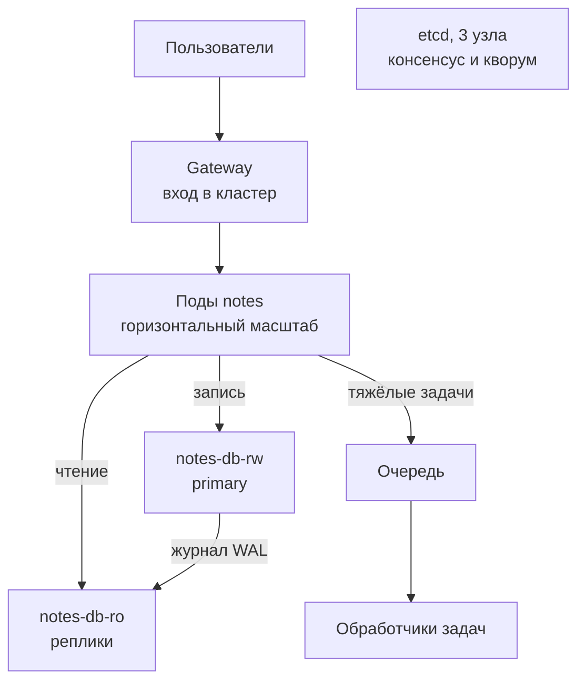
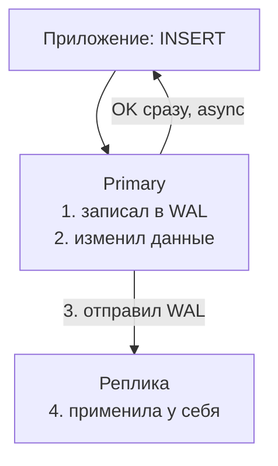

## Зачем это нужно

На собеседовании на middle, инженера, который уже самостоятельно решает рабочие задачи, рано или поздно звучит: «Один сервер не тянет нагрузку. Как масштабируешь?» Такой разговор потренируем в [уроке 10.8](08-mock-interview-middle.md). Масштабировать (scale) значит увеличить объём работы, с которым справляется система: как открыть дополнительные кассы, когда одной уже мало. Просто добавить поды, экземпляры приложения из [урока 5.1](../05-kubernetes/01-why-k8s-cluster.md), помогает, пока запросы не упираются в общую базу данных.

Дальше нужны разные способы работать с данными. Реплика (replica) это копия базы на другом узле, знакомая по [уроку 9.5](../09-secrets-gitops/05-cnpg.md). Шард (shard) хранит только часть данных: как отдельный шкаф с карточками читателей на буквы А-К. Деление на такие части позволяет вместить больше данных и распределить работу; без него одна машина должна обслуживать всю базу. Очередь (queue) хранит задачи до обработки, как стопка заказов в ателье: клиент оставил заказ, портной возьмёт его позже. Она помогает принять всплеск заказов, не заставляя каждого клиента ждать выполнения прямо у окна; подробно разберём ниже.

Ещё узлам нужно договариваться. Консенсус (consensus) это способ принять общее решение при сбоях связи, например, кто сейчас главный: как жильцы выбирают председателя по общим правилам. Без таких правил две группы могут назначить разных главных и записывать противоречащие данные. Кворум (quorum) в рассматриваемом здесь способе голосования это большинство узлов, достаточное для принятия решения: как необходимое число голосов на собрании. Одного голоса мало, зато ждать всех не нужно; подробнее разберём ниже. На работе за этими словами стоят инциденты вида «после переключения базы пропали записи» и «задачи копятся, а обработчики простаивают».

В этом уроке ты потрогаешь то, что уже есть в «Заметках»: PostgreSQL, программу для хранения данных в таблицах из [урока 4.4](../04-docker/04-sql-postgres-basics.md), и CNPG (CloudNativePG), оператор, который управляет экземплярами этой базы в Kubernetes из [урока 9.5](../09-secrets-gitops/05-cnpg.md). Остальное посчитаешь и соберёшь руками. Цель: уметь устно разобрать рост сервиса в 100 раз и назвать цену каждого решения. «Цена решения» здесь главное слово: у каждого приёма есть плата (скорость, деньги, сложность, риск потерять данные), и инженера от новичка отличает то, что он эту плату называет.

Шаг проекта: в репозиторий `~/notes` добавляется файл `docs/system-design.md`, письменный разбор масштабирования «Заметок» до 100x («100x» значит «в сто раз больше нагрузки»). Расширение `.md` означает Markdown, текст с простыми пометками заголовков и списков: как конспект, где ты отмечаешь важные строки. Из него сайт или GitHub делает оформленную страницу, поэтому документ легко читать и в редакторе, и в браузере; оформление проекта разберём в [уроке 10.6](06-portfolio-repo.md). Код и образ не меняются, версия остаётся 0.7.1.

## Что нужно знать

- [Урок 5.1: зачем Kubernetes](../05-kubernetes/01-why-k8s-cluster.md): там появился etcd, хранилище состояния (state), то есть данных, которые кластер помнит между запросами. На нём мы покажем консенсус.
- [Урок 5.5: хранилище и StatefulSet с Postgres](../05-kubernetes/05-storage-statefulset-postgres.md): почему базу нельзя масштабировать простым добавлением подов.
- [Урок 5.7: пробы, ресурсы, раскатка](../05-kubernetes/07-probes-resources-rollouts.md): как ведёт себя сервис без состояния (stateless), который хранит важные данные снаружи своих подов, под нагрузкой.
- [Урок 4.4: SQL и PostgreSQL](../04-docker/04-sql-postgres-basics.md): `SELECT`, `UPDATE`, транзакции.
- [Урок 8.11: паттерны надёжности](../08-observability/11-reliability-patterns-burn-rate.md): повторы (retry) и увеличивающиеся паузы между ними (backoff).
- [Урок 9.5: CloudNativePG](../09-secrets-gitops/05-cnpg.md): у тебя уже есть кластер БД с репликами.
- [Урок 10.3: бэкапы, восстановление и ёмкость](03-backup-dr-capacity.md): RPO (сколько данных можно потерять) и RTO (за сколько вернуть сервис), на них опирается тема репликации (replication), постоянного копирования изменений между экземплярами базы из урока 9.5.

## Картина целиком

Представь небольшую пекарню. Один пекарь печёт хлеб и продаёт его сам. Пока покупателей десять в час, всё хорошо. Что делать, когда их стало тысяча?

- Нанять **второго пекаря с такой же печью**: горизонтальное масштабирование (scale out), добавление одинаковых исполнителей. Можно обслужить больше покупателей. Просто, если хлеб не зависит от того, кто его печёт; сложнее с общей книгой заказов.
- Купить **печь побольше**: вертикальное масштабирование (scale up), увеличение мощности одного исполнителя. Можно делать больше без второй пекарни, но печь не бывает бесконечной.
- Сделать **копию книги заказов** и держать её в соседнем магазине: репликация. Если магазин сгорел, книга цела. Но копия может отстать на пару записей.
- **Разделить город на районы**: одна пекарня обслуживает район А, другая район Б: шардирование (sharding), деление данных и работы между отдельными частями. Каждой достаётся часть заказов, но заказ «от района А для района Б» становится сложным.
- Поставить **окошко приёма заказов**: покупатель оставляет заказ и уходит, пекарь берёт заказы по очереди: очередь.
- Если пекари должны договориться, кто сегодня главный, они **голосуют**, и решение принимается, когда за него большинство: консенсус и кворум.

Вот как это выглядит для «Заметок»:



В схеме Gateway направляет запросы внутрь кластера, как в [уроке 5.4](../05-kubernetes/04-ingress-gateway.md). Primary, главный экземпляр базы, передаёт репликам WAL, журнал изменений, знакомый по [уроку 9.5](../09-secrets-gitops/05-cnpg.md). Очередь здесь возможное дополнение, а не уже установленная часть «Заметок». Как и в пекарне, больше исполнителей не ускоряет общую книгу заказов автоматически.

Урок идёт сверху вниз по этой схеме: поды, копии данных, части, очереди, голосование. К каждому приёму задаём вопрос: что он даёт и чем за это платим.

## Теория

### Масштабирование: вертикальное и горизонтальное

Нагрузка на сервис растёт: больше пользователей, больше запросов в секунду. Один процесс на одном сервере имеет предел: у машины конечное число процессорных ядер, объём памяти, скорость диска. Когда предел достигнут, сервис начинает отвечать медленно или падает. Нужен способ вместить больше работы.

Кассир в магазине. Можно посадить на кассу более быстрого кассира (вертикально: тот же один человек, но сильнее). Можно открыть вторую кассу (горизонтально: больше кассиров рядом). Аналогия перестаёт работать в одном месте: два кассира могут пробивать чеки независимо, а два «главных бухгалтера» с общей книгой уже нет. Об этом дальше.

**Как устроено.**

- **Вертикальное масштабирование** (scale up): та же машина, но больше CPU и RAM (в Kubernetes: выше `resources.limits` или переезд на более крупный узел). Плюсы: не нужно менять код. Минусы: потолок (самый большой сервер в каталоге облака когда-то заканчивается), цена растёт быстрее производительности, и остаётся **единая точка отказа** (single point of failure, SPOF): одна машина, упала она, упало всё.
- **Горизонтальное масштабирование** (scale out): больше одинаковых экземпляров, перед ними **балансировщик** (load balancer), который раздаёт запросы, как Service из [урока 5.3](../05-kubernetes/03-services-dns.md). В Kubernetes это `replicas: 3` у Deployment и Service, который направляет трафик к подам. Плюс: можно увеличивать мощность приложения и пережить отказ одного экземпляра, если оставшимся хватает ресурсов. Минусы: экземпляры должны быть взаимозаменяемы, а общая база и другие зависимости всё ещё могут стать единой точкой отказа.

Сервис «Заметки» запущен с `STORE=postgres` (заметки лежат в базе, а не в файле внутри пода). Поэтому любой из трёх подов на любой запрос ответит одинаково: он берёт данные из базы, а сам ничего важного не помнит. Такой сервис называется **сервисом без состояния** (stateless). Три пода спокойно превращаются в тридцать: `kubectl -n notes scale rollout notes --replicas=30` (для Deployment `scale deployment notes`; под Flux правку делают через `replicaCount` в git или после `flux suspend helmrelease notes -n notes`, иначе helm-controller вернёт прежнее число). Если бы заметки лежали в файле внутри пода (`STORE=file`), у каждого пода была бы своя копия, и пользователь то видел бы заметку, то нет.

**Состояние** (state) это всё, что система помнит между запросами: строки в базе, файлы, сессии пользователей, содержимое очереди. С состоянием сложности начинаются, потому что копии состояния должны быть согласованы. Дальше в уроке три приёма справляться с этим: репликация (одни данные на нескольких узлах), шардирование (разные данные на разных узлах) и асинхронность (очередь между частями системы).

> **Прикинь сам:** сервис с `STORE=file` запустили в трёх подах. Что увидит пользователь?
{: .predict}

То одну заметку, то другую: у каждого пода свой файл. Нужно общее состояние в одном месте, например в базе, а сами поды должны быть без состояния.

Осторожно: «Масштабирование это добавить серверов». Нет: сначала надо найти **узкое место** (bottleneck), то место, которое упирается первым. Добавлять поды бесполезно, если все они ждут одну перегруженную базу. Поэтому порядок такой: измерь (метрики из темы 8, ёмкость из [урока 10.3](03-backup-dr-capacity.md)), реши, что упирается, и только потом масштабируй именно его. Ответ «а что показывают метрики?» на вопрос про масштабирование это плюс, а не увиливание.

> **Главное:** вертикально значит мощнее один узел, горизонтально значит больше одинаковых экземпляров, а сначала нужно найти узкое место.
{: .key}

Добавили поды, а легче не стало. Почему?

### Почему три пода не обязательно дают тройную мощность

Количество экземпляров приложения легко увеличить, но пользователь ждёт весь запрос, включая обращение к базе. Нужно отличать запас мощности одной части от пропускной способности всей системы. Пропускная способность (throughput), число выполненных запросов за секунду, уже измерялась в [уроке 10.3](03-backup-dr-capacity.md).

В столовой открыли три окна выдачи, но повар остался один. Кассиры быстрее принимают заказы, однако обеды выходят с прежней скоростью. В отличие от столовой, одна база обслуживает разные запросы с разной стоимостью, поэтому её предел надо измерять на похожей смеси чтений и записей.

Сначала запрос занимает ресурсы пода, затем ресурсы базы. Если под способен обработать 200 запросов в секунду, а база 300, один под ограничивает систему до 200. С двумя подами приложение способно на 2 × 200 = 400, но база всё равно на 300. Третий под даёт приложению 3 × 200 = 600, а системе по-прежнему не больше 300. Это упрощённая оценка при одинаковых запросах и без других ограничений, а не обещание точных чисел.

<div class="viz" data-viz="chart" data-type="bar" data-x="1 под,2 пода,3 пода" data-series='[{"name":"Приложение","values":[200,400,600],"unit":"зап/с"},{"name":"База","values":[300,300,300],"unit":"зап/с"},{"name":"Предел системы","values":[200,300,300],"unit":"зап/с"}]' data-x-label="Число подов" data-y-label="Запросов в секунду" data-unit="зап/с" data-explain="Предел системы равен меньшему из приложения и базы: после двух подов рост останавливается на 300."></div>

Сейчас приходит 100 запросов в секунду. Рост в 100 раз означает 100 × 100 = 10 000 запросов в секунду. Для приложения при прежней скорости одного пода нужно не меньше 10 000 / 200 = 50 подов, причём без запаса на сбои. Но база из примера выдерживает только 300: увеличение числа подов не закрывает разницу 10 000 / 300 ≈ 33,3 раза. Поэтому в документе нужны отдельные расчёты для приложения и базы, затем проверка под нагрузкой. Чтения можно уменьшить кэшем или распределить по репликам; для записей такие меры не дают того же эффекта.

> **Прикинь сам:** два пода дают 400 запросов в секунду, база 300. Что даст четвёртый под?
{: .predict}

Ничего: предел системы остаётся около 300, он упирается в базу. Новые поды ещё и добавят подключений.

Осторожно: «CPU подов низкий, значит мощности хватает». Под может мало считать и долго ждать базу. Смотри одновременно число завершённых запросов, время ответа и нагрузку базы. Автоматическое добавление подов по CPU, HPA из [урока 5.11](../05-kubernetes/11-scaling-hpa.md), само по себе не устраняет ожидание общего ресурса.

> **Главное:** предел системы равен самому слабому звену, поэтому для приложения и базы считают отдельно и проверяют под нагрузкой.
{: .key}

Если упирается база, нужно сделать её копии. Разберём репликацию.

### Репликация: копии данных

Единственная копия данных это единственная точка отказа. Диск умер, сервер сгорел, и данных нет. Плюс одна база физически ограничена в числе читающих запросов. Хочется держать копии на нескольких машинах: чтобы пережить потерю одной и чтобы часть запросов читала с копий.

Главная бухгалтерская книга и её ксерокопии в соседних офисах. Бухгалтер записывает операции только в оригинал, а помощник после каждой записи спешит отвезти копию страницы в другие офисы. Читать можно в любом офисе. Аналогия перестаёт работать так: помощник едет не мгновенно, и копия в соседнем офисе всегда чуть старее оригинала.

В PostgreSQL один узел называется **primary** (главный): только он принимает записи. Остальные узлы, **реплики** (replicas, standby), получают от него поток изменений и повторяют их у себя. Поток называется **WAL** (write-ahead log, журнал предзаписи): база записывает изменения в журнал, прежде чем соответствующие страницы данных попадут на диск. Журнал состоит из файлов и помогает восстановить изменения после сбоя; это не буквальный список SQL-команд. Реплика читает этот журнал и применяет те же изменения. Так устроен и CNPG из [урока 9.5](../09-secrets-gitops/05-cnpg.md): после создания кластера под `notes-db-1` обычно primary, поды `notes-db-2` и `notes-db-3` реплики. После переключения роли могут измениться: проверяй их, а не угадывай по номеру. Реплики доступны только для чтения, и попытка записать в них падает с ошибкой.

Шаги записи такие:



Главный выбор: **асинхронная или синхронная** репликация.

| Режим | Когда primary говорит клиенту «готово» | Что при падении primary | Цена |
|---|---|---|---|
| Асинхронная (async) | сразу после своей записи | последние транзакции могли не доехать до реплики: RPO больше 0 | быстро, но можно потерять свежее |
| Синхронная (sync) | после нужного подтверждения от реплики | RPO = 0 при переключении на копию с подтверждёнными записями | запись медленнее; без нужного числа подтверждений ждёт, пока политика не изменена |

Напомню из [урока 10.3](03-backup-dr-capacity.md): RPO (recovery point objective) это сколько данных ты готов потерять, измеряется во времени. RPO = 0 значит «ни одной подтверждённой записи».

Пользователь нажал «Сохранить заметку». Primary записал строку и в ту же миллисекунду ответил «готово». В это время WAL ещё едет по сети к реплике. Через 2 секунды primary умер. Реплика получила изменения только до 2 секунд назад, и её повышают до primary. Заметка, о которой пользователю сказали «готово», исчезла: это и есть ненулевой RPO при асинхронной репликации. При синхронной репликации primary не сказал бы «готово», пока реплика не подтвердила, что приняла запись.

Второе следствие асинхронности: **отставание реплики** (replication lag), время, на которое реплика отстала от primary. Пользователь записал заметку, обновил страницу, запрос попал на реплику, а там записи ещё нет. Это классическая ловушка «чтение своих записей» (read-your-writes). Лечится чтением с primary сразу после записи (на пару секунд или всегда) или запоминанием, до какого места WAL дошла запись этого пользователя.

Третье: **failover** (переключение), знакомое по [уроку 9.5](../09-secrets-gitops/05-cnpg.md), это повышение реплики до нового primary, когда старый недоступен. Опасность в том, что старый primary может продолжать принимать записи, не зная, что его заменили. Тогда два узла одновременно считают себя главными и пишут разное. Это называется **split brain** (раздвоение мозга): как две кассы, которые независимо ведут единственный остаток товара и обе продают последний экземпляр. Без предотвращения такого расхождения восстановление требует разбирать конфликтующие данные. В системах с голосованием кворум помогает выбрать одного главного, а **ограждение** (fencing) лишает прежнего права писать: как отозвать ключи у бывшего заведующего, чтобы он не продолжал менять складской учёт. Прежний узел останавливают или изолируют подходящим для системы способом. В CNPG переключением управляет оператор, но реплики PostgreSQL сами не образуют голосующий кластер Raft; гарантии зависят от настроек и доступности управления Kubernetes.

> **Прикинь сам:** primary подтвердил запись и через 2 секунды умер, реплика асинхронная и отставала на 2 секунды. Что потеряно?
{: .predict}

Транзакции последних примерно 2 секунд, которые клиенты уже считают сохранёнными: это ненулевой RPO.

> **Проверь понимание:** primary упал, реплика была асинхронной и отставала на 2 секунды. Что потеряно и как это называется в терминах урока 10.3?

<details markdown="1">
<summary>Ответ</summary>

Потеряны транзакции последних примерно 2 секунд, которые primary подтвердил клиентам, но не успел отправить реплике. Это ненулевой RPO. Чтобы получить RPO = 0 при таком отказе, нужна синхронная репликация хотя бы на одну реплику и переключение на копию с подтверждёнными изменениями, ценой задержки записи. Ниже уточним, что означает подтверждение.

</details>

Осторожно: «Есть реплика, значит бэкап не нужен». Реплика повторяет всё, включая ошибки: выполнили `DROP TABLE notes` на primary, и реплика послушно удалила таблицу у себя. Репликация помогает пережить отказ узла (HA, высокая доступность), а бэкап нужен для восстановления после удаления или порчи данных (DR, восстановление после аварии). Разницу и ограничения обоих способов разбирали в [уроке 10.3](03-backup-dr-capacity.md).

> **Главное:** репликация даёт отказоустойчивость и чтение с копий, а асинхронная копия может отставать, поэтому есть риск потери последних записей и устаревшего чтения.
{: .key}

Слово «подтвердила» на самом деле значит разное. Уточним.

### Подтверждение записи: что именно обещает база

Слова «реплика получила запись» скрывают разные состояния. Изменения могли только попасть в память, сохраниться на диск или уже стать видимыми при чтении. Без этого различия легко обещать пользователю отсутствие потерь и немедленное чтение, хотя настроено только одно из двух.

Секретарь получил письмо, положил его в сейф, затем внёс содержание в рабочую ведомость. «Письмо в сейфе» означает, что оно сохранится, но коллега, читающий ведомость, ещё его не увидит. У базы этапы автоматизированы, а срок между ними зависит от нагрузки и связи, а не от расписания секретаря.

Primary создаёт записи WAL и передаёт их реплике. Реплика получает их, сохраняет на диск и только потом применяет к своим данным. Получается три этапа: получила, сохранила, применила. Настройка PostgreSQL `synchronous_commit`, разобранная в [уроке 9.5](../09-secrets-gitops/05-cnpg.md), определяет, до какого этапа primary ждёт, прежде чем сказать клиенту «готово».

Если синхронная реплика назначена, значение `on` ждёт, пока WAL сохранится на её диске. Значение `remote_apply` ждёт ещё и применения, поэтому чтение с этой реплики сразу увидит запись. Без назначенных синхронных реплик `on` ничего удалённого не ждёт: запись подтверждается по локальному диску primary.

У главного узла две реплики, A и B. A сохранила новую заметку на диск и подтвердила запись; B отстала. Primary ответил пользователю «готово». Если затем выбрать B главным, записи на ней ещё может не быть. Для RPO = 0 необходимо переключаться на узел, который содержит подтверждённые изменения, и не терять все копии с ними одновременно. Если чтение сразу ушло на A до применения WAL, заметка тоже может временно отсутствовать в ответе, хотя уже сохранена. Чтение с primary после записи убирает эту конкретную причину задержки видимости.

> **Прикинь сам:** A подтвердила сохранение WAL, B отстаёт. Можно ли обещать отсутствие потерь при переключении на любую из них?
{: .predict}

Нет: нужно выбрать копию с подтверждёнными изменениями, то есть A, и убедиться, что старый главный больше не пишет.

Осторожно: «Синхронная репликация делает все копии одинаковыми мгновенно». Она ждёт заданные подтверждения от заданного числа реплик, а не обязательно от всех. В документе укажи, сколько копий должны подтвердить запись, что делать при их недоступности и с какой копии читать после сохранения. Ослабление ожидания ради продолжения работы меняет обещание о допустимой потере данных.

> **Главное:** сохранение WAL и применение WAL это разные этапы: первое про сохранность, второе про видимость при чтении.
{: .key}

Реплики растят чтение. А что делать, когда не хватает места или записи?

### Шардирование: разные данные на разных узлах

Репликация растит чтение (читать можно с любой копии), но не запись: каждая запись всё равно идёт на единственный primary, и он же хранит **все** данные. Когда записей слишком много для одной машины или данных не влезает на один диск, копий мало: нужно разделить сами данные.

Библиотека с картотекой на миллион карточек. Один шкаф не вмещает, поэтому картотеку делят: фамилии на А-К в первом шкафу, Л-Я во втором. Каждый библиотекарь работает со своим шкафом. Аналогия перестаёт работать на запросе «сколько всего читателей в городе»: надо обойти все шкафы и сложить.

**Шардирование** (sharding) делит данные между узлами так, что каждый хранит свою часть, **шард** (shard). Для каждой строки нужно решить, в каком шарде она лежит. Для этого выбирают **ключ шардирования** (shard key): поле, по которому вычисляют шард. Три способа:

- **По хэшу ключа.** **Хэш** (hash) это функция, которая превращает любую строку в число, причём одна и та же строка всегда даёт одно и то же число, а разные строки дают «случайно» разбросанные числа. Формула `хэш(ключ) % N`, где N число шардов, а `%` остаток от деления. Равномерно, но запросы по диапазону («все за март») идут на все шарды.
- **По диапазону.** Ключи от 1 до 1 000 000 в первом шарде, следующие во втором. Удобно для диапазонов, но появляются «горячие» шарды: если ключ растёт со временем (дата), все новые записи летят в последний шард.
- **По справочнику** (directory): отдельная таблица «ключ -> шард». Гибко, но сам справочник становится узким местом.

Возьмём хэш-шардирование «Заметок» по `user_id` на 4 шарда. У пользователя `user-42` хэш равен, скажем, 3 909 500 118. Остаток от деления на 4: 3 909 500 118 % 4 = 2 (последние две цифры 18, а 18 % 4 = 2). Значит, все заметки этого пользователя лежат в шарде номер 2, и запрос «мои заметки» идёт ровно в один шард. Это называется **локальностью** запросов: по ключу сразу ясно, куда идти. Если бы ключом было `created_at` (время создания), почти вся текущая запись шла бы в один свежий шард, остальные простаивали бы. Такой перекос называется горячим шардом (hot shard).

Теперь беда `% N`. Пусть добавили пятый шард: формула стала `хэш % 5`. Ключ остаётся на месте только когда `хэш % 4` случайно совпал с `хэш % 5`. Для `user-42`: 3 909 500 118 % 5 = 3, а раньше было 2: ключ переехал. В среднем совпадение случается у 1 ключа из 5, то есть **переезжает около 80% всех данных**. Огромная передача данных при росте на один шард. Решение: не привязывать ключ к числу шардов напрямую, а сначала разделить все ключи на много **слотов** (например, 1024, `хэш % 1024`), а потом раздавать слоты шардам. При добавлении шарда ему отдают часть слотов от каждого старого. Шардов стало пять, значит, новому причитается пятая часть слотов (1 из 5): переезжает около пятой части данных, то есть примерно 20%, остальное не двигается. Близкая идея называется согласованным хэшированием (consistent hashing). Ты увидишь разницу цифрами в задании 2.

Цена шардирования: запросы через несколько шардов дороги (нужно собрать результаты, соединить таблицы или отсортировать данные с разных машин). Транзакция, группа действий с гарантией «либо всё, либо ничего» из [урока 4.4](../04-docker/04-sql-postgres-basics.md), теперь может затронуть разные базы. Чтобы сохранить эту гарантию между шардами, нужен дополнительный механизм согласования; иногда приложение вместо этого допускает промежуточное состояние и исправляет незавершённые действия. Перебалансировка (rebalancing), перенос частей данных ради более равномерной нагрузки, похожа на перераспределение карточек между библиотечными шкафами. Пока карточка переезжает, надо знать, в каком шкафу искать её и куда класть новую: иначе запросы потеряют путь к данным. Поэтому рост числа шардов усложняет и работу приложения, и бэкапы, и мониторинг.

> **Прикинь сам:** при `хэш % N` добавили пятый шард вместо четырёх. Какая доля ключей переедет?
{: .predict}

Около 80%: ключ остаётся на месте, только если остатки случайно совпали, а это 1 случай из 5. Поэтому берут слоты или согласованное хэширование.

Осторожно: «Шардирование и репликация это одно и то же». Нет: репликация это одни данные на многих узлах (надёжность и чтение), шардирование это разные данные на разных узлах (запись и объём). Обычно их сочетают: каждый шард сам реплицируется. И второе заблуждение: «шарды надо ставить заранее». Наоборот, это последнее, что стоит делать. Сначала индексы, кэш, реплики для чтения, партиционирование (partitioning: разбиение одной большой таблицы на части внутри одной базы). Практическое правило: пока данные помещаются на один сервер с запасом, шарды не нужны.

> **Главное:** шардирование делит данные между узлами по ключу и растит запись и объём, но дорого стоит в сложности, поэтому оно идёт последним.
{: .key}

Теперь перейдём от данных к работе: как не заставлять пользователя ждать.

### Очереди: развязка во времени

Часть работы медленная: собрать экспорт на 50 000 заметок, отправить письмо, сгенерировать отчёт. Если делать её прямо в момент запроса, пользователь ждёт минуту, а при скачке нагрузки сервис захлёбывается. Хочется принять задачу, сразу ответить «принято» и сделать работу в своём темпе.

Окошко приёма заказов в ателье. Клиент оставляет заказ и уходит, портной шьёт по очереди. Если пришло 50 клиентов сразу, очередь длиннее, но никто не ломает дверь, и портной не мечется. Аналогия перестаёт работать в одном: у портного заказ не пропадает, а в очереди сообщений возможны сбои доставки, о которых ниже.

Между **производителем** (producer, тем, кто создаёт задачи: веб-приложение) и **потребителем** (consumer, обработчиком, часто называемым воркером, worker) стоит **очередь** (queue), буфер задач. Шаги: приложение кладёт задачу в очередь и отвечает пользователю; воркер берёт задачу, выполняет и подтверждает («готово», ack); только после подтверждения задача удаляется. Если воркер умер, не подтвердив, задачу отдают другому воркеру. Что это даёт: сглаживает пики (нагрузка выравнивается по времени), изолирует сбои (упал воркер, задачи ждут), позволяет масштабировать воркеры независимо от веб-части.

Цена: пользователь видит результат не сразу (**конечная согласованность**, eventual consistency: система придёт к правильному состоянию, но не мгновенно) и появляется вопрос гарантий доставки:

- **at-most-once** («не более одного раза»): сообщение может потеряться, но дублей не будет;
- **at-least-once** («не менее одного раза»): не теряется, но может прийти дважды (воркер выполнил, но упал до подтверждения, и задачу отдали ещё раз);
- **exactly-once** («ровно один раз»): всегда уточняй границу гарантии. Некоторые системы обеспечивают один результат внутри своего хранилища, но это не обещает однократную отправку письма внешним сервисом. Частый практический подход: повторная доставка плюс обработка, безопасная при повторе.

**Идемпотентность** (idempotency), безопасный повтор с тем же итоговым результатом из [урока 8.11](../08-observability/11-reliability-patterns-burn-rate.md), нужна и обработчику очереди. «Установить статус в done» идемпотентно, «добавить 100 рублей на счёт» нет. Для результата внутри одной базы можно завести уникальный ключ задачи и писать `INSERT ... ON CONFLICT DO NOTHING` («вставь, а если такой ключ уже есть, ничего не делай»). Изменение данных и фиксация выполненной задачи должны быть в одной транзакции, иначе сбой между ними оставит неопределённость.

В очередь попала задача «отправить письмо пользователю 17» с ключом `job-1`. Воркер A отправил письмо и упал до подтверждения. Очередь отдала `job-1` воркеру B. Без защиты пользователь получит два письма. Одна таблица результатов не закрывает проблему: если записать «готово» до отправки, сбой может оставить пользователя без письма; если после отправки, сбой может привести к повторному письму. Для безопасного повтора внешняя служба отправки должна поддерживать тот же уникальный ключ операции и помнить результат, либо приложение должно отдельно разбирать неопределённый исход. Это ограничение важно: очередь сама не гарантирует однократность внешнего действия.

Нужны и другие вещи вокруг очереди: повторы с backoff (см. [урок 8.11](../08-observability/11-reliability-patterns-burn-rate.md)) и **очередь «мёртвых» сообщений** (dead-letter queue, DLQ). Она хранит задачи, которые не удалось обработать после нескольких попыток: как отдельная полка для заказов с неверным адресом. Без неё одна неисправимая задача может постоянно отнимать время у остальных; с ней можно разобрать причину и вернуть задачу после исправления. Следи за **возрастом самого старого сообщения**, он важнее одной длины очереди: очередь из 10 000 задач, которая разбирается за минуту, здоровее очереди из 10 задач, застрявшей на час.

> **Прикинь сам:** воркер выполнил задачу и упал до подтверждения. Что будет?
{: .predict}

Очередь отдаст ту же задачу другому воркеру. Обработчик должен быть идемпотентным: ключ задачи и результат в одной транзакции.

> **Проверь понимание:** воркер взял задачу, обработал, но упал до подтверждения. Что произойдёт и что нужно в коде воркера?

<details markdown="1">
<summary>Ответ</summary>

При доставке at-least-once очередь вернёт задачу другому воркеру, и тот повторит попытку обработки. Для результата в одной базе нужна фиксация ключа задачи и изменения данных в одной транзакции. Для внешнего действия, например письма, одной проверки в базе мало: нужна поддержка уникального ключа у внешней службы или разбор неопределённого исхода.

</details>

Осторожно: «Очередь ускоряет обработку». Нет, она не делает работу быстрее, она развязывает по времени и сглаживает пики. Если воркеры в среднем работают медленнее, чем приходят задачи, очередь растёт бесконечно, и одной очередью проблему не решить: нужны больше воркеров или ограничение на входе.

> **Главное:** очередь развязывает работу во времени и сглаживает пики, но не ускоряет её, а доставку нужно делать безопасной при повторе.
{: .key}

Очередь не бесконечна. Посчитаем, когда она перестанет справляться.

### Очередь под нагрузкой: когда ожидание станет бесконечным

Очередь даёт запас времени, но не бесконечный запас ресурсов. Задачи занимают место, а пользователи ждут результат. Чтобы понять, сколько обработчиков нужно, сравнивай скорость поступления и выполнения, а не только число подов.

В прачечную каждый час приносят 30 мешков, а стирать успевают 20. За час останется 10, за два часа 20. Склад отсрочит отказ, но когда-нибудь заполнится. В программной очереди задачи бывают разной длительности, поэтому счёт ниже предполагает одинаковые задачи; для реального расчёта нужны измерения.

Один воркер выполняет задачу за 0,2 секунды. За секунду он успевает 1 / 0,2 = 5 задач. Четыре таких воркера выполнят 4 × 5 = 20 задач в секунду, если база и другие зависимости не мешают. При поступлении 30 задач в секунду остаются 30 - 20 = 10. За минуту накопится 10 × 60 = 600 невыполненных задач. Шесть воркеров дадут ровно 30 задач в секунду, но не запас: любая пауза создаст хвост, который при той же нагрузке нечем разгребать.

Пусть всплеск длился минуту и оставил 600 задач, затем поступление снизилось до 10 в секунду. Четыре воркера по-прежнему выполняют 20. Для старых задач свободны 20 - 10 = 10 выполнений в секунду. Хвост уйдёт за 600 / 10 = 60 секунд. Деление 600 / 20 = 30 секунд ошибочно: оно забывает новые поступления. Увеличивая число воркеров, снова проверяй нагрузку базы, иначе её предел остановит рост общей скорости.

> **Прикинь сам:** в очереди 600 задач, поступает 10 в секунду, выполняется 15. Через сколько очередь опустеет?
{: .predict}

15 - 10 = 5 задач в секунду на разбор хвоста, 600 / 5 = 120 секунд.

Осторожно: «Очередь не падает, значит всё хорошо». Пользователь может уже час ждать экспорт при работающих процессах. Нужны предел допустимого ожидания, наблюдение за возрастом задач и ограничение приёма при перегрузке. Ограничение приёма, как прекращение новых заказов при заполненном складе, сохраняет возможность выполнить уже принятые обязательства. Конкретную политику укажи в проектном документе.

> **Главное:** очередь растёт, когда задачи приходят быстрее, чем выполняются, и следить нужно за возрастом старейшей задачи.
{: .key}

Копии и очереди требуют договорённости узлов. Как узлы договариваются?

### Консенсус, кворум и CAP

Когда несколько узлов должны договориться об одном значении («кто сейчас primary», «какая версия конфигурации»), нельзя, чтобы разные узлы считали по-разному. А узлы могут падать и терять связь друг с другом. Нужен способ договориться, который работает, даже когда часть узлов недоступна.

Собрание жильцов. Решение принято, если за него проголосовало **большинство** (больше половины). Две группы большинства обязательно имеют общих участников. Если участник не голосует за двух разных председателей в одном голосовании, два председателя не получат большинство. Аналогия перестаёт работать при сбоях и повторных выборах: программе нужны правила, какие голоса и записи сохранять между попытками. Комната с меньшинством должна ждать, даже если все люди в ней живы и здоровы.

Такая договорённость называется **консенсусом** (consensus). Известные способы её получить называются Raft и Paxos. Идея Raft: узлы выбирают **лидера**, все записи идут через него, а он рассылает их остальным. На Raft работает etcd, хранилище состояния Kubernetes из [урока 5.1](../05-kubernetes/01-why-k8s-cluster.md).

Запись считается закреплённой, когда её подтвердило большинство узлов. Это большинство называется **кворумом** (quorum) и равно `N/2 + 1` с округлением вниз (N число голосующих узлов). Для трёх узлов кворум два: пока два живы и видят друг друга, кластер работает.

Остался номер выборов. **Терм** (term, эпоха) это номер попытки выбрать лидера, как номер собрания жильцов. Он растёт при каждых новых выборах, даже неудачных, и по нему узлы отклоняют сообщения прежнего лидера.

Считаем кворум для разных размеров кластера, показывая вычисления целиком:

- 3 узла: 3/2 = 1 (целая часть), +1 = 2. Кворум 2, значит, можно потерять 3 - 2 = 1 узел.
- 4 узла: 4/2 = 2, +1 = 3. Кворум 3, теряем 4 - 3 = 1. Столько же, сколько у трёх, зато на один сервер дороже.
- 5 узлов: 5/2 = 2, +1 = 3. Кворум 3, теряем 2.
- 6 узлов: 6/2 = 3, +1 = 4. Кворум 4, теряем 2. Снова не лучше пяти.

<div class="viz" data-viz="chart" data-type="bar" data-x="3,4,5,6" data-series='[{"name":"Сколько узлов можно потерять","values":[1,1,2,2]}]' data-x-label="Узлов в кластере" data-y-label="Допустимые потери" data-unit="узл." data-explain="Четвёртый и шестой узлы дороже, но устойчивости не добавляют."></div>

Отсюда практические правила:

- Узлов нечётное число: 3 переживают потерю 1, 5 переживают потерю 2. Чётный узел лишь дороже и не добавляет отказоустойчивости.
- Кластер из 3 узлов в 2 ЦОДах (центрах обработки данных, отдельных площадках с серверами) при размещении 2 + 1 переживает потерю площадки с одним узлом, но не с двумя. Размещение 1 + 1 + 1 по трём независимым площадкам сохраняет большинство после потери любой одной. Некоторые системы поддерживают **арбитр** (witness), узел для участия в принятии решения без полной копии пользовательских данных: как дополнительный участник собрания, который помогает набрать голоса, но не хранит складской товар. Его возможности зависят от системы; голосующий узел etcd хранит журнал и не заменяется произвольным «лёгким голосом».
- Если кворума нет, кластер **останавливает запись**, а не рискует split brain. Это осознанный выбор: лучше не работать, чем испортить данные.

**Теорема CAP.** **Сетевое разделение** (partition) это потеря связи между частями системы при работающих узлах: как два магазина, которые не могут созвониться и сверить общую книгу заказов. Один магазин не знает, что успел записать другой, поэтому продолжать работу со свежими общими данными без дополнительных условий нельзя. При таком разделении возникает выбор между **согласованностью** (consistency, C) и **доступностью** (availability, A). Согласованность здесь означает, что операции выглядят как работа с одной актуальной копией: чтение после завершённой записи не возвращает более старое значение. Доступность в смысле CAP означает, что каждый запрос к работающему узлу получает результат операции; сообщение «не могу выполнить запрос без кворума» не выполняет это требование. Это точнее бытового «сайт открывается» или процента времени работы из темы наблюдаемости.

**CP** сохраняет согласованность ценой отказа части операций при разделении: так ведёт себя etcd при потере большинства. **AP** допускает ответы от разошедшихся копий с последующим согласованием. Представь остаток товара 1: два изолированных магазина могут оба продать его, если продолжают отвечать по своей копии. Для точного остатка лучше временно отказать, для счётчика просмотров иногда допустимо отложенное согласование. Выбор зависит от операции и требований; одна синхронная настройка PostgreSQL сама по себе не описывает поведение всей системы. Практический разбор таких решений продолжим в [уроке 10.8](08-mock-interview-middle.md).

> **Прикинь сам:** в кластере etcd из 3 узлов отвалились 2. Почему `kubectl apply` не проходит, а уже запущенные поды продолжают работать?
{: .predict}

Запись требует кворума (2 из 3), которого нет. Обычное чтение через `kubectl get` тоже, как правило, недоступно: оно идёт как кворумное, и только чтение с `resourceVersion=0` может вернуться из кэша API-сервера, возможно устаревшим. Уже запущенные поды работают: контейнерам etcd для работы не нужен. Кластер выбрал согласованность вместо доступности записи.

Осторожно: «CAP значит выбери любые два из трёх». Нельзя выбрать «C и A, без P», потому что разделения сети не избежать. Выбор делается в момент отказа связи, а в остальное время можно иметь и то и другое.

> **Главное:** кворум это больше половины узлов, нечётное число узлов лучше чётного, а при потере связи система выбирает согласованность или доступность.
{: .key}

Остались два дешёвых приёма, которые ставят раньше реплик и шардов.

### Пул соединений и кэш: два дешёвых приёма до реплик и шардов

В документе про 100x ты поставишь их раньше реплик и шардов, поэтому их надо понимать. Обе проблемы возникают в приложении «Заметки» задолго до того, как база упрётся в диск.

**Пул соединений.** Каждое подключение к PostgreSQL это отдельный серверный процесс со своей памятью (порядка нескольких мегабайт), а число подключений ограничено параметром `max_connections` (по умолчанию 100). Аналогия: в ресторане 100 столов, и каждый гость занимает стол на всё время визита, даже когда просто читает меню. Если подов 30 и каждый держит 10 соединений, это 300 соединений, а столов 100: база отвечает `FATAL: sorry, too many clients already`. Решение: **пул соединений** (connection pooler, в CNPG это PgBouncer, объект `Pooler`). Он держит небольшое число реальных соединений с базой (скажем, 20) и раздаёт их подам по очереди, на время одной транзакции. Пример счёта: 30 подов по 10 соединений это 300 клиентских подключений к пулу, а в базу идут только 20. Цена: ещё один компонент, и некоторые возможности сессии (например, временные таблицы между транзакциями) при таком режиме не работают.

**Кэш.** **Кэш** (cache) это быстрое хранилище копий часто читаемых данных (в памяти, например Redis), которое стоит перед базой. Аналогия: блокнот на столе, куда ты выписываешь то, что спрашивают чаще всего, чтобы не бегать каждый раз в архив. Шаги: приложение сначала спрашивает кэш; нашлось (попадание, hit): отвечает мгновенно; не нашлось (промах, miss): идёт в базу, отвечает и кладёт результат в кэш. Пример с числами: популярную заметку читают 1000 раз в секунду, изменяют раз в час. Без кэша это 1000 запросов в секунду к базе, с кэшем один запрос при промахе, остальные 999 из памяти. Сложность в одном: **инвалидация** (invalidation), то есть как узнать, что копия устарела. Обычно задают время жизни (TTL, time to live): например, 30 секунд, и в течение этого времени пользователь может видеть старую версию заметки. Это та же цена, что у асинхронной реплики: скорость в обмен на свежесть. Поэтому «устаревший кэш» один из пунктов в разборе инцидента ниже.

> **Прикинь сам:** 20 подов по 10 соединений упёрлись в `max_connections = 100`. Поднять лимит до 1000 или поставить пул?
{: .predict}

Пул: каждое соединение стоит базе процесса и памяти, поэтому лимит в 1000 замедлит базу. Пул сводит 200 клиентских подключений к паре десятков.

Осторожно: «Кэш можно поставить на всё». Кэш хорош для данных, которые много читают и редко меняют. Для данных, которые меняются каждую секунду или должны быть точными (остаток на счёте), он вреден.

> **Главное:** пул соединений защищает базу от потока подключений, а кэш снимает чтения, но платит свежестью данных.
{: .key}

Приёмы известны. Осталось выстроить их в правильный порядок.

### Порядок действий при росте нагрузки

Хороший инженер на вопрос «как масштабировать?» не называет одну технологию, а выстраивает лестницу от дешёвого к дорогому.

Соберём всё в цепочку, которую ты положишь в `docs/system-design.md`. Порядок идёт от дешёвого и безопасного к дорогому и рискованному, и на каждом шаге ты сначала измеряешь, а потом действуешь:

| Шаг | Что даёт | Чем платим |
|---|---|---|
| 1. Индексы, тяжёлые запросы | меньше работы на запрос | почти ничем |
| 2. Больше подов (HPA) | больше запросов в секунду | упираемся в БД |
| 3. Пул соединений | БД не тонет в подключениях | ещё один компонент |
| 4. Кэш | меньше чтений из БД | устаревшие данные |
| 5. Реплики на чтение | больше чтения | лаг, чтение своих записей |
| 6. Вертикальный рост БД | больше записи | потолок, цена |
| 7. Очередь для тяжёлого | сглаживает пики | дубли, задержка результата |
| 8. Шардирование | больше записи и объёма | сложность, запросы через шарды |

Обрати внимание, что шардирование в самом конце, а очередь и кэш ставятся раньше. Причина проста: каждый следующий шаг сложнее в эксплуатации и труднее откатить. Хороший ответ на собеседовании звучит как именно такая лестница с ценой на каждой ступени.

> **Прикинь сам:** почему шардирование стоит в конце лестницы, а индексы в начале?
{: .predict}

Индексы почти ничего не стоят и сразу убирают лишнюю работу, а шардирование усложняет запросы, транзакции, бэкапы и мониторинг.

> **Главное:** масштабируй по лестнице: измерь, начни с индексов, потом пул, кэш, реплики, очередь и только в конце шарды.
{: .key}

Теории хватит. В практике ты посмотришь репликацию вживую, посчитаешь шарды и кворум и напишешь `docs/system-design.md`.

## Практика

Задания 1, 4 и 5 идут в твоём kind-кластере `notes` (контекст `kind-notes`, namespace `notes`) с CNPG из урока 9.5. Если кластер остановлен, подними его по README проекта, главной инструкции с описанием запуска; как оформить её, разберём в [уроке 10.6](06-portfolio-repo.md). Задания 2 и 3 не требуют кластера: им нужны только `python3` и Docker.

### Задание 1. Смотрим репликацию живой базы

**Цель:** увидеть primary, реплики, лаг и режим репликации в CNPG.

**Предскажи:** сколько подов у кластера `notes-db` и в каком из них команда `SELECT pg_is_in_recovery()` вернёт `t`? Что вернёт запись в реплику?

<details markdown="1">
<summary>Ответ</summary>

Обычно 3 пода (`notes-db-1..3`): один primary и две реплики. `pg_is_in_recovery()` возвращает `t` (true) на репликах: они постоянно «доигрывают» WAL, то есть находятся в режиме восстановления. Запись в реплику упадёт с ошибкой `cannot execute INSERT in a read-only transaction`.

</details>

**Шаги:**

1. Найди поды и их роли. Разбор: `-l cnpg.io/cluster=notes-db` выбирает поды по метке, `-L cnpg.io/instanceRole` добавляет колонку со значением этой метки (`primary` или `replica`).

```bash
kubectl config use-context kind-notes
kubectl -n notes get pods -l cnpg.io/cluster=notes-db -L cnpg.io/instanceRole
```

2. Спроси primary, кто у него подключён как реплика (имя `PRIMARY` подставь из вывода шага 1). Разбор: `exec "$PRIMARY" -c postgres` выполняет команду внутри контейнера `postgres` пода; `psql -U postgres -x -c "..."` запускает SQL от суперпользователя `postgres`, `-x` печатает результат по одному полю на строку; `pg_stat_replication` служебное представление со списком подключённых реплик.

```bash
PRIMARY=notes-db-1
kubectl -n notes exec "$PRIMARY" -c postgres -- psql -U postgres -x -c \
  "SELECT application_name, state, sync_state, replay_lag FROM pg_stat_replication;"
```

3. Проверь роль на реплике и попробуй записать:

```bash
REPLICA=notes-db-2
kubectl -n notes exec "$REPLICA" -c postgres -- psql -U postgres -d notes -c "SELECT pg_is_in_recovery();"
kubectl -n notes exec "$REPLICA" -c postgres -- psql -U postgres -d notes -c "INSERT INTO notes(text) VALUES ('test');"
```

**Что должно получиться** (кластер в этой редакции урока не запускался, вывод показан по документации CNPG и PostgreSQL, значения лага у тебя будут другие):

```text
-[ RECORD 1 ]----+-----------
application_name | notes-db-2
state            | streaming
sync_state       | async
replay_lag       | 00:00:00.0012
```

```text
 pg_is_in_recovery
-------------------
 t
ERROR:  cannot execute INSERT in a read-only transaction
```

**Как читать вывод:** `application_name` имя реплики (у primary видна каждая, у тебя будет две записи). `state = streaming` значит, что реплика подключена и получает поток WAL в реальном времени (`catchup` означал бы, что она догоняет). `sync_state`: `async` реплика асинхронная, `sync` синхронная, `potential` запасная синхронная. `replay_lag` время между записью в WAL на primary и применением на реплике. Второй блок: `t` значит «да, узел в режиме реплики», и запись на нём запрещена.

**Объясни себе:** что означает `sync_state = async` для RPO? Почему `replay_lag` не ноль даже в здоровом кластере? Как приложение «Заметки» узнаёт, куда писать (вспомни Service `notes-db-rw`)?

**Типичные ошибки:**

- `Error from server (NotFound): pods "notes-db-1" not found`: primary может быть другим подом или кластер называется иначе. Смотри вывод шага 1.
- `psql: error: connection to server on socket ... failed: FATAL: role "postgres" does not exist`: в твоём образе суперпользователь другой. Проверь `kubectl -n notes get cluster notes-db -o yaml` и используй `-U` из вывода.

### Задание 2. Шардирование руками: `mod N` против слотов

**Цель:** увидеть цифрами, почему `хэш % N` плох при росте.

**Предскажи:** для 1000 ключей при переходе с 4 на 5 шардов сколько ключей сменит шард при `хэш % N`? А при схеме «1024 виртуальных слота, слот назначен шарду»?

<details markdown="1">
<summary>Ответ</summary>

При `% N` около 800 из 1000 (80%). При слотах переедет около 1/5, то есть примерно 200: новому шарду отдаётся часть слотов от каждого старого, остальные не двигаются.

</details>

**Шаги:**

Создай скрипт в отдельном каталоге (не в репозитории `~/notes`) и запусти. Разбор команды: `mkdir -p ~/scratch` создаёт каталог (без ошибки, если он есть); `cat > файл <<'PY' ... PY` записывает всё до строки `PY` в файл (кавычки вокруг `PY` запрещают оболочке трогать `$` внутри); `python3 файл` запускает скрипт.

```bash
mkdir -p ~/scratch && cat > ~/scratch/shards.py <<'PY'
# Считаем, сколько ключей переезжает при росте числа шардов
import zlib

KEYS = [f"user-{i}" for i in range(1000)]   # 1000 условных пользователей
SLOTS = 1024                                # число виртуальных слотов

def h(key):
    # стабильный хэш: одна строка всегда даёт одно число
    # (встроенный hash() в Python меняется от запуска к запуску)
    return zlib.crc32(key.encode())

def shard_mod(key, n):
    # способ 1: остаток от деления на число шардов
    return h(key) % n

def slot_map(n):
    # способ 2: сначала ключ -> слот, потом слот -> шард.
    # для 4 шардов слоты раздаются подряд: 0,1,2,3,0,1,2,3...
    m = [s % 4 for s in range(SLOTS)]
    if n == 5:
        for s in range(0, SLOTS, 5):
            m[s] = 4  # новый шард забирает каждый пятый слот
    return m

def shard_slot(key, n):
    return slot_map(n)[h(key) % SLOTS]

for name, fn in (("mod N", shard_mod), ("слоты", shard_slot)):
    # считаем ключи, у которых шард при 4 и при 5 шардах различается
    moved = sum(1 for k in KEYS if fn(k, 4) != fn(k, 5))
    print(f"{name}: переехало {moved} из {len(KEYS)}")
PY
python3 ~/scratch/shards.py
```

**Что должно получиться** (проверено запуском, `crc32` стабилен, поэтому числа у тебя будут те же):

```text
mod N: переехало 805 из 1000
слоты: переехало 213 из 1000
```

**Как читать вывод:** две строки, по одной на схему. 805 из 1000 это 80,5%: почти теория 4/5. 213 из 1000 это около 21%: почти 1/5, ровно столько слотов забрал новый шард (каждый пятый).

**Объясни себе:** почему при слотах переезжает около 1/5, а не 80%? Что произойдёт с горячим шардом, если один слот получает непропорционально много запросов? Почему нужен стабильный хэш?

**Типичные ошибки:**

- Результаты меняются между запусками, если взять встроенный `hash()`: Python «солит» хэш строк случайным числом (`PYTHONHASHSEED`). Для шардирования нужен стабильный хэш, как `crc32`.
- `python3: command not found`: поставь Python 3 (на Mac `brew install python`).

### Задание 3. Очередь на Postgres: `SKIP LOCKED` и идемпотентность

**Цель:** собрать простую очередь на таблице и увидеть, как два воркера не берут одну задачу.

**Предскажи:** два воркера одновременно делают `SELECT ... FOR UPDATE SKIP LOCKED LIMIT 1`. Получат ли они одну и ту же строку?

<details markdown="1">
<summary>Ответ</summary>

Нет. Первый блокирует строку, второй её пропускает и берёт следующую. Без `SKIP LOCKED` второй ждал бы освобождения блокировки, а с `NOWAIT` получил бы ошибку.

</details>

Сначала о самой конструкции. `FOR UPDATE` блокирует выбранные строки до конца транзакции (транзакция это группа команд между `BEGIN` и `COMMIT`, которые выполняются как одно целое): другие транзакции не смогут их изменить. `SKIP LOCKED` говорит «строки, уже заблокированные другими, пропусти». `LIMIT 1` берёт одну строку. Вместе получается «возьми первую свободную задачу и закрепи её за мной».

**Шаги:**

1. Запусти одноразовый Postgres (версия закреплена) и создай таблицу из 5 задач. Разбор: `docker run -d --name qdemo` запускает контейнер в фоне под именем `qdemo`; `-e POSTGRES_PASSWORD=CHANGE_ME` задаёт пароль (обязательная переменная образа); `docker exec qdemo psql -U postgres -c "..."` выполняет SQL внутри контейнера; `generate_series(1,5)` выдаёт числа 1..5, а `'task-'||g` склеивает строку и число.

```bash
docker run -d --name qdemo -e POSTGRES_PASSWORD=CHANGE_ME postgres:18
until docker exec qdemo pg_isready -h 127.0.0.1 -U postgres >/dev/null 2>&1; do sleep 1; done
docker exec qdemo psql -U postgres -c "CREATE TABLE jobs(id serial primary key, payload text, done boolean default false);"
docker exec qdemo psql -U postgres -c "INSERT INTO jobs(payload) SELECT 'task-'||g FROM generate_series(1,5) g;"
```

2. Воркер A открывает транзакцию, берёт задачу и держит её 20 секунд (первый терминал). `pg_sleep(20)` делает паузу, имитируя долгую работу:

```bash
docker exec -i qdemo psql -U postgres <<'SQL'
BEGIN;
SELECT id, payload FROM jobs WHERE NOT done ORDER BY id FOR UPDATE SKIP LOCKED LIMIT 1;
SELECT pg_sleep(20);
COMMIT;
SQL
```

3. Пока A спит, воркер B берёт свою задачу (второй терминал):

```bash
docker exec qdemo psql -U postgres -c \
  "SELECT id, payload FROM jobs WHERE NOT done ORDER BY id FOR UPDATE SKIP LOCKED LIMIT 1;"
```

4. Идемпотентность: запиши результат дважды с одним ключом. Разбор: `job_id int primary key` значит, что второй строки с тем же `job_id` быть не может; `ON CONFLICT (job_id) DO NOTHING` превращает попытку дубля в «ничего не делать»; цикл `for i in 1 2` повторяет вставку.

```bash
docker exec qdemo psql -U postgres -c "CREATE TABLE results(job_id int primary key, out text);"
for i in 1 2; do
  docker exec qdemo psql -U postgres -c \
    "INSERT INTO results VALUES (1,'ok') ON CONFLICT (job_id) DO NOTHING;"
done
docker exec qdemo psql -U postgres -c "SELECT count(*) FROM results;"
```

5. Убери за собой:

```bash
docker rm -f qdemo
```

**Что должно получиться** (проверено на `postgres:18`, воркер A получает первую задачу, воркер B пока A держит блокировку получает вторую):

```text
 id | payload
----+---------
  1 | task-1
(1 row)
```

```text
 id | payload
----+---------
  2 | task-2
(1 row)
```

```text
INSERT 0 1
INSERT 0 0
 count
-------
     1
(1 row)
```

**Как читать вывод:** блок A показывает, что воркер A забрал `task-1`. Блок B показывает, что воркер B, вместо ожидания или той же строки, получил `task-2`: строка 1 заблокирована и пропущена. В третьем блоке `INSERT 0 1` значит «вставлена 1 строка» (число слева это служебный код, всегда 0), `INSERT 0 0` значит «вставлено 0 строк»: конфликт по ключу, повтор не сработал. `count = 1`: результат один, сколько бы раз ни повторили доставку. (В реальном выводе у заголовков есть лишние пробелы, они не важны.)

**Объясни себе:** что произойдёт с задачей 1, если воркер A упадёт до `COMMIT`? Почему второй `INSERT` ничего не вставил и почему это правильное поведение при повторной доставке? Чем такая очередь хуже RabbitMQ или Kafka (специализированные системы очередей) и до какой нагрузки её достаточно?

**Типичные ошибки:**

- `docker: Error response from daemon: Conflict. The container name "/qdemo" is already in use`: остался контейнер прошлого запуска. Выполни `docker rm -f qdemo`.
- `psql: error: connection to server on socket "/var/run/postgresql/.s.PGSQL.5432" failed: No such file or directory`: Postgres ещё стартует, подожди несколько секунд.
- Оба воркера получили `task-1`: забыл `SKIP LOCKED` или транзакция воркера A не открыта (нет `BEGIN`), и блокировка сняла сразу после первого запроса.

### Задание 4. Кворум на пальцах: считаем и проверяем на etcd

**Цель:** посчитать отказоустойчивость кластеров разных размеров и увидеть настоящий etcd.

**Предскажи:** сколько узлов может потерять кластер из 3, из 4, из 5? Сколько нужно для кворума в 6 узлах?

<details markdown="1">
<summary>Ответ</summary>

Кворум = N/2 + 1 (целочисленно): 3 - 2, 4 - 3, 5 - 3, 6 - 4. Переживают потерь: 1, 1, 2, 2. Четыре узла терпят столько же, сколько три, а шесть столько же, сколько пять: чётные размеры не добавляют отказоустойчивости.

</details>

**Шаги:**

1. Таблица одной командой. Разбор: `for n in 1 2 3 4 5 6 7; do ... done` перебирает числа; `$(( n/2 + 1 ))` арифметика оболочки с целочисленным делением; `n - (n/2+1)` сколько узлов можно потерять.

```bash
for n in 1 2 3 4 5 6 7; do
  echo "узлов=$n кворум=$(( n/2 + 1 )) переживает=$(( n - (n/2 + 1) ))"
done
```

2. Посмотри на etcd своего kind-кластера (только чтение). Разбор: `etcd-notes-control-plane` под etcd на управляющем узле; `etcdctl` клиент etcd; `--endpoints` адрес, `--cacert`, `--cert`, `--key` сертификаты для защищённого соединения (etcd не пускает без клиентского сертификата); `endpoint status -w table` состояние узла таблицей.

```bash
kubectl -n kube-system get pods -l component=etcd
kubectl -n kube-system exec etcd-notes-control-plane -- etcdctl \
  --endpoints=https://127.0.0.1:2379 \
  --cacert=/etc/kubernetes/pki/etcd/ca.crt \
  --cert=/etc/kubernetes/pki/etcd/server.crt \
  --key=/etc/kubernetes/pki/etcd/server.key \
  endpoint status -w table
```

**Что должно получиться** (первый блок проверен, второй показан по документации etcd, версия, размер и терм у тебя будут другие):

```text
узлов=1 кворум=1 переживает=0
узлов=2 кворум=2 переживает=0
узлов=3 кворум=2 переживает=1
узлов=4 кворум=3 переживает=1
узлов=5 кворум=3 переживает=2
узлов=6 кворум=4 переживает=2
узлов=7 кворум=4 переживает=3
```

```text
+------------------------+------------------+---------+---------+-----------+------------+
|        ENDPOINT        |        ID        | VERSION | DB SIZE | IS LEADER | RAFT TERM  |
+------------------------+------------------+---------+---------+-----------+------------+
| https://127.0.0.1:2379 | 8e9e05c52164694d |  3.6.x  |  3.5 MB |      true |          2 |
+------------------------+------------------+---------+---------+-----------+------------+
```

**Как читать вывод:** в таблице кворума видно, что 2 узла не лучше одного (потерять нельзя никого), а 4 не лучше 3. В таблице etcd одна строка: в kind один узел etcd. `IS LEADER = true` он же лидер. `RAFT TERM` номер эпохи: растёт каждый раз, когда меняется лидер, так что большие числа значат частые перевыборы, то есть нестабильность сети или перегрузку.

**Объясни себе:** почему у kind один узел etcd и что это значит для отказоустойчивости управляющего слоя? Как разложить 5 узлов etcd по 2 ЦОДам, чтобы потеря любого ЦОДа не убила кворум (подсказка: не получится, нужен третий арбитр)? Что значит рост RAFT TERM?

**Типичные ошибки:**

- `Error from server (NotFound): pods "etcd-notes-control-plane" not found`: имя пода зависит от имени узла, возьми точное из первой команды.
- `Error: context deadline exceeded`: неверный адрес или сертификаты. Пути должны совпадать с манифестом `/etc/kubernetes/manifests/etcd.yaml` на узле.

### Задание 5. Шаг проекта: `docs/system-design.md`

**Цель:** письменно разобрать масштабирование «Заметок» до 100x и получить документ, по которому можно говорить 10 минут.

**Предскажи:** какой компонент «Заметок» упрётся первым при росте нагрузки в 100 раз, приложение или база?

<details markdown="1">
<summary>Ответ</summary>

Скорее всего база, если приложение без состояния и запросы не тяжёлые. Но твой ответ должен подкрепляться цифрами из `docs/capacity.md`: смотри, что упиралось первым при нагрузочном тесте, проверке системы с заданным потоком запросов из [урока 10.3](03-backup-dr-capacity.md).

</details>

**Шаги:**

1. Открой `docs/capacity.md` и выпиши: текущий предел RPS (запросов в секунду), узкое место, размер БД, рост диска в день.
2. Создай `docs/system-design.md` в `~/notes` по каркасу ниже и заполни своими цифрами. Разбор: `mkdir -p` создаёт каталог `docs`, если его нет; `cat > файл <<'MD' ... MD` записывает текст между маркерами в файл.

```bash
mkdir -p ~/notes/docs
cat > ~/notes/docs/system-design.md <<'MD'
# Масштабирование «Заметок» до 100x

## Требования и оценки
- Сейчас: RPS чтения ___, RPS записи ___, заметок ___, размер БД ___ (см. capacity.md).
- Цель: 100x. Чтение : запись примерно ___ : ___.
- SLO: доступность 99.5%, p95 < 300 мс (см. slo.md).
- Допустимая потеря данных (RPO) ___, время восстановления (RTO) ___ (см. dr.md).

## Текущая схема
Пользователь - Gateway - N подов notes (без состояния) - notes-db-rw (CNPG, primary + 2 реплики, async).

## Узкие места по порядку
1. Приложение: без состояния, масштаб через HPA, предел - пул соединений к БД.
2. Соединения к БД: пул (PgBouncer в CNPG Pooler), лимит max_connections.
3. Чтение: реплики (notes-db-ro), кэш популярных заметок. Цена: лаг реплик, чтение своих записей.
4. Запись: вертикальный рост primary, индексы, партиционирование по created_at.
5. Шардирование: только когда запись или объём не помещается на одном узле. Ключ: user_id (равномерность, локальность). Цена: cross-shard запросы.
6. Тяжёлое (экспорт, поиск, рассылки): в очередь, воркеры отдельным Deployment. Гарантия at-least-once, обработчик идемпотентен.

## Отказы и согласованность
- Потеря пода: пробы и реплики, без потерь.
- Потеря primary: failover CNPG, RPO > 0 при async. Нужен ли sync: ___ (обоснование).
- Потеря зоны: кворум, арбитр (см. решения по Active-Active в дежурной документации, если есть).
- Split brain: fencing старого primary средствами оператора.

## Наблюдаемость
Метрики: RPS, p95, лаг реплик, длина очереди и возраст старейшей задачи, число соединений, рост диска.

## Стоимость и что НЕ делаем
- Не шардируем, пока БД помещается на один узел с запасом.
- Не вводим брокер, пока хватает очереди на Postgres.

MD
```

3. Заполни все `___`, сверься с `docs/capacity.md` и закоммить:

```bash
cd ~/notes && git add docs/system-design.md && git commit -m "docs: разбор масштабирования до 100x"
```

**Что должно получиться** (хэш коммита и число строк у тебя будут другие):

```text
[main 3f2a9c1] docs: разбор масштабирования до 100x
 1 file changed, 41 insertions(+)
 create mode 100644 docs/system-design.md
```

Проверь, что в документе не осталось незаполненных мест. `grep -c` считает строки, где встретился шаблон `___`:

```bash
grep -c '___' ~/notes/docs/system-design.md
```

```text
0
```

**Как читать вывод:** в выводе `git commit` `1 file changed` значит, что в коммит вошёл один файл, `insertions` число добавленных строк. `0` от `grep -c` значит, что ни одной строки с `___` нет. Если число не ноль, остались пустые места.

**Объясни себе:** какой пункт документа ты считаешь самым слабым и что нужно измерить, чтобы его усилить? Где в документе граница «пока рано»? Какой из отказов дороже всего по RPO?

**Типичные ошибки:**

- `fatal: pathspec 'docs/system-design.md' did not match any files`: файл не создан или ты не в `~/notes`.
- `bash: /home/ubuntu/notes/docs/system-design.md: No such file or directory`: нет каталога `docs`, выполни `mkdir -p ~/notes/docs`.
- `grep` показывает не 0: остались незаполненные места, документ с пустыми цифрами не годится.

## Сломай и почини

Скрипта поломки для этого урока нет: он устный, а инцидент про поведение системы, которое не воспроизведёшь одной командой. Вместо поломки разбери типовой инцидент на словаре урока.

### Симптом

После планового failover CNPG пользователи жалуются: «Создал заметку, обновил страницу, заметки нет, через минуту появилась». В логах приложения ошибок нет, `notes_http_requests_total` без всплеска 5xx.

### Гипотезы

Гипотеза здесь означает предположение о причине, которое ещё нужно проверить, как в [уроке 10.1](01-oncall-drill.md). Возможные причины: чтение с отстающей реплики, потеря записей из-за RPO больше нуля, подключение к старому primary, устаревший кэш. Разницу между наблюдением и гипотезой повторим в [уроке 10.7](07-mock-interview-junior.md).

### Проверки

Для каждой гипотезы придумай проверку до раскрытия ответа. Ориентиры: лаг реплик через `pg_stat_replication`, сравнение `count(*)` на primary и на реплике, к какому Service подключено приложение (`-rw` или `-ro`), время жизни кэша.

### Исправление

<details markdown="1">
<summary>Разбор</summary>

Самое вероятное: приложение читает список из `-ro` (реплики), а лаг после переключения вырос. Проверка: `SELECT count(*)` на primary и на реплике даёт разные числа, а `replay_lag` в `pg_stat_replication` отличен от нуля. Исправление: читать «свои» записи с primary (`-rw`) короткое время после записи или всегда, если нагрузка позволяет; лаг реплик вынести в метрику и алерт. Если потери реальные (заметка не появилась вовсе), это RPO > 0 при async: обсуждай синхронную репликацию хотя бы на одну реплику и цену задержки записи. Гипотеза 3 проверяется по `kubectl -n notes get svc` и переменным окружения пода.

</details>

## ИИ в помощь

Нейросеть быстро перечисляет варианты масштабирования и считает по шагам, но не знает ваших реальных цифр и легко советует шарды там, где хватило бы индекса. Общие правила: [ИИ-помощник](../../load-tester/ai.md).

**Задача:** проверить расчёт предела системы.

```text
Один под выдерживает <A> запросов в секунду, база <B>. Сейчас приходит <C>, ждём рост в <K> раз.
Посчитай нужное число подов и предел системы с учётом базы. Покажи вычисления по шагам и
скажи, какое звено упирается первым.
```
{: .wrap}

**Проверь ответ:** пересчитай сам по формуле «предел системы равен минимуму из приложения и базы». Типичная ошибка: нейросеть умножает поды и объявляет предел всей системы.

**Задача:** найти слабые места в черновике `docs/system-design.md`.

```text
Вот мой docs/system-design.md для «Заметок»: <вставь текст без секретов>.
Проверь: есть ли расчёт для приложения и для базы отдельно; стоят ли индексы, пул и кэш раньше реплик и шардов;
указана ли цена каждого шага; что будет при отказе primary. Верни список замечаний, до 10 пунктов.
```
{: .wrap}

**Проверь ответ:** сверь замечания с документом. Типичная ошибка: нейросеть советует шардирование как первый шаг, хотя оно последнее.

**Задача:** проверить идемпотентность обработчика очереди.

```text
Воркер берёт задачу из очереди, <опиши, что он делает: запись в базу, письмо>, и подтверждает в конце.
Что случится, если он упадёт до подтверждения? Предложи способ сделать повтор безопасным.
```
{: .wrap}

**Проверь ответ:** проверь, что для внешнего действия нужен ключ операции, а не только запись в своей базе. Типичная ошибка: нейросеть обещает «ровно один раз» без оговорок.

## Словарик урока

| Термин | Простыми словами |
|---|---|
| Вертикальное масштабирование (scale up) | Дать одной машине больше CPU и памяти |
| Горизонтальное масштабирование (scale out) | Добавить больше одинаковых экземпляров за балансировщиком |
| Сервис без состояния (stateless) | Сервис, который ничего важного не помнит между запросами, поэтому любой экземпляр подходит |
| Состояние (state) | Данные, которые система помнит: база, файлы, сессии, очередь |
| Единая точка отказа (SPOF) | Компонент в единственном экземпляре: упал он, упало всё |
| Узкое место (bottleneck) | Часть системы, которая упирается первой и ограничивает всё остальное |
| Репликация (replication) | Копии одних и тех же данных на нескольких узлах |
| Primary и реплика | Главный узел, принимающий записи, и копии, только читающие |
| WAL | Журнал изменений базы, по которому реплика повторяет то, что сделал primary |
| Асинхронная репликация | Primary отвечает «готово», не дожидаясь реплики: быстро, но возможна потеря свежего |
| Синхронная репликация | Primary ждёт заданного подтверждения; отсутствие потерь зависит и от выбора новой главной копии |
| Лаг реплики (replication lag) | На сколько реплика отстаёт от primary |
| Чтение своих записей (read-your-writes) | Требование, чтобы пользователь сразу видел то, что сам записал |
| Failover | Повышение реплики до primary при отказе старого |
| Split brain | Два узла одновременно считают себя главными и пишут разное |
| Ограждение (fencing) | Принудительное отключение старого primary, чтобы он не мог писать |
| Шардирование (sharding) | Разделение данных между узлами: каждый хранит свою часть |
| Ключ шардирования | Поле, по которому решают, в какой шард попадёт строка |
| Хэш (hash) | Функция, превращающая строку в число; одна строка всегда даёт одно число |
| Слоты | Промежуточные «ячейки» между ключом и шардом, чтобы при росте переезжала малая часть данных |
| Горячий шард | Шард, который получает непропорционально много запросов |
| Партиционирование | Разбиение большой таблицы на части внутри одной базы |
| Очередь (queue) | Буфер задач между тем, кто их создаёт, и тем, кто выполняет |
| Воркер (worker), consumer, producer | Обработчик задач, потребитель и производитель задач |
| Идемпотентность | Повторное выполнение даёт тот же результат, что однократное |
| at-least-once, at-most-once, exactly-once | Не менее раза (возможны дубли), не более раза (возможны потери), ровно раз в явно заданных границах системы |
| DLQ | Отдельная очередь для «ядовитых» сообщений, которые не удаётся обработать |
| Конечная согласованность (eventual consistency) | Данные станут согласованными, но не мгновенно |
| Консенсус (consensus), Raft | Способ договориться об одном значении при отказах узлов; Raft выбирает лидера и требует большинства |
| Кворум (quorum) | Большинство узлов: N/2 + 1 (целочисленно) |
| CAP, CP, AP | Теорема: при разделении сети выбираешь согласованность (CP) или доступность (AP) |
| Арбитр (witness) | Участник принятия решения без полной копии пользовательских данных, если система поддерживает такую роль |
| Пропускная способность (throughput) | Сколько запросов или задач система завершает за единицу времени |
| Перебалансировка (rebalancing) | Перенос частей данных, чтобы распределить нагрузку между узлами |
| Согласованное хэширование (consistent hashing) | Способ назначать ключи узлам, уменьшающий перенос данных при изменении числа узлов |
| Пул соединений (connection pooler), PgBouncer | Посредник, который даёт многим клиентам пользоваться меньшим числом соединений с PostgreSQL |
| Кэш (cache), Redis | Быстрое хранилище копий часто нужных данных; Redis можно использовать как такое хранилище |
| Попадание (hit), промах (miss) | Нужные данные нашлись в кэше или их пришлось искать в базе |
| Инвалидация (invalidation) | Удаление или обновление копии, которая больше не соответствует исходным данным |
| Время жизни (TTL, time to live) | Срок хранения записи в кэше до удаления |
| Терм (term) | Номер попытки выборов в Raft, по которому отличают сообщения разных эпох |
| Сетевое разделение (partition) | Узлы работают, но часть из них не может обмениваться сообщениями с другой частью |
| Согласованность (consistency) в CAP | Операции выглядят как работа с одной актуальной копией данных |
| Доступность (availability) в CAP | Каждый запрос к работающему узлу получает результат операции даже при разделении сети |
| `synchronous_commit`, `on`, `remote_apply` | Настройка ожидания подтверждений PostgreSQL; сохранение WAL или также его применение на синхронной реплике |
| ЦОД (data center) | Площадка с серверами, питанием и сетевым оборудованием |
| Markdown, README | Текст с пометками оформления; главная инструкция проекта |

## Вопросы с собеседований

Раздел для повторения: ответь вслух, потом открой ответ. Короткие вопросы с пометкой `[на скорость]` тренируй на время: ответ за 30 секунд.



## Проверено на версиях

- PostgreSQL 18.6 (образ `postgres:18`, Docker на Mac): проверены `SKIP LOCKED`, `ON CONFLICT DO NOTHING`, вывод задания 3.
- Скрипт `shards.py` запускался на Python 3.9.6 (хост Mac), вывод задания 2 получен настоящим запуском; на 3.13 результат тот же (`crc32` не зависит от версии).
- Таблица кворума (задание 4) получена запуском команды в bash.
- Не прогонялось: задания 1, 4 (etcd) и 5, kind-кластер и CNPG v1.30.1 не запускались. Вывод `pg_stat_replication` и `etcdctl` показан по документации, версия etcd условная (3.6.x). Ошибки записи на реплике взяты из документации PostgreSQL.
- Kubernetes (kind): версия закреплена в уроке 5.1. Docker Engine: версия закреплена в уроке 4.1.

## Итог урока: ты умеешь

- [ ] умею объяснить, почему сервис без состояния масштабируется просто, а состояние нет
- [ ] умею показать репликацию и роли в CNPG и увидеть лаг
- [ ] умею назвать цену синхронной и асинхронной репликации в терминах RPO
- [ ] умею выбрать ключ шардирования и объяснить перебалансировку
- [ ] умею собрать простую очередь на `SKIP LOCKED` и сделать обработчик идемпотентным
- [ ] умею посчитать кворум и объяснить, почему узлов нечётное число
- [ ] умею письменно и устно разобрать масштабирование сервиса в 100 раз

**Дальше:** [Урок 10.5: Ревью безопасности и релизного процесса](05-security-review.md)
