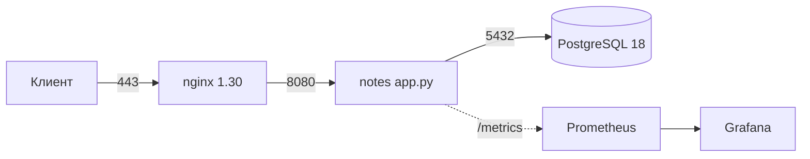

## Зачем это нужно

Интервьюер тратит на твой репозиторий две-три минуты. Если он не понял, что это и как запустить, он закрывает вкладку, сколько бы Vault, Flux и canary внутри ни лежало. На работе то же самое: сервис, который может поднять только автор, это риск, а не актив (bus factor, «фактор автобуса»). Воспроизводимость (reproducibility) проверяется одним способом: чужой человек на чистой машине.

Ты соберёшь финальный README, `docs/architecture.md`, `make quickstart`, лицензию и проверишь всё на чистой ВМ.

Шаг проекта: финальные `README.md`, `docs/architecture.md`, `make quickstart` (Docker-путь с нуля за 5 минут), файл `LICENSE`.

## Что нужно знать

- [Урок 3.4: качество и безопасность в CI](../03-git-ci/04-quality-security-ci.md) - сканер секретов, `.gitignore`, что нельзя коммитить
- [Урок 3.5: релизы](../03-git-ci/05-release-flow.md) - теги `v0.7.1` и что показывать как версию проекта
- [Урок 4.5: Compose с PostgreSQL](../04-docker/05-compose-postgres.md) - `compose.yml`, `.env`, healthcheck
- [Урок 4.6: nginx и TLS в Compose](../04-docker/06-compose-nginx-tls.md) - `scripts/gen-tls.sh`, порты 80 и 443
- [Урок 4.9: Makefile и отладка контейнеров](../04-docker/09-docker-troubleshooting.md) - цели `build`, `up`, `down`, `logs`, `clean`
- [Урок 9.7: платформа целиком](../09-secrets-gitops/07-platform-review.md) - первая версия `docs/architecture.md` и список долгов
- [Урок 10.5: ревью безопасности](05-security-review.md) - `docs/security.md`, на который будет ссылаться README

## Теория

### Что читает незнакомый человек

Смотрящий на репозиторий проходит четыре вопроса, и на каждый у README есть секунда.

1. Что это? Одно предложение в первой строке.
2. Оно работает? Бейдж CI (badge, значок статуса сборки) и скриншот или вывод команды.
3. Как запустить? Блок `quickstart` из трёх команд, которые копируются целиком.
4. Насколько это серьёзно? Схема, ссылки на `docs/`, честный список долгов.

Порядок разделов README поэтому такой: название и одна строка, бейдж, схема, quickstart, что внутри, стоимость, безопасность, известные долги, лицензия. Всё, что не отвечает на эти вопросы (история курса, благодарности, длинные теоретические отступы), уходит в `docs/`.

> **Проверь понимание:** почему quickstart стоит выше описания архитектуры, а не после него?

<details>
<summary>Ответ</summary>

Запуск даёт доверие быстрее текста: человек видит работающий сервис и потом сам захочет узнать, как он устроен. Архитектура нужна тем, кто уже заинтересовался.

</details>

### Воспроизводимость: что ломается на чужой машине

У тебя всё работает, потому что на машине есть невидимые зависимости: пакеты (`make`, `curl`, `openssl`) и Docker без `sudo`; `.env`, которого нет в git; сертификат в `deploy/tls`, игнорируемый git; свободные порты 80 и 443; запись `notes.lab` в `/etc/hosts`; образ, собранный только локально.

Правило: quickstart не должен требовать ничего, что не написано в самом quickstart. Всё, что можно автоматизировать (создать `.env`, сгенерировать сертификат, дождаться готовности), делает цель Makefile, а не читатель по инструкции. Всё, что автоматизировать нельзя (установить Docker), перечисляется в разделе «Требования» с версиями.

> **Проверь понимание:** как quickstart получает рабочий `.env` на чужой машине и не хранит пароль в git?

<details>
<summary>Ответ</summary>

В git лежит `.env.example` с `CHANGE_ME`; цель создаёт `.env` со случайным паролем (`openssl rand -base64 24`), если файла ещё нет.

</details>

### Чистая история и лицензия

Репозиторий показывают целиком, вместе с историей. Секрет, который ты закоммитил в марте и «удалил» в апреле, лежит в истории и находится за секунду: `git log -p`. Поэтому проверка секретов идёт по всей истории, а не по рабочей копии. Если секрет нашёлся, его сначала отзывают (меняют пароль или токен), и только потом чистят историю; наоборот нельзя, потому что репозиторий мог быть склонирован.

Лицензия (license) говорит, что другим можно делать с кодом. Без файла `LICENSE` код формально закрыт: ни форкнуть, ни использовать без твоего разрешения нельзя. Для учебного портфолио берут MIT: короткая, понятная работодателям.

> **Проверь понимание:** ты нашёл в истории токен и сделал `git rm` с новым коммитом. Проблема решена?

<details>
<summary>Ответ</summary>

Нет. Токен остался в предыдущих коммитах. Сначала токен отзывается у провайдера, потом при желании история переписывается (`git filter-repo`), но отзыв обязателен в любом случае.

</details>

### Схема и документ решений

Схема отвечает на вопрос «куда идёт запрос и где живут данные»; GitHub рисует блоки `mermaid` в README репозитория (страница курса их не рисует). `docs/architecture.md` хранит решения: что выбрано, что отвергнуто и почему, и какие долги остались. Вопрос «почему Flux, а не Argo CD» превращается в ссылку на таблицу.

## Практика

### Задание 1. Аудит репозитория: что лежит и чего быть не должно

**Цель:** увидеть репозиторий глазами постороннего и убрать из него лишнее и опасное.

**Предскажи:** сколько файлов из списка `git ls-files` совпадёт с шаблоном `\.env$|\.key$|\.tfstate|\.log$`, если ты всё делал по курсу? А сколько таких файлов найдётся в истории за всё время?

<details>
<summary>Ответ</summary>

В текущем индексе должно быть 0 (в git только `.env.example`). В истории может быть больше нуля: файл, который ты добавил до появления `.gitignore` в 3.1, остаётся в старых коммитах.

</details>

**Шаги**

1. Посмотри дерево и размер репозитория:

```bash
cd ~/notes
git status --short | head
git ls-files | wc -l
du -sh .git
```

2. Найди запрещённые файлы в индексе и во всей истории:

```bash
# в текущем состоянии
git ls-files | grep -E '\.env$|\.key$|\.tfstate|\.log$|\.notes-secrets' || echo "индекс чист"
# во всей истории: файлы, которые когда-либо добавляли
git log --all --diff-filter=A --name-only --pretty=format: | sort -u | grep -E '\.env$|\.key$|\.tfstate|\.log$' || echo "история чиста"
```

**Что должно получиться**

```text
индекс чист
история чиста
ls: cannot access 'LICENSE': No such file or directory
```

Файла `LICENSE` пока нет: его создашь в задании 4. Если проверка истории что-то нашла, отзови секрет (смени пароль), затем реши, переписывать ли историю. Для учебного проекта с паролем `CHANGE_ME` достаточно убедиться, что реальных значений нет.

**Объясни себе**

- Почему проверка идёт по `git log --all`, а не по рабочей копии?
- Что в истории можно исправить, а что нельзя (публичный репозиторий уже склонировали)?
- Почему из поиска исключены `*.md`?

**Типичные ошибки**

- `fatal: pathspec ':!*.md' did not match any files`: старая версия git или опечатка в magic pathspec; обнови git или замени на `grep -v '\.md:'` после `git grep`.
- `fatal: not a git repository (or any of the parent directories): .git`: ты не в `~/notes`; выполни `cd ~/notes`.
- `grep: Unmatched ( or \(`: в `grep -E` скобки не экранируются, в `grep` без `-E` экранируются; проверь флаг.

### Задание 2. Финальный README по шаблону

**Цель:** написать README, по которому незнакомый человек понимает проект за две минуты.

**Предскажи:** сколько строк должен занимать блок quickstart, чтобы им реально пользовались: 3, 10 или 30?

<details>
<summary>Ответ</summary>

Три-четыре команды. Каждая лишняя строка снижает шанс, что человек дойдёт до конца. Всё остальное делает Makefile.

</details>

**Шаги**

1. Открой `README.md` и замени его содержимое (замени `<github-user>` на свой ник):

````markdown
# Заметки: сервис с платформой вокруг

Небольшой HTTP-сервис на Python 3.13 (заметки в PostgreSQL) и вся инфраструктура вокруг него:
контейнеры, Kubernetes, IaC, наблюдаемость, GitOps, runbook и разбор инцидентов.


## Схема



Подробности и принятые решения: [docs/architecture.md](docs/architecture.md).

## Запуск с нуля за 5 минут

Требования: Ubuntu 24.04 или 26.04, Docker Engine 29 с плагином Compose, `git`, `make`, `curl`, `openssl`.
Порты 80 и 443 должны быть свободны.

```bash
git clone https://github.com/<github-user>/notes.git
cd notes
make quickstart
```

Цель создаёт `.env` со случайным паролем, генерирует самоподписанный сертификат для `notes.lab`,
собирает образ, поднимает стек и проверяет ответ. Остановить: `make down`. Удалить данные: `make clean`.

## Что внутри

| Путь | Что там |
|---|---|
| `app.py`, `Dockerfile`, `compose.yml` | сервис и его контейнерный запуск |
| `helm/notes/`, `k8s/`, `kind/` | Kubernetes и Helm |
| `infra/` | Terraform и Ansible |
| `monitoring/` | Prometheus, Alertmanager, Grafana, Loki, Tempo |
| `gitops/` | эталон репозитория GitOps (Flux) |
| `docs/` | SLO, runbook, постмортем, DR, безопасность, архитектура |

## Стоимость

Локально: 0. В Yandex Cloud одна ВМ 2 vCPU и 4 ГБ примерно 2-3 тыс. рублей в месяц; после уроков ресурсы удаляются `make infra-down`.

## Безопасность

Секреты не хранятся в git: `.env` в `.gitignore`, для платформы секреты идут из Vault. Модель угроз и ревью: [docs/security.md](docs/security.md).

## Известные долги

Список в [docs/architecture.md](docs/architecture.md), раздел «Долги». Главные: одна ВМ остаётся точкой отказа, локальный CA не заменяет Let's Encrypt.

## Лицензия

MIT, см. [LICENSE](LICENSE).
````

**Что должно получиться**

На GitHub схема рисуется, бейдж показывает статус CI, ссылки на `docs/architecture.md` и `docs/security.md` открываются, `LICENSE` появится в задании 4.

**Объясни себе**

- Почему в README указаны версии требований (Docker Engine 29, Ubuntu 24.04 или 26.04)?
- Что в README честно названо долгом и зачем это интервьюеру?
- Почему цена указана приблизительно и с оговоркой про `make infra-down`?

**Типичные ошибки**

- Схема Mermaid показывается текстом на GitHub: не закрыт блок тремя обратными кавычками или указан язык не `mermaid`.
- `curl: (6) Could not resolve host: notes.lab` в quickstart: на чужой машине нет записи в `/etc/hosts`; в задании 4 используется `--resolve`, запись руками не нужна.

### Задание 3. `docs/architecture.md`: решения, компромиссы, долги

**Цель:** превратить файл из 9.7 в документ, к которому ты отсылаешь на собеседовании вместо пересказа по памяти.

**Предскажи:** какие два раздела интервьюер откроет первыми в этом файле?

<details>
<summary>Ответ</summary>

«Решения» (почему Flux, почему Compose на ВМ, почему БД в кластере) и «Долги» (что ты знаешь как слабое место). Второй раздел показывает зрелость.

</details>

**Шаги**

1. Оставь схему из 9.7 и добавь (или замени) разделы. Файл `docs/architecture.md`, ниже шаблон разделов «Решения», «Долги» и «Как проверить»:

```markdown
## Решения

| Решение | Выбрано | Отвергнуто | Почему |
|---|---|---|---|
| GitOps | Flux | Argo CD | меньше компонентов, хватает pull-модели |
| Логи | Loki + Grafana Alloy | ELK | дешевле по ресурсам, метки как в Prometheus |
| Секреты | Vault + External Secrets | Secret в git | нет пароля в репозитории |
| БД в кластере | CloudNativePG | StatefulSet руками | failover и бэкапы из коробки |
| Доставка | Argo Rollouts (canary) | rolling update | откат по метрикам |

## Долги

| Долг | Риск | Что сделал бы дальше |
|---|---|---|
| одна ВМ в облаке | падение хоста = простой | вторая ВМ или Managed Kubernetes |
| MinIO без репликации | потеря бэкапов вместе с диском | внешний объектный бакет |
| в dev-compose пароль в `.env` | утечка с ноутбука | локально допустимо, помечено в README |

## Как проверить

- запуск с нуля: `make quickstart`
- восстановление БД: [docs/dr.md](dr.md)
- ревью безопасности: [docs/security.md](security.md)
```

**Что должно получиться**

Файл `docs/architecture.md` содержит разделы «Решения», «Долги», «Как проверить», и каждая ссылка в нём ведёт на существующий файл.

**Объясни себе**

- Чем документ решений отличается от схемы?
- Зачем в таблице колонка «Отвергнуто»?
- Какой долг ты сам считаешь главным и что скажешь, если о нём спросят?

**Типичные ошибки**

- `ls: cannot access 'monitoring/alloy': No such file or directory`: ты не выполнил урок 8.7 или находишься не в корне репозитория; таблица не должна ссылаться на то, чего нет.
- Ссылка `[docs/dr.md](dr.md)` ведёт в 404 на GitHub: внутри `docs/` путь пишется относительно самого файла, то есть `dr.md`, а не `docs/dr.md`.

### Задание 4. Проект: `make quickstart`, лицензия и замер

**Цель:** добавить в Makefile цель `quickstart`, положить `LICENSE`, закоммитить и замерить время запуска с нуля.

**Предскажи:** сколько будет занимать `make quickstart` на машине, где образы `python:3.13-slim`, `postgres:18` и `nginx:1.30` ещё не скачаны, и сколько при повторном запуске?

<details>
<summary>Ответ</summary>

Первый запуск: 2-5 минут (основное время уходит на скачивание образов и сборку). Повторный: 10-20 секунд, потому что образы и слои в кэше, `.env` и сертификат уже есть. Именно первое число идёт в README.

</details>

**Шаги**

1. Добавь в `Makefile` цель (отступ команд это символ табуляции, не пробелы):

```make
.PHONY: quickstart
quickstart: ## Поднять «Заметки» с нуля: .env, TLS, сборка, запуск, проверка
	@test -f .env || { pw=$$(openssl rand -base64 24 | tr -d '/+='); \
	  sed "s/CHANGE_ME/$$pw/g" .env.example > .env; echo ".env создан со случайным паролем"; }
	@test -f deploy/tls/notes.crt || ./scripts/gen-tls.sh
	docker compose up -d --build --wait
	@curl -fsS --retry 10 --retry-connrefused --retry-delay 2 \
	  --cacert deploy/tls/notes.crt --resolve notes.lab:443:127.0.0.1 https://notes.lab/readyz; echo
	@curl -fsS --cacert deploy/tls/notes.crt --resolve notes.lab:443:127.0.0.1 \
	  -X POST -H 'Content-Type: application/json' -d '{"text":"quickstart"}' https://notes.lab/notes; echo
	@echo "Готово: https://notes.lab (curl --resolve notes.lab:443:127.0.0.1 --cacert deploy/tls/notes.crt https://notes.lab/notes)"
```

2. Создай `LICENSE` (MIT; замени имя и год):

```bash
cat > LICENSE <<'LIC'
MIT License

Copyright (c) 2026 Имя Фамилия

Permission is hereby granted, free of charge, to any person obtaining a copy
of this software and associated documentation files (the "Software"), to deal
in the Software without restriction, including without limitation the rights
to use, copy, modify, merge, publish, distribute, sublicense, and/or sell
copies of the Software, and to permit persons to whom the Software is
furnished to do so, subject to the following conditions:

The above copyright notice and this permission notice shall be included in all
copies or substantial portions of the Software.

THE SOFTWARE IS PROVIDED "AS IS", WITHOUT WARRANTY OF ANY KIND, EXPRESS OR
IMPLIED, INCLUDING BUT NOT LIMITED TO THE WARRANTIES OF MERCHANTABILITY,
FITNESS FOR A PARTICULAR PURPOSE AND NONINFRINGEMENT. IN NO EVENT SHALL THE
AUTHORS OR COPYRIGHT HOLDERS BE LIABLE FOR ANY CLAIM, DAMAGES OR OTHER
LIABILITY, WHETHER IN AN ACTION OF CONTRACT, TORT OR OTHERWISE, ARISING FROM,
OUT OF OR IN CONNECTION WITH THE SOFTWARE OR THE USE OR OTHER DEALINGS IN THE
SOFTWARE.
LIC
```

3. Проверь цель на «чужом» состоянии: останови стек, удали `.env`, сертификат и данные, замерь время:

```bash
make clean
rm -f .env deploy/tls/notes.crt deploy/tls/notes.key
time make quickstart
```

4. Повтори запуск и сравни время, затем закоммить:

```bash
time make quickstart
git add Makefile LICENSE README.md docs/architecture.md
git commit -m "docs: финальный README, architecture, make quickstart, LICENSE"
git tag -l | tail -1
```

**Что должно получиться**

```text
.env создан со случайным паролем
[+] Running 4/4
 ✔ Network notes-net    Created
 ✔ Container notes-db-1 Healthy
 ✔ Container notes-notes-1 Healthy
 ✔ Container notes-proxy-1 Started
ready
{"id":1}
Готово: https://notes.lab (curl --resolve notes.lab:443:127.0.0.1 --cacert deploy/tls/notes.crt https://notes.lab/notes)

real    2m41.350s
```

Вторая проверка проходит за десятки секунд. Имена контейнеров и время зависят от машины; проверяемое: `ready` и `{"id":1}`. Метка `v0.7.1` остаётся последним тегом: релиз проекту не нужен, меняется только документация.

**Объясни себе**

- Почему `.env` и сертификат создаются только «если файла нет»?
- Зачем `curl --resolve` и `--cacert` вместо записи в `/etc/hosts` и флага `-k`?
- Что делает `--wait` и чем он лучше `sleep 10`?

**Типичные ошибки**

- `Makefile:12: *** missing separator.  Stop.`: в начале команды пробелы вместо табуляции; замени отступ на TAB.
- `Bind for 0.0.0.0:443 failed: port is already allocated`: порт занят (nginx хоста или другой контейнер); останови его (`sudo systemctl disable --now nginx`, см. 4.1).
- `curl: (60) SSL certificate problem: self-signed certificate`: не передан `--cacert deploy/tls/notes.crt`, а сертификат самоподписанный.
- `error while interpolating: required variable POSTGRES_PASSWORD is missing a value`: `.env` пуст или создан не из шаблона; удали `.env` и запусти цель снова.

## Сломай и почини

Поломки здесь не подготовлены скриптом: ты сам ищешь пропуски на чужой машине.

### Симптом

Ты клонируешь репозиторий на свежую ВМ и запускаешь `make quickstart`. Он падает, хотя у тебя на ноутбуке всё работает. Подними чистую ВМ (Multipass; в Lima и OrbStack то же самое):

```bash
multipass launch 24.04 --name cleanvm --cpus 2 --memory 4G --disk 20G
multipass shell cleanvm
```

Внутри ВМ поставь только то, что перечислено в README («Требования»): Docker Engine из официального apt-репозитория (как в [уроке 4.1](../04-docker/01-containers-idea.md)), `git`, `make`, `curl`, `openssl`. Затем:

```bash
git clone https://github.com/<github-user>/notes.git
cd notes
make quickstart
```

### Гипотезы

1. В README не хватает пакета или права (`make: command not found`, `permission denied` на сокете Docker).
2. Порт 80 или 443 занят.
3. Нужный файл не попал в git: вырезан `.dockerignore`, сертификат лежит только у тебя, у `gen-tls.sh` нет бита исполнения.

### Проверки

```bash
command -v make curl openssl git docker
groups | tr ' ' '\n' | grep -x docker
sudo ss -ltnp | grep -E ':(80|443)\s'
git ls-files scripts deploy | head -20
```

### Исправление

Каждую найденную дыру ты закрываешь в репозитории, а не в ВМ руками: правка Makefile, права файла, строка в «Требованиях», и снова с чистой ВМ.

<details>
<summary>Разбор частых пропусков</summary>

| Симптом на чистой ВМ | Причина | Исправление в репозитории |
|---|---|---|
| `make: command not found` | пакета нет в образе ВМ | добавить `make` в «Требования» в README |
| `permission denied while trying to connect to the Docker daemon socket at unix:///var/run/docker.sock` | пользователь не в группе `docker` | в README: `sudo usermod -aG docker $USER`, перелогиниться |
| `Bind for 0.0.0.0:80 failed: port is already allocated` | на ВМ работает apache2 или nginx | проверка порта в начале `quickstart` с понятным сообщением |

Когда на чистой ВМ `make quickstart` проходит без единого твоего вмешательства, поменяй в README время на реально измеренное.

</details>

## Вопросы с собеседований

### 1. [junior] Расскажи о своём проекте за две минуты

Отвечаю по схеме: что это и зачем (сервис заметок как полигон), из каких слоёв состоит (контейнеры, Kubernetes, IaC, мониторинг, GitOps), что я сделал сам и что было самым сложным. Заканчиваю тем, что бы поменял. Репозиторий показываю с README и схемой.

**Что хотят услышать:** структуру (контекст, действия, результат), конкретику (цифры: время запуска, SLO), собственный вклад, честное «что бы поменял».

**Красный флаг:** пересказ списка технологий без связи между ними и «мы делали» вместо «я делал».

### 2. [middle] Твой репозиторий поднимают с нуля и на чужой машине падает. Как ты это находишь и предотвращаешь?

Воспроизвожу на чистой ВМ, а не рассуждаю. Иду по слоям: пакеты, права Docker, порты, файлы, не попавшие в git, `.env`. Каждую дыру закрываю в репозитории (Makefile, README, права файла) и повторяю проверку с чистой ВМ. Затем ставлю в CI job, который делает то же самое на свежем раннере.

**Что хотят услышать:** чистая среда как метод, автоматизация вместо инструкции, проверка в CI.

**Красный флаг:** «у меня работает», «допишу в README, что нужно поставить» без автоматизации.

### 3. [middle] В публичном репозитории нашли пароль в старом коммите. Что делаешь?

Сначала отзываю секрет (меняю пароль, смотрю логи использования), потом чищу историю (`git filter-repo`) и добавляю сканер секретов в CI. Форс-пуш без отзыва не помогает: репозиторий мог быть склонирован.

**Что хотят услышать:** порядок «отозвать, потом чистить», профилактика в CI.

**Красный флаг:** «удалю файл и закоммичу».

### 4. [junior] Зачем `.env.example` и почему нельзя закоммитить `.env`?

В `.env` живут реальные значения, включая пароли. Их нельзя хранить в git: история постоянна. В `.env.example` лежат имена переменных и безопасные заглушки (`CHANGE_ME`), по ним видно, что нужно настроить.

**Что хотят услышать:** разница между шаблоном и значением, `.gitignore`, генерация случайного пароля при первом запуске.

**Красный флаг:** «`.env` в приватном репозитории можно коммитить».

### 5. [middle] Как ты убедишься, что `make quickstart` не сломается через полгода?

Пиню версии (образы с тегами, а не `latest`, версии зависимостей), гоняю quickstart в CI по расписанию раз в неделю на чистом раннере и смотрю на красный статус. Ещё Dependabot для базовых образов, чтобы обновления приходили PR-ами, а не сюрпризами.

**Что хотят услышать:** закрепление версий, плановая проверка (scheduled workflow), автообновления через PR.

**Красный флаг:** «я проверю руками, когда вспомню».

### 6. [middle] Интервьюер спрашивает: «Почему у тебя Flux, а не Argo CD?» Как отвечаешь?

Называю критерии, а не вкус: pull-модель, объём компонентов, потребность в UI. Flux меньше и без UI, для одного кластера хватает. Argo CD выбрал бы для нескольких команд и потребности в визуальной синхронизации. Говорю, что в документе решений это записано и что компромисс осознан.

**Что хотят услышать:** критерии выбора, знание альтернативы, условия, при которых решение изменится.

**Красный флаг:** «прочитал в туториале» или «Argo CD плохой».

### 7. [middle] Ты показываешь проект, и у интервьюера `make quickstart` завис на «Waiting». Твои действия?

Не паникую и не перезапускаю вслепую. `docker compose ps` показывает, какой сервис не Healthy, `docker compose logs --tail 50 <сервис>` даёт причину. Типичные: БД ещё инициализируется, порт занят, пустой `DATABASE_URL`. Объясняю вслух, что смотрю и почему; заранее держу запасной путь (запись демо или запущенный стек).

**Что хотят услышать:** методичная диагностика, знание healthcheck, план Б.

**Красный флаг:** «сейчас перезапущу всё» без чтения логов, обвинение чужой машины.

### 8. [middle] Как бы ты масштабировал проект до продакшена, что в нём сейчас игрушечное?

Перечисляю по риску: одна ВМ (SPOF), самоподписанные сертификаты, бэкапы в MinIO без репликации, отсутствие нагрузочного тестирования. Для каждого называю следующий шаг: вторая зона и балансировщик, Let's Encrypt через cert-manager, внешний объектный бакет, нагрузочный тест с выводом ёмкости (см. [урок 10.3](03-backup-dr-capacity.md), [урок 10.4](04-distributed-building-blocks.md)).

**Что хотят услышать:** приоритизацию по риску, связь с RPO/RTO и ёмкостью, отсутствие переусложнения.

**Красный флаг:** «добавил бы больше технологий» или «всё уже готово к продакшену».

### 9. [junior] Что должно быть в README, чтобы проект понял человек без контекста?

Что это и зачем, схема, запуск в трёх командах с требованиями и версиями, ограничения, лицензия. Остальное в `docs/`.

**Что хотят услышать:** quickstart с проверяемым результатом, версии, ссылки на детали.

**Красный флаг:** README из одной строки или простыня теории без запуска.

### 10. [middle] Что в твоём проекте осталось не автоматизировано и почему?

Честно: установка Docker на хост, облачный аккаунт, реальный домен, первичная инициализация Vault. Это разовые или требующие решения шаги; автоматизировал бы через cloud-init, Terraform и скрипт seed.

**Что хотят услышать:** трезвая граница автоматизации, знание своих долгов.

**Красный флаг:** «автоматизировано всё» или незнание собственных ручных шагов.

## Проверено на версиях

- Ubuntu: 24.04 LTS и 26.04 LTS
- Docker Engine: 29.x, плагин Compose v5
- Python: 3.13 (`python:3.13-slim`)
- PostgreSQL: 18 (`postgres:18`)
- nginx: 1.30 (`nginx:1.30`)
- образ «Заметок»: 0.7.1
- TruffleHog: версия не закреплена, проверь актуальную версию на странице проекта

## Итог урока: ты умеешь

- [ ] умею проверять репозиторий на секреты и лишние файлы во всей истории, а не только в рабочей копии
- [ ] умею писать README, который отвечает на «что, работает ли, как запустить, насколько серьёзно»
- [ ] умею оформлять решения, компромиссы и долги в `docs/architecture.md`
- [ ] умею делать цель `make quickstart`, которая сама создаёт `.env`, сертификат и ждёт готовности
- [ ] умею поднимать чистую ВМ и проходить quickstart как чужой человек
- [ ] умею отвечать на «расскажи о проекте» за две минуты и показывать репозиторий

**Дальше:** [Урок 10.7: Мок-собеседование: уровень junior](07-mock-interview-junior.md)
