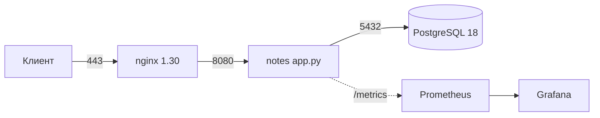

## Зачем это нужно

Интервьюер тратит на твой репозиторий две-три минуты. Если он не понял, что это и как запустить, он закрывает вкладку, сколько бы Vault, Flux и canary внутри ни лежало. На работе то же самое: сервис, который может поднять только автор, это риск, а не актив. У этого риска есть название: **bus factor** («фактор автобуса»), сколько человек должны попасть под автобус, чтобы проект остановился. Если ответ «один», проект хрупкий. Лечится это воспроизводимостью (reproducibility): любой человек на чистой машине поднимает систему по инструкции, и она работает. Проверяется это одним способом: чужой человек на чистой машине.

В этом уроке ты соберёшь финальный README, документ решений `docs/architecture.md`, цель `make quickstart`, лицензию и проверишь всё на чистой виртуальной машине, как это сделает незнакомый читатель.

Шаг проекта: финальные `README.md`, `docs/architecture.md`, `make quickstart` (Docker-путь с нуля за несколько минут), файл `LICENSE`.

## Что нужно знать

- [Урок 3.4: качество и безопасность в CI](../03-git-ci/04-quality-security-ci.md): сканер секретов, `.gitignore`, что нельзя коммитить.
- [Урок 3.5: релизы](../03-git-ci/05-release-flow.md): теги `v0.7.1` и что показывать как версию проекта.
- [Урок 4.5: Compose с PostgreSQL](../04-docker/05-compose-postgres.md): `compose.yml`, `.env`, healthcheck (проверка здоровья контейнера).
- [Урок 4.6: nginx и TLS в Compose](../04-docker/06-compose-nginx-tls.md): `scripts/gen-tls.sh`, порты 80 и 443.
- [Урок 4.9: Makefile и отладка контейнеров](../04-docker/09-docker-troubleshooting.md): цели `build`, `up`, `down`, `logs`, `clean`.
- [Урок 9.7: платформа целиком](../09-secrets-gitops/07-platform-review.md): первая версия `docs/architecture.md` и список долгов.
- [Урок 10.5: ревью безопасности](05-security-review.md): `docs/security.md`, на который будет ссылаться README.

## Картина целиком

Представь, что ты сдаёшь квартиру и оставляешь жильцам папку с инструкциями. В хорошей папке на первой странице написано, что это за квартира, есть фото, как получить ключи и включить свет, и только потом идут схема проводки и договор с управляющей компанией. Жилец, который приехал ночью и открыл папку, должен заселиться, не позвонив тебе. Плохая папка начинается с истории дома и перечня всех ремонтов.

Репозиторий-портфолио это такая же папка, только читателя зовут «интервьюер» или «новый коллега». У него мало времени и нет твоего контекста. Ему нужно, чтобы на каждый вопрос был ответ в правильном месте:

```text
   Вопрос читателя                        Где ответ
 +-----------------------+            +--------------------------------+
 | Что это?              | ---------> | первая строка README           |
 | Оно работает?         | ---------> | бейдж CI, схема, вывод команды |
 | Как запустить?        | ---------> | quickstart: 3 команды          |
 | Почему так сделано?   | ---------> | docs/architecture.md (решения) |
 | Что не доделано?      | ---------> | «Долги» (честный список)       |
 | Безопасно ли?         | ---------> | docs/security.md               |
 | Можно ли использовать?| ---------> | LICENSE                        |
 +-----------------------+            +--------------------------------+

   Проверка честности: чистая ВМ, куда ты ставишь только то,
   что написано в README, и нажимаешь `make quickstart`.
```

Ниже по порядку: как читают репозиторий, почему всё ломается на чужой машине, что делать с секретами в истории и с лицензией, как записывать решения и долги, и как рассказать о проекте за две минуты.

## Теория

### Что читает незнакомый человек и как устроен README

**Зачем это нужно.** У человека, который открыл твой репозиторий, нет причины тебе доверять и нет времени. Пока он не понял, зачем это и работает ли оно, дальше он не идёт. README (от английского «read me», «прочти меня») это файл `README.md` в корне репозитория: GitHub показывает его сразу под списком файлов. Это витрина проекта. Формат `.md` это **Markdown**: простой текст с пометками (`#` заголовок, `-` пункт списка, ` ``` ` блок кода), который сайт превращает в красивую страницу.

**Аналогия.** Обложка и аннотация книги в магазине. По ним читатель за десять секунд решает, брать ли книгу. Аналогия перестаёт работать так: у книги обложку можно нарисовать красивую при скучном содержании, а у репозитория интервьюер проверит, запускается ли он на самом деле.

**Как устроено.** Незнакомый человек мысленно проходит четыре вопроса, и на каждый у README есть секунда:

1. **Что это?** Одно предложение в первой строке.
2. **Оно работает?** Бейдж CI (badge, «значок» статуса последней сборки: зелёный `passing` или красный `failing`), картинка со схемой, вывод команды.
3. **Как запустить?** Блок `quickstart` («быстрый старт») из трёх-четырёх команд, которые копируются целиком.
4. **Насколько это серьёзно?** Схема, ссылки на `docs/`, честный список долгов.

Порядок разделов README поэтому такой: название и одна строка, бейдж, схема, quickstart, что внутри, стоимость, безопасность, известные долги, лицензия. Всё, что не отвечает на эти вопросы (история курса, благодарности, длинные теоретические отступы), уходит в `docs/`.

Схема в README рисуется текстом, а не картинкой: блок ` ```mermaid ` (Mermaid это язык описания диаграмм) GitHub превращает в рисунок сам. Плюс текста: схема лежит в git как код, её легко править и видно в diff. Минус: страница курса на GitHub Pages блоки Mermaid не рисует, они рисуются только в самом репозитории на GitHub. В строке `A -->|8080| B` стрелка означает «A обращается к B», а число на стрелке порт.

**Разобранный пример.** Возьмём первую строку README из этого урока: «Небольшой HTTP-сервис на Python 3.13 (заметки в PostgreSQL) и вся инфраструктура вокруг него: контейнеры, Kubernetes, IaC, наблюдаемость, GitOps, runbook и разбор инцидентов». Разбор: «HTTP-сервис на Python 3.13» отвечает, что это (сервис, язык, версия); «заметки в PostgreSQL» показывает предметную область; «инфраструктура вокруг» честно говорит, что главное здесь не код приложения, а платформа. Интервьюер за 5 секунд понимает, с кем говорит: с человеком, который показывает DevOps, а не веб-разработку.

Сравни с плохой первой строкой: «Учебный проект по курсу». Она не отвечает ни на один вопрос читателя.

**Что путают.** «Чем длиннее README, тем солиднее». Наоборот: длинный README без запуска в первом экране читают хуже. Пиши коротко, а подробности выноси в `docs/` и давай на них ссылки. И второе: «README пишется в конце». Лучше написать его как только проект запускается и потом обновлять: тогда он выступает и тестом («а сам я могу по нему запустить?»).

> **Проверь понимание:** почему quickstart стоит выше описания архитектуры, а не после него?

<details markdown="1">
<summary>Ответ</summary>

Запуск даёт доверие быстрее текста: человек видит работающий сервис и потом сам захочет узнать, как он устроен. Архитектура нужна тем, кто уже заинтересовался.

</details>

### Воспроизводимость: что ломается на чужой машине

**Зачем это нужно.** «У меня работает» самая неприятная фраза в разработке. Она означает, что кроме кода есть невидимые зависимости, о которых автор давно забыл. Пока ты один, их не замечаешь. Как только проект запускает другой человек (коллега, интервьюер, ты сам через полгода на новом ноутбуке), они всплывают. **Воспроизводимость** это свойство «любой человек в любой момент получает тот же результат по той же инструкции».

**Аналогия.** Рецепт торта. Если в рецепте написано «добавьте муки, сколько нужно» и «испеките, пока не будет готово», у автора торт получится, потому что он «чувствует». Чужой человек получит кирпич. Хороший рецепт: 250 граммов, 180 градусов, 35 минут. Аналогия перестаёт работать в одном: у торта нет «скрытых ингредиентов на кухне автора», а у программы они есть, например уже установленный `make` или запись в системном файле.

**Как устроено.** Что чаще всего оказывается «невидимой зависимостью»:

- **Программы**: `make`, `curl`, `openssl`, `git` и сам Docker. На твоём компьютере они есть с первого дня, а на чистой ВМ нет.
- **Права**: Docker без `sudo` (пользователь добавлен в группу `docker`, [урок 4.1](../04-docker/01-containers-idea.md)).
- **Файлы, которых нет в git**: `.env` с паролями (его игнорирует git специально), сертификат в `deploy/tls`, который тоже лежит в `.gitignore`.
- **Порты**: свободны ли 80 и 443 (на чужой ВМ там может уже работать nginx или apache2).
- **Запись в системном файле**: домен `notes.lab` работает у тебя, потому что ты вписал его в `/etc/hosts` (файл, где имени сопоставляется адрес, [урок 2.3](../02-network/03-dns.md)). У чужого человека такой записи нет.
- **Образ, собранный только локально**: если образ есть у тебя в кэше, но не опубликован и не собирается из `Dockerfile`, у другого его не будет.

Правило: **quickstart не должен требовать ничего, что в нём не написано**. Всё, что можно автоматизировать (создать `.env`, сгенерировать сертификат, дождаться готовности), делает цель Makefile, а не читатель по инструкции. Всё, что автоматизировать нельзя (установить Docker), перечисляется в разделе «Требования» с версиями.

**Makefile** ты уже знаешь по [уроку 4.9](../04-docker/09-docker-troubleshooting.md): это файл с именованными **целями** (targets), каждая запускает набор команд по имени (`make up`). Напомню правила записи, они пригодятся в задании 4: команды под целью начинаются с символа табуляции, не с пробелов; `@` перед командой не печатает саму команду перед запуском; `$$` в Makefile означает один знак `$` для оболочки (обычный `$` make забирает себе); `.PHONY` говорит, что цель это действие, а не файл с таким именем.

**Разобранный пример.** Как получить рабочий `.env` на чужой машине и не хранить пароль в git? В репозитории лежит `.env.example`: список переменных с безопасной заглушкой `CHANGE_ME` вместо значения. Настоящий `.env` в `.gitignore`. Цель `quickstart` делает так: «если файла `.env` нет, сгенерировать случайный пароль и подставить его в копию шаблона». Вот эта команда по частям:

```bash
pw=$(openssl rand -base64 24 | tr -d '/+=')   # 24 случайных байта, записанных в base64, без символов / + =
sed "s/CHANGE_ME/$pw/g" .env.example > .env   # заменить везде CHANGE_ME на пароль, записать в .env
```

`openssl rand -base64 24` выдаёт 32 случайных знака. `tr -d '/+='` удаляет из них знаки, которые ломают строки подключения к базе (косая черта и плюс в пароле внутри URL превращаются в «специальные»). Проверка «если файла нет» (`test -f .env ||`) нужна, чтобы повторный запуск не менял пароль: иначе база, созданная со старым паролем, перестала бы пускать приложение.

Второй тонкий момент: как дождаться готовности. Плохой способ: `sleep 10` и надежда. Хороший: `docker compose up -d --wait` (флаг `--wait` ждёт, пока у контейнеров с healthcheck статус станет `Healthy`) и затем `curl` с повторами (`--retry`, пока не ответит). Первое реагирует на реальное состояние, второе на время: на медленной машине десять секунд не хватит, на быстрой они зря потрачены.

**Что путают.** «Записать в README, что надо поставить, и всё». Это документация, а не воспроизводимость: человек может не прочитать, пропустить или поставить другую версию. Ошибка должна ловиться автоматически: цель Makefile проверяет `command -v docker` и говорит понятную фразу, а на чистой ВМ и в CI твоя инструкция проверяется скриптом, а не глазами.

> **Проверь понимание:** цель `quickstart` при каждом запуске пересоздаёт `.env` со случайным паролем. Что сломается при втором запуске и как это исправить?

<details markdown="1">
<summary>Ответ</summary>

Том с данными PostgreSQL уже создан со старым паролем, а приложение получит новый: соединение с базой будет отклонено (`password authentication failed`). Исправление: создавать `.env` только если его ещё нет (`test -f .env || ...`).

</details>

### Секреты в истории git и лицензия

**Зачем это нужно.** Репозиторий показывают целиком, вместе с историей. Секрет, который ты закоммитил в марте и «удалил» в апреле, лежит в истории и находится за секунду. А код без лицензии, как ни странно, формально закрыт: другой человек не имеет права его использовать. Два скучных файла решают, доверят ли тебе проект.

**Аналогия.** История git это журнал в бухгалтерии, который пишут только ручкой. Ошибочную запись нельзя стереть, можно лишь дописать «исправлено». Кто-то, листая журнал, увидит и ошибку. Лицензия это табличка на скамейке в парке: без неё непонятно, можно ли на ней сидеть. Аналогия перестаёт работать в том, что историю всё-таки можно переписать специальной командой, но у кого-то уже может быть копия старого журнала.

**Как устроено.** **Коммит** (commit) в git это неизменяемый снимок проекта. Удаление файла новым коммитом создаёт ещё один снимок «без файла», а старый снимок с файлом остаётся в цепочке. Поэтому `git log -p` (показать историю с изменениями) или `git log --all --diff-filter=A --name-only` (показать все файлы, которые когда-либо **добавляли**, `A` значит Added) находят «удалённое». Отсюда правила:

1. Проверку секретов запускают по **всей истории**, а не по рабочей копии (TruffleHog из [урока 3.4](../03-git-ci/04-quality-security-ci.md) так и делает).
2. Если секрет нашёлся, порядок такой: сначала **отозвать** (сменить пароль или токен у того, кто его выдал), и только потом при желании чистить историю. Наоборот нельзя: репозиторий мог быть склонирован, и чистка ничего не вернёт. Чистят историю инструментом `git filter-repo` (переписывает коммиты, в которых был файл), после чего нужен принудительный пуш.
3. Чтобы не попадало снова: `.gitignore` для `.env`, ключей и `*.tfstate` ([урок 3.1](../03-git-ci/01-git-basics.md)) и проверка перед коммитом.

**Лицензия** (license) это текст, который говорит, что другим разрешено делать с кодом. Файл `LICENSE` в корне. Без него по умолчанию действует авторское право: чужой не может ни копировать, ни менять, ни использовать код без твоего письменного разрешения. Самые частые варианты:

| Лицензия | Что разрешает | Условие |
|---|---|---|
| MIT | почти всё: использовать, менять, продавать | оставить текст лицензии и имя автора |
| Apache 2.0 | то же, плюс явная патентная защита | оставить текст лицензии и отметить изменения |
| GPL | использовать и менять | производные работы тоже открываются под GPL |

Для учебного портфолио берут MIT: она короткая и понятная работодателям (они видят, что ты подумал об этом).

**Разобранный пример.** Ты нашёл в истории строку `POSTGRES_PASSWORD=Tr0ub4dor` в файле `.env`, добавленном в первый коммит. Разбираем по шагам. Шаг 1: определить, что это пароль настоящей системы или заглушка. В учебном проекте с локальным Docker он никуда не ведёт, поэтому достаточно убедиться, что такого же пароля нет в живых системах. Если это пароль чего-то реального, шаг 2: сразу сменить его (это и есть отзыв). Шаг 3: переписать историю (`git filter-repo --path .env --invert-paths` удалит файл из всех коммитов) и запушить принудительно. Шаг 4: добавить `.env` в `.gitignore` и сканер секретов в CI. Обрати внимание на порядок: смена пароля идёт первой и не откладывается на «когда дойдут руки до чистки».

**Что путают.** «Я сделал `git rm .env`, значит файл удалён». Файл удалён из **следующих** снимков, но не из прошлых. И «приватный репозиторий безопасен»: доступ есть у каждого, кого туда пригласят, у CI и у любого, кто получит копию, а секрет остаётся в истории навсегда.

> **Проверь понимание:** ты нашёл в истории токен и сделал `git rm` с новым коммитом. Проблема решена?

<details markdown="1">
<summary>Ответ</summary>

Нет. Токен остался в предыдущих коммитах. Сначала токен отзывается у провайдера, потом при желании история переписывается (`git filter-repo`), но отзыв обязателен в любом случае.

</details>

### Схема и документ решений

**Зачем это нужно.** Через полгода ты не вспомнишь, почему выбрал Flux, а не Argo CD, а интервьюер спросит именно про это. **Документ решений** (architecture decision record, ADR в широком смысле) записывает не только «как устроено», но и «что выбрано, что отвергнуто и почему». Он превращает пересказ по памяти в ссылку на таблицу. А ещё показывает зрелость: инженер, который сам называет слабые места, вызывает больше доверия, чем тот, у кого «всё идеально».

**Аналогия.** Судовой журнал капитана. Там не только курс, но и почему выбрали обход шторма слева, а не справа. Когда потом разбирают рейс, видно ход мысли, а не просто маршрут. Аналогия перестаёт работать в том, что журнал пишут постфактум и не правят, а документ решений правят при каждом изменении, иначе он врёт.

**Как устроено.** Схема отвечает на вопрос «куда идёт запрос и где живут данные». Документ решений `docs/architecture.md` состоит из трёх частей:

- **Решения**: таблица «решение, выбрано, отвергнуто, почему». Колонка «отвергнуто» нужна, чтобы было видно: ты знал альтернативы и сравнил, а не взял первое попавшееся.
- **Долги** (technical debt, технические долги): что сделано «пока так», какой в этом риск и что бы сделал дальше. Долг это не позор, а осознанный компромисс: выпустить сейчас проще, доделать потом.
- **Как проверить**: ссылки на способы убедиться, что утверждения правдивы (запуск с нуля, восстановление БД, ревью безопасности).

Важное правило: каждая ссылка и каждый файл в документе должны существовать. Ссылка на `monitoring/alloy`, которого нет, разрушает доверие ко всему остальному.

**Разобранный пример.** Строка таблицы решений: «GitOps: выбрано Flux, отвергнуто Argo CD, почему: меньше компонентов, хватает pull-модели». Как это читать: **pull-модель** значит, что кластер сам забирает изменения из git (в отличие от push, когда CI шлёт их в кластер, и ему нужен доступ внутрь); Flux устанавливается как небольшой набор контроллеров, Argo CD тяжелее и даёт веб-интерфейс. Формулировка «хватает» честна: решение верно для одного кластера и одной команды. Хороший вопрос себе: при каких условиях ты передумаешь? («Если команд станет несколько и им понадобится общий интерфейс, выберу Argo CD.») Эту фразу и хочет услышать интервьюер.

**Что путают.** «Долги надо прятать». Наоборот: интервьюер всё равно их найдёт, вопрос в том, назвал ли их ты первым. Список долгов с оценкой риска показывает, что ты понимаешь свой проект, а не просто собрал его по инструкции.

> **Проверь понимание:** зачем в таблице решений колонка «Отвергнуто», если и так понятно, что выбрано?

<details markdown="1">
<summary>Ответ</summary>

Она показывает, что решение принято сравнением альтернатив, а не случайно, и заранее готовит ответ на вопрос «а почему не X?». Без неё выбор выглядит как «взял то, что знал».

</details>

### Как рассказать о проекте за две минуты

**Зачем это нужно.** Репозиторий это половина дела. Вторая половина: ты можешь связно его объяснить. Вопрос «расскажи о своём проекте» задают на первых минутах почти любого собеседования, и хорошо отрепетированный ответ задаёт тон всему разговору.

**Аналогия.** Лифтовая речь (elevator pitch): у тебя есть время одной поездки на лифте, чтобы заинтересовать человека. Аналогия перестаёт работать в одном: в лифте тебя не перебивают, а на собеседовании перебивают, поэтому ответ строят из блоков, каждый из которых можно развернуть.

**Как устроено.** Схема ответа из пяти блоков: (1) **что и зачем**: сервис заметок как полигон для платформы; (2) **из чего состоит**: контейнеры, Kubernetes, IaC, мониторинг, GitOps, по одной фразе на слой; (3) **что сделал сам** (важно «я», а не «мы»); (4) **самое сложное и как решил**: одна конкретная история с цифрами, например «`make quickstart` падал на чистой ВМ, я нашёл три невидимые зависимости и закрыл их в Makefile»; (5) **что бы поменял**: это твои долги из `docs/architecture.md`. Показывать при этом стоит репозиторий: README и схема открыты на экране.

**Разобранный пример.** Вот такая заготовка (примерно 250 слов при чтении вслух занимает две минуты): «Это сервис заметок на Python с PostgreSQL, но главное в проекте платформа вокруг него. Сервис запускается в Docker Compose и в Kubernetes, инфраструктура описана Terraform и Ansible, метрики, логи и трассы собираются в Prometheus, Loki и Tempo, выкатка идёт через Flux с canary. Я сам написал всё, кроме базового приложения: Dockerfile, чарт, алерты на burn rate, runbook и один постмортем по учебному инциденту. Самым сложным был воспроизводимый запуск: на чистой ВМ падало из-за отсутствующего `make` и занятого порта, и я перенёс проверки в цель `quickstart`. Сейчас запуск с нуля занимает около трёх минут. Что бы поменял: одна ВМ остаётся единой точкой отказа, бэкапы лежат в MinIO без репликации, сертификаты самоподписанные». Обрати внимание: конкретика (цифры, названия), «я», один случай из практики и честные долги.

**Что путают.** «Перечислить все технологии». Список из двадцати названий без связи «зачем» звучит как заученный. Лучше меньше технологий и с объяснением, зачем каждая.

> **Проверь понимание:** какой из пяти блоков ответа опирается на документ `docs/architecture.md`, и почему его нельзя пропускать?

<details markdown="1">
<summary>Ответ</summary>

Блок «что бы поменял» берётся из раздела «Долги». Его нельзя пропускать: именно он показывает, что ты видишь границы своей работы, а не считаешь проект законченным идеалом.

</details>

### Коммиты, ветки и чистая история

**Зачем это нужно.** Читатель репозитория смотрит не только файлы, но и журнал: по нему видно, как ты работаешь. Сообщения «fix», «asdf», «ещё правки» говорят, что человек не думает о тех, кто будет читать. Понятные коммиты показывают привычку работать в команде, а команда это и есть то, что проверяют на собеседовании.

**Аналогия.** Оглавление книги. Если главы называются «Глава 1», «Глава 2», по ним ничего не найти. Если «Как устроен запуск», «Как проверить резервную копию», найдёшь нужное за секунду. Аналогия перестаёт работать в том, что оглавление пишут один раз, а сообщения коммитов пишут по одному после каждого изменения, и дисциплина нужна постоянная.

**Как устроено.** Коммит (commit) это снимок проекта с сообщением и автором. Хорошее сообщение состоит из короткой первой строки (до 50-70 знаков, что сделано и зачем) и при необходимости пустой строки и абзаца с подробностями. Полезная договорённость **Conventional Commits** (соглашение о префиксах): `feat:` новая возможность, `fix:` исправление, `docs:` документация, `ci:` конвейер, `chore:` рутина. Например: `docs: добавить quickstart и LICENSE`. Префиксы позволяют по журналу собрать список изменений релиза автоматически ([урок 3.5](../03-git-ci/05-release-flow.md)).

Что делать, если в истории уже мусор. Пока ты работаешь один и ветка не опубликована, историю можно причесать: `git rebase -i` (интерактивная перебазировка) позволяет склеить пачку мелких коммитов в один осмысленный (`squash`) и переименовать сообщения (`reword`). Если ветка опубликована и другие люди уже взяли её, историю трогать нельзя: они получат конфликт. Для учебного портфолио честнее не переписывать всё, а начинать следующие коммиты правильно и склеить только совсем случайные.

**Разобранный пример.** Журнал `git log --oneline | head -5` в хорошем виде:

```text
a1b2c3d docs: финальный README, architecture, make quickstart, LICENSE
9f8e7d6 ci: quickstart-проверка на чистом раннере по расписанию
5c4b3a2 fix: gen-tls.sh запускается без бита исполнения
1d2e3f4 feat: алерт на burn rate по SLO
7a6b5c4 docs: постмортем учебного инцидента
```

Как читать: слева короткий хеш (идентификатор коммита), справа сообщение. Префикс сразу показывает тип изменения, а из второй строки видно, что проверка запуска идёт автоматически. Третья строка честно говорит, что был баг, и он найден при прогоне на чистой машине. Такой журнал читается как история проекта.

**Что путают.** «Идеальная история значит, что ошибок не было». Наоборот: коммит `fix:` с понятным описанием показывает, что ты нашёл ошибку и исправил. Плохо не исправление, а бессмысленное сообщение. И ещё: `git push --force` в общую ветку не используют, только в своей личной, и лучше `--force-with-lease` (он откажется перезаписывать, если на сервере появилось чужое).

> **Проверь понимание:** когда безопасно переписывать историю через `rebase`, а когда нет?

<details markdown="1">
<summary>Ответ</summary>

Безопасно, пока ветка только у тебя. Если её уже забрали другие, переписанная история разойдётся с их копиями и вызовет конфликты, поэтому в общих ветках так не делают.

</details>

### `.gitignore` и что не должно попадать в репозиторий

**Зачем это нужно.** Репозиторий должен хранить исходники и настройки, но не результаты работы и не секреты. Собранные файлы (`__pycache__`, `node_modules`), локальные пароли (`.env`), ключи и состояние Terraform (`terraform.tfstate`) в git не нужны: они раздувают репозиторий, а часть из них опасна.

**Аналогия.** Список «что не класть в чемодан»: жидкости, острое, чужие вещи. Заранее написанный список избавляет от проверки каждой вещи у стойки. Аналогия перестаёт работать в том, что чемодан проверяют один раз, а git-репозиторий каждый раз, поэтому файл `.gitignore` работает постоянно, но только для ещё не отслеживаемых файлов.

**Как устроено.** `.gitignore` это текстовый файл в корне репозитория: по строке на шаблон. `.env` игнорирует файл с этим именем; `*.log` игнорирует все файлы с расширением `.log`; `deploy/tls/` игнорирует каталог целиком; строка `!.env.example` с восклицательным знаком, наоборот, разрешает исключение. Важная тонкость: если файл уже был закоммичен, `.gitignore` его не «отменит». Git продолжает отслеживать такой файл, пока его не уберут из индекса командой `git rm --cached .env` (`--cached` убирает файл только из git, оставляя на диске).

Проверить, что именно игнорируется и по какому правилу, помогает `git check-ignore -v <файл>`: он печатает правило и строку, из-за которых файл скрыт.

**Разобранный пример.** Проект «Заметки» держит в `.gitignore` строки `.env`, `deploy/tls/*.key`, `deploy/tls/*.crt`, `*.tfstate*`, `.terraform/`, `__pycache__/`. Разбор по группам: `.env` защищает пароли; `deploy/tls/*.key` и `*.crt` защищают самоподписанный ключ и сертификат (их создаёт `gen-tls.sh` на каждой машине, они не «принадлежат» репозиторию); `*.tfstate*` и `.terraform/` защищают состояние Terraform (в нём лежат секреты в открытом виде, [урок 7.3](../07-iac/03-terraform-state-modules.md)); `__pycache__/` это кэш Python, полезного в нём нет. Проверка: `git check-ignore -v .env` напечатает что-то вроде `.gitignore:1:.env	.env`, то есть «правило в первой строке `.gitignore` скрывает файл».

**Что путают.** «Добавил `.env` в `.gitignore`, значит, секрета в репозитории нет». Если файл уже был закоммичен раньше, он в истории. Сначала проверь `git log --all -- .env`, а не полагайся на `.gitignore`.

> **Проверь понимание:** ты добавил `terraform.tfstate` в `.gitignore`, но `git status` всё равно показывает его изменения. Почему?

<details markdown="1">
<summary>Ответ</summary>

Файл уже отслеживается git (его закоммитили раньше). `.gitignore` действует только на неотслеживаемые файлы. Нужно `git rm --cached terraform.tfstate` и коммит, а секреты из него отозвать.

</details>

### CI как страж воспроизводимости

**Зачем это нужно.** Проверить quickstart на чистой ВМ один раз мало: завтра ты поменяешь Makefile, и инструкция снова сломается. Автоматическая проверка на каждое изменение ловит поломку в тот же день, пока причина свежа. Это тот же принцип, что и тесты кода ([урок 3.3](../03-git-ci/03-actions-ci.md)), только тестируется не функция, а весь запуск проекта.

**Аналогия.** Репетиция перед спектаклем: не «прочитали сценарий», а прогнали от начала до конца на сцене. Аналогия перестаёт работать в том, что у спектакля репетиция одна перед премьерой, а у CI она идёт после каждого изменения.

**Как устроено.** GitHub Actions предоставляет **раннер** (runner, машину для задач CI): по умолчанию свежая Ubuntu-ВМ, на которой нет ничего твоего. Значит, задача, которая делает `git clone`, `make quickstart` и проверку ответа, воспроизводит ровно «чужую чистую машину». Два триггера (события запуска): `push`/`pull_request` для проверки изменений и `schedule` с cron-выражением для запуска раз в неделю (ловит поломки от внешнего мира: вышла новая версия образа, пропал пакет). Итог показывает бейдж в README.

**Разобранный пример.** Минимальная задача (в этом файле только пример, workflow в проекте уже есть с 3.3; здесь добавляется отдельная задача):

```yaml
name: quickstart
on:
  pull_request:
  schedule:
    - cron: "0 5 * * 1"   # каждый понедельник в 05:00 UTC
jobs:
  quickstart:
    runs-on: ubuntu-24.04
    steps:
      - uses: actions/checkout@v5
      - run: make quickstart
      - run: make down
```

Разбор: `runs-on` выбирает чистый раннер; `actions/checkout` скачивает код (сам репозиторий на раннер не попадает); `make quickstart` это тот же запуск, что делает читатель; если он завершится с ошибкой, шаг красный, а бейдж в README покраснеет. Строка `cron: "0 5 * * 1"` читается как «минута 0, час 5, любой день месяца, любой месяц, понедельник» (cron из [темы 1](../01-linux/08-systemd-editors.md)).

**Что путают.** «Зелёный CI значит, что проект работает у пользователя». Он значит, что работает на раннере GitHub при его версиях и без твоего домашнего окружения, а это очень близко к «чужой чистой машине», но не заменяет один ручной прогон перед показом.

> **Проверь понимание:** зачем нужен запуск по расписанию, если код не менялся?

<details markdown="1">
<summary>Ответ</summary>

Ломается не только код, но и внешний мир: обновились базовые образы, изменились пакеты, истёк сертификат. Запуск по расписанию находит такие поломки без изменений в репозитории.

</details>

## Практика

### Задание 1. Аудит репозитория: что лежит и чего быть не должно

**Цель:** увидеть репозиторий глазами постороннего и убрать из него лишнее и опасное.

**Предскажи:** сколько файлов из списка `git ls-files` совпадёт с шаблоном `\.env$|\.key$|\.tfstate|\.log$`, если ты всё делал по курсу? А сколько таких файлов найдётся в истории за всё время?

<details markdown="1">
<summary>Ответ</summary>

В текущем индексе должно быть 0 (в git только `.env.example`). В истории может быть больше нуля: файл, который ты добавил до появления `.gitignore` в 3.1, остаётся в старых коммитах.

</details>

**Шаги**

1. Посмотри дерево и размер репозитория. Разбор: `git status --short` печатает изменённые файлы кратко, `head` оставляет первые 10 строк; `git ls-files | wc -l` считает файлы под контролем git (`wc -l` считает строки); `du -sh .git` показывает размер каталога с историей (`-s` итог, `-h` в читаемых единицах).

```bash
cd ~/notes
git status --short | head
git ls-files | wc -l
du -sh .git
```

2. Найди запрещённые файлы в индексе и во всей истории. Разбор: `grep -E` включает расширенные регулярные выражения; `\.env$` значит «заканчивается на `.env`» (точка экранирована обратной чертой, чтобы означала именно точку, `$` конец строки); `|` внутри шаблона это «или»; `|| echo "..."` выполнит `echo`, только если `grep` ничего не нашёл; во второй команде `git log --all` смотрит все ветки, `--diff-filter=A` оставляет только коммиты, где файл был добавлен, `--name-only` печатает только имена, `--pretty=format:` убирает остальное, `sort -u` убирает дубли.

```bash
# в текущем состоянии
git ls-files | grep -E '\.env$|\.key$|\.tfstate|\.log$|\.notes-secrets' || echo "индекс чист"
# во всей истории: файлы, которые когда-либо добавляли
git log --all --diff-filter=A --name-only --pretty=format: | sort -u | grep -E '\.env$|\.key$|\.tfstate|\.log$' || echo "история чиста"
```

3. Проверь, есть ли лицензия:

```bash
ls LICENSE
```

**Что должно получиться** (проверено на временном репозитории для логики шаблона: если в истории когда-то был `.env`, вторая команда его напечатает вместо «история чиста»):

```text
индекс чист
история чиста
ls: cannot access 'LICENSE': No such file or directory
```

**Как читать вывод:** «индекс чист» значит, что в текущих файлах нет запрещённых имён. «история чиста» значит, что их не было и в старых коммитах. Если вместо этой строки напечатались имена файлов, они когда-то попадали в git. Ошибка про `LICENSE` ожидаема: файла пока нет, его создашь в задании 4. Если проверка истории что-то нашла, отзови секрет (смени пароль), затем реши, переписывать ли историю. Для учебного проекта с паролем `CHANGE_ME` достаточно убедиться, что реальных значений нет.

**Объясни себе**

- Почему проверка идёт по `git log --all`, а не по рабочей копии?
- Что в истории можно исправить, а что нельзя (публичный репозиторий уже склонировали)?
- Почему в шаблоне `\.env$` нет `.env.example`, и хорошо ли это?

**Типичные ошибки**

- `fatal: not a git repository (or any of the parent directories): .git`: ты не в `~/notes`. Выполни `cd ~/notes`.
- `grep: Unmatched ( or \(`: в `grep -E` скобки не экранируются, а в `grep` без `-E` экранируются. Проверь флаг.
- Проверка ничего не находит, хотя `.env` точно был: команда запущена не в том каталоге или ветка не подтянута. Посмотри `git branch -a`.

### Задание 2. Финальный README по шаблону

**Цель:** написать README, по которому незнакомый человек понимает проект за две минуты.

**Предскажи:** сколько строк должен занимать блок quickstart, чтобы им реально пользовались: 3, 10 или 30?

<details markdown="1">
<summary>Ответ</summary>

Три-четыре команды. Каждая лишняя строка снижает шанс, что человек дойдёт до конца. Всё остальное делает Makefile.

</details>

**Шаги**

1. Открой `README.md` в редакторе (например, `nano README.md`) и замени содержимое шаблоном ниже (замени `<github-user>` на свой ник). Внешний блок обрамлён четырьмя обратными кавычками, потому что внутри него есть свои блоки в трёх. Пояснения: `` вставляет картинку-бейдж, ссылку на неё GitHub строит из ника и имени workflow; `flowchart LR` схема слева направо; стрелка `-->|443|` подписана портом, а `-. /metrics .->` пунктиром обозначен сбор метрик.

````markdown
# Заметки: сервис с платформой вокруг

Небольшой HTTP-сервис на Python 3.13 (заметки в PostgreSQL) и вся инфраструктура вокруг него:
контейнеры, Kubernetes, IaC, наблюдаемость, GitOps, runbook и разбор инцидентов.


## Схема



Подробности и принятые решения: [docs/architecture.md](docs/architecture.md).

## Запуск с нуля за 5 минут

Требования: Ubuntu 24.04 или 26.04, Docker Engine 29 с плагином Compose, `git`, `make`, `curl`, `openssl`.
Порты 80 и 443 должны быть свободны.

```bash
git clone https://github.com/<github-user>/notes.git
cd notes
make quickstart
```

Цель создаёт `.env` со случайным паролем, генерирует самоподписанный сертификат для `notes.lab`,
собирает образ, поднимает стек и проверяет ответ. Остановить: `make down`. Удалить данные: `make clean`.

## Что внутри

| Путь | Что там |
|---|---|
| `app.py`, `Dockerfile`, `compose.yml` | сервис и его контейнерный запуск |
| `helm/notes/`, `k8s/`, `kind/` | Kubernetes и Helm |
| `infra/` | Terraform и Ansible |
| `monitoring/` | Prometheus, Alertmanager, Grafana, Loki, Tempo |
| `gitops/` | эталон репозитория GitOps (Flux) |
| `docs/` | SLO, runbook, постмортем, DR, безопасность, архитектура |

## Стоимость

Локально: 0. В Yandex Cloud одна ВМ 2 vCPU и 4 ГБ примерно 2-3 тыс. рублей в месяц; после уроков ресурсы удаляются `make infra-down`.

## Безопасность

Секреты не хранятся в git: `.env` в `.gitignore`, для платформы секреты идут из Vault. Модель угроз и ревью: [docs/security.md](docs/security.md).

## Известные долги

Список в [docs/architecture.md](docs/architecture.md), раздел «Долги». Главные: одна ВМ остаётся точкой отказа, локальный CA не заменяет Let's Encrypt.

## Лицензия

MIT, см. [LICENSE](LICENSE).
````

**Что должно получиться**

На GitHub схема рисуется, бейдж показывает статус CI, ссылки на `docs/architecture.md` и `docs/security.md` открываются, `LICENSE` появится в задании 4.

**Как читать результат:** открой репозиторий на GitHub в браузере и пройди четыре вопроса читателя: первая строка отвечает «что это», бейдж и схема «работает ли», блок «Запуск» «как запустить», разделы про безопасность и долги «насколько серьёзно». Если на какой-то вопрос ты не нашёл ответ за секунду, README не готов.

**Объясни себе**

- Почему в README указаны версии требований (Docker Engine 29, Ubuntu 24.04 или 26.04)?
- Что в README честно названо долгом и зачем это интервьюеру?
- Почему цена указана приблизительно и с оговоркой про `make infra-down`?

**Типичные ошибки**

- Схема Mermaid показывается текстом на GitHub: не закрыт блок тремя обратными кавычками или указан язык не `mermaid`.
- Бейдж CI показывает «no status»: имя файла workflow в ссылке не совпадает с реальным (`ci.yml`) или ни разу не запускался workflow.
- `curl: (6) Could not resolve host: notes.lab` в quickstart: на чужой машине нет записи в `/etc/hosts`. В задании 4 используется `--resolve`, запись руками не нужна.

### Задание 3. `docs/architecture.md`: решения, компромиссы, долги

**Цель:** превратить файл из 9.7 в документ, к которому ты отсылаешь на собеседовании вместо пересказа по памяти.

**Предскажи:** какие два раздела интервьюер откроет первыми в этом файле?

<details markdown="1">
<summary>Ответ</summary>

«Решения» (почему Flux, почему Compose на ВМ, почему БД в кластере) и «Долги» (что ты знаешь как слабое место). Второй раздел показывает зрелость.

</details>

**Шаги**

1. Оставь схему из 9.7 и добавь (или замени) разделы. Ниже шаблон разделов «Решения», «Долги» и «Как проверить» для файла `docs/architecture.md`. Вписывай в таблицы только то, что у тебя правда есть, и меняй причины на свои:

```markdown
## Решения

| Решение | Выбрано | Отвергнуто | Почему |
|---|---|---|---|
| GitOps | Flux | Argo CD | меньше компонентов, хватает pull-модели |
| Логи | Loki + Grafana Alloy | ELK | дешевле по ресурсам, метки как в Prometheus |
| Секреты | Vault + External Secrets | Secret в git | нет пароля в репозитории |
| БД в кластере | CloudNativePG | StatefulSet руками | failover и бэкапы из коробки |
| Доставка | Argo Rollouts (canary) | rolling update | откат по метрикам |

## Долги

| Долг | Риск | Что сделал бы дальше |
|---|---|---|
| одна ВМ в облаке | падение хоста = простой | вторая ВМ или Managed Kubernetes |
| MinIO без репликации | потеря бэкапов вместе с диском | внешний объектный бакет |
| в dev-compose пароль в `.env` | утечка с ноутбука | локально допустимо, помечено в README |

## Как проверить

- запуск с нуля: `make quickstart`
- восстановление БД: [docs/dr.md](dr.md)
- ревью безопасности: [docs/security.md](security.md)
```

2. Проверь, что все файлы, на которые ссылается документ, существуют. Разбор: цикл `for f in ...; do test -e "$f" ...; done` перебирает имена, `test -e` проверяет, что файл или каталог есть; `||` выводит сообщение, только если не нашлось.

```bash
cd ~/notes
for f in docs/dr.md docs/security.md docs/architecture.md monitoring gitops; do
  test -e "$f" && echo "есть: $f" || echo "НЕТ: $f"
done
```

**Что должно получиться**

Файл `docs/architecture.md` содержит разделы «Решения», «Долги», «Как проверить». Проверка ссылок печатает `есть:` для каждого пути. Всё со словом `НЕТ` надо создать или убрать из документа.

**Как читать вывод:** каждая строка отвечает «существует ли то, на что я ссылаюсь». Документ, который ссылается на несуществующее, хуже, чем документ без ссылок.

**Объясни себе**

- Чем документ решений отличается от схемы?
- Зачем в таблице колонка «Отвергнуто»?
- Какой долг ты сам считаешь главным и что скажешь, если о нём спросят?

**Типичные ошибки**

- `НЕТ: monitoring`: ты не выполнил соответствующий урок темы 8 или находишься не в корне репозитория. Таблица не должна ссылаться на то, чего нет.
- Ссылка `[docs/dr.md](dr.md)` ведёт в 404 на GitHub: внутри `docs/` путь пишется относительно самого файла, то есть `dr.md`, а не `docs/dr.md`.

### Задание 4. Проект: `make quickstart`, лицензия и замер

**Цель:** добавить в Makefile цель `quickstart`, положить `LICENSE`, закоммитить и замерить время запуска с нуля.

**Предскажи:** сколько будет занимать `make quickstart` на машине, где образы `python:3.13-slim`, `postgres:18` и `nginx:1.30` ещё не скачаны, и сколько при повторном запуске?

<details markdown="1">
<summary>Ответ</summary>

Первый запуск: 2-5 минут (основное время уходит на скачивание образов и сборку). Повторный: 10-20 секунд, потому что образы и слои в кэше, `.env` и сертификат уже есть. Именно первое число идёт в README.

</details>

**Шаги**

1. Добавь в `Makefile` цель (отступ команд это символ табуляции, не пробелы). Разбор построчно: `.PHONY: quickstart` объявляет цель действием; строка с `test -f .env || {...}` создаёт `.env`, только если его нет (как разобрано в теории); `test -f deploy/tls/notes.crt || ./scripts/gen-tls.sh` выпускает сертификат, только если его нет; `docker compose up -d --build --wait` собирает образ, поднимает стек в фоне (`-d`) и ждёт статуса `Healthy`; первый `curl` проверяет `/readyz` (`-f` завершить ошибкой при HTTP-коде 400 и выше, `-sS` тихий режим, но с показом ошибок, `--retry 10 --retry-connrefused --retry-delay 2` до десяти повторов с паузой 2 секунды, в том числе при отказе соединения, `--cacert` доверять нашему самоподписанному сертификату, `--resolve notes.lab:443:127.0.0.1` подсказать curl, что имя `notes.lab` находится по адресу `127.0.0.1`, без правки `/etc/hosts`); второй `curl` создаёт заметку (`-X POST` метод, `-H` заголовок, `-d` тело запроса).

```make
.PHONY: quickstart
quickstart: ## Поднять «Заметки» с нуля: .env, TLS, сборка, запуск, проверка
	@test -f .env || { pw=$$(openssl rand -base64 24 | tr -d '/+='); \
	  sed "s/CHANGE_ME/$$pw/g" .env.example > .env; echo ".env создан со случайным паролем"; }
	@test -f deploy/tls/notes.crt || ./scripts/gen-tls.sh
	docker compose up -d --build --wait
	@curl -fsS --retry 10 --retry-connrefused --retry-delay 2 \
	  --cacert deploy/tls/notes.crt --resolve notes.lab:443:127.0.0.1 https://notes.lab/readyz; echo
	@curl -fsS --cacert deploy/tls/notes.crt --resolve notes.lab:443:127.0.0.1 \
	  -X POST -H 'Content-Type: application/json' -d '{"text":"quickstart"}' https://notes.lab/notes; echo
	@echo "Готово: https://notes.lab (curl --resolve notes.lab:443:127.0.0.1 --cacert deploy/tls/notes.crt https://notes.lab/notes)"
```

2. Создай `LICENSE` (MIT; замени имя и год). Команда `cat > LICENSE <<'LIC' ... LIC` записывает текст до строки `LIC` в файл:

```bash
cat > LICENSE <<'LIC'
MIT License

Copyright (c) 2026 Имя Фамилия

Permission is hereby granted, free of charge, to any person obtaining a copy
of this software and associated documentation files (the "Software"), to deal
in the Software without restriction, including without limitation the rights
to use, copy, modify, merge, publish, distribute, sublicense, and/or sell
copies of the Software, and to permit persons to whom the Software is
furnished to do so, subject to the following conditions:

The above copyright notice and this permission notice shall be included in all
copies or substantial portions of the Software.

THE SOFTWARE IS PROVIDED "AS IS", WITHOUT WARRANTY OF ANY KIND, EXPRESS OR
IMPLIED, INCLUDING BUT NOT LIMITED TO THE WARRANTIES OF MERCHANTABILITY,
FITNESS FOR A PARTICULAR PURPOSE AND NONINFRINGEMENT. IN NO EVENT SHALL THE
AUTHORS OR COPYRIGHT HOLDERS BE LIABLE FOR ANY CLAIM, DAMAGES OR OTHER
LIABILITY, WHETHER IN AN ACTION OF CONTRACT, TORT OR OTHERWISE, ARISING FROM,
OUT OF OR IN CONNECTION WITH THE SOFTWARE OR THE USE OR OTHER DEALINGS IN THE
SOFTWARE.
LIC
```

3. Проверь цель на «чужом» состоянии: останови стек, удали `.env`, сертификат и данные, замерь время. `time` печатает, сколько выполнялась команда:

```bash
make clean
rm -f .env deploy/tls/notes.crt deploy/tls/notes.key
time make quickstart
```

4. Повтори запуск и сравни время, затем закоммить:

```bash
time make quickstart
git add Makefile LICENSE README.md docs/architecture.md
git commit -m "docs: финальный README, architecture, make quickstart, LICENSE"
git tag -l | tail -1
```

**Что должно получиться** (кластера и Compose-стенда в этой редакции не запускали, вывод показан по документации и по урокам 4.5 и 4.6, время и имена контейнеров у тебя будут другими):

```text
.env создан со случайным паролем
[+] Running 4/4
 ✔ Network notes-net    Created
 ✔ Container notes-db-1 Healthy
 ✔ Container notes-notes-1 Healthy
 ✔ Container notes-proxy-1 Started
ready
{"id":1}
Готово: https://notes.lab (curl --resolve notes.lab:443:127.0.0.1 --cacert deploy/tls/notes.crt https://notes.lab/notes)

real    2m41.350s
```

**Как читать вывод:** первая строка показывает, что `.env` создан (при втором запуске её не будет). Блок `[+] Running 4/4` это Compose: сеть, база (`Healthy` значит, что проверка здоровья прошла), приложение и прокси. `ready` ответ `/readyz`, приложение готово принимать запросы. `{"id":1}` ответ на создание заметки, 1 это её номер. `real` полное время от старта до конца: именно первое число попадает в README. Второй запуск проходит за десятки секунд, потому что образы и сертификат уже есть. Проверяемое: `ready` и `{"id":1}`. Метка `v0.7.1` остаётся последним тегом: релиз проекту не нужен, меняется только документация.

**Объясни себе**

- Почему `.env` и сертификат создаются только «если файла нет»?
- Зачем `curl --resolve` и `--cacert` вместо записи в `/etc/hosts` и флага `-k`?
- Что делает `--wait` и чем он лучше `sleep 10`?

**Типичные ошибки**

- `Makefile:12: *** missing separator.  Stop.`: в начале команды пробелы вместо табуляции. Замени отступ на символ табуляции.
- `Bind for 0.0.0.0:443 failed: port is already allocated`: порт занят (nginx хоста или другой контейнер). Останови его (`sudo systemctl disable --now nginx`, см. [урок 4.1](../04-docker/01-containers-idea.md)).
- `curl: (60) SSL certificate problem: self-signed certificate`: не передан `--cacert deploy/tls/notes.crt`, а сертификат самоподписанный.
- `error while interpolating: required variable POSTGRES_PASSWORD is missing a value`: `.env` пуст или создан не из шаблона. Удали `.env` и запусти цель снова.

## Сломай и почини

Скрипта поломки для этого урока нет: ты сам ищешь пропуски на чужой машине, это и есть упражнение.

### Симптом

Ты клонируешь репозиторий на свежую ВМ и запускаешь `make quickstart`. Он падает, хотя у тебя на ноутбуке всё работает. Подними чистую ВМ (Multipass; в Lima и OrbStack то же самое):

```bash
multipass launch 24.04 --name cleanvm --cpus 2 --memory 4G --disk 20G
multipass shell cleanvm
```

Внутри ВМ поставь только то, что перечислено в README («Требования»): Docker Engine из официального apt-репозитория (как в [уроке 4.1](../04-docker/01-containers-idea.md)), `git`, `make`, `curl`, `openssl`. Затем:

```bash
git clone https://github.com/<github-user>/notes.git
cd notes
make quickstart
```

### Гипотезы

1. В README не хватает пакета или права (`make: command not found`, `permission denied` на сокете Docker).
2. Порт 80 или 443 занят.
3. Нужный файл не попал в git: вырезан `.dockerignore`, сертификат лежит только у тебя, у `gen-tls.sh` нет бита исполнения (права на запуск).

### Проверки

Разбор: `command -v` показывает путь к команде или ничего, если её нет; `groups | tr ' ' '\n' | grep -x docker` печатает группы пользователя по одной на строку и ищет точно `docker`; `ss -ltnp` показывает слушающие порты и процессы, `grep -E ':(80|443)\s'` оставляет порты 80 и 443; `git ls-files scripts deploy` показывает, что реально попало в git.

```bash
command -v make curl openssl git docker
groups | tr ' ' '\n' | grep -x docker
sudo ss -ltnp | grep -E ':(80|443)\s'
git ls-files scripts deploy | head -20
```

### Исправление

Каждую найденную дыру ты закрываешь в репозитории, а не в ВМ руками: правка Makefile, права файла, строка в «Требованиях», и снова с чистой ВМ.

<details markdown="1">
<summary>Разбор частых пропусков</summary>

| Симптом на чистой ВМ | Причина | Исправление в репозитории |
|---|---|---|
| `make: command not found` | пакета нет в образе ВМ | добавить `make` в «Требования» в README |
| `permission denied while trying to connect to the Docker daemon socket at unix:///var/run/docker.sock` | пользователь не в группе `docker` | в README: `sudo usermod -aG docker $USER`, перелогиниться |
| `Bind for 0.0.0.0:80 failed: port is already allocated` | на ВМ работает apache2 или nginx | проверка порта в начале `quickstart` с понятным сообщением |
| `bash: ./scripts/gen-tls.sh: Permission denied` | у файла нет бита исполнения в git | `chmod +x scripts/gen-tls.sh`, `git add` и коммит (git запоминает этот бит) |

Когда на чистой ВМ `make quickstart` проходит без единого твоего вмешательства, поменяй в README время на реально измеренное. После проверки удали ВМ: `multipass delete cleanvm && multipass purge`.

</details>

## Словарик урока

| Термин | Простыми словами |
|---|---|
| README | Главный файл репозитория, витрина проекта: что это, как запустить |
| Markdown | Простой текст с пометками (`#`, `-`, ` ``` `), который сайт превращает в оформленную страницу |
| Бейдж (badge) | Значок статуса (например, последней сборки CI) в README |
| Mermaid | Язык описания диаграмм текстом, GitHub рисует его в схему |
| Quickstart | Короткий запуск проекта из трёх-четырёх команд |
| Bus factor | Сколько человек должны выпасть из проекта, чтобы он остановился; хорошо, когда больше одного |
| Воспроизводимость | Любой человек на чистой машине получает тот же результат по той же инструкции |
| Чистая ВМ | Свежая виртуальная машина без твоих настроек, проверка «работает ли у чужого» |
| Невидимая зависимость | То, что нужно для работы, но нигде не описано (пакет, файл, порт, запись в hosts) |
| `.env` и `.env.example` | Файл реальных значений (не в git) и шаблон с заглушками (в git) |
| Makefile, цель | Файл с именованными наборами команд; цель запускается как `make <имя>` |
| `.PHONY` | Пометка «цель это действие, а не файл» |
| healthcheck, `--wait` | Проверка здоровья контейнера и флаг Compose, который ждёт её успеха |
| `--resolve` (curl) | Подсказка curl, по какому адресу искать имя, без правки `/etc/hosts` |
| Отзыв секрета | Смена пароля или токена у выдавшего его, первое действие при утечке |
| `git filter-repo` | Инструмент переписывания истории, чтобы убрать файл из всех коммитов |
| Лицензия (LICENSE) | Текст, который определяет, что другим можно делать с твоим кодом |
| MIT | Простая разрешающая лицензия: можно почти всё при сохранении текста лицензии |
| Документ решений | Запись, что выбрано, что отвергнуто и почему, плюс список долгов |
| Технический долг | Осознанный компромисс «сделано пока так», с риском и планом |
| Pull-модель | Кластер сам забирает изменения из git, а не получает их от CI |

## Вопросы с собеседований

Раздел для повторения: ответь вслух, потом открой ответ.

### 1. [junior] Расскажи о своём проекте за две минуты

<details markdown="1">
<summary>Ответ</summary>

Отвечаю по схеме: что это и зачем (сервис заметок как полигон), из каких слоёв состоит (контейнеры, Kubernetes, IaC, мониторинг, GitOps), что я сделал сам и что было самым сложным. Заканчиваю тем, что бы поменял. Репозиторий показываю с README и схемой.

**Что хотят услышать:** структуру (контекст, действия, результат), конкретику (цифры: время запуска, SLO), собственный вклад, честное «что бы поменял».

**Красный флаг:** пересказ списка технологий без связи между ними и «мы делали» вместо «я делал».

</details>

### 2. [middle] Твой репозиторий поднимают с нуля и на чужой машине падает. Как ты это находишь и предотвращаешь?

<details markdown="1">
<summary>Ответ</summary>

Воспроизвожу на чистой ВМ, а не рассуждаю. Иду по слоям: пакеты, права Docker, порты, файлы, не попавшие в git, `.env`. Каждую дыру закрываю в репозитории (Makefile, README, права файла) и повторяю проверку с чистой ВМ. Затем ставлю в CI задачу (job), которая делает то же самое на свежем раннере (машине, где CI запускает задачи).

**Что хотят услышать:** чистая среда как метод, автоматизация вместо инструкции, проверка в CI.

**Красный флаг:** «у меня работает», «допишу в README, что нужно поставить» без автоматизации.

</details>

### 3. [middle] В публичном репозитории нашли пароль в старом коммите. Что делаешь?

<details markdown="1">
<summary>Ответ</summary>

Сначала отзываю секрет (меняю пароль, смотрю логи использования), потом чищу историю (`git filter-repo`) и добавляю сканер секретов в CI. Принудительный пуш (`git push --force`) без отзыва не помогает: репозиторий мог быть склонирован.

**Что хотят услышать:** порядок «отозвать, потом чистить», профилактика в CI.

**Красный флаг:** «удалю файл и закоммичу».

</details>

### 4. [junior] Зачем `.env.example` и почему нельзя закоммитить `.env`?

<details markdown="1">
<summary>Ответ</summary>

В `.env` живут реальные значения, включая пароли. Их нельзя хранить в git: история постоянна. В `.env.example` лежат имена переменных и безопасные заглушки (`CHANGE_ME`), по ним видно, что нужно настроить.

**Что хотят услышать:** разница между шаблоном и значением, `.gitignore`, генерация случайного пароля при первом запуске.

**Красный флаг:** «`.env` в приватном репозитории можно коммитить».

</details>

### 5. [middle] Как ты убедишься, что `make quickstart` не сломается через полгода?

<details markdown="1">
<summary>Ответ</summary>

Закрепляю версии (образы с тегами, а не `latest`, версии зависимостей), гоняю quickstart в CI по расписанию раз в неделю на чистом раннере и смотрю на красный статус. Ещё Dependabot (сервис GitHub, который сам присылает обновления зависимостей) для базовых образов, чтобы обновления приходили запросами на слияние (PR), а не сюрпризами.

**Что хотят услышать:** закрепление версий, плановая проверка (запуск по расписанию), автообновления через PR.

**Красный флаг:** «я проверю руками, когда вспомню».

</details>

### 6. [middle] Интервьюер спрашивает: «Почему у тебя Flux, а не Argo CD?» Как отвечаешь?

<details markdown="1">
<summary>Ответ</summary>

Называю критерии, а не вкус: pull-модель (кластер сам забирает изменения из git), объём компонентов, потребность в веб-интерфейсе. Flux меньше и без интерфейса, для одного кластера хватает. Argo CD выбрал бы для нескольких команд и потребности в визуальной синхронизации. Говорю, что в документе решений это записано и что компромисс осознан.

**Что хотят услышать:** критерии выбора, знание альтернативы, условия, при которых решение изменится.

**Красный флаг:** «прочитал в туториале» или «Argo CD плохой».

</details>

### 7. [middle] Ты показываешь проект, и у интервьюера `make quickstart` завис на «Waiting». Твои действия?

<details markdown="1">
<summary>Ответ</summary>

Не паникую и не перезапускаю вслепую. `docker compose ps` показывает, какой сервис не Healthy, `docker compose logs --tail 50 <сервис>` даёт причину. Типичные: БД ещё инициализируется, порт занят, пустой `DATABASE_URL`. Объясняю вслух, что смотрю и почему; заранее держу запасной путь (запись демо или запущенный стек).

**Что хотят услышать:** методичная диагностика, знание healthcheck, план Б.

**Красный флаг:** «сейчас перезапущу всё» без чтения логов, обвинение чужой машины.

</details>

### 8. [middle] Как бы ты масштабировал проект до продакшена, что в нём сейчас игрушечное?

<details markdown="1">
<summary>Ответ</summary>

Перечисляю по риску: одна ВМ (единая точка отказа), самоподписанные сертификаты, бэкапы в MinIO без репликации, отсутствие нагрузочного тестирования. Для каждого называю следующий шаг: вторая зона и балансировщик, Let's Encrypt через cert-manager, внешний объектный бакет, нагрузочный тест с выводом ёмкости (см. [урок 10.3](03-backup-dr-capacity.md), [урок 10.4](04-distributed-building-blocks.md)).

**Что хотят услышать:** приоритизацию по риску, связь с RPO/RTO и ёмкостью, отсутствие переусложнения.

**Красный флаг:** «добавил бы больше технологий» или «всё уже готово к продакшену».

</details>

### 9. [junior] Что должно быть в README, чтобы проект понял человек без контекста?

<details markdown="1">
<summary>Ответ</summary>

Что это и зачем, схема, запуск в трёх командах с требованиями и версиями, ограничения, лицензия. Остальное в `docs/`.

**Что хотят услышать:** quickstart с проверяемым результатом, версии, ссылки на детали.

**Красный флаг:** README из одной строки или простыня теории без запуска.

</details>

### 10. [middle] Что в твоём проекте осталось не автоматизировано и почему?

<details markdown="1">
<summary>Ответ</summary>

Честно: установка Docker на хост, облачный аккаунт, реальный домен, первичная инициализация Vault. Это разовые или требующие решения шаги. Автоматизировал бы через cloud-init (скрипт первого запуска облачной ВМ), Terraform и скрипт начального заполнения (seed).

**Что хотят услышать:** трезвая граница автоматизации, знание своих долгов.

**Красный флаг:** «автоматизировано всё» или незнание собственных ручных шагов.

</details>

## Проверено на версиях

- Проверено запуском (на Mac, git и OpenSSL из системы): команды аудита истории git из задания 1 (во временном репозитории: файл, добавленный и затем удалённый, находится проверкой истории и не находится проверкой индекса) и генерация `.env` из шаблона командами `openssl rand`, `tr`, `sed` из задания 4.
- Не прогонялось: цель `make quickstart` целиком, Docker Compose, nginx, Multipass, GitHub (бейдж, Mermaid). Вывод в задании 4 показан по документации и урокам 4.5 и 4.6, время условное.
- Версии из курса, здесь не перепроверялись: Ubuntu 24.04 LTS и 26.04 LTS, Docker Engine 29.x, плагин Compose v5, Python 3.13 (`python:3.13-slim`), PostgreSQL 18 (`postgres:18`), nginx 1.30 (`nginx:1.30`), образ «Заметок» 0.7.1.
- TruffleHog: версия не закреплена, проверь актуальную на странице проекта.

## Итог урока: ты умеешь

- [ ] умею проверять репозиторий на секреты и лишние файлы во всей истории, а не только в рабочей копии
- [ ] умею писать README, который отвечает на «что, работает ли, как запустить, насколько серьёзно»
- [ ] умею оформлять решения, компромиссы и долги в `docs/architecture.md`
- [ ] умею делать цель `make quickstart`, которая сама создаёт `.env`, сертификат и ждёт готовности
- [ ] умею поднимать чистую ВМ и проходить quickstart как чужой человек
- [ ] умею отвечать на «расскажи о проекте» за две минуты и показывать репозиторий

**Дальше:** [Урок 10.7: Мок-собеседование: уровень junior](07-mock-interview-junior.md)
